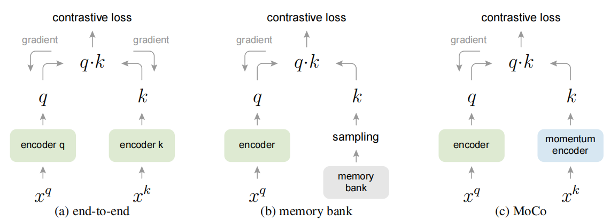

# 对比学习 contrastive learning

先举一些例子：
* 一个查询query和一个文档是不是相关的？
* 两张人脸照片是不是同一个人？
* 一段文本和一张图片是否有对应关系？
* 图片经过变形后产生多张图片，从变形后的图片中任意抽取两张图片，判断这两张图片是否来自同一张图片？
* 一段代码注释文本，和一段代码，两者是不是匹配的？
* 任意两段文本是不是相邻的？


## 一、网络结构
以上这些例子，可以通过一种叫对比学习的思路来解决,与单一的网络结构比，对比学习同时接收2个输入，经过模型后，将两个输出结果做比较。

<br/>
其中，架构中的两个Network可以是同构的(模型、参数完全一致)，叫孪生网络 Siamese networks；也可以是异构的，叫伪孪生网络。

甚至也可以有3个network组成：
<br/>

1. Network可以选择使用MLP,CNN,RNN,Transformers等；
2. Network的输出可以是一个向量表征，也可以是一个标量得分；
3. 两个输出的比较方式，针对标量情况，可以直接比大小；针对向量表征，可以通过计算两个向量之间的相似度比较。

## 二、模型输出是标量得分
计算两个输入的大小得分：经过模型的输出是一个标量得分。

```python
import torch
import torch.nn as nn

class RankNet(nn.Module):
    def __init__(self, num_features,hidden=[256,128]):
        # hidden 的数值为超参数，可通过Gridsearch确定一个合适值
        super(RankNet, self).__init__()
        self.model = nn.Sequential(
            nn.Linear(num_features,hidden[0]), 
            nn.Dropout(0.2), 
            nn.ReLU(),
            nn.Linear(hidden[1], 1))
        self.sigmoid = nn.Sigmoid()

    def forward(self, input1, input2):
        # 训练过程中，接受pair对中的两个向量，通过model获取得分，两个得分差值过sigmoid函数，用于bce计算损失
        s1 = self.model(input1) 
        s2 = self.model(input2)
        diff = s1 - s2  #模型输出为标量，直接计算2者的差值
        prob = self.sigmoid(diff) #根据差值，计算pair对应的label是1，还是0. 二分类问题。
        return prob

    def predict(self, input_):
        # 实际预测得分的时候，只需要输入一个，得到得分即可
        return self.model(input_)

model = RankNet(10)
criterion = nn.BCELoss() #使用bce损失函数

```

* list-wise？

## 三、模型输出是向量表征
输入经过Network后得到一个向量表征，两个向量通过计算距离，比较这对输入是相关(label=1),还是不相关(label=0).

两个向量相似度的比较：
1. 向量距离
* 闵科夫斯基距离(Minkowski distance) $d=(\sum^n_{i=1} |x_i-y_i|^p)^{\frac{1}{p}}$
* p=1, 曼哈顿 $d=\sum^n_{i=1}|x_i-y_i|$, 直角三角形2边
* p=2，欧氏距离 $d = \sqrt{\sum^n_{i=1} |x_i-y_i|^2 }$， 直角三角形的斜边
* p=无穷，切比雪夫距离 $d = max(|x_1-y_1| ,..., |x_n-y_n|)$

2. 点积：

    $V * W = v_1*w_1 + v_2*w_2 + ... + v_n*w_n $

    $ v*w = |a| * |b| * cos(θ) $

    |a|、|b|表示向量的模（长度），θ表示向量a和b之间的夹角

    2个向量的点积越大越相似


<br/>
图片来源：[MoCo: Momentum Contrast for Unsupervised Visual Representation Learning](../paper/cnn/MoCo.md)

三种对比损失机制的概念比较。这三种机制的不同之处在于keys的维护方式和keys编码器的更新方式。 
* (a)：用于计算查询和keys表示的编码器通过反向传播进行端到端更新(两个编码器可以不同)。 
* (b)：key表示是从记忆库中采样的。 
* (c)：MoCo 通过动量更新编码器对新keys进行动态编码，并维护一个keys队列(图中未显示)。大规模训练时的算力节约, 在Moco v3版本中提出，mini-batch足够大的情况下，MoCo这种方式收益减少

InfoNCE loss: 对比损失函数

$L_q = − log \frac{exp(q·k_+/τ ) }{\sum^K_{i=0} exp(q·k_i/τ )}$ 

温度参数 τ ，可学习？

<br/>
视觉表征对比学习的简单框架。 两个独立的数据增广运算符从同一系列扩充（t∼T 和 t'∼T）中采样，并应用于每个数据样本以获得两个相关视图。 基础编码器网络f(·) 和投影头g(·) 被训练以使用对比损失最大化协议。 训练完成后，我们扔掉投影头 g(·) 并使用编码器 f(·) 和表示 h 用于下游任务。


## 四、无监督对比学习
* 图像
* 文本
* 图文

## 五、语义检索
语义检索 ann召回
疑问：双塔模型，query和doc过了模型后产出不一样的向量分布？适合ann召回？
* Pre-trained Language Model for Web-scale Retrieval in Baidu Search 
* Embedding-based Retrieval in Facebook Search

* 人脸识别
* 向量召回

## 对比学习
* 2022.4.14 [Exploring Dual Encoder Architectures for Question Answering](https://arxiv.org/abs/2204.07120)
* 2022.1.24 cpt-txt/code [Text and Code Embeddings by Contrastive Pre-Training](../paper/nlp/cpt-txt.md)
* 2021.4.5 MoCo_v3 [An Empirical Study of Training Self-Supervised Vision Transformers](../paper/vit/MoCo_v3.md)
* 2021.3.26 CLIP [Learning Transferable Visual Models From Natural Language Supervision](../paper/Multimodal/CLIP.md)
* 2021.4.9 [DetCo: Unsupervised Contrastive Learning for Object Detection](../paper/cnn/DetCo.md)
* 2020.11.20 [Exploring Simple Siamese Representation Learning](../paper/cnn/SimSiam.md)
* 2020.3.9 MoCo_v2 [Improved Baselines with Momentum Contrastive Learning](../paper/cnn/MoCo_v2.md)
* 2020.2.13 SimCLR [A Simple Framework for Contrastive Learning of Visual Representations](../paper/cnn/SimCLR.md)
* 2019.11.13 MoCo [Momentum Contrast for Unsupervised Visual Representation Learning](../paper/cnn/MoCo.md)


* Unsupervised feature learning via non-parametric instance discrimination. 温度系数？
* Representation learning with contrastive predictive coding.
* Learning deep representations by mutual information estimation and maximization.
* Local aggregation for unsupervised learning of visual embeddings.
* Data-efficient image recognition with contrastive predictive coding
* Contrastive multiview coding. arXiv:1906.05849
* Learning representations by maximizing mutual information across views. arXiv:1906.00910


最近邻算法

