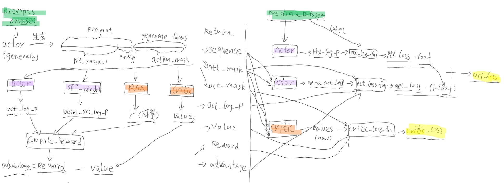

# 生成式语言模型

## 1. 自然语言的预训练方式
在介绍词向量时，我们提到了用于训练词嵌入的三种方法：

* n-gram, 给定前面n个tokens，预测下一个token，
* CBOW, 根据一个token的周边tokens，来预测这个token，像一个完型填空
* skip-gram，根据当前token预测它上下文的tokens

通过上面的三种训练方式，可以得到一个训练好的词嵌入，其中的每个词向量有其特定含义，词向量之间可以通过向量计算来表达某些语言上的概念。

一个词可以用一个向量表示，进一步推广，一段文本同样可以用一个向量来表示。而表征一段文本向量的方式也可以从上面的三种方法中借鉴：
* 以GPT为代表的，输入一段文本，预测下一个token (类似n-gram)；
* 以BERT为代表的，将一段文本的若干个tokens给掩码掉，预测这些被掩码的tokens(类似CBOW).
* 以BART为代表的，使用编码器+解码器的架构

## 2. 生成式预训练模型的胜出
以下是Transformer和基于它之上的预训练模型发展历程:
* [Transformer](../paper/nlp/transformer.md) 2017.6.12
* [GPT-1](../paper/nlp/gpt.md) 2018.6.11
* [BERT](../paper/nlp/bert.md) 2018-10-11
* [GPT-2](../paper/nlp/gpt_2.md) 2019.2.14
* [GPT-3](../paper/nlp/gpt_3.md) 2020.5.28
* [Learning to summarize from human feedback](../paper/nlp/summarize_HF.md) 2020.9.2
* [InstructGPT](../paper/nlp/gpt_InstructGPT.md) 2022.3.4

起初，GPT-1和BERT两条技术路线的差距不大，都还是预训练模型+下游任务微调的思路。而到了GPT-2,论文提出：自然语言提供了一种灵活的方式来将任务、输入和输出指定为单一的序列符号。可以将所有的NLP任务都看成是对单一序列的处理，这样预训练出来的模型将会更通用，下游任务甚至不需要微调就能很好的适配。到了后续的GPT-3更是在预训练大模型的加持下，下游任务无需微调，直接基于提示就能完成。可以说这两篇论文直接拉开了以BERT为代表的完型填空和以GPT为代表的生成式模型的差距。

我们先看下常见的NLP任务，是如何转换成单一语言序列处理的:
* 文本分类中的情感分类，“这件商品包装不错，商品质量很好”，预测Label=1表示褒义，Label=0表示贬义。可以直接转换为 “这件商品包装不错，商品质量很好。这句话是褒义还是贬义？答：褒义”。
* 翻译任务，输入：“I have an apple” ，输出: “我有一个苹果”。 单一序列转换为 "I have an apple. 请将这段英文翻译成中文：我有一个苹果。"
* 问答任务，输入：“小明的爸爸有三个孩子，大儿子叫-欢欢，二儿子叫-喜喜，请问三儿子叫什么？” 输出：“小明”。 单一序列换成：“小明的爸爸有三个孩子，大儿子叫-欢欢，二儿子叫-喜喜，请问三儿子叫什么？答：小明!”.
* 实体提取任务，输入：“2008年，奥运会在北京举办”。输出：“奥运会”,"北京" 。 单一序列转换：“2008年，奥运会在北京举办！请讲上句中的实体提取出来，并用‘|’符号分割，答：奥运会|北京”。

同样，几乎所有的其他NLP任务都可以按照上述的思路进行转换。经过这种形式转换后，对于GPT生成任务来说，都变成了输入是前半段的文本任务说明，要求生成下面的文本这样的任务。从此，自然语言处理(NLP)领域就将告别针对不同任务还要做微调的过程，直接训练出一个通用的大模型，通过给出提示语，就能生成想要的答案。这个是迈向通用人工智能的基础。

当范式迁移到通用大规模预训练模型+提示学习后，新的挑战就变成了,如何收集训练更丰富多样的任务？ 首先，GPT-2，GPT-3不断的扩大训练语料的规模，争取能做到几乎全网覆盖。第二，OpenAI将GPT-3以API的方式提供给普通用户，通过收集普通用户使用API时的真实提示文本，完善训练语料，这种机制叫数据飞轮，用的人越多，数据越丰富，基于此训练迭代的模型就更优秀。

https://github.com/microsoft/DeepSpeed

```python
# GPT 训练时的前馈网络代码。 源：https://github.com/karpathy/minGPT/blob/master/mingpt/model.py
def forward(self, idx, targets=None):
    device = idx.device
    b, t = idx.size()
    assert t <= self.block_size, f"Cannot forward sequence of length {t}, block size is only {self.block_size}"
    pos = torch.arange(0, t, dtype=torch.long, device=device).unsqueeze(0) # shape (1, t)

    # forward the GPT model itself
    tok_emb = self.transformer.wte(idx) # token embeddings of shape (b, t, n_embd)
    pos_emb = self.transformer.wpe(pos) # position embeddings of shape (1, t, n_embd)
    x = self.transformer.drop(tok_emb + pos_emb)
    for block in self.transformer.h:
        x = block(x)
    x = self.transformer.ln_f(x)
    logits = self.lm_head(x)

    # if we are given some desired targets also calculate the loss
    loss = None
    if targets is not None:
        loss = F.cross_entropy(logits.view(-1, logits.size(-1)), targets.view(-1), ignore_index=-1)

    return logits, loss
```

```python
# GPT推理时的 token生成逻辑。 源：https://github.com/karpathy/minGPT/blob/master/mingpt/model.py
@torch.no_grad()
def generate(self, idx, max_new_tokens, temperature=1.0, do_sample=False, top_k=None):
    """
    Take a conditioning sequence of indices idx (LongTensor of shape (b,t)) and complete
    the sequence max_new_tokens times, feeding the predictions back into the model each time.
    Most likely you'll want to make sure to be in model.eval() mode of operation for this.
    """
    for _ in range(max_new_tokens):
        # if the sequence context is growing too long we must crop it at block_size
        idx_cond = idx if idx.size(1) <= self.block_size else idx[:, -self.block_size:]
        # forward the model to get the logits for the index in the sequence
        logits, _ = self(idx_cond)
        # pluck the logits at the final step and scale by desired temperature
        logits = logits[:, -1, :] / temperature
        # optionally crop the logits to only the top k options
        if top_k is not None:
            v, _ = torch.topk(logits, top_k)
            logits[logits < v[:, [-1]]] = -float('Inf')
        # apply softmax to convert logits to (normalized) probabilities
        probs = F.softmax(logits, dim=-1)
        # either sample from the distribution or take the most likely element
        if do_sample:
            idx_next = torch.multinomial(probs, num_samples=1)
        else:
            _, idx_next = torch.topk(probs, k=1, dim=-1)
        # append sampled index to the running sequence and continue
        idx = torch.cat((idx, idx_next), dim=1)

    return idx
```

GPT在实际的推理阶段，token是一个个生成，直到达到指定的长度或者出现结尾标志的token。

## 3 生成内容与人类期望对齐
因为GPT预训练模型的目标只是预测下一个token，而训练语料是基于全网规模的文本语料，所以，它实际生成的内容并不能完全保证是人类想要的。模型一本正经胡说八道，生成带有偏见、歧视内容的情况比较常见。为了解决这些问题，需要引入与人类期望的输出对齐的机制。

一种思路，收集大量高质量的 提示+响应内容 文本对，进行有监督的微调方式。这种方式难点在于这类高质量的数据收集工作的成本很高昂。

另一种思路，给定提示，让模型生成不同的响应内容，人工判断这些响应内容哪个好，哪个不好。模型再根据这些反馈做调整，逐步优化生成效果以实现和人类对齐的意图。 [Learning to summarize from human feedback](../paper/nlp/summarize_HF.md) 和 [InstructGPT](../paper/nlp/gpt_InstructGPT.md)论文中的解决方案如下：

<br/>
图1：InstructGPT的三个步骤：(1)监督微调(SFT)，(2)奖励模型(RM)训练，(3)通过该奖励模型上的近端策略优化(PPO)进行强化学习。蓝色箭头表示该数据用于训练我们的一个模型。在步骤2中，框A-D是我们的模型中的样本，由标注人员进行排名。

### 3.1 第一步，监督微调
比较容易理解，就是普通的fine-tune过程。目前有一种偷懒的方式，拿着chatGPT的提示和生成内容用于自己的模型监督训练，效果很好。监督微调潜力很大，尤其在一些互联网未涵盖的专业领域知识，雇佣专业人才撰写高质量的提示响应内容很重要。

### 3.2 第二步，奖励模型
参考以下开源实现，输入是一段文本(提示+生成内容)，输出是一个得分，用于衡量生成质量的好坏。损失函数有两种实现方式：LogSigLoss和LogExpLoss，拿同一个提示下生成的两个输出得分作比较计算误差值。

以下代码来自：https://github.com/hpcaitech/ColossalAI/tree/main/applications/Chat，chatGPT的开源实现。

```python 
# 源： https://github.com/hpcaitech/ColossalAI/blob/main/applications/Chat/coati/models/base/reward_model.py
class RewardModel(LoRAModule):
    """
    Reward model base class.

    Args:
        model (nn.Module): Reward model.
        value_head (nn.Module): Value head to get reward score.
        lora_rank (int): LoRA rank.
        lora_train_bias (str): LoRA bias training mode.
    """ 
    def __init__(self,
                 model: nn.Module,
                 value_head: Optional[nn.Module] = None,
                 lora_rank: int = 0,
                 lora_train_bias: str = 'none') -> None:
        super().__init__(lora_rank=lora_rank, lora_train_bias=lora_train_bias)
        self.model = model
        self.convert_to_lora()

        if value_head is not None:
            if value_head.out_features != 1:
                raise ValueError("The value head of reward model's output dim should be 1!")
            self.value_head = value_head
        else:
            self.value_head = nn.Linear(model.config.n_embd, 1) # 1,

    def forward(self, sequences: torch.LongTensor, 
            attention_mask: Optional[torch.Tensor] = None) -> torch.Tensor:
        outputs = self.model(sequences, attention_mask=attention_mask)
        last_hidden_states = outputs['last_hidden_state']
        values = self.value_head(last_hidden_states)[:, :-1] #取最优一个token的值
        value = values.mean(dim=1).squeeze(1)    # ensure shape is (Batch) 
        return value

# critic's forward, RLHF中评估模型的forward
class Critic(LoRAModule):
    # 这里把__init__()代码省略，为了重点区分RewardModel和Critic模型的forward()的异同 
    # def __init__(self, ...

    # 注意跟上面RewardModel的做对比，上面的输出形状(Batch), 这个是（Batch,Actions)
    def forward(self, sequences: torch.LongTensor,
            action_mask: Optional[torch.Tensor] = None, #多了这个
            attention_mask: Optional[torch.Tensor] = None) -> torch.Tensor:
        outputs = self.model(sequences, attention_mask=attention_mask)
        last_hidden_states = outputs['last_hidden_state']

        values = self.value_head(last_hidden_states).squeeze(-1)

        if action_mask is not None and self.use_action_mask:
            num_actions = action_mask.size(1)
            prompt_mask = attention_mask[:, :-num_actions]
            values = values[:, :-num_actions]
            value = masked_mean(values, prompt_mask, dim=1)
            return value

        values = values[:, :-1]
        value = values.mean(dim=1)
        return value

# 源： https://github.com/hpcaitech/ColossalAI/tree/main/applications/Chat/coati/models/loss.py
class LogSigLoss(nn.Module):
    """
    Pairwise Loss for Reward Model
    Details: https://arxiv.org/abs/2203.02155 
    Title:   InstructGPT: Training language models to follow instructions with human feedback . 式子-1 的实现
    chosen_reward，人类认为是好的生成；reject_reward，不好的内容
    y = -ln(1/(1+e**(-x))), x=(chosen_reward - reject_reward)
    """
    def forward(self, chosen_reward: torch.Tensor, reject_reward: torch.Tensor) -> torch.Tensor:
        probs = torch.sigmoid(chosen_reward - reject_reward)
        log_probs = torch.log(probs)
        loss = -log_probs.mean()
        return loss

class LogExpLoss(nn.Module):
    """
    Pairwise Loss for Reward Model
    Details: https://arxiv.org/abs/2204.05862
    Title:   Training a Helpful and Harmless Assistant with Reinforcement Learning from Human Feedback
    从函数的形态上看，二者没有任何差别，LogExpLoss是LogSigLoss的简写, https://www.geogebra.org/graphing/ndfwrejz
    y = ln(1 + e**(-x) ),  x=(chosen_reward - reject_reward)
    """
    def forward(self, chosen_reward: torch.Tensor, reject_reward: torch.Tensor) -> torch.Tensor:
        loss = torch.log(1 + torch.exp(reject_reward - chosen_reward)).mean()
        return loss

```

### 3.3 第三步，强化学习
为什么要引入强化学习呢？ 强化学习的使用场景，通常是一个agent连续做多个action后，期望总得分最大。我们可以将GPT每次生成的单个token作为一个action(动作)，所有的token全部生成完后意味着一串连续的actions的结束，评估一个整体的得分。

<br/>
图2：RHLF 流程示意图

#### 3.3.1 整体流程
划重点：
1. PPOTrainer, 生成语言模型被初始化为2类实例：1. actor，RLHF训练过程中，模型参数会更新；2.initial_model，训练过程中参数不会被更新，二者都会提供生成每个tokens（对应RL概念中的actions）的概率值，需要对比二者的差值，计算出参数更新后的actor与initial_model的相对优势。
2. PPOTrainer, 奖励模型 reward_model，训练过程中参数不会被更新，产出的是个标量值, 代表的是一个完整输出的整体奖励得分；critic源自reward_model，但实现上有差异，它返回的是一个向量，即生成的每个tokens(对应RL中的actions概念)的奖励值。详细的差异可以再看看上面代码中RewardModel,Critic的forward()函数。
3. fit -> _make_experience(),  根据prompts，通过生成语言模型, 生成相应的响应输出，以及各种概率分布，奖励得分等。3.3.2节会详细展开内部的代码逻辑。
4. fit -> training_step(), 计算actor和critic的loss，实现梯度更新。3.3.3节会详细展开内部的代码逻辑。

```python
# https://github.com/hpcaitech/ColossalAI/tree/main/applications/Chat/examples/train_prompts.py
trainer = PPOTrainer(
    strategy, # NaiveStrategy()| DDPStrategy | ColossalAIStrategy 可选
    actor, # GPTActor(pretrained=args.pretrain, ...)  args.pretrain,同初始模型
    critic, # GPTCritic(pretrained=args.rm_pretrain, ...)，评估，采用奖励模型初始化
    reward_model,  # GPTRM(pretrained=args.rm_pretrain) 奖励模型 
    initial_model, # GPTActor(pretrained=args.pretrain) 初始模型 
    actor_optim, # 优化器
    critic_optim,
    kl_coef=args.kl_coef, # KL散度系数
    ptx_coef=args.ptx_coef, # 为防止模型在基础通用任务上退化，考虑预训练的预测token的损失值权重
    max_epochs=args.max_epochs,
    train_batch_size=args.train_batch_size,
    max_length=args.max_seq_len, #最大输出token数量
    use_cache=True,
    do_sample=True,
    temperature=1.0,  #生成时的温度设置，越高，生成token的随机性越高
    top_k=50,  # token概率值,最优可能的top_k个
    pad_token_id=tokenizer.pad_token_id, #填充token
    eos_token_id=tokenizer.eos_token_id, #结尾token
)

trainer.fit(prompt_dataloader=prompt_dataloader, #prompt数据集
    pretrain_dataloader=pretrain_dataloader, #预训练的数据集，过gpt模型获取原始任务(预测下一个token)产生的loss,用于防止退化。
    num_episodes=args.num_episodes,
    max_timesteps=args.max_timesteps,
    update_timesteps=args.update_timesteps)

# trainer.fit() 展开，部分工程代码被省略
# https://github.com/hpcaitech/ColossalAI/tree/main/applications/Chat/coati/trainer/ppo.py
for episode in range(num_episodes): #迭代周期
    # 每个周期最大迭代次数
    for timestep in tqdm(range(max_timesteps),  
                            desc=f'Episode [{episode+1}/{num_episodes}]',
                            disable=not is_rank_0()):
        time += 1
        prompts = next(iter(self.prompt_dataloader)) # 遍历prompt数据集
        experience = self._make_experience(prompts) # 根据prompts，过GPT语言模型, 生成对应的输出.
        self.replay_buffer.append(experience)
        if time % update_timesteps == 0: # 小批次的
            self._learn() # 梯度更新
            self.replay_buffer.clear()

# _learn展开，同样干掉一些与主体逻辑无关的工程代码
def _learn(self):
    if self.sample_replay_buffer: 
        for _ in self.max_epochs:
            experience = self.replay_buffer.sample()  # 抽样 
            metrics = self.training_step(experience) # training_step
    else:
        # replay buffer may be empty at first, we should rebuild at each training
        dataloader = self.strategy.setup_dataloader(self.replay_buffer, self.dataloader_pin_memory)
        for epoch in range(self.max_epochs):
            pbar = tqdm(dataloader, desc=f'Train epoch [{epoch+1}/{self.max_epochs}]', disable=not is_rank_0())
            for experience in pbar:
                metrics = self.training_step(experience) #
                pbar.set_postfix(metrics) 
```


#### 3.3.2 _make_experience() 展开
根据prompts，通过生成语言模型actor, 生成相应的响应输出。根据生成内容，计算actor,initial_model对应的action的概率分布；
根据reward_model计算整体奖励得分，以及根据critic计算每个action的平均得分。

```python
# 源： https://github.com/hpcaitech/ColossalAI/tree/main/applications/Chat/coati/experience_maker/naive.py
def make_experience(self, input_ids: torch.Tensor, **generate_kwargs) -> Experience:
    self.actor.eval()
    self.critic.eval()
    self.initial_model.eval()
    self.reward_model.eval()

    # 使用actor生成输出
    # https://github.com/hpcaitech/ColossalAI/tree/main/applications/Chat/coati/models/generation.py
    # sequencess: prompt + 生成 的 token ids
    # attention_mask: 非pad_token_id的
    # action_mask: 生成的、非eos的token
    sequences, attention_mask, action_mask = generate_with_actor(self.actor,
                                                    input_ids,
                                                    return_action_mask=True,
                                                    **generate_kwargs)
    num_actions = action_mask.size(1)

    # 计算actor的得分
    actor_output = self.actor(sequences, attention_mask)
    action_log_probs = calc_action_log_probs(actor_output, sequences, num_actions) 

    # 计算初始模型的得分, 与self.actor不一样，初始模型在RL期间参数不更新，
    base_model_output = self.initial_model(sequences, attention_mask)
    base_action_log_probs = calc_action_log_probs(base_model_output, sequences, num_actions) 
    
    # 过奖励模型，获得奖励分数(标量，shape is (Batch))。
    # 与self.critic不一样，初始的奖励模型在RL期间参数不更新
    r = self.reward_model(sequences, attention_mask)
    reward = compute_reward(r, self.kl_coef, action_log_probs, base_action_log_probs, action_mask=action_mask)

    # 评估模型的value值 shape is (Batch,num_actions)
    value = self.critic(sequences, action_mask, attention_mask)

    advantage = reward - value # 初始的奖励模型得分 - RL中评估模型的得分

    # TODO(ver217): maybe normalize adv
    if advantage.ndim == 1:
        advantage = advantage.unsqueeze(-1)

    return Experience(sequences, action_log_probs, value, reward, advantage, attention_mask, action_mask)

# https://github.com/hpcaitech/ColossalAI/tree/main/applications/Chat/coati/models/utils.py
def log_probs_from_logits(logits: torch.Tensor, labels: torch.Tensor) -> torch.Tensor:
    log_probs = F.log_softmax(logits, dim=-1)
    log_probs_labels = log_probs.gather(dim=-1, index=labels.unsqueeze(-1))
    return log_probs_labels.squeeze(-1)

def calc_action_log_probs(output: torch.Tensor,
                          sequences: torch.LongTensor,
                          num_actions: int
                          ) -> torch.Tensor:
    """Calculate action log probs.

    Args:
        output (torch.Tensor): Output tensor of Actor.forward.
        sequences (torch.LongTensor): Input sequences.
        num_actions (int): Number of actions.

    Returns:
        torch.Tensor: Action log probs.
    """
    logits = output['logits']
    log_probs = log_probs_from_logits(logits[:, :-1, :], sequences[:, 1:])
    return log_probs[:, -num_actions:]

def masked_mean(tensor: torch.Tensor, mask: torch.Tensor, dim: int = 1) -> torch.Tensor:
    tensor = tensor * mask
    tensor = tensor.sum(dim=dim)
    mask_sum = mask.sum(dim=dim)
    mean = tensor / (mask_sum + 1e-8)
    return mean

def compute_approx_kl(log_probs: torch.Tensor,
                      log_probs_base: torch.Tensor,
                      action_mask: Optional[torch.Tensor] = None) -> torch.Tensor:
    """
    Compute the approximate KL divergence between two distributions.
    Schulman blog: http://joschu.net/blog/kl-approx.html 
    文中提到的三种求KL散度函数直观表示 https://www.geogebra.org/graphing/eu9dufhd

    Args:
        log_probs: Log probabilities of the new distribution.
        log_probs_base: Log probabilities of the base distribution.
        action_mask: Mask for actions.
    """

    log_ratio = log_probs - log_probs_base
    approx_kl = (log_ratio.exp() - 1) - log_ratio
    if action_mask is not None:
        approx_kl = masked_mean(approx_kl, action_mask, dim=1)
        return approx_kl
    approx_kl = approx_kl.mean(dim=1)
    return approx_kl


def compute_reward(r: Union[torch.Tensor, float],
                   kl_coef: float,
                   log_probs: torch.Tensor,
                   log_probs_base: torch.Tensor,
                   action_mask: Optional[torch.Tensor] = None) -> torch.Tensor:
    if kl_coef <= 0.0:
        return r
    # 计算actor产生的actions概率分布，相对于基础模型(RL过程中参数不更新)产生的分布之间的KL散度
    kl = compute_approx_kl(log_probs, log_probs_base, action_mask=action_mask)
    # 由于actor在RL过程中有更新，原始的奖励值需要扣除这部分变化带来的额外奖励值，得到最终的奖励值
    reward = r - kl_coef * kl
    return reward

```

#### 3.3.3 training_step()展开
计算actor和critic的损失值。

```python
def training_step(self, experience: Experience) -> Dict[str, float]:
    self.actor.train()
    self.critic.train()

    # policy loss
    num_actions = experience.action_mask.size(1)
    actor_output = self.actor(experience.sequences, attention_mask=experience.attention_mask)
    action_log_probs = calc_action_log_probs(actor_output, experience.sequences, num_actions)
    # actor_loss_fn = PolicyLoss()
    actor_loss = self.actor_loss_fn(action_log_probs, #new
                                    experience.action_log_probs, #old
                                    experience.advantages,
                                    action_mask=experience.action_mask)

    # ptx loss
    if self.ptx_coef != 0:
        batch = next(iter(self.pretrain_dataloader)) #预训练数据，防止基础能力倒退
        batch = to_device(batch, self.device)
        ptx_log_probs = self.actor(batch['input_ids'],
                                    attention_mask=batch['attention_mask'])['logits']
        # ptx_loss_fn = GPTLMLoss()
        ptx_loss = self.ptx_loss_fn(ptx_log_probs, batch['labels'])
        actor_loss = ptx_loss * self.ptx_coef + actor_loss * (1 - self.ptx_coef)

    self.strategy.backward(actor_loss, self.actor, self.actor_optim)
    self.strategy.optimizer_step(self.actor_optim)
    self.actor_optim.zero_grad()

    # value loss
    values = self.critic(experience.sequences,
                            action_mask=experience.action_mask,
                            attention_mask=experience.attention_mask)
    # critic_loss_fn = ValueLoss()
    critic_loss = self.critic_loss_fn(values, #new
                                        experience.values, #old
                                        experience.reward,
                                        action_mask=experience.action_mask)
    critic_loss = critic_loss * self.vf_coef

    self.strategy.backward(critic_loss, self.critic, self.critic_optim)
    self.strategy.optimizer_step(self.critic_optim)
    self.critic_optim.zero_grad()

    return {'reward': experience.reward.mean().item()}

# 源： https://github.com/hpcaitech/ColossalAI/tree/main/applications/Chat/coati/models/loss.py

# ptx_loss_fn
class GPTLMLoss(nn.Module):
    """
    GPT Language Model Loss  
    """
    def __init__(self):
        super().__init__()
        self.loss = nn.CrossEntropyLoss()

    def forward(self, logits: torch.Tensor, labels: torch.Tensor) -> torch.Tensor:
        shift_logits = logits[..., :-1, :].contiguous()
        shift_labels = labels[..., 1:].contiguous()
        # Flatten the tokens
        return self.loss(shift_logits.view(-1, shift_logits.size(-1)), shift_labels.view(-1))

# actor_loss_fn
class PolicyLoss(nn.Module):
    """
    Policy Loss for PPO
    """
    def __init__(self, clip_eps: float = 0.2) -> None:
        super().__init__()
        self.clip_eps = clip_eps

    def forward(self,
                log_probs: torch.Tensor,
                old_log_probs: torch.Tensor,
                advantages: torch.Tensor,
                action_mask: Optional[torch.Tensor] = None) -> torch.Tensor:
        ratio = (log_probs - old_log_probs).exp()
        surr1 = ratio * advantages # kl散度
        surr2 = ratio.clamp(1 - self.clip_eps, 1 + self.clip_eps) * advantages #梯度剪裁
        loss = -torch.min(surr1, surr2) #取二者最小的
        if action_mask is not None:
            loss = masked_mean(loss, action_mask)
        loss = loss.mean()
        return loss

# critic_loss_fn
class ValueLoss(nn.Module):
    """
    Value Loss for PPO
    """
    def __init__(self, clip_eps: float = 0.4) -> None:
        super().__init__()
        self.clip_eps = clip_eps #

    def forward(self,
                values: torch.Tensor, #新值，评估模型Critic给出
                old_values: torch.Tensor, # 旧值
                reward: torch.Tensor, # RewardModel给出的奖励值
                action_mask: Optional[torch.Tensor] = None) -> torch.Tensor:
        # 用各种手段保证每次更新的梯度不要太大
        # clamp：y_i = min(max(x_i,min_value_i),max_value_i), 把x固定在[min,max]之间
        values_clipped = old_values + (values - old_values).clamp(-self.clip_eps, self.clip_eps)
        surr1 = (values_clipped - reward)**2
        surr2 = (values - reward)**2
        loss = torch.max(surr1, surr2)
        loss = loss.mean()
        return 0.5 * loss

```


