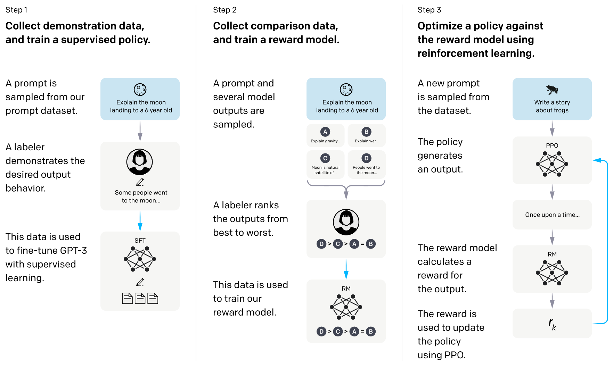

# 生成式

## 1 自然语言的预训练方式
在介绍词向量时，我们提到了用于训练词嵌入的三种方法：

* n-gram, 给定前面n个tokens，预测下一个token，
* CBOW, 根据一个token的周边tokens，来预测这个token，像一个完型填空
* skip-gram，根据当前token预测它上下文的tokens

通过上面的三种训练方式，可以得到一个训练好的词嵌入矩阵，其中的每个词向量有其特定含义，词向量之间可以通过向量计算来表达某些语言上的概念。

一个词可以用一个向量表示，进一步推广，一段文本同样可以用一个向量来表示。而表征一段文本向量的方式也可以从上面的三种方法中借鉴：
* 以GPT为代表的，输入一段文本，预测下一个token (类似n-gram)；
* 以BERT为代表的，将一段文本的若干个tokens给掩码掉，预测这些被掩码的tokens(类似CBOW).

## 2 生成式预训练模型的胜出
以下是Transformer和基于它之上的预训练模型发展历程:
* [Transformer](../paper/nlp/transformer.md) 2017.6.12
* [GPT-1](../paper/nlp/gpt.md) 2018.6.11
* [BERT](../paper/nlp/bert.md) 2018-10-11
* [GPT-2](../paper/nlp/gpt_2.md) 2019.2.14
* [GPT-3](../paper/nlp/gpt_3.md) 2020.5.28
* [InstructGPT](../paper/nlp/gpt_InstructGPT.md) 2022.3.4

起初，GPT-1和BERT两条技术路线的差距不大，都还是预训练模型+下游任务微调的思路。而到了GPT-2,论文提出：自然语言提供了一种灵活的方式来将任务、输入和输出指定为单一的序列符号。可以将所有的NLP任务都看成是对单一序列的处理，这样预训练出来的模型将会更通用，下游任务甚至不需要微调就能很好的适配。到了后续的GPT-3更是在预训练大模型的加持下，下游任务无需微调，直接基于提示就能完成。可以说这两篇论文直接拉开了以BERT为代表的完型填空和以GPT为代表的生成式模型的差距。

我们先看下常见的NLP任务，是如何转换成单一语言序列处理的:
* 文本分类中的情感分类，“这件商品包装不错，商品质量很好”，预测Label=1表示褒义，Label=0表示贬义。可以直接转换为 “这件商品包装不错，商品质量很好。这句话是褒义还是贬义？答：褒义”。
* 翻译任务，输入：“I have an apple” ，输出: “我有一个苹果”。 单一序列转换为 "I have an apple. 请将这段英文翻译成中文：我有一个苹果。"
* 问答任务，输入：“小明的爸爸有三个孩子，大儿子叫-欢欢，二儿子叫-喜喜，请问三儿子叫什么？” 输出：“小明”。 单一序列换成：“小明的爸爸有三个孩子，大儿子叫-欢欢，二儿子叫-喜喜，请问三儿子叫什么？答：小明!”.
* 实体提取任务，输入：“2008年，奥运会在北京举办”。输出：“奥运会”,"北京" 。 单一序列转换：“2008年，奥运会在北京举办！请讲上句中的实体提取出来，并用‘|’符号分割，答：奥运会|北京”。

同样，几乎所有的其他NLP任务都可以按照上述的思路进行转换。经过这种形式转换后，对于GPT生成任务来说，都变成了输入是前半段的文本任务说明，要求生成下面的文本这样的任务。从此，自然语言处理(NLP)领域就将告别针对不同任务还要做微调的过程，直接训练出一个通用的大模型，通过给出提示语，就能生成想要的答案。这个是迈向通用人工智能的基础。

当范式迁移到通用大规模预训练模型+提示学习后，新的挑战就变成了,如何收集训练更丰富多样的任务？ 首先，GPT-2，GPT-3不断的扩大训练语料的规模，争取能做到几乎全网覆盖。第二，OpenAI将GPT-3以API的方式提供给普通用户，通过收集普通用户使用API时的真实提示文本，完善训练语料，这种机制叫数据飞轮，用的人越多，数据越丰富，基于此训练迭代的模型就更优秀。


```python
# GPT 训练时的前馈网络代码。 源：https://github.com/karpathy/minGPT/blob/master/mingpt/model.py
def forward(self, idx, targets=None):
    device = idx.device
    b, t = idx.size()
    assert t <= self.block_size, f"Cannot forward sequence of length {t}, block size is only {self.block_size}"
    pos = torch.arange(0, t, dtype=torch.long, device=device).unsqueeze(0) # shape (1, t)

    # forward the GPT model itself
    tok_emb = self.transformer.wte(idx) # token embeddings of shape (b, t, n_embd)
    pos_emb = self.transformer.wpe(pos) # position embeddings of shape (1, t, n_embd)
    x = self.transformer.drop(tok_emb + pos_emb)
    for block in self.transformer.h:
        x = block(x)
    x = self.transformer.ln_f(x)
    logits = self.lm_head(x)

    # if we are given some desired targets also calculate the loss
    loss = None
    if targets is not None:
        loss = F.cross_entropy(logits.view(-1, logits.size(-1)), targets.view(-1), ignore_index=-1)

    return logits, loss
```

```python
# GPT推理时的 token生成逻辑。 源：https://github.com/karpathy/minGPT/blob/master/mingpt/model.py
@torch.no_grad()
def generate(self, idx, max_new_tokens, temperature=1.0, do_sample=False, top_k=None):
    """
    Take a conditioning sequence of indices idx (LongTensor of shape (b,t)) and complete
    the sequence max_new_tokens times, feeding the predictions back into the model each time.
    Most likely you'll want to make sure to be in model.eval() mode of operation for this.
    """
    for _ in range(max_new_tokens):
        # if the sequence context is growing too long we must crop it at block_size
        idx_cond = idx if idx.size(1) <= self.block_size else idx[:, -self.block_size:]
        # forward the model to get the logits for the index in the sequence
        logits, _ = self(idx_cond)
        # pluck the logits at the final step and scale by desired temperature
        logits = logits[:, -1, :] / temperature
        # optionally crop the logits to only the top k options
        if top_k is not None:
            v, _ = torch.topk(logits, top_k)
            logits[logits < v[:, [-1]]] = -float('Inf')
        # apply softmax to convert logits to (normalized) probabilities
        probs = F.softmax(logits, dim=-1)
        # either sample from the distribution or take the most likely element
        if do_sample:
            idx_next = torch.multinomial(probs, num_samples=1)
        else:
            _, idx_next = torch.topk(probs, k=1, dim=-1)
        # append sampled index to the running sequence and continue
        idx = torch.cat((idx, idx_next), dim=1)

    return idx
```

GPT在实际的推理阶段，token是一个个生成，直到达到指定的长度或者出现结尾标志的token。

## 3 生成内容与人类期望对齐
早期的GPT-3生成的内容会出现一本正经胡说八道，有偏见、歧视的内容，为了解决这些问题，需要引入与人类期望的输出对齐的机制：对于同样的提示语下生成的内容，需要引入人类判断，那个好那个不好，根据这个信号再指导优化模型。

[Learning to summarize from human feedback](../paper/nlp/summarize_HF.md) 和 [InstructGPT](../paper/nlp/gpt_InstructGPT.md)论文中提出的解决方案如下：

<br/>
图1：InstructGPT的三个步骤：(1)监督微调(SFT)，(2)奖励模型(RM)训练，(3)通过该奖励模型上的近端策略优化(PPO)进行强化学习。蓝色箭头表示该数据用于训练我们的一个模型。在步骤2中，框A-D是我们的模型中的样本，由标注人员进行排名。

第一步的监督微调，比较容易理解，就是普通的finetune过程。

第二步的奖励模型，参考以下开源实现，输入是一段文本，输出是一个得分，损失函数有两种实现方式：LogSigLoss和LogExpLoss，分别拿两个输出得分作比较计算误差值。

```python
# 源： https://github.com/hpcaitech/ColossalAI/tree/main/applications/Chat
class RewardModel(LoRAModule):
    """
    Reward model base class.

    Args:
        model (nn.Module): Reward model.
        value_head (nn.Module): Value head to get reward score.
        lora_rank (int): LoRA rank.
        lora_train_bias (str): LoRA bias training mode.
    """ 
    def __init__(self,
                 model: nn.Module,
                 value_head: Optional[nn.Module] = None,
                 lora_rank: int = 0,
                 lora_train_bias: str = 'none') -> None:
        super().__init__(lora_rank=lora_rank, lora_train_bias=lora_train_bias)
        self.model = model
        self.convert_to_lora()

        if value_head is not None:
            if value_head.out_features != 1:
                raise ValueError("The value head of reward model's output dim should be 1!")
            self.value_head = value_head
        else:
            self.value_head = nn.Linear(model.config.n_embd, 1)

    def forward(self, sequences: torch.LongTensor, attention_mask: Optional[torch.Tensor] = None) -> torch.Tensor:
        outputs = self.model(sequences, attention_mask=attention_mask)
        last_hidden_states = outputs['last_hidden_state']
        values = self.value_head(last_hidden_states)[:, :-1]
        value = values.mean(dim=1).squeeze(1)    # ensure shape is (B)
        return value

class LogSigLoss(nn.Module):
    """
    Pairwise Loss for Reward Model
    Details: https://arxiv.org/abs/2203.02155
    """

    def forward(self, chosen_reward: torch.Tensor, reject_reward: torch.Tensor) -> torch.Tensor:
        probs = torch.sigmoid(chosen_reward - reject_reward)
        log_probs = torch.log(probs)
        loss = -log_probs.mean()
        return loss

class LogExpLoss(nn.Module):
    """
    Pairwise Loss for Reward Model
    Details: https://arxiv.org/abs/2204.05862
    """

    def forward(self, chosen_reward: torch.Tensor, reject_reward: torch.Tensor) -> torch.Tensor:
        loss = torch.log(1 + torch.exp(reject_reward - chosen_reward)).mean()
        return loss

```

第三步引入了强化学习，显得有点特别。为什么要引入强化学习呢？ 强化学习的使用场景，通常是一个agent连续做多个动作后，期望总得分最大。而我们可以将GPT每次生成的单个token作为一个动作，所有的token全部生成完后，评估一个整体的得分。


