# Transformer 

无论原始论文，还是很多给新手的讲解文章，介绍Transformer都是从整体架构到局部组件一一展开来讲，这个流程非常正确，我完全赞同。 但在这篇文章中，我想换个思路，从Transformer最核心的概念讲起，核心关键点突破后，其他架构部分理解起来也就相对容易些了。 

在正式开讲前，我们先思考一下，人类是如何理解一段话的？ 

例如，看下面这段对话，
* 领导：你这是什么意思？ 
* 小明：没什么意思，意思意思。
* 领导：你这就不够意思了。
* 小明：小意思、小意思。
* 领导：你这人真有意思。
* 小明：其实没别的意思。 
* 领导：那我就不好意思了。
* 小明：是我不好意思。 

同样一个词“意思”，在不同的语境中，存在不同的意思。

又例如，我们来看 “无线电法国别研究” 这句文本该怎么断句，是 “无线电法” “国别研究”，还是 “无线电” “法国” “别研究” ？ 字与字的不同组合会带来不同的含义。 

上面的两个例子表明，要理解一句话的真正含义，需要结合语境，需要考虑不同字词组合，需要考虑哪些词是重点，哪些不是重点，等等。而如果让机器去理解语言的含义，通常我们也需要这样做。目前非常成功的Transfomer架构里的self-attention机制原理就与此类似：将句子中的每一个语义单元(字、词或其他粒度形式)分别与其他语义单元比较，看二者的关系是否紧密(是否相关)，确定每个语义单元对于表达整句文本的重要程度，最终确定一句话的含义。

## 1. 自注意力 self-attention
为了直观的理解自注意力机制，我们将一句话中所有的语义单元(字)即作为行，也作为列，形成一个二维表格，也可以看作是一个矩阵：

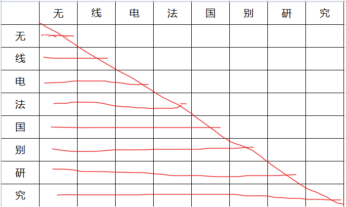<br/>
图1：注意力矩阵。

我们把左侧第一列的字(token)当作要查询的Query，右侧每一列表示一句话中被查询的所有其他(也可以包含query本身)字，称之为Keys, 我们需要某种机制用来计算每对query-key的相关(紧密)程度。当计算完每对query-key的相关程度后，将所有query-key对文本语义的贡献度看成一个整体值=1的话，需要将每对(表中的单元格)的概率值计算出来，并保证所有单个概率值的和等于1. 这个通常采用softmax函数实现。

在计算Query-keys的相关(紧密)程度时，有两种选择：1. 当前Query的前、后位置的keys都查询比对，这种叫做双向模式； 2. 只查询当前query位置前的keys，这种叫单向模式，因为看不到后面的keys，类似只知道事情的起因，不知道事情的结果，因此又叫因果模式。

计算出的每对query-key的相关度，实际上也可以看成这组pair对整个句子语义的权重贡献度。每个字词本身也是一个向量，权重矩阵乘以这个词向量的矩阵，就能表达出整句的含义。

这种机制称之为：自注意力(self-attention)机制，其数学表达式：

$ Attention(Q,K,V) = softmax( \frac{Q*K^T}{\sqrt{d_k}} ) * V $

这个式子需要解释的地方：
1. Q,K,V实际上并不是原始的Token向量构成的矩阵，而是需要经过一个线性投影得到一个新的矩阵；
2. $Q*K^T$, 表示为两组向量(构成的矩阵)的点乘(积)，[点积的几何意义可以衡量两个向量的距离远近](../mathematics/vectors_distance.md)。因此，可以用它衡量query和key的相关程度。
3. $d_k$表示，K向量的维度，通常等于token向量的维度。原论文中说如果不用这个$d_k$值缩小点积，过softmax会得到一个区分度较小的值，不利于反向传播中的参数梯度更新。
4. 如果要实现因果注意力，则K右上角的值通常会设置为−∞。这样在做$Q*K^T$运算时，这部分的结果都等于0.
 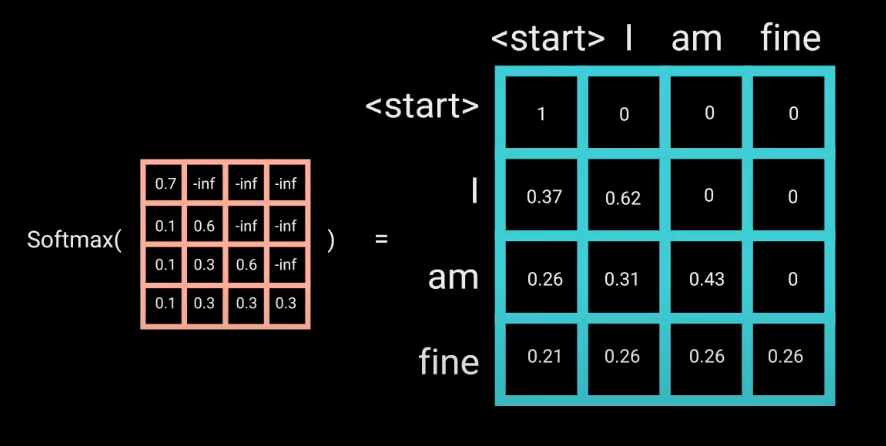<br/>
图2： 因果注意力中的掩码机制，图源：https://wmathor.com/index.php/archives/1438/ 

### 1.1 多头自注意力
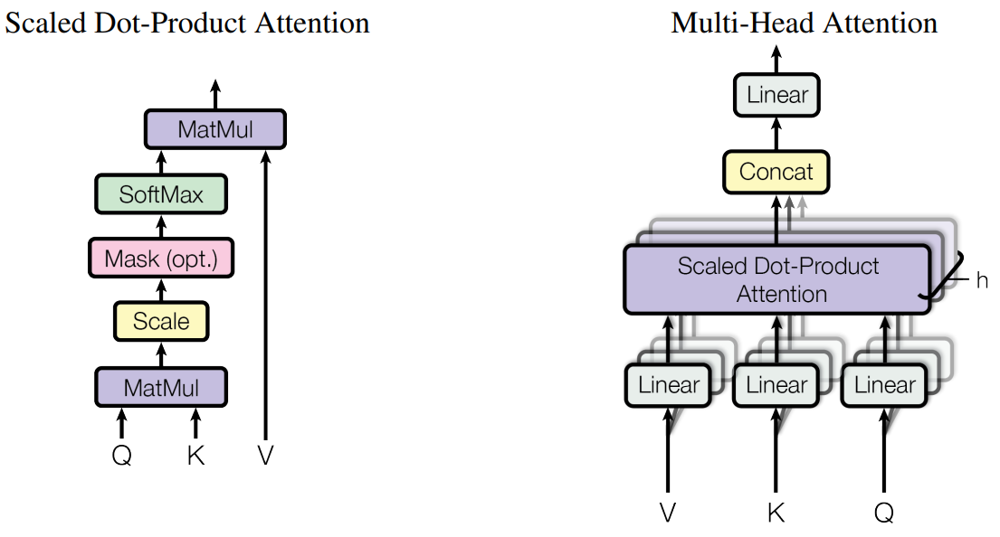 <br/>
图3：自注意力机制和多头自注意力机制。

假设原始的词向量为512维，原始论文中提到，将这512维的向量拆成8组，每组的向量维度则变成了64维，将拆分后的每组分别过$softmax( \frac{Q*K^T}{\sqrt{d_k}} ) * V $，最终再将拆分后的值合回到512维上。 有点让每个分组去关注向量的局部子空间的意思。实验效果表明这种多头注意力机制效果会更好些。

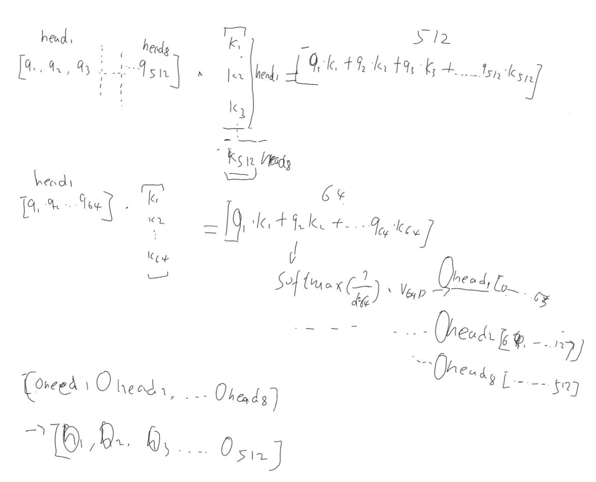<br/>
图4：多头自注意力的计算过程

在后续发表的视觉Transfomer论文中有一张图，能说明多头注意力的作用：
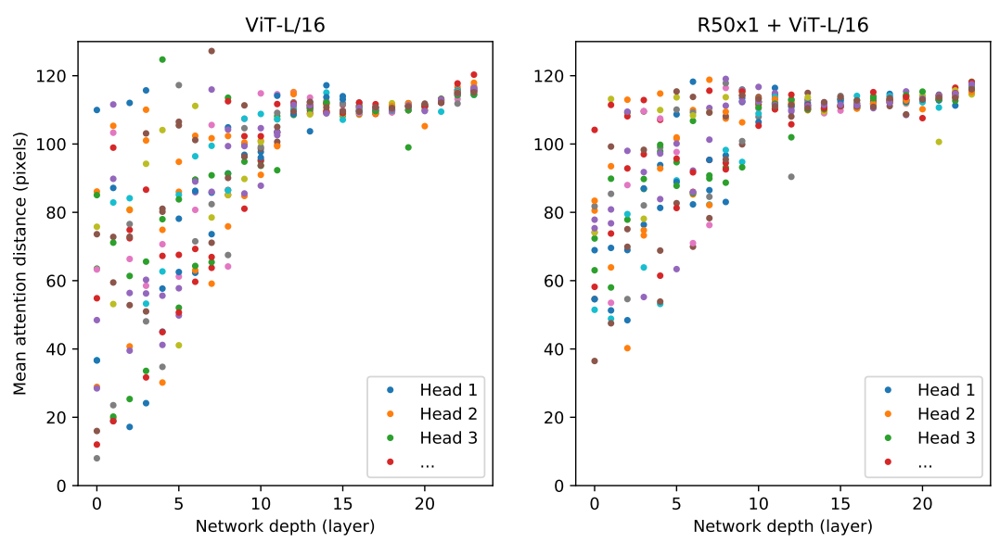<br/>
图5: 不同层的注意力权重所跨越的平均距离。在较低层中，头部的平均注意力距离是高度可变的，一些头部关注图像的大部分，而其他头部关注查询位置或查询位置附近的小区域。随着深度的增加，所有头部的注意力距离都会增加。在网络的后半部分，大多数的头(heads)通过令牌广泛参与。

### 1.2 Multi-head attention的代码实现：
这段代码来自：https://github.com/karpathy/minGPT ，特别适合初学者理解GPT。也可以结合pytorch的官网实现([MultiheadAttention](https://pytorch.org/docs/stable/generated/torch.nn.MultiheadAttention.html))对比着看看。 


```python
# 代码来自：https://github.com/karpathy/minGPT/blob/master/mingpt/model.py
class MultiheadAttention(nn.Module):
    """ 多头掩码自注意力 multi-head self-attention，pytorch官方实现：torch.nn.MultiheadAttention
    """
    def __init__(self, config):
        super().__init__()
        assert config.n_embd % config.n_head == 0
        # key, query, value projections for all heads, but in a batch
        self.c_attn = nn.Linear(config.n_embd, 3 * config.n_embd)
        # output projection
        self.c_proj = nn.Linear(config.n_embd, config.n_embd)
        # regularization
        self.attn_dropout = nn.Dropout(config.attn_pdrop)
        self.resid_dropout = nn.Dropout(config.resid_pdrop)
        # causal mask to ensure that attention is only applied to the left in the input sequence 结合 图-2 理解
        self.register_buffer("bias", torch.tril(torch.ones(config.block_size, config.block_size))
                                     .view(1, 1, config.block_size, config.block_size))
        self.n_head = config.n_head #head的数量
        self.n_embd = config.n_embd #词嵌入的维度

    def forward(self, x, is_causal=True):
        B, T, C = x.size() # batch size, sequence length, embedding dimensionality (n_embd)

        # calculate query, key, values for all heads in batch and move head forward to be the batch dim
        q, k ,v  = self.c_attn(x).split(self.n_embd, dim=2)
        k = k.view(B, T, self.n_head, C // self.n_head).transpose(1, 2) # (B, nh, T, hs)
        q = q.view(B, T, self.n_head, C // self.n_head).transpose(1, 2) # (B, nh, T, hs)
        v = v.view(B, T, self.n_head, C // self.n_head).transpose(1, 2) # (B, nh, T, hs)

        # causal self-attention; Self-attend: (B, nh, T, hs) x (B, nh, hs, T) -> (B, nh, T, T)
        att = (q @ k.transpose(-2, -1)) * (1.0 / math.sqrt(k.size(-1)))
        if is_causal: #因果注意力下，右上角部分填充 负无穷，以保证过softmax后对应值为0. 结合图2理解
            att = att.masked_fill(self.bias[:,:,:T,:T] == 0, float('-inf'))
        att = F.softmax(att, dim=-1)
        att = self.attn_dropout(att)
        y = att @ v # (B, nh, T, T) x (B, nh, T, hs) -> (B, nh, T, hs)
        y = y.transpose(1, 2).contiguous().view(B, T, C) # re-assemble all head outputs side by side

        # output projection
        y = self.resid_dropout(self.c_proj(y))
        return y
```

代码中用到的Dropout是一种[正则化方法](./regularization.md)，随机丢到一定比例的线性投影。


## 2. 基础的Block
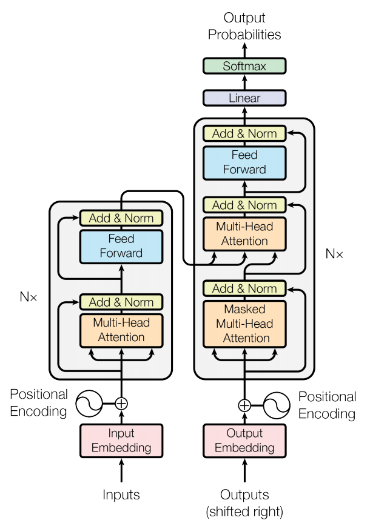<br/>
图6：Transformer的整体架构。图中"Nx"部分为基础Block。

了解了self-attention机制后，我们再来看基础Block的构成组件，它们是： Multi-Head attention(多头注意力)，LayerNorm(层归一化)，Add(残差连接)，FeedFoward(两层全连接前馈网络,线性->激活->线性)。

### 2.1 层归一化 LayerNorm 
归一化的公式：

$ y = \frac{x - E[x]}{\sqrt{Var[x] + ϵ }} ∗ γ + β  $

其中E[x]表示均值，Var[x]表示方差，ϵ是为了防止分母为0的一个常数， γ 和 β 是分别要学习的参数。


根据要归一化的对象不同，有不同的归一化策略，例如常见的BatchNorm 和 Transfomer用到的 LayerNorm: 

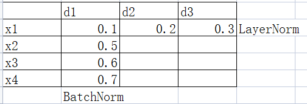<br/>
图7：BatchNorm 和 LayerNorm. 将一个向量的所有维度放在一起做归一化处理的叫LayerNorm; 将一批向量按某一维度值处理，叫BatchNorm。

pytorch的LayerNorm:
https://pytorch.org/docs/stable/generated/torch.nn.LayerNorm.html


<br/>
图8：MAGNETO Block示意图。  

LayerNorm的使用: [原始论文](../paper/nlp/transformer.md)、[BERT](../paper/nlp/bert.md)、NMT/[BART](../paper/nlp/BART.md)中LN是在多头注意力，FFN的后面, 即Post-LN; 而[GPT](../paper/nlp/gpt.md),[ViT](../paper/vit/ViT.md)等是在多头注意力，FFN的前面，即Pre-LN。

而在[MAGNETO](../paper/Multimodal/MAGNETO.md)中，多头注意力后加入了一层LN，FFN中激活函数后加了一层LN。这种方式在适应多模输入、训练时的稳定性，以及实际效果方面都比较有优势。


### 2.2 FeedFoward
是两层的MLP，这里的中间隐藏层的维度是词向量维度的4倍，各种论文中会对中间层不同维度大小做实验。

两层MLP之间的[激活函数](./Activation.md)使用了NewGELU,参考下面的代码实现。

另外在稀疏专家模型或多模态领域的论文中，结合路由机制，不同的token会指向不同的FeedWard层。后续再开一篇详细讲解。

### 2.3 残差连接
两处用到残差连接，一处是原始输入和经过layernorm+attention后； 另一处是mlpfeedword前后。

残差概念最早是在[Resnet](../paper/cnn/resnet.md)中提出，主要目的是给梯度传播提供一条额外的路径，在深层模型结构中，有助于更好的梯度传播，减少梯度消失的情况，加速收敛，提升训练时期的稳定性。

看很多transformer相关度论文，没有实验跨block的残差连接效果, 为何？

### 2.4 Block代码

```python
# 代码来自：https://github.com/karpathy/minGPT/blob/master/mingpt/model.py
class Block(nn.Module):
    """ an unassuming Transformer block """
    def __init__(self, config):
        super().__init__()
        self.ln_1 = nn.LayerNorm(config.n_embd)
        self.attn = MultiheadAttention(config) 
        self.ln_2 = nn.LayerNorm(config.n_embd)
        # FeedFoward
        self.mlp = nn.ModuleDict(dict(
            c_fc    = nn.Linear(config.n_embd, 4 * config.n_embd), #两层的MLP，隐藏层维度n_embd*4
            c_proj  = nn.Linear(4 * config.n_embd, config.n_embd),
            act     = NewGELU(),  #第一层线性函数后的激活函数
            dropout = nn.Dropout(config.resid_pdrop),
        ))
        m = self.mlp
        # FFN(MLP forward)
        self.mlpf = lambda x: m.dropout(m.c_proj(m.act(m.c_fc(x)))) 

    def forward(self, x, is_causal=True):
        x = x + self.attn(self.ln_1(x),is_causal)
        x = x + self.mlpf(self.ln_2(x))
        return x
```

总结：将attention,layernorm,残差,FFN组合在一起，形成一个Block。一个block只能表示两两token的相关度以及对应token对整句的表义的影响权重。通过实现多个Block的堆叠，则可以实现组合tokens之间的关系，从而更好表征整体语义。 因此，通过简单的Block堆叠，即可实现模型规模的放大以增加模型容量，目前的实践表明，通过扩大数据集和模型容量产出大模型，而模型大到一定程度，就能涌现出之前不具备的能力，是发展通用人工智能的必经之路。

有一点值得思考，block层之间是否可以用残差？就像resnet
那样?


## 3. 输入表示

### 3.1 token 嵌入
对于输入的句子，先根据令牌器拆分成单个令牌，再到词典里寻找每个token对应的词典位置序号。初始化一个词嵌入矩阵，根据token对应的词典位置编号，获取到对应的每个token的词向量。

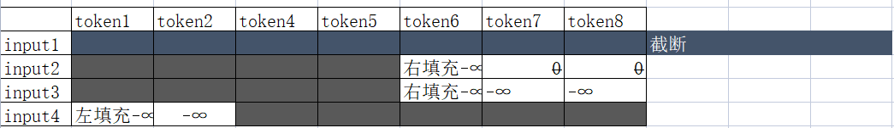<br/>
在实际处理输入中有几种情况：

第一种：实际输入长度大于模型可接受的长度，例如最大输入token数为8个，实际则是11个，这个处理很容易，8以后的截断即可。

第二种：实际输入长度小于模型可接受的长度，对于余下的空间，需要填充。填充0，则后续还要经过softmax计算会出现问题，通常填充−∞能解决softmax的问题。

另外一个问题：填充位置，是左边填充，还是右边填充？ 对于GPT这样预测下一个token的模型，通常选择左填充，而对于BERT这样，通常选择右填充。

### 3.2 位置嵌入
每个词出现的位置不一样，代表的含义不一样，为了能够区分词的位置，提供了一个位置嵌入的功能。模型允许最大输入长度L，每个token的维度D，位置嵌入就是一个L*D的矩阵。原始论文中，有两种方式得到这个位置嵌入矩阵：

第一种，sin/cos编码
* $PE_{(pos,2i)} = sin(pos/10000^{2i/d_{model}})$
* $PE_{(pos,2i+1)} = cos(pos/10000^{2i/d_{model}})$

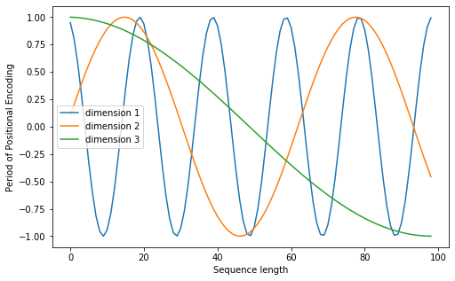<br/>
图10：sin/cos 位置编码。 图片来源：https://wmathor.com/index.php/archives/1438/ 。 x轴表示位置编号，不同颜色的曲线表示不同维度上的值，可以看出，维度1到维度n，曲线的变化率越来越小。

```python
# sin/cos 位置编码示意图的代码。
# 源：https://wmathor.com/index.php/archives/1438/ 
import numpy as np
import matplotlib.pyplot as plt
import math

def get_positional_encoding(max_seq_len, embed_dim):
    # 初始化一个positional encoding
    # embed_dim: 字嵌入的维度
    # max_seq_len: 最大的序列长度
    positional_encoding = np.array([
        [pos / np.power(10000, 2 * i / embed_dim) for i in range(embed_dim)]
        if pos != 0 else np.zeros(embed_dim) for pos in range(max_seq_len)])
    
    positional_encoding[1:, 0::2] = np.sin(positional_encoding[1:, 0::2])  # dim 2i 偶数
    positional_encoding[1:, 1::2] = np.cos(positional_encoding[1:, 1::2])  # dim 2i+1 奇数
    return positional_encoding

positional_encoding = get_positional_encoding(max_seq_len=100, embed_dim=16)
plt.figure(figsize=(8, 5))
plt.plot(positional_encoding[1:, 1], label="dimension 1")
plt.plot(positional_encoding[1:, 2], label="dimension 2")
plt.plot(positional_encoding[1:, 3], label="dimension 3")
plt.legend()
plt.xlabel("Sequence length")
plt.ylabel("Period of Positional Encoding")

```

第二种，先是随机(其他更好的？)初始化这个位置嵌入矩阵，在通过训练过程调整这个位置嵌入矩阵里的参数。

当训练和推理时的长度一致时，二者差别并不大，但当推理时的输入长度大于训练时的输入长度时，sin/cos可以通过两个相邻位置间插值的方式实现外推(推理长度大于训练长度)。关于推理长度和训练长度不一致后续还有更多的探索,可以参考以下几篇论文：[XPos](../paper/nlp/XPOS.md), [ALibi](../paper/nlp/Alibi.md), [RoPE](../paper/nlp/RoFormer.md)。主要思路：1. 位置嵌入不只是放在初始位置，而是放在每个self-attention中的Q,K上；2.位置嵌入和token嵌入的作用方式，分别采用加法、乘法、或者乘法+加法 3.用其他位置-维度值的算法优化sin/cos方式。


## 4. 整体架构
### 4.1 编码器 + 解码器 架构
原始论文[Attention Is All You Need](../paper/nlp/transformer.md)中面向的是一个翻译任务，需要将一种语言翻译成另外一种语言，使用到到的架构模型时，编码器-解码器 结构（见上图6）。 结合上一节自注意力模块，编码器采用双向编码机制，即Query需要查询计算与上下文中所有的语义单元的关系。而解码器则是单向编码机制，即query只查询过去的，在它之前打的语义单元的关系。

在这里，需要说明的是，当组合使用编码器和解码器时，有一个步骤，需要将解码器的输出与实际解码目标token结合起来使用，具体的代码如下：

``` python
# 源：https://pytorch.org/docs/stable/_modules/torch/nn/modules/transformer.html#TransformerDecoderLayer.forward
# 针对target，使用self-attention block， 单头 
x = x + self._sa_block(self.norm1(x), tgt_mask, tgt_key_padding_mask, tgt_is_causal)
# 针对encoder的输出(memory)，使用多头
x = x + self._mha_block(self.norm2(x), memory, memory_mask, memory_key_padding_mask, memory_is_causal)
# feedword layer
x = x + self._ff_block(self.norm3(x))
# 注意这个 x = x + ... , 把encoder的输出和target等结合起来的方式。
```

### 4.2 只使用编码器架构，双向注意力
代表：[BERT](../paper/nlp/bert.md)

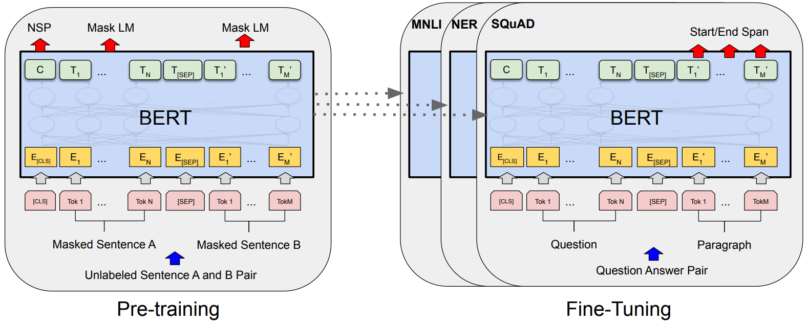<br/>
图11：BERT的预训练和微调总体过程。除了输出层之外，在预训练和微调中都使用了相同的架构。相同的预训练模型参数用于为不同的下游任务初始化模型。在微调过程中，所有参数都会进行微调。[CLS]是添加在每个输入样本前面的特殊符号，[SEP]是一个特殊分隔符令牌(例如，分隔问题/答案)。

BERT预训练：
1. 将输入的令牌随机掩码15%，在这些被掩码掉令牌中，80%的用[MASK]令牌替换，10%的用随机令牌替换，10%的不替换。
2. 构造两个句子对，头部增加一个[cls]令牌用于，中间用[sep]令牌分割，是真实的上下句，用Label=1表示，随机句子用Label=0表示
3. 训练目标有2个：预测被掩码的token，以及是否为相邻的下一句([cls]令牌过交叉熵函数预测是否为下一句)。

### 4.3 只使用解码器架构，单向因果注意力
代表：[GPT-1](../paper/nlp/gpt.md)

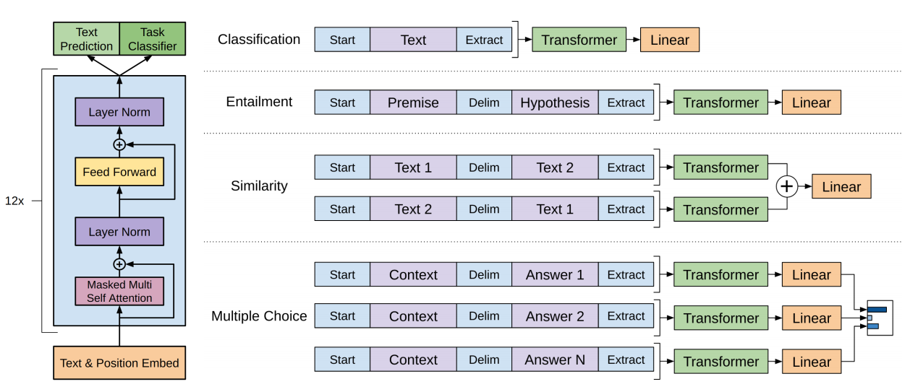<br/>
图12：(左)本工作中使用的 Transformer 架构和训练目标。 (右)用于微调不同任务的输入转换。 我们将所有结构化输入转换为令牌序列，以供我们的预训练模型处理，然后是线性 + softmax 层。

GPT预训练：
1. 输入是前面n个令牌，预测下一个令牌，实际执行过程中，采用因果注意力，可以批量根据不同长度的当前输入，预测对应的下一个令牌。
2. 通过附加一个线性分类头，用于有监督的预测分类。
3. 下游任务统一到预训练模型中。在GPT-2中作者提出：自然语言提供了一种灵活的方式来将任务、输入和输出指定为单一的序列符号。基于这种思路，可以将所有的NLP任务都看成是对单一序列的处理。范式从预训练+下游各种适配微调，变成了，统一通用的预训练+下游的提示学习。


## 5. 进阶
### 5.1. 训练时的稳定性
LayerNorm：在介绍Block构成时，提到LayerNorm的使用位置，Post-LN的良好性能和Pre-LN的稳定训练。

初始化策略：

梯度剪裁：每次更新梯度不要太大

### 5.2. 长度外推
当推理时的文本长度大于训练时设定的最大长度时

### 5.3. 稀疏专家模型
路由+FFN，不同的token路由到不同的FFN上。


## 参考
1. [Attention Is All You Need](../paper/nlp/transformer.md) 介绍Transfomer的原始论文
2. [MAGNETO:Foundation Transformers](../paper/Multimodal/MAGNETO.md) LayerNorm和初始化方面的优化
3. 推理长度可外推：[XPos](../paper/nlp/XPOS.md), [ALibi](../paper/nlp/Alibi.md), [RoPE](../paper/nlp/RoFormer.md)
4. [Resnet：Deep Residual Learning for Image Recognition](../paper/cnn/resnet.md) 残差连接
5. https://github.com/karpathy/minGPT  GPT的实现代码，去除工程优化方面的技巧，只保留最基础的原理实现，很适合Transfomer的初学者。
6. https://wmathor.com/index.php/archives/1438/ 一篇介绍Transfomer的优秀文章
