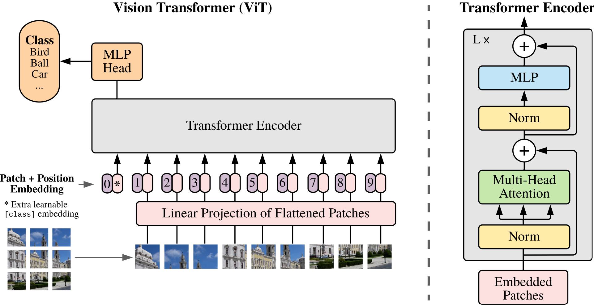
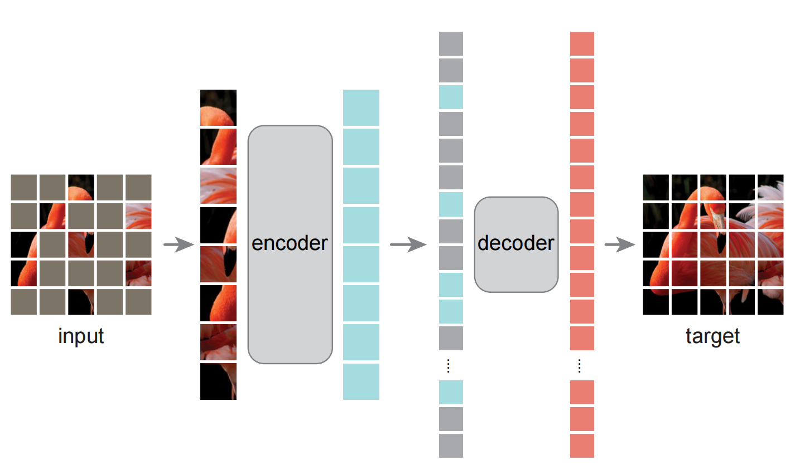
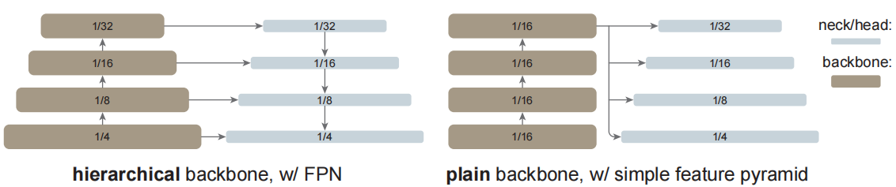
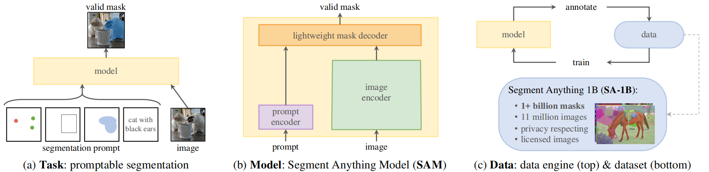

# 视觉Transfomer 

Transformer在NLP领域的成功经验，正在被研究人员移植到机器视觉领域。

https://github.com/lucidrains/vit-pytorch/

## 1. ViT: [An Image is Worth 16x16 Words: Transformers for Image Recognition at Scale](../paper/vit/ViT.md)

<br/>
图1：ViT架构示意图。将完整的图像，拆分成n个16*16像素的小图块。过一个的简单的线性投影函数，就相当于NLP中tokens的向量，再结合位置嵌入，后续的整个框架和NLP里的Transformer没有不同。

重点：
1. 为啥选择16*16, 而不是更大或更小的size？
2. 线性投影，一个patch有RGB三个通道的颜色值，过线性再打平成n-d的向量？
3. 位置嵌入，使用2D和1D都实验了，二者差别不大，使用1D也能学到。
4. [CLS] token的作用 

重点关注下，输入图像转成transformer能处理的token这部分的逻辑：

```python
# https://github.com/lucidrains/vit-pytorch/blob/main/vit_pytorch/vit.py
 self.to_patch_embedding = nn.Sequential(
    Rearrange('b c (h p1) (w p2) -> b (h w) (p1 p2 c)', p1 = patch_height, p2 = patch_width),
    nn.LayerNorm(patch_dim),
    nn.Linear(patch_dim, dim),
    nn.LayerNorm(dim),
)

x = self.to_patch_embedding(img)
b, n, _ = x.shape
```

```python
# 源： https://github.com/pytorch/vision/blob/main/torchvision/models/vision_transformer.py#L213
class VisionTransformer(nn.Module):
    def forward(self, x: torch.Tensor):
        # Reshape and permute the input tensor
        x = self._process_input(x)
        n = x.shape[0]

        # Expand the class token to the full batch
        batch_class_token = self.class_token.expand(n, -1, -1)
        x = torch.cat([batch_class_token, x], dim=1)

        x = self.encoder(x)

        # Classifier "token" as used by standard language architectures
        x = x[:, 0]

        x = self.heads(x)

        return x
```

```python
# 对图像的预处理
class VisionTransformer(nn.Module):
    def _process_input(self, x: torch.Tensor) -> torch.Tensor:
        n, c, h, w = x.shape
        p = self.patch_size
        torch._assert(h == self.image_size, f"Wrong image height! Expected {self.image_size} but got {h}!")
        torch._assert(w == self.image_size, f"Wrong image width! Expected {self.image_size} but got {w}!")
        n_h = h // p
        n_w = w // p

        # (n, c, h, w) -> (n, hidden_dim, n_h, n_w)
        x = self.conv_proj(x)
        # (n, hidden_dim, n_h, n_w) -> (n, hidden_dim, (n_h * n_w))
        x = x.reshape(n, self.hidden_dim, n_h * n_w)

        # (n, hidden_dim, (n_h * n_w)) -> (n, (n_h * n_w), hidden_dim)
        # The self attention layer expects inputs in the format (N, S, E)
        # where S is the source sequence length, N is the batch size, E is the
        # embedding dimension
        x = x.permute(0, 2, 1)

        return x
```

```python
# 对图像patch做投影，产出tokens
# class VisionTransformer(nn.Module):
#     def __init__(...)

if conv_stem_configs is not None:
    # As per https://arxiv.org/abs/2106.14881
    seq_proj = nn.Sequential()
    prev_channels = 3 #RGB
    for i, conv_stem_layer_config in enumerate(conv_stem_configs):
        seq_proj.add_module(
            f"conv_bn_relu_{i}",
            Conv2dNormActivation(
                in_channels=prev_channels,
                out_channels=conv_stem_layer_config.out_channels,
                kernel_size=conv_stem_layer_config.kernel_size,
                stride=conv_stem_layer_config.stride,
                norm_layer=conv_stem_layer_config.norm_layer,
                activation_layer=conv_stem_layer_config.activation_layer,
            ),
        )
        prev_channels = conv_stem_layer_config.out_channels
    seq_proj.add_module(
        "conv_last", nn.Conv2d(in_channels=prev_channels, out_channels=hidden_dim, kernel_size=1)
    )
    self.conv_proj: nn.Module = seq_proj
else: #简单点的投影方案
    self.conv_proj = nn.Conv2d(
        in_channels=3, out_channels=hidden_dim, kernel_size=patch_size, stride=patch_size
    )
```

## 2. MAE: [Masked Autoencoders Are Scalable Vision Learners](../paper/vit/MAE.md)
<br/>
图2：MAE架构示意图。在预训练期间，随机掩码大部分(例如，75%)的分块子集。编码器应用于可见分块的小子集。掩码令牌在编码器之后引入，全套编码分块和掩码令牌由一个小解码器处理，该解码器以像素重建原始图像。在预训练之后，解码器被丢弃，编码器被应用于未损坏的图像(完整的分块集)以进行识别任务。

重点：
1. 基于图像的冗余度较大的前提下，掩码掉75%的部分。
2. 只对未掩码部分做encoder，但位置嵌入保留了？
3. [mask] token是没有经过encoder的，因此，它的值只能是在decoder中学习？
4. decoder只预测掩码部分的token。

```python
# https://github.com/lucidrains/vit-pytorch/blob/main/vit_pytorch/mae.py

```

```python
# https://github.com/facebookresearch/mae/blob/main/models_mae.py

```


## 3. FLIP: [Scaling Language-Image Pre-training via Masking](../paper/Multimodal/FLIP.md)
</br>
图3：FLIP架构。在CLIP之后，我们对成对的图像和文本样本进行对比学习。我们随机屏蔽掉具有高掩码率的图像分块，并仅对可见分块进行编码。我们不执行掩码图像内容的重建。

重点：
1. 对比学习框架
2. 图片编码采用MAE方式，

## 4. ViTDet [Exploring Plain Vision Transformer Backbones for Object Detection](../paper/vit/ViTDet.md)

<br/>
图4：典型的分层主干检测器(左)与普通主干检测器(右)。传统的分层主干网可以自然地适用于多尺度检测，例如，使用FPN。相反，我们探索从一个普通主干的最后一个大跨度(16)特征图构建一个简单的金字塔。

## 5. [Segment Anything](../paper/Multimodal/Segment_Anything.md)
<br/>
图5：我们旨在通过引入三个相互关联的组件来构建分割的基础模型：提示分割任务、支持数据标注并通过提示工程将零样本迁移到一系列任务的分割模型（SAM），以及用于收集SA-1B的数据引擎，SA-1B是我们拥有超过10亿个掩码的数据集。