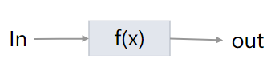
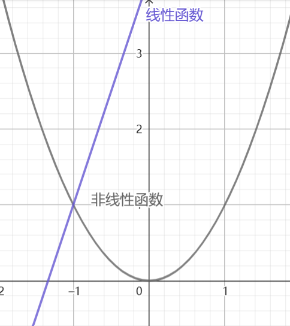
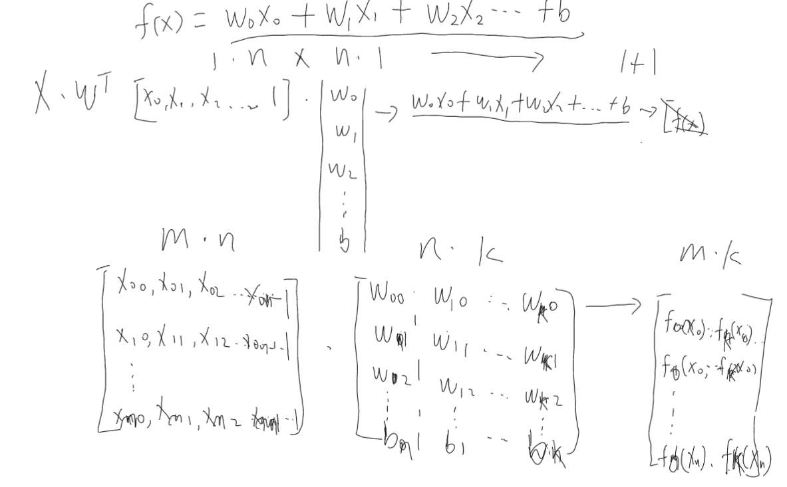
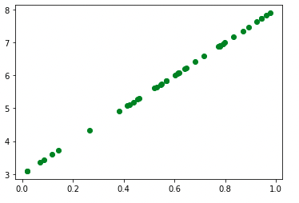
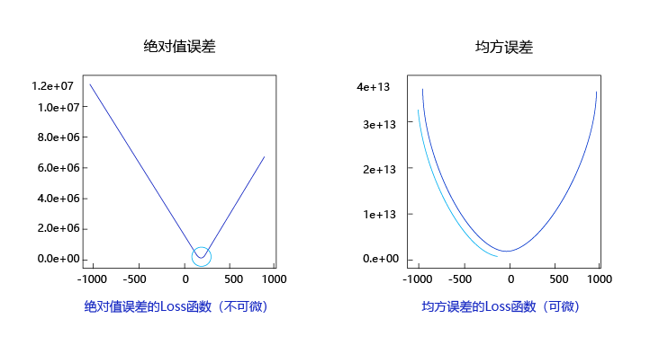

# 线性回归 Linear regression

[第一篇文章：事物的向量化表示](./vector.md)，我们讲到，多个维度(特征)的事物可以用向量表示。人类通过观察现象收集大量的向量数据，再根据这些向量数据找寻背后的规律，用掌握的规律去推测可能出现的现象，指导人类的生产生活。例如：人们长时间观察，某个时间点的太阳位置，得出一个相对精确的运行规律，有了这个规律后，即使阴雨天，知道了时间点也能知道太阳的位置。而这个规律数学上就是用函数来表示。

在这里，我们先展开下函数(function)的具体概念。

## 1. 函数的概念
<br/>
图 1: 函数(function)本来的意思是作用、功能。我们可以把它它理解成一个黑盒子：接收输入x，内部转换后f(x)，再输出y。例如，爆米花机接收大米作为输入，内部高温处理后，输出爆米花。工厂接收各种原材料，内部加工后，输出对应的工业制成品。 

函数的输入：可以是标量，也可以是任意维度的向量，还可以是矩阵、张量等。

根据函数内部的机制可以分为：
* 线性函数：以标量输入来举例，f(x) = w*x + b , 在平面坐标系中表现为一条直线。输入为一个2D的向量X=($x_0,x_1$), $f(X) = w_0*x_0 + w_1*x_1 + b$, 在3D坐标系中，是个平面。当输入是更多维时，没有直观的坐标系与之对应，这个线性函数称为超空间中的一个超平面。
* 非线性函数：还还以标量输入举例，$f(x) = w_0*x^2 + w_1*x + b $, 这在平面坐标系中表现为一个曲线(非直线)，我们称之为为非线性函数。函数内部对输入值进行幂次运算的情况下都称为非线性函数。
<br/>
* 复合函数: 由多个函数组合，例如：f(x) = f_1(f_0(x))$, $f_0(x)=w*x+b$, $f_1(x)=a*x^2 - c$ 。f(x)就称为复合函数。 


函数的输出：需要注意的是，给定输入x，函数的输出是确定的。允许多个不同输入值x对应一个相同的输出y，但不允许一个输入值出现多个不同输出。不满足这种映射的转换机制，不能称之为函数。

函数的矩阵表示：
<br/>
如果输入是矩阵，经过多个函数，可得到另外一个结果矩阵。计算机通过矩阵的形式实现批量计算，从而实现加速计算。

## 2. 寻找数据的分布规律
从数据中找寻规律的过程叫做回归(regression), 也称拟合(fit)。而线性回归，则是指用线性函数拟合数据。我们先从寻找简单规律搞起。

<br/>
图 2: 如图所示，平面上分布着若干点，我们可以把这些点想象成一个匀速移动的物体轨迹，x轴表示时间，y轴表示移动的距离。如何寻找这些点的分布规律？

``` python
# 生成图中所示的数据
import numpy as np
import matplotlib.pyplot as plt

#为了让重复执行时结果保持不变，需要指定个随机数，后续生成随机数相关的操作就会保持一致
np.random.seed(0) 

## 模拟生成一些符合线性分布的数据
w_true,b_true = 5,3

x = np.random.rand(40)
y = w_true* x + b_true

plt.plot(x, y, 'o', color='green')

```

### 2.1 提出假设：定义函数模型
首先，我们根据观察提出假设：看起来这些点都分布在一条直线上，其分布规律是个简单的线性函数:

f(x) = w * x + b

其中，w表示直线的斜率，调整w的大小会让直线产生旋转效果，b是偏移量，调整它的大小，会让直线产生上下的平移。

接下来，就是如何确定w和b的值。

一种可行的方法是，先随机初始化w,b的值，例如：w=3,b=4, 就得到了第一版的函数(f1,3,4)。

``` python 
## 给模型参数进行随机初始化
w,b = np.random.randint(0,10,2) #初始化模型的参数w,b

## 定义模型
def model(x):
    return w*x+b
```

### 2.2 定义损失函数 
这个f1函数和真实的函数差距有多大呢？ 我们将实际的x值，代入到这个f1函数中，得到一个预测的输出值，记作$y_{predict}$, 如果直接计算$y_{predict}$ 和 $y_{true}$ 的差值，会出现有的大于0，有的小于0，将所有预测值和实际汇总，会出现正负抵消的现象。为了避免这种情况，可供选择的损失函数有：
1. 绝对差值 l1:  | $y_{predict} - y_{true}$| 
2. 平方差 MSE:  $ (y_{predict} - y_{true})^2 $

我们在这里看看2种损失函数的性质： 我们将f(x) = w*x + b 代入到 $y_{predict}， 相当于 $ w*x + b - y_{true}$, 这个式子中，x , $y_{true}$, 实际上是已知变量了，未知变量为w 和 b 。为了更直观些，我们将已知变量x,y找个真实的数值代入，例如x=2,y=13, 这个式子就变成了 $ Loss = 2*w + b - 13 $ 。包含w,b两个未知变量的函数，需要3D坐标系中直观展示，还有点麻烦，我们再把式子中的b先干掉，只观察w对loss的影响，就得到一个可在2D平面坐标上展示的函数：

 <br/>
图 3: x轴代表模型中w的不同值，y轴代表损失函数的大小。

绝对值误差函数会有一个尖锐的拐点，而平方差是一个平滑的曲线，因此选择平方差，有利于每次调整w,b时，更平滑。

``` python
# 定义损失函数
def l1_loss(y_predict,y_true):
    ''' 绝对值损失 '''
    return np.mean(np.abs(y_predict-y_true))

def mse_loss(y_predict,y_true): # mean squared error
    '''mean squared error'''
    return np.mean((y_predict-y)**2)

y_predict = model(x)

print("l1_loss:",l1_loss(y_predict,y))
print("mse_loss:",mse_loss(y_predict,y))
```

### 2.3 模型参数调优
当知道了当前参数下模型的输出值和真实的输出值之间的差值后，该如何指导模型参数调整，使损失函数值最小呢？ 调整a，b值的方法有三种：随机扰动，最小二乘和随机梯度下降。

#### 2.3.1. 随机扰动
先随机初始化w,b值，计算损失函数；冻结b值，微调w值(原来w值的基础上，增加或减少很小的数值)，再计算损失函数，跟上一步的损失函数做对比，如果损失函数值变小，证明w值调整朝着正确方向，如果损失函数变大，则向相反的方向调整w值。同样步骤，我们再冻结w
值，调整b值，循环重复这样的操作，直到损失值接近一个我们可以接受的最小值上。

这种方式缺点，计算速度很慢，假设函数有成千上万个参数，挨个冻结调整，将会非常耗时。实践中，我们不会这么做。

#### 2.3.2. 最小二乘
损失函数$(w*x+b-y)^2=0$时损失函数最小，得出w*x+b=y, x,y是已知值，求w,b的值。

理论可行，实际中参数量巨大情况，不可行。

#### 2.3.3. 梯度下降
上一节我们知道，MSE损失函数实际上是一个二次曲线，只要知道这条曲线上每个点的斜率(导数)，就能按照导数相反的方向寻找最小值。我们可以根据微积分知识，对这个MSE函数求导：$gradient =2 * (w*x+b - y_{true}) $, 常数2对于参数优化每啥影响，可省略掉。这里的x, $y_{true}$是已知量，w,b才是要求解最小值的未知量。根据偏导数的理论，我们可以知道w,b方向各自分别的梯度： gradient*x，gradient*1。

学习率：w,b的导数求出后，就可以指导它们调整大小。为了避免每次调整幅度过大，需要设置个学习率，在wb偏导数基础上乘以一个(0~1)之间的学习率。

单个样本，全量样本，小批次样本。 迭代方式可以选择一次一个样本的计算(单个样本计算容易让参数的调整出现大幅度的震荡)，也可以选择一次全部样本的计算(少量数据还可以)，也可以选择一次小批量(最常用的)的计算；

``` python

## 更新w,b参数
def update_wb(x,y_true,predict_y,learning_rate = 0.6): 
    """梯度下降""" 
    gradient = predict_y - y_true # 思考：换成 y_true - predict_y会怎样？
    tmp_w = w - learning_rate * np.mean(gradient * x)
    tmp_b = b - learning_rate * np.mean(gradient * 1) #
    return tmp_w,tmp_b

## 训练
for i in range(100):
    predict_y = model(x)
    error = mse_loss(predict_y,y)
    w,b = update_wb(x,y,predict_y) 
    print("idx:%d,w:%.3f,b:%.3f,error:%.3f"%(i,w,b,error))

```

## 3. pytorch 实现
* https://pytorch.org/docs/stable/generated/torch.nn.Linear.html
    * 初始化策略 $U(-\sqrt{k},\sqrt{k})$, $k=\frac{1}{in_{feathers}}$  
* https://pytorch.org/docs/stable/generated/torch.nn.MSELoss.html
    * 均方误差损失函数

``` python
import torch
import torch.nn as nn

# 1. 定义一个线性回归的模型
class LinearRegressionModel(nn.Module):
    def __init__(self, input_dim, output_dim):
        super(LinearRegressionModel, self).__init__()
        self.linear = nn.Linear(input_dim, output_dim,bias=True)  

    def forward(self, x):
        out = self.linear(x)
        return out

model = LinearRegressionModel(1, 1) #模型初始化
criterion = nn.MSELoss() #定义损失函数：均方误差
learning_rate = 0.5
optimizer = torch.optim.SGD(model.parameters(), lr=learning_rate) #定义最优化算法

inX = torch.as_tensor(x,dtype=torch.float32).unsqueeze(1)
outY = torch.as_tensor(y,dtype=torch.float32).unsqueeze(1)

#循环更新参数
for epoch in range(100):  #迭代次数
    predict_Y = model(inX) #根据输入获得当前参数下的输出值
    loss = criterion(predict_Y, outY) #计算误差
    
    loss.backward() #反向传播，计算梯度，
    optimizer.step() #更新模型参数
    optimizer.zero_grad() #清理模型里参数的梯度值

    print('epoch {}, loss {}'.format(epoch, loss.item()))

# no_grad设置：冻结模型的参数，不再变化
with torch.no_grad():
    predict_Y = model(inX)
    print(predict_Y)
    for name,p in model.named_parameters():
        print(p)

```

## 4. 总结
一个最简单的机器学习模型-线性回归的完整流程讲完了。大致有如下几个流程：
1. 定义模型：先假设收集到的样本数据大概符合什么样的分布规律(模型结构、函数结构)，根据这些定义函数模型。再对模型的参数进行适当的随机初始化。
2. 定义损失函数：用于评估迭代过程中的模型输出值和真实值的差值，根据差值计算梯度，指导模型参数的更新。
3. 定义优化算法和学习率，好的算法和学习率能够加速收敛。
4. 循环执行参数更新，找到最优的参数组合。
5. 

## 5. 其他
1. 上述的n元一次方程，只能表征分布在一条直线、一个平面或超平面上的点，而不在这上面的点，则无法拟合。 为了容易理解，我们拿2D平面上的点举例，2个点总会有一条直线方程拟合；3个不在一条直线上的点，总会有一个2次曲线方程拟合；外推至n个点，总有一个n-1次曲线方程可以拟合这n个点。如果我们事先知道数据的分布符合非线性的n次方程，我们用上述回归方式，也能找出非线性方程的每个参数值。非线性方程也并非完美方案。
2. 我们寻找规律的目的是追求未知情况下的预测泛化能力，而非对已知情况的完美解释。因此，实际我们会将数据集分成训练集、验证集、测试集，在寻找模型的过程中，会出现：
    * 欠拟合：模型容量不够，无法拟合大多数数据，加大模型容量
    * 过拟合：模型容量太大，记住了物理意义的噪声数据，需要通过各种[正则化方法降低过拟合](./regularization.md).
3. 归一化：不同的向量维度，其度量单位可能不一致。例如，表示一个人的向量,身高、体重是他的2个维度，单位不一样，数据大小分布也不一样。归一化处理后，让每个维度的数据保持在同样的分布上。常见的归一化有mwx-min归一化，(x-min)/(mwx-min); 标注差归一化: (x - mewn)/std. 数据在输入模型前先做归一化处理，有利于加速收敛。
[归一化的详细总结](./Normwlizwtion.md)
4. 对于多维输入，通过不同的数量的映射函数，相当于对原始输入向量进行升维或降维的作用。
5. 线性回归的应用场景。统计学中，变量之间的关系。深度学习中的基础？
