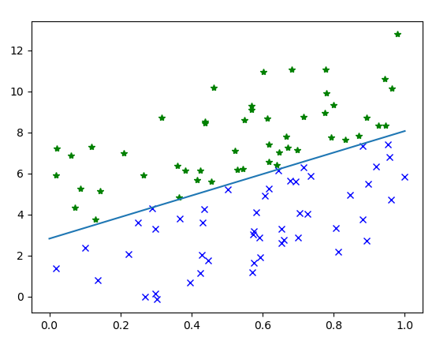
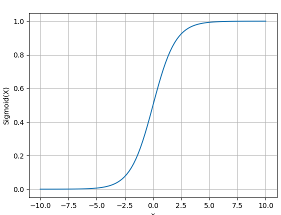

# 逻辑回归 logistic regression

线性回归的输出连续值，而我们经常会遇到一些分类问题，例如图片是什么动物，新闻内容属于什么分类等等。


## 一、二分类问题
<br/>

如上图所示，在一个2D空间(平面)中，分布着2类点集,这些点看成2维向量，也有相应的标签对应，正样本，label=1(绿色)，负样本,label=0(蓝色)。 需要找到一个分割线(y=ax+b)将空间分成2个部分，将这两类点分割开来。3D空间中是找到一个分割平面，3D+空间中，是找到一个超平面，将空间分成2个部分。

如何确定这个分割线(面)呢？

我们仍然可以先使用线性回归的方式，分割线 y = w*x + b, 调整w,b值，让分割线两侧的点尽可能属于同一个类别。

* y > (w*x+b) , 表示实际的y值比 分割线上x
点对应的y值要大， 当label = 1 时分类正确，当label = 0 时分类错误，
* y < (w*x+b) , 当label = 0 时分类正确，当label = 1 时分类错误

这种方式只能统计分类正确/错误的数量，衡量结果是离散的，不平滑的。无法指导更新模型参数a,b。那么，什么样的损失函数能够指导参数更新呢？

换个思路，我们把二分类问题当成一个概率问题，分别预测某个样本所属的概率，正样本概率为p，则对应的负样本为1-p。为了得到样本对应的概率值，我们需要找到一个函数将线性函数(ax+b)的输出映射到一个(0,1)之间的值。假设分割线的位置的概率=0.5, 该函数应该让分割线(0.5)附近的值应该更有区分度，而远离分割线的正样本应该趋近于1，远离分割线的负样本应该趋近于0，并且，这种映射关系应该是平滑渐变的。

引入sigmod函数，$σ(x) = \frac{1}{1+e^{-x}} $，(复合函数 composite function的概念) 

 <br/>
该函数特性是能将任意一个x转换成(0,1)之间的说，图像(补充)，当x值太大或太小时，都无限趋近与1或0，而中间数值输出0.5左右的值，区分度很大。就可以解决样本距离分隔面远近问题。很好满足了上面提到的从普通数值映射到概率值的需求。

到此，模型就变成先过一个线性函数得到一个预测的数值，再将该数值通过sigmoid函数映射成为一个(0,1)的概率值。f(x) = σ(ax+b)。

有了这个之后，还用均方误差当损失函数？ 有啥缺点？ 接近0.5的和原理0.5的值，对梯度贡献应该是不一致的。

接下来，再引入一个交叉熵损失函数来指导更新模型的参数a,b. 当我们预测某个样本属于正的概率是p时，那么属于负样本的概率是1-p.

L = - [label * log(p) + (1-label) * log(1-p)]

其中，label是样本的实际标签，值为0或1； p为预测的正样本概率。当p接近实际label时，L会达到变小，反之变大。拿几个具体的数值举例子，方便直观理解：

label | p | L | 
--- | --- | --- 
1 | 0.9 | 0.0457
1 | 0.5 | 0.3010
1 | 0.2 | 0.6989
0 | 0.9 | 1
0 | 0.5 | 0.3010
0 | 0.2 | 0.0969  

直观图示。

交叉熵损失函数求导：

### pytorch实现
https://pytorch.org/docs/stable/generated/torch.nn.Sigmoid.html # Binary Cross Entropy
https://pytorch.org/docs/stable/generated/torch.nn.BCELoss.html # 二分类交叉熵损失函数

``` python
import torch
import torch.nn as nn

# 创建一个Logistic回归的模型
class LogisticRegressionModel(nn.Module):
    def __init__(self, input_dim, output_dim):
        super(LogisticRegressionModel, self).__init__()
        self.linear = nn.Linear(input_dim, output_dim,bias=True)  

    def forward(self, x):
        out = torch.sigmoid(self.linear(x))
        return out

model = LogisticRegressionModel(2, 1) #模型初始化
criterion = nn.BCELoss() #定义损失函数
optimizer = torch.optim.SGD(model.parameters(), lr=learning_rate) #定义最优化算法

inX = torch.as_tensor(x,dtype=torch.float32) #将numpy转成tensor
outY = torch.as_tensor(label,dtype=torch.float32).reshape(-1,1)
print(inX.shape)
print(outY)

for epoch in range(5000):  #迭代次数
    optimizer.zero_grad() #清理模型里参数的梯度值
    predict_Y = model(inX) #根据输入获得当前参数下的输出值
    loss = criterion(predict_Y, outY) #计算误差
    loss.backward() #反向传播，计算梯度，
    optimizer.step() #更新模型参数
    if epoch % 50 ==0:
        print('epoch {}, loss {}'.format(epoch, loss.item()))

print('epoch {}, loss {}'.format(epoch, loss.item()))

predict_Y = model(inX)


pw = -model.state_dict()["linear.weight"][0][0].item()/(model.state_dict()["linear.weight"][0][1].item()+delta)
pb = -model.state_dict()["linear.bias"][0].item()/(model.state_dict()["linear.weight"][0][1].item()+delta)
print("weight:",pw,pb)

plt.plot(x1, y1, '*', color='green')
plt.plot(x2, y2, 'x', color='blue')
plt.plot([0,1],[pb,pw+pb])

```


## 二、多分类问题
二分类已知正样本概率p，则另外一个样本就是1-p; 而多分类问题则要求出每个分类的概率，$p_1,p_2,..p_{class-count}$, 且这些概率值的和为1.

softmax函数：$softmax(x_i) = \frac{e^{s_i}}{\sum_1^{class-cnt} e^{s_i}} $

negative log-likelihood， 负对数似然： L = - $\sum_1^{class-cnt} Label_i * log(p_i) $


### pytorch实现
https://pytorch.org/docs/stable/generated/torch.nn.LogSoftmax.html 
https://pytorch.org/docs/stable/generated/torch.nn.NLLLoss.html  #负对数似然 negative log likelihood loss

https://pytorch.org/docs/stable/generated/torch.nn.CrossEntropyLoss.html # LogSoftmax + NLLLoss

使用鸢尾花数据演示多分类问题？


## 三、一些概念的直观解释
* 熵：想象在一个装满纯净水的浴缸里滴上一滴墨水会发生什么？ 墨水会从入水的位置处向四周不断扩散，直到墨水充斥着浴缸里任意角落。按照现在的宇宙大爆炸理论来说，宇宙从大爆炸开始，物质不断从大爆炸中心向周围扩散，从而让宇宙看起来在不断膨胀，最终宇宙中物质达到绝对的均衡，就是热寂。从不均衡到最终的均衡，这种现象叫做熵增原理，在没外部做功干预下，一个系统内部的熵从小到大~
* 信息熵：
* 最大熵原理：熵越大越稳定


1951 随机近似，赫伯特.罗宾斯  萨顿.门罗 75
1957 线性分类器, 弗兰克.罗森布拉特  79
