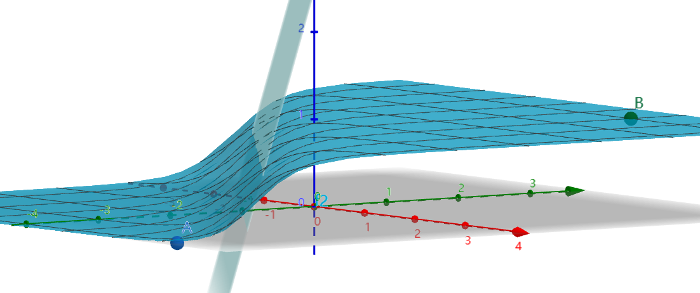
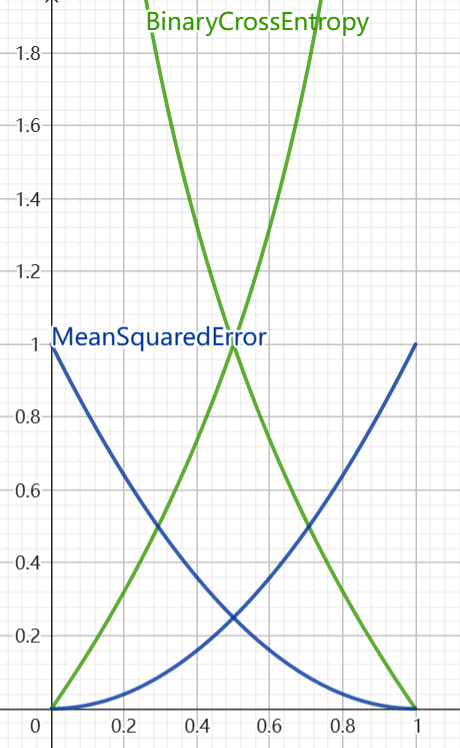
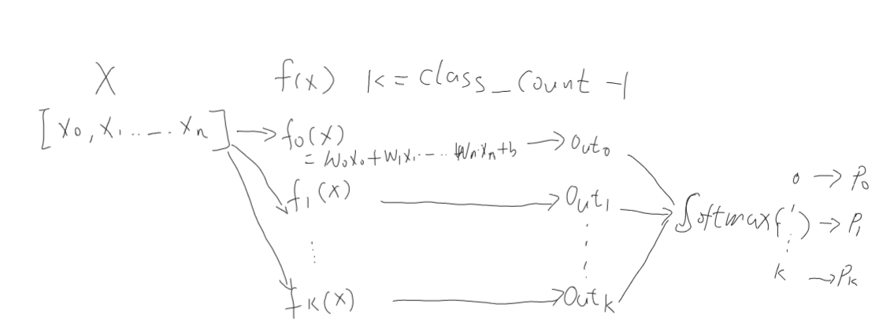

# 逻辑回归 logistic regression

上一节我们讲了[线性回归 Linear regression](./linear_regression.md), 使用模型预测连续值。这一节我们介绍分类问题，例如：商品评论内容是正面的，还是负面的，二分类问题；新闻内容属于什么分类，多分类问题；图片是哪种动物等等。分类问题中预测的分类标签是一个离散值，我们先从最简单的二分类问题入手。

## 1. 二分类问题
<br/>
图 1：二分类问题示例。 平面中分布着两类点集，一类是绿色点集，分类Label=1，一类是蓝色的点集，分类Label=0。我们需要找到一条分割线，将2个不同点集区分开。
<!-- 点本身(x0,x1)是个二维向量，再加上label(=0,1),看作一个3D的空间？ -->

### 1.1 准备分类数据
``` python
# 生成上图中的演示数据
import numpy as np
import matplotlib.pyplot as plt
import math

np.random.seed(0)

def generate_data():
    data_count = 50
    w,b = 5,3
    x1 = np.random.rand(data_count)
    y1 = w*x1 + b + np.random.rand(data_count)*5

    x2 = np.random.rand(data_count)
    y2 = w*x2 + b - np.random.rand(data_count)*5

    # 绘制散点图
    plt.plot(x1, y1, '*', color='green')
    plt.plot(x2, y2, 'x', color='blue')
    plt.show()

    def generate_data(x,y,data_count,labels=0):
        label = np.ones_like(y) if labels==1 else np.zeros_like(y) 
        return np.concatenate((label,np.reshape(x,(-1, 1)),y),axis=1)

    #生成数据，第一列为label，值0,1, 第二列x0, 第三列x1
    data_0 = generate_data(x1,y1.reshape((-1, 1)),data_count,0)
    data_1 = generate_data(x2,y2.reshape((-1, 1)),data_count,1)
    data_all = np.concatenate((data_0,data_1),axis=0)
    np.random.shuffle(data_all)

    labels = data_all[:,0:1]
    features = data_all[:,1:3]
    return labels,features


labels,features = generate_data()
print(labels.shape,features.shape)

```

如何确定这个分割线(面)呢？

### 1.2 定义模型
我们先按线性回归的思路考虑下是否可行：

上一节线性回归的输入是x，可以看成一个标量。而这里的输入可以看成2个维度的向量(x,y), 每个输入向量对应的分类标签可以看成另外一个维度z, 每个数据的特征+标签，实际上是一个3维的向量(x,y,z)。这样就构成了一个3D空间，在这个空间中有2个垂直与z轴的平面，z=1的平面上分布着label=1的点，z=0的平面上分布着label=0的点。 需要在这个3D空间里寻找一个平面用于拟合两种不同分类的点。即：

$z = w_0*x + w_1*y + b $

这种模型假设存在一个严重问题：z的真实值，也就是实际的Label值，只有0或1两种可能，而这个模型的输出值$z_{predict}$则是任意区间的，且大多$z_{predict}$并不会刚好=0,或 =1。这样存在的问题是，z的预测值和真实的label值之间存在的误差将无法收敛到较小的范围内。

因此，我们需要一个机制(函数)，能够将预测的z值映射到(0,1)区间内。z>1的，都让它转成1，z<0的都转成0，让尽可能少的样本的预测值处在(0,1)区间。这样就能将大多数样本的预测值和真实值的误差降低为0. 数学中，有个sigmoid函数刚好就能干这件事：

sigmod函数： $σ(x) = \frac{1}{1+e^{-x}} $

```python
# 生成sigmod示意图
x = np.linspace(-10, 10, 100)
z = 1/(1 + np.exp(-x)) # sigmod
plt.grid()

plt.plot(x, z)

plt.xlabel("x")
plt.ylabel("Sigmoid(X)")
plt.show()

```

 <br/>
图 2：sigmod函数。能将任意一个x转换成(0,1)之间的值，当输入值越大，都无限接近1，当输入值很小时，都无限趋近与0。满足了将任意数值转换为(0,1)区间的要求。而中间数值输出0.5左右的值，区分度很大。就可以解决样本距离分隔面远近问题。很好满足了上面提到的从普通数值映射到概率值的需求。


到此，分类问题的模型函数就变成了一个复合函数：先过一个线性函数得到一个预测的数值，再将该数值通过sigmoid函数映射成为一个(0,1)区间的值:

$linear(x_0,x_1) = w_0*x_0 + w_1*x_1 +b$

$sigmoid(x) = \frac{1}{ 1 + e^{-linear(x_0,x_1)}}$

合起来：

$f(x) = \frac{1}{ 1 + e^{-(w_0*x_0 + w_1*x_1 +b)}} $

<br/>
图3：linear + sigmoid。来源：https://www.geogebra.org/3d/exsyfuhz

```python
# 模型的pytorch实现
import torch
import torch.nn as nn

class BinClassModel(nn.Module):
    def __init__(self, input_dim):
        super(BinClassModel, self).__init__()
        self.linear = nn.Linear(input_dim, 1,bias=True)  

    def forward(self, x):
        # x先过线性函数，再过sigmod函数
        out = torch.sigmoid(self.linear(x))
        return out
```

### 1.3 定义损失函数
定义完模型之后，用什么样的损失函数来指导模型参数更新呢？

第一种，仍然使用线性回归的均方差(MSE)函数。第二种，引入交叉熵损失函数。 

#### 1.3.1 方差
上面提到，模型经过线性+sigmod后对外输出一个(0,1)之间的值。而对应的分类标签(Label)只有2个离散值，0或1。因此，原来的 $MSE_{loss} = (y_{predict} - Label)^2$ 可以表示为：

$MSE_{loss} =  \begin{cases}  (y_{predict} - 1)^2 ，  if \ Label = 1, \\ (y_{predict}-0)^2 ， \ if \ Label=0 \end{cases}$ 

图4中蓝色曲线表示方差损失函数。

#### 1.3.2 交叉熵
接下来，再引入一个针对二分类问题的交叉熵损失函数。模型内部经过了sigmoid函数后，输出(0,1)这样的区间值，因此可以将二分类问题看成一个概率问题。假设模型的输出的值表示的是Label=1的概率值，那么属于Label=0的概率值就是 1-p。交叉熵损失函数的公式如下：

$BCE_{loss} = - [label * log(p) + (1-label) * log(1-p)]$

同样，可以按照实际的Label值将上述式子拆成两部分：

$BCE_{loss} =  \begin{cases}  - log(p)  ， if \ Label = 1, \\ - log(1-p) ， \ if \ Label=0 \end{cases}$ 

图4中绿色曲线表示交叉熵损失函数(BCE).

<br/>
图4：方差和交叉熵函数的对比。 (制作工具：https://www.geogebra.org/graphing?lang=zh_CN)。输入值x轴 (对应模型输出的概率值p) 在(0,1)之间，这个是由模型中sigmod函数输出决定的；y轴则是损失函数输出的误差值。

#### 1.3.3 均方差 vs. 交叉熵
观察对比图4中的均方差和交叉熵损失函数曲线，我们可以发现：
* 当预测的概率值接近正确标签时，例如：当Label=0时，p值越接近0, 两个损失函数的值都越小；反之，当Label=1时，p值越接近1，损失函数值越小。这种情况下，两个函数差别不大。
* 当预测的概率值远离正确标签时，差别比较明显：均方差对于远离值的惩罚力度有上限，能输出的最大误差值=1。而交叉熵损失函数则明显没有最大值限制，因此可以对预测不正确的情况给予较大的惩罚。
* 当预测的概率值为中间值0.5附近时，交叉熵能给出的区分区间更大些，这种能力有助于更好的分类中间派的困难样本。

结论：基于以上原因分析，在分类问题中，我们通常会使用交叉熵作为损失函数。


### 1.4 模型参数调优
同线性回归问题一样，确定损失函数后，需要知道损失函数的梯度，有了梯度后，就可以指导模型参数调优了。

交叉熵损失函数，再结合sigmoid函数，最终的梯度：

$y_{predict} - Label $

会发现，交叉熵损失函数最终的梯度计算跟均方差的梯度计算是一样的。
详细的推到过程：https://blog.csdn.net/Cjjkstra/article/details/109308931


### 1.5 pytorch实现
https://pytorch.org/docs/stable/generated/torch.nn.Sigmoid.html # Binary Cross Entropy
https://pytorch.org/docs/stable/generated/torch.nn.BCELoss.html # 二分类交叉熵损失函数

``` python
# numpy格式转成pytorch 的 tensor格式
inX = torch.tensor(features, dtype=torch.float32) 
outY = torch.tensor(labels, dtype=torch.float32) 
print(inX.shape,outY.shape)

def train_loop(model,criterion,optimizer,inX,outY,epoch=50):
    for epoch in range(epoch):  #迭代次数
        predict_Y = model(inX) #根据输入获得当前参数下的输出值
        loss = criterion(predict_Y, outY) #计算误差
        
        loss.backward() #反向传播，计算梯度，
        optimizer.step() #更新模型参数
        optimizer.zero_grad() #清理模型里参数的梯度值
        
        print('epoch {}, loss {}'.format(epoch, loss.item()))

def run_BinClass():
    model = BinClassModel(2) #模型初始化
    criterion = nn.BCELoss() #损失函数
    optimizer = torch.optim.AdamW(model.parameters(), lr=0.15) #优化算法

    train_loop(model,criterion,optimizer,inX,outY,1000)

    # 画出分割线
    delta = 1e-7
    pw = -model.state_dict()["linear.weight"][0][0].item()/(model.state_dict()["linear.weight"][0][1].item()+delta)
    pb = -model.state_dict()["linear.bias"][0].item()/(model.state_dict()["linear.weight"][0][1].item()+delta)
    print("weight:",pw,pb)
    plt.plot([0,1],[pb,pw+pb])
    plt.show()


run_BinClass()

```


## 2. 多分类问题
因为二分类的结果只有两种可能，因此只需要求某一类的概率p值，另一类的概率就是1-p。因此线性函数只需输出一个值给sigmod函数就可以了。

### 2.1 定义模型
多分类问题需要为每一个分类算出一个概率值p，因此，如果总计有k个分类，就需要有k个不同的线性函数，用于将输入映射对应到k个不同类的值。

<br/>
图5：多分类模型结构示意图。输入X与k组向量参数(k=class count)相乘得到k个输出，再经过softmax得到每个分类的概率值$x_i$, softmax能保证所有这些$x_i$值的和为1.

$softmax(x_i) = \frac{e^{x_i}}{\sum_{i=1}^k e^{x_i}} $

pytorch实现：https://pytorch.org/docs/stable/generated/torch.nn.Softmax.html 

实际上，当$x_i$过大或过下时，执行在计算$e^{x_i}$时容易出现数值溢出的情况，另外softmax的输出区间[0,1],区分度较小，如果加上log后输出值的区分度变大，更有利于做梯度更新。因此pytorch提供了一个LogSoftmax实现：

$LogSoftmax(x_i) = log(softmax(x_i)) = log(\frac{e^{x_i}}{\sum_{i=1}^k e^{x_i}}) $

https://pytorch.org/docs/stable/generated/torch.nn.LogSoftmax.html 

这样，多分类问题的模型函数就定义清楚了：

```python
class MultiClassModel(nn.Module):
    def __init__(self, input_dim, class_count):
        super(MultiClassModel, self).__init__()
        self.linear = nn.Linear(input_dim, class_count,bias=True)  
        self.softmax = torch.nn.LogSoftmax(dim=1)

    def forward(self, x):
        out = self.linear(x)
        # 带LogSoftmax，损失函数使用NLL_loss；不带，则使用CrossEntropyLoss
        out = self.softmax(out) 
        return out
```

### 2.2 定义损失函数

NLL(negative log likelihood)， 负对数似然： 

NLL_loss = $- \sum_1^{k} Label_i * log(p_i)$

https://pytorch.org/docs/stable/generated/torch.nn.NLLLoss.html 


另外一种: CrossEntropyLoss = LogSoftmax + NLLLoss
https://pytorch.org/docs/stable/generated/torch.nn.CrossEntropyLoss.html

### 2.3 演示

先演示下把二分类转成多分类的训练代码：

```python
def run_MultiClass():
    learning_rate = 0.08
    model = MultiClassModel(2,2) #模型初始化
    criterion = nn.NLLLoss() # 模型输出加了 logsoftmax
    # criterion = nn.CrossEntropyLoss() # 模型输出 未加 logsoftmax
    optimizer = torch.optim.AdamW(model.parameters(), lr=learning_rate) #定义最优化算法

    inX = torch.tensor(features, dtype=torch.float32) 
    outY = torch.tensor(labels, dtype=torch.long) #1D long型
    outY = outY.squeeze() 
    print(inX.shape,outY.shape)

    train_loop(model,criterion,optimizer,inX,outY,1000)
     
    for name,p in model.named_parameters():
        print(p) 
    
    # 绘出2条分割线    
    delta = 1e-7
    pw = -model.state_dict()["linear.weight"][0][0].item()/(model.state_dict()["linear.weight"][0][1].item()+delta)
    pb = -model.state_dict()["linear.bias"][0].item()/(model.state_dict()["linear.weight"][0][1].item()+delta)
    print("weight:",pw,pb)
    plt.plot([0,1],[pb,pw+pb], color='blue')
    
    pw1 = -model.state_dict()["linear.weight"][1][0].item()/(model.state_dict()["linear.weight"][1][1].item()+delta)
    pb1 = -model.state_dict()["linear.bias"][1].item()/(model.state_dict()["linear.weight"][1][1].item()+delta)
    print("weight:",pw1,pb1)
    plt.plot([0,1],[pb1,pw1+pb1], color='green')
    
    plt.show()

```

重点关注2块：
1. 损失函数 NLLLoss 和 CrossEntropyLoss 的区别；
2. labels数据需要处理成torch.long,而非float；输入形状从原来的n个1d矩阵，变成一个n个元素的数组。

再使用[第一篇文章](./vector.md)中提到的鸢尾花数据演示多分类问题：
```python
import pandas as pd
import torch
import torch.nn as nn
from torch.utils.data import Dataset
from torch.utils.data import DataLoader

# 参考pytorch的官方教程：https://pytorch.org/tutorials/beginner/basics/data_tutorial.html
class IrisDataSet(Dataset):
    def __init__(self,data_file):
        self.df = pd.read_csv(data_file, sep=",", header=None) 
        self.label_dict = {"Iris-setosa":0,"Iris-versicolor":1,"Iris-virginica":2} 
    
    def __len__(self):
        return len(self.df)
    
    def __getitem__(self,idx):
        features = self.df.iloc[idx, 0:4].values.astype('float32') 
        label = self.label_dict.get(self.df.iloc[idx,4])
        return features, label

class MultiClassModel(nn.Module):
    def __init__(self, input_dim, class_count):
        super(MultiClassModel, self).__init__()
        self.linear = nn.Linear(input_dim, class_count,bias=True)  
        self.softmax = torch.nn.LogSoftmax(dim=1)

    def forward(self, x):
        out = self.linear(x)
        out = self.softmax(out)
        return out

def train_loop(dataloader, model, loss_fn, optimizer):
    size = len(dataloader.dataset)
    for batch, (X, y) in enumerate(dataloader): 
        pred = model(X)
        loss = loss_fn(pred, y)

        # Backpropagation
        loss.backward()
        optimizer.step()
        optimizer.zero_grad()

        if batch % 2 == 0:
            loss, current = loss.item(), (batch + 1) * len(X)
            print(f"loss: {loss:>7f}  [{current:>5d}/{size:>5d}]")

dataset = IrisDataSet('./Iris.data')
dataloader = DataLoader(dataset, batch_size=50, shuffle=True)

learning_rate = 0.01
model = MultiClassModel(4,3)
loss_fn = nn.NLLLoss() 
# loss_fn = nn.CrossEntropyLoss() 
optimizer = torch.optim.AdamW(model.parameters(), lr=learning_rate)

epochs = 100
for t in range(epochs):
    print(f"Epoch {t+1}\n-------------------------------")
    train_loop(dataloader, model, loss_fn, optimizer) 
print("Done!")
```

## 3. 多标签问题
多标签问题是指，一个样本可以打上多个标签，标签之间可能不会发生冲突。
因此，不像多分类问题那样，去要求输出的每个样本概率值之和=1.

需以下改动即可：
1. 模型的输出，从softmax改回sigmoid;
2. 损失函数采用BCELoss.

[分类问题的评估指标](./Loss_metric.md)

## 4. 一些概念的直观解释
这篇分类问题，引入了一些概率的概念，部分概念上面可能还没讲清楚，这里补充：

### 4.1 熵
想象在一个装满纯净水的浴缸里滴上一滴墨水会发生什么？ 墨水会从入水的位置处向四周不断扩散，直到墨水充斥着浴缸里任意角落。按照现在的宇宙大爆炸理论来说，宇宙从大爆炸开始，物质不断从大爆炸中心向周围扩散，从而让宇宙看起来在不断膨胀，最终宇宙中物质达到绝对的均衡，就是热寂。从不均衡到最终的均衡，这种现象叫做熵增原理，在没外部做功干预下，一个系统内部的熵从小到大~

一个随机变量X，可能包含的事件的概率为 $x_0,x_1 ... x_n$，所有事件的概率和=1。衡量熵的大小的公式：
 
$H(x) = - \sum_{i=1}^n p(x_i)log(p(x_i)) $

假设是只有2种情况的随机变量：
<br/>
图 4：信息熵。 https://www.geogebra.org/graphing  公式： entropy: y=If(x>0 ∧ x≤1, -x log(2,x))

### 4.2 最大熵原理
还拿上面纯净水加入墨水滴举例，假设水分子比例0.8，滴入的墨分子占0.2，刚开始滴入时(还没来得及扩散)，我们快速的在水中任意位置随机取出一滴水测算这滴水中墨水分子占比多少后放回(取出再放回抽样)，重复这样的操作n次，每一滴水中包含墨水分子的概率会很低，例如0.05，剩余是水分子的概率95%。这种情况下，熵值会是最小的，接近0，跟实际的墨水分子和水分子比例不一样。而随着时间推移，墨水分子逐渐充斥到浴缸的每一个角落，再进行随机抽样的时候，每滴水中含墨水分子的概率就会提升，比如接近0.2，这时，整个熵值就会达到最大。(思考：会抽样出0.6,0.4的比例吗？个别单次抽样可能会，但多次完全随机的取出放回抽样再取平均概率值的话，不会。)

而在分类问题中也是这个道理，假设实际的a类0.8，b类0.2，如果测出的比例是0.99和0.1，则明显没有达到实际的熵值，需要继续优化，直到达到实际的各分类概率值时，熵最大。

最大熵原理的另一个说法，负对数似然。

### 4.3 历史
* 1951 随机近似，赫伯特.罗宾斯  萨顿.门罗 75
* 1957 线性分类器, 弗兰克.罗森布拉特  79
