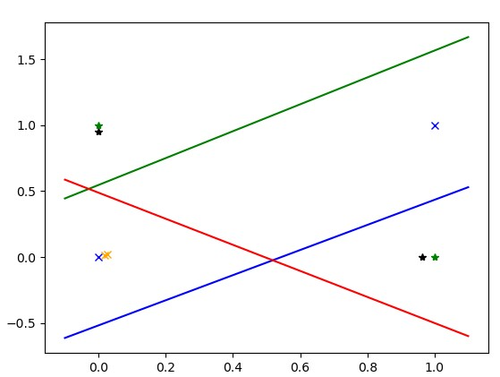

# 多层感知机，深层前馈神经网络
MLP: mulity-layer Perceptron, FFN: feedforward network

## 一、线性不可分问题
<br/>

上图中绿点为一类数据，蓝点为一类数据。能用一条分割线，将两类不同的向量分割吗？ 1969，西摩尔.帕普特 马文.明斯基发表了《感知器:计算几何学概论》一文证明，空间中存在不可分割的点集(空间维度越高，不可分割的情况会越多)，只用单层的线性分类器，即，单个分割面，无法解决线性不可分问题。

既然一条线无法分割，那就搞2条，甚至更多的分割线？该如何增加分割线呢？

## 二、线性函数+非线性函数的深度组合
如果单纯的线性方程叠加，还是线性函数，例如：f1(x) = ax+b, f2(x) = cx + d, 将f1输出放到f2里，f3(x) = c*(f1(x)) + d,   f3(x) = c * ( ax + b) + d = c * a * x + (c * b + d), 这个仍然还是一个线性函数，起不到增加分割线的作用。

通过在嵌套的线性函数中间增加一个非线性函数，例如sigmod函数，第一个函数的输出经过sigmod函数后，就能投影到不同的位置，将不可分离的位置变成可分离的，再过一个线性函数，即最终的分割线，就能达到可分的效果。

```python
import numpy as np
import matplotlib.pyplot as plt
import torch 
import torch.nn as nn
import torch.nn.functional as F

plt.plot([0,1], [1,0], '*', color='green')
plt.plot([0,1],[0,1], 'x', color='blue')

x = np.array([[0,1],[1,0],[0,0],[1,1]])
y = np.array([0,0,1,1]).reshape(-1,1) #

inX = torch.Tensor(x.reshape(-1, 2))
outY = torch.Tensor(y.reshape(-1, 1))
        
# 创建一个Xor的模型
class XOrModel(nn.Module):
    def __init__(self, input_dim, output_dim):
        super(XOrModel, self).__init__()
        hidden_dim = 2
        self.fc1 = nn.Linear(input_dim, hidden_dim,bias=True)  
        self.fc2 = nn.Linear(hidden_dim, output_dim,bias=True)  

    def forward(self, x):
        out = torch.sigmoid(self.fc1(x))  #第一层
        out = torch.sigmoid(self.fc2(x))  #第二层
        return out 
        

model = XOrModel(2, 1) #模型初始化
criterion = nn.BCELoss() #定义损失函数
optimizer = torch.optim.SGD(model.parameters(), lr=0.5, momentum=0.9) #定义优化算法

# 开始训练
for epoch in range(550):  #迭代次数
    optimizer.zero_grad() #清理模型里参数的梯度值
    predict_Y = model(inX) #根据输入获得当前参数下的输出值
    loss = criterion(predict_Y, outY) #计算误差
    loss.backward() #反向传播，计算梯度，
    optimizer.step() #更新模型参数
    # if epoch % 50 ==0:
    print('epoch {}, loss {}'.format(epoch, loss.item()))


# 画出 第一层的两个维度的独立投影，经第一层sigmod后的位置投影，
model_params = list(model.parameters())
model_weights = model_params[0].data.numpy()
model_bias = model_params[1].data.numpy()

model_weights1 = model_params[2].data.numpy()
model_bias1 = model_params[3].data.numpy()

# 第一层的两个维度的投影函数
x_1 = np.arange(-0.1, 1.1, 0.1)
y_1 = ((x_1 * model_weights[0,0]) + model_bias[0]) / (-model_weights[0,1])
plt.plot(x_1, y_1, color='green')

x_11 = np.arange(-0.1, 1.1, 0.1)
y_11 = ((x_11 * model_weights[1,0]) + model_bias[1]) / (-model_weights[1,1])
plt.plot(x_11, y_11, color='blue')

# 经第一层投影+sigmod后原始输入投影到的新位置
out = model.output(inX)
tmp = out[0].detach().numpy()
plt.plot(tmp[0],tmp[1], '*', color='black')
plt.plot(tmp[2],tmp[3], 'x', color='orange')

# 基于投影后的位置，执行分割
x_2 = np.arange(-0.1, 1.1, 0.1)
y_2 = ((x_2 * model_weights1[0,0]) + model_bias1[0]) / (-model_weights1[0,1])
plt.plot(x_2, y_2, color='red')
plt.show()

```

<br/>
1. 蓝、绿线为第一层两个不同维度(维度x绿色，维度y蓝色)的线性投影函数；
2. 经过sigmod函数后，会将原始的点投影到新的线性可分的位置，这幅图中，*(原始绿色，投影后的黑色表示) 代表的点经投影后位置基本保持不变，而 x(原始蓝色，投影后的橙色表示) 代表的点 投影到了对面的位置。
3. 红色为第二层，基于投影后的分割函数。


## 三、深度网络的反向传播
误差值从最后一层一次向后传播，直到第一层。详细说明。

反向传播中的梯度消失和梯度爆炸问题, 选择适当的[激活函数](./Activation.md)和[归一化](./Normalization.md)方法。

[Xavier_init](../paper/Xavier_init.md), 这篇论文对于隐藏层的分析，权重、梯度的分布变化，参数如何随机初始化。


## 四、欠拟合和过拟合
通过线性+非线性的深度堆叠，可以解决任何回归和分类问题。深度神经网络的宽度和深度决定了模型的拟合能力，较宽和深的网络具备更强的拟合能力。宽度选择原则？如何选择网络的深度呢？

通常将要学习的数据集拆分成训练集、验证集和测试集。

如果模型在训练集中的拟合效果就很差，叫欠拟合。加大模型深度。

如果训练集中拟合效果很好，但到了验证集上，效果变差了，说明过拟合了，需要通过一些[正则化](./regularization.md)方式减少过拟合。调整模型深度的效果在验证集上测试，当确定了模型规模后，最终再测试集上验证效果。

用于解决过拟合问题的正则化方法：
1. 减少层数
2. dropout
3. 早停

## 五、延伸阅读
除了线性+非线性函数堆叠的深度神经网络外，n次方程也能实现这个功能。例如，当空间存在n个点时，一定存在一个n-1次方程来拟合所有这些点，例如：
* 2个点， y = ax + b,
* 3个点， y = $ax^2 + bx + c$
* 4个点， y = $ax^3 + bx^2 + cx + d $ 

《多项式回归作为神经网络的代替方法》[Polynomial Regression As an Alternative to Neural Nets](https://arxiv.org/abs/1806.06850)， 这篇论文证明了多项式理论上是可以替代神经网络的。使用多项式拟合空间中的点存在的问题： 1.空间中点太多，几十万上百万时，整一个百万次方的方程，似乎有些不现实； 2. 曲线太复杂，容易过拟合。比如点分布大致是符合线性的，几个点有误差不在一条直线，如果非要用复杂的曲线完全拟合这些点，当出现新的点时，就不能有效拟合。

题外话：中国伏羲女娲像上的规矩(左侧的女娲拿着圆规，右侧的伏羲拿着拐尺)。《几何原本》中的尺规作图，直线-线性的，圆-非线性的，简单的直线和圆能够推到出几何原本中的所有命题，简单的线性和非线性堆叠能表示任意多项式函数，冥冥中存在着某种联系。

<br/>
<br/>

与生物神经网络的对比


