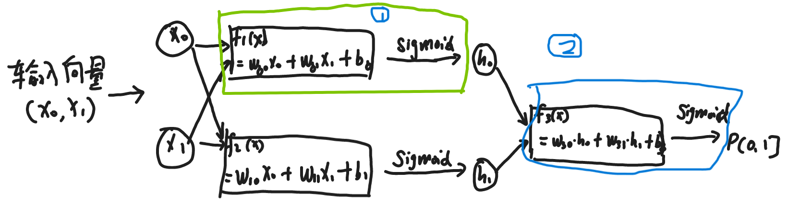

# 多层感知机，深层前馈神经网络
MLP: mulity-layer Perceptron, FFN: feedforward network

## 1. 线性不可分问题
<br/>

图 1：异或(XoR)问题示意图。绿*点为一类数据，蓝x点为一类数据。能用一条分割线，将两类不同的向量分割吗？ 1969，西摩尔.帕普特 马文.明斯基发表了《感知器:计算几何学概论》一文证明，空间中存在不可分割的点集(空间维度越高，不可分割的情况会越多)，只用单层的线性分类器，即，单个分割面，无法解决线性不可分问题。

```python
# xor问题 示意代码
import numpy as np
import matplotlib.pyplot as plt
import torch 
import torch.nn as nn
import torch.nn.functional as F

plt.plot([0,1], [1,0], '*', color='green')
plt.plot([0,1],[0,1], 'x', color='blue')
plt.show()

```

## 2. 线性+非线性函数的深度组合
如果单纯的线性方程叠加，还是线性函数，例如：f1(x) = ax+b, f2(x) = cx + d, 将f1输出放到f2里，f3(x) = c*(f1(x)) + d,   f3(x) = c * ( ax + b) + d = c * a * x + (c * b + d), 这个仍然还是一个线性函数，起不到增加分割线的作用。

通过在嵌套的线性函数中间增加一个非线性函数，例如sigmod函数，第一个函数的输出经过sigmod函数后，就能投影到不同的位置，将不可分离的位置变成可分离的，再过一个线性函数，即最终的分割线，就能达到可分的效果。

<br/>
图 2：解决XoR问题的深度模型结构。输入为具有2个维度的向量，经过两个线性函数+非线性激活函数后得到中间层的隐藏值$h_0,h_1$,讲这两个值看成一个向量的2个维度值，再经过sigmoid函数，得到所属分类的概率值。其中，绿色圈出的部分，线性+非线性组合在一起，构成一个深度神经网络中的层,非线性函数可以选择Sigmoid，也有[其他更多选择](./Activation.md)。

与生物神经网络的类比：
<br/>
图 3：生物神经细胞。树突负责从其他神经元接收信号(向量)，胞体相当于线性+激活函数，轴突将加工过的信号传递至轴突末端，轴突末端再将信号传递给下一个神经细胞。

深度网络模型架构定义清楚后，损失函数，优化器/学习率，迭代训练方式等跟[逻辑回归](./logistic_regression.md)的方法相同,不在此赘述，直接上代码。

```python
import torch 
import torch.nn as nn
import torch.nn.functional as F

torch.manual_seed(1)
    
# 创建一个Xor的模型
class XOrModel(nn.Module):
    def __init__(self, input_dim, output_dim):
        super(XOrModel, self).__init__()
        hidden_dim = 2
        self.fc1 = nn.Linear(input_dim, hidden_dim,bias=True)  
        self.fc2 = nn.Linear(hidden_dim, output_dim,bias=True)  

    def forward(self, x):
        out = torch.sigmoid(self.fc1(x))  
        out = self.fc2(out) 
        out = torch.sigmoid(out)
        return out 

    def output(self,x):
        out = torch.sigmoid(self.fc1(x)) 
        print("first:",x,out)
        
        out1 = self.fc2(out) 
        out1 = torch.sigmoid(out1)  
        print("second:",out1)
        return out,out1 

model = XOrModel(2, 1) #模型初始化
criterion = nn.BCELoss() #定义损失函数
optimizer = torch.optim.SGD(model.parameters(), lr=0.5, momentum=0.9) #定义优化算法
# optimizer = torch.optim.AdamW(model.parameters(), lr=0.5) 

features = torch.Tensor([[0,1],[1,0],[0,0],[1,1]])
labels = torch.Tensor([0,0,1,1]).unsqueeze(1)
print(labels.shape) #特别注意labels.shpe是[4,1], 而非[4]

# 开始训练
for epoch in range(550):  #迭代次数  
    predict_Y = model(features) #根据输入获得当前参数下的输出值
    loss = criterion(predict_Y, labels) #计算误差
    
    loss.backward() #反向传播，计算梯度，
    optimizer.step() #更新模型参数
    optimizer.zero_grad() #清理模型里参数的梯度值
    # if epoch % 50 ==0:
    print('epoch {}, loss {}'.format(epoch, loss.item()))


model_params = list(model.parameters())
print(model_params)

# 第一层的两个线性函数，用于将原始的向量转为新的向量
model_weights = model_params[0].data.numpy()
model_bias = model_params[1].data.numpy()

# 第一层的两个维度的投影函数
x_1 = np.arange(-0.1, 1.1, 0.1)
y_1 = ((x_1 * model_weights[0,0]) + model_bias[0]) / (-model_weights[0,1])
plt.plot(x_1, y_1, color='green')

x_11 = np.arange(-0.1, 1.1, 0.1)
y_11 = ((x_11 * model_weights[1,0]) + model_bias[1]) / (-model_weights[1,1])
plt.plot(x_11, y_11, color='green')

# no_grad设置：冻结模型的参数，不再变化
with torch.no_grad():
    # 经第一层线性函数+sigmod后，将原始输入投影到新位置
    out = model.output(features)
    tmp = out[0].detach().numpy()
    plt.plot(tmp[0],tmp[1], '*', color='black')
    plt.plot(tmp[2],tmp[3], 'x', color='orange')

# 基于投影后的位置，执行分割
model_weights1 = model_params[2].data.numpy()
model_bias1 = model_params[3].data.numpy()

x_2 = np.arange(-0.1, 1.1, 0.1)
y_2 = ((x_2 * model_weights1[0,0]) + model_bias1[0]) / (-model_weights1[0,1])
plt.plot(x_2, y_2, color='red')
plt.show()
```

<br/>
图 4：解决异或问题的说明：
1. 绿线为第一层的两个线性函数。注意这里的两条线(线性函数)不能理解为分割线的作用，而应该理解为线性投影，即：向量(x,y)经过其中1个函数投影为new_x,再通过另一个函数投影new_y,由此产生中间隐藏层的新向量(new_x,new_y)。
2. 新向量(new_x,new_y)经过sigmod函数后，会投影到新的位置，这幅图中，*(原始绿色，投影后的黑色表示) 代表的点经投影后位置基本保持不变，而 其中一个(右上)x(原始蓝色，投影后的橙色表示) 代表的点 投影到了对面的位置。经过这个投影后，把原来线性不可分的两类点集变成了线性可分的点集。
3. 红色直线为第二层的线性函数，代表投影后，点集的分割函数。


## 3. 深度网络遇到的问题
正向前馈和反向传播：网络模型接收输入，经过中间一系列层后，输出结果。这个过程叫正向前馈。而梯度变化，则要从最后的输出层算起，一步步往前计算出每个层的梯度更新值，这个过程叫梯度的反向传播。

### 3.1 梯度的反向传播
线性回归和逻辑回归，损失函数的梯度是 $y_{predict} - y_{true}$ 。而在深层神经网络中，只有最后的输出层是知道最终的预测值和真实值，因此可以得到这层的梯度。而中间隐藏层的梯度该如何确定呢？

为了说明梯度是如何反向传播，我们画出一个简化的网络结构示意图，该图只关注需要优化的参数，而激活函数自身没有参数需要优化，因此，在图中直接省略掉。
<br/>
图 3：深度网络中梯度的反向传播。
* 根据预测值和真实的差值，整体梯度：$gradient=y_{predict} - y_{true}$, 
* 参数w5的更新： w5 <= w5 - learning_rate * gradient * h1, 
* 参数W6的更新： w6 <= w6 - learning_rate * gradient * h2,
* 参数w1的更新： w1 <= w1 - learning_rate * gradient * w5 * x1 
* 参数w2的更新： w2 <= w2 - learning_rate * gradient * w5 * x2
* 参数w3的更新： w3 <= w3 - learning_rate * gradient * w6 * x1 
* 参数w4的更新： w4 <= w4 - learning_rate * gradient * w6 * x2 

通过这种方式，就能利用整体梯度值指导每层的参数更新。通常反向传播的计算机制会有深度学习框架自动实现。而更深入的原理，搜索了解复合函数求导的链式法则。

### 3.2 梯度消失和梯度爆炸
观察上面参数w5的更新，假设gradient仍然远大于0，说明模型参数还没有收敛到期望的水平，但如果中间的隐藏值h1=0，对应的梯度也将为0。w5参数将不会再更新。这种情况称为：梯度消失。当我们选择sigmoid函数时，该函数的输出区间(0,1], 如果深度网络层数很多，很快中间隐藏层的值就会趋于0，导致模型参数不再更新。

而目前更经常使用的ReLU激活函数，输出区间则是[0,$+\infty$)，区分度就会大些，经过多个隐藏层后，输出值趋于0的可能性就大为降低。因此，选择适当的 [激活函数](./Activation.md)，有助于解决梯度消失问题。

而梯度爆炸则是中间层个别值过大，导致在参数更新时，出现较大的更新幅度。这种情况通常也会影响训练的稳定性。而采用[归一化方法](./Normalization.md)，则是将同一层的所有隐藏值，经过归一化函数(如：BatchNormal,LayerNormal)后，所有值的区间投影到固定的区间。这种方法有助于提升训练时参数更新的稳定性，加速收敛。

另外，在[理解训练深度前馈神经网络的困难](../paper/Xavier_init.md)一文中, 深入地分析了梯度消失/爆炸导致的训练不稳定现象， 提供了一些分析隐藏层的方法论、不同层之间梯度分布的变化规律，该如何初始化参数，选择合适的激活函数等。

### 3.3 局部最优和全局最优
网络深度加深，模型变复杂后，寻找最优参数时，是否存在孤立的局部最优解，导致陷入此处，而无法找到全局最优解？

答：不会！


## 4. 欠拟合和过拟合
单层网络无法解决简单的异或问题，而通过线性+非线性的深度堆叠，理论上可以解决任何回归和分类问题。这样引出了另外一个问题：在面对不同问题选择模型时，我们要多深的网络(深度)？中间层需要放多少个函数(宽度)？

衡量一个理论是否有价值，不在于它能把已发生的现象解释的多么滴水不漏，而是它能够多准确的预测未来发生的现象。

在深度学习中，通常将收集到的数据拆分成相互独立的训练集、验证集和测试集。
* 训练(train)集: 用于训练过程中，指导模型参数更新；
* 验证(validation)集: 用于对比不同模型(架构完全不同，架构相同但深度宽度不同)的训练效果；
* 测试(test)集: 用于评估模型的最终效果。

<br/>
图 4：训练集和数据集效果对比，欠拟合与过拟合。
* 欠拟合(under-fitting)：模型在训练集中的拟合效果就很差，通常是因为模型容量太小导致，需要增加模型容量，例如：增加模型的深度或宽度，层与层之间增加残差连接让梯度能更有效的传播等。对应图中左侧部分。
* 过拟合(overfitting): 模型在训练集或验证集上效果很好，但测试集上的效果很差。通常是相对于数据规模来说，模型的容量太大，记住了训练集中的数据分布，而没能总结出真正的分布规律。这时，需要一些[正则化方法](./regularization.md)来减少过拟合的发生。最近解决过拟合的方式似乎比较暴力：大力出奇迹，拼了老命地扩大数据集规模。对应图中右侧部分。 

使用鸢尾花数据集说明这个问题？


## 5. 更多应用
### 5.1 训练词嵌入

### 5.2 手写数字识别 

## 6. 延伸阅读
除了线性+非线性函数堆叠的深度神经网络外，n次方程也能实现这个功能。例如，当空间存在n个点时，一定存在一个n-1次方程来拟合所有这些点，例如：
* 2个点， y = ax + b,
* 3个点， y = $ax^2 + bx + c$
* 4个点， y = $ax^3 + bx^2 + cx + d $ 

《多项式回归作为神经网络的代替方法》[Polynomial Regression As an Alternative to Neural Nets](https://arxiv.org/abs/1806.06850)， 这篇论文证明了多项式理论上是可以替代神经网络的。使用多项式拟合空间中的点存在的问题： 1.空间中点太多，几十万上百万时，整一个百万次方的方程，似乎有些不现实； 2. 曲线太复杂，容易过拟合。比如点分布大致是符合线性的，几个点有误差不在一条直线，如果非要用复杂的曲线完全拟合这些点，当出现新的点时，就不能有效拟合。

题外话：中国伏羲女娲像上的规矩(左侧的女娲拿着圆规，右侧的伏羲拿着拐尺)。《几何原本》中的尺规作图，直线-线性的，圆-非线性的，简单的直线和圆能够推到出几何原本中的所有命题，简单的线性和非线性堆叠能表示任意多项式函数，冥冥中存在着某种联系。

<br/>
<br/>


