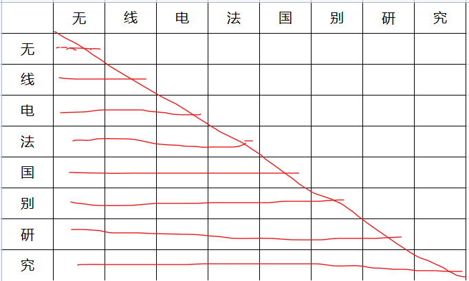
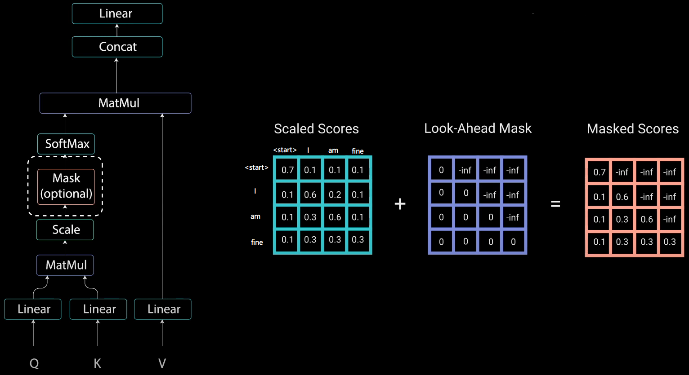
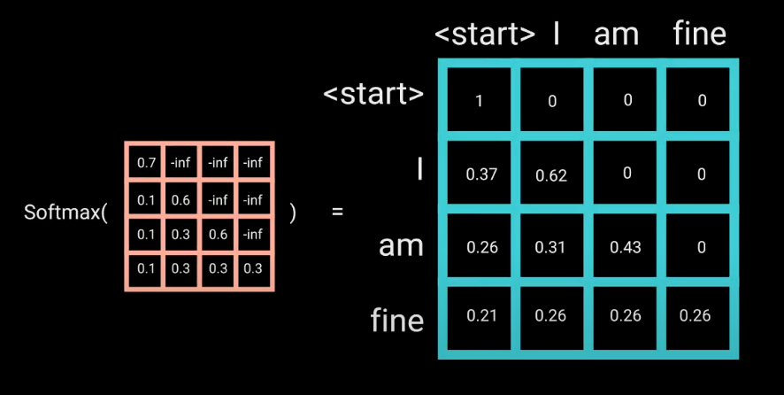
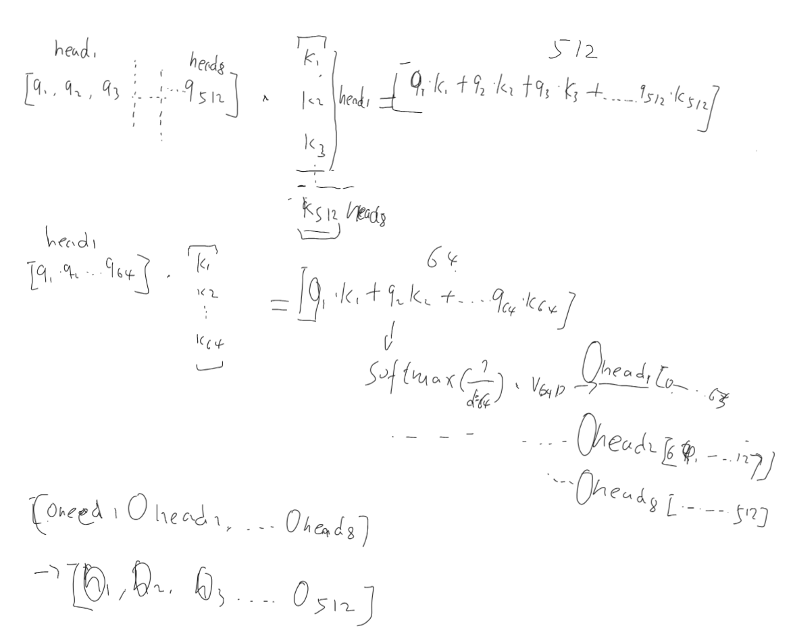

# Transformer 

无论原始论文，还是很多给新手的讲解文章，介绍Transformer都是从整体架构到局部组件一一展开来讲，这个流程非常正确，我完全赞同。 但在这篇文章中，我想换个思路，从Transformer最核心的概念讲起，核心关键点突破后，其他架构部分理解起来也就相对容易些了。 

在正式开讲前，我们先思考一下，人类是如何理解一段话的？ 

例如，看下面这段对话，领导：你这是什么意思？ 小明：没什么意思，意思意思。领导：你这就不够意思了。小明：小意思、小意思。领导：你这人真有意思。小明：其实没别的意思。 领导：那我就不好意思了。小明：是我不好意思。 同样一个词“意思”，在不同的语境中，存在不同的意思。

例如，我们来看 “无线电法国别研究” 这句文本该怎么断句，是 “无线电法” “国别研究”，还是 “无线电” “法国” “别研究” ？ 字与字的不同组合会带来不同的含义。 

通过上面的例子，我们知道，要理解一句话的真正含义，需要结合语境，需要考虑不同字词组合，需要考虑哪些词是重点，哪些不是重点，等等。而如果让机器去理解语言的含义，通常我们也需要这样做。目前非常成功的Transfomer架构里的self-attention机制原理就与此类似：将句子中的每一个语义单元(字或词或其他粒度形式)分别与其他语义单元比较，看二者的关系是否紧密(是否相关)，确定每个语义单元对于表达整句文本的重要程度，最终确定一句话的含义。

## 1 自注意力 self-attention
下面，我们将一句话中所有的语义单元(字)即作为行，也作为列，形成一个二维表格，也可以看作是一个矩阵：

<br/>
图1：注意力矩阵。我们把左侧第一列的字当作要查询的Query，右侧每一列表示一句话中被查询的所有其他(也可以包含query本身)字，称之为Keys, 我们需要某种机制用来计算每对query-key关系的相关(紧密)程度。当计算完每对query-key的相关程度后，将所有相关度看成一个整体，概率值=1的话，需要将每对(表中的单元格)的概率值计算出来，并保证所有单个概率值的和等于1. 这个通常采用softmax函数实现。

在计算Query-keys的相关(紧密)程度时，有两种方式：1. 当前Query的前、后位置的keys都查询比对，这种叫做双向模式； 2. 只查询当前query位置前的keys，这种叫单向模式，因为看不到后面的keys，类似只知道事情的起因，不知道事情的结果，因此又叫因果模式。

计算出的query-key的概率值，实际上也可以看成这组pair对整个句子语义的权重贡献度。每个字词本身也是一个向量，权重矩阵乘以这个词向量的矩阵，就能表达出整句的含义。

 <br/>
图2：自注意力机制和多头自注意力机制。

这种机制就叫自注意力(self-attention)机制。自注意力机制的数学表达式：

$ Attention(Q,K,V) = softmax( \frac{Q*K^T}{\sqrt{d_k}} ) * V $

这个式子需要解释的地方：
1. Q,K,V实际上并不是原始的Token向量构成的矩阵，而是需要经过一个线性投影得到一个新的矩阵；
2. $Q*K^T$, 表示为两组向量(构成的矩阵)的点乘(积)，点积的几何意义可以衡量两个向量的距离远近。因此，可以用它衡量query和key的相关程度。
3. $d_k$表示，K向量的维度，通常等于token向量的维度。原论文中说如果不用这个$d_k$值缩小点积，过softmax会得到一个区分度较小的值，不利于反向传播中的参数梯度更新。
4. 如果要实现因果注意力，则K右上角的值通常会设置为−∞。这样在做$Q*K^T$运算时，这部分的结果都等于0.
 <br/>
图3： 因果注意力中的掩码机制，图源：https://wmathor.com/index.php/archives/1438/ 


### 多头自注意力
假设原始的向量为512维，原始论文中提到，将这512维的向量拆成8组，每组的向量维度则变成了64维，将拆分后的每组分别过$softmax( \frac{Q*K^T}{\sqrt{d_k}} ) * V $，最终再将拆分后的值合回到512维上。 有点让每个分组去关注向量的局部子空间的意思。实验效果表明这种多头注意力机制效果会更好些。

<br/>
图4：多头自注意力的计算过程

self-attention的代码实现：

```python
# 代码来自：https://github.com/karpathy/minGPT/blob/master/mingpt/model.py
class SelfAttention(nn.Module):
    """ 多头掩码自注意力 multi-head self-attention，pytorch官方实现：torch.nn.MultiheadAttention
    """
    def __init__(self, config):
        super().__init__()
        assert config.n_embd % config.n_head == 0
        # key, query, value projections for all heads, but in a batch
        self.c_attn = nn.Linear(config.n_embd, 3 * config.n_embd)
        # output projection
        self.c_proj = nn.Linear(config.n_embd, config.n_embd)
        # regularization
        self.attn_dropout = nn.Dropout(config.attn_pdrop)
        self.resid_dropout = nn.Dropout(config.resid_pdrop)
        # causal mask to ensure that attention is only applied to the left in the input sequence
        self.register_buffer("bias", torch.tril(torch.ones(config.block_size, config.block_size))
                                     .view(1, 1, config.block_size, config.block_size))
        self.n_head = config.n_head
        self.n_embd = config.n_embd

    def forward(self, x, is_causal=True):
        B, T, C = x.size() # batch size, sequence length, embedding dimensionality (n_embd)

        # calculate query, key, values for all heads in batch and move head forward to be the batch dim
        q, k ,v  = self.c_attn(x).split(self.n_embd, dim=2)
        k = k.view(B, T, self.n_head, C // self.n_head).transpose(1, 2) # (B, nh, T, hs)
        q = q.view(B, T, self.n_head, C // self.n_head).transpose(1, 2) # (B, nh, T, hs)
        v = v.view(B, T, self.n_head, C // self.n_head).transpose(1, 2) # (B, nh, T, hs)

        # causal self-attention; Self-attend: (B, nh, T, hs) x (B, nh, hs, T) -> (B, nh, T, T)
        att = (q @ k.transpose(-2, -1)) * (1.0 / math.sqrt(k.size(-1)))
        if is_causal: #注意这里跟minGPT原始实现有变化
            att = att.masked_fill(self.bias[:,:,:T,:T] == 0, float('-inf'))
        att = F.softmax(att, dim=-1)
        att = self.attn_dropout(att)
        y = att @ v # (B, nh, T, T) x (B, nh, T, hs) -> (B, nh, T, hs)
        y = y.transpose(1, 2).contiguous().view(B, T, C) # re-assemble all head outputs side by side

        # output projection
        y = self.resid_dropout(self.c_proj(y))
        return y
```

dropout是一种正则化方法。

pytorch的官网实现：<br/>
https://pytorch.org/docs/stable/generated/torch.nn.MultiheadAttention.html


## 2 整体架构
<br/>
图5：Transformer的整体架构

原始论文[Attention Is All You Need](../paper/nlp/transformer.md)中面向的是一个翻译任务，需要将一种语言翻译成另外一种语言，使用到到的架构模型时，编码器-解码器 结构。 结合上一节自注意力模块，编码器采用双向编码机制，即Query需要查询计算与上下文中所有的语义单元的关系。而解码器则是单向编码机制，即query只查询过去的，在它之前打的语义单元的关系。事实上，目前有3种利用transfomer的形式：
1. 编码器-解码器结构：代表的是原始论文中的翻译功能，预训练模型中的[BART](../paper/nlp/BART.md), [T5](../paper/nlp/T5.md), [Marian](../paper/nlp/Marian.md)。
2. 只使用编码器(双向注意力)：[BERT](../paper/nlp/bert.md)
3. 只使用解码器(单向因果注意力)：[GPT-1](../paper/nlp/gpt.md)

### 2.1 基础的Block
基础block由Multi-Head attention(多头注意力)，LayerNorm(层归一化)，Add(残差连接)，FeedFoward(两层全连接前馈网络,线性->激活->线性)构成。通过简单的Block堆叠，即可实现模型规模的放大以增加模型容量，目前的实践表明，通过扩大数据集和模型容量产出大模型，而模型大到一定程度，就能涌现出之前不具备的能力，是发展通用人工智能的必经之路。

#### 2.1.1 层归一化 LayerNorm 
LayerNorm的使用，原始论文中是否在多头注意力的后面，而在[MAGNETO](../paper/Multimodal/MAGNETO.md)，[GPT-2](../paper/nlp/gpt_2.md)中，多头注意力前也加入了一层LayerNorm。这种方式在适应多模输入、训练时的稳定性，以及实际效果方面都比较有优势。

<br/>
图6：MAGNETO LayerNorm

#### 2.1.2 FeedFoward
是两层的MLP，这里的中间隐藏层的维度是词向量维度的4倍，各种论文中会对中间层不同维度大小做实验。

中间的激活函数使用了NewGELU,参考下面的代码实现。

另外在稀疏专家模型或多模态领域的论文中，结合路由机制，不同的token会指向不同的FeedWard层。后续再开一篇详细讲解。

#### 2.1.3 残差连接
两处用到残差连接，一处是原始输入和经过layernorm+attention后； 另一处是mlpfeedword前后。

残差概念最早是在[Resnet](../paper/cnn/resnet.md)中提出，主要目的是给梯度传播提供一条额外的路径，在深层模型结构中，有助于更好的梯度传播，减少梯度消失的情况，加速收敛，提升训练时期的稳定性。

```python
# 代码来自：https://github.com/karpathy/minGPT/blob/master/mingpt/model.py
class NewGELU(nn.Module):
    """
    Implementation of the GELU activation function currently in Google BERT repo (identical to OpenAI GPT).
    Reference: Gaussian Error Linear Units (GELU) paper: https://arxiv.org/abs/1606.08415
    """
    def forward(self, x):
        return 0.5 * x * (1.0 + torch.tanh(math.sqrt(2.0 / math.pi) * (x + 0.044715 * torch.pow(x, 3.0))))

class Block(nn.Module):
    """ an unassuming Transformer block """
    def __init__(self, config):
        super().__init__()
        self.ln_1 = nn.LayerNorm(config.n_embd)
        self.attn = SelfAttention(config) 
        self.ln_2 = nn.LayerNorm(config.n_embd)
        self.mlp = nn.ModuleDict(dict(
            c_fc    = nn.Linear(config.n_embd, 4 * config.n_embd), #两层的MLP，隐藏层维度n_embd*4
            c_proj  = nn.Linear(4 * config.n_embd, config.n_embd),
            act     = NewGELU(),  #第一层线性函数后的激活函数
            dropout = nn.Dropout(config.resid_pdrop),
        ))
        m = self.mlp
        self.mlpf = lambda x: m.dropout(m.c_proj(m.act(m.c_fc(x)))) # MLP forward

    def forward(self, x, is_causal=True):
        x = x + self.attn(self.ln_1(x),is_causal)
        x = x + self.mlpf(self.ln_2(x))
        return x
```

### 2.2 输入表示

#### 2.2.1 token 嵌入
对于输入的句子，先根据令牌器拆分成单个令牌，再到词典里寻找每个token对应的词典位置序号。初始化一个词嵌入矩阵，根据token对应的词典位置编号，获取到对应的每个token的词向量。

#### 2.2.2 位置嵌入
每个词出现的位置不一样，代表的含义不一样，为了能够区分词的位置，提供了一个位置嵌入的功能。模型允许最大输入长度L，每个token的维度D，位置嵌入就是一个L*D的矩阵。原始论文中，有两种方式得到这个位置嵌入矩阵：

第一种，sin/cos编码
* $PE_{(pos,2i)} = sin(pos/10000^{2i/d_{model}})$
* $PE_{(pos,2i+1)} = cos(pos/10000^{2i/d_{model}})$

<br/>
图7：sin/cos 位置编码。 图片来源：https://wmathor.com/index.php/archives/1438/ 。 x轴表示位置编号，不同颜色的曲线表示不同维度上的值，可以看出，维度1到维度n，曲线的变化率越来越小。

```python
# sin/cos 位置编码示意图的代码。
# 源：https://wmathor.com/index.php/archives/1438/ 
import numpy as np
import matplotlib.pyplot as plt
import math

def get_positional_encoding(max_seq_len, embed_dim):
    # 初始化一个positional encoding
    # embed_dim: 字嵌入的维度
    # max_seq_len: 最大的序列长度
    positional_encoding = np.array([
        [pos / np.power(10000, 2 * i / embed_dim) for i in range(embed_dim)]
        if pos != 0 else np.zeros(embed_dim) for pos in range(max_seq_len)])
    
    positional_encoding[1:, 0::2] = np.sin(positional_encoding[1:, 0::2])  # dim 2i 偶数
    positional_encoding[1:, 1::2] = np.cos(positional_encoding[1:, 1::2])  # dim 2i+1 奇数
    return positional_encoding

positional_encoding = get_positional_encoding(max_seq_len=100, embed_dim=16)
plt.figure(figsize=(8, 5))
plt.plot(positional_encoding[1:, 1], label="dimension 1")
plt.plot(positional_encoding[1:, 2], label="dimension 2")
plt.plot(positional_encoding[1:, 3], label="dimension 3")
plt.legend()
plt.xlabel("Sequence length")
plt.ylabel("Period of Positional Encoding")

```

第二种，先是随机(其他更好的？)初始化这个位置嵌入矩阵，在通过训练过程调整这个位置嵌入矩阵里的参数。

当训练和推理时的长度一致时，二者差别并不大，但当推理时的输入长度大于训练时的输入长度时，sin/cos可以通过两个相邻位置间插值的方式实现外推(推理长度大于训练长度)。关于推理长度和训练长度不一致后续还有更多的探索,可以参考以下几篇论文：[XPos](../paper/nlp/XPOS.md), [ALibi](../paper/nlp/Alibi.md), [RoPE](../paper/nlp/RoFormer.md)。主要思路：1. 位置嵌入不只是放在初始位置，而是放在每个self-attention中的Q,K上；2.位置嵌入和token嵌入的作用方式，分别采用加法、乘法、或者乘法+加法 3.用其他位置-维度值的算法优化sin/cos方式。


### 2.3 编码器、解码器、编码-解码器
编码器在执行自注意力时是双向的，query会计算所有位置上keys算相关度，因此，不需要将该query后面的token隐藏掉。

而解码器，比如翻译的时候，当翻译第一个token时，后面的token应该是看不到的，因此需要将后面的token隐藏掉，这是编码器和解码器的重要区别。

```python
att = (q @ k.transpose(-2, -1)) * (1.0 / math.sqrt(k.size(-1)))
if is_causal: #注意这里跟minGPT原始实现有变化
    att = att.masked_fill(self.bias[:,:,:T,:T] == 0, float('-inf'))
att = F.softmax(att, dim=-1)
```

当组合使用编码器和解码器时，有一个步骤，需要将解码器的输出与实际解码目标token结合起来使用，具体的代码如下：

``` python
# 源：https://pytorch.org/docs/stable/_modules/torch/nn/modules/transformer.html#TransformerDecoderLayer.forward
# 针对target，使用self-attention block， 单头 
x = x + self._sa_block(self.norm1(x), tgt_mask, tgt_key_padding_mask, tgt_is_causal)
# 针对encoder的输出，使用多头
x = x + self._mha_block(self.norm2(x), memory, memory_mask, memory_key_padding_mask, memory_is_causal)
# feedword layer
x = x + self._ff_block(self.norm3(x))
# 注意这个 x = x + ... , 把encoder的输出和target等结合起来的方式。
```
