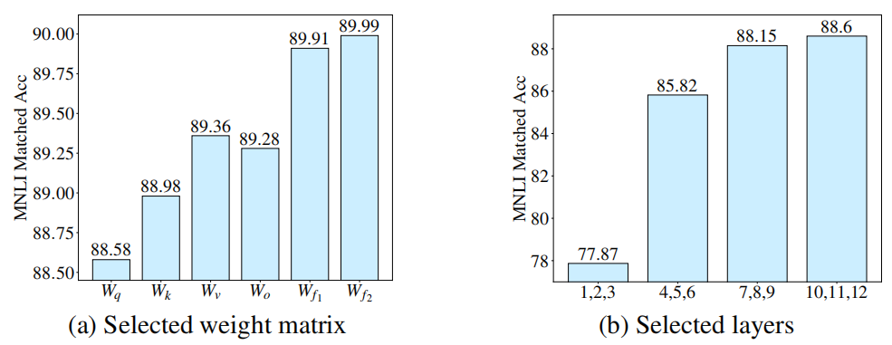

# Adaptive Budget Allocation for Parameter-Efficient Fine-Tuning 
用于参数有效微调的自适应预算分配 2023.3.18 https://arxiv.org/abs/2303.10512

## Abstract
Fine-tuning large pre-trained language models on downstream tasks has become an important paradigm in NLP. However, common practice fine-tunes all of the parameters in a pre-trained model, which becomes prohibitive when a large number of downstream tasks are present. Therefore, many fine-tuning methods are proposed to learn incremental updates of pre-trained weights in a parameter efficient way, e.g., low-rank increments. These methods often evenly distribute the budget of incremental updates across all pre-trained weight matrices, and overlook the varying importance of different weight parameters. As a consequence, the finetuning performance is suboptimal. To bridge this gap, we propose AdaLoRA, which adaptively allocates the parameter budget among weight matrices according to their importance score. In particular, AdaLoRA parameterizes the incremental updates in the form of singular value decomposition. Such a novel approach allows us to effectively prune the singular values of unimportant updates, which is essentially to reduce their parameter budget but circumvent intensive exact SVD computations. We conduct extensive experiments with several pre-trained models on natural language processing, question answering, and natural language generation to validate the effectiveness of AdaLoRA. Results demonstrate that AdaLoRA manifests notable improvement over baselines, especially in the low budget settings. Our code is publicly available at https://github.com/QingruZhang/AdaLoRA.

在下游任务上微调大型预训练的语言模型已经成为NLP中的一个重要范例。然而，通常的实践对预训练模型中的所有参数进行微调，当存在大量下游任务时，这变得令人望而却步。因此，提出了许多微调方法来以参数有效的方式学习预训练权重的增量更新，例如，低秩增量。这些方法通常将增量更新的预算均匀分布在所有预训练的权重矩阵中，并忽略了不同权重参数重要性的不同。因此，微调性能是次优的。为了弥补这一差距，我们提出了AdaLoRA，它根据权重矩阵的重要性得分在权重矩阵之间自适应地分配参数预算。特别地，AdaLoRA以奇异值分解的形式对增量更新进行参数化。这种新颖的方法使我们能够有效地修剪不重要更新的奇异值，这本质上是为了减少它们的参数预算，但避免密集的精确SVD计算。我们在自然语言处理、问答和自然语言生成方面对几个预训练的模型进行了广泛的实验，以验证AdaLoRA的有效性。结果表明，AdaLoRA比基线有显著改善，尤其是在低预算环境中。我们的代码在 https://github.com/QingruZhang/AdaLoRA.
<!-- 不同权重参数重要性的不同?  权重矩阵的重要性得分，奇异值分解-->

## 1 Introduction
Pre-trained language models (PLMs) have manifested superior performance in various natural language processing tasks (Devlin et al., 2019; Liu et al., 2019; He et al., 2021b; Radford et al., 2019; Brown et al., 2020). The most common way to adapt pre-trained models to down-stream tasks is to fine-tune all the parameters (full fine-tuning, Qiu et al. (2020); Raffel et al. (2020)). However, pre-trained models typically incurs large memory footprint. For example, BERT model (Devlin et al., 2019) consists up to 300 million parameters; T5 (Raffel et al., 2020) comprises up to 11 billion parameters and GPT-3 (Brown et al., 2020) contains up to 175 billion parameters. When building a NLP system upon these pre-trained models, we usually handle multiple tasks that arrive simultaneously (Radford et al., 2019). Given a large number of down-stream tasks, full fine-tuning requires that each task maintains a separated copy of large models. The resulting memory consumption is prohibitively expensive.

预训练语言模型(PLM)在各种自然语言处理任务中表现出优异的性能(Devlin et al., 2019; Liu et al., 2019; He et al., 2021b; Radford et al., 2019; Brown et al., 2020)。使预训练的模型适应下游任务的最常见方法是对所有参数进行微调(完全微调，Qiu et al.(2020);Raffelet al.,(2020))。然而，预训练的模型通常会占用大量内存。例如，BERT模型(Devlin et al.，2019)由多达3亿个参数组成;T5(Raffelet al.,2020)包含多达110亿个参数，GPT-3(Brownet al.,2020年)包含多达1750亿个参数。当在这些预训练的模型上构建NLP系统时，我们通常会处理同时到达的多个任务(Radford et al.，2019)。给定大量的下游任务，完全的微调需要每个任务维护一个大型模型的独立副本。由此产生的内存消耗非常昂贵。

To address this issue, researchers have proposed two main lines of research to reduce the fine-tuning parameters, while maintaining or even improving the performance of PLMs. Specifically, one line of research focuses on adding small neural modules to PLMs and fine-tune only these modules for each task – the base model is kept frozen and shared across tasks. In this way, only a small number of task-specific parameters are introduced and updated, greatly enhancing the practicality of large models. For example, adapter tuning (Houlsby et al., 2019; Rebuffi et al., 2017; Pfeiffer et al., 2020; He et al., 2022) inserts small neural modules called adapters between the layers of the base model. Prefix tuning (Li & Liang, 2021) and prompt tuning (Lester et al., 2021) attach additional trainable prefix tokens to the input or hidden layers of the base model. These methods have shown to achieve comparable performance to full fine-tuning, while only updating less than 1% of the original model parameters, significantly releasing the memory consumption.

为了解决这个问题，研究人员提出了两条主要的研究路线，以减少微调参数，同时保持甚至提高PLM的性能。具体而言，有一条研究路线侧重于将小型神经模块添加到PLM中，并为每个任务仅微调这些模块——基本模型保持冻结并在任务之间共享。这样，只引入和更新了少量特定任务的参数，大大增广了大型模型的实用性。例如，适配器调整(Houlsbyet al.,2019;Rebuffiet al.,2017;Pfeifferet al.,2020;Heet al.,2022)在基础模型的层之间插入称为适配器的小型神经模块。前缀调整(Li&Liang，2021)和提示调整(Lester et al.，2021)将额外的可预训练缀令牌附加到基础模型的输入层或隐藏层。这些方法已经证明可以实现与完全微调相当的性能，同时只更新不到1%的原始模型参数，显著释放了内存消耗。

Another line of research proposes to model the incremental update of the pre-trained weights in a parameter-efficient way, without modifying the model architecture (Zaken et al., 2021; Guo et al., 2020; Hu et al., 2022). Given a pre-trained weight matrix $W^{(0)}$(1 Unless specified otherwise, we use $W^{(0)}$ to denote any pre-trained weight matrix.), for example, diff pruning (Guo et al., 2020) models its incremental update ∆ as a sparse matrix. Diff pruning initializes ∆ as the same dimension as $W^{(0)}$ and then prunes ∆ element-wise based on the magnitude of the entries. As such, diff pruning can increase the parameter efficiency substantially by adaptively retaining important updates and pruning unimportant ones. Nonetheless, diff pruning has several limitations. First, it relies on low-level implementation to speed up the computation of unstructured sparse matrices, which is not well supported by existing deep learning frameworks. Therefore, we have to store ∆ as a dense matrix during training. Second, it needs to update every entry of ∆ with their gradients and then prune them. This results in similar computational cost as full fine-tuning (Guo et al., 2020).

另一条研究路线提出以参数有效的方式对预训练权重的增量更新进行建模，而不修改模型架构(Zaken et al., 2021; Guo et al., 2020; Hu et al., 2022)。例如，给定预训练的权重矩阵 $W^{(0)}$ (1 除非另有规定，否则我们使用$W^{(0)}$来表示任何预训练的权重矩阵)，diff修剪(Guo et al.，2020)将其增量更新∆建模为稀疏矩阵。Diff修剪将∆初始化为与$W^{(0)}$相同的维度，然后根据条目的大小逐元素修剪∆。因此，diff修剪可以通过自适应地保留重要更新和修剪不重要的更新来显著提高参数效率。尽管如此，差异修剪有几个局限性。首先，它依赖于底层实现来加快非结构化稀疏矩阵的计算，而现有的深度学习框架并没有很好地支持这一点。因此，在训练过程中，我们必须将∆存储为密集矩阵。其次，它需要用它们的梯度更新∆的每个条目，然后对它们进行修剪。这导致了与完全微调类似的计算成本(Guo et al.，2020)。

To overcome these drawbacks, Hu et al. (2022) propose a method named LoRA, which parameterizes ∆ as a low-rank matrix by the product of two much smaller matrices:

为了克服这些缺点，Hu et al.,(2022)提出了一种名为LoRA的方法，该方法通过两个小得多的矩阵的乘积将∆参数化为低秩矩阵：

$W = W^{(0)} + ∆ = W^{(0)} + BA$, (1)

where $W^{(0)}$ , $∆ ∈ R^{d_1×d_2}$ , $A ∈ R^{r×d_2}$ and $B ∈ R^{d_1×r}$ with r << {$d_1, d_2$}. During fine-tuning, only A and B are updated. The rank r is chosen to be much smaller than the dimension of W (e.g., r = 8 when $d_1 = d_2 = 1024$). With less than 0.5% additional trainable parameters, the training overhead can be reduced up to 70%, compared to full fine-tuning. However, LoRA achieves comparable or even better performance than full fine-tuning (Hu et al., 2022). Meanwhile, the product of two samll matrices is more friendly to implement and deploy than unstructured sparse matrices in diff pruning.

其中$W^{(0)}$，$∆∈R^{d_1×d_2}$，$A ∈ R^{r×d_2}$ 和 $B ∈ R^{d_1×r}$ 与 r << {$d_1, d_2$}。在微调期间，仅更新A和B。秩r被选择为比W的维度小得多(例如，当 $d_1 = d_2 = 1024$ 时，r＝8)。在不到0.5%的额外可训练参数的情况下，与完全微调相比，训练开销可以减少多达70%。然而，LoRA实现了与完全微调相当甚至更好的性能(Hu et al.，2022)。同时，在diff修剪中，两个小型矩阵的乘积比非结构化稀疏矩阵更易于实现和部署。

 
Figure 1: Given the total trainable parameters as 0.28M, we apply LoRA only to selected weight matrices (left) or selected layers (right) of DeBERTaV3-base and compare the fine-tuning performance on MNLI-m. Figure 1a: we only fine-tune a selected type of weight matrix of every transformer layer, including query/key/value projection ($W_q, W_k, W_v$), output projection ($W_o$) in the self-attention, and two weight matrices ($W_{f1} , W_{f2}$ ) in two-layer FFNs. In Figure 1b, we apply LoRA to every weight matrix of the selected layers.
图1：给定0.28M的总可训练参数，我们仅将LoRA应用于DeBERTaV3基础的选定权重矩阵(左)或选定层(右)，并比较MNLI-m上的微调性能。图1a：我们只微调每个变换器层的选定类型的权重矩阵，包括自注意中的查询/键/值投影($W_q, W_k, W_v$)、输出投影($W_o$)和两层FFN中的两个权重矩阵($W_{f1} , W_{f2}$ )。在图1b中，我们将LoRA应用于所选层的每个权重矩阵。

LoRA still has limitations as it prespecifies the rank r of each incremental matrix ∆ identical. This ignores the fact that the importance of weight matrices varies significantly across modules and layers when fine-tuning pre-trained models. To illustrate this point, we present an concrete example in Figure 1. We compare the performance of LoRA when fine-tuning specific modules or layers with the same number of trainable parameters. Figure 1a shows that fine-tuning feed-forward networks (FFN) achieves better performance than self-attention modules. In addition, Figure 1b demonstrates that weight matrices in top layers are more important than those in bottom layers.

LoRA仍然有局限性，因为它预先指定了每个增量矩阵∆的秩r相同。这忽略了这样一个事实，即当微调预训练的模型时，权重矩阵的重要性在模块和层之间变化很大。为了说明这一点，我们在图1中给出了一个具体的示例。当使用相同数量的可训练参数微调特定模块或层时，我们比较了LoRA的性能。图1a显示，微调前馈网络(FFN)比自注意模块实现了更好的性能。此外，图1b表明，顶层的权重矩阵比底层的权重矩阵更重要。

Adding more trainable parameters to the critical weight matrices can lead to better model performance. In contrast, adding more parameters to those less important weight matrices yields very marginal gains or even hurt model performance. Given the parameter budget, i.e., the number of total trainable parameters, we always prefer to allocate more parameters to those important modules. Distributing the budget evenly to all weight matrices/layers, like LoRA and other methods (e.g., adapter and prefix tuning), often gives suboptimal performance. To this end, a natural question is:

将更多可训练的参数添加到临界权重矩阵可以导致更好的模型性能。相反，在那些不太重要的权重矩阵中添加更多的参数会产生非常边际的收益，甚至损害模型性能。考虑到参数预算，即总可训练参数的数量，我们总是倾向于为那些重要的模块分配更多的参数。将预算平均分配到所有权重矩阵/层，如LoRA和其他方法(例如，适配器和前缀调整)，通常会产生次优性能。为此，一个自然的问题是：

How can we allocate the parameter budget adaptively according to importance of modules to improve the performance of parameter-efficient fine-tuning?

如何根据模块的重要性自适应地分配参数预算，以提高参数高效微调的性能？

To answer this question, we propose a new method – AdaLoRA (Adaptive Low-Rank Adaptation), which dynamically allocates the parameter budget among weight matrices during LoRA-alike finetuning. Specifically, AdaLoRA adjusts the rank of incremental matrices to control their budget. Critical incremental matrices are assigned with high rank such that they can capture more fine-grained and task-specific information. Less importance ones are pruned to have lower rank to prevent overfitting and save the computational budget. There are some methods to control the rank of matrices in the existing literature of matrix approximation (Cai et al., 2010; Koltchinskii et al., 2011; Toh & Yun, 2010). Most of them directly compute singular value decomposition (SVD) of a matrix and then truncate the smallest singular values. Such an operation can manipulate the rank explicitly and, more importantly, minimize the difference between the resulting matrix and the original matrix. However, for fine-tuning large models, it becomes prohibitively expensive to iteratively apply SVD for a large number of high-dimensional weight matrices. Therefore, instead of computing SVD exactly, we parameterize ∆ as ∆ = PΛQ to mimic SVD. The diagonal matrix Λ contains singular values while the orthogonal matrices P and Q represent left/right singular vectors of ∆. To regularize the orthogonality of P and Q, an additional penalty is added to training loss. Such a parameterization avoids the intensive computations of SVD. Besides, another advantage is that we only need to drop the unimportant singular values while the singular vectors are maintained. This preserves the possibility of future recovery and stabilizes the training. See a detailed comparison to LoRA in Section 3.

为了回答这个问题，我们提出了一种新方法 —— AdaLoRA(自适应低秩适配)，该方法在类似LoRA的微调过程中,在权重矩阵之间动态分配参数预算。具体而言，AdaLoRA调整增量矩阵的秩以控制其预算。关键增量矩阵具有较高的秩，因此它们可以捕获更细粒度和特定于任务的信息。不太重要的被修剪为具有较低的秩，以防止过拟合并节省计算预算。在现有的矩阵近似文献中，有一些控制矩阵秩的方法(Cai et al.，2010;Koltchinski et al.，2011;Toh&Yun，2010)。它们大多直接计算矩阵的奇异值分解(SVD)，然后截断最小的奇异值。这样的操作可以显式地操纵秩，更重要的是，最小化结果矩阵和原始矩阵之间的差异。然而，对于微调大型模型，迭代地将SVD应用于大量高维权重矩阵会变得非常昂贵。因此，我们不是精确计算SVD，而是将∆参数化为∆=P∧Q，以模拟SVD。对角矩阵∧包含奇异值，而正交矩阵P和Q表示∆的左/右奇异向量。为了正则化P和Q的正交性，在训练损失中添加了额外的惩罚。这样的参数化避免了SVD的密集计算。此外，另一个优点是，我们只需要在保持奇异向量的同时删除不重要的奇异值。这保留了未来恢复的可能性，并稳定了训练。参见第3节中与LoRA的详细比较。

Based on our SVD parameterization, AdaLoRA dynamically adjusts the rank of ∆ = P V Q by importance scoring. Specifically, we divide the incremental matrix PΛQ into triplets, where each triplet Gi contains the i-th singular value and the corresponding singular vectors. To quantify the importance of triplets, we propose a novel importance metric, which takes account of the contribution of every entry in Gi to the model performance (Sanh et al., 2020; Liang et al., 2021; Zhang et al., 2022). Triplets with low importance scores are granted low priority and hence the singular values are zeroed out. Triplets with high importance are retained for fine-tuning. Moreover, we also propose a global budget scheduler to facilitate the training. In particular, we start from an initial parameter budget, which is slightly higher than the final budget, and then gradually reduce it until matching the target. Such a scheduler can improve the training stability and model performance. Please see Section 3 for a detailed description of our importance metric and budget scheduler.

基于我们的SVD参数化，AdaLoRA通过重要性评分动态调整∆=P V Q的等级。具体来说，我们将增量矩阵P∧Q划分为三元组，其中每个三元组Gi包含第i个奇异值和相应的奇异向量。为了量化三元组的重要性，我们提出了一种新的重要性度量，该度量考虑了Gi中每个条目对模型性能的贡献(Sanh et al., 2020; Liang et al., 2021; Zhang et al., 2022)。具有低重要性分数的三元组被授予低优先级，因此奇异值被清零。保留具有高度重要性的三元组进行微调。此外，我们还提出了一个全局预算调度器，以促进训练。特别是，我们从一个初始参数预算开始，该预算略高于最终预算，然后逐渐减少，直到达到目标。这样的调度器可以提高训练稳定性和模型性能。请参阅第3节，了解我们的重要性度量和预算计划的详细描述。

We conduct extensive experiments on a wide range of tasks and models to demonstrate the effectiveness of AdaLoRA. Specifically, we evaluate the performance using DeBERTaV3-base (He et al., 2021a) on natural language understanding (GLUE, Wang et al. (2019)) and question answering (SQuADv1, Rajpurkar et al. (2016) and SQuADv2, Rajpurkar et al. (2018)) datasets. We also apply our methods to BART-large (Lewis et al., 2019) and evaluate the performance on natural language generation (XSum, Narayan et al. (2018) and CNN/DailyMail, Hermann et al. (2015)) tasks. We show AdaLoRA consistently outperforms the baseline, especially under low budget settings. For example, with less than 0.1% trainable parameters of full fine-tuning, AdaLoRA achieves a 1.2% F1 improvement on the SQuAD2.0 dataset compared with state-of-the-art approaches.

我们在广泛的任务和模型上进行了广泛的实验，以证明AdaLoRA的有效性。具体而言，我们使用DeBERTaV3基础(He et al.，2021a)评估自然语言理解(GLUE，Wang et al.(2019))和问答(SQuADv1，Rajpurkar et al.(2016)和SQuADv2，Rajpurka et al.(2018))数据集的性能。我们还将我们的方法应用于BART大型(Lewis et al.，2019)，并评估自然语言生成(XSum，Narayan et al.(2018)和CNN/DaylyMail，Hermann et al.(2015))任务的性能。我们发现AdaLoRA始终优于基线，尤其是在低预算环境下。例如，与最先进的方法相比，AdaLoRA在SQuAD2.0数据集上实现了1.2%的F1改进，完全微调的可训练参数不到0.1%。

## 2 BACKGROUND
Transformer-based Models. A typical transformer model consists of L stacked blocks, where each block contains two submodules: a multi-head attention (MHA) and a fully connected FFN. Given the input sequence $X ∈ R^{n×d}$ , MHA performs the attention function in parallel h heads:

基于转换器的模型。典型的转换器模型由L个堆叠块组成，其中每个块包含两个子模块：多头注意力(MHA)和全连接FFN。给定输入序列$X ∈ R^{n×d}$，MHA在并行h头中执行注意函数：

$MHA (X) = Concat(head_1, ..., head_h)W_o $, 

$head_i = Softmax ( XW_{q_i} (XW_{k_i} )^T  / \sqrt{d_h} ) XW_{v_i} $ ,

where $W_o ∈ R^{d×d}$ is an output projection and $W_{q_i} , W_{k_i} , W_{v_i} ∈ R^{d×d_h}$ are query, key and value projections of head i. $d_h$ is typically set to d/h. The other important module is a FFN which consists of two linear transformations with a ReLU activation in between: $FFN(X) = ReLU(XW_{f_1} + b_1)W_{f_2} + b_2$, where $W_{f_1} ∈ R^{d×d_m}$ and $W_{f_2} ∈ R^{d_m×d}$ . Finally, a residual connection is used followed by a layer normalization (Ba et al., 2016).

其中$W_o ∈ R^{d×d}$是输出投影，$W_{q_i} , W_{k_i} , W_{v_i} ∈ R^{d×d_h}$  是 head i 的查询、键和值投影。dh通常设置为d/h。另一个重要的模块是FFN，它由两个线性变换组成，ReLU激活介于两者之间：$FFN(X) = ReLU(XW_{f_1} + b_1)W_{f_2} + b_2$，其中$W_{f_1} ∈ R^{d×d_m}$ ， $W_{f_2} ∈ R^{d_m×d}$。最后，使用残差连接，然后进行层归一化(Baet al.,2016)。

Low Rank Adaptation. LoRA (Hu et al., 2022) models the incremental update of the pre-trained weights by the product of two small matrices. For $h = W^{(0)}x$, the modified forward pass is: 

低秩自适应。LoRA(Hu et al.，2022)通过两个小矩阵的乘积对预训练的权重的增量更新进行建模。对于$h=W^{(0)}x$，修改后的前向行程为：

$h = W^{(0)}x + ∆x = W^{(0)}x + BAx$, (2) 

where $W^{(0)}$ , $∆ ∈ R^{d_1×d_2}$ , $A ∈ R^{r×d_2}$ and $B ∈ R^{d_1×r}$ with r << {$d_1, d_2$}. A typically adopts a random Gaussion initialization while B is initialized with zero to have ∆ = 0 at the beginning of training. We further denote $A_{i∗}$ as the i-th row of A, B∗i as the i-th column of B, and $G_i$ = {$A_{i∗}, B_{∗i}$} as the i-th doublet. Hu et al. (2022) only apply LoRA to query and value projections (i.e, $W_q$ and $W_v$) in the MHAs. He et al. (2022) extend it to weight matrices of FFNs (i.e, $W_{f_1}$ and $W_{f_2}$ ), leading to the performance improvement . Meanwhile, they propose a unified view of various efficient tuning methods including adapter tuning, prefix tuning and LoRA.

其中$W^{(0)}$ , $∆ ∈ R^{d_1×d_2}$ , $A ∈ R^{r×d_2}$ and $B ∈ R^{d_1×r}$ with r << {$d_1, d_2$}。A通常采用随机高斯初始化，而B在训练开始时用零初始化为∆=0。我们进一步将Ai*表示为A的第i行，B*i表示为B的第i列，Gi={Ai*，B*i}表示为第i个二重集。Huet al.,(2022)仅将LoRA应用于MHA中的查询和价值预测(即$W_q$和$W_v$)。He et al.,(2022)将其扩展到FFN的权重矩阵(即$W_{f_1}$ 和 $W_{f_2}$)，从而提高了性能。同时，他们提出了各种高效调优方法的统一观点，包括适配器调优、前缀调优和LoRA。

## 3 ADALORA METHOD
Our method contains two important components: (i) SVD-based adaptation, which formulates the incremental matrices in the form of singular value decomposition; (ii) Importance-aware rank allocation, which prunes redundant singular values based on our newly-designed importance metric.

我们的方法包含两个重要组成部分：(i)基于奇异值分解的自适应，以奇异值分解形式表示增量矩阵; (ii)重要性感知秩分配，它基于我们新设计的重要性度量修剪冗余奇异值。

### 3.1 SVD-BASED ADAPTATION 基于SVD的自适应
As mentioned in Section 1, we propose to parameterize the incremental updates of the pre-trained weight matrices in the form of singular value decomposition:

如第1节所述，我们建议以奇异值分解的形式对预训练的权重矩阵的增量更新进行参数化：

$W = W^{(0)} + ∆ = W^{(0)} + PΛQ$, (3)

where $P ∈ R^{d_1×r}$ and $Q ∈ R^{r×d_2}$ represent the left/right singular vectors of ∆ and the diagonal matrix $Λ ∈ R^{r×r}$ contains the singular values {$λ_i$}_1 ≤ i ≤ r with r << min($d_1, d_2$). We further denote $G_i$ = {$P_{∗i} , λ_i , Q_{i∗}$} as the triplet containing the i-th singular value and vectors. In practice, since Λ is diagonal, we only need to save it as a vector in $R^r$ . Λ is initialized with zero while P and Q adopt a random Gaussian initialization to ensure ∆ = 0 at the beginning of training. To enforce the orthogonality of P and Q, i.e., $P^T P = QQ^T = I$, we utilize the following regularizer(2 We present the experiments in Appendix G to verify the effectiveness of the regularization) :

其中$P ∈ R^{d_1×r}$ 和 $Q ∈ R^{r×d_2}$表示∆的左/右奇异向量，对角矩阵 $Λ ∈ R^{r×r}$ 包含奇异值  {$λ_i$}_1 ≤ i ≤ r 和 r << min($d_1, d_2$)。我们进一步将Gi={P*i，λi，Qi*}表示为包含第i个奇异值和向量的三元组。在实践中，由于∧是对角的，我们只需要将其保存为$R^r$中的向量。∧用零初始化，而P和Q采用随机高斯初始化，以确保在训练开始时∆=0。为了加强P和Q的正交性，即$P^T P = QQ^T = I$，我们使用以下正则化(2我们在附录G中介绍了实验，以验证正则化的有效性)：

$R(P, Q) = || P^TP − I ||^2_F + || QQ^T − I ||^2_F$ . (4)

In our method, Λ is iteratively pruned to adjust the rank after each gradient decent step. As mentioned in Section 1, one can directly compute SVD for every ∆ to manipulate singular values. The computational complexity, however, is $O(min(d_1, d_2)d_1d_2)$. It becomes extremely expensive to iteratively apply SVD for a large number of high-dimensional incremental matrices. In contrast, our parameterization avoids intensive SVD computation, greatly releasing the computational overhead.

在我们的方法中，在每个梯度下降步骤之后，对∧进行迭代修剪以调整秩。如第1节所述，可以直接计算每个∆的SVD，以操纵奇异值。然而，计算复杂度是$O(min(d_1, d_2)d_1d_2)$。对于大量的高维增量矩阵迭代地应用SVD变得极其昂贵。相反，我们的参数化避免了密集的SVD计算，极大地释放了计算开销。

We remark that one can also apply structured pruning to LoRA to control the rank (i.e., prune BA doublet-wise in (1)), whereas it has the following disadvantages. First, when a doublet is measured as unimportant, we have to prune all of its elements. It makes scarcely possible to reactivate the pruned doublets as their entries are all zeroed out and not trained. In contrast, AdaLoRA only masks out the singular values based on (3) while the singular vectors are always maintained. It preserves the potential of future recovery for the triplets dropped by mistake. Second, A and B of LoRA are not orthogonal, meaning the doublets can be dependent with each other. Discarding the doublets can incur larger variation from the original matrix than truncating the smallest singular values. Therefore, the incremental matrices are often altered dramatically after each step of rank allocation, which causes training instability and even hurts generalization. To demonstrate this point, we present an ablation study in Section 4.4, which compares AdaLoRA with structured pruning for LoRA.

我们注意到，也可以将结构化修剪应用于LoRA来控制秩(即，在(1)中对BA进行双修剪)，但它有以下缺点。首先，当一个二重集被测量为不重要时，我们必须修剪它的所有元素。它几乎不可能重新激活修剪过的二重集，因为它们的条目都被归零并且没有经过训练。相反，AdaLoRA仅掩码基于(3)的奇异值，而奇异向量始终保持不变。它为错误掉落的三元组保留了未来恢复的潜力。其次，LoRA的A和B不是正交的，这意味着对偶可以相互依赖。与截断最小奇异值相比，丢弃二重集可能导致原始矩阵发生更大的变化。因此，在秩分配的每一步之后，增量矩阵往往会发生显著的变化，这会导致训练的不稳定性，甚至损害泛化能力。为了证明这一点，我们在第4.4节中介绍了一项消融研究，该研究将AdaLoRA与LoRA的结构化修剪进行了比较。

### 3.2 IMPORTANCE-AWARE RANK ALLOCATION 重要组件的秩分配
We apply the SVD-based adaptation (3) to every weight matrix including $W_q, W_k, W_v, W_{f_1} and W_{f_2}$ of each transformer layer. In order to control the budget, we iteratively prune singular values in correspondence to their importance score during the training. For clear reference, we use k to index the incremental matrix, i.e., $∆k = P_kΛ_kQ_k$ for k = 1, . . . , n, where n is the number of adapted weight matrices. We denote the i-th triplet of $∆_k$ as $G_{k,i}$ = {$P_{k,∗i} , λ_{k,i}, Q_{k,i∗}$} and its importance score as Sk,i. We further denote the parameter sets $P = \{P_k\}^n_{k=1}$, $E = \{Λk\}^n_{k=1}$, $Q = \{Qk\}^n_{k=1}$ and training cost as C(P, E, Q). With the regularization (4), the training objective is given by L(P, E, Q) = C(P, E, Q) + $γ\sum^n_{k=1}R(P_k, Q_k)$, where γ > 0 is the regularization coefficient. At the t-th step, we first take a stochastic gradient step to update $P^{(t)}_k ,Λ^{(t)}_k and Q^{(t)}_k$ for k = 1, . . . , n. Specifically, for $Λ^{(t)}$

我们将基于SVD的自适应(3)应用于每个权重矩阵，包括每个变换器层的$W_q, W_k, W_v, W_{f_1} 和 W_{f_2}$。为了控制预算，我们在训练过程中根据奇异值的重要性分数迭代修剪奇异值。为了便于参考，我们使用k来索引增量矩阵，即$∆k = P_kΛ_kQ_k$，k=1，n、 其中n是自适应权重矩阵的数目。我们将∆k的第i个三元组表示为 $G_{k,i}$={$P_{k,∗i} , λ_{k,i}, Q_{k,i∗}$}，其重要性得分表示为Sk，i。我们进一步将参数集$P = \{P_k\}^n_{k=1}$, $E = \{Λk\}^n_{k=1}$, $Q = \{Qk\}^n_{k=1}$ 和训练成本表示为C(P，E，Q)。对于正则化(4)，训练目标由  L(P, E, Q) = C(P, E, Q) + $γ\sum^n_{k=1}R(P_k, Q_k)$ 给出，其中γ>0是正则化系数。在第t步，我们首先采取随机梯度步骤来更新 $P^{(t)}_k ,Λ^{(t)}_k and Q^{(t)}_k$，n.具体而言，对于 $Λ^{(t)}$

$\hat{Λ}^{(t)}_k = Λ^{(t)}_k − η∇_{Λ_k} L(P^{(t)} , E^{(t)} , Q^{(t)} )$, (5)

where η > 0 is learning rate. Then, given importance score $S ^{(t)}_k$ , the singular values are pruned following

其中η>0为学习率。然后，给定重要性得分$S ^{(t)}_k$，奇异值被修剪如下

$Λ^{(t+1)}_k = T ( \hat{Λ}^{(t)}_k , S^{(t)}_k), $

with 

$T ( \hat{Λ}^{(t)}_k , S^{(t)}_k)_{ii} =  ˜Λ^{(t)}k,ii S^{(t)}k,i is in the top-b^{(t)}of S^{(t)}, 0 otherwise $ , (6)

where $S^{(t)}= \{S^{(t)}_{k,i}\}_{1≤k≤n,1≤i≤r}$ contains the importance score of all triplets. Here $b^{(t)}$ is the budget of remaining singular values at the t-th step, which we explain more in Section 3.3. In this way, we leave more budget to the incremental matrices of higher priority by pruning the singular values of less important ones. In the sequel, we introduce several options to design the importance score.

其中，$S^{(t)}= \{S^{(t)}_{k,i}\}_{1≤k≤n,1≤i≤r}$ 包含所有三元组的重要性得分。这里，$b^{(t)}$ 是第t步剩余奇异值的预算，我们在第3.3节中对此进行了更多解释。通过这种方式，我们通过修剪不太重要的矩阵的奇异值，将更多的预算留给优先级较高的增量矩阵。在续集中，我们介绍了几个选项来设计重要性分数。

Magnitude of singular values is the most straightforward way to quantify the importance of every triplet, i.e., $S_{k,i} = |λ_{k,i}|$. In this way, only the least significant singular values are discarded. It minimizes the deviation from the original matrix and further stabilizes the training. Many existing methods use this criterion to control the rank of matrix (Cai et al., 2010; Koltchinskii et al., 2011; Toh & Yun, 2010). However, we remark that such a simple metric cannot properly quantify the contribution of parameters to model performance.

奇异值的幅值是量化每个三元组重要性的最直接的方法，即$S_{k,i} = |λ_{k,i}|$。以这种方式，只丢弃最不重要的奇异值。它最大限度地减少了与原始矩阵的偏差，并进一步稳定了训练。许多现有的方法都使用这一标准来控制矩阵的秩(Cai et al.，2010;Koltchinski et al.，2011;Toh&Yun，2010)。然而，我们注意到，这样一个简单的度量不能正确地量化参数对模型性能的贡献。

Sensitivity-based importance is another option for importance scoring, which quantifies the sensitivity of parameters to the training loss (Molchanov et al., 2019; Sanh et al., 2020; Liang et al., 2021; Zhang et al., 2022). The prior work, however, leverages the sensitivity to quantify the importance of single entries and applies it for unstructured pruning that prunes weights element-wise. When it turns to our case, we have to design a new metric as the triplets are discarded group-wise. Every entry’s sensitivity ought to be considered and properly combined to quantify the overall contribution of the triplet to model performance. Therefore, we propose a newly-designed importance metric in account of both the singular value and vectors in triplet Gk,i:

基于敏感性的重要性是重要性评分的另一种选择，它量化了参数对训练损失的敏感性(Molchanov et al., 2019; Sanh et al., 2020; Liang et al., 2021; Zhang et al., 2022)。然而，先前的工作利用敏感性来量化单个条目的重要性，并将其应用于按元素修剪权重的非结构化修剪。当谈到我们的情况时，我们必须设计一个新的度量，因为三元组是按组丢弃的。应该考虑每个条目的敏感性，并将其适当组合，以量化三元组对模型性能的总体贡献。因此，考虑到三元组Gk，i中的奇异值和向量，我们提出了一个新设计的重要性度量：

$S_{k,i} = s(λ_{k,i}) + \frac{1}{d_1} \sum^{d_1}_{j=1} s(P_{k,ji}) + \frac{1}{d_2} \sum^{d_2}_{j=2} s(Q_{k,ji} )$, (7)

where we calculate the mean importance of $P_{k,∗i}$ and $Q_{k,∗i}$ such that $S_{k,i}$ does not scale with the number of parameters in $G_{k,i}$. Here s(·) is a specific importance function for single entries. We can adopt the sensitivity for s(·), which is defined as the magnitude of the gradient-weight product:

其中，我们计算$P_{k,∗i}$ 和 $Q_{k,∗i}$的平均重要性，使得 $S_{k,i}$ 不随 $G_{k,i}$ 中的参数数量而缩放。这里的s(·)是单个条目的特定重要性函数。我们可以采用s(·)的灵敏度，其定义为梯度权重乘积的大小：

$I(w_{ij} ) = |w_{ij}∇w_{ij}L|$, (8)

where $w_{ij}$ is any trainable parameter. (8) essentially approximates the change in loss when a parameter is zeroed out. If the removal of a parameter has a large influence, then the model is sensitive to it and we should retain it (Molchanov et al., 2019; Liang et al., 2021; Zhang et al., 2022).

其中wij是任何可训练的参数。(8) 本质上近似于当参数被清零时损失的变化。如果参数的去除有很大的影响，那么模型对它很敏感，我们应该保留它(Molchanov et al., 2019; Liang et al., 2021; Zhang et al., 2022)。

However, Zhang et al. (2022) point out that the sensitivity in (8) is not yet a reliable importance indicator. Such a score is estimated on the sampled mini batch. The stochastic sampling and complicated training dynamics incur high variability and large uncertainty for estimating the sensitivity with (8). Therefore, Zhang et al. (2022) propose to resolve this issue by sensitivity smoothing and uncertainty quantification:

然而，Zhang et al. (2022) 指出，(8)中的敏感性还不是一个可靠的重要性指标。这样的分数是在采样的小批量上估计的。随机采样和复杂的训练动力学导致了用(8)估计灵敏度的高可变性和大的不确定性。因此，Zhang et al. (2022) 提出通过灵敏度平滑和不确定性量化来解决这一问题：

$I^{(t)}(w_{ij} ) =β_1I^{(t-1)}(w_{ij} ) + (1 − β_1)I^{(t)}(w_{ij} )$ (9)

$U^{(t)}(w_{ij} ) =β_2U^{(t-1)}(w_{ij} ) + (1 − β_2)  I^{(t)}(w_{ij} ) − I^{(t)}(w_{ij} )$  , (10)

where 0 < $β_1$, $β_2$ < 1. $I^{(t)}$ is the smoothed sensitivity by exponential moving average and $U^{(t)}$ is the uncertainty term quantified by the local variation between $I^{(t)}$ and $I^{(t)}$. Then they define the importance as the product between $I^{(t)}$ and $U^{(t)}$, which can be another option for s(·):

其中0<$β_1$, $β_2$<1。$I^{(t)}$是通过指数移动平均平滑的灵敏度，而$U^{(t)}$  则是通过$I^{(t)}$。然后他们将重要性定义为$I^{(t)}$和$U^{(t)}$之间的乘积，这可以是s(·)的另一个选项：

$s^{(t)}(w_{ij} ) = I^{(t)}(w_{ij} ) · U^{(t)}(w_{ij} )$. (11)

We present a detailed ablation study in Section 4.4 to compare the performance of different importance metrics. We find the proposed metric (7) based on the sensitivity variant (11) generally performs best.

我们在第4.4节中介绍了一项详细的消融研究，以比较不同重要性指标的性能。我们发现基于灵敏度变体(11)的所提出的度量(7)通常表现最好。

We summarize the detailed algorithm in Algorithm 1.

我们在算法1中总结了详细的算法。

Algorithm 1 AdaLoRA

### 3.3 GLOBAL BUDGET SCHEDULER 全局预算调度器
As mentioned in Section 1, adjusting the rank is naturally to control the parameter budget in the context of low-rank adaptation. Hence we define the budget b^{(t)}as the total rank of all incremental matrices, i.e., the number of total singular values. Recall that the budget allocation is iteratively conducted during the fine-tuning. To facilitate the training, we propose a global budget scheduler.

如第1节所述，在低秩自适应的背景下，调整秩自然是为了控制参数预算。因此，我们将预算b(t)定义为所有增量矩阵的总秩，即总奇异值的数量。回想一下，预算分配是在微调期间反复进行的。为了便于训练，我们提出了一个全局预算调度程序。

Specifically, we start from an initial budget b (0) that is slightly higher than the target budget b (T) (e.g., 1.5 times of b (T) ). We set the initial rank of each incremental matrix as r = b (0)/n. We warm up the training for ti steps, and then follow a cubic schedule to decrease the budget b^{(t)}until it reaches b (T) . Finally, we fix the resulting budget distribution and fine-tune the model for tf steps. The exact equation for the budget schedule is presented in Appendix A. This allows AdaLoRA to explore the parameter space first and then focus on the most important weights later.

具体地说，我们从初始预算b(0)开始，该预算略高于目标预算b(T)(例如，b(T)的1.5倍)。我们将每个增量矩阵的初始秩设置为r＝b(0)/n。我们为ti步的训练热身，然后遵循三次计划来减少预算b(t)，直到它达到b(t)。最后，我们修复了由此产生的预算分布，并对tf步骤的模型进行了微调。预算时间表的精确方程如附录A所示。这使得AdaLoRA可以首先探索参数空间，然后再关注最重要的权重。

## 4 EXPERIMENTS
We implement AdaLoRA for fine-tuning DeBERTaV3-base (He et al., 2021a) and BART-large (Lewis et al., 2019). We evaluate the effectiveness of the proposed algorithm on natural language understanding (GLUE, Wang et al. (2019)), question answering (SQuADv1, Rajpurkar et al. (2016) and SQuADv2, Rajpurkar et al. (2018)), and natural language generation (XSum, Narayan et al. (2018) and CNN/DailyMail Hermann et al. (2015)). All the gains have passed significant tests with p < 0.05.

我们实现了AdaLoRA来微调DeBERTaV3碱基(Heet al.,2021a)和BART大(Lewiset al.,2019)。我们评估了所提出的算法在自然语言理解(GLUE，Wang et al.(2019))、问题回答(SQuADv1，Rajpurkar et al.(2016)和SQuADv2，Rajpurka et al.(2018))和自然语言生成(XSum，Narayanet al.,(2018)和CNN/DailyMail-Hermann et al.(2015))方面的有效性。所有的收益都通过了显著的检验，p＜0.05。

Implementation Details. We use PyTorch (Paszke et al., 2019) to implement all the algorithms. Our implementation is based on the publicly available Huggingface Transformers(3 https://github.com/huggingface/transformers) (Wolf et al., 2019) code-base. All the experiments are conducted on NVIDIA V100 GPUs.

实施细节。我们使用PyTorch(Paszke et al.，2019)来实现所有算法。我们的实现基于公开的Huggingface Transformers (Wolf et al.，2019)代码库。所有实验都是在NVIDIA V100 GPU上进行的。

LoRA scales ∆x by α/r where α is a constant in r. As a result, the magnitude of output can be consistent given different r. It reduces the efforts of retuning learning rate when varying r. Typically α is set as 16 or 32 and never tuned (Hu et al., 2022; Yang & Hu, 2020). Following LoRA, we add the same scaling for (3) and fix α as LoRA. Besides, in Algorithm 1, we prune singular values every ∆T steps (e.g., ∆T = 100) such that the pruned triplets can still get updated within these intervals and possibly reactivated in future iterations.

LoRA用α/r来缩放∆x，其中α是r中的常数。因此，给定不同的r，输出的幅度可以是一致的。当r变化时，它减少了重新调整学习率的努力。通常，α被设置为16或32，并且从不调整(Hu et al.，2022;杨和胡，2020)。在LoRA之后，我们为(3)添加相同的缩放，并将α固定为LoRA。此外，在算法1中，我们每∆T步(例如∆T=100)修剪奇异值，这样修剪后的三元组仍然可以在这些间隔内更新，并可能在未来的迭代中重新激活。

Baselines. We compare
* Full fine-tuning is the most common approach for adaptation. During fine-tuning, the model is initialized with pre-trained weights and biases, and all model parameters undergo gradient updates.
* Bitfit (Zaken et al., 2021) is an effective parameter-efficient fine-tuning method. The method only fine-tunes bias vectors in the pre-trained model.
* Adapter tuning (Houlsby et al., 2019; Pfeiffer et al., 2020) inserts two-layer adapters between transformer blocks. We compare with two types of adapter. Houlsby adapter as proposed in Houlsby et al. (2019) is inserted between the self-attention module and the FFN module followed by a subsequent residual connection. Recently, Pfeiffer et al. (2020) propose a more efficient design with adapters only applied after FFN modules and LayerNorm modules (Ba et al., 2016), which we call Pfeiffer adapter. The number of trainable parameters is determined by the number of layers, the hidden dimension of adapters and the dimension of their inputs.
* LoRA (Hu et al., 2022) is a state-of-the-art method for parameter-efficient fine-tuning. The method parameterizes incremental updates by two small matrices and only fine-tune them. The number of trainable parameter is controlled by the rank r and the number of adapted weight matrices n. Hu et al. (2022) apply LoRA to query and value projections only. In empirical, we find that applying LoRA to all weight matrices, i.e., Wq, Wk, Wv, Wf1 and Wf2 , can further improve its performance (Please see Appendix F). Hence, we compare with this generalized LoRA to maximize its performance. We use publicly available implementation 4 to run all the baselines. Please refer to Hu et al. (2022) and reference therein for details.

基线。我们比较
* 全面微调是适应的最常见方法。在微调过程中，使用预训练的权重和偏差初始化模型，并对所有模型参数进行梯度更新。
* Bitfit(Zaken et al.，2021)是一种有效的参数高效微调方法。该方法仅微调预训练模型中的偏差向量。
* 适配器微调(Houlsbyet al.,2019;Pfeifferet al.,2020)在转换器块之间插入两层适配器。我们比较了两种类型的适配器。Houlsbyet al.,提出的Houlsby适配器。(2019)插入自注意模块和FFN模块之间，然后是后续的剩余连接。最近，Pfeifferet al.,(2020)提出了一种更有效的设计，其中适配器仅应用于FFN模块和LayerNorm模块之后(Ba et al.，2016)，我们称之为Pfeiffr适配器。可训练参数的数量由层的数量、适配器的隐藏维度及其输入的维度决定。
* LoRA(Hu et al.，2022)是一种最先进的参数有效微调方法。该方法通过两个小矩阵对增量更新进行参数化，并且只对它们进行微调。可训练参数的数量由秩r和自适应权重矩阵的数量n控制。Huet al.,(2022)仅将LoRA应用于查询和值投影。在经验中，我们发现将LoRA应用于所有权重矩阵，即Wq、Wk、Wv、Wf1和Wf2，可以进一步提高其性能(请参见附录F)。因此，我们将其与该广义LoRA进行比较，以最大限度地提高其性能。我们使用公开可用的实现4来运行所有基线。详情请参考Huet al.,(2022)及其参考文献。

Table 1: Results with DeBERTaV3-base on GLUE development set. The best results on each dataset are shown in bold. We report the average correlation for STS-B. Full FT, HAdapter and PAdapter represent full fine-tuning, Houlsby adapter, and Pfeiffer adapter respectively. We report mean of 5 runs using different random seeds.
表1：基于GLUE发育集的DeBERTaV3结果。每个数据集的最佳结果以粗体显示。我们报告了STS-B的平均相关性。全FT、HAdapter和PAdapter分别代表全微调、Houlsby适配器和Pfeiffer适配器。我们报告了使用不同随机种子的5次运行的平均值。

### 4.1 NATURAL LANGUAGE UNDERSTANDING 自然语言理解
Models and Datasets. We evaluate the fine-tuning performance of DeBERTaV3-base (He et al., 2021a) using the proposed algorithm. We conduct experiments on the General Language Understanding Evaluation (GLUE, Wang et al. 2019) benchmark. The benchmark includes two single-sentence classification tasks, three similarity and paraphrase tasks and four natural language inference tasks. Dataset details are summarized in Appendix B.

模型和数据集。我们使用所提出的算法评估了DeBERTaV3-base(He et al.，2021a)的微调性能。我们在通用语言理解评估(GLUE，Wang et al.2019)基准上进行了实验。该基准包括两个单句分类任务、三个相似和转述任务以及四个自然语言推理任务。附录B中总结了数据集的详细信息。

Implementation Details. DeBERTaV3-base consists of 183 millions parameters. We compare AdaLoRA with the baselines under different budget levels, for example, given the total trainable parameters as 0.3/0.6/1.2 million. In order to match the parameter budget, we select the hidden dimensions of adapters from {8, 16, 32, 64}, set the rank r of LoRA as {2, 4, 8}, and choose the final budget b (T) of AdaLoRA from {144, 288, 576}. Then we set b (0) as 1.5 times of b (T) for AdaLoRA and select the regularization coefficient γ from {0.1, 0.3, 0.5}. We set the exponential moving average parameters β1 and β2 as their default value 0.85. We select the learning rate from {5 × 10−5 , 8 × 10−5 , 1 × 10−4 , 2 × 10−4}. More details are presented in Appendix C.

实施细节。DeBERTaV3基础由1.83亿个参数组成。例如，我们将AdaLoRA与不同预算水平下的基线进行了比较，假设总可训练参数为0.3/0.6/120万。为了匹配参数预算，我们从{8，16，32，64}中选择适配器的隐藏维度，将LoRA的秩r设置为{2，4，8}，并从{144288576}中选择AdaLoRA的最终预算b(T)。然后，我们将b(0)设置为AdaLoRA的b(T)的1.5倍，并从{0.1，0.3，0.5}中选择正则化系数γ。我们将指数移动平均参数β1和β2设置为它们的默认值0.85。我们从{5×10−5，8×10−5.1×10−4，2×10−4}中选择学习率。更多细节见附录C。

Main results. We compare AdaLoRA with the baseline methods under different budget settings. Table 1 shows experimental results on the GLUE development set. We see that AdaLoRA achieves better or on par performance compared with existing approaches on all datasets under all budget levels. For example, when the parameter budget is 0.3M, AdaLoRA achieves 87.36% accuracy on RTE, which is 1.8% higher than the best-performing baseline. Besides, AdaLoRA with extreme low budget can often perform better than the baselines with higher budget. For example, AdaLoRA achieve 70.04% Mcc. score on CoLA with 0.3M fine-tuning parameters, which is higher than all baseline methods with lager budget (e.g., 0.6M and 1.2M).

主要结果。我们将AdaLoRA与不同预算设置下的基线方法进行了比较。表1显示了GLUE开发套件的实验结果。我们看到，在所有预算水平下，与现有方法相比，AdaLoRA在所有数据集上都实现了更好或同等的性能。例如，当参数预算为0.3 M时，AdaLoRA在RTE上的准确率为87.36%，比性能最佳的基线高1.8%。此外，预算极低的AdaLoRA通常比预算较高的基线表现更好。例如，AdaLoRA实现了70.04%Mcc。CoLA的得分为0.3 M微调参数，高于所有预算较大的基线方法(如0.6 M和1.2 M)。

### 4.2 QUESTION ANSWERING 问答
Models and Datasets. We evaluate performance of the proposed algorithm on two question answering (QA) datasets: SQuAD v1.1 (Rajpurkar et al., 2016) and SQuADv2.0 (Rajpurkar et al., 2018), where we use AdaLoRA to fine-tune DeBERTaV3-base. These tasks are treated as a sequence labeling problem, where we predict the probability of each token being the start and end of the answer span. Dataset details can be found in Appendix D.

模型和数据集。我们在两个问答(QA)数据集上评估了所提出算法的性能：SQuAD v1.1(Rajpurkar et al.，2016)和SQuADv2.0(Rajpurka et al.，2018)，其中我们使用AdaLoRA来微调DeBERTaV3基础。这些任务被视为序列令牌问题，我们预测每个令牌成为答案跨度的开始和结束的概率。数据集详细信息见附录D。

4https://github.com/microsoft/LoRA

Table 2: Results with DeBERTaV3-base on SQuAD v1.1 and SQuADv2.0. Here # Params is the number of trainable parameters relative to that in full fine-tuning. We report EM/F1. The best results in each setting are shown in bold.
表2：基于SQuAD v1.1和SQuADv2.0的DeBERTaV3结果。这里，#Params是相对于完全微调中的可训练参数的数量。我们报告EM/F1。每个设置中的最佳结果以粗体显示。

Implementation Details. We compare AdaLoRA with the baseline methods under different parameter budgets. That is we have the number of trainable parameters as 0.08%/0.16%/0.32%/0.65% of total pre-trained parameters. To match the budget requirements, we select the hidden dimensions of adapters from {4, 8, 16, 32, 64}, set the rank r of LoRA as {1, 2, 4, 8} and choose the final total rank b (T) of AdaLoRA from {72, 144, 288, 576}. We set the batch size as 16. We use AdamW (Loshchilov & Hutter, 2019) as the optimizer and we set the learning rate as 1 × 10−3 for AdaLoRA. Please refer to Appendix D for more details.

实施细节。我们将AdaLoRA与基线方法在不同参数预算下进行了比较。即，我们的可训练参数的数量为总预训练参数的0.08%/0.16%/0.32%/0.65%。为了匹配预算要求，我们从{4，8，16，32，64}中选择适配器的隐藏维度，将LoRA的秩r设置为{1，2，4，8}，并从{72144288576}中选择AdaLoRA的最终总秩b(T)。我们将批量大小设置为16。我们使用AdamW(Loshchilov&Hutter，2019)作为优化器，并将AdaLoRA的学习率设置为1×10−3。有关更多详细信息，请参阅附录D。

Main Results. Table 2 summarizes experimental results when we fine-tune DeBERTaV3-base under 4 different budget settings: 0.08%, 0.16%, 0.32% and 0.65% of total pre-trained parameters. From the result, we see that AdaLoRA consistently outperforms existing approaches under all the budget levels in term of two evaluation metrics: exact match (EM) and F1. Notice that the performance of Houlsby adapter and Pfeiffer adapter are notably decreased when we reduce the parameter budget. In contrast, our method shows the consistent performance under different budget levels. For example, AdaLoRA achieves 88.7% F1 on SQuADv2.0 with the smallest budget 0.08%. It is close to its performance under the high budget and it is also 1.2% higher than the best-performing baseline.

主要结果。表2总结了当我们在4种不同的预算设置下微调DeBERTaV3基础时的实验结果：0.08%、0.16%、0.32%和0.65%的总预训练参数。从结果中，我们可以看出，在所有预算水平下，AdaLoRA在两个评估指标方面始终优于现有方法：精确匹配(EM)和F1。请注意，当我们减少参数预算时，Houlsby适配器和Pfeiffer适配器的性能显著降低。相比之下，我们的方法显示了在不同预算水平下的一致性能。例如，AdaLoRA在SQuADv2.0上以0.08%的最小预算实现了88.7%的F1成绩。这接近其在高预算下的表现，也比表现最好的基线高出1.2%。

### 4.3 NATURAL LANGUAGE GENERATION 自然语言生成
Table 3: Results with BART-large on XSum and CNN/DailyMail. Here # Params is the number of trainable parameters relative to that in full fine-tuning. We report R-1/2/L. The best results are shown in bold.
表3：XSum和CNN/DaylyMail上BART大的结果。这里，#Params是相对于完全微调中的可训练参数的数量。我们报告R-1/2/L。最佳结果以粗体显示。

Models and Datasets. To provide a comparison with the state-of-the-art in natural language generation (NLG) tasks, we apply AdaLoRA to fine-tune a BART-large model (Lewis et al., 2019). We evaluate model performance on two datasets: XSum (Narayan et al., 2018) and CNN/DailyMail (Hermann et al., 2015).

模型和数据集。为了与最先进的自然语言生成(NLG)任务进行比较，我们将AdaLoRA应用于BART大型模型的微调(Lewis et al.，2019)。我们在两个数据集上评估了模型性能：XSum(Narayan et al.，2018)和CNN/DaylyMail(Hermann et al.，2015)。

Implementation Details. Similarly as DeBERTav3-base, we apply low-rank/SVD-based adaptation to every weight matrix of both encoder and decoder layers. We report ROUGE 1/2/L scores (R-1/2/L, Lin (2004)). We set the training epochs as 15. For XSum, we set the beam length as 8 and batch size as 64. For CNN/DailyMail, we set the beam length as 4 and batch size as 32. Please see Appendix E for the detailed configuration.

实施细节。类似于DeBERTav3基础，我们将基于低秩/SVD的自适应应用于编码器和解码器层的每个权重矩阵。我们报告了ROUGE 1/2/L评分(R-1/2/L，Lin(2004))。我们将训练周期定为15年。对于XSum，我们将光束长度设置为8，批量大小设置为64。对于美国有线电视新闻网/每日邮报，我们将波束长度设置为4，批量大小设置为32。详细配置请参见附录E。

Main Results. Experimental results are summarized in Table 3, where we compare the fine-tuning performance under four budget levels: the number of trainable parameters is 0.13%, 0.26%, 1.10% and 2.20% of total pre-trained parameters. We see that AdaLoRA achieves better or on par performance compared with the baseline on both datasets (XSum and CNN/DailyMail) under all the budget levels. For example, AdaLoRA achieves 21.13 R-2 score when budget level is 1.10%, compared with 19.89 for LoRA.

主要结果。实验结果总结在表3中，我们比较了四个预算水平下的微调性能：可训练参数的数量分别为预训练参数总数的0.13%、0.26%、1.10%和2.20%。我们看到，在所有预算水平下，与两个数据集(XSum和CNN/DaylyMail)的基线相比，AdaLoRA实现了更好或不相上下的性能。例如，当预算水平为1.10%时，AdaLoRA的R-2得分为21.13，而LoRA的得分为19.89。

### 4.4 ANALYSIS 分析
Different budget levels. Figure 2 illustrates experimental results of fine-tuning DeBERTaV3-base under different budget levels. We see that on all the three datasets (MNLI-m, SQuADv2.0 and XSum), AdaLoRA achieves consistent performance improvement under all the budget levels compared with the baseline. The performance gain is more significant when increasing the budget for the XSum task, suggesting a high budget can help NLG tasks. Note that on the MNLI and SQuADv2.0 datasets, the performance of AdaLoRA under low budget levels (≤ 1%) can match the results of high budget settings. For example, AdaLoRA achieves 88.78% F1 on SQuADv2.0 when the budget is 0.16%. It is close to the performance (88.89% F1) of the highest budget (4.65%) with a more significant gain over the baseline.

不同的预算水平。图2显示了在不同预算水平下微调DeBERTaV3基础的实验结果。我们看到，在所有三个数据集(MNLI-m、SQuADv2.0和XSum)上，与基线相比，AdaLoRA在所有预算级别下都实现了一致的性能改进。当增加XSum任务的预算时，性能增益更显著，这表明高预算可以帮助NLG任务。请注意，在MNLI和SQuADv2.0数据集上，AdaLoRA在低预算水平(≤1%)下的性能可以与高预算设置的结果相匹配。例如，当预算为0.16%时，AdaLoRA在SQuADv2.0上实现了88.78%的F1。它接近最高预算(4.65%)的性能(88.89%F1)，比基线有更显著的增益。

Figure 2: Fine-tuning performance under different budget levels. We compare AdaLoRA with the generalized LoRA that applies to every weight matrix.
图2：在不同预算水平下对性能进行微调。我们将AdaLoRA与适用于每个权重矩阵的广义LoRA进行了比较。

Comparison to low-rank parameterization. As mentioned in Section 3.1, one can alternatively prune LoRA doublet-wise to conduct the rank allocation. In this case, the doublets are zeroed out entirely, raising the barrier to reactivate them. It can cause training instability and hurt the generalization when some crucial doublets are pruned by mistake. In Table 4, we compare AdaLoRA with pruning LoRA on three datasets (SST-2, RTE, and CoLA) to illustrate this point. We apply the same importance score, budget scheduler and training setups as Section 4.1 for pruning LoRA. We can see that AdaLoRA outperforms pruning LoRA on all the datasets under all the budget levels.

与低秩参数化的比较。如第3.1节所述，可以选择性地修剪LoRA二重集以进行秩分配。在这种情况下，二重态被完全归零，从而提高了重新激活它们的屏障。当一些关键的对偶被错误地修剪时，它会导致训练的不稳定性，并损害泛化能力。在表4中，我们在三个数据集(SST-2、RTE和CoLA)上比较了AdaLoRA和修剪LoRA，以说明这一点。我们应用与第4.1节相同的重要性分数、预算调度器和训练设置来修剪LoRA。我们可以看到，在所有预算级别下，AdaLoRA在所有数据集上都优于修剪LoRA。

Table 4: We present two ablation studies in this table: (i) Comparison between AdaLoRA and structured pruning on LoRA. (ii) Comparison of different importance metrics for AdaLoRA.
表4：我们在该表中介绍了两项消融研究：(i)AdaLoRA和LoRA结构化修剪之间的比较。(ii)AdaLoRA不同重要性指标的比较。

Variants of the importance score. Recall that in AdaLoRA, the importance score is defined by the sensitivity and uncertainty of every entry in the triplet (7). In Table 4, we examine two variants of the importance score: (i) changing s(·) in (7) to sensitivity-only; (ii) directly defining Si as |λi |. From the results, we can see that the proposed importance score generally performs best. The other two variants can degenerate the model performance up to 0.9%.

重要性分数的变体。回想一下，在AdaLoRA中，重要性得分是由三元组中每个条目的敏感性和不确定性定义的(7)。在表4中，我们检查了重要性评分的两种变体：(i)将(7)中的s(·)改为仅敏感性;(ii)直接将Si定义为|λi|。从结果中可以看出，所提出的重要性评分通常表现最好。其他两种变体可以使模型性能退化高达0.9%。

The role of two components. We remark that both two components of our method - SVD adaptation and adaptive budget allocation, play vital roles for the performance gain. To demonstrate it, we compare AdaLoRA with the following variants: (i) SVD-LoRA: fine-tuning only with the proposed SVD-based adaptation in (3) and (4); (ii) LoRAregu: LoRA with orthogonal regularization (4) on A and B; (iii) AdaLoRAγ = 0: AdaLoRA without orthogonal regularization (4). Table 5 present the results when fine-tuning DeBERTaVe-base on SST-2 and MNLI. We can see that fine-tuning only with SVD adaptation shows an improvement over LoRA but cannot match the performance of AdaLoRA. Meanwhile, without SVD orthogonal regularization, the performance of AdaLoRA can degenerate. These results validate that both components contribute to the model performance.

两个组成部分的作用。我们注意到，我们的方法的两个组成部分——SVD自适应和自适应预算分配，对性能增益起着至关重要的作用。为了证明这一点，我们将AdaLoRA与以下变体进行了比较：(i)SVD-LoRA：仅与(3)和(4)中提出的基于SVD的自适应进行微调;(ii)LoRAregu:A和B上具有正交正则化(4)的LoRA;(iii)阿达洛拉γ=0：没有正交正则化的阿达洛拉(4)。表5给出了在SST-2和MNLI基础上微调DeBERTaVe时的结果。我们可以看到，仅使用SVD自适应的微调显示出对LoRA的改进，但无法与AdaLoRA的性能相匹配。同时，如果没有SVD正交正则化，AdaLoRA的性能可能会退化。这些结果验证了这两个组件对模型性能的贡献。

Table 5: We present ablation studies about SVD-based adaptation, orthogonal regularization, and budget allocation in this table. For MNLI, we report the average score of m/mm acc.
表5：我们在该表中介绍了关于基于SVD的自适应、正交正则化和预算分配的消融研究。对于MNLI，我们报告了根据。

The resulting budget distribution. Figure 3 shows the resulting rank of each incremental matrix of DeBERTaV3-base fine-tuned with AdaLoRA. We find that AdaLoRA always prefers to allocating more budget to FFNs and top layers. Such behavior aligns with our empirical conclusions presented in Figure 1 that weight matrices of FFN moduels and top layers are more important for model performance. Hence, it validates that our proposed importance metric can guide AdaLoRA to focus on crucial modules. Meanwhile, the rank distribution generated by AdaLoRA is consistent across different budget levels, tasks and models. It means the number of remaining parameters is linearly scaled with b (T) and hence we can tune b (T) to control the remaining parameters.

由此产生的预算分配。图3显示了用AdaLoRA微调的DeBERTaV3基的每个增量矩阵的结果秩。我们发现，AdaLoRA总是倾向于将更多预算分配给FFN和顶层。这种行为与我们在图1中给出的经验结论一致，即FFN模块和顶层的权重矩阵对模型性能更重要。因此，它验证了我们提出的重要性度量可以指导AdaLoRA专注于关键模块。同时，AdaLoRA生成的等级分布在不同的预算级别、任务和模型中是一致的。这意味着剩余参数的数量与b(T)成线性比例，因此我们可以调整b(T)来控制剩余参数。

Figure 3: The resulting rank of each incremental matrix when fine-tuning DeBERTaV3-base on MNLI with AdaLoRA. Here the x-axis is the layer index and the y-axis represents different types of adapted weight matrices.
图3：当使用AdaLoRA基于MNLI微调DeBERTaV3时，每个增量矩阵的结果秩。这里，x轴是层索引，y轴表示不同类型的自适应权重矩阵。

## 5 CONCLUSION
We propose a parameter-efficient fine-tuning method – AdaLoRA that adaptively allocates the parameter budget according to importance scoring. In AdaLoRA, we parameterize the incremental updates of weight matrices in the form of singular value decomposition. Then, we dynamically allocate the parameter budget among incremental matrices by manipulating the singular values based on a new importance metric. Such an a pproach effectively improves the model performance and parameter efficiency. We conduct extensive experiments on natural language processing, question answering and natural language generation tasks. Results show that AdaLoRA outperforms existing approaches.

我们提出了一种参数有效的微调方法——AdaLoRA，该方法根据重要性评分自适应地分配参数预算。在AdaLoRA中，我们以奇异值分解的形式对权重矩阵的增量更新进行参数化。然后，我们基于一个新的重要性度量，通过操纵奇异值，在增量矩阵之间动态分配参数预算。这种方法有效地提高了模型性能和参数效率。我们对自然语言处理、问题回答和自然语言生成任务进行了广泛的实验。结果表明，AdaLoRA优于现有方法。

## REFERENCES 
* Jimmy Lei Ba, Jamie Ryan Kiros, and Geoffrey E Hinton. Layer normalization. arXiv preprint arXiv:1607.06450, 2016. 
* Tom B. Brown, Benjamin Mann, Nick Ryder, Melanie Subbiah, Jared Kaplan, Prafulla Dhariwal, Arvind Neelakantan, Pranav Shyam, Girish Sastry, Amanda Askell, Sandhini Agarwal, Ariel Herbert-Voss, Gretchen Krueger, Tom Henighan, Rewon Child, Aditya Ramesh, Daniel M. Ziegler, Jeffrey Wu, Clemens Winter, Christopher Hesse, Mark Chen, Eric Sigler, Mateusz Litwin, Scott Gray, Benjamin Chess, Jack Clark, Christopher Berner, Sam McCandlish, Alec Radford, Ilya Sutskever, and Dario Amodei. Language models are few-shot learners. In Hugo Larochelle, Marc’Aurelio Ranzato, Raia Hadsell, Maria-Florina Balcan, and Hsuan-Tien Lin (eds.), Advances in Neural Information Processing Systems 33: Annual Conference on Neural Information Process￾ing Systems 2020, NeurIPS 2020, December 6-12, 2020, virtual, 2020. 
* Jian-Feng Cai, Emmanuel J Cand`es, and Zuowei Shen. A singular value thresholding algorithm for matrix completion. SIAM Journal on optimization, 20(4):1956–1982, 2010. 
* Jacob Devlin, Ming-Wei Chang, Kenton Lee, and Kristina Toutanova. BERT: Pre-training of deep bidirectional transformers for language understanding. In Proceedings of the 2019 Conference of the North American Chapter of the Association for Computational Linguistics: Human Language Technologies, Volume 1 (Long and Short Papers), pp. 4171–4186, Minneapolis, Minnesota, 2019. Association for Computational Linguistics. doi: 10.18653/v1/N19-1423. 
* Demi Guo, Alexander M Rush, and Yoon Kim. Parameter-efficient transfer learning with diff pruning. arXiv preprint arXiv:2012.07463, 2020. 
* Junxian He, Chunting Zhou, Xuezhe Ma, Taylor Berg-Kirkpatrick, and Graham Neubig. Towards a unified view of parameter-efficient transfer learning. In International Conference on Learning Representations, 2022. URL https://openreview.net/forum?id=0RDcd5Axok. 
* Pengcheng He, Jianfeng Gao, and Weizhu Chen. Debertav3: Improving deberta using electra-style pre-training with gradient-disentangled embedding sharing. arXiv preprint arXiv:2111.09543, 2021a. 
* Pengcheng He, Xiaodong Liu, Jianfeng Gao, and Weizhu Chen. Deberta: Decoding-enhanced bert with disentangled attention. In International Conference on Learning Representations, 2021b. 
* Karl Moritz Hermann, Tomas Kocisky, Edward Grefenstette, Lasse Espeholt, Will Kay, Mustafa Suleyman, and Phil Blunsom. Teaching machines to read and comprehend. Advances in neural information processing systems, 28, 2015. 
* Neil Houlsby, Andrei Giurgiu, Stanislaw Jastrzebski, Bruna Morrone, Quentin De Laroussilhe, Andrea Gesmundo, Mona Attariyan, and Sylvain Gelly. Parameter-efficient transfer learning for nlp. In International Conference on Machine Learning, pp. 2790–2799. PMLR, 2019. 
* Edward J Hu, yelong shen, Phillip Wallis, Zeyuan Allen-Zhu, Yuanzhi Li, Shean Wang, Lu Wang, and Weizhu Chen. LoRA: Low-rank adaptation of large language models. In International Conference on Learning Representations, 2022. URL https://openreview.net/forum? id=nZeVKeeFYf9. 
* Vladimir Koltchinskii, Karim Lounici, and Alexandre B Tsybakov. Nuclear-norm penalization and optimal rates for noisy low-rank matrix completion. The Annals of Statistics, 39(5):2302–2329, 2011. 
* Brian Lester, Rami Al-Rfou, and Noah Constant. The power of scale for parameter-efficient prompt tuning. In Proceedings of the 2021 Conference on Empirical Methods in Natural Language Processing, pp. 3045–3059, Online and Punta Cana, Dominican Republic, November 2021. Association for Computational Linguistics. doi: 10.18653/v1/2021.emnlp-main.243. URL https: //aclanthology.org/2021.emnlp-main.243. 
* Mike Lewis, Yinhan Liu, Naman Goyal, Marjan Ghazvininejad, Abdelrahman Mohamed, Omer Levy, Ves Stoyanov, and Luke Zettlemoyer. Bart: Denoising sequence-to-sequence pre-training for natural language generation, translation, and comprehension. arXiv preprint arXiv:1910.13461, 2019. 
* Xiang Lisa Li and Percy Liang. Prefix-tuning: Optimizing continuous prompts for generation. In Chengqing Zong, Fei Xia, Wenjie Li, and Roberto Navigli (eds.), Proceedings of the 59th Annual Meeting of the Association for Computational Linguistics and the 11th International Joint Conference on Natural Language Processing, ACL/IJCNLP 2021, (Volume 1: Long Papers), Virtual Event, August 1-6, 2021, pp. 4582–4597. Association for Computational Linguistics, 2021. doi: 10.18653/v1/2021.acl-long.353. URL https://doi.org/10.18653/v1/2021.acl-long.353. 
* Chen Liang, Simiao Zuo, Minshuo Chen, Haoming Jiang, Xiaodong Liu, Pengcheng He, Tuo Zhao, and Weizhu Chen. Super tickets in pre-trained language models: From model compression to improving generalization. In Proceedings of the 59th Annual Meeting of the Association for Computational Linguistics and the 11th International Joint Conference on Natural Language Processing (Volume 1: Long Papers), pp. 6524–6538, Online, 2021. Association for Computational Linguistics. doi: 10.18653/v1/2021.acl-long.510. 
* Chin-Yew Lin. Rouge: A package for automatic evaluation of summaries. In Text summarization branches out, pp. 74–81, 2004. 
* Yinhan Liu, Myle Ott, Naman Goyal, Jingfei Du, Mandar Joshi, Danqi Chen, Omer Levy, Mike Lewis, Luke Zettlemoyer, and Veselin Stoyanov. Roberta: A robustly optimized bert pretraining approach. arXiv preprint arXiv:1907.11692, 2019. 
* Ilya Loshchilov and Frank Hutter. Decoupled weight decay regularization. In 7th International Conference on Learning Representations, ICLR 2019, New Orleans, LA, USA, May 6-9, 2019. OpenReview.net, 2019. 
* Pavlo Molchanov, Arun Mallya, Stephen Tyree, Iuri Frosio, and Jan Kautz. Importance estimation for neural network pruning. In IEEE Conference on Computer Vision and Pattern Recognition, CVPR 2019, Long Beach, CA, USA, June 16-20, 2019, pp. 11264–11272. Computer Vision Foundation / IEEE, 2019. doi: 10.1109/CVPR.2019.01152. 
* Shashi Narayan, Shay B Cohen, and Mirella Lapata. Don’t give me the details, just the sum￾mary! topic-aware convolutional neural networks for extreme summarization. arXiv preprint arXiv:1808.08745, 2018. 
* Adam Paszke, Sam Gross, Francisco Massa, Adam Lerer, James Bradbury, Gregory Chanan, Trevor Killeen, Zeming Lin, Natalia Gimelshein, Luca Antiga, Alban Desmaison, Andreas K¨opf, Edward Yang, Zachary DeVito, Martin Raison, Alykhan Tejani, Sasank Chilamkurthy, Benoit Steiner, Lu Fang, Junjie Bai, and Soumith Chintala. Pytorch: An imperative style, high-performance deep learning library. In Hanna M. Wallach, Hugo Larochelle, Alina Beygelzimer, Florence d’Alch´e￾Buc, Emily B. Fox, and Roman Garnett (eds.), Advances in Neural Information Processing Systems 32: Annual Conference on Neural Information Processing Systems 2019, NeurIPS 2019, December 8-14, 2019, Vancouver, BC, Canada, pp. 8024–8035, 2019. 
* Jonas Pfeiffer, Aishwarya Kamath, Andreas R¨uckl´e, Kyunghyun Cho, and Iryna Gurevych. Adapter￾fusion: Non-destructive task composition for transfer learning. arXiv preprint arXiv:2005.00247, 2020. 
* Xipeng Qiu, Tianxiang Sun, Yige Xu, Yunfan Shao, Ning Dai, and Xuanjing Huang. Pre-trained models for natural language processing: A survey. Science China Technological Sciences, 63(10): 1872–1897, 2020. 
* Alec Radford, Jeffrey Wu, Rewon Child, David Luan, Dario Amodei, Ilya Sutskever, et al. Language models are unsupervised multitask learners. OpenAI blog, 1(8):9, 2019. 
* Colin Raffel, Noam Shazeer, Adam Roberts, Katherine Lee, Sharan Narang, Michael Matena, Yanqi Zhou, Wei Li, Peter J Liu, et al. Exploring the limits of transfer learning with a unified text-to-text transformer. J. Mach. Learn. Res., 21(140):1–67, 2020. 
* Pranav Rajpurkar, Jian Zhang, Konstantin Lopyrev, and Percy Liang. SQuAD: 100,000+ questions for machine comprehension of text. In Proceedings of the 2016 Conference on Empirical Methods in Natural Language Processing, pp. 2383–2392, Austin, Texas, 2016. Association for Computational Linguistics. doi: 10.18653/v1/D16-1264. 
* Pranav Rajpurkar, Robin Jia, and Percy Liang. Know what you don’t know: Unanswerable questions for SQuAD. In Proceedings of the 56th Annual Meeting of the Association for Computational Linguistics (Volume 2: Short Papers), pp. 784–789, Melbourne, Australia, 2018. Association for Computational Linguistics. doi: 10.18653/v1/P18-2124. 
* Sylvestre-Alvise Rebuffi, Hakan Bilen, and Andrea Vedaldi. Learning multiple visual domains with residual adapters. Advances in neural information processing systems, 30, 2017. 
* Victor Sanh, Thomas Wolf, and Alexander M. Rush. Movement pruning: Adaptive sparsity by fine-tuning. 2020. 
* Kim-Chuan Toh and Sangwoon Yun. An accelerated proximal gradient algorithm for nuclear norm regularized linear least squares problems. Pacific Journal of optimization, 6(615-640):15, 2010. 
* Alex Wang, Amanpreet Singh, Julian Michael, Felix Hill, Omer Levy, and Samuel R. Bowman. GLUE: A multi-task benchmark and analysis platform for natural language understanding. In 7th International Conference on Learning Representations, ICLR 2019, New Orleans, LA, USA, May 6-9, 2019. OpenReview.net, 2019. 
* Thomas Wolf, Lysandre Debut, Victor Sanh, Julien Chaumond, Clement Delangue, Anthony Moi, Pierric Cistac, Tim Rault, R´emi Louf, Morgan Funtowicz, et al. Huggingface’s transformers: State-of-the-art natural language processing. ArXiv preprint, abs/1910.03771, 2019. 
* Greg Yang and Edward J Hu. Feature learning in infinite-width neural networks. arXiv preprint arXiv:2011.14522, 2020. 
* Elad Ben Zaken, Shauli Ravfogel, and Yoav Goldberg. Bitfit: Simple parameter-efficient fine-tuning for transformer-based masked language-models. arXiv preprint arXiv:2106.10199, 2021. 
* Qingru Zhang, Simiao Zuo, Chen Liang, Alexander Bukharin, Pengcheng He, Weizhu Chen, and Tuo Zhao. Platon: Pruning large transformer models with upper confidence bound of weight importance. In International Conference on Machine Learning, pp. 26809–26823. PMLR, 2022.

## A GLOBAL BUDGET SCHEDULE
As mentioned in Section 3.3, we propose a global budget scheduler to gradually decrease the budget b^{(t)}following a cubic schedule. The detailed equation is given as follows: b^{(t)}=    b (0) 0 ≤ t < ti b (T) +  b (0) − b (T)   1 − t−ti−tf

T −ti−tf  3 ti ≤ t < T − tf b (T) o.w. . (12)

## B GLUE DATASET STATISTICS
We present the dataset statistics of GLUE (Wang et al., 2019) in the following table.

Table 6: Summary of the GLUE benchmark.

## C NATURAL LANGUAGE UNDERSTANDING
### C.1 BUDGET CONFIGURATION
For each budget level, we tune the final budget b (T) for AdaLoRA, the rank r for LoRA, the hidden dimension d for two adapters to match the budget requirements.

Table 7: Detailed budget setup for GLUE benchmark.

Alternatively, we can also set the final average rank r¯ (T) = b (T)/n for AdaLoRA to control the budget, which is set as 2, 4, and 8 given the final budget as 144, 288, and 576 respectively. Then we select the initial rank r from {4, 6, 12} for the final average rank {2, 4, 8} respectively.

### C.2 TRAINING DETAILS
We tune the learning rate from {8 × 10−5 , 5 × 10−5 , 3 × 10−5 , 1 × 10−4 , 3 × 10−4 , 5 × 10−4 , 8 × 10−4 , 1 × 10−3} and pick the best learning rate for every method. For each dataset, the batch size is set as identical for every method. 

Table 8: Hyper-parameter setup of AdaLoRA for GLUE benchmark.

## D QUESTION ANSWERING
### D.1 BUDGET CONFIGURATION
Given the budget, we control the trainable parameters for each method as the following table.

Table 9: Detailed budget setup for question answering.

### D.2 TRAINING DETAILS
We set the batch size as 16. We select the learning rate from {8 × 10−5 , 5 × 10−5 , 3 × 10−5 , 1 × 10−4 , 3 × 10−4 , 5 × 10−4 , 8 × 10−4 , 1 × 10−3} and pick the best-performing learning rate for every method. The configuration of AdaLoRA is listed in the following table.

Table 10: Hyper-parameter setup of AdaLoRA for question answering tasks.

### D.3 DATASET
The statistics of question answering datasets are summarized in Table 11.

Table 11: Statistics of the SQuAD dataset.

## E NATURAL LANGUAGE GENERATION
### E.1 BUDGET CONFIGURATION
Given the budget, we control the trainable parameters for each method as the following table. 

Table 12: Detailed budget setup for summarization tasks.

### E.2 TRAINING DETAILS
We set the batch size as 16. We select the learning rate from {8 × 10−5 , 5 × 10−5 , 3 × 10−5 , 1 × 10−4 , 3 × 10−4 , 5 × 10−4 , 8 × 10−4 , 1 × 10−3} and pick the best-performing learning rate for every method. The configuration of AdaLoRA is listed in the following table.

Table 13: Hyper-parameter setup of AdaLoRA for summarization tasks.

## F ABLATION STUDY FOR LORA
As mentioned in Section 4, we find that the performance of LoRA can be further improved when applying it to every weight matrix, compared to fine-tuning Wq and Wv only (Hu et al., 2022). This observation aligns with the empirical results of He et al. (2022). In Table 14, we follow the same training configuration as Section 4.1 and present an ablation study to illustrate this point.

Table 14: We compare the fine-tuning performance when apply LoRA to every weight matrix or Wq, Wv only. The parameter budget is fixed as 0.3M. We report accuracy for QQP and MRPC, accuracy(m) for MNLI, and average correlation for STS-B.

## G ORTHOGONAL REGULARIZATION
To verify the effectiveness of (4), we plot k P > P − Ik 2

F and k QQ> − Ik 2

F to show whether P and Q are regularized to be orthogonal. We fine-tune a DeBERTaV3-base model on SST-2 with AdaLoRA and follow the same training configuration as Section 4.1. We set γ as 0.1 and plot the two terms along the training horizon. From Figure 4, we can see that two regularization terms can be optimized to a very small value (e.g., 0.001) at the beginning of training. Therefore, both P and Q can be enforced to be orthogonal quickly during the initial warm-up of AdaLoRA. It ensures that the triplets are not dependent with each other.

## H COMPARISON OF TRAINING COST
We compare the training cost between AdaLoRA and LoRA in the following table. We use two methods to fine-tune DeBERTaV3-base on a single NVIDIA V100 GPU. We do training only and set hyperparameters, e.g., batch size and training epochs, the same as in Section 4.

Table 15 shows that MARVEL incurs 11% additional training time on MNLI and 16% on SQuADv2 under different budgets. The memory footprint of two methods are quite close. Such results demonstrate that MARVEL does not incur significant training overheads. The reason behind is that 

Figure 4: We plot the k P > P − Ik 2

F and k QQ> − Ik 2

F when fine-tuning DeBERTaV3-base on SST-2.

Table 15: Comparison of practical training cost between AdaLoRA and LoRA.
 
AdaLoRA 13.226 GB 71 min we only evaluate the importance score for small incremental matrices PΛQ. Their total number of parameters is usually less than 1% of pre-trained weights. Therefore, it does not lead to significant computational cost to update the importance scores of these well-structured small matrices, compared to forward-backward pass of full model. 17 > ||P

P −

I||2F > ||QQ −

I||2F > ||P

P −

I||2F > ||QQ −

I||2F
