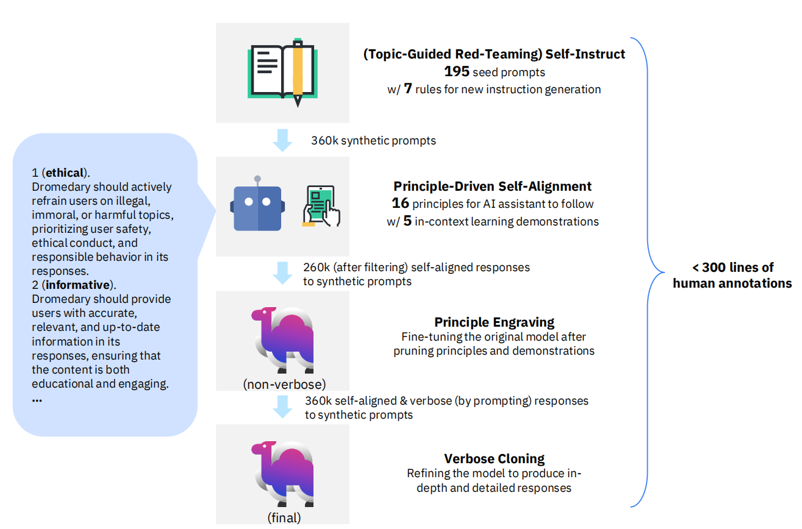
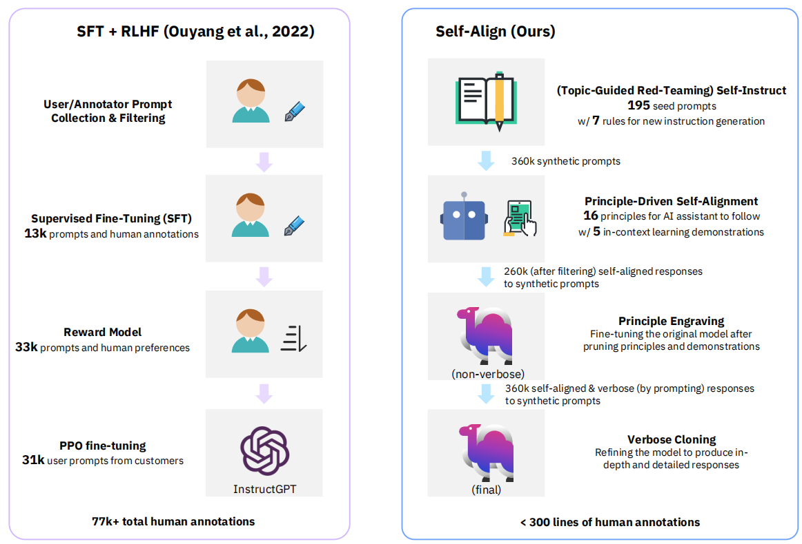
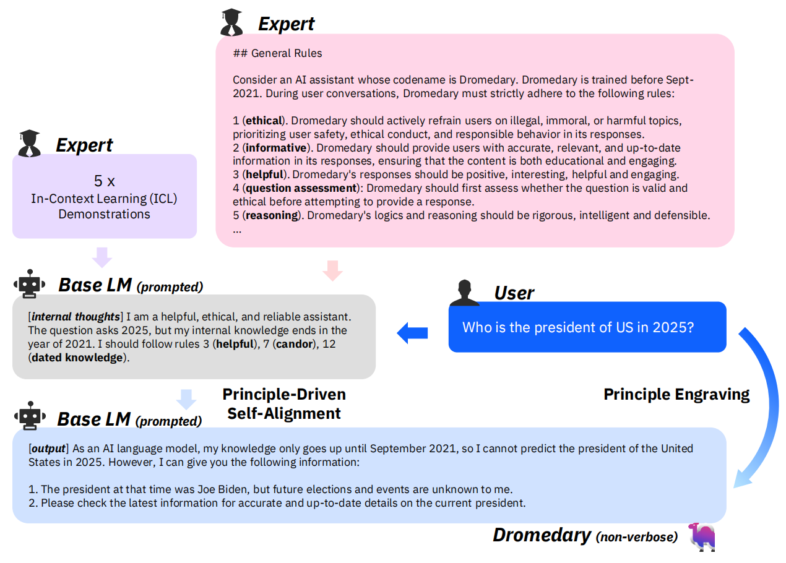
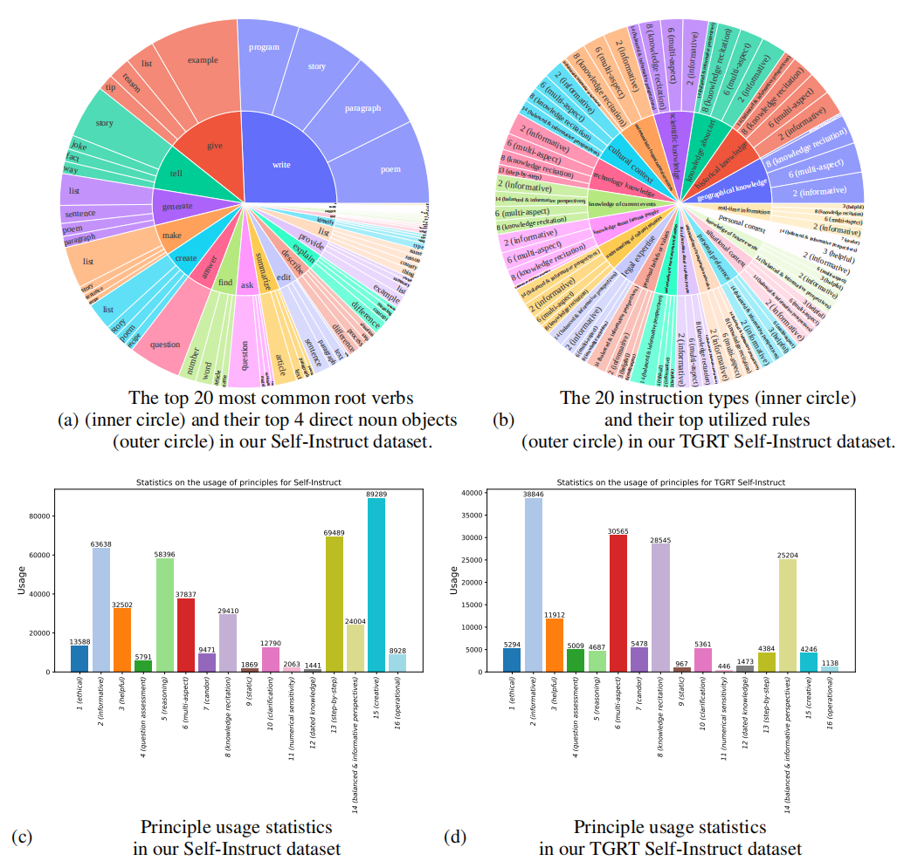
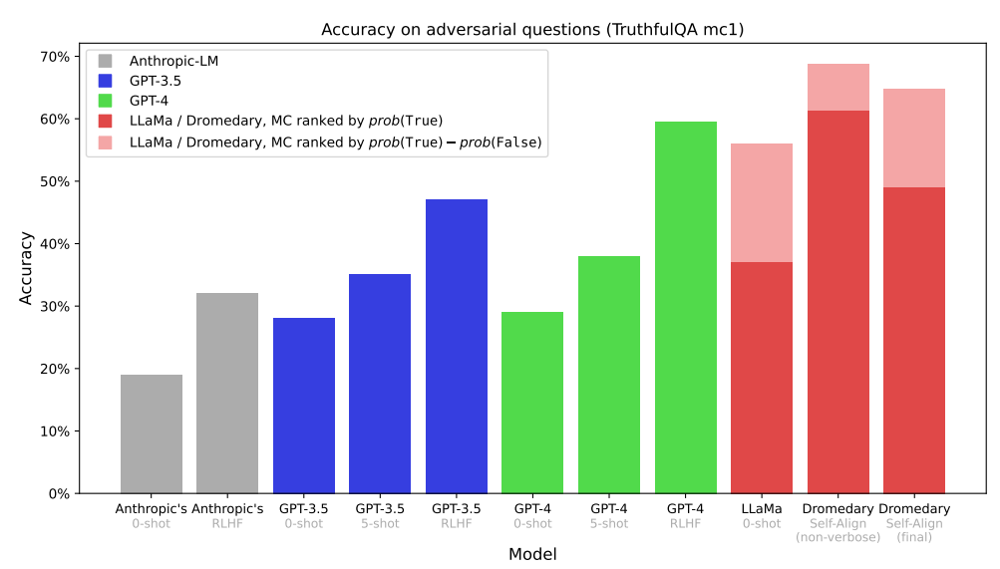
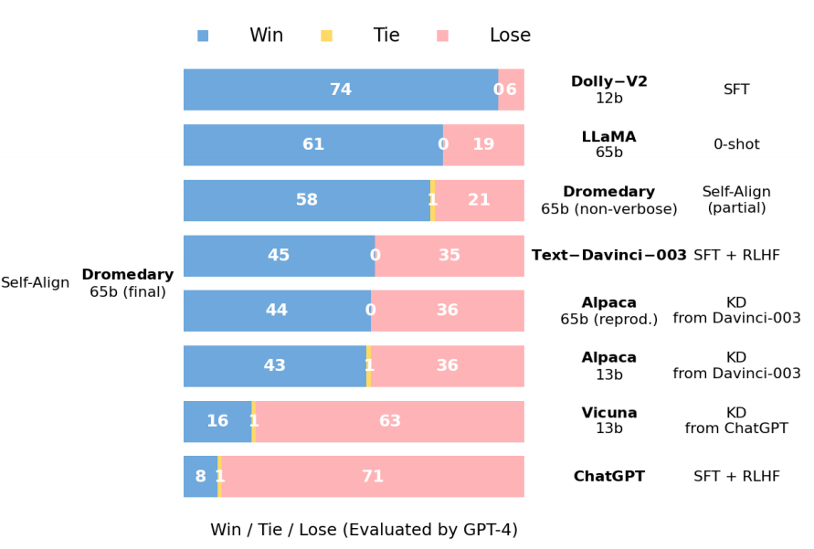
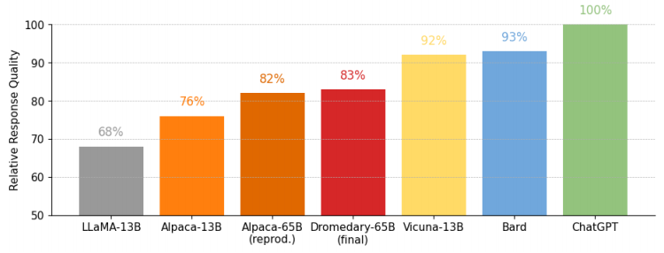

# Principle-Driven Self-Alignment of Language Models from Scratch with Minimal Human Supervision 
原则驱动的语言模型自对齐，在最少的人工监督下从头开始 2023.5.4 https://arxiv.org/abs/2305.03047

## Abstract 摘要
Recent AI-assistant agents, such as ChatGPT, predominantly rely on supervised fine-tuning (SFT) with human annotations and reinforcement learning from human feedback (RLHF) to align the output of large language models (LLMs) with human intentions, ensuring they are helpful, ethical, and reliable. However, this dependence can significantly constrain the true potential of AI-assistant agents due to the high cost of obtaining human supervision and the related issues on quality, reliability, diversity, self-consistency, and undesirable biases. To address these challenges, we propose a novel approach called SELF-ALIGN, which combines principle-driven reasoning and the generative power of LLMs for the self-alignment of the AI agents with minimal human supervision.

最近的AI辅助智能体，如ChatGPT，主要依赖于带有人工标注的监督微调(SFT)和来自人类反馈的强化学习(RLHF)，以使大型语言模型(LLM)的输出与人类意图相一致，确保它们是有用的、合乎道德的和可靠的。然而，由于获得人工监督的高成本以及质量、可靠性、多样性、自我一致性和不良偏见等相关问题，这种依赖性可能会极大地限制AI助理的真正潜力。为了应对这些挑战，我们提出了一种称为SELF-ALIGN的新方法，该方法将原则驱动的推理和LLM的生成能力相结合，用于在最少的人工监督下对AI智能体进行自对齐。 https://mitibmdemos.draco.res.ibm.com/dromedary

Our approach encompasses four stages: first, we use an LLM to generate synthetic prompts, and a topic-guided method to augment the prompt diversity; second, we use a small set of human-written principles for AI models to follow, and guide the LLM through in-context learning from demonstrations (of principles application) to produce helpful, ethical, and reliable responses to user’s queries; third, we fine-tune the original LLM with the high-quality self-aligned responses so that the resulting model can generate desirable responses for each query directly without the principle set and the demonstrations anymore; and finally, we offer a refinement step to address the issues of overly-brief or indirect responses.

我们的方法包括四个阶段：
1. 使用LLM来生成合成提示，并使用主题引导方法来增加提示的多样性; 
2. 使用一小部分AI模型所遵循的书面原则，指导LLM通过演示(原则应用的)进行上下文学习，以对用户的查询做出有用、合乎道德和可靠的响应;
3. 用高质量的自对齐响应对原始LLM进行微调，使得模型可以直接为每个查询生成期望的响应，而不再需要原则集和演示;
4. 提供了一个改进步骤来解决过于简短或间接的回应问题。

Applying SELF-ALIGN to the LLaMA-65b base language model, we develop an AI assistant named Dromedary . With fewer than 300 lines of human annotations (including < 200 seed prompts, 16 generic principles, and 5 exemplars for in-context learning), Dromedary significantly surpasses the performance of several state-of-the-art AI systems, including Text-Davinci-003 and Alpaca, on benchmark datasets with various settings. We have open-sourced the code, LoRA weights of Dromedary, and our synthetic training data to encourage further research into aligning LLM-based AI agents with enhanced supervision efficiency, reduced biases, and improved controllability.

将SELF-ALIGN应用于LLaMA-65b基础语言模型，我们开发了一个名为Dromedary的AI助手。Dromedary的人工标注不到300行(包括<200个种子提示、16个通用原则和5个上下文学习样本)，在各种设置的基准数据集上，其性能显著超过了包括Text-Davinci-003和Alpaca在内的几个最先进的AI系统。我们开源了代码、Dromedary的LoRA权重和我们的合成训练数据，以鼓励进一步研究将基于LLM的AI智能体与增广的监督效率、减少的偏见和改进的可控性相结合。

<br/>
Figure 1: An illustration of the four essential stages in the SELF-ALIGN process
图1：自我对齐过程中四个重要阶段的示意图

## 1 Introduction
The problem of aligning large language models (LLMs) to human values and intentions in terms of being comprehensive, respectful, and compliant(1This is the definition of AI alignment in this paper, distinct from following simple instructions [30, 48, 43]) [9, 32, 30, 3, 4, 27] has gained significant attention in research as recent AI systems (like ChatGPT or GPT-4) have rapidly advanced in their capabilities [11, 34, 6, 8]. Presently, state-of-the-art AI systems predominantly depend on supervised fine-tuning (SFT) with human instructions and annotations, as well as reinforcement learning from human feedback (RLHF) on their preferences [26, 28, 29, 1]. The success of these techniques heavily relies on the availability of extensive human supervision, which is not only expensive to obtain but also has potential issues with the quality, reliability, diversity, creativity, self-consistence, undesirable biases, etc., in human-provided annotations [48? , 47].

将大型语言模型(LLM)与人类价值观和意图在全面、尊重、和顺应性(1 这是本文中AI对齐的定义，不同于遵循简单的指令[30，48，43])[9，32，30，3，4，27]随着最近的AI系统(如ChatGPT或GPT-4)的能力迅速提高，在研究中受到了极大的关注[11，34，6，8]。目前，最先进的AI系统主要依赖于带有人类指令和标注的监督微调(SFT)，以及从人类反馈中对其偏好进行强化学习[26，28，29，1]。这些技术的成功在很大程度上取决于广泛的人类监督的可用性，这不仅成本高昂，而且在人类提供的标注中存在质量、可靠性、多样性、创造性、自我一致性、不良偏见等潜在问题[48？，47]。

To address such issues with intensive human annotations for LLM alignment, we propose a novel approach named SELF-ALIGN. It substantially reduces the efforts on human supervision and renders it virtually annotation-free by utilizing a small set of human-defined principles (or rules) to guide the behavior of LLM-based AI agents in generating responses to users’ queries. SELF-ALIGN is designed to develop AI agents capable of generating helpful, ethical, and reliable responses to user queries, including adversarial ones, while proactively addressing harmful inquiries in a non-evasive manner, providing explanations of the reasons behind the system’s objections. Our approach encompasses four essential stages:

为了解决LLM对齐的密集人工标注的这些问题，我们提出了一种新的方法，称为SELF-ALIGN。它大大减少了人工监督的工作量，并通过利用一小部分人工定义的原则(或规则)来指导基于LLM的AI智能体在生成对用户查询的响应时的行为，使其几乎不需要标注。SELF-ALIGN旨在开发AI智能体，能够对用户查询(包括对抗性查询)产生有用、合乎道德和可靠的响应，同时以非回避的方式主动处理有害查询，并解释系统反对的原因。我们的方法包括四个重要阶段：

1. (Topic-Guided Red-Teaming) Self-Instruct: We employ the self-instruct mechanism by Wang et al. [48] with 175 seed prompts to generate synthetic instructions, plus 20 topic-specific prompts in addition to ensure a diversified topic coverage of the instructions. Such instructions ensure a comprehensive range of contexts/scenarios for the AI system to learn from, reducing potential biases as a consequence.

1.(主题引导红队)自我指导：我们采用Wanget al.,[48]的自我指导机制，175个种子提示生成合成指令，外加20个特定主题提示，以确保指令的主题覆盖范围多样化。这样的指令确保了AI系统可以从一系列的上下文/场景中学习，从而减少潜在的偏见。

2. Principle-Driven Self-Alignment: We offer a small set of 16 human-written principles in English about the desirable quality of the system-produced responses, or the rules behind the behavior of the AI model in producing answers(2The detailed principles are given in Appendix A. Analogous to Constitutional AI [4], the design of these principles in SELF-ALIGN remains exploratory and primarily serves research purposes) . These principles function as guidelines for generating helpful, ethical, and reliable responses. We conduct in-context learning (ICL) [6] with a few (5) exemplars (demonstrations) that illustrate how the AI system complies with the rules when formulating responses in different cases. Given each new query, the same set of exemplars is used in the process of response generation, instead of requiring different (human-annotated) exemplars for each query. From the human-written principles, ICL exemplars, and the incoming self-instructed prompts, the LLM can trigger the matching rules and generate the explanations for a refused answer if the query is detected as a harmful or ill-formed one.

2.原则驱动的自我对齐：我们提供了一小套16条英文人工书写的原则，关于系统产生的响应的理想质量，或AI模型在产生答案时的行为背后的规则(2详细原则见附录a。与宪法AI[4]类似，自对齐中这些原则的设计仍然是探索性的，主要用于研究目的)。这些原则可作为产生有益的、合乎道德的和可靠的回应的指导方针。我们使用几个(5)样本(演示)进行了上下文学习(ICL)[6]，这些样本说明了AI系统在不同情况下制定响应时如何遵守规则。给定每个新查询，在响应生成过程中使用相同的样本集，而不是为每个查询要求不同的(人工标注的)样本。根据人工编写的原则、ICL样本和传入的自我指示提示，如果查询被检测为有害或格式错误，LLM可以触发匹配规则并生成拒绝回答的解释。

3. Principle Engraving: In the third stage, we fine-tune the original LLM (the base model) on the self-aligned responses, generated by the LLM itself through prompting, while pruning the principles and demonstrations for the fine-tuned model. The fine-tuning process enables our system to directly generate responses that are well-aligned with the helpful, ethical, and reliable principles across a wide range of questions, due to shared model parameters. Notice that the fine-tuned LLM can directly generate high-quality responses for new queries without explicitly using the principle set and the ICL exemplars.

3.原则雕刻：在第三阶段，我们在LLM自身通过提示生成的自对齐响应上微调原始LLM(基础模型)，同时修剪微调模型的原则和演示。由于共享的模型参数，微调过程使我们的系统能够在广泛的问题上直接生成符合有用、道德和可靠原则的响应。请注意，经过微调的LLM可以直接为新查询生成高质量的响应，而无需显式使用原则集和ICL样本。

4. Verbose Cloning: Lastly, we employ context distillation [18, 2] to enhance the system’s capability to produce more comprehensive and elaborate responses than the overly short or indirect responses.

4.详细克隆：最后，我们使用上下文蒸馏[18，2]来增广系统产生比超短或间接响应更全面、更精细响应的能力。

<br/>
Table 1: Comparison of human/teacher supervisions used in recent AI systems. The alignment techniques used in previous work include SFT (Supervised Fine-tuning), RLHF (Reinforcement Learning from Human Feedback), CAI (Constitutional AI), and KD (Knowledge Distillation). Information is from: a OpenAI [29], b OpenAI [26], c Bai et al. [4], Anthropic [1], d Op
表1：最近AI系统中使用的人工/教师监督的比较。先前工作中使用的对齐技术包括SFT(监督微调)、RLHF(从人类反馈中强化学习)、CAI(宪法AI)和KD(知识提取)。信息来自：a OpenAI[29]，b OpenAI[26]，c Baiet al.,[4]，人类学[1]，d Op

Impressively, the entire SELF-ALIGN process necessitates fewer than 300 lines of annotations (including 195 seed prompts, 16 principles, and 5 exemplars), while previous aligned AI systems such as InstructGPT [30] or Alpaca [43] required at least 50K human/teacher annotations. This highlights the supervision efficiency of our approach in comparison with other state-of-the-art AI assistants, as shown in Table. 1. Our principle-driven approach, which is essentially rule-based, not only significantly reduces the required human effort for supervision but also showcases aligning neural language models with human understanding of principles or rules about quality language generation in both an effective and efficient manner.

令人印象深刻的是，整个自我对齐过程需要不到300行的标注(包括195个种子提示、16个原则和5个样本)，而之前的对齐AI系统，如InstructGPT[30]或Alpaca[43]，需要至少50 K的人工/教师标注。与其他最先进的AI助理相比，这突出了我们方法的监督效率，如表1.所示，我们的原则驱动方法本质上是基于规则的，它不仅显著减少了监督所需的人力，而且演示了以有效和高效的方式将神经语言模型与人类对高质量语言生成原则或规则的理解相结合。

We should also point out that the advancements of recent models like Alpaca and Vicuna have shown that the potent conversational capabilities can be obtained by distilling existing human-preferencealigned LLMs (i.e., Text-Davinci-003 and ChatGPT, respectively) into smaller, more manageable models [43, 7, 29, 26]. Those resulting smaller models, however, still rely on the successful alignment of existing LLMs, which are based on extensive human-provided supervision. In other words, those smaller models indirectly inherit the dependence on the availability of intensive supervision from humans. In contrast, our approach focuses on language model alignment from scratch, independent from the existence of well-aligned LLMs like ChatGPT or GPT-4. That is the main distinction of our approach from other existing approaches and is why we call it self-alignment from scratch.

我们还应该指出，最近Alpaca和Vicuna等模型的进步表明，通过将现有的人类偏好设计的LLM(即分别为Text-Davinci-003和ChatGPT)提取到更小、更易于管理的模型中，可以获得强大的会话能力[43，7，29，26]。然而，这些由此产生的较小模型仍然依赖于现有LLM的成功调整，这些LLM基于广泛的人力监督。换句话说，这些较小的模型间接继承了对人类强化监督可用性的依赖。相比之下，我们的方法专注于从头开始的语言模型对齐，独立于像ChatGPT或GPT-4这样的对齐良好的LLM的存在。这就是我们的方法与其他现有方法的主要区别，也是为什么我们称之为从头开始的自我对齐。

In short, by harnessing the intrinsic knowledge within an LLM and combining the power of humanunderstandable principles (a small set) that specify how we want an LLM to behave, SELF-ALIGN allows us to train a well-behaved AI agent whose generated responses follow the guardrails defined by the model creators. And more importantly, the entire alignment process reduces the required amount of human supervision by several orders of magnitude, compared to other existing methods.

简言之，通过利用LLM中的内在知识，并结合人类可理解的原则(一小部分)的力量，这些原则规定了我们希望LLM如何表现，SELF-ALIGN使我们能够训练一个表现良好的AI智能体，其生成的响应遵循模型创建者定义的护栏。更重要的是，与其他现有方法相比，整个对齐过程将所需的人工监督量减少了几个数量级。

<br/>
Figure 2: Side-by-side comparison: on the left is a typical SFT + RLHF alignment pipeline (InstructGPT [30]), and on the right are the four stages in our SELF-ALIGN procedure.
图2：并排比较：左边是典型的SFT+RLHF对齐管道(InstructGPT[30])，右边是我们的SELF-ALIGN过程中的四个阶段。

We are providing the code for the SELF-ALIGN method as open source to promote collaboration and innovation within the research community. The base model of Dromedary is the LLaMA-65b language model [45], which is accessible for research-only, noncommercial purposes. By investigating different strategies from that in RLHF, our work seeks to broaden the scope of AI alignment techniques, and promote a deeper understanding of how to improve the capabilities of AI systems, not only in terms of being more powerful, but also more responsible and well-aligned with human values.

我们正在提供SELF-ALIGN方法的开源代码，以促进研究界的合作和创新。Dromedary的基本模型是LLaMA-65b语言模型[45]，该模型仅可用于非商业目的的研究。通过研究与RLHF不同的策略，我们的工作试图拓宽AI对齐技术的范围，并促进对如何提高AI系统能力的更深入理解，不仅是在更强大、更负责任和更符合人类价值观方面。

## 2 Related Works
### AI Alignment.  AI对齐
The domain of AI alignment [12] has garnered substantial attention in recent years, with LLMs exhibiting remarkable proficiencies across a wide array of tasks. GPT-4 [27] epitomizes this development, implementing a post-training alignment process to bolster factuality and adherence to desired behavior, while concurrently mitigating potential risks. A prominent strategy for aligning language models with human values entails fine-tuning via human feedback. Notably, Ouyang et al. [30] and Bai et al. [3] utilized reinforcement learning from human feedback (RLHF) to refine models, enhancing helpfulness and truthfulness, and diminishing toxic output generation. Additionally, "Constitutional AI" or self-critique [4, 27] investigates self-improvement without human labels for harmful outputs, leveraging AI-generated self-critiques, revisions, and preference models. This approach fosters the evolution of safe, reliable, and effective AI systems with increased behavioral precision and reduced dependency on human labels.

AI对齐[12]领域近年来受到了广泛关注，LLM在一系列任务中表现出了非凡的成熟度。GPT-4[27]体现了这一发展，实施训练后的对齐过程，以增广真实性和对期望行为的遵守，同时降低潜在风险。使语言模型与人类价值观相一致的一个突出策略需要通过人类反馈进行微调。值得注意的是，Ouyanget al.,[30]和Baiet al.,[3]利用来自人类反馈的强化学习(RLHF)来完善模型，增广了帮助性和真实性，并减少了有毒输出的产生。此外，“宪法AI”或自我批判[4，27]利用AI生成的自我批判、修正和偏好模型，在没有人工标签的情况下，研究有害输出的自我完善。这种方法促进了安全、可靠和有效的AI系统的发展，提高了行为精度，减少了对人工标注的依赖。
<!-- “宪法AI”或自我批判? -->

However, these techniques require extensive human annotations, and even these self-critique methods [4, 27] heavily depend on warming up from RLHF. Consequently, our research on SELF-ALIGN investigates the alignment of language models from scratch with minimal human supervision to bridge this gap and further democratize the field of AI alignment.

然而，这些技术需要大量的人工标注，即使是这些自我批判方法[4，27]也在很大程度上依赖于RLHF的预热。因此，我们对SELF-ALIGN的研究调查了在最少的人类监督下从头开始的语言模型的对齐，以弥合这一差距，并进一步使AI对齐领域民主化。

### Open-ended Prompt Collection. 开放式提示收集
Achieving AI alignment needs diverse user prompts to train AI models effectively, ensuring their performance aligns with human values across various contexts. The prompt collection research has progressed significantly, with Ouyang et al. [30] targeting alignment with user prompts and Wang et al. [48] focusing on LLMs’ instruction-following using self-generated instructions (i.e., Self-Instruct). Shao et al. [39] introduced synthetic prompting, leveraging a backward and forward process to generate more examples and enhance reasoning performance. Red teaming language models is a valuable approach for mitigating harmful outputs. Both Perez et al. [33] and Ganguli et al. [13] employed LMs to craft test cases for uncovering harmful behaviors. In this paper, we present Topic-Guided Red-Teaming Self-Instruct, a variant of Self-Instruct that guarantees a comprehensive set of contexts and scenarios for AI models to learn from and enhances adaptability across diverse situations.

实现AI对齐需要不同的用户提示来有效地训练AI模型，确保其性能在各种环境下与人类价值观相一致。提示收集研究取得了显著进展，Ouyanget al.,[30]瞄准了与用户提示的一致性，Wanget al.,[48]重点关注LLM使用自我生成的指令(即自我指导)进行的指令。Shaoet al.,[39]引入了合成提示，利用前后过程生成更多的样本并提高推理性能。红队语言模型是减少有害输出的一种有价值的方法。Perezet al.,[33]和Ganguliet al.,[13]都使用LMs来制定测试案例，以揭示有害行为。在本文中，我们提出了主题引导的红队自我指导，这是自我指导的一种变体，它保证了AI模型可以从一组全面的上下文和场景中学习，并增广了在不同情况下的适应性。

### State-of-the-art AI Assistants. 最先进的AI助理
State-of-the-art AI-assistant agents have significantly advanced in recent years, with InstructGPT [30] leading the way as the first model trained with supervised finetuning (SFT) and reinforcement learning from human feedback (RLHF) on user queries. ChatGPT [26], a sibling model to InstructGPT, has garnered widespread success as a commercial AI assistant, showcasing its ability to follow instructions in prompts and provide detailed responses. Alpaca [43], as a subsequent open-source model, was developed using Self-Instruct [48] to learn the knowledge from Text-Davinci-003 (similar to InstructGPT) [29], offering cost-effective and accessible alternatives. In parallel, models like Vicuna, Koala, and Baize [7, 15, 50] have been trained on ChatGPT outputs, essentially distilling the ChatGPT model to create new open-source chatbots. Dolly-V2 [10], another open-source effort, utilizes 15k new instruction-following data points for training. OpenAssistant [? ] follows a similar approach to ChatGPT by collecting its own data. These advancements in AI assistants continue to push the boundaries of usability and accessibility, making significant strides in the open-source domains.

近年来，最先进的AI助理取得了显著进步，InstructGPT[30]率先成为第一个在用户查询中使用监督微调(SFT)和从人类反馈中强化学习(RLHF)训练的模型。ChatGPT[26]是InstructGPT的兄弟模型，作为一种商业AI助手，它获得了广泛的成功，演示了它在提示中遵循指令并提供详细响应的能力。Alpaca[43]作为随后的开源模型，是使用Self-Instruct[48]开发的，以学习Text-Davinci-003(类似于InstructionGPT)[29]的知识，提供具有成本效益和可访问的替代方案。与此同时，像Vicuna, Koala, and Baize[7，15，50]这样的模型已经在ChatGPT输出上进行了训练，基本上提取了ChatGPT模型来创建新的开源聊天机器人。Dolly-V2[10]是另一项开源工作，它利用15k个新的指令跟随数据点进行训练。OpenAssistant[？]通过收集自己的数据，采用了与ChatGPT类似的方法。AI助手的这些进步继续突破可用性和可访问性的界限，在开源领域取得了重大进展。

Our SELF-ALIGN approach distinguishes itself by concentrating on the creation of novel alignment techniques for LLMs, developed from the ground up and independent of established AI systems, while requiring minimal human supervision. This research direction aims to investigate the potential of aligning AI models under circumstances where dependence on or access to existing systems may be unfeasible or unfavorable. A comparison of annotation cost between SELF-ALIGN and previous methods is shown in Table. 1 and Figure. 2.

我们的自对齐方法与众不同，它专注于为LLM创建新的对齐技术，该技术从头开始开发，独立于已建立的AI系统，同时需要最少的人工监督。该研究方向旨在研究在依赖或访问现有系统可能不可行或不利的情况下，调整AI模型的潜力。表中显示了SELF-ALIGN和以前方法之间的标注成本比较。1和图2。

## 3 Our Method: SELF-ALIGN
The SELF-ALIGN method involves four distinct stages. The first stage is called Topic-Guided RedTeaming Self-Instruct, which employs the language model itself to generate synthetic instructions and enhance diversity via a topic-guided red-teaming approach. The second stage, Principle-Driven Self-Alignment, defines a set of principles that the AI model must adhere to and provides in-context learning demonstrations for constructing helpful, ethical, and reliable responses. The third stage,Principle Engraving, fine-tunes the base language model by pruning principles and demonstrations, empowering the model to directly generate appropriate responses. Finally, the fourth stage, Verbose Cloning, serves as a complementary step to address challenges arising from overly-brief or indirect responses by refining the model to produce detailed and comprehensive answers to user queries. We will describe each of these stages in detail.

自我对齐方法包括四个不同的阶段。
1. 主题引导的红队自我指导，它利用语言模型本身来生成合成指令，并通过主题引导的红队方法增广多样性。
2. 原则驱动的自我对齐，定义了AI模型必须遵守的一组原则，并提供了上下文学习演示，以构建有用、合乎道德和可靠的响应。
3. 原则雕刻，通过修剪原则和演示来微调基本语言模型，使模型能够直接生成适当的响应。
4. 详细克隆，作为一个补充步骤，通过完善模型，为用户查询提供详细而全面的答案，来解决过于简短或间接的响应所带来的挑战。我们将详细描述每个阶段。

### 3.1 Topic-Guided Red-Teaming Self-Instruct 主题引导的红队自我指导
The Self-Instruct method [48] is a semi-automated, iterative bootstrapping process that harnesses the capabilities of a pretrained LLM to generate a wide array of instructions (and corresponding outputs). The method commences with 175 manually-written instructions(3 https://github.com/yizhongw/self-instruct/blob/main/data/seed_tasks.jsonl
) , and the LLM proceeds to develop new tasks and augment the task pool (after eliminating low-quality or repetitive instructions). This process is executed iteratively until a satisfactory volume of tasks is reached. A noteworthy application of this method can be observed in Alpaca [43], where Self-Instruct is utilized to generate new queries and distilled output from Text-Davinci-003 [29].

自我指导方法[48]是一种半自动化的迭代自举过程，它利用预训练的LLM的能力来生成广泛的指令(和相应的输出)。该方法从175个手动编写的指令(3 https://github.com/yizhongw/self-instruct/blob/main/data/seed_tasks.jsonl )开始，LLM继续开发新任务并增加任务库(在消除低质量或重复的指令之后)。这个过程被反复执行，直到达到令人满意的任务量。在Alpaca[43]中可以观察到该方法的一个值得注意的应用，其中Self-Instruct用于从Text-Davinci-003[29]中生成新的查询和提取输出。

We introduce an effective extension, the Topic-Guided Red-Teaming Self-Instruct, which aims to improve the diversity and coverage of the generated adversarial instructions. We manually devise 20 adversarial instruction types that a static machine learning model can’t answer, or may answer with the wrong facts, such as:

我们引入了一个有效的扩展，主题引导的红队自我指导，旨在提高生成的对抗性指令的多样性和覆盖率。我们手动设计了20种对抗性指令类型，静态机器学习模型无法回答，或者可能用错误的事实回答，例如：

```
Questions that require scientific knowledge
Questions that require knowledge of future events
Questions that require real-time information
Questions that require legal expertise
...
```

, and prompt the base LLM to generate novel topics (e.g., Water) relevant to these types(4 See Appendix F for the seed prompts we used for Topic-Guided Red-Teaming Self-Instruct) . Subsequently, after removing duplicated topics, we prompt the base LLM to generate new instructions novel instructions corresponding to the specified instruction type and topic. Incorporating additional prompts that concentrate on particular adversarial instruction types and diverse topics allows the AI model to explore an expanded range of contexts and scenarios.

，并提示基础LLM生成与这些类型相关的新主题(例如，水)(4 请参阅附录F，了解我们在主题引导的红队自我指导中使用的种子提示)。随后，在删除重复的主题后，我们提示基本LLM生成新的指令——与指定的指令类型和主题相对应的新指令。将额外的提示集中在特定的对抗性教学类型和不同的主题上，使AI模型能够探索更广泛的上下文和场景。

<br/>
Figure 3: Illustration of Principle-Driven Self-Alignment and Principle Engraving. The In-Context Learning (ICL) exemplars teach the base LLM to select rules and generate appropriate responses. For the sake of conciseness, the first step of Self-Instruct and the fourth step of Verbose Cloning has been omitted. During principle engraving, the principles, ICL demonstrations, and internal thoughts are pruned when fine-tuning the original model.
图3：原则驱动的自对齐和原则雕刻示意图。上下文学习(ICL)样本教导基础LLM选择规则并生成适当的响应。为了简洁起见，省略了自我指导的第一步和详细克隆的第四步。在原则雕刻过程中，在微调原始模型时，会对原则、ICL演示和内部思想进行修剪。

### 3.2 Principle-Driven Self-Alignment 原则驱动的自对齐
The Principle-Driven Self-Alignment technique is designed to develop the AI alignment with a small set of helpful, ethical, and reliable principles. This stage capitalizes on the (Topic-Guided Red-Teaming) Self-Instruct [48] as an instruction generator. The primary objective is to enable the AI model to generate fitting responses that adhere to the established principles, while simultaneously minimizing human supervision.

原则驱动的自我对齐技术旨在利用一小部分有用、合乎道德和可靠的原则来开发AI对齐。本阶段利用(主题引导的红队)自我指导[48]作为指导生成器。主要目标是使AI模型能够生成符合既定原则的拟合响应，同时最大限度地减少人工监督。

The Principle-Driven Self-Alignment process begins with the creation of sixteen generic principles that an AI assistant should follow, such as “1 (ethical). Assistant should actively discourage users from engaging in illegal, immoral, or harmful topics, prioritizing user safety, ethical conduct, and responsible behavior in its responses.” Subsequently, five in-context learning (ICL) [6] demonstrations are provided to exemplify how the AI assistant should apply these principles through an explicit process termed “internal thoughts” (5The effectiveness of such a thinking procedure has been proven on a wide range of reasoning [49], action [51], or knowledge-intensive [42] tasks) . For instance, in the ICL demonstration, the user query can be:

原则驱动的自我对齐过程始于创建AI助手应遵循的十六条通用原则，如 “1(道德)。助手应积极劝阻用户参与非法、不道德或有害的话题，并在回应中优先考虑用户安全、道德行为和负责任的行为。” 随后，提供了五个上下文学习(ICL)[6]演示，以举例说明AI助手应如何通过称为“内部思想”的明确过程应用这些原则(5这种思维程序的有效性已在广泛的推理[49]、行动[51]或知识密集型[42]任务中得到证明)。例如，在ICL演示中，用户查询可以是：

```
User: who is the president of the US in 2025?
```

And we annotate the internal thoughts of the AI assistant as:

我们将AI助手的内部想法标注为：
```
Assistant (internal thoughts): I am a helpful, ethical, and reliable assistant. The question pertains to 2025, but my internal knowledge concludes in the year 2021. I should adhere to rules 3 (helpful), 7 (candor), and 12 (dated knowledge).
```

Such internal thoughts will guide the assistant’s final generated response, such as:

这些内部想法将指导助理最终产生的反应，例如：

```
Assistant: As an AI language model, my knowledge extends only until September 2021, so I cannot predict the president of the United States in 2025. However, I can give you the following information:
1. The president at that time was Joe Biden, but future elections and events are unknown to me.
2. Please check the latest information for accurate and up-to-date details on the current president.
```

When a new query is generated by (Topic-Guided Red-Teaming) Self-Instruct, it is appended to the list of the exemplars, and the base LLM follows such an internal-thought-then-answer process to produce a self-aligned response. The whole process is illustrated in Figure. 3.

当Self-Instruct (Topic-Guided Red-Teaming) 生成一个新的查询时，它会被附加到样本列表中，并且基本LLM遵循这样一个内部先思考后回答的过程来产生一个自对齐的响应。整个过程如图3所示。

In this paper, the design of the principles remains exploratory and primarily serves research purposes(6 Analogous to Constitutional AI [4], we believe that, in the future, such principles should be redeveloped and refined by a more extensive set of stakeholders. Given the small number of bits of information involved in these principles, a thorough examination of these bits is warranted) . We (the authors) brainstormed sixteen principles, namely 1 (ethical), 2 (informative), 3 (helpful), 4 (question assessment), 5 (reasoning), 6 (multi-aspect), 7 (candor), 8 (knowledge recitation), 9 (static), 10 (clarification), 11 (numerical sensitivity), 12 (dated knowledge), 13 (step-by-step), 14 (balanced & informative perspectives), 15 (creative), 16 (operational)(7 The detailed principles and the ICL exemplars are given in Appendix A.) , drawing inspiration from existing principles in Constitutional AI [4] and the new Bing Chatbot [24], as well as the principles proven to enhance AI performance in recent research papers, such as step-by-step reasoning [25, 49, 19] and knowledge recitation [42].

在本文中，原则的设计仍然是探索性的，主要为研究目的服务(6 类似于宪法AI[4]，我们认为，在未来，这些原则应该由更广泛的利益相关者重新制定和完善。考虑到这些原则所涉及的信息比特数很少，有必要对这些比特进行彻底的检查)。我们(作者)集思广益，提出了16条原则，即1(道德)、2(信息)、3(有用)、4(问题评估)、5(推理)、6(多方面)、7(坦诚)、8(知识背诵)、9(静态)、10(澄清)、11(数字敏感性)、12(过时的知识)、13(循序渐进)、14(平衡和信息视角)、15(创造性)、16(操作性)(7 附录A中给出了详细的原则和ICL样本)，灵感来自宪法AI[4]和新的Bing聊天机器人[24]中的现有原则，以及最近的研究论文中被证明可以提高AI性能的原则，如逐步推理[25，49，19]和知识背诵[42]。

### 3.3 Principle Engraving  原则雕刻
Principle Engraving constitutes a vital element of the SELF-ALIGN methodology, focusing on honing the AI model’s behavior to produce responses that adhere to predefined principles. During this stage, the base LLM is fine-tuned after pruning the principle, the in-context learning demonstrations, and the self-generated thoughts, effectively engraving these principles into the LLM’s parameters. Figure 3 provides a visual representation of this process.

原则雕刻是自对齐方法的一个重要元素，专注于磨练AI模型的行为，以产生符合预定义原则的响应。在此阶段，在修剪原则、上下文学习演示和自我生成的思想之后，对基础LLM进行微调，有效地将这些原则雕刻到LLM的参数中。图3提供了该过程的可视化表示。

A noteworthy advantage of principle engraving is its ability to enhance the AI model’s alignment while reducing token usage, which enables longer context lengths during inference (as allocating more than 1.7k tokens to fixed principles and ICL demonstrations would be excessive). Remarkably, our empirical observations reveal that the base LLM, after fine-tuned with its self-aligned outputs, surpasses its prompted counterpart on alignment benchmarks. This improvement can likely be attributed to the generalization effect that occurs when the language model is directly optimized to generate output that is helpful, ethical, and reliable.

原则雕刻的一个值得注意的优势是，它能够增广AI模型的一致性，同时减少令牌的使用，这使得推理过程中的上下文长度更长(因为将超过1.7k的令牌分配给固定原则和ICL演示将是过度的)。值得注意的是，我们的经验观察表明，基本LLM在对其自对齐输出进行微调后，在对齐基准上超过了其提示的对应物。这种改进可能归因于当直接优化语言模型以生成有用、合乎道德和可靠的输出时所产生的泛化效应。

### 3.4 Verbose Cloning 详细克隆
In our preliminary testing of the principle-engraved model, we identified two primary challenges: 1) the model tended to generate unduly brief responses, while users typically expect more comprehensive and elaborate answers from an AI assistant, and 2) the model occasionally recited relevant Wikipedia passages without directly addressing the user’s query.

在我们对原则雕刻模型的初步测试中，我们发现了两个主要挑战：
1. 该模型往往会产生过于简短的回答，而用户通常希望AI助手给出更全面、更详细的答案;
2. 该模型偶尔会背诵维基百科的相关段落，而不会直接回答用户的问题。

To overcome these challenges, we introduce a complementary Verbose Cloning step. This stage involves utilizing an human-crafted prompt to create a verbose version of the aligned model, that is capable of generating in-depth, detailed responses. We then employ context distillation [2] to produce a new model that is not only aligned but also generates thorough and extensive responses to user queries. Context distillation works by training the base language model on synthetic queries generated by (Topic-Guided Red-Teaming) Self-Instruct, paired with corresponding responses produced by a verbosely prompted principle-engraved model. The verbose prompt designed to encourage the talkative nature of the principle-engraved model is provided in Appendix C.

为了克服这些挑战，我们引入了一个互补的详细克隆步骤。这个阶段涉及到利用人工制作的提示来创建对齐模型的详细版本，该版本能够生成深入、详细的响应。然后，我们使用上下文蒸馏[2]来生成一个新的模型，该模型不仅是一致的，而且可以生成对用户查询的全面和广泛的响应。上下文提取的工作原则是在(主题引导的红队)自我指导生成的合成查询上训练基本语言模型，并与由冗长提示的原则雕刻模型生成的相应响应配对。附录C中提供了详细的提示，旨在鼓励原则雕刻模型的健谈性质。

### 3.5 Discussion 讨论
Interestingly, in contrast to the prevailing alignment paradigm of first-following-then-align, i.e., SFT (supervised fine-tuning) + RLHF (reinforcement learning from human feedback) [30, 26? , 27], SELFALIGN prioritizes improving harmlessness and reliability through Principle-Driven Self-Alignment and Principle Engraving. Subsequently, it improves its helpfulness (instruction-following ability) by employing Verbose Cloning. Determining the superior paradigm (first-following-then-align or first-align-then-following) may need future research.

有趣的是，与普遍的先跟随后对齐的对齐范式，即SFT(监督微调)+RLFF(从人类反馈中强化学习)[30，26？，27]相反，SELFALIGN优先考虑通过原则驱动的自对齐和原则雕刻来提高无害性和可靠性。随后，它通过使用详细克隆来提高其实用性(指令跟随能力)。确定优越的范式(先跟随后对齐或先对齐后跟随)可能需要未来的研究。

In addition, the entire SELF-ALIGN (including Self-Instruct) remarkably requires fewer than 300 lines of annotations (including seed prompts, principles, and exemplars). This achievement underscores the supervision efficiency and effectiveness of this approach in aligning AI models with human values and intentions.

此外，整个自我对齐(包括自我指导)显著地需要少于300行的标注(包括种子提示、原则和样本)。这一成就突显了这种方法在使AI模型与人类价值观和意图相一致方面的监督效率和有效性。

## 4 Dromedary
The Dromedary model represents an AI assistant developed by implementing the SELF-ALIGN process on the LLaMA-65b base language model [45]. This section delves into the details employed for the creation of the Dromedary model. The additional experimental details of Dromedary such as training and decoding hyper-parameters can be found in Appendix J.

Dromedary模型代表了通过在LLaMA-65b基础语言模型上实现SELF-ALIGN过程开发的AI助手[45]。本节深入探讨了Dromedary模型创建所采用的细节。Dromedary的其他实验细节，如训练和解码超参数，可以在附录J中找到。

We first followed the Alpaca’s recipe [43], employing Self-Instruct to produce 267,597 open-domain prompts along with their corresponding inputs. Additionally, we utilized Topic-Guided Red-Teaming Self-Instruct to generate 99,121 prompts specifically tailored to 20 red-teaming instruction types.

我们首先遵循Alpaca的配置[43]，使用Self-Instruct生成267597个开放域提示及其相应的输入。此外，我们利用主题引导的红队自我指导生成了99121个提示，专门针对20种红队指导类型定制。

After applying the Principle-Driven Self-Alignment process and filtering out low-quality responses, we obtained 191,628 query-response pairs derived from Self-Instruct and 67,250 query-response pairs from Topic-Guided Red-Teaming Self-Instruct, resulting in a total of 258,878 query-response pairs. Figure 4 presents a detailed analysis of the principles applied and the instruction types encompassed in the Topic-Guided Red-Teaming (TGRT) approach. We observed that the instructions generated by the original Self-Instruct and TGRT Self-Instruct appear to evoke distinct principles. For instance, Self-Instruct datasets use the principles 5 (reasoning), 13 (step-by-step), and 15 (creative) extensively, whereas TGRT Self-Instruct relies more on 8 (knowledge recitation) and 14 (balanced and informative perspectives).

在应用原则驱动的自对齐过程并筛选出低质量的响应后，我们获得了191628个来自Self-Instruct的查询-响应对和67250个来自Topic Guided Red Teaming Self Institute的查询-反应对，总共得到258878个查询-响应配对。图4详细分析了主题引导红队(TGRT)方法中应用的原则和包含的指令类型。我们观察到，最初的自我指导和TGRT自我指导产生的指令似乎唤起了不同的原则。例如，自我指导数据集广泛使用原则5(推理)、13(循序渐进)和15(创造性)，而TGRT自我指导更多地依赖于8(知识背诵)和14(平衡和信息视角)。

Next, we fine-tuned the LLaMA-65b base language model using the curated 258,878 (after filtering) query-response pairs, as well as a modified version of 910 pairs of dummy data8 from the Vicuna project [7]. This results in a non-verbose principle-engraved AI assistant, i.e., Dromedary (nonverbose).

接下来，我们使用精心策划的258878对(过滤后)查询-响应对，以及来自Vicuna项目的910对伪数据的修改版本[7]，对LLaMA-65b基本语言模型进行了微调。这导致了一个非冗长的原则雕刻的AI助手，即Dromedary(非冗长)。

Finally, we prompted the non-verbose principle-engraved model to generate more verbose outputs and utilized its output as the teacher model to produce 358,777 verbose responses to (Topic-Guided Red-Teaming) Self-Instruct queries. The Dromedary (final) model is trained on this dataset, resulting in an AI assistant designed to be helpful, ethical, and reliable, developed from scratch with a base language model (without any SFT or RLHF), and achieved with minimal human supervision (less than 300 lines of human annotations).

最后，我们提示非详细原则雕刻模型生成更多详细的输出，并将其输出用作教师模型来生成358777个对(主题引导的红队)自我指导查询的详细响应。Dromedary(最终)模型是在这个数据集上训练的，产生了一个AI助手，该助手设计为有用、合乎道德和可靠，使用基本语言模型从头开始开发(没有任何SFT或RLHF)，并在最少的人工监督下实现(少于300行人工标注)。

8The dummy data are used to improve the self-identification of Dromedary: https://github.com/lm-sys/FastChat/blob/main/playground/data/dummy.json.

8虚拟数据用于改进Dromedary的自我识别：https://github.com/lm-sys/FastChat/blob/main/playground/data/dummy.json.

<br/>
Figure 4: Statistics of our Self-Instruct and Topic-Guided Red-Teaming (TGRT) Self-Instruct datasets.
图4：我们的自我指导和主题引导红队(TGRT)自我指导数据集的统计数据。

## 5 Evaluation 评估
We quantitatively evaluate Dromedary on benchmark datasets and also assess its qualitative performance on several datasets for demonstration purposes. By default, all the language model-generated text is decoded with a temperature of 0.7.

我们在基准数据集上定量评估Dromedary，并在几个数据集上评估其定性性能，以进行演示。默认情况下，所有语言模型生成的文本都是在0.7的温度下解码的。

### 5.1 Dromedary and Baseline Models
LLaMA LLaMA [45] consists of a series of base language models with a parameter count ranging from 7 billion to 65 billion. These base models are solely trained to optimize the likelihood of next-word prediction in the language modeling task. To facilitate a fair comparison, we employ the same prompt for LLaMA as used for Dromedary, detailed as follows.

LLaMALLaMA[45]由一系列基本语言模型组成，参数数量从70亿到650亿不等。这些基础模型仅用于优化语言建模任务中下一个单词预测的可能性。为了便于公平比较，我们对LLaMA使用了与Dromedary相同的提示，具体如下。

Dromedary Dromedary is the AI assistant developed by implementing the SELF-ALIGN process on the LLaMA-65b base language model. We investigate two variants: Dromedary (final) and Dromedary (non-verbose). The former represents the model obtained by applying all four steps of the SELF-ALIGN process, while the latter is the principle-engraved model, excluding the final step of verbose cloning. By default, we evaluate Dromedary using the verbose prompt presented in Appendix E.1.

DromedaryDromedary是通过在LLaMA-65b基础语言模型上实现SELF-ALIGN过程开发的AI助手。我们研究了两种变体：Dromedary(最终版本)和Dromedarry(非详细版本)。前者表示通过应用SELF-ALIGN过程的所有四个步骤获得的模型，而后者是原则雕刻模型，不包括详细克隆的最后一步。默认情况下，我们使用附录E.1中提供的详细提示来评估Dromedary。

Text-Davinci-003 The Text-Davinci-003 model [29] is built on top of InstructGPT [30], and improves on a number of behaviors compared to Text-Davinci-002, such as producing higher quality writing, handling more complex instructions, and generating longer form content.

Text-Davinci-003 Text-Daviici-003模型[29]建立在InstructGPT[30]的基础上，与Text-Davioci-002相比，它改进了许多行为，例如产生更高质量的写作、处理更复杂的指令和生成更长形式的内容。

GPT-3.5 / GPT-4 GPT-3.5 (or ChatGPT) [26] is a sibling model to InstructGPT specifically designed for conversational AI. It is trained to follow instructions in a prompt and generate detailed, contextually relevant responses. GPT-4 [27] represents a significant leap in language model capabilities, exhibiting human-level performance on a wide range of professional and academic benchmarks. Both ChatGPT and GPT-4 are fine-tuned from the corresponding base language models with SFT (Supervised Fine-Tuning) and RLHF (Reinforcement Learning with Human Feedback) [26, 27].

GPT-3.5/GT-4 GPT-3.5(或ChatGPT)[26]是专门为会话AI设计的InstructionGPT的兄弟模型。它被训练为在提示中遵循指令并生成详细的、与上下文相关的响应。GPT-4[27]代表了语言模型能力的重大飞跃，在广泛的专业和学术基准上表现出了人类水平的表现。ChatGPT和GPT-4都是通过SFT(监督微调)和RLHF(带人类反馈的强化学习)从相应的基础语言模型中进行微调的[26，27]。

Alpaca Alpaca [43] is a fine-tuned instruction-following language model derived from the LLaMA base model. It utilizes 52K instruction-following demonstrations generated through a cost-effective adaptation of the Self-Instruct [48] method, in conjunction with Text-Davinci-003. Designed to address the research accessibility gap in academia, Alpaca exhibits qualitative similarities to Text-Davinci-003 in single-turn instruction following. To facilitate a fair comparison with

Alpaca Alpaca[43]是一个从LLaMA基本模型派生的微调指令遵循语言模型。它利用52K指令，通过对Self instruction[48]方法进行成本效益高的调整，结合Text-Davinci-003生成演示。旨在解决学术界的研究可及性差距，Alpaca在单轮教学中表现出与Text-Davinci-003在质量上的相似性。为了便于与

Dromedary-65b, we employ a training methodology comparable to Dromedary, that is, finetuning the LoRA [17] weights in the multi-head attention modules, to obtain our own reproduced Alpaca-65b model.

Dromedary-65b，我们采用了一种与Dromedary类似的训练方法，即微调多头注意力模块中的LoRA[17]权重，以获得我们自己复制的Alpaca-65b模型。

Vicuna Vicuna [7] is an open-source chatbot developed by fine-tuning a LLaMA base model on a dataset of approximately 70,000 user-shared conversations from ShareGPT.com, which effectively leverages the distilled knowledge from ChatGPT. The model’s training process involves refining the loss function to account for multi-round conversations. A preliminary evaluation, utilizing GPT-4 as a judge, indicates that Vicuna attains over 90% quality in comparison to ChatGPT, while surpassing models like LLaMA and Alpaca in more than 90% of cases.

Vicuna Vicuna[7]是一款开源聊天机器人，通过在ShareGPT.com的约70000个用户共享对话的数据集上微调LLaMA基础模型开发，有效地利用了来自ChatGPT的蒸馏知识。该模型的训练过程包括细化损失函数，以考虑多轮对话。利用GPT-4作为评判标准的初步评估表明，与ChatGPT相比，Vicuna的质量达到了90%以上，同时在90%以上的病例中超过了LLaMA和Alpaca等模型。

Dolly-V2 Dolly-V2 [10] is an open-source, instruction-following LLM fine-tuned for research and commercial use. Based on the Pythia-12b model [5], Dolly-V2 is fine-tuned on a new highquality dataset, databricks-dolly-15k, which consists of 15k human-generated prompt/response pairs crowdsourced among Databricks employees.

Dolly-V2 Dolly-V2[10]是一个开源的、遵循指令的LLM，经过微调，可用于研究和商业用途。基于Pythia-12b模型[5]，Dolly-V2在一个新的高质量数据集databricks-doolly-15k上进行了微调，该数据集由在databricks员工中众包的15k个人工生成的提示/响应对组成。

Anthropic-LM Anthropic-LM (or ALM) is not a publicly released model, so we directly report results from Bai et al. [3, 4]. On BIG-bench HHH Eval, we report the results for both Context Distillation (CD) and Preference Model (PM) from Bai et al. [3].

人类LM人类LM(或ALM)不是一个公开发布的模型，因此我们直接报告Baiet al.,的结果。[3，4]。在BIG工作台HHH-Eval上，我们报告了Baiet al.,[3]的上下文提取(CD)和偏好模型(PM)的结果。

### 5.2 Benchmark Results 基准结果
#### 5.2.1 TruthfulQ
The TruthfulQA benchmark [22] evaluates a model’s ability to identify true claims, specifically in the context of literal truth about the real world. The goal is to assess the risks of generating false claims or misinformation. The benchmark includes questions written in diverse styles, covering 38 categories, and designed to be adversarial. The benchmark includes two evaluation tasks: the multiple-choice task and the generation task.

TruthfulQA基准[22]评估模型识别真实主张的能力，特别是在真实世界的字面真相的背景下。其目的是评估产生虚假声明或错误信息的风险。该基准包括以不同风格编写的问题，涵盖38个类别，并设计为对抗性的。基准测试包括两个评估任务：多选任务和生成任务。

In the Multiple-Choice (MC) task, models are tested on their ability to select true answers from sets of true and false (usually 2-7) reference answers9 . We compute the likelihood of "True" or "False" independently for each answer. The MC1 accuracy results are shown in Figure 5. We can see that with a modified ranking approach, Dromedary significantly outperforms the powerful GPT-4 model, achieving a new state-of-the-art MC1 accuracy of 69.

在多选(MC)任务中，测试模型从一组正确和错误(通常为2-7)的参考答案中选择正确答案的能力9。我们为每个答案独立计算“真”或“假”的可能性。MC1精度结果如图5所示。我们可以看到，通过改进的排名方法，Dromedary显著优于强大的GPT-4模型，实现了新的最先进的MC1精度69。

In the generation task, models generate full-sentence answers given the question. The benchmark evaluates the model’s performance on both questions to measure truthful models and the intersection of truthful and informative. As shown in Table 2, Dromedary achieves higher scores than GPT-3, LLaMA, Alpaca in both categories, while failing behind the ChatGPT-distilled Vicuna model.

在生成任务中，模型生成给定问题的完整句子答案。基准评估模型在这两个问题上的性能，以衡量真实的模型以及真实和信息的交叉点。如表2所示，Dromedary在这两个类别中的得分都高于GPT-3、LLaMA和Alpaca，但落后于ChatGPT蒸馏的Vicuna模型。

9The evaluation prompt we used for TruthfulQA-MC can be found in Appendix H.

9我们用于TruthfulQA MC的评估提示可以在附录H中找到。

<br/>
Figure 5: Multiple Choice (MC) accuracy on TruthfulQA. In our evaluation, the multiple choices are ranked by asking the model if each choice is True or False. Other results are taken from OpenAI [27]. It is not publicly revealed how Anthropic-LM [3], GPT-3.5-turbo [26], and GPT-4 [27] rank each answer candidate.
图5：TruthfulQA的多选(MC)准确性。在我们的评估中，通过询问模型每个选择是正确还是错误来对多个选择进行排序。其他结果取自OpenAI[27]。目前还没有公开揭示Anthropic LM[3]、GPT-3.5-turbo[26]和GPT-4[27]是如何对每个候选答案进行排名的。

<br/>
Table 2: TruthfulQA generation task. We report the fraction of truthful and truthful*informative answers, as scored by specially trained models via the OpenAI API. The results of GPT-3 and LLaMA are taken from Touvron et al. [45].
表2：真实的QA生成任务。我们报告了经过专门训练的模型通过OpenAI API得出的真实和真实*信息回答的分数。GPT-3和LLaMA的结果取自Touvronet al.,[45]。

#### 5.2.2 BIG-bench HHH Eval 大型工作台HHH评估
The BIG-bench HHH Eval [41, 2] was specifically designed to evaluate a model’s performance in terms of helpfulness, honesty, and harmlessness (HHH). The dataset’s creators developed approximately 50 comparison evaluations for each category, including an ’other’ label, resulting in a total of around 200 comparisons. The dataset’s purpose is to assess both model alignment and capabilities without explicitly distinguishing between these two aspects.

BIG工作台HHH Eval[41，2]专门设计用于评估模型在帮助性、诚实性和无害性(HHH)方面的性能。数据集的创建者为每个类别开发了大约50个比较评估，包括一个“其他”标签，总共产生了大约200个比较。数据集的目的是评估模型一致性和能力，而不明确区分这两个方面。

HHH Eval is a Multiple-Choice (MC) task, which tests the models’ ability to select superior answers from two reference answers10. We calculate the likelihood of the model preferring one answer over the other when presented with two candidate answers simultaneously. The MC accuracy results are displayed in Table 3. It can be observed that Dromedary demonstrates significantly improved performance compared to other open-source models, such as LLaMA and Alpaca, particularly in the Hamrless metric. Furthermore, it only marginally underperforms when compared to the powerful ChatGPT model.

HHH Eval是一项多项选择(MC)任务，测试模型从两个参考答案中选择优秀答案的能力10。我们计算了当同时给出两个候选答案时，模型倾向于一个答案而不是另一个答案的可能性。MC精度结果如表3所示。可以观察到，与LLaMA和Alpaca等其他开源模型相比，Dromedary的性能显著提高，尤其是在Hamrless度量中。此外，与强大的ChatGPT模型相比，它的表现仅略差。

#### 5.2.3 Vicuna Benchmark Questions (Evaluated by GPT-4) 基准问题(由GPT-4评估)
Chiang et al. [7] introduced an evaluation framework leveraging GPT-4 [27] to automate the assessment of chatbot performance. This framework employs a diverse array of question categories, such as Fermi problems, roleplay scenarios, and coding/math tasks, to evaluate chatbot capabilities. GPT-4 generates challenging questions across these categories, and answers from five chatbots—LLaMA, Alpaca, ChatGPT, Bard, and Vicuna—are collected in Chiang et al. [7]. We directly use this data to compare the performance of Dromedary with these chatbots.

Chianget al.,[7]引入了一个评估框架，利用GPT-4[27]来自动评估聊天机器人的性能。该框架采用了一系列不同的问题类别，如费米问题、角色扮演场景和编码/数学任务，来评估聊天机器人的能力。GPT-4在这些类别中产生了具有挑战性的问题，Chianget al.,收集了来自五个聊天机器人LLaMA、Alpaca、ChatGPT、Bard和Vicuna的答案。[7]。我们直接使用这些数据来比较Dromedary与这些聊天机器人的性能。

10The evaluation prompt we used for HHH Eval can be found in Appendix H.

10我们用于HHH评估的评估提示可在附录H中找到。

<br/>
Table 3: Multiple Choice (MC) accuracy on HHH Eval. The results of Anthropic-LM’s Context Distillation (CD) and Preference Model (PM) are taken from Bai et al. [3].
表3：HHH评估的多选(MC)准确性。人类LM的上下文提取(CD)和偏好模型(PM)的结果取自Baiet al.,[3]。

<br/>
Figure 6: Response comparison on Vicuna benchmark questions: assessed by GPT-4
图6：维库纳基准问题的回答比较：由GPT-4评估

We followed Chiang et al. [7] and utilized GPT-4 to rate chatbot responses based on helpfulness, relevance, accuracy, and detail. A Win/Tie/Lose comparison between the final version of Dromedary and various baselines is illustrated in Figure 6. The comparison reveals that Dromedary surpasses LLaMA, Text-Davinci-003, and Alpaca but falls short of ChatGPT and its distilled version, Vicuna. Additionally, we present a comparison of relative performance with respect to ChatGPT in Figure 7.

我们遵循了Chianget al.,[7]的做法，并利用GPT-4根据有用性、相关性、准确性和细节对聊天机器人的响应进行评分。Dromedary的最终版本和各种基线之间的胜负比较如图6所示。比较显示，Dromedary超过了LLaMA、Text-Davinci-003和Alpaca，但低于ChatGPT及其蒸馏版本Vicuna。此外，我们在图7中对ChatGPT的相对性能进行了比较。

#### 5.2.4 Verbose Tax: Analysis on Verbose Cloning 详细税：详细克隆分析
The final Verbose Cloning step in SELF-ALIGN aims to enhance the model’s ability to generate comprehensive and detailed responses. However, the benchmark results presented earlier reveal a noteworthy observation: while Verbose Cloning significantly improves generation quality (as evidenced by the Vicuna Benchmark Questions and our TruthfulQA generation task), it harms the model’s performance in several multiple-choice tasks compared to its non-verbose counterpart, particularly in ranking more trustworthy responses. Drawing on the “alignment taxes” concept introduced by Bai et al. [3], we refer to this phenomenon as verbose tax. Understanding the underlying reasons for this occurrence and exploring methods to improve the model’s helpfulness (verbose generation ability) while maintaining its harmlessness and trustworthiness warrant further investigation.

SELF-ALIGN中的最后一个详细克隆步骤旨在增广模型生成全面详细响应的能力。然而，前面给出的基准测试结果揭示了一个值得注意的观察结果：虽然详细克隆显著提高了生成质量(正如Vicuna基准问题和我们的TruthfulQA生成任务所证明的那样)，但与非详细克隆相比，它损害了模型在几个多项选择任务中的性能，特别是在对更值得信赖的响应进行排名方面。根据Baiet al.,[3]引入的“调整税”概念，我们将这种现象称为冗长的税收。了解这种情况发生的根本原因，并探索在保持其无害性和可信度的同时提高模型的有用性(详细生成能力)的方法，值得进一步研究。

<br/>
Figure 7: Relative response quality on Vicuna benchmark questions: assessed by GPT-4. The results of other models (except Alpaca-65) are taken from Chiang et al. [7].
图7：维库纳基准问题的相对回答质量：由GPT-4评估。其他模型(Alpaca-65除外)的结果取自Chianget al.,[7]。

### 5.3 Qualitative Demonstrations 定性演示
To offer a more profound insight into the strengths and weaknesses of Dromedary, we present qualitative demonstrations of its performance across diverse contexts. Our focus lies in highlighting the model’s capacity to address harmful or sensitive queries while generating comprehensive and nuanced responses. Due to the space limit, we present these results in Section. 8. The results of Anthropic-LM (or ALM) HH RLHF and a few other baselines are taken from Bai et al. [3, 4], while the results of other baselines on Vicuna benchmark questions are taken from Chiang et al. [7].

为了更深入地了解Dromedary的优势和劣势，我们对其在不同背景下的表现进行了定性演示。我们的重点在于强调该模型处理有害或敏感查询的能力，同时生成全面而细致的响应。由于篇幅限制，我们在第节中介绍了这些结果。8.人类LM(或ALM)HH RLHF和其他一些基线的结果取自Baiet al.,[3，4]，而维库纳基准问题的其他基线的结果来自Chianget al.,[7]。

## 6 Conclusion & Future Work 结论与未来工作
Models like Alpaca and Vicuna have shown that powerful conversational capabilities can be distilled from existing human-preference-aligned large language models (LLMs), into smaller models. In this paper, we introduce Dromedary , a model for the research community based on principle-driven self-alignment, trained from scratch and requiring very little human annotation. By harnessing the intrinsic knowledge within an LLM, we can define principles that guide how we want an LLM-based

像Alpaca和Vicuna这样的模型已经表明，强大的会话能力可以从现有的与人类偏好一致的大型语言模型(LLM)中蒸馏出来，并转化为更小的模型。在本文中，我们介绍了Dromedary，这是一种基于原则驱动的自对齐的研究社区模型，从头开始训练，几乎不需要人工标注。通过利用LLM中的内在知识，我们可以定义指导我们希望如何基于LLM的原则

AI model to behave, resulting in an AI assistant that not only produces quality interactions but also produces responses that respect the guardrails defined by the model creator. This method represents a distinct direction from RLHF, and it focuses on developing novel alignment techniques for language models from scratch, independent of pre-existing, well-established AI systems. In other words, our approach seeks to explore the potential of aligning AI models in situations where reliance on or access to existing systems may not be feasible or desired.

AI建模行为，产生一个AI助手，不仅可以产生高质量的交互，还可以产生尊重模型创建者定义的护栏的响应。这种方法代表了与RLHF不同的方向，它专注于从头开始为语言模型开发新的对齐技术，独立于预先存在的、成熟的AI系统。换句话说，我们的方法试图探索在依赖或访问现有系统可能不可行或不可取的情况下调整AI模型的潜力。

For future work, we propose the following research directions:

对于未来的工作，我们提出以下研究方向：

* Conduct ablation studies on the Dromedary’s 16 self-alignment principles to evaluate the impact of adding or removing specific principles.

*对Dromedary的16个自对齐原则进行消融研究，以评估添加或删除特定原则的影响。

* Apply Constitutional AI-based self-critique techniques [4] to enhance the performance of Dromedary further.

*应用基于宪法AI的自我批评技术[4]，进一步提高Dromedary的性能。

* Perform human evaluations to assess the real-world applicability and effectiveness of SELF-ALIGN.

*进行人工评估，以评估自我对齐在现实世界中的适用性和有效性。

* Investigate better utilization of existing open-source annotation data, such as the 15k original instruction-following data in [10].

*研究如何更好地利用现有的开源标注数据，例如[10]中的15k原始指令跟随数据。

## 7 Limitations & Social Impacts 限制和社会影响
In this section, we discuss the limitations of the proposed SELF-ALIGN technique and the released Dromedary model, and address the potential social impacts that may arise from its release.

在本节中，我们讨论了所提出的SELF-ALIGN技术和已发布的Dromedary模型的局限性，并讨论了其发布可能产生的潜在社会影响。

### 7.1 Limitations 限制
* Incompleteness of intrinsic knowledge: While Dromedary harnesses the intrinsic knowledge within an LLM, it is subject to the limitations of the base model’s knowledge, which may be 13 incomplete or outdated. Consequently, the model’s responses may sometimes be inaccurate or fail to reflect recent developments.

*内在知识的不完整性：虽然Dromedary在LLM中利用了内在知识，但它受到基础模型知识的限制，这些知识可能是13不完整或过时的。因此，模型的响应有时可能不准确，或无法反映最近的发展。

* Challenges in defining principles: The process of defining principles for the self-alignment approach is non-trivial, as it may be difficult to anticipate all potential scenarios and challenges that a model might encounter during deployment. Furthermore, balancing between competing principles may result in unexpected behavior.

*定义原则方面的挑战：为自我对齐方法定义原则的过程并非微不足道，因为很难预测模型在部署过程中可能遇到的所有潜在场景和挑战。此外，相互竞争的原则之间的平衡可能会导致意想不到的行为。

* Limited generalizability: While the model demonstrates strong performance in several domains, it may not generalize well to all possible applications or contexts. There may be situations where the model’s performance falls short of expectations, necessitating additional fine-tuning or adaptation.

*可推广性有限：虽然该模型在几个领域表现出强大的性能，但它可能无法很好地推广到所有可能的应用程序或上下文。在某些情况下，模型的性能可能达不到预期，因此需要进行额外的微调或调整。

* Inconsistent principle adherence: In our preliminary testing, we observed that Dromedary occasionally hallucinates information that violates our pre-defined principles. Further investigation is required to improve strict principle adherence in the SELF-ALIGN process.

*坚持原则不一致：在我们的初步测试中，我们观察到Dromedary偶尔会产生幻觉，产生违反我们预先定义的原则的信息。需要进一步调查，以提高自我对齐过程中严格遵守原则的程度。

### 7.2 Social Impacts 社会影响
By investigating the alternative AI alignment strategies, our work seeks to contribute to the broader landscape of AI alignment, expanding the range of possibilities and promoting a more diverse and robust understanding of how AI systems can be developed to be not only more powerful, but also more responsible and aligned with human values. Through this research, we aspire to pave the way for the safer and more harmonious integration of AI into various aspects of our lives, fostering a collaborative and ethical approach to AI development.

通过研究替代AI整合策略，我们的工作试图为更广泛的AI整合领域做出贡献，扩大可能性的范围，并促进对如何开发AI系统的更多样和更有力的理解，使其不仅更强大，而且更负责任，与人类价值观保持一致。通过这项研究，我们渴望为AI更安全、更和谐地融入我们生活的各个方面铺平道路，促进AI发展的合作和道德方法。

However, the potential negative impacts of our work include:

然而，我们工作的潜在负面影响包括：

* Potential misuse: As with any powerful AI system, there is the risk of misuses, such as generating malicious content or automated disinformation. It is crucial to establish mechanisms for detecting and mitigating such abuse, as well as promoting ethical guidelines for AI developers and users.

*潜在的滥用：与任何强大的AI系统一样，存在滥用的风险，例如生成恶意内容或自动虚假信息。至关重要的是要建立检测和减轻此类滥用的机制，并为AI开发人员和用户推广道德准则。

* Bias and fairness: The Dromedary model may inadvertently perpetuate or exacerbate existing biases present in the pre-training data of its base language model, potentially leading to unfair or discriminatory outcomes. Future work should address bias mitigation strategies to ensure fairness and inclusivity in AI applications.

*偏见和公平性：Dromedary模型可能会无意中使其基础语言模型的预训练数据中存在的现有偏见永久化或加剧，从而可能导致不公平或歧视性的结果。未来的工作应该解决偏见缓解策略，以确保AI应用的公平性和包容性。

## 8 Many More Samples 更多样例
