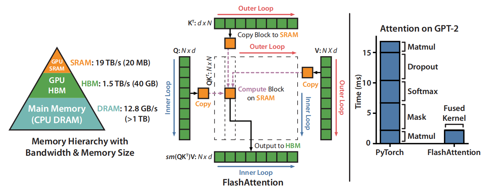

# FlashAttention: Fast and Memory-Efficient Exact Attention with IO-Awareness
https://arxiv.org/abs/2205.14135v2

## 阅读笔记
* tiling 平铺

## Abstract
Transformers are slow and memory-hungry on long sequences, since the time and memory complexity of self-attention are quadratic in sequence length. Approximate attention methods have attempted to address this problem by trading off model quality to reduce the compute complexity, but often do not achieve wall-clock speedup. We argue that a missing principle is making attention algorithms IO-aware -- accounting for reads and writes between levels of GPU memory. We propose FlashAttention, an IO-aware exact attention algorithm that uses tiling to reduce the number of memory reads/writes between GPU high bandwidth memory (HBM) and GPU on-chip SRAM. We analyze the IO complexity of FlashAttention, showing that it requires fewer HBM accesses than standard attention, and is optimal for a range of SRAM sizes. We also extend FlashAttention to block-sparse attention, yielding an approximate attention algorithm that is faster than any existing approximate attention method. FlashAttention trains Transformers faster than existing baselines: 15% end-to-end wall-clock speedup on BERT-large (seq. length 512) compared to the MLPerf 1.1 training speed record, 3× speedup on GPT-2 (seq. length 1K), and 2.4× speedup on long-range arena (seq. length 1K-4K). FlashAttention and block-sparse FlashAttention enable longer context in Transformers, yielding higher quality models (0.7 better perplexity on GPT-2 and 6.4 points of lift on long-document classification) and entirely new capabilities: the first Transformers to achieve better-than-chance performance on the Path-X challenge (seq. length 16K, 61.4% accuracy) and Path-256 (seq. length 64K, 63.1% accuracy).

由于自注意的时间和内存复杂性在序列长度上是二次方的，因此转换器在长序列上是缓慢的，并且需要内存。近似注意力(Approximate attention)方法试图通过权衡模型质量来降低计算复杂度来解决这个问题，但通常无法实现挂钟加速。我们认为，一个缺失的原理是使注意力算法具有IO意识 —— 考虑GPU内存级别之间的读写。我们提出了FlashAttention，这是一种IO感知的精确注意力算法，它使用平铺来减少GPU高带宽存储器（HBM）和GPU片上SRAM之间的存储器读/写次数。我们分析了FlashAttention的IO复杂性，表明它比标准注意力需要更少的HBM访问，并且对于一系列SRAM大小来说是最优的。我们还将FlashAttention扩展到块稀疏(block-sparse)注意力，产生了一种比任何现有近似注意力方法都快的近似注意力算法。FlashAttention训练转换器的速度比现有基线快：与MLPerf 1.1训练速度记录相比，BERT大型（序列长度512）上的端到端挂钟加速率为15%，GPT-2上的加速率为3倍（序列长度1K），远程竞技场(long-range arena)上的加速度为2.4倍（序列长1K-4K）。FlashAttention和块稀疏 FlashAttendance 在转换器中实现更长的上下文，产生了更高质量的模型（GPT-2的困惑度提高了0.7，长文档分类的提升点提高了6.4）和全新的功能：第一个在Path-X挑战（序列长度16K，61.4%精度）和Path-256（序列长度64K，63.1%精度）上实现了优于机会性能的转换器。

 
Figure 1: Left: FlashAttention uses tiling to prevent materialization of the large 𝑁 × 𝑁 attention matrix (dotted box) on (relatively) slow GPU HBM. In the outer loop (red arrows), FlashAttention loops through blocks of the K and V matrices and loads them to fast on-chip SRAM. In each block, FlashAttention loops over blocks of Q matrix (blue arrows), loading them to SRAM, and writing the output of the attention computation back to HBM. Right: Speedup over the PyTorch implementation of attention on GPT-2.FlashAttention does not read and write the large 𝑁 × 𝑁 attention matrix to HBM, resulting in an 7.6× speedup on the attention computation.
图1：左图：FlashAttention使用平铺来防止大型实体化𝑁 × 𝑁 在（相对）慢的GPU HBM上的注意力矩阵（虚线框）。在外循环（红色箭头）中，FlashAttention循环通过K和V矩阵块，并将它们加载到快速片上SRAM。在每个块中，FlashAttention在Q矩阵块（蓝色箭头）上循环，将它们加载到SRAM，并将注意力计算的输出写回HBM。右：加速PyTorch在GPT-2上的注意力实现。FlashAttention不读写大型𝑁 × 𝑁 注意力矩阵到HBM，导致注意力计算的7.6倍加速。
