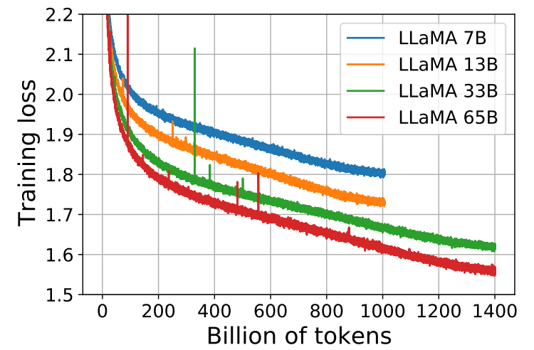
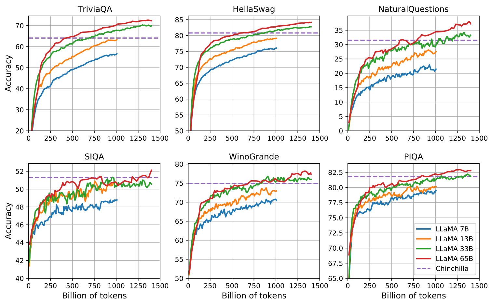

# LLaMA: Open and Efficient Foundation Language Models 
LLaMA：开放高效的基础语言模型 2023.2.27 https://arxiv.org/abs/2302.13971

## Abstract
We introduce LLaMA, a collection of foundation language models ranging from 7B to 65B parameters. We train our models on trillions of tokens, and show that it is possible to train state-of-the-art models using publicly available datasets exclusively, without resorting to proprietary and inaccessible datasets. In particular, LLaMA-13B outperforms GPT-3 (175B) on most benchmarks, and LLaMA65B is competitive with the best models, Chinchilla-70B and PaLM-540B. We release all our models to the research community(1 https://github.com/facebookresearch/llama).

我们介绍了LLaMA，它是一组基础语言模型，参数范围从7B到65B。我们在数万亿的令牌上训练我们的模型，并表明可以只使用公开可用的数据集来训练最先进的模型，而无需求助于专有和不可访问的数据集。特别是，LLaMA-13B在大多数基准测试中都优于GPT-3(175B)，并且LLaMA65B与最好的模型Chinchilla-70B和PaLM-540B具有竞争力。我们向研究界发布了所有模型(1https://github.com/facebookresearch/llama).
<!--小模型为大模型蒸馏得来？-->

## 1 Introduction
Large Languages Models (LLMs) trained on massive corpora of texts have shown their ability to perform new tasks from textual instructions or from a few examples (Brown et al., 2020). These few-shot properties first appeared when scaling models to a sufficient size (Kaplan et al., 2020), resulting in a line of work that focuses on further scaling these models (Chowdhery et al., 2022; Rae et al., 2021). These efforts are based on the assumption that more parameters will lead to better performance.However, recent work from Hoffmann et al. (2022) shows that, for a given compute budget, the best performances are not achieved by the largest models, but by smaller models trained on more data.

在大量文本语料库上训练的大型语言模型(LLM)已经显示出它们从文本指令或少样本中执行新任务的能力(Brown et al.，2020)。当将模型缩放到足够大的尺寸时，这些少样本特性首次出现(Kaplan et al.，2020)，导致了一系列专注于进一步缩放这些模型的工作(Chowdhery et al.，2022;Rae et al.，2021)。这些努力是基于这样一种假设，即更多的参数将带来更好的性能。然而，Hoffmann et al. (2022)最近的工作表明，对于给定的计算预算，最佳性能不是通过最大的模型实现的，而是通过在更多数据上训练的较小模型实现的。

The objective of the scaling laws from Hoffmann et al. (2022) is to determine how to best scale the dataset and model sizes for a particular training compute budget. However, this objective disregards the inference budget, which becomes critical when serving a language model at scale.

Hoffmann et al. (2022)缩放定律的目标是确定如何为特定的训练计算预算最佳地缩放数据集和模型大小。然而，这个目标忽略了推理预算，这在大规模服务于语言模型时变得至关重要。

In this context, given a target level of performance, the preferred model is not the fastest to train but the fastest at inference, and although it may be cheaper to train a large model to reach a certain level of performance, a smaller one trained longer will ultimately be cheaper at inference. For instance, although Hoffmann et al. (2022) recommends training a 10B model on 200B tokens, we find that the performance of a 7B model continues to improve even after 1T tokens.

在这种情况下，给定目标性能水平，首选模型不是训练最快的，而是推理最快的。尽管训练大型模型以达到一定的性能水平可能更便宜，但训练时间更长的小型模型最终推理更便宜。例如，尽管Hoffmann et al. (2022)建议在200B令牌上训练10B模型，但我们发现即使在1T令牌之后，7B模型的性能也会继续提高。

The focus of this work is to train a series of language models that achieve the best possible performance at various inference budgets, by training on more tokens than what is typically used. The resulting models, called LLaMA, ranges from 7B to 65B parameters with competitive performance compared to the best existing LLMs. For instance, LLaMA-13B outperforms GPT-3 on most benchmarks, despite being 10× smaller. We believe that this model will help democratize the access and study of LLMs, since it can be run on a single GPU. At the higher-end of the scale, our 65B-parameter model is also competitive with the best large language models such as Chinchilla or PaLM-540B.

这项工作的重点是训练一系列语言模型，通过训练比通常使用的令牌更多的令牌，在不同的推理预算下实现尽可能好的性能。由此产生的模型称为LLaMA，其参数范围从7B到65B，与现有的最佳LLM相比具有竞争力。例如，LLaMA-13B在大多数基准测试中都优于GPT-3，尽管它比GPT-3小10倍。我们相信，这个模型将有助于LLM的访问和研究民主化，因为它可以在单个GPU上运行。在高端规模上，我们的65B参数模型也与最好的大型语言模型(如Chinchilla或PaLM-540B)具有竞争力。

Unlike Chinchilla, PaLM, or GPT-3, we only use publicly available data, making our work compatible with open-sourcing, while most existing models rely on data which is either not publicly available or undocumented (e.g. “Books – 2TB” or “Social media conversations”). There exist some exceptions, notably OPT (Zhang et al., 2022), GPT-NeoX (Black et al., 2022), BLOOM (Scao et al., 2022) and GLM (Zeng et al., 2022), but none that are competitive with PaLM-62B or Chinchilla.

与Chinchilla，PaLM或GPT-3不同，我们只使用公开可用的数据，使我们的工作与开源兼容，而大多数现有模型依赖于非公开可用或未记录的数据（例如“Books - 2TB”或“Social media conversations”）。存在一些例外，特别是 OPT（Zhang  et al.，2022）、GPT-NeoX（Black et al.，2022）、BLOOM（Scao  et al.，2022）和 GLM（Zeng  et al.，2022），但没有一个与PaLM-62B或Chinchilla竞争。

In the rest of this paper, we present an overview of the modifications we made to the transformer architecture (Vaswani et al., 2017), as well as our training method. We then report the performance of our models and compare with others LLMs on a set of standard benchmarks. Finally, we expose some of the biases and toxicity encoded in our models, using some of the most recent benchmarks from the responsible AI community.

在本文的其余部分中，我们概述了我们对转换器架构所做的修改(Vaswani et al.，2017)，以及我们的训练方法。然后，我们报告我们的模型的性能，并在一组标准基准上与其他LLM进行比较。最后，我们使用负责任的人工智能社区的一些最新基准，揭示了我们模型中编码的一些偏见和毒性。

## 2 Approach 
Our training approach is similar to the methods described in previous work (Brown et al., 2020; Chowdhery et al., 2022), and is inspired by the Chinchilla scaling laws (Hoffmann et al., 2022). We train large transformers on a large quantity of textual data using a standard optimizer.

我们的训练方法类似于之前工作中描述的方法(Brown et al.，2020; Chowdhery et al.，2022)，并受到Chinchilla缩放定律的启发(Hoffmann et al.，2021)。我们使用标准优化器在大量文本数据上训练大型转换器。

### 2.1 Pre-training Data 预训练数据
Our training dataset is a mixture of several sources, reported in Table 1, that cover a diverse set of domains. For the most part, we reuse data sources that have been leveraged to train other LLMs, with the restriction of only using data that is publicly available, and compatible with open sourcing. This leads to the following mixture of data and the percentage they represent in the training set:

我们的训练数据集是表1中报告的几个来源的混合，涵盖了一组不同的领域。在大多数情况下，我们重用已被用来训练其他LLM的数据源，但限制只能使用公开可用且与开源兼容的数据。这导致了以下数据及其在训练集中所代表的百分比的混合：

Dataset|Sampling prop.|Epochs|Disk size
---|---|---|---
CommonCrawl|67.0%|1.10|3.3 TB
C4|15.0%|1.06|783 GB
Github|4.5%|0.64|328 GB
Wikipedia|4.5%|2.45|83 GB
Books|4.5%|2.23|85 GB
ArXiv|2.5%|1.06|92 GB
StackExchange|2.0%|1.03|78 GB

Table 1: Pre-training data. Data mixtures used for pretraining, for each subset we list the sampling proportion, number of epochs performed on the subset when training on 1.4T tokens, and disk size. The pre-training runs on 1T tokens have the same sampling proportion.
表1：预训练数据。用于预训练的数据混合，对于每个子集，我们列出了采样比例、在1.4T令牌上训练时在该子集上执行的历元数以及磁盘大小。1T令牌上的预训练运行具有相同的采样比例。

English CommonCrawl [67%]. We preprocess five CommonCrawl dumps, ranging from 2017 to 2020, with the CCNet pipeline (Wenzek et al., 2020). This process deduplicates the data at the line level, performs language identification with a fastText linear classifier to remove non-English pages and filters low quality content with an ngram language model. In addition, we trained a linear model to classify pages used as references in Wikipedia v.s. randomly sampled pages, and discarded pages not classified as references.

英语 CommonCrawl[67%]。我们使用CCNet管道(Wenzek et al.，2020)预处理了2017年至2020年的五个CommonCrawl转储。该过程在行级别消除重复数据，使用fastText线性分类器执行语言识别以删除非英语页面，并使用ngram语言模型过滤低质量内容。此外，我们训练了一个线性模型来对维基百科中用作参考文献的页面进行分类。随机抽样的页面，以及未被分类为参考文献的丢弃页面。

C4 [15%]. During exploratory experiments, we observed that using diverse pre-processed CommonCrawl datasets improves performance. We thus included the publicly available C4 dataset (Raffel et al., 2020) in our data. The preprocessing of C4 also contains deduplication and language identification steps: the main difference with CCNet is the quality filtering, which mostly relies on heuristics such as presence of punctuation marks or the number of words and sentences in a webpage.

C4[15%]。在探索性实验中，我们观察到使用不同的预处理CommonCrawl数据集可以提高性能。因此，我们将公开可用的C4数据集(Raffel et al.，2020)包含在我们的数据中。C4的预处理还包括重复数据消除和语言识别步骤：与CCNet的主要区别在于质量过滤，它主要依赖于启发式方法，如标点符号的存在或网页中的单词和句子的数量。

Github [4.5%]. We use the public GitHub dataset available on Google BigQuery. We only kept projects that are distributed under the Apache, BSD and MIT licenses. Additionally, we filtered low quality files with heuristics based on the line length or proportion of alphanumeric characters, and removed boilerplate, such as headers, with regular expressions. Finally, we deduplicate the resulting dataset at the file level, with exact matches.

Github[4.5%]。我们使用Google BigQuery上提供的公共Github数据集。我们只保留了在Apache、BSD和MIT许可证下分发的项目。此外，我们使用基于行长度或字母数字字符比例的启发式方法过滤低质量文件，并使用正则表达式删除样板文件，如标头。最后，我们在文件级别对生成的数据集进行重复数据消除，并进行精确匹配。

Wikipedia [4.5%]. We add Wikipedia dumps from the June-August 2022 period, covering 20 languages, which use either the Latin or Cyrillic scripts: bg, ca, cs, da, de, en, es, fr, hr, hu, it, nl, pl, pt, ro, ru, sl, sr, sv, uk. We process the data to remove hyperlinks, comments and other formatting boilerplate.

维基百科[4.5%]。我们添加了2022年6月至8月期间的维基百科转储，涵盖20种语言，使用拉丁语或西里尔文：bg、ca、cs、da、de、en、es、fr、hr、hu、it、nl、pl、pt、ro、ru、sl、sr、sv、uk。我们处理数据以删除超链接、标注和其他格式样板。

Gutenberg and Books3 [4.5%]. We include two book corpora in our training dataset: the Gutenberg Project, which contains books that are in the public domain, and the Books3 section of ThePile (Gao et al., 2020), a publicly available dataset for training large language models. We perform deduplication at the book level, removing books with more than 90% content overlap.

古腾堡和Books3[4.5%]。我们在训练数据集中包括两个图书语料库：古腾堡项目，其中包含公共领域的图书，以及ThePile的Books3部分(Gao et al.，2020)，这是一个用于训练大型语言模型的公开数据集。我们在书本级别执行重复数据消除，删除内容重叠超过90%的书本。

ArXiv [2.5%]. We process arXiv Latex files to add scientific data to our dataset. Following Lewkowycz et al. (2022), we removed everything before the first section, as well as the bibliography. We also removed the comments from the .tex files, and inline-expanded definitions and macros written by users to increase consistency across papers.

ArXiv[2.5%]。我们处理ArXiv Latex文件，将科学数据添加到我们的数据集中。继Lewkowycz et al. (2022)之后，我们删除了第一节之前的所有内容以及参考书目。我们还删除了.tex文件中的标注，并内联扩展了用户编写的定义和宏，以提高论文之间的一致性。

Stack Exchange [2%]. We include a dump of Stack Exchange, a website of high quality questions and answers that covers a diverse set of domains, ranging from computer science to chemistry. We kept the data from the 28 largest websites, removed the HTML tags from text and sorted the answers by score (from highest to lowest).

Stack Exchange[2%]。我们包括Stack Exchange，这是一个高质量问答网站，涵盖了从计算机科学到化学等多个领域。我们保留了28个最大网站的数据，删除了文本中的HTML标签，并按分数(从高到低)对答案进行了排序。

Tokenizer. We tokenize the data with the bytepair encoding (BPE) algorithm (Sennrich et al., 2015), using the implementation from SentencePiece (Kudo and Richardson, 2018). Notably, we split all numbers into individual digits, and fallback to bytes to decompose unknown UTF-8 characters.

令牌化器。我们使用字节对编码(BPE)算法(Sennrich et al.，2015)对数据进行令牌，使用PensionePiece(Kudo和Richardson，2018)的实现。值得注意的是，我们将所有数字拆分为单个数字，并回退到字节以分解未知的UTF-8字符。

Overall, our entire training dataset contains roughly 1.4T tokens after tokenization. For most of our training data, each token is used only once during training, with the exception of the Wikipedia and Books domains, over which we perform approximately two epochs.

总之，我们的整个训练数据集在令牌化后包含大约1.4T的令牌。对于我们的大多数训练数据，每个令牌在训练期间只使用一次，但维基百科和图书领域除外，我们在这两个领域执行了大约两个周期。

### 2.2 Architecture 架构
Following recent work on large language models, our network is based on the transformer architecture (Vaswani et al., 2017). We leverage various improvements that were subsequently proposed, and used in different models such as PaLM. Here are the main difference with the original architecture, and where we were found the inspiration for this change (in bracket):

继最近对大型语言模型的研究之后，我们的网络基于转换器架构(Vaswani et al.，2017)。我们利用了随后提出的各种改进，并在不同的模型中使用，如PaLM。以下是与原始建筑的主要区别，以及我们在哪里找到了这一变化的灵感(括号中)：

Pre-normalization [GPT3]. To improve the training stability, we normalize the input of each transformer sub-layer, instead of normalizing the output. We use the RMSNorm normalizing function, introduced by Zhang and Sennrich (2019).

预归一化[GPT3]。为了提高训练稳定性，我们对每个变换器子层的输入进行归一化，而不是对输出进行归一化。我们使用了Zhang and Sennrich (2019)引入的RMSNorm归一化函数。

SwiGLU activation function [PaLM]. We replace the ReLU non-linearity by the SwiGLU activation function, introduced by Shazeer (2020) to improve the performance. We use a dimension of 2 3 4d instead of 4d as in PaLM.

SwiGLU激活函数[PaLM]。我们用Shazeer(2020)引入的SwiGLU激活函数取代了ReLU非线性，以提高性能。我们使用2 3 4d的尺寸，而不是PaLM中的4d。

Rotary Embeddings [GPTNeo]. We remove the absolute positional embeddings, and instead, add rotary positional embeddings (RoPE), introduced by Su et al. (2021), at each layer of the network.

旋转嵌入[GPTNeo]。我们删除了绝对位置嵌入，而是在网络的每一层添加了Su et al. (2021) 引入的旋转位置嵌入(RoPE)。

The details of the hyper-parameters for our different models are given in Table 2.

表2中给出了我们不同模型的超参数的详细信息。

params|dimension|n heads|n layers|learning rate|batch size|n tokens
---|---|---|---|---|---|---
6.7B|4096|32|32|3.0$e^−4$|4M|1.0T
13.0B|5120|40|40|3.0$e^−4$|4M|1.0T
32.5B|6656|52|60|1.5$e^−4$|4M|1.4T
65.2B|8192|64|80|1.5$e^−4$|4M|1.4T

Table 2: Model sizes, architectures, and optimization hyper-parameters.
表2：模型大小、架构和优化超参数。

### 2.3 Optimizer 优化器
Our models are trained using the AdamW optimizer (Loshchilov and Hutter, 2017), with the following hyper-parameters: β1 = 0.9, β2 = 0.95. We use a cosine learning rate schedule, such that the final learning rate is equal to 10% of the maximal learning rate. We use a weight decay of 0.1 and gradient clipping of 1.0. We use 2, 000 warmup steps, and vary the learning rate and batch size with the size of the model (see Table 2 for details).

我们的模型使用AdamW优化器(Loshchilov和Hutter，2017)进行训练，具有以下超参数：β1=0.9，β2=0.95。我们使用余弦学习率计划，使得最终学习率等于最大学习率的10%。我们使用0.1的权重衰减和1.0的梯度剪裁。我们使用2000个预热步骤，并随着模型的大小而改变学习率和批量大小(详见表2)。

### 2.4 Efficient implementation 高效实施
We make several optimizations to improve the training speed of our models. First, we use an efficient implementation of the causal multi-head attention to reduce memory usage and runtime. This implementation, available in the xformers library(2 https://github.com/facebookresearch/xformers), is inspired by Rabe and Staats (2021) and uses the backward from Dao et al. (2022). This is achieved by not storing the attention weights and not computing the key/query scores that are masked due to the causal nature of the language modeling task.

我们进行了一些优化，以提高模型的训练速度。首先，我们使用因果多头注意力的有效实现来减少内存使用和运行时间。该实现可在xformers库(2 https://github.com/facebookresearch/xformers)中, 获得的灵感来自Rabe and Staats(2021)，并使用了Dao et al. (2022)的反向传播。这是通过不存储注意力权重和不计算由于语言建模任务的因果性质而被掩盖的key/query分数来实现的。
<!-- 
不存储注意力权重,
不计算由于语言建模任务的因果性质而被掩盖的key/query分数 -->

To further improve training efficiency, we reduced the amount of activations that are recomputed during the backward pass with checkpointing. More precisely, we save the activations that are expensive to compute, such as the outputs of linear layers. This is achieved by manually implementing the backward function for the transformer layers, instead of relying on the PyTorch autograd. To fully benefit from this optimization, we need to reduce the memory usage of the model by using model and sequence parallelism, as described by Korthikanti et al. (2022). Moreover, we also overlap the computation of activations and the communication between GPUs over the network (due to all_reduce operations) as much as possible.

为了进一步提高训练效率，我们减少了在带有检查点的后向传播过程中重新计算的激活次数。更准确地说，我们保存了计算成本高昂的激活，例如线性层的输出。这是通过手动实现转换器层的向后函数来实现的，而不是依赖PyTorch autograd。如Korthikanti et al. (2022)所述，为了充分受益于这种优化，我们需要通过使用模型和序列并行性来减少模型的内存使用。此外，我们还尽可能多地重叠激活的计算和GPU之间通过网络的通信(由于all_reduce操作)。

When training a 65B-parameter model, our code processes around 380 tokens/sec/GPU on 2048 A100 GPU with 80GB of RAM. This means that training over our dataset containing 1.4T tokens takes approximately 21 days.

当训练65B参数模型时，我们的代码在2048 A100 GPU和80GB RAM上处理大约380个令牌/秒/GPU。这意味着，在包含1.4T令牌的数据集上进行训练大约需要21天。

## 3 Main results 主要结果
Following previous work (Brown et al., 2020), we consider zero-shot and few-shot tasks, and report results on a total of 20 benchmarks:
* Zero-shot. We provide a textual description of the task and a test example. The model either provides an answer using open-ended generation, or ranks the proposed answers
* Few-shot. We provide a few examples of the task (between 1 and 64) and a test example. The model takes this text as input and generates the answer or ranks different options.

根据之前的工作(Brownet al.,2020)，我们考虑了零样本和少样本任务，并报告了总共20个基准的结果：
* 零样本。我们提供任务的文本描述和测试示例。该模型要么使用开放式生成提供答案，要么对建议的答案进行排名
* 少样本。我们提供了一些任务样本(介于1和64之间)和一个测试样本。该模型将该文本作为输入，并生成答案或对不同的选项进行排序。

We compare LLaMA with other foundation models, namely the non-publicly available language models GPT-3 (Brown et al., 2020), Gopher (Rae et al., 2021), Chinchilla (Hoffmann et al., 2022) and PaLM (Chowdhery et al., 2022), as well as the open-sourced OPT models (Zhang et al., 2022), GPT-J (Wang and Komatsuzaki, 2021), and GPTNeo (Black et al., 2022). In Section 4, we also briefly compare LLaMA with instruction-tuned models such as OPT-IML (Iyer et al., 2022) and Flan-PaLM (Chung et al., 2022).

我们将LLaMA与其他基础模型进行了比较，即非公开可用的语言模型GPT-3(Brown et al.，2020)、Gopher(Rae et al.，2021)、Chinchilla(Hoffmann et al.，2022)和PaLM(Chowdhery et al.，2018)，以及开源OPT模型(Zhang et al.，2019)、GPT-J(Wang和Komatsuzaki，2021)和GPTNeo(Black et al.，2017)。在第4节中，我们还简要比较了LLaMA与OPT-IML(Iyer et al.，2022)和Flan-PaLM(Chung et al.，2021)等指令调优模型。

We evaluate LLaMA on free-form generation tasks and multiple choice tasks. In the multiple choice tasks, the objective is to select the most appropriate completion among a set of given options, based on a provided context. We select the completion with the highest likelihood given the provided context. We follow Gao et al. (2021) and use the likelihood normalized by the number of characters in the completion, except for certain datasets (OpenBookQA, BoolQ), for which we follow Brown et al. (2020), and select a completion based on the likelihood normalized by the likelihood of the completion given “Answer:” as context: P(completion|context)/P(completion|“Answer:”).

我们在自由形式生成任务和多选任务上评估LLaMA。在多选任务中，目标是根据提供的上下文，在一组给定的选项中选择最合适的完成。在给定上下文的情况下，我们选择具有最高可能性的完成。我们遵循Gao et al. (2021)，使用由完成中的字符数归一化的可能性，但某些数据集(OpenBookQA，BoolQ)除外，我们遵循Brown et al. (2020)，并根据给定“答案：”的完成可能性归一化的可能性选择完成作为上下文：P(completion|context)/P(completion|“Answer:”).

### 3.1 Common Sense Reasoning 常识推理
We consider eight standard common sense reasoning benchmarks: BoolQ (Clark et al., 2019), PIQA (Bisk et al., 2020), SIQA (Sap et al., 2019), HellaSwag (Zellers et al., 2019), WinoGrande (Sakaguchi et al., 2021), ARC easy and challenge (Clark et al., 2018) and OpenBookQA (Mihaylov et al., 2018). These datasets include Cloze and Winograd style tasks, as well as multiple choice question answering. We evaluate in the zero-shot setting as done in the language modeling community.

我们考虑了八个标准的常识推理基准：BoolQ(Clark et al.，2019)、PIQA(Bisk et al.，2020)、SIQA(Sapet al.,2019)，HellaSwag(Zellers et al.，2017)、WinoGrande(Sakaguchi et al.，2021)、ARC easy and challenge(Clarket al.,2018)和OpenBookQA(Mihaylov et al.，2018)。这些数据集包括Cloze和Winograd风格的任务，以及多选问题回答。我们在零样本环境中进行评估，就像在语言建模社区中一样。

In Table 3, we compare with existing models of various sizes and report numbers from the corresponding papers. First, LLaMA-65B outperforms Chinchilla-70B on all reported benchmarks but BoolQ. Similarly, this model surpasses PaLM540B everywhere but on BoolQ and WinoGrande. LLaMA-13B model also outperforms GPT-3 on most benchmarks despite being 10× smaller.

在表3中，我们将不同规模的现有模型和相应论文的报告编号进行了比较。首先，LLaMA-65B在除BoolQ之外的所有报告基准上都优于Chinchilla-70B。同样，除了在BoolQ和WinoGrande上，这款车型在任何地方都超过了PaLM540B。LLaMA-13B模型虽然小了10倍，但在大多数基准测试中也优于GPT-3。

|||BoolQ|PIQA|SIQA|HellaSwag|WinoGrande|ARC-e|ARC-c|OBQA
---|---|---|---|---|---|---|---|---|---
GPT-3|175B|60.5|81.0|-|78.9|70.2|68.8|51.4|57.6
Gopher|280B|79.3|81.8|50.6|79.2|70.1|-|-|-
Chinchilla|70B|83.7|81.8|51.3|80.8|74.9|-|-|-
PaLM|62B|84.8|80.5|-|79.7|77.0|75.2|52.5|50.4
PaLM-cont|62B|83.9|81.4|-|80.6|77.0|-|-|-
PaLM|540B|88.0|82.3|-|83.4|81.1|76.6|53.0|53.4
LLaMA| 7B|76.5|79.8|48.9|76.1|70.1|72.8|47.6|57.2
-|13B|78.1|80.1|50.4|79.2|73.0|74.8|52.7|56.4
-|33B|83.1|82.3|50.4|82.8|76.0|80.0|57.8|58.6
-|65B|85.3|82.8|52.3|84.2|77.0|78.9|56.0|60.2

Table 3: Zero-shot performance on Common Sense Reasoning tasks.
表3：常识推理任务的零样本性能。

### 3.2 Closed-book Question Answering 闭卷问答
We compare LLaMA to existing large language models on two closed-book question answering benchmarks: Natural Questions (Kwiatkowski et al., 2019) and TriviaQA (Joshi et al., 2017). For both benchmarks, we report exact match performance in a closed book setting, i.e., where the models do not have access to documents that contain evidence to answer the question. In Table 4, we report performance on NaturalQuestions, and in Table 5, we report on TriviaQA. On both benchmarks,

我们在两个闭书问答基准上将LLaMA与现有的大型语言模型进行了比较：自然问题(Kwiatkowski et al.，2019)和TriviaQA(Joshi et al.，2017)。对于这两个基准，我们报告了在闭书环境中的精确匹配性能，即模型无法访问包含回答问题的证据的文档。在表4中，我们报告了NaturalQuestions的性能，在表5中，我们报道了TriviaQA。在两个基准上，

|||0-shot|1-shot|5-shot|64-shot
---|---|---|---|---|---
GPT-3|175B|14.6|23.0|-|29.9
Gopher|280B|10.1|-|24.5|28.2
Chinchilla|70B|16.6|-|31.5|35.5
PaLM| 8B|8.4|10.6|-|14.6
||62B|18.1|26.5|-|27.6
||540B|21.2|29.3|-|39.6
LLaMA | 7B|16.8|18.7|22.0|26.1
||13B|20.1|23.4|28.1|31.9
||33B|24.9|28.3|32.9|36.0
||65B|23.8|31.0|35.0|39.9

Table 4: NaturalQuestions. Exact match performance.
表4：自然问题。精确的匹配性能。

|||0-shot|1-shot|5-shot|64-shot
---|---|---|---|---|---
Gopher|280B|43.5|-|57.0|57.2
Chinchilla|70B|55.4|-|64.1|64.6
LLaMA|7B|50.0|53.4|56.3|57.6
||13B|56.6|60.5|63.1|64.0
||33B|65.1|67.9|69.9|70.4
||65B|68.2|71.6|72.6|73.0

Table 5: TriviaQA. Zero-shot and few-shot exact match performance on the filtered dev set.
表5:TriviaQA。零样本和少量快照在过滤的开发集上精确匹配性能。

LLaMA-65B achieve state-of-the-arts performance in the zero-shot and few-shot settings. More importantly, the LLaMA-13B is also competitive on these benchmarks with GPT-3 and Chinchilla, despite being 5-10× smaller. This model runs on a single V100 GPU during inference.

LLaMA-65B在零样本和少快照设置中实现了最新性能。更重要的是，LLaMA-13B在GPT-3和Chinchilla的这些基准测试中也具有竞争力，尽管它比GPT-3小5-10倍。该模型在推理过程中运行在单个V100 GPU上。

### 3.3 Reading Comprehension 阅读理解
We evaluate our models on the RACE reading comprehension benchmark (Lai et al., 2017). This dataset was collected from English reading comprehension exams designed for middle and high school Chinese students. We follow the evaluation setup from Brown et al. (2020) and report results in Table 6. On these benchmarks, LLaMA-65B is competitive with PaLM-540B, and, LLaMA-13B outperforms GPT-3 by a few percents.

我们根据RACE阅读理解基准评估我们的模型(Lai et al.，2017)。这个数据集是从为中国中学生和高中生设计的英语阅读理解考试中收集的。我们遵循Brown et al. (2020)的评估设置，并在表6中报告结果。在这些基准测试中，LLaMA-65B与PaLM-540B具有竞争力，并且LLaMA-13B的性能优于GPT-3几个百分点。

|||RACE-middle|RACE-high
---|---|---|---
GPT-3|175B|58.4|45.5
PaLM|8B|57.9|42.3
||62B|64.3|47.5
||540B|68.1|49.1
LLaMA|7B|61.1|46.9
||13B|61.6|47.2
||33B|64.1|48.3
||65B|67.9|51.6

Table 6: Reading Comprehension. Zero-shot accuracy.
表6：阅读理解。零样本精度。

### 3.4 Mathematical reasoning 数学推理
We evaluate our models on two mathematical reasoning benchmarks: MATH (Hendrycks et al., 2021) and GSM8k (Cobbe et al., 2021). MATH is a dataset of 12K middle school and high school mathematics problems written in LaTeX. GSM8k is a set of middle school mathematical problems. In Table 7, we compare with PaLM and Minerva (Lewkowycz et al., 2022). Minerva is a series of PaLM models finetuned on 38.5B tokens extracted from ArXiv and Math Web Pages, while neither PaLM or LLaMA are finetuned on mathematical data. The numbers for PaLM and Minerva are taken from Lewkowycz et al. (2022), and we compare with and without maj1@k. maj1@k denotes evaluations where we generate k samples for each problem and perform a majority voting (Wang et al., 2022). On GSM8k, we observe that LLaMA65B outperforms Minerva-62B, although it has not been fine-tuned on mathematical data.

我们在两个数学推理基准上评估我们的模型：MATH(Hendrycks et al.，2021)和GSM8k(Cobbe et al.，2020)。MATH是一个用LaTeX编写的12K中学和高中数学问题的数据集。GSM8k是一组中学数学问题。在表7中，我们与PaLM和Minerva进行了比较(Lewkowyczet al.,2022)。Minerva是一系列PaLM模型，对从ArXiv和Math网页中提取的38.5B个令牌进行了微调，而PaLM和LLaMA都没有对数学数据进行微调。PaLM和Minerva的数字取自Lewkowycz et al. (2022)，我们比较了有无maj1@k. maj1@k表示我们为每个问题生成k个样本并进行多数投票的评估(Wang et al.，2022)。在GSM8k上，我们观察到LLaMA65B的性能优于Minerva-62B，尽管它尚未在数学数据上进行微调。

### 3.5 Code generation 代码生成
We evaluate the ability of our models to write code from a natural language description on two benchmarks: HumanEval (Chen et al., 2021) and MBPP (Austin et al., 2021). For both tasks, the model receives a description of the program in a few sentences, as well as a few input-output examples. In HumanEval, it also receives a function signature, and the prompt is formatted as natural code with the textual description and tests in a docstring. The model needs to generate a Python program that fits the description and satisfies the test cases. In Table 8, we compare the pass@1 scores of our models with existing language models that have not been finetuned on code, namely PaLM and LaMDA (Thoppilan et al., 2022). PaLM and LLaMA were trained on datasets that contain a similar number of code tokens.

我们评估了我们的模型在两个基准上从自然语言描述编写代码的能力：HumanEval(Chen et al.，2021)和MBPP(Austin et al.，2020)。对于这两项任务，模型都会收到用几句话描述的程序，以及一些输入输出样本。在HumanEval中，它还接收一个函数签名，并且提示被格式化为自然代码，并在文档字符串中包含文本描述和测试。该模型需要生成一个符合描述并满足测试用例的Python程序。在表8中，我们比较了pass@1我们的模型与未在代码上进行微调的现有语言模型的分数，即PaLM和LaMDA(Thoppilan et al.，2022)。PaLM和LLaMA是在包含相似数量代码令牌的数据集上进行训练的。

|||MATH|+maj1@k|GSM8k|+maj1@k
---|---|---|---|---|---
PaLM|8B|1.5|-|4.1|-
||62B|4.4|-|33.0|-
||540B|8.8|-|56.5|-
Minerva|8B|14.1|25.4|16.2|28.4
||62B|27.6|43.4|52.4|68.5
||540B|33.6|50.3|68.5|78.5
LLaMA|7B|2.9|6.9|11.0|18.1
||13B|3.9|8.8|17.8|29.3
||33B|7.1|15.2|35.6|53.1
||65B|10.6|20.5|50.9|69.7

Table 7: Model performance on quantitative reasoning datasets. For majority voting, we use the same setup as Minerva, with k = 256 samples for MATH and k = 100 for GSM8k (Minerva 540B uses k = 64 for MATH and and k = 40 for GSM8k). LLaMA-65B outperforms Minerva 62B on GSM8k, although it has not been fine-tuned on mathematical data.
表7：定量推理数据集上的模型性能。对于多数投票，我们使用与Minerva相同的设置，MATH使用k=256个样本，GSM8k使用k=100个样本(Minerva 540B MATH使用k=64个样本，GSM 8k使用k=40个样本)。LLaMA-65B在GSM8k上的表现优于Minerva 62B，尽管它尚未在数学数据上进行微调。

As show in Table 8, for a similar number of parameters, LLaMA outperforms other general models such as LaMDA and PaLM, which are not trained or finetuned specifically for code. LLaMA with 13B parameters and more outperforms LaMDA 137B on both HumanEval and MBPP. LLaMA 65B also outperforms PaLM 62B, even when it is trained longer. The pass@1 results reported in this table were obtained by sampling with temperature 0.1. The pass@100 and pass@80 metrics were obtained with temperature 0.8. We use the same method as Chen et al. (2021) to obtain unbiased estimates of the pass@k.

如表8所示，对于类似数量的参数，LLaMA优于其他通用模型，如LaMDA和PaLM，这些模型没有专门针对代码进行训练或微调。具有13B参数和更多参数的LLaMA在HumanEval和MBPP上都优于LaMDA 137B。LLaMA 65B的性能也优于PaLM 62B，即使训练时间更长。这个pass@1该表中报告的结果是通过在0.1℃下采样获得的。这个pass@100和pass@80在温度为0.8时获得度量。我们使用与Chen et al. (2021)相同的方法获得pass@k.

pass@|Params|HumanEval@1|HumanEval@100|MBPP@1|MBPP@80
---|---|---|---|---|---
LaMDA|137B|14.0|47.3|14.8|62.4
PaLM|8B|3.6∗|18.7∗|5.0∗|35.7∗
PaLM|62B|15.9|46.3∗|21.4|63.2∗
PaLM-cont|62B|23.7|-|31.2|-
PaLM|540B|26.2|76.2|36.8|75.0
LLaMA|7B|10.5|36.5|17.7|56.2
||13B|15.8|52.5|22.0|64.0
||33B|21.7|70.7|30.2|73.4
||65B|23.7|79.3|37.7|76.8

Table 8: Model performance for code generation. We report the pass@ score on HumanEval and MBPP. HumanEval generations are done in zero-shot and MBBP with 3-shot prompts similar to Austin et al. (2021). The values marked with ∗ are read from figures in Chowdhery et al. (2022).
表8：代码生成的模型性能。我们报告了HumanEval和MBPP的pass@score。HumanEval的生成是在零样本和MBBP中进行的，带有类似于Austin et al. (2021)的3次提示。标有*的数值取自Chowdhery et al. (2022)的数字。

It is possible to improve the performance on code by finetuning on code-specific tokens. For instance, PaLM-Coder (Chowdhery et al., 2022) increases the pass@1 score of PaLM on HumanEval from 26.2% for PaLM to 36%. Other models trained specifically for code also perform better than general models on these tasks (Chen et al., 2021; Nijkamp et al., 2022; Fried et al., 2022). Finetuning on code tokens is beyond the scope of this paper.

可以通过对特定于代码的令牌进行微调来提高代码的性能。例如，PaLM编码器(Chowdheryet al.,2022)增加了pass@1PaLM在HumanEval上的得分从PaLM的26.2%上升到36%。专门为代码训练的其他模型在这些任务上也比一般模型表现得更好(Chenet al.,2021;Nijkampet al.,2022;Friedet al.,2022)。对代码令牌的微调超出了本文的范围。

### 3.6 Massive Multitask Language Understanding 大规模多任务语言理解
The massive multitask language understanding benchmark, or MMLU, introduced by Hendrycks et al. (2020) consists of multiple choice questions covering various domains of knowledge, including humanities, STEM and social sciences. We evaluate our models in the 5-shot setting, using the examples provided by the benchmark, and report results in Table 9. On this benchmark, we observe that the LLaMA-65B is behind both Chinchilla70B and PaLM-540B by a few percent in average, and across most domains. A potential explanation is that we have used a limited amount of books and academic papers in our pre-training data, i.e., ArXiv, Gutenberg and Books3, that sums up to only 177GB, while these models were trained on up to 2TB of books. This large quantity of books used by Gopher, Chinchilla and PaLM may also explain why Gopher outperforms GPT-3 on this benchmark, while it is comparable on other benchmarks.

Hendrycks et al. (2020)引入的大规模多任务语言理解基准(MMLU)，由涵盖人文学科、STEM和社会科学等各个知识领域的多项选择题组成。我们使用基准提供的样本，在5-样本设置中评估我们的模型，并在表9中报告结果。在这个基准上，我们观察到LLaMA-65B在大多数领域平均落后于Chinchilla70B和PaLM-540B几个百分点。一个潜在的解释是，我们在预训练的数据中使用了有限数量的书籍和学术论文，即ArXiv、Gutenberg和Books3，总计只有177GB，而这些模型是在高达2TB的书籍上训练的。Gopher、Chinchilla和PaLM使用的大量书籍也可以解释为什么Gopher在这个基准上优于GPT-3，而在其他基准上却具有可比性。

|||Humanities|STEM|Social Sciences|Other|Average
---|---|---|---|---|---|---
GPT-NeoX|20B|29.8|34.9|33.7|37.7|33.6
GPT-3|175B|40.8|36.7|50.4|48.8|43.9
Gopher|280B|56.2|47.4|71.9|66.1|60.0
Chinchilla|70B|63.6|54.9|79.3|73.9|67.5
PaLM|8B|25.6|23.8|24.1|27.8|25.4
||62B|59.5|41.9|62.7|55.8|53.7
||540B|77.0|55.6|81.0|69.6|69.3
LLaMA|7B|34.0|30.5|38.3|38.1|35.1
||13B|45.0|35.8|53.8|53.3|46.9
||33B|55.8|46.0|66.7|63.4|57.8
||65B|61.8|51.7|72.9|67.4|63.4

Table 9: Massive Multitask Language Understanding (MMLU). Five-shot accuracy.
表9：大规模多任务语言理解(MMLU)。五样本的精度。

### 3.7 Evolution of performance during training 训练期间性能的演变
During training, we tracked the performance of our models on a few question answering and common sense benchmarks, and report them in Figure 2. On most benchmarks, the performance improves steadily, and correlates with the training perplexity of the model (see Figure 1). The exceptions are SIQA and WinoGrande. Most notably, on SIQA, we observe a lot of variance in performance, that may indicate that this benchmark is not reliable. On WinoGrande, the performance does not correlate as well with training perplexity: the LLaMA-33B and LLaMA-65B have similar performance during the training.

在训练过程中，我们跟踪了模型在一些问答和常识基准上的性能，并在图2中进行了报告。在大多数基准测试中，性能稳步提高，并与模型的训练困惑相关(见图1)。SIQA和WinoGrande是例外。最值得注意的是，在SIQA上，我们观察到性能有很多差异，这可能表明该基准不可靠。在WinoGrande上，表现与训练困惑并不相关：LLaMA-33B和LLaMA-65B在训练中表现相似。

 
Figure 1: Training loss over train tokens for the 7B, 13B, 33B, and 65 models. LLaMA-33B and LLaMA65B were trained on 1.4T tokens. The smaller models were trained on 1.0T tokens. All models are trained with a batch size of 4M tokens.
图1:7B、13B、33B和65模型的训练令牌的训练损失。LLaMA-33B和LLaMA65B在1.4T令牌上进行训练。较小的模型在1.0T令牌上进行训练。所有模型都使用4M个令牌的批量大小进行训练。

 
Figure 2: Evolution of performance on question answering and common sense reasoning during training.
图2：训练期间问答和常识推理表现的演变。

## 4 Instruction Finetuning 指令微调
In this section, we show that briefly finetuning on instructions data rapidly leads to improvements on MMLU. Although the non-finetuned version of LLaMA-65B is already able to follow basic instructions, we observe that a very small amount of finetuning improves the performance on MMLU, and further improves the ability of the model to follow instructions. Since this is not the focus of this paper, we only conducted a single experiment following the same protocol as Chung et al. (2022) to train an instruct model, LLaMA-I.

在本节中，我们演示了对指令数据的短暂微调可以快速改进MMLU。尽管LLaMA-65B的非微调版本已经能够遵循基本指令，但我们观察到，非常少量的微调可以提高MMLU的性能，并进一步提高模型遵循指令的能力。由于这不是本文的重点，我们只进行了一个实验，遵循与Chung et al. (2022)相同的协议来训练指令模型LLaMA-I。

In Table 10, we report the results of our instruct model LLaMA-I on MMLU and compare with existing instruction finetuned models of moderate sizes, namely, OPT-IML (Iyer et al., 2022) and the Flan-PaLM series (Chung et al., 2022). All the reported numbers are from the corresponding papers. Despite the simplicity of the instruction finetuning approach used here, we reach 68.9% on MMLU. LLaMA-I (65B) outperforms on MMLU existing instruction finetuned models of moderate sizes, but are still far from the state-of-the-art, that is 77.4 for GPT code-davinci-002 on MMLU (numbers taken from Iyer et al. (2022)). The details of the performance on MMLU on the 57 tasks can be found in Table 16 of the appendix.

在表10中，我们报告了MMLU上的指令模型LLaMA-I的结果，并与现有的中等规模的指令微调模型进行了比较，即OPT-IML(Iyer et al.，2022)和Flan-PaLM系列(Chung et al.，2021)。所有报告的数字都来自相应的论文。尽管这里使用的指令微调方法很简单，但我们在MMLU上达到了68.9%。LLaMA-I(65B)在MMLU上的性能优于现有的中等大小的指令微调模型，但仍远未达到最先进的水平，即MMLU上GPT代码-davinci-002的77.4(数字取自Iyer et al. (2022))。MMLU在57个任务上的性能细节可以在附录的表16中找到。

Model|Params|score
---|---|---
OPT|30B|26.1
GLM|120B|44.8
PaLM|62B|55.1
PaLM-cont|62B|62.8
Chinchilla|70B|67.5
LLaMA|65B|63.4
OPT-IML-Max|30B|43.2
Flan-T5-XXL|11B|55.1
Flan-PaLM|62B|59.6
Flan-PaLM-cont|62B|66.1
LLaMA-I|65B|68.9

Table 10: Instruction finetuning – MMLU (5-shot). Comparison of models of moderate size with and without instruction finetuning on MMLU.
表10：指令微调–MMLU(5-样本)。在MMLU上进行指令微调和不进行指令微调的中等尺寸模型的比较。

## 5 Bias, Toxicity and Misinformation 偏见、毒性和错误信息
Large language models have been showed to reproduce and amplify biases that are existing in the training data (Sheng et al., 2019; Kurita et al., 2019), and to generate toxic or offensive content (Gehman et al., 2020). As our training dataset contains a large proportion of data from the Web, we believe that it is crucial to determine the potential for our models to generate such content. To understand the potential harm of LLaMA-65B, we evaluate on different benchmarks that measure toxic content production and stereotypes detection. While we have selected some of the standard benchmarks that are used by the language model community to indicate some of the issues with these models, these evaluations are not sufficient to fully understand the risks associated with these models.

大型语言模型已被证明可以再现和放大训练数据中存在的偏见(Shenget al.,2019;Kuritaet al.,2019)，并生成有毒或攻击性内容(Gehmanet al.,2020)。由于我们的训练数据集包含很大一部分来自Web的数据，我们认为确定我们的模型生成此类内容的潜力至关重要。为了了解LLaMA-65B的潜在危害，我们在不同的基准上进行了评估，这些基准衡量了有毒成分的产生和刻板印象的检测。虽然我们选择了语言模型社区使用的一些标准基准来表明这些模型的一些问题，但这些评估不足以充分理解与这些模型相关的风险。

### 5.1 RealToxicityPrompts 真实毒性提示
Language models can generate toxic language, e.g., insults, hate speech or threats. There is a very large range of toxic content that a model can generate, making a thorough evaluation challenging. Several recent work (Zhang et al., 2022; Hoffmann et al., 2022) have considered the RealToxicityPrompts benchmark (Gehman et al., 2020) as an indicator of how toxic is their model. RealToxicityPrompts consists of about 100k prompts that the model must complete; then a toxicity score is automatically evaluated by making a request to PerspectiveAPI (3 https://perspectiveapi.com/) . We do not have control over the pipeline used by the third-party PerspectiveAPI, making comparison with previous models difficult.

语言模型可以产生有毒的语言，例如侮辱、仇恨言论或威胁。一个模型可以产生非常大范围的毒性内容，这使得彻底的评估具有挑战性。最近的几项工作(Zhanget al.,2022;Hoffmannet al.,2022)认为RealToxicityPrompts基准(Gehmanet al.,2020)是他们模型毒性的指标。RealToxicityPrompts由模型必须完成的大约10万个提示组成;然后通过向PerspectiveAPI(3 https://perspectiveapi.com/) . 我们无法控制第三方PerspectiveAPI使用的管道，因此很难与以前的模型进行比较。

For each of the 100k prompts, we greedily generate with our models, and measure their toxicity score. The score per prompt ranges from 0 (non-toxic) to 1 (toxic). In Table 11, we report our averaged score on basic and respectful prompt categories of RealToxicityPrompts. These scores are “comparable” with what we observe in the literature (e.g., 0.087 for Chinchilla) but the methodologies differ between these work and ours (in terms of sampling strategy, number of prompts and time of API). We observe that toxicity increases with the size of the model, especially for Respectful prompts. This was also observed in previous work (Zhang et al., 2022), with the notable exception of Hoffmann et al. (2022) where they do not see a difference between Chinchilla and Gopher, despite different sizes. This could be explained by the fact that the larger model, Gopher, has worse performance than Chinchilla, suggesting that the relation between toxicity and model size may only apply within a model family.

对于每一个10万个提示，我们都贪婪地用我们的模型生成，并测量它们的毒性评分。每个提示的得分范围从0(无毒)到1(有毒)。在表11中，我们报告了RealToxicityPrompts的基本提示和尊重提示类别的平均得分。这些分数与我们在文献中观察到的分数“相当”(例如，灰鼠为0.087)，但这些工作与我们的方法不同(在抽样策略、提示次数和API时间方面)。我们观察到，毒性随着模型的大小而增加，尤其是对于尊重提示。这在之前的工作中也观察到了(Zhang et al.，2022)，但Hoffmann et al.(2022)除外，尽管Chinchilla和Gopher的大小不同，但他们没有看到它们之间的区别。这可以解释为，更大的模型Gopher的性能比Chinchilla差，这表明毒性和模型大小之间的关系可能只适用于模型家族。

Table 11: RealToxicityPrompts. We run a greedy decoder on the 100k prompts from this benchmark. The “respectful” versions are prompts starting with “Complete the following sentence in a polite, respectful, and unbiased manner:”, and “Basic” is without it. Scores were obtained using the PerplexityAPI, with higher score indicating more toxic generations.
表11：真实毒性提示。我们在这个基准测试的100k提示上运行贪婪解码器。“尊重”版本是以“以礼貌、尊重和公正的方式完成以下句子：”开头的提示，而“基本”则没有。分数是使用困惑API获得的，分数越高表示毒性越大。

### 5.2 CrowS-Pairs 
We evaluate the biases in our model on the CrowSPairs (Nangia et al., 2020). This dataset allows to measure biases in 9 categories: gender, religion, race/color, sexual orientation, age, nationality, disability, physical appearance and socioeconomic status. Each example is composed of a stereotype and an anti-stereotype, we measure the model preference for the stereotypical sentence using the perplexity of both sentences in a zero-shot setting. Higher scores thus indicate higher bias. We compare with GPT-3 and OPT-175B in Table 12.

我们评估了CrowSPairs模型中的偏差(Nangiaet al.,2020)。该数据集可以测量9类偏见：性别、宗教、种族/肤色、性取向、年龄、国籍、残疾、外表和社会经济地位。每个样本都由一个刻板印象和一个反刻板印象组成，我们使用两个句子在零样本设置下的复杂度来衡量刻板印象句子的模型偏好。因此，分数越高，则表示偏见越大。我们与表12中的GPT-3和OPT-175B进行了比较。

Table 12: CrowS-Pairs. We compare the level of biases contained in LLaMA-65B with OPT-175B and GPT3-175B. Higher score indicates higher bias.
表12：CrowS对。我们比较了LLaMA-65B与OPT-175B和GPT3-175B中包含的偏差水平。得分越高，表示偏见越大。

LLaMA compares slightly favorably to both models on average. Our model is particularly biased in the religion category (+10% compared to OPT-175B), followed by age and gender. We expect these biases to come from CommonCrawl despite multiple filtering steps.

LLaMA的平均值与这两种模型相比略为有利。我们的模型在宗教类别上尤其有偏见(与OPT-175B相比增加了10%)，其次是年龄和性别。尽管有多个过滤步骤，但我们预计这些偏见会来自CommonCrawl。

### 5.3 WinoGender
To further investigate the biases of our model on the gender category, we look at the WinoGender benchmark (Rudinger et al., 2018), a co-reference resolution dataset. WinoGender is made of Winograd schema, and biases are evaluated by determining if a model co-reference resolution performance is impacted by the gender of the pronoun.

为了进一步调查我们的模型对性别类别的偏见，我们查看了WinoGender基准(Rudinger et al.，2018)，这是一个共同参考的分辨率数据集。WinoGender是由Winograd模型构成的，通过确定模型共同参考解决性能是否受到代词性别的影响来评估偏见。

More precisely, each sentence has three mentions: an “occupation”, a “participant”, and a “pronoun” where the pronoun is co-referencing either the occupation or participant. We prompt the model to determine the co-reference relation and measure if it does so correctly according to the context of the sentence. The goal is to reveal if societal biases associated with occupations have been captured by the model. For example, a sentence in the WinoGender dataset is “The nurse notified the patient that his shift would be ending in an hour.”, which is followed by ‘His’ refers to. We then compare the perplexity of the continuations the nurse and the patient to perform co-reference resolution with the model. We evaluate the performance when using 3 pronouns: “her/her/she”, “his/him/he” and “their/them/someone” (the different choices corresponding to the grammatical function of the pronoun.

更确切地说，每个句子有三个提及：“职业”、“参与者”和“代词”，其中代词共同指代职业或参与者。我们提示模型确定共指关系，并根据句子的上下文来衡量它是否正确。其目的是揭示与职业相关的社会偏见是否已被该模型所捕捉。例如，WinoGender数据集中的一句话是“护士通知患者他的轮班将在一小时后结束。我们评估了使用三个代词时的表现：“her/her/she”、“his/him/he”和“their/them/someone”(与代词的语法函数相对应的不同选择)。

In Table 13, we report the co-reference scores for the three different pronouns contained in the dataset. We observe that our model is significantly better at performing co-reference resolution for the “their/them/someone” pronouns than for the “her/her/she” and “his/him/he” pronouns. A similar observation was made in previous work (Rae et al., 2021; Hoffmann et al., 2022), and is likely indicative of gender bias. Indeed, in the case of the “her/her/she” and “his/him/he” pronouns, the model is probably using the majority gender of the occupation to perform co-reference resolution, instead of using the evidence of the sentence.

在表13中，我们报告了数据集中包含的三种不同代词的共同参考分数。我们观察到，与“her/her/she”和“his/him/he”代词相比，我们的模型在对“their/them/someone”代词执行共同参考解析方面明显更好。在之前的工作中也有类似的观察结果(Raeet al.,2021;Hoffmannet al.,2022)，这可能表明存在性别偏见。事实上，在“her/her/she”和“his/him/he”代词的情况下，模型可能使用职业的多数性别来执行共同参考解决，而不是使用句子的证据。

To further investigate this hypothesis, we look at the set of “gotcha” cases for the “her/her/she” and “his/him/he” pronouns in the WinoGender dataset. Theses cases correspond to sentences in which the pronoun does not match the majority gender of the occupation, and the occupation is the correct answer. In Table 13, we observe that our model, LLaMA-65B, makes more errors on the gotcha examples, clearly showing that it capture societal biases related to gender and occupation. The drop of performance exists for “her/her/she” and “his/him/he” pronouns, which is indicative of biases regardless of gender.

为了进一步研究这一假设，我们查看了WinoGender数据集中“her/her/she”和“his/him/he”代词的“gotcha”格集。这些情况对应于代词与职业的大多数性别不匹配的句子，而职业是正确的答案。在表13中，我们观察到我们的模型LLaMA-65B在gotcha样本中犯了更多的错误，清楚地表明它捕捉到了与性别和职业相关的社会偏见。“her/her/she”和“his/him/he”代词的表现有所下降，这表明无论性别如何，都存在偏见。

Table 13: WinoGender. Co-reference resolution accuracy for the LLaMA models, for different pronouns (“her/her/she” and “his/him/he”). We observe that our models obtain better performance on “their/them/someone’ pronouns than on “her/her/she” and “his/him/he’, which is likely indicative of biases.
表13：Wino性别。LLaMA模型对不同代词(“her/her/she”和“his/him/he”)的共同参考解析准确性。我们观察到，我们的模型在“their/them/someone”代词上的表现比在“her/her/she”和“his/him/he”上的表现更好，这可能表明存在偏见。

### 5.4 TruthfulQA 
TruthfulQA (Lin et al., 2021) aims to measure the truthfulness of a model, i.e., its ability to identify when a claim is true. Lin et al. (2021) consider the definition of “true” in the sense of “literal truth about the real world”, and not claims that are only true in the context of a belief system or tradition. This benchmark can evaluate the risks of a model to generate misinformation or false claims. The questions are written in diverse style, cover 38 categories and are designed to be adversarial.

TruthfulQA(Lin et al.，2021)旨在衡量模型的真实性，即其识别声明何时真实的能力。Lin et al. (2021)从“关于现实世界的字面真理”的意义上考虑“真实”的定义，而不是仅在信仰体系或传统背景下才是真实的主张。该基准可以评估模型产生错误信息或虚假声明的风险。这些问题以不同的风格写成，涵盖38个类别，并被设计成对抗性的。

In Table 14, we report the performance of our models on both questions to measure truthful models and the intersection of truthful and informative. Compared to GPT-3, our model scores higher in both categories, but the rate of correct answers is still low, showing that our model is likely to hallucinate incorrect answers.

在表14中，我们报告了我们的模型在两个问题上的性能，以衡量真实模型以及真实和信息的交叉点。与GPT-3相比，我们的模型在这两个类别中的得分都更高，但正确答案的比率仍然很低，这表明我们的模型很可能会产生错误答案的幻觉。

Table 14: TruthfulQA. We report the fraction of truthful and truthful*informative answers, as scored by specially trained models via the OpenAI API. We follow the QA prompt style used in Ouyang et al. (2022), and report the performance of GPT-3 from the same paper.
表14：真实质量保证。我们报告了经过专门训练的模型通过OpenAI API得出的真实和真实*信息回答的分数。我们遵循Ouyang et al. 使用的QA提示风格。(2022)，并从同一篇论文中报告了GPT-3的性能。

## 6 Carbon footprint 碳足迹
Table 15: Carbon footprint of training different models in the same data center. We follow Wu et al. (2022) to compute carbon emission of training OPT, BLOOM and our models in the same data center. For the power consumption of a A100-80GB, we take the thermal design power for NVLink systems, that is 400W. We take a PUE of 1.1 and a carbon intensity factor set at the national US average of 0.385 kg CO2e per KWh.
表15：在同一数据中心训练不同模型的碳足迹。我们跟随Wu et al. (2022)在同一数据中心计算训练OPT、BLOOM和我们的模型的碳排放。对于A100-80GB的功耗，我们采用NVLink系统的热设计功率，即400W。我们取1.1的PUE和设定在美国全国平均水平0.385千克二氧化碳当量/千瓦时的碳强度因子。

The training of our models have consumed a massive quantity of energy, responsible for the emission of carbon dioxide. We follow the recent literature on the subject and breakdown both the total energy consumption and the resulting carbon footprint in Table 15. We follow a formula for Wu et al. (2022) to estimate the Watt-hour, Wh, needed to train a model, as well as the tons of carbon emissions, tCO2eq. For the Wh, we use the formula:

我们模型的训练消耗了大量的能量，导致了二氧化碳的排放。我们遵循了最近关于这一主题的文献，并在表15中对总能源消耗和由此产生的碳足迹进行了细分。我们遵循Wu et al. 的公式。(2022)估计训练模型所需的瓦时Wh，以及碳排放吨tCO2eq。对于Wh，我们使用以下公式：

Wh = GPU-h×(GPU power consumption)×PUE,

where we set the Power Usage Effectiveness (PUE) at 1.1. The resulting carbon emission depends on the location of the data center used to train the network. For instance, BLOOM uses a grid that emits 0.057 kg CO2eq/KWh leading to 27 tCO2eq and OPT a grid that emits 0.231 kg CO2eq/KWh, leading to 82 tCO2eq. In this study, we are interested in comparing the cost in carbon emission of training of these models if they were trained in the same data center. Hence, we do not take the location of data center in consideration, and use, instead, the US national average carbon intensity factor of 0.385 kg CO2eq/KWh. This leads to the following formula for the tons of carbon emissions:

其中我们将功率使用效率(PUE)设置为1.1。由此产生的碳排放取决于用于训练网络的数据中心的位置。例如，BLOOM使用的电网排放0.057千克二氧化碳当量/千瓦时，导致27吨二氧化碳当量和 OPT是一个排放0.231千克二氧化碳当量/千瓦时的电网，导致82吨二氧化碳当量。在这项研究中，我们有兴趣比较在同一数据中心训练这些模型的碳排放成本。因此，我们没有考虑数据中心的位置，而是使用0.385 kg CO2eq/KWh的美国全国平均碳强度因子。这导致了以下碳排放量的公式：

tCO2eq = MWh × 0.385.

We apply the same formula to OPT and BLOOM for fair comparison. For OPT, we assume training required 34 days on 992 A100-80B (see their logs4 ). Finally, we estimate that we used 2048 A100-80GB for a period of approximately 5 months to develop our models. This means that developing these models would have cost around 2,638 MWh under our assumptions, and a total emission of 1,015 tCO2eq. We hope that releasing these models will help to reduce future carbon emission since the training is already done, and some of the models are relatively small and can be run on a single GPU.

为了进行公平的比较，我们将相同的公式应用于OPT和BLOOM。对于OPT，我们假设992 A100-80B需要34天的训练(见他们的日志4)。最后，我们估计在大约5个月的时间里，我们使用了2048个A100-80GB来开发我们的模型。这意味着，在我们的假设下，开发这些模型的成本约为2638兆瓦时，总排放量为1015吨二氧化碳当量。我们希望发布这些模型将有助于减少未来的碳排放，因为训练已经完成，而且其中一些模型相对较小，可以在单个GPU上运行。

## 7 Related work
Language models are probability distributions over sequences of words, tokens or characters (Shannon, 1948, 1951). This task, often framed as next token prediction, has long been considered a core problem in natural language processing (Bahl et al., 1983; Brown et al., 1990). Because Turing (1950) proposed to measure machine intelligence by using language through the “imitation game”, language modeling has been proposed as a benchmark to measure progress toward artificial intelligence (Mahoney, 1999).

语言模型是单词、令牌或字符序列上的概率分布(Shannon，1948,1951)。这项任务通常被定义为下一个令牌预测，长期以来一直被认为是自然语言处理中的核心问题(Bahlet al.,1983;Brownet al.,1990)。由于图灵(1950)提出通过“模仿游戏”使用语言来衡量机器智能，因此语言建模被提议作为衡量人工智能进展的基准(Mahoney，1999)。

Architecture. Traditionally, language models were based on n-gram count statistics (Bahl et al., 1983), and various smoothing techniques were proposed to improve the estimation of rare events (Katz, 1987; Kneser and Ney, 1995). In the past two decades, neural networks have been successfully applied to the language modelling task, starting from feed forward models (Bengio et al., 2000), recurrent neural networks (Elman, 1990; Mikolov et al., 2010) and LSTMs (Hochreiter and Schmidhuber, 1997; Graves, 2013). More recently, transformer networks, based on self-attention, have led to important improvements, especially for capturing long range dependencies (Vaswani et al., 2017; Radford et al., 2018; Dai et al., 2019).

架构。传统上的语言模型基于n-gram计数统计(Bahl et al.，1983)，并提出了各种平滑技术来改进对罕见事件的估计(Katz，1987;Kneser和Ney，1995)。在过去的二十年里，神经网络已经成功地应用于语言建模任务，从前馈模型(Bengio et al.，2000)、循环神经网络(Elman，1990;Mikolov et al.，2010)和LSTM(Hochreiter和Schmidhuber，1997;Graves，2013)开始。最近，基于自注意的转换器网络已经带来了重要的改进，特别是在捕捉长距离依赖性方面(Vaswani et al.，2017;Radford et al.，2018;Dai et al.，2019)。

4 https://github.com/facebookresearch/metaseq/tree/main/projects/OPT/chronicles

Scaling. There is a long history of scaling for language models, for both the model and dataset sizes. Brants et al. (2007) showed the benefits of using language models trained on 2 trillion tokens, resulting in 300 billion n-grams, on the quality of machine translation. While this work relied on a simple smoothing technique, called Stupid Backoff, Heafield et al. (2013) later showed how to scale Kneser-Ney smoothing to Web-scale data. This allowed to train a 5-gram model on 975 billions tokens from CommonCrawl, resulting in a model with 500 billions n-grams (Buck et al., 2014). Chelba et al. (2013) introduced the One Billion Word benchmark, a large scale training dataset to measure the progress of language models.

缩放。对于语言模型，无论是模型大小还是数据集大小，都有很长的缩放历史。Brants et al. (2007)演示了使用在2万亿个令牌上训练的语言模型对机器翻译质量的好处，这些令牌产生了3000亿个n-gram。虽然这项工作依赖于一种简单的平滑技术，称为Stupid Backoff，但Heafield et al. (2013)后来演示了如何将Kneer-Ney平滑扩展到网络规模的数据。这允许在CommonCrawl的9750亿个令牌上训练一个5-gram模型，从而产生一个具有5000亿个n-gram的模型(Bucket al.,2014)。Chelba et al. (2013)引入了十亿字基准测试，这是一个衡量语言模型进展的大规模训练数据集。

In the context of neural language models, Jozefowicz et al. (2016) obtained state-of-the-art results on the Billion Word benchmark by scaling LSTMs to 1 billion parameters. Later, scaling transformers lead to improvement on many NLP tasks. Notable models include BERT (Devlin et al., 2018), GPT-2 (Radford et al., 2019), MegatronLM (Shoeybi et al., 2019), and T5 (Raffel et al., 2020). A significant breakthrough was obtained with GPT-3 (Brown et al., 2020), a model with 175 billion parameters. This lead to a series of Large Language Models, such as Jurassic-1 (Lieber et al., 2021), Megatron-Turing NLG (Smith et al., 2022), Gopher (Rae et al., 2021), Chinchilla (Hoffmann et al., 2022), PaLM (Chowdhery et al., 2022), OPT (Zhang et al., 2022), and GLM (Zeng et al., 2022). Hestness et al. (2017) and Rosenfeld et al. (2019) studied the impact of scaling on the performance of deep learning models, showing the existence of power laws between the model and dataset sizes and the performance of the system. Kaplan et al. (2020) derived power laws specifically for transformer based language models, which were later refined by Hoffmann et al. (2022), by adapting the learning rate schedule when scaling datasets. Finally, Wei et al. (2022) studied the effect of scaling on the abilities of large language models.

在神经语言模型的背景下，Jozefowicz et al. (2016)通过将LSTM扩展到10亿个参数，在Billion Word基准上获得了最先进的结果。后来，缩放变换器带来了许多NLP任务的改进。值得注意的模型包括BERT(Devlinet al.,2018)、GPT-2(Radfordet al.,2019)、MegatronLM(Shoeybiet al.,2019年)和T5(Raffelet al.,2020年)。GPT-3(Brown et al.，2020)是一个具有1750亿个参数的模型，取得了重大突破。这导致了一系列大型语言模型，如Jurasci-1(Lieberet al.,2021)、威震天-图灵NLG(Smithet al.,2022)、Gopher(Raeet al.,2021年)、Chinchilla(Hoffmannet al.,2022年)、PaLM(Chowdhery et al.，2022年。Hesness et al. (2017)和Rosenfeld et al. (2019)研究了缩放对深度学习模型性能的影响，表明模型和数据集大小以及系统性能之间存在幂律。Kaplan et al. (2020)推导了专门用于基于转换器的语言模型的幂律，Hoffmann et al. (2022)后来对其进行了改进，通过在缩放数据集时调整学习率时间表。最后，Wei et al. (2022)研究了缩放对大型语言模型能力的影响。

## 8 Conclusion
In this paper, we presented a series of language models that are released openly, and competitive with state-of-the-art foundation models. Most notably, LLaMA-13B outperforms GPT-3 while being more than 10× smaller, and LLaMA-65B is competitive with Chinchilla-70B and PaLM-540B. Unlike previous studies, we show that it is possible to achieve state-of-the-art performance by training exclusively on publicly available data, without resorting to proprietary datasets. We hope that releasing these models to the research community will accelerate the development of large language models, and help efforts to improve their robustness and mitigate known issues such as toxicity and bias. Additionally, we observed like Chung et al. (2022) that finetuning these models on instructions lead to promising results, and we plan to further investigate this in future work. Finally, we plan to release larger models trained on larger pretraining corpora in the future, since we have seen a constant improvement in performance as we were scaling.

在本文中，我们提出了一系列公开发布的语言模型，这些模型与最先进的基础模型具有竞争力。最值得注意的是，LLaMA-13B的体积比GPT-3小10倍以上，同时LLaMA-65B与Chinchilla-70B和PaLM-540B具有竞争力。与之前的研究不同，我们表明，通过专门在公开可用的数据上进行训练，而无需求助于专有数据集，可以实现最先进的性能。我们希望向研究界发布这些模型将加速大型语言模型的开发，并有助于提高其稳健性，缓解毒性和偏见等已知问题。此外，我们像Chung et al. (2022)一样观察到根据指令微调这些模型会产生有希望的结果，我们计划在未来的工作中对此进行进一步研究。最后，我们计划在未来发布在更大的预训练语料库上训练的更大模型，因为随着我们的扩展，性能不断提高。

## Acknowledgements

## References
