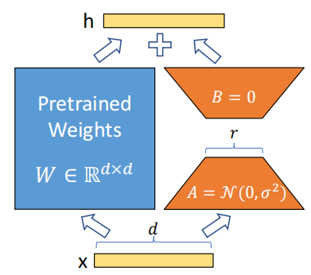
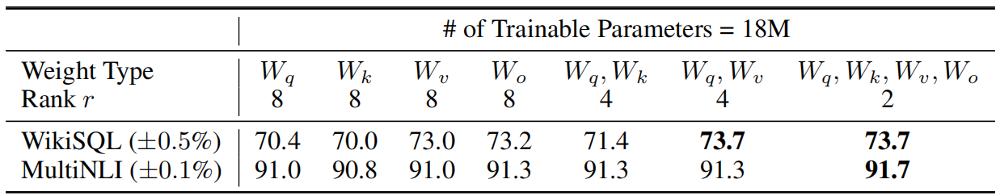
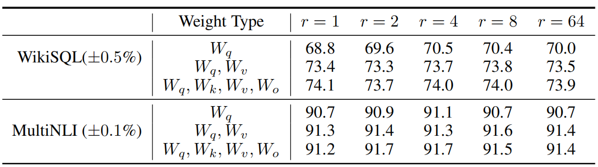

# LORA: LOW-RANK ADAPTATION OF LARGE LANGUAGE MODELS
LORA：大型语言模型的低秩适配 2021.6.17 https://arxiv.org/abs/2106.09685

## 阅读笔记
* 前提：预训练时，只有少部分参数调整幅度较大，其他大部分几乎无变化。
* 方法：1.分离原始参数和预训练要调整的参数,训练时冻结原始参数，只变更预训练参数；2.预训练调整部分因假设稀疏，可以改造为2个小矩阵AB乘积的形式：A：原始大小*r，B：r*原始大小
* 优化适配过程中密集层变化的秩分解矩阵来间接训练神经网络中的一些密集层
* 部署时将可训练矩阵与冻结权重合并
* https://github.com/huggingface/peft

## Abstract
An important paradigm of natural language processing consists of large-scale pretraining on general domain data and adaptation to particular tasks or domains. As we pre-train larger models, full fine-tuning, which retrains all model parameters, becomes less feasible. Using GPT-3 175B as an example – deploying independent instances of fine-tuned models, each with 175B parameters, is prohibitively expensive. We propose Low-Rank Adaptation, or LoRA, which freezes the pretrained model weights and injects trainable rank decomposition matrices into each layer of the Transformer architecture, greatly reducing the number of trainable parameters for downstream tasks. Compared to GPT-3 175B fine-tuned with Adam, LoRA can reduce the number of trainable parameters by 10,000 times and the GPU memory requirement by 3 times. LoRA performs on-par or better than finetuning in model quality on RoBERTa, DeBERTa, GPT-2, and GPT-3, despite having fewer trainable parameters, a higher training throughput, and, unlike adapters, no additional inference latency. We also provide an empirical investigation into rank-deficiency in language model adaptation, which sheds light on the efficacy of LoRA. We release a package that facilitates the integration of LoRA with PyTorch models and provide our implementations and model checkpoints for RoBERTa, DeBERTa, and GPT-2 at https://github.com/microsoft/LoRA.

自然语言处理的一个重要范式包括对一般领域数据的大规模预训练和对特定任务或领域的适配。当我们预训练更大的模型时，重新训练所有模型参数的完全微调变得不太可行。以GPT-3 175B为例，部署微调模型的独立实例，每个实例都有175B的参数，成本高得令人望而却步。我们提出了低秩适配，即LoRA，它冻结预训练的模型权重，并将可训练的秩分解矩阵注入Transformer架构的每一层，从而大大减少了下游任务的可训练参数数量。与Adam微调的GPT-3 175B相比，LoRA可以将可训练参数的数量减少10000倍，并将GPU内存需求减少3倍。不但具有较少的可训练参数、较高的训练吞吐量，并且与适配器不同，没有额外的推理延迟，LoRA在RoBERTa、DeBERTa、GPT-2和GPT-3上的模型质量的性能与微调不相上下或更好。我们还对语言模型适配中的秩缺陷(rank-deficiency)进行了实证研究，这揭示了LoRA的有效性。我们发布了一个包，该包有助于LoRA与PyTorch模型的集成，在 https://github.com/microsoft/LoRA.

## 1 INTRODUCTION
 
Figure 1: Our reparametrization. We only train A and B.
图1：我们的重新参数化。我们只训练A和B。

Many applications in natural language processing rely on adapting one large-scale, pre-trained language model to multiple downstream applications. Such adaptation is usually done via fine-tuning, which updates all the parameters of the pre-trained model. The major downside of fine-tuning is that the new model contains as many parameters as in the original model. As larger models are trained every few months, this changes from a mere “inconvenience” for GPT-2 (Radford et al., b) or RoBERTa large (Liu et al., 2019) to a critical deployment challenge for GPT-3 (Brown et al., 2020) with 175 billion trainable parameters.(1While GPT-3 175B achieves non-trivial performance with few-shot learning, fine-tuning boosts its performance significantly as shown in Appendix A.)

自然语言处理中的许多应用程序依赖于将一个大规模的、预训练的语言模型适配多个下游应用程序。这种适配通常通过微调来完成，微调更新预训练模型的所有参数。微调的主要缺点是，新模型包含的参数与原始模型中的参数一样多。随着更大的模型每隔几个月进行一次训练，这从GPT-2(Radford et al.，b)或RoBERTa大型(Liu et al.，2019)的“不便”变成了GPT-3(Brown et al.，2020)的关键部署挑战，其可训练参数为1750亿。(如附录A所示，虽然GPT-3 175B通过少样本学习实现了非凡的性能，但微调显著提高了其性能)

Many sought to mitigate this by adapting only some parameters or learning external modules for new tasks. This way, we only need to store and load a small number of task-specific parameters in addition to the pre-trained model for each task, greatly boosting the operational efficiency when deployed. However, existing techniques often introduce inference latency (Houlsby et al., 2019; Rebuffi et al., 2017) by extending model depth or reduce the model’s usable sequence length (Li & Liang, 2021; Lester et al., 2021; Hambardzumyan et al., 2020; Liu et al., 2021) (Section 3). More importantly, these method often fail to match the fine-tuning baselines, posing a trade-off between efficiency and model quality.

许多人试图通过仅调整一些参数或学习新任务的外部模块来缓解这种情况。这样，除了每个任务的预训练模型外，我们只需要存储和加载少量特定于任务的参数，极大地提高了部署时的操作效率。然而，现有技术通常通过扩展模型深度(Houlsby et al., 2019;Rebuffi et al., 2017)或减少模型的可用序列长度(Li&Liang，2021;Lester et al., 2021;Hambardzumyan et al., 2020;Liu et al., 2021)来引入推理延迟(第3节)。更重要的是，这些方法往往无法匹配微调基线，从而在效率和模型质量之间产生折中。

We take inspiration from Li et al. (2018a); Aghajanyan et al. (2020) which show that the learned over-parametrized models in fact reside on a low intrinsic dimension. We hypothesize that the change in weights during model adaptation also has a low “intrinsic rank”, leading to our proposed Low-Rank Adaptation (LoRA) approach. LoRA allows us to train some dense layers in a neural network indirectly by optimizing rank decomposition matrices of the dense layers’ change during adaptation instead, while keeping the pre-trained weights frozen, as shown in Figure 1. Using GPT-3 175B as an example, we show that a very low rank (i.e., r in Figure 1 can be one or two) suffices even when the full rank (i.e., d) is as high as 12,288, making LoRA both storage- and compute-efficient.

我们从Li et al. (2018a); Aghajanyan et al. (2020)那里获得了灵感，学习过的参数化模型实际上存在于较低的内在维度上。我们假设模型适配过程中权重的变化也具有较低的“内在秩”，这带来了我们提出的低秩适配(LoRA)方法。LoRA允许我们通过优化适配过程中密集层变化的秩分解矩阵来间接训练神经网络中的一些密集层，同时保持预训练的权重冻结，如图1所示。以GPT-3 175B为例，我们表明，即使全秩(即d)高达 12,288，非常低的秩(即图1中的r可以是一个或两个)也足够了，这使得LoRA既有存储效率，又有计算效率。

LoRA possesses several key advantages.
* A pre-trained model can be shared and used to build many small LoRA modules for different tasks. We can freeze the shared model and efficiently switch tasks by replacing the matrices A and B in Figure 1, reducing the storage requirement and task-switching overhead significantly.
* LoRA makes training more efficient and lowers the hardware barrier to entry by up to 3 times when using adaptive optimizers since we do not need to calculate the gradients or maintain the optimizer states for most parameters. Instead, we only optimize the injected, much smaller low-rank matrices.
* Our simple linear design allows us to merge the trainable matrices with the frozen weights when deployed, introducing no inference latency compared to a fully fine-tuned model, by construction.
* LoRA is orthogonal to many prior methods and can be combined with many of them, such as prefix-tuning. We provide an example in Appendix E.

LoRA具有几个关键优势:
* 预训练的模型可以共享，并用于为不同的任务构建许多小型LoRA模块。我们可以通过替换图1中的矩阵A和B来冻结共享模型并有效地切换任务，从而显著降低存储需求和任务切换开销。
* 当使用适配优化器时，由于我们不需要计算梯度或维护大多数参数的优化器状态，LoRA使训练更加高效，并将硬件进入门槛降低了3倍。相反，我们只优化注入的、小得多的低秩矩阵。
* 我们简单的线性设计使我们能够在部署时将可训练矩阵与冻结权重合并，通过构建，与完全微调的模型相比，不会引入推理延迟。
* LoRA与许多现有方法正交，并且可以与其中许多方法相结合，例如前缀调整。我们在附录E中提供了一个样本。

Terminologies and Conventions. We make frequent references to the Transformer architecture and use the conventional terminologies for its dimensions. We call the input and output dimension size of a Transformer layer $d_{model}$. We use $W_q, W_k, W_v$, and $W_o$ to refer to the query/key/value/output projection matrices in the self-attention module. W or $W_0$ refers to a pretrained weight matrix and ∆W its accumulated gradient update during adaptation. We use r to denote the rank of a LoRA module. We follow the conventions set out by (Vaswani et al., 2017; Brown et al., 2020) and use Adam (Loshchilov & Hutter, 2019; Kingma & Ba, 2017) for model optimization and use a Transformer MLP feedforward dimension $d_{ffn} = 4 × d_{model}$.

术语和惯例。我们经常引用Transformer架构，并使用传统的术语来确定其维度。我们将Transformer层的输入和输出维度大小称为 $d_{model}$。我们使用$W_q, W_k, W_v$和$W_o$表示自注意模块中的查询/键/值/输出投影矩阵。W或$W_0$指的是预训练的权重矩阵，∆W指的是适配过程中的累积梯度更新。我们使用r表示LoRA模块的秩。我们遵循(Vaswani et al.，2017;Brown et al.，2020)提出的惯例，并使用Adam(Loshchilov&Hutter，2019;Kingma&Ba，2017)进行模型优化，Transformer MLP前馈维度 使用 $d_{ffn} = 4 × d_{model}$。

## 2 PROBLEM STATEMENT 问题陈述
While our proposal is agnostic to training objective, we focus on language modeling as our motivating use case. Below is a brief description of the language modeling problem and, in particular, the maximization of conditional probabilities given a task-specific prompt.

虽然我们的提议与训练目标无关，但我们专注于将语言建模作为我们的激励用例。以下是对语言建模问题的简要描述，特别是在特定任务提示下条件概率的最大化。

Suppose we are given a pre-trained autoregressive language model $P_Φ(y|x)$ parametrized by Φ. For instance, $P_Φ(y|x)$ can be a generic multi-task learner such as GPT (Radford et al., b; Brown et al., 2020) based on the Transformer architecture (Vaswani et al., 2017). Consider adapting this pre-trained model to downstream conditional text generation tasks, such as summarization, machine reading comprehension (MRC), and natural language to SQL (NL2SQL). Each downstream task is represented by a training dataset of context-target pairs: $Z = \{(x_i , y_i)\}_{i=1,..,N}$ , where both $x_i$ and $y_i$ are sequences of tokens. For example, in NL2SQL, $x_i$ is a natural language query and $y_i$ its corresponding SQL command; for summarization, $x_i$ is the content of an article and $y_i$ its summary.

假设我们得到一个由Φ参数化的预训练的自回归语言模型$P_Φ(y|x)$。例如，$P_Φ(y|x)$可以是基于Transformer架构(Vaswani et al.，2017)的通用多任务学习器，如GPT(Radford et al.，b; Brown et al.，2020)。考虑将这种预训练的模型应用于下游条件文本生成任务，如摘要、机器阅读理解(MRC)和自然语言到SQL(NL2SQL)。每个下游任务由上下文-目标对的训练数据集表示：$Z = \{(x_i , y_i)\}_{i=1,..,N}$，其中$x_i$和$y_i$都是令牌序列。例如，在NL2SQL中，$x_i$是一个自然语言查询，$y_i$是其对应的SQL命令; 对于摘要任务，$x_i$是一篇文章的内容，$y_i$是它的摘要。

During full fine-tuning, the model is initialized to pre-trained weights $Φ_0$ and updated to $Φ_0$ + ∆Φ by repeatedly following the gradient to maximize the conditional language modeling objective:

在完全微调期间，通过重复遵循梯度将模型初始化为预训练的权重$Φ_0$，并更新为 $Φ_0$+∆Φ，以最大化条件语言建模目标：

$max_Φ \sum_{(x,y)∈Z} \sum^{|y|}_{t=1} log (P_Φ(y_t|x, y < t))$ (1)

One of the main drawbacks for full fine-tuning is that for each downstream task, we learn a different set of parameters ∆Φ whose dimension |∆Φ| equals |$Φ_0$|. Thus, if the pre-trained model is large (such as GPT-3 with |$Φ_0$| ≈ 175 Billion), storing and deploying many independent instances of fine-tuned models can be challenging, if at all feasible.

完全微调的主要缺点之一是，对于每个下游任务，我们都要学习一组不同的参数∆Φ，其尺寸|∆Φ|等于|$Φ_0$|。因此，如果预训练的模型很大(例如GPT-3的|$Φ_0$|≈1750亿)，那么如果可行的话，存储和部署许多独立的微调模型实例可能会很有挑战性。

In this paper, we adopt a more parameter-efficient approach, where the task-specific parameter increment ∆Φ = ∆Φ(Θ) is further encoded by a much smaller-sized set of parameters Θ with $|Θ| \ll |Φ_0|$. The task of finding ∆Φ thus becomes optimizing over Θ:

在本文中，我们采用了一种更有效的参数方法，其中特定任务的参数增量∆Φ=∆Φ(Θ)由一组小得多的参数Θ进一步编码，其中|Θ| << |$Φ_0$|。因此，求∆Φ的任务变成了对θ进行优化：

$max_Θ \sum_{(x,y)∈Z} \sum^{|y|}_{t=1} log ( p_{Φ_0} + ∆Φ(Θ)(y_t|x, y < t) ) $ (2)

In the subsequent sections, we propose to use a low-rank representation to encode ∆Φ that is both compute- and memory-efficient. When the pre-trained model is GPT-3 175B, the number of trainable parameters |Θ| can be as small as 0.01% of |$Φ_0$|.

在接下来的章节中，我们提议使用低秩表示来编码∆Φ，这既有计算效率又有内存效率。当预训练的模型是GPT-3 175B时，可训练参数的数量|Θ|可以小到|$Φ_0$|的0.01%。

## 3 AREN’T EXISTING SOLUTIONS GOOD ENOUGH?  现有的解决方案还不够好吗？
The problem we set out to tackle is by no means new. Since the inception of transfer learning, dozens of works have sought to make model adaptation more parameter- and compute-efficient. See Section 6 for a survey of some of the well-known works. Using language modeling as an example, there are two prominent strategies when it comes to efficient adaptations: adding adapter layers (Houlsby et al., 2019; Rebuffi et al., 2017; Pfeiffer et al., 2021; R¨uckl´e et al., 2020) or optimizing some forms of the input layer activations (Li & Liang, 2021; Lester et al., 2021; Hambardzumyan et al., 2020; Liu et al., 2021). However, both strategies have their limitations, especially in a large-scale and latency-sensitive production scenario.

我们着手解决的问题绝非新鲜事。自迁移学习开始以来，已有数十项工作试图提高模型适配的参数和计算效率。有一些著名工作的调查，请参见第6节。以语言建模为例，在有效适配方面有两种突出的策略：添加适配层(Houlsby et al., 2019;Rebuffi et al., 2017;Pfeiffer et al., 2021;R¨uckl´e et al., 2020)或优化输入层激活的某些形式(Li&Liang，2021;Lester et al., 2021;Hambardzumyan et al., 2020;Liu et al., 2021)。然而，这两种策略都有其局限性，尤其是在大规模和延迟敏感的生产场景中。

<!-- 
1. 添加适配层
2. 优化输入层激活的某些形式 -->

### Adapter Layers Introduce Inference Latency.  适配层引入推理延迟
There are many variants of adapters. We focus on the original design by Houlsby et al. (2019) which has two adapter layers per Transformer block and a more recent one by Lin et al. (2020) which has only one per block but with an additional LayerNorm (Ba et al., 2016). While one can reduce the overall latency by pruning layers or exploiting multi-task settings (R¨uckl´e et al., 2020; Pfeiffer et al., 2021), there is no direct ways to bypass the extra compute in adapter layers. This seems like a non-issue since adapter layers are designed to have few parameters (sometimes <1% of the original model) by having a small bottleneck dimension, which limits the FLOPs they can add. However, large neural networks rely on hardware parallelism to keep the latency low, and adapter layers have to be processed sequentially. This makes a difference in the online inference setting where the batch size is typically as small as one. In a generic scenario without model parallelism, such as running inference on GPT-2 (Radford et al., b) medium on a single GPU, we see a noticeable increase in latency when using adapters, even with a very small bottleneck dimension (Table 1).

适配器有许多变体。我们专注于Houlsby et al. (2019)的原始设计，每个Transformer块有两个适配层，Lin et al. (2020)的最近一个适配层，每个块只有一个，但有一个额外的LayerNorm(Ba et al., 2016)。虽然可以通过修剪层或利用多任务设置来减少总体延迟(R¨uckl´e et al., 2020;Pfeiffer et al., 2021)，但没有直接的方法可以绕过适配层中的额外计算。这似乎不是问题，因为适配层被设计为具有较小的瓶颈尺寸，从而具有较少的参数(有时＜原始模型的1%)，这限制了它们可以添加的FLOP。然而，大型神经网络依靠硬件并行性来保持低延迟，并且适配层必须按顺序处理。这使得在线推理设置有所不同，其中批量大小通常只有一个。在没有模型并行性的通用场景中，例如在单个GPU上的GPT-2(Radford et al.，b)介质上运行推理，我们看到使用适配器时延迟显著增加，即使瓶颈尺寸很小(表1)。

 
Table 1: Infernece latency of a single forward pass in GPT-2 medium measured in milliseconds, averaged over 100 trials. We use an NVIDIA Quadro RTX8000. “|Θ|” denotes the number of trainable parameters in adapter layers. $Adapter^L$ and $Adapter^H$ are two variants of adapter tuning, which we describe in Section 5.1. The inference latency introduced by adapter layers can be significant in an online, short-sequence-length scenario. See the full study in Appendix B.
表1：GPT-2介质中单次正向通过的推理延迟(以毫秒为单位)，100次试验的平均值。我们使用NVIDIA Quadro RTX8000。“|Θ|”表示适配层中可训练参数的数量。$Adapter^L$和$Adapter^H$是适配器调优的两种变体，我们在第5.1节中对此进行了描述。适配层引入的推理延迟在在线、短序列长度的场景中可能很重要。完整研究见附录B。

This problem gets worse when we need to shard the model as done in Shoeybi et al. (2020); Lepikhin et al. (2020), because the additional depth requires more synchronous GPU operations such as AllReduce and Broadcast, unless we store the adapter parameters redundantly many times.

当我们需要像Shoeybi et al. (2020); Lepikhin et al. (2020)所做的那样分割模型时，这个问题会变得更糟，因为额外的深度需要更多的同步GPU操作，如AllReduce和Broadcast，除非我们多次冗余存储适配器参数。

### Directly Optimizing the Prompt is Hard. 直接优化提示很难
The other direction, as exemplified by prefix tuning (Li & Liang, 2021), faces a different challenge. We observe that prefix tuning is difficult to optimize and that its performance changes non-monotonically in trainable parameters, confirming similar observations in the original paper. More fundamentally, reserving a part of the sequence length for adaptation necessarily reduces the sequence length available to process a downstream task, which we suspect makes tuning the prompt less performant compared to other methods. We defer the study on task performance to Section 5.

另一个方向，如前缀调整(Li&Liang，2021)所示，面临着不同的挑战。我们观察到前缀调整很难优化，并且其性能在可训练参数中非单调变化，这证实了原始论文中的类似观察结果。更根本的是，保留一部分序列长度用于适配必然会减少可用于处理下游任务的序列长度，我们怀疑这会使调整提示与其他方法相比性能较差。我们将关于任务表现的研究推迟到第5节。

## 4 OUR METHOD
We describe the simple design of LoRA and its practical benefits. The principles outlined here apply to any dense layers in deep learning models, though we only focus on certain weights in Transformer language models in our experiments as the motivating use case.

我们描述了LoRA的简单设计及其实际效益。这里概述的原则适用于深度学习模型中的任何密集层，尽管我们在实验中只关注Transformer语言模型中的某些权重作为激励用例。

### 4.1 LOW-RANK-PARAMETRIZED UPDATE MATRICES 低秩参数化更新矩阵
A neural network contains many dense layers which perform matrix multiplication. The weight matrices in these layers typically have full-rank. When adapting to a specific task, Aghajanyan et al. (2020) shows that the pre-trained language models have a low “instrisic dimension” and can still learn efficiently despite a random projection to a smaller subspace. Inspired by this, we hypothesize the updates to the weights also have a low “intrinsic rank” during adaptation. For a pre-trained weight matrix $W_0 ∈ R^{d×k}$ , we constrain its update by representing the latter with a low-rank decomposition $W_0 + ∆W = W_0 + BA$, where $B ∈ R^{d×r}$ , $A ∈ R^{r×k}$ , and the rank r $\ll$ min(d, k). During training, $W_0$ is frozen and does not receive gradient updates, while A and B contain trainable parameters. Note both $W_0$ and ∆W = BA are multiplied with the same input, and their respective output vectors are summed coordinate-wise. For $h = W_0x$, our modified forward pass yields:

神经网络包含许多执行矩阵乘法的密集层。这些层中的权重矩阵通常具有全秩。在适配特定任务时，Aghajanyan et al. (2020)表明，预训练的语言模型具有较低的“内在维度”，尽管随机投影到较小的子空间，但仍然可以有效地学习。受此启发，我们假设在适配过程中，权重的更新也具有较低的“内在秩”。对于预训练的权重矩阵 $W_0 ∈ R^{d×k}$，我们通过用低秩分解 $W_0 + ∆W = W_0 + BA$ 来表示后者来约束其更新，其中$B ∈ R^{d×r}$ , $A ∈ R^{r×k}$，秩 r $\ll$ min(d，k)。在训练期间，$W_0$被冻结并且不接收梯度更新，而A和B包含可训练的参数。请注意，$W_0$ 和 ∆W=BA 都与相同的输入相乘，并且它们各自的输出向量按坐标进行求和。对于 $h = W_0x$，我们修改的前向传递产生：

$h = W_0x + ∆W x = W_0x + BAx$ (3)

We illustrate our reparametrization in Figure 1. We use a random Gaussian initialization for A and zero for B, so ∆W = BA is zero at the beginning of training. We then scale ∆W x by $\frac{α}{r}$ , where α is a constant in r. When optimizing with Adam, tuning α is roughly the same as tuning the learning rate if we scale the initialization appropriately. As a result, we simply set α to the first r we try and do not tune it. This scaling helps to reduce the need to retune hyperparameters when we vary r (Yang & Hu, 2021).

我们在图1中说明了我们的重新参数化。我们对A使用随机高斯初始化，对B使用零，因此 ∆W=BA 在训练开始时为零。然后，我们用 $\frac{α}{r}$ 来缩放 ∆Wx ，其中α是r中的常数。当使用Adam进行优化时，如果我们适当地缩放初始化，则调整α与调整学习率大致相同。因此，我们只需将α设置为我们尝试的第一个r，而不进行调整。当我们改变r时，这种缩放有助于减少重新调整超参数的需要(Yang&Hu，2021)。

<!--对A使用随机高斯初始化，对B使用零-->

#### A Generalization of Full Fine-tuning. 全面微调的泛化
A more general form of fine-tuning allows the training of a subset of the pre-trained parameters. LoRA takes a step further and does not require the accumulated gradient update to weight matrices to have full-rank during adaptation. This means that when applying LoRA to all weight matrices and training all biases(2 They represent a negligible number of parameters compared to weights) , we roughly recover the expressiveness of full fine-tuning by setting the LoRA rank r to the rank of the pre-trained weight matrices. In other words, as we increase the number of trainable parameters(3 An inevitability when adapting to hard tasks), training LoRA roughly converges to training the original model, while adapter-based methods converges to an MLP and prefix-based methods to a model that cannot take long input sequences.

更通用的微调形式允许对预训练的参数的子集进行训练。LoRA更进一步，在适配期间不需要对权重矩阵的累积梯度更新来具有全秩。这意味着，当将LoRA应用于所有权重矩阵并训练所有偏差时(2与权重相比，它们代表的参数数量可以忽略不计)，我们通过将LoRA秩r设置为预训练的权重矩阵的秩，大致恢复了完全微调的表现力。换句话说，当我们增加可训练参数的数量时(3这是适配硬任务时的必然性)，训练LoRA大致收敛于训练原始模型，而基于适配器的方法收敛于MLP，基于前缀的方法收敛到不能接受长输入序列的模型。

<!-- 在适配期间不需要对权重矩阵的累积梯度更新来具有全秩?? -->

#### No Additional Inference Latency. 没有额外的推理延迟
When deployed in production, we can explicitly compute and store W = $W_0$ + BA and perform inference as usual. Note that both $W_0$ and BA are in $R^{d×k}$ . When we need to switch to another downstream task, we can recover $W_0$ by subtracting BA and then adding a different B'A' , a quick operation with very little memory overhead. Critically, this guarantees that we do not introduce any additional latency during inference compared to a fine-tuned model by construction.

当在部署生产环境中时，我们可以显式地计算和存储 W=$W_0$+BA，并像往常一样执行推理。请注意，$W_0$ 和 BA 都在 $R^{d×k}$ 中。当我们需要切换到另一个下游任务时，我们可以通过减去BA，然后添加不同的 B'A' 来恢复$W_0$，这是一种快速操作，内存开销非常小。至关重要的是，这保证了与通过构造微调的模型相比，我们在推理过程中不会引入任何额外的延迟。

### 4.2 APPLYING LORA TO TRANSFORMER
In principle, we can apply LoRA to any subset of weight matrices in a neural network to reduce the number of trainable parameters. In the Transformer architecture, there are four weight matrices in the self-attention module ($W_q, W_k, W_v, W_o$) and two in the MLP module. We treat $W_q$ (or Wk, $W_v$) as a single matrix of dimension $d_{model} × d_{model}$, even though the output dimension is usually sliced into attention heads. We limit our study to only adapting the attention weights for downstream tasks and freeze the MLP modules (so they are not trained in downstream tasks) both for simplicity and parameter-efficiency.We further study the effect on adapting different types of attention weight matrices in a Transformer in Section 7.1. We leave the empirical investigation of adapting the MLP layers, LayerNorm layers, and biases to a future work.

原则上，我们可以将LoRA应用于神经网络中权重矩阵的任何子集，以减少可训练参数的数量。在Transformer架构中，自注意模块中有四个权重矩阵($W_q, W_k, W_v, W_o$)，MLP模块中有两个。我们将$W_q$(或$W_k，W_v$)视为维度 $d_{model} × d_{model}$ 的单个矩阵，即使输出维度通常被划分为注意力头部。为了简单和参数高效，我们将研究限制为仅调整下游任务的注意力权重，并冻结MLP模块(因此它们不在下游任务中训练)。我们在第7.1节中进一步研究了在Transformer中调整不同类型注意力权重矩阵的影响。我们将调整MLP层、LayerNorm层和偏差的实证研究留给未来的工作。

#### Practical Benefits and Limitations. 实际好处和限制
The most significant benefit comes from the reduction in memory and storage usage. For a large Transformer trained with Adam, we reduce that VRAM usage by up to 2/3 if $r \ll d_{model}$ as we do not need to store the optimizer states for the frozen parameters. On GPT-3 175B, we reduce the VRAM consumption during training from 1.2TB to 350GB. With r = 4 and only the query and value projection matrices being adapted, the checkpoint size is reduced by roughly 10,000× (from 350GB to 35MB)(4We still need the 350GB model during deployment; however, storing 100 adapted models only requires 350GB + 35MB * 100 ≈ 354GB as opposed to 100 * 350GB ≈ 35TB) . This allows us to train with significantly fewer GPUs and avoid I/O bottlenecks. Another benefit is that we can switch between tasks while deployed at a much lower cost by only swapping the LoRA weights as opposed to all the parameters. This allows for the creation of many customized models that can be swapped in and out on the fly on machines that store the pre-trained weights in VRAM. We also observe a 25% speedup during training on GPT-3 175B compared to full fine-tuning(5 For GPT-3 175B, the training throughput for full fine-tuning is 32.5 tokens/s per V100 GPU; with the same number of weight shards for model parallelism, the throughput is 43.1 tokens/s per V100 GPU for LoRA) as we do not need to calculate the gradient for the vast majority of the parameters.

最显著的好处来自内存和存储使用量的减少。对于用Adam训练的大型Transformer，如果 r $\ll d_{model}$，我们将VRAM的使用量减少多达2/3，因为我们不需要存储冻结参数的优化器状态。在GPT-3 175B上，我们将训练期间的VRAM消耗从1.2TB减少到350GB。当r=4并且仅调整查询和值投影矩阵时，检查点大小减少了约10000倍(从350GB减少到35MB)(4 我们在部署期间仍然需要350GB模型; 然而，存储100个调整后的模型只需要350GB+35MB*100≈354GB，而不是100*350GB≈35TB)。这使我们能够使用更少的GPU进行训练，并避免I/O瓶颈。另一个好处是，我们可以在部署时以更低的成本在任务之间切换，只需交换LoRA权重，而不是所有参数。这允许创建许多自定义模型，这些模型可以在将预训练的权重存储在VRAM中的机器上进行动态交换。我们还观察到，与完全微调相比，在GPT-3 175B上的训练过程中，速度提高了25%(5 对于GPT-3 175 B，完全微调的训练吞吐量为每V100 GPU 32.5个令牌/秒; 对于模型并行，在相同数量的权重碎片的情况下，LoRA的吞吐量为每V100 GPU 43.1个令牌/s)，因为我们不需要计算绝大多数参数的梯度。

LoRA also has its limitations. For example, it is not straightforward to batch inputs to different tasks with different A and B in a single forward pass, if one chooses to absorb A and B into W to eliminate additional inference latency. Though it is possible to not merge the weights and dynamically choose the LoRA modules to use for samples in a batch for scenarios where latency is not critical.

LoRA也有其局限性。例如，如果选择将A和B吸收到W中以消除额外的推理延迟，那么在单个前向传递中批量输入到具有不同A和B的不同任务是不简单的。尽管在延迟不是关键的情况下，可以不合并权重并动态选择LoRA模块用于批量中的样本。

## 5 EMPIRICAL EXPERIMENTS 经验实验
We evaluate the downstream task performance of LoRA on RoBERTa (Liu et al., 2019), DeBERTa (He et al., 2021), and GPT-2 (Radford et al., b), before scaling up to GPT-3 175B (Brown et al., 2020). Our experiments cover a wide range of tasks, from natural language understanding (NLU) to generation (NLG). Specifically, we evaluate on the GLUE (Wang et al., 2019) benchmark for RoBERTa and DeBERTa. We follow the setup of Li & Liang (2021) on GPT-2 for a direct comparison and add WikiSQL (Zhong et al., 2017) (NL to SQL queries) and SAMSum (Gliwa et al., 2019) (conversation summarization) for large-scale experiments on GPT-3. See Appendix C for more details on the datasets we use. We use NVIDIA Tesla V100 for all experiments.

我们评估了LoRA在RoBERTa(Liu et al., 2019)、DeBERTa(He et al., 2021)和GPT-2(Radford et al., b)上的下游任务性能，然后再扩展到GPT-3 175B(Brown et al., 2020)。我们的实验涵盖了从自然语言理解(NLU)到生成(NLG)的广泛任务。具体而言，我们对RoBERTa和DeBERTa的GLUE(Wang et al.，2019)基准进行了评估。我们遵循Li&Liang(2021)在GPT-2上的设置进行直接比较，并添加WikiSQL(Zhong et al., 2017)(NL到SQL查询)和SAMSum(Gliwa et al., 2019)(对话摘要)用于GPT-3上的大规模实验。有关我们使用的数据集的更多详细信息，请参见附录C。我们使用NVIDIA Tesla V100进行所有实验。

### 5.1 BASELINES 基线
To compare with other baselines broadly, we replicate the setups used by prior work and reuse their reported numbers whenever possible. This, however, means that some baselines might only appear in certain experiments.

为了与其他基线进行广泛比较，我们复制了先前工作中使用的设置，并尽可能重复使用其报告的数字。然而，这意味着一些基线可能只出现在某些实验中。

Fine-Tuning (FT) is a common approach for adaptation. During fine-tuning, the model is initialized to the pre-trained weights and biases, and all model parameters undergo gradient updates.A simple variant is to update only some layers while freezing others. We include one such baseline reported in prior work (Li & Liang, 2021) on GPT-2, which adapts just the last two layers (FTTop2).

微调(FT)是一种常见的适配方法。在微调过程中，模型被初始化为预训练的权重和偏差，所有模型参数都会进行梯度更新。一个简单的变体是只更新一些层，而冻结其他层。我们在GPT-2之前的工作中报告了一个这样的基线(Li&Liang，2021)，它只适用于最后两层(FTTop2)。

Bias-only or BitFit is a baseline where we only train the bias vectors while freezing everything else. Contemporarily, this baseline has also been studied by BitFit (Zaken et al., 2021).

Bias only或BitFit是一个基线，我们只训练偏移向量，同时冻结其他所有内容。与此同时，BitFit也对该基线进行了研究(Zaken et al., 2021)。

Prefix-embedding tuning (PreEmbed) inserts special tokens among the input tokens. These special tokens have trainable word embeddings and are generally not in the model’s vocabulary. Where to place such tokens can have an impact on performance. We focus on “prefixing”, which prepends such tokens to the prompt, and “infixing”, which appends to the prompt; both are discussed in Li & Liang (2021). We use $l_p$ (resp. $l_i$) denote the number of prefix (resp. infix) tokens. The number of trainable parameters is $|Θ| = d_{model} × (l_p + l_i)$.

前缀嵌入调优(PreEmbed)在输入令牌中插入特殊令牌。这些特殊令牌具有可训练的单词嵌入，并且通常不在模型的词汇表中。将此类令牌放置在何处可能会对性能产生影响。我们关注的是“前缀”，它在提示前加上这样的令牌，以及“内接”，它附加在提示后;Li和Liang(2021)对这两者进行了讨论。我们使用$l_p$ (resp. $l_i$)表示前缀(resp.infix)令牌的数量。可训练参数的数量为  $|Θ| = d_{model} × (l_p + l_i)$。

Prefix-layer tuning (PreLayer) is an extension to prefix-embedding tuning. Instead of just learning the word embeddings (or equivalently, the activations after the embedding layer) for some special tokens, we learn the activations after every Transformer layer. The activations computed from previous layers are simply replaced by trainable ones. The resulting number of trainable parameters is $|Θ| = L × d_{model} × (l_p + l_i)$, where L is the number of Transformer layers.

前缀层调整(PreLayer)是前缀嵌入调整的扩展。我们不是只学习一些特殊令牌的单词嵌入(或者等效地，嵌入层之后的激活)，而是学习每个Transformer层之后的激活。从先前层计算的激活被可训练的激活简单地替换。由此得到的可训练参数的数量为 $|Θ| = L × d_{model} × (l_p + l_i)$，其中 L 是Transformer层的数量。

Adapter tuning as proposed in Houlsby et al. (2019) inserts adapter layers between the selfattention module (and the MLP module) and the subsequent residual connection. There are two fully connected layers with biases in an adapter layer with a nonlinearity in between. We call this original design $Adapter^H$ . Recently, Lin et al. (2020) proposed a more efficient design with the adapter layer applied only after the MLP module and after a LayerNorm. We call it $Adapter^L$ . This is very similar to another deign proposed in Pfeiffer et al. (2021), which we call $Adapter^P$ . We also include another baseline call AdapterDrop (R¨uckl´e et al., 2020) which drops some adapter layers for greater efficiency ($Adapter^D$ ). We cite numbers from prior works whenever possible to maximize the number of baselines we compare with; they are in rows with an asterisk (*) in the first column. In all cases, we have $|Θ| = \hat{L}_{Adpt} ×(2×d_{model} × r + r + d_{model})+ 2 × \hat{L}_{LN} × d_{model}$ where $\hat{L}_{Adpt}$ is the number of adapter layers and $\hat{L}_{LN}$ the number of trainable LayerNorms (e.g., in $Adapter^L$ ).

Houlsby et al. (2019)提出的适配器微调在自注意模块(和MLP模块)和随后的残差连接之间插入适配层。在适配层中有两个完全连接的层，它们之间具有非线性。我们将这种原始设计称为 $Adapter^H$。最近，Lin et al. (2020)提出了一种更有效的设计，其中适配层仅在MLP模块之后和LayerNorm之后应用。我们称之为 $Adapter^L$。这与Pfeiffer et al. (2021)提出的另一种设计非常相似，我们称之为 $Adapter^P$。我们还包括另一个基线调用 AdapterDrop(R¨uckl´e et al.，2020)，该调用丢弃了一些适配层以提高效率($Adapter^D$)。我们尽可能引用先前工作中的数字，以最大限度地增加我们所比较的基线数量;它们在第一列中带有星号(*)的行中。在所有情况下，我们都有 $|Θ| = \hat{L}_{Adpt} ×(2×d_{model} × r + r + d_{model})+ 2 × \hat{L}_{LN} × d_{model}$，其中，$\hat{L}_{Adpt}$是适配层的数量，而 $\hat{L}_{LN}$ 是可训练层范数的数量(例如，在$Adapter^L$中)。

LoRA adds trainable pairs of rank decomposition matrices in parallel to existing weight matrices. As mentioned in Section 4.2, we only apply LoRA to $W_q$ and $W_v$ in most experiments for simplicity. The number of trainable parameters is determined by the rank r and the shape of the original weights: |Θ| = 2 × $\hat{L}_{LoRA}$ × $d_{model}$ × r, where $\hat{L}_{LoRA}$ is the number of weight matrices we apply LoRA to.

LoRA将可训练的 秩分解矩阵对 并行添加到现有的权重矩阵。如第4.2节所述，为了简单起见，我们在大多数实验中仅将LoRA应用于$W_q$和$W_v$。可训练参数的数量由秩r和原始权重的形状决定：|Θ| = 2 × $\hat{L}_{LoRA}$ × $d_{model}$ × r，其中，$\hat{L}_{LoRA}$是我们应用LoRA的权重矩阵的数量。

### 5.2 ROBERTA BASE/LARGE
RoBERTa (Liu et al., 2019) optimized the pre-training recipe originally proposed in BERT (Devlin et al., 2019a) and boosted the latter’s task performance without introducing many more trainable parameters. While RoBERTa has been overtaken by much larger models on NLP leaderboards such as the GLUE benchmark (Wang et al., 2019) in recent years, it remains a competitive and popular pre-trained model for its size among practitioners. We take the pre-trained RoBERTa base (125M) and RoBERTa large (355M) from the HuggingFace Transformers library (Wolf et al., 2020) and evaluate the performance of different efficient adaptation approaches on tasks from the GLUE benchmark. We also replicate Houlsby et al. (2019) and Pfeiffer et al. (2021) according to their setup. To ensure a fair comparison, we make two crucial changes to how we evaluate LoRA when comparing with adapters. First, we use the same batch size for all tasks and use a sequence length of 128 to match the adapter baselines. Second, we initialize the model to the pre-trained model for MRPC, RTE, and STS-B, not a model already adapted to MNLI like the fine-tuning baseline. Runs following this more restricted setup from Houlsby et al. (2019) are labeled with †. The result is presented in Table 2 (Top Three Sections). See Section D.1 for details on the hyperparameters used.

RoBERTa(Liu et al.，2019)优化了最初在BERT中提出的预训练配置(Devlin et al.，2019a)，并在不引入更多可训练参数的情况下提高了后者的任务性能。尽管近来，RoBERTa在NLP排行榜上被GLUE基准等更大的模型所取代(Wang et al.，2019)，但就其规模而言，它在从业者中仍然是一个有竞争力且受欢迎的预训练模型。我们从HuggingFace Transformers库(Wolf et al.，2020)中获取预训练的RoBERTa基础(125M)和RoBERTa大型(355M)，并从GLUE基准评估不同有效适配方法在任务上的性能。我们还根据其设置复制了Houlsby et al. (2019)和Pfeiffer et al. (2021)。为了确保公平的比较，我们在与适配器进行比较时，对评估LoRA的方式进行了两个关键的更改。首先，我们对所有任务使用相同的批处理大小，并使用128的序列长度来匹配适配器基线。其次，我们将模型初始化为MRPC、RTE和STS-B的预训练模型，而不是像微调基线那样已经适配MNLI的模型。Houlsby et al. (2019)的这种更受限制的设置之后的运行令牌为†。结果如表2(前三部分)所示。有关使用的超参数的详细信息，请参见第D.1节。

 
Table 2: RoBERTa-base, RoBERTa-large, and DeBERTa-XXL with different adaptation methods on the GLUE benchmark. We report the overall (matched and mismatched) accuracy for MNLI, Matthew’s correlation for CoLA, Pearson correlation for STS-B, and accuracy for other tasks. Higher is better for all metrics. * indicates numbers published in prior works. † indicates runs configured in a setup similar to Houlsby et al. (2019) for a fair comparison.
表2:RoBERTa-base、RoBERTa-large和DeBERTa-XXL在GLUE基准上采用不同的适配方法。我们报告了MNLI的总体(匹配和不匹配)准确性、CoLA的Matthew相关性、STS-B的Pearson相关性以及其他任务的准确性。所有指标越高越好。*表示先前工作中发表的数字。†指示在类似于Houlsby et al. (2019)的设置中配置的运行用于公平比较。

### 5.3 DEBERTA XXL
DeBERTa (He et al., 2021) is a more recent variant of BERT that is trained on a much larger scale and performs very competitively on benchmarks such as GLUE (Wang et al., 2019) and SuperGLUE (Wang et al., 2020). We evaluate if LoRA can still match the performance of a fully fine-tuned DeBERTa XXL (1.5B) on GLUE. The result is presented in Table 2 (Bottom Section). See Section D.2 for details on the hyperparameters used.

DeBERTa(He et al., 2021)是BERT的一个较新变体，它在更大范围内接受训练，在GLUE(Wang et al., 2019)和SuperGLUE等基准上表现非常有竞争力(Wang等，2020)。我们评估了LoRA是否仍能在GLUE上达到完全微调的DeBERTa XXL(1.5B)的性能。结果如表2(底部)所示。有关使用的超参数的详细信息，请参见第D.2节。

### 5.4 GPT-2 MEDIUM/LARGE
Having shown that LoRA can be a competitive alternative to full fine-tuning on NLU, we hope to answer if LoRA still prevails on NLG models, such as GPT-2 medium and large (Radford et al., b). We keep our setup as close as possible to Li & Liang (2021) for a direct comparison. Due to space constraint, we only present our result on E2E NLG Challenge (Table 3) in this section.See Section F.1 for results on WebNLG (Gardent et al., 2017) and DART (Nan et al., 2020). We include a list of the hyperparameters used in Section D.3.

已经表明，对于NLU的完全微调，LoRA可以是一种有竞争力的替代方案，我们希望回答LoRA是否仍然在NLG模型上占主导地位，例如GPT-2中型和大型(Radford et al., b)。为了进行直接比较，我们将设置尽可能靠近Li&Liang(2021)。由于空间限制，我们在本节中只介绍了E2E NLG挑战赛的结果(表3)。WebNLG(Gardent et al.，2017)和DART(Nan et al.，2020)的结果见第F.1节。我们列出了D.3节中使用的超参数列表。

 
Table 3: GPT-2 medium (M) and large (L) with different adaptation methods on the E2E NLG Challenge. For all metrics, higher is better. LoRA outperforms several baselines with comparable or fewer trainable parameters. Confidence intervals are shown for experiments we ran. * indicates numbers published in prior works.
表3:E2E NLG挑战中具有不同适配方法的GPT-2中等(M)和大(L)。对于所有指标，越高越好。LoRA优于具有可比较或更少可训练参数的几个基线。显示了我们进行的实验的置信区间。*表示先前工作中发表的数字。

### 5.5 SCALING UP TO GPT-3 175B 扩展到GPT-3 175B
As a final stress test for LoRA, we scale up to GPT-3 with 175 billion parameters. Due to the high training cost, we only report the typical standard deviation for a given task over random seeds, as opposed to providing one for every entry. See Section D.4 for details on the hyperparameters used.

作为LoRA的最后一次压力测试，我们将GPT-3扩展到1750亿个参数。由于训练成本高，我们只报告给定任务在随机种子上的典型标准差，而不是为每个条目提供一个标准差。有关使用的超参数的详细信息，请参见第D.4节。

As shown in Table 4, LoRA matches or exceeds the fine-tuning baseline on all three datasets. Note that not all methods benefit monotonically from having more trainable parameters, as shown in Figure 2. We observe a significant performance drop when we use more than 256 special tokens for prefix-embedding tuning or more than 32 special tokens for prefix-layer tuning. This corroborates similar observations in Li & Liang (2021). While a thorough investigation into this phenomenon is out-of-scope for this work, we suspect that having more special tokens causes the input distribution to shift further away from the pre-training data distribution. Separately, we investigate the performance of different adaptation approaches in the low-data regime in Section F.3.

如表4所示，LoRA在所有三个数据集上都匹配或超过了微调基线。请注意，并不是所有方法都能从具有更多可训练参数中单调受益，如图2所示。当我们使用超过256个特殊令牌进行前缀嵌入调整或超过32个特殊令牌用于前缀层调整时，我们观察到性能显著下降。这证实了Li和Liang(2021)的类似观察结果。虽然对这一现象的彻底调查超出了这项工作的范围，但我们怀疑，拥有更多的特殊令牌会导致输入分布进一步偏离预训练数据分布。另外，我们在第F.3节中研究了不同适配方法在低数据制度下的性能。

 
Table 4: Performance of different adaptation methods on GPT-3 175B. We report the logical form validation accuracy on WikiSQL, validation accuracy on MultiNLI-matched, and Rouge-1/2/L on SAMSum. LoRA performs better than prior approaches, including full fine-tuning. The results on WikiSQL have a fluctuation around ±0.5%, MNLI-m around ±0.1%, and SAMSum around ±0.2/±0.2/±0.1 for the three metrics.
表4：GPT-3 175B上不同适配方法的性能。我们报告了WikiSQL上的逻辑形式验证准确性，MultiNLI匹配上的验证准确性，以及SAMSum上的Rouge-1/2/L。LoRA的性能优于先前的方法，包括完全微调。WikiSQL上的结果在这三个指标上的波动约为±0.5%，MNLI-m约为±0.1%，SAMSum约为±0.2/±0.2/？.1。

 
Figure 2: GPT-3 175B validation accuracy vs. number of trainable parameters of several adaptation methods on WikiSQL and MNLI-matched. LoRA exhibits better scalability and task performance. See Section F.2 for more details on the plotted data points.
图2: GPT-3 175B验证准确性与WikiSQL和MNLI上几种适配方法的可训练参数数量匹配。LoRA表现出更好的可扩展性和任务性能。有关绘制数据点的更多详细信息，请参见第F.2节。

## 6 RELATED WORKS 
### Transformer Language Models.
Transformer (Vaswani et al., 2017) is a sequence-to-sequence architecture that makes heavy use of self-attention. Radford et al. (a) applied it to autoregressive language modeling by using a stack of Transformer decoders. Since then, Transformer-based language models have dominated NLP, achieving the state-of-the-art in many tasks. A new paradigm emerged with BERT (Devlin et al., 2019b) and GPT-2 (Radford et al., b) – both are large Transformer language models trained on a large amount of text – where fine-tuning on task-specific data after pretraining on general domain data provides a significant performance gain compared to training on task-specific data directly. Training larger Transformers generally results in better performance and remains an active research direction. GPT-3 (Brown et al., 2020) is the largest single Transformer language model trained to-date with 175B parameters.

Transformer(Vaswani et al.，2017)是一种大量利用自我注意力的序列到序列架构。Radford et al. (a)通过使用一堆Transformer解码器将其应用于自回归语言建模。从那时起，基于Transformer的语言模型主导了NLP，在许多任务中达到了最先进的水平。BERT(Devlin et al.，2019b)和GPT-2(Radford et al.，b)出现了一种新的范式，这两种语言模型都是在大量文本上训练的大型Transformer语言模型，与直接在特定任务数据上训练相比，在对一般域数据进行预训练后对特定任务数据进行微调可以显著提高性能。训练更大的转换器通常会带来更好的性能，并且仍然是一个积极的研究方向。GPT-3(Brown et al.，2020)是迄今为止使用175B参数训练的最大的单一Transformer语言模型。

### Prompt Engineering and Fine-Tuning. 提示工程和微调
While GPT-3 175B can adapt its behavior with just a few additional training examples, the result depends heavily on the input prompt (Brown et al., 2020). This necessitates an empirical art of composing and formatting the prompt to maximize a model’s performance on a desired task, which is known as prompt engineering or prompt hacking. Fine-tuning retrains a model pre-trained on general domains to a specific task Devlin et al. (2019b); Radford et al. (a). Variants of it include learning just a subset of the parameters Devlin et al. (2019b); Collobert & Weston (2008), yet practitioners often retrain all of them to maximize the downstream performance. However, the enormity of GPT-3 175B makes it challenging to perform fine-tuning in the usual way due to the large checkpoint it produces and the high hardware barrier to entry since it has the same memory footprint as pre-training.

虽然GPT-3 175B只需几个额外的训练样本就可以调整其行为，但结果在很大程度上取决于输入提示(Brown et al., 2020)。这就需要一种编写和格式化提示的经验艺术，以最大限度地提高模型在所需任务上的性能，这被称为提示工程或提示黑客。微调将在一般域上预训练的模型重新训练到特定任务Devlin et al. (2019b); Radford et al. (a)。它的变体包括只学习参数的一个子集Devlin et al. (2019b); Collobert和Weston(2008)，从业者经常对他们进行再训练，以最大限度地提高下游绩效。然而，GPT-3 175B的巨大性使得以通常的方式执行微调具有挑战性，因为它产生了大的检查点，并且由于它具有与预训练相同的内存占用，因此硬件的进入门槛很高。

### Parameter-Efficient Adaptation. 参数有效适配
Many have proposed inserting adapter layers between existing layers in a neural network (Houlsby et al., 2019; Rebuffi et al., 2017; Lin et al., 2020). Our method uses a similar bottleneck structure to impose a low-rank constraint on the weight updates. The key functional difference is that our learned weights can be merged with the main weights during inference, thus not introducing any latency, which is not the case for the adapter layers (Section 3). A comtenporary extension of adapter is COMPACTER (Mahabadi et al., 2021), which essentially parametrizes the adapter layers using Kronecker products with some predetermined weight sharing scheme. Similarly, combining LoRA with other tensor product-based methods could potentially improve its parameter efficiency, which we leave to future work. More recently, many proposed optimizing the input word embeddings in lieu of fine-tuning, akin to a continuous and differentiable generalization of prompt engineering (Li & Liang, 2021; Lester et al., 2021; Hambardzumyan et al., 2020; Liu et al., 2021). We include comparisons with Li & Liang (2021) in our experiment section. However, this line of works can only scale up by using more special tokens in the prompt, which take up available sequence length for task tokens when positional embeddings are learned.

许多人提出在神经网络中的现有层之间插入适配层(Houlsby et al., 2019;Rebuffi et al., 2017;Lin et al., 2020)。我们的方法使用类似的瓶颈结构来对权重更新施加低秩约束。关键的功能差异在于，我们学习的权重可以在推理过程中与主权重合并，从而不会引入任何延迟，而适配层的情况并非如此(第3节)。适配器的一个共同扩展是COMPACTER(Mahabadi et al.，2021)，它基本上使用带有一些预定权重分配置案的 克罗内克积(Kronecker products) 对适配层进行参数化。同样，将LoRA与其他基于张量积的方法相结合，可能会提高其参数效率，这将留给未来的工作。最近，许多人提出优化输入词嵌入以代替微调，类似于提示工程的连续可微泛化(Li&Liang，2021;Lester et al., 2021;Hambardzumyan et al., 2020;Liu et al., 2021)。在我们的实验部分，我们将与Li&Liang(2021)进行比较。然而，这一系列工作只能通过在提示中使用更多特殊的令牌来扩大规模，当学习位置嵌入时，这些令牌会占用任务令牌的可用序列长度。

### Low-Rank Structures in Deep Learning.  深度学习中的低秩结构
Low-rank structure is very common in machine learning. A lot of machine learning problems have certain intrinsic low-rank structure (Li et al., 2016; Cai et al., 2010; Li et al., 2018b; Grasedyck et al., 2013). Moreover, it is known that for many deep learning tasks, especially those with a heavily over-parametrized neural network, the learned neural network will enjoy low-rank properties after training (Oymak et al., 2019). Some prior works even explicitly impose the low-rank constraint when training the original neural network (Sainath et al., 2013; Povey et al., 2018; Zhang et al., 2014; Jaderberg et al., 2014; Zhao et al., 2016; Khodak et al., 2021; Denil et al., 2014); however, to the best of our knowledge, none of these works considers low-rank update to a frozen model for adaptation to downstream tasks. In theory literature, it is known that neural networks outperform other classical learning methods, including the corresponding (finite-width) neural tangent kernels (Allen-Zhu et al., 2019; Li & Liang, 2018) when the underlying concept class has certain low-rank structure (Ghorbani et al., 2020; Allen-Zhu & Li, 2019; Allen-Zhu & Li, 2020a). Another theoretical result in Allen-Zhu & Li (2020b) suggests that low-rank adaptations can be useful for adversarial training. In sum, we believe that our proposed low-rank adaptation update is well-motivated by the literature.

低秩结构在机器学习中非常常见。许多机器学习问题具有一定的内在低秩结构(Li et al., 2016; Cai et al., 2010; Li et al., 2018b; Grasedyck et al., 2013)。此外，对于许多深度学习任务，特别是那些具有严重过度参数化神经网络的任务，学习的神经网络在训练后将具有低秩特性(Oymak et al.，2019)。以前的一些工作甚至在训练原始神经网络时明确施加了低秩约束(Sainath et al., 2013;Povey et al., 2018;Zhang et al., 2014;Jaderberg et al., 14;Zhao et al., 2016;Khodak et al., 2021;Denil et al., 2014); 然而，据我们所知，这些工作都没有考虑对冻结模型进行低秩更新，以适配下游任务。在理论文献中，当底层概念类具有一定的低秩结构时，神经网络优于其他经典学习方法，包括相应的(有限宽度)神经切线核(Allen Zhu et al.，2019;Li&Liang，2018)(Ghorbani et al.，2020;Allen Zhu&Li，2019;Allen朱和李，2020a)。Allen Zhu&Li(2020b)的另一个理论结果表明，低秩适配可能对对抗性训练有用。总之，我们相信我们提出的低秩适配更新是受文献的充分激励的。

## 7 UNDERSTANDING THE LOW-RANK UPDATES 了解低秩更新
Given the empirical advantage of LoRA, we hope to further explain the properties of the low-rank adaptation learned from downstream tasks. Note that the low-rank structure not only lowers the hardware barrier to entry which allows us to run multiple experiments in parallel, but also gives better interpretability of how the update weights are correlated with the pre-trained weights. We focus our study on GPT-3 175B, where we achieved the largest reduction of trainable parameters (up to 10,000×) without adversely affecting task performances.

鉴于LoRA的经验优势，我们希望进一步解释从下游任务中学到的低秩适配的性质。请注意，低秩结构不仅降低了硬件进入门槛，这允许我们并行运行多个实验，而且还提供了更新权重如何与预训练的权重相关的更好的可解释性。我们将研究重点放在GPT-3 175B上，在不影响任务性能的情况下，我们实现了可训练参数的最大减少(高达10000倍)。

We perform a sequence of empirical studies to answer the following questions: 1) Given a parameter budget constraint, which subset of weight matrices in a pre-trained Transformer should we adapt to maximize downstream performance? 2) Is the “optimal” adaptation matrix ∆W really rankdeficient? If so, what is a good rank to use in practice? 3) What is the connection between ∆W and W? Does ∆W highly correlate with W? How large is ∆W comparing to W?

我们进行了一系列实证研究，以回答以下问题：
1. 在给定参数预算约束的情况下，我们应该调整预训练Transformer中的权重矩阵的哪个子集，以最大限度地提高下游性能？
2. “最优”适配矩阵∆W真的有效吗？如果是这样的话，在实践中使用什么是好的秩？
3. ∆W和W之间的联系是什么？∆W与W高度相关吗？∆W与W相比有多大？

We believe that our answers to question (2) and (3) shed light on the fundamental principles of using pre-trained language models for downstream tasks, which is a critical topic in NLP.

我们相信，我们对问题(2)和(3)的回答阐明了将预训练的语言模型用于下游任务的基本原则，这是NLP中的一个关键主题。

### 7.1 WHICH WEIGHT MATRICES IN TRANSFORMER SHOULD WE APPLY LORA TO?  我们应该将LORA应用于转换器中的哪些权重矩阵？
Given a limited parameter budget, which types of weights should we adapt with LoRA to obtain the best performance on downstream tasks? As mentioned in Section 4.2, we only consider weight matrices in the self-attention module. We set a parameter budget of 18M (roughly 35MB if stored in FP16) on GPT-3 175B, which corresponds to r = 8 if we adapt one type of attention weights or r = 4 if we adapt two types, for all 96 layers. The result is presented in Table 5.

在参数预算有限的情况下，我们应该使用LoRA调整哪些类型的权重，以在下游任务中获得最佳性能？如第4.2节所述，我们只考虑自注意模块中的权重矩阵。我们在GPT-3 175B上设置了18M的参数预算(如果存储在FP16中，则大约为35MB)，对于所有96层，如果我们调整一种类型的注意力权重，则对应于r＝8，或者如果我们调整两种类型，则对应为r＝4。结果如表5所示。

 
Table 5: Validation accuracy on WikiSQL and MultiNLI after applying LoRA to different types of attention weights in GPT-3, given the same number of trainable parameters. Adapting both $W_q$ and $W_v$ gives the best performance overall. We find the standard deviation across random seeds to be consistent for a given dataset, which we report in the first column.
表5：在给定相同数量的可训练参数的情况下，将LoRA应用于GPT-3中不同类型的注意力权重后，WikiSQL和MultiNLI的验证准确性。同时适配$W_q$和$W_v$可以获得最佳的整体性能。我们发现，对于给定的数据集，随机种子之间的标准偏差是一致的，我们在第一列中报告了这一点。

Note that putting all the parameters in $∆W_q$ or $∆W_k$ results in significantly lower performance, while adapting both $W_q$ and $W_v$ yields the best result. This suggests that even a rank of four captures enough information in ∆W such that it is preferable to adapt more weight matrices than adapting a single type of weights with a larger rank.

请注意，将所有参数设置为$∆W_q$或$∆W_k$会导致性能显著降低，同时调整$W_q$和$W_v$会产生最佳结果。这表明，即使秩为4，也能在∆W中捕捉到足够的信息，因此，与采用具有更大秩的单一类型的权重相比，采用更多的权重矩阵更为可取。

### 7.2 WHAT IS THE OPTIMAL RANK r FOR LORA?  LORA的最佳秩是多少？
We turn our attention to the effect of rank r on model performance. We adapt {$W_q, W_v$}, {$W_q, W_k, W_v, W_c$}, and just $W_q$ for a comparison.

我们将注意力转向秩r对模型性能的影响。我们将{$W_q，W_v$}、{$W_q, W_k, W_v, W_c$}和仅$W_q$进行比较。

 
Table 6: Validation accuracy on WikiSQL and MultiNLI with different rank r. To our surprise, a rank as small as one suffices for adapting both $W_q$ and $W_v$ on these datasets while training $W_q$ alone needs a larger r. We conduct a similar experiment on GPT-2 in Section H.2.
表6：具有不同秩r的WikiSQL和MultiNLI的验证准确性。令我们惊讶的是，秩小到一就足以适配这些数据集上的$W_q$和$W_v$，而单独训练$W_q$需要更大的r。我们在第H.2节中对GPT-2进行了类似的实验。

Table 6 shows that, surprisingly, LoRA already performs competitively with a very small r (more so for {$W_q, W_v$} than just $W_q$). This suggests the update matrix ∆W could have a very small “intrinsic rank”(6 However, we do not expect a small r to work for every task or dataset. Consider the following thought experiment: if the downstream task were in a different language than the one used for pre-training, retraining the entire model (similar to LoRA with r = $d_{model}$) could certainly outperform LoRA with a small r). To further support this finding, we check the overlap of the subspaces learned by different choices of r and by different random seeds. We argue that increasing r does not cover a more meaningful subspace, which suggests that a low-rank adaptation matrix is sufficient.

表6显示，令人惊讶的是，LoRA已经以非常小的r表现出竞争力({$W_q$，$W_v$}比$W_q$更具竞争力)。这表明更新矩阵∆W可能具有非常小的“内在秩”(6 然而，我们不期望小r适用于每个任务或数据集。考虑以下思想实验：如果下游任务使用的语言与用于预训练的语言不同，则重新训练整个模型(类似于r=$d_{model}$的LoRA)肯定会优于小r的LoRA)。为了进一步支持这一发现，我们检查了通过不同的r选择和不同的随机种子学习的子空间的重叠。我们认为，增加r并不覆盖更有意义的子空间，这表明低秩适配矩阵就足够了。

Subspace similarity between different r. Given $A_{r=8}$ and $A_{r=64}$ which are the learned adaptation matrices with rank r = 8 and 64 using the same pre-trained model, we perform singular value decomposition and obtain the right-singular unitary matrices $U_{A_{r=8}}$ and $U_{$A_{r=64}$}$(7 Note that a similar analysis can be carried out with B and the left-singular unitary matrices – we stick with A for our experiments) .  We hope to answer: how much of the subspace spanned by the top i singular vectors in $U_{A_{r=8}}$ (for 1 ≤ i ≤ 8) is contained in the subspace spanned by top j singular vectors of $U_{$A_{r=64}$}$ (for 1 ≤ j ≤ 64)? We measure this quantity with a normalized subspace similarity based on the Grassmann distance (See Appendix G for a more formal discussion)

不同r之间的子空间相似性。给定 $A_{r=8}$ 和 $A_{r=64}$，它们是使用相同的预训练模型学习的秩为r＝8和64的适配矩阵，我们进行奇异值分解，得到右奇异酉矩阵 $U_{A_{r=8}}$ 和 $U_{$A_{r=64}$}$(7 注意，可以对B和左奇异酉阵进行类似的分析——我们在实验中坚持使用A)。我们希望回答：$ U_{A_r}＝8$ (对于1≤i≤8)中的前i个奇异向量所跨越的子空间中，有多少包含在 $U_{A_r}＝64$ (对于1≥j≤64)的前j个奇异向量跨越的子子空间中？我们用基于Grassmann距离的归一化子空间相似性来测量这个量(更正式的讨论见附录G)

$φ(A_{r=8}, $A_{r=64}$, i, j) = \frac{||U^{iT}_{A_{r=8}} U^j _{$A_{r=64}$} ||^2_F}{min(i, j)} ∈ [0, 1]$ (4)

where $U^i_{A_{r=8}}$ represents the columns of $U_{Ar＝8}$ corresponding to the top-i singular vectors. φ(·) has a range of [0, 1], where 1 represents a complete overlap of subspaces and 0 a complete separation. See Figure 3 for how φ changes as we vary i and j. We only look at the 48th layer (out of 96) due to space constraint, but the conclusion holds for other layers as well, as shown in Section H.1.

其中 $U^i_{A_{r=8}}$ 表示对应于前i个奇异向量的 $U_{Ar＝8}$的列。φ(·)的范围为[0，1]，其中1表示子空间的完全重叠，0表示完全分离。如图3所示，φ如何随着i和j的变化而变化。由于空间限制，我们只关注第48层(96层中的第48层)，但结论也适用于其他层，如第H.1节所示。

 
Figure 3: Subspace similarity between column vectors of $A_{r=8}$ and $A_{r=64}$ for both $∆W_q$ and $∆W_v$. The third and the fourth figures zoom in on the lower-left triangle in the first two figures. The top directions in r = 8 are included in r = 64, and vice versa.
图3：$∆W_q$和$∆W_v$的$A_{r=8}$和$A_{r=64}$列向量之间的子空间相似性。第三个和第四个图形放大前两个图形中左下角的三角形。r＝8中的顶部方向包括在r＝64中，反之亦然。

We make an important observation from Figure 3.

我们从图3中得出了一个重要的观察结果。

Directions corresponding to the top singular vector overlap significantly between $A_{r=8}$ and $A_{r=64}$, while others do not. Specifically, $∆W_v$ (resp. $∆W_q$) of $A_{r=8}$ and $∆W_v$ (resp. $∆W_q$) of $A_{r=64}$ share a subspace of dimension 1 with normalized similarity > 0.5, providing an explanation of why r = 1 performs quite well in our downstream tasks for GPT-3.

对应于顶部奇异向量的方向在$A_{r=8}$和$A_{r=64}$之间显著重叠，而其他方向则不重叠。具体而言，$A_{r=8}$的$∆W_v$(分别为$∆W_q$)和$A_{r=64}$的$∆W_r$(分别为Δ$W_q$)共享一个维度为1的子空间，归一化相似度>0.5，这解释了为什么r=1在GPT-3的下游任务中表现得很好。

Since both $A_{r=8}$ and $A_{r=64}$ are learned using the same pre-trained model, Figure 3 indicates that the top singular-vector directions of $A_{r=8}$ and $A_{r=64}$ are the most useful, while other directions potentially contain mostly random noises accumulated during training. Hence, the adaptation matrix can indeed have a very low rank.

由于$A_{r=8}$和$A_{r=64}$都是使用相同的预训练模型学习的，图3表明$A_{r=8}$的顶部奇异向量方向和$A_{r=6}$的顶部奇异向量方向是最有用的，而其他方向可能包含训练期间积累的大部分随机噪声。因此，适配矩阵实际上可以具有非常低的秩。

Subspace similarity between different random seeds. We further confirm this by plotting the normalized subspace similarity between two randomly seeded runs with r = 64, shown in Figure 4. $∆W_q$ appears to have a higher “intrinsic rank” than $∆W_v$, since more common singular value directions are learned by both runs for $∆W_q$, which is in line with our empirical observation in Table 6. As a comparison, we also plot two random Gaussian matrices, which do not share any common singular value directions with each other.

不同随机种子之间的子空间相似性。我们通过绘制r=64的两个随机种子运行之间的归一化子空间相似性来进一步证实这一点，如图4所示。$∆W_q$似乎比$∆W_v$具有更高的“内在秩”，因为 $∆W_q$ 的两次运行都学习到了更常见的奇异值方向，这与我们在表6中的经验观察结果一致。作为比较，我们还绘制了两个随机高斯矩阵，它们彼此不共享任何共同的奇异值方向。

### 7.3 HOW DOES THE ADAPTATION MATRIX ∆W COMPARE TO W ? 适配矩阵∆W与W相比如何？
We further investigate the relationship between ∆W and W. In particular, does ∆W highly correlate with W? (Or mathematically, is ∆W mostly contained in the top singular directions of W?) Also, how “large” is ∆W comparing to its corresponding directions in W? This can shed light on the underlying mechanism for adapting pre-trained language models.

我们进一步研究了∆W与W之间的关系。特别是，∆W是否与W高度相关？(或者从数学上讲，∆W主要包含在W的顶部奇异方向中吗？)此外，∆W与其在W中的对应方向相比有多“大”？这可以揭示调整预训练的语言模型的潜在机制。

 
Figure 4: Left and Middle: Normalized subspace similarity between the column vectors of $A_{r=64}$ from two random seeds, for both $∆W_q$ and $∆W_v$ in the 48-th layer. Right: the same heat-map between the column vectors of two random Gaussian matrices. See Section H.1 for other layers.
图4：左和中：对于第48层中的$∆W_q$和$∆W_v$，来自两个随机种子的$A_{r=64}$列向量之间的归一化子空间相似性。右图：两个随机高斯矩阵的列向量之间的相同热图。其他层见第H.1节。

To answer these questions, we project W onto the r-dimensional subspace of ∆W by computing $U^TWV^T$ , with U/V being the left/right singular-vector matrix of ∆W. Then, we compare the Frobenius norm between  $||U^TWV^T||_F$ and $||W||_F$ . As a comparison, we also compute $||U^TWV^T||_F$ by replacing U, V with the top r singular vectors of W or a random matrix.

为了回答这些问题，我们通过计算 $U^TWV^T$ 将W投影到∆W的r维子空间上，其中U/V是∆W左/右奇异向量矩阵。然后，我们比较了 $||U^TWV^T||_F$ 和 $||W||_F$ 之间的Frobenius范数。作为比较，我们还通过将U，V替换为W或随机矩阵的前r个奇异向量来计算$||U^TWV^T||_F$。

 
Table 7: The Frobenius norm of U > $W_q$V > where U and V are the left/right top r singular vector directions of either (1) $∆W_q$, (2) $W_q$, or (3) a random matrix. The weight matrices are taken from the 48th layer of GPT-3.
表7: $U^TWV^T$的Frobenius范数，其中U和V是(1)$∆W_q$、(2)$W_q$或(3)随机矩阵的左/右上r奇异向量方向。权重矩阵取自GPT-3的第48层。

We draw several conclusions from Table 7. First, ∆W has a stronger correlation with W compared to a random matrix, indicating that ∆W amplifies some features that are already in W. Second, instead of repeating the top singular directions of W, ∆W only amplifies directions that are not emphasized in W. Third, the amplification factor is rather huge: 21.5 ≈ 6.91/0.32 for r = 4.See Section H.4 for why r = 64 has a smaller amplification factor. We also provide a visualization in Section H.3 for how the correlation changes as we include more top singular directions from $W_q$. This suggests that the low-rank adaptation matrix potentially amplifies the important features for specific downstream tasks that were learned but not emphasized in the general pre-training model.

我们从表7中得出了几个结论。首先，与随机矩阵相比，∆W与W的相关性更强，这表明∆W放大了W中已经存在的一些特征。其次，∆W只放大W中没有强调的方向，而不是重复W的顶部奇异方向。第三，放大系数相当大：对于r=4，放大系数为21.5≈6.91/0.32。关于r=64的放大系数较小的原因，请参见第H.4节。我们还在第H.3节中提供了相关性如何变化的可视化，因为我们包含了来自$W_q$的更多顶部奇异方向。这表明，低秩适配矩阵潜在地放大了特定下游任务的重要特征，这些特征在一般的预训练模型中被学习但没有被强调。

## 8 CONCLUSION AND FUTURE WORK 结论和未来工作
Fine-tuning enormous language models is prohibitively expensive in terms of the hardware required and the storage/switching cost for hosting independent instances for different tasks. We propose LoRA, an efficient adaptation strategy that neither introduces inference latency nor reduces input sequence length while retaining high model quality. Importantly, it allows for quick task-switching when deployed as a service by sharing the vast majority of the model parameters. While we focused on Transformer language models, the proposed principles are generally applicable to any neural networks with dense layers.

就托管不同任务的独立实例所需的硬件和存储/切换成本而言，微调庞大的语言模型非常昂贵。我们提出了LoRA，这是一种有效的适配策略，既不引入推理延迟，也不减少输入序列长度，同时保持高模型质量。重要的是，当作为服务部署时，它可以通过共享绝大多数模型参数来快速切换任务。虽然我们专注于Transformer语言模型，但所提出的原理通常适用于任何具有密集层的神经网络。

There are many directions for future works. 1) LoRA can be combined with other efficient adaptation methods, potentially providing orthogonal improvement. 2) The mechanism behind fine-tuning or LoRA is far from clear – how are features learned during pre-training transformed to do well on downstream tasks? We believe that LoRA makes it more tractable to answer this than full fine-tuning. 3) We mostly depend on heuristics to select the weight matrices to apply LoRA to. Are there more principled ways to do it? 4) Finally, the rank-deficiency of ∆W suggests that W could be rank-deficient as well, which can also be a source of inspiration for future works.

未来的工作有很多方向。
1. LoRA可以与其他有效的适配方法相结合，有可能提供正交改进。
2. 微调或LoRA背后的机制尚不清楚 —— 在预训练过程中学习的特征是如何转化为在下游任务中的出色表现？我们相信，LoRA比完全微调更容易回答这个问题。
3. 我们主要依靠启发式方法来选择要应用LoRA的权重矩阵。有更原则的方法吗？
4. 最后，∆W的秩缺陷表明W也可能是秩缺陷(rank-deficiency)，这也可能是未来工作的灵感来源。

## References
* Armen Aghajanyan, Luke Zettlemoyer, and Sonal Gupta. Intrinsic Dimensionality Explains theEffectiveness of Language Model Fine-Tuning. arXiv:2012.13255 [cs], December 2020. URL http://arxiv.org/abs/2012.13255.
* Zeyuan Allen-Zhu and Yuanzhi Li. What Can ResNet Learn Efficiently, Going Beyond Kernels? InNeurIPS, 2019. Full version available at http://arxiv.org/abs/1905.10337.
* Zeyuan Allen-Zhu and Yuanzhi Li. Backward feature correction: How deep learning performs deeplearning. arXiv preprint arXiv:2001.04413, 2020a.
* Zeyuan Allen-Zhu and Yuanzhi Li. Feature purification: How adversarial training performs robustdeep learning. arXiv preprint arXiv:2005.10190, 2020b.
* Zeyuan Allen-Zhu, Yuanzhi Li, and Zhao Song. A convergence theory for deep learning via over￾parameterization. In ICML, 2019. Full version available at http://arxiv.org/abs/1811.03962.
* Jimmy Lei Ba, Jamie Ryan Kiros, and Geoffrey E. Hinton. Layer normalization, 2016.
* Tom B. Brown, Benjamin Mann, Nick Ryder, Melanie Subbiah, Jared Kaplan, Prafulla Dhari￾wal, Arvind Neelakantan, Pranav Shyam, Girish Sastry, Amanda Askell, Sandhini Agarwal,Ariel Herbert-Voss, Gretchen Krueger, Tom Henighan, Rewon Child, Aditya Ramesh, Daniel M.
* Ziegler, Jeffrey Wu, Clemens Winter, Christopher Hesse, Mark Chen, Eric Sigler, Mateusz Litwin,Scott Gray, Benjamin Chess, Jack Clark, Christopher Berner, Sam McCandlish, Alec Radford,Ilya Sutskever, and Dario Amodei. Language Models are Few-Shot Learners. arXiv:2005.14165[cs], July 2020. URL http://arxiv.org/abs/2005.14165.
* Jian-Feng Cai, Emmanuel J Cand`es, and Zuowei Shen. A singular value thresholding algorithm formatrix completion. SIAM Journal on optimization, 20(4):1956–1982, 2010.
* Daniel Cer, Mona Diab, Eneko Agirre, Inigo Lopez-Gazpio, and Lucia Specia. Semeval-2017 task1: Semantic textual similarity multilingual and crosslingual focused evaluation. Proceedings ofthe 11th International Workshop on Semantic Evaluation (SemEval-2017), 2017. doi: 10.18653/v1/s17-2001. URL http://dx.doi.org/10.18653/v1/S17-2001.
* Ronan Collobert and Jason Weston. A unified architecture for natural language processing: deepneural networks with multitask learning. In Proceedings of the 25th international conferenceon Machine learning, ICML ’08, pp. 160–167, New York, NY, USA, July 2008. Associationfor Computing Machinery. ISBN 978-1-60558-205-4. doi: 10.1145/1390156.1390177. URLhttps://doi.org/10.1145/1390156.1390177.
* Misha Denil, Babak Shakibi, Laurent Dinh, Marc’Aurelio Ranzato, and Nando de Freitas. Predictingparameters in deep learning, 2014.
* Jacob Devlin, Ming-Wei Chang, Kenton Lee, and Kristina Toutanova. Bert: Pre-training of deepbidirectional transformers for language understanding, 2019a.
* Jacob Devlin, Ming-Wei Chang, Kenton Lee, and Kristina Toutanova. BERT: Pre-training of DeepBidirectional Transformers for Language Understanding. arXiv:1810.04805 [cs], May 2019b. URL http://arxiv.org/abs/1810.04805. arXiv: 1810.04805.
* William B. Dolan and Chris Brockett. Automatically constructing a corpus of sentential paraphrases. In Proceedings of the Third International Workshop on Paraphrasing (IWP2005), 2005. URLhttps://aclanthology.org/I05-5002.
* Claire Gardent, Anastasia Shimorina, Shashi Narayan, and Laura Perez-Beltrachini. The webnlgchallenge: Generating text from rdf data. In Proceedings of the 10th International Conference onNatural Language Generation, pp. 124–133, 2017.Behrooz Ghorbani, Song Mei, Theodor Misiakiewicz, and Andrea Montanari. When do neuralnetworks outperform kernel methods? arXiv preprint arXiv:2006.13409, 2020.
* Bogdan Gliwa, Iwona Mochol, Maciej Biesek, and Aleksander Wawer. Samsum corpus: A human￾annotated dialogue dataset for abstractive summarization. CoRR, abs/1911.12237, 2019. URLhttp://arxiv.org/abs/1911.12237.
* Lars Grasedyck, Daniel Kressner, and Christine Tobler. A literature survey of low-rank tensorapproximation techniques. GAMM-Mitteilungen, 36(1):53–78, 2013.
* Jihun Ham and Daniel D. Lee. Grassmann discriminant analysis: a unifying view on subspace-basedlearning. In ICML, pp. 376–383, 2008. URL https://doi.org/10.1145/1390156.1390204.
* Karen Hambardzumyan, Hrant Khachatrian, and Jonathan May. WARP: Word-level AdversarialReProgramming. arXiv:2101.00121 [cs], December 2020. URL http://arxiv.org/abs/2101.00121. arXiv: 2101.00121.
* Pengcheng He, Xiaodong Liu, Jianfeng Gao, and Weizhu Chen. Deberta: Decoding-enhanced bertwith disentangled attention, 2021.
* Neil Houlsby, Andrei Giurgiu, Stanislaw Jastrzebski, Bruna Morrone, Quentin de Laroussilhe,Andrea Gesmundo, Mona Attariyan, and Sylvain Gelly. Parameter-Efficient Transfer Learningfor NLP. arXiv:1902.00751 [cs, stat], June 2019. URL http://arxiv.org/abs/1902.00751.
* Max Jaderberg, Andrea Vedaldi, and Andrew Zisserman. Speeding up convolutional neural networkswith low rank expansions. arXiv preprint arXiv:1405.3866, 2014.
* Mikhail Khodak, Neil Tenenholtz, Lester Mackey, and Nicol`o Fusi. Initialization and regularizationof factorized neural layers, 2021.
* Diederik P. Kingma and Jimmy Ba. Adam: A method for stochastic optimization, 2017.
* Dmitry Lepikhin, HyoukJoong Lee, Yuanzhong Xu, Dehao Chen, Orhan Firat, Yanping Huang,Maxim Krikun, Noam Shazeer, and Zhifeng Chen. Gshard: Scaling giant models with conditionalcomputation and automatic sharding, 2020.
* Brian Lester, Rami Al-Rfou, and Noah Constant. The Power of Scale for Parameter-Efficient PromptTuning. arXiv:2104.08691 [cs], April 2021. URL http://arxiv.org/abs/2104.08691. arXiv: 2104.08691.
* Chunyuan Li, Heerad Farkhoor, Rosanne Liu, and Jason Yosinski. Measuring the Intrinsic Di￾mension of Objective Landscapes. arXiv:1804.08838 [cs, stat], April 2018a. URL http://arxiv.org/abs/1804.08838. arXiv: 1804.08838.
* Xiang Lisa Li and Percy Liang. Prefix-Tuning: Optimizing Continuous Prompts for Generation. arXiv:2101.00190 [cs], January 2021. URL http://arxiv.org/abs/2101.00190.
* Yuanzhi Li and Yingyu Liang. Learning overparameterized neural networks via stochastic gradientdescent on structured data. In Advances in Neural Information Processing Systems, 2018.
* Yuanzhi Li, Yingyu Liang, and Andrej Risteski. Recovery guarantee of weighted low-rank ap￾proximation via alternating minimization. In International Conference on Machine Learning, pp.2358–2367. PMLR, 2016.
* Yuanzhi Li, Tengyu Ma, and Hongyang Zhang. Algorithmic regularization in over-parameterizedmatrix sensing and neural networks with quadratic activations. In Conference On Learning The￾ory, pp. 2–47. PMLR, 2018b.
* Zhaojiang Lin, Andrea Madotto, and Pascale Fung. Exploring versatile generative language modelvia parameter-efficient transfer learning. In Findings of the Association for Computational Lin￾guistics: EMNLP 2020, pp. 441–459, Online, November 2020. Association for ComputationalLinguistics. doi: 10.18653/v1/2020.findings-emnlp.41. URL https://aclanthology.org/2020.findings-emnlp.41.
* Xiao Liu, Yanan Zheng, Zhengxiao Du, Ming Ding, Yujie Qian, Zhilin Yang, and Jie Tang. GPTUnderstands, Too. arXiv:2103.10385 [cs], March 2021. URL http://arxiv.org/abs/2103.10385. arXiv: 2103.10385.
* Yinhan Liu, Myle Ott, Naman Goyal, Jingfei Du, Mandar Joshi, Danqi Chen, Omer Levy, MikeLewis, Luke Zettlemoyer, and Veselin Stoyanov. Roberta: A robustly optimized bert pretrainingapproach, 2019.
* Ilya Loshchilov and Frank Hutter. Decoupled weight decay regularization. arXiv preprintarXiv:1711.05101, 2017.
* Ilya Loshchilov and Frank Hutter. Decoupled weight decay regularization, 2019.
* Rabeeh Karimi Mahabadi, James Henderson, and Sebastian Ruder. Compacter: Efficient low-rankhypercomplex adapter layers, 2021.
* Linyong Nan, Dragomir Radev, Rui Zhang, Amrit Rau, Abhinand Sivaprasad, Chiachun Hsieh,Xiangru Tang, Aadit Vyas, Neha Verma, Pranav Krishna, et al. Dart: Open-domain structureddata record to text generation. arXiv preprint arXiv:2007.02871, 2020.
* Jekaterina Novikova, Ondˇrej Duˇsek, and Verena Rieser. The e2e dataset: New challenges for end￾to-end generation. arXiv preprint arXiv:1706.09254, 2017.
* Samet Oymak, Zalan Fabian, Mingchen Li, and Mahdi Soltanolkotabi. Generalization guaran￾tees for neural networks via harnessing the low-rank structure of the jacobian. arXiv preprintarXiv:1906.05392, 2019.
* Jonas Pfeiffer, Aishwarya Kamath, Andreas R¨uckl´e, Kyunghyun Cho, and Iryna Gurevych. Adapter￾fusion: Non-destructive task composition for transfer learning, 2021.
* Daniel Povey, Gaofeng Cheng, Yiming Wang, Ke Li, Hainan Xu, Mahsa Yarmohammadi, and San￾jeev Khudanpur. Semi-orthogonal low-rank matrix factorization for deep neural networks. InInterspeech, pp. 3743–3747, 2018.
* Alec Radford, Karthik Narasimhan, Tim Salimans, and Ilya Sutskever. Improving Language Under￾standing by Generative Pre-Training. pp. 12, a.
* Alec Radford, Jeffrey Wu, Rewon Child, David Luan, Dario Amodei, and Ilya Sutskever. LanguageModels are Unsupervised Multitask Learners. pp. 24, b.
* Pranav Rajpurkar, Robin Jia, and Percy Liang. Know what you don’t know: Unanswerable questionsfor squad. CoRR, abs/1806.03822, 2018. URL http://arxiv.org/abs/1806.03822.
* Sylvestre-Alvise Rebuffi, Hakan Bilen, and Andrea Vedaldi. Learning multiple visual domains withresidual adapters. arXiv:1705.08045 [cs, stat], November 2017. URL http://arxiv.org/abs/1705.08045. arXiv: 1705.08045.
* Andreas R¨uckl´e, Gregor Geigle, Max Glockner, Tilman Beck, Jonas Pfeiffer, Nils Reimers, andIryna Gurevych. Adapterdrop: On the efficiency of adapters in transformers, 2020.
* Tara N Sainath, Brian Kingsbury, Vikas Sindhwani, Ebru Arisoy, and Bhuvana Ramabhadran. Low￾rank matrix factorization for deep neural network training with high-dimensional output targets.
* In 2013 IEEE international conference on acoustics, speech and signal processing, pp. 6655–6659. IEEE, 2013.
* Mohammad Shoeybi, Mostofa Patwary, Raul Puri, Patrick LeGresley, Jared Casper, and BryanCatanzaro. Megatron-lm: Training multi-billion parameter language models using model par￾allelism, 2020.
* Richard Socher, Alex Perelygin, Jean Wu, Jason Chuang, Christopher D. Manning, Andrew Ng,and Christopher Potts. Recursive deep models for semantic compositionality over a sentimenttreebank. In Proceedings of the 2013 Conference on Empirical Methods in Natural LanguageProcessing, pp. 1631–1642, Seattle, Washington, USA, October 2013. Association for Computa￾tional Linguistics. URL https://aclanthology.org/D13-1170.
* Ashish Vaswani, Noam Shazeer, Niki Parmar, Jakob Uszkoreit, Llion Jones, Aidan N Gomez,Łukasz Kaiser, and Illia Polosukhin. Attention is all you need. In Proceedings of the 31st International Conference on Neural Information Processing Systems, pp. 6000–6010, 2017.
* Alex Wang, Amanpreet Singh, Julian Michael, Felix Hill, Omer Levy, and Samuel R. Bowman.
* Glue: A multi-task benchmark and analysis platform for natural language understanding, 2019.
* Alex Wang, Yada Pruksachatkun, Nikita Nangia, Amanpreet Singh, Julian Michael, Felix Hill, OmerLevy, and Samuel R. Bowman. Superglue: A stickier benchmark for general-purpose languageunderstanding systems, 2020.
* Alex Warstadt, Amanpreet Singh, and Samuel R Bowman. Neural network acceptability judgments. arXiv preprint arXiv:1805.12471, 2018.
* Adina Williams, Nikita Nangia, and Samuel Bowman. A broad-coverage challenge corpus for sentence understanding through inference. In Proceedings of the 2018 Conference of the NorthAmerican Chapter of the Association for Computational Linguistics: Human Language Technologies, Volume 1 (Long Papers), pp. 1112–1122, New Orleans, Louisiana, June 2018. Associationfor Computational Linguistics. doi: 10.18653/v1/N18-1101. URL https://www.aclweb.org/anthology/N18-1101.
* Thomas Wolf, Lysandre Debut, Victor Sanh, Julien Chaumond, Clement Delangue, Anthony Moi,Pierric Cistac, Tim Rault, R´emi Louf, Morgan Funtowicz, Joe Davison, Sam Shleifer, Patrickvon Platen, Clara Ma, Yacine Jernite, Julien Plu, Canwen Xu, Teven Le Scao, Sylvain Gugger, Mariama Drame, Quentin Lhoest, and Alexander M. Rush. Transformers: State-of-the-artnatural language processing. In Proceedings of the 2020 Conference on Empirical Methods inNatural Language Processing: System Demonstrations, pp. 38–45, Online, October 2020. Association for Computational Linguistics. URL https://www.aclweb.org/anthology/2020.emnlp-demos.6.
* Greg Yang and Edward J. Hu. Feature Learning in Infinite-Width Neural Networks. arXiv:2011.14522 [cond-mat], May 2021. URL http://arxiv.org/abs/2011.14522. arXiv: 2011.14522.
* Elad Ben Zaken, Shauli Ravfogel, and Yoav Goldberg. Bitfit: Simple parameter-efficient fine-tuningfor transformer-based masked language-models, 2021.
* Yu Zhang, Ekapol Chuangsuwanich, and James Glass. Extracting deep neural network bottleneckfeatures using low-rank matrix factorization. In 2014 IEEE international conference on acoustics,speech and signal processing (ICASSP), pp. 185–189. IEEE, 2014.
* Yong Zhao, Jinyu Li, and Yifan Gong. Low-rank plus diagonal adaptation for deep neural networks. In 2016 IEEE International Conference on Acoustics, Speech and Signal Processing (ICASSP),pp. 5005–5009. IEEE, 2016.
* Victor Zhong, Caiming Xiong, and Richard Socher. Seq2sql: Generating structured queries fromnatural language using reinforcement learning. CoRR, abs/1709.00103, 2017. URL http://arxiv.org/abs/1709.00103.

## A. LARGE LANGUAGE MODELS STILL NEED PARAMETER UPDATES 大型语言模型仍然需要参数更新
Few-shot learning, or prompt engineering, is very advantageous when we only have a handful of training samples. However, in practice, we can often afford to curate a few thousand or more training examples for performance-sensitive applications. As shown in Table 8, fine-tuning improves the model performance drastically compared to few-shot learning on datasets large and small. We take the GPT-3 few-shot result on RTE from the GPT-3 paper (Brown et al., 2020). For MNLI-matched, we use two demonstrations per class and six in-context examples in total.

当我们只有少数训练样本时，少样本学习或提示工程是非常有利的。然而，在实践中，我们通常可以为性能敏感的应用程序策划几千个或更多的训练样本。如表8所示，在大大小小的数据集上，与少样本学习相比，微调大大提高了模型性能。我们从GPT-3论文中获得了RTE上的GPT-3少样本结果(Brown et al., 2020)。对于MNLI匹配，我们每个类使用两个演示，总共使用六个上下文样本。

Method | MNLI-m (Val. Acc./%) | RTE (Val. Acc./%)
---|---|---
GPT-3 | Few-Shot | 40.6 | 69.0
GPT-3 | Fine-Tuned | 89.5 | 85.4

Table 8: Fine-tuning significantly outperforms few-shot learning on GPT-3 (Brown et al., 2020).
表8：在GPT-3上，微调显著优于少样本学习(Brown et al.，2020)。

## B. INFERENCE LATENCY INTRODUCED BY ADAPTER LAYERS 适配层引入的推理延迟
Adapter layers are external modules added to a pre-trained model in a sequential manner, whereas our proposal, LoRA, can be seen as external modules added in a parallel manner. Consequently, adapter layers must be computed in addition to the base model, inevitably introducing additional latency. While as pointed out in R¨uckl´e et al. (2020), the latency introduced by adapter layers can be mitigated when the model batch size and/or sequence length is large enough to full utilize the hardware parallelism. We confirm their observation with a similar latency study on GPT-2 medium and point out that there are scenarios, notably online inference where the batch size is small, where the added latency can be significant.

适配层是以顺序方式添加到预训练的模型中的外部模块，而我们的提议LoRA可以被视为以并行方式添加的外部模块。因此，除了基本模型之外，还必须计算适配层，这不可避免地会引入额外的延迟。正如R¨uckl´e et al. (2020)所指出的，当模型批量大小和/或序列长度足够大以充分利用硬件并行性时，适配层引入的延迟可以得到缓解。我们在GPT-2介质上进行了类似的延迟研究，证实了他们的观察结果，并指出在某些情况下，尤其是在线推理，批量较小，增加的延迟可能很大。

We measure the latency of a single forward pass on an NVIDIA Quadro RTX8000 by averaging over 100 trials. We vary the input batch size, sequence length, and the adapter bottleneck dimension r. We test two adapter designs: the original one by Houlsby et al. (2019), which we call $Adapter^H$ , and a recent, more efficient variant by Lin et al. (2020), which we call $Adapter^L$ . See Section 5.1 for more details on the designs. We plot the slow-down in percentage compared to the no-adapter baseline in Figure 5.

我们通过平均100多次试验来测量NVIDIA Quadro RTX8000上单次前向传播的延迟。我们改变了输入批量大小、序列长度和适配器瓶颈尺寸r。我们测试了两种适配器设计：Houlsby et al. (2019)的原始适配器设计，我们称之为 $Adapter^H$，以及Lin et al. (2020)的最新更高效的变体，我们称其为 $Adapter^L$。有关设计的更多详细信息，请参见第5.1节。在图5中，我们绘制了与无适配器基线相比的减速百分比。

 
Figure 5: Percentage slow-down of inference latency compared to the no-adapter (r = 0) baseline. The top row shows the result for $Adapter^H$ and the bottom row $Adapter^L$ . Larger batch size and sequence length help to mitigate the latency, but the slow-down can be as high as over 30% in an online, short-sequence-length scenario. We tweak the colormap for better visibility.
图5：与无适配器(r=0)基线相比，推理延迟的百分比减慢。最上面的一行显示$Adapter^H$的结果，最下面的一行则显示$Adapter^L$的结果。较大的批量大小和序列长度有助于减轻延迟，但在在线、短序列长度的情况下，延迟可能高达30%以上。我们调整了颜色图以提高可视性。

## C DATASET DETAILS 数据集详细信息
GLUE Benchmark is a wide-ranging collection of natural language understanding tasks. It includes MNLI (inference, Williams et al. (2018)), SST-2 (sentiment analysis, Socher et al. (2013)), MRPC (paraphrase detection, Dolan & Brockett (2005)), CoLA (linguistic acceptability, Warstadt et al. (2018)), QNLI (inference, Rajpurkar et al. (2018)), QQP(https://quoradata.quora.com/First-Quora-Dataset-Release-Question-Pairs ) (question-answering), RTE (inference), and STS-B (textual similarity, Cer et al. (2017)). The broad coverage makes GLUE benchmark a standard metric to evaluate NLU models such as RoBERTa and DeBERTa. The individual datasets are released under different permissive licenses.

GLUE基准是一个广泛的自然语言理解任务集合。它包括MNLI(推理，Williams et al. (2018))、SST-2(情绪分析，Socher et al. (2013))、MRPC(转述检测，Dolan&Brockett(2005))、CoLA(语言可接受性，Warstadt et al. (2018))、QNLI(https://quoradata.quora.com/First-Quora-Dataset-Release-Question-Pairs)(问答)、RTE(推理)和STS-B(文本相似性，Cer et al. (2017))。广泛的覆盖范围使GLUE基准成为评估RoBERTa和DeBERTa等NLU模型的标准指标。各个数据集在不同的许可证下发布。

WikiSQL is introduced in Zhong et al. (2017) and contains 56, 355/8, 421 training/validation examples. The task is to generate SQL queries from natural language questions and table schemata. We encode context as x = {table schema, query} and target as y = {SQL}. The dataset is release under the BSD 3-Clause License.

WikiSQL在Zhong et al. (2017)中引入，包含了56355/84421个训练/验证样本。任务是根据自然语言问题和表模型生成SQL查询。我们将上下文编码为 x = {table schema, query} ，将目标编码为y=｛SQL｝。该数据集是根据BSD 3条款许可证发布的。

SAMSum is introduced in Gliwa et al. (2019) and contains 14, 732/819 training/test examples. It consists of staged chat conversations between two people and corresponding abstractive summaries written by linguists. We encode context as ”\n” concatenated utterances followed by a ”\n\n”, and target as y = {summary}. The dataset is released under the non-commercial licence: Creative Commons BY-NC-ND 4.0.

SAMSum在Gliwa et al. (2019)中介绍，包含14732/819个训练/测试样本。它由两个人之间分阶段的聊天对话和语言学家撰写的相应摘要组成。我们将上下文编码为“\n”连接的话语，后跟“\n”，并将目标编码为y={summary}。该数据集是在非商业许可下发布的：知识共享BY-NC-ND 4.0。

E2E NLG Challenge was first introduced in Novikova et al. (2017) as a dataset for training end-toend, data-driven natural language generation systems and is commonly used for data-to-text evaluation. The E2E dataset consists of roughly 42, 000 training, 4, 600 validation, and 4, 600 test examples from the restaurant domain. Each source table used as input can have multiple references. Each sample input (x, y) consists of a sequence of slot-value pairs, along with a corresponding natural language reference text. The dataset is released under Creative Commons BY-NC-SA 4.0.

E2E NLG挑战 首次在Novikova et al. (2017)中引入，作为一个用于训练端到端数据驱动的自然语言生成系统的数据集，通常用于数据到文本的评估。E2E数据集由来自餐厅领域的大约42000个训练、4600个验证和4600个测试样本组成。用作输入的每个源表可以有多个引用。每个样本输入(x，y)由一系列槽值对以及相应的自然语言参考文本组成。该数据集在知识共享BY-NC-SA 4.0下发布。

DART is an open-domain data-to-text dataset described in Nan et al. (2020). DART inputs are structured as sequences of ENTITY — RELATION — ENTITY triples. With 82K examples in total, DART is a significantly larger and more complex data-to-text task compared to E2E. The dataset is released under the MIT license.

DART是Nan et al. (2020)中描述的一个开放域数据到文本的数据集。DART输入被构造为实体-关系-实体三元组的序列。与E2E相比，DART总共有82K个样本，是一个更大、更复杂的数据到文本任务。该数据集是根据麻省理工学院的许可证发布的。

WebNLG is another commonly used dataset for data-to-text evaluation (Gardent et al., 2017). With 22K examples in total WebNLG comprises 14 distinct categories, nine of which are seen during training. Since five of the 14 total categories are not seen during training, but are represented in the test set, evaluation is typically broken out by “seen” categories (S), “unseen” categories (U) and “all” (A). Each input example is represented by a sequence of SUBJECT — PROPERTY — OBJECT triples. The dataset is released under Creative Commons BY-NC-SA 4.0.

WebNLG是另一个常用的数据到文本评估数据集(Gardent et al.，2017)。WebNLG总共有22K个样本，包括14个不同的类别，其中9个是在训练中看到的。由于14个类别中有5个在训练过程中没有出现，而是在测试集中出现，因此评估通常按“可见”类别(S)、“看不见”类别(U)和“全部”类别(A)进行。每个输入样本都由一系列SUBJECT-PROPERTY-OBJECT三元组表示。该数据集在知识共享BY-NC-SA 4.0下发布。

## D HYPERPARAMETERS USED IN EXPERIMENTS 实验中使用的超参数
### D.1 ROBERTA
We train using AdamW with a linear learning rate decay schedule. We sweep learning rate, number of training epochs, and batch size for LoRA. Following Liu et al. (2019), we initialize the LoRA modules to our best MNLI checkpoint when adapting to MRPC, RTE, and STS-B, instead of the usual initialization; the pre-trained model stays frozen for all tasks. We report the median over 5 random seeds; the result for each run is taken from the best epoch. For a fair comparison with the setup in Houlsby et al. (2019) and Pfeiffer et al. (2021), we restrict the model sequence length to 128 and used a fixed batch size for all tasks. Importantly, we start with the pre-trained RoBERTa large model when adapting to MRPC, RTE, and STS-B, instead of a model already adapted to MNLI. The runs with this restricted setup are marked with †. See the hyperparameters used in our runs in Table 9.

我们使用具有线性学习率衰减时间表的AdamW进行训练。我们扫描学习率、训练周期的数量和LoRA的批量大小。继Liu et al. (2019)之后，我们在适配MRPC、RTE和STS-B时，将LoRA模块初始化为我们的最佳MNLI检查点，而不是通常的初始化;预训练的模型对于所有任务都保持冻结。我们报告了5个随机种子的中位数;每次运行的结果取自最佳周期。为了与Houlsby et al. (2019)和Pfeiffer et al. (2021)的设置进行公平比较，我们将模型序列长度限制为128，并对所有任务使用固定的批量大小。重要的是，当我们适配MRPC、RTE和STS-B时，我们从预训练的RoBERTa大模型开始，而不是已经适配MNLI的模型。使用此限制设置的运行令牌为†。请参阅表9中我们运行中使用的超参数。

### D.2 DEBERTA
We again train using AdamW with a linear learning rate decay schedule. Following He et al. (2021), we tune learning rate, dropout probability, warm-up steps, and batch size. We use the same model sequence length used by (He et al., 2021) to keep our comparison fair. Following He et al. (2021), we initialize the LoRA modules to our best MNLI checkpoint when adapting to MRPC, RTE, and STS-B, instead of the usual initialization; the pre-trained model stays frozen for all tasks. We report the median over 5 random seeds; the result for each run is taken from the best epoch. See the hyperparameters used in our runs in Table 10.

我们再次使用具有线性学习率衰减时间表的AdamW进行训练。继He et al. (2021)之后，我们调整了学习率、辍学概率、预热步骤和批量大小。我们使用(He et al., 2021)使用的相同模型序列长度来保持我们的比较公平。继He et al. (2021)之后，我们在适配MRPC、RTE和STS-B时，将LoRA模块初始化为最佳MNLI检查点，而不是通常的初始化;预训练的模型对于所有任务都保持冻结。我们报告了5个随机种子的中位数;每次运行的结果取自最佳周期。请参阅表10中我们运行中使用的超参数。

 
Table 9: The hyperparameters we used for RoBERTa on the GLUE benchmark.
表9：我们在GLUE基准上用于RoBERTa的超参数。

### D.3 GPT-2
We train all of our GPT-2 models using AdamW (Loshchilov & Hutter, 2017) with a linear learning rate schedule for 5 epochs. We use the batch size, learning rate, and beam search beam size described in Li & Liang (2021). Accordingly, we also tune the above hyperparameters for LoRA. We report the mean over 3 random seeds; the result for each run is taken from the best epoch. The hyperparameters used for LoRA in GPT-2 are listed in Table 11. For those used for other baselines, see Li & Liang (2021).

我们使用AdamW(Loshchilov&Hutter，2017)和5个周期的线性学习率计划来训练我们所有的GPT-2模型。我们使用Li&Liang(2021)中描述的批量大小、学习率和光束搜索光束大小。因此，我们还对LoRA的上述超参数进行了调整。我们报告了3个随机种子的平均值;每次运行的结果取自最佳周期。表11中列出了GPT-2中用于LoRA的超参数。对于用于其他基线的基线，请参见Li&Liang(2021)。

### D.4 GPT-3
For all GPT-3 experiments, we train using AdamW (Loshchilov & Hutter, 2017) for 2 epochs with a batch size of 128 samples and a weight decay factor of 0.1. We use a sequence length of 384 for

对于所有GPT-3实验，我们使用AdamW(Loshchilov&Hutter，2017)进行了2个周期的训练，批次大小为128个样本，重量衰减因子为0.1。我们使用384的序列长度

 
Table 10: The hyperparameters for DeBERTa XXL on tasks included in the GLUE benchmark.
表10：DeBERTa XXL在GLUE基准中包含的任务上的超参数。

 
Table 11: The hyperparameters for GPT-2 LoRA on E2E, WebNLG and DART.
表11:E2E、WebNLG和DART上GPT-2 LoRA的超参数。

WikiSQL (Zhong et al., 2017), 768 for MNLI (Williams et al., 2018), and 2048 for SAMSum (Gliwa et al., 2019). We tune learning rate for all method-dataset combinations. See Section D.4 for more details on the hyperparameters used. For prefix-embedding tuning, we find the optimal lp and li to be 256 and 8, respectively, totalling 3.2M trainable parameters. We use lp = 8 and li = 8 for prefix-layer tuning with 20.2M trainable parameters to obtain the overall best performance. We present two parameter budgets for LoRA: 4.7M ($r_q = r_v = 1$ or $r_v = 2$) and 37.7M ($r_q = r_v = 8$ or $r_q = r_k = r_v = r_o = 2$). We report the best validation performance from each run. The training hyperparameters used in our GPT-3 experiments are listed in Table 12.

WikiSQL(Zhong et al.，2017)，MNLI为768(Williams et al.，2018)，SAMSum为2048(Gliwa et al.，2019)。我们调整所有方法数据集组合的学习率。有关使用的超参数的更多详细信息，请参见第D.4节。对于前缀嵌入调整，我们发现最优lp和li分别为256和8，总计3.2M个可训练参数。我们使用lp=8和li=8进行前缀层调整，具有20.2M个可训练参数，以获得总体最佳性能。我们给出了LoRA的两个参数预算：4.7M ($r_q = r_v = 1$ or $r_v = 2$) 和 37.7M ($r_q = r_v = 8$ or $r_q = r_k = r_v = r_o = 2$)。我们报告每次运行的最佳验证性能。表12中列出了我们的GPT-3实验中使用的训练超参数。

 
Table 12: The training hyperparameters used for different GPT-3 adaption methods. We use the same hyperparameters for all datasets after tuning learning rate.
表12：用于不同GPT-3适配方法的训练超参数。在调整学习率之后，我们对所有数据集使用相同的超参数。

## E. COMBINING LORA WITH PREFIX TUNING 将LORA与前缀微调相结合
LoRA can be naturally combined with existing prefix-based approaches. In this section, we evaluate two combinations of LoRA and variants of prefix-tuning on WikiSQL and MNLI.

LoRA可以自然地与现有的基于前缀的方法相结合。在本节中，我们评估了LoRA和WikiSQL和MNLI前缀调优变体的两种组合。

### LoRA+PrefixEmbed (LoRA+PE) 
combines LoRA with prefix-embedding tuning, where we insert $l_p + l_i$ special tokens whose embeddings are treated as trainable parameters. For more on prefixembedding tuning, see Section 5.1.

LoRA+PrefixEmbed(LoRA+PE). 将LoRA与前缀嵌入调优相结合，其中我们插入 $l_p + l_i$ 特殊令牌，其嵌入被视为可训练参数。有关预嵌入调优的更多信息，请参阅第5.1节。

### LoRA+PrefixLayer (LoRA+PL) 
combines LoRA with prefix-layer tuning. We also insert $l_p + l_i$ special tokens; however, instead of letting the hidden representations of these tokens evolve naturally, we replace them after every Transformer block with an input agnostic vector. Thus, both the embeddings and subsequent Transformer block activations are treated as trainable parameters. For more on prefix-layer tuning, see Section 5.1.

LoRA+PrefixLayer(LoRA+PL). 将LoRA与前缀层调整相结合。我们还插入$l_p + l_i$ 特殊令牌;然而，我们不是让这些令牌的隐藏表示自然地进化，而是在每个Transformer块之后用输入未知向量替换它们。因此，嵌入和随后的转换器块激活都被视为可训练的参数。有关前缀层调整的更多信息，请参阅第5.1节。

In Table 15, we show the evaluation results of LoRA+PE and LoRA+PL on WikiSQL and MultiNLI. First of all, LoRA+PE significantly outperforms both LoRA and prefix-embedding tuning on WikiSQL, which indicates that LoRA is somewhat orthogonal to prefix-embedding tuning. On MultiNLI, the combination of LoRA+PE doesn’t perform better than LoRA, possibly because LoRA on its own already achieves performance comparable to the human baseline. Secondly, we notice that LoRA+PL performs slightly worse than LoRA even with more trainable parameters. We attribute this to the fact that prefix-layer tuning is very sensitive to the choice of learning rate and thus makes the optimization of LoRA weights more difficult in LoRA+PL.

在表15中，我们演示了LoRA+PE和LoRA+PL在WikiSQL和MultiNLI上的评估结果。首先，在WikiSQL上，LoRA+PE显著优于LoRA和前缀嵌入调优，这表明LoRA在某种程度上与前缀嵌入调优正交。在MultiNLI上，LoRA+PE的组合表现并不比LoRA好，可能是因为LoRA本身已经达到了与人类基线相当的性能。其次，我们注意到，即使有更多可训练的参数，LoRA+PL的表现也比LoRA稍差。我们将此归因于前缀层调整对学习速率的选择非常敏感，因此在LoRA+PL中使LoRA权重的优化更加困难。

## F ADDITIONAL EMPIRICAL EXPERIMENTS 额外的经验实验
### F.1 ADDITIONAL EXPERIMENTS ON GPT-2
We also repeat our experiment on DART (Nan et al., 2020) and WebNLG (Gardent et al., 2017) following the setup of Li & Liang (2021). The result is shown in Table 13. Similar to our result on E2E NLG Challenge, reported in Section 5, LoRA performs better than or at least on-par with prefix-based approaches given the same number of trainable parameters.

在Li&Liang(2021)成立之后，我们还重复了我们在DART(Nan et al., 2020)和WebNLG(Gardent et al., 2017)上的实验。结果如表13所示。与我们在第5节中报告的E2E NLG挑战的结果类似，在给定相同数量的可训练参数的情况下，LoRA的表现优于或至少与基于前缀的方法相当。

 
Table 13: GPT-2 with different adaptation methods on DART. The variances of MET and TER are less than 0.01 for all adaption approaches.
表13:在DART上采用不同适配方法的GPT-2。对于所有的适配方法，MET和TER的方差都小于0.01。

 
Table 14: GPT-2 with different adaptation methods on WebNLG. The variances of MET and TER are less than 0.01 for all the experiments we ran. “U” indicates unseen categories, “S” indicates seen categories, and “A” indicates all categories in the test set of WebNLG.
表14：WebNLG上具有不同适配方法的GPT-2。对于我们进行的所有实验，MET和TER的方差都小于0.01。“U”表示看不见的类别，“S”表示看到的类别，而“A”表示WebNLG测试集中的所有类别。

### F.2 ADDITIONAL EXPERIMENTS ON GPT-3 
We present additional runs on GPT-3 with different adaptation methods in Table 15. The focus is on identifying the trade-off between performance and the number of trainable parameters.

我们在表15中介绍了在GPT-3上使用不同适配方法进行的额外运行。重点是确定性能和可训练参数数量之间的权衡。

 
Table 15: Hyperparameter analysis of different adaptation approaches on WikiSQL and MNLI. Both prefix-embedding tuning (PrefixEmbed) and prefix-layer tuning (PrefixLayer) perform worse as we increase the number of trainable parameters, while LoRA’s performance stabilizes. Performance is measured in validation accuracy.
表15：WikiSQL和MNLI上不同适配方法的超参数分析。随着可训练参数数量的增加，前缀嵌入调优(PrefixEmbed)和前缀层调优(prefix layer)的性能都会变差，而LoRA的性能会稳定下来。性能以验证的准确性来衡量。

### F.3 LOW-DATA REGIME  低数据制度
To evaluate the performance of different adaptation approaches in the low-data regime. we randomly sample 100, 1k and 10k training examples from the full training set of MNLI to form the low-data MNLI-n tasks. In Table 16, we show the performance of different adaptation approaches on MNLIn. To our surprise, PrefixEmbed and PrefixLayer performs very poorly on MNLI-100 dataset, with PrefixEmbed performing only slightly better than random chance (37.6% vs. 33.3%). PrefixLayer performs better than PrefixEmbed but is still significantly worse than Fine-Tune or LoRA on MNLI-100. The gap between prefix-based approaches and LoRA/Fine-tuning becomes smaller as we increase the number of training examples, which might suggest that prefix-based approaches are not suitable for low-data tasks in GPT-3. LoRA achieves better performance than fine-tuning on both MNLI-100 and MNLI-Full, and comparable results on MNLI-1k and MNLI-10K considering the (±0.3) variance due to random seeds.

评估不同适配方法在低数据制度下的表现。我们从MNLI的完整训练集中随机抽取100个、1k个和10k个训练样本来形成低数据MNLI-n任务。在表16中，我们演示了不同适配方法对MNLIn的性能。令我们惊讶的是，PrefixEmbed和PrefixLayer在MNLI-100数据集上的表现非常差，PrefixEmbed的表现仅略好于随机机会(37.6%对33.3%)。PrefixLayer的表现优于PrefixEmbedd，但在MNLI100上仍明显低于Fine Tune或LoRA。随着训练样本数量的增加，基于前缀的方法和LoRA/微调之间的差距越来越小，这可能表明基于前缀的方式不适合GPT-3中的低数据任务。LoRA在MNLI-100和MNLI-Full上都获得了比微调更好的性能，并且在考虑到随机种子引起的(±0.3)方差的情况下，在MNLI-1k和MNLI-10K上获得了可比较的结果。

Method|MNLI(m)-100|MNLI(m)-1k|MNLI(m)-10k|MNLI(m)-392K
---|---|---|---|---
GPT-3 (Fine-Tune)|60.2|85.8|88.9|89.5
GPT-3 (PrefixEmbed)|37.6|75.2|79.5|88.6
GPT-3 (PrefixLayer)|48.3|82.5|85.9|89.6
GPT-3 (LoRA)|63.8|85.6|89.2|91.7

Table 16: Validation accuracy of different methods on subsets of MNLI using GPT-3 175B. MNLIn describes a subset with n training examples. We evaluate with the full validation set. LoRA performs exhibits favorable sample-efficiency compared to other methods, including fine-tuning.
表16：使用GPT-3 175B对MNLI子集不同方法的验证准确性。MNLIn描述了具有n个训练样本的子集。我们使用完整的验证集进行评估。与包括微调在内的其他方法相比，LoRA表现出良好的采样效率。

The training hyperparameters of different adaptation approaches on MNLI-n are reported in Table 17. We use a smaller learning rate for PrefixLayer on the MNLI-100 set, as the training loss does not decrease with a larger learning rate.

表17中报告了MNLI-n上不同适配方法的训练超参数。我们对MNLI-100集合上的PrefixLayer使用较小的学习率，因为训练损失不会随着较大的学习率而减少。

 
Table 17: The hyperparameters used for different GPT-3 adaptation methods on MNLI(m)-n. 
表17：用于MNLI(m)-n上不同GPT-3适配方法的超参数。

## G MEASURING SIMILARITY BETWEEN SUBSPACES 测量子空间之间的相似性
In this paper we use the measure $φ(A, B, i, j) = ψ(U^i_A, U^j_B) = \frac{|| {U^i_A}^T U_B ||^2_F}{min\{i,j\}}$ to measure the subspace similarity between two column orthonormal matrices $U^i_A ∈ R^{d×i}$ and $U^j_B ∈ R^{d×j}$ , obtained by taking columns of the left singular matrices of A and B. We point out that this similarity is simply a reverse of the standard Projection Metric that measures distance between subspaces Ham & Lee (2008).

在本文中，我们使用度量 $φ(A, B, i, j) = ψ(U^i_A, U^j_B) = \frac{|| {U^i_A}^T U_B ||^2_F}{min\{i,j\}}$ 测量两个列正交矩阵之间的子空间相似性 $U^i_A ∈ R^{d×i}$ 和 $U^j_B ∈ R^{d×j}$ ，通过取 A 和 B 的左奇异矩阵的列获得。我们指出，这种相似性只是测量子空间之间距离的标准投影度量的反面 Ham&Lee （2008）。

To be concrete, let the singular values of ${U^i_A}^T U^j_B$ to be $σ_1, σ_2, · · · , σ_p$ where p = min{i, j}. We know that the Projection Metric Ham & Lee (2008) is defined as: 

$d(U^i_A, U^j_B) = \sqrt{p − \sum_{i=1}^p σ_i^2} ∈ [0, \sqrt{p} ]$

where our similarity is defined as: 

$φ(A, B, i, j) = ψ(U^i_A, U^j_B) = \frac{\sum^p_{i=1} σ_i^2 }{p} = \frac{1}{p} ( 1 − d(U^i_A, U^j_B)^2 ) $

This similarity satisfies that if $U^i_A$ and $U^j_B$ share the same column span, then φ(A, B, i, j) = 1. If
they are completely orthogonal, then φ(A, B, i, j) = 0. Otherwise, φ(A, B, i, j) ∈ (0, 1).

## H ADDITIONAL EXPERIMENTS ON LOW-RANK MATRICES 关于低秩矩阵的附加实验
We present additional results from our investigation into the low-rank update matrices.

我们给出了我们对低秩更新矩阵的调查的额外结果。

### H.1 CORRELATION BETWEEN LORA MODULES LORA模之间的相关性
See Figure 6 and Figure 7 for how the results presented in Figure 3 and Figure 4 generalize to other layers.

关于图3和图4中的结果如何推广到其他层，请参见图6和图7。

 
Figure 6: Normalized subspace similarity between the column vectors of $A_{r=8}$ and $A_{r=64}$ for both $∆W_q$ and $∆W_v$ from the 1st, 32nd, 64th, and 96th layers in a 96-layer Transformer.
图6：96层转换器中第1层、第32层、第64层和第96层$∆W_q$和$∆W_v$的$A_{r=8}$和$A_{r=64}$列向量之间的归一化子空间相似性。

 
Figure 7: Normalized subspace similarity between the column vectors of $A_{r=64}$ from two randomly seeded runs, for both $∆W_q$ and $∆W_v$ from the 1st, 32nd, 64th, and 96th layers in a 96-layer Transformer.
图7：对于96层转换器中第1层、第32层、第64层和第96层的$∆W_q$和$∆W_v$，两次随机播种运行中$A_{r=64}$的列向量之间的归一化子空间相似性。

### H.2 EFFECT OF r ON GPT-2  r对GPT-2的影响
We repeat our experiment on the effect of r (Section 7.2) in GPT-2. Using the E2E NLG Challenge dataset as an example, we report the validation loss and test metrics achieved by different choices of r after training for 26,000 steps. We present our result in Table 18. The optimal rank for GPT-2 Medium is between 4 and 16 depending on the metric used, which is similar to that for GPT-3 175B. Note that the relationship between model size and the optimal rank for adaptation is still an open question.

我们重复我们关于GPT-2中r的影响的实验(第7.2节)。以E2E NLG Challenge数据集为例，我们报告了在训练26000步后，通过不同的r选择所实现的验证损失和测试指标。我们在表18中给出了我们的结果。GPT-2 Medium的最佳秩在4到16之间，具体取决于所使用的度量，这与GPT-3 175B的度量类似。请注意，模型大小和适配的最优秩之间的关系仍然是一个悬而未决的问题。

### H.3 CORRELATION BETWEEN W AND ∆W  
See Figure 8 for the normalized subspace similarity between W and ∆W with varying r.

W和∆W之间的归一化子空间相似性见图8，随r的变化而变化。

Note again that ∆W does not contain the top singular directions of W, since the similarity between the top 4 directions in ∆W and the top-10% of those in W barely exceeds 0.2. This gives evidence that ∆W contains those “task-specific” directions that are otherwise not emphasized in W.

再次注意，∆W不包含W的顶部奇异方向，因为∆W中的顶部4个方向与W中的前10%方向之间的相似性几乎不超过0.2。这提供了证据，证明∆W包含那些在W中没有强调的“特定任务”方向。

An interesting next question to answer, is how “strong” do we need to amplify those task-specific directions, in order for the model adaptation to work well?

接下来要回答的一个有趣的问题是，为了使模型适配良好地工作，我们需要多大的“力度”来扩大这些特定任务的方向？

### H.4 AMPLIFICATION FACTOR 放大系数
One can naturally consider a feature amplification factor as the ratio $\frac{||∆W||_F}{||U^T W V^T ||_F}$ , where U and V are the left- and right-singular matrices of the SVD decomposition of ∆W. (Recall $UU^TWV^TV$ gives the “projection” of W onto the subspace spanned by ∆W.)

可以自然地将特征放大因子视为比率 $\frac{||∆W||_F}{||U^T W V^T ||_F}$，其中U和V是∆W的SVD分解的左奇异矩阵和右奇异矩阵。(回想一下 $UU^TWV^TV$ 给出了W在∆W跨越的子空间上的“投影”。)

Intuitively, when ∆W mostly contains task-specific directions, this quantity measures how much of them are amplified by ∆W. As shown in Section 7.3, for r = 4, this amplification factor is as large as 20. In other words, there are (generally speaking) four feature directions in each layer (out of the entire feature space from the pre-trained model W), that need to be amplified by a very large factor 20, in order to achieve our reported accuracy for the downstream specific task. And, one should expect a very different set of feature directions to be amplified for each different downstream task.

直观地说，当∆W主要包含特定任务的方向时，这个数量衡量其中有多少被∆W放大。如第7.3节所示，对于r=4，该放大因子大至20。换言之，在每一层中(一般来说)有四个特征方向(从预训练的模型W的整个特征空间中)，需要放大非常大的因子20，以便实现我们报告的下游特定任务的准确性。而且，人们应该期望为每个不同的下游任务放大一组非常不同的特征方向。

One may notice, however, for r = 64, this amplification factor is only around 2, meaning that most directions learned in ∆W with r = 64 are not being amplified by much. This should not be surprising, and in fact gives evidence (once again) that the intrinsic rank needed to represent the “task-specific directions” (thus for model adaptation) is low. In contrast, those directions in the rank-4 version of ∆W (corresponding to r = 4) are amplified by a much larger factor 20.

然而，人们可能会注意到，对于r=64，这个放大因子仅在2左右，这意味着在∆W中学习到的r=64的大多数方向没有被放大太多。这并不奇怪，事实上(再次)提供了证据，表明表示“特定任务方向”(因此用于模型适配)所需的内在秩较低。相比之下，∆W的第4级版本中的那些方向(对应于r=4)被放大了更大的因子20。

Rank r|val loss|BLEU|NIST|METEOR|ROUGE L|CIDEr
---|---|---|---|---|---|---
1|1.23|68.72|8.7215|0.4565|0.7052|2.4329
2|1.21|69.17|8.7413|0.4590|0.7052|2.4639
4|1.18|70.38|8.8439|0.4689|0.7186|2.5349
8|1.17|69.57|8.7457|0.4636|0.7196|2.5196
16|1.16|69.61|8.7483|0.4629|0.7177|2.4985
32|1.16|69.33|8.7736|0.4642|0.7105|2.5255
64|1.16|69.24|8.7174|0.4651|0.7180|2.5070
128|1.16|68.73|8.6718|0.4628|0.7127|2.5030
256|1.16|68.92|8.6982|0.4629|0.7128|2.5012
512|1.16|68.78|8.6857|0.4637|0.7128|2.5025
1024|1.17|69.37|8.7495|0.4659|0.7149|2.5090

Table 18: Validation loss and test set metrics on E2E NLG Challenge achieved by LoRA with different rank r using GPT-2 Medium. Unlike on GPT-3 where r = 1 suffices for many tasks, here the performance peaks at r = 16 for validation loss and r = 4 for BLEU, suggesting the GPT-2 Medium has a similar intrinsic rank for adaptation compared to GPT-3 175B. Note that some of our hyperparameters are tuned on r = 4, which matches the parameter count of another baseline, and thus might not be optimal for other choices of r.
表18：不同秩r的LoRA使用GPT-2培养基实现的E2E NLG挑战的验证损失和测试集指标。与GPT-3上的r＝1足以完成许多任务不同，这里的性能峰值在r＝16处(验证丢失)和r＝4处(BLEU)，这表明GPT-2介质与GPT-3175B相比具有相似的内在适配秩。请注意，我们的一些超参数被调整为r＝4，这与另一个基线的参数计数相匹配，因此对于r的其他选择可能不是最优的。

 
Figure 8: Normalized subspace similarity between the singular directions of $W_q$ and those of $∆W_q$ with varying r and a random baseline. $∆W_q$ amplifies directions that are important but not emphasized in W. ∆W with a larger r tends to pick up more directions that are already emphasized in W.
图8：$W_q$的奇异方向与$∆W_q$奇异方向之间的归一化子空间相似性，随r和随机基线的变化而变化。$∆W_q$放大了W中重要但未强调的方向∆W中较大的r往往会拾取W中已强调的更多方向。