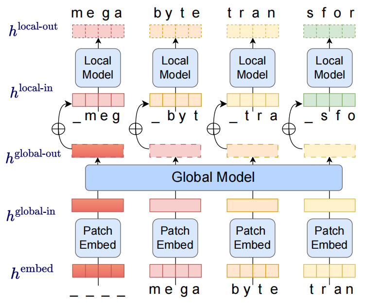
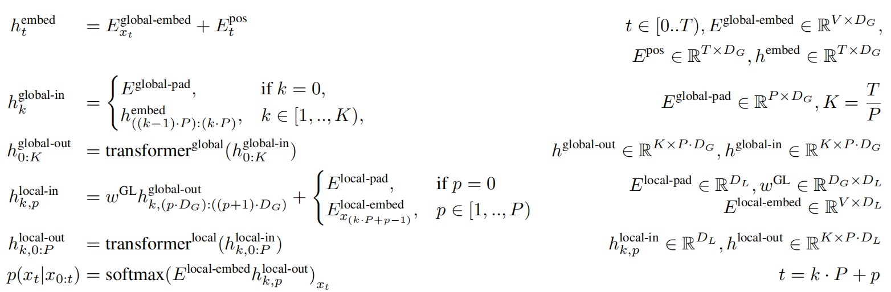
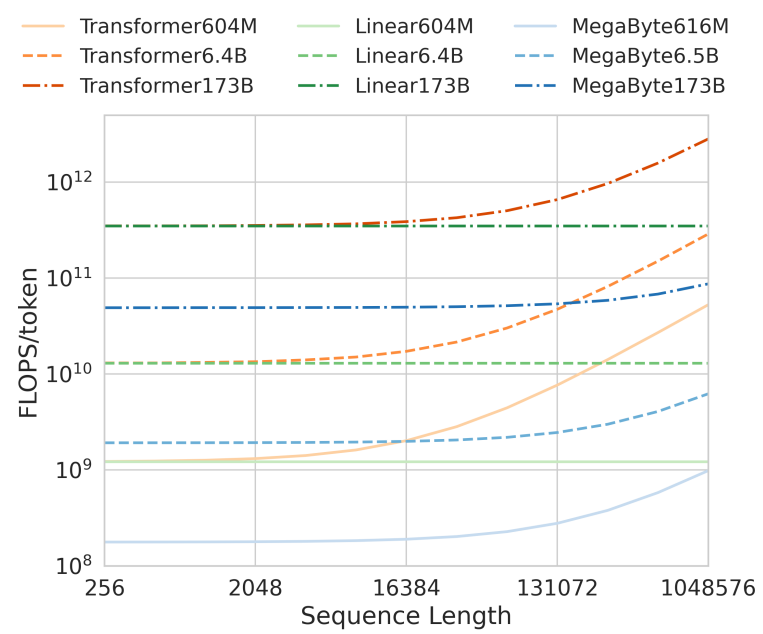
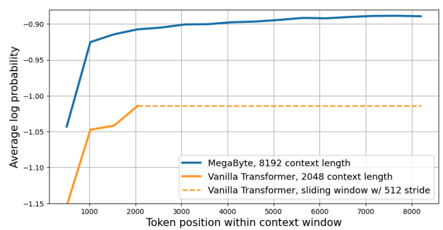
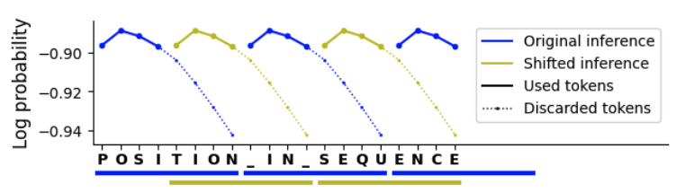
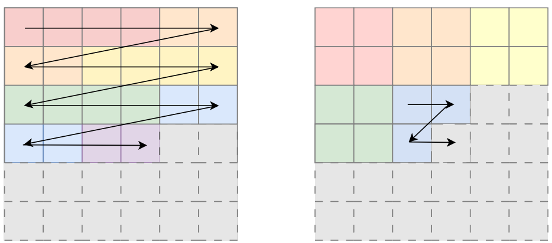

# MEGABYTE: Predicting Million-byte Sequences with Multiscale Transformers
MEGABYTE：用多尺度变换器预测百万字节序列 2023.5.12  https://arxiv.org/abs/2305.07185

# 阅读笔记
* 长序列、固定大小的分块
* 无令牌，tokenization-free，end-to-end
* 分块内，局部子模型；分块间全局模型；
* 注意力、FNN, decoder并行能力；
* 分块嵌入器、全局模块、局部模块

## Abstract
Autoregressive transformers are spectacular models for short sequences but scale poorly to long sequences such as high-resolution images, podcasts, code, or books. We propose MEGABYTE, a multiscale decoder architecture that enables end-to-end differentiable modeling of sequences of over one million bytes. MEGABYTE segments sequences into patches and uses a local submodel within patches and a global model between patches. This enables sub-quadratic self-attention, much larger feedforward layers for the same compute, and improved parallelism during decoding—unlocking better performance at reduced cost for both training and generation. Extensive experiments show that MEGABYTE allows byte-level models to perform competitively with subword models on long context language modeling, achieve state-of-the-art density estimation on ImageNet, and model audio from raw files. Together, these results establish the viability of tokenization-free autoregressive sequence modeling at scale.

自回归变换器是短序列的壮观模型，但对长序列（如高分辨率图像、播客、代码或书籍）的扩展能力较差。我们提出的MEGABYTE是一种多尺度解码器架构，能够对超过一百万字节的序列进行端到端可微建模。MEGABYTE将序列分割成分块，并在分块内使用局部子模型，在分块之间使用全局模型。这使得次二次自注意、相同计算的更大前馈层以及解码过程中的并行性得以提高，从而在降低训练和生成成本的情况下解锁更好的性能。大量实验表明，MEGABYTE允许字节级模型在长上下文语言建模上与子词模型竞争，在ImageNet上实现最新密度估计，并对原始文件中的音频进行建模。这些结果共同确立了无令牌自回归序列建模在规模上的可行性。

## 1. Introduction
Sequences of millions of bytes are ubiquitous; for example, music, image, or video files typically consist of multiple megabytes. However, large transformer decoders (LLMs) typically only use several thousand tokens of context (Brown et al., 2020; Zhang et al., 2022a)—both because of the quadratic cost of self-attention but also, more importantly, the cost of large feedforward networks per-position. This severely limits the set of tasks where LLMs can be applied.

数百万字节的序列无处不在；例如，音乐、图像或视频文件通常由多兆字节组成。然而，大型变换解码器（LLM）通常只使用几千个上下文令牌（Brown et al., 2020；Zhang et al., 2022a），这既是因为自注意的二次方成本，更重要的是，每个位置的大型前馈网络的成本。这严重限制了可以应用LLM的任务集。

We introduce MEGABYTE, a new approach to modeling long byte sequences. First, byte sequences are segmented into fixed-sized patches, loosely analogous to tokens. Our model then consists of three parts: (1) a patch embedder, which simply encodes a patch by losslessly concatenating embeddings of each byte, (2) a global module, a large autoregressive transformer that inputs and outputs patch representations and (3) a local module, a small autoregressive model that predicts bytes within a patch. Crucially, we observe that for many tasks, most byte predictions are relatively easy (for example, completing a word given the first few characters), meaning that large networks per-byte are unnecessary, and a much smaller model can be used for intra-patch modelling.

我们介绍了MEGABYTE，一种对长字节序列建模的新方法。首先，字节序列被分割成固定大小的分块，大致类似于令牌。然后，我们的模型由三部分组成：（1）分块嵌入器，它通过无损地连接每个字节的嵌入来简单地对分块进行编码；（2）全局模块，一个输入和输出分块表示的大型自回归变换器；（3）局部模块，一个预测分块中字节的小型自回归模型。至关重要的是，我们观察到，对于许多任务，大多数字节预测都相对容易（例如，在给定前几个字符的情况下完成一个单词），这意味着每个字节的大型网络是不必要的，并且可以使用小得多的模型进行分块内建模。

<br/>
Figure 1. Overview of MEGABYTE with patch size P = 4. A small local model autoregressively predicts each patch byte-bybyte, using the output of a larger global model to condition on previous patches. Global and Local inputs are padded by P and 1 token respectively to avoid leaking information about future tokens. 
图1。MEGABYTE概述，分块尺寸P=4。一个小的局部模型逐字节自回归预测每个分块，使用一个更大的全局模型的输出来对以前的分块进行调节。全局和局部输入分别由P和1个令牌填充，以避免泄露有关未来令牌的信息。
<!-- 固定分块大小，即固定字节长度，英语、汉语、图像、音频等，这个固定长度的字节所能表达的语义单位不同，需要考虑么？ -->

The MEGABYTE architecture gives three major improvements over Transformers for long sequence modelling:
1. Sub-quadratic self-attention. Most work on long sequence models has focused on mitigating the quadratic cost of self-attention. MEGABYTE decomposes long sequences into two shorter sequences, and optimal patch sizes reduces the self-attention cost to $O(N^{\frac{4}{3}})$, which remains tractable for even long sequences.
2. Per-patch feedforward layers. In GPT3-size models, more than 98% of FLOPS are used in computing position-wise feedforward layers. MEGABYTE uses large feedforward layers per-patch rather than perposition, enabling much larger and more expressive models for the same cost. With patch size P, where a baseline transformer would use the same feedforward layer with m parameters P times, MEGABYTE can use a layer with mP parameters once for the same cost.
3. Parallelism in Decoding. Transformers must perform all computations serially during generation because the input to each timestep is the output from the previous timestep. By generating representations for patches in parallel, MEGABYTE allows greater parallelism during generation. For example, a MEGABYTE model with 1.5B parameters can generate sequences 40% faster than a standard 350M Transformer, whilst also improving perplexity when trained with the same compute.

MEGABYTE架构在长序列建模方面比Transformers有三大改进：
1. 子二次自注意。大多数关于长序列模型的工作都集中在减轻自注意的二次代价上。MEGABYTE将长序列分解为两个较短的序列，并且以最优的分块大小将自注意成本降低到 $O(N^{\frac{4}{3}})$，即使对于长序列也可以处理。 <!-- 2个较短的,fig1并没有体现出来？N=序列长度？-->
2. 每个分块的前馈层。在GPT3大小的模型中，超过98%的FLOPS用于计算位置前馈层。MEGABYTE在每个分块而不是每个位置使用大的前馈层，以相同的成本实现更大、更具表现力的模型。对于分块大小P，其中基线变换器将使用具有m个参数的相同前馈层P次，MEGABYTE可以以相同的成本使用具有mP个参数的层一次。
3. 解码变换器中的并行性。因为每个时间步长的输入是前一个时间步长的输出，因此在生成期间必须串行执行所有计算。通过并行生成分块的表示，MEGABYTE允许在生成过程中实现更大的并行性。例如，具有1.5B参数的MEGABYTE模型可以比标准的350M Transformer更快地生成序列40%，同时在使用相同的计算进行训练时也可以改善困惑。

Together, these improvements allow us to train much larger and better-performing models for the same compute budget, scale to very long sequences, and improve generation speed during deployment.

这些改进使我们能够在相同的计算预算下训练更大、性能更好的模型，扩展到非常长的序列，并提高部署期间的生成速度。

MEGABYTE also provides a strong contrast to existing autoregressive models that typically use some form of tokenization, where sequences of bytes are mapped to larger discrete tokens (Sennrich et al., 2015; Ramesh et al., 2021; Hsu et al., 2021). Tokenization complicates pre-processing, multi-modal modelling, and transfer to new domains, while hiding useful structure from the model. It also means that most state-of-the-art models are not truly end to end. The most widely used approaches to tokenization require language-specific heuristics (Radford et al., 2019) or lose information (Ramesh et al., 2021). Replacing tokenization with efficient and performant byte models would therefore have many advantages.

MEGABYTE还与现有的自回归模型形成了强烈的对比，现有的自模型通常使用某种形式的令牌化，其中字节序列被映射到更大的离散令牌（Sennrich et al., 2015；Ramesh et al., 2021；Hsu et al., 2021）。令牌化使预处理、多模态建模和迁移到新领域变得复杂，同时对模型隐藏有用的结构。这也意味着大多数最先进的模型并不是真正的端到端。最广泛使用的令牌化方法需要特定于语言的启发式（Radford et al.，2019）或信息丢失（Ramesh et al.，2021）。因此，用高效、高性能的字节模型取代令牌化将具有许多优势。
<!-- tokenization的缺点，仍然不是端到端  -->

We conduct extensive experiments for both MEGABYTE and strong baselines. We use a fixed compute and data budget across all models to focus our comparisons solely on the model architecture rather than training resources, which are known to benefit all models. We find that MEGABYTE allows byte-level models to perform competitively with subword models on long context language modeling, achieve state-of-the-art perplexities for density estimation on ImageNet, and allow audio modelling from raw audio files. Together, these results establish the viability of tokenizationfree autoregressive sequence modeling at scale.

我们对MEGABYTE和强基线进行了广泛的实验。我们在所有模型中使用固定的计算和数据预算，将比较仅集中在模型架构上，而不是训练资源上，众所周知，训练资源有利于所有模型。我们发现，MEGABYTE允许字节级模型在长上下文语言建模上与子词模型竞争，在ImageNet上实现最先进的密度估计困惑，并允许从原始音频文件中进行音频建模。这些结果共同确立了无令牌自回归序列建模在规模上的可行性。
<!-- 密度估计困惑 perplexities for density estimation -->

## 2. MEGABYTE Transformer
### 2.1. Overview
MEGABYTE is an autoregressive model for efficiently modeling long input sequences. MEGABYTE is comprised of 3 components: (1) a patch embedder that inputs a discrete sequence, embeds each element, and chunks it into patches of length P (2) a large global Transformer that contextualizes patch representations by performing self-attention over previous patches, and (3) a smaller local Transformer that inputs a contextualized patch representation from the global model, and autoregressively predict the next patch.

MEGABYTE是一种用于长输入序列的高效建模的自回归模型。MEGABYTE由3个组件组成：
1. 分块嵌入器，它输入一个离散序列，嵌入每个元素，并将其分块到长度为P的分块中 
2. 大的全局转换器，它通过对先前的(previous)分块执行自注意来将分块表示上下文化
3. 较小的局部转换器，它从全局模型输入上下文化的分块表示，并且自回归地预测下一个分块。

### 2.2. Components
Patch Embedder with patch size of P maps a byte sequence $x_{0..T}$ to a sequence of patch embeddings of length $K = \frac{T}{P}$ and dimension $P · D_G$.

分块嵌入器 将分块数为P的字节序列 $x_{0..T}$ 映射到长度为 $K = \frac{T}{P}$ 且维度为 $P·D_G$ 的分块嵌入序列。

First, each byte is embedded with a lookup table $E^{global-embed} ∈ R^{V ×D_G}$ to an embedding of size $D_G$ and positional embeddings are added.

首先，用查找表 $E^{global-embed} ∈ R^{V ×D_G}$ 将每个字节嵌入到大小为$D_G$的嵌入中，并添加位置嵌入。

$h^{embed}_t = E_{x_t}^{global-embed} + E_t^{pos}$   , t ∈ [0..T] (1)

Then, byte embeddings are reshaped into a sequence of K patch embeddings with dimension $P · D_G$. To allow autoregressive modelling, the patch sequence is padded to start with a trainable patch-sized padding embedding ($E^{global-pad} ∈ R^{P ×D_G}$ ), and the last patch is removed from the input. This sequence is the input to the global model, and is denoted $h^{global-in} ∈ R^{K×(P ·D_G})$ .

然后，字节嵌入被重新整形为具有维度 $P·D_G$ 的K个分块嵌入序列。为了允许自回归建模，从可训练的分块大小的填充嵌入($E^{global-pad}∈R^{P×D_G}$)开始填充分块序列，并从输入中删除最后一个分块。该序列是全局模型的输入，表示为$h^{global-in}∈R^{K×(P·D_G})$。

$ h^{global-in}_k =  \begin{cases}  E^{global-pad} , if \ k = 0, \\ h^{embed}_{((k−1)·P ):(k·P )} , \  k ∈ [1, .., K)  \end{cases}$ (2)

<!--这点不太容易理解-->

Global Model is a decoder-only Transformer with dimension $P · D_G$ that operates on a sequence of K patches. It incorporates a self-attention mechanism and causal masking to capture dependencies between patches. It inputs a sequence of K patch representations $h^{global-in}_{0:K}$ , and outputs an updated representation $h^{global-out}_{0:K}$ by performing self-attention over previous patches.

全局模型是一个仅限解码器的Transformer，其维数为$P·D_G$，对K个分块序列进行操作。它结合了自注意机制和因果掩码来捕获分块之间的依赖关系。它输入一系列K个分块表示$h^{global-in}_{0:K}$，并通过对以前的分块执行自注意来输出更新的表示$h^{global-out}_{0:K}$。

$h^{global-out}_{0:K} = transformer^{global}(h^{global-in}_{0:K} )$ (3)

The output of the final global layer $h^{global}_{0:K}$ contains K patch representations of dimension $P · D_G$. For each of these, we reshape them into sequences of length P and dimension $D_G$, where position p uses dimensions $p · D_G$ to $(p + 1) · D_G$. Each position is then projected to the dimension of the local model with a matrix $w^{GL} ∈ R^{D_G×D_L}$ where $D_L$ is the local model dimension. We then combine these with byte embeddings of size $D_L$ for the tokens in the next patch $E_{x(k·P +p−1)}^{local-embed} $ . The local byte embeddings is offset by one with a trainable local padding embedding ($E^{local-pad} ∈ R^{D_L}$ ) to allow autoregressive modelling within a patch. This results in a tensor $h^{local-in} ∈ R^{K×P ×D_L}$ .

最终全局层$h^{global}_{0:K}$的输出包含维度$P·D_G$的K个分块表示。对于其中的每一个，我们将它们重塑为长度为P和维度为$D_G$的序列，其中位置P使用维度$P·D_G$到$(P+1)·D_G$。然后用矩阵$w^{GL}∈R^{D_G×D_L}$将每个位置投影到局部模型的维度，其中$D_L$是局部模型维度。然后，我们将这些与大小为$D_L$的字节嵌入相结合，用于下一个分块$E_{x(k·P+P−1)}^{local-embed}$中的令牌。局部字节嵌入与可训练局部填充嵌入( $E^{local-pad} ∈ R^{D_L}$ )偏移一，以允许在分块内进行自回归建模。这导致张量$h^{local-in}∈R^{K×P×D_L}$。

$h^{local-in}_{k,p} = w^{GL}h^{global-out}_{k,(p·D_G):((p+1)·D_G)} + E_{x(k·P +p−1)}^{local-embed} $ (4)

Local Model is a smaller decoder-only Transformer of dimension $D_L$ that operates on a single patch k containing P elements, each of which is the sum of an output from the global model and an embedding of the previous byte in the sequence. K copies of the local models are run on each patch independently (and in parallel during training), computing a representation $h ^{local-out} ∈ R^{K×P ·D_L}$ .

局部模型是一个尺寸为$D_L$的仅限解码器的较小转换器，它对包含P个元素的单个分块k进行操作，每个元素是全局模型的输出和序列中前一个字节的嵌入的总和。局部模型的K个副本在每个分块上独立运行(并在训练期间并行运行)，计算表示$h^{local-out}∈R^{K×P·D_L}$。

$h^{local-out}_{k,0:P} = transformer^{local}(h^{local-in}_{k,0:P} )$  (5)

Finally, we can compute the probability distribution over the vocabulary at each position. The pth element of the kth patch corresponds to element t of the complete sequence, where t = k · P + p:

最后，我们可以计算每个位置词汇的概率分布。第k个分块的第P个元素对应于完整序列的元素t，其中t=k·P+P：

$p(x_t|x_{0:t}) = softmax(E^{local-embed} h^{local-out}_{k,p} )_{x_t}$ (6)

<br/>
Figure 2. Summary of MEGABYTE with vocabulary V , sequence length T, global and local dimensions $D_G$ and $D_L$, and K patches of size P. Transformer layers use masked self attention to not observe information from future timesteps.
图2:具有词汇V、序列长度T、全局和局部维度$D_G$和$D_L$以及大小为P的K个分块的MEGABYTE的摘要。变换器层使用掩码的自注意来不观察来自未来时间步长的信息。


### 2.3. Variations and Extensions  变体和扩展
We experiment with several extensions of MEGABYTE.

我们对MEGABYTE的几个扩展进行了实验。

#### 2.3.1. CONVOLUTIONAL PATCH ENCODER  卷积分块编码器
One limitation of chunking sequences into patches is that it is not translation invariant, and byte sequences may receive a different representation depending on their position in the patch. This may mean, for example, that a model has to relearn the meaning of a word at different offsets. To mitigate this issue, we experimented with augmenting the Patch Embedder with causal convolutional layers, which allow translation-invariant contextual representations of the bytes before they are chunked into patches. We use a stack of convolutional layers, with filter sizes of 3, 5 and 7.

将序列分成分块的一个限制是，它不是平移不变的，并且字节序列可能根据其在分块中的位置而接收不同的表示。这可能意味着，例如，模型必须在不同的偏移量下重新学习单词的含义。为了缓解这个问题，我们尝试用因果卷积层来增广分块嵌入器，这允许在字节被分块成分块之前对其进行翻译不变的上下文表示。我们使用了一堆卷积层，滤波器大小分别为3、5和7。

#### 2.3.2. CROSS-PATCH ATTENTION  交叉分块注意力
The Local model uses short sequences for efficiency, and relies on the Global model for long-range information. However, we can increase the context of the Local model with little overhead by allowing it to condition on r elements from the previous patch. This approach allows the Global model to focus on a longer-range context. Specifically, when computing self-attention in each layer, we concatenate the keys and values with the last r keys and queries from the previous patch. We use rotary embeddings (Su et al., 2021) to model relative positions between elements in the sequence. This approach is reminiscent of TransformerXL (Dai et al., 2019) but differs by being fully differentiable.

局部模型使用短序列来提高效率，并依赖于全局模型来获得长期信息。然而，我们可以通过允许局部模型以上一个分块中的r元素为条件，在几乎没有开销的情况下增加局部模型的上下文。这种方法使全局模型能够专注于更长范围的上下文。具体来说，当在每一层中计算自注意时，我们将键和值与上一个分块中的最后r个键和查询连接起来。我们使用旋转嵌入(Su et al.，2021)来对序列中元素之间的相对位置进行建模。这种方法让人想起TransformerXL(Dai et al.，2019)，但不同之处在于它是完全可微的。

#### 2.3.3. STRIDED INFERENCE  刺耳的推论
We observed empirically that the per-token loss within each patch would increase towards the end of the patch, as the prediction relies more on the weaker Local model. To alleviate this issue, we propose strided inference, in which we predict the sequence with two forward passes of the full model, whose inputs are offset by p/2 positions from each other. We then combine the first p/2 positions in each patch for our predictions to predict the complete sequence. Similarly to sliding window techniques (Press et al., 2020), this approach doubles the cost of inference but improves results.

我们根据经验观察到，随着预测更多地依赖于较弱的局部模型，每个分块内的每令牌损失将在分块结束时增加。为了缓解这个问题，我们提出了跨步推理，在跨步推理中，我们用完整模型的两个前向传递来预测序列，其输入彼此偏移p/2个位置。然后，我们将每个分块中的第一个p/2位置组合起来进行预测，以预测完整的序列。类似于滑动窗口技术(Press et al.，2020)，这种方法使推理成本翻倍，但提高了结果。

### 2.4. Motivation 动机
Having described the model, we briefly discuss the motivation behind some of the architectural choices.

在描述了模型之后，我们简要地讨论一些架构选择背后的动机。

#### Why is the local model needed? 
Many of the efficiency advantages of the MEGABYTE design could be realized with the Global model alone, which would resemble a decoder version of ViT (Dosovitskiy et al., 2020). However, the joint distribution over the patch $p(x_{t+1}, .., x_{t+P} |x_{0..t})$ has an output space of size 256P so direct modeling is only tractable for very small patches. We could instead factor the joint distribution into conditionally independent distributions $p(x_{t+1}|x_{0..t})..p(x_{t+P} |x_{0..t})$, but this would greatly limit the model’s expressive power. For example, it would be unable to express a patch distribution such as 50% cat and 50% dog, and would instead have to assign probability mass to strings such as cag and dot. Instead, our autoregressive Local model conditions on previous characters within the patch, allowing it to only assign probability to the desired strings.

为什么需要局部模型？MEGABYTE设计的许多效率优势可以单独使用全局模型来实现，这将类似于ViT的解码器版本(Dosovitskiyet al.,2020)。然而，分块 $p(x_{t+1}, .., x_{t+P} |x_{0..t})$ 上的联合分布具有256P大小的输出空间，因此直接建模仅适用于非常小的分块。相反，我们可以将联合分布因子化为条件独立的分布 $p(x_{t+1}|x_{0..t})..p(x_{t+P} |x_{0..t})$ ，但这将极大地限制模型的表达能力。例如，它将无法表达分块分布，如50%的cat和50%的dog，而必须将概率质量分配给字符串，如cag和dot。相反，我们的自回归局部模型对分块中的先前字符进行条件设置，使其只能将概率分配给所需的字符串。

#### Increasing Parameters for Fixed Compute. 
Transformer models have shown consistent improvements with parameter counts (Kaplan et al., 2020). However, the size of models is limited by their increasing computational cost. MEGABYTE allows larger models for the same cost, both by making self attention sub-quadratic, and by using large feedforward layers across patches rather than individual tokens.

增加固定计算的参数。变压器模型显示出与参数计数一致的改进（Kaplan et al., 2020）。然而，模型的大小受到其不断增加的计算成本的限制。MEGABYTE允许以相同的成本建立更大的模型，既可以使自注意力成为次二次型，也可以在补丁而不是单个令牌之间使用大的前馈层。

#### Re-use of Established Components. 
MEGABYTE consists of two transformer models interleaved with shifting, reshaping and a linear projection. This re-use increases the likelihood that the architecture will inherit the desirable scaling properties of transformers.

重新使用已建立的组件。MEGABYTE由两个转换器模型组成，这些模型与移位、整形和线性投影交织在一起。这种重用增加了架构继承转换器所需缩放特性的可能性。

## 3. Efficiency Analysis  效率分析
### 3.1. Training Efficiency  训练效率
We analyze the cost of different architectures when scaling both the sequence length and size of the models.

当缩放模型的序列长度和大小时，我们分析了不同架构的成本。

#### Attention. 
The cost of the self attention in a transformer architecture for a sequence of length T has $O(T^2)$ complexity. Much work has been explored reducing this; for example, Sparse Transformers (Child et al., 2019) and Routing Transformers (Roy et al., 2020) show strong results with a complexity $O(T^{\frac{3}{2}})$. Numerous linear attention mechanisms have also been proposed (Katharopoulos et al., 2020; Choromanski et al., 2020), although we are not aware of competitive results on large scale language modeling tasks. As a function of sequence length T and patch size P, the Global model has a sequence of length $\frac{P}{T}$ so uses $O(\frac{T^2}{P^2})$ operations, and the Local model uses PT sequences of length P so uses $O(\frac{T P^2}{P} ) = O(P^T)$ operations. The overall cost of MEGABYTE is therefore in $O(\frac{T^2}{P^2} +TP)$. P is a hyperparameter that is chosen to create an architecture for sequences of size T. By setting $P = T^\frac{1}{3}$ the complexity is in $O(T^\frac{4}{3} )$. Using much shorter patches of $P = T^\frac{1}{5}$ would give a complexity of $O(T^\frac{8}{5} )$. The cost is less than the transformer for all non-trivial values of P such that 1 < P < T.

注意力。对于长度为T的序列，转换器架构中的自注意的代价具有 $O(T^2)$ 复杂性。已经探索了许多减少这种情况的工作;例如，稀疏变换器(Childet al.,2019)和路由变换器(Royet al.,2020)显示了复杂度为 $O(T^{\frac{3}{2}})$ 的强结果。也提出了许多线性注意机制(Katharopouloset al.,2020;Choromanskiet al.,2020)，尽管我们不知道大规模语言建模任务的竞争结果。作为序列长度T和分块大小P的函数，全局模型有一个长度为$\frac{P}{T}$的序列，因此使用$O(\frac{T^2}{P^2})$ 运算，而局部模型使用长度为P的PT序列，因此用$O(\frac{T P^2}{P} ) = O(P^T)$ 运算。因此，MEGABYTE的总成本为$O(\frac{T^2}{P^2} +TP)$。P是一个超参数，用于为T大小的序列创建架构。通过设置$P = T^\frac{1}{3}$，复杂性以$O为单位 $O(T^\frac{4}{3} )$。使用 $P = T^\frac{1}{5}$ 的更短分块，复杂性将为$O(T^\frac{8}{5} )$。对于P的所有非平凡值，成本小于转换器，使得 1< P < T。

<br/>
Figure 3. Computational cost (FLOPS/token) for different model architectures at different scales. MEGABYTE architectures (here with P = 8) use less FLOPS than equivalently sized Transformers and Linear Transformers (Katharopoulos et al., 2020) across a wide range of model sizes and sequence lengths, allowing larger models to be used for the same computational cost.
图3。不同规模下不同模型架构的计算成本(FLOPS/令牌)。在广泛的模型大小和序列长度范围内，与同等大小的转换器和线性转换器(Katharopoulos et al.，2020)相比，MEGABYTE架构(此处P=8)使用更少的FLOPS，从而允许在相同的计算成本下使用更大的模型。

#### Feedforward Layers. 
However, attention is not the main cost in large transformers. Instead of increasing the sequence length, transformers are more commonly scaled by increasing the dimension of their latent state d, and the feedforward network cost dominates the model’s overall cost (Kaplan et al., 2020). For example, in the GPT3 architecture, the quadratic self-attention computation accounts for only 1.4% of FLOPS. Following the approximation of (Kaplan et al., 2020), a forward pass with a large transformer with m non-embedding parameters on a sequence of length T uses roughly 2mT FLOPS. MEGABYTE contains two transformers: the Global model uses mg parameters on a sequence of length $\frac{T}{P}$ , and a Local model with ml parameters that sees $\frac{T}{P}$ sequences of length P, giving an estimate of $2T(\frac{m_g}{P} + m_l)$ FLOPS. When $m_g >> m_l$ , the FLOPS used by MEGABYTE is approximately $\frac{2Tm_g}{P}$ , allowing a model P times larger than a transformer with equivalent FLOPS. This analysis holds irrespective of any efficient attention mechanisms used in the transformer.

前馈层。然而，注意力并不是大型转换器的主要成本。转换器通常通过增加其潜在状态d的维数来缩放，而不是增加序列长度，并且前馈网络成本主导了模型的总体成本(Kaplan et al.，2020)。例如，在GPT3架构中，二次自注意计算仅占FLOPS的1.4%。根据(Kaplan et al.，2020)的近似，在长度为T的序列上具有m个非嵌入参数的大型变换器的正向通过使用大约2mT FLOPS。MEGABYTE包含两个变换器：全局模型在长度为 $\frac{T}{P}$ 的序列上使用mg参数，而局部模型使用ml参数，该局部模型看到长度为P的 $\frac{T}{P}$  序列，给出 $2T(\frac{m_g}{P} + m_l)$ FLOPS的估计值。当 $m_g >> m_l$ 时，MEGABYTE使用的FLOPS约为 $\frac{2Tm_g}{P}$，允许模型比具有等效FLOPS的转换器大P倍。这种分析与转换器中使用的任何有效的注意力机制无关。

#### Combined Analysis. 
To understand efficiency at different sequence lengths and model sizes, we calculate the total FLOPS used by transformers, Linear Transformers and MEGABYTE. For each operation, we use FLOP estimates from (Kaplan et al., 2020), except for attention in Linear Transformers, which we estimate as 9D FLOPS/- token1 , where D is the model embedding dimension. Figure 3 shows that for models of size 660M to 173B and sequence lengths of up to 1M tokens, MEGABYTE with P = 8 uses less FLOPS than either transformers or Linear Transformers. Baseline model architectures are based on GPT3, and Megabyte global/local model sizes are 452M/151M, 5.8B/604M, 170B/3.2B respectively.

组合分析。为了了解不同序列长度和模型尺寸下的效率，我们计算了转换器、线性转换器和MEGABYTE使用的总FLOPS。对于每个操作，我们使用来自(Kaplan et al.，2020)的FLOP估计，除了线性变换器中的注意力，我们估计为9D FLOPS/-token1，其中D是模型嵌入维度。图3显示，对于大小为660M至173B、序列长度高达1M令牌的模型，P=8的MEGABYTE使用的FLOPS比转换器或线性转换器少。基线模型架构基于GPT3，兆字节全局/局部模型大小分别为452M/151M、5.8B/604M和170B/3.2B。

1This may underestimate the time taken by Linear Transformer decoders, which use a recurrence mechanism that is harder to parallelize on current hardware.

1这可能低估了线性变换器解码器所花费的时间，因为线性变换器使用的循环机制在当前硬件上更难并行化。

### 3.2. Generation Efficiency  生成效率
Generating long sequences with transformers is slow, because the input to each timestep is the output from the previous timestep, meaning each layer must be computed for each token serially. As running a layer on a single token typically does not saturate the amount of parallelism available within a GPU, for analysis, we model each layer as a constant cost independently of size. Consider a MEGABYTE model with $L_{global}$ layers in the Global model and $L_{local}$ layers in the Local model and patch size P, compared with a Transformer architecture with $L_{local} + L_{global}$ layers. Generating each patch with MEGABYTE requires a sequence of $O(L_{global} + P · L_{local})$ serial operations, whereas the Transformer requires $O(P · L_{global} + P · L_{local})$ serial operations. When $L_{global} >> L_{local}$ (i.e. the Global model has many more layers than the Local model), MEGABYTE can reduce inference costs by a factor close to P.

使用transformer生成长序列很慢，因为每个时间步长的输入都是前一个时间步长的输出，这意味着必须为每个令牌串行计算每个层。由于在单个令牌上运行一个层通常不会使GPU内可用的并行度饱和，因此为了进行分析，我们将每个层建模为独立于大小的恒定成本。考虑全局模型中具有$L_{global}$层、局部模型中具有$L_{local}$层和分块大小P的MEGABYTE模型，与具有$L_{local}+L_{global}$层的Transformer架构相比。使用MEGABYTE生成每个分块需要一系列$O(L_{global}+P·L_{local})$串行操作，而Transformer需要$O(P·L_{global}+P·L_{local}。当$L_{global}>>L_{local}$(即全局模型比局部模型有更多的层)时，MEGABYTE可以将推理成本降低接近P的因子。

## 4. Experimental setup  实验设置
### 4.1. Controlling for Compute and Data  控制计算和数据
Models show consistent improvements when increasing both data and compute (Kaplan et al., 2020; Hoffmann et al., 2022), meaning that one model can outperform another because of an increased training budget instead of an improved architecture. However, in practice, both compute and data are typically limited. We conduct experiments using a fixed compute and data budget across all models to focus comparisons solely on the model architecture rather than training resources. To achieve this, we adjust model hyperparameters (mainly, number of layers) within each architecture so that the forward pass time taken per byte is matched, and then train all models for the same number of bytes.

当增加数据和计算时，模型显示出一致的改进(Kaplan et al.，2020;Hoffmann et al.，2022)，这意味着一个模型可以优于另一个模型，因为增加了训练预算，而不是改进了架构。然而，在实践中，计算和数据通常都是有限的。我们在所有模型中使用固定的计算和数据预算进行实验，以将比较仅集中在模型架构上，而不是训练资源上。为了实现这一点，我们调整每个架构中的模型超参数(主要是层数)，使每个字节所花费的前向通过时间相匹配，然后为相同数量的字节训练所有模型。

### 4.2. Comparison Systems  比较系统
We compare MEGABYTE with both a standard decoderonly Transformer and PerceiverAR (Hawthorne et al., 2022).PerceiverAR extends the original transformer with a single cross-attention layer over a much longer context sequence, and is the best performing general purpose autoregressive model we are aware of and achieves state-of-the-art results across several modalities. We implemented both models in the same codebase, and all models share a similar data loader, preprocessing step, and trainer to avoid any artifacts in our compute-controlled experiments.

我们将MEGABYTE与标准解码转换器和PerceiverAR进行了比较(Hawthorne et al.，2022)。PerceiverAR在更长的上下文序列上扩展了具有单个交叉注意力层的原始转换器，是我们所知的性能最好的通用自回归模型，并在几种模型中取得了最先进的结果。我们在同一个代码库中实现了这两个模型，并且所有模型共享相似的数据加载器、预处理步骤和训练器，以避免在我们的计算控制实验中出现任何伪影。

### 4.3. Training Procedure  训练程序
All models were trained using the Metaseq2 code base (Zhang et al., 2022b). The training used the PyTorch framework (Paszke et al., 2019), with fairscale to improve memory efficiency through fully sharded model and optimizer states (Baines et al., 2021). Mixed precision training was used to improve training efficiency at scale (Micikevicius et al., 2017). More training details and various model parameters can be found in Section A.1 in the Appendix.

所有模型均使用Metaseq2代码库进行训练(Zhanget al.,2022b)。训练使用PyTorch框架(Paszke et al.，2019)，通过完全碎片化的模型和优化器状态，利用公平尺度来提高内存效率(Baines et al.，2021)。混合精度训练被用于大规模提高训练效率(Micikevicius et al.，2017)。更多训练细节和各种模型参数可在附录的第A.1节中找到。

To validate our implementation of PerceiverAR, we reproduced their experiments on downsized ImageNet at 64 pixels. By carefully matching hyperparameters, we achieved a bits per byte (bpb) score of 3.53, compared to the reporte 3.54 in the original paper.

为了验证我们对PerceiverAR的实现，我们在64像素的缩小尺寸的ImageNet上复制了他们的实验。通过仔细匹配超参数，我们获得了3.53的每字节比特数(bpb)分数，而原始论文中的报告为3.54。

### 4.4. Inference Methods  推理方法
Several techniques have been proposed for trading off speed for performance during inference with language models, including sliding windows (Press et al., 2020) and our strided inference (Section 2.3.3). We only use these methods when comparing with prior published work (Tables 8 and 4).

已经提出了几种技术来在与语言模型的推理过程中权衡速度和性能，包括滑动窗口(Press et al.，2020)和我们的跨步推理(第2.3.3节)。我们只在与之前发表的工作进行比较时使用这些方法(表8和表4)。

## 5. Language Modeling  语言建模
We evaluated the performance of MEGABYTE on language modeling on a set of 5 diverse datasets emphasizing longrange dependencies: Project Gutenberg (PG-19), Books,Stories, arXiv, and Code.

我们在一组5个不同的数据集上评估了MEGABYTE在语言建模方面的性能，这些数据集强调了长期依赖性：Project Gutenberg(PG-19)、Books、Stories、arXiv和Code。

Datasets。 We experiment on a range of long form text datasets. The PG-19 dataset (Rae et al., 2019b) consists of English-language books written before 1919 and is extracted from the Project Gutenberg online library. The Stories dataset (Trinh & Le, 2018) is a subset of CommonCrawl data meant to emulate Winograd schemas. Books (Gao et al., 2020) is another collection of English-language books. The arXiv dataset is a collection of technical publications written in LATEX from the arXiv online archive. Finally, the Code dataset is a large publicly available dataset of open source code, under Apache, BSD or MIT licenses. More details on dataset sizes and document lengths are shared in Table 6.

数据集。我们在一系列长格式文本数据集上进行实验。PG-19数据集(Rae et al.，2019b)由1919年之前写的英语书籍组成，摘自古腾堡项目在线图书馆。Stories数据集(Trinh&Le，2018)是CommonCrawl数据的子集，旨在模拟Winograd模型。书籍(Gao et al.，2020)是另一本英语书籍集。arXiv数据集是arXiv在线档案中用LATEX编写的技术出版物的集合。最后，Code数据集是一个大型公开可用的开源代码数据集，使用Apache、BSD或MIT许可证。关于数据集大小和文档长度的更多详细信息见表6。

Controlled Experiments Table 7, lists bpb on each dataset.Each model is trained for 80 billion bytes, and models are scaled to use the same compute budget. We carefully tune hyperparameters for all architectures to best utilize the available compute budget. MEGABYTE consistently outperforms both baseline transformers and PerceiverAR across all datasets. We use the same sets of parameters on all datasest. In all experiments presented in Table 7, transformer has size of 320M with context length of 1024, PerceiverAR has size of 248M with context size of 8192 and latent size of 1024, and MEGABYTE global/local model sizes are 758M/262M with context length of 8192 and patch size of 8.

对照实验表7列出了每个数据集上的bpb。每个模型都经过800亿字节的训练，并且模型被缩放以使用相同的计算预算。我们仔细调整所有架构的超参数，以最佳利用可用的计算预算。在所有数据集中，MEGABYTE始终优于基线转换器和PerceiverAR。我们在所有数据测试中使用相同的参数集。在表7中给出的所有实验中，transformer的大小为320M，上下文长度为1024，PerceiverAR的大小为248M，上下文大小为8192，潜在大小为1024，而MEGABYTE全局/局部模型的大小为758M/262M，上下文长度为8192和分块大小为8。

2 https://github.com/facebookresearch/metaseq

Dataset|Total Bytes|Mean document size (bytes)
---|---|---
PG-19|10.1GB|411,404
Stories|21.3GB|35,265
Books|79.7GB|509,526
arXiv|91.5GB|58,518
Code|353.7GB|7,461

Table 1. Text dataset sizes and mean document lengths.
表1。文本数据集大小和平均文档长度。

||PG-19|Stories|Books|arXiv|Code
---|---|---|---|---|---
Transformer|1.057|1.064|1.097|0.816|0.575
PerceiverAR|1.104|1.070|1.104|0.791|0.546
MEGABYTE|1.000|0.978|1.007|0.678|0.411

Table 2. Performance (bits-per-byte) of compute and data controlled MEGABYTE, PerceiverAR, and Transformer models on various text modalities.
表2。计算和数据控制的MEGABYTE、PerceiverAR和Transformer模型在各种文本模型上的性能(比特/字节)。

Scaling Experiment We scale up our training data on PG- 19 (Table 8), and compare MEGABYTE with byte baselines, as well as converting all results to word-level perplexities to benchmark with state-of-art token based models.

缩放实验我们放大了PG-19上的训练数据(表8)，将MEGABYTE与字节基线进行比较，并将所有结果转换为单词级困惑，以使用最先进的基于令牌的模型进行基准测试。

We train a byte-level Transformer, PerceiverAR and MEGABYTE models for 400B bytes and the same compute budget using same model parameters as in the controlled experiments. We find that MEGABYTE outperforms other byte-level models by a wide margin at this scale.3

我们使用与对照实验中相同的模型参数，为400B字节和相同的计算预算训练字节级Transformer、PerceiverAR和MEGABYTE模型。我们发现，在这种规模下，MEGABYTE的性能远远优于其他字节级模型。3

We also compare with the best previously reported numbers for sub-word models. These results may be confounded by differing amounts of compute and tuning used, but show that MEGABYTE gives results competitive with state-of-theart models trained on subwords. These results suggest that MEGABYTE may allow future large language models to be tokenization-free.

我们还比较了先前报道的子词模型的最佳数字。这些结果可能会因使用的计算和调整量不同而混淆，但表明MEGABYTE给出的结果与在子词上训练的最新模型相比具有竞争力。这些结果表明，MEGABYTE可能允许未来的大型语言模型无令牌化。

## 6. Image Modeling  图像建模
### 6.1. Sequence Modeling on ImageNet  ImageNet上的序列建模
We test MEGABYTE on variants of the autoregressive image generation task on ImageNet (Oord et al., 2016), to measure its ability to efficiently use long context. We test on three different resolutions of images, ranging from 64×64 to 640×640 pixels – the latter requiring the effective modeling of sequences with over 1.2M tokens. This generation task becomes increasingly challenging as the image’s resolution grows: doing well on this task requires the modeling of local patterns (textures, lines, etc.) and long-range context that provides information about the high level structure of the image. Inspired by recent works in Vision Transformers (Dosovitskiy et al., 2020), we model image data patch by patch (more details can be found in Appendix D.1).

我们在ImageNet上的自回归图像生成任务的变体上测试了MEGABYTE(Oord et al.，2016)，以衡量其有效使用长上下文的能力。我们在三种不同分辨率的图像上进行了测试，分辨率从64×64到640×640像素不等，后者需要对超过120万个令牌的序列进行有效建模。随着图像分辨率的提高，这项生成任务变得越来越具有挑战性：要想完成这项任务，需要对局部图案(纹理、线条等)和长程上下文进行建模，以提供有关图像高级结构的信息。受视觉转换器(Dosovitskiy et al.，2020)最近工作的启发，我们逐块对图像数据进行建模(更多细节见附录D.1)。

3The only prior byte-level experiments we are aware of are at a smaller scale in Hutchins et al. (2022), who report results equivalent to test perplexities of 46.5 with a version of the BlockRecurrent transformer, and 49.5 with Memorizing Transformers (Wu et al., 2022), compared to 36.4 with our model.

3我们所知道的唯一先前的字节级实验是在Hutchinset al.,(2022)中进行的较小规模的实验，他们报告的结果相当于BlockRecurrent转换器版本的46.5和记忆转换器的49.5的测试困惑(Wuet al.,2022)，而我们的模型为36.4。

### 6.2. Comparison with State of the Art  与现有技术的比较
We train a large MEGABYTE model on ImageNet 64x64 with Global and Local models sized 2.7B and 350M parameters, respectively, for 1.4T tokens. We estimate that training this model consumed less than half the GPU hours we would have needed to reproduce the best PerceiverAR model described by (Hawthorne et al., 2022). As shown in Table 8,MEGABYTE matches the state-of-the-art performance of PerceiverAR whilst using only half the compute.

我们在ImageNet 64x64上训练一个大型MEGABYTE模型，全局和局部模型的参数分别为2.7B和350M，用于1.4T令牌。我们估计，训练该模型所花费的GPU小时不到我们复制(Hawthorne et al.，2022)所描述的最佳PerceiverAR模型所需的GPU小时的一半。如表8所示，MEGABYTE与PerceiverAR最先进的性能相匹配，同时只使用了一半的计算量。

### 6.3. Scaling to higher resolutions  缩放到更高的分辨率
We compare three transformer variants (vanilla, PerceiverAR, MEGABYTE) to test scalability to long sequences on increasingly large image resolutions. We use our own implementations of these in the same framework and budget the same amount of GPU hours and data to train each of these model variants.

我们比较了三种转换器变体(vanilla、PerceiverAR、MEGABYTE)，以测试在越来越大的图像分辨率上对长序列的可扩展性。我们在相同的框架中使用我们自己的这些实现，并预算相同数量的GPU小时和数据来训练这些模型变体中的每一个。

MEGABYTE is able to handle all sequence lengths with a single forward pass of up to 1.2M tokens. We found neither the standard Transformer nor PerceiverAR could model such long sequences at a reasonable model size, so instead we split images into segments of size 1024 and 12000 respectively. For Megabyte, we set patch size as 12 for Image64 and patch size as 192 for Image256 and Image640 datasets. Model sizes are adjusted to match overall training speeds across models and we do not use any form of sliding window evaluation in this experiment. As seen in Table 5, MEGABYTE outperforms baselines across all resolutions in this compute-controlled setting. The precise settings used for each of the baseline models such as context length and number of latents are summarized in Table 14.

MEGABYTE能够通过多达120万个令牌的单次正向传递处理所有序列长度。我们发现标准Transformer和PerceiverAR都无法以合理的模型大小对如此长的序列进行建模，因此我们将图像分别分割为1024和12000大小的片段。对于兆字节，我们将Image64的分块大小设置为12，将Image256和Image640数据集的分块大小设为192。调整模型大小以匹配模型之间的总体训练速度，并且我们在本实验中不使用任何形式的滑动窗口评估。如表5所示，在这种计算控制的设置中，MEGABYTE在所有分辨率上都优于基线。表14总结了用于每个基线模型的精确设置，如上下文长度和延迟数。

Results show that MEGABYTE outperforms the other systems at all resolutions, demonstrating an effective model of sequences of over 1M bytes.

结果表明，MEGABYTE在所有分辨率上都优于其他系统，证明了超过1M字节的序列的有效模型。

## 7. Language Modeling  语言建模
We evaluated the performance of MEGABYTE on language modeling on a set of 5 diverse datasets emphasizing longrange dependencies: Project Gutenberg (PG-19), Books,Stories, arXiv, and Code.

我们在一组5个不同的数据集上评估了MEGABYTE在语言建模方面的性能，这些数据集强调了长期依赖性：Project Gutenberg(PG-19)、Books、Stories、arXiv和Code。

||Tokenizer| Vocab Size| Context Length| Validation| Test
---|---|---|---|---|---|
TransformerXL (Rae et al., 2019a)| SentencePiece| 32k| 512+1024 (subwords)| 45.5 |36.3
CompressiveTransformer (Rae et al., 2019a)| SentencePiece| 32k| 512+512+2x512 (subwords)| 43.4 |33.6
PerceiverAR (Hawthorne et al., 2022)| SentencePiece| 32k| 2048 (subwords)| 45.9 |28.9
BlockRecurrent (Hutchins et al., 2022)| SentencePiece| 32k| 1024+recurrence (subwords)| - |26.5
Transformer byte-level (ours)| Bytes |256 |2048 (bytes)| 81.6| 69.4
PerceiverAR byte-level (ours)| Bytes |256 |8192 (bytes)| 119.1| 88.8
MEGABYTE |Bytes |256 |8192 (bytes)| 42.8| 36.4

Table 3. Larger scale experiments on PG19, converting bits-per-byte to word-level perplexities for comparison with prior work. Results below the line are compute-matched. MEGABYTE outperforms other byte models by a wide margin, and gives results competitive with state-of-the-art models trained on subwords.
表3。在PG19上进行更大规模的实验，将每个字节的比特转换为字级的困惑，以与先前的工作进行比较。线下的结果是计算匹配的。MEGABYTE在很大程度上优于其他字节模型，其结果与在子字上训练的最先进模型相比具有竞争力。

ImageNet64 | bpb
|---|---
Routing Transformer (Roy et al., 2020) |3.43
Combiner (Ren et al., 2021) |3.42
Perceiver AR (Hawthorne et al., 2022) |3.40
MEGABYTE |3.40

Table 4. Bits per byte (bpb) on ImageNet 64×64. MEGABYTE matches the current state-of-the-art while only using half the amount of GPU hours to train.
表4。ImageNet上的每字节比特数(bpb)为64×64。MEGABYTE与当前最先进的技术相匹配，同时只使用一半的GPU小时进行训练。

||Context|Image64|Image256|Image640
|---|---|---|---|---
Total len| |12288|196608|1228800
Transformer|1024|3.62|3.801|2.847
Perceiver AR|12000|3.55|3.373|2.345
MEGABYTE|Full|3.52|3.158|2.282

Table 5. Bits per byte (bpb) on ImageNet with different resolutions. All models use the same compute and data. MEGABYTE scales well to sequences of over 1M tokens.
表5。ImageNet上具有不同分辨率的每字节比特数(bpb)。所有模型都使用相同的计算和数据。MEGABYTE可以很好地扩展到超过1M个令牌的序列。

Datasets We experiment on a range of long form text datasets. The PG-19 dataset (Rae et al., 2019b) consists of English-language books written before 1919 and is extracted from the Project Gutenberg online library. The Stories dataset (Trinh & Le, 2018) is a subset of CommonCrawl data meant to emulate Winograd schemas. Books (Gao et al., 2020) is another collection of English-language books. The arXiv dataset is a collection of technical publications written in LATEX from the arXiv online archive. Finally, the Code dataset is a large publicly available dataset of open source code, under Apache, BSD or MIT licenses. More details on dataset sizes and document lengths are shared in Table 6.

数据集我们在一系列长格式文本数据集上进行实验。PG-19数据集(Rae et al.，2019b)由1919年之前写的英语书籍组成，摘自古腾堡项目在线图书馆。Stories数据集(Trinh&Le，2018)是CommonCrawl数据的子集，旨在模拟Winograd模型。书籍(Gao et al.，2020)是另一本英语书籍集。arXiv数据集是arXiv在线档案中用LATEX编写的技术出版物的集合。最后，Code数据集是一个大型公开可用的开源代码数据集，使用Apache、BSD或MIT许可证。关于数据集大小和文档长度的更多详细信息见表6。

Controlled Experiments Table 7, lists bpb on each dataset.Each model is trained for 80 billion bytes, and models are scaled to use the same compute budget. We carefully tune hyperparameters for all architectures to best utilize the available compute budget. MEGABYTE consistently outperforms both baseline transformers and PerceiverAR across all datasets. We use the same sets of parameters on all datasest.

对照实验表7列出了每个数据集上的bpb。每个模型都经过800亿字节的训练，并且模型被缩放以使用相同的计算预算。我们仔细调整所有架构的超参数，以最佳利用可用的计算预算。在所有数据集中，MEGABYTE始终优于基线转换器和PerceiverAR。我们在所有数据测试中使用相同的参数集。

Dataset|Total Bytes|Mean document size (bytes)
|---|---|---
PG-19|10.1GB|411,404
Stories|21.3GB|35,265
Books|79.7GB|509,526
arXiv|91.5GB|58,518
Code|353.7GB|7,461

Table 6. Text dataset sizes and mean document lengths.
表6。文本数据集大小和平均文档长度。

In all experiments presented in Table 7, transformer has size of 320M with context length of 1024, PerceiverAR has size of 248M with context size of 8192 and latent size of 1024, and MEGABYTE global/local model sizes are 758M/262M with context length of 8192 and patch size of 8.

在表7中给出的所有实验中，transformer的大小为320M，上下文长度为1024，PerceiverAR的大小为248M，上下文大小为8192，潜在大小为1024，而MEGABYTE全局/局部模型的大小为758M/262M，上下文长度为8192和分块大小为8。

Scaling Experiment We scale up our training data on PG- 19 (Table 8), and compare MEGABYTE with byte baselines, as well as converting all results to word-level perplexities to benchmark with state-of-art token based models.

缩放实验我们放大了PG-19上的训练数据(表8)，将MEGABYTE与字节基线进行比较，并将所有结果转换为单词级困惑，以使用最先进的基于令牌的模型进行基准测试。

We train a byte-level Transformer, PerceiverAR and MEGABYTE models for 400B bytes and the same compute budget using same model parameters as in the controlled experiments. We find that MEGABYTE outperforms other byte-level models by a wide margin at this scale.4

我们使用与对照实验中相同的模型参数，为400B字节和相同的计算预算训练字节级Transformer、PerceiverAR和MEGABYTE模型。我们发现，在这种规模下，MEGABYTE的性能远远优于其他字节级模型。4

We also compare with the best previously reported numbers for sub-word models. These results may be confounded by differing amounts of compute and tuning used, but show that MEGABYTE gives results competitive with state-of-theart models trained on subwords. These results suggest that MEGABYTE may allow future large language models to be tokenization-free.

我们还比较了先前报道的子词模型的最佳数字。这些结果可能会因使用的计算和调整量不同而混淆，但表明MEGABYTE给出的结果与在子词上训练的最新模型相比具有竞争力。这些结果表明，MEGABYTE可能允许未来的大型语言模型无令牌化。

4The only prior byte-level experiments we are aware of are at a smaller scale in Hutchins et al. (2022), who report results equivalent to test perplexities of 46.5 with a version of the BlockRecurrent transformer, and 49.5 with Memorizing Transformers (Wu et al., 2022), compared to 36.4 with our model.

4我们所知道的唯一先前的字节级实验是在Hutchinset al.,(2022)中进行的，他们报告的结果相当于BlockRecurrent转换器版本的46.5和记忆转换器版本的49.5的测试困惑(Wuet al.,2022)，而我们的模型为36.4。

||PG-19|Stories|Books|arXiv|Code
|---|---|---|---|---|---
Transformer|1.057|1.064|1.097|0.816|0.575
PerceiverAR|1.104|1.070|1.104|0.791|0.546
MEGABYTE|1.000|0.978|1.007|0.678|0.411

Table 7. Performance (bits-per-byte) of compute and data controlled MEGABYTE, PerceiverAR, and Transformer models on various text modalities.
表7。计算和数据控制的MEGABYTE、PerceiverAR和Transformer模型在各种文本模型上的性能(比特/字节)。

## 8. Audio Modeling  8. 音频建模
Audio has aspects of both the sequential structure of text and the continuous nature of images, so is an interesting application for MEGABYTE.

音频具有文本的顺序结构和图像的连续性，因此是MEGABYTE的一个有趣应用。

Raw audio is typically stored as a sequence of 16-bit integer values (one per timestep); a softmax layer would need to output 65,536 probabilities per timestep to model all possible values. To address this issue, various techniques have been developed to reduce the memory and computational requirements of the softmax layer. For instance, van den Oord et al. (2016) apply µ-law companding transformation and quantizes the input into 256 possible values. Alternatively, van den Oord et al. (2017) model the samples using the discretized mixture of logistics distribution introduced by Salimans et al. (2017). Finally, Kalchbrenner et al. (2018) use a dual softmax technique to produce 8 coarse and 8 fine bits. In our approach, we simplify the audio modeling process by directly reading the bytes (256 possible values) from the audio file and conducting an autoregressive language model on top of that. This greatly streamlines the modeling process, making it easier and more efficient.

原始音频通常存储为16位整数值的序列(每个时间步长一个);softmax层将需要每个时间步长输出65536个概率来对所有可能的值进行建模。为了解决这个问题，已经开发了各种技术来减少softmax层的内存和计算需求。例如，van den Oordet al.,(2016)应用µ律压扩变换，并将输入量化为256个可能的值。或者，van den Oordet al.,(2017)使用Salimanset al.,引入的物流配送离散混合对样本进行建模。(2017)。最后，Kalchbrenneret al.,(2018)使用双softmax技术生产了8个粗钻头和8个细钻头。在我们的方法中，我们通过直接从音频文件中读取字节(256个可能的值)并在此基础上进行自回归语言模型来简化音频建模过程。这大大简化了建模过程，使其更容易、更高效。

Our audio modeling approach focuses on 16 kHz, 16-bit audio, which equates to 32k bytes per one-second clip. We use an extensive audio dataset consisting of 2 terabytes (roughly 18,000 hours) of audio. We use a sequence length of 524,288, a patch size of 32, and a batch size of 32 to facilitate model training. By utilizing these settings, we can effectively train our model on large volumes of audio data, helping to improve its accuracy and efficacy.

我们的音频建模方法侧重于16 kHz、16位的音频，相当于每秒剪辑32k字节。我们使用了一个由2 TB(约18000小时)音频组成的广泛音频数据集。我们使用524288的序列长度、32的分块大小和32的批量大小来促进模型训练。通过利用这些设置，我们可以在大量音频数据上有效地训练我们的模型，有助于提高其准确性和有效性。

Our model obtains bpb of 3.477, much lower than the results with perceiverAR (3.543) and vanilla transformer model (3.567). More ablation results are presented in Table 10.

我们的模型获得的bpb为3.477，远低于感知AR(3.543)和普通转换器模型(3.567)的结果。更多消融结果如表10所示。

## 9. Analysis  分析
### 9.1. Generation speed  生成速度
We also compare the text generation speed between MEGABYTE and a transformer. We compare a 350M parameter baseline transfomer and a MEGABYTE model with a 1.3B parameter Global model and a 218M parameter local model, trained on PG19 with equal compute. As shown in Table 9, the MEGABYTE model achieves much lower perplexity as expected. However, MEGABYTE also generates a sequence of 8192 tokens 40% faster than transformer, despite having over 4 times the parameters. This speed up is due to the bulk of the parameters being in the Global model, which only needs to be computed once for every 8 tokens, whereas all the parameters in the baseline model are used on every token.

我们还比较了MEGABYTE和transformer之间的文本生成速度。我们将350M参数的基线转染体和MEGABYTE模型与1.3B参数的全局模型和218M参数的局部模型进行比较，在PG19上以相等的计算进行训练。如表9所示，MEGABYTE模型实现了比预期低得多的困惑。然而，MEGABYTE生成8192个令牌的序列的速度也比transformer快40%，尽管其参数是transformer的4倍多。这种速度的提高是由于全局模型中的大部分参数，只需要为每8个令牌计算一次，而基线模型中的所有参数都用于每个令牌。

<br/>
Figure 4. Average log probability assigned to the token at different positions within the context length by MEGABYTE model with 8192 context size and by a vanilla transformer model trained using the same compute (PG19 test set). MEGABYTE likelihoods rise throughout its context window, demonstrating that it can use tokens from 8k bytes previously to improve its predictions.
图4。由具有8192上下文大小的MEGABYTE模型和使用相同计算(PG19测试集)训练的普通变换器模型在上下文长度内的不同位置分配给令牌的平均对数概率。MEGABYTE的可能性在其整个上下文窗口中都在上升，这表明它可以使用之前8k字节的令牌来改进其预测。

### 9.2. Model Components  9.2. 模型组件
In Table 10, we analyze the significance of different components in the MEGABYTE architecture by studying arXiv,Librilight-L and ImageNet256 datasets. Removing Local (w/o local model) or global (w/o global model) model, we observe a substantial increase in bpb on all datasets, showing that both parts are crucial. The performance of the model without the cross-patch local model (w/o cross-patch local model) is competitive, indicating that the architecture is robust to this modification. We observe slight improvement on the Librilight-L and ImageNet256 datasets by augmenting the MEGABYTE model with a CNN encoder (w/ CNN encoder). This suggests that the MEGABYTE architecture can benefit from integrating alternative encoding mechanisms.

在表10中，我们通过研究arXiv、Librilight-L和ImageNet256数据集，分析了MEGABYTE架构中不同组件的重要性。除去局部(无局部模型)或全局(无全局模型)模型，我们观察到所有数据集上的bpb都大幅增加，这表明这两部分都至关重要。没有交叉分块局部模型(w/o交叉分块局部模型)的模型的性能是有竞争力的，这表明该架构对这种修改是稳健的。我们观察到，通过使用CNN编码器(w/CNN编码器)增广MEGABYTE模型，Librilight-L和ImageNet256数据集略有改善。这表明MEGABYTE架构可以从集成替代编码机制中受益。

### 9.3. Effective Use of Context  上下文的有效利用
Long-context models often struggle to benefit from the full context (Sun et al., 2021). Figure 4 shows that later tokens within each context window consistently have a higher likelihood, indicating that MEGABYTE can effectively use at least 8k bytes of context on the PG19 dataset.

长上下文模型往往难以从完整的上下文中获益(Sun et al.，2021)。图4显示，每个上下文窗口中的后期令牌始终具有更高的可能性，这表明MEGABYTE可以在PG19数据集上有效地使用至少8k字节的上下文。

### 9.4. Strided Inference  条纹推理
We find that within a single patch, on average, the MEGABYTE performs worse on later tokens within a patch (see Figure 5). Section 2.3.3 proposes strided inference as a solution, where two forward passes are performed offset by P 2 tokens, and results from the first half of each patch are combined. Table 11 shows performance improvements from strided inference, which are additive with the standard sliding window.

我们发现，在单个分块中，平均而言，MEGABYTE在分块中的后续令牌上表现更差(见图5)。第2.3.3节提出了跨步推理作为一种解决方案，其中两次前向传球被P2个令牌偏移，并且每个分块的前半部分的结果被组合。表11显示了跨步推理的性能改进，它与标准滑动窗口相加。

||Tokenizer |Vocab Size |Context Length| Validation| Test
---|---|---|---|---|---
TransformerXL (Rae et al., 2019a)| SentencePiece| 32k| 512+1024 (subwords)| 45.5 |36.3
CompressiveTransformer (Rae et al., 2019a)| SentencePiece| 32k| 512+512+2x512 (subwords)| 43.4| 33.6
PerceiverAR (Hawthorne et al., 2022)| SentencePiece| 32k| 2048 (subwords)| 45.9| 28.9
BlockRecurrent (Hutchins et al., 2022)| SentencePiece| 32k| 1024+recurrence (subwords)| - |26.5
Transformer byte-level (ours)| Bytes |256| 2048 (bytes)| 81.6| 69.4
PerceiverAR byte-level (ours)| Bytes |256| 8192 (bytes)| 119.1 |88.8
MEGABYTE |Bytes |256 |8192 (bytes)| 42.8 |36.4

Table 8. Larger scale experiments on PG19, converting bits-per-byte to word-level perplexities for comparison with prior work. Results below the line are compute-matched. MEGABYTE outperforms other byte models by a wide margin, and gives results competitive with state-of-the-art models trained on subwords.
表8。在PG19上进行更大规模的实验，将每个字节的比特转换为字级的困惑，以与先前的工作进行比较。线下的结果是计算匹配的。MEGABYTE在很大程度上优于其他字节模型，其结果与在子字上训练的最先进模型相比具有竞争力。

|Global Size|(Local) Size| bpb |Generation Time (s)
---|---|---|---
Transformer| - |350M| 1.064| 132
MEGABYTE| 1.3B| 218M |0.991 |93

Table 9. Comparison of bits per byte (bpb) and generation speed of 8192 bytes of transformer model (with context length 1024) and MEGABYTE with context length 8192 and patc
表9。转换器模型(上下文长度1024)和MEGABYTE(上下文长度8192和patc)的8192字节的每字节比特数(bpb)和生成速度的比较

||Arxiv| Audio| ImageNet256
|---|---|---|---
MEGABYTE |0.6871| 3.477| 3.158
w/o local model |1.263 |5.955| 4.768
w/o global model |1.373 |3.659| 3.181
w/o cross-patch attention |0.6781 |3.481| 3.259
w/ CNN encoder |0.6871 |3.475 |3.155

Table 10. Ablation of MEGABYTE model components, showing that both Local and Global models are critical to strong performance, but the architecture is robust to other modifications. We report bits-per-byte on text, audio, and image prediction tasks. All models within a column are trained using the same compute and data. The hyperparameters are listed in Table 14.
表10。消融MEGABYTE模型组件，表明局部和全局模型对强大的性能至关重要，但该架构对其他修改是稳健的。我们报告文本、音频和图像预测任务的每字节比特数。列中的所有模型都使用相同的计算和数据进行训练。表14列出了超参数。

### 9.5. Hyperparameters  超参数
MEGABYTE introduces several additional hyperparameters. We tuned these parameters independently for different modalities and reported performance based on the best setting we found. All experiments in the same group use the same compute.

MEGABYTE引入了几个额外的超参数。我们针对不同的模态独立调整了这些参数，并根据我们发现的最佳设置报告了性能。同一组中的所有实验都使用相同的计算。

Patch Size. We experimented with various patch sizes on Image256 dataset and found that there is a wide range of values where MEGABYTE performs similarly. We found similar robustness against the choice of this hyperparameter across all modalities, although the optimal patch size itself

分块大小。我们在Image256数据集上对各种分块大小进行了实验，发现MEGABYTE的表现类似的值范围很广。我们发现，尽管最优分块大小本身，但在所有模型中，这种超参数的选择具有相似的稳健性

<br/>
Figure 5. An illustration of strided inference with patch size 8. Lines below the text represent the patches used in the two rounds of inference, the plot above it represents the average probability assigned to the token at a given position within a patch. By considering only the first half of each patch from the two rounds of inference and combining them (bold lines on top), we achieve a better overall bpb.
图5。分块大小为8的跨步推理样本。文本下方的行表示两轮推理中使用的分块，其上方的图表示在分块内给定位置分配给令牌的平均概率。通过只考虑两轮推理中每个分块的前半部分并将其组合(顶部的粗线)，我们实现了更好的整体bpb。

Method |Inference Cost| bpb
---|---|---
Basic Inference |1X |0.9079
w/ Sliding Window |2X |0.8918
w/ Strided Inference |2X |0.8926
w/ Sliding & Strided |4X |0.8751

Table 11. Performance of various inference techniques on the PG19 test set using our best MEGABYTE model. can be different across modalities.
表11。使用我们最好的MEGABYTE模型在PG19测试集上的各种推理技术的性能。不同的模态可能会有所不同。

Patch Size| Global Size| Local Size| bpb
---|---|---|---
48 |125M |114M (D=768, L=11)| 3.178
192 |125M |125M (D=768, L=12)| 3.158
768 |125M |83M (D=768, L=8) |3.186

Table 12. Effects of patch size on performance on the Image256 dataset. All versions use the same amount of GPU hours and data.
表12。分块大小对Image256数据集性能的影响。所有版本都使用相同数量的GPU小时数和数据。

Local to Global model Size Ratio. We experimented with different Local/Global model size ratios on PG19 dataset. By grouping bytes into patches, MEGABYTE effectively uses P times less tokens for the Global model as on the Local model—enabling us to increase the size of the Global model without reduced cost. We find that a given compute budget is spent optimally when the Global model has more parameters than the Local model. This trend was consistent across all modalities and various patch sizes.

局部与全局模型大小比率。我们在PG19数据集上试验了不同的局部/全局模型大小比率。通过将字节分组为分块，MEGABYTE为全局模型有效地使用了比局部模型少P倍的令牌，使我们能够在不降低成本的情况下增加全局模型的大小。我们发现，当全局模型的参数比局部模型的参数多时，给定的计算预算是最优的。这一趋势在所有模型和各种贴片尺寸上都是一致的。

Global Size| Local Size |bpb
---|---|---|
350M (D=1024,L=24) |290M (D=1024,L=20) |1.014
760M (D=1536,L=24) |262M (D=1024,L=18) |1.002
1.3B (D=2048,L=24) |218M (D=1024,L=15) |0.991

Table 13. Effects of Local / Global model size on performance on the PG19 dataset. Increasing the capacity of global model improves performance. Models are compute and data matched.
表13。局部/全局模型大小对PG19数据集性能的影响。增加全局模型的容量可以提高性能。模型是计算和数据匹配的。

## 10. Related Work
Prior research has explored the possibility of improving the efficiency of Transformers on long sequences, primarily motivated by mitigating the quadratic cost of self-attention.

先前的研究已经探索了提高转换器在长序列上的效率的可能性，主要是为了减轻自注意的二次成本。

### Efficient Encoder Models 高效编码器模型
Several related techniques to ours have been developed for transformer encoder architectures but cannot be straightforwardly applied to decoders. In particular, patchifying operations have previously been used in image encoder models such as ViT (Dosovitskiy et al., 2020), and down- and up-sampling operations have been used for text encoders (Clark et al., 2022), but such methods cannot be naively applied to decoder-only models without leaking information to future bytes in the same patch. MEGABYTE generalizes these approaches to an efficient decoder model by using a intra-patch transformer to predict each sequence element’s likelihood, and offseting the inputs to the two models to avoid leaking information. Jaegle et al. (2021) use self-attention on a shorter latent sequence also resembles patchification, but this technique cannot easily be applied to decoder architectures without leaking information to future timesteps.

我们已经为转换编码器架构开发了一些相关技术，但不能直接应用于解码器。特别是，之前在ViT等图像编码器模型中使用了分块操作(Dosovitskiy et al.，2020)，在文本编码器中使用了下/上采样操作(Clark et al.，2022)，但这种方法不能直接地应用于仅解码器的模型，而不会将信息泄露到同一分块中的未来字节。MEGABYTE通过使用块内变换器来预测每个序列元素的可能性，并偏移两个模型的输入以避免信息泄露，将这些方法推广到有效的解码器模型。Jaegleet al.,(2021)在较短的潜在序列上使用自注意也类似于拼接，但如果不将信息泄露到未来的时间步长，这种技术就无法轻易应用于解码器架构。

### Efficient Decoder models 高效解码器模型
Improving the efficiency of decoder models is more challenging because of the need to make one prediction per timestep, and not leak information to future timesteps. The most popular approaches can be categorized as (1) chunking sequences into smaller blocks, and propagating information from previous blocks with either recurrence (Dai et al., 2019; Hutchins et al., 2022) or crossattention (Hawthorne et al., 2022), (2) linear alternatives to attention, which typically involve forms of token-level recurrence (Katharopoulos et al., 2020) or state space models (Gu et al., 2021; Smith et al., 2022; Ma et al., 2022), or (3) sparse approximations of attention (Kitaev et al., 2020; Beltagy et al., 2020; Child et al., 2019; Wu et al., 2022).

提高解码器模型的效率更具挑战性，因为需要每个时间步长进行一次预测，并且不将信息泄露到未来的时间步长。最流行的方法可以分类为
1. 将序列分成更小的块，并以循环的方式传播来自先前块的信息(Dai et al.，2019;Hutchins et al.，2022)或交叉注意力(Hawthorne et al.。，2022)，
2. 注意力的线性替代方案，其通常涉及令牌级循环的形式(Katharopouloset al.,2020)或状态空间模型(Guet al.,2021;Smithet al.,2022;Maet al.,2022)，
3. 注意力的稀疏近似(Kitaevet al.,2020;Beltagyet al.,2020年;Childet al.,2019;Wuet al.,2022年)。

However, the performance of dense attention means it is typically still chosen for large scale decoders (Touvron et al., 2023; Chowdhery et al., 2022). MEGABYTE takes the alternative approach of decomposing the complete sequence into two shorter sequences, giving sub-quadratic attention. We also note that feedforward networks are the dominant cost in large decoders, not self-attention. Our approach to compressing sequences allows much larger models than would be possible when using large feedforward networks at every timestep.

然而，密集注意力的性能意味着它通常仍然被选择用于大规模解码器(Touvronet al.,2023;Chowdheryet al.,2022)。MEGABYTE采用了另一种方法，将完整序列分解为两个较短的序列，引起次二次注意。我们还注意到，前馈网络是大型解码器的主要成本，而不是自注意。我们压缩序列的方法允许比在每个时间步长使用大型前馈网络时更大的模型。

### Tokenization 令牌化
The most common approach to shortening sequence lengths in Transformer decoders is to pre-process the input with a form of tokenization, in which multiple bytes are mapped to a single discrete token from a fixed vocabulary. For text, this can be done losslessly using methods such as BPE (Sennrich et al., 2015) and SentencePiece (Kudo & Richardson, 2018), but these approaches can require language-specific heuristics (Radford et al., 2019), limit out-of-domain performance (Sharami et al., 2023), and can affect prompting and truncated sampling in unpredictable ways.5 The amount of high-frequency information in images and audio means that tokenization cannot be performed losslessly, and instead clustering (Hsu et al., 2021) or discrete auto-encoders (Ramesh et al., 2021) are used to compress the inputs, which lose information and likely limit generative model performance. Our patches are analogous to traditional lossless tokens, and the Local model performs the role of mapping a hidden state to a distribution over possible patches.

在Transformer解码器中缩短序列长度的最常见方法是用令牌化的形式预处理输入，其中多个字节被映射到来自固定词汇表的单个离散令牌。对于文本，这可以使用BPE(Sennrich et al.，2015)和PensionePiece(Kudo&Richardson，2018)等方法无损地完成，但这些方法可能需要特定于语言的启发式(Radford et al.，2019)，限制域外性能(Sharami et al.，2023)，并且可能以不可预测的方式影响提示和截断采样。5图像和音频中的高频信息量意味着令牌化不能无损地执行，而是使用聚类(Hsu et al.，2021)或离散自动编码器(Ramesh et al.，2020)来压缩输入，这会丢失信息并可能限制生成模型的性能。我们的分块类似于传统的无损令牌，局部模型执行将隐藏状态映射到可能分块上的分布的角色。

## 11. Conclusion  结论
We introduced MEGABYTE, a scaleable architecture for modeling long sequences. MEGABYTE outperforms existing byte-level models across a range of tasks and modalities, allowing large models of sequences of over 1 million tokens. It also gives competitive language modeling results with subword models, which may allow byte-level models to replace tokenization. However, the scale of experiments here is far below those of state-of-the-art language models (Brown et al., 2020), and future work should explore scaling MEGABYTE to much larger models and datasets.

我们引入了MEGABYTE，这是一种用于长序列建模的可扩展架构。MEGABYTE在一系列任务和模型上优于现有的字节级模型，允许超过100万个令牌的大型序列模型。它还通过子词模型给出了有竞争力的语言建模结果，这可能允许字节级模型取代令牌化。然而，这里的实验规模远低于最先进的语言模型(Brown et al.，2020)，未来的工作应该探索将MEGABYTE扩展到更大的模型和数据集。

## References


## A. Appendices 
### A.1. Training Details 训练详细信息
To ensure stable training, we applied gradient clipping with a maximum norm of 1.0 and used the Adam optimizer with β1 = 0.9, β2 = 0.98 (Kingma & Ba, 2015). We used the built-in polynomial decay learning rate scheduler in MetaSeq with 500 warmup updates and the end learning rate set to 0. All models are trained with pre-norm and using ReLU activation. We apply a dropout of 0.1 throughout, but we do not apply any dropout to embeddings. We also use weight decay of 0.1. To initialize the weights, we use a variant based on Megatron-LM codebase, which involves using a normal distribution with a mean of zero and a standard deviation of 0.006. We truncate this normal distribution within two standard deviations and observed substantial gain in both training stability and performance.

为了确保稳定的训练，我们应用了最大范数为1.0的梯度裁剪，并使用了β1=0.9，β2=0.98的Adam优化器(Kingma&Ba，2015)。我们在MetaSeq中使用了内置的多项式衰减学习速率调度器，具有500次预热更新，最终学习速率设置为0。所有模型都使用预范数和ReLU激活进行训练。我们在整个过程中应用0.1的丢弃，但我们不对嵌入应用任何丢弃。我们还使用0.1的重量衰减。为了初始化权重，我们使用了一个基于威震天LM码库的变体，该变体包括使用平均值为零、标准偏差为0.006的正态分布。我们在两个标准差内截断了这个正态分布，并观察到训练稳定性和性能都有了显著的提高。

### A.2. Model Details 模型详细信息
As discussed in Section 4.1, we conduct experiments using a fixed compute and data budget across all models to focus our comparisons solely on the model architecture rather than training resources. To achieve this, we adjust model hyperparameters within each architecture so that the time taken for a single update is matched and then train all models for the same number of updates. We list all of model details in Table 14 and Table 15.

如第4.1节所述，我们在所有模型中使用固定的计算和数据预算进行实验，以将比较仅集中在模型架构上，而不是训练资源上。为了实现这一点，我们在每个架构中调整模型超参数，以便匹配单个更新所花费的时间，然后针对相同数量的更新训练所有模型。我们在表14和表15中列出了所有模型的详细信息。

||Model|#L|$d_{model}$|#H|$d_{head}$
---|---|---|---|---|---|
S1|125M|12|768|12|64
S2|350M|24|1024|16|64
S3|760M|24|1536|16|96
S4|1.3B|24|2048|32|64
S5|2.7B|32|2560|32|80
S6|6.7B|32|4096|32|128

Table 14. Common Model architecture details by size. For each model size, we show the number of layers (#L), the embedding size (dmodel), the number of attention heads (#H), the dimension of each attention head (dhead).
表14。按大小划分的通用模型架构详细信息。对于每个模型大小，我们显示了层数(#L)、嵌入大小(dmodel)、注意力头部的数量(#H)、每个注意力头部的尺寸(dhead)。

<br/>
Table 15. Model architecture details. We report the model size, the embedding size (D), number of layaers(L), total batch size (BS), learning rate(LR), and context length. When we vary the number of model layers from the standard amount for the given size (Table 14), we note this accordingly. For PerceiverAR models, we note the number of latents used, and for MEGABYTE models we note the patch sizes.
表15。模型架构详细信息。我们报告了模型大小、嵌入大小(D)、延迟者数量(L)、总批量大小(BS)、学习率(LR)和上下文长度。当我们根据给定尺寸的标准数量改变模型层数时(表14)，我们会相应地注意到这一点。对于PerceiverAR模型，我们注意到所使用的潜伏期数量，对于MEGABYTE模型，我们关注分块大小。

### B. Pseudocode  伪代码
``` python
class MegaByteDecoder:
    def __init__(
        self,
        global_args,
        local_args,
        patch_size,
    ):
        self.pad = 0
        self.patch_size = patch_size
        self.globalmodel = TransformerDecoder(global_args)
        self.localmodel = TransformerDecoder(local_args)


    def forward(
        self,
        bytes,
    ):
        bytes_global, bytes_local = self.prepare_input(bytes)

        global_bytes_embedded = self.globalmodel.embed(bytes_global)
        global_in = rearrange(
            global_bytes_embedded,
            "b (t p) e -> b t (p e)",
            p=self.patch_size,
        )

        global_output = self.globalmodel(global_in)
        global_output_reshaped = rearrange(
            global_output,
            "b t (p e) -> (b t) p e",
            p=self.patch_size,
        )

        local_bytes_embedded = self.localmodel.embed(bytes_local)
        local_in = local_bytes_embedded + global_output_reshaped
        local_output = self.localmodel(local_in)


        batch_size = bytes_global.shape[0]
        x = rearrange(local_output, "(b t) l v -> b (t l) v", b=batch_size)
        return x

    def prepare_input(self, bytes):
        padding_global = bytes.new(bytes.shape[0], self.patch_size).fill_(self.pad)
        bytes_global = torch.cat((padding_global, bytes[:, : -self.patch_size]), -1)

        bytes_input = rearrange(bytes, "b (t p) -> (b t) p", p=self.patch_size)
        padding_local = bytes_input.new(bytes_input.shape[0], 1).fill_(self.pad)
        bytes_local = torch.cat((padding_local, bytes_input[:, :-1]), -1)

        return bytes_global, bytes_local

```


### C. PerceiverAR Implementation 感知AR实施
To reproduce PerceiverAR in a compute-controlled setting we extended the standard transformer implementation in metaseq with an additonal cross attention layer to compute the latents and match the architecture of PerceiverAR. We trained the model by sampling random spans from each text, matching the procedure used in the PerceiverAR codebase. To be consistent with the original work, we use sliding window evaluation with a stride of num latents/2 unless otherwise noted. In several cases we used the standard metaseq implementation as opposed to specific techniques reported in the original paper: 1) we used standard attention dropout instead of cross-attention dropout 2) We did not implement chunked attention. We verified our implementation by reproducing the ”Standard Ordering” experiments in Table 5 of the Perceiver AR paper. After carefully matching context size, number of latents, the amount of data and training steps used and learning rate, we achieved 3.53 bpb vs 3.54 reported in the original paper.

为了在计算控制的环境中再现PerceiverAR，我们扩展了metaseq中的标准转换器实现，增加了一个交叉注意力层，以计算延迟并匹配PerceiverAR的架构。我们通过从每个文本中随机采样跨度来训练模型，匹配PerceiverAR代码库中使用的过程。为了与原始工作保持一致，我们使用滑动窗口评估，除非另有说明，否则步长为num latents/2。在一些情况下，我们使用了标准的metaseq实现，而不是原始论文中报道的特定技术：1)我们使用了传统的注意力缺失，而不是交叉注意力缺失2)我们没有实现分块注意力。我们通过重现Perceiver AR论文表5中的“标准排序”实验来验证我们的实现。在仔细匹配上下文大小、延迟数、使用的数据量和训练步骤以及学习率后，我们实现了3.53 bpb，而原始论文中报道的为3.54。

### D. More results 
#### D.1. Patch scan Implementation 分块扫描实施
Images have a natural structure, containing a grid of n×n pixels each composed of 3 bytes (corresponding to color channels). We explore two ways of converting images to sequences for modeling (see Figure 6). Firstly, raster scan where the pixels are linearized into 3 bytes and concatenated row-by-row. Secondly, patch scan where we create patches of shape p × p × 3 bytes where $p = \sqrt{\frac{P}{3}}$ , and then use a raster scan both within and between patches. Unless otherwise specified, MEGABYTE models use patch scan for image data.

图像具有自然结构，包含n×n个像素的网格，每个像素由3个字节组成(对应于颜色通道)。我们探索了两种将图像转换为序列进行建模的方法(见图6)。首先，光栅扫描，其中像素被线性化为3个字节，并逐行连接。其次，分块扫描，我们创建形状为p×p×3字节的分块，其中$p=\sqrt｛\frac｛p｝｛3｝｝$，然后在分块内和分块之间使用光栅扫描。除非另有规定，否则MEGABYTE模型对图像数据使用分块扫描。

<br/>
Figure 6. Two ways to model 2D data sequentially. Left, raster scan, by taking bytes row by row and left to right; right, patch scan, where we first split an image into patches, and do raster scan across patches and within a patch. (T=36, K=9, P=4).
图6。两种按顺序对二维数据建模的方法。左侧，光栅扫描，逐行从左到右取字节;对，分块扫描，我们首先将图像分割成分块，然后在分块之间和分块内进行光栅扫描。(T=36，K=9，P=4)。

#### D.2. Patch scan vs Raster scan 分块扫描与光栅扫描
The patch scan method is inspired by recent works in Vision Transformers (Dosovitskiy et al., 2020), and it is more effective than raster scan for modeling image sequencing. We found it improves both MEGABYTE and Perceiver AR.

分块扫描方法的灵感来自《视觉变换器》(Dosovitskiy et al.，2020)中的最新工作，在图像测序建模方面，它比光栅扫描更有效。我们发现它同时改善了MEGABYTE和Perceiver AR。

||(Global) Size |Local Size |context| bpb
|---|---|---|---|---|
MEGABYTE (patch scan) |62M (D=768, L=6) |N/A |8,192 (768 latents) |3.158
MEGABYTE (raster scan) |62M (D=768, L=6) |N/A |8,192 (768 latents) |3.428
Perceiver AR (patch scan) |125M (D=768, L=12) |125M (D=768, L=12) |196,608 (patch size 192) |3.373
Perceiver AR (raster scan) |125M (D=768, L=12) |125M (D=768, L=12) |196,608 (patch size 192) |3.552

Table 16. ImageNet256 performance with patch scan vs raster scan for MEGABYTE and Perceiver AR.
表16。对于MEGABYTE和Perceiver AR，ImageNet256的分块扫描与光栅扫描性能。

#### D.3. Longer sequence modeling 较长序列建模
For our pg19 scaling experiment, we also use longer context length for MEGABYTE. The results are shown in Table 17. With longer sequence, we didn’t observer further improvement, consistent with findings in Hawthorne et al. (2022). We think we will benefit more from longer sequence when we futher scale up the model size and data.

对于我们的pg19缩放实验，我们还对MEGABYTE使用了更长的上下文长度。结果如表17所示。对于较长的序列，我们没有观察到进一步的改进，这与Hawthorneet al.,的研究结果一致。(2022)。我们认为，当我们进一步扩大模型大小和数据时，我们将从更长的序列中受益更多。


||context| bpb
|---|---|---
MEGABYTE | 8,192 (patch size 8) |0.8751
MEGABYTE |16,384 (patch size 8) |0.8787

Table 17. Longer sequence for PG19 dataset. For both experiments, we set global model as 1.3b, local model as 350m, and MEGABYTE patch size as 8.
