# Image as a Foreign Language: BEIT Pretraining for All Vision and Vision-Language Tasks
BEiT-3 图像作为外语：针对所有视觉和视觉语言任务的预训练 2022.8.22 https://arxiv.org/abs/2208.10442

## 阅读笔记
* 从骨干架构, 预训练任务和模型放大三个方面推进大融合
    * 骨干架构: Multiway Transformers; FPN: V,L,VL, 借鉴了稀疏专家模型。如何路由？ 
    * 和[MetaLM](./MetaLM.md)对比: MetaLM/Kosmos-1是将掩码模型作为底层感知模块，生成模型作为上层通用模块。
    * 预训练任务: 将图像看做一门外语, 不同语言之间的翻译, 促使图像-文本相互理解; 只使用公开数据集; 
    * tokenizer of BEIT v2 ; SentencePiece text tokenizer;
* 智能的2个层次：表述现实, 描绘理想。from MetaLM.
    * 掩码的思路不容易出现幻觉,但创造性发挥能力就会弱很多？ 图像生成这个算力消耗太大, 影响了生成模型在多模图片生成部分的应用; 

## Abstract
A big convergence of language, vision, and multimodal pretraining is emerging. In this work, we introduce a general-purpose multimodal foundation model BEIT-3, which achieves state-of-the-art transfer performance on both vision and visionlanguage tasks. Specifically, we advance the big convergence from three aspects: backbone architecture, pretraining task, and model scaling up. We introduce Multiway Transformers for general-purpose modeling, where the modular architecture enables both deep fusion and modality-specific encoding. Based on the shared backbone, we perform masked “language” modeling on images (Imglish), texts (English), and image-text pairs (“parallel sentences”) in a unified manner. Experimental results show that BEIT-3 obtains state-of-the-art performance on object detection (COCO), semantic segmentation (ADE20K), image classification (ImageNet), visual reasoning (NLVR2), visual question answering (VQAv2), image captioning (COCO), and cross-modal retrieval (Flickr30K, COCO). https://github.com/microsoft/unilm/tree/master/beit3

语言, 视觉和多模态预训练的大融合正在出现。 在这项工作中, 我们介绍了一个通用的多模态基础模型 BEIT-3, 它在视觉和视觉语言任务上都实现了最先进的迁移性能。 具体来说, 我们从骨干架构, 预训练任务和模型放大三个方面推进大融合。 我们介绍了用于通用建模的多路Transformers, 其中模块化架构支持深度融合和特定于模态的编码。 基于共享骨干, 我们以统一的方式对图像(Imglish), 文本(英语)和图像-文本对(“平行句”)进行掩码“语言”建模。 实验结果表明, BEIT-3 在目标检测(COCO), 语义分割(ADE20K), 图像分类(ImageNet), 视觉推理(NLVR2), 视觉问答(VQAv2), 图像标题(COCO)和 跨模态检索(Flickr30K, COCO) 方面取得了最先进的性能。 

## 1 Introduction: The Big Convergence
Recent years have featured a trend toward the big convergence of language [RNSS18, DCLT19, DYW+19], vision [BDPW22, PDB+22], and multimodal [WBDW21, RKH+21, YWV+22] pretraining. By performing large-scale pretraining on massive data, we can easily transfer the models to various downstream tasks. It is appealing that we can pretrain a general-purpose foundation model that handles multiple modalities. In this work, we advance the convergence trend for vision-language pretraining from the following three aspects.

近年来, 语言[RNSS18, DCLT19, DYW+19], 视觉[BDPW22, PDB+22] 和多模态[WBDW21, RKH+21, YWV+22] 预训练出现了大融合趋势。 通过对海量数据进行大规模预训练, 我们可以轻松地将模型迁移到各种下游任务中。 非常吸引人的是, 我们可以预训练一个处理多种模态的通用基础模型。 在这项工作中, 我们从以下三个方面推进了视觉-语言预训练的收敛趋势。

First, the success of Transformers [VSP+17] is translated from language to vision [DBK+20] and multimodal [KSK21, WBDW21] problems. The unification of network architectures enables us to seamlessly handle multiple modalities. For vision-language modeling, there are various ways to apply Transformers due to the different natures of downstream tasks. For example, the dual-encoder architecture is used for efficient retrieval [RKH+21], encoder-decoder networks for generation tasks [WYY+21], and the fusion-encoder architecture for image-text encoding [KSK21]. However, most foundation models have to manually convert the end-task formats according to the specific architectures. Moreover, the parameters are usually not effectively shared across modalities. In this work, we adopt Multiway Transformers [WBDW21] for general-purpose modeling, i.e., one unified architecture shared for various downstream tasks. The modular network also comprehensively considers modality-specific encoding and cross-modality fusion.

首先, Transformers[VSP+17] 的成功是从语言转移到到 视觉[DBK+20] 和 多模态[KSK21, WBDW21] 问题。 网络架构的统一使我们能够无缝处理多种模态。 对于视觉语言建模, 由于下游任务的不同性质, 有多种应用 Transformer 的方法。 例如, 双编码器架构用于高效检索 [RKH+21], 用于生成任务的编码器-解码器网络 [WYY+21], 以及用于图像文本编码的融合编码器架构 [KSK21]。 然而, 大多数基础模型必须根据特定架构手动转换最终任务格式。 此外, 这些参数通常不能跨模态有效共享。 在这项工作中, 我们采用 多路Transformers[WBDW21] 进行通用建模, 即为各种下游任务共享一个统一的架构。 模块化网络还综合考虑了模态特定编码和跨模态融合。

Second, the pretraining task based on masked data modeling has been successfully applied to various modalities, such as texts [DCLT19], images [BDPW22, PDB+22], and image-text pairs [BWDW22]. Current vision-language foundation models usually multitask other pretraining objectives (such as image-text matching), rendering scaling-up unfriendly and inefficient. In contrast, we only use one pretraining task, i.e., mask-then-predict, to train a general-purpose multimodal foundation model. By regarding the image as a foreign language (i.e., Imglish), we handle texts and images in the same manner without fundamental modeling differences. Consequentially, image-text pairs are utilized as “parallel sentences” in order to learn the alignments between modalities. We also show that the simple yet effective method learns strong transferable representations, achieving state-of-the-art performance on both vision and vision-language tasks. The prominent success demonstrates the superiority of generative pretraining [DCLT19, BDPW22].

其次, 基于掩码数据建模的预训练任务已成功应用于各种模态, 例如文本 [DCLT19], 图像 [BDPW22, PDB+22] 和图像-文本对 [BWDW22]。 当前的视觉语言基础模型通常会同时处理其他预训练目标(例如图像文本匹配), 渲染放大不友好且效率低下。 相比之下, 我们只使用一个预训练任务, 即 mask-then-predict, 来训练一个通用的多模态基础模型。 通过将图像视为外语(即 Imglish), 我们以相同的方式处理文本和图像, 而没有基本的建模差异。 因此, 图像-文本对被用作“平行句”, 以学习模态之间的对齐。 我们还表明, 这种简单而有效的方法可以学习强大的可迁移表示, 在视觉和视觉语言任务上实现最先进的性能。 显著的成功证明了生成式预训练的优越性 [DCLT19, BDPW22]。

Third, scaling up the model size and data size universally improves the generalization quality of foundation models, so that we can transfer them to various downstream tasks. We follow the philosophy and scale up the model size to billions of parameters. Moreover, we scale up the pretraining data size in our experiments while only using publicly accessible resources for academic reproducibility. Although without using any private data, our method outperforms state-of-the-art foundation models that rely on in-house data by a decent margin. In addition, the scaling up benefits from treating images as a foreign language, as we can directly reuse the pipeline developed for large-scale language model pretraining.

第三, 扩大模型规模和数据规模普遍提高了基础模型的泛化质量, 这样我们就可以将它们迁移到各种下游任务中。 我们遵循这一理念, 将模型规模扩大到数十亿个参数。 此外, 我们在实验中扩大了预训练数据的大小, 同时仅使用可公开访问的资源来实现学术可复现。 尽管不使用任何私人数据, 但我们的方法在很大程度上优于依赖内部数据的最先进的基础模型。 此外, 扩大规模得益于将图像视为外语, 因为我们可以直接重用为大规模语言模型预训练开发的管道。

In this work, we take advantage of the above ideas to pretrain a general-purpose multimodal foundation model BEIT-3. We pretrain a Multiway Transformer by performing masked data modeling on images, texts, and image-text pairs. During pretraining, we randomly mask some proportion of text tokens or image patches. The self-supervised learning objective is to recover the original tokens (i.e., text tokens, or visual tokens) given corrupted inputs. The model is general-purpose in the sense that it can be repurposed for various tasks regardless of input modalities, or output formats.

在这项工作中, 我们利用上述思想预训练了一个通用的多模态基础模型 BEIT-3。 我们通过对图像、文本和图像-文本对执行掩码数据建模来预训练多路Transformers。 在预训练期间, 我们随机掩码一定比例的文本令牌或图像块。 自监督学习的目标是恢复给定损坏输入的原始令牌(即文本令牌或视觉令牌)。 该模型是通用的, 因为它可以重新用于各种任务, 而不管输入模态或输出格式如何。

As shown in Figure 1 and Table 1, BEIT-3 achieves state-of-the-art transfer performance across a broad range of vision and vision-language tasks. We evaluate BEIT-3 on extensive downstream tasks and datasets, i.e., object detection (COCO), instance segmentation (COCO), semantic segmentation (ADE20K), image classification (ImageNet), visual reasoning (NLVR2), visual question answering (VQAv2), image captioning (COCO), and cross-modal retrieval (Flickr30K, COCO). Specifically, our model outperforms previous strong foundation models [YWV+22, ADL+22, YCC+21] despite that we only use public resources for pretraining and finetuning. The model also obtains better results than specialized models. Moreover, BEIT-3 not only performs well on vision-language tasks but also on vision tasks (such as object detection, and semantic segmentation). 

如图1 和表1 所示, BEIT-3 在广泛的视觉和视觉语言任务中实现了最先进的迁移性能。 我们在广泛的下游任务和数据集上评估 BEIT-3, 即目标检测 (COCO)、实例分割 (COCO)、语义分割 (ADE20K)、图像分类 (ImageNet)、视觉推理 (NLVR2)、视觉问答 (VQAv2) 、图像标题 (COCO) 和跨模态检索 (Flickr30K, COCO)。 具体来说, 尽管我们仅使用公共资源进行预训练和微调, 但我们的模型优于之前的强大基础模型 [YWV+22、ADL+22、YCC+21]。 该模型还获得了比专门模型更好的结果。 此外, BEIT-3 不仅在视觉语言任务上表现出色, 而且在视觉任务(例如目标检测和语义分割)上也表现出色。

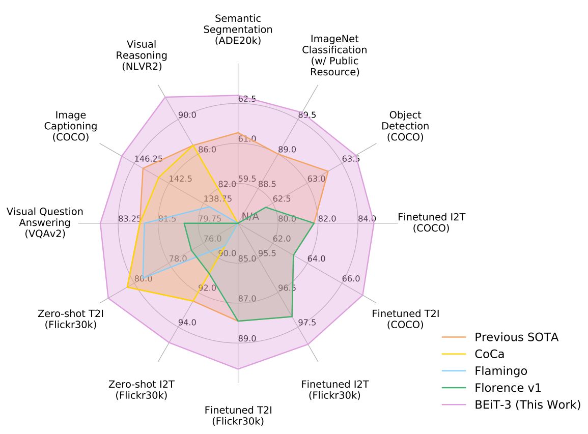 
Figure 1: BEIT-3 achieves state-of-the-art performance on a broad range of tasks compared with other customized or foundation models. I2T/T2I is short for image-to-text/text-to-image retrieval. 
图1：与其他定制或基础模型相比, BEIT-3 在广泛的任务上实现了最先进的性能。 I2T/T2I 是图像到文本/文本到图像检索的缩写。

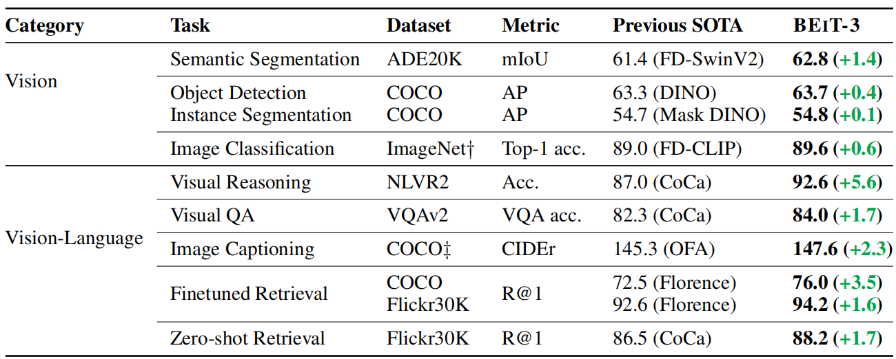 
Table 1: Overview of BEIT-3 results on various vision and vision-language benchmarks. We compare with previous state-of-the-art models, including FD-SwinV2 [WHX+22], DINO [ZLL+22], Mask DINO [ZLL+22], FD-CLIP [WHX+22], CoCa [YWV+22], OFA [WYM+22], Florence [YCC+21]. We report the average of top-1 image-to-text and text-to-image results for retrieval tasks. “†” indicates ImageNet results only using publicly accessible resources. “‡” indicates image captioning results without CIDEr optimization. 
表1：BEIT-3 在各种视觉和视觉语言基准测试中的结果概览。 我们与之前最先进的模型进行了比较。 我们报告检索任务的 top-1 图像到文本和文本到图像结果的平均值。 “†”表示 ImageNet 结果仅使用可公开访问的资源。 “‡”表示未经 CIDEr 优化的图像标题结果。

## 2 BEIT-3: A General-Purpose Multimodal Foundation Model
As shown in Figure 2, BEIT-3 is pretrained by masked data modeling on monomodal and multimodal data, using a shared Multiway Transformer network. The model can be transferred to various vision and vision-language downstream tasks.

如图2 所示, BEIT-3 使用共享的 多路Transformer 网络, 通过对单模态和多模态数据进行掩码数据建模进行预训练。 该模型可以迁移到各种视觉和视觉语言下游任务。

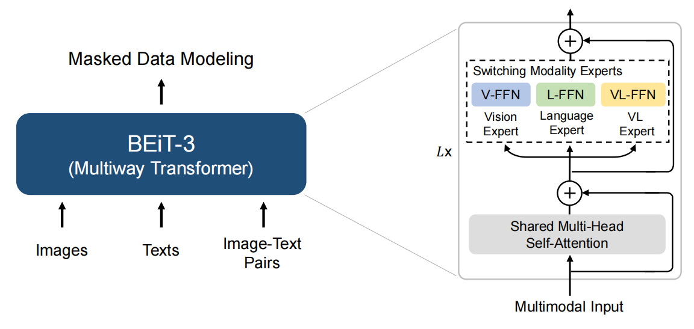 
Figure 2: Overview of BEIT-3 pretraining. We perform masked data modeling on monomodal (i.e., images, and texts) and multimodal (i.e., image-text pairs) data with a shared Multiway Transformer as the backbone network. 
图2：BEIT-3 预训练概述。 我们使用共享的 多路Transformer 作为主干网络, 对单模态(即图像和文本)和多模态(即图像-文本对)数据执行掩码数据建模。

### 2.1 Backbone Network: Multiway Transformers
We use Multiway Transformers [WBDW21] as the backbone model to encode different modalities. As shown in Figure 2, each Multiway Transformer block consists of a shared self-attention module, and a pool of feed-forward networks (i.e., modality experts) used for different modalities. We route each input token to the experts depending on its modality. In our implementation, each layer contains a vision expert and a language expert. Moreover, the top three layers have vision-language experts designed for fusion encoders. Refer to Figure 3 (a)(b)(c) for more detailed modeling layouts. Using a pool of modality experts encourages the model to capture more modality-specific information. The shared self-attention module learns the alignment between different modalities and enables deep fusion for multimodal (such as vision-language) tasks. 

我们使用 多路Transformers [WBDW21] 作为骨干模型来编码不同的模态。 如图2 所示, 每个 多路Transformer块 都包含一个共享的自注意力模块和一个用于不同模态的前馈网络池(即模态专家)。 我们根据其模态将每个输入令牌路由给专家。 在我们的实现中, 每一层都包含一个视觉专家和一个语言专家。 此外, 三层的顶部有专为融合编码器设计的视觉语言专家。 有关更详细的建模布局, 请参阅图3 (a)(b)(c)。 使用模态专家池可以鼓励模型捕获更多特定于模态的信息。 共享自注意力模块学习不同模态之间的对齐, 并为多模态(如视觉语言)任务实现深度融合。

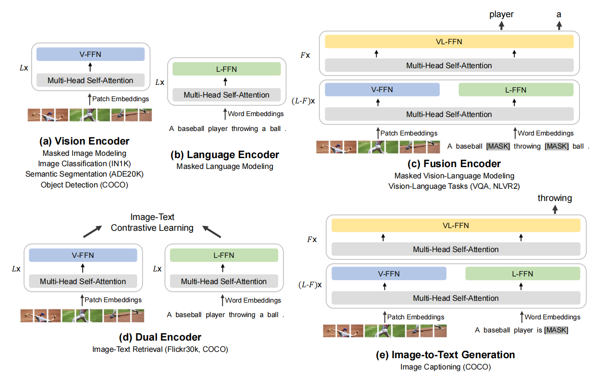 
Figure 3: BEIT-3 can be transferred to various vision and vision-language downstream tasks. With a shared Multiway Transformer, we can reuse the model as (a)(b) vision or language encoders; (c) fusion encoders that jointly encode image-text pairs for deep interaction; (d) dual encoders that separately encode modalities for efficient retrieval; (e) sequence-to-sequence learning for image-totext generation.
图3：BEIT-3 可以迁移到各种视觉和视觉语言下游任务。 使用共享的 多路Transformer, 我们可以将模型重用为 (a)(b) 视觉或语言编码器;  (c) 联合编码图像-文本对以进行深度交互的融合编码器;  (d) 双编码器, 分别编码有效检索的模态;  (e) 用于图像到文本生成的序列到序列学习。

As shown in Figure 3, the unified architecture enables BEIT-3 to support a wide range of downstream tasks. For example, BEIT-3 can be used as an image backbone for various vision tasks, including image classification, object detection, instance segmentation, and semantic segmentation. It can also be finetuned as a dual encoder for efficient image-text retrieval, and a fusion model for multimodal understanding and generation tasks.

如图3 所示, 统一架构使 BEIT-3 能够支持广泛的下游任务。 例如, BEIT-3 可以用作各种视觉任务的图像主干, 包括图像分类、目标检测、实例分割和语义分割。 它还可以作为双编码器进行微调, 用于高效的图像文本检索, 以及用于多模态理解和生成任务的融合模型。

### 2.2 Pretraining Task: Masked Data Modeling
We pretrain BEIT-3 via a unified masked data modeling [BWDW22] objective on monomodal (i.e., images, and texts) and multimodal data (i.e., image-text pairs). During pretraining, we randomly mask some percentage of text tokens or image patches and train the model to recover the masked tokens. The unified mask-then-predict task not only learns representations but also learns the alignment of different modalities. Specifically, text data is tokenized by a SentencePiece tokenizer [KR18]. Image data is tokenized by the tokenizer of BEIT v2 [PDB+22] to obtain the discrete visual tokens as the reconstructed targets. We randomly mask 15% tokens of monomodal texts and 50% tokens of texts from image-text pairs. For images, we mask 40% of image patches using a block-wise masking strategy as in BEIT [BDPW22, PDB+22].

我们通过针对单模态(即图像和文本)和多模态数据(即图像-文本对)的统一掩码数据建模 [BWDW22] 目标对 BEIT-3 进行预训练。 在预训练期间, 我们随机掩码一定比例的文本令牌或图像块, 并训练模型以恢复被掩码的令牌。 统一的 mask-then-predict 任务不仅学习表示, 而且学习不同模态的对齐。 具体来说, 文本数据由 SentencePiece 令牌器 [KR18] 令牌化。 图像数据由 BEIT v2 [PDB+22] 的令牌器进行令牌化, 以获得作为重建目标的离散视觉令牌化。 我们从图像-文本对中随机掩码 15% 的单模态文本令牌和 50% 的文本令牌。 对于图像, 我们使用 BEIT [BDPW22, PDB+22] 中的逐块掩码策略掩码 40% 的图像块。 <!-- SentencePiece tokenizer 和 BPE的区别？ -->

We only use one pretraining task, which makes the training process scaling-up friendly. In contrast, previous vision-language models [LYL+20, ZLH+21, KSK21, LSG+21, WBDW21, LLXH22, YWV+22] usually employ multiple pretraining tasks, such as image-text contrast, imagetext matching, and word-patch/region alignment. We show that a much smaller pretraining batch size can be used with the mask-then-predict task. In comparison, contrastive-based models [RKH+21, JYX+21, YCC+21, YWV+22] usually need a very large batch size for pretraining(2 For example, CoCa [YWV+22] uses 65k batch size, CLIP [RKH+21] uses 32k batch size, and Florence [YCC+21] uses 24k batch size. BEIT-3 uses a much smaller 6k batch size for pretraining. ), which brings more engineering challenges, such as GPU memory cost. 

我们只使用一个预训练任务, 这使得训练过程易于扩展。 相比之下, 以前的视觉语言模型[LYL+20、ZLH+21、KSK21、LSG+21、WBDW21、LLXH22、YWV+22]通常采用多个预训练任务, 例如图像文本对比、图像文本匹配和词- 分块/区域对齐。 我们展示了一个更小的预训练批量大小可以用于 mask-then-predict 任务。 相比之下, 基于对比的模型[RKH+21、JYX+21、YCC+21、YWV+22]通常需要非常大的批量大小进行预训练, 这带来了更多的工程挑战, 例如GPU内存成本(例如, CoCa [YWV+22] 使用 65k 批量大小, CLIP [RKH+21] 使用 32k 批量大小, Florence [YCC+21] 使用 24k 批量大小。 而BEIT-3 使用小得多的 6k 批大小进行预训练)。

### 2.3 Scaling Up: BEIT-3 Pretraining
#### Backbone Network 骨干网
BEIT-3 is a giant-size foundation model following the setup of ViTgiant [ZKHB21]. As shown in Table 2, the model consists of a 40-layer Multiway Transformer with 1408 hidden size, 6144 intermediate size, and 16 attention heads. All layers contain both vision experts and language experts. Vision-language experts are also employed in the top three Multiway Transformer layers. The self-attention module is shared across different modalities. BEIT-3 consists of 1.9B parameters in total, including 692M parameters for vision experts, 692M parameters for language experts, 52M parameters for vision-language experts, and 317M parameters for the shared self-attention module. Notice that only vision-related parameters (i.e., comparable size as ViT-giant; about 1B) are activated when the model is used as a vision encoder.

BEIT-3 是继 ViTgiant [ZKHB21] 之后的巨型基础模型。 如表2 所示, 该模型由一个 40 层的 多路Transformer 组成, 具有 1408 个隐藏大小、6144 个中间大小和 16 个注意力头。 所有层都包含视觉专家和语言专家。 多路Transformer 的前三层也使用了视觉语言专家。 自注意力模块在不同的模态之间共享。 BEIT-3共包含1.9B个参数, 其中视觉专家692M参数, 语言专家692M参数, 视觉语言专家52M参数, 共享自注意力模块317M参数。 请注意, 当模型用作视觉编码器时, 仅激活与视觉相关的参数(即与 ViT-giant 相当的大小; 大约 1B)。

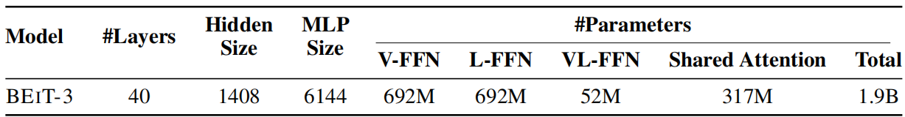 
Table 2: Model configuration of BEIT-3. The architecture layout follows ViT-giant [ZKHB21].
表2：BEIT-3 的模型配置。 架构布局遵循 ViT-giant [ZKHB21]。

#### Pretraining Data 预训练数据
BEIT-3 is pretrained on both monomodal and multimodal data shown in Table 3. For multimodal data, there are about 15M images and 21M image-text pairs collected from five public datasets: Conceptual 12M (CC12M) [CSDS21], Conceptual Captions (CC3M) [SDGS18], SBU Captions (SBU) [OKB11], COCO [LMB+14] and Visual Genome (VG) [KZG+17]. For monomodal data, we use 14M images from ImageNet-21K and 160GB text corpora [BDW+20] from English Wikipedia, BookCorpus [ZKZ+15], OpenWebText(3 http://skylion007.github.io/OpenWebTextCorpus), CC-News [LOG+19], and Stories [TL18].

BEIT-3 在表3 所示的单模态和多模态数据上进行了预训练。对于多模态数据, 从五个公共数据集收集了大约 1500 万个图像和 2100 万个图像-文本对：Conceptual 12M (CC12M) [CSDS21], Conceptual Captions (CC3M) [SDGS18]、SBU 标题 (SBU) [OKB11]、COCO [LMB+14] 和视觉基因组 (VG) [KZG+17]。 对于单模态数据, 我们使用来自 ImageNet-21K 的 14M 图像和来自英语维基百科的 160GB 文本语料库 [BDW+20], BookCorpus [ZKZ+15], OpenWebText(3 http://skylion007.github.io/OpenWebTextCorpus), CC-News[LOG+19] 和 Stories[TL18]。

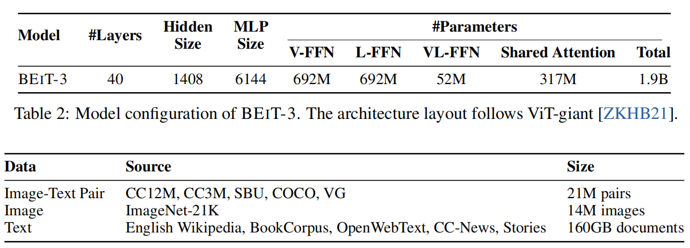  <!--截图有点问题-->
Table 3: Pretraining data of BEIT-3. All the data are academically accessible.
表3：BEIT-3 的预训练数据。 所有数据在学术上都是可访问的。

#### Pretraining Settings 预训练设置
We pretrain BEIT-3 for 1M steps. Each batch contains 6144 samples in total, including 2048 images, 2048 texts and 2048 image-text pairs. The batch size is much smaller than contrastive models [RKH+21, JYX+21, YWV+22]. BEIT-3 uses 14 × 14 patch size and is pretrained at resolution 224 × 224. We use the same image augmentation as in BEIT [BDPW22], including random resized cropping, horizontal flipping, and color jittering [WXYL18]. A SentencePiece tokenizer [KR18] with 64k vocab size is employed to tokenize the text data. We use the AdamW [LH19] optimizer with β1 = 0.9, β2 = 0.98 and e =1e-6 for optimization. We use a cosine learning rate decay scheduler with a peak learning rate of 1e-3 and a linear warmup of 10k steps. The weight decay is 0.05. Stochastic depth [HSL+16] with a rate of 0.1 is used. The BEiT initialization algorithm[BDPW22](4 We first randomly initialize the parameters within a small range, e.g., [−0.02, 0.02]. Next, we rescale the l-th Transformer layer’s output matrices (i.e., the last linear projection within each sublayer) of self-attention and FFN by $\frac{1}{\sqrt{2l}}$ ) is used to stabilize Transformer training. 

我们对 BEIT-3 进行了 1M 步的预训练。 每批共包含 6144 个样本, 包括 2048 个图像、2048 个文本和 2048 个图文对。 批量大小比对比模型 [RKH+21、JYX+21、YWV+22] 小得多。 BEIT-3 使用 14 × 14 的分块大小, 并以 224 × 224 的分辨率进行预训练。我们使用与 BEIT [BDPW22] 中相同的图像增广, 包括随机调整大小的裁剪、水平翻转和颜色抖动 [WXYL18]。 使用具有 64k 词汇大小的 SentencePiece 令牌器 [KR18] 来令牌文本数据。 我们使用 β1 = 0.9、β2 = 0.98 和 e =1e-6 的 AdamW [LH19] 优化器进行优化。 我们使用峰值学习率为 1e-3 且线性预热为 10k 步的余弦学习率衰减调度程序。 权重衰减为 0.05。 使用速率为 0.1 的随机深度 [HSL+16]。 BEiT 初始化算法[BDPW22](4 我们首先在一个小范围内随机初始化参数, 例如 [−0.02, 0.02]。接下来, 我们重新缩放第 l 个 Transformer 层的输出矩阵(即每个矩阵中的最后一个线性投影 $\frac{1}{\sqrt{2l}}$ 的自注意力和 FFN 的子层)用于稳定 Transformer 训练。

## 3 Experiments on Vision and Vision-Language Tasks
We extensively evaluate BEIT-3 on major public benchmarks for both vision-language and vision tasks. Table 1 presents the overview of results. BEIT-3 obtains state-of-the-art performance on a wide range of vision and vision-language tasks. 

我们在视觉语言和视觉任务的主要公共基准上广泛评估 BEIT-3。 表1 显示了结果的概览。 BEIT-3 在广泛的视觉和视觉语言任务上获得了最先进的性能。

### 3.1 Vision-Language Downstream Tasks
We evaluate the capabilities of BEIT-3 on the widely used vision-language understanding and generation benchmarks, including visual question answering [GKS+17], visual reasoning [SZZ+19], image-text retrieval [PWC+15, LMB+14], and image captioning [LMB+14].

我们评估了 BEIT-3 在广泛使用的视觉语言理解和生成基准上的能力, 包括视觉问答 [GKS+17]、视觉推理 [SZZ+19]、图像文本检索 [PWC+15、LMB+14] ], 以及图像标题 [LMB+14]。

#### Visual Question Answering (VQA)  视觉问答
The task requires the model to answer natural language questions about input images. Following previous work [AHB+18, ZLH+21, KSK21], we conduct finetuning experiments on the VQA v2.0 dataset [GKS+17] and formulate the task as a classification problem. The model is trained to predict answers from the 3129 most frequent answer candidates in the training set. BEIT-3 is finetuned as a fusion encoder to model deep interactions of images and questions for the VQA task. We concatenate the embeddings of a given question and an image, and then feed the input embeddings into Multiway Transformers to jointly encode the image-question pair. The final pooled output is fed into a classifier layer to predict the answer. The results are present in Table 4, BEIT-3 outperforms all previous models by a large margin (more than 1.7 points), pushing the state of the art to 84.03 with a single model.

该任务要求模型回答有关输入图像的自然语言问题。 继之前的工作 [AHB+18、ZLH+21、KSK21] 之后, 我们对 VQA v2.0 数据集 [GKS+17] 进行了微调实验, 并将任务制定为分类问题。 该模型经过训练, 可以从训练集中 3129 个最常见的候选答案中预测答案。 BEIT-3 被微调为融合编码器, 为 VQA 任务建模图像和问题的深度交互。 我们连接给定问题和图像的嵌入, 然后将输入嵌入馈送到多路变换器以联合编码图像-问题对。 最终的合并输出被送入分类器层以预测答案。 结果如表4 所示, BEIT-3 大大优于之前的所有模型(超过 1.7 个百分点), 将单个模型的最新技术水平推至 84.03。

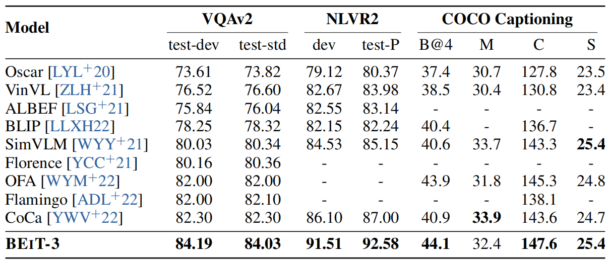 
Table 4: Results of visual question answering, visual reasoning, and image captioning tasks. We report vqa-score on VQAv2 test-dev and test-standard splits, accuracy for NLVR2 development set and public test set (test-P). For COCO image captioning, we report BLEU@4 (B@4), METEOR (M), CIDEr (C), and SPICE (S) on the Karpathy test split. For simplicity, we report captioning results without using CIDEr optimization.
表4：视觉问答、视觉推理和图像标题任务的结果。 我们报告 VQAv2 测试开发和测试标准拆分的 vqa 分数, NLVR2 开发集和公共测试集(test-P)的准确性。 对于 COCO 图像标题, 我们在 Karpathy 测试拆分上报告了 BLEU@4 (B@4)、METEOR (M)、CIDEr (C) 和 SPICE (S)。 为简单起见, 我们在不使用 CIDEr 优化的情况下报告标题结果。

#### Visual Reasoning 视觉推理
The task needs models to perform joint reasoning about images and natural language descriptions. We evaluate the model on the popular NLVR2 [SZZ+19] benchmark, which is to determine whether a textual description is true about a pair of images. Following previous work [ZLH+21, KSK21], we construct two image-text pairs based on the triplet input. We finetune BEIT-3 as a fusion encoder to jointly encode the image-text pairs. The final pooled outputs of the two pairs are concatenated and then fed into a classifier layer to predict the label. As shown in Table 4, BEIT-3 achieves a new state-of-the-art result for visual reasoning, outperforming CoCa by about 5.6 points. The performance on NLVR2 reaches above 90% for the first time.

该任务需要模型对图像和自然语言描述进行联合推理。 我们在流行的 NLVR2 [SZZ+19] 基准上评估模型, 即确定关于一对图像的文本描述是否真实。 在之前的工作 [ZLH+21, KSK21] 之后, 我们基于三元组输入构建了两个图像-文本对。 我们将 BEIT-3 微调为融合编码器, 以联合编码图像-文本对。 将两对的最终合并输出连接起来, 然后送入分类器层以预测标签。 如表4 所示, BEIT-3 在视觉推理方面取得了新的最先进结果, 比 CoCa 高出约 5.6 个百分点。 NLVR2 上的性能首次达到 90% 以上。

#### Image Captioning 图片说明
The task aims to generate a natural language caption for the given image. We use the COCO [LMB+14] benchmark, finetune and evaluate the model on Karpathy split [KF15]. Following UNILM [DYW+19] and s2s-ft [BDW+21], BEIT-3 is used as a conditional generation model via masked finetuning. To be more specific, a special self-attention mask is employed for the image captioning task. Image tokens (i.e., image patches) can only attend to each other bidirectionally within the image sequence. Tokens of the caption can attention to image tokens, their leftward caption tokens, and themselves. During finetuning, we randomly mask some percentage of caption tokens.

该任务旨在为给定图像生成自然语言说明。 我们使用 COCO [LMB+14] 基准, 在 Karpathy split [KF15] 上微调和评估模型。 继 UNILM [DYW+19] 和 s2s-ft [BDW+21] 之后, BEIT-3 被用作通过掩码微调的条件生成模型。 更具体地说, 图像标题任务采用了一种特殊的自注意掩码。 图像令牌(即图像块)只能在图像序列中双向相互关注。 标题的令牌可以关注图像令牌、它们的左侧标题令牌和它们自己。 在微调期间, 我们随机掩码一定比例的标题令牌。

The model is trained to recover these tokens based on the clues of the image and its leftward caption context. We also mask the special boundary token [SEP] to help the model learn to terminate the generation. For simplicity, BEIT-3 is trained with simple cross-entropy loss, without using CIDEr optimization. During inference, we generate the caption tokens one by one in an autoregressive manner. Table 4 presents the results on COCO captioning. BEIT-3 outperforms all previous models trained with cross-entropy loss, creating a new state-of-the-art image captioning result. The results demonstrate the superiority of BEIT-3 for vision-language generation.

该模型经过训练, 可以根据图像的线索及其向左的标题上下文来恢复这些令牌。 我们还掩码了特殊边界令牌 [SEP] 以帮助模型学习终止生成。 为简单起见, BEIT-3 使用简单的交叉熵损失进行训练, 没有使用 CIDEr 优化。 在推理过程中, 我们以自回归的方式一个一个地生成标题令牌。 表4 显示了 COCO 标题的结果。 BEIT-3 优于所有以前使用交叉熵损失训练的模型, 创造了一个新的最先进的图像标题结果。 结果证明了 BEIT-3 在视觉语言生成方面的优越性。

#### Image-Text Retrieval 图像文本检索
The task is to measure the similarity between images and texts. There are two directions depending on the modality of the retrieved target: image-to-text retrieval, and text-to-image retrieval. Two popular retrieval benchmarks, i.e., COCO [LMB+14], and Flickr30K [PWC+15], are used to evaluate the model. Following previous work [ZLH+21, KSK21], we use the Karpathy split [KF15] for the two benchmarks. BEIT-3 is finetuned as a dual encoder for efficient image-text retrieval. Dual-encoder models separately encode images and texts to obtain their representations. Then we calculate the cosine similarity scores of these representations. Dual-encoder models are more efficient than fusion-encoder models. Because they do not have to jointly encode all possible image-text pairs.

任务是测量图像和文本之间的相似性。 根据检索目标的模态, 有两个方向：图像到文本检索和文本到图像检索。 两个流行的检索基准, 即 COCO [LMB+14] 和 Flickr30K [PWC+15], 用于评估模型。 在之前的工作 [ZLH+21, KSK21] 之后, 我们将 Karpathy 拆分 [KF15] 用于两个基准。 BEIT-3 被微调为双编码器, 用于高效的图像文本检索。 双编码器模型分别对图像和文本进行编码以获得它们的表示。 然后我们计算这些表示的余弦相似度分数。 双编码器模型比融合编码器模型更有效。 因为他们不必联合编码所有可能的图像文本对。

We directly finetune BEIT-3 on COCO and Flickr30K, although the model is not pretrained with image-text contrastive loss. Surprisingly, BEIT-3 outperforms previous state-of-the-art models only using a small amount of contrastive training. The results demonstrate that BEIT-3 effectively learns alignments between images and texts via masked data modeling. In order to improve the performance, we perform intermediate finetuning with an image-text contrastive objective on the pretraining image-text pairs. We finetune the model with much fewer steps than pretraining. Then we use the model to evaluate zero-shot and finetuned image-text retrieval. The finetuned results are present in Table 5, dual-encoder BEIT-3 outperforms prior models by a large margin, achieving 3.0/4.0 absolute improvement on COCO top-1 image-to-text/text-to-image retrieval, and 0.8/2.4 absolute improvement on Flickr30K top-1 image-to-text/text-to-image retrieval. BEIT-3 also significantly outperforms fusion-encoder-based models, which require more computation cost for inference. As present in Table 6, BEIT-3 also achieves better performance than previous models on Flickr30K zero-shot retrieval.

我们直接在 COCO 和 Flickr30K 上微调 BEIT-3, 尽管该模型没有使用图像-文本对比损失进行预训练。 令人惊讶的是, BEIT-3 仅使用少量对比训练就优于以前的最先进模型。 结果表明, BEIT-3 通过掩码数据建模有效地学习了图像和文本之间的对齐。 为了提高性能, 我们在预训练图像文本对上使用图像文本对比目标执行中间微调。 我们用比预训练少得多的步骤对模型进行微调。 然后我们使用该模型来评估零样本和微调图像文本检索。 微调结果如表5 所示, 双编码器 BEIT-3 大大优于之前的模型, 在 COCO top-1 image-to-text/text-to-image 检索上实现了 3.0/4.0 的绝对改进, 以及 0.8/ 2.4 对 Flickr30K top-1 image-to-text/text-to-image 检索的绝对改进。 BEIT-3 的性能也明显优于基于融合编码器的模型, 后者需要更多的计算成本才能进行推理。 如表6 所示, BEIT-3 在 Flickr30K 零样本检索上也取得了比以前模型更好的性能。

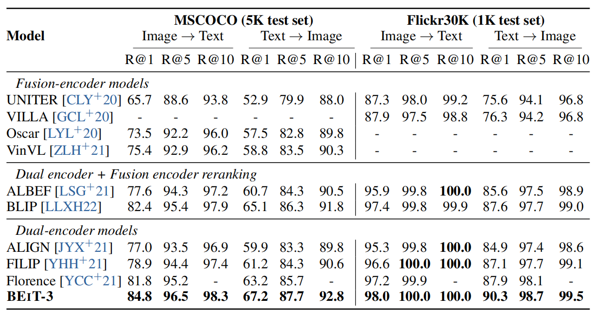 
Table 5: Finetuning results of image-to-text retrieval and text-to-image retrieval on COCO and
表5：COCO 和文本到图像检索的图像到文本检索和文本到图像检索的微调结果

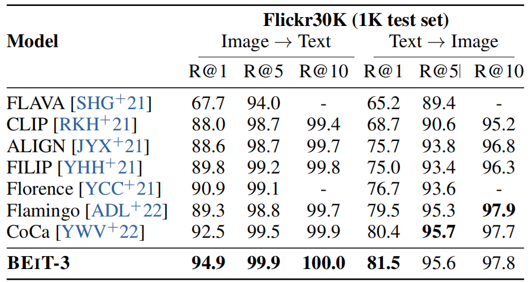 
Table 6: Zero-shot image-to-text retrieval and text-to-image retrieval on Flickr30K. 
表6：Flickr30K 上的零样本图像到文本检索和文本到图像检索。

### 3.2 Vision Downstream Tasks
In addition to vision-language downstream tasks, BEIT-3 can be transferred to a wide range of vision downstream tasks, including object detection, instance segmentation, semantic segmentation, and image classification. The number of effective parameters is comparable to ViT-giant [ZKHB21], i.e., about 1B, when BEIT-3 is used as a vision encoder.

除了视觉语言下游任务, BEIT-3 还可以迁移到广泛的视觉下游任务, 包括目标检测、实例分割、语义分割和图像分类。 当 BEIT-3 用作视觉编码器时, 有效参数的数量与 ViT-giant [ZKHB21] 相当, 即大约 1B。

#### Object Detection and Instance Segmentation 目标检测和实例分割
We conduct finetuning experiments on the COCO 2017 benchmark [LMB+14], which consists of 118k training, 5k validation, and 20k test-dev images. We use BEIT-3 as the backbone and follow ViTDet [LMGH22], including a simple feature pyramid and window attention, for the object detection and instance segmentation tasks. Following common practices [LHL+21, ZLL+22], we first conduct intermediate finetuning on the Objects365 [SLZ+19] dataset. Then we finetune the model on the COCO dataset. Soft-NMS [BSCD17] is used during inference. Table 7 compares BEIT-3 with previous state-of-the-art models on COCO object detection and instance segmentation. BEIT-3 achieves the best results on the COCO test-dev set with a smaller image size used for finetuning, reaching up to 63.7 box AP and 54.8 mask AP.

我们对 COCO 2017 基准 [LMB+14] 进行了微调实验, 该基准包括 118k 训练、5k 验证和 20k 测试开发图像。 我们使用 BEIT-3 作为主干并遵循 ViTDet [LMGH22], 包括一个简单的特征金字塔和窗口注意力, 用于目标检测和实例分割任务。 按照惯例 [LHL+21, ZLL+22], 我们首先对 Objects365 [SLZ+19] 数据集进行中间微调。 然后我们在 COCO 数据集上微调模型。 在推理过程中使用 Soft-NMS [BSCD17]。 表7 将 BEIT-3 与之前最先进的 COCO 目标检测和实例分割模型进行了比较。 BEIT-3 在 COCO test-dev 集上取得了最好的结果, 使用较小的图像尺寸进行微调, 达到 63.7 box AP 和 54.8 mask AP。

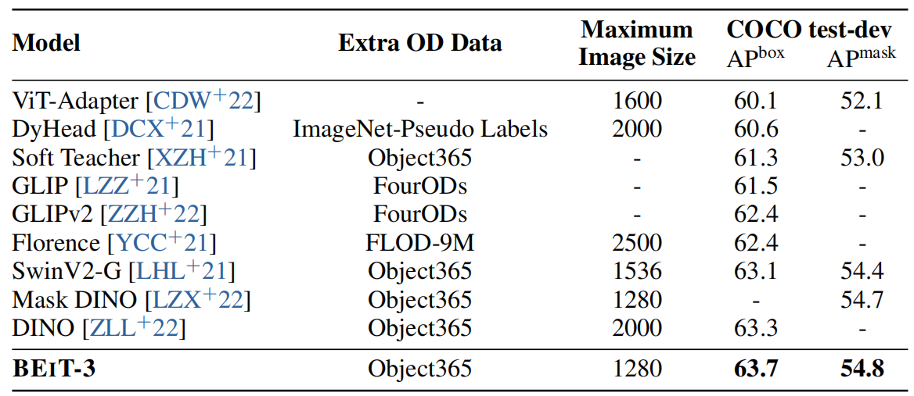 
Table 7: Results of object detection and instance segmentation on COCO benchmark. BEIT-3 uses Cascade Mask R-CNN [CV21] as the detection head. Our results are reported with multiscale evaluation. We report the maximum image size used for training. FLOD-9M and FourODs also contain Object365. The results of the comparison systems are from the paperswithcode.com leaderboard (timestamp: 08/22/2022). 
表7：目标检测和实例分割在 COCO 基准测试中的结果。 BEIT-3 使用 Cascade Mask R-CNN [CV21] 作为检测头。 我们的结果通过多尺度评估报告。 我们报告用于训练的最大图像大小。 FLOD-9M 和 FourODs 也包含 Object365。 比较系统的结果来自 paperswithcode.com 排行榜(时间戳：08/22/2022)。

#### Semantic Segmentation 语义分割
Semantic segmentation aims to predict the label for each pixel of the given image. We evaluate BEIT-3 on the challenging ADE20K dataset [ZZP+19], which includes 150 semantic categories. ADE20K contains 20k images for training and 2k images for validation. We directly follow the task transfer settings of ViT-Adapter [CDW+22]. We use a dense prediction task adapter and employ Mask2Former [CMS+21] as the segmentation framework. As shown in Table 8, BEIT-3 creates a new state-of-the-art result with 62.8 mIoU, outperforming FD-SwinV2 [WHX+22] giant model with 3B parameters by 1.4 points. It shows that BEIT-3 achieves superior performance on the dense prediction task.

语义分割旨在预测给定图像的每个像素的标签。 我们在具有挑战性的 ADE20K 数据集 [ZZP+19] 上评估 BEIT-3, 其中包括 150 个语义类别。 ADE20K 包含 20k 个用于训练的图像和 2k 个用于验证的图像。 我们直接按照 ViT-Adapter [CDW+22] 的任务传输设置。 我们使用密集预测任务适配器并使用 Mask2Former [CMS+21] 作为分割框架。 如表8 所示, BEIT-3 以 62.8 mIoU 创建了一个新的 state-of-the-art 结果, 比具有 3B 参数的 FD-SwinV2 [WHX+22] 巨型模型高 1.4 个百分点。 它表明 BEIT-3 在密集预测任务上取得了优越的性能。

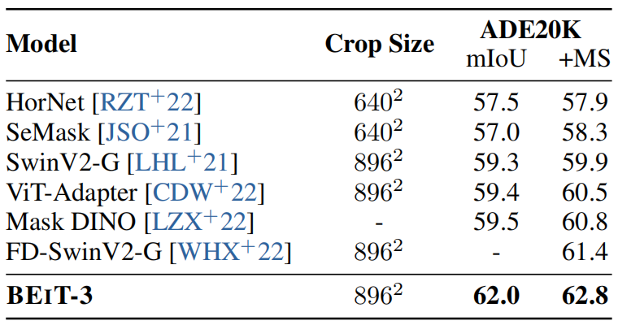 
Table 8: Results of semantic segmentation on ADE20K. “MS” is short for multi-scale. The results of the comparison systems are from the paperswithcode.com leaderboard (timestamp: 08/22/2022).
表8：ADE20K 的语义分割结果。 “MS”是多尺度的缩写。 比较系统的结果来自 paperswithcode.com 排行榜(时间戳：08/22/2022)。

#### Image Classification 图片分类
We evaluate the model on ImageNet-1K [RDS+15], which contains 1.28M training images and 50k validation images in 1k classes. Rather than appending a task layer to the vision encoder [DBK+20, BDPW22], we formulate the task as an image-to-text retrieval task. We use the category names as texts to construct image-text pairs. BEIT-3 is trained as a dual encoder to find the most relevant label for an image. During inference, we first compute the feature embeddings of possible class names and the feature embedding of the image. Their cosine similarity scores are then calculated to predict the most probable label for each image. Table 9 reports the results on ImageNet-1K. We first perform intermediate finetuning on ImageNet-21K, then we train the model on ImageNet-1K. For a fair comparison, we compare with the previous models only using public image-tag data. BEIT-3 outperforms prior models, creating a new state-of-the-art result when only using public image-tag data. 

我们在 ImageNet-1K [RDS+15] 上评估模型, 它包含 1k 类的 1.28M 训练图像和 50k 验证图像。 我们没有将任务层附加到视觉编码器 [DBK+20, BDPW22], 而是将任务制定为图像到文本检索任务。 我们使用类别名称作为文本来构建图像-文本对。 BEIT-3 被训练为双编码器, 以找到与图像最相关的标签。 在推理过程中, 我们首先计算可能类名的特征嵌入和图像的特征嵌入。 然后计算它们的余弦相似度分数以预测每张图像最可能的标签。 表9 报告了 ImageNet-1K 上的结果。 我们首先在 ImageNet-21K 上进行中间微调, 然后在 ImageNet-1K 上训练模型。 为了公平比较, 我们仅使用公共图像标签数据与以前的模型进行比较。 BEIT-3 优于之前的模型, 在仅使用公共图像标签数据时创造了一个新的最先进的结果。

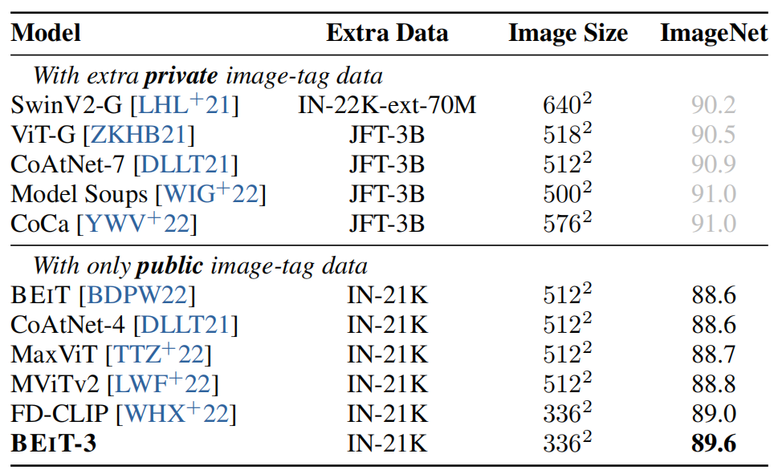 
Table 9: Top-1 accuracy on ImageNet-1K. 
表9：ImageNet-1K 上的 Top-1 精度。

## 4 Conclusion
In this paper, we present BEIT-3, a general-purpose multimodal foundation model, which achieves state-of-the-art performance across a wide range of vision and vision-language benchmarks. The key idea of BEIT-3 is that image can be modeled as a foreign language, so that we can conduct masked “language” modeling over images, texts, and image-text pairs in a unified way. We also demonstrate that Multiway Transformers can effectively model different vision and vision-language tasks, making it an intriguing option for general-purpose modeling. BEIT-3 is simple and effective, and is a promising direction for scaling up multimodal foundation models. For future work, we are working on pretraining multilingual BEIT-3 and including more modalities (e.g., audio) in BEIT-3 to facilitate the cross-lingual and cross-modality transfer, and advance the big convergence of large-scale pretraining across tasks, languages, and modalities. We are also interested in enabling in-context learning capability for multimodal foundation models by combining the strength of BEIT-3 and MetaLM [HSD+22]. 

在本文中, 我们介绍了 BEIT-3, 一种通用的多模态基础模型, 它在广泛的视觉和视觉语言基准测试中实现了最先进的性能。 BEIT-3 的核心思想是可以将图像建模为一门外语, 这样我们就可以统一地对图像、文本和图像-文本对进行掩码“语言”建模。 我们还证明了 多路Transformers 可以有效地对不同的视觉和视觉语言任务进行建模, 使其成为通用建模的一个有趣选择。 BEIT-3 简单有效, 是扩展多模态基础模型的一个有前途的方向。 对于未来的工作, 我们正在致力于多语言 BEIT-3 的预训练, 并在 BEIT-3 中包含更多的模态(例如, 音频), 以促进跨语言和跨模态的迁移, 并推动跨任务的大规模预训练的大融合 、语言和模态。 我们也有兴趣通过结合 BEIT-3 和 MetaLM [HSD+22] 的优势, 为多模态基础模型启用上下文学习能力。

## References
* [ADL+22] Jean-Baptiste Alayrac, Jeff Donahue, Pauline Luc, Antoine Miech, Iain Barr, Yana Hasson, Karel Lenc, Arthur Mensch, Katie Millican, Malcolm Reynolds, Roman Ring, Eliza Rutherford, Serkan Cabi, Tengda Han, Zhitao Gong, Sina Samangooei, Marianne Monteiro, Jacob Menick, Sebastian Borgeaud, Andrew Brock, Aida Nematzadeh, Sahand Sharifzadeh, Mikolaj Binkowski, Ricardo Barreira, Oriol Vinyals, Andrew Zisserman, and Karen Simonyan. Flamingo: a visual language model for few-shot learning. CoRR, abs/2204.14198, 2022.  
* [AHB+18] Peter Anderson, Xiaodong He, Chris Buehler, Damien Teney, Mark Johnson, Stephen Gould, and Lei Zhang. Bottom-up and top-down attention for image captioning and visual question answering. In 2018 IEEE Conference on Computer Vision and Pattern Recognition, CVPR 2018, Salt Lake City, UT, USA, June 18-22, 2018, pages 6077–6086. Computer Vision Foundation / IEEE Computer Society, 2018.  
* [BDPW22] Hangbo Bao, Li Dong, Songhao Piao, and Furu Wei. BEiT: BERT pre-training of image transformers. In International Conference on Learning Representations, 2022.  
* [BDW+20] Hangbo Bao, Li Dong, Furu Wei, Wenhui Wang, Nan Yang, Xiaodong Liu, Yu Wang, Jianfeng Gao, Songhao Piao, Ming Zhou, and Hsiao-Wuen Hon. UniLMv2: Pseudo￾masked language models for unified language model pre-training. In Proceedings of the 37th International Conference on Machine Learning, ICML 2020, 13-18 July 2020, Virtual Event, volume 119 of Proceedings of Machine Learning Research, pages 642–652. PMLR, 2020.  
* [BDW+21] Hangbo Bao, Li Dong, Wenhui Wang, Nan Yang, and Furu Wei. s2s-ft: Fine-tuning pre￾trained transformer encoders for sequence-to-sequence learning. CoRR, abs/2110.13640, 2021.  
* [BSCD17] Navaneeth Bodla, Bharat Singh, Rama Chellappa, and Larry S. Davis. Soft-nms - improving object detection with one line of code. In IEEE International Conference on Computer Vision, ICCV 2017, Venice, Italy, October 22-29, 2017, pages 5562–5570. IEEE Computer Society, 2017.  
* [BWDW22] Hangbo Bao, Wenhui Wang, Li Dong, and Furu Wei. VL-BEiT: Generative vision￾language pretraining. ArXiv, abs/2206.01127, 2022.  
* [CDW+22] Zhe Chen, Yuchen Duan, Wenhai Wang, Junjun He, Tong Lu, Jifeng Dai, and Yu Qiao. Vision transformer adapter for dense predictions. CoRR, abs/2205.08534, 2022.  
* [CLY+20] Yen-Chun Chen, Linjie Li, Licheng Yu, Ahmed El Kholy, Faisal Ahmed, Zhe Gan, Yu Cheng, and Jingjing Liu. UNITER: universal image-text representation learning. In Andrea Vedaldi, Horst Bischof, Thomas Brox, and Jan-Michael Frahm, editors, Computer Vision - ECCV 2020 - 16th European Conference, Glasgow, UK, August 23-28, 2020, Proceedings, Part XXX, volume 12375 of Lecture Notes in Computer Science, pages 104–120. Springer, 2020.  
* [CMS+21] Bowen Cheng, Ishan Misra, Alexander G. Schwing, Alexander Kirillov, and Rohit Girdhar. Masked-attention mask transformer for universal image segmentation. CoRR, abs/2112.01527, 2021.  
* [CSDS21] Soravit Changpinyo, Piyush Sharma, Nan Ding, and Radu Soricut. Conceptual 12m: Pushing web-scale image-text pre-training to recognize long-tail visual concepts. In IEEE Conference on Computer Vision and Pattern Recognition, CVPR 2021, virtual, June 19-25, 2021, pages 3558–3568. Computer Vision Foundation / IEEE, 2021.  
* [CV21] Zhaowei Cai and Nuno Vasconcelos. Cascade R-CNN: high quality object detection and instance segmentation. IEEE Trans. Pattern Anal. Mach. Intell., 43(5):1483–1498, 2021.  
* [DBK+20] Alexey Dosovitskiy, Lucas Beyer, Alexander Kolesnikov, Dirk Weissenborn, Xiaohua Zhai, Thomas Unterthiner, Mostafa Dehghani, Matthias Minderer, Georg Heigold, Syl￾vain Gelly, et al. An image is worth 16x16 words: Transformers for image recognition at scale. preprint arXiv:2010.11929, 2020.  
* [DCLT19] Jacob Devlin, Ming-Wei Chang, Kenton Lee, and Kristina Toutanova. BERT: pre￾training of deep bidirectional transformers for language understanding. In Jill Burstein, Christy Doran, and Thamar Solorio, editors, Proceedings of the 2019 Conference of the North American Chapter of the Association for Computational Linguistics: Human Language Technologies, NAACL-HLT 2019, Minneapolis, MN, USA, June 2-7, 2019, Volume 1 (Long and Short Papers), pages 4171–4186. Association for Computational Linguistics, 2019.  
* [DCX+21] Xiyang Dai, Yinpeng Chen, Bin Xiao, Dongdong Chen, Mengchen Liu, Lu Yuan, and Lei Zhang. Dynamic head: Unifying object detection heads with attentions. In IEEE Conference on Computer Vision and Pattern Recognition, CVPR 2021, virtual, June 19-25, 2021, pages 7373–7382. Computer Vision Foundation / IEEE, 2021.  
* [DLLT21] Zihang Dai, Hanxiao Liu, Quoc V. Le, and Mingxing Tan. Coatnet: Marrying convo￾lution and attention for all data sizes. In Marc’Aurelio Ranzato, Alina Beygelzimer, Yann N. Dauphin, Percy Liang, and Jennifer Wortman Vaughan, editors, Advances in Neural Information Processing Systems 34: Annual Conference on Neural Informa￾tion Processing Systems 2021, NeurIPS 2021, December 6-14, 2021, virtual, pages 3965–3977, 2021.  
* [DYW+19] Li Dong, Nan Yang, Wenhui Wang, Furu Wei, Xiaodong Liu, Yu Wang, Jianfeng Gao, Ming Zhou, and Hsiao-Wuen Hon. Unified language model pre-training for natural language understanding and generation. In Advances in Neural Information Processing Systems 32: Annual Conference on Neural Information Processing Systems 2019, NeurIPS 2019, December 8-14, 2019, Vancouver, BC, Canada, pages 13042–13054, 2019.  
* [GCL+20] Zhe Gan, Yen-Chun Chen, Linjie Li, Chen Zhu, Yu Cheng, and Jingjing Liu. Large￾scale adversarial training for vision-and-language representation learning. In Hugo Larochelle, Marc’Aurelio Ranzato, Raia Hadsell, Maria-Florina Balcan, and Hsuan￾Tien Lin, editors, Advances in Neural Information Processing Systems 33: Annual Conference on Neural Information Processing Systems 2020, NeurIPS 2020, December 6-12, 2020, virtual, 2020.  
* [GKS+17] Yash Goyal, Tejas Khot, Douglas Summers-Stay, Dhruv Batra, and Devi Parikh. Making the V in VQA matter: Elevating the role of image understanding in visual question answering. In 2017 IEEE Conference on Computer Vision and Pattern Recognition, CVPR 2017, Honolulu, HI, USA, July 21-26, 2017, pages 6325–6334. IEEE Computer Society, 2017.  
* [HSD+22] Yaru Hao, Haoyu Song, Li Dong, Shaohan Huang, Zewen Chi, Wenhui Wang, Shum￾ing Ma, and Furu Wei. Language models are general-purpose interfaces. ArXiv, abs/2206.06336, 2022.  
* [HSL+16] Gao Huang, Yu Sun, Zhuang Liu, Daniel Sedra, and Kilian Q. Weinberger. Deep net￾works with stochastic depth. In Bastian Leibe, Jiri Matas, Nicu Sebe, and Max Welling, editors, Computer Vision - ECCV 2016 - 14th European Conference, Amsterdam, The Netherlands, October 11-14, 2016, Proceedings, Part IV, volume 9908 of Lecture Notes in Computer Science, pages 646–661. Springer, 2016.  
* [JSO+21] Jitesh Jain, Anukriti Singh, Nikita Orlov, Zilong Huang, Jiachen Li, Steven Walton, and Humphrey Shi. Semask: Semantically masking transformer backbones for effective semantic segmentation. arXiv, 2021.  
* [JYX+21] Chao Jia, Yinfei Yang, Ye Xia, Yi-Ting Chen, Zarana Parekh, Hieu Pham, Quoc V. Le, Yun-Hsuan Sung, Zhen Li, and Tom Duerig. Scaling up visual and vision-language representation learning with noisy text supervision. In Marina Meila and Tong Zhang, editors, Proceedings of the 38th International Conference on Machine Learning, ICML 2021, 18-24 July 2021, Virtual Event, volume 139 of Proceedings of Machine Learning Research, pages 4904–4916. PMLR, 2021.  
* [KF15] Andrej Karpathy and Li Fei-Fei. Deep visual-semantic alignments for generating image descriptions. In IEEE Conference on Computer Vision and Pattern Recognition, CVPR 2015, Boston, MA, USA, June 7-12, 2015, pages 3128–3137. IEEE Computer Society, 2015.  
* [KR18] Taku Kudo and John Richardson. SentencePiece: A simple and language independent subword tokenizer and detokenizer for neural text processing. In Proceedings of the 2018 Conference on Empirical Methods in Natural Language Processing: System Demonstrations, pages 66–71, Brussels, Belgium, November 2018. Association for Computational Linguistics.  
* [KSK21] Wonjae Kim, Bokyung Son, and Ildoo Kim. ViLT: Vision-and-language transformer without convolution or region supervision. In Marina Meila and Tong Zhang, editors, Proceedings of the 38th International Conference on Machine Learning, ICML 2021, 18-24 July 2021, Virtual Event, volume 139 of Proceedings of Machine Learning Research, pages 5583–5594. PMLR, 2021.  
* [KZG+17] Ranjay Krishna, Yuke Zhu, Oliver Groth, Justin Johnson, Kenji Hata, Joshua Kravitz, Stephanie Chen, Yannis Kalantidis, Li-Jia Li, David A. Shamma, Michael S. Bernstein, and Li Fei-Fei. Visual genome: Connecting language and vision using crowdsourced dense image annotations. Int. J. Comput. Vis., 123(1):32–73, 2017.  
* [LH19] Ilya Loshchilov and Frank Hutter. Decoupled weight decay regularization. In 7th International Conference on Learning Representations, ICLR 2019, New Orleans, LA, USA, May 6-9, 2019. OpenReview.net, 2019.  
* [LHL+21] Ze Liu, Han Hu, Yutong Lin, Zhuliang Yao, Zhenda Xie, Yixuan Wei, Jia Ning, Yue Cao, Zheng Zhang, Li Dong, Furu Wei, and Baining Guo. Swin transformer V2: scaling up capacity and resolution. CoRR, abs/2111.09883, 2021.  
* [LLXH22] Junnan Li, Dongxu Li, Caiming Xiong, and Steven C. H. Hoi. BLIP: bootstrapping language-image pre-training for unified vision-language understanding and generation. In Kamalika Chaudhuri, Stefanie Jegelka, Le Song, Csaba Szepesvári, Gang Niu, and Sivan Sabato, editors, International Conference on Machine Learning, ICML 2022, 17-23 July 2022, Baltimore, Maryland, USA, volume 162 of Proceedings of Machine Learning Research, pages 12888–12900. PMLR, 2022.  
* [LMB+14] Tsung-Yi Lin, Michael Maire, Serge J. Belongie, James Hays, Pietro Perona, Deva Ramanan, Piotr Dollár, and C. Lawrence Zitnick. Microsoft COCO: common objects in context. In David J. Fleet, Tomás Pajdla, Bernt Schiele, and Tinne Tuytelaars, editors, Computer Vision - ECCV 2014 - 13th European Conference, Zurich, Switzerland, September 6-12, 2014, Proceedings, Part V, volume 8693 of Lecture Notes in Computer Science, pages 740–755. Springer, 2014.  
* [LMGH22] Yanghao Li, Hanzi Mao, Ross B. Girshick, and Kaiming He. Exploring plain vision transformer backbones for object detection. CoRR, abs/2203.16527, 2022.  
* [LOG+19] Yinhan Liu, Myle Ott, Naman Goyal, Jingfei Du, Mandar Joshi, Danqi Chen, Omer Levy, Mike Lewis, Luke Zettlemoyer, and Veselin Stoyanov. Roberta: A robustly optimized BERT pretraining approach. CoRR, abs/1907.11692, 2019.  
* [LSG+21] Junnan Li, Ramprasaath R. Selvaraju, Akhilesh Deepak Gotmare, Shafiq R. Joty, Caiming Xiong, and Steven C. H. Hoi. Align before fuse: Vision and language representation learning with momentum distillation. CoRR, abs/2107.07651, 2021.  
* [LWF+22] Yanghao Li, Chao-Yuan Wu, Haoqi Fan, Karttikeya Mangalam, Bo Xiong, Jitendra Malik, and Christoph Feichtenhofer. Mvitv2: Improved multiscale vision transformers for classification and detection. In Proceedings of the IEEE/CVF Conference on Computer Vision and Pattern Recognition, pages 4804–4814, 2022.  
* [LYL+20] Xiujun Li, Xi Yin, Chunyuan Li, Pengchuan Zhang, Xiaowei Hu, Lei Zhang, Lijuan Wang, Houdong Hu, Li Dong, Furu Wei, Yejin Choi, and Jianfeng Gao. Oscar: Object￾semantics aligned pre-training for vision-language tasks. In Andrea Vedaldi, Horst Bischof, Thomas Brox, and Jan-Michael Frahm, editors, Computer Vision - ECCV 2020 - 16th European Conference, Glasgow, UK, August 23-28, 2020, Proceedings, Part XXX, volume 12375 of Lecture Notes in Computer Science, pages 121–137. Springer, 2020.  
* [LZX+22] Feng Li, Hao Zhang, Huaizhe Xu, Shilong Liu, Lei Zhang, Lionel M. Ni, and Heung￾Yeung Shum. Mask DINO: towards A unified transformer-based framework for object detection and segmentation. CoRR, abs/2206.02777, 2022.  
* [LZZ+21] Liunian Harold Li, Pengchuan Zhang, Haotian Zhang, Jianwei Yang, Chunyuan Li, Yiwu Zhong, Lijuan Wang, Lu Yuan, Lei Zhang, Jenq-Neng Hwang, Kai-Wei Chang, and Jianfeng Gao. Grounded language-image pre-training. CoRR, abs/2112.03857, 2021.  
* [OKB11] Vicente Ordonez, Girish Kulkarni, and Tamara L. Berg. Im2text: Describing images using 1 million captioned photographs. In John Shawe-Taylor, Richard S. Zemel, Peter L. Bartlett, Fernando C. N. Pereira, and Kilian Q. Weinberger, editors, Advances in Neural Information Processing Systems 24: 25th Annual Conference on Neural Information Processing Systems 2011. Proceedings of a meeting held 12-14 December 2011, Granada, Spain, pages 1143–1151, 2011.  
* [PDB+22] Zhiliang Peng, Li Dong, Hangbo Bao, Qixiang Ye, and Furu Wei. Beit v2: Masked image modeling with vector-quantized visual tokenizers. CoRR, abs/2208.06366, 2022.  
* [PWC+15] Bryan A. Plummer, Liwei Wang, Chris M. Cervantes, Juan C. Caicedo, Julia Hocken￾maier, and Svetlana Lazebnik. Flickr30k entities: Collecting region-to-phrase correspon￾dences for richer image-to-sentence models. In 2015 IEEE International Conference on Computer Vision, ICCV 2015, Santiago, Chile, December 7-13, 2015, pages 2641–2649. IEEE Computer Society, 2015.  
* [RDS+15] Olga Russakovsky, Jia Deng, Hao Su, Jonathan Krause, Sanjeev Satheesh, Sean Ma, Zhiheng Huang, Andrej Karpathy, Aditya Khosla, Michael Bernstein, Alexander C Berg, and Li Fei-Fei. Imagenet large scale visual recognition challenge. IJCV, 2015.  
* [RKH+21] Alec Radford, Jong Wook Kim, Chris Hallacy, Aditya Ramesh, Gabriel Goh, Sandhini Agarwal, Girish Sastry, Amanda Askell, Pamela Mishkin, Jack Clark, Gretchen Krueger, and Ilya Sutskever. Learning transferable visual models from natural language supervi￾sion. In Marina Meila and Tong Zhang, editors, Proceedings of the 38th International Conference on Machine Learning, ICML 2021, 18-24 July 2021, Virtual Event, volume 139 of Proceedings of Machine Learning Research, pages 8748–8763. PMLR, 2021.  
* [RNSS18] Alec Radford, Karthik Narasimhan, Tim Salimans, and Ilya Sutskever. Improving language understanding by generative pre-training. 2018.  
* [RZT+22] Yongming Rao, Wenliang Zhao, Yansong Tang, Jie Zhou, Ser Nam Lim, and Jiwen Lu. HorNet: Efficient high-order spatial interactions with recursive gated convolutions. ArXiv, abs/2207.14284, 2022.  
* [SDGS18] Piyush Sharma, Nan Ding, Sebastian Goodman, and Radu Soricut. Conceptual captions: A cleaned, hypernymed, image alt-text dataset for automatic image captioning. In Iryna Gurevych and Yusuke Miyao, editors, Proceedings of the 56th Annual Meeting of the Association for Computational Linguistics, ACL 2018, Melbourne, Australia, July 15-20, 2018, Volume 1: Long Papers, pages 2556–2565. Association for Computational Linguistics, 2018.  
* [SHG+21] Amanpreet Singh, Ronghang Hu, Vedanuj Goswami, Guillaume Couairon, Wojciech Galuba, Marcus Rohrbach, and Douwe Kiela. FLAVA: A foundational language and vision alignment model. CoRR, abs/2112.04482, 2021.  
* [SLZ+19] Shuai Shao, Zeming Li, Tianyuan Zhang, Chao Peng, Gang Yu, Xiangyu Zhang, Jing Li, and Jian Sun. Objects365: A large-scale, high-quality dataset for object detection. In 2019 IEEE/CVF International Conference on Computer Vision, ICCV 2019, Seoul, Korea (South), October 27 - November 2, 2019, pages 8429–8438. IEEE, 2019.  
* [SZZ+19] Alane Suhr, Stephanie Zhou, Ally Zhang, Iris Zhang, Huajun Bai, and Yoav Artzi. A corpus for reasoning about natural language grounded in photographs. In Anna Korhonen, David R. Traum, and Lluís Màrquez, editors, Proceedings of the 57th Conference of the Association for Computational Linguistics, ACL 2019, Florence, Italy, July 28- August 2, 2019, Volume 1: Long Papers, pages 6418–6428. Association for Computational Linguistics, 2019.  
* [TL18] Trieu H. Trinh and Quoc V. Le. A simple method for commonsense reasoning. ArXiv, abs/1806.02847, 2018.  
* [TTZ+22] Zhengzhong Tu, Hossein Talebi, Han Zhang, Feng Yang, Peyman Milanfar, Alan Bovik, and Yinxiao Li. Maxvit: Multi-axis vision transformer. CoRR, abs/2204.01697, 2022.  
* [VSP+17] Ashish Vaswani, Noam Shazeer, Niki Parmar, Jakob Uszkoreit, Llion Jones, Aidan N. Gomez, Lukasz Kaiser, and Illia Polosukhin. Attention is all you need. In Isabelle Guyon, Ulrike von Luxburg, Samy Bengio, Hanna M. Wallach, Rob Fergus, S. V. N. Vishwanathan, and Roman Garnett, editors, Advances in Neural Information Processing Systems 30: Annual Conference on Neural Information Processing Systems 2017, December 4-9, 2017, Long Beach, CA, USA, pages 5998–6008, 2017.  
* [WBDW21] Wenhui Wang, Hangbo Bao, Li Dong, and Furu Wei. VLMo: Unified vision-language pre-training with mixture-of-modality-experts. CoRR, abs/2111.02358, 2021.  
* [WHX+22] Yixuan Wei, Han Hu, Zhenda Xie, Zheng Zhang, Yue Cao, Jianmin Bao, Dong Chen, and Baining Guo. Contrastive learning rivals masked image modeling in fine-tuning via feature distillation. CoRR, abs/2205.14141, 2022.  
* [WIG+22] Mitchell Wortsman, Gabriel Ilharco, Samir Ya Gadre, Rebecca Roelofs, Raphael Gon￾tijo Lopes, Ari S. Morcos, Hongseok Namkoong, Ali Farhadi, Yair Carmon, Simon Kornblith, and Ludwig Schmidt. Model soups: averaging weights of multiple fine-tuned models improves accuracy without increasing inference time. In Kamalika Chaudhuri, Stefanie Jegelka, Le Song, Csaba Szepesvári, Gang Niu, and Sivan Sabato, editors, In￾ternational Conference on Machine Learning, ICML 2022, 17-23 July 2022, Baltimore, Maryland, USA, volume 162 of Proceedings of Machine Learning Research, pages 23965–23998. PMLR, 2022.  
* [WXYL18] Zhirong Wu, Yuanjun Xiong, Stella X. Yu, and Dahua Lin. Unsupervised feature learning via non-parametric instance discrimination. In 2018 IEEE Conference on Computer Vision and Pattern Recognition, CVPR 2018, Salt Lake City, UT, USA, June 18-22, 2018, pages 3733–3742. Computer Vision Foundation / IEEE Computer Society, 2018.  
* [WYM+22] Peng Wang, An Yang, Rui Men, Junyang Lin, Shuai Bai, Zhikang Li, Jianxin Ma, Chang Zhou, Jingren Zhou, and Hongxia Yang. Unifying architectures, tasks, and modalities through a simple sequence-to-sequence learning framework. CoRR, abs/2202.03052, 2022.  
* [WYY+21] Zirui Wang, Jiahui Yu, Adams Wei Yu, Zihang Dai, Yulia Tsvetkov, and Yuan Cao. SimVLM: Simple visual language model pretraining with weak supervision. CoRR, abs/2108.10904, 2021.  
* [XZH+21] Mengde Xu, Zheng Zhang, Han Hu, Jianfeng Wang, Lijuan Wang, Fangyun Wei, Xiang Bai, and Zicheng Liu. End-to-end semi-supervised object detection with soft teacher. In 2021 IEEE/CVF International Conference on Computer Vision, ICCV 2021, Montreal, QC, Canada, October 10-17, 2021, pages 3040–3049. IEEE, 2021.  
* [YCC+21] Lu Yuan, Dongdong Chen, Yi-Ling Chen, Noel Codella, Xiyang Dai, Jianfeng Gao, Houdong Hu, Xuedong Huang, Boxin Li, Chunyuan Li, Ce Liu, Mengchen Liu, Zicheng Liu, Yumao Lu, Yu Shi, Lijuan Wang, Jianfeng Wang, Bin Xiao, Zhen Xiao, Jianwei Yang, Michael Zeng, Luowei Zhou, and Pengchuan Zhang. Florence: A new foundation model for computer vision. CoRR, abs/2111.11432, 2021.  
* [YHH+21] Lewei Yao, Runhui Huang, Lu Hou, Guansong Lu, Minzhe Niu, Hang Xu, Xiaodan Liang, Zhenguo Li, Xin Jiang, and Chunjing Xu. FILIP: fine-grained interactive language-image pre-training. CoRR, abs/2111.07783, 2021.  
* [YWV+22] Jiahui Yu, Zirui Wang, Vijay Vasudevan, Legg Yeung, Mojtaba Seyedhosseini, and Yonghui Wu. Coca: Contrastive captioners are image-text foundation models. CoRR, abs/2205.01917, 2022.  
* [ZKHB21] Xiaohua Zhai, Alexander Kolesnikov, Neil Houlsby, and Lucas Beyer. Scaling vision transformers. arXiv preprint arXiv:2106.04560, 2021.  
* [ZKZ+15] Yukun Zhu, Ryan Kiros, Rich Zemel, Ruslan Salakhutdinov, Raquel Urtasun, Antonio Torralba, and Sanja Fidler. Aligning books and movies: Towards story-like visual explanations by watching movies and reading books. In Proceedings of the IEEE international conference on computer vision, pages 19–27, 2015.  
* [ZLH+21] Pengchuan Zhang, Xiujun Li, Xiaowei Hu, Jianwei Yang, Lei Zhang, Lijuan Wang, Yejin Choi, and Jianfeng Gao. VinVL: Revisiting visual representations in vision￾language models. In IEEE Conference on Computer Vision and Pattern Recognition, CVPR 2021, virtual, June 19-25, 2021, pages 5579–5588. Computer Vision Foundation / IEEE, 2021.  
* [ZLL+22] Hao Zhang, Feng Li, Shilong Liu, Lei Zhang, Hang Su, Jun Zhu, Lionel M. Ni, and Heung-Yeung Shum. DINO: DETR with improved denoising anchor boxes for end-to￾end object detection. CoRR, abs/2203.03605, 2022.  
* [ZZH+22] Haotian Zhang, Pengchuan Zhang, Xiaowei Hu, Yen-Chun Chen, Liunian Harold Li, Xiyang Dai, Lijuan Wang, Lu Yuan, Jenq-Neng Hwang, and Jianfeng Gao. Glipv2: Unifying localization and vision-language understanding. CoRR, abs/2206.05836, 2022.  
* [ZZP+19] Bolei Zhou, Hang Zhao, Xavier Puig, Tete Xiao, Sanja Fidler, Adela Barriuso, and Antonio Torralba. Semantic understanding of scenes through the ADE20K dataset. Int. J. Comput. Vis., 127(3):302–321, 2019. 

## A Effects of Intermediate Finetuning for Retrieval 中间微调对检索的影响
As shown in Table 10, we directly finetune BEIT-3 on COCO and Flickr30K. BEIT-3 still outperforms previous state-of-the-art models, even without using image-text contrastive objective during pretraining. The results demonstrate the effectiveness of masked data modeling for learning crossmodal representations. Next, we perform intermediate finetuning on the pretraining image-text pairs for 5 epochs with a 16k batch size. The peak learning is 3e-5, with linear warmup over the first epoch. The image input size is 224 × 224. The weight decay is set to 0.05. We disable dropout as in pretraining and use drop path with a rate of 0.3. The layer-wise learning rate decay is 0.95. We use the AdamW [LH19] optimizer with β1 = 0.9, β2 = 0.999.

如表10 所示, 我们直接在 COCO 和 Flickr30K 上微调 BEIT-3。 BEIT-3 仍然优于以前的最先进模型, 即使在预训练期间不使用图像文本对比目标。 结果证明了掩码数据建模对于学习跨模态表示的有效性。 接下来, 我们对批大小为 16k 的 5 个时期的预训练图像-文本对执行中间微调。 峰值学习是 3e-5, 在第一个 epoch 上有线性预热。 图像输入尺寸为 224×224。权重衰减设置为 0.05。 我们像在预训练中那样禁用 dropout, 并使用 drop path 的比率为 0.3。 逐层学习率衰减为 0.95。 我们使用 AdamW [LH19] 优化器, 其中 β1 = 0.9, β2 = 0.999。

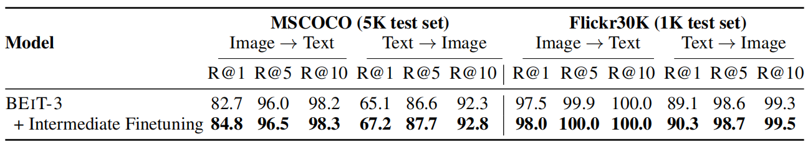 
Table 10: Finetuning results of image-text retrieval on COCO and Flickr30K. BEIT-3 is directly finetuned on downstream benchmarks without intermediate finetuning on the pretraining data.
表10：在 COCO 和 Flickr30K 上图像文本检索的微调结果。 BEIT-3 直接在下游基准上进行微调, 而无需对预训练数据进行中间微调。

## B Hyperparameters Used for Pretraining
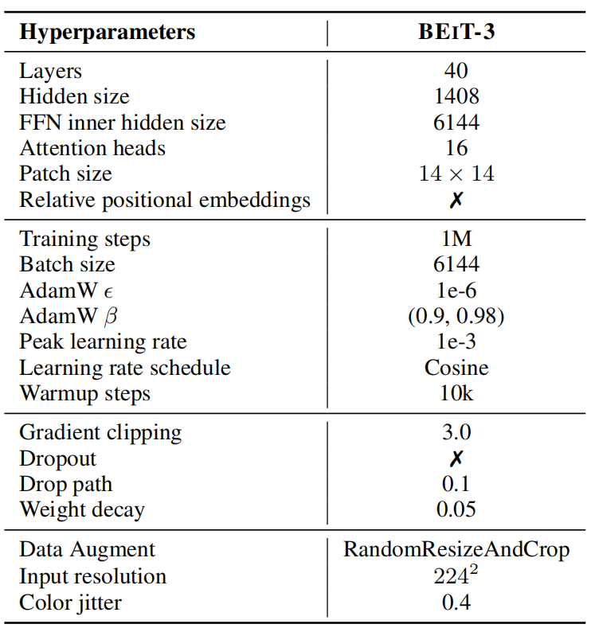 
Table 11: Hyperparameters for pretraining BEIT-3. 

## C Hyperparameters Used for Finetuning
 
Table 12: Hyperparameters for fine-tuning BEIT-3 on NLVR2 and VQAv2.

 
Table 13: Hyperparameters for fine-tuning BEIT-3 on COCO captioning.

 
Table 14: Hyperparameters for fine-tuning BEIT-3 on image-text retrieval. 

 
Table 15: Hyperparameters for fine-tuning BEIT-3 on semantic segmentation.

 
Table 16: Hyperparameters for fine-tuning BEIT-3 on object detection.

 
Table 17: Hyperparameters for fine-tuning BEIT-3 on image classification. 
