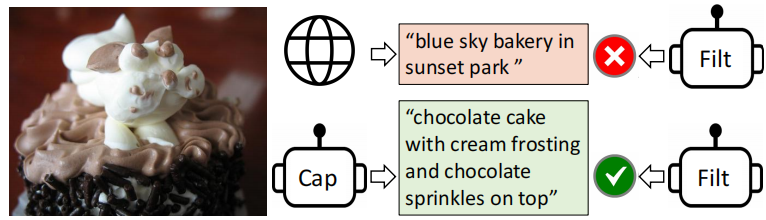
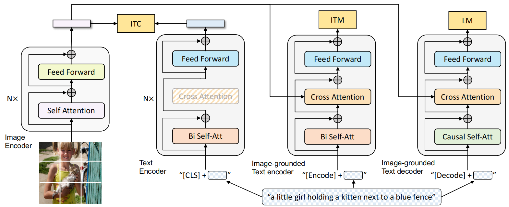
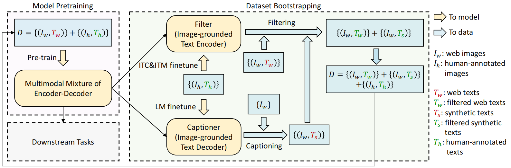
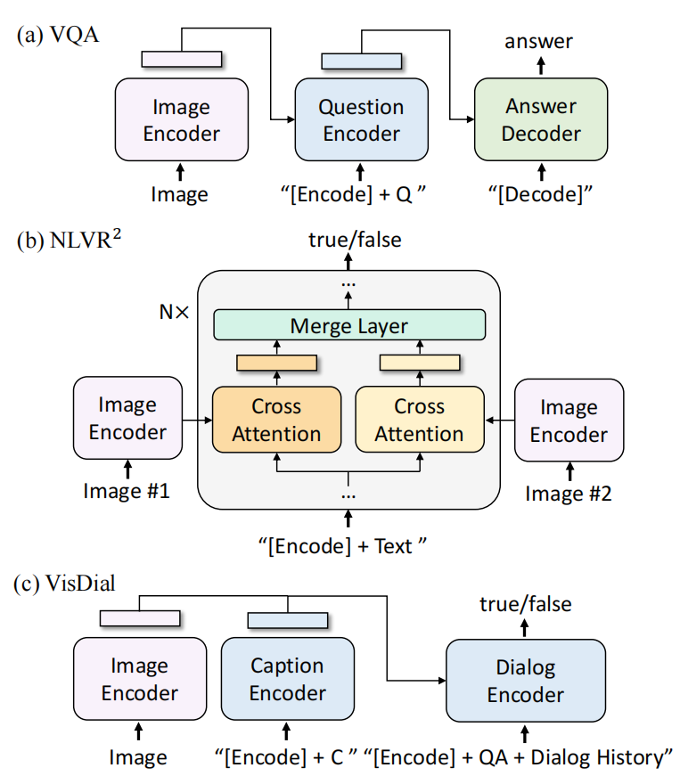
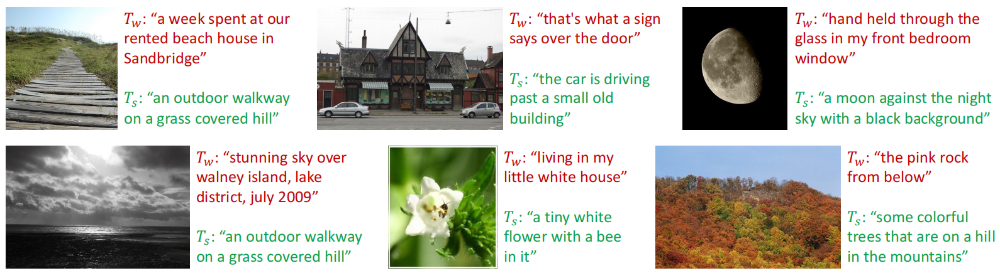

# BLIP: Bootstrapping Language-Image Pre-training for Unified Vision-Language Understanding and Generation
BLIP：统一视觉语言理解和生成的引导语言图像预训练 2022.1.28 https://arxiv.org/abs/2201.12086  

## 阅读笔记
* 字幕生成器生成合成字幕，滤波器去除有噪声的字幕

## Abstract
Vision-Language Pre-training (VLP) has advanced the performance for many vision-language tasks. However, most existing pre-trained models only excel in either understanding-based tasks or generation-based tasks. Furthermore, performance improvement has been largely achieved by scaling up the dataset with noisy image-text pairs collected from the web, which is a suboptimal source of supervision. In this paper, we propose BLIP, a new VLP framework which transfers flexibly to both vision-language understanding and generation tasks. BLIP effectively utilizes the noisy web data by bootstrapping the captions, where a captioner generates synthetic captions and a filter removes the noisy ones. We achieve state-of-the-art results on a wide range of vision-language tasks, such as image-text retrieval (+2.7% in average recall@1), image captioning (+2.8% in CIDEr), and VQA (+1.6% in VQA score). BLIP also demonstrates strong generalization ability when directly transferred to videolanguage tasks in a zero-shot manner. Code, models, and datasets are released.

视觉语言预训练（VLP）提高了许多视觉语言任务的性能。然而，大多数现有的预训练模型只擅长基于理解的任务或基于生成的任务。此外，通过使用从网络收集的有噪声的图像-文本对放大数据集，在很大程度上提高了性能，这是一个次优的监督来源。在本文中，我们提出了BLIP，这是一种新的VLP框架，它可以灵活地转移到视觉语言理解和生成任务。BLIP通过引导字幕有效地利用了有噪声的网络数据，其中字幕生成器生成合成字幕，滤波器去除有噪声的字幕。我们在各种视觉语言任务上取得了最先进的成果，如图像文本检索（平均+2.7%recall@1)、图像字幕（CIDEr中+2.8%）和VQA（VQA得分中+1.6%）。当以零样本方式直接转移到视频语言任务时，BLIP也表现出很强的泛化能力。代码、模型和数据集在 https://github.com/salesforce/BLIP。

## 1. Introduction
Vision-language pre-training has recently received tremendous success on various multimodal downstream tasks. However, existing methods have two major limitations:
1. Model perspective: most methods either adopt an encoder-based model (Radford et al., 2021; Li et al., 2021a), or an encoder-decoder (Cho et al., 2021; Wang et al., 2021) model. However, encoder-based models are less straightforward to directly transfer to text generation tasks (e.g. image captioning), whereas encoder-decoder models have not been successfully adopted for image-text retrieval tasks.
2. Data perspective: most state-of-the-art methods (e.g., CLIP (Radford et al., 2021), ALBEF (Li et al., 2021a), SimVLM (Wang et al., 2021)) pre-train on image-text pairs collected from the web. Despite the performance gain obtained by scaling up the dataset, our paper shows that the noisy web text is suboptimal for vision-language learning.

视觉语言预训练最近在各种多模型下游任务上取得了巨大成功。然而，现有方法有两个主要局限性：
1. 模型视角：大多数方法要么采用基于编码器的模型(Radford et al.,2021;Li et al.,2021a)，要么采用编码器-解码器(Cho et al.,2021，Wang et al.,2021)模型。然而，基于编码器的模型不太容易直接迁移到文本生成任务(例如，图像字幕)，而编码器-解码器模型尚未成功用于图像文本检索任务。
2. 数据透视：大多数最先进的方法(例如，CLIP(Radford et al.，2021)、ALBEF(Li et al.，2021a)、SimVLM(Wang et al.，2022))对从网络收集的图像-文本对进行预训练。尽管通过放大数据集获得了性能增益，但我们的论文表明，噪声网络文本对于视觉语言学习来说是次优的。

 
Figure 1. We use a Captioner (Cap) to generate synthetic captions for web images, and a Filter (Filt) to remove noisy captions.
图1。我们使用Capitator(Cap)为网络图像生成合成字幕，并使用Filter(Filt)删除有噪声的字幕。

To this end, we propose BLIP: Bootstrapping LanguageImage Pre-training for unified vision-language understanding and generation. BLIP is a new VLP framework which enables a wider range of downstream tasks than existing methods. It introduces two contributions from the model and data perspective, respectively:
1. Multimodal mixture of Encoder-Decoder (MED): a new model architecture for effective multi-task pre-training and flexible transfer learning. An MED can operate either as a unimodal encoder, or an image-grounded text encoder, or an image-grounded text decoder. The model is jointly pre-trained with three vision-language objectives: imagetext contrastive learning, image-text matching, and imageconditioned language modeling.
2. Captioning and Filtering (CapFilt): a new dataset boostrapping method for learning from noisy image-text pairs. We finetune a pre-trained MED into two modules: a captioner to produce synthetic captions given web images, and a filter to remove noisy captions from both the original web texts and the synthetic texts.

为此，我们提出了BLIP：用于统一视觉语言理解和生成的Bootstrapping LanguageImage预训练。BLIP是一种新的VLP框架，它能够实现比现有方法更广泛的下游任务。它分别从模型和数据的角度介绍了两个贡献：
1. 混合多模态的编码器-解码器(MED)：一种用于有效的多任务预训练和灵活迁移学习的新模型架构。MED可以作为单模编码器、基于图像的文本编码器或基于图像的文字解码器来操作。该模型与三个视觉语言目标联合预训练：图像文本对比学习、图像文本匹配和图像条件语言建模。
2. 字幕和过滤(CapFilt)：一种新的数据集增广方法，用于从噪声图像-文本对中学习。我们将预训练的MED微调为两个模块：一个是生成给定网络图像的合成字幕的字幕器，另一个是从原始网络文本和合成文本中去除噪声字幕的过滤器。

We perform extensive experiments and analysis, and make the following key observations.
* We show that the captioner and the filter work together to achieve substantial performance improvement on various downstream tasks by bootstrapping the captions. We also find that more diverse captions yield larger gains.
* BLIP achieves state-of-the-art performance on a wide range of vision-language tasks, including image-text retrieval, image captioning, visual question answering, visual reasoning, and visual dialog. We also achieve state-ofthe-art zero-shot performance when directly transferring our models to two video-language tasks: text-to-video retrieval and videoQA.

我们进行了广泛的实验和分析，并做出了以下关键观察。
* 我们演示了字幕器和过滤器协同工作，通过引导字幕在各种下游任务上实现了显著的性能改进。我们还发现，更多样化的字幕会带来更大的收益。
* BLIP在广泛的视觉语言任务中实现了最先进的性能，包括图像文本检索、图像字幕、视觉问答、视觉推理和视觉对话。当我们将模型直接迁移到两个视频语言任务：文本到视频检索和视频质量保证时，我们还实现了最先进的零样本性能。

 
Figure 2. Pre-training model architecture and objectives of BLIP (same parameters have the same color). We propose multimodal mixture of encoder-decoder, a unified vision-language model which can operate in one of the three functionalities: 
1. Unimodal encoder is trained with an image-text contrastive (ITC) loss to align the vision and language representations. 
2. Image-grounded text encoder uses additional cross-attention layers to model vision-language interactions, and is trained with a image-text matching (ITM) loss to distinguish between positive and negative image-text pairs. 
3. Image-grounded text decoder replaces the bi-directional self-attention layers with causal self-attention layers, and shares the same cross-attention layers and feed forward networks as the encoder. The decoder is trained with a language modeling (LM) loss to generate captions given images.

图2:BLIP的预训练模型架构和目标(相同的参数具有相同的颜色)。我们提出了编码器-解码器的多模型混合，这是一个统一的视觉语言模型，可以在三个函数之一中操作：
1. 用图像-文本对比(ITC)损失来训练单模型编码器，以对齐视觉和语言表示。
2. 基于图像的文本编码器使用额外的交叉注意力层来建模视觉-语言交互，并使用图像-文本匹配(ITM)损失进行训练，以区分正面和负面的图像-文本对。
3. 基于图像的文本解码器用因果自注意层取代了双向自注意层，并与编码器共享相同的交叉注意层和前馈网络。解码器使用语言建模(LM)损失进行训练，以生成给定图像的字幕。

## 2. Related Work
### 2.1. Vision-language Pre-training  视觉语言预训练
Vision-language pre-training (VLP) aims to improve performance of downstream vision and language tasks by pretraining the model on large-scale image-text pairs. Due to the prohibitive expense of acquiring human-annotated texts, most methods (Chen et al., 2020; Li et al., 2020; 2021a; Wang et al., 2021; Radford et al., 2021) use image and alt-text pairs crawled from the web (Sharma et al., 2018; Changpinyo et al., 2021; Jia et al., 2021), Despite the use of simple rule-based filters, noise is still prevalent in the web texts. However, the negative impact of the noise has been largely overlooked, shadowed by the performance gain obtained from scaling up the dataset. Our paper shows that the noisy web texts are suboptimal for vision-language learning, and proposes CapFilt that utilizes web datasets in a more effective way.

视觉语言预训练(VLP)旨在通过在大规模图像-文本对上预训练模型来提高下游视觉和语言任务的性能。由于获取人工标注文本的费用过高，大多数方法(Chen et al.，2020;李 et al.,2020;2021a;王 et al.,2021;Radford et al.,2021)使用从网络上抓取的图像和alt文本对(Sharma et al.，2018;Changpinyo et al.，2021;贾等，2021)，尽管使用了简单的基于规则的过滤器，但噪声在网络文本中仍然普遍存在。然而，噪声的负面影响在很大程度上被忽视了，因为通过放大数据集获得的性能增益掩盖了这一点。我们的论文表明，有噪声的网络文本对于视觉语言学习来说是次优的，并提出了以更有效的方式利用网络数据集的CapFilt。

There have been many attempts to unify various vision and language tasks into a single framework (Zhou et al., 2020; Cho et al., 2021; Wang et al., 2021). The biggest challenge is to design model architectures that can perform both understanding-based tasks (e.g. image-text retrieval) and generation-based tasks (e.g. image captioning). Neither encoder-based models (Li et al., 2021a;b; Radford et al., 2021) nor encoder-decoder models (Cho et al., 2021; Wang et al., 2021) can excel at both types of tasks, whereas a single unified encoder-decoder (Zhou et al., 2020) also limits the model’s capability. Our proposed multimodal mixture of encoder-decoder model offers more flexibility and better performance on a wide range of downstream tasks, in the meantime keeping the pre-training simple and efficient.

已经有许多尝试将各种视觉和语言任务统一到一个单一的框架中(Zhou et al.，2020;Cho et al.，2021;王 et al.,2021)。最大的挑战是设计既能执行基于理解的任务(例如图像文本检索)又能执行基于生成的任务(如图像字幕)的模型架构。基于编码器的模型(Li et al.，2021a;b;Radford et al.,2021)和编码器-解码器模型(Cho et al.，2021;Wang et al.，2022)都不能胜任这两种类型的任务，而单一的统一编码器-解码器(Zhou et al.，2020)也限制了模型的能力。我们提出的编码器-解码器的多模型混合模型在广泛的下游任务上提供了更大的灵活性和更好的性能，同时保持了预训练的简单和高效。

### 2.2. Knowledge Distillation 知识蒸馏
Knowledge distillation (KD) (Hinton et al., 2015) aims to improve the performance of a student model by distilling knowledge from a teacher model. Self-distillation is a special case of KD where the teacher and student have equal sizes. It has been shown to be effective for image classi- fication (Xie et al., 2020), and recently for VLP (Li et al., 2021a). Different from mostly existing KD methods which simply enforce the student to have the same class predictions as the teacher, our proposed CapFilt can be interpreted as a more effective way to perform KD in the context of VLP, where the captioner distills its knowledge through semantically-rich synthetic captions, and the filter distills its knowledge by removing noisy captions.

知识蒸馏(KD)(Hinton et al.，2015)旨在通过从教师模型中蒸馏知识来提高学生模型的性能。自我升华是KD的一个特殊情况，教师和学生的尺寸相等。它已被证明对图像分类有效(Xie et al.，2020)，最近对VLP有效(Li et al.，2021a)。与大多数现有的KD方法不同，这些方法只是强制学生与老师进行相同的课堂预测，我们提出的CapFilt可以被解释为在VLP背景下执行KD的一种更有效的方法，其中字幕者通过语义丰富的合成字幕蒸馏其知识，滤波器通过去除噪声字幕蒸馏其信息。

### 2.3. Data Augmentation 数据增广
While data augmentation (DA) has been widely adopted in computer vision (Shorten & Khoshgoftaar, 2019), DA for language tasks is less straightforward. Recently, generative language models have been used to synthesize examples for various NLP tasks (Kumar et al., 2020; Anaby-Tavor et al., 2020; Puri et al., 2020; Yang et al., 2020). Different from these methods which focus on the low-resource language-only tasks, our method demonstrates the advantage of synthetic captions in large-scale vision-language pre-training.

虽然数据增广(DA)已在计算机视觉中被广泛采用(Shorten&Khoshgoftaar，2019)，但用于语言任务的DA并不那么简单。最近，生成语言模型已被用于合成各种NLP任务的样本(Kumar et al.,2020;Anaby-Tavor et al.,2020;Puri et al.,2020，Yang et al.,2020)。与这些只关注低资源语言任务的方法不同，我们的方法演示了合成字幕在大规模视觉语言预训练中的优势。

## 3. Method
We propose BLIP, a unified VLP framework to learn from noisy image-text pairs. This section first introduces our new model architecture MED and its pre-training objectives, and then delineates CapFilt for dataset bootstrapping.

我们提出了BLIP，这是一个统一的VLP框架，用于从噪声图像-文本对中学习。本节首先介绍了我们的新模型架构MED及其预训练目标，然后描述了用于数据集自举的CapFilt。

### 3.1. Model Architecture
We employ a visual transformer (Dosovitskiy et al., 2021) as our image encoder, which divides an input image into patches and encodes them as a sequence of embeddings, with an additional [CLS] token to represent the global image feature. Compared to using pre-trained object detectors for visual feature extraction (Chen et al., 2020), using a ViT is more computation-friendly and has been adopted by the more recent methods (Li et al., 2021a; Kim et al., 2021).

我们使用视觉转换器(Dosovitskiy et al.，2021)作为我们的图像编码器，它将输入图像划分为块，并将其编码为嵌入序列，并使用额外的[CLS]令牌来表示全局图像特征。与使用预训练的目标检测器进行视觉特征蒸馏相比(Chen et al.，2020)，使用ViT更便于计算，并且已被最近的方法所采用(Li et al.，2021a;Kim et al.，2021)。

In order to pre-train a unified model with both understanding and generation capabilities, we propose multimodal mixture of encoder-decoder (MED), a multi-task model which can operate in one of the three functionalities: (1) Unimodal encoder, which separately encodes image and text. The text encoder is the same as BERT (Devlin et al., 2019), where a [CLS] token is appended to the beginning of the text input to summarize the sentence. (2) Image-grounded text encoder, which injects visual information by inserting one additional cross-attention (CA) layer between the self-attention (SA) layer and the feed forward network (FFN) for each transformer block of the text encoder. A task-specific [Encode] token is appended to the text, and the output embedding of [Encode] is used as the multimodal representation of the image-text pair. (3) Image-grounded text decoder, which replaces the bidirectional self-attention layers in the image-grounded text encoder with causal self-attention layers. A [Decode] token is used to signal the beginning of a sequence, and an end-of-sequence token is used to signal its end.

为了预训练一个具有理解和生成能力的统一模型，我们提出了编码器-解码器的多模型混合(MED)，这是一个多任务模型，可以在三个函数之一中操作：(1)单模型编码器，它分别对图像和文本进行编码。文本编码器与BERT(Devlin et al.，2019)相同，其中[CLS]令牌被附加到文本输入的开头以总结句子。(2) 基于图像的文本编码器，通过在自注意(SA)层和文本编码器的每个变换器块的前馈网络(FFN)之间插入一个额外的交叉注意(CA)层来注入视觉信息。特定于任务的[Encode]令牌被附加到文本，并且[Encode]的输出嵌入被用作图像-文本对的多模型表示。(3) 以图像为基础的文本解码器，它用因果自注意层取代了基于图像的文本编码器中的双向自注意层。[解码]令牌用于发出序列开始的信号，序列结束令牌用于发出其结束的信号。

### 3.2. Pre-training Objectives 预训练目标
We jointly optimize three objectives during pre-training, with two understanding-based objectives and one generationbased objective. Each image-text pair only requires one forward pass through the computational-heavier visual transformer, and three forward passes through the text transformer, where different functionalities are activated to compute the three losses as delineated below.

我们在预训练期间共同优化了三个目标，其中两个基于理解的目标和一个基于生成的目标。每个图像-文本对只需要一次正向通过计算较重的视觉转换器，并且三次正向通过文本转换器，其中激活不同的函数来计算如下所述的三个损失。

Image-Text Contrastive Loss (ITC) activates the unimodal encoder. It aims to align the feature space of the visual transformer and the text transformer by encouraging positive image-text pairs to have similar representations in contrast to the negative pairs. It has been shown to be an effective objective for improving vision and language understanding (Radford et al., 2021; Li et al., 2021a). We follow the ITC loss by Li et al. (2021a), where a momentum encoder is introduced to produce features, and soft labels are created from the momentum encoder as training targets to account for the potential positives in the negative pairs.

图像-文本对比度损失(ITC)激活单模态编码器。它旨在通过鼓励正面图像-文本对与负面图像-文本配对具有相似的表示来对齐视觉转换器和文本转换器的特征空间。它已被证明是提高视力和语言理解的有效目标(Radford et al.,2021;Li et al.,2021a)。我们遵循Li et al., (2021a) 的ITC损失。其中引入动量编码器来产生特征，并从动量编码器中创建软标签作为训练目标，以说明负对中的潜在积极因素。

Image-Text Matching Loss (ITM) activates the imagegrounded text encoder. It aims to learn image-text multimodal representation that captures the fine-grained alignment between vision and language. ITM is a binary classification task, where the model uses an ITM head (a linear layer) to predict whether an image-text pair is positive (matched) or negative (unmatched) given their multimodal feature. In order to find more informative negatives, we adopt the hard negative mining strategy by Li et al. (2021a), where negatives pairs with higher contrastive similarity in a batch are more likely to be selected to compute the loss.

图像-文本匹配损失(ITM)激活基于图像的文本编码器。它旨在学习图像-文本多模型表示，捕捉视觉和语言之间的细粒度对齐。ITM是一种二元分类任务，其中模型使用ITM头(线性层)来预测图像-文本对是正的(匹配的)还是负的(不匹配的)，给定它们的多模型特征。为了找到更具信息性的负样本，我们采用了Li et al. (2021a)的困难负样本挖掘策略，其中一批中对比相似性较高的负样本对更有可能被选择来计算损失。

Language Modeling Loss (LM) activates the imagegrounded text decoder, which aims to generate textual descriptions given an image. It optimizes a cross entropy loss which trains the model to maximize the likelihood of the text in an autoregressive manner. We apply a label smoothing of 0.1 when computing the loss. Compared to the MLM loss that has been widely-used for VLP, LM enables the model with the generalization capability to convert visual information into coherent captions.

语言建模损失(LM)激活基于图像的文本解码器，该解码器旨在生成给定图像的文本描述。它优化了交叉熵损失，该损失训练模型以自回归方式最大化文本的可能性。我们在计算损失时应用0.1的标签平滑。与已广泛用于VLP的MLM损失相比，LM使该模型具有将视觉信息转换为连贯字幕的泛化能力。

In order to perform efficient pre-training while leveraging multi-task learning, the text encoder and text decoder share all parameters except for the SA layers. The reason is that the differences between the encoding and decoding tasks are best captured by the SA layers. In particular, the encoder employs bi-directional self-attention to build representations for the current input tokens, while the decoder employs causal self-attention to predict next tokens. On the other hand, the embedding layers, CA layers and FFN function similarly between encoding and decoding tasks, therefore sharing these layers can improve training efficiency while benefiting from multi-task learning,

为了在利用多任务学习的同时执行有效的预训练，文本编码器和文本解码器共享除SA层之外的所有参数。原因是编码和解码任务之间的差异最好由SA层来捕捉。特别地，编码器采用双向自注意来构建当前输入令牌的表示，而解码器采用因果自注意来预测下一个令牌。另一方面，嵌入层、CA层和FFN在编码和解码任务之间的函数相似，因此共享这些层可以提高训练效率，同时受益于多任务学习，

### 3.3. CapFilt
Due to the prohibitive annotation cost, there exist a limited number of high-quality human-annotated image-text pairs {(Ih, Th)} (e.g., COCO (Lin et al., 2014)). Recent work (Li et al., 2021a; Wang et al., 2021) utilizes a much larger number of image and alt-text pairs {(Iw, Tw)} that are automatically collected from the web. However, the alt-texts often do not accurately describe the visual content of the images, making them a noisy signal that is suboptimal for learning vision-language alignment.

由于高昂的标注成本，存在数量有限的高质量人类标注图像-文本对{(Ih，Th)}(例如，COCO(Lin et al.，2014))。最近的工作(Li et al.，2021a;Wang et al.，2021)利用了从网络自动收集的大量图像和替代文本对{(Iw，Tw)}。然而，alt文本通常不能准确地描述图像的视觉内容，这使得它们成为一个嘈杂的信号，对于学习视觉语言对齐来说是次优的。

 
Figure 3. Learning framework of BLIP. We introduce a captioner to produce synthetic captions for web images, and a filter to remove noisy image-text pairs. The captioner and filter are initialized from the same pre-trained model and finetuned individually on a small-scale human-annotated dataset. The bootstrapped dataset is used to pre-train a new model.
图3。BLIP的学习框架。我们介绍了一种为网络图像生成合成字幕的字幕器，以及一种去除噪声图像-文本对的过滤器。字幕器和过滤器从相同的预训练模型初始化，并在小规模人工标注数据集上单独微调。自举数据集用于预训练新模型。

We propose Captioning and Filtering (CapFilt), a new method to improve the quality of the text corpus. Figure 3 gives an illustration of CapFilt. It introduces two modules: a captioner to generate captions given web images, and a filter to remove noisy image-text pairs. Both the captioner and the filter are initialized from the same pre-trained MED model, and finetuned individually on the COCO dataset. The finetuning is a lightweight procedure.

我们提出了一种提高文本语料库质量的新方法CapFilt。图3给出了CapFilt的说明。它引入了两个模块：一个用于生成给定网络图像的字幕的字幕器，以及一个用于去除噪声图像-文本对的过滤器。字幕器和过滤器都是从相同的预训练MED模型初始化的，并在COCO数据集上单独微调。微调是一个轻量级的过程。

Specifically, the captioner is an image-grounded text decoder. It is finetuned with the LM objective to decode texts given images. Given the web images Iw, the captioner generates synthetic captions Ts with one caption per image. The filter is an image-grounded text encoder. It is finetuned with the ITC and ITM objectives to learn whether a text matches an image. The filter removes noisy texts in both the original web texts Tw and the synthetic texts Ts, where a text is considered to be noisy if the ITM head predicts it as unmatched to the image. Finally, we combine the filtered image-text pairs with the human-annotated pairs to form a new dataset, which we use to pre-train a new model.

具体地说，字幕器是一个基于图像的文本解码器。它与LM目标进行了微调，以解码给定图像的文本。给定网络图像Iw，字幕制作者生成每个图像具有一个字幕的合成字幕Ts。过滤器是一个基于图像的文本编码器。它与ITC和ITM目标进行了微调，以了解文本是否与图像匹配。过滤器去除原始网络文本Tw和合成文本Ts中的噪声文本，其中，如果ITM头预测文本与图像不匹配，则认为文本是噪声的。最后，我们将过滤后的图像-文本对与人类标注的对相结合，形成一个新的数据集，用于预训练新的模型。

## 4. Experiments and Discussions 实验与讨论
In this section, we first introduce pre-training details. Then we provide a detailed experimental analysis on our method.

在本节中，我们首先介绍预训练的细节。然后我们对我们的方法进行了详细的实验分析。

### 4.1. Pre-training Details 预训练详细信息
Our models are implemented in PyTorch (Paszke et al., 2019) and pre-trained on two 16-GPU nodes. The image transformer is initialized from ViT pre-trained on ImageNet (Touvron et al., 2020; Dosovitskiy et al., 2021), and the text transformer is initialized from BERTbase (Devlin et al., 2019). We explore two variants of ViTs: ViT-B/16 and ViT-L/16. Unless otherwise specified, all results reported in this paper as “BLIP” uses ViT-B. We pre-train the model for 20 epochs using a batch size of 2880 (ViT-B) / 2400 (ViT-L). We use AdamW (Loshchilov & Hutter, 2017) optimizer with a weight decay of 0.05. The learning rate is warmed-up to 3e-4 (ViT-B) / 2e-4 (ViT-L) and decayed linearly with a rate of 0.85. We take random image crops of resolution 224 × 224 during pre-training, and increase the image resolution to 384 × 384 during finetuning. We use the same pre-training dataset as Li et al. (2021a) with 14M images in total, including two human-annotated datasets (COCO and Visual Genome (Krishna et al., 2017)), and three web datasets (Conceptual Captions (Changpinyo et al., 2021), Conceptual 12M (Changpinyo et al., 2021), SBU captions (Ordonez et al., 2011)). We also experimented with an additional web dataset, LAION (Schuhmann et al., 2021), which contains 115M images with more noisy texts1 . More details about the datasets can be found in the appendix.

我们的模型在PyTorch中实现(Paszke et al.，2019)，并在两个16-GPU节点上进行预训练。图像转换器是从ImageNet上预训练的ViT初始化的(Touvron et al.,2020;Dosovitskiy et al.,2021)，文本转换器是从BERTbase初始化的(Devlin et al.,2019)。我们探索了ViT的两种变体：ViT-B/16和ViT-L/16。除非另有规定，否则本文中报告为“BLIP”的所有结果均使用ViT-B。我们使用2880(ViT-B)/2400(ViT-L)的批量大小对20个周期的模型进行预训练。我们使用AdamW(Loshchilov&Hutter，2017)优化器，权重衰减为0.05。学习速率被预热到3e-4(ViT-B)/2e-4(ViT-L)，并且以0.85的速率线性衰减。在预训练期间，我们采用分辨率为224×224的随机图像裁剪，并在微调期间将图像分辨率提高到384×384。我们使用与李 et al.,相同的预训练数据集。(2021a)共有14M张图像，包括两个人类标注数据集(COCO和视觉基因组(Krishna et al.，2017))和三个网络数据集(概念字幕(Changpinyo et al.，2021)、概念12M(Changpineyo et al.，2021)和SBU字幕(Ordonez et al.，2011))。我们还试验了一个额外的网络数据集LAION(Schuhmann et al.，2021)，该数据集包含115M张带有更多噪声文本的图像1。有关数据集的更多详细信息，请参阅附录。

### 4.2. Effect of CapFilt CapFilt的影响
In Table 1, we compare models pre-trained on different datasets to demonstrate the efficacy of CapFilt on downstream tasks, including image-text retrieval and image captioning with finetuned and zero-shot settings.

在表1中，我们比较了不同数据集上预训练的模型，以证明CapFilt在下游任务中的功效，包括图像文本检索和图像字幕，以及微调和零样本设置。

When only the captioner or the filter is applied to the dataset with 14M images, performance improvement can be observed. When applied together, their effects compliment each other, leading to substantial improvements compared to using the original noisy web texts.

当仅将字幕或滤波器应用于具有14M个图像的数据集时，可以观察到性能的提高。当它们一起应用时，它们的效果相互补充，与使用原始嘈杂的网络文本相比，有了实质性的改进。

CapFilt can further boost performance with a larger dataset and a larger vision backbone, which verifies its scalability in both the data size and the model size. Furthermore, by using a large captioner and filter with ViT-L, performance of the base model can also be improved.

CapFilt可以通过更大的数据集和更大的视觉主干进一步提高性能，这验证了其在数据大小和模型大小方面的可扩展性。此外，通过使用带有ViT-L的大型字幕机和滤波器，还可以提高基本模型的性能。

1We only download images whose shorter edge is larger than 256 pixels from the original LAION400M. Due to the large size of LAION, we only use 1/5 of it each epoch during pre-training.

1我们只从原始LAION400M下载短边大于256像素的图像。由于LAION的大小很大，我们在预训练期间每个历元仅使用其1/5。

Table 1. Evaluation of the effect of the captioner (C) and filter (F) for dataset bootstrapping. Downstream tasks include image-text retrieval and image captioning with finetuning (FT) and zero-shot (ZS) settings. TR / IR@1: recall@1 for text retrieval / image retrieval. ✓B/L: captioner or filter uses ViT-B / ViT-L as vision backbone.
表1。评估字幕器(C)和滤波器(F)对数据集自举的效果。下游任务包括图像-文本检索和带有微调(FT)和零样本(ZS)设置的图像字幕。转/分IR@1以下为：recall@1用于文本检索/图像检索。✓B/L：字幕或滤波器使用ViT-B/ViT-L作为视觉主干。

 
Figure 4. Examples of the web text Tw and the synthetic text Ts. Green texts are accepted by the filter, whereas red texts are rejected.
图4。网络文本Tw和合成文本Ts的样本。绿色文本被过滤器接受，而红色文本被拒绝。

Table 2. Comparison between beam search and nucleus sampling for synthetic caption generation. Models are pre-trained on 14M images.
表2。用于合成字幕生成的波束搜索和核采样之间的比较。模型是在14M图像上预训练的。

Table 3. Comparison between different parameter sharing strategies for the text encoder and decoder durin
表3。不同参数共享策略下文本编码器和解码器的比较

In Figure 4, we show some example captions and their corresponding images, which qualitatively demonstrate the effect of the captioner to generate new textual descriptions, and the filter to remove noisy captions from both the original web texts and the synthetic texts. More examples can be found in the appendix.

在图4中，我们演示了一些样本字幕及其相应的图像，这些图像定性地演示了字幕生成器生成新的文本描述的效果，以及从原始网络文本和合成文本中去除嘈杂字幕的过滤器。更多的样本可以在附录中找到。

### 4.3. Diversity is Key for Synthetic Captions 多样性是合成字幕的关键
In CapFilt, we employ nucleus sampling (Holtzman et al., 2020) to generate synthetic captions. Nucleus sampling is a stochastic decoding method, where each token is sampled from a set of tokens whose cumulative probability mass exceeds a threshold p (p = 0.9 in our experiments). In Table 2, we compare it with beam search, a deterministic decoding method which aims to generate captions with the highest probability. Nucleus sampling leads to evidently better performance, despite being more noisy as suggested by a higher noise ratio from the filter. We hypothesis that the reason is that nucleus sampling generates more diverse and surprising captions, which contain more new information that the model could benefit from. On the other hand, beam search tends to generate safe captions that are common in the dataset, hence offering less extra knowledge.

在CapFilt中，我们使用单元核采样(Holtzman et al.，2020)来生成合成字幕。Nucleus采样是一种随机解码方法，其中每个令牌都是从累积概率质量超过阈值p(在我们的实验中p=0.9)的一组令牌中采样的。在表2中，我们将其与波束搜索进行了比较，波束搜索是一种确定性解码方法，旨在以最高概率生成字幕。Nucleus采样带来了明显更好的性能，尽管正如滤波器的更高噪声比所暗示的那样噪声更大。我们假设，原因是核心采样产生了更多多样和令人惊讶的标题，其中包含了更多新的信息，模型可以从中受益。另一方面，波束搜索倾向于生成数据集中常见的安全字幕，因此提供的额外知识较少。

### 4.4. Parameter Sharing and Decoupling 参数共享与解耦
During pre-training, the text encoder and decoder share all parameters except for the self-attention layers. In Table 3, we evaluate models pre-trained with different parameter sharing strategies, where pre-training is performed on the 14M images with web texts. As the result shows, sharing all layers except for SA leads to better performance compared to not sharing, while also reducing the model size thus improveing training efficiency. If the SA layers are shared, the model’s performance would degrade due to the conflict between the encoding task and the decoding task.

在预训练期间，除了自注意层之外，文本编码器和解码器共享所有参数。在表3中，我们评估了使用不同参数共享策略预训练的模型，其中预训练是在具有网络文本的14M图像上执行的。结果表明，与不共享相比，共享除SA之外的所有层可以获得更好的性能，同时也减少了模型大小，从而提高了训练效率。如果SA层是共享的，则由于编码任务和解码任务之间的冲突，模型的性能将降低。

Table 4. Effect of sharing parameters between the captioner and filter. Models are pre-trained on 14M images.
表4。字幕和过滤器之间共享参数的效果。模型是在14M图像上预训练的。

Table 5. Comparison with state-of-the-art image-text retrieval methods, finetuned on COCO and Flickr30K datasets. BLIPCapFilt-L pre-trains a model with ViT-B backbone using a dataset bootstrapped by captioner and filter with ViT-L.
表5。与最先进的图像文本检索方法进行比较，在COCO和Flickr30K数据集上进行了微调。BLIPCapFilt-L使用字幕器引导的数据集和ViT-L过滤器，使用ViT-B主干预训练模型。

Table 6. Zero-shot image-text retrieval results on Flickr30K.
表6。Flickr30K上的零样本图像文本检索结果。

During CapFilt, the captioner and the filter are end-to-end finetuned individually on COCO. In Table 4, we study the effect if the captioner and filter share parameters in the same way as pre-training. The performance on the downstream tasks decreases, which we mainly attribute to confirmation bias. Due to parameter sharing, noisy captions produced by the captioner are less likely to be filtered out by the filter, as indicated by the lower noise ratio (8% compared to 25%).

在CapFilt期间，字幕器和滤波器在COCO上分别进行端到端微调。在表4中，我们研究了如果字幕和滤波器以与预训练相同的方式共享参数的效果。下游任务的性能下降，我们主要将其归因于确认偏差。由于参数共享，字幕制作者产生的噪声字幕不太可能被滤波器过滤掉，如较低的噪声比所示(8%与25%相比)。

## 5. Comparison with State-of-the-arts 与现有技术的比较
In this section, we compare BLIP to existing VLP methods on a wide range of vision-language downstream tasks2 . Next we briefly introduce each task and finetuning strategy. More details can be found in the appendix.

在本节中，我们将BLIP与现有的VLP方法在广泛的视觉语言下游任务上进行比较2。接下来，我们将简要介绍每项任务和微调策略。更多细节见附录。

2we omit SNLI-VE from the benchmark because its test data has been reported to be noisy (Do et al., 2020)
2我们从基准中省略了SNLI-VE，因为据报道其测试数据有噪声(Do et al.,2020)

### 5.1. Image-Text Retrieval 图像文本检索
We evaluate BLIP for both image-to-text retrieval (TR) and text-to-image retrieval (IR) on COCO and Flickr30K (Plummer et al., 2015) datasets. We finetune the pre-trained model using ITC and ITM losses. To enable faster inference speed, we follow Li et al. (2021a) and first select k candidates based on the image-text feature similarity, and then rerank the selected candidates based on their pairwise ITM scores. We set k = 256 for COCO and k = 128 for Flickr30K.

我们在COCO和Flickr30K(Plummer et al.，2015)数据集上评估了图像到文本检索(TR)和文本到图像检索(IR)的BLIP。我们使用ITC和ITM损失来微调预训练的模型。为了实现更快的推理速度，我们遵循李 et al.,的方法。(2021a)，首先根据图像-文本特征相似性选择k个候选者，然后根据所选候选者的成对ITM分数对其进行重新排序。我们为COCO设置k=256，为Flickr30K设置k=128。

As shown in Table 5, BLIP achieves substantial performance improvement compared with existing methods. Using the same 14M pre-training images, BLIP outperforms the previous best model ALBEF by +2.7% in average recall@1 on COCO. We also perform zero-shot retrieval by directly transferring the model finetuned on COCO to Flickr30K. The result is shown in Table 6, where BLIP also outperforms existing methods by a large margin.

如表5所示，与现有方法相比，BLIP实现了显著的性能改进。使用相同的14M预训练图像，BLIP平均比之前的最佳模型ALBEF高+2.7%recall@1关于COCO。我们还通过直接将COCO上微调的模型迁移到Flickr30K来执行零样本检索。结果如表6所示，其中BLIP也在很大程度上优于现有方法。

### 5.2. Image Captioning 图像字幕
We consider two datasets for image captioning: NoCaps (Agrawal et al., 2019) and COCO, both evaluated using the model finetuned on COCO with the LM loss. Similar as Wang et al. (2021), we add a prompt “a picture of” at the beginning of each caption, which leads to slightly better results. As shown in Table 7, BLIP with 14M pretraining images substantially outperforms methods using a similar amount of pre-training data. BLIP with 129M images achieves competitive performance as LEMON with

我们考虑了两个用于图像字幕的数据集：NoCaps(Agrawal et al.，2019)和COCO，这两个数据集都是使用在具有LM损失的COCO上微调的模型进行评估的。与王 et al.,(2021)类似，我们在每个标题的开头添加了一个提示“图片”，这会带来稍微好一点的结果。如表7所示，具有14M预训练图像的BLIP显著优于使用类似量的预训练数据的方法。拥有129M张图像的BLIP实现了与LEMON一样具有竞争力的性能

Table 7. Comparison with state-of-the-art image captioning methods on NoCaps and COCO Caption. All methods optimize the crossentropy loss during finetuning. C: CIDEr, S: SPICE, B@4: BLEU@4. BLIPCapFilt-L is pre-trained on a dataset bootstrapped by captioner and filter with ViT-L. VinVL† and LEMON† require an object detector pre-trained on 2.5M images with human-annotated bounding boxes and high resolution (800×1333) input images. SimVLMhuge uses 13× more training data and a larger vision backbone than ViT-L.
表7。与NoCaps和COCO Caption上最先进的图像字幕方法的比较。所有方法都优化了微调过程中的交叉熵损失。C： CIDEr，S：SPICE，B@4以下为：BLEU@4.BLIPCapFilt-L是在由字幕机引导的数据集上预训练的，并使用ViT-L进行过滤。VinVL†和LEMON†需要在具有人类标注的边框和高分辨率(800×1333)输入图像的2.5M图像上预训练目标检测器。SimVLMjuge使用的训练数据比ViT-L多13倍，视觉骨干更大。

 
Figure 5. Model architecture for the downstream tasks. Q: question; C: caption; QA: question-answer pair. 200M images. Note that LEMON requires a computationalheavy pre-trained object detector and higher resolution (800×1333) input images, leading to substantially slower inference time than the detector-free BLIP which uses lower resolution (384×384) input images.
图5。下游任务的模型架构。Q： 问题;C： 标题;问答配对。2亿张图片。请注意，LEMON需要计算量大的预训练目标检测器和更高分辨率(800×1333)的输入图像，这导致推理时间比使用较低分辨率(384×384)输入图像的无检测器BLIP慢得多。

### 5.3. Visual Question Answering (VQA) 视觉问答(VQA)
VQA (Antol et al., 2015) requires the model to predict an answer given an image and a question. Instead of formulating VQA as a multi-answer classification task (Chen et al., 2020; Li et al., 2020), we follow Li et al. (2021a) and consider it as an answer generation task, which enables open-ended VQA. As shown in Figure 5(a), during finetuning, we rearrange the pre-trained model, where an image-question is first encoded into multimodal embeddings and then given to an answer decoder. The VQA model is finetuned with the LM loss using ground-truth answers as targets.

VQA(Antol et al.,2015)要求模型在给定图像和问题的情况下预测答案。我们没有将VQA公式化为多答案分类任务(Chen et al.，2020;李 et al.,2020)，而是遵循李 et al.,(2021a)，将其视为一个答案生成任务，从而实现开放式VQA。如图5(a)所示，在微调过程中，我们重新排列预训练的模型，其中图像问题首先被编码为多模型嵌入，然后被提供给答案解码器。使用基准实况答案作为目标，利用LM损失对VQA模型进行微调。

Table 8. Comparison with state-of-the-art methods on VQA and NLVR2 . ALBEF performs an extra pre-training step for NLVR2 .SimVLM† uses 13× more training data and a larger vision backbone (ResNet+ViT) than BLIP.
表8。在VQA和NLVR2上与最先进的方法进行比较。ALBEF为NLVR2执行额外的预训练步骤。与BLIP相比，SimVLM†使用了13倍多的训练数据和更大的视觉骨干(ResNet+ViT)。

The results are shown in Table 8. Using 14M images, BLIP outperforms ALBEF by +1.64% on the test set. Using 129M images, BLIP achieves better performance than SimVLM which uses 13× more pre-training data and a larger vision backbone with an additional convolution stage.

结果如表8所示。使用1400万张图像，BLIP在测试集上的表现优于ALBEF+1.64%。使用129M张图像，BLIP比SimVLM获得了更好的性能，SimVLM使用了13倍多的预训练数据和更大的视觉主干和额外的卷积级。

### 5.4. Natural Language Visual Reasoning (NLVR2)  自然语言视觉推理(NLVR2)
NLVR2 (Suhr et al., 2019) asks the model to predict whether a sentence describes a pair of images. In order to enable reasoning over two images, we make a simple modification to our pre-trained model which leads to a more computationalefficient architecture than previous approaches (Li et al., 2021a; Wang et al., 2021). As shown in Figure 5(b), for each transformer block in the image-grounded text encoder, there exist two cross-attention layers to process the two input images, and their outputs are merged and fed to the FFN.

NLVR2(Suhr et al.,2019)要求模型预测一个句子是否描述了一对图像。为了能够对两幅图像进行推理，我们对预训练的模型进行了简单的修改，这导致了比以前的方法更具计算效率的架构(Li et al.，2021a;Wang et al.,2021)。如图5(b)所示，对于基于图像的文本编码器中的每个变换器块，存在两个交叉关注层来处理两个输入图像，并且它们的输出被合并并馈送到FFN。

Table 9. Comparison with state-of-the-art methods on VisDial v1.0 validation set. VD-ViLBERT† (Murahari et al., 2020) pre-trains ViLBERT (Lu et al., 2019) with additional VQA data.
表9。与VisDial v1.0验证集上最先进的方法进行比较。VD ViLBERT†(Murahari et al.，2020)用额外的VQA数据预训练ViLBERT(Lu et al.，2019)。

The two CA layers are intialized from the same pre-trained weights. The merge layer performs simple average pooling in the first 6 layers of the encoder, and performs concatenation followed by a linear projection in layer 6-12. An MLP classifier is applied on the output embedding of the [Encode] token. As shown in Table 8, BLIP outperforms all existing methods except for ALBEF which performs an extra step of customized pre-training. Interestingly, performance on NLVR2 does not benefit much from additional web images, possibly due to the domain gap between web data and downstream data.

两个CA层由相同的预训练权重初始化。合并层在编码器的前6层中执行简单的平均池化，并在层6-12中执行级联，然后进行线性投影。MLP分类器应用于[Encode]令牌的输出嵌入。如表8所示，除了ALBEF执行额外的定制预训练步骤外，BLIP优于所有现有方法。有趣的是，NLVR2的性能并没有从额外的网络图像中获得太多好处，这可能是由于网络数据和下游数据之间的域差距。

### 5.5. Visual Dialog (VisDial) 视觉对话框(VisDial)
VisDial (Das et al., 2017) extends VQA in a natural conversational setting, where the model needs to predict an answer not only based on the image-question pair, but also considering the dialog history and the image’s caption. We follow the discriminative setting where the model ranks a pool of answer candidates (Gan et al., 2019; Wang et al., 2020; Murahari et al., 2020). As shown in Figure 5(c), we concatenate image and caption embeddings, and pass them to the dialog encoder through cross-attention. The dialog encoder is trained with the ITM loss to discriminate whether the answer is true or false for a question, given the entire dialog history and the image-caption embeddings. As shown in Table 9, our method achieves state-of-the-art performance on VisDial v1.0 validation set.

VisDial(Das et al.，2017)在自然对话环境中扩展了VQA，其中模型不仅需要基于图像问题对，还需要考虑对话历史和图像的标题来预测答案。我们遵循判别设置，其中模型对候选答案库进行排名(Gan et al.，2019;王 et al.,2020;Murahari et al.,2020)。如图5(c)所示，我们将图像和字幕嵌入连接起来，并通过交叉关注将它们传递给对话框编码器。在给定整个对话历史和图像字幕嵌入的情况下，用ITM损失来训练对话编码器，以区分问题的答案是真是假。如表9所示，我们的方法在VisDial v1.0验证集上实现了最先进的性能。

### 5.6. Zero-shot Transfer to Video-Language Tasks 零样本迁移到视频语言任务
Our image-language model has strong generalization ability to video-language tasks. In Table 10 and Table 11, we perform zero-shot transfer to text-to-video retrieval and video question answering, where we directly evaluate the models trained on COCO-retrieval and VQA, respectively. To process video input, we uniformly sample n frames per video (n = 8 for retrieval and n = 16 for QA), and concatenate the frame features into a single sequence. Note that this simple approach ignores all temporal information.

我们的图像语言模型对视频语言任务具有很强的泛化能力。在表10和表11中，我们执行了从零样本到文本到视频检索和视频问答的转换，其中我们分别直接评估了基于COCO-retrieval和VQA训练的模型。为了处理视频输入，我们对每个视频统一采样n帧(检索时n=8，QA时n=16)，并将帧特征连接到单个序列中。请注意，这种简单的方法忽略了所有的时间信息。

Table 10. Comparisons with state-of-the-art methods for text-tovideo retrieval on the 1k test split of the MSRVTT dataset.
表10。在MSRVTT数据集的1k测试分割上与最先进的文本到视频检索方法的比较。

Table 11. Comparisons with state-of-the-art methods for video question answering. We report top-1 test accuracy on two datasets.
表11。与最先进的视频问答方法的比较。我们在两个数据集上报告了排名前1的测试准确性。

Despite the domain difference and lack of temporal modeling, our models achieve state-of-the-art performance on both video-language tasks. For text-to-video retrieval, zeroshot BLIP even outperforms models finetuned on the target video dataset by +12.4% in recall@1. Further performance improvement can be achieved if the BLIP model is used to initialize a video-language model with temporal modeling (e.g. replace our ViT with a TimeSformer (Bertasius et al., 2021)) and finetuned on video data.

尽管存在领域差异和缺乏时间建模，但我们的模型在两个视频语言任务上都实现了最先进的性能。对于文本到视频检索，零样本BLIP甚至比在目标视频数据集上微调的模型高出+12.4%recall@1.如果使用BLIP模型来初始化具有时间建模的视频语言模型(例如，用TimeSformer代替我们的ViT(Bertasius et al.，2021))并对视频数据进行微调，则可以实现进一步的性能改进。

## 6. Additional Ablation Study 附加消融研究
In this section, we provide additional ablation experiments on CapFilt.

在本节中，我们提供了关于CapFilt的额外消融实验。

Improvement with CapFilt is not due to longer training. Since the bootstrapped dataset contains more texts than the original dataset, training for the same number of epochs takes longer with the bootstrapped dataset. To verify that the effectiveness of CapFilt is not due to longer training, we replicate the web text in the original dataset so that it has the same number of training samples per epoch as the bootstrapped dataset. As shown in Table 12, longer training using the noisy web texts does not improve performance.

CapFilt的改进并不是因为更长的训练时间。由于自举数据集包含的文本比原始数据集多，因此使用自举数据集中训练相同数量的历元需要更长的时间。为了验证CapFilt的有效性不是由于更长的训练，我们在原始数据集中复制网络文本，使其每个历元具有与自举数据集相同数量的训练样本。如表12所示，使用嘈杂的网络文本进行更长时间的训练并不能提高性能。

A new model should be trained on the bootstrapped dataset. The bootstrapped dataset is used to pre-train a new model. We investigate the effect of continue training from the previous pre-trained model, using the bootstrapped dataset. Table 13 hows that continue training does not help. This observation agrees with the common practice in knowledge distillation, where the student model cannot be initialized from the teacher.

应该在引导的数据集上训练一个新的模型。自举数据集用于预训练新模型。我们使用自举数据集研究了先前预训练模型中继续训练的效果。表13显示继续训练没有帮助。这一观察结果与知识蒸馏中的常见做法一致，即学生模型不能从老师那里初始化。

Table 12. The original web texts are replicated to have the same number of samples per epoch as the bootstrapped dataset. Results verify that the improvement from CapFilt is not due to longer training time.
表12。原始网络文本被复制为每个历元具有与自举数据集相同数量的样本。结果证实，CapFilt的改进并非由于训练时间的延长。

Table 13. Continue training the pre-trained model offers less gain compared to training a new model with the bootstrapped dataset.
表13。与使用自举数据集训练新模型相比，继续训练预训练的模型提供的增益较小。

## 7.Conclusion
We propose BLIP, a new VLP framework with stateof-the-art performance on a wide range of downstream vision-language tasks, including understanding-based and generation-based tasks. BLIP pre-trains a multimodal mixture of encoder-decoder model using a dataset bootstrapped from large-scale noisy image-text pairs by injecting diverse synthetic captions and removing noisy captions. Our bootstrapped dataset are released to facilitate future visionlanguage research.

我们提出了BLIP，这是一种新的VLP框架，在广泛的下游视觉语言任务上具有最先进的性能，包括基于理解和基于生成的任务。BLIP使用从大规模噪声图像-文本对中引导的数据集，通过注入不同的合成字幕和去除噪声字幕，预训练编码器-解码器模型的多模型混合。我们发布了自启动的数据集，以促进未来的视觉语言研究。

There are a few potential directions that can further enhance the performance of BLIP: 
1. Multiple rounds of dataset bootstrapping; 
2. Generate multiple synthetic captions per image to further enlarge the pre-training corpus; 
3. Model ensemble by training multiple different captioners and filters and combining their forces in CapFilt. 
We hope that our paper motivates future work to focus on making improvements in both the model aspect and the data aspect, the bread and butter of vision-language research.

有几个潜在的方向可以进一步提高BLIP的性能：
1. 多轮数据集自举;
2. 为每张图像生成多个合成字幕，以进一步放大预训练语料库;
3. 通过训练多个不同的字幕和滤镜，并在CapFilt中结合它们的力量，建立集成模型。
我们希望我们的论文能激励未来的工作集中在模型方面和数据方面进行改进，这是视觉语言研究的主要内容。

## References
* Agrawal, H., Anderson, P., Desai, K., Wang, Y., Chen, X., Jain, R., Johnson, M., Batra, D., Parikh, D., and Lee, S. nocaps: novel object captioning at scale. In ICCV, pp. 8947–8956, 2019. 
* Anaby-Tavor, A., Carmeli, B., Goldbraich, E., Kantor, A., Kour, G., Shlomov, S., Tepper, N., and Zwerdling, N. Do not have enough data? deep learning to the rescue! In AAAI, pp. 7383–7390, 2020. 
* Antol, S., Agrawal, A., Lu, J., Mitchell, M., Batra, D., Zitnick, C. L., and Parikh, D. VQA: visual question answering. In ICCV, pp. 2425–2433, 2015. 
* Bain, M., Nagrani, A., Varol, G., and Zisserman, A. Frozen in time: A joint video and image encoder for end-to-end retrieval. In ICCV, 2021. 
* Bertasius, G., Wang, H., and Torresani, L. Is space-time attention all you need for video understanding? In ICML, 2021. 
* Changpinyo, S., Sharma, P., Ding, N., and Soricut, R. Con￾ceptual 12M: Pushing web-scale image-text pre-training to recognize long-tail visual concepts. In CVPR, 2021. 
* Chen, Y., Li, L., Yu, L., Kholy, A. E., Ahmed, F., Gan, Z., Cheng, Y., and Liu, J. UNITER: universal image-text representation learning. In ECCV, volume 12375, pp. 104–120, 2020. 
* Cho, J., Lei, J., Tan, H., and Bansal, M. Unifying vision￾and-language tasks via text generation. arXiv preprint arXiv:2102.02779, 2021. 
* Das, A., Kottur, S., Gupta, K., Singh, A., Yadav, D., Moura, J. M. F., Parikh, D., and Batra, D. Visual dialog. In CVPR, pp. 1080–1089, 2017. 
* Devlin, J., Chang, M., Lee, K., and Toutanova, K. BERT: pre-training of deep bidirectional transformers for lan￾guage understanding. In Burstein, J., Doran, C., and Solorio, T. (eds.), NAACL, pp. 4171–4186, 2019. 
* Do, V., Camburu, O.-M., Akata, Z., and Lukasiewicz, T. e￾snli-ve: Corrected visual-textual entailment with natural language explanations. arXiv preprint arXiv:2004.03744, 2020. 
* Dosovitskiy, A., Beyer, L., Kolesnikov, A., Weissenborn, D., Zhai, X., Unterthiner, T., Dehghani, M., Minderer, M., Heigold, G., Gelly, S., Uszkoreit, J., and Houlsby, N. An image is worth 16x16 words: Transformers for image recognition at scale. In ICLR, 2021. Fan, C., Zhang, X., Zhang, S., Wang, W., Zhang, C., and Huang, H. Heterogeneous memory enhanced multimodal attention model for video question answering. In CVPR, pp. 1999–2007, 2019. 
* Gan, Z., Cheng, Y., Kholy, A. E., Li, L., Liu, J., and Gao, J. Multi-step reasoning via recurrent dual attention for vi￾sual dialog. In Korhonen, A., Traum, D. R., and M`arquez, L. (eds.), ACL, pp. 6463–6474, 2019. 
* Gan, Z., Chen, Y., Li, L., Zhu, C., Cheng, Y., and Liu, J.  Large-scale adversarial training for vision-and-language representation learning. In Larochelle, H., Ranzato, M., Hadsell, R., Balcan, M., and Lin, H. (eds.), NeurIPS, 2020. 
* Goyal, Y., Khot, T., Summers-Stay, D., Batra, D., and Parikh, D. Making the V in VQA matter: Elevating the role of image understanding in visual question answering. In CVPR, pp. 6325–6334, 2017. 
* Hinton, G., Vinyals, O., and Dean, J. Distilling the knowledge in a neural network. arXiv preprint arXiv:1503.02531, 2015. 
* Holtzman, A., Buys, J., Du, L., Forbes, M., and Choi, Y. The curious case of neural text degeneration. In ICLR, 2020. 
* Hu, X., Gan, Z., Wang, J., Yang, Z., Liu, Z., Lu, Y., and Wang, L. Scaling up vision-language pre-training for image captioning, 2021. 
* Jia, C., Yang, Y., Xia, Y., Chen, Y.-T., Parekh, Z., Pham, H., Le, Q. V., Sung, Y., Li, Z., and Duerig, T. Scaling up visual and vision-language representation learning with noisy text supervision. arXiv preprint arXiv:2102.05918, 2021. 
* Karpathy, A. and Li, F. Deep visual-semantic alignments for generating image descriptions. In CVPR, pp. 3128–3137, 2015. 
* Kim, J., Jun, J., and Zhang, B. Bilinear attention networks. In Bengio, S., Wallach, H. M., Larochelle, H., Grauman, K., Cesa-Bianchi, N., and Garnett, R. (eds.), NIPS, pp. 1571–1581, 2018. 
* Kim, W., Son, B., and Kim, I. Vilt: Vision-and-language transformer without convolution or region supervision. arXiv preprint arXiv:2102.03334, 2021. 
* Krishna, R., Zhu, Y., Groth, O., Johnson, J., Hata, K., Kravitz, J., Chen, S., Kalantidis, Y., Li, L., Shamma, D. A., Bernstein, M. S., and Fei-Fei, L. Visual genome: Connecting language and vision using crowdsourced dense image annotations. IJCV, 123(1):32–73, 2017. 
* Kumar, V., Choudhary, A., and Cho, E. Data augmentation using pre-trained transformer models. arXiv preprint arXiv:2003.02245, 2020. 
* Le, T. M., Le, V., Venkatesh, S., and Tran, T. Hierarchical conditional relation networks for video question answer￾ing. In CVPR, pp. 9972–9981, 2020. 
* Lei, J., Li, L., Zhou, L., Gan, Z., Berg, T. L., Bansal, M., and Liu, J. Less is more: Clipbert for video-and-language learning via sparse sampling. In CVPR, pp. 7331–7341, 2021. 
* Li, J., Selvaraju, R. R., Gotmare, A. D., Joty, S., Xiong, C., and Hoi, S. Align before fuse: Vision and language representation learning with momentum distillation. In NeurIPS, 2021a. 
* Li, W., Gao, C., Niu, G., Xiao, X., Liu, H., Liu, J., Wu, H., and Wang, H. UNIMO: towards unified-modal un￾derstanding and generation via cross-modal contrastive learning. In Zong, C., Xia, F., Li, W., and Navigli, R.(eds.), ACL, pp. 2592–2607, 2021b. 
* Li, X., Yin, X., Li, C., Zhang, P., Hu, X., Zhang, L., Wang, L., Hu, H., Dong, L., Wei, F., Choi, Y., and Gao, J. Oscar: Object-semantics aligned pre-training for vision-language tasks. In ECCV, pp. 121–137, 2020. 
* Lin, T., Maire, M., Belongie, S. J., Hays, J., Perona, P., Ramanan, D., Doll´ar, P., and Zitnick, C. L. Microsoft COCO: common objects in context. In Fleet, D. J., Pajdla, T., Schiele, B., and Tuytelaars, T. (eds.), ECCV, volume 8693, pp. 740–755, 2014. 
* Loshchilov, I. and Hutter, F. Decoupled weight decay regu￾larization. arXiv preprint arXiv:1711.05101, 2017. 
* Lu, J., Batra, D., Parikh, D., and Lee, S. Vilbert: Pretraining task-agnostic visiolinguistic representations for vision￾and-language tasks. In Wallach, H. M., Larochelle, H., Beygelzimer, A., d’Alch´e-Buc, F., Fox, E. B., and Garnett, R. (eds.), NeurIPS, pp. 13–23, 2019. 
* Miech, A., Alayrac, J.-B., Smaira, L., Laptev, I., Sivic, J., and Zisserman, A. End-to-end learning of visual repre￾sentations from uncurated instructional videos. In CVPR, pp. 9879–9889, 2020. 
* Murahari, V., Batra, D., Parikh, D., and Das, A. Large-scale pretraining for visual dialog: A simple state-of-the-art baseline. In Vedaldi, A., Bischof, H., Brox, T., and Frahm, J. (eds.), ECCV, pp. 336–352, 2020. 
* Ordonez, V., Kulkarni, G., and Berg, T. L. Im2text: Describ￾ing images using 1 million captioned photographs. In Shawe-Taylor, J., Zemel, R. S., Bartlett, P. L., Pereira, F. C. N., and Weinberger, K. Q. (eds.), NIPS, pp. 1143–1151, 2011. Paszke, A., Gross, S., Massa, F., Lerer, A., Bradbury, J., Chanan, G., Killeen, T., Lin, Z., Gimelshein, N., Antiga, L., et al. Pytorch: An imperative style, high-performance deep learning library. NeurIPS, 32:8026–8037, 2019. 
* Patrick, M., Huang, P.-Y., Asano, Y., Metze, F., Hauptmann, A. G., Henriques, J. F., and Vedaldi, A. Support-set bottlenecks for video-text representation learning. In ICLR, 2021. 
* Plummer, B. A., Wang, L., Cervantes, C. M., Caicedo, J. C., Hockenmaier, J., and Lazebnik, S. Flickr30k entities: Collecting region-to-phrase correspondences for richer image-to-sentence models. In ICCV, pp. 2641–2649, 2015. 
* Puri, R., Spring, R., Shoeybi, M., Patwary, M., and Catan￾zaro, B. Training question answering models from syn￾thetic data. In Webber, B., Cohn, T., He, Y., and Liu, Y. (eds.), EMNLP, pp. 5811–5826, 2020. 
* Radford, A., Kim, J. W., Hallacy, C., Ramesh, A., Goh, G., Agarwal, S., Sastry, G., Askell, A., Mishkin, P., Clark, J., et al. Learning transferable visual models from natural language supervision. arXiv preprint arXiv:2103.00020, 2021. 
* Schuhmann, C., Vencu, R., Beaumont, R., Kaczmarczyk, R., Mullis, C., Katta, A., Coombes, T., Jitsev, J., and Komatsuzaki, A. Laion-400m: Open dataset of clip- filtered 400 million image-text pairs. arXiv preprint arXiv:2111.02114, 2021. 
* Sharma, P., Ding, N., Goodman, S., and Soricut, R. Con￾ceptual captions: A cleaned, hypernymed, image alt-text dataset for automatic image captioning. In Gurevych, I. and Miyao, Y. (eds.), ACL, pp. 2556–2565, 2018. 
* Shorten, C. and Khoshgoftaar, T. M. A survey on image data augmentation for deep learning. J. Big Data, 6:60, 2019. 
* Suhr, A., Zhou, S., Zhang, A., Zhang, I., Bai, H., and Artzi, Y. A corpus for reasoning about natural language grounded in photographs. In Korhonen, A., Traum, D. R., and M`arquez, L. (eds.), ACL, pp. 6418–6428, 2019. 
* Touvron, H., Cord, M., Douze, M., Massa, F., Sablayrolles, A., and J´egou, H. Training data-efficient image trans￾formers & distillation through attention. arXiv preprint arXiv:2012.12877, 2020. 
* Wang, Y., Joty, S. R., Lyu, M. R., King, I., Xiong, C., and Hoi, S. C. H. VD-BERT: A unified vision and dialog transformer with BERT. In Webber, B., Cohn, T., He, Y., and Liu, Y. (eds.), EMNLP, pp. 3325–3338, 2020. 
* Wang, Z., Yu, J., Yu, A. W., Dai, Z., Tsvetkov, Y., and Cao, Y. Simvlm: Simple visual language model pretraining with weak supervision. arXiv preprint arXiv:2108.10904, 2021. 
* Xie, Q., Luong, M., Hovy, E. H., and Le, Q. V. Self-training with noisy student improves imagenet classification. In CVPR, pp. 10684–10695, 2020. 
* Xu, H., Ghosh, G., Huang, P.-Y., Okhonko, D., Aghajanyan, A., Metze, F., Zettlemoyer, L., and Feichtenhofer, C. 
* Videoclip: Contrastive pre-training for zero-shot video￾text understanding. In EMNLP, pp. 6787–6800, 2021. 
* Yang, A., Miech, A., Sivic, J., Laptev, I., and Schmid, C. Just ask: Learning to answer questions from millions of narrated videos. In ICCV, pp. 1686–1697, 2021. 
* Yang, Y., Malaviya, C., Fernandez, J., Swayamdipta, S., Bras, R. L., Wang, J., Bhagavatula, C., Choi, Y., and Downey, D. G-daug: Generative data augmentation for commonsense reasoning. In Cohn, T., He, Y., and Liu, Y. (eds.), EMNLP Findings, pp. 1008–1025, 2020. 
* Zhang, P., Li, X., Hu, X., Yang, J., Zhang, L., Wang, L., Choi, Y., and Gao, J. Vinvl: Making visual representa￾tions matter in vision-language models. arXiv preprint arXiv:2101.00529, 2021. 
* Zhou, L., Palangi, H., Zhang, L., Hu, H., Corso, J. J., and Gao, J. Unified vision-language pre-training for image captioning and VQA. In AAAI, pp. 13041–13049, 2020. 
* Zhu, L. and Yang, Y. Actbert: Learning global-local video￾text representations. In CVPR, pp. 8746–8755, 2020.  

### A. Downstream Task Details  下游任务详细信息
Table 14 shows the hyperparameters that we use for finetuning on the downstream vision-language tasks. All tasks uses AdamW optimizer with a weight decay of 0.05 and a cosine learning rate schedule. We use an image resolution of 384 × 384, except for VQA where we follow Wang et al. (2021) and use 480 × 480 images. Next we delineate the dataset details.

表14显示了我们用于对下游视觉语言任务进行微调的超参数。所有任务都使用权重衰减为0.05的AdamW优化器和余弦学习率计划。我们使用384×384的图像分辨率，除了VQA，我们遵循王 et al.,的做法。(2021)并使用480×480的图像。接下来我们描述数据集的细节。

* Image-Text Retrieval. We use the Karpathy split (Karpathy & Li, 2015) for both COCO and Flickr30K. COCO contains 113/5k/5k images for train/validation/test, and Flickr30K contains 29k/1k/1k images for train/validation/test.

图像文本检索。我们对COCO和Flickr30K使用Karpathy分裂(Karpathy&Li，2015)。COCO包含用于训练/验证/测试的113/5k/5k图像，Flickr30K包含用于训练或验证/测试中的29k/1k/1k图像。

* Image Captioning. We finetune on COCO’s Karpathy train split, and evaluate on COCO’s Karpathy test split and NoCaps validation split. During inference, we use beam search with a beam size of 3, and set the maximum generation length as 20.

图像字幕。我们对COCO的Karpathy训练分裂进行了微调，并评估了COCO的Karpathy测试分裂和NoCaps验证分裂。在推理过程中，我们使用波束大小为3的波束搜索，并将最大生成长度设置为20。

* VQA. We experiment with the VQA2.0 dataset (Goyal et al., 2017), which contains 83k/41k/81k images for training/validation/test. Following Li et al. (2021a), we use both training and validation splits for training, and include additional training samples from Visual Genome. During inference on VQA, we use the decoder to rank the 3,128 candidate answers (Li et al., 2021a; Kim et al., 2018).

* VQA。我们对VQA2.0数据集(Goyal et al.，2017)进行了实验，该数据集包含83k/41k/81k个用于训练/验证/测试的图像。继李 et al.,(2021a)之后，我们使用训练和验证分割进行训练，并包括来自视觉基因组的额外训练样本。在对VQA进行推理期间，我们使用解码器对3128个候选答案进行排序(Li et al.,2021a;Kim et al.,2018)。

* NLVR2 . We conduct experiment on the official split (Suhr et al., 2019).

NLVR2。我们对官方分裂进行了实验(Suhr et al.，2019)。

* VisDial. We finetune on the training split of VisDial v1.0 and evaluate on its validation set.

VisDial。我们对VisDial v1.0的训练部分进行了微调，并对其验证集进行了评估。

Table 14. Finetuning hyperparameters for downstream tasks.
表14。微调下游任务的超参数。

### B. Additional Examples of Synthetic Captions 合成字幕的其他样本
In Figure 6, we show additional examples of images and texts where the web captions are filtered out, and the synthetic captions are kept as clean training samples.

在图6中，我们演示了图像和文本的其他样本，其中网络字幕被过滤掉，合成字幕被保留为干净的训练样本。

### C. Pre-training Dataset Details C.预训练数据集详细信息
Table 15 shows the statistics of the pre-training datasets.

表15显示了预训练数据集的统计数据。

Table 15. Statistics of the pre-training datasets.
表15。预训练数据集的统计信息。

 
Figure 6. Examples of the web text Tw and the synthetic text Ts. Green texts are accepted by the filter, whereas red texts are rejected.
图6。网络文本Tw和合成文本Ts的样本。绿色文本被过滤器接受，而红色文本被拒绝。

