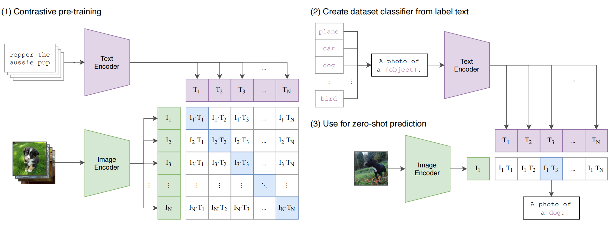

# Learning Transferable Visual Models From Natural Language Supervision
CLIP:从自然语言监督中学习可迁移的视觉模型 2021.3.26 https://arxiv.org/abs/2103.00020

## 阅读笔记
* 自然语言监督, 基于对比学习架构, 构造图像-文本对, 学习图像和文本的语义关系,  零样本迁移
* 大规模数据集构造：文本-图像是否真的匹配？图片重复？ 构造海量数据集, 检测验证集重叠等方法有借鉴
    * 维基百科2-grams出现100+次, 产出500000个查询(同义词替换构造查询？), 每个查询有20000对图-文
    * 搜索引擎公司可以用经常搜索的query; 
* N个图像-文本对, N个正样本, $N^2-N$个负样本, 预测图像-文本是否配对。通过提示配置, 直接适配下游任务。
    * 负样本的选择, 需要避免混入正样本？ N的大小
* 预训练：图像、文本编码器分别接收输入, 产出表征, 再计算两个表征的余弦距离。
* [多模态神经元](https://openai.com/blog/multimodal-neurons/) 特征可视化技术, https://distill.pub/2021/multimodal-neurons/
* 特征可视化 https://microscope.openai.com/models
* 缺点：缺乏动态输出机制。 输入=一副图+一段任务描述(前方路面上有人吗;图片里有什么; 有几只;猫在树上吗;), 输出=一段文本或另外一张图
* 4亿对 图像-文本对, 
* ConVIRT 简化版 
* 图像-文本 + 图像-增广 两种对比学习机制融合在一起？除了分类, 把目标检测、语义分割等多任务融合到预训练模型中 ？
* 源码：
    * openclip: https://github.com/LAION-AI/scaling-laws-openclip
    * BLIP:
    * Flip(MAE+CLIP): https://github.com/facebookresearch/flip

## Abstract
State-of-the-art computer vision systems are trained to predict a fixed set of predetermined object categories. This restricted form of supervision limits their generality and usability since additional labeled data is needed to specify any other visual concept. Learning directly from raw text about images is a promising alternative which leverages a much broader source of supervision. We demonstrate that the simple pre-training task of predicting which caption goes with which image is an efficient and scalable way to learn SOTA image representations from scratch on a dataset of 400 million (image, text) pairs collected from the internet. After pre-training, natural language is used to reference learned visual concepts (or describe new ones) enabling zero-shot transfer of the model to downstream tasks. We study the performance of this approach by benchmarking on over 30 different existing computer vision datasets, spanning tasks such as OCR, action recognition in videos, geo-localization, and many types of fine-grained object classification. The model transfers non-trivially to most tasks and is often competitive with a fully supervised baseline without the need for any dataset specific training. For instance, we match the accuracy of the original ResNet-50 on ImageNet zero-shot without needing to use any of the 1.28 million training examples it was trained on. We release our code and pre-trained model weights at https://github.com/OpenAI/CLIP.

最先进的计算机视觉系统经过训练可以预测一组固定预置的对象类别。 这种受限的监督形式限制了它们的通用性和可用性, 因为需要额外的标注数据来指定任何其他视觉概念。 直接从图像相关的原始文本中学习是一种很有前途的替代方案, 它可以利用更广泛的监督来源。 我们证明了预测标题与图像对应关系的简单预训练任务是一种有效且可扩展的方式, 可以在从互联网收集的 4亿 (图像-文本)对 数据集上从头开始学习 SOTA 图像表示。 预训练后, 使用自然语言来提示学习到的视觉概念 (或描述新概念), 从而实现模型到下游任务的零样本迁移。 我们通过对 30 多个不同的现有计算机视觉数据集进行基准测试来研究这种方法的性能, 涵盖OCR、视频中的动作识别、地理定位和许多类型的细粒度对象分类等任务。 该模型可以轻松地迁移到大多数任务, 并且通常可以与完全监督的基线相媲美, 而无需任何数据集特定的训练。例如, 我们在 ImageNet 零样本上匹配原始 ResNet-50 的准确性, 而无需使用它所训练的 128 万个训练样本中的任何一个。 我们在 https://github.com/OpenAI/CLIP 上发布了我们的代码和预训练模型权重。

<!-- 预训练：图像和标题对应关系 
-->

## 1. Introduction and Motivating Work
Pre-training methods which learn directly from raw text have revolutionized NLP over the last few years (Dai & Le, 2015; Peters et al., 2018; Howard & Ruder, 2018; Radford et al., 2018; Devlin et al., 2018; Raffel et al., 2019). Task-agnostic objectives such as autoregressive and masked language modeling have scaled across many orders of magnitude in compute, model capacity, and data, steadily improving capabilities. The development of “text-to-text” as a standardized input-output interface (McCann et al., 2018; Radford et al., 2019; Raffel et al., 2019) has enabled taskagnostic architectures to zero-shot transfer to downstream datasets removing the need for specialized output heads or dataset specific customization. Flagship systems like GPT-3 (Brown et al., 2020) are now competitive across many tasks with bespoke models while requiring little to no dataset specific training data.

直接从原始文本中学习的预训练方法在过去几年彻底改变了NLP (Dai & Le, 2015; Peters et al., 2018; Howard & Ruder, 2018; Radford et al., 2018; Devlin et al., 2018; Raffel et al., 2019)。 自回归和掩码语言建模等与任务无关的目标已经在计算、模型容量和数据方面扩展了多个数量级, 稳步提高了能力。 “文本到文本”作为标准化输入输出接口的发展(McCann et al., 2018; Radford et al., 2019; Raffel et al., 2019)使任务未知架构能够零样本迁移到下游数据集, 消除了对专门输出头或数据集特定定制的需要。 像 GPT-3 (Brown et al., 2020)这样的旗舰系统现在在使用定制模型的许多任务中具有竞争力, 同时几乎不需要数据集特定的训练数据。

These results suggest that the aggregate supervision accessible to modern pre-training methods within web-scale collections of text surpasses that of high-quality crowd-labeled NLP datasets. However, in other fields such as computer vision it is still standard practice to pre-train models on crowd-labeled datasets such as ImageNet (Deng et al., 2009). Could scalable pre-training methods which learn directly from web text result in a similar breakthrough in computer vision? Prior work is encouraging.

这些结果表明, 现代预训练方法在网络规模的文本集合中可获得的总监督超过了高质量众包标注的 NLP 数据集。 然而, 在其他领域, 如计算机视觉, 在众包标注的数据集,如ImageNet(Deng et al., 2009)上预训练模型仍然是标准做法。 直接从网络文本中学习的可扩展预训练方法能否在计算机视觉领域取得类似的突破？ 之前的工作令人鼓舞。

Over 20 years ago Mori et al. (1999) explored improving content based image retrieval by training a model to predict the nouns and adjectives in text documents paired with images. Quattoni et al. (2007) demonstrated it was possible to learn more data efficient image representations via manifold learning in the weight space of classifiers trained to predict words in captions associated with images. Srivastava & Salakhutdinov (2012) explored deep representation learning by training multimodal Deep Boltzmann Machines on top of low-level image and text tag features. Joulin et al. (2016) modernized this line of work and demonstrated that CNNs trained to predict words in image captions learn useful image representations. They converted the title, description, and hashtag metadata of images in the YFCC100M dataset (Thomee et al., 2016) into a bag-ofwords multi-label classification task and showed that pretraining AlexNet (Krizhevsky et al., 2012) to predict these labels learned representations which preformed similarly to ImageNet-based pre-training on transfer tasks. Li et al. (2017) then extended this approach to predicting phrase ngrams in addition to individual words and demonstrated the ability of their system to zero-shot transfer to other image classification datasets by scoring target classes based on their dictionary of learned visual n-grams and predicting the one with the highest score. Adopting more recent architectures and pre-training approaches, VirTex (Desai & Johnson, 2020), ICMLM (Bulent Sariyildiz et al., 2020), and ConVIRT (Zhang et al., 2020) have recently demonstrated the potential of transformer-based language modeling, masked language modeling, and contrastive objectives to learn image representations from text.

20 多年前, Mori et al. (1999) 通过训练模型来预测与图像配对的文本文档中的名词和形容词, 探索改进基于内容的图像检索。 Quattoni et al. (2007)证明可以通过在分类器的权重空间中进行流形学习来学习更多数据有效的图像表示, 这些分类器经过训练可以预测与图像相关的标题中的单词。 Srivastava & Salakhutdinov (2012) 通过在低级图像和文本标签特征之上训练多模态深度玻尔兹曼机来探索深度表征学习。 Joulin et al. (2016) 对这一工作领域进行了现代化改造, 并证明经过训练以预测图像说明中的单词的 CNN 学习了有用的图像表示。 他们将 YFCC100M 数据集(Thomee et al., 2016)中图像的标题、描述和主题标签元数据转换为词袋多标签分类任务, 并表明预训练(Krizhevsky et al., 2012)可以预测这些 标签学习到的表征与基于 ImageNet 的迁移任务预训练类似。 Li et al. (2017) 然后将这种方法扩展到除了单个单词之外还预测短语 ngram, 并通过基于学习的视觉 n-gram 词典对目标类进行评分并预测 得分最高的一个。 采用更新的架构和预训练方法, VirTex (Desai & Johnson, 2020)、ICMLM (Bulent Sariyildiz et al., 2020) 和 ConVIRT (Zhang et al., 2020) 最近展示了基于transformer的语言的潜力 建模、掩码语言建模和对比目标, 以从文本中学习图像表示。


<br/>
Figure 1. Summary of our approach. While standard image models jointly train an image feature extractor and a linear classifier to predict some label, CLIP jointly trains an image encoder and a text encoder to predict the correct pairings of a batch of (image, text) training examples. At test time the learned text encoder synthesizes a zero-shot linear classifier by embedding the names or descriptions of the target dataset’s classes. 
图 1. 我们的方法总结。 标准图像模型联合训练图像特征提取器和线性分类器来预测某些标签, 而 CLIP 联合训练图像编码器和文本编码器来预测一批 图-文训练样本的正确配对。 在测试时, 学习的文本编码器通过嵌入目标数据集类的名称或描述来合成零样本线性分类器。<!--图文的编码模型异构的, 需要融合统一, 借鉴Mulityway Transformer ?--->


While exciting as proofs of concept, using natural language supervision for image representation learning is still rare. This is likely because demonstrated performance on common benchmarks is much lower than alternative approaches. For example, Li et al. (2017) reach only 11.5% accuracy on ImageNet in a zero-shot setting. This is well below the 88.4% accuracy of the current state of the art (Xie et al., 2020). It is even below the 50% accuracy of classic computer vision approaches (Deng et al., 2012). Instead, more narrowly scoped but well-targeted uses of weak supervision have improved performance. Mahajan et al. (2018) showed that predicting ImageNet-related hashtags on Instagram images is an effective pre-training task. When fine-tuned to ImageNet these pre-trained models increased accuracy by over 5% and improved the overall state of the art at the time. Kolesnikov et al. (2019) and Dosovitskiy et al. (2020) have also demonstrated large gains on a broader set of transfer benchmarks by pre-training models to predict the classes of the noisily labeled JFT-300M dataset.

尽管作为概念证明令人兴奋, 但使用自然语言监督进行图像表示学习仍然很少见。这可能是因为在常见基准测试中表现出来的性能远低于其他方法。例如, Li et al. (2017) 在ImageNet的零样本设置中仅达到11.5％的精度。这远低于当前最先进技术的88.4％精度 (Xie et al., 2020)。甚至低于经典计算机视觉方法的50％精度 (Deng et al., 2012)。相反, 范围更窄但针对性强的弱监督使用提高了性能。Mahajan et al. (2018) 表明, 在Instagram图像上预测与ImageNet相关的主题标签是一项有效的预训练任务。当对ImageNet进行微调时, 这些预训练模型将准确度提高了5％以上, 并改善了当时的整体最先进水平。Kolesnikov et al. (2019) 和Dosovitskiy et al. (2020) 也通过预训练模型来预测噪声标记JFT-300M数据集的类别, 在更广泛的迁移基准测试中获得了巨大收益。

This line of work represents the current pragmatic middle ground between learning from a limited amount of supervised “gold-labels” and learning from practically unlimited amounts of raw text. However, it is not without compromises. Both works carefully design, and in the process limit, their supervision to 1000 and 18291 classes respectively. Natural language is able to express, and therefore supervise, a much wider set of visual concepts through its generality. Both approaches also use static softmax classifiers to perform prediction and lack a mechanism for dynamic outputs. This severely curtails their flexibility and limits their “zero-shot” capabilities.

这一系列工作代表了当前实用的中间立场, 介于从有限数量的受监督“黄金标签”中学习和从几乎无限量的原始文本中学习。 然而, 它并非没有妥协。 两者的工作都经过精心设计, 并且在过程中将他们的监督分别限制在1000和18291类。 自然语言能够通过其普遍性表达并因此监督更广泛的视觉概念集。 这两种方法都使用静态 softmax 分类器来执行预测, 并且缺乏动态输出机制。 这严重削弱了它们的灵活性并限制了它们的“零样本”能力。
<!--动态输出机制-->

A crucial difference between these weakly supervised models and recent explorations of learning image representations directly from natural language is scale. While Mahajan et al. (2018) and Kolesnikov et al. (2019) trained their models for accelerator years on millions to billions of images, VirTex, ICMLM, and ConVIRT trained for accelerator days on one to two hundred thousand images. In this work, we close this gap and study the behaviors of image classifiers trained with natural language supervision at large scale. Enabled by the large amounts of publicly available data of this form on the internet, we create a new dataset of 400 million (image, text) pairs and demonstrate that a simplified version of ConVIRT trained from scratch, which we call CLIP, for Contrastive Language-Image Pre-training, is an efficient method of learning from natural language supervision. We study the scalability of CLIP by training a series of eight models spanning almost 2 orders of magnitude of compute and observe that transfer performance is a smoothly predictable function of compute (Hestness et al., 2017; Kaplan et al., 2020). We find that CLIP, similar to the GPT family, learns to perform a wide set of tasks during pre-training including OCR, geo-localization, action recognition, and many others. We measure this by benchmarking the zero-shot transfer performance of CLIP on over 30 existing datasets and find it can be competitive with prior task-specific supervised models. We also confirm these findings with linear-probe representation learning analysis and show that CLIP outperforms the best publicly available ImageNet model while also being more computationally efficient. We additionally find that zero-shot CLIP models are much more robust than equivalent accuracy supervised ImageNet models which suggests that zero-shot evaluation of task-agnostic models is much more representative of a model’s capability. These results have significant policy and ethical implications, which we consider in Section 7.

这些弱监督模型与最近直接从自然语言学习图像表示的探索之间的一个关键区别是规模。 虽然 Mahajan et al. (2018) 和 Kolesnikov et al. (2019) 在数百万至数十亿张图像上训练他们的模型进行加速器年, VirTex、ICMLM 和 ConVIRT 在 1 到 20 万张图像上进行加速器天训练。 在这项工作中, 我们缩小了这一差距并研究了在大规模自然语言监督下训练的图像分类器的行为。 借助互联网上这种形式的大量公开可用数据, 我们创建了一个包含 4亿个  图文对 的新数据集, 并展示了从头开始训练的 ConVIRT 的简化版本, 我们称之为 CLIP, 用于对比语言-图像预训练, 是一种从自然语言监督中学习的有效方法。 我们通过训练跨越近 2 个数量级的计算的一系列八个模型来研究 CLIP 的可扩展性, 并观察到迁移性能是计算的一个平滑可预测函数(Hestness et al., 2017; Kaplan et al., 2020)。 我们发现 CLIP 与 GPT 家族类似, 在预训练期间学习执行一系列广泛的任务, 包括 OCR、地理定位、动作识别等。 我们通过在 30 多个现有数据集上对 CLIP 的零样本迁移性能进行基准测试来衡量这一点, 并发现它可以与先前的特定任务监督模型竞争。 我们还通过线性探测表示学习分析证实了这些发现, 并表明 CLIP 优于公开可用的最佳 ImageNet 模型, 同时计算效率更高。 我们还发现零样本 CLIP 模型比同等精度的监督 ImageNet 模型更稳健, 这表明任务未知模型的零样本评估更能代表模型的能力。 这些结果具有重要的策略和伦理意义, 我们在第 7 节中对此进行了考虑。<!-- 动作识别如何放在预训练中？ -->

## 2. Approach
### 2.1. Natural Language Supervision 自然语言监督
At the core of our approach is the idea of learning perception from supervision contained in natural language. As discussed in the introduction, this is not at all a new idea, however terminology used to describe work in this space is varied, even seemingly contradictory, and stated motivations are diverse. Zhang et al. (2020), Gomez et al. (2017), Joulin et al. (2016), and Desai & Johnson (2020) all introduce methods which learn visual representations from text paired with images but describe their approaches as unsupervised, self-supervised, weakly supervised, and supervised respectively.

我们方法的核心是从自然语言中包含的监督中学习感知的想法。 正如引言中所讨论的, 这根本不是一个新想法, 但是用于描述该领域工作的术语多种多样, 虽然看似矛盾, 并且陈述的动机多种多样。 Zhang et al. (2020), Gomez et al. (2017), Joulin et al. (2016), and Desai & Johnson (2020) 都介绍了从与图像配对的文本中学习视觉表示的方法, 但分别将它们的方法描述为无监督、自监督、弱监督和监督。

We emphasize that what is common across this line of work is not any of the details of the particular methods used but the appreciation of natural language as a training signal. All these approaches are learning from natural language supervision. Although early work wrestled with the complexity of natural language when using topic model and n-gram representations, improvements in deep contextual representation learning suggest we now have the tools to effectively leverage this abundant source of supervision (McCann et al., 2017).

我们强调, 这条线上工作的共同点不是所用特定方法的任何细节, 而是将自然语言理解作为训练信号。 所有这些方法都是从自然语言监督中学习的。 尽管早期的工作在使用主题模型和 n-gram 表示时与自然语言的复杂性作斗争, 但深度上下文表示学习的改进表明我们现在拥有有效利用这种丰富的监督资源的工具(McCann et al., 2017)。

Learning from natural language has several potential strengths over other training methods. It’s much easier to scale natural language supervision compared to standard crowd-sourced labeling for image classification since it does not require annotations to be in a classic “machine learning compatible format” such as the canonical 1-of-N majority vote “gold label”. Instead, methods which work on natural language can learn passively from the supervision contained in the vast amount of text on the internet. Learning from natural language also has an important advantage over most unsupervised or self-supervised learning approaches in that it doesn’t “just” learn a representation but also connects that representation to language which enables flexible zero-shot transfer. In the following subsections, we detail the specific approach we settled on.

与其他训练方法相比, 从自然语言中学习有几个潜在的优势。 与用于图像分类的标准众包标签相比, 扩展自然语言监督要容易得多, 因为它不需要标注采用经典的“机器学习兼容格式”, 例如规范的 1-of-N 多数投票“黄金标签” . 相反, 适用于自然语言的方法可以从互联网上大量文本中包含的监督中被动学习。 与大多数无监督或自监督学习方法相比, 从自然语言中学习也有一个重要的优势, 因为它不仅“只是”学习一种表示, 还将这种表示与语言联系起来, 从而实现灵活的零样本迁移。 在以下小节中, 我们详细介绍了我们确定的具体方法。

### 2.2. Creating a Sufficiently Large Dataset 创建足够大的数据集
Existing work has mainly used three datasets, MS-COCO (Lin et al., 2014), Visual Genome (Krishna et al., 2017), and YFCC100M (Thomee et al., 2016). While MS-COCO and Visual Genome are high quality crowd-labeled datasets, they are small by modern standards with approximately 100,000 training photos each. By comparison, other computer vision systems are trained on up to 3.5 billion Instagram photos (Mahajan et al., 2018). YFCC100M, at 100 million photos, is a possible alternative, but the metadata for each image is sparse and of varying quality. Many images use automatically generated filenames like 20160716 113957.JPG as “titles” or contain “descriptions” of camera exposure settings. After filtering to keep only images with natural language titles and/or descriptions in English, the dataset shrunk by a factor of 6 to only 15 million photos. This is approximately the same size as ImageNet.

现有工作主要使用了三个数据集, MS-COCO (Lin et al., 2014)、Visual Genome (Krishna et al., 2017) 和 YFCC100M (Thomee et al., 2016)。 虽然 MS-COCO 和 Visual Genome 是高质量的众包标注数据集, 但按照现代标准, 它们很小, 每个数据集大约有 100,000 张训练照片。 相比之下, 其他计算机视觉系统接受了多达 35亿张 Instagram 照片的训练(Mahajan et al., 2018)。 拥有 1亿张照片的 YFCC100M 是一个可能的替代方案, 但每张图像的元数据稀疏且质量参差不齐。 许多图像使用自动生成的文件名, 如 20160716 113957.JPG 作为“标题”或包含相机曝光设置的“描述”。 在过滤以仅保留具有自然语言标题和/或英文描述的图像后, 数据集缩小了 6倍, 只有 1500万张照片。 这与 ImageNet 的大小大致相同。

A major motivation for natural language supervision is the large quantities of data of this form available publicly on the internet. Since existing datasets do not adequately reflect this possibility, considering results only on them would underestimate the potential of this line of research. To address this, we constructed a new dataset of 400 million (image, text) pairs collected form a variety of publicly available sources on the Internet. To attempt to cover as broad a set of visual concepts as possible, we search for (image, text) pairs as part of the construction process whose text includes one of a set of 500,000 queries(1The base query list is all words occurring at least 100 times in the English version of Wikipedia. This is augmented with bi-grams with high pointwise mutual information as well as the names of all Wikipedia articles above a certain search volume. Finally all WordNet synsets not already in the query list are added). We approximately class balance the results by including up to 20,000 (image, text) pairs per query. The resulting dataset has a similar total word count as the WebText dataset used to train GPT-2. We refer to this dataset as WIT for WebImageText.

自然语言监督的一个主要动机是互联网上公开的大量此类数据。由于现有数据集不能充分反映这种可能性, 因此仅考虑其结果将低估这一研究领域的潜力。为了解决这一问题, 我们构建了一个新的数据集, 该数据集由4亿的图文对组成, 从互联网上的各种公开来源收集。为了尽可能广泛地涵盖一组视觉概念, 我们搜索 图文对 , 作为构建过程的一部分, 这些对的文本包括一组50万个查询中的一个(1基本查询列表是英文维基百科中出现至少100次的所有单词。这一列表增加了具有高点互信息的 bi-gram, 以及特定搜索量以上的所有维基百科文章的名称。最后, 添加了查询列表中未出现的所有WordNet同义词)。我们通过在每个查询中包含多达 2万个 图文对 来近似地平衡结果。结果数据集的总字数与用于训练GPT-2的WebText数据集相似。我们将此数据集称为WebImageText的WIT。

<!-- 
4亿的图文对, 

文本:
1. 50万个查询(英文维基百科中出现至少100次的所有单词); 
2. 高点互信息的 bi-gram?
3. 一定搜索量以上的维基百科文章名(词条); (搜索引擎公司先天优势, 历史query)
4. 查询列表中未出现的所有WordNet同义词; 

如何保证图文对是匹配的, 是否需要过滤某些相关性不强的图文对? -->


### 2.3. Selecting an Efficient Pre-Training Method 选择高效的预训练方法
State-of-the-art computer vision systems use very large amounts of compute. Mahajan et al. (2018) required 19 GPU years to train their ResNeXt101-32x48d and Xie et al. (2020) required 33 TPUv3 core-years to train their Noisy Student EfficientNet-L2. When considering that both these systems were trained to predict only 1000 ImageNet classes, the task of learning an open set of visual concepts from natural language seems daunting. In the course of our efforts, we found training efficiency was key to successfully scaling natural language supervision and we selected our final pre-training method based on this metric.

最先进的计算机视觉系统使用非常大量的计算。 Mahajan et al. (2018) 需要 19 个 GPU年 来训练他们的 ResNeXt101-32x48d 和 Xie et al. (2020) 需要 33 个 TPUv3 核心年来训练他们的 Noisy Student EfficientNet-L2。 考虑到这两个系统都经过训练只能预测 1000 个 ImageNet 类, 从自然语言中学习一组开放的视觉概念的任务似乎令人生畏。 在我们努力的过程中, 我们发现训练效率是成功扩展自然语言监督的关键, 我们根据这个指标选择了最终的预训练方法。

Our initial approach, similar to VirTex, jointly trained an image CNN and text transformer from scratch to predict the caption of an image. However, we encountered difficulties efficiently scaling this method. In Figure 2 we show that a 63 million parameter transformer language model, which already uses twice the compute of its ResNet-50 image encoder, learns to recognize ImageNet classes three times slower than a much simpler baseline that predicts a bag-ofwords encoding of the same text.

我们最初的方法类似于 VirTex, 从头开始联合训练图像CNN 和文本transformer来预测图像的标题。 然而, 我们在有效扩展这种方法时遇到了困难。 在图2 中, 我们展示了一个 6300 万参数的transformer语言模型, 它已经使用了其 ResNet-50 图像编码器两倍的计算, 它学习识别ImageNet类的速度比预测相同文本的词袋编码的简单得多的基线慢三倍。
<!-- VirTex, 预测文本词袋(BoW)编码 ,慢 -->

<br/>
Figure 2. CLIP is much more efficient at zero-shot transfer than our image caption baseline. Although highly expressive, we found that transformer-based language models are relatively weak at zero-shot ImageNet classification. Here, we see that it learns 3x slower than a baseline which predicts a bag-of-words (BoW) encoding of the text (Joulin et al., 2016). Swapping the prediction objective for the contrastive objective of CLIP further improves efficiency another 4x. 
图2. CLIP 在零样本迁移方面比我们的图像基线说明更有效。 尽管表现力很强, 但我们发现基于 Transformer 的语言模型在零样本 ImageNet 分类方面相对较弱。 在这里, 我们看到它的学习速度比预测文本词袋(BoW)编码的基线慢 3 倍 (Joulin et al., 2016)。 将预测目标换成 CLIP 的对比目标进一步将效率提高了 4 倍。

Both these approaches share a key similarity. They try to predict the exact words of the text accompanying each image. This is a difficult task due to the wide variety of descriptions, comments, and related text that co-occur with images. Recent work in contrastive representation learning for images has found that contrastive objectives can learn better representations than their equivalent predictive objective (Tian et al., 2019). Other work has found that although generative models of images can learn high quality image representations, they require over an order of magnitude more compute than contrastive models with the same performance (Chen et al., 2020a). Noting these findings, we explored training a system to solve the potentially easier proxy task of predicting only which text as a whole is paired with which image and not the exact words of that text. Starting with the same bag-of-words encoding baseline, we swapped the predictive objective for a contrastive objective in Figure 2 and observed a further 4x efficiency improvement in the rate of zero-shot transfer to ImageNet.

这两种方法有一个关键的相似之处。 他们试图预测每张图片所附文字的确切单词。 由于与图像同时出现的描述、评论和相关文本种类繁多, 因此这是一项艰巨的任务。 最近在图像对比表示学习方面的工作发现, 对比目标可以比它们的等效预测目标学习更好的表示 (Tian et al., 2019)。 其他工作发现, 虽然图像的生成模型可以学习高质量的图像表示, 但它们需要比具有相同性能的对比模型多一个数量级的计算量 (Chen et al., 2020a)。 注意到这些发现, 我们探索了训练一个系统来解决可能更容易的智能体任务, 即仅预测整个文本与哪个图像配对, 而不是预测该文本的确切单词。 从相同的词袋编码基线开始, 我们将预测目标换成图2 中的对比目标, 并观察到 ImageNet 的零样本迁移性能进一步提高了 4 倍。
<!--对比表示学习,对比目标可以比它们的等效预测目标学习更好的表示-->

Given a batch of N (image, text) pairs, CLIP is trained to predict which of the N × N possible (image, text) pairings across a batch actually occurred. To do this, CLIP learns a multi-modal embedding space by jointly training an image encoder and text encoder to maximize the cosine similarity of the image and text embeddings of the N real pairs in the batch while minimizing the cosine similarity of the embeddings of the $N^2 − N$ incorrect pairings. We optimize a symmetric cross entropy loss over these similarity scores. In Figure 3 we include pseudocode of the core of an implementation of CLIP. To our knowledge this batch construction technique and objective was first introduced in the area of deep metric learning as the multi-class N-pair loss Sohn (2016), was popularized for contrastive representation learning by Oord et al. (2018) as the InfoNCE loss, and was recently adapted for contrastive (text, image) representation learning in the domain of medical imaging by Zhang et al. (2020).

给定一批N个图文对 , CLIP 被训练来预测批次中 N × N 可能的图文对 中的哪一个实际匹配。 为此, CLIP 通过联合训练图像编码器和文本编码器来学习多模态嵌入空间, 以最大化批次中 N 个实数对的图像和文本嵌入的余弦相似度, 同时最小化 $N^2 − N$ 个不正确的配对。 我们优化了这些相似性分数的对称交叉熵损失。 在图3 中, 我们包含了 CLIP 实现的核心伪代码。 据我们所知, 这种批量构建技术和目标首先作为 多类N对损失 是Sohn (2016) 在深度度量学习领域引入的, 并被 Oord et al. (2018) 推广用于对比表示学习, 作为 InfoNCE 损失, 最近被 Zhang et al. (2020)改编为医学成像领域的(文本、图像)对比表示学习。
<!--对称交叉熵损失? symmetric 
multi-class N-pair loss
InfoNCE 损失
-->

``` python
# image_encoder - ResNet or Vision Transformer
# text_encoder - CBOW or Text Transformer
# I[n, h, w, c] - minibatch of aligned images
# T[n, l] - minibatch of aligned texts
# W_i[d_i, d_e] - learned proj of image to embed
# W_t[d_t, d_e] - learned proj of text to embed
# t - learned temperature parameter

# extract feature representations of each modality
I_f = image_encoder(I) #[n, d_i]
T_f = text_encoder(T) #[n, d_t]

# joint multimodal embedding [n, d_e]
I_e = l2_normalize(np.dot(I_f, W_i), axis=1)
T_e = l2_normalize(np.dot(T_f, W_t), axis=1)

# scaled pairwise cosine similarities [n, n]
logits = np.dot(I_e, T_e.T) * np.exp(t)

# symmetric loss function 对称的损失函数
labels = np.arange(n)
loss_i = cross_entropy_loss(logits, labels, axis=0)
loss_t = cross_entropy_loss(logits, labels, axis=1)
loss = (loss_i + loss_t)/2

```
Figure 3. Numpy-like pseudocode for the core of an implementation of CLIP. 
图 3. CLIP 实现核心的类似 Numpy 的伪代码。

Due to the large size of our pre-training dataset, over-fitting is not a major concern and the details of training CLIP are simplified compared to the implementation of Zhang et al. (2020). We train CLIP from scratch without initializing the image encoder with ImageNet weights or the text encoder with pre-trained weights. We do not use the non-linear projection between the representation and the contrastive embedding space, a change which was introduced by Bachman et al. (2019) and popularized by Chen et al. (2020b). We instead use only a linear projection to map from each encoder’s representation to the multi-modal embedding space. We did not notice a difference in training efficiency between the two versions and speculate that non-linear projections may be co-adapted with details of current image only in self-supervised representation learning methods. We also remove the text transformation function $t_u$ from Zhang et al. (2020) which samples a single sentence at uniform from the text since many of the (image, text) pairs in CLIP’s pretraining dataset are only a single sentence. We also simplify the image transformation function $t_v$. A random square crop from resized images is the only data augmentation used during training. Finally, the temperature parameter which controls the range of the logits in the softmax, τ , is directly optimized during training as a log-parameterized multiplicative scalar to avoid turning as a hyper-parameter.

由于我们的预训练数据集很大, 过拟合不是主要问题, 与Zhang et al. (2020)的实施相比, 训练 CLIP 的细节得到了简化。 我们从头开始训练 CLIP, 而没有使用 ImageNet 权重初始化图像编码器或使用预训练权重的文本编码器。 我们不使用表示和对比嵌入空间之间的非线性投影, 这是 Bachman et al. (2019) 引入的变化, 并由Chen et al. (2020b)推广。 相反, 我们仅使用线性投影将每个编码器的表示映射到多模态嵌入空间。 我们没有注意到两个版本之间训练效率的差异, 并推测非线性投影可能仅在自监督表示学习方法中与当前图像的细节共同适应。 我们还删除了Zhang et al. (2020)的文本转换函数 $t_u$。 从文本中统一采样单个句子, 因为 CLIP 的预训练数据集中的许多   图文对 只是一个句子。 我们还简化了图像变换函数 $t_v$。 来自调整大小的图像的随机正方形裁剪是训练期间使用的唯一数据增广。 最后, 控制 softmax 中 logits 范围的温度参数 τ 在训练期间直接优化为对数参数化乘法标量, 以避免转为超参数。<!--是否使用非线性投影的效果差异？ 温度参数τ变为可学习的参数 -->

### 2.4. Choosing and Scaling a Model 选择和缩放模型
We consider two different architectures for the image encoder. For the first, we use ResNet-50 (He et al., 2016a) as the base architecture for the image encoder due to its widespread adoption and proven performance. We make several modifications to the original version using the ResNetD improvements from He et al. (2019) and the antialiased rect-2 blur pooling from Zhang (2019). We also replace the global average pooling layer with an attention pooling mechanism. The attention pooling is implemented as a single layer of “transformer-style” multi-head QKV attention where the query is conditioned on the global average-pooled representation of the image. For the second architecture, we experiment with the recently introduced Vision Transformer (ViT) (Dosovitskiy et al., 2020). We closely follow their implementation with only the minor modification of adding an additional layer normalization to the combined patch and position embeddings before the transformer and use a slightly different initialization scheme.

我们考虑图像编码器的两种不同架构。 首先, 我们使用 ResNet-50 (He et al., 2016a) 作为图像编码器的基础架构, 因为它的广泛采用和经过验证的性能。 我们使用 He et al. (2019)的 ResNetD 改进对原始版本进行了一些修改 和 Zhang (2019) 的抗锯齿 rect-2 模糊池。 我们还用注意力池机制替换了全局平均池层。 注意力池被实现为单层“transformer式”多头 QKV 注意力, 其中查询以图像的全局平均池表示为条件。 对于第二种架构, 我们试验了最近推出的 Vision Transformer (ViT) (Dosovitskiy et al., 2020)。 我们密切关注它们的实现, 仅对transformer之前的组合分块和位置嵌入添加额外的层归一化并使用略有不同的初始化方案进行了微小的修改。
<!--
注意力池机制替换全局平均池层?
-->

The text encoder is a Transformer (Vaswani et al., 2017) with the architecture modifications described in Radford et al. (2019). As a base size we use a 63M-parameter 12- layer 512-wide model with 8 attention heads. The transformer operates on a lower-cased byte pair encoding (BPE) representation of the text with a 49,152 vocab size (Sennrich et al., 2015). For computational efficiency, the max sequence length was capped at 76. The text sequence is bracketed with [SOS] and [EOS] tokens and the activations of the highest layer of the transformer at the [EOS] token are treated as the feature representation of the text which is layer normalized and then linearly projected into the multi-modal embedding space. Masked self-attention was used in the text encoder to preserve the ability to initialize with a pre-trained language model or add language modeling as an auxiliary objective, though exploration of this is left as future work.

文本编码器是一个 Transformer (Vaswani et al., 2017), 具有 Radford et al. (2019) 中描述的架构修改。 作为基本尺寸, 我们使用具有 8 个注意力头的 63M 参数 12 层 512 宽模型。 转换器对具有 49,152 个词汇大小的文本的小写字节对编码 (BPE) 表示进行操作 (Sennrich et al., 2015 )。 为了计算效率, 最大序列长度上限为 76。文本序列用 [SOS] 和 [EOS] 标记括起来, 并且在 [EOS] 标记处转换器最高层的激活被视为特征表示 文本层归一化, 然后线性投影到多模态嵌入空间中。 Masked self-attention 在文本编码器中使用, 以保留使用预训练语言模型进行初始化或添加语言建模作为辅助目标的能力, 尽管对此的探索留待未来的工作。

While previous computer vision research has often scaled models by increasing the width (Mahajan et al., 2018) or depth (He et al., 2016a) in isolation, for the ResNet image encoders we adapt the approach of Tan & Le (2019) which found that allocating additional compute across all of width, depth, and resolution outperforms only allocating it to only one dimension of the model. While Tan & Le (2019) tune the ratio of compute allocated to each dimension for their EfficientNet architecture, we use a simple baseline of allocating additional compute equally to increasing the width, depth, and resolution of the model. For the text encoder, we only scale the width of the model to be proportional to the calculated increase in width of the ResNet and do not scale the depth at all, as we found CLIP’s performance to be less sensitive to the capacity of the text encoder.

虽然以前的计算机视觉研究通常通过单独增加宽度 (Mahajan et al., 2018 )或深度 (He et al., 2016a)来缩放模型, 但对于 ResNet 图像编码器, 我们采用了 Tan & Le (2019) 的方法, 它发现在所有宽度、深度和分辨率上分配额外的计算优于仅将其分配给模型的一个维度。 虽然 Tan & Le (2019) 调整了为其 EfficientNet 架构分配给每个维度的计算比率, 但我们使用了一个简单的基线, 即平均分配额外的计算以增加模型的宽度、深度和分辨率。 对于文本编码器, 我们只缩放模型的宽度, 使其与计算出的 ResNet 宽度增加成正比, 根本不缩放深度, 因为我们发现 CLIP 的性能对文本编码器的容量不太敏感 .

### 2.5. Training
We train a series of 5 ResNets and 3 Vision Transformers. For the ResNets we train a ResNet-50, a ResNet-101, and then 3 more which follow EfficientNet-style model scaling and use approximately 4x, 16x, and 64x the compute of a ResNet-50. They are denoted as RN50x4, RN50x16, and RN50x64 respectively. For the Vision Transformers we train a ViT-B/32, a ViT-B/16, and a ViT-L/14. We train all models for 32 epochs. We use the Adam optimizer (Kingma & Ba, 2014) with decoupled weight decay regularization (Loshchilov & Hutter, 2017) applied to all weights that are not gains or biases, and decay the learning rate using a cosine schedule (Loshchilov & Hutter, 2016). Initial hyperparameters were set using a combination of grid searches, random search, and manual tuning on the baseline ResNet- 50 model when trained for 1 epoch. Hyper-parameters were then adapted heuristically for larger models due to computational constraints. The learnable temperature parameter τ was initialized to the equivalent of 0.07 from (Wu et al., 2018) and clipped to prevent scaling the logits by more than 100 which we found necessary to prevent training instability. We use a very large minibatch size of 32,768. Mixed-precision (Micikevicius et al., 2017) was used to accelerate training and save memory. To save additional memory, gradient checkpointing (Griewank & Walther, 2000; Chen et al., 2016), half-precision Adam statistics (Dhariwal et al., 2020), and half-precision stochastically rounded text encoder weights were used. The calculation of embedding similarities was also sharded with individual GPUs computing only the subset of the pairwise similarities necessary for their local batch of embeddings. The largest ResNet model, RN50x64, took 18 days to train on 592 V100 GPUs while the largest Vision Transformer took 12 days on 256 V100 GPUs. For the ViT-L/14 we also pre-train at a higher 336 pixel resolution for one additional epoch to boost performance similar to FixRes (Touvron et al., 2019). We denote this model as ViT-L/14@336px. Unless otherwise specified, all results reported in this paper as “CLIP” use this model which we found to perform best.

我们训练了一系列的 5 个 ResNets 和 3 个ViT。 对于 ResNet, 我们训练了一个 ResNet-50、一个 ResNet-101, 然后是另外 3 个, 它们遵循 EfficientNet 风格的模型缩放, 并使用大约 4 倍、16 倍和 64 倍的 ResNet-50 计算。 它们分别表示为 RN50x4、RN50x16 和 RN50x64。 对于ViT, 我们训练了一个 ViT-B/32、一个 ViT-B/16 和一个 ViT-L/14。 我们训练所有模型 32 个时期。 我们使用 Adam 优化器 (Kingma & Ba, 2014) 将解耦权重衰减正则化 (Loshchilov & Hutter, 2017) 应用于所有不是增益或偏差的权重, 并使用余弦计划衰减学习率 (Loshchilov & Hutter, 2016). 当训练 1 个时期时, 初始超参数是使用网格搜索、随机搜索和手动调整的组合在基线 ResNet-50 模型上设置的。 由于计算限制, 超参数然后启发式地适应更大的模型。 可学习的温度参数 τ 从 (Wu et al., 2018) 初始化为相当于 0.07 并被剪裁以防止将 logits 缩放超过 100, 我们发现这是防止训练不稳定所必需的。 我们使用 32,768 的非常大的小批量。 混合精度 (Micikevicius et al., 2017) 用于加速训练和节省内存。 为了节省额外的内存, 使用了梯度检查点 (Griewank & Walther, 2000; Chen et al., 2016)、半精度 Adam 统计 (Dhariwal et al., 2020) 和半精度随机舍入文本编码器权重。 嵌入相似度的计算也与单个 GPU 进行了分片, 仅计算其本地批量嵌入所需的成对相似度的子集。 最大的 ResNet 模型 RN50x64 在 592 个 V100 GPU 上训练了 18 天, 而最大的 ViT 在 256 个 V100 GPU 上训练了 12 天。 对于 ViT-L/14, 我们还以更高的 336 像素分辨率对一个额外的 epoch 进行了预训练, 以提高类似于 FixRes 的性能 (Touvron et al., 2019)。 我们将此模型表示为 ViT-L/14@336px。 除非另有说明, 否则本文中报告为“CLIP”的所有结果均使用我们发现性能最佳的模型。

## 3. Experiments
### 3.1. Zero-Shot Transfer
#### 3.1.1. MOTIVATION
In computer vision, zero-shot learning usually refers to the study of generalizing to unseen object categories in image classification (Lampert et al., 2009). We instead use the term in a broader sense and study generalization to unseen datasets. We motivate this as a proxy for performing unseen tasks, as aspired to in the zero-data learning paper of Larochelle et al. (2008). While much research in the field of unsupervised learning focuses on the representation learning capabilities of machine learning systems, we motivate studying zero-shot transfer as a way of measuring the tasklearning capabilities of machine learning systems. In this view, a dataset evaluates performance on a task on a specific distribution. However, many popular computer vision datasets were created by the research community primarily as benchmarks to guide the development of generic image classification methods rather than measuring performance on a specific task. While it is reasonable to say that the SVHN dataset measures the task of street number transcription on the distribution of Google Street View photos, it is unclear what “real” task the CIFAR-10 dataset measures. It is clear, however, what distribution CIFAR-10 is drawn from - TinyImages (Torralba et al., 2008). On these kinds of datasets, zero-shot transfer is more an evaluation of CLIP’s robustness to distribution shift and domain generalization rather than task generalization. Please see Section 3.3 for analysis focused on this.

在计算机视觉中, 零样本学习通常是指在图像分类中泛化到不可见对象类别的研究 (Lampert et al., 2009)。 相反, 我们在更广泛的意义上使用该术语, 并研究对未见数据集的泛化。 正如 Larochelle et al. (2008)的零数据学习论文所期望的那样, 我们将其作为执行看不见的任务的智能体来激励。 虽然无监督学习领域的许多研究都集中在机器学习系统的表示学习能力上, 但我们鼓励研究零样本迁移作为衡量机器学习系统任务学习能力的一种方式。 在此视图中, 数据集评估特定分布上任务的性能。 然而, 许多流行的计算机视觉数据集是由研究社区创建的, 主要作为指导通用图像分类方法开发的基准, 而不是测量特定任务的性能。 虽然可以合理地说 SVHN 数据集测量了街道号码转录对谷歌街景照片分布的任务, 但尚不清楚 CIFAR-10 数据集测量的是什么“真实”任务。 然而, 很明显, CIFAR-10 是从什么分布中提取的——TinyImages (Torralba et al., 2008 )。 在这些类型的数据集上, 零样本迁移更多的是评估 CLIP 对分布迁移和领域泛化的稳健性, 而不是任务泛化。 请参阅第 3.3 节以了解针对此的分析。

To our knowledge, Visual N-Grams (Li et al., 2017) first studied zero-shot transfer to existing image classification datasets in the manner described above. It is also the only other work we are aware of that has studied zero-shot transfer to standard image classification datasets using a generically pre-trained model and serves as the best reference point for contextualizing CLIP. Their approach learns the parameters of a dictionary of 142,806 visual n-grams (spanning 1- to 5- grams) and optimizes these n-grams using a differential version of Jelinek-Mercer smoothing to maximize the probability of all text n-grams for a given image. In order to perform zero-shot transfer, they first convert the text of each of the dataset’s class names into its n-gram representation and then compute its probability according to their model, predicting the one with the highest score.

据我们所知, Visual N-Grams (Li et al., 2017) 首先以上述方式研究了对现有图像分类数据集的零样本迁移。 这也是我们所知道的唯一一项使用通用预训练模型研究零样本迁移到标准图像分类数据集的工作, 并作为上下文化 CLIP 的最佳参考点。 他们的方法学习了包含 142,806 个视觉 n-gram (跨越 1-5-gram)的字典的参数, 并使用差分版本的 Jelinek-Mercer 平滑优化这些 n-gram, 以最大化所有文本 n-gram 的概率 给定的图像。 为了执行零样本迁移, 他们首先将每个数据集类名的文本转换为其 n-gram 表示, 然后根据他们的模型计算其概率, 预测得分最高的那个。

Our focus on studying zero-shot transfer as an evaluation of task learning is inspired by work demonstrating task learning in the field of NLP. To our knowledge Liu et al. (2018) first identified task learning as an “unexpected side-effect” when a language model trained to generate Wikipedia articles learned to reliably transliterate names between languages. While GPT-1 (Radford et al., 2018) focused on pretraining as a transfer learning method to improve supervised fine-tuning, it also included an ablation study demonstrating that the performance of four heuristic zero-shot transfer methods improved steadily over the course of pre-training, without any supervised adaption. This analysis served as the basis for GPT-2 (Radford et al., 2019) which focused exclusively on studying the task-learning capabilities of language models via zero-shot transfer.

我们专注于研究零样本迁移作为任务学习的评估, 其灵感来自于 NLP 领域中展示任务学习的工作。 据我们所知, Liu et al. (2018) 首先将任务学习确定为一种“意想不到的副作用”, 当时经过训练以生成维基百科文章的语言模型学会了在语言之间可靠地音译名称。 虽然 GPT-1 (Radford et al., 2018)专注于将预训练作为一种改进监督微调的迁移学习方法, 但它还包括一项消融研究, 证明四种启发式零样本迁移方法的性能在整个过程中稳步提高 预训练, 没有任何监督适应。 该分析是 GPT-2 (Radford et al., 2019 )的基础, 它专注于通过零样本迁移研究语言模型的任务学习能力。

#### 3.1.2. USING CLIP FOR ZERO-SHOT TRANSFER
CLIP is pre-trained to predict if an image and a text snippet are paired together in its dataset. To perform zero-shot classification, we reuse this capability. For each dataset, we use the names of all the classes in the dataset as the set of potential text pairings and predict the most probable (image, text) pair according to CLIP. In a bit more detail, we first compute the feature embedding of the image and the feature embedding of the set of possible texts by their respective encoders. The cosine similarity of these embeddings is then calculated, scaled by a temperature parameter τ , and normalized into a probability distribution via a softmax. Note that this prediction layer is a multinomial logistic regression classifier with L2-normalized inputs, L2-normalized weights, no bias, and temperature scaling. When interpreted this way, the image encoder is the computer vision backbone which computes a feature representation for the image and the text encoder is a hypernetwork (Ha et al., 2016) which generates the weights of a linear classifier based on the text specifying the visual concepts that the classes represent. Lei Ba et al. (2015) first introduced a zero-shot image classifier of this form while the idea of generating a classifier from natural language dates back to at least Elhoseiny et al. (2013). Continuing with this interpretation, every step of CLIP pre-training can be viewed as optimizing the performance of a randomly created proxy to a computer vision dataset which contains 1 example per class and has 32,768 total classes defined via natural language descriptions. For zero-shot evaluation, we cache the zero-shot classifier once it has been computed by the text encoder and reuse it for all subsequent predictions. This allows the cost of generating it to be amortized across all the predictions in a dataset.

CLIP 经过预训练, 可以预测图像和文本片段是否在其数据集中配对在一起。 为了执行零样本分类, 我们重用了此功能。 对于每个数据集, 我们使用数据集中所有类的名称作为潜在文本对的集合, 并根据 CLIP 预测最可能的 图文对 。 更详细一点, 我们首先通过各自的编码器计算图像的特征嵌入和一组可能文本的特征嵌入。 然后计算这些嵌入的余弦相似度, 通过温度参数 τ 缩放, 并通过 softmax 归一化为概率分布。 请注意, 此预测层是一个多项逻辑回归分类器, 具有 L2 归一化输入、L2 归一化权重、无偏差和温度缩放。 以这种方式解释时, 图像编码器是计算图像特征表示的计算机视觉主干, 而文本编码器是超网络 (Ha et al., 2016), 它根据指定文本的文本生成线性分类器的权重 类所代表的视觉概念。 Lei Ba et al. (2015) 首先引入了这种形式的零样本图像分类器, 而从自然语言生成分类器的想法至少可以追溯到 Elhoseiny et al. (2013)。 继续这种解释, CLIP 预训练的每一步都可以看作是优化随机创建的计算机视觉数据集智能体的性能, 其中每个类包含 1 个样本, 并且通过自然语言描述定义了总共 32,768 个类。 对于零样本评估, 一旦文本编码器计算出零样本分类器, 我们就会将其缓存起来, 并将其重新用于所有后续预测。 这使得生成它的成本可以分摊到数据集中的所有预测中。
<!--改为生成式的更好些？-->

#### 3.1.3. INITIAL COMPARISON TO VISUAL N-GRAMS 与视觉N-GRAM的初步比较
In Table 1 we compare Visual N-Grams to CLIP. The best CLIP model improves accuracy on ImageNet from a proof of concept 11.5% to 76.2% and matches the performance of the original ResNet-50 despite using none of the 1.28 million crowd-labeled training examples available for this dataset. Additionally, the top-5 accuracy of CLIP models are noticeably higher than their top-1, and this model has a 95% top-5 accuracy, matching Inception-V4 (Szegedy et al., 2016). The ability to match the performance of a strong, fully supervised baselines in a zero-shot setting suggests CLIP is a significant step towards flexible and practical zero-shot computer vision classifiers. As mentioned above, the comparison to Visual N-Grams is meant for contextualizing the performance of CLIP and should not be interpreted as a direct methods comparison between CLIP and Visual N-Grams as many performance relevant differences between the two systems were not controlled for. For instance, we train on a dataset that is 10x larger, use a vision model that requires nearly 100x more compute per prediction, likely used over 1000x their training compute, and use a transformer-based model which did not exist when Visual N-Grams was published. As a closer comparison, we trained a CLIP ResNet-50 on the same YFCC100M dataset that Visual N-Grams was trained on and found it matched their reported ImageNet performance within a V100 GPU day. This baseline was also trained from scratch instead of being initialized from pre-trained ImageNet weights as in Visual N-Grams.

在表 1 中, 我们将 Visual N-Grams 与 CLIP 进行了比较。 最好的 CLIP 模型将 ImageNet 上的准确性从概念证明的 11.5% 提高到 76.2%, 并且与原始 ResNet-50 的性能相匹配, 尽管没有使用该数据集可用的 128 万个众包标注训练样本。 此外, CLIP 模型的 top-5 精度明显高于其 top-1, 并且该模型具有 95% 的 top-5 精度, 与 Inception-V4 相匹配 (Szegedy et al., 2016 )。 在零样本设置中匹配强大的、完全监督的基线性能的能力表明 CLIP 是朝着灵活实用的零样本计算机视觉分类器迈出的重要一步。 如上所述, 与 Visual N-Grams 的比较是为了将 CLIP 的性能置于上下文中, 不应解释为 CLIP 和 Visual N-Grams 之间的直接方法比较, 因为两个系统之间的许多性能相关差异没有得到控制。 例如, 我们在 10 倍大的数据集上进行训练, 使用每次预测需要近 100 倍计算的视觉模型, 可能使用超过 1000 倍的训练计算, 并使用基于转换器的模型, 这在 Visual N-Grams 时并不存在 发表了。 作为更仔细的比较, 我们在训练 Visual N-Grams 的同一 YFCC100M 数据集上训练了 CLIP ResNet-50, 发现它在 V100 GPU 日内与他们报告的 ImageNet 性能相匹配。 这个基线也是从头开始训练的, 而不是像在 Visual N-Grams 中那样从预训练的 ImageNet 权重中初始化。


| | aYahoo | ImageNet | SUN |
| --- | --- | --- | --- |
Visual | N-Grams | 72.4 | 11.5 | 23.0
CLIP | 98.4 | 76.2 | 58.5

Table 1. Comparing CLIP to prior zero-shot transfer image classi- fication results. CLIP improves performance on all three datasets by a large amount. This improvement reflects many differences in the 4 years since the development of Visual N-Grams (Li et al., 2017).
表 1. 将 CLIP 与之前的零样本迁移图像分类结果进行比较。 CLIP 大大提高了所有三个数据集的性能。 这种改进反映了自 Visual N-Grams 发展以来的 4中的许多差异 (Li et al., 2017)。

CLIP also outperforms Visual N-Grams on the other 2 reported datasets. On aYahoo, CLIP achieves a 95% reduction in the number of errors, and on SUN, CLIP more than doubles the accuracy of Visual N-Grams. To conduct a more comprehensive analysis and stress test, we implement a much larger evaluation suite detailed in Appendix A. In total we expand from the 3 datasets reported in Visual NGrams to include over 30 datasets and compare to over 50 existing computer vision systems to contextualize results.

CLIP 在其他 2 个报告的数据集上也优于 Visual N-Grams。 在 aYahoo 上, CLIP 实现了 95% 的错误数量减少, 而在 SUN 上, CLIP 的准确性是 Visual N-Grams 的两倍以上。 为了进行更全面的分析和压力测试, 我们实施了一个更大的评估套件, 详见附录 A。我们总共从 Visual NGrams 中报告的 3 个数据集扩展到包括 30 多个数据集, 并与 50 多个现有计算机视觉系统进行比较以进行上下文化 结果。

#### 3.1.4. PROMPT ENGINEERING AND ENSEMBLING 提示工程和集成
Most standard image classification datasets treat the information naming or describing classes which enables natural language based zero-shot transfer as an afterthought. The vast majority of datasets annotate images with just a numeric id of the label and contain a file mapping these ids back to their names in English. Some datasets, such as Flowers102 and GTSRB, don’t appear to include this mapping at all in their released versions preventing zero-shot transfer entirely(2 Alec learned much more about flower species and German traffic signs over the course of this project than he originally anticipated.). For many datasets, we observed these labels may be chosen somewhat haphazardly and do not anticipate issues related to zero-shot transfer which relies on task description in order to transfer successfully.

大多数标准图像分类数据集将信息命名或描述类视为事后才想到的, 这使得基于自然语言的零样本迁移成为可能。 绝大多数数据集仅使用标签的数字 id 来注释图像, 并包含一个将这些 id 映射回它们的英文名称的文件。 一些数据集, 例如 Flowers102 和 GTSRB, 在其发布的版本中似乎根本没有包含此映射, 从而完全防止零样本迁移 (2 Alec 在这个项目的过程中比他学到了更多关于花卉种类和德国交通标志的知识 最初预计)。 对于许多数据集, 我们观察到这些标签的选择可能有些随意, 并且没有预料到与依赖于任务描述才能成功迁移的零样本迁移相关的问题。

A common issue is polysemy. When the name of a class is the only information provided to CLIP’s text encoder it is unable to differentiate which word sense is meant due to the lack of context. In some cases multiple meanings of the same word might be included as different classes in the same dataset! This happens in ImageNet which contains both construction cranes and cranes that fly. Another example is found in classes of the Oxford-IIIT Pet dataset where the word boxer is, from context, clearly referring to a breed of dog, but to a text encoder lacking context could just as likely refer to a type of athlete.

一个常见的问题是多义词。 当一个类的名称是提供给 CLIP 文本编码器的唯一信息时, 由于缺乏上下文, 它无法区分哪个词义。 在某些情况下, 同一个词的多种含义可能作为不同的类别包含在同一个数据集中！ 这发生在 ImageNet 中, 它包含建筑起重机和会飞的起重机。 另一个例子是在 Oxford-IIIT Pet 数据集的类中发现的, 其中单词 boxer 从上下文中显然指的是一种狗, 但缺乏上下文的文本编码器很可能指的是一种运动员。

Another issue we encountered is that it’s relatively rare in our pre-training dataset for the text paired with the image to be just a single word. Usually the text is a full sentence describing the image in some way. To help bridge this distribution gap, we found that using the prompt template “A photo of a {label}.” to be a good default that helps specify the text is about the content of the image. This often improves performance over the baseline of using only the label text. For instance, just using this prompt improves accuracy on ImageNet by 1.3%. 

我们遇到的另一个问题是, 在我们的预训练数据集中, 与图像配对的文本只是一个单词的情况相对较少。 通常文本是以某种方式描述图像的完整句子。 为了帮助弥合这种分布差距, 我们发现使用提示模板“A photo of a {label}.”。 是一个很好的默认值, 有助于指定文本是关于图像的内容。 这通常会提高仅使用标签文本的基线的性能。 例如, 仅使用此提示可将 ImageNet 上的准确性提高 1.3%。

Similar to the “prompt engineering” discussion around GPT- 3 (Brown et al., 2020; Gao et al., 2020), we have also observed that zero-shot performance can be significantly improved by customizing the prompt text to each task. A few, non exhaustive, examples follow. We found on several fine-grained image classification datasets that it helped to specify the category. For example on Oxford-IIIT Pets, using “A photo of a {label}, a type of pet.” to help provide context worked well. Likewise, on Food101 specifying a type of food and on FGVC Aircraft a type of aircraft helped too. For OCR datasets, we found that putting quotes around the text or number to be recognized improved performance. Finally, we found that on satellite image classi- fication datasets it helped to specify that the images were of this form and we use variants of “a satellite photo of a {label}.”.

类似于围绕 GPT-3 的“提示工程”讨论 (Brown et al., 2020 ;Gao et al., 2020 ), 我们还观察到通过为每个任务定制提示文本可以显著提高零样本性能。 以下是一些非详尽的样本。 我们在几个细粒度图像分类数据集上发现它有助于指定类别。 例如在 Oxford-IIIT Pets 上, 使用“A photo of a {label}, a type of pet”。 帮助提供上下文效果很好。 同样, 在 Food101 上指定一种食物和在 FGVC Aircraft 上指定一种飞机也有帮助。 对于 OCR 数据集, 我们发现在要识别的文本或数字周围加上引号可以提高性能。 最后, 我们发现在卫星图像分类数据集上, 它有助于指定图像属于这种形式, 我们使用“a satellite photo of a {label}”的变体。

We also experimented with ensembling over multiple zeroshot classifiers as another way of improving performance. These classifiers are computed by using different context prompts such as ‘A photo of a big {label}” and “A photo of a small {label}”. We construct the ensemble over the embedding space instead of probability space. This allows us to cache a single set of averaged text embeddings so that the compute cost of the ensemble is the same as using a single classifier when amortized over many predictions. We’ve observed ensembling across many generated zero-shot classifiers to reliably improve performance and use it for the majority of datasets. On ImageNet, we ensemble 80 different context prompts and this improves performance by an additional 3.5% over the single default prompt discussed above. When considered together, prompt engineering and ensembling improve ImageNet accuracy by almost 5%. In Figure 4 we visualize how prompt engineering and ensembling change the performance of a set of CLIP models compared to the contextless baseline approach of directly embedding the class name as done in Li et al. (2017).

我们还尝试了对多个零样本分类器进行集成作为提高性能的另一种方法。 这些分类器是通过使用不同的上下文提示来计算的, 例如“A photo of a big {label}”和“A photo of a small {label}”。 我们在嵌入空间而不是概率空间上构建集成。 这允许我们缓存一组平均文本嵌入, 以便在分摊到许多预测时, 集成的计算成本与使用单个分类器相同。 我们已经观察到许多生成的零样本分类器的集成可以可靠地提高性能并将其用于大多数数据集。 在 ImageNet 上, 我们集成了 80 种不同的上下文提示, 与上面讨论的单个默认提示相比, 这将性能提高了 3.5%。 当一起考虑时, 提示工程和集成将 ImageNet 的准确性提高了近 5%。 在图 4 中, 我们将提示工程和集成如何改变一组 CLIP 模型的性能与直接嵌入类名的无上下文基线方法 (如 Li et al 所做的)进行了对比。 (2017)。

<br/>
Figure 4. Prompt engineering and ensembling improve zeroshot performance. Compared to the baseline of using contextless class names, prompt engineering and ensembling boost zero-shot classification performance by almost 5 points on average across 36 datasets. This improvement is similar to the gain from using 4 times more compute with the baseline zero-shot method but is “free” when amortized over many predictions. 
图 4. 提示工程和集成提高了零样本性能。 与使用无上下文类名的基线相比, 提示工程和集成在 36 个数据集中平均将零样本分类性能提高近 5 个百分点。 这种改进类似于使用基线零样本方法使用 4 倍以上的计算而获得的收益, 但在分摊到许多预测时是“免费的”。

#### 3.1.5. ANALYSIS OF ZERO-SHOT CLIP PERFORMANCE
Since task-agnostic zero-shot classifiers for computer vision have been understudied, CLIP provides a promising opportunity to gain a better understanding of this type of model. In this section, we conduct a study of various properties of CLIP’s zero-shot classifiers. As a first question, we look simply at how well zero-shot classifiers perform. To contextualize this, we compare to the performance of a simple off-the-shelf baseline: fitting a fully supervised, regularized, logistic regression classifier on the features of the canonical ResNet-50. In Figure 5 we show this comparison across 27 datasets. Please see Appendix A for details of datasets and setup.

由于与任务无关的计算机视觉零样本分类器的研究不足, CLIP 提供了一个有希望的机会来更好地理解这种类型的模型。 在本节中, 我们对 CLIP 的零样本分类器的各种特性进行了研究。 作为第一个问题, 我们简单地看一下零样本分类器的性能。 为了将其置于上下文中, 我们将其与一个简单的现成基线的性能进行比较：在规范 ResNet-50 的特征上拟合一个完全监督的、正则化的逻辑回归分类器。 在图 5 中, 我们展示了 27 个数据集的这种比较。 有关数据集和设置的详情, 请参阅附录 A。

<br/>
Figure 5. Zero-shot CLIP is competitive with a fully supervised baseline. Across a 27 dataset eval suite, a zero-shot CLIP classifier outperforms a fully supervised linear classifier fitted on ResNet-50 features on 16 datasets, including ImageNet. 
图 5. 零样本 CLIP 与完全监督的基线相比具有竞争力。 在 27 个数据集评估套件中, 零样本 CLIP 分类器优于完全监督的线性分类器, 该分类器适用于 16 个数据集 (包括 ImageNet)上的 ResNet-50 特征。

Zero-shot CLIP outperforms this baseline slightly more often than not and wins on 16 of the 27 datasets. Looking at individual datasets reveals some interesting behavior. On fine-grained classification tasks, we observe a wide spread in performance. On two of these datasets, Stanford Cars and Food101, zero-shot CLIP outperforms logistic regression on ResNet-50 features by over 20% while on two others, Flowers102 and FGVCAircraft, zero-shot CLIP underperforms by over 10%. On OxfordPets and Birdsnap, performance is much closer. We suspect these difference are primarily due to varying amounts of per-task supervision between WIT and ImageNet. On “general” object classification datasets such as ImageNet, CIFAR10/100, STL10, and PascalVOC2007 performance is relatively similar with a slight advantage for zero-shot CLIP in all cases. On STL10, CLIP achieves 99.3% overall which appears to be a new state of the art despite not using any training examples. Zeroshot CLIP significantly outperforms a ResNet-50 on two datasets measuring action recognition in videos. On Kinetics700, CLIP outperforms a ResNet-50 by 14.5%. Zeroshot CLIP also outperforms a ResNet-50’s features by 7.7% on UCF101. We speculate this is due to natural language providing wider supervision for visual concepts involving verbs, compared to the noun-centric object supervision in ImageNet.

零样本 CLIP 略微优于该基线, 并在 27 个数据集中的 16 个上获胜。 查看单个数据集会发现一些有趣的行为。 在细粒度分类任务中, 我们观察到性能差异很大。 在其中两个数据集 Stanford Cars 和 Food101 上, 零样本 CLIP 在 ResNet-50 特征上的表现优于逻辑回归 20% 以上, 而在另外两个数据集 Flowers102 和 FGVCAircraft 上, 零样本 CLIP 的表现落后 10% 以上。 在 OxfordPets 和 Birdsnap 上, 性能更接近。 我们怀疑这些差异主要是由于 WIT 和 ImageNet 之间每个任务的监督数量不同。 在 ImageNet、CIFAR10/100、STL10 和 PascalVOC2007 等“通用”对象分类数据集上, 性能相对相似, 零样本 CLIP 在所有情况下都略有优势。 在 STL10 上, CLIP 总体上达到了 99.3%, 这似乎是一种新的技术水平, 尽管没有使用任何训练样本。 Zeroshot CLIP 在两个测量视频动作识别的数据集上明显优于 ResNet-50。 在 Kinetics700 上, CLIP 比 ResNet-50 高出 14.5%。 零样本 CLIP 在 UCF101 上的性能也优于 ResNet-50 的 7.7%。 我们推测这是由于与 ImageNet 中以名词为中心的对象监督相比, 自然语言为涉及动词的视觉概念提供了更广泛的监督。

Looking at where zero-shot CLIP notably underperforms, we see that zero-shot CLIP is quite weak on several specialized, complex, or abstract tasks such as satellite image classification (EuroSAT and RESISC45), lymph node tumor detection (PatchCamelyon), counting objects in synthetic scenes (CLEVRCounts), self-driving related tasks such as German traffic sign recognition (GTSRB), recognizing distance to the nearest car (KITTI Distance). These results highlight the poor capability of zero-shot CLIP on more complex tasks. By contrast, non-expert humans can robustly perform several of these tasks, such as counting, satellite image classification, and traffic sign recognition, suggesting significant room for improvement. However, we caution that it is unclear whether measuring zero-shot transfer, as opposed to few-shot transfer, is a meaningful evaluation for difficult tasks that a learner has no prior experience with, such as lymph node tumor classification for almost all humans (and possibly CLIP).

查看零样本 CLIP 明显表现不佳的地方, 我们发现零样本 CLIP 在卫星图像分类 (EuroSAT 和 RESISC45)、淋巴结肿瘤检测 (PatchCamelyon)、计数对象等几个专门的、复杂的或抽象的任务上相当薄弱 在合成场景 (CLEVRCounts)中, 自动驾驶相关任务, 如德国交通标志识别 (GTSRB), 识别到最近汽车的距离 (KITTI Distance)。 这些结果凸显了零样本 CLIP 在更复杂任务上的较差能力。 相比之下, 非专家人员可以稳健地执行其中的多项任务, 例如计数、卫星图像分类和交通标志识别, 这表明还有很大的改进空间。 然而, 我们警告说, 与小样本迁移相比, 测量零样本迁移是否是对学习者之前没有经验的困难任务的有意义的评估尚不清楚, 例如几乎所有人类的淋巴结肿瘤分类 ( 和可能的CLIP)。

<br/>
Figure 6. Zero-shot CLIP outperforms few-shot linear probes. Zero-shot CLIP matches the average performance of a 4-shot linear classifier trained on the same feature space and nearly matches the best results of a 16-shot linear classifier across publicly available models. For both BiT-M and SimCLRv2, the best performing model is highlighted. Light gray lines are other models in the eval suite. The 20 datasets with at least 16 examples per class were used in this analysis. 
图 6. 零样本 CLIP 优于少样本线性探测。 零样本 CLIP 与在同一特征空间上训练的 4 样本线性分类器的平均性能相匹配, 并且几乎与 16 样本线性分类器在公开可用模型中的最佳结果相匹配。 对于 BiT-M 和 SimCLRv2, 突出显示了性能最佳的模型。 浅灰色线是评估套件中的其他模型。 该分析使用了 20 个数据集, 每个类至少有 16 个样本。


While comparing zero-shot performance to fully supervised models contextualizes the task-learning capabilities of CLIP, comparing to few-shot methods is a more direct comparison, since zero-shot is its limit. In Figure 6, we visualize how zero-shot CLIP compares to few-shot logistic regression on the features of many image models including the best publicly available ImageNet models, self-supervised learning methods, and CLIP itself. While it is intuitive to expect zero-shot to underperform one-shot, we instead find that zero-shot CLIP matches the performance of 4-shot logistic regression on the same feature space. This is likely due to an important difference between the zero-shot and few-shot approach. First, CLIP’s zero-shot classifier is generated via natural language which allows for visual concepts to be directly specified (“communicated”). By contrast, “normal” supervised learning must infer concepts indirectly from training examples. Context-less example-based learning has the drawback that many different hypotheses can be consistent with the data, especially in the one-shot case. A single image often contains many different visual concepts. Although a capable learner is able to exploit visual cues and heuristics, such as assuming that the concept being demonstrated is the primary object in an image, there is no guarantee.

虽然将零样本性能与完全监督模型进行比较可以使 CLIP 的任务学习能力情境化, 但与少样本方法进行比较是更直接的比较, 因为零样本是它的极限。 在图 6 中, 我们可视化了零样本 CLIP 与少样本逻辑回归在许多图像模型 (包括最佳公开可用的 ImageNet 模型、自监督学习方法和 CLIP 本身)的特征上的比较。 虽然期望零样本表现不如单样本是很直观的, 但我们发现零样本 CLIP 在同一特征空间上与 4-shot 逻辑回归的性能相匹配。 这可能是由于零样本和少样本方法之间的重要区别。 首先, CLIP 的零样本分类器是通过自然语言生成的, 允许直接指定 (“交流”)视觉概念。 相比之下, “正常”的监督学习必须间接地从训练样本中推断出概念。 无上下文的基于样本的学习的缺点是许多不同的假设可能与数据一致, 尤其是在一次性情况下。 单个图像通常包含许多不同的视觉概念。 尽管有能力的学习者能够利用视觉线索和启发式方法, 例如假设正在展示的概念是图像中的主要对象, 但这并不能保证。

A potential resolution of this discrepancy between zeroshot and few-shot performance is to use CLIP’s zero-shot classifier as a prior for the weights of the few-shot classifier. While adding an L2 penalty towards the generated weights is a straightforward implementation of this idea, we found that hyperparameter optimization would often select for such a large value of this regularizer that the resulting fewshot classifier was “just” the zero-shot classifier. Research into better methods of combining the strength of zero-shot transfer with flexibility of few-shot learning is a promising direction for future work.

解决 zeroshot 和 few-shot 性能之间这种差异的一个潜在解决方案是使用 CLIP 的 zero-shot 分类器作为 few-shot 分类器权重的先验。 虽然对生成的权重添加 L2 惩罚是该想法的直接实现, 但我们发现超参数优化通常会选择如此大的正则化值, 以至于生成的 fewshot 分类器“只是”零样本分类器。 研究将零样本迁移的强度与少样本学习的灵活性相结合的更好方法是未来工作的一个有前途的方向。

When comparing zero-shot CLIP to few-shot logistic regression on the features of other models, zero-shot CLIP roughly matches the performance of the best performing 16-shot classifier in our evaluation suite, which uses the features of a BiT-M ResNet-152x2 trained on ImageNet-21K. We are certain that a BiT-L model trained on JFT-300M would perform even better but these models have not been publicly released. That a BiT-M ResNet-152x2 performs best in a 16-shot setting is somewhat surprising since, as analyzed in Section 3.2, the Noisy Student EfficientNet-L2 outperforms it in a fully supervised setting by almost 5% on average across 27 datasets.

将零样本 CLIP 与其他模型特征的少样本逻辑回归进行比较时, 零样本 CLIP 与我们评估套件中性能最佳的 16 样本分类器的性能大致相当, 该分类器使用 BiT-M ResNet 的特征 -152x2 在 ImageNet-21K 上训练。 我们确信在 JFT-300M 上训练的 BiT-L 模型会表现得更好, 但这些模型尚未公开发布。 BiT-M ResNet-152x2 在 16 次样本设置中表现最佳有点令人惊讶, 因为如第 3.2 节中分析的那样, Noisy Student EfficientNet-L2 在 27 个数据集上的完全监督设置中平均优于它近 5%。

In addition to studying the average performance of zero-shot CLIP and few-shot logistic regression, we also examine performance on individual datasets. In Figure 7, we show estimates for the number of labeled examples per class that a logistic regression classifier on the same feature space requires to match the performance of zero-shot CLIP. Since zero-shot CLIP is also a linear classifier, this estimates the effective data efficiency of zero-shot transfer in this setting. In order to avoid training thousands of linear classifiers, we estimate the effective data efficiency based on a loglinear interpolation of the performance of a 1, 2, 4, 8, 16- shot (when possible), and a fully supervised linear classifier trained on each dataset. We find that zero-shot transfer can have widely varying efficiency per dataset from less than 1 labeled example per class to 184. Two datasets, Flowers102 and EuroSAT underperform one-shot models. Half of the datasets require less than 5 examples per class with a median of 5.4. However, the mean estimated data efficiency is 20.8 examples per class. This is due to the 20% of datasets where supervised classifiers require many labeled examples per class in order to match performance. On ImageNet, zero-shot CLIP matches the performance of a 16-shot linear classifier trained on the same feature space.

除了研究零样本 CLIP 和少样本逻辑回归的平均性能外, 我们还检查了单个数据集的性能。 在图 7 中, 我们显示了对同一特征空间上的逻辑回归分类器匹配零样本 CLIP 性能所需的每个类别的标记样本数量的估计。 由于零样本 CLIP 也是一个线性分类器, 因此这估计了此设置中零样本迁移的有效数据效率。 为了避免训练数千个线性分类器, 我们根据 1、2、4、8、16 次样本 (如果可能)的性能的对数线性插值估计有效数据效率, 以及在 每个数据集。 我们发现零样本迁移在每个数据集上的效率差异很大, 从每个类少于 1 个标记样本到 184 个。两个数据集 Flowers102 和 EuroSAT 的表现不如单样本模型。 一半的数据集每个类需要少于 5 个样本, 中位数为 5.4。 然而, 平均估计数据效率为每类 20.8 个样本。 这是因为在 20% 的数据集中, 监督分类器需要每个类有许多标记样本才能匹配性能。 在 ImageNet 上, 零样本 CLIP 与在同一特征空间上训练的 16 样本线性分类器的性能相匹配。

<br/>
Figure 7. The data efficiency of zero-shot transfer varies widely. Calculating the number of labeled examples per class a linear classifier on the same CLIP feature space requires to match the performance of the zero-shot classifier contextualizes the effectiveness of zero-shot transfer. Values are estimated based on log-linear interpolation of 1, 2, 4, 8, 16-shot and fully supervised results. Performance varies widely from still underperforming a one-shot classifier on two datasets to matching an estimated 184 labeled examples per class. 
图 7.零样本迁移的数据效率差异很大。 计算每个类的标记样本数量, 同一 CLIP 特征空间上的线性分类器需要匹配零样本分类器的性能, 从而将零样本迁移的有效性上下文化。 根据 1、2、4、8、16 次样本和完全监督的结果的对数线性插值来估算值。 性能差异很大, 从在两个数据集上仍然表现不佳的一次性分类器到匹配每个类估计的 184 个标记样本。


If we assume that evaluation datasets are large enough that the parameters of linear classifiers trained on them are well estimated, then, because CLIP’s zero-shot classifier is also a linear classifier, the performance of the fully supervised classifiers roughly sets an upper bound for what zero-shot transfer can achieve. In Figure 8 we compare CLIP’s zeroshot performance with fully supervised linear classifiers across datasets. The dashed, y = x line represents an “optimal” zero-shot classifier that matches the performance of its fully supervised equivalent. For most datasets, the performance of zero-shot classifiers still underperform fully supervised classifiers by 10% to 25%, suggesting that there is still plenty of headroom for improving CLIP’s task-learning and zero-shot transfer capabilities.

如果我们假设评估数据集足够大, 可以很好地估计在其上训练的线性分类器的参数, 那么, 由于 CLIP 的零样本分类器也是线性分类器, 因此完全监督分类器的性能大致设定了一个上限 可以实现零样本迁移。 在图 8 中, 我们比较了 CLIP 的 zeroshot 性能与跨数据集的完全监督线性分类器。 虚线 y = x 表示“最佳”零样本分类器, 其性能与其完全监督的等效分类器相匹配。 对于大多数数据集, 零样本分类器的性能仍然比完全监督分类器低 10% 到 25%, 这表明 CLIP 的任务学习和零样本迁移能力仍有很大提升空间。

There is a positive correlation of 0.82 (p-value < 10−6) between zero-shot performance and fully supervised performance, suggesting that CLIP is relatively consistent at connecting underlying representation and task learning to zeroshot transfer. However, zero-shot CLIP only approaches fully supervised performance on 5 datasets: STL10, CIFAR10, Food101, OxfordPets, and Caltech101. On all 5 datasets, both zero-shot accuracy and fully supervised accuracy are over 90%. This suggests that CLIP may be more effective at zero-shot transfer for tasks where its underlying representations are also high quality. The slope of a linear regression model predicting zero-shot performance as a function of fully supervised performance estimates that for every 1% improvement in fully supervised performance, zero-shot performance improves by 1.28%. However, the 95th-percentile confidence intervals still include values of less than 1 (0.93-1.79).

零样本性能和完全监督的性能之间存在 0.82 的正相关 (p 值 < 10−6), 这表明 CLIP 在将基础表示和任务学习与零样本迁移联系起来方面相对一致。 然而, 零样本 CLIP 仅在 5 个数据集上接近完全监督的性能：STL10、CIFAR10、Food101、OxfordPets 和 Caltech101。 在所有 5 个数据集上, 零样本精度和全监督精度均超过 90%。 这表明 CLIP 在其底层表示也具有高质量的任务的零样本迁移方面可能更有效。 预测零样本性能作为完全监督性能的函数的线性回归模型的斜率估计, 对于完全监督性能每提高 1%, 零样本性能提高 1.28%。 但是, 第 95 个百分位置信区间仍包含小于 1 (0.93-1.79) 的值。

<br/>
Figure 8. Zero-shot performance is correlated with linear probe performance but still mostly sub-optimal. Comparing zero-shot and linear probe performance across datasets shows a strong correlation with zero-shot performance mostly shifted 10 to 25 points lower. On only 5 datasets does zero-shot performance approach linear probe performance (≤3 point difference). 
图 8. 零次性能与线性探测性能相关, 但大部分仍未达到最优。 比较跨数据集的零样本和线性探测性能表明与零样本性能的强相关性大多降低了 10 到 25 个点。 只有 5 个数据集的零样本性能接近线性探测性能 (≤3 点差异)。


Over the past few years, empirical studies of deep learning systems have documented that performance is predictable as a function of important quantities such as training compute and dataset size (Hestness et al., 2017; Kaplan et al., 2020). The GPT family of models has so far demonstrated consistent improvements in zero-shot performance across a 1000x increase in training compute. In Figure 9, we check whether the zero-shot performance of CLIP follows a similar scaling pattern. We plot the average error rate of the 5 ResNet CLIP models across 39 evaluations on 36 different datasets and find that a similar log-log linear scaling trend holds for CLIP across a 44x increase in model compute. While the overall trend is smooth, we found that performance on individual evaluations can be much noisier. We are unsure whether this is caused by high variance between individual training runs on sub-tasks (as documented in D’Amour et al. (2020)) masking a steadily improving trend or whether performance is actually non-monotonic as a function of compute on some tasks.

在过去几年中, 深度学习系统的实证研究表明, 性能是可预测的, 它是训练计算和数据集大小等重要数量的函数 (Hestness et al., 2017 ;Kaplan et al., 2020 )。 迄今为止, GPT 系列模型在训练计算量增加 1000 倍的过程中证明了零样本性能的持续改进。 在图 9 中, 我们检查 CLIP 的零样本性能是否遵循类似的缩放模式。 我们绘制了 5 个 ResNet CLIP 模型在 36 个不同数据集上的 39 次评估的平均错误率, 并发现在模型计算增加 44 倍的情况下, CLIP 具有类似的对数对数线性缩放趋势。 虽然总体趋势是平稳的, 但我们发现个别评估的表现可能更加嘈杂。 我们不确定这是否是由于子任务的个体训练运行之间的高差异 (如 D'Amour et al  (2020) 中所述)掩盖了稳步提高的趋势, 或者性能是否实际上是非单调的计算函数 在一些任务上。

<br/>
Figure 9. Zero-shot CLIP performance scales smoothly as a function of model compute. Across 39 evals on 36 different datasets, average zero-shot error is well modeled by a log-log linear trend across a 44x range of compute spanning 5 different CLIP models. Lightly shaded lines are performance on individual evals, showing that performance is much more varied despite the smooth overall trend. 
图 9. 零样本 CLIP 性能作为模型计算的函数平滑扩展。 在对 36 个不同数据集进行的 39 次评估中, 平均零样本错误通过跨越 5 个不同 CLIP 模型的 44 倍计算范围的对数对数线性趋势很好地建模。 浅色阴影线是个别评估的表现, 表明尽管总体趋势平稳, 但表现差异更大。


### 3.2. Representation Learning
While we have extensively analyzed the task-learning capabilities of CLIP through zero-shot transfer in the previous section, it is more common to study the representation learning capabilities of a model. There exist many ways to evaluate the quality of representations as well as disagreements over what properties an “ideal” representation should have (Locatello et al., 2020). Fitting a linear classifier on a representation extracted from the model and measuring its performance on various datasets is a common approach. An alternative is measuring the performance of end-to-end fine-tuning of the model. This increases flexibility, and prior work has convincingly demonstrated that fine-tuning outperforms linear classification on most image classifi- cation datasets (Kornblith et al., 2019; Zhai et al., 2019).While the high performance of fine-tuning motivates its study for practical reasons, we still opt for linear classifier based evaluation for several reasons. Our work is focused on developing a high-performing task and dataset-agnostic pre-training approach. Fine-tuning, because it adapts representations to each dataset during the fine-tuning phase, can compensate for and potentially mask failures to learn general and robust representations during the pre-training phase. Linear classifiers, because of their limited flexibility, instead highlight these failures and provide clear feedback during development. For CLIP, training supervised linear classifiers has the added benefit of being very similar to the approach used for its zero-shot classifiers which enables extensive comparisons and analysis in Section 3.1. Finally, we aim to compare CLIP to a comprehensive set of existing models across many tasks. Studying 66 different models on 27 different datasets requires tuning 1782 different evaluations. Fine-tuning opens up a much larger design and hyperparameter space, which makes it difficult to fairly evaluate and computationally expensive to compare a diverse set of techniques as discussed in other large scale empirical studies (Lucic et al., 2018; Choi et al., 2019). By comparison, linear classifiers require minimal hyper-parameter tuning and have standardized implementations and evaluation procedures. Please see Appendix A for further details on evaluation.

虽然我们在上一节中通过零样本迁移广泛分析了 CLIP 的任务学习能力, 但更常见的是研究模型的表征学习能力。 有许多方法可以评估表示的质量, 以及对“理想”表示应具有哪些属性的分歧 (Locatello et al., 2020)。 在从模型中提取的表示上拟合线性分类器并测量其在各种数据集上的性能是一种常见的方法。 另一种方法是测量模型端到端微调的性能。 这增加了灵活性, 并且之前的工作令人信服地证明了微调在大多数图像分类数据集上优于线性分类 (Kornblith et al., 2019 ;Zhai et al., 2019 )。虽然微调的高性能激发了它 出于实际原因的研究, 出于几个原因, 我们仍然选择基于线性分类器的评估。 我们的工作重点是开发高性能任务和与数据集无关的预训练方法。 微调, 因为它在微调阶段使表示适应每个数据集, 可以补偿并可能掩盖在预训练阶段无法学习通用和稳健表示的失败。 线性分类器由于其有限的灵活性, 反而会突出这些失败并在开发过程中提供明确的反馈。 对于 CLIP, 训练有监督的线性分类器有一个额外的好处, 即与用于其零样本分类器的方法非常相似, 这使得 3.1 节中的广泛比较和分析成为可能。 最后, 我们的目标是将 CLIP 与跨许多任务的一整套现有模型进行比较。 在 27 个不同的数据集上研究 66 个不同的模型需要调整 1782 个不同的评估。 微调打开了更大的设计和超参数空间, 这使得公平评估和比较其他大规模实证研究中讨论的不同技术集的计算成本变得更加昂贵 (Lucic et al., 2018 ;Choi et al., 2018 )。 , 2019). 相比之下, 线性分类器需要最少的超参数调整, 并且具有标准化的实现和评估程序。 有关评估的更多详情, 请参阅附录 A。

Figure 10 summarizes our findings. To minimize selection effects that could raise concerns of confirmation or reporting bias, we first study performance on the 12 dataset evaluation suite from Kornblith et al. (2019). While small CLIP models such as a ResNet-50 and ResNet-101 outperform other ResNets trained on ImageNet-1K (BiT-S and the originals), they underperform ResNets trained on ImageNet-21K (BiTM). These small CLIP models also underperform models in the EfficientNet family with similar compute requirements. However, models trained with CLIP scale very well and the largest model we trained (ResNet-50x64) slightly outperforms the best performing existing model (a Noisy Student EfficientNet-L2) on both overall score and compute efficiency. We also find that CLIP vision transformers are about 3x more compute efficient than CLIP ResNets, which allows us to reach higher overall performance within our compute budget. These results qualitatively replicate the findings of Dosovitskiy et al. (2020) which reported that vision transformers are more compute efficient than convnets when trained on sufficiently large datasets. Our best overall model is a ViT-L/14 that is fine-tuned at a higher resolution of 336 pixels on our dataset for 1 additional epoch. This model outperforms the best existing model across this evaluation suite by an average of 2.6%.

图 10 总结了我们的发现。 为了最大限度地减少可能引起确认或报告偏差担忧的选择效应, 我们首先研究了 Kornblith et al 的 12 个数据集评估套件的性能。  (2019)。 虽然 ResNet-50 和 ResNet-101 等小型 CLIP 模型优于其他在 ImageNet-1K (BiT-S 和原始模型)上训练的 ResNet, 但它们的表现不如在 ImageNet-21K (BiTM)上训练的 ResNet。 这些小型 CLIP 模型的性能也不如具有类似计算要求的 EfficientNet 系列中的模型。 然而, 使用 CLIP 训练的模型扩展得非常好, 我们训练的最大模型 (ResNet-50x64) 在总体得分和计算效率方面略胜于现有的最佳模型 (嘈杂的学生 EfficientNet-L2)。 我们还发现 CLIP 视觉转换器的计算效率比 CLIP ResNets 高出约 3 倍, 这使我们能够在计算预算内达到更高的整体性能。 这些结果定性地复制了 Dosovitskiy et al 的发现。 (2020) 报告说, 在足够大的数据集上训练时, 视觉转换器比卷积神经网络的计算效率更高。 我们最好的整体模型是 ViT-L/14, 它在我们的数据集上以 336 像素的更高分辨率微调了 1 个额外的纪元。 该模型比该评估套件中现有的最佳模型平均高出 2.6%。

<br/>
Figure 10. Linear probe performance of CLIP models in comparison with state-of-the-art computer vision models, including EfficientNet (Tan & Le, 2019; Xie et al., 2020), MoCo (Chen et al., 2020d), Instagram-pretrained ResNeXt models (Mahajan et al., 2018; Touvron et al., 2019), BiT (Kolesnikov et al., 2019), ViT (Dosovitskiy et al., 2020), SimCLRv2 (Chen et al., 2020c), BYOL (Grill et al., 2020), and the original ResNet models (He et al., 2016b). (Left) Scores are averaged over 12 datasets studied by Kornblith et al. (2019). (Right) Scores are averaged over 27 datasets that contain a wider variety of distributions. Dotted lines indicate models fine-tuned or evaluated on images at a higher-resolution than pre-training. See Table 10 for individual scores and Figure 20 for plots for each dataset.
图 10. CLIP 模型的线性探测性能与最先进的计算机视觉模型的比较, 包括 EfficientNet (Tan & Le, 2019; Xie et al., 2020)、MoCo (Chen et al., 2020d)、 Instagram 预训练的 ResNeXt 模型 (Mahajan et al., 2018 ;Touvron et al., 2019 )、BiT (Kolesnikov et al., 2019 )、ViT (Dosovitskiy et al., 2020 )、SimCLRv2 (Chen et al., 2020c) 、BYOL (Grill et al., 2020 )和原始 ResNet 模型 (He et al., 2016b)。  (左)分数是 Kornblith et al 研究的 12 个数据集的平均值。  (2019)。  (右)分数是 27 个包含更广泛分布的数据集的平均值。 虚线表示模型在比预训练更高分辨率的图像上进行微调或评估。 有关各个分数的信息, 请参见表 10, 每个数据集的图表请参见图 20。


As Figure 21 qualitatively shows, CLIP models learn a wider set of tasks than has previously been demonstrated in a single computer vision model trained end-to-end from random initialization. These tasks include geo-localization, optical character recognition, facial emotion recognition, and action recognition. None of these tasks are measured in the evaluation suite of Kornblith et al. (2019). This could be argued to be a form of selection bias in Kornblith et al. (2019)’s study towards tasks that overlap with ImageNet. To address this, we also measure performance on a broader 27 dataset evaluation suite. This evaluation suite, detailed in Appendix A includes datasets representing the aforementioned tasks, German Traffic Signs Recognition Benchmark (Stallkamp et al., 2011), as well as several other datasets adapted from VTAB (Zhai et al., 2019).

如图 21 定性所示, CLIP 模型学习的任务集比之前在从随机初始化端到端训练的单个计算机视觉模型中展示的任务集更广泛。 这些任务包括地理定位、光学字符识别、面部情绪识别和动作识别。 这些任务都没有在 Kornblith et al 的评估套件中进行测量。  (2019)。 在 Kornblith et al 中, 这可能被认为是一种选择偏差。 (2019) 对与 ImageNet 重叠的任务的研究。 为了解决这个问题, 我们还测量了更广泛的 27 个数据集评估套件的性能。 附录 A 中详细介绍了该评估套件, 包括代表上述任务的数据集、德国交通标志识别基准 (Stallkamp et al., 2011 )以及改编自 VTAB 的其他几个数据集 (Zhai et al., 2019 )。


On this broader evaluation suite, the benefits of CLIP are more clear. All CLIP models, regardless of scale, outperform all evaluated systems in terms of compute efficiency. The improvement in average score of the best model over previous systems increases from 2.6% to 5%. We also find that self-supervised systems do noticeably better on our broader evaluation suite. For instance, while SimCLRv2 still underperforms BiT-M on average on the 12 datasets of Kornblith et al. (2019), SimCLRv2 outperforms BiT-M on our 27 dataset evaluation suite. These findings suggest continuing to expand task diversity and coverage in order to better understand the “general” performance of systems. We suspect additional evaluation efforts along the lines of VTAB to be valuable.

在这个更广泛的评估套件上, CLIP 的优势更加明显。 所有 CLIP 模型, 无论规模如何, 在计算效率方面都优于所有评估的系统。 最佳模型的平均得分比以前的系统提高了 2.6% 到 5%。 我们还发现, 自监督系统在我们更广泛的评估套件中的表现明显更好。 例如, 虽然 SimCLRv2 在 Kornblith et al 的 12 个数据集上的平均表现仍然低于 BiT-M。 (2019), SimCLRv2 在我们的 27 个数据集评估套件上优于 BiT-M。 这些发现建议继续扩大任务多样性和覆盖范围, 以便更好地理解系统的“一般”性能。 我们怀疑按照 VTAB 进行的额外评估工作是有价值的。

In addition to the aggregate analysis above, we visualize per-dataset differences in the performance of the best CLIP model and the best model in our evaluation suite across all 27 datasets in Figure 11. CLIP outperforms the Noisy Student EfficientNet-L2 on 21 of the 27 datasets. CLIP improves the most on tasks which require OCR (SST2 and HatefulMemes), geo-localization and scene recognition (Country211, SUN397), and activity recognition in videos (Kinetics700 and UCF101). In addition CLIP also does much better on fine-grained car and traffic sign recognition (Stanford Cars and GTSRB). This may reflect a problem with overly narrow supervision in ImageNet. A result such as the 14.7% improvement on GTSRB could be indicative of an issue with ImageNet-1K, which has only a single label for all traffic and street signs. This could encourage a supervised representation to collapse intra-class details and hurt accuracy on a fine-grained downstream task. As mentioned, CLIP still underperforms the EfficientNet on several datasets. Unsurprisingly, the dataset that the Effi- cientNet does best relative to CLIP on is the one it was trained on: ImageNet. The EffcientNet also slightly outperforms CLIP on low-resolution datasets such as CIFAR10 and CIFAR100. We suspect this is at least partly due to the lack of scale-based data augmentation in CLIP. The Effi- cientNet also does slightly better on PatchCamelyon and CLEVRCounts, datasets where overall performance is still low for both approaches.

除了上面的聚合分析之外, 我们还可视化了图 11 中所有 27 个数据集中最佳 CLIP 模型和我们评估套件中最佳模型的性能差异。CLIP 在 21 27 个数据集。 CLIP 在需要 OCR (SST2 和 HatefulMemes)、地理定位和场景识别 (Country211、SUN397)以及视频活动识别 (Kinetics700 和 UCF101)的任务上改进最多。 此外, CLIP 在细粒度汽车和交通标志识别方面也做得更好 (Stanford Cars 和 GTSRB)。 这可能反映出 ImageNet 中监督过于狭窄的问题。 GTSRB 的 14.7% 改进等结果可能表明 ImageNet-1K 存在问题, 它只有一个标签用于所有交通和街道标志。 这可能会鼓励监督表示折叠类内细节并损害细粒度下游任务的准确性。 如前所述, CLIP 在几个数据集上的表现仍然不如 EfficientNet。 不出所料, EfficientNet 相对于 CLIP 表现最好的数据集是它所训练的数据集：ImageNet。 EffcientNet 在 CIFAR10 和 CIFAR100 等低分辨率数据集上的表现也略优于 CLIP。 我们怀疑这至少部分是由于 CLIP 中缺乏基于比例的数据增广。 EfficientNet 在 PatchCamelyon 和 CLEVRCounts 数据集上的表现也稍好一些, 这两种方法的整体性能仍然很低。

<br/>
Figure 11. CLIP’s features outperform the features of the best ImageNet model on a wide variety of datasets. Fitting a linear classifier on CLIP’s features outperforms using the Noisy Student EfficientNet-L2 on 21 out of 27 datasets. 
图 11.CLIP 的特征在各种数据集上优于最佳 ImageNet 模型的特征。 在 27 个数据集中的 21 个数据集上, 在 CLIP 的特征上拟合线性分类器优于使用 Noisy Student EfficientNet-L2。

### 3.3. Robustness to Natural Distribution Shift 对自然分布变化的稳健性
In 2015, it was announced that a deep learning model exceeded human performance on the ImageNet test set (He et al., 2015). However, research in the subsequent years has repeatedly found that these models still make many simple mistakes (Dodge & Karam, 2017; Geirhos et al., 2018; Alcorn et al., 2019), and new benchmarks testing these systems has often found their performance to be much lower than both their ImageNet accuracy and human accuracy (Recht et al., 2019; Barbu et al., 2019). What explains this discrepancy? Various ideas have been suggested and studied (Ilyas et al., 2019; Geirhos et al., 2020). A common theme of proposed explanations is that deep learning models are exceedingly adept at finding correlations and patterns which hold across their training dataset and thus improve in-distribution performance. However many of these correlations and patterns are actually spurious and do not hold for other distributions and result in large drops in performance on other datasets.

2015, 宣布深度学习模型在 ImageNet 测试集上的表现超过了人类 (He et al., 2015 )。 然而, 随后几年的研究一再发现这些模型仍然会犯许多简单的错误 (Dodge & Karam, 2017 ;Geirhos et al., 2018 ;Alcorn et al., 2019 ), 并且测试这些系统的新基准测试经常发现它们 性能远低于其 ImageNet 准确性和人类准确性 (Recht et al., 2019 ;Barbu et al., 2019 )。 如何解释这种差异？ 人们提出并研究了各种想法 (Ilyas et al., 2019 ;Geirhos et al., 2020 )。 提出的解释的一个共同主题是, 深度学习模型非常善于发现贯穿其训练数据集的相关性和模式, 从而提高分布性能。 然而, 许多这些相关性和模式实际上是虚假的, 不适用于其他分布, 并导致其他数据集的性能大幅下降。

We caution that, to date, most of these studies limit their evaluation to models trained on ImageNet. Recalling the topic of discussion, it may be a mistake to generalize too far from these initial findings. To what degree are these failures attributable to deep learning, ImageNet, or some combination of the two? CLIP models, which are trained via natural language supervision on a very large dataset and are capable of high zero-shot performance, are an opportunity to investigate this question from a different angle.

我们警告说, 迄今为止, 这些研究中的大多数将他们的评估仅限于在 ImageNet 上训练的模型。 回顾讨论的主题, 从这些最初的发现中概括太远可能是错误的。 这些失败在多大程度上归因于深度学习、ImageNet 或两者的某种组合？ CLIP 模型通过自然语言监督在非常大的数据集上进行训练, 并且具有很高的零样本性能, 这是从不同角度研究这个问题的机会。

Taori et al. (2020) is a recent comprehensive study moving towards quantifying and understanding these behaviors for ImageNet models. Taori et al. (2020) study how the performance of ImageNet models change when evaluated on natural distribution shifts. They measure performance on a set of 7 distribution shifts: ImageNetV2 (Recht et al., 2019), ImageNet Sketch (Wang et al., 2019), Youtube-BB and ImageNet-Vid (Shankar et al., 2019), ObjectNet (Barbu et al., 2019), ImageNet Adversarial (Hendrycks et al., 2019), and ImageNet Rendition (Hendrycks et al., 2020a). They distinguish these datasets, which all consist of novel images collected from a variety of sources, from synthetic distribution shifts such as ImageNet-C (Hendrycks & Dietterich, 2019), Stylized ImageNet (Geirhos et al., 2018), or adversarial attacks (Goodfellow et al., 2014) which are created by perturbing existing images in various ways. They propose this distinction because in part because they find that while several techniques have been demonstrated to improve performance on synthetic distribution shifts, they often fail to yield consistent improvements on natural distributions.(3 We refer readers to Hendrycks et al. (2020a) for additional experiments and discussion on this claim.)

Taori et al. (2020) 是一项最近的综合研究, 旨在量化和理解 ImageNet 模型的这些行为。 Taori et al. (2020) 研究 ImageNet 模型的性能在评估自然分布变化时如何变化。 他们测量了一组 7 个分布偏移的性能：ImageNetV2 (Recht et al., 2019 )、ImageNet Sketch (Wang et al., 2019 )、Youtube-BB 和 ImageNet-Vid (Shankar et al., 2019 )、ObjectNet ( Barbu et al., 2019 )、ImageNet Adversarial (Hendrycks et al., 2019 )和 ImageNet Rendition (Hendrycks et al., 2020a)。 他们区分了这些数据集, 这些数据集全部由从各种来源收集的新图像组成, 与 ImageNet-C (Hendrycks & Dietterich, 2019)、程式化 ImageNet (Geirhos et al., 2018)或对抗性攻击 ( Goodfellow et al., 2014 ), 它们是通过以各种方式扰动现有图像创建的。 他们之所以提出这种区分, 部分原因是他们发现虽然已经证明了几种技术可以提高合成分布变化的性能, 但它们往往无法对自然分布产生一致的改进。 (3 我们将读者推荐给 Hendrycks et al. (2020a)对这一主张进行额外的实验和讨论。)

Across these collected datasets, the accuracy of ImageNet models drop well below the expectation set by the ImageNet validation set. For the following summary discussion we report average accuracy across all 7 natural distribution shift datasets and average accuracy across the corresponding class subsets of ImageNet unless otherwise specified. Additionally, for Youtube-BB and ImageNet-Vid, which have two different evaluation settings, we use the average of pm-0 and pm-10 accuracy.

在这些收集的数据集中, ImageNet 模型的准确性远低于 ImageNet 验证集设定的预期。 对于以下摘要讨论, 我们报告了所有 7 个自然分布偏移数据集的平均准确度和 ImageNet 相应类子集的平均准确度, 除非另有说明。 此外, 对于具有两种不同评估设置的 Youtube-BB 和 ImageNet-Vid, 我们使用 pm-0 和 pm-10 精度的平均值。

A ResNet-101 makes 5 times as many mistakes when evaluated on these natural distribution shifts compared to the ImageNet validation set. Encouragingly however, Taori et al. (2020) find that accuracy under distribution shift increases predictably with ImageNet accuracy and is well modeled as a linear function of logit-transformed accuracy. Taori et al. (2020) use this finding to propose that robustness analysis should distinguish between effective and relative robustness. Effective robustness measures improvements in accuracy under distribution shift above what is predicted by the documented relationship between in-distribution and out-of-distribution accuracy. Relative robustness captures any improvement in out-of-distribution accuracy. Taori et al. (2020) argue that robustness techniques should aim to improve both effective robustness and relative robustness.

与 ImageNet 验证集相比, ResNet-101 在对这些自然分布变化进行评估时犯的错误是 5 倍。 然而, 令人鼓舞的是, Taori et al. (2020) 发现分布偏移下的准确度随着 ImageNet 准确度的增加而可预测地增加, 并且被很好地建模为 logit 转换准确度的线性函数。 Taori et al. (2020) 利用这一发现提出稳健性分析应区分有效稳健性和相对稳健性。 有效稳健性衡量分布偏移下精度的提高, 高于分布内和分布外精度之间记录的关系所预测的精度。 相对稳健性捕捉分布外精度的任何改进。 Taori et al. (2020) 认为稳健性技术应该旨在提高有效稳健性和相对稳健性。

<br/>
Figure 12. CLIP’s features are more robust to task shift when compared to models pre-trained on ImageNet. For both dataset splits, the transfer scores of linear probes trained on the representations of CLIP models are higher than other models with similar ImageNet performance. This suggests that the representations of models trained on ImageNet are somewhat overfit to their task. 
图 12. 与在 ImageNet 上预训练的模型相比, CLIP 的功能对任务迁移更加稳健。 对于两个数据集拆分, 在 CLIP 模型的表示上训练的线性探测的迁移分数高于具有类似 ImageNet 性能的其他模型。 这表明在 ImageNet 上训练的模型的表征对它们的任务有些过拟合。

Almost all models studied in Taori et al. (2020) are trained or fine-tuned on the ImageNet dataset. Returning to the discussion in the introduction to this section - is training or adapting to the ImageNet dataset distribution the cause of the observed robustness gap? Intuitively, a zero-shot model should not be able to exploit spurious correlations or patterns that hold only on a specific distribution, since it is not trained on that distribution (4 We caution that a zero-shot model can still exploit spurious correlations that are shared between the pre-training and evaluation distributions).  Thus it is reasonable to expect zero-shot models to have much higher effective robustness. In Figure 13, we compare the performance of zero-shot CLIP with existing ImageNet models on natural distribution shifts. All zero-shot CLIP models improve effective robustness by a large amount and reduce the size of the gap between ImageNet accuracy and accuracy under distribution shift by up to 75%.

Taori et al. (2020)研究的几乎所有模型在 ImageNet 数据集上进行了训练或微调。 回到本节介绍中的讨论——训练或适应 ImageNet 数据集分布是观察到的稳健性差距的原因吗？ 直觉上, 零样本模型不应该能够利用仅适用于特定分布的虚假相关性或模式, 因为它没有在该分布上进行训练 (4 我们警告说, 零样本模型仍然可以利用虚假相关性是 在预训练和评估分布之间共享)。 因此, 期望零样本模型具有更高的有效稳健性是合理的。 在图 13 中, 我们比较了零样本 CLIP 与现有 ImageNet 模型在自然分布偏移方面的性能。 所有零样本 CLIP 模型都大大提高了有效的稳健性, 并将 ImageNet 精度和分布偏移下的精度之间的差距缩小了高达 75%。

While these results show that zero-shot models can be much more robust, they do not necessarily mean that supervised learning on ImageNet causes a robustness gap. Other details of CLIP, such as its large and diverse pre-training dataset or use of natural language supervision could also result in much more robust models regardless of whether they are zero-shot or fine-tuned. As an initial experiment to potentially begin narrowing this down, we also measure how the performance of CLIP models change after adapting to the ImageNet distribution via a L2 regularized logistic regression classifier fit to CLIP features on the ImageNet training set. We visualize how performance changes from the zero-shot classifier in Figure 14. Although adapting CLIP to the ImageNet distribution increases its ImageNet accuracy by 9.2% to 85.4% overall, and ties the accuracy of the 2018 SOTA from Mahajan et al. (2018), average accuracy under distribution shift slightly decreases.

虽然这些结果表明零样本模型可以更加稳健, 但它们并不一定意味着 ImageNet 上的监督学习会导致稳健性差距。 CLIP 的其他细节, 例如其庞大且多样化的预训练数据集或自然语言监督的使用, 也可以产生更强大的模型, 无论它们是零样本还是微调。 作为可能开始缩小范围的初始实验, 我们还测量了 CLIP 模型在通过适合 ImageNet 训练集上的 CLIP 特征的 L2 正则化逻辑回归分类器适应 ImageNet 分布后的性能如何变化。 我们可视化了图 14 中零样本分类器的性能如何变化。尽管使 CLIP 适应 ImageNet 分布将其 ImageNet 总体精度提高了 9.2% 至 85.4%, 并且与 Mahajan et al 的 2018 SOTA 的精度持平。 (2018), 分布偏移下的平均精度略有下降。

It is surprising to see a 9.2% increase in accuracy, which corresponds to roughly 3 years of improvement in SOTA, fail to translate into any improvement in average performance under distribution shift. We also break down the differences between zero-shot accuracy and linear classifier accuracy per dataset in Figure 14 and find performance still increases significantly on one dataset, ImageNetV2. ImageNetV2 closely followed the creation process of the original ImageNet dataset which suggests that gains in accuracy from supervised adaptation are closely concentrated around the ImageNet distribution. Performance decreases by 4.7% on ImageNet-R, 3.8% on ObjectNet, 2.8% on ImageNet Sketch, and 1.9% on ImageNet-A. The change in accuracy on the two other datasets, Youtube-BB and ImageNet Vid, is insignificant.

令人惊讶的是, 精度提高了 9.2%, 这相当于 SOTA 的大约 3改进, 但未能转化为分布迁移下平均性能的任何改进。 我们还分解了图 14 中每个数据集的零样本准确度和线性分类器准确度之间的差异, 发现在一个数据集 ImageNetV2 上性能仍然显著提高。 ImageNetV2 紧跟原始 ImageNet 数据集的创建过程, 这表明监督适应带来的准确度收益密切集中在 ImageNet 分布周围。 在 ImageNet-R 上性能下降 4.7%, 在 ObjectNet 上下降 3.8%, 在 ImageNet Sketch 上下降 2.8%, 在 ImageNet-A 上下降 1.9%。 其他两个数据集 Youtube-BB 和 ImageNet Vid 的准确性变化微不足道。

<br/>
Figure 13. Zero-shot CLIP is much more robust to distribution shift than standard ImageNet models. (Left) An ideal robust model (dashed line) performs equally well on the ImageNet distribution and on other natural image distributions. Zero-shot CLIP models shrink this “robustness gap” by up to 75%. Linear fits on logit transformed values are shown with bootstrap estimated 95% confidence intervals. (Right) Visualizing distribution shift for bananas, a class shared across 5 of the 7 natural distribution shift datasets. The performance of the best zero-shot CLIP model, ViT-L/14@336px, is compared with a model that has the same performance on the ImageNet validation set, ResNet-101.
图 13.零样本 CLIP 比标准 ImageNet 模型对分布偏移更稳健。  (左)理想的稳健模型 (虚线)在 ImageNet 分布和其他自然图像分布上表现同样出色。 零样本 CLIP 模型将这种“稳健性差距”缩小了 75%。 对 logit 变换值的线性拟合显示为带有 bootstrap 估计的 95% 置信区间。  (右)可视化香蕉的分布变化, 这是 7 个自然分布变化数据集中的 5 个共享的一个类。 将最佳零样本 CLIP 模型 ViT-L/14@336px 的性能与在 ImageNet 验证集上具有相同性能的模型 ResNet-101 进行比较。

How is it possible to improve accuracy by 9.2% on the ImageNet dataset with little to no increase in accuracy under distribution shift? Is the gain primarily from “exploiting spurious correlations”? Is this behavior unique to some combination of CLIP, the ImageNet datatset, and the distribution shifts studied, or a more general phenomena? Does it hold for end-to-end finetuning as well as linear classifiers? We do not have confident answers to these questions at this time. Prior work has also pre-trained models on distributions other than ImageNet, but it is common to study and release models only after they have been fine-tuned to ImageNet. As a step towards understanding whether pre-trained zero-shot models consistently have higher effective robustness than fine-tuned models, we encourage the authors of Mahajan et al. (2018), Kolesnikov et al. (2019), and Dosovitskiy et al. (2020) to, if possible, study these questions on their models as well.

如何将 ImageNet 数据集的精度提高 9.2%, 而在分布偏移下精度几乎没有提高？ 收益主要来自“利用虚假相关性”吗？ 这种行为是 CLIP、ImageNet 数据集和所研究的分布变化的某种组合所独有的, 还是更普遍的现象？ 它是否适用于端到端微调以及线性分类器？ 我们目前对这些问题没有自信的答案。 之前的工作也已经在 ImageNet 以外的分布上预训练了模型, 但通常只有在将模型微调到 ImageNet 之后才能研究和发布模型。 作为了解预训练零样本模型是否始终比微调模型具有更高有效稳健性的一步, 我们鼓励 Mahajan et al 的作者。 (2018), Kolesnikov et al. (2019), 和 Dosovitskiy et al. (2020) 如果可能的话, 也在他们的模型上研究这些问题。

We also investigate another robustness intervention enabled by flexible zero-shot natural-language-based image classi- fiers. The target classes across the 7 transfer datasets are not always perfectly aligned with those of ImageNet. Two datasets, Youtube-BB and ImageNet-Vid, consist of superclasses of ImageNet. This presents a problem when trying to use the fixed 1000-way classifier of an ImageNet model to make predictions. Taori et al. (2020) handle this by maxpooling predictions across all sub-classes according to the ImageNet class hierarchy. Sometimes this mapping is much less than perfect. For the person class in Youtube-BB, predictions are made by pooling over the ImageNet classes for a baseball player, a bridegroom, and a scuba diver. With CLIP we can instead generate a custom zero-shot classi- fier for each dataset directly based on its class names. In Figure 14 we see that this improves average effective robustness by 5% but is concentrated in large improvements on only a few datasets. Curiously, accuracy on ObjectNet also increases by 2.3%. Although the dataset was designed to closely overlap with ImageNet classes, using the names provided for each class by ObjectNet’s creators still helps a small amount compared to using ImageNet class names and pooling predictions when necessary.

我们还研究了另一种由灵活的基于自然语言的零样本图像分类器实现的稳健性干预。 7 个迁移数据集的目标类并不总是与 ImageNet 的目标类完全一致。 Youtube-BB 和 ImageNet-Vid 这两个数据集由 ImageNet 的超类组成。 这在尝试使用 ImageNet 模型的固定 1000 路分类器进行预测时会出现问题。 陶里et al. (2020) 通过根据 ImageNet 类层次结构对所有子类进行最大池化预测来处理此问题。 有时这种映射并不完美。 对于 Youtube-BB 中的人物类, 预测是通过汇集棒球运动员、新郎和潜水员的 ImageNet 类进行的。 使用 CLIP, 我们可以直接根据其类名为每个数据集生成自定义零样本分类器。 在图 14 中, 我们看到这将平均有效稳健性提高了 5%, 但主要集中在少数数据集上的大幅改进。 奇怪的是, ObjectNet 的精度也提高了 2.3%。 尽管数据集被设计为与 ImageNet 类紧密重叠, 但与在必要时使用 ImageNet 类名和池化预测相比, 使用 ObjectNet 的创建者为每个类提供的名称仍然有少量帮助。

While zero-shot CLIP improves effective robustness, Figure 14 shows that the benefit is almost entirely gone in a fully supervised setting. To better understand this difference, we investigate how effective robustness changes on the continuum from zero-shot to fully supervised. In Figure 15 we visualize the performance of 0-shot, 1-shot, 2-shot, 4-shot ..., 128-shot, and fully supervised logistic regression classi- fiers on the best CLIP model’s features. We see that while few-shot models also show higher effective robustness than existing models, this benefit fades as in-distribution performance increases with more training data and is mostly, though not entirely, gone for the fully supervised model. Additionally, zero-shot CLIP is notably more robust than a few-shot model with equivalent ImageNet performance.

虽然零样本 CLIP 提高了有效的稳健性, 但图 14 显示, 在完全监督的环境中, 这种优势几乎完全消失了。 为了更好地理解这种差异, 我们研究了从零样本到完全监督的连续统一体的有效稳健性变化。 在图 15 中, 我们可视化了 0-shot、1-shot、2-shot、4-shot ...、128-shot 和完全监督的逻辑回归分类器在最佳 CLIP 模型特征上的性能。 我们看到, 虽然 few-shot 模型也显示出比现有模型更高的有效稳健性, 但随着分布内性能随着更多训练数据的增加而增加, 这种优势逐渐消失, 而且大部分 (尽管不是全部)对于完全监督的模型来说已经消失了。 此外, 零样本 CLIP 明显比具有同等 ImageNet 性能的少样本模型更稳健。

<br/>
Figure 14. While supervised adaptation to ImageNet increases ImageNet accuracy by 9.2%, it slightly reduces average robustness. (Left) Customizing zero-shot CLIP to each dataset improves robustness compared to using a single static zero-shot ImageNet classifier and pooling predictions across similar classes as in Taori et al. (2020). CLIP models adapted to ImageNet have similar effective robustness as the best prior ImageNet models. (Right) Details of per dataset changes in accuracy for the two robustness interventions. Adapting to ImageNet increases accuracy on ImageNetV2 noticeably but trades off accuracy on several other distributions. Dataset specific zero-shot classifiers can improve accuracy by a large amount but are limited to only a few datasets that include classes which don’t perfectly align with ImageNet categories.

图 14. 虽然对 ImageNet 的监督适应将 ImageNet 的准确性提高了 9.2%, 但它略微降低了平均稳健性。  (左)与在 Taori et al 中使用单个静态零样本 ImageNet 分类器和跨相似类的池化预测相比, 为每个数据集定制零样本 CLIP 提高了稳健性。  (2020)。 适用于 ImageNet 的 CLIP 模型具有与最佳先验 ImageNet 模型相似的有效稳健性。  (右)两种稳健性干预措施的每个数据集准确性变化的详情。 适应 ImageNet 可显著提高 ImageNetV2 的准确性, 但会牺牲其他几个分布的准确性。 特定于数据集的零样本分类器可以大大提高准确性, 但仅限于包含与 ImageNet 类别不完全一致的类的少数数据集。

Across our experiments, high effective robustness seems to result from minimizing the amount of distribution specific training data a model has access to, but this comes at a cost of reducing dataset-specific performance.

在我们的实验中, 高效的稳健性似乎来自于最小化模型可以访问的特定于分布的训练数据的数量, 但这是以降低特定于数据集的性能为代价的。

Taken together, these results suggest that the recent shift towards large-scale task and dataset agnostic pre-training combined with a reorientation towards zero-shot and fewshot benchmarking on broad evaluation suites (as advocated by Yogatama et al. (2019) and Linzen (2020)) promotes the development of more robust systems and provides a more accurate assessment of performance. We are curious to see if the same results hold for zero-shot models in the field of NLP such as the GPT family. While Hendrycks et al. (2020b) has reported that pre-training improves relative robustness on sentiment analysis, Miller et al. (2020)’s study of the robustness of question answering models under natural distribution shift finds, similar to Taori et al. (2020), little evidence of effective robustness improvements to date.

总而言之, 这些结果表明, 最近向大规模任务和数据集未知预训练的转变, 以及对广泛评估套件上的零样本和少样本基准测试的重新定位 (正如 Yogatama  et al. (2019 )和 Linzen 所倡导的那样) 2020)) 促进更强大系统的开发, 并提供更准确的性能评估。 我们很想知道相同的结果是否适用于 NLP 领域的零样本模型, 例如 GPT 系列。 而 Hendrycks et al. (2020b) 报告说, 预训练提高了情绪分析的相对稳健性, Miller et al. (2020) 对自然分布变化下问答模型稳健性的研究发现, 类似于 Taori et al.  (2020 ), 迄今为止几乎没有证据表明稳健性得到有效改进。

## 4. Comparison to Human Performance
How does CLIP compare to human performance and human learning? To get a better understanding of how well humans perform in similar evaluation settings to CLIP, we evaluated humans on one of our tasks. We wanted to get a sense of how strong human zero-shot performance is at these tasks, and how much human performance is improved if they are shown one or two image samples. This can help us to compare task difficulty for humans and CLIP, and identify correlations and differences between them.

CLIP与人类的表现和人类学习相比如何？为了更好地了解人类在与CLIP类似的评估环境中的表现, 我们在一项任务中评估了人类。我们想了解人类零样本表现在这些任务中的强势, 以及如果向他们展示一两个图像样本, 人类的表现会提高多少。这可以帮助我们比较人类和CLIP的任务难度, 并确定它们之间的相关性和差异。

We had five different humans look at each of 3669 images in the test split of the Oxford IIT Pets dataset (Parkhi et al., 2012) and select which of the 37 cat or dog breeds best matched the image (or ‘I don’t know’ if they were completely uncertain). In the zero-shot case the humans were given no examples of the breeds and asked to label them to the best of their ability without an internet search. In the one-shot experiment the humans were given one sample image of each breed and in the two-shot experiment they were given two sample images of each breed.(5 There is not a perfect correspondence between the human few-shot tasks and the model’s few-shot performance since the model cannot refer to sample images in the way that the humans can.)

我们让五个不同的人查看牛津IIT宠物数据集 (Parkhiet al., 2012)测试拆分中的3669张图像中的每张图像, 并选择37种猫或狗品种中的哪一种最匹配图像 (如果它们完全不确定, 则“我不知道”)。在零样本的情况下, 人类没有给出这些品种的例子, 并被要求在没有互联网搜索的情况下尽其所能地标记它们。在单次实验中, 人类被给予每个品种的一个样本图像, 在两次实验中, 他们被给予每个品种的两个样本图像。 (5 人类的少数样本任务与模型的少数样本性能之间没有完美的对应关系, 因为模型不能像人类那样引用样本图像。

One possible concern was that the human workers were not sufficiently motivated in the zero-shot task. High human accuracy of 94% on the STL-10 dataset (Coates et al., 2011) and 97-100% accuracy on the subset of attention check images increased our trust in the human workers.

一个可能的问题是, 人类工人在零样本任务中没有足够的积极性。在STL-10数据集上, 人类精度高达94% (Coateset al., 2011), 注意力检查图像子集的精度为97-100%, 这增加了我们对人类工作者的信任。

<br/>
Figure 15. Few-shot CLIP also increases effective robustness compared to existing ImageNet models but is less robust than zero-shot CLIP. Minimizing the amount of ImageNet training data used for adaption increases effective robustness at the cost of decreasing relative robustness. 16-shot logistic regression CLIP matches zero-shot CLIP on ImageNet, as previously reported in Figure 7, but is less robust. 
图 15.与现有的 ImageNet 模型相比, 少样本 CLIP 还提高了有效稳健性, 但不如零样本 CLIP 可靠。最小化用于适应的 ImageNet 训练数据量可以提高有效稳健性, 但代价是降低相对稳健性。如图 7 中之前报告的那样, 16 次逻辑回归 CLIP 与 ImageNet 上的零样本 CLIP 匹配, 但不太可靠。

Interestingly, humans went from a performance average of 54% to 76% with just one training example per class, and the marginal gain from an additional training example is minimal. The gain in accuracy going from zero to one shot is almost entirely on images that humans were uncertain about. This suggests that humans “know what they don’t know” and are able to update their priors on the images they are most uncertain in based on a single example. Given this, it seems that while CLIP is a promising training strategy for zero-shot performance (Figure 5) and does well on tests of natural distribution shift (Figure 13), there is a large difference between how humans learn from a few examples and the few-shot methods in this paper.

有趣的是, 人类平均表现从 54% 上升到 76%, 每个类只有一个训练样本, 而额外训练样本的边际收益微乎其微。从零到一次样本的准确性提高几乎完全取决于人类不确定的图像。这表明人类“知道他们不知道的事情”, 并且能够基于单个样本更新他们最不确定的图像的先验。鉴于此, 似乎虽然 CLIP 是一种很有前途的零样本性能训练策略 (图 5), 并且在自然分布偏移的测试中表现良好 (图 13), 但人类如何从几个例子中学习与本文中的少数样本方法之间存在很大差异。

This suggests that there are still algorithmic improvements waiting to be made to decrease the gap between machine and human sample efficiency, as noted by Lake et al. (2016) and others. Because these few-shot evaluations of CLIP don’t make effective use of prior knowledge and the humans do, we speculate that finding a method to properly integrate prior knowledge into few-shot learning is an important step in algorithmic improvements to CLIP. To our knowledge, using a linear classifier on top of the features of a high quality pre-trained model is near state-of-the-art for few shot learning (Tian et al., 2020), which suggests that there is a gap between the best few-shot machine learning methods and human few-shot learning.

这表明, 正如Lake et al. (2016)和其他人所指出的那样, 仍有算法改进有待进行, 以减少机器和人类样本效率之间的差距。由于这些对 CLIP 的少数样本评估并没有有效利用先验知识, 而人类却这样做, 我们推测找到一种方法将先验知识正确集成到少数样本学习中是 CLIP 算法改进的重要一步。据我们所知, 在高质量预训练模型的特征之上使用线性分类器对于少数样本学习来说几乎是最先进的 (Tian et al., 2020 ), 这表明最好的少数样本机器学习方法与人类少数样本学习之间存在差距。

<br/>
Table 2. Comparison of human performance on Oxford IIT Pets. As in Parkhi et al. (2012), the metric is average per-class classification accuracy. Most of the gain in performance when going from the human zero shot case to the human one shot case is on images that participants were highly uncertain on. “Guesses” refers to restricting the dataset to where participants selected an answer other than “I don’t know”, the “majority vote” is taking the most frequent (exclusive of ties) answer per image. 
表 2.牛津IIT宠物的人类表现比较。与Parkhi et al. (2012)一样, 该指标是每个类的平均分类准确性。从人类零样本案例到人类单样本案例时, 大部分性能增益都是在参与者高度不确定的图像上。“猜测”是指将数据集限制为参与者选择“我不知道”以外的答案, “多数投票”是每张图像获得最频繁 (不包括平局)的答案。

If we plot human accuracy vs CLIP’s zero shot accuracy (Figure 16), we see that the hardest problems for CLIP are also hard for humans. To the extent that errors are consistent, our hypothesis is that this is due to at least a two factors: noise in the dataset (including mislabeled images) and out of distribution images being hard for both humans and models.

如果我们绘制人类精度与 CLIP 的零样本精度 (图 16), 我们会看到 CLIP 最困难的问题对人类来说也很难。在误差一致的程度上, 我们的假设是, 这至少是由于两个因素造成的：数据集中的噪声 (包括错误标记的图像)和分布外的图像对人类和模型来说都是困难的。

<br/>
Figure 16. The hardest problems for CLIP also tend to be the hardest problems for humans. Here we rank image categories by diffi- culty for CLIP as measured as probability of the correct label. 
图 16. CLIP 最难的问题往往也是人类最难的问题。 在这里, 我们根据 CLIP 的难度对图像类别进行排名, 以正确标签的概率来衡量。

## 5. Data Overlap Analysis 数据重叠分析
A concern with pre-training on a very large internet dataset is unintentional overlap with downstream evals. This is important to investigate since, in a worst-case scenario, a complete copy of an evaluation dataset could leak into the pre-training dataset and invalidate the evaluation as a meaningful test of generalization. One option to prevent this is to identify and remove all duplicates before training a model. While this guarantees reporting true hold-out performance, it requires knowing all possible data which a model might be evaluated on ahead of time. This has the downside of limiting the scope of benchmarking and analysis. Adding a new evaluation would require an expensive re-train or risk reporting an un-quantified benefit due to overlap.

在非常大的互联网数据集上进行预训练的一个问题是与下游评估的无意重叠。 这一点很重要, 因为在最坏的情况下, 评估数据集的完整副本可能会泄漏到预训练数据集中, 并使评估无效, 因为评估是一种有意义的泛化测试。 防止这种情况的一种选择是在训练模型之前识别并删除所有重复项。 虽然这可以保证报告真实的保持性能, 但它需要提前了解模型可能用于评估的所有可能数据。 这具有限制基准测试和分析范围的缺点。 添加新的评估将需要昂贵的重新训练或风险报告由于重叠而导致的未量化收益。

Instead, we document how much overlap occurs and how performance changes due to these overlaps. To do this, we use the following procedure: 
1. For each evaluation dataset, we run a duplicate detector (see Appendix C) on its examples. We then manually inspect the found nearest neighbors and set a per dataset threshold to keep high precision while maximizing recall. Using this threshold, we then create two new subsets, Overlap, which contains all examples which have a similarity to a training example above the threshold, and Clean, which contains all examples that are below this threshold. We denote the unaltered full dataset All for reference. From this we first record the degree of data contamination as the ratio of the number of examples in Overlap to the size of All. 
2. We then compute the zero-shot accuracy of CLIP RN50x64 on the three splits and report All - Clean as our main metric. This is the difference in accuracy due to contamination. When positive it is our estimate of how much the overall reported accuracy on the dataset was in- flated by over-fitting to overlapping data. 
3. The amount of overlap is often small so we also run a binomial significance test where we use the accuracy on Clean as the null hypothesis and compute the one-tailed (greater) p-value for the Overlap subset. We also calculate 99.5% Clopper-Pearson confidence intervals on Dirty as another check.

相反, 我们记录发生了多少重叠以及由于这些重叠而导致的性能变化。 为此, 我们使用以下过程：
1. 对于每个评估数据集, 我们对其样本运行一个重复检测器 (参见附录 C)。 然后我们手动检查找到的最近邻居并为每个数据集设置阈值以保持高精度, 同时最大限度地提高召回率。 使用这个阈值, 然后我们创建两个新的子集, Overlap 和 Clean, 前者包含所有与高于阈值的训练样本具有相似性的样本, 后者包含低于此阈值的所有样本。 我们表示未更改的完整数据集 All 以供参考。 由此我们首先将数据污染程度记录为 Overlap 中的样本数量与 All 的大小之比。
2. 然后, 我们计算 CLIP RN50x64 在三个拆分上的零样本准确度, 并报告 All - Clean 作为我们的主要指标。 这是由于污染造成的精度差异。 当为正时, 它是我们对数据集的整体报告准确性因过度拟合重叠数据而被夸大的估计。
3. 重叠量通常很小, 因此我们还运行二项式显著性检验, 其中我们使用 Clean 的准确度作为零假设并计算重叠子集的单尾 (更大)p 值。 作为另一项检查, 我们还计算了 Dirty 的 99.5% Clopper-Pearson 置信区间。

A summary of this analysis is presented in Figure 17. Out of 35 datasets studied, 9 datasets have no detected overlap at all. Most of these datasets are synthetic or specialized making them unlikely to be posted as normal images on the internet (for instance MNIST, CLEVR, and GTSRB) or are guaranteed to have no overlap due to containing novel data from after the date our dataset was created (ObjectNet and Hateful Memes). This demonstrates our detector has a low-false positive rate which is important as false positives would under-estimate the effect of contamination in our analysis. There is a median overlap of 2.2% and an average overlap of 3.2%. Due to this small amount of overlap, overall accuracy is rarely shifted by more than 0.1% with only 7 datasets above this threshold. Of these, only 2 are statistically significant after Bonferroni correction. The max detected improvement is only 0.6% on Birdsnap which has the second largest overlap at 12.1%. The largest overlap is for Country211 at 21.5%. This is due to it being constructed out of YFCC100M, which our pre-training dataset contains a filtered subset of. Despite this large overlap there is only a 0.2% increase in accuracy on Country211. This may be because the training text accompanying an example is often not related to the specific task a downstream eval measures. Country211 measures geo-localization ability, but inspecting the training text for these duplicates showed they often do not mention the location of the image.

此分析的摘要如图 17 所示。在所研究的 35 个数据集中, 有 9 个数据集根本没有检测到重叠。 大多数这些数据集是合成的或专门的, 因此它们不太可能作为普通图像发布在互联网上 (例如 MNIST、CLEVR 和 GTSRB), 或者由于包含我们数据集创建日期之后的新数据而保证没有重叠  (ObjectNet 和仇恨模因)。 这表明我们的检测器具有低误报率, 这很重要, 因为误报会低估我们分析中污染的影响。 中值重叠为 2.2%, 平均重叠为 3.2%。 由于这种少量重叠, 只有 7 个数据集高于此阈值, 整体准确度的偏移很少超过 0.1%。 其中, 只有 2 个在 Bonferroni 校正后具有统计显著性。 在 Birdsnap 上检测到的最大改进仅为 0.6%, 其重叠度为 12.1%, 位居第二。 最大的重叠是 Country211, 为 21.5%。 这是因为它是由 YFCC100M 构建的, 我们的预训练数据集包含其过滤子集。 尽管重叠很大, 但 Country211 的准确性仅提高了 0.2%。 这可能是因为样本附带的训练文本通常与下游评估措施的特定任务无关。 Country211 测量地理定位能力, 但检查这些重复的训练文本表明它们通常不提及图像的位置。

<br/>
Figure 17. Few statistically significant improvements in accuracy due to detected data overlap. (Left) While several datasets have up to ±20% apparent differences in zero-shot accuracy on detected overlapping vs clean examples only 5 datasets out of 35 total have 99.5% Clopper-Pearson confidence intervals that exclude a 0% accuracy difference. 2 of these datasets do worse on overlapping data. (Right) Since the percentage of detected overlapping examples is almost always in the single digits, the overall test accuracy gain due to overlap is much smaller with the largest estimated increase being only 0.6% on Birdsnap. Similarly, for only 6 datasets are the accuracy improvements statistically significant when calculated using a one-sided binomial test. 
图 17. 由于检测到的数据重叠, 准确性在统计上几乎没有显著提高。  (左)虽然几个数据集在检测到的重叠样本与干净样本的零样本准确度方面存在高达 ±20% 的明显差异, 但总共 35 个数据集中只有 5 个数据集具有 99.5% 的 Clopper-Pearson 置信区间, 排除了 0% 的准确度差异。 其中 2 个数据集在重叠数据上表现更差。  (右)由于检测到的重叠样本的百分比几乎总是个位数, 因此重叠导致的整体测试准确度增益要小得多, 在 Birdsnap 上估计的最大增幅仅为 0.6%。 类似地, 只有 6 个数据集在使用单侧二项式检验计算时具有统计显著性的准确性改进。

We are aware of two potential concerns with our analysis. First our detector is not perfect. While it achieves near 100% accuracy on its proxy training task and manual inspection + threshold tuning results in very high precision with good recall among the found nearest-neighbors, we can not tractably check its recall across 400 million examples. Another potential confounder of our analysis is that the underlying data distribution may shift between the Overlap and Clean subsets. For example, on Kinetics-700 many “overlaps” are in fact all black transition frames. This explains why Kinetics-700 has an apparent 20% accuracy drop on Overlap. We suspect more subtle distribution shifts likely exist. One possibility we noticed on CIFAR-100 is that, due to the very low resolution of its images, many duplicates were false positives of small objects such as birds or planes. Changes in accuracy could instead be due to changes in the class distribution or difficulty of the duplicates. Unfortunately, these distribution and difficulty shifts could also mask the effects of over-fitting.

我们意识到我们的分析存在两个潜在问题。 首先, 我们的检测器并不完美。 虽然它在其智能体训练任务上实现了接近 100% 的精度, 并且人工检查 + 阈值调整结果具有非常高的精度, 并且在找到的最近邻中具有良好的召回率, 但我们无法轻松地检查其在 4 亿个样本中的召回率。 我们分析的另一个潜在混杂因素是基础数据分布可能会在重叠子集和清洁子集之间迁移。 例如, 在 Kinetics-700 上, 许多“重叠”实际上都是黑色过渡帧。 这解释了为什么 Kinetics-700 在 Overlap 上的精度明显下降 20%。 我们怀疑可能存在更微妙的分布变化。 我们在 CIFAR-100 上注意到的一种可能性是, 由于其图像的分辨率非常低, 许多重复项是鸟类或飞机等小物体的误报。 准确性的变化可能是由于类分布的变化或重复的难度。 不幸的是, 这些分布和难度的变化也可能掩盖过度拟合的影响。

However, these results closely follow the findings of similar duplicate analysis in previous work on large scale pretraining. Mahajan et al. (2018) and Kolesnikov et al. (2019) detected similar overlap rates and found minimal changes in overall performance. Importantly, Kolesnikov et al. (2019) also compared the alternative de-duplication strategy discussed in the introduction to this section with the approach we settled on and observed little difference between the two approaches.

然而, 这些结果与之前大规模预训练工作中类似重复分析的结果非常相似。 马哈詹et al. (2018) 和 Kolesnikov et al. (2019) 检测到相似的重叠率, 并发现整体性能的变化很小。 重要的是, Kolesnikov et al. (2019) 还将本节介绍中讨论的替代重复数据删除策略与我们确定的方法进行了比较, 发现这两种方法之间几乎没有区别。

## 6. Limitations
There are still many limitations to CLIP. While several of these are discussed as part of analysis in various sections, we summarize and collect them here.

CLIP 仍然有很多限制。 虽然其中的一些在不同部分作为分析的一部分进行了讨论, 但我们在这里总结和收集它们。

On datasets with training splits, the performance of zeroshot CLIP is on average competitive with the simple supervised baseline of a linear classifier on top of ResNet-50 features. On most of these datasets, the performance of this baseline is now well below the overall state of the art. Significant work is still needed to improve the task learning and transfer capabilities of CLIP. While scaling has so far steadily improved performance and suggests a route for continued improvement, we estimate around a 1000x increase in compute is required for zero-shot CLIP to reach overall state-of-the-art performance. This is infeasible to train with current hardware. Further research into improving upon the computational and data efficiency of CLIP will be necessary.

在具有训练拆分的数据集上, zeroshot CLIP 的性能平均可与基于 ResNet-50 特征的线性分类器的简单监督基线相媲美。 在大多数这些数据集上, 该基线的性能现在远低于现有技术的整体水平。 仍然需要做大量工作来提高 CLIP 的任务学习和迁移能力。 虽然到目前为止, 扩展已经稳步提高了性能并提出了持续改进的途径, 但我们估计零样本 CLIP 需要将计算量增加大约 1000 倍才能达到整体最先进的性能。 用当前的硬件进行训练是不可行的。 有必要进一步研究提高 CLIP 的计算和数据效率。

Analysis in Section 3.1 found that CLIP’s zero-shot performance is still quite weak on several kinds of tasks. When compared to task-specific models, the performance of CLIP is poor on several types of fine-grained classification such as differentiating models of cars, species of flowers, and variants of aircraft. CLIP also struggles with more abstract and systematic tasks such as counting the number of objects in an image. Finally for novel tasks which are unlikely to be included in CLIP’s pre-training dataset, such as classifying the distance to the nearest car in a photo, CLIP’s performance can be near random. We are confident that there are still many, many, tasks where CLIP’s zero-shot performance is near chance level.

3.1 节的分析发现, CLIP 的零样本性能在几种任务上仍然很弱。 与特定任务模型相比, CLIP 在细粒度分类方面的表现较差, 例如区分汽车模型、花卉种类和飞机变体。 CLIP 还难以处理更抽象和系统的任务, 例如计算图像中的对象数量。 最后, 对于不太可能包含在 CLIP 预训练数据集中的新任务, 例如对照片中最近汽车的距离进行分类, CLIP 的性能可能接近随机。 我们相信, 在许多任务中, CLIP 的零样本性能仍然接近机会水平。

While zero-shot CLIP generalizes well to many natural image distributions as investigated in Section 3.3, we’ve observed that zero-shot CLIP still generalizes poorly to data that is truly out-of-distribution for it. An illustrative example occurs for the task of OCR as reported in Appendix E. CLIP learns a high quality semantic OCR representation that performs well on digitally rendered text, which is common in its pre-training dataset, as evidenced by performance on Rendered SST2. However, CLIP only achieves 88% accuracy on the handwritten digits of MNIST. An embarrassingly simple baseline of logistic regression on raw pixels outperforms zero-shot CLIP. Both semantic and near-duplicate nearest-neighbor retrieval verify that there are almost no images that resemble MNIST digits in our pre-training dataset. This suggests CLIP does little to address the underlying problem of brittle generalization of deep learning models.Instead CLIP tries to circumvent the problem and hopes that by training on such a large and varied dataset that all data will be effectively in-distribution. This is a naive assumption that, as MNIST demonstrates, is easy to violate.

虽然零样本 CLIP 可以很好地泛化到第 3.3 节中研究的许多自然图像分布, 但我们观察到零样本 CLIP 仍然不能很好地泛化到真正超出分布的数据。 附录 E 中报告的 OCR 任务出现了一个说明性样本。CLIP 学习了高质量的语义 OCR 表示, 该表示在数字渲染文本上表现良好, 这在其预训练数据集中很常见, 渲染 SST2 的性能证明了这一点。 然而, CLIP 在 MNIST 的手写数字上仅达到 88% 的精度。 原始像素逻辑回归的令人尴尬的简单基线优于零样本 CLIP。 语义和近似重复的最近邻检索都验证了在我们的预训练数据集中几乎没有类似于 MNIST 数字的图像。 这表明 CLIP 几乎没有解决深度学习模型泛化脆弱的潜在问题。相反, CLIP 试图规避这个问题, 并希望通过在如此庞大和多样化的数据集上进行训练, 所有数据都将有效地分布。 这是一个天真的假设, 正如 MNIST 所证明的那样, 很容易被违反。

Although CLIP can flexibly generate zero-shot classifiers for a wide variety of tasks and datasets, CLIP is still limited to choosing from only those concepts in a given zero-shot classifier. This is a significant restriction compared to a truly flexible approach like image captioning which could generate novel outputs. Unfortunately, as described in Section 2.3 we found the computational efficiency of the image caption baseline we tried to be much lower than CLIP. A simple idea worth trying is joint training of a contrastive and generative objective with the hope of combining the efficiency of CLIP with the flexibility of a caption model. As another alternative, search could be performed at inference time over many natural language explanations of a given image, similar to approach proposed in Learning with Latent Language Andreas et al. (2017).

尽管 CLIP 可以灵活地为各种任务和数据集生成零样本分类器, 但 CLIP 仍然仅限于从给定零样本分类器中的那些概念中进行选择。 与真正灵活的方法 (如可以生成新颖输出的图像标题)相比, 这是一个重大限制。 不幸的是, 如第 2.3 节所述, 我们发现我们尝试的图像标题基线的计算效率远低于 CLIP。 一个值得尝试的简单想法是联合训练对比和生成目标, 希望将 CLIP 的效率与标题模型的灵活性结合起来。 作为另一种选择, 可以在推理时对给定图像的许多自然语言解释执行搜索, 类似于 Andreas et al 在 Learning with Latent Language 中提出的方法。 (2017)。

CLIP also does not address the poor data efficiency of deep learning. Instead CLIP compensates by using a source of supervision that can be scaled to hundreds of millions of training examples. If every image seen during training of a CLIP model was presented at a rate of one per second, it would take 405 years to iterate through the 12.8 billion images seen over 32 training epochs. Combining CLIP with self-supervision (Henaff, 2020; Chen et al., 2020c) and self-training (Lee; Xie et al., 2020) methods is a promising direction given their demonstrated ability to improve data efficiency over standard supervised learning.

CLIP 也没有解决深度学习数据效率低下的问题。 相反, CLIP 通过使用可以扩展到数亿个训练样本的监督源来进行补偿。 如果在 CLIP 模型训练期间看到的每张图像都以每秒一张的速度呈现, 则需要 405才能迭代 32 个训练时期看到的 128 亿张图像。 将 CLIP 与自监督 (Henaff, 2020 ;Chen et al., 2020c)和自我训练 (Lee; Xie et al., 2020 )方法相结合是一个很有前途的方向, 因为它们证明了与标准监督学习相比提高数据效率的能力。

Our methodology has several significant limitations. Despite our focus on zero-shot transfer, we repeatedly queried performance on full validation sets to guide the development of CLIP. These validation sets often have thousands of examples, which is unrealistic for true zero-shot scenarios. Similar concerns have been raised in the field of semi-supervised learning (Oliver et al., 2018). Another potential issue is our selection of evaluation datasets. While we have reported results on Kornblith et al. (2019)’s 12 dataset evaluation suite as a standardized collection, our main results use a somewhat haphazardly assembled collection of 27 datasets that is undeniably co-adapted with the development and capabilities of CLIP. Creating a new benchmark of tasks designed explicitly to evaluate broad zero-shot transfer capabilities, rather than re-using existing supervised datasets, would help address these issues.

我们的方法有几个重要的局限性。 尽管我们专注于零样本迁移, 但我们反复查询完整验证集的性能以指导 CLIP 的开发。 这些验证集通常有数千个样本, 这对于真正的零样本场景来说是不现实的。 在半监督学习领域也提出了类似的担忧 (Oliver et al., 2018)。 另一个潜在的问题是我们对评估数据集的选择。 虽然我们已经报告了 Kornblith et al 的结果。 (2019) 的 12 个数据集评估套件作为一个标准化集合, 我们的主要结果使用了一个有点随意组装的 27 个数据集集合, 这些数据集无疑与 CLIP 的开发和功能共同适应。 创建一个新的任务基准, 明确设计用于评估广泛的零样本迁移能力, 而不是重新使用现有的监督数据集, 将有助于解决这些问题。

CLIP is trained on text paired with images on the internet. These image-text pairs are unfiltered and uncurated and result in CLIP models learning many social biases. This has been previously demonstrated for image caption models (Bhargava & Forsyth, 2019). We refer readers to Section 7 for detailed analysis and quantification of these behaviors for CLIP as well as discussion of potential mitigation strategies.

CLIP 接受了与互联网上的图像配对的文本训练。 这些图像-文本对未经过滤且未经整理, 导致 CLIP 模型学习了许多社会偏见。 之前已经针对图像说明模型证明了这一点 (Bhargava & Forsyth, 2019)。 我们建议读者参阅第 7 节, 详细分析和量化 CLIP 的这些行为, 并讨论潜在的缓解策略。

While we have emphasized throughout this work that specifying image classifiers through natural language is a flexible and general interface, it has its own limitations. Many complex tasks and visual concepts can be difficult to specify just through text. Actual training examples are undeniably useful but CLIP does not optimize for few-shot performance directly. In our work, we fall back to fitting linear classifiers on top of CLIP’s features. This results in a counter-intuitive drop in performance when transitioning from a zero-shot to a few-shot setting. As discussed in Section 4, this is notably different from human performance which shows a large increase from a zero to a one shot setting. Future work is needed to develop methods that combine CLIP’s strong zero-shot performance with efficient few-shot learning.

虽然我们在整个工作中都强调通过自然语言指定图像分类器是一种灵活且通用的接口, 但它有其自身的局限性。 许多复杂的任务和视觉概念可能难以仅通过文本来指定。 不可否认, 实际训练样本非常有用, 但 CLIP 并没有直接针对少样本性能进行优化。 在我们的工作中, 我们回过头来在 CLIP 的特征之上拟合线性分类器。 当从零样本设置过渡到几样本设置时, 这会导致性能出现反直觉的下降。 正如第 4 节中所讨论的, 这与人类表现明显不同, 人类表现显示从零到单发设置有很大的增加。 未来的工作需要开发将 CLIP 强大的零样本性能与高效的少样本学习相结合的方法。

## 7. Broader Impacts
CLIP has a wide range of capabilities due to its ability to carry out arbitrary image classification tasks. One can give it images of cats and dogs and ask it to classify cats, or give it images taken in a department store and ask it to classify shoplifters–a task with significant social implications and for which AI may be unfit. Like any image classification system, CLIP’s performance and fitness for purpose need to be evaluated, and its broader impacts analyzed in context. CLIP also introduces a capability that will magnify and alter such issues: CLIP makes it possible to easily create your own classes for categorization (to ‘roll your own classifier’) without a need for re-training. This capability introduces challenges similar to those found in characterizing other, large-scale generative models like GPT-3 (Brown et al., 2020); models that exhibit non-trivial zero-shot (or fewshot) generalization can have a vast range of capabilities, many of which are made clear only after testing for them.

CLIP具有广泛的功能, 因为它能够执行任意图像分类任务。人们可以给它猫和狗的图像, 并要求它对猫进行分类, 或者给它在百货公司样本的图像, 要求它对商店扒手进行分类——这是一项具有重大社会影响的任务, 人工智能可能不适合。与任何图像分类系统一样, 需要评估CLIP的性能和适用性, 并在上下文中分析其更广泛的影响。CLIP还引入了一种可以放大和改变这些问题的功能：CLIP可以轻松创建自己的分类类 (“滚动自己的分类器”), 而无需重新训练。这种能力带来了类似于表征GPT-3等其他大规模生成模型的挑战 (Brownet al., 2020); 表现出非平凡的零炮 (或少炮)泛化的模型可以具有广泛的功能, 其中许多功能只有在对其进行测试后才能明确。

Our studies of CLIP in a zero-shot setting show that the model displays significant promise for widely-applicable tasks like image retrieval or search. For example, it can find relevant images in a database given text, or relevant text given an image. Further, the relative ease of steering CLIP toward bespoke applications with little or no additional data or training could unlock a variety of novel applications that are hard for us to envision today, as has occurred with large language models over the past few years.

我们在零样本设置下对CLIP的研究表明, 该模型在图像检索或搜索等广泛应用的任务中显示出显著的前景。例如, 它可以在给定文本的数据库中找到相关图像, 或者在给定图像的相关文本中找到相关的图像。此外, 将CLIP转向定制应用程序的相对容易性, 几乎没有或没有额外的数据或训练, 可能会解锁我们今天难以想象的各种新应用程序, 就像过去几年中大型语言模型所发生的那样。

In addition to the more than 30 datasets studied in earlier sections of this paper, we evaluate CLIP’s performance on the FairFace benchmark and undertake exploratory bias probes. We then characterize the model’s performance in a downstream task, surveillance, and discuss its usefulness as compared with other available systems. Many of CLIP’s capabilities are omni-use in nature (e.g. OCR can be used to make scanned documents searchable, to power screen reading technologies, or to read license plates). Several of the capabilities measured, from action recognition, object classification, and geo-localization, to facial emotion recognition, can be used in surveillance. Given its social implications, we address this domain of use specifically in the Surveillance section.

除了本文前面章节中研究的30多个数据集外, 我们还评估了CLIP在FairFace基准上的性能, 并进行了探索性偏差调查。然后, 我们描述了该模型在下游任务、监视中的性能, 并讨论了其与其他可用系统的比较。CLIP的许多功能本质上都是通用的 (例如, OCR可用于使扫描的文档可搜索、增强屏幕读取技术或读取车牌)。从动作识别、物体分类和地理定位到面部情绪识别, 所测量的一些能力可以用于监控。鉴于其社会影响, 我们在监控部分专门讨论了这一使用领域。

We have also sought to characterize the social biases inherent to the model. Our bias tests represent our initial efforts to probe aspects of how the model responds in different scenarios, and are by nature limited in scope. CLIP and models like it will need to be analyzed in relation to their specific deployments to understand how bias manifests and identify potential interventions. Further community exploration will be required to develop broader, more contextual, and more robust testing schemes so that AI developers can better characterize biases in general purpose computer vision models.

我们还试图描述该模型固有的社会偏见。我们的偏差测试代表了我们最初的努力, 即探索模型在不同场景下如何响应的各个方面, 并且本质上范围有限。CLIP和类似的模型需要根据其具体部署进行分析, 以了解偏见是如何体现的, 并确定潜在的干预措施。需要进一步的社区探索, 以开发更广泛、更具情境性和更稳健的测试方案, 以便AI开发人员能够更好地描述通用计算机视觉模型中的偏差。

<br/>
Table 3. Percent accuracy on Race, Gender, and Age classification of images in FairFace category ‘White’
表3。FairFace类别“白色”图像的种族、性别和年龄分类精度百分比

<br/>
Table 4. Percent accuracy on Race, Gender, and Age classification of images in FairFace categories ‘Black,’ ‘Indian,’ ‘East Asian,’ ‘Southeast Asian,’ ‘Middle Eastern,’ and ‘Latino’ (grouped together as FairFace category ‘Non-White’)
表4。FairFace类别“黑色”、“印度”、“东亚”、“东南亚”、“中东”和“拉丁美洲”中的图像的种族、性别和年龄分类精度百分比 (归为FairFace类“非白色”)

<br/>
Table 5. Percent accuracy on gender classification of images by FairFace race category
表5。按FairFace种族分类的图像性别分类精度百分比

### 7.1. Bias
Algorithmic decisions, training data, and choices about how classes are defined and taxonomized (which we refer to informally as “class design”) can all contribute to and amplify social biases and inequalities resulting from the use of AI systems (Noble, 2018; Bechmann & Bowker, 2019; Bowker & Star, 2000). Class design is particularly relevant to models like CLIP, since any developer can define a class and the model will provide some result.

算法决策、训练数据以及关于如何定义和分类类的选择 (我们非正式地称为“类设计”)都可能导致并放大因使用人工智能系统而产生的社会偏见和不平等 (Noble, 2018 ;Bechmann & Bowker, 2019; Bowker & Star, 2000)。 类设计与 CLIP 这样的模型特别相关, 因为任何开发人员都可以定义一个类, 并且该模型将提供一些结果。

In this section, we provide preliminary analysis of some of the biases in CLIP, using bias probes inspired by those outlined in Buolamwini & Gebru (2018) and K¨arkk¨ainen & Joo (2019). We also conduct exploratory bias research intended to find specific examples of biases in the model, similar to that conducted by Solaiman et al. (2019).

在本节中, 我们使用受 Buolamwini & Gebru (2018) 和 K¨arkk¨ainen & Joo (2019) 中概述的那些启发的偏差探测, 对 CLIP 中的一些偏差进行初步分析。 我们还进行探索性偏差研究, 旨在找到模型中偏差的具体例子, 类似于 Solaiman et al 进行的研究。  (2019)。

We start by analyzing the performance of Zero-Shot CLIP on the face image dataset FairFace (K¨arkk¨ainen & Joo, 2019)  as an initial bias probe, then probe the model further to surface additional biases and sources of biases, including class design. (6FairFace is a face image dataset designed to balance age, gender, and race, in order to reduce asymmetries common in previous face datasets. It categorizes gender into 2 groups: female and male and race into 7 groups: White, Black, Indian, East Asian, Southeast Asian, Middle Eastern, and Latino. There are inherent problems with race and gender classifications, as e.g. Bowker & Star (2000) and Keyes (2018) have shown. While FairFace’s dataset reduces the proportion of White faces, it still lacks representation of entire large demographic groups, effectively erasing such categories. We use the 2 gender categories and 7 race categories defined in the FairFace dataset in a number of our experiments not in order to reinforce or endorse the use of such reductive categories, but in order to enable us to make comparisons to prior work. )

我们首先分析 Zero-Shot CLIP 在人脸图像数据集 FairFace (K¨arkk¨ainen & Joo, 2019)上的性能作为初始偏差探测, 然后进一步探测模型以发现额外的偏差和偏差来源, 包括类别 设计。  (6FairFace 是一个人脸图像数据集, 旨在平衡年龄、性别和种族, 以减少以前人脸数据集中常见的不对称。它将性别分为 2 组：女性和男性, 种族分为 7 组：白人、黑人、印度人、 东亚、东南亚、中东和拉丁裔。种族和性别分类存在固有问题, 例如 Bowker & Star (2000) 和 Keyes (2018) 已经表明。虽然 FairFace 的数据集降低了白人面孔的比例, 但它仍然 缺乏对整个大型人口群体的代表性, 有效地消除了这些类别。我们在我们的许多实验中使用 FairFace 数据集中定义的 2 个性别类别和 7 个种族类别, 不是为了加强或认可此类简化类别的使用, 而是为了 为了使我们能够与以前的工作进行比较。)

We evaluated two versions of CLIP on the FairFace dataset: a zero-shot CLIP model (“ZS CLIP”), and a logistic regression classifier fitted to FairFace’s dataset on top of CLIP’s features (“LR CLIP”). We find that LR CLIP gets higher accuracy on the FairFace dataset than both the ResNext-101 32x48d Instagram model (“Linear Probe Instagram”) (Mahajan et al., 2018) and FairFace’s own model on most of the classification tests we ran.(7One challenge with this comparison is that the FairFace model uses binary classes for race (“White” and “Non-White”), instead of breaking down races into finer-grained sub-groups.) ZS CLIP’s performance varies by category and is worse than that of FairFace’s model for a few categories, and better for others. (See Table 3 and Table 4). 

我们在 FairFace 数据集上评估了两个版本的 CLIP：一个零样本 CLIP 模型 (“ZS CLIP”), 以及一个在 CLIP 特征之上适合 FairFace 数据集的逻辑回归分类器 (“LR CLIP”)。 我们发现 LR CLIP 在 FairFace 数据集上比 ResNext-101 32x48d Instagram 模型 (“Linear Probe Instagram”) (Mahajan et al., 2018 )和我们运行的大多数分类测试中 FairFace 自己的模型都具有更高的准确性。 ( 7 这种比较的一个挑战是 FairFace 模型使用二元种族类别 (“白人”和“非白人”), 而不是将种族分解为更细粒度的子组。)ZS CLIP 的表现因类别而异, 而且更差 在某些类别上比 FairFace 的模型更好, 而在其他类别上更好。  (见表 3 和表 4)。

<br/>
Table 6. Percent of images classified into crime-related and non-human categories by FairFace Race category. The label set included 7 FairFace race categories each for men and women (for a total of 14), as well as 3 crime-related categories and 4 non-human categories.
表 6. 按 FairFace 种族类别分类为犯罪相关和非人类类别的图像百分比。 标签集包括男性和女性各 7 个 FairFace 种族类别 (总共 14 个), 以及 3 个与犯罪相关的类别和 4 个非人类类别。

<br/>
Table 7. Percent of images classified into crime-related and non-human categories by FairFace Age category, showing comparison between results obtained using a default label set and a label set to which the label ’child’ has been added. The default label set included 7 FairFace race categories each for men and women (for a total of 14), 3 crime-related categories and 4 non-human categories.
表 7. 按 FairFace龄类别分类为犯罪相关和非人类类别的图像的百分比, 显示了使用默认标签集和添加了“儿童”标签的标签集获得的结果之间的比较。 默认标签集包括男性和女性各 7 个 FairFace 种族类别 (总共 14 个)、3 个犯罪相关类别和 4 个非人类类别。

Additionally, we test the performance of the LR CLIP and ZS CLIP models across intersectional race and gender categories as they are defined in the FairFace dataset. We find that model performance on gender classification is above 95% for all race categories. Table 5 summarizes these results.

此外, 我们还测试了 LR CLIP 和 ZS CLIP 模型在 FairFace 数据集中定义的跨种族和性别类别的性能。 我们发现模型在所有种族类别中的性别分类性能均高于 95%。 表 5 总结了这些结果。

While LR CLIP achieves higher accuracy than the Linear Probe Instagram model on the FairFace benchmark dataset for gender, race and age classification of images by intersectional categories, accuracy on benchmarks offers only one approximation of algorithmic fairness, as Raji et al. (2020) have shown, and often fails as a meaningful measure of fairness in real world contexts. Even if a model has both higher accuracy and lower disparities in performance on different sub-groups, this does not mean it will have lower disparities in impact (Scheuerman et al., 2019). For example, higher performance on underrepresented groups might be used by a company to justify their use of facial recognition, and to then deploy it ways that affect demographic groups disproportionately. Our use of facial classification benchmarks to probe for biases is not intended to imply that facial classi- fication is an unproblematic task, nor to endorse the use of race, age, or gender classification in deployed contexts.

虽然 LR CLIP 在 FairFace 基准数据集上实现了比 Linear Probe Instagram 模型更高的准确性, 用于按交叉类别对图像进行性别、种族和年龄分类, 但基准的准确性仅提供算法公平性的一种近似, 如 Raji et al. (2020) 已经表明, 但往往不能作为现实世界环境中有意义的公平衡量标准。 即使一个模型在不同子组上具有更高的准确性和更低的性能差异, 这并不意味着它的影响差异会更小 (Scheuerman et al., 2019 )。 例如, 一家公司可能会利用在代表性不足的群体中表现更好来证明他们使用面部识别的合理性, 然后以不成比例地影响人口统计群体的方式部署它。 我们使用面部分类基准来探测偏差并不意味着面部分类是一项没有问题的任务, 也不意味着支持在部署的环境中使用种族、年龄或性别分类。

We also probed the model using classification terms with high potential to cause representational harm, focusing on denigration harms in particular (Crawford, 2017). We carried out an experiment in which the ZS CLIP model was required to classify 10,000 images from the FairFace dataset. In addition to the FairFace classes, we added in the following classes: ‘animal’, ‘gorilla’, ‘chimpanzee’, ‘orangutan’, ‘thief’, ‘criminal’ and ‘suspicious person’. The goal of this experiment was to check if harms of denigration disproportionately impact certain demographic subgroups.

我们还使用极有可能造成代表性伤害的分类术语来探索模型, 特别关注诽谤伤害 (Crawford, 2017)。 我们进行了一项实验, 其中需要 ZS CLIP 模型对 FairFace 数据集中的 10,000 张图像进行分类。 除了 FairFace 类之外, 我们还添加了以下类：“动物”、“大猩猩”、“黑猩猩”、“猩猩”、“小偷”、“罪犯”和“可疑人员”。 这个实验的目的是检查诽谤的危害是否不成比例地影响某些人口统计亚群。

We found that 4.9% (confidence intervals between 4.6% and 5.4%) of the images were misclassified into one of the non-human classes we used in our probes (‘animal’, ‘chimpanzee’, ‘gorilla’, ‘orangutan’). Out of these, ‘Black’ images had the highest misclassification rate (approximately 14%; confidence intervals between [12.6% and 16.4%]) while all other races had misclassification rates under 8%. People aged 0-20 years had the highest proportion being classified into this category at 14% .

我们发现 4.9% (置信区间在 4.6% 和 5.4% 之间)的图像被错误分类为我们在探测中使用的非人类类别之一 (“动物”、“黑猩猩”、“大猩猩”、“猩猩”) . 其中, “黑人”图像的误分类率最高 (约 14%; 置信区间在 [12.6% 和 16.4%] 之间), 而所有其他种族的误分类率均低于 8%。 0-20 岁的人群被归入这一类别的比例最高, 为 14%。

We also found that 16.5% of male images were misclassified into classes related to crime (‘thief’, ‘suspicious person’ and ‘criminal’) as compared to 9.8% of female images. Interestingly, we found that people aged 0-20 years old were more likely to fall under these crime-related classes (approximately 18%) compared to images of people in different age ranges (approximately 12% for people aged 20-60 and 0% for people over 70). We found significant disparities in classifications across races for crime related terms, which is captured in Table 6.

我们还发现, 与 9.8% 的女性图像相比, 16.5% 的男性图像被错误分类为与犯罪相关的类别 (“小偷”、“可疑人员”和“罪犯”)。 有趣的是, 我们发现与不同年龄段的人 (20-60 岁的人分别为 12% 和 0% 70 岁以上的人)。 我们发现在犯罪相关术语的种族分类中存在显著差异, 如表 6 所示。

Given that we observed that people under 20 were the most likely to be classified in both the crime-related and nonhuman animal categories, we carried out classification for the images with the same classes but with an additional category ‘child’ added to the categories. Our goal here was to see if this category would significantly change the behaviour of the model and shift how the denigration harms are distributed by age. We found that this drastically reduced the number of images of people under 20 classified in either crime-related categories or non-human animal categories (Table 7). This points to how class design has the potential to be a key factor determining both the model performance and the unwanted biases or behaviour the model may exhibit while also asks overarching questions about the use of face images to automatically classify people along such lines (y Arcas et al., 2017).

鉴于我们观察到 20 岁以下的人最有可能被归入犯罪相关和非人类动物类别, 我们对具有相同类别但在类别中添加了额外类别“儿童”的图像进行了分类。 我们的目标是查看此类别是否会显著改变模型的行为并改变诽谤危害按年龄分布的方式。 我们发现这大大减少了 20 岁以下人群的图像数量, 这些图像被归类为犯罪相关类别或非人类动物类别 (表 7)。 这指出了类设计如何有可能成为决定模型性能和模型可能表现出的不良偏见或行为的关键因素, 同时还提出了有关使用面部图像自动对人进行分类的总体问题 (y Arcas et al., 2017 )。

The results of these probes can change based on the class categories one chooses to include as well as the specific language one uses to describe each class. Poor class design can lead to poor real world performance; this concern is particularly relevant to a model like CLIP, given how easily developers can design their own classes.

这些探测的结果可能会根据选择包含的类类别以及用来描述每个类的特定语言而变化。 糟糕的类设计会导致糟糕的现实世界表现;  考虑到开发人员可以很容易地设计自己的类, 这种担忧与 CLIP 这样的模型尤其相关。

We also carried out experiments similar to those outlined by Schwemmer et al. (2020) to test how CLIP treated images of men and women differently using images of Members of Congress. As part of these experiments, we studied how certain additional design decisions such as deciding thresholds for labels can impact the labels output by CLIP and how biases manifest.

我们还进行了类似于 Schwemmer et al 概述的实验。 (2020) 来测试 CLIP 如何使用国会议员的图像不同地处理男性和女性的图像。 作为这些实验的一部分, 我们研究了某些额外的设计决策 (例如决定标签的阈值)如何影响 CLIP 输出的标签以及偏差如何表现。

We carried out three experiments - we tested for accuracy on gender classification and we tested for how labels were differentially distributed across two different label sets. For our first label set, we used a label set of 300 occupations and for our second label set we used a combined set of labels that Google Cloud Vision, Amazon Rekognition and Microsoft Azure Computer Vision returned for all the images.

我们进行了三个实验——我们测试了性别分类的准确性, 我们测试了标签在两个不同标签集上的分布差异。 对于我们的第一个标签集, 我们使用了 300 个职业的标签集, 对于我们的第二个标签集, 我们使用了 Google Cloud Vision、Amazon Rekognition 和 Microsoft Azure Computer Vision 为所有图像返回的标签组合集。

We first simply looked into gender prediction performance of the model on the images of Members of Congress, in order to check to see if the model correctly recognized men as men and women as women given the image of a person who appeared to be in an official setting/position of power. We found that the model got 100% accuracy on the images. This is slightly better performance than the model’s performance on the FairFace dataset. We hypothesize that one of the reasons for this is that all the images in the Members of Congress dataset were high-quality and clear, with the people clearly centered, unlike those in the FairFace dataset.

我们首先简单地研究了模型在国会议员图像上的性别预测性能, 以检查模型是否正确地将男性识别为男性, 将女性识别为女性, 给出了一个似乎是官员的人的形象 电源设置/位置。 我们发现该模型对图像的精度为 100%。 这比模型在 FairFace 数据集上的表现略好。 我们假设造成这种情况的原因之一是国会议员数据集中的所有图像都是高质量和清晰的, 与 FairFace 数据集中的图像不同, 人们清楚地居中。

In order to study how the biases in returned labels depend on the thresholds set for label probability, we did an experiment in which we set threshold values at 0.5% and 4.0%. We found that the lower threshold led to lower quality of labels. However, even the differing distributions of labels under this threshold can hold signals for bias. For example, we find that under the 0.5% threshold labels such as ‘nanny’ and ‘housekeeper’ start appearing for women whereas labels such as ‘prisoner’ and ‘mobster’ start appearing for men. This points to gendered associations similar to those that have previously been found for occupations (Schwemmer et al., 2020) (Nosek et al., 2002) (Bolukbasi et al., 2016).

为了研究返回标签中的偏差如何取决于为标签概率设置的阈值, 我们做了一个实验, 我们将阈值设置为 0.5% 和 4.0%。 我们发现较低的阈值导致标签质量较低。 然而, 即使标签在这个阈值下的不同分布也可以保持偏差信号。 例如, 我们发现在 0.5% 的阈值下, “保姆”和“管家”等标签开始出现在女性身上, 而“囚犯”和“流氓”等标签开始出现在男性身上。 这表明性别关联与之前发现的职业关联相似 (Schwemmer et al., 2020 ) (Nosek et al., 2002 ) (Bolukbasi et al., 2016 )。

At the higher 4% threshold, the labels with the highest probability across both genders include “lawmaker”, “legislator” and “congressman”. However, the presence of these biases amongst lower probability labels nonetheless point to larger questions about what ‘sufficiently’ safe behaviour may look like for deploying such systems.

在较高的 4% 阈值下, 两性中概率最高的标签包括“立法者”、“立法者”和“国会议员”。 然而, 这些偏差在较低概率标签中的存在仍然指向更大的问题, 即部署此类系统的“足够”安全行为可能是什么样子。

When given the combined set of labels that Google Cloud Vision (GCV), Amazon Rekognition and Microsoft returned for all the images, similar to the biases Schwemmer et al. (2020) found in GCV systems, we found our system also disproportionately attached labels to do with hair and appearance in general to women more than men. For example, labels such as ‘brown hair’, ‘blonde’ and ‘blond’ appeared significantly more often for women. Additionally, CLIP attached some labels that described high status occupations disproportionately more often to men such as ‘executive’ and ‘doctor’. Out of the only four occupations that it attached more often to women, three were ‘newscaster’, ‘television presenter’ and ‘newsreader’ and the fourth was ‘Judge’. This is again similar to the biases found in GCV and points to historical gendered differences (Schwemmer et al., 2020).

当给定 Google Cloud Vision (GCV)、Amazon Rekognition 和 Microsoft 为所有图像返回的组合标签集时, 类似于 Schwemmer et al 的偏差。 (2020) 在 GCV 系统中发现, 我们发现我们的系统还不成比例地附加了与头发和外表有关的标签, 一般来说, 女性比男性更多。 例如, “棕色头发”、“金发”和“金发”等标签在女性身上出现的频率明显更高。 此外, CLIP 还附加了一些标签, 这些标签更多地描述了男性的高地位职业, 例如“行政人员”和“医生”。 在它更常与女性联系的仅有的四种职业中, 三种是“新闻播音员”、“电视节目主持人”和“新闻播音员”, 第四种是“法官”。 这再次类似于 GCV 中发现的偏差, 并指出了历史上的性别差异 (Schwemmer et al., 2020 )。

Interestingly, when we lowered the threshold to 0.5% for this set of labels, we found that the labels disproportionately describing men also shifted to appearance oriented words such as ‘suit’, ‘tie’ and ‘necktie’ (Figure 18). Many occupation oriented words such as ‘military person’ and ‘executive’ - which were not used to describe images of women at the higher 4% threshold - were used for both men and women at the lower 0.5% threshold, which could have caused the change in labels for men. The reverse was not true. Descriptive words used to describe women were still uncommon amongst men.

有趣的是, 当我们将这组标签的阈值降低到 0.5% 时, 我们发现不成比例地描述男性的标签也转向了外观导向的词, 例如“西装”、“领带”和“领带” (图 18)。 许多以职业为导向的词, 如“军人”和“行政人员”——在较高的 4% 阈值下不用于描述女性形象——在较低的 0.5% 阈值下用于男性和女性, 这可能导致 改变男性的标签。 反之则不然。 用于描述女性的描述性词语在男性中仍然不常见。

Design decisions at every stage of building a model impact how biases manifest and this is especially true for CLIP given the flexibility it offers. In addition to choices about training data and model architecture, decisions about things like class designs and thresholding values can alter the labels a model outputs and as a result heighten or lower certain kinds of harm, such as those described by Crawford (2017). People designing and developing models and AI systems have considerable power. Decisions about things like class design are a key determiner not only of model performance, but also of how and in what contexts model biases manifest.

These experiments are not comprehensive. They illustrate potential issues stemming from class design and other sources of bias, and are intended to spark inquiry.

### 7.2. Surveillance 监视
We next sought to characterize model performance in relation to a downstream task for which there is significant societal sensitivity: surveillance. Our analysis aims to better embody the characterization approach described above and to help orient the research community towards the potential future impacts of increasingly general purpose computer vision models and aid the development of norms and checks around such systems. Our inclusion of surveillance is not intended to indicate enthusiasm for this domain - rather, we think surveillance is an important domain to try to make predictions about given its societal implications (Zuboff, 2015; Browne, 2015).

接下来, 我们试图描述与具有显著社会敏感性的下游任务相关的模型性能：监视。 我们的分析旨在更好地体现上述表征方法, 并帮助研究界了解日益通用的计算机视觉模型对未来的潜在影响, 并帮助制定规范和围绕此类系统进行检查。 我们将监视纳入其中并不是为了表明对这个领域的热情——相反, 我们认为监视是一个重要的领域, 可以尝试根据其社会影响做出预测 (Zuboff, 2015 ;Browne, 2015 )。

<br/>
Figure 18. CLIP performance on Member of Congress images when given the combined returned label set for the images from Google Cloud Vision, Amazon Rekognition and Microsoft Azure Computer Vision. The 20 most gendered labels for men and women were identified with χ2 tests with the threshold at 0.5%. Labels are sorted by absolute frequencies. Bars denote the percentage of images for a certain label by gender. 
图 18. 当给定来自 Google Cloud Vision、Amazon Rekognition 和 Microsoft Azure Computer Vision 的图像的组合返回标签集时, CLIP 在国会议员图像上的性能。 20 个最性别化的男性和女性标签是通过 χ2 检验确定的, 阈值为 0.5%。 标签按绝对频率排序。 条形表示按性别划分的特定标签的图像百分比。

We measure the model’s performance on classification of images from CCTV cameras and zero-shot celebrity identifi- cation. We first tested model performance on low-resolution images captured from surveillance cameras (e.g. CCTV cameras). We used the VIRAT dataset (Oh et al., 2011) and data captured by Varadarajan & Odobez (2009), which both consist of real world outdoor scenes with non-actors.

我们测量了模型在闭路电视摄像机图像分类和零样本名人识别方面的表现。 我们首先测试了从监控摄像机 (例如闭路电视摄像机)捕获的低分辨率图像的模型性能。 我们使用 VIRAT 数据集 (Oh et al., 2011 )和 Varadarajan 和 Odobez (2009 )捕获的数据, 它们都包含真实世界的户外场景和非演员。

Given CLIP’s flexible class construction, we tested 515 surveillance images captured from 12 different video sequences on self-constructed general classes for coarse and fine grained classification. Coarse classification required the model to correctly identify the main subject of the image (i.e. determine if the image was a picture of an empty parking lot, school campus, etc.). For fine-grained classification, the model had to choose between two options constructed to determine if the model could identify the presence/absence of smaller features in the image such as a person standing in the corner.

鉴于 CLIP 灵活的类构建, 我们在自建的通用类上测试了从 12 个不同视频序列捕获的 515 幅监控图像, 以进行粗粒度和细粒度分类。 粗略分类要求模型正确识别图像的主要主题 (即确定图像是否是空停车场、学校校园等的图片)。 对于细粒度分类, 模型必须在构建的两个选项之间进行选择, 以确定模型是否可以识别图像中是否存在较小的特征, 例如站在角落的人。

For coarse classification, we constructed the classes by handcaptioning the images ourselves to describe the contents of the image and there were always at least 6 options for the model to choose from. Additionally, we carried out a ‘stress test’ where the class set included at least one more caption for something that was ‘close’ to the image (for example, ‘parking lot with white car’ vs. ‘parking lot with red car’). We found that the model had a top-1 accuracy of 91.8% on the CCTV images for the initial evaluation.The accuracy dropped significantly to 51.1% for the second evaluation, with the model incorrectly choosing the ‘close’ answer 40.7% of the time.

对于粗分类, 我们通过自己为图像添加标题来描述图像的内容来构建类, 并且总是至少有 6 个选项供模型选择。 此外, 我们进行了一项“压力测试”, 其中课程集至少包含一个与图像“接近”的事物的标题 (例如, “有白色汽车的停车场”与“有红色汽车的停车场”) ). 我们发现该模型在初始评估的 CCTV 图像上的 top-1 精度为 91.8%。第二次评估的精度显著下降至 51.1%, 模型在 40.7% 的时间内错误地选择了“接近”答案 .

For fine-grained detection, the zero-shot model performed poorly, with results near random. Note that this experiment was targeted only towards detecting the presence or absence of small objects in image sequences.

对于细粒度检测, 零样本模型表现不佳, 结果接近随机。 请注意, 此实验仅针对检测图像序列中是否存在小物体。

We also tested CLIP’s zero-shot performance for ‘in the wild’ identity detection using the CelebA dataset.(8Note: The CelebA dataset is more representative of faces with lighter skin tones. Due to the nature of the dataset, we were not able to control for race, gender, age, etc.)  We did this to evaluate the model’s performance for identity detection using just the publicly available data it was pre-trained on. While we tested this on a dataset of celebrities who have a larger number of images on the internet, we hypothesize that the number of images in the pre-training data needed for the model to associate faces with names will keep decreasing as models get more powerful (see Table 8), which has significant societal implications (Garvie, 2019). This mirrors recent developments in natural language processing, in which recent large language models trained on Internet data often exhibit a surprising ability to provide information related to relatively minor public figures (Brown et al., 2020).

我们还使用 CelebA 数据集测试了 CLIP 在“野外”身份检测中的零样本性能。 (8 注：CelebA 数据集更能代表肤色较浅的人脸。由于数据集的性质, 我们无法 控制种族、性别、年龄等)我们这样做是为了评估模型的身份检测性能, 仅使用预训练的公开可用数据。 虽然我们在互联网上拥有大量图像的名人数据集上对此进行了测试, 但我们假设随着模型变得更强大, 模型将面部与姓名相关联所需的预训练数据中的图像数量将不断减少  (见表 8), 具有重大的社会影响 (Garvie, 2019 )。 这反映了自然语言处理的最新发展, 其中最近在互联网数据上训练的大型语言模型通常表现出惊人的能力, 可以提供与相对较小的公众人物相关的信息 (Brown et al., 2020 )。

<br/>
Table 8. CelebA Zero-Shot Top-1 Identity Recognition Accuracy 
表 8. CelebA 零样本 Top-1 身份识别准确度

We found that the model had 59.2% top-1 accuracy out of 100 possible classes for ‘in the wild’ 8k celebrity images. However, this performance dropped to 43.3% when we increased our class sizes to 1k celebrity names. This performance is not competitive when compared to production level models such as Google’s Celebrity Recognition (Google). However, what makes these results noteworthy is that this analysis was done using only zero-shot identification capabilities based on names inferred from pre-training data - we didn’t use any additional task-specific dataset, and so the (relatively) strong results further indicate that before deploying multimodal models, people will need to carefully study them for behaviors in a given context and domain.

我们发现该模型在“野外”8k 名人图像的 100 个可能类别中具有 59.2% 的 top-1 精度。 然而, 当我们将班级人数增加到 1000 名名人时, 这一表现下降到 43.3%。 与 Google 的 Celebrity Recognition (Google) 等生产级模型相比, 这种性能没有竞争力。 然而, 使这些结果值得注意的是, 该分析仅使用基于从预训练数据推断的名称的零样本识别功能来完成——我们没有使用任何额外的特定于任务的数据集, 因此 (相对)强大的结果 进一步表明, 在部署多模式模型之前, 人们需要仔细研究它们在给定上下文和领域中的行为。

CLIP offers significant benefit for tasks that have relatively little data given its zero-shot capabilities. However, large datasets and high performing supervised models exist for many in-demand surveillance tasks such as facial recognition. As a result, CLIP’s comparative appeal for such uses is low. Additionally, CLIP is not designed for common surveillance-relevant tasks like object detection and semantic segmentation. This means it has limited use for certain surveillance tasks when models that are designed with these uses in mind such as Detectron2 (Wu et al., 2019) are widely available.

鉴于其零样本功能, CLIP 为数据相对较少的任务提供了显著优势。 然而, 对于许多按需监视任务 (例如面部识别), 存在大型数据集和高性能监督模型。 因此, CLIP 对此类用途的相对吸引力较低。 此外, CLIP 不是为常见的监视相关任务 (如对象检测和语义分割)而设计的。 这意味着当 Detectron2 (Wu et al., 2019 )等设计时考虑到这些用途的模型广泛可用时, 它对某些监视任务的用途有限。

However, CLIP does unlock a certain aspect of usability given how it removes the need for training data. Thus, CLIP and similar models could enable bespoke, niche surveillance use cases for which no well-tailored models or datasets exist, and could lower the skill requirements to build such applications. As our experiments show, ZS CLIP displays nontrivial, but not exceptional, performance on a few surveillance relevant tasks today.

然而, 考虑到 CLIP 如何消除对训练数据的需求, 它确实解锁了可用性的某个方面。 因此, CLIP 和类似模型可以实现定制的、小众的监视用例, 这些用例不存在量身定制的模型或数据集, 并且可以降低构建此类应用程序的技能要求。 正如我们的实验所示, ZS CLIP 在今天的一些监视相关任务中表现出非凡但并非异常的性能。

### 7.3. Future Work
This preliminary analysis is intended to illustrate some of the challenges that general purpose computer vision models pose and to give a glimpse into their biases and impacts. We hope that this work motivates future research on the characterization of the capabilities, shortcomings, and biases of such models, and we are excited to engage with the research community on such questions.

这一初步分析旨在说明通用计算机视觉模型所带来的一些挑战, 并简要介绍其偏差和影响。我们希望这项工作能够激励未来对此类模型的能力、缺点和偏见进行表征的研究, 我们很高兴与研究界就此类问题展开合作。

We believe one good step forward is community exploration to further characterize the capabilities of models like CLIP and - crucially - identify application areas where they have promising performance and areas where they may have reduced performance.(9 A model could be unfit for use due to inadequate performance or due to the inappropriateness of AI use in the application area itself.) This process of characterization can help researchers increase the likelihood models are used beneficially by:
* Identifying potentially beneficial downstream uses of models early in the research process, enabling other researchers to think about applications.
* Surfacing tasks with significant sensitivity and a large set of societal stakeholders, which may call for intervention by policymakers.
* Better characterizing biases in models, alerting other researchers to areas of concern and areas for interventions.
* Creating suites of tests to evaluate systems like CLIP on, so we can better characterize model capabilities earlier in the development cycle.
* Identifying potential failure modes and areas for further work.

我们认为, 向前迈出的一步是社区探索, 以进一步描述CLIP等模型的功能, 并-关键是-确定其性能有希望的应用领域和性能可能降低的领域。 (9模型可能因性能不足或AI在应用领域本身的使用不当而不适合使用)该表征过程可以帮助研究人员提高模型被使用的可能性, 方法如下：
* 在研究过程早期识别模型的潜在有益下游用途, 使其他研究人员能够考虑应用。
* 以重大的敏感性和大量社会利益相关者面对任务, 这可能需要决策者的干预。
* 更好地描述模型中的偏见, 提醒其他研究人员关注领域和干预领域。
* 创建一系列测试来评估CLIP等系统, 这样我们就可以在开发周期的早期更好地描述模型功能。
* 识别潜在的故障模式和需要进一步工作的区域。

We plan to contribute to this work, and hope this analysis provides some motivating examples for subsequent research.

我们计划为这项工作做出贡献, 并希望这一分析为后续研究提供一些激励性的例子。

## 8. Related Work
Any model that leverages written, spoken, signed or any other form of human language as part of its training signal is arguably using natural language as a source of supervision. This is an admittedly extremely broad area and covers most work in the field of distributional semantics including topic models (Blei et al., 2003), word, sentence, and paragraph vectors (Mikolov et al., 2013; Kiros et al., 2015; Le & Mikolov, 2014), and language models (Bengio et al., 2003). It also includes much of the broader field of NLP that deals with predicting or modeling sequences of natural language in some way. Work in NLP intentionally leveraging natural language supervision in the form of explanations, feedback, instructions, and advice for tasks such as classification (as opposed to the commonly used representation of supervision as a set of arbitrarily encoded discrete category labels) has been explored in many creative and advanced ways. Dialog based learning (Weston, 2016; Li et al., 2016; Hancock et al., 2019) develops techniques to learn from interactive natural language feedback in dialog. Several papers have leveraged semantic parsing to convert natural language explanations into features (Srivastava et al., 2017) or additional training labels (Hancock et al., 2018). More recently, ExpBERT (Murty et al., 2020) uses feature representations produced by conditioning a deep contextual language model on natural language explanations and descriptions of relations to improve performance on the task of relation extraction.

任何利用书面、口头、签名或任何其他形式的人类语言作为其训练信号的一部分的模型都可以说是使用自然语言作为监督的来源。这是一个公认的非常广泛的领域, 涵盖了分布语义领域的大多数工作, 包括主题模型 (Bleiet al., 2003)、单词、句子和段落向量 (Mikolovet al., 2013; Kiroset al., 2015; Le&Mikolov, 2014)和语言模型 (Bengioet al., 2003)。它还包括NLP的许多更广泛的领域, 这些领域以某种方式处理自然语言序列的预测或建模。NLP中的工作有意利用自然语言监督, 以解释、反馈、指示和建议的形式完成分类等任务 (而不是通常使用的监督表示为一组任意编码的离散类别标签), 已经以许多创新和先进的方式进行了探索。基于对话的学习 (Weston, 2016; Liet al., 2016; Hancocket al., 2019)开发了从对话中的交互式自然语言反馈中学习的技术。几篇论文利用语义解析将自然语言解释转换为特征 (Srivastavaet al., 2017)或其他训练标签 (Hancocket al., 2018)。最近, ExpBERT (Murtyet al., 2020)使用通过在自然语言解释和关系描述上调节深度上下文语言模型而产生的特征表示来提高关系提取任务的性能。

CLIP is an example of using natural language as a training signal for learning about a domain other than language. In this context, the earliest use of the term natural language supervision that we are aware of is the work of Ramanathan et al. (2013) which showed that natural language descriptions could be used along side other sources of supervision to improve performance on the task of video event understanding. However, as mentioned in the introduction and approach section, methods of leveraging natural language descriptions in computer vision well predate the use of this specific term, especially for image retrieval (Mori et al., 1999) and object classification (Wang et al., 2009). Other early work leveraged tags (but not natural language) associated with images for the task of semantic segmentation (Barnard et al., 2003). More recently, He & Peng (2017) and Liang et al. (2020) demonstrated using natural language descriptions and explanations to improve fine-grained visual classification of birds. Others have investigated how grounded language can be used to improve visual representations and classifiers on the ShapeWorld dataset (Kuhnle & Copestake, 2017; Andreas et al., 2017; Mu et al., 2019). Finally, techniques which combine natural language with reinforcement learning environments (Narasimhan et al., 2015) have demonstrated exciting emergent behaviors such as systematically accomplishing zero-shot tasks (Hill et al., 2019).

CLIP是使用自然语言作为学习语言以外的领域的训练信号的样本。在此背景下, 我们所知的自然语言监督一词的最早使用是Ramanathanet al 的工作。 (2013)表明, 自然语言描述可以与其他监督来源一起使用, 以提高视频事件理解任务的性能。然而, 如介绍和方法部分所述, 在计算机视觉中利用自然语言描述的方法早于该特定术语的使用, 特别是在图像检索 (Moriet al., 1999)和对象分类 (Wanget al., 2009)中。其他早期工作利用与图像相关的标签 (但不是自然语言)来执行语义分割任务 (Barnardet al., 2003)。最近, He&Peng (2017)和Liang et al. (2020)演示了使用自然语言描述和解释来改进鸟类的精细视觉分类。其他人研究了如何使用基础语言来改进ShapeWorld数据集上的视觉表示和分类器 (Kuhnle&Copestake, 2017; Andreaset al., 2017; Muet al., 2019)。最后, 将自然语言与强化学习环境相结合的技术 (Narasimhanet al., 2015)已经证明了令人兴奋的紧急行为, 例如系统地完成零样本任务 (Hillet al., 2019)。

CLIP’s pre-training task optimizes for text-image retrieval. This areas of research dates back to the mid-90s with the previously mentioned Mori et al. (1999) as representative of early work. While initial efforts focused primarily on predictive objectives over time research shifted towards learning joint multi-modal embedding spaces with techniques like kernel Canonical Correlation Analysis and various ranking objectives (Weston et al., 2010; Socher & Fei-Fei, 2010; Hodosh et al., 2013). Over time work explored many combinations of training objective, transfer, and more expressive models and steadily improved performance (Frome et al., 2013; Socher et al., 2014; Karpathy et al., 2014; Kiros et al., 2014; Faghri et al., 2017).

CLIP的预训练任务优化了文本图像检索。这一研究领域可以追溯到90年代中期, 之前提到的Mori et al. (1999)是早期工作的代表。虽然最初的工作主要集中在预测目标上, 但随着时间的推移, 研究转向了使用核标准相关分析和各种排名目标等技术学习联合多模态嵌入空间 (Westonet al., 2010; Socher&Fei Fei, 2010; Hodoshet al., 2013)。随着时间的推移, 工作探索了训练目标、迁移和更具表现力模型的多种组合, 并稳步提高了绩效 (Fromeet al., 2013; Socheret al., 2014; Karpathyet al., 2014;Kiroset al., 2014, Faghriet al., 2017)。

Other work has leveraged natural language supervision for domains other than images. Stroud et al. (2020) explores large scale representation learning by training a system to pair descriptive text with videos instead of images. Several works have explored using dense spoken natural language supervision for videos (Miech et al., 2019; 2020b). When considered together with CLIP, these works suggest that large scale natural language supervision is a promising way to learn high quality perceptual systems for many domains. Alayrac et al. (2020) extended this line of work to an additional modality by adding raw audio as an additional supervision source and demonstrated benefits from combining all three sources of supervision.

其他工作利用了自然语言对图像以外的领域的监督。Stroud et al. (2020)通过训练系统将描述性文本与视频而非图像配对, 探索了大规模表示学习。几项研究探索了对视频使用密集的口语自然语言监督 (Miechet al., 2019; 2020b)。当与CLIP一起考虑时, 这些工作表明, 大规模自然语言监督是学习许多领域的高质量感知系统的一种有前途的方法。Alayrac et al. (2020)通过添加原始音频作为额外的监督来源, 将这一工作扩展到了一种额外的模式, 并证明了将所有三种监督来源结合起来的好处。

As part of our work on CLIP we also construct a new dataset of image-text pairs. Modern work on image-text retrieval has relied on a set of crowd-sourced sentence level image caption evaluation datasets like Pascal1K (Rashtchian et al., 2010), Flickr8K (Hodosh et al., 2013), and Flickr30K (Young et al., 2014). However, these datasets are still relatively small and limit achievable performance. Several methods have been proposed to create larger datasets automatically with Ordonez et al. (2011) as a notable early example. In the deep learning era, Mithun et al. (2018) demonstrated an additional set of (image, text) pairs collected from the internet could improve retrieval performance and several new automatically constructed datasets such as Conceptual Captions (Sharma et al., 2018), LAIT (Qi et al., 2020), and OCR-CC (Yang et al., 2020) have been created. However, these datasets still use significantly more aggressive filtering or are designed for a specific task such as OCR and as a result are still much smaller than WIT with between 1 and 10 million training examples.

作为CLIP工作的一部分, 我们还构建了一个新的图像文本对数据集。图像文本检索的现代工作依赖于一组众包的句子级图像标题评估数据集, 如Pascal1K (Rashtchianet al., 2010)、Flickr8K (Hodoshet al., 2013)和Flickr30K (Younget al., 2014)。然而, 这些数据集仍然相对较小, 限制了可实现的性能。已经提出了几种方法来自动创建更大的数据集, Ordonez et al. (2011)是一个著名的早期样本。在深度学习时代, Mithun et al. (2018)证明了从互联网收集的一组额外的  图文对 可以提高检索性能, 并创建了几个新的自动构建的数据集, 如概念标题 (Sharmaet al., 2018)、LAIT (Qiet al., 2020)和OCR-CC (Yanget al., 2019)。然而, 这些数据集仍然使用明显更积极的过滤, 或者是为特定任务 (如OCR)而设计的, 因此仍然比WIT小得多, 训练样本在1到1000万之间。

A related idea to CLIP is webly supervised learning. This line of work queries image search engines to build image datasets by querying for terms and uses the queries as the labels for the returned images (Fergus et al., 2005). Classi- fiers trained on these large but noisily labeled datasets can be competitive with those trained on smaller carefully labeled datasets. These image-query pairs are also often used to improve performance on standard datasets as additional training data (Chen & Gupta, 2015). CLIP also uses search queries as part of its dataset creation process. However CLIP only uses full text sequences co-occuring with images as supervision rather than just the queries, which are often only a single word or short n-gram. We also restrict this step in CLIP to text only querying for sub-string matches while most webly supervised work uses standard image search engines which have their own complex retrieval and filtering pipelines that often involve computer vision systems. Of this line of work, Learning Everything about Anything: Webly-Supervised Visual Concept Learning (Divvala et al., 2014) has a notably similar ambition and goal as CLIP.

CLIP的一个相关概念是网络监督学习。这项工作通过查询术语来查询图像搜索引擎以构建图像数据集, 并将查询用作返回图像的标签 (Ferguset al., 2005)。在这些大但有噪声标记的数据集上训练的分类器可以与在较小的精心标记的数据集中训练的分类器竞争。这些图像查询对也经常用于提高标准数据集的性能, 作为额外的训练数据 (Chen&Gupta, 2015)。CLIP还将搜索查询作为其数据集创建过程的一部分。然而CLIP只使用与图像同时出现的全文序列作为监督, 而不仅仅是查询, 查询通常只有一个单词或短n字。我们还将CLIP中的这一步骤限制为仅文本查询子字符串匹配, 而大多数基于Web的监督工作使用标准图像搜索引擎, 这些搜索引擎有自己复杂的检索和过滤管道, 通常涉及计算机视觉系统。在这一系列工作中, 学习关于任何事物的一切：网络监督的视觉概念学习 (Divvalaet al., 2014)与CLIP有着明显相似的抱负和目标。

Finally, CLIP is related to a recent burst of activity on learning joint models of vision and language (Lu et al., 2019; Tan & Bansal, 2019; Chen et al., 2019; Li et al., 2020b; Yu et al., 2020). This line of work focuses on richly connecting vision and language in order to solve complex downstream tasks such as visual question answering, visual commonsense reasoning, or multimodal entailment. These approaches leverage impressively engineered models which combine 3 (or more) pre-trained subsystems, typically an image feature model, a region proposal / object detection model, and a pre-trained masked language model such as BERT. These systems are then jointly fine-tuned via various training objectives on image-text pairs and applied to the aforementioned tasks and achieve impressive results. CLIP is instead focused on learning visual models from scratch via natural language supervision and does not densely connect the two domains with a joint attention model. The only interaction in a CLIP model between the image and text domain is a single dot product in a learned joint embedding space. We are excited to see CLIP hybridized with this line of work.

最后, CLIP与最近爆发的视觉和语言联合模型学习活动有关 (Luet al., 2019; Tan&Bansal, 2019; Chenet al., 2019;Liet al., 2020b; Yuet al., 2020)。这一工作重点是丰富地连接视觉和语言, 以解决复杂的下游任务, 如视觉问题解答、视觉常识推理或多模态蕴涵。这些方法利用了令人印象深刻的工程模型, 该模型结合了3个 (或更多)预训练的子系统, 通常是图像特征模型、区域提议/对象检测模型和预训练的掩码语言模型 (如BERT)。然后, 通过图像-文本对上的各种训练目标对这些系统进行联合微调, 并将其应用于上述任务, 并取得令人印象深刻的结果。CLIP专注于通过自然语言监督从头开始学习视觉模型, 并没有将这两个领域紧密地连接到一个联合注意力模型上。CLIP模型中图像和文本域之间的唯一交互是学习的联合嵌入空间中的单点积。我们很高兴看到CLIP与这一工作线杂交。

## 9. Conclusion
We have investigated whether it is possible to transfer the success of task-agnostic web-scale pre-training in NLP to another domain. We find that adopting this formula results in similar behaviors emerging in the field of computer vision and discuss the social implications of this line of research. In order to optimize their training objective, CLIP models learn to perform a wide variety of tasks during pretraining. This task learning can then be leveraged via natural language prompting to enable zero-shot transfer to many existing datasets. At sufficient scale, the performance of this approach can be competitive with task-specific supervised models although there is still room for much improvement.

我们调查了是否有可能将 NLP 中与任务无关的网络规模预训练的成功迁移到另一个领域。 我们发现采用这个公式会导致计算机视觉领域出现类似的行为, 并讨论这一系列研究的社会意义。 为了优化他们的训练目标, CLIP 模型学习在预训练期间执行各种各样的任务。 然后可以通过自然语言提示来利用此任务学习, 以实现对许多现有数据集的零样本迁移。 在足够大的规模下, 这种方法的性能可以与特定于任务的监督模型相媲美, 尽管仍有很大的改进空间。

## ACKNOWLEDGMENTS
We’d like to thank the millions of people involved in creating the data CLIP is trained on. We’d also like to thank Susan Zhang for her work on image conditional language models while at OpenAI, Ishaan Gulrajani for catching an error in the pseudocode, and Irene Solaiman, Miles Brundage, and Gillian Hadfield for their thoughtful feedback on the broader impacts section of the paper. We are also grateful to the Acceleration and Supercomputing teams at OpenAI for their critical work on software and hardware infrastructure this project used. Finally, we’d also like to thank the developers of the many software packages used throughout this project including, but not limited, to Numpy (Harris et al., 2020), SciPy (Virtanen et al., 2020), ftfy (Speer, 2019), TensorFlow (Abadi et al., 2016), PyTorch (Paszke et al., 2019), pandas (pandas development team, 2020), and scikit-learn (Pedregosa et al., 2011).

我们要感谢参与创建 CLIP 训练数据的数百万人。 我们还要感谢 Susan Zhang 在 OpenAI 期间在图像条件语言模型方面所做的工作, 感谢 Ishaan Gulrajani 发现伪代码中的错误, 以及 Irene Solaiman、Miles Brundage 和 Gillian Hadfield 对更广泛影响部分的深思熟虑的反馈 的纸。 我们也感谢 OpenAI 的加速和超级计算团队在该项目使用的软件和硬件基础设施方面所做的重要工作。 最后, 我们还要感谢整个项目中使用的许多软件包的开发人员, 包括但不限于 Numpy (Harris et al., 2020 )、SciPy (Virtanen et al., 2020 )、ftfy (Speer , 2019)、TensorFlow (Abadi et al., 2016 )、PyTorch (Paszke et al., 2019 )、pandas (pandas 开发团队, 2020) 和 scikit-learn (Pedregosa et al., 2011)。

## References
* Abadi, M., Barham, P., Chen, J., Chen, Z., Davis, A., Dean,J., Devin, M., Ghemawat, S., Irving, G., Isard, M., et al.Tensorflow: A system for large-scale machine learning. In12th {USENIX} symposium on operating systems designand implementation ({OSDI} 16), pp. 265–283, 2016.
* Alayrac, J.-B., Recasens, A., Schneider, R., Arandjelovi´c,R., Ramapuram, J., De Fauw, J., Smaira, L., Dieleman, S.,and Zisserman, A. Self-supervised multimodal versatilenetworks. arXiv preprint arXiv:2006.16228, 2020.
* Alcorn, M. A., Li, Q., Gong, Z., Wang, C., Mai, L., Ku, W.-S., and Nguyen, A. Strike (with) a pose: Neural networksare easily fooled by strange poses of familiar objects. InProceedings of the IEEE Conference on Computer Visionand Pattern Recognition, pp. 4845–4854, 2019.
* Andreas, J., Klein, D., and Levine, S. Learning with latentlanguage. arXiv preprint arXiv:1711.00482, 2017.
* Assiri, Y. Stochastic optimization of plain convolutionalneural networks with simple methods. arXiv preprintarXiv:2001.08856, 2020.
* Bachman, P., Hjelm, R. D., and Buchwalter, W. Learningrepresentations by maximizing mutual information acrossviews. In Advances in Neural Information ProcessingSystems, pp. 15535–15545, 2019.
* Barbu, A., Mayo, D., Alverio, J., Luo, W., Wang, C., Gutfreund, D., Tenenbaum, J., and Katz, B. Objectnet: Alarge-scale bias-controlled dataset for pushing the limits of object recognition models. In Advances in NeuralInformation Processing Systems, pp. 9453–9463, 2019.
* Barnard, K., Duygulu, P., Forsyth, D., Freitas, N. d., Blei,D. M., and Jordan, M. I. Matching words and pictures.
* Journal of machine learning research, 3(Feb):1107–1135,2003.
* Bechmann, A. and Bowker, G. C. Unsupervised by anyother name: Hidden layers of knowledge production inartificial intelligence on social media. Big Data & Society,6(1):205395171881956, January 2019. doi: 10.1177/2053951718819569. URL https://doi.org/10.1177/2053951718819569.
* Bengio, Y., Ducharme, R., Vincent, P., and Jauvin, C. Aneural probabilistic language model. Journal of machinelearning research, 3(Feb):1137–1155, 2003.
* Bhargava, S. and Forsyth, D. Exposing and correcting thegender bias in image captioning datasets and models. arXiv preprint arXiv:1912.00578, 2019.
* Blei, D. M., Ng, A. Y., and Jordan, M. I. Latent dirichletallocation. Journal of machine Learning research, 3(Jan):993–1022, 2003.
* Bolukbasi, T., Chang, K.-W., Zou, J. Y., Saligrama, V., andKalai, A. T. Man is to computer programmer as womanis to homemaker? debiasing word embeddings. Advancesin neural information processing systems, 29:4349–4357,2016.
* Bowker, G. C. and Star, S. L. Sorting things out: Classification and its consequences. MIT press, 2000.
* Brown, T. B., Mann, B., Ryder, N., Subbiah, M., Kaplan,J., Dhariwal, P., Neelakantan, A., Shyam, P., Sastry, G.,Askell, A., et al. Language models are few-shot learners. arXiv preprint arXiv:2005.14165, 2020.
* Browne, S. Dark Matters: Surveillance of Blackness. DukeUniversity Press, 2015.
* Bulent Sariyildiz, M., Perez, J., and Larlus, D. Learningvisual representations with caption annotations. arXive-prints, pp. arXiv–2008, 2020.
* Buolamwini, J. and Gebru, T. Gender shades: Intersectional accuracy disparities in commercial gender classi-fication. In Conference on fairness, accountability andtransparency, pp. 77–91, 2018.
* Carreira, J., Noland, E., Hillier, C., and Zisserman, A. Ashort note on the kinetics-700 human action dataset. arXivpreprint arXiv:1907.06987, 2019.
* Chen, M., Radford, A., Child, R., Wu, J., Jun, H., Luan,D., and Sutskever, I. Generative pretraining from pixels.
* In International Conference on Machine Learning, pp.
* 1691–1703. PMLR, 2020a.
* Chen, T., Xu, B., Zhang, C., and Guestrin, C. Trainingdeep nets with sublinear memory cost. arXiv preprintarXiv:1604.06174, 2016.
* Chen, T., Kornblith, S., Norouzi, M., and Hinton, G. Asimple framework for contrastive learning of visual representations. arXiv preprint arXiv:2002.05709, 2020b.
* Chen, T., Kornblith, S., Swersky, K., Norouzi, M., andHinton, G. Big self-supervised models are strong semisupervised learners. arXiv preprint arXiv:2006.10029,2020c.
* Chen, X. and Gupta, A. Webly supervised learning ofconvolutional networks. In Proceedings of the IEEEInternational Conference on Computer Vision, pp. 1431–1439, 2015.
* Chen, X., Fan, H., Girshick, R., and He, K. Improvedbaselines with momentum contrastive learning. arXivpreprint arXiv:2003.04297, 2020d.
* Chen, Y.-C., Li, L., Yu, L., Kholy, A. E., Ahmed, F., Gan, Z.,Cheng, Y., and Liu, J. Uniter: Learning universal imagetext representations. arXiv preprint arXiv:1909.11740,2019.
* Cheng, G., Han, J., and Lu, X. Remote sensing image sceneclassification: Benchmark and state of the art. Proceedings of the IEEE, 105(10):1865–1883, 2017.
* Choi, D., Shallue, C. J., Nado, Z., Lee, J., Maddison, C. J.,and Dahl, G. E. On empirical comparisons of optimizers for deep learning. arXiv preprint arXiv:1910.05446,2019.
* Coates, A., Ng, A., and Lee, H. An analysis of singlelayer networks in unsupervised feature learning. In Proceedings of the fourteenth international conference onartificial intelligence and statistics, pp. 215–223, 2011.
* Crawford, K. The trouble with bias. NIPS 2017Keynote, 2017. URL https://www.youtube.com/watch?v=fMym_BKWQzk.
* Dai, A. M. and Le, Q. V. Semi-supervised sequence learning.
* In Advances in neural information processing systems,pp. 3079–3087, 2015.
* D’Amour, A., Heller, K., Moldovan, D., Adlam, B., Alipanahi, B., Beutel, A., Chen, C., Deaton, J., Eisenstein,J., Hoffman, M. D., et al. Underspecification presentschallenges for credibility in modern machine learning. arXiv preprint arXiv:2011.03395, 2020.
* Deng, J., Dong, W., Socher, R., Li, L.-J., Li, K., and FeiFei, L. ImageNet: A Large-Scale Hierarchical ImageDatabase. In CVPR09, 2009.
* Deng, J., Berg, A. C., Satheesh, S., Su, H., Khosla, A.,and Fei-Fei, L. Ilsvrc 2012, 2012. URL http://www.
* image-net.org/challenges/LSVRC/2012/.
* Desai, K. and Johnson, J. Virtex: Learning visual representations from textual annotations. arXiv preprintarXiv:2006.06666, 2020.
* Devlin, J., Chang, M.-W., Lee, K., and Toutanova, K. Bert:Pre-training of deep bidirectional transformers for language understanding. arXiv preprint arXiv:1810.04805,2018.
* Dhariwal, P., Jun, H., Payne, C., Kim, J. W., Radford, A.,and Sutskever, I. Jukebox: A generative model for music. arXiv preprint arXiv:2005.00341, 2020.Divvala, S. K., Farhadi, A., and Guestrin, C. Learningeverything about anything: Webly-supervised visual concept learning. In Proceedings of the IEEE Conferenceon Computer Vision and Pattern Recognition, pp. 3270–3277, 2014.
* Dodge, S. and Karam, L. A study and comparison of humanand deep learning recognition performance under visualdistortions. In 2017 26th international conference oncomputer communication and networks (ICCCN), pp. 1–7. IEEE, 2017.
* Dosovitskiy, A., Beyer, L., Kolesnikov, A., Weissenborn,D., Zhai, X., Unterthiner, T., Dehghani, M., Minderer, M.,Heigold, G., Gelly, S., et al. An image is worth 16x16words: Transformers for image recognition at scale. arXivpreprint arXiv:2010.11929, 2020.
* Elhoseiny, M., Saleh, B., and Elgammal, A. Write a classi-fier: Zero-shot learning using purely textual descriptions.
* In Proceedings of the IEEE International Conference onComputer Vision, pp. 2584–2591, 2013.
* Faghri, F., Fleet, D. J., Kiros, J. R., and Fidler, S. Vse++: Improving visual-semantic embeddings with hard negatives. arXiv preprint arXiv:1707.05612, 2017.
* Fergus, R., Fei-Fei, L., Perona, P., and Zisserman, A. Learning object categories from google’s image search. InTenth IEEE International Conference on Computer Vision(ICCV’05) Volume 1, volume 2, pp. 1816–1823. IEEE,2005.
* Frome, A., Corrado, G. S., Shlens, J., Bengio, S., Dean, J.,Ranzato, M., and Mikolov, T. Devise: A deep visualsemantic embedding model. In Advances in neural information processing systems, pp. 2121–2129, 2013.
* Gan, Z., Chen, Y.-C., Li, L., Zhu, C., Cheng, Y., and Liu, J.
* Large-scale adversarial training for vision-and-languagerepresentation learning. arXiv preprint arXiv:2006.06195,2020.
* Gao, T., Fisch, A., and Chen, D. Making pre-trained language models better few-shot learners. arXiv preprintarXiv:2012.15723, 2020.
* Garvie, C., May 2019. URL https://www.
* flawedfacedata.com/.
* Geiger, A., Lenz, P., and Urtasun, R. Are we ready forautonomous driving? the kitti vision benchmark suite. InConference on Computer Vision and Pattern Recognition(CVPR), 2012.
* Geirhos, R., Rubisch, P., Michaelis, C., Bethge, M., Wichmann, F. A., and Brendel, W. Imagenet-trained cnns arebiased towards texture; increasing shape bias improves accuracy and robustness. arXiv preprint arXiv:1811.12231,2018.
* Geirhos, R., Jacobsen, J.-H., Michaelis, C., Zemel, R.,Brendel, W., Bethge, M., and Wichmann, F. A. Shortcut learning in deep neural networks. arXiv preprintarXiv:2004.07780, 2020.
* Gomez, L., Patel, Y., Rusi˜nol, M., Karatzas, D., and Jawahar,C. Self-supervised learning of visual features throughembedding images into text topic spaces. In Proceedingsof the IEEE Conference on Computer Vision and PatternRecognition, pp. 4230–4239, 2017.
* Goodfellow, I. J., Shlens, J., and Szegedy, C. Explaining and harnessing adversarial examples. arXiv preprintarXiv:1412.6572, 2014.
* Goodfellow, I. J., Erhan, D., Carrier, P. L., Courville, A.,Mirza, M., Hamner, B., Cukierski, W., Tang, Y., Thaler,D., Lee, D.-H., et al. Challenges in representation learning: A report on three machine learning contests. NeuralNetworks, 64:59–63, 2015.
* Google. Google cloud api: Celebrity recognition. URLhttps://cloud.google.com/vision/docs/celebrity-recognition.
* Griewank, A. and Walther, A. Algorithm 799: revolve: animplementation of checkpointing for the reverse or adjoint mode of computational differentiation. ACM Transactions on Mathematical Software (TOMS), 26(1):19–45,2000.
* Grill, J.-B., Strub, F., Altch´e, F., Tallec, C., Richemond,P. H., Buchatskaya, E., Doersch, C., Pires, B. A., Guo,Z. D., Azar, M. G., et al. Bootstrap your own latent: Anew approach to self-supervised learning. arXiv preprintarXiv:2006.07733, 2020.
* Ha, D., Dai, A., and Le, Q. V. Hypernetworks. arXivpreprint arXiv:1609.09106, 2016.
* Hancock, B., Bringmann, M., Varma, P., Liang, P., Wang,S., and R´e, C. Training classifiers with natural languageexplanations. In Proceedings of the conference. Association for Computational Linguistics. Meeting, volume2018, pp. 1884. NIH Public Access, 2018.
* Hancock, B., Bordes, A., Mazare, P.-E., and Weston, J.
* Learning from dialogue after deployment: Feed yourself,chatbot! arXiv preprint arXiv:1901.05415, 2019.
* Harris, C. R., Millman, K. J., van der Walt, S. J., Gommers,R., Virtanen, P., Cournapeau, D., Wieser, E., Taylor, J.,Berg, S., Smith, N. J., Kern, R., Picus, M., Hoyer, S., vanKerkwijk, M. H., Brett, M., Haldane, A., Fern´andez delR´ıo, J., Wiebe, M., Peterson, P., G´erard-Marchant, P.,Sheppard, K., Reddy, T., Weckesser, W., Abbasi, H.,Gohlke, C., and Oliphant, T. E. Array programmingwith NumPy. Nature, 585:357–362, 2020. doi: 10.1038/s41586-020-2649-2.
* Hays, J. and Efros, A. A. Im2gps: estimating geographicinformation from a single image. In 2008 ieee conference on computer vision and pattern recognition, pp. 1–8.
* IEEE, 2008.
* He, K., Zhang, X., Ren, S., and Sun, J. Delving deepinto rectifiers: Surpassing human-level performance onimagenet classification. In Proceedings of the IEEE international conference on computer vision, pp. 1026–1034,2015.
* He, K., Zhang, X., Ren, S., and Sun, J. Deep residual learning for image recognition. In Proceedings of the IEEEconference on computer vision and pattern recognition,pp. 770–778, 2016a.
* He, K., Zhang, X., Ren, S., and Sun, J. Deep residual learning for image recognition. In Proceedings of the IEEEconference on computer vision and pattern recognition,pp. 770–778, 2016b.
* He, K., Fan, H., Wu, Y., Xie, S., and Girshick, R. Momentum contrast for unsupervised visual representationlearning. In Proceedings of the IEEE/CVF Conferenceon Computer Vision and Pattern Recognition, pp. 9729–9738, 2020.
* He, T., Zhang, Z., Zhang, H., Zhang, Z., Xie, J., and Li, M.
* Bag of tricks for image classification with convolutionalneural networks. In Proceedings of the IEEE Conferenceon Computer Vision and Pattern Recognition, pp. 558–567, 2019.
* He, X. and Peng, Y. Fine-grained image classification viacombining vision and language. In Proceedings of theIEEE Conference on Computer Vision and Pattern Recognition, pp. 5994–6002, 2017.
* Helber, P., Bischke, B., Dengel, A., and Borth, D. Eurosat:A novel dataset and deep learning benchmark for landuse and land cover classification. IEEE Journal of Selected Topics in Applied Earth Observations and RemoteSensing, 12(7):2217–2226, 2019.
* Henaff, O. Data-efficient image recognition with contrastivepredictive coding. In International Conference on Machine Learning, pp. 4182–4192. PMLR, 2020.
* Hendrycks, D. and Dietterich, T. Benchmarking neuralnetwork robustness to common corruptions and perturbations. arXiv preprint arXiv:1903.12261, 2019.
* Hendrycks, D. and Gimpel, K. Gaussian error linear units(gelus). arXiv preprint arXiv:1606.08415, 2016.
* Hendrycks, D., Zhao, K., Basart, S., Steinhardt, J., andSong, D. Natural adversarial examples. arXiv preprintarXiv:1907.07174, 2019.
* Hendrycks, D., Basart, S., Mu, N., Kadavath, S., Wang, F.,Dorundo, E., Desai, R., Zhu, T., Parajuli, S., Guo, M.,et al. The many faces of robustness: A critical analysis of out-of-distribution generalization. arXiv preprintarXiv:2006.16241, 2020a.
* Hendrycks, D., Liu, X., Wallace, E., Dziedzic, A., Krishnan,R., and Song, D. Pretrained transformers improve out-ofdistribution robustness. arXiv preprint arXiv:2004.06100,2020b.
* Hestness, J., Narang, S., Ardalani, N., Diamos, G., Jun, H.,Kianinejad, H., Patwary, M., Ali, M., Yang, Y., and Zhou,Y. Deep learning scaling is predictable, empirically. arXivpreprint arXiv:1712.00409, 2017.
* Hill, F., Lampinen, A., Schneider, R., Clark, S., Botvinick,M., McClelland, J. L., and Santoro, A. Environmentaldrivers of systematicity and generalization in a situatedagent. In International Conference on Learning Representations, 2019.
* Hodosh, M., Young, P., and Hockenmaier, J. Framing imagedescription as a ranking task: Data, models and evaluationmetrics. Journal of Artificial Intelligence Research, 47:853–899, 2013.
* Hongsuck Seo, P., Weyand, T., Sim, J., and Han, B. Cplanet:Enhancing image geolocalization by combinatorial partitioning of maps. In Proceedings of the European Conference on Computer Vision (ECCV), pp. 536–551, 2018.
* Howard, J. and Ruder, S. Universal language modelfine-tuning for text classification. arXiv preprintarXiv:1801.06146, 2018.
* Ilyas, A., Santurkar, S., Tsipras, D., Engstrom, L., Tran,B., and Madry, A. Adversarial examples are not bugs,they are features. In Advances in Neural InformationProcessing Systems, pp. 125–136, 2019.
* Ioffe, S. and Szegedy, C. Batch normalization: Acceleratingdeep network training by reducing internal covariate shift. arXiv preprint arXiv:1502.03167, 2015.
* Jaderberg, M., Simonyan, K., Vedaldi, A., and Zisserman,A. Deep structured output learning for unconstrained textrecognition. arXiv preprint arXiv:1412.5903, 2014.
* Jaderberg, M., Simonyan, K., Zisserman, A., et al. Spatialtransformer networks. Advances in neural informationprocessing systems, 28:2017–2025, 2015.
* Johnson, J., Hariharan, B., van der Maaten, L., Fei-Fei, L.,Lawrence Zitnick, C., and Girshick, R. Clevr: A diagnostic dataset for compositional language and elementaryvisual reasoning. In Proceedings of the IEEE Conference on Computer Vision and Pattern Recognition, pp.
* 2901–2910, 2017.
* Joulin, A., Van Der Maaten, L., Jabri, A., and Vasilache, N.
* Learning visual features from large weakly superviseddata. In European Conference on Computer Vision, pp.
* 67–84. Springer, 2016.
* Kalfaoglu, M., Kalkan, S., and Alatan, A. A. Late temporalmodeling in 3d cnn architectures with bert for actionrecognition. arXiv preprint arXiv:2008.01232, 2020.
* Kaplan, J., McCandlish, S., Henighan, T., Brown, T. B.,Chess, B., Child, R., Gray, S., Radford, A., Wu, J., andAmodei, D. Scaling laws for neural language models. arXiv preprint arXiv:2001.08361, 2020.
* Karpathy, A., Joulin, A., and Fei-Fei, L. F. Deep fragmentembeddings for bidirectional image sentence mapping.
* In Advances in neural information processing systems,pp. 1889–1897, 2014.
* Keyes, O. The misgendering machines: Trans/hci implications of automatic gender recognition. Proceedings of theACM on Human-Computer Interaction, 2(CSCW):1–22,2018.
* Kiela, D., Firooz, H., Mohan, A., Goswami, V., Singh, A.,Ringshia, P., and Testuggine, D. The hateful memeschallenge: Detecting hate speech in multimodal memes. arXiv preprint arXiv:2005.04790, 2020.
* Kingma, D. P. and Ba, J. Adam: A method for stochasticoptimization. arXiv preprint arXiv:1412.6980, 2014.
* Kiros, R., Salakhutdinov, R., and Zemel, R. S. Unifyingvisual-semantic embeddings with multimodal neural language models. arXiv preprint arXiv:1411.2539, 2014.
* Kiros, R., Zhu, Y., Salakhutdinov, R. R., Zemel, R., Urtasun,R., Torralba, A., and Fidler, S. Skip-thought vectors.
* Advances in neural information processing systems, 28:3294–3302, 2015.
* Kolesnikov, A., Beyer, L., Zhai, X., Puigcerver, J., Yung,J., Gelly, S., and Houlsby, N. Large scale learning ofgeneral visual representations for transfer. arXiv preprintarXiv:1912.11370, 2019.
* Kornblith, S., Shlens, J., and Le, Q. V. Do better imagenetmodels transfer better? In Proceedings of the IEEEconference on computer vision and pattern recognition,pp. 2661–2671, 2019.
* Krishna, R., Zhu, Y., Groth, O., Johnson, J., Hata, K.,Kravitz, J., Chen, S., Kalantidis, Y., Li, L.-J., Shamma,D. A., et al. Visual genome: Connecting language andvision using crowdsourced dense image annotations. International journal of computer vision, 123(1):32–73,2017.
* Krizhevsky, A., Sutskever, I., and Hinton, G. E. Imagenetclassification with deep convolutional neural networks.
* In Advances in neural information processing systems,pp. 1097–1105, 2012.
* Kuhnle, A. and Copestake, A. Shapeworld-a new testmethodology for multimodal language understanding. arXiv preprint arXiv:1704.04517, 2017.
* K¨arkk¨ainen, K. and Joo, J. Fairface: Face attribute datasetfor balanced race, gender, and age, 2019.
* Lake, B. M., Ullman, T. D., Tenenbaum, J. B., and Gershman, S. J. Building machines that learn and think likepeople, 2016.
* Lampert, C. H., Nickisch, H., and Harmeling, S. Learningto detect unseen object classes by between-class attributetransfer. In 2009 IEEE Conference on Computer Visionand Pattern Recognition, pp. 951–958. IEEE, 2009.
* Larochelle, H., Erhan, D., and Bengio, Y. Zero-data learningof new tasks. 2008.
* Le, Q. and Mikolov, T. Distributed representations of sentences and documents. In International conference onmachine learning, pp. 1188–1196, 2014.
* LeCun, Y. The mnist database of handwritten digits.
* http://yann. lecun. com/exdb/mnist/.
* Lee, D.-H. Pseudo-label: The simple and efficient semisupervised learning method for deep neural networks.
* Lei Ba, J., Swersky, K., Fidler, S., et al. Predicting deepzero-shot convolutional neural networks using textualdescriptions. In Proceedings of the IEEE InternationalConference on Computer Vision, pp. 4247–4255, 2015.
* Li, A., Jabri, A., Joulin, A., and van der Maaten, L. Learningvisual n-grams from web data. In Proceedings of theIEEE International Conference on Computer Vision, pp.
* 4183–4192, 2017.
* Li, G., Duan, N., Fang, Y., Gong, M., and Jiang, D.
* Unicoder-vl: A universal encoder for vision and languageby cross-modal pre-training. 2020a.
* Li, J., Miller, A. H., Chopra, S., Ranzato, M., and Weston, J.
* Learning through dialogue interactions by asking questions. arXiv preprint arXiv:1612.04936, 2016.
* Li, X., Yin, X., Li, C., Hu, X., Zhang, P., Zhang, L., Wang,L., Hu, H., Dong, L., Wei, F., et al. Oscar: Objectsemantics aligned pre-training for vision-language tasks. arXiv preprint arXiv:2004.06165, 2020b.
* Liang, W., Zou, J., and Yu, Z. Alice: Active learning withcontrastive natural language explanations. arXiv preprintarXiv:2009.10259, 2020.
* Lin, T.-Y., Maire, M., Belongie, S., Hays, J., Perona, P., Ramanan, D., Doll´ar, P., and Zitnick, C. L. Microsoft coco:Common objects in context. In European conference oncomputer vision, pp. 740–755. Springer, 2014.
* Linzen, T. How can we accelerate progress towardshuman-like linguistic generalization? arXiv preprintarXiv:2005.00955, 2020.
* Lippe, P., Holla, N., Chandra, S., Rajamanickam, S., Antoniou, G., Shutova, E., and Yannakoudakis, H. A multimodal framework for the detection of hateful memes. arXiv preprint arXiv:2012.12871, 2020.
* Liu, P. J., Saleh, M., Pot, E., Goodrich, B., Sepassi, R., Kaiser, L., and Shazeer, N. Generatingwikipedia by summarizing long sequences. arXiv preprintarXiv:1801.10198, 2018.
* Locatello, F., Bauer, S., Lucic, M., R¨atsch, G., Gelly, S.,Sch¨olkopf, B., and Bachem, O. A sober look at theunsupervised learning of disentangled representationsand their evaluation. arXiv preprint arXiv:2010.14766,2020.
* Loshchilov, I. and Hutter, F. Sgdr: Stochastic gradient descent with warm restarts. arXiv preprintarXiv:1608.03983, 2016.
* Loshchilov, I. and Hutter, F. Decoupled weight decay regularization. arXiv preprint arXiv:1711.05101, 2017.
* Lu, J., Batra, D., Parikh, D., and Lee, S. Vilbert: Pretrainingtask-agnostic visiolinguistic representations for visionand-language tasks. In Advances in Neural InformationProcessing Systems, pp. 13–23, 2019.
* Lu, Z., Xiong, X., Li, Y., Stroud, J., and Ross, D. Leveragingweakly supervised data and pose representation for actionrecognition, 2020. URL https://www.youtube.
* com/watch?v=KOQFxbPPLOE&t=1390s.
* Lucic, M., Kurach, K., Michalski, M., Gelly, S., and Bousquet, O. Are gans created equal? a large-scale study.
* Advances in neural information processing systems, 31:700–709, 2018.
* Mahajan, D., Girshick, R., Ramanathan, V., He, K., Paluri,M., Li, Y., Bharambe, A., and van der Maaten, L. Exploring the limits of weakly supervised pretraining. InProceedings of the European Conference on ComputerVision (ECCV), pp. 181–196, 2018.
* McCann, B., Bradbury, J., Xiong, C., and Socher, R.
* Learned in translation: Contextualized word vectors. InAdvances in neural information processing systems, pp.
* 6294–6305, 2017.
* McCann, B., Keskar, N. S., Xiong, C., and Socher, R. Thenatural language decathlon: Multitask learning as question answering. arXiv preprint arXiv:1806.08730, 2018.
* Micikevicius, P., Narang, S., Alben, J., Diamos, G., Elsen,E., Garcia, D., Ginsburg, B., Houston, M., Kuchaiev, O.,Venkatesh, G., et al. Mixed precision training. arXivpreprint arXiv:1710.03740, 2017.
* Miech, A., Zhukov, D., Alayrac, J.-B., Tapaswi, M., Laptev,I., and Sivic, J. Howto100m: Learning a text-video embedding by watching hundred million narrated video clips.
* In Proceedings of the IEEE international conference oncomputer vision, pp. 2630–2640, 2019.
* Miech, A., Alayrac, J.-B., Laptev, I., Sivic, J., and Zisserman, A. Rareact: A video dataset of unusual interactions. arXiv preprint arXiv:2008.01018, 2020a.
* Miech, A., Alayrac, J.-B., Smaira, L., Laptev, I., Sivic, J.,and Zisserman, A. End-to-end learning of visual representations from uncurated instructional videos. In Proceedings of the IEEE/CVF Conference on Computer Visionand Pattern Recognition, pp. 9879–9889, 2020b.
* Mikolov, T., Sutskever, I., Chen, K., Corrado, G. S., andDean, J. Distributed representations of words and phrasesand their compositionality. Advances in neural information processing systems, 26:3111–3119, 2013.
* Miller, J., Krauth, K., Recht, B., and Schmidt, L. The effectof natural distribution shift on question answering models. arXiv preprint arXiv:2004.14444, 2020.
* Mishra, A., Alahari, K., and Jawahar, C. Scene text recognition using higher order language priors. 2012.
* Mithun, N. C., Panda, R., Papalexakis, E. E., and RoyChowdhury, A. K. Webly supervised joint embedding forcross-modal image-text retrieval. In Proceedings of the26th ACM international conference on Multimedia, pp.
* 1856–1864, 2018.
* Mori, Y., Takahashi, H., and Oka, R. Image-to-word transformation based on dividing and vector quantizing imageswith words. Citeseer, 1999.
* Mu, J., Liang, P., and Goodman, N. Shaping visual representations with language for few-shot classification. arXivpreprint arXiv:1911.02683, 2019.
* Muller-Budack, E., Pustu-Iren, K., and Ewerth, R. Geolocation estimation of photos using a hierarchical modeland scene classification. In Proceedings of the EuropeanConference on Computer Vision (ECCV), pp. 563–579,2018.
* Murty, S., Koh, P. W., and Liang, P. Expbert: Representationengineering with natural language explanations. arXivpreprint arXiv:2005.01932, 2020.
* Narasimhan, K., Kulkarni, T., and Barzilay, R. Languageunderstanding for text-based games using deep reinforcement learning. arXiv preprint arXiv:1506.08941, 2015.
* Netzer, Y., Wang, T., Coates, A., Bissacco, A., Wu, B.,and Ng, A. Y. Reading digits in natural images withunsupervised feature learning. 2011.
* Noble, S. U. Algorithms of oppression: How search enginesreinforce racism. 2018.
* Nosek, B. A., Banaji, M. R., and Greenwald, A. G. Harvesting implicit group attitudes and beliefs from a demonstration web site. Group Dynamics: Theory, Research, andPractice, 6(1):101, 2002.
* Oh, S., Hoogs, A., Perera, A., Cuntoor, N., Chen, C.-C., Lee,J. T., Mukherjee, S., Aggarwal, J., Lee, H., Davis, L., et al.
* A large-scale benchmark dataset for event recognition insurveillance video. In CVPR 2011, pp. 3153–3160. IEEE,2011.
* Oliver, A., Odena, A., Raffel, C. A., Cubuk, E. D., and Goodfellow, I. Realistic evaluation of deep semi-supervisedlearning algorithms. Advances in neural information processing systems, 31:3235–3246, 2018.
* Oord, A. v. d., Li, Y., and Vinyals, O. Representation learning with contrastive predictive coding. arXiv preprintarXiv:1807.03748, 2018.
* Ordonez, V., Kulkarni, G., and Berg, T. Im2text: Describingimages using 1 million captioned photographs. Advancesin neural information processing systems, 24:1143–1151,2011.
* pandas development team, T. pandas-dev/pandas: Pandas, February 2020. URL https://doi.org/10.
* 5281/zenodo.3509134.
* Parkhi, O. M., Vedaldi, A., Zisserman, A., and Jawahar,C. V. Cats and dogs. In IEEE Conference on ComputerVision and Pattern Recognition, 2012.
* Paszke, A., Gross, S., Massa, F., Lerer, A., Bradbury, J.,Chanan, G., Killeen, T., Lin, Z., Gimelshein, N., Antiga,L., Desmaison, A., Kopf, A., Yang, E., DeVito, Z., Raison,M., Tejani, A., Chilamkurthy, S., Steiner, B., Fang, L.,Bai, J., and Chintala, S. Pytorch: An imperative style,high-performance deep learning library. In Advancesin Neural Information Processing Systems 32, pp. 8024–8035, 2019.
* Pedregosa, F., Varoquaux, G., Gramfort, A., Michel, V.,Thirion, B., Grisel, O., Blondel, M., Prettenhofer, P.,Weiss, R., Dubourg, V., Vanderplas, J., Passos, A., Cournapeau, D., Brucher, M., Perrot, M., and Duchesnay, E.
* Scikit-learn: Machine learning in Python. Journal ofMachine Learning Research, 12:2825–2830, 2011.
* Pennington, J., Socher, R., and Manning, C. D. Glove:Global vectors for word representation. In Proceedingsof the 2014 conference on empirical methods in naturallanguage processing (EMNLP), pp. 1532–1543, 2014.
* Peters, M. E., Neumann, M., Iyyer, M., Gardner, M., Clark,C., Lee, K., and Zettlemoyer, L. Deep contextualizedword representations. arXiv preprint arXiv:1802.05365,2018.
* Qi, D., Su, L., Song, J., Cui, E., Bharti, T., and Sacheti,A. Imagebert: Cross-modal pre-training with largescale weak-supervised image-text data. arXiv preprintarXiv:2001.07966, 2020.
* Quattoni, A., Collins, M., and Darrell, T. Learning visualrepresentations using images with captions. In 2007 IEEEConference on Computer Vision and Pattern Recognition,pp. 1–8. IEEE, 2007.
* Radford, A., Narasimhan, K., Salimans, T., and Sutskever,I. Improving language understanding by generative pretraining, 2018.
* Radford, A., Wu, J., Child, R., Luan, D., Amodei, D., andSutskever, I. Language models are unsupervised multitasklearners. 2019.
* Raffel, C., Shazeer, N., Roberts, A., Lee, K., Narang, S.,Matena, M., Zhou, Y., Li, W., and Liu, P. J. Exploringthe limits of transfer learning with a unified text-to-texttransformer. arXiv preprint arXiv:1910.10683, 2019.
* Raji, I. D., Gebru, T., Mitchell, M., Buolamwini, J., Lee,J., and Denton, E. Saving face: Investigating the ethicalconcerns of facial recognition auditing, 2020.
* Ramanathan, V., Liang, P., and Fei-Fei, L. Video eventunderstanding using natural language descriptions. InProceedings of the IEEE International Conference onComputer Vision, pp. 905–912, 2013.
* Rashtchian, C., Young, P., Hodosh, M., and Hockenmaier, J.
* Collecting image annotations using amazon’s mechanicalturk. In Proceedings of the NAACL HLT 2010 Workshopon Creating Speech and Language Data with Amazon’sMechanical Turk, pp. 139–147, 2010.
* Recht, B., Roelofs, R., Schmidt, L., and Shankar, V. Do imagenet classifiers generalize to imagenet? arXiv preprintarXiv:1902.10811, 2019.
* Salimans, T. and Kingma, D. P. Weight normalization: Asimple reparameterization to accelerate training of deepneural networks. In Advances in neural information processing systems, pp. 901–909, 2016.
* Scheuerman, M. K., Paul, J. M., and Brubaker, J. R. Howcomputers see gender: An evaluation of gender classification in commercial facial analysis services. Proceedingsof the ACM on Human-Computer Interaction, 3(CSCW):1–33, 2019.
* Schwemmer, C., Knight, C., Bello-Pardo, E. D., Oklobdzija,S., Schoonvelde, M., and Lockhart, J. W. Diagnosinggender bias in image recognition systems. Socius, 6:2378023120967171, 2020.
* Sennrich, R., Haddow, B., and Birch, A. Neural machinetranslation of rare words with subword units. arXivpreprint arXiv:1508.07909, 2015.
* Shankar, V., Dave, A., Roelofs, R., Ramanan, D., Recht, B.,and Schmidt, L. Do image classifiers generalize acrosstime? arXiv preprint arXiv:1906.02168, 2019.
* Sharma, P., Ding, N., Goodman, S., and Soricut, R. Conceptual captions: A cleaned, hypernymed, image alt-textdataset for automatic image captioning. In Proceedingsof the 56th Annual Meeting of the Association for Computational Linguistics (Volume 1: Long Papers), pp. 2556–2565, 2018.
* Singh, A., Natarajan, V., Shah, M., Jiang, Y., Chen, X.,Batra, D., Parikh, D., and Rohrbach, M. Towards vqamodels that can read. In Proceedings of the IEEE Conference on Computer Vision and Pattern Recognition, pp.
* 8317–8326, 2019.
* Socher, R. and Fei-Fei, L. Connecting modalities: Semisupervised segmentation and annotation of images usingunaligned text corpora. In 2010 IEEE Computer SocietyConference on Computer Vision and Pattern Recognition,pp. 966–973. IEEE, 2010.
* Socher, R., Perelygin, A., Wu, J., Chuang, J., Manning,C. D., Ng, A. Y., and Potts, C. Recursive deep models forsemantic compositionality over a sentiment treebank. InProceedings of the 2013 conference on empirical methodsin natural language processing, pp. 1631–1642, 2013.
* Socher, R., Karpathy, A., Le, Q. V., Manning, C. D., and Ng,A. Y. Grounded compositional semantics for finding anddescribing images with sentences. Transactions of theAssociation for Computational Linguistics, 2:207–218,2014.
* Sohn, K. Improved deep metric learning with multi-classn-pair loss objective. In Advances in neural informationprocessing systems, pp. 1857–1865, 2016.
* Solaiman, I., Brundage, M., Clark, J., Askell, A., HerbertVoss, A., Wu, J., Radford, A., Krueger, G., Kim, J. W.,Kreps, S., McCain, M., Newhouse, A., Blazakis, J.,McGuffie, K., and Wang, J. Release strategies and thesocial impacts of language models, 2019.
* Soomro, K., Zamir, A. R., and Shah, M. Ucf101: A datasetof 101 human actions classes from videos in the wild. arXiv preprint arXiv:1212.0402, 2012.
* Speer, R. ftfy. Zenodo, 2019. URL https://doi.org/10.5281/zenodo.2591652. Version 5.5.
* Srivastava, N. and Salakhutdinov, R. Multimodal learningwith deep boltzmann machines. In NIPS, 2012.
* Srivastava, S., Labutov, I., and Mitchell, T. Joint conceptlearning and semantic parsing from natural language explanations. In Proceedings of the 2017 conference onempirical methods in natural language processing, pp.
* 1527–1536, 2017.
* Stallkamp, J., Schlipsing, M., Salmen, J., and Igel, C. TheGerman Traffic Sign Recognition Benchmark: A multiclass classification competition. In IEEE InternationalJoint Conference on Neural Networks, pp. 1453–1460,2011.
* Stroud, J. C., Ross, D. A., Sun, C., Deng, J., Sukthankar, R.,and Schmid, C. Learning video representations from textual web supervision. arXiv preprint arXiv:2007.14937,2020.
* Szegedy, C., Ioffe, S., Vanhoucke, V., and Alemi,A. Inception-v4, inception-resnet and the impactof residual connections on learning. arXiv preprintarXiv:1602.07261, 2016.
* Tan, H. and Bansal, M. Lxmert: Learning cross-modalityencoder representations from transformers. arXiv preprintarXiv:1908.07490, 2019.
* Tan, M. and Le, Q. V. Efficientnet: Rethinking modelscaling for convolutional neural networks. arXiv preprintarXiv:1905.11946, 2019.
* Taori, R., Dave, A., Shankar, V., Carlini, N., Recht, B.,and Schmidt, L. Measuring robustness to natural distribution shifts in image classification. arXiv preprintarXiv:2007.00644, 2020.
* Thomee, B., Shamma, D. A., Friedland, G., Elizalde, B., Ni,K., Poland, D., Borth, D., and Li, L.-J. Yfcc100m: Thenew data in multimedia research. Communications of theACM, 59(2):64–73, 2016.Tian, Y., Krishnan, D., and Isola, P. Contrastive multiviewcoding. arXiv preprint arXiv:1906.05849, 2019.
* Tian, Y., Wang, Y., Krishnan, D., Tenenbaum, J. B., andIsola, P. Rethinking few-shot image classification: agood embedding is all you need? arXiv preprintarXiv:2003.11539, 2020.
* Torralba, A., Fergus, R., and Freeman, W. T. 80 million tinyimages: A large data set for nonparametric object andscene recognition. IEEE transactions on pattern analysisand machine intelligence, 30(11):1958–1970, 2008.
* Touvron, H., Vedaldi, A., Douze, M., and J´egou, H. Fixing the train-test resolution discrepancy. In Advances inneural information processing systems, pp. 8252–8262,2019.
* Varadarajan, J. and Odobez, J.-M. Topic models for sceneanalysis and abnormality detection. In 2009 IEEE 12thInternational Conference on Computer Vision Workshops,ICCV Workshops, pp. 1338–1345. IEEE, 2009.
* Vaswani, A., Shazeer, N., Parmar, N., Uszkoreit, J., Jones,L., Gomez, A. N., Kaiser, Ł., and Polosukhin, I. Attention is all you need. In Advances in neural informationprocessing systems, pp. 5998–6008, 2017.
* Veeling, B. S., Linmans, J., Winkens, J., Cohen, T., andWelling, M. Rotation equivariant CNNs for digital pathology. June 2018.
* Virtanen, P., Gommers, R., Oliphant, T. E., Haberland, M.,Reddy, T., Cournapeau, D., Burovski, E., Peterson, P.,Weckesser, W., Bright, J., van der Walt, S. J., Brett, M.,Wilson, J., Millman, K. J., Mayorov, N., Nelson, A. R. J.,Jones, E., Kern, R., Larson, E., Carey, C. J., Polat, ˙I.,Feng, Y., Moore, E. W., VanderPlas, J., Laxalde, D.,Perktold, J., Cimrman, R., Henriksen, I., Quintero, E. A.,Harris, C. R., Archibald, A. M., Ribeiro, A. H., Pedregosa,F., van Mulbregt, P., and SciPy 1.0 Contributors. SciPy1.0: Fundamental Algorithms for Scientific Computingin Python. Nature Methods, 17:261–272, 2020. doi:10.1038/s41592-019-0686-2.
* Vo, N., Jacobs, N., and Hays, J. Revisiting im2gps in thedeep learning era. In Proceedings of the IEEE International Conference on Computer Vision, pp. 2621–2630,2017.
* Wang, A., Singh, A., Michael, J., Hill, F., Levy, O., andBowman, S. R. Glue: A multi-task benchmark and analysis platform for natural language understanding. arXivpreprint arXiv:1804.07461, 2018.
* Wang, H., Ge, S., Lipton, Z., and Xing, E. P. Learning robust global representations by penalizing local predictivepower. In Advances in Neural Information ProcessingSystems, pp. 10506–10518, 2019.
* Wang, H., Lu, P., Zhang, H., Yang, M., Bai, X., Xu, Y., He,M., Wang, Y., and Liu, W. All you need is boundary: Toward arbitrary-shaped text spotting. In Proceedings of theAAAI Conference on Artificial Intelligence, volume 34,pp. 12160–12167, 2020.
* Wang, J., Markert, K., and Everingham, M. Learning models for object recognition from natural language descriptions. In BMVC, volume 1, pp. 2, 2009.
* Weston, J., Bengio, S., and Usunier, N. Large scale image annotation: learning to rank with joint word-imageembeddings. Machine learning, 81(1):21–35, 2010.
* Weston, J. E. Dialog-based language learning. In Advancesin Neural Information Processing Systems, pp. 829–837,2016.
* Weyand, T., Kostrikov, I., and Philbin, J. Planet-photo geolocation with convolutional neural networks. In EuropeanConference on Computer Vision, pp. 37–55. Springer,2016.
* Wu, Y., Kirillov, A., Massa, F., Lo, W.-Y., and Girshick, R. Detectron2. https://github.com/facebookresearch/detectron2, 2019.
* Wu, Z., Xiong, Y., Yu, S., and Lin, D. Unsupervised featurelearning via non-parametric instance-level discrimination. arXiv preprint arXiv:1805.01978, 2018.
* Xie, Q., Luong, M.-T., Hovy, E., and Le, Q. V. Self-trainingwith noisy student improves imagenet classification. InProceedings of the IEEE/CVF Conference on ComputerVision and Pattern Recognition, pp. 10687–10698, 2020.
* y Arcas, B. A., Mitchell, M., and Todorov,A. Physiognomy’s new clothes. 2017.
* URL https://medium.com/@blaisea/physiognomys-new-clothes-f2d4b59fdd6a.
* Yang, Z., Lu, Y., Wang, J., Yin, X., Florencio, D., Wang,L., Zhang, C., Zhang, L., and Luo, J. Tap: Text-awarepre-training for text-vqa and text-caption. arXiv preprintarXiv:2012.04638, 2020.
* Yogatama, D., d’Autume, C. d. M., Connor, J., Kocisky,T., Chrzanowski, M., Kong, L., Lazaridou, A., Ling, W.,Yu, L., Dyer, C., et al. Learning and evaluating generallinguistic intelligence. arXiv preprint arXiv:1901.11373,2019.
* Young, P., Lai, A., Hodosh, M., and Hockenmaier, J. Fromimage descriptions to visual denotations: New similaritymetrics for semantic inference over event descriptions.
* Transactions of the Association for Computational Linguistics, 2:67–78, 2014.Yu, F., Tang, J., Yin, W., Sun, Y., Tian, H., Wu, H.,and Wang, H. Ernie-vil: Knowledge enhanced visionlanguage representations through scene graph. arXivpreprint arXiv:2006.16934, 2020.
* Zeiler, M. D. and Fergus, R. Visualizing and understanding convolutional networks. In European conference oncomputer vision, pp. 818–833. Springer, 2014.
* Zhai, X., Puigcerver, J., Kolesnikov, A., Ruyssen, P.,Riquelme, C., Lucic, M., Djolonga, J., Pinto, A. S., Neumann, M., Dosovitskiy, A., et al. A large-scale study ofrepresentation learning with the visual task adaptationbenchmark. arXiv preprint arXiv:1910.04867, 2019.
* Zhang, R. Making convolutional networks shift-invariantagain. arXiv preprint arXiv:1904.11486, 2019.
* Zhang, Y., Jiang, H., Miura, Y., Manning, C. D., and Langlotz, C. P. Contrastive learning of medical visual representations from paired images and text. arXiv preprintarXiv:2010.00747, 2020.
* Zuboff, S. Big other: surveillance capitalism and theprospects of an information civilization. Journal of Information Technology, 30(1):75–89, 2015.


## A. Linear-probe evaluation 线性探测评估
We provide additional details for linear probe experiments presented in this paper, including the list of the datasets and models used for evaluation.

我们提供了本文中介绍的线性探测实验的更多详情, 包括用于评估的数据集和模型的列表。

### A.1. Datasets
We use the 12 datasets from the well-studied evaluation suite introduced by (Kornblith et al., 2019) and add 15 additional datasets in order to assess the performance of models on a wider variety of distributions and tasks. These datasets include MNIST, the Facial Expression Recognition 2013 dataset (Goodfellow et al., 2015), STL-10 (Coates et al., 2011), EuroSAT (Helber et al., 2019), the NWPURESISC45 dataset (Cheng et al., 2017), the German Traf- fic Sign Recognition Benchmark (GTSRB) dataset (Stallkamp et al., 2011), the KITTI dataset (Geiger et al., 2012), PatchCamelyon (Veeling et al., 2018), the UCF101 action recognition dataset (Soomro et al., 2012), Kinetics 700 (Carreira et al., 2019), 2,500 random samples of the CLEVR dataset (Johnson et al., 2017), the Hateful Memes dataset (Kiela et al., 2020), and the ImageNet-1k dataset (Deng et al., 2012). For the two video datasets (UCF101 and Kinetics700), we use the middle frame of each video clip as the input image. STL-10 and UCF101 have multiple predefined train/validation/test splits, 10 and 3 respectively, and we report the average over all splits. Details on each dataset and the corresponding evaluation metrics are provided in Table 9.

我们使用 (Kornblith et al.,  2019) 引入的经过充分研究的评估套件中的 12 个数据集, 并添加了 15 个额外的数据集, 以评估模型在更广泛的分布和任务上的性能。 这些数据集包括 MNIST、面部表情识别 2013 数据集(Goodfellow et al.,  2015)、STL-10(Coates et al.,  2011)、EuroSAT(Helber et al.,  2019)、NWPURESISC45 数据集(Cheng et al.,  2017), 德国交通标志识别基准 (GTSRB) 数据集 (Stallkamp et al., 2011), KITTI 数据集 (Geiger et al., 2012), PatchCamelyon (Veeling et al., 2018), UCF101 动作 识别数据集(Soomro et al.,  2012)、Kinetics 700(Carreira et al.,  2019)、CLEVR 数据集的 2,500 个随机样本(Johnson et al.,  2017)、Hateful Memes 数据集(Kiela et al.,  2020) , 和 ImageNet-1k 数据集 (Deng et al., 2012)。 对于两个视频数据集(UCF101 和 Kinetics700), 我们使用每个视频剪辑的中间帧作为输入图像。 STL-10 和 UCF101 有多个预定义的训练/验证/测试拆分, 分别为 10 和 3, 我们报告所有拆分的平均值。 表 9 提供了每个数据集的详情和相应的评估指标。

Additionally, we created two datasets that we call Country211 and Rendered SST2. The Country211 dataset is designed to assess the geolocation capability of visual representations. We filtered the YFCC100m dataset (Thomee et al., 2016) to find 211 countries (defined as having an ISO-3166 country code) that have at least 300 photos with GPS coordinates, and we built a balanced dataset with 211 categories, by sampling 200 photos for training and 100 photos for testing, for each country.

此外, 我们创建了两个数据集, 我们称之为 Country211 和 Rendered SST2。 Country211 数据集旨在评估视觉表示的地理定位能力。 我们过滤了 YFCC100m 数据集 (Thomee et al., 2016) 以找到 211 个国家(定义为具有 ISO-3166 国家代码)至少有 300 张带 GPS 坐标的照片, 我们构建了一个包含 211 个类别的平衡数据集, 通过抽样 每个国家 200 张训练照片和 100 张测试照片。

The Rendered SST2 dataset is designed to measure the optical character recognition capability of visual representations. To do so, we used the sentences from the Stanford Sentiment Treebank dataset (Socher et al., 2013) and rendered them into images, with black texts on a white background, in a 448×448 resolution. Two example images from this dataset are shown in Figure 19.

Rendered SST2 数据集旨在测量视觉表示的光学字符识别能力。 为此, 我们使用了 Stanford Sentiment Treebank 数据集(Socher et al.,  2013)中的句子, 并将它们渲染成图像, 白底黑字, 分辨率为 448×448。 图 19 显示了来自该数据集的两个样本图像。

### A.2. Models
In combination with the datasets listed above, we evaluate the following series of models using linear probes.

结合上面列出的数据集, 我们使用线性探测评估以下系列模型。

LM RN50 This is a multimodal model that uses an autoregressive loss instead of a contrastive loss, while using the ResNet-50 architecture as in the smallest contrastive model. To do so, the output from the CNN is projected into four tokens, which are then fed as a prefix to a language model autoregressively predicting the text tokens. Apart from the training objective, the model was trained on the same dataset for the same number of epochs as other CLIP models.

LM RN50 这是一个多模态模型, 它使用自回归损失而不是对比损失, 同时使用 ResNet-50 架构作为最小对比模型。 为此, CNN 的输出被投射到四个标记中, 然后将其作为前缀提供给自回归预测文本标记的语言模型。 除了训练目标之外, 该模型还与其他 CLIP 模型在相同的数据集上进行了相同数量的训练。

CLIP-RN Five ResNet-based contrastive CLIP models are included. As discussed in the paper, the first two models follow ResNet-50 and ResNet-101, and we use EfficientNetstyle (Tan & Le, 2019) scaling for the next three models which simultaneously scale the model width, the number of layers, and the input resolution to obtain models with roughly 4x, 16x, and 64x computation.

CLIP-RN 包括五个基于 ResNet 的对比 CLIP 模型。 正如论文中所讨论的, 前两个模型遵循 ResNet-50 和 ResNet-101, 我们对接下来的三个模型使用 EfficientNetstyle (Tan & Le, 2019) 缩放, 同时缩放模型宽度、层数和 输入分辨率以获得具有大约 4x、16x 和 64x 计算的模型。

CLIP-ViT We include four CLIP models that use the Vision Transformer (Dosovitskiy et al., 2020) architecture as the image encoder. We include three models trained on 224- by-224 pixel images: ViT-B/32, ViT-B/16, ViT-L/14, and the ViT-L/14 model fine-tuned on 336-by-336 pixel input images.

CLIP-ViT 我们包括四个使用 Vision Transformer (Dosovitskiy et al., 2020) 架构作为图像编码器的 CLIP 模型。 我们包括在 224 x 224 像素图像上训练的三个模型：ViT-B/32、ViT-B/16、ViT-L/14 和在 336 x 336 像素上微调的 ViT-L/14 模型 输入图像。

EficietNet We use the nine models (B0-B8) from the original EfficientNet paper (Tan & Le, 2019), as well as the noisy-student variants (B0-B7, L2-475, and L2-800) (Tan & Le, 2019). The largest models (L2-475 and L2-800) take the input resolutions of 475x475 and 800x800 pixels, respectively.

EficietNet 我们使用原始 EfficientNet 论文(Tan & Le, 2019)中的九个模型(B0-B8), 以及嘈杂的学生变体(B0-B7、L2-475 和 L2-800)(Tan & Le , 2019). 最大的模型(L2-475 和 L2-800)分别采用 475x475 和 800x800 像素的输入分辨率。

Instagram-pretrained ResNeXt We use the four models (32x8d, 32x16d, 32x32d, 32x48d) released by (Mahajan et al., 2018), as well as their two FixRes variants which use higher input resolutions (Touvron et al., 2019).

Instagram 预训练的 ResNeXt 我们使用(Mahajan et al.,  2018)发布的四种模型(32x8d、32x16d、32x32d、32x48d), 以及它们使用更高输入分辨率的两种 FixRes 变体(Touvron et al.,  2019)。

Big Transfer (BiT) We use BiT-S and BiT-M models (Kolesnikov et al., 2019), trained on the ImageNet-1k and ImageNet-21k datasets. The model weights for BiT-L is not publicly available. Vision Transformer (ViT) We also include four ViT (Dosovitskiy et al., 2020) checkpoints pretrained on the ImageNet-21k dataset, namely ViT-B/32, ViT-B/16, ViTL/16, and ViT-H/14. We note that their best-performing models, trained on the JFT-300M dataset, are not available publicly.

Big Transfer (BiT) 我们使用 BiT-S 和 BiT-M 模型(Kolesnikov et al.,  2019), 在 ImageNet-1k 和 ImageNet-21k 数据集上训练。 BiT-L 的模型权重不公开。 Vision Transformer (ViT) 我们还包括在 ImageNet-21k 数据集上预训练的四个 ViT (Dosovitskiy et al., 2020) 检查点, 即 ViT-B/32、ViT-B/16、ViTL/16 和 ViT-H/14 . 我们注意到, 他们在 JFT-300M 数据集上训练的最佳性能模型尚未公开。

SimCLRv2 The SimCLRv2 (Chen et al., 2020c) project released pre-trained and fine-tuned models in various settings. We use the seven pretrain-only checkpoints with selective kernels.

SimCLRv2 SimCLRv2(Chen et al.,  2020c)项目发布了各种设置下的预训练和微调模型。 我们使用七个带有选择性内核的仅预训练检查点。

BYOL We use the recently released model weights of BYOL (Grill et al., 2020), specifically their 50x1 and 200x2 checkpoints

BYOL 我们使用最近发布的 BYOL 模型权重(Grill et al.,  2020), 特别是他们的 50x1 和 200x2 检查点


Figure 19. Two example images from the Rendered SST2 dataset .
图 19.来自渲染 SST2 数据集的两个样本图像。

Momentum Contrast (MoCo) We include the MoCo-v1 (He et al., 2020) and the MoCo-v2 (Chen et al., 2020d) checkpoints.

动量对比 (MoCo) 我们包括 MoCo-v1 (He et al., 2020) 和 MoCo-v2 (Chen et al., 2020d) 检查点。

VirTex We use the pretrained model of VirTex (Desai & Johnson, 2020). We note that VirTex has a similar model design to CLIP-AR but is trained on a 1000x smaller dataset of high-quality captions from MSCOCO.

VirTex 我们使用 VirTex 的预训练模型 (Desai & Johnson, 2020)。 我们注意到 VirTex 具有与 CLIP-AR 相似的模型设计, 但在 MSCOCO 的高质量标题数据集上进行了 1000 倍的训练。

ResNet We add the original ResNet checkpoints released by (He et al., 2016b), namely ResNet-50, ResNet-101, and ResNet152.

ResNet 我们添加了 (He et al., 2016b) 发布的原始 ResNet 检查点, 即 ResNet-50、ResNet-101 和 ResNet152。

### A.3. Evaluation
We use image features taken from the penultimate layer of each model, ignoring any classification layer provided. For CLIP-ViT models, we used the features before the linear projection to the embedding space, which corresponds to I f in Figure 3. We train a logistic regression classifier using scikit-learn’s L-BFGS implementation, with maximum 1,000 iterations, and report the corresponding metric for each dataset. We determine the L2 regularization strength λ using a hyperparameter sweep on the validation sets over the range between 10−6 and 106 , with 96 logarithmically spaced steps. To save compute required for the sweeps, we perform a parametric binary search that starts with λ = [10−6, 10−4, 10−2, 1, 102, 104, 106] and iteratively halves the interval around the peak until it reaches a resolution of 8 steps per decade. The hyperparameter sweeps are performed on a validation split of each dataset. For the datasets that contain a validation split in addition to a test split, we use the provided validation set to perform the hyperparameter search, and for the datasets that do not provide a validation split or have not published labels for the test data, we split the training dataset to perform the hyperparameter search. For the final result, we combine the validation split back with the training split and report the performance on the unused split.

我们使用从每个模型的倒数第二层获取的图像特征, 忽略提供的任何分类层。 对于 CLIP-ViT 模型, 我们使用线性投影到嵌入空间之前的特征, 对应于图 3 中的 I f。我们使用 scikit-learn 的 L-BFGS 实现训练逻辑回归分类器, 最多迭代 1,000 次, 并报告 每个数据集的相应指标。 我们在 10−6 和 106 之间的范围内使用超参数扫描验证集来确定 L2 正则化强度 λ, 具有 96 个对数间隔步长。 为了节省扫描所需的计算, 我们执行参数二分搜索, 从 λ = [10−6, 10−4, 10−2, 1, 102, 104, 106] 开始, 并迭代地将峰值周围的间隔减半, 直到它 达到每十年 8 步的分辨率。 超参数扫描是在每个数据集的验证拆分上执行的。 对于除测试分割外还包含验证分割的数据集, 我们使用提供的验证集执行超参数搜索, 对于不提供验证分割或未发布测试数据标签的数据集, 我们分割 执行超参数搜索的训练数据集。 对于最终结果, 我们将验证拆分与训练拆分结合起来, 并报告未使用拆分的性能。

### A.4. Results
The individual linear probe scores are provided in Table 10 and plotted in Figure 20. The best-performing CLIP model, using ViT-L/14 archiecture and 336-by-336 pixel images, achieved the state of the art in 21 of the 27 datasets, i.e. included in the Clopper-Pearson 99.5% confidence interval around each dataset’s top score. For many datasets, CLIP performs significantly better than other models, demonstrating the advantage of natural language supervision over traditional pre-training approaches based on image classification. See Section 3.2 for more discussions on the linear probe results.

表 10 中提供了各个线性探测分数并绘制在图 20 中。性能最佳的 CLIP 模型使用 ViT-L/14 架构和 336 x 336 像素图像, 在 27 个中的 21 个中达到了最先进的水平 数据集, 即包含在每个数据集最高分周围的 Clopper-Pearson 99.5% 置信区间中。 对于许多数据集, CLIP 的性能明显优于其他模型, 展示了自然语言监督相对于基于图像分类的传统预训练方法的优势。 有关线性探头结果的更多讨论, 请参见第 3.2 节。

<br/>
Table 9. Datasets examined for linear probes. We note that, for the Birdsnap and Kinetics700 datasets, we used the resources that are available online at the time of this writing.
表 9. 检查线性探测的数据集。 我们注意到, 对于 Birdsnap 和 Kinetics700 数据集, 我们使用了撰写本文时在线提供的资源。

<br/>
Table 10. Linear probe performance of various pre-trained models over 27 datasets. Scores within the 99.5% Clopper-Pearson confidence interval of each dataset’s top score are shown in bold. 
表 10. 各种预训练模型在 27 个数据集上的线性探测性能。 每个数据集最高分的 99.5% Clopper-Pearson 置信区间内的分数以粗体显示。 

We updated the STL10 scores from the previous version of this paper after fixing a CUDA-related bug.

在修复了与 CUDA 相关的错误后, 我们更新了本文先前版本的 STL10 分数。

Figure 20. Linear probe performance plotted for each of the 27 datasets, using the data from Table 10. 
图 20. 使用表 10 中的数据为 27 个数据集的每一个绘制线性探头性能。

Figure 21. Visualization of predictions from 36 CLIP zero-shot classifiers. All examples are random with the exception of reselecting Hateful Memes to avoid offensive content. The predicted probability of the top 5 classes is shown along with the text used to represent the class. When more than one template is used, the first template is shown. The ground truth label is colored green while an incorrect prediction is colored orange.
图 21. 36 个 CLIP 零样本分类器的预测可视化。 所有样本都是随机的, 但重新选择仇恨模因以避免攻击性内容除外。 前 5 个类的预测概率与用于表示该类的文本一起显示。 当使用多个模板时, 将显示第一个模板。 地面实况标签为绿色, 而错误预测为橙色。

<br/>
Table 11. Zero-shot performance of CLIP models over 27 datasets.
表 11.CLIP 模型在 27 个数据集上的零样本性能。

Figure 22. CLIP’s zero-shot performance compared to linear-probe ResNet performance
图 22. CLIP 的零样本性能与线性探测 ResNet 性能的比较

## B. Zero-Shot Prediction
To provide a qualitative summary / overview of CLIP’s zeroshot performance we visualize a randomly selected prediction for 36 different zero-shot CLIP classifiers in Figure 21. In addition, Table 11 and Figure 22 show the individual zero-shot performance scores for each dataset.

为了提供 CLIP 零样本性能的定性总结/概述, 我们在图 21 中可视化了针对 36 个不同零样本 CLIP 分类器的随机选择预测。此外, 表 11 和图 22 显示了每个数据集的各个零样本性能分数。

## C. Duplicate Detector
Our early attempts at duplicate detection and analysis used nearest neighbors in the model’s learned embedding space. While it is intuitive to use a model’s own notion of similarity, we encountered issues. We found the model’s feature space is weighted very heavily towards semantic similarity. Many false positives occurred due to distinct objects that would be described similarly (soccer balls, flowers of the same species, etc...) having almost perfect similarity. We also observed the model was quite poor at assigning certain kinds of near-duplicates high similarity scores. We noticed repeatedly that images with high-frequency textures (such as fur or stripe patterns) pre-processed by different resizing algorithms (nearest neighbor vs bi-linear) could have surprisingly low similarity. This resulted in many false negatives.

我们早期的重复检测和分析尝试使用了模型学习嵌入空间中的最近邻。 虽然使用模型自己的相似性概念很直观, 但我们遇到了问题。 我们发现模型的特征空间非常重视语义相似性。 许多误报的发生是由于具有几乎完美相似性的相似描述的不同物体(足球、同一物种的花等)。 我们还观察到该模型在分配某些类型的近乎重复的高相似性分数方面非常差。 我们反复注意到, 通过不同的大小调整算法(最近邻算法与双线性算法)预处理的具有高频纹理(例如毛皮或条纹图案)的图像可能具有惊人的低相似度。 这导致了许多假阴性。

We built our own near-duplicate detector to fix this issue. We created a synthetic data augmentation pipeline that combined a variety of common image manipulations. The augmentation pipeline combines random cropping and zooming, aspect ratio distortion, downsizing and upscaling to different resolutions, minor rotations, jpeg compression, and HSV color jitter. The pipeline also randomly selects from different interpolation algorithms for all relevant steps. We then trained a model to maximize the similarity of an image and its transformed variant while minimizing similarity to all other images in a training batch. We used the same n-pair / InfoNCE loss as CLIP but with a fixed temperature of 0.07.

我们构建了自己的近似重复检测器来解决此问题。 我们创建了一个综合数据增强管道, 它结合了各种常见的图像处理。 增强管道结合了随机裁剪和缩放、纵横比失真、缩小和放大到不同的分辨率、微小旋转、jpeg 压缩和 HSV 颜色抖动。 流水线还为所有相关步骤随机选择不同的插值算法。 然后, 我们训练了一个模型, 以最大化图像及其变换变体的相似性, 同时最小化与训练批次中所有其他图像的相似性。 我们使用与 CLIP 相同的 n 对/InfoNCE 损失, 但温度固定为 0.07。

We selected a ResNet-50 as the model architecture. We modified the base ResNet-50 with the anti-alias improvements from (Zhang, 2019) and used weight norm (Salimans & Kingma, 2016) instead of batch norm (Ioffe & Szegedy, 2015) to avoid leaking information about duplicates via batch statistics - a problem previously noted in (Henaff, 2020). We also found the GELU activation function (Hendrycks & Gimpel, 2016) to perform better for this task. We trained the model with a total batch size of 1,712 for approximately 30 million images sampled from our pretraining dataset. At the end of training it achieves nearly 100% accuracy on its proxy training task.

我们选择了 ResNet-50 作为模型架构。 我们使用 (Zhang, 2019) 的抗锯齿改进修改了基础 ResNet-50, 并使用权重归一 (Salimans & Kingma, 2016) 而不是批量归一 (Ioffe & Szegedy, 2015), 以避免通过批量统计泄露有关重复项的信息 - 之前在 (Henaff, 2020) 中提到的一个问题。 我们还发现 GELU 激活函数 (Hendrycks & Gimpel, 2016) 可以更好地执行此任务。 我们使用从我们的预训练数据集中采样的大约 3000 万张图像训练了总批次大小为 1,712 的模型。 在训练结束时, 它在智能体训练任务上达到了近 100% 的精度。

## D. Dataset Ablation on YFCC100M
To study whether our custom dataset is critical to the performance of CLIP, we trained a model on a filtered subset of the YFCC100M dataset (details described in Section 2.2) and compared its performance to the same model trained on an equally sized subset of WIT. We train each model for 32 epochs at which point transfer performance begins to plateau due to overfitting. Results are shown in Table 12.Across our whole eval suite, YFCC and WIT perform similarly on average for both zero-shot and linear probe settings. However, performance on specific fine-grained classification datasets can vary widely - sometimes by over 10%. Our speculation is that these differences in performance re- flect the relative density of relevant data in each pre-training dataset. For instance, pre-training on YFCC100M, which might contain many photos of birds and flowers (common subjects for photographers), results in better performance on Birdsnap and Flowers102, while pre-training on WIT results in better car and pet classifiers (which appear common in our dataset).

为了研究我们的自定义数据集是否对 CLIP 的性能至关重要, 我们在 YFCC100M 数据集的过滤子集上训练了一个模型(详见第 2.2 节), 并将其性能与在同等大小的 WIT 子集上训练的相同模型进行了比较。 我们将每个模型训练 32 个时期, 此时传输性能由于过度拟合而开始趋于平稳。 结果显示在表 12 中。在我们的整个评估套件中, YFCC 和 WIT 在零射击和线性探头设置方面的平均表现相似。 然而, 特定细粒度分类数据集的性能可能相差很大——有时相差超过 10%。 我们的推测是, 这些性能差异反映了每个预训练数据集中相关数据的相对密度。 例如, 在 YFCC100M 上进行预训练, 其中可能包含许多鸟和花的照片(摄影师的常见主题), 从而在 Birdsnap 和 Flowers102 上获得更好的性能, 而在 WIT 上进行预训练可获得更好的汽车和宠物分类器(出现 在我们的数据集中很常见)。

<br/>
Table 12. CLIP performs similarly when trained on only YFCC100M. Comparing a ResNet-50 trained on only YFCC100M with a same sized subset of WIT shows similar average performance and number of wins on zero shot and linear classifier evals. However, large differences in dataset specific performance occur. We include performance on the 3 datasets where YFCC does best and worst compared to WIT according to a linear probe in order to highlight this as well as aggregate performance across all linear and zero-shot evals and the canonical ImageNet dataset.
表 12. 仅在 YFCC100M 上训练时, CLIP 的表现相似。 将仅在 YFCC100M 上训练的 ResNet-50 与相同大小的 WIT 子集进行比较, 显示出相似的平均性能和零样本和线性分类器评估的获胜次数。 但是, 数据集特定性能存在很大差异。 我们根据线性探测将 YFCC 与 WIT 相比表现最好和最差的 3 个数据集的性能包括在内, 以突出显示这一点以及所有线性和零样本评估和规范 ImageNet 数据集的综合性能。

Overall, these results are encouraging as they suggest our approach can use any reasonably filtered collection of paired (text, image) data. This mirrors recent work which reported positive results using the same contrastive pre-training objective on the relatively different domain of medical imaging (Zhang et al., 2020). It also is similar to the findings of noisy student self-training which reported only slight improvements when using their JFT300M dataset over YFCC100M (Xie et al., 2020). We suspect the major advantage of our dataset over the already existing YFCC100M is its much larger size.

总体而言, 这些结果令人鼓舞, 因为它们表明我们的方法可以使用任何经过合理过滤的成对(文本、图像)数据集合。 这反映了最近的工作, 该工作在相对不同的医学成像领域使用相同的对比预训练目标报告了积极的结果(Zhang et al.,  2020)。 这也类似于嘈杂的学生自我训练的结果, 该结果报告说, 在 YFCC100M 上使用他们的 JFT300M 数据集时, 只有轻微的改进(Xie et al.,  2020)。 我们怀疑我们的数据集相对于现有的 YFCC100M 的主要优势是它的规模大得多。

Finally, we caution that WIT includes this filtered subset of YFCC100M. This could result in our ablation underestimating the size of performance differences between YFCC100M and the rest of WIT. We do not think this is likely as YFCC100M is only 3.7% of the overall WIT data blend and it did not noticeably change the performance of models when it was added to the existing data blend during the creation of WIT.

最后, 我们警告 WIT 包括 YFCC100M 的这个过滤子集。 这可能导致我们的消融低估了 YFCC100M 与 WIT 其余部分之间的性能差异大小。 我们认为这不太可能, 因为 YFCC100M 仅占整个 WIT 数据混合的 3.7%, 并且在创建 WIT 期间将其添加到现有数据混合中时, 它并没有显著改变模型的性能。

## E. Selected Task and Dataset Results
Due to the large variety of datasets and experiments considered in this work, the main body focuses on summarizing and analyzing overall results. In the following subsections we report details of performance for specific groups of tasks, datasets, and evaluation settings.

由于这项工作中考虑的数据集和实验种类繁多, 主体侧重于总结和分析整体结果。 在以下小节中, 我们将报告特定任务组、数据集和评估设置的性能详情。

### E.1. Image and Text Retrieval 图像和文本检索
CLIP pre-trains for the task of image-text retrieval on our noisy web-scale dataset. Although the focus of this paper is on representation learning and task learning for the purpose of transfer to a wide variety of downstream datasets, validating that CLIP is able to achieve high transfer performance transfer on exactly what it is pre-trained for is an important sanity check / proof of concept. In Table 13 we check the zero-shot transfer performance of CLIP for both text and image retrieval on the Flickr30k and MSCOCO datsets. Zero-shot CLIP matches or outperforms all prior zero-shot results on these two datasets. Zero-shot CLIP is also competitive with the current overall SOTA for the task of text retrieval on Flickr30k. On image retrieval, CLIP’s performance relative to the overall state of the art is noticeably lower. However, zero-shot CLIP is still competitive with a fine-tuned Unicoder-VL. On the larger MS-COCO dataset fine-tuning improves performance significantly and zero-shot CLIP is not competitive with the most recent work. For both these datasets we prepend the prompt “a photo of” to the description of each image which we found boosts CLIP’s zero-shot R@1 performance between 1 and 2 points.

CLIP 预训练我们嘈杂的网络规模数据集上的图像文本检索任务。 尽管本文的重点是为了迁移到各种下游数据集的表示学习和任务学习, 但验证 CLIP 能够准确地在其预训练的目标上实现高迁移性能迁移是一个重要的理智 检查/概念验证。 在表 13 中, 我们检查了 CLIP 在 Flickr30k 和 MSCOCO 数据集上的文本和图像检索的零样本传输性能。 零样本 CLIP 在这两个数据集上匹配或优于所有先前的零样本结果。 对于 Flickr30k 上的文本检索任务, 零样本 CLIP 也与当前的整体 SOTA 具有竞争力。 在图像检索方面, CLIP 相对于整体技术水平的表现明显较低。 然而, 零样本 CLIP 与微调的 Unicoder-VL 相比仍然具有竞争力。 在更大的 MS-COCO 数据集上, 微调可以显著提高性能, 零样本 CLIP 与最近的工作相比没有竞争力。 对于这两个数据集, 我们在每张图像的描述前加上提示“a photo of”, 我们发现这将 CLIP 的零样本 R@1 性能提高了 1 到 2 分。

<br/>
Table 13. CLIP improves zero-shot retrieval and is competitive with the best fine-tuned result on Flickr30k text retrieval. Bold indicates best overall performance while an underline indicates best in category performance (zero-shot or fine-tuned). For all other models, best results from the paper are reported regardless of model size / variant. MSCOCO performance is reported on the 5k test set. a(Li et al., 2020a) b(Chen et al., 2019) c(Gan et al., 2020) d(Li et al., 2020b) e(Yu et al., 2020) f (Li et al., 2017) g(Qi et al., 2020)
表 13. CLIP 改进了零样本检索并且与 Flickr30k 文本检索的最佳微调结果竞争。 粗体表示最佳整体性能, 而下划线表示最佳类别性能(零样本或微调)。 对于所有其他模型, 无论模型大小/变体如何, 都会报告论文中的最佳结果。 MSCOCO 性能在 5k 测试集上报告。 a(Li et al., 2020a) b(Chen et al., 2019) c(Gan et al., 2020) d(Li et al., 2020b) e(Yu et al., 2020) f(Li et al., 2020) ., 2017) g(Qi et al., 2020)

### E.2. Optical Character Recognition  光学字符识别-OCR
Although visualizations have shown that ImageNet models contain features that respond to the presence of text in an image (Zeiler & Fergus, 2014), these representations are not sufficiently fine-grained to use for the task of optical character recognition (OCR). To compensate, models are augmented with the outputs of custom OCR engines and features to boost performance on tasks where this capability is required (Singh et al., 2019; Yang et al., 2020). Early during the development of CLIP, we noticed that CLIP began to learn primitive OCR capabilities which appeared to steadily improve over the course of the project. To evaluate this qualitatively noticed behavior, we measured performance on 5 datasets requiring the direct and indirect use of OCR. Three of these datasets MNIST (LeCun), SVHN (Netzer et al., 2011), and IIIT5K (Mishra et al., 2012) directly check the ability of a model to perform low-level character and word recognition, while Hateful Memes (Kiela et al., 2020) and SST-2 (Socher et al., 2013) check the ability of a model to use OCR to perform a semantic task. Results are reported in Table 14.

尽管可视化显示 ImageNet 模型包含响应图像中文本存在的特征 (Zeiler & Fergus, 2014), 但这些表示不够细粒度, 无法用于光学字符识别 (OCR) 任务。 作为补偿, 模型增加了自定义 OCR 引擎的输出和功能, 以提高需要此功能的任务的性能(Singh et al.,  2019; Yang et al.,  2020)。 在 CLIP 开发的早期, 我们注意到 CLIP 开始学习原始的 OCR 功能, 这些功能似乎在整个项目过程中稳步提高。 为了评估这种定性注意到的行为, 我们测量了 5 个需要直接和间接使用 OCR 的数据集的性能。 其中三个数据集 MNIST (LeCun)、SVHN (Netzer et al., 2011) 和 IIIT5K (Mishra et al., 2012) 直接检查模型执行低级字符和单词识别的能力, 而 Hateful Memes ( Kiela et al., 2020) 和 SST-2 (Socher et al., 2013) 检查模型使用 OCR 执行语义任务的能力。 结果报告于表14中。

CLIP’s performance is still highly variable and appears to be sensitive to some combination of the domain (rendered or natural images) and the type of text to be recognized (numbers or words). CLIP’s OCR performance is strongest Hateful Memes and SST-2 - datasets where the text is digitally rendered and consists mostly of words. On IIIT5K, which is natural images of individually cropped words, zero-shot CLIP performs a bit more respectively and its performance is similar to Jaderberg et al. (2014) early work combining deep learning and structured prediction to perform openvocabulary OCR. However, performance is noticeably lower on two datasets involving recognition of hand written and street view numbers. CLIP’s 51% accuracy on full number SVHN is well below any published results. Inspection suggests CLIP struggles with repeated characters as well as the low resolution and blurry images of SVHN. CLIP’s zeroshot MNIST performance is also poor and is outperformed by supervised logistic regression on raw pixels, one of the simplest possible machine learning baselines.

CLIP 的性能仍然高度可变, 并且似乎对域(渲染或自然图像)和要识别的文本类型(数字或单词)的某些组合敏感。 CLIP 的 OCR 性能是最强的 Hateful Memes 和 SST-2 - 文本被数字渲染并且主要由单词组成的数据集。 在 IIIT5K 上, 即单独裁剪单词的自然图像, 零样本 CLIP 分别表现得更好一些, 其性能与 Jaderberg et al. 相似。 (2014) 结合深度学习和结构化预测执行开放词汇 OCR 的早期工作。 然而, 在涉及识别手写和街景数字的两个数据集上, 性能明显较低。 CLIP 在全数 SVHN 上的 51% 精度远低于任何已发布的结果。 检查表明 CLIP 难以处理重复的字符以及 SVHN 的低分辨率和模糊图像。 CLIP 的 zeroshot MNIST 性能也很差, 并且优于原始像素的监督逻辑回归, 这是最简单的机器学习基线之一。

SST-2 is a sentence level NLP dataset which we render into images. We include SST-2 in order to check whether CLIP is able to convert low level OCR capability into a higher level representation. Fitting a linear classifier on CLIP’s representation of rendered sentences achives 80.5% accuracy. This is on par with the 80% accuracy of a continuous bag of words baseline using GloVe word vectors pre-trained on 840 billion tokens (Pennington et al., 2014). While this is a simple NLP baseline by today’s standard, and well below the 97.5% of the current SOTA, it is encouraging to see that CLIP is able to turn an image of rendered text into a non-trivial sentence level representation. Fully supervised CLIP is also surprisingly strong on Hateful Meme detection, where CLIP is only 0.7 points behind the current single model SOTA and several points above the best baseline from the original paper. Similar to SST-2, these other results on Hateful Memes use the ground truth text which CLIP does not have access to. Finally, we note that zero-shot CLIP outperforms the best results using fully supervised linear probes across all other 56 models included in our evaluation suite. This suggests CLIP’s OCR capability is at least somewhat unique compared to existing work on self-supervised and supervised representation learning.

SST-2 是我们渲染成图像的句子级 NLP 数据集。 我们包括 SST-2 以检查 CLIP 是否能够将低级 OCR 功能转换为更高级别的表示。 在 CLIP 的渲染句子表示上安装线性分类器可达到 80.5% 的精度。 这与使用在 8400 亿个标记上预训练的 GloVe 词向量的连续词袋基线的 80% 精度相当(Pennington et al.,  2014)。 虽然按照今天的标准, 这是一个简单的 NLP 基线, 远低于当前 SOTA 的 97.5%, 但令人鼓舞的是, CLIP 能够将渲染文本的图像转换为非平凡的句子级表示。 完全监督的 CLIP 在 Hateful Meme 检测方面也出奇地强大, 其中 CLIP 仅比当前单一模型 SOTA 低 0.7 个百分点, 比原始论文的最佳基线高几个百分点。 与 SST-2 类似, Hateful Memes 上的这些其他结果使用了 CLIP 无法访问的基本事实文本。 最后, 我们注意到, 在我们评估套件中包含的所有其他 56 个模型中, 零样本 CLIP 优于使用完全监督线性探测的最佳结果。 这表明与现有的自我监督和监督表征学习工作相比, CLIP 的 OCR 能力至少在某种程度上是独一无二的。

<br/>
Table 14. OCR performance on 5 datasets. All metrics are accuracy on the test set except for Hateful Memes which reports ROC AUC on the dev set. Single model SOTA reported to best of knowledge.ES Best reports the best performance across the 56 non-CLIP models in our evaluation suite. a(Assiri, 2020) b(Jaderberg et al., 2015) c(Wang et al., 2020) d(Lippe et al., 2020) f (Jaderberg et al., 2014) g(Wang et al., 2018) h(Xie et al., 2020) i(Mahajan et al., 2018)
表 14. 5 个数据集上的 OCR 性能。 除了 Hateful Memes 报告开发集上的 ROC AUC 之外, 所有指标都是测试集上的准确性。 单一模型 SOTA 报告了最佳知识。ES Best 报告了我们评估套件中 56 个非 CLIP 模型的最佳性能。 a(Assiri, 2020) b(Jaderberg et al., 2015) c(Wang et al., 2020) d(Lippe et al., 2020) f(Jaderberg et al., 2014) g(Wang et al., 2018 ) h(Xie et al., 2020) i(Mahajan et al., 2018)

### E.3. Action Recognition in Videos 视频中的动作识别
For the purpose of learning, a potentially important aspect of natural language is its ability to express, and therefore supervise, an extremely wide set of concepts. A CLIP model, since it is trained to pair semi-arbitrary text with images, is likely to receive supervision for a wide range of visual concepts involving both common and proper nouns, verbs, and adjectives. ImageNet-1K, by contrast, only labels common nouns. Does the lack of broader supervision in ImageNet result in weaker transfer of ImageNet models to tasks involving the recognition of visual concepts that are not nouns?

出于学习的目的, 自然语言的一个潜在重要方面是它能够表达并因此监督极其广泛的概念集。 由于 CLIP 模型经过训练可以将半任意文本与图像配对, 因此很可能会接受对涉及普通名词和专有名词、动词和形容词的广泛视觉概念的监督。 相比之下, ImageNet-1K 只标记普通名词。 ImageNet 中缺乏更广泛的监督是否会导致 ImageNet 模型较弱地转移到涉及识别非名词视觉概念的任务？

To investigate this, we measure and compare the performance of CLIP and ImageNet models on several video action classification datasets which measure the ability of a model to recognize verbs. In Table 15 we report results on UCF-101 (Soomro et al., 2012) and Kinetics-700 (Carreira et al., 2019), two common datasets for the task. Unfortunately, our CPU based linear classifier takes a prohibitively long time to evaluate on a video dataset due to the very large number of training frames. To deal with this, we aggressively sub-sample each video to only a single center frame, effectively turning it into an image classification dataset. As a result, our reported performance in a linear evaluation setting likely under estimates performance by a moderate amount.

为了研究这一点, 我们测量和比较了 CLIP 和 ImageNet 模型在几个视频动作分类数据集上的性能, 这些数据集测量模型识别动词的能力。 在表 15 中, 我们报告了 UCF-101(Soomro et al.,  2012)和 Kinetics-700(Carreira et al.,  2019)的结果, 这是该任务的两个常见数据集。 不幸的是, 由于训练帧的数量非常大, 我们基于 CPU 的线性分类器需要很长时间才能对视频数据集进行评估。 为了解决这个问题, 我们积极地将每个视频子采样到一个中心帧, 有效地将其转换为图像分类数据集。 因此, 我们报告的线性评估设置中的性能可能会适度低估性能。

<br/>
Table 15. Action recognition performance on 3 video datasets. Single model SOTA reported to best of knowledge. Note that linear CLIP and linear NS ENet-L2 are trained and evaluated on a single frame subsampled version of each dataset and not directly comparable to prior work. On Kinetics-700, we report the ActivityNet competition metric which is the average of top-1 and top-5 performance. a(Kalfaoglu et al., 2020) b(Lu et al., 2020) c(Xie et al., 2020) d(Miech et al., 2020b) e(Carreira et al., 2019) f (Alayrac et al., 2020) 
表 15. 3 个视频数据集上的动作识别性能。 单一模型 SOTA 报告了最佳知识。 请注意, 线性 CLIP 和线性 NS ENet-L2 是在每个数据集的单帧子采样版本上训练和评估的, 不能直接与之前的工作进行比较。 在 Kinetics-700 上, 我们报告了 ActivityNet 竞争指标, 它是前 1 名和前 5 名表现的平均值。 a(Kalfaoglu et al., 2020) b(Lu et al., 2020) c(Xie et al., 2020) d(Miech et al., 2020b) e(Carreira et al., 2019) f(Alayrac et al. ., 2020)

While CLIP has encouragingly strong performance on the task of action recognition, we note that there are many differences between the models being compared beyond just their form of supervision such as model architecture, training data distribution, dataset size, and compute used. Further work is needed to more precisely determine what specific design decisions contribute to achieving high performance on this task. 
虽然 CLIP 在动作识别任务上具有令人鼓舞的强大性能, 但我们注意到, 被比较的模型之间存在许多差异, 而不仅仅是它们的监督形式, 例如模型架构、训练数据分布、数据集大小和使用的计算。 需要进一步的工作来更准确地确定哪些具体的设计决策有助于实现此任务的高性能。

### E.4. Geolocalization 地理定位
Another behavior we noticed during the development of CLIP was its ability to recognize many places and locations. To quantify this we created the Country211 dataset as described in Appendix A and report results on it throughout the paper. However it is a new benchmark so to compare with prior work on geolocalization we also report results on the IM2GPS test set from Hays & Efros (2008) in Table 17. Since IM2GPS is a regression benchmark, we guess the GPS coordinates of the nearest image in a set of reference images using CLIP’s embedding space. This is not a zeroshot result since it uses nearest-neighbor regression. Despite querying only 1 million images, which is much less than prior work, CLIP performs similarly to several task specific models. It is not, however, competitive with the current state of the art.

我们在 CLIP 开发过程中注意到的另一个行为是它能够识别许多地方和地点。 为了对此进行量化, 我们创建了附录 A 中所述的 Country211 数据集, 并在整篇论文中报告了相关结果。 然而, 这是一个新的基准, 因此为了与之前的地理定位工作进行比较, 我们还在表 17 中报告了 Hays & Efros (2008) 的 IM2GPS 测试集的结果。由于 IM2GPS 是回归基准, 我们猜测最近图像的 GPS 坐标 在一组使用 CLIP 嵌入空间的参考图像中。 这不是 zeroshot 结果, 因为它使用最近邻回归。 尽管只查询了 100 万张图像, 这比以前的工作少得多, 但 CLIP 的表现与几个特定于任务的模型相似。 然而, 它无法与当前的技术水平相媲美。

<br/>
Table 17. Geolocalization performance on the IM2GPS test set. Metric is percent of images localized within a given radius. Models are ordered by average performance. a(Muller-Budack et al., 2018) b(Hongsuck Seo et al., 2018) c(Vo et al., 2017) c(Weyand et al., 2016)
表 17.IM2GPS 测试集上的地理定位性能。 度量是位于给定半径内的图像的百分比。 模型按平均性能排序。 a(Muller-Budack et al., 2018) b(Hongsuck Seo et al., 2018) c(Vo et al., 2017) c(Weyand et al., 2016)

### E.5. Robustness to Distribution Shift 对分布变化的稳健性
Section 3.3 provides a high level summary and analysis of ImageNet-related robustness results. We briefly provide some additional numerical details in this appendix. Performance results per dataset are provided in Table 16 and compared with the current state of the art results reported in Taori et al. (2020)’s evaluation suite. Zero-shot CLIP improves the state of the art on 5 of the 7 datasets, ImageNet-R, ObjectNet, ImageNet-Sketch, ImageNet-Vid, and YoutubeBB. CLIP’s improvements are largest on ImageNet-Vid and Youtube-BB due to its flexible zero-shot capability and on ImageNet-R, which likely reflects CLIP’s pre-training distribution including significant amounts of creative content. A similar behavior has been documented for the Instagram pre-trained ResNeXt models as discussed in Taori et al. (2020).

第 3.3 节提供了 ImageNet 相关稳健性结果的高级总结和分析。 我们在本附录中简要提供了一些额外的数字细节。 表 16 中提供了每个数据集的性能结果, 并与 Taori et al. 报告的当前最先进的结果进行了比较。 (2020) 的评估套件。 零样本 CLIP 在 7 个数据集 ImageNet-R、ObjectNet、ImageNet-Sketch、ImageNet-Vid 和 YoutubeBB 的 5 个数据集上改进了现有技术。 由于其灵活的零样本能力和 ImageNet-R, CLIP 在 ImageNet-Vid 和 Youtube-BB 上的改进最大, 这可能反映了 CLIP 的预训练分布, 包括大量的创意内容。 正如 Taori et al. 所讨论的, Instagram 预训练的 ResNeXt 模型也记录了类似的行为。 (2020)。

<br/>
Table 16. Detailed ImageNet robustness performance. IN is used to abbreviate for ImageNet. a(Xie et al., 2020) b(Touvron et al., 2019)Despite this handicap, CLIP features transfer surprisingly well to this task. CLIP matches the best prior result on UCF- 101 in a linear probe evaluation setting and also outperforms all other models in our evaluation suite. On Kinetics-700, CLIP also outperforms the fine-tuned I3D baseline from the original paper. Since it does not require a training stage, we report CLIP’s zero-shot performance when averaging predictions across all frames. CLIP also performs well in this setting and on Kinetics-700 its performance is within 1% of the fully supervised I3D baseline which is trained on 545000 labeled videos. Encouraged by these results, we also measure CLIP’s performance on the recently introduced RareAct dataset (Miech et al., 2020a) which was designed to measure zero-shot recognition of unusual actions like “hammering a phone” and “drilling an egg”. CLIP improves over the prior state of the art, a S3D model trained on automatically extracted captions from 100 million instructional videos, by 10 points.

表 16. 详细的 ImageNet 稳健性性能。 IN 用于 ImageNet 的缩写。 a(Xie et al., 2020) b(Touvron et al., 2019)尽管存在这种障碍, 但 CLIP 特征可以很好地转移到这项任务中。 CLIP 在线性探测评估设置中与 UCF-101 上的最佳先验结果相匹配, 并且还优于我们评估套件中的所有其他模型。 在 Kinetics-700 上, CLIP 的性能也优于原始论文中微调的 I3D 基线。 由于它不需要训练阶段, 我们报告了 CLIP 在对所有帧进行平均预测时的零样本性能。 CLIP 在此设置和 Kinetics-700 上也表现良好, 其性能在完全监督的 I3D 基线的 1% 以内, 该基线是在 545000 个标记视频上训练的。 受这些结果的鼓舞, 我们还在最近推出的 RareAct 数据集(Miech et al.,  2020a)上测量了 CLIP 的性能, 该数据集旨在测量对“敲打手机”和“钻鸡蛋”等异常动作的零样本识别。 CLIP 比现有技术水平提高了 10 点, 该模型是一种 S3D 模型, 使用从 1 亿个教学视频中自动提取的标题进行训练。


## F. Model Hyperparameters
<br/>
Table 18. Common CLIP hyperparameters

<br/>
Table 19. CLIP-ResNet hyperparameters

<br/>
Table 20. CLIP-ViT hyperparameters

