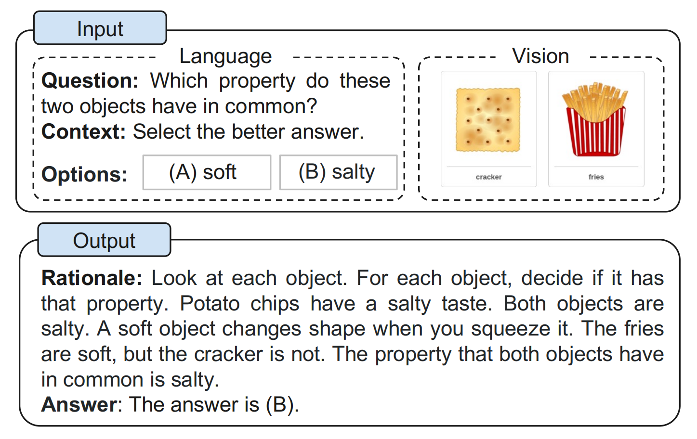
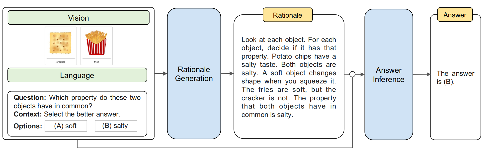

# Multimodal Chain-of-Thought Reasoning in Language Models
语言模型中的多模态思维链推理 2023.2.2 https://arxiv.org/abs/2302.00923

## 阅读笔记
* 将基本原理生成和答案推理分开
* 思维链(CoT)推理(Wei et al., 2022b; Kojima et al., 2022; Zhang et al., 2022)
    * [Chain of thought prompting elicits reasoning in large language models](../nlp/CoT.md)
    * [Large language models are zero-shot reasoners](../nlp/CoT-Zero-shot.md)
    * [Automatic chain of thought prompting in large language models](../nlp/CoT-Auto.md)

## Abstract
Large language models (LLMs) have shown impressive performance on complex reasoning by leveraging chain-of-thought (CoT) prompting to generate intermediate reasoning chains as the rationale to infer the answer. However, existing CoT studies have focused on the language modality. We propose Multimodal-CoT that incorporates language (text) and vision (images) modalities into a two-stage framework that separates rationale generation and answer inference. In this way, answer inference can leverage better generated rationales that are based on multimodal information. With Multimodal-CoT, our model under 1 billion parameters outperforms the previous state-of-the-art LLM (GPT-3.5) by 16 percentage points (75.17%→91.68% accuracy) and even surpasses human performance on the ScienceQA benchmark. Code is publicly available.(1 https://github.com/amazon-science/mm-cot)

大型语言模型(LLM) 通过利用 思维链(CoT)提示 生成中间推理链作为推断答案的基本原理, 在复杂推理方面表现出令人印象深刻的性能。然而, 现有的CoT研究侧重于语言模态。我们提出了多模态CoT, 它将语言(文本)和视觉(图像)模态整合到一个两阶段的框架中, 该框架将基本原理生成和答案推理分开。通过这种方式, 答案推断可以利用基于多模态信息的更好地生成的理由。借助Multimodal-CoT, 我们在10亿个参数下的模型比以前最先进的LLM(GPT-3.5)高出16个百分点(75.17%→91.68%的精度), 甚至超过了人类在ScienceQA基准上的表现。代码是公开的。

## 1. Introduction
Imagine reading a textbook with no figures or tables. Our ability to knowledge acquisition is greatly strengthened by jointly modeling diverse data modalities, such as vision, language, and audio. Recently, large language models (LLMs) (Brown et al., 2020; Thoppilan et al., 2022; Rae et al., 2021; Chowdhery et al., 2022) have shown impressive performance in complex reasoning by generating intermediate reasoning steps before inferring the answer. The intriguing technique is called chain-of-thought (CoT) reasoning (Wei et al., 2022b; Kojima et al., 2022; Zhang et al., 2022).

想象一下阅读一本没有数字或表格的教科书。 通过联合建模不同的数据模式，如视觉、语言和音频，我们获取知识的能力得到了极大的增强。 最近，大型语言模型 (LLM)(Brown et al., 2020; Thoppilan et al., 2022; Rae et al., 2021; Chowdhery et al., 2022)通过在之前生成中间推理步骤，在复杂推理中显示出令人印象深刻的性能 推断答案。 这种有趣的技术被称为 思维链(CoT)推理(Wei et al., 2022b; Kojima et al., 2022; Zhang et al., 2022)。

However, existing studies related to CoT reasoning are largely isolated in the language modality (Wang et al., 2022b; Zhou et al., 2022; Lu et al., 2022b; Fu et al., 2022), with little consideration of multimodal scenarios. To elicit CoT reasoning in multimodality, we advocate a Multimodal-CoT paradigm. Given the inputs in different modalities, Multimodal-CoT decomposes multi-step problems into intermediate reasoning steps (rationale) and then infers the answer. Since vision and language are the most popular modalities, we focus on those two modalities in this work. An example is shown in Figure 1. In general, there are two ways to elicit Multimodal-CoT reasoning as follows: (i) prompting LLMs and (ii) fine-tuning small models.(2 In this work, we refer to small models as models with less than 1 billion parameters (hereinafter dubbed as 1B-models). )

然而，现有的与 CoT推理相关的研究大多孤立于语言模态 (Wang et al., 2022b; Zhou et al., 2022; Lu et al., 2022b; Fu et al., 2022)，很少考虑多模态场景。 为了在多模态中引发 CoT推理，我们提倡多模态CoT范式。 给定不同模态的输入，Multimodal-CoT 将多步骤问题分解为中间推理步骤（基本原理），然后推断出答案。 由于视觉和语言是最流行的方式，我们在这项工作中专注于这两种方式。 图1 显示了一个样本。一般来说，有两种方法可以引发多模态 CoT 推理，如下所示：(i) 提示LLM 和 (ii) 微调小模型。（2 在这项工作中，我们指的是小模型 作为参数少于 10 亿的模型（以下称为 1B 模型）。）

 
Figure 1. Example of the multimodal CoT task.
图1.多模态CoT 任务的样本。

The most immediate way to perform Multimodal-CoT is to transform the input of different modalities into one modality and prompt LLMs to perform CoT. For example, it is possible to extract the caption of an image by a captioning model and then concatenate the caption with the original language input to be fed into LLMs (Lu et al., 2022a). However, there is severe information loss in the captioning process; thus, using the captions (as opposed to vision features) may suffer from a lack of mutual synergy in the representation space of different modalities.

执行多模态CoT的最直接方法是将不同模态的输入转换为一种模态, 并提示LLM执行CoT。例如, 可以通过字幕模型提取图像的标题, 然后将标题与原始语言输入连接起来以输入LLM(Luet al., 2022a)。但是, 字幕过程中存在严重的信息丢失;因此, 使用字幕(与视觉特征相反)可能会在不同模态的表示空间中缺乏相互协同作用。

To facilitate the interaction between modalities, another potential solution is to fine-tune smaller language models (LMs) by fusing multimodal features (Zhang et al., 2023). As this approach allows the flexibility of adjusting model architectures to incorporate multimodal features, we study fine-tuning models in this work instead of prompting LLMs. The key challenge is that language models under 100 billion parameters tend to generate hallucinated rationales that mislead the answer inference (Ho et al., 2022; Magister et al., 2022; Ji et al., 2022). 

为了促进模态之间的相互作用, 另一个潜在的解决方案是通过融合多模态特征来微调较小的语言模型 (LM)(Zhang et al., 2023)。由于这种方法允许灵活地调整模型架构以包含多模态特征, 因此我们在这项工作中研究微调模型, 而不是提示LLM。关键的挑战是, 1000 亿个参数下的语言模型往往会产生误导答案推断的幻觉理由(Ho et al., 2022; Magister et al., 2022; Ji et al., 2022)。

To mitigate the challenge of hallucination, we propose Multimodal-CoT that incorporates language (text) and vision (images) modalities into a two-stage framework that separates rationale generation and answer inference. In this way, answer inference can leverage better generated rationales that are based on multimodal information. Our experiments are conducted on the ScienceQA benchmark (Lu et al., 2022a), which is the latest multimodal reasoning benchmark with annotated reasoning chains. Experimental results show that our method surpasses the previous state-ofthe-art GPT-3.5 model by +16% (75.17%→91.68%) on the benchmark. Our contributions are summarized as follows: 
1. To the best of our knowledge, this work is the first to study CoT reasoning in different modalities. 
2. We propose a two-stage framework by fine-tuning language models to fuse vision and language representations to perform Multimodal-CoT. The model is able to generate informative rationales to facilitate inferring final answers. 
3. Our method achieves new state-of-the-art performance on the ScienceQA benchmark, outperforming accuracy of GPT-3.5 by 16% and even surpassing human performance.

为了减轻幻觉的挑战, 我们提出了Multimodal-CoT, 它将语言(文本)和视觉(图像)模态整合到一个两阶段的框架中, 将理性生成和答案推理分开。通过这种方式, 答案推断可以利用基于多模态信息的更好地生成的理由。我们的实验是在 ScienceQA 基准(Lu et al., 2022a)上进行的, 这是最新的带有注释推理链的多模态推理基准。实验结果表明, 我们的方法在基准测试上比以前最先进的GPT-3.5模型高出+16%(75.17%→91.68%)。我们的贡献总结如下：
1. 是第一个以不同方式研究CoT推理的工作。
2. 提出了一个两阶段框架, 通过微调语言模型来融合视觉和语言表示来执行多模态CoT。该模型能够生成信息丰富的理由, 以促进推断最终答案。
3. 在ScienceQA基准测试上实现了最先进的新性能, 比 GPT-3.5 的准确性高出 16%, 甚至超过了人类的表现。

## 2. Background
This section reviews recent progress of eliciting CoT reasoning by prompting and fine-tuning language models.

本节回顾了通过提示和微调语言模型引发 CoT推理的最新进展。

### 2.1. CoT Reasoning with LLMs
Recently, CoT has been widely used to elicit the multi-step reasoning abilities of LLMs (Wei et al., 2022b). Concretely, CoT techniques encourage the LLM to generate intermediate reasoning chains for solving a problem. Studies have shown that LLMs can perform CoT reasoning with two major paradigms of techniques: Zero-Shot-CoT (Kojima et al., 2022) and Few-Shot-CoT (Wei et al., 2022b; Zhang et al., 2022). For Zero-Shot-CoT, Kojima et al. (2022) showed that LLMs are decent zero-shot reasoners by adding a prompt like “Let’s think step by step” after the test question to invoke CoT reasoning. For Few-Shot-CoT, a few step-by-step reasoning demonstrations are used as conditions for inference. Each demonstration has a question and a reasoning chain that leads to the final answer. The demonstrations are commonly obtained by hand-crafting or automatic generation. The corresponding techniques are thus referred to as Manual-CoT (Wei et al., 2022b) and Auto-CoT (Zhang et al., 2022).

最近, CoT 已被广泛用于引发 LLM 的多步推理能力(Wei et al., 2022b)。 具体来说, CoT技术鼓励 LLM 生成用于解决问题的中间推理链。 研究表明, LLM 可以使用两种主要的技术范式进行 CoT 推理：Zero-Shot-CoT (Kojima et al., 2022) 和 Few-Shot-CoT (Wei et al., 2022b; Zhang et al., 2022) . 对于Zero-Shot-CoT, Kojima et al. (2022) 通过在测试问题之后添加诸如“让我们逐步思考”之类的提示来调用 CoT 推理, 表明 LLM 是不错的零样本推理机。 对于Few-Shot-CoT, 以几个循序渐进的推理演示作为推理的条件。 每个演示都有一个问题和一条通向最终答案的推理链。 演示通常通过手工制作或自动生成获得。 因此, 相应的技术被称为 Manual-CoT (Wei et al., 2022b) 和 Auto-CoT (Zhang et al., 2022)。

With effective demonstrations, Few-Shot-CoT often achieves stronger performance than Zero-Shot-CoT and has attracted more research interest. Therefore, most recent studies focused on how to improve Few-Shot-CoT. Those studies are categorized into two major research lines: (i) optimizing the demonstrations; (ii) optimizing the reasoning chains. Table 1 compares typical CoT techniques.

通过有效的演示, Few-Shot-CoT 往往能取得比 Zero-Shot-CoT 更强的性能, 并引起了更多的研究兴趣。 因此, 最近的研究主要集中在如何改进 Few-Shot-CoT。 这些研究分为两大研究方向：(i) 优化示范;  (ii) 优化推理链。 表1 比较了典型的 CoT 技术。

 
Table 1. Typical CoT techniques (FT: fine-tuning; KD: knowledge distillation). Segment 1: in-context learning techniques; Segment 2: fine-tuning techniques. To the best of our knowledge, our work is the first to study CoT reasoning in different modalities. Besides, we focus on 1B-models, without relying on the outputs of LLMs.
表 1.典型的CoT技术(FT：微调;KD：知识蒸馏)。第 1 部分：上下文学习技巧;第 2 部分：微调技术。据我们所知, 我们的工作是第一个以不同方式研究CoT推理的工作。此外, 我们专注于1B模型, 而不依赖LLM的输出。

#### Optimizing Demonstrations. 
The performance of FewShot-CoT relies on the quality of demonstrations. As reported in Wei et al. (2022b), using demonstrations written by different annotators results in dramatic accuracy disparity in a symbolic reasoning task. Beyond hand-crafting the demonstrations, recent studies have investigated ways to optimize the demonstration selection process. Notably, Rubin et al. (2022) retrieved the semantically similar demonstrations with the test instance. However, this approach shows a degraded performance when there are mistakes in the reasoning chains (Zhang et al., 2022). To address the limitation, Zhang et al. (2022) found that the key is the diversity of demonstration questions and proposed Auto-CoT: (i) partition questions of a given dataset into a few clusters; (ii) sample a representative question from each cluster and generate its reasoning chain using Zero-Shot-CoT with simple heuristics. In addition, reinforcement learning (RL) and complexity-based selection strategies were also proposed to obtain effective demonstrations. Fu et al. (2022) chose examples with complex reasoning chains (i.e., with more reasoning steps) as the demonstrations. Lu et al. (2022b) trained an agent to find optimal in-context examples from a candidate pool and maximize the prediction rewards on given training examples when interacting with GPT-3.5.

优化演示。 FewShot-CoT 的性能依赖于演示的质量。 据 Wei et al. (2022b), 使用不同标注人员编写的演示会导致符号推理任务中的准确性差异巨大。 除了手工制作演示之外, 最近的研究还调查了优化演示选择过程的方法。 值得注意的是, Rubin et al. (2022) 检索了与测试实例语义相似的演示。 然而, 当推理链中存在错误时, 这种方法表现出下降的性能。 为了解决这一局限性, (Zhang et al., 2022)发现关键是演示问题的多样性, 并提出了 Auto-CoT：(i) 将给定数据集的问题划分为几个集群;  (ii) 从每个集群中抽样一个有代表性的问题, 并使用具有简单启发式的零样本 CoT 生成其推理链。 此外, 还提出了强化学习(RL )和基于复杂性的选择策略以获得有效的演示。 Fu et al. (2022) 选择了具有复杂推理链(即具有更多推理步骤 )的样本作为演示。 Lu et al. (2022b) 训练智能体从候选池中找到最佳的上下文样本, 并在与 GPT-3.5 交互时最大化给定训练样本的预测奖励。 
<!-- 演示问题的多样性; -->

#### Optimizing Reasoning Chains. 
A notable way to optimize reasoning chains is problem decomposition. Zhou et al. (2022) proposed least-to-most prompting to decompose complex problems into sub-problems and then solve these sub-problems sequentially. As a result, solving a given sub-problem is facilitated by the answers to previously solved sub-problems. Similarly, Khot et al. (2022) used diverse decomposition structures and designed different prompts to answer each sub-question. In addition to prompting the reasoning chains as natural language texts, Chen et al. (2022) proposed program-of-thoughts (PoT), which modeled the reasoning process as a program and prompted LLMs to derive the answer by executing the generated programs. Another trend is to vote over multiple reasoning paths for a test question. Wang et al. (2022a) introduced a self-consistency decoding strategy to sample multiple outputs of LLMs and then took a majority over the final answers. Wang et al. (2022b) and Li et al. (2022b) introduced randomness in the input space to produce more diverse outputs for voting.

优化推理链的一个显著方法是问题分解。 Zhou et al. (2022) 提出从最少到最多的提示将复杂问题分解为子问题，然后依次解决这些子问题。 因此，解决给定的子问题可以通过先前解决的子问题的答案来促进。 同样，Khot et al. (2022) 使用不同的分解结构并设计不同的提示来回答每个子问题。 除了将推理链提示为自然语言文本外，Chen et al. (2022) 提出了 program-of-thoughts (PoT)，它将推理过程建模为程序，并提示 LLM 通过执行生成的程序来得出答案。 另一个趋势是对测试问题的多个推理路径进行投票。 Wang et al.(2022a) 引入了一种自洽解码策略来对 LLM 的多个输出进行采样，然后在最终答案中占多数。 Wang et al. (2022b) 和 Li et al. (2022b)在输入空间中引入了随机性，以产生更多样化的投票输出。

### 2.2. Eliciting CoT Reasoning by Fine-Tuning Models  通过微调模型引出 CoT 推理
A recent interest is eliciting CoT reasoning by fine-tuning language models. Lu et al. (2022a) fine-tuned the encoderdecoder T5 model on a large-scale dataset with CoT annotations. However, a dramatic performance decline is observed when using CoT to infer the answer, i.e., generating the reasoning chain before the answer (reasoning). Instead, CoT is only used as an explanation after the answer. Magister et al. (2022) and Ho et al. (2022) employed knowledge distillation by fine-tuning a student model on the chain-ofthought outputs generated by a larger teacher model. The proposed methods showed performance gains in arithmetic, commonsense, and symbolic reasoning tasks.

最近的兴趣是通过微调语言模型来引发 CoT 推理。 Lu et al. (2022a) 在带有 CoT 注释的大规模数据集上微调了编码器解码器 T5 模型。 然而, 当使用 CoT 推断答案时, 即在答案之前生成推理链(推理 )时, 观察到性能急剧下降。 相反, CoT 仅用作答案后的解释。 Magister et al. (2022) 和 Ho et al. (2022) 通过在更大的教师模型生成的思维链输出上微调学生模型来采用知识蒸馏。 所提出的方法在算术、常识和符号推理任务中显示出性能提升。

There is a key challenge in training 1B-models to be CoT reasoners. As observed by Wei et al. (2022b), models under 100 billion parameters tend to produce illogical CoT that leads to wrong answers. In other words, it might be harder for 1B-models to generate effective CoT than directly generating the answer. It becomes even more challenging in a multimodal setting where answering the question also requires understanding the multimodal inputs. In the following part, we will explore the challenge of Multimodal-CoT and investigate how to perform effective multi-step reasoning.

将 1B 模型训练成 CoT 推理器是一个关键挑战。 正如 Wei et al. (2022b) 所观察到的, 1000 亿参数下的模型往往会产生不合逻辑的 CoT, 从而导致错误的答案。 换句话说, 1B 模型生成有效的 CoT 可能比直接生成答案更难。 在多模态环境中, 它变得更具挑战性, 因为回答问题还需要理解多模态输入。 在接下来的部分中, 我们将探讨 Multimodal-CoT 的挑战, 并研究如何进行有效的多步推理。

## 3. Challenge of Multimodal-CoT
Existing studies have suggested that the CoT reasoning ability may emerge in language models at a certain scale, e.g., over 100 billion parameters (Wei et al., 2022a). However, it remains an unresolved challenge to elicit such reasoning abilities in 1B-models, let alone in the multimodal scenario. This work focuses on 1B-models as they can be fine-tuned and deployed with consumer-grade GPUs (e.g., 32G memory). In this section, we will investigate why 1B-models fail at CoT reasoning and study how to design an effective approach to overcome the challenge.

现有研究表明, CoT 推理能力可能会在一定规模(例如超过 1000 亿个参数 )的语言模型中出现(Wei et al., 2022a )。 然而, 在 1B 模型中引发这种推理能力仍然是一个未解决的挑战, 更不用说在多模态场景中了。 这项工作侧重于 1B 模型, 因为它们可以使用消费级 GPU(例如 32G 内存 )进行微调和部署。 在本节中, 我们将研究 1B 模型为何在 CoT 推理中失败, 并研究如何设计一种有效的方法来克服挑战。

### 3.1. Towards the Role of CoT
To begin with, we fine-tune a text-only baseline for CoT reasoning on the ScienceQA benchmark (Lu et al., 2022a). Following Lu et al. (2022a), we adopt UnifiedQABase (Khashabi et al., 2020) as the backbone language model.(3 UnifiedQA (Khashabi et al., 2020) is adopted as it is the best fine-tuning model in Lu et al. (2022a). Model information and implementation details are presented in Appendix B.1.)

首先, 我们微调了基于 ScienceQA 基准的 CoT 推理的纯文本基线(Lu et al., 2022a )。 跟随 Lu et al. (2022a), 我们采用 UnifiedQABase (Khashabi et al., 2020) 作为骨干语言模型。(3 UnifiedQA (Khashabi et al., 2020) 被采用是因为它是 Lu et al. (2022a) 中最好的微调模型 ). 模型信息和实现细节在附录 B.1 中给出。)

Our task is modeled as a text generation problem, where the model takes the textual information as the input and generates the output sequence that consists of the rationale and the answer. As an example shown in Figure 1, the model takes the concatenation of tokens of the question text (Q), the context text (C), and multiple options (M) as the input. To study the effect of CoT, we compare the performance with three variants: (i) No-CoT which predicts the answer directly (QCM→A); (ii) Reasoning where answer inference is conditioned to the rationale (QCM→RA); (iii) Explanation where the rationale is used for explaining the answer inference (QCM→AR).

我们的任务被建模为文本生成问题, 其中模型将文本信息作为输入并生成由基本原理和答案组成的输出序列。 如图 1 所示的样本, 该模型将问题文本 (Q)、上下文文本 (C) 和多个选项 (M) 的标记串联作为输入。 为了研究 CoT 的效果, 我们比较了三种变体的性能：(i) No-CoT 直接预测答案 (QCM→A);  (ii) 答案推理以基本原理为条件的推理(QCM→RA );  (iii) 解释其中的基本原理用于解释答案推断 (QCM→AR)。

Table 2. Effects of CoT in the one-stage setting.
表 2. CoT 在单阶段设置中的影响。

Method | Format | Accuracy
--- | --- | ---
No-CoT | QCM→A | 80.40
Reasoning | QCM→RA | 67.86
Explanation | QCM→AR | 69.77

Surprisingly, we observe a ↓12.54% accuracy decrease (80.40%→67.86%) if the model predicts rationales before answers (QCM→RA). The results imply that the rationales might not necessarily contribute to predicting the right answer. A similar phenomenon was observed in Lu et al. (2022a), where the plausible reason might be that the model exceeds the maximum token limits before obtaining the required answer or stops generating the prediction early. However, we find that the maximum length of the generated outputs (RA) is always less than 400 tokens, which is below the length limit of language models (i.e., 512 in UnifiedQABase). Therefore, it deserves a more in-depth investigation into why the rationales harm answer inference. 

令人惊讶的是, 如果模型在答案 (QCM→RA) 之前预测基本原理, 我们会观察到 ↓12.54% 的精度下降 (80.40%→67.86%)。 结果表明, 基本原理不一定有助于预测正确答案。 Lu et al.也观察到类似的现象。 (2022a ), 其中合理的原因可能是模型在获得所需答案之前超过了最大令牌限制或提前停止生成预测。 然而, 我们发现生成的输出 (RA) 的最大长度始终小于 400 个标记, 低于语言模型的长度限制(即 UnifiedQABase 中的 512 )。 因此, 值得更深入地研究为什么基本原理会损害答案推理。

 
Figure 2. Example of the two-stage framework without vision features (baseline) and with vision features (ours) for generating rationales and predicting answers. The upper part presents the problem details with a gold rationale, and the lower part shows the outputs of the baseline and our method incorporated with vision features. We observe that the baseline fails to predict the right answer due to the misleading by hallucinated rationales. More examples are shown in Appendix A.1.
图 2. 用于生成基本原理和预测答案的无视觉特征(基线 )和有视觉特征(我们的 )的两阶段框架样本。 上半部分展示了问题的详情和基本原理, 下半部分显示了基线的输出以及我们的方法与视觉特征的结合。 我们观察到由于幻觉原理的误导, 基线无法预测正确答案。 附录 A.1 中显示了更多样本。

### 3.2. Misleading by Hallucinated Rationales 被幻觉的理由误导
To dive into how the rationales affect the answer prediction, we separate the CoT problem into two stages, rationale generation and answer inference. We report the RougeL score and accuracy for the rationale generation and answer inference, respectively. Table 3 shows the results based on the two-stage framework. Although the two-stage baseline model achieves a 91.76 RougeL score of the rationale generation, the answer inference accuracy is only 70.53%. Compared with the QCM→A variant (80.40%) in Table 2, the result shows that the generated rationale in the two-stage framework does not improve answer accuracy.

为了深入研究基本原理如何影响答案预测, 我们将 CoT 问题分为两个阶段, 基本原理生成和答案推理。 我们分别报告基本原理生成和答案推理的 RougeL 分数和准确性。 表 3 显示了基于两阶段框架的结果。 虽然两阶段基线模型在基本原理生成方面取得了 91.76 的 RougeL 分数, 但答案推理精度仅为 70.53%。 与表 2 中的 QCM→A 变体(80.40% )相比, 结果表明两阶段框架中生成的基本原理并没有提高答案的准确性。

Table 3. Two-stage setting of (i) rationale generation (RougeL) and (ii) answer inference (Accuracy).
表 3. (i) 基本原理生成 (RougeL) 和 (ii) 答案推理 (Accuracy) 的两阶段设置。

Method | (i) QCM→ R | (ii)  QCMR→ A
--- | --- | --- 
Two-Stage Framework | 91.76 | 70.53 
w/ Captions | 91.85 | 71.12 
w/ Vision Features | 96.97 | 84.91

Then, we randomly sample 50 error cases and find that the model tends to generate hallucinated rationales that mislead the answer inference. As an example shown in Figure 2, the model (left part) hallucinates that, “The south pole of one magnet is closest to the south pole of the other magnet”, due to the lack of reference to the vision content. We find that such mistakes occur at a ratio of 64% among the error cases (Figure 3(a)).

然后, 我们随机抽取 50 个错误案例, 发现该模型倾向于生成误导答案推理的幻觉原理。 如图 2 所示的样本, 由于缺乏对视觉内容的参考, 模型(左侧部分 )产生了“一个磁铁的南极最接近另一个磁铁的南极”的幻觉。 我们发现此类错误在错误案例中的发生率为 64%(图 3(a ) )。

 
Figure 3. The ratio of hallucination mistakes (a) and correction rate w/ vision features (b).
图 3. 幻觉错误 (a) 与视觉特征校正率 (b) 的比率。

### 3.3. Multimodality Contributes to Effective Rationales 多模态有助于有效的理由
We speculate that such a phenomenon of hallucination is due to a lack of necessary vision contexts for performing effective Multimodal-CoT. To inject vision information, a simple way is to transform the paired image into a caption (Lu et al., 2022a) and then append the caption in the input of both stages. However, as shown in Table 3, using captions only yields marginal performance gains (↑0.59%). Then, we explore an advanced technique by incorporating vision features into the language model. Concretely, we feed the paired image to the DETR model (Carion et al., 2020) to extract vision features. Then we fuse the vision features with the encoded language representations before feeding to the decoder (more details will be presented in Section 4). Interestingly, with vision features, the RougeL score of the rationale generation has boosted to 96.97% (QCM→R), which correspondingly contributes to better answer accuracy of 84.91% (QCMR→A). With those effective rationales, the phenomenon of hallucination is mitigated — 62.5% hallucination mistakes in Section 3.2 have been corrected (Figure 3(b)), as an example shown in Figure 2 (right part).(4The left mistakes are mainly about map understanding, which requires more advanced vision features. We will discuss them in Section 6.4.) The analysis so far compellingly shows that vision features are indeed beneficial for generating effective rationales and contributing to accurate answer inference. As the two-stage method (QCMR→A) in Table 3 achieves better performance than all the one-stage method in Table 2, we choose the twostage method in our Multimodal-CoT framework.

我们推测这种幻觉现象是由于缺乏必要的视觉环境来执行有效的 Multimodal-CoT。 要注入视觉信息, 一种简单的方法是将配对图像转换为标题 (Lu et al., 2022a), 然后将标题附加到两个阶段的输入中。 然而, 如表 3 所示, 使用字幕仅产生边际性能提升 (↑0.59%)。 然后, 我们通过将视觉特征纳入语言模型来探索一种高级技术。 具体来说, 我们将配对图像提供给 DETR 模型(Carion et al., 2020 )以提取视觉特征。 然后我们将视觉特征与编码语言表示融合, 然后再提供给解码器(更多细节将在第 4 节中介绍 )。 有趣的是, 有了视觉特征, 基本原理生成的 RougeL 分数提高到 96.97%(QCM→R ), 相应地有助于提高 84.91% 的答案精度(QCMR→A )。 有了这些有效的基本原理, 幻觉现象就会得到缓解——第 3.2 节中 62.5% 的幻觉错误已得到纠正(图 3(b) ), 如图 2(右部 )所示(4左边的错误主要是地图理解, 需要更高级的视觉特征。 我们将在第 6.4 节中讨论它们。)。 迄今为止的分析令人信服地表明,  视觉特征确实有利于产生有效的理由并有助于准确的答案推断。 由于表 3 中的两阶段方法 (QCMR→A) 比表 2 中的所有一阶段方法实现了更好的性能, 我们在 Multimodal-CoT 框架中选择了两阶段方法。

 
Figure 4. Overview of our Multimodal-CoT framework. Multimodal-CoT consists of two stages: (i) rationale generation and (ii) answer inference. Both stages share the same model architecture but differ in the input and output. In the first stage, we feed the model with language and vision inputs to generate rationales. In the second stage, we append the original language input with the rationale generated from the first stage. Then, we feed the updated language input with the original vision input to the model to infer the answer. 
图4.我们的多模态CoT框架概述。多模态CoT包括两个阶段：(i)基本原理生成和(ii)答案推理。这两个阶段共享相同的模型架构, 但在输入和输出方面有所不同。在第一阶段, 我们为模型提供语言和视觉输入, 以生成基本原理。在第二阶段, 我们将原始语言输入与第一阶段生成的基本原理附加在一起。然后, 我们将更新的语言输入与原始视觉输入一起提供给模型以推断答案。

## 4. Multimodal-CoT
Based on the observations and discussions in Section 3, we propose Multimodal-CoT to incorporate language (text) and vision (images) modalities into a two-stage framework. In this section, we will first overview the procedure of the framework and then elaborate on the technical design of the model architecture.

基于第 3 节中的观察和讨论, 我们提出 Multimodal-CoT 将语言(文本 )和视觉(图像 )模态合并到一个两阶段框架中。 在本节中, 我们将首先概述框架的过程, 然后详细说明模型架构的技术设计。

### 4.1. Framework Overview
Multimodal-CoT consists of two training stages: (i) rationale generation and (ii) answer inference. Both stages share the same model architecture but differ in the input X and output Y . The overall procedure is illustrated in Figure 4. We will take vision-language as an example to show how Multimodal-CoT works. 

Multimodal-CoT 由两个训练阶段组成：(i) 基本原理生成和 (ii) 答案推理。 这两个阶段共享相同的模型架构, 但输入 X 和输出 Y 不同。 整个过程如图 4 所示。我们将以视觉语言为例来说明 Multimodal-CoT 的工作原理。

In the rationale generation stage, we feed the model with X = {$X^1_{language}, X_{vision}$} where $X^1_{language}$ represents the language input in the first stage and $X_{vision}$ represents the vision input, i.e., the image. For example, X can be instantiated as a concatenation of question, context, and options of a multiple choice reasoning problem (Lu et al., 2022a) as shown in Figure 4. The goal is to learn a rationale generation model R = F(X) where R is the rationale.

在基本原理生成阶段, 我们为模型提供 X = {$X^1_{language}, X_{vision}$} 其中 $X^1_{language}$ 表示第一阶段的语言输入, $X_{vision }$ 表示视觉输入, 即图像。 例如, X 可以实例化为多项选择推理问题的问题、上下文和选项的串联(Lu et al., 2022a ), 如图 4 所示。目标是学习基本原理生成模型 R = F( X) 其中 R 是基本原理。

In the answer inference stage, the rationale R is appended to the original language input $X^1_{language}$ to construct the language input in the second stage, $X^2_{language}$ = $X^1_{language}$ ◦ R where ◦ denotes concatenation. Then, we feed the updated input X0 = {$X^2_{language}$, $X_{vision}$} to the answer inference model to infer the final answer A = F(X').

在答案推理阶段, 将基本原理R追加到原始语言输入$X^1_{language}$上, 构造第二阶段的语言输入, $X^2_{language}$ = $X^1_{language} $ ◦ R 其中 ◦ 表示级联。 然后, 我们将更新后的输入 X0 = {$X^2_{language}$, $X_{vision}$} 提供给答案推理模型, 以推断出最终答案 A = F(X')。

In both stages, we train two models with the same architecture independently. They take the annotated elements (e.g., X → R, XR → A, respectively) from the training set for supervised learning. During inference, given X, the rationales for the test sets are generated using the model trained in the first stage; they are used in the second stage for answer inference.

在这两个阶段, 我们独立训练两个具有相同架构的模型。 他们从训练集中获取带注释的元素(例如, 分别为 X → R、XR → A )以进行监督学习。 在推理过程中, 给定 X, 使用第一阶段训练的模型生成测试集的基本原理;  它们在第二阶段用于答案推断。

### 4.2. Model Architecture
Given the language input $X_{language}$ ∈ {$X^1_{language}$, $X^2_{language}$} and the vision input $X_{vision}$, we compute the probability of generating target text Y (either the rationale or the answer in Figure 4) of length N by 

给定语言输入 $X_{language}$ ∈ {$X^1_{language}$, $X^2_{language}$} 和视觉输入 $X_{vision}$, 我们计算生成目标文本 Y 的概率 (图 4 中的基本原理或答案 )长度 N 由

$p(Y | X_{language}, X_{vision}) = \prod^N_{i=1} p_θ (Y_i | X_{language}, X_{vision}, Y_{< i})$, (1) 

where $p_θ (Y_i | X_{language}, X_{vision}, Y_{< i})$ is implemented with a Transformer-based network (Vaswani et al., 2017). The network has three major procedures: encoding, interaction, and decoding. Specifically, we feed the language text into a Transformer encoder to obtain a textual representation, which is then interacted and fused with the vision representation before being fed into the Transformer decoder.

其中 $p_θ (Y_i | X_{language}, X_{vision}, Y_{< i})$ 是使用基于 Transformer 的网络实现的(Vaswani et al., 2017 )。 该网络具有三个主要过程：编码、交互和解码。 具体来说, 我们将语言文本输入 Transformer 编码器以获得文本表示, 然后在将其输入 Transformer 解码器之前与视觉表示进行交互和融合。

Algorithm 1 Multimodal-CoT

#### Encoding 
The model F(X) takes both the language and vision inputs and obtains the text representation $H_{language}$ and the image feature $H_{vision}$ by the following functions:

编码。 模型 F(X) 接受语言和视觉输入, 并通过以下函数获得文本表示 $H_{language}$ 和图像特征 $H_{vision}$：

$H_{language} = LanguageEncoder(X_{language})$, (2)

$H_{vision} = W_h · VisionExtractor(X_{vision})$, (3) 

where LanguageEncoder(·) is implemented as a Transformer model. We use the hidden states of the last layer in the Transformer encoder as the language representation $H_{language} ∈ R^{n×d} $ where n denotes the length of the language input, and d is the hidden dimension. Meanwhile, VisionExtractor(·) is used to vectorize the input image into vision features. Inspired by the recent success of Vision Transformers (Dosovitskiy et al., 2021), we fetch the patchlevel features by off-the-shelf vision extraction models(5The parameters of the vision extraction are frozen. ), such as DETR (Carion et al., 2020). After obtaining the patch-level vision features, we apply a learnable projection matrix $W_h$ to convert the shape of VisionExtractor($X_{vision}$) into that of $H_{language}$; thus we have $H_{vision} ∈ R^{n×d} $ where m is the number of patches.

其中 LanguageEncoder(·) 作为 Transformer 模型实现。 我们使用 Transformer 编码器中最后一层的隐藏状态作为语言表示 $H_{language} ∈ R^{n×d} $ 其中 n 表示语言输入的长度, d 是隐藏维度。 同时, VisionExtractor(·)用于将输入图像矢量化为视觉特征。 受最近成功的 Vision Transformers (Dosovitskiy et al., 2021) 的启发, 我们通过现成的视觉提取模型(5 视觉提取的参数被冻结。 )来获取 patchlevel 特征, 例如 DETR (Carion et al ., 2020 )。 在获得块级视觉特征后, 我们应用可学习的投影矩阵 $W_h$ 将 VisionExtractor($X_{vision}$) 的形状转换为 $H_{language}$ 的形状;  因此我们有 $H_{vision} ∈ R^{n×d} $ 其中 m 是补丁的数量。

#### Interaction
After obtaining language and vision representations, we use a single-head attention network to correlate text tokens with image patches, where the query (Q), key (K) and value (V) are $H_{language}$, $H_{vision}$ and $H_{vision}$, respectively. The attention output $H^{attn}_{vision} ∈ R^{n×d}$ is defined as:

相互作用。 在获得语言和视觉表示后, 我们使用单头注意力网络将文本标记与图像块相关联, 其中查询 (Q)、键 (K) 和值 (V) 是 $H_{语言}$、$H_{ vision}$ 和 $H_{vision}$, 分别。 注意输出 $H^{attn}_{vision} ∈ R^{n×d}$ 定义为：

$H^{attn}_{vision} = Softmax( \frac {QK^T>}{\sqrt{d_k}} )V $, (4) 

where $d_k$ is the same as the dimension of $H_{language}$ because a single head is used.

其中 $d_k$ 与 $H_{language}$ 的维度相同, 因为使用了单个头。

Then, we apply the gated fusion mechanism (Zhang et al., 2020; Wu et al., 2021; Li et al., 2022a) to fuse $H_{language}$ and $H_{vision}$. The fused output $H_{fuse} ∈ R^{n×d}$ is obtained by: 

然后, 我们应用门控融合机制(Zhang et al., 2020; Wu et al., 2021; Li et al., 2022a )来融合$H_{language}$和$H_{vision}$。 融合输出 $H_{fuse} ∈ R^{n×d}$ 通过以下方式获得：

$λ = Sigmoid(W_lH_{language} + W_vH^{attn}_{vision})$, (5)

$H_{fuse} = (1 − λ) · $H_{language}$ + λ · H^{attn}_{vision}$, (6) 

where $W_l$ and $W_v$ are learnable parameters.

其中 $W_l$ 和 $W_v$ 是可学习的参数。

#### Decoding
Finally, the fused output $H_{fuse}$ is fed into the Transformer decoder to predict the target Y . The complete procedure of Multimodal-CoT is shown in Algorithm 1.

解码. 最后, 融合输出 $H_{fuse}$ 被送入 Transformer 解码器以预测目标 Y。 Multimodal-CoT 的完整过程如算法 1 所示。

## 5. Experiments
This section will present the benchmark dataset, the implementation of our technique, and the baselines for comparisons. Then, we will report our main results and findings.

本节将介绍基准数据集、我们技术的实现以及用于比较的基线。然后, 我们将报告我们的主要结果和发现。

### 5.1. Dataset
Our method is evaluated on the ScienceQA benchmark (Lu et al., 2022a). ScienceQA is the first large-scale multimodal science question dataset that annotates the answers with detailed lectures and explanations. It contains 21k multimodal multiple choice questions with rich domain diversity across 3 subjects, 26 topics, 127 categories, and 379 skills. The benchmark dataset is split into training, validation, and test splits with 12726, 4241, and 4241 examples, respectively.

我们的方法是在 ScienceQA 基准上评估的(Lu et al., 2022a)。ScienceQA是第一个大规模的多模态科学问题数据集, 它通过详细的讲座和解释来注释答案。它包含 21k 多模态多项选择题, 具有丰富的领域多样性, 涵盖 3 个科目、26 个主题、127 个类别和 379 种技能。基准数据集分为训练、验证和测试拆分, 分别包含 12726、4241 和 4241 个样本。

### 5.2. Implementation
The following part presents the experimental settings of Multimodal-CoT and the baseline methods.

以下部分介绍了 Multimodal-CoT 的实验设置和基线方法。

#### Experimental Settings. 
As the Multimodal-CoT task requires generating the reasoning chains and leveraging the vision features, we use the T5 encoder-decoder architecture (Raffel et al., 2020). Specifically, we adopt UnifiedQA (Khashabi et al., 2020) to initialize our models in the two stages because it achieves the best fine-tuning results in Lu et al. (2022a). To verify the generality of our approach across different LMs, we also employ FLAN-T5 (Chung et al., 2022) as the backbone in Section 6.3. As using image captions does not yield significant performance gains in Section 3.3, we did not use the captions. We fine-tune the models up to 20 epochs, with a learning rate of 5e-5. The maximum input sequence length is 512. The batch sizes for the base and large models are 16 and 8, respectively. Our experiments are run on 4 NVIDIA Tesla V100 32G GPUs.

实验设置。 由于 Multimodal-CoT 任务需要生成推理链并利用视觉特征, 我们使用 T5 编码器-解码器架构(Raffel et al., 2020 )。 具体来说, 我们采用 UnifiedQA(Khashabi et al., 2020 )在两个阶段初始化我们的模型, 因为它在 Lu et al.中取得了最好的微调结果。 (2022a)。 为了验证我们的方法在不同 LM 中的通用性, 我们还在第 6.3 节中使用 FLAN-T5(Chung et al., 2022 )作为主干。 由于在第 3.3 节中使用图像说明不会产生显著的性能提升, 因此我们没有使用说明。 我们将模型微调多达 20 个 epoch, 学习率为 5e-5。 最大输入序列长度为 512。基本模型和大型模型的批量大小分别为 16 和 8。 我们的实验在 4 个 NVIDIA Tesla V100 32G GPU 上运行。

 
Table 4. Main results (%). Size = backbone model size. Question classes: NAT = natural science, SOC = social science, LAN = language science, TXT = text context, IMG = image context, NO = no context, G1-6 = grades 1-6, G7-12 = grades 7-12. Results except ours are taken from Lu et al. (2022a). Segment 1: Human performance; Segment 2: VQA baselines; Segment 3: UnifiedQA baselines; Segment 4: GPT-3.5 baselines; Segment 5: Our Multimodal-CoT results. Results in bold are the best performance.
表 4. 主要结果 (%)。 大小 = 主干模型大小。 问题类别：NAT = 自然科学, SOC = 社会科学, LAN = 语言科学, TXT = 文本上下文, IMG = 图像上下文, NO = 无上下文, G1-6 = 1-6级, G7-12 = 7-12级 . 除我们的结果外, 其他结果均来自 Lu et al. (2022a)。 第 1 部分：人的表现;  第 2 部分：VQA 基线;  第 3 部分：UnifiedQA 基线;  第 4 部分：GPT-3.5 基线;  第 5 部分：我们的多模态 CoT 结果。 粗体显示的结果是最佳性能。

Table 5. Ablation results of Multimodal-CoT. 
表 5. Multimodal-CoT 的消融结果。

Model | NAT | SOC | LAN | TXT | IMG | NO | G1-6 | G7-12 | Avg
--- | --- | --- | --- | --- | --- | --- | --- | --- | ---
Multimodal-CoT | 87.52 | 77.17 | 85.82 | 87.88 | 82.90 | 86.83 | 84.65 | 85.37 | 84.91
-- w/o | Two-Stage | Framework | 80.99 | 87.40 | 81.91 | 80.25 | 78.83 | 83.62 | 82.78 | 82.20 | 82.57
-- w/o | Vision | Features | 71.09 | 70.75 | 69.18 | 71.16 | 65.84 | 71.57 | 71.00 | 69.68 | 70.53

#### Baseline Models Following.
Lu et al. (2022a), our baselines include (i) Visual question answering (VQA) models (Anderson et al., 2018; Kim et al., 2018; Yu et al., 2019; Gao et al., 2019; Kim et al., 2021; Lu et al., 2021; Li et al., 2019); (ii) Text-to-text LM models. (Khashabi et al., 2020); (iii) GPT-3.5 models (Chen et al., 2020). More details are presented in Appendix B.1.

之后的基线模型。 Lu et al. (2022a), 我们的基线包括 (i) 视觉问答 (VQA) 模型(Anderson et al., 2018; Kim et al., 2018; Yu et al., 2019; Gao et al., 2019; Kim et al.  , 2021; Lu et al., 2021; Li et al., 2019); (ii) 文本到文本 LM 模型。 (Khashabi et al., 2020 );  (iii) GPT-3.5 模型(Chen et al., 2020 )。 附录 B.1 中提供了更多详情。

### 5.3. Main Results
Table 4 shows the main results. Mutimodal-CoTLarge outperforms GPT-3.5 by 16.51% (75.17%→91.68%) and surpasses human performance. Specifically, among the 8 question classes, Mutimodal-CoTLarge achieves a 21.37% (67.43%→88.80%) performance gain for the questions with paired images (IMG). Compared with existing UnifiedQA and GPT-3.5 methods that leverage image captions in the context to provide vision semantics, the results indicate that using image features is more effective. In addition, our two-stage framework contributes to the superior results according to our ablation study results in Table 5. Overall, the results verify the effectiveness of multimodality and the potential of achieving CoT reasoning with 1B-models via our two-stage framework.

表 4 显示了主要结果。 Mutimodal-CoTLarge 优于 GPT-3.5 16.51%(75.17%→91.68% ), 超越人类表现。 具体来说, 在 8 个问题类别中, Mutimodal-CoTLarge 对于带有配对图像 (IMG) 的问题实现了 21.37%(67.43%→88.80% )的性能提升。 与在上下文中利用图像说明提供视觉语义的现有 UnifiedQA 和 GPT-3.5 方法相比, 结果表明使用图像特征更有效。 此外, 根据表 5 中的消融研究结果, 我们的两阶段框架有助于取得优异的结果。总体而言, 结果验证了多模态的有效性以及通过我们的两阶段框架使用 1B 模型实现 CoT 推理的潜力。

 
Figure 5. Accuracy curve of the No-CoT baseline and MultimodalCoT variants across epochs.
图 5. No-CoT 基线和 MultimodalCoT 跨时期变体的准确度曲线。

## 6. Analysis
The following analysis will investigate how MultimodalCoT works and discuss contribution factors and limitations. We use models under the base size for analysis unless otherwise stated.

以下分析将调查 MultimodalCoT 的工作原理并讨论贡献因素和局限性。 除非另有说明, 否则我们使用基本尺寸以下的模型进行分析。

### 6.1. Multimodality Boosts Convergence
Figure 5 shows the evaluation accuracy curve of the baseline and Multimodal-CoT in different training epochs. “Onestage” is based on the QCM→A input-output format as it Accuracy achieves the best performance in Table 2 and “Two-stage” is our two-stage framework. We find that the two-stage methods achieve relatively higher accuracy at the beginning than the one-stage baselines that generate the answer directly without CoT. However, without the vision features, the twostage baseline could not yield better results as the training goes on due to the low-quality rationales (as observed in Section 3). In contrast, using vision features helps generate more effective rationales that contribute to better answer accuracy in our two-stage multimodal variant.

图 5 显示了 baseline 和 Multimodal-CoT 在不同训练时期的评估精度曲线。 “Onestage”基于QCM→A输入输出格式, 因为它的准确性达到了表2中的最佳性能, “Two-stage”是我们的两阶段框架。 我们发现, 两阶段方法在开始时比在没有 CoT 的情况下直接生成答案的一阶段基线具有更高的准确性。 然而, 如果没有视觉特征, 由于低质量的基本原理(如第 3 节中观察到的 ), 随着训练的进行, 两阶段基线无法产生更好的结果。 相比之下, 使用视觉特征有助于生成更有效的基本原理, 从而有助于在我们的两阶段多模态变体中提高答案的准确性。

### 6.2. Using Different Vision Features
Different vision features may affect the model performance. We compare three widely-used types of vision features, CLIP (Radford et al., 2021), DETR (Carion et al., 2020), and ResNet (He et al., 2016). CLIP and DETR are patch-like features where DETR is based on object detection. For the ResNet features, we repeat the pooled features of ResNet- 50 to the same length with the text sequence to imitate the patch-like features, where each patch is the same as the pooled image features. More details of the vision features are presented in Appendix B.2.

不同的视觉特征可能会影响模型性能。 我们比较了三种广泛使用的视觉特征类型, CLIP(Radford et al., 2021 )、DETR(Carion et al., 2020 )和 ResNet(He et al., 2016 )。 CLIP 和 DETR 是类似补丁的特征, 其中 DETR 基于对象检测。 对于 ResNet 特征, 我们将 ResNet-50 的池化特征重复到与文本序列相同的长度, 以模仿 patch-like 特征, 其中每个 patch 与池化图像特征相同。 有关视觉功能的更多详情, 请参见附录 B.2。

Table 6. Accuracy (%) of using different vision features.
表 6. 使用不同视觉特征的准确度 (%)。

Method | One-stage | Two-Stage 
--- | --- | --- 
w/ CLIP | 81.21 | 84.81 
w/ DETR | 82.57 | 84.91 
w/ ResNet | 80.97 | 84.77

Table 6 shows the comparative results of vision features. We observe that using vision features generally achieves better performance than the language only baseline. Specifically, DETR achieves relatively better performance in general. Therefore, we use DETR by default in Multimodal-CoT.

表6显示了视觉特征的比较结果。 我们观察到, 使用视觉特征通常比仅使用语言的基线获得更好的性能。 具体来说, DETR 总体上取得了相对较好的性能。 因此, 我们在 Multimodal-CoT 中默认使用 DETR。

### 6.3. General Effectiveness Across Backbone Models
To test the generality of the benefits of our approach to other backbone models, we alter the underlying LMs to other variants in different sizes or types. As shown in Table 7, our approach is generally effective for the widely-used backbone models.

为了测试我们的方法对其他主干模型的好处的普遍性, 我们将底层 LM 更改为不同大小或类型的其他变体。 如表 7 所示, 我们的方法通常对广泛使用的主干模型有效。

Table 7. Accuracy (%) with different backbone language models.
表 7. 不同骨干语言模型的精度 (%)。

Method | Size | Language Only | Mutimodal-CoT
--- | --- | --- | --- 
UnifiedQA-Base | 223M | 80.40 | 84.91
UnifiedQA-Large | 738M | 83.60 | 91.68
FLAN-T5-Base | 248M | 83.42 | 85.85
FLAN-T5-Large | 783M | 85.19 | 93.02

### 6.4. Error Analysis
To better understand the behavior of Multimodal-CoT and facilitate future studies, we manually investigate randomly selected examples generated by our approach. Table 8 summarizes the categorization results generated by MultimodalCoT. We randomly picked up 50 samples whose answers were correct and 50 samples whose answers were incorrect. The corresponding examples from each category are presented in Appendix C.

为了更好地理解 Multimodal-CoT 的行为并促进未来的研究, 我们手动调查由我们的方法生成的随机选择的样本。 表 8 总结了 MultimodalCoT 生成的分类结果。 我们随机抽取了 50 个答案正确的样本和 50 个答案错误的样本。 附录 C 中列出了每个类别的相应样本。

Table 8. Categorization analysis of Multimodal-CoT.
表 8. Multimodal-CoT 的分类分析。

Answer | CoT Category | Percentage (%)
--- | --- | --- 
Correct | CoT is correct | 90
| | CoT is incorrect | 10
Incorrect | Commonsense Mistake | 82
| | Logical Mistake | 12
| | CoT is correct | 6

We find that the correct samples (i.e., whose answers are correct) contain a certain amount of incorrect chain-of-thought (10%). The results indicate that CoT may not always benefit the answer inference, and the model is robust to some extent — it can predict the correct answer by ignoring incorrect rationales. For incorrect samples (i.e., whose answers are incorrect), commonsense mistake in the CoT is the most frequent error type (88%). The model often makes commonsense mistakes when answering the questions requires commonsense knowledge, e.g., understand maps and counting numbers in the images (Figure 9), and utilizing the alphabet (Figure 10). The other type of mistake is a logical mistake (12%), with contradictions in the reasoning chains (Figure 11). In addition, there are cases with incorrect answers while their CoT are correct (6%) but might not be necessarily related to answer options (Figure 12).

我们发现正确的样本(即答案正确的样本 )包含一定数量的错误思路(10% )。 结果表明, CoT 可能并不总是有利于答案推断, 并且该模型在某种程度上是稳健的——它可以通过忽略不正确的理由来预测正确答案。 对于不正确的样本(即答案不正确 ), CoT 中的常识性错误是最常见的错误类型 (88%)。 该模型在回答需要常识性知识的问题时经常犯常识性错误, 例如理解图像中的地图和计数(图 9 )以及使用字母表(图 10 )。 另一类错误是逻辑错误 (12%), 推理链中存在矛盾(图 11 )。 此外, 有些情况下答案不正确, 但他们的 CoT 是正确的 (6%), 但可能不一定与答案选项相关(图 12 )。

The analysis indicates that there are prospective directions for future studies. It is possible to improve MultimodalCoT by (i) incorporating more informative vision features and improving language-vision interaction to be capable of understanding maps and counting numbers; (ii) injecting commonsense knowledge; (iii) applying a filtering mechanism, e.g., using only the effective CoT to infer the answer and get rid of irrelevant CoT.

分析表明, 未来的研究有前瞻性的方向。 可以通过以下方式改进 MultimodalCoT：(i) 结合更多信息视觉功能并改进语言-视觉交互, 使其能够理解地图和计数;  (ii) 注入常识性知识;  (iii) 应用过滤机制, 例如, 仅使用有效的 CoT 来推断答案并去除不相关的 CoT。

## 7. Conclusion
We formally study the problem of multimodal CoT. We propose Multimodal-CoT that incorporates language and vision modalities into a two-stage framework that separates rationale generation and answer inference, so answer inference can leverage better generated rationales from multimodal information. With Multimodal-CoT, we show that our method surpasses GPT-3.5 by 16 percentage points in accuracy on the ScienceQA benchmark. Our error analysis shows that it is the potential to leverage more effective vision features, inject commonsense knowledge, and apply filtering mechanisms to improve CoT reasoning in future studies.

我们正式研究多式联运CoT的问题。我们提出了多模态CoT, 它将语言和视觉模态整合到一个两阶段的框架中, 该框架将理由生成和答案推理分开, 因此答案推理可以利用从多模态信息中更好地生成的理由。通过Multimodal-CoT, 我们表明我们的方法在ScienceQA基准测试中的准确性超过了GPT-3.516个百分点。我们的错误分析表明, 在未来的研究中, 利用更有效的视觉特征, 注入常识知识并应用过滤机制来改善CoT推理是有可能的。

## References
*  Anderson, P., He, X., Buehler, C., Teney, D., Johnson, M.,Gould, S., and Zhang, L. Bottom-up and top-down atten￾tion for image captioning and visual question answering.
*  In 2018 IEEE Conference on Computer Vision and Pat￾tern Recognition, CVPR 2018, Salt Lake City, UT, USA,June 18-22, 2018, pp. 6077–6086. IEEE Computer Soci￾ety, 2018. doi: 10.1109/CVPR.2018.00636.
*  Brown, T. B., Mann, B., Ryder, N., Subbiah, M., Kaplan,J., Dhariwal, P., Neelakantan, A., Shyam, P., Sastry, G.,Askell, A., Agarwal, S., Herbert-Voss, A., Krueger, G.,Henighan, T., Child, R., Ramesh, A., Ziegler, D. M., Wu,J., Winter, C., Hesse, C., Chen, M., Sigler, E., Litwin, M.,Gray, S., Chess, B., Clark, J., Berner, C., McCandlish,S., Radford, A., Sutskever, I., and Amodei, D. Languagemodels are few-shot learners. In Larochelle, H., Ranzato,M., Hadsell, R., Balcan, M., and Lin, H. (eds.), Advancesin Neural Information Processing Systems 33: AnnualConference on Neural Information Processing Systems2020, NeurIPS 2020, December 6-12, 2020, virtual, 2020.
*  Carion, N., Massa, F., Synnaeve, G., Usunier, N., Kirillov,A., and Zagoruyko, S. End-to-end object detection withtransformers. In Computer Vision–ECCV 2020: 16thEuropean Conference, Glasgow, UK, August 23–28, 2020,Proceedings, Part I, pp. 213–229, 2020.
*  Chen, T., Kornblith, S., Swersky, K., Norouzi, M., andHinton, G. E. Big self-supervised models are strongsemi-supervised learners. In Larochelle, H., Ranzato, M.,Hadsell, R., Balcan, M., and Lin, H. (eds.), Advancesin Neural Information Processing Systems 33: AnnualConference on Neural Information Processing Systems2020, NeurIPS 2020, December 6-12, 2020, virtual, 2020.
*  Chen, W., Ma, X., Wang, X., and Cohen, W. W. Programof thoughts prompting: Disentangling computation fromreasoning for numerical reasoning tasks. ArXiv preprint,abs/2211.12588, 2022.
*  Chowdhery, A., Narang, S., Devlin, J., Bosma, M., Mishra,G., Roberts, A., Barham, P., Chung, H. W., Sutton,C., Gehrmann, S., Schuh, P., Shi, K., Tsvyashchenko,S., Maynez, J., Rao, A., Barnes, P., Tay, Y., Shazeer,N., Prabhakaran, V., Reif, E., Du, N., Hutchinson, B.,Pope, R., Bradbury, J., Austin, J., Isard, M., Gur-Ari, G.,Yin, P., Duke, T., Levskaya, A., Ghemawat, S., Dev, S.,Michalewski, H., Garcia, X., Misra, V., Robinson, K., Fe￾dus, L., Zhou, D., Ippolito, D., Luan, D., Lim, H., Zoph,B., Spiridonov, A., Sepassi, R., Dohan, D., Agrawal,S., Omernick, M., Dai, A. M., Pillai, T. S., Pellat, M.,Lewkowycz, A., Moreira, E., Child, R., Polozov, O., Lee,K., Zhou, Z., Wang, X., Saeta, B., Diaz, M., Firat, O.,Catasta, M., Wei, J., Meier-Hellstern, K., Eck, D., Dean,J., Petrov, S., and Fiedel, N. Palm: Scaling language mod￾eling with pathways. ArXiv preprint, abs/2204.02311,2022.
*  Chung, H. W., Hou, L., Longpre, S., Zoph, B., Tay, Y.,Fedus, W., Li, E., Wang, X., Dehghani, M., Brahma,S., et al. Scaling instruction-finetuned language models. arXiv preprint arXiv:2210.11416, 2022.
*  Dosovitskiy, A., Beyer, L., Kolesnikov, A., Weissenborn,D., Zhai, X., Unterthiner, T., Dehghani, M., Minderer, M.,Heigold, G., Gelly, S., et al. An image is worth 16x16words: Transformers for image recognition at scale. InThe International Conference on Learning Representa￾tions (ICLR), 2021.
*  Fu, Y., Peng, H., Sabharwal, A., Clark, P., and Khot, T. Complexity-based prompting for multi-step reasoning. arXiv preprint, abs/2210.00720, 2022.
*  Gao, P., Jiang, Z., You, H., Lu, P., Hoi, S. C. H., Wang, X.,and Li, H. Dynamic fusion with intra- and inter-modalityattention flow for visual question answering. In IEEEConference on Computer Vision and Pattern Recognition,CVPR 2019, Long Beach, CA, USA, June 16-20, 2019, pp.6639–6648. Computer Vision Foundation / IEEE, 2019. doi: 10.1109/CVPR.2019.00680.
*  He, K., Zhang, X., Ren, S., and Sun, J. Deep residuallearning for image recognition. In 2016 IEEE Conferenceon Computer Vision and Pattern Recognition, CVPR 2016,Las Vegas, NV, USA, June 27-30, 2016, pp. 770–778. IEEE Computer Society, 2016. doi: 10.1109/CVPR.2016. 90.
*  Ho, N., Schmid, L., and Yun, S.-Y. Large language modelsare reasoning teachers. arXiv preprint arXiv:2212.10071,2022.
*  Ji, Z., Lee, N., Frieske, R., Yu, T., Su, D., Xu, Y., Ishii, E.,Bang, Y., Madotto, A., and Fung, P. Survey of halluci￾nation in natural language generation. ACM ComputingSurveys, 2022.
*  Khashabi, D., Min, S., Khot, T., Sabharwal, A., Tafjord,O., Clark, P., and Hajishirzi, H. UNIFIEDQA: Crossingformat boundaries with a single QA system. In Find￾ings of the Association for Computational Linguistics:EMNLP 2020, pp. 1896–1907, Online, 2020. Associationfor Computational Linguistics. doi: 10.18653/v1/2020. findings-emnlp.171.
*  Khot, T., Trivedi, H., Finlayson, M., Fu, Y., Richardson, K.,Clark, P., and Sabharwal, A. Decomposed prompting:A modular approach for solving complex tasks. ArXivpreprint, abs/2210.02406, 2022.
*  Kim, J., Jun, J., and Zhang, B. Bilinear attention networks. In Bengio, S., Wallach, H. M., Larochelle, H., Grauman,K., Cesa-Bianchi, N., and Garnett, R. (eds.), Advancesin Neural Information Processing Systems 31: AnnualConference on Neural Information Processing Systems2018, NeurIPS 2018, December 3-8, 2018, Montr´eal,Canada, pp. 1571–1581, 2018.
*  Kim, W., Son, B., and Kim, I. Vilt: Vision-and-languagetransformer without convolution or region supervision.
*  In Proceedings of the 38th International Conference onMachine Learning (ICML), pp. 5583–5594, 2021.
*  Kojima, T., Gu, S. S., Reid, M., Matsuo, Y., and Iwasawa,Y. Large language models are zero-shot reasoners. ArXivpreprint, abs/2205.11916, 2022.
*  Li, B., Lv, C., Zhou, Z., Zhou, T., Xiao, T., Ma, A., and Zhu,J. On vision features in multimodal machine translation.
*  In Proceedings of the 60th Annual Meeting of the Asso￾ciation for Computational Linguistics (Volume 1: LongPapers), pp. 6327–6337, 2022a.
*  Li, L. H., Yatskar, M., Yin, D., Hsieh, C.-J., and Chang,K.-W. Visualbert: A simple and performant baseline forvision and language. ArXiv preprint, abs/1908.03557,2019.
*  Li, Y., Lin, Z., Zhang, S., Fu, Q., Chen, B., Lou, J.-G., andChen, W. On the advance of making language modelsbetter reasoners. ArXiv preprint, abs/2206.02336, 2022b.
*  Lu, P., Qiu, L., Chen, J., Xia, T., Zhao, Y., Zhang, W., Yu,Z., Liang, X., and Zhu, S.-C. Iconqa: A new benchmarkfor abstract diagram understanding and visual languagereasoning. In The 35th Conference on Neural InformationProcessing Systems (NeurIPS) Track on Datasets andBenchmarks, 2021.
*  Lu, P., Mishra, S., Xia, T., Qiu, L., Chang, K.-W., Zhu,S.-C., Tafjord, O., Clark, P., and Kalyan, A. Learn toexplain: Multimodal reasoning via thought chains for sci￾ence question answering. ArXiv preprint, abs/2209.09513,2022a.
*  Lu, P., Qiu, L., Chang, K.-W., Wu, Y. N., Zhu, S.-C., Ra￾jpurohit, T., Clark, P., and Kalyan, A. Dynamic promptlearning via policy gradient for semi-structured mathemat￾ical reasoning. ArXiv preprint, abs/2209.14610, 2022b.
*  Magister, L. C., Mallinson, J., Adamek, J., Malmi, E., andSeveryn, A. Teaching small language models to reason. arXiv preprint, abs/2212.08410, 2022.
*  Radford, A., Kim, J. W., Hallacy, C., Ramesh, A., Goh, G.,Agarwal, S., Sastry, G., Askell, A., Mishkin, P., Clark, J.,et al. Learning transferable visual models from naturallanguage supervision. In International Conference onMachine Learning, pp. 8748–8763. PMLR, 2021.
*  Rae, J. W., Borgeaud, S., Cai, T., Millican, K., Hoffmann, J.,Song, F., Aslanides, J., Henderson, S., Ring, R., Young,S., Rutherford, E., Hennigan, T., Menick, J., Cassirer, A.,Powell, R., Driessche, G. v. d., Hendricks, L. A., Rauh,M., Huang, P.-S., Glaese, A., Welbl, J., Dathathri, S.,Huang, S., Uesato, J., Mellor, J., Higgins, I., Creswell,A., McAleese, N., Wu, A., Elsen, E., Jayakumar, S.,Buchatskaya, E., Budden, D., Sutherland, E., Simonyan,K., Paganini, M., Sifre, L., Martens, L., Li, X. L., Kun￾coro, A., Nematzadeh, A., Gribovskaya, E., Donato, D.,Lazaridou, A., Mensch, A., Lespiau, J.-B., Tsimpoukelli,M., Grigorev, N., Fritz, D., Sottiaux, T., Pajarskas, M.,Pohlen, T., Gong, Z., Toyama, D., d’Autume, C. d. M.,Li, Y., Terzi, T., Mikulik, V., Babuschkin, I., Clark, A.,Casas, D. d. L., Guy, A., Jones, C., Bradbury, J., Johnson,M., Hechtman, B., Weidinger, L., Gabriel, I., Isaac, W.,Lockhart, E., Osindero, S., Rimell, L., Dyer, C., Vinyals,O., Ayoub, K., Stanway, J., Bennett, L., Hassabis, D.,Kavukcuoglu, K., and Irving, G. Scaling language mod￾els: Methods, analysis & insights from training gopher. arXiv preprint, abs/2112.11446, 2021.
*  Raffel, C., Shazeer, N., Roberts, A., Lee, K., Narang, S.,Matena, M., Zhou, Y., Li, W., and Liu, P. J. Exploring thelimits of transfer learning with a unified text-to-text trans￾former. Journal of Machine Learning Research (JMLR),21:1–67, 2020.
*  Rubin, O., Herzig, J., and Berant, J. Learning to re￾trieve prompts for in-context learning. In Proceedingsof the 2022 Conference of the North American Chapterof the Association for Computational Linguistics: Hu￾man Language Technologies, pp. 2655–2671, 2022. doi:10.18653/v1/2022.naacl-main.191.
*  Thoppilan, R., De Freitas, D., Hall, J., Shazeer, N., Kul￾shreshtha, A., Cheng, H.-T., Jin, A., Bos, T., Baker, L.,Du, Y., Li, Y., Lee, H., Zheng, H. S., Ghafouri, A., Mene￾gali, M., Huang, Y., Krikun, M., Lepikhin, D., Qin, J.,Chen, D., Xu, Y., Chen, Z., Roberts, A., Bosma, M.,Zhao, V., Zhou, Y., Chang, C.-C., Krivokon, I., Rusch,W., Pickett, M., Srinivasan, P., Man, L., Meier-Hellstern,K., Morris, M. R., Doshi, T., Santos, R. D., Duke, T.,Soraker, J., Zevenbergen, B., Prabhakaran, V., Diaz, M.,Hutchinson, B., Olson, K., Molina, A., Hoffman-John, E.,Lee, J., Aroyo, L., Rajakumar, R., Butryna, A., Lamm,M., Kuzmina, V., Fenton, J., Cohen, A., Bernstein, R.,Kurzweil, R., Aguera-Arcas, B., Cui, C., Croak, M., Chi,E., and Le, Q. Lamda: Language models for dialogapplications. ArXiv preprint, abs/2201.08239, 2022.
*  Vaswani, A., Shazeer, N., Parmar, N., Uszkoreit, J., Jones,L., Gomez, A. N., Kaiser, L., and Polosukhin, I. Attentionis all you need. In Guyon, I., von Luxburg, U., Bengio,S., Wallach, H. M., Fergus, R., Vishwanathan, S. V. N.,and Garnett, R. (eds.), Advances in Neural InformationProcessing Systems 30: Annual Conference on NeuralInformation Processing Systems 2017, December 4-9,2017, Long Beach, CA, USA, pp. 5998–6008, 2017.
*  Wang, X., Wei, J., Schuurmans, D., Le, Q., Chi, E.,and Zhou, D. Self-consistency improves chain ofthought reasoning in language models. ArXiv preprint,abs/2203.11171, 2022a.
*  Wang, X., Wei, J., Schuurmans, D., Le, Q., Chi, E., andZhou, D. Rationale-augmented ensembles in languagemodels. ArXiv preprint, abs/2207.00747, 2022b.
*  Wei, J., Tay, Y., Bommasani, R., Raffel, C., Zoph, B.,Borgeaud, S., Yogatama, D., Bosma, M., Zhou, D., Met￾zler, D., Chi, E. H., Hashimoto, T., Vinyals, O., Liang,P., Dean, J., and Fedus, W. Emergent abilities of largelanguage models. Transactions on Machine LearningResearch, 2022a. Survey Certification.
*  Wei, J., Wang, X., Schuurmans, D., Bosma, M., Chi, E.,Le, Q., and Zhou, D. Chain of thought prompting elic￾its reasoning in large language models. ArXiv preprint,abs/2201.11903, 2022b.
*  Wu, Z., Kong, L., Bi, W., Li, X., and Kao, B. Good formisconceived reasons: An empirical revisiting on theneed for visual context in multimodal machine transla￾tion. In Proceedings of the 59th Annual Meeting of theAssociation for Computational Linguistics and the 11thInternational Joint Conference on Natural Language Pro￾cessing (Volume 1: Long Papers), pp. 6153–6166, Online,2021. Association for Computational Linguistics. doi:10.18653/v1/2021.acl-long.480.
*  Yu, Z., Yu, J., Cui, Y., Tao, D., and Tian, Q. Deep modu￾lar co-attention networks for visual question answering.
*  In IEEE Conference on Computer Vision and PatternRecognition, CVPR 2019, Long Beach, CA, USA, June16-20, 2019, pp. 6281–6290. Computer Vision Founda￾tion / IEEE, 2019. doi: 10.1109/CVPR.2019.00644.
*  Zhang, Z., Chen, K., Wang, R., Utiyama, M., Sumita, E., Li,Z., and Zhao, H. Neural machine translation with univer￾sal visual representation. In 8th International Conferenceon Learning Representations, ICLR 2020, Addis Ababa,Ethiopia, April 26-30, 2020. OpenReview.net, 2020.
*  Zhang, Z., Zhang, A., Li, M., and Smola, A. Automaticchain of thought prompting in large language models. arXiv preprint, abs/2210.03493, 2022.
*  Zhang, Z., Chen, K., Wang, R., Utiyama, M., Sumita, E., Li,Z., and Zhao, H. Universal multimodal representation forlanguage understanding. IEEE Transactions on PatternAnalysis and Machine Intelligence, pp. 1–18, 2023. doi:10.1109/TPAMI.2023.3234170.
*  Zhou, D., Sch¨arli, N., Hou, L., Wei, J., Scales, N., Wang,X., Schuurmans, D., Bousquet, O., Le, Q., and Chi, E. Least-to-most prompting enables complex reasoning inlarge language models. ArXiv preprint, abs/2205.10625,2022.

### A. Extended analysis for the challenge of Multimodal-CoT
#### A.1. More Examples of Misleading by Hallucinated Rationales
According to our case studies (Section 3.2), we find that the baseline tends to generate hallucinated rationales. We provide further examples as shown in Figure 6.

Options: (B) lichen (A) mushroom

Problem

Baseline

Question: Based on the arrows, which of the following organisms is a consumer?

Context: Below is a food web from a tundra ecosystem in Nunavut, a territory in Northern Canada. A food web models how the matter eaten by organisms moves through an ecosystem. The arrows in a food web represent how matter moves between organisms in an ecosystem.

Gold Rationale: A food web is a model … An organism in a food web can have more than one arrow pointing from it. This shows that the organism is eaten by more than one other organism in the food web. An organism in a food web can also have more than one arrow pointing to it. This shows that the organism eats more than one other organism in the food web. Consumers eat other organisms. So, there are arrows in a food web that point from other organisms to consumers. The mushroom has arrows pointing to it from the barren-ground caribou and the grizzly bear. So, the mushroom is a consumer. The lichen does not have any arrows pointing to it. So, the lichen is a producer, not a consumer.

Answer: The answer is (A).

Rationale: A food web is a model … This shows that the organism is eaten by more than one other organism in the food web. An organism in a food web can also have more than one arrow pointing to it. This shows that the organism eats more than one other organism in the food web. Consumers eat producers. So, in a food web, consumers have arrows pointing to them from producers. The mushroom has an arrow pointing to it from the mushroom. The mushroom is not a consumer, so the mushroom is not a consumer. The mushroom does not have any arrows pointing to it. So, the mushroom is not a consumer. The mushroom does not have any arrows pointing to it. So, the mushroom is not a consumer. The mushroom does not have any arrows pointing to it.

So, the mushroom is not a consumer. The mushroom does not have any arrows pointing to it. So, the mushroom is not a consumer.

Answer: The answer is (B).

Rationale: A food web is a model … An organism in a food web can have more than one arrow pointing from it. This shows that the organism is eaten by more than one other organism in the food web. An organism in a food web can also have more than one arrow pointing to it.

This shows that the organism eats more than one other organism in the food web. Consumers eat producers organisms. So, in are arrows a food web that point from other organisms to consumers. The mushroom has arrows pointing to it from the n-brow mushroomibou. the lichenzzly bear. So, the mushroom is a consumer. The lichen has not have any arrows pointing to it. So, the mushroom is a consumer. Lichen is not a consumer.

Answer: The answer is (B).

Vision + Vision Features

Options: (B) sample A (A) neither; the samples have the same temperature

Problem

Baseline

Question: Compare the average kinetic energies of the particles in each sample. Which sample has the higher temperature?

Context: The diagrams below show two pure samples of gas in identical closed, rigid containers. Each colored ball represents one gas particle. Both samples have the same number of particles.

Gold Rationale: The temperature of a substance depends on the average kinetic energy of the particles in the substance. The higher the average kinetic energy of the particles, the higher the temperature of the substance. The kinetic energy of a particle is determined by its mass and speed. For a pure substance, the greater the mass of each particle in the substance and the higher the average speed of the particles, the higher their average kinetic energy. Each particle in sample A has more mass than each particle in sample B. The particles in sample A also + Vision Features

Vision (C) sample B have a higher average speed than the particles in sample B. So, the particles in sample A have a higher average kinetic energy than the particles in sample B. Because the particles in sample A have the higher average kinetic energy, sample A must have the higher temperature.

Answer: The answer is (B).

Rationale: The temperature of a substance depends on the average kinetic energy of the particles in the substance. The higher the average kinetic energy of the particles, the higher the temperature of the substance. The kinetic energy of a particle is determined by its mass and speed. For a pure substance, the greater the mass of each particle in the substance and the higher the average speed of the particles, the higher their average kinetic energy. Each particle in sample B has more mass than each particle in sample A. The particles in sample B also have a higher average speed than the particles in sample A. So, the particles in sample B have a higher average kinetic energy than the particles in sample A. Because the particles in sample B have the higher average kinetic energy, sample B must have the higher temperature.

Answer: The answer is (C).

Rationale: The temperature of a substance depends on the average kinetic energy of the particles in the substance. The higher the average kinetic energy of the particles, the higher the temperature of the substance. The kinetic energy of a particle is determined by its mass and speed. For a pure substance, the greater the mass of each particle in the substance and the higher the average speed of the particles, the higher their average kinetic energy. Each particle in sample A has more mass than each particle in sample B. The particles in sample A also have a higher average speed than the particles in sample B. So, the particles in sample A have a higher average kinetic energy than the particles in sample B. Because the particles in sample A have the higher average kinetic energy, sample A must have the higher temperature.

Answer: The answer is (B).

Figure 6. Examples of the two-stage framework without vision features (baseline) and with vision features (ours) for generating rationales and predicting answers. The upper part presents the problem details, and the lower part shows the outputs of the baseline and our method.

Multimodal Chain-of-Thought Reasoning in Language Models

##### A.2. Two-Stage Training Performance with Different Sizes of LMs.
In Section 3, we obverse that incorporating vision features helps generate more effective rationales, thus leading to improved answer accuracy. Besides incorporating vision features, it is possible to scale the LM size to mitigate the issue of incorrect rationales. Figure 7 shows the answer accuracy with UnifiedQABase and UnifiedQALarge. When using a larger LM, the accuracy of the baseline (w/o vision features) is boosted. The result indicates that scaling the LM is possible to mitigate the issue of incorrect rationales. However, the performance is still much inferior to using vision features. The result further verifies the effectiveness of our Multimodal-CoT with different sizes of LMs. base large 65 80 100

## 70.53
### 84.91 82.97
## 91.68
 w/o Vision Modality w/ Vision Modality

Figure 7. Answer accuracy with different sizes of LMs.

### B. Experimental Details
#### B.1. Baseline Methods
Following Lu et al. (2022a), our baselines include three types of methods: (i) Visual question answering (VQA) models (Yu et al., 2019; Anderson et al., 2018; Kim et al., 2018; Gao et al., 2019; Lu et al., 2021; Li et al., 2019). The VQA baselines take the question, the context, and choices as the textual input, take the image as the vision input, and predict the score distribution over choice candidates via a linear classifier. (ii) Text-to-text LM models. UnifiedQA (Khashabi et al., 2020) is adopted as it is the best fine-tuning model in Lu et al. (2022a). UnifiedQA takes the textual information as the input and outputs the answer option. The image is converted into a caption extracted by an image captioning model based on ViT and GPT-2.6 UnifiedQA treats our task as a text generation problem. In Lu et al. (2022a), it is trained to generate a target answer text, i.e., one of the candidate options. Then, the most similar option is selected as the final prediction to evaluate the question answering accuracy. (iii) GPT-3.5 models (Chen et al., 2020) based on the text-davinci-002 engine. The inference is based on the few-shot prompting, where two in-context examples from the training set are concatenated before the test instance.

For UnifiedQA and GPT-3.5, CoT is applied after the answer (Lu et al., 2022a). Besides the above baselines, we develop a stronger baseline with a slight modification of the output format of UnifiedQA. Instead of predicting the answer texts, our baseline directly predicts the choice, e.g., the answer is B. This setting helps our baseline achieve better results than the existing UnifiedQA. Therefore, we use the stronger method as the language only baseline for analysis.

#### B.2. Details of Vision Features
In Section 6.2, we compared four types of vision features, CLIP (Radford et al., 2021), DETR (Carion et al., 2020), and

ResNet (He et al., 2016). The specific models are: (i) CLIP: RN101;7 (ii) DETR: detr resnet101 dc5;8 (iii) ResNet: we use 6https://huggingface.co/nlpconnect/vit-gpt2-image-captioning. 7https://github.com/jianjieluo/OpenAI-CLIP-Feature. 8https://github.com/facebookresearch/detr. Accuracy (%)

Multimodal Chain-of-Thought Reasoning in Language Models the averaged pooled features of a pre-trained ResNet50 CNN. Table 9 presents the dimension of the vision features (after the function VisionExtractor(·) in Eq. 3). For ResNet-50, we repeat the pooled features of ResNet-50 to the same length as the text sequence to imitate the patch-like features, where each patch is the same as the pooled image features.

Table 9. Dimension of vision features

Method Dimension

CLIP (49, 2048)

DETR (100, 256)

ResNet (512, 2048)

### C. Examples of Case Studies
To better understand the behavior of Multimodal-CoT, we manually investigate randomly selected examples generated by our approach. Table 8 summarizes the categorization results generated by Multimodal-CoT. We randomly picked up 50 samples whose prediction results were correct and 50 samples whose prediction results were incorrect.

We find that the correct samples contain a certain amount of incorrect chain-of-thought. As shown in Figure 8(b), the model generates the incorrect rationale, “Animals cannot their food by digesting other organisms” but the predicted answer is correct. The result indicates that CoT may not always benefit the answer inference, and the model is robust to some extent — it can predict the correct answer by ignoring incorrect rationales.

For incorrect samples, commonsense mistake is the most frequent error type. The model also makes commonsense mistakes when answering the questions requires commonsense knowledge, e.g., understand maps and counting numbers in the images (Figure 9), and utilizing the alphabet (Figure 10). The other type of mistake is the logical mistake, where there are contradictions in the reasoning chains (Figure 11). In addition, there are cases that the CoT is correct but might not be necessarily related to answer options; thus the model chooses the incorrect answer.

The analysis indicates that there are prospective directions for future studies. On the one hand, it is possible to improve the quality of CoT by (i) using more fine-grained interaction of language and vision features; and (ii) injecting commonsense knowledge. On the other hand, applying a filtering mechanism to using only the effective CoT to infer the answer and eliminate irrelevant CoT.

Multimodal Chain-of-Thought Reasoning in Language Models

Rationale: Birds, mammals, fish, reptiles, and amphibians are groups of animals. The animals in each group have traits in common. Scientists sort animals into groups based on traits they have in common. This process is called classification. A tiger shark is a fish. It lives underwater. It has fins, not limbs. Tiger sharks can nocturnal. They means that they are active mostly at night. A red-tailed hawk is a bird. It has feathers, two wings, and a beak.

Red-tailed hawks live their be teethaks to push for pre. birds, and, rep amptiles…

Answer: The answer is (B).

Options: (A) red-tailed hawk

Problem

Prediction

Question: Select the bird below.

Context: Birds have feathers, two wings, and a beak. A peregrine falcon is an example of a bird.

Rationale : Birds, mammals, fish, reptiles, and amphibians are groups of animals. The animals in each group have traits in common. Scientists sort animals into groups based on traits they have in common. This process is called classification. A tiger shark is a fish. It lives underwater. It has fins, not limbs. Tiger sharks can nocturnal. They means that they are active mostly at night. A red-tailed hawk is a bird. It has feathers, two wings, and a beak. Red-tailed hawks live their be teethaks to push for pre. birds, and, rep amptiles…

Answer: The answer is (A).

Vision (B) tiger shark (a) CoT is correct

Rationale: Leopard the past, scientists classified living organisms into two groups: plants and animals. Over the past 300 years, scientists have discovered many more types of organisms. Today, many scientists classify organisms into six broad groups, called kingdoms. Organisms in each kingdom have specific traits. The table below shows some traits used to describe each kingdom. | Bacteria | Archaea | Protists | Fungi | Animals |

Plants. How many cells do they have? | one | one | one or many | one or many | many | many. Do their cells have a nucleus? | no | no | yes | yes | yes | yesnCan their cells make food? | some species can | some species can | some species can | no | no | yes Leopardus wiedii is an animal. Animal cells cannot make their own food. Animals cannot their food by digesting other organisms.

Answer: The answer is (B).

Options: (A) no

Problem

Prediction

Question: Can Leopardus wiedii cells make their own food?

Context: This organism is Leopardus wiedii. It is a member of the animal kingdom. Leopardus wiedii is commonly called a margay. Margays live in the forest in Central and South America. Margays are nocturnal. A nocturnal animal sleeps most of the day and is awake at night.

Rationale : In the past, scientists classified living organisms into two groups: plants and animals. Over the past 300 years, scientists have discovered many more types of organisms. Today, many scientists classify organisms into six broad groups, called kingdoms. Organisms in each kingdom have specific traits. The table below shows some traits used to describe each kingdom. | Bacteria | Archaea | Protists | Fungi | Animals | Plants. How many cells do they have? | one | one | one or many | one or many | many | many Do their cells have a nucleus? | no | no | yes | yes | yes | yes Can their cells make food? | some species can | some species can | some species can | no | no | yes Leopardus wiedii is an animal.

Animal cells cannot make their own food. Animals get their food by digesting other organisms.

Answer: The answer is (A).

Vision (B) yes (b) CoT is incorrect

Figure 8. Examples of answers are correct while the CoT is correct (a) or incorrect (b).

Multimodal Chain-of-Thought Reasoning in Language Models

Rationale: Oceans are huge bodies of salt water. The world has five oceans. All of the oceans are connected, making one world ocean. This is the

Indian Ocean.

Answer: The answer is (B).

Options: (A) the Atlantic Ocean

Problem

Prediction

Question: Which ocean is highlighted?

Context: N/A

Rationale : Oceans are huge bodies of salt water. The world has five oceans. All of the oceans are connected, making one world ocean. This is the Pacific Ocean.

Answer: The answer is (C).

Vision (B) the Indian Ocean (a) Mistakes about maps.

Rationale: In a solution, solute particles move and spread throughout the solvent. The diagram below shows how a solution can change over time.

Solute particles move from the area where they are at a higher concentration to the area where they are at a lower concentration … Look at the diagram again. It shows you how the solution changed during the process of diffusion. Before the solute particles reached equilibrium, there were 5 solute particles on the left side of the membrane and 4 solute particles on the right side of the membrane. When the solute particles reached equilibrium, there were 5 solute particles on each side of the membrane. There was 1 more solute particle on the right side of the membrane than before. So, for the solute particles to reach equilibrium, more solute particles must have moved across the membrane to the right than to the right.

Answer: The answer is (B).

Options: (A) to the left than to the right

Problem

Prediction

Question: Complete the text to describe the diagram. Solute particles moved in both directions across the permeable membrane. But more solute particles moved across the membrane (). When there was an equal concentration on both sides, the particles reached equilibrium.

Context: The diagram below shows a solution with one solute. Each solute particle is represented by a green ball. The solution fills a closed container that is divided in half by a membrane. The membrane, represented by a dotted line, is permeable to the solute particles. The diagram shows how the solution can change over time during the process of diffusion.

Rationale : In a solution, solute particles move and spread throughout the solvent. The diagram below shows how a solution can change over time. Solute particles move from the area where they are at a higher concentration to the area where they are at a lower concentration … Look at the diagram again. It shows you how the solution changed during the process of diffusion. Before the solute particles reached equilibrium, there were 3 solute particles on the left side of the membrane and 5 solute particles on the right side of the membrane. When the solute particles reached equilibrium, there were 4 solute particles on each side of the membrane. There was 1 more solute particle on the left side of the membrane than before. So, for the solute particles to reach equilibrium, more solute particles must have moved across the membrane to the left than to the right.

Answer: The answer is (A).

Vision (b) Mistakes about counting numbers in the image. (C) the Pacific Ocean (D) the Southern Ocean (B) to the right than to the left

Figure 9. Examples of commonsense mistakes about understanding maps and counting numbers.

Multimodal Chain-of-Thought Reasoning in Language Models

Rationale: Guide words appear on each page of a dictionary. They tell you the first word and last word on the page. The other words on the page come between the guide words in alphabetical order. To put words in alphabetical order, put them in order by their first letters. If the first letters are the same, look at the second letters. If the second letters are the same, look at the third letters, and so on. If one word is shorter, and there are no more letters to compare, then the shorter word comes first in alphabetical order. For example, be comes before bed. Put the words in alphabetical order.

Since hardship is between the guide words helping - hunter, it would be found on that page.

Answer: The answer is (B).

Options: (A) hospital

Problem

Prediction

Question: Which word would you find on a dictionary page with the following guide words? helping - hunter

Context: The diagram below shows a solution with one solute. Each solute particle is represented by a green ball. The solution fills a closed container that is divided in half by a membrane. The membrane, represented by a dotted line, is permeable to the solute particles. The diagram shows how the solution can change over time during the process of diffusion.

Rationale : Guide words appear on each page of a dictionary. They tell you the first word and last word on the page. The other words on the page come between the guide words in alphabetical order. To put words in alphabetical order, put them in order by their first letters. If the first letters are the same, look at the second letters. If the second letters are the same, look at the third letters, and so on. If one word is shorter, and there are no more letters to compare, then the shorter word comes first in alphabetical order. For example, be comes before bed. Put the words in alphabetical order.

Since hospital is between the guide words helping - hunter, it would be found on that page.

Answer: The answer is (A). (B) hardship

Vision

N/A

Figure 10. Examples of commonsense mistakes about utilizing alphabet.

Multimodal Chain-of-Thought Reasoning in Language Models

Rationale: Measurements are written with both a number and a unit. The unit comes after the number. The unit shows what the number means.

Temperature can be written with units of degrees Fahrenheit (°F) or Celsius (°C). Use the list below to compare the two units. 212°F | Water boils | 100 ° C 98.6 °F | Body temperature | 37°C 68°F | Room temperature | 20°C 32°F | Water freezes | 0°C. The better estimate for the temperature of the air on a hot day is 36°F. 36°F is too hot.

Answer: The answer is (A).

Options: (A) 36°F

Problem

Prediction

Question: What is the temperature of the air on a hot day?

Context: Select the better estimate.

Rationale : Measurements are written with both a number and a unit. The unit comes after the number. The unit shows what the number means.

Temperature can be written with units of degrees Fahrenheit (°F) or Celsius (°C). Use the list below to compare the two units. 212°F | Water boils | 100 ° C 98.6 °F | Body temperature | 37°C 68°F | Room temperature | 20°C 32°F | Water freezes | 0°C. The better estimate for the temperature of the air on a hot day is 36°C. 36°F is too cold.

Answer: The answer is (B). (B) 36°C

Vision

N/A

Rationale: : A sentence is a group of words that expresses a complete thought. The band I'm in has been rehearsing daily because we have a concert in two weeks. A run-on sentence is formed when two sentences are run together, joined by just a comma or by no punctuation at all. If only a comma is used, the run-on is called a comma splice … The band I'm in has been rehearsing daily since we have a concert in two weeks. This is not a run-on sentence. It is formed a comma splice formed from two sentences run together, joined without just a comma. Right-handedness is controlled by genetics, interestingly enough, the same genes are also responsible for the brain becoming more specialized at certain tasks.

Answer: The answer is (B).

Options: (A) yes

Problem

Prediction

Question: Is this a run-on sentence? Right-handedness is controlled by genetics, interestingly enough, the same genes are also responsible for the brain becoming more specialized at certain tasks.

Context: N/A

Rationale : A sentence is a group of words that expresses a complete thought. The band I'm in has been rehearsing daily because we have a concert in two weeks. A run-on sentence is formed when two sentences are run together, joined by just a comma or by no punctuation at all. If only a comma is used, the run-on is called a comma splice … The band I'm in has been rehearsing daily since we have a concert in two weeks. This is a run-on sentence. It is a comma splice formed from two sentences run together, joined by just a comma. Right-handedness is controlled by genetics, interestingly enough, the same genes are also responsible for the brain becoming more specialized at certain tasks.

Answer: The answer is (A). (B) no

Vision

N/A (a) Logical mistake where the model fails at comparisons. (b) Logical mistake where the there is a contradiction in the rationale.

Figure 11. Examples of logical mistakes.

Multimodal Chain-of-Thought Reasoning in Language Models

Options: (A) black stripes on its skin

Problem

Prediction

Rationale : The way an organism looks or acts is called a trait. Scientists use fossils to learn more about the traits of ancient organisms. Fossils can preserve the remains of body parts and activities. A fossil of a body part, such as a tail or a wing, can tell you what an organism looked like. A fossil of an organism's activities, such as a burrow or a footprint, can tell you about the organism's behavior. Here are three examples of fossils and the traits that you can observe from them: This is a fossil of an animal. This fossil tells you that the animal had a spiral-shaped shell. This is a fossil of a plant.

This fossil tells you that the plant had small leaves arranged in a branched pattern. This is a fossil of an animal's footprint. This fossil tells you that the animal could walk on land. An organism's fossil may not show all of the organism's traits. This is because most body parts are destroyed during fossil formation. When an organism's body turns into a fossil, only a few body parts are usually preserved.

Answer: The answer is (C). (B) large fins on its body

Vision (C) a long, thin body

Question: Which trait did Palaeopython have? Select the trait you can observe on the fossil.

Context: This picture shows a fossil of an ancient animal called Palaeopython. Palaeopython lived in trees and could grow more than six feet long.

Rationale : The way an organism looks or acts is called a trait. Scientists use fossils to learn more about the traits of ancient organisms. Fossils can preserve the remains of body parts and activities. A fossil of a body part, such as a tail or a wing, can tell you what an organism looked like. A fossil of an organism's activities, such as a burrow or a footprint, can tell you about the organism's behavior. Here are three examples of fossils and the traits that you can observe from them: This is a fossil of an animal. This fossil tells you that the animal had a spiral-shaped shell. This is a fossil of a plant.

This fossil tells you that the plant had small leaves arranged in a branched pattern. This is a fossil of an animal's footprint. This fossil tells you that the animal could walk on land. An organism's fossil may not show all of the organism's traits. This is because most body parts are destroyed during fossil formation. When an organism's body turns into a fossil, only a few body parts are usually preserved.

Answer: The answer is (B).

Figure 12. Examples of answers are incorrect while the CoT is correct.
