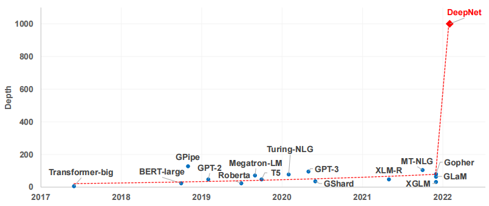
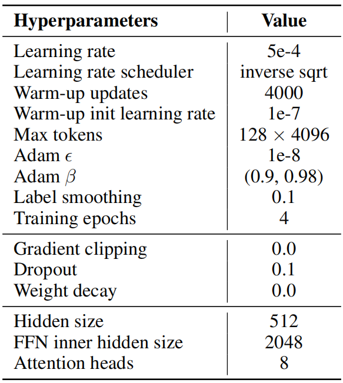
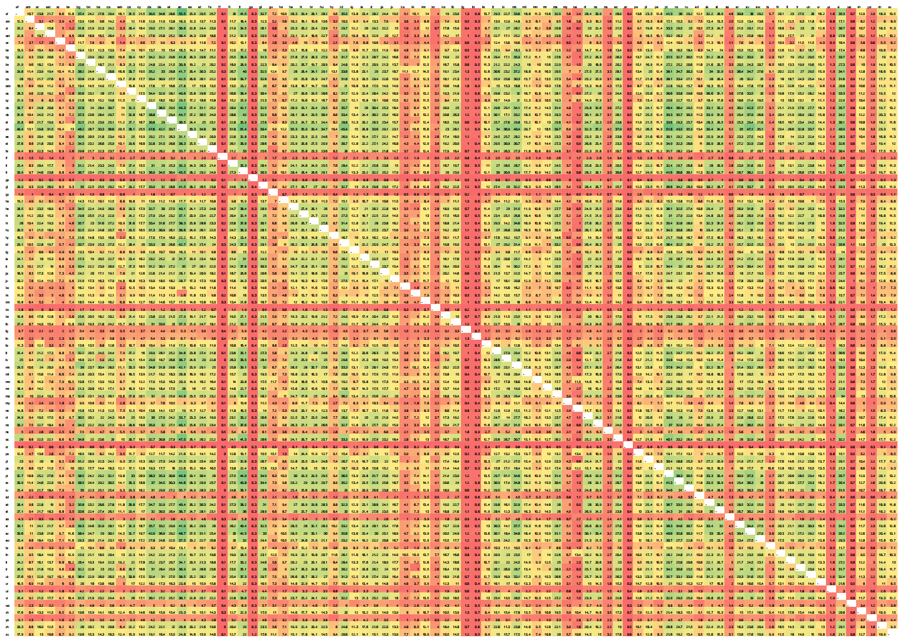

# DeepNet: Scaling Transformers to 1,000 Layers
DeepNet：将Transformers扩展到1000层 2022.3.1 https://arxiv.org/abs/2203.00555 

## 阅读笔记
* 训练不稳定的原因：
* DeepNorm
    * 在执行层归一化(LN)之前对残差连接进行了放大, 引入了放大常熟α，增加了个超参数，不好。后面Mageto论文多增加个LN的方式更好
    * stabilize the optimization with a constant upper bound
* 初始化方法 
    * Xavier 初始化 (Glorot and Bengio, 2010)
    * 在初始化过程中缩小了 参数β

## Abstract
In this paper, we propose a simple yet effective method to stabilize extremely deep Transformers. Specifically, we introduce a new normalization function (DEEPNORM) to modify the residual connection in Transformer, accompanying with theoretically derived initialization. In-depth theoretical analysis shows that model updates can be bounded in a stable way. The proposed method combines the best of two worlds, i.e., good performance of Post-LN and stable training of Pre-LN, making DEEPNORM a preferred alternative. We successfully scale Transformers up to 1,000 layers (i.e., 2,500 attention and feed-forward network sublayers) without difficulty, which is one order of magnitude deeper than previous deep Transformers. Remarkably, on a multilingual benchmark with 7,482 translation directions, our 200-layer model with 3.2B parameters significantly outperforms the 48-layer state-of-the-art model with 12B parameters by 5 BLEU points, which indicates a promising scaling direction. https://github.com/microsoft/unilm

在本文中，我们提出了一种简单而有效的方法来稳定极深的Transformers。具体来说，我们引入了一个新的归一化函数(DEEPNORM)来修改Transformer中的残差连接，并伴随着理论推导的初始化。深入的理论分析表明，模型更新可以以稳定的方式进行约束。所提出的方法结合了两个世界中最好的，即Post-LN的良好性能和Pre-LN的稳定训练，使DEEPNORM成为首选方案。我们成功地将Transformers扩展到1000层(即2500个注意力和前馈网络子层)，这比以前的深度Transformers深一个数量级。值得注意的是，在具有7482个翻译方向的多语言基准上，我们具有3.2B参数的200层模型显著优于具有12B参数的48层最先进模型5个BLEU点，这表明了一个有希望的缩放方向。<!--3.2B参数的200层模型显著优于具有12B参数的48层?-->

## 1 Introduction
Recent years have witnessed a trend towards large-scale Transformer (Vaswani et al., 2017) models. The capacity has substantially increased from millions of parameters (Devlin et al., 2019; Conneau et al., 2020) to billions (Radford et al., 2019; Brown et al., 2020; Huang et al., 2019; Raffel et al., 2020; Lepikhin et al., 2021; Rae et al., 2021; Lin et al., 2021; Smith et al., 2022), and even trillions (Du et al., 2021). Large-scale models yield state-of-the-art performance on a wide range of tasks, and show impressive abilities in few-shot and zero-shot learning. Despite an enormous number of parameters, their depths (as shown in Figure 1) are limited by the training instability of Transformers.

近年来，出现了大规模Transformer模型的趋势(Vaswani et al.，2017)。容量已从数百万参数(Devlin et al., 2019; Conneau et al., 2020)大幅增加到数十亿参数(Radford et al., 2019,Brown et al., 2020; Huang et al., 199,Raffel et al., 2020，Lepikhin et al., 2021; Rae et al., 2021; Lin et al., 2021; Smith et al., 2022)，甚至数万亿参数(Du et al., 2021)。大尺度模型在广泛的任务上产生了最先进的性能，并在上样本和零样本学习方面显示出令人印象深刻的能力。尽管有大量的参数，但它们的深度(如图1所示)受到Transformers训练不稳定性的限制。

 
Figure 1: Trend of Transformer depths of state-of-the-art NLP models over time. 
图1：最先进的NLP模型的Transformers深度随时间的变化趋势。

Nguyen and Salazar (2019) find that pre-norm residual connections (Pre-LN) improve the stability of Transformers based on post-norm connections (Post-LN). However, the gradients of Pre-LN at bottom layers tend to be larger than at top layers (Shleifer et al., 2021), leading to a degradation in performance compared with Post-LN. In order to alleviate the above issue, there have been efforts on improving the optimization of deep Transformer by means of better initialization (Zhang et al., 2019a;b; Huang et al., 2020), or better architecture (Wang et al., 2019; Liu et al., 2020; Bachlechner et al., 2020; Shleifer et al., 2021). These approaches can stabilize a Transformer model with up to hundreds of layers. Yet, none of previous methods has been successfully scaled to 1,000 layers.

Nguyen and Salazar(2019)发现，预归一化残差连接(Pre-LN)相较于后归一化连接(post-LN)提高了Transformers的稳定性。然而，底层的Pre-LN梯度往往大于顶层(Shleifer et al., 2021)，导致与Post-LN相比性能下降。为了缓解上述问题，一直在努力通过更好的初始化(Zhang et al., 2019a; b; Huang et al., 2020)或更好的架构(Wang et al., 2019; Liu et al., 2020; Bachlechner et al., 2020，Shleifer et al., 2021)来改进深层Transformer的优化。这些方法可以稳定多达数百层的Transformer模型。然而，以前的方法都没有成功地扩展到1000层。

Our aim is to improve the training stability of Transformers and scale the model depth by orders of magnitude. To this end, we study the cause of unstable optimization, finding the exploding model update is responsible for the instability. Motivated by the above observation, we introduce a new normalization function (DEEPNORM) at residual connections (He et al., 2016), which has theoretical justification of bounding the model update by a constant. The proposed method is simple yet effective, with just lines of code change. The approach improves the stability of Transformers so that we are able to scale model depth to more than 1,000 layers. Moreover, experimental results show that DEEPNORM combines the best of two worlds, i.e., good performance of Post-LN and stable training of Pre-LN. The proposed method can be a preferred alternative of Transformers, not only for extremely deep (such as >1000 layers) models, but also for existing large models. Notably, our 200-layer model with 3.2B parameters achieves 5 BLEU improvement on a massively multilingual machine translation benchmark compared to state-of-the-art model (Fan et al., 2021) with 48 layers and 12B model size. 

我们的目标是提高Transformers训练的稳定性，并按数量级扩展模型深度。为此，我们研究了优化不稳定的原因，发现爆炸式模型更新是造成不稳定的罪魁祸首。受上述观察结果的启发，我们在残差连接处引入了一种新的归一化函数(DEEPNORM)(He et al.，2016)，该函数在理论上有理由用常数来约束模型更新。所提出的方法简单而有效，只需更改几行代码。该方法提高了Transformers的稳定性，因此我们能够将模型深度扩展到1000层以上。此外，实验结果表明，DEEPORM结合了两个世界中最好的，即 Post-LN 的良好表现和 Pre-LN的稳定训练。所提出的方法可以是Transformers的首选替代方案，不仅适用于极深(如>1000层)的模型，也适用于现有的大型模型。值得注意的是，与具有48层和12B模型大小的最新模型(Fan et al., 2021)相比，我们的具有3.2B参数的200层模型在大规模多语言机器翻译基准上实现了5个BLEU改进。

## 2 TL;DR for Practitioners  （Too Long; Didn't Read的简写）从业者
 
Figure 2: (a) Pseudocode for DEEPNORM. We take Xavier initialization (Glorot and Bengio, 2010) as an example, and it can be replaced with other standard initialization. Notice that α is a constant. (b) Parameters of DEEPNORM for different architectures (N-layer encoder, M-layer decoder).
图2：(a)DEEPORM的伪代码。我们以Xavier初始化 (Glorot and Bengio, 2010) 为例，它可以被其他标准初始化所取代。请注意，α是一个常数。(b) 不同架构(N层编码器、M层解码器)的DEEPNFM参数。

As shown in Figure 2, it is simple to implement our method based on Transformers with PostLN. Compared to Post-LN, DEEPNORM up-scales the residual connection before performing layer normalization. Besides, we down-scale the parameters during initialization. Notably, we only scale the weights of feed-forward networks, as well as the value projection and the output projection of attention layers. Moreover, the scales of residual connection and initialization are dependent on the architecture (Figure 2). We provide more details in Section 4.3. 

如图2所示，使用PostLN实现我们基于Transformers的方法很简单。与Post-LN相比，DEEPNORM在执行层归一化(LN)之前对残差连接进行了放大。此外，我们在初始化过程中缩小了参数。值得注意的是，我们只缩放前馈网络的权重，以及注意力层的值投影和输出投影。此外，残差连接和初始化的规模取决于架构(图2)。我们在第4.3节中提供了更多详情。

## 3 Instability of Deep Transformer  不稳定性
We study the causes of the instability for deep Transformers. Our analysis begins with the observation: better initialization methods stabilize the training of Transformer. This has also been verified by previous work (Zhang et al., 2019a; Huang et al., 2020; Xu et al., 2021). Therefore, we study the training process of Post-LN with or without proper initialization. With better initialization, we downscale the weights of l-th layer by $k_l$ = N − l + 1, l ∈ [1, N] after performing Xavier initialization. For example, the output projection $W^l_o$ of FFN in l-th layer is initialized as:

我们研究了深层Transformers不稳定的原因。我们的分析从观察开始：更好的初始化方法稳定了Transformer的训练。这也得到了之前工作的验证(Zhang et al., 2019a; Huang et al., 2020; Xu et al., 2021)。因此，我们研究了有无适当初始化的 Post-LN 的训练过程。通过更好的初始化，我们在执行Xavier初始化后将第l层的权重缩小$k_l$=N−l+1，l∈[1，N]。例如，第l层中的FFN的输出投影$W^l_o$被初始化为：

$W^l_o  \sim  N \bigg( 0,\frac{1}{k_l^2 d'} \bigg) $ , 

where d' is an average of input and output dimensions. We name this model Post-LN-init. Notice that different from the prior work (Zhang et al., 2019a), we narrow the scale of lower layers instead of the higher layers. We believe that it helps to separate the effect of the gradient scale from the model update. Besides, Post-LN-init has the same architecture as Post-LN, which eliminates the impact from the architecture.

其中d'是输入和输出维度的平均值。我们将此模型命名为Post-LN-init。请注意，与先前的工作(Zhang et al.，2019a)不同，我们缩小了较低层的规模，而不是较高层的规模。我们认为，这有助于将梯度比例的影响与模型更新分开。此外，Post-LN-init具有与Post-LN相同的架构，这消除了架构的影响。

We train 18L-18L Post-LN and 18L-18L Post-LN-init on the IWSLT-14 De-En machine translation dataset. Figure 3 visualizes their gradients and validation loss curves. As shown in Figure 3(c), Post-LN-init converged while Post-LN did not. Post-LN-init has an even larger gradient norm in the last several layers, although its weights have been scaled down. Furthermore, we visualize the  gradient norm of the last decoder layer with varying model depth from 6L-6L to 24L-24L. Figure 3 shows that the gradient norm of Post-LN-init in the last layer is still much larger than that of Post-LN, regardless of model depth. It concludes that the exploding gradients in deep layers should not be the root cause of instability of Post-LN, while the scale of model update tends to account for it.

我们在IWSLT-14 De-En机器翻译数据集上训练18L-18L Post-LN和18L-18L Post-LN-init。图3显示了它们的梯度和验证损失曲线。如图3(c)所示， Post-LN 初始化收敛，而 Post-LN 不收敛。 Post-LN 初始化在最后几层中具有更大的梯度归一化，尽管其权重已按比例缩小。此外，我们可视化了具有从6L-6L到24L-24L的变化模型深度的最后一个解码器层的梯度归一化。图3显示，无论模型深度如何，最后一层中Post LN init的梯度归一化仍然远大于Post LN的梯度归一化。它得出的结论是，<strong>深层的梯度爆炸不应该是 Post-LN 不稳定的根本原因，而模型更新的规模往往是造成这种不稳定的原因</strong>。

 
Figure 3: (a) Gradient norm in the top layers of 18L-18L models. (b) Gradient norm in the last layer of the models with depths varying from 6L-6L to 24L-24L. (c) Validation loss curves of 18L-18L models. 
图3：(a)18L-18L模型顶层的梯度归一化。(b) 模型最后一层的梯度归一化，深度从6L-6L到24L-24L不等。(c) 18L-18L模型的验证损失曲线。

 
Figure 4: Visualization of the model update, the average input of LNs, and the gradients for the 18L-18L models at the early stage of training. (a) Accumulated model update (b) Input from FFN to LN (c) Input from attention to LN (d) Gradient norm in all decoder layers
图4：18L-18L模型在训练早期阶段的模型更新、LNs的平均输入和梯度的可视化。（a） 累积模型更新（b）从FFN到LN的输入（c）从注意力到LN的输出（d）所有解码器层中的梯度范数

Then we demonstrate that the instability of Post-LN comes from a chain of several issues, including gradient vanishing as well as too large model updates. As shown in Figure 4(a), we first visualize the norm of model update ||∆F|| at the early stage of training: 

然后，我们证明了 Post-LN 的不稳定性来自一系列问题，包括梯度消失和过大的模型更新。如图4(a)所示，我们首先在训练的早期阶段可视化模型更新的归一化||∆F||：

||∆F|| = ||F(x, $θ_i$) − F(x, $θ_0$)||, 

where x and $θ_i$ denotes input, and model parameters after i-th updates. Post-LN has an exploding update at the very beginning of training, and then nearly no update shortly. It indicates that the model has been stuck in a spurious local optima. Both warm-up and better initialization help alleviate this issue, enabling the model to update smoothly. When the update explodes, the inputs to LN become large (see Figure 4(b) and Figure 4(c)). According to the theoretical analysis from Xiong et al. (2020), the magnitude of gradient through LN is inversely proportional to the magnitude of its input: 

其中x和$θ_i$表示输入，以及第i次更新后的模型参数。 Post-LN 在训练一开始就有一个爆炸式的更新，然后很快几乎没有更新。这表明该模型已经陷入了一个虚假的局部最优。预热和更好的初始化都有助于缓解这个问题，使模型能够顺利更新。当更新爆炸时，LN的输入变大(见图4(b)和图4(c))。根据Xiong et al. 的理论分析。(2020)，通过LN的梯度大小与其输入大小成反比：

|| $ \frac{∂LN(x)}{∂x}$ || = O( $\frac{\sqrt{d}}{||x||} $).

Figure 4(b) and Figure 4(c) show that ||x|| is significantly larger than $\sqrt{d}$ (d = 512) without warm-up or proper initialization. This explains the gradient vanishing problem occurred in the training of Post-LN (see Figure 4(d)).
图4(b)和图4(c)显示，在没有预热或正确初始化的情况下，||x||明显大于$\sqrt{d}$ (d = 512)。这解释了 Post-LN 训练中出现的梯度消失问题(见图4(d))。

Above all, the instability starts from the large model update at the beginning of training. It renders the model trapped in a bad local optima, which in turn increases the magnitude of inputs to each LN. As training continues, the gradient through LN becomes increasingly small, thus resulting in severe gradient vanishing. The vanishing gradients make it difficult to escape from the local optima, and further destabilize the optimization. On the contrary, Post-LN-init has relatively small updates, and the inputs to LN are stable. This relieves suffering from gradient vanishing, making optimization more stable. 

最重要的是，不稳定性始于训练开始时的大型模型更新。它使模型陷入糟糕的局部最优，这反过来又增加了每个LN的输入量。随着训练的继续，通过LN的梯度变得越来越小，从而导致严重的梯度消失。消失的梯度使其难以摆脱局部最优，并进一步破坏优化的稳定性。相反， Post-LN 初始化有相对较小的更新，并且LN的输入是稳定的。这减轻了梯度消失的痛苦，使优化更加稳定。

## 4 DEEPNET: Extremely Deep Transformers
In this section, we introduce our extremely deep Transformers named DEEPNET. It can stabilize the optimization by mitigating the exploding model update problem. We first provide the estimation of the expected magnitude of DEEPNET’s model update. Then we provide the theoretical analysis to show that its updates can be bounded by a constant with our proposed DEEPNORM.

在本节中，我们将介绍我们名为DEEPNET的深度变形金刚。它可以通过缓解爆炸模型更新问题来稳定优化。我们首先提供了DEEPNET模型更新的预期幅度的估计。然后，我们提供了理论分析，以表明它的更新可以用我们提出的DEEPORM由一个常数来约束。

### 4.1 Architecture
DEEPNET is based on the Transformer architecture. Compared to the vanilla Transformer, it uses our new DEEPNORM, instead of Post-LN, for each sub-layer. The formulation of DEEPNORM can be written as: 

DEEPNET基于Transformer架构。与普通Transformer相比，它在每个子层使用我们新的DEEPNORM，而不是Post LN。DEEPNORM的配方可以写成：

$x_{l+1} = LN(αx_l + G_l(x_l , θ_l)) $, 

where α is a constant, and $G_l(x_l , θ_l)$ is the function of the l-th Transformer sub-layer (i.e., attention or feed-forward network) with parameters $θ_l$ . Besides, DEEPNET scales the weights $θ_l$ inside residual branches by β. Notably, both α and β are constants that only depend on the architecture, and we provide the derivation in Section 4.3.

其中α是常数，$G_l（x_l，θ_l）$是第l个Transformer子层（即注意力或前馈网络）的函数，参数为$θ_l$。此外，DEEPNET将残差分支内的权重$θ_l$按β进行缩放。值得注意的是，α和β都是仅取决于架构的常数，我们在第4.3节中提供了推导。

### 4.2 Expected Magnitude of Model Update  模型更新的预期幅度
Attention is an important part of Transformer. Without loss of generality, we study the 1-head case. Let Q, K, V ∈ $R^{n×d}$ denote the query, key, value, respectively. $W^Q, W^K, W^V ∈ R^{d×d_k}$ are the input projection matrices, and $W^O ∈ R^{d_k×d}$ is the output projection matrix. Then, the attention module can be formulated as:

注意力是Transformer的重要组成部分。在不失一般性的情况下，我们研究了一个头的情况。设Q，K，V∈$R^{n×d}$分别表示查询、关键字和值$W^Q，W^K，W^V∈R^{d×d_K}$是输入投影矩阵，$W^O∈R^{d_K×d}$是输出投影矩阵。然后，注意力模块可以公式化为：

$Attn(Q, K, V ) = softmax(\frac{QW^Q(KW^K)^T}{\sqrt{dk}} )V W^V W^O$ 

We study the magnitude of the attention module. Lemma 4.1 proves that $W^Q$ and $W^K$ do not change the bound of attention output’s magnitude.

我们研究注意力模块的大小。引理4.1证明了$W^Q$和$W^K$不会改变注意力输出幅度的界限。

#### Lemma 4.1. 
Given $X = (x_1, x_2, ...x_n)^T ∈ R^{n×d}$ , where var(x_i) = 1, mean(x_i) = 0 and qi ∈ R for all i ∈ [1, n], it satisfies that 

$softmax(q1, q2, ..., q_n)X \stackrel{Θ}{=} x_i$ , 

where $\stackrel{Θ}{=}$ stands for equal bound of magnitude. 

其中$\stackrel{Θ}{=}$表示大小的相等界限。

In other words, the magnitude of attention output only depends on the value and output projection: $Attn(Q, K, V ) \stackrel{Θ}{=} V W^V W^O$. In this work, we only consider the magnitude of model update, so it is sufficiently instructive to study the case where the hidden dimension equals to 1. For simplicity, we reduce the matrices W^V , W^O to the scalars v, w, which means $Attn(Q, K, V ) \stackrel{Θ}{=} vW^V$ . Similarly, we have $FFN(X) \stackrel{Θ}{=} vwX$, where v, w denotes the parameters of the feed-forward network.

换句话说，注意力输出的大小只取决于值和输出投影：$Attn（Q，K，V）\stackrel{Θ}{=}V W^V W^O$。在这项工作中，我们只考虑了模型更新的幅度，因此研究隐藏维度等于1的情况具有足够的指导意义。为了简单起见，我们将矩阵W^V，W^O简化为标量V，W，这意味着$Attn（Q，K，V）\stackrel{Θ}{=}vW^V$。类似地，我们有$FFN（X）θ=vwX$，其中v，w表示前馈网络的参数。

We define the model update as ||∆F|| = ||F(x, $θ^∗$) − F(x, θ)||. Based on the analysis above, we have the following theorem to characterize ||∆F||’s magnitude of an N-layer DEEPNET with N attentions and FFNs.

我们将模型更新定义为||∆F||=||F（x，$θ^*$）−F（x、θ）||。基于以上分析，我们有以下定理来表征具有N个注意力和FFN的N层DEEPNET的||∆F||的幅度。

#### Theorem 4.2. 
Given an N-layer DEEPNET F(x, θ) (θ = {θ1, θ2, ..., θ2N }), where θ2l−1 and θ2l denote the parameters of self-attention and FFN in l-th layer, and each sub-layer is normalized with

DEEPNORM: xl+1 = LN(αxl + Gl(xl , θl)), ||∆F|| satisfies: ||∆F|| ≤ 2N

X i=1 p vi 2 + wi 2 α ||θi ∗ − θi ||

Vanilla Post-LN can be regarded as a special case of DEEPNET, where α = 1 and vl = wl = 1 at Xavier initialization (Glorot and Bengio, 2010). Based on Theorem 4.2, we have ||∆F|| =

O(

P 2N i=1 ||θi ∗ − θi ||) for vanilla Post-LN. It shows that the model tends to accumulate the update of each sub-layer, which leads to exploding magnitude of model’s update and destabilizes the optimization at the early stage. This explains our findings in Section 3.

Besides, Theorem 4.2 also explains why warm-ups and smaller initialization can stabilize the training of Post-LN. Warm-ups can reduce the magnitude of the model update by decreasing ||θi ∗ − θi ||, while smaller initialization lowers p vi 2 + wi 2 .

Furthermore, we study the magnitude of DEEPNET with an N-layer encoder and an M-layer decoder.

Let Fed(x, y, θe, θd) denotes the model, where x, y is the input of encoder and decoder. θe follows the same definition as θ in Theorem 4.2. θd = {θd1, θd2, ..., θd,3M} stands for the parameters of selfattentions, cross-attentions, and FFNs. We use {αe, Gel} and {αd, Gdl} to distinguish the notations between the encoder and the decoder. The following theorem shows the expected magnitude of the encoder-decoder’s model update ||∆Fed|| = ||Fed(x, y, θe ∗ , θd ∗ ) − Fed(x, y, θe, θd)||.

#### Theorem 4.3. 
Given an encoder-decoder DEEPNET Fed(x, y, θe, θd) with N encoder layers and M decoder layers, where each encoder sub-layer is normalized as xl+1 = LN(αexl + Gel(xl , θel)), and the decoder sub-layer is normalized as xl+1 = LN(αdxl + Gdl(xl , θdl)), ||∆Fed|| satisfies: ||∆Fed|| ≤

M

X j=1 vd,3j−1wd,3j−1 αd 2N

X i=1 p v 2 ei + w2 ei αe ||θ ∗ ei − θei|| + 3M

X j=1 q v 2 dj + w2 dj αd ||θ ∗ dj − θdj || (1)

The vanilla encoder-decoder model satisfies that all of {αe, αd, vei, wei, vdi, wdi} equal to 1, so we have ||∆Fed|| = O(M

P 2N i=1 ||θ ∗ ei − θei|| +

P 3M j=1 ||θ ∗ dj − θdj ||). It indicates the similar accumulative effect which leads to fast growth of the magnitude regarding the model depth (see Figure 5). Furthermore, the cross-attention propagates the magnitude from the encoder to the decoder, which explains why the decoder is more unstable than the encoder (Liu et al., 2020). 

 
Figure 5: Model updates of vanilla Post-LN and DEEPNET at the early stage of training. The visualization is conducted on 64-128-2 tiny Transformers with depth varying from 6L-6L to 100L- 100L. It shows that DEEPNET has much smaller and more stable updates than Post-LN.

### 4.3 Derivation for DEEPNORM and the Initialization 派生和初始化
We show that the expected model updates for DEEPNET can be bounded by a constant with proper parameters α and β. Our analysis is based on SGD update, and we empirically verify it works well for Adam optimizer (Kingma and Ba, 2015). We provide the analysis on the encoder-decoder architecture, which can be naturally extended to encoder-only and decoder-only models in the same way. Analogous to Zhang et al. (2019b), we set our goal for the model update as follows:

我们表明，DEEPNET的预期模型更新可以由具有适当参数α和β的常数来约束。我们的分析是基于SGD更新的，我们实证验证了它在Adam优化器(Kingma and Ba, 2015)中运行良好。我们提供了对编码器-解码器架构的分析，该架构可以以相同的方式自然地扩展到仅编码器和仅解码器模型。与Zhang et al. (2019b) 类似，我们将模型更新的目标设定如下：

GOAL: Fed(x, y, θe, θd) is updated by Θ(η) per SGD step after initialization as η → 0. That is ||∆Fed|| = Θ(η) where ∆Fed ∆= Fed(x, y, θe − η ∂L ∂θe , θd − η ∂L ∂θd ) − Fed(x, y, θe, θd).

For SGD optimizer, the update of each decoder layer ||θ ∗ di − θdi|| equals to η|| ∂L ∂θdi ||. Xiong et al. (2020) proved that Post-LN decreases the magnitude of backpropagating error signal, so we have || ∂θ ∂F dj || ≤ || ∂θ ∂F d,3M ||. With || ∂θ ∂F d,3M || \stackrel{Θ}{=} ||θd,3M|| αd and the assumption || ∂L ∂F || = O(1), the second term of Equation (1) can be bounded as: 3M

X j=1 q v 2 dj + w2 dj αd ||θ ∗ dj − θdj || ≤ η|| ∂L ∂F|| · || ∂F ∂θd,3M || 3M X j=1 q v 2 dj + w2 dj αd

\stackrel{Θ}{=} 3ηM v 2 d + w 2 d α 2 d (2)

There are multiple schemes to bound Equation (2) by Θ(η). In order to balance the effect of residual connections and the initialization, we set α 2 d = (3M) 1 2 , v 2 d + w2 d = (3M) 1 2 and vd = wd = βd due to symmetry, that is αd = (3M) 1 4 , βd = (12M) − 4 1 . Similarly, we use ve = we = βe = 0.87(N4M) − 1 16 , αe = 0.81(N4M) 1 16 to bound the first term in Equation (1). Detailed derivation is shown in Appendix B.

In comparison with Post-LN, we visualize the model updates for DEEPNET on IWSLT-14 De-En translation dataset at the early training stage. Figure 5 shows that the model update of DEEPNET is nearly constant, while the model update of Post-LN is exploding.

与Post-LN相比，我们在IWSLT-14-De En翻译数据集的早期训练阶段可视化了DEEPNET的模型更新。图5显示，DEEPNET的模型更新几乎是恒定的，而Post LN的模型更新是爆炸式的。

 
Table 1: BLEU scores on the WMT-17 En-De test set for different models with varying depth. AL-BL refers to A-layer encoder and B-layer decoder.
表1:WMT-17 En-De测试集上不同深度的不同模型的BLEU分数。AL-BL是指A层编码器和B层解码器。

In summary, we apply our approach as follows: 

Encoder-decoder architecture:
1. Apply standard initialization (e.g., Xavier initialization) for each encoder and decoder layer.
2. For encoder layers, scale the weights of feed-forward networks as well as the value projection and the output projection of attention layers by 0.87(N4M) − 1 16 , and set the weight of residual connections as 0.81(N4M) 1 16 .
3. For decoder layers, scale the weights of feed-forward networks as well as the value projection and the output projection of attention layers by (12M) − 4 1 , and set the weight of residual connections as (3M) 1 4 .

编码器-解码器架构：
1. 对每个编码器和解码器层应用标准初始化（例如Xavier初始化）。
2. 对于编码器层，将前馈网络的权重以及注意力层的值投影和输出投影缩放0.87（N4M）−1 16，并将残差连接的权重设置为0.81（N4M）1 16。
3. 对于解码器层，将前馈网络的权重以及注意力层的值投影和输出投影缩放（12M）−4 1，并将残差连接的权重设置为（3M）1 4。

The derivation of encoder-only (such as BERT) and decoder-only (such as GPT) architectures can be conducted in the same way (see Appendix C). We summarize the steps as follows: Encoder-only (or decoder-only) architecture
1. Apply standard initialization (e.g., Xavier initialization) for each layer.
2. For each layer, scale the weights of feed-forward networks as well as the value projection and the output projection of attention layers by (8N) − 1 4 (or (8M) − 4 1 ), and set the weight of residual connections as (2N) 1 4 (or (2M) 1 4 ). 

仅编码器（如BERT）和仅解码器（如GPT）架构的推导可以以相同的方式进行（见附录C）。我们将步骤总结如下：仅编码器（或仅解码器）架构
1. 对每个层应用标准初始化（例如Xavier初始化）。
2. 对于每一层，将前馈网络的权重以及注意力层的值投影和输出投影按（8N）−1 4（或（8M）−4 1）缩放，并将剩余连接的权重设置为（2N）1 4（或者（2M）1 1 4）。

## 5 Neural Machine Translation
We verify the effectiveness of DEEPNET on the popular machine translation benchmarks, including IWSLT-14 German-English (De-En) dataset and WMT-17 English-German (En-De) dataset. We compare our method with multiple state-of-the-art deep Transformer models, including DLCL (Wang et al., 2019), NormFormer (Shleifer et al., 2021), ReZero (Bachlechner et al., 2020), R-Fixup (Zhang et al., 2019b), T-Fixup (Huang et al., 2020), DS-init (Zhang et al., 2019a), and Admin (Liu et al., 2020). We reproduce the baselines with their open-source code, and set the hyper-parameters the same for a fair comparison.

我们在流行的机器翻译基准上验证了DEEPNET的有效性，包括IWSLT-14德语-英语（De En）数据集和WMT-17英语-德语（En De）数据集。我们将我们的方法与多种最先进的深度变压器模型进行了比较，包括DLCL（Wang et al. ，2019年）、NormFormer（Shleifer et al. ，2021）、ReZero（Bachlechner et al. ，2020年）、R-Fixup（Zhang et al. ，2019b）、T-Fixup。我们用它们的开源代码重现了基线，并将超参数设置为相同，以进行公平的比较。

We use BLEU as the evaluation metric for all experiments. Table 1 reports the results of the baselines and DEEPNET on WMT-17 En-De translation dataset. According to their LNs, the baselines are grouped into three categories: Pre-LN, Post-LN, and No-LN. All the compared models are base-size with different depths.

我们使用BLEU作为所有实验的评估指标。表1报告了WMT-17 En-De翻译数据集上的基线和DEEPNET的结果。根据LN，基线分为三类：前LN、后LN和无LN。所有被比较的模型都是具有不同深度的基本尺寸。

Compared with the models with Post-LN, DEEPNET is more stable, and can successfully scale to 100L-100L, reaching the 28.9 BLEU on the test set. In contrast, the baselines with Post-LN lead to unstable optimization when the depth goes to 50L-50L. Besides, DEEPNET achieves comparable performance with these baselines when the models are shallow.

与Post-LN的模型相比，DEEPNET更稳定，可以成功扩展到100L-100L，在测试台上达到28.9的BLEU。相反，当深度达到50L-50L时，具有后LN的基线会导致不稳定的优化。此外，当模型较浅时，DEEPNET实现了与这些基线相当的性能。

 
Figure 6: BLEU scores on the IWSLT-14 De-En test set for different deep models with varing depth from 10L-10L to 100L-100L. 
图6:IWSLT-14 De En测试集上不同深度模型的BLEU得分，深度从10L-10L到100L-100L不等

 
Figure 7: WMT-17 En-De validation loss curves for 18L-18L DEEPNET with varing learning rate, batch size and hidden dimension. 
图7:18L-18L DEEPNET的WMT-17 En-De验证损失曲线，随学习率、批量大小和隐藏维度的变化而变化。

In addition, we compare DEEPNET with the methods without LN. Both R-Fixup and T-Fixup introduce better initialization methods, which stabilize the training of No-LN Transformer with up to 50-50 layers. Yet, their performance is not as good as those with Post-LN. Besides, half-precision could destabilize the training of ReZero, leading to its divergence with 18-18 layers. This observation is also reported by Liu et al. (2020). Moreover, deeper models (50L-50L) do not outperform the shallow models (18L-18L). In comparison, DEEPNET achieves better translation accuracy than these methods, and scaling to deeper models brings no harm to the performance.

此外，我们将DEEPNET与无LN的方法进行了比较。R-Fixup和T-Fixup都引入了更好的初始化方法，可以稳定多达50-50层的无LN变压器的训练。然而，他们的表现不如后LN患者。此外，半精度可能会破坏ReZero的训练，导致其在18-18层的发散。Liu et al. 也报告了这一观察结果。（2020）。此外，更深的模型（50L-50L）并不优于浅层模型（18L-18L）。相比之下，DEEPNET实现了比这些方法更好的翻译精度，并且扩展到更深的模型不会对性能造成损害。

Compared with the Post-LN baselines, the models with Pre-LN are more stable. Both vanilla Pre-LN and DLCL can be scaled to 100L-100L, and 50L-50L NormFormer is also trained successfully. Nevertheless, Pre-LN leads to a 0.5-1.0 BLEU drop compared with the converged Post-LN models. We presume this should be caused by the problem that gradients of Pre-LN at earlier layers tend to be larger than gradients at later layers (Shleifer et al., 2021). We leave it as the future work. In contrast, DEEPNET alleviates the problem by using Post-LN, and outperforms all the Pre-LN baselines.

与后LN基线相比，具有前LN的模型更稳定。普通Pre-LN和DLCL都可以扩展到100L-100L，50L-50L NormFormer也成功训练。然而，与收敛的后LN模型相比，前LN导致0.5-1.0的BLEU下降。我们认为这应该是由于早期层的Pre-LN梯度往往大于后期层的梯度这一问题引起的（Shleifer et al. ，2021）。我们把它作为未来的工作。相比之下，DEEPNET通过使用后LN缓解了问题，并且优于所有前LN基线。

Convergence with varying depth. We vary the depths of the models from 10L-10L to 100L-100L with an interval of 10 layers.All experiments are conducted with mixed precision training, except ReZero3 . Figure 6 shows the results on the IWSLT-14 dataset. We train the models for 8,000 steps because we find most divergence occurs at the beginning of optimization. Overall, DEEPNET is stable from shallow to deep. It converges fast, achieving over 30 BLEU in only 8,000 steps while most of the baselines do not. Moreover, the performance keeps improving as the model goes deeper.

不同深度的收敛。我们将模型的深度从10L-10L到100L-100L不等，间隔10层。除ReZero3外，所有实验都采用混合精度训练进行。图6显示了IWSLT-14数据集的结果。我们对模型进行8000步的训练，因为我们发现大多数分歧发生在优化开始时。总体而言，DEEPNET从浅到深都是稳定的。它收敛得很快，仅用8000步就实现了30多个BLEU，而大多数基线都没有。此外，随着模型的深入，性能不断提高。

Large learning rate, batch size, and hidden dimension. We further scale DEEPNET to larger learning rate, batch size, and hidden dimension, respectively. For each experiment, we only change one hyperparameter with the others fixed. Figure 7 reports the loss curves on the WMT-17 validation set. It shows that DEEPNET can be trained without difficulty in all the largest settings. The loss of DEEPNET with 1024 hidden size increases after 10K steps because of overfitting. Besides, it indicates that DEEPNET can benefit from the larger settings, resulting in faster convergence and lower validation loss. 

学习率高，批量大，隐藏维度大。我们进一步将DEEPNET分别扩展到更大的学习率、批量大小和隐藏维度。对于每个实验，我们只改变一个超参数，而其他超参数是固定的。图7报告了WMT-17验证集的损耗曲线。它表明，DEEPNET可以在所有最大的设置中毫无困难地进行训练。由于过拟合，隐藏大小为1024的DEEPNET在10K步后的损失会增加。此外，这表明DEEPNET可以从更大的设置中受益，从而更快地收敛和降低验证损失。

3According to our experiments, ReZero is unstable with half precision, even when the model is shallow. 
3根据我们的实验，即使模型很浅，ReZero也不稳定，精度只有一半。

 
Figure 8: Average BLEU scores for DEEPNET with varying depth on the OPUS-100 En-X and X-En test sets.
图8:OPUS-100 En-X和X-En测试集上不同深度DEEPNET的平均BLEU分数。

 
Table 2: Average BLEU for DEEPNET and the baseline on the OPUS-100 test sets. 
表2：DEEPNET的平均BLEU和OPUS-100测试装置的基线。

## 6 Massively Multilingual Neural Machine Translation  大规模多语言神经机器翻译
We conduct experiments on the large-scale multilingual machine translation, which is a good testbed for large models. We first use OPUS-100 corpus (Zhang et al., 2020) to evaluate our model. OPUS- 100 is an English-centric multilingual corpus covering 100 languages, which is randomly sampled from the OPUS collection. We scale DEEPNET up to 1,000 layers. The model has a 500-layer encoder, a 500-layer decoder, 512 hidden size, 8 attention head, and 2,048 dimensions of feed-forward layers. More details can be found in the Appendix.

我们在大型多语言机器翻译上进行了实验，这是大型模型的一个很好的试验平台。我们首先使用OPUS-100语料库（Zhang et al.，2020）来评估我们的模型。OPUS-100是一个以英语为中心的多语言语料库，涵盖100种语言，从OPUS集合中随机抽取。我们将DEEPNET扩展到1000层。该模型具有500层编码器、500层解码器、512个隐藏尺寸、8个注意力头和2048个维度的前馈层。更多详情可在附录中找到。

Table 2 summarizes the results of DEEPNET and the baselines. It shows that increasing the depth can significantly improve the translation quality of NMT: the baseline of 48 layers achieves a gain of 3.2 points on average over the 12-layer model. DEEPNET can successfully scale up the depth to 1,000 layers, outperforming the baseline by an improvement of 4.4 BLEU. It is noted that DEEPNET is only trained for 4 epochs, and the performance can be further improved given more computation budgets.

表2总结了DEEPNET的结果和基线。研究表明，增加深度可以显著提高NMT的翻译质量：48层的基线比12层的模型平均获得3.2点的增益。DEEPNET可以成功地将深度扩展到1000层，比基线提高了4.4 BLEU。值得注意的是，DEEPNET只训练了4个时期，如果有更多的计算预算，性能可以进一步提高。

Scaling law in terms of depth We train DEEPNET of {12, 20, 100, 200, 1000} layers on the OPUS- 100 dataset. Figure 8 illustrates the scaling curve. Compared with bilingual NMT, multilingual NMT benefits more from scaling the depth of the model because of its hunger in model capacity. We observe logarithmic growth of the BLEU score for multilingual NMT, and the scaling law can be written as:

根据深度的缩放定律我们在OPUS-100数据集上训练{12，20，100，200，1000}层的DEEPNET。图8显示了缩放曲线。与双语NMT相比，多语言NMT因其对模型容量的渴望而从扩展模型的深度中受益更多。我们观察到多语言NMT的BLEU分数的对数增长，缩放定律可以写成：

L(d) = A log(d) + B 

where d is the depth, and A, B are the constants regarding the other hyper-parameters.

More data and language directions. To explore the limits of DEEPNET on multilingual NMT, we then scale up the training data by using CCMatrix (Schwenk et al., 2021). We also expand the data from CCAligned (El-Kishky et al., 2020), OPUS (Zhang et al., 2020), and Tatoeba4 to cover all languages of Flores101 evaluation sets. The final data consists of 102 languages, 1932 directions, and 12B sentence pairs. With the data, we train DEEPNET with a 100-layer encoder, 100-layer decoder, 1,024 hidden dimension, 16 heads, and 4,096 intermediate dimension of feed-forward layers. More details can be found in the Appendix. 

更多数据和语言方向。为了探索DEEPNET在多语言NMT上的局限性，我们随后使用CCMatrix扩大了训练数据（Schwenk et al. ，2021）。我们还扩展了来自CCAligned（El Kishky et al.，2020）、OPUS（Zhang et al.，2019）和Tatoeba4的数据，以涵盖Flores101评估集的所有语言。最终数据由102种语言、1932个方向和12B句子对组成。利用这些数据，我们用100层编码器、100层解码器、1024个隐藏维度、16个头和4096个中间维度的前馈层来训练DEEPNET。更多详情可在附录中找到。

4 https://tatoeba.org/en/ 

 
Table 3: BLEU scores for DEEPNET and M2M-100 on various evaluation sets.

We compare DEEPNET with the state-of-the-art multilingual NMT model M2M-100 (Fan et al., 2021). M2M-100 has a 24-layer encoder, a 24-layer decoder, and 4,096 hidden size, resulting in up to 12B parameters. Compared with M2M-100, DEEPNET is deep and narrow with only 3.2B parameters. For a fair comparison, we generate the model with beam size 5 and length penalty 1.

我们将DEEPNET与最先进的多语言NMT模型M2M-100进行了比较（Fan et al. ，2021）。M2M-100具有24层编码器、24层解码器和4096隐藏大小，可产生多达12B的参数。与M2M-100相比，DEEPNET深度窄，参数仅为3.2B。为了进行公平的比较，我们生成了光束尺寸为5、长度惩罚为1的模型。

Following M2M-100 (Fan et al., 2021), we evaluate the models on several multilingual translation evaluation datasets, including WMT (Bojar et al., 2014; 2017; 2018; Barrault et al., 2019), OPUS (Zhang et al., 2020), TED (Qi et al., 2018), and Flores (Goyal et al., 2021). The language pairs from the WMT dataset are English-centric. There are 10 languages including English, and most of them are high-resource. For the OPUS dataset, we select the non-English directions from the test set, which has 30 evaluation pairs. The TED evaluation set has 28 languages and 756 directions, and the data is from the spoken language domain. The Flores dataset has all translation pairs between 102 languages. We use a subset covering the languages supported by both M2M-100 and DEEPNET, resulting in 87 languages and 7,482 translation directions.

继M2M-100（Fan et al. ，2021）之后，我们在多个多语种翻译评估数据集上评估了模型，包括WMT（Bojar et al. ，2014; 2017; 2018; Barrault et al. ，2019）、OPUS（Zhang et al. ，2020）、TED（Qi et al. ，2018）和Flores（Goyal et al. ，2021）。WMT数据集中的语言对是以英语为中心的。包括英语在内的10种语言，其中大多数都是高资源语言。对于OPUS数据集，我们从测试集中选择非英语方向，该测试集有30个评估对。TED评估集有28种语言和756个方向，数据来自口语领域。Flores数据集包含102种语言之间的所有翻译对。我们使用了涵盖M2M-100和DEEPNET支持的语言的子集，产生了87种语言和7482个翻译方向。

We report the results in Table 3. For a fair comparison, we use the same evaluation methods as the baseline. The details can be found in the Appendix. It shows that DEEPNET has significantly better performance than M2M-100 on all evaluation datasets, indicating that deepening the model is a very promising direction to improve the quality of NMT models. 

我们在表3中报告了结果。为了进行公平的比较，我们使用与基线相同的评估方法。详情可在附录中找到。结果表明，DEEPNET在所有评估数据集上的性能都明显优于M2M-100，这表明深化模型是提高NMT模型质量的一个非常有希望的方向。

## 7 Conclusion and Future Work
We improve the stability of Transformer and successfully scale it to 1,000 layers. This is achieved by our DEEPNET with a novel normalization function called DEEPNORM. It has theoretical justification to stabilize the optimization with a constant upper bound for model updates. Experimental results verify the effectiveness of our methods across various benchmarks. We focus on machine translation as a test bed in the current experiments. In the future, we will extend DEEPNET to support more diverse tasks, e.g., language model pre-training (Dong et al., 2019; Bao et al., 2020; Chi et al., 2021a; Ma et al., 2021; Chi et al., 2021b), protein structure prediction (Jumper et al., 2021), and BEiT vision pre-training (Bao et al., 2022; Wang et al., 2021).

我们提高了Transformer的稳定性，并成功地将其扩展到1000层。这是通过我们的DEEPNET实现的，它具有一种称为DEEPNORM的新归一化函数。通过模型更新的恒定上限来稳定优化是有理论依据的。实验结果验证了我们的方法在各种基准测试中的有效性。在目前的实验中，我们将机器翻译作为一个试验台。未来，我们将扩展DEEPNET以支持更多不同的任务，例如语言模型预训练（Dong et al., 2019; Bao et al., 2020; Chi et al., 2021a; Ma et al., 2021; Chi et al., 2021b）、蛋白质结构预测（Jumper et al., 2021）和BEiT视觉预训练（Bao et al., 2022; Wang et al., 2021）。

## Acknowledgement 
We would like to acknowledge Saksham Singhal for the CCMatrix corpus.

## References
* Thomas Bachlechner, Bodhisattwa Prasad Majumder, Huanru Henry Mao, Garrison W. Cottrell, and Julian J. McAuley. Rezero is all you need: Fast convergence at large depth. CoRR, abs/2003.04887, 2020.  
* Hangbo Bao, Li Dong, Furu Wei, Wenhui Wang, Nan Yang, Xiaodong Liu, Yu Wang, Songhao Piao, Jianfeng Gao, Ming Zhou, and Hsiao-Wuen Hon. UniLMv2: Pseudo-masked language models for unified language model pre-training. In ICML 2020, volume 119 of Proceedings of Machine Learning Research, pages 642–652. PMLR, 2020.  
* Hangbo Bao, Li Dong, Songhao Piao, and Furu Wei. BEiT: BERT pre-training of image transformers.  
* In International Conference on Learning Representations, 2022.  
* Loïc Barrault, Ondrej Bojar, Marta R. Costa-jussà, Christian Federmann, Mark Fishel, Yvette Graham, Barry Haddow, Matthias Huck, Philipp Koehn, Shervin Malmasi, Christof Monz, Mathias Müller, Santanu Pal, Matt Post, and Marcos Zampieri. Findings of the 2019 conference on machine translation (WMT19). In Ondrej Bojar, Rajen Chatterjee, Christian Federmann, Mark Fishel, Yvette Graham, Barry Haddow, Matthias Huck, Antonio Jimeno-Yepes, Philipp Koehn, André Martins, Christof Monz, Matteo Negri, Aurélie Névéol, Mariana L. Neves, Matt Post, Marco Turchi, and Karin Verspoor, editors, Proceedings of the Fourth Conference on Machine Translation, WMT 2019, Florence, Italy, August 1-2, 2019 - Volume 2: Shared Task Papers, Day 1, pages 1–61. Association for Computational Linguistics, 2019.  
* Ondrej Bojar, Christian Buck, Christian Federmann, Barry Haddow, Philipp Koehn, Johannes Leveling, Christof Monz, Pavel Pecina, Matt Post, Herve Saint-Amand, Radu Soricut, Lucia Specia, and Ales Tamchyna. Findings of the 2014 workshop on statistical machine translation. In Proceedings of the Ninth Workshop on Statistical Machine Translation, WMT@ACL 2014, June 26-27, 2014, Baltimore, Maryland, USA, pages 12–58. The Association for Computer Linguistics, 2014.  
* Ondrej Bojar, Rajen Chatterjee, Christian Federmann, Yvette Graham, Barry Haddow, Shujian Huang, Matthias Huck, Philipp Koehn, Qun Liu, Varvara Logacheva, Christof Monz, Matteo Negri, Matt Post, Raphael Rubino, Lucia Specia, and Marco Turchi. Findings of the 2017 conference on machine translation (WMT17). In Ondrej Bojar, Christian Buck, Rajen Chatterjee, Christian Federmann, Yvette Graham, Barry Haddow, Matthias Huck, Antonio Jimeno-Yepes, Philipp Koehn, and Julia Kreutzer, editors, Proceedings of the Second Conference on Machine Translation, WMT 2017, Copenhagen, Denmark, September 7-8, 2017, pages 169–214. Association for Computational Linguistics, 2017.  
* Ondrej Bojar, Christian Federmann, Mark Fishel, Yvette Graham, Barry Haddow, Philipp Koehn, and Christof Monz. Findings of the 2018 conference on machine translation (WMT18). In Ondrej Bojar, Rajen Chatterjee, Christian Federmann, Mark Fishel, Yvette Graham, Barry Haddow, Matthias Huck, Antonio Jimeno-Yepes, Philipp Koehn, Christof Monz, Matteo Negri, Aurélie Névéol, Mariana L. Neves, Matt Post, Lucia Specia, Marco Turchi, and Karin Verspoor, editors, Proceedings of the Third Conference on Machine Translation: Shared Task Papers, WMT 2018, Belgium, Brussels, October 31 - November 1, 2018, pages 272–303. Association for Computational Linguistics, 2018.  
* Tom B. Brown, Benjamin Mann, Nick Ryder, Melanie Subbiah, Jared Kaplan, Prafulla Dhariwal, Arvind Neelakantan, Pranav Shyam, Girish Sastry, Amanda Askell, Sandhini Agarwal, Ariel Herbert-Voss, Gretchen Krueger, Tom Henighan, Rewon Child, Aditya Ramesh, Daniel M. Ziegler, Jeffrey Wu, Clemens Winter, Christopher Hesse, Mark Chen, Eric Sigler, Mateusz Litwin, Scott Gray, Benjamin Chess, Jack Clark, Christopher Berner, Sam McCandlish, Alec Radford, Ilya Sutskever, and Dario Amodei. Language models are few-shot learners. In NeurIPS 2020, 2020.  
* Zewen Chi, Li Dong, Furu Wei, Nan Yang, Saksham Singhal, Wenhui Wang, Xia Song, Xian￾Ling Mao, Heyan Huang, and Ming Zhou. InfoXLM: An information-theoretic framework for cross-lingual language model pre-training. In NAACL-HLT 2021, pages 3576–3588, 2021a.  
* Zewen Chi, Shaohan Huang, Li Dong, Shuming Ma, Saksham Singhal, Payal Bajaj, Xia Song, and Furu Wei. XLM-E: cross-lingual language model pre-training via ELECTRA. CoRR, abs/2106.16138, 2021b.  
* Alexis Conneau, Kartikay Khandelwal, Naman Goyal, Vishrav Chaudhary, Guillaume Wenzek, Fran￾cisco Guzmán, Edouard Grave, Myle Ott, Luke Zettlemoyer, and Veselin Stoyanov. Unsupervised cross-lingual representation learning at scale. In Dan Jurafsky, Joyce Chai, Natalie Schluter, and Joel R. Tetreault, editors, ACL 2020, pages 8440–8451, 2020.  
* Jacob Devlin, Ming-Wei Chang, Kenton Lee, and Kristina Toutanova. BERT: Pre-training of deep bidirectional transformers for language understanding. In NAACL-HLT 2019, pages 4171–4186, 2019.  
* Li Dong, Nan Yang, Wenhui Wang, Furu Wei, Xiaodong Liu, Yu Wang, Jianfeng Gao, Ming Zhou, and Hsiao-Wuen Hon. Unified language model pre-training for natural language understanding and generation. In NeurIPS 2019, pages 13042–13054, 2019.  
* Nan Du, Yanping Huang, Andrew M. Dai, Simon Tong, Dmitry Lepikhin, Yuanzhong Xu, Maxim Krikun, Yanqi Zhou, Adams Wei Yu, Orhan Firat, Barret Zoph, Liam Fedus, Maarten Bosma, Zongwei Zhou, Tao Wang, Yu Emma Wang, Kellie Webster, Marie Pellat, Kevin Robinson, Kathy Meier-Hellstern, Toju Duke, Lucas Dixon, Kun Zhang, Quoc V. Le, Yonghui Wu, Zhifeng Chen, and Claire Cui. Glam: Efficient scaling of language models with mixture-of-experts. CoRR, abs/2112.06905, 2021.  
* Ahmed El-Kishky, Vishrav Chaudhary, Francisco Guzmán, and Philipp Koehn. CCAligned: A massive collection of cross-lingual web-document pairs. In Bonnie Webber, Trevor Cohn, Yu￾lan He, and Yang Liu, editors, Proceedings of the 2020 Conference on Empirical Methods in Natural Language Processing, EMNLP 2020, Online, November 16-20, 2020, pages 5960–5969.  
* Association for Computational Linguistics, 2020.  
* Angela Fan, Shruti Bhosale, Holger Schwenk, Zhiyi Ma, Ahmed El-Kishky, Siddharth Goyal, Mandeep Baines, Onur Celebi, Guillaume Wenzek, Vishrav Chaudhary, Naman Goyal, Tom Birch, Vitaliy Liptchinsky, Sergey Edunov, Michael Auli, and Armand Joulin. Beyond english-centric multilingual machine translation. J. Mach. Learn. Res., 22:107:1–107:48, 2021.  
* Xavier Glorot and Yoshua Bengio. Understanding the difficulty of training deep feedforward neural networks. In Yee Whye Teh and D. Mike Titterington, editors, AISTATS 2010, volume 9 of JMLR Proceedings, pages 249–256. JMLR.org, 2010.  
* Naman Goyal, Cynthia Gao, Vishrav Chaudhary, Peng-Jen Chen, Guillaume Wenzek, Da Ju, Sanjana Krishnan, Marc’Aurelio Ranzato, Francisco Guzmán, and Angela Fan. The FLORES-101 evalua￾tion benchmark for low-resource and multilingual machine translation. CoRR, abs/2106.03193, 2021.  
* Kaiming He, Xiangyu Zhang, Shaoqing Ren, and Jian Sun. Deep residual learning for image recognition. In 2016 IEEE Conference on Computer Vision and Pattern Recognition (CVPR), pages 770–778, 2016. doi: 10.1109/CVPR.2016.90.  
* Xiao Shi Huang, Felipe Pérez, Jimmy Ba, and Maksims Volkovs. Improving transformer optimization through better initialization. In ICML 2020, volume 119 of Proceedings of Machine Learning Research, pages 4475–4483, 2020.  
* Yanping Huang, Youlong Cheng, Ankur Bapna, Orhan Firat, Dehao Chen, Mia Xu Chen, HyoukJoong Lee, Jiquan Ngiam, Quoc V. Le, Yonghui Wu, and Zhifeng Chen. Gpipe: Efficient training of giant neural networks using pipeline parallelism. In NeurIPS 2019, pages 103–112, 2019.  
* John Jumper, Richard Evans, Alexander Pritzel, Tim Green, Michael Figurnov, Olaf Ronneberger, Kathryn Tunyasuvunakool, Russ Bates, Augustin Žídek, Anna Potapenko, Alex Bridgland, Clemens Meyer, Simon A A Kohl, Andrew J Ballard, Andrew Cowie, Bernardino Romera-Paredes, Stanislav Nikolov, Rishub Jain, Jonas Adler, Trevor Back, Stig Petersen, David Reiman, Ellen Clancy, Michal Zielinski, Martin Steinegger, Michalina Pacholska, Tamas Berghammer, Sebastian Bodenstein, David Silver, Oriol Vinyals, Andrew W Senior, Koray Kavukcuoglu, Pushmeet Kohli, and Demis Hassabis. Highly accurate protein structure prediction with AlphaFold. Nature, 596 (7873):583–589, 2021. doi: 10.1038/s41586-021-03819-2.  
* Diederik P. Kingma and Jimmy Ba. Adam: A method for stochastic optimization. In ICLR 2015, 2015.  
* Dmitry Lepikhin, HyoukJoong Lee, Yuanzhong Xu, Dehao Chen, Orhan Firat, Yanping Huang, Maxim Krikun, Noam Shazeer, and Zhifeng Chen. Gshard: Scaling giant models with conditional computation and automatic sharding. In ICLR 2021, 2021.  
* Xi Victoria Lin, Todor Mihaylov, Mikel Artetxe, Tianlu Wang, Shuohui Chen, Daniel Simig, Myle Ott, Naman Goyal, Shruti Bhosale, Jingfei Du, Ramakanth Pasunuru, Sam Shleifer, Punit Singh Koura, Vishrav Chaudhary, Brian O’Horo, Jeff Wang, Luke Zettlemoyer, Zornitsa Kozareva, Mona T.  
* Diab, Veselin Stoyanov, and Xian Li. Few-shot learning with multilingual language models. CoRR, abs/2112.10668, 2021.  
* Liyuan Liu, Xiaodong Liu, Jianfeng Gao, Weizhu Chen, and Jiawei Han. Understanding the difficulty of training transformers. In Proceedings of the 2020 Conference on Empirical Methods in Natural Language Processing (EMNLP), pages 5747–5763, 2020.  
* Shuming Ma, Li Dong, Shaohan Huang, Dongdong Zhang, Alexandre Muzio, Saksham Singhal, Hany Hassan Awadalla, Xia Song, and Furu Wei. DeltaLM: Encoder-decoder pre-training for language generation and translation by augmenting pretrained multilingual encoders. CoRR, abs/2106.13736, 2021.  
* Toan Q. Nguyen and Julian Salazar. Transformers without tears: Improving the normalization of self-attention. CoRR, abs/1910.05895, 2019.  
* Matt Post. A call for clarity in reporting BLEU scores. In Ondrej Bojar, Rajen Chatterjee, Christian Federmann, Mark Fishel, Yvette Graham, Barry Haddow, Matthias Huck, Antonio Jimeno-Yepes, Philipp Koehn, Christof Monz, Matteo Negri, Aurélie Névéol, Mariana L. Neves, Matt Post, Lucia Specia, Marco Turchi, and Karin Verspoor, editors, Proceedings of the Third Conference on Machine Translation: Research Papers, WMT 2018, October 31 - November 1, 2018, pages 186–191. Association for Computational Linguistics, 2018.  
* Ye Qi, Devendra Singh Sachan, Matthieu Felix, Sarguna Padmanabhan, and Graham Neubig. When and why are pre-trained word embeddings useful for neural machine translation? In Marilyn A.  
* Walker, Heng Ji, and Amanda Stent, editors, Proceedings of the 2018 Conference of the North American Chapter of the Association for Computational Linguistics: Human Language Technolo￾gies, NAACL-HLT, New Orleans, Louisiana, USA, June 1-6, 2018, Volume 2 (Short Papers), pages 529–535. Association for Computational Linguistics, 2018.  
* Alec Radford, Jeff Wu, Rewon Child, David Luan, Dario Amodei, and Ilya Sutskever. Language models are unsupervised multitask learners. 2019.  
* Jack W. Rae, Sebastian Borgeaud, Trevor Cai, Katie Millican, Jordan Hoffmann, H. Francis Song, John Aslanides, Sarah Henderson, Roman Ring, Susannah Young, Eliza Rutherford, Tom Hennigan, Jacob Menick, Albin Cassirer, Richard Powell, George van den Driessche, Lisa Anne Hendricks, Maribeth Rauh, Po-Sen Huang, Amelia Glaese, Johannes Welbl, Sumanth Dathathri, Saffron Huang, Jonathan Uesato, John Mellor, Irina Higgins, Antonia Creswell, Nat McAleese, Amy Wu, Erich Elsen, Siddhant M. Jayakumar, Elena Buchatskaya, David Budden, Esme Sutherland, Karen Simonyan, Michela Paganini, Laurent Sifre, Lena Martens, Xiang Lorraine Li, Adhiguna Kuncoro, Aida Nematzadeh, Elena Gribovskaya, Domenic Donato, Angeliki Lazaridou, Arthur Mensch, Jean￾Baptiste Lespiau, Maria Tsimpoukelli, Nikolai Grigorev, Doug Fritz, Thibault Sottiaux, Mantas Pajarskas, Toby Pohlen, Zhitao Gong, Daniel Toyama, Cyprien de Masson d’Autume, Yujia Li, Tayfun Terzi, Vladimir Mikulik, Igor Babuschkin, Aidan Clark, Diego de Las Casas, Aurelia Guy, Chris Jones, James Bradbury, Matthew Johnson, Blake A. Hechtman, Laura Weidinger, Iason Gabriel, William S. Isaac, Edward Lockhart, Simon Osindero, Laura Rimell, Chris Dyer, Oriol Vinyals, Kareem Ayoub, Jeff Stanway, Lorrayne Bennett, Demis Hassabis, Koray Kavukcuoglu, and Geoffrey Irving. Scaling language models: Methods, analysis & insights from training gopher. CoRR, abs/2112.11446, 2021.  
* Colin Raffel, Noam Shazeer, Adam Roberts, Katherine Lee, Sharan Narang, Michael Matena, Yanqi Zhou, Wei Li, and Peter J. Liu. Exploring the limits of transfer learning with a unified text-to-text transformer. Journal of Machine Learning Research, 21(140):1–67, 2020.  
* Holger Schwenk, Guillaume Wenzek, Sergey Edunov, Edouard Grave, Armand Joulin, and Angela Fan. CCMatrix: Mining billions of high-quality parallel sentences on the web. In Chengqing Zong, Fei Xia, Wenjie Li, and Roberto Navigli, editors, Proceedings of the 59th Annual Meeting of the Association for Computational Linguistics and the 11th International Joint Conference on Natural Language Processing, ACL/IJCNLP 2021, (Volume 1: Long Papers), Virtual Event, August 1-6, 2021, pages 6490–6500. Association for Computational Linguistics, 2021.  
* Sam Shleifer, Jason Weston, and Myle Ott. Normformer: Improved transformer pretraining with extra normalization. CoRR, abs/2110.09456, 2021.  
* Shaden Smith, Mostofa Patwary, Brandon Norick, Patrick LeGresley, Samyam Rajbhandari, Jared Casper, Zhun Liu, Shrimai Prabhumoye, George Zerveas, Vijay Korthikanti, Elton Zheng, Rewon Child, Reza Yazdani Aminabadi, Julie Bernauer, Xia Song, Mohammad Shoeybi, Yuxiong He, Michael Houston, Saurabh Tiwary, and Bryan Catanzaro. Using deepspeed and megatron to train megatron-turing NLG 530b, A large-scale generative language model. CoRR, abs/2201.11990, 2022.  
* Ashish Vaswani, Noam Shazeer, Niki Parmar, Jakob Uszkoreit, Llion Jones, Aidan N. Gomez, Lukasz Kaiser, and Illia Polosukhin. Attention is all you need. In NeurIPS 2017, pages 5998–6008, 2017.  
* Qiang Wang, Bei Li, Tong Xiao, Jingbo Zhu, Changliang Li, Derek F. Wong, and Lidia S. Chao.  
* Learning deep transformer models for machine translation. In ACL 2019, pages 1810–1822, 2019.  
* Wenhui Wang, Hangbo Bao, Li Dong, and Furu Wei. Vlmo: Unified vision-language pre-training with mixture-of-modality-experts. ArXiv, abs/2111.02358, 2021.  
* Ruibin Xiong, Yunchang Yang, Di He, Kai Zheng, Shuxin Zheng, Chen Xing, Huishuai Zhang, Yanyan Lan, Liwei Wang, and Tie-Yan Liu. On layer normalization in the transformer architecture.  
* In ICML 2020, volume 119 of Proceedings of Machine Learning Research, pages 10524–10533, 2020.  
* Peng Xu, Dhruv Kumar, Wei Yang, Wenjie Zi, Keyi Tang, Chenyang Huang, Jackie Chi Kit Cheung, Simon J. D. Prince, and Yanshuai Cao. Optimizing deeper transformers on small datasets. In ACL/IJCNLP 2021, pages 2089–2102, 2021.  
* Biao Zhang, Ivan Titov, and Rico Sennrich. Improving deep transformer with depth-scaled initializa￾tion and merged attention. In EMNLP-IJCNLP 2019, pages 898–909, 2019a.  
* Biao Zhang, Philip Williams, Ivan Titov, and Rico Sennrich. Improving massively multilingual neural machine translation and zero-shot translation. In ACL 2020, pages 1628–1639. Association for Computational Linguistics, 2020.  
* Hongyi Zhang, Yann N. Dauphin, and Tengyu Ma. Fixup initialization: Residual learning without normalization. In ICLR 2019, 2019b.

## A Main Theorem Proof
### A.1 Proof of Theorem 4.1
Lemma A.1. Given X = (x1, x2, ...xn)

T ∈ R^{n×d} , where var(xi) = 1, mean(xi) = 0 and qi ∈ R for all i ∈ [1, n], it satisfies that sof tmax(q1, q2, ..., qn)X

\stackrel{Θ}{=} xi , where \stackrel{Θ}{=} stands for equal bound of magnitude.

Proof. The weight si of xi to output is si = e qi e

P n j=1 qj ,

P n i=1 si = 1. ||softmax(q1, q2, ..., qn)X|| = || nX i=1 sixi || ≤ nX i=1 si ||xi || (3)

With var(xi) = 1, mean(xi) = 0, for all i ∈ [1, n], we have ||xi || = d. Therefore, ||softmax(q1, q2, ..., qn)X|| ≤ ||xi || = d, which is equivalent to softmax(q1, q2, ..., qn)X

\stackrel{Θ}{=} xi .

### A.2 Proof of Theorem 4.2
Theorem A.2. Given an N-layer DEEPNET F(x, θ) (θ = {θ1, θ2, ..., θ2N }), where θ2l−1 and θ2l denote the parameters of self-attention and FFN in l-th layer, and each sub-layer is normalized with

DEEPNORM: xl+1 = LN(αxl + Gl(xl , θl)), ||∆F|| satisfies: ||∆F|| ≤ 2N

X i=1 p vi 2 + wi 2 α ||θi ∗ − θi ||

Proof. Our aim is to study the magnitude of model updates. Following Zhang et al. (2019b), we make the following assumptions to simplify the derivations:

1. Hidden dimension d equals to 1.
2. var(x + Gl(x)) \stackrel{Θ}{=} var(x) + var(Gl(x))
3. All relevant weights v, w are positive with magnitude less than 1 and α, β for DEEPNORM are positive with magnitude greater than 1.

Given Assumption 1, if G(x) is feed-forward network with θ = {v, w}, then G(x)

\stackrel{Θ}{=} vwx. According to Theorem 4.1, the query and key projections do not change the bound of the attention output’s magnitude. Therefore, if G(x) is self-attention with θ = {q, k, v, w}, then G(x)

\stackrel{Θ}{=} vwx. Especially, if Xavier initialization is used for the projection, then the output can preserve the input variance, which is equivalent to v = w = 1. With Assumption 2, we have: xl+1 = fl(xl , θl) = αx + Gl(x) p

V ar(αx + Gl(x))

\stackrel{Θ}{=} α + vlwl p α2 + vl 2wl 2 x (4)

With Equation (4), the magnitude of ∂fl ∂x and ∂fl ∂θl is bounded by: ∂fl ∂x

\stackrel{Θ}{=} α + vlwl p α2 + vl 2w2 l ∂fl ∂θl

\stackrel{Θ}{=} ( ∂f ∂vl , ∂f ∂wl )

\stackrel{Θ}{=} αxl(α − vlwl) (α2 + v 2 l w2 l ) 3 2 (wl , vl) (5) 15

Besides, the model update ||∆F|| satisfies: ||∆F|| = ||F(x, θ∗ ) − F(x, θ)|| = ||x ∗ 2N+1 − x2N+1|| = ||f(x ∗ 2N , θ2 ∗

N ) − f(x2N , θ2N )|| (6)

Using Taylor expansion for Equation (6), we get: ||∆F|| = ||x ∗ 2N+1 − x2N+1|| (7) ≈ ||∂f ∂x(x2N , θ2N )(x ∗ 2N − x2N ) + ∂f ∂θ(x2N , θ2N )(θ2 ∗

N − θ2N )

T || ≤ ||∂f ∂x(x2N , θ2N )|| · ||x ∗ 2N − x2N || + ||∂f ∂θ(x2N , θ2N )|| · ||θ2 ∗

N − θ2N || = α + v2N w2N p α2 + v 2 2N w2 2N ||x ∗ 2N − x2N || + α(α − v2N w2N ) (α2 + v 2 2N w2 2N ) 3 2 q v 2 2N + w2 2N ||θ2 ∗

N − θ2N || ≈ ||x ∗ 2N − x2N || + p v 2 2N + w2 2N α ||θ2 ∗

N − θ2N || (8)

Then, we have: ||x ∗ 2N+1 − x2N+1|| ≤ 2N

X i=1 p vi 2 + wi 2 α ||θi ∗ − θi || (9)

For vanilla Post-LN with standard initialization, α = vi = wi = 1, so ||∆F|| = O(

P 2N i=1 ||θi ∗ −θi ||).

Proof of Theorem 4.3

Theorem A.3. Given an encoder-decoder DEEPNET Fed(x, y, θe, θd) with N encoder layers and M decoder layers, where each encoder sub-layer is normalized as xl+1 = LN(αexl + Gel(xl , θel)), and the decoder sub-layer is normalized as xl+1 = LN(αdxl + Gdl(xl , θdl)), ||∆Fed|| satisfies: ||∆Fed|| ≤

M

X j=1 vd,3j−1wd,3j−1 αd 2N

X i=1 p v 2 ei + w2 ei αe ||θ ∗ ei − θei|| + 3M

X j=1 q v 2 dj + w2 dj αd ||θ ∗ dj − θdj || (10)

Proof. The derivation of self-attention and FFN layers is given in Appendix A.2. For the crossattention layers, we have: yl+1 = fdl(yl , xe, θdl) = αdyl + Gl(xe, yl) p

V ar(αdyl + Gdl(xe, yl))

\stackrel{Θ}{=} αdyl + vlwlxe p α 2 d + vl 2wl 2 (11)

With Equation (11), we have the bound of the derivative of fdl: ∂fdl ∂y

\stackrel{Θ}{=} αd p α 2 d + vl 2wl 2 , ∂fdl ∂xe

\stackrel{Θ}{=} vlwl p α 2 d + vl 2wl 2 ∂fdl ∂θdl

\stackrel{Θ}{=} (∂fdl ∂vdl , ∂fdl ∂wdl )

\stackrel{Θ}{=} αdxe(αd − vdlwdl) (α 2 d + v 2 dlw2 dl) 3 2 (wdl, vdl)

By means of Taylor expansion, we estimate the update of l-th cross-attention layer ||yl ∗ +1 − yl+1|| as: 16 ||yl ∗ +1 − yl+1|| = ||f ∗ dl(yl ∗ , x∗ 2N+1, θ∗ dl) − fdl(yl , x2N+1, θdl)|| ≈ αd p α 2 d + v 2 dlw2 dl ||y ∗ l − yl || + vdlwdl p α 2 d + v 2 dlw2 dl ||x ∗ 2N+1 − x2N+1|| + αd(αd − vdlwdl) (α 2 d + v 2 dlw2 dl) 3 2 q v 2 dl + w2 dl||θ ∗ dl − θdl|| ≤ ||yl ∗ − yl || + vdlwdl αd ||x ∗ 2N+1 − x2N+1|| + p v 2 dl + w2 dl αd ||θ ∗ dl − θdl|| (12)

According to Theorem 4.2, we have ||x ∗ 2N+1−x2N+1|| = O(

P 2N i=1 √ v 2 ei+w2 ei αe ||θ ∗ ei−θei||). Therefore, the magnitude of ||∆Fed|| satisfies: ||∆Fed|| ≤

M

X j=1 vd,3j−1wd,3j−1 αd 2N

X i=1 p v 2 ei + w2 ei αe ||θ ∗ ei − θei|| + 3M

X j=1 q v 2 dj + w2 dj αd ||θ ∗ dj − θdj || (13)

As a special case, the corresponding parameters in Equation (13) for vanilla Post-LN with standard initialization are 1, so its model update ||∆Fed|| = O(M

P 2N i=1 ||θ ∗ ei − θei|| +

P 3M j=1 ||θ ∗ dj − θdj ||).

B Derivation for Encoder-Decoder Architecture

Here, we give the derivation of DEEPNET for the encoder-decoder architecture with an N-layer encoder and an M-layer decoder. As in Section 4.3, we have vd = wd = (12M) − 1 4 , αd = (3M) 1 4 to bound the second term of Equation (13) to Θ(η). For the first term, we set vei = ve, wei = we, so that it goes to:

M

X j=1 vd,3j−1wd,3j−1 αd 2N

X i=1 p v 2 ei + w2 ei αe ||θ ∗ ei − θei|| = M (12M) − 1 2 (3M) 1 4 2N

X i=1 p v 2 ei + w2 ei αe ||θ ∗ ei − θei|| (14)

\stackrel{Θ}{=} η 

N4M 27  1 4 ve 2 + we 2 α2 e (15)

In this work, we use α 2 e = (N4M/27) 1 8 , ve 2 + we 2 = (N4M/27)− 1 8 and ve = we = βe that is αe = 0.81(N4M) 1 16 , βe = 0.87(N4M) − 1 16 to satisfy the condition.

C Derivation for Encoder-only (Decoder-only) Architecture

For an N-layer DEEPNET, starting from Theorem 4.2 we have, ||x ∗ 2N+1 − x2N+1|| ≤ 2N

X i=1 p vi 2 + wi 2 α ||θi ∗ − θi || ≤ η 2N

X i=1 p vi 2 + wi 2 α || ∂L ∂F|| · ||∂θ ∂F i || (16)

By assumption || ∂L ∂F || = O(1), and || ∂θ ∂F i || ≤ || ∂θ ∂F 2N || \stackrel{Θ}{=} ||θ2N || α , we achieve: 2N

X i=1 p vi 2 + wi 2 α || ∂L ∂F|| · ||∂θ ∂F i || ≤ O( p v 2 2N + w2 2N α 2N

X i=1 p vi 2 + wi 2 α ) = O(1) (17) 17

Due to symmetry, we set vi = v, wj = w, so it goes to 2N v 2+w 2 α2 = 1. In this work, we use v = w = (8N) − 1 4 and α = (2N) 4 1 to satisfy the condition.

## D Experimental Details
### D.1 Hyperparameters for IWSLT-14 De-En
 
Table 4: Hyperparameters for the machine translation experiments on the IWSLT-14 De-En dataset.

### D.2 Hyperparameters for WMT-17 En-De
 
Table 5: Hyperparameters for the base-setting experiments on the WMT-17 En-De dataset. 18

 
Table 6: Hyperparameters for the large-setting experiments on the WMT-17 En-De dataset.

### D.3 Hyperparameters for OPUS-100
 
Table 7: Hyperparameters for the machine translation experiments on the OPUS-100 dataset. 19

### D.4 Hyperparameters for 102-Language Machine Translation
 
Table 8: Hyperparameters for the machine translation experiments on the 102-language dataset.

### D.5 Evaluation Details
For IWSLT-14 and WMT-17, we use the in-built BLEU scripts of Fairseq to report the scores. Besides, we report the case-sensitive detokenized BLEU using sacreBLEU (Post, 2018) for the results of OPUS-100.5

For WMT, OPUS, and TED, we use the same test sets and evaluation scripts as in M2M (Fan et al., 2021), and the results of M2M are directly from the paper (Fan et al., 2021). For the Flores-101 evaluation set, we report the spBLEU6 of M2M-12B with the public checkpoint and script.7 5BLEU+case.mixed+lang.{src}-{tgt}+numrefs.1+smooth.exp+tok.13a+version.1.4.14 6 https://github.com/facebookresearch/flores 7 https://github.com/pytorch/fairseq/tree/main/examples/m2m_100 20

## E Experimental Results in Section 
 
Figure 9: Evaluation results of 12B M2M-100 on a subset of FLORES-101 devtest set. The i-th row is the source language, while j-th column is the target language. There are 87 languages and 7,482 directions. 

 
Figure 10: Evaluation results of 3.2B DEEPNET on a subset of FLORES-101 devtest set. The i-th row is the source language, while j-th column is the target language. There are 87 languages and 7,482 directions. 22
