# Scaling Language-Image Pre-training via Masking 
通过掩码缩放语言图像预训练 2022.12.1 https://arxiv.org/abs/2212.00794 https://github.com/facebookresearch/flip

## 阅读笔记

## Abstract
We present Fast Language-Image Pre-training (FLIP), a simple and more efficient method for training CLIP [52]. Our method randomly masks out and removes a large portion of image patches during training. Masking allows us to learn from more image-text pairs given the same wall-clock time and contrast more samples per iteration with similar memory footprint. It leads to a favorable trade-off between accuracy and training time. In our experiments on 400 million image-text pairs, FLIP improves both accuracy and speed over the no-masking baseline. On a large diversity of downstream tasks, FLIP dominantly outperforms the CLIP counterparts trained on the same data. Facilitated by the speedup, we explore the scaling behavior of increasing the model size, data size, or training length, and report encouraging results and comparisons. We hope that our work will foster future research on scaling vision-language learning.

我们提出了快速语言图像预训练(FLIP)，这是一种简单有效训练CLIP的方法[52]。我们的方法在训练过程中随机掩码并去除大部分图像分块。掩码使我们能够在相同的挂钟时间下从更多的图像-文本对中学习，并在每次迭代中对比具有相似内存占用的更多样本。这产生了准确性和训练时间之间的有利权衡。在我们对4亿个图像-文本对的实验中，FLIP在无掩码基线的基础上提高了准确性和速度。在大量多样的下游任务中，FLIP的性能明显优于在相同数据上训练的CLIP。在加速的推动下，我们探索了增加模型大小、数据大小或训练长度的扩展行为，并报告了令人鼓舞的结果和比较。我们希望我们的工作将促进未来关于扩展视觉语言学习的研究。

## 1. Introduction
Language-supervised visual pre-training, e.g., CLIP [52], has been established as a simple yet powerful methodology for learning representations. Pre-trained CLIP models stand out for their remarkable versatility: they have strong zeroshot transferability [52]; they demonstrate unprecedented quality in text-to-image generation (e.g., [53, 55]); the pretrained encoder can improve multimodal and even unimodal visual tasks. Like the role played by supervised pre-training a decade ago [40], language-supervised visual pre-training is new fuel empowering various tasks today.

语言监督的视觉预训练，例如CLIP[52]，已经被确立为一种简单而强大的学习表征的方法。经过预训练的CLIP模型因其非凡的多功能性而脱颖而出：它们具有强大的零样本可迁移性[52];它们在文本到图像生成方面表现出前所未有的质量(例如，[53，55]);经过预训练的编码器可以改善多模态甚至单模态的视觉任务。就像十年前监督预训练[40]所扮演的角色一样，语言监督视觉预训练是当今各种任务的新燃料。

Unlike classical supervised learning with a pre-defined label set, natural language provides richer forms of supervision, e.g., on objects, scenes, actions, context, and their relations, at multiple levels of granularity. Due to the complex nature of vision plus language, large-scale training is essential for the capability of language-supervised models. For example, the original CLIP models [52] were trained on 400 million data for 32 epochs—which amount to 10,000 ImageNet [16] epochs, taking thousands of GPU-days [52, 36]. Even using high-end infrastructures, the wall-clock training time is still a major bottleneck hindering explorations on scaling vision-language learning.

与具有预定义标签集的经典监督学习不同，自然语言提供了更丰富的监督形式，例如，在多个粒度级别上对对象、场景、动作、上下文及其关系进行监督。由于视觉加语言的复杂性，大规模训练对于语言监督模型的能力至关重要。例如，原始CLIP模型[52]在32个周期的4亿数据上进行训练，总计10000个ImageNet[16]周期，耗时数千GPU天[52，36]。即使使用高端基础设施，挂钟训练时间仍然是阻碍扩展视觉语言学习探索的主要瓶颈。

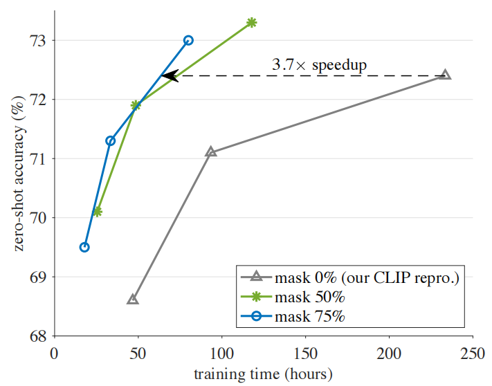 
Figure 1. Accuracy vs. training time trade-off. With a high masking ratio of 50% or 75%, our FLIP method trains faster and is more accurate than its CLIP counterpart. All entries are benchmarked in 256 TPU-v3 cores. Training is done on LAION-400M for 6.4, 12.8, or 32 epochs, for each masking ratio. Accuracy is evaluated by zero-shot transfer on the ImageNet-1K validation set. The model is ViT-L/16 [20]. More details are in Fig. 3. As the CLIP baseline takes ∼2,500 TPU-days training, a speedup of 3.7× can save ∼1,800 TPU-days.
图1。准确性与训练时间的权衡。在50%或75%的高掩码率下，我们的FLIP方法比CLIP方法训练得更快、更准确。所有条目都以256个TPU-v3内核为基准。对于每个掩码比，在LAION-400M上进行6.4、12.8或32个周期的训练。通过ImageNet-1K验证集上的零样本迁移评估准确性。模型为ViT-L/16[20]。更多细节如图3所示。由于CLIP基线需要约2500 TPU天的训练，3.7倍的加速可以节省约1800 TPU天。

We present Fast Language-Image Pre-training (FLIP), a simple method for efficient CLIP training. Inspired by the sparse computation of Masked Autoencoders (MAE) [29], we randomly remove a large portion of image patches during training. This design introduces a trade-off between “how carefully we look at a sample pair” vs. “how many sample pairs we can process”. Using masking, we can: (i) see more sample pairs (i.e., more epochs) under the same wall-clock training time, and (ii) compare/contrast more sample pairs at each step (i.e., larger batches) under similar memory footprint. Empirically, the benefits of processing more sample pairs greatly outweigh the degradation of per-sample encoding, resulting in a favorable trade-off.

我们提出的快速语言图像预训练(FLIP)，是一种简单有效的CLIP训练方法。受掩码自动编码器(MAE)[29]稀疏计算的启发，我们在训练过程中随机去除了大部分图像分块。这种设计引入了“我们如何仔细地查看样本对”与“我们可以处理多少样本对”之间的权衡。使用掩码，我们可以：
1. 在相同的挂钟训练时间下看到更多的样本对(即，更多的周期)，
2. 在相似的内存占用下，在每个步骤(即，更大的批次)比较/对比更多的样本配对。根据经验，处理更多样本对的好处大大超过了每样本编码的退化，从而产生了有利的权衡。

By removing 50%-75% patches of a training image, our method reduces computation by 2-4×; it also allows using 2-4× larger batches with little extra memory cost, which boost accuracy thanks to the behavior of contrastive learning [30, 11]. As summarized in Fig. 1, FLIP trains >3× faster in wall-clock time for reaching similar accuracy as its CLIP counterpart; with the same number of epochs, FLIP reaches higher accuracy than its CLIP counterpart while still being 2-3× faster.

通过去除训练图像的50%-75%的分块，我们的方法将计算量减少了2-4倍;它还允许使用2-4倍的大批量，而几乎没有额外的内存成本，由于对比学习的行为，这提高了准确性[30，11]。如图1所示，FLIP在挂钟时间内训练速度快3倍以上，以达到与CLIP类似的精度;在相同周期数的情况下，FLIP达到了比CLIP更高的精度，同时仍然快2-3倍。

We show that FLIP is a competitive alternative to CLIP on various downstream tasks. Pre-trained on the same LAION-400M dataset [56], FLIP dominantly outperforms its CLIP counterparts (OpenCLIP [36] and our own reproduction), as evaluated on a large variety of downstream datasets and transfer scenarios. These comparisons suggest that FLIP can readily enjoy the faster training speed while still providing accuracy gains.

我们表明，在各种下游任务中，FLIP是CLIP的一种有竞争力的替代方案。在相同的LAION-400M数据集[56]上预训练，FLIP在各种下游数据集和迁移场景上的评估显示，其显著优于其CLIP对应物(OpenCLIP[36]和我们自己的复制)。这些比较表明，FLIP可以很容易地享受更快的训练速度，同时仍能提高准确性。

Facilitated by faster training, we explore scaling FLIP pre-training. We study these three axes: (i) scaling model size, (ii) scaling dataset size, or (iii) scaling training schedule length. We analyze the scaling behavior through carefully controlled experiments. We observe that model scaling and data scaling can both improve accuracy, and data scaling can show gains at no extra training cost. We hope our method, results, and analysis will encourage future research on scaling vision-language learning.

在加速训练的推动下，我们探索扩展FLIP预训练。我们研究这三个轴：(i)缩放模型大小，(ii)缩放数据集大小，或(iii)缩放训练计划长度。我们通过精心控制的实验来分析缩放行为。我们观察到，模型缩放和数据缩放都可以提高准确性，并且数据缩放可以在没有额外训练成本的情况下显示增益。我们希望我们的方法、结果和分析将鼓励未来对扩展视觉语言学习的研究。

## 2. Related Work
### Learning with masking. 掩码学习
Denoising Autoencoders [63] with masking noise [64] were proposed as an unsupervised representation learning method over a decade ago. One of its most outstanding applications is masked language modeling represented by BERT [18]. In computer vision, explorations along this direction include predicting large missing regions [50], sequence of pixels [10], patches [20, 29, 71], or pre-computed features [6, 66].

十多年前，使用掩码噪声[64]对自动编码器[63]进行去噪是一种无监督的表示学习方法。其最突出的应用之一是以BERT[18]为代表的掩码语言建模。在计算机视觉中，沿着这个方向的探索包括预测大的缺失区域[50]、像素序列[10]、分块[20，29，71]或预先计算的特征[6，66]。

The Masked Autoencoder (MAE) method [29] further takes advantage of masking to reduce training time and memory. MAE sparsely applies the ViT encoder [20] to visible content. It also observes that a high masking ratio is beneficial for accuracy. The MAE design has been applied to videos [61, 22], point clouds [49], graphs [59, 9, 32], audio [4, 47, 13, 35], visual control [70, 57], vision-language [23, 41, 31, 19], and other modalities [5].

掩码自动编码器(MAE)方法[29]进一步利用掩码来减少训练时间和内存。MAE稀疏地将ViT编码器[20]应用于可见内容。它还观察到，高掩码比对于精度是有益的。MAE设计已应用于视频[61，22]、点云[49]、图形[59，9，32]、音频[4，47，13，35]、视觉控制[70，57]、视觉语言[23，41，31，19]和其他模态[5]。

Our work is related to MAE and its vision-language extensions [23, 41, 31, 19]. However, our focus is on the scaling aspect enabled by the sparse computation; we address the challenge of large-scale CLIP training [52], while previous works [23, 41, 31, 19] are limited in terms of scale.

我们的工作与MAE及其视觉语言扩展有关[23，41，31，19]。然而，我们的重点是通过稀疏计算实现的缩放方面;我们解决了大规模CLIP训练的挑战[52]，而之前的工作[23，41，31，19]在规模方面是有限的。

Our method does not perform reconstruction and is not a form of autoencoding. Speeding up training by masking is studied in [69] for self-supervised contrastive learning, e.g., for MoCo [30] or BYOL [27], but its accuracy could be limited by the scaling behavior of image-only contrastive learning.

我们的方法不执行重建，也不是一种自动编码形式。[69]中研究了通过掩蔽来加速训练，用于自监督对比学习，例如MoCo[30]或BYOL[27]，但其准确性可能受到仅图像对比学习的缩放行为的限制。

### Language-supervised learning. 语言监督学习
In the past years, CLIP [52] and related works (e.g., [37, 51]) have popularized learning visual representations with language supervision. CLIP is a form of contrastive learning [28] by comparing image-text sample pairs. Beyond contrastive learning, generative learning methods have been explored [17, 65, 2, 74], optionally combined with contrastive losses [74]. Our method focuses on the CLIP method, while we hope it can be extended to generative methods in the future.

在过去的几年里，CLIP[52]和相关工作(例如，[37，51])已经普及了在语言监督下学习视觉表征。CLIP是通过比较图像-文本样本对进行对比学习的一种形式[28]。除了对比学习之外，还探索了生成学习方法[17，65，2，74]，可选地结合对比损失[74]。我们的方法专注于CLIP方法，同时我们希望它能在未来扩展到生成方法。

## 3. Method
In a nutshell, our method simply masks out the input data in CLIP [52] training and reduces computation. See Fig. 2.

简而言之，我们的方法简单地掩码了CLIP[52]训练中的输入数据，并减少了计算。见图2。

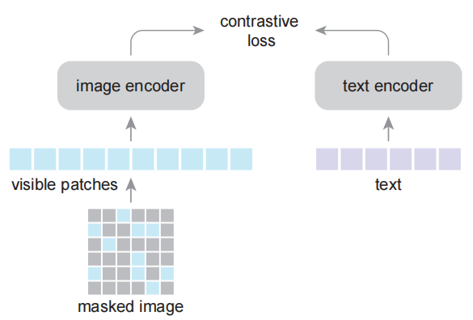 
Figure 2. Our FLIP architecture. Following CLIP [52], we perform contrastive learning on pairs of image and text samples. We randomly mask out image patches with a high masking ratio and encode only the visible patches. We do not perform reconstruction of masked image content. 
图2:我们的FLIP架构。在CLIP[52]之后，我们对成对的图像和文本样本进行对比学习。我们随机屏蔽掉具有高掩码率的图像分块，并仅对可见分块进行编码。我们不执行掩码图像内容的重建。

In our scenario, the benefit of masking is on wisely spending computation. Intuitively, this leads to a tradeoff between how densely we encode a sample against how many samples we compare as the learning signal. By introducing masking, we can: (i) learn from more image-text pairs under the same wall-clock training time, and (ii) have a contrastive objective over a larger batch under the same memory constraint. We show by experiments that for both aspects, our method is at an advantage in the trade-off. Next we introduce the key components of our method.

在我们的场景中，掩码的好处在于明智地计算开销。直观地说，这带来了我们对样本编码的密度与我们作为学习信号比较的样本数量之间的权衡。通过引入掩码，我们可以：(i)在相同的挂钟训练时间下从更多的图像-文本对中学习，以及(ii)在相同内存约束下对更大的批次具有对比目标。我们通过实验表明，对于这两个方面，我们的方法在权衡中都处于优势。接下来我们将介绍我们方法的关键组成部分。

Image masking.  We adopt the Vision Transformer (ViT) [20] as the image encoder. An image is first divided into a grid of non-overlapping patches. We randomly mask out a large portion (e.g., 50% or 75%) of patches; the ViT encoder is only applied to the visible patches, following [29]. Using a masking ratio of 50% (or 75%) reduces the time complexity of image encoding to 1/2 (or 1/4); it also allows using a 2× (or 4×) larger batch with a similar memory cost for image encoding.

图像掩码。我们采用视觉转换器(ViT)[20]作为图像编码器。图像首先被划分为不重叠的分块网格。我们随机掩码了很大一部分(例如，50%或75%)的分块;ViT编码器仅应用于可见分块，如[29]。使用50%(或75%)的掩码比将图像编码的时间复杂度降低到1/2(或1/4);它还允许使用2×(或4×)更大的批次，具有类似的图像编码内存成本。

Text masking. Optionally, we perform text masking in the same way as image masking. We mask out a portion of the text tokens and apply the encoder only to the visible tokens, as in [29]. This is unlike BERT [18] that replaces them with a learned mask token. Such sparse computation can reduce the text encoding cost. However, as the text encoder is smaller [52], speeding it up does not lead to a better overall trade-off. We study text masking for ablation only.

文本掩码。可选地，我们以与图像掩码相同的方式执行文本掩码。我们掩码了一部分文本令牌，并仅将编码器应用于可见令牌，如[29]所示。这与BERT[18]不同，后者将它们替换为学习的掩码令牌。这样的稀疏计算可以降低文本编码成本。然而，由于文本编码器较小[52]，因此加快速度并不能带来更好的整体权衡。我们只研究消融时的文本掩码。

Objective. The image/text encoders are trained to minimize a contrastive loss [48]. The negative sample pairs for contrastive learning consist of other samples in the same batch [11]. It has been observed that a large number of negative samples is critical for self-supervised contrastive learning on images [30, 11]. This property is more prominent in language-supervised learning.

目标。对图像/文本编码器进行训练，以最大限度地减少对比损失[48]。用于对比学习的负样本对由同一批次中的其他样本组成[11]。已经观察到，大量负样本对于图像上的自监督对比学习至关重要[30，11]。这种性质在语言监督学习中更为突出。

We do not use a reconstruction loss, unlike MAE [29]. We find that reconstruction is not necessary for good performance on zero-shot transfer. Waiving the decoder and reconstruction loss yields a better speedup.

与MAE[29]不同，我们不使用重建损失。我们发现，在零样本迁移中，重建对于良好的性能来说是不必要的。免除解码器和重建损失可以产生更好的加速。

Unmasking. While the encoder is pre-trained on masked images, it can be directly applied on intact images without changes, as is done in [29]. This simple setting is sufficient to provide competitive results and will serve as our baseline in ablation experiments.

解掩码。虽然编码器是在掩码图像上预先训练的，但它可以直接应用于完整的图像，而不会发生变化，正如[29]中所做的那样。这种简单的设置足以提供有竞争力的结果，并将作为我们消融实验的基线。

To close the distribution gap caused by masking, we can set the masking ratio as 0% and continue pre-training for a small number of steps. This unmasking tuning strategy produces a more favorable accuracy/time trade-off.

为了缩小掩码造成的分布差距，我们可以将掩码率设置为0%，并继续进行少量步骤的预训练。这种揭开面纱的调整策略产生了更有利的准确性/时间权衡。

### 3.1. Implementation
Our implementation follows CLIP [52] and OpenCLIP [36], with a few modifications we describe in the following. Hyper-parameters are in the appendix.

我们的实现遵循CLIP[52]和OpenCLIP[36]，我们在下面描述了一些修改。超参数见附录。

Our image encoder follows the ViT paper [20]. We do not use the extra LayerNorm [3] after patch embedding, like [20] but unlike [52]. We use global average pooling at the end of the image encoder. The input size is 224.

我们的图像编码器遵循ViT论文[20]。我们在分块嵌入后不使用额外的LayerNorm[3]，与[20]类似，但与[52]不同。我们在图像编码器的末尾使用全局平均池。输入大小为224。

Our text encoder is a non-autoregressive Transformer [62], which is easier to adapt to text masking for ablation. We use a WordPiece tokenizer as in [18]. We pad or cut the sequences to a fixed length of 32. We note that CLIP in [52] uses an autoregressive text encoder, a BytePairEncoding tokenizer, and a length of 77. These designs make marginal differences as observed in our initial reproduction.

我们的文本编码器是一个非自回归变换器[62]，它更容易适应用于消融的文本掩码。我们在[18]中使用了WordPiece令牌器。我们将序列填充或剪切到32的固定长度。我们注意到[52]中的CLIP使用自回归文本编码器、BytePairEncoding令牌器，长度为77。正如在我们最初的复制中所观察到的那样，这些设计产生了微小的差异。

The outputs of the image encoder and text encoder are projected to the same-dimensional embedding space by a linear layer. The cosine similarities of the embeddings, scaled by a learnable temperature parameter [52], are the input to the InfoNCE loss [48].

图像编码器和文本编码器的输出通过线性层投影到相同维度的嵌入空间。通过可学习的温度参数[52]缩放的嵌入的余弦相似性是InfoNCE损失[48]的输入。

In zero-shot transfer, we follow the prompt engineering in the code of [52]. We use their provided 7 prompt templates for ImageNet zero-shot transfer.

在零样本迁移中，我们遵循代码[52]中的提示工程。我们使用他们提供的7个提示模板进行ImageNet零样本迁移。

Our implementation is based on JAX [8] with the t5x library [54] for large-scale distributed training. Our training is run on TPU v3 infrastructure.

我们的实现基于JAX[8]和t5x库[54]，用于大规模分布式训练。我们的训练是在TPU v3基础设施上进行的。

## 4. Experiments
### 4.1. Ablations  消融
We first ablate the FLIP design. The image encoder is ViT-L/16 [20], and the text encoder has a smaller size as per [52]. We train on LAION-400M [36] and evaluate zeroshot accuracy on ImageNet-1K [16] validation.

我们首先消融FLIP设计。图像编码器为ViT-L/16[20]，文本编码器的尺寸较小，如[52]所示。我们在LAION-400M[36]上进行训练，并在ImageNet-1K[16]验证上评估零样本精度。

Table 1 shows the ablations trained for 6.4 epochs. Fig. 1 plots the trade-off for up to 32 epochs [52]. The results are benchmarked in 256 TPU-v3 cores, unless noted.

表1显示了6.4个周期训练的消融。图1绘制了多达32个周期的权衡[52]。除非另有说明，否则在256个TPU-v3核心中对结果进行了基准测试。

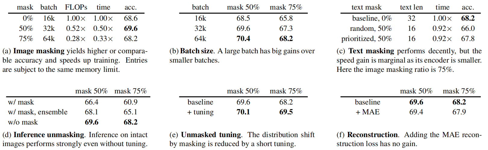 
Table 1. Zero-shot ablation experiments. Pre-training is on LAION-400M for 6.4 epochs, evaluated by zero-shot classification accuracy on ImageNet-1K validation. The backbone is ViT-L/16 [20]. Unless specified, the baseline setting is: image masking is 50% (batch 32k) or 75% (batch 64k), text masking is 0%, and no unmasked tuning is used.
表1。零样本消融实验。预训练在LAION-400M上进行6.4个周期，通过ImageNet-1K验证的零样本分类精度进行评估。主干是ViT-L/16[20]。除非指定，否则基线设置为：图像掩码为50%(批次32k)或75%(批次64k)，文本掩码为0%，并且不使用未掩码的调整。

#### Masking ratio.  掩码率
Table 1a studies the image masking ratios. Here we scale the batch size accordingly (ablated next), so as to roughly maintain the memory footprint(1Directly comparing TPU memory usage can be difficult due to its memory optimizations. We instead validate GPU memory usage using [36]’s reimplementation of FLIP, and find the memory usage is 25.5G, 23.9G and 24.5G for masking 0%, 50% and 75% on 256 GPUs). The 0% masking entry indicates our CLIP counterpart. Masking 50% gives 1.2% higher accuracy than the CLIP baseline, and masking 75% is on par with the baseline. Speed-wise, masking 50% or 75% takes only 0.50× or 0.33× wall-clock training time, thanks to the large reduction on FLOPs.

表1a研究了图像掩码比。在这里，我们相应地缩放批次大小(下一步消融)，以便大致保持内存足迹(1 由于其内存优化，直接比较TPU内存使用情况可能很困难。相反，我们使用[36]对FLIP的重新实现来验证GPU内存使用情况，并发现在256个GPU上掩码0%、50%和75%的内存使用情况分别为25.5G、23.9G和24.5G)。0%掩码条目表示我们的CLIP对应项。掩码50%的精度比CLIP基线高1.2%，掩码75%的精度与基线相当。在速度方面，由于FLOP的大幅减少，掩码50%或75%只需要0.50倍或0.33倍的挂钟训练时间。

#### Batch size. 批量大小
We ablate the effect of batch size in Table 1b. Increasing the batch size consistently improves accuracy.

我们在表1b中消融了批量大小的影响。不断增加批量大小可以提高准确性。

Notably, even using the same batch size of 16k, our 50% masking entry has a comparable accuracy (68.5%, Table 1b) with the 0% masking baseline (68.6%, Table 1a). It is possible that the regularization introduced by masking can reduce overfitting, partially counteracting the negative effect of losing information in this setting. With a higher masking ratio of 75%, the negative effect is still observed when keeping the batch size unchanged.

值得注意的是，即使使用16k的相同批次大小，我们的50%掩码条目也具有与0%掩码基线(68.6%，表1a)相当的准确性(68.5%，表1b)。掩码引入的正则化可能会减少过拟合，部分抵消这种情况下丢失信息的负面影响。在75%的较高掩码率的情况下，当保持批量大小不变时，仍然观察到负面影响。

Our masking-based method naturally encourages using large batches. There is little extra memory cost if we scale the batch size according to the masking ratio, as we report in Table 1a. In practice, the available memory is always a limitation for larger batches. For example, the setting in Table 1a has reached the memory limit in our high-end infrastructure (256 TPU-v3 cores with 16GB memory each)(2 The “mask 50%, 64k” entry in Table 1b requires 2× memory vs. those in Table 1a. This entry can be run using 2× devices; instead, it can also use memory optimization (e.g., activation checkpointing [12]) that trades time with memory, which is beyond the focus of this work). The memory issue is more demanding if using fewer devices, and the gain of our method would be more prominent due to the nearly free increase of batch sizes.

我们基于掩码的方法自然鼓励使用大批量。正如我们在表1a中报告的那样，如果我们根据掩码比来缩放批量大小，那么几乎没有额外的内存成本。在实践中，对于较大的批次，可用内存始终是一个限制。例如，表1a中的设置已经达到了我们高端基础设施的内存限制(256个TPU-v3内核，每个内核16GB内存)(2 表1b中的“掩码50%，64k”条目所需内存是表1a中的2倍。此条目可以使用2×设备运行;相反，它还可以使用内存优化(例如，激活检查点[12])，用内存来交换时间，这超出了这项工作的重点)。如果使用更少的设备，内存问题会更高，并且由于批量大小几乎免费增加，我们的方法的增益会更突出。

#### Text masking. 文本掩码
Table 1c studies text masking. Randomly masking 50% text decreases accuracy by 2.2%. This is in line with the observation [29] that language data has higher information-density than images and thus the text masking ratio should be lower.

表1c研究了文本掩码。随机掩码50%的文本会使准确性降低2.2%。这与观察结果[29]一致，即语言数据的信息密度高于图像，因此文本掩码率应该更低。

As variable-length text sequences are padded to generate a fixed-length batch, we can prioritize masking out the padding tokens. Prioritized sampling preserves more valid tokens than randomly masking the padded sequences uniformly. It reduces the degradation to 0.4%.

当可变长度的文本序列被填充以生成固定长度的批次时，我们可以优先掩码填充令牌。优先采样比均匀地随机掩码填充序列保留了更多的有效令牌。它将错误率降低到0.4%。
<!-- 掩码填充令牌, padding_token 和 mask_token 替换，有啥差别么？ -->

While our text masking is more aggressive than typical masked language models (e.g., 15% in [18]), the overall speed gain is marginal. This is because the text encoder is smaller and the text sequence is short. The text encoder costs merely 4.4% computation vs. the image encoder (without masking). Under this setting, text masking is not a worthwhile trade-off and we do not mask text in our other experiments.

虽然我们的文本掩码比典型的掩码语言模型更具攻击性(例如，[18]中的15%)，但总体速度增益是微不足道的。这是因为文本编码器较小，并且文本序列较短。与图像编码器相比，文本编码器的计算成本仅为4.4%(无掩码)。在这种设置下，文本掩码不是一种值得的权衡，我们在其他实验中也不会掩码文本。

#### Inference unmasking. 推理时不掩码
By default, we apply our models on intact images at inference-time, similar to [29]. While masking creates a distribution shift between training and inference, simply ignoring this shift works surprisingly well (Table 1d, ‘w/o mask’), even under the zero-shot setting where no training is ever done on full images.

默认情况下，我们在推理时将我们的模型应用于完整的图像，类似于[29]。虽然掩码会在训练和推理之间产生分布偏移，但忽略这种偏移效果出奇地好(表1d，“w/o mask”)，即使在零样本设置下，也不会对完整图像进行训练。

Table 1d reports that if using masking at inference time, the accuracy drops by a lot (e.g., 7.3%). This drop can be partially caused by information loss at inference, so we also compare with ensembling multiple masked views [10], where the views are complementary to each other and put together cover all patches. Ensembling reduces the gap (Table 1d), but still lags behind the simple full-view inference.

表1d报告称，如果在推理时使用掩码，精度会下降很多(例如，7.3%)。这种下降可能部分是由推理时的信息丢失引起的，因此我们也将其与多个掩码视图进行比较[10]，其中视图相互补充，放在一起覆盖所有分块。镶嵌减少了差距(表1d)，但仍落后于简单的全视图推断。

#### Unmasked tuning. 无掩码微调
Our ablation experiments thus far do not involve unmasked tuning. Table 1e reports the results of unmasked tuning for extra 0.32 epoch on the pre-training dataset. It increases accuracy by 1.3% at the high masking ratio of 75%, suggesting that tuning can effectively reduce the distribution gap between pre-training and inference.

到目前为止，我们的消融实验不涉及无掩码微调。表1e报告了在预训练数据集上针对额外0.32历元的未掩码微调的结果。在75%的高掩码率下，它将精度提高了1.3%，这表明调整可以有效地减少预训练和推理之间的分布差距。

Fig. 3 plots the trade-off affected by unmasked tuning (solid vs. dashed). Unmasked tuning leads to a more desirable trade-off for 75% masking; it has a comparable tradeoff for 50% masking but improves final accuracy.

图3绘制了受未掩码微调影响的权衡(实线与虚线)。无掩码微调导致75%掩码的更理想的折衷;它对于50%的掩码具有可比较的折衷，但提高了最终精度。

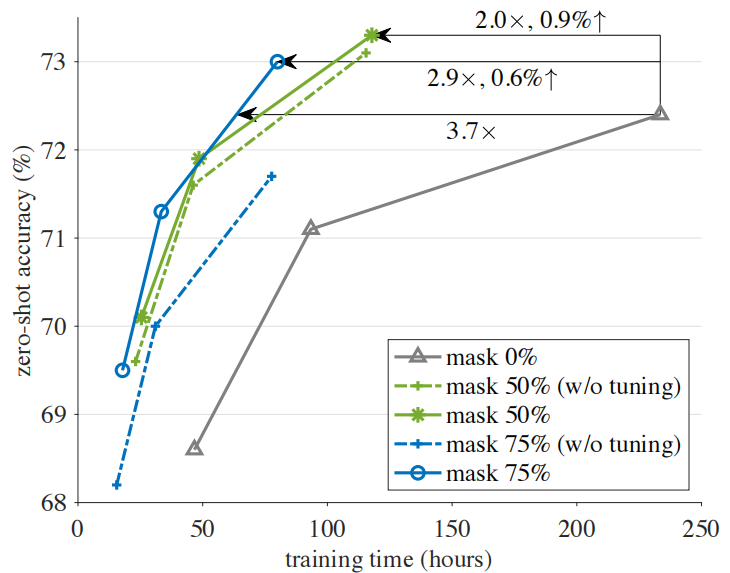 
Figure 3. Accuracy vs. training time trade-off in detail. The setting follows Table 1a. Training is for 6.4, 12.8, or 32 epochs, for each masking ratio. Unmasked tuning, if applied, is for 0.32 epoch. All are benchmarked in 256 TPU-v3 cores. Zero-shot accuracy is on IN-1K validation. The model is ViT-L/16. Our method speeds up training and increases accuracy.
图3。准确度与训练时间的详细权衡。设置如下表1a所示。对于每个掩码率，训练是针对6.4、12.8或32个周期。如果应用无掩码调整，则为0.32历元。所有这些都以256个TPU-v3核心为基准。零样本精度取决于IN-1K验证。模型为ViT-L/16。我们的方法加快了训练速度并提高了准确性。

#### Reconstruction. 重建
In Table 1f we investigate adding a reconstruction loss function. The reconstruction head follows the design in MAE [29]: it has a small decoder and reconstructs normalized image pixels. The reconstruction loss is added to the contrastive loss.

在表1f中，我们研究了添加重建损失函数。重建头遵循MAE[29]中的设计：它有一个小解码器，并重建归一化的图像像素。重建损失被添加到对比损失中。

Table 1f shows that reconstruction has a small negative impact for zero-short results. We also see a similar though slight less drop for fine-tuning accuracy on ImageNet. While this can be a result of suboptimal hyperparameters (e.g., balancing two losses), to strive for simplicity, we decide not to use the reconstruction loss. Waiving the reconstruction head also helps simplify the system and improves the accuracy/time trade-off.

表1f显示，对于零样本结果，重建具有较小的负面影响。我们在ImageNet上也看到了类似的微调精度下降，尽管降幅较小。虽然这可能是次优超参数(例如，平衡两个损失)的结果，但为了简单起见，我们决定不使用重建损失。省去重建头也有助于简化系统并提高准确性/时间权衡。

#### Accuracy vs. time trade-off. 准确性与时间的权衡
Fig. 3 presents a detailed view on the accuracy vs. training time trade-off. We extend the schedule to up to 32 epochs [52].
As shown in Fig. 3, FLIP has a clearly better trade-off than the CLIP counterpart. It can achieve similar accuracy as CLIP while enjoying a speedup of >3×. With the same 32-epoch schedule, our method is ∼1% more accurate than the CLIP counterpart and 2× faster (masking 50%).
The speedup of our method is of great practical value. The CLIP baseline takes ∼10 days training in 256 TPU-v3 cores, so a speedup of 2-3× saves many days in wall-clock time. This speedup facilitates exploring the scaling behavior, as we will discuss later in Sec. 4.3.

图3给出了准确度与训练时间权衡的详细视图。我们将时间表延长至32个周期[52]。
如图3所示，FLIP比CLIP有更好的权衡。它可以实现与CLIP类似的精度，同时享受>3倍的加速。对于相同的32历元时间表，我们的方法比CLIP方法精确约1%，速度快2倍(掩码50%)。
我们的加速方法具有很大的实用价值。CLIP基线需要在256个TPU-v3核心中进行约10天的训练，因此2-3倍的加速可以节省许多天的挂钟时间。这种加速有助于探索缩放行为，正如我们稍后将在第4.3节中讨论的那样。

### 4.2. Comparisons with CLIP  与CLIP的比较
In this section, we compare with various CLIP baselines in a large variety of scenarios. We show that our method is a competitive alternative to CLIP; as such, our fast training method is a more desirable choice in practice.

在本节中，我们将在各种场景中与各种CLIP基线进行比较。我们证明了我们的方法是CLIP的一种有竞争力的替代方法; 因此，我们的快速训练方法在实践中是一个更可取的选择。

We consider the following CLIP baselines:
* The original CLIP checkpoints [52], trained on the private dataset WIT-400M.
* OpenCLIP [36], trained on LAION-400M.
* Our CLIP reproduction, trained on LAION-400M.

我们考虑以下CLIP基线：
* 在私有数据集WIT-400M上训练的原始CLIP检查点[52]。
* OpenCLIP[36]，在LAION-400M上进行训练。
* 我们的CLIP复制，在LAION-400M上训练。

The original CLIP [52] was trained on a private dataset, so a direct comparison with it should reflect the effect of data, not just methods. OpenCLIP [36] is a faithful reproduction of CLIP yet trained on a public dataset that we can use, so it is a good reference for us to isolate the effect of dataset differences. Our CLIP reproduction further helps isolate other implementation subtleties and allows us to pinpoint the effect of the FLIP method.

最初的CLIP[52]是在私人数据集上训练的，因此与它的直接比较应该反映数据的效果，而不仅仅是方法。OpenCLIP[36]是CLIP的忠实复制，但在我们可以使用的公共数据集上进行训练，因此它是我们隔离数据集差异影响的良好参考。我们的CLIP复制进一步有助于隔离其他实现细节，并使我们能够精确定位FLIP方法的效果。

For all tasks studied in this subsection, we compare with all these CLIP baselines. This allows us to better understand the influence of the data and of the methods.

对于本小节中研究的所有任务，我们将与所有这些CLIP基线进行比较。这使我们能够更好地理解数据和方法的影响。

#### ImageNet zero-shot transfer.  零样本迁移
In Table 2 we compare with the CLIP baselines on ImageNet-1K [16] zero-shot transfer.

在表2中，我们将ImageNet-1K[16]零样本迁移与CLIP基线进行了比较。

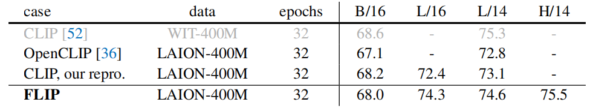 
Table 2. Zero-shot accuracy on ImageNet-1K classification, compared with various CLIP baselines. The image size is 224. The entries noted by grey are pre-trained on a different dataset. Our models use a 64k batch, 50% masking ratio, and unmasked tuning.
表2。与各种CLIP基线相比，ImageNet-1K分类的零样本精度。图像大小为224。用灰色标注的条目是在不同的数据集上预先训练的。我们的模型使用64k批次、50%的掩码比和无掩码微调。

As a sanity check, our CLIP reproduction has slightly higher accuracy than OpenCLIP trained on the same data. The original CLIP has higher accuracy than our reproduction and OpenCLIP, which could be caused by the difference between the pre-training datasets.

作为健全性检查，我们的CLIP复制比在相同数据上训练的OpenCLIP具有略高的准确性。原始CLIP比我们的复制和OpenCLIP具有更高的准确性，这可能是由于预训练数据集之间的差异造成的。

Table 2 reports the results of our FLIP models, using the best practice as we have ablated in Table 1 (a 64k batch, 50% masking ratio, and unmasked tuning). For ViT-L/14(3 For a legacy reason, we pre-trained our ViT-L models with a patch size of 16, following the original ViT paper [20]. The CLIP paper [52] uses L/14 instead. To save resources, we report our L/14 results by tuning the L/16 pre-trained model, in a way similar to unmasked tuning), our method has 74.6% accuracy, which is 1.8% higher than OpenCLIP and 1.5% higher than our CLIP reproduction. Comparing with the original CLIP, our method reduces the gap to 0.7%. We hope our method will improve the original CLIP result if it were trained on the WIT data.

表2报告了我们的FLIP模型的结果，使用了我们在表1中消融的最佳实践(64k批次，50%掩码比，和未掩码微调)。对于ViT-L/14(3 由于遗留问题，我们根据原始ViT论文[20]，用16的分块大小预训练了我们的ViT-L模型。CLIP论文[52]使用L/14代替。为了节省资源，我们通过调整L/16预训练模型来报告我们的L/14结果，其方式类似于无掩码调整)，我们的方法有74.6%的精度，比OpenCLIP高1.8%，比我们的CLIP复制高1.5%。与原始CLIP相比，我们的方法将差距缩小到0.7%。如果我们的方法是在WIT数据上训练的，我们希望它能改善原始CLIP的结果。

#### ImageNet linear probing. ImageNet线性探测
Table 3 compares the linear probing results, i.e., training a linear classifier on the target dataset with frozen features. FLIP has 83.6% accuracy, 1.0% higher than our CLIP counterpart. It is also 0.6% higher than our transfer of the original CLIP checkpoint, using the same SGD trainer.

表3比较了线性探测结果，即在具有冻结特征的目标数据集上训练线性分类器。FLIP的精度为83.6%，比CLIP的精度高1.0%。它也比我们使用相同的SGD训练器迁移原始CLIP检查点高出0.6%。

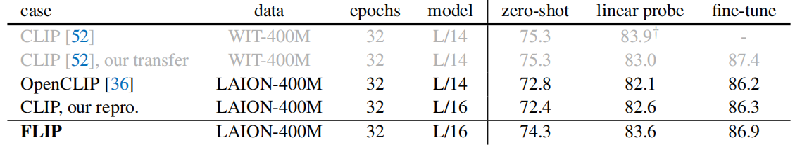 
Table 3. Linear probing and fine-tuning accuracy on ImageNet-1K classification, compared with various CLIP baselines. The entries noted by grey are pre-trained on a different dataset. The image size is 224. † : CLIP in [52] optimizes with L-BFGS; we use SGD instead.
表3。与各种CLIP基线相比，ImageNet-1K分类的线性探测和微调精度。用灰色标注的条目是在不同的数据集上预先训练的。图像大小为224。†：[52]中的CLIP使用L-BFGS进行优化;我们改为使用SGD。

#### ImageNet fine-tuning. 微调
Table 3 also compares full finetuning results. Our fine-tuning implementation follows MAE [29], with the learning rate tuned for each entry. It is worth noting that with our fine-tuning recipe, the original CLIP checkpoint reaches 87.4%, much higher than previous reports [68, 67, 33] on this metric. CLIP is still a strong model under the fine-tuning protocol.

表3还比较了完整的微调结果。我们的微调实现遵循MAE[29]，针对每个条目调整学习率。值得注意的是，通过我们的微调配置，原始CLIP检查点达到87.4%，远高于之前关于该指标的报告[68，67，33]。在微调协议下，CLIP仍然是一个强大的模型。

FLIP outperforms the CLIP counterparts pre-trained on the same data. Our result of 86.9% (or 87.1% using L/14) is behind but close to the result of the original CLIP checkpoint’s 87.4%, using our fine-tuning recipe.

FLIP的性能优于在相同数据上预先训练的CLIP。使用我们的微调配置，我们的结果为86.9%(或使用L/14为87.1%)，落后于但接近原始CLIP检查点的87.4%。

#### Zero-shot classification on more datasets.  更多数据集上的零样本分类
In Table 4 we compare on the extra datasets studied in [52]. As the results can be sensitive to evaluation implementation (e.g., text prompts, image pre-processing), we provide our evaluations of the original CLIP checkpoint and OpenCLIP.

在表4中，我们对[52]中研究的额外数据集进行了比较。由于结果可能对评估实现很敏感(例如，文本提示、图像预处理)，我们提供了对原始CLIP检查点和OpenCLIP的评估。

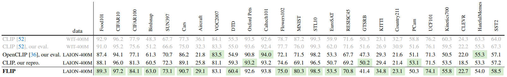 
Table 4. Zero-shot accuracy on more classification datasets, compared with various CLIP baselines. This table follows Table 11 in [52]. The model is ViT-L/14 with an image size of 224, for all entries. Entries in green are the best ones using the LAION-400M data.
表4。与各种CLIP基线相比，在更多分类数据集上的零样本精度。该表遵循[52]中的表11。对于所有条目，模型为ViT-L/14，图像大小为224。绿色条目是使用LAION-400M数据的最佳条目。

Notably, we observe clear systematic gaps caused by pre-training data, as benchmarked using the same evaluation code. The WIT dataset is beneficial for some tasks (e.g., Aircraft, Country211, SST2), while LAION is beneficial for some others (e.g., Birdsnap, SUN397, Cars).

值得注意的是，我们观察到训练前数据造成的明显的系统性差距，使用相同的评估代码进行基准测试。WIT数据集对某些任务(例如，飞机、国家211、SST2)有利，而LAION对其他一些任务(例如Birdsnap、SUN397、汽车)有利。

After isolating the influence of pre-training data, we observe that FLIP is dominantly better than OpenCLIP and our CLIP repro

在隔离了预训练数据的影响后，我们观察到FLIP明显优于OpenCLIP和我们的CLIP repro

#### Zero-shot retrieval. 零样本检索
Table 5 reports image/text retrieval results on Flickr30k [73] and COCO [42]. FLIP outperforms all CLIP competitors, including the original CLIP (evaluated on the same 224 size). The WIT dataset has no advantage over LAION for these two retrieval datasets.

表5报告了Flickr30k[73]和COCO[42]的图像/文本检索结果。FLIP的性能优于所有CLIP竞争对手，包括最初的CLIP(以相同的224尺寸进行评估)。对于这两个检索数据集，WIT数据集与LAION相比没有优势。

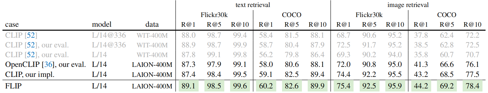 
Table 5. Zero-shot image/text retrieval, compared with various CLIP baselines. The image size is 224 if not noted. Entries in green are the best ones using the LAION-400M data.
表5。与各种CLIP基线相比，零样本图像/文本检索。如果未注明，则图像大小为224。绿色条目是使用LAION-400M数据的最佳条目。

#### Zero-shot robustness evaluation. 零样本稳健性评估
In Table 6 we compare on robustness evaluation, following [52]. We again observe clear systematic gaps caused by pre-training data. Using the same evaluation code (“our eval” in Table 6), CLIP pre-trained on WIT is clearly better than other entries pretrained on LAION. Taking IN-Adversarial (IN-A) as an example: the LAION-based OpenCLIP [36] has only 48.3% accuracy (or 46.6% reported by [36]). While FLIP (51.2%) can outperform the LAION-based CLIP by a large margin, it is still 20% below the WIT-based CLIP (71.9%).

在表6中，我们对稳健性评估进行了比较，如下[52]。我们再次观察到训练前数据造成的明显的系统性差距。使用相同的评估代码(表6中的“我们的评估”)，在WIT上预训练的CLIP明显优于在LAION上预训练过的其他条目。以IN对抗性(IN-A)为例：基于LAION的OpenCLIP[36]的精度仅为48.3%(或[36]报告的46.6%)。虽然FLIP(51.2%)可以大幅度优于基于LAION的CLIP，但仍比基于WIT的CLIP(71.9%)低20%。

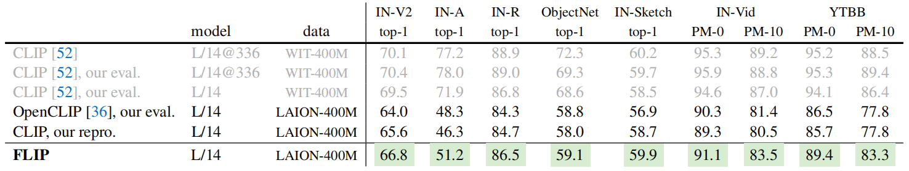 
Table 6. Zero-shot robustness evaluation, compared with various CLIP baselines. This table follows Table 16 in [52]. The image size is 224 if not noted. Entries in green are the best ones using the LAION-400M data.
表6。与各种CLIP基线相比，零样本稳健性评估。该表遵循[52]中的表16。如果未注明，则图像大小为224。绿色条目是使用LAION-400M数据的最佳条目。

Discounting the influence of pre-training data, our FLIP training has clearly better robustness than its CLIP counter parts in all cases. We hypothesize that masking as a form of noise and regularization can improve robustness.

考虑到预训练数据的影响，我们的FLIP训练在所有情况下都明显比其CLIP计数器部分具有更好的稳健性。我们假设掩蔽作为噪声和正则化的一种形式可以提高稳健性。

#### Image Captioning. 图像标题
See Table 7 for the captioning performance on COCO [42] and nocaps [1]. Our captioning implementation follows the cross-entropy training baseline in [7]. Unlike classification in which only a classifier layer is added after pre-training, here the fine-tuning model has a newly initialized captioner (detailed in appendix). In this task, FLIP outperforms the original CLIP checkpoint in several metrics. Compared to our CLIP baseline, which is pretrained on the same data, FLIP also shows a clear gain, especially in BLEU-4 and CIDEr metrics.

关于COCO[42]和nocaps[1]的标题性能，请参见表7。我们的标题实现遵循[7]中的交叉熵训练基线。与预训练后只添加分类器层的分类不同，这里的微调模型有一个新初始化的标题器(详见附录)。在这个任务中，FLIP在几个指标上都优于原来的CLIP检查点。与在相同数据上预训练的CLIP基线相比，FLIP也显示出明显的增益，尤其是在BLEU-4和CIDEr指标方面。

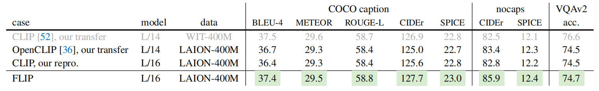 
Table 7. Image Captioning and Visual Question Answering, compared with various CLIP baselines. Entries in green are the best ones using LAION-400M. Here the results are on the COCO captioning test split of [38], nocaps val split, and VQAv2 test-dev split, respectively.
表7。图像标题和视觉问答，与各种CLIP基线进行比较。绿色的条目是使用LAION-400M的最佳条目。这里的结果分别是[38]的COCO标题测试拆分、nocaps val拆分和VQAv2测试dev拆分。

#### Visual Question Answering. 视觉问答
We evaluate on the VQAv2 dataset [26], with a fine-tuning setup following [21]. We use a newly initialized multimodal fusion transformer and an answer classifier to obtain the VQA outputs (detailed in appendix). Table 7 (rightmost column) reports results on VQAv2. All entries pre-trained on LAION perform similarly, and CLIP pre-trained on WIT is the best.

我们在VQAv2数据集[26]上进行评估，并在[21]之后进行微调设置。我们使用一个新初始化的多模态融合转换器和一个答案分类器来获得VQA输出(详见附录)。表7(最右边一列)报告了VQAv2的结果。所有在LAION上预训练的条目都表现相似，而在WIT上预训练过的CLIP是最好的。

#### Summary of Comparisons. 总结比较
Across a large variety of scenarios, FLIP is dominantly better than its CLIP counterparts (OpenCLIP and our reproduction) pre-trained on the same LAION data, in some cases by large margins.

在各种各样的场景中，FLIP明显优于在相同LAION数据上预训练的CLIP对应物(OpenCLIP和我们的复制)，在某些情况下有很大的优势。

The difference between the WIT data and LAION data can create large systematic gaps, as observed in many downstream tasks. We hope our study will draw attention to these data-dependent gaps in future research.

正如在许多下游任务中观察到的那样，WIT数据和LAION数据之间的差异可能会产生巨大的系统差距。我们希望我们的研究能在未来的研究中引起人们对这些依赖数据的差距的关注。

### 4.3. Scaling Behavior  缩放行为
Facilitated by the speed-up of FLIP, we explore the scaling behavior beyond the largest case studied in CLIP [52].

在FLIP加速的推动下，我们探索了CLIP中研究的最大案例之外的缩放行为[52]。

We study scaling along either of these three axes:
* Model scaling. We replace the ViT-L image encoder with ViT-H, which has ∼2× parameters. The text encoder is also scaled accordingly.
* Data scaling. We scale the pre-training data from 400 million to 2 billion, using the LAION-2B set [36]. To better separate the influence of more data from the influence of longer training, we fix the total number of sampled data (12.8B, which amounts to 32 epochs of 400M data and 6.4 epochs of 2B data).
* Schedule scaling. We increase the sampled data from 12.8B to 25.6B (64 epochs of 400M data).

我们研究沿着这三个轴中的任一轴的缩放：
* 模型缩放。我们将ViT-L图像编码器替换为ViT-H，其参数为2×。文本编码器也会相应地进行缩放。
* 数据缩放。我们使用LAION-2B集合[36]将预训练数据从4亿扩展到20亿。为了更好地将更多数据的影响与更长训练的影响分开，我们固定了采样数据的总数(12.8B，相当于400M数据的32个周期和2B数据的6.4个周期)。
* 计划缩放。我们将采样数据从12.8B增加到25.6B(400M数据的64个周期)。

We study scaling along one of these three axes at each time while keeping others unchanged. The results are summarized in Fig. 4 and Table 8.

我们研究每次沿着这三个轴中的一个轴缩放，同时保持其他轴不变。结果如图4和表8所示。

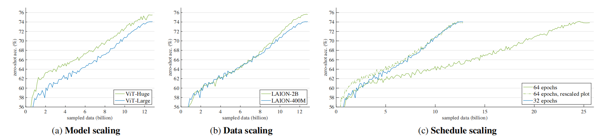 
Figure 4. Training curves of scaling. The x-axis is the number of sampled data during training, and the y-axis is the zero-shot accuracy on IN-1K. The blue curve is the baseline setting: ViT-Large, LAION-400M data, 32 epochs (12.8B sampled data). In each subplot, we compare with scaling one factor on the baseline. In schedule scaling (Fig. 4c), we plot an extra hypothetical curve for a better visualization.
图4。训练缩放曲线。x轴是训练期间采样数据的数量，y轴是IN-1K上的零样本精度。蓝色曲线是基线设置：ViT Large，LAION-400M数据，32个周期(12.8B个采样数据)。在每个子图中，我们将基线上的一个因子与缩放进行比较。在计划缩放中(图4c)，我们绘制了一条额外的假设曲线，以获得更好的可视化效果。

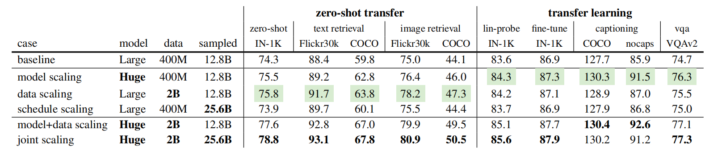 
Table 8. Scaling behavior of FLIP, evaluated on a diverse set of downstream tasks: classification, retrieval (R@1), captioning (CIDEr), and visual question answering. In the middle three rows, we scale along one of the three axes (model, data, schedule), and the green entries denote the best ones among these three scaling cases. Data scaling is in general favored under the zero-shot transfer scenario, while model scaling is in general favored under the transfer learning scenario (i.e., with trainable weights in downstream).
表8。FLIP的缩放行为，在一组不同的下游任务上进行评估：分类、检索(R@1)、标题(CIDEr)和视觉问答。在中间的三行中，我们沿着三个轴(模型、数据、时间表)中的一个进行缩放，绿色条目表示这三种缩放情况中最好的一个。数据缩放在零样本迁移场景下通常更受欢迎，而模型缩放在迁移学习场景下通常受欢迎(即，在下游具有可训练权重)。

#### Training curves. 训练曲线
The three scaling strategies exhibit different trends in training curves (Fig. 4).

三种缩放策略在训练曲线上表现出不同的趋势(图4)。

Model scaling (Fig. 4a) presents a clear gap that persists throughout training, though the gap is smaller at the end.

模型缩放(图4a)显示了一个明显的差距，该差距在整个训练过程中持续存在，尽管差距在最后较小。

Data scaling (Fig. 4b), on the other hand, performs similarly at the first half of training, but starts to present a good gain later. Note that there is no extra computational cost in this setting, as we control the total number of sampled data.

另一方面，数据缩放(图4b)在训练的前半部分表现类似，但后来开始呈现良好的增益。请注意，在这种设置中没有额外的计算成本，因为我们控制采样数据的总数。

Schedule scaling (Fig. 4c) trains 2× longer. To provide a more intuitive comparison, we plot a hypothetical curve that is rescaled by 1/2 along the x-axis (dashed line). Despite the longer training, the gain is diminishing or none (more numbers in Table 8).

计划缩放(图4c)列车长度为2倍。为了提供更直观的比较，我们绘制了一条假设曲线，该曲线沿x轴(虚线)重新缩放1/2。尽管训练时间较长，但收益正在减少或没有(表8中的更多数字)。

#### Transferability.  迁移能力
Table 8 provides an all-around comparison on various downstream tasks regarding the scaling behavior. Overall, model scaling and data scaling both can consistently outperform the baseline in all metrics, in some cases by large margins.

表8提供了关于缩放行为的各种下游任务的全面比较。总的来说，模型扩展和数据扩展在所有指标上都可以持续优于基线，在某些情况下差距很大。

We categorize the downstream tasks into two scenarios: (i) zero-shot transfer, i.e., no learning is performed on the downstream dataset; (ii) transfer learning, i.e., part or all of the weights are trained on the downstream dataset. For the tasks studied here, data scaling is in general favored for zero-shot transfer, while model scaling is in general favored for transfer learning. However, it is worth noting that the transfer learning performance depends on the size of the downstream dataset, and training a big model on a too small downstream set is still subject to the overfitting risk.

我们将下游任务分为两种情况：(i)零样本迁移，即不在下游数据集上执行学习;(ii)迁移学习，即在下游数据集上训练部分或全部权重。对于这里研究的任务，数据缩放通常适合于零样本迁移，而模型缩放通常适合用于迁移学习。然而，值得注意的是，迁移学习性能取决于下游数据集的大小，在太小的下游集上训练大模型仍然存在过拟合风险。

It is encouraging to see that data scaling is clearly beneficial, even not incurring longer training nor additional computation. On the contrary, even spending more computation by schedule scaling gives diminishing returns. These comparisons suggest that large-scale data are beneficial mainly because they provide richer information.

令人鼓舞的是，数据缩放显然是有益的，即使不会导致更长的训练或额外的计算。相反，即使通过计划缩放花费更多的计算，也会产生递减的回报。这些比较表明，大规模数据是有益的，主要是因为它们提供了更丰富的信息。

Next we scale both model and data (Table 8, second last row). For all metrics, model+data scaling improves over scaling either alone. The gains of model scaling and data scaling are highly complementary: e.g., in zero-shot IN-1K, model scaling alone improves over the baseline by 1.2% (74.3%→75.5%), and data scaling alone improves by 1.5% (74.3%→75.8%). Scaling both improves by 3.3% (77.6%), more than the two deltas combined. This behavior is also observed in several other tasks. This indicates that a larger model desires more dat

接下来，我们对模型和数据进行缩放(表8，倒数第二行)。对于所有度量标准，模型+数据缩放都会在单独缩放的基础上进行改进。模型缩放和数据缩放的收益是高度互补的：例如，在零样本in-1K中，仅模型缩放就比基线提高了1.2% (74.3% → 75.5%)，仅数据缩放就提高了1.5%(74.3%→75.8%)。缩放都提高了3.3%(77.6%)，超过了两个三角洲的总和。在其他几个任务中也可以观察到这种行为。这表明较大的模型需要更多的数据

Finally, we report joint scaling all three axes (Table 8, last row). Our results show that combining schedule scaling leads to improved performances across most metrics. This suggests that schedule scaling is particularly beneficial when coupled with larger models and larger-scale data.

最后，我们报告了所有三个轴的联合缩放(表8，最后一行)。我们的研究结果表明，在大多数指标中，将日程扩展结合起来可以提高性能。这表明，当与更大的模型和更大规模的数据相结合时，计划缩放是特别有益的。

Our result of 78.8% on zero-shot IN-1K outperforms the state-of-the-art result trained on public data with ViTH (78.0% of OpenCLIP). Also based on LAION-2B, their result is trained with 32B sampled data, 1.25× more than ours. Given the 50% masking we use, our training is estimated to be 2.5× faster than theirs if both were run on the same hardware. As OpenCLIP’s result reports a training cost of ∼5,600 GPU-days, our method could save ∼3,360 GPU-days based on a rough estimation. Additionally, without enabling 2× schedule, our entry of “model+data scaling” is estimated 5× faster than theirs and can save ∼4,480 GPU-days. This is considerable cost reduction.

我们在零样本IN-1K上的结果为78.8%，优于使用ViTH(OpenCLIP的78.0%)在公共数据上训练的最新结果。同样基于LAION-2B，他们的结果是用32B采样数据训练的，比我们的数据多1.25倍。考虑到我们使用的50%的掩码，如果两者都在同一硬件上运行，我们的训练估计比他们的训练快2.5倍。由于OpenCLIP的结果报告了约5600 GPU天的训练成本，根据粗略估计，我们的方法可以节省约3360 GPU天。此外，在不启用2倍计划的情况下，我们的“模型+数据缩放”输入速度估计比他们的快5倍，可以节省约4480 GPU天。这大大降低了成本。

## 5. Discussion and Conclusion  讨论和结论
Language is a stronger form of supervision than classical closed-set labels. Language provides rich information for supervision. Therefore, scaling, which can involve increasing capacity (model scaling) and increasing information (data scaling), is essential for attaining good results in language-supervised training.

语言是一种比经典闭集标签更强的监督形式。语言为监督提供了丰富的信息。因此，缩放可以包括增加容量(模型缩放)和增加信息(数据缩放)，对于在语言监督训练中获得良好效果至关重要。

CLIP [52] is an outstanding example of “simple algorithms that scale well”. The simple design of CLIP allows it to be relatively easily executed at substantially larger scales and achieve big leaps compared to preceding methods. Our method largely maintains the simplicity of CLIP while pushing it further along the scaling aspect.

CLIP[52]是“能够很好地扩展的简单算法”的一个杰出样本。CLIP的简单设计使其能够相对容易地在更大的规模上执行，并与之前的方法相比实现了巨大的飞跃。我们的方法在很大程度上保持了CLIP的简单性，同时在缩放方面进一步推动它。

Our method can provide a 2-3× speedup or more. For the scale concerned in this study, such a speedup can reduce wall-clock time by a great amount (e.g., at the order of thousands of TPU/GPU-days). Besides accelerating research cycles, the speedup can also save a great amount of energy and commercial cost. These are all ingredients of great importance in large-scale machine learning research.

我们的方法可以提供2-3倍或更多的加速。对于本研究中涉及的规模，这种加速可以大大减少挂钟时间(例如，数千TPU/GPU天的数量级)。除了加快研究周期外，加速还可以节省大量能源和商业成本。这些都是大规模机器学习研究中非常重要的组成部分。

Our study involves controlled comparisons with various CLIP baselines, which help us to break down the gaps contributed by different factors. We show that FLIP outperforms its CLIP counterparts pre-trained on the same LAION data. By comparing several LAION-based models and the original WIT-based ones, we observe that the pre-training data creates big systematic gaps in several tasks.

我们的研究涉及与各种CLIP基线的对照比较，这有助于我们打破不同因素造成的差距。我们表明，FLIP优于在相同LAION数据上预训练的CLIP同行。通过比较几种基于LAION的模型和原始的基于WIT的模型，我们观察到预训练数据在几个任务中造成了巨大的系统性差距。

Our study provides controlled experiments on scaling behavior. We observe that data scaling is a favored scaling dimension, given that it can improve accuracy with no extra cost at training or inference time. Our fast method encourages us to scale beyond what is studied in this work.

我们的研究提供了缩放行为的对照实验。我们观察到，数据缩放是一种受欢迎的缩放维度，因为它可以在训练或推理时提高准确性，而不需要额外的成本。我们的快速方法鼓励我们超越这项工作所研究的范围。

Broader impacts. Training large-scale models costs high energy consumption and carbon emissions. While our method has reduced such cost to 1/2-1/3, the remaining cost is still sizable. We hope our work will attract more attention to the research direction on reducing the cost of training vision-language models.

更广泛的影响。训练大型模型需要高能耗和高碳排放。虽然我们的方法已经将这种成本降低到1/2-1/3，但剩余的成本仍然相当可观。我们希望我们的工作能吸引更多人关注降低视觉语言模型训练成本的研究方向。

The numerical results in this paper are based on a publicly available large-scale dataset [56]. The resulting model weights will reflect the data biases, including potentially negative implications. When compared using the same data, the statistical differences between two methods should reflect the method properties to a good extent; however, when compared entries using different training data, the biases of the data should always be part of the considerations.

本文的数值结果基于公开的大规模数据集[56]。由此产生的模型权重将反映数据偏差，包括潜在的负面影响。当使用相同数据进行比较时，两种方法之间的统计差异应在很大程度上反映方法的属性; 然而，当使用不同的训练数据比较条目时，数据的偏差应该始终是考虑因素的一部分。

## Appendix 
### A. Implementation Details 实施细节
#### A.1. Pre-training 预训练
Encoders. Table 9 shows the architecture we use. The design follows CLIP [52]. Our image encoder involves ViT-B, -L, -H [20], using the same patch size as in [20] (16 for B and L, 14 for H). We use global average pooling after the image encoder. The corresponding text encoder is of a smaller size, following [52]. We train ViT-B/-L with 256 TPU-v3 cores, and ViT-H with 512 cores. Table 9 also shows the model size of the image encoder, text encoder, and the entire model (including output projection layers).

编码器。表9显示了我们使用的架构。设计遵循CLIP[52]。我们的图像编码器涉及ViT-B，-L，-H[20]，使用与[20]中相同的分块大小(B和L为16，H为14)。我们在图像编码器之后使用全局平均池。相应的文本编码器的尺寸较小，如[52]所示。我们用256个TPU-v3核心训练ViT-B/-L，用512个核心训练ViT-H。表9还显示了图像编码器、文本编码器和整个模型(包括输出投影层)的模型大小。

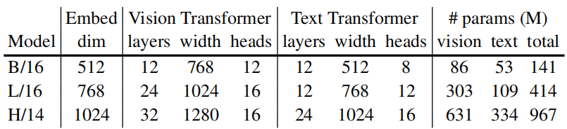 
Table 9. Encoder specifics. 
表9。编码器细节。

Hyper-parameters. Our default pre-training configuration is shown in Table 10. We use the linear learning rate scaling rule [24]: lr = base lr×batchsize / 256. We observe that using this rule allows us to change the batch size in ablations without extra learning rate search. The numerical precision we use is float32 by default. We also experimented with bfloat16, but only observed a ∼1.1× speedup, which is consistent with the results reported in Google’s blog (4 https://cloud.google.com/blog/products/ai-machinelearning/bfloat16-the-secret-to-high-performance-on-cloud-tpus ) .

超参数。我们默认的预训练配置如表10所示。我们使用线性学习速率缩放规则[24]：lr=基本lr×batchsize/256。我们观察到，使用该规则可以在没有额外学习率搜索的情况下改变消融中的批量大小。默认情况下，我们使用的数值精度为float32。我们也用bfloat16进行了实验，但只观察到了~1.1倍的加速，这与谷歌博客4中报道的结果一致(4 https://cloud.google.com/blog/products/ai-machinelearning/bfloat16-the-secret-to-high-performance-on-cloud-tpus )。

config | value
--- | --- 
optimizer | AdamW [45]
base learning rate | 4e-6
weight decay | 0.2
optimizer momentum | β1, β2=0.9, 0.95 [10]
learning rate schedule | cosine decay [44]
warmup (in samples) | 51.2M (B/L), 256M (H)
numerical precision | float32

Table 10. Pre-training setting. 
表10。预训练设置。

Unmasked tuning, which is a form of pre-training while disabling masking, follows Table 10, except that we lower the base learning rate to 4e-8 and shorten the warmup schedule to 25.6M samples.

无掩码微调是禁用掩码时的一种预训练形式，如表10所示，只是我们将基本学习率降低到4e-8，并将预热时间表缩短到2560万个样本。

#### A.2. ImageNet Classification
Zero-shot. We follow the prompt engineering in [52]. Their code provides 80 templates(5 https://github.com/openai/CLIP/blob/main/notebooks/). We use a subset of 7 templates they recommend; using all 80 templates gives similar results but is slower at inference.

零样本。我们遵循[52]中的提示工程。他们的代码提供了80个模板(5 https://github.com/openai/CLIP/blob/main/notebooks/)。我们使用他们推荐的7个模板的子集;使用全部80个模板可以得到类似的结果，但推理速度较慢。

Linear probing and fine-tuning. The setting follows [29]. See Table 11 and Table 12.

线性探测和微调。设置如下[29]。见表11和表12。

config | value
--- | --- 
optimizer | LARS [72]
base learning rate | 0.01
weight decay | 0
optimizer momentum | 0.9
batch size | 16384
learning rate schedule | cosine decay
warmup epochs |10
training epochs |90
augmentation |RandomResizedCrop

Table 11. Linear probing setting.
表11。线性探测设置。

config | value
--- | --- 
optimizer |AdamW
base learning rate |5e-5
weight decay |0.05
optimizer momentum |β1, β2=0.9, 0.999
layer-wise lr decay [14] |0.75
batch size |1024
learning rate schedule |cosine decay
warmup epochs |5
training epochs |50 (L/H)
augmentation RandAug |(9, 0.5) [15]
label smoothing [58] |0.1
mixup [76] |0.8
cutmix [75] |1.0
drop path [34] |0.2 (L/H)

Table 12. Fine-tuning setting. 
表12。微调设置。

#### A.3. Zero-shot Retrieval 零样本检索
We evaluate the performance of zero-shot retrieval on two standard benchmarks: Flickr30K [73] and COCO [42], respectively with 1K and 5K image-text pairs in their test sets. Following the protocol in CLIP [52], we extract the image and text embeddings from the corresponding encoders and perform retrieval based on the cosine similarities over candidate image-text pairs; no prompt is used.

我们在两个标准基准上评估了零样本检索的性能：Flickr30K[73]和COCO[42]，分别在测试集中使用1K和5K图像文本对。根据CLIP[52]中的协议，我们从相应的编码器中提取图像和文本嵌入，并基于候选图像-文本对的余弦相似性进行检索; 不使用提示。

#### A.4. Zero-shot Robustness Evaluation 零样本稳健性评估
In our zero-shot robustness evaluation on the ImageNetrelated sets, we use the prompts(7 https://github.com/openai/CLIP/blob/main/data/prompts.md) provided by [52], only except in IN-R we use all 80 prompts that are better than the 7 prompts by noticeable margins. The dataset preparation and split follow OpenCLIP [36](6 https://github.com/LAION-AI/CLIP_benchmark ). In ObjectNet, we follow [52] to use the class names without prompts. In YTBB, we use the VOC prompts provided by [52].

在我们对ImageNet相关集合进行的零样本稳健性评估中，我们使用了[52]提供的提示(7 https://github.com/openai/CLIP/blob/main/data/prompts.md )，只有在In-R中，我们才使用了所有80个提示，这些提示都比7个提示好，有明显的边距。数据集的准备和拆分遵循OpenCLIP[36](6 https://github.com/LAION-AI/CLIP_benchmark )。在ObjectNet中，我们遵循[52]在没有提示的情况下使用类名。在YTBB中，我们使用[52]提供的VOC提示。

#### A.5. More Zero-shot Datasets 更多零样本数据集
For the experiments in Table 4, we use the prompts provided by [52].7 We follow the data preparation scripts provided by [25] and [46] and load data using Tensorflow Datasets. Following [52], we report the mean accuracy per class for FGVC Aircraft, Oxford-IIIT Pets, Caltech-101, and Oxford Flowers 102 datasets; we report the mean of top-1 and top-5 accuracy for Kinetics-700, ROC AUC for Hateful Memes, and 11-point mAP for Pascal VOC 2007 Classification; we report top-1 accuracy for the rest of the datasets. We note that the Birdsnap dataset on Internet is shrinking over time and only 1850 test images are available for us (vs. 2149 images tested in [52], and 2443 originally).

对于表4中的实验，我们使用[52].7提供的提示。我们遵循[25]和[46]提供的数据准备脚本，并使用Tensorflow数据集加载数据。根据[52]，我们报告了FGVC Aircraft、Oxford IIIT Pets、Caltech-101和Oxford Flowers 102数据集的每类平均精度;我们报告了Kinetics-700的前1和前5准确性的平均值，仇恨内存的ROC AUC，以及Pascal VOC 2007分类的11点mAP;我们报告了其余数据集的前1准确性。我们注意到，随着时间的推移，互联网上的Birdsnap数据集正在缩小，只有1850张测试图像可供我们使用(而[52]中测试的图像为2149张，最初为2443张)。

#### A.6. Captioning 标题
We build a sequence-to-sequence encoder-decoder transformer model on top of the ViT image encoder, with 3 encoder layers and 3 decoder layers following [7]. Specifically, the ViT image features are first linearly projected to a 384-dimensional sequence and further encoded by a 3-layer transformer encoder (of 384 width and 6 heads). For autoregressive caption generation, we discard the pre-trained text encoder in FLIP and use a randomly initialized 3-layer transformer decoder (of 384 width and 6 heads) with crossattention to encoder outputs. The model is trained to predict the next text token using the tokenizer in [52].

我们在ViT图像编码器的基础上构建了一个序列到序列编码器-解码器转换器模型，后面有3个编码器层和3个解码器层[7]。具体地，首先将ViT图像特征线性投影到384维序列，并由3层变换编码器(384宽和6个头)进一步编码。对于自回归标题生成，我们丢弃FLIP中预先训练的文本编码器，并使用随机初始化的3层变换器解码器(384个宽度和6个头)，交叉关注编码器输出。使用[52]中的令牌器对模型进行训练，以预测下一个文本令牌。

For simplicity, we supervise the image captioning model only with teacher forcing using a word-level cross-entropy loss [7]; we do not use the CIDEr score optimization in [7]. The full model is fine-tuned end-to-end with the AdamW optimizer, a batch size of 256, a learning rate of 1e-4 for newly added parameters, a weight decay of 1e-2, a warmup of 15% iterations, and a cosine decay learning rate schedule. The learning rate for the pre-trained ViT parameters is set to 1e-5 for ViT-L (and 5e-6 for ViT-H). The input image size is 512×512 for ViT-L/16 and 448×448 for ViT-H/14 (to keep the same sequence lengths).

为了简单起见，我们使用单词级交叉熵损失[7]，仅在教师强制的情况下监督图像标题模型;我们没有在[7]中使用CIDEr评分优化。完整模型使用AdamW优化器进行端到端微调，批量大小为256，新添加参数的学习率为1e-4，权重衰减为1e-2，15%迭代的预热，以及余弦衰减学习率计划。预训练的ViT参数的学习率对于ViT-L设置为1e-5(对于ViT-H设置为5e-6)。ViT-L/16的输入图像大小为512×512，ViT-H/14的输入图像尺寸为448×448(以保持相同的序列长度)。

All models are fine-tuned for image captioning on the COCO training split of [38] for 20 epochs. During inference, the image captions are predicted with auto-regressive decoding, and we report their performance on the COCO test split of [38] under different metrics.

在COCO训练分割[38]上对所有模型进行了微调，以用于20个周期的图像标题。在推理过程中，使用自回归解码来预测图像标题，并且我们报告了它们在不同度量下对[38]的COCO测试拆分的性能。

To evaluate how the COCO-trained models generalize to novel objects, we evaluate these models directly on the nocaps [1] validation set, with no further fine-tuning.

为了评估COCO训练的模型如何推广到新的对象，我们直接在nocaps[1]验证集上评估这些模型，而不进行进一步的微调。

#### A.7. Visual Question Answering 视觉问答
In our VQA experiments, we follow the architecture described in [21]. Specifically, the VQA task is casted as a classification problem over all answer classes. The input images are encoded by the ViT encoders. The input questions are encoded by a pre-trained RoBERTa text encoder [43], following the practice in [21]. A multimodal fusion Transformer (4 layers, 768-d, 12 heads, with merged attention [21]) is applied to combine the image and text representations. A two-layer MLP is applied on the class token of the fusion module to obtain the VQA output [21].

在我们的VQA实验中，我们遵循[21]中描述的架构。具体地说，VQA任务被投射为所有答案类的分类问题。输入图像由ViT编码器进行编码。输入问题由预先训练的RoBERTa文本编码器[43]编码，遵循[21]中的实践。应用多模型融合转换器(4层，768-d，12个头，具有合并注意力[21])来组合图像和文本表示。在融合模块的类令牌上应用两层MLP，以获得VQA输出[21]。

We fine-tune the VQA model end-to-end. The loss function is a binary sigmoid loss using soft scores [60]. We use a batch size of 256, a learning rate of 1e-4 for randomly initialized parameters, and a learning rate of 1e-5 (ViT-L) or 5e-6 (ViT-H) for the pre-trained ViT parameters. We use a weight decay of 1e-2, a warmup of 15% of iterations, and a cosine decay learning rate schedule. The input image size is 512×512 for ViT-L/16 and 448×448 for ViT-H/14.

我们端到端地微调VQA模型。损失函数是使用软评分的二元sigmoid损失[60]。我们使用256的批量大小，对于随机初始化的参数使用1e-4的学习率，对于预训练的ViT参数使用1e-5(ViT-L)或5e-6(ViT-H)的学习率。我们使用1e-2的权重衰减，15%的迭代预热，以及余弦衰减学习速率计划。ViT-L/16的输入图像大小为512×512，ViT-H/14的输入图像尺寸为448×448。

All models are fine-tuned for 20 epochs on the VQAv2 train+val set, with additional question-answer pairs from Visual Genome [39], following [60]. We report results on the test-dev split from the evaluation server.

所有模型都在VQAv2序列+val集上针对20个周期进行了微调，接下来还有来自视觉基因组[39]的额外问答对[60]。我们报告从评估服务器中分离的测试开发的结果。

## References
1. Harsh Agrawal, Karan Desai, Yufei Wang, Xinlei Chen, Rishabh Jain, Mark Johnson, Dhruv Batra, Devi Parikh, Stefan Lee, and Peter Anderson. Nocaps: Novel object captioning at scale. In ICCV, 2019.
2. Jean-Baptiste Alayrac, Jeff Donahue, Pauline Luc, Antoine Miech, Iain Barr, Yana Hasson, Karel Lenc, Arthur Mensch, Katie Millican, and Malcolm Reynolds. Flamingo: a visual language model for few-shot learning. arXiv:2204.14198, 2022.
3. Jimmy Lei Ba, Jamie Ryan Kiros, and Geoffrey E Hinton. Layer normalization. arXiv:1607.06450, 2016.
4. Alan Baade, Puyuan Peng, and David Harwath. MAEAST: Masked autoencoding audio spectrogram transformer. arXiv:2203.16691, 2022.
5. Roman Bachmann, David Mizrahi, Andrei Atanov, and Amir Zamir. MultiMAE: Multi-modal multi-task masked autoencoders. arXiv:2204.01678, 2022.
6. Hangbo Bao, Li Dong, and Furu Wei. BEiT: BERT pre-training of image Transformers. arXiv:2106.08254, 2021.
7. Manuele Barraco, Marcella Cornia, Silvia Cascianelli, Lorenzo Baraldi, and Rita Cucchiara. The unreasonable effectiveness of clip features for image captioning: An experimental analysis. In CVPR, 2022.
8. James Bradbury, Roy Frostig, Peter Hawkins, Matthew James Johnson, Chris Leary, Dougal Maclaurin, George Necula, Adam Paszke, Jake VanderPlas, Skye Wanderman-Milne, and Qiao Zhang. JAX: composable transformations of Python+NumPy programs, 2018.
9. Hongxu Chen, Sixiao Zhang, and Guandong Xu. Graph masked autoencoder. arXiv:2202.08391, 2022.
10. Mark Chen, Alec Radford, Rewon Child, Jeffrey Wu, Heewoo Jun, David Luan, and Ilya Sutskever. Generative pretraining from pixels. In ICML, 2020.
11. Ting Chen, Simon Kornblith, Mohammad Norouzi, and Geoffrey Hinton. A simple framework for contrastive learning of visual representations. In ICML, 2020.
12. Tianqi Chen, Bing Xu, Chiyuan Zhang, and Carlos Guestrin. Training deep nets with sublinear memory cost. arXiv preprint arXiv:1604.06174, 2016.
13. Dading Chong, Helin Wang, Peilin Zhou, and Qingcheng Zeng. Masked spectrogram prediction for self-supervised audio pretraining. arXiv:2204.12768, 2022.
14. Kevin Clark, Minh-Thang Luong, Quoc V Le, and Christopher D Manning. ELECTRA: Pre-training text encoders as discriminators rather than generators. In ICLR, 2020.
15. Ekin D Cubuk, Barret Zoph, Jonathon Shlens, and Quoc V Le. Randaugment: Practical automated data augmentation with a reduced search space. In CVPR Workshops, 2020.
16. Jia Deng, Wei Dong, Richard Socher, Li-Jia Li, Kai Li, and Li Fei-Fei. ImageNet: A large-scale hierarchical image database. In CVPR, 2009.
17. Karan Desai and Justin Johnson. Virtex: Learning visual representations from textual annotations. In CVPR, 2021.
18. Jacob Devlin, Ming-Wei Chang, Kenton Lee, and Kristina Toutanova. BERT: Pre-training of deep bidirectional Transformers for language understanding. In NAACL, 2019.
19. Xiaoyi Dong, Yinglin Zheng, Jianmin Bao, Ting Zhang, Dongdong Chen, Hao Yang, Ming Zeng, Weiming Zhang, Lu Yuan, and Dong Chen. MaskCLIP: Masked self-distillation advances contrastive language-image pretraining. arXiv:2208.12262, 2022.
20. Alexey Dosovitskiy, Lucas Beyer, Alexander Kolesnikov, Dirk Weissenborn, Xiaohua Zhai, Thomas Unterthiner, Mostafa Dehghani, Matthias Minderer, Georg Heigold, Sylvain Gelly, Jakob Uszkoreit, and Neil Houlsby. An image is worth 16x16 words: Transformers for image recognition at scale. In ICLR, 2021.
21. Zi-Yi Dou, Yichong Xu, Zhe Gan, Jianfeng Wang, Shuohang Wang, Lijuan Wang, Chenguang Zhu, Pengchuan Zhang, Lu Yuan, Nanyun Peng, et al. An empirical study of training endto-end vision-and-language transformers. In CVPR, 2022.
22. Christoph Feichtenhofer, Haoqi Fan, Yanghao Li, and Kaiming He. Masked Autoencoders as spatiotemporal learners. arXiv:2205.09113, 2022.
23. Xinyang Geng, Hao Liu, Lisa Lee, Dale Schuurams, Sergey Levine, and Pieter Abbeel. Multimodal Masked Autoencoders learn transferable representations. arXiv:2205.14204, 2022.
24. Priya Goyal, Piotr Doll´ar, Ross Girshick, Pieter Noordhuis, Lukasz Wesolowski, Aapo Kyrola, Andrew Tulloch, Yangqing Jia, and Kaiming He. Accurate, large minibatch SGD: Training ImageNet in 1 hour. arXiv:1706.02677, 2017.
25. Priya Goyal, Quentin Duval, Jeremy Reizenstein, Matthew Leavitt, Sum Min, Benjamin Lefaudeux, Mannat Singh, Vinicius Reis, Mathilde Caron, Piotr Bojanowski, Armand Joulin, and Ishan Misra. VISSL. https : / / github . com / facebookresearch/vissl, 2021.
26. Yash Goyal, Tejas Khot, Douglas Summers-Stay, Dhruv Batra, and Devi Parikh. Making the V in VQA matter: Elevating the role of image understanding in visual question answering. In CVPR, 2017.
27. Jean-Bastien Grill, Florian Strub, Florent Altch´e, Corentin Tallec, Pierre Richemond, Elena Buchatskaya, Carl Doersch, Bernardo Avila Pires, Zhaohan Guo, Mohammad Gheshlaghi Azar, Bilal Piot, Koray Kavukcuoglu, Remi Munos, and Michal Valko. Bootstrap your own latent - a new approach to self-supervised learning. In NeurIPS, 2020.
28. Raia Hadsell, Sumit Chopra, and Yann LeCun. Dimensionality reduction by learning an invariant mapping. In CVPR, 2006.
29. Kaiming He, Xinlei Chen, Saining Xie, Yanghao Li, Piotr Doll´ar, and Ross Girshick. Masked autoencoders are scalable vision learners. arXiv:2111.06377, 2021.
30. Kaiming He, Haoqi Fan, Yuxin Wu, Saining Xie, and Ross Girshick. Momentum contrast for unsupervised visual representation learning. In CVPR, 2020.
31. Sunan He, Taian Guo, Tao Dai, Ruizhi Qiao, Chen Wu, Xiujun Shu, and Bo Ren. VLMAE: Vision-language masked autoencoder. arXiv:2208.09374, 2022.
32. Zhenyu Hou, Xiao Liu, Yuxiao Dong, Chunjie Wang, and Jie Tang. GraphMAE: Self-supervised masked graph autoencoders. arXiv:2205.10803, 2022.
33. Zejiang Hou, Fei Sun, Yen-Kuang Chen, Yuan Xie, and SunYuan Kung. MILAN: Masked image pretraining on language assisted representation. arXiv:2208.06049, 2022.
34. Gao Huang, Yu Sun, Zhuang Liu, Daniel Sedra, and Kilian Q Weinberger. Deep networks with stochastic depth. In ECCV, 2016.
35. Po-Yao Huang, Hu Xu, Juncheng Li, Alexei Baevski, Michael Auli, Wojciech Galuba, Florian Metze, and Christoph Feichtenhofer. Masked autoencoders that listen. arXiv:2207.06405, 2022.
36. Gabriel Ilharco, Mitchell Wortsman, Ross Wightman, Cade Gordon, Nicholas Carlini, Rohan Taori, Achal Dave, Vaishaal Shankar, Hongseok Namkoong, John Miller, Hannaneh Hajishirzi, Ali Farhadi, and Ludwig Schmidt. OpenCLIP, 2021.
37. Chao Jia, Yinfei Yang, Ye Xia, Yi-Ting Chen, Zarana Parekh, Hieu Pham, Quoc Le, Yun-Hsuan Sung, Zhen Li, and Tom Duerig. Scaling up visual and vision-language representation learning with noisy text supervision. In ICML, 2021.
38. Andrej Karpathy and Li Fei-Fei. Deep visual-semantic alignments for generating image descriptions. In CVPR, 2015.
39. Ranjay Krishna, Yuke Zhu, Oliver Groth, Justin Johnson, Kenji Hata, Joshua Kravitz, Stephanie Chen, Yannis Kalantidis, LiJia Li, David A Shamma, et al. Visual genome: Connecting language and vision using crowdsourced dense image annotations. International journal of computer vision, 123(1):32–73, 2017.
40. Alex Krizhevsky, Ilya Sutskever, and Geoff Hinton. Imagenet classification with deep convolutional neural networks. In NeurIPS, 2012.
41. Gukyeong Kwon, Zhaowei Cai, Avinash Ravichandran, Erhan Bas, Rahul Bhotika, and Stefano Soatto. Masked vision and language modeling for multi-modal representation learning. arXiv:2208.02131, 2022.
42. Tsung-Yi Lin, Michael Maire, Serge Belongie, James Hays, Pietro Perona, Deva Ramanan, Piotr Doll´ar, and C Lawrence Zitnick. Microsoft COCO: Common objects in context. In ECCV, 2014.
43. Yinhan Liu, Myle Ott, Naman Goyal, Jingfei Du, Mandar Joshi, Danqi Chen, Omer Levy, Mike Lewis, Luke Zettlemoyer, and Veselin Stoyanov. RoBERTa: A robustly optimized BERT pretraining approach. arXiv preprint arXiv:1907.11692, 2019.
44. Ilya Loshchilov and Frank Hutter. SGDR: Stochastic gradient descent with warm restarts. In ICLR, 2017.
45. Ilya Loshchilov and Frank Hutter. Decoupled weight decay regularization. In ICLR, 2019.
46. Norman Mu, Alexander Kirillov, David Wagner, and Saining Tie. SLIP: Self-supervision meets language-image pre-training. In ECCV, 2022.
47. Daisuke Niizumi, Daiki Takeuchi, Yasunori Ohishi, Noboru Harada, and Kunio Kashino. Masked spectrogram modeling using masked autoencoders for learning general-purpose audio representation. arXiv:2204.12260, 2022.
48. Aaron van den Oord, Yazhe Li, and Oriol Vinyals. Representation learning with contrastive predictive coding. arXiv:1807.03748, 2018.
49. Yatian Pang, Wenxiao Wang, Francis EH Tay, Wei Liu, Yonghong Tian, and Li Yuan. Masked autoencoders for point cloud self-supervised learning. arXiv:2203.06604, 2022.
50. Deepak Pathak, Philipp Krahenbuhl, Jeff Donahue, Trevor Darrell, and Alexei A Efros. Context encoders: Feature learning by inpainting. In CVPR, 2016.
51. Hieu Pham, Zihang Dai, Golnaz Ghiasi, Hanxiao Liu, Adams Wei Yu, Minh-Thang Luong, Mingxing Tan, and Quoc V Le. Combined scaling for zero-shot transfer learning. arXiv:2111.10050, 2021.
52. Alec Radford, Jong Wook Kim, Chris Hallacy, Aditya Ramesh, Gabriel Goh, Sandhini Agarwal, Girish Sastry, Amanda Askell, Pamela Mishkin, Jack Clark, Gretchen Krueger, and Ilya Sutskever. Learning transferable visual models from natural language supervision. In ICML, 2021.
53. Aditya Ramesh, Prafulla Dhariwal, Alex Nichol, Casey Chu, and Mark Chen. Hierarchical text-conditional image generation with clip latents. arXiv:2204.06125, 2022.
54. Adam Roberts, Hyung Won Chung, Anselm Levskaya, Gaurav Mishra, James Bradbury, Daniel Andor, Sharan Narang, Brian Lester, Colin Gaffney, Afroz Mohiuddin, Curtis Hawthorne, Aitor Lewkowycz, Alex Salcianu, Marc van Zee, Jacob Austin, Sebastian Goodman, Livio Baldini Soares, Haitang Hu, Sasha Tsvyashchenko, Aakanksha Chowdhery, Jasmijn Bastings, Jannis Bulian, Xavier Garcia, Jianmo Ni, Andrew Chen, Kathleen Kenealy, Jonathan H. Clark, Stephan Lee, Dan Garrette, James Lee-Thorp, Colin Raffel, Noam Shazeer, Marvin Ritter, Maarten Bosma, Alexandre Passos, Jeremy Maitin-Shepard, Noah Fiedel, Mark Omernick, Brennan Saeta, Ryan Sepassi, Alexander Spiridonov, Joshua Newlan, and Andrea Gesmundo. Scaling up models and data with t5x and seqio. arXiv:2203.17189, 2022.
55. Robin Rombach, Andreas Blattmann, Dominik Lorenz, Patrick Esser, and Bj¨orn Ommer. High-resolution image synthesis with latent diffusion models. In CVPR, 2022.
56. Christoph Schuhmann, Romain Beaumont, Richard Vencu, Cade Gordon, Ross Wightman, Mehdi Cherti, Theo Coombes, Aarush Katta, Clayton Mullis, Mitchell Wortsman, Patrick Schramowski, Srivatsa Kundurthy, Katherine Crowson, Ludwig Schmidt, Robert Kaczmarczyk, and Jenia Jitsev. LAION-5B: An open large-scale dataset for training next generation imagetext models. In NeurIPS, 2022.
57. Younggyo Seo, Danijar Hafner, Hao Liu, Fangchen Liu, Stephen James, Kimin Lee, and Pieter Abbeel. Masked world models for visual control. arXiv:2206.14244, 2022.
58. Christian Szegedy, Vincent Vanhoucke, Sergey Ioffe, Jonathon Shlens, and Zbigniew Wojna. Rethinking the inception architecture for computer vision. In CVPR, 2016.
59. Qiaoyu Tan, Ninghao Liu, Xiao Huang, Rui Chen, Soo-Hyun Choi, and Xia Hu. MGAE: Masked autoencoders for selfsupervised learning on graphs. arXiv:2201.02534, 2022.
60. Damien Teney, Peter Anderson, Xiaodong He, and Anton Van Den Hengel. Tips and tricks for visual question answering: Learnings from the 2017 challenge. In CVPR, 2018.
61. Zhan Tong, Yibing Song, Jue Wang, and Limin Wang. VideoMAE: Masked autoencoders are data-efficient learners for selfsupervised video pre-training. arXiv:2203.12602, 2022.
62. Ashish Vaswani, Noam Shazeer, Niki Parmar, Jakob Uszkoreit, Llion Jones, Aidan N Gomez, Lukasz Kaiser, and Illia Polosukhin. Attention is all you need. In NeurIPS, 2017.
63. Pascal Vincent, Hugo Larochelle, Yoshua Bengio, and PierreAntoine Manzagol. Extracting and composing robust features with denoising autoencoders. In ICML, 2008.
64. Pascal Vincent, Hugo Larochelle, Isabelle Lajoie, Yoshua Bengio, Pierre-Antoine Manzagol, and L´eon Bottou. Stacked denoising autoencoders: Learning useful representations in a deep network with a local denoising criterion. JMLR, 2010.
65. Zirui Wang, Jiahui Yu, Adams Wei Yu, Zihang Dai, Yulia Tsvetkov, and Yuan Cao. SimVLM: Simple visual language model pretraining with weak supervision. arXiv:2108.10904, 2021.
66. Chen Wei, Haoqi Fan, Saining Xie, Chao-Yuan Wu, Alan Yuille, and Christoph Feichtenhofer. Masked feature prediction for self-supervised visual pre-training. arXiv:2112.09133, 2021.
67. Yixuan Wei, Han Hu, Zhenda Xie, Zheng Zhang, Yue Cao, Jianmin Bao, Dong Chen, and Baining Guo. Contrastive learning rivals masked image modeling in fine-tuning via feature distillation. arXiv:2205.14141, 2022.
68. Mitchell Wortsman, Gabriel Ilharco, Jong Wook Kim, Mike Li, Simon Kornblith, Rebecca Roelofs, Raphael Gontijo Lopes, Hannaneh Hajishirzi, Ali Farhadi, Hongseok Namkoong, et al. Robust fine-tuning of zero-shot models. In CVPR, 2022.
69. Zhirong Wu, Zihang Lai, Xiao Sun, and Stephen Lin. Extreme masking for learning instance and distributed visual representations. arXiv:2206.04667, 2022.
70. Tete Xiao, Ilija Radosavovic, Trevor Darrell, and Jitendra Malik. Masked visual pre-training for motor control. arXiv:2203.06173, 2022.
71. Zhenda Xie, Zheng Zhang, Yue Cao, Yutong Lin, Jianmin Bao, Zhuliang Yao, Qi Dai, and Han Hu. SimMIM: A simple framework for masked image modeling. arXiv:2111.09886, 2021.
72. Yang You, Igor Gitman, and Boris Ginsburg. Large batch training of convolutional networks. arXiv:1708.03888, 2017.
73. Peter Young, Alice Lai, Micah Hodosh, and Julia Hockenmaier. From image descriptions to visual denotations: New similarity metrics for semantic inference over event descriptions. Transactions of the Association for Computational Linguistics, 2014.
74. Jiahui Yu, Zirui Wang, Vijay Vasudevan, Legg Yeung, Mojtaba Seyedhosseini, and Yonghui Wu. CoCa: Contrastive captioners are image-text foundation models. arXiv:2205.01917, 2022.
75. Sangdoo Yun, Dongyoon Han, Seong Joon Oh, Sanghyuk Chun, Junsuk Choe, and Youngjoon Yoo. Cutmix: Regularization strategy to train strong classifiers with localizable features. In ICCV, 2019.
76. Hongyi Zhang, Moustapha Cisse, Yann N Dauphin, and David Lopez-Paz. mixup: Beyond empirical risk minimization. In ICLR, 2018.