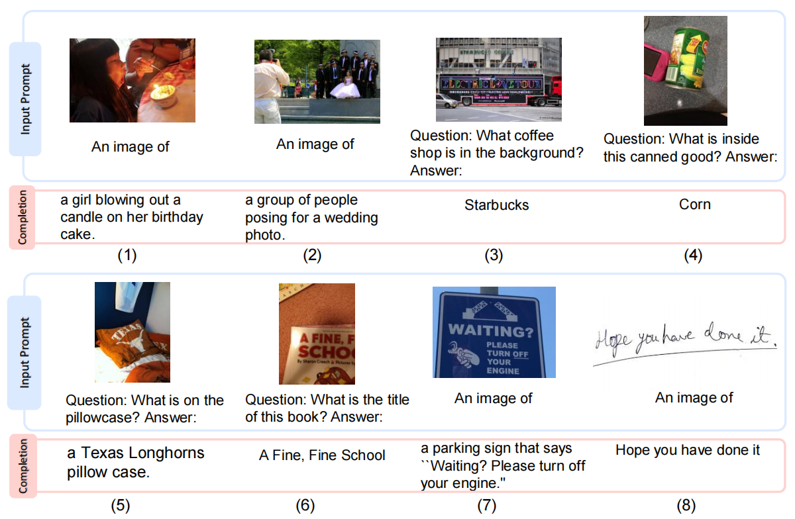

# Language Is Not All You Need: Aligning Perception with Language Models
KOSMOS-1: 语言不是你所需要的全部：将感知与语言模型对齐 2023.2.27 https://arxiv.org/abs/2302.14045

## 阅读笔记
* 大模型最新语料如何更新进去？newbing那样，根据问题先检索互联网，从检索到的文档中提取组织内容回答。大模型要的三观和方法论，而非记住每一个事实。
* 多轮对话的能力：过往n个q-a用特殊符号间隔，都作为下一个输入？计算效率问题，是缓存还是再重复计算一次？

 
 
Figure 1: KOSMOS-1 is a multimodal large language model (MLLM) that is capable of perceiving multimodal input, following instructions, and performing in-context learning for not only language tasks but also multimodal tasks. In this work, we align vision with large language models (LLMs), advancing the trend of going from LLMs to MLLMs.
图1：KOSMOS-1 是一种多模态大型语言模型 (MLLM)，它能够感知多模态输入、遵循指令并执行情景学习，不仅适用于语言任务，还适用于多模态任务。 在这项工作中，我们将视觉与大型语言模型 (LLM) 结合起来，推进从 LLM 到 MLLM 的趋势。

## Abstract
“The limits of my language means the limits of my world. Ludwig Wittgenstein ”
“我的语言局限意味着我的世界局限。 路德维希·维特根斯坦”

A big convergence of language, multimodal perception, action, and world modeling is a key step toward artificial general intelligence. In this work, we introduce KOSMOS-1(2 KOSMOS is pronounced as and means “Cosmos”) , a Multimodal Large Language Model (MLLM) that can perceive general modalities, learn in context (i.e., few-shot), and follow instructions (i.e., zero-shot). Specifically, we train KOSMOS-1 from scratch on web-scale multimodal corpora, including arbitrarily interleaved text and images, image-caption pairs, and text data. We evaluate various settings, including zero-shot, few-shot, and multimodal chain-of-thought prompting, on a wide range of tasks without any gradient updates or finetuning. Experimental results show that KOSMOS-1 achieves impressive performance on (i) language understanding, generation, and even OCR-free NLP (directly fed with document images), (ii) perception-language tasks, including multimodal dialogue, image captioning, visual question answering, and (iii) vision tasks, such as image recognition with descriptions (specifying classification via text instructions). We also show that MLLMs can benefit from cross-modal transfer, i.e., transfer knowledge from language to multimodal, and from multimodal to language. In addition, we introduce a dataset of Raven IQ test, which diagnoses the nonverbal reasoning capability of MLLMs.

语言、多模态感知、动作和世界建模的大融合是通向通用人工智能(AGI)的关键一步。 在这项工作中，我们介绍了 KOSMOS-1(2 KOSMOS 的发音和意思是“Cosmos”)，这是一种多模态大型语言模型 (MLLM)，可以感知一般模态、在情景中学习(即少样本)并遵循指令 (即零样本)。 具体来说，我们在网络规模的多模态语料库上从头开始训练 KOSMOS-1，包括任意交叉的文本和图像、图像-标题对和文本数据。 我们在没有任何梯度更新或微调的情况下，在广泛的任务上评估各种设置，包括零样本、少样本和多模态思维链提示。 实验结果表明，KOSMOS-1 在以下任务中取得了令人印象深刻的性能：
1. 语言理解、生成，甚至无 OCR NLP(直接输入文档图像)，
2. 感知语言任务，包括多模态对话、图像标题、视觉问题 回答，
3. 视觉任务，例如带有描述的图像识别(通过文本指令指定分类)。 
我们还表明，MLLM 可以从跨模态迁移中受益，即将知识从语言迁移到多模态，以及从多模态迁移到语言。 此外，我们还引入了一个 Raven IQ 测试数据集，用于诊断 MLLM 的非语言推理能力。

 
Figure 2: Selected examples generated from KOSMOS-1. Blue boxes are input prompt and pink boxes are KOSMOS-1 output. The examples include (1)-(2) visual explanation, (3)-(4) visual question answering, (5) web page question answering, (6) simple math equation, and (7)-(8) number recognition. 
图2：从 KOSMOS-1 生成的选定样本。 蓝色框是输入提示，粉色框是 KOSMOS-1 输出。 样本包括(1)-(2)视觉解释，(3)-(4)视觉问答，(5)网页问答，(6)简单数学方程式，以及(7)-(8)数字识别。

 
 
Figure 3: Selected examples generated from KOSMOS-1. Blue boxes are input prompt and pink boxes are KOSMOS-1 output. The examples include (1)-(2) image captioning, (3)-(6) visual question answering, (7)-(8) OCR, and (9)-(11) visual dialogue. 
图3：从 KOSMOS-1 生成的选定样本。 蓝色框是输入提示，粉色框是 KOSMOS-1 输出。 这些样本包括 (1)-(2) 图像标题、(3)-(6) 视觉问答、(7)-(8) OCR 和 (9)-(11) 视觉对话。

## 1 Introduction: From LLMs to MLLMs
Large language models (LLMs) have successfully served as a general-purpose interface across various natural language tasks [BMR+20]. The LLM-based interface can be adapted to a task as long as we are able to transform the input and output into texts. For example, the input of the summarization task is a document and the output is its summary. So we can feed the input document into the language model and then produce the generated summary.

大型语言模型 (LLM) 已成功地充当跨各种自然语言任务的通用接口 [BMR+20]。 只要我们能够将输入和输出转换为文本，基于 LLM 的接口就可以适应任务。 例如，摘要任务的输入是文档，输出是其摘要。 所以我们可以将输入文档输入语言模型，然后生成生成的摘要。<!--输入输出转文本？-->

Despite the successful applications in natural language processing, it is still struggling to natively use LLMs for multimodal data, such as image, and audio. Being a basic part of intelligence, multimodal perception is a necessity to achieve artificial general intelligence, in terms of knowledge acquisition and grounding to the real world. More importantly, unlocking multimodal input [TMC+21, HSD+22, WBD+22, ADL+22, AHR+22, LLSH23] greatly widens the applications of language models to more high-value areas, such as multimodal machine learning, document intelligence, and robotics.

尽管在自然语言处理方面取得了成功的应用，但它仍在努力将 LLM 原生地用于多模态数据，例如图像和音频。 作为智能的基础部分，多模态感知是实现通用人工智能的必要条件，无论是知识获取还是与现实世界打交道。 更重要的是，解锁多模态输入[TMC+21, HSD+22, WBD+22, ADL+22, AHR+22, LLSH23]极大拓宽了语言模型的应用到更多高价值领域，比如多模态机器学习，文档 智能, 机器人.

In this work, we introduce KOSMOS-1, a Multimodal Large Language Model (MLLM) that can perceive general modalities, follow instructions (i.e., zero-shot learning), and learn in context (i.e., few-shot learning). The goal is to align perception with LLMs, so that the models are able to see and talk. To be specific, we follow METALM [HSD+22] to train the KOSMOS-1 model from scratch.

在这项工作中，我们介绍了 KOSMOS-1，这是一种多模态大型语言模型 (MLLM)，它可以感知一般模态、遵循指令(即零样本学习)和在情景中学习(即少样本学习)。 目标是使感知与 LLM 保持一致，以便模型能够看到和说话。 具体来说，我们按照 METALM [HSD+22] 从头开始训练 KOSMOS-1 模型。

As shown in Figure 1, a Transformer-based language model is regarded as the general-purpose interface, and perception modules are docked with the language model. We train the model on webscale multimodal corpora, i.e., text data, arbitrarily interleaved images and texts, and image-caption pairs. In addition, we calibrate the instruction-following capability across modalities by transferring language-only data.

如图1所示，将基于Transformer的语言模型作为通用接口，感知模块与语言模型对接。 我们在全网规模的多模态语料库上训练模型，即文本数据、任意交叉的图像和文本，以及图像-标题对。 此外，我们通过迁移纯语言数据来校准跨模式的指令遵循能力。

As shown in Table 1, the KOSMOS-1 model natively supports language, perception-language, and vision tasks. We also present some generated examples in Figure 2 and 3. In addition to various natural language tasks, the KOSMOS-1 models natively handle a wide range of perception-intensive tasks, spanning visual dialogue, visual explanation, visual question answering, image captioning, simple math equation, OCR, and zero-shot image classification with descriptions. We also build an IQ test benchmark following Raven’s Progressive Matrices [JR03, CJS90], which evaluates the capability of nonverbal reasoning for MLLMs. The examples show that the native support of multimodal perception enables new opportunities to apply LLMs to new tasks. Moreover, we show that MLLMs achieve better commonsense reasoning performance compared with LLMs, which indicates cross-modal transfer helps knowledge acquisition.

如表 1 所示，KOSMOS-1 模型原生支持语言、感知语言和视觉任务。 我们还在图2 和图3 中展示了一些生成的样本。除了各种自然语言任务外，KOSMOS-1 模型还可以处理各种感知密集型任务，包括视觉对话、视觉解释、视觉问答、图像说明、 简单的数学方程式、OCR 和带描述的零样本图像分类。 我们还根据 Raven 的渐进矩阵 [JR03，CJS90] 建立了一个 IQ 测试基准，它评估了 MLLM 的非语言推理能力。 这些样本表明，多模态感知的原生支持为将 LLM 应用于新任务提供了新机会。 此外，我们表明，与 LLM 相比，MLLM 实现了更好的常识推理性能，这表明跨模态迁移有助于知识获取。

 
Table 1: We evaluate the capabilities of KOSMOS-1 on language, perception-language, and vision tasks under both zero- and few-shot learning settings. 
表 1：我们评估了 KOSMOS-1 在零样本和少样本学习设置下的语言、感知语言和视觉任务的能力。

The key takeaways are as follows:

关键要点如下：

### From LLMs to MLLMs. 
Properly handling perception is a necessary step toward artificial general intelligence. The capability of perceiving multimodal input is critical to LLMs. First, multimodal perception enables LLMs to acquire commonsense knowledge beyond text descriptions. Second, aligning perception with LLMs opens the door to new tasks, such as robotics, and document intelligence. Third, the capability of perception unifies various APIs, as graphical user interfaces are the most natural and unified way to interact with. For example, MLLMs can directly read the screen or extract numbers from receipts. We train the KOSMOS-1 models on web-scale multimodal corpora, which ensures that the model robustly learns from diverse sources. We not only use a large-scale text corpus but also mine high-quality image-caption pairs and arbitrarily interleaved image and text documents from the web.

从 LLM 到 MLLM。 正确处理感知是通向通用人工智能的必要步骤。 感知多模态输入的能力对 LLM 至关重要。 
1. 多模态感知使 LLM 能够获得文本描述之外的常识性知识。 
2. 将感知与 LLM 相结合为新任务打开了大门，例如机器人技术和文档智能。 
3. 感知能力统一了各种 API，因为图形用户界面是最自然和统一的交互方式。 例如，MLLM 可以直接读取屏幕或从收据中提取数字。 
我们在网络规模的多模态语料库上训练 KOSMOS-1 模型，这确保了模型能够从不同的来源中稳健地学习。 我们不仅使用大规模的文本语料库，还从网络中挖掘高质量的图像-标题对和任意交叉的图像和文本文档。 <!-- 挖掘高质量的图像-标题对? -->

### Language models as general-purpose interfaces. 
Following the philosophy proposed in METALM [HSD+22], we regard language models as a universal task layer. Because of the openended output space, we are able to unify various task predictions as texts. Moreover, natural-language instructions and action sequences (such as programming language) can be well handled by language models. LLMs also serve as basic reasoners [WWS+22], which is complementary to perception modules on complex tasks. So it is natural to align world, action, and multimodal perception with the general-purpose interface, i.e., language models.

作为通用接口的语言模型。 遵循 METALM [HSD+22] 中提出的理念，我们将语言模型视为通用任务层。 由于开放的输出空间，我们能够将各种任务预测统一为文本。 此外，语言模型可以很好地处理自然语言指令和动作序列(例如编程语言)。 LLM 还用作基本推理器 [WWS+22]，它是复杂任务上感知模块的补充。 因此，将世界、动作和多模态感知与通用接口(即语言模型)结合起来是很自然的。

### New capabilities of MLLMs. 
As shown in Table 1, apart from the capabilities found in previous LLMs [BMR+20, CND+22], MLLMs enable new usages and possibilities. First, we can conduct zero- and few-shot multimodal learning by using natural language instructions and demonstration examples. Second, we observe promising signals of nonverbal reasoning by evaluating the Raven IQ test, which measures the fluid reasoning ability of humans. Third, MLLMs naturally support multi-turn interactions for general modalities, such as multimodal dialogue. 

MLLM 的新能力。 如表 1 所示，除了以前的 LLM [BMR+20、CND+22] 中发现的功能外，MLLM 还支持新的用途和可能性。 
1. 我们可以通过使用自然语言指令和演示样本进行零样本和少样本多模态学习。 
2. 我们通过评估衡量人类流畅推理能力的 Raven IQ 测试，观察到非语言推理的有希望的信号。 
3. MLLMs 自然地支持一般模式的多回合交互，例如多模态对话。

## 2 KOSMOS-1: A Multimodal Large Language Model
As shown in Figure 1, KOSMOS-1 is a multimodal language model that can perceive general modalities, follow instructions, learn in context, and generate outputs. Given the previous context, the model learns to generate texts in an auto-regressive manner. Specifically, the backbone of KOSMOS-1 is a Transformer-based causal language model. Apart from text, other modalities are embedded and fed into the language model. The Transformer decoder serves as a general-purpose interface to multimodal input. We train KOSMOS-1 on multimodal corpora, including monomodal data, crossmodal paired data, and interleaved multimodal data. Once the models are trained, we can directly evaluate the models in zero-shot and few-shot settings on both language tasks and multimodal tasks.

如图1 所示，KOSMOS-1 是一种多模态语言模型，可以感知一般模态、遵循指令、在情景中学习并生成输出。 给定先前的情景，该模型学习以自回归方式生成文本。 具体来说，KOSMOS-1 的主干是一个基于 Transformer 的因果语言模型。 除了文本之外，其他模态也被嵌入并输入到语言模型中。 Transformer解码器 用作多模态输入的通用接口。 我们在多模态语料库上训练 KOSMOS-1，包括单模态数据、跨模态配对数据和交叉多模态数据。 一旦模型经过训练，我们就可以在语言任务和多模态任务的零样本和少样本设置中直接评估模型。

### 2.1 Input Representation
The Transformer decoder perceives general modalities in a unified way. For input format, we flatten input as a sequence decorated with special tokens. Specifically, we use \<s> and \</s> to denote startand end-of-sequence. The special tokens \<image> and \</image> indicate the beginning and end of encoded image embeddings. For example, “\<s> document \</s>” is a text input, and “\<s> paragraph \<image> Image Embedding \</image> paragraph \</s>” is an interleaved image-text input. Table 21 in Appendix shows some examples of input format.

Transformer解码器 以统一的方式感知一般模态。 对于输入格式，我们将输入展平为用特殊令牌装饰的序列。 具体来说，我们使用 \<s> 和 \</s> 来表示序列的开始和结束。 特殊令牌 \<image> 和 \</image> 表示编码图像嵌入的开始和结束。 例如，“\<s>文档\</s>”是文本输入，“\<s>段落\<image>图像嵌入\</image>段落\</s>”是交叉的图文输入。 附录中的表 21 显示了输入格式的一些样本。

An embedding module is used to encode both text tokens and other input modalities into vectors. Then the embeddings are fed into the decoder. For input tokens, we use a lookup table to map them into embeddings. For the modalities of continuous signals (e.g., image, and audio), it is also feasible to represent inputs as discrete code and then regard them as “foreign languages” [WBD+22, WCW+23]. In this work, following [HSD+22], we employ a vision encoder as the embedding module for input images. In addition, Resampler [ADL+22] is used as an attentive pooling mechanism to reduce the number of image embeddings.

嵌入模块用于将文本令牌和其他输入模式编码为向量。 然后嵌入被送入解码器。 对于输入令牌，我们使用查找表将它们映射到嵌入中。 对于连续信号的模态(例如，图像和音频)，也可以将输入表示为离散代码，然后将其视为“外语”[WBD+22，WCW+23]。 在这项工作中，继 [HSD+22] 之后，我们采用视觉编码器作为输入图像的嵌入模块。 此外，Resampler [ADL+22] 被用作一种专注的池化机制，以减少图像嵌入的数量。

### 2.2 Multimodal Large Language Models (MLLMs)
After obtaining the embeddings of an input sequence, we feed them into the Transformer-based decoder. The left-to-right causal model processes the sequence in an auto-regressive manner, which produces the next token by conditioning on past timesteps. The causal masking is used to mask out future information. A softmax classifier upon Transformer is used to generate tokens over the vocabulary.

在获得输入序列的嵌入后，我们将它们输入到基于 Transformer 的解码器中。 从左到右的因果模型以自回归方式处理序列，通过以过去的时间步为条件来生成下一个令牌。 因果掩码用于掩码未来信息。 Transformer 上的 softmax 分类器用于在词汇表上生成令牌。<!--causal masking-->

MLLMs serve as general-purpose interfaces [HSD+22] that can perform interactions with both natural language and multimodal input. The framework is flexible to handle various data types, as long as we can represent input as vectors. MLLMs combine the best of two worlds. First, the language models naturally inherit the capabilities of in-context learning and instruction following. Second, perception is aligned with language models by training on multimodal corpora.

MLLM 作为通用接口 [HSD+22]，可以与自然语言和多模态输入进行交互。 该框架可以灵活地处理各种数据类型，只要我们可以将输入表示为向量即可。 MLLM 结合了两个世界的优点。 首先，语言模型自然地继承了情景学习和指令跟随的能力。 其次，通过对多模态语料库的训练，感知与语言模型保持一致。

The implementation is based on the library TorchScale3 [MWH+22], which is designed for largescale model training. Compared with the standard Transformer architecture, we include the following modifications:

该实现基于专为大规模模型训练设计的库 TorchScale[MWH+22](3 https://github.com/microsoft/torchscale)。 与标准的 Transformer 架构相比，我们包括以下修改：

#### MAGNETO 
We use MAGNETO [WMH+22], a Transformer variant, as the backbone architecture. MAGNETO has better training stability and superior performance across modalities. It introduces an extra LayerNorm to each sublayer (i.e., multi-head self-attention, and feed-forward network). The method has a theoretically derived initialization method [WMD+22] to improve the optimization fundamentally, which allows us to effectively scale up the models without pain.

MAGNETO. 我们使用 MAGNETO [WMH+22]，一种 Transformer 变体，作为骨干架构。 MAGNETO 具有更好的训练稳定性和跨模式的卓越性能。 它为每个子层(即多头自注意力和前馈网络)引入了一个额外的 LayerNorm。 该方法有一个理论上推导的初始化方法 [WMD+22] 来从根本上改进优化，这使我们能够轻松地有效地扩展模型。

#### XPOS 
We employ XPOS [SDP+22] relative position encoding for better long-context modeling. The method can better generalize to different lengths, i.e., training on short while testing on longer sequences. Moreover, XPOS optimizes attention resolution so that the position information can be captured more precisely. The method XPOS is efficient and effective in both interpolation and extrapolation settings.

XPOS. 我们采用 XPOS [SDP+22] 相对位置编码来实现更好的长情景建模。 该方法可以更好地推广到不同的长度，即在短序列上进行训练，而在较长序列上进行测试。 此外，XPOS 优化了注意力解析，可以更精确地捕获位置信息。 XPOS 方法在插值和外推设置中都是高效且有效的。

### 2.3 Training Objective
The KOSMOS-1 training is conducted on web-scale multimodal corpora, including monomodal data (e.g., text corpus), cross-modal paired data (e.g., image-caption pairs), and interleaved multimodal data (e.g., documents of arbitrarily interleaved images and texts). To be specific, we use monomodal data for representation learning. For example, language modeling with text data pretrains instruction following, in-context learning, and various language tasks. Moreover, cross-modal pairs and interleaved data learn to align the perception of general modalities with language models. Interleaved data also naturally fit in the multimodal language modeling task. We present more details of training data collection in Section 3.1.

KOSMOS-1 训练是在网络规模的多模态语料库上进行的，包括单模态数据(例如，文本语料库)、跨模态配对数据(例如，图像-标题对)和交叉的多模态数据(例如，任意交叉图像的文档) 和文本)。 具体来说，我们使用单峰数据进行表示学习。 例如，使用文本数据的语言建模预训练指令遵循、情景学习和各种语言任务。 此外，跨模态对和交叉数据学习使一般模态的感知与语言模型保持一致。 交叉数据也很自然地适合多模态语言建模任务。 我们在第 3.1 节中介绍了训练数据收集的更多细节。

The models are trained with the next-token prediction task, i.e., learning to generate the next token depending on the previous context. The training objective is to maximize the log-likelihood of tokens in examples. Notice that only discrete tokens, such as text tokens, are accounted for in the training loss. Multimodal language modeling is a scalable way to train the models. More importantly, the emergence of various capabilities makes the training task favorable for downstream applications. 

这些模型接受了下一个令牌预测任务的训练，即学习根据先前的情景生成下一个令牌。 训练目标是最大化样本中令牌的对数似然。 请注意，训练损失中仅考虑了离散令牌，例如文本令牌。 多模态语言建模是一种可扩展的模型训练方法。 更重要的是，各种能力的出现使得训练任务有利于下游应用。
<!--文生成下一个令牌? 文字，图像？ 只生成文本的-->

## 3 Model Training
### 3.1 Multimodal Training Data
The models are trained on web-scale multimodal corpora. The training datasets consist of text corpora, image-caption pairs, and interleaved data of images and texts. 

这些模型是在网络规模的多模态语料库上训练的。 训练数据集由文本语料库、图像-标题对以及图像和文本的交叉数据组成。

#### Text Corpora 
We train our model with The Pile [GBB+20] and Common Crawl (CC). The Pile is a massive English text dataset built for training large-scale language models, which is produced from a variety of data sources. We exclude data splits from GitHub, arXiv, Stack Exchange, and PubMed Central. We also include the Common Crawl snapshots (2020-50 and 2021-04) datasets, CC-Stories, and RealNews datasets [SPP+19, SPN+22]. The entire datasets have been purged of duplicate and near-duplicate documents, as well as filtered to exclude downstream task data. Refer to Appendix B.1.1 for detailed descriptions of training text corpora.

Text Corpora. 我们使用 The Pile [GBB+20] 和 Common Crawl (CC) 训练我们的模型。 The Pile 是为训练大规模语言模型而构建的海量英文文本数据集，由多种数据源产生。 我们排除了来自 GitHub、arXiv、Stack Exchange 和 PubMed Central 的数据拆分。 我们还包括 Common Crawl 快照(2020-50 和 2021-04)数据集、CC-Stories 和 RealNews 数据集 [SPP+19、SPN+22]。 整个数据集已清除重复和接近重复的文档，并进行过滤以排除下游任务数据。 训练文本语料库的详细说明见附录B.1.1。

#### Image-Caption Pairs 
The image-caption pairs are constructed from several datasets, including English LAION-2B [SBV+22], LAION-400M [SVB+21], COYO-700M [BPK+22], and Conceptual Captions [SDGS18, CSDS21]. English LAION-2B, LAION-400M, and COYO-700M are collected from web pages of the Common Crawl web data by extracting image sources and the corresponding alt-text. Conceptual Captions are also from internet web pages. More details can be found in Appendix B.1.2.

图像-标题对 由多个数据集构成，包括英语 LAION-2B [SBV+22]、LAION-400M [SVB+21]、COYO-700M [BPK+22] 和概念标题 [SDGS18, CSDS21]。 英文 LAION-2B、LAION-400M 和 COYO-700M 是从Common Crawl 网络数据的网页中, 通过提取图像源和相应的alt-文本收集的。 概念性标题也来自互联网网页。 可以在附录B.1.2 中找到更多详情。

#### Interleaved Image-Text Data 
We collect interleaved multimodal data from the Common Crawl snapshot, which is a publicly available archive of web pages. We use a filtering process to select about 71M web pages from the original 2B web pages in the snapshot. We then extract the text and images from the HTML of each selected web page. For each document, we limit the number of images to five to reduce noise and redundancy. We also randomly discard half of the documents that only have one image to increase the diversity. We provide more details about the data collection process in Appendix B.1.3. By using this corpus, we enable KOSMOS-1 to handle interleaved text and image and improve its few-shot ability.

交叉的图像文本数据. 我们从 Common Crawl 快照中收集交叉的多模态数据，这是一个公开可用的网页存档。 我们使用过滤过程从快照中的原始 2B 网页中选择了大约 71M 的网页。 然后我们从每个选定网页的 HTML 中提取文本和图像。 对于每个文档，我们将图像数量限制为五张以减少噪声和冗余。 我们还随机丢弃了一半只有一张图像的文档以增加多样性。 我们在附录B.1.3 中提供了有关数据收集过程的更多详情。 通过使用这个语料库，我们使 KOSMOS-1 能够处理交叉的文本和图像并提高其少样本能力。

### 3.2 Training Setup
The MLLM component has 24 layers with 2,048 hidden dimensions, 8,192 FFN intermediate size, and 32 attention heads, resulting in about 1.3B parameters. We use Magneto’s initialization for optimization stability. For faster convergence, the image representation is obtained from a pretrained CLIP ViT-L/14 model with 1,024 feature dimensions. The images are preprocessed into 224×224 resolution during training. We freeze the parameters of the CLIP model except for the last layer during training. The total number of parameters of KOSMOS-1 is about 1.6B. More details about hyperparameters can be found in Appendix A.

MLLM 组件有 24 层，具有 2,048 个隐藏维度、8,192 个 FFN 中间大小和 32 个注意力头，产生大约 1.3B 个参数。 我们使用 Magneto 的初始化来优化稳定性。 为了更快收敛，图像表示是从具有 1,024 个特征维度的预训练 CLIP ViT-L/14 模型获得的。 图像在训练过程中被预处理为 224×224 分辨率。 我们在训练期间冻结了 CLIP 模型的参数，除了最后一层。 KOSMOS-1 的参数总数约为 1.6B。 有关超参数的更多详情，请参阅附录A。

We use a batch size of 1.2 million tokens (0.5 million tokens from text corpora, 0.5 million tokens from image-caption pairs, and 0.2 million tokens from interleaved data) and train KOSMOS-1 for 300k steps, corresponding to about 360 billion tokens. We adopt the AdamW optimizer with β = (0.9, 0.98). We set the weight decay to 0.01 and the dropout rate to 0.1. The learning rate increases to 2e-4 for the first 375 warming-up steps and decays linearly to 0 for the rest of the training steps. We use SentencePiece [KR18] to tokenize the text. We preprocess the data in the “full-sentence” format [LOG+19], which packs each input sequence with full sentences that are sampled continuously from one or more documents.

我们使用 120万个令牌(文本语料库中的 50 万个令牌，图像-标题对中的 50万个令牌，以及交叉数据中的 20万个令牌)的批处理大小，并训练 KOSMOS-1 30万步，相当于约 3600亿个令牌。 我们采用 β = (0.9, 0.98) 的 AdamW 优化器。 我们将权重衰减设置为 0.01，将dropout率设置为 0.1。 对于前 375 个热身步骤，学习率增加到 2e-4，并在其余训练步骤中线性衰减到 0。 我们使用 SentencePiece [KR18] 来令牌文本。 我们以“全句”格式 [LOG+19] 对数据进行预处理，将每个输入序列与从一个或多个文档中连续采样的完整句子打包在一起。

### 3.3 Language-Only Instruction Tuning
In order to better align KOSMOS-1 with human instructions, we perform language-only instruction tuning [LHV+23, HSLS22]. Specifically, we continue-train the model with the instruction data in the format of (instructions, inputs, and outputs). The instruction data is language-only, which is mixed with training corpora. The tuning process is conducted as language modeling. Notice that instructions and inputs are not accounted for in the loss. Section 4.9.1 shows that the improvements in the instruction-following capability can transfer across modalities.

为了更好地使 KOSMOS-1 与人类指令保持一致，我们执行纯语言指令调整 [LHV+23，HSLS22]。 具体来说，我们使用格式为(指令、输入和输出)的指令数据继续训练模型。 指令数据是纯语言的，与训练语料库混合在一起。 调整过程作为语言建模进行。 请注意，指令和输入不计入损失。 4.9.1 节表明，指令遵循能力的改进可以跨模态迁移。

We combine Unnatural Instructions [HSLS22] and FLANv2 [LHV+23] as our instruction dataset. Unnatural Instructions is a dataset that was created by using a large language model to generate instructions for various natural language processing tasks. It has 68,478 instruction-input-output triplets in its core dataset. FLANv2 is a collection of datasets that cover diverse types of language understanding tasks, such as reading comprehension, commonsense reasoning, and closed-book question answering. We randomly select 54k examples of instructions from FLANv2 to augment our instruction dataset. Details of the training hyperparameter settings are described in Appendix A.2. 

我们将 非自然指令 [HSLS22] 和 FLANv2 [LHV+23] 结合起来作为我们的指令数据集。 非自然指令 是使用大型语言模型创建的数据集，用于为各种自然语言处理任务生成指令。 它的核心数据集中有 68,478 个指令-输入-输出三元组。 FLANv2 是一个数据集的集合，涵盖了多种类型的语言理解任务，例如阅读理解、常识推理和闭卷问答。 我们从 FLANv2 中随机选择 54k 个指令样本来扩充我们的指令数据集。 附录A.2 中描述了训练超参数设置的详情。

## 4 Evaluation
MLLMs can handle both language tasks and perception-intensive tasks. We evaluate KOSMOS-1 on various types of tasks as follows:
* Language tasks – Language understanding – Language generation – OCR-free text classification
* Cross-modal transfer – Commonsense reasoning
* Nonverbal reasoning – IQ Test (Raven’s Progressive Matrices)
* Perception-language tasks – Image captioning – Visual question answering – Web page question answering
* Vision tasks – Zero-shot image classification – Zero-shot image classification with descriptions

MLLM 可以处理语言任务和感知密集型任务。 我们在各种类型的任务上评估 KOSMOS-1，如下所示：
* 语言任务 – 语言理解 – 语言生成 – 无 OCR 文本分类
* 跨模态迁移 – 常识推理
* 非语言推理 – IQ 测试(Raven 的渐进矩阵)
* 感知语言任务 – 图像标题 – 视觉问答 – 网页问答
* 视觉任务 – 零样本图像分类 – 带描述的零样本图像分类

### 4.1 Perception-Language Tasks 感知-语言任务
We evaluate the perception-language capability of KOSMOS-1 under vision-language settings. Specifically, we conduct zero-shot and few-shot experiments on two widely used tasks, including image captioning and visual question answering. Image captioning involves generating a natural language description of an image, while visual question answering aims to answer a natural language question with respect to an image.

我们评估了 KOSMOS-1 在视觉语言设置下的感知语言能力。 具体来说，我们对两个广泛使用的任务进行了零样本和少样本实验，包括图像标题和视觉问答。 图像标题涉及生成图像的自然语言描述，而视觉问答旨在回答关于图像的自然语言问题。

#### 4.1.1 Evaluation Setup
We evaluate the caption generation on MS COCO Caption [LMB+14], and Flickr30k [YLHH14]. We use the test set of COCO Karpathy split [KFF17], which re-partitions the train2014 and val2014 images [LMB+14] into 113,287, 5,000, and 5,000 for the training set, validation set, and test set, respectively. We conduct an evaluation on Flickr30k’s Karpathy split test set. The image resolution is 224×224. We use beam search to generate the captions, and the beam size is 5. In the few-shot settings, we randomly sample demonstrations from the training set. We use COCOEvalCap(4 https://github.com/salaniz/pycocoevalcap ) to compute CIDEr [VLZP15] and SPICE [AFJG16] scores as the evaluation metrics. We prompt KOSMOS-1 with “An image of” for zero-shot and few-shot caption generation experiments.

我们评估了 MS COCO Caption [LMB+14] 和 Flickr30k [YLHH14] 上的标题生成。 我们使用 COCO Karpathy split [KFF17] 的测试集，它将 train2014 和 val2014 图像 [LMB+14] 重新划分为 113,287、5,000 和 5,000，分别用于训练集、验证集和测试集。 我们对 Flickr30k 的 Karpathy 拆分测试集进行了评估。 图片分辨率为224×224。 我们使用集束搜索来生成标题，集束大小为 5。在少样本设置中，我们从训练集中随机抽样演示。 我们使用 COCOEvalCap(4 https://github.com/salaniz/pycocoevalcap) 计算 CIDEr [VLZP15] 和 SPICE [AFJG16] 分数作为评估指标。 我们用“An image of”提示 KOSMOS-1 进行零样本和少样本标题生成实验。

For visual question-answering tasks, we evaluate zero-shot and few-shot results on test-dev set of VQAv2 [GKSS+17] and test-dev set of VizWiz [GLS+18], respectively. The resolution of images is 224×224. We use greedy search for the decoding. We follow the normalization rules of the VQAv2 evaluation code(5 https://github.com/GT-Vision-Lab/VQA) when computing the VQA accuracy. We evaluate the performance of VQA in an open-ended setting that KOSMOS-1 generates answers and stops at the \</s> (“end of sequence”) token. The prompt is “Question: {question} Answer: {answer}” for visual question answering tasks.

对于视觉问答任务，我们分别在 VQAv2 [GKSS+17] 的测试开发集和 VizWiz [GLS+18] 的测试开发集上评估零样本和少样本结果。 图片的分辨率为224×224。 我们使用贪心搜索进行解码。 在计算 VQA 准确率时，我们遵循 VQAv2 评估代码的归一化规则 (5 https://github.com/GT-Vision-Lab/VQA)。 我们在 KOSMOS-1 生成答案并在 \</s>(“序列结尾”)令牌处停止的开放式设置中评估 VQA 的性能。 对于视觉问答任务，提示是“问题：{问题}答案：{答案}”。

#### 4.1.2 Results
Image Captioning Table 2 shows the zero-shot captioning performance on COCO Karpathy test split and Flickr30k test set. KOSMOS-1 achieves remarkable results in zero-shot setting on two image captioning datasets. Specifically, our model achieves a CIDEr score of 67.1 on the Flickr30k dataset, compared to 60.6 and 61.5 for the Flamingo-3B and Flamingo-9B models, respectively. Notably, our model is able to accomplish this feat with a smaller size of 1.6B, compared to Flamingo models. This demonstrates our model’s superiority in zero-shot image captioning. 

Image Captioning 表 2 显示了 COCO Karpathy 测试拆分和 Flickr30k 测试集上的零样本标题性能。 KOSMOS-1 在两个图像标题数据集上的零样本设置方面取得了显著成果。 具体来说，我们的模型在 Flickr30k 数据集上的 CIDEr 得分为 67.1，而 Flamingo-3B 和 Flamingo-9B 模型分别为 60.6 和 61.5。 值得注意的是，与 Flamingo 模型相比，我们的模型能够以更小的 1.6B 尺寸完成这一壮举。 这证明了我们的模型在零样本图像标题方面的优势。

 
Table 2: Zero-shot image captioning results on COCO caption Karpathy test and Flickr30k test. ∗ Flamingo [ADL+22] prompts with two examples from the downstream tasks while removing their corresponding images (i.e., similar to few-shot text prompts). The other models do not include any examples in the prompt.
表 2：COCO 标题 Karpathy 测试和 Flickr30k 测试的零样本图像标题结果。 ∗ Flamingo [ADL+22] 提示下游任务中的两个样本，同时删除它们相应的图像(即类似于少样本文本提示)。 其他模型不在提示中包含任何样本。

Table 3 reports the results of the few-shot (k = 2, 4, 8) settings. The overall performance improves as the number of shots increases from two to four. The trends are consistent across the two datasets. Moreover, the few-shot results outperform zero-shot captioning in Table 2.

表 3 报告了 few-shot (k = 2, 4, 8) 设置的结果。 随着样本数量从两个增加到四个，整体性能得到改善。 两个数据集的趋势是一致的。 此外，少样本结果优于表 2 中的零样本标题。

 
Table 3: Few-shot image captioning results on COCO caption Karpathy test and Flickr30k test. CIDEr scores are reported.
表 3：COCO 标题 Karpathy 测试和 Flickr30k 测试的少量图像标题结果。 报告了 CIDEr 分数。

Visual Question Answering Table 4 reports the zero-shot visual question answering results on VQAv2 and VizWiz. We show that KOSMOS-1 can better handle the diversity and complexity of the VizWiz dataset. KOSMOS-1 achieves higher accuracy and robustness than Flamingo-3B and Flamingo-9B models. In addition, our model is competitive with Flamingo on the VQAv2 dataset.

视觉问答表 4 报告了 VQAv2 和 VizWiz 上的零样本视觉问答结果。 我们表明 KOSMOS-1 可以更好地处理 VizWiz 数据集的多样性和复杂性。 KOSMOS-1 比 Flamingo-3B 和 Flamingo-9B 模型具有更高的准确性和稳健性。 此外，我们的模型在 VQAv2 数据集上与 Flamingo 具有竞争力。

 
Table 4: Zero-shot visual question answering results on VQAv2 and VizWiz. We present VQA accuracy scores. “∗”: Flamingo [ADL+22] builds the zero-shot prompt with two examples from the downstream tasks where their corresponding images are removed (i.e., similar to few-shot text prompts) while the others evaluate true zero-shot learning.
表 4：VQAv2 和 VizWiz 上的零样本视觉问答结果。 我们提供 VQA 准确性分数。 “*”：Flamingo [ADL+22] 使用下游任务中的两个样本构建零样本提示，其中相应的图像被删除(即，类似于少样本文本提示)，而其他样本评估真正的零样本学习。

Table 5 shows the few-shot performance on visual question answering tasks. KOSMOS-1 outperforms other models in few-shot (k = 2, 4) settings on the VizWiz dataset. We also observe a positive correlation between the number of shots and the quality of the results on the VizWiz dataset. Moreover, the few-shot results are better than the zero-shot numbers as reported in Table 4. 

表 5 显示了视觉问答任务的小样本表现。 KOSMOS-1 在 VizWiz 数据集上的小样本 (k = 2, 4) 设置中优于其他模型。 我们还观察到 VizWiz 数据集上的样本数量与结果质量之间存在正相关关系。 此外，如表 4 中报告的那样，少样本结果优于零样本数。

 
Table 5: Few-shot visual question answering results on VQAv2 and VizWiz.VQA accuracy scores are reported. 
表 5：报告了 VQAv2 和 VizWiz.VQA 准确性分数的少量视觉问题回答结果。

### 4.2 IQ Test: Nonverbal Reasoning
Raven’s Progressive Matrices [CJS90, JR03] is one of the most common tests to evaluate nonverbal reasoning. The capability of nonverbal reasoning is typically a reflection of an individual’s intelligence quotient (IQ). Figure 4 shows an example. Given eight images presented in a 3 × 3 matrix, the task is to identify the following element from six similar candidates.

Raven 的渐进矩阵 [CJS90, JR03] 是评估非语言推理的最常见测试之一。 非语言推理能力通常反映了一个人的智商 (IQ)。 图4 显示了一个样本。 给定在 3 × 3 矩阵中呈现的八张图像，任务是从六个相似的候选者中识别以下元素。

The models need to conduct zero-shot nonverbal reasoning without explicitly fine-tuning. The Raven IQ test is analogous to in-context learning of language models, where the difference is whether the context is nonverbal or verbal. In order to infer the answers, the models have to recognize abstract concepts and identify the underlying patterns of given images. So the IQ task is a good testbed to benchmark the nonverbal in-context learning capability. 

这些模型需要在没有明确微调的情况下进行零样本非语言推理。 Raven IQ 测试类似于语言模型的情景学习，区别在于情景是非语言的还是语言的。 为了推断出答案，模型必须识别抽象概念并识别给定图像的潜在模式。 因此，IQ 任务是衡量非语言情境学习能力的一个很好的测试平台。

#### 4.2.1 Evaluation Setup
To evaluate the KOSMOS-1 on zero-shot nonverbal reasoning, we construct a dataset of the Raven IQ test. It consists of 50 examples collected from different websites(6 7 8 9) . Each example has three (i.e., 2×2 matrix), four, or eight (i.e., 3×3 matrix) given images. The goal is to predict the next one. Each instance has six candidate images with a unique correct completion. We measure accuracy scores to evaluate the models. The evaluation dataset is available at https://aka.ms/kosmos-iq50.

6 https://en.testometrika.com/intellectual/iq-test/ 
7 https://en.testometrika.com/intellectual/iq-test-for-kids-7-to-16-year-old/ 
8 https://iqpro.org/ 
9 https://iqhaven.com/matrix-g  

为了在零样本非语言推理上评估 KOSMOS-1，我们构建了 Raven IQ 测试的数据集。 它包含从不同网站收集的 50 个样本6789。 每个样本都有三个(即 2×2 矩阵)、四个或八个(即 3×3 矩阵)给定图像。 目标是预测下一个。 每个实例都有六个候选图像，具有唯一的正确完成。 我们测量准确度分数来评估模型。 评估数据集可在 https://aka.ms/kosmos-iq50 获得。

Figure 4 illustrates how to evaluate KOSMOS-1 on the Raven IQ test. The matrix-style images are flattened and fed into the models one-by-one. To enable the model to better understand the desired task, we also use a textual instruction “Here are three/four/eight images:”, “The following image is:”, and “Is it correct?” for conditioning. We append each possible candidate to the context separately and compare the probability that the model outputs “Yes” in a close-ended setting. The candidate that yields the largest probability is regarded as the prediction.

图4 说明了如何在 Raven IQ 测试中评估 KOSMOS-1。 矩阵式图像被展平并一张一张地输入模型。 为了让模型更好地理解所需的任务，我们还使用了文本指令“这里有三张/四张/八张图像：”、“下图是：”和“是否正确？” 用于调理。 我们将每个可能的候选者分别附加到情景中，并比较模型在封闭式设置中输出“是”的概率。 产生最大概率的候选者被视为预测。

 
Figure 4: Top: An example of Raven IQ test. Bottom: Evaluate KOSMOS-1 on Raven IQ test. The input prompt consists of the flattened image matrix and verbal instruction. We append each candidate image to the prompt separately and query the model if it is correct. The final prediction is the candidate that motivates the model to yield the highest probability of “Yes”.
图4：顶部：Raven IQ 测试样本。 底部：在 Raven IQ 测试中评估 KOSMOS-1。 输入提示由扁平化的图像矩阵和口头指令组成。 我们将每个候选图像分别附加到提示中，并查询模型是否正确。 最终预测是激励模型产生“是”概率最高的候选者。

#### 4.2.2 Results
Table 6 shows the evaluation results on the IQ test dataset. Both KOSMOS-1 with and without language-only instruction tuning achieve 5.3% and 9.3% improvement respectively over the random baseline. The results indicate that KOSMOS-1 is able to perceive abstract conceptual patterns in a nonverbal context, and then deduce the following element across multiple choices. To the best of our knowledge, it is the first time that a model can perform such zero-shot Raven IQ tests. Although there is still a large performance gap between the current model and the average level of adults, KOSMOS-1 demonstrates the potential of MLLMs to perform zero-shot nonverbal reasoning by aligning perception with language models.

表 6 显示了 IQ 测试数据集上的评估结果。 使用和不使用纯语言指令调优的 KOSMOS-1 分别比随机基线提高了 5.3% 和 9.3%。 结果表明，KOSMOS-1 能够在非语言环境中感知抽象概念模式，然后在多个选择中推断出以下元素。 据我们所知，这是第一次有模型可以执行此类零样本 Raven IQ 测试。 尽管当前模型与成年人的平均水平之间仍有很大的性能差距，但 KOSMOS-1 展示了 MLLM 通过将感知与语言模型对齐来执行零样本非语言推理的潜力。

 
Table 6: Zero-shot generalization on Raven IQ test.
表 6：Raven IQ 测试的零样本泛化。

### 4.3 OCR-Free Language Understanding
OCR-free language understanding is a task that focuses on understanding text and images without relying on Optical Character Recognition (OCR). For example, during the Rendered SST-2 task, sentences from the Stanford Sentiment Treebank [SPW+13] dataset are rendered as images. The model is asked to predict the sentiment of the text within the images. The task evaluates a model’s ability to read and comprehend the meaning of words and sentences directly from the images.

无 OCR 语言理解是一项专注于理解文本和图像而不依赖于光学字符识别 (OCR) 的任务。 例如，在 Rendered SST-2 任务中，来自 Stanford Sentiment Treebank [SPW+13] 数据集的句子被渲染为图像。 该模型被要求预测图像中文本的情感。 该任务评估模型直接从图像中阅读和理解单词和句子含义的能力。

#### 4.3.1 Evaluation Setup
We evaluate OCR-free language understanding on the Rendered SST-2 [RKH+21] test set and HatefulMemes [KFM+20] validation set. We use accuracy as the metric for the Rendered SST-2 and report ROC AUC for the HatefulMemes dataset. We use the prompt “Question: what is the sentiment of the opinion? Answer: {answer}”, where the answer is either positive or negative for the Rendered SST-2. For the HatefulMemes task, the prompt is “Question: does this picture contain real hate speech? Answer: {answer}”, where the answer is either yes or no.

我们在 Rendered SST-2 [RKH+21] 测试集和 HatefulMemes [KFM+20] 验证集上评估无 OCR 语言理解。 我们使用准确性作为渲染 SST-2 的指标，并报告 HatefulMemes 数据集的 ROC AUC。 我们使用提示“问题：意见的情绪是什么？ 答案：{answer}”，其中渲染的 SST-2 的答案是肯定的或否定的。 对于 HatefulMemes 任务，提示是“问题：这张图片是否包含真正的仇恨言论？ 答案：{answer}”，答案是是或否。

#### 4.3.2 Results
As shown in Table 7, KOSMOS-1 achieves a ROC AUC of 63.9% for the HatefulMemes validation set and a test accuracy of 67.1% for the Rendered SST-2 test set. It outperforms CLIP ViT-L and Flamingo-9B, which achieve AUCs of 63.3% and 57.0% on the HatefulMemes task. Note that Flamingo explicitly provides OCR text into the prompt, while KOSMOS-1 does not access any external tools or resources. This indicates that KOSMOS-1 has built-in abilities to read and comprehend the text in the rendered images.

如表 7 所示，KOSMOS-1 在 HatefulMemes 验证集上实现了 63.9% 的 ROC AUC，在 Rendered SST-2 测试集上实现了 67.1% 的测试精度。 它优于 CLIP ViT-L 和 Flamingo-9B，后者在 HatefulMemes 任务上实现了 63.3% 和 57.0% 的 AUC。 请注意，Flamingo 在提示中明确提供 OCR 文本，而 KOSMOS-1 不访问任何外部工具或资源。 这表明 KOSMOS-1 具有读取和理解渲染图像中文本的内置能力。

 
Table 7: Zero-shot generalization on OCR-free language understanding. We report accuracy scores.
表 7：无 OCR 语言理解的零样本泛化。 我们报告准确性分数。

### 4.4 Web Page Question Answering
Web page question answering aims at finding answers to questions from web pages. It requires the model to comprehend both the semantics and the structure of texts. The structure of the web page (such as tables, lists, and HTML layout) plays a key role in how the information is arranged and displayed. The task can help us evaluate our model’s ability to understand the semantics and the structure of web pages.

网页问答旨在从网页中寻找问题的答案。 它要求模型理解文本的语义和结构。 网页的结构(例如表格、列表和 HTML 布局)在信息的排列和显示方式中起着关键作用。 该任务可以帮助我们评估模型理解网页语义和结构的能力。

#### 4.4.1 Evaluation Setup
We compare the performance on the Web-based Structural Reading Comprehension (WebSRC) dataset [CZC+21]. For comparisons, we train a language model (LLM) on the same text corpora with the same training setup as in KOSMOS-1. The LLM takes the text extracted from the web page as input. Its template of the prompt is “Given the context below from web page, extract the answer from the given text like this: Qusestion: Who is the publisher of this book? Answer: Penguin Books Ltd. Context: {WebText} Q: {question} A: {answer} ”,  where the {WebText} presents the text extracted from the web page. Besides using the same prompt, KOSMOS-1 prepends the image before the prompt. Two example images from WebSRC are shown in Appendix C.3. Following the original paper [CZC+21], we use exact match (EM) and F1 scores as our evaluation metrics.

我们比较了基于 Web 的结构阅读理解 (WebSRC) 数据集 [CZC+21] 的性能。 为了进行比较，我们使用与 KOSMOS-1 中相同的训练设置在相同的文本语料库上训练语言模型 (LLM)。 LLM 将从网页中提取的文本作为输入。 它的提示模板是“给定网页下面的情景，从给定的文本中提取答案，如下所示： 问题：这本书的出版商是谁？ 答案：Penguin Books Ltd. 情景：{WebText} Q：{question} A：{answer}”，其中 {WebText} 表示从网页中提取的文本。 除了使用相同的提示外，KOSMOS-1 还在提示前添加了图像。 附录C.3 中显示了来自 WebSRC 的两个样本图像。 继原始论文 [CZC+21] 之后，我们使用精确匹配 (EM) 和 F1 分数作为我们的评估指标。

#### 4.4.2 Results
The experimental results are summarized in Table 8. We observe that KOSMOS-1 outperforms the LLM, indicating that KOSMOS-1 can benefit from the layout and style information of web pages in images. In addition, we evaluate the performance of KOSMOS-1 without the extracted text in the prompt. It shows that extracted text has a contribution of +12.0/20.7 EM/F1 to KOSMOS-1, indicating that the benefit from modeling images does not sacrifice its language abilities.

实验结果总结在表 8 中。我们观察到 KOSMOS-1 优于 LLM，表明 KOSMOS-1 可以从图像中网页的布局和样式信息中获益。 此外，我们在提示中没有提取文本的情况下评估 KOSMOS-1 的性能。 它表明提取的文本对 KOSMOS-1 的贡献为 +12.0/20.7 EM/F1，表明建模图像的好处不会牺牲其语言能力。

 
Table 8: Zero-shot performance on WebSRC task. We report exact match (EM) and F1 scores.
表 8：WebSRC 任务的零样本性能。 我们报告完全匹配 (EM) 和 F1 分数。

### 4.5 Multimodal Chain-of-Thought Prompting
Chain-of-thought prompting [WWS+22] allows large language models to generate a series of reasoning steps and decompose a multi-step problem into intermediate steps, which can significantly improve the performance in complex tasks. Motivated by chain-of-thought prompting, we investigate a multimodal chain-of-thought prompting using KOSMOS-1. As illustrated in Figure 5, we break down perception-language tasks into two steps. In the first stage, given an image, we use a prompt to guide the model to generate a rationale. The model is then fed the rationale and a task-aware prompt to produce the final results.

Chain-of-thought prompting [WWS+22] 允许大型语言模型生成一系列推理步骤并将多步骤问题分解为中间步骤，这可以显著提高复杂任务的性能。 受思维链提示的启发，我们研究了使用 KOSMOS-1 的多模态思维链提示。 如图5 所示，我们将感知语言任务分解为两个步骤。 在第一阶段，给定图像，我们使用提示来引导模型生成基本原理。 然后为模型提供基本原理和任务感知提示以产生最终结果。

 
Figure 5: Multimodal Chain-of-Thought prompting enables KOSMOS-1 to generate a rationale first, then to tackle complex question-answering and reasoning tasks. 
图5：多模态思维链提示使 KOSMOS-1 能够首先生成基本原理，然后处理复杂的问答和推理任务。

#### 4.5.1 Evaluation Setup
We evaluate the ability of multimodal chain-of-thought prompting on the Rendered SST-2. We use the prompt “Introduce this picture in detail:” to generate the content in the picture as the rationale. Then, we use the prompt “{rationale} Question: what is the sentiment of the opinion? Answer: {answer}” to predict the sentiment, where the answer is either positive or negative.

我们评估了渲染 SST-2 上多模态思维链提示的能力。 我们使用提示“详细介绍这张图片：”来生成图片中的内容作为理据。 然后，我们使用提示“{rationale}”提问：观点的情感是什么？ Answer: {answer}”来预测情绪，答案是肯定的还是否定的。

#### 4.5.2 Results
We conduct experiments to evaluate the performance of the multimodal chain-of-thought prompting. Table 9 shows that multimodal chain-of-thought prompting achieves a score of 72.9, which is 5.8 points higher than the standard prompting. By generating intermediate content, the model can recognize the text in the images and infer the sentiment of the sentences more correctly.

我们进行实验来评估多模态思维链提示的性能。 表 9 显示，多模态思维链提示获得了 72.9 分，比标准提示高 5.8 分。 通过生成中间内容，模型可以识别图像中的文本并更正确地推断句子的情感。

### 4.6 Zero-Shot Image Classification
We report the zero-shot image classification performance on ImageNet [DDS+09]. Image classification comprehends an entire image as a whole and aims to assign a label to the image. We map each label to its category name in natural language. The model is prompted to predict the category name to perform zero-shot image classification. 

我们报告了 ImageNet [DDS+09] 上的零样本图像分类性能。 图像分类将整个图像理解为一个整体，旨在为图像分配标签。 我们用自然语言将每个标签映射到它的类别名称。 提示模型预测类别名称以执行零样本图像分类。

 
Figure 6: In-context verbal descriptions can help KOSMOS-1 recognize visual categories better.
图6：情景中的口头描述可以帮助 KOSMOS-1 更好地识别视觉类别。

#### 4.6.1 Evaluation Setup
Given an input image, we concatenate the image with the prompt “The photo of the”. The input is then fed into the model to obtain the category name of the image. We evaluate the model on ImageNet [DDS+09], which contains 1.28M training images and 50k validation images in 1k object categories. The prediction is classified as correct if it is exactly the same as the ground-truth category name. The image resolution used for evaluation is 224×224. We use beam search to generate the category names and the beam size is 2.

给定一张输入图像，我们将图像与提示“The photo of the”连接起来。 然后将输入输入模型以获得图像的类别名称。 我们在 ImageNet [DDS+09] 上评估模型，它包含 1k 对象类别中的 1.28M 训练图像和 50k 验证图像。 如果预测与真实类别名称完全相同，则该预测被分类为正确。 用于评估的图像分辨率为 224×224。 我们使用集束搜索来生成类别名称，集束大小为 2。

#### 4.6.2 Results
As shown in Table 10, we report zero-shot results in both constrained and unconstrained settings. The difference between the two settings is whether we use the 1k object category names to constrain the decoding. KOSMOS-1 significantly outperforms GIT [WYH+22] by 4.6% under the constrained setting and 2.1% under the unconstrained setting.

如表 10 所示，我们报告了约束和非约束设置中的零样本结果。 两种设置的区别在于我们是否使用 1k 对象类别名称来约束解码。 KOSMOS-1 在约束设置下显著优于 GIT [WYH+22] 4.6%，在无约束设置下优于 2.1%。

 
Table 10: Zero-shot image classification on ImageNet. For the results with constraints, we use the 1k ImageNet object category names for constrained decoding. We report top-1 accuracy scores.
表 10：ImageNet 上的零样本图像分类。 对于有约束的结果，我们使用 1k ImageNet 对象类别名称进行约束解码。 我们报告 top-1 准确度分数。

### 4.7 Zero-Shot Image Classification with Descriptions
The standard approach of image classification as above is to prompt the model for the specific name of the object depicted in the image. However, there are also some classification rules customized for different users and scenarios, such as the refined classification of complex animal subspecies. We can utilize natural language descriptions to guide KOSMOS-1 to distinguish images in the zero-shot setting, which makes the decision process more interpretable. 

上述图像分类的标准方法是提示模型输入图像中描绘的对象的具体名称。 但也有一些针对不同用户和场景定制的分类规则，比如复杂动物亚种的细化分类。 我们可以利用自然语言描述来指导 KOSMOS-1 在零样本设置中区分图像，这使得决策过程更具可解释性。

 
Table 11: The detailed descriptions of different categories for in-context image classification.
表 11：情景图像分类的不同类别的详细描述。

#### 4.7.1 Evaluation Setup
Following CUB [WBW+11], we construct a bird classification dataset that contains images and natural-language descriptions of categories. The dataset has three groups of binary image classification. Each group contains two animal categories with similar appearances. Our goal is to classify images given the categories’ descriptions. Table 11 presents the data samples. The first group is from [WBW+11], while the other two groups are collected from the website. Each category contains twenty images.

在 CUB [WBW+11] 之后，我们构建了一个鸟类分类数据集，其中包含类别的图像和自然语言描述。 该数据集具有三组二值图像分类。 每组包含两个外观相似的动物类别。 我们的目标是根据类别的描述对图像进行分类。 表 11 显示了数据样本。 第一组来自[WBW+11]，另外两组来自网站。 每个类别包含二十张图像。

The evaluation procedure is illustrated in Figure 6. For the zero-shot setting, we provide detailed descriptions of two specific categories and use the template “Question:what is the name of {general category} in the picture? Answer:” to prompt the model for the specific category name in an openended manner. To evaluate the effect of providing verbal descriptions in context, we also implement a zero-shot baseline without prompting descriptions. Instead, we provide the corresponding specific names in the prompt.

评估程序如图6 所示。对于零样本设置，我们提供了两个特定类别的详细描述，并使用模板“问题：图片中{一般类别}的名称是什么？ 回答：”以开放式方式提示模型输入具体类别名称。 为了评估在情景中提供口头描述的效果，我们还实施了零样本基线而不提示描述。 相反，我们在提示中提供相应的特定名称。

#### 4.7.2 Results
The evaluation results are shown in Table 12. We observe that providing descriptions in context can significantly improve the accuracy of image classification. The consistent improvements indicate that KOSMOS-1 can perceive the intentions of instructions and well align the concepts in language modality with visual features in vision modality.

评估结果如表 12 所示。我们观察到提供情景描述可以显著提高图像分类的准确性。 持续的改进表明 KOSMOS-1 可以感知指令的意图，并将语言模态中的概念与视觉模态中的视觉特征很好地对齐。

Settings | Accuracy
--- | ---
Without Descriptions | 61.7
With Descriptions | 90.0

Table 12: Results of zero-shot image classification without and with verbal descriptions.
表 12：没有和有口头描述的零样本图像分类结果。

### 4.8 Language Tasks
The models are evaluated on the language tasks given task instructions (i.e., zero-shot) or several demonstration examples (i.e., few-shot). Text inputs are directly fed into the models as in vanilla language models. 

这些模型在给定任务指令(即零样本)或几个演示样本(即少样本)的语言任务上进行评估。 文本输入直接输入到模型中，就像普通语言模型一样。

#### 4.8.1 Evaluation Setup
We train a language model (LLM) baseline with the same text corpora and training setup. We evaluate KOSMOS-1 and the LLM baseline on eight language tasks, including cloze and completion tasks (i.e, StoryCloze, HellaSwag), Winograd-style tasks (i.e, Winograd, Winogrande), commonsense reasoning (i.e, PIQA), and three datasets BoolQ, CB, and COPA from the SuperGLUE benchmark [WPN+19]. The detailed descriptions of these datasets are provided in Appendix C.2. We conduct experiments under zero-shot and few-shot settings. We evaluate each test example by randomly sampling examples from the training set as demonstrations. We set the number of shots to 0, 1, and 4 in our experiments.

我们使用相同的文本语料库和训练设置训练语言模型 (LLM) 基线。 我们在八种语言任务上评估 KOSMOS-1 和 LLM 基线，包括完形填空和完成任务(即 StoryCloze、HellaSwag)、Winograd 风格的任务(即 Winograd、Winogrande)、常识推理(即 PIQA)和三个数据集 来自 SuperGLUE 基准测试 [WPN+19] 的 BoolQ、CB 和 COPA。 这些数据集的详细描述在附录C.2 中提供。 我们在零样本和少样本设置下进行实验。 我们通过从训练集中随机抽取样本作为演示来评估每个测试样本。 我们在实验中将样本次数设置为 0、1 和 4。

#### 4.8.2 Results
Table 13 presents the in-context learning performance of language tasks. KOSMOS-1 achieves comparable or even better performance in cloze completion and commonsense reasoning tasks when compared to LLM. In terms of the average result across all these datasets, LLM performs better in zero-shot and one-shot settings, whereas our model performs better in few-shot (k = 4) settings. The results indicate that KOSMOS-1 also handles language-only tasks well and achieves favorable performance across datasets. In addition, Section 4.9.2 shows that MLLMs learn better visual commonsense knowledge compared with LLMs.

表 13 展示了语言任务的情境学习表现。 与 LLM 相比，KOSMOS-1 在完形填空和常识推理任务中实现了相当甚至更好的性能。 就所有这些数据集的平均结果而言，LLM 在零样本和单样本设置中表现更好，而我们的模型在少样本 (k = 4) 设置中表现更好。 结果表明，KOSMOS-1 还可以很好地处理纯语言任务，并在数据集上取得良好的性能。 此外，第 4.9.2 节表明，与 LLM 相比，MLLM 学习到更好的视觉常识知识。

 
Table 13: Performance comparisons of language tasks between KOSMOS-1 and LLM. We use the same textual data and training setup to reimplement a language model. Both models do not use instruction tuning for fair comparisons.
表 13：KOSMOS-1 和 LLM 语言任务的性能比较。 我们使用相同的文本数据和训练设置来重新实现语言模型。 两种模型都不使用指令调优来进行公平比较。

### 4.9 Cross-modal Transfer
Cross-modal transferability allows a model to learn from one modality (such as text, image, audio, etc.) and transfer the knowledge to the other modalities. This skill can enable a model to perform various tasks across different modalities. In this part, we evaluate the cross-model transferability of KOSMOS-1 on several benchmarks.

跨模态可迁移性允许模型从一种模态(如文本、图像、音频等)中学习并将知识迁移到其他模态。 这种技能可以使模型能够跨不同的模式执行各种任务。 在这一部分中，我们在几个基准测试中评估了 KOSMOS-1 的跨模型可迁移性。

#### 4.9.1 Transfer from Language to Multimodal: Language-Only Instruction Tuning  从语言到多模态的迁移：仅语言指令调优
To evaluate the effect of language-only instruction tuning, we conduct an ablation study using four datasets: COCO, Flickr30k, VQAv2, and VizWiz. These datasets consist of image captioning and visual questions anwsering. The evaluation metrics are: CIDEr scores for COCO/Flickr30k and VQA accuracy for VQAv2/VizWiz.

为了评估纯语言指令调整的效果，我们使用四个数据集进行消融研究：COCO、Flickr30k、VQAv2 和 VizWiz。 这些数据集由图像说明和视觉问题回答组成。 评估指标是：COCO/Flickr30k 的 CIDEr 分数和 VQAv2/VizWiz 的 VQA 准确性。

Table 14 shows the experimental results. Language-only instruction tuning boosts our model’s performance by 1.9 points on Flickr30k, 4.3 points on VQAv2, and 1.3 points on VizWiz. Our experiments show that language-only instruction tuning can significantly improve the model’s instructionfollowing capabilities across modalities. The results also indicate that our model can transfer the instruction-following capability from language to other modalities. 

表14显示了实验结果。 仅语言指令调优使我们的模型在 Flickr30k 上的性能提高了 1.9 分，在 VQAv2 上提高了 4.3 分，在 VizWiz 上提高了 1.3 分。 我们的实验表明，仅语言指令调整可以显著提高模型的跨模态指令跟随能力。 结果还表明，我们的模型可以将指令遵循能力从语言迁移到其他模态。

 
Table 14: Ablation study on language-only instruction tuning. We report CIDEr scores for COCO and Flickr30k, and VQA accuracy scores for VQAv2 and VizWiz.
表 14：纯语言指令调优的消融研究。 我们报告 COCO 和 Flickr30k 的 CIDEr 分数，以及 VQAv2 和 VizWiz 的 VQA 准确性分数。

#### 4.9.2 Transfer from Multimodal to Language: Visual Commonsense Reasoning  从多模态到语言的迁移：视觉常识推理
Visual commonsense reasoning tasks require an understanding of the properties of everyday objects in the real world, such as color, size, and shape. These tasks are challenging for language models because they may require more information about object properties than what is available in texts. To investigate the visual commonsense capabilities, we compare the zero-shot performance of KOSMOS-1 and LLM on visual commonsense reasoning tasks.

视觉常识推理任务需要了解现实世界中日常物体的属性，例如颜色、大小和形状。 这些任务对语言模型来说具有挑战性，因为它们可能需要比文本中可用的更多关于对象属性的信息。 为了研究视觉常识能力，我们比较了 KOSMOS-1 和 LLM 在视觉常识推理任务上的零样本性能。

Evaluation Setup We compare KOSMOS-1 and the LLM baseline on three object commonsense reasoning datasets, RELATIVESIZE [BHCF16], MEMORYCOLOR [NHJ21] and COLORTERMS [BBBT12] datasets. Table 15 shows some examples of object size and color reasoning tasks. RELATIVESIZE contains 486 object pairs from 41 physical objects. The model is required to predict the size relation between two objects in a binary question-answering format with “Yes”/“No” answers. MEMORYCOLOR and COLORTERMS require the model to predict the color of objects from a set of 11 color labels in a multiple-choice format. We use only text as our input and do not include any images. We measure the accuracy of our model on these three datasets.

评估设置我们在三个对象常识推理数据集 RELATIVESIZE [BHCF16]、MEMORYCOLOR [NHJ21] 和 COLORTERMS [BBBT12] 数据集上比较 KOSMOS-1 和 LLM 基线。 表 15 显示了对象大小和颜色推理任务的一些样本。 RELATIVESIZE 包含来自 41 个物理对象的 486 个对象对。 该模型需要以“是”/“否”答案的二进制问答格式预测两个对象之间的大小关系。 MEMORYCOLOR 和 COLORTERMS 要求模型以多项选择格式从一组 11 个颜色标签中预测对象的颜色。 我们仅使用文本作为输入，不包含任何图像。 我们在这三个数据集上测量模型的准确性。

Task | Example Prompt | Object / Pair | Answer
--- |--- | --- | ---
Object Size Reasoning | Is {Item1} larger than {Item2}? {Answer} | (sofa, cat) | Yes
Object Color Reasoning | The color of {Object} is? {Answer} | the sky | blue

Table 15: Evaluation examples of object size and color reasoning.
表 15：对象大小和颜色推理的评估样本。

Results Table 16 presents the zero-shot performance of KOSMOS-1 and LLM on visual commonsense reasoning tasks. KOSMOS-1 significantly outperforms LLM by 1.5% on RELATIVESIZE, 14.7% on MEMORYCOLOR, and 9.7% on COLORTERMS dataset. The consistent improvements indicate that KOSMOS-1 benefits from the visual knowledge to complete the corresponding visual commonsense reasoning. The reason for KOSMOS-1’s superior performance is that it has modality transferability, which enables the model to transfer visual knowledge to language tasks. On the contrary, LLM has to rely on textual knowledge and clues to answer visual commonsense questions, which limits its ability to reason about object properties.

结果表 16 展示了 KOSMOS-1 和 LLM 在视觉常识推理任务上的零样本性能。 KOSMOS-1 在 RELATIVESIZE 上显著优于 LLM 1.5%，在 MEMORYCOLOR 上优于 LLM 1.5%，在 COLORTERMS 数据集上优于 9.7%。 持续的改进表明 KOSMOS-1 受益于视觉知识来完成相应的视觉常识推理。 KOSMOS-1 性能优越的原因是它具有模态可迁移性，使模型能够将视觉知识迁移到语言任务。 相反，LLM 必须依靠文本知识和线索来回答视觉常识性问题，这限制了它对物体属性的推理能力。

 
Table 16: Zero-shot visual commonsense reasoning on RELATIVESIZE, MEMORYCOLOR, and COLORTERMS datasets. Accuracy scores are reported. 
表 16：RELATIVESIZE、MEMORYCOLOR 和 COLORTERMS 数据集的零样本视觉常识推理。 报告准确度分数。

## 5 Conclusion
In this work, we introduce KOSMOS-1, a multimodal large language model that can perceive general modalities, follow instructions, and perform in-context learning. The models trained on web-scale multimodal corpora achieve promising results across a wide range of language tasks and multimodal tasks. We show that going from LLMs to MLLMs enables new capabilities and opportunities. In the future, we would like to scale up KOSMOS-1 in terms of model size [MWH+22, WMH+22, CDH+22], and integrate the speech [WCW+23] capability into KOSMOS-1. In addition, KOSMOS-1 can be used as a unified interface for multimodal learning, e.g., enabling using instructions and examples to control text-to-image generation.

在这项工作中，我们介绍了 KOSMOS-1，这是一种多模态大型语言模型，可以感知一般模态、遵循指令并执行情景学习。 在网络规模的多模态语料库上训练的模型在广泛的语言任务和多模态任务中取得了可喜的成果。 我们表明，从 LLM 到 MLLM 可以带来新的能力和机会。 未来，我们希望在模型尺寸 [MWH+22、WMH+22、CDH+22] 方面扩大 KOSMOS-1，并将语音 [WCW+23] 能力集成到 KOSMOS-1 中。 此外，KOSMOS-1 可用作多模态学习的统一接口，例如，启用使用说明和样本来控制文本到图像的生成。

## References
* [ADL+22] Jean-Baptiste Alayrac, Jeff Donahue, Pauline Luc, Antoine Miech, Iain Barr, Yana Hasson, Karel Lenc, Arthur Mensch, Katherine Millican, Malcolm Reynolds, Roman Ring, Eliza Rutherford, Serkan Cabi, Tengda Han, Zhitao Gong, Sina Samangooei, Marianne Monteiro, Jacob Menick, Sebastian Borgeaud, Andrew Brock, Aida Nematzadeh, Sahand Sharifzadeh, Mikolaj Binkowski, Ricardo Barreira, Oriol Vinyals, Andrew Zisserman, and Karen Simonyan. Flamingo: a visual language model for few-shot learning. In Advances in Neural Information Processing Systems, 2022.
* [AFJG16] Peter Anderson, Basura Fernando, Mark Johnson, and Stephen Gould. Spice: Semantic propositional image caption evaluation. In ECCV, pages 382–398, 2016.
* [AHR+22] Armen Aghajanyan, Bernie Huang, Candace Ross, Vladimir Karpukhin, Hu Xu, Naman Goyal, Dmytro Okhonko, Mandar Joshi, Gargi Ghosh, Mike Lewis, and Luke Zettlemoyer. CM3: A causal masked multimodal model of the Internet. ArXiv, abs/2201.07520, 2022.
* [BBBT12] Elia Bruni, Gemma Boleda, Marco Baroni, and Nam Khanh Tran. Distributional semantics in technicolor. In ACL, 2012.
* [BHCF16] Hessam Bagherinezhad, Hannaneh Hajishirzi, Yejin Choi, and Ali Farhadi. Are elephants bigger than butterflies? reasoning about sizes of objects. ArXiv, abs/1602.00753, 2016.
* [BMR+20] Tom Brown, Benjamin Mann, Nick Ryder, Melanie Subbiah, Jared D Kaplan, Prafulla Dhariwal, Arvind Neelakantan, Pranav Shyam, Girish Sastry, Amanda Askell, Sandhini Agarwal, Ariel Herbert-Voss, Gretchen Krueger, Tom Henighan, Rewon Child, Aditya Ramesh, Daniel Ziegler, Jeffrey Wu, Clemens Winter, Chris Hesse, Mark Chen, Eric Sigler, Mateusz Litwin, Scott Gray, Benjamin Chess, Jack Clark, Christopher Berner, Sam McCandlish, Alec Radford, Ilya Sutskever, and Dario Amodei. Language models are few-shot learners. In Advances in Neural Information Processing Systems, volume 33, pages 1877–1901. Curran Associates, Inc., 2020.
* [BPK+22] Minwoo Byeon, Beomhee Park, Haecheon Kim, Sungjun Lee, Woonhyuk Baek, and Saehoon Kim. Coyo-700m: Image-text pair dataset, 2022.
* [BZB+20] Yonatan Bisk, Rowan Zellers, Ronan Le Bras, Jianfeng Gao, and Yejin Choi. Piqa: Reasoning about physical commonsense in natural language. In Thirty-Fourth AAAI Conference on Artificial Intelligence, 2020.
* [CDH+22] Zewen Chi, Li Dong, Shaohan Huang, Damai Dai, Shuming Ma, Barun Patra, Saksham Singhal, Payal Bajaj, Xia Song, Xian-Ling Mao, Heyan Huang, and Furu Wei. On the representation collapse of sparse mixture of experts. In Advances in Neural Information Processing Systems, 2022.
* [CJS90] Patricia A Carpenter, Marcel A Just, and Peter Shell. What one intelligence test measures: a theoretical account of the processing in the raven progressive matrices test. Psychological review, 97(3):404, 1990.
* [CLC+19] Christopher Clark, Kenton Lee, Ming-Wei Chang, Tom Kwiatkowski, Michael Collins, and Kristina Toutanova. BoolQ: Exploring the surprising difficulty of natural yes/no questions. In Proceedings of the 2019 Conference of the North American Chapter of the Association for Computational Linguistics: Human Language Technologies, Volume 1 (Long and Short Papers), pages 2924–2936, Minneapolis, Minnesota, June 2019. Association for Computational Linguistics. 18
* [CND+22] Aakanksha Chowdhery, Sharan Narang, Jacob Devlin, Maarten Bosma, Gaurav Mishra, Adam Roberts, Paul Barham, Hyung Won Chung, Charles Sutton, Sebastian Gehrmann, Parker Schuh, Kensen Shi, Sasha Tsvyashchenko, Joshua Maynez, Abhishek B Rao, Parker Barnes, Yi Tay, Noam M. Shazeer, Vinodkumar Prabhakaran, Emily Reif, Nan Du, Benton C. Hutchinson, Reiner Pope, James Bradbury, Jacob Austin, Michael Isard, Guy Gur-Ari, Pengcheng Yin, Toju Duke, Anselm Levskaya, Sanjay Ghemawat, Sunipa Dev, Henryk Michalewski, Xavier García, Vedant Misra, Kevin Robinson, Liam Fedus, Denny Zhou, Daphne Ippolito, David Luan, Hyeontaek Lim, Barret Zoph, Alexander Spiridonov, Ryan Sepassi, David Dohan, Shivani Agrawal, Mark Omernick, Andrew M. Dai, Thanumalayan Sankaranarayana Pillai, Marie Pellat, Aitor Lewkowycz, Erica Oliveira Moreira, Rewon Child, Oleksandr Polozov, Katherine Lee, Zongwei Zhou, Xuezhi Wang, Brennan Saeta, Mark Díaz, Orhan Firat, Michele Catasta, Jason Wei, Kathleen S. Meier-Hellstern, Douglas Eck, Jeff Dean, Slav Petrov, and Noah Fiedel. PaLM: Scaling language modeling with pathways. ArXiv, abs/2204.02311, 2022.
* [CSDS21] Soravit Changpinyo, Piyush Sharma, Nan Ding, and Radu Soricut. Conceptual 12m: Pushing web-scale image-text pre-training to recognize long-tail visual concepts. In Proceedings of the IEEE/CVF Conference on Computer Vision and Pattern Recognition, pages 3558–3568, 2021.
* [CZC+21] Xingyu Chen, Zihan Zhao, Lu Chen, JiaBao Ji, Danyang Zhang, Ao Luo, Yuxuan Xiong, and Kai Yu. WebSRC: A dataset for web-based structural reading comprehension. In Proceedings of the 2021 Conference on Empirical Methods in Natural Language Processing, pages 4173–4185, Online and Punta Cana, Dominican Republic, November 2021. Association for Computational Linguistics.
* [DDS+09] Jia Deng, Wei Dong, Richard Socher, Li-Jia Li, Kai Li, and Li Fei-Fei. Imagenet: A large-scale hierarchical image database. In 2009 IEEE Computer Society Conference on Computer Vision and Pattern Recognition (CVPR 2009), 20-25 June 2009, Miami, Florida, USA, pages 248–255. IEEE Computer Society, 2009.
* [dMST19] Marie-Catherine de Marneffe, Mandy Simons, and Judith Tonhauser. The CommitmentBank: Investigating projection in naturally occurring discourse. Proceedings of Sinn und Bedeutung, 23(2):107–124, Jul. 2019.
* [GBB+20] Leo Gao, Stella Biderman, Sid Black, Laurence Golding, Travis Hoppe, Charles Foster, Jason Phang, Horace He, Anish Thite, Noa Nabeshima, et al. The pile: An 800gb dataset of diverse text for language modeling. arXiv preprint arXiv:2101.00027, 2020.
* [GKSS+17] Yash Goyal, Tejas Khot, Douglas Summers-Stay, Dhruv Batra, and Devi Parikh. Making the v in vqa matter: Elevating the role of image understanding in visual question answering. In CVPR, pages 6325–6334, 2017.
* [GLS+18] Danna Gurari, Qing Li, Abigale J Stangl, Anhong Guo, Chi Lin, Kristen Grauman, Jiebo Luo, and Jeffrey P Bigham. Vizwiz grand challenge: Answering visual questions from blind people. In Proceedings of the IEEE conference on computer vision and pattern recognition, pages 3608–3617, 2018.
* [HG16] Dan Hendrycks and Kevin Gimpel. Gaussian error linear units (GELUs). arXiv preprint arXiv:1606.08415, 2016.
* [HSD+22] Yaru Hao, Haoyu Song, Li Dong, Shaohan Huang, Zewen Chi, Wenhui Wang, Shuming Ma, and Furu Wei. Language models are general-purpose interfaces. ArXiv, abs/2206.06336, 2022.
* [HSLS22] Or Honovich, Thomas Scialom, Omer Levy, and Timo Schick. Unnatural instructions: Tuning language models with (almost) no human labor, 2022.
* [JR03] John and Jean Raven. Raven Progressive Matrices, pages 223–237. Springer US, Boston, MA, 2003. 19
* [KFF17] Andrej Karpathy and Li Fei-Fei. Deep visual-semantic alignments for generating image descriptions. IEEE Transactions on Pattern Analysis and Machine Intelligence, 39(4):664–676, 2017.
* [KFM+20] Douwe Kiela, Hamed Firooz, Aravind Mohan, Vedanuj Goswami, Amanpreet Singh, Pratik Ringshia, and Davide Testuggine. The hateful memes challenge: Detecting hate speech in multimodal memes. In Advances in Neural Information Processing Systems, volume 33, pages 2611–2624, 2020.
* [KR18] Taku Kudo and John Richardson. SentencePiece: A simple and language independent subword tokenizer and detokenizer for neural text processing. In EMNLP, pages 66–71, 2018.
* [KSF23] Jing Yu Koh, Ruslan Salakhutdinov, and Daniel Fried. Grounding language models to images for multimodal generation. arXiv preprint arXiv:2301.13823, 2023.
* [LDM12a] Hector Levesque, Ernest Davis, and Leora Morgenstern. The winograd schema challenge. In Thirteenth International Conference on the Principles of Knowledge Representation and Reasoning, 2012.
* [LDM12b] Hector J. Levesque, Ernest Davis, and Leora Morgenstern. The winograd schema challenge. In Principles of Knowledge Representation and Reasoning, 2012.
* [LHV+23] Shayne Longpre, Le Hou, Tu Vu, Albert Webson, Hyung Won Chung, Yi Tay, Denny Zhou, Quoc V Le, Barret Zoph, Jason Wei, et al. The flan collection: Designing data and methods for effective instruction tuning. arXiv preprint arXiv:2301.13688, 2023.
* [LLSH23] Junnan Li, Dongxu Li, Silvio Savarese, and Steven Hoi. BLIP-2: Bootstrapping language-image pre-training with frozen image encoders and large language models. ArXiv, abs/2301.12597, 2023.
* [LMB+14] Tsung-Yi Lin, Michael Maire, Serge Belongie, James Hays, Pietro Perona, Deva Ramanan, Piotr Dollár, and C Lawrence Zitnick. Microsoft coco: Common objects in context. In ECCV, pages 740–755, 2014.
* [LOG+19] Yinhan Liu, Myle Ott, Naman Goyal, Jingfei Du, Mandar Joshi, Danqi Chen, Omer Levy, Mike Lewis, Luke Zettlemoyer, and Veselin Stoyanov. RoBERTa: A robustly optimized bert pretraining approach. arXiv preprint arXiv:1907.11692, 2019.
* [MRL+17] Nasrin Mostafazadeh, Michael Roth, Annie Louis, Nathanael Chambers, and James Allen. Lsdsem 2017 shared task: The story cloze test. In Proceedings of the 2nd Workshop on Linking Models of Lexical, Sentential and Discourse-level Semantics, pages 46–51, 2017.
* [MWH+22] Shuming Ma, Hongyu Wang, Shaohan Huang, Wenhui Wang, Zewen Chi, Li Dong, Alon Benhaim, Barun Patra, Vishrav Chaudhary, Xia Song, and Furu Wei. TorchScale: Transformers at scale. CoRR, abs/2211.13184, 2022.
* [NHJ21] Tobias Norlund, Lovisa Hagström, and Richard Johansson. Transferring knowledge from vision to language: How to achieve it and how to measure it? ArXiv, abs/2109.11321, 2021.
* [RBG11] Melissa Roemmele, Cosmin Adrian Bejan, and Andrew S. Gordon. Choice of plausible alternatives: An evaluation of commonsense causal reasoning. In AAAI Spring Symposium, 2011.
* [RKH+21] Alec Radford, Jong Wook Kim, Chris Hallacy, Aditya Ramesh, Gabriel Goh, Sandhini Agarwal, Girish Sastry, Amanda Askell, Pamela Mishkin, Jack Clark, et al. Learning transferable visual models from natural language supervision. In International conference on machine learning, pages 8748–8763. PMLR, 2021.
* [RPJ+20] Jack W. Rae, Anna Potapenko, Siddhant M. Jayakumar, Chloe Hillier, and Timothy P. Lillicrap. Compressive transformers for long-range sequence modelling. In ICLR, 2020. 20
* [SBBC20] Keisuke Sakaguchi, Ronan Le Bras, Chandra Bhagavatula, and Yejin Choi. WinoGrande: An adversarial winograd schema challenge at scale. In AAAI, pages 8732–8740, 2020.
* [SBV+22] Christoph Schuhmann, Romain Beaumont, Richard Vencu, Cade Gordon, Ross Wightman, Mehdi Cherti, Theo Coombes, Aarush Katta, Clayton Mullis, Mitchell Wortsman, et al. Laion-5b: An open large-scale dataset for training next generation image-text models. arXiv preprint arXiv:2210.08402, 2022.
* [SDGS18] Piyush Sharma, Nan Ding, Sebastian Goodman, and Radu Soricut. Conceptual captions: A cleaned, hypernymed, image alt-text dataset for automatic image captioning. In Proceedings of the 56th Annual Meeting of the Association for Computational Linguistics, ACL 2018, Melbourne, Australia, July 15-20, 2018, Volume 1: Long Papers, pages 2556–2565. Association for Computational Linguistics, 2018.
* [SDP+22] Yutao Sun, Li Dong, Barun Patra, Shuming Ma, Shaohan Huang, Alon Benhaim, Vishrav Chaudhary, Xia Song, and Furu Wei. A length-extrapolatable transformer. arXiv preprint arXiv:2212.10554, 2022.
* [SPN+22] Shaden Smith, Mostofa Patwary, Brandon Norick, Patrick LeGresley, Samyam Rajbhandari, Jared Casper, Zhun Liu, Shrimai Prabhumoye, George Zerveas, Vijay Korthikanti, Elton Zhang, Rewon Child, Reza Yazdani Aminabadi, Julie Bernauer, Xia Song, Mohammad Shoeybi, Yuxiong He, Michael Houston, Saurabh Tiwary, and Bryan Catanzaro. Using DeepSpeed and Megatron to train Megatron-Turing NLG 530B, a large-scale generative language model, 2022.
* [SPP+19] Mohammad Shoeybi, Mostofa Patwary, Raul Puri, Patrick LeGresley, Jared Casper, and Bryan Catanzaro. Megatron-lm: Training multi-billion parameter language models using model parallelism. arXiv preprint arXiv:1909.08053, 2019.
* [SPW+13] Richard Socher, Alex Perelygin, Jean Wu, Jason Chuang, Christopher D. Manning, Andrew Ng, and Christopher Potts. Recursive deep models for semantic compositionality over a sentiment treebank. In Proceedings of the 2013 Conference on Empirical Methods in Natural Language Processing, pages 1631–1642, Seattle, Washington, USA, October 2013. Association for Computational Linguistics.
* [SVB+21] Christoph Schuhmann, Richard Vencu, Romain Beaumont, Robert Kaczmarczyk, Clayton Mullis, Aarush Katta, Theo Coombes, Jenia Jitsev, and Aran Komatsuzaki. Laion- 400m: Open dataset of clip-filtered 400 million image-text pairs. arXiv preprint arXiv:2111.02114, 2021.
* [TMC+21] Maria Tsimpoukelli, Jacob Menick, Serkan Cabi, S. M. Ali Eslami, Oriol Vinyals, and Felix Hill. Multimodal few-shot learning with frozen language models. In Neural Information Processing Systems, 2021.
* [VLZP15] Ramakrishna Vedantam, C Lawrence Zitnick, and Devi Parikh. Cider: Consensus-based image description evaluation. In CVPR, pages 4566–4575, 2015.
* [WBD+22] Wenhui Wang, Hangbo Bao, Li Dong, Johan Bjorck, Zhiliang Peng, Qiang Liu, Kriti Aggarwal, Owais Mohammed, Saksham Singhal, Subhojit Som, and Furu Wei. Image as a foreign language: BEiT pretraining for all vision and vision-language tasks. ArXiv, abs/2208.10442, 2022.
* [WBW+11] Catherine Wah, Steve Branson, Peter Welinder, Pietro Perona, and Serge J. Belongie. The caltech-ucsd birds-200-2011 dataset. 2011.
* [WCW+23] Chengyi Wang, Sanyuan Chen, Yu Wu, Zi-Hua Zhang, Long Zhou, Shujie Liu, Zhuo Chen, Yanqing Liu, Huaming Wang, Jinyu Li, Lei He, Sheng Zhao, and Furu Wei. Neural codec language models are zero-shot text to speech synthesizers. ArXiv, abs/2301.02111, 2023.
* [WDC+23] Weizhi Wang, Li Dong, Hao Cheng, Haoyu Song, Xiaodong Liu, Xifeng Yan, Jianfeng Gao, and Furu Wei. Visually-augmented language modeling. In International Conference on Learning Representations, 2023. 21
* [WMD+22] Hongyu Wang, Shuming Ma, Li Dong, Shaohan Huang, Dongdong Zhang, and Furu Wei. DeepNet: Scaling Transformers to 1,000 layers. CoRR, abs/2203.00555, 2022.
* [WMH+22] Hongyu Wang, Shuming Ma, Shaohan Huang, Li Dong, Wenhui Wang, Zhiliang Peng, Yu Wu, Payal Bajaj, Saksham Singhal, Alon Benhaim, Barun Patra, Zhun Liu, Vishrav Chaudhary, Xia Song, and Furu Wei. Foundation transformers. CoRR, abs/2210.06423, 2022.
* [WPN+19] Alex Wang, Yada Pruksachatkun, Nikita Nangia, Amanpreet Singh, Julian Michael, Felix Hill, Omer Levy, and Samuel R Bowman. SuperGLUE: A stickier benchmark for general-purpose language understanding systems. arXiv preprint arXiv:1905.00537, 2019.
* [WWS+22] Jason Wei, Xuezhi Wang, Dale Schuurmans, Maarten Bosma, Ed Chi, Quoc Le, and Denny Zhou. Chain of thought prompting elicits reasoning in large language models. arXiv preprint arXiv:2201.11903, 2022.
* [WYH+22] Jianfeng Wang, Zhengyuan Yang, Xiaowei Hu, Linjie Li, Kevin Lin, Zhe Gan, Zicheng Liu, Ce Liu, and Lijuan Wang. GIT: A generative image-to-text transformer for vision and language. CoRR, abs/2205.14100, 2022.
* [YAS+22] Michihiro Yasunaga, Armen Aghajanyan, Weijia Shi, Rich James, Jure Leskovec, Percy Liang, Mike Lewis, Luke Zettlemoyer, and Wen tau Yih. Retrieval-augmented multimodal language modeling. ArXiv, abs/2211.12561, 2022.
* [YLHH14] Peter Young, Alice Lai, Micah Hodosh, and Julia Hockenmaier. From image descriptions to visual denotations: New similarity metrics for semantic inference over event descriptions. TACL, 2:67–78, 2014.
* [ZHB+19] Rowan Zellers, Ari Holtzman, Yonatan Bisk, Ali Farhadi, and Yejin Choi. Hellaswag: Can a machine really finish your sentence? In Proceedings of the 57th Annual Meeting of the Association for Computational Linguistics, 2019. 22 

## A Hyperparameters
### A.1 Training
We report the detailed model hyperparameter settings of KOSMOS-1 in Table 17 and training hyperparameters in Table 18.

我们在表 17 中报告了 KOSMOS-1 的详细模型超参数设置，在表 18 中报告了训练超参数。

 
Table 17: Hyperparameters of causal language model of KOSMOS-1
表 17：KOSMOS-1 因果语言模型的超参数

 
Table 18: Training hyperparameters of KOSMOS-1
表 18：KOSMOS-1 的训练超参数

### A.2 Language-Only Instruction Tuning
The detailed instruction tuning hyperparameters are listed in Table 19.

表 19 列出了详细的指令调整超参数。

 
Table 19: Instruction tuning hyperparameters of KOSMOS-1
表 19：KOSMOS-1 指令调优超参数

## B Datasets
### B.1 Pretraning
#### B.1.1 Text Corpora
KOSMOS-1 is trained on The Pile [GBB+20] and Common Crawl. The Pile is an 800 GB English text corpus combining 22 diverse sources. We select a subset with seven sources from The Pile. Common Crawl is also included in training corpora. Common Crawl takes snapshots of the web, which contains massive amounts of language data. Table 20 provides a full overview of the language datasets that were used in the training of KOSMOS-1 model. These data sources can be divided into the following three categories:
* Academic: NIH Exporter
* Internet: Pile-CC, OpenWebText2, Wikipedia (English), CC-2020-50, CC-2021-04, Realnews
* Prose: BookCorpus2, Books3, Gutenberg [RPJ+20], CC-Stories

KOSMOS-1 在 The Pile [GBB+20] 和 Common Crawl 上接受训练。 The Pile 是一个 800 GB 的英文文本语料库，结合了 22 个不同的来源。 我们从 The Pile 中选择了一个包含七个来源的子集。 Common Crawl 也包含在训练语料库中。 Common Crawl 样本包含大量语言数据的网络快照。 表 20 提供了 KOSMOS-1 模型训练中使用的语言数据集的完整概述。 这些数据源可以分为以下三类：
* 学术：NIH 出口商
* 互联网：Pile-CC、OpenWebText2、维基百科(英文)、CC-2020-50、CC-2021-04、Realnews
* 散文：BookCorpus2、Books3、Gutenberg [RPJ+20]、CC-Stories

Datasets|Tokens(billion)|Weight(%)|Epochs
---|---|---|---
OpenWebText2|14.8|21.8%|1.47
CC-2021-04|82.6|17.7%|0.21
Books3|25.7|16.2%|0.63
CC-2020-50|68.7|14.7%|0.21
Pile-CC|49.8|10.6%|0.21
Realnews|21.9|10.2%|0.46
Wikipedia|4.2|5.4%|1.29
BookCorpus2|1.5|1.1%|0.75
Gutenberg|(PG-19)|2.7|1.0%|0.38
CC-Stories|5.3|1.0%|0.19
NIH|ExPorter|0.3|0.2%|0.75

Table 20: Language datasets used to train the KOSMOS-1 model.
表 20：用于训练 KOSMOS-1 模型的语言数据集。

#### B.1.2 Image-Caption Pairs
KOSMOS-1 is trained on image-caption pairs constructed from several datasets, including English LAION-2B [SBV+22], LAION-400M [SVB+21], COYO-700M [BPK+22] and Conceptual Captions [SDGS18, CSDS21]. LAION-2B, LAION-400M, and COYO-700M datasets are extracted by parsing out image URLs and alt-texts of web pages from the Common Crawl web data. LAION-2B contains about 2B English image-caption pairs, LAION-400M consists of 400M English imagecaption pairs, and COYO-700M has 700M English image-caption pairs. Conceptual Captions contains 15M English image-caption pairs and consists of two datasets: CC3M and CC12M, which are also collected from internet webpages using a Flume pipeline. For Conceptual Captions, we discard pairs whose captions contain special tags such as “\<PERSON>”.

KOSMOS-1 在由多个数据集构建的图像-描述对上进行训练，包括英语 LAION-2B [SBV+22]、LAION-400M [SVB+21]、COYO-700M [BPK+22] 和概念描述 [SDGS18、CSDS21] ]. LAION-2B、LAION-400M 和 COYO-700M 数据集是通过从 Common Crawl 网络数据中解析出图像 URL 和网页的alt-文本来提取的。 LAION-2B 包含大约 2B 个英文图像说明对，LAION-400M 包含 400M 个英文图像说明对，COYO-700M 包含 700M 个英文图像说明对。 Conceptual Captions 包含 1500 万个英文图像-标题对，由两个数据集组成：CC3M 和 CC12M，它们也是使用 Flume 管道从互联网网页收集的。 对于概念性说明，我们丢弃说明中包含特殊标签(例如“\<PERSON>”)的对。

#### B.1.3 Interleaved Data
We collect a large corpus of 2 billion web pages from the snapshots of common crawls. To ensure quality and relevance, we apply several filtering criteria. First, we discard any pages that are not written in English. Second, we discard any pages that do not have images interspersed in the text. Third, we discard any images that have a resolution lower than 64 by 64 pixels or that are singlecolored. Fourth, we discard any text that is not meaningful or coherent, such as spam or gibberish. We use some heuristics to identify and remove gibberish text containing emoji symbols, hashtags, and URL links. After applying these filters, we end up with about 71 million documents for training.

我们从常见抓取的快照中收集了一个包含 20 亿个网页的大型语料库。 为确保质量和相关性，我们应用了多项过滤标准。 首先，我们丢弃所有非英文书写的页面。 其次，我们丢弃任何没有散布在文本中的图像的页面。 第三，我们丢弃任何分辨率低于 64 x 64 像素或单色的图像。 第四，我们丢弃任何无意义或不连贯的文本，例如垃圾邮件或乱码。 我们使用一些启发式方法来识别和删除包含表情符号、主题标签和 URL 链接的乱码文本。 应用这些过滤器后，我们最终得到了大约 7100 万份用于训练的文档。

### B.2 Data Format
The training data is organized in the format as follows: 

训练数据的组织格式如下：

Datasets | Format Examples
--- | --- 
Text | \<s> KOSMOS-1 can perceive multimodal input, learn in context, and generate output. \</s>
Image-Caption | \<s> \<image> Image Embedding \</image> WALL-E giving potted plant to EVE. \</s>
Multimodal | \<s> \<image> Image Embedding \</image> This is WALL-E. \<image>
Image Embedding | \</image> This is EVE. \</s>

Table 21: The examples of the data format to train the KOSMOS-1 model.
表 21：训练 KOSMOS-1 模型的数据格式样本。

## C Evaluation
### C.1 Input Format Used for Perception-Language Tasks 用于感知语言任务的输入格式
Figure 7 shows how we conduct zero-shot and few-shot evaluations on perception-language tasks.

图7 显示了我们如何对感知语言任务进行零样本和少样本评估。

Figure 7: We evaluate KOSMOS-1 on the perception-language tasks in zero- and few-shot settings. (a) Zero-shot learning, e.g., zero-shot image captioning with language prompts. (b) Few-shot learning, e.g., visual question answering with in-context learning. 
图7：我们评估 KOSMOS-1 在零和少样本设置中的感知语言任务。 (a) 零样本学习，例如，带有语言提示的零样本图像标题。 (b) Few-shot learning，例如，通过情景学习进行视觉问答。

### C.2 Language Tasks
We conduct experiments on language tasks in four categories:
* Cloze and completion tasks: StoryCloze [MRL+17], HellaSwag [ZHB+19] 
* Winograd-style tasks: Winograd [LDM12b], Winogrande [SBBC20] 
* Commonsense reasoning: PIQA [BZB+20] 
* Three datasets from SuperGLUE benchmark [WPN+19]: BoolQ [CLC+19], CB [dMST19], COPA [RBG11]

我们对四类语言任务进行实验：
* 完形填空和完成任务：StoryCloze [MRL+17]、HellaSwag [ZHB+19]
* Winograd 风格的任务：Winograd [LDM12b]、Winogrande [SBBC20]
* 常识推理：PIQA [BZB+20]
* 来自 SuperGLUE 基准测试 [WPN+19] 的三个数据集：BoolQ [CLC+19]、CB [dMST19]、COPA [RBG11]

### C.3 WebSRC Task Examples 
Figure 8: Examples form WebSRC [CZC+21]. 
