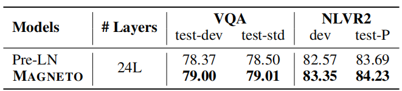

# Foundation Transformers
MAGNETO 2022.10.12 https://arxiv.org/abs/2210.06423

## 阅读笔记
* 从多模态统一架构的角度优化：BERT 的 Post-LayerNorm，GPT和ViT 的 Pre-LayerNorm， 这篇的Sub-LayerNorm;  
* 源自[DeepNet](./DeepNet.md)的初始化策略; 重点3.2初始化的推理。

## Abstract
A big convergence of model architectures across language, vision, speech, and multimodal is emerging. However, under the same name “Transformers”, the above areas use different implementations for better performance, e.g., Post-LayerNorm for BERT, and Pre-LayerNorm for GPT and vision Transformers. We call for the development of Foundation Transformer for true general-purpose modeling, which serves as a go-to architecture for various tasks and modalities with guaranteed training stability. In this work, we introduce a Transformer variant, named MAGNETO, to fulfill the goal. Specifically, we propose Sub-LayerNorm for good expressivity, and the initialization strategy theoretically derived from DeepNet (Wang et al., 2022a) for stable scaling up. Extensive experiments demonstrate its superior performance and better stability than the de facto Transformer variants designed for various applications, including language modeling (i.e., BERT, and GPT), machine translation, vision pretraining (i.e., BEiT), speech recognition, and multimodal pretraining (i.e., BEiT-3). https://github.com/microsoft/unilm

跨语言、视觉、语音和多模态的模型架构正在出现大融合。 然而，在同一个名称“Transformers”下，上述领域使用不同的实现来获得更好的性能，例如，BERT 的 Post-LayerNorm，以及 GPT 和视觉 Transformers 的 Pre-LayerNorm。 我们呼吁开发 基础Transformer 以实现真正的通用建模，它可以作为各种任务和模式的首选架构，并保证训练的稳定性。 在这项工作中，我们引入了一个名为 MAGNETO 的 Transformer 变体来实现这一目标。 具体来说，我们提出了 Sub-LayerNorm 以获得良好的表达能力，并提出了理论上源自 DeepNet (Wang et al., 2022a) 的初始化策略以实现稳定的放大。 广泛的实验证明了它比为各种应用设计的事实上的 Transformer 变体更优越的性能和更好的稳定性，包括语言建模(即 BERT 和 GPT)、机器翻译、视觉预训练(即 BEiT)、语音识别和多模态预训练( 即 BEiT-3)。 https://github.com/microsoft/unilm 

## 1 Introduction
Recent years have witnessed a big convergence of model architectures across language, vision, speech, and multimodal. Specifically, starting from the natural language processing, Transformers (Vaswani et al., 2017) have become the de facto standard for various areas, including computer vision (Dosovitskiy et al., 2021), speech (Zhang et al., 2020b), and multimodal (Kim et al., 2021; Wang et al., 2022b). Transformers fully leverage the parallelism advantage of GPU hardware and large-scale data. It is appealing that we can use the same network architecture for a broad range of applications. So the pretrained models can be seamlessly reused with the shared implementation and hardware optimization. Moreover, general-purpose modeling is important to multimodal models, as different modalities can be jointly encoded and fused by one model.

近年来，我们见证了跨语言、视觉、语音和多模态的模型架构的大融合。 具体来说，从自然语言处理开始，Transformers(Vaswani et al., 2017)已经成为各个领域的事实标准，包括计算机视觉(Dosovitskiy et al., 2021)、语音(Zhang et al., 2020b)、 和多模态(Kim et al., 2021; Wang et al., 2022b)。 Transformers 充分利用了 GPU 硬件和大规模数据的并行优势。 我们可以将相同的网络架构用于广泛的应用程序，这很有吸引力。 因此，预训练模型可以通过共享实现和硬件优化无缝重用。 此外，通用建模对于多模态模型很重要，因为不同的模态可以由一个模型联合编码和融合。

 
Figure 1: Top: the architectures of SOTA models across language, vision, speech, and multimodal. Bottom: the proposed Foundation Transformer uses Sub-LN and theoretically derived initialization. 
图 1：上图：跨语言、视觉、语音和多模态的 SOTA 模型架构。 底部：提出的基础Transformer 使用 Sub-LN 和 理论派生的初始化。

However, despite using the same name “Transformers”, there are significant differences in the implementation of the architectures for different tasks. Figure 1 summarizes the architectures for state-of-the-art models that are widely used in various communities. For instance, some models (e.g.,GPT, and ViT) adopt Pre-LayerNorm (Pre-LN) Transformers, while others use Post-LayerNorm (Post-LN) variants (e.g., BERT, and machine translation) for better performance. Rather than directly using the same architecture, we need to compare two Transformer variants on the specific tasks or modalities to determine the backbone, which is ineffective for model development. More importantly, considering multimodal models, the optimal Transformer variants are usually different for input modalities. For the example of BEiT-3 (Wang et al., 2022b) vision-language pretraining, using Post-LN is sub-optimal for vision encoding while Pre-LN is sub-optimal for the language part. The true convergence of multimodal pretraining requires a unified architecture that performs well across tasks and modalities. In addition, a pain point of Transformer architectures is training stability, especially for large-scale models. We usually need significant efforts to tune hyperparameters or babysit training processes.

然而，尽管使用相同的名称“Transformers”，但不同任务的架构实现存在显著差异。 图1 总结了在各种社区中广泛使用的最先进的模型架构。 例如，一些模型(例如 GPT 和 ViT)采用 Pre-LayerNorm (Pre-LN) Transformers，而其他模型则使用 Post-LayerNorm (Post-LN) 变体(例如 BERT 和机器翻译)以获得更好的性能。 我们不直接使用相同的架构，而是需要在特定任务或模态上比较两个 Transformer 变体来确定主干，这对于模型开发是无效的。 更重要的是，考虑到多模态模型，最佳的 Transformer 变体对于输入模态通常是不同的。 以 BEiT-3 (Wang et al., 2022b) 视觉语言预训练为例，使用 Post-LN 对于视觉编码不是最优的，而 Pre-LN 对于语言部分不是最优的。 多模态预训练的真正融合需要一个统一的架构，该架构在任务和模式之间表现良好。 此外，Transformer 架构的一个痛点是训练的稳定性，尤其是对于大规模模型。 我们通常需要付出巨大的努力来调整超参数或保姆训练过程。

As a result, we call for developing Foundation Transformers for true general-purpose modeling. First, the desired modeling should be able to serve as a go-to architecture for various tasks and modalities, so that we can use the same backbone without trial and error. The general-purpose design principle also greatly supports the development of multimodal foundation models, as we can use one unified Transformer for various modalities without performance degradation. Second, the architectures should provide guaranteed training stability. The favored property can significantly mitigate the difficulty of large-scale pretraining of foundation models.

因此，我们呼吁为真正的通用建模开发 基础Transformers。 首先，所需的建模应该能够作为各种任务和模式的首选架构，这样我们就可以使用相同的主干而无需反复试验。 通用设计原则也极大地支持了多模态基础模型的开发，因为我们可以将一个统一的 Transformer 用于各种模态而不会降低性能。 其次，架构应该提供有保证的训练稳定性。 有利的属性可以显著减轻基础模型的大规模预训练的难度。

In this work, we introduce MAGNETO as an implementation of Foundation Transformers to fulfill the above goals. Specifically, we introduce Sub-LayerNorm (Sub-LN), which adds an extra LayerNorm to each sublayer (i.e., multi-head self-attention, and feed-forward network). Moreover, MAGNETO has a novel initialization method that has a theoretical guarantee to fundamentally improve the training stability. This allows the models to be scaled up without pain. We evaluate MAGNETO on extensive tasks and modalities, namely, masked language modeling (i.e., BERT), causal language modeling (i.e., GPT), machine translation, masked image modeling (i.e., BEiT), speech recognition, and vision-language pretraining (i.e., BEiT-3). Experimental results show that MAGNETO significantly outperforms de facto Transformer variants on the downstream tasks. In addition, MAGNETO is more stable in terms of optimization, which allows larger learning rates to improve results without training divergence. 

在这项工作中，我们引入 MAGNETO 作为 基础Transformers 的实现来达成上述目标。 具体来说，我们引入了 Sub-LayerNorm (Sub-LN)，它为每个子层(即多头自注意力和前馈网络)添加了一个额外的 LayerNorm。 而且，MAGNETO拥有新颖的初始化方式，从理论上保证了根本上提高训练的稳定性。 这使得模型可以毫无痛苦地放大。 我们在广泛的任务和模式上评估 MAGNETO，即掩码语言建模(即 BERT)、因果语言建模(即 GPT)、机器翻译、掩码图像建模(即 BEiT)、语音识别和视觉语言预训练( 即 BEiT-3)。 实验结果表明，MAGNETO 在下游任务上明显优于事实上的 Transformer 变体。 此外，MAGNETO在优化方面更稳定，允许更大的学习率来提高结果而不会出现训练发散。

## 2 TL;DR for Practitioners 从业者(TL;DR, too long; didn’t read)
<!-- TL;DR, too long; didn’t read"的缩写，意思是文章太长了，读不下去了。它通常用于总结一篇文章或博客文章. -->
Figure 1 illustrates the overview of the MAGNETO architecture. There are two key improvements in terms of modeling. First, compared to the Pre-LN variant, Sub-LN introduces another LayerNorm inside each sublayer (i.e., multi-head self-attention, and feed-forward network): one before the input projection, and the other before the output projection. Second, we use the initialization with the theoretical derivation from DeepNet (Wang et al., 2022a), which fundamentally improves the training stability, allowing the model to be scaled up to massive sizes without pain.

图1 说明了 MAGNETO 架构的概览。 在建模方面有两个关键改进。 首先，与 Pre-LN 变体相比，Sub-LN 在每个子层(即多头自注意力和前馈网络)中引入了另一个 LayerNorm：一个在输入投影之前，另一个在输出投影之前。 其次，我们使用 DeepNet 的理论推导进行初始化(Wang et al., 2022a)，这从根本上提高了训练的稳定性，使模型可以毫无痛苦地扩展到大规模。

 
Figure 2: Top left: pseudocode of Sub-LN. We take Xavier initialization (Glorot and Bengio, 2010) as an example, and it can be replaced with other standard initialization. Notice that γ is a constant. Top right: parameters of Sub-LN for different architectures (N-layer encoder, M-layer decoder). Bottom: the layout of Sub-LN for different architectures.
图 2：左上角：Sub-LN 的伪代码。 我们以 Xavier 初始化(Glorot 和 Bengio，2010)为例，它可以用其他标准初始化来代替。 请注意，γ 是一个常数。 右上：不同架构的 Sub-LN 参数(N-层 编码器，M-层 解码器)。 底部：Sub-LN 针对不同架构的布局。

As shown in Figure 2, we present the implementation of MAGNETO. There are only lines of code changes on top of the vanilla Transformer architecture. Notably, following the derivation from DeepNet, the weights of query projection and key projection are not scaled during initialization. Besides, there is only one LayerNorm inside the cross-attention for the encoder-decoder architecture and we do not scale the initialized weights of cross-attention. 

如图 2 所示，我们展示了 MAGNETO 的实现。 在普通的 Transformer 架构之上只有几行代码更改。 值得注意的是，在从 DeepNet 推导之后，query 投影 和 key 投影 的权重在初始化期间没有缩放。 此外，编码器-解码器架构的交叉注意力内部只有一个 LayerNorm，我们没有缩放交叉注意力的初始化权重。

## 3 MAGNETO: A Foundation Transformer
### 3.1 Architecture: Sub-LayerNorm
Vanilla Transformers are based on either Pre-LayerNorm (Pre-LN) structures or Post-LayerNorm (Post-LN). Different from them, MAGNETO is built on the Sub-LayerNorm (Sub-LN). It inherits the multihead attentions and the feed-forward network from Transformers and introduces two layer normalization modules inside each sublayer (except the cross-attention).

普通Transformers 基于 Pre-LayerNorm (Pre-LN) 结构或 Post-LayerNorm (Post-LN)。 与它们不同的是，MAGNETO 是建立在 Sub-LayerNorm (Sub-LN) 之上的。 它继承了 Transformers 的多头注意力和前馈网络，并在每个子层中引入了两层归一化模块(交叉注意力除外)。

For the multihead attentions, the layer normalization modules are before the qkv projection and the output projection, which can be formulated as:

对于多头注意力，层归一化模块在qkv投影之前和输出投影，可以公式化为：

$Q, K, V = W^QLN(x), W^KLN(x), W^VLN(x)$ (1)

$MSA(x) = x + W^OLN(Attention(Q, K, V ))$ (2) 

where $W^Q, W^K, W^V$ , and $W^O$ are the parameters of the multihead self-attention. Similarly, for the feed-forward network, the layer normalization modules are before the input projection and the output projection, which are written as:

其中$W^Q, W^K, W^V$, 和 $W^O$是多头自注意的参数。类似地，对于前馈网络，层归一化模块在输入投影和输出投影之前，它们被写为：

$FC_1(x) = W^1LN(x)$ (3)

$FC_2(x) = W^2LN(x)$ (4)

$FFN(x) = FC_2(φ(FC_1(x)))$ (5) 

where $W^1$ and $W^2$ are parameters of the feed-forward layers, and φ is the non-linear activation function.

其中$W^1$和$W^2$是前馈层的参数，φ是非线性激活函数。

### 3.2 Initialization: Theoretical Derivation from DeepNet 初始化：来自DeepNet的理论推导
We adopt the theoretical derivation from DeepNet (Wang et al., 2022a) to improve the training stability. DeepNet estimates the expected model update for Post-LN and introduces DeepNorm to bound the model update to a constant. Following DeepNet, we first estimate the expected model update of Sub-LN and then demonstrate how to bound the model update with a proper initialization.

我们采用了DeepNet(Wang et al.，2022a)的理论推导来提高训练稳定性。DeepNet估计Post-LN的预期模型更新，并引入DeepNorm将模型更新绑定到常数。在DeepNet之后，我们首先估计Sub-LN的预期模型更新，然后演示如何将模型更新与适当的初始化绑定。

#### Expected Model Update for Pre-LN  预计划的预期模型更新
We start with the expected model update for Pre-LN. The forward propagation for an N-layer Pre-LN Transformer with N attention sub-layers and N feedforward sub-layers can be formulated as:

我们从预计划的模型更新Pre-LN开始。具有N个注意子层和N个前馈子层的N层Pre-LN变压器的正向传播可以公式化为：

$F(x; θ) = W^{vocab}x^e$ (6) 

$x^e = LN(x + \sum^L_{l=1} G^l(x^{l−1} , θ_{el})), x^l = G^l(x^{l−1} , θ_{el})$  and $x^0 = x$ (7) 

where $x^{l−1}, x^l$ denotes the input and output for the l-th sub-layer $G^l$ . If l is odd, $G^l$ refers to self-attention MSA; if l is even, $G^l$ refers to FFN. $x^e$ is the output of the backbone. θ denotes the parameters of output projection $W^{vocab}$ and the backbone $\{θ_{el}\}^L_{l=1}$. $W^{vocab} ∈ R^{V ×d}$ , where d is hidden dimension, V is dictionary size. L equals to 2N for simplicity. Without the loss of generality, we set the intermediate dimension of feed-forward layers equals to hidden dimension.

其中$x^{l−1}，x^l$表示第l个子层$G^l$的输入和输出。如果l是奇数，$G^l$表示自注意MSA; 如果l是偶数，$G^l$表示FFN$x^e$是主干的输出。θ表示输出投影$\{θ_{el}\}^L_{l=1}$. $W^{vocab} ∈ R^{V ×d}$的参数$W^{vocab}∈R^{V×d}$，其中d是隐藏维度，V是字典大小。为了简单起见，L等于2N。在不损失一般性的情况下，我们将前馈层的中间维度设置为隐藏维度。

Following Wang et al. (2022a), the magnitude of attention output only depends on value and output projection: $MSA(X) \stackrel{Θ}{=} W^OW^V LN(X)$. Similarly we have FFN(x) = $W^2φ(W^1LN(X))$. Therefore, for vanilla Pre-LN, the forward computation of the l-th sub-layer can be formulated as: 

继Wang et al. (2022a)之后，注意力输出的大小仅取决于值和输出投影：$MSA(X)\stackrel{Θ}{=}W^OW^V LN(X)$。类似地，我们有FFN(x)=$W^2φ(W^1LN(x))$。因此，对于普通的Pre-LN，第l个子层的正向计算可以公式化为：

$x^l = x^{l−1} + W^{l,2}φ(W^{l,1}LN(x^{l−1} ))$ (8)

We introduce two constants $v_l$ , $w_l$ to represent the scales of $W^{l,2}$ , $W^{l,1}$ respectively. For example, the i-th row, j-th column entry of $W^{l,2} satisfies that:

我们引入两个常量 $v_l$ , $w_l$ 分别表示 $W^{l,2}$ , $W^{l,1}$ 的尺度。 例如，$W^{l,2}$ 的第 i 行第 j 列条目满足：

$W_{ij}^{l,2} ~ N(0, \frac{v^2_l}{d} )$ (9)

We define the model update $∆F = ||γ^T (F(x; θ^∗) − F(x; θ))||$, where γ, F(x) ∈ $R^{V ×1}$. x and F(x) denote the input and output of the model respectively. γ is the label of x, which is a one-hot vector with a single entry as 1 and all the others as 0. With above analysis, we have the following theorem to characterize ∆$F^{pre}$ for an N-layer, encoder-only Pre-LN Transformer under SGD update.

我们定义模型更新 $ΔF = ||γ^T (F(x; θ^∗) − F(x; θ))||$，其中 γ, F(x) ∈ $R^{V ×1 }$。 x 和 F(x) 分别表示模型的输入和输出。 γ 是 x 的标签，它是一个 one-hot 向量，其中一个条目为 1，所有其他条目为 0。通过以上分析，我们有以下定理来表征 N- 层，SGD 更新下的仅编码器 Pre-LN Transformer。

#### Theorem 3.1. 
Given an N-layer Pre-LN Transformer F(x, θ), the l-th sub-layer is formulated as $x^l = x^{l−1} + W^{l,2}φ(W^{l,1}LN(x^{l−1}))$. Under SGD update, $∆F^{pre}$ satisfies: 

给定一个 N 层 Pre-LN Transformer F(x, θ)，第 l 个子层表示为 $x^l = x^{l−1} + W^{l,2}φ(W^ {l,1}LN(x^{l−1}))$。 在 SGD 更新下，$ΔF^{pre}$ 满足：

$∆F^{pre} ≤ ηd( \frac{\sum^L_{l=1} v_l^2 + w_2^l}{\sum^L_{n=1} v2nw_n^2} + \sum^L_{l=1} \sum^L_{k=2} \frac{v^2_l + w^2_l}{\sum^L_{n=1} v^2_nw^2_n} \frac{v^2_kw^2_k}{\sum^k−1_{n=1} v^2_nw^2_n} ))$ (10) 

where η is learning rate, L equals to 2N.

其中 η 是学习率，L 等于 2N。

Based on Theorem 3.1, with $v_l = w_l$ = 1 (i.e., standard initialization) for vanilla Pre-LN, we have $∆F^{pre}$ = O(ηd log L), which shows that the magnitude of the model update grows logarithmically as the depth increases. It is also verified by Liu et al. (2020). Wang et al. (2022a) proves that under SGD update, the model update of vanilla Post-LN $∆F^{post}$ is O($\sum^L_{l=1} v_l^2 + w_l^2$). ∆F pre is much smaller than ∆F post with the same model depth L. It indicates that the loss landscape of vanilla Pre-LN is smoother than that of vanilla Post-LN, which leads to faster and more stable optimization. 

基于定理 3.1，对于 普通 Pre-LN，$v_l = w_l$ = 1(即标准初始化)，我们有 $ΔF^{pre}$ = O(ηd log L)，这表明 模型更新随着深度的增加呈对数增长。 刘 et al. 也证实了这一点。 (2020)。 王等。 (2022a) 证明在 SGD 更新下，普通 Post-LN $ΔF^{post}$ 的模型更新为 O($\sum^L_{l=1} v_l^2 + w_l^2$)。 ΔF pre 远小于具有相同模型深度 L 的 ΔF post。这表明 普通 Pre-LN 的损失景观比 普通 Post-LN 的损失景观更平滑，从而导致更快更稳定的优化。

#### Expected Model Update for MAGNETO  预期模型更新
Based on the analysis on Pre-LN, we further estimate the expected model update of Sub-LN. With Sub-LN, the forward signal propagation of the l-th sub-layer can be formulated as: 

在对 Pre-LN 的分析的基础上，我们进一步估计了 Sub-LN 的预期模型更新。 使用 Sub-LN，第 l 个子层的前向信号传播可以表示为：

$x^l = x^{l−1} + W^{l,2}LN(φ(W^{l,1}LN(x^{l−1})))$ (11)

We then give the expected bound of the model update’s magnitude $∆F^{sub}$ for an N-layer, encoderonly MAGNETO.

然后，我们给出 N 层、仅编码器 MAGNETO 的模型更新幅度 $ΔF^{sub}$ 的预期界限。

#### Theorem 3.2. 
Given an N-layer MAGNETO F(x, θ), the l-th sub-layer is formulated as $x^l = x^{l−1} + W^{l,2}LN(φ(W^{l,1}LN(x^{l−1} )))$. Under SGD update, ∆$F^{sub}$ satisfies: 

给定 N 层 MAGNETO F(x, θ)，第 l 个子层表示为 $x^l = x^{l−1} + W^{l,2}LN(φ(W^{ l,1}LN(x^{l−1} )))$。 在 SGD 更新下，Δ$F^{sub}$ 满足：

$∆F^{sub} ≤ ηd( \frac{\sum^L_{l=1}(1 + \frac{v_l^2}{w^2_l} )}{\sum^L_{n=1}v^2_n} + \sum^L_{l=1}\sum^L_{k=2} \frac{1 + \frac{v^2_l}{w^2_l}}{\sum^L_{n=1}v^2_n} \frac{v^2_k} {\sum^{k-1}_{n=1} v2n})$ (12) 

where η is learning rate, L equals to 2N.

其中 η 是学习率，L 等于 2N。

When the activation of the l-th sub-layer explodes, it leads to $w_l >> w_i$ , i \neq l. Equation (13) proves that the model update of MAGNETO is smaller than that of vanilla Pre-LN in this case. 

当第 l 个子层的激活爆炸时，它导致 $w_l >> w_i$ , i \neq l。 等式(13)证明在这种情况下 MAGNETO 的模型更新小于 普通Pre-LN 的模型更新。

$ \frac{1 + \frac{v^2_l}{w^2_l}}{\sum^L_{n=1}v^2_n} = 
\frac{v_l^2 + w_l^2 }{w_l^2 \sum^L_{n=1}v^2_n} ≤ 
\frac{v_l^2 + w_l^2}{\sum^L_{n=1}v^2_nw_n^2} , 
w_l >> w_i$ , i \neq l (13)

Furthermore, we study the magnitude of model update for MAGNETO with the encoder-decoder architecture. $θ_e$ follows the same definition as in Theorem 3.2. Similarly $θ_d$ denotes parameters of decoder. Theorem 3.3 shows that the bound of the magnitude of model update under SGD update $∆F_{ed} = ||γ^T (F_{ed}(x, y, θ_e^∗ , θ_d^∗) − F_{ed}(x, y, θ_e, θ_d))||$, where x and y denote the input of encoder and decoder respectively.

此外，我们研究了使用编码器-解码器架构的 MAGNETO 模型更新的幅度。 $θ_e$ 遵循与定理 3.2 中相同的定义。 类似地，$θ_d$ 表示解码器的参数。 定理 3.3 表明 SGD 更新下模型更新幅度的界 $ΔF_{ed} = ||γ^T (F_{ed}(x, y, θ_e^∗ , θ_d^∗) − F_{ed} (x, y, θ_e, θ_d))||$，其中x和y分别表示编码器和解码器的输入。

#### Theorem 3.3. 
Given an encoder-decoder MAGNETO $F_{ed}(x, y, θ_e, θ_d)$ with N encoder layers and M decoder layers, where the l-th sub-layer is formulated as $x^l = x^{l-1}  + W^{l,2}LN(φ(W^{l,1}LN(x^{l-1}  )))$. Under SGD update, $∆{F_ed}$ satisfies: 

给定编码器-解码器 MAGNETO $F_{ed}(x, y, θ_e, θ_d)$ 具有 N 个编码器层和 M 个解码器层，其中第 l 个子层表示为 $x^l = x^{l -1} + W^{l,2}LN(φ(W^{l,1}LN(x^{l-1} )))$。 在 SGD 更新下，$∆F_{ed}$ 满足：

$∆F_{ed} ≤ ∆F_d + \sum^{L_d}_{l=1,l \% 3=1} \frac{v^2_{dl}}{\sum^{Ld}_{n=1} v^2_{dn}} (1 + \sum^{L_d}_{k=2} \frac{v^2_{dk}}{\sum^{k-1}_{n=1} v^2_{dn}} )∆F_e$ (14) 

$∆F_d \stackrel{Θ}{=} ηd( \frac{\sum^{L_d}_{l=1}(1 + \frac{v^2_{dl}}{w^2_{dl}} )}{\sum^{Ld}_{n=1} v^2_{dn}} + \frac{1}{\sum^{Ld}_{n=1} v^2_{dn}} \sum^{L_d}_{l=1} \sum^{L_d}_{k=2} (1 + \frac{v^2_{dl}}{w^2_{dl}} ) \frac{v^2_{dk}}{\sum^{k-1}_{n=1} v^2_{dn}} )$ (15) 

$∆F_e \stackrel{Θ}{=} ηd(\frac{\sum^{L_e}_{l=1}(1 + \frac{v^2_{el}}{w^2_{el}} )}{\sum^{L_e}_{n=1} v^2_{en}} + \frac{1}{\sum^{L_e}_{n=1} v^2_{en}} \sum^{L_e}_{l=1} \sum^{L_e}_{k=2} (1 + \frac{v^2_{el}}{w^2_{el}} ) \frac{v^2_{ek}}{\sum^{k-1}_{n=1} v^2_{en}} ) $ (16) 

where η is learning rate, $L_d$ equals to 3M and $L_e$ equals to 2N.

其中 η 是学习率，$L_d$ 等于 3M，$L_e$ 等于 2N。

#### Derivation and Implementation 推导与实现
We then demonstrate that the expected model update of MAGNETO above can be bounded with proper initialization. We provide the analysis on the encoder-only architecture, which can be naturally extended to encoder-decoder models in the same way. Analogous to Zhang et al. (2019) and Wang et al. (2022a), we set our goal for the model update as follows:

然后我们证明上面 MAGNETO 的预期模型更新可以通过适当的初始化来限制。 我们提供了对仅编码器架构的分析，它可以以相同的方式自然地扩展到编码器-解码器模型。 类似于 Zhang et al. (2019) 和 Wang et al. (2022a)，我们将模型更新的目标设定如下：

GOAL: F(x, θ) is updated by Θ(η) per SGD step after initialization as η → 0. That is ∆$F^{sub}$ = Θ(ηd) where ∆$F^{sub} \stackrel{∆}{=} F(x, θ − η \frac{∂L}{ ∂θ}  ) − F(x, θ)$. 

目标：F(x, θ) 在初始化为 η → 0 后，每个 SGD 步骤由 Θ(η) 更新。即 ∆$F^{sub}$ = Θ(ηd) 其中 ∆$F^{sub} \stackrel{∆}{=} F(x, θ − η \frac{∂L}{ ∂θ} ) − F(x, θ)$。

Based on Theorem 3.2, there are multiple methods to bound ∆$F^{sub}$ independent of the depth by setting proper $v_l$ and $w_l$ . In this work, we simply set $v_l$ = $w_l$ = γ for all sub-layers. With Equation (12), the term related to L can be bounded as:

基于定理 3.2，有多种方法可以通过设置适当的 $v_l$ 和 $w_l$ 来独立于深度约束 Δ$F^{sub}$ 。 在这项工作中，我们简单地为所有子层设置 $v_l$ = $w_l$ = γ。 利用等式(12)，与 L 相关的项可以被限定为：

$ \frac{\sum^L_{l=1}(1 + \frac{v_l^2}{w^2_l} )}{\sum^L_{n=1}v^2_n} + \frac{1}{\sum^L_{n=1} v^2_n} \sum^L_{l=1}\sum^L_{k=2} (1 + \frac{v_l^2}{w^2_l} ) \frac{v^2_k}{\sum^{k-1}_{n=1} v^2_n} = O( \frac{log L}{γ^2} )$ (17)

We use v = w = γ = $\sqrt {log L}$ to bound Equation (17) to O(1). In summary, we apply our initialization as follows:

我们使用 v = w = γ = $\sqrt {log L}$ 将方程(17)绑定到O(1)。总之，我们将初始化应用如下：

Encoder-only (or decoder-only) architecture
1. Apply standard initialization (e.g., Xavier initialization) for each layer.
2. For each layer, scale the weights of feed-forward networks as well as the value projection and the output projection of attention layers by $ \sqrt{log 2N}$ (or $\sqrt{log 2M})$.

仅编码器(或仅解码器)架构
1. 对每个层应用标准初始化(例如Xavier初始化)。
2. 对于每一层，按$\sqrt{log 2N}$ (或 $\sqrt{log 2M})$缩放前馈网络的权重以及关注层的值投影和输出投影。

The derivation of encoder-decoder architectures can be conducted in the same way (see Appendix B.2). We summarize the steps as follows:

编码器-解码器架构的推导可以以相同的方式进行(见附录B.2)。我们将步骤总结如下：

Encoder-decoder architecture
1. Apply standard initialization (e.g., Xavier initialization) for each encoder and decoder layer.
2. For encoder layers, scale the weights of feed-forward networks as well as the value projection and the output projection of attention layers by $\sqrt {\frac{1}{3} log 3M log 2N}$.
3. For decoder layers, scale the weights of feed-forward networks as well as the value projection and the output projection of attention layers by $\sqrt {log 3M}$. 

编码器-解码器架构
1. 对每个编码器和解码器层应用标准初始化(例如Xavier初始化)。
2. 对于编码器层，将前馈网络的权重以及关注层的值投影和输出投影缩放$\sqrt {\frac{1}{3} log 3M log 2N}$。
3. 对于解码器层，通过 $\sqrt {log 3M}$ 缩放前馈网络的权重以及关注层的值投影和输出投影。

## 4 Experiments on Language Tasks
### 4.1 Causal Language Modeling  因果语言建模
We implement MAGNETO on causal language modeling, which is the pretraining task for recent large language models (e.g., GPT-3 (Brown et al., 2020), PaLM (Chowdhery et al., 2022), etc). We start with a model that has the same model configuration as GPT-3 Medium (350M), and further scale its depth from 24L to 48L and 72L. The model is trained on an English-language corpus, which is a subset of the data from Liu et al. (2019) and the English portion of CC100 corpus. We use the same tokenizer as GPT-2 (Radford et al., 2019) to preprocess the data. The 24L model is trained for 500K steps, while the 48L and 72L models are trained for 250K steps. More details regarding the hyperparameters can be found in the appendix.

我们在因果语言建模上实现了MAGNETO，这是最近大型语言模型(例如，GPT-3(Brown et al.，2020)、PaLM(Chowdhery et al.，2022)等)的预训练任务。我们从一个与GPT-3 Medium(350M)具有相同模型配置的模型开始，并将其深度从24L进一步扩展到48L和72L。该模型是在英语语料库上训练的，英语语料库是Liu et al. (2019) 的数据子集和CC100语料库的英语部分。我们使用与GPT-2相同的令牌器(Radford et al.，2019)来预处理数据。24L模型训练500K步，而48L和72L模型训练250K步。关于超参数的更多细节可以在附录中找到。

We compare MAGNETO with vanilla Pre-LN Transformer and Normformer (Shleifer et al., 2021). Vanilla Pre-LN is the backbone for GPT, while Normformer is a state-of-the-art model for causal language modeling. We use the implementation on the Fairseq(2 https://github.com/facebookresearch/fairseq/ ) codebase, and pre-train the models with the same monolingual data as described above.

我们将MAGNETO与 普通Pre-LN Transformer和Normformer进行了比较(Shleifer et al., 2021)。普通Pre-LN是GPT的主干，而Normformer是用于因果语言建模的最先进的模型。我们使用Fairseq(2 https://github.com/facebookresearch/fairseq/ )代码库上的实现，并使用如上所述的相同单语数据预训练模型。

We evaluate the performance of in-context learning. Following the previous work (Brown et al., 2020; Hao et al., 2022), we choose Winogrande (Sakaguchi et al., 2020), Winograd (Levesque et al., 2012), Storycloze (Mostafazadeh et al., 2017), and Hellaswag (Zellers et al., 2019) as the benchmark datasets, covering the cloze and completion tasks. We conduct experiments in the setting of zero-shot, one-shot, and four-shot learning. We randomly sample the examples from training data as demonstrations for the few-shot setting. The examples are concatenated with a separator </s>. 

我们评估上下文学习的表现。继之前的工作(Brown et al.，2020; Hao et al.，2022)之后，我们选择Winogrande(Sakaguchi et al.，2021)、Winograd(Levsque et al.，2012)、Storycloze(Mostafazadeh et al.，2017)和Hellaswag(Zellers et al.，2019)作为基准数据集，涵盖完形填空和完成任务。我们在零样本、单样本和四样本学习环境中进行实验。我们从训练数据中随机抽取样本，作为少数样本设置的演示。这些样本使用分隔符</s>连接。

Table 1 summarizes the results in the zero-shot setting. It shows that MAGNETO achieves significant improvement over both vanilla Pre-LN Transformer and Normformer. The improvement is consistent across different scales. Besides, it tolerates a larger learning rate than the baselines, indicating that MAGNETO is more stable in optimization. This allows the model to further scale up without pain. Table 2 and Table 3 report the results in the few-shot setting. MAGNETO is also better at few-shot learning than the baselines across four datasets, proving the effectiveness of Sub-LN on causal language modeling.

表1总结了零样本设置的结果。这表明MAGNETO比普通的Pre-LN变压器和Normformer都取得了显著的改进。不同规模的改进是一致的。此外，它能容忍比基线更大的学习率，这表明MAGNETO在优化方面更稳定。这使得模型能够在没有痛苦的情况下进一步放大。表2和表3报告了在少样本设置中的结果。MAGNETO在少样本学习方面也比四个数据集的基线更好，证明了Sub-LN在因果语言建模方面的有效性。

 
Table 1: Zero-shot results for MAGNETO and the baselines (WGe: Winogrande, WG: Winograd, SC:Storycloze, and HS: Hellaswag dataset).

 
Table 2: One-shot results for MAGNETO and the baselines (WGe: Winogrande, WG: Winograd, SC:Storycloze, and HS: Hellaswag dataset).

 
Table 3: Four-shot results for MAGNETO and the baselines (WGe: Winogrande, WG: Winograd, SC:Storycloze, and HS: Hellaswag dataset).
表 3：MAGNETO 和基线的四样本结果(WGe：Winogrande，WG：Winograd，SC：Storycloze 和 HS：Hellaswag 数据集)。

### 4.2 Masked Language Modeling
We further conduct experiments on masked language modeling. We pre-train MAGNETO on a 16GB English corpus (Liu et al., 2019), a combination of Wikipedia and Bookcorpus. We adopt the BERTbase setting and train a model with 12 layers, 768 hidden dimensions, and 3072 FFN dimensions. The batch size is 2048 and the model is trained for 125K steps. The vocabulary is built from a SentencePiece (Kudo and Richardson, 2018) tokenizer with 64K tokens. More details are in the appendix.

我们进一步对掩码语言建模进行实验。 我们在 16GB 的英文语料库(Liu et al., 2019)上对 MAGNETO 进行了预训练，该语料库是维基百科和 Bookcorpus 的组合。 我们采用 BERTbase 设置并训练一个具有 12 层、768 个隐藏维度和 3072 个 FFN 维度的模型。 批量大小为 2048，模型训练了 125K 步。 词汇表是从带有 64K 令牌的 SentencePiece(Kudo 和 Richardson，2018)令牌器构建的。 更多细节在附录中。

We compare MAGNETO with both Post-LN and Pre-LN. Post-LN is the de-facto standard for masked language modeling. We search the pre-training learning rate among {5e-4, 1e-3, 2e-3, 3e-3}, and choose the largest one that can converge. We fine-tune the models on the GLUE (Wang et al., 2018) benchmarks. We run each experiment with three seeds and report the average results. Table 4 summarizes the results. It shows that MAGNETO has better performance than the strong baselines with a gain of average 0.6 points.

我们将 MAGNETO 与 Post-LN 和 Pre-LN 进行比较。 Post-LN 是掩码语言建模的事实标准。 我们在{5e-4, 1e-3, 2e-3, 3e-3}中搜索预训练学习率，选择最大的可以收敛的。 我们在 GLUE (Wang et al., 2018) 基准上微调模型。 我们用三个种子运行每个实验并报告平均结果。 表 4 总结了结果。 它表明 MAGNETO 的性能优于强基线，平均提高 0.6 分。

 
Table 4: Results on the GLUE development set.
表 4：GLUE 开发集的结果。

### 4.3 Neural Machine Translation
We also evaluate MAGNETO on machine translation. We perform experiments on OPUS-100 corpus, a multilingual machine translation dataset provided by Zhang et al. (2020a). OPUS-100 is an Englishcentric multilingual corpus covering 100 languages, which is randomly sampled from the OPUS collection. We implement MAGNETO with an 18-layer encoder, an 18-layer decoder, and 512 hidden dimension. We train the model with a batch size of 500K tokens for 100K steps. During testing, we select the checkpoint based on the performance of the validation set. We use the beam search algorithm with a beam size of 5 and set the length penalty as 1.0. More details are in the appendix.

我们还在机器翻译上评估 MAGNETO。 我们在 OPUS-100 语料库上进行实验，OPUS-100 语料库是 Zhang et al. 提供的多语言机器翻译数据集。 (2020a)。 OPUS-100 是一个涵盖 100 种语言的以英语为中心的多语言语料库，它是从 OPUS 集合中随机抽取的。 我们使用 18 层编码器、18 层解码器和 512 隐藏维度实现 MAGNETO。 我们使用 500K 令牌的批量大小训练模型 100K 步。 在测试过程中，我们根据验证集的性能来选择检查点。 我们使用波束大小为 5 的波束搜索算法，并将长度惩罚设置为 1.0。 更多细节在附录中。

Table 5 reports the BLEU scores on the OPUS-100 test sets. Post-LN can not converge with the depth of 18L-18L due to the training instability. Pre-LN is the standard alternative when the model is deep and large. Compared to Pre-LN and its variant Normformer, MAGNETO has an improvement of average 0.5 and 0.6 BLEU scores, proving the effectiveness on the machine translation task. 

表 5 报告了 OPUS-100 测试集上的 BLEU 分数。 由于训练不稳定，Post-LN 无法与 18L-18L 的深度收敛。 当模型又深又大时，Pre-LN 是标准替代方案。 与 Pre-LN 及其变体 Normformer 相比，MAGNETO 平均提高了 0.5 和 0.6 BLEU 分数，证明了机器翻译任务的有效性。

 
Table 5: BLEU scores for MAGNETO and the baselines on the OPUS-100 test sets.
表 5：MAGNETO 的 BLEU 分数和 OPUS-100 测试集的基线。

## 5 Experiments on Vision Tasks
We pretrain MAGNETO under masked image modeling framework (BEiT; Bao et al. 2022; Peng et al. 2022), and then fine-tune it on various downstream vision tasks by appending lightweight task layers. To be specific, we encourage MAGNETO to reconstruct corresponding discrete visual tokens (Peng et al., 2022), based on the corrupt input images.

我们在掩码图像建模框架(BEiT; Bao et al. 2022; Peng et al. 2022)下预训练 MAGNETO，然后通过附加轻量级任务层在各种下游视觉任务上对其进行微调。 具体而言，我们鼓励 MAGNETO 基于损坏的输入图像重建相应的离散视觉令牌 (Peng et al., 2022)。

In comparison, Pre-LN is instantiated as vanilla ViT (Dosovitskiy et al., 2021) here and pretrained under the same settings. We pretrain all models on ImageNet-1k (Russakovsky et al., 2015) with 300 epochs schedule. After that, we fine-tune the pretrained models on ImageNet-1k for the image classification task and on ADE20k (Zhou et al., 2019) for the semantic segmentation task. Moreover, we evaluate the robustness of all fine-tuned models on various ImageNet variants, e.g., ImageNet-Adversarial (Hendrycks et al., 2021b), ImageNet-Rendition (Hendrycks et al., 2021a) and ImageNet-Sketch (Wang et al., 2019). We summarize the results of those vision tasks in Table 6. Hyperparameters are given in Appendix C. 8

相比之下，Pre-LN 在此处被实例化为 普通ViT (Dosovitskiy et al., 2021)，并在相同的设置下进行预训练。 我们在 ImageNet-1k (Russakovsky et al., 2015) 上使用 300 个 epochs 计划对所有模型进行预训练。 之后，我们在 ImageNet-1k 上针对图像分类任务和在 ADE20k(Zhou et al., 2019)上针对语义分割任务微调预训练模型。 此外，我们评估了所有微调模型在各种 ImageNet 变体上的稳健性，例如 ImageNet-Adversarial (Hendrycks et al., 2021b)、ImageNet-Rendition (Hendrycks et al., 2021a) 和 ImageNet-Sketch (Wang et al. ., 2019). 我们在表 6 中总结了这些视觉任务的结果。超参数在附录 C.8 中给出。

 
Table 6: Results on vision tasks. Pre-LN is instantiated as vanilla ViT (Dosovitskiy et al., 2021). We report top-1 accuracy on ImageNet and its variants, and mIoU metric on ADE20k for semantic segmentation. We compare both ViT-Base (12L) and ViT-Large (24L).
表 6：视觉任务的结果。 Pre-LN 实例化为 vanilla ViT(Dosovitskiy et al., 2021)。 我们报告了 ImageNet 及其变体的 top-1 准确性，以及 ADE20k 上用于语义分割的 mIoU 指标。 我们比较了 ViT-Base (12L) 和 ViT-Large (24L)。

As shown in Table 6, MAGNETO outperforms its Pre-LN counterpart by 0.4% and 0.6% when the number of layers is 12 and 24 on ImageNet validation set, respectively. Moreover, MAGNETO outperforms ViT by a significant margin across three ImageNet variants. By appending the UperNet (Xiao et al., 2018) task layer, we conduct semantic segmentation experiments on ADE20k. For 12-layer models, MAGNETO reach 52.2% mIoU, which is 0.8% higher than vanilla ViT. For 24-layer models, MAGNETO can boost the performance to 54.6%. 

如表 6 所示，当 ImageNet 验证集上的层数分别为 12 和 24 时，MAGNETO 的性能分别优于其 Pre-LN 对应物 0.4% 和 0.6%。 此外，MAGNETO 在三个 ImageNet 变体中的表现明显优于 ViT。 通过附加 UperNet (Xiao et al., 2018) 任务层，我们在 ADE20k 上进行了语义分割实验。 对于 12 层模型，MAGNETO 达到 52.2% mIoU，比 vanilla ViT 高 0.8%。 对于 24 层模型，MAGNETO 可以将性能提升到 54.6%。

## 6 Experiments on Speech Tasks
We implement the proposed MAGNETO based on the open-source ESPnet repository (Watanabe et al., 2018) for speech recognition, and evaluate its performance on the LibriSpeech 960h (Panayotov et al., 2015) benchmark.

我们基于用于语音识别的开源 ESPnet库(Watanabe et al., 2018)实施了所提出的 MAGNETO，并评估了其在 LibriSpeech 960h(Panayotov et al., 2015)基准测试中的性能。

Since the transducer framework is proven to obtain better accuracy with low latency, we choose the Transformer Transducer (T-T; Zhang et al. 2020b) as the backbone framework, where the encoder is either Pre-LN Transformer or MAGNETO, and the predictor network is a two-layer LSTM network. The model input is 80 dimension filter bank feature and its output vocabulary is 5000 subword units. There is a VGG component before Transformer blocks to downsample the speech frame rate from 10 to 40 milliseconds.

由于 transducer 框架被证明可以在低延迟的情况下获得更好的精度，我们选择 Transformer Transducer(T-T; Zhang et al. 2020b)作为骨干框架，其中编码器是 Pre-LN Transformer 或 MAGNETO，预测器网络是 一个双层 LSTM 网络。 模型输入为80维滤波器组特征，输出词汇为5000个子词单元。 在 Transformer 块之前有一个 VGG 组件，用于将语音帧速率从 10 毫秒下采样到 40 毫秒。

We evaluate 18L and 36L T-T with hidden state dimensions of 512 and FFN dimensions of 2048. Their numbers of parameters are 80M and 140M respectively. The models are trained for 150 epochs on the full 960 hours of audio data in LibriSpeech, where the adaptive specaugement (Park et al., 2019; 2020) is employed for data augmentation. The auxiliary loss proposed in Boyer et al. (2021) is used for better performance. Table 7 shows the evaluation results on dev-clean, dev-other, test-clean, and test-other. MAGNETO achieves over 6% WER reduction against the Transformer baseline in the 18L setting. A similar gain is also observed in the 36L setting. When searching for the best learning rate, we find that 36L MAGNETO allows a learning rate up to 3e-3, while Transformer can only be trained with lr = 1.5e − 3. Regarding the 18L setting, MAGNETO and Pre-LN are trained with lr = 5e − 3 and lr = 3e − 3, respectively. 

我们评估隐藏状态维度为 512 和 FFN 维度为 2048 的 18L 和 36L T-T。它们的参数数量分别为 80M 和 140M。 这些模型在 LibriSpeech 中的完整 960 小时音频数据上训练了 150 个时期，其中自适应规范(Park et al., 2019; 2020)用于数据扩充。 Boyer et al. 提出的辅助损失。 (2021) 用于获得更好的性能。 表7显示了dev-clean、dev-other、test-clean和test-other的评估结果。 在 18L 设置中，MAGNETO 相对于 Transformer 基线实现了 6% 以上的 WER 减少。 在 36L 设置中也观察到类似的增益。 在寻找最佳学习率时，我们发现 36L MAGNETO 允许的学习率高达 3e-3，而 Transformer 只能使用 lr = 1.5e − 3 进行训练。关于 18L 设置，MAGNETO 和 Pre-LN 训练有 lr = 5e - 3 和 lr = 3e - 3。

 
Table 7: Results on speech recognition. All models are without language model shallow fusion.
表 7：语音识别结果。 所有模型都没有语言模型浅融合。

## 7 Experiments on Vision-Language Tasks
We conduct experiments on multimodal pretraining following BEiT-3 (Wang et al., 2022b) and evaluate the model on downstream vision-language benchmarks, including VQA 2.0 (Goyal et al., 2017) and NLVR2 (Suhr et al., 2019). Specifically, we perform masked data modeling on images, texts and image-text pairs to learn multimodal representations. We compare MAGNETO with the Pre-LN variant as in vanilla ViT (Dosovitskiy et al., 2021) under the same pretraining setting. We pretrain a 24-layer base model with 544 hidden dimensions and 2176 FFN dimensions using the same pretraining data as in BEiT-3. The peak learning rate is 2e-3 and the batch size is 12,288 for MAGNETO and the baseline. Each batch contains 4096 images, 4096 texts and 4096 image-text pairs. Both two models are trained for 300k steps.

我们在 BEiT-3(Wang et al., 2022b)之后进行多模态预训练实验，并评估下游视觉语言基准模型，包括 VQA 2.0(Goyal et al., 2017)和 NLVR2(Suhr et al., 2019) . 具体来说，我们对图像、文本和图像-文本对执行掩码数据建模以学习多模态表示。 我们在相同的预训练设置下将 MAGNETO 与 普通ViT 中的 Pre-LN 变体进行比较(Dosovitskiy et al., 2021)。 我们使用与 BEiT-3 中相同的预训练数据预训练一个具有 544 个隐藏维度和 2176 个 FFN 维度的 24 层基础模型。 MAGNETO 和基线的峰值学习率为 2e-3，批量大小为 12,288。 每批包含 4096 张图像、4096 个文本和 4096 个图像-文本对。 两个模型都接受了 300k 步的训练。

As present in Table 8, MAGNETO achieves consistent improvements across two vision-language benchmarks. MAGNETO outperforms standard Pre-LN by 0.5% on VQA test-standard split and NLVR2 test set. 

如表 8 所示，MAGNETO 在两个视觉语言基准测试中实现了一致的改进。 MAGNETO 在 VQA 测试标准拆分和 NLVR2 测试集上的性能优于标准 Pre-LN 0.5%。

 
Table 8: Results on vision-language tasks. We report vqa-score on VQA test-dev and test-standard split, as well as accuracy on NLVR2 development and public test set (test-P).
表 8：视觉语言任务的结果。 我们报告 VQA 测试开发和测试标准拆分的 vqa 分数，以及 NLVR2 开发和公共测试集(test-P)的准确性。

## 8 Conclusion
In this paper, we call for the development of Foundation Transformers, and present MAGNETO, an implementation of Foundation Transformers towards a true general-purpose architecture across various tasks and modalities. Experiments demonstrate that MAGNETO achieves better results than the baselines on language, vision, speech, and multimodal tasks. More importantly, MAGNETO has theoretically-guaranteed training stability which makes it a promising option for scaling up any Transformer models.

在本文中，我们呼吁开发 基础Transformers，并介绍了MAGNETO，这是一种 基础Transformers 的实现，可实现跨各种任务和模式的真正通用架构。 实验表明，MAGNETO 在语言、视觉、语音和多模态任务上取得了比基线更好的结果。 更重要的是，MAGNETO 具有理论上保证的训练稳定性，这使其成为扩展任何 Transformer 模型的有前途的选择。

## References
* Hangbo Bao, Li Dong, Songhao Piao, and Furu Wei. BEiT: BERT pre-training of image transformers. In International Conference on Learning Representations, 2022.
* Florian Boyer, Yusuke Shinohara, Takaaki Ishii, Hirofumi Inaguma, and Shinji Watanabe. A study of
transducer based end-to-end asr with espnet: Architecture, auxiliary loss and decoding strategies. In 2021 IEEE Automatic Speech Recognition and Understanding Workshop (ASRU), pages 16–23. IEEE, 2021.
* Tom B. Brown, Benjamin Mann, Nick Ryder, Melanie Subbiah, Jared Kaplan, Prafulla Dhariwal,
Arvind Neelakantan, Pranav Shyam, Girish Sastry, Amanda Askell, Sandhini Agarwal, Ariel
Herbert-Voss, Gretchen Krueger, Tom Henighan, Rewon Child, Aditya Ramesh, Daniel M. Ziegler,
Jeffrey Wu, Clemens Winter, Christopher Hesse, Mark Chen, Eric Sigler, Mateusz Litwin, Scott
Gray, Benjamin Chess, Jack Clark, Christopher Berner, Sam McCandlish, Alec Radford, Ilya
Sutskever, and Dario Amodei. Language models are few-shot learners. In NeurIPS 2020, 2020.
* Aakanksha Chowdhery, Sharan Narang, Jacob Devlin, Maarten Bosma, Gaurav Mishra, Adam
Roberts, Paul Barham, Hyung Won Chung, Charles Sutton, Sebastian Gehrmann, Parker Schuh,
Kensen Shi, Sasha Tsvyashchenko, Joshua Maynez, Abhishek B Rao, Parker Barnes, Yi Tay,
Noam M. Shazeer, Vinodkumar Prabhakaran, Emily Reif, Nan Du, Benton C. Hutchinson, Reiner
Pope, James Bradbury, Jacob Austin, Michael Isard, Guy Gur-Ari, Pengcheng Yin, Toju Duke,
Anselm Levskaya, Sanjay Ghemawat, Sunipa Dev, Henryk Michalewski, Xavier García, Vedant
Misra, Kevin Robinson, Liam Fedus, Denny Zhou, Daphne Ippolito, David Luan, Hyeontaek
Lim, Barret Zoph, Alexander Spiridonov, Ryan Sepassi, David Dohan, Shivani Agrawal, Mark
Omernick, Andrew M. Dai, Thanumalayan Sankaranarayana Pillai, Marie Pellat, Aitor Lewkowycz,
Erica Moreira, Rewon Child, Oleksandr Polozov, Katherine Lee, Zongwei Zhou, Xuezhi Wang,
Brennan Saeta, Mark Díaz, Orhan Firat, Michele Catasta, Jason Wei, Kathleen S. Meier-Hellstern,
Douglas Eck, Jeff Dean, Slav Petrov, and Noah Fiedel. PaLM: Scaling language modeling with
Pathways. ArXiv, abs/2204.02311, 2022.
* Alexey Dosovitskiy, Lucas Beyer, Alexander Kolesnikov, Dirk Weissenborn, Xiaohua Zhai, Thomas
Unterthiner, Mostafa Dehghani, Matthias Minderer, Georg Heigold, Sylvain Gelly, Jakob Uszkoreit,
and Neil Houlsby. An image is worth 16x16 words: Transformers for image recognition at scale. In International Conference on Learning Representations, 2021. URL https://openreview.net/forum?id=YicbFdNTTy.
* Xavier Glorot and Yoshua Bengio. Understanding the difficulty of training deep feedforward neural
networks. In Yee Whye Teh and D. Mike Titterington, editors, AISTATS 2010, volume 9 of JMLR
Proceedings, pages 249–256. JMLR.org, 2010.
* Yash Goyal, Tejas Khot, Douglas Summers-Stay, Dhruv Batra, and Devi Parikh. Making the V in
VQA matter: Elevating the role of image understanding in visual question answering. In 2017
IEEE Conference on Computer Vision and Pattern Recognition, CVPR 2017, Honolulu, HI, USA,
July 21-26, 2017, pages 6325–6334. IEEE Computer Society, 2017.
* Yaru Hao, Haoyu Song, Li Dong, Shaohan Huang, Zewen Chi, Wenhui Wang, Shuming Ma, and
Furu Wei. Language models are general-purpose interfaces, 2022.
* Dan Hendrycks, Steven Basart, Norman Mu, Saurav Kadavath, Frank Wang, Evan Dorundo, Rahul
Desai, Tyler Zhu, Samyak Parajuli, Mike Guo, Dawn Song, Jacob Steinhardt, and Justin Gilmer.
* The many faces of robustness: A critical analysis of out-of-distribution generalization. In IEEE
ICCV, 2021a.
* Dan Hendrycks, Kevin Zhao, Steven Basart, Jacob Steinhardt, and Dawn Song. Natural adversarial
examples. In IEEE CVPR, 2021b.
* Ryo Karakida, Shotaro Akaho, and Shun-ichi Amari. Universal statistics of fisher information in deep
neural networks: Mean field approach. In Kamalika Chaudhuri and Masashi Sugiyama, editors,
The 22nd International Conference on Artificial Intelligence and Statistics, AISTATS 2019, 16-18
April 2019, Naha, Okinawa, Japan, volume 89 of Proceedings of Machine Learning Research,
pages 1032–1041. PMLR, 2019.
* Wonjae Kim, Bokyung Son, and Ildoo Kim. ViLT: Vision-and-language transformer without convo￾lution or region supervision. In Marina Meila and Tong Zhang, editors, Proceedings of the 38th
International Conference on Machine Learning, volume 139 of Proceedings of Machine Learning
Research, pages 5583–5594. PMLR, 18–24 Jul 2021.
* Taku Kudo and John Richardson. SentencePiece: A simple and language independent subword
tokenizer and detokenizer for neural text processing. In EMNLP, pages 66–71, 2018.
* Hector J. Levesque, Ernest Davis, and Leora Morgenstern. The winograd schema challenge. In
Principles of Knowledge Representation and Reasoning, 2012.
* Liyuan Liu, Xiaodong Liu, Jianfeng Gao, Weizhu Chen, and Jiawei Han. Understanding the difficulty
of training transformers. In Proceedings of the 2020 Conference on Empirical Methods in Natural
Language Processing (EMNLP), pages 5747–5763, 2020.
* Yinhan Liu, Myle Ott, Naman Goyal, Jingfei Du, Mandar Joshi, Danqi Chen, Omer Levy, Mike
Lewis, Luke Zettlemoyer, and Veselin Stoyanov. Roberta: A robustly optimized BERT pretraining
approach. CoRR, abs/1907.11692, 2019.
* Nasrin Mostafazadeh, Michael Roth, Annie Louis, Nathanael Chambers, and James Allen. Lsdsem
2017 shared task: The story cloze test. In Proceedings of the 2nd Workshop on Linking Models of
Lexical, Sentential and Discourse-level Semantics, pages 46–51, 2017.
* Vassil Panayotov, Guoguo Chen, Daniel Povey, and Sanjeev Khudanpur. Librispeech: an asr corpus
based on public domain audio books. In Proceedings of the 2015 IEEE International Conference
on Acoustics, Speech and Signal Processing, pages 5206–5210, 2015.
* Daniel S. Park, William Chan, Yu Zhang, Chung-Cheng Chiu, Barret Zoph, Ekin D. Cubuk, and
Quoc V. Le. Specaugment: A simple data augmentation method for automatic speech recognition.
* In Gernot Kubin and Zdravko Kacic, editors, Interspeech 2019, 20th Annual Conference of the
International Speech Communication Association, Graz, Austria, 15-19 September 2019, pages
2613–2617. ISCA, 2019.
* Daniel S. Park, Yu Zhang, Chung-Cheng Chiu, Youzheng Chen, Bo Li, William Chan, Quoc V. Le,
and Yonghui Wu. Specaugment on large scale datasets. In 2020 IEEE International Conference on
Acoustics, Speech and Signal Processing, ICASSP 2020, Barcelona, Spain, May 4-8, 2020, pages
6879–6883. IEEE, 2020.
* Zhiliang Peng, Li Dong, Hangbo Bao, Qixiang Ye, and Furu Wei. BEiT v2: Masked image modeling
with vector-quantized visual tokenizers. ArXiv, abs/2208.06366, 2022.
* Alec Radford, Jeff Wu, Rewon Child, David Luan, Dario Amodei, and Ilya Sutskever. Language
models are unsupervised multitask learners. OpenAI Blog, 2019.
* Olga Russakovsky, Jia Deng, Hao Su, Jonathan Krause, Sanjeev Satheesh, Sean Ma, Zhiheng Huang,
Andrej Karpathy, Aditya Khosla, Michael Bernstein, Alexander C Berg, and Li Fei-Fei. Imagenet
large scale visual recognition challenge. IJCV, 2015.
* Keisuke Sakaguchi, Ronan L_e Bras, Chandra Bhagavatula, and Yejin Choi. WinoGrande: An
adversarial winograd schema challenge at scale. In AAAI, pages 8732–8740, 2020.
* Sam Shleifer, Jason Weston, and Myle Ott. Normformer: Improved transformer pretraining with
extra normalization. CoRR, abs/2110.09456, 2021.
* Alane Suhr, Stephanie Zhou, Ally Zhang, Iris Zhang, Huajun Bai, and Yoav Artzi. A corpus
for reasoning about natural language grounded in photographs. In Anna Korhonen, David R.
* Traum, and Lluís Màrquez, editors, Proceedings of the 57th Conference of the Association for
Computational Linguistics, ACL 2019, Florence, Italy, July 28- August 2, 2019, Volume 1: Long
Papers, pages 6418–6428. Association for Computational Linguistics, 2019.
* Ashish Vaswani, Noam Shazeer, Niki Parmar, Jakob Uszkoreit, Llion Jones, Aidan N. Gomez, Lukasz
Kaiser, and Illia Polosukhin. Attention is all you need. In NeurIPS 2017, pages 5998–6008, 2017.
* Alex Wang, Amanpreet Singh, Julian Michael, Felix Hill, Omer Levy, and Samuel R. Bowman.
* GLUE: A multi-task benchmark and analysis platform for natural language understanding. In
BlackboxNLP, pages 353–355, 2018.
* Haohan Wang, Songwei Ge, Zachary Lipton, and Eric P Xing. Learning robust global representations
by penalizing local predictive power. In Advances in Neural Information Processing Systems,
pages 10506–10518, 2019.
* Hongyu Wang, Shuming Ma, Li Dong, Shaohan Huang, Dongdong Zhang, and Furu Wei. DeepNet:
Scaling transformers to 1,000 layers. CoRR, abs/2203.00555, 2022a.
* Wenhui Wang, Hangbo Bao, Li Dong, Johan Bjorck, Zhiliang Peng, Qiang Liu, Kriti Aggarwal,
Owais Mohammed, Saksham Singhal, Subhojit Som, and Furu Wei. Image as a foreign language:
BEiT pretraining for all vision and vision-language tasks. ArXiv, abs/2208.10442, 2022b.
* Shinji Watanabe, Takaaki Hori, Shigeki Karita, Tomoki Hayashi, Jiro Nishitoba, Yuya Unno, Nelson
Enrique Yalta Soplin, Jahn Heymann, Matthew Wiesner, Nanxin Chen, Adithya Renduchintala,
and Tsubasa Ochiai. ESPnet: End-to-end speech processing toolkit. In Proceedings of Interspeech,
pages 2207–2211, 2018.
* Tete Xiao, Yingcheng Liu, Bolei Zhou, Yuning Jiang, and Jian Sun. Unified perceptual parsing for
scene understanding. In ECCV, 2018.
* Rowan Zellers, Ari Holtzman, Yonatan Bisk, Ali Farhadi, and Yejin Choi. HellaSwag: Can a machine
really finish your sentence? In ACL, pages 4791–4800, 2019.
* Biao Zhang, Philip Williams, Ivan Titov, and Rico Sennrich. Improving massively multilingual neural
machine translation and zero-shot translation. In ACL 2020, pages 1628–1639. Association for
Computational Linguistics, 2020a.
* Hongyi Zhang, Yann N. Dauphin, and Tengyu Ma. Fixup initialization: Residual learning without
normalization. In ICLR 2019, 2019.
* Qian Zhang, Han Lu, Hasim Sak, Anshuman Tripathi, Erik McDermott, Stephen Koo, and Shankar
Kumar. Transformer transducer: A streamable speech recognition model with transformer encoders
and rnn-t loss. In ICASSP 2020-2020 IEEE International Conference on Acoustics, Speech and
Signal Processing (ICASSP), pages 7829–7833. IEEE, 2020b.
* Bolei Zhou, Hang Zhao, Xavier Puig, Tete Xiao, Sanja Fidler, Adela Barriuso, and Antonio Torralba.
* Semantic understanding of scenes through the ADE20K dataset. Int. J. Comput. Vis., 127(3):
302–321, 2019.

## A Model update for Encoder-only Transformers

### A.1 Pre-LN
Following Wang et al. (2022a), query and key projection do not impact the bound of model update’s magnitude. We thus only consider the re-scaling effect of input and output projection in feed-forward layers, value and output projection in attention layers. The forward propagation for an N-layer

Pre-LN Transformer based on encoder-only architecture is:

F(x; θ) = Wvocabxe (18) xe = LN(x + LXl=1

Gl(x^{l-1}  , θel)), x^l = Gl(x^{l-1}  , θel) (19) x0 = x, xi v N (0, 1) and Wij vocab v N (0, 1d) (20) $θ_e$ denotes the parameters of output projection Wvocab and backbone {θel}Ll=1. Wo ∈ RV ×d , where d is hidden dimension. L equals to 2N for simplicity. Without the loss of generality, we set the intermediate dimension of feed-forward layers equals to hidden dimension. The forward computation of l-th sub-layer can be formulated as follows: xli = dXj=1

Wij l,2ulj + x^{l-1}  i (21) uli = φ(zli) (22) zli = dXj=1

Wij l,1

LNj (x^{l-1}  ) = X j=1

Wij l,1 x^{l-1}  j − 1dP dk=1 x^{l-1}  k r 1dP dk=1(x^{l-1}  k − −xl−1)2 (23) x^{l-1}  i and xli is i-th entry of input and output vector respectively. φ refers to activation function.

Wij l,1, Wij l,2 denotes the i-th row, j-th column entry of input and output projection for feed-forward layer, or value and output projection for attention layer. We first perform Xavier initialization for all parameters, then re-scale them with a constant. For example, Wij l,1, Wij l,2 satisfies that:

Wij l,1 v N (0, w_l^2d ), Wij l,2 v N (0, v_l^2d ) (24) vl and wl are factors for re-scaling after standard initialization. For vanilla Pre-LN Transformer, vl and wl equal to 1.

By means of Taylor expansion, we ignore the second-order term. Model update ∆F satisfies that: ∆F = dXi=1 ∂F ∂xei ∂xei ∂W (25)

To simplify the derivation, we make following assumption: for i-th entry of backbone output xe , we only consider the update of corresponding entry of each sub-layer’s output x^l , which means that ∂xei ∂xlj equals to 0 when i 6 = j.

With Equation (21), Equation (22) and Equation (23), we estimate the magnitude of ∂xei ∂Wl,2 ij and ∂xei ∂Wl,1 ij .

For simplicity, we omit the index of output, i.e., xei = xe in the following. 14 ∂xe ∂Wij l,2 = δliulj , δli = ∂xe ∂Gli (26) ∂xe ∂Wl,1 mn = ∂xe ∂Gli ∂Gli ∂ulm ∂ulm ∂zlm

LNn(xl−1) \stackrel{Θ}{=} δliW l,2 im (27)

Since the magnitude of the gradients which goes through more than two layer normalization converges as the depth L grows, for δlk we consider the magnitude of ∂xe ∂Gli and P Lk=l+1 ∂xe ∂Gki ∂Gki ∂Gli . With ∂LN(x) ∂x = O( √d ||x||2 ), the magnitude of δlk satisfies that: δlk \stackrel{Θ}{=} (1 +

LX k=l+1 vkwk q \sum^{k-1}_{n=1} v2nw_n^2) 1 q \sum^L_{n=1}v^2_nw_n^2 = δl, 1 ≤ l ≤ L − 1 (28) δkL \stackrel{Θ}{=} 1 q \sum^L_{n=1}v^2_nw_n^2 (29)

We have the bounds of model update caused by W2 = {Wl,2}Ll=1 and W1 = {Wl,1}Ll=1: ∆FW2 = LXl=1 dX i,j ∂F ∂xei ∂xei ∂Wl,2 ij ∆Wij l,2 = LXl=1 dX i,j δluljWi vocab∆Wij l,2 (30) ∆FW1 = LXl=1 dX i,m,n ∂x ∂F ei ∂xei ∂Wl,1 mn ∆Wl,1 mn = LXl=1 dX i,m,n δlW l,2 imWi vocab∆Wl,1 mn (31) (32)

Then we estimate ∆F under SGD update. Following Karakida et al. (2019), we introduce −pl and −ql for forward and backward signal propagation of l-th sub-layer. −ql = dXi=1 (δli)2 \stackrel{Θ}{=} d \sum^L_{n=1}v^2_nw_n^2 (1 +

L kX=l+1 v^2_kw2k \sum^{k-1}_{n=1} v2nw_n^2) (33) −pl = 1d dXj=1 (ulj )2 \stackrel{Θ}{=} w_l^2 (34)

Above all, we have the bound for N-layer Pre-LN Transformer’s update ∆F, where η is learning rate: ∆F = ∆FW1 + ∆FW2 = η LXl=1 (v_l^2 + w_l^2)−ql (35)

\stackrel{Θ}{=} ηd( \sum^L_{l=1} v_l^2 + w_l^2 \sum^L_{n=1}v^2_nw_n^2 + LXl=1

LXk=2 v_l^2 + w_l^2 \sum^L_{n=1}v^2_nw_n^2 v^2_kw2k \sum^{k-1}_{n=1} v2nw_n^2 )) (36) 15

### A.2 MAGNETO
We give theoretical analysis in the following section. For an N-layer, encoder-only MAGNETO, the forward computation of the l-th sub-layer can be formulated as: xli = dXj=1

Wij l,2ulj + x^{l-1}  i (37) uli = LN(φ(zli )) (38) zli = dXj=1

Wij l,1

LNj (xl−1) (39)

Following the same assumptions in Appendix A.1, the gradient ∂xe ∂Wl,2 ij is the same as it in Equation (26).

With Equation (37), Equation (38) and Equation (39), we estimate ∂xe ∂Wl,1 mn as follows: ∂xe ∂Wl,1 mn = ∂xe ∂Gli ∂Gli ∂ulm ∂ulm ∂zlm

LNn(xl−1) \stackrel{Θ}{=} δlkwlW l,2 ki (40)

It is noted that with additional normalization, re-scaling factor wl of input projection does not impact the magnitude of sublayer’s output Gl , and −pl is normalized to 1. Therefore, we have the bound of the magnitude of δlk and −ql: δlk \stackrel{Θ}{=} (1 +

LX k=l+1 vk q Pk−1 n=1 v2n) 1 q PLn=1 v2n, 1 ≤ l ≤ L − 1 (41) δkL = 1 q PLn=1 v2n (42) −ql \stackrel{Θ}{=} d PLn=1 v2n (1 +

LX k=l+1 v^2_k \sum^{k-1}_{n=1} v2n) (43)

We have the bound of model update caused by W1 and W2 under SGD respectively: ∆FW2 = η LXl=1 −ql, ∆FW1 = η LXl=1 \frac{v_l^2}{w^2_l} −ql (44)

Above all, the bound of the model update’s magnitude ∆F satisfies that: ∆F = ∆FW1 + ∆FW2 = η LXl=1 (1 + \frac{v_l^2}{w^2_l} )−ql (45)

\stackrel{Θ}{=} ηd( \sum^L_{l=1} 1 + \frac{v_l^2}{w^2_l} \sum^L_{n=1}v^2_n + \frac{1}\sum^L_{n=1} v^2_n LXl=1

LXk=2 (1 + \frac{v_l^2}{w^2_l} ) v^2_k \sum^{k-1}_{n=1} v2n) (46) 16

## B Model update for Encoder-decoder Transformers

### B.1 Pre-LN
The derivation of self-attention and FFN layers is given in Appendix A.1. For l-th cross attention layer, the forward computation is: yli = dXj=1

Wij l,2ulj + yl−1 i (47) uli = φ(zli) (48) zli = dXj=1

Wij l,1xej (49) xe is the output of the encoder. δld and −qld are given in Equation (28) and Equation (33) respectively.

Then we estimate the bound of ∂x ∂f ej : ∂F ∂xej \stackrel{Θ}{=} Ld l=1

X,l%3=1 ∂F ∂ydi ∂ydi ∂yli ∂yli ∂xej \stackrel{Θ}{=} Ld l=1

X,l%3=1

Wi vocabδli dXk=1

W l,2 ik dXj=1

W l,1 kj (50)

The bound of || ∂F ∂xe ||22 satisfies that: || ∂F ∂xe ||22 = dXj=1 ( ∂F ∂xej )2 \stackrel{Θ}{=} Ld l=1

X,l%3=1 v_l^2w_l^2 d −qld (51)

Above all, under SGD update, we have the model update ∆{F_ed} for a N-layer encoder, M-layer decoder Pre-LN Transformer: ∆{F_ed} ≤ ∆F_d + \sum^{L_d}_{l=1},l%3=1 v^2_{dl}w^2_{dl}

P

Ld n=1 v2 dnw2 dn (1 +

\sum^{L_d}_{k=2} v^2_{dk}w2 dk

\sum^{k-1}_{n=1} v2 dnw2 dn )∆F_e (52) ∆F_d \stackrel{Θ}{=} ηd( \sum^{L_d}_{l=1} v^2_{dl} + w^2_{dl}

P

Ld n=1 v2 dnw2 dn + \sum^{L_d}_{l=1}

Ld kX=2 v^2_{dl} + w^2_{dl}

P

Ld n=1 v2 dnw2 dn v^2_{dk}w2 dk

\sum^{k-1}_{n=1} v2 dnw2 dn )) (53) ∆F_e \stackrel{Θ}{=} ηd( \sum^{L_e}_{l=1} v2 el + w2 el

P

L_e n=1 v^2_{en}w2 en + \sum^{L_e}_{l=1}

\sum^{L_e}_{k=2} v2 el + w2 el

P

L_e n=1 v^2_{en}w2 en v^2_{ek}w2 ek

\sum^{k-1}_{n=1} v^2_{en}w2 en )) (54) where Ld equals to 3M, L_e equals to 2N.

### B.2 MAGNETO
The forward computation of cross attention layer for MAGNETO is: yli = dXj=1

Wij l,2ulj + yl−1 i (55) 17 uli = LN(φ(zli )) (56) zli = dXj=1

Wij l,1xej (57)

Similarly we estimate the bound of || ∂F ∂xe ||22: ∂F ∂xej \stackrel{Θ}{=} Ld l=1

X,l%3=1 ∂F ∂yli ∂yli ∂xej \stackrel{Θ}{=} Ld l=1

X,l%3=1

Wi vocabδli dXk=1

W l,2 ik dXj=1 √d ||φ(zl)||W l,1 kj (58) || ∂F ∂xe ||22 = dXj=1 ( ∂F ∂xej )2 \stackrel{Θ}{=} Ld l=1

X,l%3=1 v_l^2d −qld (59)

With Equation (59), we have the bound of the model update ∆{F_ed} for a N-layer encoder, M-layer decoder MAGNETO: ∆{F_ed} ≤ ∆F_d + \sum^{L_d}_{l=1},l%3=1 v^2_{dl}

P

Ld n=1 v^2_{dn} (1 +

\sum^{L_d}_{k=2} v^2_{dk}

\sum^{k-1}_{n=1} v^2_{dn} )∆F_e (60) ∆F_d \stackrel{Θ}{=} ηd( \sum^{L_d}_{l=1}(1 + \frac{v^2_{dl}}{w^2_{dl}} ) \sum^{Ld}_{n=1} v^2_{dn} + 1 \sum^{Ld}_{n=1} v2 dn

\sum^{L_d}_{l=1}

\sum^{L_d}_{k=2} (1 + \frac{v^2_{dl}}{w^2_{dl}} ) v^2_{dk}

\sum^{k-1}_{n=1} v^2_{dn} ) (61) ∆F_e \stackrel{Θ}{=} ηd( \sum^{L_e}_{l=1}(1 + \frac{v^2_{el}}{w^2_{el}} ) \sum^{L_e}_{n=1} v^2_{en} + 1 \sum^{L_e}_{n=1} v^2_{en}

\sum^{L_e}_{l=1}

\sum^{L_e}_{k=2} (1 + \frac{v^2_{el}}{w^2_{el}} ) v^2_{ek}

\sum^{k-1}_{n=1} v^2_{en} ) (62)

There are multiple methods to bound ∆{F_ed} independent of the depth by setting proper vel, wel, vdl and wdl. In this work, we set vel = wel = γe and vdl = wdl = γd for all sub-layers. We first use γd = √ log 3M to bound ∆F_d to O(ηd). With γd = √ log 3M, the second term of Equation (60) satisfies that:

Ld l=1

X,l%3=1 v^2_{dl}

P

Ld n=1 v^2_{dn} (1 +

\sum^{L_d}_{k=2} v^2_{dk}

\sum^{k-1}_{n=1} v^2_{dn} )∆F_e = O( log 3M log 2N 3γ2e ) = O(1) (63)

It leads to γe = q 13 log 3M log 2N. 18

## C Hyperparameters
 
Table 9: Hyperparameters for MAGNETO and the baselines pre-training on causal language modeling.

 
Table 10: Hyperparameters for MAGNETO and the baselines on masked language model pretraining. 19

 
Table 11: Hyperparameters for MAGNETO and the baselines fine-tuning on the GLUE benchmark. (Large tasks include MNLI, QNLI, QQP, and SST. Small tasks are CoLA, MRPC, and STS.)

 
Table 12: Hyperparameters for MAGNETO and the baselines on the machine translation.

 
Table 13: Hyperparameters for MAGNETO pretraining on ImageNet-1K.  

 
Table 14: Hyperparameters for fine-tuning MAGNETO on ImageNet-1K.

 
Table 15: Hyperparameters for training MAGNETO on LibriSpeech. 

 
Table 16: Hyperparameters for vision-language pretraining.

 
Table 17: Hyperparameters for fine-tuning MAGNETO and the baseline on NLVR2 and VQA. 22

