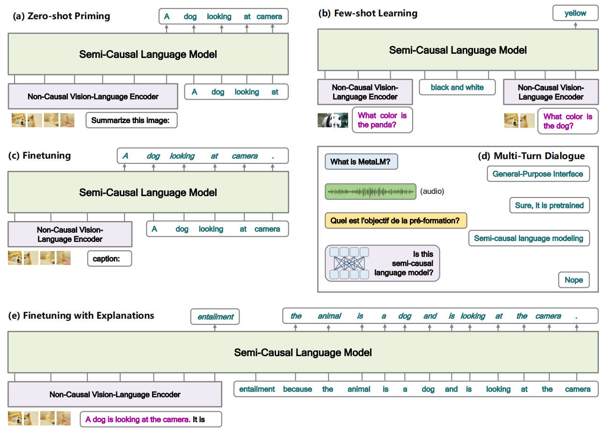

# Language Models are General-Purpose Interfaces
MetaLM:语言模型是通用接口  https://arxiv.org/abs/2206.06336  https://github.com/microsoft/unilm

## 阅读笔记
* a semi-causal language modeling：
* AGI两个层次：先对感知的充分理解，基于非因果编码器(双向掩码自动编码)学习表示各种输入数据; 再做各种推理、生成、发挥等，基于因果语言(单向自回归)模型充当通用任务层。这种2个层次的划分似乎也比较符合人类的决策，先调查研究，再分析总结、制定各种目标、计划等; 
* 感知层和逻辑层的交互方式，2个层次的模型可以拆分、可以是异构的; 具体的对接方式？
* multi-turn dialogue?

## Abstract
Foundation models have received much attention due to their effectiveness across a broad range of downstream applications. Though there is a big convergence in terms of architecture, most pretrained models are typically still developed for specific tasks or modalities. In this work, we propose to use language models as a general-purpose interface to various foundation models. A collection of pretrained encoders perceive diverse modalities (such as vision, and language), and they dock with a language model that plays the role of a universal task layer. We propose a semi-causal language modeling objective to jointly pretrain the interface and the modular encoders. We subsume the advantages and capabilities from both causal and non-causal modeling, thereby combining the best of two worlds. Specifically, the proposed method not only inherits the capabilities of in-context learning and open-ended generation from causal language modeling, but also is conducive to finetuning because of the bidirectional encoders. More importantly, our approach seamlessly unlocks the combinations of the above capabilities, e.g., enabling incontext learning or instruction following with finetuned encoders. Experimental results across various language-only and vision-language benchmarks show that our model outperforms or is competitive with specialized models on finetuning, zero-shot generalization, and few-shot learning.

基础模型因其在广泛的下游应用中的有效性而备受关注。尽管在架构方面有很大的收敛，但大多数预训练的模型通常仍然是为特定的任务或模态开发的。在这项工作中，我们建议使用语言模型作为各种基础模型的通用接口。一组经过预训练的编码器感知不同的模态(如视觉和语言)，并与扮演通用任务层角色的语言模型对接。我们提出了一个半因果语言建模目标，以联合预训练接口和模块化编码器。我们包含了因果建模和非因果建模的优势和能力，从而将两个世界中最好的结合在一起。具体而言，所提出的方法不仅继承了因果语言建模中的上下文学习和开放式生成的能力，而且由于双向编码器，有利于微调。更重要的是，我们的方法无缝地解锁了上述功能的组合，例如，通过微调编码器实现无正文学习或指令跟随。不同语言和视觉语言基准测试的实验结果表明，我们的模型在微调、零样本泛化和少样本学习方面优于或与专门模型更有竞争力。

 
Figure 1: Language models as a general-purpose interface to various foundation models. 
图1：语言模型作为各种基础模型的通用接口。

## 1 Introduction: Design Principles
### Language models as a universal task layer. 
The large-scale language model serves as a generalpurpose interface not only for language tasks, but also for vision, and multimodal tasks. Language models have open-ended output space, which generalizes to a wide range of tasks. As long as we can describe the predictions via natural language, the downstream task can fit in with language-modelbased task layer. It is natural that transforming various predictions to free-text sequences (Raffel et al., 2020). For example, we can transform the target labels, and answers to texts for classification, and question answering, respectively. In addition, with the help of the universal task layer, the prediction process can go beyond single turn, i.e., a multi-turn dialogue interface can be built upon language models by conditioning on history context. Such unification of various tasks is important to general-purposed AI, which unifies representations, transformations, and expressions into a shared module.

作为通用任务层的语言模型。大规模语言模型不仅是语言任务的通用接口，也是视觉和多模态任务的通用界面。语言模型具有开放的输出空间，可以泛化为各种各样的任务。只要我们能够通过自然语言描述预测，下游任务就可以适应基于语言模型的任务层。将各种预测转换为自由文本序列是很自然的(Raffel et al., 2020)。例如，我们可以将目标标签和答案分别转换为文本进行分类和问答。此外，在通用任务层的帮助下，预测过程可以超越单回合，即可以通过历史上下文的条件，在语言模型上建立多回合对话界面。各种任务的这种统一对于通用人工智能很重要，通用人工智能将表示、转换和表达统一到一个共享模块中。

### Causal language modeling (i.e., unidirectional decoder) is conducive to zero-shot generalization and in-context learning. 
GPT-3 (Brown et al., 2020) has shown that the intriguing properties emerge from causal language model pretraining. Because of the favorable sample efficiency and inductive bias (Wang et al., 2022b) of causal language modeling (i.e., all tokens make predictions and produce supervision signals) compared with other counterparts (such as masked language modeling), it is effective to give models the desired properties via causal language modeling. The capabilities of zero- and few-shot learning are critical to be a general-purpose task layer. Zero-shot generalization indicates that language models have learned an enormous amount of world knowledge (Dai et al., 2021) and patterns by reading large-scale text corpora. The memorized information can serve as reusable background knowledge and basic skills for a wide range of end tasks. Moreover, in-context learning enables us to easily adapt either pretrained or finetuned models to new scenarios. For example, we can use task instructions (Ouyang et al., 2022) to repurpose the model, and use demonstrations of some examples to conduct few-shot learning.

因果语言建模(即单向解码器)有助于零样本泛化和上下文学习。GPT-3(Brown et al., 2020)表明，有趣的属性来自因果语言模型预训练。由于因果语言建模(即所有令牌都进行预测并产生监督信号)与其他对等模型(如掩码语言建模)相比具有良好的样本效率和归纳偏差(Wang et al.，2022b)，因此通过因果语言建模为模型提供所需的属性是有效的。零和少样本学习的能力对于成为通用任务层至关重要。零样本泛化表明，语言模型通过阅读大规模文本语料库学习了大量的世界知识(Dai et al., 2021)和模式。记忆的信息可以作为可重复使用的背景知识和基本技能，用于广泛的最终任务。此外，上下文学习使我们能够轻松地将预训练或微调的模型适应新的场景。例如，我们可以使用任务指令(Ouyang et al.，2022)来重新调整模型的用途，并使用一些样本演示来进行少样本学习。

### Non-causal modeling (i.e., bidirectional encoder) is conducive to transfer across tasks, languages, and modalities. 
Although causal language models are good at zero- and few-shot generalization, BERT (Devlin et al., 2019) and T5 (Raffel et al., 2020) show that having bidirectional encoders pretrained by masked language modeling achieves much better finetuning performance.Once the whole input is given, non-causal modeling is quite rational for encoding data. Because all the context can access each other, while causal modeling can only make use of history tokens one by one. The advantage of finetuning is helpful for the data-rich setting where there are many annotated data available. In addition, non-causal encoder pretrained by the masked language modeling objective achieves competitive performance on cross-lingual transfer (Conneau et al., 2020), which makes it effective to adapt models to the multilingual setting.

非因果建模(即双向编码器)有助于跨任务、语言和模态进行传输。尽管因果语言模型擅长零和少样本的泛化，但BERT(Devlin et al.，2019)和T5(Raffel et al.，2020)表明，通过掩码语言建模预训练双向编码器可以实现更好的微调性能。一旦给出了整个输入，非因果建模对数据编码是非常合理的。因为所有上下文都可以相互访问，而因果建模只能逐个使用历史令牌。微调的优势对于数据丰富的设置很有帮助，在这种设置中有许多标注数据可用。此外，通过掩码语言建模目标预训练的非因果编码器在跨语言迁移方面实现了有竞争力的性能(Conneau et al.，2020)，这使得模型能够有效地适应多语言环境。

### Semi-causal language modeling as a meta-pretraining task. 
Semi-causal language modeling plays the role of linking together non-causal encoders and the causal language model. It is a meta task in the sense of universal interface pretraining of pretrained encoders. Specifically, non-causal encoders learn to represent various input data, and a causal language model serves as a universal task layer. Non-causal encoders dock with a causal language model, so that we can benefit from both modeling methods described as above. In comparison with previous encoder-decoder pretraining (such as prefix language modeling, and T5; Raffel et al. 2020), our task non-causally encodes random spans of the whole sequence, while generating the rest via causal language modeling. Moreover, in terms of architecture, we directly feed the outputs of bidirectional encoders into the causal decoder, rather than relying on cross attention (Vaswani et al., 2017). Besides, multiple bidirectional encoders can be mounted to the causal language model, but the encoder-decoder architecture usually has only one encoder.

作为元预训练任务的半因果语言建模。半因果语言建模起着将非因果编码器和因果语言模型连接在一起的作用。从预训练编码器的通用接口预训练的意义上来说，这是一项元任务。具体来说，非因果编码器学习表示各种输入数据，因果语言模型充当通用任务层。非因果编码器与因果语言模型对接，因此我们可以从上述两种建模方法中获益。与之前的编码器-解码器预训练(如前缀语言建模和T5; Raffel et al. 2020)相比，我们的任务对整个序列的随机跨度进行非因果编码，同时通过因果语言建模生成其余部分。此外，在架构方面，我们将双向编码器的输出直接馈送到因果解码器，而不是依赖于交叉注意力(Vaswani et al.，2017)。此外，因果语言模型可以安装多个双向编码器，但编码器-解码器架构通常只有一个编码器。
<!--感知表示直接馈入，不依赖于交叉注意力？-->

### Non-causal encoders as System 1, and causal language models as System 2. 
Cognition is usually categorized into two levels (Kahneman, 2011; Bengio, 2019): System 1 (i.e., intuitive, and unconscious) and System 2 (i.e., sequential, conscious, planning, and reasoning). In the proposed framework, the modules can be regarded as an implementation of these two levels, respectively. To be specific, non-causal encoders pretrained by masked data modeling, such as BERT (Devlin et al., 2019) and BEiT (Bao et al., 2022), are used as a perception layer to encode various input modalities. The encoding modules can be viewed as System 1. After we obtain the input representations, we feed them to the causal language model, which has shown promising performance on commonsense reasoning (Chowdhery et al., 2022) and planning (Huang et al., 2022). The universal task layer is designed to play a role of System 2 in our method.

非因果编码器作为系统1，因果语言模型作为系统2。认知通常分为两个层次(Kahneman，2011; Bengio，2019)：系统1(即直觉和无意识)和系统2(即顺序、有意识、计划和推理)。在所提出的框架中，这些模块可以分别被视为这两个层次的实现。具体而言，通过掩码数据建模预训练的非因果编码器，如BERT(Devlin et al.，2019)和BEiT(Bao et al.，2022)，被用作感知层，以对各种输入模态进行编码。编码模块可以被视为系统1。在我们获得输入表示后，我们将其输入到因果语言模型，该模型在常识推理(Chowdhery et al.，2022)和规划(Huang et al.，2021)方面表现出了良好的性能。通用任务层被设计为在我们的方法中扮演系统2的角色。

### Natural language interface between users and pretrained models. 
The universal task layer based on causal language modeling enables users to interact with pretrained non-causal encoders using natural language. First, language can be used as a programming language for the underlying pretrained or finetuned models, which is compiled by the universal interface. For example, we can write text-based instructions (Ouyang et al., 2022) and explanations (Wei et al., 2022) to repurpose and guide the model behaviors. Second, the universal interface enables the models to present the results using free texts, making predictions directly understandable and explainable. Third, the proposed framework natively supports multi-turn conversational interactions. In each turn, we can feed the encoded input to the interface layer and then generate response results in a semi-causal manner. 

用户和预训练模型之间的自然语言接口。基于因果语言建模的通用任务层使用户能够使用自然语言与预训练的非因果编码器进行交互。首先，语言可以用作底层预训练或微调模型的编程语言，这些模型由通用接口编译。例如，我们可以编写基于文本的指令(Ouyang et al.，2022)和解释(Wei et al.，2021)，以重新调整和指导模型行为。其次，通用界面使模型能够使用自由的文本呈现结果，使预测直接可理解和解释。第三，所提出的框架原生地支持多回合会话交互。在每一轮中，我们都可以将编码输入馈送到接口层，然后以半因果的方式生成响应结果。
<!--历史回合的输入表示可以缓存起来，不用每次都过encoder？ -->

## 2 MetaLM: Meta Language Model
Guided by the design principles in Section 1, we present Meta Language Model (MetaLM), a semicausal language model that plays the role of a general-purpose interface and supports interactions with various foundation models. An overview of our framework is shown in Figure 2. Specifically, a collection of pretrained encoders, that perceive diverse modalities, dock with a language model. The language model is regarded as a universal task layer (i.e., general-purpose interface), which unifies various tasks as free-text generation.

在第1节中的设计原则指导下，我们提出了元语言模型(MetaLM)，这是一种半因果语言模型，起着通用接口的作用，并支持与各种基础模型的交互。我们的框架概述如图2所示。具体来说，一组预训练的编码器，感知不同的模态，与语言模型对接。语言模型被视为通用任务层(即通用接口)，它将各种任务统一为自由文本生成。

 
Figure 2: Overview of MetaLM. The semi-causal language model serves as a general-purpose interface and supports interactions with various foundation models. 
图2：MetaLM概述。半因果语言模型充当通用接口，并支持与各种基础模型的交互。

In order to pretrain MetaLM, we propose a semi-causal language modeling task to jointly learn the modules. MetaLM subsumes the advantages and capabilities from both worlds. From the language model, MetaLM inherits the capabilities of in-context learning, multi-turn interaction, and open-ended generation. Moreover, the underlying foundation models are conducive to finetuning because of bidirectional modeling (Wang et al., 2022b).

为了预训练MetaLM，我们提出了一个半因果语言建模任务来联合学习模块。MetaLM包含了来自两个世界的优势和能力。从语言模型来看，MetaLM继承了上下文学习、多回合交互和开放式生成的能力。此外，由于双向建模，基础模型有利于微调(Wang et al.，2022b)。

### 2.1 Input Representation
Input representations of MetaLM are grouped into two categories. The first type is contextualized representations obtained by the underlying encoders and then projected by a connector layer. For example, as shown in in Figure 2, the image patches and x7, x8 are encoded by the bidirectional vision-language encoder. The second category is token embeddings of texts, such as x5, and x6 in Figure 2. The representations of these two categories are summed with positional embeddings before feeding into the general-purpose interface. 

MetaLM的输入表示分为两类。第一种类型是由底层编码器获得的上下文表示，然后由连接器层投影。例如，如图2所示，图像分块和x7、x8由双向视觉语言编码器编码。第二类是文本的令牌嵌入，如图2中的x5和x6。在输入到通用接口之前，这两个类别的表示与位置嵌入相加。

### 2.2 Model Architecture
As shown in Figure 3, we summarize the model architectures of three language model variants and the proposed semi-causal language model. First, causal language model (such as GPT; Brown et al. 2020) is a left-to-right Transformer decoder. Second, prefix language model uses the encoder-decoder architecture with cross-attention connections to complete the sequence. Third, non-causal language model is a bidirectional encoder, which is usually pretrained by masked language modeling (Devlin et al., 2019). Forth, the proposed semi-causal language model has a unidirectional Transformer decoder, and multiple bidirectional encoders that dock with the decoder. In other words, our model processes the whole session from left to right, while having some spans pre-encoded by non-causal encoders.

如图3所示，我们总结了三种语言模型变体的模型架构以及所提出的半因果语言模型。首先，因果语言模型(如GPT; Brown et al. 2020)是一个从左到右的Transformer解码器。其次，前缀语言模型使用具有交叉注意力连接的编码器-解码器架构来完成序列。第三，非因果语言模型是一种双向编码器，通常通过掩蔽语言建模进行预训练(Devlin et al.，2019)。第四，所提出的半因果语言模型具有单向Transformer解码器和与解码器对接的多个双向编码器。换句话说，我们的模型从左到右处理整个会话，同时通过非因果编码器对一些跨度进行预编码。
<!--前缀语言模型,具有交叉注意力连接的编码器-解码器架构,翻译任务-->

 
Figure 3: Comparisons between different language model (LM) variants: (a) causal LM with unidirectional decoder (Brown et al., 2020); (b) prefix LM with encoder-decoder architecture (Raffel et al., 2020); (c) non-causal LM with bidirectional encoder (Devlin et al., 2019); (d) semi-causal LM proposed in this work.
图3：不同语言模型(LM)变体之间的比较：(a)具有单向解码器的因果LM(Brown et al., 2020); (b) 前缀LM与编码器-解码器架构(Raffel et al., 2020); (c) 具有双向编码器的非因果LM(Devlin et al., 2019); (d) 本文提出的半因果LM。

#### Backbone Network. 
We use Transformer (Vaswani et al., 2017) to build the models. Given an input sequence, we first pack their vector representations together. Then we feed the vectors into a multilayer Transformer, which encodes the input to contextualized representations. In each Transformer block, there is a multi-head self-attention layer and a feed-forward network layer that are used to aggregate the hidden states of the previous layer. Moreover, attention masks are used to control the context access. We use a triangular matrix as the attention mask for the universal task layer, so that it processes the input from left to right. For the bidirectional encoder, we allow all the tokens to access each other. After obtaining the output vectors of the universal task layer, we use a softmax classifier to predict over the vocabulary. The weight matrix is shared with the input token embeddings.

骨干网络. 我们使用Transformer(Vaswani et al.，2017)来构建模型。给定一个输入序列，我们首先将它们的向量表示打包在一起。然后，我们将向量输入到多层Transformer中，后者将输入编码为上下文的表示。在每个Transformer块中，都有一个多头自注意层和一个前馈网络层，用于聚合前一层的隐藏状态。此外，注意力掩码用于控制上下文访问。我们使用三角形矩阵作为通用任务层的注意力掩码，以便它从左到右处理输入。对于双向编码器，我们允许所有令牌相互访问。在获得通用任务层的输出向量后，我们使用softmax分类器对词汇表进行预测。权重矩阵与输入令牌嵌入共享。

#### Connector. 
As shown in Figure 2, there is a connector layer between the universal task layer and various bidirectional encoders. The connectors project vector representations of bidirectional encoders before feeding them into the general-purpose interface. Moreover, the connectors are used to match the output dimensions of foundation models with the universal task layer. We empirically find that both linear projection and feed-forward network work well in our experiments.

连接器. 如图2所示，通用任务层和各种双向编码器之间有一个连接器层。连接器在将双向编码器输入通用接口之前投影它们的向量表示。此外，连接器用于将基础模型的输出尺寸与通用任务层相匹配。我们根据经验发现，线性投影和前馈网络在我们的实验中都能很好地工作。

### 2.3 Proposed Objective: Semi-Causal Language Modeling  建议目标：半因果语言建模
In order to pretrain MetaLM, we introduce the semi-causal language modeling objective. As shown in Figure 2, our pretraining task autoregressively generates the tokens of a sequence, while some spans are represented by bidirectional encoders. Given an input sequence x = $x_1, x_2, ..., x_n$, we assume there are k non-causal spans denoted as $ \{x^{e_1}_{s_1} , ..., x^{e_k}_{s_k} \}$, where $x^{e_i}_{s_i} = x_{s_i} , ..., x_{e_{i−1}}$. For each non-causal span $x^{e_i}_{s_i}$ , we use a bidirectional encoder to obtain its vector representations h($x^{e_i}_{s_i}$). The choose of bidirectional encoders is dependent on the modality of the non-causal span.  Then the semi-causal language modeling objective is formulated as: 

为了预训练MetaLM，我们引入了半因果语言建模目标。如图2所示，我们的预训练任务自回归地生成序列的令牌，而一些跨度由双向编码器表示。给定输入序列x＝$x_1, x_2, ..., x_n$，我们假设有k个非因果跨度，表示为{ $x^{e_1}_{s_1} , ..., x^{e_k}_{s_k}$ }，其中$x^{e_i}_{s_i} = x_{s_i} , ..., x_{e_{i−1}}$.对于每个非因果跨度$x^{e_i}_{s_i}$，我们使用双向编码器来获得其向量表示h($x^{e_i}_{s_i}$)。双向编码器的选择取决于非因果跨度的模态。然后，半因果语言建模目标被公式化为：

$max \sum^k_{i=0} \sum^{s_{(i+1)}}_{t=e_i} log P(x_t|x<t, \{h(x^{ej}_{sj})\}_{j<i})$ (1) 

where $e_0$ = 1, $s_{(k+1)}$ = n, and $\{h(x^{ej}_{sj})\}_{j<i}$ = {h($x^{e_1}_{s_1}$), · · · , h($x^{e_(i-1)}_{s_(j-1)}$) }. Notice that the next token of each non-causal span is generated at the last position of the span. Typically the number of non-causal spans and their positions are randomly sampled. The spans do not have overlaps with each other.

其中$e_0$ = 1, $s_{(k+1)}$ = n, and $\{h(x^{ej}_{sj})\}_{j<i}$ = {h($x^{e_1}_{s_1}$), · · · , h($x^{e_(i-1)}_{s_(j-1)}$) }.。请注意，每个非因果跨度的下一个令牌都是在跨度的最后一个位置生成的。通常，非因果跨度的数量及其位置是随机采样的。跨度之间没有重叠。

By leveraging the proposed objective, we jointly pretrain the general-purpose interface and the underlying foundational models, and seamlessly connect them together. We pretrain MetaLM for both the language-only (Section 3) and vision-language (Section 4) settings.

通过利用所提出的目标，我们共同预训练通用接口和底层基础模型，并将它们无缝连接在一起。我们为仅语言(第3节)和视觉语言(第4节)设置预训练MetaLM。

### 2.4 Capabilities on Downstream Tasks  下游任务能力
#### In-Context Learning MetaLM. 
can adapt to a new task by conditioning on natural language instructions or several input-output pairs (i.e., demonstrations), without updating any parameter. We first describe the usage of k-shot learning. For each demonstration input, we conduct bidirectional encoding. Then we feed the encoded vectors and the label into the general-purpose interface. By conditioning on the given demonstrations, MetaLM predicts the target output of unseen examples. For zero-shot generalization, there is only the test input, typically with prompts used to describe the task. We feed the example with the task instruction into bidirectional encoders. The target output is generated by the universal task layer.

上下文学习MetaLM。可以通过调节自然语言指令或几个输入输出对(即演示)来适应新任务，而无需更新任何参数。我们首先描述k次学习的用法。对于每个演示输入，我们进行双向编码。然后，我们将编码的向量和标签输入到通用接口中。通过以给定的演示为条件，MetaLM预测了看不见样本的目标输出。对于零样本泛化，只有测试输入，通常带有用于描述任务的提示。我们将带有任务指令的样本输入到双向编码器中。目标输出由通用任务层生成。 <!-- 编码的向量和标签, 输入标签的作用？ -->

#### Finetuning. 
Finetuning is especially helpful when many annotated examples of the downstream task are available. We unify various tasks to the open-ended generation format, i.e., targets are transformed to free texts. During finetuning, MetaLM learns to generate the target output, conditioning on the bidirectionally encoded input. Compared with causal language models, MetaLM inherits the excellent finetuning capability of bidirectional encoders.

微调。当有许多下游任务的标注样本可用时，微调尤其有用。我们将各种任务统一为开放式生成格式，即将目标转换为自由文本。在微调过程中，MetaLM学习生成目标输出，以双向编码输入为条件。与因果语言模型相比，MetaLM继承了双向编码器出色的微调能力。

#### In-Context Customization. 
A typical usage is that we first finetune the model on a large amount of data, and then use in-context learning to customize the finetuned model. So we can easily transfer the knowledge of labeled data to new tasks. As we subsume the advantages of both causal and non-causal modeling, MetaLM unlocks the combinations of the capabilities, i.e., good finetuning performance of non-causal modeling, and in-context learning of causal modeling.

上下文自定义。一个典型的用法是，我们首先根据大量数据对模型进行微调，然后使用上下文学习来定制微调后的模型。因此，我们可以很容易地将标注数据的知识转移到新的任务中。由于我们包含了因果建模和非因果建模的优势，MetaLM解锁了这些能力的组合，即非因果建模良好的微调性能，以及因果建模的上下文学习。

#### Multimodal Multi-Turn Interaction. 
MetaLM supports multi-turn interactions between users and pretrained models. For each turn, non-causal modules encode user inputs, which accepts multimodal contents by using the corresponding pretrained encoders. The output responses are generated by the general-purpose interface. By conditioning on the history conversations, MetaLM naturally works as a conversational interface. Moreover, the conversation can include multiple modalities instead of plain texts. 

多模态多回合交互。MetaLM支持用户和预训练模型之间的多回合交互。对于每一回合，非因果模块对用户输入进行编码，用户输入通过使用相应的预训练编码器来接受多模态内容。输出响应由通用接口生成。通过以历史对话为条件，MetaLM自然可以作为对话界面。此外，对话可以包括多种形式，而不是纯文本。

## 3 Experiments on Language-Only Tasks
We first conduct experiments on language-only datasets to demonstrate the versatility and effectiveness of MetaLM. Here the non-causal encoder is a pretrained language foundation model that docks with the universal task layer. The intriguing capabilities emerge through pretraining, which enables the general-purpose interface to transfer across tasks and scenarios.

我们首先在纯语言数据集上进行实验，以证明 MetaLM 的多功能性和有效性。 这里的非因果编码器是预训练的语言基础模型，与通用任务层对接。 有趣的功能通过预训练出现，使通用接口能够跨任务和场景传输。

### 3.1 Evaluation Settings
We elaborate on language-only evaluation settings in Table 1. We demonstrate the capabilities of MetaLM, including multitask finetuning (Section 3.3), single-task finetuning (Section 3.4), instruction tuning (Section 3.5), and in-context learning (Section 3.6). The capabilities are taskagnostic and broadly applicable to understanding, generation, and interaction, which facilitates skill adaptation and communication with users. Moreover, the evaluation settings of multitask finetuning and and instruction tuning are seamlessly built upon the capability combination of finetuning and incontext learning. In addition, because the tasks are unified in the free-text format, we can handle diverse downstream tasks using the same interface.

我们在表 1 中详细说明了仅语言评估设置。我们展示了 MetaLM 的功能，包括多任务微调（第 3.3 节）、单任务微调（第 3.4 节）、指令调优（第 3.5 节）和上下文学习（第 3.6). 这些功能与任务无关，广泛适用于理解、生成和交互，这有助于技能适应和与用户的交流。 此外，多任务微调和指令调优的评估设置无缝地建立在微调和上下文学习的能力组合之上。 此外，由于任务统一为自由文本格式，我们可以使用相同的界面处理不同的下游任务。

Evaluation Setting | Capability
--- | --- 
Multitask Finetuning | Perform a wide range of tasks competitively.
Single-Task Finetuning | Tackle individual tasks with remarkable performance.
Instruction Tuning | Zero-shot generalization after finetuning with instructions.
Zero-/Few-Shot Learning | Adapt to a new task given zero/few labeled examples.

Table 1: Summary of evaluation settings for language-only MetaLM. Each setting highlights an essential capability of MetaLM.

评估设置 | 能力
--- | ---
多任务微调 | 有竞争力地执行广泛的任务。
单任务微调 | 以卓越的表现处理个人任务。
指令调优 | 使用指令进行微调后的零样本泛化。
零/少样本学习 | 适应给定零个/少数标注样本的新任务。

表 1：仅语言 MetaLM 的评估设置摘要。 每个设置都突出了 MetaLM 的基本功能。

 
Figure 4: MetaLM can be applied in different language-only scenarios: (a) multitask finetuning and instruction tuning, i.e., perform various tasks simultaneously in an open-ended manner. (b) multi-turn dialogue, i.e., generate multi-turn responses according to the encoded input of users. (c) zero-shot priming, e.g., natural question answering. (d) few-shot learning, e.g., sentiment analysis. 
图 4：MetaLM 可应用于不同的纯语言场景：(a) 多任务微调和指令调优，即以开放式方式同时执行各种任务。 (b) 多轮对话，即根据用户的编码输入生成多轮响应。 (c) 零样本启动，例如自然问答。 (d) 少样本学习，例如情绪分析。

Figure 4 illustrates how to apply our model to different scenarios. Generally, the input examples and instructions are fed to the non-causal language encoder, and the target outputs are produced from the universal task layer. Moreover, the predictions are generated in a generative manner, which is open-ended.

图4 说明了如何将我们的模型应用于不同的场景。 通常，输入样本和指令被馈送到非因果语言编码器，目标输出从通用任务层产生。 此外，预测是以生成方式生成的，这种方式是开放式的。

### 3.2 Pretraining Setup
We use sinusoidal position embeddings (Vaswani et al., 2017) for the language model. The number of layers is L = 24, each layer consists of A = 32 attention heads and the hidden dimension is H = 2048. The number of parameters is about 1.3B. For the non-causal part, we use encoder-only Transformers, where A = 16, H = 1024, L = 24. We utilize the learnable position embedding and relative position bias (Raffel et al., 2020) for the non-causal model. The number of parameters is about 366M. We use DeepNorm (Wang et al., 2022a) for Transformers. The connector module is a linear projection layer in our implementation.

我们对语言模型使用正弦位置嵌入 (Vaswani et al., 2017)。 层数L=24，每层由A=32个注意力头组成，隐藏维度H=2048。参数个数约为1.3B。 对于非因果部分，我们使用仅编码器的 Transformer，其中 A = 16，H = 1024，L = 24。我们利用可学习的位置嵌入和相对位置偏差(Raffel et al., 2020)来处理非因果关系 模型。 参数个数约366M。 我们对 Transformers 使用 DeepNorm (Wang et al., 2022a)。 连接器模块在我们的实现中是一个线性投影层。

The maximum input lengths for non-causal and semi-causal models are 512 and 2048, respectively. We randomly sample random spans whose lengths are between 64 and 128, and feed them to the non-causal part. The total length of non-causal spans is 25% of the original sequence length. The spans do not cross document boundaries. We pretrain the semi-causal language model from scratch. The non-causal module is initialized from a pretrained bidirectional encoder, using the replaced token detection task (Clark et al., 2020). During pretraining, we freeze all parameters of the non-causal encoder except the last two layers. We pretrain MetaLM for 300k steps with a batch size of 1024 and use Adam (Kingma and Ba, 2015) for optimization. We disable dropout of the semi-causal model and set the dropout rate of the non-causal model to 0.1. We use a learning rate of 6e-4 with warm-up. Please refer to Appendix A.1 for more pretraining details.

非因果和半因果模型的最大输入长度分别为 512 和 2048。 我们随机抽取长度在 64 到 128 之间的随机跨度，并将它们提供给非因果部分。 非因果跨度的总长度是原始序列长度的 25%。 跨度不跨越文档边界。 我们从头开始预训练半因果语言模型。 非因果模块使用替换的令牌检测任务从预训练的双向编码器初始化(Clark et al., 2020)。 在预训练期间，我们冻结了除最后两层之外的非因果编码器的所有参数。 我们对 MetaLM 进行了 300k 步的预训练，批量大小为 1024，并使用 Adam (Kingma and Ba, 2015) 进行优化。 我们禁用半因果模型的 dropout，并将非因果模型的 dropout rate 设置为 0.1。 我们使用 6e-4 的学习率进行热身。 有关更多预训练详情，请参阅附录 A.1。

We pretrain the model on Pile (Gao et al., 2021), which is a massive English text dataset constructed from diverse data sources and targeted at training large-scale language models. We exclude data splits of GitHub, arXiv, and PubMed Central. Please refer to Appendix B.1 for detailed descriptions about Pile. The pretraining data is tokenized by SentencePiece (Kudo and Richardson, 2018). We construct the input in the “full-sentence” format (Liu et al., 2019b), i.e., each input sequence is packed with full sentences sampled contiguously from one or more documents. We additionally introduce three special tokens for input construction: <\s> indicates the start of a sequence, <\/s> indicates the end of a paragraph and <\/d> indicates the end of a document.

我们在 Pile (Gao et al., 2021) 上预训练模型，Pile 是一个由不同数据源构建的海量英语文本数据集，旨在训练大规模语言模型。 我们排除了 GitHub、arXiv 和 PubMed Central 的数据拆分。 关于 Pile 的详细说明请参考附录 B.1。 预训练数据由 SentencePiece 令牌化(Kudo 和 Richardson，2018)。 我们以“完整句子”格式构建输入(Liu et al., 2019b)，即每个输入序列都包含从一个或多个文档中连续采样的完整句子。 我们还为输入构造引入了三个特殊令牌：<\s> 表示序列的开始，<\/s> 表示段落的结尾，<\/d> 表示文档的结尾。

### 3.3 Multitask Finetuning
We first evaluate MetaLM under the multitask finetuning setting. To be specific, we unify a wide range of tasks in an open-ended generation manner, so that they can be processed by the universal task layer without any task-specific architecture. Figure 4(a) shows an example of how MetaLM handles multitask finetuning. During finetuning, we randomly sample training examples and feed the inputs into the bidirectional language encoder. The finetuning objective is to maximize the likelihood of the correct labels generated from the interface.

我们首先在多任务微调设置下评估 MetaLM。 具体来说，我们以开放式生成方式统一了广泛的任务，以便它们可以由通用任务层处理，而无需任何特定于任务的架构。 图 4(a) 显示了 MetaLM 如何处理多任务微调的样本。 在微调期间，我们随机抽取训练样本并将输入馈送到双向语言编码器。 微调目标是最大化从界面生成正确标签的可能性。

We conduct experiments on a mixture of 34 NLP datasets (refer to Appendix B.2 for more details) grouped into ten task clusters, including both language understanding tasks and generation tasks: 
* Natural Language Inference: ANLI (R1-R3), CB, MNLI, QNLI, RTE, SNLI, WNLI 
* Sentiment Classification: IMDB, SST-2, Sentiment140, Yelp 
* Paraphrase Detection: QQP, MRPC, Paws Wiki 
* Coreference Resolution: DPR, Winogrande, WSC 
* Commonsense Reasoning: HellaSwag, PiQA, COPA 
* Reading Comprehension: DROP, SQuADv1, SQuADv2, OBQA, BoolQ 
* Miscellaneous: CoLA, WiC, TREC 
* Closed-Book QA: ARC-easy, NQ 
* Struct to Text: CommonGen, E2ENLG 
* Summarization: AESLC, SamSum, XSum

我们对 34 个 NLP 数据集(更多详情请参阅附录 B.2)进行实验，这些数据集分为 10 个任务集群，包括语言理解任务和生成任务：
* 自然语言推理：ANLI (R1-R3)、CB、MNLI、QNLI、RTE、SNLI、WNLI
* 情感分类：IMDB、SST-2、Sentiment140、Yelp
* 释义检测：QQP、MRPC、Paws Wiki
* 共指消解：DPR、Winogrande、WSC
* 常识性推理：HellaSwag、PiQA、COPA
* 阅读理解：DROP、SQuADv1、SQuADv2、OBQA、BoolQ
* 其他：CoLA、WiC、TREC
* 闭卷 QA：ARC-easy、NQ
* 结构到文本：CommonGen、E2ENLG
* 总结：AESLC、SamSum、XSum

#### 3.3.1 Evaluation Setup
MetaLM is finetuned on a mixture of all the mentioned datasets. We limit the maximum number of training examples in each dataset to 30k. We follow the prompts used in (Wei et al., 2021). If the dataset is a multi-choice task, all possible options are provided in the template. For instance, the input format of an example from a sentiment classification dataset is “<\s> Would the following phrase be considered positive or negative? <\/s> [text] <\/s> OPTIONS: <\/s> Positive <\/s> Negative <\/s> TARGET:”. The model determines the sentiment by generating Positive or Negative. 

MetaLM 在所有提到的数据集的混合体上进行了微调。 我们将每个数据集中的最大训练样本数限制为 30k。 我们遵循 (Wei et al., 2021) 中使用的提示。 如果数据集是多项选择任务，则模板中会提供所有可能的选项。 例如，来自情感分类数据集的样本的输入格式是“<\s>下面的短语会被认为是积极的还是消极的？ <\/s> [text] <\/s> OPTIONS: <\/s> Positive <\/s> Negative <\/s> TARGET:”。 该模型通过生成正面或负面来确定情绪。

We finetune MetaLM for 20k steps with a batch size of 256. The total length of input and answer tokens is restricted to 2048. Following (Raffel et al., 2020), we pack multiple training examples into one sequence to make computation batch-friendly. The learning rate is set to 1e-4. For more details, please refer to Appendix A.2.

我们将 MetaLM 微调 20k 步，批量大小为 256。输入和答案令牌的总长度限制为 2048。按照(Raffel et al., 2020)，我们将多个训练样本打包到一个序列中，以使计算批处理友好 . 学习率设置为1e-4。 更多详情，请参阅附录 A.2。

For multi-choice tasks, we report the exact match score without decoding constraints. For SQuAD, DROP, and closed-book QA datasets, we report the F1 score with greedy decoding. When evaluating on the struct2text and summarization clusters, we use beam search (Sutskever et al., 2014) with a beam size of 4 and a length penalty of α = 0.6. We report ROUGE scores for the above two clusters.

对于多项选择任务，我们报告没有解码约束的精确匹配分数。 对于 SQuAD、DROP 和闭卷 QA 数据集，我们使用贪心解码报告 F1 分数。 在对 struct2text 和摘要集群进行评估时，我们使用集束搜索 (Sutskever et al., 2014)，集束大小为 4，长度惩罚为 α = 0.6。 我们报告了上述两个集群的 ROUGE 分数。

#### 3.3.2 Results
Table 2 compares the multitask finetuning results of MetaLM and GPT. The GPT baseline follows the same configuration and training corpus for a fair comparison. Each result represents the average score of all datasets of one task cluster. The full results of all task clusters are reported in Appendix C. We also illustrate the score differences between MetaLM and GPT for all datasets in Figure 5.

表 2 比较了 MetaLM 和 GPT 的多任务微调结果。 GPT 基线遵循相同的配置和训练语料库以进行公平比较。 每个结果代表一个任务集群的所有数据集的平均分数。 所有任务集群的完整结果在附录 C 中报告。我们还在图 5 中说明了所有数据集的 MetaLM 和 GPT 之间的分数差异。

 
Table 2: Performance comparisons of multitask finetuning between MetaLM and GPT. We limit the number of training examples in each dataset to 30k during finetuning. For each task cluster, we present the average result over all sub-datasets within it. All results are reported on validation sets. 
表 2：MetaLM 和 GPT 之间多任务微调的性能比较。 在微调期间，我们将每个数据集中的训练样本数量限制为 30k。 对于每个任务集群，我们展示了其中所有子数据集的平均结果。 所有结果都在验证集上报告。

 
Figure 5: Score difference of multitask finetuning results between MetaLM and GPT. We observe that MetaLM achieves consistent improvements over all tasks except the cluster of struct to text.
图 5：MetaLM 和 GPT 之间多任务微调结果的得分差异。 我们观察到 MetaLM 在除结构到文本集群之外的所有任务上实现了一致的改进。

We observe that MetaLM consistently surpasses GPT by a large margin on almost all the task clusters. The results indicate that our method inherits the performant finetuning ability from the non-causal encoder. Particularly, MetaLM performs much better than GPT on NLU tasks. It partially confirms that non-causal modeling is conducive to finetuning (Wang et al., 2022b; Tay et al., 2022; Artetxe et al., 2022). For more challenging tasks, such as natural language inference, and reading comprehension, the improvement of MetaLM is very prominent (14.1% and 9.6%). Furthermore, we find that finetuning of GPT brings relatively small gains on commonsense reasoning tasks, whose results are comparable to zero-shot generalization. By contrast, finetuning of MetaLM obtains decent gains over zero-shot numbers. With regard to language generation, MetaLM consistently outperforms GPT except on struct-to-text datasets. For closed-book question answering and text summarization, MetaLM achieves better performance than GPT too, benefiting from the non-causal modeling of input text. 

我们观察到 MetaLM 在几乎所有任务集群上始终大幅超过 GPT。 结果表明我们的方法继承了非因果编码器的性能微调能力。 特别是，MetaLM 在 NLU 任务上的表现比 GPT 好得多。 它部分证实了非因果建模有利于微调(Wang et al., 2022b; Tay et al., 2022; Artetxe et al., 2022)。 对于更具挑战性的任务，如自然语言推理、阅读理解等，MetaLM 的提升非常突出(14.1% 和 9.6%)。 此外，我们发现 GPT 的微调在常识推理任务上带来的收益相对较小，其结果与零样本泛化相当。 相比之下，MetaLM 的微调在零射击数上获得了可观的收益。 在语言生成方面，除了在结构到文本数据集上，MetaLM 始终优于 GPT。 对于闭卷问答和文本摘要，MetaLM 也取得了比 GPT 更好的性能，这得益于输入文本的非因果建模。

### 3.4 Single-Task Finetuning
We explore the finetuning capability of MetaLM under data-rich settings. We design a new finetuning paradigm for MetaLM. For each downstream task, we only update the parameters of the non-causal encoder while keeping the language model frozen. We demonstrate that the proposed strategy achieves excellent performance, and preserves the general-purpose interface’s capabilities of in-context learning and open-endedness.

我们探索了 MetaLM 在数据丰富的设置下的微调能力。 我们为 MetaLM 设计了一个新的微调范例。 对于每个下游任务，我们只更新非因果编码器的参数，同时保持语言模型冻结。 我们证明所提出的策略实现了出色的性能，并保留了通用接口的上下文学习和开放性的能力。

#### 3.4.1 Finetuning Setup
We conduct single-task finetuning on the natural language inference dataset MNLI (Williams et al., 2018). We use the template “<\s> Premise:[*] <\/s> Hypothesis:[*] <\/s> Label:”. The task is to determine whether a hypothesis is true, false or undetermined given a premise. The corresponding labels are “entailment”, “contradiction” and “neutral”, respectively. During finetuning, we freeze the general-purpose interface and only update the non-causal encoder and the connector. In contrast, all parameters are updated for the GPT baseline. We finetune both MetaLM and GPT for three epochs with a learning rate of 5e-5 and a batch size of 32.

我们对自然语言推理数据集 MNLI 进行单任务微调 (Williams et al., 2018)。 我们使用模板“<\s> Premise:[*] <\/s> Hypothesis:[*] <\/s> Label:”。 任务是在给定前提的情况下确定假设是真、假还是不确定。 对应的标签分别是“蕴含”、“矛盾”和“中性”。 在微调期间，我们冻结通用接口，只更新非因果编码器和连接器。 相反，所有参数都针对 GPT 基线进行了更新。 我们对三个时期的 MetaLM 和 GPT 进行微调，学习率为 5e-5，批量大小为 32。

#### 3.4.2 Results
Table 3 reports single-task finetuning accuracy. MNLI-m and -mm represent the matched and the mismatched validation sets respectively. Each score is the average of three runs with different random seeds. Compared with GPT, MetaLM improves the accuracy of MNLI by 3.4 absolute points, despite updating much fewer parameters. In addition to Section 3.3, the results show that bidirectional encoders benefit finetuning performance (Wang et al., 2022b; Tay et al., 2022; Artetxe et al., 2022). Furthermore, we also present three strong baselines derived from finetuning bidirectional language encoders, including BERT (Devlin et al., 2019), RoBERTa (Liu et al., 2019b) and ELECTRA (Clark et al., 2020). All these three models are in large size. Results show that MetaLM achieves comparable or better performance than the bidirectional encoders.

表 3 报告了单任务微调精度。 MNLI-m和-mm分别代表匹配和不匹配的验证集。 每个分数是使用不同随机种子的三个运行的平均值。 与 GPT 相比，MetaLM 将 MNLI 的精度提高了 3.4 个绝对点，尽管更新的参数少得多。 除了第 3.3 节之外，结果还表明双向编码器有利于微调性能(Wang et al., 2022b; Tay et al., 2022; Artetxe et al., 2022)。 此外，我们还提出了三个源自微调双向语言编码器的强大基线，包括 BERT (Devlin et al., 2019)、RoBERTa (Liu et al., 2019b) 和 ELECTRA (Clark et al., 2020)。 这三个模型都是大尺寸。 结果表明，MetaLM 实现了与双向编码器相当或更好的性能。

Model | MNLI -m | (acc)  -mm
--- | --- | ---
GPT | 87.7  | 87.6
BERT (Devlin et al., 2019) | 86.6 | -
RoBERTa (Liu et al., 2019b) | 90.2 | 90.2
ELECTRA (Clark et al., 2020) | 90.9 | -
METALM | 91.1 | 91.0

Table 3: Single-task finetuning results on matched (-m) and mismatched (-mm) validation sets of MNLI. Each score is the average of multiple runs with different random seeds.
表 3：MNLI 的匹配 (-m) 和不匹配 (-mm) 验证集的单任务微调结果。 每个分数是使用不同随机种子的多次运行的平均值。

### 3.5 Instruction-Tuned Zero-Shot Generalization 指令调整的零样本泛化
We investigate instruction tuning for MetaLM, which finetunes the model on a variety of tasks with instructions. After finetuning, we evaluate the performance of instruction following and zero-shot generalization for the models. Because our goal is to investigate the zero-shot generalization on held-out tasks. Therefore, when evaluating on a specific dataset, all datasets in the same category (i.e., task cluster) are not seen during the training stage. For example, if we evaluate on the classification dataset SST-2, the entire cluster of sentiment analysis is excluded during instruction tuning.

我们研究了 MetaLM 的指令调整，它使用指令在各种任务上微调模型。 微调后，我们评估了模型的指令跟随和零样本泛化的性能。 因为我们的目标是研究留出任务的零样本泛化。 因此，在对特定数据集进行评估时，在训练阶段看不到同一类别(即任务集群)中的所有数据集。 例如，如果我们在分类数据集 SST-2 上进行评估，则在指令调整期间将排除整个情感分析集群。

#### 3.5.1 Instruction-Tuning Setup
We follow the evaluation pipeline proposed in FLAN (Wei et al., 2021). We conduct instruction tuning with MetaLM and GPT on the same dataset mixture described in Section 3.3 except for the summarization cluster. For each dataset, we use ten different templates manually composed by FLAN (Wei et al., 2021) and randomly apply one of them for every example. As mentioned in (Wei et al., 2021), there are some templates that “turned the task around” to increase learning diversity, e.g., for sentiment classification, the model is prompted to generate a movie review based on the given sentiment label “Positive”.

我们遵循 FLAN (Wei et al., 2021) 中提出的评估流程。 我们使用 MetaLM 和 GPT 在第 3.3 节中描述的相同数据集混合上进行指令调优，除了摘要集群。 对于每个数据集，我们使用由 FLAN (Wei et al., 2021) 手动组成的十个不同模板，并为每个样本随机应用其中一个。 正如 (Wei et al., 2021) 中提到的，有一些模板“扭转了任务”以增加学习多样性，例如，对于情感分类，模型会根据给定的情感标签“提示生成电影评论” 积极的”。

Most finetuning configurations are the same as in Section 3.3.1. We experiment on four task clusters, including natural language inference, sentiment classification, paraphrase detection, and reading comprehension. Following the evaluation protocol of (Wei et al., 2021), the paraphrase cluster is dropped when evaluating on inference cluster and vice-versa. We finetune MetaLM and GPT for 30k steps with a batch size of 512. The learning rate is set to 1e-4. The sequence length for each example is limited to 1024. We also use the data packing strategy as in Section 3.3 to improve efficiency. The detailed hyper-parameters is provided in Appendix A.2.

大多数微调配置与第 3.3.1 节中的相同。 我们对四个任务集群进行了实验，包括自然语言推理、情感分类、释义检测和阅读理解。 按照 (Wei et al., 2021) 的评估协议，在对推理集群进行评估时，释义集群被丢弃，反之亦然。 我们将 MetaLM 和 GPT 微调 30k 步，批量大小为 512。学习率设置为 1e-4。 每个样本的序列长度限制为 1024。我们还使用 3.3 节中的数据打包策略来提高效率。 详细的超参数在附录 A.2 中提供。

#### 3.5.2 Results
Table 4 reports the full results of instruction tuning on four task clusters. For each dataset, we use five different templates for evaluation, and present both the average and the best score. We observe that MetaLM achieves large improvements over the GPT baseline, which indicates the effectiveness of semi-causal language modeling. Considering the natural language inference cluster, GPT fails to obtain reasonable zero-shot results on difficult datasets (such as ANLI and WNLI), while MetaLM consistently performs well on various datasets. We notice similar trends on the other task clusters, i.e., sentiment, paraphrase, and reading comprehension. In addition to the average results, MetaLM outperforms the GPT baseline in terms of the best performance. 

表 4 报告了四个任务集群的指令调整的完整结果。 对于每个数据集，我们使用五个不同的模板进行评估，并提供平均分和最佳分。 我们观察到 MetaLM 在 GPT 基线上取得了很大的改进，这表明半因果语言建模的有效性。 考虑到自然语言推理集群，GPT 无法在困难的数据集(例如 ANLI 和 WNLI)上获得合理的零样本结果，而 MetaLM 在各种数据集上始终表现良好。 我们注意到其他任务集群的类似趋势，即情感、释义和阅读理解。 除了平均结果，MetaLM 在最佳性能方面优于 GPT 基线。

 
Table 4: Full results of instruction tuning. We report the accuracy for all datasets except using F1 score for DROP, SQuADv1, and SQuADv2. The average score of each dataset is computed across five different templates. 
表 4：指令调整的完整结果。 我们报告了所有数据集的准确性，但使用 DROP、SQuADv1 和 SQuADv2 的 F1 分数除外。 每个数据集的平均分数是通过五个不同的模板计算的。

The setting of instruction tuning requires the capabilities of both finetuning and zero-shot generalization. Experimental results indicate that our method combines the best of causal and non-causal language models. MetaLM not only achieves favorable finetuning performance because of bidirectional encoders, but also retains the causal language model’s intriguing capability of zero-shot generalization.

指令调整的设置需要微调和零样本泛化的能力。 实验结果表明，我们的方法结合了最好的因果和非因果语言模型。 由于双向编码器，MetaLM 不仅实现了良好的微调性能，而且还保留了因果语言模型令人着迷的零样本泛化能力。

### 3.6 In-Context Learning
We compare the performance of in-context learning (Brown et al., 2020) between MetaLM and GPT. Conditioned on the task instruction and several input-label pairs, language models are repurposed towards the desired downstream task, following the input pattern while without updating parameters. As illustrated in Figure 4(d), the demonstrations consist of two parts, the example input is passed through the non-causal encoder and the label token uses original embeddings. Then the target label of the test input is generated by the universal task layer.

我们比较了 MetaLM 和 GPT 的上下文学习性能(Brown et al., 2020)。 以任务指令和几个输入标签对为条件，语言模型被重新用于所需的下游任务，遵循输入模式而不更新参数。 如图 4(d) 所示，演示由两部分组成，样本输入通过非因果编码器传递，标签令牌使用原始嵌入。 然后测试输入的目标标签由通用任务层生成。

#### 3.6.1 Evaluation Setup
We conduct experiments under zero-shot, one-shot, and four-shot settings. We follow the evaluation protocol of GPT-3 (Brown et al., 2020). We evaluate each test example by randomly sampling examples from the training set as demonstrations. The Winograd only has the test set, so we sample demonstrations directly from it. Under few-shot settings, all examples are delimited by the separator token <\/s>.

我们在零样本、单样本和4样本设置下进行实验。 我们遵循 GPT-3 的评估协议(Brown et al., 2020)。 我们通过从训练集中随机抽取样本作为演示来评估每个测试样本。 Winograd 只有测试集，所以我们直接从中采样演示。 在少样本设置下，所有样本都由分隔符 <\/s> 分隔。

We evaluate MetaLM and the GPT baseline on nine tasks, including cloze and completion tasks (i.e, StoryCloze, HellaSwag), Winograd-style tasks (i.e, Winograd, Winogrande), commonsense reasoning (i.e, ARC-easy, ARC-challenge, PIQA), and two datasets BoolQ and Copa from the SuperGLUE benchmark (Wang et al., 2019). The detailed descriptions of these datasets are provided in Appendix B.3.

我们在九个任务上评估 MetaLM 和 GPT 基线，包括完形填空和完成任务(即 StoryCloze、HellaSwag)、Winograd 风格的任务(即 Winograd、Winogrande)、常识推理(即 ARC-easy、ARC-challenge、PIQA)，以及来自 SuperGLUE 基准测试的两个数据集 BoolQ 和 Copa (Wang et al., 2019)。 这些数据集的详细描述在附录 B.3 中提供。

#### 3.6.2 Results
Table 5 reports accuracy results of in-context learning. Compared with GPT, MetaLM achieves better or comparable results. For Winograd and completion tasks (i.e, StoryCloze, and HellaSwag), the performance of MetaLM has consistent improvements over GPT. Considering the average result over these datasets, MetaLM is better in both zero-shot (k = 0) and few-shot (k = 1, 4) settings. The findings indicate that MetaLM inherits the excellent in-context learning ability, and the contextualized representations of non-causal encoders tend to help the model to generalize better. 

表 5 报告了上下文学习的准确性结果。 与 GPT 相比，MetaLM 取得了更好或相当的结果。 对于 Winograd 和完成任务(即 StoryCloze 和 HellaSwag)，MetaLM 的性能相对于 GPT 有一致的改进。 考虑到这些数据集的平均结果，MetaLM 在零样本 (k = 0) 和少量样本 (k = 1、4) 设置中都更好。 研究结果表明，MetaLM 继承了出色的上下文学习能力，非因果编码器的上下文表示往往有助于模型更好地泛化。

 
Table 5: Performance comparisons of in-context learning between MetaLM and GPT. k represents the number of shots.
表 5：MetaLM 和 GPT 之间的上下文学习性能比较。 k代表拍摄次数。

## 4 Experiments on Vision-Language Tasks
We conduct experiments under the vision-language setting. The underlying non-causal encoder is a pretrained vision-language foundation model, which docks with the general-purpose interface. The pretraining task is similar to the language-only setting, despite the use of image-text pairs. Specifically, given an image-text pair, the image tokens are prepended to the text tokens. As shown in Figure 2, the non-causal encoder produces bidirectional fused representations of the image and a text prefix of random length. The causal decoder is pretrained to autoregressively predict the remaining tokens conditioning on the bidirectional fused representations. Text-only data is also leveraged and follows the same preparation protocol. We jointly pretrain on both image-text data and text-only data during the vision-language MetaLM pretraining.

我们在视觉语言设置下进行实验。 底层非因果编码器是预训练的视觉语言基础模型，与通用接口对接。 预训练任务类似于纯语言设置，尽管使用了图像-文本对。 具体来说，给定一个图像-文本对，图像令牌被添加到文本令牌之前。 如图 2 所示，非因果编码器生成图像的双向融合表示和随机长度的文本前缀。 因果解码器经过预训练，可以自回归预测以双向融合表示为条件的剩余令牌。 纯文本数据也被利用并遵循相同的准备协议。 在视觉语言 MetaLM 预训练期间，我们联合对图像文本数据和纯文本数据进行预训练。

### 4.1 Evaluation Settings
Table 6 summarizes what capabilities we would like to evaluate and the corresponding vision-language datasets. We conduct experiments on zero-shot generalization in Section 4.3, in-context learning in Section 4.4, and finetuning in Section 4.5. The tasks can be grouped into several categories, i.e., visual question answering, visual reasoning, image captioning, and explanation generation. The evaluation across nine datasets covers both understanding and generation.

表 6 总结了我们想要评估的功能以及相应的视觉语言数据集。 我们在 4.3 节中进行了零样本泛化实验，在 4.4 节中进行了上下文学习，在 4.5 节中进行了微调。 这些任务可以分为几类，即视觉问答、视觉推理、图像字幕和解释生成。 对九个数据集的评估涵盖理解和生成。

 
Table 6: Evaluation summary of the vision-language datasets. We evaluate the capabilities of zero-shot, in-context learning, and finetuning. 
表 6：视觉语言数据集的评估总结。 我们评估零样本、上下文学习和微调的能力。

Figure 6 illustrates how we evaluate MetaLM in different settings. The input image and prompts are fed to a vision-language encoder, while the target output is generated by the language model. All the tasks are formulated in an open-ended generative manner.

图6 说明了我们如何评估不同设置中的 MetaLM。 输入图像和提示被馈送到视觉语言编码器，而目标输出由语言模型生成。 所有任务都以开放式生成方式制定。

 
Figure 6: The MetaLM’s capabilities include: (a) zero-shot priming, e.g., zero-shot image captioning with language prompts. (b) few-shot learning, e.g., visual question answering with in-context learning. (c) finetuning on different downstream tasks, e.g., image captioning, visual reasoning, etc. (d) multi-turn conversational interactions. (e) finetuning with explanations, i.e., using natural language explanations to guide the task learning.
图 6：MetaLM 的功能包括：(a) 零样本启动，例如，带有语言提示的零样本图像字幕。 (b) few-shot learning，例如，视觉问答与情境学习。 (c) 微调不同的下游任务，例如图像字幕、视觉推理等。 (d) 多轮对话交互。 (e) 通过解释进行微调，即使用自然语言解释来指导任务学习。

### 4.2 Pretraining Setup
We use a 12-layer non-causal vision-language encoder and a 24-layer language model. The universal task layer follows the same network architectures and configurations of GPT-2 (Radford et al., 2019). The hidden size is 1024, and there are 16 attention heads. We employ sinusoidal position embeddings (Vaswani et al., 2017). The number of parameters is 353M. For the non-causal encoder, we use a vision-language model pretrained as in VLMo (Wang et al., 2021). The number of parameters is 192M. We use 224x224 resolution during pretraining for images. The connector is a three-layer feed-forward network. More details about hyper-parameters can be found in Appendix D.1.

我们使用 12 层非因果视觉语言编码器和 24 层语言模型。 通用任务层遵循与 GPT-2 相同的网络架构和配置(Radford et al., 2019)。 hidden size为1024，有16个attention heads。 我们采用正弦位置嵌入(Vaswani et al., 2017)。 参数个数为353M。 对于非因果编码器，我们使用在 VLMo 中预训练的视觉语言模型 (Wang et al., 2021)。 参数个数为192M。 我们在图像预训练期间使用 224x224 分辨率。 连接器是一个三层前馈网络。 有关超参数的更多详情，请参阅附录 D.1。

We pretrain MetaLM for 350k steps with 256 batch size. We use AdamW optimizer with β1 = 0.9 and β2 = 0.98. The learning rate is 1e-4 and weight decay is 0.01. We use linear decay and apply warm-up at the first 2,500 steps. The dropout rate is set to 0.1.

我们对 MetaLM 进行了 350k 步的预训练，批量大小为 256。 我们使用 β1 = 0.9 和 β2 = 0.98 的 AdamW 优化器。 学习率为 1e-4，权重衰减为 0.01。 我们使用线性衰减并在前 2,500 步应用预热。 辍学率设置为0.1。

We pretrain MetaLM using image-text pairs and text documents. For image-text pairs, our pretraining data consists of Conceptual Captions (Sharma et al., 2018), Visual Genome (Krishna et al., 2017), COCO Caption (Chen et al., 2015), and SBU Caption (Ordonez et al., 2011) datasets. Together, there are about 4M images and 10M image-text pairs. For text documents, following (Liu et al., 2019b) and (Radford et al., 2019), we use the OpenWebText (Gokaslan and Cohen, 2019) corpus, which is an open-source recreation of the Reddit web text, as the pretraining data. 

我们使用图像-文本对和文本文档对 MetaLM 进行预训练。 对于图像文本对，我们的预训练数据包括概念字幕(Sharma et al., 2018)、视觉基因组(Krishna et al., 2017)、COCO 字幕(Chen et al., 2015)和 SBU 字幕(Ordonez et al.  et al., 2011)数据集。 总共有大约 400 万张图像和 1000 万对图像文本。 对于文本文档，在 (Liu et al., 2019b) 和 (Radford et al., 2019) 之后，我们使用 OpenWebText (Gokaslan and Cohen, 2019) 语料库，它是 Reddit 网络文本的开源再现，如 预训练数据。

### 4.3 Zero-Shot Generalization
We evaluate the zero-shot generalization capability of MetaLM under vision-language settings. Specifically, we conduct experiments on two tasks, including image captioning, and visual question answering. For image captioning, only an input image is given, and the goal is to generate its description. For visual question answering, a question is asked for the given image, and the model needs to predict the correct answers.

我们评估了 MetaLM 在视觉语言设置下的零样本泛化能力。 具体来说，我们对两项任务进行了实验，包括图像字幕和视觉问答。 对于图像字幕，仅给出输入图像，目标是生成其描述。 对于视觉问答，针对给定图像提出问题，模型需要预测正确答案。

#### 4.3.1 Evaluation Setup
We apply greedy decoding during inference. The input images are resized to 224x224. We describe the datasets and specific setups of two tasks as follows:

我们在推理过程中应用贪心解码。 输入图像大小调整为 224x224。 我们描述了两个任务的数据集和具体设置如下：

Image Captioning. We evaluate zero-shot caption generation on MS COCO Caption (Chen et al., 2015), NoCaps (Agrawal et al., 2019), and Flickr30k (Young et al., 2014). We evaluate on the test set of COCO Karpathy split (Karpathy and Fei-Fei, 2017), which re-partitions the train2014 and val2014 images (Lin et al., 2014) into 113,287, 5,000, and 5,000 for train, validation, and test. For NoCaps and Flickr30k, following (Jin et al., 2022), we evaluate on their validation set and test set, respectively. We use BLEU (Papineni et al., 2002), CIDEr (Vedantam et al., 2015), METEOR (Banerjee and Lavie, 2005), and SPICE (Anderson et al., 2016) as caption generation metrics. We utilize COCOEvalCap(2https://github.com/tylin/coco-caption) to compute scores. We prompt MetaLM with “Summarize this image:” for all zero-shot caption generation experiments.

Image Captioning. 我们在 MS COCO Caption (Chen et al., 2015)、NoCaps (Agrawal et al., 2019) 和 Flickr30k (Young et al., 2014) 上评估零镜头字幕生成。 我们评估了 COCO Karpathy split (Karpathy and Fei-Fei, 2017) 的测试集，它将 train2014 和 val2014 图像 (Lin et al., 2014) 重新划分为 113,287、5,000 和 5,000，用于训练、验证和 测试。 对于 NoCaps 和 Flickr30k，在 (Jin et al., 2022) 之后，我们分别在它们的验证集和测试集上进行评估。 我们使用 BLEU(Papineni et al., 2002)、CIDEr(Vedantam et al., 2015)、METEOR(Banerjee 和 Lavie，2005)和 SPICE(Anderson et al., 2016)作为字幕生成指标。 我们利用 COCOEvalCap(2https://github.com/tylin/coco-caption) 来计算分数。 对于所有零镜头字幕生成实验，我们用“总结这张图片：”提示 MetaLM。

Visual Question Answering. Following (Tsimpoukelli et al., 2021), we evaluate the zero-shot performance on VQAv2 (Goyal et al., 2017) validation set and OK-VQA (Marino et al., 2019) test set. VQA score is calculated using normalization rules of the VQAv2 evaluation code(3 https://github.com/GT-Vision-Lab/VQA ). Different from classification over a predefined set of candidate answers, MetaLM predicts answers in an open-ended generation manner. We prompt MetaLM with the template“question: question text answer:” for all visual question answering experiments.

视觉问答.  继(Tsimpoukelli et al., 2021) 之后，我们评估了 VQAv2 (Goyal et al., 2017) 验证集和 OK-VQA (Marino et al., 2019) 测试集的零样本性能。 VQA 分数是使用 VQAv2 评估代码的归一化规则计算的(3 https://github.com/GT-Vision-Lab/VQA)。 与对一组预定义的候选答案进行分类不同，MetaLM 以开放式生成方式预测答案。 对于所有视觉问答实验，我们使用模板“question: question text answer:”提示 MetaLM。

#### 4.3.2 Results
Table 7 and Table 8 show the zero-shot captioning results on COCO Karpathy test split, NoCaps validation set, and Flickr30k test set. MetaLM outperforms recent strong methods on three image captioning datasets. To be specific, the compared model FewVLM (Jin et al., 2022) leverages different prompts for image captioning, and we report its best results. By contrast, we use the same prompt “Summarize this image:” for comparisons in all the experiments. Our model robustly follows the instruction to produce readable captions in the zero-shot manner.

表 7 和表 8 显示了 COCO Karpathy 测试拆分、NoCaps 验证集和 Flickr30k 测试集上的零镜头字幕结果。 MetaLM 在三个图像字幕数据集上的表现优于最近的强大方法。 具体来说，比较模型 FewVLM (Jin et al., 2022) 利用不同的图像字幕提示，我们报告了它的最佳结果。 相比之下，我们在所有实验中使用相同的提示“总结这张图片：”进行比较。 我们的模型严格遵循以零样本方式生成可读字幕的说明。

 
Table 7: Zero-shot generalization on COCO image captioning.
表 7：COCO 图像字幕的零样本泛化。

 
Table 8: Zero-shot image captioning results on NoCaps validation and Flickr30k test. All the results are from their base size models, and the numbers are taken from (Jin et al., 2022). 
表 8：NoCaps 验证和 Flickr30k 测试的零镜头图像字幕结果。 所有结果都来自他们的基本尺寸模型，数字取自(Jin et al., 2022)。

Table 9 reports the results of zero-shot visual question answering on VQAv2 and OK-VQA. On both datasets, MetaLM achieves better zero-shot results than Frozen (Tsimpoukelli et al., 2021) and VLKD (Dai et al., 2022), even though Frozen has significantly more parameters. In addition, the OK-VQA dataset is designed for visual question answering that is supposed to require external knowledge. For example, the input image is a train, and the asked question is “When is it invented?”. The reasonable performance on OK-VQA indicates that the language model of MetaLM tends to serve as a knowledge source. Once object information is perceived by the vision encoder, the universal task layer generates the answer as language modeling.

表 9 报告了 VQAv2 和 OK-VQA 上零样本视觉问答的结果。 在这两个数据集上，MetaLM 都取得了比 Frozen (Tsimpoukelli et al., 2021) 和 VLKD (Dai et al., 2022) 更好的零样本结果，尽管 Frozen 的参数要多得多。 此外，OK-VQA 数据集专为视觉问答设计，本应需要外部知识。 例如，输入图像是火车，问的问题是“它是什么时候发明的？”。 在 OK-VQA 上的合理表现表明 MetaLM 的语言模型倾向于作为知识源。 一旦视觉编码器感知到对象信息，通用任务层就会生成答案作为语言建模。

Model | VQAv2 | OK-VQA
--- | --- | ---
Frozen (Tsimpoukelli et al., 2021) | 29.5 | 5.9
VLKDViT-B/16 (Dai et al., 2022) | 38.6 | 10.5
MetaLM | 41.1 | 11.4

Table 9: Zero-shot generalization on visual question answering. All models predict in a generative manner without additional information, such as captions and object tags.
表 9：视觉问答的零样本泛化。 所有模型都以生成方式进行预测，无需额外信息，例如标题和对象标签。

The experimental results across five datasets show that MetaLM has the capabilities of zero-shot generalization and open-ended generation. We can use prompts to re-purpose the pretrained visionlanguage model to image captioning and visual question answering.

五个数据集的实验结果表明，MetaLM 具有零样本泛化和开放式生成的能力。 我们可以使用提示将预训练的视觉语言模型重新用于图像字幕和视觉问答。

### 4.4 In-Context Learning
We evaluate the capability of in-context learning (Brown et al., 2020) on visual question answering. We conduct k-shot learning, where k demonstrations are used to guide the prediction of new examples without finetuning the parameters.

我们评估了上下文学习 (Brown et al., 2020) 在视觉问答方面的能力。 我们进行 k-shot 学习，其中 k 个演示用于指导新样本的预测，而无需微调参数。

#### 4.4.1 Evaluation Setup
Following (Tsimpoukelli et al., 2021), we carry out few-shot experiments on the VQAv2 (Goyal et al., 2017) validation set and OK-VQA (Marino et al., 2019) test set. We randomly sample up to four full examples from the training set for each test instance. The predicted answers are evaluated against the ground-truth answers following the normalization rules from the VQAv2 evaluation code. We use an image resolution of 224x224 during inference.

在 (Tsimpoukelli et al., 2021) 之后，我们在 VQAv2 (Goyal et al., 2017) 验证集和 OK-VQA (Marino et al., 2019) 测试集上进行了小样本实验。 我们从每个测试实例的训练集中随机抽取最多四个完整样本。 根据 VQAv2 评估代码中的归一化规则，根据真实答案评估预测答案。 我们在推理过程中使用 224x224 的图像分辨率。

As shown in Figure 6(b), we put several examples before the test input and directly obtain the prediction from the universal task layer. Specifically, a full example is denoted as e = [i, q, a], where i, q, a denote image, question, and answer, respectively. Similarly, a test input t is denoted as t = [i, q]. For k-shot in-context learning, the whole input sequence is e1, ..., ek, t. Moreover, we use “Question: [question text] Answer:” as the prompt to instruct MetaLM. Then MetaLM uses greedy decoding to generate answers.

如图 6(b) 所示，我们在测试输入之前放置了几个样本，并直接从通用任务层获得预测。 具体来说，一个完整的例子表示为 e = [i, q, a]，其中 i, q, a 分别表示图像、问题和答案。 类似地，测试输入 t 表示为 t = [i, q]。 对于 k-shot 上下文学习，整个输入序列是 e1, ..., ek, t。 此外，我们使用“问题：[问题文本]答案：”作为指示 MetaLM 的提示。 然后 MetaLM 使用贪心解码来生成答案。

#### 4.4.2 Results
Table 10 reports the in-context learning results on the visual question answering datasets VQAv2 and OK-VQA. The results show that adding in-context demonstrations improves the performance over zero-shot generalization as shown in Table 9. Besides, adding more examples brings larger improvements to both datasets. Compared with Frozen (Tsimpoukelli et al., 2021), MetaLM obtains better performance despite the use of relatively small model size. We find that MetaLM can conduct in-context learning on visual question answering without modifying the underlying vision-language model. Although the non-causal encoder only sees one example each time, the language model successfully adapts the model according to the k demonstrations. In addition, with the help of the universal task layer, we can augment the existing foundation models with the general capability of in-context learning.

表 10 报告了视觉问答数据集 VQAv2 和 OK-VQA 的上下文学习结果。 结果表明，添加上下文演示可以提高零样本泛化的性能，如表 9 所示。此外，添加更多样本可以为两个数据集带来更大的改进。 与《冰雪奇缘》(Tsimpoukelli et al., 2021) 相比，MetaLM 尽管使用了相对较小的模型尺寸，但仍获得了更好的性能。 我们发现 MetaLM 可以在不修改底层视觉语言模型的情况下对视觉问答进行上下文学习。 尽管非因果编码器每次只看到一个样本，但语言模型根据 k 个演示成功地调整了模型。 此外，在通用任务层的帮助下，我们可以使用上下文学习的一般能力来增强现有的基础模型。

 
Table 10: In-context learning on visual question answering. All models predict in a generative manner without additional information, such as captions and object tags. k is the number of in-context examples (Brown et al., 2020) that the model can learn from. 
表 10：视觉问答的情境学习。 所有模型都以生成方式进行预测，无需额外信息，例如标题和对象标签。 k 是模型可以从中学习的上下文样本的数量(Brown et al., 2020)。

### 4.5 Finetuning on Downstream Tasks
We finetune the pretrained MetaLM on a wide range of vision-language tasks, including image captioning (Karpathy and Fei-Fei, 2017), visual question answering (Goyal et al., 2017; Marino et al., 2019), visual reasoning (Suhr et al., 2019), and explainable visual reasoning (Kayser et al., 2021). We compare the finetuned MetaLM with both the strong discriminative models and recent generative models.

我们在广泛的视觉语言任务上对预训练的 MetaLM 进行微调，包括图像字幕(Karpathy 和 Fei-Fei，2017)、视觉问答(Goyal et al., 2017; Marino et al., 2019)、视觉推理( Suhr et al., 2019)和可解释的视觉推理(Kayser et al., 2021)。 我们将微调的 MetaLM 与强判别模型和最近的生成模型进行了比较。

#### 4.5.1 Finetuning Setup
For all tasks, we use the resolution of 384x384 during finetuning. We also apply RandAugment (Cubuk et al., 2020) for image augmentation. We keep the learning rate 1e-5 fixed for all datasets. More detailed hyper-parameters can be found at Appendix D.2. We describe the setups of various tasks as follows. 

对于所有任务，我们在微调期间使用 384x384 的分辨率。 我们还应用 RandAugment (Cubuk et al., 2020) 进行图像增强。 我们保持所有数据集的学习率 1e-5 固定。 更详细的超参数可以在附录 D.2 中找到。 我们描述各种任务的设置如下。

Visual Question Answering We evaluate on VQAv2 (Goyal et al., 2017), VQA Karpathy split (Cho et al., 2021), and OK-VQA (Marino et al., 2019). For VQAv2, models are finetuned on the training and validation sets. We report the VQA score on the test-dev and test-std sets. For VQA Karpathy split, models are finetuned on the training and validation sets. We report the VQA score on the in-domain and out-domain test set. We finetune MetaLM for 140k steps for both the above two datasets. For OK-VQA, models are finetuned on the training set. We report the normalized VQA score on the test set. We finetune MetaLM with 10k steps. We apply a “Question: [question text] Answer: [answer text]” prompt for generative finetuning.

视觉问答我们评估 VQAv2(Goyal et al., 2017)、VQA Karpathy split(Cho et al., 2021)和 OK-VQA(Marino et al., 2019)。 对于 VQAv2，模型在训练和验证集上进行了微调。 我们在 test-dev 和 test-std 集上报告 VQA 分数。 对于 VQA Karpathy 拆分，模型在训练和验证集上进行了微调。 我们报告域内和域外测试集的 VQA 分数。 我们对上述两个数据集的 MetaLM 进行了 140k 步微调。 对于 OK-VQA，模型在训练集上进行了微调。 我们报告了测试集上的归一化 VQA 分数。 我们用 10k 步微调 MetaLM。 我们应用“问题：[问题文本]答案：[答案文本]”提示进行生成微调。

Visual Reasoning We evaluate on the NLVR2 dataset (Suhr et al., 2019). The example in NLVR2 consists of two images and one sentence, where the sentence describes the relations between the images. Following previous work (Tan and Bansal, 2019; Li et al., 2020), we re-split the data into two individual image-text pairs and get their representations respectively. Then we leverage the concatenation of representations to generate the yes or no predictions. We apply “it is [label]” for generative finetuning. We finetune MetaLM for 5 epochs.

视觉推理我们在 NLVR2 数据集上进行评估(Suhr et al., 2019)。 NLVR2 中的样本由两张图像和一个句子组成，其中句子描述了图像之间的关系。 继之前的工作(Tan 和 Bansal，2019; Li et al., 2020)之后，我们将数据重新拆分为两个单独的图像-文本对，并分别获得它们的表示。 然后我们利用表示的串联来生成是或否的预测。 我们应用“it is [label]”进行生成微调。 我们对 MetaLM 进行了 5 个 epoch 的微调。

Image Captioning We evaluate on the COCO caption dataset with Karpathy split (Karpathy and Fei-Fei, 2017). Following (Cho et al., 2021), we report BLEU-4, CIDEr, METEOR, and SPICE as the evaluation metrics. All reported results are from cross-entropy finetuning without reinforced CIDEr optimization (Rennie et al., 2017). Object tags are not used during finetuning. We apply a “caption: [caption text]” prompt for generative finetuning and finetune MetaLM for 100k steps on the training split.

Image Captioning 我们使用 Karpathy split(Karpathy 和 Fei-Fei，2017)评估 COCO 标题数据集。 继(Cho et al., 2021)之后，我们将 BLEU-4、CIDEr、METEOR 和 SPICE 报告为评估指标。 所有报告的结果都来自交叉熵微调，没有加强 CIDEr 优化(Rennie et al., 2017)。 微调期间不使用对象标签。 我们应用“caption: [caption text]”提示进行生成微调，并对 MetaLM 在训练拆分上进行 100k 步微调。

Explainable Visual Reasoning We evaluate on the E-SNLI-VE dataset (Kayser et al., 2021), which requires the models to predict the entailment labels between an image-text pair and simultaneously generate explanations for the prediction. We finetune MetaLM for 7 epochs. This task is naturally compatible with the language generation manner. We apply a “it is [entailment label] because [explanation].” prompt for generative finetuning.

可解释的视觉推理 我们在 E-SNLI-VE 数据集(Kayser et al., 2021)上进行评估，这要求模型预测图像-文本对之间的蕴含标签，并同时为预测生成解释。 我们对 MetaLM 进行了 7 个 epoch 的微调。 该任务自然与语言生成方式兼容。 我们使用“它是 [蕴含标签] 因为 [解释]”。 提示生成微调。

#### 4.5.2 Results: Visual Question Answering and Visual Reasoning
Table 11 reports the finetuning results on VQAv2, VQA Karpathy, and NLVR2 . The finetuning performance is strong across the datasets. More importantly, MetaLM not only outperforms previous models with generative prediction, but also achieves competitive or better results compared with discriminative vision-language models. The property is favorable as the nature of some tasks is generative. For example, visual question answering needs open-ended predictions, rather than restricting the output space. The advantages of open-endedness are shown on the out-domain set of the VQA Karpathy-test. The top answers of the out-domain set are not in the most common 3,129 VQA answers. As the discriminative models can only make predictions that appear in the training set, it is difficult to generalize to out-domain examples. Among all the models, MetaLM achieves the best out-domain results. In comparison, although previous generative models get better results on the out-domain set, they usually underperform on other datasets. By contrast, MetaLM consistently achieves competitive results. 

表 11 报告了 VQAv2、VQA Karpathy 和 NLVR2 的微调结果。 跨数据集的微调性能很强。 更重要的是，MetaLM 不仅在生成预测方面优于以前的模型，而且与判别式视觉语言模型相比，还取得了有竞争力或更好的结果。 该属性是有利的，因为某些任务的性质是生成性的。 例如，视觉问答需要开放式预测，而不是限制输出空间。 开放性的优势体现在 VQA Karpathy 测试的域外集上。 域外集的顶级答案不在最常见的 3,129 个 VQA 答案中。 由于判别模型只能做出出现在训练集中的预测，因此很难泛化到域外的例子。 在所有模型中，MetaLM 取得了最好的域外结果。 相比之下，虽然之前的生成模型在域外集上获得了更好的结果，但它们通常在其他数据集上表现不佳。 相比之下，MetaLM 始终取得有竞争力的结果。

 
Table 11: Comparison of finetuning results on different vision-language tasks. The discriminative manner predicts a distribution over a pre-defined set of labels, e.g., 3129 most common answers for VQAv2. In contrast, the open-ended generative manner handles all tasks with free-text generation. Notice that all the reported results are from their base size models.
表 11：不同视觉语言任务的微调结果比较。 判别方式预测一组预定义标签的分布，例如 VQAv2 的 3129 个最常见答案。 相比之下，开放式生成方式处理所有具有自由文本生成的任务。 请注意，所有报告的结果均来自其基本尺寸模型。

As shown in Table 12, we report the finetuning results on OK-VQA (Marino et al., 2019). Different from VQAv2, the dataset requires models to draw upon external knowledge to answer questions. Previous methods (Marino et al., 2021; Wu et al., 2022) typically leverage a knowledge base to filter candidate answers. In contrast, language models have acquired rich world knowledge during pretraining. MetaLM grants the flexibility of leveraging such knowledge from the causal language model. As a result, MetaLM obtains significant improvements on this task without relying on additional knowledge bases.

如表 12 所示，我们报告了 OK-VQA 的微调结果(Marino et al., 2019)。 与 VQAv2 不同，该数据集需要模型利用外部知识来回答问题。 以前的方法(Marino et al., 2021; Wu et al., 2022)通常利用知识库来过滤候选答案。 相比之下，语言模型在预训练期间获得了丰富的世界知识。 MetaLM 允许灵活地利用因果语言模型中的此类知识。 因此，MetaLM 在不依赖额外知识库的情况下在这项任务上获得了显著改进。

 
Table 12: Finetuning results on the knowledge-intensive OK-VQA dataset. Different from the VQAv2, this dataset requires not only understanding images and questions but also leveraging world knowledge. For example, for an image of a plane, the question is “who invented this?”. All the reported results are taken from their base size models.
表 12：知识密集型 OK-VQA 数据集的微调结果。 与 VQAv2 不同，该数据集不仅需要理解图像和问题，还需要利用世界知识。 例如，对于飞机的图像，问题是“谁发明了这个？”。 所有报告的结果均取自其基本尺寸模型。

Table 13 reports the finetuning results on E-SNLI-VE entailment label prediction. MetaLM is trained to jointly generate the entailment label and explanation with the “it is [entailment label] because [explanation]” prompt. MetaLM achieves the best accuracy compared with previous methods. Moreover, an important advantage of the generative model is that MetaLM can leverage explanations to improve the performance of entailment label prediction. It indicates that the explanation is of help to entailment classification. The results demonstrate that MetaLM can be used to facilitate the interactions between users and foundation models. In other words, we can use natural language to guide model finetuning via the general-purpose interface.

表 13 报告了 E-SNLI-VE 蕴含标签预测的微调结果。 MetaLM 经过训练，可以使用“它是 [entailment label] because [explanation]”提示联合生成蕴含标签和解释。 与以前的方法相比，MetaLM 实现了最好的精度。 此外，生成模型的一个重要优势是 MetaLM 可以利用解释来提高蕴含标签预测的性能。 说明该解释对蕴含分类有帮助。 结果表明，MetaLM 可用于促进用户与基础模型之间的交互。 换句话说，我们可以使用自然语言通过通用接口来指导模型微调。

Model | Accuracy 
--- | --- 
(Park et al., 2018) | 69.2 
(Wu and Mooney, 2019) | 73.7 
(Marasovi´c et al., 2020) | 72.0 
(Kayser et al., 2021) | 79.5 
(Sammani et al., 2022) | 73.9
MetaLM | 79.9 
w/o appending explanations after labels | 79.6

Table 13: Comparison of finetuning results on E-SNLI-VE (Kayser et al., 2021). Without explanation MetaLM still predicts the entailment label in an open-ended generative manner. The compared results are taken from (Kayser et al., 2021) and (Sammani et al., 2022). 
表 13：E-SNLI-VE 微调结果比较(Kayser et al., 2021)。 没有解释，MetaLM 仍然以开放式生成方式预测蕴含标签。 比较结果取自 (Kayser et al., 2021) 和 (Sammani et al., 2022)。

The competitive results across the above datasets demonstrate that the bidirectional modeling benefits finetuning in MetaLM. So we can have good performance of finetuning and open-ended prediction at the same time. 

上述数据集的竞争结果表明，双向建模有利于 MetaLM 中的微调。 因此我们可以同时具有良好的微调和开放式预测性能。

#### 4.5.3 Results: Visually Grounded Language Generation
Table 14 reports the finetuning results of caption generation on COCO Karpathy test split. We directly compare with the results without CIDEr optimization (Rennie et al., 2017) for fair comparisons. The results show that MetaLM obtains substantial improvements over other models.

表 14 报告了在 COCO Karpathy 测试拆分上生成字幕的微调结果。 我们直接与没有 CIDEr 优化的结果进行比较 (Rennie et al., 2017) 以进行公平比较。 结果表明，MetaLM 相对于其他模型获得了实质性的改进。

 
Table 14: Finetuning results on the COCO caption Karparthy test split. All models are directly finetuned without using CIDEr optimization (Rennie et al., 2017) and object tags. The results of base-size models are taken from (Cho et al., 2021).
表 14：COCO 标题 Karparthy 测试拆分的微调结果。 所有模型都直接微调，无需使用 CIDEr 优化(Rennie et al., 2017)和对象标签。 基本尺寸模型的结果取自 (Cho et al., 2021)。

Table 15 shows the explanation generation results on E-SNLI-VE. We jointly generate entailment labels and explanations. MetaLM outperforms previous strong models on most metrics. Together with the label accuracy results on the same dataset in Table 13, our model achieves good performance for both understanding and explanation generation. In contrast, the method of (Sammani et al., 2022) obtains competitive performance for explanation generation, while getting inferior accuracy for entailment classification.

表 15 显示了 E-SNLI-VE 上的解释生成结果。 我们共同生成蕴含标签和解释。 MetaLM 在大多数指标上都优于以前的强大模型。 连同表 13 中同一数据集的标签准确性结果，我们的模型在理解和解释生成方面都取得了良好的性能。 相比之下，(Sammani et al., 2022) 的方法在解释生成方面获得了有竞争力的表现，但在蕴含分类方面的准确性较差。

 
Table 15: Finetuning results of E-SNLI-VE explanation generation. MetaLM jointly generates entailment labels and explanations. The compared results are taken from (Sammani et al., 2022).
表 15：E-SNLI-VE 解释生成的微调结果。 MetaLM 联合生成蕴含标签和解释。 比较结果取自 (Sammani et al., 2022)。

The results of visually grounded language generation show that our architecture is general enough to be applied to various sequence-to-sequence learning problems. MetaLM can achieve good performance via finetuning for vision-language generation tasks. 

视觉基础语言生成的结果表明我们的架构足够通用，可以应用于各种序列到序列学习问题。 MetaLM 可以通过对视觉语言生成任务进行微调来获得良好的性能。

## 5 Related Work
### 5.1 Language Model Pretraining
Large-scale language model pretraining has achieved strong performance across various downstream tasks and aroused extensive research interest. The difference between the models mainly lies in the pretraining objective and model architecture. GPT (Radford et al., 2018; 2019; Brown et al., 2020) pretrains causal language models with decoder-only Transformers, demonstrating intriguing properties of few-shot and in-context learning. Recent efforts (Rae et al., 2021; Du et al., 2021; Smith et al., 2022; Hoffmann et al., 2022; Thoppilan et al., 2022; Chowdhery et al., 2022) focus on scaling up in terms of data and model size. In order to implement bidirectional encoding, Devlin et al. (2019) propose the masked language modeling objective. Clark et al. (2020) introduce the replaced token detection task to improve pretraining efficiency. Furthermore, some efforts investigate frameworks that can handle both natural language understanding and generation tasks. T5 (Raffel et al., 2020) introduces an encoder-decoder framework that converts all tasks into a text-to-text format. BART (Lewis et al., 2020) is a sequence-to-sequence model pretrained by reconstructing the original text from corrupted documents. UniLM (Dong et al., 2019; Bao et al., 2020) presents to jointly optimize unidirectional, bidirectional and sequence-to-sequence language modeling objectives controlled by different self-attention masks. Wang et al. (2022b), Tay et al. (2022), and Artetxe et al. (2022) study the effects of different pretraining objectives and architectures on downstream generalization. Specifically, causal language models are good at zero-shot or in-context learning, while non-causal models perform better for finetuning. In our work, we combine the best of both worlds by introducing semi-causal language modeling. So we can obtain decent finetuning performance and benefit from the capability of in-context learning. Moreover, the unification enables us to build a general-purpose interface to various foundation models.

大规模语言模型预训练在各种下游任务中取得了强大的性能，并引起了广泛的研究兴趣。 模型之间的差异主要在于预训练目标和模型架构。 GPT(Radford et al., 2018; 2019; Brown et al., 2020)使用仅解码器 Transformer 预训练因果语言模型，展示了小样本和上下文学习的有趣特性。 最近的努力(Rae et al., 2021; Du et al., 2021; Smith et al., 2022; Hoffmann et al., 2022; Thoppilan et al., 2022; Chowdhery et al., 2022)专注于扩大 数据和模型大小方面。 为了实现双向编码，Devlin et al. (2019) 提出掩码语言建模目标。 Clark et al. (2020) 引入替换令牌检测任务以提高预训练效率。 此外，一些努力研究了可以处理自然语言理解和生成任务的框架。 T5(Raffel et al., 2020)引入了一个编码器-解码器框架，可将所有任务转换为文本到文本格式。 BART(Lewis et al., 2020)是一种序列到序列模型，通过从损坏的文档中重建原始文本进行预训练。 UniLM (Dong et al., 2019; Bao et al., 2020) 提出联合优化由不同自注意掩码控制的单向、双向和序列到序列语言建模目标。 Wang et al. (2022b)，Tay et al. (2022)，和 Artetxe et al. (2022) 研究不同预训练目标和架构对下游泛化的影响。 具体来说，因果语言模型擅长零样本或上下文学习，而非因果模型在微调方面表现更好。 在我们的工作中，我们通过引入半因果语言建模来结合两全其美。 因此，我们可以获得不错的微调性能，并受益于上下文学习的能力。 此外，统一使我们能够为各种基础模型构建通用接口。
<!--
Clark et al. (2020) 替换令牌检测任务， 提高预训练效率; 
因果语言模型擅长零样本或上下文学习，而非因果模型在微调方面表现更好 ？
-->

### 5.2 General-Purpose Modeling 通用建模
Some efforts investigate the general-purpose model that supports multiple tasks, transformations, and modalities in a shared module. MT-DNN (Liu et al., 2019a) trains on many tasks through multitask learning. Specific to language-only general-purpose, UniLM (Dong et al., 2019) and T5 (Raffel et al., 2020) unify understanding and generation ability in a single model. Moreover, language models are finetuned to follow instructions (Ouyang et al., 2022; Wei et al., 2021; Sanh et al., 2022), i.e., aligning language models with user intentions to implement the general-purpose capability. There are some work that support not only multitask but also multimodality. Jaegle et al. (2022) introduce Perceiver IO, a general architecture across multiple domains including language/visual understanding, multimodal and symbolic representations for games. Baevski et al. (2022) propose a unified learning framework for different modalities but still use modality specific encoders. Tsimpoukelli et al. (2021) demonstrate that the in-context learning ability of frozen language models can be transferred to a vision-language setting. Alayrac et al. (2022) also implement general-purpose understanding of image, video, and text by a large frozen language model. Reed et al. (2022) build a generalist agent that works as a multi-modal, multi-task, multi-embodiment generalist policy. 

一些工作研究了在共享模块中支持多个任务、转换和模态的通用模型。 MT-DNN (Liu et al., 2019a) 通过多任务学习训练许多任务。 针对仅通用语言，UniLM (Dong et al., 2019) 和 T5 (Raffel et al., 2020) 在单一模型中统一了理解和生成能力。 此外，语言模型被微调以遵循指令(Ouyang et al., 2022; Wei et al., 2021; Sanh et al., 2022)，即将语言模型与用户意图对齐以实现通用功能。 有些工作不仅支持多任务，还支持多模态。 Jaegle et al. (2022) 介绍 Perceiver IO，这是一种跨多个领域的通用架构，包括游戏的语言/视觉理解、多模态和符号表示。 Baevski et al. (2022) 为不同的模态提出了一个统一的学习框架，但仍然使用模态特定的编码器。 Tsimpoukelli et al. (2021) 证明冻结语言模型的上下文学习能力可以转移到视觉语言环境中。 Alayrac et al. (2022) 还通过大型冻结语言模型实现了对图像、视频和文本的通用理解。 Reed et al. (2022)建立一个通用智能体，作为多模态、多任务、多实施的通才策略。

## 6 Conclusion
We present MetaLM, a general-purpose interface to foundation models across tasks and modalities. MetaLM consists of a causal decoder as the universal task layer, and multiple pretrained non-causal encoders mounted to it. We pretrain MetaLM with a new objective called semi-causal language modeling. Experimental results show that MetaLM exhibits strong finetuning and in-context learning performance across a wide range of language-only and vision-language tasks.

我们介绍了 MetaLM，这是一个跨任务和模态的基础模型的通用接口。 MetaLM 由作为通用任务层的因果解码器和安装在其上的多个预训练非因果编码器组成。 我们使用称为半因果语言建模的新目标对 MetaLM 进行预训练。 实验结果表明，MetaLM 在各种纯语言和视觉语言任务中表现出强大的微调和上下文学习性能。

In the future, we would like to scale up (Wang et al., 2022a; Chi et al., 2022) the model size. Moreover, we are interested in extending MetaLM to multilingual settings, and handling more modalities (including language, vision, audio, and multimodality) simultaneously. Another strand of work is to extend the universal task layer to vision tasks, such as object detection, and semantic segmentation. We will also investigate parameter-efficient finetuning with MetaLM.

未来，我们希望扩大模型规模(Wang et al., 2022a; Chi et al., 2022)。 此外，我们有兴趣将 MetaLM 扩展到多语言设置，并同时处理更多模态(包括语言、视觉、音频和多模态)。 另一项工作是将通用任务层扩展到视觉任务，例如对象检测和语义分割。 我们还将研究使用 MetaLM 进行参数高效微调。

## References 
*  Harsh Agrawal, Karan Desai, Yufei Wang, Xinlei Chen, Rishabh Jain, Mark Johnson, Dhruv Batra, Devi Parikh, Stefan Lee, and Peter Anderson. Nocaps: Novel object captioning at scale. In ICCV, pages 8948–8957, 2019. 
*  Jean-Baptiste Alayrac, Jeff Donahue, Pauline Luc, Antoine Miech, Iain Barr, Yana Hasson, Karel Lenc, Arthur Mensch, Katie Millican, Malcolm Reynolds, Roman Ring, Eliza Rutherford, Serkan Cabi, Tengda Han, Zhitao Gong, Sina Samangooei, Marianne Monteiro, Jacob Menick, Sebastian Borgeaud, Andrew Brock, Aida Nematzadeh, Sahand Sharifzadeh, Mikolaj Binkowski, Ricardo Barreira, Oriol Vinyals, Andrew Zisserman, and Karen Simonyan. Flamingo: a visual language model for few-shot learning. ArXiv, abs/2204.14198, 2022. 
*  Peter Anderson, Basura Fernando, Mark Johnson, and Stephen Gould. Spice: Semantic propositional image caption evaluation. In ECCV, pages 382–398, 2016. 
*  Mikel Artetxe, Jingfei Du, Naman Goyal, Luke Zettlemoyer, and Ves Stoyanov. On the role of bidirectionality in language model pre-training. ArXiv, abs/2205.11726, 2022. 
*  Alexei Baevski, Wei-Ning Hsu, Qiantong Xu, Arun Babu, Jiatao Gu, and Michael Auli. data2vec: A general framework for self-supervised learning in speech, vision and language. ArXiv, abs/2202.03555, 2022. 
*  Satanjeev Banerjee and Alon Lavie. METEOR: An automatic metric for mt evaluation with improved correlation with human judgments. In Proceedings of the acl workshop on intrinsic and extrinsic evaluation measures for machine translation and/or summarization, pages 65–72, 2005. 
*  Hangbo Bao, Li Dong, Furu Wei, Wenhui Wang, Nan Yang, Xiaodong Liu, Yu Wang, Songhao Piao, Jianfeng Gao, Ming Zhou, and Hsiao-Wuen Hon. UniLMv2: Pseudo-masked language models for unified language model pre-training. In ICML 2020, volume 119, pages 642–652, 2020. 
*  Hangbo Bao, Li Dong, Songhao Piao, and Furu Wei. BEiT: BERT pre-training of image transformers. 
*  In ICLR, 2022. 
*  Roy Bar-Haim, Ido Dagan, Bill Dolan, Lisa Ferro, and Danilo Giampiccolo. The second PASCAL recognising textual entailment challenge. In Proceedings of the PASCAL Workshop on Textual Entailment and Paraphrasing, 01 2006. 
*  Yoshua Bengio. From system 1 deep learning to system 2 deep learning. In NeurIPS 2019 – Posner Lecture, 2019. 
*  Luisa Bentivogli, Ido Dagan, Hoa Trang Dang, Danilo Giampiccolo, and Bernardo Magnini. The fifth pascal recognizing textual entailment challenge. In In Proc Text Analysis Conference, 2009. 
*  Yonatan Bisk, Rowan Zellers, Ronan LeBras, Jianfeng Gao, and Yejin Choi. PIQA: reasoning about physical commonsense in natural language. In AAAI, pages 7432–7439, 2020. 
*  Samuel R. Bowman, Gabor Angeli, Christopher Potts, and Christopher D. Manning. A large annotated corpus for learning natural language inference. In EMNLP, pages 632–642, 2015. 
*  Tom B. Brown, Benjamin Mann, Nick Ryder, Melanie Subbiah, Jared Kaplan, Prafulla Dhariwal, Arvind Neelakantan, Pranav Shyam, Girish Sastry, Amanda Askell, Sandhini Agarwal, Ariel Herbert-Voss, Gretchen Krueger, Tom Henighan, Rewon Child, Aditya Ramesh, Daniel M. Ziegler, Jeffrey Wu, Clemens Winter, Christopher Hesse, Mark Chen, Eric Sigler, Mateusz Litwin, Scott Gray, Benjamin Chess, Jack Clark, Christopher Berner, Sam McCandlish, Alec Radford, Ilya Sutskever, and Dario Amodei. Language models are few-shot learners. In NeurIPS 2020, 2020. 
*  Xinlei Chen, Hao Fang, Tsung-Yi Lin, Ramakrishna Vedantam, Saurabh Gupta, Piotr Dollár, and C Lawrence Zitnick. Microsoft COCO captions: Data collection and evaluation server. arXiv preprint arXiv:1504.00325, 2015. 
*  Yen-Chun Chen, Linjie Li, Licheng Yu, Ahmed El Kholy, Faisal Ahmed, Zhe Gan, Yu Cheng, and Jingjing Liu. Uniter: Universal image-text representation learning. In ECCV, pages 104–120, 2020. 
*  Zewen Chi, Li Dong, Shaohan Huang, Damai Dai, Shuming Ma, Barun Patra, Saksham Singhal, Payal Bajaj, Xia Song, and Furu Wei. On the representation collapse of sparse mixture of experts. 
*  ArXiv, abs/2204.09179, 2022. 
*  Jaemin Cho, Jie Lei, Hao Tan, and Mohit Bansal. Unifying vision-and-language tasks via text generation. In ICML, pages 1931–1942, 2021. 
*  Aakanksha Chowdhery, Sharan Narang, Jacob Devlin, Maarten Bosma, Gaurav Mishra, Adam Roberts, Paul Barham, Hyung Chung, Charles Sutton, Sebastian Gehrmann, Parker Schuh, Kensen Shi, Sasha Tsvyashchenko, Joshua Maynez, Abhishek Rao, Parker Barnes, Yi Tay, Noam Shazeer, Vinodkumar Prabhakaran, and Noah Fiedel. PaLM: Scaling language modeling with Pathways. 
*  ArXiv, abs/2204.02311, 2022. 
*  Christopher Clark, Kenton Lee, Ming-Wei Chang, Tom Kwiatkowski, Michael Collins, and Kristina Toutanova. BoolQ: Exploring the surprising difficulty of natural yes/no questions. In NAACL-HLT, pages 2924–2936, 2019. 
*  Kevin Clark, Minh-Thang Luong, Quoc V. Le, and Christopher D. Manning. ELECTRA: Pre-training text encoders as discriminators rather than generators. In ICLR, 2020. 
*  Peter Clark, Isaac Cowhey, Oren Etzioni, Tushar Khot, Ashish Sabharwal, Carissa Schoenick, and Oyvind Tafjord. Think you have solved question answering? try arc, the AI2 reasoning challenge. 
*  CoRR, abs/1803.05457, 2018. 
*  Alexis Conneau, Kartikay Khandelwal, Naman Goyal, Vishrav Chaudhary, Guillaume Wenzek, Francisco Guzmán, Edouard Grave, Myle Ott, Luke Zettlemoyer, and Veselin Stoyanov. Unsupervised cross-lingual representation learning at scale. In ACL 2020, pages 8440–8451, 2020. 
*  Ekin D Cubuk, Barret Zoph, Jonathon Shlens, and Quoc V Le. Randaugment: Practical automated data augmentation with a reduced search space. In CVPR, pages 702–703, 2020. 
*  Ido Dagan, Oren Glickman, and Bernardo Magnini. The pascal recognising textual entailment challenge. In MLCW, pages 177–190, 2006. ISBN 3-540-33427-0, 978-3-540-33427-9. 
*  Damai Dai, Li Dong, Yaru Hao, Zhifang Sui, and Furu Wei. Knowledge neurons in pretrained transformers. arXiv preprint arXiv:2104.08696, 2021. 
*  Wenliang Dai, Lu Hou, Lifeng Shang, Xin Jiang, Qun Liu, and Pascale Fung. Enabling multimodal generation on CLIP via vision-language knowledge distillation. In Findings of the Association for Computational Linguistics: ACL 2022, pages 2383–2395, May 2022. 
*  Marie-Catherine De Marneff, Mandy Simons, and Judith Tonhauser. The commitmentbank: Investigating projection in naturally occurring discourse. proceedings of Sinn und Bedeutung 23, 2019. 
*  Jacob Devlin, Ming-Wei Chang, Kenton Lee, and Kristina Toutanova. BERT: Pre-training of deep bidirectional transformers for language understanding. In NAACL-HLT 2019, pages 4171–4186, 2019. 
*  William B. Dolan and Chris Brockett. Automatically constructing a corpus of sentential paraphrases. 
*  In Proceedings of the Third International Workshop on Paraphrasing, 2005. 
*  Li Dong, Nan Yang, Wenhui Wang, Furu Wei, Xiaodong Liu, Yu Wang, Jianfeng Gao, Ming Zhou, and Hsiao-Wuen Hon. Unified language model pre-training for natural language understanding and generation. In NeurIPS 2019, pages 13042–13054, 2019. 
*  Nan Du, Yanping Huang, Andrew M. Dai, Simon Tong, Dmitry Lepikhin, Yuanzhong Xu, Maxim Krikun, Yanqi Zhou, Adams Wei Yu, Orhan Firat, Barret Zoph, Liam Fedus, Maarten Bosma, Zongwei Zhou, Tao Wang, Yu Emma Wang, Kellie Webster, Marie Pellat, Kevin Robinson, Kathy Meier-Hellstern, Toju Duke, Lucas Dixon, Kun Zhang, Quoc V. Le, Yonghui Wu, Zhifeng Chen, and Claire Cui. Glam: Efficient scaling of language models with mixture-of-experts. CoRR, abs/2112.06905, 2021. 
*  Dheeru Dua, Yizhong Wang, Pradeep Dasigi, Gabriel Stanovsky, Sameer Singh, and Matt Gardner. 
*  DROP: A reading comprehension benchmark requiring discrete reasoning over paragraphs. In NAACL-HLT, pages 2368–2378, 2019. 
*  Ondˇrej Dušek, Jekaterina Novikova, and Verena Rieser. Evaluating the State-of-the-Art of End-toEnd Natural Language Generation: The E2E NLG Challenge. 59:123–156, January 2020. doi: 10.1016/j.csl.2019.06.009. 
*  Leo Gao, Stella Biderman, Sid Black, Laurence Golding, Travis Hoppe, Charles Foster, Jason Phang, Horace He, Anish Thite, Noa Nabeshima, Shawn Presser, and Connor Leahy. The pile: An 800gb dataset of diverse text for language modeling. CoRR, 2021. 
*  Danilo Giampiccolo, Bernardo Magnini, Ido Dagan, and Bill Dolan. The third PASCAL recognizing textual entailment challenge. In Proceedings of the PASCAL Workshop on Textual Entailment and Paraphrasing, pages 1–9, June 2007. 
*  Bogdan Gliwa, Iwona Mochol, Maciej Biesek, and Aleksander Wawer. SAMSum corpus: A humanannotated dialogue dataset for abstractive summarization. In Proceedings of the 2nd Workshop on New Frontiers in Summarization, pages 70–79, November 2019. 
*  Alec Go, Richa Bhayani, and Lei Huang. Twitter sentiment classification using distant supervision. 
*  Stanford Project Report, pages 1–6, 2009. 
*  Aaron Gokaslan and Vanya Cohen. OpenWebText corpus, 2019. 
*  Yash Goyal, Tejas Khot, Douglas Summers-Stay, Dhruv Batra, and Devi Parikh. Making the v in vqa matter: Elevating the role of image understanding in visual question answering. In CVPR, pages 6325–6334, 2017. 
*  Jordan Hoffmann, Sebastian Borgeaud, Arthur Mensch, Elena Buchatskaya, Trevor Cai, Eliza Rutherford, Diego de Las Casas, Lisa Anne Hendricks, Johannes Welbl, Aidan Clark, Tom Hennigan, Eric Noland, Katie Millican, George van den Driessche, Bogdan Damoc, Aurelia Guy, Simon Osindero, Karen Simonyan, Erich Elsen, Jack W. Rae, Oriol Vinyals, and L. Sifre. Training compute-optimal large language models. ArXiv, abs/2203.15556, 2022. 
*  Eduard Hovy, Laurie Gerber, Ulf Hermjakob, Chin-Yew Lin, and Deepak Ravichandran. Toward semantics-based answer pinpointing. In Proceedings of the First International Conference on Human Language Technology Research, 2001. 
*  Wenlong Huang, P. Abbeel, Deepak Pathak, and Igor Mordatch. Language models as zero-shot planners: Extracting actionable knowledge for embodied agents. ArXiv, abs/2201.07207, 2022. 
*  Andrew Jaegle, Sebastian Borgeaud, Jean-Baptiste Alayrac, Carl Doersch, Catalin Ionescu, David Ding, Skanda Koppula, Daniel Zoran, Andrew Brock, Evan Shelhamer, Olivier J. Hénaff, Matthew M. Botvinick, Andrew Zisserman, Oriol Vinyals, and João Carreira. Perceiver IO: A general architecture for structured inputs & outputs. 2022. 
*  Woojeong Jin, Yu Cheng, Yelong Shen, Weizhu Chen, and Xiang Ren. A good prompt is worth millions of parameters: Low-resource prompt-based learning for vision-language models. In ACL, pages 2763–2775, May 2022. 
*  Daniel Kahneman. Thinking, fast and slow. 2011. ISBN 9780374275631 0374275637. 
*  Andrej Karpathy and Li Fei-Fei. Deep visual-semantic alignments for generating image descriptions. 
*  IEEE Transactions on Pattern Analysis and Machine Intelligence, 39(4):664–676, 2017. 
*  Maxime Kayser, Oana-Maria Camburu, Leonard Salewski, Cornelius Emde, Virginie Do, Zeynep Akata, and Thomas Lukasiewicz. e-ViL: A dataset and benchmark for natural language explanations in vision-language tasks. In ICCV, pages 1244–1254, 2021. 
*  Diederik P. Kingma and Jimmy Ba. Adam: A method for stochastic optimization. In ICLR, 2015. 
*  Bryan Klimt and Yiming Yang. The enron corpus: A new dataset for email classification research. In ECML, volume 3201, pages 217–226, 2004. 
*  Philipp Koehn. Europarl: A parallel corpus for statistical machine translation. In Proceedings of Machine Translation Summit X: Papers, MTSummit 2005, Phuket, Thailand, September 13-15, 2005, pages 79–86, 2005. 
*  Ranjay Krishna, Yuke Zhu, Oliver Groth, Justin Johnson, Kenji Hata, Joshua Kravitz, Stephanie Chen, Yannis Kalantidis, Li-Jia Li, David A Shamma, et al. Visual genome: Connecting language and vision using crowdsourced dense image annotations. IJCV, 123(1):32–73, 2017. 
*  Taku Kudo and John Richardson. SentencePiece: A simple and language independent subword tokenizer and detokenizer for neural text processing. In EMNLP, pages 66–71, 2018. 
*  Tom Kwiatkowski, Jennimaria Palomaki, Olivia Redfield, Michael Collins, Ankur Parikh, Chris Alberti, Danielle Epstein, Illia Polosukhin, Jacob Devlin, Kenton Lee, Kristina Toutanova, Llion Jones, Matthew Kelcey, Ming-Wei Chang, Andrew M. Dai, Jakob Uszkoreit, Quoc Le, and Slav Petrov. Natural questions: A benchmark for question answering research. TACL, 7:453–466, 2019. 
*  Kenton Lee, Ming-Wei Chang, and Kristina Toutanova. Latent retrieval for weakly supervised open domain question answering. In ACL, July 2019. 
*  Hector J. Levesque, Ernest Davis, and Leora Morgenstern. The winograd schema challenge. In Principles of Knowledge Representation and Reasoning, 2012. 
*  Mike Lewis, Yinhan Liu, Naman Goyal, Marjan Ghazvininejad, Abdelrahman Mohamed, Omer Levy, Veselin Stoyanov, and Luke Zettlemoyer. BART: denoising sequence-to-sequence pre-training for natural language generation, translation, and comprehension. In ACL, pages 7871–7880, 2020. 
*  Xin Li and Dan Roth. Learning question classifiers. In COLING, 2002. 
*  Xiujun Li, Xi Yin, Chunyuan Li, Pengchuan Zhang, Xiaowei Hu, Lei Zhang, Lijuan Wang, Houdong Hu, Li Dong, Furu Wei, et al. Oscar: Object-semantics aligned pre-training for vision-language tasks. In ECCV, pages 121–137, 2020. 
*  Bill Yuchen Lin, Wangchunshu Zhou, Ming Shen, Pei Zhou, Chandra Bhagavatula, Yejin Choi, and Xiang Ren. CommonGen: A constrained text generation challenge for generative commonsense reasoning. In Findings of the Association for Computational Linguistics: EMNLP 2020, November 2020. 
*  Tsung-Yi Lin, Michael Maire, Serge Belongie, James Hays, Pietro Perona, Deva Ramanan, Piotr Dollár, and C Lawrence Zitnick. Microsoft coco: Common objects in context. In ECCV, pages 740–755, 2014. 
*  Xiaodong Liu, Pengcheng He, Weizhu Chen, and Jianfeng Gao. Multi-task deep neural networks for natural language understanding. In ACL, pages 4487–4496, 2019a. 
*  Yinhan Liu, Myle Ott, Naman Goyal, Jingfei Du, Mandar Joshi, Danqi Chen, Omer Levy, Mike Lewis, Luke Zettlemoyer, and Veselin Stoyanov. Roberta: A robustly optimized BERT pretraining approach. CoRR, abs/1907.11692, 2019b. 
*  Jiasen Lu, Dhruv Batra, Devi Parikh, and Stefan Lee. ViLBERT: pretraining task-agnostic visiolinguistic representations for vision-and-language tasks. In NeurIPS, pages 13–23, 2019. 
*  Andrew L. Maas, Raymond E. Daly, Peter T. Pham, Dan Huang, Andrew Y. Ng, and Christopher Potts. Learning word vectors for sentiment analysis. In ACL, pages 142–150, June 2011. 
*  Ana Marasovi´c, Chandra Bhagavatula, Jae sung Park, Ronan Le Bras, Noah A. Smith, and Yejin Choi. Natural language rationales with full-stack visual reasoning: From pixels to semantic frames to commonsense graphs. In Findings of the Association for Computational Linguistics: EMNLP 2020, pages 2810–2829, November 2020. 
*  Kenneth Marino, Mohammad Rastegari, Ali Farhadi, and Roozbeh Mottaghi. OK-VQA: A visual question answering benchmark requiring external knowledge. In Proceedings of the IEEE/CVF Conference on Computer Vision and Pattern Recognition, pages 3195–3204, 2019. 
*  Kenneth Marino, Xinlei Chen, Devi Parikh, Abhinav Gupta, and Marcus Rohrbach. Krisp: Integrating implicit and symbolic knowledge for open-domain knowledge-based VQA. In CVPR, pages 14111– 14121, 2021. 
*  Todor Mihaylov, Peter Clark, Tushar Khot, and Ashish Sabharwal. Can a suit of armor conduct electricity? A new dataset for open book question answering. In EMNLP, pages 2381–2391, 2018. 
*  Nasrin Mostafazadeh, Michael Roth, Annie Louis, Nathanael Chambers, and James Allen. Lsdsem 2017 shared task: The story cloze test. In Proceedings of the 2nd Workshop on Linking Models of Lexical, Sentential and Discourse-level Semantics, pages 46–51, 2017. 
*  Shashi Narayan, Shay B. Cohen, and Mirella Lapata. Don’t give me the details, just the summary! topic-aware convolutional neural networks for extreme summarization. ArXiv, abs/1808.08745, 2018. 
*  Yixin Nie, Adina Williams, Emily Dinan, Mohit Bansal, Jason Weston, and Douwe Kiela. Adversarial NLI: A new benchmark for natural language understanding. In ACL, pages 4885–4901, 2020. 
*  Vicente Ordonez, Girish Kulkarni, and Tamara Berg. Im2text: Describing images using 1 million captioned photographs. NeurIPS, 24, 2011. 
*  Long Ouyang, Jeff Wu, Xu Jiang, Diogo Almeida, Carroll L. Wainwright, Pamela Mishkin, Chong Zhang, Sandhini Agarwal, Katarina Slama, Alex Ray, John Schulman, Jacob Hilton, Fraser Kelton, Luke E. Miller, Maddie Simens, Amanda Askell, Peter Welinder, Paul Francis Christiano, Jan Leike, and Ryan J. Lowe. Training language models to follow instructions with human feedback. 
*  ArXiv, abs/2203.02155, 2022. 
*  Kishore Papineni, Salim Roukos, Todd Ward, and Wei-Jing Zhu. Bleu: a method for automatic evaluation of machine translation. In ACL, pages 311–318, 2002. 
*  Dong Huk Park, Lisa Anne Hendricks, Zeynep Akata, Anna Rohrbach, Bernt Schiele, Trevor Darrell, and Marcus Rohrbach. Multimodal explanations: Justifying decisions and pointing to the evidence. 
*  In CVPR, pages 8779–8788, 2018. 
*  Mohammad Taher Pilehvar and José Camacho-Collados. WiC: the word-in-context dataset for evaluating context-sensitive meaning representations. In NAACL-HLT, pages 1267–1273, 2019. 
*  Alec Radford, Karthik Narasimhan, Tim Salimans, and Ilya Sutskever. Improving language understanding by generative pre-training. 2018. 
*  Alec Radford, Jeff Wu, Rewon Child, David Luan, Dario Amodei, and Ilya Sutskever. Language models are unsupervised multitask learners. OpenAI Blog, 2019. 
*  Jack W. Rae, Anna Potapenko, Siddhant M. Jayakumar, Chloe Hillier, and Timothy P. Lillicrap. 
*  Compressive transformers for long-range sequence modelling. In ICLR, 2020. 
*  Jack W. Rae, Sebastian Borgeaud, Trevor Cai, Katie Millican, Jordan Hoffmann, H. Francis Song, John Aslanides, Sarah Henderson, Roman Ring, Susannah Young, Eliza Rutherford, Tom Hennigan, Jacob Menick, Albin Cassirer, Richard Powell, George van den Driessche, Lisa Anne Hendricks, Maribeth Rauh, Po-Sen Huang, Amelia Glaese, Johannes Welbl, Sumanth Dathathri, Saffron Huang, Jonathan Uesato, John Mellor, Irina Higgins, Antonia Creswell, Nat McAleese, Amy Wu, Erich Elsen, Siddhant M. Jayakumar, Elena Buchatskaya, David Budden, Esme Sutherland, Karen Simonyan, Michela Paganini, Laurent Sifre, Lena Martens, Xiang Lorraine Li, Adhiguna Kuncoro, Aida Nematzadeh, Elena Gribovskaya, Domenic Donato, Angeliki Lazaridou, Arthur Mensch, JeanBaptiste Lespiau, Maria Tsimpoukelli, Nikolai Grigorev, Doug Fritz, Thibault Sottiaux, Mantas Pajarskas, Toby Pohlen, Zhitao Gong, Daniel Toyama, Cyprien de Masson d’Autume, Yujia Li, Tayfun Terzi, Vladimir Mikulik, Igor Babuschkin, Aidan Clark, Diego de Las Casas, Aurelia Guy, Chris Jones, James Bradbury, Matthew Johnson, Blake A. Hechtman, Laura Weidinger, Iason Gabriel, William S. Isaac, Edward Lockhart, Simon Osindero, Laura Rimell, Chris Dyer, Oriol Vinyals, Kareem Ayoub, Jeff Stanway, Lorrayne Bennett, Demis Hassabis, Koray Kavukcuoglu, and Geoffrey Irving. Scaling language models: Methods, analysis & insights from training gopher. CoRR, abs/2112.11446, 2021. 
*  Colin Raffel, Noam Shazeer, Adam Roberts, Katherine Lee, Sharan Narang, Michael Matena, Yanqi Zhou, Wei Li, and Peter J. Liu. Exploring the limits of transfer learning with a unified text-to-text transformer. JMLR, 21(140):1–67, 2020. 
*  Altaf Rahman and Vincent Ng. Resolving complex cases of definite pronouns: The winograd schema challenge. In EMNLP-CoNLL, pages 777–789, 2012. 
*  Pranav Rajpurkar, Jian Zhang, Konstantin Lopyrev, and Percy Liang. SQuAD: 100, 000+ questions for machine comprehension of text. In EMNLP, pages 2383–2392, 2016. 
*  Pranav Rajpurkar, Robin Jia, and Percy Liang. Know what you don’t know: Unanswerable questions for squad. In ACL, pages 784–789, 2018. 
*  Scott E. Reed, Konrad Zolna, Emilio Parisotto, Sergio Gomez Colmenarejo, Alexander Novikov, Gabriel Barth-Maron, Mai Gimenez, Yury Sulsky, Jackie Kay, Jost Tobias Springenberg, Tom Eccles, Jake Bruce, Ali Razavi, Ashley Edwards, Nicolas Heess, Yutian Chen, Raia Hadsell, Oriol Vinyals, Mahyar Bordbar, and Nando de Freitas. A generalist agent. ArXiv, abs/2205.06175, 2022. 
*  Steven J Rennie, Etienne Marcheret, Youssef Mroueh, Jerret Ross, and Vaibhava Goel. Self-critical sequence training for image captioning. In CVPR, pages 7008–7024, 2017. 
*  Melissa Roemmele, Cosmin Adrian Bejan, and Andrew S. Gordon. Choice of plausible alternatives: An evaluation of commonsense causal reasoning. In AAAI Spring Symposium, 2011. 
*  Keisuke Sakaguchi, Ronan Le Bras, Chandra Bhagavatula, and Yejin Choi. WinoGrande: An adversarial winograd schema challenge at scale. In AAAI, pages 8732–8740, 2020. 
*  Fawaz Sammani, Tanmoy Mukherjee, and Nikos Deligiannis. NLX-GPT: A model for natural language explanations in vision and vision-language tasks. In CVPR, 2022. 
*  Victor Sanh, Albert Webson, Colin Raffel, Stephen Bach, Lintang Sutawika, Zaid Alyafeai, Antoine Chaffin, Arnaud Stiegler, Arun Raja, Manan Dey, M Saiful Bari, Canwen Xu, Urmish Thakker, Shanya Sharma Sharma, Eliza Szczechla, Taewoon Kim, Gunjan Chhablani, Nihal Nayak, Debajyoti Datta, Jonathan Chang, Mike Tian-Jian Jiang, Han Wang, Matteo Manica, Sheng Shen, Zheng Xin Yong, Harshit Pandey, Rachel Bawden, Thomas Wang, Trishala Neeraj, Jos Rozen, Abheesht Sharma, Andrea Santilli, Thibault Fevry, Jason Alan Fries, Ryan Teehan, Teven Le Scao, Stella Biderman, Leo Gao, Thomas Wolf, and Alexander M Rush. Multitask prompted training enables zero-shot task generalization. In ICLR, 2022. 
*  David Saxton, Edward Grefenstette, Felix Hill, and Pushmeet Kohli. Analysing mathematical reasoning abilities of neural models. In ICLR, 2019. 
*  Piyush Sharma, Nan Ding, Sebastian Goodman, and Radu Soricut. Conceptual captions: A cleaned, hypernymed, image alt-text dataset for automatic image captioning. In ACL, pages 2556–2565, 2018. 
*  Shaden Smith, Mostofa Patwary, Brandon Norick, Patrick LeGresley, Samyam Rajbhandari, Jared Casper, Zhun Liu, Shrimai Prabhumoye, George Zerveas, Vijay Korthikanti, Elton Zheng, Rewon Child, Reza Yazdani Aminabadi, Julie Bernauer, Xia Song, Mohammad Shoeybi, Yuxiong He, Michael Houston, Saurabh Tiwary, and Bryan Catanzaro. Using deepspeed and megatron to train megatron-turing NLG 530b, A large-scale generative language model. CoRR, abs/2201.11990, 2022. 
*  Richard Socher, Alex Perelygin, Jean Wu, Jason Chuang, Christopher D. Manning, Andrew Y. Ng, and Christopher Potts. Recursive deep models for semantic compositionality over a sentiment treebank. In EMNLP, pages 1631–1642, 2013. 
*  Alane Suhr, Stephanie Zhou, Ally Zhang, Iris Zhang, Huajun Bai, and Yoav Artzi. A corpus for reasoning about natural language grounded in photographs. In ACL, pages 6418–6428, 2019. 
*  Ilya Sutskever, Oriol Vinyals, and Quoc V. Le. Sequence to sequence learning with neural networks. 
*  In NeurIPS, pages 3104–3112, 2014. 
*  Hao Tan and Mohit Bansal. LXMERT: Learning cross-modality encoder representations from transformers. In EMNLP-IJCNLP, pages 5100–5111, 2019. 
*  Yi Tay, Mostafa Dehghani, Vinh Q. Tran, Xavier Garcia, Dara Bahri, Tal Schuster, Huaixiu Steven Zheng, Neil Houlsby, and Donald Metzler. Unifying language learning paradigms. ArXiv, abs/2205.05131, 2022. 
*  Yoad Tewel, Yoav Shalev, Idan Schwartz, and Lior Wolf. Zero-shot image-to-text generation for visual-semantic arithmetic. arXiv preprint arXiv:2111.14447, 2021. 
*  Romal Thoppilan, Daniel De Freitas, Jamie Hall, Noam Shazeer, Apoorv Kulshreshtha, Heng-Tze Cheng, Alicia Jin, Taylor Bos, Leslie Baker, Yu Du, YaGuang Li, Hongrae Lee, Huaixiu Steven Zheng, Amin Ghafouri, Marcelo Menegali, Yanping Huang, Maxim Krikun, Dmitry Lepikhin, James Qin, Dehao Chen, Yuanzhong Xu, Zhifeng Chen, Adam Roberts, Maarten Bosma, Yanqi Zhou, Chung-Ching Chang, Igor Krivokon, Will Rusch, Marc Pickett, Kathleen S. Meier-Hellstern, Meredith Ringel Morris, Tulsee Doshi, Renelito Delos Santos, Toju Duke, Johnny Soraker, Ben Zevenbergen, Vinodkumar Prabhakaran, Mark Diaz, Ben Hutchinson, Kristen Olson, Alejandra Molina, Erin Hoffman-John, Josh Lee, Lora Aroyo, Ravi Rajakumar, Alena Butryna, Matthew Lamm, Viktoriya Kuzmina, Joe Fenton, Aaron Cohen, Rachel Bernstein, Ray Kurzweil, Blaise Aguera-Arcas, Claire Cui, Marian Croak, Ed H. Chi, and Quoc Le. Lamda: Language models for dialog applications. CoRR, abs/2201.08239, 2022. 
*  Jörg Tiedemann. Finding alternative translations in a large corpus of movie subtitle. In LREC, 2016. 
*  Maria Tsimpoukelli, Jacob Menick, Serkan Cabi, SM Eslami, Oriol Vinyals, and Felix Hill. Multimodal few-shot learning with frozen language models. NeurIPS 2021, 34, 2021. 
*  Ashish Vaswani, Noam Shazeer, Niki Parmar, Jakob Uszkoreit, Llion Jones, Aidan N. Gomez, Lukasz Kaiser, and Illia Polosukhin. Attention is all you need. In NeurIPS 2017, pages 5998–6008, 2017. 
*  Ramakrishna Vedantam, C Lawrence Zitnick, and Devi Parikh. Cider: Consensus-based image description evaluation. In CVPR, pages 4566–4575, 2015. 
*  Alex Wang, Amanpreet Singh, Julian Michael, Felix Hill, Omer Levy, and Samuel R. Bowman. 
*  GLUE: A multi-task benchmark and analysis platform for natural language understanding. In BlackboxNLP, pages 353–355, 2018. 
*  Alex Wang, Yada Pruksachatkun, Nikita Nangia, Amanpreet Singh, Julian Michael, Felix Hill, Omer Levy, and Samuel R Bowman. SuperGLUE: A stickier benchmark for general-purpose language understanding systems. arXiv preprint arXiv:1905.00537, 2019. 
*  Hongyu Wang, Shuming Ma, Li Dong, Shaohan Huang, Dongdong Zhang, and Furu Wei. DeepNet: Scaling Transformers to 1,000 layers. ArXiv, abs/2203.00555, 2022a. 
*  Thomas Wang, Adam Roberts, Daniel Hesslow, Teven Le Scao, Hyung Won Chung, Iz Beltagy, Julien Launay, and Colin Raffel. What language model architecture and pretraining objective work best for zero-shot generalization? ArXiv, abs/2204.05832, 2022b. 
*  Wenhui Wang, Hangbo Bao, Li Dong, and Furu Wei. Vlmo: Unified vision-language pre-training with mixture-of-modality-experts. ArXiv, abs/2111.02358, 2021. 
*  Alex Warstadt, Amanpreet Singh, and Samuel R. Bowman. Neural network acceptability judgments. 
*  TACL, 7:625–641, 2019. 
*  Jason Wei, Maarten Bosma, Vincent Y. Zhao, Kelvin Guu, Adams Wei Yu, Brian Lester, Nan Du, Andrew M. Dai, and Quoc V. Le. Finetuned language models are zero-shot learners. CoRR, abs/2109.01652, 2021. 
*  Jason Wei, Xuezhi Wang, Dale Schuurmans, Maarten Bosma, Ed Chi, Quoc Le, and Denny Zhou. 
*  Chain of thought prompting elicits reasoning in large language models. ArXiv, abs/2201.11903, 2022. 
*  Adina Williams, Nikita Nangia, and Samuel Bowman. A broad-coverage challenge corpus for sentence understanding through inference. In NAACL-HLT, pages 1112–1122, 2018. 
*  Jialin Wu and Raymond Mooney. Faithful multimodal explanation for visual question answering. In BlackboxNLP, pages 103–112, August 2019. 
*  Jialin Wu, Jiasen Lu, Ashish Sabharwal, and Roozbeh Mottaghi. Multi-modal answer validation for knowledge-based VQA. In AAAI, 2022. 
*  Peter Young, Alice Lai, Micah Hodosh, and Julia Hockenmaier. From image descriptions to visual denotations: New similarity metrics for semantic inference over event descriptions. TACL, 2:67–78, 2014. 
*  Rowan Zellers, Ari Holtzman, Yonatan Bisk, Ali Farhadi, and Yejin Choi. HellaSwag: Can a machine really finish your sentence? In ACL, pages 4791–4800, 2019. 
*  Rui Zhang and Joel Tetreault. This email could save your life: Introducing the task of email subject line generation, 2019. 
*  Xiang Zhang, Junbo Zhao, and Yann LeCun. Character-level convolutional networks for text classification. In NeurIPS, page 649–657, 2015. 
*  Yuan Zhang, Jason Baldridge, and Luheng He. PAWS: paraphrase adversaries from word scrambling. In NAACL-HLT, pages 1298–1308, 2019. 
*  Luowei Zhou, Hamid Palangi, Lei Zhang, Houdong Hu, Jason Corso, and Jianfeng Gao. Unified vision-language pre-training for image captioning and VQA. In AAAI, volume 34, pages 13041– 13049, 2020. 

   

## A Hyperparameters of Language-Only Experiments
### A.1 Pretraining
We provide the detailed pretraining hyperparameter settings of language-only MetaLM. Model hyperparameters are shown in Table 16 and optimization hyperparamters are shown in Table 17.

我们提供了纯语言 MetaLM 的详细预训练超参数设置。 模型超参数如表 16 所示，优化超参数如表 17 所示。

 
Table 16: Hyperparameters of non-causal and semicausal models for language-only pretraining.
表 16：用于纯语言预训练的非因果和半因果模型的超参数。

 
Table 17: Optimization hyperparameters for language-only pretraining.
表 17：仅语言预训练的优化超参数。

### A.2 Multitask Finetuning and Instruction Tuning
We provide the detailed settings of language-only multitask finetuning and instruction tuning with MetaLM in Table 18.

 
Table 18: Hyperparameters used for language-only multitask finetuning and instruction tuning.

## B Datasets Used for Language-Only Experiments
### B.1 Pretraining
Language-only MetaLM is pretrained on Pile (Gao et al., 2021), which is an 800 GB English text corpus combining 22 diverse sources. We exclude data sources of GitHub, arXiv and PubMed Central from the original Pile. Thus the pretraining corpus we used is composed of 19 sources, divided into the following five categories: 
* Academic: FreeLaw, USPTO Backgrounds, PhilPapers, NIH Exporter, PubMed Abstracts 
* Internet: Pile-CC, OpenWebText2, StackExchange, Wikipedia (English) 
* Prose: BookCorpus2, Books3, Gutenberg (Rae et al., 2020, PG-19) 
* Dialogue: OpenSubtitles (Tiedemann, 2016), Youtube Subtitles, EuroParl (Koehn, 2005), Hacker News, Ubuntu IRC 
* Miscellaneous: Enron Emails (Klimt and Yang, 2004), DM Mathematics (Saxton et al., 2019) 

### B.2 Multitask Finetuning and Instruction Tuning
We list the datasets we used for language-only multitask finetuning and instruction tuning. 
* Natural Language Inference is to determine whether a hypothesis is true (entailment), false (contradiction) or undetermined (neutral) given a premise. We use the following datasets: ANLI (Nie et al., 2020), CB (De Marneff et al., 2019), MNLI (Williams et al., 2018), QNLI (Rajpurkar et al., 2016), RTE (Dagan et al., 2006; Bar-Haim et al., 2006; Giampiccolo et al., 2007; Bentivogli et al., 2009), SNLI (Bowman et al., 2015) and WNLI (Levesque et al., 2012). 
* Sentiment Classification is to determine the emotional tone of a piece of text, whether it is positive or negative: IMDB (Maas et al., 2011), SST-2 (Socher et al., 2013), Sentiment140 (Go et al., 2009), Yelp (Zhang et al., 2015). 
* Paraphrase Detection is to detect the semantic similarity of two sentences: QQP (Wang et al., 2018), MRPC (Dolan and Brockett, 2005), Paws Wiki (Zhang et al., 2019). 
* Coreference Resolution is to determine if two expressions refer to the same entity in a text: DPR (Rahman and Ng, 2012), Winogrande (Sakaguchi et al., 2020), WSC (Levesque et al., 2012). 
* Commonsense Reasoning evaluates the ability to perform physical or social commonsense: HellaSwag (Zellers et al., 2019), PiQA (Bisk et al., 2020), COPA (Roemmele et al., 2011). 
* Reading Comprehension is to answer some questions conditioned on a given passage: DROP (Dua et al., 2019), SQuADv1 (Rajpurkar et al., 2016), SQuADv2 (Rajpurkar et al., 2018), OBQA (Mihaylov et al., 2018), BoolQ (Clark et al., 2019). 
* Miscellaneous consists of some additional datasets: CoLA (Warstadt et al., 2019), WiC (Pilehvar and Camacho-Collados, 2019), TREC (Li and Roth, 2002; Hovy et al., 2001). 
* Closed-Book QA is to answer a question without external knowledge: ARC-easy (Clark et al., 2018), NQ (Kwiatkowski et al., 2019; Lee et al., 2019). 
* Struct to Text is to construct a natural language description for some structured data: CommonGen (Lin et al., 2020), E2ENLG (Dušek et al., 2020). 
* Summarization is to generate a summary of a given passage: AESLC (Zhang and Tetreault, 2019), SamSum (Gliwa et al., 2019), XSum (Narayan et al., 2018).

Furthermore, we utilize the hand-crafted templates from FLAN (Wei et al., 2021), which composes ten templates for each dataset. For multitask finetuning, we apply only the first template for each dataset. For instruction tuning, we apply all the ten templates.

### B.3 In-Context Learning
We conduct experiments of in-context learning on four categories: 
* Cloze and completion tasks: StoryCloze (Mostafazadeh et al., 2017), HellaSwag (Zellers et al., 2019) 
* Winograd-style tasks: Winograd (Levesque et al., 2012), Winogrande (Sakaguchi et al., 2020) 
* Commonsense reasoning: ARC-easy/ARC-challenge (Clark et al., 2018), PIQA (Bisk et al., 2020) 
* Two datasets from SuperGLUE benchmark (Wang et al., 2019): BoolQ (Clark et al., 2019), Copa (Roemmele et al., 2011)

## C Detailed Results of Multitask Finetuning in Section 3.3
We list the full results of language-only multitask finetuning for all task clusters in our experiments. Results of natural language inference are shown in Table 19. Results of sentiment classification are shown in Table 20. Results of paraphrase detection are shown in Table 21. Results of reading comprehension are shown in Table 22. Results of coreference resolution are shown in Table 23. Results of miscellaneous cluster are shown in Table 24. Results of commonsense reasoning are shown in Table 25. Results of struct to text are shown in Table 26. Results of closed-book QA are shown in Table 27. Results of text summarization are shown in Table 28. 

我们列出了实验中所有任务集群的纯语言多任务微调的完整结果。 自然语言推理结果如表19 情感分类结果如表20 释义检测结果如表21 阅读理解结果如表22 共指消解结果如表23 杂类聚类结果如表24 常识推理结果如表25 struct to text结果如表26 闭卷QA结果如表27 文本摘要结果如表2 在表 28 中。

| | ANLI R1 | ANLI R2 | ANLI R3 | CB | MNLI-m | QNLI | RTE | SNLI | WNLI
--- | --- | --- | --- | --- | --- | --- | --- | --- | ---
GPT | 52.9 | 45.5 | 43.5 | 89.3 | 81.1 | 90.1 | 79.4 | 85.3 | 18.3
METALM | 72.6 | 54.1 | 49.5 | 91.1 | 88.9 | 93.8 | 87.7 | 90.0 | 84.5

Table 19: Multitask finetuning results of natural language inference.

| |IMDB |SST-2 |Sent140| Yelp
--- | --- | --- | --- | ---
GPT | 95.7 | 93.5 | 85.2 |97.2
MetaLM | 96.5 | 94.7 | 89.1 | 97.9

Table 20: Multitask finetuning results of sentiment classification.

| | QQP | MRPC | PAWS Wiki
--- | --- | --- | --- 
GPT | 84.4 | 78.9 | 88.4
MetaLM | 88.0 | 86.8 | 94.1

Table 21: Multitask finetuning results of paraphrase detection.

| | DROP | SQuADv1 | SQuADv2 | OBQA | BoolQ
--- | --- | --- | --- | --- | --- 
Metric | f1 | f1 | f1 | acc | acc
GPT | 38.5 | 84.0 | 72.0 | 49.6 | 78.4
METALM | 45.2 | 89.3 | 84.1 | 61.8 | 85.0

Table 22: Multitask finetuning results of reading comprehension.

| | DPR | Winogrande
--- | --- | ---
GPT | 71.6 | 62.5
MetaLM | 87.8 | 80.8

Table 23: Multitask finetuning results of coreference resolution.

| | CoLA | WIC | TREC
--- | --- | --- | ---
GPT | 79.7 |63.9 |97.2
MetaLM |87.3 |67.6 |98.0

Table 24: Multitask finetuning results of miscellaneous cluster.

| | HellaSwag |PiQA |CoPA
--- | --- | --- | ---
GPT | 56.5 | 67.3 | 66.0
MetaLM | 83.2 | 76.4 | 93.0

Table 25: Multitask finetuning results of commonsense reasoning.

| | NQ |ARC-e
--- | --- | --- 
GPT | 15.3 | 61.1
MetaLM |16.5 | 72.1

Table 26: Multitask finetuning results of closed-book question answering. 
表 26：闭卷问答的多任务微调结果。

Table 27: Multitask finetuning results of struct to text.
表 27：结构到文本的多任务微调结果。

Table 28: Multitask finetuning results of text summarization.
表 28：文本摘要的多任务微调结果。

## D Hyperparameters of Vision-Language Experiments
### D.1 Hyperparameters of Vision-Language Pretraining
We report the detailed pretraining hyperparameter settings of the vision-language MetaLM in Table 29 and report the optimization hyperparameters in Table 30.

我们在表 29 中报告了视觉语言 MetaLM 的详细预训练超参数设置，并在表 30 中报告了优化超参数。

Table 29: Hyperparameters of non-causal and semicausal models for vision-language pretraining.
表 29：用于视觉语言预训练的非因果和半因果模型的超参数。

Table 30: Optimization hyperparameters for vision-language pretraining.
表 30：视觉语言预训练的优化超参数。

### D.2 Hyperparameters in Vision-Language Finetuning
We report the finetuning settings along with the prompts in Table 31. The vision-language MetaLM applies a 384x384 image size and greedy decoding for all finetuning tasks.

我们在表 31 中报告了微调设置以及提示。视觉语言 MetaLM 对所有微调任务应用 384x384 图像大小和贪婪解码。

Table 31: Summary of hyperparameters for vision-language finetuning. 
表 31：视觉语言微调的超参数摘要。

