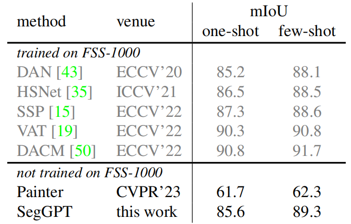

# SegGPT: Segmenting Everything In Context
SegGPT：对上下文中的所有内容进行分割  2023.4.6 https://arxiv.org/abs/2304.03284

 
Figure 1: SegGPT is capable of segmenting everything in context with only one single model, which uses in-context examples to indicate different tasks. For each sample, the orange box  on the left displays the example/prompt image and its corresponding mask, while the blue box  on the right shows the input image and the resulting mask output. The mask represents the bright region attached to the image. The caption for each sample (in the yellow box) is only for explanation. Notably, SegGPT can perform arbitrary object segmentation (segment different components of the scene, such as the big red sphere, all the spheres, contour of all spheres, top surfaces, and shadows), multiple part segmentation (specialized parts of the iconic Statue of Liberty), rainbow segmentation, video object segmentation without videos in training, and close-set semantic segmentation with learnable prompt tuning. More examples are shown in Figure 5.
图1: SegGPT能够仅使用一个模型在上下文中分割所有内容，该模型使用上下文中的样本来指示不同的任务。对于每个样本，橙色框 左侧显示样本/提示图像及其相应的掩码，而蓝色框 右边显示了输入图像和由此产生的掩码输出。掩码表示附加到图像的明亮区域。每个样本的标题（在黄色框中）仅用于解释。值得注意的是，SegGPT可以执行任意对象分割（分割场景的不同组件，如红色大球体、所有球体、所有球形的轮廓、顶面和阴影）、多部分分割（标志性自由女神像的特殊部分）、彩虹分割、视频对象分割，而无需训练视频，以及具有可学习的提示调优的闭集语义分割。更多样本如图5所示。

## Abstract
We present SegGPT, a generalist model for segmenting everything in context. We unify various segmentation tasks into a generalist in-context learning framework that accommodates different kinds of segmentation data by transforming them into the same format of images. The training of SegGPT is formulated as an in-context coloring problem with random color mapping for each data sample. The objective is to accomplish diverse tasks according to the context, rather than relying on specific colors. After training, SegGPT can perform arbitrary segmentation tasks in images or videos via in-context inference, such as object instance, stuff, part, contour, and text. SegGPT is evaluated on a broad range of tasks, including few-shot semantic segmentation, video object segmentation, semantic segmentation, and panoptic segmentation. Our results show strong capabilities in segmenting in-domain and out-of-domain targets, either qualitatively or quantitatively.  Code & Demo: https://github.com/baaivision/Painter

我们提出了SegGPT，这是一个用于在上下文中分割所有内容的广义模型。我们将各种分割任务统一为上下文学习框架中的通才，该框架通过将不同类型的分割数据转换为相同格式的图像来适应这些数据。SegGPT的训练被公式化为上下文中的着色问题，每个数据样本具有随机颜色映射。目标是根据上下文完成不同的任务，而不是依赖于特定的颜色。经过训练后，SegGPT可以通过上下文推理在图像或视频中执行任意分割任务，如对象实例、素材、部分、轮廓和文本。SegGPT在广泛的任务中进行评估，包括少样本语义分割、视频对象分割、语义分割和全景分割。我们的研究结果表明，无论是定性还是定量，都能很好地分割域内和域外目标。

## 1. Introduction
Segmentation is one of the most fundamental problems in computer vision, which aims to localize and re-organize meaningful concepts at the pixel level, e.g., foreground, category, object instance, etc. During recent years, we have witnessed great progress in developing more accurate and faster algorithms for various segmentation tasks, such as foreground segmentation [41], interactive segmentation [51, 34], semantic segmentation [32, 28, 54, 39], instance segmentation [18, 11, 2, 48], and panoptic segmentation [23, 5, 8].

分割是计算机视觉中最基本的问题之一，其目的是在像素级定位和重新组织有意义的概念，例如前景、类别、对象实例等。近年来，我们在为各种分割任务开发更准确、更快的算法方面取得了巨大进展，如前景分割[41]，交互式分割[51，34]、语义分割[32，28，54，39]、实例分割[18，11，2，48]和全景分割[23，5，8]。

However, these specialist segmentation models are limited to specific tasks, classes, granularities, data types, etc. A new model has to be trained when adapting to a different setting, e.g., to segment a novel concept, or to segment objects in videos instead of images. This requires expensive annotation efforts and is not sustainable for a large number of segmentation tasks.

然而，这些专业的分割模型仅限于特定的任务、类、粒度、数据类型等。当适应不同的设置时，必须训练新的模型，例如，分割新概念，或分割视频而不是图像中的对象。这需要昂贵的标注工作，并且对于大量的分割任务来说是不可持续的。

In this work, we aim to train a single model that is capable of solving diverse and unlimited segmentation tasks. The main challenges are twofold: (1) to incorporate those very different data types in training, e.g., part, semantic, instance, panoptic, person, medical image, aerial image, etc.; (2) to design a generalizable training scheme that differs from conventional multi-task learning, which is flexible on task definition and is capable of handling out-of-domain tasks.

在这项工作中，我们的目标是训练一个能够解决不同和无限分割任务的单一模型。主要的挑战有两方面：
1. 在训练中结合那些非常不同的数据类型，例如，部分、语义、实例、全景、人物、医学图像、航空图像等；
2. 设计一种不同于传统多任务学习的可推广训练方案，该方案在任务定义上灵活，能够处理域外任务。

To address these challenges, we present SegGPT, a generalist model for segmenting everything in context. We view segmentation as a general format for visual perception and unify different segmentation tasks into a generalist in-context learning framework [46]. This framework accommodates different kinds of segmentation data by transforming them into the same format of images. The training of SegGPT is formulated as an in-context coloring problem with random color mapping for each data sample. The objective is to color the corresponding areas, such as classes, object instances, parts, etc., only according to the context. By using a random coloring scheme, the model is forced to reference contextual information to complete the assigned task, instead of relying on specific colors. This allows for a more flexible and generalizable approach to training. The remaining parts of training keep the same as [46] using a vanilla ViT [42] and a simple smooth-ℓ1 [17] loss.

为了应对这些挑战，我们提出了SegGPT，这是一个用于在上下文中分割所有内容的广义模型。我们将分割视为视觉感知的一种通用格式，并将不同的分割任务统一为上下文学习框架中的多面手[46]。该框架通过将不同类型的分割数据转换为相同格式的图像来适应这些数据。SegGPT的训练被公式化为上下文中的着色问题，每个数据样本具有随机颜色映射。目标是仅根据上下文为相应的区域着色，例如类、对象实例、部件等。通过使用随机着色方案，模型被迫参考上下文信息来完成分配的任务，而不是依赖于特定的颜色。这使得训练方法更加灵活和通用。训练的其余部分与[46]相同，使用普通ViT[42]和简单的平滑-ℓ1[17]损失。

After training, SegGPT is able to perform diverse segmentation tasks in images or videos given a few examples via in-context inference, such as object instance, stuff, part, contour, text, etc. To effectively ensemble multiple examples in context, we propose a simple yet effective context ensemble strategy, the feature ensemble, which can help the model benefit from the multi-example prompting setting. Additionally, SegGPT can conveniently serve as a specialist model without updating the model parameters, by tuning a specific prompt for a specialized use case, such as in-domain ADE20K semantic segmentation.

经过训练，SegGPT能够通过上下文推理在给定的几个样本中执行不同的分割任务，例如对象实例、素材、部分、轮廓、文本等。为了在上下文中有效地集成多个样本，我们提出了一种简单而有效的上下文集成策略，即特征集成，这可以帮助模型受益于多样本提示设置。此外，SegGPT可以方便地充当专业模型，而无需更新模型参数，方法是为专业用例调优特定提示，例如在域ADE20K语义分割中。

Our main contributions are as follows. (1) For the first time, we demonstrate a single generalist model capable of performing a diverse set of segmentation tasks automatically. (2) We evaluate the pre-trained SegGPT on a broad range of tasks directly, i.e., without fine-tuning, including few-shot semantic segmentation, video object segmentation, semantic segmentation, and panoptic segmentation. (3) Our results show strong capabilities in segmenting in-domain and outof-domain targets, either qualitatively or quantitatively.

我们的主要贡献如下：
1. 我们首次展示了一个能够自动执行一组不同分割任务的广义模型。
2. 我们在广泛的任务上直接评估预训练的SegGPT，即无需微调，包括少样本语义分割、视频对象分割、语义分割和全景分割。
3. 我们的研究结果表明，无论是定性还是定量，都能很好地分割域内和域外目标。

However, this work does not aim to claim new stateof-the-art results or outperform existing specialist methods across all benchmarks, as we believe that this may not be the responsibility of a general-purpose model.

然而，这项工作的目的并不是在所有基准中宣称新的最先进的结果或优于现有的专业方法，因为我们认为这可能不是通用模型的责任。

## 2. Related Work
### 2.1. Visual Segmentation  视觉分割
Segmentation is a fundamental problem in computer vision that involves localizing and organizing meaningful concepts at the pixel level. The type of segmentation task varies depending on the definition of the concepts, such as foreground, category, or object instance. For example, semantic segmentation [55] involves pixel-level semantic classification of an image, while instance segmentation [30] aims to identify different object instances and their categories. Video object segmentation [52, 37, 12] is the task of segmenting a particular object throughout the entire video sequence given only the object mask of the first frame.

分割是计算机视觉中的一个基本问题，涉及在像素级定位和组织有意义的概念。分割任务的类型根据概念的定义而变化，例如前景、类别或对象实例。例如，语义分割[55]涉及图像的像素级语义分类，而实例分割[30]旨在识别不同的对象实例及其类别。视频对象分割[52，37，12]是在仅给定第一帧的对象掩码的情况下，在整个视频序列中分割特定对象的任务。

Previous segmentation methods [32, 28, 54, 39, 18, 11, 2, 48, 23, 5, 8] have been designed specifically for certain tasks and cannot be generalized for switching tasks or changing categories. This paper introduces a general interface that is compatible with all segmentation tasks with an appropriate training scheme, a single generalist model can achieve good performance on both in-domain and out-of-domain segmentation tasks, either qualitatively or quantitatively.

先前的分割方法[32，28，54，39，18，11，2，48，23，5，8]是专门为某些任务设计的，不能推广用于切换任务或更改类别。本文介绍了一个通用接口，该接口与所有分割任务兼容，具有适当的训练方案，单个广义模型可以在域内和域外分割任务上获得良好的性能，无论是定性还是定量。

### 2.2. Vision Generalist  视觉通才
In recent years, there have been efforts to unify different tasks in the vision domain using Transformer-based models, resulting in several vision generalists [6, 7, 56, 33, 24]. DETR [5] is one of the first to adopt Transformer [42] as a task-specific head for object detection. Pix2Seq series [6, 7] defines the output spaces of vision tasks as discrete ones and performs the task of object detection, instance segmentation, keypoint estimation, and image captioning, in an auto-regressive manner. Unified-IO [33] and OFA [45] perform joint modeling across vision, vision & language, and NLP tasks in a sequence-to-sequence manner, that both the inputs and outputs are defined to a sequence of discrete tokens. UViM [24] unifies pixel-labeling tasks together, such as panoptic segmentation, depth estimation, and colorization, but trains separate models for each.

近年来，人们一直在努力使用基于Transformer的模型来统一视觉领域中的不同任务，从而产生了几个视觉通才[6，7，56，33，24]。DETR[5]是最早采用Transformer[42]作为目标检测的任务专用头的公司之一。Pix2Seq系列[6，7]将视觉任务的输出空间定义为离散空间，并以自回归的方式执行目标检测、实例分割、关键点估计和图像字幕的任务。统一IO[33]和OFA[45]以序列到序列的方式在视觉、视觉和语言以及NLP任务之间执行联合建模，输入和输出都被定义为离散令牌序列。UViM[24]将像素令牌任务统一在一起，如全景分割、深度估计和着色，但为每个任务训练单独的模型。

Although these works all appear to unify different tasks into similar spaces, they actually accomplish each task through some form of hard indicators, such as a special token, making it difficult to generalize to new tasks. In contrast, this work uses an in-context framework that maintains flexibility on task definition and utilizes a random coloring scheme to prevent the model from collapsing into a multitask learning solution and instead forces it to accomplish the assigned task via referring contextual information. Another difference is the scope of the tasks. This work primarily focuses on a crucial category in visual perception, namely image segmentation.

尽管这些工作似乎都将不同的任务统一到相似的空间中，但它们实际上是通过某种形式的硬指标来完成每项任务的，比如一个特殊的令牌，这使得很难推广到新的任务中。相比之下，这项工作使用了一个上下文框架，该框架保持了任务定义的灵活性，并利用随机着色方案来防止模型崩溃为多任务学习解决方案，而是通过引用上下文信息来迫使它完成分配的任务。另一个区别是任务的范围。这项工作主要关注视觉感知中的一个关键类别，即图像分割。

 
Figure 2: Illustration of overall training framework of SegGPT. We incorporate diverse segmentation data, including part, semantic, instance, panoptic, person, medical image, and aerial image segmentation, and transform them into the same format of images. We generate in-context samples that share similar contexts on-the-fly, e.g., the overlapped colors shown in each column, which indicate the same category or the same instance. We adopt a general Painter [46] framework with in-context coloring as the training objective and a random coloring scheme for more flexible and generalizable training.
图2：SegGPT的整体训练框架示意图。我们整合了不同的分割数据，包括部分、语义、实例、全景、人物、医学图像和航空图像分割，并将它们转换为相同格式的图像。我们生成动态共享相似上下文的上下文内样本，例如，每列中显示的重叠颜色，它们指示相同的类别或相同的实例。我们采用了一个通用的Painter[46]框架，将上下文着色作为训练目标，并采用随机着色方案进行更灵活和可推广的训练。

### 2.3. In-Context Visual Learning  语境下的视觉学习
GPT-3 [3] introduces the concept of in-context learning to deep learning, which allows a series of NLP tasks to be formulated as text completion problems given prompts and examples. In computer vision, [1] first proposes an in-context training framework using inpainting with discrete tokens on figures and infographics from vision articles, demonstrating the framework’s capabilities in foreground segmentation, single object detection, and colorization. Painter [46] adopts masked image modeling on continuous pixels to perform in-context training with supervised datasets, on seven diverse and challenging vision tasks, achieving highly competitive results on these tasks.

GPT-3[3]将上下文学习的概念引入到深度学习中，它允许在给定提示和样本的情况下，将一系列NLP任务公式化为文本完成问题。在计算机视觉中，[1]首先提出了一种上下文训练框架，该框架使用视觉文章中的图形和信息图上的离散令牌进行修复，展示了该框架在前景分割、单目标检测和着色方面的能力。Painter[46]在连续像素上采用掩码图像建模，在七个不同且具有挑战性的视觉任务上使用监督数据集进行上下文训练，在这些任务上取得了极具竞争力的结果。

Our work builds upon the Painter framework, but with a specific focus on the segmentation task due to its central role in visual perception. Thus this work unifies diverse segmentation data including semantic segmentation, instance segmentation, part segmentation, and even those for special scenarios like aerial images. Additionally, we design a random coloring scheme that forces the model to reference contextual information to complete the assigned task but not collapse into the multi-task solution. As segmentation tasks and datasets have less variability than depth/pose estimation, it is easier to share internal structures for effective training of in-domain tasks, while maintaining the generalization capability to out-of-domain segmentation tasks.

我们的工作建立在Painter框架的基础上，但由于其在视觉感知中的核心作用，我们特别关注分割任务。因此，这项工作统一了各种分割数据，包括语义分割、实例分割、部分分割，甚至是航空图像等特殊场景的分割数据。此外，我们设计了一个随机着色方案，该方案迫使模型引用上下文信息来完成分配的任务，但不会塌陷到多任务解决方案中。由于分割任务和数据集的可变性比深度/姿态估计小，因此更容易共享内部结构来有效训练域内任务，同时保持对域外分割任务的泛化能力。

## 3. Approach  方法
SegGPT is a special version of Painter [46] framework which enables to segment everything with a generalist Painter, thus the name of our model, SegGPT. This training framework redefines the output space of vision tasks as “images” and unifies different tasks into the same image inpainting problem, i.e., to randomly mask the task output images and reconstruct the missing pixels. To maintain the simplicity and generality, we make no modifications to the architecture and loss function, i.e., a vanilla ViT [13] and a simple smooth-ℓ1 [17] loss, but design a new random coloring scheme in in-context training for better generalization capability.

SegGPT是Painter[46]框架的一个特殊版本，它能够用一个多面手Painter对所有东西进行分割，因此我们的模型名为SegGPT。该训练框架将视觉任务的输出空间重新定义为“图像”，并将不同的任务统一到同一个图像修复问题中，即随机掩码任务输出图像并重建缺失的像素。为了保持简单性和通用性，我们不对架构和损失函数进行修改，即普通ViT[13]和简单平滑-ℓ1[17]损失，但在上下文训练中设计了一种新的随机着色方案，以获得更好的泛化能力。

### 3.1. In-Context Coloring  上下文中的着色
In the traditional framework of Painter, the color space for each task is pre-defined, resulting in the solution collapse into multi-task learning. For example, for semantic segmentation, a set of colors is pre-defined, and each semantic category is assigned a fixed color. Similarly, in instance segmentation, the color of an instance object is assigned according to its location categories, i.e., the number of colors equals the number of spatial locations, resulting in the model only relying on the color itself to determine the task, rather than using the relationships between segments.

在Painter的传统框架中，每个任务的颜色空间都是预定义的，导致解决方案崩溃为多任务学习。例如，对于语义分割，预定义一组颜色，并为每个语义类别分配一个固定的颜色。类似地，在实例分割中，实例对象的颜色是根据其位置类别分配的，即颜色的数量等于空间位置的数量，导致模型仅依赖颜色本身来确定任务，而不是使用分割之间的关系。

 
Figure 3: Illustration of our proposed context ensemble strategies for multi-example inference: the spatial ensemble (top) and the feature ensemble (bottom). The spatial ensemble strategy involves stitching multiple example images together and resizing them to the input resolution. The feature ensemble strategy averages features of the query image after each attention layer so that the query image aggregates all the reference examples.
图3：我们提出的用于多样本推理的上下文集成策略的说明：空间集成（顶部）和特征集成（底部）。空间集成策略包括将多个样本图像拼接在一起，并将它们调优为输入分辨率。特征集成策略对每个关注层之后的查询图像的特征进行平均，使得查询图像集成所有参考样本。

To address this limitation, we propose a random coloring scheme for in-context coloring. We begin by randomly sampling another image that shares a similar context with the input image, such as the same semantic category or object instance. Next, we randomly sample a set of colors from the target image and map each color to a random one. This results in a re-coloring of the corresponding pixels. As a result, we get two pairs of images, which are defined as an in-context pair. In addition, we introduce the mix-context training method which trains the model using mixed examples. This involves stitching together multiple images with the same color mapping. The resulting image is then randomly cropped and resized to form a mixed-context training sample. By doing so, the model learns to focus on the contextual information of the image rather than just relying on specific color information to determine the task.

为了解决这一限制，我们提出了一种用于上下文着色的随机着色方案。我们首先随机采样与输入图像共享相似上下文的另一个图像，例如相同的语义类别或对象实例。接下来，我们从目标图像中随机采样一组颜色，并将每种颜色映射到一个随机的颜色。这导致相应像素的重新着色。结果，我们得到了两对图像，它们被定义为上下文中的图像对。此外，我们还介绍了混合上下文训练方法，该方法使用混合样本来训练模型。这包括将具有相同颜色映射的多个图像拼接在一起。然后对得到的图像进行随机裁剪并调优大小，以形成混合上下文训练样本。通过这样做，模型学会关注图像的上下文信息，而不是仅仅依靠特定的颜色信息来确定任务。

Such unification allows us to utilize all segmentation datasets in a consistent way, only varying the data sampling strategy depending on the specific task. We define different contexts according to different data types. For semantic segmentation, we randomly sample the categories. For instance segmentation, object instances are sampled in random numbers. The different views of the same image, e.g., transformed by a set of augmentations, are treated as the images in context. In the implementation, the sampling is all about colors, e.g., the same color refers to either the same category or the same instance.

这种统一使我们能够以一致的方式利用所有分割数据集，只需根据具体任务改变数据采样策略。我们根据不同的数据类型定义不同的上下文。对于语义分割，我们对类别进行随机抽样。例如分割，对象实例是以随机数采样的。同一图像的不同视图，例如，通过一组增广变换，被视为上下文中的图像。在实现中，采样都是关于颜色的，例如，相同的颜色指的是相同的类别或相同的实例。

 
Figure 4: Illustration of in-context tuning on different task specifications. For in-context tuning, we freeze the whole pre-trained model and only optimize the learnable image tensor which serves as the input context. We can perform the in-context prompt tuning on the specific datasets (ADE-20K semantic segmentation), specific scenes (your apartment), and even specific characters (Bert’s face).
图4：对不同任务规范进行上下文调优的说明。对于上下文内调优，我们冻结整个预先训练的模型，只优化作为输入上下文的可学习图像张量。我们可以对特定的数据集（ADE-20K语义分割）、特定的场景（你的公寓），甚至特定的角色（伯特的脸）进行上下文提示调优。

### 3.2. Context Ensemble  上下文集成
Once the training is finished, its full power can be unleashed during inference. SegGPT enables arbitrary segmentation in context, e.g., with an example of a single image and its target image. The target image can be of a single color (excluding the background), or multiple colors, e.g., segmenting several categories or objects of interest in one shot. Specifically, given an input image to be tested, we stitch it with the example image and feed it to SegGPT to get the corresponding in-context predictions.

一旦训练完成，它的全部力量就可以在推理过程中释放出来。SegGPT能够在上下文中进行任意分割，例如，以单个图像及其目标图像为例。目标图像可以是单一颜色（不包括背景），也可以是多种颜色，例如，在单样本中分割多个类别或感兴趣的对象。具体来说，给定要测试的输入图像，我们将其与样本图像缝合，并将其提供给SegGPT以获得相应的上下文预测。

To serve a more accurate and concrete context, multiple examples can be used. For instance, several examples of the same semantic category, or the previous frames in a video, can be employed. To efficiently leverage multiple examples for a SegGPT model, we propose two context ensemble approaches. One is called Spatial Ensemble, multiple examples concatenated in n × n grid and then subsampled to the same size as a single example. This approach is in line with the intuition of in-context coloring and the semantic information of multiple examples can be in-context extracted with almost no additional cost. Another approach is Feature Ensemble. Multiple examples are combined in the batch dimension and computed independently except that features of the query image are averaged after each attention layer. In this way, the query image gathers information about multiple examples during inference.

为了提供更准确和具体的上下文，可以使用多个样本。例如，可以采用相同语义类别的几个样本，或者视频中的先前帧。为了有效地利用SegGPT模型的多个样本，我们提出了两种上下文集成方法。其中一个被称为空间集成，多个样本连接在n×n网格中，然后子采样到与单个样本相同的大小。这种方法符合上下文着色的直觉，并且可以在上下文中提取多个样本的语义信息，几乎不需要额外的成本。另一种方法是特征集成。除了在每个关注层之后对查询图像的特征进行平均之外，多个样本在批处理维度中进行组合并独立计算。通过这种方式，查询图像在推理期间收集关于多个样本的信息。

### 3.3. In-Context Tuning  上下文内调优
SegGPT is capable of adapting to a unique use case without updating the model parameters. We freeze the whole model and initialize a learnable image tensor as the input context. Only this learnable image tensor is updated during the training. The rest of the training remains the same, e.g., the same loss function. After the tuning, we take the learned image tensor out and use it as a plug-and-play key for a specific application. For example, given a dataset with a fixed set of object categories, e.g., ADE20K, we could train a customized prompt for this dataset, while there is no harm to the generality of the model. Or, we could optimize a prompt image for a specific scene, e.g., your apartment, or a specific character, e.g., Bert’s face. This opens up opportunities for a broad range of applications.

SegGPT能够在不更新模型参数的情况下适应独特的用例。我们冻结整个模型，并初始化一个可学习的图像张量作为输入上下文。只有这个可学习的图像张量在训练期间被更新。其余的训练保持不变，例如，相同的损失函数。调优后，我们将学习到的图像张量取出，并将其用作特定应用程序的即插即用关键点。例如，给定一个具有固定对象类别集的数据集，例如ADE20K，我们可以为该数据集训练自定义提示，同时不会损害模型的通用性。或者，我们可以优化特定场景的提示图像，例如您的公寓，或特定角色，例如伯特的脸。这为广泛的应用开辟了机会。

 
Figure 5: More visualizations. For each sample, the orange box  on the left displays the example/prompt image and its corresponding mask, while the blue box  on the right shows the input image and the resulting mask output. The mask is visualized via the bright region attached to the image. SegGPT can perform arbitrary object/part segmentation (cubes, yellow cubes, Ernie, one of the Twelve Apostles, earth, multiple arbitrary parts), video object segmentation without videos in training, and close-set instance segmentation on COCO with learnable prompt tuning.
图5：更多的可视化。对于每个样本，橙色框 左侧显示样本/提示图像及其相应的掩码，而蓝色框 右边显示了输入图像和由此产生的掩码输出。通过附着在图像上的明亮区域对掩码进行可视化。SegGPT可以执行任意对象/部分分割（立方体、黄色立方体、Ernie、十二使徒之一、地球、多个任意部分）、无需训练视频的视频对象分割，以及在COCO上使用可学习的提示调优进行闭集实例分割。

## 4. Experiment  实验
### 4.1. Training Data  训练数据
Our approach uses a diverse set of segmentation datasets, including part, semantic, instance, panoptic, person, retinalvessel, and aerial-image segmentation. Unlike previous methods that relied on handcrafted label merging to combine different types of segmentation datasets, our method offers a unified perspective that eliminates the need for additional effort or adjustment on the datasets. In particular, our approach does not require any modifications to either the architecture or training pipeline when adding an extra dataset.

我们的方法使用了一组不同的分割数据集，包括部分、语义、实例、全景、人物、视网膜和航空图像分割。与以前依靠手工标签合并来组合不同类型的分割数据集的方法不同，我们的方法提供了一个统一的视角，无需对数据集进行额外的努力或调优。特别是，当添加额外的数据集时，我们的方法不需要对架构或训练管道进行任何修改。

ADE20K [55] provides segmentation labels for 150 semantic categories, with a total of 25K images, including 20K training images, 2K validation images, and 3K testing images.

ADE20K[55]为150个语义类别提供了分割标签，共有25K个图像，包括20K个训练图像、2K个验证图像和3K个测试图像。

COCO [30] is a widely used visual perception dataset that supports instance segmentation, semantic segmentation and panoptic segmentation. It contains 118K training images and 5K validation, with 80 “things” and 53 “stuff” categories.

COCO[30]是一个广泛使用的视觉感知数据集，支持实例分割、语义分割和全景分割。它包含118K个训练图像和5K个验证，其中包括80个“事物”和53个“东西”类别。

PASCAL VOC [14] is a classic object recognition dataset. We use the augmented segmentation version which provides annotations of 20 categories on 10582 training images.

PASCAL VOC[14]是一个经典的对象识别数据集。我们使用增广分割版本，该版本在10582张训练图像上提供了20个类别的标注。

Cityscapes [10] focuses on the scene understanding of the street views. We use the 2954 training images with semantic segmentation annotations of 19 categories.

城市景观[10]侧重于对街景的场景理解。我们使用了2954张带有19个类别的语义分割标注的训练图像。

LIP [26] focuses on the semantic understanding of the person. We use the 30385 training images with segmentation labels of 19 human part categories.

LIP[26]侧重于对人的语义理解。我们使用30385张带有19个人体部位类别的分割标签的训练图像。

PACO [38] is a newly released dataset that provides annotations for the parts and attributes of common objects. We process and use the 41807 training images with part annotations.

PACO[38]是一个新发布的数据集，为常见对象的部分和属性提供标注。我们处理并使用41807张带有零件标注的训练图像。

CHASE DB1 [16], DRIVE [40], HRF [4] and STARE [20] provide annotations for retinal vessel segmentation. We augment the high-resolution raw images with random cropping.

CHASE DB1[16]、DRIVE[40]、HRF[4]和STARE[20]为视网膜血管分割提供了标注。我们通过随机裁剪来增广高分辨率的原始图像。

iSAID [49] and loveDA [44] focus on semantic understanding in aerial images, with 23262 and 2520 training images for 15 and 6 semantic categories respectively.

iSAID[49]和loveDA[44]专注于航空图像中的语义理解，分别为15个和6个语义类别提供了23262张和2520张训练图像。

### 4.2. One-Shot Training Details  单样本训练细节
Our approach for segmentation tasks utilizes a general interface, where we emphasize that we only train one generalist model with a mixture of datasets, and evaluated this model on diverse benchmarks. Following [46], we use a Vision Transformer (ViT-L) encoder [13], which has 307M parameters. We use a pre-trained checkpoint from [46] as the initialization. We employ an AdamW optimizer [22] and a cosine learning rate scheduler, with a base learning rate 1e−4. Weight decay is set to 0.05. The batch size is 2048. We train for 9K iterations, with a warm-up period of 1.8K iterations. We use a set of data augmentations including random resize cropping, color jittering, and random horizontal flipping. The size of a single input image is 448 × 448.

我们的分割任务方法使用了一个通用接口，在该接口中，我们强调我们只使用混合数据集训练一个广义模型，并在不同的基准上评估该模型。在[46]之后，我们使用视觉转换器（ViT-L）编码器[13]，该编码器具有307M个参数。我们使用[46]中预先训练的检查点作为初始化。我们使用AdamW优化器[22]和余弦学习速率调度器，基本学习速率为1e−4。权重衰减设置为0.05。批量大小为2048。我们训练9K次迭代，预热期为1.8K次迭代。我们使用一组数据增广，包括随机调优大小裁剪、颜色抖动和随机水平翻转。单个输入图像的大小为448×448。

 
Figure 6: Qualitative results of video object segmentation on YouTube-VOS 2018.
图6：YouTube VOS 2018视频对象分割的定性结果。

 
Table 1: Quantitative results on COCO-20i and PASCAL-5i of example-based semantic segmentation. * indicates that the categories in training cover the categories in testing.
表1：基于样本的语义分割的COCO-20i和PASCAL-5i的定量结果。*表明训练中的类别涵盖了测试中的类别。

### 4.3. Qualitative Results  定性结果
To demonstrate the capability of our SegGPT in an intuitive perspective, we visualize the task output of the selected images with the specialized task prompts, shown in Figure 1 and Figure 5. These two figures include a wide range of segmentation tasks, such as arbitrary part/object segmentation with varied granularities, text segmentation, video object segmentation without videos in training, and close-set instance/semantic segmentation with learnable prompt tuning. Figure 6 presents more visualizations on video object segmentation of YouTube-VOS 2018 dataset. From these visualizations, SegGPT demonstrates the ability to make highly accurate predictions across a wide range of tasks, while maintaining super flexibility in the task definition.

为了从直观的角度展示我们的SegGPT的功能，我们使用专门的任务提示可视化所选图像的任务输出，如图1和图5所示。这两个图包括广泛的分割任务，例如具有不同粒度的任意部分/对象分割、文本分割、在训练中没有视频的视频对象分割，以及具有可学习提示调优的闭集实例/语义分割。图6展示了YouTube VOS 2018数据集视频对象分割的更多可视化效果。通过这些可视化，SegGPT展示了在广泛的任务中进行高度准确预测的能力，同时保持了任务定义的超级灵活性。

### 4.4. Comparison with Specialist Methods  与专家方法的比较
Few-shot semantic segmentation. We evaluate the performance of SegGPT, on two settings of few-shot semantic segmentation: in-domain on COCO-20i /PASCAL-5i , and out-of-domain on FSS-1000. Table 1 shows the results of example-based semantic segmentation on COCO- 20i /PASCAL-5i . For a fair comparison, we also evaluate specialist models on in-domain categories marked by *. Our results indicate that SegGPT can achieve comparable or significantly better performance than recently published stateof-the-art specialist models on these two benchmarks. Note that the prior art FPTrans trains separate models with different shots. Furthermore, SegGPT surpasses the generalist Painter [46] by a considerable margin.

少样本语义分割。我们评估了SegGPT在两种少样本语义分割设置上的性能：COCO-20i/PASCAL-5i上的域内和FSS-1000上的域外。表1显示了在COCO-20i/PASCAL-5i上基于样本的语义分割的结果。为了进行公平的比较，我们还评估了以*标记的领域内类别的专家模型。我们的结果表明，在这两个基准上，SegGPT可以实现与最近发布的最先进的专家模型相当或明显更好的性能。注意，现有技术的FPTrans用不同的样本训练单独的模型。此外，SegGPT以相当大的优势超过了多面手Painter[46]。

 
Table 2: Quantitative results on few-shot semantic segmentation on FSS-1000. SegGPT achieves remarkable results although not trained on FSS-1000.
表2：FSS-1000上少样本语义分割的定量结果。SegGPT虽然没有在FSS-1000上进行训练，但取得了显著的效果。

Table 2 presents the results of few-shot semantic segmentation on FSS-1000 with out-of-domain categories. Compared to specialist models trained on FSS-1000, SegGPT exhibits highly competitive performance. Notably, our model is not trained on the FSS-1000 dataset at all, yet still achieves remarkable results, demonstrating its effectiveness.

表2给出了FSS-1000上具有域外类别的少样本语义分割的结果。与在FSS-1000上训练的专业模型相比，SegGPT表现出极具竞争力的性能。值得注意的是，我们的模型根本没有在FSS-1000数据集上进行训练，但仍然取得了显著的结果，证明了其有效性。

Video object segmentation. Video object segmentation (VOS) is a task that segments a particular object in video frames. In this work, we focus on the semi-supervised VOS setting and evaluate our proposed method, SegGPT, on the validation split of three datasets: YouTube-VOS 2018 [52], DAVIS 2017 [37], and the recently release challenging benchmark MOSE [12]. We use two metrics commonly used in VOS for evaluation: the J score and the F score, and we evaluate our results with official evaluation servers or tools.

视频对象分割。视频对象分割（VOS）是对视频帧中的特定对象进行分割的任务。在这项工作中，我们专注于半监督VOS设置，并在三个数据集的验证拆分上评估我们提出的方法SegGPT：YouTube VOS 2018[52]、DAVIS 2017[37]和最近发布的具有挑战性的基准MOSE[12]。我们使用VOS中常用的两个指标进行评估：J分数和F分数，并使用官方评估服务器或工具评估结果。

SegGPT performs video object segmentation by converting the first frame and its object mask to in-context coloring examples. When testing a current frame, we use its previous K frames (if have) for constructing multiple examples. Object masks for these frames have been predicted and stored by a FIFO queue. After multiple examples are constructed, Feature Ensemble (describe in Section 3.2) is applied and the prediction result will be stored for the next frame. We evaluate our model on several benchmarks, and the results are presented in Table 3. Despite not being specifically trained for the task, our approach achieves competitive results with the specialist models trained on these datasets. For instance, on YouTube-VOS 2018 [52], our method outperformed the task-specific approach AGAME [21] and AGSS [29] by clear margins. On the challenging MOSE benchmark which focuses on complex scenes, SegGPT even performs comparably with the state-of-the-art method RDE.

SegGPT通过将第一帧及其对象掩码转换为上下文着色样本来执行视频对象分割。当测试当前帧时，我们使用其先前的K帧（如果有）来构建多个样本。这些帧的对象掩码已经被预测并由FIFO队列存储。在构建多个样本后，应用特征集成（如第3.2节所述），并将预测结果存储到下一帧。我们在几个基准上评估了我们的模型，结果如表3所示。尽管没有经过专门的任务训练，但我们的方法与在这些数据集上训练的专家模型相比取得了有竞争力的结果。例如，在YouTube VOS 2018[52]上，我们的方法明显优于特定任务方法AGAME[21]和AGSS[29]。在专注于复杂场景的具有挑战性的MOSE基准测试中，SegGPT的性能甚至可以与最先进的方法RDE相媲美。

### 4.5. Ablation Study  消融研究
Here we ablate two context ensemble strategies, namely spatial and feature ensemble. Results are shown in Table 4a. Our findings reveal that the spatial ensemble approach performs well on FSS-1000 dataset but experiences a performance drop on DAVIS 2017. We attribute this to the fact that the spatial ensemble employs the sub-sampling on the examples. Notably, FSS-1000 dataset has a lower image resolution (224×224) compared to the high-resolution DAVIS dataset (640×480), and therefore, sub-sampling does not result in significant information loss for FSS-1000. While, we observe that feature ensemble can reduce this information loss on sub-sampling, and achieve significantly better performance on DAVIS 2017.

这里我们讨论了两种上下文集成策略，即空间集成和特征集成。结果如表4a所示。我们的研究结果表明，空间集成方法在FSS-1000数据集上表现良好，但在DAVIS 2017上表现有所下降。我们将此归因于这样一个事实，即空间系综在样本上使用了子采样。值得注意的是，与高分辨率DAVIS数据集（640×480）相比，FSS-1000数据集的图像分辨率（224×224）较低，因此，子采样不会导致FSS-1000的显著信息损失。同时，我们观察到特征集成可以减少子采样时的这种信息损失，并在DAVIS 2017上实现显著更好的性能。

We also ablate the number of frames in DAVIS 2017, as shown in Table 4b. As the number of frames increases, the performance initially improves before reaching a point of diminishing returns. In particular, we observe that the optimal performance is achieved when using 8 frames.

我们还在DAVIS 2017中消融了帧数，如表4b所示。随着帧数的增加，在达到收益递减点之前，性能最初会有所提高。特别是，我们观察到，当使用8帧时，可以实现最佳性能。

### 4.6. In-Context Tuning  上下文内调优
In-context tuning enables to customize a unique application with a set of data samples. For example, to tune a prompt for a specific dataset, scene, or even a person. Specifically, we define the task prompt as the learnable tensors, freeze the whole model, and then use the same training loss to optimize the task prompts. Here, we conduct in-context tuning on the challenging ADE20K semantic segmentation and COCO panoptic segmentation. We evaluate SegGPT with learnable prompts on the corresponding benchmarks.

上下文调优使您能够使用一组数据样本自定义一个独特的应用程序。例如，调优特定数据集、场景甚至个人的提示。具体来说，我们将任务提示定义为可学习张量，冻结整个模型，然后使用相同的训练损失来优化任务提示。在这里，我们对具有挑战性的ADE20K语义分割和COCO全景分割进行上下文调优。我们在相应的基准上使用可学习的提示来评估SegGPT。

Results on ADE20K semantic segmentation are shown in Table 5. Our model SegGPT achieves competitive performance with specialist models like RefineNet. However, compared to the generalist Painter, our approach shows a 10.3 point drop in mIoU. This observation can be explained by the introduction of a random color scheme, which makes it more challenging for the model to use color as a simple indicator of in-domain tasks. Instead, the model needs to rely on context examples to determine the task, making optimization much more difficult. Similarly, Table 6 shows the results of our SegGPT model on COCO panoptic segmentation. Here, we again observe a 9.0 point drop in PQ compared to the generalist Painter. Outperforming all specialist methods in specific benchmarks is not the purpose of this work, and we believe there is much room to improve in the future.

ADE20K语义分割的结果如表5所示。我们的模型SegGPT与RefineNet等专业模型相比具有竞争力。然而，与多面手Painter相比，我们的方法显示mIoU下降了10.3个点。这种观察可以通过引入随机配色方案来解释，这使得模型将颜色用作域内任务的简单指标更具挑战性。相反，模型需要依靠上下文样本来确定任务，这使得优化变得更加困难。类似地，表6显示了我们的SegGPT模型对COCO全景分割的结果。在这里，我们再次观察到，与多面手Painter相比，PQ下降了9.0点。这项工作的目的不是在特定的基准中超越所有专业方法，我们相信未来还有很大的改进空间。

## 5. Discussion and Conclusion  讨论和结论
In this work, we present a generalist segmentation model, showing how to design an appropriate training strategy to fully leverage the flexibility of in-context visual learning. Our model exhibits strong capabilities in handling both in domain and out-of-domain segmentation tasks, including object instance, stuff, part, contour, text segmentation, etc.

在这项工作中，我们提出了一个广义分割模型，展示了如何设计适当的训练策略，以充分利用上下文视觉学习的灵活性。我们的模型在处理域内和域外分割任务方面表现出强大的能力，包括对象实例、素材、零件、轮廓、文本分割等。

 
Table 3: Quantitative results of video object segmentation on YouTube-VOS 2018, DAVIS 2017, and MOSE. Notably, Painter and SegGPT do not use any video data in training. G is the average score over “seen” and “unseen” classes in YouTube-VOS 2018.
表3：YouTube VOS 2018、DAVIS 2017和MOSE上视频对象分割的定量结果。值得注意的是，Painter和SegGPT在训练中不使用任何视频数据。G是YouTube VOS 2018中“看得见”和“看不见”课程的平均分数。

 
Table 4: Ablation study on ensemble strategy (a) and the number of frames (b) in in-context inference. Spatial ensemble approach performs well on FSS-1000 dataset but experiences a performance drop on DAVIS 2017. Feature ensemble achieves better results due to no sub-sampling.
表4：上下文推理中集成策略（a）和帧数（b）的消融研究。空间集成方法在FSS-1000数据集上表现良好，但在DAVIS 2017上表现有所下降。由于没有子采样，特征集成可以获得更好的结果。

 
Table 5: Results on ADE20K semantic segmentation. method venue PQ specialist model
表5:ADE20K语义分割结果。方法场馆PQ专家模型

 
Table 6: Results on COCO panoptic segmentation.
表6:COCO全景分割结果。

This work is not without drawbacks. While our work introduces a new random coloring regime for better generalization capability of in-context training, it also makes the training task inherently more difficult, which may be the reason for inferior performance in in-domain tasks with ample training data, such as semantic segmentation on ADE20K and panoptic segmentation on COCO.

这项工作并非没有缺点。虽然我们的工作引入了一种新的随机着色机制，以提高上下文训练的泛化能力，但它也使训练任务本身更加困难，这可能是在具有充足训练数据的领域内任务中性能较差的原因，例如ADE20K上的语义分割和COCO上的全景分割。

Looking forward, we believe that our approach has the potential to serve as a powerful tool for enabling more diverse applications in image/video segmentation, by leveraging the flexibility in task definition with in-context inference. Scaling up model size is one avenue that we plan to pursue to further improve performance. With larger models, more complex patterns in the data can be captured, which may lead to better segmentation results. However, this comes with the challenge of finding more data. One potential solution is to explore self-supervised learning techniques. We hope that our work will inspire the community to continue exploring the potential of in-context learning in computer vision. We remain optimistic that the best GPT-3 moment in the vision field is yet to come.

展望未来，我们相信，通过利用任务定义和上下文推理的灵活性，我们的方法有可能成为一种强大的工具，在图像/视频分割中实现更多样化的应用。扩大模型尺寸是我们计划进一步提高性能的一个途径。对于更大的模型，可以捕获数据中更复杂的模式，这可能导致更好的分割结果。然而，这带来了寻找更多数据的挑战。一个潜在的解决方案是探索自我监督学习技术。我们希望我们的工作将激励社区继续探索计算机视觉中上下文学习的潜力。我们仍然乐观地认为，GPT-3在视觉领域的最佳时刻尚未到来。

# Acknowledgement 鸣谢
This project is supported by the National Key R&D Program of China (2022ZD0116302). We would like to thank Yemin Shi and Teng Dai for their help on the demo, Hanxiao Qu, Yan Tian, and Xigang Cao for the help on GPU resources, as well as other colleagues at Beijing Academy of Artificial Intelligence for support throughout this project.

该项目得到了国家重点研发计划（2022ZD0116302）的资助。我们要感谢石业民和戴腾在演示上的帮助，感谢曲汉晓、田艳和曹希刚在GPU资源方面的帮助，以及北京人工智能研究院的其他同事在整个过程中的支持.

## References
1. Amir Bar, Yossi Gandelsman, Trevor Darrell, Amir Globerson, and Alexei A. Efros. Visual prompting via image inpainting. Adv. Neural Inform. Process. Syst., pages 1–24, 2022. 3
2. Daniel Bolya, Chong Zhou, Fanyi Xiao, and Yong Jae Lee. Yolact: Real-time instance segmentation. In Int. Conf. Comput. Vis., 2019. 2
3. Tom Brown, Benjamin Mann, Nick Ryder, Melanie Subbiah, Jared Kaplan, Prafulla Dhariwal, Arvind Neelakantan, Pranav Shyam, Girish Sastry, Amanda Askell, et al. Language models are few-shot learners. arXiv preprint arXiv:2005.14165, 2020. 3
4. Attila Budai, R¨udiger Bock, Andreas Maier, Joachim Hornegger, and Georg Michelson. Robust vessel segmentation in fundus images. International journal of biomedical imaging, 2013, 2013. 5
5. Nicolas Carion, Francisco Massa, Gabriel Synnaeve, Nicolas Usunier, Alexander Kirillov, and Sergey Zagoruyko. End-toend object detection with transformers. In Eur. Conf. Comput. Vis., pages 213–229, 2020. 2
6. Ting Chen, Saurabh Saxena, Lala Li, David J. Fleet, and Geoffrey Hinton. Pix2seq: A language modeling framework for object detection. Int. Conf. Learn. Representations, pages 1–17, 2021. 2
7. Ting Chen, Saurabh Saxena, Lala Li, Tsung-Yi Lin, David J. Fleet, and Geoffrey Hinton. A unified sequence interface for vision tasks. Adv. Neural Inform. Process. Syst., 2022. 2
8. Bowen Cheng, Ishan Misra, Alexander G Schwing, Alexander Kirillov, and Rohit Girdhar. Masked-attention mask transformer for universal image segmentation. arXiv preprint arXiv:2112.01527, 2021. 2, 8
9. Ho Kei Cheng and Alexander G Schwing. Xmem: Long-term video object segmentation with an atkinson-shiffrin memory model. In Computer Vision–ECCV 2022: 17th European Conference, Tel Aviv, Israel, October 23–27, 2022, Proceedings, Part XXVIII, pages 640–658. Springer, 2022. 8
10. Marius Cordts, Mohamed Omran, Sebastian Ramos, Timo Rehfeld, Markus Enzweiler, Rodrigo Benenson, Uwe Franke, Stefan Roth, and Bernt Schiele. The cityscapes dataset for semantic urban scene understanding. In Proceedings of the IEEE conference on computer vision and pattern recognition, pages 3213–3223, 2016. 5
11. Bert De Brabandere, Davy Neven, and Luc Van Gool. Semantic instance segmentation with a discriminative loss function. arXiv:1708.02551, 2017. 2
12. Henghui Ding, Chang Liu, Shuting He, Xudong Jiang, Philip HS Torr, and Song Bai. Mose: A new dataset for video object segmentation in complex scenes. arXiv preprint arXiv:2302.01872, 2023. 2, 7, 8
13. Alexey Dosovitskiy, Lucas Beyer, Alexander Kolesnikov, Dirk Weissenborn, Xiaohua Zhai, Thomas Unterthiner, Mostafa Dehghani, Matthias Minderer, Georg Heigold, Sylvain Gelly, Jakob Uszkoreit, and Neil Houlsby. An image is worth 16x16 words: Transformers for image recognition at scale. In Int. Conf. Learn. Representations, 2021. 3, 5
14. Mark Everingham, Luc Van Gool, Christopher KI Williams, John Winn, and Andrew Zisserman. The pascal visual object classes (voc) challenge. International journal of computer vision, 88:303–308, 2009. 5
15. Qi Fan, Wenjie Pei, Yu-Wing Tai, and Chi-Keung Tang. Selfsupport few-shot semantic segmentation. In Eur. Conf. Comput. Vis., pages 701–719. Springer, 2022. 7
16. Muhammad Moazam Fraz, Paolo Remagnino, Andreas Hoppe, Bunyarit Uyyanonvara, Alicja R Rudnicka, Christopher G Owen, and Sarah A Barman. An ensemble classification-based approach applied to retinal blood vessel segmentation. IEEE Transactions on Biomedical Engineering, 59(9):2538–2548, 2012. 5
17. Ross Girshick. Fast R-CNN. In IEEE Conf. Comput. Vis. Pattern Recog., 2015. 2, 3
18. Kaiming He, Georgia Gkioxari, Piotr Doll´ar, and Ross Girshick. Mask R-CNN. In Int. Conf. Comput. Vis., 2017. 2
19. Sunghwan Hong, Seokju Cho, Jisu Nam, Stephen Lin, and Seungryong Kim. Cost aggregation with 4d convolutional swin transformer for few-shot segmentation. In European Conference on Computer Vision, pages 108–126. Springer, 2022. 6, 7
20. AD Hoover, Valentina Kouznetsova, and Michael Goldbaum. Locating blood vessels in retinal images by piecewise threshold probing of a matched filter response. IEEE Transactions on Medical imaging, 19(3):203–210, 2000. 5
21. Joakim Johnander, Martin Danelljan, Emil Brissman, Fahad Shahbaz Khan, and Michael Felsberg. A generative appearance model for end-to-end video object segmentation. In Proceedings of the IEEE/CVF conference on computer vision and pattern recognition, pages 8953–8962, 2019. 7, 8
22. Diederik P Kingma and Jimmy Ba. Adam: A method for stochastic optimization. arXiv preprint arXiv:1412.6980, 2014. 6
23. Alexander Kirillov, Ross Girshick, Kaiming He, and Piotr Doll´ar. Panoptic feature pyramid networks. In IEEE Conf. Comput. Vis. Pattern Recog., pages 6399–6408, 2019. 2, 8
24. Alexander Kolesnikov, Andr´e Susano Pinto, Lucas Beyer, Xiaohua Zhai, Jeremiah Harmsen, and Neil Houlsby. UViM: A unified modeling approach for vision with learned guiding codes. Adv. Neural Inform. Process. Syst., 2022. 2, 8
25. Mingxing Li, Li Hu, Zhiwei Xiong, Bang Zhang, Pan Pan, and Dong Liu. Recurrent dynamic embedding for video object segmentation. In Proceedings of the IEEE/CVF Conference on Computer Vision and Pattern Recognition, pages 1332– 1341, 2022. 8
26. Xiaodan Liang, Ke Gong, Xiaohui Shen, and Liang Lin. Look into person: Joint body parsing & pose estimation network and a new benchmark. IEEE Trans. Pattern Analysis and Machine Intelligence, 41(4):871–885, 2018. 5 9
27. Yongqing Liang, Xin Li, Navid Jafari, and Jim Chen. Video object segmentation with adaptive feature bank and uncertainregion refinement. Advances in Neural Information Processing Systems, 33:3430–3441, 2020. 8
28. Guosheng Lin, Anton Milan, Chunhua Shen, and Ian Reid. Refinenet: Multi-path refinement networks for highresolution semantic segmentation. In IEEE Conf. Comput. Vis. Pattern Recog., pages 1925–1934, 2017. 2, 8
29. Huaijia Lin, Xiaojuan Qi, and Jiaya Jia. Agss-vos: Attention guided single-shot video object segmentation. In Proceedings of the IEEE/CVF international conference on computer vision, pages 3949–3957, 2019. 7, 8
30. Tsung-Yi Lin, Michael Maire, Serge Belongie, James Hays, Pietro Perona, Deva Ramanan, Piotr Doll´ar, and Lawrence Zitnick. Microsoft COCO: Common objects in context. In Eur. Conf. Comput. Vis., pages 740–755, 2014. 2, 5
31. Zhihui Lin, Tianyu Yang, Maomao Li, Ziyu Wang, Chun Yuan, Wenhao Jiang, and Wei Liu. Swem: Towards realtime video object segmentation with sequential weighted expectation-maximization. In Proceedings of the IEEE/CVF Conference on Computer Vision and Pattern Recognition, pages 1362–1372, 2022. 8
32. Jonathan Long, Evan Shelhamer, and Trevor Darrell. Fully convolutional networks for semantic segmentation. In IEEE Conf. Comput. Vis. Pattern Recog., pages 3431–3440, 2015. 2, 8
33. Jiasen Lu, Christopher Clark, Rowan Zellers, Roozbeh Mottaghi, and Aniruddha Kembhavi. Unified-IO: A unified model for vision, language, and multi-modal tasks. arXiv preprint arXiv:2206.08916, pages 1–19, 2022. 2
34. Sabarinath Mahadevan, Paul Voigtlaender, and Bastian Leibe. Iteratively trained interactive segmentation. In British Machine Vision Conference (BMVC), 2018. 2
35. Juhong Min, Dahyun Kang, and Minsu Cho. Hypercorrelation squeeze for few-shot segmentation. In Proceedings of the IEEE/CVF International Conference on Computer Vision (ICCV), 2021. 6, 7
36. Seoung Wug Oh, Joon-Young Lee, Ning Xu, and Seon Joo Kim. Video object segmentation using space-time memory networks. In Proceedings of the IEEE/CVF International Conference on Computer Vision, pages 9226–9235, 2019. 8
37. Jordi Pont-Tuset, Federico Perazzi, Sergi Caelles, Pablo Arbel´aez, Alex Sorkine-Hornung, and Luc Van Gool. The 2017 davis challenge on video object segmentation. arXiv preprint arXiv:1704.00675, 2017. 2, 7, 8
38. Vignesh Ramanathan, Anmol Kalia, Vladan Petrovic, Yi Wen, Baixue Zheng, Baishan Guo, Rui Wang, Aaron Marquez, Rama Kovvuri, Abhishek Kadian, et al. Paco: Parts and attributes of common objects. arXiv preprint arXiv:2301.01795, 2023. 5
39. Ren´e Ranftl, Alexey Bochkovskiy, and Vladlen Koltun. Vision transformers for dense prediction. In IEEE Conf. Comput. Vis. Pattern Recog., pages 12179–12188, 2021. 2, 8
40. Joes Staal, Michael D Abr`amoff, Meindert Niemeijer, Max A Viergever, and Bram Van Ginneken. Ridge-based vessel segmentation in color images of the retina. IEEE transactions on medical imaging, 23(4):501–509, 2004. 5
41. Chris Stauffer and W Eric L Grimson. Adaptive background mixture models for real-time tracking. In Proceedings. 1999 IEEE computer society conference on computer vision and pattern recognition (Cat. No PR00149), volume 2, pages 246–252. IEEE, 1999. 2
42. Ashish Vaswani, Noam Shazeer, Niki Parmar, Jakob Uszkoreit, Llion Jones, Aidan N Gomez, Łukasz Kaiser, and Illia Polosukhin. Attention is all you need. Adv. Neural Inform. Process. Syst., 30, 2017. 2
43. Haochen Wang, Xudong Zhang, Yutao Hu, Yandan Yang, Xianbin Cao, and Xiantong Zhen. Few-shot semantic segmentation with democratic attention networks. In Eur. Conf. Comput. Vis., pages 730–746. Springer, 2020. 7
44. Junjue Wang, Zhuo Zheng, Ailong Ma, Xiaoyan Lu, and Yanfei Zhong. Loveda: A remote sensing land-cover dataset for domain adaptive semantic segmentation. arXiv preprint arXiv:2110.08733, 2021. 5
45. Peng Wang, An Yang, Rui Men, Junyang Lin, Shuai Bai, Zhikang Li, Jianxin Ma, Chang Zhou, Jingren Zhou, and Hongxia Yang. OFA: Unifying architectures, tasks, and modalities through a simple sequence-to-sequence learning framework. Int. Conf. Mach. Learn., 2022. 2
46. Xinlong Wang, Wen Wang, Yue Cao, Chunhua Shen, and Tiejun Huang. Images speak in images: A generalist painter for in-context visual learning. In IEEE Conf. Comput. Vis. Pattern Recog., 2023. 2, 3, 5, 7
47. Xinlong Wang, Rufeng Zhang, Tao Kong, Lei Li, and Chunhua Shen. SOlOv2: Dynamic and fast instance segmentation. Adv. Neural Inform. Process. Syst., 33:17721–17732, 2020. 8
48. Xinlong Wang, Rufeng Zhang, Chunhua Shen, Tao Kong, and Lei Li. SOLO: A simple framework for instance segmentation. IEEE Trans. Pattern Anal. Mach. Intell., 2021. 2
49. Syed Waqas Zamir, Aditya Arora, Akshita Gupta, Salman Khan, Guolei Sun, Fahad Shahbaz Khan, Fan Zhu, Ling Shao, Gui-Song Xia, and Xiang Bai. isaid: A large-scale dataset for instance segmentation in aerial images. In Proceedings of the IEEE/CVF Conference on Computer Vision and Pattern Recognition Workshops, pages 28–37, 2019. 5
50. Zhitong Xiong, Haopeng Li, and Xiao Xiang Zhu. Doubly deformable aggregation of covariance matrices for few-shot segmentation. In Eur. Conf. Comput. Vis., pages 133–150, 2022. 7
51. Ning Xu, Brian Price, Scott Cohen, Jimei Yang, and Thomas S Huang. Deep interactive object selection. In Proceedings of the IEEE conference on computer vision and pattern recognition, pages 373–381, 2016. 2
52. Ning Xu, Linjie Yang, Yuchen Fan, Dingcheng Yue, Yuchen Liang, Jianchao Yang, and Thomas Huang. Youtube-vos: A large-scale video object segmentation benchmark. arXiv preprint arXiv:1809.03327, 2018. 2, 7, 8
53. Jian-Wei Zhang, Yifan Sun, Yi Yang, and Wei Chen. Featureproxy transformer for few-shot segmentation. In Advances in Neural Information Processing Systems, 2022. 6
54. Hengshuang Zhao, Jianping Shi, Xiaojuan Qi, Xiaogang Wang, and Jiaya Jia. Pyramid scene parsing network. In IEEE Conf. Comput. Vis. Pattern Recog., 2017. 2 10
55. Bolei Zhou, Hang Zhao, Xavier Puig, Tete Xiao, Sanja Fidler, Adela Barriuso, and Antonio Torralba. Semantic understanding of scenes through the ade20k dataset. Int. J. Computer Vision, 2018. 2, 5
56. Xizhou Zhu, Jinguo Zhu, Hao Li, Xiaoshi Wu, Hongsheng Li, Xiaohua Wang, and Jifeng Dai. Uni-Perceiver: Pre-training unified architecture for generic perception for zero-shot and few-shot tasks. arXiv preprint arXiv:2112.01522, pages 16783–16794, 2022. 2

## Appendix 附录
### A. Additional Implementation Details 其他实施细节
Training. We use various segmentation datasets during training. The sampling weight for each dataset is 0.22 (COCO instance), 0.15 (ADE20K semantic), 0.15 (COCO panoptic semantic), 0.07 (Cityscapes semantic), 0.07 (COCO stuff semantic), 0.07 (LIP person semantic), 0.07 (PASCAL VOC semantic), 0.07 (PACO semantic), 0.06 (iSAID and loveDA aerial semantic), and 0.06 (CHASE DB, DRIVE, HRF and STARE retinal vessel). For semantic segmentation data, we use a probability of 0.5 for using the transformation of the input image as the in-context examples and then conduct random color selection. For instance segmentation data, the probability is 1.0, i.e., we always use two transformed views of the same image as the in-context pair. Almost all the segmentation sub-tasks can be grouped into two types, i.e., to segment a category or an instance (not limited to objects). To avoid the ambiguity between category and instance, we initialize two learnable embeddings which are associated with category-level and instance-level coloring tasks respectively.

训练. 我们在训练过程中使用各种分割数据集。每个数据集的采样权重分别为0.22（COCO实例）、0.15（ADE20K语义）、0.15[COCO全景语义]、0.07（城市景观语义）、0.07[COCO事物语义]、.07（LIP人语义）、-07（PASCAL VOC语义）、07（PACO语义）、0.06（iSAID和loveDA空中语义）和0.06（CHASE DB、DRIVE、HRF和STARE视网膜血管）。对于语义分割数据，我们使用0.5的概率来使用输入图像的变换作为上下文样本，然后进行随机颜色选择。例如分割数据，概率为1.0，即我们总是使用同一图像的两个变换视图作为上下文对。几乎所有的分割子任务都可以分为两种类型，即分割类别或实例（不限于对象）。为了避免类别和实例之间的歧义，我们初始化了两个可学习嵌入，这两个嵌入分别与类别级和实例级着色任务相关联。

Evaluation. For quantitative evaluation on the existing benchmarks, the examples are either from the support samples, the training set, the first frame in a video, or a learned prompt. Take ADE20K semantic segmentation as an example. Given a tuned prompt, we directly stitch the prompt with each test image to obtain the predictions. Without the tuned prompt, for each category, we randomly sample several images from the training set which contain that category. These examples are used together via context ensemble to obtain the predictions for this category across all test images.

评价. 对于现有基准的定量评估，样本来自支持样本、训练集、视频中的第一帧或学习提示。以ADE20K语义分割为例。给定一个调优的提示，我们直接将提示与每个测试图像缝合，以获得预测。在没有调优提示的情况下，对于每个类别，我们从包含该类别的训练集中随机采样几个图像。这些样本通过上下文集成一起使用，以获得所有测试图像中该类别的预测。

### B. Additional Results 其他结果
ADE20K semantic segmentation. In Table S1, we provide the example-based semantic segmentation results on ADE20K. Different from the in-context tuning, we only randomly select several samples in the training set as examples, and use Feature Ensemble to ensemble the examples. Specifically, for each category, we randomly sample without replacement from all images with that category. Since the selection of the examples can affect performance, we sample with different random seeds {1000, 2000, 3000, 4000} and report the best results. We can see that more examples significantly boost the performance, e.g., +13.1% mIoU from 1 to 16 examples, although there is still a gap with the tuned prompt. These experiments inspire us to explore in the future what makes good examples and how many examples we need to approach the results of in-context tuning.

ADE20K语义分割。在表S1中，我们提供了ADE20K上基于样本的语义分割结果。与上下文中的调优不同，我们只随机选择训练集中的几个样本作为样本，并使用特征集成来集成样本。具体来说，对于每个类别，我们从具有该类别的所有图像中随机采样，而不进行替换。由于样本的选择会影响性能，因此我们使用不同的随机种子{1000,2000,3000,4000}进行采样，并报告最佳结果。我们可以看到，更多的样本显著提高了性能，例如，+13.1%mIoU从1个样本提高到16个样本，尽管与调优后的提示仍有差距。这些实验启发我们在未来探索什么是好的样本，以及我们需要多少样本来接近上下文调优的结果。

 
Table S1: Example-based results on ADE20K semantic segmentation. More examples boost the performance.
表S1：基于ADE20K语义分割的样本结果。更多的样本可以提高性能。

Context ensemble. Here we qualitatively demonstrate the effectiveness of our context ensemble approach in Figure S1. Given a video clip and its first annotated frame, it is difficult to distinguish the instances in a crowd when using only the first frame as an example. With the context ensemble of several previous frames and their pseudo-labels, SegGPT segments each object successfully.

上下文集成。在这里，我们在图S1中定性地展示了我们的上下文集成方法的有效性。给定视频剪辑及其第一个标注帧，当仅使用第一帧作为样本时，很难区分群组中的实例。通过前面几个帧的上下文集成及其伪标签，SegGPT成功地分割了每个对象。

 
Figure S1: Context ensemble helps segment objects across frames. a) Incorrect predictions for objects in a crowd when only the first frame is used as the example. b) Correct predictions using Feature Ensemble with previous frames.
图S1：上下文集成有助于跨帧分割对象。a） 仅使用第一帧作为样本时，对群组中对象的预测不正确。b） 使用与先前帧的特征集成更正预测。

Visualizations. We provide more visualizations in Figure S2, including semantic segmentation on ADE20K, instance segmentation on COCO, and arbitrary segmentation in the wild.

可视化。我们在图S2中提供了更多的可视化，包括ADE20K上的语义分割、COCO上的实例分割和野外的任意分割。

 
Figure S2: More examples of SegGPT applications. Each test image and the corresponding predicted segmentation are combined for better visualization. For (c), the orange box  on the left displays the example/prompt image and its corresponding mask, while the blue box  on the right shows the input image and the resulting mask output. 12
图S2：SegGPT应用程序的更多样本。将每个测试图像和相应的预测分割相结合，以实现更好的可视化。对于（c），橙色框 左侧显示样本/提示图像及其相应的掩码，而蓝色框 右边显示了输入图像和由此产生的掩码输出。

