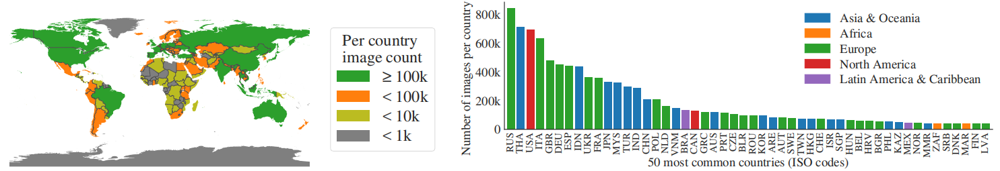

# Segment Anything
分割任何内容 2023.4.5 https://arxiv.org/abs/2304.02643

## 阅读笔记

## Abstract
We introduce the Segment Anything (SA) project: a new task, model, and dataset for image segmentation. Using our efficient model in a data collection loop, we built the largest segmentation dataset to date (by far), with over 1 billion masks on 11M licensed and privacy respecting images. The model is designed and trained to be promptable, so it can transfer zero-shot to new image distributions and tasks. We evaluate its capabilities on numerous tasks and find that its zero-shot performance is impressive – often competitive with or even superior to prior fully supervised results. We are releasing the Segment Anything Model (SAM) and corresponding dataset (SA-1B) of 1B masks and 11M images at https://segment-anything.com to foster research into foundation models for computer vision.

我们介绍了Segment Anything（SA）项目：一个用于图像分割的新任务、模型和数据集。在数据收集循环中使用我们的高效模型，我们建立了迄今为止最大的分割数据集，在1100万张许可和尊重隐私的图像上有超过10亿个掩码。该模型被设计和训练为可提示的，因此它可以将零样本迁移为新的图像分布和任务。我们评估了其在许多任务上的能力，发现其零样本性能令人印象深刻，通常与之前的完全监督结果相竞争，甚至优于这些结果。我们将在 https://segment-anything.com 促进对计算机视觉基础模型的研究。

 
Figure 1: We aim to build a foundation model for segmentation by introducing three interconnected components: a promptable segmentation task, a segmentation model (SAM) that powers data annotation and enables zero-shot transfer to a range of tasks via prompt engineering, and a data engine for collecting SA-1B, our dataset of over 1 billion masks.
图1：我们旨在通过引入三个相互关联的组件来构建分割的基础模型：提示分割任务、支持数据标注并通过提示工程将零样本迁移到一系列任务的分割模型（SAM），以及用于收集SA-1B的数据引擎，SA-1B是我们拥有超过10亿个掩码的数据集。

## 1. Introduction
Large language models pre-trained on web-scale datasets are revolutionizing NLP with strong zero-shot and few-shot generalization [10]. These “foundation models” [8] can generalize to tasks and data distributions beyond those seen during training. This capability is often implemented with prompt engineering in which hand-crafted text is used to prompt the language model to generate a valid textual response for the task at hand. When scaled and trained with abundant text corpora from the web, these models’ zero and few-shot performance compares surprisingly well to (even matching in some cases) fine-tuned models [10, 21]. Empirical trends show this behavior improving with model scale, dataset size, and total training compute [56, 10, 21, 51].

在网络规模数据集上预训练的大型语言模型正以强大的零样本和少样本泛化革新NLP[10]。这些“基础模型”[8]可以推广到训练过程中看到的任务和数据分布。这种功能通常通过提示工程来实现，在提示工程中，手工制作的文本用于提示语言模型为手头的任务生成有效的文本响应。当使用来自网络的大量文本语料库进行缩放和训练时，这些模型的零和少样本性能与微调模型（在某些情况下甚至匹配）相比出奇地好[10，21]。经验趋势表明，这种行为随着模型规模、数据集大小和总训练计算的增加而改善[56，10，21，51]。

Foundation models have also been explored in computer vision, albeit to a lesser extent. Perhaps the most prominent illustration aligns paired text and images from the web. For example, CLIP [82] and ALIGN [55] use contrastive learning to train text and image encoders that align the two modalities. Once trained, engineered text prompts enable zero-shot generalization to novel visual concepts and data distributions. Such encoders also compose effectively with other modules to enable downstream tasks, such as image generation (e.g., DALL·E [83]). While much progress has been made on vision and language encoders, computer vision includes a wide range of problems beyond this scope, and for many of these, abundant training data does not exist.

基础模型也在计算机视觉中进行了探索，尽管程度较低。也许最突出的插图将来自网络的成对文本和图像对齐。例如，CLIP[82]和ALIGN[55]使用对比学习来训练对齐两种模态的文本和图像编码器。经过训练后，文本提示工程可以实现对新视觉概念和数据分布的零样本泛化。这种编码器还与其他模块有效组合，以实现下游任务，如图像生成（例如，DALL·e[83]）。虽然在视觉和语言编码器方面已经取得了很大进展，但计算机视觉包括了超出这一范围的广泛问题，而且对于其中许多问题，还不存在丰富的训练数据。

In this work, our goal is to build a foundation model for image segmentation. That is, we seek to develop a promptable model and pre-train it on a broad dataset using a task that enables powerful generalization. With this model, we aim to solve a range of downstream segmentation problems on new data distributions using prompt engineering.

在这项工作中，我们的目标是建立一个图像分割的基础模型。即,我们寻求开发一个可提示的模型，并使用能够实现强大泛化的任务在广泛的数据集上对其进行预训练。有了这个模型，我们的目标是使用提示工程解决新数据分布上的一系列下游分割问题。

The success of this plan hinges on three components: task, model, and data. To develop them, we address the following questions about image segmentation:
1. What task will enable zero-shot generalization?
2. What is the corresponding model architecture?
3. What data can power this task and model?

这个计划的成功取决于三个组成部分：任务、模型和数据。为了开发它们，我们解决了以下关于图像分割的问题：
1. 什么任务可以实现零样本泛化？
2. 相应的模型架构是什么？
3. 什么数据可以为这个任务和模型提供动力？

These questions are entangled and require a comprehensive solution. We start by defining a promptable segmentation task that is general enough to provide a powerful pretraining objective and to enable a wide range of downstream applications. This task requires a model that supports flexible prompting and can output segmentation masks in realtime when prompted to allow for interactive use. To train our model, we need a diverse, large-scale source of data. Unfortunately, there is no web-scale data source for segmentation; to address this, we build a “data engine”, i.e., we iterate between using our efficient model to assist in data collection and using the newly collected data to improve the model. We introduce each interconnected component next, followed by the dataset we created and the experiments that demonstrate the effectiveness of our approach.

这些问题错综复杂，需要综合解决。我们首先定义了一个可提示的分割任务，该任务足够通用，可以提供强大的预训练目标，并实现广泛的下游应用。此任务需要一个支持灵活提示的模型，并且可以在提示时实时输出分割掩码，以便进行交互使用。为了训练我们的模型，我们需要一个多样化的、大规模的数据源。不幸的是，没有用于分割的网络规模的数据源；为了解决这个问题，我们构建了一个“数据引擎”，即我们在使用高效的模型来帮助数据收集和使用新收集的数据来改进模型之间进行迭代。接下来，我们介绍每个互连的组件，然后是我们创建的数据集和证明我们方法有效性的实验。

### Task (§2).  任务
In NLP and more recently computer vision, foundation models are a promising development that can perform zero-shot and few-shot learning for new datasets and tasks often by using “prompting” techniques. Inspired by this line of work, we propose the promptable segmentation task, where the goal is to return a valid segmentation mask given any segmentation prompt (see Fig. 1a). A prompt simply specifies what to segment in an image, e.g., a prompt can include spatial or text information identifying an object. The requirement of a valid output mask means that even when a prompt is ambiguous and could refer to multiple objects (for example, a point on a shirt may indicate either the shirt or the person wearing it), the output should be a reasonable mask for at least one of those objects. We use the promptable segmentation task as both a pre-training objective and to solve general downstream segmentation tasks via prompt engineering.

在NLP和最近的计算机视觉中，基础模型是一个很有前途的发展，它可以对新数据集和任务执行零样本和少样本学习，通常使用“提示”技术。受这项工作的启发，我们提出了可提示的分割任务，其中的目标是在给定任何分割提示的情况下返回有效的分割掩码（见图第1a段）。提示只是指定在图像中分割什么，例如，提示可以包括标识对象的空间或文本信息。有效输出掩码的要求意味着，即使提示不明确，并且可能涉及多个对象（例如，衬衫上的一个点可能指示衬衫或穿着衬衫的人），输出也应该是这些对象中至少一个的合理掩码。我们使用可提示的分割任务作为预训练目标，并通过提示工程解决一般的下游分割任务。

### Model (§3).  模型
The promptable segmentation task and the goal of real-world use impose constraints on the model architecture. In particular, the model must support flexible prompts, needs to compute masks in amortized real-time to allow interactive use, and must be ambiguity-aware. Surprisingly, we find that a simple design satisfies all three constraints: a powerful image encoder computes an image embedding, a prompt encoder embeds prompts, and then the two information sources are combined in a lightweight mask decoder that predicts segmentation masks. We refer to this model as the Segment Anything Model, or SAM (see Fig. 1b). By separating SAM into an image encoder and a fast prompt encoder / mask decoder, the same image embedding can be reused (and its cost amortized) with different prompts. Given an image embedding, the prompt encoder and mask decoder predict a mask from a prompt in ∼50ms in a web browser. We focus on point, box, and mask prompts, and also present initial results with free-form text prompts. To make SAM ambiguity-aware, we design it to predict multiple masks for a single prompt allowing SAM to naturally handle ambiguity, such as the shirt vs. person example.

可提示的分割任务和现实世界使用的目标对模型架构施加了约束。特别是，该模型必须支持灵活的提示，需要实时计算掩码以允许交互式使用，并且必须具有模糊性。令人惊讶的是，我们发现一个简单的设计满足了所有三个约束：一个强大的图像编码器计算图像嵌入，一个提示编码器嵌入提示，然后将这两个信息源组合在一个预测分割掩码的轻量级掩码解码器中。我们将此模型称为任意分割模型或SAM（见图1b）。通过将SAM分离为图像编码器和快速提示编码器/掩码解码器，可以在不同提示下重用相同的图像嵌入（并分摊其成本）。在给定图像嵌入的情况下，提示编码器和掩码解码器在web浏览器中从提示预测掩码，时间为～50ms。我们专注于点、框和掩码提示，并通过自由形式的文本提示显示初始结果。为了让SAM意识到模糊性，我们将其设计为预测单个提示的多个掩码，使SAM能够自然地处理模糊性，例如衬衫对人的例子。

### Data engine (§4).  数据引擎
To achieve strong generalization to new data distributions, we found it necessary to train SAM on a large and diverse set of masks, beyond any segmentation dataset that already exists. While a typical approach for foundation models is to obtain data online [82], masks are not naturally abundant and thus we need an alternative strategy. Our solution is to build a “data engine”, i.e., we co-develop our model with model-in-the-loop dataset annotation (see Fig. 1c). Our data engine has three stages: assisted-manual, semi-automatic, and fully automatic. In the first stage, SAM assists annotators in annotating masks, similar to a classic interactive segmentation setup. In the second stage, SAM can automatically generate masks for a subset of objects by prompting it with likely object locations and annotators focus on annotating the remaining objects, helping increase mask diversity. In the final stage, we prompt SAM with a regular grid of foreground points, yielding on average ∼100 high-quality masks per image.

为了实现对新数据分布的强泛化，我们发现有必要在一组庞大而多样的掩码上训练SAM，超越现有的任何分割数据集。虽然基础模型的一种典型方法是在线获取数据[82]，但掩码并非自然丰富，因此我们需要一种替代策略。我们的解决方案是建立一个“数据引擎”，即我们与模型在环数据集标注共同开发我们的模型（见图1c）。我们的数据引擎有三个阶段：辅助手工、半自动和全自动。在第一阶段，SAM帮助标注人员标注掩码，类似于经典的交互式分割设置。在第二阶段，SAM可以通过提示可能的对象位置来自动生成对象子集的掩码，标注人员专注于标注其余对象，有助于增加掩码的多样性。在最后阶段，我们用前景点的规则网格提示SAM，平均每张图像产生约100个高质量掩码。<!--多样性的衡量指标-->

### Dataset (§5). 数据集
Our final dataset, SA-1B, includes more than 1B masks from 11M licensed and privacy-preserving images (see Fig. 2). SA-1B, collected fully automatically using the final stage of our data engine, has 400× more masks than any existing segmentation dataset [66, 44, 117, 60], and as we verify extensively, the masks are of high quality and diversity. Beyond its use in training SAM to be robust and general, we hope SA-1B becomes a valuable resource for research aiming to build new foundation models.

我们的最终数据集SA-1B包括来自11M许可和隐私保护图像的超过1B个掩码（见图2）。SA-1B是使用我们的数据引擎的最后阶段完全自动收集的，其掩码比任何现有的分割数据集都多400倍[66，44，117，60]，正如我们广泛验证的那样，掩码具有高质量和多样性。除了将其用于训练SAM以使其稳健和通用之外，我们希望SA-1B成为旨在建立新基础模型的研究的宝贵资源。

 
Figure 2: Example images with overlaid masks from our newly introduced dataset, SA-1B. SA-1B contains 11M diverse, high-resolution, licensed, and privacy protecting images and 1.1B high-quality segmentation masks. These masks were annotated fully automatically by SAM, and as we verify by human ratings and numerous experiments, are of high quality and diversity. We group images by number of masks per image for visualization (there are ∼100 masks per image on average). 
图2：来自我们新引入的数据集SA-1B的具有叠加掩码的样本图像。SA-1B包含11M多样、高分辨率、许可和隐私保护图像以及1.1B高质量分割掩码。这些掩码由SAM完全自动标注，正如我们通过人类评级和大量实验验证的那样，具有高质量和多样性。我们根据每张图像的掩码数量对图像进行分组以进行可视化（平均每张图像有～100个掩码）。

### Responsible AI (§6).  负责任的AI
We study and report on potential fairness concerns and biases when using SA-1B and SAM. Images in SA-1B span a geographically and economically diverse set of countries and we found that SAM performs similarly across different groups of people. Together, we hope this will make our work more equitable for real-world use cases. We provide model and dataset cards in the appendix.

我们研究并报告了使用SA-1B和SAM时潜在的公平问题和偏见。SA-1B中的图像跨越了地理和经济上不同的国家，我们发现SAM在不同人群中表现相似。我们希望这将使我们的工作在现实世界的用例中更加公平。我们在附录中提供了模型和数据集卡。

### Experiments (§7).  实验
We extensively evaluate SAM. First, using a diverse new suite of 23 segmentation datasets, we find that SAM produces high-quality masks from a single foreground point, often only slightly below that of the manually annotated ground truth. Second, we find consistently strong quantitative and qualitative results on a variety of downstream tasks under a zero-shot transfer protocol using prompt engineering, including edge detection, object proposal generation, instance segmentation, and a preliminary exploration of text-to-mask prediction. These results suggest that SAM can be used out-of-the-box with prompt engineering to solve a variety of tasks involving object and image distributions beyond SAM’s training data. Nevertheless, room for improvement remains, as we discuss in §8.

我们对SAM进行了广泛的评估。首先，使用一套新的23个分割数据集，我们发现SAM从单个前景点生成高质量的掩码，通常仅略低于手工标注的真实情况。其次，我们使用提示工程在零样本迁移协议下的各种下游任务上发现了一致的强定量和定性结果，包括边缘检测、目标候选区生成、实例分割和文本到掩码预测的初步探索。这些结果表明，SAM可以与提示工程一起开箱即用，以解决涉及SAM训练数据之外的对象和图像分布的各种任务。尽管如此，正如我们在第8节中所讨论的那样，仍有改进的空间。

### Release.  发布
We are releasing the SA-1B dataset for research purposes and making SAM available under a permissive open license (Apache 2.0) at https://segment-anything.com. We also showcase SAM’s capabilities with an online demo. 

我们发布SA-1B数据集用于研究目的，并在允许的开放许可证（Apache 2.0）下提供SAM https://segment-anything.com. 我们还通过在线演示展示SAM的能力。

## 2. Segment Anything Task 任务
We take inspiration from NLP, where the next token prediction task is used for foundation model pre-training and to solve diverse downstream tasks via prompt engineering [10]. To build a foundation model for segmentation, we aim to define a task with analogous capabilities.

我们从NLP中获得了灵感，在NLP中，下一个令牌预测任务用于基础模型预训练，并通过提示工程解决不同的下游任务[10]。为了建立分割的基础模型，我们的目标是定义一个具有类似功能的任务。

### Task. 任务
We start by translating the idea of a prompt from NLP to segmentation, where a prompt can be a set of foreground / background points, a rough box or mask, free-form text, or, in general, any information indicating what to segment in an image. The promptable segmentation task, then, is to return a valid segmentation mask given any prompt. The requirement of a “valid” mask simply means that even when a prompt is ambiguous and could refer to multiple objects (e.g., recall the shirt vs. person example, and see Fig. 3), the output should be a reasonable mask for at least one of those objects. This requirement is similar to expecting a language model to output a coherent response to an ambiguous prompt. We choose this task because it leads to a natural pre-training algorithm and a general method for zero-shot transfer to downstream segmentation tasks via prompting.

我们首先将提示的概念从NLP转换为分割，其中提示可以是一组前景/背景点、粗略框或掩码、自由格式文本，或者通常是指示在图像中分割什么的任何信息。那么，可提示的分割任务是在给定任何提示的情况下返回有效的分割掩码。“有效”掩码的要求只是意味着，即使提示不明确，并且可能涉及多个对象（例如，回忆衬衫与人的例子，见图3），输出也应该是其中至少一个对象的合理掩码。这一要求类似于期望语言模型对不明确的提示输出一致的响应。我们选择此任务是因为它会产生一种自然的预训练算法和一种通过提示将零样本迁移到下游分割任务的通用方法。

 
Figure 3: Each column shows 3 valid masks generated by SAM from a single ambiguous point prompt (green circle). 
图3：每列显示SAM从单个不明确的点提示（绿色圆圈）生成的3个有效掩码。

### Pre-training.  预训练
The promptable segmentation task suggests a natural pre-training algorithm that simulates a sequence of prompts (e.g., points, boxes, masks) for each training sample and compares the model’s mask predictions against the ground truth. We adapt this method from interactive segmentation [109, 70], although unlike interactive segmentation whose aim is to eventually predict a valid mask after enough user input, our aim is to always predict a valid mask for any prompt even when the prompt is ambiguous. This ensures that a pre-trained model is effective in use cases that involve ambiguity, including automatic annotation as required by our data engine §4. We note that performing well at this task is challenging and requires specialized modeling and training loss choices, which we discuss in §3.

可提示分割任务提出了一种自然的预训练算法，该算法模拟每个训练样本的提示序列（例如，点、框、掩码），并将模型的掩码预测与基础事实进行比较。我们将这种方法从交互式分割中进行了调整[10970]，尽管与交互式分割不同，交互式分割的目的是在足够的用户输入后最终预测有效的掩码，但我们的目的是始终预测任何提示的有效掩码，即使提示不明确。这确保了预训练模型在涉及歧义的用例中是有效的，包括我们的数据引擎§4所要求的自动标注。我们注意到，在这项任务中表现出色是具有挑战性的，需要专门的建模和训练损失选择，我们在§3中对此进行了讨论。

### Zero-shot transfer. 零样本迁移
Intuitively, our pre-training task endows the model with the ability to respond appropriately to any prompt at inference time, and thus downstream tasks can be solved by engineering appropriate prompts. For example, if one has a bounding box detector for cats, cat instance segmentation can be solved by providing the detector’s box output as a prompt to our model. In general, a wide array of practical segmentation tasks can be cast as prompting. In addition to automatic dataset labeling, we explore five diverse example tasks in our experiments in §7.

直观地说，我们的预训练任务赋予了模型在推理时对任何提示做出适当响应的能力，因此下游任务可以通过设计适当的提示来解决。例如，如果有一个猫的边界框检测器，则可以通过向我们的模型提供检测器的框输出作为提示来解决猫实例分割。一般来说，一系列实用的分割任务可以作为提示。除了自动数据集标签外，我们还在§7中的实验中探索了五个不同的样本任务。

### Related tasks.  相关任务
Segmentation is a broad field: there’s interactive segmentation [57, 109], edge detection [3], super pixelization [85], object proposal generation [2], foreground segmentation [94], semantic segmentation [90], instance segmentation [66], panoptic segmentation [59], etc. The goal of our promptable segmentation task is to produce a broadly capable model that can adapt to many (though not all) existing and new segmentation tasks via prompt engineering. This capability is a form of task generalization [26]. Note that this is different than previous work on multi-task segmentation systems. In a multi-task system, a single model performs a fixed set of tasks, e.g., joint semantic, instance, and panoptic segmentation [114, 19, 54], but the training and test tasks are the same. An important distinction in our work is that a model trained for promptable segmentation can perform a new, different task at inference time by acting as a component in a larger system, e.g., to perform instance segmentation, a promptable segmentation model is combined with an existing object detector.

分割是一个广泛的领域：有交互式分割[57109]、边缘检测[3]、超级像素化[85]、目标候选区生成[2]、前景分割[94]、语义分割[90]、实例分割[66]、全景分割[59]等。我们的可提示分割任务的目标是通过提示工程生成一个功能广泛的模型，该模型可以适应许多（尽管不是全部）现有和新的分割任务。这种能力是任务泛化的一种形式[26]。请注意，这与之前关于多任务分割系统的工作不同。在多任务系统中，单个模型执行一组固定的任务，例如联合语义、实例和全景分割[114，19，54]，但训练和测试任务是相同的。我们工作中的一个重要区别是，为可提示分割训练的模型可以在推理时通过充当更大系统中的组件来执行新的不同任务，例如，为了执行实例分割，将可提示分割模型与现有的目标检测器相结合。

### Discussion.  讨论
Prompting and composition are powerful tools that enable a single model to be used in extensible ways, potentially to accomplish tasks unknown at the time of model design. This approach is analogous to how other foundation models are used, e.g., how CLIP [82] is the text-image alignment component of the DALL·E [83] image generation system. We anticipate that composable system design, powered by techniques such as prompt engineering, will enable a wider variety of applications than systems trained specifically for a fixed set of tasks. It’s also interesting to compare promptable and interactive segmentation through the lens of composition: while interactive segmentation models are designed with human users in mind, a model trained for promptable segmentation can also be composed into a larger algorithmic system as we will demonstrate. 

提示和组合是功能强大的工具，使单个模型能够以可扩展的方式使用，有可能完成模型设计时未知的任务。这种方法类似于其他基础模型的使用方式，例如CLIP[82]是DALL·e[83]图像生成系统的文本图像对齐组件。我们预计，与专门为固定任务集训练的系统相比，以提示工程等技术为动力的可组合系统设计将实现更广泛的应用程序。从合成的角度比较可提示分割和交互式分割也很有趣：虽然交互式分割模型是在考虑人类用户的情况下设计的，但为可提示分割训练的模型也可以组成一个更大的算法系统，正如我们将要演示的那样。

## 3. Segment Anything Model  模型
We next describe the Segment Anything Model (SAM) for promptable segmentation. SAM has three components, illustrated in Fig. 4: an image encoder, a flexible prompt encoder, and a fast mask decoder. We build on Transformer vision models [14, 33, 20, 62] with specific tradeoffs for (amortized) real-time performance. We describe these components at a high-level here, with details in §A.

接下来我们将描述用于可提示分割的任意分割模型（SAM）。SAM有三个组件，如图4所示：图像编码器、灵活提示编码器和快速掩码解码器。我们建立在Transformer视觉ViT模型[14，33，20，62]的基础上，对（摊销的）实时性能进行了特定的权衡。我们在这里对这些组件进行了高层描述，详情见§a。

 
Figure 4: Segment Anything Model (SAM) overview. A heavyweight image encoder outputs an image embedding that can then be efficiently queried by a variety of input prompts to produce object masks at amortized real-time speed. For ambiguous prompts corresponding to more than one object, SAM can output multiple valid masks and associated confidence scores.
图4：任意分割物体模型（SAM）概述。重量级图像编码器输出图像嵌入，然后可以通过各种输入提示有效地查询该图像嵌入，以摊销的实时速度生成对象掩码。对于与多个对象对应的模糊提示，SAM可以输出多个有效掩码和相关的置信度分数。

### Image encoder.  图像编码器
Motivated by scalability and powerful pretraining methods, we use an MAE [47] pre-trained Vision Transformer (ViT) [33] minimally adapted to process high resolution inputs [62]. The image encoder runs once per image and can be applied prior to prompting the model.

受可扩展性和强大的预训练方法的启发，我们使用了MAE[47]预训练的视觉转换器（ViT）[33]，该转换器至少适用于处理高分辨率输入[62]。图像编码器每个图像运行一次，并且可以在提示模型之前应用。

### Prompt encoder. 提示编码器
We consider two sets of prompts: sparse (points, boxes, text) and dense (masks). We represent points and boxes by positional encodings [95] summed with learned embeddings for each prompt type and free-form text with an off-the-shelf text encoder from CLIP [82]. Dense prompts (i.e., masks) are embedded using convolutions and summed element-wise with the image embedding.

我们考虑两组提示：稀疏（点、框、文本）和密集（掩码）。我们通过位置编码[95]来表示点和框，这些位置编码与每个提示类型的学习的嵌入相加，并使用CLIP[82]的现成文本编码器来表示自由格式文本。密集提示（即掩码）使用卷积嵌入，并与图像嵌入逐元素求和。

### Mask decoder. 掩码解码器
The mask decoder efficiently maps the image embedding, prompt embeddings, and an output token to a mask. This design, inspired by [14, 20], employs a modification of a Transformer decoder block [103] followed by a dynamic mask prediction head. Our modified decoder block uses prompt self-attention and cross-attention in two directions (prompt-to-image embedding and vice-versa) to update all embeddings. After running two blocks, we upsample the image embedding and an MLP maps the output token to a dynamic linear classifier, which then computes the mask foreground probability at each image location.

掩码解码器有效地将图像嵌入、提示嵌入和输出令牌映射到掩码。该设计受到[14，20]的启发，采用了对Transformer解码器块[103]的修改，然后是动态掩码预测头。我们修改的解码器块在两个方向上使用提示自注意和交叉注意（提示到图像嵌入，反之亦然）来更新所有嵌入。在运行两个块之后，我们对图像嵌入进行上采样，MLP将输出令牌映射到动态线性分类器，然后动态线性分类器计算每个图像位置的掩码前景概率。

### Resolving ambiguity. 消歧
With one output, the model will average multiple valid masks if given an ambiguous prompt. To address this, we modify the model to predict multiple output masks for a single prompt (see Fig. 3). We found 3 mask outputs is sufficient to address most common cases (nested masks are often at most three deep: whole, part, and subpart). During training, we backprop only the minimum loss [15, 45, 64] over masks. To rank masks, the model predicts a confidence score (i.e., estimated IoU) for each mask.

对于一个输出，如果给出不明确的提示，模型将平均多个有效掩码。为了解决这个问题，我们修改了模型，以预测单个提示的多个输出掩码（见图3）。我们发现，3个掩码输出足以解决大多数常见情况（嵌套掩码通常最多有三个深度：整体、部分和子部分）。在训练过程中，我们只在掩码上反向探测最小的损失[15，45，64]。为了对掩码进行排序，该模型预测每个掩码的置信度得分（即估计的IoU）。

### Efficiency. 效率
The overall model design is largely motivated by efficiency. Given a precomputed image embedding, the prompt encoder and mask decoder run in a web browser, on CPU, in ∼50ms. This runtime performance enables seamless, real-time interactive prompting of our model.

整体模型设计在很大程度上是出于效率的考虑。给定预计算的图像嵌入，提示编码器和掩码解码器在网络浏览器中运行，在CPU上运行，时间约为50ms。这种运行时性能使我们的模型能够无缝、实时地进行交互式提示。

### Losses and training.  损失和训练
We supervise mask prediction with the linear combination of focal loss [65] and dice loss [73] used in [14]. We train for the promptable segmentation task using a mixture of geometric prompts (for text prompts see §7.5). Following [92, 37], we simulate an interactive setup by randomly sampling prompts in 11 rounds per mask, allowing SAM to integrate seamlessly into our data engine.

我们使用[14]中的焦点损失[65]和骰子损失[73]的线性组合来监督掩码预测。我们使用几何提示的混合来训练可提示的分割任务（文本提示见§7.5）。在[92，37]之后，我们通过在每个掩码的11轮中随机采样提示来模拟交互式设置，使SAM能够无缝集成到我们的数据引擎中。

## 4. Segment Anything Data Engine 数据引擎
As segmentation masks are not abundant on the internet, we built a data engine to enable the collection of our 1.1B mask dataset, SA-1B. The data engine has three stages: (1) a model-assisted manual annotation stage, (2) a semi-automatic stage with a mix of automatically predicted masks and model-assisted annotation, and (3) a fully automatic stage in which our model generates masks without annotator input. We go into details of each next.

由于互联网上的分割掩码并不丰富，我们建立了一个数据引擎来收集我们的1.1亿掩码数据集SA-1B。数据引擎有三个阶段：（1）模型辅助的手工标注阶段，（2）混合了自动预测掩码和模型辅助标注的半自动阶段，以及（3）全自动阶段，在该阶段中，我们的模型在没有标注人员输入的情况下生成掩码。我们将详细介绍下一步。

### Assisted-manual stage. 辅助手工阶段
In the first stage, resembling classic interactive segmentation, a team of professional annotators labeled masks by clicking foreground / background object points using a browser-based interactive segmentation tool powered by SAM. Masks could be refined using pixelprecise “brush” and “eraser” tools. Our model-assisted annotation runs in real-time directly inside a browser (using precomputed image embeddings) enabling a truly interactive experience. We did not impose semantic constraints for labeling objects, and annotators freely labeled both “stuff” and “things” [1]. We suggested annotators label objects they could name or describe, but did not collect these names or descriptions. Annotators were asked to label objects in order of prominence and were encouraged to proceed to the next image once a mask took over 30 seconds to annotate. 

在第一阶段，类似于经典的交互式分割，一组专业标注人员通过使用SAM提供的基于浏览器的交互式分割工具点击前景/背景对象点来标注掩码。掩码可以使用pixelprecise“画笔”和“橡皮擦”工具进行细化。我们的模型辅助标注直接在浏览器内实时运行（使用预计算的图像嵌入），从而实现真正的交互式体验。我们没有对标注对象施加语义约束，标注人员可以自由地标注“东西”和“事物”[1]。我们建议标注人员标注他们可以命名或描述的对象，但没有收集这些名称或描述。标注人员被要求按照突出的顺序标注对象，并被鼓励在掩码需要30秒以上的时间后继续进行下一张图像标注。

At the start of this stage, SAM was trained using common public segmentation datasets. After sufficient data annotation, SAM was retrained using only newly annotated masks. As more masks were collected, the image encoder was scaled from ViT-B to ViT-H and other architectural details evolved; in total we retrained our model 6 times. Average annotation time per mask decreased from 34 to 14 seconds as the model improved. We note that 14 seconds is 6.5× faster than mask annotation for COCO [66] and only 2× slower than bounding-box labeling with extreme points [76, 71]. As SAM improved, the average number of masks per image increased from 20 to 44 masks. Overall, we collected 4.3M masks from 120k images in this stage.

在这个阶段开始时，SAM是使用公共分割数据集进行训练的。在充分的数据标注之后，仅使用新标注的掩码对SAM进行再训练。随着更多掩码的收集，图像编码器从ViT-B扩展到ViT-H，其他架构细节也在发展；我们总计对模型进行了6次再训练。随着模型的改进，每个掩码的平均标注时间从34秒减少到14秒。我们注意到，14秒比COCO[66]的掩码标注快6.5倍，仅比使用极值点的边界框标注慢2倍[76，71]。随着SAM的改进，每张图像的平均掩码数量从20个增加到44个。总的来说，我们在这个阶段从120k张图像中收集了430万个掩码。

### Semi-automatic stage. 半自动阶段
In this stage, we aimed to increase the diversity of masks in order to improve our model’s ability to segment anything. To focus annotators on less prominent objects, we first automatically detected confident masks. Then we presented annotators with images prefilled with these masks and asked them to annotate any additional unannotated objects. To detect confident masks, we trained a bounding box detector [84] on all first stage masks using a generic “object” category. During this stage we collected an additional 5.9M masks in 180k images (for a total of 10.2M masks). As in the first stage, we periodically retrained our model on newly collected data (5 times). Average annotation time per mask went back up to 34 seconds (excluding the automatic masks) as these objects were more challenging to label. The average number of masks per image went from 44 to 72 masks (including the automatic masks).

在这个阶段，我们的目标是增加掩码的多样性，以提高我们的模型分割任何东西的能力。为了将标注人员集中在不太突出的对象上，我们首先自动检测到置信的掩码。然后，我们向标注人员展示了预填充了这些掩码的图像，并要求他们标注任何其他未标注的对象。为了检测置信的掩码，我们使用通用的“对象”类别在所有第一阶段掩码上训练了一个边界框检测器[84]。在此阶段，我们在180k张图像中额外收集了590万个掩码（总共1020万个掩码）。与第一阶段一样，我们定期根据新收集的数据对模型进行再训练（5次）。每个掩码的平均标注时间回到了34秒（不包括自动掩码），因为这些对象更难标注。每张图像的平均掩码数量从44个增加到72个（包括自动掩码）。

### Fully automatic stage.  全自动阶段
In the final stage, annotation was fully automatic. This was feasible due to two major enhancements to our model. First, at the start of this stage, we had collected enough masks to greatly improve the model, including the diverse masks from the previous stage. Second, by this stage we had developed the ambiguity-aware model, which allowed us to predict valid masks even in ambiguous cases. Specifically, we prompted the model with a 32×32 regular grid of points and for each point predicted a set of masks that may correspond to valid objects. With the ambiguity-aware model, if a point lies on a part or subpart, our model will return the subpart, part, and whole object. The IoU prediction module of our model is used to select confident masks; moreover, we identified and selected only stable masks (we consider a mask stable if thresholding the probability map at 0.5 − δ and 0.5 + δ results in similar masks). Finally, after selecting the confident and stable masks, we applied non-maximal suppression (NMS) to filter duplicates. To further improve the quality of smaller masks, we also processed multiple overlapping zoomed-in image crops. For further details of this stage, see §B. We applied fully automatic mask generation to all 11M images in our dataset, producing a total of 1.1B high-quality masks. We describe and analyze the resulting dataset, SA-1B, next.

在最后阶段，标注是完全自动的。这是可行的，因为我们的模型有两个主要的增强。首先，在这个阶段开始时，我们收集了足够的掩码，以大大改进模型，包括前一阶段的各种掩码。其次，到了这个阶段，我们已经开发了模糊感知模型，它使我们能够预测有效的掩码，即使在模糊的情况下也是如此。具体来说，我们用32×32的规则网格提示模型，并为每个点预测一组可能对应于有效对象的掩码。对于模糊感知模型，如果一个点位于部分或子部分上，我们的模型将返回子部分、部分和整个对象。我们模型的IoU预测模块用于选择置信掩码；此外，我们只识别和选择了稳定的掩码（如果在0.5−δ和0.5+δ处对概率图进行阈值处理会导致类似的掩码，则我们认为掩码是稳定的）。最后，在选择了置信和稳定的掩码后，我们应用非最大抑制（NMS）来过滤重复。为了进一步提高较小掩码的质量，我们还处理了多个重叠的放大图像裁剪。有关此阶段的更多详情，请参见§B。我们将全自动掩码生成应用于数据集中的所有1100万张图像，总共生成了11亿个高质量掩码。接下来，我们将描述并分析生成的数据集SA-1B。

## 5. Segment Anything Dataset 数据集
Our dataset, SA-1B, consists of 11M diverse, highresolution, licensed, and privacy protecting images and 1.1B high-quality segmentation masks collected with our data engine. We compare SA-1B with existing datasets and analyze mask quality and properties. We are releasing SA-1B to aid future development of foundation models for computer vision. We note that SA-1B will be released under a favorable license agreement for certain research uses and with protections for researchers.

我们的数据集SA-1B由11M多样、高分辨率、许可和隐私保护的图像和使用我们的数据引擎收集的1.1B高质量分割掩码组成。我们将SA-1B与现有数据集进行比较，并分析掩码质量和属性。我们正在发布SA-1B，以帮助未来计算机视觉基础模型的开发。我们注意到，SA-1B将在某些研究用途的有利许可协议下发布，并为研究人员提供保护。

### Images. 图像
We licensed a new set of 11M images from a provider that works directly with photographers. These images are high resolution (3300×4950 pixels on average), and the resulting data size can present accessibility and storage challenges. Therefore, we are releasing downsampled images with their shortest side set to 1500 pixels. Even after downsampling, our images are significantly higher resolution than many existing vision datasets (e.g., COCO [66] images are ∼480×640 pixels). Note that most models today operate on much lower resolution inputs. Faces and vehicle license plates have been blurred in the released images.

我们从一家直接与摄影师合作的供应商那里获得了一组1100万张新图像的许可。这些图像具有高分辨率（平均3300×4950像素），由此产生的数据大小可能会带来可访问性和存储方面的挑战。因此，我们正在发布最短边设置为1500像素的下采样图像。即使在下采样之后，我们的图像的分辨率也明显高于许多现有的视觉数据集（例如，COCO[66]图像的分辨率为~480×640像素）。请注意，目前大多数模型的输入分辨率要低得多。在公布的图像中，人脸和车牌被模糊了。

### Masks. 掩码
Our data engine produced 1.1B masks, 99.1% of which were generated fully automatically. Therefore, the quality of the automatic masks is centrally important. We compare them directly to professional annotations and look at how various mask properties compare to prominent segmentation datasets. Our main conclusion, as borne out in the analysis below and the experiments in §7, is that our automatic masks are high quality and effective for training models. Motivated by these findings, SA-1B only includes automatically generated masks.

我们的数据引擎产生了11亿个掩码，其中99.1%是完全自动生成的。因此，自动掩码的质量至关重要。我们将其直接与专业标注进行比较，并查看各种掩码属性与显著分割数据集的比较。正如下面的分析和§7中的实验所证实的那样，我们的主要结论是，我们的自动掩码质量高，对训练模型有效。受这些发现的启发，SA-1B仅包括自动生成的掩码。

### Mask quality. 掩码质量
To estimate mask quality, we randomly sampled 500 images (∼50k masks) and asked our professional annotators to improve the quality of all masks in these images. Annotators did so using our model and pixel-precise “brush” and “eraser” editing tools. This procedure resulted in pairs of automatically predicted and professionally corrected masks. We computed IoU between each pair and found that 94% of pairs have greater than 90% IoU (and 97% of pairs have greater than 75% IoU). For comparison, prior work estimates inter-annotator consistency at 85-91% IoU [44, 60]. Our experiments in §7 confirm by human ratings that mask quality is high relative to a variety of datasets and that training our model on automatic masks is nearly as good as using all masks produced by the data engine.  

为了估计掩码质量，我们随机采样了500张图像（~5万个掩码），并要求我们的专业标注人员提高这些图像中所有掩码的质量。标注人员使用我们的模型和像素精确的“画笔”和“橡皮擦”编辑工具来完成这项工作。这一过程产生了一对自动预测和专业校正过的掩码。我们计算了每对之间的IoU，发现94%的对的IoU大于90%（97%的对的IoU大于75%）。为了进行比较，先前的工作估计标注人员之间的一致性为85-91%IoU[44，60]。我们在§7中的实验通过人类评级证实，相对于各种数据集，掩码质量很高，并且在自动掩码上训练我们的模型几乎与使用数据引擎产生的所有掩码一样好。

### Mask properties.  掩码属性
In Fig. 5 we plot the spatial distribution of object centers in SA-1B compared to the largest existing segmentation datasets. Common photographer biases are present in all datasets. We observe that SA-1B has greater coverage of image corners compared to LVIS v1 [44] and ADE20K [117], the two most similarly distributed datasets, while COCO [66] and Open Images V5 [60] have a more prominent center bias. In Fig. 6 (legend) we compare these datasets by size. SA-1B has 11× more images and 400× more masks than the second largest, Open Images. On average, it has 36× more masks per image than Open Images. The closest dataset in this respect, ADE20K, still has 3.5× fewer masks per image. Fig. 6 (left) plots the masks-perimage distribution. Next, we look at image-relative mask size (square root of the mask area divided by image area) in Fig. 6 (middle). As expected, since our dataset has more masks per image, it also tends to include a greater percentage of small and medium relative-size masks. Finally, to analyze shape complexity, we look at mask concavity (1 minus mask area divided by area of mask’s convex hull) in Fig. 6 (right). Since shape complexity is correlated with mask size, we control for the datasets’ mask size distributions by first performing stratified sampling from binned mask sizes. We observe that the concavity distribution of our masks is broadly similar to that of other datasets.

在图5中，与现有最大的分割数据集相比，我们绘制了SA-1B中对象中心的空间分布。所有数据集中都存在常见的摄影师偏见。我们观察到，与分布最相似的两个数据集LVIS v1[44]和ADE20K[117]相比，SA-1B对图像角的覆盖范围更大，而COCO[66]和Open Images V5[60]具有更显著的中心偏差。在图6（图例）中，我们按大小比较了这些数据集。SA-1B比第二大的Open images多了11倍的图像和400倍的掩码。平均而言，它每张图像的掩码比Open Images多36倍。在这方面最接近的数据集ADE20K，每张图像的掩码仍然减少了3.5倍。图6（左）绘制了掩码的周边图像分布。接下来，我们看看图6（中间）中的图像相对掩码大小（掩码面积除以图像面积的平方根）。正如预期的那样，由于我们的数据集每个图像有更多的掩码，因此它也倾向于包括更大比例的中小型相对大小掩码。最后，为了分析形状复杂性，我们观察图中的掩码凹度（1减去掩码面积除以掩码凸包的面积）。第6（右）段。由于形状复杂度与掩码大小相关，我们通过首先从装仓掩码大小执行分层采样来控制数据集的掩码大小分布。我们观察到，我们的掩码的凹陷分布与其他数据集的凹陷分布大致相似。

 
Figure 5: Image-size normalized mask center distributions.
图5：图像大小归一化掩码中心分布。

 
Figure 6: Dataset mask properties. The legend references the number of images and masks in each dataset. Note, that SA-1B has 11× more images and 400× more masks than the largest existing segmentation dataset Open Images [60].
图6：数据集掩码属性。图例引用了每个数据集中图像和掩码的数量。请注意，SA-1B比现有最大的分割数据集Open images[60]多了11倍的图像和400倍的掩码。

## 6. Segment Anything RAI Analysis  负责任的人工智能（RAI）
We next perform a Responsible AI (RAI) analysis of our work by investigating potential fairness concerns and biases when using SA-1B and SAM. We focus on the geographic and income distribution of SA-1B and fairness of SAM across protected attributes of people. We also provide dataset, data annotation, and model cards in §F.

接下来，我们通过调查使用SA-1B和SAM时潜在的公平问题和偏见，对我们的工作进行负责任的人工智能（RAI）分析。我们重点注意SA-1B的地理和收入分配，以及SAM在受保护的人的属性中的公平性。我们还在§F中提供了数据集、数据标注和模型卡。

 
Table 1: Comparison of geographic and income representation. SA-1B has higher representation in Europe and Asia & Oceania as well as middle income countries. Images from Africa, Latin America & Caribbean, as well as low income countries, are underrepresented in all datasets.
表1：地域代表性和收入代表性的比较。SA-1B在欧洲、亚洲和大洋洲以及中等收入国家有更高的代表性。来自非洲、拉丁美洲和加勒比地区以及低收入国家的图像在所有数据集中的代表性都不足。

### Geographic and income representation. 
We infer the country images were photographed in using standard methods (see §C). In Fig. 7 we visualize the per-country image counts in SA-1B (left) and the 50 countries with the most images (right). We note that the top-three countries are from different parts of the world. Next, in Table 1 we compare the geographic and income representation of SA-1B, COCO [66], and Open Images [60]. SA-1B has a substantially higher percentage of images in Europe and Asia & Oceania as well as in middle income countries. All datasets underrepresent Africa as well as low income countries. We note that in SA-1B, all regions, including Africa, have at least 28 million masks, 10× more than the total number of masks of any previous dataset. Finally, we observe that the average number of masks per image (not shown) is fairly consistent across region and income (94-108 per image). 

地域和收入代表性。我们推断国家图像是使用标准方法拍摄的（见§C）。在图7中，我们可视化了SA-1B（左）和图像最多的50个国家（右）中的每个国家的图像计数。我们注意到，排名前三的国家来自世界不同地区。接下来，在表1中，我们比较了SA-1B、COCO[66]和Open Images[60]的地理和收入表示。SA-1B在欧洲、亚洲和大洋洲以及中等收入国家的图像比例要高得多。所有数据集都低估了非洲和低收入国家的代表性。我们注意到，在SA-1B中，包括非洲在内的所有地区都至少有2800万个掩码，比以前任何数据集的掩码总数都多10倍。最后，我们观察到，每张图像（未显示）的平均掩码数量在区域和收入之间相当一致（每张图像94-108个）。

 
Figure 7: Estimated geographic distribution of SA-1B images. Most of the world’s countries have more than 1000 images in SA-1B, and the three countries with the most images are from different parts of the world.
图7：SA-1B图像的估计地理分布。世界上大多数国家的SA-1B图像超过1000张，图像最多的三个国家来自世界不同地区。

 
Table 2: SAM’s performance segmenting people across perceived gender presentation, age group, and skin tone. 95% confidence intervals are shown. Within each grouping, all confidence intervals overlap except older vs. middle.
表2:SAM根据感知的性别表现、年龄组和肤色对人群进行细分的表现。显示了95%的置信区间。在每一组中，除了较老的置信区间与中等的置信区间外，所有置信区间都重叠。

### Fairness in segmenting people. 
We investigate potential fairness concerns across perceived gender presentation, perceived age group, and perceived skin tone by measuring the performance discrepancy of SAM between groups. We use the More Inclusive Annotations for People (MIAP) [87] dataset for gender presentation and age and a proprietary dataset for skin tone (see §C). Our evaluation uses simulated interactive segmentation with random sampling of 1 and 3 points (see §D). Table 2 (top left) shows results for perceived gender presentation. We note that females have been shown to be underrepresented in detection and segmentation datasets [115], but observe that SAM performs similarly across groups. We repeat the analysis for perceived age in Table 2 (bottom left), noting that those who are perceived to be younger and older have been shown to be underrepresented in large-scale datasets [110]. SAM performs best on those who are perceived older (although the confidence interval is large). Finally, we repeat the analysis for perceived skin tone in Table 2 (right), noting that those with lighter apparent skin tones have been shown to be overrepresented and those with darker skin tones underrepresented in large-scale datasets [110]. As MIAP does not contain perceived skin tone annotations, we use a proprietary dataset that contains annotations for the perceived Fitzpatrick skin type [36], which ranges from 1 (lightest skin tone) to 6 (darkest skin tone). While the means vary somewhat, we do not find a significant difference across groups. We believe our findings stem from the nature of the task, and acknowledge biases may arise when SAM is used as a component in larger systems. Finally, in §C we extend the analysis to segmenting clothing where we find an indication of bias across perceived gender presentation.

细分人群的公平性。我们通过测量各组之间SAM的表现差异，调查了感知性别表现、感知年龄组和感知肤色的潜在公平问题。我们使用更具包容性的人群标注（MIAP）[87]数据集来进行性别表示和年龄，并使用专有的肤色数据集（见§C）。我们的评估使用模拟交互式分割，随机采样1点和3点（见§D）。表2（左上角）显示了感知性别表现的结果。我们注意到，女性在检测和分割数据集中的代表性不足[115]，但观察到SAM在各组中的表现相似。我们重复表2（左下）中对感知年龄的分析，注意到那些被感知为越来越年轻的人在大规模数据集中的代表性不足[110]。SAM在那些被认为年龄较大的人身上表现最好（尽管置信区间很大）。最后，我们重复表2（右）中对感知肤色的分析，注意到在大规模数据集中，表观肤色较浅的人被证明代表性过高，而肤色较深的人代表性不足[110]。由于MIAP不包含感知肤色标注，我们使用了一个专有数据集，该数据集包含感知Fitzpatrick皮肤类型的标注[36]，其范围从1（最浅肤色）到6（最深肤色）。虽然平均数有所不同，但我们没有发现各组之间的显著差异。我们相信我们的发现源于任务的性质，并承认当SAM被用作更大系统的组件时可能会出现偏差。最后，在§C中，我们将分析扩展到服装分割，在那里我们发现了感知性别表现的偏见。

## 7. Zero-Shot Transfer Experiments 零样本迁移实验
In this section, we presentzero-shot transfer experiments with SAM, the Segment Anything Model. We consider five tasks, four of which differ significantly from the promptable segmentation task used to train SAM. These experiments evaluate SAM on datasets and tasks that were not seen during training (our usage of “zero-shot transfer” follows its usage in CLIP [82]). The datasets may include novel image distributions, such as underwater or ego-centric images (e.g. Fig. 8) that, to our knowledge, do not appear in SA-1B.

在本节中，我们介绍了SAM的零样本迁移实验，即任意分割模型。我们考虑了五个任务，其中四个任务与用于训练SAM的提示分割任务显著不同。这些实验在数据集和训练过程中没有看到的任务上评估SAM（我们使用的“零样本迁移”遵循CLIP中的用法[82]）。数据集可能包括新的图像分布，例如水下或以自我为中心的图像（例如图8），据我们所知，这些图像没有出现在SA-1B中。

 
Figure 8: Samples from the 23 diverse segmentation datasets used to evaluate SAM’s zero-shot transfer capabilities.
图8：来自23个不同分段数据集的样本，用于评估SAM的零样本迁移能力。

Our experiments begin by testing the core goal of promptable segmentation: producing a valid mask from any prompt. We emphasize the challenging scenario of a single foreground point prompt, since it is more likely to be ambiguous than other more specific prompts. Next, we present a sequence of experiments that traverse low, mid, and highlevel image understanding and roughly parallel the historical development of the field. Specifically, we prompt SAM to (1) perform edge detection, (2) segment everything, i.e. object proposal generation, (3) segment detected objects, i.e. instance segmentation, and (4), as a proof-of-concept, to segment objects from free-form text. These four tasks differ significantly from the promptable segmentation task that SAM was trained on and are implemented via prompt engineering. Our experiments conclude with an ablation study.

我们的实验从测试可提示分割的核心目标开始：从任何提示生成有效的掩码。我们强调单一前景点提示的挑战性场景，因为它比其他更具体的提示更有可能是模糊的。接下来，我们介绍了一系列实验，这些实验横跨低、中、高级别的图像理解，并大致平行于该领域的历史发展。具体而言，我们提示SAM（1）执行边缘检测，（2）分割所有内容，即目标候选区生成，（3）分割检测到的对象，即实例分割，以及（4）作为概念验证，从自由格式文本中分割对象。这四项任务与SAM接受训练并通过提示工程实施的可提示分割任务有很大不同。我们的实验以消融研究结束。

Implementation. Unless otherwise specified: (1) SAM uses an MAE [47] pre-trained ViT-H [33] image encoder and (2) SAM was trained on SA-1B, noting that this dataset includes only automatically generated masks from the final stage of our data engine. For all other model and training details, such as hyperparameters, refer to §A.

实施。 除非另有规定：（1）SAM使用MAE[47]预训练的ViT-H[33]图像编码器，（2）SAM在SA-1B上训练，注意该数据集仅包括数据引擎最后阶段自动生成的掩码。有关所有其他模型和训练细节，如超参数，请参阅§A。

### 7.1. Zero-Shot Single Point Valid Mask Evaluation 零样本单点有效掩码评估
#### Task. 任务
We evaluate segmenting an object from a single foreground point. This task is ill-posed as one point can refer to multiple objects. Ground truth masks in most datasets do not enumerate all possible masks, which can make automatic metrics unreliable. Therefore, we supplement the standard mIoU metric (i.e., the mean of all IoUs between predicted and ground truth masks) with a human study in which annotators rate mask quality from 1 (nonsense) to 10 (pixel-perfect). See §D.1, §E, and §G for additional details.

我们评估从单个前景点分割对象。由于一个点可以引用多个对象，因此此任务不适定。大多数数据集中的基础实况掩码并没有枚举所有可能的掩码，这可能会使自动度量变得不可靠。因此，我们用一项人类学习来补充标准的mIoU度量（即预测掩码和基础实况掩码之间的所有IoU的平均值），在该研究中，标注人员对掩码质量的评分从1（无意义）到10（像素完美）。有关更多详情，请参见§D.1、§E和§G。

By default, we sample points from the “center” of ground truth masks (at a maximal value of the mask’s interior distance transform), following the standard evaluation protocol in interactive segmentation [92]. Since SAM is capable of predicting multiple masks, we evaluate only the model’s most confident mask by default. The baselines are all single-mask methods. We compare mainly to RITM [92], a strong interactive segmenter that performs best on our benchmark compared to other strong baselines [67, 18].

默认情况下，我们根据交互式分割中的标准评估协议[92]，从基础实况掩码的“中心”（掩码内部距离变换的最大值）采样点。由于SAM能够预测多个掩码，因此默认情况下，我们只评估模型中最置信的掩码。基线都是单掩码方法。我们主要与RITM[92]进行比较，这是一种强大的交互式分割器，与其他强大的基线相比，它在我们的基准上表现最好[67，18]。

#### Datasets.  数据集
We use a newly compiled suite of 23 datasets with diverse image distributions. Fig. 8 lists the datasets and shows a sample from each one (see appendix Table 7 for more details). We use all 23 datasets for mIoU evaluation. For the human study, we use the subset listed in Fig. 9b (due to the resource requirements of such studies). This subset includes both datasets for which SAM outperforms and underperforms RITM according to automatic metrics. 

我们使用了一套新编译的23个数据集，这些数据集具有不同的图像分布。图8列出了数据集，并显示了每个数据集的样本（更多细节请参见附录表7）。我们使用所有23个数据集进行mIoU评估。对于人类学习，我们使用图9b中列出的子集（由于此类研究的资源需求）。该子集包括SAM根据自动度量优于和低于RITM的两个数据集。

 
Figure 9: Point to mask evaluation on 23 datasets. (a) Mean IoU of SAM and the strongest single point segmenter, RITM [92]. Due to ambiguity, a single mask may not match ground truth; circles show “oracle” results of the most relevant of SAM’s 3 predictions. (b) Per-dataset comparison of mask quality ratings by annotators from 1 (worst) to 10 (best). All methods use the ground truth mask center as the prompt. (c, d) mIoU with varying number of points. SAM significantly outperforms prior interactive segmenters with 1 point and is on par with more points. Low absolute mIoU at 1 point is the result of ambiguity.
图9：23个数据集上的点对掩码评估。（a） SAM和最强单点分割器RITM[92]的平均IoU。由于模糊性，单个掩码可能与基础实况不匹配；圆圈显示SAM的3个预测中最相关的“预言”结果。（b） 标注人员对掩码质量评级的每个数据集比较，从1（最差）到10（最好）。所有方法都使用基础实况掩码中心作为提示。（c，d）mIoU，具有不同数量的点。SAM以1分的成绩显著优于先前的交互式分割器，并且与更多的分数不相上下。1点处的低绝对mIoU是模糊性的结果。

#### Results.  结果
First, we look at automatic evaluation on the full suite of 23 datasets using mIoU. We compare per-dataset results in Fig. 9a against RITM. SAM yields higher results on 16 of the 23 datasets, by as much as ∼47 IoU. We also present an “oracle” result, in which the most relevant of SAM’s 3 masks is selected by comparing them to the ground truth, rather than selecting the most confident mask.This reveals the impact of ambiguity on automatic evaluation. In particular, with the oracle to perform ambiguity resolution, SAM outperforms RITM on all datasets.

首先，我们使用mIoU对23个数据集的全套数据集进行自动评估。我们比较了图9a中每个数据集的结果与RITM。SAM在23个数据集中的16个数据集上产生了更高的结果，高达~47 IoU。我们还提出了一个“预言”结果，通过将SAM的3个掩码与基础事实进行比较来选择最相关的掩码，而不是选择最置信的掩码。这揭示了模糊性对自动评估的影响。特别是，使用oracle来执行模糊性解决，SAM在所有数据集上都优于RITM。

Results of the human study are presented in Fig. 9b. Error bars are 95% confidence intervals for mean mask ratings (all differences are significant; see §E for details). We observe that the annotators consistently rate the quality of SAM’s masks substantially higher than the strongest baseline, RITM. An ablated, “ambiguity-unaware” version of SAM with a single output mask has consistently lower ratings, though still higher than RITM. SAM’s mean ratings fall between 7 and 9, which corresponds to the qualitative rating guideline: “A high score (7-9): The object is identi- fiable and errors are small and rare (e.g., missing a small, heavily obscured disconnected component, ...).” These results indicate that SAM has learned to segment valid masks from a single point. Note that for datasets like DRAM and IBD, where SAM is worse on automatic metrics, it receives consistently higher ratings in the human study.

人类学习的结果如图9b所示。误差条是平均掩码评级的95%置信区间（所有差异都是显著的；详见§E）。我们观察到，标注人员一致认为SAM掩码的质量大大高于最强基线RITM。具有单个输出掩码的消融的、“不知道模糊性”的SAM版本的评级一直较低，尽管仍高于RITM。SAM的平均评级在7到9之间，这与定性评级指南相对应：“高分（7-9）：对象是可识别的，错误很小，也很罕见（例如，缺少一个小的、严重模糊的断开组件，…）”。这些结果表明SAM已经学会从一个点分割有效的掩码。请注意，对于像DRAM和IBD这样的数据集，SAM在自动度量方面更差，它在人类学习中得到的评级一直更高。

Fig. 9c shows additional baselines, SimpleClick [67] and FocalClick [18], which obtain lower single point performance than RITM and SAM. As the number of points increases from 1 to 9, we observe that the gap between methods decreases. This is expected as the task becomes easier; also, SAM is not optimized for the very high IoU regime. Finally, in Fig. 9d we replace the default center point sampling with random point sampling. We observe that the gap between SAM and the baselines grows and SAM is able to achieve comparable results under either sampling method. 

图9c显示了额外的基线，SimpleClick[67]和FocalClick[18]，它们获得的单点性能低于RITM和SAM。随着点数从1增加到9，我们观察到方法之间的差距减小。随着任务变得更容易，这是意料之中的事；此外，SAM并没有针对非常高的IoU状态进行优化。最后，在图9d中，我们将默认的中心点采样替换为随机点采样。我们观察到SAM和基线之间的差距越来越大，并且SAM能够在任何一种采样方法下获得可比较的结果。

### 7.2. Zero-Shot Edge Detection 零样本边缘检测
#### Approach.  方法
We evaluate SAM on the classic low-level task of edge detection using BSDS500 [72, 3]. We use a simplified version of our automatic mask generation pipeline. Specifically, we prompt SAM with a 16×16 regular grid of foreground points resulting in 768 predicted masks (3 per point). Redundant masks are removed by NMS. Then, edge maps are computed using Sobel filtering of unthresholded mask probability maps and standard lightweight postprocessing, including edge NMS (see §D.2 for details).

我们使用BSDS500[72，3]在边缘检测的经典低级别任务上评估SAM。我们使用了一个简化版本的自动掩码生成管道。具体来说，我们用前景点的16×16规则网格提示SAM，得到768个预测掩码（每个点3个）。NMS移除冗余掩码。然后，使用无阈值掩码概率图的Sobel滤波和标准轻量级后处理（包括边缘NMS）来计算边缘图（详见§D.2）。

#### Results. 结果
We visualize representative edge maps in Fig. 10 (see Fig. 15 for more). Qualitatively, we observe that even though SAM was not trained for edge detection, it produces reasonable edge maps. Compared to the ground truth, SAM predicts more edges, including sensible ones that are not annotated in BSDS500. This bias is reflected quantitatively in Table 3: recall at 50% precision (R50) is high, at the cost of precision. SAM naturally lags behind state-of-the-art methods that learn the biases of BSDS500, i.e., which edges to suppress. Nevertheless, SAM performs well compared to pioneering deep learning methods such as HED [108] (also trained on BSDS500) and significantly better than prior, though admittedly outdated, zero-shot transfer methods.

我们在图10中可视化了具有代表性的边缘图（更多信息请参见图15）。定性地说，我们观察到，即使SAM没有经过边缘检测训练，它也能产生合理的边缘图。与基础事实相比，SAM预测了更多的边缘，包括BSDS500中未标注的合理边缘。这种偏差在表3中得到了定量反映：50%精度（R50）的召回率很高，但以精度为代价。SAM自然落后于学习BSDS500偏差的最先进方法，即要抑制哪些边缘。然而，与HED[108]（也接受过BSDS500训练）等开创性深度学习方法相比，SAM表现良好，并且明显优于以前的零样本转移方法，尽管该方法已经过时。

 
Figure 10: Zero-shot edge prediction on BSDS500. 
图10:BSDS500上的零样本边缘预测。

 
Table 3: Zero-shot transfer to edge detection on BSDS500.
表3:BSDS500上的零样本迁移到边缘检测。

### 7.3. Zero-Shot Object Proposals 零样本目标候选区
#### Approach. 
Next, we evaluate SAM on the mid-level task of object proposal generation [2, 102]. This task has played an important role in object detection research, serving as an intermediate step in pioneering systems (e.g., [102, 41, 84]). To generate object proposals, we run a slightly modified version of our automatic mask generation pipeline and output the masks as proposals (see §D.3 for details).

接下来，我们在目标候选区生成的中级任务[2102]上评估SAM。这项任务在物体检测研究中发挥了重要作用，是开创性系统的中间步骤（例如[102，41，84]）。为了生成对象候选区，我们运行了一个稍微修改过的自动掩码生成管道版本，并将掩码作为候选区输出（有关详情，请参见§D.3）。

We compute the standard average recall (AR) metric on LVIS v1 [44]. We focus on LVIS because its large number of categories presents a challenging test. We compare to a strong baseline implemented as a ViTDet [62] detector (with cascade Mask R-CNN [48, 11] ViT-H). We note that this “baseline” corresponds to the “Detector Masquerading as Proposal generator” (DMP) method [16] that was shown to game AR, making it a truly demanding comparison.

我们计算LVIS v1[44]的标准平均召回率（AR）度量。我们之所以注意LVIS，是因为它的类别众多，这是一个具有挑战性的测试。我们将其与作为ViTDet[62]检测器（具有级联掩码R-CNN[48，11]ViT-H）实现的强基线进行比较。我们注意到，这个“基线”对应于游戏AR中显示的“探测器伪装为候选区生成器”（DMP）方法[16]，这使其成为一个真正要求苛刻的比较。

#### Results. 
In Table 4 we see unsurprisingly that using the detections from ViTDet-H as object proposals (i.e., the DMP method [16] that games AR) performs the best overall. However, SAM does remarkably well on several metrics. Notably, it outperforms ViTDet-H on medium and large objects, as well as rare and common objects. In fact, SAM only underperforms ViTDet-H on small objects and frequent objects, where ViTDet-H can easily learn LVISspecific annotation biases since it was trained on LVIS, unlike SAM. We also compare against an ablated ambiguityunaware version of SAM (“single out.”), which performs significantly worse than SAM on all AR metrics.

在表4中，我们毫不奇怪地看到，使用来自ViTDet-H的检测作为目标候选区（即，游戏AR的DMP方法[16]）总体上表现最好。然而，SAM在几个指标上做得非常好。值得注意的是，它在中型和大型对象以及稀有和常见对象上的性能优于ViTDet-H。事实上，SAM只在小对象和频繁对象上表现不佳，其中ViTDet-H可以很容易地学习LVIS特定的标注偏差，因为它是在LVIS上训练的，而不是SAM。我们还将其与消除歧义的SAM版本（“single-out.”）进行了比较，后者在所有AR指标上的表现都比SAM差得多。

 
Table 4: Object proposal generation on LVIS v1. SAM is applied zero-shot, i.e. it was not trained for object proposal generation nor did it access LVIS images or annotations. 
表4：LVIS v1上的目标候选区生成。SAM被应用于零样本，即它没有经过目标候选区生成的训练，也没有访问LVIS图像或标注。

### 7.4. Zero-Shot Instance Segmentation 零样本实例分割
#### Approach. 
Moving to higher-level vision, we use SAM as the segmentation module of an instance segmenter. The implementation is simple: we run a object detector (the ViTDet used before) and prompt SAM with its output boxes. This illustrates composing SAM in a larger system.

转到更高层次的愿景，我们使用SAM作为实例分割器的分割模块。实现很简单：我们运行一个目标检测器（之前使用的ViTDet），并用它的输出框提示SAM。这说明了在更大的系统中组成SAM。

#### Results. 
We compare the masks predicted by SAM and ViTDet on COCO and LVIS in Table 5. Looking at the mask AP metric we observe gaps on both datasets, where SAM is reasonably close, though certainly behind ViTDet. By visualizing outputs, we observed that SAM masks are often qualitatively better than those of ViTDet, with crisper boundaries (see §D.4 and Fig. 16). To investigate this observation, we conducted an additional human study asking annotators to rate the ViTDet masks and SAM masks on the 1 to 10 quality scale used before. In Fig. 11 we observe that SAM consistently outperforms ViTDet in the human study. 

我们比较了表5中SAM和ViTDet对COCO和LVIS预测的掩码。从掩码AP度量来看，我们在两个数据集上都观察到了差距，其中SAM相当接近，尽管肯定落后于ViTDet。通过可视化输出，我们观察到SAM掩码通常在质量上优于ViTDet的掩码，具有更清晰的边界（见§D.4和图16）。为了调查这一观察结果，我们进行了一项额外的人类学习，要求标注人员在之前使用的1到10质量等级上对ViTDet掩码和SAM掩码进行评分。在图11中，我们观察到SAM在人类学习中始终优于ViTDet。

 
Table 5: Instance segmentation results. SAM is prompted with ViTDet boxes to do zero-shot segmentation. The fullysupervised ViTDet outperforms SAM, but the gap shrinks on the higher-quality LVIS masks. Interestingly, SAM outperforms ViTDet according to human ratings (see Fig. 11). 
表5：实例分割结果。使用ViTDet框提示SAM进行零样本分割。全监督的ViTDet优于SAM，但在更高质量的LVIS掩码上差距缩小。有趣的是，根据人工评分，SAM优于ViTDet（见图11）。

 
Figure 11: Mask quality rating distribution from our human study for ViTDet and SAM, both applied to LVIS ground truth boxes. We also report LVIS and COCO ground truth quality. The legend shows rating means and 95% confi- dence intervals. Despite its lower AP (Table 5), SAM has higher ratings than ViTDet, suggesting that ViTDet exploits biases in the COCO and LVIS training data.
图11：我们对ViTDet和SAM的人类学习得出的掩码质量评级分布，均应用于LVIS基础实况箱。我们还报告了LVIS和COCO基础实况质量。图例显示了评级平均值和95%置信区间。尽管SAM的AP较低（表5），但其评级高于ViTDet，这表明ViTDet利用了COCO和LVIS训练数据中的偏见。

We hypothesize that on COCO, where the mask AP gap is larger and the ground truth quality is relatively low (as borne out by the human study), ViTDet learns the specific biases of COCO masks. SAM, being a zero-shot method, is unable to exploit these (generally undesirable) biases. The LVIS dataset has higher quality ground truth, but there are still specific idiosyncrasies (e.g., masks do not contain holes, they are simple polygons by construction) and biases for modal vs. amodal masks. Again, SAM is not trained to learn these biases, while ViTDet can exploit them.

我们假设，在COCO上，掩码AP间隙较大，基础事实质量相对较低（正如人类学习所证实的那样），ViTDet了解COCO掩码的具体偏差。SAM是一种零样本方法，无法利用这些（通常不需要的）偏差。LVIS数据集具有更高质量的基础事实，但仍然存在特定的特性（例如，掩码不包含洞，它们是构造的简单多边形）和模态掩码与阿莫尔掩码的偏差。同样，SAM没有接受过学习这些偏见的训练，而ViTDet可以利用这些偏见。

### 7.5. Zero-Shot Text-to-Mask 零样文本到掩码
#### Approach. 
Finally, we consider an even higher-level task: segmenting objects from free-form text. This experiment is a proof-of-concept of SAM’s ability to process text prompts. While we used the exact same SAM in all prior experiments, for this one SAM’s training procedure is modified to make it text-aware, but in a way that does not require new text annotations. Specifically, for each manually collected mask with area larger than 1002 we extract the CLIP image embedding. Then, during training, we prompt SAM with the extracted CLIP image embeddings as its first interaction. The key observation here is that because CLIP’s image embeddings are trained to align with its text embeddings, we can train with image embeddings, but use text embeddings for inference. That is, at inference time we run text through CLIP’s text encoder and then give the resulting text embedding as a prompt to SAM (see §D.5 for details). 

方法最后，我们考虑一个更高层次的任务：从自由形式的文本中分割对象。这个实验证明了SAM处理文本提示的能力。虽然我们在之前的所有实验中都使用了完全相同的SAM，但对于这一次，SAM的训练过程被修改为具有文本意识，但不需要新的文本标注。具体地，对于每个面积大于1002的手工收集的掩码，我们提取CLIP图像嵌入。然后，在训练过程中，我们用提取的CLIP图像嵌入作为SAM的第一次交互来提示SAM。这里的关键观察是，因为CLIP的图像嵌入被训练为与文本嵌入对齐，所以我们可以使用图像嵌入进行训练，但使用文本嵌入进行推理。即,在推理时，我们通过CLIP的文本编码器运行文本，然后将生成的文本嵌入作为SAM的提示（详见§D.5）。

#### Results. 
We show qualitative results in Fig. 12. SAM can segment objects based on simple text prompts like “a wheel” as well as phrases like “beaver tooth grille”. When SAM fails to pick the right object from a text prompt only, an additional point often fixes the prediction, similar to [31].

我们在图12中显示了定性结果。SAM可以根据简单的文本提示（如“车轮”）以及短语（如“海狸齿格栅”）对对象进行分割。当SAM无法仅从文本提示中选择正确的对象时，额外的单点通常会修复预测，类似于[31]。

 
Figure 12: Zero-shot text-to-mask. SAM can work with simple and nuanced text prompts. When SAM fails to make a correct prediction, an additional point prompt can help.
图12：零样本文本到掩码。SAM可以使用简单而细致的文本提示。当SAM无法做出正确的预测时，额外的点提示会有所帮助。

### 7.6. Ablations 消融
We perform several ablations on our 23 dataset suite with the single center point prompt protocol. Recall that a single point may be ambiguous and that ambiguity may not be represented in the ground truth, which contains only a single mask per point. Since SAM is operating in a zeroshot transfer setting there can be systematic biases between SAM’s top-ranked mask vs. the masks resulting from data annotation guidelines. We therefore additionally report the best mask with respect to the ground truth (“oracle”).

我们使用单中心点提示协议对23个数据集套件进行了多次消融。回想一下，单个点可能是模糊的，而这种模糊性可能不会在基础事实中表示，因为每个点只包含一个掩码。由于SAM在零样本迁移设置中操作，SAM的顶级掩码与数据标注指南产生的掩码之间可能存在系统偏差。因此，我们还报告了关于基础事实的最佳掩码（“神谕”）。

Fig. 13 (left) plots SAM’s performance when trained on cumulative data from the data engine stages. We observe that each stage increases mIoU. When training with all three stages, the automatic masks vastly outnumber the manual and semi-automatic masks. To address this, we found that oversampling the manual and semi-automatic masks during training by 10× gave best results. This setup complicates training. We therefore tested a fourth setup that uses only the automatically generated masks. With this data, SAM performs only marginally lower than using all data (∼0.5 mIoU). Therefore, by default we use only the automatically generated masks to simplify the training setup.

图13（左）绘制了根据数据引擎阶段的累积数据进行训练时SAM的性能。我们观察到，每个阶段都会增加mIoU。在所有三个阶段的训练中，自动掩码的数量远远超过手工和半自动掩码。为了解决这个问题，我们发现在训练过程中对手工和半自动掩码进行10倍的过采样可以获得最佳效果。这种设置使训练变得复杂。因此，我们测试了第四种设置，它只使用自动生成的掩码。有了这些数据，SAM的性能仅略低于使用所有数据（～0.5 mIoU）。因此，默认情况下，我们只使用自动生成的掩码来简化训练设置。

 
Figure 13: Ablation studies of our data engine stages, image encoder scaling, and training data scaling. (Left) Each data engine stage leads to improvements on our 23 dataset suite, and training with only the automatic data (our default) yields similar results to using data from all three stages. (Middle) SAM trained with ∼10% of SA-1B and full SA-1B is comparable. We train with all 11M images by default, but using 1M images is a reasonable practical setting. (Right) Scaling SAM’s image encoder shows meaningful, yet saturating gains. Nevertheless, smaller image encoders may be preferred in certain settings.
图13：我们的数据引擎阶段、图像编码器缩放和训练数据缩放的消融研究。（左）每个数据引擎阶段都会改进我们的23个数据集套件，并且仅使用自动数据（我们的默认值）进行训练会产生与使用所有三个阶段的数据类似的结果。（中间）使用~10%的SA-1B和完整的SA-1B训练的SAM具有可比性。默认情况下，我们使用所有11M图像进行训练，但使用1M图像是一个合理的实用设置。（右）缩放SAM的图像编码器显示出有意义但饱和的增益。然而，在某些设置中，较小的图像编码器可能是优选的。

In Fig. 13 (middle) we look at the impact of data volume. The full SA-1B contains 11M images, which we uniformly subsample to 1M and 0.1M for this ablation. At 0.1M images, we observe a large mIoU decline under all settings. However, with 1M images, about 10% of the full dataset, we observe results comparable to using the full dataset. This data regime, which still includes approximately 100M masks, may be a practical setting for many use cases. 

在图13（中间）中，我们观察了数据量的影响。完整的SA-1B包含11M图像，我们将其均匀地分为1M和0.1M进行消融。在0.1万张图像中，我们观察到在所有设置下mIoU都有很大的下降。然而，对于1M张图像，约占完整数据集的10%，我们观察到的结果与使用完整数据集相当。这个数据体系仍然包括大约1亿个掩码，对于许多用例来说可能是一个实用的设置。

Finally, Fig. 13 (right) shows results with ViT-B, ViT-L, and ViT-H image encoders. ViT-H improves substantially over ViT-B, but has only marginal gains over ViT-L. Further image encoder scaling does not appear fruitful at this time.

最后，图13（右）显示了ViT-B、ViT-L和ViT-H图像编码器的结果。与ViT-B相比，ViT-H显著提高，但与ViT-L相比仅略有提高。此时，进一步的图像编码器缩放似乎没有取得成效。

## 8. Discussion
### Foundation models. 基础模型
Pre-trained models have been adapted to downstream tasks since the early days of machine learning [99]. This paradigm has become increasingly important in recent years with a growing emphasis on scale, and such models have recently been (re-)branded as “foundation models”: i.e. models that are “trained on broad data at scale and are adaptable to a wide range of downstream tasks” [8]. Our work correlates well with this definition, though we note that a foundation model for image segmentation is an inherently limited scope, since it represents an important, yet fractional, subset of computer vision. We also contrast one aspect of our approach with [8], which emphasizes the role of self-supervised learning in foundation models. While our model is initialized with a selfsupervised technique (MAE [47]), the vast majority of its capabilities come from large-scale supervised training. In cases where data engines can scale available annotations, like ours, supervised training provides an effective solution.

自机器学习的早期以来，预训练模型已经适应了下游任务[99]。近年来，随着对规模的日益重视，这种范式变得越来越重要，这类模型最近被（重新）称为“基础模型”：即“在大规模的广泛数据上训练并适应广泛下游任务的模型”[8]。我们的工作与这一定义有很好的相关性，尽管我们注意到图像分割的基础模型本质上是有限的，因为它代表了计算机视觉的一个重要但部分的子集。我们还将我们的方法的一个方面与[8]进行了对比，后者强调了自我监督学习在基础模型中的作用。虽然我们的模型是用自监督技术（MAE[47]）初始化的，但其绝大多数能力来自大规模的监督训练。在数据引擎可以扩展可用标注的情况下，如我们的情况，监督训练提供了一个有效的解决方案。

### Compositionality. 组合性
Pre-trained models can power new capabilities even beyond ones imagined at the moment of training. One prominent example is how CLIP [82] is used as a component in larger systems, such as DALL·E [83]. Our goal is to make this kind of composition straightforward with SAM. We aim to achieve this by requiring SAM to predict a valid mask for a wide range of segmentation prompts. The effect is to create a reliable interface between SAM and other components. For example, MCC [106] can easily use SAM to segment an object of interest and achieve strong generalization to unseen objects for 3D reconstruction from a single RGB-D image. In another example, SAM can be prompted with gaze points detected by a wearable device, enabling new applications. Thanks to SAM’s ability to generalize to new domains like ego-centric images, such systems work without need for additional training.

经过预训练的模型可以提供新的能力，甚至超出训练时的想象。一个突出的例子是CLIP[82]如何在更大的系统中用作组件，如DALL·E[83]。我们的目标是通过SAM使这种合成变得简单。我们的目标通过要求SAM预测各种分割提示的有效掩码来实现这一点。其效果是在SAM和其他组件之间创建一个可靠的接口。例如，MCC[106]可以很容易地使用SAM来分割感兴趣的对象，并实现对未见过的对象的强泛化，以便从单个RGB-D图像进行3D重建。在另一个例子中，SAM可以通过可穿戴设备检测到的注视点来提示，从而启用新的应用程序。由于SAM能够推广到以自我为中心的图像等新领域，因此此类系统无需额外训练即可工作。

### Limitations. 局限性 
While SAM performs well in general, it is not perfect. It can miss fine structures, hallucinates small disconnected components at times, and does not produce boundaries as crisply as more computationally intensive methods that “zoom-in”, e.g. [18]. In general, we expect dedicated interactive segmentation methods to outperform SAM when many points are provided, e.g. [67]. Unlike these methods, SAM is designed for generality and breadth of use rather than high IoU interactive segmentation. Moreover, SAM can process prompts in real-time, but nevertheless SAM’s overall performance is not real-time when using a heavy image encoder. Our foray into the text-to-mask task is exploratory and not entirely robust, although we believe it can be improved with more effort. While SAM can perform many tasks, it is unclear how to design simple prompts that implement semantic and panoptic segmentation. Finally, there are domain-specific tools, such as [7], that we expect to outperform SAM in their respective domains.

虽然SAM总体表现良好，但并不完美。它可能会错过精细的结构，有时会产生小的断开的组件的幻觉，并且不会像“放大”的计算密集型方法那样清晰地产生边界，例如[18]。通常，当提供许多点时，我们预计专用的交互式分割方法会优于SAM，例如[67]。与这些方法不同，SAM是为通用性和使用广度而设计的，而不是高IoU交互式分割。此外，SAM可以实时处理提示，但当使用重型图像编码器时，SAM的总体性能不是实时的。我们对文本掩码任务的尝试是探索性的，并不完全稳健，尽管我们相信可以通过更多的努力来改进。虽然SAM可以执行许多任务，但尚不清楚如何设计实现语义和全景分割的简单提示。最后，还有一些特定领域的工具，如[7]，我们预计它们在各自的领域中会优于SAM。

### Conclusion. 结论
The Segment Anything project is an attempt to lift image segmentation into the era of foundation models. Our principal contributions are a new task (promptable segmentation), model (SAM), and dataset (SA-1B) that make this leap possible. Whether SAM achieves the status of a foundation model remains to be seen by how it is used in the community, but regardless we expect the perspective of this work, the release of over 1B masks, and our promptable segmentation model will help pave the path ahead.

Segment Anything项目试图将图像分割提升到基础模型时代。我们的主要贡献是一项新任务（可提示分割）、模型（SAM）和数据集（SA-1B），使这一飞跃成为可能。SAM是否达到了基础模型的地位，还有待于它在社区中的使用方式，但无论我们对这项工作的前景如何，超过1B个掩码的发布和我们可推广的细分模型都将有助于为未来铺平道路。

### Acknowledgments. 感谢
We would like to thank Aaron Adcock and Jitendra Malik for helpful discussion. We thank Vaibhav Aggarwal and Yanghao Li for help with scaling the model. We thank Cheng-Yang Fu, Jiabo Hu, and Robert Kuo for help with data annotation platform. We thank Allen Goodman and Bram Wasti for help in optimizing web-version of our model. Finally, we thank Morteza Behrooz, Ashley Gabriel, Ahuva Goldstand, Sumanth Gurram, Somya Jain, Devansh Kukreja, Joshua Lane, Lilian Luong, Mallika Malhotra, William Ngan, Omkar Parkhi, Nikhil Raina, Dirk Rowe, Neil Sejoor, Vanessa Stark, Bala Varadarajan, and Zachary Winstrom for their help in making the demo, dataset viewer, and other assets and tooling. 

我们要感谢Aaron Adcock和Jitendra Malik的有益讨论。我们感谢Vaibhav Aggarwal和Yanghao Li在扩展模型方面提供的帮助。我们感谢Cheng Yang Fu、Jiabo Hu和Robert Kuo在数据标注平台方面的帮助。我们感谢Allen Goodman和Bram Wasti在优化我们模型的网络版本方面提供的帮助。最后，我们感谢Morteza Behrooz、Ashley Gabriel、Ahuva Goldstand、Sumanth Gurram、Somya Jain、Devansh Kukreja、Joshua Lane、Lilian Luong、Mallika Malhotra、William Ngan、Omkar Parkhi、Nikhil Raina、Dirk Rowe、Neil Sejoor、Vanessa Stark、Bala Varadarajan和Zachary Winstrom在制作演示、数据集查看器以及其他资产和工具方面提供的帮助。

## References
1. Edward H Adelson. On seeing stuff: the perception of materials by humans and machines. Human vision and electronic imaging VI, 2001. 5
2. Bogdan Alexe, Thomas Deselaers, and Vittorio Ferrari. What is an object? CVPR, 2010. 4, 10
3. Pablo Arbel´aez, Michael Maire, Charless Fowlkes, and Jitendra Malik. Contour detection and hierarchical image segmentation. TPAMI, 2010. 4, 10, 21, 28
4. Jimmy Lei Ba, Jamie Ryan Kiros, and Geoffrey E Hinton. Layer normalization. arXiv:1607.06450, 2016. 16
5. Hangbo Bao, Li Dong, and Furu Wei. BEiT: BERT pre-training of image transformers. arXiv:2106.08254, 2021. 17
6. Dina Bashkirova, Mohamed Abdelfattah, Ziliang Zhu, James Akl, Fadi Alladkani, Ping Hu, Vitaly Ablavsky, Berk Calli, Sarah Adel Bargal, and Kate Saenko. ZeroWaste dataset: Towards deformable object segmentation in cluttered scenes. CVPR, 2022. 9, 20
7. Stuart Berg, Dominik Kutra, Thorben Kroeger, Christoph N. Straehle, Bernhard X. Kausler, Carsten Haubold, Martin Schiegg, Janez Ales, Thorsten Beier, Markus Rudy, Kemal Eren, Jaime I. Cervantes, Buote Xu, Fynn Beuttenmueller, Adrian Wolny, Chong Zhang, Ullrich Koethe, Fred A. Hamprecht, and Anna Kreshuk. ilastik: interactive machine learning for (bio)image analysis. Nature Methods, 2019. 12
8. Rishi Bommasani, Drew A Hudson, Ehsan Adeli, Russ Altman, Simran Arora, Sydney von Arx, Michael S Bernstein, Jeannette Bohg, Antoine Bosselut, Emma Brunskill, et al. On the opportunities and risks of foundation models. arXiv:2108.07258, 2021. 1, 12
9. Gustav Bredell, Christine Tanner, and Ender Konukoglu. Iterative interaction training for segmentation editing networks. MICCAI, 2018. 17
10. Tom Brown, Benjamin Mann, Nick Ryder, Melanie Subbiah, Jared D Kaplan, Prafulla Dhariwal, Arvind Neelakantan, Pranav Shyam, Girish Sastry, Amanda Askell, Sandhini Agarwal, Ariel Herbert-Voss, Gretchen Krueger, Tom Henighan, Rewon Child, Aditya Ramesh, Daniel Ziegler, Jeffrey Wu, Clemens Winter, Chris Hesse, Mark Chen, Eric Sigler, Mateusz Litwin, Scott Gray, Benjamin Chess, Jack Clark, Christopher Berner, Sam McCandlish, Alec Radford, Ilya Sutskever, and Dario Amodei. Language models are few-shot learners. NeurIPS, 2020. 1, 4
11. Zhaowei Cai and Nuno Vasconcelos. Cascade R-CNN: Delving into high quality object detection. CVPR, 2018. 10
12. Juan C. Caicedo, Allen Goodman, Kyle W. Karhohs, Beth A. Cimini, Jeanelle Ackerman, Marzieh Haghighi, CherKeng Heng, Tim Becker, Minh Doan, Claire McQuin, Mohammad Rohban, Shantanu Singh, and Anne E. Carpenter. Nucleus segmentation across imaging experiments: the 2018 data science bowl. Nature Methods, 2019. 9, 19, 20
13. John Canny. A computational approach to edge detection. TPAMI, 1986. 10, 21
14. Nicolas Carion, Francisco Massa, Gabriel Synnaeve, Nicolas Usunier, Alexander Kirillov, and Sergey Zagoruyko. End-to-end object detection with Transformers. ECCV, 2020. 5, 16, 17
15. Guillaume Charpiat, Matthias Hofmann, and Bernhard Sch¨olkopf. Automatic image colorization via multimodal predictions. ECCV, 2008. 5, 17
16. Neelima Chavali, Harsh Agrawal, Aroma Mahendru, and Dhruv Batra. Object-proposal evaluation protocol is’ gameable’. CVPR, 2016. 10, 21
17. Jiazhou Chen, Yanghui Xu, Shufang Lu, Ronghua Liang, and Liangliang Nan. 3D instance segmentation of MVS buildings. IEEE Transactions on Geoscience and Remote Sensing, 2022. 9, 19, 20, 23, 24
18. Xi Chen, Zhiyan Zhao, Yilei Zhang, Manni Duan, Donglian Qi, and Hengshuang Zhao. FocalClick: towards practical interactive image segmentation. CVPR, 2022. 8, 9, 12, 19
19. Bowen Cheng, Ishan Misra, Alexander G Schwing, Alexander Kirillov, and Rohit Girdhar. Masked-attention mask transformer for universal image segmentation. CVPR, 2022. 4
20. Bowen Cheng, Alex Schwing, and Alexander Kirillov. Perpixel classification is not all you need for semantic segmentation. NeurIPS, 2021. 5, 16, 17
21. Aakanksha Chowdhery, Sharan Narang, Jacob Devlin, Maarten Bosma, Gaurav Mishra, Adam Roberts, Paul Barham, Hyung Won Chung, Charles Sutton, Sebastian Gehrmann, et al. PaLM: Scaling language modeling with pathways. arXiv:2204.02311, 2022. 1
22. Luca Ciampi, Carlos Santiago, Joao Costeira, Claudio Gennaro, and Giuseppe Amato. Domain adaptation for traffic density estimation. International Joint Conference on Computer Vision, Imaging and Computer Graphics Theory and Applications, 2021. 9, 20
23. Luca Ciampi, Carlos Santiago, Joao Costeira, Claudio Gennaro, and Giuseppe Amato. Night and day instance segmented park (NDISPark) dataset: a collection of images taken by day and by night for vehicle detection, segmentation and counting in parking areas. Zenodo, 2022. 9, 20
24. Nadav Cohen, Yael Newman, and Ariel Shamir. Semantic segmentation in art paintings. Computer Graphics Forum, 2022. 9, 19, 20, 23, 24
25. Marius Cordts, Mohamed Omran, Sebastian Ramos, Timo Rehfeld, Markus Enzweiler, Rodrigo Benenson, Uwe Franke, Stefan Roth, and Bernt Schiele. The Cityscapes dataset for semantic urban scene understanding. CVPR, 2016. 9, 19, 20
26. Bruno da Silva, George Konidaris, and Andrew Barto. Learning parameterized skills. ICML, 2012. 4
27. Dima Damen, Hazel Doughty, Giovanni Maria Farinella, Antonino Furnari, Jian Ma, Evangelos Kazakos, Davide Moltisanti, Jonathan Munro, Toby Perrett, Will Price, and Michael Wray. Rescaling egocentric vision: Collection, pipeline and challenges for EPICKITCHENS-100. IJCV, 2022. 9, 20, 23, 24
28. Ahmad Darkhalil, Dandan Shan, Bin Zhu, Jian Ma, Amlan Kar, Richard Higgins, Sanja Fidler, David Fouhey, and Dima Damen. EPIC-KITCHENS VISOR benchmark: Video segmentations and object relations. NeurIPS, 2022. 9, 19, 20, 23, 24
29. Terrance De Vries, Ishan Misra, Changhan Wang, and Laurens Van der Maaten. Does object recognition work for everyone? CVPR workshops, 2019. 18
30. Mark D´ıaz, Ian Kivlichan, Rachel Rosen, Dylan Baker, Razvan Amironesei, Vinodkumar Prabhakaran, and Emily Denton. CrowdWorkSheets: Accounting for individual and collective identities underlying crowdsourced dataset annotation. ACM Conference on Fairness, Accountability, and Transparency, 2022. 25
31. Henghui Ding, Scott Cohen, Brian Price, and Xudong Jiang. PhraseClick: toward achieving flexible interactive segmentation by phrase and click. ECCV, 2020. 11
32. Piotr Doll´ar and C Lawrence Zitnick. Fast edge detection using structured forests. TPAMI, 2014. 21
33. Alexey Dosovitskiy, Lucas Beyer, Alexander Kolesnikov, Dirk Weissenborn, Xiaohua Zhai, Thomas Unterthiner, Mostafa Dehghani, Matthias Minderer, Georg Heigold, Sylvain Gelly, Jakob Uszkoreit, and Neil Houlsby. An image is worth 16x16 words: Transformers for image recognition at scale. ICLR, 2021. 5, 8, 16
34. Alireza Fathi, Xiaofeng Ren, and James M. Rehg. Learning to recognize objects in egocentric activities. CVPR, 2011. 9, 19, 20
35. Pedro F Felzenszwalb and Daniel P Huttenlocher. Efficient graphbased image segmentation. IJCV, 2004. 10
36. Thomas B. Fitzpatrick. The validity and practicality of sun-reactive skin types i through vi. Archives of Dermatology, 1988. 8
37. Marco Forte, Brian Price, Scott Cohen, Ning Xu, and Franc¸ois Piti´e. Getting to 99% accuracy in interactive segmentation. arXiv:2003.07932, 2020. 5, 17
38. Jean-Michel Fortin, Olivier Gamache, Vincent Grondin, Franc¸ois Pomerleau, and Philippe Gigu`ere. Instance segmentation for autonomous log grasping in forestry operations. IROS, 2022. 9, 20 13
39. Timnit Gebru, Jamie Morgenstern, Briana Vecchione, Jennifer Wortman Vaughan, Hanna Wallach, Hal Daum´e Iii, and Kate Crawford. Datasheets for datasets. Communications of the ACM, 2021. 25
40. Golnaz Ghiasi, Yin Cui, Aravind Srinivas, Rui Qian, Tsung-Yi Lin, Ekin D Cubuk, Quoc V Le, and Barret Zoph. Simple copy-paste is a strong data augmentation method for instance segmentation. CVPR, 2021. 16, 18, 22
41. Ross Girshick, Jeff Donahue, Trevor Darrell, and Jitendra Malik. Rich feature hierarchies for accurate object detection and semantic segmentation. CVPR, 2014. 10
42. Priya Goyal, Piotr Doll´ar, Ross Girshick, Pieter Noordhuis, Lukasz Wesolowski, Aapo Kyrola, Andrew Tulloch, Yangqing Jia, and Kaiming He. Accurate, large minibatch SGD: Training ImageNet in 1 hour. arXiv:1706.02677, 2017. 17
43. Kristen Grauman, Andrew Westbury, Eugene Byrne, Zachary Chavis, Antonino Furnari, Rohit Girdhar, Jackson Hamburger, Hao Jiang, Miao Liu, Xingyu Liu, Miguel Martin, Tushar Nagarajan, Ilija Radosavovic, Santhosh Kumar Ramakrishnan, Fiona Ryan, Jayant Sharma, Michael Wray, Mengmeng Xu, Eric Zhongcong Xu, Chen Zhao, Siddhant Bansal, Dhruv Batra, Vincent Cartillier, Sean Crane, Tien Do, Morrie Doulaty, Akshay Erapalli, Christoph Feichtenhofer, Adriano Fragomeni, Qichen Fu, Christian Fuegen, Abrham Gebreselasie, Cristina Gonzalez, James Hillis, Xuhua Huang, Yifei Huang, Wenqi Jia, Weslie Khoo, Jachym Kolar, Satwik Kottur, Anurag Kumar, Federico Landini, Chao Li, Yanghao Li, Zhenqiang Li, Karttikeya Mangalam, Raghava Modhugu, Jonathan Munro, Tullie Murrell, Takumi Nishiyasu, Will Price, Paola Ruiz Puentes, Merey Ramazanova, Leda Sari, Kiran Somasundaram, Audrey Southerland, Yusuke Sugano, Ruijie Tao, Minh Vo, Yuchen Wang, Xindi Wu, Takuma Yagi, Yunyi Zhu, Pablo Arbelaez, David Crandall, Dima Damen, Giovanni Maria Farinella, Bernard Ghanem, Vamsi Krishna Ithapu, C. V. Jawahar, Hanbyul Joo, Kris Kitani, Haizhou Li, Richard Newcombe, Aude Oliva, Hyun Soo Park, James M. Rehg, Yoichi Sato, Jianbo Shi, Mike Zheng Shou, Antonio Torralba, Lorenzo Torresani, Mingfei Yan, and Jitendra Malik. Ego4D: Around the World in 3,000 Hours of Egocentric Video. CVPR, 2022. 20
44. Agrim Gupta, Piotr Dollar, and Ross Girshick. LVIS: A dataset for large vocabulary instance segmentation. CVPR, 2019. 2, 6, 7, 9, 10, 11, 19, 20, 21, 24
45. Abner Guzman-Rivera, Dhruv Batra, and Pushmeet Kohli. Multiple choice learning: Learning to produce multiple structured outputs. NeurIPS, 2012. 5, 17
46. Timm Haucke, Hjalmar S. K¨uhl, and Volker Steinhage. SOCRATES: Introducing depth in visual wildlife monitoring using stereo vision. Sensors, 2022. 9, 20
47. Kaiming He, Xinlei Chen, Saining Xie, Yanghao Li, Piotr Doll´ar, and Ross Girshick. Masked autoencoders are scalable vision learners. CVPR, 2022. 5, 8, 12, 16, 17
48. Kaiming He, Georgia Gkioxari, Piotr Doll´ar, and Ross Girshick. Mask R-CNN. ICCV, 2017. 10
49. Kaiming He, Xiangyu Zhang, Shaoqing Ren, and Jian Sun. Deep residual learning for image recognition. CVPR, 2016. 16
50. Dan Hendrycks and Kevin Gimpel. Gaussian error linear units (gelus). arXiv:1606.08415, 2016. 16
51. Jordan Hoffmann, Sebastian Borgeaud, Arthur Mensch, Elena Buchatskaya, Trevor Cai, Eliza Rutherford, Diego de Las Casas, Lisa Anne Hendricks, Johannes Welbl, Aidan Clark, et al. Training compute-optimal large language models. arXiv:2203.15556, 2022. 1
52. Jungseok Hong, Michael Fulton, and Junaed Sattar. TrashCan: A semantically-segmented dataset towards visual detection of marine debris. arXiv:2007.08097, 2020. 9, 19, 20
53. Gao Huang, Yu Sun, Zhuang Liu, Daniel Sedra, and Kilian Q Weinberger. Deep networks with stochastic depth. ECCV, 2016. 17
54. Jitesh Jain, Jiachen Li, MangTik Chiu, Ali Hassani, Nikita Orlov, and Humphrey Shi. Oneformer: One transformer to rule universal image segmentation. arXiv:2211.06220, 2022. 4
55. Chao Jia, Yinfei Yang, Ye Xia, Yi-Ting Chen, Zarana Parekh, Hieu Pham, Quoc Le, Yun-Hsuan Sung, Zhen Li, and Tom Duerig. Scaling up visual and vision-language representation learning with noisy text supervision. ICML, 2021. 1
56. Jared Kaplan, Sam McCandlish, Tom Henighan, Tom B Brown, Benjamin Chess, Rewon Child, Scott Gray, Alec Radford, Jeffrey Wu, and Dario Amodei. Scaling laws for neural language models. arXiv:2001.08361, 2020. 1
57. Michael Kass, Andrew Witkin, and Demetri Terzopoulos. Snakes: Active contour models. IJCV, 1988. 4
58. Dahun Kim, Tsung-Yi Lin, Anelia Angelova, In So Kweon, and Weicheng Kuo. Learning open-world object proposals without learning to classify. IEEE Robotics and Automation Letters, 2022. 21
59. Alexander Kirillov, Kaiming He, Ross Girshick, Carsten Rother, and Piotr Doll´ar. Panoptic segmentation. CVPR, 2019. 4
60. Alina Kuznetsova, Hassan Rom, Neil Alldrin, Jasper Uijlings, Ivan Krasin, Jordi Pont-Tuset, Shahab Kamali, Stefan Popov, Matteo Malloci, Alexander Kolesnikov, Tom Duerig, and Vittorio Ferrari. The open images dataset v4: Unified image classification, object detection, and visual relationship detection at scale. IJCV, 2020. 2, 6, 7, 18, 19
61. Alexandre Lacoste, Alexandra Luccioni, Victor Schmidt, and Thomas Dandres. Quantifying the carbon emissions of machine learning. arXiv:1910.09700, 2019. 28
62. Yanghao Li, Hanzi Mao, Ross Girshick, and Kaiming He. Exploring plain vision transformer backbones for object detection. ECCV, 2022. 5, 10, 11, 16, 21, 23, 24
63. Yin Li, Zhefan Ye, and James M. Rehg. Delving into egocentric actions. CVPR, 2015. 9, 20
64. Zhuwen Li, Qifeng Chen, and Vladlen Koltun. Interactive image segmentation with latent diversity. CVPR, 2018. 5, 17, 19
65. Tsung-Yi Lin, Priya Goyal, Ross Girshick, Kaiming He, and Piotr Doll´ar. Focal loss for dense object detection. ICCV, 2017. 5, 17
66. Tsung-Yi Lin, Michael Maire, Serge Belongie, James Hays, Pietro Perona, Deva Ramanan, Piotr Doll´ar, and C Lawrence Zitnick. Microsoft COCO: Common objects in context. ECCV, 2014. 2, 4, 6, 7, 11, 18, 19, 20
67. Qin Liu, Zhenlin Xu, Gedas Bertasius, and Marc Niethammer. SimpleClick: Interactive image segmentation with simple vision transformers. arXiv:2210.11006, 2022. 8, 9, 12, 19
68. Ilya Loshchilov and Frank Hutter. Decoupled weight decay regularization. ICLR, 2019. 17
69. Cathy H Lucas, Daniel OB Jones, Catherine J Hollyhead, Robert H Condon, Carlos M Duarte, William M Graham, Kelly L Robinson, Kylie A Pitt, Mark Schildhauer, and Jim Regetz. Gelatinous zooplankton biomass in the global oceans: geographic variation and environmental drivers. Global Ecology and Biogeography, 2014. 20
70. Sabarinath Mahadevan, Paul Voigtlaender, and Bastian Leibe. Iteratively trained interactive segmentation. BMVC, 2018. 4, 17
71. Kevis-Kokitsi Maninis, Sergi Caelles, Jordi Pont-Tuset, and Luc Van Gool. Deep extreme cut: From extreme points to object segmentation. CVPR, 2018. 6
72. David Martin, Charless Fowlkes, Doron Tal, and Jitendra Malik. A database of human segmented natural images and its application to evaluating segmentation algorithms and measuring ecological statistics. ICCV, 2001. 10, 21, 28
73. Fausto Milletari, Nassir Navab, and Seyed-Ahmad Ahmadi. V-Net: Fully convolutional neural networks for volumetric medical image segmentation. 3DV, 2016. 5, 17
74. Massimo Minervini, Andreas Fischbach, Hanno Scharr, and Sotirios A. Tsaftaris. Finely-grained annotated datasets for imagebased plant phenotyping. Pattern Recognition Letters, 2016. 9, 20
75. Margaret Mitchell, Simone Wu, Andrew Zaldivar, Parker Barnes, Lucy Vasserman, Ben Hutchinson, Elena Spitzer, Inioluwa Deborah Raji, and Timnit Gebru. Model cards for model reporting. Proceedings of the conference on fairness, accountability, and transparency, 2019. 25, 28 14
76. Dim P Papadopoulos, Jasper RR Uijlings, Frank Keller, and Vittorio Ferrari. Extreme clicking for efficient object annotation. ICCV, 2017. 6
77. David Patterson, Joseph Gonzalez, Quoc Le, Chen Liang, LluisMiquel Munguia, Daniel Rothchild, David So, Maud Texier, and Jeff Dean. Carbon emissions and large neural network training. arXiv:2104.10350, 2021. 28
78. Matthew E Peters, Waleed Ammar, Chandra Bhagavatula, and Russell Power. Semi-supervised sequence tagging with bidirectional language models. Proceedings of the 55th Annual Meeting of the Association for Computational Linguistics, 2017. 18
79. Mengyang Pu, Yaping Huang, Yuming Liu, Qingji Guan, and Haibin Ling. EDTER: Edge detection with transformer. CVPR, 2022. 10
80. Mattia Pugliatti and Francesco Topputo. DOORS: Dataset fOr bOuldeRs Segmentation. Zenodo, 2022. 9, 20
81. Jiyang Qi, Yan Gao, Yao Hu, Xinggang Wang, Xiaoyu Liu, Xiang Bai, Serge Belongie, Alan Yuille, Philip Torr, and Song Bai. Occluded video instance segmentation: A benchmark. ICCV, 2022. 9, 20, 23, 24
82. Alec Radford, Jong Wook Kim, Chris Hallacy, Aditya Ramesh, Gabriel Goh, Sandhini Agarwal, Girish Sastry, Amanda Askell, Pamela Mishkin, Jack Clark, et al. Learning transferable visual models from natural language supervision. ICML, 2021. 1, 2, 4, 5, 8, 12, 16, 22
83. Aditya Ramesh, Mikhail Pavlov, Gabriel Goh, Scott Gray, Chelsea Voss, Alec Radford, Mark Chen, and Ilya Sutskever. Zero-shot textto-image generation. ICML, 2021. 1, 4, 12
84. Shaoqing Ren, Kaiming He, Ross Girshick, and Jian Sun. Faster R-CNN: Towards real-time object detection with region proposal networks. NeurIPS, 2015. 6, 10
85. Xiaofeng Ren and Jitendra Malik. Learning a classification model for segmentation. ICCV, 2003. 4
86. Mike Roberts, Jason Ramapuram, Anurag Ranjan, Atulit Kumar, Miguel Angel Bautista, Nathan Paczan, Russ Webb, and Joshua M. Susskind. Hypersim: A photorealistic synthetic dataset for holistic indoor scene understanding. ICCV, 2021. 9, 19, 20
87. Candice Schumann, Susanna Ricco, Utsav Prabhu, Vittorio Ferrari, and Caroline Pantofaru. A step toward more inclusive people annotations for fairness. Proceedings of the 2021 AAAI/ACM Conference on AI, Ethics, and Society, 2021. 8, 19
88. Sefik Ilkin Serengil and Alper Ozpinar. LightFace: A hybrid deep face recognition framework. ASYU, 2020. 26
89. Sefik Ilkin Serengil and Alper Ozpinar. HyperExtended LightFace: A facial attribute analysis framework. ICEET, 2021. 26
90. Jamie Shotton, John Winn, Carsten Rother, and Antonio Criminisi. TextonBoost: Joint appearance, shape and context modeling for mulit-class object recognition and segmentation. ECCV, 2006. 4
91. Corey Snyder and Minh Do. STREETS: A novel camera network dataset for traffic flow. NeurIPS, 2019. 9, 20
92. Konstantin Sofiiuk, Ilya A Petrov, and Anton Konushin. Reviving iterative training with mask guidance for interactive segmentation. ICIP, 2022. 5, 8, 9, 17, 19, 23, 24, 28
93. Nitish Srivastava, Geoffrey Hinton, Alex Krizhevsky, Ilya Sutskever, and Ruslan Salakhutdinov. Dropout: A simple way to prevent neural networks from overfitting. The Journal of Machine Learning Research, 2014. 16
94. Chris Stauffer and W Eric L Grimson. Adaptive background mixture models for real-time tracking. CVPR, 1999. 4
95. Matthew Tancik, Pratul Srinivasan, Ben Mildenhall, Sara Fridovich-Keil, Nithin Raghavan, Utkarsh Singhal, Ravi Ramamoorthi, Jonathan Barron, and Ren Ng. Fourier features let networks learn high frequency functions in low dimensional domains. NeurIPS, 2020. 5, 16
96. Yansong Tang, Yi Tian, Jiwen Lu, Jianjiang Feng, and Jie Zhou. Action recognition in RGB-D egocentric videos. ICIP, 2017. 20
97. Yansong Tang, Zian Wang, Jiwen Lu, Jianjiang Feng, and Jie Zhou. Multi-stream deep neural networks for RGB-D egocentric action recognition. IEEE Transactions on Circuits and Systems for Video Technology, 2019. 20
98. The World Bank. The world by income and regions, 2022. https://datatopics.worldbank.org/world-developmentindicators/the-world-by-income-and-region.html. 
99. Sebastian Thrun. Is learning the n-th thing any easier than learning the first? NeurIPS, 1995. 12
100. Cameron Trotter, Georgia Atkinson, Matt Sharpe, Kirsten Richardson, A. Stephen McGough, Nick Wright, Ben Burville, and Per Berggren. NDD20: A large-scale few-shot dolphin dataset for coarse and fine-grained categorisation. arXiv:2005.13359, 2020. 9, 19, 20, 23, 24
101. United States Environmental Protection Agency. Greenhouse Gas Equivalencies Calculator. https://www.epa.gov/energy/greenhousegas-equivalencies-calculator, 2022. 28
102. Koen EA van de Sande, Jasper RR Uijlings, Theo Gevers, and Arnold WM Smeulders. Segmentation as selective search for object recognition. ICCV, 2011. 10
103. Ashish Vaswani, Noam Shazeer, Niki Parmar, Jakob Uszkoreit, Llion Jones, Aidan N Gomez, Lukasz Kaiser, and Illia Polosukhin. Attention is all you need. NeurIPS, 2017. 5, 16
104. Boying Wang, Libo Zhang, Longyin Wen, Xianglong Liu, and Yanjun Wu. Towards real-world prohibited item detection: A largescale x-ray benchmark. CVPR, 2021. 9, 19, 20
105. Weiyao Wang, Matt Feiszli, Heng Wang, Jitendra Malik, and Du Tran. Open-world instance segmentation: Exploiting pseudo ground truth from learned pairwise affinity. CVPR, 2022. 21
106. Chao-Yuan Wu, Justin Johnson, Jitendra Malik, Christoph Feichtenhofer, and Georgia Gkioxari. Multiview compressive coding for 3D reconstruction. CVPR, 2023. 12
107. Jianxiong Xiao, James Hays, Krista Ehinger, Aude Oliva, and Antonio Torralba. SUN database: Large-scale scene recognition from abbey to zoo. CVPR, 2010. 20
108. Saining Xie and Zhuowen Tu. Holistically-nested edge detection. ICCV, 2015. 10
109. Ning Xu, Brian Price, Scott Cohen, Jimei Yang, and Thomas S Huang. Deep interactive object selection. CVPR, 2016. 4, 19
110. Kaiyu Yang, Klint Qinami, Li Fei-Fei, Jia Deng, and Olga Russakovsky. Towards fairer datasets: Filtering and balancing the distribution of the people subtree in the imagenet hierarchy. Proceedings of the 2020 conference on fairness, accountability, and transparency, 2020. 8
111. Lei Yang, Yan Zi Wei, Yisheng HE, Wei Sun, Zhenhang Huang, Haibin Huang, and Haoqiang Fan. iShape: A first step towards irregular shape instance segmentation. arXiv:2109.15068, 2021. 9, 20, 23, 24
112. Senthil Yogamani, Ciar´an Hughes, Jonathan Horgan, Ganesh Sistu, Padraig Varley, Derek O’Dea, Michal Uric´ar, Stefan Milz, Martin Simon, Karl Amende, et al. WoodScape: A multi-task, multicamera fisheye dataset for autonomous driving. ICCV, 2019. 9, 20
113. Lingzhi Zhang, Shenghao Zhou, Simon Stent, and Jianbo Shi. Finegrained egocentric hand-object segmentation: Dataset, model, and applications. ECCV, 2022. 9, 19, 20
114. Wenwei Zhang, Jiangmiao Pang, Kai Chen, and Chen Change Loy. K-Net: Towards unified image segmentation. NeurIPS, 2021. 4
115. Jieyu Zhao, Tianlu Wang, Mark Yatskar, Vicente Ordonez, and KaiWei Chang. Men also like shopping: Reducing gender bias ampli- fication using corpus-level constraints. arXiv:1707.09457, 2017. 8
116. Bolei Zhou, Agata Lapedriza, Aditya Khosla, Aude Oliva, and Antonio Torralba. Places: A 10 million image database for scene recognition. TPAMI, 2017. 20
117. Bolei Zhou, Hang Zhao, Xavier Puig, Tete Xiao, Sanja Fidler, Adela Barriuso, and Antonio Torralba. Semantic understanding of scenes through the ADE20K dataset. IJCV, 2019. 2, 7, 9, 20 15

## Appendix
Table of contents: 
* §A: Segment Anything Model and Task Details 
* §B: Automatic Mask Generation Details 
* §C: RAI Additional Details 
* §D: Experiment Implementation Details 
* §E: Human Study Experimental Design 
* §F: Dataset, Annotation, and Model Cards 
* §G: Annotation Guidelines

目录：
* §A：任意分割模型和任务详情
* §B：自动掩码生成详情
* §C: RAI附加细节
* §D：实验实施细节
* §E：人类学习实验设计
* §F：数据集、标注和模型卡
* §G：标注指南

### A. Segment Anything Model and Task Details
#### Image encoder. 图像编码器
In general, the image encoder can be any network that outputs a C×H×W image embedding. Motivated by scalability and access to strong pre-training, we use an MAE [47] pre-trained Vision Transformer (ViT) [33] with minimal adaptations to process high resolution inputs, specifically a ViT-H/16 with 14×14 windowed attention and four equally-spaced global attention blocks, following [62]. The image encoder’s output is a 16× downscaled embedding of the input image. Since our runtime goal is to process each prompt in real-time, we can afford a high number of image encoder FLOPs because they are computed only once per image, not per prompt.

通常，图像编码器可以是输出C×H×W图像嵌入的任何网络。受可扩展性和强大的预训练的启发，我们使用MAE[47]预训练的视觉转换器（ViT）[33]，具有最小的适应性来处理高分辨率输入，特别是具有14×14窗口注意力和四个等距全局注意力块的ViT-H/16，如下[62]。图像编码器的输出是输入图像的16倍缩小的嵌入。由于我们的运行时目标是实时处理每个提示，因此我们可以提供大量的图像编码器FLOP，因为每个图像只计算一次FLOP，而不是每个提示。

Following standard practices (e.g., [40]), we use an input resolution of 1024×1024 obtained by rescaling the image and padding the shorter side. The image embedding is therefore 64×64. To reduce the channel dimension, following [62], we use a 1×1 convolution to get to 256 channels, followed by a 3×3 convolution also with 256 channels. Each convolution is followed by a layer normalization [4].

根据标准实践（例如，[40]），我们使用1024×1024的输入分辨率，该分辨率是通过重新缩放图像并填充短边获得的。因此，图像嵌入是64×64。为了降低通道维度，在[62]之后，我们使用1×1卷积来获得256个通道，然后使用3×3卷积来获得同样具有256个通道的通道。每个卷积之后都进行一个层归一化[4]。

#### Prompt encoder.  提示编码器
Sparse prompts are mapped to 256- dimensional vectorial embeddings as follows. A point is represented as the sum of a positional encoding [95] of the point’s location and one of two learned embeddings that indicate if the point is either in the foreground or background.

稀疏提示被映射到256维的向量嵌入，如下所示。一个点被表示为该点的位置的位置编码[95]和指示该点是在前景中还是在背景中的两个学习嵌入的总和。

A box is represented by an embedding pair: (1) the positional encoding of its top-left corner summed with a learned embedding representing “top-left corner” and (2) the same structure but using a learned embedding indicating “bottomright corner”. Finally, to represent free-form text we use the text encoder from CLIP [82] (any text encoder is possible in general). We focus on geometric prompts for the remainder of this section and discuss text prompts in depth in §D.5.

方框由嵌入对表示：（1）其左上角的位置编码与表示“左上角”的学习嵌入相加；（2）相同的结构，但使用表示“右下角”的可学习嵌入。最后，为了表示自由形式的文本，我们使用CLIP[82]中的文本编码器（通常可以使用任何文本编码器）。我们在本节剩余部分重点讨论几何提示，并在§D.5中深入讨论文本提示。

Dense prompts (i.e., masks) have a spatial correspondence with the image. We input masks at a 4× lower resolution than the input image, then downscale an additional 4× using two 2×2, stride-2 convolutions with output channels 4 and 16, respectively. A final 1×1 convolution maps the channel dimension to 256. Each layer is separated by GELU activations [50] and layer normalization. The mask and image embedding are then added element-wise. If there is no mask prompt, a learned embedding representing “no mask” is added to each image embedding location.

密集提示（即掩码）与图像具有空间对应关系。我们以比输入图像低4倍的分辨率输入掩码，然后使用两个2×2，跨步-2卷积，分别使用输出通道4和16，再缩小4倍。最后的1×1卷积将通道维度映射到256。每一层通过GELU激活[50]和层归一化进行分离。然后逐元素添加掩码和图像嵌入。如果没有掩码提示，则向每个图像嵌入位置添加表示“无掩码”的学习嵌入。

#### Lightweight mask decoder. 轻量级掩码解码器
This module efficiently maps the image embedding and a set of prompt embeddings to an output mask. To combine these inputs, we take inspiration from Transformer segmentation models [14, 20] and modify a standard Transformer decoder [103]. Before applying our decoder, we first insert into the set of prompt embeddings a learned output token embedding that will be used at the decoder’s output, analogous to the [class] token in [33]. For simplicity, we refer to these embeddings (not including the image embedding) collectively as “tokens”.

该模块有效地将图像嵌入和一组提示嵌入映射到输出掩码。为了组合这些输入，我们从Transformer分割模型[14，20]中获得灵感，并修改了标准Transformer解码器[103]。在应用我们的解码器之前，我们首先将学习的输出令牌嵌入插入到提示嵌入集合中，该输出令牌嵌入将在解码器的输出处使用，类似于[33]中的[class]令牌。为了简单起见，我们将这些嵌入（不包括图像嵌入）统称为“令牌”。

Our decoder design is shown in Fig. 14. Each decoder layer performs 4 steps: (1) self-attention on the tokens, (2) cross-attention from tokens (as queries) to the image embedding, (3) a point-wise MLP updates each token, and (4) cross-attention from the image embedding (as queries) to tokens. This last step updates the image embedding with prompt information. During cross-attention, the image embedding is treated as a set of 642 256-dimensional vectors. Each self/cross-attention and MLP has a residual connection [49], layer normalization, and a dropout [93] of 0.1 at training. The next decoder layer takes the updated tokens and the updated image embedding from the previous layer. We use a two-layer decoder.

我们的解码器设计如图14所示。每个解码器层执行4个步骤：（1）对令牌的自注意，（2）从令牌（作为查询）到图像嵌入的交叉注意，（3）逐点MLP更新每个令牌，以及（4）从图像嵌入（作为查询的）到令牌的交叉注意。最后一步使用提示信息更新图像嵌入。在交叉注意期间，图像嵌入被视为642个256维向量的集合。每个自我/交叉注意力和MLP在训练时都有一个残差连接[49]、层归一化和0.1的丢弃[93]。下一个解码器层从上一层获取更新的令牌和更新的图像嵌入。我们使用两层解码器。

 
Figure 14: Details of the lightweight mask decoder. A two-layer decoder updates both the image embedding and prompt tokens via cross-attention. Then the image embedding is upscaled, from which the updated output tokens are used to dynamically predict masks. (Not illustrated for figure clarity: At every attention layer, positional encodings are added to the image embedding, and the entire original prompt token (including position encoding) is re-added to the token queries and keys.) 
图14：轻量级掩码解码器的详情。两层解码器通过交叉注意来更新图像嵌入和提示令牌。然后，图像嵌入被放大，从中更新的输出令牌被用来动态预测掩码。（为图清晰起见，未进行说明：在每个注意层，位置编码都被添加到图像嵌入中，整个原始提示令牌（包括位置编码）被重新添加到令牌查询和密钥中。）

To ensure the decoder has access to critical geometric information the positional encodings are added to the image embedding whenever they participate in an attention layer. Additionally, the entire original prompt tokens (including their positional encodings) are re-added to the updated tokens whenever they participate in an attention layer. This allows for a strong dependence on both the prompt token’s geometric location and type.

为了确保解码器能够访问关键的几何信息，无论何时位置编码参与到注意层中，都会将其添加到图像嵌入中。此外，当整个原始提示令牌（包括它们的位置编码）参与注意力层时，它们都会被重新添加到更新的令牌中。这允许对提示令牌的几何位置和类型有很强的依赖性。

After running the decoder, we upsample the updated image embedding by 4× with two transposed convolutional layers (now it’s downscaled 4× relative to the input image). Then, the tokens attend once more to the image embedding and we pass the updated output token embedding to a small 3-layer MLP that outputs a vector matching the channel dimension of the upscaled image embedding. Finally, we predict a mask with a spatially point-wise product between the upscaled image embedding and the MLP’s output.

在运行解码器后，我们用两个转置的卷积层将更新的图像嵌入上采样4倍（现在它相对于输入图像缩小了4倍）。然后，令牌再次参与图像嵌入，并且我们将更新的输出令牌嵌入传递给小的3层MLP，该MLP输出与放大图像嵌入的通道维度匹配的向量。最后，我们预测了在放大图像嵌入和MLP的输出之间具有空间逐点乘积的掩码。

The transformer uses an embedding dimension of 256. The transformer MLP blocks have a large internal dimension of 2048, but the MLP is applied only to the prompt tokens for which there are relatively few (rarely greater than 20). However, in cross-attention layers where we have a 64×64 image embedding, we reduce the channel dimension of the queries, keys, and values by 2× to 128 for computational efficiency. All attention layers use 8 heads.

转换器使用256的嵌入尺寸。转换器MLP块具有2048的大内部尺寸，但MLP仅应用于相对较少（很少大于20）的提示令牌。然而，在我们有64×64图像嵌入的交叉注意层中，为了提高计算效率，我们将查询、键和值的通道维度减少了2×至128。所有注意力层使用8个头。

The transposed convolutions used to upscale the output image embedding are 2×2, stride 2 with output channel dimensions of 64 and 32 and have GELU activations. They are separated by layer normalization.

用于提升输出图像嵌入的转置卷积是2×2，步长2，输出通道尺寸为64和32，并且具有GELU激活。它们通过层归一化来分隔。

#### Making the model ambiguity-aware.  使模型意识到歧义
As described, a single input prompt may be ambiguous in the sense that it corresponds to multiple valid masks, and the model will learn to average over these masks. We eliminate this problem with a simple modification: instead of predicting a single mask, we use a small number of output tokens and predict multiple masks simultaneously. By default we predict three masks, since we observe that three layers (whole, part, and subpart) are often enough to describe nested masks. During training, we compute the loss (described shortly) between the ground truth and each of the predicted masks, but only backpropagate from the lowest loss. This is a common technique used for models with multiple outputs [15, 45, 64]. For use in applications, we’d like to rank predicted masks, so we add a small head (operating on an additional output token) that estimates the IoU between each predicted mask and the object it covers.

如上所述，单个输入提示可能是不明确的，因为它对应于多个有效掩码，并且模型将学习在这些掩码上进行平均。我们通过一个简单的修改来消除这个问题：我们使用少量输出令牌并同时预测多个掩码，而不是预测单个掩码。默认情况下，我们预测三个掩码，因为我们观察到三层（整体、部分和子部分）通常足以描述嵌套掩码。在训练过程中，我们计算基础实况和每个预测掩码之间的损失（稍后描述），但仅从最低损失进行反向传播。这是一种常见的技术，用于具有多个输出的模型[15，45，64]。为了在应用程序中使用，我们希望对预测的掩码进行排序，因此我们添加了一个小头（对额外的输出令牌进行操作），用于估计每个预测掩码与其覆盖的对象之间的IoU。

Ambiguity is much rarer with multiple prompts and the three output masks will usually become similar. To minimize computation of degenerate losses at training and ensure the single unambiguous mask receives a regular gradient signal, we only predict a single mask when more than one prompt is given. This is accomplished by adding a fourth output token for an additional mask prediction. This fourth mask is never returned for a single prompt and is the only mask returned for multiple prompts.

多个提示的歧义要少得多，三个输出掩码通常会变得相似。为了最大限度地减少训练中退化损失的计算，并确保单个无模糊掩码接收规则梯度信号，我们只在给出多个提示时预测单个掩码。这是通过添加用于附加掩码预测的第四输出令牌来实现的。第四个掩码从不为单个提示返回，并且是为多个提示返回的唯一掩码。

#### Losses. 损失
We supervise mask prediction with a linear combination of focal loss [65] and dice loss [73] in a 20:1 ratio of focal loss to dice loss, following [20, 14]. Unlike [20, 14], we observe that auxiliary deep supervision after each decoder layer is unhelpful. The IoU prediction head is trained with mean-square-error loss between the IoU prediction and the predicted mask’s IoU with the ground truth mask. It is added to the mask loss with a constant scaling factor of 1.0.

我们用焦点损失[65]和骰子损失[73]的线性组合来监督掩码预测，焦点损失与骰子损失的比例为20:1，如下[20，14]。与[20，14]不同，我们观察到每个解码器层之后的辅助深度监督是无益的。利用IoU预测和具有基础实况掩码的预测掩码的IoU之间的均方误差损失来训练IoU预测头。它以1.0的恒定比例因子添加到掩码损耗中。

#### Training algorithm. 训练算法
Following recent approaches [92, 37], we simulate an interactive segmentation setup during training. First, with equal probability either a foreground point or bounding box is selected randomly for the target mask. Points are sampled uniformly from the ground truth mask. Boxes are taken as the ground truth mask’s bounding box, with random noise added in each coordinate with standard deviation equal to 10% of the box sidelength, to a maximum of 20 pixels. This noise profile is a reasonable compromise between applications like instance segmentation, which produce a tight box around the target object, and interactive segmentation, where a user may draw a loose box.

根据最近的方法[92，37]，我们在训练期间模拟交互式分割设置。首先，以相同的概率为目标掩码随机选择前景点或边界框。点是从基础实况掩码中均匀采样的。方框被视为基础实况掩码的边界框，在每个坐标中添加随机噪声，标准偏差等于方框边长的10%，最大为20个像素。这种噪声分布是实例分割和交互式分割等应用程序之间的合理折衷，实例分割在目标对象周围产生一个紧密的框，而交互式分割在用户可以绘制一个松散的框。

After making a prediction from this first prompt, subsequent points are selected uniformly from the error region between the previous mask prediction and the ground truth mask. Each new point is foreground or background if the error region is a false negative or false positive, respectively. We also supply the mask prediction from the previous iteration as an additional prompt to our model. To provide the next iteration with maximal information, we supply the unthresholded mask logits instead of the binarized mask. When multiple masks are returned, the mask passed to the next iteration and used to sample the next point is the one with the highest predicted IoU.

在根据该第一提示进行预测之后，从先前掩码预测和基础实况掩码之间的误差区域中均匀地选择后续点。如果误差区域分别是假阴性或假阳性，则每个新点都是前景或背景。我们还提供了上一次迭代的掩码预测，作为我们模型的额外提示。为了给下一次迭代提供最大的信息，我们提供了无阈值掩码logits，而不是二分类掩码。当返回多个掩码时，传递到下一次迭代并用于采样下一个点的掩码是具有最高预测IoU的掩码。

We find diminishing returns after 8 iteratively sampled points (we have tested up to 16). Additionally, to encourage the model to benefit from the supplied mask, we also use two more iterations where no additional points are sampled. One of these iterations is randomly inserted among the 8 iteratively sampled points, and the other is always at the end. This gives 11 total iterations: one sampled initial input prompt, 8 iteratively sampled points, and two iterations where no new external information is supplied to the model so it can learn to refine its own mask predictions. We note that using a relatively large number of iterations is possible because our lightweight mask decoder requires less than 1% of the image encoder’s compute and, therefore, each iteration adds only a small overhead. This is unlike previous interactive methods that perform only one or a few interactive steps per optimizer update [70, 9, 37, 92].

我们发现，在8个迭代采样点之后（我们已经测试了多达16个），收益递减。此外，为了鼓励模型从提供的掩码中受益，我们还使用了两次迭代，其中没有对额外的点进行采样。这些迭代中的一个被随机插入到8个迭代采样点中，另一个总是在最后。这总共给出了11次迭代：一次采样的初始输入提示，8个迭代采样点，以及两次迭代，其中没有新的外部信息提供给模型，因此它可以学习完善自己的掩码预测。我们注意到，使用相对大量的迭代是可能的，因为我们的轻量级掩码解码器需要不到图像编码器计算的1%，因此，每次迭代只增加一小部分开销。这与之前的交互式方法不同，以前的交互式方法每次优化器更新只执行一个或几个交互式步骤[70，9，37，92]。

#### Training recipe. 训练配方
We use the AdamW [68] optimizer (β1 = 0.9, β2 = 0.999) and a linear learning rate warmup [42] for 250 iterations and a step-wise learning rate decay schedule. The initial learning rate (lr), after warmup, is 8e−4 . We train for 90k iterations (∼2 SA-1B epochs) and decrease the lr by a factor of 10 at 60k iterations and again at 86666 iterations. The batch size is 256 images. To regularize SAM, we set weight decay (wd) to 0.1 and apply drop path [53] (dp) with a rate of 0.4. We use a layer-wise learning rate decay [5] (ld) of 0.8. No data augmentation is applied. We initialize SAM from an MAE [47] pre-trained ViT-H. We distribute training across 256 GPUs, due to the large image encoder and 1024×1024 input size. To limit GPU memory usage, we train with up to 64 randomly sampled masks per GPU. Additionally, we find that lightly filtering SA-1B masks to discard any that cover more than 90% of the image qualitatively improves results.

我们使用AdamW[68]优化器（β1=0.9，β2=0.999）和线性学习率预热[42]进行250次迭代，并使用逐步学习率衰减计划。预热后的初始学习率（lr）为8e−4。我们训练90k次迭代（～2个SA-1B时期），并在60k次迭代时将lr降低10倍，在86666次迭代时再次降低。批处理大小为256个图像。为了正则化SAM，我们将权重衰减（wd）设置为0.1，并以0.4的速率应用下降路径[53]（dp）。我们使用0.8的逐层学习率衰减[5]（ld）。未应用数据扩充。我们从MAE[47]预训练的ViT-H初始化SAM。由于图像编码器和1024×1024的输入大小较大，我们将训练分布在256个GPU上。为了限制GPU内存的使用，我们使用每个GPU最多64个随机采样的掩码进行训练。此外，我们发现，对SA-1B掩码进行轻度滤波，以丢弃覆盖图像90%以上的掩码，可以从质量上改善结果。

For ablations and others variations on training (e.g., textto-mask §D.5), we deviate from the default recipe above as follows. When training with data from the first and second data engine stages only, we augment the input with large-scale jitter [40] with a scale range of [0.1, 2.0]. Intuitively, data augmentation may be helpful when training data is more limited. To train ViT-B and ViT-L, we use 180k iterations with batch size 128 distributed across 128 GPUs. We set lr = 8e−4 /4e−4 , ld = 0.6/0.8, wd = 0.1, and dp = 0.6/0.4 for ViT-B/L, respectively.

对于消融和其他训练变化（例如，文本到掩码§D.5），我们偏离了上面的默认配方，如下所示。当仅使用来自第一和第二数据引擎阶段的数据进行训练时，我们使用尺度范围为[0.1，2.0]的大规模抖动[40]来增强输入。直观地说，当训练数据更有限时，数据增强可能会有所帮助。为了训练ViT-B和ViT-L，我们使用180k次迭代，批量大小为128，分布在128个GPU中。对于ViT-B/L，我们分别设置lr=8e−4/4e−4、ld=0.6/0.8、wd=0.1和dp=0.6/0.4。

### B. Automatic Mask Generation Details 自动掩码生成详情
Here we discuss details of the data engine’s fully automatic stage that was used to generate the released SA-1B.

在这里，我们讨论了数据引擎的全自动阶段的细节，该阶段用于生成已发布的SA-1B。

#### Cropping.  裁剪
Masks were generated from a regular grid of 32×32 points on the full image and 20 additional zoomedin image crops arising from 2×2 and 4×4 partially overlapping windows using 16×16 and 8×8 regular point grids, respectively. The original high-resolution images were used for cropping (this was the only time we used them). We removed masks that touch the inner boundaries of the crops. We applied standard greedy box-based NMS (boxes were used for efficiency) in two phases: first within each crop and second across crops. When applying NMS within a crop, we used the model’s predicted IoU to rank masks. When applying NMS across crops, we ranked masks from most zoomed-in (i.e., from a 4×4 crop) to least zoomed-in (i.e., the original image), based on their source crop. In both cases, we used an NMS threshold of 0.7.

掩码是由完整图像上32×32个点的规则网格生成的，以及由2×2和4×4部分重叠窗口产生的20个额外的放大图像裁剪，分别使用16×16和8×8规则点网格。原始的高分辨率图像用于裁剪（这是我们唯一一次使用它们）。我们摘下了触及作物内部边界的掩码。我们在两个阶段应用了标准的基于贪婪盒子的NMS（盒子用于提高效率）：第一阶段在每种作物中，第二阶段在作物之间。当在作物中应用NMS时，我们使用模型预测的IoU对掩码进行排序。当跨作物应用NMS时，我们根据掩码的源作物，将其从放大最多的（即从4×4作物）到放大最少的（即原始图像）进行排序。在这两种情况下，我们都使用了0.7的NMS阈值。

#### Filtering.  过滤
We used three filters to increase mask quality. First, to keep only confident masks we filtered by the model’s predicted IoU score at a threshold of 88.0. Second, to keep only stable masks we compared two binary masks resulting from the same underlying soft mask by thresholding it at different values. We kept the prediction (i.e., the binary mask resulting from thresholding logits at 0) only if the IoU between its pair of -1 and +1 thresholded masks was equal to or greater than 95.0. Third, we noticed that occasionally an automatic mask would cover the entire image. These masks were generally uninteresting, and we filtered them by removing masks that covered 95% or more of an image. All filtering thresholds were selected to achieve both a large number of masks and high mask quality as judged by professional annotators using the method described in §5.

我们使用了三个过滤器来提高掩码质量。首先，为了只保持置信的掩码，我们通过模型预测的IoU得分在88.0的阈值下进行过滤。其次，为了只保持稳定的掩码，我们比较了由相同的底层软掩码产生的两个二分类掩码，方法是将其阈值设置为不同的值。只有当其-1和+1阈值掩码对之间的IoU等于或大于95.0时，我们才保持预测（即，由阈值logits产生的二分类掩码为0）。第三，我们注意到，偶尔会有一个自动掩码覆盖整个图像。这些掩码通常不感兴趣，我们通过去除覆盖图像95%或更多的掩码来过滤它们。根据专业标注人员使用§5中描述的方法判断，选择所有过滤阈值以实现大量掩码和高掩码质量。

#### Postprocessing. 后处理
We observed two error types that are easily mitigated with postprocessing. First, an estimated 4% of masks include small, spurious components. To address these, we removed connected components with area less than 100 pixels (including removing entire masks if the largest component is below this threshold). Second, another estimated 4% of masks include small, spurious holes. To address these, we filled holes with area less than 100 pixels. Holes were identified as components of inverted masks.

我们观察到两种错误类型，通过后处理可以很容易地减轻。首先，估计有4%的掩码包含小的杂散成分。为了解决这些问题，我们移除了面积小于100像素的连接组件（包括如果最大组件低于此阈值，则移除整个掩码）。其次，估计还有4%的掩码包含小的、寄生的空穴。为了解决这些问题，我们填充了面积小于100像素的洞。孔洞被确定为倒置掩码的组成部分。

#### Automatic mask generation model. 掩码自动生成模型
We trained a special version of SAM for fully automatic mask generation that sacrifices some inference speed for improved mask generation properties. We note the differences between our default SAM and the one used for data generation here: it was trained on manual and semi-automatic data only, it was trained for longer (177656 iterations instead of 90k) with large-scale jitter data augmentation [40], simulated interactive training used only point and mask prompts (no boxes) and sampled only 4 points per mask during training (reducing from our default of 9 to 4 sped up training iterations and had no impact on 1-point performance, though it would harm mIoU if evaluating with more points), and finally the mask decoder used 3 layers instead of 2.

我们训练了一个特殊版本的SAM用于全自动掩码生成，它牺牲了一些推理速度来改进掩码生成属性。我们注意到我们的默认SAM和这里用于数据生成的SAM之间的差异：它只在手工和半自动数据上训练，它被训练更长时间（177656次迭代，而不是90k次），并增加了大规模抖动数据[40]，模拟交互式训练只使用点和掩码提示（没有框），并且在训练期间每个掩码只采样4个点（从默认的9个减少到4个加速了训练迭代，对1点性能没有影响，尽管如果用更多的点进行评估会损害mIoU），最后掩码解码器使用3层而不是2层。

SA-1B examples. We show SA-1B samples in Fig. 2. For more examples, please see our dataset explorer.

SA-1B样本。我们在图2中显示了SA-1B样品。有关更多样本，请参阅我们的数据集资源管理器。

### C. RAI Additional Details
Inferring geographic information for SA-1B. While the images in SA-1B are not geo-tagged, each image has a caption describing its contents and where it was taken. We infer approximate image geo-locations from these captions using an Elmo-based named entity recognition model [78]. Each extracted location entity is mapped to every matching country, province, and city. Captions are mapped to a single country by first considering the matching countries, then provinces, and finally cities. We note that there are ambiguities and potential for biases with this method (e.g., “Georgia” may refer to the country or the US state). As such, we use the extracted locations to analyze the dataset as a whole, but do not release the inferred locations. The captions will not be released publicly as required by the image provider.

Inferring geographic information for COCO and Open Images. The COCO [66] and Open Images [60] datasets do not provide geo-locations. Following [29], we retrieve geographic metadata using the Flickr API. We retrieved locations for 24% of the COCO training set (19,562 images) and for Open Images we retrieved 18% of the training set (493,517 images, after only considering images with masks). We note that the geographic information is approximate, and the sample of images with this information may not fully match the full dataset distribution.

Inferring income information. We use each image’s inferred country to look up its income level using the levels defined by The World Bank [98]. We collapse the uppermiddle and lower-middle levels into a single middle level. 

 
Table 6: SAM’s performance segmenting clothing across perceived gender presentation and age group. The intervals for perceived gender are disjoint, with mIoU for masculine being higher. Confidence intervals for age group overlap.

Fairness in segmenting people. To investigate SAM’s fairness at segmenting people we use the More Inclusive Annotations for People (MIAP) [87] test set annotations for Open Images [60], which allows us to compare SAM’s performance across perceived gender presentation and perceived age group. MIAP provides box annotations, while we need ground truth masks for this analysis. To get ground truth masks, we select each person-category mask from Open Images if its corresponding bounding box is within a 1% margin (based on relative box side lengths) of an annotated bounding box in MIAP, resulting in 3.9k masks. Fairness in segmenting clothing. We extend our analysis from §6 to clothing segmentation. We look at SAM’s performance on clothing relative to the attributes of those wearing the clothes. We use all 6.5k ground truth masks from Open Images that have a category under the clothing superclass and reside within a person box from MIAP. In Table 6 we compare performance across perceived gender presentation and age group. We find that SAM is better at segmenting clothing on those who present predominantly masculine, with disjoint 95% confidence intervals. The gap closes when moving from 1 to 3 point evaluation. Differences for perceived age group are not significant. Our results indicate there is a bias when segmenting clothing across perceived gender presentation with a one point prompt, and we encourage users of SAM to be mindful of this limitation.

### D. Experiment Implementation Details 实验实施细节
#### D.1. Zero-Shot Single Point Valid Mask Evaluation 零样本单点有效掩码评估
##### Datasets. 数据集
We built a new segmentation benchmark to evaluate the zero-shot transfer capabilities of our model using a suite of 23 diverse segmentation datasets from prior work. A description of each dataset is given in Table 7. For examples, see main text Fig. 8. This suite covers a range of domains including egocentric [34, 28, 113], microscopy [12], X-ray [104], underwater [52, 100], aerial [17], simulation [86], driving [25], and painting [24] images. For ef- ficient evaluation we subsampled datasets with more than 15k masks. Specifically, we randomly picked images so that the total number of masks in the sampled images was ∼10k. We blurred faces of people in all the datasets.

我们建立了一个新的分割基准，使用一组来自先前工作的23个不同的分割数据集来评估我们模型的零样本迁移能力。表7给出了每个数据集的描述。例如，参见正文图8。该套件涵盖了一系列领域，包括以自我为中心的[34,28,113]、显微镜[12]、X射线[104]、水下[52100]、航空[17]、模拟[86]、驾驶[25]和绘画[24]图像。为了有效评估，我们对超过15k个掩码的数据集进行了二次采样。具体来说，我们随机选取图像，使采样图像中的掩码总数为～10k。我们模糊了所有数据集中的人脸。

 
Table 7: Segmentation datasets used to evaluate zero-shot segmentation with point prompts. The 23 datasets cover a broad range of domains; see column “image type”. To make our evaluation efficient, we subsample datasets that have more than 15k masks. Specifically, we randomly sampled images so that the total number of masks in the images is ∼10k. 
表7：使用点提示评估零样本分割的分割数据集。23个数据集涵盖了广泛的领域；请参见“图像类型”列。为了提高我们的评估效率，我们对超过15k个掩码的数据集进行了子采样。具体来说，我们对图像进行随机采样，使图像中的掩码总数为～10k。

##### Point sampling. 点采样
Our default point sampling follows standard practice in interactive segmentation [109, 64, 92]. The first point is chosen deterministically as the point farthest from the object boundary. Each subsequent point is the farthest from the boundary of the error region between ground truth and the previous prediction. Some experiments (where specified) use a more challenging sampling strategy in which the first point is a random point, rather than a deterministically selected “center” point. Each subsequent point is selected as described above. This setting better reflects use cases in which the first point is not reliably near the center of the mask, such as prompting from eye gaze.

我们的默认点采样遵循交互式分割的标准实践[109，64，92]。确定地选择第一个点作为离对象边界最远的点。每个后续点距离基准实况和先前预测之间的误差区域的边界最远。一些实验（在指定的情况下）使用了更具挑战性的采样策略，其中第一个点是随机点，而不是决定性地选择的“中心”点。每个随后的点都是如上所述进行选择的。此设置更好地反映了第一个点不可靠地靠近掩码中心的使用情况，例如来自眼睛凝视的提示。

##### Evaluation. 评估
We measure IoU between a prediction after N point prompts and a ground truth mask, where N = {1, 2, 3, 5, 9} and points are sampled iteratively with either of the strategies described above. The per-dataset mIoU is the per-mask IoU averaged across all objects in the dataset.

我们测量N个点提示后的预测和基准实况掩码之间的IoU，其中N＝{1，2，3，5，9}，并且使用上述任一策略对点进行迭代采样。每个数据集mIoU是数据集中所有对象的平均每个掩码IoU。

Finally, we report the top-line metric by averaging the perdataset mIoUs across all 23 datasets. Our evaluation differs from the standard interactive segmentation evaluation protocol which measures the average number of points needed to achieve X% IoU, with up to 20 points. We focus on predictions after just one, or possibly a few points, since many of our use cases involve a single or very few prompts. Given our application focus, which requires real-time prompt processing, we expect the best interactive segmentation models to outperform SAM when using a large number of points.

最后，我们通过对所有23个数据集的每个数据集mIoUs进行平均来报告顶层指标。我们的评估不同于标准的交互式分割评估协议，该协议测量实现X% IoU所需的平均点数，最多可达20分。我们只关注一个或可能几个点之后的预测，因为我们的许多用例都涉及一个或很少的提示。鉴于我们的应用重点需要实时提示处理，我们预计在使用大量点时，最佳的交互式分割模型将优于SAM。

##### Baselines. 基线
We use three recent strong interactive baselines: RITM [92], FocalClick [18], and SimpleClick [67]. For each, we use the largest models trained on the broadest datasets publicly released by the authors. For RITM, we use HRNet32 IT-M trained on the combination of COCO [66] and LVIS [44] introduced by the authors. For FocalClick, we use SegFormerB3-S2 trained on a “combined dataset” that includes 8 different segmentation datasets [18]. For SimpleClick, we use ViT-H448 trained on a combination of COCO and LVIS. We follow the suggested default strategies for data pre-processing (i.e., data augmentations or image resizing) and do not change or adapt any parameters for our evaluation. In our experiments, we observe that RITM outperforms other baselines on our 23 dataset suite with 1 point evaluation. Therefore, we use RITM as the default baseline. When evaluating with more points we report results for all baselines.

我们使用了三个最近的强交互基线：RITM[92]、FocalClick[18]和SimpleClick[67]。对于每一个，我们都使用在作者公开发布的最广泛的数据集上训练的最大模型。对于RITM，我们使用在作者介绍的COCO[66]和LVIS[44]的组合上训练的HRNet32 IT-M。对于FocalClick，我们使用在包括8个不同分割数据集的“组合数据集”上训练的SegFormerB3-S2[18]。对于SimpleClick，我们使用经过COCO和LVIS组合训练的ViT-H448。我们遵循建议的数据预处理默认策略（即数据增强或图像大小调整），不更改或调整任何参数进行评估。在我们的实验中，我们观察到RITM在我们的23个数据集套件中以1点评估优于其他基线。因此，我们使用RITM作为默认基线。当用更多的点进行评估时，我们会报告所有基线的结果。

##### Single point ambiguity and oracle evaluation. 
In addition to IoU after N points prompts, we report SAM’s “oracle” performance at 1 point by evaluating the predicted mask that best matches ground truth from amongst SAM’s three predictions (rather than using the one that SAM itself ranks first, as we do by default). This protocol addresses possible single point prompt ambiguity by relaxing the requirement to guess the one right mask among several valid objects. 

单点模糊性和预言机评估。除了N点提示后的IoU外，我们还通过评估SAM三个预测中最符合实际情况的预测掩码（而不是像默认情况下那样使用SAM本身排名第一的掩码）来报告SAM在1点的“预言”性能。该协议通过放宽在几个有效对象中猜测一个正确掩码的要求，解决了可能的单点提示歧义。

#### D.2. Zero-Shot Edge Detection 零样本边缘检测
##### Dataset and metrics. 数据集和指标
We perform zero-shot edge detection experiments on BSDS500 [72, 3]. The ground truth for each image comes from the manual annotations of five different subjects. We report results on the 200 image test subset using the four standard metrics for edge detection [3, 32]: optimal dataset scale (ODS), optimal image scale (OIS), average precision (AP), and recall at 50% precision (R50).

我们在BSDS500上进行了零样本边缘检测实验[72，3]。每个图像的基础实况来自五个不同主题的手动标注。我们使用边缘检测的四个标准度量[3，32]报告了200个图像测试子集的结果：最佳数据集规模（ODS）、最佳图像规模（OIS）、平均精度（AP）和50%精度的召回率（R50）。

##### Method. 方法
For zero-shot transfer, we use a simplified version of our automatic mask generation pipeline. We prompt SAM with a 16×16 regular grid of foreground points, which yields 768 predicted masks (three per point). We do not filter by predicted IoU or stability. Redundant masks are removed by NMS. Then we apply a Sobel filter to the remaining masks’ unthresholded probability maps and set values to zero if they do not intersect with the outer boundary pixels of a mask. Finally, we take a pixel-wise max over all the predictions, linearly normalize the result to [0,1], and apply edge NMS [13] to thin the edges.

对于零样本迁移，我们使用了自动掩码生成管道的简化版本。我们用前景点的16×16规则网格提示SAM，这产生768个预测掩码（每个点三个）。我们不通过预测的IoU或稳定性进行过滤。NMS移除冗余掩码。然后，我们将Sobel滤波器应用于剩余掩码的未阈值概率图，如果它们不与掩码的外部边界像素相交，则将值设置为零。最后，我们对所有预测取像素最大值，将结果线性归一化为[0,1]，并应用边缘NMS[13]来细化边缘。

##### Visualizations.  可视化
In Fig. 15, we show additional examples of zero-shot edge predictions from SAM. These qualitative examples further illustrate how SAM tends to output sensible edge maps, despite not being trained for edge detection. We see that the edges can align well with the human annotations. Although, as previously mentioned, since SAM is not trained for edge detection it does not learn the biases of the BSDS500 dataset and often outputs more edges than are present in the ground truth annotations.

在图15中，我们显示了来自SAM的零样本边缘预测的其他样本。这些定性样本进一步说明了SAM如何倾向于输出合理的边缘图，尽管没有进行边缘检测训练。我们看到边缘可以很好地与人类标注对齐。尽管如前所述，由于SAM没有针对边缘检测进行训练，因此它不会学习BSDS500数据集的偏差，并且通常输出比基础实况标注中存在的更多的边缘。

 
Figure 15: Additional visualizations of zero-shot edge predictions on BSDS500. Recall that SAM was not trained to predict edge maps and did not have access to BSDS images and annotations during training.
图15：BSDS500上零样本边缘预测的其他可视化。回想一下，SAM没有经过预测边缘图的训练，并且在训练期间无法访问BSDS图像和标注。

#### D.3. Zero-Shot Object Proposals 零样本目标候选
##### Dataset and metrics. 数据集和指标
We report the standard average recall (AR) metric for masks at 1000 proposals on the LVIS v1 validation set [44]. Since LVIS has high-quality masks for 1203 object classes, it provides a challenging test for object proposal generation. We focus on AR@1000 due to the open-world nature of our model, which will likely produce many valid masks outside even the 1203 classes in LVIS. To measure performance on frequent, common, and rare categories, we use AR@1000 but measured against a ground truth set containing just the corresponding LVIS categories.

我们报告了LVIS v1验证集上1000个候选区的掩码的标准平均召回（AR）指标[44]。由于LVIS为1203个对象类提供了高质量的掩码，因此它为对象建议生成提供了一个具有挑战性的测试。我们专注于AR@1000由于我们模型的开放世界性质，它可能会在LVIS中的1203类之外产生许多有效的掩码。为了衡量频繁、常见和罕见类别的性能，我们使用AR@1000但是相对于仅包含相应LVIS类别的基础实况集进行测量。

##### Baseline.  基线
We use cascade ViTDet-H as a baseline, the strongest model from [62] by AP on LVIS. As noted in the main text, an object detector trained in-domain can “game” AR [16] and is expected to be a stronger baseline than other models that focus on open-world proposals or segmentation [58, 105]. To produce 1000 proposals, we disable score thresholding in the three cascade stages and as raise the maximum number of predictions per stage to 1000.

我们使用级联ViTDet-H作为基线，这是AP在LVIS上[62]中最强的模型。如正文所述，在领域中训练的目标检测器可以“博弈”AR[16]，并且有望成为比其他专注于开放世界候选区或分割的模型更强的基线[58105]。为了产生1000个建议，我们在三个级联阶段中禁用分数阈值，并将每个阶段的最大预测数量提高到1000。

##### Method. 方法
We use a modified version of SAM’s automatic mask generation pipeline for zero-shot transfer. First, to make inference time comparable to that of ViTDet we do not process image crops. Second, we remove filtering by predicted IoU and stability. This leaves two tunable parameters to get ∼1000 masks per image: the input point grid and the NMS threshold duplicate mask suppression. We choose a 64×64 point grid and an NMS threshold of 0.9, which produces ∼900 masks per image on average. At evaluation, if greater than 1000 masks have been proposed in an image, they are ranked by the average of their confidence and stability scores, then truncated to the top 1000 proposals.

我们使用SAM的自动掩码生成管道的修改版本进行零样本迁移。首先，为了使推理时间与ViTDet的推理时间相当，我们不处理图像裁剪。其次，我们通过预测的IoU和稳定性来去除滤波。这就留下了两个可调参数来获得每个图像约1000个掩码：输入点网格和NMS阈值重复掩码抑制。我们选择64×64点网格和0.9的NMS阈值，平均每个图像产生~900个掩码。在评估时，如果在一张图像中提出了1000多个掩码，则根据其置信度和稳定性得分的平均值对其进行排名，然后截断为前1000个建议。

We hypothesize that SAM’s ability to output multiple masks is especially valuable for this task, since recall should benefit from proposals generated at multiple scales from a single input point. To test this, we compare to an ablated version SAM that only outputs a single mask instead of three (SAM - single-output). Since this model produces fewer masks, we further increase the number of points sampled and NMS threshold to 128×128 and 0.95, respectively, obtaining ∼950 masks per image on average. Additionally, single-output SAM does not produce the IoU score used to rank masks for NMS in the automatic mask generation pipeline, so instead masks are ranked randomly. Testing suggests this has similar performance to more sophisticated methods of ranking masks, such as using the max logit value of the mask as a proxy for model confidence. 

我们假设SAM输出多个掩码的能力对这项任务特别有价值，因为召回应该受益于从单个输入点在多个尺度上生成的候选区。为了测试这一点，我们将其与仅输出单个掩码而不是三个掩码（SAM-单个输出）的消融版本SAM进行比较。由于该模型产生的掩码较少，我们进一步将采样点的数量和NMS阈值分别增加到128×128和0.95，平均每个图像获得~950个掩码。此外，单输出SAM不会产生用于在自动掩码生成管道中对NMS的掩码进行排序的IoU分数，因此掩码是随机排序的。测试表明，这与更复杂的掩码排序方法具有相似的性能，例如使用掩码的最大logit值作为模型置信度的智能体。

#### D.4. Zero-Shot Instance Segmentation 零样本实例分割
##### Method. 
For zero-shot instance segmentation, we prompt SAM with the boxes output by a fully-supervised ViTDet-H on COCO and LVIS v1 validation splits. We apply an additional mask refinement iteration by feeding the most con- fident predicted mask, together with the box prompt, back to the mask decoder to produce the final prediction. We show zero-shot instance segmentations predicted on LVIS in Fig. 16. Compared to ViTDet, SAM tends to produce higher quality masks with cleaner boundaries. We confirm this observation with human studies in §7.4. Note that as a zero-shot model, SAM is not able to learn annotation biases in a dataset. For instance, we see that SAM makes a valid modal prediction for the plate, whereas LVIS masks cannot contain holes by design so the plate is annotated amodally.

对于零样本实例分段，我们使用COCO和LVIS v1验证拆分上由完全监督的ViTDet-H输出的框提示SAM。我们通过将最置信的预测掩码与框提示一起反馈给掩码解码器来应用额外的掩码细化迭代，以产生最终预测。我们在图16中显示了LVIS上预测的零样本实例分段。与ViTDet相比，SAM倾向于生产更高质量、边界更清晰的掩码。我们在§7.4中通过人类学习证实了这一观察结果。请注意，作为零样本模型，SAM无法学习数据集中的标注偏差。例如，我们看到SAM对板进行了有效的模态预测，而LVIS掩码在设计上不能包含孔，因此板被随意标注。

 
Figure 16: Zero-shot instance segmentation on LVIS v1. SAM produces higher quality masks than ViTDet. As a zero-shot model, SAM does not have the opportunity to learn specific training data biases; see top-right as an example where SAM makes a modal prediction, whereas the ground truth in LVIS is amodal given that mask annotations in LVIS have no holes.
图16:LVIS v1上的零样本实例分割。SAM生产的掩码质量比ViTDet高。作为零样本模型，SAM没有机会学习特定的训练数据偏差；见右上角的例子，SAM进行模态预测，而LVIS中的基础实况是阿莫尔的，因为LVIS中没有掩码标注。

#### D.5. Zero-Shot Text-to-Mask 零样本文本到掩码
##### Model and training. 模型和训练
We use the largest publicly available CLIP model [82] (ViT-L/14@336px) to compute text and image embeddings, which we l2 normalize prior to use. To train SAM, we use masks from the first two stages of our data engine. Moreover, we discard all masks with an area smaller than 1002 pixels. We train this model with largescale jitter [40] for 120k iterations with batch size 128. All other training parameters follow our default settings.

我们使用最大的公开可用CLIP模型[82]（ViT-L/14@336px)以计算文本和图像嵌入，我们在使用之前对其进行l2归一化。为了训练SAM，我们使用数据引擎前两个阶段的掩码。此外，我们丢弃所有面积小于1002像素的掩码。我们在批量大小为128的120k次迭代中使用大规模抖动[40]来训练这个模型。所有其他训练参数都遵循我们的默认设置。

##### Generating training prompts. 生成训练提示
To extract an input prompt we first expand the bounding box around each mask by a random factor from 1× to 2×, square-crop the expanded box to maintain its aspect ratio, and resize it to 336×336 pixels. Before feeding the crop to the CLIP image encoder, with 50% probability we zero-out pixels outside the mask. To ensure the embedding focuses on the object, we use masked attention in the last layer to restrict attention from the output token to the image positions inside the mask. Finally, our prompt is the output token embedding. For training we supply the CLIP-based prompt first, followed by additional iterative point prompts to refine the prediction.

为了提取输入提示，我们首先将每个掩码周围的边界框按1×到2×的随机因子展开，对展开的框进行方形裁剪以保持其纵横比，并将其调整为336×336像素。在将裁剪馈送到CLIP图像编码器之前，我们以50%的概率将掩码外的像素归零。为了确保嵌入集中在对象上，我们在最后一层使用掩码注意力，将注意力从输出令牌限制到掩码内的图像位置。最后，我们的提示是输出令牌嵌入。对于训练，我们首先提供基于CLIP的提示，然后提供额外的迭代点提示来完善预测。

##### Inference. 
During inference we use the CLIP text encoder without any modifications to create a prompt for SAM. We rely on the fact that text and image embeddings are aligned by CLIP, which allows us to train without any explicit text supervision while using text-based prompts for inference.

推论在推理过程中，我们在没有任何修改的情况下使用CLIP文本编码器来创建SAM提示。我们依赖于文本和图像嵌入由CLIP对齐的事实，这使我们能够在使用基于文本的提示进行推理的同时，在没有任何显式文本监督的情况下进行训练。

#### D.6. Probing the Latent Space of SAM 探索SAM的潜在空间
Finally, we perform an initial investigation to qualitatively probe the latent space learned by SAM. In particular, we are interested in whether SAM is able to capture any semantics in its representation even though is not trained with explicit semantic supervision. To do so, we compute mask embeddings by extracting an image embedding from SAM from an image crop around a mask and its horizontally flipped version, multiplying the image embedding by the binary mask, and averaging over spatial locations. In Fig. 17, we show 3 examples of a query mask and similar masks (in the latent space) in the same image. We observe that the nearest neighbors for each query show some, albeit imperfect, shape and semantic similarity. Although these results are preliminary, they indicate that the representations from SAM may be useful for a variety of purposes, such as further data labeling, understanding the contents of datasets, or as features for downstream tasks.

最后，我们进行了初步调查，以定性地探索SAM学习到的潜在空间。特别是，我们感兴趣的是SAM是否能够在其表示中捕获任何语义，即使没有经过明确的语义监督训练。为此，我们通过从掩码及其水平翻转版本周围的图像裁剪中提取SAM中的图像嵌入，将图像嵌入乘以二进制掩码，并在空间位置上求平均值，来计算掩码嵌入。在图17中，我们在同一图像中显示了查询掩码和类似掩码（在潜在空间中）的3个样本。我们观察到，每个查询的最近邻居显示出一些形状和语义上的相似性，尽管不完美。尽管这些结果是初步的，但它们表明SAM的表示可能用于各种目的，例如进一步的数据令牌、理解数据集的内容或作为下游任务的特征。

 
Figure 17: Visualization of thresholding the similarities of mask embeddings from SAM’s latent space. A query is indicated by the magenta box; top row shows matches at a low threshold, bottom row at a high threshold. The most similar mask embeddings in the same image can often be semantically similar to the query mask embedding, even though SAM is not trained with explicit semantic supervision.
图17：SAM潜在空间掩码嵌入相似性阈值化的可视化。品红色框表示查询；顶行显示低阈值的匹配，底行显示高阈值的匹配。同一图像中最相似的掩码嵌入通常在语义上与查询掩码嵌入相似，即使SAM没有用明确的语义监督进行训练。

### E. Human Study Experimental Design 人类学习实验设计
Here we describe details of the human study used to evaluate mask quality in §7.1 and §7.4. The purpose of the human study is to address two limitations of using IoU to ground truth as a measure of predicted mask quality. The first limitation is that, for ambiguous inputs such as a single point, the model may be strongly penalized for returning a valid mask of a different object than the ground truth. The second limitation is that ground truth masks may include various biases, such as systematic errors in the edge quality or decisions to modally or amodally segment occluding objects. A model trained in-domain can learn these biases and obtain a higher IoU without necessarily producing better masks. Human review can obtain a measure of mask quality independent of an underlying ground truth mask in order to alleviate these issues.

在这里，我们在§7.1和§7.4中描述了用于评估掩码质量的人类学习的细节。人类学习的目的是解决使用IoU来衡量预测掩码质量的两个局限性。第一个限制是，对于诸如单个点之类的模糊输入，模型可能会因为返回与基准实况不同的对象的有效掩码而受到强烈惩罚。第二个限制是，基准实况掩码可能包括各种偏差，例如边缘质量中的系统误差，或者对模式或任意分割遮挡对象的决定。在领域中训练的模型可以学习这些偏差，并获得更高的IoU，而不必产生更好的掩码。人为审查可以获得独立于基准实况掩码的掩码质量的衡量标准，以缓解这些问题。

#### Models. 模型
For single-point evaluation, we use RITM [92], single-output SAM, and SAM to test two hypotheses. First, we hypothesize that SAM produces visually higher quality masks than baseline interactive segmentation models when given a single point, even when metrics such as IoU with ground truth do not reveal this. Second, we hypothesize that SAM’s ability to disambiguate masks improves mask quality for single point inputs, since single output SAM may return masks that average over ambiguous masks.

对于单点评估，我们使用RITM[92]、单输出SAM和SAM来检验两个假设。首先，我们假设，当给定一个点时，SAM比基线交互式分割模型在视觉上产生更高质量的掩码，即使当具有基础实况的IoU等指标没有揭示这一点时也是如此。其次，我们假设SAM消除歧义掩码的能力提高了单点输入的掩码质量，因为单输出SAM可能返回的掩码平均值超过歧义掩码。

For instance segmentation experiments, we evaluate cascade ViTDet-H [62] and SAM in order to test the hypothesis that SAM produces visually higher quality masks, even if it obtains a lower AP due to the inability to learn specific annotation biases of the validation dataset.

例如，分割实验，我们评估级联ViTDet-H[62]和SAM，以测试SAM产生视觉上更高质量的掩码的假设，即使由于无法学习验证数据集的特定标注偏差而获得较低的AP。

#### Datasets. 数据集
For single-point experiments, we select 7 datasets from our set of 23 datasets, since the full suite is too large for human review. We choose LVIS v0.5 [17], VISOR [28, 27], DRAM [24], IBD [17], NDD20 [100], OVIS [81], and iShape [111], which provide a diverse collection of images, including scene-level, ego-centric, drawn, overhead, underwater, and synthetic imagery. Additionally, this set includes datasets both where SAM outperforms RITM with IoU metrics and vice-versa. For instance segmentation experiments, we use the LVIS v1 validation set, allowing for direct comparison to ViTDet, which was trained on LVIS.

对于单点实验，我们从23个数据集中选择了7个数据集，因为全套数据集太大，不适合人类审查。我们选择LVIS v0.5[17]、VISOR[28，27]、DRAM[24]、IBD[17]、NDD20[100]、OVIS[81]和iShape[111]，它们提供了各种图像集合，包括场景级、以自我为中心、绘制、头顶、水下和合成图像。此外，该集合包括SAM在IoU指标方面优于RITM的数据集，反之亦然。例如，分割实验，我们使用LVIS v1验证集，允许与在LVIS上训练的ViTDet进行直接比较。

#### Methodology. 方法论
We presented masks generated by the models to professional annotators and asked them to rate each mask using provided guidelines (see §G for the complete guidelines). Annotators were sourced from the same company that collected manually annotated masks for the data engine. An annotator was provided access to an image, the predicted mask of a single model, and the input to the model (either a single point or single box) and asked to judge the mask on three criterion: Does the mask correspond to a valid object? Does the mask have a clean boundary? and Does the mask correspond to the input? They then submitted a rating from 1-10 indicating the overall mask quality.

我们向专业标注人员展示了模型生成的掩码，并要求他们使用提供的指南对每个掩码进行评分（完整指南见§G）。标注人员来自为数据引擎收集手动标注掩码的同一家公司。向标注人员提供了对图像、单个模型的预测掩码和模型输入（单点或单框）的访问权限，并要求其根据三个标准来判断掩码：掩码是否对应于有效对象？掩码有干净的边界吗？掩码与输入对应吗？然后，他们提交了1-10的评分，表明掩码的整体质量。

A score of 1 indicates a mask that corresponds to no object at all; a low score (2-4) indicates that the mask has huge errors, such including huge regions of other objects or having large areas of nonsensical boundaries; a middle score (5-6) indicates masks that are mostly sensible but still have significant semantic or boundary errors; a high score (7- 9) indicates masks with only minor boundary errors; and a score of 10 is for masks with no visible errors. Annotators were provided with five different views, each designed to help identify different error types.

分数为1表示完全不对应于对象的掩码；低得分（2-4）表示掩码具有巨大的误差，例如包括其他物体的巨大区域或具有大面积的无意义边界；中间得分（5-6）指示大部分是可感知的但仍然具有显著语义或边界错误的掩码；高分（7-9）表示掩码仅具有较小的边界误差；并且对于没有可见错误的掩码，得分为10。标注人员提供了五个不同的视图，每个视图都旨在帮助识别不同的错误类型。

For single point experiments, 1000 masks per dataset were selected randomly from the same subsets used for benchmarking zero-shot interactive segmentation (see §D.1 for details on these subsets). The model input was the centermost point, calculated as the largest value of the distance transform from the edge of the mask. For instance segmentation experiments, 1000 masks were selected from the LVIS v1 validation set, and the model input was the LVIS ground truth box. In all experiments, masks with a size smaller than 242 pixels were excluded from sampling, to prevent showing raters a mask that was too small to judge accurately. For both memory and display reasons, large images were rescaled to have a max side-length of 2000 before predicting a mask. In all experiments, the same inputs were fed to each model to produce a predicted mask.

对于单点实验，从用于基准零样本交互式分割的相同子集中随机选择每个数据集1000个掩码（有关这些子集的详情，请参见§D.1）。模型输入是最中心的点，计算为距掩码边缘的距离变换的最大值。例如分割实验，从LVIS v1验证集中选择1000个掩码，模型输入是LVIS基准实况框。在所有实验中，尺寸小于242像素的掩码都被排除在采样之外，以防止向评分者显示太小而无法准确判断的掩码。出于内存和显示的原因，在预测掩码之前，对大图像进行重新缩放，使其最大边长为2000。在所有实验中，向每个模型提供相同的输入，以产生预测的掩码。

For comparison, the ground truth masks from each dataset were also submitted for rating. For single-point experiments, this gave 4000 total rating jobs per dataset (1000 masks each for RITM, SAM single-output, SAM, and ground truth); for instance segmentation experiments, it gave 3000 total jobs (ViTDet, SAM, and ground truth).

为了进行比较，还提交了每个数据集的基准实况掩码进行评级。对于单点实验，每个数据集总共有4000个评级作业（RITM、SAM单输出、SAM和基准实况各有1000个掩码）；例如，分割实验，它总共提供了3000个作业（ViTDet、SAM和基准实况）。

For each dataset, these jobs were inserted with random ordering into a queue from which 30 annotators drew jobs. In initial testing of the review study, we provided each job to five different annotators and found reasonable consistency in scores: the average standard deviation in score over the five annotators was 0.83. Additionally, the annotation company deployed quality assurance testers who spot checked a fraction of results for extreme departures from the guidelines. Thus for our experiments each job (i.e., rating one mask in one image) was completed by only a single annotator. Average time spent per annotator per job was 90 seconds, longer than our initial target of 30 seconds, but still sufficiently fast to collect a large number of ratings on each of the 7 selected datasets. 

对于每个数据集，这些作业以随机顺序插入到一个队列中，30个标注人员从中提取作业。在审查研究的初步测试中，我们将每项工作提供给了五名不同的标注人员，并发现得分合理一致：五名标注人员的平均得分标准差为0.83。此外，标注公司部署了质量保证测试人员，他们抽查了一小部分结果，以确定是否存在与指南的极端偏离。因此，对于我们的实验，每项工作（即在一张图像中对一个掩码进行评级）都只由一个标注人员完成。每个标注人员每个作业花费的平均时间为90秒，比我们最初的30秒目标更长，但仍然足够快，可以在7个选定的数据集中的每一个上收集大量评级。

 
Figure 18: Mask quality rating distributions by dataset from our human evaluation study.
图18：根据我们人类评估研究的数据集划分的掩码质量评级分布。

 
Table 8: Statistical tests showing significance that SAM has higher mask quality ratings than baseline and single-output SAM. P-values are calculated by paired t-test, while confidence intervals for the difference in mean scores are calculated by paired bootstrap on 10k samples. All p-values are significant, and all confidence intervals exclude zero.
表8：统计测试显示，SAM的掩码质量评级高于基线和单输出SAM的显著性。P值通过配对t检验计算，而平均得分差异的置信区间通过10k个样本的配对自举计算。所有p值都是显著的，并且所有置信区间都不包括零。

##### Results. 
Fig. 18 shows histograms over ratings for each dataset in the single-point experiments. We run statistical tests for two hypotheses: (1) that SAM gets higher scores than the baseline model (RITM or ViTDet) and (2) that SAM gets higher scores than single-output SAM. P-values are calculated via a paired t-test on the means of the model scores, which we supplement with a paired bootstrap test on 10k samples to find the 99% confidence interval for the difference of means. Table 8 shows p-values and confidence intervals for these tests. All statistical tests are strongly significant, and all confidence intervals exclude zero.

图18显示了单点实验中每个数据集的评级直方图。我们对两个假设进行了统计检验：（1）SAM比基线模型（RITM或ViTDet）得分更高，（2）SAM比单输出SAM得分更高。通过对模型得分平均值的配对t检验计算P值，我们对10k个样本进行配对自举检验，以找到平均值差异的99%置信区间。表8显示了这些测试的p值和置信区间。所有的统计检验都非常显著，所有的置信区间都不包括零。

For instance segmentation, Fig. 11 of the main text shows the histogram for ratings. To compare to COCO ground truth, we additionally include 794 ratings of COCO ground truth masks that were collected during our testing of the human review process. These masks were presented to raters using an identical setup as the LVIS results. For fair comparison, results for LVIS in Fig. 11 were subsampled to the same 794 inputs for each model and ground truth. For Table 8, the full 1000 ratings are used to run statistical tests, which show that SAM’s mask quality improvement over ViTDet is statistically significant.

例如，分割，主要文本的图11显示了评级的直方图。为了与COCO基础实况进行比较，我们还包括了在人类审查过程测试期间收集的794个COCO基础实况面具评级。使用与LVIS结果相同的设置将这些掩码呈现给评分者。为了进行公平的比较，图11中LVIS的结果被二次采样到每个模型和基准实况的相同794个输入。对于表8，完整的1000个评级用于运行统计测试，这表明SAM的掩码质量比ViTDet的改善具有统计学意义。

### F. Dataset, Annotation, and Model Cards
In §F.1 we provide a Dataset Card for SA-1B, following [39], in a list of questions and answers. Next, we provide a Data Annotation Card in §F.2 for the first two stages of our data engine described in §4, following CrowdWorkSheets [30], again as a list of questions and answers. We provide a Model Card following [75] in Table 9.

#### F.1. Dataset Card for SA-1B
Motivation
1. For what purpose was the dataset created? Was there a specific task in mind? Was there a specific gap that needed to be filled? Please provide a description. The contributions of our dataset to the vision community are fourfold: (1) We release a dataset of 11M images and 1.1B masks, by far the largest segmentation dataset to date. (2) The dataset we release is privacy protecting: we have blurred faces and license plates in all images. (3) The dataset is licensed under a broad set of terms of use which can be found at https://ai.facebook.com/datasets/segment-anything. (4) The data is more geographically diverse than its predecessors, and we hope it will bring the community one step closer to creating fairer and more equitable models.
2. Who created the dataset (e.g., which team, research group) and on behalf of which entity (e.g., company, institution, organization)? The dataset was created by the FAIR team of Meta AI. The underlying images were collected and licensed from a third party photo company.
3. Who funded the creation of the dataset? If there is an associated grant, please provide the name of the grantor and the grant name and number. Meta AI funded the creation of the dataset.
4. Any other comments? No.

Composition
1. What do the instances that comprise the dataset represent (e.g., documents, photos, people, countries)? Are there multiple types of instances (e.g., movies, users, and ratings; people and interactions between them; nodes and edges)? Please provide a description. All of the instances in the dataset are photos. The photos vary in subject matter; common themes of the photo include: locations, objects, scenes. All of the photos are distinct, however there are some sets of photos that were taken of the same subject matter.
2. How many instances are there in total (of each type, if appropriate)? There are 11 million images.
3. Does the dataset contain all possible instances or is it a sample (not necessarily random) of instances from a larger set? If the dataset is a sample, then what is the larger set? Is the sample representative of the larger set (e.g., geographic coverage)? If so, please describe how this representativeness was validated/verified. If it is not representative of the larger set, please describe why not (e.g., to cover a more diverse range of instances, because instances were withheld or unavailable). The dataset is composed of images licensed from a photo provider. The dataset contains all instances licensed. The images are photos, i.e. not artwork, although there are a few exceptions. The dataset includes all generated masks for each image in the dataset. We withheld ∼2k randomly selected images for testing purposes.
4. What data does each instance consist of? “Raw” data (e.g., unprocessed text or images) or features? In either case, please provide a description. Each instance in the dataset is an image. The images were processed to blur faces and license plates to protect the identities of those in the image.
5. Is there a label or target associated with each instance? If so, please provide a description. Each image is annotated with masks. There are no categories or text associated with the masks. The average image has ∼100 masks, and there are ∼1.1B masks in total.
6. Is any information missing from individual instances? If so, please provide a description, explaining why this information is missing (e.g., because it was unavailable). This does not include intentionally removed information, but might include, e.g., redacted text. Yes. Each image is accompanied by a short caption that describes the content and place of the photo in a free form text. Per our agreement with the photo provider we are not allowed to release these captions. However, we use them in our paper to analyze the geographical distribution of the dataset.
7. Are relationships between individual instances made explicit (e.g., users’ movie ratings, social network links)? If so, please describe how these relationships are made explicit. No, there are no known relationships between instances in the dataset.
8. Are there any errors, sources of noise, or redundancies in the dataset? If so, please provide a description. Errors: The masks are generated by a segmentation model, so there may be errors or inconsistencies in the masks. Redundancies: While no two images are the same, there are instances of images of the same subject taken close together in time.
9. Is the dataset self-contained, or does it link to or otherwise rely on external resources (e.g., websites, tweets, other datasets)? If it links to or relies on external resources, a) are there guarantees that they will exist, and remain constant, over time; b) are there official archival versions of the complete dataset (i.e., including the external resources as they existed at the time the dataset was created); c) are there any restrictions (e.g., licenses, fees) associated with any of the external resources that might apply to a dataset consumer? Please provide descriptions of all external resources and any restrictions associated with them, as well as links or other access points, as appropriate. The dataset is self-contained.
10. Does the dataset contain data that might be considered confidential (e.g., data that is protected by legal privilege or by doctor-patient confidentiality, data that includes the content of individuals’ non-public communications)? If so, please provide a description. No.
11. Does the dataset contain data that, if viewed directly, might be offensive, insulting, threatening, or might otherwise cause anxiety? If so, please describe why. We have two safety measures to prevent objectionable content: (1) Photos are licensed from a photo provider and had to meet the terms of service of the photo provider. We requested that all objectionable content be filtered from the images we licensed. (2) If a user observes objectionable image(s) in the dataset, we invite them to report the image(s) at segmentanything@meta.com for removal. Despite the measures taken, we observe that a small portion of images contains scenes of protests or other gatherings that focus on a diverse spectrum of religious beliefs or political opinions that may be offensive. We were not able to produce a filtering strategy that removes all such images and rely on users to report this type of content.
12. Does the dataset identify any subpopulations (e.g., by age, gender)? If so, please describe how these subpopulations are identified and provide a description of their respective distributions within the dataset. The dataset does not identify any subpopulations of the people in the photos.
13. Is it possible to identify individuals (i.e., one or more natural persons), either directly or indirectly (i.e., in combination with other data) from the dataset? If so, please describe how. No. Images were subjected to a face blurring model to remove any personally identifiable information. If a user observes any anonymization issue, we invite them to report the issue and the image id(s) at segment-anything@meta.com.
14. Does the dataset contain data that might be considered sensitive in any way (e.g., data that reveals race or ethnic origins, sexual orientations, religious beliefs, political opinions or union memberships, or locations; financial or health data; biometric or genetic data; forms of government identification, such as social security numbers; criminal history)? If so, please provide a description. The dataset contains scenes of protests, or other gatherings that may suggest religious beliefs, political opinions or union memberships.However, the faces of all people in the dataset have been anonymized via facial blurring, so it is not possible to identify any person in the dataset.
15. Any other comments? No.

Collection Process
1. How was the data associated with each instance acquired? Was the data directly observable (e.g., raw text, movie ratings), reported by subjects (e.g., survey responses), or indirectly inferred/derived from other data (e.g., partof-speech tags, model-based guesses for age or language)? If the data was reported by subjects or indirectly inferred/derived from other data, was the data validated/verified? If so, please describe how. The released masks associated with each image were automatically inferred by our segmentation model, SAM. The masks that were collected using model-assisted manual annotation will not be released. Quality was validated as described in §5.
2. What mechanisms or procedures were used to collect the data (e.g., hardware apparatuses or sensors, manual human curation, software programs, software APIs)? How were these mechanisms or procedures validated? The images in the dataset are licensed from an image provider. They are all photos taken by photographers with different cameras. 25
3. If the dataset is a sample from a larger set, what was the sampling strategy (e.g., deterministic, probabilistic with specific sampling probabilities)? We withheld ∼2k randomly selected images for testing purposes. The rest of the licensed images are included in the dataset.
4. Who was involved in the data collection process (e.g., students, crowdworkers, contractors) and how were they compensated (e.g., how much were crowdworkers paid)? The released masks were automatically inferred by SAM. For details on our model-assisted manual annotation process see our Data Annotation Card in §F.2. Note these masks will not be released.
5. Over what timeframe was the data collected? Does this timeframe match the creation timeframe of the data associated with the instances (e.g., recent crawl of old news articles)? If not, please describe the timeframe in which the data associated with the instances was created. The licensed photos vary in their date taken over a wide range of years up to 2022.
6. Were any ethical review processes conducted (e.g., by an institutional review board)? If so, please provide a description of these review processes, including the outcomes, as well as a link or other access point to any supporting documentation. If the dataset does not relate to people, you may skip the remaining questions in this section. We underwent an internal privacy review to evaluate and determine how to mitigate any potential risks with respect to the privacy of people in the photos. Blurring faces and license plates protects the privacy of the people in the photos.
7. Did you collect the data from the individuals in question directly, or obtain it via third parties or other sources (e.g., websites)? We licensed the data from a third party photo provider.
8. Were the individuals in question notified about the data collection? If so, please describe (or show with screenshots or other information) how notice was provided, and provide a link or other access point to, or otherwise reproduce, the exact language of the notification itself. The images are licensed from a third party who provided appropriate representations regarding the collection of any notices and consents as required from individuals. In addition, all identifiable information (e.g. faces, license plates) was blurred. Under the terms of the dataset license it is prohibited to attempt to identify or associate an image with a particular individual.
9. Did the individuals in question consent to the collection and use of their data? If so, please describe (or show with screenshots or other information) how consent was requested and provided, and provide a link or other access point to, or otherwise reproduce, the exact language to which the individuals consented. The images are licensed from a third party who provided appropriate representations regarding the collection of any notices and consents as required from individuals. In addition, all identifiable information (e.g. faces, license plates) was blurred from all images. For avoidance of doubt, under the terms of the dataset license it is prohibited to attempt to identify or associate an image with a particular individual.
10. If consent was obtained, were the consenting individuals provided with a mechanism to revoke their consent in the future or for certain uses? If so, please provide a description, as well as a link or other access point to the mechanism (if appropriate). We invite users to report at segmentanything@meta.com for image(s) removal.
11. Has an analysis of the potential impact of the dataset and its use on data subjects (e.g., a data protection impact analysis) been conducted? If so, please provide a description of this analysis, including the outcomes, as well as a link or other access point to any supporting documentation. To eliminate any potential impact on people whose photos are included in the dataset, identifiable information (faces, license plates) has been blurred.
12. Any other comments? No.

Preprocessing / Cleaning / Labeling
1. Was any preprocessing / cleaning / labeling of the data done (e.g., discretization or bucketing, tokenization, part-of-speech tagging, SIFT feature extraction, removal of instances, processing of missing values)? If so, please provide a description. If not, you may skip the remaining questions in this section. We resized the high-resolution licensed images such that the shorter side is 1500 pixels and only processed the images to remove any identifiable and personal information from the photos (faces, license plates).
2. Was the “raw” data saved in addition to the preprocessed/cleaned/labeled data (e.g., to support unanticipated future uses)? If so, please provide a link or other access point to the “raw” data. No, as we removed the data for safety reasons and to respect privacy, we do not release the unaltered photos.
3. Is the software that was used to preprocess/clean/label the data available? If so, please provide a link or other access point. We used the RetinaFace [88, 89] model (https://github.com/serengil/retinaface) to detect faces. The model used to blur license plates has not been made public.

Uses
1. Has the dataset been used for any tasks already? If so, please provide a description. The dataset was used to train our segmentation model, SAM.
2. Is there a repository that links to any or all papers or systems that use the dataset? If so, please provide a link or other access point. No. However, all users of the dataset must cite it, so its use is trackable via citation explorers.
3. What (other) tasks could the dataset be used for? We intend the dataset to be a large-scale segmentation dataset. However, we invite the research community to gather additional annotations for the dataset.
4. Is there anything about the composition of the dataset or the way it was collected and preprocessed/cleaned/labeled that might impact future uses? For example, is there anything that a dataset consumer might need to know to avoid uses that could result in unfair treatment of individuals or groups (e.g., stereotyping, quality of service issues) or other risks or harms (e.g., legal risks, financial harms)? If so, please provide a description. Is there anything a dataset consumer could do to mitigate these risks or harms? We have an analysis of the approximate geographic and income level coverage of our dataset in §6. While we believe our dataset to be more representative than most of the publicly existing datasets at this time, we acknowledge that we do not have parity across all groups, and we encourage users to be mindful of potential biases their models have learned using this dataset.
5. Are there tasks for which the dataset should not be used? If so, please provide a description. Full terms of use for the dataset including prohibited use cases can be found at https://ai.facebook.com/datasets/segment-anything.
6. Any other comments? No.

Distribution
1. Will the dataset be distributed to third parties outside of the entity (e.g., company, institution, organization) on behalf of which the dataset was created? If so, please provide a description. The dataset will be available for the research community.
2. How will the dataset will be distributed (e.g., tarball on website, API,
GitHub)? Does the dataset have a digital object identifier (DOI)? The dataset is available at https://ai.facebook.com/datasets/segment-anything.
3. When will the dataset be distributed? The dataset will be released in 2023.
4. Will the dataset be distributed under a copyright or other intellectual property (IP) license, and/or under applicable terms of use (ToU)? If so, please describe this license and/or ToU, and provide a link or other access point to, or otherwise reproduce, any relevant licensing terms or ToU, as well as any fees associated with these restrictions. Yes. The license agreement and terms of use for the dataset can be found at https://ai.facebook.com/datasets/segment-anything. Users must agree to the terms of use before downloading or using the dataset.
5. Have any third parties imposed IP-based or other restrictions on the data associated with the instances? If so, please describe these restrictions, and provide a link or other access point to, or otherwise reproduce, any relevant licensing terms, as well as any fees associated with these restrictions. Full terms of use and restrictions on use of the SA-1B dataset can be found at https://ai.facebook.com/datasets/segment-anything.
6. Do any export controls or other regulatory restrictions apply to the dataset or to individual instances? If so, please describe these restrictions, and provide a link or other access point to, or otherwise reproduce, any supporting documentation. The license and restrictions on use of the SA-1B dataset can be found at https://ai.facebook.com/datasets/segment-anything.
7. Any other comments? No.

Maintenance
1. Who will be supporting/hosting/maintaining the dataset? The dataset will be hosted at https://ai.facebook.com/datasets/segment-anything and maintained by Meta AI.
2. How can the owner/curator/manager of the dataset be contacted (e.g., email address)? Please email segment-anything@meta.com.
3. Is there an erratum? If so, please provide a link or other access point. No.
4. Will the dataset be updated (e.g., to correct labeling errors, add new instances, delete instances)? If so, please describe how often, by whom, and how updates will be communicated to dataset consumers (e.g., mailing list, GitHub)? To aid reproducibility of research using SA-1B, the only updates will be to remove reported images.
5. If the dataset relates to people, are there applicable limits on the retention of the data associated with the instances (e.g., were the individuals in question told that their data would be retained for a fixed period of time and then deleted)? If so, please describe these limits and explain how they will be enforced. There are no limits on data retention. We took measures to remove personally identifiable information from any images of people. Users may report content for potential removal here: segment-anything@meta.com.
6. Will older versions of the dataset continue to be supported/hosted/maintained? If so, please describe how. If not, please describe how its obsolescence will be communicated to dataset consumers. No, as the only updates will be to remove potentially harmful content, we will not keep older versions with the content.
7. If others want to extend/augment/build on/contribute to the dataset, is there a mechanism for them to do so? If so, please provide a description. Will these contributions be validated/verified? If so, please describe how. If not, why not? Is there a process for communicating/distributing these contributions to dataset consumers? If so, please provide a description. We encourage users to gather further annotations for SA-1B. Any users who generate annotations will be liable for hosting and distributing their annotations.
8. Any other comments? No.

#### F.2. Data Annotation Card
Task Formulation

1. At a high level, what are the subjective aspects of your task? Segmenting objects present in an image is inherently a subjective task. For instance, one annotator may segment two boots as one mask, whereas another may segment each boot separately. Depending on annotators’s skills, the quality of the mask and the number of masks per image are different between annotators. Despite these subjective aspects of the task, we believed efficient annotation was possible as the data was annotated in a per-mask fashion with the main focus on the diversity of the data rather than completeness.
2. What assumptions do you make about annotators? Our annotators worked full time on our annotation task with very small attrition rate. This made it possible to train the annotators providing feedback and answering their questions on a regular basis. Specifically: (1) By giving a clear understanding of the goals of this work and providing clear guidelines, including visuals and video recordings of the tasks, annotators had enough context to understand and perform the tasks reasonably. (2) Sharing objectives and key results and meeting weekly with annotators increased the likelihood that annotators improved annotation quality and quantity over time.
3. How did you choose the specific wording of your task instructions? What steps, if any, were taken to verify the clarity of task instructions and wording for annotators? As our task was annotating images, the annotation guidelines included visual examples. Our research team completed 30 annotation tasks to identify any obvious challenges using the annotation tool, collectively decide how to handle complex cases, and refine the guidelines. The research team met with the annotators weekly for feedback sessions. Videos of the research team performing the task were shared live with the annotators, followed by Q&A sessions. Annotators were able to give feedback on unclear aspects, both during the feedback session and asynchronously.
4. What, if any, risks did your task pose for annotators and were they informed of the risks prior to engagement with the task? No identified risks. Images were filtered for objectionable content prior to the annotation phase.
5. What are the precise instructions that were provided to annotators? We provide only high-level instructions: Given an image, we aim at segmenting every possible object. Annotators generate a mask for every potential object they can identify. An object can be segmented using our interactive segmentation tool either by using corrective foreground/background clicks to add/remove parts of the mask or by drawing a bounding box around the object. Masks can be refined using pixel-precise tools.

Selecting Annotations
1. Are there certain perspectives that should be privileged? If so, how did you seek these perspectives out? We chose to work with annotators that have worked on other vision annotation tasks before.
2. Are there certain perspectives that would be harmful to include? If so, how did you screen these perspectives out? No.
3. Were sociodemographic characteristics used to select annotators for your task? If so, please detail the process. No.
4. If you have any aggregated socio-demographic statistics about your annotator pool, please describe. Do you have reason to believe that sociodemographic characteristics of annotators may have impacted how they annotated the data? Why or why not? We worked with 130 annotators. The annotators were all based in Kenya. We do not believe sociodemographic characteristics of annotators meaningfully impacted the annotated data.
5. Consider the intended context of use of the dataset and the individuals and communities that may be impacted by a model trained on this dataset.

Are these communities represented in your annotator pool? The Segment

Anything 1B (SA-1B) dataset is to be used for research purposes only.

The SA-1B dataset is one of the most geographically diverse segmentation dataset, as discussed in §6. In addition, we analyze the responsible AI axes of a model trained on the dataset in §6.

Platform and Infrastructure Choices

1. What annotation platform did you utilize? At a high level, what considerations informed your decision to choose this platform? Did the chosen platform sufficiently meet the requirements you outlined for annotator pools?
Are any aspects not covered? We used a proprietary annotation platform.

2. What, if any, communication channels did your chosen platform offer to facilitate communication with annotators? How did this channel of communication influence the annotation process and/or resulting annotations?

We manually reviewed annotations and shared feedback with the annotators on a weekly basis. We communicated common mistakes or inconsistencies and the corresponding corrections. In addition, the annotators were given feedback for improvements daily by the annotation QA team. Outside the weekly feedback sessions, annotators had access to a spreadsheet and chat group to facilitate communication with the research team. This process greatly improved the average speed and quality of the annotations.

3. How much were annotators compensated? Did you consider any particular pay standards, when determining their compensation? If so, please describe. Annotators were compensated with an hourly wage set by the vendor. The vendor is a Certified B Corporation.

Dataset Analysis and Evaluation

1. How do you define the quality of annotations in your context, and how did
 you assess the quality in the dataset you constructed? Annotators were first placed into training. They followed a 1-day training session led by the vendor and then were asked to annotate a large number of examples from a training queue. Annotators graduated from training to production after the vendor QA team, in collaboration with the research team, manually spotchecked the annotator’s masks to ensure quality. On average, annotators spent one week in training before graduating. Production quality assessment followed a similar process: the vendor QA team and the research team manually reviewed the annotations weekly, sharing feedback weekly.

2. Have you conducted any analysis on disagreement patterns? If so, what
 analyses did you use and what were the major findings? Did you analyze potential sources of disagreement? We pointed out common mistakes during weekly meetings with the annotators.

3. How do the individual annotator responses relate to the final labels released
 in the dataset? The annotations were only used to train early versions of the

SAM model and we do not currently plan to release them.

Dataset Release and Maintenance

1. Do you have reason to believe the annotations in this dataset may change over time? Do you plan to update your dataset? No, except to remove objectionable images.

2. Are there any conditions or definitions that, if changed, could impact the utility of your dataset? We do not believe so.

3. Will you attempt to track, impose limitations on, or otherwise influence how your dataset is used? If so, how? The SA-1B dataset will be released under a license agreement allowing use for certain research purposes and protections for researchers. Researchers must agree to the terms of the license agreement to access the dataset.

4. Were annotators informed about how the data is externalized? If changes to the dataset are made, will they be informed? No, we do not plan to release the manual annotations at the moment.

5. Is there a process by which annotators can later choose to withdraw their data from the dataset? If so, please detail. No. 

Model Overview

Name SAM or Segment Anything Model

Version 1.0

Date 2023

Organization The FAIR team of Meta AI

Mode type Promptable segmentation model

Architecture See §3

Repository https://github.com/facebookresearch/segment-anything

Citation https://research.facebook.com/publications/segment-anything

License Apache 2.0

Intended Use

Primary intended uses SAM is intended to be used for any prompt-based segmentation task. We explored its use in segmenting objects from a point (§7.1), edge detection (§7.2), segmenting all objects (§7.3), and segmenting detected objects (§7.4).

We explored how SAM can integrate with other vision models to segment objects from text (§7.5).

Primary intended users SAM was primarily developed for research. The license for SAM can be found at https://github.com/facebookresearch/segment-anything.

Out-of-scope use cases See terms of use for SAM found at https://github.com/facebookresearch/segment-anything. See Use Cases under

Ethical Considerations.

Caveats and recommendations SAM has impressive zero-shot performance across a wide range of tasks. We note, however, that in the zero-shot setting there may be multiple valid ground truth masks for a given input. We recommend users take this into consideration when using SAM for zero-shot segmentation. SAM can miss fine structures and can hallucinate small disconnected components. See §8 for a discussion of limitations.

Relevant Factors

Groups SAM was designed to segment any object. This includes stuff and things.

Instrumentation and environment We benchmarked SAM on a diverse set of datasets and found that SAM can handle a variety of visual data including simulations, paintings, underwater images, microscopy images, driving data, stereo images, fish-eye images. See §D.1 and Table 7 for information on the benchmarks used.

Metrics

Model performance measures We evaluated SAM on a variety of metrics based on the downstream task in our experiments. 
* mIoU: We used the mean intersection-over-union after a given number of prompts to evaluate the segmentation quality of a mask when prompted with points. 
* Human evaluation: We performed a human study (detailed in §E) to evaluate the real world performance of SAM. We compared the masks generated by SAM to a baseline state-of-the-art interactive segmentation model, RITM [92], using a perceptual quality scale from 1 to 10. 
* AP: We used average precision to evaluate instance segmentation for a given box and edge detection. 
* AR@1000: We used average recall to evaluate object proposal generation. 
* ODS, OIS, AP, R50: We used the standard edge detection evaluation metrics from BSDS500 [72, 3].

Evaluation Data

Data sources See §D.1.

Training Data

Data source See Data Card in §F.1.

Ethical Considerations

Data We trained SAM on licensed images. The images were filtered for objectionable content by the provider, but we acknowledge the possibility of false negatives. We performed a geographic analysis of the SA-1B dataset in §6.

While SA-1B is more geographically diverse than many of its predecessors, we acknowledge that some geographic regions and economic groups are underrepresented.

Cost and impact of compute SAM was trained on 256 A100 GPUS for 68 hours. We acknowledge the environmental impact and cost of training large scale models. The environmental impact of training the released SAM model is approximately 6963 kWh resulting in an estimated 2.8 metric tons of carbon dioxide given the specific data center used, using the calculation described in [77] and the ML CO2 Impact calculator [61]. This is equivalent to ∼7k miles driven by the average gasoline-powered passenger vehicle in the US [101]. We released the SAM models to both reduce the need for retraining and lower the barrier to entry for large scale vision research.

Risks and harms We evaluated SAM for fairness in §6. Downstream use cases of SAM will create their own potential for biases and fairness concerns. As such we recommend users run their own fairness evaluation when using SAM for their specific use case.

Use cases We implore users to use their best judgement for downstream use of the model.

 
Table 9: Model Card for SAM, following the procedure detailed in [75]. 28

We have several models that, when provided with a click or a box as input, output a mask. We would like to compare the quality of these models by rating the quality of their masks on many examples.

The interface will be different than for regular mask annotation. 
* Each job reviews one mask in one image. 
* On the right, there will be five image thumbnails in two rows. Each thumbnail can be mousedover to show the image at a larger size. Clicking on the thumbnail will make it full screen, and clicking again will return to the original screen. – The images show the same mask in five different views. On the top row: (left) the image without the mask, (middle) the mask overlaid on the image, and (right) the mask alone. On the bottom row: (left) a zoomed in view of the object without a mask, and (right) a zoomed in view of the mask overlaid on the image. These views are provided to make it easy to see different types of mask errors. – The mask will be in red when overlaid on the image. – When shown by itself, the mask is yellow, and the background is purple. – Each image will include either a blue dot or a blue and white box. This is the input to the model, as if you had clicked at this location or drawn this box. 
* On the left, there are buttons labeled 1-10. This is used to rate the quality of the shown mask.

Objective and Setup Example interface page. There will be five images on the right and a question box on the left.

Mouse over an image to show the full image. Click on an image to make it full screen. The arrows will cycle between images. Click again to return to previous view.

The first image on the top row shows the image without a mask. A blue point will be on the object of interest, or a blue and white box will surround it.

The second image on the top row shows the mask for the object in red.

The third image on the top row shows the mask only. The mask is in yellow and the background is purple.

The first image on the bottom row shows a zoomed in view of the object without a mask.

The second image on the bottom row shows a zoomed in view of the object with a mask. The mask is in red.

On the left are buttons to rate the mask quality, with selections 1-10.

What we would like you to do for each job: 
* Please aim to spend up to 30 seconds per job. 
* Mouse-over or click each of the three images of the mask on the right to get a sense of the quality of the mask. The thumbnail is too small to judge a mask, do not judge a mask by the thumbnail alone. Each image can provide a different signal on possible mask errors: – The unzoomed image can give context for the mask: does this mask correspond to an actual object? – The mask-only image can show if the mask has small holes or separated, incorrect pixels. – The zoomed image can show if the mask boundaries make sense. 
* Judge the quality of the mask on three criterion. Examples will follow. – Does the mask correspond to an actual object? – Does the mask have a good boundary? – Does the mask correspond to the provided point or box? 
* Rate the quality of the mask on a scale of 1-10 using the drop-down box on the left. 
* Next are details and examples for judging mask quality according to the three criterion. These are just examples and other cases may come up, please use your best judgment when determining if something is a good mask.

Task

Does the mask correspond to an actual object? 
* Valid objects can include: – Entire single objects (such as a person, shirt, or tree) – Logical parts of objects (a chair leg, a car door, a tabletop) – Collections of objects (a stack of books, a crowd of people) – ‘Stuff’ (the ground, the sky). 
* Example errors a mask may have. The severity of these errors may be minor or major: – Include a piece of another object (the mask of a person including the arm of a nearby person) – Miss part of an object (the mask covers only one part of a building obscured by a tree in the foreground), – Combine two unrelated things (a single mask covers both a mug and a pen on a desk) – Include an arbitrary part of a collection for a point input (a point is on one apple, but the mask covers three apples in a pile of many apples). If a box surrounds an arbitrary collection, it is not an error to provide a mask for these objects. 
* If you are unsure, a good rule-of-thumb is: can you name the object in question? However, some things that are hard to name may still be good objects (an unusual component of a machine, something at the edge of the image for which it is hard to determine what it is).

Judging Mask Quality (1 of 3)

Does the mask have a good boundary? 
* Errors in the boundary can include: – Incorrect holes in the mask – Incorrect pixels included separated from the main part of the mask – Poor edge quality, where the mask does not exactly match the edge of the object. – Failure to consistently handle obscuring foreground objects (a mask that covers obscuring objects is fine, and a mask that doesn’t cover obscuring objects is fine, but one that does some of both has an error) – Pixelation of a small mask is not an error, as long as the mask still matches the edges of the object.

Judging Mask Quality (2 of 3)

Does the mask correspond to the provided point or box? 
* For points: – The point needs to be on the mask. – The size or position of the object with respect to the point does not matter (a point on someone’s gloved hand can correspond to the glove or to the entire person, both are valid masks). 
* For boxes: – The object needs to be the best object that is the size of the box (if a box is around someone’s entire head but the mask is of their hair, this is an error: their hair is in the box but is not the correct object). – If the box clearly corresponds to a given object but is slightly smaller than it, it is okay if the mask goes slightly outside a box (if a box around a person misses their extended hand, the mask can still include their hand even if the mask goes outside the box).

Judging Mask Quality (3 of 3) Example error of ‘Include a piece of another object’: The elephant mask contains a piece of another nearby elephant.

Example error of ‘Missing a part of an object’: the mask is missing a disconnected part of the object: the back half of the zebra, and the right portion of the plate.

Example error of ‘Include an arbitrary part of a collection’:

In top top image, the point is on one orange rind, but the mask covers two orange rinds. This is a mask error: the mask covers an arbitrary number of objects in the collection, and should either cover one orange rind or all of them. In the bottom image, the box is around both vegetables. Since this is the best match to the box, this is not a mask error.

Example error for ‘Incorrect holes in the mask’: This mask has holes in the upper left and on the left sides (black arrows). These holes are much easier to see on the ‘mask only’ image.

Example error for ‘Incorrect pixels included separated from the main part of the mask’: The ‘mask only’ view reveals a few stray incorrect pixels on the clock face.

Example error for ‘Poor edge quality’: The mask has poor edge quality, both along the edge of the umbrella, as well as along the thin pole.

 
Figure 19: Here we provide the complete guidelines given to annotations for the human review of mask quality. Some images been edited slightly and faces have been blurred to enable release. Best viewed with zoom (part 1 of 2).

### G. Annotation Guidelines
We provide the complete guidelines given to annotations for the human review of mask quality in Fig. 19 and Fig. 20. 29

Example for ‘Combine two unrelated things’: The point indicates the lizard, but the mask covers both the lizard and a bird. This is a mask error.

Example error for ‘Failure to consistently handle obscuring foreground objects’: The pole on the right (blue arrow) is excluded from the mask, while the pole on the left is included in the object (black arrow). The mask should either include or exclude both of these.

Example of ‘Pixelation of a small mask’: this mask has an imperfect boundary, since it extends beyond the object at the black arrow. However, the ‘blocky’ pattern of the mask is not an error, since, when zoomed in this much, the image is also blocky the same way.

Example error for consistency with the provided point: The mask does not agree with the blue point, so this is a mask error.

Example for consistency with the provided point: For this input point, but the logo (left) and the container (right) are valid objects, since the blue point lies on both of them. Neither mask has a mask error.

Example for consistency with a box: The box surrounds the bowl of oranges, but the mask is only of a single orange.

This is a mask error.

Example for consistency with a box: The box’s shape fits the zebra. Even though the mask extends slightly outside the box to include the zebra’s left leg, this is not an error.

Overall mask quality is subjective, each of the above errors may hurt mask quality only a little or a lot, depending on how large the error is. Please use your best judgment when choosing mask scores, and try to stay consistent from mask-to-mask. Here are some general guidelines for what different scores should correspond to: 
* A score of 1: It is not possible to tell what object this mask corresponds to. This includes the case that there is no mask visible at all. 
* A low score (2-4): The object is mostly identifiable, but the mask quality is extremely poor (e.g. large regions of the mask cover other objects; large regions of the object missing; extremely splotchy mask boundaries that cut through the middle of the object). 
* A mid score (5-6): The object is identifiable and the boundary is mostly correct, but there are major errors (missing a significant disconnected part of the object; containing a significant part of another object; very poor boundary quality in one area of the object but not the entire object). 
* A high score (7-9): The object is identifiable and errors are small and rare (missing a small, heavily obscured disconnected component, having small regions where the mask boundary does not quite match the object boundary). 
* A score of 10: The mask is pixel-perfect; it has no identifiable errors at all.

Mask Scoring

Example of a mask with a score of 1: It is not clear what object this mask corresponds to.

Example of a mask with a low score (2-4): The main object is identifiable, but the mask includes a large, incorrect portion of another object.

Example of a mask with a low score (2-4): The main object is identifiable, but a large, random part of the object is missing.

Example of a mask with a low-to-medium score (4-5): The object is identifiable and the edges are all correct, but the mask incorrectly includes the hand of the person on the left.

Example of a mask with a medium score (5-6): The mask clearly corresponds to the plate, but the boundary with the waffle is quite poor.

Example of a mask with a medium score (5-6): the object is easy to identify, and most of the edges make sense. However, there is a significant disconnected part (their arm inside the frame) that is mostly missing, as well as splotchy pixels in this region.

Example of a mask with a medium-to-high score (6-8): the mask has two small-ish regions of poor boundary, at the top of the mask and on the bottom right.

Example of a mask with a medium-to-high score (6-8): The wreath is a valid object that is the size of the box (the entire wreath + clock would also be a valid object). However, there are incorrect stray mask pixels on the clock.

Example of a mask with a high score (7-9): The boundary of the horse is almost entirely correct, except for the right side of its back leg. The mask consistently includes all of the equipment that horse is wearing, and has logical boundaries.

Example of a mask with a very high score (∼9): There are only minor errors around the edge of the mask. The blocky ‘pixelation’ is not an error, since the image is also blocky at this scale.

Example of a mask with a very high score (9-10): the mask has only very minor errors in the edge on the bottom right.

Example of a mask with a very high score (9-10): There are only minor errors around the edge of the mask.

 
Figure 20: Here we provide the complete guidelines given to annotations for the human review of mask quality. Some images been edited slightly and faces have been blurred to enable release. Best viewed with zoom (part 2 of 2). 30
