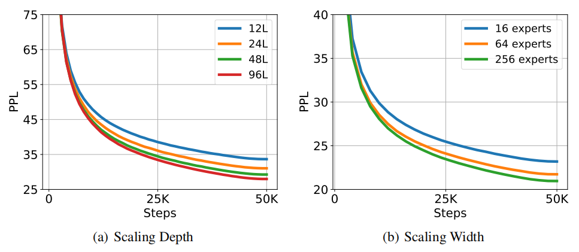
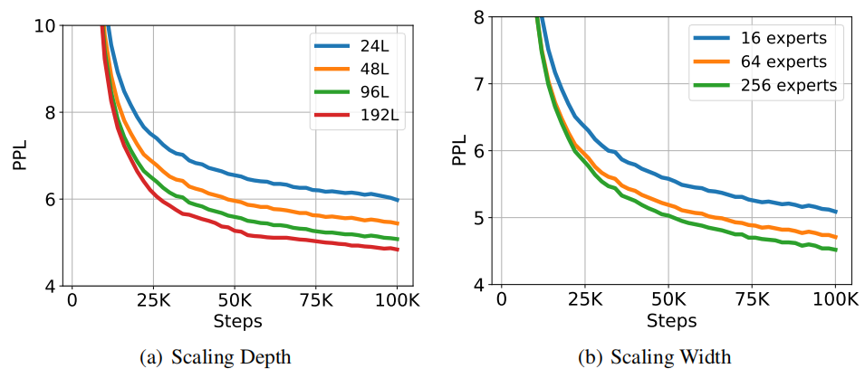
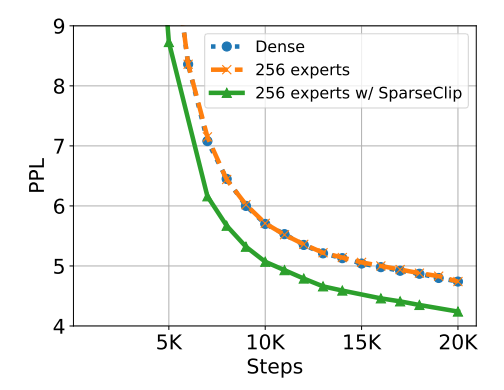
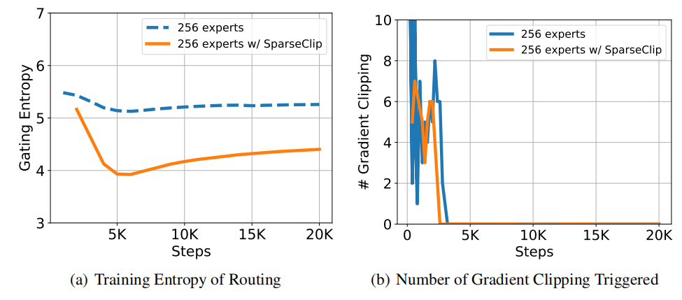
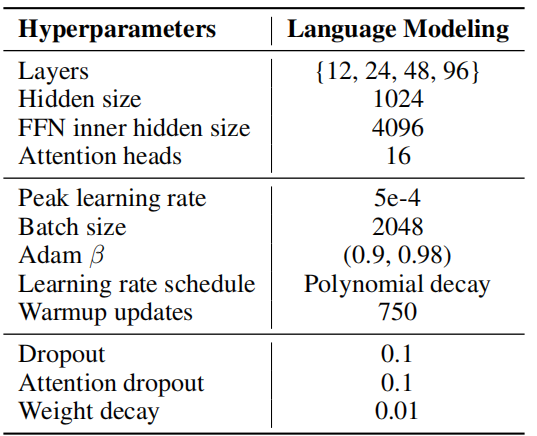
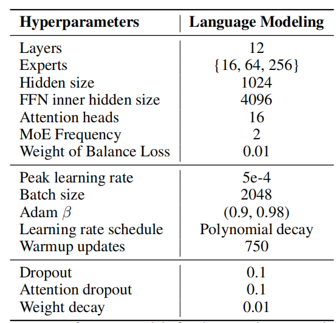
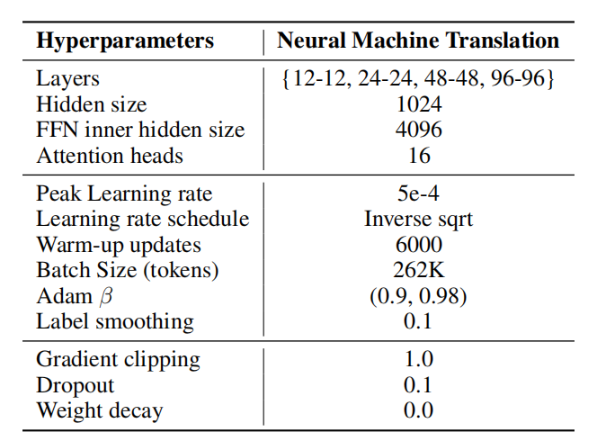
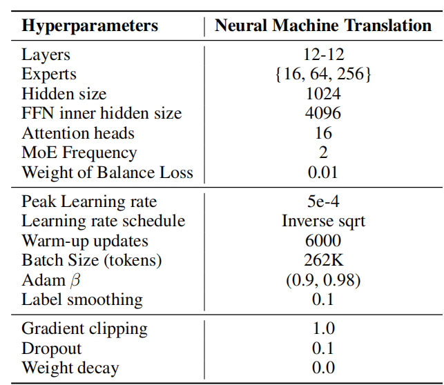

# TORCHSCALE: Transformers at Scale
TORCHSCALE：规模化的Transformers 2022.11.23 https://arxiv.org/abs/2211.13184

## Abstract
Large Transformers have achieved state-of-the-art performance across many tasks. Most open-source libraries on scaling Transformers focus on improving training or inference with better parallelization. In this work, we present TORCHSCALE, an open-source toolkit that allows researchers and developers to scale up Transformers efficiently and effectively. TORCHSCALE has the implementation of several modeling techniques, which can improve modeling generality and capability, as well as training stability and efficiency. Experimental results on language modeling and neural machine translation demonstrate that TORCHSCALE can successfully scale Transformers to different sizes without tears. The library is available at https://github.com/microsoft/torchscale. 

大型Transformers在许多任务中都取得了最先进的性能。 大多数关于 缩放Transformers 的开源库都专注于通过更好的并行化来改进训练或推理。 在这项工作中，我们展示了 TORCHSCALE，这是一个开源工具包，它允许研究人员和开发人员高效且有效地扩展 Transformers。 TORCHSCALE 实现了多种建模技术，可以提高建模的通用性和能力，以及训练的稳定性和效率。 语言建模和神经机器翻译的实验结果表明，TORCHSCALE 可以成功地将 Transformers 缩放到不同的大小而不会流泪。

## 1 TORCHSCALE: A Library for Transformers at (Any) Scale
Recently, there is a trend that the Transformers have become the de facto backbone across different areas, and their model sizes are growing large. Scaling Transformers brings more capacity and the convergence is much faster compared to the smaller models. More importantly, more emergent abilities are observed in the larger models, and they are unpredictable in the smaller models [Wei et al., 2022]. Therefore, both researchers and practitioners should benefit from a toolkit that can scale Transformers at any scale. While there are some toolkits on scaling Transformers, most of them focus on improving the parallelization of the systems, such as model parallelism [Shoeybi et al., 2019], pipeline parallelism [Huang et al., 2019], expert parallelism [Lepikhin et al., 2021], and optimizer parallelism [Rajbhandari et al., 2020]. Different from them, TORCHSCALE improves the scalability of Transformers from the modeling perspective. It implements several modeling techniques that can improve generality, stability, and efficiency during scaling up the model size.

最近有一种趋势，Transformers 已经成为跨领域事实上的骨干力量，而且它们的模型尺寸越来越大。 与较小的模型相比，放大 Transformers 带来更多的容量并且收敛速度更快。 更重要的是，在较大的模型中观察到更多的涌现能力，而在较小的模型中它们是不可预测的 [Wei et al., 2022]。 因此，研究人员和从业者都应该受益于可以在任何规模上扩展 Transformers 的工具包。 虽然有一些用于扩展 Transformers 的工具包，但它们中的大多数都专注于提高系统的并行化，例如模型并行性 [Shoeybi et al., 2019]、管道并行性 [Huang et al., 2019]、专家并行性 [Lepikhin al., 2021]，以及优化器并行性 [Rajbhandari et al., 2020]。 与它们不同的是，TORCHSCALE从建模的角度提升了Transformers的可扩展性。 它实施了多种建模技术，可以在扩大模型大小时提高通用性、稳定性和效率。
<!-- 并行能力：模型，管道，专家，优化器 -->

### 1.1 Generality
There are multiple Transformer [Vaswani et al., 2017] variants for different tasks, including Post-LN, Pre-LN, and so on. TORCHSCALE adopts Magneto [Wang et al., 2022b] as the default backbone. Magneto is a foundation Transformer for general-purpose modeling, which serves as a go-to architecture for various tasks and modalities. With one unified architecture, this allows TORCHSCALE to support different applications, including language modeling, machine translation, vision pretraining, speech recognition, and multi-modal pretraining. Magneto is simple and efficient. Compared to Pre-LN, Magneto introduces an extra LayerNorm into each sublayer. We refer more details to Wang et al. [2022b]. TORCHSCALE has the implementation of encoder, decoder, and encoder-decoder architectures for different tasks.

有多个 Transformer [Vaswani et al., 2017] 变体用于不同的任务，包括 Post-LN、Pre-LN 等。 TORCHSCALE 采用 Magneto [Wang et al., 2022b] 作为默认主干。 Magneto 是通用建模的基础 Transformer，可作为各种任务和模式的首选架构。 通过一个统一的架构，这使得 TORCHSCALE 能够支持不同的应用程序，包括语言建模、机器翻译、视觉预训练、语音识别和多模态预训练。 Magneto 简单高效，与 Pre-LN 相比，Magneto 在每个子层中引入了额外的 LayerNorm。 我们将更多细节参考 Wang et al. [2022b]。 TORCHSCALE 具有针对不同任务的编码器、解码器和编码器-解码器架构的实现。

### 1.2 Stability
As the model grows, one problem is that Transformers are more unstable in optimization. The models can diverge at any time during the training. This requires lots of computation and human efforts to tune and test the models. To get rid of the pain when scaling up the models, TORCHSCALE follows the theoretical derivation of DeepNet [Wang et al., 2022a] to improve the training stability. Specifically, we implement the initialization method of Sub-LN for Magneto. Besides, as an alternative, we also implement the DeepNorm from DeepNet, which can fundamentally improve the optimization of Post-LN Transformers. With better stability, the models accept larger learning rate as well as more diverse data that may contain some noise. Moreover, it enables some modeling techniques that might bring stability issues.

随着模型的增长，一个问题是 Transformers 在优化上更加不稳定。 在训练期间，模型可以随时发散。 这需要大量的计算和人力来调整和测试模型。 为了摆脱放大模型时的痛苦，TORCHSCALE 遵循 DeepNet [Wang et al., 2022a] 的理论推导，以提高训练稳定性。 具体来说，我们实现了 Magneto 的 Sub-LN 的初始化方法。 此外，作为替代方案，我们还实现了 DeepNet 的 DeepNorm，这可以从根本上改善 Post-LN Transformers 的优化。 具有更好的稳定性，模型接受更大的学习率以及可能包含一些噪声的更多样化的数据。 此外，它还启用了一些可能带来稳定性问题的建模技术。

### 1.3 Efficiency
One mainstream of scaling Transformers is the mixture-of-experts (MoE) model. MoE models introduce the sparsity to Transformers, which proves to be both effective and efficient. TORCHSCALE implement X-MoE [Chi et al., 2022], a variant of sparse MoE model. It leverages the sparsity of mixture-of-experts while preserving the transferability of Transformers by mitigating the representation collapse problem of the sparse MoE models. TORCHSCALE supports both Top-1 and Top-2 routing algorithms, which balance the performance and the computation cost. This allows Transformers to scale up to billions or trillions of parameters without much additional computation cost. In our preliminary experiments, we observe that gradient clipping plays an important role in the performance of sparse MoE models. We propose a novel gradient clipping method, called SparseClip, which improves the training stability while preserving the performance of the sparse models. 

扩展 Transformers 的一种主流是专家混合 (MoE) 模型。 MoE模型 将稀疏性引入Transformers，事实证明这既有效又高效。 TORCHSCALE 实现 X-MoE [Chi et al., 2022]，一种 稀疏MoE 模型的变体。 它利用混合专家的稀疏性，同时通过减轻 稀疏MoE 模型的表示崩溃问题来保留 Transformer 的可转移性。 TORCHSCALE 支持 Top-1 和 Top-2 路由算法，平衡了性能和计算成本。 这允许 Transformers 扩展到数十亿或数万亿个参数，而无需太多额外的计算成本。 在我们的初步实验中，我们观察到梯度裁剪在 稀疏MoE 模型的性能中起着重要作用。 我们提出了一种新的梯度裁剪方法，称为 SparseClip，它可以提高训练稳定性，同时保持稀疏模型的性能。

## 2 Scaling Up Experiments 
We conduct experiments on language modeling and neural machine translation. With TORCHSCALE, we train the models with the architectures of both decoder and encoder-decoder. We further scale up their depths and widths to evaluate the stability and convergence.

我们对语言建模和神经机器翻译进行了实验。 使用 TORCHSCALE，我们使用解码器和编码器-解码器的架构来训练模型。 我们进一步扩大它们的深度和宽度来评估稳定性和收敛性。

### 2.1 Language Modeling
The experiments on language modeling are performed on an English-language corpus, which is a subset of the data from Liu et al. [2019] and the English portion of CC100 corpus [Conneau et al., 2020]. The validation data is randomly sampled from the same corpus. We preprocess the data with the GPT-2 [Radford et al., 2019] tokenizer. We train the models with a batch size of 2048 samples. Each sample contains 128 tokens. The models are trained for 50 thousand steps with up to 13 billion tokens in total. More training details are in the appendix. 

语言建模实验是在英语语料库上进行的，它是 Liu et al. [2019]的数据的一个子集 和 CC100 语料库的英文部分 [Conneau et al., 2020]。 验证数据是从同一个语料库中随机抽取的。 我们使用 GPT-2 [Radford et al., 2019] 分词器对数据进行预处理。 我们以 2048 个样本的批量大小训练模型。 每个样本包含 128 个令牌。 这些模型训练了 5 万步，总共有多达 130 亿个令牌。 更多训练细节在附录中。

We start from a Magneto model with 12 decoder layers, 1024 hidden size, and 16 attention heads, and further scale its depth from 12L to 24L, 48L, and 96L. We evaluate their perplexity (PPL) on the validation set and plot the curves in Figure 1(a). It shows that TORCHSCALE can successfully scale up the depth. With better training stability, the convergence is smooth regardless of the depth. Moreover, the expressive power grows as the models deepen, resulting in better validation PPL.

我们从具有 12层解码器、1024隐藏大小和 16个注意力头的 Magneto 模型开始，并将其深度从 12L 进一步扩展到 24L、48L 和 96L。 我们在验证集上评估他们的困惑度 (PPL) 并绘制图 1(a) 中的曲线。 它表明 TORCHSCALE 可以成功地按比例放大深度。 具有更好的训练稳定性，无论深度如何，收敛都很平滑。 此外，表达能力随着模型的加深而增强，从而产生更好的验证 PPL。

 
Figure 1: Scaling-up experiments on language modeling.
图 1：语言建模的扩展实验。

In addition to the depth, we also scale the width. To scale it up efficiently, we replace the feed-forward layers with the X-MoE layers and gradually increase the number of experts from 16 experts to 64experts and 256 experts. We use top-2 routing as it produces better results in our preliminary experiments. Figure 1(b) summarizes the results of the sparse MoE models. Although a larger model size brings more challenges in optimization, TORCHSCALE can still successfully train a model with 256 experts and up to 13B parameters, outperforming the models with a smaller size. This proves the effectiveness of TORCHSCALE to train the Transformers at any scale.

除了深度，我们还缩放宽度。 为了有效地扩大规模，我们用 X-MoE 层替换前馈层，并逐渐将专家数量从 16 名专家增加到 64 名专家和 256 名专家。 我们使用 top-2 路由，因为它在我们的初步实验中产生了更好的结果。 图 1(b) 总结了 稀疏MoE 模型的结果。 尽管更大的模型尺寸带来更多的优化挑战，但 TORCHSCALE 仍然可以成功地训练出具有 256 个专家和多达 13B 个参数的模型，优于更小尺寸的模型。 这证明了 TORCHSCALE 在任何规模下训练 Transformers 的有效性。

### 2.2 Neural Machine Translation
We evaluate TORCHSCALE on neural machine translation. The experiments are conducted using a combination of CCMatrix [Schwenk et al., 2021], CCAligned [El-Kishky et al., 2020], OPUS [Zhang et al., 2020], and Tatoeba(2 https://tatoeba.org/en/ ). The final data consists of 102 languages, 1932 directions, and 12B sentence pairs. We tokenize the data with the SentencePiece model provided by the Flores-101 dataset [Goyal et al., 2021]. We use a batch size of 262K tokens to train the model for 100K steps. More details can be found in the appendix.

我们在神经机器翻译上评估 TORCHSCALE。 实验是使用 CCMatrix [Schwenk et al., 2021]、CCAligned [El-Kishky et al., 2020]、OPUS [Zhang et al., 2020] 和 Tatoeba (2 https://tatoeba.org/en/ ）。 最终数据由102种语言、1932个方向、12B个句对组成。 我们使用 Flores-101 数据集 [Goyal et al., 2021] 提供的 SentencePiece 模型对数据进行令牌。 我们使用 262K 令牌的批量大小来训练模型 100K 步。 可以在附录中找到更多详情。

With TORCHSCALE, we implement a Magneto model in the architecture of encoder-decoder. The model has a 12-layer encoder and a 12-layer decoder with 1024 hidden dimension, 16 heads, and 4096 intermediate dimension of feed-forward layers. Similar to the experiments on language modeling, we scale the number of layers from 12L-12L to 24L-24L, 48L-48L, and 96L-96L. Figure 2(a) shows that the training of these models is stable. More importantly, better performance can be achieved as the model grows. This proves that TORCHSCALE can fully use the capacity of a larger model.

通过 TORCHSCALE，我们在编码器-解码器架构中实现了 Magneto 模型。 该模型有一个 12 层编码器和一个 12 层解码器，具有 1024 个隐藏维度、16 个头和 4096 个前馈层中间维度。 与语言建模实验类似，我们将层数从 12L-12L 扩展到 24L-24L、48L-48L 和 96L-96L。 图 2(a) 显示这些模型的训练是稳定的。 更重要的是，随着模型的增长，可以获得更好的性能。 这证明 TORCHSCALE 可以充分利用更大模型的容量。

 
Figure 2: Scaling-up experiments on neural machine translation.
图 2：神经机器翻译的放大实验。

We also evaluate the sparse X-MoE models with top-2 routing. Figure 2(b) illustrates the scaling curves from 16 experts, 64 experts, to 256 experts. TORCHSCALE can effectively scale up the number of experts, reaching a significant improvement over the smaller models. Notably, the training flops are almost the same among these models, proving the efficiency of TORCHSCALE.

我们还评估了具有 top-2 路由的稀疏 X-MoE 模型。 图 2(b) 说明了从 16 位专家、64 位专家到 256 位专家的缩放曲线。 TORCHSCALE 可以有效地扩大专家的数量，与较小的模型相比有显著的改进。 值得注意的是，这些模型的训练失误几乎相同，证明了 TORCHSCALE 的效率。

### 2.3 SparseClip: Gradient Clipping for Sparse MoE Models
Gradient clipping is standard practice for deep neural models to alleviate the gradient explosion problem. It is even more important for the sparse MoE models, which are more unstable in training. 

梯度裁剪是深度神经模型缓解梯度爆炸问题的标准做法。 对于 稀疏MoE 模型来说更为重要，因为它们在训练中更不稳定。

Vanilla gradient clipping can be formulated as: 

Vanilla 梯度裁剪可以表示为：

$g ← \frac{ξ}{max(ξ, ||g||_2)}g$, (1) 

where ξ is a hyper-parameter to control the strength of clipping. It scales the model’s gradient g when its L2 norm $||g||_2$ exceeds ξ. For the sparse MoE models, the gradient norm is computed as: 

其中 ξ 是控制裁剪强度的超参数。 当 L2 范数 $||g||_2$ 超过 ξ 时，它会缩放模型的梯度 g。 对于稀疏的 MoE 模型，梯度范数计算如下：

$||g||_2 = || (g_d, g_s) ||_2$, (2) 

where $g_d$ is the gradients of the dense part and $g_s$ is the gradients of the MoE parameters.
其中 $g_d$ 是密集部分的梯度，$g_s$ 是 MoE 参数的梯度。

It is natural to directly combine the gradients of two parts before computing the L2 norm of the whole model. However, when the MoE models grow, the MoE gradients become to dominate the gradient norm, making the gradient direction inaccurate after clipping the gradients. We conduct experiments to compare a 256-expert model with its dense counterpart, which both use the vanilla gradient clipping during training. Figure 3 shows that the convergence of the 256-expert model has no significant difference with the dense model, despite the fact that it has over 100x parameters than the dense model. It proves that the vanilla gradient clipping hurts the sparse MoE models, limiting their scaling to larger model sizes. Meanwhile, removing gradient clipping is infeasible as it will destabilize the model training and results in divergence at the beginning of training.

在计算整个模型的 L2 范数之前，直接合并两部分的梯度是很自然的。 然而，当 MoE 模型增长时，MoE 梯度开始主导梯度范数，导致梯度剪裁后梯度方向不准确。 我们进行实验以比较 256 位专家模型与其密集对应模型，它们在训练期间都使用普通梯度裁剪。 图3 显示 256 位专家模型的收敛性与密集模型没有显著差异，尽管它的参数比密集模型多 100 倍。 它证明普通梯度裁剪会损害稀疏的 MoE 模型，限制它们缩放到更大的模型尺寸。 同时，去除梯度裁剪是不可行的，因为它会破坏模型训练并导致训练开始时发散。

 
Figure 3: Training curves on neural machine translation. SparseClip significantly improves the convergence of the sparse MoE models.
图 3：神经机器翻译的训练曲线。 SparseClip 显著提高了 稀疏MoE 模型的收敛性。

To deal with this problem, we propose SparseClip, which re-weights the gradients of MoE parameters when computing the gradient norm. Specifically, the gradient norm can be calculated as: 

为了解决这个问题，我们提出了 SparseClip，它在计算梯度范数时重新加权 MoE 参数的梯度。 具体来说，梯度范数可以计算为：

$||g||_2 = || (g_d, κg_s) ||_2$, (3) 

$ κ = \frac{1}{\sqrt{E}}$ , (4) 

where E is the number of experts for sparse MoE models. This can mitigate the domination of the MoE gradients, making the total gradient norm nearly constant with the increase of experts.

其中 E 是 稀疏MoE 模型的专家数量。 这可以减轻 MoE 梯度的支配，使总梯度范数随着专家的增加几乎保持不变。

Figure 3 compares SparseClip with vanilla gradient clipping. It shows that Sparseclip significantly outperforms the vanilla gradient clipping, leading to a lower PPL. This verifies the effectiveness of our SparseClip method.

图 3 将 SparseClip 与普通梯度裁剪进行了比较。 它表明 Sparseclip 明显优于普通梯度裁剪，从而导致较低的 PPL。 这验证了我们的 SparseClip 方法的有效性。

We further perform some visualizations of SparseClip and the vanilla gradient clipping. Figure 4(a) is the training entropy of routing. It shows that SparseClip has lower entropy than the vanilla gradient clipping, indicating that SparseClip improves the routing of MoE layers. Figure 4(b) illustrates the number of gradient clippings. While gradient clipping is triggered only at the beginning of the training, it is interesting that it has a great effect on the performance throughout the training. We leave further research on it in the future work. 

我们进一步对 SparseClip 和普通梯度裁剪进行了一些可视化。 图4(a)是路由的训练熵。 它表明 SparseClip 的熵低于普通梯度裁剪，表明 SparseClip 改进了 MoE 层的路由。 图 4(b) 说明了梯度剪裁的数量。 虽然梯度裁剪仅在训练开始时触发，但有趣的是它对整个训练过程中的性能有很大影响。 我们在未来的工作中对其进行进一步的研究。

 
Figure 4: Visualization of SparseClip and vanilla gradient clipping on neural machine translation. 
图 4：神经机器翻译中 SparseClip 和普通梯度裁剪的可视化。

## 3 Conclusion
We introduce TORCHSCALE, an open-source toolkit that enables scaling Transformers both efficiently and effectively. It implements several state-of-the-art modeling techniques, originally from Magneto, DeepNet, and X-MoE, to improve modeling generality and capability, as well as training stability and efficiency. TORCHSCALE adopts a novel gradient clipping method, called SparseClip, which can further improve the stability while preserving the performance of large sparse models. The evaluations on language modeling and machine translation demonstrate that TORCHSCALE allows scaling Transformers at different model sizes.

我们介绍了 TORCHSCALE，这是一个开源工具包，可以高效且有效地扩展 Transformers。 它实现了几种最先进的建模技术，这些技术最初来自 Magneto、DeepNet 和 X-MoE，以提高建模的通用性和能力，以及训练的稳定性和效率。 TORCHSCALE 采用了一种新颖的梯度裁剪方法，称为 SparseClip，可以在保持大型稀疏模型性能的同时进一步提高稳定性。 对语言建模和机器翻译的评估表明，TORCHSCALE 允许以不同的模型大小缩放 Transformers。

## References
* Zewen Chi, Li Dong, Shaohan Huang, Damai Dai, Shuming Ma, Barun Patra, Saksham Singhal, Payal Bajaj, Xia Song, and Furu Wei. On the representation collapse of sparse mixture of experts. CoRR, abs/2204.09179, 2022. 
* Alexis Conneau, Kartikay Khandelwal, Naman Goyal, Vishrav Chaudhary, Guillaume Wenzek, Fran￾cisco Guzmán, Edouard Grave, Myle Ott, Luke Zettlemoyer, and Veselin Stoyanov. Unsupervised cross-lingual representation learning at scale. In Dan Jurafsky, Joyce Chai, Natalie Schluter, and Joel R. Tetreault, editors, ACL 2020, pages 8440–8451, 2020. 
* Ahmed El-Kishky, Vishrav Chaudhary, Francisco Guzmán, and Philipp Koehn. CCAligned: A massive collection of cross-lingual web-document pairs. In Bonnie Webber, Trevor Cohn, Yu￾lan He, and Yang Liu, editors, Proceedings of the 2020 Conference on Empirical Methods in Natural Language Processing, EMNLP 2020, Online, November 16-20, 2020, pages 5960–5969. Association for Computational Linguistics, 2020. 
* Naman Goyal, Cynthia Gao, Vishrav Chaudhary, Peng-Jen Chen, Guillaume Wenzek, Da Ju, Sanjana Krishnan, Marc’Aurelio Ranzato, Francisco Guzmán, and Angela Fan. The FLORES-101 evalua￾tion benchmark for low-resource and multilingual machine translation. CoRR, abs/2106.03193, 2021. 
* Yanping Huang, Youlong Cheng, Ankur Bapna, Orhan Firat, Dehao Chen, Mia Xu Chen, HyoukJoong Lee, Jiquan Ngiam, Quoc V. Le, Yonghui Wu, and Zhifeng Chen. Gpipe: Efficient training of giant neural networks using pipeline parallelism. In NeurIPS 2019, pages 103–112, 2019. 
* Dmitry Lepikhin, HyoukJoong Lee, Yuanzhong Xu, Dehao Chen, Orhan Firat, Yanping Huang, Maxim Krikun, Noam Shazeer, and Zhifeng Chen. Gshard: Scaling giant models with conditional computation and automatic sharding. In ICLR 2021, 2021. 
* Yinhan Liu, Myle Ott, Naman Goyal, Jingfei Du, Mandar Joshi, Danqi Chen, Omer Levy, Mike Lewis, Luke Zettlemoyer, and Veselin Stoyanov. Roberta: A robustly optimized BERT pretraining approach. CoRR, abs/1907.11692, 2019. 
* Gating Entropy # Gradient Clipping Alec Radford, Jeff Wu, Rewon Child, David Luan, Dario Amodei, and Ilya Sutskever. Language models are unsupervised multitask learners. OpenAI Blog, 2019. 
* Samyam Rajbhandari, Jeff Rasley, Olatunji Ruwase, and Yuxiong He. Zero: memory optimizations toward training trillion parameter models. In Christine Cuicchi, Irene Qualters, and William T. 
* Kramer, editors, Proceedings of the International Conference for High Performance Computing, Networking, Storage and Analysis, SC 2020, Virtual Event / Atlanta, Georgia, USA, November 9-19, 2020, page 20. IEEE/ACM, 2020. 
* Holger Schwenk, Guillaume Wenzek, Sergey Edunov, Edouard Grave, Armand Joulin, and Angela Fan. CCMatrix: Mining billions of high-quality parallel sentences on the web. In Chengqing Zong, Fei Xia, Wenjie Li, and Roberto Navigli, editors, Proceedings of the 59th Annual Meeting of the Association for Computational Linguistics and the 11th International Joint Conference on Natural Language Processing, ACL/IJCNLP 2021, (Volume 1: Long Papers), Virtual Event, August 1-6, 2021, pages 6490–6500. Association for Computational Linguistics, 2021. 
* Mohammad Shoeybi, Mostofa Patwary, Raul Puri, Patrick LeGresley, Jared Casper, and Bryan Catan￾zaro. Megatron-lm: Training multi-billion parameter language models using model parallelism. CoRR, abs/1909.08053, 2019. 
* Ashish Vaswani, Noam Shazeer, Niki Parmar, Jakob Uszkoreit, Llion Jones, Aidan N. Gomez, Lukasz Kaiser, and Illia Polosukhin. Attention is all you need. In NeurIPS 2017, pages 5998–6008, 2017. 
* Hongyu Wang, Shuming Ma, Li Dong, Shaohan Huang, Dongdong Zhang, and Furu Wei. DeepNet: Scaling transformers to 1,000 layers. CoRR, abs/2203.00555, 2022a. 
* Hongyu Wang, Shuming Ma, Shaohan Huang, Li Dong, Wenhui Wang, Zhiliang Peng, Yu Wu, Payal Bajaj, Saksham Singhal, Alon Benhaim, Barun Patra, Zhun Liu, Vishrav Chaudhary, Xia Song, and Furu Wei. Foundation transformers. CoRR, abs/2210.06423, 2022b. 
* Jason Wei, Yi Tay, Rishi Bommasani, Colin Raffel, Barret Zoph, Sebastian Borgeaud, Dani Yogatama, Maarten Bosma, Denny Zhou, Donald Metzler, Ed H. Chi, Tatsunori Hashimoto, Oriol Vinyals, Percy Liang, Jeff Dean, and William Fedus. Emergent abilities of large language models. CoRR, abs/2206.07682, 2022. 
* Biao Zhang, Philip Williams, Ivan Titov, and Rico Sennrich. Improving massively multilingual neural machine translation and zero-shot translation. In ACL 2020, pages 1628–1639. Association for Computational Linguistics, 2020.

## A Hyperparameters
 
Table 1: Hyperparameters of dense models for the experiments on language modeling.

 
Table 2: Hyperparameters of sparse models for the experiments on language modeling. 

 
Table 3: Hyperparameters for dense models for the experiments on neural machine translation.

 
Table 4: Hyperparameters for sparse models for the experiments on neural machine translation.
