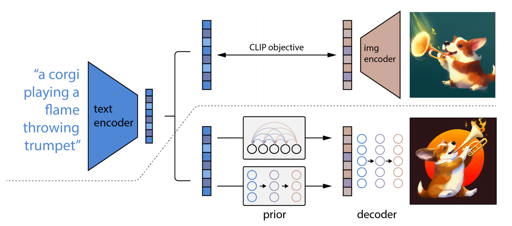

# Hierarchical Text-Conditional Image Generation with CLIP Latents
具有 CLIP 潜能的分层文本条件图像生成 2022.4.13 https://arxiv.org/abs/2204.06125

## Abstract
Contrastive models like CLIP have been shown to learn robust representations of images that capture both semantics and style. To leverage these representations for image generation, we propose a two-stage model: a prior that generates a CLIP image embedding given a text caption, and a decoder that generates an image conditioned on the image embedding. We show that explicitly generating image representations improves image diversity with minimal loss in photorealism and caption similarity. Our decoders conditioned on image representations can also produce variations of an image that preserve both its semantics and style, while varying the non-essential details absent from the image representation. Moreover, the joint embedding space of CLIP enables language-guided image manipulations in a zero-shot fashion. We use diffusion models for the decoder and experiment with both autoregressive and diffusion models for the prior, finding that the latter are computationally more efficient and produce higher-quality samples. 

像CLIP这样的对比模型已被证明可以学习捕获图像的语义和风格的稳健表示。 为了利用这些表示来生成图像，我们提出了一个两阶段模型：先在给定文本标题的情况下生成 CLIP 图像嵌入的先验模型，再以图像嵌入为条件生成图像的解码器。 我们表明，显式生成图像表示可以提高图像多样性，同时将真实感和字幕相似性的损失降到最低。 我们以图像表示为条件的解码器还可以生成图像的变体，同时保留其语义和风格，同时改变图像表示中不存在的非必要细节。 此外，CLIP 的联合嵌入空间能够以零样本的方式进行语言引导的图像操作。 我们对解码器使用扩散模型，并对先验模型使用自回归模型和扩散模型进行实验，发现后者在计算上更高效并产生更高质量的样本。

## 1 Introduction
Recent progress in computer vision has been driven by scaling models on large datasets of captioned images collected from the internet [10, 44, 60, 39, 31, 16]. Within this framework, CLIP [39] has emerged as a successful representation learner for images. CLIP embeddings have a number of desirable properties: they are robust to image distribution shift, have impressive zero-shot capabilities, and have been fine-tuned to achieve state-of-the-art results on a wide variety of vision and language tasks [45]. Concurrently, diffusion models [46, 48, 25] have emerged as a promising generative modeling framework, pushing the state-of-the-art on image and video generation tasks [11, 26, 24]. To achieve best results, diffusion models leverage a guidance technique [11, 24] which improves sample fidelity (for images, photorealism) at the cost of sample diversity.

计算机视觉的最新进展是由从互联网收集的带字幕图像的大型数据集上的缩放模型驱动的 [10、44、60、39、31、16]。 在这个框架内，CLIP [39] 已经成为一个成功的图像表示学习器。 CLIP 嵌入具有许多理想的特性：它们对图像分布偏移具有稳健性，具有令人印象深刻的零样本能力，并且经过微调以在各种视觉和语言任务上实现最先进的结果 [45]。 同时，扩散模型 [46、48、25] 已成为一种有前途的生成建模框架，推动了图像和视频生成任务的最新技术发展 [11、26、24]。 为了获得最佳结果，扩散模型利用引导技术 [11, 24]，以牺牲样本多样性为代价提高样本保真度(对于图像，照片级真实感)。

Figure 1: Selected 1024 × 1024 samples from a production version of our model. 
图1：从我们模型的生产版本中选择的 1024 × 1024 样本。

In this work, we combine these two approaches for the problem of text-conditional image generation. We first train a diffusion decoder to invert the CLIP image encoder. Our inverter is non-deterministic, and can produce multiple images corresponding to a given image embedding. The presence of an encoder and its approximate inverse (the decoder) allows for capabilities beyond text-to-image translation. As in GAN inversion [62, 55], encoding and decoding an input image produces semantically similar output images (Figure 3). We can also interpolate between input images by inverting interpolations of their image embeddings (Figure 4). However, one notable advantage of using the CLIP latent space is the ability to semantically modify images by moving in the direction of any encoded text vector (Figure 5), whereas discovering these directions in GAN latent space involves luck and diligent manual examination. Furthermore, encoding and decoding images also provides us with a tool for observing which features of the image are recognized or disregarded by CLIP.

在这项工作中，我们结合这两种方法来解决文本条件图像生成问题。 我们首先训练一个扩散解码器来反转 CLIP 图像编码器。 我们的反相器是非确定性的，可以产生与给定图像嵌入相对应的多个图像。 编码器及其近似逆(解码器)的存在允许超越文本到图像翻译的能力。 与 GAN 反转 [62、55] 一样，对输入图像进行编码和解码会产生语义相似的输出图像(图3)。 我们还可以通过反转图像嵌入的插值来在输入图像之间进行插值(图4)。 然而，使用 CLIP 潜在空间的一个显著优势是能够通过沿任何编码文本向量的方向移动来语义修改图像(图5)，而在 GAN 潜在空间中发现这些方向需要运气和勤奋的人工检查。 此外，编码和解码图像还为我们提供了一种工具，用于观察图像的哪些特征被 CLIP 识别或忽略。

 
Figure 2: A high-level overview of unCLIP. Above the dotted line, we depict the CLIP training process, through which we learn a joint representation space for text and images. Below the dotted line, we depict our text-to-image generation process: a CLIP text embedding is first fed to an autoregressive or diffusion prior to produce an image embedding, and then this embedding is used to condition a diffusion decoder which produces a final image. Note that the CLIP model is frozen during training of the prior and decoder. 
图2：unCLIP 的高级概述。 在虚线上方，我们描绘了 CLIP 训练过程，通过它我们学习了文本和图像的联合表示空间。 在虚线下方，我们描述了文本到图像的生成过程：在生成图像嵌入之前，首先将 CLIP 文本嵌入输入到自回归或扩散，然后该嵌入用于调节扩散解码器，从而产生最终的 图像。 请注意，CLIP 模型在先验和解码器的训练过程中被冻结。

To obtain a full generative model of images, we combine the CLIP image embedding decoder with a prior model, which generates possible CLIP image embeddings from a given text caption. We compare our text-to-image system with other systems such as DALL-E [40] and GLIDE [35], finding that our samples are comparable in quality to GLIDE, but with greater diversity in our generations. We also develop methods for training diffusion priors in latent space, and show that they achieve comparable performance to autoregressive priors, while being more compute-efficient. We refer to our full text-conditional image generation stack as unCLIP, since it generates images by inverting the CLIP image encoder. 

为了获得完整的图像生成模型，我们将 CLIP 图像嵌入解码器与先验模型相结合，后者从给定的文本标题生成可能的 CLIP 图像嵌入。 我们将我们的文本到图像系统与 DALL-E [40] 和 GLIDE [35] 等其他系统进行比较，发现我们的样本在质量上与 GLIDE 相当，但在我们这一代人中具有更大的多样性。 我们还开发了在潜在空间中训练扩散先验的方法，并表明它们实现了与自回归先验相当的性能，同时计算效率更高。 我们将全文条件图像生成堆栈称为 unCLIP，因为它通过反转 CLIP 图像编码器来生成图像。

## 2 Method
Our training dataset consists of pairs (x, y) of images x and their corresponding captions y. Given an image x, let $z_i$ and $z_t$ be its CLIP image and text embeddings, respectively. We design our generative stack to produce images from captions using two components:
* A prior $P(z_i|y)$ that produces CLIP image embeddings $z_i$ conditioned on captions y. 
* A decoder $P(x|z_i , y)$ that produces images x conditioned on CLIP image embeddings $z_i$ (and optionally text captions y).

我们的训练数据集由图像x及其对应的字幕y的对(x，y)组成。给定图像x，让$z_i$和$z_t$分别作为其CLIP图像和文本嵌入。我们设计生成堆栈，使用两个组件从字幕生成图像：
* 一个先前的$P(z_i|y)$，它生成以字幕y为条件的CLIP图像嵌入$z_i$。
* 解码器$P(x|z_i , y)$，其产生基于CLIP图像嵌入$z_i$(以及可选的文本字幕y)的图像x。

The decoder allows us to invert images given their CLIP image embeddings, while the prior allows us to learn a generative model of the image embeddings themselves. Stacking these two components yields a generative model P(x|y) of images x given captions y: 

解码器允许我们在给定CLIP图像嵌入的情况下反转图像，而先前的解码器允许我们学习图像嵌入本身的生成模型。堆叠这两个分量产生图像x给定字幕y的生成模型P(x|y)：

$P(x|y) = P(x, z_i|y) = P(x|z_i , y)P(z_i|y)$.

The first equality holds because $z_i$ is a deterministic function of x. The second equality holds because of the chain rule. Thus, we can sample from the true conditional distribution P(x|y) by first sampling $z_i$ using the prior, and then sampling x using the decoder. In the following sections, we describe our decoder and prior stacks. For training details and hyperparameters, refer to Appendix C.

第一个等式成立，因为$z_i$是x的确定函数。第二个等式成立是因为链式规则。因此，我们可以通过首先使用先验采样$z_i$，然后使用解码器采样x，从真实条件分布P(x|y)采样。在下面的部分中，我们将描述我们的解码器和先前的堆栈。有关训练详情和超参数，请参阅附录C。

### 2.1 Decoder
We use diffusion models [25, 48] to produce images conditioned on CLIP image embeddings (and optionally text captions). Specifically, we modify the architecture described in Nichol et al. (2021) by projecting and adding CLIP embeddings to the existing timestep embedding, and by projecting CLIP embeddings into four extra tokens of context that are concatenated to the sequence of outputs from the GLIDE text encoder. We retained the text conditioning pathway present in the original GLIDE model, hypothesizing that it could allow the diffusion model to learn aspects of natural language that CLIP fails to capture (e.g. variable binding), but find that it offers little help in this regard (Section 7).

我们使用扩散模型[25，48]来生成基于CLIP图像嵌入(以及可选的文本字幕)的图像。具体来说，我们修改了Nicholet al (2021)描述的架构，方法是将CLIP嵌入投影到现有的时间步长嵌入中，并将CLIP嵌入式投影到连接到GLIDE文本编码器输出序列的四个额外上下文标记中。我们保留了原始GLIDE模型中存在的文本条件调节路径，假设它可以允许扩散模型学习CLIP无法捕获的自然语言方面(例如变量绑定)，但发现它在这方面几乎没有帮助(第7节)。

While we can sample from the conditional distribution of the decoder directly, past work using diffusion models shows using guidance on the conditioning information [11, 24, 35] improves sample quality a lot. We enable classifier-free guidance [24] by randomly setting the CLIP embeddings to zero (or a learned embedding) 10% of the time, and randomly dropping the text caption 50% of the time during training.

虽然我们可以直接从解码器的条件分布进行采样，但过去使用扩散模型的工作表明，使用条件信息的指导[11，24，35]大大提高了采样质量。我们通过在10%的时间内将CLIP嵌入随机设置为零(或学习嵌入)，并在训练期间50%的时间内随机丢弃文本标题，来实现无分类器指导[24]。

To generate high resolution images, we train two diffusion upsampler models [34, 43]: one to upsample images from 64×64 to 256×256 resolution, and another to further upsample those to 1024×1024 resolution. To improve the robustness of our upsamplers, we slightly corrupt the conditioning images during training. For the first upsampling stage, we use gaussian blur [43], and for the second, we use a more diverse BSR degradation [42, 59]. To reduce training compute and improve numerical stability, we follow Rombach et al. [42] and train on random crops of images that are one-fourth the target size. We use only spatial convolutions in the model (i.e., no attention layers) and at inference time directly apply the model at the target resolution, observing that it readily generalizes to the higher resolution. We found no benefit from conditioning the upsamplers on the caption, and use unconditional ADMNets [11] with no guidance.

为了生成高分辨率图像，我们训练了两个扩散上采样器模型[34，43]：一个将图像从64×64上采样到256×256分辨率，另一个将这些图像进一步上采样到1024×1024分辨率。为了提高上采样器的稳健性，我们在训练期间稍微破坏了条件图像。对于第一个上采样阶段，我们使用高斯模糊[43]，对于第二个，我们使用更多样的BSR退化[42，59]。为了减少训练计算并提高数值稳定性，我们遵循Rombachet al [42]的方法，对目标大小四分之一的随机图像进行训练。我们在模型中仅使用空间卷积(即，没有注意层)，并且在推断时直接以目标分辨率应用模型，观察到它很容易推广到更高的分辨率。我们发现在字幕上调整上采样器没有任何好处，并且在没有指导的情况下使用无条件ADMNets[11]。

### 2.2 Prior
While a decoder can invert CLIP image embeddings $z_i$ to produce images x, we need a prior model that produces $z_i$ from captions y to enable image generations from text captions. We explore two different model classes for the prior model:
* Autoregressive (AR) prior: the CLIP image embedding $z_i$ is converted into a sequence of discrete codes and predicted autoregressively conditioned on the caption y. 
* Diffusion prior: The continuous vector $z_i$ is directly modelled using a Gaussian diffusion model conditioned on the caption y.

虽然解码器可以反转 CLIP 图像嵌入 $z_i$ 以生成图像 x，但我们需要一个从标题 y 生成 $z_i$ 的先前模型，以便从文本标题生成图像。我们探索了先前模型的两个不同模型类：
* 自回归 (AR) 先验：将嵌入 $z_i$ 的 CLIP 图像转换为一系列离散代码，并以标题 y 为条件进行自回归预测。
* 扩散先验：连续向量 $z_i$ 使用以标题 y 为条件的高斯扩散模型直接建模。

In addition to the caption, we can condition the prior on the CLIP text embedding $z_t$ since it is a deterministic function of the caption. To improve sample quality we also enable sampling using classifier-free guidance for both the AR and diffusion prior, by randomly dropping this text conditioning information 10% of the time during training.

除了标题之外，我们还可以在 CLIP 文本嵌入 $z_t$ 上对先验进行条件处理，因为它是标题的确定性函数。为了提高样本质量，我们还通过在训练期间 10% 的时间随机丢弃此文本条件信息，对 AR 和扩散先验使用无分类器指导进行采样。

To train and sample from the AR prior more efficiently, we first reduce the dimensionality of the CLIP image embeddings $z_i$ by applying Principal Component Analysis (PCA) [37]. In particular, we find that the rank of the CLIP representation space is drastically reduced when training CLIP with SAM [15] while slightly improving evaluation metrics. We are able to preserve nearly all of the information(2I.e., less than 1% average mean-squared error in reconstructing the image representations) by retaining only 319 principal components out of the original 1,024. After applying PCA, we order the principal components by decreasing eigenvalue magnitude, quantize each of the 319 dimensions into 1,024 discrete buckets, and predict the resulting sequence using a Transformer [53] model with a causal attention mask. This results in a threefold reduction in the number of tokens predicted during inference, and improves training stability.

为了更有效地从AR先验中训练和采样，我们首先通过应用主成分分析(PCA)来降低CLIP图像嵌入的维数$z_i$[37]。特别是，我们发现在使用SAM [15]训练CLIP时，CLIP表示空间的排名急剧降低，同时略微改进了评估指标。我们能够保留几乎所有信息(2即，重建图像表示时的平均均方误差小于1%)，只需保留原始1，024个主成分中的319个。应用 PCA 后，我们通过减小特征值幅度对主成分进行排序，将 319 个维度中的每一个量化为 1，024 个离散桶，并使用带有因果注意掩码的 Transformer [53] 模型预测结果序列。这导致推理期间预测的令牌数量减少了三倍，并提高了训练稳定性。

Figure 3: Variations of an input image by encoding with CLIP and then decoding with a diffusion model. The variations preserve both semantic information like presence of a clock in the painting and the overlapping strokes in the logo, as well as stylistic elements like the surrealism in the painting and the color gradients in the logo, while varying the non-essential details. 
图 3：使用 CLIP 编码然后使用扩散模型解码的输入图像的变化。这些变化既保留了语义信息，如绘画中时钟的存在和徽标中的重叠笔触，也保留了绘画中的超现实主义和徽标中的颜色渐变等风格元素，同时改变了不必要的细节。

We condition the AR prior on the text caption and the CLIP text embedding by encoding them as a prefix to the sequence. Additionally, we prepend a token indicating the (quantized) dot product between the text embedding and image embedding, $z_i · z_t$. This allows us to condition the model on a higher dot product, since higher text-image dot products correspond to captions which better describe the image. In practice, we find it beneficial to sample the dot product from the top half of the distribution.(3We swept over percentiles 50%, 70%, 85%, 95% and found 50% to be optimal in all experiments.)

我们通过将它们编码为序列的前缀来在文本标题和 CLIP 文本嵌入之前设置 AR。此外，我们在文本嵌入和图像嵌入之间预置一个标记，指示(量化)点积，$z_i ·z_t$。这使我们能够在更高的点积上对模型进行条件处理，因为较高的文本图像点积对应于更好地描述图像的标题。在实践中，我们发现从分布的上半部分对点积进行采样是有益的。(3我们扫过了50%、70%、85%、95%的百分位数，发现50%在所有实验中都是最优的。

For the diffusion prior, we train a decoder-only Transformer with a causal attention mask on a sequence consisting of, in order: the encoded text, the CLIP text embedding, an embedding for the diffusion timestep, the noised CLIP image embedding, and a final embedding whose output from the Transformer is used to predict the unnoised CLIP image embedding. We choose not to condition the diffusion prior on $z_i · z_t$ like in the AR prior; instead, we improve quality during sampling time by generating two samples of $z_i$ and selecting the one with a higher dot product with $z_t$. Instead of using the e-prediction formulation from Ho et al. [25], we find it better to train our model to predict the unnoised $z_i$ directly, and use a mean-squared error loss on this prediction:

对于扩散先验，我们训练一个仅解码器的转换器，其序列上的因果注意力掩码依次由以下顺序组成：编码文本、CLIP 文本嵌入、扩散时间步的嵌入、噪声 CLIP 图像嵌入和最终嵌入，其转换器输出用于预测未噪声的 CLIP 图像嵌入。我们选择不对扩散进行条件化，先于 $z_i ·z_t $ 就像之前的 AR 一样;相反，我们通过生成两个 $z_i$ 样本并选择具有较高点积的样本和 $z_t$ 来提高采样期间的质量。与其使用Hoet al [25]的e预测公式，我们发现最好训练我们的模型直接预测无噪声的$z_i$，并在此预测中使用均方误差损失：

$L_{prior} = E_{t∼[1,T],z_i^{(t)}∼qt}  [ || fθ(z_i(t) , t, y) − z_ik || ^2  ]$

Figure 4: Variations between two images by interpolating their CLIP image embedding and then decoding with a diffusion model. We fix the decoder seed across each row. The intermediate variations naturally blend the content and style from both input images. 
图 4：通过插值其 CLIP 图像嵌入然后使用扩散模型解码来说明两个图像之间的差异。我们在每行中修复解码器种子。中间变体自然地融合了两个输入图像的内容和样式。

## 3 Image Manipulations 图像处理
Our approach allows us to encode any given image x into a bipartite latent representation $(z_i , x_T)$ that is sufficient for the decoder to produce an accurate reconstruction. The latent $z_i$ describes the aspects of the image that are recognized by CLIP, while the latent $x_T$ encodes all of the residual information necessary for the decoder to reconstruct x. The former is obtained by simply encoding the image with the CLIP image encoder. The latter is obtained by applying DDIM inversion (Appendix F in [11]) to x using the decoder, while conditioning on $z_i$ . We describe three different kinds of manipulations that are enabled by this bipartite representation.

我们的方法允许我们将任何给定的图像x编码为二分潜在表示$(z_i , x_T)$，这足以让解码器产生准确的重建。潜在 $z_i$ 描述 CLIP 识别的图像的各个方面，而潜在 $x_T$ 对解码器重建 x 所需的所有残差信息进行编码。前者是通过简单地使用CLIP图像编码器对图像进行编码而获得的。后者是通过使用解码器将DDIM反转([11]中的附录F)应用于x而获得的，同时以$z_i$为条件。我们描述了由这种二分表示实现的三种不同类型的操作。

### 3.1 Variations 变化
Given an image x, we can produce related images that share the same essential content but vary in other apects, such as shape and orientation (Figure 3). To do this, we apply the decoder to the bipartite representation ($z_i$ , $x_T$ ) using DDIM with η > 0 for sampling. With η = 0, the decoder becomes deterministic and will reconstruct the given image x. Larger values of η introduce stochasticity into successive sampling steps, resulting in variations that are perceptually “centered” around the original image x. As η increases, these variations tell us what information was captured in the CLIP image embedding (and thus is preserved across samples), and what was lost (and thus changes across the samples). 

给定一个图像 x，我们可以生成共享相同基本内容但在其他方面有所不同的相关图像，例如形状和方向(图 3)。为此，我们使用 DDIM 将解码器应用于二分表示($z_i$ ， $x_T$)，其中 η > 0 进行采样。当η = 0时，解码器变得确定性，并将重建给定的图像x。较大的η值会将随机性引入连续采样步骤，从而导致在感知上围绕原始图像x“居中”的变化。随着η的增加，这些变化告诉我们在 CLIP 图像嵌入中捕获了哪些信息(因此在样本中保留)，以及丢失了哪些信息(因此在样本之间发生了变化)。

### 3.2 Interpolations  插值
It is also possible to blend two images $x_1$ and $x_2$ for variations (Figure 4), traversing all of the concepts in CLIP’s embedding space that occur between them. To do this, we rotate between their CLIP embeddings $z_{i_1}$ and $z_{i_2}$ using spherical interpolation, yielding intermediate CLIP representations $z_{i_θ} = slerp(z_{i_1} , z_{i_2} , θ)$ as θ is varied from 0 to 1. There are two options for producing the intermediate DDIM latents along the trajectory. The first option involves interpolating between their DDIM inverted latents $x_{T_1}$ and $x_{T_2}$ (by setting $x_{T_θ} = slerp(x_{T_1} , x_{T_2} , θ))$, which yields a single trajectory whose endpoints reconstruct $x_1$ and $x_2$.The second option involves fixing the DDIM latent to a randomly-sampled value for all interpolates in the trajectory. This results in an infinite number of trajectories between $x_1$ and $x_2$, though the endpoints of these trajectories will generally no longer coincide with the original images. We use this approach in Figure 4.

还可以将两个图像$x_1$ 和 $x_2$ 混合以获得变体(图 4)，遍历 CLIP 嵌入空间中它们之间发生的所有概念。为此，我们使用球形插值在它们的 CLIP 嵌入 $z_{i_1}$ 和 $z_{i_2}$ 之间旋转，产生中间 CLIP 表示$z_{i_θ} = slerp(z_{i_1} ， z_{i_2} ， θ)$ 因为 θ 从 0 到 1 变化。沿轨迹生成中间 DDIM 潜伏位有两种选择。第一个选项涉及在它们的 DDIM 倒置潜伏$x_{T_1}$ 和 $x_{T_2}$ 之间进行插值(通过设置 $x_{T_θ} = slerp(x_{T_1} ， x_{T_2} ， θ))$，这会产生单个轨迹，其端点重建 $x_1$ 和 $x_2$。第二个选项涉及将潜伏的 DDIM 固定为轨迹中所有插值的随机采样值。这导致 $x_1$ 和 $x_2$ 之间的轨迹数量无限多，尽管这些轨迹的端点通常不再与原始图像重合。我们在图 4 中使用了这种方法。

Figure 5: Text diffs applied to images by interpolating between their CLIP image embeddings and a normalised difference of the CLIP text embeddings produced from the two descriptions. We also perform DDIM inversion to perfectly reconstruct the input image in the first column, and fix the decoder DDIM noise across each row.
图 5：通过在图像的 CLIP 图像嵌入和由两个描述生成的 CLIP 文本嵌入的规范化差异之间进行插值，应用于图像的文本差异。我们还执行 DDIM 反演以完美地重建第一列中的输入图像，并修复每行的解码器 DDIM 噪声。

### 3.3 Text Diffs
A key advantage of using CLIP compared to other models for image representations is that it embeds images and text to the same latent space, thus allowing us to apply language-guided image manipulations (i.e., text diffs), which we show in Figure 5. To modify the image to reflect a new text description y, we first obtain its CLIP text embedding $z_t$, as well as the CLIP text embedding $z_{t_0}$ of a caption describing the current image(4Instead of a description of the current image, we also experimented with using a dummy caption like “a photo” for the baseline, or removing it altogether. These also worked well). We then compute a text diff vector $z_d = norm(z_t − z_{t_0} )$ from these by taking their difference and normalizing. Now, we can rotate between the image CLIP embedding $z_i$ and the text diff vector $z_d$ using spherical interpolation, yielding intermediate CLIP representations $z_θ = slerp(z_i , z_d, θ)$, where θ is increased linearly from 0 to a maximum value that is typically in [0.25, 0.50]. We produce the final outputs by decoding the interpolates zθ, fixing the base DDIM noise to $x_T$ throughout the entire trajectory. 

与其他模型相比，使用 CLIP 进行图像表示的一个关键优势是，它将图像和文本嵌入到相同的潜在空间，从而允许我们应用语言引导的图像处理(即文本差异)，如图 5 所示。为了修改图像以反映新的文本描述y，我们首先获得其CLIP文本嵌入$z_t$，以及描述当前图像的标题的CLIP文本嵌入$z_{t_0}$(4除了当前图像的描述，我们还尝试使用虚拟标题(如“照片”作为基线， 或完全删除它。这些也很好用)。然后，我们通过取它们的差异并归一化来计算文本差异向量 $z_d = norm(z_t − z_{t_0} )$。现在，我们可以使用球形插值在图像 CLIP 嵌入 $z_i$ 和文本差异向量 $z_d$ 之间旋转，产生中间 CLIP 表示 $z_θ = slerp(z_i , z_d, θ)$，其中 θ 从 0 线性增加到最大值，通常为 [0.25， 0.50]。我们通过解码插值zθ来产生最终输出，在整个轨迹中将基本DDIM噪声固定为$x_T$。

## 4 Probing the CLIP Latent Space 探测 CLIP 潜在空间
Our decoder model provides a unique opportunity to explore CLIP latent space by allowing us to directly visualize what the CLIP image encoder is seeing. As an example use case, we can revisit cases where CLIP makes incorrect predictions, such as typographic attacks [20]. In these adversarial images, a piece of text is overlayed on top of an object, which causes CLIP to predict the object described by the text rather than the object depicted in the image. This piece of text essentially hides the original object in terms of output probabilities. In Figure 6, we show an example of this attack from [20], wherein an apple can be misclassified as an iPod. Surprisingly, we find that our decoder still generates pictures of apples with high probability even though the predicted probability of “Granny Smith” is near zero. Even more notable, the model never produces pictures of iPods, despite the very high relative predicted probability of this caption. 

我们的解码器模型提供了一个独特的机会来探索 CLIP 潜在空间，允许我们直接可视化 CLIP 图像编码器所看到的内容。作为样本用例，我们可以重新访问 CLIP 做出错误预测的情况，例如排版攻击 [20]。在这些对抗性图像中，一段文本叠加在对象之上，这会导致 CLIP 预测文本描述的对象，而不是图像中描述的对象。这段文字实质上隐藏了输出概率方面的原始对象。在图 6 中，我们展示了来自 [20] 的这种攻击的样本，其中苹果可能被错误地归类为 iPod。令人惊讶的是，我们发现我们的解码器仍然以很高的概率生成苹果图片，即使“史密斯奶奶”的预测概率接近于零。更值得注意的是，该模型从未产生iPod的图片，尽管这个标题的相对预测概率非常高。

Figure 6: Variations of images featuring typographic attacks [20] paired with the CLIP model’s predicted probabilities across three labels. Surprisingly, the decoder still recovers Granny Smith apples even when the predicted probability for this label is near 0%. We also find that our CLIP model is slightly less susceptible to the “pizza” attack than the models investigated in [20]. 
图 6：具有排版攻击 [20] 的图像变体与 CLIP 模型在三个标签上的预测概率配对。令人惊讶的是，即使该标签的预测概率接近 0%，解码器仍然会恢复 Granny Smith 苹果。我们还发现，与[20]中研究的模型相比，我们的CLIP模型对“披萨”攻击的影响略低。

PCA reconstructions offer another tool for probing the structure of the CLIP latent space. In Figure 7, we take the CLIP image embeddings of a handful of source images and reconstruct them with progressively more PCA dimensions, and then visualize the reconstructed image embeddings using our decoder with DDIM on a fixed seed. This allows us to see what semantic information the different dimensions encode. We observe that the early PCA dimensions preserve coarse-grained semantic information such as what types of objects are in the scene, whereas the later PCA dimensions encode finer-grained detail such as the shapes and exact form of the objects. For example, in the first scene, the earlier dimensions seem to encode that there is food and perhaps a container present, whereas the later dimensions encode tomatoes and a bottle specifically. Figure 7 also serves as a visualization of what the AR prior is modeling, since the AR prior is trained to explicitly predict these principal components in this order. 

PCA重建为探测CLIP潜在空间的结构提供了另一种工具。在图 7 中，我们获取少数源图像的 CLIP 图像嵌入，并使用逐渐增加的 PCA 维度重建它们，然后使用带有 DDIM 的解码器在固定种子上可视化重建的图像嵌入。这使我们能够看到不同维度编码的语义信息。我们观察到，早期的 PCA 维度保留了粗粒度的语义信息，例如场景中的对象类型，而后期的 PCA 维度编码了更细粒度的细节，例如对象的形状和确切形式。例如，在第一个场景中，早期维度似乎编码有食物，可能还有一个容器存在，而后面的维度专门编码西红柿和瓶子。图 7 还用作 AR 先验建模内容的可视化，因为 AR 先验经过训练，可以按此顺序显式预测这些主成分。

Figure 7: Visualization of reconstructions of CLIP latents from progressively more PCA dimensions (20, 30, 40, 80, 120, 160, 200, 320 dimensions), with the original source image on the far right. The lower dimensions preserve coarse-grained semantic information, whereas the higher dimensions encode finer-grained details about the exact form of the objects in the scene.
图 7：从逐渐增加的 PCA 维度(20、30、40、80、120、160、200、320 维度)重建 CLIP 潜伏的可视化，原始源图像位于最右侧。较低维度保留粗粒度语义信息，而较高维度则对场景中对象的确切形状的细粒度细节进行编码。

## 5 Text-to-Image Generation
### 5.1 Importance of the Prior 先验的重要性
Although we train a prior to generate CLIP image embeddings from captions, the prior is not strictly necessary for caption-to-image generation. For instance, our decoder can condition on both CLIP image embeddings and captions, but the CLIP image embedding is dropped 5% of the time during training in order to enable classifier-free guidance. Therefore, at sampling time, we can condition on only the caption, although this underperforms a model trained fully in this way (this model is GLIDE, and we do a thorough comparison with GLIDE in Sections 5.2 and 5.3). Another possibility is to feed the decoder the CLIP text embedding as if it were an image embedding, as previously observed [61, 54]. The first two rows of Figure 8 depicts samples obtained in these two ways; the third row depicts samples obtained with a prior. Conditioning the decoder on just the caption is clearly worst, but conditioning on text embeddings zero-shot does produce reasonable results. Building on this observation, another approach would be to train the decoder to condition on CLIP text embeddings [9] instead of CLIP image embeddings (although we would lose the capabilities mentioned in Section 4).

尽管我们训练先验以从字幕生成 CLIP 图像嵌入，但先验对于字幕到图像生成并不是绝对必要的。例如，我们的解码器可以同时对 CLIP 图像嵌入和字幕进行条件处理，但在训练期间，CLIP 图像嵌入有 5% 的时间被丢弃，以实现无分类器指导。因此，在采样时，我们只能对标题进行条件调整，尽管这表现不佳以这种方式完全训练的模型(该模型是 GLIDE，我们在 5.2 和 5.3 节中与 GLIDE 进行了彻底的比较)。另一种可能性是将CLIP文本嵌入提供给解码器，就好像它是图像嵌入一样，如前所述[61，54]。图 8 的前两行描述了以这两种方式获得的样品;第三行描述了使用先验获得的样本。仅根据标题对解码器进行条件处理显然是最糟糕的，但对文本嵌入零样本进行条件化确实会产生合理的结果。基于这一观察结果，另一种方法是训练解码器以 CLIP 文本嵌入 [9] 而不是 CLIP 图像嵌入为条件(尽管我们将失去第 4 节中提到的功能)。

To quantify the effectiveness of these alternate approaches, we train two models: a small decoder conditioned on CLIP text embeddings, and a small unCLIP stack (diffusion prior and decoder). We then compare samples from the text-embedding decoder, samples from the unCLIP stack, and samples obtained from feeding text embeddings to the unCLIP decoder zero-shot, sweeping across guidance scales for all models. We find that these approaches respectively score FIDs of 9.16, 7.99, and 16.55 on a test set, suggesting the unCLIP approach is best. We also run human evaluations comparing the first two settings, sweeping over sampling hyperparameters for each using our human evaluation proxy model (Appendix A). We find that humans prefer the full unCLIP stack 57.0% ± 3.1% of the time for photorealism and 53.1% ± 3.1% of the time for caption similarity.

为了量化这些替代方法的有效性，我们训练了两个模型：一个以CLIP文本嵌入为条件的小型解码器，以及一个小型unCLIP堆栈(扩散先验和解码器)。然后，我们比较来自文本嵌入解码器的样本、来自 unCLIP 堆栈的样本以及将文本嵌入馈送到 unCLIP 解码器零样本获得的样本，扫过所有模型的指导量表。我们发现这些方法在测试集上的FID得分分别为9.16、7.99和16.55，这表明unCLIP方法是最好的。我们还运行人工评估，比较前两个设置，使用我们的人工评估智能体模型(附录 A)扫描每个设置的采样超参数。我们发现，对于照片级真实感，人类更喜欢完整的unCLIP堆栈，57.0%±3.1%的时间，53.1%±3.1%的时间用于字幕相似性。

Figure 8: Samples using different conditioning signals for the same decoder. In the first row, we pass the text caption to the decoder, and pass a zero vector for the CLIP embedding. In the second row, we pass both the text caption and the CLIP text embedding of the caption. In the third row, we pass the text and a CLIP image embedding generated by an autoregressive prior for the given caption. Note that this decoder is only trained to do the text-to-image generation task (without the CLIP image representation) 5% of the time. 
图 8：对同一解码器使用不同调理信号的样本。在第一行中，我们将文本标题传递给解码器，并为 CLIP 嵌入传递一个零向量。在第二行中，我们传递文本标题和标题的 CLIP 文本嵌入。在第三行中，我们传递文本和由给定标题的自回归先验生成的 CLIP 图像嵌入。请注意，此解码器仅在 5% 的时间内训练为执行文本到图像生成任务(没有 CLIP 图像表示)。

Given the importance of the prior, it is worth evaluating different approaches for training it. We compare both the AR and diffusion priors throughout our experiments. In all cases (Sections 5.2, 5.4, and 5.5), we find that the diffusion prior outperforms the AR prior for comparable model size and reduced training compute.

鉴于先验的重要性，值得评估不同的训练方法。我们在整个实验中比较了AR和扩散先验。在所有情况下(第 5.2、5.4 和 5.5 节)，我们发现扩散先验在模型大小相当和训练计算减少方面优于 AR 先验。

### 5.2 Human Evaluations
We observe in Figure 1 that unCLIP is capable of synthesizing complex, realistic images. While we can compare sample quality to past models using FID, it is not always aligned with human judgment. To better gauge the generation capabilities of our system, we conduct systematic human evaluations comparing unCLIP to GLIDE for photorealism, caption similarity, and sample diversity.

We follow the protocol of Ramesh et al., Nichol et al. [40, 35] for the first two evaluations: for photorealism, users are presented with pairs of images and must choose which looks more photorealistic; for caption similarity, users are additionally prompted with a caption, and must choose which image better matches the caption. In both evaluations, there is a third “Not sure” option. For diversity, we propose a new evaluation protocol in which humans are presented with two 4 × 4 grids of samples and must choose which is more diverse (with a third option, “Not sure”). For this evaluation, we produce sample grids using 1,000 captions from the MS-COCO validation set, and always compare sample grids for the same caption. Before running human comparisons, we swept over sampling hyperparameters for each model using a CLIP linear probe trained to be a proxy for human photorealism evaluations (Appendix A). These hyperparameters are fixed across all three types of evaluation.
 

Figure 9: Samples when increasing guidance scale for both unCLIP and GLIDE, using the prompt, “A green vase filled with red roses sitting on top of table.” For unCLIP, we fix the latent vectors sampled from the prior, and only vary the guidance scale of the decoder. For both models, we fix the diffusion noise seed for each column. Samples from unCLIP improve in quality (more realistic lighting and shadows) but do not change in content as we increase guidance scale, preserving semantic diversity even at high decoder guidance scales. 

unCLIP Prior | Photorealism | Caption Similarity | Diversity
--- | --- | --- | ---
AR | 47.1% ± 3.1% | 41.1% ± 3.0% | 62.6% ± 3.0%
Diffusion | 48.9% ± 3.1% | 45.3% ± 3.0% | 70.5% ± 2.8%

Table 1: Human evaluations comparing unCLIP to GLIDE. We compare to both the AR and diffusion prior for unCLIP. Reported figures are 95% confidence intervals of the probability that the unCLIP model specified by the row beats GLIDE. Sampling hyperparameters for all models were swept to optimize an automated proxy for human photorealism evaluations. 

We present our results in Table 1. In general, the diffusion prior performs better than the AR prior in pairwise comparisons against GLIDE. We find that humans still slightly prefer GLIDE to unCLIP in terms of photorealism, but the gap is very small. Even with similar photorealism, unCLIP is strongly preferred over GLIDE in terms of diversity, highlighting one of its benefits. 

Figure 10: When comparing unCLIP (with our best sampling settings) to various settings of guidance scale for GLIDE, unCLIP was preferred by human evaluators on at least one axis among photorealism, caption similarity, and diversity for each comparison. At the higher guidance scales used to generate photorealistic images, unCLIP yields greater diversity for comparable photorealism and caption similarity

Figure 11: FID versus guidance scale for unCLIP and GLIDE. For the unCLIP priors, we swept over sampling hyperparameters and fixed to the settings with the best minimum FID.

### 5.3 Improved Diversity-Fidelity Trade-off with Guidance
Compared to GLIDE, we qualitatively observe that unCLIP is able to generate more diverse images while leveraging the guidance technique to improve sample quality. To understand why, consider Figure 9 where we increase guidance scale for both GLIDE and unCLIP. For GLIDE, the semantics (camera angle, color, size) converge as we increase guidance scale, whereas for unCLIP the semantic information of the scene is frozen in the CLIP image embedding and therefore does not collapse when guiding the decoder.

In Section 5.2, we observed that unCLIP achieves similar photorealism as GLIDE while maintaining more diversity, but that its caption matching capabilities were slightly worse. It is natural to ask whether GLIDE’s guidance scale can be lowered to obtain the same diversity level as unCLIP while maintaining better caption matching. In Figure 10, we conduct a more careful study of this question by performing human evaluations across several GLIDE guidance scales. We find that GLIDE at guidance scale 2.0 is very close to the photorealism and caption similarity of unCLIP, while still producing less diverse samples.

Table 2: Comparison of FID on MS-COCO 256 × 256. We use guidance scale 1.25 for the decoder for both the AR and diffusion prior, and achieve the best results using the diffusion prior. 

Finally, in Figure 11 we compute MS-COCO zero-shot FID [23] while sweeping over guidance scale for both unCLIP and GLIDE, finding that guidance hurts the FID of unCLIP much less so than for GLIDE. In this evaluation, we fix the guidance scale of the unCLIP prior and only vary the guidance scale of the decoder. This is another indication that guidance hurts the diversity of GLIDE much more than unCLIP, since FID heavily penalizes non-diverse generations.

### 5.4 Comparison on MS-COCO
In the text-conditional image generation literature, it has become standard practice to evaluate FID on the MS-COCO [28] validation set. We present results on this benchmark in Table 2. Like GLIDE and DALL-E, unCLIP is not directly trained on the MS-COCO training set, but can still generalize to the validation set zero-shot. We find that, compared to these other zero-shot models, unCLIP achieves a new state-of-the-art FID of 10.39 when sampling with the diffusion prior. In Figure 12, we visually compare unCLIP to various recent text-conditional image generation models on several captions from MS-COCO. We find that, like the other methods, unCLIP produces realistic scenes that capture the text prompts.

### 5.5 Aesthetic Quality Comparison
We additionally perform automated aesthetic quality evaluations comparing unCLIP to GLIDE. Our goal with this evaluation is to assess how well each model produces artistic illustrations and photographs. To this end, we generated 512 “artistic” captions using GPT-3 [4] by prompting it with captions for existing artwork (both real and AI generated). Next, we trained a CLIP linear probe to predict human aesthetic judgments using the AVA dataset [33] (Appendix A). For each model and set of sampling hyperparameters, we produce four images for each prompt, and report the mean predicted aesthetic judgment over the full batch of 2048 images.

In Figure 13, we present results on our aesthetic quality evaluation. We find that guidance improves aesthetic quality for both GLIDE and unCLIP. For unCLIP, we only guide the decoder (we found that guiding the prior hurt results). We also plot the aesthetic quality against Recall(5 Recall is computed with respect to the training dataset. ), since guidance typically induces a trade-off between fidelity and diversity. Interestingly, we find that guiding unCLIP does not decrease Recall while still improving aesthetic quality according to this metric. 

Figure 12: Random image samples on MS-COCO prompts. 

Figure 13: Aesthetic quality evaluations comparing GLIDE and unCLIP using 512 auto-generated artistic prompts. We find that both models benefit from guidance, but unCLIP does not sacrifice recall for aesthetic quality. 

## 6 Related Work
Synthetic image generation is a well studied problem, and most popular techniques for unconditional image generation have also been applied to the text-conditional setting. Many previous works have trained GANs [21] on publicly available image captioning datasets to produce text-conditional image samples [56, 63, 49, 58, 57]. Other works have adapted the VQ-VAE approach [52] to text-conditional image generation by training autoregressive transformers on sequences of text tokens followed by image tokens [40, 12, 1]. Finally, some works have applied diffusion models to the problem, training either continuous [35] or discrete [22] diffusion models with auxiliary text encoders to handle textual input.

合成图像生成是一个经过充分研究的问题，大多数流行的无条件图像生成技术也已应用于文本条件设置。许多以前的工作已经在公开可用的图像字幕数据集上训练了GANs[21]，以产生文本条件图像样本[56，63，49，58，57]。其他工作将VQ-VAE方法[52]应用于文本条件图像生成，方法是在文本标记序列上训练自回归转换器，后跟图像标记[40，12，1]。最后，一些工作将扩散模型应用于该问题，使用辅助文本编码器训练连续[35]或离散[22]扩散模型来处理文本输入。

Previous works have leveraged hierarchical generative processes to create high-quality synthetic images. Razavi et al. [41] trains a multi-layer discrete autoencoder, allowing them to first sample coarse-grained latent codes and then use this as conditioning information when sampling higher-resolution latent codes. Child, Vahdat and Kautz [5, 50] generate images using VAEs with a hierarchy of latent codes that increase progressively with resolution. Concurrently with our work, Gafni et al. [17] conditions a generative image model on segmentation masks, allowing for a generative process that first samples a semantic map of an image and then conditions the generated image on this information.

以前的工作利用分层生成过程来创建高质量的合成图像。Razaviet al [41]训练了一个多层离散自动编码器，允许他们首先对粗粒度的潜在代码进行采样，然后在对更高分辨率的潜在代码进行采样时将其用作条件信息。Child， Vahdat 和 Kautz [5， 50] 使用 VAE 生成图像，这些 VAE 具有潜在代码的层次结构，这些潜在代码随分辨率逐渐增加。在我们的工作的同时，Gafniet al [17]在分割掩码上对生成图像模型进行了条件化，允许生成过程首先对图像的语义图进行采样，然后根据此信息对生成的图像进行条件处理。

The computational benefits of using diffusion to model a latent space has been noted by previous works. Preechakul et al. [38] propose an autoencoder framework where diffusion models are used to render latent variables as images, and a second diffusion model is used to generate these latents (similar to our diffusion prior). Vahdat et al. [51] use a score-based model for the latent space of a VAE, while Rombach et al. [42] use diffusion models on the latents obtained from a VQGAN [14] like autoencoder.

以前的工作已经注意到使用扩散来模拟潜在空间的计算优势。Preechakul et al. [38] 提出了一个自动编码器框架，其中扩散模型用于将潜在变量渲染为图像，并使用第二个扩散模型来生成这些潜在变量(类似于我们的扩散先验)。Vahdat et al  [51] 对 VAE 的潜在空间使用基于分数的模型，而 Rombach et al  [42] 对从 VQGAN [14] 等自动编码器获得的潜在空间使用扩散模型。

Since its release, CLIP [39] has been used extensively to steer generative image models towards text prompts. Galatolo et al., Patashnik et al., Murdock, Gal et al. [19, 36, 32, 18] guide GANs using gradients from a CLIP model. For diffusion models, Dhariwal and Nichol [11] introduced classifier guidance as a way to use gradients from a classifier trained on noised images to steer the model towards higher quality generations. Nichol et al. [35] train a CLIP model on noised images and guide a text-conditional diffusion model, while Crowson, Crowson [7, 8] use an unnoised CLIP model to guide unconditional or class-conditional diffusion models. Ho and Salimans [24] introduced classifier-free guidance and showed that one can perform guidance implictly from the predictions of the model with and without the conditioning information, thus removing the need for a classifier. Nichol et al. [35] showed classifier-free guidance works more favorably than CLIP guidance for text conditional image generation.

自发布以来，CLIP [39] 已被广泛用于引导生成图像模型转向文本提示。Galatolo et al.， Patashnik et al.， Murdock， Gal et al. [19， 36， 32， 18] 使用 CLIP 模型中的梯度指导 GAN。对于扩散模型，Dhariwal和Nichol [11]引入了分类器指导，作为一种使用在噪声图像上训练的分类器的梯度来引导模型走向更高质量的世代的方法。Nichol et al. [35] 在噪声图像上训练 CLIP 模型并指导文本条件扩散模型，而 Crowson， Crowson [7， 8] 使用无噪声 CLIP 模型来指导无条件或类条件扩散模型。Ho和Salimans [24]引入了无分类器指导，并表明可以在有和没有条件信息的情况下从模型的预测中隐含地执行指导，从而消除了对分类器的需求。Nicholet al [35]表明，对于文本条件图像生成，无分类器引导比CLIP引导更有效。

Figure 14: Samples from unCLIP and GLIDE for the prompt “a red cube on top of a blue cube”. 
图 14：来自 unCLIP 和 GLIDE 的样本，提示“蓝色立方体顶部的红色立方体”。

Several previous works have trained generative image models that are directly conditioned on CLIP embeddings. Zhou et al. [61] condition GAN models on randomly perturbed CLIP image embeddings, finding that these models can generalize to CLIP text embeddings to produce text-conditional images. Crowson [9] trained diffusion models conditioned on CLIP text embeddings, allowing for direct text-conditional image generation. Wang et al. [54] train an autoregressive generative model conditioned on CLIP image embeddings, finding that it generalizes to CLIP text embeddings well enough to allow for text-conditional image synthesis.

以前的一些工作已经训练了直接以CLIP嵌入为条件的生成图像模型。Zhouet al [61]对随机扰动的CLIP图像嵌入进行GAN模型的条件，发现这些模型可以推广到CLIP文本嵌入以产生文本条件图像。Crowson [9] 训练的扩散模型以 CLIP 文本嵌入为条件，允许直接生成文本条件图像。Wanget al [54]训练了一个以CLIP图像嵌入为条件的自回归生成模型，发现它很好地推广到CLIP文本嵌入，足以允许文本条件图像合成。

Bordes et al. [3] train diffusion models conditioned on image representations from contrastive models. While the diffusion models themselves cannot generate images unconditionally, the authors experimented with a simple approach for two-stage image generation by employing Kernel Density Estimation to sample image representations. By feeding these generated representations to the diffusion model, they can generate images end-to-end in a way similar to our proposed technique. However, our work differs from this in two ways: first, we use multimodal contrastive representations rather than image-only representations; second, we employ much more powerful generative models for the first stage of the generation hierarchy, and these generative models are conditioned on text. 

Bordeset al [3]以对比模型的图像表示为条件的训练扩散模型。虽然扩散模型本身不能无条件地生成图像，但作者尝试了一种简单的两阶段图像生成方法，方法是使用核密度估计对图像表示进行采样。通过将这些生成的表示馈送到扩散模型，它们可以以类似于我们提出的技术的方式端到端地生成图像。然而，我们的工作在两个方面与此不同：首先，我们使用多模态对比表示而不是仅图像表示;其次，我们在生成层次结构的第一阶段使用了更强大的生成模型，这些生成模型以文本为条件。

## 7 Limitations and Risks
Although conditioning image generation on CLIP embeddings improves diversity, this choice does come with certain limitations. In particular, unCLIP is worse at binding attributes to objects than a corresponding GLIDE model. In Figure 14, we find that unCLIP struggles more than GLIDE with a prompt where it must bind two separate objects (cubes) to two separate attributes (colors). We hypothesize that this occurs because the CLIP embedding itself does not explicitly bind attributes to objects, and find that reconstructions from the decoder often mix up attributes and objects, as shown in Figure 15. A similar and likely related issue is that unCLIP struggles at producing coherent text, as illustrated in Figure 16; it is possible that the CLIP embedding does not precisely encode spelling information of rendered text. This issue is likely made worse because the BPE encoding we use obscures the spelling of the words in a caption from the model, so the model needs to have independently seen each token written out in the training images in order to learn to render it.

Figure 15: Reconstructions from the decoder for difficult binding problems. We find that the reconstructions mix up objects and attributes. In the first two examples, the model mixes up the color of two objects. In the rightmost example, the model does not reliably reconstruct the relative size of two objects.

Figure 16: Samples from unCLIP for the prompt, “A sign that says deep learning.” 

We also note that our stack still has a hard time producing details in complex scenes (Figure 17). We hypothesize that this is a limitation of our decoder hierarchy producing an image at a base resolution of 64 × 64 and then upsampling it. Training our unCLIP decoder at a higher base resolution should be able to alleviate this, at the cost of additional training and inference compute.

As discussed in the GLIDE paper, image generation models carry risks related to deceptive and otherwise harmful content. unCLIP’s performance improvements also raise the risk profile over GLIDE. As the technology matures, it leaves fewer traces and indicators that outputs are AI-generated, making it easier to mistake generated images for authentic ones and vice versa. More research is also needed on how the change in architecture changes how the model learns biases in training data. 17 (a) A high quality photo of a dog playing in a green field next to a lake. (b) A high quality photo of Times Square.

Figure 17: unCLIP samples show low levels of detail for some complex scenes.

The risks of these models should be assessed in relation to the particular deployment context, which includes training data, guardrails in place, the deployment space, and who will have access. A preliminary analysis of these issues in the context of the DALL·E 2 Preview platform (the first deployment of an unCLIP model), can be found in Mishkin et al. [30]. 

## 8 Acknowledgements
We’d like to thank Jong Wook Kim, Hyeonwoo Noh, Alec Radford, Pranav Shyam, and Ilya Sutskever for helpful discussions and contributions to our work. We’d also like to thank Yunxin Jiao for creating several figures used in the paper. We are grateful to the Acceleration and Supercomputing teams at OpenAI for their work on software and hardware infrastructure this project used. 

## References
1. Armen Aghajanyan, Bernie Huang, Candace Ross, Vladimir Karpukhin, Hu Xu, Naman Goyal, Dmytro Okhonko, Mandar Joshi, Gargi Ghosh, Mike Lewis, and Luke Zettlemoyer. CM3: A Causal Masked Multimodal Model of the Internet. arXiv:2201.07520, 2022.
2. Fan Bao, Chongxuan Li, Jun Zhu, and Bo Zhang. Analytic-DPM: an Analytic Estimate of the Optimal Reverse Variance in Diffusion Probabilistic Models. CoRR, abs/2201.06503, 2022. URL https: //arxiv.org/abs/2201.06503.
3. Florian Bordes, Randall Balestriero, and Pascal Vincent. High Fidelity Visualization of What Your Self-Supervised Representation Knows About. arXiv:2112.09164, 2021.
4. Tom B. Brown, Benjamin Mann, Nick Ryder, Melanie Subbiah, Jared Kaplan, Prafulla Dhariwal, Arvind Neelakantan, Pranav Shyam, Girish Sastry, Amanda Askell, Sandhini Agarwal, Ariel Herbert-Voss, Gretchen Krueger, Tom Henighan, Rewon Child, Aditya Ramesh, Daniel M. Ziegler, Jeffrey Wu, Clemens Winter, Christopher Hesse, Mark Chen, Eric Sigler, Mateusz Litwin, Scott Gray, Benjamin Chess, Jack Clark, Christopher Berner, Sam McCandlish, Alec Radford, Ilya Sutskever, and Dario Amodei. Language Models are Few-Shot Learners. arXiv:2005.14165, 2020.
5. Rewon Child. Very Deep VAEs Generalize Autoregressive Models and Can Outperform Them on Images. arXiv:2011.10650, 2021.
6. Katherine Crowson. AVA Linear Probe. https://twitter.com/RiversHaveWings/status/1472346186728173568?s=20&t=T-HRr3Gw5HRGjQaMDtRe3A, 2021.
7. Katherine Crowson. CLIP guided diffusion HQ 256$x_2$56. https://colab.research.google.com/drive/12a_Wrfi2_gwwAuN3VvMTwVMz9TfqctNj, 2021.
8. Katherine Crowson. CLIP Guided Diffusion 512x512, Secondary Model Method. https://twitter.com/RiversHaveWings/status/1462859669454536711, 2021.
9. Katherine Crowson. v-diffusion. https://github.com/crowsonkb/v-diffusion-pytorch, 2021.
10. Karan Desai and Justin Johnson. VirTex: Learning Visual Representations from Textual Annotations. arXiv:2006.06666, 2020.
11. Prafulla Dhariwal and Alex Nichol. Diffusion Models Beat GANs on Image Synthesis. arXiv:2105.05233, 2021.
12. Ming Ding, Zhuoyi Yang, Wenyi Hong, Wendi Zheng, Chang Zhou, Da Yin, Junyang Lin, Xu Zou, Zhou Shao, Hongxia Yang, and Jie Tang. CogView: Mastering Text-to-Image Generation via Transformers. arXiv:2105.13290, 2021.
13. Alexey Dosovitskiy, Lucas Beyer, Alexander Kolesnikov, Dirk Weissenborn, Xiaohua Zhai, Thomas Unterthiner, Mostafa Dehghani, Matthias Minderer, Georg Heigold, Sylvain Gelly, Jakob Uszkoreit, and Neil Houlsby. An Image is Worth 16$x_1$6 Words: Transformers for Image Recognition at Scale. arXiv:2010.11929, 2020.
14. Patrick Esser, Robin Rombach, and Björn Ommer. Taming Transformers for High-Resolution Image Synthesis. arXiv:2012.09841, 2020.
15. Pierre Foret, Ariel Kleiner, Hossein Mobahi, and Behnam Neyshabur. Sharpness-Aware Minimization for Efficiently Improving Generalization. arXiv:2010.01412, 2020. 19
16. Andreas Fürst, Elisabeth Rumetshofer, Viet Thuong Tran, Hubert Ramsauer, Fei Tang, Johannes Lehner, D P Kreil, Michael K Kopp, Günter Klambauer, Angela Bitto-Nemling, and Sepp Hochreiter. CLOOB: Modern Hopfield Networks with InfoLOOB Outperform CLIP, 2022. URL https://openreview.net/forum?id=qw674L9PfQE.
17. Oran Gafni, Adam Polyak, Oron Ashual, Shelly Sheynin, Devi Parikh, and Yaniv Taigman. Make-AScene: Scene-Based Text-to-Image Generation with Human Priors. arXiv:2203.13131, 2022.
18. Rinon Gal, Or Patashnik, Haggai Maron, Gal Chechik, and Daniel Cohen-Or. StyleGAN-NADA: CLIP-Guided Domain Adaptation of Image Generators. arXiv:2108.00946, 2021.
19. Federico A. Galatolo, Mario G. C. A. Cimino, and Gigliola Vaglini. Generating images from caption and vice versa via CLIP-Guided Generative Latent Space Search. arXiv:2102.01645, 2021.
20. Gabriel Goh, Nick Cammarata †, Chelsea Voss †, Shan Carter, Michael Petrov, Ludwig Schubert, Alec Radford, and Chris Olah. Multimodal Neurons in Artificial Neural Networks. Distill, 2021. doi:10.23915/distill.00030. https://distill.pub/2021/multimodal-neurons.
21. Ian J. Goodfellow, Jean Pouget-Abadie, Mehdi Mirza, Bing Xu, David Warde-Farley, Sherjil Ozair, Aaron Courville, and Yoshua Bengio. Generative Adversarial Networks. arXiv:1406.2661, 2014.
22. Shuyang Gu, Dong Chen, Jianmin Bao, Fang Wen, Bo Zhang, Dongdong Chen, Lu Yuan, and Baining Guo. Vector Quantized Diffusion Model for Text-to-Image Synthesis. arXiv:2111.14822, 2021.
23. Martin Heusel, Hubert Ramsauer, Thomas Unterthiner, Bernhard Nessler, and Sepp Hochreiter. GANs Trained by a Two Time-Scale Update Rule Converge to a Local Nash Equilibrium. Advances in Neural Information Processing Systems 30 (NIPS 2017), 2017.
24. Jonathan Ho and Tim Salimans. Classifier-Free Diffusion Guidance. In NeurIPS 2021 Workshop on Deep Generative Models and Downstream Applications, 2021. URL https://openreview.net/forum?id=qw8AKxfYbI.
25. Jonathan Ho, Ajay Jain, and Pieter Abbeel. Denoising Diffusion Probabilistic Models. arXiv:2006.11239, 2020.
26. Jonathan Ho, Chitwan Saharia, William Chan, David J. Fleet, Mohammad Norouzi, and Tim Salimans. Cascaded Diffusion Models for High Fidelity Image Generation. arXiv:2106.15282, 2021.
27. Diederik P. Kingma and Jimmy Ba. Adam: A Method for Stochastic Optimization. arXiv:1412.6980, 2014.
28. Tsung-Yi Lin, Michael Maire, Serge Belongie, Lubomir Bourdev, Ross Girshick, James Hays, Pietro Perona, Deva Ramanan, C. Lawrence Zitnick, and Piotr Dollár. Microsoft COCO: Common Objects in Context. arXiv:1405.0312, 2014.
29. Ilya Loshchilov and Frank Hutter. Decoupled Weight Decay Regularization. arXiv:1711.05101, 2017.
30. Pamela Mishkin, Lama Ahmad, Miles Brundage, Gretchen Krueger, and Girish Sastry. DALL·E 2 Preview - Risks and Limitations. 2022. URL https://github.com/openai/dalle-2-preview/blob/main/system-card.md.
31. Norman Mu, Alexander Kirillov, David Wagner, and Saining Xie. SLIP: Self-supervision meets Language-Image Pre-training. arXiv:2112.12750, 2021.
32. Ryan Murdock. The Big Sleep. https://twitter.com/advadnoun/status/1351038053033406468, 2021. 20
33. Naila Murray, Luca Marchesotti, and Florent Perronnin. AVA: A large-scale database for aesthetic visual analysis. In 2012 IEEE Conference on Computer Vision and Pattern Recognition, pages 2408–2415,2012. doi: 10.1109/CVPR.2012.6247954.
34. Alex Nichol and Prafulla Dhariwal. Improved Denoising Diffusion Probabilistic Models. arXiv:2102.09672, 2021.
35. Alex Nichol, Prafulla Dhariwal, Aditya Ramesh, Pranav Shyam, Pamela Mishkin, Bob McGrew, Ilya Sutskever, and Mark Chen. GLIDE: Towards Photorealistic Image Generation and Editing with Text-Guided Diffusion Models. arXiv:2112.10741, 2021.
36. Or Patashnik, Zongze Wu, Eli Shechtman, Daniel Cohen-Or, and Dani Lischinski. StyleCLIP: TextDriven Manipulation of StyleGAN Imagery. arXiv:2103.17249, 2021.
37. Karl Pearson. LIII. On lines and planes of closest fit to systems of points in space, November 1901. URL https://doi.org/10.1080/14786440109462720.
38. Konpat Preechakul, Nattanat Chatthee, Suttisak Wizadwongsa, and Supasorn Suwajanakorn. Diffusion Autoencoders: Toward a Meaningful and Decodable Representation. arXiv:2111.15640, 2021.
39. Alec Radford, Jong Wook Kim, Chris Hallacy, Aditya Ramesh, Gabriel Goh, Sandhini Agarwal, Girish Sastry, Amanda Askell, Pamela Mishkin, Jack Clark, Gretchen Krueger, and Ilya Sutskever. Learning Transferable Visual Models From Natural Language Supervision. arXiv:2103.00020, 2021.
40. Aditya Ramesh, Mikhail Pavlov, Gabriel Goh, Scott Gray, Chelsea Voss, Alec Radford, Mark Chen, and Ilya Sutskever. Zero-Shot Text-to-Image Generation. arXiv:2102.12092, 2021.
41. Ali Razavi, Aaron van den Oord, and Oriol Vinyals. Generating Diverse High-Fidelity Images with VQ-VAE-2. arXiv:1906.00446, 2019.
42. Robin Rombach, Andreas Blattmann, Dominik Lorenz, Patrick Esser, and Björn Ommer. HighResolution Image Synthesis with Latent Diffusion Models. arXiv:2112.10752, 2021.
43. Chitwan Saharia, Jonathan Ho, William Chan, Tim Salimans, David J. Fleet, and Mohammad Norouzi. Image Super-Resolution via Iterative Refinement. arXiv:arXiv:2104.07636, 2021.
44. Mert Bulent Sariyildiz, Julien Perez, and Diane Larlus. Learning Visual Representations with Caption Annotations. arXiv:2008.01392, 2020.
45. Sheng Shen, Liunian Harold Li, Hao Tan, Mohit Bansal, Anna Rohrbach, Kai-Wei Chang, Zhewei Yao, and Kurt Keutzer. How Much Can CLIP Benefit Vision-and-Language Tasks? arXiv:2107.06383, 2021.
46. Jascha Sohl-Dickstein, Eric A. Weiss, Niru Maheswaranathan, and Surya Ganguli. Deep Unsupervised Learning using Nonequilibrium Thermodynamics. arXiv:1503.03585, 2015.
47. Jiaming Song, Chenlin Meng, and Stefano Ermon. Denoising Diffusion Implicit Models. arXiv:2010.02502, 2020.
48. Yang Song and Stefano Ermon. Improved Techniques for Training Score-Based Generative Models. arXiv:2006.09011, 2020.
49. Ming Tao, Hao Tang, Songsong Wu, Nicu Sebe, Xiao-Yuan Jing, Fei Wu, and Bingkun Bao. DF-GAN: Deep Fusion Generative Adversarial Networks for Text-to-Image Synthesis. arXiv:2008.05865, 2020.
50. Arash Vahdat and Jan Kautz. NVAE: A Deep Hierarchical Variational Autoencoder. arXiv:2007.03898, 2020. 21
51. Arash Vahdat, Karsten Kreis, and Jan Kautz. Score-based Generative Modeling in Latent Space. In Neural Information Processing Systems (NeurIPS), 2021.
52. Aaron van den Oord, Oriol Vinyals, and Koray Kavukcuoglu. Neural Discrete Representation Learning. arXiv:1711.00937, 2017.
53. Ashish Vaswani, Noam Shazeer, Niki Parmar, Jakob Uszkoreit, Llion Jones, Aidan N. Gomez, Lukasz Kaiser, and Illia Polosukhin. Attention Is All You Need. arXiv:1706.03762, 2017.
54. Zihao Wang, Wei Liu, Qian He, Xinglong Wu, and Zili Yi. CLIP-GEN: Language-Free Training of a Text-to-Image Generator with CLIP. arXiv:2203.00386, 2022.
55. Weihao Xia, Yulun Zhang, Yujiu Yang, Jing-Hao Xue, Bolei Zhou, and Ming-Hsuan Yang. GAN Inversion: A Survey. arXiv:2101.05278, 2021.
56. Tao Xu, Pengchuan Zhang, Qiuyuan Huang, Han Zhang, Zhe Gan, Xiaolei Huang, and Xiaodong He. AttnGAN: Fine-Grained Text to Image Generation with Attentional Generative Adversarial Networks. arXiv:1711.10485, 2017.
57. Hui Ye, Xiulong Yang, Martin Takac, Rajshekhar Sunderraman, and Shihao Ji. Improving Text-to-Image Synthesis Using Contrastive Learning. arXiv:2107.02423, 2021.
58. Han Zhang, Jing Yu Koh, Jason Baldridge, Honglak Lee, and Yinfei Yang. Cross-Modal Contrastive Learning for Text-to-Image Generation. arXiv:2101.04702, 2021.
59. Kai Zhang, Jingyun Liang, Luc Van Gool, and Radu Timofte. Designing a Practical Degradation Model for Deep Blind Image Super-Resolution. 2021 IEEE/CVF International Conference on Computer Vision (ICCV), Oct 2021. doi: 10.1109/iccv48922.2021.00475. URL http://dx.doi.org/10.1109/ICCV48922.2021.00475.
60. Yuhao Zhang, Hang Jiang, Yasuhide Miura, Christopher D. Manning, and Curtis P. Langlotz. Contrastive Learning of Medical Visual Representations from Paired Images and Text. arXiv:2010.00747, 2020.
61. Yufan Zhou, Ruiyi Zhang, Changyou Chen, Chunyuan Li, Chris Tensmeyer, Tong Yu, Jiuxiang Gu, Jinhui Xu, and Tong Sun. LAFITE: Towards Language-Free Training for Text-to-Image Generation. arXiv:2111.13792, 2021.
62. Jun-Yan Zhu, Philipp Krähenbühl, Eli Shechtman, and Alexei A. Efros. Generative Visual Manipulation on the Natural Image Manifold. arXiv:1609.03552, 2016.
63. Minfeng Zhu, Pingbo Pan, Wei Chen, and Yi Yang. DM-GAN: Dynamic Memory Generative Adversarial Networks for Text-to-Image Synthesis. arXiv:1904.01310, 2019. 22 

## A Linear Probes for Evaluations 用于评估的线性探头
For our evaluations, we leverage two new linear probes on top of a CLIP ViT-L/14 [13] model. To automate aesthetic quality evaluations, we follow the procedure used by Crowson [6], training a linear regression model on images and mean ratings from the AVA dataset [33]. To reduce the cost of hyperparameter sweeps before conducting human evaluations, we train a logistic regression model to predict win probabilities between pairs of images. To train this model, we used 15,000 pairwise image comparisons gathered from all of our previous human evaluations. For each comparison i, we computed CLIP image embeddings $x_i$ and $y_i$ for the two images in the pair. We then trained a linear model f(x) such that $1/(1 + exp (f(x_i) − f(y_i)))$ approximates the probability that a human prefers the image for $y_i$ . This can be reduced to a logistic regression problem with inputs equal to $y_i − x_i$.

在我们的评估中，我们在CLIP ViT-L/14 [13]模型之上利用了两个新的线性探头。为了自动进行美学质量评估，我们遵循Crowson[6]使用的程序，对AVA数据集[33]的图像和平均评级进行线性回归模型训练。为了在进行人工评估之前降低超参数扫描的成本，我们训练了一个逻辑回归模型来预测图像对之间的获胜概率。为了训练这个模型，我们使用了从我们之前的所有人类评估中收集的 15，000 个成对图像比较。对于每个比较 i，我们为对中的两个图像计算了 CLIP 图像嵌入 xi 和 yi。然后，我们训练了一个线性模型f(x)，使得 $1/(1 + exp (f(x_i) − f(y_i)))$近似于人类更喜欢$y_i$图像的概率。这可以简化为输入等于 $y_i − x_i$ 的逻辑回归问题。

## B Error Bars for Human Evaluation
When computing error bars for human evaluations, we use the normal approximation interval with p = 0.95. We expect the normal approximation to be accurate for such a large sample size of n = 1000.

在计算人类评估的误差线时，我们使用p = 0.95的正态近似区间。我们期望正态近似对于 n = 1000 的如此大的样本量是准确的。

## C Training Details
The unCLIP models used for the experiments in this paper were trained with the hyperparameters described below, unless otherwise noted. We additionally trained a production version of unCLIP using similarly sized models but with modified architectures and trained for longer; we include changes to accommodate product and safety requirements (e.g. inpainting, preventing unwanted memorization), and train on a larger dataset that is filtered for aesthetic quality and safety. We report model and training hyperparameters for the paper models in Table 3. All models were trained using Adam [27] with corrected weight decay [29] and momentum β1 = 0.9.

除非另有说明，否则本文中用于实验的unCLIP模型使用下面描述的超参数进行训练。我们还使用类似大小的模型训练了unCLIP的生产版本，但修改了架构并训练了更长的时间;我们包括更改以适应产品和安全要求(例如修复，防止不必要的记忆)，并在更大的数据集上进行训练，该数据集经过美学质量和安全性过滤。我们在表3中报告了纸质模型的模型和训练超参数。所有模型均使用Adam [27]进行训练，校正权重衰减[29]，动量β1 = 0.9。

Our CLIP model uses a ViT-H/16 [13] image encoder that consumes 256 × 256 resolution images, and has width 1280 with 32 Transformer [53] blocks. The text encoder also follows the architecture described in Radford et al. [39]: it is a Transformer [53] with a causal attention mask, with width 1024 and 24 Transformer blocks. Both models are trained with learning rate 3 × 10−4 and SAM [15] with ρ = 0.1, where the perturbations are applied independently by the replicas, each of which uses batch size 64. The remaining hyperparameters are the same as those reported in Radford et al. [39].

我们的 CLIP 模型使用 ViT-H/16 [13] 图像编码器，使用 256 × 256 分辨率图像，宽度为 1280，带有 32 个变压器 [53] 块。文本编码器也遵循Radfordet al [39]中描述的架构：它是一个带有因果注意掩码的变压器[53]，宽度为1024和24个变压器块。两种模型都以学习率为 3 × 10−4 和 SAM [15] 进行训练，ρ = 0.1，其中扰动由副本独立应用，每个副本使用批大小 64。其余的超参数与Radfordet al [39]中报道的相同。

When training the encoder, we sample from the CLIP [39] and DALL-E [40] datasets (approximately 650M images in total) with equal probability. When training the decoder, upsamplers, and prior, we use only the DALL-E dataset [40] (approximately 250M images). Incorporating the noisier CLIP dataset while training the generative stack negatively impacted sample quality in our initial evaluations.

在训练编码器时，我们以相等的概率从 CLIP [39] 和 DALL-E [40] 数据集(总共约 650M 张图像)中采样。在训练解码器、上采样器和之前，我们仅使用 DALL-E 数据集 [40](约 250M 张图像)。在训练生成堆栈的同时合并噪声较大的 CLIP 数据集会对我们初始评估中的样本质量产生负面影响。

Our decoder architecture is the 3.5 billion parameter GLIDE model, with the same architecture and diffusion hyperparameters as in Nichol et al. [35]. We train with learned sigma and sample with 250 strided sampling steps as in Nichol and Dhariwal [34].

我们的解码器架构是35亿参数的GLIDE模型，具有与Nicholet al 相同的架构和扩散超参数[35]。我们用学习的西格玛进行训练，并使用 250 个步幅采样步骤进行采样，如 Nichol 和 Dhariwal [34]。

We use the ADMNet architecture [11] for the upsamplers. In the first upsampling stage, we use a cosine noising schedule, 320 channels and a depth of 3 resblocks per resolution inside the ADMNet. We also apply gaussian blur (kernel size 3, sigma 0.6) as described in Saharia et al. [43]. In the second upsampling stage, we use a linear noising schedule, 192 channels, a depth of 2 resblocks per resolution, and train with the BSR degradation from Rombach et al. [42]. Neither upsampler uses attention. To reduce inference time, we use DDIM [47] and manually tune the number of steps, with 27 steps for 256 × 256 model, and 15 steps for the 1024 × 1024 model. 

我们使用ADMNet架构[11]作为上采样器。在第一个上采样阶段，我们使用余弦噪声时间表、320 个通道和 ADMNet 内每个分辨率 3 个重新块的深度。我们还应用了Sahariaet al [43]中所述的高斯模糊(核大小3，西格玛0.6)。在第二个上采样阶段，我们使用线性噪声时间表，192个通道，每个分辨率2个重块的深度，并使用Rombachet al 的BSR降解进行训练[42]。上采样器都没有使用注意力。为了减少推理时间，我们使用 DDIM [47] 并手动调整步数，256 × 256 模型为 27 步，1024 × 1024 模型为 15 步。

For the AR prior, we use a Transformer text encoder with width 2048 and 24 blocks and a decoder with a causal attention mask, width 1664, and 24 blocks. For the diffusion prior, we use a Transformer with width 2048 and 24 blocks, and sample with Analytic DPM [2] with 64 strided sampling steps. To reuse hyperparameters tuned for diffusion noise schedules on images from Dhariwal and Nichol [11], we scale the CLIP embedding inputs by 17.2 to match the empirical variance of RGB pixel values of ImageNet images scaled to [−1, 1].

对于之前的 AR，我们使用宽度为 2048 和 24 块的转换器文本编码器和带有因果注意力掩码、宽度为 1664 和 24 块的解码器。对于扩散之前，我们使用宽度为 2048 和 24 个块的变压器，并使用具有 64 步长采样步骤的分析 DPM [2] 进行采样。为了在来自 Dhariwal 和 Nichol [11] 的图像上重用针对扩散噪声计划调整的超参数，我们将 CLIP 嵌入输入缩放 17.2 以匹配缩放到 [−1， 1] 的 ImageNet 图像的 RGB 像素值的经验方差。

Table 3: Hyperparameters for the models 

## D Random samples
In Figures 18, 19 and 20 we show random samples from our production model for some of the prompts from Figure 1.

Figure 18: Random samples from unCLIP for prompt “Vibrant portrait painting of Salvador Dali with a robotic half face” 25

Figure 19: Random samples from unCLIP for prompt “A close up of a handpalm with leaves growing from it.” 26

Figure 20: Random samples from unCLIP for prompt “A teddybear on a skateboard in Times Square.” 27
