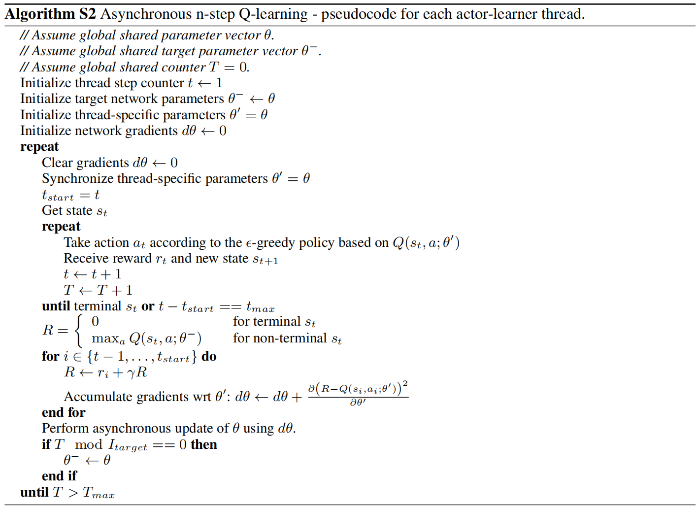
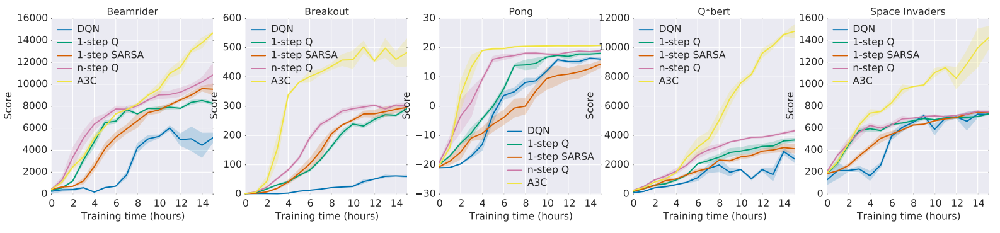

# Asynchronous Methods for Deep Reinforcement Learning 
深度强化学习的异步方法 2016.2.4 https://arxiv.org/abs/1602.01783

## 阅读笔记
* 异步梯度下降
* 并行actor-learner
* 异步actor-critic

## Abstract 
We propose a conceptually simple and lightweight framework for deep reinforcement learning that uses asynchronous gradient descent for optimization of deep neural network controllers. We present asynchronous variants of four standard reinforcement learning algorithms and show that parallel actor-learners have a stabilizing effect on training allowing all four methods to successfully train neural network controllers. The best performing method, an asynchronous variant of actor-critic, surpasses the current state-of-the-art on the Atari domain while training for half the time on a single multi-core CPU instead of a GPU. Furthermore, we show that asynchronous actor-critic succeeds on a wide variety of continuous motor control problems as well as on a new task of navigating random 3D mazes using a visual input.

我们提出了一个概念简单、轻量级的深度强化学习框架，该框架使用异步梯度下降来优化深度神经网络控制器。我们提出了四种标准强化学习算法的异步变体，并表明并行actor-learners对训练具有稳定作用，使所有四种方法都能成功训练神经网络控制器。性能最好的方法是actor-critic的异步变体，它超越了雅达利领域目前的最先进技术，同时在单核CPU而不是GPU上训练了一半的时间。此外，我们演示了异步actor-critic在各种连续电机控制问题上的成功，以及在使用视觉输入导航随机3D迷宫的新任务上的成功。

## 1. Introduction
Deep neural networks provide rich representations that can enable reinforcement learning (RL) algorithms to perform effectively. However, it was previously thought that the combination of simple online RL algorithms with deep neural networks was fundamentally unstable. Instead, a variety of solutions have been proposed to stabilize the algorithm (Riedmiller, 2005; Mnih et al., 2013; 2015; Van Hasselt et al., 2015; Schulman et al., 2015a). These approaches share a common idea: the sequence of observed data encountered by an online RL agent is non-stationary, and online RL updates are strongly correlated. By storing the agent’s data in an experience replay memory, the data can be batched (Riedmiller, 2005; Schulman et al., 2015a) or randomly sampled (Mnih et al., 2013; 2015; Van Hasselt et al., 2015) from different time-steps. Aggregating over memory in this way reduces non-stationarity and decorrelates updates, but at the same time limits the methods to off-policy reinforcement learning algorithms.

深度神经网络提供了丰富的表示，可以使强化学习(RL)算法有效地执行。然而，以前人们认为简单的在线RL算法与深度神经网络的结合从根本上是不稳定的。相反，已经提出了各种解决方案来稳定算法(Riedmiller，2005; Mnihet al.,2013; 2015; Van Hasseltet al.,2015; Schulmanet al.,2015a)。这些方法有一个共同的想法：在线RL智能体遇到的观测数据序列是非平稳的，并且在线RL更新是强相关的。通过将智能体的数据存储在经验回放内存中，可以从不同的时间步长对数据进行批处理(Riedmiller，2005;Schulmanet al.,2015a) 或 随机采样(Mnihet al.,2013;2015; Van Hasseltet al.,2015)。以这种方式在内存上聚合减少了非平稳性和去相关更新，但同时将方法限制为非策略强化学习算法。

Deep RL algorithms based on experience replay have achieved unprecedented success in challenging domains such as Atari 2600. However, experience replay has several drawbacks: it uses more memory and computation per real interaction; and it requires off-policy learning algorithms that can update from data generated by an older policy.

基于经验回放的深度RL算法在Atari 2600等具有挑战性的领域取得了前所未有的成功。然而，经验回放有几个缺点：它在每次真实交互中使用更多的内存和计算;并且它需要非策略学习算法，该算法可以根据旧策略生成的数据进行更新。

In this paper we provide a very different paradigm for deep reinforcement learning. Instead of experience replay, we asynchronously execute multiple agents in parallel, on multiple instances of the environment. This parallelism also decorrelates the agents’ data into a more stationary process, since at any given time-step the parallel agents will be experiencing a variety of different states. This simple idea enables a much larger spectrum of fundamental on-policy RL algorithms, such as Sarsa, n-step methods, and actor-critic methods, as well as off-policy RL algorithms such as Q-learning, to be applied robustly and effectively using deep neural networks.

在本文中，我们为深度强化学习提供了一个非常不同的范式。我们在环境的多个实例上异步并行执行多个智能体，而不是经验回放。这种并行性还将智能体的数据去关联到一个更稳定的过程中，因为在任何给定的时间步长，并行智能体都将经历各种不同的状态。这个简单的想法使得更大范围的基本策略上的RL算法，如Sarsa、n-step方法和actor-critic方法，以及非策略RL算法，例如Q-learning，能够使用深度神经网络稳健有效地应用。

Our parallel reinforcement learning paradigm also offers practical benefits. Whereas previous approaches to deep reinforcement learning rely heavily on specialized hardware such as GPUs (Mnih et al., 2015; Van Hasselt et al., 2015; Schaul et al., 2015) or massively distributed architectures (Nair et al., 2015), our experiments run on a single machine with a standard multi-core CPU. When applied to a variety of Atari 2600 domains, on many games asynchronous reinforcement learning achieves better results, in far less time than previous GPU-based algorithms, using far less resource than massively distributed approaches. The best of the proposed methods, asynchronous advantage actor-critic (A3C), also mastered a variety of continuous motor control tasks as well as learned general strategies for exploring 3D mazes purely from visual inputs. We believe that the success of A3C on both 2D and 3D games, discrete and continuous action spaces, as well as its ability to train feedforward and recurrent agents makes it the most general and successful reinforcement learning agent to date.

我们的并行强化学习模型也提供了实际的好处。尽管以前的深度强化学习方法在很大程度上依赖于GPU(Mnihet al.,2015;Van Hasseltet al.,2015;Schaulet al.,2015)或大规模分布式架构(Nair et al.，2015)等专用硬件，但我们的实验在具有标准多核CPU的单机上运行。当应用于各种Atari 2600域时，在许多游戏中，异步强化学习比以前的基于GPU的算法在更短的时间内获得更好的结果，比大规模分布式方法使用更少的资源。所提出的方法中最好的一种，异步优势actor-critic(A3C)，也掌握了各种连续的电机控制任务，并学习了纯粹从视觉输入探索3D迷宫的一般策略。我们相信，A3C在2D和3D游戏、离散和连续行动空间上的成功，以及它训练前馈和循环智能体的能力，使它成为迄今为止最通用和最成功的强化学习智能体。

## 2. Related Work
The General Reinforcement Learning Architecture (Gorila) of (Nair et al., 2015) performs asynchronous training of reinforcement learning agents in a distributed setting. In Gorila, each process contains an actor that acts in its own copy of the environment, a separate replay memory, and a learner that samples data from the replay memory and computes gradients of the DQN loss (Mnih et al., 2015) with respect to the policy parameters. The gradients are asynchronously sent to a central parameter server which updates a central copy of the model. The updated policy parameters are sent to the actor-learners at fixed intervals. By using 100 separate actor-learner processes and 30 parameter server instances, a total of 130 machines, Gorila was able to significantly outperform DQN over 49 Atari games. On many games Gorila reached the score achieved by DQN over 20 times faster than DQN. We also note that a similar way of parallelizing DQN was proposed by (Chavez et al., 2015).

(Nair et al.，2015)的通用强化学习架构(Gorila)在分布式环境中执行强化学习智能体的异步训练。在Gorila中，每个进程都包含一个在其自己的环境副本中起作用的参与者、一个单独的重放内存，以及一个从重放内存中采样数据并计算DQN损失相对于策略参数的梯度的学习器(Mnih et al.，2015)。梯度被异步发送到中央参数服务器，该服务器更新模型的中央副本。更新后的策略参数以固定的间隔发送给actor-learners。通过使用100个独立的actor-learners进程和30个参数服务器实例，总共130台机器，Gorila能够在49款雅达利游戏中显著优于DQN。在许多比赛中，Gorila的得分是DQN的20多倍。我们还注意到(Chavez et al.，2015)提出了一种类似的并行化DQN的方法。

In earlier work, (Li & Schuurmans, 2011) applied the Map Reduce framework to parallelizing batch reinforcement learning methods with linear function approximation. Parallelism was used to speed up large matrix operations but not to parallelize the collection of experience or stabilize learning. (Grounds & Kudenko, 2008) proposed a parallel version of the Sarsa algorithm that uses multiple separate actor-learners to accelerate training. Each actor-learner learns separately and periodically sends updates to weights that have changed significantly to the other learners using peer-to-peer communication.

在早期的工作中，(Li&Schuurmans，2011)将Map Reduce框架应用于具有线性函数近似的批量强化学习方法的并行化。并行性用于加速大型矩阵运算，但不用于并行化经验收集或稳定学习。(Grounds&Kudenko，2008)提出了一种并行版本的Sarsa算法，该算法使用多个独立的actor-learners来加速训练。每个actor-learners分别学习，并使用对等通信定期向其他学习者发送对已发生重大变化的权重的更新。

(Tsitsiklis, 1994) studied convergence properties of Qlearning in the asynchronous optimization setting. These results show that Q-learning is still guaranteed to converge when some of the information is outdated as long as outdated information is always eventually discarded and several other technical assumptions are satisfied. Even earlier, (Bertsekas, 1982) studied the related problem of distributed dynamic programming.

(Tsitsiklis，1994)研究了异步优化设置中Q-learning的收敛属性。这些结果表明，只要过时的信息最终总是被丢弃，并且满足其他几个技术假设，当一些信息过时时，Q-learning仍然可以保证收敛。甚至更早的时候，(Bertsekas，1982)研究了分布式动态规划的相关问题。

Another related area of work is in evolutionary methods, which are often straightforward to parallelize by distributing fitness evaluations over multiple machines or threads (Tomassini, 1999). Such parallel evolutionary approaches have recently been applied to some visual reinforcement learning tasks. In one example, (Koutník et al., 2014) evolved convolutional neural network controllers for the TORCS driving simulator by performing fitness evaluations on 8 CPU cores in parallel.

另一个相关的工作领域是进化方法，通过在多个机器或线程上分布适应度评估，进化方法通常可以直接并行化(Tomassini，1999)。这种并行进化方法最近被应用于一些视觉强化学习任务。在一个样本中，(Koutník et al.，2014)通过并行地对8个CPU内核执行适应度评估，为TORCS驾驶模拟器进化了卷积神经网络控制器。

## 3. Reinforcement Learning Background  强化学习背景
We consider the standard reinforcement learning setting where an agent interacts with an environment E over a number of discrete time steps. At each time step t, the agent receives a state $s_t$ and selects an action $a_t$ from some set of possible actions A according to its policy π, where π is a mapping from states $s_t$ to actions $a_t$. In return, the agent receives the next state $s_{t+1}$ and receives a scalar reward $r_t$. The process continues until the agent reaches a terminal state after which the process restarts. The return $R_t = \sum^∞_{k=0} γ^k r_{t+k}$ is the total accumulated return from time step t with discount factor γ ∈ (0, 1]. The goal of the agent is to maximize the expected return from each state $s_t$.

我们考虑标准的强化学习设置，其中智能体在多个离散的时间步长上与环境 E 交互。在每个时间步骤 t，智能体接收状态 $s_t$，并根据其策略 π 从某组可能的行动 A 中选择一个行动 $a_t$，其中 π 是从状态 $s_t$ 到行动 $a_t$ 的映射。作为回报，智能体接收下一个状态 $s_{t+1}$，并接收标量奖励 $r_t$。该过程继续进行，直到智能体达到终端状态，然后该过程重新启动。收益 $R_t=\sum^∞_{k=0}γ^k r_{t+k}$ 是时间步长t的总累积收益，折扣因子 γ∈(0，1]。智能体的目标是使每个状态 $s_t$ 的预期收益最大化。

The action value $Q^π (s, a) = E [R_t|s_t = s, a]$ is the expected return for selecting action a in state s and following policy π. The optimal value function $Q^∗(s, a) = max_π Q^π (s, a)$ gives the maximum action value for state s and action a achievable by any policy. Similarly, the value of state s under policy π is defined as $V^π (s) = E [R_t|s_t = s]$ and is simply the expected return for following policy π from state s.

行动值 $Q^π(s,a)=E[R_t|s_t=s，a]$ 是在状态s时选择行动a并遵循策略π的预期回报。最优值函数 $Q^*(s,a)=max_πQ^π(s,a)$ 给出了状态s和任何策略都可以实现的行动a的最大行动值。类似地，策略π下的状态s的值被定义为$V^π(s)=E[R_t|s_t=s]$，并且只是从状态s遵循策略π的预期回报。

In value-based model-free reinforcement learning methods, the action value function is represented using a function approximator, such as a neural network. Let Q(s, a; θ) be an approximate action-value function with parameters θ. The updates to θ can be derived from a variety of reinforcement learning algorithms. One example of such an algorithm is Q-learning, which aims to directly approximate the optimal action value function: $Q^∗(s, a) ≈ Q(s, a; θ)$. In one-step Q-learning, the parameters θ of the action value function Q(s, a; θ) are learned by iteratively minimizing a sequence of loss functions, where the ith loss function defined as

在基于值的无模型强化学习方法中，使用函数逼近器(如神经网络)来表示行动值函数。设Q(s,a;θ)是参数为θ的近似作用值函数。θ的更新可以从各种强化学习算法中导出。这种算法的一个例子是Q-learning，其目的是直接近似最优行动值函数：$Q^*(s,a)≈Q(s,a;θ)$。在单步Q-learning中，通过迭代最小化损失函数序列来学习行动值函数Q(s,a;θ)的参数θ，其中第i个损失函数定义为

$L_i(θ_i) = E ( r + γ max_{a'} Q(s' , a' ; θ_{i−1}) − Q(s, a; θ_i) ) ^2$

where s' is the state encountered after state s.

其中s'是在状态s之后遇到的状态。

We refer to the above method as one-step Q-learning because it updates the action value Q(s, a) toward the onestep return $r + γ max_{a'} Q(s' , a' ; θ)$. One drawback of using one-step methods is that obtaining a reward r only directly affects the value of the state action pair s, a that led to the reward. The values of other state action pairs are affected only indirectly through the updated value Q(s, a). This can make the learning process slow since many updates are required the propagate a reward to the relevant preceding states and actions.

我们将上述方法称为 单步Q-learning，因为它将行动值Q(s,a)更新为单步返回$r+γmax_{a'}Q(s'，a';θ)$。使用单步方法的一个缺点是，获得奖励r只会对导致奖励的 状态-行动对 s的值产生直接影响。其他 状态-行动对 的值仅通过更新后的值Q(s,a)间接受到影响。这可能会使学习过程变慢，因为需要多次更新才能将奖励传播到相关的先前状态和行动。

One way of propagating rewards faster is by using nstep returns (Watkins, 1989; Peng & Williams, 1996). In n-step Q-learning, Q(s, a) is updated toward the nstep return defined as $r_t + γr_{t+1} + · · · + γ^{n−1} r_{t+n−1} + max_a γ^nQ(s_{t+n}, a)$. This results in a single reward r directly affecting the values of n preceding state action pairs. This makes the process of propagating rewards to relevant state-action pairs potentially much more efficient.

更快传播奖励的一种方法是使用nstep返回(Watkins，1989;Peng&Williams，1996)。在n步Q-learning中，Q(s,a)被更新为nstep返回，定义为 $r_t + γr_{t+1} + · · · + γ^{n−1} r_{t+n−1} + max_a γ^nQ(s_{t+n}, a)$。这导致单个奖励r直接影响n个先前 状态-行动对 的值。这使得将奖励传播到相关的 状态-行动对 的过程可能更加高效。

In contrast to value-based methods, policy-based modelfree methods directly parameterize the policy $π(a|s; θ)$ and update the parameters θ by performing, typically approximate, gradient ascent on $E[R_t]$. One example of such a method is the REINFORCE family of algorithms due to Williams (1992). Standard REINFORCE updates the policy parameters θ in the direction $∇_θ log π(a_t|s_t; θ)R_t$, which is an unbiased estimate of $∇_θE[R_t]$. It is possible to reduce the variance of this estimate while keeping it unbiased by subtracting a learned function of the state $b_t(s_t)$, known as a baseline (Williams, 1992), from the return. The resulting gradient is $∇_θ log π(a_t|s_t; θ) (R_t − b_t(s_t))$.

与基于值的方法相比，基于策略的无模型方法直接参数化策略 $π(a|s;θ)$，并通过在$E[R_t]$上执行通常近似的梯度上升来更新参数θ。这种方法的一个例子是Williams(1992)提出的REINFORCE算法家族。标准REINFORCE在 $∇_θ log π(a_t|s_t; θ)R_t$ 方向上更新策略参数θ，这是 $∇_θE[R_t]$ 的无偏估计。通过从回归中减去状态 $b_t(s_t)$ 的学习函数，即基线(Williams，1992)，可以减少该估计的方差，同时保持其无偏。由此产生的梯度为 $∇_θ log π(a_t|s_t; θ) (R_t − b_t(s_t))$。

A learned estimate of the value function is commonly used as the baseline $b_t(s_t) ≈ V^π (s_t)$ leading to a much lower variance estimate of the policy gradient. When an approximate value function is used as the baseline, the quantity $R_t −(b_t)$ used to scale the policy gradient can be seen as an estimate of the advantage of action $a_t$ in state $s_t$, or $A(a_t, s_t) = Q(a_t, st)−V (s_t)$, because $R_t$ is an estimate of $Q^π (a_t, s_t)$ and $(b_t)$ is an estimate of $V^π (s_t)$. This approach can be viewed as an actor-critic architecture where the policy π is the actor and the baseline $(b_t)$ is the critic (Sutton & Barto, 1998; Degris et al., 2012).

值函数的学习估计通常用作基线 $b_t(s_t) ≈ V^π (s_t)$。当使用近似值函数作为基线时，用于缩放策略梯度的量$R_t−(b_t)$可以被视为对状态$s_t$中的行动$a_t$的优势估计，或者 $a(a_t，s_t)=Q(a_t、st)−V(s_t)$，因为$R_t$是 $Q^π (a_t, s_t)$ 的估计， 而 $(b_t)$ 是$V^π (s_t)$ 的估计。这种方法可以被视为一种行动者-评估者架构，其中策略π是行动者，基线$(b_t)$是评估者(Sutton&Barto，1998; Degriset al.,2012)。

## 4. Asynchronous RL Framework  异步RL框架
We now present multi-threaded asynchronous variants of one-step Sarsa, one-step Q-learning, n-step Q-learning, and advantage actor-critic. The aim in designing these methods was to find RL algorithms that can train deep neural network policies reliably and without large resource requirements. While the underlying RL methods are quite different, with actor-critic being an on-policy policy search method and Q-learning being an off-policy value-based method, we use two main ideas to make all four algorithms practical given our design goal.

我们现在介绍单步Sarsa、单步Q-learning、n步Q-learning和优势actor-critic的多线程异步变体。设计这些方法的目的是找到能够可靠地训练深度神经网络策略且不需要大量资源的RL算法。虽然底层的RL方法大不相同，actor-critic是一种策略上的策略搜索方法，Q-learning是一种非策略基于价值的方法，但考虑到我们的设计目标，我们使用了两个主要思想来使所有四种算法都实用。

First, we use asynchronous actor-learners, similarly to the Gorila framework (Nair et al., 2015), but instead of using separate machines and a parameter server, we use multiple CPU threads on a single machine. Keeping the learners on a single machine removes the communication costs of sending gradients and parameters and enables us to use Hogwild! (Recht et al., 2011) style updates for training.

首先，我们使用异步actor-learners，类似于Gorila框架(Nair et al.，2015)，但我们没有使用单独的机器和参数服务器，而是在一台机器上使用多个CPU线程。将学习者放在一台机器上，消除了发送梯度和参数的通信成本，使我们能够使用Hogwield！(Recht et al.，2011)训练风格更新。

Second, we make the observation that multiple actors learners running in parallel are likely to be exploring different parts of the environment. Moreover, one can explicitly use different exploration policies in each actor-learner to maximize this diversity. By running different exploration policies in different threads, the overall changes being made to the parameters by multiple actor-learners applying online updates in parallel are likely to be less correlated in time than a single agent applying online updates. Hence, we do not use a replay memory and rely on parallel actors employing different exploration policies to perform the stabilizing role undertaken by experience replay in the DQN training algorithm.

其次，我们观察到，并行运行的多个actor-learners可能正在探索环境的不同部分。此外，可以在每个actor-learner中明确使用不同的探索策略，以最大限度地提高这种多样性。通过在不同的线程中运行不同的探索策略，并行应用在线更新的多个actor-learners对参数所做的总体更改在时间上的相关性可能比应用在线更新时的单个智能体要小。因此，我们不使用重放内存，而是依靠采用不同探索策略的并行参与者来执行DQN训练算法中经验重放所承担的稳定作用。

In addition to stabilizing learning, using multiple parallel actor-learners has multiple practical benefits. First, we obtain a reduction in training time that is roughly linear in the number of parallel actor-learners. Second, since we no longer rely on experience replay for stabilizing learning we are able to use on-policy reinforcement learning methods such as Sarsa and actor-critic to train neural networks in a stable way. We now describe our variants of one-step Qlearning, one-step Sarsa, n-step Q-learning and advantage actor-critic.

除了稳定学习之外，使用多个并行actor-learners还有多种实际好处。首先，我们获得了训练时间的减少，这在并行actor-learners的数量上大致是线性的。其次，由于我们不再依赖经验回放来稳定学习，我们可以使用策略强化学习方法，如Sarsa和actor-critic，以稳定的方式训练神经网络。现在描述我们的单步Q-learning、单步Sarsa、n步Q-learning和优势actor-critic的变体。

### Asynchronous one-step Q-learning:  异步单步Q-learning
Pseudocode for our variant of Q-learning, which we call Asynchronous onestep Q-learning, is shown in Algorithm 1. Each thread interacts with its own copy of the environment and at each step computes a gradient of the Q-learning loss. We use a shared and slowly changing target network in computing the Q-learning loss, as was proposed in the DQN training method. We also accumulate gradients over multiple timesteps before they are applied, which is similar to using minibatches. This reduces the chances of multiple actor learners overwriting each other’s updates. Accumulating updates over several steps also provides some ability to trade off computational efficiency for data efficiency.

我们称之为异步单步Q-学习的Q-learning变体的伪代码如算法1所示。每个线程与其自己的环境副本交互，并在每个步骤计算Q-learning损失的梯度。正如DQN训练方法中提出的那样，我们使用共享且缓慢变化的目标网络来计算Q-learning损失。在应用之前，我们还会在多个时间步长上积累梯度，这类似于使用小批量。这减少了多个actor-learners覆盖彼此更新的机会。通过几个步骤积累更新也提供了一些能力，可以在计算效率和数据效率之间进行权衡。

 
Algorithm 1 Asynchronous one-step Q-learning  - pseudocode for each actor-learner thread
算法1: 异步单步Q学习 - 每个actor-learner线程的伪代码。

Finally, we found that giving each thread a different exploration policy helps improve robustness. Adding diversity to exploration in this manner also generally improves performance through better exploration. While there are many possible ways of making the exploration policies differ we experiment with using $\epsilon$ -greedy exploration with $\epsilon$ periodically sampled from some distribution by each thread.

最后，我们发现给每个线程一个不同的探索策略有助于提高健壮性。以这种方式为探索添加多样性通常也会通过更好的探索来提高性能。虽然有很多可能的方法可以使探索策略不同，但我们尝试使用$\epsilon$ - 贪婪探索$\epsilon$，每个线程从一些分发中定期采样。

### Asynchronous one-step Sarsa:  异步单步Sarsa
The asynchronous onestep Sarsa algorithm is the same as asynchronous one-step Q-learning as given in Algorithm 1 except that it uses a different target value for Q(s, a). The target value used by one-step Sarsa is $r + γQ(s' , a' ; θ^−)$ where a' is the action taken in state s' (Rummery & Niranjan, 1994; Sutton & Barto, 1998). We again use a target network and updates accumulated over multiple timesteps to stabilize learning.

异步单步Sarsa算法与算法1中给出的异步单步Q-learning相同，只是它使用了不同的Q(s,a)目标值。单步Sarsa使用的目标值是$r + γQ(s' , a' ; θ^−)$，其中a'是在状态s'下采取的行动(Rummery&Niranjan，1994;Sutton&Barto，1998)。我们再次使用目标网络和在多个时间步长上积累的更新来稳定学习。

### Asynchronous n-step Q-learning: 异步n步Q-learning 
Pseudocode for our variant of multi-step Q-learning is shown in Supplementary Algorithm S2. The algorithm is somewhat unusual because it operates in the forward view by explicitly computing nstep returns, as opposed to the more common backward view used by techniques like eligibility traces (Sutton & Barto, 1998). We found that using the forward view is easier when training neural networks with momentum-based methods and backpropagation through time. In order to compute a single update, the algorithm first selects actions using its exploration policy for up to $t_{max}$ steps or until a terminal state is reached. This process results in the agent receiving up to $t_{max}$ rewards from the environment since its last update. The algorithm then computes gradients for n-step Q-learning updates for each of the state-action pairs encountered since the last update. Each n-step update uses the longest possible n-step return resulting in a one-step update for the last state, a two-step update for the second last state, and so on for a total of up to $t_{max}$ updates. The accumulated updates are applied in a single gradient step.

我们的多步Q-learning变体的伪码如补充算法S2所示。该算法有些不同寻常，因为它通过显式计算nstep返回来在前向视图中操作，而不是像资格跟踪这样的技术使用的更常见的后向视图(Sutton&Barto，1998)。我们发现，当使用基于动量的方法和随时间的反向传播训练神经网络时，使用前向视图更容易。为了计算单个更新，该算法首先使用其探索策略选择行动，最多达$t_{max}$步，或者直到达到终端状态。此过程导致智能体自上次更新以来从环境中获得高达$t_{max}$的奖励。然后，该算法为自上次更新以来遇到的每个 状态-行动对 计算n步Q-learning更新的梯度。每个n步更新使用尽可能长的n步返回，导致最后一个状态的单步更新，倒数第二个状态的两步更新，依此类推，总共更新$t_{max}$。在单个梯度步骤中应用累积的更新。

 
Algorithm S2 Asynchronous n-step Q-learning - pseudocode for each actor-learner thread.

### Asynchronous advantage actor-critic:  异步优势actor-critic
The algorithm, which we call asynchronous advantage actor-critic (A3C), maintains a policy $π(a_t|s_t; θ)$ and an estimate of the value function $V(s_t; θ_v)$. Like our variant of n-step Q-learning, our variant of actor-critic also operates in the forward view and uses the same mix of n-step returns to update both the policy and the value-function. The policy and the value function are updated after every $t_{max}$ actions or when a terminal state is reached. The update performed by the algorithm can be seen as $∇_θ' log π(a_t|s_t; θ' )A(st, at; θ, θ_v)$, where $A(s_t, a_t; θ, θ_v)$ is an estimate of the advantage function given by $\sum^{k−1}_{i=0} γ^ir_{t+i} + γ^kV (s_{t+k}; θ_v) − V (s_t; θ_v)$, where k can vary from state to state and is upper-bounded by $t_{max}$. The pseudocode for the algorithm is presented in Supplementary Algorithm S3.

我们称之为异步优势actor-critic(A3C)的算法维护 策略 $π(a_t|s_t;θ)$ 和 价值函数 $V(s_t; θ_v)$ 的估计。与我们的n步Q-learning变体一样，我们的actor-critic变体也在前向视图中操作，并使用相同的n步返回组合来更新策略和值函数。策略和值函数在每次$t_{max}$操作之后或达到终端状态时更新。该算法执行的更新可以看作是 $∇_θ' log π(a_t|s_t; θ' )A(st, at; θ, θ_v)$ ，其中 $A(s_t, a_t; θ, θ_v)$ 是优势函数的估计值，由下式给出 $\sum^{k−1}_{i=0} γ^ir_{t+i} + γ^kV (s_{t+k}; θ_v) − V (s_t; θ_v)$， 其中 k 可以因状态而异，上限为 $t_{max}$。该算法的伪代码在补充算法 S3 中提供。

 

As with the value-based methods we rely on parallel actor-learners and accumulated updates for improving training stability. Note that while the parameters θ of the policy and $θ_v$ of the value function are shown as being separate for generality, we always share some of the parameters in practice. We typically use a convolutional neural network that has one softmax output for the policy $π(a_t|s_t; θ)$ and one linear output for the value function $V (s_t; θ_v)$, with all non-output layers shared.

与基于价值的方法一样，我们依赖于并行actor-learners和累积更新来提高训练稳定性。注意，虽然策略的参数θ和值函数的$θ_v$为了通用性而被显示为是分开的，但我们在实践中总是共享一些参数。我们通常使用卷积神经网络，该网络具有用于策略 $π(a_t|s_t;θ)$ 的一个softmax输出和用于值函数$V(s_t; θ_v)$ 的另一个线性输出，所有非输出层共享。

We also found that adding the entropy of the policy π to the objective function improved exploration by discouraging premature convergence to suboptimal deterministic policies. This technique was originally proposed by (Williams & Peng, 1991), who found that it was particularly helpful on tasks requiring hierarchical behavior. The gradient of the full objective function including the entropy regularization term with respect to the policy parameters takes the form $∇_θ' log π(a_t|s_t; θ' )(R_t − V (s_t; θ_v)) + β∇_{θ'} H(π(s_t; θ' ))$, where H is the entropy. The hyperparameter β controls the strength of the entropy regularization term.

我们还发现，将策略π的熵添加到目标函数中，通过阻止过早收敛到次优确定性策略来改进探索。这项技术最初是由(Williams&Peng，1991)提出的，他发现这项技术对需要分层行为的任务特别有帮助。包括熵正则化项的全目标函数相对于策略参数的梯度形式为 $∇_θ' log π(a_t|s_t; θ' )(R_t − V (s_t; θ_v)) + β∇_{θ'} H(π(s_t; θ' ))$ ，其中H是熵。超参数β控制熵正则化项的强度。

### Optimization: 优化
We investigated three different optimization algorithms in our asynchronous framework – SGD with momentum, RMSProp (Tieleman & Hinton, 2012) without shared statistics, and RMSProp with shared statistics. We used the standard non-centered RMSProp update given by

我们在异步框架中研究了三种不同的优化算法 —— 有动量的SGD、没有共享统计的RMSProp(Tieleman&Hinton，2012)和有共享统计的RM SProp。我们使用了标准的非中心RMSProp更新，由

$g = αg + (1 − α)∆θ^2$ and $θ ← θ − η \frac{∆θ}{\sqrt{g + \epsilon}}$ , (1)

where all operations are performed elementwise. A comparison on a subset of Atari 2600 games showed that a variant of RMSProp where statistics g are shared across threads is considerably more robust than the other two methods. Full details of the methods and comparisons are included in Supplementary Section 7.

其中所有操作都是按元素执行的。对Atari 2600游戏子集的比较表明，RMSProp的一个变体，其中统计数据g在线程之间共享，比其他两种方法要健壮得多。方法和比较的全部细节包含在补充部分7中。

## 5. Experiments  实验
We use four different platforms for assessing the properties of the proposed framework. We perform most of our experiments using the Arcade Learning Environment (Bellemare et al., 2012), which provides a simulator for Atari 2600 games. This is one of the most commonly used benchmark environments for RL algorithms. We use the Atari domain to compare against state of the art results (Van Hasselt et al., 2015; Wang et al., 2015; Schaul et al., 2015; Nair et al., 2015; Mnih et al., 2015), as well as to carry out a detailed stability and scalability analysis of the proposed methods. We performed further comparisons using the TORCS 3D car racing simulator (Wymann et al., 2013). We also use two additional domains to evaluate only the A3C algorithm – Mujoco and Labyrinth. MuJoCo (Todorov, 2015) is a physics simulator for evaluating agents on continuous motor control tasks with contact dynamics. Labyrinth is a new 3D environment where the agent must learn to find rewards in randomly generated mazes from a visual input. The precise details of our experimental setup can be found in Supplementary Section 8.

我们使用四个不同的平台评估提议的框架属性。我们使用街机学习环境(Bellemare et al.，2012)进行大部分实验，该环境为雅达利2600游戏提供了模拟器。这是RL算法最常用的基准测试环境之一。我们使用Atari域与现有技术的结果进行比较(Van Hasseltet al.,2015;Wanget al.,2015年;Schaul et al.，2015;Nairet al.,2015，Mnihet al.,2015)，并对所提出的方法进行详细的稳定性和可扩展性分析。我们使用TORCS 3D赛车模拟器进行了进单步的比较(Wymannet al.,2013)。我们还使用两个额外的域来仅评估A3C算法——Mujoco和Labyrinth。MuJoCo(Todorov，2015)是一个物理模拟器，用于评估具有接触动力学的连续运动控制任务中的智能体。迷宫是一种新的3D环境，特工必须学会从视觉输入中在随机生成的迷宫中寻找奖励。我们实验设置的确切细节可以在补充部分8中找到。

 
Figure 1. Learning speed comparison for DQN and the new asynchronous algorithms on five Atari 2600 games. DQN was trained on a single Nvidia K40 GPU while the asynchronous methods were trained using 16 CPU cores. The plots are averaged over 5 runs. In the case of DQN the runs were for different seeds with fixed hyperparameters. For asynchronous methods we average over the best 5 models from 50 experiments with learning rates sampled from LogUniform(10−4 , 10−2 ) and all other hyperparameters fixed.
图1。五款雅达利2600游戏上DQN和新异步算法的学习速度比较。DQN在单个Nvidia K40 GPU上进行训练，而异步方法则使用16个CPU内核进行训练。这些图在5次运行中取平均值。在DQN的情况下，运行是针对具有固定超参数的不同种子。对于异步方法，我们对50个实验中最好的5个模型进行平均，其中学习率从LogUniform(10−4，10−2)采样，所有其他超参数固定。

### 5.1. Atari 2600 Games  雅达利2600游戏
We first present results on a subset of Atari 2600 games to demonstrate the training speed of the new methods. Figure 1 compares the learning speed of the DQN algorithm trained on an Nvidia K40 GPU with the asynchronous methods trained using 16 CPU cores on five Atari 2600 games. The results show that all four asynchronous methods we presented can successfully train neural network controllers on the Atari domain. The asynchronous methods tend to learn faster than DQN, with significantly faster learning on some games, while training on only 16 CPU cores. Additionally, the results suggest that n-step methods learn faster than one-step methods on some games. Overall, the policy-based advantage actor-critic method signifi- cantly outperforms all three value-based methods.

我们首先演示了雅达利2600游戏的一个子集的结果，以演示新方法的训练速度。图1比较了在英伟达K40 GPU上训练的DQN算法的学习速度，以及在五款雅达利2600游戏上使用16个CPU内核训练的异步方法。结果表明，我们提出的所有四种异步方法都可以成功地在Atari域上训练神经网络控制器。异步方法往往比DQN学习得更快，在一些游戏中学习速度明显更快，而只在16个CPU内核上进行训练。此外，研究结果表明，在某些游戏中，n步方法比单步方法学习得更快。总体而言，基于策略的优势actor-critic方法显著优于所有三种基于价值的方法。

We then evaluated asynchronous advantage actor-critic on 57 Atari games. In order to compare with the state of the art in Atari game playing, we largely followed the training and evaluation protocol of (Van Hasselt et al., 2015). Specifically, we tuned hyperparameters (learning rate and amount of gradient norm clipping) using a search on six Atari games (Beamrider, Breakout, Pong, Q*bert, Seaquest and Space Invaders) and then fixed all hyperparameters for all 57 games. We trained both a feedforward agent with the same architecture as (Mnih et al., 2015; Nair et al., 2015; Van Hasselt et al., 2015) as well as a recurrent agent with an additional 256 LSTM cells after the final hidden layer. We additionally used the final network weights for evaluation to make the results more comparable to the original results from (Bellemare et al., 2012). We trained our agents for four days using 16 CPU cores, while the other agents were trained for 8 to 10 days on Nvidia K40 GPUs. Table 1 shows the average and median human-normalized scores obtained by our agents trained by asynchronous advantage actor-critic (A3C) as well as the current state-of-the art. Supplementary Table S3 shows the scores on all games. A3C significantly improves on state-of-the-art the average score over 57 games in half the training time of the other methods while using only 16 CPU cores and no GPU. Furthermore, after just one day of training, A3C matches the average human normalized score of Dueling Double DQN and almost reaches the median human normalized score of Gorila. We note that many of the improvements that are presented in Double DQN (Van Hasselt et al., 2015) and Dueling Double DQN (Wang et al., 2015) can be incorporated to 1-step Q and n-step Q methods presented in this work with similar potential improvements.

然后，我们对57款雅达利游戏的异步优势演员-评估者进行了评估。为了与雅达利游戏的最新技术进行比较，我们在很大程度上遵循了(Van Hasselt et al.，2015)的训练和评估协议。具体来说，我们通过搜索六款雅达利游戏(Beamrider、Breakout、Pong、Q*bert、Seaquest和Space Invaders)来调整超参数(学习率和梯度范数裁剪量)，然后固定了所有57款游戏的所有超参数。我们训练了具有与(Mnihet al.,2015;Nairet al.,2015年;Van Hasseltet al.,2015)相同架构的前馈智能体，以及在最终隐藏层后具有额外256个LSTM单元的循环智能体。我们还使用了最终的网络权重进行评估，以使结果与(Bellemareet al.,2012)的原始结果更具可比性。我们使用16个CPU核心对我们的智能体进行了4天的训练，而其他智能体则使用Nvidia K40 GPU进行了8到10天的训练。表1显示了由异步优势扮演者-评估者(A3C)训练的智能体获得的人类归一化得分的平均值和中值，以及当前的技术状态。补充表S3显示了所有游戏的得分。A3C在只使用16个CPU内核而不使用GPU的情况下，在其他方法的一半训练时间内显著提高了57场比赛的平均得分。此外，仅经过一天的训练，A3C就与Dueling Double DQN的平均人类归一化得分相匹配，几乎达到Gorila的人类归一化平均得分。我们注意到，Double DQN(Van Hasselt et al.，2015)和Dueling Double DQN(Wang et al.，2014)中提出的许多改进可以结合到本工作中提出的1步Q和n步Q方法中，并具有类似的潜在改进。

Method|Training Time|Mean|Median
---| ---| ---| ---
DQN|8 days on GPU|121.9%|47.5%
Gorila|4|days,|100|machines|215.2%|71.3%
D-DQN|8 days on GPU|332.9%|110.9%
Dueling D-DQN|8 days on GPU|343.8%|117.1%
Prioritized DQN|8 days on GPU|463.6%|127.6%
A3C, FF|1 day on CPU|344.1%|68.2%
A3C, FF|4 days on CPU|496.8%|116.6%
A3C, LSTM|4 days on CPU|623.0%|112.6%

Table 1. Mean and median human-normalized scores on 57 Atari games using the human starts evaluation metric. Supplementary Table SS3 shows the raw scores for all games.
表1。在57场雅达利游戏中，使用人工启动评估指标的平均和中值人工归一化得分。补充表SS3显示了所有游戏的原始分数。

### 5.2. TORCS Car Racing Simulator  TORCS赛车模拟器
We also compared the four asynchronous methods on the TORCS 3D car racing game (Wymann et al., 2013). TORCS not only has more realistic graphics than Atari 2600 games, but also requires the agent to learn the dynamics of the car it is controlling. At each step, an agent received only a visual input in the form of an RGB image of the current frame as well as a reward proportional to the agent’s velocity along the center of the track at the agent’s current position. We used the same neural network architecture as the one used in the Atari experiments specified in Supplementary Section 8. We performed experiments using four different settings – the agent controlling a slow car with and without opponent bots, and the agent controlling a fast car with and without opponent bots. Full results can be found in Supplementary Figure S6. A3C was the best performing agent, reaching between roughly 75% and 90% of the score obtained by a human tester on all four game con- figurations in about 12 hours of training. A video showing the learned driving behavior of the A3C agent can be found at https://youtu.be/0xo1Ldx3L5Q.

我们还比较了TORCS 3D赛车游戏中的四种异步方法(Wymann et al.，2013)。TORCS不仅比雅达利2600游戏具有更逼真的图形，而且还需要智能体学习其控制的汽车的动力学。在每单步，智能体只接收当前帧的RGB图像形式的视觉输入，以及与智能体在当前位置沿着轨道中心的速度成比例的奖励。我们使用了与补充第8节中指定的Atari实验中使用的神经网络架构相同的神经网络架构。我们使用四种不同的设置进行了实验——智能体控制有对手机器人和没有对手机器人的慢速汽车，以及智能体控制有对方机器人和没有对方机器人的快速汽车。完整的结果可以在补充图S6中找到。A3C是表现最好的智能体，在大约12小时的训练中，在所有四场比赛中，达到了人类测试人员得分的75%到90%。显示A3C智能体学习驾驶行为的视频可在https://youtu.be/0xo1Ldx3L5Q.

### 5.3. Continuous Action Control Using the MuJoCo Physics Simulator  使用MuJoCo物理模拟器的连续行动控制
We also examined a set of tasks where the action space is continuous. In particular, we looked at a set of rigid body physics domains with contact dynamics where the tasks include many examples of manipulation and locomotion. These tasks were simulated using the Mujoco physics engine. We evaluated only the asynchronous advantage actor-critic algorithm since, unlike the value-based methods, it is easily extended to continuous actions. In all problems, using either the physical state or pixels as input, Asynchronous Advantage-Critic found good solutions in less than 24 hours of training and typically in under a few hours. Some successful policies learned by our agent can be seen in the following video https://youtu.be/Ajjc08-iPx8. Further details about this experiment can be found in Supplementary Section 9.

我们还研究了一组行动空间是连续的任务。特别是，我们研究了一组具有接触动力学的刚体物理领域，其中的任务包括许多操纵和运动的样本。这些任务是使用Mujoco物理引擎进行模拟的。我们只评估了异步优势actor-critic算法，因为与基于价值的方法不同，它很容易扩展到连续行动。在所有问题中，使用物理状态或像素作为输入，Asynchronous Advantage Critic在不到24小时的训练中找到了很好的解决方案，通常在不到几个小时的时间内。我们的智能体商学到的一些成功的策略可以在下面的视频中看到https://youtu.be/Ajjc08-iPx8 . 关于这个实验的更多细节可以在补充部分9中找到。

### 5.4. Labyrinth  迷宫
We performed an additional set of experiments with A3C on a new 3D environment called Labyrinth. The specific task we considered involved the agent learning to find rewards in randomly generated mazes. At the beginning of each episode the agent was placed in a new randomly generated maze consisting of rooms and corridors. Each maze contained two types of objects that the agent was rewarded for finding – apples and portals. Picking up an apple led to a reward of 1. Entering a portal led to a reward of 10 after which the agent was respawned in a new random location in the maze and all previously collected apples were regenerated. An episode terminated after 60 seconds after which a new episode would begin. The aim of the agent is to collect as many points as possible in the time limit and the optimal strategy involves first finding the portal and then repeatedly going back to it after each respawn. This task is much more challenging than the TORCS driving domain because the agent is faced with a new maze in each episode and must learn a general strategy for exploring random mazes.

我们在一个名为迷宫的新3D环境中用A3C进行了一组额外的实验。我们考虑的具体任务涉及智能体学习在随机生成的迷宫中寻找奖励。在每一集开始时，特工都被放置在一个由房间和走廊组成的新的随机生成的迷宫中。每个迷宫包含两种类型的物体，特工会因为发现它们而获得奖励——苹果和入口。捡一个苹果可以得到1分的奖励。进入入口可获得10的奖励，之后药剂在迷宫中的一个新的随机位置重生，所有之前收集的苹果都会再生。一集在60秒后结束，之后将开始新的一集。智能体的目的是在时间限制内收集尽可能多的点，最佳策略包括首先找到入口，然后在每次重生后重复返回。这项任务比TORCS驾驶领域更具挑战性，因为特工在每一集中都要面对一个新的迷宫，必须学习探索随机迷宫的一般策略。

Method|1-thread|2-threads|4-threads|8-threads|16-threads
---|---|---|---|---|---
1-step|Q|1.0|3.0|6.3|13.3|24.1
1-step|SARSA|1.0|2.8|5.9|13.1|22.1
n-step|Q|1.0|2.7|5.9|10.7|17.2
A3C|1.0|2.1|3.7|6.9|12.5

Table 2. The average training speedup for each method and number of threads averaged over seven Atari games. To compute the training speed-up on a single game we measured the time to required reach a fixed reference score using each method and number of threads. The speedup from using n threads on a game was defined as the time required to reach a fixed reference score using one thread divided the time required to reach the reference score using n threads. The table shows the speedups averaged over seven Atari games (Beamrider, Breakout, Enduro, Pong, Q*bert, Seaquest, and Space Invaders).

表2。每种方法的平均训练速度和线程数在七场雅达利游戏中的平均值。为了计算单场比赛的训练加速，我们使用每种方法和线程数测量了达到固定参考分数所需的时间。在游戏中使用n个线程的加速被定义为使用一个线程达到固定参考分数所需的时间除以使用n个螺纹达到参考分数所需要的时间。该表显示了雅达利七款游戏(Beamrider、Breakout、Enduro、Pong、Q*bert、Seaquest和Space Invaders)的平均加速。

We trained an A3C LSTM agent on this task using only 84 × 84 RGB images as input. The final average score of around 50 indicates that the agent learned a reasonable strategy for exploring random 3D maxes using only a visual input. A video showing one of the agents exploring previously unseen mazes is included at https: //youtu.be/nMR5mjCFZCw.

我们只使用84×84RGB图像作为输入，就这项任务训练了一个A3C LSTM智能体。大约50的最终平均得分表明，智能体仅使用视觉输入就学会了探索随机3D最大值的合理策略。https://youtu.be/nMR5mjCFZCw 上有一段视频显示其中一名特工正在探索以前看不见的迷宫。

### 5.5. Scalability and Data Efficiency  可扩展性和数据效率
We analyzed the effectiveness of our proposed framework by looking at how the training time and data efficiency changes with the number of parallel actor-learners. When using multiple workers in parallel and updating a shared model, one would expect that in an ideal case, for a given task and algorithm, the number of training steps to achieve a certain score would remain the same with varying numbers of workers. Therefore, the advantage would be solely due to the ability of the system to consume more data in the same amount of wall clock time and possibly improved exploration. Table 2 shows the training speed-up achieved by using increasing numbers of parallel actor-learners averaged over seven Atari games. These results show that all four methods achieve substantial speedups from using multiple worker threads, with 16 threads leading to at least an order of magnitude speedup. This confirms that our proposed framework scales well with the number of parallel workers, making efficient use of resources.

我们通过观察训练时间和数据效率如何随着并行actor-learners的数量而变化，分析了我们提出的框架的有效性。当并行使用多个工人并更新共享模型时，人们会期望在理想情况下，对于给定的任务和算法，对于不同数量的工人，达到一定分数的训练步骤数量将保持不变。因此，这一优势将仅归因于该系统在相同数量的挂钟时间内消耗更多数据的能力，以及可能改进的探索。表2显示了在七场雅达利游戏中平均使用越来越多的并行actor-learners所实现的训练加速。这些结果表明，所有四种方法都通过使用多个工作线程实现了显著的加速，其中16个线程导致了至少一个数量级的加速。这证实了我们提出的框架能够很好地适应并行工作者的数量，从而有效地利用资源。

Somewhat surprisingly, asynchronous one-step Q-learning and Sarsa algorithms exhibit superlinear speedups that cannot be explained by purely computational gains. We observe that one-step methods (one-step Q and one-step Sarsa) often require less data to achieve a particular score when using more parallel actor-learners. We believe this is due to positive effect of multiple threads to reduce the bias in one-step methods. These effects are shown more clearly in Figure 3, which shows plots of the average score against the total number of training frames for different numbers of actor-learners and training methods on five Atari games, and Figure 4, which shows plots of the average score against wall-clock time.

令人惊讶的是，异步单步Q-learning和Sarsa算法表现出超线性加速，这不能用纯粹的计算增益来解释。我们观察到，当使用更多的并行演员学习器时，单步方法(单步Q和单步Sarsa)通常需要更少的数据来获得特定的分数。我们认为这是由于多线程对减少单步方法中的偏差的积极作用。这些效果在图3和图4中显示得更清楚，图3显示了五款雅达利游戏中不同数量的actor-learners和训练方法的平均得分与训练帧总数的关系图，图4显示了平均得分与挂钟时间的关系图。

 
Figure 2. Scatter plots of scores obtained by asynchronous advantage actor-critic on five games (Beamrider, Breakout, Pong, Q*bert, Space Invaders) for 50 different learning rates and random initializations. On each game, there is a wide range of learning rates for which all random initializations acheive good scores. This shows that A3C is quite robust to learning rates and initial random weights.
图2:异步优势actor-critic在五款游戏(Beamrider、Breakout、Pong、Q*bert、Space Invaders)上获得的50种不同学习率和随机初始化的分数散点图。在每一个游戏中，都有广泛的学习率，所有随机初始化都能获得好分数。这表明A3C对于学习率和初始随机权重是相当稳健的。

### 5.6. Robustness and Stability  稳健性和稳定性
Finally, we analyzed the stability and robustness of the four proposed asynchronous algorithms. For each of the four algorithms we trained models on five games (Breakout, Beamrider, Pong, Q*bert, Space Invaders) using 50 different learning rates and random initializations. Figure 2 shows scatter plots of the resulting scores for A3C, while Supplementary Figure S11 shows plots for the other three methods. There is usually a range of learning rates for each method and game combination that leads to good scores, indicating that all methods are quite robust to the choice of learning rate and random initialization. The fact that there are virtually no points with scores of 0 in regions with good learning rates indicates that the methods are stable and do not collapse or diverge once they are learning.

最后，我们分析了所提出的四种异步算法的稳定性和稳健性。对于四种算法中的每一种，我们使用50种不同的学习率和随机初始化在五个游戏(Breakout、Beamrider、Pong、Q*bert、Space Invaders)上训练模型。图2显示了A3C结果得分的散点图，而补充图S11显示了其他三种方法的得分图。对于每种方法和游戏组合，通常都有一系列的学习率，从而获得良好的分数，这表明所有方法对学习率和随机初始化的选择都非常稳健。事实上，在学习率高的地区几乎没有得分为0的分数，这表明这些方法是稳定的，一旦学习就不会崩溃或偏离。

## 6. Conclusions and Discussion  结论和讨论
We have presented asynchronous versions of four standard reinforcement learning algorithms and showed that they are able to train neural network controllers on a variety of domains in a stable manner. Our results show that in our proposed framework stable training of neural networks through reinforcement learning is possible with both valuebased and policy-based methods, off-policy as well as onpolicy methods, and in discrete as well as continuous domains. When trained on the Atari domain using 16 CPU cores, the proposed asynchronous algorithms train faster than DQN trained on an Nvidia K40 GPU, with A3C surpassing the current state-of-the-art in half the training time.

我们已经提出了四种标准强化学习算法的异步版本，并表明它们能够以稳定的方式在各种领域上训练神经网络控制器。我们的结果表明，在我们提出的框架中，通过强化学习对神经网络进行稳定训练是可能的，无论是基于值的方法还是基于策略的方法，无论是非策略方法还是策略方法，无论在离散域还是连续域。当使用16个CPU核在Atari域上训练时，所提出的异步算法比在Nvidia K40 GPU上训练的DQN训练得更快，A3C在一半的训练时间内超过了当前最先进的算法。

One of our main findings is that using parallel actor-learners to update a shared model had a stabilizing effect on the learning process of the three value-based methods we considered. While this shows that stable online Q-learning is possible without experience replay, which was used for this purpose in DQN, it does not mean that experience replay is not useful. Incorporating experience replay into the asynchronous reinforcement learning framework could substantially improve the data efficiency of these methods by reusing old data. This could in turn lead to much faster training times in domains like TORCS where interacting with the environment is more expensive than updating the model for the architecture we used.

我们的主要发现之一是，使用并行actor-learners更新共享模型对我们考虑的三种基于价值的方法的学习过程具有稳定作用。虽然这表明，在没有经验回放的情况下，稳定的在线Q-learning是可能的，经验回放在DQN中用于此目的，但这并不意味着经验回放没有用处。将经验回放纳入异步强化学习框架可以通过重用旧数据来显著提高这些方法的数据效率。这反过来可能会导致在TORCS等领域中更快的训练时间，在这些领域中，与环境的交互比更新我们使用的架构的模型更昂贵。

Combining other existing reinforcement learning methods or recent advances in deep reinforcement learning with our asynchronous framework presents many possibilities for immediate improvements to the methods we presented. While our n-step methods operate in the forward view (Sutton & Barto, 1998) by using corrected n-step returns directly as targets, it has been more common to use the backward view to implicitly combine different returns through eligibility traces (Watkins, 1989; Sutton & Barto, 1998; Peng & Williams, 1996). The asynchronous advantage actor-critic method could be potentially improved by using other ways of estimating the advantage function, such as generalized advantage estimation of (Schulman et al., 2015b). All of the value-based methods we investigated could benefit from different ways of reducing overestimation bias of Q-values (Van Hasselt et al., 2015; Bellemare et al., 2016). Yet another, more speculative, direction is to try and combine the recent work on true online temporal difference methods (van Seijen et al., 2015) with nonlinear function approximation.

将其他现有的强化学习方法或深度强化学习的最新进展与我们的异步框架相结合，为立即改进我们提出的方法提供了许多可能性。虽然我们的n步方法在前向视图中操作(Sutton&Barto，1998)，直接使用校正的n步收益作为目标，但更常见的是使用后向视图通过资格跟踪隐式组合不同的收益(Watkins，1989;Sutton&巴顿，1998;Peng&Williams，1996)。异步优势因素-批评者方法可以通过使用其他估计优势函数的方法进行潜在的改进，例如的广义优势估计(Schulman et al.，2015b)。我们研究的所有基于价值的方法都可以受益于减少Q值高估偏差的不同方法(Van Hasselt et al.，2015;Bellemare et al.，2016)。另一个更具推测性的方向是尝试将最近关于真正在线时间差分方法的工作(van Seijen et al.，2015)与非线性函数近似相结合。

In addition to these algorithmic improvements, a number of complementary improvements to the neural network architecture are possible. The dueling architecture of (Wang et al., 2015) has been shown to produce more accurate estimates of Q-values by including separate streams for the state value and advantage in the network. The spatial softmax proposed by (Levine et al., 2015) could improve both value-based and policy-based methods by making it easier for the network to represent feature coordinates.

除了这些算法改进之外，对神经网络架构的一些补充改进也是可能的。(Wang et al.，2015)的决斗架构已被证明可以通过包括网络中状态值和优势的单独流来产生更准确的Q值估计。(Levine et al.，2015)提出的空间softmax可以通过使网络更容易地表示特征坐标来改进基于价值和基于策略的方法。

## Acknowledgments 鸣谢
We thank Thomas Degris, Remi Munos, Marc Lanctot, Sasha Vezhnevets and Joseph Modayil for many helpful discussions, suggestions and comments on the paper. We also thank the DeepMind evaluation team for setting up the environments used to evaluate the agents in the paper.

我们感谢Thomas Degris、Remi Munos、Marc Lanctot、Sasha Vezhnevets和Joseph Modayil对论文的许多有益讨论、建议和评论。我们还感谢DeepMind评估团队建立了用于评估论文中智能体的环境。

 
Figure 3. Data efficiency comparison of different numbers of actor-learners for three asynchronous methods on five Atari games. The x-axis shows the total number of training epochs where an epoch corresponds to four million frames (across all threads). The y-axis shows the average score. Each curve shows the average over the three best learning rates. Single step methods show increased data efficiency from more parallel workers. Results for Sarsa are shown in Supplementary Figure S9.
图3。在五款雅达利游戏中，三种异步方法的不同数量的actor-learners的数据效率比较。x轴显示训练历元的总数，其中一个历元对应于400万帧(跨越所有线程)。y轴显示平均分数。每条曲线都显示了三个最佳学习率的平均值。单步方法显示，更多的并行工作者提高了数据效率。Sarsa的结果如补充图S9所示。

 
Figure 4. Training speed comparison of different numbers of actor-learners on five Atari games. The x-axis shows training time in hours while the y-axis shows the average score. Each curve shows the average over the three best learning rates. All asynchronous methods show significant speedups from using greater numbers of parallel actor-learners. Results for Sarsa are shown in Supplementary Figure S10.
图4。不同数量的actor-learners在五款雅达利游戏上的训练速度比较。x轴显示以小时为单位的训练时间，而y轴显示平均分数。每条曲线都显示了三个最佳学习率的平均值。所有异步方法都显示出使用更多并行actor-learners的显著加速。Sarsa的结果如补充图S10所示。

## References 参考文献
* Bellemare, Marc G, Naddaf, Yavar, Veness, Joel, andBowling, Michael. The arcade learning environment:An evaluation platform for general agents. Journal ofArtificial Intelligence Research, 2012.
* Bellemare, Marc G., Ostrovski, Georg, Guez, Arthur,Thomas, Philip S., and Munos, Rémi. Increasing the ac￾tion gap: New operators for reinforcement learning. InProceedings of the AAAI Conference on Artificial Intel￾ligence, 2016.
* Bertsekas, Dimitri P. Distributed dynamic programming. Automatic Control, IEEE Transactions on, 27(3):610–616, 1982.
* Chavez, Kevin, Ong, Hao Yi, and Hong, Augustus. Dis￾tributed deep q-learning. Technical report, Stanford Uni￾versity, June 2015.
* Degris, Thomas, Pilarski, Patrick M, and Sutton, Richard S. Model-free reinforcement learning with continuous ac￾tion in practice. In American Control Conference (ACC),2012, pp. 2177–2182. IEEE, 2012.
* Grounds, Matthew and Kudenko, Daniel. Parallel rein￾forcement learning with linear function approximation. In Proceedings of the 5th, 6th and 7th European Confer￾ence on Adaptive and Learning Agents and Multi-agentSystems: Adaptation and Multi-agent Learning, pp. 60–74. Springer-Verlag, 2008.
* Koutník, Jan, Schmidhuber, Jürgen, and Gomez, Faustino.
* Evolving deep unsupervised convolutional networks forvision-based reinforcement learning. In Proceedings ofthe 2014 conference on Genetic and evolutionary com￾putation, pp. 541–548. ACM, 2014.
* Levine, Sergey, Finn, Chelsea, Darrell, Trevor, and Abbeel,Pieter. End-to-end training of deep visuomotor policies. arXiv preprint arXiv:1504.00702, 2015.
* Li, Yuxi and Schuurmans, Dale. Mapreduce for parallel re￾inforcement learning. In Recent Advances in Reinforce￾ment Learning - 9th European Workshop, EWRL 2011,Athens, Greece, September 9-11, 2011, Revised SelectedPapers, pp. 309–320, 2011.
* Lillicrap, Timothy P, Hunt, Jonathan J, Pritzel, Alexander,Heess, Nicolas, Erez, Tom, Tassa, Yuval, Silver, David,and Wierstra, Daan. Continuous control with deep re￾inforcement learning. arXiv preprint arXiv:1509.02971,2015.
* Mnih, Volodymyr, Kavukcuoglu, Koray, Silver, David,Graves, Alex, Antonoglou, Ioannis, Wierstra, Daan, andRiedmiller, Martin. Playing atari with deep reinforce￾ment learning. In NIPS Deep Learning Workshop. 2013.
* Mnih, Volodymyr, Kavukcuoglu, Koray, Silver, David,Rusu, Andrei A., Veness, Joel, Bellemare, Marc G.,Graves, Alex, Riedmiller, Martin, Fidjeland, Andreas K.,Ostrovski, Georg, Petersen, Stig, Beattie, Charles, Sadik,Amir, Antonoglou, Ioannis, King, Helen, Kumaran,Dharshan, Wierstra, Daan, Legg, Shane, and Hassabis,Demis. Human-level control through deep reinforcementlearning. Nature, 518(7540):529–533, 02 2015. URLhttp://dx.doi.org/10.1038/nature14236.
* Nair, Arun, Srinivasan, Praveen, Blackwell, Sam, Alci￾cek, Cagdas, Fearon, Rory, Maria, Alessandro De, Pan￾neershelvam, Vedavyas, Suleyman, Mustafa, Beattie,Charles, Petersen, Stig, Legg, Shane, Mnih, Volodymyr,Kavukcuoglu, Koray, and Silver, David. Massively par￾allel methods for deep reinforcement learning. In ICMLDeep Learning Workshop. 2015.
* Peng, Jing and Williams, Ronald J. Incremental multi-stepq-learning. Machine Learning, 22(1-3):283–290, 1996.
* Recht, Benjamin, Re, Christopher, Wright, Stephen, andNiu, Feng. Hogwild: A lock-free approach to paralleliz￾ing stochastic gradient descent. In Advances in NeuralInformation Processing Systems, pp. 693–701, 2011.
* Riedmiller, Martin. Neural fitted q iteration–first experi￾ences with a data efficient neural reinforcement learningmethod. In Machine Learning: ECML 2005, pp. 317–328. Springer Berlin Heidelberg, 2005.
* Rummery, Gavin A and Niranjan, Mahesan. On-line q￾learning using connectionist systems. 1994.
* Schaul, Tom, Quan, John, Antonoglou, Ioannis, and Sil￾ver, David. Prioritized experience replay. arXiv preprintarXiv:1511.05952, 2015.
* Schulman, John, Levine, Sergey, Moritz, Philipp, Jordan,Michael I, and Abbeel, Pieter. Trust region policy op￾timization. In International Conference on MachineLearning (ICML), 2015a.
* Schulman, John, Moritz, Philipp, Levine, Sergey, Jordan,Michael, and Abbeel, Pieter. High-dimensional con￾tinuous control using generalized advantage estimation. arXiv preprint arXiv:1506.02438, 2015b.
* Sutton, R. and Barto, A. Reinforcement Learning: an In￾troduction. MIT Press, 1998.
* Tieleman, Tijmen and Hinton, Geoffrey. Lecture 6.5-rmsprop: Divide the gradient by a running average ofits recent magnitude. COURSERA: Neural Networks forMachine Learning, 4, 2012.
* Todorov, E. MuJoCo: Modeling, Simulation and Visual￾ization of Multi-Joint Dynamics with Contact (ed 1.0).
* Roboti Publishing, 2015.
* Tomassini, Marco. Parallel and distributed evolutionary al￾gorithms: A review. Technical report, 1999.
* Tsitsiklis, John N. Asynchronous stochastic approxima￾tion and q-learning. Machine Learning, 16(3):185–202,1994.
* Van Hasselt, Hado, Guez, Arthur, and Silver, David. Deepreinforcement learning with double q-learning. arXivpreprint arXiv:1509.06461, 2015.
* van Seijen, H., Rupam Mahmood, A., Pilarski, P. M.,Machado, M. C., and Sutton, R. S. True OnlineTemporal-Difference Learning. ArXiv e-prints, Decem￾ber 2015.
* Wang, Z., de Freitas, N., and Lanctot, M. Dueling NetworkArchitectures for Deep Reinforcement Learning. ArXive-prints, November 2015.
* Watkins, Christopher John Cornish Hellaby. Learning fromdelayed rewards. PhD thesis, University of CambridgeEngland, 1989.
* Williams, R.J. Simple statistical gradient-following algo￾rithms for connectionist reinforcement learning. Ma￾chine Learning, 8(3):229–256, 1992.
* Williams, Ronald J and Peng, Jing. Function optimizationusing connectionist reinforcement learning algorithms.
* Connection Science, 3(3):241–268, 1991.
* Wymann, B., EspiÃl’, E., Guionneau, C., Dimitrakakis, C.,Coulom, R., and Sumner, A. Torcs: The open racing carsimulator, v1.3.5, 2013.

Supplementary Material  June 17, 2016  补充材料 2016年6月17日

## 7. Optimization Details  优化详情
We investigated two different optimization algorithms with our asynchronous framework – stochastic gradient descent and RMSProp. Our implementations of these algorithms do not use any locking in order to maximize throughput when using a large number of threads.

我们用异步框架研究了两种不同的优化算法 —— 随机梯度下降和RMSProp。我们对这些算法实现在使用大量线程时不使用任何锁定来最大限度地提高吞吐量。

### Momentum SGD: 
The implementation of SGD in an asynchronous setting is relatively straightforward and well studied (Recht et al., 2011). Let θ be the parameter vector that is shared across all threads and let $∆θ_i$ be the accumulated gradients of the loss with respect to parameters θ computed by thread number i. Each thread i independently applies the standard momentum SGD update $m_i = αm_i + (1 − α)∆θ_i$ followed by $θ ← θ − ηm_i$ with learning rate η, momentum α and without any locks. Note that in this setting, each thread maintains its own separate gradient and momentum vector.

动量SGD：SGD在异步设置中的实现相对简单，并且经过了充分的研究(Rechtet al.,2011)。设θ为所有线程共享的参数向量，设$∆θ_i$为损耗相对于由线程数i计算的参数θ的累积梯度。每个线程i独立应用标准动量SGD更新$m_i = αm_i + (1 − α)∆θ_i$，后跟 $θ ← θ − ηm_i$，具有学习率η、动量α且没有任何锁定。请注意，在此设置中，每个线程都会保持其各自独立的梯度和动量向量。

### RMSProp: 
While RMSProp (Tieleman & Hinton, 2012) has been widely used in the deep learning literature, it has not been extensively studied in the asynchronous optimization setting. The standard non-centered RMSProp update is given by

RMSProp:虽然RMSProp(Tieleman&Hinton，2012)已在深度学习文献中广泛使用，但尚未在异步优化环境中进行广泛研究。标准的非中心RMSProp更新由

$g = αg + (1 − α)∆θ^2$ (S2)

$θ ← θ − η \frac{∆θ}{\sqrt{g + \epsilon}}$ , (S3)

where all operations are performed elementwise. In order to apply RMSProp in the asynchronous optimization setting one must decide whether the moving average of elementwise squared gradients g is shared or per-thread. We experimented with two versions of the algorithm. In one version, which we refer to as RMSProp, each thread maintains its own g shown in Equation S2. In the other version, which we call Shared RMSProp, the vector g is shared among threads and is updated asynchronously and without locking. Sharing statistics among threads also reduces memory requirements by using one fewer copy of the parameter vector per thread.

其中所有操作都是按元素执行的。为了在异步优化设置中应用RMSProp，必须决定是共享还是每个线程共享元素平方梯度g的移动平均值。我们用两个版本的算法进行了实验。在我们称之为RMSProp的一个版本中，每个线程都保持其自己的g，如等式S2所示。在另一个版本中，我们称之为Shared RMSProp，向量g在线程之间共享，并在没有锁定的情况下异步更新。线程之间共享统计信息还通过每个线程少使用一个参数向量副本来减少内存需求。

We compared these three asynchronous optimization algorithms in terms of their sensitivity to different learning rates and random network initializations. Figure S5 shows a comparison of the methods for two different reinforcement learning methods (Async n-step Q and Async Advantage Actor-Critic) on four different games (Breakout, Beamrider, Seaquest and Space Invaders). Each curve shows the scores for 50 experiments that correspond to 50 different random learning rates and initializations. The x-axis shows the rank of the model after sorting in descending order by final average score and the y-axis shows the final average score achieved by the corresponding model. In this representation, the algorithm that performs better would achieve higher maximum rewards on the y-axis and the algorithm that is most robust would have its slope closest to horizontal, thus maximizing the area under the curve. RMSProp with shared statistics tends to be more robust than RMSProp with per-thread statistics, which is in turn more robust than Momentum SGD.

我们比较了这三种异步优化算法对不同学习率和随机网络初始化的敏感性。图S5显示了两种不同强化学习方法(异步n步Q和异步优势Actor-Critic)在四种不同游戏(Breakout、Beamrider、Seaquest和Space Invaders)上的方法比较。每条曲线显示了50个实验的分数，这些实验对应于50个不同的随机学习率和初始化。x轴显示了按最终平均分数降序排序后模型的排名，y轴显示了相应模型获得的最终平均分数。在这种表示中，表现更好的算法将在y轴上获得更高的最大回报，而最稳健的算法将具有最接近水平的斜率，从而最大化曲线下的面积。具有共享统计的RMSProp往往比具有每线程统计的RMSP rop更健壮，而每线程统计又比Momentum SGD更健壮。

Figure S5. Comparison of three different optimization methods (Momentum SGD, RMSProp, Shared RMSProp) tested using two different algorithms (Async n-step Q and Async Advantage Actor-Critic) on four different Atari games (Breakout, Beamrider, Seaquest and Space Invaders). Each curve shows the final scores for 50 experiments sorted in descending order that covers a search over 50 random initializations and learning rates. The top row shows results using Async n-step Q algorithm and bottom row shows results with Async Advantage Actor-Critic. Each individual graph shows results for one of the four games and three different optimization methods. Shared RMSProp tends to be more robust to different learning rates and random initializations than Momentum SGD and RMSProp without sharing.
图S5。在四款不同的雅达利游戏(Breakout、Beamrider、Seaquest和Space Invaders)上，使用两种不同的算法(异步n步Q和异步优势Actor Critic)测试了三种不同的优化方法(Momentum SGD、RMSProp和Shared RMSProp)的比较。每条曲线显示了50个实验的最终得分，按降序排列，涵盖了对50个随机初始化和学习率的搜索。顶行显示使用异步n步Q算法的结果，底行显示使用Async Advantage Actor Critic的结果。每个单独的图显示了四个游戏中的一个游戏和三种不同优化方法的结果。与Momentum SGD和不共享的RMSProp相比，共享的RMSP rop往往对不同的学习率和随机初始化更具稳健性。

## 8. Experimental Setup  实验设置
The experiments performed on a subset of Atari games (Figures 1, 3, 4 and Table 2) as well as the TORCS experiments (Figure S6) used the following setup. Each experiment used 16 actor-learner threads running on a single machine and no GPUs. All methods performed updates after every 5 actions ($t_{max}$ = 5 and $I_{Update}$ = 5) and shared RMSProp was used for optimization. The three asynchronous value-based methods used a shared target network that was updated every 40000 frames. The Atari experiments used the same input preprocessing as (Mnih et al., 2015) and an action repeat of 4. The agents used the network architecture from (Mnih et al., 2013). The network used a convolutional layer with 16 filters of size 8 × 8 with stride 4, followed by a convolutional layer with with 32 filters of size 4 × 4 with stride 2, followed by a fully connected layer with 256 hidden units. All three hidden layers were followed by a rectifier nonlinearity. The value-based methods had a single linear output unit for each action representing the action-value. The model used by actor-critic agents had two set of outputs – a softmax output with one entry per action representing the probability of selecting the action, and a single linear output representing the value function. All experiments used a discount of γ = 0.99 and an RMSProp decay factor of α = 0.99.

在雅达利游戏的一个子集上进行的实验(图1、图3、图4和表2)以及TORCS实验(图S6)使用了以下设置。每个实验使用16个在单机上运行的actor学习线程，而不使用GPU。所有方法在每5个操作($t_{max}$=5和$I_{Update}$=5)后执行更新，并使用共享RMSProp进行优化。这三种基于异步值的方法使用了一个共享目标网络，该网络每40000帧更新一次。Atari实验使用了与(Mnihet al.,2015)相同的输入预处理和4的行动重复。智能体使用的网络架构来自(Mnihet al.,2013)。该网络使用了一个卷积层，该层具有16个8×8大小的滤波器，步长为4，然后是一个具有32个4×4大小的滤波器的卷积层，步长为2，然后是具有256个隐藏单元的完全连接层。所有三个隐藏层之后都是整流器非线性。基于值的方法对于表示行动值的每个行动具有单个线性输出单元。行动者-评估者智能体使用的模型有两组输出——一组是softmax输出，每个行动一个条目表示选择行动的概率，另一组是单个线性输出表示值函数。所有实验都使用了γ=0.99的折扣和α=0.99的RMSProp衰减因子。

The value based methods sampled the exploration rate $\epsilon$ from a distribution taking three values $\epsilon_1$, $\epsilon_2$, $\epsilon_3$ with probabilities 0.4, 0.3, 0.3. The values of $\epsilon_1$, $\epsilon_2$, $\epsilon_3$ were annealed from 1 to 0.1, 0.01, 0.5 respectively over the first four million frames. Advantage actor-critic used entropy regularization with a weight β = 0.01 for all Atari and TORCS experiments. We performed a set of 50 experiments for five Atari games and every TORCS level, each using a different random initialization and initial learning rate. The initial learning rate was sampled from a LogUniform($10^{−4} , 10^{−2}$ ) distribution and annealed to 0 over the course of training. Note that in comparisons to prior work (Tables 1 and S3) we followed standard evaluation protocol and used fixed hyperparameters.

基于价值的方法从一个分布中采样勘探率$\epsilon$，该分布取三个值$\epsilon_1$, $\epsilon_2$, $\epsilon_3$，概率为 0.4、0.3、0.3。在前四百万帧上，$\epsilon_1$, $\epsilon_2$, $\epsilon_3$的值分别从1退火到0.1、0.01、0.5。Advantage actor critic对所有Atari和TORCS实验使用了权重为β=0.01的熵正则化。我们对五款雅达利游戏和每个TORCS级别进行了一组50个实验，每个实验使用不同的随机初始化和初始学习率。初始学习率从LogUniform($10^{−4} , 10^{−2}$)分布中采样，并在训练过程中退火至0。注意，与之前的工作(表1和S3)相比，我们遵循标准评估协议，并使用固定的超参数。

## 9. Continuous Action Control Using the MuJoCo Physics Simulator  使用MuJoCo物理模拟器的连续行动控制
To apply the asynchronous advantage actor-critic algorithm to the Mujoco tasks the necessary setup is nearly identical to that used in the discrete action domains, so here we enumerate only the differences required for the continuous action domains. The essential elements for many of the tasks (i.e. the physics models and task objectives) are near identical to the tasks examined in (Lillicrap et al., 2015). However, the rewards and thus performance are not comparable for most of the tasks due to changes made by the developers of Mujoco which altered the contact model.

为了将异步优势actor-critic算法应用于Mujoco任务，所需的设置与离散行动域中使用的设置几乎相同，因此这里我们只列举连续行动域所需的差异。许多任务的基本要素(即物理模型和任务目标)与中检查的任务几乎相同(Lillicrapet al.,2015)。然而，由于Mujoco的开发人员改变了接触模型，因此大多数任务的奖励和性能都不可比较。

For all the domains we attempted to learn the task using the physical state as input. The physical state consisted of the joint positions and velocities as well as the target position if the task required a target. In addition, for three of the tasks (pendulum, pointmass2D, and gripper) we also examined training directly from RGB pixel inputs. In the low dimensional physical state case, the inputs are mapped to a hidden state using one hidden layer with 200 ReLU units. In the cases where we used pixels, the input was passed through two layers of spatial convolutions without any non-linearity or pooling. In either case, the output of the encoder layers were fed to a single layer of 128 LSTM cells. The most important difference in the architecture is in the the output layer of the policy network. Unlike the discrete action domain where the action output is a Softmax, here the two outputs of the policy network are two real number vectors which we treat as the mean vector µ and scalar variance $σ^2$ of a multidimensional normal distribution with a spherical covariance. To act, the input is passed through the model to the output layer where we sample from the normal distribution determined by µ and $σ^2$ . In practice, µ is modeled by a linear layer and $σ^2$ by a SoftPlus operation, log(1 + exp(x)), as the activation computed as a function of the output of a linear layer. In our experiments with continuous control problems the networks for policy network and value network do not share any parameters, though this detail is unlikely to be crucial. Finally, since the episodes were typically at most several hundred time steps long, we did not use any bootstrapping in the policy or value function updates and batched each episode into a single update.

对于所有领域，我们都试图使用物理状态作为输入来学习任务。物理状态包括关节位置和速度，以及任务需要目标时的目标位置。此外，对于其中三项任务(钟摆、点质量2D和抓取器)，我们还检查了直接从RGB像素输入进行的训练。在低维物理状态的情况下，使用具有200个ReLU单元的一个隐藏层将输入映射到隐藏状态。在我们使用像素的情况下，输入通过两层空间卷积，没有任何非线性或池化。在任何一种情况下，编码器层的输出被馈送到128个LSTM单元的单层。架构中最重要的区别在于策略网络的输出层。与行动输出为Softmax的离散行动域不同，这里策略网络的两个输出是两个实数向量，我们将其视为具有球面协方差的多维正态分布的平均向量µ和标量方差$σ^2$。为了采取行动，输入通过模型传递到输出层，在那里我们从µ和$σ^2$确定的正态分布中进行采样。在实践中，µ由线性层建模，$σ^2$由SoftPlus运算log(1+exp(x))建模，作为线性层输出的函数计算的激活。在我们关于连续控制问题的实验中，策略网络和价值网络的网络不共享任何参数，尽管这个细节不太可能是关键的。最后，由于事件通常最多几百个时间步长，我们在策略或值函数更新中没有使用任何自举，而是将每个事件批处理为单个更新。

As in the discrete action case, we included an entropy cost which encouraged exploration. In the continuous case the we used a cost on the differential entropy of the normal distribution defined by the output of the actor network, $− \frac{1}{2} (log(2πσ^2 ) + 1)$, we used a constant multiplier of 10−4 for this cost across all of the tasks examined. The asynchronous advantage actor-critic algorithm finds solutions for all the domains. Figure S8 shows learning curves against wall-clock time, and demonstrates that most of the domains from states can be solved within a few hours. All of the experiments, including those done from pixel based observations, were run on CPU. Even in the case of solving the domains directly from pixel inputs we found that it was possible to reliably discover solutions within 24 hours. Figure S7 shows scatter plots of the top scores against the sampled learning rates. In most of the domains there is large range of learning rates that consistently achieve good performance on the task.

与离散行动的情况一样，我们包含了鼓励探索的熵成本。在连续的情况下，我们使用了由行动者网络的输出定义的正态分布的差分熵的代价$− \frac{1}{2} (log(2πσ^2 ) + 1)$，我们在所有检查的任务中使用了10−4的常数乘数作为该代价。异步优势actor-critic算法为所有领域找到解决方案。图S8显示了相对于墙壁时钟时间的学习曲线，并表明来自状态的大多数域可以在几个小时内解决。所有的实验，包括基于像素的观测，都是在CPU上运行的。即使在直接从像素输入求解域的情况下，我们也发现有可能在24小时内可靠地发现解决方案。图S7显示了最高分数相对于抽样学习率的散点图。在大多数领域中，都有很大的学习率范围，可以在任务中持续取得良好的表现。

 
Algorithm S2 Asynchronous n-step Q-learning - pseudocode for each actor-learner thread.
算法S2异步n步Q-learning-每个参与者学习线程的伪代码。

 
Algorithm S3 Asynchronous advantage actor-critic - pseudocode for each actor-learner thread.
算法S3异步优势actor-critic-每个actor-learner线程的伪代码。

 
Figure S6. Comparison of algorithms on the TORCS car racing simulator. Four different configurations of car speed and opponent presence or absence are shown. In each plot, all four algorithms (one-step Q, one-step Sarsa, n-step Q and Advantage Actor-Critic) are compared on score vs training time in wall clock hours. Multi-step algorithms achieve better policies much faster than one-step algorithms on all four levels. The curves show averages over the 5 best runs from 50 experiments with learning rates sampled from LogUniform(10−4 , 10−2 ) and all other hyperparameters fixed.
图S6。TORCS赛车模拟器上算法的比较。显示了汽车速度和对手在场或不在场的四种不同配置。在每个情节中，所有四种算法(单步Q、单步Sarsa、n步Q和Advantage Actor Critic)的分数与训练时间(以挂钟小时为单位)进行比较。在所有四个级别上，多步算法比单步算法更快地实现更好的策略。曲线显示了50个实验的5次最佳运行的平均值，学习率从LogUniform(10−4，10−2)采样，所有其他超参数固定。

 
Figure S7. Performance for the Mujoco continuous action domains. Scatter plot of the best score obtained against learning rates sampled from LogUniform(10−5 , 10−1 ). For nearly all of the tasks there is a wide range of learning rates that lead to good performance on the task.
图S7。Mujoco连续行动域的性能。根据LogUniform(10−5，10−1)中采样的学习率获得的最佳分数的散点图。对于几乎所有的任务，都有广泛的学习率，这会导致任务的良好表现。

 
Figure S8. Score per episode vs wall-clock time plots for the Mujoco domains. Each plot shows error bars for the top 5 experiments.
图S8。Mujoco领域的每集得分与挂钟时间图。每个图都显示了前5个实验的误差条。

 
Figure S9. Data efficiency comparison of different numbers of actor-learners one-step Sarsa on five Atari games. The x-axis shows the total number of training epochs where an epoch corresponds to four million frames (across all threads). The y-axis shows the average score. Each curve shows the average of the three best performing agents from a search over 50 random learning rates. Sarsa shows increased data efficiency with increased numbers of parallel workers.
图S9。不同数量的actor-learners在五款雅达利游戏中单步Sarsa的数据效率比较。x轴显示训练历元的总数，其中一个历元对应于400万帧(跨越所有线程)。y轴显示平均分数。每条曲线显示了在50个随机学习率的搜索中表现最好的三个智能体的平均值。Sarsa显示数据效率随着并行工作者数量的增加而提高。

 
Figure S10. Training speed comparison of different numbers of actor-learners for all one-step Sarsa on five Atari games. The x-axis shows training time in hours while the y-axis shows the average score. Each curve shows the average of the three best performing agents from a search over 50 random learning rates. Sarsa shows significant speedups from using greater numbers of parallel actor-learners.
图S10。在五款雅达利游戏中，不同数量的actor-learners对所有单步Sarsa的训练速度比较。x轴显示以小时为单位的训练时间，而y轴显示平均分数。每条曲线显示了在50个随机学习率的搜索中表现最好的三个智能体的平均值。Sarsa显示，使用更多的并行actor-learners会显著加速。

 
Figure S11. Scatter plots of scores obtained by one-step Q, one-step Sarsa, and n-step Q on five games (Beamrider, Breakout, Pong, Q*bert, Space Invaders) for 50 different learning rates and random initializations. All algorithms exhibit some level of robustness to the choice of learning rate.
图S11。对于50种不同的学习率和随机初始化，通过单步Q、单步Sarsa和n步Q在五个游戏(Beamrider、Breakout、Pong、Q*bert、Space Invaders)上获得的分数的散点图。所有算法对学习率的选择都表现出一定程度的稳健性。

 
Table S3. Raw scores for the human start condition (30 minutes emulator time). DQN scores taken from (Nair et al., 2015). Double DQN scores taken from (Van Hasselt et al., 2015), Dueling scores from (Wang et al., 2015) and Prioritized scores taken from (Schaul et al., 2015)
表S3。人为启动条件的原始分数(30分钟模拟时间)。DQN得分取自(Nairet al.,2015)。双DQN得分取自(Van Hasselt et al.，2015)，Dueling得分取自(Wang et al.，2016)，Prioritized得分取自(Schaul et al.，2014)

