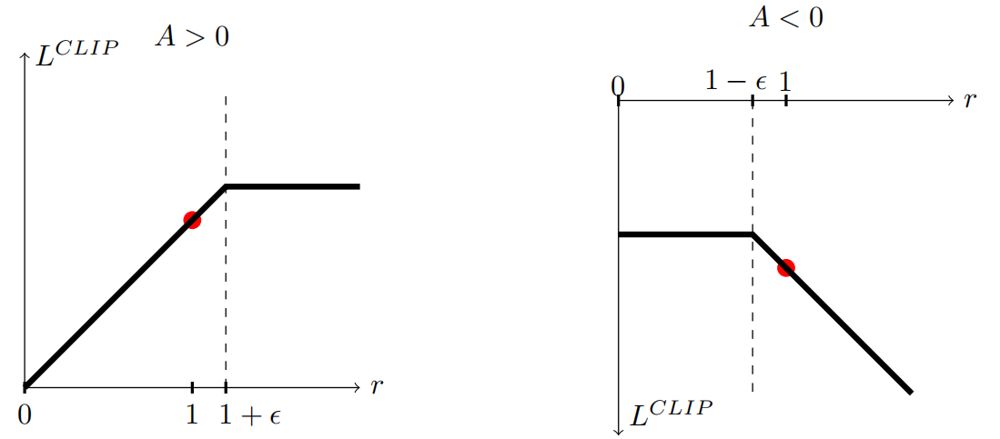
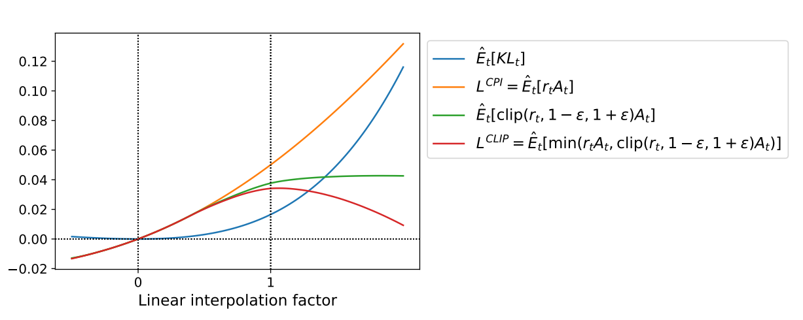
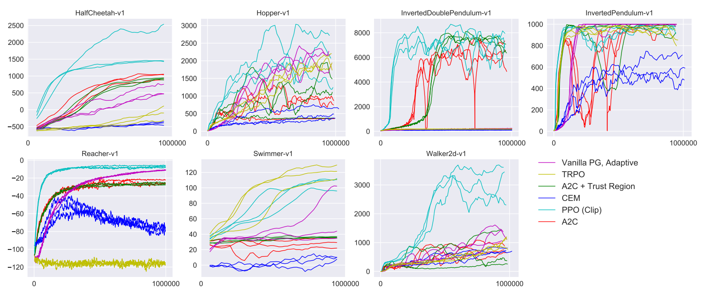
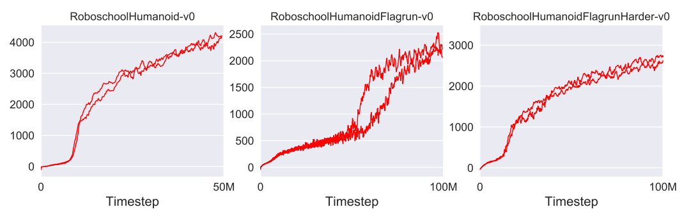
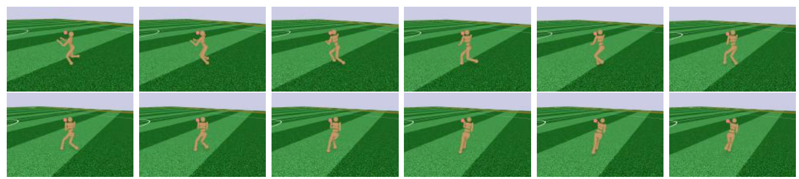
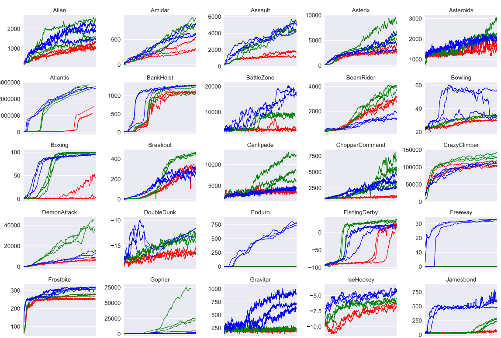
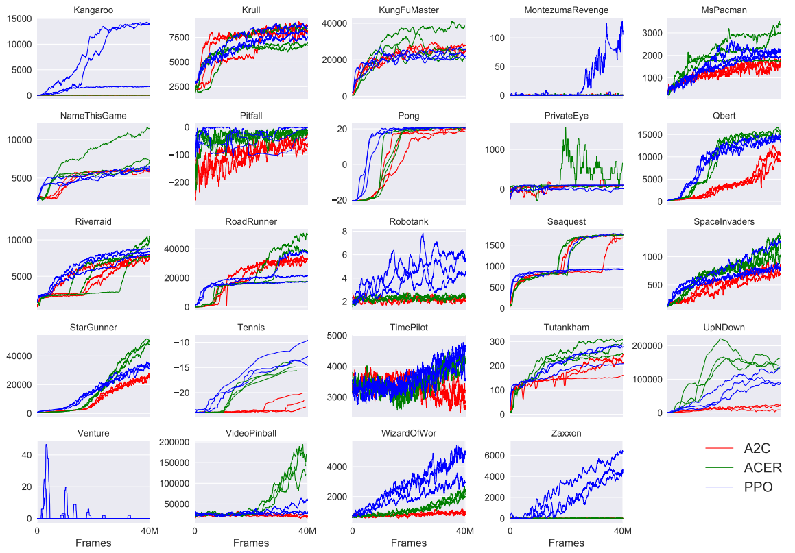

# Proximal Policy Optimization Algorithms
PPO-近端策略优化算法 2017.7.20  https://arxiv.org/abs/1707.06347

## 阅读笔记
* https://spinningup.openai.com/en/latest/algorithms/ppo.html
* chatGPT为什么要用强化学习：预训练模型的学习目标是预测下一个token，通过不断循环生成完整内容；而人类需要对整体生成内容的质量做评估；比较符合强化学习，每个步骤(单个token)累计奖励，最终获得最优的完整内容。
* 源码：https://github.com/openai/baselines/tree/master/baselines/ppo1 
    * 源码走读 https://www.cxyzjd.com/article/ariesjzj/80417179
    * https://github.com/Visgean/class-based-ppo/blob/master/ppo.py
    * https://github.com/Prahtz/recurrent-ppo-atari
    * https://github.com/RedTachyon/rl-pong
    * https://github.com/markaksen/holdem-agent/blob/master/src/agents/ppo_agent.py

## Abstract
We propose a new family of policy gradient methods for reinforcement learning, which alternate between sampling data through interaction with the environment, and optimizing a “surrogate” objective function using stochastic gradient ascent. Whereas standard policy gradient methods perform one gradient update per data sample, we propose a novel objective function that enables multiple epochs of minibatch updates. The new methods, which we call proximal policy optimization (PPO), have some of the benefits of trust region policy optimization (TRPO), but they are much simpler to implement, more general, and have better sample complexity (empirically). Our experiments test PPO on a collection of benchmark tasks, including simulated robotic locomotion and Atari game playing, and we show that PPO outperforms other online policy gradient methods, and overall strikes a favorable balance between sample complexity, simplicity, and wall-time. 

我们提出了一系列用于强化学习的新策略梯度方法，它们通过与环境交互来采样数据和使用随机梯度上升(SGA)优化“智能体”目标函数之间交替。 鉴于标准策略梯度方法对每个数据样本执行一次梯度更新，我们提出了一种新的目标函数，可以实现多个时期的小批量更新。 我们称之为近端策略优化 (PPO) 的新方法具有信任域策略优化 (TRPO) 的一些优点，但实施起来更简单、更通用，并且具有更好的样本复杂度(根据经验)。 我们的实验在一系列基准任务上测试了 PPO，包括模拟机器人运动和 Atari 游戏，我们表明 PPO 优于其他在线策略梯度方法，并且总体上在样本复杂度、简单性和 wall-time 之间取得了有利的平衡。

## 1 Introduction
In recent years, several different approaches have been proposed for reinforcement learning with neural network function approximators. The leading contenders are deep Q-learning [Mni+15], “vanilla” policy gradient methods [Mni+16], and trust region / natural policy gradient methods [Sch+15b]. However, there is room for improvement in developing a method that is scalable (to large models and parallel implementations), data efficient, and robust (i.e., successful on a variety of problems without hyperparameter tuning). Q-learning (with function approximation) fails on many simple problems(1 While DQN works well on game environments like the Arcade Learning Environment [Bel+15] with discrete action spaces, it has not been demonstrated to perform well on continuous control benchmarks such as those in OpenAI Gym [Bro+16] and described by Duan et al. [Dua+16].) and is poorly understood, vanilla policy gradient methods have poor data effiency and robustness; and trust region policy optimization (TRPO) is relatively complicated, and is not compatible with architectures that include noise (such as dropout) or parameter sharing (between the policy and value function, or with auxiliary tasks).

近年来，已经提出了几种不同的方法来使用神经网络函数逼近器进行强化学习。 领先的竞争者是深度 Q-learning [Mni+15]、“普通”策略梯度方法 [Mni+16] 和信任域/自然策略梯度方法 [Sch+15b]。 然而，在开发一种可扩展(适用于大型模型和并行实现)、数据高效且稳健(即无需超参数调整即可成功解决各种问题)的方法方面仍有改进空间。 Q-learning(具有函数逼近)在许多简单问题上都失败了(1 虽然 DQN 在具有离散动作空间的 Arcade Learning Environment [Bel+15] 等游戏环境中表现良好，但尚未证明它在连续控制基准测试中表现良好，例如 正如 OpenAI Gym [Bro+16] 和 Duan et al. [Dua+16] 所描述的那样)，并且人们知之甚少，普通策略梯度方法的数据效率和稳健性较差;  信任区域策略优化 (TRPO) 相对复杂，并且与包含噪声(例如 dropout)或参数共享(在策略和价值函数之间，或辅助任务)的架构不兼容。
<!--
Q-Learning：离散动作空间表现良好，连续控制上差
普通策略梯度：数据效率和稳健性较差
信任区域策略优化 (TRPO) ：与包含噪声(例如 dropout)或参数共享(在策略和价值函数之间，或辅助任务)的架构不兼容。
-->

This paper seeks to improve the current state of affairs by introducing an algorithm that attains the data efficiency and reliable performance of TRPO, while using only first-order optimization. We propose a novel objective with clipped probability ratios, which forms a pessimistic estimate (i.e., lower bound) of the performance of the policy. To optimize policies, we alternate between sampling data from the policy and performing several epochs of optimization on the sampled data.

本文旨在通过引入一种算法来改善当前状况，该算法仅使用一阶优化即可获得 TRPO 的数据效率和可靠性能。 我们提出了一个具有截断概率比的新目标，它形成了对策略性能的悲观估计(即下限)。 为了优化策略，我们在从策略中采样数据和对采样数据执行几个优化周期之间交替进行。
<!--目标损失：截断概率比 clipped probability ratios？ 从策略中采样数据，对采样数据优化几个周期？
一阶
-->

Our experiments compare the performance of various different versions of the surrogate objective, and find that the version with the clipped probability ratios performs best. We also compare PPO to several previous algorithms from the literature. On continuous control tasks, it performs better than the algorithms we compare against. On Atari, it performs significantly better (in terms of sample complexity) than A2C and TRPO; similarly to ACER though it is much simpler; and worse than DQN, though it is much more efficient with regard to wall-time and computation. 

我们的实验比较了智能体目标的各种不同版本的性能，并发现具有截断概率比的版本表现最佳。 我们还将 PPO 与文献中的几种先前算法进行了比较。 在连续控制任务上，它与我们比较的算法表现更好。 在 Atari 上，它的表现(在样本复杂度方面)明显优于 A2C 和 TRPO;  与 ACER 类似，但更简单;  比 DQN 更差，尽管它在 wall-time 和计算方面效率更高。

## 2 Background: Policy Optimization 背景：策略优化
### 2.1 Policy Gradient Methods 策略梯度法
Policy gradient methods work by computing an estimator of the policy gradient and plugging it into a stochastic gradient ascent algorithm. The most commonly used gradient estimator has the form 

策略梯度方法通过计算策略梯度的估计量并将其插入随机梯度上升算法来工作。 最常用的梯度估计器具有以下形式

$\hat{g} = \hat{E}_t [ ∇_θ log π_θ(a_t | s_t)\hat{A}_t ] $ (1) 

where $π_θ$ is a stochastic policy and $\hat{A}_t$ is an estimator of the advantage function at timestep t. Here, the expectation $\hat{E}_t[. . .]$ indicates the empirical average over a finite batch of samples, in an algorithm that alternates between sampling and optimization. Implementations that use automatic differentiation software work by constructing an objective function whose gradient is the policy gradient estimator; the estimator $\hat{g}$ is obtained by differentiating the objective

其中 $π_θ$ 是随机策略，$\hat{A}_t$ 是时间步长 t 的优势函数的估计量。 在这里，期望 $\hat{E}_t[. . .]$ 表示在采样和优化之间交替的算法中，有限批样本的经验均值。 使用自动微分软件的实现通过构建一个目标函数来工作，该目标函数的梯度是策略梯度估计器;  估计器 $\hat{g}$ 是通过对目标进行微分得到的
<!--
$a_t$ action, $s_t$ state,
-->

$L^{PG}(θ) = \hat{E}_t [ log π_θ(a_t | s_t)\hat{A}_t ] . $ (2)

While it is appealing to perform multiple steps of optimization on this loss $L^{PG}$ using the same trajectory, doing so is not well-justified, and empirically it often leads to destructively large policy updates (see Section 6.1; results are not shown but were similar or worse than the “no clipping or penalty” setting).

虽然使用相同的轨迹对该损失 $L^{PG}$ 执行多个优化步骤很有吸引力，但这样做并没有充分的理由，而且根据经验，它通常会导致破坏性的大策略更新(参见第 6.1 节; 结果是 未显示，但与“无剪裁或惩罚”设置相似或更差)。
<!--PG,策略梯度-->

### 2.2 Trust Region Methods 信任域方法
In TRPO [Sch+15b], an objective function (the “surrogate” objective) is maximized subject to a constraint on the size of the policy update. Specifically, 

在 TRPO [Sch+15b] 中，目标函数(“智能体”目标)在策略更新大小的约束下最大化。 具体来说，

$maximize_θ$ $\hat{E}_t \Bigg[ \frac{π_θ(a_t | s_t)}{π_{θ_{old}}(a_t | s_t)}\hat{A}t \Bigg] $ (3) 

subject to $\hat{E}_t \Bigg[KL\Big[π_{θ_{old}}(· | s_t), π_θ(· | s_t)\Big]\Bigg] ≤ δ. $(4)

Here, $θ_{old}$ is the vector of policy parameters before the update. This problem can efficiently be approximately solved using the conjugate gradient algorithm, after making a linear approximation to the objective and a quadratic approximation to the constraint.

这里，$θ_{old}$ 是策略参数更新前的向量。 在对目标进行线性近似和对约束进行二次近似后，可以使用共轭梯度算法有效地近似求解该问题。

<!--共轭梯度算法
https://zhuanlan.zhihu.com/p/98642663
要求系数矩阵对称且正定
对目标进行线性近似，对约束进行二次近似
-->

The theory justifying TRPO actually suggests using a penalty instead of a constraint, i.e., solving the unconstrained optimization problem 

证明 TRPO 合理的理论实际上建议使用惩罚而不是约束，即解决无约束优化问题

$maximize_θ$ $\hat{E}_t\Bigg[ \frac{π_θ(a_t | s_t)}{π_{θ_{old}}(a_t | s_t)}\hat{A}_t − β KL\Big[π_{θ_{old}}(· | s_t), π_θ(· | s_t)\Big] \Bigg] $ (5) 

for some coefficient β. This follows from the fact that a certain surrogate objective (which computes the max KL over states instead of the mean) forms a lower bound (i.e., a pessimistic bound) on the performance of the policy π. TRPO uses a hard constraint rather than a penalty because it is hard to choose a single value of β that performs well across different problems—or even within a single problem, where the the characteristics change over the course of learning. Hence, to achieve our goal of a first-order algorithm that emulates the monotonic improvement of TRPO, experiments show that it is not sufficient to simply choose a fixed penalty coefficient β and optimize the penalized objective Equation (5) with SGD; additional modifications are required. 

对于某些系数β。 这是因为某个智能体目标(计算状态上的最大 KL 而不是平均值)形成了策略π 性能的下限(即悲观界限)。 TRPO 使用硬约束而不是惩罚，因为很难选择在不同问题中表现良好的单个 β值 —— 甚至在单个问题中，在学习过程中特征会发生变化。 因此，为了实现我们模拟 TRPO 单调改进的一阶算法的目标，实验表明，简单地选择一个固定的惩罚系数 β 并用 SGD 优化惩罚目标方程(5)是不够的，需要额外的修改。

## 3 Clipped Surrogate Objective 剪裁的智能体目标
Let $r_t(θ)$ denote the probability ratio $r_t(θ) = \frac{π_θ(a_t | s_t)}{π_{θ_{old}}(a_t | s_t)} $, so $r(θ_{old}) = 1$. TRPO maximizes a “surrogate” objective

设 $r_t(θ)$ 表示概率比 $r_t(θ) = \frac{π_θ(a_t | s_t)}{π_{θ_{old}}(a_t | s_t)} $，所以 $r(θ_{old}) = 1$。 TRPO 最大化“智能体”目标

$L^{CPI} (θ) = \hat{E}_t \Big[ \frac{π_θ(a_t | s_t)}{π_{θ_{old}}(a_t | s_t)}\hat{A}_t \Big] = \hat{E}_t\Big[ r_t(θ)\hat{A}_t \Big] . $   (6)

The superscript CPI refers to conservative policy iteration [KL02], where this objective was proposed. Without a constraint, maximization of $L^{CPI}$ would lead to an excessively large policy update; hence, we now consider how to modify the objective, to penalize changes to the policy that move $r_t(θ)$ away from 1.

上标 CPI 指的是保守的策略迭代， [KL02] 提出了这个目标。 如果没有约束，$L^{CPI}$ 的最大化将导致过大的策略更新;  因此，我们现在考虑如何修改目标，以惩罚使 $r_t(θ)$ 远离 1 的策略更改。

The main objective we propose is the following:

我们提出的主要目标如下：

$ L^{CLIP} (θ) = \hat{E}_t \Big[ min\bigg( r_t(θ)\hat{A}_t, clip(r_t(θ), 1 − \epsilon, 1 + \epsilon )\hat{A}_t \bigg) \Big] $ (7) 

where epsilon is a hyperparameter, say, $\epsilon$ = 0.2. The motivation for this objective is as follows. The first term inside the min is $L^{CPI}$ . The second term, $clip(r_t(θ), 1−\epsilon, 1+\epsilon )\hat{A}_t$ , modifies the surrogate objective by clipping the probability ratio, which removes the incentive for moving $r_t$ outside of the interval [1 − $\epsilon$, 1 + $\epsilon$ ]. Finally, we take the minimum of the clipped and unclipped objective, so the final objective is a lower bound (i.e., a pessimistic bound) on the unclipped objective. With this scheme, we only ignore the change in probability ratio when it would make the objective improve, and we include it when it makes the objective worse. Note that $L^{CLIP} (θ) = L^{CPI} (θ)$ to first order around $θ_{old}$ (i.e., where r = 1), however, they become different as θ moves away from$θ_{old}$. Figure 1 plots a single term (i.e., a single t) in $L^{CLIP}$ ; note that the probability ratio r is clipped at 1 − $\epsilon$ or 1 + $\epsilon$ depending on whether the advantage is positive or negative. 

其中 epsilon 是一个超参数，例如，$\epsilon$ = 0.2。 这个目标的动机如下。 min 中的第一项是 $L^{CPI}$ 。 第二项 $clip(r_t(θ), 1−\epsilon, 1+\epsilon )\hat{A}_t$ 通过削减概率比修改智能体目标，这消除了将 $r_t$ 移出区间 [ 1 - $\epsilon$, 1 + $\epsilon$]之外的诱因。 最后，我们采用裁剪目标和未裁剪目标中的最小值，因此最终目标是未裁剪目标的下限(即悲观边界)。 有了这个方案，我们只在概率比的变化会使目标提高时忽略它，而在它使目标变差时我们将其包括在内。 请注意，$L^{CLIP} (θ) = L^{CPI} (θ)$ 围绕 $θ_{old}$ 进行一阶排序(即，其中 r = 1)，然而，随着 θ 远离 $θ_{old}$。 图 1 绘制了 $L^{CLIP}$ 中的单个项(即单个 t);  请注意，概率比 r 被限制在 1 − $\epsilon$ 或 1 + $\epsilon$ 取决于优势是积极的还是消极的。

<br/>
Figure 1: Plots showing one term (i.e., a single timestep) of the surrogate function $L^{CLIP}$ as a function of the probability ratio r, for positive advantages (left) and negative advantages (right). The red circle on each plot shows the starting point for the optimization, i.e., r = 1. Note that $L^{CLIP}$ sums many of these terms.
图1：显示智能体函数 $L^{CLIP}$ 的一项(即单个时间步长)作为概率比 r 的函数的图，用于正优势(左)和负优势(右)。 每个图上的红色圆圈显示优化的起点，即 r = 1。请注意，$L^{CLIP}$ 对其中许多项求和。

Figure 2 provides another source of intuition about the surrogate objective $L^{CLIP}$ . It shows how several objectives vary as we interpolate along the policy update direction, obtained by proximal policy optimization (the algorithm we will introduce shortly) on a continuous control problem. We can see that $L^{CLIP}$ is a lower bound on $L^{CPI}$ , with a penalty for having too large of a policy update. 

图2 提供了关于智能体目标 $L^{CLIP}$ 的另一个直觉来源。 它显示了当我们沿着策略更新方向进行插值时，几个目标是如何变化的，这是通过对连续控制问题的近端策略优化(我们将很快介绍的算法)获得的。 我们可以看到 $L^{CLIP}$ 是 $L^{CPI}$ 的下限，因为策略更新太大而受到惩罚。

<br/>
Figure 2: Surrogate objectives, as we interpolate between the initial policy parameter $θ_{old}$, and the updated policy parameter, which we compute after one iteration of PPO. The updated policy has a KL divergence of about 0.02 from the initial policy, and this is the point at which $L^{CLIP}$ is maximal. This plot corresponds to the first policy update on the Hopper-v1 problem, using hyperparameters provided in Section 6.1. 
图 2：智能体目标，当我们在初始策略参数 $θ_{old}$ 和更新的策略参数之间进行插值时，我们在 PPO 的一次迭代后计算。 更新后的策略与初始策略的 KL 差异约为 0.02，这是 $L^{CLIP}$ 最大的点。 该图对应于 Hopper-v1 问题的第一次策略更新，使用第 6.1 节中提供的超参数。

<!--Hopper-v1 问题 -->

## 4 Adaptive KL Penalty Coefficient 自适应KL惩罚系数
Another approach, which can be used as an alternative to the clipped surrogate objective, or in addition to it, is to use a penalty on KL divergence, and to adapt the penalty coefficient so that we achieve some target value of the KL divergence $d_{targ}$ each policy update. In our experiments, we found that the KL penalty performed worse than the clipped surrogate objective, however, we’ve included it here because it’s an important baseline.

另一种方法，可以用作剪裁智能体目标的智能体方法，或者除此之外，是对 KL 散度使用惩罚，并调整惩罚系数，以便我们实现 KL 散度 $d_{targ}$ 的某个目标值每次策略更新。 在我们的实验中，我们发现 KL 惩罚比剪裁的智能体目标表现更差，但是，我们将其包含在此处，因为它是一个重要的基线。

In the simplest instantiation of this algorithm, we perform the following steps in each policy update:
在该算法的最简单实例中，我们在每次策略更新中执行以下步骤：

* Using several epochs of minibatch SGD, optimize the KL-penalized objective

使用小批量 SGD 的几个 epoch，优化 KL 惩罚目标

$L^{KLPEN} (θ) = \hat{E}_t \bigg[ \frac{π_θ(a_t | s_t)}{πθ_{old}(a_t | s_t)}\hat{A}_t − β KL[πθ_{old}(· | st), πθ(· | st)] \bigg] $(8)

* Compute d = $\hat{E}_t [KL[πθ_{old}(· | st), πθ(· | st)]] $ 

    -- If d < $d_{targ}$/1.5, β ← β/2 

    -- If d > $d_{targ}$ × 1.5, β ← β × 2

The updated β is used for the next policy update. With this scheme, we occasionally see policy updates where the KL divergence is significantly different from $d_{targ}$, however, these are rare, and β quickly adjusts. The parameters 1.5 and 2 above are chosen heuristically, but the algorithm is not very sensitive to them. The initial value of β is a another hyperparameter but is not important in practice because the algorithm quickly adjusts it. 

更新后的 β 用于下一次策略更新。 使用此方案，我们偶尔会看到 KL 散度与 $d_{targ}$ 显著不同的策略更新，但是，这种情况很少见，并且 β 会快速调整。 上面的参数1.5和2是启发式选择的，但是算法对它们不是很敏感。 β 的初始值是另一个超参数，但在实践中并不重要，因为算法会快速调整它。

## 5 Algorithm 算法
The surrogate losses from the previous sections can be computed and differentiated with a minor change to a typical policy gradient implementation. For implementations that use automatic differentation, one simply constructs the loss $L^{CLIP}$ or $L^{KLPEN}$ instead of $L^{PG}$, and one performs multiple steps of stochastic gradient ascent on this objective.

前面部分提到的智能体损失可以通过对典型策略梯度实现的微小更改来计算和区分。对于使用自动微分的实现，只需构造损失 $L^{CLIP}$ 或 $L^{KLPEN}$ 而不是 $L^{PG}$，然后针对此目标执行多个随机梯度上升步骤。

<!--随机梯度上升,一次仅用一个样本点来更新回归系数
梯度上升,梯度下降？
-->

Most techniques for computing variance-reduced advantage-function estimators make use a learned state-value function V(s); for example, generalized advantage estimation [Sch+15a], or the finite-horizon estimators in [Mni+16]. If using a neural network architecture that shares parameters between the policy and value function, we must use a loss function that combines the policy surrogate and a value function error term. This objective can further be augmented by adding an entropy bonus to ensure sufficient exploration, as suggested in past work [Wil92; Mni+16]. Combining these terms, we obtain the following objective, which is (approximately) maximized each iteration:

大多数用于计算减少方差的优势函数估计的技术都使用学习到的状态值函数 V(s);  例如，广义优势估计 [Sch+15a] 或 [Mni+16] 中的有限范围估计。 如果使用在策略和价值函数之间共享参数的神经网络架构，我们必须使用结合了策略智能体和价值函数误差项的损失函数, 正如过去的工作 [Wil92;  Mni+16]。 结合这些项，我们得到以下目标，即(近似)最大化每次迭代：
<!--在策略和价值函数之间共享参数?-->

$L^{CLIP + VF + S}_t (θ) = \hat{E}_t \bigg[ L^{CLIP}_t (θ) − c_1L^{VF}_t (θ) + c_2S\big[π_θ\big](s_t) \bigg]$, (9) 

where $c_1$, $c_2$ are coefficients, and S denotes an entropy bonus, and $L^{VF}_t$ is a squared-error loss $(V_θ(s_t) - V^{targ}_t)^2 $

其中$c_1$、$c_2$是系数，S表示熵红利，$L^{VF}_t$是平方误差损失 $(V_θ(s_t) - V^{targ}_t)^2$

One style of policy gradient implementation, popularized in [Mni+16] and well-suited for use with recurrent neural networks, runs the policy for T timesteps (where T is much less than the episode length), and uses the collected samples for an update. This style requires an advantage estimator that does not look beyond timestep T. The estimator used by [Mni+16] is

一种在 [Mni+16] 中流行并且非常适合与循环神经网络一起使用的策略梯度实现方式，运行 T 个时间步长的策略(其中 T 远小于episode长度)，并将收集的样本用于 更新。 这种风格需要一个不超越时间步 T 的优势估计器。 [Mni+16] 使用的估计器是

$\hat{A}_t = −V(s_t) + r_t + γr_{t+1} + · · · + γ^{T −t+1}r_{T −1} + γ^{T −t}V (s_T )$ (10) 

where t specifies the time index in [0, T], within a given length-T trajectory segment. Generalizing this choice, we can use a truncated version of generalized advantage estimation, which reduces to Equation (10) when λ = 1:

其中 t 指定给定长度 T 轨迹段内 [0, T] 中的时间索引。 推广这种选择，我们可以使用广义优势估计的截断版本，当 λ = 1 时，它简化为等式 (10)：

$\hat{A}_t = δ_t + (γλ)δ_{t+1} + · · · + · · · + (γλ)^{T −t+1}δ_{T −1},$ (11) 

where $δ_t = r_t + γV (s-{t+1}) − V (s_t) $  (12)

A proximal policy optimization (PPO) algorithm that uses fixed-length trajectory segments is shown below. Each iteration, each of N (parallel) actors collect T timesteps of data. Then we construct the surrogate loss on these NT timesteps of data, and optimize it with minibatch SGD (or usually for better performance, Adam [KB14]), for K epochs.

使用固定长度轨迹段的近端策略优化 (PPO) 算法如下所示。 每次迭代，N 个(并行)actors中的每一个都收集 T 个时间步长的数据。 然后我们在这些数据的 NT 时间步长上构造智能体损失，并使用小批量 SGD(或通常为了更好的性能，Adam [KB14])对其进行 K 个时期的优化。


``` python
# Algorithm 1 PPO, Actor-Critic Style 
for iteration=1, 2, . . . do
    for actor=1, 2, . . . , N do
        Run policy π_θ_old in environment for T timesteps
        Compute advantage estimates Aˆ_1, . . . , Aˆ_T
    end for
    Optimize surrogate L wrt θ, with K epochs and minibatch size M ≤ NT
    θ_old ← θ
end for
```

 
## 6 Experiments
### 6.1 Comparison of Surrogate Objectives 智能体目标的比较
First, we compare several different surrogate objectives under different hyperparameters. Here, we compare the surrogate objective $L^{CLIP}$ to several natural variations and ablated versions.

首先，我们比较了不同超参数下的几个不同的智能体目标。 在这里，我们将智能体目标 $L^{CLIP}$ 与几个自然变体和消融版本进行比较。

No clipping or penalty : $L_t(θ) = r_t(θ)\hat{A}_t$

不带剪裁或惩罚

Clipping : $L_t(θ) = min(r_t(θ)\hat{A}_t, clip(r_t(θ)), 1 − e, 1 + e )\hat{A}_t$

带剪裁的

KL penalty (fixed or adaptive)  $L_t(θ) = r_t(θ)\hat{A}_t − β KL[πθ_{old}, πθ] $

KL 惩罚(固定或自适应)

For the KL penalty, one can either use a fixed penalty coefficient β or an adaptive coefficient as described in Section 4 using target KL value $d_{targ}$. Note that we also tried clipping in log space, but found the performance to be no better.

对于 KL 惩罚，可以使用固定惩罚系数 β 或自适应系数，如第 4 节所述，使用目标 KL 值 $d_{targ}$。 请注意，我们还尝试在log空间中进行裁剪，但发现性能并没有提高。

Because we are searching over hyperparameters for each algorithm variant, we chose a computationally cheap benchmark to test the algorithms on. Namely, we used 7 simulated robotics tasks(2HalfCheetah, Hopper, InvertedDoublePendulum, InvertedPendulum, Reacher, Swimmer, and Walker2d, all “-v1” ) implemented in OpenAI Gym [Bro+16], which use the MuJoCo [TET12] physics engine. We do one million timesteps of training on each one. Besides the hyperparameters used for clipping (e ) and the KL penalty (β, $d_{targ}$), which we search over, the other hyperparameters are provided in in Table 3.

因为我们正在搜索每个算法变体的超参数，所以我们选择了一个计算成本低的基准来测试算法。 即,我们使用了在 OpenAI Gym [Bro+16] 中实现的 7 个模拟机器人任务(2 HalfCheetah、Hopper、InvertedDoublePendulum、InvertedPendulum、Reacher、Swimmer 和 Walker2d，均为“-v1”)，它们使用 MuJoCo [TET12] 物理引擎。 我们对每一个进行一百万次训练。 除了我们搜索的用于裁剪 (e) 和 KL 惩罚 (β, $d_{targ}$) 的超参数外，其他超参数在表 3 中提供。

To represent the policy, we used a fully-connected MLP with two hidden layers of 64 units, and tanh nonlinearities, outputting the mean of a Gaussian distribution, with variable standard deviations, following [Sch+15b; Dua+16]. We don’t share parameters between the policy and value function (so coefficient $c_1$ is irrelevant), and we don’t use an entropy bonus.

为了表示策略，我们使用了一个完全连接的 MLP，它有两个 64 个单元的隐藏层和 tanh 非线性，输出高斯分布的均值，标准差可变，遵循 [Sch+15b; Dua+16]。 我们不在策略和价值函数之间共享参数(因此系数 $c_1$ 无关紧要)，并且我们不使用熵奖励。

Each algorithm was run on all 7 environments, with 3 random seeds on each. We scored each run of the algorithm by computing the average total reward of the last 100 episodes. We shifted and scaled the scores for each environment so that the random policy gave a score of 0 and the best result was set to 1, and averaged over 21 runs to produce a single scalar for each algorithm setting.

每个算法都在所有 7 个环境中运行，每个环境有 3 个随机种子。 我们通过计算最后 100 周期的平均总奖励来对算法的每次运行进行评分。 我们移动并缩放了每个环境的分数，以便随机策略给出 0 分，最佳结果设置为 1，并对 21 次运行进行平均，为每个算法设置生成一个标量。

The results are shown in Table 1. Note that the score is negative for the setting without clipping or penalties, because for one environment (half cheetah) it leads to a very negative score, which is worse than the initial random policy.  

结果如 表1 所示。请注意，对于没有剪裁或惩罚的设置，分数为负，因为对于一个环境(半猎豹)，它会导致非常负的分数，这比初始随机策略更差。


algorithm |avg. normalized score
---|---
No clipping or penalty |-0.39
Clipping, $\epsilon$ = 0.1 |0.76
Clipping, $\epsilon$ = 0.2 |0.82
Clipping, $\epsilon$ = 0.3 |0.70
Adaptive KL $d_{targ}$ = 0.003 |0.68
Adaptive KL $d_{targ}$ = 0.01 |0.74
Adaptive KL $d_{targ}$ = 0.03 |0.71
Fixed KL, β = 0.3 |0.62
Fixed KL, β = 1. |0.71
Fixed KL, β = 3. |0.72
Fixed KL, β = 10. |0.69

Table 1: Results from continuous control benchmark. Average normalized scores (over 21 runs of the algorithm, on 7 environments) for each algorithm / hyperparameter setting . β was initialized at 1.
表 1：连续控制基准的结果。 每个算法/超参数设置的平均归一化分数(超过 21 次算法运行，在 7 个环境中)。 β 初始化为 1。

### 6.2 Comparison to Other Algorithms in the Continuous Domain 与连续域中其他算法的比较
Next, we compare PPO (with the “clipped” surrogate objective from Section 3) to several other methods from the literature, which are considered to be effective for continuous problems. We compared against tuned implementations of the following algorithms: trust region policy optimization [Sch+15b], cross-entropy method (CEM) [SL06], vanilla policy gradient with adaptive stepsize(3After each batch of data, the Adam stepsize is adjusted based on the KL divergence of the original and updated policy, using a rule similar to the one shown in Section 4. An implementation is available at https://github.com/berkeleydeeprlcourse/homework/tree/master/hw4.), A2C [Mni+16], A2C with trust region [Wan+16]. A2C stands for advantage actor critic, and is a synchronous version of A3C, which we found to have the same or better performance than the asynchronous version. For PPO, we used the hyperparameters from the previous section, with e = 0.2. We see that PPO outperforms the previous methods on almost all the continuous control environments. 

接下来，我们将 PPO(使用第 3 节中的“剪裁”智能体目标)与文献中被认为对连续问题有效的其他几种方法进行比较。 我们与以下算法的调整实现进行了比较：信任域策略优化 [Sch+15b]、交叉熵方法 (CEM) [SL06]、具有自适应步长的普通策略梯度(3 在每批数据之后，根据 Adam 步长进行调整 关于原始策略和更新策略的 KL 差异，使用类似于第 4 节中所示的规则。可在 https://github.com/berkeleydeeprlcourse/homework/tree/master/hw4 获得实现 )，A2C [ Mni+16]，具有信任区域 [Wan+16] 的 A2C。 A2C 代表 Advantage Actor Critic，是 A3C 的同步版本，我们发现它具有与异步版本相同或更好的性能。 对于 PPO，我们使用了上一节中的超参数，其中 e = 0.2。 我们看到 PPO 在几乎所有的连续控制环境中都优于以前的方法。

<br/>
Figure 3: Comparison of several algorithms on several MuJoCo environments, training for one million timesteps.
图 3：几种算法在几种 MuJoCo 环境中的比较，训练了 100 万个时间步。

### 6.3 Showcase in the Continuous Domain: Humanoid Running and Steering 连续域中的展示：人形跑步和转向 
To showcase the performance of PPO on high-dimensional continuous control problems, we train on a set of problems involving a 3D humanoid, where the robot must run, steer, and get up off the ground, possibly while being pelted by cubes. The three tasks we test on are (1) RoboschoolHumanoid: forward locomotion only, (2) RoboschoolHumanoidFlagrun: position of target is randomly varied every 200 timesteps or whenever the goal is reached, (3) RoboschoolHumanoidFlagrunHarder, where the robot is pelted by cubes and needs to get up off the ground. See Figure 5 for still frames of a learned policy, and Figure 4 for learning curves on the three tasks. Hyperparameters are provided in Table 4. In concurrent work, Heess et al. [Hee+17] used the adaptive KL variant of PPO (Section 4) to learn locomotion policies for 3D robots.  

为了展示 PPO 在高维连续控制问题上的性能，我们训练了一组涉及 3D 人形机器人的问题，其中机器人必须奔跑、转向并离开地面，可能同时被立方体击打。 我们测试的三个任务是 
1. RoboschoolHumanoid：仅向前运动，
2. RoboschoolHumanoidFlagrun：目标位置每 200 个时间步或每当达到目标时随机变化，
3. RoboschoolHumanoidFlagrunHarder，其中机器人被立方体击打并且 需要离开地面。 
有关已学习策略的静止帧，请参见图 5，有关三个任务的学习曲线请参见图 4。 表 4 中提供了超参数。在并行工作中，Heess et al. [Hee+17] 使用 PPO 的自适应 KL 变体(第 4 节)来学习 3D 机器人的运动策略。

<br/>
Figure 4: Learning curves from PPO on 3D humanoid control tasks, using Roboschool. 
图 4：PPO 在 3D 人形控制任务上的学习曲线，使用 Roboschool。

<br/>
Figure 5: Still frames of the policy learned from RoboschoolHumanoidFlagrun. In the first six frames, the robot runs towards a target. Then the position is randomly changed, and the robot turns and runs toward the new target.
图 5：从 RoboschoolHumanoidFlagrun 学习的策略的静止帧。 在前六帧中，机器人跑向一个目标。 然后随机改变位置，机器人转身向新目标跑去。

### 6.4 Comparison to Other Algorithms on the Atari Domain   与 Atari 域上其他算法的比较
We also ran PPO on the Arcade Learning Environment [Bel+15] benchmark and compared against well-tuned implementations of A2C [Mni+16] and ACER [Wan+16]. For all three algorithms, we used the same policy network architechture as used in [Mni+16]. The hyperparameters for PPO are provided in Table 5. For the other two algorithms, we used hyperparameters that were tuned to maximize performance on this benchmark.

我们还在 Arcade 学习环境[Bel+15] 基准测试中运行 PPO，并与 A2C [Mni+16] 和 ACER [Wan+16] 的调整良好的实现进行比较。 对于所有三种算法，我们使用了与 [Mni+16] 中使用的相同的策略网络架构。 表 5 中提供了 PPO 的超参数。对于其他两种算法，我们使用了经过调整以最大限度地提高该基准性能的超参数。

A table of results and learning curves for all 49 games is provided in Appendix B. We consider the following two scoring metrics: (1) average reward per episode over entire training period (which favors fast learning), and (2) average reward per episode over last 100 episodes of training (which favors final performance). Table 2 shows the number of games “won” by each algorithm, where we compute the victor by averaging the scoring metric across three trials.

附录 B 中提供了所有 49 场比赛的结果和学习曲线表。我们考虑以下两个评分指标：(1) 整个训练期间每集的平均奖励(有利于快速学习)，以及 (2) 平均每集奖励 过去 100 集训练中的集数(有利于最终表现)。 表 2 显示了每种算法“获胜”的游戏数量，我们通过对三个试验的得分指标进行平均来计算获胜者。


||A2C| ACER| PPO| Tie
---| --- | --- | --- | ---
(1) avg. episode reward over all of training |1 |18 |30 |0
(2) avg. episode reward over last 100 episodes |1 |28 |19 |1

Table 2: Number of games “won” by each algorithm, where the scoring metric is averaged across three trials. 
表 2：每种算法“获胜”的游戏数量，其中得分指标是三个试验的平均值。

## 7 Conclusion
We have introduced proximal policy optimization, a family of policy optimization methods that use multiple epochs of stochastic gradient ascent to perform each policy update. These methods have the stability and reliability of trust-region methods but are much simpler to implement, requiring only few lines of code change to a vanilla policy gradient implementation, applicable in more general settings (for example, when using a joint architecture for the policy and value function), and have better overall performance. 

我们介绍了近端策略优化，这是一系列策略优化方法，使用随机梯度上升的多个时期来执行每个策略更新。 这些方法具有信任域方法的稳定性和可靠性，但实现起来要简单得多，只需更改几行代码即可实现普通的策略梯度实现，适用于更一般的设置(例如，当为策略使用联合架构时 和价值函数)，并具有更好的综合性能。

## Acknowledgements
Thanks to Rocky Duan, Peter Chen, and others at OpenAI for insightful comments. 

感谢 Rocky Duan、Peter Chen 和 OpenAI 的其他人提供的有见地的评论。

## References
* [Bel+15] M. Bellemare, Y. Naddaf, J. Veness, and M. Bowling. “The arcade learning environ￾ment: An evaluation platform for general agents”. In: Twenty-Fourth International
Joint Conference on Artificial Intelligence. 2015.
* [Bro+16] G. Brockman, V. Cheung, L. Pettersson, J. Schneider, J. Schulman, J. Tang, and W.
Zaremba. “OpenAI Gym”. In: arXiv preprint arXiv:1606.01540 (2016).
* [Dua+16] Y. Duan, X. Chen, R. Houthooft, J. Schulman, and P. Abbeel. “Benchmarking Deep
Reinforcement Learning for Continuous Control”. In: arXiv preprint arXiv:1604.06778
(2016).
* [Hee+17] N. Heess, S. Sriram, J. Lemmon, J. Merel, G. Wayne, Y. Tassa, T. Erez, Z. Wang,
A. Eslami, M. Riedmiller, et al. “Emergence of Locomotion Behaviours in Rich Envi￾ronments”. In: arXiv preprint arXiv:1707.02286 (2017).
* [KL02] S. Kakade and J. Langford. “Approximately optimal approximate reinforcement learn￾ing”. In: ICML. Vol. 2. 2002, pp. 267–274.
* [KB14] D. Kingma and J. Ba. “Adam: A method for stochastic optimization”. In: arXiv
preprint arXiv:1412.6980 (2014).
* [Mni+15] V. Mnih, K. Kavukcuoglu, D. Silver, A. A. Rusu, J. Veness, M. G. Bellemare, A. Graves,
M. Riedmiller, A. K. Fidjeland, G. Ostrovski, et al. “Human-level control through deep
reinforcement learning”. In: Nature 518.7540 (2015), pp. 529–533.
* [Mni+16] V. Mnih, A. P. Badia, M. Mirza, A. Graves, T. P. Lillicrap, T. Harley, D. Silver, and
K. Kavukcuoglu. “Asynchronous methods for deep reinforcement learning”. In: arXiv
preprint arXiv:1602.01783 (2016).
* [Sch+15a] J. Schulman, P. Moritz, S. Levine, M. Jordan, and P. Abbeel. “High-dimensional contin￾uous control using generalized advantage estimation”. In: arXiv preprint arXiv:1506.02438
(2015).
* [Sch+15b] J. Schulman, S. Levine, P. Moritz, M. I. Jordan, and P. Abbeel. “Trust region policy
optimization”. In: CoRR, abs/1502.05477 (2015).
* [SL06] I. Szita and A. L¨orincz. “Learning Tetris using the noisy cross-entropy method”. In:
Neural computation 18.12 (2006), pp. 2936–2941.
* [TET12] E. Todorov, T. Erez, and Y. Tassa. “MuJoCo: A physics engine for model-based con￾trol”. In: Intelligent Robots and Systems (IROS), 2012 IEEE/RSJ International Con￾ference on. IEEE. 2012, pp. 5026–5033.
* [Wan+16] Z. Wang, V. Bapst, N. Heess, V. Mnih, R. Munos, K. Kavukcuoglu, and N. de Freitas.
“Sample Efficient Actor-Critic with Experience Replay”. In: arXiv preprint arXiv:1611.01224
(2016).
* [Wil92] R. J. Williams. “Simple statistical gradient-following algorithms for connectionist re￾inforcement learning”. In: Machine learning 8.3-4 (1992), pp. 229–256.

## A Hyperparameters

Hyperparameter | Value
---|---
Horizon (T) |2048
Adam stepsize |3 × 10−4
Num. epochs |10
Minibatch size |64
Discount (γ) |0.99
GAE parameter (λ) |0.95

Table 3: PPO hyperparameters used for the Mujoco 1 million timestep benchmark.
表 3：用于 Mujoco 100 万时间步基准的 PPO 超参数。


Hyperparameter | Value
---|---
Horizon (T) | 512
Adam stepsize |∗
Num. epochs |15
Minibatch size |4096
Discount (γ) |0.99
GAE parameter (λ) |0.95
Number of actors |32 (locomotion), 128 (flagrun)
Log stdev. of action distribution |LinearAnneal(−0.7, −1.6)

Table 4: PPO hyperparameters used for the Roboschool experiments. Adam stepsize was adjusted based on the target value of the KL. divergence.
表 4：用于 Roboschool 实验的 PPO 超参数。 Adam stepsize 根据 KL 的目标值进行了调整。 分歧。


Hyperparameter | Value
---|---
Horizon (T) |128
Adam stepsize |2.5 × 10−4 × α
Num. epochs |3
Minibatch size |32 × 8
Discount (γ) |0.99
GAE parameter (λ) |0.95
Number of actors |8
Clipping parameter $\epsilon$ |0.1 × α
VF coeff. c1 (9) |1
Entropy coeff. c2 (9) |0.01

Table 5: PPO hyperparameters used in Atari experiments. α is linearly annealed from 1 to 0 over the course of learning.
表 5：Atari 实验中使用的 PPO 超参数。 α 在学习过程中从 1 线性退火到 0。

## B Performance on More Atari Games 在更多 Atari 游戏上的表现
Here we include a comparison of PPO against A2C on a larger collection of 49 Atari games. Figure 6 shows the learning curves of each of three random seeds, while Table 6 shows the mean performance.

在这里，我们将 PPO 与 A2C 在 49 款 Atari 游戏的更大集合中进行了比较。 图 6 显示了三个随机种子中每一个的学习曲线，而表 6 显示了平均性能。


<br/>
Figure 6: Comparison of PPO and A2C on all 49 ATARI games included in OpenAI Gym at the time of publication.
图 6：发布时 OpenAI Gym 中包含的所有 49 个 ATARI 游戏的 PPO 和 A2C 比较。
