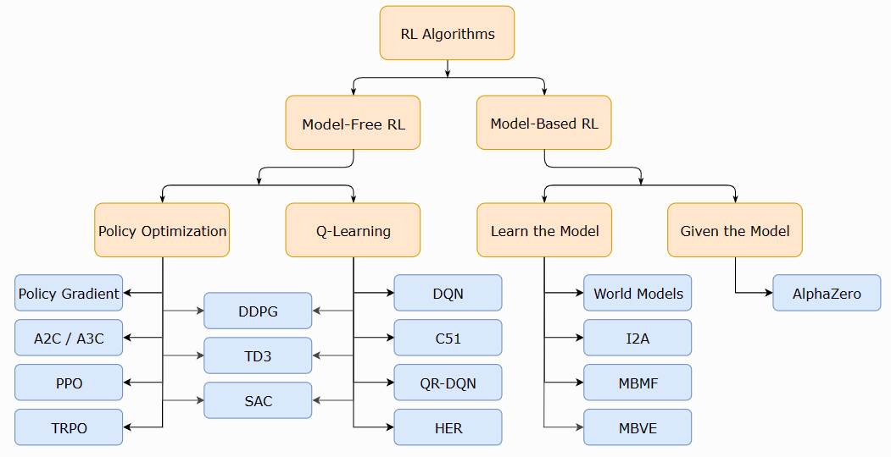

# 强化学习 reinforcement learning
OpenAI RL: https://spinningup.openai.com/en/latest/spinningup/rl_intro.html

## 一、基础概念
智能体(Agent or surrogate) 根据从环境(environment)中观察到的状态, 在执行多个动作步骤后才能完成最终任务，获得回报(return)。

 

* Enviroment 环境
* Agent 智能体
* State 状态
* Reward 奖励
* Action 行动

术语
* states and observations, 状态与观测，部分和完全观测，游戏画面的图像张量、机器人的关节角度和速度(agent也是环境的一部分？)
* action spaces, 动作空间，离散/连续 
* policies, 策略(常指代agent)，针对状态和反馈要执行哪个操作的策略。确定-，非确定-; 分类策略-离散空间；对角高斯策略-连续空间。策略抽样，特定操作的对数似然。从策略中抽样，计算特定操作的对数似然。
* trajectories, 轨迹
* different formulations of return, 不同的回报公式，固定、不固定步长，折扣：早期步骤的奖励系数要大于晚期的。折扣系数是可学习的，还是超参数？
* the RL optimization problem, 优化问题
* value functions. 值函数，策略值、策略操作值、最优值、最优操作-值 贝尔曼方程， 优势函数

chatGPT-RLHF
* states and observations, prompt + 已生成的tokens
* action spaces, 词汇表中50w+个里面的其中一个，离散的。
* policies，给定prompt下 + 已生成的tokens 情况下，下一个生成的token是应该是哪个？ prompt+genTokens -> next token? 本质是就是GPT这样的生成模型。
* trajectories, s=prompt+tokens,a=next token

马尔可夫决策过程（MDP），5 元组，$\langle S, A, R, P, \rho_0 \rangle$
* S是所有 有效状态 的集合，
* A是所有 有效操作 的集合，
* R : $S \times A \times S \to \mathbb{R}$ 是奖励函数，带有 $r_t = R(s_t, a_t, s_{t+1})$，
* P : $S \times A \to \mathcal{P}(S)$是 转移概率函数，如果你从状态开始并采取行动a，则转换为状态s's的概率，P(s'|s,a)
并且$\rho_0$是起始状态分布。

## 二、RL算法分类

* 无模型
    * 策略优化
    * Q-Learning 
* 有模型

观察、行动

智能体对环境执行动作后，环境可能会发生变化，也可能会自行更改。

行动 action、状态 state、奖励 reward
和人的三观对应， 世界观-环境，价值观-value function, 人生观-agent

动作空间：离散、连续

* model-Free
    * Policy Optimization 基于策略
    * Q-Learning 基于价值, Q-Table
* model-Base
    * Learn the model
    * Given the model

1. [Policy Gradient](https://spinningup.openai.com/en/latest/algorithms/vpg.html) 策略梯度
1. DQN 2015.2.25 [Human-level control through deep reinforcement learning](./DQN.md) 离散动作空间表现良好，连续控制上差
1. TRPO 2015.2 [Trust region policy optimization](./TRPO.md) 信任域/自然策略梯度 策略优化
1. DDPG 2015.9 [Continuous control with deep reinforcement learning](./DDPG.md)
1. A2C/A3C 2016.2  [Asynchronous methods for deep reinforcement learning](./A2C.md)
1. ACER 2016.11 [Sample Efficient Actor-Critic with Experience Replay](./ACER.md)，能高效采样的带有经验回放的表演者-评论者算法
1. PPO 2017.7 [Proximal Policy Optimization Algorithms](./PPO.md) 近端策略优化 chatGPT用到
1. 2017.6.12 [Deep reinforcement learning from human preferences](./hp_RL.md) 从人类偏好中进行深度强化学习

https://github.com/hpcaitech/ColossalAI/tree/main/applications/Chat/examples#stage3---training-model-using-prompts-with-rl

[深度强化学习 -- Actor-Critic 类算法(基础篇)](https://zhuanlan.zhihu.com/p/148489261)
* 策略更新方式：
    * 基于值 (value based)，估算每个状态-动作对(state-action)的值函数 Q(s,a)来寻找最佳策略, 代表DQN，Q-Learning在连续空间中的改进。高偏差
    * 基于策略 (policy based),蒙特卡洛类方法，高方差
    * Actor-Critic，构造一个全能型的 agent，既能直接输出策略，又能通过 value function 来实时评价当前策略的好坏。

策略、价值函数

“普通”策略梯度方法 [Mni+16] 

目标 objective; 
四个核心要素：策略(Policy)、回报函数(收益信号，Reward Function)、价值函数(Value Function)和环境模型(Environment Model)，其中环境模型是可选的。

stochastic gradient ascent, 随机梯度上升

PO 策略优化 ？ Actor-Critic ?

Kullback–Leibler divergence KL散度? 指当某分布q(x)被用于近似p(x)时的信息损失, KL散度越大，表达效果越差.
使用一个较简单、常见的分布(如均匀分布、二项分布等)来拟合我们观察到的一个较为复杂的分布时，由于拟合出的分布与观察到的分布并不一致，会有信息损失的情况出现。KL散度就是为了度量这种损失而被提出的。
源于信息论
https://zhuanlan.zhihu.com/p/95687720
https://hsinjhao.github.io/2019/05/22/KL-DivergenceIntroduction/
https://www.jianshu.com/p/43318a3dc715

MDP，马尔可夫决策过程
TD, temporal difference , 时序差分

1. 探索 exploration - 利用 exploitation 窘境 dilemma

2. 探索与利用折中算法：e-贪心，softmax算法

3. 是否对环境建模：
Model-Free  critic only，actor only和actor-critic
Model-Based;

4. 观察者和执行者是否同一个
On/Off-policy，on- agent既要对环境做出反应，又要从反馈中学习

策略梯度，Policy gradient？ https://blog.csdn.net/ygp12345/article/details/109009311
据状态输出动作或者动作的概率
baseline,衰减因子γ
利用梯度上升更新θ?
小批量更新 

PPO: https://blog.csdn.net/ygp12345/article/details/109012093
Importance Sampling 重要性采样? 使用其他分布q获得数据，来估计基于分布p的函数期望，用户不能直接从p中采样的情况。需要注意的是p与q不能差太多，因为函数期望虽然无偏，但是方差可能很大，当然如果sample数据足够多也没这个问题。

advantage function 优势函数? 新的目标函数可以再多个训练步骤实现小批量的更新，解决了Policy Gradient算法中步长难以确定的问题。

PPO1,PPO2的区别？

https://blog.csdn.net/qq_44766883/article/details/112982236
https://www.jianshu.com/p/9f113adc0c50

https://easyai.tech/wp-content/uploads/2022/08/ab409-2019-04-17-fenlei.png.webp

连续动作空间
https://github.com/uvipen/Super-mario-bros-PPO-pytorch

https://leovan.me/cn/2020/05/introduction-of-reinforcement-learning/
2. https://github.com/nikhilbarhate99/PPO-PyTorch
3. https://www.jianshu.com/p/9f113adc0c50
https://www.jiqizhixin.com/articles/2019-02-20-8

模仿学习(Imitation Learning)

1. Emergent Tool Use From Multi-Agent Autocurricula
2. Efficient Off-Policy Meta-Reinforcement Learning via Probabilistic Context Variables
3. Guided Meta-Policy Search
4. Using a Logarithmic Mapping to Enable Lower Discount Factors in Reinforcement Learning
5. Distributional Reinforcement Learning for Efficient Exploration
6. How to Combine Tree-Search Methods in Reinforcement Learning
7. Better Exploration with Optimistic Actor Critic
8. Policy Certificates: Towards Accountable Reinforcement Learning
9. Rainbow: Combining Improvements in Deep Reinforcement Learning
10. Deep Reinforcement Learning in a Handful of Trials using Probabilistic Dynamics Models
11. Model-Ensemble Trust-Region Policy Optimization
12. Sample-Efficient Reinforcement Learning with Stochastic Ensemble Value Expansion
13. Model-Based Value Estimation for Efficient Model-Free Reinforcement Learning
14. Social Influence as Intrinsic Motivation for Multi-Agent Deep Reinforcement Learning
15. Learning hand-eye coordination for robotic grasping with deep learning and large-scale data collection
16. Noisy Networks For Exploration
17. Neural Architecture Search with Reinforcement Learning
18. A Distributional Perspective on Reinforcement Learning
19. Evolution Strategies as a Scalable Alternative to Reinforcement Learning
20. Value Prediction Network
