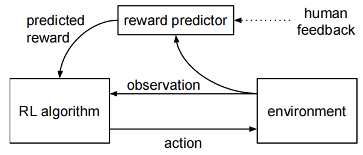
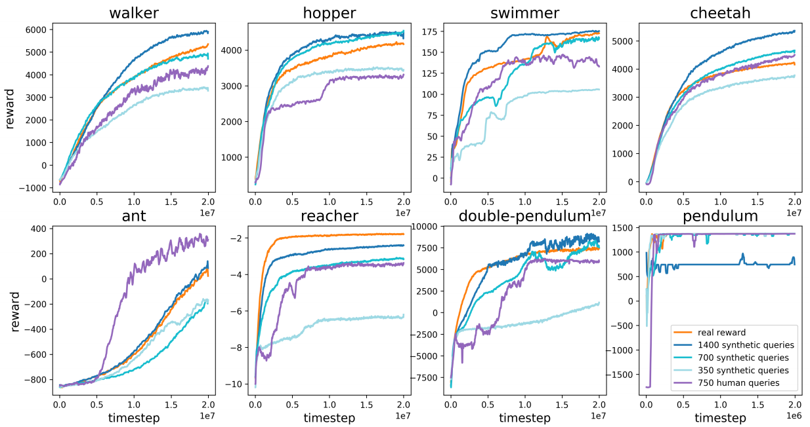
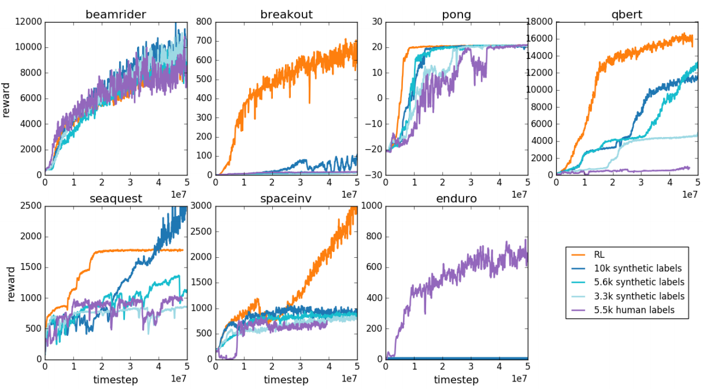
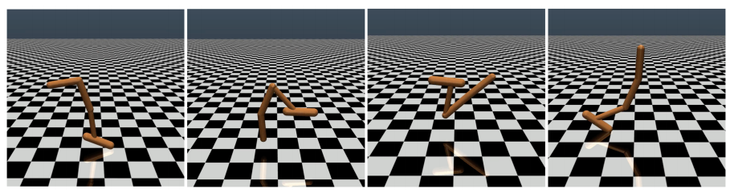
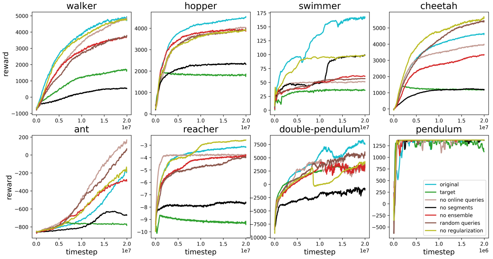
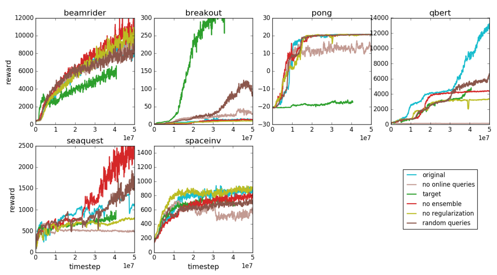

# Deep Reinforcement Learning from Human Preferences 
从人类偏好中进行深度强化学习 2017.6.12 https://arxiv.org/abs/1706.03741

## Abstract
For sophisticated reinforcement learning (RL) systems to interact usefully with real-world environments, we need to communicate complex goals to these systems. In this work, we explore goals defined in terms of (non-expert) human preferences between pairs of trajectory segments. We show that this approach can effectively solve complex RL tasks without access to the reward function, including Atari games and simulated robot locomotion, while providing feedback on less than 1% of our agent’s interactions with the environment. This reduces the cost of human oversight far enough that it can be practically applied to state-of-the-art RL systems. To demonstrate the flexibility of our approach, we show that we can successfully train complex novel behaviors with about an hour of human time. These behaviors and environments are considerably more complex than any which have been previously learned from human feedback.

为了使复杂的强化学习(RL)系统与现实世界的环境进行有效的交互，我们需要将复杂的目标传达给这些系统。在这项工作中，我们探索了根据成对轨迹段之间的人类(非专家)偏好定义的目标。我们表明，这种方法可以在不使用奖励函数的同时，对我们的智能体与环境的交互提供不到1%的反馈的情况下有效地解决复杂的RL任务，包括Atari游戏和模拟机器人运动。这大大降低了人工监督的成本，可以实际应用于最先进的RL系统。为了证明我们方法的灵活性，我们演示了可以用大约一个小时的人工时间成功地训练复杂的新行为。这些行为和环境比以前从人类反馈中学习到的任何行为和环境都要复杂得多。

## 1 Introduction
Recent success in scaling reinforcement learning (RL) to large problems has been driven in domains that have a well-specified reward function (Mnih et al., 2015, 2016; Silver et al., 2016). Unfortunately, many tasks involve goals that are complex, poorly-defined, or hard to specify. Overcoming this limitation would greatly expand the possible impact of deep RL and could increase the reach of machine learning more broadly.

最近在将强化学习(RL)扩展到大型问题方面取得了成功，这是在具有明确奖励函数的领域中取得的(Mnihet al.,2015,2016; Silveret al.,2016)。不幸的是，许多任务涉及复杂、定义不清或难以指定的目标。克服这一限制将极大地扩大DRL的可能影响，并可以更广泛地扩大机器学习的范围。

For example, suppose that we wanted to use reinforcement learning to train a robot to clean a table or scramble an egg. It’s not clear how to construct a suitable reward function, which will need to be a function of the robot’s sensors. We could try to design a simple reward function that approximately captures the intended behavior, but this will often result in behavior that optimizes our reward function without actually satisfying our preferences. This difficulty underlies recent concerns about misalignment between our values and the objectives of our RL systems (Bostrom, 2014; Russell, 2016; Amodei et al., 2016). If we could successfully communicate our actual objectives to our agents, it would be a significant step towards addressing these concerns.

例如，假设我们想使用强化学习来训练机器人清洁桌子或炒鸡蛋。目前尚不清楚如何构建一个合适的奖励函数，该函数必须是机器人传感器的函数。我们可以尝试设计一个简单的奖励函数，大致捕捉预期的行为，但这通常会导致优化奖励函数的行为，而不会真正满足我们的偏好。这一困难是最近人们担心我们的价值观与RL系统目标之间不一致的原因(Bostrom，2014; Russell，2016; Amodeiet al.,2016)。如果我们能够成功地将实际目标传达给智能体，这将是解决问题的重要一步。

If we have demonstrations of the desired task, we can extract a reward function using inverse reinforcement learning (Ng and Russell, 2000). This reward function can then be used to train an agent with reinforcement learning. More directly, we can use imitation learning to clone the demonstrated behavior. However, these approaches are not directly applicable to behaviors that are difficult for humans to demonstrate (such as controlling a robot with many degrees of freedom but very non-human morphology). 

如果我们有所需任务的演示，我们可以使用反向强化学习来提取奖励函数(Ng and Russell，2000)。然后可以使用该奖励函数来训练具有强化学习的智能体。更直接地说，我们可以使用模仿学习来克隆所演示的行为。然而，这些方法并不直接适用于人类难以证明的行为(例如控制具有许多自由度但与人类形态差异较大的机器人)。

An alternative approach is to allow a human to provide feedback on our system’s current behavior and to use this feedback to define the task. In principle this fits within the paradigm of reinforcement learning, but using human feedback directly as a reward function is prohibitively expensive for RL systems that require hundreds or thousands of hours of experience. In order to practically train deep RL systems with human feedback, we need to decrease the amount of feedback required by several orders of magnitude.

另一种方法是允许人类提供关于系统当前行为的反馈，并使用该反馈来定义任务。原则上，这符合强化学习的范式，但对于需要数百或数千小时经验的RL系统来说，直接使用人类反馈作为奖励函数的成本高得令人望而却步。为了实际训练具有人类反馈的DRL系统，我们需要将所需的反馈量减少几个数量级。

Our approach is to learn a reward function from human feedback and then to optimize that reward function. This basic approach has been considered previously, but we confront the challenges involved in scaling it up to modern deep RL and demonstrate by far the most complex behaviors yet learned from human feedback.

我们的方法是从人类的反馈中学习奖励函数，然后再优化该奖励函数。这种基本方法以前已经考虑过，但我们面临着将其扩展到现代DRL所涉及的挑战，并演示了迄今为止从人类反馈中学习到的最复杂的行为。

In summary, we desire a solution to sequential decision problems without a well-specified reward function that
1. enables us to solve tasks for which we can only recognize the desired behavior, but not necessarily demonstrate it, 
2. allows agents to be taught by non-expert users, 
3. scales to large problems, and 
4. is economical with user feedback.

总之，我们希望在没有明确指定奖励函数的情况下解决顺序决策问题
1. 使我们能够解决任务，对于这些任务，我们只要能识别所需的行为，但不一定要演示它，
2. 允许非专家用户教授智能体，
3. 可扩展到大问题，以及
4. 在用户反馈方面是经济的。

Our algorithm fits a reward function to the human’s preferences while simultaneously training a policy to optimize the current predicted reward function (see Figure 1). We ask the human to compare short video clips of the agent’s behavior, rather than to supply an absolute numerical score. We found comparisons to be easier for humans to provide in some domains, while being equally useful for learning human preferences. Comparing short video clips is nearly as fast as comparing individual states, but we show that the resulting comparisons are significantly more helpful. Moreover, we show that collecting feedback online improves the system’s performance and prevents it from exploiting weaknesses of the learned reward function.

我们的算法使奖励函数符合人类的偏好，同时训练策略以优化当前预测的奖励函数(见图1)。我们要求人类比较智能体行为的短视频片段，而不是提供绝对的数字分数。我们发现，在某些领域，人类更容易进行比较，同时对学习人类偏好也同样有用。比较短视频片段的速度几乎与比较单个状态的速度一样快，但我们发现，由此产生的比较更有帮助。此外，我们还表明，在线收集反馈可以提高系统的性能，并防止其利用学习奖励函数的弱点。

 
Figure 1: Schematic illustration of our approach: the reward predictor is trained asynchronously from comparisons of trajectory segments, and the agent maximizes predicted reward.
图1：方法示意图：奖励预测器是根据轨迹段的比较异步训练的，智能体使预测的奖励最大化。

Our experiments take place in two domains: Atari games in the Arcade Learning Environment (Bellemare et al., 2013), and robotics tasks in the physics simulator MuJoCo (Todorov et al., 2012). We show that a small amount of feedback from a non-expert human, ranging from fifteen minutes to five hours, suffices to learn most of the original RL tasks even when the reward function is not observable. We then consider some novel behaviors in each domain, such as performing a backflip or driving with the flow of traffic. We show that our algorithm can learn these behaviors from about an hour of feedback—even though it is unclear how to hand-engineer a reward function that would incentivize them.

我们的实验在两个领域进行：街机学习环境中的Atari游戏(Bellemare et al.，2013)和物理模拟器MuJoCo中的机器人任务(Todorov et al.，2012)。我们表明，即使在无法观察到奖励函数的情况下，非专家的少量反馈(从15分钟到5小时不等)也足以学习大多数原始RL任务。然后，我们考虑每个领域中的一些新行为，例如执行后空翻或随着交通流量行驶。我们表明，我们的算法可以从大约一个小时的反馈中学习这些行为，尽管尚不清楚如何手工设计激励他们的奖励函数。

### 1.1 Related Work
A long line of work studies reinforcement learning from human ratings or rankings, including Akrour et al. (2011), Pilarski et al. (2011), Akrour et al. (2012), Wilson et al. (2012), Sugiyama et al. (2012), Wirth and Fürnkranz (2013), Daniel et al. (2015), El Asri et al. (2016), Wang et al. (2016), and Wirth et al. (2016). Other lines of research considers the general problem of reinforcement learning from preferences rather than absolute reward values (Fürnkranz et al., 2012; Akrour et al., 2014), and optimizing using human preferences in settings other than reinforcement learning (Machwe and Parmee, 2006; Secretan et al., 2008; Brochu et al., 2010; Sørensen et al., 2016).

一长串的工作研究强化了从人类评级或排名中学习，包括Akrour et al. (2011)、Pilarski et al. (2011)、Akrour et al.(2012)、Wilson et al. (2012)，Sugiyama et al. (2012)、Wirth和Fürnkranz(2013)、Daniel et al. (2015)、El Asri et al. (2016)、Wang et al. (2016)和Wirth et al. (2016)。其他研究领域考虑了从偏好而非绝对奖励值进行强化学习的一般问题(Fürnkranz et al.，2012;Akrour et al.，2014)，以及在强化学习之外的环境中使用人类偏好进行优化(Machwe和Parmee，2006;Secretan et al.，2008;Brochu et al.，2010;Sørensen et al.，2016)。

Our algorithm follows the same basic approach as Akrour et al. (2012) and Akrour et al. (2014). They consider continuous domains with four degrees of freedom and small discrete domains, where they can assume that the reward is linear in the expectations of hand-coded features. We instead consider 2 physics tasks with dozens of degrees of freedom and Atari tasks with no hand-engineered features; the complexity of our environments force us to use different RL algorithms and reward models, and to cope with different algorithmic tradeoffs. One notable difference is that Akrour et al. (2012) and Akrour et al. (2014) elicit preferences over whole trajectories rather than short clips. So although we gather about two orders of magnitude more comparisons, our experiments require less than one order of magnitude more human time. Other differences focus on changing our training procedure to cope with the nonlinear reward models and modern deep RL, for example using asynchronous training and ensembling.

我们的算法遵循与Akrour et al. (2012)和(2014) 相同的基本方法。他们考虑具有四个自由度的连续域和小的离散域，在这些域中，他们可以假设人工编码特征的期望值是线性的。而我们考虑了两个具有数十个自由度的物理任务和没有手工设计函数的雅达利任务; 我们环境的复杂性迫使我们使用不同的RL算法和奖励模型，并应对不同的算法权衡。一个显著的区别是，Akrour et al. (2012)和(2014)引发了对整个轨迹的偏好，而不是部分片段。因此，尽管我们收集了大约两个数量级的比较，但我们的实验需要的人类时间不到一个数量级。其他差异集中在改变我们的训练程序，以应对非线性奖励模型和现代DRL，例如使用异步训练和集成。

Our approach to feedback elicitation closely follows Wilson et al. (2012). However, Wilson et al. (2012) assumes that the reward function is the distance to some unknown “target” policy (which is itself a linear function of hand-coded features). They fit this reward function using Bayesian inference, and rather than performing RL they produce trajectories using the MAP estimate of the target policy. Their experiments involve “synthetic” human feedback which is drawn from their Bayesian model, while we perform experiments with feedback gathered from non-expert users. It is not clear if the methods in Wilson et al. (2012) can be extended to complex tasks or if they can work with real human feedback.

我们的反馈启发方法与Wilson et al. (2012)非常相似。然而，Wilson et al. (2012)假设奖励函数是到某些未知“目标”策略的距离(这本身就是手工编码特征的线性函数)。他们使用贝叶斯推理来拟合这个奖励函数，并且不是执行RL，而是使用目标策略的MAP估计来产生轨迹。他们的实验涉及从贝叶斯模型中提取的“合成”人类反馈，而我们则使用从非专家用户收集的反馈进行实验。目前尚不清楚Wilson et al. (2012)中的方法是否可以扩展到复杂的任务，或者它们是否可以与真实的人类反馈一起工作。

MacGlashan et al. (2017), Pilarski et al. (2011), Knox and Stone (2009), and Knox (2012) perform experiments involving reinforcement learning from actual human feedback, although their algorithmic approach is less similar. In MacGlashan et al. (2017) and Pilarski et al. (2011), learning only occurs during episodes where the human trainer provides feedback. This appears to be infeasible in domains like Atari games where thousands of hours of experience are required to learn a high-quality policy, and would be prohibitively expensive even for the simplest tasks we consider. TAMER (Knox, 2012; Knox and Stone, 2013) also learn a reward function, however they consider much simpler settings where the desired policy can be learned relatively quickly.

MacGlashan et al. (2017)、Pilarski et al. (2011)、Knox和Stone(2009)以及Knox(2012)进行了涉及从实际人类反馈中进行强化学习的实验，尽管他们的算法方法不太相似。在MacGlashan et al. (2017)和Pilarski et al. (2011)中，学习只发生在人类训练师提供反馈的阶段。这在雅达利游戏等领域似乎是不可行的，因为在这些领域，学习高质量的策略需要数千小时的经验，即使是我们考虑的最简单的任务，成本也高得令人望而却步。TAMER(Knox，2012;Knox和Stone，2013)也学习了奖励函数，但他们考虑的设置要简单得多，可以相对快速地学习所需的策略。

Our work could also be seen of a specific instance of the cooperative inverse reinforcement learning framework (Hadfield-Menell et al., 2016). This framework considers a two-player game between a human and a robot interacting with an environment with the purpose of maximizing the human’s reward function. In our setting the human is only allowed to interact with this game by stating their preferences.

我们的工作也可以看到合作反向强化学习框架的一个具体样本(Hadfield-Menell et al.，2016)。该框架考虑了人类和机器人与环境交互的双人游戏，目的是最大限度地提高人类的奖励函数。在我们的设置中，人类只能通过陈述自己的偏好来与这个游戏互动。

Compared to all prior work, our key contribution is to scale human feedback up to deep reinforcement learning and to learn much more complex behaviors. This fits into a recent trend of scaling reward learning methods to large deep learning systems, for example inverse RL (Finn et al., 2016), imitation learning (Ho and Ermon, 2016; Stadie et al., 2017), semi-supervised skill generalization (Finn et al., 2017), and bootstrapping RL from demonstrations (Silver et al., 2016; Hester et al., 2017).

与之前的所有工作相比，我们的主要贡献是将人类反馈扩展到深度强化学习，并学习更复杂的行为。这符合最近将奖励学习方法扩展到大型深度学习系统的趋势，例如反向RL(Finnet al.,2016)、模仿学习(Ho和Ermon，2016;Stadieet al.,2017)、半监督技能泛化(Finn et al.，2017)和从演示中自举RL(Silveret al.,2016;Hesteret al.,2017)。

## 2 Preliminaries and Method 准备工作和方法
### 2.1 Setting and Goal  设置和目标
We consider an agent interacting with an environment over a sequence of steps; at each time t the agent receives an observation $o_t ∈ O$ from the environment and then sends an action $a_t ∈ A$ to the environment.

我们考虑一个智能体通过一系列步骤与环境交互; 在每个时间 t，智能体从环境接收观测 $o_t ∈ O$，然后向环境发送动作 $a_t ∈ A$。

In traditional reinforcement learning, the environment would also supply a reward $r_t ∈ R$ and the agent’s goal would be to maximize the discounted sum of rewards. Instead of assuming that the environment produces a reward signal, we assume that there is a human overseer who can express preferences between trajectory segments. A trajectory segment is a sequence of observations and actions, $σ = ((o_0, a_0),(o_1, a_1), . . . ,(o_{k−1}, a_{k−1})) ∈ (O × A)^k $. Write $σ^1 \succ σ^2$ to indicate that the human preferred trajectory segment $σ^1$ to trajectory segment $σ^2$ . Informally, the goal of the agent is to produce trajectories which are preferred by the human, while making as few queries as possible to the human.

在传统的强化学习中，环境也会提供奖励 $r_t ∈ R$，并且智能体的目标是最大化奖励的折扣总和。我们没有假设环境会产生奖励信号，而是假设有一个人类监督者可以在轨迹段之间表达偏好。轨迹段是观测和动作的序列，$σ = ((o_0, a_0),(o_1, a_1), . . . ,(o_{k−1}, a_{k−1})) ∈ (O × A)^k $。写出 $σ^1 \succ σ^2$ 表示，与轨迹段 $σ^2$ 相比，人类更偏好轨迹段 $σ^1$ 。在非正式情况下，智能体的目标是生成人类偏好的轨迹，同时对人类进行尽可能少的查询。

More precisely, we will evaluate our algorithms’ behavior in two ways:

更确切地说，我们将通过两种方式评估算法的行为：

#### Quantitative: 定量
We say that preferences $\succ$ are generated by a reward function(1 Here we assume here that the reward is a function of the observation and action. In our experiments in Atari environments, we instead assume the reward is a function of the preceding 4 observations. In a general partially observable environment, we could instead consider reward functions that depend on the whole sequence of observations, and mode this reward function with a recurrent neural network) r: 

我们说偏好$\succ$是由奖励函数 r 产生的(1 在这里，我们假设奖励是观察和行动的函数。在Atari环境中的实验中，我们假设奖励是前4个观察结果的函数。在一般的部分可观察环境中，我们可以考虑依赖于整个观察序列的奖励函数，并使用递归神经网络来模式化此奖励函数)

r: O × A → R if 
  
$((o^1_0, a^1_0), . . . ,  (o^1_{k−1}, a^1_{k−1})) \succ  ((o^2_0, a^2_0), . . . ,  (o^2_{k−1} , a^2_{k−1}))$

whenever 

$r(o^1_0 , a^1_0) + · · · + r(o^1_{k−1} , a^1_{k−1}) > r (o^2_0 , a^2_0) + · · · + r(o^2_{k−1}, a^2_{k−1})$.

If the human’s preferences are generated by a reward function r, then our agent ought to receive a high total reward according to r. So if we know the reward function r, we can evaluate the agent quantitatively. Ideally the agent will achieve reward nearly as high as if it had been using RL to optimize r.

如果人类的偏好是由奖励函数 r 产生的，那么我们的智能体应该根据 r 获得高的总奖励。因此，如果我们知道奖励函数 r，我们就可以定量地评估智能体。理想情况下，智能体将获得几乎与使用RL优化 r 一样高的奖励。

#### Qualitative: 定性
Sometimes we have no reward function by which we can quantitatively evaluate behavior (this is the situation where our approach would be practically useful). In these cases, all we can do is qualitatively evaluate how well the agent satisfies to the human’s preferences. In this paper, we will start from a goal expressed in natural language, ask a human to evaluate the agent’s behavior based on how well it fulfills that goal, and then present videos of agents attempting to fulfill that goal.

有时我们没有奖励函数来定量评估行为(在这种情况下，我们的方法实际上是有用的)。在这些情况下，我们所能做的就是定性地评估智能体对人类偏好的满足程度。在本文中，我们将从一个用自然语言表达的目标开始，要求人类根据智能体实现该目标的程度来评估智能体的行为，然后呈现智能体试图实现该目标时的视频。

Our model based on trajectory segment comparisons is very similar to the trajectory preference queries used in Wilson et al. (2012), except that we don’t assume that we can reset the system to an arbitrary state(2 Wilson et al. (2012) also assumes the ability to sample reasonable initial states. But we work with high dimensional state spaces for which random states will not be reachable and the intended policy inhabits a low-dimensional manifold.) and so our segments generally begin from different states. This complicates the interpretation of human comparisons, but we show that our algorithm overcomes this difficulty even when the human raters have no understanding of our algorithm.

我们基于轨迹分段比较的模型与Wilson et al. (2012)中使用的轨迹偏好查询非常相似，只是我们不认为可以将系统重置为任意状态(2 Wilson et al. (2012)也假设有能力对合理的初始状态进行采样。但我们使用的是高维状态空间，对于这些空间，随机状态是不可达的，并且预期的策略位于低维流形上)，因此我们的分段通常从不同的状态开始。这使人类比较的解释变得复杂，但我们表明，即使人类评分者不理解我们的算法，我们的算法也能克服这一困难。

### 2.2 Our Method
At each point in time our method maintains a policy π : O → A and a reward function estimate $\hat{r}$ : O × A → R, each parametrized by deep neural networks.

在每个时间点，我们的方法都保持一个策略π：O→ A和一个奖励函数估计$\hat{r}$ : O × A → R ，每个都通过深度神经网络进行参数化。

These networks are updated by three processes:
1. The policy π interacts with the environment to produce a set of trajectories {$τ^1 , . . . , τ^i$}. The parameters of π are updated by a traditional reinforcement learning algorithm, in order to maximize the sum of the predicted rewards $r_t = \hat{r}(o_t, a_t)$.
2. We select pairs of segments  $(σ^1 , σ^2)$ from the trajectories {$τ^1 , . . . , τ^i$} produced in step 1, and send them to a human for comparison.
3. The parameters of the mapping $\hat{r}$ are optimized via supervised learning to fit the comparisons collected from the human so far.

这些网络由三个过程更新：
1. 策略π与环境相互作用，产生一组轨迹{$τ^1 , . . . , τ^i$}。π的参数通过传统的强化学习算法进行更新，以最大化预测奖励的总和 $r_t = \hat{r}(o_t, a_t)$。
2. 我们从步骤1中产生的轨迹{$τ^1 , . . . , τ^i$} 中选择成对的片段 $(σ^1 , σ^2)$ ，并将它们发送给人类进行比较。
3. 通过监督学习优化映射 $\hat{r}$ 的参数，以拟合迄今为止从人类收集的比较。

These processes run asynchronously, with trajectories flowing from process (1) to process (2), human comparisons flowing from process (2) to process (3), and parameters for $\hat{r}$ flowing from process (3) to process (1). The following subsections provide details on each of these processes.

这些进程异步运行，轨迹从进程(1)流向进程(2)，人工比较从进程(2)流向进程(3)，$\hat{r}$ 的参数从进程(3)流向进程(1)。以下小节提供了有关其中每个过程的详情。

#### 2.2.1 Optimizing the Policy 优化策略
After using $\hat{r}$ to compute rewards, we are left with a traditional reinforcement learning problem. We can solve this problem using any RL algorithm that is appropriate for the domain. One subtlety is that the reward function $\hat{r}$ may be non-stationary, which leads us to prefer methods which are robust to changes in the reward function. This led us to focus on policy gradient methods, which have been applied successfully for such problems (Ho and Ermon, 2016).

在使用 $\hat{r}$ 来计算奖励之后，我们剩下一个传统的强化学习问题。我们可以使用任何适用于该领域的RL算法来解决这个问题。一个微妙的问题是，奖励函数 $\hat{r}$ 可能是非平稳的，这导致我们更喜欢对奖励函数的变化具有稳健性的方法。这使我们专注于策略梯度方法，该方法已成功应用于此类问题(Ho和Ermon，2016)。

In this paper, we use advantage actor-critic (A2C; Mnih et al., 2016) to play Atari games, and trust region policy optimization (TRPO; Schulman et al., 2015) to perform simulated robotics tasks. In each case, we used parameter settings which have been found to work well for traditional RL tasks. The only hyperparameter which we adjusted was the entropy bonus for TRPO. This is because TRPO relies on the trust region to ensure adequate exploration, which can lead to inadequate exploration if the reward function is changing.

在本文中，我们使用了优势行动者-评论家（A2C; Mnih et al., 2016)来玩雅达利游戏，并使用信任区域策略优化（TRPO; Schulman et al., 2015)来执行模拟机器人任务。在每种情况下，我们都使用了参数设置，这些设置已被发现适用于传统的强化学习任务。我们调整的唯一超参数是TRPO的熵加成。这是因为 TRPO 依赖于信任区域来确保充分的探索，如果奖励函数发生变化，可能会导致探索不足。

We normalized the rewards produced by $\hat{r}$ to have zero mean and constant standard deviation. This is a typical preprocessing step which is particularly appropriate here since the position of the rewards is underdetermined by our learning problem.

我们归一化了 $\hat{r}$ 产生的奖励，使其具有零均值和恒定的标准差。这是一个典型的预处理步骤，在这里特别合适，因为我们的学习问题没有充分确定奖励的位置。

#### 2.2.2 Preference Elicitation 偏好诱导
The human overseer is given a visualization of two trajectory segments, in the form of short movie clips. In all of our experiments, these clips are between 1 and 2 seconds long.

以短片的形式，给人类监督者提供了两个轨迹片段的可视化。在我们所有的实验中，这些片段的长度在1到2秒之间。

The human then indicates which segment they prefer, that the two segments are equally good, or that they are unable to compare the two segments.

然后，人类指示他们更喜欢哪一个片段，这两个片段同样好，或者他们无法比较这两个部分。

The human judgments are recorded in a database D of triples $(σ^1 , σ^2 , µ)$, where $σ^1$ and $σ^2$ are the two segments and µ is a distribution over {1, 2} indicating which segment the user preferred. If the human selects one segment as preferable, then µ puts all of its mass on that choice. If the human marks the segments as equally preferable, then µ is uniform. Finally, if the human marks the segments as incomparable, then the comparison is not included in the database.

人类的判断记录在三元组 $(σ^1 , σ^2 , µ)$ 的数据库D中，其中 $σ^1$ 和 $σ^2$ 是两个片段，µ是{1，2}上的分布，指示用户喜欢哪个片段。如果人类选择一个片段作为优选，那么µ将其所有质量都放在该选择上。如果人类将这些片段标记为同样优选，那么µ是均匀的。最后，如果人类将这些片段标记为不可比较，则比较不会包含在数据库中。

#### 2.2.3 Fitting the Reward Function 拟合奖励函数
We can interpret a reward function estimate $\hat{r}$ as a preference-predictor if we view $\hat{r}$ as a latent factor explaining the human’s judgments and assume that the human’s probability of preferring a segment $σ^i$ depends exponentially on the value of the latent reward summed over the length of the clip(3 Equation 1 does not use discounting, which could be interpreted as modeling the human to be indifferent about when things happen in the trajectory segment. Using explicit discounting or inferring the human’s discount function would also be reasonable choices):

我们可以将奖励函数估计 $\hat{r}$ 解释为偏好预测器，如果我们将 $\hat{r}$ 视为解释人类判断的潜在因素，并假设人类偏爱 $σ^i$ 段的概率呈指数级取决于在剪辑长度上求和的潜在奖励的值(3 方程1没有使用折扣，这可以被解释为模拟人类对轨迹段中发生的事情漠不关心。使用显式折扣或推断人类的折扣函数也是合理的选择)：

$\hat{P}[σ^1 \succ σ^2] = \frac{exp \sum \hat{r}(o^1_t , a^1_t)}{exp \sum \hat{r}(o^1_t , a^1_t ) + exp \sum \hat{r}(o^2_t , a^2_t )}$ . (1)

We choose $\hat{r}$ to minimize the cross-entropy loss between these predictions and the actual human labels:

我们选择$\hat{r}$来最小化这些预测和实际人类标签之间的交叉熵损失：

$loss(\hat{r}) = − \sum_{(σ^1,σ^2,µ)∈D} µ(1) log \hat{P} [σ^1 \succ σ^2] + µ(2) log \hat{P} [σ^2 \succ σ^1]  $.

This follows the Bradley-Terry model (Bradley and Terry, 1952) for estimating score functions from pairwise preferences, and is the specialization of the Luce-Shephard choice rule (Luce, 2005; Shepard, 1957) to preferences over trajectory segments. It can be understood as equating rewards with a preference ranking scale analogous to the famous Elo ranking system developed for chess (Elo, 1978). Just as the difference in Elo points of two chess players estimates the probability of one player defeating the other in a game of chess, the difference in predicted reward of two trajectory segments estimates the probability that one is chosen over the other by the human.

这遵循了Bradley-Terry模型(Bradley和Terry，1952)，用于根据成对偏好估计得分函数，并且是Luce-Shephard选择规则(Luce，2005;Shepard，1957)对轨迹段偏好的专门化。它可以被理解为将奖励等同于偏好排名表，类似于为国际象棋开发的著名的Elo排名系统(Elo，1978)。正如两名国际象棋棋手的埃洛点数的差异估计了一名棋手在一场国际象棋比赛中击败另一名的概率一样，两个轨迹段的预测奖励的差异也估计了人类选择其中一个而不是另一个的概率。

Our actual algorithm incorporates a number of modifications to this basic approach, which early experiments discovered to be helpful and which are analyzed in Section 3.3:
* We fit an ensemble of predictors, each trained on |D| triples sampled from D with replacement. The estimate $\hat{r}$ is defined by independently normalizing each of these predictors and then averaging the results.
* A fraction of 1/e of the data is held out to be used as a validation set for each predictor. We use $l_2$ regularization and adjust the regularization coefficient to keep the validation loss between 1.1 and 1.5 times the training loss. In some domains we also apply dropout for regularization.
* Rather than applying a softmax directly as described in Equation 1, we assume there is a 10% chance that the human responds uniformly at random. Conceptually this adjustment is needed because human raters have a constant probability of making an error, which doesn’t decay to 0 as the difference in reward difference becomes extreme.

我们的实际算法包含了对这一基本方法的一些修改，早期实验发现这些修改是有帮助的，并在第3.3节中进行了分析：
* 我们拟合了一组集成的预测器，每个预测器都训练在从D中采样的|D|三元组上，并进行替换。通过独立地对这些预测器中的每一个进行归一化，然后对结果进行平均，来定义估计 $\hat{r}$。
* 数据的1/e的一部分被保留下来，用作每个预测器的验证集。我们使用$l_2$ 正则化并调整正则化系数，以将验证损失保持在训练损失的1.1到1.5倍之间。在某些领域中，我们还将dropout应用于正则化。
* 我们假设人类有10%的机会随机做出一致的反应，而不是直接应用方程1中描述的softmax。从概念上讲，这种调整是必要的，因为人类评分者犯错误的概率是恒定的，不会随着奖励差异的差异变得极端而衰减到0。

#### 2.2.4 Selecting Queries  选择查询
We decide how to query preferences based on an approximation to the uncertainty in the reward function estimator, similar to Daniel et al. (2014): we sample a large number of pairs of trajectory segments of length k, use each reward predictor in our ensemble to predict which segment will be preferred from each pair, and then select those trajectories for which the predictions have the highest variance across ensemble members. This is a crude approximation and the ablation experiments in Section 3 show that in some tasks it actually impairs performance. Ideally, we would want to query based on the expected value of information of the query (Akrour et al., 2012; Krueger et al., 2016), but we leave it to future work to explore this direction further.

我们根据奖励函数估计器中不确定性的近似值来决定如何查询偏好，类似于Daniel et al. 。(2014)：我们对大量长度为k的轨迹段对进行采样，使用我们集成中的每个奖励预测器来预测每对中哪个段将是优选的，然后选择预测在集成成员之间具有最高方差的那些轨迹。这是一个粗略的近似值，第3节中的消融实验表明，在某些任务中，它实际上会削弱性能。理想情况下，我们希望根据查询信息的预期值进行查询(Akrour et al.，2012;Krueger et al.，2016)，但我们将其留给未来的工作来进一步探索这一方向。

## 3 Experimental Results 实验结果
We implemented our algorithm in TensorFlow (Abadi et al., 2016). We interface with MuJoCo (Todorov et al., 2012) and the Arcade Learning Environment (Bellemare et al., 2013) through the OpenAI Gym (Brockman et al., 2016).

我们在TensorFlow中实现了我们的算法(Abadiet al.,2016)。我们通过OpenAI Gym(Brockman et al.，2016)与MuJoCo(Todorov et al.，2012)和Arcade学习环境(Bellemare et al.，2013)对接。

### 3.1 Reinforcement Learning Tasks with Unobserved Rewards 强化学习任务和未观察到的奖励
In our first set of experiments, we attempt to solve a range of benchmark tasks for deep RL without observing the true reward. Instead, the agent learns about the goal of the task only by asking a human which of two trajectory segments is better. Our goal is to solve the task in a reasonable amount of time using as few queries as possible.

在我们的第一组实验中，我们试图在不观察真实回报的情况下解决DRL的一系列基准任务。相反，智能体仅通过询问人类两个轨迹段中的哪一个更好来了解任务的目标。我们的目标是使用尽可能少的查询在合理的时间内解决任务。

In our experiments, feedback is provided by contractors who are given a 1-2 sentence description of each task before being asked to compare several hundred to several thousand pairs of trajectory segments for that task (see Appendix B for the exact instructions given to contractors). Each trajectory segment is between 1 and 2 seconds long. Contractors responded to the average query in 3-5 seconds, and so the experiments involving real human feedback required between 30 minutes and 5 hours of human time.

在我们的实验中，反馈是由承包商提供的，他们对每个任务进行了1-2句的描述，然后被要求比较该任务的几百到几千对轨迹段(给承包商的确切说明见附录B)。每个轨迹段的长度在1到2秒之间。承包商平均在3-5秒内对查询做出响应，因此涉及真实人类反馈的实验需要30分钟到5小时的人工时间。

For comparison, we also run experiments using a synthetic oracle whose preferences over trajectories exactly reflect reward in the underlying task. That is, when the agent queries for a comparison, instead of sending the query to a human, we immediately reply by indicating a preference for whichever trajectory segment actually receives a higher reward in the underlying task(4 In the case of Atari games with sparse rewards, it is relatively common for two clips to both have zero reward in which case the oracle outputs indifference. Because we considered clips rather than individual states, such ties never made up a large majority of our data. Moreover, ties still provide significant information to the reward predictor as long as they are not too common.) . We also compare to the baseline of RL training using the real reward. Our aim here is not to outperform but rather to do nearly as well as RL without access to reward information and instead relying on much scarcer feedback. Nevertheless, note that feedback from real humans does have the potential to outperform RL (and as shown below it actually does so on some tasks), because the human feedback might provide a better-shaped reward.

为了进行比较，我们还使用合成预言机进行了实验，该预言机对轨迹的偏好正好反映了底层任务的奖励。即，当智能体查询比较时，我们不会将查询发送给人类，而是立即通过指示对在底层任务中实际获得更高奖励的轨迹段的偏好来进行回复(4在奖励稀疏的雅达利游戏的情况下，两个片段都没有奖励是相对常见的，在这种情况下，预言家会输出冷漠。因为我们考虑的是片段而不是单个州，所以这种联系从未占我们数据的大部分。此外，只要联系不太常见，它们仍然为奖励预测器提供重要信息)。我们还使用实际奖励与RL训练的基线进行了比较。我们的目标不是跑赢大盘，而是在不获取奖励信息的情况下，在不依赖少得多的反馈的情况下做得几乎和RL一样好。尽管如此，请注意，来自真实人类的反馈确实有可能超过RL(如下所示，它在某些任务中确实如此)，因为人类的反馈可能会提供更好的奖励。

We describe the details of our experiments in Appendix A, including model architectures, modifications to the environment, and the RL algorithms used to optimize the policy.

我们在附录A中描述了我们的实验细节，包括模型架构、对环境的修改以及用于优化策略的RL算法。

#### 3.1.1 Simulated Robotics 模拟机器人
The first tasks we consider are eight simulated robotics tasks, implemented in MuJoCo (Todorov et al., 2012), and included in OpenAI Gym (Brockman et al., 2016). We made small modifications to these tasks in order to avoid encoding information about the task in the environment itself (the modifications are described in detail in Appendix A). The reward functions in these tasks are linear functions of distances, positions and velocities, and all are a quadratic function of the features. We included a simple cartpole task (“pendulum”) for comparison, since this is representative of the complexity of tasks studied in prior work.

我们考虑的第一个任务是八个模拟机器人任务，在MuJoCo中实现(Todorov et al.，2012)，并包含在OpenAI Gym中(Brockman et al.，2016)。我们对这些任务进行了小的修改，以避免在环境本身中对有关任务的信息进行编码(修改在附录A中详细描述)。这些任务中的奖励函数是距离、位置和速度的线性函数，并且都是特征的二次函数。我们包括了一个简单的扁担任务(“钟摆”)进行比较，因为这代表了先前工作中研究的任务的复杂性。

Figure 2 shows the results of training our agent with 700 queries to a human rater, compared to learning from 350, 700, or 1400 synthetic queries, as well as to RL learning from the real reward.

图2显示了将我们的智能体用700个查询训练到人工评分器的结果，与从350、700或1400个合成查询中学习的结果以及从真实奖励中学习的RL相比。

 
Figure 2: Results on MuJoCo simulated robotics as measured on the tasks’ true reward. We compare our method using real human feedback (purple), our method using synthetic feedback provided by an oracle (shades of blue), and reinforcement learning using the true reward function (orange). All curves are the average of 5 runs, except for the real human feedback, which is a single run, and each point is the average reward over five consecutive batches. For Reacher and Cheetah feedback was provided by an author due to time constraints. For all other tasks, feedback was provided by contractors unfamiliar with the environments and with our algorithm. The irregular progress on Hopper is due to one contractor deviating from the typical labeling schedule.
图2：MuJoCo模拟机器人的结果，以任务的真实回报为衡量标准。我们比较了使用真实人类反馈的方法(紫色)、使用预言家提供的合成反馈(蓝色阴影)的方法和使用真实奖励函数的强化学习(橙色)。所有曲线都是5次跑步的平均值，除了真实的人类反馈，这是一次跑步，每个点都是连续五批的平均奖励。由于时间限制，Reacher和Cheetah的反馈由一位作者提供。对于所有其他任务，反馈都是由不熟悉环境和我们的算法的承包商提供的。料斗的不规则进度是由于一个承包商偏离了典型的标签时间表。

With 700 labels we are able to nearly match reinforcement learning on all of these tasks. Training with learned reward functions tends to be less stable and higher variance, while having a comparable mean performance.

有了700个标签，我们能够在所有这些任务上几乎匹配强化学习。学习奖励函数的训练往往不太稳定，方差更高，同时具有可比的平均性能。

Surprisingly, by 1400 labels our algorithm performs slightly better than if it had simply been given the true reward, perhaps because the learned reward function is slightly better shaped—the reward learning procedure assigns positive rewards to all behaviors that are typically followed by high reward.

令人惊讶的是，通过1400个标签，我们的算法的表现略好于简单地给予真正的奖励，也许是因为学习的奖励函数的形状略好——奖励学习过程为所有通常伴随着高奖励的行为分配积极的奖励。

Real human feedback is typically only slightly less effective than the synthetic feedback; depending on the task human feedback ranged from being half as efficient as ground truth feedback to being equally efficient. On the Ant task the human feedback significantly outperformed the synthetic feedback, apparently because we asked humans to prefer trajectories where the robot was “standing upright,” which proved to be useful reward shaping. (There was a similar bonus in the RL reward function to encourage the robot to remain upright, but the simple hand-crafted bonus was not as useful.)

真实的人类反馈通常只比合成反馈的效果稍差; 根据任务的不同，人类反馈的效率从基准实况反馈的一半到同等的效率不等。在蚂蚁任务中，人类的反馈明显优于合成反馈，显然是因为我们要求人类更喜欢机器人“直立”的轨迹，这被证明是有用的奖励塑造。(RL奖励函数中也有类似的奖励，以鼓励机器人保持直立，但简单的手工奖励没有那么有用。)

#### 3.1.2 Atari 雅达利
The second set of tasks we consider is a set of seven Atari games in the Arcade Learning Environment (Bellemare et al., 2013), the same games presented in Mnih et al., 2013.

我们考虑的第二组任务是街机学习环境中的一组七款雅达利游戏(Bellemareet al.,2013)，与Mnihet al.,2013中介绍的游戏相同。

Figure 3 shows the results of training our agent with 5,500 queries to a human rater, compared to learning from 350, 700, or 1400 synthetic queries, as well as to RL learning from the real reward. Our method has more difficulty matching RL in these challenging environments, but nevertheless it displays substantial learning on most of them and matches or even exceeds RL on some. Specifically, on BeamRider and Pong, synthetic labels match or come close to RL even with only 3,300 such labels. On Seaquest and Qbert synthetic feedback eventually performs near the level of RL but learns more slowly. On SpaceInvaders and Breakout synthetic feedback never matches RL, but nevertheless the agent improves substantially, often passing the first level in SpaceInvaders and reaching a score of 20 on Breakout, or 50 with enough labels.

图3显示了用5500个查询将我们的智能体训练到人工评分器的结果，相比之下，从350、700或1400个合成查询中学习，以及从真实奖励中学习RL。在这些具有挑战性的环境中，我们的方法更难匹配RL，但尽管如此，它在大多数情况下都表现出了实质性的学习，在一些情况下匹配甚至超过了RL。具体来说，在BeamRider和Pong上，合成标签与RL匹配或接近，即使只有3300个这样的标签。在Seaquest和Qbert上，合成反馈最终表现接近RL水平，但学习速度较慢。在SpaceInvaders和Breakout上，合成反馈从未与RL匹配，但尽管如此，智能体仍有显著改进，通常在SpaceInviders中通过第一级，并在Breakout中达到20分，或在有足够标签的情况下达到50分。

 
Figure 3: Results on Atari games as measured on the tasks’ true reward. We compare our method using real human feedback (purple), our method using synthetic feedback provided by an oracle (shades of blue), and reinforcement learning using the true reward function (orange). All curves are the average of 3 runs, except for the real human feedback which is a single run, and each point is the average reward over about 150,000 consecutive frames.
图3：以任务的真实奖励衡量的雅达利游戏结果。我们比较了我们使用真实人类反馈的方法(紫色)、我们使用预言家提供的合成反馈(蓝色阴影)的方法和使用真实奖励函数的强化学习(橙色)。所有曲线都是3次跑步的平均值，除了真正的人类反馈是一次跑步，每个点都是大约150000个连续帧的平均奖励。

On most of the games real human feedback performs similar to or slightly worse than synthetic feedback with the same number of labels, and often comparably to synthetic feedback that has 40% fewer labels. This may be due to human error in labeling, inconsistency between different contractors labeling the same run, or the uneven rate of labeling by contractors, which can cause labels to be overly concentrated in narrow parts of state space. The latter problems could potentially be addressed by future improvements to the pipeline for outsourcing labels. On Qbert, our method fails to learn to beat the first level with real human feedback; this may be because short clips in Qbert can be confusing and difficult to evaluate. Finally, Enduro is difficult for A3C to learn due to the difficulty of successfully passing other cars through random exploration, and is correspondingly difficult to learn with synthetic labels, but human labelers tend to reward any progress towards passing cars, essentially shaping the reward and thus outperforming A3C in this game (the results are comparable to those achieved with DQN).

在大多数游戏中，真实的人类反馈的表现与具有相同标签数量的合成反馈相似或略差，并且通常与具有较少40%标签的合成反馈相当。这可能是由于标签上的人为错误、不同承包商对同一批产品的标签不一致，或者承包商的标签率不均衡，这可能导致标签过度集中在州空间的狭窄部分。后一个问题可能会通过未来对外包标签管道的改进来解决。在Qbert上，我们的方法未能学会用真实的人类反馈击败第一级;这可能是因为Qbert中的短剪辑可能令人困惑且难以评估。最后，由于很难通过随机探索成功通过其他汽车，A3C很难学习Enduro，相应地，使用合成标签也很难学习，但人类标注人员倾向于奖励在通过汽车方面取得的任何进展，从本质上决定了奖励，因此在这个游戏中表现优于A3C(结果与DQN相当)。

### 3.2 Novel behaviors 新行为
Experiments with traditional RL tasks help us understand whether our method is effective, but the ultimate purpose of human interaction is to solve tasks for which no reward function is available.

对传统RL任务的实验有助于我们理解我们的方法是否有效，但人类互动的最终目的是解决没有奖励函数的任务。

Using the same parameters as in the previous experiments, we show that our algorithm can learn novel complex behaviors. We demonstrate:
1. The Hopper robot performing a sequence of backflips (see Figure 4). This behavior was trained using 900 queries in less than an hour. The agent learns to consistently perform a backflip, land upright, and repeat.
2. The Half-Cheetah robot moving forward while standing on one leg. This behavior was trained using 800 queries in under an hour.
3. Keeping alongside other cars in Enduro. This was trained with roughly 1,300 queries and 4 million frames of interaction with the environment; the agent learns to stay almost exactly even with other moving cars for a substantial fraction of the episode, although it gets confused by changes in background.

使用与先前实验中相同的参数，我们表明我们的算法可以学习新的复杂行为。我们演示：
1. 料斗机器人执行一系列后空翻(见图4)。这种行为是在不到一个小时的时间内使用900个查询进行训练的。智能体学会始终如一地进行后空翻、直立着地和重复动作。
2. 半猎豹机器人单腿站立向前移动。这种行为是在不到一小时的时间内使用800个查询进行训练的。
3. 在Enduro与其他汽车并驾齐驱。这是通过大约1300个查询和400万帧与环境的交互进行训练的; 在这一集的很大一部分时间里，智能体即使与其他行驶中的汽车在一起，也会学会几乎准确地停留，尽管它会被背景的变化弄糊涂。

 
Figure 4: Four frames from a single backflip. The agent is trained to perform a sequence of backflips, landing upright each time. The video is available at this link.
图4：单个后空翻的四个框架。智能体接受训练，进行一系列后空翻，每次都要直立着地。此链接提供视频。

Videos of these behaviors can be found at this link. These behaviors were trained using feedback from the authors.

这些行为的视频可以在这个链接上找到。这些行为是利用作者的反馈进行训练的。

### 3.3 Ablation Studies 消融研究
In order to better understand the performance of our algorithm, we consider a range of modifications:
1. We pick queries uniformly at random rather than prioritizing queries for which there is disagreement (random queries). 
2. We train only one predictor rather than an ensemble (no ensemble). In this setting, we also choose queries at random, since there is no longer an ensemble that we could use to estimate disagreement. 
3. We train on queries only gathered at the beginning of training, rather than gathered throughout training (no online queries). 
4. We remove the $l_2$ regularization and use only dropout (no regularization).
5. On the robotics tasks only, we use trajectory segments of length 1 (no segments). 
6. Rather than fitting $\hat{r}$ using comparisons, we consider an oracle which provides the true total reward over a trajectory segment, and fit $\hat{r}$ to these total rewards using mean squared error (target).

为了更好地理解我们算法的性能，我们考虑了一系列修改：
1. 随机地统一选择查询，而不是对存在分歧的查询(随机查询)进行优先级排序。
2. 只训练一个预测器，而不是一个集合(没有集合)。在这种设置中，我们也随机选择查询，因为不再有我们可以用来估计不一致的集合。
3. 只对训练开始时收集的查询进行训练，而不是在整个训练过程中收集的查询(没有在线查询)。
4. 去掉了$l_2$正则化，只使用dropout(不使用正则化)。
5. 仅在机器人任务中，我们使用长度为1的轨迹段(没有段)。
6. 我们没有使用比较来拟合 $\hat{r}$ ，而是考虑一个在轨迹段上提供真实总奖励的预言机，并使用均方误差(目标)将 $\hat{r}$ 拟合到这些总奖励。

The results are presented in Figure 5 for MuJoCo and Figure 6 for Atari.

MuJoCo的结果见图5，Atari的结果见图6。

 
Figure 5: Performance of our algorithm on MuJoCo tasks after removing various components, as described in Section Section 3.3. All graphs are averaged over 5 runs, using 700 synthetic labels each.
图5：如第3.3节所述，删除各种组件后，我们的算法在MuJoCo任务上的性能。所有图表在5次运行中取平均值，每次使用700个合成标签。

 
Figure 6: Performance of our algorithm on Atari tasks after removing various components, as described in Section 3.3. All curves are an average of 3 runs using 5,500 synthetic labels (see minor exceptions in Section A.2).
图6：如第3.3节所述，删除各种组件后，我们的算法在Atari任务上的性能。所有曲线均为使用5500个合成标签的平均3次运行(见第A.2节中的小例外情况)。

Of particular interest is the poor performance of offline reward predictor training; here we find that due to the nonstationarity of the occupancy distribution, the predictor captures only part of the true reward, and maximizing this partial reward can lead to bizarre behavior that is undesirable as measured by the true reward (Amodei et al., 2016). For instance, on Pong offline training sometimes leads our agent to avoid losing points but not to score points; this can result in extremely long volleys that repeat the same sequence of events ad infinitum (videos at this link). This type of behavior demonstrates that in general human feedback needs to be intertwined with RL learning rather than provided statically.

特别令人感兴趣的是离线奖励预测训练的糟糕表现; 在这里，我们发现，由于占用分布的非平稳性，预测器只捕获了真实奖励的一部分，而最大化这种部分奖励可能会导致奇怪的行为，这是真实奖励所不希望的(Amodei et al.，2016)。例如，在线乒乓球离线训练有时会导致我们的智能体人避免失分，但不会得分;这可能会导致超长的凌空抽射，无限期地重复相同的事件序列(此链接中的视频)。这种类型的行为表明，一般来说，人类反馈需要与RL学习交织在一起，而不是静态提供。

Our main motivation for eliciting comparisons rather than absolute scores was that we found it much easier for humans to provide consistent comparisons than consistent absolute scores, especially on the continuous control tasks and on the qualitative tasks in Section 3.2; nevertheless it seems important to understand how using comparisons affects performance. For continuous control tasks we found that predicting comparisons worked much better than predicting scores. This is likely because the scale of rewards varies substantially and this complicates the regression problem, which is smoothed significantly when we only need to predict comparisons. In the Atari tasks we clipped rewards and effectively only predicted the sign, avoiding these difficulties (this is not a suitable solution for the continuous control tasks because the relative magnitude of the reward are important to learning). In these tasks comparisons and targets had significantly different performance, but neither consistently outperformed the other.

我们引发比较而不是绝对分数的主要动机是，我们发现人类更容易提供一致的比较，而不是一致的绝对分数，特别是在第3.2节中的连续控制任务和定性任务上;然而，了解使用比较是如何影响性能的，这一点似乎很重要。对于连续控制任务，我们发现预测比较比预测分数效果好得多。这可能是因为奖励的规模变化很大，这使回归问题变得复杂，当我们只需要预测比较时，回归问题会得到显著的平滑。在Atari任务中，我们裁剪了奖励，并有效地只预测了符号，避免了这些困难(这不是连续控制任务的合适解决方案，因为奖励的相对大小对学习很重要)。在这些任务中，比较和目标具有显著不同的性能，但两者的性能都不一致。

We also observed large performance differences when using single frames rather than clips(5 We only ran these tests on continuous control tasks because our Atari reward model depends on a sequence of consecutive frames rather than a single frame, as described in Section A.2) . In order to obtain the same results using single frames we would need to have collected significantly more comparisons. In general we discovered that asking humans to compare longer clips was significantly more helpful per clip, and significantly less helpful per frame. We found that for short clips it took human raters a while just to understand the situation, while for longer clips the evaluation time was a roughly linear function of the clip length. We tried to choose the shortest clip length for which the evaluation time was linear. In the Atari environments we also found that it was often easier to compare longer clips because they provide more context than single frames.

当使用单个框架而不是夹子时，我们还观察到了很大的性能差异(5 我们只对连续控制任务进行了这些测试，因为我们的Atari奖励模型依赖于一系列连续帧，而不是单个帧，如第a.2节)。为了使用单个帧获得相同的结果，我们需要收集更多的比较。总的来说，我们发现让人类比较较长的片段对每个片段的帮助要大得多，而对每帧的帮助要小得多。我们发现，对于短剪辑，评分人员需要一段时间才能了解情况，而对于较长的剪辑，评估时间大致是剪辑长度的线性函数。我们试图选择评估时间为线性的最短剪辑长度。在雅达利环境中，我们还发现比较较长的片段通常更容易，因为它们比单帧提供了更多的上下文。

## 4 Discussion and Conclusions 讨论和结论
Agent-environment interactions are often radically cheaper than human interaction. We show that by learning a separate reward model using supervised learning, it is possible to reduce the interaction complexity by roughly 3 orders of magnitude. Not only does this show that we can meaningfully train deep RL agents from human preferences, but also that we are already hitting diminishing returns on further sample-complexity improvements because the cost of compute is already comparable to the cost of non-expert feedback.(6 For the Atari experiments we are using a virtual machine with 16 CPUs and one Nvidia K80 GPU which costs ~$700/month on GCE. Training takes about a day, so the compute cost is ~$25. Training with 5k labels corresponds roughly to 5 hours of human labour, at US minimum wage this totals ~$36)

智能体-环境交互通常比人类交互便宜得多。我们表明，通过使用监督形式学习一个单独的奖励模型，可以将交互复杂性降低大约3个数量级。这不仅表明我们可以根据人类的偏好有意义地训练DRL智能体，但我们在进一步提高样本复杂性方面带来了递减的回报，因为计算成本已经与非专家反馈成本相当(6 对于Atari实验，我们使用具有16个CPU和一个Nvidia K80 GPU的虚拟机，GCE的费用为~$ 700 /月。训练大约需要一天时间，因此计算成本为 ~25 美元。使用5k标签的训练大约相当于5小时的人力劳动，在美国最低工资下，总计~36美元) 。

Although there is a large literature on preference elicitation and reinforcement learning from unknown reward functions, we provide the first evidence that these techniques can be economically scaled up to state-of-the-art reinforcement learning systems. This represents a step towards practical applications of deep RL to complex real-world tasks.

尽管有大量关于从未知奖励函数中获得偏好启发和强化学习的文献，但我们提供了第一个证据，证明这些技术可以经济地扩展到最先进的强化学习系统。这代表着DRL在复杂现实世界任务中的实际应用迈出了一步。

Future work may be able to improve the efficiency of learning from human preferences, and expand the range of tasks to which it can be applied.

未来的工作可能能够提高从人类偏好中学习的效率，并扩大其可应用的任务范围。

In the long run it would be desirable to make learning a task from human preferences no more difficult than learning it from a programmatic reward signal, ensuring that powerful RL systems can be applied in the service of complex human values rather than low-complexity goals.

从长远来看，从人类偏好中学习任务并不比从程序奖励信号中学习任务更困难，从而确保强大的RL系统可以应用于服务于复杂的人类价值观，而不是低复杂性目标。

## Acknowledgments 鸣谢
We thank Olivier Pietquin, Bilal Piot, Laurent Orseau, Pedro Ortega, Victoria Krakovna, Owain Evans, Andrej Karpathy, Igor Mordatch, and Jack Clark for reading drafts of the paper. We thank Tyler Adkisson, Mandy Beri, Jessica Richards, Heather Tran, and other contractors for providing the data used to train our agents. Finally, we thank OpenAI and DeepMind for providing a supportive research environment and for supporting and encouraging this collaboration.

我们感谢Olivier Pietquin、Bilal Piot、Laurent Orseau、Pedro Ortega、Victoria Krakovna、Owain Evans、Andrej Karpathy、Igor Moratch和Jack Clark阅读了论文草稿。我们感谢Tyler Adkisson、Mandy Beri、Jessica Richards、Heather Tran和其他承包商提供用于训练我们智能体的数据。最后，我们感谢OpenAI和DeepMind提供了一个支持性的研究环境，并支持和鼓励了这种合作。

## References
* Martin Abadi et al. Tensorflow: Large-scale machine learning on heterogeneous distributed systems. arXiv preprint arXiv:1603.04467, 2016. 
* Riad Akrour, Marc Schoenauer, and Michele Sebag. Preference-based policy learning. Machine learning and knowledge discovery in databases, pages 12–27, 2011. 
* Riad Akrour, Marc Schoenauer, and Michèle Sebag. April: Active preference learning-based reinforcement learning. In Joint European Conference on Machine Learning and Knowledge Discovery in Databases, pages 116–131, 2012. 
* Riad Akrour, Marc Schoenauer, Michèle Sebag, and Jean-Christophe Souplet. Programming by feedback. In International Conference on Machine Learning, pages 1503–1511, 2014. 
* Dario Amodei, Chris Olah, Jacob Steinhardt, Paul Christiano, John Schulman, and Dan Mané. Concrete problems in AI safety. arXiv preprint arXiv:1606.06565, 2016. 
* Marc G Bellemare, Yavar Naddaf, Joel Veness, and Michael Bowling. The Arcade Learning Environment: An evaluation platform for general agents. Journal of Artificial Intelligence Research, 47:253–279, 2013. 
* Nick Bostrom. Superintelligence: Paths, Dangers, Strategies. Oxford University Press, 2014. 
* Ralph Allan Bradley and Milton E Terry. Rank analysis of incomplete block designs: I. The method of paired comparisons. Biometrika, 39(3/4):324–345, 1952. 
* Eric Brochu, Tyson Brochu, and Nando de Freitas. A bayesian interactive optimization approach to procedural animation design. In Proceedings of the 2010 ACM SIGGRAPH/Eurographics Symposium on Computer Animation, pages 103–112. Eurographics Association, 2010. 
* Greg Brockman, Vicki Cheung, Ludwig Pettersson, Jonas Schneider, John Schulman, Jie Tang, and Wojciech Zaremba. OpenAI Gym. arXiv preprint arXiv:1606.01540, 2016. 
* Christian Daniel, Malte Viering, Jan Metz, Oliver Kroemer, and Jan Peters. Active reward learning. In Robotics: Science and Systems, 2014. 
* Christian Daniel, Oliver Kroemer, Malte Viering, Jan Metz, and Jan Peters. Active reward learning with a novel acquisition function. Autonomous Robots, 39(3):389–405, 2015. 
* Layla El Asri, Bilal Piot, Matthieu Geist, Romain Laroche, and Olivier Pietquin. Score-based inverse reinforcement learning. In International Conference on Autonomous Agents and Multiagent Systems, pages 457–465, 2016. 
* Arpad Elo. The Rating of Chessplayers, Past and Present. Arco Pub., 1978. 
* Chelsea Finn, Sergey Levine, and Pieter Abbeel. Guided cost learning: Deep inverse optimal control via policy optimization. In International Conference on Machine Learning, volume 48, 2016. 
* Chelsea Finn, Tianhe Yu, Justin Fu, Pieter Abbeel, and Sergey Levine. Generalizing skills with semi-supervised reinforcement learning. In International Conference on Learning Representations, 2017. 
* Johannes Fürnkranz, Eyke Hüllermeier, Weiwei Cheng, and Sang-Hyeun Park. Preference-based reinforcement learning: A formal framework and a policy iteration algorithm. Machine learning, 89(1-2):123–156, 2012. 
* Dylan Hadfield-Menell, Stuart Russell, Pieter Abbeel, and Anca Dragan. Cooperative inverse reinforcement learning. In Advances in Neural Information Processing Systems, pages 3909–3917, 2016. 
* Todd Hester, Matej Vecerik, Olivier Pietquin, Marc Lanctot, Tom Schaul, Bilal Piot, Andrew Sendonaris, Gabriel Dulac-Arnold, Ian Osband, John Agapiou, Joel Z Leibo, and Audrunas Gruslys. Learning from demonstrations for real world reinforcement learning. arXiv preprint arXiv:1704.03732, 2017. 
* Jonathan Ho and Stefano Ermon. Generative adversarial imitation learning. In Advances in Neural Information Processing Systems, pages 4565–4573, 2016. 
* W Bradley Knox and Peter Stone. Interactively shaping agents via human reinforcement: The TAMER framework. In International Conference on Knowledge Capture, pages 9–16, 2009. 
* W. Bradley Knox and Peter Stone. Learning non-myopically from human-generated reward. In Jihie Kim, Jeffrey Nichols, and Pedro A. Szekely, editors, IUI, pages 191–202. ACM, 2013. ISBN 978-1-4503-1965-2. URL http://doi.acm.org/10.1145/2449396. 
* William Bradley Knox. Learning from human-generated reward. PhD thesis, University of Texas at Austin, 2012. 
* David Krueger, Jan Leike, Owain Evans, and John Salvatier. Active reinforcement learning: Observ￾ing rewards at a cost. In Future of Interactive Learning Machines, NIPS Workshop, 2016. 
* R Duncan Luce. Individual choice behavior: A theoretical analysis. Courier Corporation, 2005. 
* James MacGlashan, Mark K Ho, Robert Loftin, Bei Peng, David Roberts, Matthew E Taylor, and Michael L Littman. Interactive learning from policy-dependent human feedback. arXiv preprint arXiv:1701.06049, 2017. 
* AT Machwe and IC Parmee. Introducing machine learning within an interactive evolutionary design environment. In DS 36: Proceedings DESIGN 2006, the 9th International Design Conference, Dubrovnik, Croatia, 2006. 
* Volodymyr Mnih, Koray Kavukcuoglu, David Silver, Alex Graves, Ioannis Antonoglou, Daan Wierstra, and Martin Riedmiller. Playing Atari with deep reinforcement learning. arXiv preprint arXiv:1312.5602, 2013. 
* Volodymyr Mnih, Koray Kavukcuoglu, David Silver, Andrei A Rusu, Joel Veness, Marc G Bellemare, Alex Graves, Martin Riedmiller, Andreas K Fidjeland, Georg Ostrovski, Stig Petersen, Charles Beattie, Amir Sadik, Ioannis Antonoglou, Helen King, Dharshan Kumaran, Daan Wierstra, Shane Legg, and Demis Hassabis. Human-level control through deep reinforcement learning. Nature, 518(7540):529–533, 2015. 
* Volodymyr Mnih, Adria Puigdomenech Badia, Mehdi Mirza, Alex Graves, Timothy Lillicrap, Tim Harley, David Silver, and Koray Kavukcuoglu. Asynchronous methods for deep reinforcement learning. In International Conference on Machine Learning, pages 1928–1937, 2016. 
* Andrew Y Ng and Stuart Russell. Algorithms for inverse reinforcement learning. In International Conference on Machine learning, pages 663–670, 2000. 
* Patrick M Pilarski, Michael R Dawson, Thomas Degris, Farbod Fahimi, Jason P Carey, and Richard Sutton. Online human training of a myoelectric prosthesis controller via actor-critic reinforcement learning. In International Conference on Rehabilitation Robotics, pages 1–7, 2011. 
* Stuart Russell. Should we fear supersmart robots? Scientific American, 314(6):58, 2016. 
* John Schulman, Sergey Levine, Pieter Abbeel, Michael I Jordan, and Philipp Moritz. Trust region policy optimization. In International Conference on Machine Learning, pages 1889–1897, 2015. 
* Jimmy Secretan, Nicholas Beato, David B D Ambrosio, Adelein Rodriguez, Adam Campbell, and Kenneth O Stanley. Picbreeder: Evolving pictures collaboratively online. In Conference on Human Factors in Computing Systems, pages 1759–1768, 2008. 
* Roger N Shepard. Stimulus and response generalization: A stochastic model relating generalization to distance in psychological space. Psychometrika, 22(4):325–345, 1957. 
* David Silver, Aja Huang, Chris J Maddison, Arthur Guez, Laurent Sifre, George Van Den Driessche, Julian Schrittwieser, Ioannis Antonoglou, Veda Panneershelvam, Marc Lanctot, Sander Dieleman, Dominik Grewe, John Nham, Nal Kalchbrenner, Ilya Sutskever, Timothy Lillicrap, Madeleine Leach, Koray Kavukcuoglu, Thore Graepel, and Demis Hassabis. Mastering the game of Go with deep neural networks and tree search. Nature, 529(7587):484–489, 2016. 
* Patrikk D Sørensen, Jeppeh M Olsen, and Sebastian Risi. Breeding a diversity of super mario behaviors through interactive evolution. In Computational Intelligence and Games (CIG), 2016 IEEE Conference on, pages 1–7. IEEE, 2016. 
* Bradly C Stadie, Pieter Abbeel, and Ilya Sutskever. Third-person imitation learning. In International Conference on Learning Representations, 2017. 
* Hiroaki Sugiyama, Toyomi Meguro, and Yasuhiro Minami. Preference-learning based inverse reinforcement learning for dialog control. In INTERSPEECH, pages 222–225, 2012. 
* Emanuel Todorov, Tom Erez, and Yuval Tassa. Mujoco: A physics engine for model-based control. In International Conference on Intelligent Robots and Systems, pages 5026–5033, 2012. 
* Sida I Wang, Percy Liang, and Christopher D Manning. Learning language games through interaction. arXiv preprint arXiv:1606.02447, 2016. 
* Aaron Wilson, Alan Fern, and Prasad Tadepalli. A Bayesian approach for policy learning from trajectory preference queries. In Advances in Neural Information Processing Systems, pages 1133–1141, 2012. 
* Christian Wirth and Johannes Fürnkranz. Preference-based reinforcement learning: A preliminary survey. In ECML/PKDD Workshop on Reinforcement Learning from Generalized Feedback: Beyond Numeric Rewards, 2013. 
* Christian Wirth, J Fürnkranz, Gerhard Neumann, et al. Model-free preference-based reinforcement learning. In AAAI, pages 2222–2228, 2016.

## A Experimental Details 实验细节
Many RL environments have termination conditions that depend on the behavior of the agent, such as ending an episode when the agent dies or falls over. We found that such termination conditions encode information about the task even when the reward function is not observable. To avoid this subtle source of supervision, which could potentially confound our attempts to learn from human preferences only, we removed all variable-length episodes:
* In the Gym versions of our robotics tasks, the episode ends when certain parameters go outside of a prescribed range (for example when the robot falls over). We replaced these termination conditions by a penalty which encourages the parameters to remain in the range (and which the agent must learn).
* In Atari games, we do not send life loss or episode end signals to the agent (we do continue to actually reset the environment), effectively converting the environment into a single continuous episode. When providing synthetic oracle feedback we replace episode ends with a penalty in all games except Pong; the agent must learn this penalty.

许多RL环境具有取决于智能体的行为的终止条件，例如当智能体死亡或摔倒时结束事件。我们发现，即使在奖励函数不可观测的情况下，这种终止条件也会对有关任务的信息进行编码。为了避免这种微妙的监督来源，这可能会混淆我们仅从人类偏好中学习的尝试，我们删除了所有可变长度的事件：
* 在我们机器人任务的 Gym版本中，当某些参数超出规定范围时(例如，当机器人摔倒时)，这一集就结束了。我们用惩罚取代了这些终止条件，该惩罚鼓励参数保持在该范围内(并且智能体必须学习)。
* 在雅达利游戏中，我们不会向智能体发送生命损失或剧集结束信号(我们会继续实际重置环境)，有效地将环境转换为一个连续的剧集。当提供合成预言反馈时，我们在除Pong之外的所有游戏中都用点球代替插曲结尾;智能体必须学会这个惩罚。

Removing variable length episodes leaves the agent with only the information encoded in the environment itself; human feedback provides its only guidance about what it ought to do.

删除可变长度的事件只会给智能体留下在环境本身中编码的信息; 人类的反馈为它应该做什么提供了唯一的指导。

At the beginning of training we compare a number of trajectory segments drawn from rollouts of an untrained (randomly initialized) policy. In the Atari domain we also pretrain the reward predictor for 200 epochs before beginning RL training, to reduce the likelihood of irreversibly learning a bad policy based on an untrained predictor. For the rest of training, labels are fed in at a rate decaying inversely with the number of timesteps; after twice as many timesteps have elapsed, we answer about half as many queries per unit time. The details of this schedule are described in each section. This “label annealing” allows us to balance the importance of having a good predictor from the start with the need to adapt the predictor as the RL agent learns and encounters new states. When training with real human feedback, we attempt to similarly anneal the label rate, although in practice this is approximate because contractors give feedback at uneven rates.

在训练开始时，我们比较了从未经训练(随机初始化)策略的推出中提取的多个轨迹段。在Atari领域，我们还在开始RL训练之前对奖励预测器进行200个周期的预训练，以减少基于未经训练的预测器不可逆地学习坏策略的可能性。在剩下的训练中，标签以与时间步数呈反比的速率输入;经过两倍的时间步长后，我们每单位时间回答的查询数量大约是原来的一半。本附表的详细内容在每一节中均有说明。这种“标签退火”使我们能够在从一开始就有一个好的预测器的重要性与在RL智能体学习和遇到新状态时调整预测器的需要之间取得平衡。当使用真实的人类反馈进行训练时，我们试图类似地退火标签率，尽管在实践中这是近似的，因为承包商以不均匀的速率提供反馈。

Except where otherwise stated we use an ensemble of 3 predictors, and draw a factor 10 more clip pair candidates than we ultimately present to the human, with the presented clips being selected via maximum variance between the different predictors as described in Section 2.2.4.

除非另有说明，否则我们使用3个预测器的集合，并绘制比我们最终呈现给人类的片段对候选者多10倍的片段对，呈现的片段是通过不同预测器之间的最大方差来选择的，如第2.2.4节所述。

### A.1 Simulated Robotics Tasks 模拟机器人任务
The OpenAI Gym continuous control tasks penalize large torques. Because torques are not directly visible to a human supervisor, these reward functions are not good representatives of human preferences over trajectories and so we removed them.

OpenAI Gym的连续控制任务会惩罚大扭矩。因为力矩对人类监管者来说是不直接可见的，所以这些奖励函数并不能很好地代表人类对轨迹的偏好，所以我们删除了它们。

For the simulated robotics tasks, we optimize policies using trust region policy optimization (TRPO, Schulman et al., 2015) with discount rate γ = 0.995 and λ = 0.97. The reward predictor is a twolayer neural network with 64 hidden units each, using leaky ReLUs (α = 0.01) as nonlinearities(7 All of these reward functions are second degree polynomials of the input features, and so if we were concerned only with these tasks we could take a simpler approach to learning the reward function. However, using this more flexible architecture allows us to immediately generalize to tasks for which the reward function is not so simple, as described in Section 3.2.
). We compare trajectory segments that last 1.5 seconds, which varies from 15 to 60 timesteps depending on the task.

对于模拟的机器人任务，我们使用信任域策略优化(TRPO，Schulman et al.，2015)优化策略，折扣率γ=0.995，λ=0.97。奖励预测器是一个两层神经网络，每个网络有64个隐藏单元，使用泄漏的ReLU(α=0.01)作为非线性(7所有这些奖励函数都是输入特征的二次多项式，因此，如果我们只关注这些任务，我们可以采取更简单的方法来学习奖励函数。然而，使用这种更灵活的架构，我们可以立即推广到奖励函数不那么简单的任务，如第3.2节所述)。我们比较持续1.5秒的轨迹片段，根据任务的不同，这一时间步长从15到60不等。

We normalize the reward predictions to have standard deviation 1. When learning from the reward predictor, we add an entropy bonus of 0.01 on all tasks except swimmer, where we use an entropy bonus of 0.001. As noted in Section 2.2.1, this entropy bonus helps to incentivize the increased exploration needed to deal with a changing reward function.

我们将奖励预测归一化为标准偏差为1。当从奖励预测器中学习时，我们在除游泳外的所有任务上都添加了0.01的熵加成，其中我们使用了0.001的熵加值。如第2.2.1节所述，这种熵奖金有助于激励应对不断变化的奖励函数所需的增加探索。

We collect 25% of our comparisons from a randomly initialized policy network at the beginning of training, and our rate of labeling after T frames $2 ∗ 10^6/(T + 2 ∗ 10^6 )$.

我们在训练开始时从随机初始化的策略网络中收集了25%的比较，以及在T帧  $2 ∗ 10^6/(T + 2 ∗ 10^6 )$ 后的令牌率。

### A.2 Atari 雅达利
Our Atari agents are trained using the standard set of environment wrappers used by Mnih et al. (2015): 0 to 30 no-ops in the beginning of an episode, max-pooling over adjacent frames, stacking of 4 frames, a frameskip of 4, life loss ending an episode (but not resetting the environment), and rewards clipped to [−1, 1].

我们的Atari智能体使用Mnih et al. 使用的标准环境包装器进行训练。

我们的 Atari智能体 使用 Mnih et al.（2015)使用的标准环境包装器集进行训练：在剧集开始时进行 0 到 30 次无操作，在相邻帧上最大池化，堆叠 4 帧，跳过 4 帧，生命损失结束一集（但不重置环境)，奖励剪辑为 [−1， 1]。

Atari games include a visual display of the score, which in theory could be used to trivially infer the reward. Since we want to focus instead on inferring the reward from the complex dynamics happening in the game, we replace the score area with a constant black background on all seven games. On BeamRider we additionally blank out the enemy ship count, and on Enduro we blank out the speedometer.

雅达利游戏包括分数的视觉显示，理论上可以用来简单地推断奖励。由于我们想把重点放在从游戏中发生的复杂动态推断奖励上，我们在所有七场游戏中都用恒定的黑色背景代替了得分区域。在BeamRider上，我们还清空了敌舰的计数，在Enduro上，我们清空了速度表。

For the Atari tasks we optimize policies using the A3C algorithm (Mnih et al., 2016) in synchronous form (A2C), with policy architecture as described in Mnih et al. (2015). We use standard settings for the hyperparameters: an entropy bonus of β = 0.01, learning rate of 0.0007 decayed linearly to reach zero after 80 million timesteps (although runs were actually trained for only 50 million timesteps), n = 5 steps per update, N = 16 parallel workers, discount rate γ = 0.99, and policy gradient using Adam with α = 0.99 and $\epsilon$ = 10−5 .

对于Atari任务，我们使用同步形式(A2C)的A3C算法(Mnih et al.，2016)优化策略，策略架构如Mnih et al. 所述。(2015)。我们使用超参数的标准设置：熵加成为β=0.01，学习率为0.0007，在8000万个时间步长后线性衰减到零(尽管实际上只训练了5000万个时间步)，每次更新n=5个步骤，n=16个并行工作者，折扣率γ=0.99，使用Adam的策略梯度为α=0.99和 $\epsilon$=10−5。

For the reward predictor, we use 84x84 images as inputs (the same as the inputs to the policy), and stack 4 frames for a total 84x84x4 input tensor. This input is fed through 4 convolutional layers of size 7x7, 5x5, 3x3, and 3x3 with strides 3, 2, 1, 1, each having 16 filters, with leaky ReLU nonlinearities (α = 0.01). This is followed by a fully connected layer of size 64 and then a scalar output. All convolutional layers use batch norm and dropout with α = 0.5 to prevent predictor overfitting. In addition we use  $l_2$ regularization with the adapative scheme described in Section 2.2.3.

对于奖励预测器，我们使用84x84图像作为输入(与策略的输入相同)，并对总共84x84x4输入张量堆叠4帧。该输入通过大小为7x7、5x5、3x3和3x3的4个卷积层馈送，步长为3、2、1、1，每个卷积层具有16个滤波器，具有泄漏的ReLU非线性(α=0.01)。随后是大小为64的完全连接层，然后是标量输出。所有卷积层都使用α=0.5的批范数和丢弃来防止预测器过拟合。此外，我们将$l_2$正则化与第2.2.3节中描述的自适应方案一起使用。

Since the reward predictor is ultimately used to compare two sums over timesteps, its scale is arbitrary, and we normalize it to have a standard deviation of 0.05 (we could equivalently have adjusted our learning rates and entropy bonus, but this choice allowed us to use the same parameters as for the real reward function).

由于奖励预测器最终用于在时间步长上比较两个和，因此其规模是任意的，我们将其归一化为0.05的标准差(我们可以等效地调整我们的学习率和熵加成，但这种选择允许我们使用与实际奖励函数相同的参数)。

We compare trajectory segments of 25 timesteps (1.7 seconds at 15 fps with frame skipping).

我们比较了25个时间步长的轨迹片段(在15帧/秒的情况下，1.7秒带有跳帧)。

We collect 500 comparisons from a randomly initialized policy network at the beginning of training, and our rate of labeling after T frames of training is decreased every 5 ∗ $10^6$ frames, to be roughly proportional to $5 ∗ 10^6/(T + 5 ∗ 10^6 )$.

我们在训练开始时从随机初始化的策略网络中收集了500个比较，并且我们在T帧训练后的令牌率每 5*$10^6$ 帧降低一次，大致与 $5 ∗ 10^6/(T + 5 ∗ 10^6 )$ 成比例。

The predictor is trained asynchronously from the RL agent, and on our hardware typically processes 1 label per 10 RL timesteps. We maintain a buffer of only the last 3,000 labels and loop over this buffer continuously; this is to ensure that the predictor gives enough weight to new labels (which can represent a shift in distribution) when the total number of labels becomes large.

预测器是从RL智能体异步训练的，在我们的硬件上，通常每10个RL时间步处理1个标签。我们只保留最后3000个标签的缓冲区，并在这个缓冲区上连续循环;这是为了确保当标签的总数变大时，预测器给新标签足够的权重(这可以表示分布的变化)。

In the ablation studies of Figure 5b, pretraining has 5,000 labels rather than 5,500, and the “target” beamrider curve is averaged over 2 runs rather than 3.

在图5b的消融研究中，预训练有5000个标签，而不是5500个，并且“目标”波束驾驭器曲线在2次运行中平均，而不是3次。

## B Instructions Provided to Contractors 向承包商提供的说明
### B.1 MuJoCo
Giving feedback 提供反馈

Sign up for a slot in the spreadsheet. Then go to the appropriate URL’s that we give you, and you’ll be repeatedly presented with two video clips of an AI controlling a virtual robot.

在电子表格中注册一个位置。然后转到我们给你的适当URL，你会反复看到两个人工智能控制虚拟机器人的视频片段。

Look at the clips and select the one in which better things happen. Only decide on events you actually witness in the clip.

看一下剪辑，然后选择一个能让更好的事情发生的剪辑。只决定你在剪辑中实际目睹的事件。

Here’s a guide on what constitutes good and bad behavior in each specific domain:

以下是关于在每个特定领域中什么是好行为和坏行为的指南：

* Hopper: the “center” of the robot is the joint closest to the pointy end. The first priority is for the center of the robot to move to the right (moving to the left is worse than not moving at all). If the two robots are roughly tied on this metric, then the tiebreaker is how high the center is. 15

*Hopper：机器人的“中心”是最靠近尖端的关节。首要任务是让机器人的中心向右移动(向左移动比根本不移动更糟糕)。如果两个机器人在这个尺度上大致相等，那么决胜局就是中心有多高。15

* Walker: the “center” of the robot is the joint where the three limbs meet. The first priority is for the center of the robot to move to the right. If the two robots are roughly tied on this metric, then the tiebreaker is how high the center is.

*沃克：机器人的“中心”是三条腿交汇的关节。第一个优先事项是让机器人的中心向右移动。如果两个机器人在这个尺度上大致相等，那么决胜局就是中心有多高。

* Swimmer: the “center” of the robot is the mark in the middle of its body. The center should move to the right as fast as possible.

*游泳运动员：机器人的“中心”是其身体中部的令牌。中心应尽可能快地向右移动。

* Cheetah: the robot should move to the right as fast as possible.

*猎豹：机器人应该尽快向右移动。

* Ant: the first priority is for the robot to be standing upright, and failing that for the center of the robot to be as high up as possible. If both robots are upright or neither is, the tie breaker is whichever one is moving faster to the right.

*蚂蚁：首要任务是让机器人直立，否则机器人的中心要尽可能高。如果两个机器人都是直立的，或者两者都不是，那么平局决胜局就是其中一个向右移动得更快的。

* Reacher: the green dot on the robot arm should be as close as possible to the red dot. Being near for a while and far for a while is worse than being at an intermediate distance for the entire clip.

*Reacher：机械臂上的绿点应该尽可能靠近红点。对于整个剪辑来说，近一段时间和远一段时间比处于中间距离更糟糕。

* Pendulum: the pendulum should be pointing approximately up. There will be a lot of ties where the pendulum has fallen and a lot of “can’t tells” where it is off the side of the screen. If you can see one pendulum and it hasn’t fallen down, that’s better than being unable to see the other pendulum.

*摆锤：摆锤应该指向大致上方。在钟摆落下的地方会有很多平局，而在屏幕的侧面会有很多“无法告诉”的平局。如果你能看到一个钟摆，但它没有倒下，那总比看不到另一个钟摆好。

* Double-pendulum: both pendulums should be pointing approximately up (if they fall down, the cart should try to swing them back up) and the cart should be near the center of the track. Being high for a while and low for a while is worse than being at an intermediate distance the entire time.

*双摆：两个摆都应该指向大致上方(如果它们倒下，推车应该试着把它们摆回上方)，推车应该靠近轨道中心。高一段时间低一段时间比一直处于中等距离更糟糕。

If both clips look about the same to you, then click “tie”. If you don’t understand what’s going on in the clip or find it hard to evaluate, then click “can’t tell”.

如果两个剪辑在你看来差不多，那么点击“领带”。如果你不明白剪辑中发生了什么，或者觉得很难评估，那么点击“无法判断”。

You can speed up your feedback by using the arrow keys left and right select clips, up is a tie, down is “can’t tell”.

你可以通过使用箭头键左右选择剪辑来加快反馈，向上是平局，向下是“分不清”。

FAQ

常见问题

I got an error saying that we’re out of clips. What’s up? Occasionally the server may run out of clips to give you, and you’ll see an error message. This is normal, just wait a minute and refresh the page. If you don’t get clips for more than a couple minutes, please ping @tom on slack.

我有一个错误，说我们没有剪辑了。怎么了？偶尔，服务器可能会用完可以提供给您的剪辑，您会看到一条错误消息。这很正常，只需等待一分钟并刷新页面即可。如果你在几分钟内没有得到剪辑，请在空闲时ping@tom。

Do I need to start right at the time listed in the spreadsheet? Starting 10 minutes before or after the listed time is fine.

我需要在电子表格中列出的时间开始吗？在列出的时间之前或之后10分钟开始是可以的。

### B.2 Atari 雅达利
In this task you’ll be trying to teach an AI to play Atari games by giving it feedback on how well it is playing.

在这项任务中，你将试图教人工智能玩雅达利游戏，给它反馈它玩得有多好。

IMPORTANT. First play the game yourself for 5 minutes

重要。首先自己玩游戏5分钟

Before providing feedback to the AI, play the game yourself for a five minutes to get a sense of how it works. It’s often hard to tell what the game is about just by looking at short clips, especially if you’ve never played it before.

在向人工智能提供反馈之前，先自己玩游戏五分钟，了解游戏的工作原理。仅仅看短片通常很难判断游戏是关于什么的，尤其是如果你以前从未玩过的话。

Play the game online for 5 minutes.8 You’ll need to press F12 or click the GAME RESET button to start the game. Then set a timer for 5 minutes and explore the game to see how it works.

在线玩游戏5分钟。8您需要按F12或单击游戏重置按钮才能开始游戏。然后设置一个5分钟的计时器，探索游戏，看看它是如何工作的。

Giving feedback 提供反馈

Sign up for a slot in the spreadsheet. Then go to the appropriate URL’s that we give you, and you’ll be repeatedly presented with two video clips of an AI playing the game.

在电子表格中注册一个位置。然后转到我们给你的适当URL，你会反复看到两个人工智能玩游戏的视频片段。

Look at the clips and select the one in which better things happen. For example, if the left clip shows the AI shooting an enemy ship while the right clip shows it being shot by an enemy ship, then better things happen in the left clip and thus the left clip is better. Only decide on actions you actually witness in the clip.

看一下剪辑，然后选择一个能让更好的事情发生的剪辑。例如，如果左边的片段显示AI正在射击敌舰，而右边的片段显示它正在被敌舰射击，那么左边的片段会发生更好的事情，因此左边的片段更好。只决定你在剪辑中实际看到的动作。

8 e.g. http://www.free80sarcade.com/2600_Beamrider.php

8例如。http://www.free80sarcade.com/2600_Beamrider.php

Here’s a guide on what constitutes good and bad play in each specific game:

以下是关于每个特定游戏中什么是好游戏和坏游戏的指南：

* BeamRider: shoot enemy ships (good), and don’t get shot (very bad)

*BeamRider：射击敌方船只(好)，但不要被击中(非常糟糕)

* Breakout: hit the ball with the paddle, break the colored blocks, and don’t let the ball fall off the bottom of the screen

*突破：用球拍击球，打破彩色方块，不要让球从屏幕底部掉下来

* Enduro: pass as many cars as you can, and don’t get passed by cars

*Enduro：尽可能多地通过汽车，不要被汽车通过

* Pong: knock the ball past the opponent’s orange paddle on the left (good), and don’t let it go past your green paddle on the right (bad)

*乒乓球：将球击过左侧对手的橙色球拍(好)，不要让球击过右侧的绿色球拍(坏)

* Qbert: change the color of as many blocks as you can (good), but don’t jump off the side or run into enemies (very bad)

*Qbert：尽可能多地改变方块的颜色(好)，但不要跳到一边或撞到敌人(很糟糕)

* SpaceInvaders: shoot enemy ships (good), and don’t let your ship (the one at the bottom of the screen) get shot (very bad)

*太空入侵者：射杀敌方飞船(好)，不要让你的飞船(屏幕底部的飞船)被射杀(很糟糕)

* SeaQuest: Shoot the fish and enemy submarines (good) and pick up the scuba divers. Don’t let your submarine run out of air or get hit by a fish or torpedo (very bad)

*SeaQuest：射击鱼类和敌方潜艇(很好)，接水肺潜水员。不要让你的潜艇失去空气或被鱼或鱼雷击中(非常糟糕)

* Enduro (even mode): Avoid passing cars OR getting passed by them, you want to stay even with other cars (not having any around is OK too)

*Enduro(偶数模型)：避免路过的汽车或被它们经过，你想和其他汽车呆在一起(周围也可以)

Don’t worry about how the agent got into the situation it is in (for instance, it doesn’t matter if one agent has more lives, or is now on a more advanced level); just focus on what happens in the clip itself.

不要担心智能体是如何陷入目前的境地的(例如，一个智能体是否有更多的生命，或者现在处于更高级的水平，都无关紧要);只需关注剪辑本身发生的事情。

If both clips look about the same to you, then click “tie”. If you don’t understand what’s going on in the clip or find it hard to evaluate, then click “can’t tell”. Try to minimize responding “can’t tell” unless you truly are confused.

如果两个剪辑在你看来差不多，那么点击“领带”。如果你不明白剪辑中发生了什么，或者觉得很难评估，那么点击“无法判断”。除非你真的很困惑，否则尽量减少回答“说不清”。

You can speed up your feedback by using the arrow keys left and right select clips, up is a tie, down is “can’t tell”.

你可以通过使用箭头键左右选择剪辑来加快反馈，向上是平局，向下是“分不清”。

FAQ

常见问题

I got an error saying that we’re out of clips. What’s up? Occasionally the server may run out of clips to give you, and you’ll see an error message. This is normal, just wait a minute and refresh the page. If you don’t get clips for more than a couple minutes, please ping @tom on slack.

我有一个错误，说我们没有剪辑了。怎么了？偶尔，服务器可能会用完可以提供给您的剪辑，您会看到一条错误消息。这很正常，只需等待一分钟并刷新页面即可。如果你在几分钟内没有得到剪辑，请在空闲时ping@tom。

If the agent is already dead when the clip starts, how should I compare it? If the clip is after getting killed (but not showing the dying), then its performance during the clip is neither good nor bad. You can treat it as purely average play. If you see it die, or it’s possible that it contains a frame of it dying, then it’s definitely bad.

如果剪辑开始时智能体已经死了，我应该如何比较它？如果剪辑是在被杀死之后(但没有显示死亡)，那么它在剪辑过程中的表现既不好也不坏。你可以把它当作纯粹的普通游戏。如果你看到它死了，或者它可能包含了一个死亡的框架，那么它肯定很糟糕。

Do I need to start right at the time listed in the spreadsheet? Starting 30 minutes before or after the listed time is fine.

我需要在电子表格中列出的时间开始吗？在列出的时间之前或之后30分钟开始是可以的。
