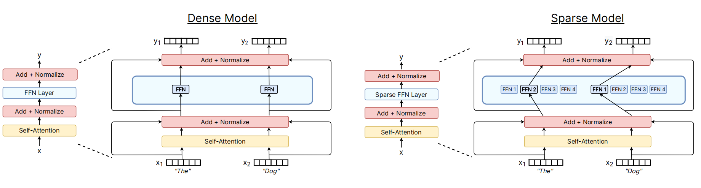
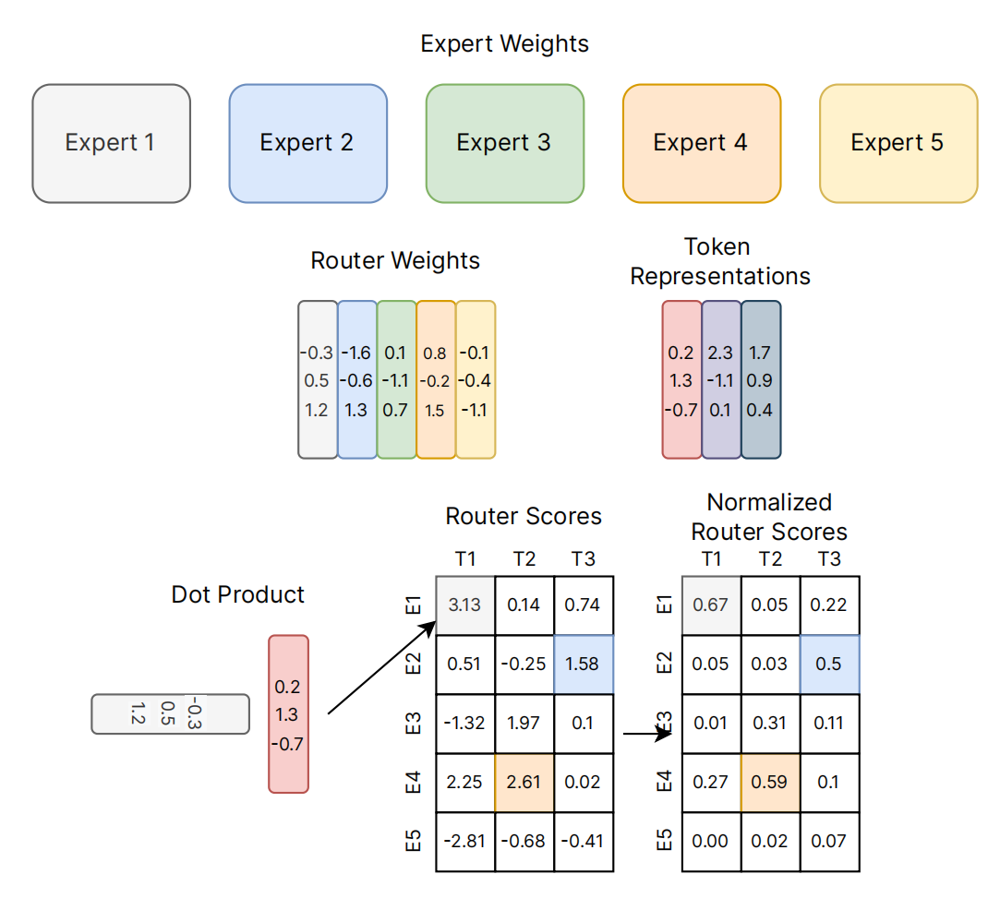
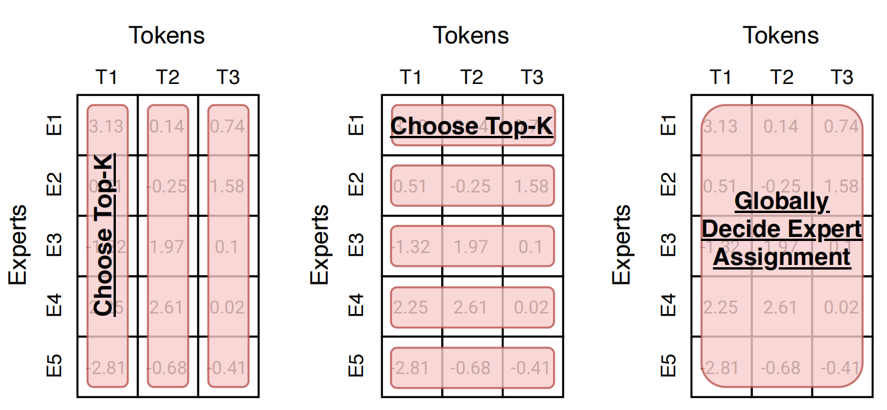
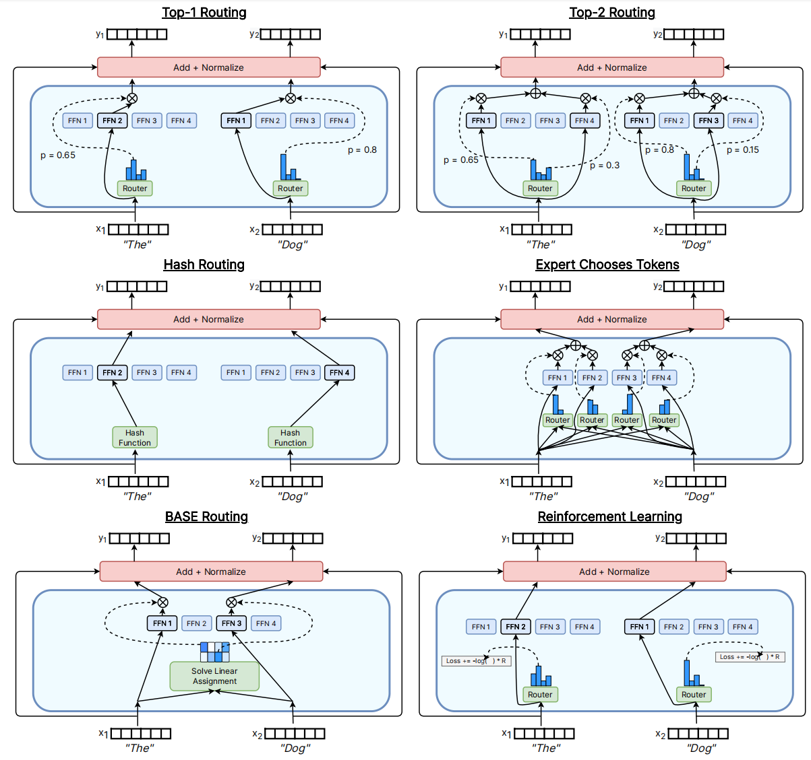

# A Review of Sparse Expert Models in Deep Learning
深度学习中的稀疏专家模型综述 2022.9.4 https://arxiv.org/abs/2209.01667  

## 阅读笔记
* https://zhuanlan.zhihu.com/p/571873617
* 未来sever端会基于稀疏专家模型构建一个统一的非常庞大的模型, 终端或边缘计算则用蒸馏方式, 从稀疏专家大模型蒸馏出领域专用的小模型？
* FFN层稀疏专家; 稀疏注意力机制，不需要每对token都计算？

## Abstract
Sparse expert models are a thirty-year old concept re-emerging as a popular architecture in deep learning. This class of architecture encompasses Mixture-of-Experts, Switch Transformers, Routing Networks, BASE layers, and others, all with the unifying idea that each example is acted on by a subset of the parameters. By doing so, the degree of sparsity decouples the parameter count from the compute per example allowing for extremely large, but efficient models. The resulting models have demonstrated significant improvements across diverse domains such as natural language processing, computer vision, and speech recognition. We review the concept of sparse expert models, provide a basic description of the common algorithms, contextualize the advances in the deep learning era, and conclude by highlighting areas for future work. 

稀疏专家模型是一个已有30年历史的概念, 现在作为深度学习中的流行架构重新出现。 此类架构包括 专家混合(MoE)、开关Transformers、路由网络、BASE 层等, 所有这些都具有统一的思想, 即每个样本都由参数的子集作用。 通过这样做, 稀疏度将参数计数与每个样本的计算解耦, 从而允许非常大但高效的模型。 由此产生的模型已经在自然语言处理、计算机视觉和语音识别等不同领域展示了显著的改进。 我们回顾了稀疏专家模型的概念, 提供了对常用算法的基本描述, 将深度学习时代的进步背景化, 并通过强调未来工作的领域来总结。

## 1 INTRODUCTION
Remarkable advances in machine learning – especially in natural language – have been achieved by increasing the computational budget, training data, and model size. Notable milestone language models include GPT-2 (Radford et al., 2018), BERT (Devlin et al., 2018), T5 (Raffel et al., 2019), GPT-3 (Brown et al., 2020), Gopher (Rae et al., 2021), Chinchilla (Hoffmann et al., 2022), and PaLM (Chowdhery et al., 2022). However, state-of-the-art models now require thousands of specialized, interconnected accelerators for weeks or months at a time. These models are therefore expensive to produce and incur high energy costs (Patterson et al., 2021). Therefore, as the scale of machine learning systems has increased, the field has sought more efficient training and serving paradigms. Sparse expert models have risen as a promising solution.

通过增加计算预算、训练数据和模型规模, 机器学习(尤其是自然语言)取得了显著进步。 著名的里程碑语言模型包括 GPT-2(Radford et al., 2018)、BERT(Devlin et al., 2018)、T5(Raffel et al., 2019)、GPT-3(Brown et al., 2020)、Gopher (Rae et al., 2021)、Chinchilla (Hoffmann et al., 2022) 和 PaLM (Chowdhery et al., 2022)。 然而, 最先进的模型现在需要数以千计的专用互连加速器一次运行数周或数月。 因此, 这些模型的生产成本很高, 并且会产生高昂的能源成本(Patterson et al., 2021)。 因此, 随着机器学习系统规模的增加, 该领域寻求更高效的训练和服务范式。 稀疏专家模型已成为一种有前途的解决方案。

 
Figure 1: Comparing a dense and sparse expert Transformer. A dense model (left) sends both input tokens to the same feed-forward network parameters (FFN). A sparse expert model (right) routes each input token independently among its four experts (FFN1 · · · FFN4). In this diagram, each model uses a similar amount of computation, but the sparse model has more unique parameters. Note while this figure showcases a specific and common approach of sparse feed-forward network layers in a Transformer (Vaswani et al., 2017), the technique is more general.
图 1：比较密集和稀疏专家 Transformer。 密集模型(左)将两个输入令牌发送到相同的前馈网络参数 (FFN)。 稀疏专家模型(右)在其四位专家(FFN1···FFN4)之间独立地路由每个输入令牌。 此图中, 每个模型使用相似的计算量, 但稀疏模型具有更多独特的参数。 请注意, 虽然此图展示了 Transformer 中稀疏前馈网络层的一种特定且常见的方法(Vaswani et al., 2017), 但该技术更为通用。 <!--只FFN层, self-attention没有？-->

Sparse expert models, of which, Mixture-of-Experts (MoE) is the most popular variant, are neural networks where a set of the parameters are partitioned into “experts”, each with a unique weight. During training and inference, the models route input examples to specific expert(s) weights. As a result, each example only interacts with a subset of the network parameters, contrasting the usual approach where the entire network is used for each input. Because only a fraction of the experts are used for each example, the amount of computation may remain small relative to the total model size.

稀疏专家模型, 其中, 专家混合(MoE) 是最流行的变体, 是神经网络中一组参数被划分为“专家”, 每个专家都有唯一的权重。 在训练和推理期间, 模型将输入样本路由到特定的专家权重。 因此, 每个样本仅与网络参数的一个子集交互, 这与整个网络用于每个输入的通常方法形成对比。 由于每个样本仅使用一小部分专家, 因此相对于总模型大小, 计算量可能仍然很小。

Many modern sparse expert models draw inspiration from Shazeer et al. (2017), which trained the largest model at the time and achieved state-of-the-art language modeling and translation results. Sparse expert models have further surged in popularity when combined with Transformer language models (Lepikhin et al., 2020; Fedus et al., 2021). And while most work has been in natural language processing, they have also been successfully used in a variety of domains including computer vision (Puigcerver et al., 2020), speech recognition (You et al., 2021) and multi-modal learning (Mustafa et al., 2022). Recent work by Clark et al. (2022) rigorously studied the scaling properties of sparse expert models across different model sizes and number of experts. Further, state-of-the-art results on many benchmarks are currently held by sparse expert models such as ST-MoE (Zoph et al., 2022). The field is evolving quickly with research and engineering advances increasing our understanding and improving empirical results. 

许多现代稀疏专家模型从Shazeer et al. (2017)那里汲取灵感, 它训练了当时最大的模型并取得了最先进的语言建模和翻译结果。 当与 Transformer 语言模型结合使用时, 稀疏专家模型的受欢迎程度进一步飙升(Lepikhin et al., 2020; Fedus et al., 2021)。 虽然大部分工作都在自然语言处理方面, 但它们也已成功用于各种领域, 包括计算机视觉(Puigcerver et al., 2020)、语音识别(You et al., 2021)和多模态学习(Mustafa et al., 2022)。 Clark et al. (2022) 最近的工作严格研究了稀疏专家模型在不同模型大小和专家数量下的缩放特性。 此外, 许多基准测试的最新结果目前由ST-MoE (Zoph et al., 2022)等稀疏专家模型持有。 随着研究和工程的进步, 该领域正在迅速发展, 增加了我们的理解并改善了实证结果。

We narrow our survey to sparse expert models in the era of deep learning (heuristically 2012-onward), recounting recent advances and discussing promising future avenues. For a comprehensive review of the history of Mixture-of-Experts, predating the recent deep learning advances, we refer readers to the survey, “Twenty Years of Mixture-of-Experts” (Yuksel et al., 2012). Further, sparse expert models may be regarded as a special class of adaptive computation models which are surveyed in Xu and McAuley (2022). Finally, Tay et al. (2020) surveys a broader set of methods aimed at increasing the computational efficiency of Transformers, of which, sparse expert models are one promising approach. 

我们将调查范围缩小到深度学习时代(启发式 2012以后)的稀疏专家模型, 回顾最近的进展并讨论有希望的未来途径。 为了全面回顾专家混合的历史, 早于最近的深度学习进展, 我们建议读者参阅调查“二十年的专家混合”(Yuksel et al., 2012)。 此外, 稀疏专家模型可被视为一类特殊的自适应计算模型, Xu and McAuley (2022) 对此进行了调查。 最后, Tay et al. (2020) 调查了一组更广泛的旨在提高 Transformers 计算效率的方法, 其中, 稀疏专家模型是一种很有前途的方法。

## 2 SPARSE EXPERT MODELS
The concept of MoE in machine learning dates back at least three decades to the work of Jacobs et al. (1991); Jordan and Jacobs (1994). In early concepts, the experts defined an entire neural network and the MoE was similar to ensemble methods.

机器学习中的 MoE 概念至少可以追溯到30年前 Jacobs et al. (1991); Jordan and Jacobs (1994) 的工作。在早期的概念中, 专家们定义了一个完整的神经网络, 而 MoE 类似于集成方法。

### 2.1 IN DEEP LEARNING
Eigen et al. (2013) proposed architectures that used stacked layers of Mixture-of-Experts on jittered MNIST (LeCun et al., 1998). This work used a continuous mixture of the experts’ outputs (soft selection) rather than restricting to the top subset of experts at each layer (hard selection) – limiting its practicality(1The full computational cost is incurred with soft selection even if the expert was not necessary (i.e. an exceedingly small routing weight).) . This work, however, set the stage for later efficient implementations which relied on the idea of MoE as a component of a neural network. The first large-scale success of this approach in deep learning came from Shazeer et al. (2017). This work inserted an MoE layer between two LSTM layers (Hochreiter and Schmidhuber, 1997) where the output from the lower layer’s LSTM was sent for computation within the MoE. The resulting sparse model was state-of-the-art in machine translation, though the largest variant with 131,072 experts and 137B parameters generalized worse than smaller variants. Despite this success, however, follow-on research was relatively dormant with greater emphasis on directly studying the Transformer (Vaswani et al., 2017). This changed with the release of GShard (Lepikhin et al., 2020) and Switch Transformers (Fedus et al., 2021) – both of which replaced the feed-forward layers in Transformers with expert layers. However, while the experts-as-a-layer approach has become the dominant paradigm, more recent works revisit the concept of experts as fully independent models (Gururangan et al., 2021; Li et al., 2022). This confers a benefit of modularity and composability; Li et al. (2022) shows custom networks can be constructed by composing them of expert language models trained on specific domains.

Eigen et al. (2013) 提出了在抖动的 MNIST(LeCun et al., 1998)上使用混合专家堆叠层的架构。 这项工作使用了专家输出的连续混合(软选择), 而不是限制在每一层的顶级专家子集(硬选择)—— 限制了它的实用性(1软选择会产生全部计算成本, 即使专家是 没有必要, 即极小的路由权重)。 然而, 这项工作为后来依赖于 MoE 作为神经网络组件的想法的有效实施奠定了基础。 这种方法在深度学习中的第一次大规模成功来自 Shazeer et al. (2017)。 这项工作在两个 LSTM 层之间插入了一个 MoE 层(Hochreiter 和 Schmidhuber, 1997), 其中来自下层 LSTM 的输出被发送到 MoE 内进行计算。 由此产生的稀疏模型是机器翻译中最先进的, 尽管拥有 131,072 名专家和 137B 个参数的最大变体比较小的变体泛化更差。 然而, 尽管取得了这一成功, 但后续研究相对处于休眠状态, 更加强调直接研究 Transformer(Vaswani et al., 2017)。 随着 GShard(Lepikhin et al., 2020)和 Switch Transformers(Fedus et al., 2021)的发布, 这种情况发生了变化 —— 它们都用专家层取代了 Transformers 中的前馈层(FFN layer)。 然而, 虽然专家层方法已成为主导范式, 但最近的工作重新审视了专家作为完全独立模型的概念(Gururangan et al., 2021; Li et al., 2022)。 这带来了模块化和可组合性的好处; Li et al. (2022) 表明可以通过将在特定领域训练的专家语言模型组合起来来构建自定义网络。
<!--专家作为完全独立模型的概念?-->

 
Figure 2: Schematic of top-k routing. We visualize an example of the top-k token routing scheme over five experts and three input tokens. Each expert and token is color-coded and the router weights ($W_r$) have a representation for each expert (color matched). To determine the routing, the router weight performs a dot product with each token embedding (x) to produce the router scores (h(x)). These scores are then normalized to sum to one (p(x)). 
图 2：top-k 路由示意图。 我们将 top-k 令牌路由方案的样本可视化为五位专家和三个输入令牌。 每个专家和令牌都用颜色编码, 路由器权重 ($W_r$) 有每个专家的表示(颜色匹配)。 为了确定路由, 路由器权重对每个令牌嵌入(x) 执行点积以生成路由器分数 (h(x))。 然后将这些分数归一化以求和为一 (p(x))。

Figure 2 illustrates the original top-k routing mechanism proposed in Shazeer et al. (2017) which was foundational to many follow-on works. New advances to the routing algorithm are described in Section 4. Choosing experts based on the input usually entails a discrete selection (i.e. which expert to use), which complicates backpropagation algorithms relying on differentiability. As a solution, Shazeer et al. (2017) proposed a top-k routing function which takes as an input a token representation x and then routes it to the top-k experts out of the set $\{E_i\}^N_{i=1}$ of N experts. The router has a trainable variable $W_r$ which computes the logits h(x) = $W_r$ · x which are normalized via a softmax distribution over the N experts. The gate-value for expert i is given by, 

图2 说明了 Shazeer et al. (2017)提出的原始 top-k 路由机制, 这是许多后续作品的基础。 路由算法的新进展在第4 节中描述。根据输入选择专家通常需要离散选择(即使用哪个专家), 这使依赖于可微性的反向传播算法变得复杂。 作为解决方案, Shazeer et al. (2017)  提出了一个 top-k 路由函数, 它将令牌表示 x 作为输入, 然后将其路由到 N 个专家的集合$\{E_i\}^N_{i=1}$中的 top-k 专家。 路由器有一个可训练变量 $W_r$, 它计算 logits h(x) = $W_r$ · x, 它通过 N 位专家的 softmax 分布进行归一化。 专家 i 的门值由下式给出, 

$p_i(x) = \frac{ e^{h(x)_i} }{\sum^N_j e^{h(x)_j} }$. (1)

We denote the set of selected top-k expert indices as T . The output computation of the layer is the linearly weighted combination of each expert’s computation on the token by the gate value, 

我们将选定的 top-k 专家指数集表示为 T。 该层的输出计算是每个专家对令牌的计算通过门值的线性加权组合, 

$y = \sum_{i∈T} p_i(x)E_i(x)$. (2)

We note that in contrast to Eigen et al. (2013), this selection is only over the top-k experts and is thus more computationally efficient.

我们注意到, 与Eigen et al. (2013)相反, 这种选择仅超过前 k 位专家, 因此计算效率更高。

### 2.2 ON MODERN HARDWARE 
Modern sparse expert models have been co-designed with the distributed systems used to train the largest neural networks. These are a special case of sparse neural networks (Gale et al., 2019; Dettmers and Zettlemoyer, 2019; Evci et al., 2020) which are similar in that they only use a subset of parameters, but differ because they have potentially irregular sparsity patterns. And while generic sparse neural networks (with irregular sparsity patterns) reduce overall theoretical FLOPs, these are often not efficiently supported on current hardware which specialize in linear algebra operations on contiguous (regular) blocks of memory. Sparse expert models, on the other hand, activate entire blocks of parameters (i.e. entire matrices), and thus easily translate theoretical FLOPs savings to practical time savings on modern hardware (Fedus et al., 2021; Rajbhandari et al., 2022).

现代稀疏专家模型是与训练大型神经网络的分布式系统共同设计的。 这些是稀疏神经网络的一个特例(Gale et al., 2019; Dettmers 和 Zettlemoyer, 2019; Evci et al., 2020), 它们的相似之处在于它们只使用参数的一个子集, 不同之处在于它们具有潜在的不规则 稀疏模式。 虽然通用稀疏神经网络(具有不规则稀疏模式)减少了总体理论 FLOPs, 但这些在当前硬件上通常得不到有效支持, 这些硬件专门针对连续(常规)内存块进行线性代数运算。 另一方面, 稀疏专家模型激活整个参数块(即整个矩阵), 因此可以轻松地将理论上的 FLOP 节省转化为现代硬件上的实际时间节省(Fedus et al., 2021; Rajbhandari et al., 2022)。

The largest neural networks (Brown et al., 2020; Rae et al., 2021; Chowdhery et al., 2022) now far exceed the memory capacity of a single accelerator and therefore tensors (e.g. weights, activations, optimizer variables) are sharded using various parallelism strategies. Three common approaches include data parallelism (model weights replicated, but data sharded), tensor model-parallelism (Shazeer et al., 2018) (data and weight tensors are split across devices), and pipeline parallelism (Harlap et al., 2018; Huang et al., 2019) (entire layers or groups of layers are split across devices). Mixture-of-Experts fit naturally with these parallelism schemes. Experts reside on different accelerators and the input data is dynamically dispatched to and fetched from them. Early architectures often employed many, small experts that would fit within an individual accelerator (Lepikhin et al., 2020), but later works designed larger experts that must be split across accelerators (Fedus et al., 2021; Du et al., 2021) and required additional optimizations for communication efficiency (Shazeer et al., 2018; Roberts et al., 2022; Rajbhandari et al., 2022).

大型神经网络(Brown et al., 2020; Rae et al., 2021; Chowdhery et al., 2022)现在远远超过单个加速器的存储容量, 因此张量(例如权重、激活、优化器变量)被分片 使用各种并行策略。 三种常见的方法包括数据并行性(模型权重被复制, 但数据被分片)、张量模型并行性(Shazeer et al., 2018)(数据和权重张量跨设备拆分)和管道并行性(Harlap et al., 2018;  Huang et al., 2019)(整个层或层组在设备之间拆分)。 混合专家自然地适合这些并行方案。 专家驻留在不同的加速器上, 输入数据动态地分配给它们并从中获取。 早期架构通常采用许多适合单个加速器的小型专家(Lepikhin et al., 2020), 但后来的工作设计了必须跨加速器拆分的大型专家(Fedus et al., 2021; Du et al., 2021) 并需要进一步优化通信效率(Shazeer et al., 2018; Roberts et al., 2022; Rajbhandari et al., 2022)。

Dynamic routing on distributed systems incurs additional communication overhead beyond standard Transformer models. Dispatching the inputs to the experts is often implemented as an all2all communication primitive, where each accelerator communicates data to all other accelerators(2Many routing algorithms (but not all) incur two all2all communication costs in the forward pass and another two in the backward pass. An example of a routing algorithm using more is BASE layers (Lewis et al., 2021), which requires four all2all in the forward pass and another four in the backward pass.). The capacity factor directly impacts the communication cost by modulating the expert batch size (Lepikhin et al., 2020) to be CF · (B/E), where CF is the capacity factor, B is the total tokens per batch and E is the number of experts. Larger capacity factor values can improve quality, but at the expense of increased communication, memory and compute costs. Efficient implementations of the all2all primitive, along with changes to the routing algorithm (e.g. reduced capacity factor), alleviate the added communication costs from sparse expert algorithms.

分布式系统上的动态路由会产生超出标准 Transformer模型 的额外通信开销。 将输入分派给专家通常作为 all2all 通信原语实现, 其中每个加速器将数据传送到所有其他加速器(2 许多路由算法(但不是全部)在前向传递中产生两个 all2all 通信成本, 在反向传播中产生另外两个通信成本。 使用更多层的路由算法的一个例子是 BASE 层(Lewis et al., 2021), 它在前向传递中需要四个 all2all, 在反向传递中需要另外四个)。 容量因子通过将专家批大小 (Lepikhin et al., 2020) 调制为 CF·(B/E) 直接影响通信成本, 其中 CF 是容量因子, B 是每批总令牌, E 是 专家数量。 较大的容量因子值可以提高质量, 但会增加通信、内存和计算成本。 all2all 原语的高效实现以及路由算法的更改(例如, 降低容量因子)减轻了稀疏专家算法增加的通信成本。

When training normal distributed Transformers it is known in advance what batch of data each accelerator will process. However, dynamic routing algorithms break this property because inputs are dynamically routed to experts, which can often lead to different number of inputs getting sent to each of the experts. Therefore, routing algorithms often encourage load balance over the accelerators to encourage good utilization. Load balance has been accomplished by auxiliary losses (Shazeer et al., 2017) as well as through treating this as a linear assignment problem (Lewis et al., 2021; Clark et al., 2022). More details on advances to load balancing are provided in Section 4.

在训练正态分布式 Transformers 时, 预先知道每个加速器将处理哪批数据。 然而, 动态路由算法打破了这个属性, 因为输入被动态路由到专家, 这通常会导致不同数量的输入被发送到每个专家。 因此, 路由算法通常鼓励加速器上的负载均衡以促进良好的利用率。 负载均衡已通过辅助损失(Shazeer et al., 2017)以及通过将其视为线性分配问题(Lewis et al., 2021; Clark et al., 2022)来实现。 第 4 节提供了有关负载均衡进展的更多详情。
<!--负载均衡:辅助损失,线性分配问题-->

Finally, recent systems advances have further improved both the training and deployment of MoE models. Jaszczur et al. (2021) sparsify all the layers (e.g. dense and self-attention) of a Transformer model to achieve 37× inference speedups for a special-case of single-example inference (unbatched). Kossmann et al. (2022) relaxes the constraints of static expert batch sizes with the RECOMPILE library. This system dynamically recompiles and optimizes the computational resources of Mixture-of-Experts models so tensor sizes are matched to the experts’ computational demands, not statically-set arrays. Next, in addition to data-, model-, and expert-parallelism, the DeepSpeed-MoE library (Rajbhandari et al., 2022) supports ZeRO partitioning (Rajbhandari et al., 2019) (fully partition tensors and regather as needed) and ZeRO-Offload (offloading to CPU to reduce GPU memory usage). This system yielded 10× inference improvements (Rajbhandari et al., 2022) and state-of-the-art translation (Kim et al., 2021) – increasing the practicality of these models for production services. 

最后, 最近的系统进步进一步改进了 MoE 模型的训练和部署。 Jaszczur et al. (2021) 稀疏化 Transformer模型 的所有层(例如密集层和自注意层), 以针对单样本推理(非批处理)的特殊情况实现 37 倍的推理加速。 Kossmann et al. (2022) 使用 RECOMPILE 库放宽了静态专家批量大小的限制。 该系统动态重新编译和优化专家混合模型的计算资源, 使张量大小与专家的计算需求相匹配, 而不是静态设置的数组。 接下来, 除了数据、模型和专家并行性之外, DeepSpeed-MoE 库(Rajbhandari et al., 2022)还支持零分区(Rajbhandari et al., 2019)(完全分区张量并根据需要重新收集)和 ZeRO-Offload(卸载到 CPU 以减少 GPU 内存使用)。 该系统产生了 10 倍的推理改进(Rajbhandari et al., 2022)和最先进的翻译(Kim et al., 2021)—— 增加了这些模型在生产服务中的实用性。
<!--RECOMPILE 库, 零分区? -->

## 3 SCALING PROPERTIES OF SPARSE EXPERT MODELS  缩放属性
The cross-entropy loss of dense neural language models was shown to scale as a power-law (i.e. $l(x) = (c/x)^α$ for a variable x) with respect to the model parameter count, amount of data, and compute budget when not constrained by the other two factors (Kaplan et al., 2020). The power law coefficients were later corrected in Hoffmann et al. (2022), which demonstrated that computeoptimal models required a closer balance of data and parameter scaling. In contrast, early research in sparse expert models scaled heuristically – achieving strong empirical results – but without careful characterization of the scaling laws. Further, several works highlighted discrepancies between upstream (e.g. pre-training) and downstream (e.g. fine-tuning) behavior (Fedus et al., 2021; Artetxe et al., 2021), further complicating the understanding and explanation of sparse expert models. 

密集神经语言模型的交叉熵损失在不受其他两个因素约束的情况下, 相对于模型参数计数、数据量和计算预算, 显示为幂律(即变量x的$l(x) = (c/x)^α$)(Kaplan et al., 2020)。 幂律系数后来在 Hoffmann et al. (2022) 中得到了修正, 这表明计算优化模型需要更紧密地平衡数据和参数缩放。 相比之下, 早期对稀疏专家模型的研究采用启发式缩放—— 获得了强有力的实证结果 —— 但没有仔细描述缩放定律。 此外, 几项工作强调了上游(例如预训练)和下游(例如微调)行为之间的差异(Fedus et al., 2021; Artetxe et al., 2021), 进一步使稀疏专家模型的理解和解释复杂化。

### 3.1 UPSTREAM SCALING 上游扩展
Sparse expert models have excelled when trained on large datasets. A common paradigm in natural language processing is to perform upstream training (e.g. pre-training) which is then followed by downstream training (e.g. fine-tuning) on data distributions of specific interest. Sparse expert models have consistently yielded high gains over dense counterparts during the upstream phase. Shazeer et al. (2017) presented scaling curves with respect to model parameters and the computational budget on the 1-Billion-Word Language-Modeling Benchmark (Chelba et al., 2013), achieving significant gains over dense versions. Lepikhin et al. (2020) presented translation improvements as a function of model scale, and obtained a 13.5 BLEU score gain on their largest 600B parameter sparse model. Switch Transformers (Fedus et al., 2021) measured 4-7× speed-ups in wall-time using the same compute resources over T5 models. The work also studied the cross entropy loss scaling as a function of parameter count, but observed the gains diminished with 256+ experts.

稀疏专家模型在大型数据集上训练时表现出色。 自然语言处理中的一个常见范例是执行上游训练(例如预训练), 然后对特定兴趣的数据分布进行下游训练(例如微调)。 在上游阶段, 稀疏专家模型一直比密集专家模型产生更高的收益。 Shazeer et al. (2017) 在 1-Billion-Word 语言建模基准 (Chelba et al., 2013) 上展示了关于模型参数和计算预算的缩放曲线, 与密集版本相比取得了显著的进步。 Lepikhin et al. (2020) 提出了作为模型规模函数的翻译改进, 并在其最大的 600B 参数稀疏模型上获得了 13.5 BLEU 分数增益。 Switch Transformers(Fedus et al., 2021)使用与 T5 模型相同的计算资源测量了 4-7 倍的挂钟加速。 该工作还研究了交叉熵损失缩放作为参数计数的函数, 但观察到超过 256+ 名专家的收益减少了。

Furthering our understanding, Artetxe et al. (2021) distinguished upstream scaling behavior of MoE models on in-domain and out-of-domain data and found significantly better scaling for in-domain language modeling compared to dense models, corroborating the difficulties of transfer from Fedus et al. (2021). 

加深我们的理解, Artetxe et al. (2021) 区分了 MoE 模型在域内和域外数据上的上游扩展行为, 并发现与密集模型相比, 域内语言建模的扩展性明显更好, 证实了 Fedus et al. (2021)的迁移困难。

 
Figure 3: Sparse scaling plots with expert count. The cross-entropy scaling plots as a function of the number of experts are shown from Fedus et al. (2021) (left) and the three sparse variants from Clark et al. (2022), S-Base, RL-R, Hash (right). The top left-most point in both plots is an approximately compute-matched dense model. As the expert count increases, the models become increasingly sparse and yield lower validation losses.
图 3：具有专家计数的稀疏比例图。 Fedus et al. (2021)显示了作为专家数量函数的交叉熵比例图(左)和 Clark et al. (2022)的三个稀疏变体, S-Base, RL-R, Hash(右)。 两个图中最左上角的点是一个近似计算匹配的密集模型。 随着专家数量的增加, 模型变得越来越稀疏并产生更低的验证损失。

After these early empirical successes, Clark et al. (2022) conducted the first large-scale effort to mathematically characterize the scaling properties of sparse expert models. This work considered three classes of sparse models and derived a notion of effective parameter count (EPC). The EPC estimates the dense-parameter equivalent for a sparse expert models, based on the FLOPs and the number of experts. It was derived by conjecturing that sparse expert models followed a bilinear loss and it was shown empirically that the cross entropy loss scales as a power law in this variable. Figure 3 presents the cross entropy scaling of Switch Transformers on the left and the three sparse variants of Clark et al. (2022) on the right.

在这些早期的经验成功之后, Clark et al. (2022) 进行了第一次大规模的努力, 以数学方式表征稀疏专家模型的缩放特性。 这项工作考虑了三类稀疏模型并推导出了有效参数计数 (EPC) 的概念。 EPC 根据 FLOP 和专家数量估计稀疏专家模型的密集参数等效值。 它是通过推测稀疏专家模型遵循双线性损失而得出的, 并且根据经验表明, 交叉熵损失在该变量中按幂律缩放。 图 3 显示了左侧开关变压器的交叉熵缩放和 Clark et al. (2022) 的三个稀疏变体, 在右边。

One key property of the scaling curves was that the gain of sparse expert models decreased with scale, which when extrapolated, implied that there would be no further benefit of sparsity beyond 900B parameters of FLOPs. This result, however, was dependent on the number of tokens used for training and all models used only 130B tokens. But in light of the recent scaling results from Hoffmann et al. (2022) which recommends more tokens to train compute-optimal models (Chinchilla was a 70B parameter model trained on 1.4T tokens), future work might revisit this analysis.

缩放曲线的一个关键属性是稀疏专家模型的增益随着缩放而降低, 这在外推时意味着超过 900B FLOPs 参数的稀疏性不会有进一步的好处。 然而, 这个结果取决于用于训练的令牌数量, 并且所有模型仅使用 130B 令牌。 但鉴于 Hoffmann et al. (2022) 最近的缩放结果建议使用更多令牌来训练计算最优模型(Chinchilla 是一个在 1.4T 令牌上训练的 70B 参数模型), 未来的工作可能会重新审视此分析。

### 3.2 DOWNSTREAM SCALING
However, the reliable upstream scaling did not immediately yield consistent gains on downstream tasks. In one work highlighting the challenge of transfer, Fedus et al. (2021) observed 4× pretraining improvements with a low-compute, high-parameter encoder-decoder Transformer (1.6T Validation Loss parameters with 2048 experts per sparse layer), but it fine-tuned poorly on reasoning-heavy tasks such as SuperGLUE (Wang et al., 2019) compared with dense models. This finding hinted at further necessary research as well as a potential needed balance between computation and parameters. However, strong empirical results soon followed in few-shot inference, fine-tuning, and other modalities.

然而, 可靠的上游扩展并没有立即在下游任务上产生一致的收益。 在一项强调迁移挑战的工作中, Fedus et al. (2021) 使用低计算量、高参数编码器-解码器 Transformer(1.6T 验证损失参数, 每个稀疏层有 2048 名专家)观察到 4 倍的预训练改进, 但它在 SuperGLUE 等推理繁重的任务上微调不佳( Wang et al., 2019)与密集模型进行比较。 这一发现暗示了进一步的必要研究以及计算和参数之间可能需要的平衡。 然而, 很快就在小样本推理、微调和其他模式中获得了强有力的实证结果。

Du et al. (2021) presented the scaling of sparse GLaM models ranging from 1B-64B FLOPs using 64 experts per sparse layer. GLaM achieved state-of-the-art results, outperforming the 175B parameter GPT-3 (Brown et al., 2020) model in zero and one-shot performance, while using 49% fewer FLOPs per token at inference and 65% lower power (left plot in Figure 4). In another example of sparse models performing well on few-shot inference, the BIG-Bench (Srivastava et al., 2022) collaboration measured a 2× improvement of sparse over dense models on the 161 contributed JSON tasks (right plot in Figure 4). 

Du et al. (2021) 提出了稀疏 GLaM 模型的缩放, 范围从 1B-64B FLOPs, 每个稀疏层使用 64 位专家。 GLaM 取得了最先进的结果, 在零和一次样本性能方面优于 175B 参数 GPT-3(Brown et al., 2020)模型, 同时在推理时每个令牌使用的 FLOPs 减少了 49%, 功耗降低了 65% (图 4 中的左图)。 在另一个稀疏模型在少样本推理上表现良好的例子中, BIG-Bench(Srivastava et al., 2022)合作测量了在 161 个贡献的 JSON 任务上稀疏模型比密集模型提高了 2 倍(图 4 中的右图) .

 
Figure 4: Sparse scaling for few-shot inference. Left: Du et al. (2021) measures the few-shot inference performance on TriviaQA, demonstrating consistent gains of sparse MoE models over dense models up to 137B parameters. Each label, such as 8B/64E, says how many parameters per input are used (8B) and how many experts (64E). Right: BigBench (Srivastava et al., 2022) studied the few-shot scaling properties on a larger set of 161 contributed JSON tasks to confirm improvements of sparse expert models over their FLOP-matched dense counterparts.
图 4：小样本推理的稀疏缩放。 左：Du et al. (2021) 测量了 TriviaQA 上的小样本推理性能, 证明了稀疏 MoE 模型相对于高达 137B 参数的密集模型的一致增益。 每个标签, 例如 8B/64E, 表示每个输入使用了多少个参数 (8B) 以及多少个专家 (64E)。 右图：BigBench(Srivastava et al., 2022)研究了更大的 161 个贡献的 JSON 任务集的小样本缩放属性, 以确认稀疏专家模型相对于 FLOP 匹配的密集对应模型的改进。

Finally, Srivastava et al. (2022) studied the calibration of sparse models on the multiple choice BIG-Bench tasks. Calibration measures the degree to which the probability of a prediction matches the probability of being correct. This work measured calibration by the Expected Calibration Error (Naeini et al., 2015) which is the absolute deviation between the predicted probability and average accuracy, after binning examples by their predicted probability. While the calibration improves for both larger dense and sparse models (Figure 5), the sparse models were found to match the calibration of a dense model using 10× more FLOPs.

最后, Srivastava et al. (2022) 研究了稀疏模型在多项选择 BIG-Bench 任务上的校准。 校准测量预测概率与正确概率匹配的程度。 这项工作通过预期校准误差(Naeini et al., 2015)测量校准, 这是预测概率和平均准确度之间的绝对偏差, 在根据预测概率对样本进行分箱后。 虽然较大的密集模型和稀疏模型的校准都有所改进(图 5), 但发现稀疏模型与使用 10 倍以上 FLOP 的密集模型的校准相匹配。

### 3.3 SCALING THE NUMBER, SIZE AND FREQUENCY OF EXPERT LAYERS 缩放专家层的数量、大小和频率
Several important hyperparameters, beyond those in a dense Transformer, govern the scale of sparse expert models including, 1) the expert count, 2) the size of each expert, and 3) the frequency of expert layers. The decisions can have significant implications to the upstream and downstream scaling.

除了密集 Transformer 中的超参数之外, 还有几个重要的超参数控制着稀疏专家模型的规模, 包括：1.专家数量, 2.每个专家的规模, 以及 3.专家层的频率。 这些决策可能会对上游和下游的扩展产生重大影响。

Many earlier works scaled to thousands of relatively small experts per layer, which has produced excellent pre-training and translation quality (Shazeer et al., 2017; Lepikhin et al., 2020; Fedus et al., 2021). However, the quality of sparse models is disproportionately reduced under domain shift (Artetxe et al., 2021) or when fine-tuning on different task distributions (Fedus et al., 2021). The state-of-the-art sparse models for few-shot inference (GLaM (Du et al., 2021)) and for fine-tuning (ST-MoE (Zoph et al., 2022)) use only up to 64 larger experts – a better balance of computation and parameters. As a result of the increased expert dimensions, these models require specific systemlevel sharding strategies over accelerators to run efficiently (Du et al., 2021; Rajbhandari et al., 2022).

许多早期的工作将每层扩展到数千个相对较小的专家, 这产生了出色的预训练和翻译质量(Shazeer et al., 2017; Lepikhin et al., 2020; Fedus et al., 2021)。 然而, 稀疏模型的质量在域迁移 (Artetxe et al., 2021) 或对不同任务分布进行微调 (Fedus et al., 2021) 时会不成比例地降低。 用于小样本推理 (GLaM (Du et al., 2021)) 和微调 (ST-MoE (Zoph et al., 2022)) 的最先进的稀疏模型仅使用多达 64 个更大的 专家 —— 更好地平衡计算和参数。 由于专家维度的增加, 这些模型需要在加速器上采用特定的系统级分片策略才能高效运行(Du et al., 2021; Rajbhandari et al., 2022)。

Next, we recap the current conventions around the frequency of expert layers. Usually, sparse models are constructed by beginning with a dense model and either inserting or substituting sparse expert layers at either a fixed interval or heuristically. As an example, Rajbhandari et al. (2022) put more sparse layers near the final layers of the network. In the Transformer, the most common approach is to replace every other Feed-Forward Network (FFN) layer (Lepikhin et al., 2020; Du et al., 2021; Artetxe et al., 2021; Rajbhandari et al., 2022), that is, substitute with a frequency of 0.5. However, other frequencies have been used, including every-fourth-layer (0.25) in Zoph et al. (2022) and every-layer (e.g. 1.0) in Fedus et al. (2021). Finally, a frequency of 0.5-1.0 is recommended by Clark et al. (2022).

接下来, 我们回顾一下当前关于专家层频率的约定。 通常, 稀疏模型的构建方法是从密集模型开始, 然后以固定间隔或启发式插入或替换稀疏专家层。 例如, Rajbhandari et al. (2022) 在网络的最后一层附近放置更多的稀疏层。 在 Transformer 中, 最常见的方法是替换所有其他前馈网络 (FFN) 层(Lepikhin et al., 2020; Du et al., 2021; Artetxe et al., 2021; Rajbhandari et al., 2022) , 即以 0.5 的频率替代。 然而, 其他频率已被使用, 包括 Zoph et al. (2022) 中的每第四层 (0.25) 和 Fedus et al. (2021)的每一层(例如 1.0)。 最后, Clark et al. (2022) 推荐的频率为 0.5-1.0。

 
Figure 5: Sparse model calibration. The Expected Calibration Error improves with scale for both dense and spare models. However, sparse models exhibit significantly better calibration and roughly match the calibration of a 10× larger dense model. Figure is reproduced from Srivastava et al. (2022). 
图 5：稀疏模型校准。 预期校准误差随着密集模型和备用模型的规模而改善。 然而, 稀疏模型表现出明显更好的校准, 并且大致匹配 10 倍大的密集模型的校准。 图转载自 Srivastava et al. (2022)。

Ultimately, the answer to the question of optimal hyperparameters depends on the application and the hardware system specifications. Prior work demonstrated strong pre-training and translation results with a high number of experts (Shazeer et al., 2017; Lepikhin et al., 2020), whereas, the best performing models under transfer have used fewer, larger experts (Du et al., 2021; Zoph et al., 2022;Mustafa et al., 2022). Further, these decisions are highly hardware-dependent. Due to the added all2all communication costs to implement routing, networks with slower interconnect speeds may find fewer expert layers is optimal on a time-basis to a certain quality. A simulation of the compute, memory, and communication properties of a distributed system would significantly aid practitioners to more quickly determine optimal settings, without costly trail-and-error launches.

最终, 最佳超参数问题的答案取决于应用程序和硬件系统规格。 先前的工作展示了大量专家的强大预训练和翻译结果(Shazeer et al., 2017; Lepikhin et al., 2020), 而迁移中表现最好的模型使用了更少、更大的专家(Du et al., 2021; Zoph et al., 2022; Mustafa et al., 2022)。 此外, 这些决定高度依赖于硬件。 由于实施路由增加了 all2all 通信成本, 互连速度较慢的网络可能会发现较少的专家层在时间基础上对特定质量是最佳的。 分布式系统的计算、内存和通信属性的模拟将极大地帮助从业者更快地确定最佳设置, 而无需昂贵的试错启动。

We note that this analysis and trade-offs are for experts-as-a-layer approach (Eigen et al., 2013). In contrast, the Branch-Train-Merge (BTM) approach to experts (Li et al., 2022) is “embarrassingly parallel“ in that each expert is a fully formed language model, trainable independently and asynchronously, without the expensive communication costs. Therefore, this approach and others following-suit have completely different scaling characteristics with the number of experts. 

我们注意到这种分析和权衡是针对专家作为一层的方法 (Eigen et al., 2013)。 相比之下, 针对专家的 Branch-Train-Merge (BTM) 方法(Li et al., 2022)是“令人尴尬的并行”, 因为每个专家都是一个完全形成的语言模型, 可以独立和异步地训练, 没有昂贵的通信成本。 因此, 这种方法和其他后续方法具有与专家数量完全不同的缩放特性。

## 4 ROUTING ALGORITHMS
The routing algorithm, a key feature to all sparse expert architectures, determines where to send examples. This area has been studied extensively, including counter-intuitive methods that use fixed, non-learned routing patterns (Roller et al., 2021). Typically the naive routing decision is non-differentiable because it makes a discrete decision of which experts to select. The problem of expert selection can be recast as a Bandit problem and several works have used reinforcement learning to learn the selection (Bengio et al., 2016; Rosenbaum et al., 2017; 2019; Clark et al., 2022). Shazeer et al. (2017) proposed a differentiable heuristic that side-stepped reinforcement learning challenges. Rather than routing the example to the chosen expert and proceeding, the output of the expert computation is weighted by the probability of choosing it (Equation 2). This produces a gradient to the router since the probability of choosing the expert is differentiable. In contrast to a Bandit approach, where only one expert might be chosen, Shazeer et al. (2017) conjectured that it was necessary to route to the top-k experts with k > 1. The intuition was two or more experts on the same example allowed the network to compare and to optimize the relative performance. Lepikhin et al. (2020) later adapted the same routing algorithm to the Transformer architecture, yielding state-of-the-art machine translation results. However, Fedus et al. (2021) demonstrated that top-1 routing can achieve competitive results, corroborated by later work (Clark et al., 2022).

路由算法是所有稀疏专家架构的一个关键特性, 它决定了将样本发送到哪里。 该领域已得到广泛研究, 包括使用固定的、非学习路由模式的反直觉方法(Roller et al., 2021)。 通常, 朴素的路由决策是不可微分的, 因为它对选择哪些专家做出了离散的决策。 专家选择问题可以重铸为 Bandit 问题, 并且有几项工作使用强化学习来学习选择(Bengio et al., 2016; Rosenbaum et al., 2017; 2019; Clark et al., 2022)。 Shazeer et al. (2017) 提出了一种可区分的启发式方法, 可以避免强化学习的挑战。 专家计算的输出由选择它的概率加权, 而不是将样本路由到选定的专家并继续进行(等式 2)。 由于选择专家的概率是可微分的, 因此这会为路由器产生一个梯度。 与只能选择一名专家的 Bandit 方法相比, Shazeer et al. (2017) 推测有必要路由到 k > 1 的前 k 个专家。直觉是同一样本中的两个或更多专家允许网络进行比较并优化相对性能。 Lepikhin et al. (2020) 后来将相同的路由算法应用于 Transformer 架构, 产生了最先进的机器翻译结果。 然而, Fedus et al. (2021) 证明了 top-1 路由可以取得有竞争力的结果, 这一点得到了后来工作的证实 (Clark et al., 2022)。
<!--Bandit?-->

### 4.1 ROUTING TAXONOMY 路由分类法
One way to understand many routing algorithms is to analyze the matrix of routing scores (i.e. the router scores from Figure 2). As a demonstrative example, we use a natural language sparse expert model. Figure 6 shows the un-normalized router scores computed for three tokens (columns) routed across five experts (rows). Each value is produced by the dot product of the token embedding and the expert embedding (from the router weights). Once the scores are computed, there are a variety of ways to determine which experts should get which tokens. We highlight three common categories: 1) each token chooses the top-k experts, 2) each expert chooses the top-k tokens, and 3) globally determine what tokens should go to each expert (and not use a greedy approach). This taxonomy also further suggests yet to be explored routing algorithms. One example is an algorithm that benefits by looking both horizontally and vertically at the router scores, but without incurring the cost of looking globally. A token could first choose what experts it wants to go to, then based on this information, each expert could choose what tokens it wanted.

了解许多路由算法的一种方法是分析路由分数矩阵(即图 2 中的路由器分数)。 作为示范性样本, 我们使用自然语言稀疏专家模型。 图 6 显示了为路由到五个专家(行)的三个令牌(列)计算的非标准化路由器分数。 每个值都是由令牌嵌入和专家嵌入(来自路由器权重)的点积产生的。 一旦计算出分数, 就有多种方法可以确定哪些专家应该获得哪些令牌。 我们强调三个常见类别：
1. 每个令牌选择前 k 个专家, 
2. 每个专家选择前 k 个令牌, 
3. 全局确定每个专家应该使用哪些令牌(而不是使用贪婪的方法)。 
该分类法还进一步提出了有待探索的路由算法。 一个例子是一种算法, 它通过水平和垂直地查看路由器分数而受益, 但不会产生全局查看的成本。 一个令牌可以先选择它想去的专家, 然后根据这些信息, 每个专家可以选择它想要的令牌。

 
Figure 6: Three common classes of routing algorithms. We illustrate three methods with an Experts × Tokens activation matrix obtained through the process explained in Figure 2. Left: “Choose Top-k” along the Experts axis includes the standard top-k routing algorithm (Shazeer et al., 2017; Lepikhin et al., 2020). Center: “Choose Top-k” along the Tokens axis are routing algorithms such as Zhou et al. (2022). Right: “Globally Decide Expert Assignment” routing algorithms such as BASE layer (Lewis et al., 2021; Clark et al., 2022). 
图 6：三种常见的路由算法。 我们使用通过图 2 中解释的过程获得的 Experts × Tokens 激活矩阵来说明三种方法。左图：沿 Experts 轴的“选择 Top-k”包括标准的 top-k 路由算法(Shazeer et al., 2017; Lepikhin et al., 2020)。 中图：沿着 Tokens 轴的“Choose Top-k”是 Zhou et al. (2022)的路由算法。 右图：“全局决定专家分配”路由算法, 例如 BASE 层(Lewis et al., 2021; Clark et al., 2022)。

Each token chooses the top-k experts. This class of routing algorithms have each token choose the top-k experts to be sent to. This is the original routing top-2 formulation proposed in Shazeer et al. (2017) and used in Lepikhin et al. (2020) that achieves state-of-the-art machine translation results. Fedus et al. (2021); Rajbhandari et al. (2022) used top-1 routing with success. Clark et al. (2022) proposed a reinforcement learning routing algorithm that used top-1 routing. However, instead of scaling the output of the expert computation by the router probability, they use REINFORCE (Williams, 1992) with the reward being the negative cross entropy of the predicted token. Figure 7 depicts the top-1, top-2 and reinforcement learning routing algorithms.

每个令牌选择前 k 个专家。 这类路由算法让每个令牌选择要发送给的前 k 个专家。 这是 Shazeer et al. (2017)提出的原始路由 top-2 公式 并用于 Lepikhin et al. (2020) 实现了最先进的机器翻译结果。 Fedus et al. (2021); Rajbhandari et al. (2022) 成功使用了 top-1 路由。 Clark et al. (2022) 提出了一种使用 top-1 路由的强化学习路由算法。 然而, 他们不是通过路由器概率来缩放专家计算的输出, 而是使用 REINFORCE (Williams, 1992), 奖励是预测令牌的负交叉熵。 图 7 描述了 top-1、top-2 和强化学习路由算法。

Yang et al. (2021) introduced an extension of top-1 routing by using expert prototyping to split experts into different groups and then applied k top-1 routing procedures. Nie et al. (2021) begins routing as a soft gating function where all experts are trained (e.g. a dense model) and anneals down to the standard top-1 routing algorithm. This approach (DTS-Gate) improves over Switch Transformer (Fedus et al., 2021) on OpenWebText pre-training. Dua et al. (2021) proposes a similar approach of first training a dense model where each inputs goes to every expert and then adapting it to be sparse. Hazimeh et al. (2021) proposes DSelect-k, which is a smooth version of the top-k routing algorithm that improves over standard top-k routing. Rajbhandari et al. (2022) designs PR-MoE which uses top-2 routing, but each token is sent to a shared dense layer and a single expert of its choosing (instead of two experts).

Yang et al. (2021) 通过使用专家原型将专家分成不同的组, 然后应用 k top-1 路由程序, 引入了 top-1 路由的扩展。 Nie et al. (2021) 开始将路由作为一种软门控功能, 所有专家都接受训练(例如密集模型)并退火到标准的 top-1 路由算法。 这种方法 (DTS-Gate) 在 OpenWebText 预训练上改进了 Switch Transformer (Fedus et al., 2021)。 Dua et al. (2021) 提出了一种类似的方法, 首先训练一个密集模型, 其中每个输入都发送给每个专家, 然后将其调整为稀疏模型。 Hazimeh et al. (2021) 提出了 DSelect-k, 它是 top-k 路由算法的平滑版本, 改进了标准的 top-k 路由。 Rajbhandari et al. (2022) 设计了使用 top-2 路由的 PR-MoE, 但是每个令牌都被发送到一个共享的密集层和它选择的一个专家(而不是两个专家)。

 
Figure 7: Visualization of six different routing algorithms. Each diagram is of a Transformer sparse expert model with four experts (feed-forward networks) routing two tokens: “The” and “Dog”.
图 7：六种不同路由算法的可视化。 每个图都是一个 Transformer 稀疏专家模型, 有四个专家(前馈网络)路由两个令牌：“The”和“Dog”。

Riquelme et al. (2021) introduces an improvement for top-k routing named Batch Prioritized Routing (BPR) for ViT image classification models. MoE models use fixed batch sizes per expert, which can cause tokens to overflow if there is not enough capacity. If a token overflows then no computation will be applied to that token at that given expert. In top-k routing, priority of which tokens to not drop at an overflowed expert is given to the tokens sent earlier in a sentence/batch. BPR instead prioritizes inputs that have higher routing scores. This is relevant for ViT models as there is no autoregressive nature to the inputs, so all inputs can see each other. In language there is typically a left-to-right ordering of the inputs, which could in theory allow the model to cheat during training.Zoph et al. (2022) found BPR routing to be helpful for MoE language models. Kim et al. (2021) proposes randomizing the prioritization of the tokens in the sequences to make sure the routing is not biased towards early tokens in the sentence.

Riquelme et al. (2021) 为 ViT 图像分类模型引入了名为 Batch Prioritized Routing (BPR) 的 top-k 路由改进。 MoE 模型为每个专家使用固定的批量大小, 如果没有足够的容量, 可能会导致令牌溢出。 如果令牌溢出, 则不会对给定专家处的该令牌应用任何计算。 在 top-k 路由中, 哪些令牌不会在溢出专家处掉落的优先级被赋予在句子/批次中较早发送的令牌。 BPR 相反优先考虑具有较高路由分数的输入。 这与 ViT 模型相关, 因为输入没有自回归性质, 因此所有输入都可以相互看到。 在语言中, 输入通常是从左到右的顺序, 理论上这可能允许模型在训练期间作弊。Zoph et al. (2022) 发现 BPR 路由对 MoE 语言模型有帮助。 Kim et al. (2021) 建议随机化序列中令牌的优先级, 以确保路由不会偏向句子中的早期令牌。

Static routing. Most routing algorithms dynamically learn the routing decisions while training, but this can be statically determined before training begins. Dynamic routing algorithms typically operate on the internal input representations within the network, so the routing decisions take into account the current token and previous inputs to the model (usually through the self-attention layer). Most routing algorithms are dynamic, but a notable example of a static routing algorithm is is Hash Layers from Roller et al. (2021). This work shows random fixed routing by hashing the input token led to competitive performance with learned routing. Load balancing is achieved by choosing hash functions before training that balances batches of tokens. A depiction of Hash Layers can be found in Figure 7.

静态路由。 大多数路由算法在训练时动态学习路由决策, 但这可以在训练开始前静态确定。 动态路由算法通常对网络内的内部输入表示进行操作, 因此路由决策会考虑当前令牌和模型的先前输入(通常通过自注意力层)。 大多数路由算法都是动态的, 但静态路由算法的一个著名样本是 Roller et al. (2021)的 Hash Layers。 这项工作通过散列输入令牌显示了随机固定路由, 从而导致学习路由的竞争性能。 负载均衡是通过在训练前选择哈希函数来平衡令牌批次来实现的。 哈希层的描述可以在图 7 中找到。

Each expert chooses the top-k tokens. Instead of each token choosing what experts to be sent to, Zhou et al. (2022) flips this and has each expert choose what tokens it wants routed to it. This alleviates the need for auxiliary load balancing losses to be added during training or for linear assignment algorithms. Now each expert will always have the same amount of tokens, although some tokens might not get sent to any expert or some tokens might get sent to all of them. Empirically this algorithm performs well and has an adaptive computation interpretation where the model can implicitly apply more computation to certain tokens.

每个专家选择前 k 个令牌。 Zhou et al. (2022) 不是每个令牌都选择要发送给哪些专家翻转这个, 让每个专家选择它想要路由到它的令牌。 这减轻了在训练或线性分配算法期间添加辅助负载均衡损失的需要。 现在每个专家将始终拥有相同数量的令牌, 尽管有些令牌可能不会发送给任何专家, 或者有些令牌可能会发送给所有专家。 根据经验, 该算法表现良好, 并具有自适应计算解释, 其中模型可以隐式地将更多计算应用于某些令牌。

Globally determine what tokens should go to each expert. BASE layers (Lewis et al., 2021) treats token routing as a linear assignment problem. It aims to route a fixed number of tokens to each expert and maximize the scores from the routing matrix. Since the tokens per processor are highly correlated as they come from the same sentences, tokens are randomly shuffled around before locally solving the linear assignment problem on each device. This shuffling introduces two additional communication primitives (all2all) in both the forward and backward pass. Clark et al. (2022) proposes their own variant of BASE layer (S-BASE) that uses an optimal transport formulation.

全局确定每个专家应使用哪些令牌。 BASE 层 (Lewis et al., 2021) 将令牌路由视为线性分配问题。 它旨在将固定数量的令牌路由到每个专家, 并最大化路由矩阵的分数。 由于每个处理器的令牌高度相关, 因为它们来自相同的句子, 因此在本地解决每个设备上的线性分配问题之前, 令牌会随机洗牌。 这种改组在前向和后向传递中引入了两个额外的通信原语 (all2all)。 Clark et al. (2022) 提出了他们自己的 BASE 层变体 (S-BASE), 该变体使用了最佳传输公式。

Other routing algorithms. Some routing algorithms do not neatly fall into the above three categories. Zuo et al. (2021) introduced THOR, an algorithm which randomly selects two experts for each input during training and inference and found improvements of 2 BLEU points over standard MoE models. Gururangan et al. (2021) proposes DEMix, which explicitly has different experts for different pre-training domains (e.g. law, medical, etc.). Experts can then be selected by doing domain matching on the inputs. Fan et al. (2021) uses explicit language-specific sublayers where input tokens can be deterministically routed based on their language. This avoids needing dynamic routing algorithms. Ma et al. (2018) introduces a multi-gate routing algorithm where each task gets it own unique gating function.

其他路由算法。 一些路由算法并不完全属于以上三类。 Zuo et al. (2021) 介绍了 THOR, 一种在训练和推理过程中为每个输入随机选择两名专家的算法, 发现比标准 MoE 模型有 2 个 BLEU 点的改进。 Gururangan et al. (2021) 提出 DEMix, 它明确针对不同的预训练领域(例如法律、医学等)有不同的专家。 然后可以通过对输入进行域匹配来选择专家。 Fan et al. (2021) 使用明确的特定于语言的子层, 其中可以根据其语言确定性地路由输入令牌。 这避免了需要动态路由算法。 Ma et al. (2018) 引入了一种多门路由算法, 其中每个任务都有自己独特的门功能。

### 4.2 LOAD BALANCING
Most routing algorithms handle load balancing by adding an auxiliary loss during training to encourage equal amounts of tokens getting sent to the different experts (Shazeer et al., 2017). Some routing algorithms handle load balancing through their design: BASE Layers (Lewis et al., 2021) solves a linear assignment problem that enforces an equal number of tokens going to each expert as part of the problem statement. S-BASE from Clark et al. (2022) follows a similar protocol, but solves the assignment problem using optimal transport. Nie et al. (2021) starts by training a Mixture-of-Expert model where all tokens get sent to each expert, but over time adapts the network to do top-1 routing. This algorithm doesn’t need load balancing as the network naturally learns to the specialize the expert representations over training. 

大多数路由算法通过在训练期间添加辅助损失来处理负载均衡, 以鼓励将等量的令牌发送给不同的专家(Shazeer et al., 2017)。 一些路由算法通过其设计来处理负载均衡：BASE Layers(Lewis et al., 2021)解决了一个线性分配问题, 该问题强制将相同数量的令牌作为问题陈述的一部分发送给每个专家。 来自Clark et al. (2022) 的 S-BASE 遵循类似的协议, 但使用最优传输解决了分配问题。 Nie et al. (2021) 从训练专家混合模型开始, 在该模型中所有令牌都发送给每个专家, 但随着时间的推移调整网络以执行 top-1 路由。 该算法不需要负载均衡, 因为网络自然会学习在训练中专门化专家表示。

## 5 SPARSE EXPERT MODELS ACROSS DOMAINS 跨领域的稀疏专家模型
Sparse expert and MoE models were introduced and popularized in natural language processing (NLP). This domain was a natural fit for large models which benefit from the easy availability of trillions of tokens and the strong self-supervised algorithms of next word prediction and masked language modeling. However, the impact of these models is quickly spreading to other domains including computer vision, speech recognition and multi-modal applications. The spread of techniques from NLP to other domains has been accelerated because the Transformer has been rapidly adopted in other domains and modalities. Some examples are image classification (Dosovitskiy et al., 2020), object detection (Carion et al., 2020), recommendation systems (Chen et al., 2019), speech recognition (Dong et al., 2018; Nakatani, 2019; Gulati et al., 2020). 

稀疏专家和 MoE 模型在自然语言处理 (NLP) 中被引入和推广。 该领域非常适合大型模型, 这些模型受益于数万亿令牌的易用性以及下一个词预测和掩码语言建模的强大自监督算法。 然而, 这些模型的影响正在迅速扩展到其他领域, 包括计算机视觉、语音识别和多模态应用。 由于 Transformer 已在其他领域和模式中迅速采用, 因此加速了技术从 NLP 到其他领域的传播。 一些样本是图像分类(Dosovitskiy et al., 2020)、目标检测(Carion et al., 2020)、推荐系统(Chen et al., 2019)、语音识别(Dong et al., 2018; Nakatani, 2019;  Gulati et al., 2020)。

Across various domains, the sparse architectures and algorithms stay roughly the same, but what is routed to the experts is different. Table 1 shows the different sparse layer inputs for a variety of different domains.

在各个领域, 稀疏架构和算法大致相同, 但发送给专家的内容不同。 表1 显示了各种不同领域的不同稀疏层输入。

Domain | Input Representation
--- | ---
NLP | Word, subword, or sentence
Vision | Image patch
Speech | Spectrogram
Multimodal | Word or image patch

Table 1: Inputs to sparse models in different domains. The input is used to determine what expert to route to and is what the MoE layer will apply compute to.
表 1：不同领域中稀疏模型的输入。 输入用于确定路由到哪个专家, 以及 MoE 层将计算应用到的对象。

### 5.1 NATURAL LANGUAGE PROCESSING
Initially Shazeer et al. (2017) introduced the Mixture-of-Expert layer for LSTM language modeling and machine translation. The layers were inserted between the standard layers in the LSTM model. Follow up works are now based around Transformers, and the expert layers typically replace the dense layers. 

最初 Shazeer et al. (2017) 引入了用于 LSTM 语言建模和机器翻译的专家混合层。 这些层被插入到 LSTM 模型的标准层之间。 后续工作现在基于Transformers, 专家层通常会取代密集层。

Lepikhin et al. (2020) first introduced the MoE layer into Transformers and studied it in the context of machine translation. They achieved state-of-the-art translation results across 100 different languages when scaling up to 2048 experts per expert layer. Fedus et al. (2021) later created a sparse 1.6T parameter language model that achieved state-of-the-art pre-training quality. They also studied using sparse layers to produce the q/k/v activations in the Self-Attention layers, but found this technique to be more unstable. Lee-Thorp and Ainslie (2022) introduces the Fast Sparse Mixer, which is an encoder only model that achieves 89% training and 98% inference speedups over BERT (Devlin et al., 2018).

Lepikhin et al. (2020) 首先将 MoE 层引入到 Transformers 中, 并在机器翻译的背景下对其进行了研究。 当每个专家层扩展到 2048 位专家时, 他们在 100 种不同的语言上取得了最先进的翻译结果。 Fedus et al. (2021) 后来创建了一个稀疏的 1.6T 参数语言模型, 实现了最先进的预训练质量。 他们还研究了使用稀疏层在 Self-Attention 层中产生 q/k/v 激活, 但发现这种技术更不稳定。 Lee-Thorp and Ainslie (2022) 介绍了 Fast Sparse Mixer, 这是一种纯编码器模型, 与 BERT 相比可实现 89% 的训练和 98% 的推理加速(Devlin et al., 2018)。

Recently, there has been a flurry of MoE research on a variety of different topics in the NLP domain. As an example, prior MoE architectures in the NLP domain acted on the word or byte-pair level. Kudugunta et al. (2021) instead had an MoE architecture route at the task or sentence level, which allows for more efficient inference and serving. This was studied in the context of machine translation where sentences would be routed based on what language they were translating into.

最近, 在 NLP 领域出现了一系列关于各种不同主题的 MoE 研究。 例如, NLP 领域中先前的 MoE 架构作用于单词或字节对级别。 Kudugunta et al. (2021) 相反, 在任务或句子级别有一条 MoE 架构路线, 可以更有效地进行推理和服务。 这是在机器翻译的背景下进行的研究, 其中句子将根据翻译成的语言进行路由。

New results have been able to push state-of-the-art on few-shot inference and fine-tuning benchmarks. Du et al. (2021) trained a MoE decoder-only language model and achieved state-of-the-art few-shot results, while requiring only 1/3 the compute needed to train GPT-3. Zoph et al. (2022) introduced ST-MoE, a sparse encoder-decoder model that achieves state-of-the-art on a large set of reasoning and generation tasks including SuperGLUE, ARC Easy/Challenge, XSum, CNN-GM, Web-QA, ANLI, and Winogrande. ST-MoE outperforms PaLM-540B (Chowdhery et al., 2022) when fine-tuning on SuperGLUE, while using roughly 20× less pre-training FLOPs and 40× less inference FLOPs.

新的结果已经能够在少样本推理和微调基准上推动最先进的技术。 Du et al. (2021) 训练了一个只有 MoE 解码器的语言模型, 并取得了最先进的小样本结果, 同时只需要训练 GPT-3 所需计算量的 1/3。 Zoph et al. (2022) 引入了 ST-MoE, 这是一种稀疏编码器-解码器模型, 可在大量推理和生成任务上达到最先进的水平, 包括 SuperGLUE、ARC Easy/Challenge、XSum、CNN-GM、Web-QA、 ANLI, 和 Winogrande。 在 SuperGLUE 上进行微调时, ST-MoE 优于 PaLM-540B(Chowdhery et al., 2022), 同时使用的预训练 FLOP 减少了大约 20 倍, 推理 FLOP 减少了 40 倍。

### 5.2 COMPUTER VISION
Due to the universality of Transformers (e.g. ViT (Dosovitskiy et al., 2020)), applying improvements to the MoE architecture across domains has been fruitful. Riquelme et al. (2021) created a vision MoE model by adding MoE layers into the ViT architecture. Their model, V-MoE, was applied to image classification and was able to use just half the amount of inference compute while matching the performance of prior state-of-the-art architectures. Lou et al. (2021) introduces a sparse MoE MLP model for image classification based on the MLP-Mixer architecture (Tolstikhin et al., 2021). Their MoE variant achieved better image classification performance on ImageNet and CIFAR compared to its dense counterpart.

由于 Transformers(例如 ViT(Dosovitskiy et al., 2020))的普遍性, 跨领域对 MoE 架构进行改进是卓有成效的。 Riquelme et al.  (2021) 通过将 MoE 层添加到 ViT 架构中创建了一个视觉 MoE 模型。 他们的模型 V-MoE 被应用于图像分类, 并且能够仅使用一半的推理计算量, 同时与先前最先进的架构的性能相匹配。 Lou et al. (2021) 基于 MLP-Mixer 架构引入了用于图像分类的稀疏 MoE MLP 模型(Tolstikhin et al., 2021)。 与其密集对应物相比, 他们的 MoE 变体在 ImageNet 和 CIFAR 上实现了更好的图像分类性能。

Wu et al. (2022) improved the efficiency of training MoE models through their proposed Residual Mixture-of-Expert layer. This architecture achieves 30% reduced training cost and comparable quality to standard MoE models on both segmentation and object detection. Hwang et al. (2022) implements an efficient framework and adaptive parallelism strategy for MoE layers. To benchmark their system, they add MoE layers to the Swin Tranformer V2 architecture (Liu et al., 2022) for image classification and object detection. Their MoE variant achieves 1.5x-2x speedups in both training and inference over the previous MoE implementation. Aljundi et al. (2017) uses expert models in a continual learning setup where they add new experts over time and demonstrate improvements on image classification and video prediction. Caccia et al. (2021) dynamically increases the expert count over the course of training for image classification models on CIFAR and MNIST. Ramachandran and Le (2018) studies how depth and architectural diversity impacts sparse expert model performance and achieves gains on image recognition. Kirsch et al. (2018) develops an endto-end algorithm for doing conditional computation based on the input data that achieves strong image classification performance.

Wu et al. (2022) 通过他们提出的 Residual Mixture-of-Expert 层提高了训练 MoE 模型的效率。 该架构在分割和目标检测方面实现了与标准 MoE 模型相比降低 30% 的训练成本和相当的质量。 Hwang et al. (2022) 为 MoE 层实施有效的框架和自适应并行策略。 为了对他们的系统进行基准测试, 他们将 MoE 层添加到 Swin Tranformer V2 架构(Liu et al., 2022)以进行图像分类和目标检测。 他们的 MoE 变体在训练和推理方面比之前的 MoE 实现提高了 1.5 到 2 倍。 Aljundi et al. (2017) 在持续学习设置中使用专家模型, 随着时间的推移, 他们会添加新专家并展示图像分类和视频预测方面的改进。 Caccia et al. (2021) 在 CIFAR 和 MNIST 图像分类模型的训练过程中动态增加专家数量。 Ramachandran and Le (2018) 研究了深度和架构多样性如何影响稀疏专家模型性能并在图像识别方面取得进展。 Kirsch et al. (2018) 开发了一种端到端算法, 用于根据输入数据进行条件计算, 实现强大的图像分类性能。

### 5.3 SPEECH RECOGNITION
SpeechMoE (You et al., 2021) uses MoE Transformer models for speech recognition and achieves strong character error rate improvements across four datasets. They use novel auxiliary losses to promote sparsity and introduce a new routing architecture. SpeechMoE2 (You et al., 2022) further improves on the SpeechMoE’s results by making a new routing algorithm that adds in new auxiliary information for making routing decisions. Kumatani et al. (2021) yields improvements for multi-lingual speech recognition by using MoE layers in two different types of Transformer speech architectures: seqeuence-to-sequence and transducers.

SpeechMoE(You et al., 2021)使用 MoE Transformer 模型进行语音识别, 并在四个数据集上实现了强大的字符错误率改进。 他们使用新颖的辅助损失来促进稀疏性并引入新的路由架构。 SpeechMoE2 (You et al., 2022) 通过创建一种新的路由算法进一步改进了 SpeechMoE 的结果, 该算法添加了用于做出路由决策的新辅助信息。 Kumatani et al. (2021) 通过在两种不同类型的 Transformer 语音架构中使用 MoE 层来改进多语言语音识别：seqeuence-to-sequence 和 transducer。

### 5.4 MULTIMODAL AND MULTI-TASK 多模式和多任务
Mustafa et al. (2022) does multimodal learning by training a MoE model (LIMoE) that takes as input both images and text and learns using a contrastive loss similar to CLIP (Radford et al., 2021). The MoE layer can route both the image patches and the word tokens to the available experts. The model outperforms CLIP when using a comparable training strategy, and when scaled further matches state-of-the-art methods. 

Mustafa et al. (2022) 通过训练 MoE 模型 (LIMoE) 进行多模式学习, 该模型将图像和文本作为输入, 并使用类似于 CLIP 的对比损失进行学习 (Radford et al., 2021)。 MoE 层可以将图像块和单词令牌路由到可用的专家。 该模型在使用类似的训练策略时优于 CLIP, 并且在进一步扩展时与最先进的方法相匹配。

## 6 WHEN TO USE A SPARSE VERSUS DENSE MODEL 何时使用稀疏模型与密集模型
A common question is if you are given a fixed compute or FLOP budget (e.g. 100 GPUs for 20 hours), what type of model should you train to achieve the best performance? Many prior works show that sparsity is better than a dense model for this type of setup (Shazeer et al., 2017; Lepikhin et al., 2020; Fedus et al., 2021; Du et al., 2021; Artetxe et al., 2021; Lewis et al., 2021). Given all the strong state-of-the-art results using sparse models, why should you ever not use a sparse model over a dense model?

一个常见的问题是, 如果您有固定的计算或 FLOP 预算(例如 100 个 GPU 20 小时), 您应该训练哪种类型的模型才能获得最佳性能？ 许多先前的工作表明, 对于此类设置, 稀疏性优于密集模型(Shazeer et al., 2017; Lepikhin et al., 2020; Fedus et al., 2021; Du et al., 2021; Artetxe et al. , 2021; Lewis et al., 2021)。 鉴于使用稀疏模型的所有强大的最先进结果, 为什么你不应该在密集模型上使用稀疏模型？

Sparse models are a generalization of a dense model; a sparse model with a single expert is roughly a dense model. Fundamentally, sparse models allow to vastly increase the number of parameters in a model by increasing the number of experts, while keeping the FLOPs per example approximately constant. This can be good or bad depending on the setup and how the model is going to be used later.

稀疏模型是密集模型的泛化;  具有单个专家的稀疏模型大致是一个密集模型。 从根本上说, 稀疏模型允许通过增加专家数量来大幅增加模型中的参数数量, 同时保持每个样本的 FLOPs 近似恒定。 是好是坏具体取决于设置以及模型稍后将如何使用。

At a high level, sparsity is good when you have many accelerators (e.g. GPU/TPU) to host all the additional parameters that comes when using sparsity. Typically models are trained using dataparallelism where different machines will get different slices of the training/inference data. The machines used for operating on the different slices of data can now be used to host many more model parameters. Therefore, sparse models are good when training with data parallelism and/or have high throughput while serving: training/serving on many machines which can host all of the parameters.

在高层次上, 当您有许多加速器(例如 GPU/TPU)来托管使用稀疏性时出现的所有附加参数时, 稀疏性很好。 通常使用数据并行训练模型, 其中不同的机器将获得不同的训练/推理数据片段。 用于对不同数据切片进行操作的机器现在可用于托管更多模型参数。 因此, 稀疏模型在使用数据并行训练和/或在服务时具有高吞吐量时非常有用：在可以托管所有参数的许多机器上训练/服务。

Using sparsity requires careful consideration for how the model will be used in downstream usage too. If there are lots of machines to pre-train a model, but a lot less for fine-tuning or serving, then the amount of sparsity (e.g. the number of experts) should be tailored to fit the amount of memory available in the downstream use cases. This is often a practical design consideration used in the literature.

使用稀疏性也需要仔细考虑模型在下游使用中的使用方式。 如果有很多机器来预训练模型, 但用于微调或服务的机器少得多, 则应调整稀疏度(例如专家数量)以适应下游使用中可用的内存量 个案。 这通常是文献中使用的实际设计考虑因素。

On a per parameter basis, sparse models will always look comparatively worse to dense models. Assuming that all parameters are kept in the accelerators memory, this is a similar requirement to seeking the best model that can fit onto a certain hardware size (e.g. 4 GPUs), where again a sparse model will be a worse option than a dense one. As mentioned above, sparse models are a great fit when you have the ability to either be training or serving on many machines in parallel in order to host the additional model parameters from the experts.

在每个参数的基础上, 稀疏模型总是比密集模型看起来更差。 假设所有参数都保存在加速器内存中, 这与寻求适合特定硬件大小(例如 4 个 GPU)的最佳模型的要求类似, 稀疏模型再次成为比密集模型更糟糕的选择 . 如上所述, 当您能够在多台机器上并行训练或服务以托管来自专家的额外模型参数时, 稀疏模型非常适合。

All hope is not lost for sparse models in memory restrictive settings though. Fedus et al. (2021) shows that sparse models work well with as few as two experts, which requires limited additional memory. New research also allows for overcoming GPU/TPU memory shortages by dynamically swapping model memory between the CPU and GPU (see Section 2.2 for more details). Other approaches for reducing the memory footprint of sparse models are discussed in Section 7.3. 

不过, 对于内存受限设置中的稀疏模型, 并没有失去所有希望。 Fedus et al. (2021) 表明稀疏模型只需要两名专家就可以很好地工作, 这需要有限的额外内存。 新的研究还允许通过在 CPU 和 GPU 之间动态交换模型内存来克服 GPU/TPU 内存不足的问题(更多详情, 请参见第 2.2 节)。 7.3 节讨论了减少稀疏模型内存占用的其他方法。

## 7 SPARSE MODEL TRAINING IMPROVEMENTS 稀疏模型训练改进
Sparse models often have different dynamics than dense models and benefit from different training and fine-tuning methodologies.

稀疏模型通常与密集模型具有不同的动态, 并受益于不同的训练和微调方法。

### 7.1 INSTABILITY 不稳定性
Sparse models have frequently been reported to be more unstable, meaning the loss diverges and increases (Lepikhin et al., 2020; Fedus et al., 2021; Zoph et al., 2022; Mustafa et al., 2022). Instabilities also appear more often at larger model scales. Lepikhin et al. (2020) encountered training instability using bfloat16 activations with a 1 trillion parameter model. Fedus et al. (2021) encountered instabilities in their highest-compute Switch-XXL model. Zoph et al. (2022) encountered instabilities in their largest models, especially in the multi-lingual setting. Mustafa et al. (2022) observed increased instability when doing multi-modal training on both images and text.

稀疏模型经常被报告为更不稳定, 这意味着损失会发散和增加(Lepikhin et al., 2020; Fedus et al., 2021; Zoph et al., 2022; Mustafa et al., 2022)。 不稳定性也更常出现在较大的模型尺度上。 Lepikhin et al. (2020) 使用具有 1 万亿参数模型的 bfloat16 激活遇到训练不稳定。 Fedus et al. (2021) 在他们的最高计算 Switch-XXL 模型中遇到了不稳定性。 Zoph et al. (2022) 在他们最大的模型中遇到了不稳定性, 尤其是在多语言环境中。Mustafa et al. (2022) 在对图像和文本进行多模式训练时观察到不稳定性增加。

Much research has been done to improve the training dynamics of sparse models. Lepikhin et al. (2020) noted that the largest model instabilities can be fixed by training the models using higher precision (float32), but comes at the cost of more memory usage and slower training. Fedus et al. (2021) recommended using a lower weight initialization scale and casting only a specific subset of the routing network to higher precision for better model stability/training. Du et al. (2021) skips batches of data that have any NaNs or Infs in the gradients and also restarts the model from an earlier checkpoint when any training divergences occur. Artetxe et al. (2021) propose a smarter initialization of the expert layer to account for the reduced batch size of the expert weights. Since each expert will have a batch size of B/E(3 B is the tokens in the batch and E is the number of experts. This assumes top-1 routing, but similar analysis holds for the other routing variants. ) the authors propose scaling the gradients of the expert layer by $\frac{1}{\sqrt{E}}$ . Zoph et al. (2022) introduced the router z-loss to improve both the model instability and also quality. This auxiliary loss aims to reduce floating point roundoff errors by encouraging the logits going into the router function to remain small over the course of training. Mustafa et al. (2022) extensively studied many techniques to fix model instability, and used a combination of different approaches including the router z-loss and two novel entropy losses.

已经进行了大量研究来改善稀疏模型的训练动态。 Lepikhin et al. (2020) 指出, 最大的模型不稳定性可以通过使用更高精度 (float32) 训练模型来解决, 但代价是更多的内存使用和更慢的训练。 Fedus et al. (2021) 建议使用较低的权重初始化规模, 并仅将路由网络的特定子集投射到更高的精度, 以实现更好的模型稳定性/训练。 Du et al. (2021) 跳过梯度中有任何 NaN 或 Inf 的数据批次, 并在出现任何训练差异时从较早的检查点重新启动模型。 Artetxe et al. (2021) 提出了一种更智能的专家层初始化, 以解决专家权重批量减少的问题。 由于每个专家的批量大小为 B/E(3 B 是批量中的令牌, E 是专家的数量。这假设 top-1 路由, 但类似的分析适用于其他路由变体。)作者建议缩放 $\frac{1}{\sqrt{E}}$ 的专家层梯度。 Zoph et al. (2022) 引入了路由器 z-loss 以改善模型的不稳定性和质量。 这种辅助损失旨在通过鼓励进入路由器功能的 logits 在训练过程中保持较小来减少浮点舍入误差。Mustafa et al. (2022) 广泛研究了许多修复模型不稳定性的技术, 并结合使用了不同的方法, 包括路由器 z-loss 和两种新颖的熵损失。

### 7.2 TRANSFER TO NEW DISTRIBUTIONS 迁移到新发行版
Several research papers, especially at larger scales, note that MoE models transferred to new domains (as in fine-tuning) lags their dense counterparts. Fedus et al. (2021); Narang et al. (2021) compared the pre-training perplexity versus fine-tuning performance for dense and sparse models. They noticed for a given pre-training perplexity, sparse models were fine-tuning worse on reasoning tasks, but better on knowledge heavy tasks. In addition to worse out-of-domain language modeling performance, Artetxe et al. (2021) observed worse fine-tuning compared to dense models on multiple tasks including HellaSwag, PIQA and Winogrande.

几篇研究论文, 特别是在较大尺度上, 指出迁移到新领域的 MoE 模型(如微调)落后于它们的密集模型。 Fedus et al. (2021); Narang et al. (2021) 比较了密集模型和稀疏模型的预训练困惑度与微调性能。 他们注意到, 对于给定的预训练困惑, 稀疏模型在推理任务上的微调效果更差, 但在知识繁重的任务上效果更好。 除了较差的域外语言建模性能外, Artetxe et al. (2021) 在多项任务(包括 HellaSwag、PIQA 和 Winogrande)上观察到与密集模型相比更差的微调。

Several different ways have been proposed to help address the fine-tuning issues. One is to scale models by having more FLOPs compared to more sparsity (e.g. fewer experts, but make them larger). Fedus et al. (2021) trained a 1.6T parameter model with 2048 experts, but it only had as many FLOPs as a 2B dense model. Conversely, the model with the best fine-tuning performance had only 128 experts, but the amount of FLOPs as a 11B dense model. Trading off less sparsity for more FLOPs when scaling a model is a simple way to ensure better fine-tuning performance. Zoph et al. (2022) noticed that the optimal fine-tuning hyperparameters (e.g. learning rate and batch size) can be dramatically different for dense and sparse models. Using the best hyperparameters for dense models on sparse models can mask any of the sparsity pre-training improvements – therefore, an independent hyperparameter study is beneficial.

已经提出了几种不同的方法来帮助解决微调问题。 一种是通过与更多稀疏性相比更多的 FLOPs 来扩展模型(例如, 更少的专家, 但使它们更大)。 Fedus et al. (2021) 与 2048 名专家一起训练了一个 1.6T 参数模型, 但它的 FLOPs 仅与 2B 密集模型一样多。 相反, 微调性能最好的模型只有 128 个专家, 但 FLOPs 的数量为 11B 密集模型。 在缩放模型时以较少的稀疏性换取更多的 FLOPs 是确保更好的微调性能的简单方法。 Zoph et al. (2022) 注意到最佳微调超参数(例如学习率和批量大小)对于密集模型和稀疏模型可能会有很大不同。 在稀疏模型上使用密集模型的最佳超参数可以掩盖任何稀疏预训练改进——因此, 独立的超参数研究是有益的。

### 7.3 INFERENCE
By design, sparse expert models have many more parameters than their dense counterparts. While the computation done is still relatively low, the memory footprint can be a burden. Therefore, some research has focused on reducing the number of parameters needed at inference-time to ease serving requirements. Kudugunta et al. (2021) routes at the task level instead of the word or token level for machine translation. This allows for more efficient inference because the subset of weights only for the needed tasks are required. Kim et al. (2021) prunes away experts at inference to reduce the memory footprint of the model. Two different methods are used for pruning: randomly selecting a subset of the experts and choosing the experts with the highest utilization at inference time. Fedus et al. (2021) distill large sparse models into smaller dense models for language modeling and fine-tuning. Rajbhandari et al. (2022) studies distillation of sparse models for language modeling by reducing the depth in the expert layers of the network. Rajbhandari et al. (2022) implements an optimized version of MoE into the DeepSpeed framework that results in 7.3× faster inference latency than existing frameworks. 

按照设计, 稀疏专家模型比密集专家模型具有更多参数。 虽然完成的计算量仍然相对较低, 但内存占用可能是一种负担。 因此, 一些研究侧重于减少推理时所需的参数数量, 以减轻服务需求。 Kudugunta et al. (2021) 在任务级别而不是机器翻译的单词或令牌级别路由。 这允许更有效的推理, 因为只需要所需任务的权重子集。 Kudugunta et al. (2021) 在推理时剔除专家以减少模型的内存占用。 剪枝使用了两种不同的方法：随机选择专家子集和选择推理时利用率最高的专家。 Fedus et al. (2021) 将大型稀疏模型提炼成较小的密集模型, 用于语言建模和微调。 Rajbhandari et al. (2022) 通过减少网络专家层的深度来研究用于语言建模的稀疏模型的蒸馏。 Rajbhandari et al. (2022) 在 DeepSpeed 框架中实施了 MoE 的优化版本, 导致推理延迟比现有框架快 7.3 倍。

## 8 INTERPRETABILITY 可解释性
Sparse expert models more naturally lend themselves to interpretability studies because each input is processed by an identifiable, discrete subset of the model weights (i.e. the chosen experts). Therefore, instead of the daunting task of interpreting possibly trillions of floating point numbers, one can instead read off a small discrete set of integers corresponding to which expert the input was sent. Shazeer et al. (2017) conducted preliminary studies into expert specialization for the encoder of their 2048 MoE layer on the WMT ’14 EnFr machine translation task. They identified three experts, one with a specialization of words around innovation, the second which processed the article “a”, and a third which was routed synonyms of speed.

稀疏专家模型更自然地适用于可解释性研究, 因为每个输入都由模型权重的可识别、离散子集(即所选专家)处理。 因此, 无需执行解释可能数万亿个浮点数的艰巨任务, 而是可以读取与发送输入的专家相对应的一小部分离散整数。 Shazeer et al. (2017) 对 WMT '14 EnFr 机器翻译任务的 2048 MoE 层编码器的专家专业化进行了初步研究。 他们确定了三位专家, 一位专门研究创新词, 第二位处理文章“a”, 第三位处理速度的同义词。

Later, more extensive analyses were conducted by Lewis et al. (2021) on Transformer-based architectures. Lewis et al. (2021) conducted a study where they tracked the most frequent prior input token when the expert was selected. This revealed specialization in quantities, numbers, possessives, subword fragments, and clusters of related verbs, nouns and adjectives, with selected results presented in Table 2.

后来, Lewis et al. (2021)基于 Transformer架构 进行了更广泛的分析。 Lewis et al. (2021)进行了一项研究, 他们在选择专家时跟踪最频繁的先验输入令牌。 这揭示了数量、数字、所有格、子词片段以及相关动词、名词和形容词的集群的专业化, 选定的结果如表2 所示。

Expert | Top-5 preceding tokens
--- | --- 
5 | year, years, billion, millions, tonnes
9 | electronic, local, public, national, outdoor
34 | to, will, should it, may
42 | two, 50, 1, 80, 000
62 | work, started, involved, working, launched
72 | is, was, be, been, were
74 | going, go, come, back, return
101 |  B, T, W, H, k

Table 2: Expert specialization based on preceding context in BASE Layers. We reproduce a portion of table of Lewis et al. (2021), presenting the most frequent preceding top-five tokens for the selected experts. This example shows experts specializing in punctuation, conjunctions & articles, verbs, visual descriptions, proper names, counting & numbers.
表 2：基于 BASE 层中先前上下文的专家专业化。 我们复制了 Lewis et al. (2021)的表格的一部分, 为选定的专家呈现最常见的前五个令牌。 这个例子展示了专门研究标点符号、连词和冠词、动词、视觉描述、专有名词、计数和数字的专家。

Zoph et al. (2022) trained an encoder-decoder Transformer and finds similar patterns in the encoder, including experts that specialize in a shallow way, such as over articles (e.g. “a”, “the”). Table 3 reproduces a portion of the observed specializations of Zoph et al. (2022). Those studies further found expert specialization in punctuation, numbers, proper names, verbs, colors and special mask tokens used for the pre-training objective.

Zoph et al. (2022) 训练了一个编码器-解码器 Transformer, 并在编码器中发现了相似的模式, 包括专门研究浅层方法的专家, 例如文章(例如“a”、“the”)。 表 3 再现了 Zoph et al. (2022) 观察到的一部分专业化。 这些研究进一步发现了标点符号、数字、专有名词、动词、颜色和用于预训练目标的特殊掩码令牌方面的专家专长。

Table 3: Encoder expert specialization in ST-MoE. We reproduce a table of Zoph et al. (2022) demonstrating expert specialization in punctuation, conjunctions & articles, verbs, visual descriptions, proper names, counting & numbers.
表 3：ST-MoE 的编码器专家专业化。 我们重现了 Zoph et al. (2022)的表格展示标点符号、连词和冠词、动词、视觉描述、专有名词、计数和数字方面的专业知识。

But a deeper analysis of the full encoder-decoder ST-MoE architecture found clearer evidence of specialization in the encoder, rather than the decoder. This warrants further study into the value and positioning of expert layers. Lack of evident specialization may either signal a difficult to discern patterns or no useful patterns.

但对完整的编码器-解码器 ST-MoE 架构的更深入分析发现了编码器而非解码器专门化的更清晰证据。 这值得进一步研究专家层的价值和定位。 缺乏明显的专业化可能表示难以辨别模式或没有有用的模式。

Interpretability of sparse expert models has not only been limited to text. One example is LIMoE (Mustafa et al., 2022), a multi-modal model that was observed to learn experts that specialize in textual and visual data, including patches of textures, plants, eyes, and words (Figure 8). As in the text based models, the complexity of the specialization varies significantly. For instance, text-based experts were found to span simple objectives like processing the article “a” up to more complicated concepts like past-tense verbs. Similarly, in multi-modal models, the sophistication of expert specialization varies to concepts as simple as a basic textures up to high-level objects such as wheels or door handles.

稀疏专家模型的可解释性不仅限于文本。 一个例子是 LIMoE(Mustafa et al., 2022), 这是一种多模态模型, 观察到它可以学习专门研究文本和视觉数据的专家, 包括纹理、植物、眼睛和单词的分块(图 8)。 与基于文本的模型一样, 专业化的复杂性差异很大。 例如, 基于文本的专家被发现跨越简单的目标, 如处理冠词“a”到更复杂的概念, 如过去式动词。 同样, 在多模态模型中, 专家专业化的复杂程度从简单的概念到基本纹理到高级对象, 如车轮或门把手。

 
Figure 8: Visual expert specialization in LIMoE. We reproduce a figure from Mustafa et al. (2022) which finds expert specialize in patches of textures (solid and striped), natural objects (plants, hands, eyes), and man-made objects (wheels, door handles, words).
图 8：LIMoE 中的视觉专家专业化。 我们重现了 Mustafa et al 的一个数字。 (2022) 发现专家专注于纹理块(实心和条纹)、自然物体(植物、手、眼睛)和人造物体(轮子、门把手、文字)。

Finally, we highlight one significant limitation of these interpretability approaches. These consider the tokens or patches arriving to each expert in a narrow way. Specifically, the initial embedding of a word or of a patch incorporates contextual information from surrounding data (Transformers do this through self-attention or encoder-decoder attention). Therefore, more nuanced specialization may be missed by these heuristic techniques. More careful and thorough interpretabilty work will be needed to better understand sparse expert models. The release of spare expert model checkpoints by Artetxe et al. (2021) and Fedus et al. (2021) allows broader groups to analyze and explain these dynamics. 

最后, 我们强调了这些可解释性方法的一个重要局限性。 这些考虑以狭义的方式到达每个专家的令牌或分块。 具体来说, 一个词或一个分块的初始嵌入结合了来自周围数据的上下文信息(Transformers通过自注意力或编码器解码器注意力来做到这一点)。 因此, 这些启发式技术可能会错过更细微的专业化。 需要更仔细和彻底的可解释性工作才能更好地理解稀疏专家模型。 Artetxe et al. (2021) and Fedus et al. (2021) 发布的备用专家模型检查点允许更广泛的群体分析和解释这些动态。

## 9 FUTURE DIRECTIONS AND CONCLUSIONS 未来的方向和结论
Even though sparse expert models and Mixture-of-Expertss date back to at least the early nineties – many questions remain. We conclude our review with a conjecture of promising areas of future work, specifically highlighting the intersection with two recent developments (adaptive computation and retrieval methods) and our parting thoughts. 

尽管稀疏专家模型和专家混合模型至少可以追溯到九十年代初期, 但仍有许多问题存在。 我们以对未来工作有前景的领域的推测来结束我们的回顾, 特别强调了与最近两个发展(自适应计算和检索方法)的交集以及我们的离别想法。

### Adaptive Computation. 
Adaptive computation is the idea that different inputs to a machine learning system may use differing amounts of computation (i.e. the amount or the type of compute is adapted on-the-fly). Sparse models build on the mirrored idea: each input uses the same amount of computation, but potentially with different parameters. However, these techniques are not mutually exclusive; some routing algorithms (Section 4) allow for adaptive computation by sending a token to a variable number of experts (Riquelme et al., 2021; Zhou et al., 2022). Still future models may benefit by combining other adaptive computation techniques – as an example, in addition to choosing which expert, a network might choose the number of layers to use, as well (Schuster et al., 2022). Heterogeneous expert layers also are a natural fit for adaptive computation. Most sparse models uses experts of the same type and size for simplicity and efficiency on modern hardware. But by allowing experts to differ in size (e.g. in depth or width), the routing decision will then result in differing amounts of computation. New software systems, such as Pathways (Dean, 2021), will help facilitate efficient implementations of these heterogeneous architectures and algorithms on modern hardware.

自适应计算。 自适应计算是指机器学习系统的不同输入可能使用不同的计算量(即, 计算量或计算类型是即时调整的)。 稀疏模型建立在镜像思想之上：每个输入使用相同的计算量, 但可能具有不同的参数。 但是, 这些技术并不相互排斥;  一些路由算法(第4 节)允许通过向可变数量的专家发送令牌来进行自适应计算(Riquelme et al., 2021; Zhou et al., 2022)。 未来的模型可能会通过结合其他自适应计算技术而受益——例如, 除了选择专家外, 网络还可以选择要使用的层数(Schuster et al., 2022)。 异构专家层也很适合自适应计算。 大多数稀疏模型使用相同类型和大小的专家, 以在现代硬件上实现简单和高效。 但是通过允许专家在大小上(例如深度或宽度)不同, 路由决策将导致不同的计算量。 新的软件系统, 例如 Pathways(Dean, 2021), 将有助于促进这些异构架构和算法在现代硬件上的高效实施。

### Retrieval Methods. 
Retrieval mechanisms effectively expand the capacity of models by allowing them to dynamically access information beyond the current context or what is stored in the parameters (Khandelwal et al., 2019; Guu et al., 2020; Borgeaud et al., 2022). Sparse expert models and retrieval models have an overlapping goal: increase the capacity of the model to better store, retrieve, and apply knowledge. Sparse expert models do this parametrically (i.e. experts contain more learnable parameters), while retrieval based systems embed information that can be dynamically retrieved non-parametrically (i.e. nearest neighbor lookup over a corpus). Studying the trade-offs and combining both approaches is likely to prove a useful future direction.

检索方法。 检索机制允许模型动态访问超出当前上下文或存储在参数中的信息, 从而有效地扩展了模型的容量(Khandelwal et al., 2019; Guu et al., 2020; Borgeaud et al., 2022)。 稀疏专家模型和检索模型有一个重叠的目标：增加模型的容量以更好地存储、检索和应用知识。 稀疏专家模型以参数方式执行此操作(即专家包含更多可学习参数), 而基于检索的系统嵌入可以非参数方式动态检索的信息(即对语料库的最近邻查找)。 研究权衡并将两种方法结合起来可能会证明是一个有用的未来方向。

### Conclusions. 
Sparsity reduces the training and inference costs, resulting in massive models with a better accuracy than their dense counterparts. But many open questions remain. For instance, we still poorly understand how the optimal number and size of experts depends on the task (e.g. should one use a few large experts or many small experts for translation?). As many works have pointed out, achieving strong out-of-domain generalization is less straight-forward and better explanations are needed. Further, most sparse expert models have relatively low architectural diversity where sparse layers are interspersed at regular intervals. Future models may benefit from less standardized structure and heterogeneous expert architectures. Additionally, the appropriate granularity of sparsity still must be determined: most works have focused on experts replacing components, such as feed-forward network layers, but benefits of more fully modular, independent experts were discovered (Gururangan et al., 2021; Li et al., 2022). The field is still uncovering properties of sparse expert models, including much improved calibration (Srivastava et al., 2022); others remain unknown including their dynamics under asynchronous training (Recht et al., 2011) or their memorization abilities (Carlini et al., 2020). In short, these models pose a myriad of challenging mathematical, engineering, and research problems, but the solutions so far have yielded significant gains and we believe more improvements lie ahead.

结论。 稀疏性降低了训练和推理成本, 导致大规模模型比密集模型具有更高的准确性。 但仍有许多悬而未决的问题。 例如, 我们仍然不太了解专家的最佳数量和规模如何取决于任务(例如, 应该使用几个大专家还是许多小专家来进行翻译？)。 正如许多作品所指出的那样, 实现强大的域外泛化并不那么简单, 需要更好的解释。 此外, 大多数稀疏专家模型的架构多样性相对较低, 其中稀疏层以固定间隔散布。 未来的模型可能会受益于标准化程度较低的结构和异构的专家架构。 此外, 仍然必须确定适当的稀疏粒度：大多数工作都集中在专家替换组件, 例如前馈网络层, 但发现了更完全模块化的独立专家的好处(Gururangan et al., 2021; Li et al ) et al., 2022)。 该领域仍在揭示稀疏专家模型的特性, 包括大大改进的校准(Srivastava et al., 2022);  其他人仍然未知, 包括他们在异步训练下的动态 (Recht et al., 2011) 或他们的记忆能力 (Carlini et al., 2020)。 简而言之, 这些模型提出了无数具有挑战性的数学、工程和研究问题, 但迄今为止的解决方案已经取得了显著的成果, 我们相信未来还会有更多的改进。

## ACKNOWLEDGEMENTS
We’d like to thank the BIG-Bench core authors, Mike Lewis, Aidan Clark, Diego de Las Casas, Nan Du, and Carlos Riquelme for permission to reproduce figures and tables here. We would also like to thank Daniel S. Park, Nan Du, Jason Wei, James Lee-Thorp, and Yanqi Zhou for feedback and comments on our drafts. 

## References
* Rahaf Aljundi, Punarjay Chakravarty, and Tinne Tuytelaars. Expert gate: Lifelong learning with
a network of experts. In Proceedings of the IEEE Conference on Computer Vision and Pattern
Recognition, pages 3366–3375, 2017.
* Mikel Artetxe, Shruti Bhosale, Naman Goyal, Todor Mihaylov, Myle Ott, Sam Shleifer, Xi Victoria
Lin, Jingfei Du, Srinivasan Iyer, Ramakanth Pasunuru, Giri Anantharaman, Xian Li, Shuohui
Chen, Halil Akin, Mandeep Baines, Louis Martin, Xing Zhou, Punit Singh Koura, Brian O’Horo,
Jeff Wang, Luke Zettlemoyer, Mona Diab, Zornitsa Kozareva, and Ves Stoyanov. Efficient large
scale language modeling with mixtures of experts, 2021.
* Emmanuel Bengio, Pierre-Luc Bacon, Joelle Pineau, and Doina Precup. Conditional computation
in neural networks for faster models, 2016.
* Sebastian Borgeaud, Arthur Mensch, Jordan Hoffmann, Trevor Cai, Eliza Rutherford, Katie Millican, George Bm Van Den Driessche, Jean-Baptiste Lespiau, Bogdan Damoc, Aidan Clark, et al.
* Improving language models by retrieving from trillions of tokens. In International Conference on
Machine Learning, pages 2206–2240. PMLR, 2022.
* Tom B Brown, Benjamin Mann, Nick Ryder, Melanie Subbiah, Jared Kaplan, Prafulla Dhariwal,
Arvind Neelakantan, Pranav Shyam, Girish Sastry, Amanda Askell, et al. Language models are
few-shot learners. arXiv preprint arXiv:2005.14165, 2020.
* Lucas Caccia, Jing Xu, Myle Ott, Marc’Aurelio Ranzato, and Ludovic Denoyer. On anytime learning at macroscale. arXiv preprint arXiv:2106.09563, 2021.
* Nicolas Carion, Francisco Massa, Gabriel Synnaeve, Nicolas Usunier, Alexander Kirillov, and
Sergey Zagoruyko. End-to-end object detection with transformers. In European conference on
computer vision, pages 213–229. Springer, 2020.
* Nicholas Carlini, Florian Tramer, Eric Wallace, Matthew Jagielski, Ariel Herbert-Voss, Katherine
Lee, Adam Roberts, Tom Brown, Dawn Song, Ulfar Erlingsson, Alina Oprea, and Colin Raffel.
* Extracting training data from large language models, 2020.
* Ciprian Chelba, Tomas Mikolov, Mike Schuster, Qi Ge, Thorsten Brants, Phillipp Koehn, and Tony
Robinson. One billion word benchmark for measuring progress in statistical language modeling.
arXiv preprint arXiv:1312.3005, 2013.
* Qiwei Chen, Huan Zhao, Wei Li, Pipei Huang, and Wenwu Ou. Behavior sequence transformer for
e-commerce recommendation in alibaba. In Proceedings of the 1st International Workshop on
Deep Learning Practice for High-Dimensional Sparse Data, pages 1–4, 2019.
* Aakanksha Chowdhery, Sharan Narang, Jacob Devlin, Maarten Bosma, Gaurav Mishra, Adam
Roberts, Paul Barham, Hyung Won Chung, Charles Sutton, Sebastian Gehrmann, et al. Palm:
Scaling language modeling with pathways. arXiv preprint arXiv:2204.02311, 2022.
* Aidan Clark, Diego de las Casas, Aurelia Guy, Arthur Mensch, Michela Paganini, Jordan Hoffmann,
Bogdan Damoc, Blake Hechtman, Trevor Cai, Sebastian Borgeaud, et al. Unified scaling laws for
routed language models. arXiv preprint arXiv:2202.01169, 2022.
* Jeff Dean. Introducing pathways: A next-generation ai architecture. Google AI Blog, 2021.
* Tim Dettmers and Luke Zettlemoyer. Sparse networks from scratch: Faster training without losing
performance. arXiv preprint arXiv:1907.04840, 2019.
* Jacob Devlin, Ming-Wei Chang, Kenton Lee, and Kristina Toutanova. Bert: Pre-training of deep
bidirectional transformers for language understanding. arXiv preprint arXiv:1810.04805, 2018.
* Linhao Dong, Shuang Xu, and Bo Xu. Speech-transformer: a no-recurrence sequence-to-sequence
model for speech recognition. In 2018 IEEE International Conference on Acoustics, Speech and
Signal Processing (ICASSP), pages 5884–5888. IEEE, 2018.
Alexey Dosovitskiy, Lucas Beyer, Alexander Kolesnikov, Dirk Weissenborn, Xiaohua Zhai, Thomas
Unterthiner, Mostafa Dehghani, Matthias Minderer, Georg Heigold, Sylvain Gelly, et al. An
image is worth 16x16 words: Transformers for image recognition at scale. arXiv preprint
arXiv:2010.11929, 2020.
* Nan Du, Yanping Huang, Andrew M. Dai, Simon Tong, Dmitry Lepikhin, Yuanzhong Xu, Maxim
Krikun, Yanqi Zhou, Adams Wei Yu, Orhan Firat, Barret Zoph, Liam Fedus, Maarten Bosma,
Zongwei Zhou, Tao Wang, Yu Emma Wang, Kellie Webster, Marie Pellat, Kevin Robinson, Kathy
Meier-Hellstern, Toju Duke, Lucas Dixon, Kun Zhang, Quoc V Le, Yonghui Wu, Zhifeng Chen,
and Claire Cui. Glam: Efficient scaling of language models with mixture-of-experts, 2021.
* Dheeru Dua, Shruti Bhosale, Vedanuj Goswami, James Cross, Mike Lewis, and Angela Fan. Tricks
for training sparse translation models. arXiv preprint arXiv:2110.08246, 2021.
* David Eigen, Marc’Aurelio Ranzato, and Ilya Sutskever. Learning factored representations in a deep
mixture of experts. arXiv preprint arXiv:1312.4314, 2013.
* Utku Evci, Trevor Gale, Jacob Menick, Pablo Samuel Castro, and Erich Elsen. Rigging the lottery:
Making all tickets winners. In International Conference on Machine Learning, pages 2943–2952.
* PMLR, 2020.
* Angela Fan, Shruti Bhosale, Holger Schwenk, Zhiyi Ma, Ahmed El-Kishky, Siddharth Goyal, Mandeep Baines, Onur Celebi, Guillaume Wenzek, Vishrav Chaudhary, et al. Beyond english-centric
multilingual machine translation. Journal of Machine Learning Research, 22(107):1–48, 2021.
* William Fedus, Barret Zoph, and Noam Shazeer. Switch transformers: Scaling to trillion parameter
models with simple and efficient sparsity. arXiv preprint arXiv:2101.03961, 2021.
* Trevor Gale, Erich Elsen, and Sara Hooker. The state of sparsity in deep neural networks. arXiv
preprint arXiv:1902.09574, 2019.
* Anmol Gulati, James Qin, Chung-Cheng Chiu, Niki Parmar, Yu Zhang, Jiahui Yu, Wei Han, Shibo
Wang, Zhengdong Zhang, Yonghui Wu, et al. Conformer: Convolution-augmented transformer
for speech recognition. arXiv preprint arXiv:2005.08100, 2020.
* Suchin Gururangan, Mike Lewis, Ari Holtzman, Noah A. Smith, and Luke Zettlemoyer. Demix
layers: Disentangling domains for modular language modeling, 2021.
* Kelvin Guu, Kenton Lee, Zora Tung, Panupong Pasupat, and Mingwei Chang. Retrieval augmented
language model pre-training. In International Conference on Machine Learning, pages 3929–
3938. PMLR, 2020.
* Aaron Harlap, Deepak Narayanan, Amar Phanishayee, Vivek Seshadri, Nikhil Devanur, Greg
Ganger, and Phil Gibbons. Pipedream: Fast and efficient pipeline parallel dnn training. arXiv
preprint arXiv:1806.03377, 2018.
* Hussein Hazimeh, Zhe Zhao, Aakanksha Chowdhery, Maheswaran Sathiamoorthy, Yihua Chen,
Rahul Mazumder, Lichan Hong, and Ed H. Chi. Dselect-k: Differentiable selection in the mixture
of experts with applications to multi-task learning, 2021.
* Sepp Hochreiter and J¨urgen Schmidhuber. Long short-term memory. Neural computation, 9(8):
1735–1780, 1997.
* Jordan Hoffmann, Sebastian Borgeaud, Arthur Mensch, Elena Buchatskaya, Trevor Cai, Eliza
Rutherford, Diego de Las Casas, Lisa Anne Hendricks, Johannes Welbl, Aidan Clark, et al. Training compute-optimal large language models. arXiv preprint arXiv:2203.15556, 2022.
* Yanping Huang, Youlong Cheng, Ankur Bapna, Orhan Firat, Dehao Chen, Mia Chen, HyoukJoong
Lee, Jiquan Ngiam, Quoc V Le, Yonghui Wu, et al. Gpipe: Efficient training of giant neural
networks using pipeline parallelism. In Advances in neural information processing systems, pages
103–112, 2019.
Changho Hwang, Wei Cui, Yifan Xiong, Ziyue Yang, Ze Liu, Han Hu, Zilong Wang, Rafael Salas,
Jithin Jose, Prabhat Ram, et al. Tutel: Adaptive mixture-of-experts at scale. arXiv preprint
arXiv:2206.03382, 2022.
* Robert A Jacobs, Michael I Jordan, Steven J Nowlan, and Geoffrey E Hinton. Adaptive mixtures of
local experts. Neural computation, 3(1):79–87, 1991.
* Sebastian Jaszczur, Aakanksha Chowdhery, Afroz Mohiuddin, Lukasz Kaiser, Wojciech Gajewski,
Henryk Michalewski, and Jonni Kanerva. Sparse is enough in scaling transformers. Advances in
Neural Information Processing Systems, 34:9895–9907, 2021.
* Michael I Jordan and Robert A Jacobs. Hierarchical mixtures of experts and the em algorithm.
* Neural computation, 6(2):181–214, 1994.
* Jared Kaplan, Sam McCandlish, Tom Henighan, Tom B Brown, Benjamin Chess, Rewon Child,
Scott Gray, Alec Radford, Jeffrey Wu, and Dario Amodei. Scaling laws for neural language
models. arXiv preprint arXiv:2001.08361, 2020.
* Urvashi Khandelwal, Omer Levy, Dan Jurafsky, Luke Zettlemoyer, and Mike Lewis. Generalization
through memorization: Nearest neighbor language models. arXiv preprint arXiv:1911.00172,
2019.
* Young Jin Kim, Ammar Ahmad Awan, Alexandre Muzio, Andres Felipe Cruz Salinas, Liyang Lu,
Amr Hendy, Samyam Rajbhandari, Yuxiong He, and Hany Hassan Awadalla. Scalable and effi-
cient moe training for multitask multilingual models, 2021.
* Louis Kirsch, Julius Kunze, and David Barber. Modular networks: Learning to decompose neural
computation. Advances in neural information processing systems, 31, 2018.
* Ferdinand Kossmann, Zhihao Jia, and Alex Aiken. Optimizing mixture of experts using dynamic
recompilations. arXiv preprint arXiv:2205.01848, 2022.
* Sneha Kudugunta, Yanping Huang, Ankur Bapna, Maxim Krikun, Dmitry Lepikhin, Minh-Thang
Luong, and Orhan Firat. Beyond distillation: Task-level mixture-of-experts for efficient inference.
arXiv preprint arXiv:2110.03742, 2021.
* Kenichi Kumatani, Robert Gmyr, Felipe Cruz Salinas, Linquan Liu, Wei Zuo, Devang Patel, Eric
Sun, and Yu Shi. Building a great multi-lingual teacher with sparsely-gated mixture of experts for
speech recognition. arXiv preprint arXiv:2112.05820, 2021.
* Yann LeCun, L´eon Bottou, Yoshua Bengio, and Patrick Haffner. Gradient-based learning applied to
document recognition. Proceedings of the IEEE, 86(11):2278–2324, 1998.
* James Lee-Thorp and Joshua Ainslie. Sparse mixers: Combining moe and mixing to build a more
efficient bert. arXiv preprint arXiv:2205.12399, 2022.
* Dmitry Lepikhin, HyoukJoong Lee, Yuanzhong Xu, Dehao Chen, Orhan Firat, Yanping Huang,
Maxim Krikun, Noam Shazeer, and Zhifeng Chen. Gshard: Scaling giant models with conditional
computation and automatic sharding. arXiv preprint arXiv:2006.16668, 2020.
* Mike Lewis, Shruti Bhosale, Tim Dettmers, Naman Goyal, and Luke Zettlemoyer. Base layers:
Simplifying training of large, sparse models. arXiv preprint arXiv:2103.16716, 2021.
* Margaret Li, Suchin Gururangan, Tim Dettmers, Mike Lewis, Tim Althoff, Noah A. Smith, and Luke
Zettlemoyer. Branch-train-merge: Embarrassingly parallel training of expert language models,
2022. URL https://arxiv.org/abs/2208.03306.
* Ze Liu, Han Hu, Yutong Lin, Zhuliang Yao, Zhenda Xie, Yixuan Wei, Jia Ning, Yue Cao, Zheng
Zhang, Li Dong, et al. Swin transformer v2: Scaling up capacity and resolution. In Proceedings
of the IEEE/CVF Conference on Computer Vision and Pattern Recognition, pages 12009–12019,
2022.
* Yuxuan Lou, Fuzhao Xue, Zangwei Zheng, and Yang You. Sparse-mlp: A fully-mlp architecture
with conditional computation. arXiv preprint arXiv:2109.02008, 2021.
Jiaqi Ma, Zhe Zhao, Xinyang Yi, Jilin Chen, Lichan Hong, and Ed H Chi. Modeling task relationships in multi-task learning with multi-gate mixture-of-experts. In Proceedings of the 24th ACM
SIGKDD International Conference on Knowledge Discovery & Data Mining, pages 1930–1939,
2018.
* Basil Mustafa, Carlos Riquelme, Joan Puigcerver, Rodolphe Jenatton, and Neil Houlsby. Multimodal contrastive learning with limoe: the language-image mixture of experts. arXiv preprint
arXiv:2206.02770, 2022.
* Mahdi Pakdaman Naeini, Gregory Cooper, and Milos Hauskrecht. Obtaining well calibrated probabilities using bayesian binning. In Twenty-Ninth AAAI Conference on Artificial Intelligence,
2015.
* Tomohiro Nakatani. Improving transformer-based end-to-end speech recognition with connectionist
temporal classification and language model integration. In Proc. Interspeech, 2019.
* Sharan Narang, Hyung Won Chung, Yi Tay, William Fedus, Thibault Fevry, Michael Matena, Karishma Malkan, Noah Fiedel, Noam Shazeer, Zhenzhong Lan, et al. Do transformer modifications
transfer across implementations and applications? arXiv preprint arXiv:2102.11972, 2021.
* Xiaonan Nie, Shijie Cao, Xupeng Miao, Lingxiao Ma, Jilong Xue, Youshan Miao, Zichao
Yang, Zhi Yang, and Bin Cui. Dense-to-sparse gate for mixture-of-experts. arXiv preprint
arXiv:2112.14397, 2021.
* David Patterson, Joseph Gonzalez, Quoc Le, Chen Liang, Lluis-Miquel Munguia, Daniel Rothchild,
David So, Maud Texier, and Jeff Dean. Carbon emissions and large neural network training. arXiv
preprint arXiv:2104.10350, 2021.
* Joan Puigcerver, Carlos Riquelme, Basil Mustafa, Cedric Renggli, Andr´e Susano Pinto, Sylvain
Gelly, Daniel Keysers, and Neil Houlsby. Scalable transfer learning with expert models. arXiv
preprint arXiv:2009.13239, 2020.
* Alec Radford, Karthik Narasimhan, Tim Salimans, and Ilya Sutskever. Improving language understanding by generative pre-training, 2018.
* Alec Radford, Jong Wook Kim, Chris Hallacy, Aditya Ramesh, Gabriel Goh, Sandhini Agarwal,
Girish Sastry, Amanda Askell, Pamela Mishkin, Jack Clark, et al. Learning transferable visual
models from natural language supervision. In International Conference on Machine Learning,
pages 8748–8763. PMLR, 2021.
* Jack W. Rae, Sebastian Borgeaud, Trevor Cai, Katie Millican, Jordan Hoffmann, Francis Song, John
Aslanides, Sarah Henderson, Roman Ring, Susannah Young, Eliza Rutherford, Tom Hennigan,
Jacob Menick, Albin Cassirer, Richard Powell, George van den Driessche, Lisa Anne Hendricks,
Maribeth Rauh, Po-Sen Huang, Amelia Glaese, Johannes Welbl, Sumanth Dathathri, Saffron
Huang, Jonathan Uesato, John Mellor, Irina Higgins, Antonia Creswell, Nat McAleese, Amy Wu,
Erich Elsen, Siddhant Jayakumar, Elena Buchatskaya, David Budden, Esme Sutherland, Karen
Simonyan, Michela Paganini, Laurent Sifre, Lena Martens, Xiang Lorraine Li, Adhiguna Kuncoro, Aida Nematzadeh, Elena Gribovskaya, Domenic Donato, Angeliki Lazaridou, Arthur Mensch, Jean-Baptiste Lespiau, Maria Tsimpoukelli, Nikolai Grigorev, Doug Fritz, Thibault Sottiaux,
Mantas Pajarskas, Toby Pohlen, Zhitao Gong, Daniel Toyama, Cyprien de Masson d’Autume, Yujia Li, Tayfun Terzi, Vladimir Mikulik, Igor Babuschkin, Aidan Clark, Diego de Las Casas, Aurelia Guy, Chris Jones, James Bradbury, Matthew Johnson, Blake Hechtman, Laura Weidinger,
Iason Gabriel, William Isaac, Ed Lockhart, Simon Osindero, Laura Rimell, Chris Dyer, Oriol
Vinyals, Kareem Ayoub, Jeff Stanway, Lorrayne Bennett, Demis Hassabis, Koray Kavukcuoglu,
and Geoffrey Irving. Scaling language models: Methods, analysis & insights from training gopher, 2021.
* Colin Raffel, Noam Shazeer, Adam Roberts, Katherine Lee, Sharan Narang, Michael Matena, Yanqi
Zhou, Wei Li, and Peter J Liu. Exploring the limits of transfer learning with a unified text-to-text
transformer. arXiv preprint arXiv:1910.10683, 2019.
* Samyam Rajbhandari, Jeff Rasley, Olatunji Ruwase, and Yuxiong He. Zero: Memory optimization
towards training a trillion parameter models. arXiv preprint arXiv:1910.02054, 2019.
Samyam Rajbhandari, Conglong Li, Zhewei Yao, Minjia Zhang, Reza Yazdani Aminabadi, Ammar Ahmad Awan, Jeff Rasley, and Yuxiong He. Deepspeed-moe: Advancing mixture-of-experts
inference and training to power next-generation ai scale. arXiv preprint arXiv:2201.05596, 2022.
* Prajit Ramachandran and Quoc V Le. Diversity and depth in per-example routing models. In
International Conference on Learning Representations, 2018.
* Benjamin Recht, Christopher Re, Stephen Wright, and Feng Niu. Hogwild!: A lock-free approach
to parallelizing stochastic gradient descent. Advances in neural information processing systems,
24, 2011.
* Carlos Riquelme, Joan Puigcerver, Basil Mustafa, Maxim Neumann, Rodolphe Jenatton, Andr´e Susano Pinto, Daniel Keysers, and Neil Houlsby. Scaling vision with sparse mixture of experts.
arXiv preprint arXiv:2106.05974, 2021.
* Adam Roberts, Hyung Won Chung, Anselm Levskaya, Gaurav Mishra, James Bradbury, Daniel
Andor, Sharan Narang, Brian Lester, Colin Gaffney, Afroz Mohiuddin, Curtis Hawthorne, Aitor
Lewkowycz, Alex Salcianu, Marc van Zee, Jacob Austin, Sebastian Goodman, Livio Baldini
Soares, Haitang Hu, Sasha Tsvyashchenko, Aakanksha Chowdhery, Jasmijn Bastings, Jannis Bulian, Xavier Garcia, Jianmo Ni, Andrew Chen, Kathleen Kenealy, Jonathan H. Clark, Stephan
Lee, Dan Garrette, James Lee-Thorp, Colin Raffel, Noam Shazeer, Marvin Ritter, Maarten
Bosma, Alexandre Passos, Jeremy Maitin-Shepard, Noah Fiedel, Mark Omernick, Brennan
Saeta, Ryan Sepassi, Alexander Spiridonov, Joshua Newlan, and Andrea Gesmundo. Scaling
up models and data with t5x and seqio. arXiv preprint arXiv:2203.17189, 2022. URL
https://arxiv.org/abs/2203.17189.
* Stephen Roller, Sainbayar Sukhbaatar, Arthur Szlam, and Jason Weston. Hash layers for large sparse
models. arXiv preprint arXiv:2106.04426, 2021.
* Clemens Rosenbaum, Tim Klinger, and Matthew Riemer. Routing networks: Adaptive selection of
non-linear functions for multi-task learning. arXiv preprint arXiv:1711.01239, 2017.
* Clemens Rosenbaum, Ignacio Cases, Matthew Riemer, and Tim Klinger. Routing networks and the
challenges of modular and compositional computation. arXiv preprint arXiv:1904.12774, 2019.
* Tal Schuster, Adam Fisch, Jai Gupta, Mostafa Dehghani, Dara Bahri, Vinh Q Tran, Yi Tay, and
Donald Metzler. Confident adaptive language modeling. arXiv preprint arXiv:2207.07061, 2022.
* Noam Shazeer, Azalia Mirhoseini, Krzysztof Maziarz, Andy Davis, Quoc Le, Geoffrey Hinton,
and Jeff Dean. Outrageously large neural networks: The sparsely-gated mixture-of-experts layer.
arXiv preprint arXiv:1701.06538, 2017.
* Noam Shazeer, Youlong Cheng, Niki Parmar, Dustin Tran, Ashish Vaswani, Penporn Koanantakool,
Peter Hawkins, HyoukJoong Lee, Mingsheng Hong, Cliff Young, et al. Mesh-tensorflow: Deep
learning for supercomputers. In Advances in Neural Information Processing Systems, pages
10414–10423, 2018.
* Aarohi Srivastava, Abhinav Rastogi, Abhishek Rao, Abu Awal Md Shoeb, Abubakar Abid, Adam
Fisch, Adam R Brown, Adam Santoro, Aditya Gupta, Adri`a Garriga-Alonso, et al. Beyond the
imitation game: Quantifying and extrapolating the capabilities of language models. arXiv preprint
arXiv:2206.04615, 2022.
* Yi Tay, Mostafa Dehghani, Dara Bahri, and Donald Metzler. Efficient transformers: A survey. ACM
Computing Surveys (CSUR), 2020.
* Ilya O Tolstikhin, Neil Houlsby, Alexander Kolesnikov, Lucas Beyer, Xiaohua Zhai, Thomas Unterthiner, Jessica Yung, Andreas Steiner, Daniel Keysers, Jakob Uszkoreit, et al. Mlp-mixer: An
all-mlp architecture for vision. Advances in Neural Information Processing Systems, 34:24261–
24272, 2021.
* Ashish Vaswani, Noam Shazeer, Niki Parmar, Jakob Uszkoreit, Llion Jones, Aidan N Gomez,
Łukasz Kaiser, and Illia Polosukhin. Attention is all you need. In Advances in neural information
processing systems, pages 5998–6008, 2017.
Alex Wang, Yada Pruksachatkun, Nikita Nangia, Amanpreet Singh, Julian Michael, Felix Hill, Omer
Levy, and Samuel Bowman. Superglue: A stickier benchmark for general-purpose language
understanding systems. In Advances in Neural Information Processing Systems, pages 3266–
3280, 2019.
* Ronald J Williams. Simple statistical gradient-following algorithms for connectionist reinforcement
learning. Machine learning, 8(3):229–256, 1992.
* Lemeng Wu, Mengchen Liu, Yinpeng Chen, Dongdong Chen, Xiyang Dai, and Lu Yuan. Residual
mixture of experts. arXiv preprint arXiv:2204.09636, 2022.
* Canwen Xu and Julian McAuley. A survey on dynamic neural networks for natural language processing. arXiv preprint arXiv:2202.07101, 2022.
* An Yang, Junyang Lin, Rui Men, Chang Zhou, Le Jiang, Xianyan Jia, Ang Wang, Jie Zhang, Jiamang Wang, Yong Li, Di Zhang, Wei Lin, Lin Qu, Jingren Zhou, and Hongxia Yang. M6-t:
Exploring sparse expert models and beyond, 2021.
* Zhao You, Shulin Feng, Dan Su, and Dong Yu. Speechmoe: Scaling to large acoustic models with
dynamic routing mixture of experts. arXiv preprint arXiv:2105.03036, 2021.
* Zhao You, Shulin Feng, Dan Su, and Dong Yu. Speechmoe2: Mixture-of-experts model with improved routing. In ICASSP 2022-2022 IEEE International Conference on Acoustics, Speech and
Signal Processing (ICASSP), pages 7217–7221. IEEE, 2022.
* Seniha Esen Yuksel, Joseph N Wilson, and Paul D Gader. Twenty years of mixture of experts. IEEE
transactions on neural networks and learning systems, 23(8):1177–1193, 2012.
* Yanqi Zhou, Tao Lei, Hanxiao Liu, Nan Du, Yanping Huang, Vincent Zhao, Andrew Dai, Zhifeng
Chen, Quoc Le, and James Laudon. Mixture-of-experts with expert choice routing. arXiv preprint
arXiv:2202.09368, 2022.
* Barret Zoph, Irwan Bello, Sameer Kumar, Nan Du, Yanping Huang, Jeff Dean, Noam Shazeer, and
William Fedus. Designing effective sparse expert models. arXiv preprint arXiv:2202.08906,
2022.
* Simiao Zuo, Xiaodong Liu, Jian Jiao, Young Jin Kim, Hany Hassan, Ruofei Zhang, Tuo Zhao, and
Jianfeng Gao. Taming sparsely activated transformer with stochastic experts, 2021.