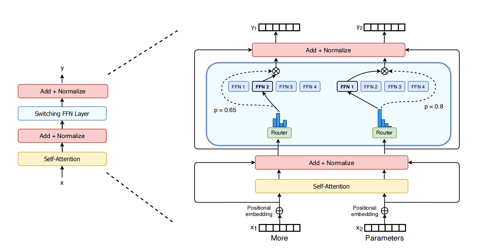
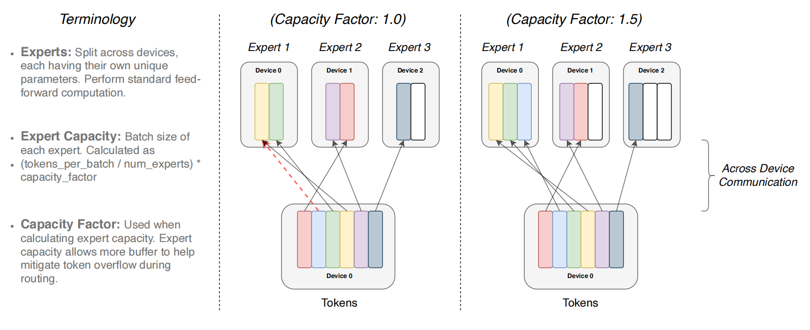
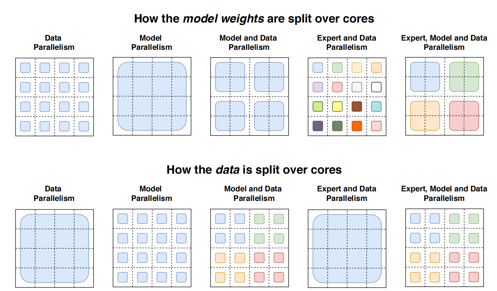
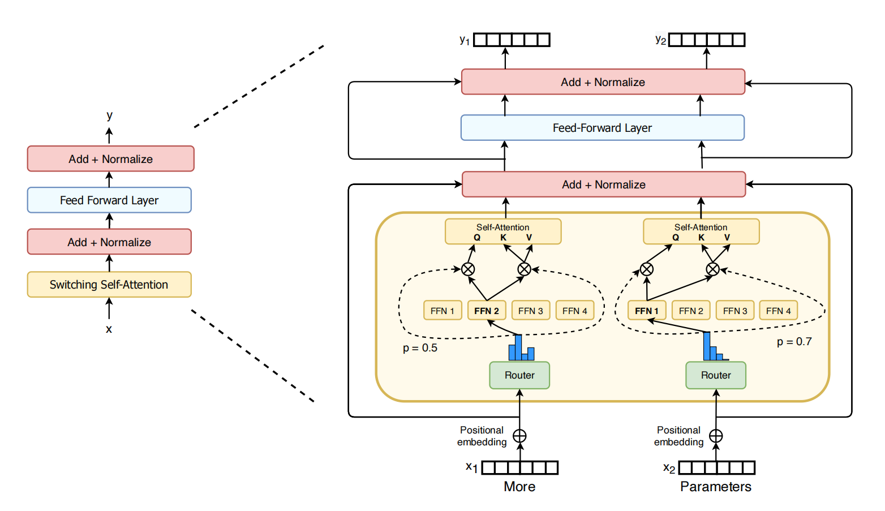
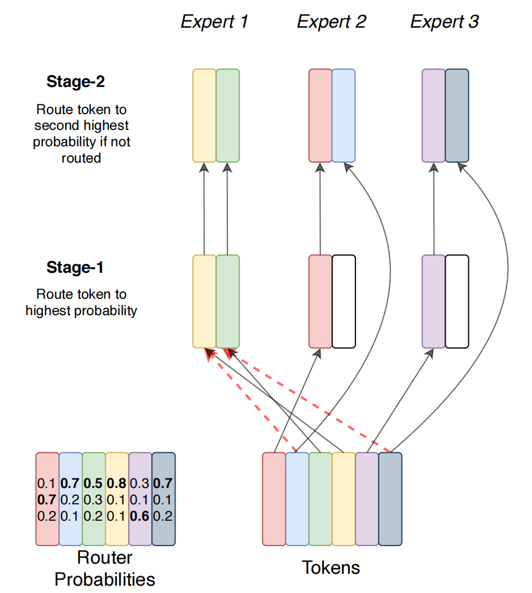

# Switch Transformers: Scaling to Trillion Parameter Models with Simple and Efficient Sparsity
开关Transformers：使用简单高效的稀疏性扩展到万亿参数模型 2021.1.11 https://arxiv.org/abs/2101.03961

## 阅读笔记
* 路由机制, 2.1 Simplifying Sparse Routing

## Abstract
In deep learning, models typically reuse the same parameters for all inputs. Mixture of Experts (MoE) models defy this and instead select different parameters for each incoming example. The result is a sparsely-activated model—with an outrageous number of parameters—but a constant computational cost. However, despite several notable successes of MoE, widespread adoption has been hindered by complexity, communication costs, and training instability. We address these with the introduction of the Switch Transformer. We simplify the MoE routing algorithm and design intuitive improved models with reduced communication and computational costs. Our proposed training techniques mitigate the instabilities, and we show large sparse models may be trained, for the first time, with lower precision (bfloat16) formats. We design models based off T5-Base and T5-Large (Raffel et al., 2019) to obtain up to 7x increases in pre-training speed with the same computational resources. These improvements extend into multilingual settings where we measure gains over the mT5-Base version across all 101 languages. Finally, we advance the current scale of language models by pre-training up to trillion parameter models on the “Colossal Clean Crawled Corpus”, and achieve a 4x speedup over the T5-XXL model.

在深度学习中，模型通常对所有输入重复使用相同的参数。 混合专家 (MoE) 模型则不同，它是为每个传入的样本选择不同的参数。 结果是一个稀疏激活的模型 —— 参数数量惊人 —— 但计算成本不变。 然而，尽管 MoE 取得了一些显著的成功，但复杂性、通信成本和训练不稳定性阻碍了广泛采用。 我们通过引入SwitchT来解决这些问题。 我们简化了 MoE 路由算法并设计了直观的改进模型，降低了通信和计算成本。 我们提出的训练技术减轻了不稳定性，并且我们展示了大型稀疏模型可以首次以较低精度 (bfloat16) 格式进行训练。 我们基于 T5-Base 和 T5-Large(Raffel et al., 2019)设计模型，在相同的计算资源下获得高达 7 倍的预训练速度提升。 这些改进扩展到多语言设置中，我们在所有 101 种语言中测量了 mT5-Base 版本的收益。 最后，我们通过在“Colossal Clean Crawled Corpus”上预训练高达万亿参数的模型，提高了当前语言模型的规模，实现了 T5-XXL 模型的 4 倍加速。

1. JAX code for Switch Transformer and all model checkpoints are available at https://github.com/google-research/t5x
2. Tensorflow code for Switch Transformer is available at https://github.com/tensorflow/mesh/blob/master/mesh_tensorflow/transformer/moe.py 

Keywords: mixture-of-experts, natural language processing, sparsity, large-scale machine learning, distributed computing  

## 1. Introduction
Large scale training has been an effective path towards flexible and powerful neural language models (Radford et al., 2018; Kaplan et al., 2020; Brown et al., 2020). Simple architectures— backed by a generous computational budget, data set size and parameter count—surpass more complicated algorithms (Sutton, 2019). An approach followed in Radford et al. (2018); Raffel et al. (2019); Brown et al. (2020) expands the model size of a densely-activated Transformer (Vaswani et al., 2017). While effective, it is also extremely computationally intensive (Strubell et al., 2019). Inspired by the success of model scale, but seeking greater computational efficiency, we instead propose a sparsely-activated expert model: the Switch Transformer. In our case the sparsity comes from activating a subset of the neural network weights for each incoming example. 

大规模训练一直是通往灵活而强大的神经语言模型的有效途径(Radford et al., 2018; Kaplan et al., 2020; Brown et al., 2020)。 简单的架构 —— 以巨大的算力、数据集大小和参数数量为后盾 —— 优于更复杂的算法(Sutton，2019)。 Radford et al. (2018); Raffel et al. (2019); Brown et al. (2020)遵循的一种方法，扩展了密集激活的 Transformer 的模型大小(Vaswani et al., 2017)。 虽然有效，但它的计算量也非常大(Strubell et al., 2019)。 受模型规模成功的启发，但为了寻求更高的计算效率，我们提出了一个稀疏激活的专家模型：Switch Transformer。 在我们的例子中，稀疏性来自为每个传入样本激活神经网络权重的子集。

Figure 1: Scaling and sample efficiency of Switch Transformers. Left Plot: Scaling properties for increasingly sparse (more experts) Switch Transformers. Right Plot: Negative log perplexity comparing Switch Transformers to T5 (Raffel et al., 2019) models using the same compute budget.
图1：SwitchT的缩放比例和采样效率。 左图：越来越稀疏(更多专家)SwitchT的缩放属性。 右图：使用相同计算预算将 Switch Transformers 与 T5(Raffel et al., 2019)模型进行比较的负对数困惑度。

Sparse training is an active area of research and engineering (Gray et al., 2017; Gale et al., 2020), but as of today, machine learning libraries and hardware accelerators still cater to dense matrix multiplications. To have an efficient sparse algorithm, we start with the Mixture-of-Expert (MoE) paradigm (Jacobs et al., 1991; Jordan and Jacobs, 1994; Shazeer et al., 2017), and simplify it to yield training stability and computational benefits. MoE models have had notable successes in machine translation (Shazeer et al., 2017, 2018; Lepikhin et al., 2020), however, widespread adoption is hindered by complexity, communication costs, and training instabilities.

稀疏训练是研究和工程的一个活跃领域(Gray et al., 2017; Gale et al., 2020)，但截至今天，机器学习库和硬件加速器仍然迎合密集矩阵乘法。 为了拥有高效的稀疏算法，我们从专家混合 (MoE) 范式开始(Jacobs et al., 1991; Jordan 和 Jacobs，1994; Shazeer et al., 2017)，并将其简化以产生训练稳定性和 计算效益。 MoE 模型在机器翻译方面取得了显著的成功(Shazeer et al., 2017，2018; Lepikhin et al., 2020)，但是，复杂性、通信成本和训练不稳定性阻碍了广泛采用。

We address these issues, and then go beyond translation, to find that these class of algorithms are broadly valuable in natural language. We measure superior scaling on a diverse set of natural language tasks and across three regimes in NLP: pre-training, finetuning and multi-task training. While this work focuses on scale, we also show that the Switch Transformer architecture not only excels in the domain of supercomputers, but is beneficial even with only a few computational cores. Further, our large sparse models can be distilled (Hinton et al., 2015) into small dense versions while preserving 30% of the sparse model quality gain. Our contributions are the following:
* The Switch Transformer architecture, which simplifies and improves over Mixture of Experts.
* Scaling properties and a benchmark against the strongly tuned T5 model (Raffel et al., 2019) where we measure 7x+ pre-training speedups while still using the same FLOPS per token. We further show the improvements hold even with limited computational resources, using as few as two experts.
* Successful distillation of sparse pre-trained and specialized fine-tuned models into small dense models. We reduce the model size by up to 99% while preserving 30% of the quality gains of the large sparse teacher.
* Improved pre-training and fine-tuning techniques: (1) selective precision training that enables training with lower bfloat16 precision (2) an initialization scheme that allows for scaling to a larger number of experts and (3) increased expert regularization that improves sparse model fine-tuning and multi-task training.
* A measurement of the pre-training benefits on multilingual data where we find a universal improvement across all 101 languages and with 91% of languages benefiting from 4x+ speedups over the mT5 baseline (Xue et al., 2020).
* An increase in the scale of neural language models achieved by efficiently combining data, model, and expert-parallelism to create models with up to a trillion parameters. These models improve the pre-training speed of a strongly tuned T5-XXL baseline by 4x.

我们解决这些问题，超越翻译，发现这类算法在自然语言中具有广泛的价值。 我们测量了一组不同的自然语言任务和 NLP 中三个机制的卓越扩展：预训练、微调和多任务训练。 虽然这项工作侧重于规模，但我们也表明 Switch Transformer 架构不仅在超级计算机领域表现出色，而且即使只有几个计算核心也是有益的。 此外，我们的大型稀疏模型可以被蒸馏 (Hinton et al., 2015) 为小型密集版本，同时保留 30% 的稀疏模型质量增益。 我们的贡献如下：
* Switch Transformer 架构，它简化并改进了专家混合。
* 缩放属性和针对经过强烈调整的 T5 模型(Raffel et al., 2019)的基准测试，在该模型中，我们测量了 7 倍以上的预训练加速，同时每个令牌仍使用相同的 FLOPS。 我们进一步表明，即使在计算资源有限的情况下，仅使用两名专家也能保持改进。
* 将稀疏预训练和专门微调模型成功蒸馏为小型密集模型。 我们将模型大小减少了高达 99%，同时保留了大型稀疏教师 30% 的质量增益。
* 改进的预训练和微调技术：(1) 选择性精度训练，支持以较低的 bfloat16 精度进行训练 (2) 允许扩展到更多专家的初始化方案，以及 (3) 增加专家正则化以改善稀疏 模型微调和多任务训练。
* 衡量多语言数据的预训练优势，我们发现所有 101 种语言都有普遍的改进，并且 91% 的语言受益于比 mT5 基线快 4 倍以上的加速(Xue et al., 2020)。
* 通过有效结合数据、模型和专家并行性来创建具有多达一万亿个参数的模型，从而实现神经语言模型规模的增加。 这些模型将经过强调的 T5-XXL 基线的预训练速度提高了 4 倍。

## 2. Switch Transformer
The guiding design principle for Switch Transformers is to maximize the parameter count of a Transformer model (Vaswani et al., 2017) in a simple and computationally efficient way. The benefit of scale was exhaustively studied in Kaplan et al. (2020) which uncovered powerlaw scaling with model size, data set size and computational budget. Importantly, this work advocates training large models on relatively small amounts of data as the computationally optimal approach.

Switch Transformers 的指导设计原则是以一种简单且计算效率高的方式最大化 Transformer 模型的参数数量(Vaswani et al., 2017)。 Kaplan et al. (2020) 详尽地研究了规模的好处，揭示了模型大小、数据集大小和计算预算的幂律缩放。 重要的是，这项工作提倡在相对少量的数据上训练大型模型作为计算上的最佳方法。

Heeding these results, we investigate a fourth axis: increase the parameter count while keeping the floating point operations (FLOPs) per example constant. Our hypothesis is that the parameter count, independent of total computation performed, is a separately important axis on which to scale. We achieve this by designing a sparsely activated model that efficiently uses hardware designed for dense matrix multiplications such as GPUs and TPUs. Our work here focuses on TPU architectures, but these class of models may be similarly trained on GPU clusters. In our distributed training setup, our sparsely activated layers split unique weights on different devices. Therefore, the weights of the model increase with the number of devices, all while maintaining a manageable memory and computational footprint on each device.  

注意到这些结果，我们研究了第四个轴：增加参数数量，同时保持每个样本的浮点运算 (FLOP) 不变。 我们的假设是，独立于执行的总计算量的参数计数是一个单独重要的轴，可以在其上进行缩放。 我们通过设计一个稀疏激活模型来实现这一点，该模型有效地使用专为密集矩阵乘法设计的硬件，例如 GPU 和 TPU。 我们在这里的工作重点是 TPU 架构，但这些类别的模型可能会在 GPU 集群上进行类似的训练。 在我们的分布式训练设置中，我们的稀疏激活层在不同设备上分配了独特的权重。 因此，模型的权重随着设备数量的增加而增加，同时在每个设备上保持可管理的内存和计算足迹。

<br/>
Figure 2: Illustration of a Switch Transformer encoder block. We replace the dense feed forward network (FFN) layer present in the Transformer with a sparse Switch FFN layer (light blue). The layer operates independently on the tokens in the sequence. We diagram two tokens (x1 = “More” and x2 = “Parameters” below) being routed (solid lines) across four FFN experts, where the router independently routes each token. The switch FFN layer returns the output of the selected FFN multiplied by the router gate value (dotted-line).
图2：SwitchT编码器块的图示。 我们用稀疏的 Switch FFN 层(浅蓝色)替换了 Transformer 中存在的密集前馈网络 (FFN) 层。 该层独立地对序列中的令牌进行操作。 我们绘制了两个令牌(x1 =“更多”和 x2 =“参数”)在四个 FFN 专家之间路由(实线)，其中路由器独立路由每个令牌。 开关 FFN 层返回所选 FFN 乘以路由器门值(虚线)的输出。

### 2.1 Simplifying Sparse Routing 简化稀疏路由
#### Mixture of Expert Routing. 
Shazeer et al. (2017) proposed a natural language Mixtureof-Experts (MoE) layer which takes as an input a token representation x and then routes this to the best determined top-k experts, selected from a set $\{E_i(x)\}^N_{i=1}$ of N experts. The router variable $W_r$ produces logits $h(x) = W_r · x$ which are normalized via a softmax distribution over the available N experts at that layer. The gate-value for expert i is given by,

专家路由的混合。 Shazeer et al. (2017) 提出了一种自然语言混合专家 (MoE) 层，它将令牌表示 x 作为输入，然后将其路由到从集合 $\{E_i(x)\}^N_{i=1}$ 中选出的最佳确定的top-k 位专家 N 个专家。 路由器变量 $W_r$ 产生 logits $h(x) = W_r · x$，它通过该层可用 N 专家的 softmax 分布进行归一化。 专家 i 的门值由下式给出，

$p_i(x) = \frac{e^{h(x)_i} }{\sum^N_j e^{h(x)_j} }. $(1)

The top-k gate values are selected for routing the token x. If T is the set of selected top-k indices then the output computation of the layer is the linearly weighted combination of each expert’s computation on the token by the gate value, 

选择top-k 个门值用于路由令牌 x。 如果 T 是选定的 top-k 指数的集合，则该层的输出计算是每个专家对令牌的计算的线性加权组合的门值，

$y = \sum_{i∈T} p_i(x)E_i(x)$. (2)

#### Switch Routing: Rethinking Mixture-of-Experts. 
Shazeer et al. (2017) conjectured that routing to k > 1 experts was necessary in order to have non-trivial gradients to the routing functions. The authors intuited that learning to route would not work without the ability to compare at least two experts. Ramachandran and Le (2018) went further to study the top-k decision and found that higher k-values in lower layers in the model were important for models with many routing layers. Contrary to these ideas, we instead use a simplified strategy where we route to only a single expert. We show this simplification preserves model quality, reduces routing computation and performs better. This k = 1 routing strategy is later referred to as a Switch layer. Note that for both MoE and Switch Routing, the gate value $p_i(x)$ in Equation 2 permits differentiability of the router.

开关路由：重新思考专家组合。 Shazeer et al. (2017) 推测路由到 k > 1 专家是必要的，以便路由函数具有非平凡的梯度。 作者凭直觉认为，如果不能比较至少两名专家，学习路线就不会奏效。 Ramachandran and Le (2018) 进一步研究了 top-k 决策，发现模型中较低层的较高 k 值对于具有许多路由层的模型很重要。 与这些想法相反，我们使用一种简化的策略，我们只路由给一个专家。 我们证明这种简化可以保持模型质量，减少路由计算并提高性能。 这种 k = 1 的路由策略后来被称为 Switch 层。 请注意，对于 MoE 和开关路由，公式2 中的门值 $p_i(x)$ 允许路由器的可微性。

The benefits for the Switch layer are three-fold: (1) The router computation is reduced as we are only routing a token to a single expert. (2) The batch size (expert capacity) of each expert can be at least halved since each token is only being routed to a single expert.(3.See Section 2.2 for a technical description.) (3) The routing implementation is simplified and communication costs are reduced. Figure 3 shows an example of routing with different expert capacity factors.

Switch 层的好处有三方面：
1. 路由器计算减少，因为我们只将令牌路由给单个专家。 
2. 每个专家的批量大小(专家容量)至少可以减半，因为每个令牌只被路由到一个专家(有关技术说明，请参见第 2.2 节)。 
3. 简化了路由实现并降低了通信成本。 
图3 显示了具有不同专家容量因子的路由样本。

<br/>
Figure 3: Illustration of token routing dynamics. Each expert processes a fixed batch-size of tokens modulated by the capacity factor. Each token is routed to the expert with the highest router probability, but each expert has a fixed batch size of (total tokens / num experts) × capacity factor. If the tokens are unevenly dispatched then certain experts will overflow (denoted by dotted red lines), resulting in these tokens not being processed by this layer. A larger capacity factor alleviates this overflow issue, but also increases computation and communication costs (depicted by padded white/empty slots).
图3：令牌路由动态图解。 每个专家处理由容量因子调制的固定批次大小的令牌。 每个令牌都被路由到具有最高路由概率的专家，但是每个专家都有一个固定的批量大小(令牌总数/专家数量)×容量因子。 如果令牌分配不均匀，那么某些专家将溢出(用红色虚线表示)，导致这些令牌不被该层处理。 较大的容量因子可缓解此溢出问题，但也会增加计算和通信成本(由填充的白色/空插槽表示)。

### 2.2 Efficient Sparse Routing 高效的稀疏路由
We use Mesh-Tensorflow (MTF) (Shazeer et al., 2018) which is a library, with similar semantics and API to Tensorflow (Abadi et al., 2016) that facilitates efficient distributed data and model parallel architectures. It does so by abstracting the physical set of cores to a logical mesh of processors. Tensors and computations may then be sharded per named dimensions, facilitating easy partitioning of models across dimensions. We design our model with TPUs in mind, which require statically declared sizes. Below we describe our distributed Switch Transformer implementation.

我们使用 Mesh-Tensorflow (MTF)(Shazeer et al., 2018)，这是一个库，具有与 Tensorflow(Abadi et al., 2016)相似的语义和 API，可促进高效的分布式数据和模型并行架构。 它通过将物理内核集抽象为处理器的逻辑网格来实现。 然后可以按命名维度对张量和计算进行分片，从而促进跨维度轻松划分模型。 我们在设计模型时考虑了 TPU，它需要静态声明的尺寸。 下面我们描述我们的分布式 Switch Transformer 实现。

#### Distributed Switch Implementation. 
All of our tensor shapes are statically determined at compilation time, but our computation is dynamic due to the routing decisions at training and inference. Because of this, one important technical consideration is how to set the expert capacity. The expert capacity—the number of tokens each expert computes—is set by evenly dividing the number of tokens in the batch across the number of experts, and then further expanding by a capacity factor, 

分布式开关实现。我们所有的张量形状都是在编译时静态确定的，但由于训练和推理时的路由决策，我们的计算是动态的。 因此，一个重要的技术考虑是如何设置专家容量。 专家容量 —— 每个专家计算的令牌数量 —— 是通过将批次中的令牌数量平均分配给专家数量来设置的，然后通过容量因子进一步扩展，

$expert capacity =\big( \frac{tokens-per-batch}{number-of- experts} \big) × capacity factor$. (3)

A capacity factor greater than 1.0 creates additional buffer to accommodate for when tokens are not perfectly balanced across experts. If too many tokens are routed to an expert (referred to later as dropped tokens), computation is skipped and the token representation is passed directly to the next layer through the residual connection. Increasing the expert capacity is not without drawbacks, however, since high values will result in wasted computation and memory. This trade-off is explained in Figure 3. Empirically we find ensuring lower rates of dropped tokens are important for the scaling of sparse expert-models. Throughout our experiments we didn’t notice any dependency on the number of experts for the number of tokens dropped (typically < 1%). Using the auxiliary load balancing loss (next section) with a high enough coefficient ensured good load balancing. We study the impact that these design decisions have on model quality and speed in Table 1.

大于 1.0 的容量因子会创建额外的缓冲区，以适应令牌在专家之间不完美平衡的情况。 如果太多令牌被路由到专家(后面称为丢弃的令牌)，则跳过计算并且令牌表示通过残差连接直接传递到下一层。 然而，增加专家容量并非没有缺点，因为高值会导致计算和内存浪费。 图3 解释了这种权衡。根据经验，我们发现确保较低的令牌掉落率对于稀疏专家模型的扩展很重要。 在整个实验过程中，我们没有注意到掉落的令牌数量对专家数量有任何依赖性(通常 < 1%)。 使用具有足够高系数的辅助负载均衡损耗(下一节)可确保良好的负载均衡。 我们在表1 中研究了这些设计决策对模型质量和速度的影响。

#### A Differentiable Load Balancing Loss. 
To encourage a balanced load across experts we add an auxiliary loss (Shazeer et al., 2017, 2018; Lepikhin et al., 2020). As in Shazeer et al. (2018); Lepikhin et al. (2020), Switch Transformers simplifies the original design in Shazeer et al. (2017) which had separate load-balancing and importance-weighting losses. For each Switch layer, this auxiliary loss is added to the total model loss during training.

可区分的负载均衡损失。为了鼓励专家之间的平衡负载，我们添加了辅助损失(Shazeer et al., 2017, 2018; Lepikhin et al., 2020)。 正如 Shazeer et al. (2018); Lepikhin et al. (2020)，SwitchT简化了Shazeer et al. (2017)的原始设计, 有单独的负载均衡和重要性加权损失。 对于每个 Switch 层，此辅助损失会添加到训练期间的总模型损失中。

Given N experts indexed by i = 1 to N and a batch B with T tokens, the auxiliary loss is computed as the scaled dot-product between vectors f and P, 

给定由 i = 1 到 N 索引的 N 位专家和具有 T 个令牌的批次 B，辅助损失计算为向量 f 和 P 之间的缩放点积，

$loss = α · N · \sum^N_{i=1} f_i · P_i $ (4) 

where $f_i$ is the fraction of tokens dispatched to expert i, 

其中 $f_i$ 是分派给专家 i 的令牌比例，

$f_i = \frac{1}{T} \sum_{x∈B} ✶\{argmax p(x) = i\} $(5) 

and $P_i$ is the fraction of the router probability allocated for expert i, (2.A potential source of confusion: $p_i(x)$ is the probability of routing token x to expert i. $P_i$ is the probability fraction to expert i across all tokens in the batch B. )

$P_i$ 是分配给专家 i 的路由器概率的分数，(2. 一个潜在的混淆来源：$p_i(x)$ 是将令牌 x 路由到专家 i 的概率。$P_i$ 是专家 i 的概率分数 批次 B 中的所有令牌。)

$P_i = \frac{1}{T} \sum_{x∈B} p_i(x)$. (6)

Since we seek uniform routing of the batch of tokens across the N experts, we desire both vectors to have values of $\frac{1}{N}$. The auxiliary loss of Equation 4 encourages uniform routing since it is minimized under a uniform distribution. The objective can also be differentiated as the P-vector is differentiable, but the f-vector is not. The final loss is multiplied by expert count N to keep the loss constant as the number of experts varies since under uniform routing $\sum^N_i=1(f_i · P_i) = \sum^N_i=1( \frac{1}{N} · \frac{1}{N} ) = \frac{1}{N} $. Finally, a hyper-parameter α is a multiplicative coefficient for these auxiliary losses; throughout this work we use an $α = 10^{−2}$ which was sufficiently large to ensure load balancing while small enough to not to overwhelm the primary cross-entropy objective. We swept hyper-parameter ranges of α from $10^{−1}$ to $10^{−5}$ in powers of 10 and found $10^{−2}$ balanced load quickly without interfering with training loss.

由于我们在 N 位专家之间寻求令牌批次的统一路由，因此我们希望两个向量都具有 $\frac{1}{N}$ 的值。 等式4 的辅助损失鼓励统一路由，因为它在均匀分布下被最小化。 目标也可以微分，因为 P 向量是可微的，但 f 向量不是。 最终损失乘以专家数量 N 以保持损失恒定，因为在统一路由下 $\sum^N_i=1(f_i · P_i) = \sum^N_i=1( \frac{1}{ N} · \frac{1}{N} ) = \frac{1}{N} $。 最后，超参数 α 是这些辅助损失的乘法系数;  在整个工作中，我们使用 $α = 10^{−2}$，它足够大以确保负载均衡，同时又足够小以不会压倒主要的交叉熵目标。 我们以 10 的幂扫描了从 $10^{−1}$ 到 $10^{−5}$ 的 α 的超参数范围，并在不干扰训练损失的情况下快速找到了 $10^{−2}$ 的平衡负载。

### 2.3 Putting It All Together: The Switch Transformer
Our first test of the Switch Transformer starts with pre-training on the “Colossal Clean Crawled Corpus” (C4), introduced in (Raffel et al., 2019). For our pre-training objective, we use a masked language modeling task (Taylor, 1953; Fedus et al., 2018; Devlin et al., 2018) where the model is trained to predict missing tokens. In our pre-training setting, as determined in Raffel et al. (2019) to be optimal, we drop out 15% of tokens and then replace the masked sequence with a single sentinel token. To compare our models, we record the negative log perplexity.(4.We use log base-e for this metric so the units are nats.) Throughout all tables in the paper, ↑ indicates that a higher value for that metric is better and vice-versa for ↓. A comparison of all the models studied in this work are in Table 9.

我们对 Switch Transformer 的第一个测试从对“Colossal Clean Crawled Corpus”(C4)的预训练开始，该语料库在(Raffel et al., 2019)中引入。 对于我们的预训练目标，我们使用掩码语言建模任务(Taylor，1953; Fedus et al., 2018; Devlin et al., 2018)，其中训练模型以预测丢失的令牌。 在我们的预训练环境中，如 Raffel et al. (2019)所确定的那样，为了达到最佳效果，我们丢弃了 15% 的令牌，然后用单个哨兵令牌替换掩码序列。 为了比较我们的模型，我们记录了负对数困惑度(4.我们对这个指标使用 log base-e，所以单位是 nats)。 在本文的所有表格中，↑ 表示该指标的值越高越好，反之亦然 ↓。 在这项工作中研究的所有模型的比较在表9 中。

A head-to-head comparison of the Switch Transformer and the MoE Transformer is presented in Table 1. Our Switch Transformer model is FLOP-matched to ‘T5-Base’ (Raffel et al., 2019) (same amount of computation per token is applied). The MoE Transformer, using top-2 routing, has two experts which each apply a separate FFN to each token and thus its FLOPS are larger. All models were trained for the same number of steps on identical hardware. Note that the MoE model going from capacity factor 2.0 to 1.25 actually slows down (840 to 790) in the above experiment setup, which is unexpected.(5.Note that speed measurements are both a function of the algorithm and the implementation details. Switch Transformer reduces the necessary computation relative to MoE (algorithm), but the final speed differences are impacted by low-level optimizations (implementation). )

表1 显示了 Switch Transformer 和 MoE Transformer 的正面比较。我们的 Switch Transformer 模型与“T5-Base”进行了 FLOP 匹配(Raffel et al., 2019)(每个令牌的计算量相同 被申请;被应用)。 MoE Transformer 使用 top-2 路由，有两个专家，每个专家对每个令牌应用一个单独的 FFN，因此它的 FLOPS 更大。 所有模型都在相同的硬件上接受了相同数量的步骤训练。 请注意，在上述实验设置中，容量因子从 2.0 到 1.25 的 MoE 模型实际上变慢了(840 到 790)，这是出乎意料的(5.请注意，速度测量既是算法的函数，也是实现细节的函数。 Switch Transformer 相对于 MoE(算法)减少了必要的计算，但最终的速度差异受到低级优化(实现)的影响)。

We highlight three key findings from Table 1: (1) Switch Transformers outperform both carefully tuned dense models and MoE Transformers on a speed-quality basis. For a fixed amount of computation and wall-clock time, Switch Transformers achieve the best result. (2) The Switch Transformer has a smaller computational footprint than the MoE counterpart. If we increase its size to match the training speed of the MoE Transformer, we find this outperforms all MoE and Dense models on a per step basis as well. (3) Switch Transformers perform better at lower capacity factors (1.0, 1.25). Smaller expert capacities are indicative of the scenario in the large model regime where model memory is very scarce and the capacity factor will want to be made as small as possible.

我们强调了表1 中的三个主要发现：
1. Switch Transformers 在速度质量基础上优于精心调整的密集模型和 MoE Transformers。 对于固定的计算量和挂钟时间，SwitchT可获得最佳结果。 
2. Switch Transformer 的计算足迹比 MoE 对应物小。 如果我们增加它的大小以匹配 MoE Transformer 的训练速度，我们发现它在每一步的基础上也优于所有 MoE 和 Dense 模型。 
3. SwitchT在较低的容量因数(1.0、1.25)下表现更好。 较小的专家容量表示大型模型机制中的场景，其中模型内存非常稀缺，容量因子将希望尽可能小。

### 2.4 Improved Training and Fine-Tuning Techniques
Sparse expert models may introduce training difficulties over a vanilla Transformer. Instability can result because of the hard-switching (routing) decisions at each of these layers. Further, low precision formats like bfloat16 (Wang and Kanwar, 2019) can exacerbate issues in the softmax computation for our router. We describe training difficulties here and the methods we use to overcome them to achieve stable and scalable training.

稀疏的专家模型可能会引入普通 Transformer 的训练困难。 由于每一层的硬切换(路由)决策，可能会导致不稳定。 此外，像 bfloat16(Wang and Kanwar，2019)这样的低精度格式会加剧我们路由器的 softmax 计算中的问题。 我们在这里描述了训练困难以及我们用来克服这些困难以实现稳定和可扩展训练的方法。

Table 1: Benchmarking Switch versus MoE. Head-to-head comparison measuring per step and per time benefits of the Switch Transformer over the MoE Transformer and T5 dense baselines. We measure quality by the negative log perplexity and the time to reach an arbitrary chosen quality threshold of Neg. Log Perp.=-1.50. All MoE and Switch Transformer models use 128 experts, with experts at every other feed-forward layer. For Switch-Base+, we increase the model size until it matches the speed of the MoE model by increasing the model hidden-size from 768 to 896 and the number of heads from 14 to 16. All models are trained with the same amount of computation (32 cores) and on the same hardware (TPUv3). Further note that all our models required pre-training beyond 100k steps to achieve our level threshold of -1.50. † T5-Base did not achieve this negative log perplexity in the 100k steps the models were trained. 

表1：基准测试 Switch 与 MoE。 对比 MoE Transformer 和 T5 dense baselines 的 Switch Transformer 每步和每时间的优势。 我们通过负对数困惑度和达到任意选择的 Neg 质量阈值的时间来衡量质量。 对数 Perp.=-1.50。 所有 MoE 和 Switch Transformer 模型都使用 128 名专家，每隔一个前馈层都有专家。 对于 Switch-Base+，我们通过将模型隐藏大小从 768 增加到 896 并将头部数量从 14 增加到 16 来增加模型大小，直到它与 MoE 模型的速度相匹配。所有模型都使用相同的计算量进行训练 (32 个核心)和相同的硬件 (TPUv3)。 进一步注意，我们所有的模型都需要超过 100k 步的预训练才能达到我们的 -1.50 级别阈值。 † T5-Base 在模型训练的 100k 步中没有达到这种负对数困惑度。

<!--负对数困惑度 negative log perplexity -->

#### Selective precision with large sparse models. 
Model instability hinders the ability to train using efficient bfloat16 precision, and as a result, Lepikhin et al. (2020) trains with float32 precision throughout their MoE Transformer. However, we show that by instead selectively casting to float32 precision within a localized part of the model, stability may be achieved, without incurring expensive communication cost of float32 tensors. This technique is inline with modern mixed precision training strategies where certain parts of the model and gradient updates are done in higher precision Micikevicius et al. (2017). Table 2 shows that our approach permits nearly equal speed to bfloat16 training while conferring the training stability of float32.

大型稀疏模型的选择性精度。模型不稳定性阻碍了使用高效 bfloat16 精度进行训练的能力，因此，Lepikhin et al. (2020) 在整个 MoE Transformer 中以 float32 精度进行训练。 然而，我们表明，通过在模型的局部部分选择性地转换为 float32 精度，可以实现稳定性，而不会产生昂贵的 float32 张量通信成本。 该技术符合现代混合精度训练策略，其中模型的某些部分和梯度更新以更高的精度完成 Micikevicius et al. (2017)。 表2 显示，我们的方法允许几乎与 bfloat16 训练相同的速度，同时赋予 float32 训练稳定性。

<!--混合精度训练策略-->

To achieve this, we cast the router input to float32 precision. The router function takes the tokens as input and produces the dispatch and combine tensors used for the selection and recombination of expert computation (refer to Code Block 15 in the Appendix for details). Importantly, the float32 precision is only used within the body of the router function—on computations local to that device. Because the resulting dispatch and combine tensors are recast to bfloat16 precision at the end of the function, no expensive float32 tensors are broadcast through all-to-all communication operations, but we still benefit from the increased stability of float32. 

为此，我们将路由器输入转换为 float32 精度。 router函数以token为输入，产生dispatch和combine张量，用于专家计算的选择和重组(详见附录代码块15)。 重要的是，float32 精度仅在路由器函数的主体内使用 —— 在该设备的本地计算上。 由于生成的分派和组合张量在函数末尾被重铸为 bfloat16 精度，因此不会通过 all-to-all 通信操作广播昂贵的 float32 张量，但我们仍然受益于 float32 增加的稳定性。

Table 2: Selective precision. We cast the local routing operations to float32 while preserving bfloat16 precision elsewhere to stabilize our model while achieving nearly equal speed to (unstable) bfloat16-precision training. We measure the quality of a 32 expert model after a fixed step count early in training its speed performance. For both Switch-Base in float32 and with Selective prevision we notice similar learning dynamics. 
表2：选择性精度。 我们将本地路由操作转换为 float32，同时在其他地方保留 bfloat16 精度以稳定我们的模型，同时实现与(不稳定的)bfloat16 精度训练几乎相同的速度。 在训练其速度性能的早期，我们在固定步数后测量 32 专家模型的质量。 对于 float32 中的 Switch-Base 和选择性预测，我们注意到类似的学习动态。

#### Smaller parameter initialization for stability. 更小的参数初始化以确保稳定性。
Appropriate initialization is critical to successful training in deep learning and we especially observe this to be true for Switch Transformer. We initialize our weight matrices by drawing elements from a truncated normal distribution with mean µ = 0 and standard deviation $σ = \sqrt{s/n}$ where s is a scale hyper-parameter and n is the number of input units in the weight tensor (e.g. fan-in).(6.Values greater than two standard deviations from the mean are resampled.)

适当的初始化对于深度学习的成功训练至关重要，我们特别观察到这对于 Switch Transformer 来说是正确的。 我们通过从均值 µ = 0 和标准差 $σ = \sqrt{s/n}$ 的截断正态分布中绘制元素来初始化我们的权重矩阵，其中 s 是尺度超参数，n 是权重张量中输入单元的数量(例如，fan-in)(6. 大于均值两个标准差的值被重新采样)。

As an additional remedy to the instability, we recommend reducing the default Transformer initialization scale s = 1.0 by a factor of 10. This both improves quality and reduces the likelihood of destabilized training in our experiments. Table 3 measures the improvement of the model quality and reduction of the variance early in training. We find that the average model quality, as measured by the Neg. Log Perp., is dramatically improved and there is a far reduced variance across runs. Further, this same initialization scheme is broadly effective for models spanning several orders of magnitude. We use the same approach to stably train models as small as our 223M parameter baseline to enormous models in excess of one trillion parameters.

作为对不稳定性的额外补救措施，我们建议将默认的 Transformer 初始化比例 s = 1.0 降低 10 倍。这既提高了质量，又降低了我们实验中不稳定训练的可能性。 表3 衡量了模型质量的提高和训练早期方差的减少。 我们发现平均模型质量，由 Neg. Log Perp. 衡量, 得到了显著改善，并且运行之间的方差大大减少。 此外，同样的初始化方案对于跨越几个数量级的模型广泛有效。 我们使用相同的方法稳定地训练小至 223M 参数基线的模型到超过一万亿参数的庞大模型。

Table 3: Reduced initialization scale improves stability. Reducing the initialization scale results in better model quality and more stable training of Switch Transformer. Here we record the average and standard deviation of model quality, measured by the negative log perplexity, of a 32 expert model after 3.5k steps (3 random seeds each). 
表3：减少初始化规模提高了稳定性。 减少初始化规模可以提高模型质量，并使 Switch Transformer 的训练更稳定。 在这里，我们记录了 32 个专家模型在 3.5k 步(每个 3 个随机种子)之后模型质量的平均值和标准差，通过负对数困惑度来衡量。

#### Regularizing large sparse models. 正则化大型稀疏模型。
Our paper considers the common NLP approach of pre-training on a large corpus followed by fine-tuning on smaller downstream tasks such as summarization or question answering. One issue that naturally arises is overfitting since many fine-tuning tasks have very few examples. During fine-tuning of standard Transformers, Raffel et al. (2019) use dropout (Srivastava et al., 2014) at each layer to prevent overfitting. Our Switch Transformers have significantly more parameters than the FLOP matched dense baseline, which can lead to more severe overfitting on these smaller downstream tasks.

我们的论文考虑了常见的 NLP 方法，即对大型语料库进行预训练，然后对较小的下游任务(如摘要或问答)进行微调。 自然会出现的一个问题是过度拟合，因为许多微调任务的样本很少。 在标准Transformers的微调过程中，Raffel et al. (2019) 在每一层使用 dropout (Srivastava et al., 2014) 来防止过度拟合。 我们的 Switch Transformer 的参数明显多于 FLOP 匹配的密集基线，这可能导致这些较小的下游任务出现更严重的过度拟合。

Table 4: Fine-tuning regularization results. A sweep of dropout rates while fine-tuning Switch Transformer models pre-trained on 34B tokens of the C4 data set (higher numbers are better). We observe that using a lower standard dropout rate at all non-expert layer, with a much larger dropout rate on the expert feed-forward layers, to perform the best.
表4：微调正则化结果。 扫描dropout，同时微调 Switch Transformer 模型，该模型在 C4 数据集的 34B 令牌上进行预训练(数字越高越好)。 我们观察到，在所有非专家层使用较低的标准dropout，在专家前馈层使用更大的dropout，以达到最佳效果。

We thus propose a simple way to alleviate this issue during fine-tuning: increase the dropout inside the experts, which we name as expert dropout. During fine-tuning we simply increase the dropout rate by a significant amount only at the interim feed-forward computation at each expert layer. Table 4 has the results for our expert dropout protocol. We observe that simply increasing the dropout across all layers leads to worse performance. However, setting a smaller dropout rate (0.1) at non-expert layers and a much larger dropout rate (0.4) at expert layers leads to performance improvements on four smaller downstream tasks.

因此，我们提出了一种在微调期间缓解此问题的简单方法：增加专家内部的 dropout，我们将其命名为 expert dropout。 在微调期间，我们仅在每个专家层的临时前馈计算中将dropout显著增加。 表4 包含我们的专家dropout协议的结果。 我们观察到，简单地增加所有层的 dropout 会导致更差的性能。 然而，在非专家层设置更小的dropout (0.1) 并在专家层设置更大的dropout (0.4) 可以提高四个较小的下游任务的性能。

## 3. Scaling Properties 缩放属性
We present a study of the scaling properties of the Switch Transformer architecture during pre-training. Per Kaplan et al. (2020), we consider a regime where the model is not bottlenecked by either the computational budget or amount of data. To avoid the data bottleneck, we use the large C4 corpus with over 180B target tokens (Raffel et al., 2019) and we train until diminishing returns are observed.

我们在预训练期间对 Switch Transformer 架构的缩放属性进行了研究。 Per Kaplan et al. (2020)，我们考虑一种模型不受计算预算或数据量瓶颈的机制。 为避免数据瓶颈，我们使用具有超过 180B 目标令牌的大型 C4 语料库(Raffel et al., 2019)，并且我们进行训练直到观察到收益递减。

The number of experts is the most efficient dimension for scaling our model. Increasing the experts keeps the computational cost approximately fixed since the model only selects one expert per token, regardless of the number of experts to choose from. The router must compute a probability distribution over more experts, however, this is a lightweight computation of cost O($d_{model}$ × num experts) where $d_{model}$ is the embedding dimension of tokens passed between the layers. In this section, we consider the scaling properties on a step-basis and a time-basis with a fixed computational budget.

专家的数量是扩展我们模型的最有效维度。 增加专家可以使计算成本大致固定，因为无论可供选择的专家数量如何，模型每个令牌只选择一名专家。 路由器必须计算更多专家的概率分布，然而，这是成本 O($d_{model}$ × num experts) 的轻量级计算，其中 $d_{model}$ 是在层之间传递的令牌的嵌入维度。 在本节中，我们考虑基于步长和时间的缩放属性，并具有固定的计算预算。

### 3.1 Scaling Results on a Step-Basis 逐步缩放结果
Figure 4 demonstrates consistent scaling benefits with the number of experts when training all models for a fixed number of steps. We observe a clear trend: when keeping the FLOPS per token fixed, having more parameters (experts) speeds up training. The left Figure demonstrates consistent scaling properties (with fixed FLOPS per token) between sparse model parameters and test loss. This reveals the advantage of scaling along this additional axis of sparse model parameters. Our right Figure measures sample efficiency of a dense model variant and four FLOP-matched sparse variants. We find that increasing the number of experts leads to more sample efficient models. Our Switch-Base 64 expert model achieves the same performance of the T5-Base model at step 60k at step 450k, which is a 7.5x speedup in terms of step time. In addition, consistent with the findings of Kaplan et al. (2020), we find that larger models are also more sample efficient—learning more quickly for a fixed number of observed tokens. 

图4 展示了在以固定步数训练所有模型时，专家数量的一致扩展优势。 我们观察到一个明显的趋势：当保持每个令牌的 FLOPS 固定时，拥有更多参数(专家)可以加快训练速度。 左图展示了稀疏模型参数和测试损失之间一致的缩放属性(每个令牌具有固定的 FLOPS)。 这揭示了沿稀疏模型参数的附加轴缩放的优势。 我们的右图测量了密集模型变体和四个 FLOP 匹配的稀疏变体的样本效率。 我们发现，增加专家数量会产生更高效的样本模型。 我们的 Switch-Base 64 专家模型在步长 60k 和步长 450k 时实现了与 T5-Base 模型相同的性能，在步进时间方面加速了 7.5 倍。 此外，与 Kaplan et al. (2020)的研究结果一致，我们发现更大的模型也更有样本效率 —— 对于固定数量的观察到的令牌学习更快。

<br/>
Figure 4: Scaling properties of the Switch Transformer. Left Plot: We measure the quality improvement, as measured by perplexity, as the parameters increase by scaling the number of experts. The top-left point corresponds to the T5-Base model with 223M parameters. Moving from top-left to bottom-right, we double the number of experts from 2, 4, 8 and so on until the bottom-right point of a 256 expert model with 14.7B parameters. Despite all models using an equal computational budget, we observe consistent improvements scaling the number of experts. Right Plot: Negative log perplexity per step sweeping over the number of experts. The dense baseline is shown with the purple line and we note improved sample efficiency of our Switch-Base models. 

图4：SwitchT的缩放属性。 左图：随着参数通过扩展专家数量而增加，我们通过困惑来衡量质量的提高。 左上角的点对应于具有 223M 参数的 T5-Base 模型。 从左上角到右下角，我们将专家数量从 2、4、8 等加倍，直到具有 14.7B 参数的 256 专家模型的右下点。 尽管所有模型都使用相同的计算预算，但我们观察到专家数量的持续改进。 右图：扫过专家数量的每一步负对数困惑度。 密集基线用紫色线显示，我们注意到我们的 Switch-Base 模型的采样效率有所提高。

### 3.2 Scaling Results on a Time-Basis 基于时间缩放结果
Figure 4 demonstrates that on a step basis, as we increase the number of experts, the performance consistently improves. While our models have roughly the same amount of FLOPS per token as the baseline, our Switch Transformers incurs additional communication costs across devices as well as the extra computation of the routing mechanism. Therefore, the increased sample efficiency observed on a step-basis doesn’t necessarily translate to a better model quality as measured by wall-clock. This raises the question: For a fixed training duration and computational budget, should one train a dense or a sparse model? 

图4 表明，随着专家数量的增加，性能会逐步提高。 虽然我们的模型每个令牌的 FLOPS 数量与基线大致相同，但我们的 Switch Transformers 会导致跨设备的额外通信成本以及路由机制的额外计算。 因此，在逐步基础上观察到的样本效率提高并不一定会转化为更好的模型质量，如挂钟测量的那样。 这就提出了一个问题：对于固定的训练持续时间和计算预算，应该训练密集模型还是稀疏模型？

<br/>
Figure 5: Speed advantage of Switch Transformer. All models trained on 32 TPUv3 cores with equal FLOPs per example. For a fixed amount of computation and training time, Switch Transformers significantly outperform the dense Transformer baseline. Our 64 expert Switch-Base model achieves the same quality in one-seventh the time of the T5-Base and continues to improve.
图5：SwitchT的速度优势。 所有模型都在 32 个 TPUv3 内核上训练，每个样本具有相同的 FLOP。 对于固定数量的计算和训练时间，Switch Transformers 明显优于密集的 Transformer 基线。 我们的 64 位专家 Switch-Base 模型以 T5-Base 七分之一的时间达到相同的质量，并且还在不断改进。

Figures 5 and 6 address this question. Figure 5 measures the pre-training model quality as a function of time. For a fixed training duration and computational budget, Switch Transformers yield a substantial speed-up. In this setting, our Switch-Base 64 expert model trains in one-seventh the time that it would take the T5-Base to get similar perplexity.

图5 和图6 解决了这个问题。 图5 测量预训练模型质量随时间的变化。 对于固定的训练持续时间和计算预算，Switch Transformers 产生了显著的加速。 在此设置中，我们的 Switch-Base 64 专家模型的训练时间是 T5-Base 获得类似困惑所需时间的七分之一。

### 3.3 Scaling Versus a Larger Dense Model 缩放与更大的密集模型
The above analysis shows that a computationally-matched dense model is outpaced by its Switch counterpart. Figure 6 considers a different scenario: what if we instead had allocated our resources to a larger dense model? We do so now, measuring Switch-Base against the next strong baseline, T5-Large. But despite T5-Large applying 3.5x more FLOPs per token, Switch-Base is still more sample efficient and yields a 2.5x speedup. Furthermore, more gains can be had simply by designing a new, larger sparse version, Switch-Large, which is FLOP-matched to T5-Large. We do this and demonstrate superior scaling and fine-tuning in the following section. 

上面的分析表明，计算匹配的密集模型被它的 Switch 模型超越了。 图6 考虑了一个不同的场景：如果我们改为将资源分配给更大的密集模型会怎样？ 我们现在这样做，将 Switch-Base 与下一个强大的基线 T5-Large 进行比较。 但是，尽管 T5-Large 每个令牌应用了 3.5 倍以上的 FLOP，但 Switch-Base 的样本效率仍然更高，并产生了 2.5 倍的加速。 此外，只需设计一个新的、更大的稀疏版本 Switch-Large 即可获得更多增益，它与 T5-Large FLOP 匹配。 我们这样做并在下一节中展示卓越的缩放和微调。

<br/>
Figure 6: Scaling Transformer models with Switch layers or with standard dense model scaling. Left Plot: Switch-Base is more sample efficient than both the T5-Base, and T5-Large variant, which applies 3.5x more FLOPS per token. Right Plot: As before, on a wall-clock basis, we find that Switch-Base is still faster, and yields a 2.5x speedup over T5-Large.
图6：使用 Switch 层或标准密集模型缩放缩放 Transformer 模型。 左图：Switch-Base 的样本效率高于 T5-Base 和 T5-Large 变体，后者每个令牌应用的 FLOPS 多 3.5 倍。 右图：和以前一样，在挂钟的基础上，我们发现 Switch-Base 仍然更快，并且比 T5-Large 产生 2.5 倍的加速。

## 4. Downstream Results 下游结果
Section 3 demonstrated the superior scaling properties while pre-training, but we now validate that these gains translate to improved language learning abilities on downstream tasks. We begin by fine-tuning on a diverse set of NLP tasks. Next we study reducing the memory footprint of our sparse models by over 90% by distilling into small—and easily deployed—dense baselines. Finally, we conclude this section measuring the improvements in a multi-task, multilingual setting, where we show that Switch Transformers are strong multi-task learners, improving over the multilingual T5-base model across all 101 languages.

第 3 节在预训练时展示了卓越的缩放特性，但我们现在验证这些收益转化为下游任务的改进语言学习能力。 我们首先对一组不同的 NLP 任务进行微调。 接下来，我们研究通过蒸馏成小型且易于部署的密集基线，将稀疏模型的内存占用减少 90% 以上。 最后，我们总结了本节，衡量了多任务、多语言环境中的改进，我们展示了 Switch Transformers 是强大的多任务学习者，在所有 101 种语言的多语言 T5 基础模型上有所改进。

### 4.1 Fine-Tuning
#### Baseline and Switch models used for fine-tuning. 
Our baselines are the highly-tuned 223M parameter T5-Base model and the 739M parameter T5-Large model (Raffel et al., 2019). For both versions, we design a FLOP-matched Switch Transformer, with many more parameters, which is summarized in Table 9.(7.FLOPS are calculated for the forward pass as done in Kaplan et al. (2020).) Our baselines differ slightly from those in Raffel et al. (2019) because we pre-train on an improved C4 corpus which removes intraexample text duplication and thus increases the efficacy as a pre-training task Lee et al. Switch Transformers (2021). In our protocol we pre-train with 220 (1,048,576) tokens per batch for 550k steps amounting to 576B total tokens. We then fine-tune across a diverse set of tasks using a dropout rate of 0.1 for all layers except the Switch layers, which use a dropout rate of 0.4 (see Table 4). We fine-tune using a batch-size of 1M for 16k steps and for each task, we evaluate model quality every 200-steps and report the peak performance as computed on the validation set.

用于微调的基线和开关模型。 我们的基线是高度调整的 223M 参数 T5-Base 模型和 739M 参数 T5-Large 模型(Raffel et al., 2019)。 对于这两个版本，我们设计了一个与 FLOP 匹配的SwitchT，它具有更多参数，总结在表9 中。(7.FLOPS 是按照 Kaplan et al. (2020) 所做的那样为前向传播计算的。)我们的基线不同 与 Raffel et al. (2019) 的略有不同。因为我们在改进的 C4 语料库上进行了预训练，该语料库消除了样本内文本重复，从而提高了作为预训练任务的效率 Lee et al. SwitchT (2021)。 在我们的协议中，我们每批使用 220 (1,048,576) 个令牌进行预训练，共 550k 个步骤，总计 576B 个令牌。 然后，我们对除 Switch 层之外的所有层使用 0.1 的dropout来跨一组不同的任务进行微调，Switch 层使用 0.4 的dropout(见表4)。 我们使用 1M 的批量大小对 16k 步进行微调，对于每个任务，我们每 200 步评估一次模型质量，并报告在验证集上计算的峰值性能。


#### Fine-tuning tasks and data sets. 
We select tasks probing language capabilities including question answering, summarization and knowledge about the world. The language benchmarks GLUE (Wang et al., 2018) and SuperGLUE (Wang et al., 2019) are handled as composite mixtures with all the tasks blended in proportion to the amount of tokens present in each. These benchmarks consist of tasks requiring sentiment analysis (SST2), word sense disambiguation (WIC), sentence similarty (MRPC, STS-B, QQP), natural language inference (MNLI, QNLI, RTE, CB), question answering (MultiRC, RECORD, BoolQ), coreference resolution (WNLI, WSC) and sentence completion (COPA) and sentence acceptability (CoLA). The CNNDM (Hermann et al., 2015) and BBC XSum (Narayan et al., 2018) data sets are used to measure the ability to summarize articles. Question answering is probed with the SQuAD data set (Rajpurkar et al., 2016) and the ARC Reasoning Challenge (Clark et al., 2018). And as in Roberts et al. (2020), we evaluate the knowledge of our models by fine-tuning on three closed-book question answering data sets: Natural Questions (Kwiatkowski et al., 2019), Web Questions (Berant et al., 2013) and Trivia QA (Joshi et al., 2017). Closed-book refers to questions posed with no supplemental reference or context material. To gauge the model’s common sense reasoning we evaluate it on the Winogrande Schema Challenge (Sakaguchi et al., 2020). And finally, we test our model’s natural language inference capabilities on the Adversarial NLI Benchmark (Nie et al., 2019).

微调任务和数据集。我们选择探索语言能力的任务，包括问答、总结和对世界的了解。 语言基准 GLUE(Wang et al., 2018)和 SuperGLUE(Wang et al., 2019)被处理为复合混合物，所有任务按每个任务中存在的令牌数量按比例混合。 这些基准包括需要情感分析(SST-2)、词义消歧(WIC)、句子相似度(MRPC、STS-B、QQP)、自然语言推理(MNLI、QNLI、RTE、CB)、问答(MultiRC)的任务 , RECORD, BoolQ), 共指消解 (WNLI, WSC) 和句子补全 (COPA) 和句子可接受性 (CoLA)。 CNNDM (Hermann et al., 2015) 和 BBC XSum (Narayan et al., 2018) 数据集用于衡量文章总结能力。 使用 SQuAD 数据集(Rajpurkar et al., 2016)和 ARC 推理挑战赛(Clark et al., 2018)探索问答。 和Roberts et al. (2020)一样，我们通过微调三个闭卷问答数据集来评估我们模型的知识：自然问题 (Kwiatkowski et al., 2019)、Web Questions (Berant et al., 2013) 和 Trivia QA ( 乔希et al., 2017)。 闭卷是指在没有补充参考或上下文材料的情况下提出的问题。 为了衡量模型的常识推理，我们在 Winogrande Schema Challenge(Sakaguchi et al., 2020)上对其进行了评估。 最后，我们在 Adversarial NLI Benchmark(Nie et al., 2019)上测试了我们模型的自然语言推理能力。

#### Fine-tuning metrics. 
The following evaluation metrics are used throughout the paper: We report the average scores across all subtasks for GLUE and SuperGLUE. The Rouge-2 metric is used both the CNNDM and XSum. In SQuAD and the closed book tasks (Web, Natural, and Trivia Questions) we report the percentage of answers exactly matching the target (refer to Roberts et al. (2020) for further details and deficiency of this measure). Finally, in ARC Easy, ARC Challenge, ANLI, and Winogrande we report the accuracy of the generated responses.

微调指标。整篇论文使用了以下评估指标：我们报告了 GLUE 和 SuperGLUE 的所有子任务的平均分数。 Rouge-2 指标用于 CNNDM 和 XSum。 在 SQuAD 和闭卷任务(Web、Natural 和 Trivia Questions)中，我们报告了与目标完全匹配的答案的百分比(请参阅 Roberts et al (2020)了解更多详情和此措施的不足)。 最后，在 ARC Easy、ARC Challenge、ANLI 和 Winogrande 中，我们报告了生成的响应的准确性。

#### Fine-tuning results. 
We observe significant downstream improvements across many natural language tasks. Notable improvements come from SuperGLUE, where we find FLOP-matched Switch variants improve by 4.4 and 2 percentage points over the T5-Base and T5-Large baselines, respectively as well as large improvements in Winogrande, closed book Trivia QA, and XSum.(8.Our T5 and Switch models were pre-trained with 220 tokens per batch for 550k steps on a revised C4 data set for fair comparisons.). In our fine-tuning study, the only tasks where we do not observe gains are on the AI2 Reasoning Challenge (ARC) data sets where the T5-Base outperforms Switch-Base on the challenge data set and T5-Large outperforms Switch-Large on the easy data set. Taken as a whole, we observe significant improvements spanning both reasoning and knowledge-heavy tasks. This validates our architecture, not just as one that pre-trains well, but can translate quality improvements to downstream tasks via fine-tuning.

微调结果。我们观察到许多自然语言任务的显著下游改进。 显著的改进来自 SuperGLUE，我们发现 FLOP 匹配的 Switch 变体分别比 T5-Base 和 T5-Large 基线提高了 4.4 和 2 个百分点，Winogrande、闭卷 Trivia QA 和 XSum 也有很大改进。( 8.我们的 T5 和 Switch 模型在修订后的 C4 数据集上进行了每批 220 个令牌的 550k 步预训练，以进行公平比较。) 在我们的微调研究中，我们唯一没有观察到收益的任务是在 AI2 推理挑战 (ARC) 数据集上，其中 T5-Base 在挑战数据集上优于 Switch-Base，而 T5-Large 在挑战数据集上优于 Switch-Large 简单的数据集。 总的来说，我们观察到跨越推理和知识密集型任务的显著改进。 这验证了我们的架构，它不仅可以很好地进行预训练，还可以通过微调将质量改进转化为下游任务。

Table 5: Fine-tuning results. Fine-tuning results of T5 baselines and Switch models across a diverse set of natural language tests (validation sets; higher numbers are better). We compare FLOP-matched Switch models to the T5-Base and T5-Large baselines. For most tasks considered, we find significant improvements of the Switchvariants. We observe gains across both model sizes and across both reasoning and knowledge-heavy language tasks.

表5：微调结果。 在一组不同的自然语言测试(验证集; 数字越大越好)中微调 T5 基线和 Switch 模型的结果。 我们将 FLOP 匹配的 Switch 模型与 T5-Base 和 T5-Large 基线进行比较。 对于考虑的大多数任务，我们发现 Switchvariants 有显著改进。 我们观察到两种模型大小以及推理和知识密集型语言任务的收益。

### 4.2 Distillation 蒸馏
Deploying massive neural networks with billions, or trillions, of parameters is inconvenient. To alleviate this, we study distilling (Hinton et al., 2015) large sparse models into small dense models. Future work could additionally study distilling large models into smaller sparse models.

部署具有数十亿或数万亿参数的大规模神经网络是不方便的。 为了缓解这种情况，我们研究了将大型稀疏模型蒸馏 (Hinton et al., 2015) 为小型密集模型。 未来的工作还可以研究将大型模型蒸馏成较小的稀疏模型。

#### Distillation techniques. 
In Table 6 we study a variety of distillation techniques. These techniques are built off of Sanh et al. (2019), who study distillation methods for BERT models. We find that initializing the dense model with the non-expert weights yields a modest improvement. This is possible since all models are FLOP matched, so non-expert layers will have the same dimensions. Since expert layers are usually only added at every or every other FFN layer in a Transformer, this allows for many of the weights to be initialized with trained parameters. Furthermore, we observe a distillation improvement using a mixture of 0.25 for the teacher probabilities and 0.75 for the ground truth label. By combining both techniques we preserve ≈ 30% of the quality gains from the larger sparse models with only ≈ 1/20th of the parameters. The quality gain refers to the percent of the quality difference between Switch-Base (Teacher) and T5-Base (Student). Therefore, a quality gain of 100% implies the Student equals the performance of the Teacher.

蒸馏技术。 在表6 中，我们研究了各种蒸馏技术。 这些技术是建立在 Sanh et al. (2019) 研究 BERT 模型的蒸馏方法的基础上的。 我们发现使用非专家权重初始化密集模型会产生适度的改进。 这是可能的，因为所有模型都是 FLOP 匹配的，因此非专家层将具有相同的维度。 由于专家层通常仅添加到 Transformer 中的每个或每个其他 FFN 层，因此这允许使用训练参数初始化许多权重。 此外，我们观察到使用 0.25 的教师概率和 0.75 的基本真实标签混合使用的蒸馏改进。 通过结合这两种技术，我们保留了来自较大稀疏模型的 ≈ 30% 的质量增益，只有 ≈ 1/20 的参数。 质量增益是指 Switch-Base(教师)和 T5-Base(学生)之间质量差异的百分比。 因此，100% 的质量增益意味着学生的表现等于教师的表现。

Table 6: Distilling Switch Transformers for Language Modeling. Initializing T5-Base with the non-expert weights from Switch-Base and using a loss from a mixture of teacher and ground-truth labels obtains the best performance. We can distill 30% of the performance improvement of a large sparse model with 100x more parameters back into a small dense model. For a final baseline, we find no improvement of T5-Base initialized with the expert weights, but trained normally without distillation.
表6：用于语言建模的 Distilling Switch Transformer。 使用来自 Switch-Base 的非专家权重初始化 T5-Base 并使用来自教师和真实标签混合的损失获得最佳性能。 我们可以将具有 100 倍以上参数的大型稀疏模型的性能改进的 30% 提取回小型密集模型。 对于最终基线，我们发现使用专家权重初始化的 T5-Base 没有任何改进，但在没有蒸馏的情况下正常训练。

#### Achievable compression rates. 
Using our best distillation technique described in Table 6, we distill a wide variety of sparse models into dense models. We distill SwitchBase versions, sweeping over an increasing number of experts, which corresponds to varying between 1.1B to 14.7B parameters. Through distillation, we can preserve 37% of the quality gain of the 1.1B parameter model while compressing 82%. At the extreme, where we compress the model 99%, we are still able to maintain 28% of the teacher’s model quality improvement.

可达到的压缩率。 使用表6 中描述的最佳蒸馏技术，我们将各种稀疏模型蒸馏为密集模型。 我们提取 SwitchBase 版本，扫过越来越多的专家，这对应于 1.1B 到 14.7B 参数之间的变化。 通过蒸馏，我们可以保留 1.1B 参数模型 37% 的质量增益，同时压缩 82%。 在极端情况下，我们将模型压缩 99%，我们仍然能够保持 28% 的教师模型质量改进。

#### Distilling a fine-tuned model. 
We conclude this with a study of distilling a finetuned sparse model into a dense model. Table 8 shows results of distilling a 7.4B parameter Switch-Base model, fine-tuned on the SuperGLUE task, into the 223M T5-Base. Similar to our pre-training results, we find we are able to preserve 30% of the gains of the sparse model when distilling into a FLOP matched dense variant. One potential future avenue, not considered here, may examine the specific experts being used for fine-tuning tasks and extracting them to achieve better model compression.

蒸馏一个微调的模型。 我们通过将微调稀疏模型蒸馏为密集模型的研究得出结论。 表8 显示了在 SuperGLUE 任务上微调的 7.4B 参数 Switch-Base 模型提取到 223M T5-Base 的结果。 与我们的预训练结果类似，我们发现在提取到 FLOP 匹配的密集变体时，我们能够保留稀疏模型 30% 的增益。 此处未考虑的一种潜在的未来途径可能会检查用于微调任务的特定专家并提取它们以实现更好的模型压缩。

### 4.3 Multilingual Learning 多语言学习
In our final set of downstream experiments, we measure the model quality and speed tradeoffs while pre-training on a mixture of 101 different languages. We build and benchmark off the recent work of mT5 (Xue et al., 2020), a multilingual extension to T5. We pre-train on the multilingual variant of the Common Crawl data set (mC4) spanning 101 languages introduced in mT5, but due to script variants within certain languages, the mixture contains 107 tasks.

在我们最后一组下游实验中，我们在对 101 种不同语言的混合进行预训练时衡量模型质量和速度的权衡。 我们构建了 mT5(Xue et al., 2020)的最新工作并对其进行了基准测试，mT5 是 T5 的多语言扩展。 我们对 Common Crawl 数据集 (mC4) 的多语言变体进行了预训练，跨越 mT5 中引入的 101 种语言，但由于某些语言中的脚本变体，混合包含 107 个任务。

In Figure 7 we plot the quality improvement in negative log perplexity for all languages of a FLOP-matched Switch model, mSwitch-Base to the T5 base variant, mT5-Base. After pre-training both versions for 1M steps, we find that on all 101 languages considered, Switch Transformer increases the final negative log perplexity over the baseline. In Figure 8, we present a different view and now histogram the per step speed-up of using Switch Transformer over the mT5-Base.(9.The speedup on a step basis is computed as the ratio of the number of steps for the baseline divided by the number of steps required by our model to reach that same quality. ) We find a mean speed-up over mT5-Base of 5x and that 91% of languages achieve at least a 4x speedup. This presents evidence that Switch Transformers are effective multi-task and multi-lingual learners.

在图7 中，我们绘制了 FLOP 匹配 Switch 模型 mSwitch-Base 到 T5 基本变体 mT5-Base 的所有语言的负对数困惑度的质量改进。 在对两个版本进行 1M 步的预训练后，我们发现在考虑的所有 101 种语言中，Switch Transformer 增加了基线之上的最终负对数困惑度。 在图8 中，我们呈现了一个不同的视图，现在用直方图表示在 mT5-Base 上使用 Switch Transformer 的每一步加速(9.基于步骤的加速计算为基线的步骤数除以我们的模型达到相同质量所需的步骤数的比率)。 我们发现 mT5-Base 的平均加速为 5 倍，并且 91% 的语言实现了 至少 4 倍加速。 这提供了证据表明SwitchT是有效的多任务和多语言学习者。

Table 7: Distillation compression rates. We measure the quality when distilling large sparse models into a dense baseline. Our baseline, T5-Base, has a -1.636 Neg. Log Perp. quality. In the right columns, we then distill increasingly large sparse models into this same architecture. Through a combination of weight-initialization and a mixture of hard and soft losses, we can shrink our sparse teachers by 95%+ while preserving 30% of the quality gain. However, for significantly better and larger pre-trained teachers, we expect larger student models would be necessary to achieve these compression rates.
表7：蒸馏压缩率。 我们在将大型稀疏模型蒸馏成密集基线时测量质量。 我们的基线 T5-Base 有一个 -1.636 Neg。 登录 Perp。 质量。 在右侧的列中，我们将越来越大的稀疏模型提取到相同的架构中。 通过结合权重初始化和硬损失和软损失的混合，我们可以将稀疏教师减少 95% 以上，同时保留 30% 的质量增益。 然而，对于更好、更大的预训练教师，我们预计需要更大的学生模型才能实现这些压缩率。

Table 8: Distilling a fine-tuned SuperGLUE model. We distill a Switch-Base model finetuned on the SuperGLUE tasks into a T5-Base model. We observe that on smaller data sets our large sparse model can be an effective teacher for distillation. We find that we again achieve 30% of the teacher’s performance on a 97% compressed model. 
表8：提取微调的 SuperGLUE 模型。 我们将在 SuperGLUE 任务上微调的 Switch-Base 模型蒸馏为 T5-Base 模型。 我们观察到，在较小的数据集上，我们的大型稀疏模型可以成为蒸馏的有效教师。 我们发现我们在 97% 的压缩模型上再次达到了教师表现的 30%。

## 5. Designing Models with Data, Model, and Expert-Parallelism 使用数据、模型和专家并行设计模型
Arbitrarily increasing the number of experts is subject to diminishing returns (Figure 4). Here we describe complementary scaling strategies. The common way to scale a Transformer is to increase dimensions in tandem, like $d_{model}$ or $d_{ff}$ . This increases both the parameters and computation performed and is ultimately limited by the memory per accelerator. Once it exceeds the size of the accelerator’s memory, single program multiple data (SPMD) modelparallelism can be employed. This section studies the trade-offs of combining data, model, and expert-parallelism.

任意增加专家数量会导致收益递减(图4)。 在这里，我们描述了互补的扩展策略。 缩放 Transformer 的常用方法是串联增加维度，例如 $d_{model}$ 或 $d_{ff}$ 。 这会增加执行的参数和计算，并最终受到每个加速器的内存限制。 一旦超过加速器内存的大小，就可以采用单程序多数据 (SPMD) 模型并行。 本节研究组合数据、模型和专家并行性的权衡。

<br/>
Figure 7: Multilingual pre-training on 101 languages. Improvements of Switch T5 Base model over dense baseline when multi-task training on 101 languages. We observe Switch Transformers to do quite well in the multi-task training setup and yield improvements on all 101 languages. 
图7：101 种语言的多语言预训练。 对 101 种语言进行多任务训练时，Switch T5 Base 模型相对于密集基线的改进。 我们观察到 Switch Transformers 在多任务训练设置中表现相当出色，并且在所有 101 种语言上都有改进。

<br/>
Figure 8: Multilingual pre-training on 101 languages. We histogram for each language, the step speedup of Switch Transformers over the FLOP matched T5 dense baseline to reach the same quality. Over all 101 languages, we achieve a mean step speedup over mT5-Base of 5x and, for 91% of languages, we record a 4x, or greater, speedup to reach the final perplexity of mT5-Base. 
图8：101 种语言的多语言预训练。 我们为每种语言绘制直方图，Switch Transformers 在 FLOP 上的步进加速匹配 T5 密集基线以达到相同的质量。 在所有 101 种语言中，我们实现了 5 倍于 mT5-Base 的平均步长加速，并且对于 91% 的语言，我们记录了 4 倍或更高的加速以达到 mT5-Base 的最终困惑度。

Reviewing the Feed-Forward Network (FFN) Layer. We use the FFN layer as an example of how data, model and expert-parallelism works in Mesh TensorFlow (Shazeer et al., 2018) and review it briefly here. We assume B tokens in the batch, each of dimension $d_{model}$. Both the input (x) and output (y) of the FFN are of size [B, $d_{model}$] and the intermediate (h) is of size [B, $d_{ff}$ ] where $d_{ff}$ is typically several times larger than $d_{model}$. In the FFN, the intermediate is h = xWin and then the output of the layer is y = ReLU(h)Wout. Thus Win and Wout are applied independently to each token and have sizes [$d_{model}$, $d_{ff}$ ] and [$d_{ff}$ , $d_{model}$].

查看前馈网络 (FFN) 层。 我们使用 FFN 层作为数据、模型和专家并行性如何在 Mesh TensorFlow 中工作的样本(Shazeer et al., 2018)，并在此处简要回顾。 我们假设批次中有 B 个令牌，每个令牌的维度为 $d_{model}$。 FFN 的输入 (x) 和输出 (y) 的大小均为 [B, $d_{model}$]，中间 (h) 的大小为 [B, $d_{ff}$ ]，其中 $d_{ff}$ 通常比 $d_{model}$ 大几倍。 在 FFN 中，中间层是 h = xWin 然后该层的输出是 y = ReLU(h)Wout。 因此 Win 和 Wout 独立应用于每个令牌，并且大小为 [$d_{model}$, $d_{ff}$ ] 和 [$d_{ff}$ , $d_{model}$]。

We describe two aspects of partitioning: how the weights and batches of data divide over cores, depicted in Figure 9. We denote all cores available as N which Mesh Tensorflow may then remap into a logical multidimensional mesh of processors. Here we create a two-dimensional logical mesh, with one dimension representing the number of ways for data-parallel sharding (n) and the other, the model-parallel sharding (m). The total cores must equal the ways to shard across both data and model-parallelism, e.g. N = n × m. To shard the layer across cores, the tensors containing that batch of B tokens are sharded across n data-parallel cores, so each core contains B/n tokens. Tensors and variables with $d_{ff}$ are then sharded across m model-parallel cores. For the variants with experts-layers, we consider E experts, each of which can process up to C tokens.

我们描述了分区的两个方面：数据的权重和批次如何在核心上划分，如图9 所示。我们将所有可用核心表示为 N，然后 Mesh Tensorflow 可以将其重新映射到处理器的逻辑多维网格中。 在这里，我们创建了一个二维逻辑网格，其中一维表示数据并行分片的方式数 (n)，另一维表示模型并行分片 (m)。 总核心数必须等于跨数据和模型并行性进行分片的方式，例如 N = n × m。 为了跨核对层进行分片，包含那批 B 令牌的张量跨 n 个数据并行核进行分片，因此每个核都包含 B/n 令牌。 然后将具有 $d_{ff}$ 的张量和变量分片到 m 个模型并行核心。 对于具有专家层的变体，我们考虑 E 个专家，每个专家最多可以处理 C 个令牌。

### 5.1 Data Parallelism
When training data parallel models, which is the standard for distributed training, then all cores are allocated to the data-parallel dimension or n = N, m = 1. This has the advantage that no communication is needed until the entire forward and backward pass is finished and the gradients need to be then aggregated across all cores. This corresponds to the left-most column of Figure 9.

当训练数据并行模型(这是分布式训练的标准)时，所有核都分配到数据并行维度或 n = N，m = 1。这样做的好处是在整个前向和反向传递之前不需要通信 完成，然后需要在所有核心上聚合梯度。 这对应于图9 最左侧的列。

### 5.2 Model Parallelism
We now consider a scenario where all cores are allocated exclusively to the model-parallel dimension and so n = 1, m = N. Now all cores must keep the full B tokens and each core will contain a unique slice of the weights. For each forward and backward pass, a communication cost is now incurred. Each core sends a tensor of [B, $d_{model}$] to compute the second matrix multiplication ReLU(h)Wout because the $d_{ff}$ dimension is partitioned and must be summed over. As a general rule, whenever a dimension that is partitioned across cores must be summed, then an all-reduce operation is added for both the forward and backward pass. This contrasts with pure data parallelism where an all-reduce only occurs at the end of the entire forward and backward pass. 

我们现在考虑一种情况，其中所有核心都专门分配给模型并行维度，因此 n = 1，m = N。现在所有核心都必须保留完整的 B 令牌，并且每个核心都将包含一个独特的权重片段。 对于每次前向和后向传递，现在都会产生通信成本。 每个核心发送一个 [B, $d_{model}$] 的张量来计算第二个矩阵乘法 ReLU(h)Wout，因为 $d_{ff}$ 维度是分区的，必须求和。 作为一般规则，每当必须对跨核分区的维度求和时，就会为前向和后向传递添加一个全归约操作。 这与纯粹的数据并行性形成对比，在纯数据并行性中，all-reduce 仅发生在整个前向和反向传递的末尾。


<br/>
Figure 9: Data and weight partitioning strategies. Each 4×4 dotted-line grid represents 16 cores and the shaded squares are the data contained on that core (either model weights or batch of tokens). We illustrate both how the model weights and the data tensors are split for each strategy. First Row: illustration of how model weights are split across the cores. Shapes of different sizes in this row represent larger weight matrices in the Feed Forward Network (FFN) layers (e.g larger $d_{ff}$ sizes). Each color of the shaded squares identifies a unique weight matrix. The number of parameters per core is fixed, but larger weight matrices will apply more computation to each token. Second Row: illustration of how the data batch is split across cores. Each core holds the same number of tokens which maintains a fixed memory usage across all strategies. The partitioning strategies have different properties of allowing each core to either have the same tokens or different tokens across cores, which is what the different colors symbolize.

图9：数据和权重分区策略。 每个 4×4 的虚线网格代表16 个核心，阴影方块是该核心上包含的数据(模型权重或令牌批次)。 我们说明了模型权重和数据张量如何针对每种策略进行拆分。 第一行：说明模型权重如何在核心之间分配。 此行中不同大小的形状表示前馈网络 (FFN) 层中较大的权重矩阵(例如较大的 $d_{ff}$ 大小)。 阴影方块的每种颜色标识一个唯一的权重矩阵。 每个核心的参数数量是固定的，但更大的权重矩阵将对每个令牌应用更多计算。 第二行：说明数据批次如何跨核心拆分。 每个核心都持有相同数量的令牌，这些令牌在所有策略中保持固定的内存使用。 分区策略具有不同的属性，允许每个核心在核心之间具有相同的令牌或不同的令牌，这就是不同颜色的象征。

### 5.3 Model and Data Parallelism 模型与数据并行
It is common to mix both model and data parallelism for large scale models, which was done in the largest T5 models (Raffel et al., 2019; Xue et al., 2020) and in GPT-3 (Brown et al., 2020). With a total of N = n × m cores, now each core will be responsible for B/n tokens and $d_{ff}$ /m of both the weights and intermediate activation. In the forward and backward pass each core communicates a tensor of size [B/n, $d_{model}$] in an all-reduce operation. 

对于大型模型，混合模型和数据并行性是很常见的，这在最大的 T5 模型(Raffel et al., 2019; Xue et al., 2020)和 GPT-3(Brown et al., 2020)中已经完成 ). 总共有 N = n × m 个核心，现在每个核心将负责权重和中间激活的 B/n 令牌和 $d_{ff}$ /m。 在正向和反向传递中，每个核在全归约操作中传递一个大小为 [B/n, $d_{model}$] 的张量。

### 5.4 Expert and Data Parallelism 专家和数据并行
Next we describe the partitioning strategy for expert and data parallelism. Switch Transformers will allocate all of their cores to the data partitioning dimension n, which will also correspond to the number of experts in the model. For each token per core a router locally computes assignments to the experts. The output is a binary matrix of size [n, B/n, E, C] which is partitioned across the first dimension and determines expert assignment. This binary matrix is then used to do a gather via matrix multiplication with the input tensor of [n, B/n, $d_{model}$]. 

接下来我们描述专家和数据并行的分区策略。 Switch Transformers 会将其所有核心分配给数据分区维度 n，这也将对应于模型中专家的数量。 对于每个核心的每个令牌，路由器在本地计算分配给专家的任务。 输出是一个大小为 [n, B/n, E, C] 的二进制矩阵，它在第一个维度上进行划分并确定专家分配。 然后使用此二进制矩阵通过矩阵乘法与输入张量 [n, B/n, $d_{model}$] 进行收集。

einsum([n, B/n, $d_{model}$], [n, B/n, E, C], dimension = [B/n]) (7) 

resulting in the final tensor of shape [n, E, C, $d_{model}$], which is sharded across the first dimension. Because each core has its own expert, we do an all-to-all communication of size [E, C, $d_{model}$] to now shard the E dimension instead of the n-dimension. There are additional communication costs of bfloat16 tensors of size E×C ×$d_{model}$ in the forward pass to analogusly receive the tokens from each expert located on different cores. See Appendix F for a detailed analysis of the expert partitioning code.

得到形状为 [n, E, C, $d_{model}$] 的最终张量，它在第一维上被切分。 因为每个核心都有自己的专家，所以我们进行大小为 [E, C, $d_{model}$] 的全对全通信，现在将 E 维度而不是 n 维度进行分片。 在前向传递中，大小为 E×C×$d_{model}$ 的 bfloat16 张量有额外的通信成本，以类似地从位于不同核心的每个专家接收令牌。 专家划分代码的详细分析见附录 F。

### 5.5 Expert, Model and Data Parallelism 专家、模型和数据并行
In the design of our best model, we seek to balance the FLOPS per token and the parameter count. When we scale the number of experts, we increase the number of parameters, but do not change the FLOPs per token. In order to increase FLOPs, we must also increase the $d_{ff}$ dimension (which also increases parameters, but at a slower rate). This presents a trade-off: as we increase $d_{ff}$ we will run out of memory per core, which then necessitates increasing m. But since we have a fixed number of cores N, and N = n × m, we must decrease n, which forces use of a smaller batch-size (in order to hold tokens per core constant).

在我们最好的模型设计中，我们寻求平衡每个令牌的 FLOPS 和参数计数。 当我们扩展专家的数量时，我们会增加参数的数量，但不会改变每个令牌的 FLOPs。 为了增加 FLOPs，我们还必须增加 $d_{ff}$ 维度(这也会增加参数，但速度较慢)。 这提出了一个权衡：当我们增加 $d_{ff}$ 时，我们将耗尽每个内核的内存，然后需要增加 m。 但是由于我们有固定数量的核心 N，并且 N = n × m，我们必须减少 n，这迫使使用更小的批处理大小(以便每个核心保持令牌不变)。

When combining both model and expert-parallelism, we will have all-to-all communication costs from routing the tokens to the correct experts along with the internal all-reduce communications from the model parallelism. Balancing the FLOPS, communication costs and memory per core becomes quite complex when combining all three methods where the best mapping is empirically determined. See our further analysis in section 5.6 for how the number of experts effects the downstream performance as well.

当结合模型和专家并行时，我们将有从将令牌路由到正确的专家的全部通信成本，以及来自模型并行的内部 all-reduce 通信。 当结合根据经验确定最佳映射的所有三种方法时，平衡 FLOPS、通信成本和每个内核的内存变得相当复杂。 有关专家数量如何影响下游性能的信息，请参阅我们在第 5.6 节中的进一步分析。

### 5.6 Towards Trillion Parameter Models 迈向万亿参数模型
Combining expert, model and data parallelism, we design two large Switch Transformer models, one with 395 billion and 1.6 trillion parameters, respectively. We study how these models perform on both up-stream pre-training as language models and their downstream fine-tuning performance. The parameters, FLOPs per sequence and hyper-parameters of the two different models are listed below in Table 9. Standard hyper-parameters of the Transformer, including $d_{model}$, $d_{ff}$ , $d_{kv}$, number of heads and number of layers are described, as well as a less common feature, $FFN_{GEGLU}$ , which refers to a variation of the FFN layer where the expansion matrix is substituted with two sets of weights which are non-linearly combined (Shazeer, 2020).

结合专家、模型和数据并行性，我们设计了两个大型 Switch Transformer 模型，一个分别具有 3950 亿和 1.6 万亿个参数。 我们研究了这些模型如何在作为语言模型的上游预训练及其下游微调性能上表现。 表9 列出了两个不同模型的参数、每个序列的 FLOP 和超参数。描述了 Transformer 的标准超参数，包括 $d_{model}$、$d_{ff}$、$d_{kv}$、头数和层数 作为一个不太常见的特征，$FFN_{GEGLU}$，它指的是 FFN 层的一个变体，其中扩展矩阵被两组非线性组合的权重所取代(Shazeer，2020)。

The Switch-C model is designed using only expert-parallelism, and no model-parallelism, as described earlier in Section 5.4. As a result, the hyper-parameters controlling the width, depth, number of heads, and so on, are all much smaller than the T5-XXL model. In contrast, the Switch-XXL is FLOP-matched to the T5-XXL model, which allows for larger dimensions of the hyper-parameters, but at the expense of additional communication costs induced by model-parallelism (see Section 5.5 for more details).

Switch-C 模型的设计仅使用专家并行性，而不使用模型并行性，如前面 5.4 节所述。 因此，控制宽度、深度、头数等超参数都比T5-XXL模型小很多。 相比之下，Switch-XXL 与 T5-XXL 模型进行了 FLOP 匹配，这允许更大尺寸的超参数，但以模型并行性引起的额外通信成本为代价(有关更多详情，请参见第 5.5 节) .

Table 9: Switch model design and pre-training performance. We compare the hyperparameters and pre-training performance of the T5 models to our Switch Transformer variants. The last two columns record the pre-training model quality on the C4 data set after 250k and 500k steps, respectively. We observe that the SwitchC Transformer variant is 4x faster to a fixed perplexity (with the same compute budget) than the T5-XXL model, with the gap increasing as training progresses. 
表9：开关模型设计和预训练性能。 我们将 T5 模型的超参数和预训练性能与我们的 Switch Transformer 变体进行比较。 最后两列分别记录了250k和500k步后C4数据集上的预训练模型质量。 我们观察到，与 T5-XXL 模型相比，SwitchC Transformer 变体在固定困惑度(具有相同的计算预算)下的速度快 4 倍，随着训练的进行，差距越来越大。

Sample efficiency versus T5-XXL. In the final two columns of Table 9 we record the negative log perplexity on the C4 corpus after 250k and 500k steps, respectively. After 250k steps, we find both Switch Transformer variants to improve over the T5-XXL version’s negative log perplexity by over 0.061(10.This reported quality difference is a lower bound, and may actually be larger. The T5-XXL was pretrained on an easier C4 data set which included duplicated, and thus easily copied, snippets within examples. ). To contextualize the significance of a gap of 0.061, we note that the T5-XXL model had to train for an additional 250k steps to increase 0.052. The gap continues to increase with additional training, with the Switch-XXL model out-performing the T5-XXL by 0.087 by 500k steps.

样本效率与 T5-XXL。 在表9 的最后两列中，我们分别记录了 250k 和 500k 步后 C4 语料库上的负对数困惑度。 在 250k 步之后，我们发现两种 Switch Transformer 变体都比 T5-XXL 版本的负对数困惑度提高了超过 0.061(10。报告的质量差异是下限，实际上可能更大。T5-XXL 在 更简单的 C4 数据集，其中包括重复的，因此很容易复制，样本中的片段。) 为了解 0.061 差距的重要性，我们注意到 T5-XXL 模型必须额外训练 250k 步才能增加 0.052。 随着训练的增加，差距继续扩大，Switch-XXL 模型在 500k 步上比 T5-XXL 高出 0.087。

Training instability. However, as described in the introduction, large sparse models can be unstable, and as we increase the scale, we encounter some sporadic issues. We find that the larger Switch-C model, with 1.6T parameters and 2048 experts, exhibits no training instability at all. Instead, the Switch XXL version, with nearly 10x larger FLOPs per sequence, is sometimes unstable. As a result, though this is our better model on a step-basis, we do not pre-train for a full 1M steps, in-line with the final reported results of T5 (Raffel et al., 2019).

训练不稳定。 然而，如简介中所述，大型稀疏模型可能不稳定，随着规模的扩大，我们会遇到一些偶发问题。 我们发现具有 1.6T 参数和 2048 位专家的较大 Switch-C 模型完全没有表现出训练不稳定性。 相反，Switch XXL 版本(每个序列的 FLOPs 大将近 10 倍)有时不稳定。 因此，尽管这是我们基于步进的更好模型，但我们没有预训练完整的 1M 步，这与 T5 的最终报告结果一致(Raffel et al., 2019)。

Reasoning fine-tuning performance. As a preliminary assessment of the model quality, we use a Switch-XXL model partially pre-trained on 503B tokens, or approximately half the text used by the T5-XXL model. Using this checkpoint, we conduct multi-task training for efficiency, where all tasks are learned jointly, rather than individually fine-tuned. We find that SQuAD accuracy on the validation set increases to 89.7 versus state-of-the-art of 91.3. Next, the average SuperGLUE test score is recorded at 87.5 versus the T5 version obtaining a score of 89.3 compared to the state-of-the-art of 90.0 (Wang et al., 2019). On ANLI (Nie et al., 2019), Switch XXL improves over the prior state-of-the-art to get a 65.7 accuracy versus the prior best of 49.4 (Yang et al., 2020). We note that while the SwitchXXL has state-of-the-art Neg. Log Perp. on the upstream pre-training task, its gains have not yet fully translated to SOTA downstream performance. We study this issue more in Appendix E.

推理微调性能。 作为对模型质量的初步评估，我们使用 Switch-XXL 模型在 503B 令牌上进行了部分预训练，或者大约是 T5-XXL 模型使用的文本的一半。 使用这个检查点，我们进行多任务训练以提高效率，其中所有任务都是共同学习的，而不是单独微调的。 我们发现 SQuAD 在验证集上的准确性增加到 89.7，而最先进的是 91.3。 接下来，平均 SuperGLUE 测试得分记录为 87.5，而 T5 版本的得分为 89.3，而最先进的得分为 90.0(Wang et al., 2019)。 在 ANLI(Nie et al., 2019)上，Switch XXL 改进了之前的最先进技术，获得了 65.7 的精度，而之前最好的精度为 49.4(Yang et al., 2020)。 我们注意到，虽然 SwitchXXL 具有最先进的 Neg。 登录 Perp。 在上游预训练任务上，其收益尚未完全转化为 SOTA 下游性能。 我们在附录 E 中更多地研究了这个问题。

Knowledge-based fine-tuning performance. Finally, we also conduct an early examination of the model’s knowledge with three closed-book knowledge-based tasks: Natural Questions, WebQuestions and TriviaQA, without additional pre-training using Salient Span Masking (Guu et al., 2020). In all three cases, we observe improvements over the prior stateof-the-art T5-XXL model (without SSM). Natural Questions exact match increases to 34.4 versus the prior best of 32.8, Web Questions increases to 41.0 over 37.2, and TriviaQA increases to 47.5 versus 42.9.

基于知识的微调性能。 最后，我们还通过三个基于闭卷知识的任务对模型的知识进行了早期检查：Natural Questions、WebQuestions 和 TriviaQA，而无需使用 Salient Span Masking 进行额外的预训练(Guu et al., 2020)。 在所有这三种情况下，我们都观察到比之前最先进的 T5-XXL 模型(没有 SSM)有所改进。 Natural Questions 完全匹配增加到 34.4，而之前最好的是 32.8，Web Questions 增加到 41.0，超过 37.2，而 TriviaQA 增加到 47.5，而不是 42.9。

Summing up, despite training on less than half the data of other models, we already find comparable, and sometimes state-of-the-art, model quality. Currently, the Switch Transformer translates substantial upstream gains better to knowledge-based tasks, than reasoning-tasks (see Appendix E). Extracting stronger fine-tuning performance from large expert models is an active research question, and the pre-training perplexity indicates future improvements should be possible.

总而言之，尽管训练的数据不到其他模型的一半，但我们已经发现了具有可比性，有时甚至是最先进的模型质量。 目前，Switch Transformer 将大量上游收益更好地转化为基于知识的任务，而不是推理任务(参见附录 E)。 从大型专家模型中提取更强的微调性能是一个活跃的研究问题，预训练的困惑表明未来的改进应该是可能的。

## 6. Related Work
The importance of scale in neural networks is widely recognized and several approaches have been proposed. Recent works have scaled models to billions of parameters through using model parallelism (e.g. splitting weights and tensors across multiple cores) (Shazeer et al., 2018; Rajbhandari et al., 2019; Raffel et al., 2019; Brown et al., 2020; Shoeybi et al., 2019). Alternatively, Harlap et al. (2018); Huang et al. (2019) propose using pipeline based model parallelism, where different layers are split across devices and micro-batches are pipelined to the different layers. Finally, Product Key networks (Lample et al., 2019) were proposed to scale up the capacity of neural networks by doing a lookup for learnable embeddings based on the incoming token representations to a given layer.

规模在神经网络中的重要性得到广泛认可，并且已经提出了几种方法。 最近的工作通过使用模型并行性(例如，跨多个核心拆分权重和张量)将模型扩展到数十亿个参数(Shazeer et al., 2018; Rajbhandari et al., 2019; Raffel et al., 2019; Brown et al.,  2020; Shoeybi et al., 2019)。 或者，Harlap et al. (2018); 黄等。 (2019) 建议使用基于流水线的模型并行性，其中不同的层跨设备拆分，微批处理流水线传输到不同的层。 最后，Product Key networks (Lample et al., 2019) 被提议通过基于给定层的传入令牌表示来查找可学习的嵌入来扩展神经网络的容量。

Our work studies a specific model in a class of methods that do conditional computation, where computation decisions are made dynamically based on the input. Cho and Bengio (2014) proposed adaptively selecting weights based on certain bit patterns occuring in the model hidden-states. Eigen et al. (2013) built stacked expert layers with dense matrix multiplications and ReLU activations and showed promising results on jittered MNIST and monotone speech. In computer vision Puigcerver et al. (2020) manually route tokens based on semantic classes during upstream pre-training and then select the relevant experts to be used according to the downstream task.  

我们的工作研究了一类进行条件计算的方法中的特定模型，其中计算决策是根据输入动态做出的。 Cho 和 Bengio (2014) 提出根据模型隐藏状态中出现的某些位模式自适应地选择权重。 Eigen et al. (2013) 构建了具有密集矩阵乘法和 ReLU 激活的堆叠专家层，并在抖动的 MNIST 和单调语音上显示出可喜的结果。 在计算机视觉 Puigcerver et al. (2020) 在上游预训练期间根据语义类手动路由令牌，然后根据下游任务选择要使用的相关专家。

Mixture of Experts (MoE), in the context of modern deep learning architectures, was proven effective in Shazeer et al. (2017). That work added an MoE layer which was stacked between LSTM (Hochreiter and Schmidhuber, 1997) layers, and tokens were separately routed to combinations of experts. This resulted in state-of-the-art results in language modeling and machine translation benchmarks. The MoE layer was reintroduced into the Transformer architecture by the Mesh Tensorflow library (Shazeer et al., 2018) where MoE layers were introduced as a substitute of the FFN layers, however, there were no accompanying NLP results. More recently, through advances in machine learning infrastructure, GShard (Lepikhin et al., 2020), which extended the XLA compiler, used the MoE Transformer to dramatically improve machine translation across 100 languages. Finally Fan et al. (2021) chooses a different deterministic MoE strategy to split the model parameters into non-overlapping groups of languages.

在现代深度学习架构的背景下，混合专家 (MoE) 在 Shazeer et al 中被证明是有效的。 (2017)。 该工作添加了一个 MoE 层，该层堆叠在 LSTM(Hochreiter 和 Schmidhuber，1997)层之间，并且令牌分别路由到专家组合。 这导致了语言建模和机器翻译基准的最先进结果。 Mesh Tensorflow 库(Shazeer et al., 2018)将 MoE 层重新引入到 Transformer 架构中，其中引入了 MoE 层作为 FFN 层的替代品，但是，没有伴随的 NLP 结果。 最近，通过机器学习基础架构的进步，扩展了 XLA 编译器的 GShard(Lepikhin et al., 2020)使用 MoE Transformer 显著改进了 100 种语言的机器翻译。 最后Fan et al. (2021)选择不同的确定性 MoE 策略将模型参数拆分为不重叠的语言组。

Sparsity along the sequence length dimension (L) in the Transformer attention patterns has been a successful technique to reduce the attention complexity from O(L2 ) (Child et al., 2019; Correia et al., 2019; Sukhbaatar et al., 2019; Kitaev et al., 2020; Zaheer et al., 2020; Beltagy et al., 2020). This has enabled learning longer sequences than previously possible. This version of the Switch Transformer does not employ attention sparsity, but these techniques are complimentary, and, as future work, these could be combined to potentially improve learning on tasks requiring long contexts.

Transformer 注意力模式中沿序列长度维度 (L) 的稀疏性已成功降低 O(L2) 的注意力复杂度(Child et al., 2019; Correia et al., 2019; Sukhbaatar et al., 2019) ; Kitaev et al., 2020; Zaheer et al., 2020; Beltagy et al., 2020)。 这使得学习比以前可能更长的序列成为可能。 这个版本的 Switch Transformer 没有采用注意力稀疏性，但这些技术是互补的，并且作为未来的工作，这些技术可以结合起来，以潜在地改进对需要长上下文的任务的学习。

## 7. Discussion
We pose and discuss questions about the Switch Transformer, and sparse expert models generally, where sparsity refers to weights, not on attention patterns.

我们提出并讨论有关 Switch Transformer 和稀疏专家模型的问题，其中稀疏性指的是权重，而不是注意力模式。

Isn’t Switch Transformer better due to sheer parameter count? Yes, and by design! Parameters, independent of the total FLOPs used, are a useful axis to scale neural language models. Large models have been exhaustively shown to perform better (Kaplan et al., 2020). But in this case, our model is more sample efficient and faster while using the same computational resources.

Switch Transformer 不是因为纯粹的参数数量而更好吗？ 是的，而且是设计使然！ 与使用的总 FLOP 无关的参数是缩放神经语言模型的有用轴。 大型模型已被详尽地证明性能更好(Kaplan et al., 2020)。 但在这种情况下，我们的模型在使用相同的计算资源时样本效率更高、速度更快。

I don’t have access to a supercomputer—is this still useful for me? Though this work has focused on extremely large models, we also find that models with as few as two experts improves performance while easily fitting within memory constraints of commonly available GPUs or TPUs (details in Appendix D). We therefore believe our techniques are useful in small-scale settings.

我无法使用超级计算机——这对我还有用吗？ 尽管这项工作侧重于超大型模型，但我们还发现，只有两名专家的模型可以提高性能，同时可以轻松适应常用 GPU 或 TPU 的内存限制(详见附录 D)。 因此，我们相信我们的技术在小规模环境中很有用。

Do sparse models outperform dense models on the speed-accuracy Pareto curve? Yes. Across a wide variety of different models sizes, sparse models outperform dense models per step and on wall clock time. Our controlled experiments show for a fixed amount of computation and time, sparse models outperform dense models.

稀疏模型在速度-精度帕累托曲线上是否优于密集模型？ 是的。 在各种不同的模型大小中，稀疏模型在每一步和挂钟时间上都优于密集模型。 我们的对照实验表明，对于固定的计算量和时间，稀疏模型优于密集模型。

I can’t deploy a trillion parameter model—can we shrink these models? We cannot fully preserve the model quality, but compression rates of 10 to 100x are achievable by distilling our sparse models into dense models while achieving ≈30% of the quality gain of the expert model.

我无法部署万亿参数模型 —— 我们可以缩小这些模型吗？ 我们无法完全保持模型质量，但通过将稀疏模型蒸馏为密集模型可以实现 10 到 100 倍的压缩率，同时实现专家模型质量增益的约 30%。

Why use Switch Transformer instead of a model-parallel dense model? On a time basis, Switch Transformers can be far more efficient than dense-models with sharded parameters (Figure 6). Also, we point out that this decision is not mutually exclusive—we can, and do, use model-parallelism in Switch Transformers, increasing the FLOPs per token, but incurring the slowdown of conventional model-parallelism.

为什么使用 Switch Transformer 而不是模型并行的密集模型？ 在时间基础上，SwitchT比具有分片参数的密集模型更有效(图6)。 此外，我们指出这个决定并不是相互排斥的 —— 我们可以而且确实在 Switch Transformers 中使用模型并行化，增加每个令牌的 FLOPs，但会导致传统模型并行化的放缓。

Why aren’t sparse models widely used already? The motivation to try sparse models has been stymied by the massive success of scaling dense models (the success of which is partially driven by co-adaptation with deep learning hardware as argued in Hooker (2020)). Further, sparse models have been subject to multiple issues including (1) model complexity, (2) training difficulties, and (3) communication costs. Switch Transformer makes strides to alleviate these issues.

为什么稀疏模型还没有被广泛使用？ 尝试稀疏模型的动机受到缩放密集模型的巨大成功的阻碍(如 Hooker (2020) 所述，其成功部分是由与深度学习硬件的共同适应驱动的)。 此外，稀疏模型受到多个问题的影响，包括 (1) 模型复杂性，(2) 训练困难，以及 (3) 通信成本。 Switch Transformer 在缓解这些问题方面取得了长足的进步。

## 8. Future Work
This paper lays out a simplified architecture, improved training procedures, and a study of how sparse models scale. However, there remain many open future directions which we briefly describe here:
1. A significant challenge is further improving training stability for the largest models. While our stability techniques were effective for our Switch-Base, Switch-Large and Switch-C models (no observed instability), they were not sufficient for Switch-XXL. We have taken early steps towards stabilizing these models, which we think may be generally useful for large models, including using regularizers for improving stability and adapted forms of gradient clipping, but this remains unsolved.
2. Generally we find that improved pre-training quality leads to better downstream results (Appendix E), though we sometimes encounter striking anomalies. For instance, despite similar perplexities modeling the C4 data set, the 1.6T parameter Switch-C achieves only an 87.7 exact match score in SQuAD, which compares unfavorably to 89.6 for the smaller Switch-XXL model. One notable difference is that the SwitchXXL model applies ≈10x the FLOPS per token than the Switch-C model, even though it has ≈4x less unique parameters (395B vs 1.6T). This suggests a poorly understood dependence between fine-tuning quality, FLOPS per token and number of parameters.
3. Perform a comprehensive study of scaling relationships to guide the design of architectures blending data, model and expert-parallelism. Ideally, given the specs of a hardware configuration (computation, memory, communication) one could more rapidly design an optimal model. And, vice versa, this may also help in the design of future hardware.
4. Our work falls within the family of adaptive computation algorithms. Our approach always used identical, homogeneous experts, but future designs (facilitated by more flexible infrastructure) could support heterogeneous experts. This would enable more flexible adaptation by routing to larger experts when more computation is desired— perhaps for harder examples.
5. Investigating expert layers outside the FFN layer of the Transformer. We find preliminary evidence that this similarly can improve model quality. In Appendix A, we report quality improvement adding these inside Self-Attention layers, where our layer replaces the weight matrices which produce Q, K, V. However, due to training instabilities with the bfloat16 format, we instead leave this as an area for future work.
6. Examining Switch Transformer in new and across different modalities. We have thus far only considered language, but we believe that model sparsity can similarly provide advantages in new modalities, as well as multi-modal networks.

本文阐述了一个简化的架构、改进的训练程序，以及对稀疏模型如何扩展的研究。 然而，仍有许多开放的未来方向，我们在这里简要描述：
1. 一个重大挑战是进一步提高最大模型的训练稳定性。 虽然我们的稳定性技术对我们的 Switch-Base、Switch-Large 和 Switch-C 模型有效(未观察到不稳定)，但它们不足以用于 Switch-XXL。 我们已经采取了早期步骤来稳定这些模型，我们认为这可能对大型模型通常有用，包括使用正则化器来提高稳定性和适应形式的梯度裁剪，但这仍未解决。
2. 通常我们发现提高预训练质量会带来更好的下游结果(附录 E)，尽管我们有时会遇到明显的异常情况。 例如，尽管对 C4 数据集建模存在类似的困惑，但 1.6T 参数 Switch-C 在 SQuAD 中仅获得 87.7 的精确匹配分数，与较小的 Switch-XXL 模型的 89.6 相比不利。 一个显著的区别是，SwitchXXL 模型每个令牌应用的 FLOPS 是 Switch-C 模型的 10 倍，尽管它的唯一参数少了 4 倍(395B 对 1.6T)。 这表明微调质量、每个令牌的 FLOPS 和参数数量之间的依赖关系知之甚少。
3. 对比例关系进行全面研究，以指导混合数据、模型和专家并行性的架构设计。 理想情况下，鉴于硬件配置(计算、内存、通信)的规格，人们可以更快地设计出最佳模型。 反之亦然，这也可能有助于未来硬件的设计。
4. 我们的工作属于自适应计算算法家族。 我们的方法总是使用相同的、同质的专家，但未来的设计(由更灵活的基础设施推动)可以支持异质专家。 当需要更多计算时，这将通过路由到更大的专家来实现更灵活的适应——也许对于更难的例子。
5. 调查 Transformer 的 FFN 层之外的专家层。 我们发现初步证据表明这同样可以提高模型质量。 在附录 A 中，我们报告了在 Self-Attention 层中添加这些的质量改进，我们的层替换了产生 Q、K、V 的权重矩阵。但是，由于 bfloat16 格式的训练不稳定，我们改为将其保留为一个区域 未来的工作。
6. 在新的和不同的模式中检查SwitchT。 到目前为止，我们只考虑了语言，但我们相信模型稀疏性同样可以在新模态以及多模态网络中提供优势。

This list could easily be extended, but we hope this gives a flavor for the types of challenges that we are thinking about and what we suspect are promising future directions.

这个列表可以很容易地扩展，但我们希望这能让我们了解我们正在考虑的挑战类型以及我们怀疑有前途的未来方向。

## 9. Conclusion
Switch Transformers are scalable and effective natural language learners. We simplify Mixture of Experts to produce an architecture that is easy to understand, stable to train and vastly more sample efficient than equivalently-sized dense models. We find that these models excel across a diverse set of natural language tasks and in different training regimes, including pre-training, fine-tuning and multi-task training. These advances make it possible to train models with hundreds of billion to trillion parameters and which achieve substantial speedups relative to dense T5 baselines. We hope our work motivates sparse models as an effective architecture and that this encourages researchers and practitioners to consider these flexible models in natural language tasks, and beyond.

Switch Transformers 是可扩展且有效的自然语言学习器。 我们简化了专家混合模型，以生成一个易于理解、训练稳定且样本效率比同等大小的密集模型高得多的架构。 我们发现这些模型在各种自然语言任务和不同的训练机制中表现出色，包括预训练、微调和多任务训练。 这些进步使得训练具有数千亿到万亿参数的模型成为可能，并且相对于密集的 T5 基线实现了显著的加速。 我们希望我们的工作能够激发稀疏模型作为一种有效的架构，并鼓励研究人员和实践者在自然语言任务及其他任务中考虑这些灵活的模型。

## Acknowledgments
The authors would like to thank Margaret Li who provided months of key insights into algorithmic improvements and suggestions for empirical studies. Hugo Larochelle for sage advising and clarifying comments on the draft, Irwan Bello for detailed comments and careful revisions, Colin Raffel and Adam Roberts for timely advice on neural language models and the T5 code-base, Yoshua Bengio for advising and encouragement on research in adaptive computation, Jascha Sohl-dickstein for interesting new directions for stabilizing new large scale models and paper revisions, and the Google Brain Team for useful discussions on the paper. Blake Hechtman who provided invaluable help in profiling and improving the training performance of our models.

作者要感谢 Margaret Li，她提供了数月来对算法改进的关键见解和对实证研究的建议。 Hugo Larochelle 对草案提出了明智的建议和澄清意见，Irwan Bello 提供了详细的意见和仔细的修订，Colin Raffel 和 Adam Roberts 对神经语言模型和 T5 代码库提供了及时的建议，Yoshua Bengio 提供了自适应研究的建议和鼓励 computation，Jascha Sohl-dickstein 提供有趣的新方向以稳定新的大规模模型和论文修订，以及 Google Brain Team 对本文进行的有用讨论。 Blake Hechtman 在分析和改进我们模型的训练性能方面提供了宝贵的帮助。

## A. Switch for Attention
Shazeer et al. (2018); Lepikhin et al. (2020) designed MoE Transformers (Shazeer et al., 2017) by adding MoE layers into the dense feedfoward network (FFN) computations of the Transformer. Similarly, our work also replaced the FFN layer in the Transformer, but we briefly explore here an alternate design. We add Switch layers into the Transformer Self-Attention layers. To do so, we replace the trainable weight matrices that produce the queries, keys and values with Switch layers as seen in Figure 10.

沙泽尔et al. (2018); Lepikhin et al. (2020) 通过将 MoE 层添加到 Transformer 的密集前馈网络 (FFN) 计算中来设计 MoE Transformers(Shazeer et al., 2017)。 同样，我们的工作也取代了 Transformer 中的 FFN 层，但我们在这里简要探讨了一种替代设计。 我们将 Switch 层添加到 Transformer Self-Attention 层中。 为此，我们将生成查询、键和值的可训练权重矩阵替换为 Switch 层，如图10 所示。

Table 10 records the quality after a fixed number of steps as well as training time for several variants. Though we find improvements, we also found these layers to be more unstable when using bfloat16 precision and thus we did not include them in the final variant. 

表10 记录了固定步数后的质量以及几个变体的训练时间。 虽然我们发现了改进，但我们也发现这些层在使用 bfloat16 精度时更加不稳定，因此我们没有将它们包含在最终变体中。

<br/>
Figure 10: Switch layers in attention. We diagram how to incorporate the Switch layer into the Self-Attention transformer block. For each token (here we show two tokens, x1 = “More” and x2 = “Parameters”), one set of weights produces the query and the other set of unique weights produces the shared keys and values. We experimented with each expert being a linear operation, as well as a FFN, as was the case throughout this work. While we found quality improvements using this, we found this to be more unstable when used with low precision number formats, and thus leave it for future work.
图10：注意切换层。 我们绘制了如何将 Switch 层合并到 Self-Attention 转换器块中的示意图。 对于每个令牌(这里我们显示两个令牌，x1 =“更多”和 x2 =“参数”)，一组权重生成查询，另一组唯一权重生成共享键和值。 我们对每个专家进行了线性运算和 FFN 实验，就像整个工作中的情况一样。 虽然我们发现使用它可以提高质量，但我们发现它在与低精度数字格式一起使用时更加不稳定，因此留待以后使用。

However, when these layers do train stably, we believe the preliminary positive results suggests a future promising direction.

然而，当这些层稳定训练时，我们相信初步的积极结果表明未来有希望的方向。

Table 10: Switch attention layer results. All models have 32 experts and train with 524k tokens per batch. Experts FF is when experts replace the FFN in the Transformer, which is our standard setup throughout the paper. Experts FF + Attention is when experts are used to replace both the FFN and the Self-Attention layers. When training with bfloat16 precision the models that have experts attention diverge.  
表10：切换注意力层结果。 所有模型都有 32 位专家，每批使用 524k 个令牌进行训练。 专家 FF 是专家替换 Transformer 中的 FFN 的时候，这是我们在整篇论文中的标准设置。 Experts FF + Attention 是指使用专家来替换 FFN 和 Self-Attention 层。 当使用 bfloat16 精度进行训练时，专家关注的模型会有所不同。

## B. Preventing Token Dropping with No-Token-Left-Behind 使用 No-Token-Left-Behind 防止令牌掉落
Due to software constraints on TPU accelerators, the shapes of our Tensors must be statically sized. As a result, each expert has a finite and fixed capacity to process token representations. This, however, presents an issue for our model which dynamically routes tokens at run-time that may result in an uneven distribution over experts. If the number of tokens sent to an expert is less than the expert capacity, then the computation may simply be padded – an inefficient use of the hardware, but mathematically correct. However, when the number of tokens sent to an expert is larger than its capacity (expert overflow), a protocol is needed to handle this. Lepikhin et al. (2020) adapts a Mixture-of-Expert model and addresses expert overflow by passing its representation to the next layer without processing through a residual connection which we also follow.

由于 TPU 加速器的软件限制，我们张量的形状必须静态调整大小。 因此，每个专家都具有有限且固定的处理令牌表示的能力。 然而，这给我们的模型带来了一个问题，该模型在运行时动态路由令牌，可能导致专家分配不均。 如果发送给专家的令牌数量少于专家容量，则可以简单地填充计算——硬件使用效率低下，但在数学上是正确的。 然而，当发送给专家的令牌数量大于其容量(专家溢出)时，需要一个协议来处理这个问题。 Lepikhin et al. (2020) 采用专家混合模型并通过将其表示传递到下一层而不通过我们也遵循的残差连接进行处理来解决专家溢出问题。

We suspected that having no computation applied to tokens could be very wasteful, especially since if there is overflow on one expert, that means another expert will have extra capacity. With this intuition we create No-Token-Left-Behind, which iteratively reroutes any tokens that are at first routed to an expert that is overflowing. Figure 11 shows a graphical description of this method, which will allow us to guarantee almost no tokens will be dropped during training and inference. We hypothesised that this could improve performance and further stabilize training, but we found no empirical benefits. We suspect that once the network learns associations between different tokens and experts, if this association is changed (e.g. sending a token to its second highest expert) then performance could be degraded.

我们怀疑不对令牌进行计算可能会非常浪费，尤其是如果一位专家出现溢出，这意味着另一位专家将拥有额外的容量。 凭借这种直觉，我们创建了 No-Token-Left-Behind，它迭代地重新路由最初路由到溢出的专家的任何令牌。 图11 显示了此方法的图形描述，这将使我们能够保证在训练和推理期间几乎不会丢失任何令牌。 我们假设这可以提高性能并进一步稳定训练，但我们没有发现实证收益。 我们怀疑，一旦网络学习了不同令牌和专家之间的关联，如果更改此关联(例如，将令牌发送给其第二高的专家)，则性能可能会下降。

## C. Encouraging Exploration Across Experts 鼓励跨专家探索
At each expert-layer, the router determines to which expert to send the token. This is a discrete decision over the available experts, conditioned on information about the token’s representation. Based on the incoming token representation, the router determines the best expert, however, it receives no counterfactual information about how well it would have done selecting an alternate expert. As in reinforcement learning, a classic explorationexploitation dilemma arises (Sutton and Barto, 2018). These issues have been similarly noted and addressed differently by Rosenbaum et al. (2017) which demonstrated success in multi-task learning. This particular setting most closely matches that of a contextual bandit (Robbins, 1952). Deterministically selecting the top expert always amounts to an exploitative strategy – we consider balancing exploration to seek better expert assignment.

在每个专家层，路由器决定将令牌发送给哪个专家。 这是对可用专家的离散决策，以有关令牌表示的信息为条件。 基于传入的令牌表示，路由器确定最佳专家，但是，它没有收到关于它在选择替代专家方面做得如何的反事实信息。 与强化学习一样，出现了经典的探索利用困境(Sutton 和 Barto，2018)。 Rosenbaum et al 同样注意到了这些问题，并以不同的方式解决了这些问题。 (2017) 在多任务学习方面取得了成功。 此特定设置与上下文强盗的设置最接近 (Robbins, 1952)。 确定性地选择顶级专家总是相当于一种剥削策略——我们考虑平衡探索以寻求更好的专家分配。

To introduce exploration, we consider several approaches: 1) deterministic or argmax 2) sampling from the softmax distribution 3) input dropout on the incoming representation 4) multiplicative jitter noise on the incoming representation. The resulting impact on model quality is reported in Table 11. Throughout this work, we use input jitter to inject noise as we have found it to empirically perform the best.

为了引入探索，我们考虑了几种方法：1)确定性或 argmax 2)从 softmax 分布中采样 3)输入表示上的输入丢失 4)输入表示上的乘法抖动噪声。 表11 报告了对模型质量的最终影响。在整个工作中，我们使用输入抖动来注入噪声，因为我们发现它凭经验表现最佳。

## D. Switch Transformers in Lower Compute Regimes 较低计算状态下的SwitchT
Switch Transformer is also an effective architecture at small scales as well as in regimes with thousands of cores and trillions of parameters. Many of our prior experiments were at the scale of 10B+ parameter models, but we show in Figure 12 as few as 2 experts produce compelling gains over a FLOP-matched counterpart. Even if a super computer is not readily available, training Switch Transformers with 2, 4, or 8 experts (as we typically recommend one expert per core) results in solid improvements over T5 dense baselines.  

Switch Transformer 在小规模以及具有数千个核心和数万亿参数的体系中也是一种有效的架构。 我们之前的许多实验都是在 10B+ 参数模型的规模上进行的，但我们在图12 中显示，与 FLOP 匹配的对手相比，只有 2 个专家产生了令人信服的收益。 即使没有现成的超级计算机，用 2、4 或 8 名专家(我们通常建议每个核心一名专家)训练 Switch Transformers 也会比 T5 密集基线有明显的改进。

 
Figure 11: Diagram of the No-Token-Left-Behind Routing. Stage 1 is equivalent to Switch routing where tokens are routed to the expert with the highest probability from the router. In Stage 2 we look at all tokens that have overflowed and route them to the expert with which has the second highest probability. Tokens can still be overflowed if their second highest expert has too many tokens, but this allows most of the tokens to be routed. This process can be iterated to guarantee virtually no tokens are dropped at all.
图11：无令牌遗留路由图。 阶段 1 相当于交换路由，其中令牌以最高概率从路由器路由到专家。 在第 2 阶段，我们查看所有溢出的令牌，并将它们发送给概率第二高的专家。 如果他们的第二高专家有太多令牌，令牌仍然可以溢出，但这允许路由大部分令牌。 这个过程可以迭代以保证几乎没有令牌被丢弃。

Table 11: Router Exploration Strategies. Quality of the Switch Transformer, measured by the negative log perplexity, under different randomness-strategies for selecting the expert (lower is better). There is no material speed performance difference between the variants. 
表11：路由器探索策略。 在选择专家的不同随机策略下(越低越好)，SwitchT的质量，通过负对数困惑度来衡量。 变体之间没有材料速度性能差异。

<br/>
Figure 12: Switch Transformer with few experts. Switch Transformer improves over the baseline even with very few experts. Here we show scaling properties at very small scales, where we improve over the T5-Base model using 2, 4, and 8 experts. 
图12：几乎没有专家的SwitchT。 即使专家很少，Switch Transformer 也比基线有所改进。 在这里，我们展示了非常小规模的缩放属性，我们使用 2、4 和 8 位专家改进了 T5-Base 模型。

## E. Relation of Upstream to Downstream Model Performance 上游与下游模型性能的关系
There is no guarantee that a model’s quality on a pre-training objective will translate to downstream task results. Figure 13 presents the correlation of the upstream model quality, for both dense and Switch models, on the C4 pre-training task with two downstream task measures: average SuperGLUE performance and TriviaQA score. We choose these two tasks as one probes the model’s reasoning and the other factual knowledge.

无法保证模型在预训练目标上的质量会转化为下游任务结果。 图13 显示了密集模型和 Switch 模型的上游模型质量在 C4 预训练任务上与两个下游任务度量的相关性：平均 SuperGLUE 性能和 TriviaQA 分数。 我们选择这两个任务是因为一个探索模型的推理和另一个事实知识。

<br/>
Figure 13: Upstream pre-trained quality to downstream model quality. We correlate the upstream performance with downstream quality on both SuperGLUE and TriviaQA (SOTA recorded without SSM), reasoning and knowledge-heavy benchmarks, respectively (validation sets). We find that, as with the baseline, the Switch model scales with improvements in the upstream pre-training task. For SuperGLUE, we find a loosely linear relation between negative log perplexity and the average SuperGLUE score. However, the dense model often performs better for a fixed perplexity, particularly in the large-scale regime. Conversely, on the knowledge-heavy task, TriviaQA, we find that the Switch Transformer may follow an improved scaling relationship – for a given upstream perplexity, it does better than a dense counterpart. Further statistics (expensive to collect and left to future work) would be necessary to confirm these observations.
图13：上游预训练质量到下游模型质量。 我们分别在 SuperGLUE 和 TriviaQA(没有 SSM 记录的 SOTA)、推理和知识密集型基准(验证集)上将上游性能与下游质量相关联。 我们发现，与基线一样，Switch 模型随着上游预训练任务的改进而扩展。 对于 SuperGLUE，我们发现负对数困惑度与平均 SuperGLUE 分数之间存在松散的线性关系。 然而，对于固定的困惑度，密集模型通常表现更好，特别是在大规模情况下。 相反，在知识密集型任务 TriviaQA 上，我们发现 Switch Transformer 可能遵循改进的缩放关系——对于给定的上游困惑度，它比密集的对应物做得更好。 需要进一步的统计数据(收集起来很昂贵并留给未来的工作)来确认这些观察结果。

We find a consistent correlation, indicating that for both baseline and Switch models, improved pre-training leads to better downstream results. Additionally, for a fixed upstream perplexity we find that both Switch and dense models perform similarly in the small to medium model size regime. However, in the largest model regime (T5-11B/T5-XXL) our largest Switch models, as mentioned in Section 5.6, do not always translate their upstream perplexity well to downstream fine-tuning on the SuperGLUE task. This warrants future investigation and study to fully realize the potential of sparse models. Understanding the fine-tuning dynamics with expert-models is very complicated and is dependent on regularization, load-balancing, and fine-tuning hyper-parameters. 

我们发现一致的相关性，表明对于基线和 Switch 模型，改进的预训练会带来更好的下游结果。 此外，对于固定的上游困惑度，我们发现 Switch 和密集模型在中小型模型尺寸范围内的表现相似。 然而，在最大的模型体系 (T5-11B/T5-XXL) 中，我们最大的 Switch 模型，如第 5.6 节所述，并不总是将它们的上游困惑很好地转化为对 SuperGLUE 任务的下游微调。 这值得未来的调查和研究，以充分发挥稀疏模型的潜力。 了解专家模型的微调动态非常复杂，并且依赖于正则化、负载均衡和微调超参数。


## F. Pseudo Code for Switch Transformers SwitchT的伪代码
Pseudocode for Switch Transformers in Mesh Tensorflow (Shazeer et al., 2018). No model parallelism is being used for the below code (see 5.4 for more details). 

Mesh Tensorflow 中SwitchT的伪代码(Shazeer et al., 2018)。 以下代码未使用模型并行性(有关更多详情，请参见 5.4)。

``` python
import mesh tensorflow as mtf 

def load balance loss(router probs, expert mask): 
    """Calculate load−balancing loss to ensure diverse expert routing."""

    # router probs is the probability assigned for each expert per token. # router probs shape: [num cores, tokens per core, num experts] # expert index contains the expert with the highest router probability in one−hot format. # expert mask shape: [num cores, tokens per core, num experts] # For each core, get the fraction of tokens routed to each expert. # density 1 shape: [num cores, num experts]
    density 1 = mtf.reduce mean(expert mask, reduced dim=tokens per core)

    # For each core, get fraction of probability mass assigned to each expert
    # from the router across all tokens. # density 1 proxy shape: [num cores, num experts]
    density 1 proxy = mtf.reduce mean(router probs, reduced dim=tokens per core)

    # density l for a single core: vector of length num experts that sums to 1.
    # density l proxy for a single core: vector of length num experts that sums to 1.
    # Want both vectors to have uniform allocation (1/num experts) across all num expert elements. # The two vectors will be pushed towards uniform allocation when the dot product is minimized.
    loss = mtf.reduce mean(density 1 proxy ∗ density 1) ∗ (num experts ˆ 2) 
    return loss
```
Figure 14: Pseudo code for the load balance loss for Switch Transformers in Mesh Tensorflow. 
图14：Mesh Tensorflow 中SwitchT负载均衡损失的伪代码。

```python
import mesh tensorflow as mtf 
def router(inputs, capacity factor): 
    """Produce the combine and dispatch tensors used for sending and receiving tokens from their highest probability expert. """

    # Core layout is split across num cores for all tensors and operations. # inputs shape: [num cores, tokens per core, d model]
    router weights = mtf.Variable(shape=[d model, num experts])

    # router logits shape: [num cores, tokens per core, num experts]
    router logits = mtf.einsum([inputs, router weights], reduced dim=d model) if is training:

    # Add noise for exploration across experts.
    router logits += mtf.random uniform(shape=router logits.shape, minval=1−eps, maxval=1+eps)

    # Convert input to softmax operation from bfloat16 to float32 for stability.
    router logits = mtf.to float32(router logits)

    # Probabilities for each token of what expert it should be sent to.
    router probs = mtf.softmax(router logits, axis=−1)

    # Get the top−1 expert for each token. expert gate is the top−1 probability
    # from the router for each token. expert index is what expert each token
    # is going to be routed to. # expert gate shape: [num cores, tokens per core] # expert index shape: [num cores, tokens per core]
    expert gate, expert index = mtf.top 1(router probs, reduced dim=num experts)

    # expert mask shape: [num cores, tokens per core, num experts]
    expert mask = mtf.one hot(expert index, dimension=num experts)

    # Compute load balancing loss.
    aux loss = load balance loss(router probs, expert mask)

    # Experts have a fixed capacity, ensure we do not exceed it. Construct
    # the batch indices, to each expert, with position in expert
    # make sure that not more that expert capacity examples can be routed to
    # each expert.
    position in expert = mtf.cumsum(expert mask, dimension=tokens per core) ∗ expert mask

    # Keep only tokens that fit within expert capacity.
    expert mask ∗= mtf.less(position in expert, expert capacity) expert mask flat = mtf.reduce sum(expert mask, reduced dim=experts dim)

    # Mask out the experts that have overflowed the expert capacity.
    expert gate ∗= expert mask flat

    # combine tensor used for combining expert outputs and scaling with router probability. # combine tensor shape: [num cores, tokens per core, num experts, expert capacity]
    combine tensor = ( 
        expert gate ∗ expert mask flat ∗ 
        mtf.one_hot(expert index, dimension=num experts) ∗ 
        mtf.one_hot(position in expert, dimension=expert capacity))

    # Cast back outputs to bfloat16 for the rest of the layer.
    combine tensor = mtf.to bfloat16(combine tensor)

    # Create binary dispatch tensor that is 1 if the token gets routed to the corresponding expert. # dispatch tensor shape: [num cores, tokens per core, num experts, expert capacity]
    dispatch tensor = mtf.cast(combine tensor, tf.bool) 

    return dispatch tensor, combine tensor, aux loss
```

Figure 15: Pseudo code for the router for Switch Transformers in Mesh Tensorflow. 

``` python
import mesh tensorflow as mtf 

def switch layer(inputs, n, capacity factor, num experts): 
    """Distributed switch transformer feed−forward layer."""

    # num cores (n) = total cores for training the model (scalar). # d model = model hidden size (scalar). # num experts = total number of experts. # capacity factor = extra buffer for each expert. # inputs shape: [batch, seq len, d model]
    batch, seq len, d model = inputs.get shape()

    # Each core will route tokens per core tokens to the correct experts.
    tokens per core = batch ∗ seq len / num cores

    # Each expert will have shape [num cores, expert capacity, d model].
    # Each core is responsible for sending expert capacity tokens
    # to each expert.
    expert capacity = tokens per core ∗ capacity factor / num experts

    # Reshape to setup per core expert dispatching. # shape: [batch, seq len, d model] −> [num cores, tokens per core, d model] # Core layout: [n, 1, 1] −> [n, 1, 1]
    inputs = mtf.reshape(inputs, [num cores, tokens per core, d model])

    # Core Layout: [n, 1, 1] −> [n, 1, 1, 1], [n, 1, 1, 1]
    # dispatch tensor (boolean) shape: [num cores, tokens per core, num experts, expert capacity] # dispatch tensor is used for routing tokens to the correct expert. # combine tensor (float) shape: [num cores, tokens per core, num experts, expert capacity] # combine tensor used for combining expert outputs and scaling with router
    # probability.
    dispatch tensor, combine tensor, aux loss = router(inputs, expert capacity)

    # Matmul with large boolean tensor to assign tokens to the correct expert. # Core Layout: [n, 1, 1], −> [1, n, 1, 1]
    # expert inputs shape: [num experts, num cores, expert capacity, d model]
    expert inputs = mtf.einsum([inputs, dispatch tensor], reduce dims=[tokens per core])

    # All−to−All communication. Cores split across num cores and now we want to split
    # across num experts. This sends tokens, routed locally, to the correct expert now
    # split across different cores. # Core layout: [1, n, 1, 1] −> [n, 1, 1, 1]
    expert inputs = mtf.reshape(expert inputs, [num experts, num cores, expert capacity, d model])

    # Standard feed forward computation, where each expert will have its own
    # unique set of parameters. # Total unique parameters created: num experts ∗ (d model ∗ d ff ∗ 2). # expert outputs shape: [num experts, num cores, expert capacity, d model]
    expert outputs = feed forward(expert inputs)

    # All−to−All communication. Cores are currently split across the experts
    # dimension, which needs to be switched back to being split across num cores. # Core Layout: [n, 1, 1, 1] −> [1, n, 1, 1]
    expert outputs = mtf.reshape(expert outputs, [num experts, num cores, expert capacity, d model])

    # Convert back to input shape and multiply outputs of experts by the routing probability. # expert outputs shape: [num experts, num cores, tokens per core, d model] # expert outputs combined shape: [num cores, tokens per core, d model] # Core Layout: [1, n, 1, 1] −> [n, 1, 1]
    expert outputs combined = mtf.einsum([expert outputs, combine tensor], reduce dims=[tokens per core])

    # Remove tokens per core shapes used for local routing dispatching to match input shape. # Core Layout: [n, 1, 1] −> [n, 1, 1]
    outputs = mtf.reshape(expert outputs combined, [batch, seq len, d model]) return outputs, aux loss

```
Figure 16: Pseudo code of the Switch Transformer layer in Mesh Tensorflow. 


## References
* Mart´ın Abadi, Paul Barham, Jianmin Chen, Zhifeng Chen, Andy Davis, Jeffrey Dean,
Matthieu Devin, Sanjay Ghemawat, Geoffrey Irving, Michael Isard, et al. Tensorflow:
A system for large-scale machine learning. In 12th {USENIX} symposium on operating
systems design and implementation ({OSDI} 16), pages 265–283, 2016.
* Iz Beltagy, Matthew E Peters, and Arman Cohan. Longformer: The long-document trans￾former. arXiv preprint arXiv:2004.05150, 2020.
* Jonathan Berant, Andrew Chou, Roy Frostig, and Percy Liang. Semantic parsing on free￾base from question-answer pairs. In Proceedings of the 2013 conference on empirical
methods in natural language processing, pages 1533–1544, 2013.
* Tom B Brown, Benjamin Mann, Nick Ryder, Melanie Subbiah, Jared Kaplan, Prafulla
Dhariwal, Arvind Neelakantan, Pranav Shyam, Girish Sastry, Amanda Askell, et al.
* Language models are few-shot learners. arXiv preprint arXiv:2005.14165, 2020.
* Rewon Child, Scott Gray, Alec Radford, and Ilya Sutskever. Generating long sequences
with sparse transformers. arXiv preprint arXiv:1904.10509, 2019.
* Kyunghyun Cho and Yoshua Bengio. Exponentially increasing the capacity-to-computation
ratio for conditional computation in deep learning. arXiv preprint arXiv:1406.7362, 2014.
* Peter Clark, Isaac Cowhey, Oren Etzioni, Tushar Khot, Ashish Sabharwal, Carissa
Schoenick, and Oyvind Tafjord. Think you have solved question answering? try arc,
the ai2 reasoning challenge. arXiv preprint arXiv:1803.05457, 2018.
* Gon¸calo M Correia, Vlad Niculae, and Andr´e FT Martins. Adaptively sparse transformers.
* arXiv preprint arXiv:1909.00015, 2019.
* Jacob Devlin, Ming-Wei Chang, Kenton Lee, and Kristina Toutanova. Bert: Pre￾training of deep bidirectional transformers for language understanding. arXiv preprint
arXiv:1810.04805, 2018.
* David Eigen, Marc’Aurelio Ranzato, and Ilya Sutskever. Learning factored representations
in a deep mixture of experts. arXiv preprint arXiv:1312.4314, 2013.
* Angela Fan, Shruti Bhosale, Holger Schwenk, Zhiyi Ma, Ahmed El-Kishky, Siddharth Goyal,
Mandeep Baines, Onur Celebi, Guillaume Wenzek, Vishrav Chaudhary, et al. Beyond
english-centric multilingual machine translation. Journal of Machine Learning Research,
22(107):1–48, 2021.
* William Fedus, Ian Goodfellow, and Andrew M Dai. Maskgan: Better text generation via
filling in the . arXiv preprint arXiv:1801.07736, 2018.
* Trevor Gale, Matei Zaharia, Cliff Young, and Erich Elsen. Sparse gpu kernels for deep
learning. arXiv preprint arXiv:2006.10901, 2020.
* Scott Gray, Alec Radford, and Diederik P Kingma. Gpu kernels for block-sparse weights.
* https://openai.com/blog/block-sparse-gpu-kernels/, 2017.
* Kelvin Guu, Kenton Lee, Zora Tung, Panupong Pasupat, and Ming-Wei Chang. Realm:
Retrieval-augmented language model pre-training. arXiv preprint arXiv:2002.08909,
2020.
* Aaron Harlap, Deepak Narayanan, Amar Phanishayee, Vivek Seshadri, Nikhil Devanur,
Greg Ganger, and Phil Gibbons. Pipedream: Fast and efficient pipeline parallel dnn
training. arXiv preprint arXiv:1806.03377, 2018.
* Karl Moritz Hermann, Tomas Kocisky, Edward Grefenstette, Lasse Espeholt, Will Kay,
Mustafa Suleyman, and Phil Blunsom. Teaching machines to read and comprehend.
* In C. Cortes, N. Lawrence, D. Lee, M. Sugiyama, and R. Garnett, editors, Ad￾vances in Neural Information Processing Systems, volume 28, pages 1693–1701. Cur￾ran Associates, Inc., 2015. URL https://proceedings.neurips.cc/paper/2015/file/
afdec7005cc9f14302cd0474fd0f3c96-Paper.pdf.
* Geoffrey Hinton, Oriol Vinyals, and Jeff Dean. Distilling the knowledge in a neural network.
* arXiv preprint arXiv:1503.02531, 2015.
* Sepp Hochreiter and J¨urgen Schmidhuber. Long short-term memory. Neural computation,
9(8):1735–1780, 1997.
* Sara Hooker. The hardware lottery. arXiv preprint arXiv:2009.06489, 2020.
* Yanping Huang, Youlong Cheng, Ankur Bapna, Orhan Firat, Dehao Chen, Mia Chen,
HyoukJoong Lee, Jiquan Ngiam, Quoc V Le, Yonghui Wu, et al. Gpipe: Efficient training
of giant neural networks using pipeline parallelism. In Advances in neural information
processing systems, pages 103–112, 2019.
* Robert A Jacobs, Michael I Jordan, Steven J Nowlan, and Geoffrey E Hinton. Adaptive
mixtures of local experts. Neural computation, 3(1):79–87, 1991.
* Michael I Jordan and Robert A Jacobs. Hierarchical mixtures of experts and the em
algorithm. Neural computation, 6(2):181–214, 1994.
* Mandar Joshi, Eunsol Choi, Daniel S Weld, and Luke Zettlemoyer. Triviaqa: A large
scale distantly supervised challenge dataset for reading comprehension. arXiv preprint
arXiv:1705.03551, 2017.
* Jared Kaplan, Sam McCandlish, Tom Henighan, Tom B Brown, Benjamin Chess, Rewon
Child, Scott Gray, Alec Radford, Jeffrey Wu, and Dario Amodei. Scaling laws for neural
language models. arXiv preprint arXiv:2001.08361, 2020.
* Nikita Kitaev, Lukasz Kaiser, and Anselm Levskaya. Reformer: The efficient transformer.
* arXiv preprint arXiv:2001.04451, 2020.
* Tom Kwiatkowski, Jennimaria Palomaki, Olivia Redfield, Michael Collins, Ankur Parikh,
Chris Alberti, Danielle Epstein, Illia Polosukhin, Jacob Devlin, Kenton Lee, et al. Natural
questions: a benchmark for question answering research. Transactions of the Association
for Computational Linguistics, 7:453–466, 2019.
* Guillaume Lample, Alexandre Sablayrolles, Marc’Aurelio Ranzato, Ludovic Denoyer, and
Herv´e J´egou. Large memory layers with product keys. In Advances in Neural Information
Processing Systems, pages 8548–8559, 2019.
* Katherine Lee, Daphne Ippolito, Andrew Nystrom, Chiyuan Zhang, Douglas Eck, Chris
Callison-Burch, and Nicholas Carlini. Deduplicating training data makes language models
better. arXiv preprint arXiv:2107.06499, 2021.
* Dmitry Lepikhin, HyoukJoong Lee, Yuanzhong Xu, Dehao Chen, Orhan Firat, Yanping
Huang, Maxim Krikun, Noam Shazeer, and Zhifeng Chen. Gshard: Scaling giant models
with conditional computation and automatic sharding. arXiv preprint arXiv:2006.16668,
2020.
* Paulius Micikevicius, Sharan Narang, Jonah Alben, Gregory Diamos, Erich Elsen, David
Garcia, Boris Ginsburg, Michael Houston, Oleksii Kuchaiev, Ganesh Venkatesh, et al.
* Mixed precision training. arXiv preprint arXiv:1710.03740, 2017.
* Shashi Narayan, Shay B Cohen, and Mirella Lapata. Don’t give me the details, just the
summary! topic-aware convolutional neural networks for extreme summarization. arXiv
preprint arXiv:1808.08745, 2018.
* Yixin Nie, Adina Williams, Emily Dinan, Mohit Bansal, Jason Weston, and Douwe Kiela.
* Adversarial nli: A new benchmark for natural language understanding. arXiv preprint
arXiv:1910.14599, 2019.
* Joan Puigcerver, Carlos Riquelme, Basil Mustafa, Cedric Renggli, Andr´e Susano Pinto,
Sylvain Gelly, Daniel Keysers, and Neil Houlsby. Scalable transfer learning with expert
models. arXiv preprint arXiv:2009.13239, 2020.
* Alec Radford, Karthik Narasimhan, Tim Salimans, and Ilya Sutskever. Improving language
understanding by generative pre-training, 2018.
* Colin Raffel, Noam Shazeer, Adam Roberts, Katherine Lee, Sharan Narang, Michael
Matena, Yanqi Zhou, Wei Li, and Peter J Liu. Exploring the limits of transfer learning
with a unified text-to-text transformer. arXiv preprint arXiv:1910.10683, 2019.
* Samyam Rajbhandari, Jeff Rasley, Olatunji Ruwase, and Yuxiong He. Zero: Memory opti￾mization towards training a trillion parameter models. arXiv preprint arXiv:1910.02054,
2019.
* Pranav Rajpurkar, Jian Zhang, Konstantin Lopyrev, and Percy Liang. Squad: 100,000+
questions for machine comprehension of text. arXiv preprint arXiv:1606.05250, 2016.
* Prajit Ramachandran and Quoc V Le. Diversity and depth in per-example routing models.
* In International Conference on Learning Representations, 2018.
* Herbert Robbins. Some aspects of the sequential design of experiments. Bulletin of the
American Mathematical Society, 58(5):527–535, 1952.
* Adam Roberts, Colin Raffel, and Noam Shazeer. How much knowledge can you pack into
the parameters of a language model? arXiv preprint arXiv:2002.08910, 2020.
* Clemens Rosenbaum, Tim Klinger, and Matthew Riemer. Routing networks: Adaptive
selection of non-linear functions for multi-task learning. arXiv preprint arXiv:1711.01239,
2017.
* Keisuke Sakaguchi, Ronan Le Bras, Chandra Bhagavatula, and Yejin Choi. Winogrande: An
adversarial winograd schema challenge at scale. In Proceedings of the AAAI Conference
on Artificial Intelligence, volume 34, pages 8732–8740, 2020.
* Victor Sanh, Lysandre Debut, Julien Chaumond, and Thomas Wolf. Distilbert, a distilled
version of bert: smaller, faster, cheaper and lighter, 2019.
* Noam Shazeer. Glu variants improve transformer, 2020.
* Noam Shazeer, Azalia Mirhoseini, Krzysztof Maziarz, Andy Davis, Quoc Le, Geoffrey Hin￾ton, and Jeff Dean. Outrageously large neural networks: The sparsely-gated mixture-of￾experts layer. arXiv preprint arXiv:1701.06538, 2017.
* Noam Shazeer, Youlong Cheng, Niki Parmar, Dustin Tran, Ashish Vaswani, Penporn
Koanantakool, Peter Hawkins, HyoukJoong Lee, Mingsheng Hong, Cliff Young, et al.
* Mesh-tensorflow: Deep learning for supercomputers. In Advances in Neural Information
Processing Systems, pages 10414–10423, 2018.
* Mohammad Shoeybi, Mostofa Patwary, Raul Puri, Patrick LeGresley, Jared Casper, and
Bryan Catanzaro. Megatron-lm: Training multi-billion parameter language models using
gpu model parallelism. arXiv preprint arXiv:1909.08053, 2019.
* Nitish Srivastava, Geoffrey E. Hinton, Alex Krizhevsky, Ilya Sutskever, and Ruslan
Salakhutdinov. Dropout: a simple way to prevent neural networks from overfitting.
* Journal of Machine Learning Research, 15(1):1929–1958, 2014. URL http://www.cs.
* toronto.edu/~rsalakhu/papers/srivastava14a.pdf.
* Emma Strubell, Ananya Ganesh, and Andrew McCallum. Energy and policy considerations
for deep learning in nlp. arXiv preprint arXiv:1906.02243, 2019.
* Sainbayar Sukhbaatar, Edouard Grave, Piotr Bojanowski, and Armand Joulin. Adaptive
attention span in transformers. arXiv preprint arXiv:1905.07799, 2019.
* Rich Sutton. The Bitter Lesson. http://www.incompleteideas.net/IncIdeas/BitterLesson.html,
2019.
* Richard S Sutton and Andrew G Barto. Reinforcement learning: An introduction. Stanford
University, 2018.
* Wilson L Taylor. “cloze procedure”: A new tool for measuring readability. Journalism
quarterly, 30(4):415–433, 1953.
* Ashish Vaswani, Noam Shazeer, Niki Parmar, Jakob Uszkoreit, Llion Jones, Aidan N
Gomez, Lukasz Kaiser, and Illia Polosukhin. Attention is all you need. In Advances
in neural information processing systems, pages 5998–6008, 2017.
* Alex Wang, Amanpreet Singh, Julian Michael, Felix Hill, Omer Levy, and Samuel R Bow￾man. Glue: A multi-task benchmark and analysis platform for natural language under￾standing. arXiv preprint arXiv:1804.07461, 2018.
* Alex Wang, Yada Pruksachatkun, Nikita Nangia, Amanpreet Singh, Julian Michael, Felix
Hill, Omer Levy, and Samuel Bowman. Superglue: A stickier benchmark for general￾purpose language understanding systems. In Advances in Neural Information Processing
Systems, pages 3266–3280, 2019.
* Shibo Wang and Pankaj Kanwar. Bfloat16: The secret to high performance on cloud tpus.
* Google Cloud Blog, 2019.
* Linting Xue, Noah Constant, Adam Roberts, Mihir Kale, Rami Al-Rfou, Aditya Siddhant,
Aditya Barua, and Colin Raffel. mt5: A massively multilingual pre-trained text-to-text
transformer. arXiv preprint arXiv:2010.11934, 2020.
* Zhilin Yang, Zihang Dai, Yiming Yang, Jaime Carbonell, Ruslan Salakhutdinov, and
Quoc V. Le. Xlnet: Generalized autoregressive pretraining for language understanding,
2020.
* Manzil Zaheer, Guru Guruganesh, Avinava Dubey, Joshua Ainslie, Chris Alberti, Santi￾ago Ontanon, Philip Pham, Anirudh Ravula, Qifan Wang, Li Yang, et al. Big bird:
Transformers for longer sequences. arXiv preprint arXiv:2007.14062, 2020.
