# Understanding the difficulty of training deep feedforward neural networks 
理解训练深度前馈神经网络的困难 2010 https://proceedings.mlr.press/v9/glorot10a/glorot10a.pdf

## 阅读笔记
* 在网络上下移动时保持激活方差和反向传播梯度方差。我们称之为归一化初始化

## Abstract 摘要
Whereas before 2006 it appears that deep multilayer neural networks were not successfully trained, since then several algorithms have been shown to successfully train them, with experimental results showing the superiority of deeper vs less deep architectures. All these experimental results were obtained with new initialization or training mechanisms. Our objective here is to understand better why standard gradient descent from random initialization is doing so poorly with deep neural networks, to better understand these recent relative successes and help design better algorithms in the future. We first observe the influence of the non-linear activations functions. We find that the logistic sigmoid activation is unsuited for deep networks with random initialization because of its mean value, which can drive especially the top hidden layer into saturation. Surprisingly, we find that saturated units can move out of saturation by themselves, albeit slowly, and explaining the plateaus sometimes seen when training neural networks. We find that a new non-linearity that saturates less can often be beneficial. Finally, we study how activations and gradients vary across layers and during training, with the idea that training may be more difficult when the singular values of the Jacobian associated with each layer are far from 1. Based on these considerations, we propose a new initialization scheme that brings substantially faster convergence.

尽管在2006年之前，深度多层神经网络似乎没有被成功训练，但从那时起，已有几种算法被证明可以成功训练它们，实验结果表明，深度架构与不太深的架构相比具有优势。所有这些实验结果都是通过新的初始化或训练机制获得的。我们在这里的目标是更好地理解为什么随机初始化的标准梯度下降在深度神经网络中表现如此糟糕，更好地理解这些最近的相对成功，并帮助设计未来更好的算法。我们首先观察非线性激活函数的影响。我们发现，逻辑sigmoid激活不适用于具有随机初始化的深度网络，因为它的平均值，尤其会使顶部隐藏层饱和。令人惊讶的是，我们发现饱和单元可以自行脱离饱和，尽管速度很慢，这解释了训练神经网络时有时会出现的平稳期。我们发现，饱和较少的新非线性通常是有益的。最后，我们研究了激活和梯度如何在不同层和训练过程中变化，认为当与每一层相关的雅可比矩阵的奇异值远不为1时，训练可能会更困难。基于这些考虑，我们提出了一种新的初始化方案，该方案带来了显著更快的收敛。

## 1 Deep Neural Networks 深度神经网络
Deep learning methods aim at learning feature hierarchies with features from higher levels of the hierarchy formed by the composition of lower level features. They include learning methods for a wide array of deep architectures, including neural networks with many hidden layers (Vincent et al., 2008) and graphical models with many levels of hidden variables (Hinton et al., 2006), among others (Zhu et al., 2009; Weston et al., 2008). Much attention has recently been devoted to them (see (Bengio, 2009) for a review), because of their theoretical appeal, inspiration from biology and human cognition, and because of empirical success in vision (Ranzato et al., 2007; Larochelle et al., 2007; Vincent et al., 2008) and natural language processing (NLP) (Collobert & Weston, 2008; Mnih & Hinton, 2009). Theoretical results reviewed and discussed by Bengio (2009), suggest that in order to learn the kind of complicated functions that can represent high-level abstractions (e.g. in vision, language, and other AI-level tasks), one may need deep architectures.

深度学习方法旨在利用由较低级别特征组成的层次结构中较高级别的特征来学习特征层次结构。它们包括一系列深度架构的学习方法，包括具有许多隐藏层的神经网络(Vincent et al.，2008)和具有许多隐藏变量级别的图形模型(Hinton et al.，2006)，以及其他方法(Zhu et al.，2009；Weston et al., 2008)。由于它们的理论吸引力、来自生物学和人类认知的灵感，以及在视觉方面(Ranzato et al., 2007; Larochelle et al., 2007；Vincent et al., 2008)和自然语言处理(NLP)(Collobert和Weston，2008；Mnih和Hinton，2009)的成功经验，最近人们对它们给予了很大的关注,见(Bengio，2009), 综述回顾和讨论的理论结果表明，为了学习能够表示高级抽象的复杂函数(例如，在视觉、语言和其他人工智能级别的任务中)，可能需要深度架构。

Most of the recent experimental results with deep architecture are obtained with models that can be turned into deep supervised neural networks, but with initialization or training schemes different from the classical feedforward neural networks (Rumelhart et al., 1986). Why are these new algorithms working so much better than the standard random initialization and gradient-based optimization of a supervised training criterion? Part of the answer may be found in recent analyses of the effect of unsupervised pretraining (Erhan et al., 2009), showing that it acts as a regularizer that initializes the parameters in a “better” basin of attraction of the optimization procedure, corresponding to an apparent local minimum associated with better generalization. But earlier work (Bengio et al., 2007) had shown that even a purely supervised but greedy layer-wise procedure would give better results. So here instead of focusing on what unsupervised pre-training or semi-supervised criteria bring to deep architectures, we focus on analyzing what may be going wrong with good old (but deep) multilayer neural networks.

大多数最近的深度架构实验结果都是通过可以转化为深度监督神经网络的模型获得的，但使用不同于经典前馈神经网络的初始化或训练方案(Rumelhart et al.，1986)。为什么这些新算法的工作效果比监督训练的标准随机初始化和基于梯度的优化要好得多？在最近对无监督预训练效果的分析中可以找到部分答案(Erhan et al.，2009)，表明它充当了一个正则化工具，在优化过程的“更好”吸引池中初始化参数，对应于与更好的泛化相关的表观局部最小值。但早期的工作(Bengio et al.，2007)已经表明，即使是纯粹监督但贪婪的分层程序也会产生更好的结果。因此，在这里，我们不再关注无监督的预训练或半监督标准给深度架构带来了什么，而是专注于分析好的旧的(但深度)多层神经网络可能出现的问题。

Our analysis is driven by investigative experiments to monitor activations (watching for saturation of hidden units) and gradients, across layers and across training iterations. We also evaluate the effects on these of choices of activation function (with the idea that it might affect saturation) and initialization procedure (since unsupervised pretraining is a particular form of initialization and it has a drastic impact).

我们的分析是由调查实验驱动的，以监测激活(观察隐藏单元的饱和)和梯度，跨层和跨训练迭代。我们还评估了激活函数的选择(认为它可能会影响饱和)和初始化过程(因为无监督预训练是一种特殊的初始化形式，它具有巨大的影响)对这些的影响。

## 2.Experimental Setting and Datasets 实验设置和数据集
Code to produce the new datasets introduced in this section is available from: http://www.iro.umontreal.ca/˜lisa/twiki/bin/view.cgi/Public/DeepGradientsAISTATS2010.

生损失节中介绍的新数据集的代码可从...位置获取。

### 2.1 Online Learning on an Infinite Dataset: Shapeset-3 × 2 无限数据集上的在线学习：Shapeset-3×2
Recent work with deep architectures (see Figure 7 in Bengio (2009)) shows that even with very large training sets or online learning, initialization from unsupervised pretraining yields substantial improvement, which does not vanish as the number of training examples increases. The online setting is also interesting because it focuses on the optimization issues rather than on the small-sample regularization effects, so we decided to include in our experiments a synthetic images dataset inspired from Larochelle et al. (2007) and Larochelle et al. (2009), from which as many examples as needed could be sampled, for testing the online learning scenario.

最近对深度架构的研究(参见Bengio(2009)中的图7)表明，即使使用非常大的训练集或在线学习，无监督预训练的初始化也会产生实质性的改进，这种改进不会随着训练样本数量的增加而消失。在线设置也很有趣，因为它关注的是优化问题，而不是小样本正则化效应，所以我们决定在实验中包括一个受Larochelle et al. (2007) and Larochelle et al. (2009)启发的合成图像数据集。

We call this dataset the Shapeset-3 × 2 dataset, with example images in Figure 1 (top). Shapeset-3 × 2 contains images of 1 or 2 two-dimensional objects, each taken from 3 shape categories (triangle, parallelogram, ellipse), and placed with random shape parameters (relative lengths and/or angles), scaling, rotation, translation and grey-scale.

我们将此数据集称为Shapeset-3×2数据集，样本图像如图1(顶部)所示。Shapeset-3×2包含1或2个二维对象的图像，每个对象取自3种形状类别(三角形、平行四边形、椭圆)，并放置有随机形状参数(相对长度和/或角度)、缩放、旋转、平移和灰度。

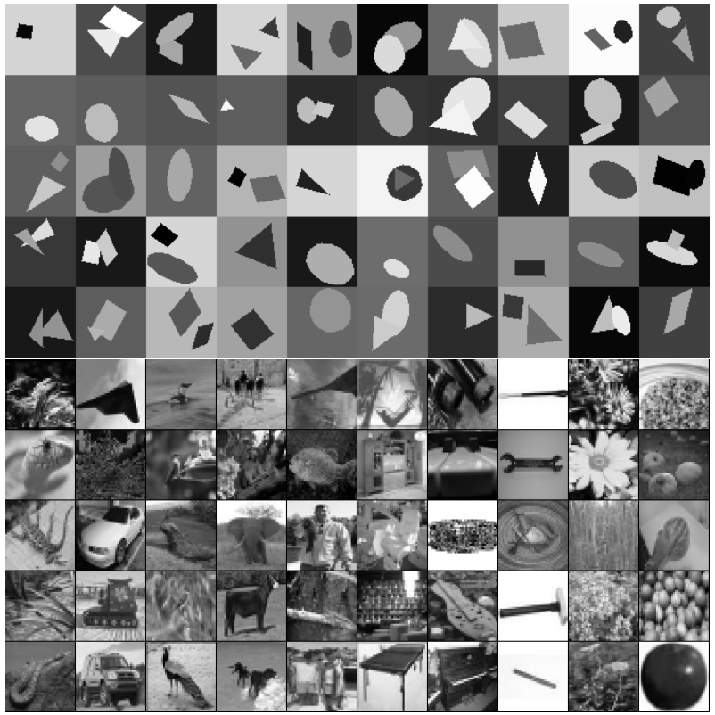 
Figure 1: Top: Shapeset-3×2 images at 64×64 resolution. The examples we used are at 32×32 resolution. The learner tries to predict which objects (parallelogram, triangle, or ellipse) are present, and 1 or 2 objects can be present, yielding 9 possible classifications. Bottom: Small-ImageNet images at full resolution.
图1：顶部：Shapeset-3×2图像，分辨率为64×64。我们使用的样本是32×32分辨率。学习者试图预测存在哪些对象(平行四边形、三角形或椭圆)，并且可以存在1或2个对象，从而产生9种可能的分类。底部：全分辨率的小型ImageNet图像。

We noticed that for only one shape present in the image the task of recognizing it was too easy. We therefore decided to sample also images with two objects, with the constraint that the second object does not overlap with the first by more than fifty percent of its area, to avoid hiding it entirely. The task is to predict the objects present (e.g. triangle + ellipse, parallelogram + parallelogram, triangle alone, etc.) without having to distinguish between the foreground shape and the background shape when they overlap. This therefore defines nine configuration classes.

我们注意到，对于图像中只有一个形状，识别它的任务太容易了。因此，我们决定对具有两个对象的图像进行采样，但第二个对象与第一个对象的重叠面积不得超过其面积的50%，以避免完全隐藏它。任务是预测存在的对象(例如三角形+椭圆、平行四边形+平行四边形、单独的三角形等)，而不必在前景形状和背景形状重叠时区分它们。因此，这定义了九个配置类。

The task is fairly difficult because we need to discover invariances over rotation, translation, scaling, object color, occlusion and relative position of the shapes. In parallel we need to extract the factors of variability that predict which object shapes are present.

这项任务相当困难，因为我们需要发现形状在旋转、平移、缩放、对象颜色、遮挡和相对位置上的不变量。同时，我们需要提取可变性因素，以预测存在哪些物体形状。

The size of the images are arbitrary but we fixed it to 32×32 in order to work with deep dense networks efficiently.

图像的大小是任意的，但为了有效地处理深度密集网络，我们将其固定为32×32。

### 2.2 Finite Datasets 有限数据集
The MNIST digits (LeCun et al., 1998a), dataset has 50,000 training images, 10,000 validation images (for hyper-parameter selection), and 10,000 test images, each showing a 28×28 grey-scale pixel image of one of the 10 digits.

MNIST数字(LeCun et al.，1998a)，数据集有50000个训练图像、10000个验证图像(用于超参数选择)和10000个测试图像，每个图像显示10个数字之一的28×28灰度像素图像。

CIFAR-10 (Krizhevsky & Hinton, 2009) is a labelled sub set of the tiny-images dataset that contains 50,000 training examples (from which we extracted 10,000 as validation data) and 10,000 test examples. There are 10 classes corresponding to the main object in each image: airplane, automobile, bird, cat, deer, dog, frog, horse, ship, or truck. The classes are balanced. Each image is in color, but is just 32 × 32 pixels in size, so the input is a vector of 32 × 32 × 3 = 3072 real values.

CIFAR-10(Krizhevsky和Hinton，2009)是微小图像数据集的一个令牌子集，包含50000个训练样本(我们从中提取了10000个作为验证数据)和10000个测试样本。每个图像中有10个类对应于主要对象：飞机、汽车、鸟、猫、鹿、狗、青蛙、马、船或卡车。类别是平衡的。每个图像都是彩色的，但大小只有32×32个像素，因此输入是32×32×3=3072个实值的向量。

Small-ImageNet which is a set of tiny 37×37 gray level images dataset computed from the higher-resolution and larger set at http://www.image-net.org, with labels from the WordNet noun hierarchy. We have used 90,000 examples for training, 10,000 for the validation set, and 10,000 for testing. There are 10 balanced classes: reptiles, vehicles, birds, mammals, fish, furniture, instruments, tools, flowers and fruits Figure 1 (bottom) shows randomly chosen examples.

Small-ImageNet 是一组微小的37×37灰度级图像数据集，由更高分辨率和更大的分辨率计算而成 http://www.image-net.org，带有WordNet名词层次结构中的标签。我们使用了90000个样本进行训练，10000个用于验证集，10000个进行测试。有10个平衡的类别：爬行动物、车辆、鸟类、哺乳动物、鱼类、家具、仪器、工具、花卉和水果。 图1(底部)显示了随机选择的样本。

### 2.3 Experimental Setting 实验设置
We optimized feedforward neural networks with one to five hidden layers, with one thousand hidden units per layer, and with a softmax logistic regression for the output layer. The cost function is the negative log-likelihood − log P(y|x), where (x, y) is the (input image, target class) pair. The neural networks were optimized with stochastic back-propagation on mini-batches of size ten, i.e., the average g of $\frac{∂−logP(y|x)}{∂θ}$ was computed over 10 consecutive training pairs (x, y) and used to update parameters θ in that direction, with θ ← θ − $\epsilon$ g. The learning rate $\epsilon$ is a hyperparameter that is optimized based on validation set error after a large number of updates (5 million).

我们优化了具有一到五个隐藏层的前馈神经网络，每层具有一千个隐藏单元，并对输出层进行了softmax逻辑回归。损失函数是负对数似然−logP(y|x)，其中(x，y)是(输入图像，目标类)对。在大小为10的小批量上使用随机反向传播对神经网络进行优化，即在10个连续的训练对(x，y)上计算 $\frac{∂−logP(y|x)}{∂θ}$ 的平均g，并用于更新该方向上的参数θ，其中θ ← θ− $\epsilon$ g。学习率$\epsilon$是一个超参数，在大量更新(500万)后基于验证集错误进行优化。

We varied the type of non-linear activation function in the hidden layers: the sigmoid $\frac{1}{(1 + e^{−x})}$, the hyperbolic tangent tanh(x), and a newly proposed activation function (Bergstra et al., 2009) called the softsign, $\frac{x}{(1 + |x|)}$. The softsign is similar to the hyperbolic tangent (its range is -1 to 1) but its tails are quadratic polynomials rather than exponentials, i.e., it approaches its asymptotes much slower.

我们改变了隐藏层中非线性激活函数的类型：sigmoid $\frac{1}{(1 + e^{−x})}$、双曲正切tanh(x) 和一种新提出的激活函数(Bergstra et al.，2009)，称为 softsign $\frac{x}{(1 + |x|)}$。softsign类似于双曲正切(其范围为-1到1)，但其尾部是二次多项式，而不是指数，即它接近渐近线的速度要慢得多。

In the comparisons, we search for the best hyperparameters (learning rate and depth) separately for each model. Note that the best depth was always five for Shapeset-3 × 2, except for the sigmoid, for which it was four.

在比较中，我们分别为每个模型搜索最佳超参数(学习率和深度)。请注意，Shapeset-3×2的最佳深度始终为5，sigmoid则为4。

We initialized the biases to be 0 and the weights $w_{ij}$ at each layer with the following commonly used heuristic:

我们使用以下常用的启发式方法将偏差初始化为0，并将每层的权重$w_{ij}$初始化：

$w_{ij} ∼ U [ − \frac{1}{\sqrt{n}}, \frac{1}{\sqrt{n}} ] $, (1)

where U[−a, a] is the uniform distribution in the interval (−a, a) and n is the size of the previous layer (the number of columns of W).

其中U[−a，a]是区间(−a，a)中的均匀分布，n是前一层的大小(W的列数)。

## 3.Effect of Activation Functions and Saturation During Training  训练过程中激活函数和饱和度的影响
Two things we want to avoid and that can be revealed from the evolution of activations is excessive saturation of activation functions on one hand (then gradients will not propagate well), and overly linear units (they will not compute something interesting).

我们想避免的两件事，可以从激活的演变中揭示出来，一方面是激活函数的过度饱和(这样梯度就不会很好地传播)，另一方面是过度线性的单位(它们不会计算出有趣的东西)。

### 3.1 Experiments with the Sigmoid
The sigmoid non-linearity has been already shown to slow down learning because of its none-zero mean that induces important singular values in the Hessian (LeCun et al., 1998b). In this section we will see another symptomatic behavior due to this activation function in deep feedforward networks.

Sigmoid非线性已经被证明会减慢学习速度，因为它的非零均值会在Hessian中引发重要的奇异值(LeCun et al.，1998b)。在本节中，我们将看到由于深度前馈网络中的激活函数而产生的另一种症状行为。

We want to study possible saturation, by looking at the evolution of activations during training, and the figures in this section show results on the Shapeset-3 × 2 data, but similar behavior is observed with the other datasets. Figure 2 shows the evolution of the activation values (after the nonlinearity) at each hidden layer during training of a deep architecture with sigmoid activation functions. Layer 1 refers to the output of first hidden layer, and there are four hidden layers. The graph shows the means and standard deviations of these activations. These statistics along with histograms are computed at different times during learning, by looking at activation values for a fixed set of 300 test examples.

我们想通过观察训练过程中激活的演变来研究可能的饱和，本节中的图显示了Shapeset-3×2数据的结果，在其他数据集中也观察到了类似的行为。图2显示了在使用Sigmoid激活函数训练深度架构期间，每个隐藏层的激活值(非线性之后)的演变。第1层是指第一个隐藏层的输出，共有四个隐藏层。该图显示了这些激活的平均值和标准偏差。通过查看300个测试样本的固定集合的激活值，在学习期间的不同时间计算这些统计数据以及直方图。

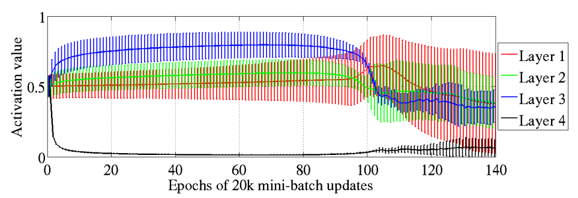 
Figure 2: Mean and standard deviation (vertical bars) of the activation values (output of the sigmoid) during supervised learning, for the different hidden layers of a deep architecture. The top hidden layer quickly saturates at 0 (slowing down all learning), but then slowly desaturates around epoch 100.
图2：深度架构的不同隐藏层在监督学习期间激活值(Sigmoid输出)的平均值和标准差(垂直条)。顶部隐藏层在0处快速饱和(减缓所有学习)，但随后在epoch 100附近缓慢去饱和。

We see that very quickly at the beginning, all the sigmoid activation values of the last hidden layer are pushed to their lower saturation value of 0. Inversely, the others layers have a mean activation value that is above 0.5, and decreasing as we go from the output layer to the input layer. We have found that this kind of saturation can last very long in deeper networks with sigmoid activations, e.g., the depthfive model never escaped this regime during training. The big surprise is that for intermediate number of hidden layers (here four), the saturation regime may be escaped. At the same time that the top hidden layer moves out of saturation, the first hidden layer begins to saturate and therefore to stabilize.

我们看到，在一开始，最后一个隐藏层的所有Sigmoid激活值都很快被推到其较低的饱和值0。相反，其他层的平均激活值高于0.5，并且随着我们从输出层到输入层的移动而减小。我们发现，这种饱和在具有Sigmoid激活的更深度次网络中可以持续很长时间，例如，深度五模型在训练过程中从未逃脱这种状态。最大的惊喜是，对于中间数量的隐藏层(这里是四层)，饱和状态可能会逃脱。在顶部隐藏层移出饱和的同时，第一个隐藏层开始饱和，从而趋于稳定。

We hypothesize that this behavior is due to the combination of random initialization and the fact that an hidden unit output of 0 corresponds to a saturated sigmoid. Note that deep networks with sigmoids but initialized from unsupervised pre-training (e.g. from RBMs) do not suffer from this saturation behavior. Our proposed explanation rests on the hypothesis that the transformation that the lower layers of the randomly initialized network computes initially is not useful to the classification task, unlike the transformation obtained from unsupervised pre-training. The logistic layer output softmax(b+$W_h$) might initially rely more on its biases b (which are learned very quickly) than on the top hidden activations h derived from the input image (because h would vary in ways that are not predictive of y, maybe correlated mostly with other and possibly more dominant variations of x). Thus the error gradient would tend to push $W_h$ towards 0, which can be achieved by pushing h towards 0. In the case of symmetric activation functions like the hyperbolic tangent and the softsign, sitting around 0 is good because it allows gradients to flow backwards. However, pushing the sigmoid outputs to 0 would bring them into a saturation regime which would prevent gradients to flow backward and prevent the lower layers from learning useful features. Eventually but slowly, the lower layers move toward more useful features and the top hidden layer then moves out of the saturation regime. Note however that, even after this, the network moves into a solution that is of poorer quality (also in terms of generalization) then those found with symmetric activation functions, as can be seen in figure 11.

我们假设这种行为是由于随机初始化和0的隐藏单元输出对应于饱和Sigmoid的事实的结合。请注意，具有Sigmoid但从无监督预训练(例如从RBM)初始化的深度网络不会受到这种饱和行为的影响。我们提出的解释基于这样的假设，即随机初始化网络的较低层最初计算的变换对分类任务没有用处，这与从无监督预训练中获得的变换不同。逻辑层输出softmax(b+$W_h$)最初可能更多地依赖于其偏差b(其学习非常快)，而不是依赖于从输入图像导出的顶部隐藏激活h(因为h将以不预测y的方式变化，可能主要与x的其他且可能更主要的变化相关)。因此，误差梯度将倾向于将$W_h$推向0，这可以通过将h推向0来实现。在双曲正切和softsign等对称激活函数的情况下，坐在0附近是好的，因为它允许梯度向后流动。然而，将Sigmoid输出推至0将使它们进入饱和状态，这将防止梯度向后流动，并防止较低层学习有用的特征。最终但缓慢地，较低的层向更有用的特征移动，然后顶部隐藏层移出饱和状态。然而，请注意，即使在这之后，网络也会进入比使用对称激活函数发现的解决方案质量更差的解决方案(在泛化方面也是如此)，如图11所示。

### 3.2 Experiments with the Hyperbolic tangent 双曲正切实验
As discussed above, the hyperbolic tangent networks do not suffer from the kind of saturation behavior of the top hidden layer observed with sigmoid networks, because of its symmetry around 0. However, with our standard weight initialization $U [ − \frac{1}{\sqrt{n}}, \frac{1}{\sqrt{n}} ] $ , we observe a sequentially occurring saturation phenomenon starting with layer 1 and propagating up in the network, as illustrated in Figure 3. Why this is happening remains to be understood.

如上所述，双曲正切网络不会受到用Sigmoid网络观察到的顶部隐藏层的饱和行为的影响，因为它在0附近是对称的。然而，通过我们的标准权重初始化 $U [ − \frac{1}{\sqrt{n}}, \frac{1}{\sqrt{n}} ] $，我们观察到从第1层开始并在网络中向上传播的连续发生的饱和现象，如图3所示。为什么会发生这种情况还有待理解。

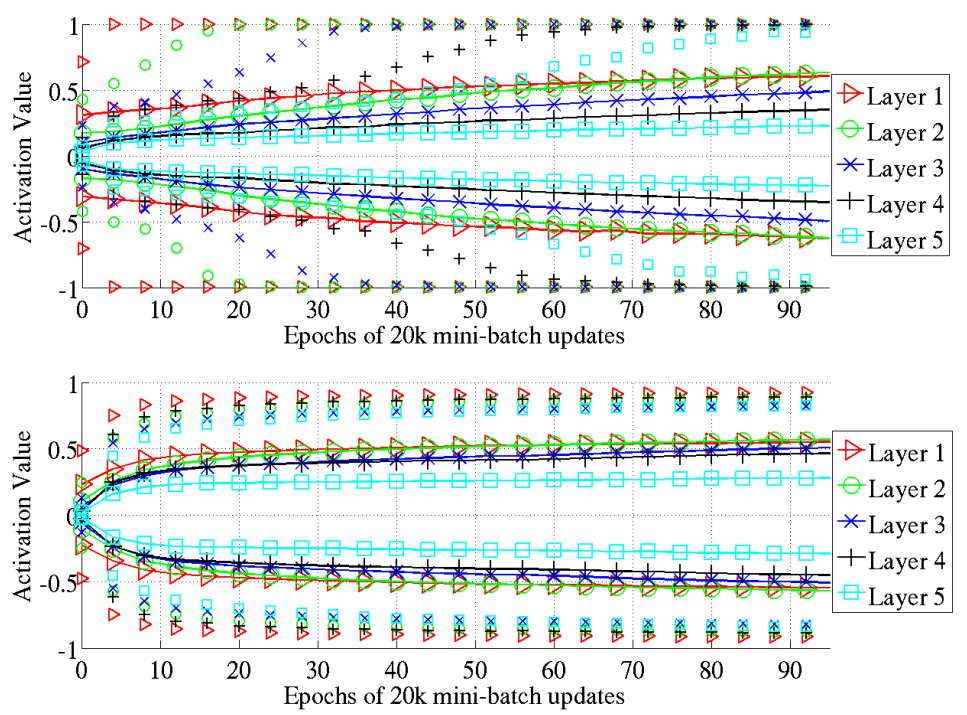 
Figure 3: Top:98 percentiles (markers alone) and standard deviation (solid lines with markers) of the distribution of the activation values for the hyperbolic tangent networks in the course of learning. We see the first hidden layer saturating first, then the second, etc. Bottom: 98 percentiles (markers alone) and standard deviation (solid lines with markers) of the distribution of activation values for the softsign during learning. Here the different layers saturate less and do so together.
图3：顶部：学习过程中双曲正切网络激活值分布的98%(仅标记)和标准差(带标记的实线)。我们看到第一个隐藏层首先饱和，然后是第二个，等等。底部：学习期间softsign激活值分布的98%(单独令牌)和标准差(带令牌的实线)。在这里，不同的层饱和较少，并且一起饱和。

### 3.3 Experiments with the Softsign 
The softsign $\frac{x}{(1+|x|)}$ is similar to the hyperbolic tangent but might behave differently in terms of saturation because of its smoother asymptotes (polynomial instead of exponential). We see on Figure 3 that the saturation does not occur one layer after the other like for the hyperbolic tangent. It is faster at the beginning and then slow, and all layers move together towards larger weights.

softsign $\frac{x}{(1+|x|)}$ 类似于双曲正切，但由于其更平滑的渐近线(多项式而非指数)，在饱和度方面可能表现不同。我们在图3中看到，饱和不会像双曲正切那样一层接一层地发生。开始时速度较快，然后速度较慢，所有层都朝着更大的权重移动。

We can also see at the end of training that the histogram of activation values is very different from that seen with the hyperbolic tangent (Figure 4). Whereas the latter yields modes of the activations distribution mostly at the extremes (asymptotes -1 and 1) or around 0, the softsign network has modes of activations around its knees (between the linear regime around 0 and the flat regime around -1 and 1). These are the areas where there is substantial non-linearity but where the gradients would flow well.

我们还可以在训练结束时看到，激活值的直方图与双曲正切的直方图非常不同(图4)。尽管后者产生的激活分布模式大多在极端(渐近线-1和1)或在0附近，但softsign网络在其膝盖周围具有激活模式(在0附近的线性区域和-1和1附近的平坦区域之间)。这些区域存在显著的非线性，但梯度会很好地流动。

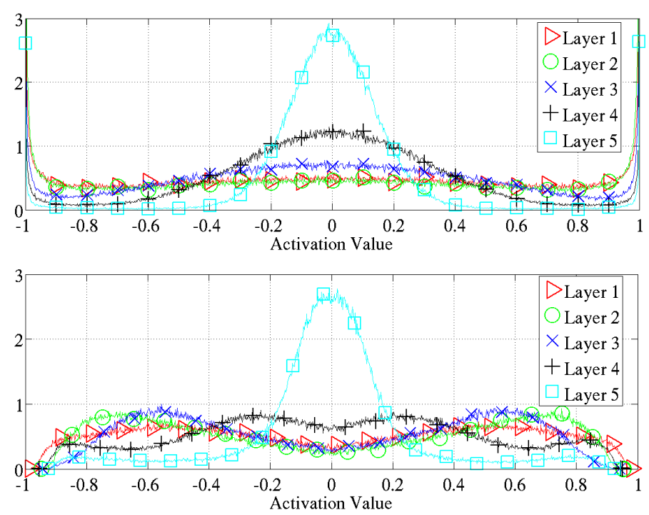 
Figure 4: Activation values normalized histogram at the end of learning, averaged across units of the same layer and across 300 test examples. Top: activation function is hyperbolic tangent, we see important saturation of the lower layers. Bottom: activation function is softsign, we see many activation values around (-0.6,-0.8) and (0.6,0.8) where the units do not saturate but are non-linear.
图4：学习结束时的激活值归一化直方图，在同一层的单元和300个测试样本中平均。顶部：激活函数是双曲正切，我们看到了下层的重要饱和度。底部：激活函数是softsign的，我们看到许多激活值在(-0.6，-0.8)和(0.6,0.8)左右，其中单位没有饱和，而是非线性的。

## 4.Studying Gradients and their Propagation 研究梯度及其传播
### 4.1 Effect of the Cost Function  损失函数的影响
We have found that the logistic regression or conditional log-likelihood cost function (− log P(y|x) coupled with softmax outputs) worked much better (for classification problems) than the quadratic cost which was traditionally used to train feedforward neural networks (Rumelhart et al., 1986). This is not a new observation (Solla et al., 1988) but we find it important to stress here. We found that the plateaus in the training criterion (as a function of the parameters) are less present with the log-likelihood cost function. We can see this on Figure 5, which plots the training criterion as a function of two weights for a two-layer network (one hidden layer) with hyperbolic tangent units, and a random input and target signal. There are clearly more severe plateaus with the quadratic cost.

我们发现，逻辑回归或条件对数似然损失函数(−log P(y|x)与softmax输出耦合)(对于分类问题)比传统上用于训练前馈神经网络的平方损失(Rumelhart et al.，1986)工作得更好。这不是一个新的观察结果(Solla et al.，1988)，但我们发现在这里强调这一点很重要。我们发现，在对数似然损失函数中，训练标准中的平稳期(作为参数的函数)较少出现。我们可以在图5中看到这一点，该图将训练标准绘制为具有双曲正切单元的两层网络(一个隐藏层)以及随机输入和目标信号的两个权重的函数。平方损失显然存在更严重的平稳期。

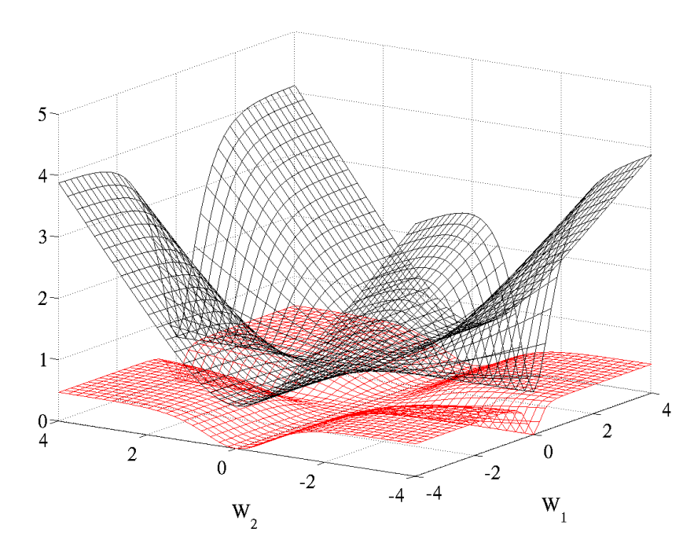 
Figure 5: Cross entropy (black, surface on top) and quadratic (red, bottom surface) cost as a function of two weights (one at each layer) of a network with two layers, $W_1$ respectively on the first layer and $W_2$ on the second, output layer.
图5：交叉熵(黑色，上表面)和平方(红色，下表面)损失是具有两层的网络的两个权重(每层一个)的函数，$W_1$分别在第一层，$W_2$在第二层，输出层。

### 4.2 Gradients at initialization 初始化时的梯度
#### 4.2.1 Theoretical Considerations and a New Normalized Initialization 理论考虑和新的归一化初始化
We study the back-propagated gradients, or equivalently the gradient of the cost function on the inputs biases at each layer. Bradley (2009) found that back-propagated gradients were smaller as one moves from the output layer towards the input layer, just after initialization. He studied networks with linear activation at each layer, finding that the variance of the back-propagated gradients decreases as we go backwards in the network. We will also start by studying the linear regime.

我们研究了反向传播的梯度，或者等效地研究了每层输入偏差上的损失函数的梯度。Bradley(2009)发现，在初始化之后，从输出层向输入层移动时，反向传播的梯度较小。他研究了每层都有线性激活的网络，发现反向传播梯度的方差随着我们在网络中的倒退而减小。我们还将从研究线性状态开始。

For a dense artificial neural network using symmetric activation function f with unit derivative at 0 (i.e. f'(0) = 1), if we write $z^i$ for the activation vector of layer i, and $s^i$ the argument vector of the activation function at layer i, we have $s^i = z^iW^i + b^i$ and $z^{i+1} = f(s^i)$. From these definitions we obtain the following:

对于使用单位导数为0(即f'(0)=1)的对称激活函数f的稠密人工神经网络，如果我们将$z^i$写为第i层的激活向量，将$s^i$写为第i层的激活函数的自变量向量，则我们得到$s^i = z^iW^i + b^i$ 和 $z^{i+1} = f(s^i)$。从这些定义中，我们得到以下内容：

$\frac{∂Cost}{∂s^i_k} = f'(s^i_k)W^{i+1}_{k,•} \frac{ ∂Cost}{∂s^{i+1}}$ (2)

$\frac{∂Cost}{∂w^i_{l,k}} = z_l^i \frac{∂Cost}{∂s^i_k}$ (3)

The variances will be expressed with respect to the input, outpout and weight initialization randomness. Consider the hypothesis that we are in a linear regime at the initialization, that the weights are initialized independently and that the inputs features variances are the same (= Var[x]). Then we can say that, with $n_i$ the size of layer i and x the network input,

方差将根据输入、输出和权重初始化的随机性来表示。考虑这样的假设，即我们在初始化时处于线性状态，权重独立初始化，并且输入特征方差相同(=Var[x])。那么我们可以说，$n_i$是层i的大小，x是网络输入，

$f'(s^i_k) ≈ 1$, (4)

$Var[z^i] = Var[x] \prod^{i−1}_{i'=0} n_{i'} Var[W^{i'} ]$, (5)

We write $Var[W^{i'}]$ for the shared scalar variance of all weights at layer i' . Then for a network with d layers,

我们为层i'处所有权重的共享标量方差写$Var[W^{i'}]$。然后，对于具有d层的网络，

$Var[ \frac{∂Cost}{∂s^i}]= Var [\frac{∂Cost}{∂s^d}] \prod^d_{i' =i} n_{i'+1} Var[W^{i'}]$, (6)

$Var[\frac{∂Cost}{∂w^i}] = \prod^{i−1}_{i'=0} n_{i'} Var[W^{i'}] \prod^{d−1}_{i' =i} n_{i' +1}Var[W^{i'}] × Var[x]Var  [\frac{∂Cost}{∂s^d} ] $. (7)

From a forward-propagation point of view, to keep information flowing we would like that 

从正向传播的角度来看，为了保持信息的流动，我们希望

$∀(i, i'), Var[z^i] = Var[z^{i'} ]$. (8)

From a back-propagation point of view we would similarly like to have 

从反向传播的角度来看，我们类似地希望有

$∀(i, i'), Var[\frac{∂Cost}{∂s^i}] = Var[\frac{∂Cost}{∂s^{i'}} ] $. (9)

These two conditions transform to:

这两个条件转换为：

$∀i, n_iVar[W^i ] = 1 $ (10)

$∀i, n_{i+1}Var[W^i] = 1 $ (11)

As a compromise between these two constraints, we might want to have 

作为这两个约束之间的折衷，我们可能想要

$∀i, Var[W^i] = \frac{2}{n_i + n_{i+1}}$ (12)

Note how both constraints are satisfied when all layers have the same width. If we also have the same initialization for the weights we could get the following interesting properties:

请注意，当所有层都具有相同的宽度时，如何满足这两个约束。如果我们对权重也有相同的初始化，我们可以得到以下有趣的属性：

$∀i, Var[\frac{∂Cost}{∂s^i}] = [nVar[W]]^{d−i} Var[x]$ (13)

$∀i, Var[\frac{∂Cost}{∂w^i}]= [nVar[W]]^d Var[x]Var[\frac{∂Cost}{∂s^d}]$ (14)

We can see that the variance of the gradient on the weights is the same for all layers, but the variance of the backpropagated gradient might still vanish or explode as we consider deeper networks. Note how this is reminiscent of issues raised when studying recurrent neural networks (Bengio et al., 1994), which can be seen as very deep networks when unfolded through time.

我们可以看到，对于所有层，权重上的梯度方差是相同的，但当我们考虑更深的网络时，反向传播梯度的方差可能仍然会消失或爆炸。请注意，这让人想起了研究循环神经网络时提出的问题(Bengio et al.，1994)，当循环神经网络随着时间的推移展开时，可以被视为非常深入的网络。

The standard initialization that we have used (eq.1) gives rise to variance with the following property:

我们使用的标准初始化(等式1)会产生与以下属性的差异：

nVar[W] = $\frac{1}{3}$ (15)

where n is the layer size (assuming all layers of the same size). This will cause the variance of the back-propagated gradient to be dependent on the layer (and decreasing).

其中n是层尺寸(假设所有层的尺寸相同)。这将导致反向传播梯度的方差取决于层(并且在减小)。

The normalization factor may therefore be important when initializing deep networks because of the multiplicative effect through layers, and we suggest the following initialization procedure to approximately satisfy our objectives of maintaining activation variances and back-propagated gradients variance as one moves up or down the network. We call it the normalized initialization:

因此，由于通过层的乘法效应，在初始化深度网络时，归一化因子可能很重要，我们建议以下初始化过程，以大致满足我们的目标，即在网络上下移动时保持激活方差和反向传播梯度方差。我们称之为归一化初始化：

$W ∼ U[−\frac{\sqrt{6}}{\sqrt{n_j + n_{j+1}}}, \frac{\sqrt{6}}{\sqrt{n_j + n_{j+1}}}]$ (16)

#### 4.2.2 Gradient Propagation Study 梯度传播研究
To empirically validate the above theoretical ideas, we have plotted some normalized histograms of activation values, weight gradients and of the back-propagated gradients at initialization with the two different initialization methods. The results displayed (Figures 6, 7 and 8) are from experiments on Shapeset-3 × 2, but qualitatively similar results were obtained with the other datasets.

为了实证验证上述理论观点，我们用两种不同的初始化方法绘制了初始化时激活值、权重梯度和反向传播梯度的一些归一化直方图。显示的结果(图6、图7和图8)来自Shapeset-3×2上的实验，但在其他数据集上获得了定性相似的结果。

We monitor the singular values of the Jacobian matrix associated with layer i:

我们监视与层i相关联的雅可比矩阵的奇异值：

$J^i = \frac{∂z^{i+1}}{∂z^i}$ (17)

When consecutive layers have the same dimension, the average singular value corresponds to the average ratio of infinitesimal volumes mapped from zi to zi+1, as well as to the ratio of average activation variance going from zi to zi+1. With our normalized initialization, this ratio is around 0.8 whereas with the standard initialization, it drops down to 0.5.

当连续层具有相同的维度时，平均奇异值对应于从zi映射到zi+1的有限体积内的平均比率，以及从zi映射至zi+1的平均激活方差的比率。在我们的归一化初始化中，这个比率大约为0.8，而在标准初始化中，它下降到0.5。

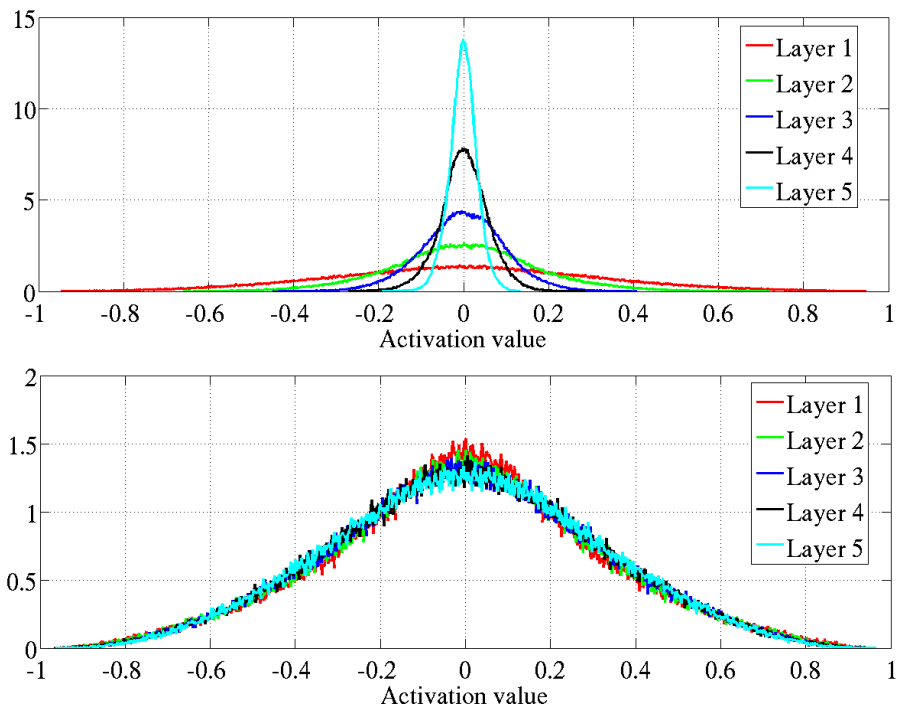 
Figure 6: Activation values normalized histograms with hyperbolic tangent activation, with standard (top) vs normalized initialization (bottom). Top: 0-peak increases for higher layers.
图6：具有双曲正切激活的激活值归一化直方图，具有标准(顶部)与归一化初始化(底部)。顶部：对于较高的层，0峰值增加。

### 4.3 Back-propagated Gradients During Learning  学习过程中的反向传播梯度
The dynamic of learning in such networks is complex and we would like to develop better tools to analyze and track it. In particular, we cannot use simple variance calculations in our theoretical analysis because the weights values are not anymore independent of the activation values and the linearity hypothesis is also violated.

这种网络中的学习动态是复杂的，我们希望开发更好的工具来分析和跟踪它。特别是，我们不能在理论分析中使用简单的方差计算，因为权重值不再独立于激活值，并且也违反了线性假设。

As first noted by Bradley (2009), we observe (Figure 7) that at the beginning of training, after the standard initialization (eq. 1), the variance of the back-propagated gradients gets smaller as it is propagated downwards. However we find that this trend is reversed very quickly during learning. Using our normalized initialization we do not see such decreasing back-propagated gradients (bottom of Figure 7).

正如Bradley(2009)首次指出的那样，我们观察到(图7)，在训练开始时，在标准初始化(等式1)之后，反向传播梯度的方差随着向下传播而变小。然而，我们发现，在学习过程中，这种趋势很快就会逆转。使用我们的归一化初始化，我们没有看到这种递减的反向传播梯度(图7的底部)。

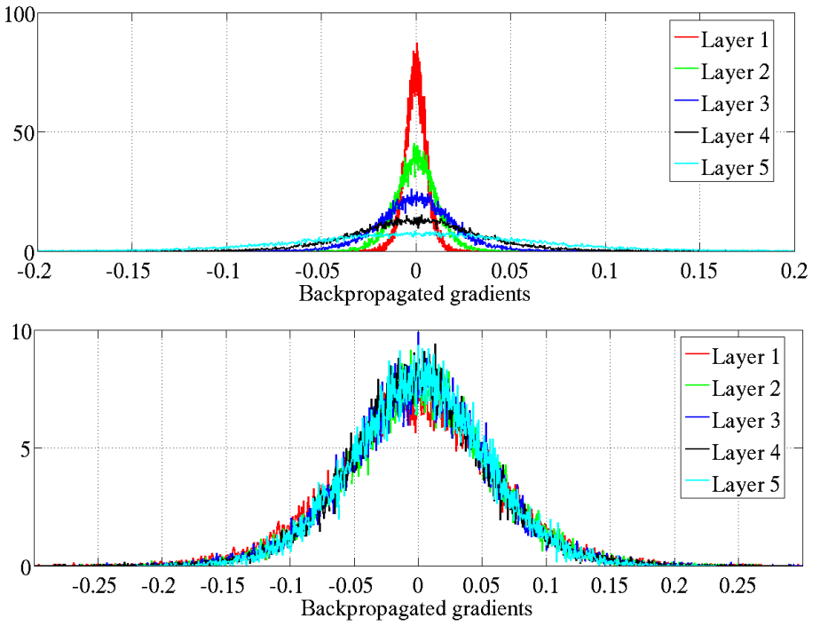 
Figure 7: Back-propagated gradients normalized histograms with hyperbolic tangent activation, with standard (top) vs normalized (bottom) initialization. Top: 0-peak decreases for higher layers.
图7：具有双曲正切激活的反向传播梯度归一化直方图，具有标准(顶部)与归一化(底部)初始化。顶部：对于较高的层，0峰值下降。

What was initially really surprising is that even when the back-propagated gradients become smaller (standard initialization), the variance of the weights gradients is roughly constant across layers, as shown on Figure 8. However, this is explained by our theoretical analysis above (eq. 14). Interestingly, as shown in Figure 9, these observations on the weight gradient of standard and normalized initialization change during training (here for a tanh network). Indeed, whereas the gradients have initially roughly the same magnitude, they diverge from each other (with larger gradients in the lower layers) as training progresses, especially with the standard initialization. Note that this might be one of the advantages of the normalized initialization, since having gradients of very different magnitudes at different layers may yield to ill-conditioning and slower training.

最初真正令人惊讶的是，即使反向传播的梯度变小(标准初始化)，权重梯度的方差在各层之间也大致恒定，如图8所示。然而，这可以通过我们上面的理论分析来解释(方程14)。有趣的是，如图9所示，这些关于标准和归一化初始化的权重梯度的观察结果在训练过程中发生了变化(这里是针对tanh网络)。事实上，尽管梯度最初具有大致相同的大小，但随着训练的进行，特别是在标准初始化的情况下，它们彼此发散(在较低层中具有较大的梯度)。注意，这可能是归一化初始化的优点之一，因为在不同层具有非常不同大小的梯度可能导致条件不良和训练较慢。

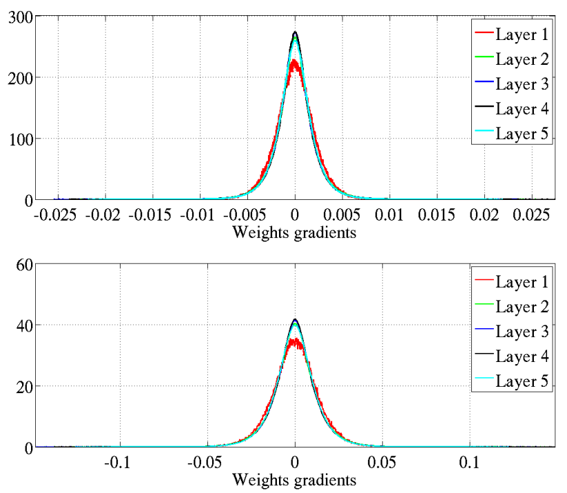 
Figure 8: Weight gradient normalized histograms with hyperbolic tangent activation just after initialization, with standard initialization (top) and normalized initialization (bottom), for different layers. Even though with standard initialization the back-propagated gradients get smaller, the weight gradients do not!
图8：初始化后具有双曲正切激活的权重梯度归一化直方图，具有不同层的标准初始化(顶部)和归一化初始化(底部)。即使使用标准初始化，反向传播的梯度会变小，但权重梯度不会！

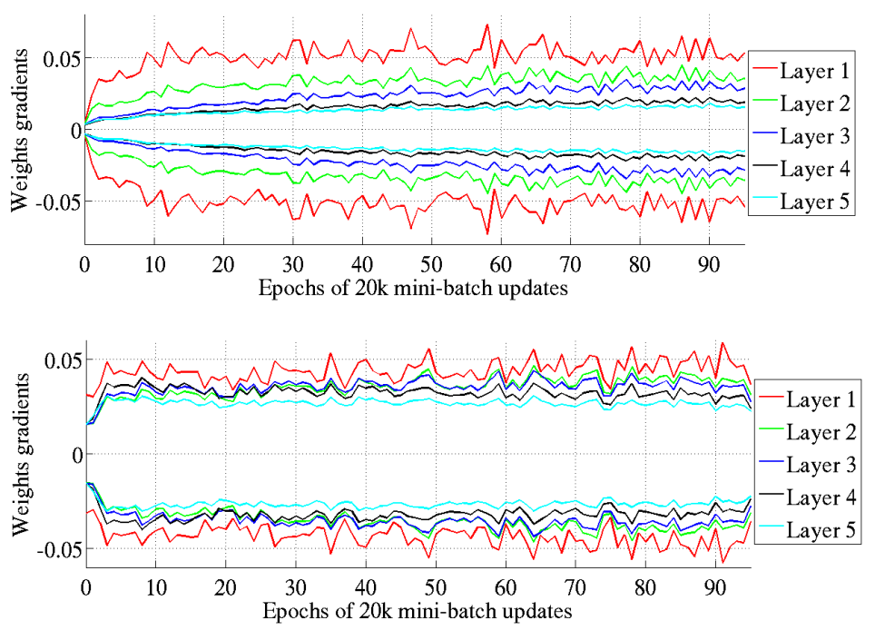 
Figure 9: Standard deviation intervals of the weights gradients with hyperbolic tangents with standard initialization (top) and normalized (bottom) during training. We see that the normalization allows to keep the same variance of the weights gradient across layers, during training (top: smaller variance for higher layers).
图9：训练期间具有标准初始化(顶部)和归一化(底部)的双曲切线的权重梯度的标准偏差区间。我们看到，归一化允许在训练期间保持各层权重梯度的相同方差(顶部：较高层的方差较小)。

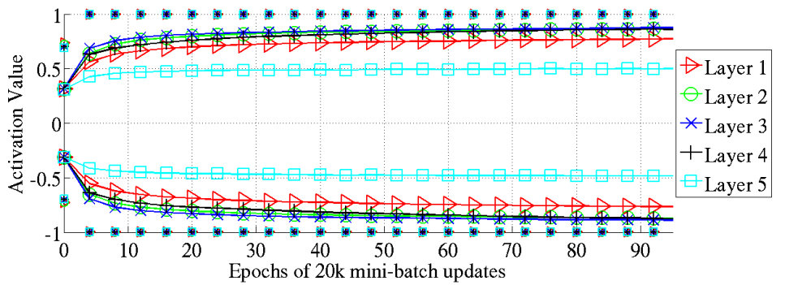 
Figure 10: 98 percentile (markers alone) and standard deviation (solid lines with markers) of the distribution of activation values for hyperbolic tangent with normalized initialization during learning.
图10:学习过程中归一化初始化的双曲正切激活值分布的98个百分位(单独令牌)和标准差(带令牌的实线)。

Finally, we observe that the softsign networks share similarities with the tanh networks with normalized initialization, as can be seen by comparing the evolution of activations in both cases (resp. Figure 3-bottom and Figure 10).

最后，我们观察到softsign网络与具有归一化初始化的tanh网络有相似之处，这可以通过比较两种情况下激活的演变来看出(分别见图3底部和图10)。

## 5 Error Curves and Conclusions 误差曲线和结论
The final consideration that we care for is the success of training with different strategies, and this is best illustrated with error curves showing the evolution of test error as training progresses and asymptotes. Figure 11 shows such curves with online training on Shapeset-3 × 2, while Table 1 gives final test error for all the datasets studied (Shapeset-3 × 2, MNIST, CIFAR-10, and SmallImageNet). As a baseline, we optimized RBF SVM models on one hundred thousand Shapeset examples and obtained 59.47% test error, while on the same set we obtained 50.47% with a depth five hyperbolic tangent network with normalized initialization.

我们关心的最后一个考虑因素是使用不同策略训练的成功，这最好用误差曲线来说明，误差曲线显示了测试误差随着训练的进展和渐近线的演变。图11显示了在Shapeset-3×2上进行在线训练的曲线，而表1给出了所研究的所有数据集(Shapeset--3×2、MNIST、CIFAR-10和SmallImageNet)的最终测试误差。作为基线，我们在十万个Shapeset样本上优化了RBF SVM模型，获得了59.47%的测试误差，而在同一集合上，我们在具有归一化初始化的深度五双曲正切网络上获得了50.47%的测试错误。

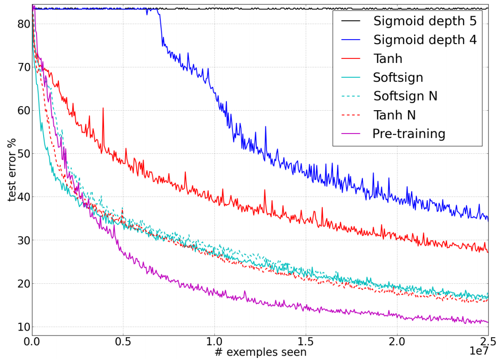 
Figure 11: Test error during online training on the Shapeset-3×2 dataset, for various activation functions and initialization schemes (ordered from top to bottom in decreasing final error). N after the activation function name indicates the use of normalized initialization.
图11：在Shapeset-3×2数据集上进行在线训练时，针对各种激活函数和初始化方案的测试错误(按从上到下的顺序递减最终错误)。激活函数名称后的N表示使用归一化初始化。

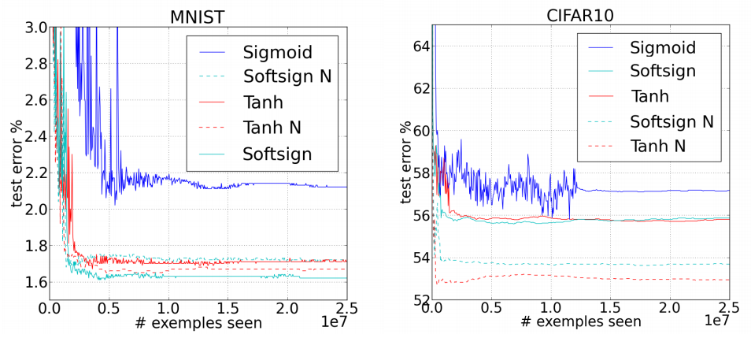 
Figure 12: Test error curves during training on MNIST and CIFAR10, for various activation functions and initialization schemes (ordered from top to bottom in decreasing final error). N after the activation function name indicates the use of normalized initialization.
图12：在MNIST和CIFAR10上训练期间，针对各种激活函数和初始化方案的测试误差曲线(按从上到下的顺序递减最终误差)。激活函数名称后的N表示使用归一化初始化。

TYPE|Shapeset|MNIST|CIFAR-10|ImageNet
---|---|---|---|---
Softsign|16.27|1.64|55.78|69.14
Softsign N|16.06|1.72|53.8|68.13
Tanh|27.15|1.76|55.9|70.58
Tanh N|15.60|1.64|52.92|68.57
Sigmoid|82.61|2.21|57.28|70.66

Table 1: Test error with different activation functions and initialization schemes for deep networks with 5 hidden layers. N after the activation function name indicates the use of normalized initialization. Results in bold are statistically different from non-bold ones under the null hypothesis test with p = 0.005.
表1：具有5个隐藏层的深度网络的不同激活函数和初始化方案的测试错误。激活函数名称后的N表示使用归一化初始化。在p=0.005的零假设检验下，粗体的结果与非粗体的结果在统计学上不同。

These results illustrate the effect of the choice of activation and initialization. As a reference we include in Figure 11 the error curve for the supervised fine-tuning from the initialization obtained after unsupervised pre-training with denoising auto-encoders (Vincent et al., 2008). For each network the learning rate is separately chosen to minimize error on the validation set. We can remark that on Shapeset-3 × 2, because of the task difficulty, we observe important saturations during learning, this might explain that the normalized initialization or the softsign effects are more visible.

这些结果说明了选择激活和初始化的效果。作为参考，我们在图11中包括了在使用去噪自动编码器进行无监督预训练后获得的初始化的监督微调的误差曲线(Vincent et al., 2008)。对于每个网络，分别选择学习率以最小化验证集上的误差。我们可以注意到，在Shapeset-3×2上，由于任务难度，我们在学习过程中观察到了重要的饱和，这可能解释了归一化初始化或softsign效应更明显。

Several conclusions can be drawn from these error curves:
* The more classical neural networks with sigmoid or hyperbolic tangent units and standard initialization fare rather poorly, converging more slowly and apparently towards ultimately poorer local minima.
* The softsign networks seem to be more robust to the initialization procedure than the tanh networks, presumably because of their gentler non-linearity.
* For tanh networks, the proposed normalized initialization can be quite helpful, presumably because the layer-to-layer transformations maintain magnitudes of activations (flowing upward) and gradients (flowing backward).

从这些误差曲线可以得出几个结论：
* 具有Sigmoid或双曲正切单元和标准初始化的更经典的神经网络表现相当糟糕，收敛速度更慢，显然最终趋向于较差的局部极小值。
* Softsign网络似乎比tanh网络对初始化过程更稳健，可能是因为它们的非线性更温和。
* 对于tanh网络，所提出的归一化初始化可能非常有用，大概是因为层到层的转换保持了激活(向上流动)和梯度(向后流动)的大小。

Others methods can alleviate discrepancies between layers during learning, e.g., exploiting second order information to set the learning rate separately for each parameter. For example, we can exploit the diagonal of the Hessian (LeCun et al., 1998b) or a gradient variance estimate.

其他方法可以在学习期间缓解层之间的差异，例如，利用二阶信息为每个参数单独设置学习速率。例如，我们可以利用Hessian的对角线(LeCun et al.，1998b)或梯度方差估计。

Both those methods have been applied for Shapeset-3 × 2 with hyperbolic tangent and standard initialization. We observed a gain in performance but not reaching the result obtained from normalized initialization. In addition, we observed further gains by combining normalized initialization with second order methods: the estimated Hessian might then focus on discrepancies between units, not having to correct important initial discrepancies between layers.

这两种方法都已应用于具有双曲正切和标准初始化的Shapeset-3×2。我们观察到性能有所提高，但没有达到从归一化初始化中获得的结果。此外，我们通过将归一化初始化与二阶方法相结合，观察到了进一步的增益：估计的Hessian可能会关注单元之间的差异，而不必校正层之间的重要初始差异。

In all reported experiments we have used the same number of units per layer. However, we verified that we obtain the same gains when the layer size increases (or decreases) with layer number.

在所有报道的实验中，我们每层使用相同数量的单元。然而，我们验证了当层尺寸随着层数的增加(或减少)时，我们获得了相同的增益。

The other conclusions from this study are the following:
* Monitoring activations and gradients across layers and training iterations is a powerful investigative tool for understanding training difficulties in deep nets.
* Sigmoid activations (not symmetric around 0) should be avoided when initializing from small random weights, because they yield poor learning dynamics, with initial saturation of the top hidden layer.
* Keeping the layer-to-layer transformations such that both activations and gradients flow well (i.e. with a Jacobian around 1) appears helpful, and allows to eliminate a good part of the discrepancy between purely supervised deep networks and ones pre-trained with unsupervised learning.
* Many of our observations remain unexplained, suggesting further investigations to better understand gradients and training dynamics in deep architectures.

本研究得出的其他结论如下：
* 监测各层的激活和梯度以及训练迭代是理解深度网络训练困难的强大研究工具。
* 当从小的随机权重初始化时，应该避免Sigmoid激活(在0附近不是对称的)，因为它们产生较差的学习动态，顶部隐藏层的初始饱和。
* 保持层到层的转换，使得激活和梯度都能很好地流动(即雅可比系数在1左右)似乎是有帮助的，并允许消除纯监督深度网络和用无监督学习预先训练的深度网络之间的很大一部分差异。
* 我们的许多观察结果仍然无法解释，这表明需要进一步的研究来更好地理解深度架构中的梯度和训练动力学。

## References
* Bengio, Y. (2009). Learning deep architectures for AI. Foundations and Trends in Machine Learning, 2, 1–127. Also published as a book. Now Publishers, 2009.
* Bengio, Y., Lamblin, P., Popovici, D., & Larochelle, H. (2007). Greedy layer-wise training of deep networks. NIPS 19 (pp.153–160). MIT Press.
* Bengio, Y., Simard, P., & Frasconi, P. (1994). Learning long-termdependencies with gradient descent is difficult. IEEE Transactions on Neural Networks, 5, 157–166.
* Bergstra, J., Desjardins, G., Lamblin, P., & Bengio, Y. (2009). Quadratic polynomials learn better image features (TechnicalReport 1337). D´epartement d’Informatique et de RechercheOp´erationnelle, Universit´e de Montr´eal.
* Bradley, D. (2009). Learning in modular systems. Doctoral dissertation, The Robotics Institute, Carnegie Mellon University.
* Collobert, R., & Weston, J. (2008). A unified architecture for natural language processing: Deep neural networks with multitasklearning. ICML 2008.
* Erhan, D., Manzagol, P.-A., Bengio, Y., Bengio, S., & Vincent,P. (2009). The difficulty of training deep architectures and theeffect of unsupervised pre-training. AISTATS’2009 (pp. 153–160).
* Hinton, G. E., Osindero, S., & Teh, Y. (2006). A fast learningalgorithm for deep belief nets. Neural Computation, 18, 1527–1554.
* Krizhevsky, A., & Hinton, G. (2009). Learning multiple layersof features from tiny images (Technical Report). University ofToronto.
* Larochelle, H., Bengio, Y., Louradour, J., & Lamblin, P. (2009). Exploring strategies for training deep neural networks. TheJournal of Machine Learning Research, 10, 1–40.
* Larochelle, H., Erhan, D., Courville, A., Bergstra, J., & Bengio,Y. (2007). An empirical evaluation of deep architectures onproblems with many factors of variation. ICML 2007.
* LeCun, Y., Bottou, L., Bengio, Y., & Haffner, P. (1998a). Gradient-based learning applied to document recognition. Proceedings of the IEEE, 86, 2278–2324.
* LeCun, Y., Bottou, L., Orr, G. B., & M¨uller, K.-R. (1998b). Effi-cient backprop. In Neural networks, tricks of the trade, LectureNotes in Computer Science LNCS 1524. Springer Verlag.
* Mnih, A., & Hinton, G. E. (2009). A scalable hierarchical distributed language model. NIPS 21 (pp. 1081–1088).
* Ranzato, M., Poultney, C., Chopra, S., & LeCun, Y. (2007). Ef-ficient learning of sparse representations with an energy-basedmodel. NIPS 19.
* Rumelhart, D. E., Hinton, G. E., & Williams, R. J. (1986). Learning representations by back-propagating errors. Nature, 323,533–536.
* Solla, S. A., Levin, E., & Fleisher, M. (1988). Accelerated learning in layered neural networks. Complex Systems, 2, 625–639.
* Vincent, P., Larochelle, H., Bengio, Y., & Manzagol, P.-A. (2008). Extracting and composing robust features with denoising autoencoders. ICML 2008.
* Weston, J., Ratle, F., & Collobert, R. (2008). Deep learningvia semi-supervised embedding. ICML 2008 (pp. 1168–1175). New York, NY, USA: ACM.
* Zhu, L., Chen, Y., & Yuille, A. (2009). Unsupervised learningof probabilistic grammar-markov models for object categories. IEEE Transactions on Pattern Analysis and Machine Intelligence, 31, 114–128.
