# A ConvNet for the 2020s
2022.1.10 https://arxiv.org/abs/2201.03545 

## 阅读笔记
* [pytorch实现](https://github.com/pytorch/vision/blob/main/torchvision/models/convnext.py)
* MLP-Mixer和ConvNext表明，Transformer中，基于QKV这样的attention机制可能有更高效、简单的方案替代，期待神作出现... 。
* 基本规则与模式涌现：生命游戏遵照简单规则自下而上演化，过程中会产生许多特定的模式。同样，真实世界也是基于简单的物理规则，演化出我们能感受到的丰富多彩的世界，神经网络应该如此。但是，在特定领域使用特定模式，是智能体将目标和资源的最佳匹配，从这个角度看，CNN在视觉特征提取领域还将有顽强的生命力，尤其适合边缘计算等算力不是很足的情况。
* 将vit的组件等，改造到cnn里，有助于理解vit和cnn的差异点

## Abstract
The “Roaring 20s” of visual recognition began with the introduction of Vision Transformers (ViTs), which quickly superseded ConvNets as the state-of-the-art image classification model. A vanilla ViT, on the other hand, faces difficulties when applied to general computer vision tasks such as object detection and semantic segmentation. It is the hierarchical Transformers (e.g., Swin Transformers) that reintroduced several ConvNet priors, making Transformers practically viable as a generic vision backbone and demonstrating remarkable performance on a wide variety of vision tasks. However, the effectiveness of such hybrid approaches is still largely credited to the intrinsic superiority of Transformers, rather than the inherent inductive biases of convolutions. In this work, we reexamine the design spaces and test the limits of what a pure ConvNet can achieve. We gradually “modernize” a standard ResNet toward the design of a vision Transformer, and discover several key components that contribute to the performance difference along the way. The outcome of this exploration is a family of pure ConvNet models dubbed ConvNeXt. Constructed entirely from standard ConvNet modules, ConvNeXts compete favorably with Transformers in terms of accuracy and scalability, achieving 87.8% ImageNet top-1 accuracy and outperforming Swin Transformers on COCO detection and ADE20K segmentation, while maintaining the simplicity and efficiency of standard ConvNets.

视觉识别的“咆哮20年代”始于ViT(ViTs)的引入，它很快取代ConvNets成为最先进的图像分类模型。另一方面，一个普通的ViT在应用于一般的计算机视觉任务(如目标检测和语义分割)时面临困难。正是分级Transformer(例如Swin-Transformer)重新引入了几个ConvNet优先事项，使Transformer作为通用视觉主干切实可行，并在各种视觉任务中表现出卓越的性能。然而，这种混合方法的有效性在很大程度上仍然归功于Transformer的固有优势，而不是卷积的固有归纳偏差。在这项工作中，我们重新审视了设计空间，并测试了纯ConvNet所能达到的极限。我们逐步将标准ResNet“现代化”为ViT的设计，并发现了导致性能差异的几个关键组件。这一探索的结果是一系列被称为ConvNeXt的纯ConvNet模型。ConvNeXts完全由标准ConvNet模块构建，在准确性和可扩展性方面与Transformers竞争优势，ImageNet的精度达到87.8%，在COCO检测和ADE20K分割方面优于Swin Transformers，同时保持了标准ConvNets的简单性和效率。

Code: https://github.com/facebookresearch/ConvNeXt

## 1. Introduction
Looking back at the 2010s, the decade was marked by the monumental progress and impact of deep learning. The primary driver was the renaissance of neural networks, particularly convolutional neural networks (ConvNets). Through the decade, the field of visual recognition successfully shifted from engineering features to designing (ConvNet) architectures. Although the invention of back-propagationtrained ConvNets dates all the way back to the 1980s [42], it was not until late 2012 that we saw its true potential for visual feature learning. The introduction of AlexNet [40] precipitated the “ImageNet moment” [59], ushering in a new era of computer vision. The field has since evolved at a rapid speed. Representative ConvNets like VGGNet [64], Inceptions [68], ResNe(X)t [28, 87], DenseNet [36], MobileNet [34], EfficientNet [71] and RegNet [54] focused on different aspects of accuracy, efficiency and scalability, and popularized many useful design principles. 

回顾2010年代，这十年的标志是深度学习的巨大进步和影响。主要驱动因素是神经网络的复兴，特别是卷积神经网络(ConvNets)。在过去的十年中，视觉识别领域成功地从工程特征转向了架构设计(ConvNet)。尽管反向传播训练的ConvNets的发明可以追溯到20世纪80年代[42]，但直到2012年底，我们才看到它在视觉特征学习方面的真正潜力。AlexNet的引入[40]促成了“ImageNet时刻”[59]，开创了计算机视觉的新时代。此后，该领域发展迅速。VGGNet[64]、Inceptions[68]、ResNe(X)t[28，87]、DenseNet[36]、MobileNet[34]、EfficientNet[71]和RegNet[54]等代表性ConvNet专注于准确性、效率和可扩展性的不同方面，并推广了许多有用的设计原则。

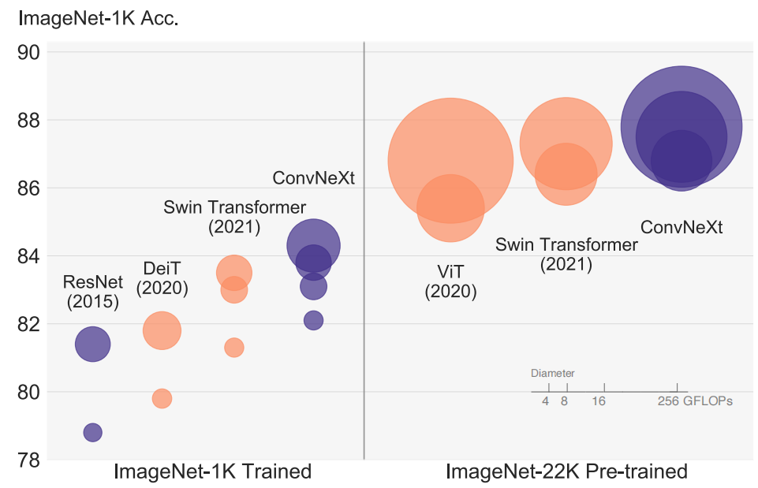 
Figure 1. ImageNet-1K classification results for * ConvNets and ◦ vision Transformers. Each bubble’s area is proportional to FLOPs of a variant in a model family. ImageNet-1K/22K models here take 2242 /3842 images respectively. ResNet and ViT results were obtained with improved training procedures over the original papers.We demonstrate that a standard ConvNet model can achieve the same level of scalability as hierarchical vision Transformers while being much simpler in design. 
图1。ConvNets 和 Vit。每个气泡的面积与模型族中某个变体的FLOP成比例。ImageNet-1K/22K模型在此分别取2242/3842张图像。与原始论文相比，ResNet和ViT结果是通过改进的训练程序获得的。我们证明，标准ConvNet模型可以实现与分级ViT相同的可扩展性水平，同时设计更简单。

The full dominance of ConvNets in computer vision was not a coincidence: in many application scenarios, a “sliding window” strategy is intrinsic to visual processing, particularly when working with high-resolution images. ConvNets have several built-in inductive biases that make them wellsuited to a wide variety of computer vision applications. The most important one is translation equivariance, which is a desirable property for tasks like objection detection. ConvNets are also inherently efficient due to the fact that when used in a sliding-window manner, the computations are shared [62]. For many decades, this has been the default use of ConvNets, generally on limited object categories such as digits [43], faces [58, 76] and pedestrians [19, 63]. Entering the 2010s, the region-based detectors [23, 24, 27, 57] further elevated ConvNets to the position of being the fundamental building block in a visual recognition system.

ConvNets在计算机视觉中的完全主导地位并非巧合：在许多应用场景中，“滑动窗口”策略是视觉处理的固有策略，尤其是在处理高分辨率图像时。ConvNets有几个内置的归纳偏差，使其非常适合各种计算机视觉应用。其中最重要的一个是平移等变性，这是像异议检测这样的任务所需要的特性。ConvNets也具有固有的效率，因为当以滑动窗口方式使用时，计算是共享的[62]。几十年来，这一直是ConvNets的默认用法，通常用于有限的对象类别，如数字[43]、面部[58、76]和行人[19、63]。进入2010年代，基于区域的检测器[23，24，27，57]进一步将ConvNets提升到视觉识别系统中的基本构建块的位置。

Around the same time, the odyssey of neural network design for natural language processing (NLP) took a very different path, as the Transformers replaced recurrent neural networks to become the dominant backbone architecture. Despite the disparity in the task of interest between language and vision domains, the two streams surprisingly converged in the year 2020, as the introduction of Vision Transformers (ViT) completely altered the landscape of network architecture design. Except for the initial “patchify” layer, which splits an image into a sequence of patches, ViT introduces no image-specific inductive bias and makes minimal changes to the original NLP Transformers. One primary focus of ViT is on the scaling behavior: with the help of larger model and dataset sizes, Transformers can outperform standard ResNets by a significant margin. Those results on image classification tasks are inspiring, but computer vision is not limited to image classification. As discussed previously, solutions to numerous computer vision tasks in the past decade depended significantly on a sliding-window, fullyconvolutional paradigm. Without the ConvNet inductive biases, a vanilla ViT model faces many challenges in being adopted as a generic vision backbone. The biggest challenge is ViT’s global attention design, which has a quadratic complexity with respect to the input size. This might be acceptable for ImageNet classification, but quickly becomes intractable with higher-resolution inputs.

大约在同一时间，自然语言处理(NLP)的神经网络设计之路走了一条截然不同的道路，因为Transformer取代了循环神经网络，成为主导的主干架构。尽管语言和视觉领域在感兴趣的任务上存在差异，但随着ViT的引入彻底改变了网络架构设计的格局，这两股潮流在2020年出人意料地汇合。除了最初的“分块”层(将图像分割成一系列分块)，ViT没有引入图像特定的归纳偏差，并对原始NLPTransformer进行了最小的更改。ViT的一个主要关注点是缩放行为：借助于更大的模型和数据集大小，Transformers可以大大超过标准ResNets。这些图像分类任务的结果令人鼓舞，但计算机视觉并不局限于图像分类。如前所述，在过去十年中，许多计算机视觉任务的解决方案在很大程度上依赖于滑动窗口、完整的解决方案范例。如果没有ConvNet的归纳偏差，一个普通的ViT模型在被用作通用视觉主干时面临许多挑战。最大的挑战是ViT的全局注意力设计，其输入大小具有二次复杂性。这对于ImageNet分类来说可能是可以接受的，但对于更高分辨率的输入很快就会变得难以处理。

Hierarchical Transformers employ a hybrid approach to bridge this gap. For example, the “sliding window” strategy (e.g. attention within local windows) was reintroduced to Transformers, allowing them to behave more similarly to ConvNets. Swin Transformer [45] is a milestone work in this direction, demonstrating for the first time that Transformers can be adopted as a generic vision backbone and achieve state-of-the-art performance across a range of computer vision tasks beyond image classification. Swin Transformer’s success and rapid adoption also revealed one thing: the essence of convolution is not becoming irrelevant; rather, it remains much desired and has never faded.

分级Transformer采用混合方法弥补这一差距。例如，“滑动窗口”策略(例如，在局部窗口内的注意力)被重新引入Transformer，使它们的行为更类似于ConvNets。Swin-Transformer[45]是这一方向的里程碑式工作，首次证明了Transformer可以作为通用视觉主干，并在图像分类之外的一系列计算机视觉任务中实现最先进的性能。Swin-Transformer的成功和快速采用也揭示了一件事：卷积的本质并没有变得无关紧要; 相反，它仍然备受期待，从未褪色。

Under this perspective, many of the advancements of Transformers for computer vision have been aimed at bringing back convolutions. These attempts, however, come at a cost: a naive implementation of sliding window selfattention can be expensive [55]; with advanced approaches such as cyclic shifting [45], the speed can be optimized but the system becomes more sophisticated in design. On the other hand, it is almost ironic that a ConvNet already satisfies many of those desired properties, albeit in a straightforward, no-frills way. The only reason ConvNets appear to be losing steam is that (hierarchical) Transformers surpass them in many vision tasks, and the performance difference is usually attributed to the superior scaling behavior of Transformers, with multi-head self-attention being the key component.

从这个角度来看，Transformer在计算机视觉方面的许多进步都是为了恢复卷积。然而，这些尝试是有代价的：滑动窗口自注意力的朴素实现可能代价高昂[55]; 使用循环移位等先进方法[45]，可以优化速度，但系统的设计变得更加复杂。另一方面，几乎具有讽刺意味的是，ConvNet已经满足了许多所需的属性，尽管是以简单明了的方式。似乎ConvNets失去动力的唯一原因是(分级)Transformer在许多视觉任务中超过了它们，而性能差异通常归因于Transformer优越的缩放行为，其中多头自注意力是关键组成部分。

Unlike ConvNets, which have progressively improved over the last decade, the adoption of Vision Transformers was a step change. In recent literature, system-level comparisons (e.g. a Swin Transformer vs. a ResNet) are usually adopted when comparing the two. ConvNets and hierarchical vision Transformers become different and similar at the same time: they are both equipped with similar inductive biases, but differ significantly in the training procedure and macro/micro-level architecture design. In this work, we investigate the architectural distinctions between ConvNets and Transformers and try to identify the confounding variables when comparing the network performance. Our research is intended to bridge the gap between the pre-ViT and post-ViT eras for ConvNets, as well as to test the limits of what a pure ConvNet can achieve.

与ConvNets在过去十年中逐步改进不同，ViT的采用是一个进步。在最近的文献中，比较两者时通常采用系统级比较(例如Swin-Transformer与ResNet)。ConvNets和分级ViT同时变得不同和相似：它们都配备了相似的归纳偏差，但在训练程序和宏观/微观层次的架构设计上存在显著差异。在这项工作中，我们研究了ConvNets和Transformers之间的架构差异，并试图在比较网络性能时识别混杂变量。我们的研究旨在弥合ConvNets的前ViT时代和后ViT时代之间的差距，并测试纯ConvNet所能达到的极限。

To do this, we start with a standard ResNet (e.g. ResNet- 50) trained with an improved procedure. We gradually “modernize” the architecture to the construction of a hierarchical vision Transformer (e.g. Swin-T). Our exploration is directed by a key question: How do design decisions in Transformers impact ConvNets’ performance? We discover several key components that contribute to the performance difference along the way. As a result, we propose a family of pure ConvNets dubbed ConvNeXt. We evaluate ConvNeXts on a variety of vision tasks such as ImageNet classification [17], object detection/segmentation on COCO [44], and semantic segmentation on ADE20K [92]. Surprisingly, ConvNeXts, constructed entirely from standard ConvNet modules, compete favorably with Transformers in terms of accuracy, scalability and robustness across all major benchmarks. ConvNeXt maintains the efficiency of standard ConvNets, and the fully-convolutional nature for both training and testing makes it extremely simple to implement.

为了做到这一点，我们从标准ResNet(例如ResNet-50)开始，通过改进的程序进行训练。我们逐步将架构“现代化”，以构建分层的ViT(如Swin-T)。我们的探索由一个关键问题指导：Transformer的设计决策如何影响ConvNets的性能？我们发现了导致性能差异的几个关键组件。因此，我们提出了一个称为ConvNeXt的纯ConvNets家族。我们在各种视觉任务上评估ConvNeXts，如ImageNet分类[17]、COCO上的目标检测/分割[44]和ADE20K上的语义分割[92]。令人惊讶的是，完全由标准ConvNet模块构建的ConvNeXts在所有主要基准测试中的准确性、可扩展性和稳健性方面都与Transformers竞争。ConvNeXt保持了标准ConvNets的效率，训练和测试的完全卷积特性使其实现极其简单。

We hope the new observations and discussions can challenge some common beliefs and encourage people to rethink the importance of convolutions in computer vision.

我们希望新的观察和讨论能够挑战一些共同的信念，鼓励人们重新思考卷积在计算机视觉中的重要性。

## 2. Modernizing a ConvNet: a Roadmap 现代化 ConvNet：路线图
In this section, we provide a trajectory going from a ResNet to a ConvNet that bears a resemblance to Transformers. We consider two model sizes in terms of FLOPs, one is the ResNet-50 / Swin-T regime with FLOPs around 4.5×109 and the other being ResNet-200 / Swin-B regime which has FLOPs around 15.0 × 109 . For simplicity, we will present the results with the ResNet-50 / Swin-T complexity models. The conclusions for higher capacity models are consistent and results can be found in Appendix C.

在本节中，我们提供了从ResNet到ConvNet的轨迹，该轨迹与Transformer相似。我们根据FLOP考虑了两种模型大小，一种是具有约4.5×109 FLOP的ResNet-50/Swin-T方案，另一种是FLOP约15.0×109的ResNet-200/Swin-B方案。为了简单起见，我们将使用ResNet-50/Swin-T复杂度模型展示结果。高容量模型的结论是一致的，结果见附录C。

At a high level, our explorations are directed to investigate and follow different levels of designs from a Swin Transformer while maintaining the network’s simplicity as a standard ConvNet. The roadmap of our exploration is as follows. Our starting point is a ResNet-50 model. We first train it with similar training techniques used to train vision Transformers and obtain much improved results compared to the original ResNet-50. This will be our baseline. We then study a series of design decisions which we summarized as 1) macro design, 2) ResNeXt, 3) inverted bottleneck, 4) large kernel size, and 5) various layer-wise micro designs. In Figure 2, we show the procedure and the results we are able to achieve with each step of the “network modernization”. Since network complexity is closely correlated with the fi- nal performance, the FLOPs are roughly controlled over the course of the exploration, though at intermediate steps the FLOPs might be higher or lower than the reference models. All models are trained and evaluated on ImageNet-1K.

在高层次上，我们的探索旨在调查和遵循Swin-Transformer的不同设计级别，同时保持网络作为标准ConvNet的简单性。我们探索的路线图如下。我们的出发点是ResNet-50模型。我们首先使用用于训练ViT的类似训练技术对其进行训练，并获得与原始ResNet-50相比大幅改进的结果。这将是我们的基线。然后，我们研究了一系列设计决策，总结为1)宏观设计，2)ResNeXt，3)反向瓶颈，4)大内核大小，5)各种分层微观设计。在图2中，我们展示了“网络现代化”的每一步所能实现的过程和结果。由于网络复杂性与最终性能密切相关，因此在勘探过程中，FLOP大致受到控制，尽管在中间阶段，FLOP可能高于或低于参考模型。所有模型都在ImageNet-1K上进行训练和评估。

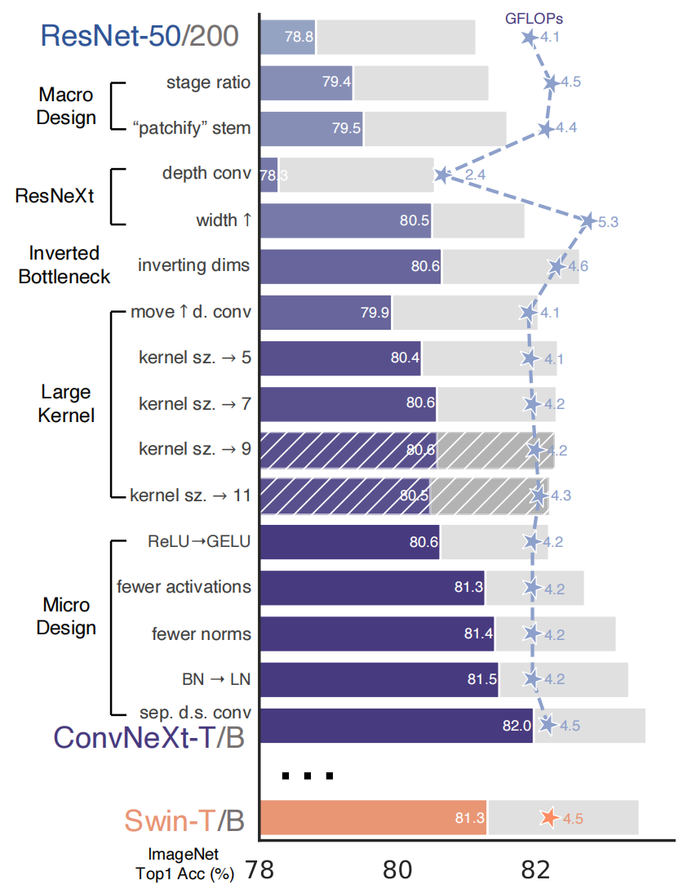 
Figure 2. We modernize a standard ConvNet (ResNet) towards the design of a hierarchical vision Transformer (Swin), without introducing any attention-based modules. The foreground bars are model accuracies in the ResNet-50/Swin-T FLOP regime; results for the ResNet-200/Swin-B regime are shown with the gray bars. A hatched bar means the modification is not adopted. Detailed results for both regimes are in the appendix. Many Transformer architectural choices can be incorporated in a ConvNet, and they lead to increasingly better performance. In the end, our pure ConvNet model, named ConvNeXt, can outperform the Swin Transformer. 

图2:我们将标准ConvNet(ResNet)现代化，以设计分层ViT(Swin)，而不引入任何基于注意力的模块。前景条是ResNet-50/Swin-T FLOP方案中的模型精度; ResNet-200/Swin-B状态的结果用灰色条显示。阴影条表示未采用修改。两种制度的详细结果见附录。许多Transformer架构选择都可以合并到ConvNet中，它们会带来越来越好的性能。最终，我们的纯ConvNet模型，名为ConvNeXt，可以胜过Swin-Transformer。

### 2.1. Training Techniques 训练技巧
Apart from the design of the network architecture, the training procedure also affects the ultimate performance. Not only did vision Transformers bring a new set of modules and architectural design decisions, but they also introduced different training techniques (e.g. AdamW optimizer) to vision. This pertains mostly to the optimization strategy and associated hyper-parameter settings. Thus, the first step of our exploration is to train a baseline model with the vision Transformer training procedure, in this case, ResNet- 50/200. Recent studies [7, 81] demonstrate that a set of modern training techniques can significantly enhance the performance of a simple ResNet-50 model. In our study, we use a training recipe that is close to DeiT’s [73] and Swin Transformer’s [45]. The training is extended to 300 epochs from the original 90 epochs for ResNets. We use the AdamW optimizer [46], data augmentation techniques such as Mixup [90], Cutmix [89], RandAugment [14], Random Erasing [91], and regularization schemes including Stochastic Depth [36] and Label Smoothing [69]. The complete set of hyper-parameters we use can be found in Appendix A.1. By itself, this enhanced training recipe increased the performance of the ResNet-50 model from 76.1% [1] to 78.8% (+2.7%), implying that a significant portion of the performance difference between traditional ConvNets and vision Transformers may be due to the training techniques. We will use this fixed training recipe with the same hyperparameters throughout the “modernization” process. Each reported accuracy on the ResNet-50 regime is an average obtained from training with three different random seeds.

除了网络架构的设计之外，训练过程也会影响最终性能。ViT不仅带来了一组新的模块和架构设计决策，还为视觉引入了不同的训练技术(例如AdamW优化器)。这主要涉及优化策略和相关的超参数设置。因此，我们探索的第一步是使用ViT训练程序(在本例中为ResNet-50/200)训练基线模型。最近的研究[7，81]表明，一套现代训练技术可以显著提高简单ResNet-50模型的性能。在我们的研究中，我们使用的训练配置接近于DeiT的[73]和Swin-Transformer的[45]。训练从ResNets最初的90个阶段扩展到300个阶段。我们使用AdamW优化器[46]，数据增广技术，如Mixep[90]、Cutmix[89]、RandAugment[14]、随机擦除[91]，以及正则化方案，包括随机深度[36]和标签平滑[69]。我们使用的整套超参数见附录A.1。就其本身而言，这种增强的训练配置将ResNet-50模型的性能从76.1%[1]提高到78.8%(+2.7%)，这意味着传统ConvNets和ViT之间的性能差异很大一部分可能是由于训练技术。我们将在整个“现代化”过程中使用具有相同超参数的固定训练配置。ResNet-50方案的每个报告精度是通过使用三种不同的随机种子进行训练获得的平均值。

### 2.2. Macro Design 宏观设计
We now analyze Swin Transformers’ macro network design. Swin Transformers follow ConvNets [28, 65] to use a multi-stage design, where each stage has a different feature map resolution. There are two interesting design considerations: the stage compute ratio, and the “stem cell” structure.

我们现在分析Swin-Transformers的宏观网络设计。Swin-Transformers遵循ConvNets[28，65]使用多级设计，其中每个阶段具有不同的特征图分辨率。有两个有趣的设计考虑：阶段计算比率和“干细胞”结构。

#### Changing stage compute ratio. 
The original design of the computation distribution across stages in ResNet was largely empirical. The heavy “res4” stage was meant to be compatible with downstream tasks like object detection, where a detector head operates on the 14×14 feature plane. Swin-T, on the other hand, followed the same principle but with a slightly different stage compute ratio of 1:1:3:1. For larger Swin Transformers, the ratio is 1:1:9:1. Following the design, we adjust the number of blocks in each stage from (3, 4, 6, 3) in ResNet-50 to (3, 3, 9, 3), which also aligns the FLOPs with Swin-T. This improves the model accuracy from 78.8% to 79.4%. Notably, researchers have thoroughly investigated the distribution of computation [53, 54], and a more optimal design is likely to exist. 

更改阶段计算比率。 ResNet中跨阶段的计算分布的最初设计主要是基于经验的。重型“res4”阶段旨在与目标检测等下游任务兼容，其中检测头在14×14特征平面上运行。另一方面，Swin-T遵循相同的原则，但阶段计算比例略有不同，为1:1:3:1。对于较大的Swin-Transformer，其比例为1:1:9:1。根据设计，我们将每个阶段的块数从ResNet-50中的(3，4，6，3)调整为(3，3，9，3)，这也将FLOP与Swin-T对齐。这将模型精度从78.8%提高到79.4%。值得注意的是，研究人员已经彻底研究了计算的分布[53，54]，并且可能存在更优化的设计。

From now on, we will use this stage compute ratio.

从现在起，我们将使用这个阶段计算比率。

#### Changing stem to “Patchify”. 
Typically, the stem cell design is concerned with how the input images will be processed at the network’s beginning. Due to the redundancy inherent in natural images, a common stem cell will aggressively downsample the input images to an appropriate feature map size in both standard ConvNets and vision Transformers. The stem cell in standard ResNet contains a 7×7 convolution layer with stride 2, followed by a max pool, which results in a 4× downsampling of the input images. In vision Transformers, a more aggressive “patchify” strategy is used as the stem cell, which corresponds to a large kernel size (e.g. kernel size = 14 or 16) and non-overlapping convolution. Swin Transformer uses a similar “patchify” layer, but with a smaller patch size of 4 to accommodate the architecture’s multi-stage design. We replace the ResNet-style stem cell with a patchify layer implemented using a 4×4, stride 4 convolutional layer. The accuracy has changed from 79.4% to 79.5%. This suggests that the stem cell in a ResNet may be substituted with a simpler “patchify” layer à la ViT which will result in similar performance.

将干细胞?改为“Patchify”。通常，干细胞设计关注的是在网络开始时如何处理输入图像。由于自然图像中固有的冗余，在标准ConvNets和ViT中，普通干细胞将积极地将输入图像降采样到适当的特征图大小。标准ResNet中的干细胞包含一个7×7的卷积层，步长为2，然后是一个最大池，这将导致输入图像的4×下采样。在ViT中，一种更具侵略性的“分块化”策略被用作干细胞，这对应于大的内核大小(例如内核大小=14或16)和非重叠卷积。Swin-Transformer使用了类似的“分块”层，但分块大小较小，为4，以适应架构的多阶段设计。我们将ResNet样式的干细胞替换为使用4×4、步长4卷积层实现的分块层。精度从79.4%变为79.5%。这表明ResNet中的干细胞可能被更简单的“patchify”层替代，这将导致类似的性能。

We will use the “patchify stem” (4×4 non-overlapping convolution) in the network.

我们将在网络中使用“patchify stem”(4×4非重叠卷积)。

### 2.3. ResNeXt-ify
In this part, we attempt to adopt the idea of ResNeXt [87], which has a better FLOPs/accuracy trade-off than a vanilla ResNet. The core component is grouped convolution, where the convolutional filters are separated into different groups. At a high level, ResNeXt’s guiding principle is to “use more groups, expand width”. More precisely, ResNeXt employs grouped convolution for the 3×3 conv layer in a bottleneck block. As this significantly reduces the FLOPs, the network width is expanded to compensate for the capacity loss.

在这一部分中，我们尝试采用ResNeXt[87]的思想，它比普通ResNet具有更好的FLOP/准确性权衡。核心组件是分组卷积，其中卷积滤波器被分成不同的组。在高层次上，ResNeXt的指导原则是“使用更多组，扩大宽度”。更准确地说，ResNeXt对瓶颈块中的3×3卷积层采用分组卷积。由于这显著减少了FLOP，网络宽度被扩展以补偿容量损失。

In our case we use depthwise convolution, a special case of grouped convolution where the number of groups equals the number of channels. Depthwise conv has been popularized by MobileNet [34] and Xception [11]. We note that depthwise convolution is similar to the weighted sum operation in self-attention, which operates on a per-channel basis, i.e., only mixing information in the spatial dimension.The combination of depthwise conv and 1 × 1 convs leads to a separation of spatial and channel mixing, a property shared by vision Transformers, where each operation either mixes information across spatial or channel dimension, but not both. The use of depthwise convolution effectively reduces the network FLOPs and, as expected, the accuracy. Following the strategy proposed in ResNeXt, we increase the network width to the same number of channels as Swin-T’s (from 64 to 96). This brings the network performance to 80.5% with increased FLOPs (5.3G).

在我们的例子中，我们使用深度卷积，这是分组卷积的一种特殊情况，其中组的数量等于信道的数量。MobileNet[34]和Xception[11]已经推广了深度卷积。我们注意到，深度卷积类似于自注意力中的加权和运算，它基于每个信道进行操作，即仅在空间维度上混合信息。深度卷积和1×1卷积的组合导致空间和信道混合的分离，这是ViT共享的属性，其中每个操作在空间维度或信道维度上混合信息，但不是两者都混合。深度卷积的使用有效地降低了网络FLOP，正如预期的那样，降低了精度。根据ResNeXt中提出的策略，我们将网络宽度增加到与Swin-T相同的信道数量(从64个增加到96个)。这使网络性能达到80.5%，FLOP增加(5.3G)。

We will now employ the ResNeXt design.

我们现在将采用ResNeXt设计。

### 2.4. Inverted Bottleneck 倒置瓶颈
One important design in every Transformer block is that it creates an inverted bottleneck, i.e., the hidden dimension of the MLP block is four times wider than the input dimension (see Figure 4). Interestingly, this Transformer design is connected to the inverted bottleneck design with an expansion ratio of 4 used in ConvNets. The idea was popularized by MobileNetV2 [61], and has subsequently gained traction in several advanced ConvNet architectures [70, 71].

每个Transformer块中的一个重要设计是它创建了一个反向瓶颈，即MLP块的隐藏维度比输入维度宽四倍(见图4)。有趣的是，此Transformer设计与ConvNets中使用的扩展比为4的反向瓶颈设计相关联。该想法由MobileNetV2[61]推广，随后在几个先进的ConvNet架构中获得了关注[70，71]。

Here we explore the inverted bottleneck design. Figure 3 (a) to (b) illustrate the configurations. Despite the increased FLOPs for the depthwise convolution layer, this change reduces the whole network FLOPs to 4.6G, due to the significant FLOPs reduction in the downsampling residual blocks’ shortcut 1×1 conv layer. Interestingly, this results in slightly improved performance (80.5% to 80.6%). In the ResNet-200 / Swin-B regime, this step brings even more gain (81.9% to 82.6%) also with reduced FLOPs.

在这里，我们探讨反向瓶颈设计。图3(a)至(b)说明了配置。尽管深度卷积层的FLOP有所增加，但由于下采样残差块的捷径1×1卷积层中的FLOP显著减少，这一变化将整个网络FLOP降低到4.6G。有趣的是，这导致性能略有改善(80.5%至80.6%)。在ResNet-200/Swin-B方案中，这一步骤还带来了更多的增益(81.9%至82.6%)，同时FLOP也有所降低。

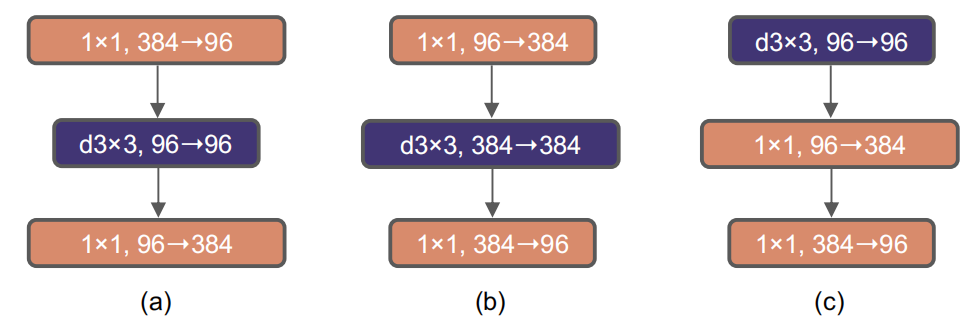 
Figure 3. Block modifications and resulted specifications. (a) is a ResNeXt block; in (b) we create an inverted bottleneck block and in (c) the position of the spatial depthwise conv layer is moved up. 
图3。块修改和结果规范。(a) 是ResNeXt块; 在(b)中，我们创建了一个倒置的瓶颈块，在(c)中，空间深度卷积层的位置被上移。

We will now use inverted bottlenecks.

我们现在将使用反向瓶颈。

### 2.5. Large Kernel Sizes
In this part of the exploration, we focus on the behavior of large convolutional kernels. One of the most distinguishing aspects of vision Transformers is their non-local self-attention, which enables each layer to have a global receptive field. While large kernel sizes have been used in the past with ConvNets [40, 68], the gold standard (popularized by VGGNet [65]) is to stack small kernel-sized (3×3) conv layers, which have efficient hardware implementations on modern GPUs [41]. Although Swin Transformers reintroduced the local window to the self-attention block, the window size is at least 7×7, significantly larger than the ResNe(X)t kernel size of 3×3. Here we revisit the use of large kernel-sized convolutions for ConvNets.

在本部分的探索中，我们将重点放在大型卷积核的行为上。ViTs最显著的一个方面是他们的非局部自注意力，这使得每一层都有一个全局的感受场。虽然过去ConvNets[40,68]使用了大内核大小，但黄金标准(由VGGNet[65]推广)是堆叠小内核大小(3×3)的conv层，这些层在现代GPU上具有高效的硬件实现[41]。尽管Swin-Transformers将局部窗口重新引入了自注意力块，但窗口大小至少为7×7，明显大于ResNe(X)t内核的3×3。在这里，我们再次讨论ConvNets中使用大型内核大小的卷积。

#### Moving up depthwise conv layer. 
To explore large kernels, one prerequisite is to move up the position of the depthwise conv layer (Figure 3 (b) to (c)). That is a design decision also evident in Transformers: the MSA block is placed prior to the MLP layers. As we have an inverted bottleneck block, this is a natural design choice — the complex/inefficient modules (MSA, large-kernel conv) will have fewer channels, while the efficient, dense 1×1 layers will do the heavy lifting. This intermediate step reduces the FLOPs to 4.1G, resulting in a temporary performance degradation to 79.9%.

向上移动深度卷积层。要探索大型内核，一个先决条件是向上移动深度卷积层的位置(图3(b)至(c))。这一设计决策在Transformer中也很明显：MSA块放在MLP层之前。由于我们有一个倒置的瓶颈块，这是一个自然的设计选择 —— 复杂/低效的模块(MSA，大型内核conv)将具有更少的通道，而高效、密集的1×1层将完成繁重的工作。这一中间步骤将FLOP降低到4.1G，导致暂时性能下降到79.9%。

#### Increasing the kernel size. 
With all of these preparations, the benefit of adopting larger kernel-sized convolutions is sig- nificant. We experimented with several kernel sizes, including 3, 5, 7, 9, and 11. The network’s performance increases from 79.9% (3×3) to 80.6% (7×7), while the network’s FLOPs stay roughly the same. Additionally, we observe that the benefit of larger kernel sizes reaches a saturation point at 7×7. We verified this behavior in the large capacity model too: a ResNet-200 regime model does not exhibit further gain when we increase the kernel size beyond 7×7.

增加内核大小。有了所有这些准备工作，采用更大的内核大小卷积的好处是显著的。我们尝试了几种内核大小，包括3、5、7、9和11。网络的性能从79.9%(3×3)提高到80.6%(7×7)，而网络的FLOP保持大致相同。此外，我们观察到较大内核大小的好处在7×7时达到饱和点。我们也在大容量模型中验证了这种行为：当我们将内核大小增加到7×。

We will use 7×7 depthwise conv in each block.

我们将在每个区块中使用7×7深度的卷积。

At this point, we have concluded our examination of network architectures on a macro scale. Intriguingly, a significant portion of the design choices taken in a vision Transformer may be mapped to ConvNet instantiations.

在这一点上，我们已经结束了对宏观网络架构的研究。有趣的是，ViT中的大部分设计选择可以映射到ConvNet实例。

### 2.6. Micro Design 微观设计
In this section, we investigate several other architectural differences at a micro scale — most of the explorations here are done at the layer level, focusing on specific choices of activation functions and normalization layers.

在本节中，我们将在微观层面上研究其他几个架构差异 —— 这里的大多数探索都是在层层面上完成的，重点是激活函数和归一化层的具体选择。

#### Replacing ReLU with GELU 
One discrepancy between NLP and vision architectures is the specifics of which activation functions to use. Numerous activation functions have been developed over time, but the Rectified Linear Unit (ReLU) [49] is still extensively used in ConvNets due to its simplicity and efficiency. ReLU is also used as an activation function in the original Transformer paper [77]. The Gaussian Error Linear Unit, or GELU [32], which can be thought of as a smoother variant of ReLU, is utilized in the most advanced Transformers, including Google’s BERT [18] and OpenAI’s GPT-2 [52], and, most recently, ViTs. We find that ReLU can be substituted with GELU in our ConvNet too, although the accuracy stays unchanged (80.6%).

用GELU替换ReLU。NLP和视觉架构之间的一个差异是使用哪些激活函数的细节。随着时间的推移，已经开发了许多激活函数，但由于其简单和高效，整流线性单元(ReLU)[49]仍在ConvNets中广泛使用。ReLU也被用作原始Transformer论文[77]中的激活函数。高斯误差线性单元(Gaussian Error Linear Unit，简称GELU[32])可以被认为是ReLU的一个更平滑的变体，被用于最先进的Transformer，包括谷歌的BERT[18]和OpenAI的GPT-2[52]，以及最近的ViT。我们发现，在我们的ConvNet中，ReLU也可以用GELU代替，尽管精度保持不变(80.6%)。

#### Fewer activation functions. 
One minor distinction between a Transformer and a ResNet block is that Transformers have fewer activation functions. Consider a Transformer block with key/query/value linear embedding layers, the projection layer, and two linear layers in an MLP block. There is only one activation function present in the MLP block. In comparison, it is common practice to append an activation function to each convolutional layer, including the 1 × 1 convs. Here we examine how performance changes when we stick to the same strategy. As depicted in Figure 4, we eliminate all GELU layers from the residual block except for one between two 1 × 1 layers, replicating the style of a Transformer block. This process improves the result by 0.7% to 81.3%, practically matching the performance of Swin-T.

更少的激活函数。Transformer和ResNet块之间的一个小区别是Transformer具有较少的激活函数。考虑具有键/查询/值线性嵌入层、投影层和MLP块中的两个线性层的Transformer块。MLP块中只有一个激活函数。相比之下，通常的做法是将激活函数附加到每个卷积层，包括1×1卷积。在这里，我们将研究当我们坚持相同的策略时，性能如何变化。如图4所示，除了两个1×1层之间的一层外，我们从残差块中删除了所有GELU层，复制了Transformer块的样式。该过程将结果提高了0.7%至81.3%，实际上与Swin-T的性能相匹配。

We will now use a single GELU activation in each block.

我们现在将在每个块中使用单个GELU激活。

#### Fewer normalization layers. 
Transformer blocks usually have fewer normalization layers as well. Here we remove two BatchNorm (BN) layers, leaving only one BN layer before the conv 1 × 1 layers. This further boosts the performance to 81.4%, already surpassing Swin-T’s result. Note that we have even fewer normalization layers per block than Transformers, as empirically we find that adding one additional BN layer at the beginning of the block does not improve the performance.

更少的归一化层。Transformer块通常也具有较少的归一化层。这里我们删除了两个BatchNorm(BN)层，在conv 1×1层之前只留下一个BN层。这进一步将性能提高到81.4%，已经超过了Swin-T的结果。注意，我们每个块的归一化层甚至比Transformers更少，因为根据经验，我们发现在块的开头添加一个额外的BN层不会提高性能。

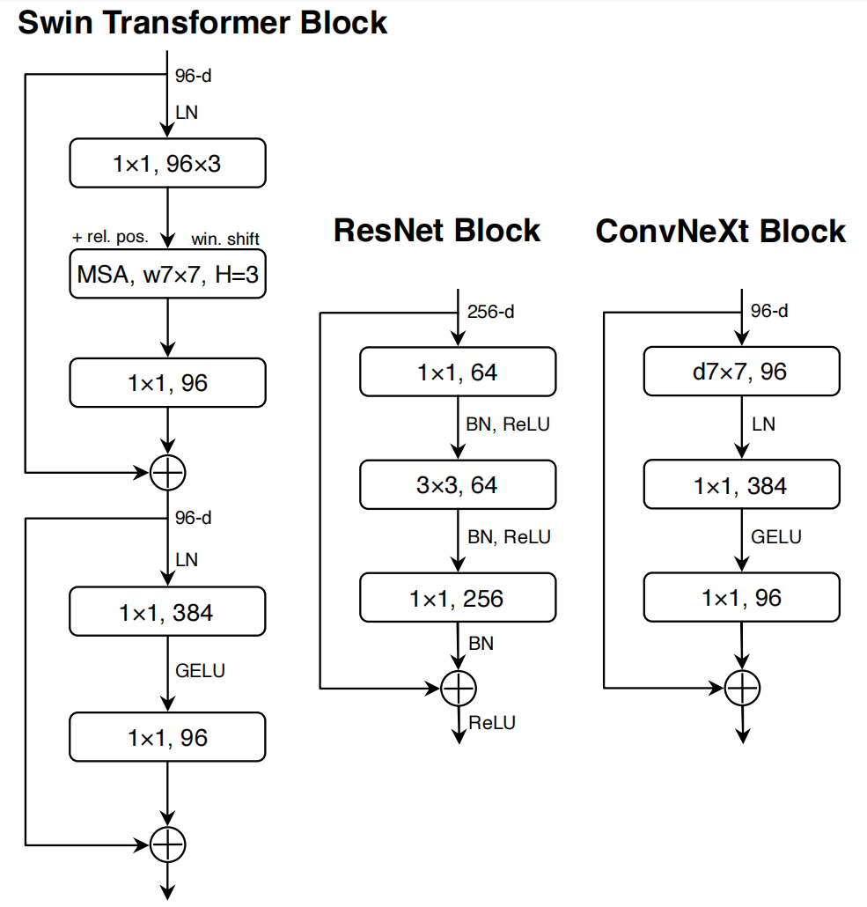 
Figure 4. Block designs for a ResNet, a Swin Transformer, and a ConvNeXt. Swin Transformer’s block is more sophisticated due to the presence of multiple specialized modules and two residual connections. For simplicity, we note the linear layers in Transformer MLP blocks also as “1×1 convs” since they are equivalent. 
图4。ResNet、Swin Transformer和ConvNeXt的模块设计。由于存在多个专用模块和两个残差连接，Swin Transformer的模块更加复杂。为了简单起见，我们注意到Transformer MLP块中的线性层也是“1×1卷积”，因为它们是等效的。

#### Substituting BN with LN.  
BatchNorm [38] is an essential component in ConvNets as it improves the convergence and reduces overfitting. However, BN also has many intricacies that can have a detrimental effect on the model’s performance [84]. There have been numerous attempts at developing alternative normalization [60, 75, 83] techniques, but BN has remained the preferred option in most vision tasks. On the other hand, the simpler Layer Normalization [5] (LN) has been used in Transformers, resulting in good performance across different application scenarios.

用LN代替BN。BatchNorm[38]是ConvNets中的一个重要组件，因为它提高了收敛性并减少了过度拟合。然而，BN也有许多复杂性，可能会对模型的性能产生不利影响[84]。在开发替代归一化[60，75，83]技术方面有很多尝试，但BN仍然是大多数视觉任务中的首选选项。另一方面，更简单的层归一化[5](LN)已用于Transformer中，从而在不同应用场景中获得了良好的性能。

Directly substituting LN for BN in the original ResNet will result in suboptimal performance [83]. With all the modifications in network architecture and training techniques, here we revisit the impact of using LN in place of BN. We observe that our ConvNet model does not have any difficulties training with LN; in fact, the performance is slightly better, obtaining an accuracy of 81.5%.

直接将LN替换为原始ResNet中的BN将导致次优性能[83]。随着网络架构和训练技术的所有修改，我们在这里重新审视了使用LN代替BN的影响。我们观察到，我们的ConvNet模型在使用LN进行训练时没有任何困难; 事实上，性能稍好，精度为81.5%。

From now on, we will use one LayerNorm as our choice of normalization in each residual block.

从现在起，我们将在每个残差块中使用一个LayerNorm作为归一化的选择。

#### Separate downsampling layers. 
In ResNet, the spatial downsampling is achieved by the residual block at the start of each stage, using 3×3 conv with stride 2 (and 1×1 conv with stride 2 at the shortcut connection). In Swin Transformers, a separate downsampling layer is added between stages. We explore a similar strategy in which we use 2×2 conv layers with stride 2 for spatial downsampling. This modification surprisingly leads to diverged training. Further investigation shows that, adding normalization layers wherever spatial resolution is changed can help stablize training. These include several LN layers also used in Swin Transformers: one before each downsampling layer, one after the stem, and one after the final global average pooling. We can improve the accuracy to 82.0%, significantly exceeding Swin-T’s 81.3%.

单独的下采样层。在ResNet中，空间下采样是通过每个阶段开始时的残差块实现的，使用3×3和步幅2的卷积(以及1×1 conv和快捷连接处的步幅2)。在Swin Transformers中，在阶段之间添加了单独的下采样层。我们探索了一种类似的策略，其中我们使用2×。这种修改令人惊讶地导致了不同的训练。进一步的研究表明，在空间分辨率改变的地方添加归一化层可以帮助稳定训练。其中包括在Swin Transformers中也使用的几个LN层：一个在每个下采样层之前，一个在stem之后，一个是在最终的全局平均池之后。我们可以将精度提高到82.0%，大大超过Swin-T的81.3%。

We will use separate downsampling layers. This brings us to our final model, which we have dubbed ConvNeXt. A comparison of ResNet, Swin, and ConvNeXt block structures can be found in Figure 4. 

我们将使用单独的下采样层。这就给我们带来了最终的模型，我们称之为ConvNeXt。ResNet、Swin和ConvNeXt块结构的比较见图4。

A comparison of ResNet-50, Swin-T and ConvNeXt-T’s detailed architecture specifications can be found in Table 9.

表9对ResNet-50、Swin-T和ConvNeXt-T的详细架构规范进行了比较。

#### Closing remarks. 
We have finished our first “playthrough” and discovered ConvNeXt, a pure ConvNet, that can outperform the Swin Transformer for ImageNet-1K classification in this compute regime. It is worth noting that all design choices discussed so far are adapted from vision Transformers. In addition, these designs are not novel even in the ConvNet literature — they have all been researched separately, but not collectively, over the last decade. Our ConvNeXt model has approximately the same FLOPs, #params., throughput, and memory use as the Swin Transformer, but does not require specialized modules such as shifted window attention or relative position biases.

闭幕词。我们已经完成了我们的第一次“试玩”，并发现了ConvNeXt，一种纯ConvNet，在这种计算机制中，它可以超过用于ImageNet-1K分类的Swin-Transformer。值得注意的是，迄今为止讨论的所有设计选择均改编自ViTs。此外，即使在ConvNet文献中，这些设计也并不新颖 —— 在过去十年中，它们都是单独研究的，但不是集体研究的。我们的ConvNeXt模型具有大致相同的FLOP，但不需要专门的模块，例如迁移窗口注意力或相对位置偏差。

These findings are encouraging but not yet completely convincing — our exploration thus far has been limited to a small scale, but vision Transformers’ scaling behavior is what truly distinguishes them. Additionally, the question of whether a ConvNet can compete with Swin Transformers on downstream tasks such as object detection and semantic segmentation is a central concern for computer vision practitioners. In the next section, we will scale up our ConvNeXt models both in terms of data and model size, and evaluate them on a diverse set of visual recognition tasks.

这些发现令人鼓舞，但尚未完全令人信服——迄今为止，我们的探索仅限于小规模，但ViTs的缩放行为才是它们真正的区别。此外，ConvNet能否在诸如目标检测和语义分割等下游任务上与Swin Transformers竞争是计算机视觉从业者关注的焦点。在下一节中，我们将在数据和模型大小方面放大ConvNeXt模型，并在一组不同的视觉识别任务中对其进行评估。

## 3. Empirical Evaluations on ImageNet ImageNet上的经验评估
We construct different ConvNeXt variants, ConvNeXtT/S/B/L, to be of similar complexities to Swin-T/S/B/L [45]. ConvNeXt-T/B is the end product of the “modernizing” procedure on ResNet-50/200 regime, respectively. In addition, we build a larger ConvNeXt-XL to further test the scalability of ConvNeXt. The variants only differ in the number of channels C, and the number of blocks B in each stage.

我们构建了不同的ConvNeXt变体，即ConvNeXtT/S/B/L，其复杂性与Swin-T/S/B/L相似[45]。ConvNeXt-T/B分别是ResNet-50/200系统“现代化”程序的最终产品。此外，我们构建了一个更大的ConvNeXt XL，以进一步测试ConvNeXt的可扩展性。这些变体仅在每个阶段中通道C的数量和块B的数量上不同。

Following both ResNets and Swin Transformers, the number of channels doubles at each new stage. We summarize the configurations below:

继ResNets和Swin Transformers之后，每个新阶段的频道数量都会翻倍。我们总结了以下配置：

* ConvNeXt-T: C = (96, 192, 384, 768), B = (3, 3, 9, 3)
* ConvNeXt-S: C = (96, 192, 384, 768), B = (3, 3, 27, 3)
* ConvNeXt-B: C = (128, 256, 512, 1024), B = (3, 3, 27, 3)
* ConvNeXt-L: C = (192, 384, 768, 1536), B = (3, 3, 27, 3)
* ConvNeXt-XL: C = (256, 512, 1024, 2048), B = (3, 3, 27, 3)

### 3.1. Settings
The ImageNet-1K dataset consists of 1000 object classes with 1.2M training images. We report ImageNet-1K top-1 accuracy on the validation set. We also conduct pre-training on ImageNet-22K, a larger dataset of 21841 classes (a superset of the 1000 ImageNet-1K classes) with ∼14M images for pre-training, and then fine-tune the pre-trained model on ImageNet-1K for evaluation. We summarize our training setups below. More details can be found in Appendix A.

ImageNet-1K数据集由1000个对象类和1.2M个训练图像组成。我们报告ImageNet-1K在验证集上的最高精度。我们还对ImageNet-22K进行预训练，这是一个21841个类(1000个ImageNet-1K类的超集)的更大数据集，具有~14M张图像用于预训练，然后在ImageNet-1K上微调预训练模型进行评估。我们将训练设置总结如下。更多详情见附录A。

#### Training on ImageNet-1K. 
We train ConvNeXts for 300 epochs using AdamW [46] with a learning rate of 4e-3. There is a 20-epoch linear warmup and a cosine decaying schedule afterward. We use a batch size of 4096 and a weight decay of 0.05. For data augmentations, we adopt common schemes including Mixup [90], Cutmix [89], RandAugment [14], and Random Erasing [91]. We regularize the networks with Stochastic Depth [37] and Label Smoothing [69]. Layer Scale [74] of initial value 1e-6 is applied. We use Exponential Moving Average (EMA) [51] as we find it alleviates larger models’ overfitting.

ImageNet-1K训练。我们使用AdamW[46]以4e-3的学习率训练ConvNeXts 300轮。有一个20轮的线性预热和一个余弦衰减时间表。我们使用的批量大小为4096，重量衰减为0.05。对于数据增广，我们采用了常见的方案，包括混合[90]、Cutmix[89]、RandAugment[14]和随机擦除[91]。我们使用随机深度[37]和标签平滑[69]对网络进行正则化。应用初始值1e-6的层比例[74]。我们使用指数移动平均(EMA)[51]，因为我们发现它减轻了较大模型的过度拟合。

#### Pre-training on ImageNet-22K. 
We pre-train ConvNeXts on ImageNet-22K for 90 epochs with a warmup of 5 epochs. We do not use EMA. Other settings follow ImageNet-1K.

ImageNet-22K预训练。我们在ImageNet-22K上预训练ConvNeXts 90个时期，预热5个时期。我们不使用EMA。其他设置遵循ImageNet-1K。

#### Fine-tuning on ImageNet-1K. 
We fine-tune ImageNet- 22K pre-trained models on ImageNet-1K for 30 epochs. We use AdamW, a learning rate of 5e-5, cosine learning rate schedule, layer-wise learning rate decay [6, 12], no warmup, a batch size of 512, and weight decay of 1e-8. The default pre-training, fine-tuning, and testing resolution is 2242 . Additionally, we fine-tune at a larger resolution of 3842 , for both ImageNet-22K and ImageNet-1K pre-trained models.

对ImageNet-1K进行微调。我们对ImageNet-1K上的ImageNet-22K预训练模型进行了30个时期的微调。我们使用AdamW，学习速率为5e-5，余弦学习速率调度，逐层学习速率衰减[6，12]，无预热，批量大小为512，权重衰减为1e-8。默认的预训练、微调和测试分辨率为2242。此外，对于ImageNet-22K和ImageNet-1K预训练模型，我们以3842的更大分辨率进行微调。

Compared with ViTs/Swin Transformers, ConvNeXts are simpler to fine-tune at different resolutions, as the network is fully-convolutional and there is no need to adjust the input patch size or interpolate absolute/relative position biases.

与ViTs/Swin Transformer相比，ConvNeXts更容易在不同分辨率下进行微调，因为网络是完全卷积的，无需调整输入分块大小或插入绝对/相对位置偏差。

### 3.2. Results
#### ImageNet-1K. 
Table 1 (upper) shows the result comparison with two recent Transformer variants, DeiT [73] and Swin Transformers [45], as well as two ConvNets from architecture search - RegNets [54], EfficientNets [71] and EfficientNetsV2 [72]. ConvNeXt competes favorably with two strong ConvNet baselines (RegNet [54] and EfficientNet [71]) in terms of the accuracy-computation trade-off, as well as the inference throughputs. ConvNeXt also outperforms Swin Transformer of similar complexities across the board, sometimes with a substantial margin (e.g. 0.8% for ConvNeXt-T). Without specialized modules such as shifted windows or relative position bias, ConvNeXts also enjoy improved throughput compared to Swin Transformers.

ImageNet-1K。表1(上)显示了与两个最近的Transformer变体DeiT[73]和Swin Transformer[45]的结果比较，以及来自架构搜索的两个ConverNets RegNets[54]、EfficientNets[71]和EfficientNetsV2[72]。在精度计算权衡以及推理吞吐量方面，ConvNeXt与两个强大的ConvNet基线(RegNet[54]和EfficientNet[71])竞争优势。ConvNeXt在整体上也优于具有类似复杂性的Swin Transformer，有时具有可观的利润(例如，ConvNeXt-T为0.8%)。与Swin Transformers相比，ConvNeXts没有专门的模块(如移动窗口或相对位置偏差)，也可以提高吞吐量。

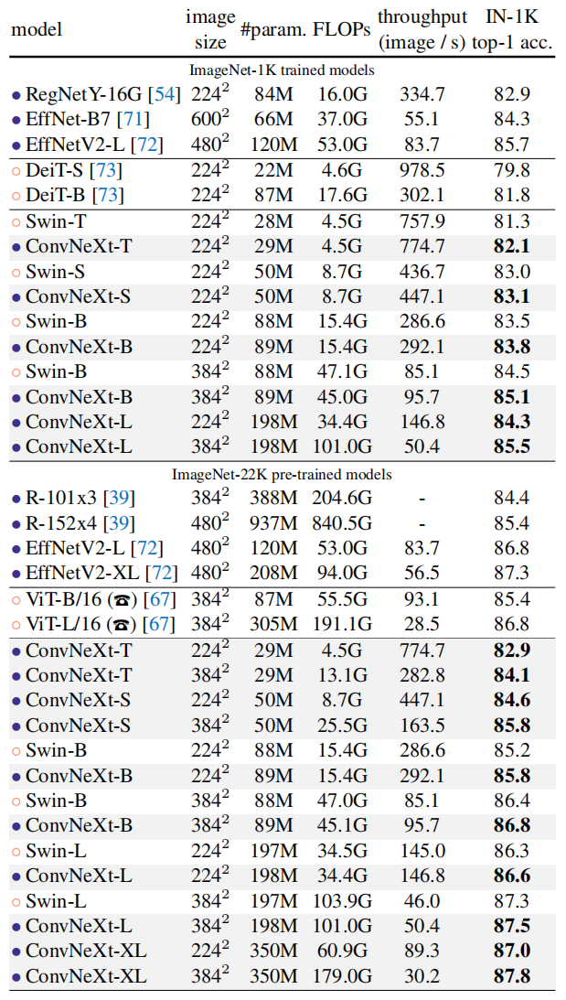 
Table 1. Classification accuracy on ImageNet-1K. Similar to Transformers, ConvNeXt also shows promising scaling behavior with higher-capacity models and a larger (pre-training) dataset. Inference throughput is measured on a V100 GPU, following [45]. On an A100 GPU, ConvNeXt can have a much higher throughput than Swin Transformer. See Appendix E. (T )ViT results with 90-epoch AugReg [67] training, provided through personal communication with the authors. 
表1。ImageNet-1K上的分类精度。与Transformer类似，ConvNeXt也显示了具有更高容量模型和更大(预训练)数据集的有前景的缩放行为。根据[45]，在V100 GPU上测量推断吞吐量。在A100 GPU上，ConvNeXt的吞吐量比Swin Transformer高得多。见附录E。(T)通过与作者的个人沟通提供的90期AugReg[67]训练的ViT结果。

A highlight from the results is ConvNeXt-B at 3842 : it outperforms Swin-B by 0.6% (85.1% vs. 84.5%), but with 12.5% higher inference throughput (95.7 vs. 85.1 image/s). We note that the FLOPs/throughput advantage of ConvNeXtB over Swin-B becomes larger when the resolution increases from 2242 to 3842 . Additionally, we observe an improved result of 85.5% when further scaling to ConvNeXt-L.

结果的一个亮点是ConvNeXt-B为3842：它优于Swin-B 0.6%(85.1%对84.5%)，但推理吞吐量高12.5%(95.7对85.1图像/秒)。我们注意到，当分辨率从2242增加到3842时，ConvNeXtB相对于Swin-B的FLOP/吞吐量优势变得更大。此外，当进一步缩放到ConvNeXt-L时，我们观察到85.5%的改进结果。

#### ImageNet-22K. 
We present results with models fine-tuned from ImageNet-22K pre-training at Table 1 (lower). These experiments are important since a widely held view is that vision Transformers have fewer inductive biases thus can perform better than ConvNets when pre-trained on a larger scale. Our results demonstrate that properly designed ConvNets are not inferior to vision Transformers when pre-trained with large dataset — ConvNeXts still perform on par or better than similarly-sized Swin Transformers, with slightly higher throughput. Additionally, our ConvNeXt-XL model achieves an accuracy of 87.8% — a decent improvement over ConvNeXt-L at 3842 , demonstrating that ConvNeXts are scalable architectures.

ImageNet-22K。我们在表1(下)中展示了从ImageNet-22K预训练中微调的模型的结果。这些实验很重要，因为人们普遍认为ViT具有较少的归纳偏差，因此在大规模预训练时可以比ConvNets表现得更好。我们的结果表明，当使用大数据集进行预训练时，设计得当的ConvNets并不比ViT差-ConvNeXts的性能仍然与类似大小的SwinTransformer相当或更好，吞吐量略高。此外，我们的ConvNeXt XL模型实现了87.8%的精度，比ConvNeXt-L的3842有了相当大的提高，证明了ConvNeXt是可扩展的架构。

On ImageNet-1K, EfficientNetV2-L, a searched architecture equipped with advanced modules (such as Squeeze-andExcitation [35]) and progressive training procedure achieves top performance. However, with ImageNet-22K pre-training, ConvNeXt is able to outperform EfficientNetV2, further demonstrating the importance of large-scale training.

在ImageNet-1K上，EfficientNetV2-L是一种搜索架构，配备了高级模块(如挤压和激励[35])和渐进式训练程序，实现了最高性能。然而，通过ImageNet-22K预训练，ConvNeXt能够超越EfficientNetV2，进一步证明了大规模训练的重要性。

In Appendix B, we discuss robustness and out-of-domain generalization results for ConvNeXt.

在附录B中，我们讨论了ConvNeXt的稳健性和域外泛化结果。

#### 3.3. Isotropic ConvNeXt vs. ViT  各向同性? ConvNeXt 与 ViT
In this ablation, we examine if our ConvNeXt block design is generalizable to ViT-style [20] isotropic architectures which have no downsampling layers and keep the same feature resolutions (e.g. 14×14) at all depths. We construct isotropic ConvNeXt-S/B/L using the same feature dimensions as ViT-S/B/L (384/768/1024). Depths are set at 18/18/36 to match the number of parameters and FLOPs. The block structure remains the same (Fig. 4). We use the supervised training results from DeiT [73] for ViT-S/B and MAE [26] for ViT-L, as they employ improved training procedures over the original ViTs [20]. ConvNeXt models are trained with the same settings as before, but with longer warmup epochs. Results for ImageNet-1K at 2242 resolution are in Table 2. We observe ConvNeXt can perform generally on par with ViT, showing that our ConvNeXt block design is competitive when used in non-hierarchical models. 

在本次消融中，我们检查了ConvNeXt块设计是否可推广到ViT型[20]各向同性架构，该架构没有下采样层，并在所有深度保持相同的特征分辨率(例如14×14)。我们使用与ViT-S/B/L(384/768/1024)相同的特征维度构建各向同性ConvNeXt-S/B/L。深度设置为18/18/36，以匹配参数和FLOP的数量。区块结构保持不变(图4)。我们使用ViT-S/B的DeiT[73]和ViT-L的MAE[26]的监督训练结果，因为它们采用了比原始ViT[20]更好的训练程序。ConvNeXt模型采用与之前相同的设置进行训练，但预热时间更长。2242分辨率下ImageNet-1K的结果见表2。我们观察到ConvNeXt的性能通常与ViT相当，这表明我们的ConvNeXt块设计在非分层模型中使用时具有竞争力。

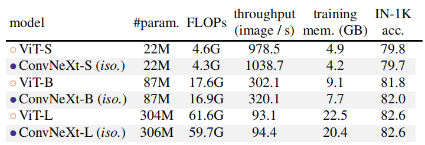 
Table 2. Comparing isotropic ConvNeXt and ViT. Training memory is measured on V100 GPUs with 32 per-GPU batch size. 
表2。比较各向同性ConvNeXt和ViT。训练内存在V100 GPU上测量，每GPU批处理大小为32。

## 4. Empirical Evaluation on Downstream Tasks 下游任务的经验评估
### Object detection and segmentation on COCO. 
We finetune Mask R-CNN [27] and Cascade Mask R-CNN [9] on the COCO dataset with ConvNeXt backbones. Following Swin Transformer [45], we use multi-scale training, AdamW optimizer, and a 3× schedule. Further details and hyperparameter settings can be found in Appendix A.3.

COCO上的目标检测和分割。我们使用ConvNeXt主干在COCO数据集上微调Mask R-CNN[27]和Cascade Mask R-CNN[9]。在Swin Transformer[45]之后，我们使用多尺度训练、AdamW优化器和3×调度。更多详情和超参数设置见附录A.3。

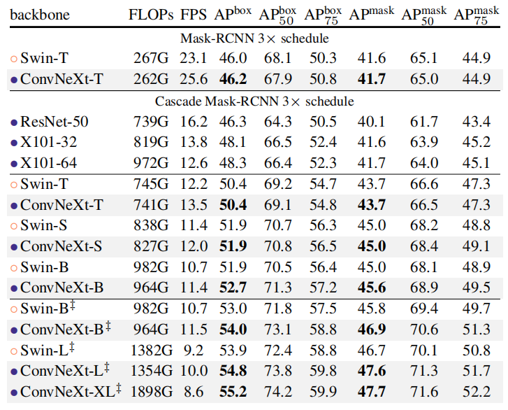 
Table 3. COCO object detection and segmentation results using Mask-RCNN and Cascade Mask-RCNN. ‡ indicates that the model is pre-trained on ImageNet-22K. ImageNet-1K pre-trained Swin results are from their Github repository [3]. AP numbers of the ResNet-50 and X101 models are from [45]. We measure FPS on an A100 GPU. FLOPs are calculated with image size (1280, 800).
表3。使用Mask-RCNN和级联Mask-RCNN的COCO目标检测和分割结果。‡指示模型在ImageNet-22K上预训练。ImageNet-1K预训练的Swin结果来自其Github存储库[3]。ResNet-50和X101模型的AP编号来自[45]。我们在A100 GPU上测量FPS。FLOP是用图像大小(1280800)计算的。

Table 3 shows object detection and instance segmentation results comparing Swin Transformer, ConvNeXt, and traditional ConvNet such as ResNeXt. Across different model complexities, ConvNeXt achieves on-par or better performance than Swin Transformer. When scaled up to bigger models (ConvNeXt-B/L/XL) pre-trained on ImageNet-22K, in many cases ConvNeXt is significantly better (e.g. +1.0 AP) than Swin Transformers in terms of box and mask AP.

表3显示了Swin Transformer、ConvNeXt和传统ConvNet(如ResNeXt)的目标检测和实例分割结果。在不同的模型复杂性中，ConvNeXt的性能与Swin Transformer相当或更好。当放大到在ImageNet-22K上预训练的更大模型(ConvNeXt-B/L/XL)时，在许多情况下，ConvNeXt在盒和掩模AP方面明显优于Swin Transformers(例如+1.0 AP)。

### Semantic segmentation on ADE20K. 
We also evaluate ConvNeXt backbones on the ADE20K semantic segmentation task with UperNet [85]. All model variants are trained for 160K iterations with a batch size of 16. Other experimental settings follow [6] (see Appendix A.3 for more details). In Table 4, we report validation mIoU with multi-scale testing. ConvNeXt models can achieve competitive performance across different model capacities, further validating the effectiveness of our architecture design.

ADE20K上的语义分割。我们还使用UperNet评估了ADE20K语义分割任务上的ConvNeXt骨干[85]。所有模型变量都经过了160K次迭代的训练，批量大小为16。其他实验设置如下[6](详见附录A.3)。在表4中，我们报告了多尺度测试的验证mIoU。ConvNeXt模型可以在不同的模型容量上实现具有竞争力的性能，进一步验证了我们架构设计的有效性。

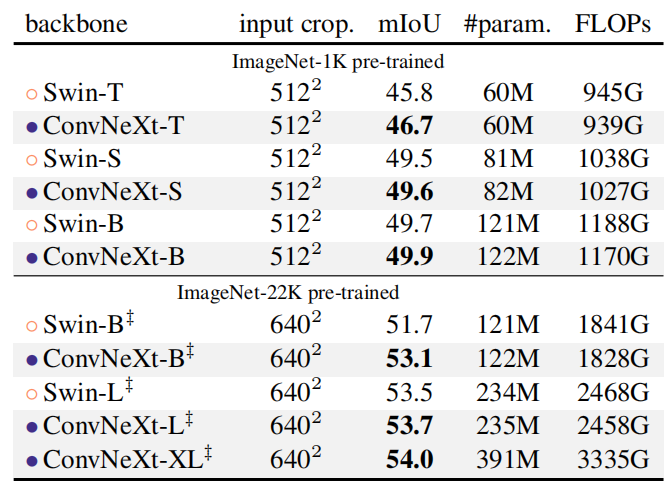 
Table 4. ADE20K validation results using UperNet [85]. ‡ indicates IN-22K pre-training. Swins’ results are from its GitHub repository [2]. Following Swin, we report mIoU results with multiscale testing. FLOPs are based on input sizes of (2048, 512) and (2560, 640) for IN-1K and IN-22K pre-trained models, respectively. 
表4。使用UperNet的ADE20K验证结果[85]。‡表示IN-22K预训练。Swins的结果来自其GitHub存储库[2]。在Swin之后，我们报告了多尺度测试的mIoU结果。FLOP分别基于IN-1K和IN-22K预训练模型的输入大小(2048、512)和(2560、640)。

### Remarks on model efficiency. 
Under similar FLOPs, models with depthwise convolutions are known to be slower and consume more memory than ConvNets with only dense convolutions. It is natural to ask whether the design of ConvNeXt will render it practically inefficient. As demonstrated throughout the paper, the inference throughputs of ConvNeXts are comparable to or exceed that of Swin Transformers. This is true for both classification and other tasks requiring higher-resolution inputs (see Table 1,3 for comparisons of throughput/FPS). Furthermore, we notice that training ConvNeXts requires less memory than training Swin Transformers. For example, training Cascade Mask-RCNN using ConvNeXt-B backbone consumes 17.4GB of peak memory with a per-GPU batch size of 2, while the reference number for Swin-B is 18.5GB. In comparison to vanilla ViT, both ConvNeXt and Swin Transformer exhibit a more favorable accuracy-FLOPs trade-off due to the local computations. It is worth noting that this improved efficiency is a result of the ConvNet inductive bias, and is not directly related to the self-attention mechanism in vision Transformers.

关于模型效率的备注。在类似的FLOP下，已知具有深度卷积的模型比仅具有密集卷积的卷积网更慢，消耗更多内存。很自然会问ConvNeXt的设计是否会使其实际上效率低下。如本文所述，ConvNeXts的推理吞吐量与Swin Transformers的推理吞吐量相当或超过Swin Transformer。这适用于分类和其他需要更高分辨率输入的任务(吞吐量/FPS的比较见表1,3)。此外，我们注意到训练ConvNeXts比训练SwinTransformer需要更少的内存。例如，使用ConvNeXt-B主干训练级联Mask-RCNN消耗17.4GB峰值内存，每GPU批处理大小为2，而Swin-B的参考数为18.5GB。与普通ViT相比，由于局部计算，ConvNeXt和Swin-Transformer都表现出更有利的精度FLOP权衡。值得注意的是，这种效率的提高是ConvNet归纳偏差的结果，与ViT中的自我注意机制没有直接关系。

## 5. Related Work
### Hybrid models. 
In both the pre- and post-ViT eras, the hybrid model combining convolutions and self-attentions has been actively studied. Prior to ViT, the focus was on augmenting a ConvNet with self-attention/non-local modules [8, 55, 66, 79] to capture long-range dependencies. The original ViT [20] first studied a hybrid configuration, and a large body of follow-up works focused on reintroducing convolutional priors to ViT, either in an explicit [15, 16, 21, 82, 86, 88] or implicit [45] fashion.

混合模型。在前和后ViT时代，结合卷积和自注意力的混合模型都得到了积极的研究。在ViT之前，重点是用自注意力/非局部模块[8，55，66，79]增强ConvNet，以捕获长期依赖性。最初的ViT[20]首先研究了一种混合配置，大量后续工作集中于以显式[15、16、21、82、86、88]或隐式[45]的方式将卷积先验重新引入ViT。

### Recent convolution-based approaches. 
Han et al. [25] show that local Transformer attention is equivalent to inhomogeneous dynamic depthwise conv. The MSA block in Swin is then replaced with a dynamic or regular depthwise convolution, achieving comparable performance to Swin. A concurrent work ConvMixer [4] demonstrates that, in small-scale settings, depthwise convolution can be used as a promising mixing strategy. ConvMixer uses a smaller patch size to achieve the best results, making the throughput much lower than other baselines. GFNet [56] adopts Fast Fourier Transform (FFT) for token mixing. FFT is also a form of convolution, but with a global kernel size and circular padding. Unlike many recent Transformer or ConvNet designs, one primary goal of our study is to provide an in-depth look at the process of modernizing a standard ResNet and achieving state-of-the-art performance.

最近基于卷积的方法。Hanet al [25]表明，局部Transformer注意力等同于非均匀动态深度卷积。然后，将Swin中的MSA块替换为动态或规则深度卷积，从而实现与Swin类似的性能。并发工作ConvMixer[4]证明，在小规模环境中，深度卷积可以用作一种有前途的混合策略。ConvMixer使用较小的分块大小来获得最佳结果，使吞吐量大大低于其他基线。GFNet[56]采用快速傅里叶变换(FFT)进行令牌混合。FFT也是卷积的一种形式，但具有全局内核大小和循环填充。与许多最近的Transformer或ConvNet设计不同，我们研究的一个主要目标是深入了解标准ResNet现代化和实现最先进性能的过程。

## 6. Conclusions
In the 2020s, vision Transformers, particularly hierarchical ones such as Swin Transformers, began to overtake ConvNets as the favored choice for generic vision backbones. The widely held belief is that vision Transformers are more accurate, efficient, and scalable than ConvNets. We propose ConvNeXts, a pure ConvNet model that can compete favorably with state-of-the-art hierarchical vision Transformers across multiple computer vision benchmarks, while retaining the simplicity and efficiency of standard ConvNets. In some ways, our observations are surprising while our ConvNeXt model itself is not completely new — many design choices have all been examined separately over the last decade, but not collectively. We hope that the new results reported in this study will challenge several widely held views and prompt people to rethink the importance of convolution in computer vision.

在20世纪20年代，ViT，特别是像SwinTransformer这样的分级Transformer，开始取代ConvNets成为通用视觉骨干的首选。人们普遍认为ViT比ConvNets更准确、更高效、更可扩展。我们提出了ConvNeXts，这是一种纯ConvNet模型，它可以在多个计算机视觉基准上与最先进的分层ViT竞争，同时保持标准ConvNets的简单性和效率。在某些方面，我们的观察结果令人惊讶，而我们的ConvNeXt模型本身并不完全是新的——在过去十年中，许多设计选择都被单独检查过，但不是集体检查过。我们希望，这项研究报告的新结果将挑战几种广泛持有的观点，并促使人们重新思考卷积在计算机视觉中的重要性。

## Acknowledgments. 
We thank Kaiming He, Eric Mintun,Xingyi Zhou, Ross Girshick, and Yann LeCun for valuable discussions and feedback.

## Appendix
In this Appendix, we provide further experimental details (§A), robustness evaluation results (§B), more modernization experiment results (§C), and a detailed network specification (§D). We further benchmark model throughput on A100 GPUs (§E). Finally, we discuss the limitations (§F) and societal impact (§G) of our work.

在本附录中，我们提供了进一步的实验细节(§A)、稳健性评估结果(§B)、更现代化的实验结果(§C)和详细的网络规范(§D)。我们进一步对A100 GPU的模型吞吐量进行了基准测试(§E)。最后，我们讨论了我们工作的局限性(§F)和社会影响(§G)。

### A. Experimental Settings
#### A.1. ImageNet (Pre-)training
We provide ConvNeXts’ ImageNet-1K training and ImageNet-22K pre-training settings in Table 5. The settings are used for our main results in Table 1 (Section 3.2). All ConvNeXt variants use the same setting, except the stochastic depth rate is customized for model variants.

我们在表5中提供了ConvNeXts的ImageNet-1K训练和ImageNet-22K预训练设置。这些设置用于表1(第3.2节)中的主要结果。所有ConvNeXt变体使用相同的设置，但随机深度率是为模型变体定制的。

For experiments in “modernizing a ConvNet” (Section 2), we also use Table 5’s setting for ImageNet-1K, except EMA is disabled, as we find using EMA severely hurts models with BatchNorm layers.

对于“使ConvNet现代化”的实验(第2节)，我们还使用了表5中ImageNet-1K的设置，但EMA被禁用，因为我们发现使用EMA会严重损害具有BatchNorm层的模型。

For isotropic ConvNeXts (Section 3.3), the setting for ImageNet-1K in Table A is also adopted, but warmup is extended to 50 epochs, and layer scale is disabled for isotropic ConvNeXt-S/B. The stochastic depth rates are 0.1/0.2/0.5 for isotropic ConvNeXt-S/B/L.

对于各向同性ConvNeXts(第3.3节)，也采用了表A中ImageNet-1K的设置，但预热扩展到50个时期，并且各向同性ConwNeXt-S/B禁用了层比例。各向同性ConvNeXt-S/B/L的随机深度速率为0.1/0.2/0.5。

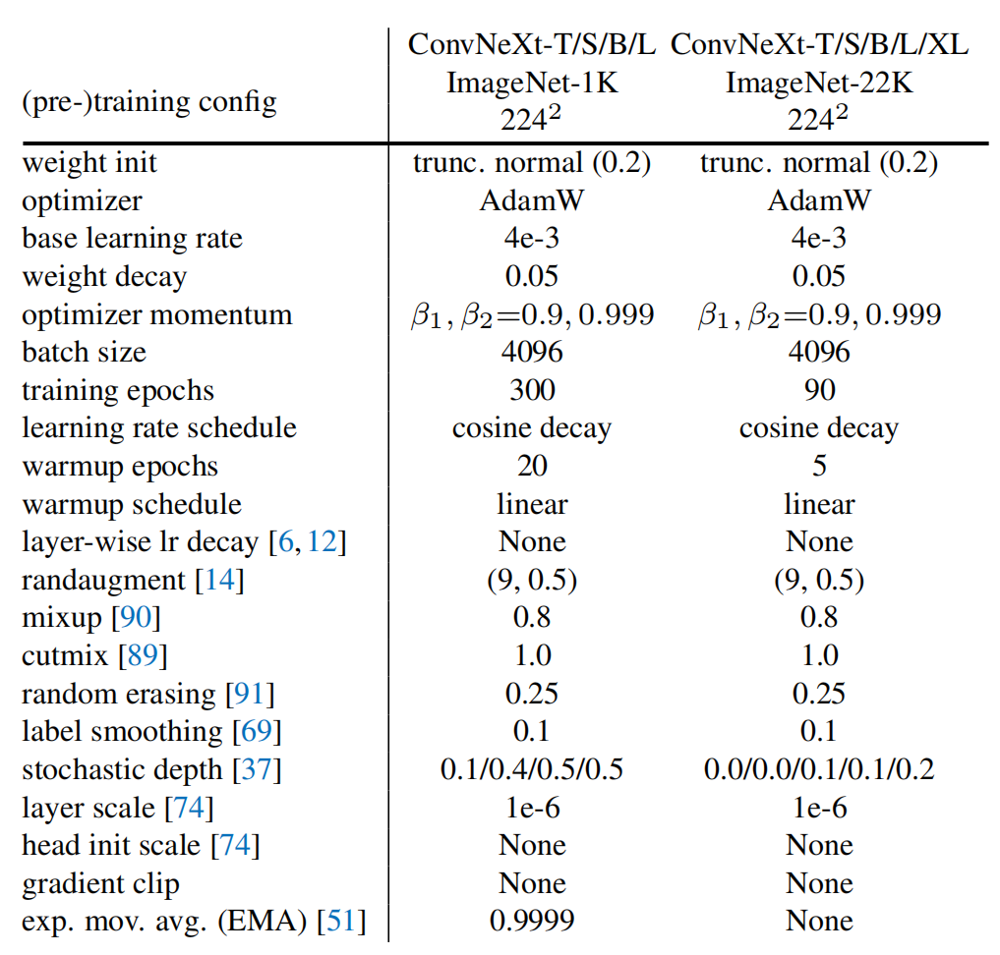 
Table 5. ImageNet-1K/22K (pre-)training settings. Multiple stochastic depth rates (e.g., 0.1/0.4/0.5/0.5) are for each model (e.g., ConvNeXt-T/S/B/L) respectively.

表5。ImageNet-1K/22K(预)训练设置。每个模型(例如ConvNeXt-T/S/B/L)分别具有多个随机深度速率(例如，0.1/0.4/0.5/0.5)。

#### A.2. ImageNet Fine-tuning
We list the settings for fine-tuning on ImageNet-1K in Table 6. The fine-tuning starts from the final model weights obtained in pre-training, without using the EMA weights, even if in pre-training EMA is used and EMA accuracy is reported. This is because we do not observe improvement if we fine-tune with the EMA weights (consistent with observations in [73]). The only exception is ConvNeXt-L pre-trained on ImageNet-1K, where the model accuracy is significantly lower than the EMA accuracy due to overfitting, and we select its best EMA model during pre-training as the starting point for fine-tuning.

我们在表6中列出了ImageNet-1K上的微调设置。微调从预训练中获得的最终模型权重开始，而不使用EMA权重，即使在预训练中使用EMA并报告EMA准确性。这是因为如果我们微调EMA权重(与[73]中的观察结果一致)，我们不会观察到改进。唯一的例外是在ImageNet-1K上预训练的ConvNeXt-L，由于过度拟合，模型精度显著低于EMA精度，我们在预训练期间选择其最佳EMA模型作为微调的起点。

In fine-tuning, we use layer-wise learning rate decay [6, 12] with every 3 consecutive blocks forming a group. When the model is fine-tuned at 3842 resolution, we use a crop ratio of 1.0 (i.e., no cropping) during testing following [2, 74, 80], instead of 0.875 at 224 2.

在微调中，我们使用逐层学习速率衰减[6，12]，每3个连续块形成一个组。当模型以3842分辨率进行微调时，我们在[2，74，80]之后的测试中使用1.0的裁剪比率(即，无裁剪)，而不是2242时的0.875。

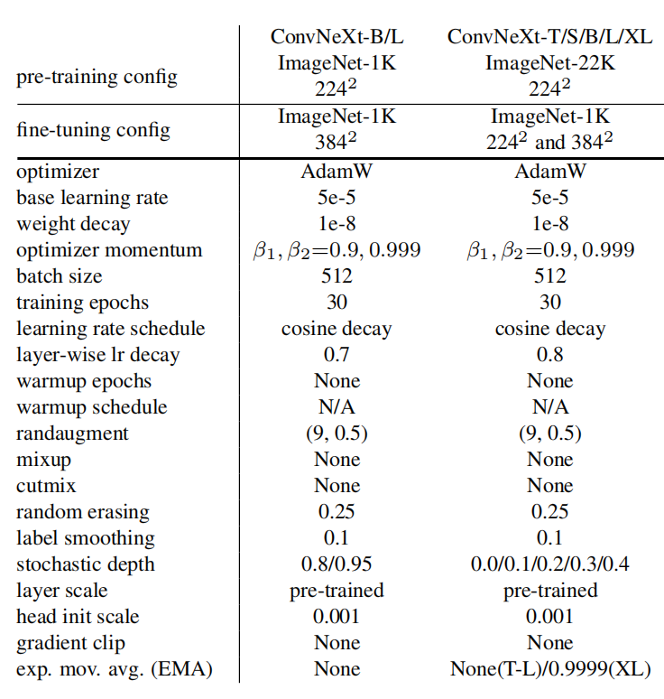 
Table 6. ImageNet-1K fine-tuning settings. Multiple values (e.g., 0.8/0.95) are for each model (e.g., ConvNeXt-B/L) respectively.
表6。ImageNet-1K微调设置。每个模型(例如ConvNeXt-B/L)分别有多个值(例如0.8/0.95)。

#### A.3. Downstream Tasks
For ADE20K and COCO experiments, we follow the training settings used in BEiT [6] and Swin [45]. We also use MMDetection [10] and MMSegmentation [13] toolboxes.

对于ADE20K和COCO实验，我们遵循BEiT[6]和Swin[45]中使用的训练设置。我们还使用MMDetection[10]和MMSegmentation[13]工具箱。

We use the final model weights (instead of EMA weights) from ImageNet pre-training as network initializations. We conduct a lightweight sweep for COCO experiments including learning rate {1e-4, 2e-4}, layer-wise learning rate decay [6] {0.7, 0.8, 0.9, 0.95}, and stochastic depth rate {0.3, 0.4, 0.5, 0.6, 0.7, 0.8}. We fine-tune the ImageNet-22K pre-trained Swin-B/L on COCO using the same sweep. We use the official code and pre-trained model weights [3].

我们使用ImageNet预训练的最终模型权重(而不是EMA权重)作为网络初始化。我们对COCO实验进行了轻量级扫描，包括学习速率{1e-4，2e-4}、逐层学习速率衰减[6]{0.7，0.8，0.9，0.95}和随机深度速率{0.3，0.4，0.5，0.6，0.7，0.8}。我们使用相同的扫描在COCO上微调ImageNet-22K预训练的Swin-B/L。我们使用官方代码和预先训练的模型权重[3]。

The hyperparameters we sweep for ADE20K experiments include learning rate {8e-5, 1e-4}, layer-wise learning rate decay {0.8, 0.9}, and stochastic depth rate {0.3, 0.4, 0.5}. We report validation mIoU results using multi-scale testing. Additional single-scale testing results are in Table 7. backbone input crop. mIoU

我们为ADE20K实验扫描的超参数包括学习速率｛8e-5，1e-4｝、分层学习速率衰减｛0.8，0.9｝和随机深度速率｛0.3，0.4，0.5｝。我们使用多尺度测试报告验证mIoU结果。表7中列出了其他单规模测试结果。主干输入作物。百万欧单位

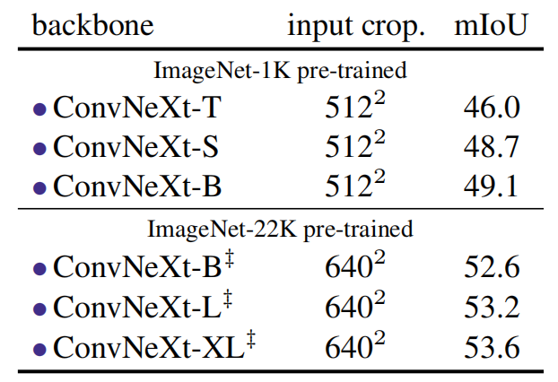 
Table 7. ADE20K validation results with single-scale testing.
表7。ADE20K验证结果与单规模测试。

### B. Robustness Evaluation 稳健性评估
Additional robustness evaluation results for ConvNeXt models are presented in Table 8. We directly test our ImageNet-1K trained/fine-tuned classification models on several robustness benchmark datasets such as ImageNet-A [33], ImageNet-R [30], ImageNet-Sketch [78] and ImageNetC/¯C [31, 48] datasets. We report mean corruption error (mCE) for ImageNet-C, corruption error for ImageNet-¯C, and top-1 Accuracy for all other datasets.

ConvNeXt模型的其他稳健性评估结果如表8所示。我们在几个稳健性基准数据集(如ImageNet-A[33]、ImageNet-R[30]、ImageNetSketch[78]和ImageNetC/C[31，48]数据集)上直接测试了我们的ImageNet-1K训练/微调分类模型。我们报告ImageNet-C的平均损坏错误(mCE)、ImageNet-C损坏错误和所有其他数据集的前1精度。

ConvNeXt (in particular the large-scale model variants) exhibits promising robustness behaviors, outperforming state-of-the-art robust transformer models [47] on several benchmarks. With extra ImageNet-22K data, ConvNeXtXL demonstrates strong domain generalization capabilities (e.g. achieving 69.3%/68.2%/55.0% accuracy on ImageNetA/R/Sketch benchmarks, respectively). We note that these robustness evaluation results were acquired without using any specialized modules or additional fine-tuning procedures.

ConvNeXt(尤其是大型模型变体)表现出了有前景的稳健性行为，在几个基准测试上优于最先进的稳健变压器模型[47]。凭借额外的ImageNet-22K数据，ConvNeXtXL展示了强大的领域泛化能力(例如，在ImageNetA/R/Sketch基准上分别达到69.3%/68.2%/55.0%的准确性)。我们注意到，这些稳健性评估结果是在不使用任何专门模块或其他微调程序的情况下获得的。

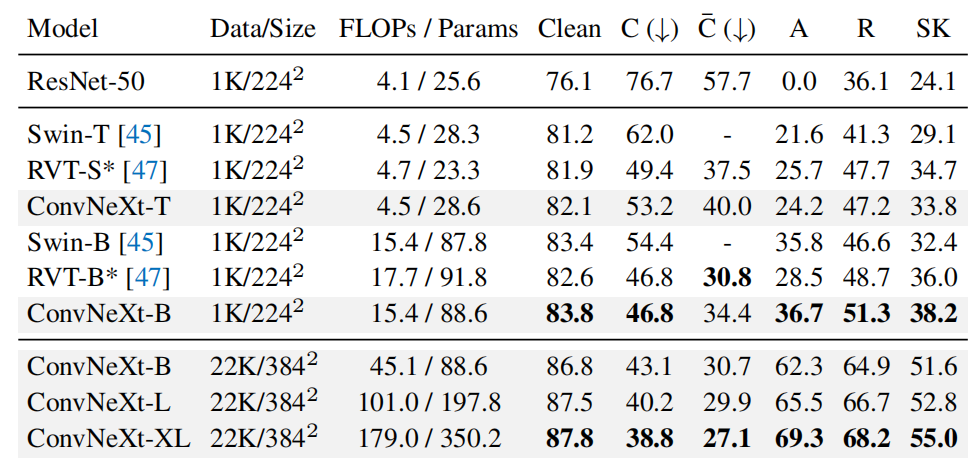 
Table 8. Robustness evaluation of ConvNeXt. We do not make use of any specialized modules or additional fine-tuning procedures.
表8。ConvNeXt.的稳健性评估。我们不使用任何专门的模块或额外的微调程序。

### C. Modernizing ResNets: detailed results
Here we provide detailed tabulated results for the modernization experiments, at both ResNet-50 / Swin-T and ResNet-200 / Swin-B regimes. The ImageNet-1K top-1 accuracies and FLOPs for each step are shown in Table 10 and 11. ResNet-50 regime experiments are run with 3 random seeds.

在这里，我们提供了在ResNet-50/Swin-T和ResNet-200/Swin-B两种方案下的现代化实验的详细列表结果。每个步骤的ImageNet-1K顶级精度和FLOP如表10和11所示。使用3个随机种子进行ResNet-50方案实验。

For ResNet-200, the initial number of blocks at each stage is (3, 24, 36, 3). We change it to Swin-B’s (3, 3, 27, 3) at the step of changing stage ratio. This drastically reduces the FLOPs, so at the same time, we also increase the width from 64 to 84 to keep the FLOPs at a similar level. After the step of adopting depthwise convolutions, we further increase the width to 128 (same as Swin-B’s) as a separate step.

对于ResNet-200，每个阶段的初始块数为(3、24、36、3)。我们在改变级比的步骤中将其更改为Swin-B(3，3，27，3)。这大大减少了FLOP，因此同时，我们还将宽度从64增加到84，以使FLOP保持在类似的水平。在采用深度卷积的步骤之后，我们进一步将宽度增加到128(与Swin-B相同)作为单独的步骤。

The observations on the ResNet-200 regime are mostly consistent with those on ResNet-50 as described in the main paper. One interesting difference is that inverting dimensions brings a larger improvement at ResNet-200 regime than at ResNet-50 regime (+0.79% vs. +0.14%). The performance gained by increasing kernel size also seems to saturate at kernel size 5 instead of 7. Using fewer normalization layers also has a bigger gain compared with the ResNet-50 regime (+0.46% vs. +0.14%). 

ResNet-200系统的观察结果与主论文中描述的ResNet-50系统的观察值基本一致。一个有趣的区别是，与ResNet-50相比，反转维度在ResNet-200状态下带来了更大的改善(+0.79%vs.+0.14%)。通过增加内核大小获得的性能似乎在内核大小5而不是7时饱和。与ResNet-50方案相比，使用更少的标准化层也具有更大的增益(+0.46%vs.+0.14%)。

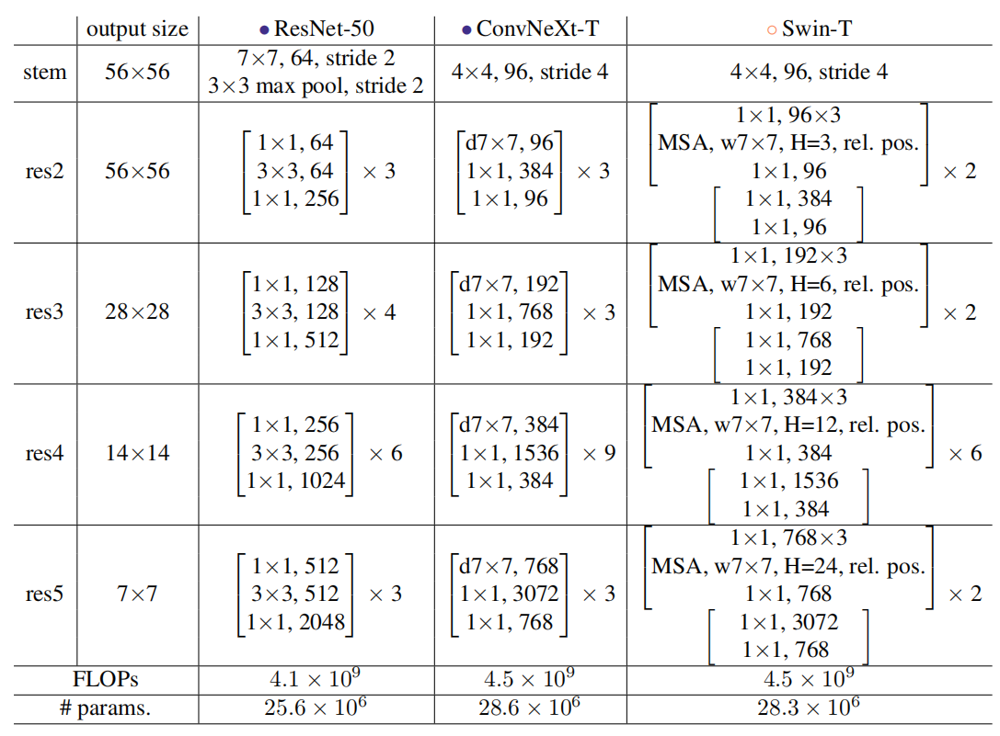 
Table 9. Detailed architecture specifications for ResNet-50, ConvNeXt-T and Swin-T. 
表9。ResNet-50、ConvNeXt-T和Swin-T的详细架构规范。

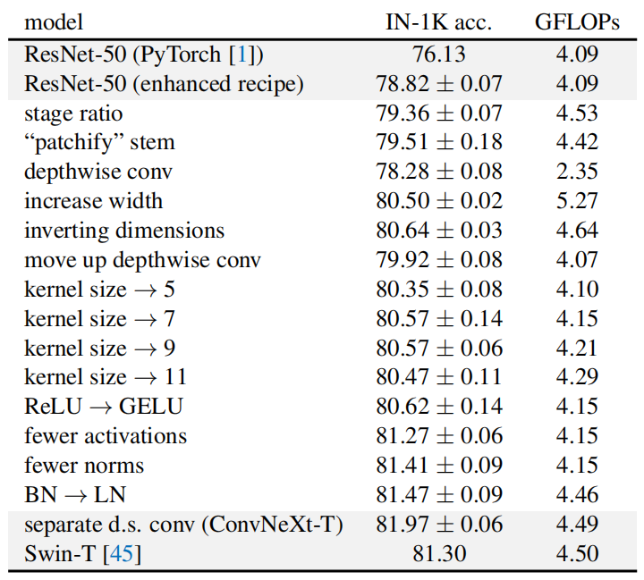 
Table 10. Detailed results for modernizing a ResNet-50. Mean and standard deviation are obtained by training the network with three different random seeds. 
表10。ResNet-50现代化的详细结果。通过用三种不同的随机种子训练网络来获得平均值和标准差。

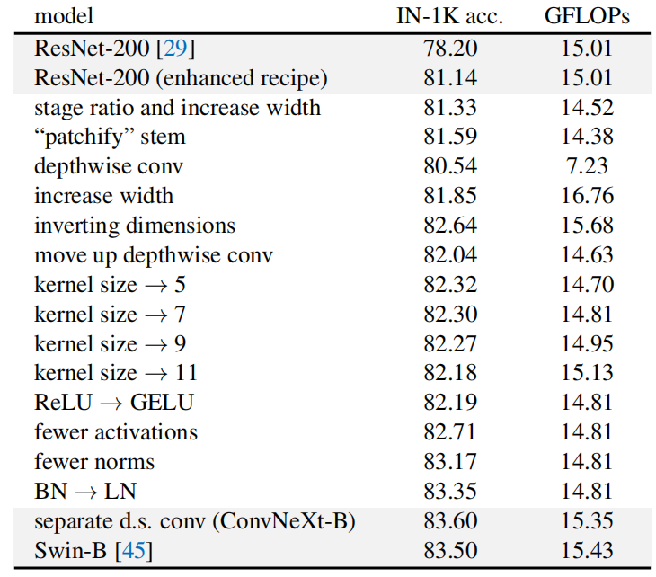 
Table 11. Detailed results for modernizing a ResNet-200.
表11。ResNet-200现代化的详细结果。

### D. Detailed Architectures
We present a detailed architecture comparison between ResNet-50, ConvNeXt-T and Swin-T in Table 9. For differently sized ConvNeXts, only the number of blocks and the number of channels at each stage differ from ConvNeXt-T (see Section 3 for details). ConvNeXts enjoy the simplicity of standard ConvNets, but compete favorably with Swin Transformers in visual recognition.

我们在表9中对ResNet-50、ConvNeXt-T和Swin-T进行了详细的架构比较。对于不同大小的ConvNeXt，只有每个阶段的块数和信道数与ConvNeXt-T不同(详见第3节)。ConvNeXts享受标准ConvNets的简单性，但在视觉识别方面与Swin Transformers竞争。

### E. Benchmarking on A100 GPUs
Following Swin Transformer [45], the ImageNet models’ inference throughputs in Table 1 are benchmarked using a V100 GPU, where ConvNeXt is slightly faster in inference than Swin Transformer with a similar number of parameters. We now benchmark them on the more advanced A100 GPUs, which support the TensorFloat32 (TF32) tensor cores. We employ PyTorch [50] version 1.10 to use the latest “Channel Last” memory layout [22] for further speedup.

在Swin Transformer[45]之后，使用V100 GPU对表1中ImageNet模型的推理吞吐量进行了基准测试，其中ConvNeXt在推理方面比Swin Transform稍快，参数数量相似。我们现在在更先进的A100 GPU上对它们进行基准测试，这些GPU支持TensorFloat32(TF32)张量核。我们使用PyTorch[50]1.10版使用最新的“Channel Last”内存布局[22]，以进一步加快速度。

We present the results in Table 12. Swin Transformers and ConvNeXts both achieve faster inference throughput than V100 GPUs, but ConvNeXts’ advantage is now significantly greater, sometimes up to 49% faster. This preliminary study shows promising signals that ConvNeXt, employed with standard ConvNet modules and simple in design, could be practically more efficient models on modern hardwares. model image size FLOPs throughput (image / s)

我们将结果列于表12中。Swin Transformers和ConvNeXts都实现了比V100 GPU更快的推理吞吐量，但ConvNeXts的优势现在明显更大，有时甚至快49%。这项初步研究表明，与标准ConvNet模块一起使用且设计简单的ConvNeXt有望成为现代硬件上更有效的模型。模型图像大小FLOP吞吐量(图像/秒)

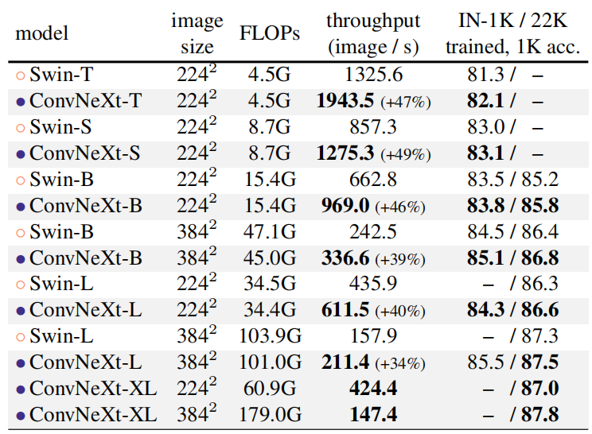 
Table 12. Inference throughput comparisons on an A100 GPU. Using TF32 data format and “channel last” memory layout, ConvNeXt enjoys up to ∼49% higher throughput compared with a Swin Transformer with similar FLOPs.
表12。在A100 GPU上推断吞吐量比较。使用TF32数据格式和“通道最后”内存布局，与具有类似FLOP的Swin Transformer相比，ConvNeXt的吞吐量提高了约49%。

### F. Limitations
We demonstrate ConvNeXt, a pure ConvNet model, can perform as good as a hierarchical vision Transformer on image classification, object detection, instance and semantic segmentation tasks. While our goal is to offer a broad range of evaluation tasks, we recognize computer vision applications are even more diverse. ConvNeXt may be more suited for certain tasks, while Transformers may be more flexible for others. A case in point is multi-modal learning, in which a cross-attention module may be preferable for modeling feature interactions across many modalities. Additionally, Transformers may be more flexible when used for tasks requiring discretized, sparse, or structured outputs. We believe the architecture choice should meet the needs of the task at hand while striving for simplicity.

我们证明了ConvNeXt，一个纯ConvNet模型，在图像分类、对象检测、实例和语义分割任务上的表现与分层视觉转换器一样好。虽然我们的目标是提供广泛的评估任务，但我们认识到计算机视觉应用更为多样化。ConvNeXt可能更适合某些任务，而变形金刚可能更适合其他任务。一个很好的例子是多模态学习，在这种学习中，交叉注意力模块可能更适合于建模跨多种模态的特征交互。此外，当用于需要离散化、稀疏或结构化输出的任务时，转换器可能更灵活。我们认为，架构选择应满足当前任务的需要，同时力求简单。

### G. Societal Impact
In the 2020s, research on visual representation learning began to place enormous demands on computing resources. While larger models and datasets improve performance across the board, they also introduce a slew of challenges. ViT, Swin, and ConvNeXt all perform best with their huge model variants. Investigating those model designs inevitably results in an increase in carbon emissions. One important direction, and a motivation for our paper, is to strive for simplicity — with more sophisticated modules, the network’s design space expands enormously, obscuring critical components that contribute to the performance difference. Additionally, large models and datasets present issues in terms of model robustness and fairness. Further investigation on the robustness behavior of ConvNeXt vs. Transformer will be an interesting research direction. In terms of data, our findings indicate that ConvNeXt models benefit from pre-training on large-scale datasets. While our method makes use of the publicly available ImageNet-22K dataset, individuals may wish to acquire their own data for pre-training. A more circumspect and responsible approach to data selection is required to avoid potential concerns with data biases.

在20世纪20年代，视觉表示学习的研究开始对计算资源提出巨大的需求。虽然更大的模型和数据集可以全面提高性能，但也带来了一系列挑战。ViT、Swin和ConvNeXt都以其巨大的模型变体表现最佳。研究这些模型设计不可避免地会导致碳排放的增加。一个重要的方向，也是我们论文的一个动机，就是力求简单——通过更复杂的模块，网络的设计空间大大扩展，掩盖了导致性能差异的关键组件。此外，大型模型和数据集在模型稳健性和公平性方面存在问题。进一步研究ConvNeXt与Transformer的稳健性行为将是一个有趣的研究方向。在数据方面，我们的发现表明ConvNeXt模型受益于大规模数据集上的预训练。虽然我们的方法使用了公开可用的ImageNet-22K数据集，但个人可能希望获取自己的数据进行预训练。需要对数据选择采取更加谨慎和负责任的方法，以避免对数据偏见的潜在担忧。

## References
1. PyTorch Vision Models. https://pytorch.org/ vision/stable/models.html. Accessed: 2021-10- 01.
2. GitHub repository: Swin transformer. https://github. com/microsoft/Swin-Transformer, 2021.
3. GitHub repository: Swin transformer for object detection. https://github.com/SwinTransformer/SwinTransformer-Object-Detection, 2021.
4. Anonymous. Patches are all you need? Openreview, 2021.
5. Jimmy Lei Ba, Jamie Ryan Kiros, and Geoffrey E Hinton. Layer normalization. arXiv:1607.06450, 2016.
6. Hangbo Bao, Li Dong, and Furu Wei. BEiT: BERT pretraining of image transformers. arXiv:2106.08254, 2021.
7. Irwan Bello, William Fedus, Xianzhi Du, Ekin Dogus Cubuk, Aravind Srinivas, Tsung-Yi Lin, Jonathon Shlens, and Barret Zoph. Revisiting resnets: Improved training and scaling strategies. NeurIPS, 2021.
8. Irwan Bello, Barret Zoph, Ashish Vaswani, Jonathon Shlens, and Quoc V Le. Attention augmented convolutional networks. In ICCV, 2019.
9. Zhaowei Cai and Nuno Vasconcelos. Cascade R-CNN: Delving into high quality object detection. In CVPR, 2018.
10. Kai Chen, Jiaqi Wang, Jiangmiao Pang, Yuhang Cao, Yu Xiong, Xiaoxiao Li, Shuyang Sun, Wansen Feng, Ziwei Liu, Jiarui Xu, Zheng Zhang, Dazhi Cheng, Chenchen Zhu, Tianheng Cheng, Qijie Zhao, Buyu Li, Xin Lu, Rui Zhu, Yue Wu, Jifeng Dai, Jingdong Wang, Jianping Shi, Wanli Ouyang, Chen Change Loy, and Dahua Lin. MMDetection: Open mmlab detection toolbox and benchmark. arXiv:1906.07155, 2019.
11. François Chollet. Xception: Deep learning with depthwise separable convolutions. In CVPR, 2017.
12. Kevin Clark, Minh-Thang Luong, Quoc V Le, and Christopher D Manning. ELECTRA: Pre-training text encoders as discriminators rather than generators. In ICLR, 2020.
13. MMSegmentation contributors. MMSegmentation: Openmmlab semantic segmentation toolbox and benchmark. https: / / github . com / open - mmlab / mmsegmentation, 2020.
14. Ekin D Cubuk, Barret Zoph, Jonathon Shlens, and Quoc V Le. Randaugment: Practical automated data augmentation with a reduced search space. In CVPR Workshops, 2020.
15. Zihang Dai, Hanxiao Liu, Quoc V Le, and Mingxing Tan. Coatnet: Marrying convolution and attention for all data sizes. NeurIPS, 2021.
16. Stéphane d’Ascoli, Hugo Touvron, Matthew Leavitt, Ari Morcos, Giulio Biroli, and Levent Sagun. ConViT: Improving vision transformers with soft convolutional inductive biases. ICML, 2021.
17. Jia Deng, Wei Dong, Richard Socher, Li-Jia Li, Kai Li, and Li Fei-Fei. ImageNet: A large-scale hierarchical image database. In CVPR, 2009.
18. Jacob Devlin, Ming-Wei Chang, Kenton Lee, and Kristina Toutanova. BERT: Pre-training of deep bidirectional transformers for language understanding. In NAACL, 2019.
19. Piotr Dollár, Serge Belongie, and Pietro Perona. The fastest pedestrian detector in the west. In BMVC, 2010.
20. Alexey Dosovitskiy, Lucas Beyer, Alexander Kolesnikov, Dirk Weissenborn, Xiaohua Zhai, Thomas Unterthiner, Mostafa Dehghani, Matthias Minderer, Georg Heigold, Sylvain Gelly, Jakob Uszkoreit, and Neil Houlsby. An image is worth 16x16 words: Transformers for image recognition at scale. In ICLR, 2021.
21. Haoqi Fan, Bo Xiong, Karttikeya Mangalam, Yanghao Li, Zhicheng Yan, Jitendra Malik, and Christoph Feichtenhofer. Multiscale vision transformers. ICCV, 2021.
22. Vitaly Fedyunin. Tutorial: Channel last memory format in PyTorch. https://pytorch.org/tutorials/ intermediate/memory_format_tutorial.html, 2021. Accessed: 2021-10-01.
23. Ross Girshick. Fast R-CNN. In ICCV, 2015.
24. Ross Girshick, Jeff Donahue, Trevor Darrell, and Jitendra Malik. Rich feature hierarchies for accurate object detection and semantic segmentation. In CVPR, 2014.
25. Qi Han, Zejia Fan, Qi Dai, Lei Sun, Ming-Ming Cheng, Jiaying Liu, and Jingdong Wang. Demystifying local vision transformer: Sparse connectivity, weight sharing, and dynamic weight. arXiv:2106.04263, 2021.
26. Kaiming He, Xinlei Chen, Saining Xie, Yanghao Li, Piotr Dollár, and Ross Girshick. Masked autoencoders are scalable vision learners. arXiv:2111.06377, 2021.
27. Kaiming He, Georgia Gkioxari, Piotr Dollár, and Ross Girshick. Mask R-CNN. In ICCV, 2017.
28. Kaiming He, Xiangyu Zhang, Shaoqing Ren, and Jian Sun. Deep residual learning for image recognition. In CVPR, 2016.
29. Kaiming He, Xiangyu Zhang, Shaoqing Ren, and Jian Sun. Identity mappings in deep residual networks. In ECCV, 2016.
30. Dan Hendrycks, Steven Basart, Norman Mu, Saurav Kadavath, Frank Wang, Evan Dorundo, Rahul Desai, Tyler Zhu, Samyak Parajuli, Mike Guo, et al. The many faces of robustness: A critical analysis of out-of-distribution generalization. In ICCV, 2021.
31. Dan Hendrycks and Thomas Dietterich. Benchmarking neural network robustness to common corruptions and perturbations. In ICLR, 2018.
32. Dan Hendrycks and Kevin Gimpel. Gaussian error linear units (gelus). arXiv:1606.08415, 2016.
33. Dan Hendrycks, Kevin Zhao, Steven Basart, Jacob Steinhardt, and Dawn Song. Natural adversarial examples. In CVPR, 2021.
34. Andrew G Howard, Menglong Zhu, Bo Chen, Dmitry Kalenichenko, Weijun Wang, Tobias Weyand, Marco Andreetto, and Hartwig Adam. MobileNets: Efficient convolutional neural networks for mobile vision applications. arXiv:1704.04861, 2017.
35. Jie Hu, Li Shen, and Gang Sun. Squeeze-and-excitation networks. In CVPR, 2018.
36. Gao Huang, Zhuang Liu, Laurens van der Maaten, and Kilian Q Weinberger. Densely connected convolutional networks. In CVPR, 2017.
37. Gao Huang, Yu Sun, Zhuang Liu, Daniel Sedra, and Kilian Q Weinberger. Deep networks with stochastic depth. In ECCV, 2016.
38. Sergey Ioffe. Batch renormalization: Towards reducing minibatch dependence in batch-normalized models. In NeurIPS, 2017.
39. Alexander Kolesnikov, Lucas Beyer, Xiaohua Zhai, Joan Puigcerver, Jessica Yung, Sylvain Gelly, and Neil Houlsby. Big Transfer (BiT): General visual representation learning. In ECCV, 2020.
40. Alex Krizhevsky, Ilya Sutskever, and Geoff Hinton. Imagenet classification with deep convolutional neural networks. In NeurIPS, 2012.
41. Andrew Lavin and Scott Gray. Fast algorithms for convolutional neural networks. In CVPR, 2016.
42. Yann LeCun, Bernhard Boser, John S Denker, Donnie Henderson, Richard E Howard, Wayne Hubbard, and Lawrence D Jackel. Backpropagation applied to handwritten zip code recognition. Neural computation, 1989.
43. Yann LeCun, Léon Bottou, Yoshua Bengio, Patrick Haffner, et al. Gradient-based learning applied to document recognition. Proceedings of the IEEE, 1998.
44. Tsung-Yi Lin, Michael Maire, Serge Belongie, James Hays, Pietro Perona, Deva Ramanan, Piotr Dollár, and C Lawrence Zitnick. Microsoft COCO: Common objects in context. In ECCV. 2014.
45. Ze Liu, Yutong Lin, Yue Cao, Han Hu, Yixuan Wei, Zheng Zhang, Stephen Lin, and Baining Guo. Swin transformer: Hierarchical vision transformer using shifted windows. 2021.
46. Ilya Loshchilov and Frank Hutter. Decoupled weight decay regularization. In ICLR, 2019.
47. Xiaofeng Mao, Gege Qi, Yuefeng Chen, Xiaodan Li, Ranjie Duan, Shaokai Ye, Yuan He, and Hui Xue. Towards robust vision transformer. arXiv preprint arXiv:2105.07926, 2021.
48. Eric Mintun, Alexander Kirillov, and Saining Xie. On interaction between augmentations and corruptions in natural corruption robustness. NeurIPS, 2021.
49. Vinod Nair and Geoffrey E Hinton. Rectified linear units improve restricted boltzmann machines. In ICML, 2010.
50. Adam Paszke, Sam Gross, Francisco Massa, Adam Lerer, James Bradbury, Gregory Chanan, Trevor Killeen, Zeming Lin, Natalia Gimelshein, Luca Antiga, et al. PyTorch: An imperative style, high-performance deep learning library. In NeurIPS, 2019.
51. Boris T Polyak and Anatoli B Juditsky. Acceleration of stochastic approximation by averaging. SIAM Journal on Control and Optimization, 1992.
52. Alec Radford, Jeffrey Wu, Rewon Child, David Luan, Dario Amodei, and Ilya Sutskever. Language models are unsupervised multitask learners. 2019.
53. Ilija Radosavovic, Justin Johnson, Saining Xie, Wan-Yen Lo, and Piotr Dollár. On network design spaces for visual recognition. In ICCV, 2019.
54. Ilija Radosavovic, Raj Prateek Kosaraju, Ross Girshick, Kaiming He, and Piotr Dollár. Designing network design spaces. In CVPR, 2020.
55. Prajit Ramachandran, Niki Parmar, Ashish Vaswani, Irwan Bello, Anselm Levskaya, and Jonathon Shlens. Stand-alone self-attention in vision models. NeurIPS, 2019.
56. Yongming Rao, Wenliang Zhao, Zheng Zhu, Jiwen Lu, and Jie Zhou. Global filter networks for image classification. NeurIPS, 2021.
57. Shaoqing Ren, Kaiming He, Ross Girshick, and Jian Sun. Faster R-CNN: Towards real-time object detection with region proposal networks. In NeurIPS, 2015.
58. Henry A Rowley, Shumeet Baluja, and Takeo Kanade. Neural network-based face detection. TPAMI, 1998.
59. Olga Russakovsky, Jia Deng, Hao Su, Jonathan Krause, Sanjeev Satheesh, Sean Ma, Zhiheng Huang, Andrej Karpathy, Aditya Khosla, Michael Bernstein, Alexander C. Berg, and Li Fei-Fei. ImageNet Large Scale Visual Recognition Challenge. IJCV, 2015.
60. Tim Salimans and Diederik P Kingma. Weight normalization: A simple reparameterization to accelerate training of deep neural networks. In NeurIPS, 2016.
61. Mark Sandler, Andrew Howard, Menglong Zhu, Andrey Zhmoginov, and Liang-Chieh Chen. Mobilenetv2: Inverted residuals and linear bottlenecks. In CVPR, 2018.
62. Pierre Sermanet, David Eigen, Xiang Zhang, Michael Mathieu, Rob Fergus, and Yann LeCun. Overfeat: Integrated recognition, localization and detection using convolutional networks. In ICLR, 2014.
63. Pierre Sermanet, Koray Kavukcuoglu, Soumith Chintala, and Yann LeCun. Pedestrian detection with unsupervised multistage feature learning. In CVPR, 2013.
64. Karen Simonyan and Andrew Zisserman. Two-stream convolutional networks for action recognition in videos. In NeurIPS, 2014.
65. Karen Simonyan and Andrew Zisserman. Very deep convolutional networks for large-scale image recognition. In ICLR, 2015.
66. Aravind Srinivas, Tsung-Yi Lin, Niki Parmar, Jonathon Shlens, Pieter Abbeel, and Ashish Vaswani. Bottleneck transformers for visual recognition. In CVPR, 2021.
67. Andreas Steiner, Alexander Kolesnikov, Xiaohua Zhai, Ross Wightman, Jakob Uszkoreit, and Lucas Beyer. How to train your vit? data, augmentation, and regularization in vision transformers. arXiv preprint arXiv:2106.10270, 2021.
68. Christian Szegedy, Wei Liu, Yangqing Jia, Pierre Sermanet, Scott Reed, Dragomir Anguelov, Dumitru Erhan, Vincent Vanhoucke, and Andrew Rabinovich. Going deeper with convolutions. In CVPR, 2015.
69. Christian Szegedy, Vincent Vanhoucke, Sergey Ioffe, Jonathon Shlens, and Zbigniew Wojna. Rethinking the inception architecture for computer vision. In CVPR, 2016.
70. Mingxing Tan, Bo Chen, Ruoming Pang, Vijay Vasudevan, Mark Sandler, Andrew Howard, and Quoc V Le. Mnasnet: Platform-aware neural architecture search for mobile. In CVPR, 2019.
71. Mingxing Tan and Quoc Le. Efficientnet: Rethinking model scaling for convolutional neural networks. In ICML, 2019.
72. Mingxing Tan and Quoc Le. Efficientnetv2: Smaller models and faster training. In ICML, 2021.
73. Hugo Touvron, Matthieu Cord, Matthijs Douze, Francisco Massa, Alexandre Sablayrolles, and Hervé Jégou. Training data-efficient image transformers & distillation through attention. arXiv:2012.12877, 2020.
74. Hugo Touvron, Matthieu Cord, Alexandre Sablayrolles, Gabriel Synnaeve, and Hervé Jégou. Going deeper with image transformers. ICCV, 2021.
75. Dmitry Ulyanov, Andrea Vedaldi, and Victor Lempitsky. Instance normalization: The missing ingredient for fast stylization. arXiv:1607.08022, 2016.
76. Régis Vaillant, Christophe Monrocq, and Yann Le Cun. Original approach for the localisation of objects in images. Vision, Image and Signal Processing, 1994.
77. Ashish Vaswani, Noam Shazeer, Niki Parmar, Jakob Uszkoreit, Llion Jones, Aidan N Gomez, Lukasz Kaiser, and Illia Polosukhin. Attention is all you need. In NeurIPS, 2017.
78. Haohan Wang, Songwei Ge, Eric P Xing, and Zachary C Lipton. Learning robust global representations by penalizing local predictive power. NeurIPS, 2019.
79. Xiaolong Wang, Ross Girshick, Abhinav Gupta, and Kaiming He. Non-local neural networks. In CVPR, 2018.
80. Ross Wightman. GitHub repository: Pytorch image models. https://github.com/rwightman/pytorchimage-models, 2019.
81. Ross Wightman, Hugo Touvron, and Hervé Jégou. Resnet strikes back: An improved training procedure in timm. arXiv:2110.00476, 2021.
82. Haiping Wu, Bin Xiao, Noel Codella, Mengchen Liu, Xiyang Dai, Lu Yuan, and Lei Zhang. Cvt: Introducing convolutions to vision transformers. ICCV, 2021.
83. Yuxin Wu and Kaiming He. Group normalization. In ECCV, 2018.
84. Yuxin Wu and Justin Johnson. Rethinking "batch" in batchnorm. arXiv:2105.07576, 2021.
85. Tete Xiao, Yingcheng Liu, Bolei Zhou, Yuning Jiang, and Jian Sun. Unified perceptual parsing for scene understanding. In ECCV, 2018.
86. Tete Xiao, Mannat Singh, Eric Mintun, Trevor Darrell, Piotr Dollár, and Ross Girshick. Early convolutions help transformers see better. In NeurIPS, 2021.
87. Saining Xie, Ross Girshick, Piotr Dollár, Zhuowen Tu, and Kaiming He. Aggregated residual transformations for deep neural networks. In CVPR, 2017.
88. Weijian Xu, Yifan Xu, Tyler Chang, and Zhuowen Tu. Coscale conv-attentional image transformers. ICCV, 2021.
89. Sangdoo Yun, Dongyoon Han, Seong Joon Oh, Sanghyuk Chun, Junsuk Choe, and Youngjoon Yoo. Cutmix: Regularization strategy to train strong classifiers with localizable features. In ICCV, 2019.
90. Hongyi Zhang, Moustapha Cisse, Yann N Dauphin, and David Lopez-Paz. mixup: Beyond empirical risk minimization. In ICLR, 2018.
91. Zhun Zhong, Liang Zheng, Guoliang Kang, Shaozi Li, and Yi Yang. Random erasing data augmentation. In AAAI, 2020.
92. Bolei Zhou, Hang Zhao, Xavier Puig, Tete Xiao, Sanja Fidler, Adela Barriuso, and Antonio Torralba. Semantic understanding of scenes through the ADE20K dataset. IJCV, 2019.
