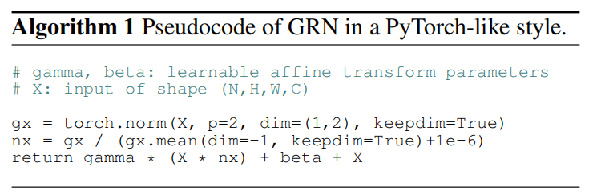
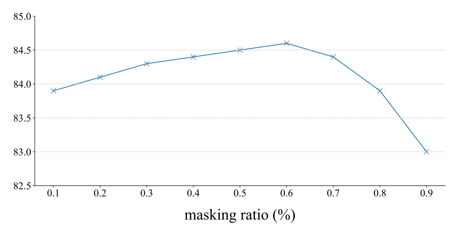

# ConvNeXt V2: Co-designing and Scaling ConvNets with Masked Autoencoders
ConvNeXt V2：与掩码自动编码器(MAE)共同设计和缩放ConvNets 2023.1.2 https://arxiv.org/abs/2301.00808

## 阅读笔记
* 完全卷积掩码自动编码器(FCMAE)框架, 全局响应归一化(GRN)层
* 在设计掩码自动编码器时，我们将掩码输入视为一组稀疏分块，并使用稀疏卷积[28]仅处理可见部分。该想法的灵感来自于在处理大规模3D点云时使用稀疏卷积[15,76]。子流形稀疏卷积
* 特征空间分析 -> 问题： MLP层的特征塌陷 -> 方案：GRN

## Abstract
Driven by improved architectures and better representation learning frameworks, the field of visual recognition has enjoyed rapid modernization and performance boost in the early 2020s. For example, modern ConvNets, represented by ConvNeXt [52], have demonstrated strong performance in various scenarios. While these models were originally designed for supervised learning with ImageNet labels, they can also potentially benefit from self-supervised learning techniques such as masked autoencoders (MAE) [31]. However, we found that simply combining these two approaches leads to subpar performance. In this paper, we propose a fully convolutional masked autoencoder framework and a new Global Response Normalization (GRN) layer that can be added to the ConvNeXt architecture to enhance inter-channel feature competition. This co-design of self-supervised learning techniques and architectural improvement results in a new model family called ConvNeXt V2, which significantly improves the performance of pure ConvNets on various recognition benchmarks, including ImageNet classification, COCO detection, and ADE20K segmentation. We also provide pre-trained ConvNeXt V2 models of various sizes, ranging from an efficient 3.7Mparameter Atto model with 76.7% top-1 accuracy on ImageNet, to a 650M Huge model that achieves a state-of-theart 88.9% accuracy using only public training data.

在改进的架构和更好的表征学习框架的推动下，视觉识别领域在20世纪20年代初实现了快速的现代化和性能提升。例如，以ConvNeXt[52]为代表的现代ConvNets在各种场景中都表现出了强大的性能。虽然这些模型最初是为使用ImageNet标签的监督学习而设计的，但它们也可能受益于自监督学习技术，如掩码自动编码器(MAE)[31]。然而，我们发现，简单地将这两种方法结合起来会导致较差的性能。在本文中，我们提出了一个完全卷积掩码自动编码器(FCMAE)框架和一个新的全局响应归一化(GRN)层，该层可以添加到ConvNeXt架构中，以增强信道间的特征竞争。这种自监督学习技术和架构改进的共同设计产生了一个新的模型族，称为ConvNeXt V2，它显著提高了纯ConvNets在各种识别基准上的性能，包括ImageNet分类、COCO检测和ADE20K分割。我们还提供了各种大小的预训练ConvNeXt V2模型，从高效的3.7M参数的Atto模型(在ImageNet上具有76.7%的top-1精度)到仅使用公共训练数据就达到88.9%的最高精度的650M巨型模型。

Code: https://github.com/facebookresearch/ConvNeXt-V2

## 1. Introduction
Building on research breakthroughs in earlier decades [34,44,47,60,68], the field of visual recognition has ushered in a new era of large-scale visual representation learning. Pre-trained, large-scale vision models have become essential tools for feature learning and enabling a wide range of vision applications. The performance of a visual representation learning system is largely influenced by three main factors: the neural network architecture chosen, the method used for training the network, and the data used for training. In the field of visual recognition, progress in each of these areas contributes to overall improvements in performance.

基于前几十年的研究突破[34，44，47，60，68]，视觉识别领域迎来了大规模视觉表征学习的新时代。预训练的大规模视觉模型已成为特征学习和实现广泛视觉应用的重要工具。视觉表征学习系统的性能在很大程度上受到三个主要因素的影响：所选择的神经网络架构、用于训练网络的方法以及用于训练的数据。在视觉识别领域，每一个领域的进步都有助于整体效果的提高。

 
Figure 1. ConvNeXt V2 model scaling. The ConvNeXt V2 model, which has been pre-trained using our fully convolutional masked autoencoder framework, performs significantly better than the previous version across a wide range of model sizes. 
图1。ConvNeXt V2模型缩放。ConvNeXt V2模型已经使用我们的完全卷积掩码自动编码器框架进行了预训练，在广泛的模型大小范围内，其性能明显优于前一版本。

Innovation in neural network architecture design has consistently played a major role in the field of representation learning. Convolutional neural network architectures (ConvNets) [34, 44, 47] have had a significant impact on computer vision research by allowing for the use of generic feature learning methods for a variety of visual recognition tasks [25, 33], rather than relying on manual feature engineering. In recent years, the transformer architecture [68], originally developed for natural language processing, has also gained popularity due to its strong scaling behavior with respect to model and dataset size [21]. More recently, ConvNeXt [52] architecture has modernized traditional ConvNets and demonstrated that pure convolutional models could also be scalable architectures. However, the most common method for exploring the design space for neural network architectures is still through benchmarking supervised learning performance on ImageNet. 

神经网络架构设计的创新一直在表征学习领域发挥着重要作用。卷积神经网络架构(卷积网)[34，44，47]通过允许将通用特征学习方法用于各种视觉识别任务[25，33]，而不是依赖于人工特征工程，对计算机视觉研究产生了重大影响。近年来，最初为自然语言处理开发的transformer架构[68]也因其在模型和数据集大小方面的强大缩放行为而受到欢迎[21]。最近，ConvNeXt[52]架构使传统ConvNets现代化，并证明纯卷积模型也可以是可扩展的架构。然而，探索神经网络架构设计空间的最常见方法仍然是在ImageNet上对监督学习性能进行基准测试。

In a separate line of research, the focus of visual representation learning has been shifting from supervised learning with labels to self-supervised pre-training with pretext objectives. Among many different self-supervised algorithms, masked autoencoders (MAE) [31] have recently brought success in masked language modeling to the vision domain and quickly become a popular approach for visual representation learning. However, a common practice in self-supervised learning is to use a predetermined architecture designed for supervised learning, and assume the design is fixed. For instance, MAE was developed using the vision transformer [21] architecture.

在另一项研究中，视觉表征学习的重点已经从带有标签的监督学习转向带有借口目标(pretext objectives)的自监督预训练。在许多不同的自监督算法中，掩码自动编码器(MAE)[31]最近在掩码语言建模领域取得了成功，并迅速成为视觉表征学习的流行方法。然而，自监督学习中的一种常见做法是使用为监督学习设计的预定架构，并假设该设计是固定的。例如，MAE是使用ViT[21]架构开发的。

It is possible to combine the design elements of architectures and self-supervised learning frameworks, but doing so may present challenges when using ConvNeXt with masked autoencoders. One issue is that MAE has a specific encode-decoder design that is optimized for the sequence processing capabilities of transformers, which allows the compute-heavy encoder to focus on visible patches and thus reduce the pre-training cost. This design may not be compatible with standard ConvNets, which use dense sliding windows. Additionally, if the relationship between the architecture and the training objective is not taken into consideration, it may be unclear whether optimal performance can be achieved. In fact, previous research has shown that training ConvNets with mask-based self-supervised learning can be difficult [43], and empirical evidence suggests that transformers and ConvNets may have different feature learning behaviors that can affect representation quality.

可以将架构的设计元素和自监督学习框架结合起来，但这样做可能会在将ConvNeXt与掩码自动编码器一起使用时带来挑战。一个问题是，MAE具有针对transformer的序列处理能力而优化的特定编码解码器设计，这允许重计算编码器专注于可见分块，从而降低预训练成本。这种设计可能与使用密集滑动窗口的标准ConvNets不兼容。此外，如果没有考虑架构和训练目标之间的关系，那么是否可以实现最佳性能可能是不清楚的。事实上，先前的研究表明，使用基于掩码的自监督学习来训练ConvNets可能是困难的[43]，经验证据表明，transformer和ConvNet可能具有不同的特征学习行为，这些行为会影响表示质量。

To this end, we propose to co-design the network architecture and the masked autoencoder under the same framework, with the aim of making mask-based self-supervised learning effective for ConvNeXt models and achieving results similar to those obtained using transformers.

为此，我们建议在同一框架下共同设计网络架构和掩码自动编码器，目的是使基于掩码的自监督学习对ConvNeXt模型有效，并获得与使用transformer获得的结果类似的结果。

In designing the masked autoencoder, we treat the masked input as a set of sparse patches and use sparse convolutions [28] to process only the visible parts. The idea is inspired by the use of sparse convolutions in processing large-scale 3D point clouds [15,76]. In practice, we can implement ConvNeXt with sparse convolutions, and at finetuning, the weights are converted back to standard, dense layers without requiring special handling. To further improve the pre-training efficiency, we replace the transformer decoder with a single ConvNeXt block, making the entire design fully convolutional. We have observed mixed results with these changes: the learned features are useful and improve upon the baseline results, but the fine-tuning performance is still not as good as the transformer-based model.

在设计掩码自动编码器时，我们将掩码输入视为一组稀疏分块，并使用稀疏卷积[28]仅处理可见部分。该想法的灵感来自于在处理大规模3D点云时使用稀疏卷积[15,76]。在实践中，我们可以用稀疏卷积实现ConvNeXt，在微调时，权重被转换回标准的密集层，而不需要特殊处理。为了进一步提高预训练效率，我们将transformer解码器替换为单个ConvNeXt块，使整个设计完全卷积。我们观察到了这些变化的混合结果：学习到的特征是有用的，并在基线结果上有所改进，但微调性能仍不如基于transformer的模型。

We then conduct a feature space analysis of different training configurations for ConvNeXt. We identify a potential issue of feature collapse at the MLP layer when training ConvNeXt directly on masked input. To address this issue, we propose adding a Global Response Normalization layer to enhance inter-channel feature competition. This change is most effective when the model is pre-trained with masked autoencoders, suggesting that reusing a fixed architecture design from supervised learning may be suboptimal.

然后，我们对ConvNeXt的不同训练配置进行特征空间分析。当直接在掩码输入上训练ConvNeXt时，我们确定了MLP层的特征塌陷的潜在问题。为了解决这个问题，我们建议添加一个全局响应归一化层，以增强信道间的特征竞争。这种变化在模型使用掩码自动编码器进行预训练时最为有效，这表明重用来自监督学习的固定架构设计可能是次优的。

In summary, we introduce ConvNeXt V2 which demonstrates improved performance when used in conjunction with masked autoencoders. We have found that this model significantly improves the performance of pure ConvNets across various downstream tasks, including ImageNet classification [60], COCO object detection [49] and ADE20K segmentation [81]. The ConvNeXt V2 models can be used in a variety of compute regimes and includes models of varying complexity: from an efficient 3.7M-parameter Atto model that achieves 76.7% top-1 accuracy on ImageNet, to a 650M Huge model that reaches a state-of-the-art 88.9% accuracy when using IN-22K labels.

总之，我们介绍了ConvNeXt V2，它在与掩码自动编码器结合使用时显示了改进的性能。我们发现，该模型显著提高了纯ConvNets在各种下游任务中的性能，包括ImageNet分类[60]、COCO对象检测[49]和ADE20K分割[81]。ConvNeXt V2模型可用于各种计算模式，包括各种复杂度的模型：从高效的3.7M参数Atto模型(在ImageNet上达到76.7%的顶级精度)到650M巨型模型(在使用in-22K标签时达到最先进的88.9%的精度)。

## 2. Related Work
### ConvNets. 
The design of ConvNets, which were first introduced in the 1980s [46] and trained using back-propagation, has undergone numerous improvements in terms of optimization, accuracy, and efficiency over the years [35, 36, 39, 44, 58, 61, 63, 75]. These innovations have mainly been discovered through the use of supervised training on the ImageNet dataset. In recent years, some efforts have been made to perform architecture search using self-supervised pre-text tasks such as rotation prediction and colorization, as in the case of UnNAS [50]. Recently, ConvNeXt [52] conducted a comprehensive review of the design space and demonstrated pure ConvNets can be as scalable as the vision transformers [21, 51], which have become the dominant architecture in many applications. ConvNeXt has particularly excelled in scenarios requiring lower complexity [7, 70, 71]. Our ConvNeXt V2 model, which is powered by self-supervised learning, provides a simple way to upgrade existing models and achieve a significant boost in performance across a wide range of use cases.

ConvNets。ConvNets的设计于20世纪80年代首次引入[46]，并使用反向传播进行训练，多年来在优化、准确性和效率方面进行了大量改进[35、36、39、44、58、61、63、75]。这些创新主要是通过使用ImageNet数据集上的监督训练发现的。近年来，已经做出了一些努力，使用自监督的预文本？任务(如旋转预测和着色)来执行架构搜索，如UnNAS[50]的情况。最近，ConvNeXt[52]对设计空间进行了全面审查，并证明了纯ConvNets可以像视觉transformer[21，51]一样可扩展，这已经成为许多应用中的主导架构。ConvNeXt在需要较低复杂度的场景中尤其出色[7，70，71]。我们的ConvNeXt V2模型由自监督学习提供支持，提供了一种简单的方法来升级现有模型，并在广泛的使用情况下显著提高性能。

### Masked Autoencoders. 
Masked image modeling, represented by masked autoencoders [31], is one of the latest self-supervised learning strategies. As a neural network pre-training framework, masked autoencoders have shown a broad impact on visual recognition. However, original masked autoencoders are not directly applicable to ConvNets due to their asymmetric encoder-decoder design. Alternative frameworks such as [3,77] have attempted to adapt the approach for use with ConvNets, but with mixed results. MCMAE [23] uses a few convolutional blocks as input tokenizers. To the best of our knowledge, there are no pretrained models that show self-supervised learning can improve upon the best ConvNeXt supervised results. 

掩码自动编码器。以掩码自动编码器[31]为代表的掩码图像建模是最新的自监督学习策略之一。作为一种神经网络预训练框架，掩码自动编码器对视觉识别有着广泛的影响。然而，原始的掩码自动编码器由于其不对称的编码器-解码器设计而不直接适用于ConvNets。其他框架，如[3,77]，已经尝试将该方法用于ConvNets，但结果好坏参半。MCMAE[23]使用几个卷积块作为输入标记器。据我们所知，没有预训练的模型表明自监督学习可以改善最佳ConvNeXt监督结果。

## 3. Fully Convolutional Masked Autoencoder 全卷积掩码自动编码器
Our approach is conceptually simple and runs in a fully convolutional manner. The learning signals are generated by randomly masking the raw input visuals with a high masking ratio and letting the model predict the missing parts given the remaining context. Our framework is illustrated in Figure 2, and we will now describe its main components in more detail.

我们的方法在概念上很简单，并且以完全卷积的方式运行。学习信号是通过以高掩码率随机掩码原始输入视觉效果并让模型在给定剩余上下文的情况下预测缺失部分而生成的。我们的框架如图2所示，现在我们将更详细地描述其主要组件。

 
Figure 2. Our FCMAE framework. We introduce a fully convolutional masked autoencoder (FCMAE). It consists of a sparse convolution-based ConvNeXt encoder and a lightweight ConvNeXt block decoder. Overall, the architecture of our autoencoder is asymmetric. The encoder processes only the visible pixels, and the decoder reconstructs the image using the encoded pixels and mask tokens. The loss is calculated only on the masked region. 
图2:我们的FCMAE框架。我们介绍了一种全卷积掩码自动编码器(FCMAE)。它由一个基于稀疏卷积的ConvNeXt编码器和一个轻量级ConvNeXt块解码器组成。总体而言，我们的自动编码器的架构是不对称的。编码器仅处理可见像素，解码器使用编码像素和掩码标记重建图像。仅在掩码区域上计算损失。

### Masking. 
We use a random masking strategy with a masking ratio of 0.6. As the convolutional model has a hierarchical design, where the features are downsampled in different stages, the mask is generated in the last stage and upsampled recursively up to the finest resolution. To implement this in practice, we randomly remove 60% of the 32 × 32 patches from the original input image. We use minimal data augmentation, only including random resized cropping.

掩码。我们使用掩码率为0.6的随机掩码策略。由于卷积模型具有分层设计，其中特征在不同阶段进行下采样，因此掩码在最后阶段生成，并递归地上采样，直到达到最佳分辨率。为了在实践中实现这一点，我们从原始输入图像中随机移除了32×32块中的60%。我们使用最小的数据增广，仅包括随机调整大小的裁剪。

### Encoder design. 
We use ConvNeXt [52] model as the encoder in our approach. One challenge in making masked image modeling effective is preventing the model from learning shortcuts that allow it to copy and paste information from the masked regions. This is relatively easy to prevent in transformer-based models, which can leave the visible patches as the only input to the encoder. However, it is more difficult to achieve this with ConvNets, as the 2D image structure must be preserved. While naive solutions involve introducing learnable masked tokens in the input side [3,77], these approaches decrease the efficiency of pretraining and result in a train and test time inconsistency, as there are no mask tokens at test time. This becomes especially problematic when the masking ratio is high.

编码器设计。在我们的方法中，我们使用ConvNeXt[52]模型作为编码器。使掩码图像建模有效的一个挑战是防止模型学习允许其从掩码区域复制和粘贴信息的快捷方式。这在基于transformer的模型中相对容易防止，因为它可以将可见分块作为编码器的唯一输入。然而，使用ConvNets实现这一点更加困难，因为必须保留2D图像结构。虽然朴素的解决方案涉及在输入端引入可学习的掩码令牌[3,77]，但这些方法降低了预训练的效率，并导致训练和测试时间不一致，因为测试时没有掩码令牌。当掩码率高时，这变得特别有问题。

To tackle this issue, our new insight is to view the masked image from a “sparse data perspective”, which was inspired by learning on sparse point clouds in 3D tasks [15,76]. Our key observation is that the masked image can be represented as a 2D sparse array of pixels. Based on this insight, it is natural to incorporate sparse convolution into our framework to facilitate pre-training of the masked autoencoder. In practice, during pre-training, we propose to convert the standard convolution layer in the encoder with the submanifold sparse convolution, which enables the model to operate only on the visible data points [15,27,28]. We note that the sparse convolution layers can be converted back to standard convolution at the fine-tuning stage without requiring additional handling. As an alternative, it is also possible to apply a binary masking operation before and after the dense convolution operation. This operation has numerically the same effect as sparse convolutions, is theoretically more computationally intensive, but can be more friendly on AI accelerators like TPU.

为了解决这个问题，我们的新见解是从“稀疏数据视角”查看掩码图像，这是在3D任务中学习稀疏点云的启发[15,76]。我们的关键观察是，掩码图像可以表示为2D稀疏像素阵列。基于这一见解，很自然地将稀疏卷积合并到我们的框架中，以促进掩码自动编码器的预训练。实际上，在预训练期间，我们建议使用子流形稀疏卷积来转换编码器中的标准卷积层，这使得模型只能在可见数据点上操作[15，27，28]。我们注意到，稀疏卷积层可以在微调阶段转换回标准卷积，而不需要额外的处理。作为替代，也可以在密集卷积操作之前和之后应用二进制掩码操作。这种操作在数值上具有与稀疏卷积相同的效果，理论上计算量更大，但在TPU等AI加速器上更友好。

### Decoder design. 
We use a lightweight, plain ConvNeXt block as the decoder. This forms an asymmetric encoderdecoder architecture overall, as the encoder is heavier and has a hierarchy. We also considered more complex decoders such as hierarchical decoders [48, 59] or transformers [21, 31], but the simpler single ConvNeXt block decoder performed well in terms of fine-tuning accuracy and reduced pre-training time considerably, demonstrated in Table 1. We set the dimension of the decoder to 512.

解码器设计。我们使用一个轻量级的普通ConvNeXt块作为解码器。这就形成了一个非对称的编码器架构，因为编码器更重，并且具有层次结构。我们还考虑了更复杂的解码器，如分层解码器[48，59]或transformer[21，31]，但更简单的单个ConvNeXt块解码器在微调精度方面表现良好，并显著减少了预训练时间，如表1所示。我们将解码器的维数设置为512。

 
Table 1. MAE decoder ablation experiments with ConvNeXt-Base on ImageNet-1K. We report fine-tuning (ft) accuracy (%). The pretraining schedule is 800 epochs. In the decoder design exploration, the wall-clock time is benchmarked on a 256-core TPU-v3 pod using JAX. The speedup is relative to the UNet decoder baseline. Our final design choices employed in the paper are marked in gray .
表1。基于ImageNet-1K的ConvNeXt的MAE解码器消融实验。我们报告微调(ft)精度(%)。预训练计划为800个阶段。在解码器设计探索中，使用JAX在256核TPU-v3吊舱上对墙上时钟时间进行基准测试。加速比与UNet解码器基线有关。我们在论文中使用的最终设计选择用灰色标记。

### Reconstruction target. 
We compute the mean squared error (MSE) between the reconstructed and target images. Similar to MAE [31], the target is a patch-wise normalized image of the original input, and the loss is applied only on the masked patches.

重建目标。我们计算重建图像和目标图像之间的均方误差(MSE)。与MAE[31]类似，目标是原始输入的逐块归一化图像，并且损失仅应用于掩码的块。

### FCMAE. 
We now present a Fully Convolutional Masked AutoEncoder (FCMAE) by combining the proposals described above. To evaluate the effectiveness of this framework, we use the ConvNeXt-Base model as the encoder and conduct a series of ablation studies. Throughout the paper, we focus on the end-to-end fine-tuning performance becuase of its practical relevance in transfer learning, and use that to assess the quality of the learned representation.

FCMAE。我们现在通过结合上述建议提出了一种全卷积掩码自动编码器(FCMAE)。为了评估该框架的有效性，我们使用ConvNeXt-Base模型作为编码器，并进行了一系列消融研究。在整个论文中，我们关注端到端微调性能，因为它在迁移学习中的实际相关性，并使用它来评估学习表示的质量。

We pre-train and fine-tune using the ImageNet-1K (IN- 1K) dataset for 800 and 100 epochs, respectively, and report the top-1 IN-1K validation accuracy for a single 224×224 center crop. Additional details about the experimental setup can be found in the appendix.

我们分别使用ImageNet-1K(IN-1K)数据集对800和100个时期进行预训练和微调，并报告了单个224×224中心作物的top-1  IN-1K验证精度。有关实验设置的其他详情，请参见附录。

To understand the impact of using sparse convolution in our FCMAE framework, we first investigate how it affects the quality of the learned representation during masked image pre-training. Our empirical findings show that it is essential to prevent information leakage from the masked region in order to achieve good results. 

为了了解在我们的FCMAE框架中使用稀疏卷积的影响，我们首先研究了它如何在掩码图像预训练期间影响学习表示的质量。我们的实证结果表明，为了获得良好的结果，必须防止信息从掩码区域泄漏。

w/o Sparse conv. | w/ Sparse conv.
--- | --- 
79.3 | 83.7

Next, we compare our self-supervised approach to supervised learning. Specifically, we obtain two baseline experimental results: the supervised 100 epoch baseline using the same recipe and the 300 epoch supervised training baseline provided in the original ConvNeXt paper [52]. We find that our FCMAE pre-training provides better initialization than the random baseline (i.e., 82.7 → 83.7), but it still needs to catch up to the best performance obtained in the original supervised setup.

接下来，我们将自监督方法与监督学习进行比较。具体而言，我们获得了两个基线实验结果：使用相同配方的监督100个周期基线和原始ConvNeXt论文[52]中提供的300个周期监督训练基线。我们发现，我们的FCMAE预训练比随机基线(即82.7→ 83.7)，但它仍然需要赶上在原始监督设置中获得的最佳性能。

Sup, 100ep | Sup, 300ep. [52] | FCMAE
--- | --- | ---
82.7 | 83.8 | 83.7

This is in contrast to the recent success of masked image modeling using transformer-based models [3, 31, 77], where the pre-trained models significantly outperform the supervised counterparts. This motivates us to investigate the unique challenges faced by the ConvNeXt encoder during masked autoencoder pre-training, which we discuss next.

这与最近使用基于transformer的模型[3，31，77]的掩模图像建模的成功形成对比，其中预训练的模型显著优于受监督的模型。这促使我们研究ConvNeXt编码器在掩码自动编码器预训练期间面临的独特挑战，我们将在接下来讨论。

## 4. Global Response Normalization 全局响应标准化
In this section, we introduce a new Global Response Normalization (GRN) technique to make FCMAE pretraining more effective in conjunction with the ConvNeXt architecture. We first motivate our approach through both qualitative and quantitative feature analyses.

在本节中，我们介绍了一种新的全局响应归一化(GRN)技术，以使FCMAE预训练与ConvNeXt架构相结合更加有效。我们首先通过定性和定量特征分析来激励我们的方法。

### Feature collapse. 
To gain more insight into the learning behavior, we first perform qualitative analysis in the feature space. We visualize the activations of a FCMAE pre-trained ConvNeXt-Base model and notice an intriguing “feature collapse” phenomenon: there are many dead or saturated feature maps and the activation becomes redundant across channels. We show some of the visualizations in Figure 3. This behavior was mainly observed in the dimensionexpansion MLP layers in a ConvNeXt block [52].

特征折叠。为了更深入地了解学习行为，我们首先在特征空间中进行定性分析。我们可视化了FCMAE预训练ConvNeXt Base模型的激活，并注意到一个有趣的“特征塌陷”现象：有许多死的或饱和的特征图，激活在通道之间变得多余。我们在图3中展示了一些可视化。这种行为主要在ConvNeXt区块的尺寸扩展MLP层中观察到[52]。

 
Figure 3. Feature activation visualization. We visualize the activation map for each feature channel in small squares. For clarity, we display 64 channels in each visualization. The ConvNeXt V1 model suffers from a feature collapse issue, which is characterized by the presence of redundant activations (dead or saturated neurons) across channels. To fix this problem, we introduce a new method to promote feature diversity during training: the global response normalization (GRN) layer. This technique is applied to high-dimensional features in every block, leading to the development of the ConvNeXt V2 architecture.
图3。功能激活可视化。我们将每个特征通道的激活图可视化为小方块。为了清楚起见，我们在每个可视化中显示64个通道。ConvNeXt V1模型存在特征崩溃问题，其特征是通道中存在冗余激活(死亡或饱和神经元)。为了解决这个问题，我们引入了一种在训练过程中促进特征多样性的新方法：全局响应归一化(GRN)层。该技术应用于每个区块的高维特征，从而开发了ConvNeXt V2架构。

### Feature cosine distance analysis. 
To further validate our observation quantitatively, we perform a feature cosine distance analysis. Given an activation tensor $X ∈ R^{H×W×C}$ , $X_i ∈ R^{H×W}$ is the feature map of the i-th channel. We reshape it as a HW dimensional vector and compute the average pair-wise cosine distance across the channels by $\frac1{C^2} \sum_C^i \sum_C^j \frac{1−cos(X_i,X_j)}2$ . A higher distance value indicates more diverse features, while a lower value indicates feature redundancy.

特征余弦距离分析。为了进一步定量验证我们的观察结果，我们进行了特征余弦距离分析。给定激活张量$X ∈ R^{H×W×C}$ , $X_i ∈ R^{H×W}$ 是第i通道的特征映射。我们将其重塑为HW维向量，并通过$\frac1{C^2} \sum_C^i \sum_C^j \frac{1−cos(X_i,X_j)}2$计算通道的平均成对余弦距离。距离值越高表示特征越多样，而距离值越低表示特征冗余。

To perform this analysis, we randomly select 1,000 images from different classes in the ImageNet-1K validation set and extract the high-dimensional features from each layer of different models, including the FCMAE models, the ConvNeXt supervised model [52] and the MAE pretrained ViT model [31]. We then compute the distance per layer for each image and average the values across all images. The results are plotted in Figure 4. The FCMAE pretrained ConvNeXt model exhibits a clear tendency towards feature collapse, consistent with our observations from the previous activation visualizations. This motivates us to consider ways to diversify the features during learning and prevent feature collapse.

为了执行此分析，我们从ImageNet-1K验证集中的不同类别中随机选择1000张图像，并从不同模型的每一层提取高维特征，包括FCMAE模型、ConvNeXt监督模型[52]和MAE预训练的ViT模型[31]。然后，我们计算每个图像的每层距离，并对所有图像的值进行平均。结果如图4所示。FCMAE预训练的ConvNeXt模型显示出明显的特征崩溃趋势，这与我们从先前的激活可视化中观察到的一致。这促使我们考虑在学习过程中使特征多样化并防止特征崩溃的方法。

 
Figure 4. Feature cosine distance analysis. As the number of total layers varies for different architectures, we plot the distance values against the normalized layer indexes. We observe that the ConvNeXt V1 FCMAE pre-trained model exhibits severe feature collapse behavior. The supervised model also shows a reduction in feature diversity, but only in the final layers. This decrease in diversity in the supervised model is likely due to the use of the cross-entropy loss, which encourages the model to focus on classdiscriminative features while suppressing the others.
图4。特征余弦距离分析。由于不同架构的总层数不同，我们将距离值与标准化层索引进行比较。我们观察到ConvNeXt V1 FCMAE预训练模型表现出严重的特征塌陷行为。监督模型还显示了特征多样性的减少，但仅在最终层中。监督模型中多样性的减少很可能是由于使用了交叉熵损失，这鼓励模型在抑制其他特征的同时关注分类鉴别特征。

### Approach. 
There are many mechanisms in the brain that promote neuron diversity. For example, lateral inhibition [6, 30] can help to sharpen the response of the activated neuron and increase the contrast and selectivity of individual neurons to the stimulus while also increasing the diversity of responses across the population of neurons. In deep learning, this form of lateral inhibition can be implemented by response normalization [45]. In this work, we introduce a new response normalization layer called global response normalization (GRN), which aims to increase the contrast and selectivity of channels. Given an input feature, $X ∈ R^{H×W×C}$ , the proposed GRN unit consists of three steps: 1) global feature aggregation, 2) feature normalization, and 3) feature calibration.

方法。大脑中有许多促进神经元多样性的机制。例如，侧向抑制[6，30]可以帮助增强激活神经元的反应，增加单个神经元对刺激的对比度和选择性，同时也增加神经元群体中反应的多样性。在深度学习中，这种形式的横向抑制可以通过响应归一化来实现[45]。在这项工作中，我们引入了一个新的响应归一化层，称为全局响应归一化(GRN)，旨在提高通道的对比度和选择性。给定输入特征$X ∈ R^{H×W×C}$，所提出的GRN单元由三个步骤组成：1)全局特征聚合，2)特征归一化，和3)特征校准。

First, we aggregate a spatial feature map Xi into a vector gx with a global function G(·): 

首先，我们使用全局函数G(·)将空间特征地图Xi聚合为向量gx：

$G(X) := X ∈ R^{H×W×C} → gx ∈ R^C$ . (1)

This can be viewed as a simple pooling layer. We experimented with different functions in Table 2a. Interestingly, global average pooling, a widely used feature aggregator [37, 72], did not perform well in our case. Instead, we found that using norm-based feature aggregation, specifically, using L2-norm, resulted in better performance. This gives us a set of aggregated values $G(X) = gx = {||X_1||, ||X_2||, . . . , ||X_C ||} ∈ R^C$ where $G(X)_i = ||X_i ||$ is a scalar that aggregates the statistics of the i-th channel.

这可以看作是一个简单的池化层。我们在表2a中试验了不同的功能。有趣的是，全局平均池(一种广泛使用的功能聚合器[37，72])在我们的案例中表现不佳。相反，我们发现使用基于范数的特征聚合，特别是使用L2范数，可以获得更好的性能。这为我们提供了一组聚集值$G(X) = gx = {||X_1||, ||X_2||, . . . , ||X_C ||} ∈ R^C$ ，其中$G(X)_i = ||X_i ||$是聚集第i个信道统计信息的标量。

Next, we apply a response normalization function N (·) to the aggregated values. Concretely, we use a standard divisive normalization as follows,

接下来，我们将响应归一化函数N(·)应用于聚合值。具体地，我们使用如下标准的分裂归一化，

$N (||X_i ||) := ||X_i || ∈ R → \frac{||X_i ||}{\sum_{j=1,...,C} ^{} {||X_j ||}} ∈ R$, (2) 

where $||X_i ||$ is the L2-norm of the i-th channel(1To account for the increased number of channels at deeper layers, in practice, we also scale the normalized value by the channel count C).  Intuitively, for the i-th channel, Eqn. 2 computes its relative importance compared to all the other channels. Similar to other forms of normalization [42, 45, 68], this step creates a feature competition across channels by mutual inhibition. In Table 2b, we also examine the use of other normalization functions and find that the simple divisive normalization works best, though standardization ($||X_i ||$ − µ)/σ yields similar results when applied to the same L2-norm aggregated values.

其中，$||X_i ||$是第i个信道的L2-形式(1为了解释深层信道数量的增加，实际上，我们还通过信道计数C来缩放归一化值)。直观地，对于第i个信道。2计算其与所有其他信道相比的相对重要性。与其他形式的标准化类似[42，45，68]，这一步骤通过相互抑制创建了跨频道的特征竞争。在表2b中，我们还检查了其他归一化函数的使用，发现简单的除法归一化效果最好，尽管标准化($||X_i ||$−µ)/σ在应用于相同的L2形式聚合值时会产生类似的结果。

Finally, we calibrate the original input responses using the computed feature normalization scores:

最后，我们使用计算的特征归一化分数来校准原始输入响应：

$X_i = X_i ∗ N (G(X)_i) ∈ R^{H×W}$ (3)

The core GRN unit is very easy to implement, requiring only three lines of code, and has no learnable parameters. The pseudo-code for the GRN unit is in Algorithm 1.

核心GRN单元非常容易实现，只需要三行代码，并且没有可学习的参数。GRN单元的伪代码在算法1中。

To ease optimization, we add two additional learnable parameters, γ and β, and initialize them to zero. We also add a residual connection between the input and output of the GRN layer. The resulting final GRN block is $X_i = γ ∗X_i ∗N (G(X)_i)+β+X_i$ . This setup allows a GRN layer to initially perform an identity function and gradually adapt during training. The importance of residual connection is demonstrated in Table 2c.

为了简化优化，我们添加了两个额外的可学习参数，γ和β，并将它们初始化为零。我们还在GRN层的输入和输出之间添加了一个残余连接。最终生成的GRN区块为$X_i = γ ∗X_i ∗N (G(X)_i)+β+X_i$ 。这种设置允许GRN层最初执行身份功能，并在训练期间逐渐适应。残余连接的重要性如表2c所示。

 
Table 2. GRN ablations with ConvNeXt-Base. We report fine-tuning accuracy on ImageNet-1K. Our final proposal is marked in gray . 
表2。带ConvNeXt底座的GRN消融。我们报告了ImageNet-1K上的微调精度。我们的最终提案用灰色标出。

### ConvNeXt V2. 
We incorporate the GRN layer into the original ConvNeXt block, as illustrated in Figure 5. We empirically found that LayerScale [65] becomes unnecessary when GRN is applied and can be removed. Using this new block design, we create various models with varying effi- ciency and capacity, which we refer to as the ConvNeXt V2 model family. These models range from lightweight (e.g. Atto [70]) to compute-intensive (e.g. Huge) ones. Detailed model configurations can be found in the appendix.

ConvNeXt V2。我们将GRN层合并到原始ConvNeXt块中，如图5所示。我们根据经验发现，当应用GRN时，LayerScale[65]变得不必要，并且可以移除。使用这种新的模块设计，我们创建了各种不同效率和容量的模型，我们称之为ConvNeXt V2模型系列。这些模型从轻量级(例如Atto[70])到计算密集型(例如巨大)。详细的模型配置见附录。

 
Figure 5. ConvNeXt Block Designs. In ConvNeXt V2, we add the GRN layer after the dimension-expansion MLP layer and drop LayerScale [65] as it becomes redundant. 
图5。ConvNeXt块设计。在ConvNeXt V2中，我们在维度扩展MLP层之后添加GRN层，并在其变得冗余时删除LayerScale[65]。

### Impact of GRN. 
We now pre-train ConvNeXt V2 using the FCMAE framework and evaluate the impact of GRN. From visualization in Figure 3 and cosine distance analysis in Figure 4, we can observe that ConvNeXt V2 effectively mitigates the feature collapse issue. The cosine distance values are consistently high, indicating that feature diversity is maintained across layers. This behavior is similar to that of the MAE pre-trained ViT model [31]. Overall, this suggests that ConvNeXt V2 learning behavior can resemble ViT, under a similar masked image pre-training framework.

GRN的影响。我们现在使用FCMAE框架对ConvNeXt V2进行预训练，并评估GRN的影响。从图3中的可视化和图4中的余弦距离分析中，我们可以观察到ConvNeXt V2有效地缓解了特征塌陷问题。余弦距离值始终很高，表明各层之间保持了特征多样性。这种行为类似于MAE预训练的ViT模型[31]。总体而言，这表明ConvNeXt V2学习行为可以在类似的掩码图像预训练框架下类似于ViT。

Next, we evaluate the fine-tuning performance.

接下来，我们评估微调性能。

V1 + Sup, 300ep. | V1 + FCMAE | V2 + FCMAE
--- | --- | --- 
83.8 | 83.7 | 84.6

When equipped with GRN, the FCMAE pre-trained model can significantly outperform the 300 epoch supervised counterpart. GRN improves the representation quality by enhancing the feature diversity, which was absent in the V1 model but has proven crucial for masked-based pretraining. Note this improvement is achieved without adding additional parameter overhead or increased FLOPS.(2The additional affine parameters γ/β are negligible.)

当配备GRN时，FCMAE预训练模型可以显著优于300周期监督模型。GRN通过增强特征多样性来提高表示质量，这在V1模型中是不存在的，但已证明对于基于掩码的预训练至关重要。注意，这种改进是在不增加额外的参数开销或增加FLOPS的情况下实现的。(2附加仿射参数γ/β可忽略不计。)

### Relation to feature normalization methods. 
Can other normalization layers [2,41,45,67,73] perform as well as the global response normalization (GRN) layer? In Table 2d, we compare GRN with the three widely used normalization layers: Local Response Normalization (LRN) [45], Batch Normalization (BN) [41], and Layer Normalization (LN) [2]. We observe that only GRN can significantly outperform the supervised baseline. LRN lacks global context as it only contrasts channels within nearby neighbors. BN normalizes spatially along the batch axis, which is unsuitable for masked inputs. LN implicitly encourages feature competition through global mean and variance standardization but does not work as well as GRN.

与特征归一化方法的关系。其他归一化层[2,41,45,67,73]是否可以与全局响应归一化(GRN)层一样执行？在表2d中，我们将GRN与三个广泛使用的归一化层进行了比较：局部响应归一化(LRN)[45]、批处理归一化(BN)[41]和层归一化(LN)[2]。我们观察到，只有GRN能够显著优于监督基线。LRN缺乏全局背景，因为它只对比附近邻居的频道。BN沿着批处理轴在空间上归一化，这不适用于掩码输入。LN隐含地通过全局均值和方差标准化来鼓励特征竞争，但其效果不如GRN。

### Relation to feature gating methods. 
Another way to enhance competition across neurons is to use dynamic feature gating methods [37, 56, 69, 72, 78]. In Table 2e, we compare our GRN with two classic gating layers: squeeze-andexcite (SE) [37] and convolutional block attention module (CBAM) [72]. SE focuses on channel gating, while CBAM focuses on spatial gating. Both modules can increase the contrast of individual channels, similar to what GRN does. GRN is much simpler and more efficient as it does not require additional parameter layers (such as MLPs).

与特征门控方法的关系。增强神经元间竞争的另一种方法是使用动态特征门控方法[37，56，69，72，78]。在表2e中，我们将GRN与两个经典门控层进行了比较：挤压和排斥(SE)[37]和卷积块注意力模块(CBAM)[72]。SE侧重于信道门控，而CBAM侧重于空间门控。这两个模块都可以增加单个通道的对比度，类似于GRN的功能。GRN更加简单和高效，因为它不需要额外的参数层(如MLP)。

### The role of GRN in pre-training/fine-tuning. 
Finally, we examine the importance of GRN in pre-training and finetuning. We present results in Table 2f where we either remove GRN from fine-tuning or add newly initialized GRN only at the time of fine-tuning. Either way, we observe a significant performance degradation, suggesting that keeping GRN in both pre-training and fine-tuning is important.

GRN在预训练/微调中的作用。最后，我们检验了GRN在预训练和微调中的重要性。我们在表2f中给出了结果，其中我们要么从微调中删除GRN，要么仅在微调时添加新初始化的GRN。无论哪种方式，我们都观察到了显著的性能下降，这表明在预训练和微调中保持GRN都很重要。

## 5. ImageNet Experiments
In this section, we present and analyze two key proposals, the FCMAE pre-training framework and ConvNeXt V2 architecture, which are co-designed to make masked-based self-supervised pre-training successful. We show these designs synergize well and provide a strong foundation for scaling the model to various sizes. Additionally, we compare our approach to previous masked image modeling approaches through experiments. Furthermore, we show that our largest ConvNeXt V2 Huge model, which has been pretrained using the FCMAE framework and fine-tuned on the ImageNet-22K dataset, can achieve a new state-of-the-art of 88.9% top-1 accuracy on the ImageNet-1K dataset, using only publicly available data.

在本节中，我们提出并分析了两个关键建议，即FCMAE预训练框架和ConvNeXt V2架构，它们是共同设计的，旨在使基于掩码的自监督预训练成功。我们展示了这些设计的良好协同作用，并为将模型扩展到各种尺寸提供了强大的基础。此外，我们通过实验将我们的方法与先前的掩码图像建模方法进行了比较。此外，我们还表明，我们最大的ConvNeXt V2巨大模型(已使用FCMAE框架进行了预训练，并在ImageNet-22K数据集上进行了微调)可以在ImageNet-1K数据集实现88.9%的顶级精度，仅使用公开可用数据。

### Co-design matters. 
In this paper, we conduct a unique study that involves co-designing both the self-supervised learning framework (FCMAE) and the model architecture improvement (GRN layer), through an empirical study of their learning behavior. The results presented in Table 3 demonstrate the importance of this approach.

共同设计问题。在本文中，我们进行了一项独特的研究，通过对其学习行为的实证研究，共同设计了自监督学习框架(FCMAE)和模型架构改进(GRN层)。表3中的结果表明了这种方法的重要性。

 
Table 3. Co-design matters. When the architecture and the learning framework are co-designed and used together, masked image pre-training becomes effective for ConvNeXt. We report the finetuning performance from 800 epoch FCMAE pre-trained models. The relative improvement is bigger with a larger model. 
表3。共同设计问题。当架构和学习框架被共同设计和使用时，掩码图像预训练对于ConvNeXt变得有效。我们报告了800周期FCMAE预训练模型的微调性能。模型越大，相对改善越大。

We found that using the FCMAE framework without modifying the model architecture has a limited impact on representation learning quality. Similarly, the new GRN layer has a rather small effect on performance under the supervised setup. However, the combination of the two results in a significant improvement in fine-tuning performance. This supports the idea that both the model and learning framework should be considered together, particularly when it comes to self-supervised learning.

我们发现，在不修改模型架构的情况下使用FCMAE框架对表征学习质量的影响有限。同样，新的GRN层对监督设置下的性能影响很小。然而，这两者的结合会显著提高微调性能。这支持这样一种观点，即模型和学习框架应该一起考虑，特别是在自监督学习方面。

 
Table 4. Comparisons with previous masked image modeling approaches. The pre-training data is the IN-1K training set. All self-supervised methods are benchmarked by the end-to-end finetuning performance with an image size of 224. We underline the highest accuracy for each model size and bold our best results. 
表4。与以前的掩码图像建模方法的比较。训练前数据为IN-1K训练集。所有自监督方法都以图像大小为224的端到端微调性能为基准。我们强调每种模型的最高精度，并以粗体显示最佳结果。

### Model scaling. 
In this study, we evaluated a range of 8 models with different sizes, from a low-capacity 3.7M Atto model to a high-capacity 650M Huge model. We pretrained these models using the proposed FCMAE framework and compared the fine-tuning results to the fully supervised counterparts.

模型缩放。在这项研究中，我们评估了8种不同尺寸的模型，从低容量3.7M Atto模型到高容量650M巨型模型。我们使用提出的FCMAE框架对这些模型进行了预处理，并将微调结果与完全监督的对应结果进行了比较。

The results, shown in Figure 1, demonstrate strong model scaling behavior, with consistently improved performance over the supervised baseline across all model sizes. This is the first time the benefit of masked image modeling has been demonstrated in such a broad model spectrum, both in terms of effectiveness and efficiency. The complete tabulated results can be found in the appendix.

结果如图1所示，显示了强大的模型缩放行为，在所有模型大小上，与受监督的基线相比，性能持续改善。这是第一次在如此广泛的模型范围内证明掩码图像建模的好处，无论是在有效性还是效率方面。完整的列表结果见附录。

### Comparisons with previous methods. 
We compare our approach to previous masked auto-encoder methods [3, 31, 77], which were all designed for transformer-based models. The results are summarized in Table 4. Our framework outperforms the Swin transformer pre-trained with SimMIM [77] across all model sizes. Compared to the plain ViT pre-trained with MAE [31], our approach performs similarly up to the Large model regime, despite using much fewer parameters (198M vs 307M). However, in the huge model regime, our approach slightly lagged behind. This might be because a huge ViT model can benefit more from self-supervised pre-training. As we will see next, the gap might be closed with additional intermediate fine-tuning.

与以前方法的比较。我们将我们的方法与之前的掩码自动编码器方法[3，31，77]进行了比较，这些方法都是为基于transformer的模型设计的。结果汇总在表4中。我们的框架在所有模型尺寸上都优于使用SimMIM[77]预训练的Swintransformer。与使用MAE[31]预训练的普通ViT相比，我们的方法在大模型状态下表现类似，尽管使用的参数少得多(198M vs 307M)。然而，在庞大的模型体系中，我们的方法稍显落后。这可能是因为一个巨大的ViT模型可以从自监督的预训练中获益更多。正如我们接下来将看到的，这一差距可能会通过额外的中间微调来弥补。

### ImageNet-22K intermediate fine-tuning. 
We also present ImageNet-22K intermediate fine-tuning results [3]. The training process involves three steps: 1) FCMAE pretraining, 2) ImageNet-22K fine-tuning, and 3) ImageNet- 1K fine-tuning. We use 3842 resolution images for pretraining and fine-tuning [38]. We compare our results to the state-of-the-art architecture designs, including convolutionbased [52, 64], transformer-based [22], and hybrid designs [20,66]. All these results were trained with ImageNet- 22K supervised labels. The results are summarized in Table 5. Our method, using a convolution-based architecture, sets a new state-of-the-art accuracy using publicly available data only (i.e. ImageNet-1K and ImageNet-22K).

ImageNet-22K中间微调。我们还展示了ImageNet-22K中间微调结果[3]。训练过程包括三个步骤：1)FCMAE预训练，2)ImageNet-22K微调，和3)ImageNet-1K微调。我们使用3842分辨率图像进行预训练和微调[38]。我们将我们的结果与最先进的架构设计进行了比较，包括基于卷积的[52，64]、基于transformer的[22]和混合设计[20，66]。所有这些结果都使用ImageNet-22K监督标签进行训练。结果汇总在表5中。我们的方法使用基于卷积的架构，仅使用公开可用的数据(即ImageNet-1K和ImageNet-22K)设置了新的最先进的精度。

 
Table 5. ImageNet-1K fine-tuning results using IN-21K labels. The ConvNeXt V2 Huge model equipped with the FCMAE pretraining outperforms other architectures and sets a new state-ofthe-art accuracy of 88.9% among methods using public data only. 
表5。使用IN-21K标签的ImageNet-1K微调结果。配备FCMAE预训练的ConvNeXt V2 Huge模型优于其他架构，并在仅使用公共数据的方法中创下88.9%的最新精度。

## 6. Transfer Learning Experiments 迁移学习实验
We now benchmark the transfer learning performance. First, we evaluate the impact of our co-design, i.e. comparing ConvNeXt V1 + supervised vs. ConvNeXt V2 + FCMAE. We also directly compare our approach with Swin transformer models pre-trained with SimMIM [77]. The training and testing details are provided in the appendix.

我们现在对迁移学习效果进行基准测试。首先，我们评估了共同设计的影响，即比较ConvNeXt V1+监督与ConvNeXt V2+FCMAE。我们还直接将我们的方法与SimMIM预训练的Swintransformer模型进行了比较[77]。训练和测试详情见附录。

### Object detection and segmentation on COCO. 
We finetune Mask R-CNN [33] on the COCO dataset [49] and report the detection mAPbox and the segmentation mAPmask on the COCO val2017 set. The results are shown in Table 6. We see a gradual improvement as our proposals are applied. From V1 to V2, the GRN layer is newly introduced and enhances performance. Upon this, the model further benefits from better initialization when moving from supervised to FCMAE-based self-supervised learning. The best performances are achieved when both are applied together. Additionally, our final proposal, ConvNeXt V2 pre-trained on FCMAE, outperforms the Swin transformer counterparts across all model sizes, with the largest gap achieved in the huge model regime.

COCO上的目标检测和分割。我们在COCO数据集[49]上微调Mask R-CNN[33]，并报告COCO val2017集合上的检测mAPbox和分割mAPmask。结果如表6所示。随着我们的建议的实施，我们看到了逐步的改善。从V1到V2，GRN层是新引入的，提高了性能。在此基础上，当从监督学习转向基于FCMAE的自监督学习时，该模型进一步受益于更好的初始化。当两者同时应用时，可获得最佳性能。此外，我们的最终方案ConvNeXt V2在FCMAE上进行了预训练，在所有模型尺寸上都优于Swintransformer，在巨大的模型范围内实现了最大的差距。

### Semantic segmentation on ADE20K. 
To summarize, we conduct experiments on the ADE20K [82] semantic segmentation task using the UperNet framework [74]. Our results show a similar trend to the object detection experiments, and our final model significantly improves over the V1 supervised counterparts. It also performs on par with the Swin transformer in the base and large model regimes but outperforms Swin in the huge model regime.

ADE20K上的语义分割。总之，我们使用UperNet框架[74]对ADE20K[82]语义分割任务进行了实验。我们的结果显示出与目标检测实验相似的趋势，并且我们的最终模型比V1监督的模型显著改进。它在基础和大型模型领域的表现也与Swintransformer不相上下，但在大型模型领域表现优于Swin。

 
Table 6. COCO object detection and instance segmentation results using Mask-RCNN. FLOPS are calculated with image size (1280, 800). Swins’ results are from [77]. All COCO fine-tuning experiments rely on ImageNet-1K pre-trained models.
表6。使用掩码RCNN的COCO对象检测和实例分割结果。FLOPS是用图像大小(1280800)计算的。Swins的结果来自[77]。所有COCO微调实验都依赖于ImageNet-1K预训练模型。

 
Table 7. ADE20K semantic segmentation results using UPerNet. Swins’ results are from [77]. FLOPS are based on input sizes of (2048, 512) or (2560, 640). All ADE20K fine-tuning experiments rely on ImageNet-1K pre-trained model except FCMAE, 22K ft, in which case the ImageNet-1K pre-training is followed by ImageNet-22K supervised fine-tuning. 
表7。使用UPerNet的ADE20K语义分割结果。Swins的结果来自[77]。FLOPS基于输入大小(2048、512)或(2560、640)。所有ADE20K微调实验都依赖于ImageNet-1K预训练模型，FCMAE除外，22K ft，在这种情况下，ImageNet-1K预训练之后是ImageNet-22K监督微调。

## 7. Conclusion
In this paper, we introduce a new ConvNet model family called ConvNeXt V2 that covers a broader range of complexity. While the architecture has minimal changes, it is specifically designed to be more suitable for self-supervised learning. Using our fully convolutional masked autoencoder pre-training, we can significantly improve the performance of pure ConvNets across various downstream tasks, including ImageNet classification, COCO object detection, and ADE20K segmentation.

在本文中，我们介绍了一个新的ConvNet模型族，称为ConvNeXtV2，它涵盖了更广泛的复杂性。虽然架构的变化很小，但它是专门为更适合自监督学习而设计的。使用我们的完全卷积掩码自动编码器预训练，我们可以在各种下游任务中显著提高纯ConvNets的性能，包括ImageNet分类、COCO对象检测和ADE20K分割。

## Acknowledgments. 
We thank Ross Wightman for the initial design of the small-compute ConvNeXt model variants and the associated training recipe. We also appreciate the helpful discussions and feedback provided by Kaiming He. 

## Appendix
This appendix provides implementation details, including model configurations, pre-training and fine-tuning recipes, and sparse and dense encoding methods for FCMAE pre-training (see §A). In §B, we present complete fine-tuning accuracy comparisons between ConvNeXt V1 and V2 on ImageNet 1K and 22K. In §C, we perform analyses on the efficiency of sparse encoding and general feature analysis using the class selectivity index. Finally, in §D, we conduct additional ablation studies on the masking ratio and GRN component analysis. We also compare FCMAE (masked image modeling) with MoCo V3 (contrastive learning).

本附录提供了实现细节，包括模型配置、预训练和微调配方，以及FCMAE预训练的稀疏和密集编码方法(见§A)。在§B中，我们展示了ImageNet 1K和22K上ConvNeXt V1和V2之间的完整微调精度比较。在§C中，我们使用类别选择性指数对稀疏编码和一般特征分析的效率进行了分析。最后，在§D中，我们对掩码率和GRN成分分析进行了额外的消融研究。我们还比较了FCMAE(掩码图像建模)和MoCoV3(对比学习)。

### A. Implementation Details
#### A.1. ConvNeXt V2 model configurations
The basic models, i.e., Tiny (28M), Base (89M) and Large (198M), follow the same configurations of the stage, block (B), and channel (C) settings of the ConvNeXt V1 [52].

基本模型，即Tiny(28M)、Base(89M)和Large(198M)，遵循ConvNeXt V1[52]的阶段、块(B)和通道(C)设置的相同配置。

* ConvNeXt V2-T: C=96, B=(3, 3, 9, 3)
* ConvNeXt V2-B: C=128, B=(3, 3, 27, 3)
* ConvNeXt V2-L: C=192, B=(3, 3, 27, 3)

Given the same definitions above, we scale the model to provide a broad model size spectrum, targeting versatile scenarios. First, to obtain efficient models, we scale down as follows:

考虑到上述相同的定义，我们对模型进行了缩放，以提供广泛的模型大小范围，并针对多种场景。首先，为了获得有效的模型，我们按如下比例缩小：

* ConvNeXt V2-A: C=40, B=(2, 2, 6, 2)
* ConvNeXt V2-F: C=48, B=(2, 2, 6, 2)
* ConvNeXt V2-P: C=64, B=(2, 2, 6, 2)
* ConvNeXt V2-N: C=80, B=(2, 2, 8, 2)

A, F, P, N denote Atto (3.7M), Femto (5.2M), Pico (9.1M), and Nano (15.6M) models designed originally in [70]. Next, to introduce the large-capacity variant, we scale up as follows:

A、 F、P、N表示最初在[70]中设计的Atto(3.7M)、Femto(5.2M)、Pico(9.1M)和Nano(15.6M)模型。接下来，为了引入大容量变体，我们将按如下方式进行扩展：

* ConvNeXt V2-H: C=352, B=(3, 3, 27, 3)

H denotes Huge (659M) model, which is newly presented in this work.

H表示本工作中新提出的巨大(659M)模型。

#### A.2. ImageNet Experiments
Pre-training All models share the same pre-training setup, as noted in Table 8. We use the linear lr scaling rule [26]: lr = base lr×batchsize / 256.

预训练所有模型共享相同的预训练设置，如表8所示。我们使用线性lr缩放规则[26]：lr=base lr×batchsize/256。

 
Table 8. Pre-training setting. 

ImageNet-1K fine-tuning. As the learning capacity varies by model size, we adopt different fine-tuning recipes for each model. We summarize them in Table 9, 10 and 11. We see longer fine-tuning epochs help small models. We adopt two different learning-rate layer decay strategies in this work: group-wise [52], where we treat three sequential layers as a single “layer” and use the same decaying value for them, and the layer-wise [3], where we assign a distinct value for each layer, both following the standard decaying rule. The default is a layer-wise strategy, but we apply the group-wise decaying strategy to Base and Large models.

ImageNet-1K微调。由于学习能力因模型大小而异，我们对每个模型采用不同的微调方案。我们将其汇总在表9、10和11中。我们看到更长的微调时间有助于小型模型。在这项工作中，我们采用了两种不同的学习速率层衰减策略：分组[52]，其中我们将三个连续层视为单个“层”，并对它们使用相同的衰减值; 分层[3]，其中我们为每个层分配不同的值，都遵循标准衰减规则。默认策略是逐层策略，但我们将逐组衰减策略应用于基本模型和大型模型。

 
Table 9. End-to-end IN-1K fine-tuning setting for Atto (A), Femto (F), Pico (P) and Nano (N) models. 

 
Table 10. End-to-end IN-1K fine-tuning setting for Tiny model.  

 
Table 11. End-to-end IN-1K fine-tuning setting for Base (B), Large (L), and Huge (H) models.  

ImageNet-22K intermediate fine-tuning. We conduct ImageNet-22K intermediate fine-tuning with the FCMAEpretrained ConvNeXt models. We use nano, tiny, base, large, and huge models. The setups are summarized in Table 12 and 13. Similarly, using larger layer-wise learning rate decay values for small models is helpful.

ImageNet-22K中间微调。我们使用FCMAE预训练ConvNeXt模型进行ImageNet-22K中间微调。我们使用nano、微型、基础、大型和大型模型。设置汇总在表12和13中。同样，对小模型使用更大的逐层学习速率衰减值也是有帮助的。

 
Table 12. End-to-end IN-22K intermediate fine-tuning settings.  

 
Table 13. End-to-end IN-1K fine-tuning settings (after IN-22K intermediate fine-tuning). 

Sparse encoding implementations. We propose two possible implementations to enable FCMAE pre-training: 1) sparse encoding using sparse convolution [15, 27, 28] supported by external libraries [15, 18], and 2) simulating sparse encoding with the masked dense convolution, which can be easily implemented by applying binary masks before and after the standard convolution operation. As they produce numerically identical outputs, both can be adopted depending on different use cases. In this work, we adopt sparse encoding on the GPU environment, where we use MinkowskiEngine library [15] and PyTorch framework [57]; we use dense masked conv based encoding on TPU accelerators using Jax [5]. The experiments in the main paper are all conducted on TPU (v3-256) pods and we release a PyTorch reproduction.

稀疏编码实现。我们提出了两种可能的实现方式来实现FCMAE预训练：1)使用外部库[15，18]支持的稀疏卷积[15，27，28]进行稀疏编码，以及2)使用掩码密集卷积模拟稀疏编码，这可以通过在标准卷积操作前后应用二进制掩码来轻松实现。由于它们产生了数字上相同的输出，因此可以根据不同的用例采用两者。在这项工作中，我们在GPU环境中采用稀疏编码，其中我们使用MinkowskiEngine库[15]和PyTorch框架[57]; 我们使用Jax[5]在TPU加速器上使用基于密集掩码conv的编码。主要论文中的实验都是在TPU(v3-256)吊舱上进行的，我们发布了PyTorch复制品。

#### A.3. Object detection and segmentation on COCO
For COCO experiments, we use the MMDetection[10] toolbox and the final model weights from ImageNet-1K pretraining as network initializations. All models are trained with a 3x schedule (36 epochs) and a batch size of 32. We utilize an AdamW optimizer [54] with a learning rate of 1e-4, a weight decay of 0.05 and sweep layer-wise learning rate decay in {0.9, 0.95}, stochastic depth rate in {0.2, 0.3,0.4, 0.5}. We employ a large-scale jittering augmentation[24] (1024×1024 resolution, scale range [0.1, 2.0]). We use single-scale testing with soft-NMS [4] during inference.

对于COCO实验，我们使用MMDetection[10]工具箱和ImageNet-1K预训练的最终模型权重作为网络初始化。所有模型均采用3倍计划(36个时期)和32个批量进行训练。我们使用AdamW优化器[54]，其学习速率为1e-4，权重衰减为0.05，扫描层学习速率衰减为{0.9，0.95}，随机深度速率为{0.2，0.3,0.4，0.5}。我们使用大规模抖动增强[24](1024×1024分辨率，标度范围[0.1，2.0])。我们在推断过程中使用soft-NMS[4]进行单标度测试。

#### A.4. Semantic segmentation in ADE20K
For ADE20K experiments, we use the MMSegmentation [17] toolbox. We use an AdamW optimizer [54] with the following hyperparameters: a weight decay of 0.05, a batch size of 16 and sweep layer-wise decay rate {0.8, 0.9}, learning rate {1e-4, 2e-4, 3e-4}, stochastic depth rate {0.1, 0.2,0.3, 0.4}. All models are trained for 160K iterations with an input resolution of 512×512. In inference, a multi-scale test using resolutions that are [0.75,0.875,1.0,1.125,1.25] of 512×2048 is employed.

对于ADE20K实验，我们使用MMSegmentation[17]工具箱。我们使用具有以下超参数的AdamW优化器[54]：权重衰减为0.05，批量大小为16，扫描层衰减率为{0.8，0.9}，学习率为{1e-4，2e-4，3e-4}，随机深度率为{0.1，0.2，0.3，0.4}。所有模型都经过160K次迭代训练，输入分辨率为512×512。在推断中，采用了分辨率为[0.75,0.875,1.0,1.125,1.25]的512×2048的多尺度测试。

Similar to [77], we initialized the segmentation models using model weights after supervised fine-tuning on ImageNet-1K, as we found its performance superior to using the self-supervised pre-trained weights directly.

与[77]类似，我们在ImageNet-1K上进行监督微调后使用模型权重初始化分割模型，因为我们发现其性能优于直接使用自监督预训练权重。

### B. Complete comparisons with V1
In Tables 14 and 15, we present detailed experimentlevel comparisons between ConvNeXt V1 [52, 70] and V2. In particular, Table 14 shows ImageNet-1K fine-tuning results using eight models: Atto, Femto, Nano, Pico, Tiny, Base, Large, and Huge, which range from low-compute (Atto, 3.7M) to large-capacity models (Huge, 660M). We see a consistent and significant improvement across all models. The best performance is achieved when the architecture is upgraded from V1 to V2 and the self-supervised learning framework FCMAE is used, demonstrating the effectiveness of the co-design. In Table 15, we present ImageNet-22K intermediate fine-tuning results. The pretraining and fine-tuning process consists of three steps: 1) FCMAE pre-training, 2) ImageNet-22K fine-tuning, and 3) ImageNet-1K fine-tuning. Here, we focus on five V2 models: Nano, Tiny, Base, Large and Huge. We see consistent improvement over the V1 counterparts. In particular, the V2 Base (86.8%/87.7%) and Large (87.3%/88.2%) models outperform the next-level model sizes of V1, which are the Large (86.6%/87.5%) and XLarge (87.0%/87.8%) models. The V2 Huge model also achieves a new state-of-the-art with a performance of 88.9%. Our proposal demonstrates that pure convolutional models can also be strong and scalable vision learners with mask-based pre-training.

在表14和15中，我们对ConvNeXt V1[52，70]和V2进行了详细的实验水平比较。特别是，表14显示了使用八种模型的ImageNet-1K微调结果：Atto、Femto、Nano、Pico、Tiny、Base、Large和Huge，从低计算(Atto，3.7M)到大容量模型(Huge，660M)。我们看到所有模型都有一致且显著的改进。当架构从V1升级到V2并使用自监督学习框架FCMAE时，可以获得最佳性能，这证明了协同设计的有效性。在表15中，我们展示了ImageNet-22K中间微调结果。预训练和微调过程包括三个步骤：1)FCMAE预训练，2)ImageNet-22K微调，和3)ImageNet-1K微调。这里，我们重点介绍五种V2模型：Nano、Tiny、Base、Large和Huge。我们看到了与V1版本相比的持续改进。特别是，V2 Base(86.8%/87.7%)和Large(87.3%/88.2%)模型优于V1的下一级模型，即Large(86.6%/87.5%)和XLarge(87.0%/87.8%)模型。V2巨大模型也达到了新的最先进水平，性能为88.9%。我们的建议表明，纯卷积模型也可以通过基于掩码的预训练成为强大和可扩展的视觉学习器。
 
 
Table 14. ImageNet-1K fine-tuning results with a single 224×224 crop. The improvement over the V1 supervised model is shown in parentheses.
表14。ImageNet-1K微调结果为单个224×224裁剪。对V1监督模型的改进如括号所示。

 
Table 15. ImageNet-22K intermediate fine-tuning results with a single 224×224 crop. The improvement over the V1 supervised model is shown in parentheses. 
表15。ImageNet-22K中间微调结果为单个224×224裁剪。对V1监督模型的改进如括号所示。

### C. Further Analyses 进一步分析
Sparse encoding efficiency. One of the key design choices in our FCMAE framework is the use of sparse convolution [15, 27, 28] during pre-training. The primary purpose is to block the flow of information from the masked region and facilitate masked autoencoder pre-training. As a byproduct, it also offers improved computational and memory efficiency during pre-training, as the kernels only apply to the visible pixels. However, we note that the sparse convolution libraries [15,18] are not highly optimized for modern hardware, and the efficiency achieved usually depends on the frameworks [1, 5, 57] used in practice.

稀疏编码效率。我们的FCMAE框架中的一个关键设计选择是在预训练期间使用稀疏卷积[15，27，28]。主要目的是阻止来自掩码区域的信息流，并促进掩码自动编码器预训练。作为副产品，它在预训练期间还提供了改进的计算和内存效率，因为内核仅适用于可见像素。然而，我们注意到稀疏卷积库[15，18]对于现代硬件没有高度优化，实现的效率通常取决于实践中使用的框架[1，5，57]。

 
Figure 6. Sparse encoding efficiency. Under the pre-training setup, we measure the training throughput (image/s) and max GPU memory usage (G). The per GPU batch size is 64, and the throughput values are measured using 20 forward and backward steps. Our results show that the sparse convolution-based encoder allows for improved pre-training efficiency compared to the dense masked convolution-based counterpart.
图6。稀疏编码效率。在预训练设置下，我们测量训练吞吐量(图像/秒)和最大GPU内存使用率(G)。每GPU批处理大小为64，吞吐量值使用20个向前和向后步骤测量。我们的结果表明，与基于密集掩码卷积的编码器相比，基于稀疏卷积的编码器允许提高预训练效率。

To better understand the actual pre-training efficiency achieved using sparse convolution, we conducted benchmark experiments using a controlled setup with Minkowski Engine v0.5.4 [15] and PyTorch [57]. We simulated the pretraining masked input (image size 224×224, masking ratio  0.6, mask size 32×32) and compared the training throughput (image/s) and max GPU memory usage (G) between the sparse convolution-based and dense masked convolutionbased encoders. While the results may vary depending on the experimental environment (we used PyTorch V1.8.0, CUDA 11.1, CuDNN 8.2, and NVIDIA RTX A6000 GPU), we observed a moderate increase in pre-training efficiency, with an average of 1.3× increase in throughput and a 2× decrease in max memory usage across the models. The gap becomes more salient as the model size increases.

为了更好地理解使用稀疏卷积实现的实际预训练效率，我们使用Minkowski Engine v0.5.4[15]和PyTorch[57]的受控设置进行了基准测试。我们模拟了预训练掩码输入(图像大小224×224，掩码率0.6，掩码大小32×32)，并比较了基于稀疏卷积和基于密集掩码卷积的编码器之间的训练吞吐量(图像/秒)和最大GPU内存使用率(G)。虽然结果可能会因实验环境而异(我们使用了PyTorch V1.8.0、CUDA 11.1、CuDNN 8.2和NVIDIA RTX A6000 GPU)，但我们观察到预训练效率有适度提高，吞吐量平均增加1.3倍，模型的最大内存使用量减少2倍。随着模型尺寸的增加，间隙变得更加明显。

 
Figure 7. Class selectivity index distribution. The x-axis and y-axis show the class selectivity index and its density (PDF), respectively. Using the ImageNet-1K validation dataset, we calculated the class selectivity index distribution of both FCMAE pre-trained ConvNeXt V1 (red) and V2 (blue). While they tend to match closely in the early stages, the distribution becomes different in the deep layers. V2 tends to include more class-generic features in the later stages.
图7。类别选择性指数分布。x轴和y轴分别显示类别选择性指数及其密度(PDF)。使用ImageNet-1K验证数据集，我们计算了FCMAE预训练ConvNeXt V1(红色)和V2(蓝色)的类别选择性指数分布。虽然它们在早期阶段趋于紧密匹配，但在深层中的分布变得不同。V2倾向于在后期包含更多的类通用特性。

Class Selectivity Index. FCMAE pre-trained ConvNeXt V2 has a distinctive feature characteristic compared to V1. We conducted a class selectivity index analysis on the FCMAE pre-trained weights for ConvNeXt V1 and V2 to understand this. The class selectivity index is a metric that measures the difference between the highest classconditional mean activity and all other class-conditional mean activities. The final normalized value lies between 0 and 1, with 1 indicating that a filter activates only for a single class and 0 indicating that the filter activates uniformly for all classes. In Figure 7, we plot the class selectivity index distribution for all intermediate layers in the model, using the output of every residual block. The distribution is closely matched between V1 and V2 in the early stages, but they begin to diverge in the deep layers, such as stage 3 layer 12. As the layer becomes deeper, the plot shows that V2 (bimodal) tends to include more class-generic features than V1 (unimodal). Since class-agnostic features are more transferrable [55], this leads to better fine-tuning per formance in downstream tasks. We leave more explorations as a future study.

类别选择性指数。与V1相比，FCMAE预训练ConvNeXt V2具有独特的特征。我们对ConvNeXt V1和V2的FCMAE预训练权重进行了类别选择性指数分析，以了解这一点。类别选择性指数是衡量最高类别条件平均活动与所有其他类别条件平均行为之间差异的指标。最终的标准化值介于0和1之间，1表示过滤器仅对单个类激活，0表示过滤器对所有类都统一激活。在图7中，我们使用每个残差块的输出绘制了模型中所有中间层的类别选择性指数分布。在早期阶段，V1和V2之间的分布非常匹配，但在深层(例如第3阶段第12层)中，它们开始分化。随着层变深，该图显示V2(双峰)倾向于包含比V1(单峰)更多的类通用特征。由于与类无关的特性更易于传递[55]，这将导致下游任务中的性能得到更好的微调。我们留下更多的探索作为未来的研究。

 
Table 16. GRN component analysis. We report the fine-tuning performance after the 800 epoch FCMAE pre-training. Here, affine parameters and residual connection are omitted for clarity. The base denotes the ConvNeXt V1 fine-tuning performance. The aggregation and normalization are spatial L2-norm pooling and channel-wise divisive normalization, respectively. Case-(a) indicates a simple baseline of channel-wise scaling and shifting (with affine parameters) without explicit feature normalization. 
表16。GRN成分分析。我们报告了800次FCMAE预训练后的微调性能。这里，为了清楚起见，省略了仿射参数和残差连接。基数表示ConvNeXt V1微调性能。聚合和归一化分别是空间L2范数池和信道分裂归一化。情况-(a)表示无显式特征归一化的信道方向缩放和移位(使用仿射参数)的简单基线。

### D. Additional Experiments
GRN component analysis. The proposed Global Relation Network (GRN) consists of three steps: global feature aggregation, feature normalization, and feature calibration. The main paper demonstrates that the combination of L2- norm based aggregation and divisive normalization works well in practice. Table 16 verifies the individual contribution of these components using ConvNeXt V2-Base as the encoder. When either component is dropped, performance significantly decreases, and the training becomes unstable if feature normalization is not preceded by global aggregation. This supports the idea that both operations work together to make GRN effective.

GRN成分分析。提出的全局关系网络(GRN)由三个步骤组成：全局特征聚合、特征归一化和特征校准。主要论文证明了基于L2规范的聚合和分裂规范化的结合在实践中效果良好。表16使用ConvNeXt V2 Base作为编码器验证了这些组件的单独贡献。当任何一个组件被丢弃时，性能都会显著下降，如果在特征归一化之前没有进行全局聚合，那么训练就会变得不稳定。这支持这样一种观点，即两种操作共同工作以使GRN有效。

 
Figure 8. Masking ratio. We observe that a masking ratio of 0.6 provides the best result. The y-axis is ImageNet-1K accuracy (%). 
图8。掩码率。我们观察到0.6的掩码率提供了最佳结果。y轴为ImageNet-1K精度(%)。

Masking ratios. We conduct a hyper-parameter analysis on the masking ratio for a mask size of 32 × 32. The results, shown in Figure 8, suggest that a masking ratio in the range of 0.5 to 0.7 produces the best results, with a masking ratio of 0.6 providing the highest performance. The model’s performance declines at the two extremes of either removing or leaving 90% of the input information, although it is more robust when more information is retained.
掩码率。我们对掩模尺寸为32×32的掩模比进行了超参数分析。图8所示的结果表明，0.5至0.7范围内的掩码率产生最佳结果，0.6的掩码率提供最高性能。该模型的性能在去除或保留90%的输入信息这两个极端时都会下降，尽管当保留更多信息时，它更为稳健。

Comparison with contrastive SSL. In this work, we compare the performance of the two dominant self-supervised learning (SSL) approaches: contrastive learning [8, 9, 12– 14, 29, 32] and masked image modeling [3, 31, 77]. Specifi- cally, we compare the end-to-end fine-tuning performance of MoCoV3 [14], the current state-of-the-art contrastive learning method, with our proposed FCMAE framework using the same ConvNeXt V2-Base as the encoder. We follow the default pre-training and fine-tuning recipes for each approach and present the results below.

与对比SSL的比较。在这项工作中，我们比较了两种主要的自监督学习(SSL)方法的性能：对比学习[8，9，12–14，29，32]和掩码图像建模[3，31，77]。具体而言，我们将当前最先进的对比学习方法MoCoV3[14]的端到端微调性能与我们提出的FCMAE框架进行了比较，该框架使用与编码器相同的ConvNeXt V2 Base。我们遵循每种方法的默认预训练和微调配方，并将结果呈现在下面。

| Sup, 300ep. | MoCo V3 | FCMAE |
| --- | --- | --- |
| 84.3 | 83.7 | 84.9 | 

We use the 300-epoch supervised learning baseline as a reference. The above table shows that FCMAE leads to better representation quality than MoCo V3 and also outperforms the supervised baseline. This is consistent with the recent observations that masked image modeling offers superior results over contrastive learning-based SSL for end-to-end fine-tuning. In this work, this success was also made possible with pure ConvNets.
我们使用300纪元监督学习基线作为参考。上表显示，FCMAE导致比MoCo V3更好的表示质量，也优于监督基线。这与最近的观察结果一致，即蒙面图像建模提供了优于基于对比学习的SSL的端到端微调结果。在这项工作中，纯ConvNets也使这一成功成为可能。

## References
1. Mart´ın Abadi, Paul Barham, Jianmin Chen, Zhifeng Chen, Andy Davis, Jeffrey Dean, Matthieu Devin, Sanjay Ghemawat, Geoffrey Irving, Michael Isard, et al. Tensorflow: A system for large-scale machine learning. In Operating Systems Design and Implementation, 2016.
2. Jimmy Lei Ba, Jamie Ryan Kiros, and Geoffrey E Hinton. Layer normalization. arXiv preprint arXiv:1607.06450, 2016.
3. Hangbo Bao, Li Dong, and Furu Wei. BEiT: BERT pretraining of image transformers. In ICLR, 2022.
4. Navaneeth Bodla, Bharat Singh, Rama Chellappa, and Larry S Davis. Soft-nms–improving object detection with one line of code. In ICCV, 2017.
5. James Bradbury, Roy Frostig, Peter Hawkins, Matthew James Johnson, Chris Leary, Dougal Maclaurin, George Necula, Adam Paszke, Jake VanderPlas, Skye Wanderman-Milne, and Qiao Zhang. JAX: composable transformations of Python+NumPy programs, 2018.
6. Fergus W Campbell and John G Robson. Application of fourier analysis to the visibility of gratings. The Journal of physiology, 1968.
7. Thomas Capelle. Finding the New Resnet18. https://wandb.ai/fastai/fine_tune_timm/reports/Finding-the-New-Resnet18--VmlldzoyMDI0MjU3, 2022.
8. Mathilde Caron, Ishan Misra, Julien Mairal, Priya Goyal, Piotr Bojanowski, and Armand Joulin. Unsupervised learning of visual features by contrasting cluster assignments. In NeurIPS, 2020.
9. Mathilde Caron, Hugo Touvron, Ishan Misra, Herv´e J´egou, Julien Mairal, Piotr Bojanowski, and Armand Joulin. Emerging properties in self-supervised vision transformers. In ICCV, 2021.
10. Kai Chen, Jiaqi Wang, Jiangmiao Pang, Yuhang Cao, Yu Xiong, Xiaoxiao Li, Shuyang Sun, Wansen Feng, Ziwei Liu, Jiarui Xu, Zheng Zhang, Dazhi Cheng, Chenchen Zhu, Tianheng Cheng, Qijie Zhao, Buyu Li, Xin Lu, Rui Zhu, Yue Wu, Jifeng Dai, Jingdong Wang, Jianping Shi, Wanli Ouyang, Chen Change Loy, and Dahua Lin. MMDetection: Open mmlab detection toolbox and benchmark. arXiv:1906.07155, 2019.
11. Mark Chen, Alec Radford, Rewon Child, Jeffrey Wu, Heewoo Jun, David Luan, and Ilya Sutskever. Generative pretraining from pixels. In ICML, 2020.
12. Ting Chen, Simon Kornblith, Mohammad Norouzi, and Geoffrey Hinton. A simple framework for contrastive learning of visual representations. In ICML, 2020.
13. Xinlei Chen and Kaiming He. Exploring simple Siamese representation learning. In CVPR, 2021.
14. Xinlei Chen, Saining Xie, and Kaiming He. An empirical study of training self-supervised Vision Transformers. In ICCV, 2021.
15. Christopher Choy, JunYoung Gwak, and Silvio Savarese. 4d spatio-temporal convnets: Minkowski convolutional neural networks. In CVPR, 2019.
16. Kevin Clark, Minh-Thang Luong, Quoc V Le, and Christopher D Manning. ELECTRA: Pre-training text encoders as discriminators rather than generators. In ICLR, 2020.
17. MMSegmentation contributors. MMSegmentation: Openmmlab semantic segmentation toolbox and benchmark. https://github.com/open-mmlab/mmsegmentation, 2020. 13
18. Spconv Contributors. Spconv: Spatially sparse convolution library. https://github.com/traveller59/spconv, 2022.
19. Ekin D Cubuk, Barret Zoph, Jonathon Shlens, and Quoc V Le. Randaugment: Practical automated data augmentation with a reduced search space. In CVPRW, 2020.
20. Zihang Dai, Hanxiao Liu, Quoc V Le, and Mingxing Tan. Coatnet: Marrying convolution and attention for all data sizes. In NeurIPS, 2021.
21. Alexey Dosovitskiy, Lucas Beyer, Alexander Kolesnikov, Dirk Weissenborn, Xiaohua Zhai, Thomas Unterthiner, Mostafa Dehghani, Matthias Minderer, Georg Heigold, Sylvain Gelly, Jakob Uszkoreit, and Neil Houlsby. An image is worth 16x16 words: Transformers for image recognition at scale. In ICLR, 2021.
22. Haoqi Fan, Bo Xiong, Karttikeya Mangalam, Yanghao Li, Zhicheng Yan, Jitendra Malik, and Christoph Feichtenhofer. Multiscale vision transformers. In CVPR, 2021.
23. Peng Gao, Teli Ma, Hongsheng Li, Jifeng Dai, and Yu Qiao. MCMAE: Masked Convolution Meets Masked Autoencoders. In NeurIPS, 2022.
24. Golnaz Ghiasi, Yin Cui, Aravind Srinivas, Rui Qian, TsungYi Lin, Ekin D Cubuk, Quoc V Le, and Barret Zoph. Simple copy-paste is a strong data augmentation method for instance segmentation. In CVPR, 2021.
25. Ross Girshick, Jeff Donahue, Trevor Darrell, and Jitendra Malik. Rich feature hierarchies for accurate object detection and semantic segmentation. In CVPR, 2014.
26. Priya Goyal, Piotr Doll´ar, Ross Girshick, Pieter Noordhuis, Lukasz Wesolowski, Aapo Kyrola, Andrew Tulloch, Yangqing Jia, and Kaiming He. Accurate, large minibatch SGD: Training ImageNet in 1 hour. arXiv:1706.02677, 2017.
27. Benjamin Graham, Martin Engelcke, and Laurens Van Der Maaten. 3d semantic segmentation with submanifold sparse convolutional networks. In CVPR, 2018.
28. Benjamin Graham and Laurens van der Maaten. Submanifold sparse convolutional networks. arXiv preprint arXiv:1706.01307, 2017.
29. Jean-Bastien Grill, Florian Strub, Florent Altch´e, Corentin Tallec, Pierre Richemond, Elena Buchatskaya, Carl Doersch, Bernardo Avila Pires, Zhaohan Guo, Mohammad Gheshlaghi Azar, Bilal Piot, koray kavukcuoglu, Remi Munos, and Michal Valko. Bootstrap your own latent - a new approach to self-supervised learning. In NeurIPS, 2020.
30. H K Hartline, Henry G Wagner, and Floyd Ratliff. Inhibition in the eye of limulus. The Journal of general physiology, 1956.
31. Kaiming He, Xinlei Chen, Saining Xie, Yanghao Li, Piotr Doll´ar, and Ross Girshick. Masked autoencoders are scalable vision learners. In CVPR, 2022.
32. Kaiming He, Haoqi Fan, Yuxin Wu, Saining Xie, and Ross Girshick. Momentum contrast for unsupervised visual representation learning. In CVPR, 2020.
33. Kaiming He, Georgia Gkioxari, Piotr Doll´ar, and Ross Girshick. Mask R-CNN. In ICCV, 2017.
34. Kaiming He, Xiangyu Zhang, Shaoqing Ren, and Jian Sun. Delving deep into rectifiers: Surpassing human-level performance on imagenet classification. In ICCV, 2015.
35. Kaiming He, Xiangyu Zhang, Shaoqing Ren, and Jian Sun. Deep residual learning for image recognition. In CVPR, 2016.
36. Andrew G Howard, Menglong Zhu, Bo Chen, Dmitry Kalenichenko, Weijun Wang, Tobias Weyand, Marco Andreetto, and Hartwig Adam. MobileNets: Efficient convolutional neural networks for mobile vision applications. arXiv:1704.04861, 2017.
37. Jie Hu, Li Shen, and Gang Sun. Squeeze-and-excitation networks. In CVPR, 2018.
38. Ronghang Hu, Shoubhik Debnath, Saining Xie, and Xinlei Chen. Exploring long-sequence masked autoencoders. arXiv preprint arXiv:2210.07224, 2022.
39. Gao Huang, Zhuang Liu, Laurens van der Maaten, and Kilian Q Weinberger. Densely connected convolutional networks. In CVPR, 2017.
40. Gao Huang, Yu Sun, Zhuang Liu, Daniel Sedra, and Kilian Q Weinberger. Deep networks with stochastic depth. In ECCV, 2016.
41. Sergey Ioffe and Christian Szegedy. Batch normalization: Accelerating deep network training by reducing internal covariate shift. In ICML, 2015.
42. Kevin Jarrett, Koray Kavukcuoglu, Marc’Aurelio Ranzato, and Yann LeCun. What is the best multi-stage architecture for object recognition? In ICCV, 2009.
43. Li Jing, Jiachen Zhu, and Yann LeCun. Masked siamese convnets. arXiv preprint arXiv:2206.07700, 2022.
44. Alex Krizhevsky, Ilya Sutskever, and Geoff Hinton. Imagenet classification with deep convolutional neural networks. In NeurIPS, 2012.
45. Alex Krizhevsky, Ilya Sutskever, and Geoffrey E Hinton. Imagenet classification with deep convolutional neural networks. Communications of the ACM, 2017.
46. Yann LeCun, Bernhard Boser, John S Denker, Donnie Henderson, Richard E Howard, Wayne Hubbard, and Lawrence D Jackel. Backpropagation applied to handwritten zip code recognition. Neural computation, 1989.
47. Yann LeCun, L´eon Bottou, Yoshua Bengio, Patrick Haffner, et al. Gradient-based learning applied to document recognition. Proceedings of the IEEE, 1998.
48. Tsung-Yi Lin, Piotr Doll´ar, Ross Girshick, Kaiming He, Bharath Hariharan, and Serge Belongie. Feature pyramid networks for object detection. In CVPR, 2017.
49. Tsung-Yi Lin, Michael Maire, Serge Belongie, James Hays, Pietro Perona, Deva Ramanan, Piotr Doll´ar, and C Lawrence Zitnick. Microsoft coco: Common objects in context. In ECCV, 2014.
50. Chenxi Liu, Piotr Doll´ar, Kaiming He, Ross Girshick, Alan Yuille, and Saining Xie. Are labels necessary for neural architecture search? In ECCV, 2020.
51. Ze Liu, Yutong Lin, Yue Cao, Han Hu, Yixuan Wei, Zheng Zhang, Stephen Lin, and Baining Guo. Swin transformer: Hierarchical vision transformer using shifted windows. In ICCV, 2021.
52. Zhuang Liu, Hanzi Mao, Chao-Yuan Wu, Christoph Feichtenhofer, Trevor Darrell, and Saining Xie. A convnet for the 2020s. In CVPR, 2022. 14
53. Ilya Loshchilov and Frank Hutter. SGDR: Stochastic gradient descent with warm restarts. In ICLR, 2017.
54. Ilya Loshchilov and Frank Hutter. Decoupled weight decay regularization. In ICLR, 2019.
55. Ari S Morcos, David GT Barrett, Neil C Rabinowitz, and Matthew Botvinick. On the importance of single directions for generalization. In ICLR, 2018.
56. Jongchan Park, Sanghyun Woo, Joon-Young Lee, and In So Kweon. Bam: Bottleneck attention module. In BMVC, 2018.
57. Adam Paszke, Sam Gross, Soumith Chintala, Gregory Chanan, Edward Yang, Zachary DeVito, Zeming Lin, Alban Desmaison, Luca Antiga, and Adam Lerer. Automatic differentiation in pytorch. In NeurIPS, 2017.
58. Ilija Radosavovic, Raj Prateek Kosaraju, Ross Girshick, Kaiming He, and Piotr Doll´ar. Designing network design spaces. In CVPR, 2020.
59. Olaf Ronneberger, Philipp Fischer, and Thomas Brox. U-net: Convolutional networks for biomedical image segmentation. In MICCAI, 2015.
60. Olga Russakovsky, Jia Deng, Hao Su, Jonathan Krause, Sanjeev Satheesh, Sean Ma, Zhiheng Huang, Andrej Karpathy, Aditya Khosla, Michael Bernstein, Alexander C. Berg, and Li Fei-Fei. ImageNet Large Scale Visual Recognition Challenge. IJCV, 2015.
61. Christian Szegedy, Wei Liu, Yangqing Jia, Pierre Sermanet, Scott Reed, Dragomir Anguelov, Dumitru Erhan, Vincent Vanhoucke, and Andrew Rabinovich. Going deeper with convolutions. In CVPR, 2015.
62. Christian Szegedy, Vincent Vanhoucke, Sergey Ioffe, Jonathon Shlens, and Zbigniew Wojna. Rethinking the inception architecture for computer vision. In CVPR, 2016.
63. Mingxing Tan and Quoc Le. Efficientnet: Rethinking model scaling for convolutional neural networks. In ICML, 2019.
64. Mingxing Tan and Quoc Le. Efficientnetv2: Smaller models and faster training. In ICML, 2021.
65. Hugo Touvron, Matthieu Cord, Alexandre Sablayrolles, Gabriel Synnaeve, and Herv´e J´egou. Going deeper with image transformers. In ICCV, 2021.
66. Zhengzhong Tu, Hossein Talebi, Han Zhang, Feng Yang, Peyman Milanfar, Alan Bovik, and Yinxiao Li. Maxvit: Multi-axis vision transformer. In ECCV, 2022.
67. Dmitry Ulyanov, Andrea Vedaldi, and Victor Lempitsky. Instance normalization: The missing ingredient for fast stylization. arXiv:1607.08022, 2016.
68. Ashish Vaswani, Noam Shazeer, Niki Parmar, Jakob Uszkoreit, Llion Jones, Aidan N Gomez, Łukasz Kaiser, and Illia Polosukhin. Attention is all you need. In NeurIPS, 2017.
69. Qilong Wang, Banggu Wu, Pengfei Zhu, Peihua Li, Wangmeng Zuo, and Qinghua Hu. Eca-net: Efficient channel attention for deep convolutional neural networks. In CVPR, 2020.
70. Ross Wightman. Pytorch image models. https://github.com/rwightman/pytorch-image-models, 2019.
71. Ross Wightman and Jeremy Howard. Which image models are best? https://www.kaggle.com/code/jhoward/which-image-models-are-best, 2022.
72. Sanghyun Woo, Jongchan Park, Joon-Young Lee, and In So Kweon. Cbam: Convolutional block attention module. In ECCV, 2018.
73. Yuxin Wu and Kaiming He. Group normalization. In ECCV, 2018.
74. Tete Xiao, Yingcheng Liu, Bolei Zhou, Yuning Jiang, and Jian Sun. Unified perceptual parsing for scene understanding. In ECCV, 2018.
75. Saining Xie, Ross Girshick, Piotr Doll´ar, Zhuowen Tu, and Kaiming He. Aggregated residual transformations for deep neural networks. In CVPR, 2017.
76. Saining Xie, Jiatao Gu, Demi Guo, Charles R Qi, Leonidas Guibas, and Or Litany. Pointcontrast: Unsupervised pretraining for 3d point cloud understanding. In ECCV, 2020.
77. Zhenda Xie, Zheng Zhang, Yue Cao, Yutong Lin, Jianmin Bao, Zhuliang Yao, Qi Dai, and Han Hu. Simmim: A simple framework for masked image modeling. In CVPR, 2022.
78. Zongxin Yang, Linchao Zhu, Yu Wu, and Yi Yang. Gated channel transformation for visual recognition. In CVPR, 2020.
79. Sangdoo Yun, Dongyoon Han, Seong Joon Oh, Sanghyuk Chun, Junsuk Choe, and Youngjoon Yoo. Cutmix: Regularization strategy to train strong classifiers with localizable features. In ICCV, 2019.
80. Hongyi Zhang, Moustapha Cisse, Yann N Dauphin, and David Lopez-Paz. mixup: Beyond empirical risk minimization. In ICLR, 2018.
81. Bolei Zhou, Agata Lapedriza, Jianxiong Xiao, Antonio Torralba, and Aude Oliva. Learning deep features for scene recognition using Places database. In NeurIPS, 2014.
82. Bolei Zhou, Hang Zhao, Xavier Puig, Tete Xiao, Sanja Fidler, Adela Barriuso, and Antonio Torralba. Semantic understanding of scenes through the ADE20K dataset. In IJCV, 2019. 15
