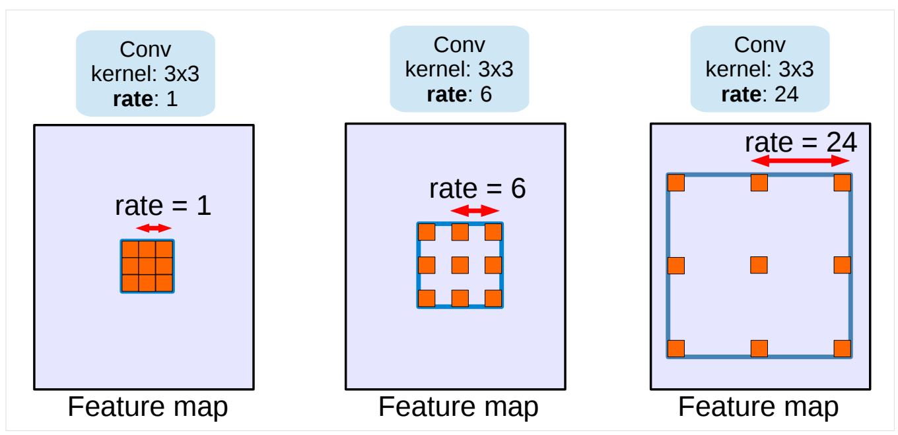
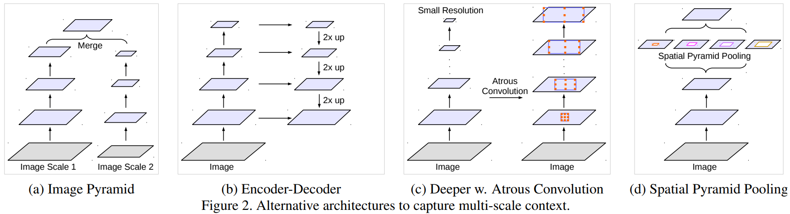
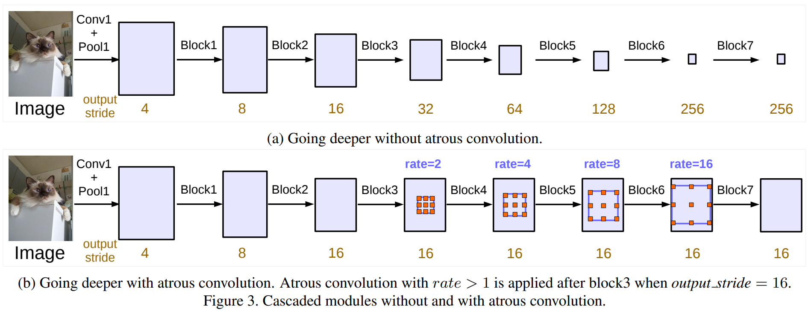
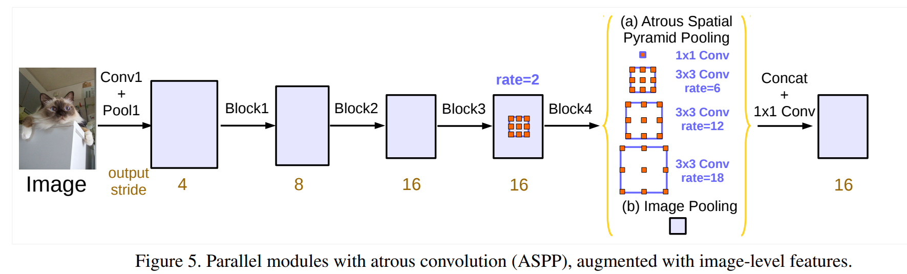

# Rethinking Atrous Convolution for Semantic Image Segmentation
对空洞卷积进行图像语义分割的再思考 2017-6-17 https://arxiv.org/abs/1706.05587

## 阅读笔记
* https://github.com/pytorch/vision/blob/main/torchvision/models/segmentation/deeplabv3.py
* DeepLab_v3
* 多尺度上分割对象

## Abstract
In this work, we revisit atrous convolution, a powerful tool to explicitly adjust filter's field-of-view as well as control the resolution of feature responses computed by Deep Convolutional Neural Networks, in the application of semantic image segmentation. To handle the problem of segmenting objects at multiple scales, we design modules which employ atrous convolution in cascade or in parallel to capture multi-scale context by adopting multiple atrous rates. Furthermore, we propose to augment our previously proposed Atrous Spatial Pyramid Pooling module, which probes convolutional features at multiple scales, with image-level features encoding global context and further boost performance. We also elaborate on implementation details and share our experience on training our system. The proposed `DeepLabv3' system significantly improves over our previous DeepLab versions without DenseCRF post-processing and attains comparable performance with other state-of-art models on the PASCAL VOC 2012 semantic image segmentation benchmark.

在这项工作中，我们重新讨论了在图像语义分割应用中，空洞卷积，它是一种强有力的工具，可以明确调整滤波器的视野，并控制由深度卷积神经网络计算的特征响应的分辨率。为了解决在多尺度上分割对象的问题，我们设计了一些模块，这些模块采用级联或并行的反卷积，通过采用多反卷率来捕获多尺度上下文。此外，我们建议增强我们之前提出的空洞空间金字塔池(Atrous Spatial Pyramid Pooling)模块，该模块在多个尺度上探测卷积特征，图像级特征编码全局上下文，并进一步提高性能。我们还详细阐述了实施细节，并分享了我们在训练系统方面的经验。提出的“DeepLabv3”系统在没有DenseCRF后处理的情况下，大大优于我们以前的DeepLab版本，并在PASCAL VOC 2012图像语义分割基准上取得了与其他先进模型相当的性能。

 
Figure 1. Atrous convolution with kernel size 3 × 3 and different rates. Standard convolution corresponds to atrous convolution with rate = 1. Employing large value of atrous rate enlarges the model’s field-of-view, enabling object encoding at multiple scales.
图1- 核大小为3×3且比率不同的空洞卷积。标准卷积对应于空洞卷积的比率=1。使用大的atrous比率值可以扩大模型的视野，实现多尺度的对象编码。

图2-捕获多尺度上下文的备选架构.

图3-带和不带空洞卷积的级联模块

图5- 具有空洞卷积(ASPP)的并行模块，通过图像级特征进行增强。

## 1. Introduction
For the task of semantic segmentation [20, 63, 14, 97, 7], we consider two challenges in applying Deep Convolutional Neural Networks (DCNNs) [50]. The first one is the reduced feature resolution caused by consecutive pooling operations or convolution striding, which allows DCNNs to learn increasingly abstract feature representations. However, this invariance to local image transformation may impede dense prediction tasks, where detailed spatial information is desired. To overcome this problem, we advocate the use of atrous convolution [36, 26, 74, 66], which has been shown to be effective for semantic image segmentation [10, 90, 11]. Atrous convolution, also known as dilated convolution, allows us to repurpose ImageNet [72] pretrained networks to extract denser feature maps by removing the downsampling operations from the last few layers and upsampling the corresponding filter kernels, equivalent to inserting holes (‘trous’ in French) between filter weights. With atrous convolution, one is able to control the resolution at which feature responses are computed within DCNNs without requiring learning extra parameters.

对于语义分割任务[20，63，14，97，7]，我们考虑了应用深度卷积神经网络(DCNN)的两个挑战[50]。第一个问题是连续池化操作或卷积跨步导致的特征分辨率降低，这使得DCNN能够学习越来越抽象的特征表示。然而，这种对局部图像变换的不变性可能阻碍密集的预测任务，其中需要详细的空间信息。为了克服这个问题，我们提倡使用空洞卷积[36，26，74，66]，这已被证明对图像语义分割有效[10，90，11]。空洞卷积，也称为扩张卷积，允许我们重新利用ImageNet[72]预训练的网络，通过从最后几层移除下采样操作并对相应的滤波器核进行上采样，从而提取更密集的特征图，相当于在滤波器权重之间插入孔(法语中为“rough”)。使用空洞卷积，可以控制DCNN内计算特征响应的分辨率，而不需要学习额外的参数。

Figure 1. Atrous convolution with kernel size 3 × 3 and different rates. Standard convolution corresponds to atrous convolution with rate = 1. Employing large value of atrous rate enlarges the model’s field-of-view, enabling object encoding at multiple scales. 
图1.核大小为3×3和不同比率的卷积。标准卷积对应于比率为1的空洞卷积。使用空洞比率的大值会扩大模型的视野，从而实现多尺度的对象编码。

Another difficulty comes from the existence of objects at multiple scales. Several methods have been proposed to handle the problem and we mainly consider four categories in this work, as illustrated in Fig. 2. First, the DCNN is applied to an image pyramid to extract features for each scale input [22, 19, 69, 55, 12, 11] where objects at different scales become prominent at different feature maps. Second, the encoder-decoder structure [3, 71, 25, 54, 70, 68, 39] exploits multi-scale features from the encoder part and recovers the spatial resolution from the decoder part. Third, extra modules are cascaded on top of the original network for capturing long range information. In particular, DenseCRF [45] is employed to encode pixel-level pairwise similarities [10, 96, 55, 73], while [59, 90] develop several extra convolutional layers in cascade to gradually capture long range context. Fourth, spatial pyramid pooling [11, 95] probes an incoming feature map with filters or pooling operations at multiple rates and multiple effective field-of-views, thus capturing objects at multiple scales.

另一个困难来自于物体在多个尺度上的存在。已经提出了几种方法来处理这个问题，我们在这项工作中主要考虑了四个类别，如图2所示。
1. 将DCNN应用于图像金字塔，以提取每个比例输入[22，19，69，55，12，11]的特征，其中不同比例的对象在不同的特征图上变得突出。
2. 编码器-解码器结构[3，71，25，54，70，68，39]利用来自编码器部分的多尺度特征，并从解码器部分恢复空间分辨率。
3. 额外的模块级联在原始网络的顶部，用于捕获远程信息。特别是，DenseCRF[45]被用于编码像素级成对相似性[10，96，55，73]，而[59，90]级联开发了几个额外的卷积层，以逐渐捕获长距离上下文。
4. 空间金字塔池[11,95]以多个比率和多个有效视野使用过滤器或池操作探测传入的特征图，从而以多个尺度捕获对象。

In this work, we revisit applying atrous convolution, which allows us to effectively enlarge the field of view of filters to incorporate multi-scale context, in the framework of both cascaded modules and spatial pyramid pooling. In particular, our proposed module consists of atrous convolution with various rates and batch normalization layers which we found important to be trained as well. We experiment with laying out the modules in cascade or in parallel (specifically,Atrous Spatial Pyramid Pooling (ASPP) method [11]). We discuss an important practical issue when applying a 3 × 3 atrous convolution with an extremely large rate, which fails to capture long range information due to image boundary effects, effectively simply degenerating to 1 × 1 convolution, and propose to incorporate image-level features into the ASPP module. Furthermore, we elaborate on implementation details and share experience on training the proposed models, including a simple yet effective bootstrapping method for handling rare and finely annotated objects. In the end, our proposed model, ‘DeepLabv3’ improves over our previous works [10, 11] and attains performance of 85.7% on the PASCAL VOC 2012 test set without DenseCRF postprocessing.

在这项工作中，我们重新探讨了应用空洞卷积，这允许我们在级联模块和空间金字塔池化的框架中有效地扩大滤波器的视野，以纳入多尺度上下文。特别是，我们提出的模块由具有不同比率的空洞卷积和批量归一化层组成，我们发现这些层也需要训练。我们尝试级联或并行布置模块(具体而言，Atrous空间金字塔池(ASPP)方法[11])。我们讨论了当应用具有极高比率的3×3空洞卷积时的一个重要的实际问题，该卷积由于图像边界效应而无法捕获长距离信息，有效地简单退化为1×1卷积，并建议将图像级特征合并到ASPP模块中。此外，我们详细介绍了实现细节，并分享了训练所提出的模型的经验，包括一种简单而有效的引导方法，用于处理罕见和精细注释的对象。最后，我们提出的模型“DeepLabv3”比我们之前的工作[10，11]有所改进，在PASCAL VOC 2012测试集上的性能达到85.7%，而无需DenseCRF后处理。

Figure 2. Alternative architectures to capture multi-scale context. 
图2.捕获多尺度上下文的替代架构。

## 2. Related Work
It has been shown that global features or contextual interactions [33, 76, 43, 48, 27, 89] are beneficial in correctly classifying pixels for semantic segmentation. In this work, we discuss four types of Fully Convolutional Networks (FCNs) [74, 60] (see Fig. 2 for illustration) that exploit context information for semantic segmentation [30, 15, 62, 9, 96, 55, 65, 73, 87].

已经表明，全局特征或上下文交互[33，76，43，48，27，89]有助于正确分类用于语义分割的像素。在这项工作中，我们讨论了四种类型的全卷积网络(FCN)[74，60](见图2)，它们利用上下文信息进行语义分割[30，15，62，9，96，55，65，73，87]。

### Image pyramid: 
The same model, typically with shared weights, is applied to multi-scale inputs. Feature responses from the small scale inputs encode the long-range context, while the large scale inputs preserve the small object details. Typical examples include Farabet et al. [22] who transform the input image through a Laplacian pyramid, feed each scale input to a DCNN and merge the feature maps from all the scales. [19, 69] apply multi-scale inputs sequentially from coarse-to-fine, while [55, 12, 11] directly resize the input for several scales and fuse the features from all the scales. The main drawback of this type of models is that it does not scale well for larger/deeper DCNNs (e.g., networks like [32, 91, 86]) due to limited GPU memory and thus it is usually applied during the inference stage [16].

图像金字塔：通常具有共享权重的相同模型应用于多尺度输入。来自小尺度输入的特征响应编码长距离上下文，而大尺度输入保留小对象细节。典型的例子包括Farabetet al [22]，他们通过拉普拉斯金字塔变换输入图像，将每个比例输入馈送到DCNN，并合并所有比例的特征图。[19，69]从粗到细依次应用多尺度输入，而[55，12，11]直接调整多尺度输入的大小，并融合所有尺度的特征。这种类型的模型的主要缺点是，由于GPU内存有限，它不能很好地缩放更大/更深的DCNN(例如，类似[32，91，86]的网络)，因此通常在推理阶段应用[16]。

### Encoder-decoder: 
This model consists of two parts: (a) the encoder where the spatial dimension of feature maps is gradually reduced and thus longer range information is more easily captured in the deeper encoder output, and (b) the decoder where object details and spatial dimension are gradually recovered. For example, [60, 64] employ deconvolution [92] to learn the upsampling of low resolution feature responses. SegNet [3] reuses the pooling indices from the encoder and learn extra convolutional layers to densify the feature responses, while U-Net [71] adds skip connections from the encoder features to the corresponding decoder activations, and [25] employs a Laplacian pyramid reconstruction network. More recently, RefineNet [54] and [70, 68, 39] have demonstrated the effectiveness of models based on encoder-decoder structure on several semantic segmentation benchmarks. This type of model is also explored in the context of object detection [56, 77].

编码器解码器：该模型由两部分组成：(a)编码器，其中特征图的空间维度逐渐减小，从而更容易在更深的编码器输出中捕获更长的距离信息，以及(b)解码器，其中对象细节和空间维度逐渐恢复。例如，[60，64]使用去卷积[92]来学习低分辨率特征响应的上采样。SegNet[3]重用来自编码器的池化索引并学习额外的卷积层以加密特征响应，而U-Net[71]将来自编码器特征的跳跃连接添加到相应的解码器激活，并且[25]使用拉普拉斯金字塔重建网络。最近，RefineNet[54]和[70，68，39]在几个语义分割基准上证明了基于编码器-解码器结构的模型的有效性。这种类型的模型也在目标检测的背景下进行了探索[56，77]。

### Context module: 
This model contains extra modules laid out in cascade to encode long-range context. One effective method is to incorporate DenseCRF [45] (with efficient high-dimensional filtering algorithms [2]) to DCNNs [10, 11]. Furthermore, [96, 55, 73] propose to jointly train both the CRF and DCNN components, while [59, 90] employ several extra convolutional layers on top of the belief maps of DCNNs (belief maps are the final DCNN feature maps that contain output channels equal to the number of predicted classes) to capture context information. Recently, [41] proposes to learn a general and sparse high-dimensional convolution (bilateral convolution), and [82, 8] combine Gaussian Conditional Random Fields and DCNNs for semantic segmentation.

上下文模块：该模型包含级联布置的额外模块，用于编码远程上下文。一种有效的方法是将DenseCRF[45](具有高效的高维滤波算法[2])并入DCNN[10，11]。此外，[96，55，73]建议联合训练CRF和DCNN组件，而[59，90]在DCNN的置信图(置信图是包含等于预测类数量的输出信道的最终DCNN特征图)之上使用几个额外的卷积层来捕获上下文信息。最近，[41]提出学习一种通用的稀疏高维卷积(双边卷积)，[82，8]将高斯条件随机场和DCNN结合用于语义分割。

### Spatial pyramid pooling: 
This model employs spatial pyramid pooling [28, 49] to capture context at several ranges. The image-level features are exploited in ParseNet [58] for global context information. DeepLabv2 [11] proposes atrous spatial pyramid pooling (ASPP), where parallel atrous convolution layers with different rates capture multi-scale information. Recently, Pyramid Scene Parsing Net (PSP) [95] performs spatial pooling at several grid scales and demonstrates outstanding performance on several semantic segmentation benchmarks. There are other methods based on LSTM [35] to aggregate global context [53, 6, 88]. Spatial pyramid pooling has also been applied in object detection [31].

空间金字塔池化：该模型使用空间金字塔池化[28，49]来捕获多个范围的上下文。ParseNet[58]利用图像级特征获取全局上下文信息。DeepLabv2[11]提出了空洞空间金字塔池(ASPP)，其中具有不同比率的平行空洞卷积层捕获多尺度信息。最近，Pyramid Scene Parsing Net(PSP)[95]在多个网格尺度上执行空间池，并在多个语义分割基准上表现出出色的性能。还有其他基于LSTM[35]的方法来聚合全局上下文[53，6，88]。空间金字塔池也已应用于目标检测[31]。

In this work, we mainly explore atrous convolution [36, 26, 74, 66, 10, 90, 11] as a context module and tool for spatial pyramid pooling. Our proposed framework is general in the sense that it could be applied to any network. To be concrete, we duplicate several copies of the original last block in ResNet [32] and arrange them in cascade, and also revisit the ASPP module [11] which contains several atrous convolutions in parallel. Note that our cascaded modules are applied directly on the feature maps instead of belief maps. For the proposed modules, we experimentally find it important to train with batch normalization [38]. To further capture global context, we propose to augment ASPP with image-level features, similar to [58, 95].

在这项工作中，我们主要探索空洞卷积[36，26，74，66，10，90，11]作为空间金字塔池的上下文模块和工具。我们提出的框架是通用的，因为它可以应用于任何网络。具体地说，我们复制了ResNet[32]中原始最后一个块的几个副本，并将它们级联排列，还重新访问了ASPP模块[11]，该模块包含并行的几个空洞卷积。注意，我们的级联模块直接应用于特征图，而不是信念?图。对于所提出的模块，我们通过实验发现，使用批归一化进行训练很重要[38]。为了进一步捕获全局上下文，我们建议使用图像级特征来增强ASPP，类似于[58，95]。

### Atrous convolution: 
Models based on atrous convolution have been actively explored for semantic segmentation. For example, [85] experiments with the effect of modifying atrous rates for capturing long-range information, [84] adopts hybrid atrous rates within the last two blocks of ResNet, while [18] further proposes to learn the deformable convolution which samples the input features with learned offset, generalizing atrous convolution. To further improve the segmentation model accuracy, [83] exploits image captions, [40] utilizes video motion, and [44] incorporates depth information. Besides, atrous convolution has been applied to object detection by [66, 17, 37].

空洞卷积：基于空洞卷积的模型已被积极探索用于语义分割。例如，[85]对修改空洞比例以捕获长距离信息的效果进行了实验，[84]在ResNet的最后两个块中采用了混合空洞比例，而[18]进一步提出学习可变形卷积，该卷积使用学习的偏移量对输入特征进行采样，从而推广空洞卷积。为了进一步提高分割模型的准确性，[83]利用图像字幕，[40]利用视频运动，[44]结合深度信息。此外，空洞卷积已被[66，17，37]应用于目标检测。

## 3. Methods
In this section, we review how atrous convolution is applied to extract dense features for semantic segmentation. We then discuss the proposed modules with atrous convolution modules employed in cascade or in parallel.

在本节中，我们将回顾如何应用空洞卷积来提取语义分割的密集特征。然后，我们讨论了所提出的模块以及级联或并行使用的空洞卷积模块。

### 3.1. Atrous Convolution for Dense Feature Extraction 用于密集特征提取的空洞卷积
Deep Convolutional Neural Networks (DCNNs) [50] deployed in fully convolutional fashion [74, 60] have shown to be effective for the task of semantic segmentation. However, the repeated combination of max-pooling and striding at consecutive layers of these networks significantly reduces the spatial resolution of the resulting feature maps, typically by a factor of 32 across each direction in recent DCNNs [47, 78, 32]. Deconvolutional layers (or transposed convolution) [92, 60, 64, 3, 71, 68] have been employed to recover the spatial resolution. Instead, we advocate the use of ‘atrous convolution’, originally developed for the efficient computation of the undecimated wavelet transform in the “algorithme `a trous” scheme of [36] and used before in the DCNN context by [26, 74, 66].

以全卷积方式部署的深度卷积神经网络(DCNNs)[50][74，60]已证明对语义分割任务有效。然而，在这些网络的连续层上重复组合最大池化和跨步显著降低了生成的特征图的空间分辨率，在最近的DCNN[47，78，32]中，通常在每个方向上降低32倍。反卷积层(或转置卷积)[92，60，64，3，71，68]已被用于恢复空间分辨率。相反，我们提倡使用“空洞卷积”，最初是为了在[36]的“算法”方案中高效计算未决定的小波变换而开发的，之前[26，74，66]在DCNN上下文中使用过。

Consider two-dimensional signals, for each location i on the output y and a filter w, atrous convolution is applied over the input feature map x: 
考虑二维信号，对于输出y上的每个位置i和滤波器w，在输入特征图x上应用空洞卷积：

y[i] = X k x[i + r · k]w[k] (1) 

where the atrous rate r corresponds to the stride with which we sample the input signal, which is equivalent to convolving the input x with upsampled filters produced by inserting r − 1 zeros between two consecutive filter values along each spatial dimension (hence the name atrous convolution where the French word trous means holes in English). Standard convolution is a special case for rate r = 1, and atrous convolution allows us to adaptively modify filter’s field-ofview by changing the rate value. See Fig. 1 for illustration.

其中，空洞比率r对应于我们对输入信号进行采样的步长，这相当于将输入x与通过插入r产生的上采样滤波器卷积− 1在沿每个空间维度的两个连续滤波器值之间为零(因此名称为atrous卷积，其中法语单词trous在英语中表示空洞)。标准卷积是比率r＝1的特殊情况，空洞卷积允许我们通过改变比率值来自适应地修改滤波器的视野。如图1所示。

Atrous convolution also allows us to explicitly control how densely to compute feature responses in fully convolutional networks. Here, we denote by output stride the ratio of input image spatial resolution to final output resolution. For the DCNNs [47, 78, 32] deployed for the task of image classification, the final feature responses (before fully connected layers or global pooling) is 32 times smaller than the input image dimension, and thus output stride = 32. If one would like to double the spatial density of computed feature responses in the DCNNs (i.e., output stride = 16), the stride of last pooling or convolutional layer that decreases resolution is set to 1 to avoid signal decimation. Then, all subsequent convolutional layers are replaced with atrous convolutional layers having rate r = 2. This allows us to extract denser feature responses without requiring learning any extra parameters. Please refer to [11] for more details.

空洞卷积也允许我们明确控制在全卷积网络中计算特征响应的密度。这里，我们用输出步长表示输入图像空间分辨率与最终输出分辨率的比率。对于部署用于图像分类任务的DCNN[47，78，32]，最终特征响应(在完全连接层或全局池化之前)比输入图像维度小32倍，因此输出步长=32。如果希望将DCNNs中计算的特征响应的空间密度加倍(即，输出步长=16)，将降低分辨率的最后一个池或卷积层的步长设置为1，以避免信号抽取。然后，所有随后的卷积层都被比率r＝2的空洞卷积层替换。这允许我们提取更密集的特征响应，而不需要学习任何额外的参数。更多详情请参考[11]。

### 3.2. Going Deeper with Atrous Convolution 用空洞卷积加深
We first explore designing modules with atrous convolution laid out in cascade. To be concrete, we duplicate several copies of the last ResNet block, denoted as block4 in Fig. 3, and arrange them in cascade. There are three 3 × 3 convolutions in those blocks, and the last convolution contains stride 2 except the one in last block, similar to original ResNet. The motivation behind this model is that the introduced striding makes it easy to capture long range information in the deeper blocks. For example, the whole image feature could be summarized in the last small resolution feature map, as illustrated in Fig. 3 (a). However, we discover that the consecutive striding is harmful for semantic segmentation (see Tab. 1 in Sec. 4) since detail information is decimated, and thus we apply atrous convolution with rates determined by the desired output stride value, as shown in Fig. 3 (b) where output stride = 16.

我们首先探索用级联布置的空洞卷积设计模块。具体来说，我们复制了最后一个ResNet块的几个副本，如图3中的块4所示，并将它们级联排列。这些块中有三个3×3卷积，最后一个卷积包含步幅2，除了最后一个块中的步幅2之外，与原始ResNet类似。这个模型背后的动机是，引入的跨步使得在更深的区块中捕获远程信息变得容易。例如，如图3(a)所示，可以在最后一个小分辨率特征图中总结整个图像特征。然而，我们发现连续跨步对语义分割是有害的(见第4节中的表1)，因为细节信息被抽取，因此我们使用由期望的输出跨步值确定的比率进行卷积，如图3(b)所示，其中输出跨步=16。

In this proposed model, we experiment with cascaded ResNet blocks up to block7 (i.e., extra block5, block6, block7 as replicas of block4), which has output stride = 256 if no atrous convolution is applied.

在这个提出的模型中，我们使用级联的ResNet块进行实验，直到块7(即，额外的块5、块6、块7作为块4的副本)，如果不应用空洞卷积，则输出步长为256。

Figure 3. Cascaded modules without and with atrous convolution.
图3.没有和有空洞卷积的级联模块。

#### 3.2.1 Multi-grid Method 多网格方法
Motivated by multi-grid methods which employ a hierarchy of grids of different sizes [4, 81, 5, 67] and following [84, 18], we adopt different atrous rates within block4 to block7 in the proposed model. In particular, we define as Multi Grid = (r1, r2, r3) the unit rates for the three convolutional layers within block4 to block7. The final atrous rate for the convolutional layer is equal to the multiplication of the unit rate and the corresponding rate. For example, when output stride = 16 and Multi Grid = (1, 2, 4), the three convolutions will have rates = 2 · (1, 2, 4) = (2, 4, 8) in the block4, respectively.

受采用不同大小网格层次结构的多网格方法的激励[4，81，5，67]，随后[84，18]，我们在所提出的模型中的区块4到区块7中采用不同的空洞率。特别地，我们将块4至块7内三个卷积层的单位比率定义为多网格=(r1，r2，r3)。卷积层的最终空洞比率等于单位比率与相应比率的乘积。例如，当输出步幅=16且多网格=(1，2，4)时，三个卷积在块4中的比率分别为=2·(1，1，4)=(2，4，8)。

### 3.3. Atrous Spatial Pyramid Pooling 巨大的空间金字塔池
We revisit the Atrous Spatial Pyramid Pooling proposed in [11], where four parallel atrous convolutions with different atrous rates are applied on top of the feature map. ASPP is inspired by the success of spatial pyramid pooling [28, 49, 31] which showed that it is effective to resample features at different scales for accurately and efficiently classifying regions of an arbitrary scale. Different from [11], we include batch normalization within ASPP.

我们回顾了[11]中提出的Atrous空间金字塔池，其中在特征图的顶部应用了四个具有不同空洞率的平行空洞卷积。ASPP的灵感来自于空间金字塔池[28，49，31]的成功，这表明在不同尺度上对特征进行重新采样是有效的，可以准确有效地对任意尺度的区域进行分类。与[11]不同，我们在ASPP中包含了批处理归一化。

ASPP with different atrous rates effectively captures multi-scale information. However, we discover that as the sampling rate becomes larger, the number of valid filter weights (i.e., the weights that are applied to the valid feature region, instead of padded zeros) becomes smaller. This effect is illustrated in Fig. 4 when applying a 3 × 3 filter to a 65 × 65 feature map with different atrous rates. In the extreme case where the rate value is close to the feature map size, the 3 × 3 filter, instead of capturing the whole image context, degenerates to a simple 1 × 1 filter since only the center filter weight is effective.

具有不同空洞比率的ASPP有效地捕获多尺度信息。然而，我们发现，随着采样率变大，有效滤波器权重(即，应用于有效特征区域的权重，而不是填充的零)的数量变小。这一效果如图所示。4当将3×3滤波器应用于具有不同空洞率的65×65特征图时。在比率值接近特征图大小的极端情况下，3×3滤波器(而不是捕获整个图像上下文)退化为简单的1×1滤波器，因为只有中心滤波器权重有效。

To overcome this problem and incorporate global context information to the model, we adopt image-level features, similar to [58, 95]. Specifically, we apply global average pooling on the last feature map of the model, feed the resulting image-level features to a 1 × 1 convolution with 256 filters (and batch normalization [38]), and then bilinearly upsample the feature to the desired spatial dimension. In the end, our improved ASPP consists of (a) one 1×1 convolution and three 3 × 3 convolutions with rates = (6, 12, 18) when output stride = 16 (all with 256 filters and batch normalization), and (b) the image-level features, as shown in Fig. 5. Note that the rates are doubled when output stride = 8. The resulting features from all the branches are then concatenated and pass through another 1 × 1 convolution (also with 256 filters and batch normalization) before the final 1 × 1 convolution which generates the final logits.

为了克服这个问题并将全局上下文信息纳入模型，我们采用了图像级特征，类似于[58，95]。具体而言，我们在模型的最后一个特征图上应用全局平均池，将生成的图像级特征馈送到具有256个滤波器的1×1卷积(和批量归一化[38])，然后将特征上采样到所需的空间维度。最后，我们改进的ASPP包括(a)当输出步幅=16时，一个1×1卷积和三个3×3卷积的比率=(6，12，18)(所有这些都具有256个滤波器和批量归一化)，以及(b)图像级特征，如图所示。5.注意，当输出步距=8时，比率加倍。然后将所有分支的结果特征连接起来，并在生成最终逻辑的最终1×1卷积之前通过另一个1×1的卷积(也有256个滤波器和批量归一化)。

Figure 4. Normalized counts of valid weights with a 3 × 3 filter on a 65 × 65 feature map as atrous rate varies. When atrous rate is small, all the 9 filter weights are applied to most of the valid region on feature map, while atrous rate gets larger, the 3 × 3 filter degenerates to a 1×1 filter since only the center weight is effective. 

图4.当空洞率变化时，在65×65特征图上使用3×3滤波器的有效权重的归一化计数。当空洞率小时，所有9个滤波器权重都应用于特征图上的大部分有效区域，而空洞率变大时，3×3滤波器退化为1×1滤波器，因为只有中心权重有效。

## 4. Experimental Evaluation
We adapt the ImageNet-pretrained [72] ResNet [32] to the semantic segmentation by applying atrous convolution to extract dense features. Recall that output stride is defined as the ratio of input image spatial resolution to final out put resolution. For example, when output stride = 8, the last two blocks (block3 and block4 in our notation) in the original ResNet contains atrous convolution with rate = 2 and rate = 4 respectively. Our implementation is built on TensorFlow [1].

我们通过应用空洞卷积来提取密集特征，将预训练的图像网[72]ResNet[32]适配于语义分割。回想一下，输出步幅被定义为输入图像空间分辨率与最终输出分辨率的比率。例如，当输出步幅＝8时，原始ResNet中的最后两个块(在我们的符号中为块3和块4)分别包含比率＝2和比率＝4的空洞卷积。我们的实现基于TensorFlow[1]。

Figure 5. Parallel modules with atrous convolution (ASPP), augmented with image-level features. 
图5.具有空洞卷积(ASPP)的并行模块，增加了图像级特征。

We evaluate the proposed models on the PASCAL VOC 2012 semantic segmentation benchmark [20] which contains 20 foreground object classes and one background class. The original dataset contains 1, 464 (train), 1, 449 (val), and 1, 456 (test) pixel-level labeled images for training, validation, and testing, respectively. The dataset is augmented by the extra annotations provided by [29], resulting in 10, 582 (trainaug) training images. The performance is measured in terms of pixel intersection-over-union (IOU) averaged across the 21 classes.

我们在PASCAL VOC 2012语义分割基准[20]上评估了所提出的模型，该基准包含20个前景对象类和一个背景类。原始数据集分别包含1464(训练)、1449(值)和1456(测试)像素级标记图像，用于训练、验证和测试。[29]提供的额外注释增强了数据集，产生10582(训练)训练图像。该性能是根据21个类的平均像素交合(IOU)来衡量的。

### 4.1. Training Protocol
In this subsection, we discuss details of our training protocol.

在本小节中，我们将讨论训练协议的细节。

Learning rate policy: Similar to [58, 11], we employ a “poly” learning rate policy where the initial learning rate is multiplied by (1 − max iter iter ) power with power = 0.9.

学习率策略：与[58，11]类似，我们采用“多”学习率策略，其中初始学习率乘以(1− 最大iter iter)功率，功率＝0.9。

Crop size: Following the original training protocol [10, 11], patches are cropped from the image during training. For atrous convolution with large rates to be effective, large crop size is required; otherwise, the filter weights with large atrous rate are mostly applied to the padded zero region. We thus employ crop size to be 513 during both training and test on PASCAL VOC 2012 dataset.

裁剪大小：按照原始训练方案[10，11]，在训练期间从图像中裁剪分块。为了使具有大比率的空洞卷积有效，需要大的作物大小; 否则，具有大衰减率的滤波器权重大多应用于填充的零区域。因此，在PASCAL VOC 2012数据集的训练和测试期间，我们采用的作物大小为513。

Batch normalization: Our added modules on top of ResNet all include batch normalization parameters [38], which we found important to be trained as well. Since large batch size is required to train batch normalization parameters, we employ output stride = 16 and compute the batch normalization statistics with a batch size of 16. The batch normalization parameters are trained with decay = 0.9997. After training on the trainaug set with 30K iterations and initial learning rate = 0.007, we then freeze batch normalization parameters, employ output stride = 8, and train on the offi- cial PASCAL VOC 2012 trainval set for another 30K iterations and smaller base learning rate = 0.001. Note that atrous convolution allows us to control output stride value at different training stages without requiring learning extra model parameters. Also note that training with output stride = 16 is several times faster than output stride = 8 since the intermediate feature maps are spatially four times smaller, but at a sacrifice of accuracy since output stride = 16 provides coarser feature maps.

批次归一化：我们在ResNet之上添加的模块都包含批次归一化参数[38]，我们发现这些参数也很重要。由于需要大批量来训练批量归一化参数，我们采用输出步长=16，并计算批量大小为16的批量归一化统计数据。批量归一化参数的训练衰减=0.9997。在训练集上进行30K迭代和初始学习率=0.007的训练后，我们冻结批量归一化参数，采用输出步幅=8，并在官方PASCAL VOC 2012训练值集上进行训练，再进行30K次迭代，较小的基础学习率=0.001。注意，空洞卷积允许我们在不同的训练阶段控制输出步幅值，而无需学习额外的模型参数。还应注意，输出步幅=16的训练比输出步幅=8快几倍，因为中间特征图在空间上小四倍，但由于输出步幅=6提供了更粗糙的特征图，因此牺牲了精度。

Table 1. Going deeper with atrous convolution when employing ResNet-50 with block7 and different output stride. Adopting output stride = 8 leads to better performance at the cost of more memory usage. 

表1.当使用具有block7和不同输出步幅的ResNet-50时，使用空洞卷积更深入。采用输出步幅=8可以以更多内存使用为代价获得更好的性能。

Upsampling logits: In our previous works [10, 11], the target groundtruths are downsampled by 8 during training when output stride = 8. We find it important to keep the groundtruths intact and instead upsample the final logits, since downsampling the groundtruths removes the fine annotations resulting in no back-propagation of details.

上采样逻辑：在我们之前的工作[10，11]中，当输出步幅为8时，在训练过程中，目标基本事实被下采样8。我们发现保持基本事实的完整性，而不是对最终逻辑进行上采样非常重要，因为下采样基本事实会删除精细的注释，从而不会导致细节的反向传播。

Data augmentation: We apply data augmentation by randomly scaling the input images (from 0.5 to 2.0) and randomly left-right flipping during training.

数据增广：我们通过在训练期间随机缩放输入图像(从0.5到2.0)和随机左右翻转来应用数据增广。

### 4.2. Going Deeper with Atrous Convolution 用空洞卷积加深
We first experiment with building more blocks with atrous convolution in cascade.

我们首先尝试用级联的空洞卷积构建更多的块。

ResNet-50: In Tab. 1, we experiment with the effect of output stride when employing ResNet-50 with block7 (i.e., extra block5, block6, and block7). As shown in the table, in the case of output stride = 256 (i.e., no atrous convolution at all), the performance is much worse than the others due to the severe signal decimation. When output stride gets larger and apply atrous convolution correspondingly, the performance improves from 20.29% to 75.18%, showing that atrous convolution is essential when building more blocks cascadedly for semantic segmentation.

ResNet-50：在表1中，我们实验了将ResNet-50与block7(即额外的block5、block6和block7)一起使用时输出步幅的效果。如表中所示，在输出步幅＝256(即，根本没有空洞卷积)的情况下，由于严重的信号抽取，性能比其他情况差得多。当输出步长变大并相应地应用空洞卷积时，性能从20.29%提高到75.18%，这表明空洞卷积在级联构建更多块进行语义分割时至关重要。

ResNet-50 vs. ResNet-101: We replace ResNet-50 with deeper network ResNet-101 and change the number of cascaded blocks. As shown in Tab. 2, the performance improves as more blocks are added, but the margin of improvement becomes smaller. Noticeably, employing block7 to ResNet- 50 decreases slightly the performance while it still improves the performance for ResNet-101.

ResNet-50与ResNet-101：我们用更深层的网络ResNet-1010替换ResNet-50，并更改级联块的数量。如表2所示，当添加更多块时，性能会提高，但提高的幅度会变小。值得注意的是，在ResNet-50中使用block7会略微降低性能，但仍会提高ResNet-101的性能。

Table 2. Going deeper with atrous convolution when employing ResNet-50 and ResNet-101 with different number of cascaded blocks at output stride = 16. Network structures ‘block4’, ‘block5’, ‘block6’, and ‘block7’ add extra 0, 1, 2, 3 cascaded modules respectively. The performance is generally improved by adopting more cascaded blocks.
表2.在输出步长=16时，使用具有不同数量级联块的ResNet-50和ResNet-101时，使用空洞卷积进行深入研究。网络结构“block4”、“block5”、“block 6”和“block7”分别添加了额外的0、1、2和3个级联模块。通常通过采用更多的级联块来提高性能。

Table 3. Employing multi-grid method for ResNet-101 with different number of cascaded blocks at output stride = 16. The best model performance is shown in bold. 
表3.在输出步长=16的情况下，对具有不同级联块数的ResNet-101采用多网格方法。最佳模型性能以粗体显示。

Multi-grid: We apply the multi-grid method to ResNet- 101 with several cascadedly added blocks in Tab. 3. The unit rates, Multi Grid = (r1, r2, r3), are applied to block4 and all the other added blocks. As shown in the table, we observe that (a) applying multi-grid method is generally better than the vanilla version where (r1, r2, r3) = (1, 1, 1), (b) simply doubling the unit rates (i.e., (r1, r2, r3) = (2, 2, 2)) is not effective, and (c) going deeper with multi-grid improves the performance. Our best model is the case where block7 and (r1, r2, r3) = (1, 2, 1) are employed.

多网格：我们将多网格方法应用于ResNet-101，在表3中有几个级联添加的块。多网格=(r1，r2，r3)的单位费率应用于块4和所有其他添加块。如表所示，我们观察到(a)应用多网格方法通常优于普通版本，其中(r1，r2，r3)=(1，1，1)，(b)简单地将单位费率加倍(即，(r1，r1，r3)=“2，2，2”)是无效的，并且(c)使用多网格深入改进性能。我们的最佳模型是使用block7和(r1，r2，r3)=(1，2，1)的情况。

Inference strategy on val set: The proposed model is trained with output stride = 16, and then during inference we apply output stride = 8 to get more detailed feature map. As shown in Tab. 4, interestingly, when evaluating our best cascaded model with output stride = 8, the performance improves over evaluating with output stride = 16 by 1.39%. The performance is further improved by performing inference on multi-scale inputs (with scales = {0.5, 0.75, 1.0, 1.25, 1.5, 1.75}) and also left-right flipped images. In particular, we compute as the final result the average probabilities from each scale and flipped images.

val集上的推理策略：所提出的模型在输出步长=16的情况下进行训练，然后在推理过程中，我们应用输出步长=8来获得更详细的特征图。如表4所示，有趣的是，当评估输出步长为8的最佳级联模型时，性能比评估输出步长=16的模型提高了1.39%。通过对多尺度输入(尺度＝{0.5，0.75，1.0，1.25，1.5，1.75})以及左右翻转图像执行推断，进一步提高了性能。特别是，我们计算每个比例和翻转图像的平均概率作为最终结果。

### 4.3. Atrous Spatial Pyramid Pooling  巨大的空间金字塔池
We then experiment with the Atrous Spatial Pyramid Pooling (ASPP) module with the main differences from [11] being that batch normalization parameters [38] are fine-tuned and image-level features are included.

然后，我们使用Atrous空间金字塔池(ASPP)模块进行了实验，与[11]的主要区别在于，对批处理标准化参数[38]进行了微调，并包括图像级特征。

Table 4. Inference strategy on the val set. MG: Multi-grid. OS: output stride. MS: Multi-scale inputs during test. Flip: Adding left-right flipped inputs.
表4.val集合的推理策略。MG：多网格。OS：输出步幅。MS：测试期间的多尺度输入。翻转：添加左右翻转输入。

Table 5. Atrous Spatial Pyramid Pooling with multi-grid method and image-level features at output stride = 16.
表5.在输出步长=16时，采用多网格方法和图像级特征的巨大空间金字塔池。

Table 6. Inference strategy on the val set: MG: Multi-grid. ASPP:Atrous spatial pyramid pooling. OS: output stride. MS: Multiscale inputs during test. Flip: Adding left-right flipped inputs. COCO: Model pretrained on MS-COCO.
表6.值集的推理策略：MG：多网格。ASPP：巨大的空间金字塔池。OS：输出步幅。MS：测试期间的多尺度输入。翻转：添加左右翻转输入。COCO：在MS-COCO上预处理的模型。

ASPP: In Tab. 5, we experiment with the effect of incorporating multi-grid in block4 and image-level features to the improved ASPP module. We first fix ASP P = (6, 12, 18) (i.e., employ rates = (6, 12, 18) for the three parallel 3 × 3 convolution branches), and vary the multigrid value. Employing Multi Grid = (1, 2, 1) is better than Multi Grid = (1, 1, 1), while further improvement is attained by adopting Multi Grid = (1, 2, 4) in the context of ASP P = (6, 12, 18) (cf ., the ‘block4’ column in Tab. 3). If we additionally employ another parallel branch with rate = 24 for longer range context, the performance drops slightly by 0.12%. On the other hand, augmenting the ASPP module with image-level feature is effective, reaching the final performance of 77.21%.

ASPP：在表5中，我们实验了在改进的ASPP模块中加入块4中的多网格和图像级特征的效果。我们首先确定ASP P=(6，12，18)(即，对三个并行的3×3卷积分支采用比率=(6，12,18))，并改变多重网格值。采用多网格=(1，2，1)比采用多网格(1，1，1)更好，而在ASP P=(6，12，18)(参见表3中的“block4”列)的上下文中采用多网格＝(1，3，4)可以获得进一步的改进。如果我们在更长的范围内使用另一个比率为24的并行分支，则性能会略微下降0.12%。另一方面，利用图像级特征增强ASPP模块是有效的，达到77.21%的最终性能。

Inference strategy on val set: Similarly, we apply output stride = 8 during inference once the model is trained. As shown in Tab. 6, employing output stride = 8 brings 1.3% improvement over using output stride = 16, adopting multi-scale inputs and adding left-right flipped images further improve the performance by 0.94% and 0.32%, respectively. The best model with ASPP attains the performance of 79.77%, better than the best model with cascaded atrous convolution modules (79.35%), and thus is selected as our final model for test set evaluation.

val集上的推理策略：类似地，一旦模型被训练，我们在推理过程中应用输出步长=8。如表6所示，采用输出步幅=8比使用输出步幅=16提高1.3%，采用多尺度输入和添加左右翻转图像分别将性能提高0.94%和0.32%。具有ASPP的最佳模型的性能达到79.77%，优于具有级联空洞卷积模块的最佳模型(79.35%)，因此被选为测试集评估的最终模型。

Comparison with DeepLabv2: Both our best cascaded model (in Tab. 4) and ASPP model (in Tab. 6) (in both cases without DenseCRF post-processing or MS-COCO pre-training) already outperform DeepLabv2 (77.69% with DenseCRF and pretrained on MS-COCO in Tab. 4 of [11]) on the PASCAL VOC 2012 val set. The improvement mainly comes from including and fine-tuning batch normalization parameters [38] in the proposed models and having a better way to encode multi-scale context.

与DeepLabv2的比较：我们最好的级联模型(表4)和ASPP模型(表6)(在两种情况下都没有DenseCRF后处理或MS-COCO预训练)在PASCAL VOC 2012值集上的表现已经超过了DeepLabv2(在表4([11])中，使用DenseCRF77.69%，并在MS-COCO上预训练)。改进主要来自于在所提出的模型中包括和微调批归一化参数[38]，并具有更好的编码多尺度上下文的方法。

Appendix: We show more experimental results, such as the effect of hyper parameters and Cityscapes [14] results, in the appendix.

附录：我们在附录中展示了更多的实验结果，如超参数和Cityscapes[14]结果的影响。

Qualitative results: We provide qualitative visual results of our best ASPP model in Fig. 6. As shown in the figure, our model is able to segment objects very well without any DenseCRF post-processing.

定性结果：我们在图6中提供了最佳ASPP模型的定性视觉结果。如图所示，我们的模型能够很好地分割对象，而无需任何DenseCRF后处理。

Failure mode: As shown in the bottom row of Fig. 6, our model has difficulty in segmenting (a) sofa vs. chair, (b) dining table and chair, and (c) rare view of objects.

故障模式：如图6的底行所示，我们的模型难以分割(a)沙发与椅子，(b)餐桌和椅子，以及(c)罕见的物体视图。

Pretrained on COCO: For comparison with other stateof-art models, we further pretrain our best ASPP model on MS-COCO dataset [57]. From the MS-COCO trainval minus minival set, we only select the images that have annotation regions larger than 1000 pixels and contain the classes defined in PASCAL VOC 2012, resulting in about 60K images for training. Besides, the MS-COCO classes not defined in PASCAL VOC 2012 are all treated as background class. After pretraining on MS-COCO dataset, our proposed model attains performance of 82.7% on val set when using output stride = 8, multi-scale inputs and adding left-right flipped images during inference. We adopt smaller initial learning rate = 0.0001 and same training protocol as in Sec. 4.1 when fine-tuning on PASCAL VOC 2012 dataset.

COCO预训练：为了与其他先进模型进行比较，我们在MS-COCO数据集上进一步预训练了我们的最佳ASPP模型[57]。从MS-COCO trainval减去minival集合中，我们只选择注释区域大于1000像素且包含PASCAL VOC 2012中定义的类的图像，从而生成约60K图像用于训练。此外，PASCAL VOC 2012中未定义的MS-COCO类均被视为背景类。在MS-COCO数据集上进行预训练后，当使用输出步幅=8、多尺度输入和在推理过程中添加左右翻转图像时，我们提出的模型在值集上的性能达到82.7%。当对PASCAL VOC 2012数据集进行微调时，我们采用较小的初始学习率=0.0001和与第4.1节相同的训练方案。

Test set result and an effective bootstrapping method: We notice that PASCAL VOC 2012 dataset provides higher quality of annotations than the augmented dataset [29], especially for the bicycle class. We thus further fine-tune our model on the official PASCAL VOC 2012 trainval set before evaluating on the test set. Specifically, our model is trained with output stride = 8 (so that annotation details are kept) and the batch normalization parameters are frozen (see Sec. 4.1 for details). Besides, instead of performing pixel hard example mining as [85, 70], we resort to bootstrapping on hard images. In particular, we duplicate the images that contain hard classes (namely bicycle, chair, table, pottedplant, and sofa) in the training set. As shown in Fig. 7, the simple bootstrapping method is effective for segmenting the bicycle class. In the end, our ‘DeepLabv3’ achieves the performance of 85.7% on the test set without any DenseCRF post-processing, as shown in Tab. 7.

测试集结果和有效的自举方法：我们注意到，PASCAL VOC 2012数据集提供了比增强数据集更高的注释质量[29]，特别是对于自行车类。因此，在对测试集进行评估之前，我们在官方PASCAL VOC 2012训练集上进一步优化了我们的模型。具体来说，我们的模型在输出步长=8的情况下进行训练(以便保留注释细节)，并冻结批处理归一化参数(详见第4.1节)。此外，我们不是像[85,70]那样执行像素硬样本挖掘，而是在硬图像上进行自举。特别是，我们复制了训练集中包含硬类(即自行车、椅子、桌子、盆栽植物和沙发)的图像。如图7所示，简单的自举方法对于分割自行车类是有效的。最终，我们的“DeepLabv3”在测试集上的性能达到了85.7%，无需任何DenseCRF后处理，如表7所示。

Model pretrained on JFT-300M: Motivated by the recent work of [79], we further employ the ResNet-101 model which has been pretraind on both ImageNet and the JFT- 300M dataset [34, 13, 79], resulting in a performance of 86.9% on PASCAL VOC 2012 test set.

在JFT-300M上预处理的模型：受[79]最近工作的启发，我们进一步采用了在ImageNet和JFT-300T数据集上预处理过的ResNet-101模型[34，13，79]，结果在PASCAL VOC 2012测试集上的性能为86.9%。

Table 7. Performance on PASCAL VOC 2012 test set.
表7.PASCAL VOC 2012测试集的性能。

## 5. Conclusion
Our proposed model “DeepLabv3” employs atrous convolution with upsampled filters to extract dense feature maps and to capture long range context. Specifically, to encode multi-scale information, our proposed cascaded module gradually doubles the atrous rates while our proposed atrous spatial pyramid pooling module augmented with image-level features probes the features with filters at multiple sampling rates and effective field-of-views. Our experimental results show that the proposed model significantly improves over previous DeepLab versions and achieves comparable performance with other state-of-art models on the PASCAL VOC 2012 semantic image segmentation benchmark.

我们提出的模型“DeepLabv3”采用了带上采样滤波器的空洞卷积来提取密集特征图并捕获长距离上下文。具体而言，为了对多尺度信息进行编码，我们提出的级联模块逐渐将空洞率提高一倍，而我们提出的空洞空间金字塔池模块增加了图像级特征，以多采样率和有效视野使用滤波器探测特征。我们的实验结果表明，与以前的DeepLab版本相比，所提出的模型显著改进，并在PASCAL VOC 2012图像语义分割基准上实现了与其他最先进模型相当的性能。

## Acknowledgments 
We would like to acknowledge valuable discussions with Zbigniew Wojna, the help from Chen Sun and Andrew Howard, and the support from Google Mobile Vision team.

我们要感谢与Zbigniew Wojna的宝贵讨论，感谢Chen Sun和Andrew Howard的帮助，感谢Google Mobile Vision团队的支持。

## A
### A. Effect of hyper-parameters
In this section, we follow the same training protocol as in the main paper and experiment with the effect of some hyper-parameters.

在本节中，我们遵循与主论文中相同的训练协议，并对一些超参数的影响进行了实验。

New training protocol: As mentioned in the main paper, we change the training protocol in [10, 11] with three main differences: (1) larger crop size, (2) upsampling logits during training, and (3) fine-tuning batch normalization. Here, we quantitatively measure the effect of the changes. As shown in Tab. 8, DeepLabv3 attains the performance of 77.21% on the PASCAL VOC 2012 val set [20] when adopting the new training protocol setting as in the main paper. When training DeepLabv3 without fine-tuning the batch normalization, the performance drops to 75.95%. If we do not upsample the logits during training (and instead downsample the groundtruths), the performance decreases to 76.01%. Furthermore, if we employ smaller value of crop size (i.e., 321 as in [10, 11]), the performance significantly decreases to 67.22%, demonstrating that boundary effect resulted from small crop size hurts the performance of DeepLabv3 which employs large atrous rates in the Atrous Spatial Pyramid Pooling (ASPP) module.

新的训练协议：正如在主要论文中提到的，我们改变了[10，11]中的训练协议，有三个主要区别：(1)更大的作物大小，(2)训练期间的对数上采样，以及(3)微调批归一化。在这里，我们定量地测量了变化的影响。如表8所示，当采用主论文中的新训练协议设置时，DeepLabv3在PASCAL VOC 2012值集[20]上的性能达到77.21%。当训练DeepLabv3而不微调批处理归一化时，性能下降到75.95%。如果我们不在训练期间对逻辑进行上采样(而是对基本事实进行下采样)，那么表现将下降到76.01%。此外，如果我们使用较小的裁剪大小值(即，如[10，11]中的321)，则性能显著降低至67.22%，表明小裁剪大小导致的边界效应损害了DeepLabv3的性能，DeepLabv3在atrous空间金字塔池(ASPP)模块中采用了大空洞率。

Figure 6. Visualization results on the val set when employing our best ASPP model. The last row shows a failure mode. (a) Image (b) G.T. (c) w/o bootstrapping (d) w/ bootstrapping
图6：采用最佳ASPP模型时，值集的可视化结果。最后一行显示故障模式。(a) 图像(b)G.T.(c)w/o引导(d)w/引导

Figure 7. Bootstrapping on hard images improves segmentation accuracy for rare and finely annotated classes such as bicycle. 
图7.硬图像上的引导提高了自行车等罕见且注释精细的类的分割精度。

Varying batch size: Since it is important to train DeepLabv3 with fine-tuning the batch normalization, we further experiment with the effect of different batch sizes. As shown in Tab. 9, employing small batch size is inefficient to train the model, while using larger batch size leads to better performance.

改变批量大小：由于通过微调批量规格化来训练DeepLabv3非常重要，因此我们进一步实验了不同批量大小的影响。如表9所示，使用小批量对模型进行训练是低效的，而使用大批量则会带来更好的性能。

Output stride: The value of output stride determines the output feature map resolution and in turn affects the largest batch size we could use during training. In Tab. 10, we quantitatively measure the effect of employing different output stride values during both training and evaluation on the PASCAL VOC 2012 val set. We first fix the evaluation output stride = 16, vary the training output stride and fit the largest possible batch size for all the settings (we are able to fit batch size 6, 16, and 24 for training output stride equal to 8, 16, and 32, respectively). As shown in the top rows of Tab. 10, employing training output stride = 8 only attains the performance of 74.45% because we could not fit large batch size in this setting which degrades the performance while fine-tuning the batch normalization parameters. When employing training output stride = 32, we could fit large batch size but we lose feature map details. On the other hand, employing training output stride = 16 strikes the best tradeoff and leads to the best performance. In the bottom rows of Tab. 10, we increase the evaluation output stride = 8. All settings improve the performance except the one where training output stride = 32. We hypothesize that we lose too much feature map details during training, and thus the model could not recover the details even when employing output stride = 8 during evaluation.

输出步幅：输出步幅的值决定输出特征图的分辨率，进而影响我们在训练期间可以使用的最大批处理大小。在表10中，我们定量测量了在PASCAL VOC 2012值集的训练和评估期间使用不同输出步幅值的效果。我们首先将评估输出步幅固定为16，改变训练输出步幅，并适合所有设置的最大可能批大小(我们能够适合分别等于8、16和32的训练输出步距的批大小6、16和24)。如表10的顶行所示，采用训练输出步幅=8只能获得74.45%的性能，因为我们无法在该设置中适应大批量大小，这会在微调批量规格化参数时降低性能。当采用训练输出步幅=32时，我们可以适应大批量，但我们丢失了特征图细节。另一方面，采用训练输出步幅=16达到最佳折衷，并导致最佳性能。在表10的底部行中，我们增加了评估输出步幅=8。除了训练输出步幅=32的设置外，所有设置都提高了性能。我们假设我们在训练期间丢失了太多的特征图细节，因此即使在评估期间使用输出步幅+8，模型也无法恢复细节。

Table 8. Effect of hyper-parameters during training on PASCAL VOC 2012 val set at output stride=16. UL: Upsampling Logits. BN: Fine-tuning batch normalization. 
表8.训练期间超参数对PASCAL VOC 2012值集的影响，输出步幅=16。UL：上采样逻辑。BN：微调批次规格化。

Table 9. Effect of batch size on PASCAL VOC 2012 val set. We employ output stride=16 during both training and evaluation. Large batch size is required while training the model with fine-tuning the batch normalization parameters. 
表9.批量大小对PASCAL VOC 2012值集的影响。在训练和评估期间，我们采用输出步幅=16。在对模型进行训练时，需要使用大批量规格化参数进行微调。

Table 10. Effect of output stride on PASCAL VOC 2012 val set. Employing output stride=16 during training leads to better performance for both eval output stride = 8 and 16. 
表10.输出步长对PASCAL VOC 2012值集的影响。在训练过程中使用输出步幅=16可提高评估输出步幅=8和16的性能。评估过程中输出步幅为8。

### B. Asynchronous training
In this section, we experiment DeepLabv3 with TensorFlow asynchronous training [1]. We measure the effect of training the model with multiple replicas on PASCAL VOC 2012 semantic segmentation dataset. Our baseline employs simply one replica and requires training time 3.65 days with a K80 GPU. As shown in Tab. 11, we found that the performance of using multiple replicas does not drop compared to the baseline. However, training time with 32 replicas is significantly reduced to 2.74 hours.

在本节中，我们使用TensorFlow异步训练对DeepLabv3进行了实验[1]。我们测量了在PASCAL VOC 2012语义分割数据集上使用多个副本训练模型的效果。我们的基线仅使用一个副本，使用K80 GPU需要3.65天的训练时间。如表11所示，我们发现与基线相比，使用多个副本的性能没有下降。然而，使用32个副本的训练时间显著减少到2.74小时。

### C. DeepLabv3 on Cityscapes dataset
Cityscapes [14] is a large-scale dataset containing high quality pixel-level annotations of 5000 images (2975, 500, and 1525 for the training, validation, and test sets respectively) and about 20000 coarsely annotated images. Following the evaluation protocol [14], 19 semantic labels are used for evaluation without considering the void label. 

Cityscape[14]是一个大规模数据集，包含5000幅图像(分别为2975、500和1525幅，用于训练、验证和测试集)和大约20000幅粗注释图像的高质量像素级注释。根据评估协议[14]，19个语义标签用于评估，而不考虑空标签。

Table 11. Evaluation performance on PASCAL VOC 2012 val set when adopting asynchronous training.
表11.采用异步训练时PASCAL VOC 2012值集的评估性能。

Table 12. DeepLabv3 on the Cityscapes val set when trained with only train fine set. OS: output stride. MS: Multi-scale inputs during inference. Flip: Adding left-right flipped inputs.
表12.仅使用训练精细集训练时，Cityscapes val集合上的DeepLabv3。OS：输出步幅。MS：推断过程中的多尺度输入。翻转：添加左右翻转输入。

We first evaluate the proposed DeepLabv3 model on the validation set when training with only 2975 images (i.e., train fine set). We adopt the same training protocol as before except that we employ 90K training iterations, crop size equal to 769, and running inference on the whole image, instead of on the overlapped regions as in [11]. As shown in Tab. 12, DeepLabv3 attains the performance of 77.23% when evaluating at output stride = 16. Evaluating the model at output stride = 8 improves the performance to 77.82%. When we employ multi-scale inputs (we could fit scales = {0.75, 1, 1.25} on a K40 GPU) and add left-right flipped inputs, the model achieves 79.30%.

当仅使用2975幅图像进行训练(即训练精细集)时，我们首先在验证集上评估所提出的DeepLabv3模型。我们采用与之前相同的训练协议，不同之处在于我们采用90K训练迭代，裁剪大小等于769，并在整个图像上运行推断，而不是像[11]中那样在重叠区域上运行推断。如表12所示，DeepLabv3在输出步长=16时的性能达到77.23%。在输出步长=8时评估模型将性能提高到77.82%。当我们使用多尺度输入(我们可以在K40 GPU上拟合比例={0.75，1，1.25})并添加左右翻转输入时，模型达到79.30%。

In order to compete with other state-of-art models, we further train DeepLabv3 on the trainval coarse set (i.e., the 3475 finely annotated images and the extra 20000 coarsely annotated images). We adopt more scales and finer output stride during inference. In particular, we perform inference with scales = {0.75, 1, 1.25, 1.5, 1.75, 2} and evaluation output stride = 4 with CPUs, which contributes extra 0.8% and 0.1% respectively on the validation set compared to using only three scales and output stride = 8. In the end, as shown in Tab. 13, our proposed DeepLabv3 achieves the performance of 81.3% on the test set. Some results on val set are visualized in Fig. 8.

为了与其他最先进的模型竞争，我们在trainval粗糙集(即3475张精细注释图像和额外的20000张粗略注释图像)上进一步训练DeepLabv3。在推理过程中，我们采用了更多的尺度和更精细的输出步长。特别是，我们使用CPU进行了规模＝{0.75，1，1.25，1.5，1.75，2}和评估输出步长＝4的推断，与仅使用三个规模和输出步长＝8相比，这在验证集上分别贡献了额外的0.8%和0.1%。最后，如表13所示，我们提出的DeepLabv3在测试集上实现了81.3%的性能。图8显示了val集上的一些结果。

## References
1. M. Abadi, A. Agarwal, et al. Tensorflow: Large-scale machine learning on heterogeneous distributed systems. arXiv:1603.04467, 2016.
2. A. Adams, J. Baek, and M. A. Davis. Fast high-dimensional filtering using the permutohedral lattice. In Eurographics, 2010. Method Coarse mIOU DeepLabv2-CRF 11. 70.4 Deep Layer Cascade 52. 71.1 ML-CRNN 21. 71.2 Adelaide context 55. 71.6 FRRN 70. 71.8 LRR-4x 25. X 71.8 RefineNet 54. 73.6 FoveaNet 51. 74.1 Ladder DenseNet 46. 74.3 PEARL 42. 75.4 Global-Local-Refinement 93. 77.3 SAC multiple 94. 78.1 SegModel 75. X 79.2 TuSimple Coarse 84. X 80.1 Netwarp 24. X 80.5 ResNet-38 86. X 80.6 PSPNet 95. X 81.2 DeepLabv3 X 81.3 Table 13. Performance on Cityscapes test set. Coarse: Use train extra set (coarse annotations) as well. Only a few top models with known references are listed in this table.
3. V. Badrinarayanan, A. Kendall, and R. Cipolla. Segnet: A deep convolutional encoder-decoder architecture for image segmentation. arXiv:1511.00561, 2015.
4. A. Brandt. Multi-level adaptive solutions to boundary-value problems. Mathematics of computation, 31(138):333–390, 1977.
5. W. L. Briggs, V. E. Henson, and S. F. McCormick. A multigrid tutorial. SIAM, 2000.
6. W. Byeon, T. M. Breuel, F. Raue, and M. Liwicki. Scene labeling with lstm recurrent neural networks. In CVPR, 2015.
7. H. Caesar, J. Uijlings, and V. Ferrari. COCO-Stuff: Thing and stuff classes in context. arXiv:1612.03716, 2016.
8. S. Chandra and I. Kokkinos. Fast, exact and multi-scale inference for semantic image segmentation with deep Gaussian CRFs. arXiv:1603.08358, 2016.
9. L.-C. Chen, J. T. Barron, G. Papandreou, K. Murphy, and A. L. Yuille. Semantic image segmentation with task-specific edge detection using cnns and a discriminatively trained domain transform. In CVPR, 2016.
10. L.-C. Chen, G. Papandreou, I. Kokkinos, K. Murphy, and A. L. Yuille. Semantic image segmentation with deep convolutional nets and fully connected crfs. In ICLR, 2015.
11. L.-C. Chen, G. Papandreou, I. Kokkinos, K. Murphy, and A. L. Yuille. Deeplab: Semantic image segmentation with deep convolutional nets, atrous convolution, and fully connected crfs. arXiv:1606.00915, 2016.
12. L.-C. Chen, Y. Yang, J. Wang, W. Xu, and A. L. Yuille. Attention to scale: Scale-aware semantic image segmentation. In CVPR, 2016.
13. F. Chollet. Xception: Deep learning with depthwise separable convolutions. arXiv:1610.02357, 2016. Figure 8. Visualization results on Cityscapes val set when training with only train fine set.
14. M. Cordts, M. Omran, S. Ramos, T. Rehfeld, M. Enzweiler, R. Benenson, U. Franke, S. Roth, and B. Schiele. The cityscapes dataset for semantic urban scene understanding. In CVPR, 2016.
15. J. Dai, K. He, and J. Sun. Convolutional feature masking for joint object and stuff segmentation. arXiv:1412.1283, 2014.
16. J. Dai, K. He, and J. Sun. Boxsup: Exploiting bounding boxes to supervise convolutional networks for semantic segmentation. In ICCV, 2015.
17. J. Dai, Y. Li, K. He, and J. Sun. R-fcn: Object detection via region-based fully convolutional networks. arXiv:1605.06409, 2016.
18. J. Dai, H. Qi, Y. Xiong, Y. Li, G. Zhang, H. Hu, and Y. Wei. Deformable convolutional networks. arXiv:1703.06211, 2017.
19. D. Eigen and R. Fergus. Predicting depth, surface normals and semantic labels with a common multi-scale convolutional architecture. arXiv:1411.4734, 2014.
20. M. Everingham, S. M. A. Eslami, L. V. Gool, C. K. I. Williams, J. Winn, and A. Zisserma. The pascal visual object classes challenge a retrospective. IJCV, 2014.
21. H. Fan, X. Mei, D. Prokhorov, and H. Ling. Multi-level contextual rnns with attention model for scene labeling. arXiv:1607.02537, 2016.
22. C. Farabet, C. Couprie, L. Najman, and Y. LeCun. Learning hierarchical features for scene labeling. PAMI, 2013.
23. J. Fu, J. Liu, Y. Wang, and H. Lu. Stacked deconvolutional network for semantic segmentation. arXiv:1708.04943, 2017.
24. R. Gadde, V. Jampani, and P. V. Gehler. Semantic video cnns through representation warping. In ICCV, 2017.
25. G. Ghiasi and C. C. Fowlkes. Laplacian reconstruction and refinement for semantic segmentation. arXiv:1605.02264, 2016.
26. A. Giusti, D. Ciresan, J. Masci, L. Gambardella, and J. Schmidhuber. Fast image scanning with deep max-pooling convolutional neural networks. In ICIP, 2013.
27. S. Gould, R. Fulton, and D. Koller. Decomposing a scene into geometric and semantically consistent regions. In ICCV. IEEE, 2009.
28. K. Grauman and T. Darrell. The pyramid match kernel: Discriminative classification with sets of image features. In ICCV, 2005.
29. B. Hariharan, P. Arbel´aez, L. Bourdev, S. Maji, and J. Malik. Semantic contours from inverse detectors. In ICCV, 2011.
30. B. Hariharan, P. Arbel´aez, R. Girshick, and J. Malik. Hypercolumns for object segmentation and fine-grained localization. In CVPR, 2015.
31. K. He, X. Zhang, S. Ren, and J. Sun. Spatial pyramid pooling in deep convolutional networks for visual recognition. In ECCV, 2014.
32. K. He, X. Zhang, S. Ren, and J. Sun. Deep residual learning for image recognition. arXiv:1512.03385, 2015.
33. X. He, R. S. Zemel, and M. Carreira-Perpindn. Multiscale conditional random fields for image labeling. In CVPR, 2004.
34. G. Hinton, O. Vinyals, and J. Dean. Distilling the knowledge in a neural network. In NIPS, 2014.
35. S. Hochreiter and J. Schmidhuber. Long short-term memory. Neural computation, 9(8):1735–1780, 1997.
36. M. Holschneider, R. Kronland-Martinet, J. Morlet, and P. Tchamitchian. A real-time algorithm for signal analysis with the help of the wavelet transform. In Wavelets: TimeFrequency Methods and Phase Space, pages 289–297. 1989.
37. J. Huang, V. Rathod, C. Sun, M. Zhu, A. Korattikara, A. Fathi, I. Fischer, Z. Wojna, Y. Song, S. Guadarrama, and K. Murphy. Speed/accuracy trade-offs for modern convolutional object detectors. In CVPR, 2017.
38. S. Ioffe and C. Szegedy. Batch normalization: Accelerating deep network training by reducing internal covariate shift. arXiv:1502.03167, 2015.
39. M. A. Islam, M. Rochan, N. D. Bruce, and Y. Wang. Gated feedback refinement network for dense image labeling. In CVPR, 2017.
40. S. D. Jain, B. Xiong, and K. Grauman. Fusionseg: Learning to combine motion and appearance for fully automatic segmention of generic objects in videos. In CVPR, 2017.
41. V. Jampani, M. Kiefel, and P. V. Gehler. Learning sparse high dimensional filters: Image filtering, dense crfs and bilateral neural networks. In CVPR, 2016.
42. X. Jin, X. Li, H. Xiao, X. Shen, Z. Lin, J. Yang, Y. Chen, J. Dong, L. Liu, Z. Jie, J. Feng, and S. Yan. Video scene parsing with predictive feature learning. In ICCV, 2017.
43. P. Kohli, P. H. Torr, et al. Robust higher order potentials for enforcing label consistency. IJCV, 82(3):302–324, 2009.
44. S. Kong and C. Fowlkes. Recurrent scene parsing with perspective understanding in the loop. arXiv:1705.07238, 2017.
45. P. Kr¨ahenb¨uhl and V. Koltun. Efficient inference in fully connected crfs with gaussian edge potentials. In NIPS, 2011.
46. I. Kreso, S. ˇ ˇSegvi´c, and J. Krapac. Ladder-style densenets for semantic segmentation of large natural images. In ICCV CVRSUAD workshop, 2017.
47. A. Krizhevsky, I. Sutskever, and G. E. Hinton. Imagenet classification with deep convolutional neural networks. In NIPS, 2012.
48. L. Ladicky, C. Russell, P. Kohli, and P. H. Torr. Associative hierarchical crfs for object class image segmentation. In ICCV, 2009.
49. S. Lazebnik, C. Schmid, and J. Ponce. Beyond bags of features: Spatial pyramid matching for recognizing natural scene categories. In CVPR, 2006.
50. Y. LeCun, B. Boser, J. S. Denker, D. Henderson, R. E. Howard, W. Hubbard, and L. D. Jackel. Backpropagation applied to handwritten zip code recognition. Neural computation, 1(4):541–551, 1989.
51. X. Li, Z. Jie, W. Wang, C. Liu, J. Yang, X. Shen, Z. Lin, Q. Chen, S. Yan, and J. Feng. Foveanet: Perspective-aware urban scene parsing. arXiv:1708.02421, 2017.
52. X. Li, Z. Liu, P. Luo, C. C. Loy, and X. Tang. Not all pixels are equal: Difficulty-aware semantic segmentation via deep layer cascade. arXiv:1704.01344, 2017.
53. X. Liang, X. Shen, D. Xiang, J. Feng, L. Lin, and S. Yan. Semantic object parsing with local-global long short-term memory. arXiv:1511.04510, 2015.
54. G. Lin, A. Milan, C. Shen, and I. Reid. Refinenet: Multipath refinement networks with identity mappings for highresolution semantic segmentation. arXiv:1611.06612, 2016.
55. G. Lin, C. Shen, I. Reid, et al. Efficient piecewise training of deep structured models for semantic segmentation. arXiv:1504.01013, 2015.
56. T.-Y. Lin, P. Doll´ar, R. Girshick, K. He, B. Hariharan, and S. Belongie. Feature pyramid networks for object detection. arXiv:1612.03144, 2016.
57. T.-Y. Lin, M. Maire, S. Belongie, J. Hays, P. Perona, D. Ramanan, P. Doll´ar, and C. L. Zitnick. Microsoft COCO: Common objects in context. In ECCV, 2014.
58. W. Liu, A. Rabinovich, and A. C. Berg. Parsenet: Looking wider to see better. arXiv:1506.04579, 2015.
59. Z. Liu, X. Li, P. Luo, C. C. Loy, and X. Tang. Semantic image segmentation via deep parsing network. In ICCV, 2015.
60. J. Long, E. Shelhamer, and T. Darrell. Fully convolutional networks for semantic segmentation. In CVPR, 2015.
61. P. Luo, G. Wang, L. Lin, and X. Wang. Deep dual learning for semantic image segmentation. In ICCV, 2017.
62. M. Mostajabi, P. Yadollahpour, and G. Shakhnarovich. Feedforward semantic segmentation with zoom-out features. In CVPR, 2015.
63. R. Mottaghi, X. Chen, X. Liu, N.-G. Cho, S.-W. Lee, S. Fidler, R. Urtasun, and A. Yuille. The role of context for object detection and semantic segmentation in the wild. In CVPR, 2014.
64. H. Noh, S. Hong, and B. Han. Learning deconvolution network for semantic segmentation. In ICCV, 2015.
65. G. Papandreou, L.-C. Chen, K. Murphy, and A. L. Yuille. Weakly- and semi-supervised learning of a dcnn for semantic image segmentation. In ICCV, 2015.
66. G. Papandreou, I. Kokkinos, and P.-A. Savalle. Modeling local and global deformations in deep learning: Epitomic convolution, multiple instance learning, and sliding window detection. In CVPR, 2015.
67. G. Papandreou and P. Maragos. Multigrid geometric active contour models. TIP, 16(1):229–240, 2007.
68. C. Peng, X. Zhang, G. Yu, G. Luo, and J. Sun. Large kernel matters–improve semantic segmentation by global convolutional network. arXiv:1703.02719, 2017.
69. P. Pinheiro and R. Collobert. Recurrent convolutional neural networks for scene labeling. In ICML, 2014.
70. T. Pohlen, A. Hermans, M. Mathias, and B. Leibe. Fullresolution residual networks for semantic segmentation in street scenes. arXiv:1611.08323, 2016.
71. O. Ronneberger, P. Fischer, and T. Brox. U-net: Convolutional networks for biomedical image segmentation. In MICCAI, 2015.
72. O. Russakovsky, J. Deng, H. Su, J. Krause, S. Satheesh, S. Ma, Z. Huang, A. Karpathy, A. Khosla, M. Bernstein, A. C. Berg, and L. Fei-Fei. ImageNet Large Scale Visual Recognition Challenge. IJCV, 2015.
73. A. G. Schwing and R. Urtasun. Fully connected deep structured networks. arXiv:1503.02351, 2015.
74. P. Sermanet, D. Eigen, X. Zhang, M. Mathieu, R. Fergus, and Y. LeCun. Overfeat: Integrated recognition, localization and detection using convolutional networks. arXiv:1312.6229, 2013.
75. F. Shen, R. Gan, S. Yan, and G. Zeng. Semantic segmentation via structured patch prediction, context crf and guidance crf. In CVPR, 2017.
76. J. Shotton, J. Winn, C. Rother, and A. Criminisi. Textonboost for image understanding: Multi-class object recognition and segmentation by jointly modeling texture, layout, and context. IJCV, 2009.
77. A. Shrivastava, R. Sukthankar, J. Malik, and A. Gupta. Beyond skip connections: Top-down modulation for object detection. arXiv:1612.06851, 2016.
78. K. Simonyan and A. Zisserman. Very deep convolutional networks for large-scale image recognition. In ICLR, 2015.
79. C. Sun, A. Shrivastava, S. Singh, and A. Gupta. Revisiting unreasonable effectiveness of data in deep learning era. In ICCV, 2017.
80. H. Sun, D. Xie, and S. Pu. Mixed context networks for semantic segmentation. arXiv:1610.05854, 2016.
81. D. Terzopoulos. Image analysis using multigrid relaxation methods. TPAMI, (2):129–139, 1986.
82. R. Vemulapalli, O. Tuzel, M.-Y. Liu, and R. Chellappa. Gaussian conditional random field network for semantic segmentation. In CVPR, 2016.
83. G. Wang, P. Luo, L. Lin, and X. Wang. Learning object interactions and descriptions for semantic image segmentation. In CVPR, 2017.
84. P. Wang, P. Chen, Y. Yuan, D. Liu, Z. Huang, X. Hou, and G. Cottrell. Understanding convolution for semantic segmentation. arXiv:1702.08502, 2017.
85. Z. Wu, C. Shen, and A. van den Hengel. Bridging category-level and instance-level semantic image segmentation. arXiv:1605.06885, 2016.
86. Z. Wu, C. Shen, and A. van den Hengel. Wider or deeper: Revisiting the resnet model for visual recognition. arXiv:1611.10080, 2016.
87. F. Xia, P. Wang, L.-C. Chen, and A. L. Yuille. Zoom better to see clearer: Huamn part segmentation with auto zoom net. arXiv:1511.06881, 2015.
88. Z. Yan, H. Zhang, Y. Jia, T. Breuel, and Y. Yu. Combining the best of convolutional layers and recurrent layers: A hybrid network for semantic segmentation. arXiv:1603.04871, 2016.
89. J. Yao, S. Fidler, and R. Urtasun. Describing the scene as a whole: Joint object detection, scene classification and semantic segmentation. In CVPR, 2012.
90. F. Yu and V. Koltun. Multi-scale context aggregation by dilated convolutions. In ICLR, 2016.
91. S. Zagoruyko and N. Komodakis. Wide residual networks. arXiv:1605.07146, 2016.
92. M. D. Zeiler, G. W. Taylor, and R. Fergus. Adaptive deconvolutional networks for mid and high level feature learning. In ICCV, 2011.
93. R. Zhang, S. Tang, M. Lin, J. Li, and S. Yan. Global-residual and local-boundary refinement networks for rectifying scene parsing predictions. IJCAI, 2017.
94. R. Zhang, S. Tang, Y. Zhang, J. Li, and S. Yan. Scale-adaptive convolutions for scene parsing. In ICCV, 2017.
95. H. Zhao, J. Shi, X. Qi, X. Wang, and J. Jia. Pyramid scene parsing network. arXiv:1612.01105, 2016.
96. S. Zheng, S. Jayasumana, B. Romera-Paredes, V. Vineet, Z. Su, D. Du, C. Huang, and P. Torr. Conditional random fields as recurrent neural networks. In ICCV, 2015.
97. B. Zhou, H. Zhao, X. Puig, S. Fidler, A. Barriuso, and A. Torralba. Scene parsing through ade20k dataset. In CVPR, 2017.