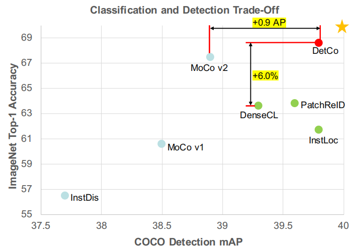
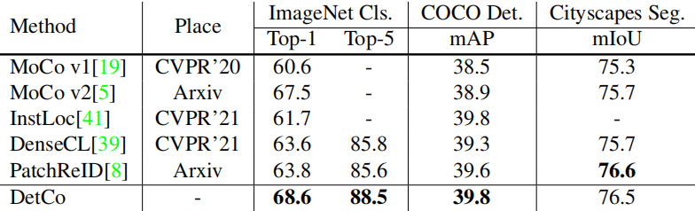
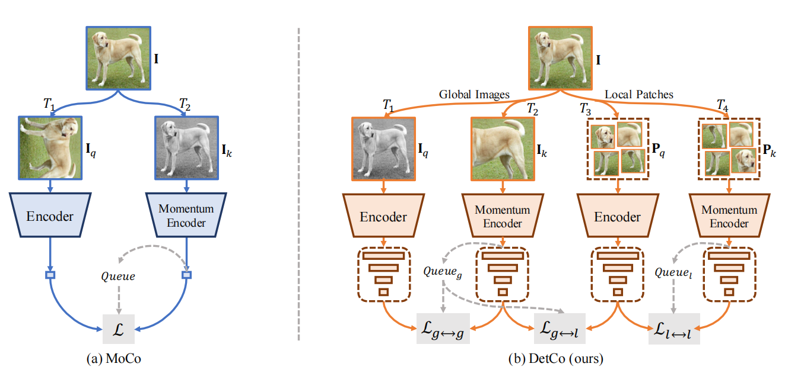
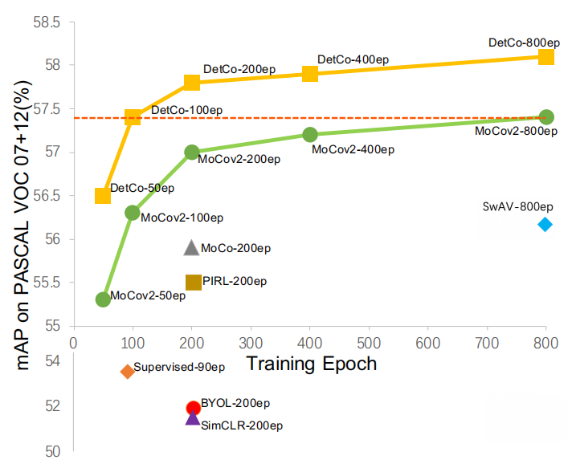
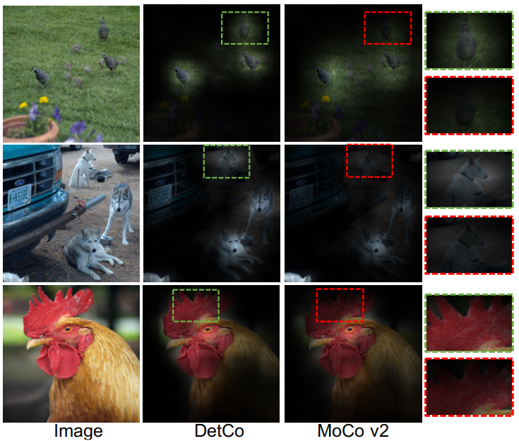

# DetCo: Unsupervised Contrastive Learning for Object Detection
DetCo：用于目标检测的无监督对比学习 2021.4.9 https://arxiv.org/abs/2102.04803

## 阅读笔记
* 遵循多任务预训练的范式，把图像分类、目标检测、实例分割、语义分割等统一到一个预训练任务中。
* 方法：1.对中间表示(特征金字塔)的多级监督，2.全局图像和局部块之间的对比学习

## Abstract 
We present DetCo, a simple yet effective self-supervised approach for object detection. Unsupervised pre-training methods have been recently designed for object detection, but they are usually deficient in image classification, or the opposite. Unlike them, DetCo transfers well on downstream instance-level dense prediction tasks, while maintaining competitive image-level classification accuracy. The advantages are derived from (1) multi-level supervision to intermediate representations, (2) contrastive learning between global image and local patches. These two designs facilitate discriminative and consistent global and local representation at each level of feature pyramid, improving detection and classification, simultaneously.

我们介绍了 DetCo，这是一种简单而有效的目标检测自监督方法。 最近设计了用于目标检测的无监督预训练方法，但它们通常在图像分类方面存在缺陷，或者相反。 与它们不同的是，DetCo 在下游实例级密集预测任务上迁移良好，同时保持有竞争力的图像级分类精度。 优点来自(1)对中间表示的多级监督，(2)全局图像和局部块之间的对比学习。 这两种设计有助于在特征金字塔的每个级别上进行区分和一致的全局和局部表示，同时改进检测和分类。

Extensive experiments on VOC, COCO, Cityscapes, and ImageNet demonstrate that DetCo not only outperforms recent methods on a series of 2D and 3D instance-level detection tasks, but also competitive on image classification. For example, on ImageNet classification, DetCo is 6.9% and 5.0% top-1 accuracy better than InsLoc and DenseCL, which are two contemporary works designed for object detection. Moreover, on COCO detection, DetCo is 6.9 AP better than SwAV with Mask R-CNN C4. Notably, DetCo largely boosts up Sparse R-CNN, a recent strong detector, from 45.0 AP to 46.5 AP (+1.5 AP), establishing a new SOTA on COCO. Code is available http://github.com/xieenze/DetCo.

在 VOC、COCO、Cityscapes 和 ImageNet 上进行的大量实验表明，DetCo 不仅在一系列 2D 和 3D 实例级检测任务上优于最近的方法，而且在图像分类方面也具有竞争力。 例如，在 ImageNet 分类上，DetCo 的 top-1 准确率分别为 6.9% 和 5.0%，优于 InsLoc 和 DenseCL 这两个为目标检测设计的当代作品。 此外，在 COCO 检测上，DetCo 比使用 Mask R-CNN C4 的 SwAV 高 6.9 AP。 值得注意的是，DetCo 在很大程度上将 Sparse R-CNN(最近的强大检测器)从 45.0 AP 提升到 46.5 AP(+1.5 AP)，在 COCO 上建立了新的 SOTA。 代码可用 http://github.com/xieenze/DetCo。

## 1. Introduction
Self-supervised learning of visual representation is an essential problem in computer vision, facilitating many downstream tasks such as image classification, object detection, and semantic segmentation [23, 35, 43]. It aims to provide models pre-trained on large-scale unlabeled data for downstream tasks. Previous methods focus on designing different pretext tasks. One of the most promising directions among them is contrastive learning [32], which transforms one image into multiple views, minimizes the distance between views from the same image, and maximizes the distance between views from different images in a feature map.

视觉表示的自监督学习是计算机视觉中的一个基本问题，它促进了许多下游任务，例如图像分类、目标检测和语义分割 [23、35、43]。 它旨在为下游任务提供针对大规模未标记数据进行预训练的模型。 以前的方法侧重于设计不同的前置任务。 其中最有前途的方向之一是对比学习[32]，它将一个图像转换为多个视图，最小化同一图像视图之间的距离，并最大化特征图中不同图像的视图之间的距离。

 
Figure 1. Transfer accuracy on Classification and Detection. DetCo achieves the best performance trade-off on both classification and detection. For example, DetCo outperforms its strong baseline, MoCo v2 [5], by 0.9 AP on COCO detection. Moreover, DetCo is significant better than recent work e.g. DenseCL [39], InsLoc [41], PatchReID [8] on ImageNet classification while also has advantages on object detection. Note that these three methods are concurrent work and specially designed for object detection (mark with green). The yellow asterisk indicates that a desired method should have both high performance in detection and classification. 
图1. 分类和检测的迁移精度。 DetCo 在分类和检测方面实现了最佳性能权衡。 例如，DetCo 在 COCO 检测上的 AP 优于其强大的基线 MoCo v2 [5] 0.9。 此外，DetCo 明显优于最近的工作，例如 DenseCL [39]、InsLoc [41]、PatchReID [8]在ImageNet分类上同时在目标检测上也有优势。 请注意，这三种方法是并行工作，专门用于目标检测(标记为绿色)。 黄色星号表示所需的方法应该在检测和分类方面都具有高性能。

<!--看起来效果没有比MoCo_v2高多少，引入多层次监督的复杂度是否有必要，有更简单的方案？-->

In the past two years, some methods based on contrastive learning and online clustering, e.g. MoCo v1/v2 [19, 5], BYOL [18], and SwAV [3], have achieved great progress to bridge the performance gap between unsupervised and fully-supervised methods for image classification. However, their transferring ability on object detection is not satisfactory. Concurrent to our work, recently DenseCL [39], InsLoc [41] and PatchReID [8] also adopt contrastive learning to design detection-friendly pretext tasks. Nonetheless, these methods only transfer well on object detection but sacrifice image classification performance, as shown in Figure 1 and Table 1. So, it is challenging to design a pretext task that can reconcile instance-level detection and image classification.

在过去的两年中，一些基于对比学习和在线聚类的方法，例如 MoCo v1/v2 [19, 5]、BYOL [18] 和 SwAV [3] 在弥合无监督和全监督图像分类方法之间的性能差距方面取得了很大进展。 然而，它们在目标检测上的迁移能力并不令人满意。 在我们工作的同时，最近 DenseCL [39]、InsLoc [41] 和 PatchReID [8] 也采用对比学习来设计检测友好的前置任务。 尽管如此，这些方法仅在目标检测上迁移良好，但牺牲了图像分类性能，如图1 和表1 所示。因此，设计一个能够协调实例级检测和图像分类的前置任务具有挑战性。
<!-- online clustering  在线聚类 -->

 
Table 1. Classification detection-friendly self-supervised methods. Compared with concurrent InstLoc[41], DenseCL[39] and PatchReID[8], DetCo is significantly better by 6.9%, 5.0% and 4.8% on ImageNet classification. Moreover, DetCo is also on par with these methods on dense prediction tasks, achieving best trade-off. 
表1. 分类检测友好的自监督方法。 与并发的 InstLoc[41]、DenseCL[39] 和 PatchReID[8] 相比，DetCo 在 ImageNet 分类上明显好 6.9%、5.0% 和 4.8%。 此外，DetCo 在密集预测任务上也与这些方法不相上下，实现了最佳权衡。

We hypothesize that there is no unbridgeable gap between image-level classification and instance-level detection. Intuitively, image classification recognizes global instance from a single high-level feature map, while object detection recognizes local instance from multi-level feature pyramids. From this perspective, it is desirable to build instance representation that are (1) discriminative at each level of feature pyramid (2) consistent for both global image and local patch (a.k.a sliding windows). However, existing unsupervised methods overlook these two aspects. Therefore, detection and classification cannot mutually improve.

我们假设图像级分类和实例级检测之间没有不可逾越的鸿沟。 直观上，图像分类从单个高级特征图识别全局实例，而目标检测从多级特征金字塔识别局部实例。 从这个角度来看，希望构建实例表示，这些表示 (1) 在特征金字塔的每个级别上具有判别性 (2) 对于全局图像和局部分块(也称为滑动窗口)是一致的。 然而，现有的无监督方法忽略了这两个方面。 因此，检测和分类不能相互提高。 

In this work, we present DetCo, which is a contrastive learning framework beneficial for instance-level detection tasks while maintaining competitive image classification transfer accuracy. DetCo contains (1) multi-level supervision on features from different stages of the backbone network. (2) contrastive learning between global image and local patches. Specifically, the multi-level supervision directly optimizes the features from each stage of backbone network, ensuring strong discrimination in each level of pyramid features. This supervision leads to better performance for dense object detectors by multi-scale prediction. The global and local contrastive learning guides the network to learn consistent representation on both image-level and patch-level, which can not only keep each local patch highly discriminative but also promote the whole image representation, benefiting both object detection and image classification.

在这项工作中，我们介绍了 DetCo，它是一种对比学习框架，有利于实例级检测任务，同时保持有竞争力的图像分类迁移精度。 DetCo 包含(1)对来自骨干网不同阶段特征的多级监督。 (2) 全局图像和局部图像块的对比学习。 具体来说，多级监督直接优化骨干网络每一阶段的特征，确保金字塔每一层特征的强区分度。 这种监督通过多尺度预测为密集目标检测器带来更好的性能。 全局和局部对比学习引导网络在图像级和分块级上学习一致的表示，这不仅可以保持每个局部块具有高度的判别力，还可以促进整个图像的表示，有利于目标检测和图像分类。<!--和ViT结合，而非CNN？-->

DetCo achieves state-of-the-art transfer performance on various 2D and 3D instance-level detection tasks e.g. VOC and COCO object detection, semantic segmentation and DensePose. Moreover, the performance of DetCo on ImageNet classification and VOC SVM classification is still very competitive. For example, as shown in Figure 1 and Table 1, DetCo improves MoCo v2 on both classification and dense prediction tasks. DetCo is significant better than DenseCL [39], InsLoc [41] and PatchReID [8] on ImageNet classification by 6.9%, 5.0% and 4.8% and slightly better on object detection and semantic segmentation. Please note DenseCL, InsLoc and PatchReID are three concurrent works which are designed for object detection but sacrifice classification. Moreover, DetCo boosts up Sparse R-CNN [37], which is a recent end-to-end object detector without q, from a very high baseline 45.0 AP to 46.5 AP (+1.5 AP) on COCO dataset with ResNet-50 backbone, establishing a new state-of-the-art detection result. In the 3D task, DetCo outperforms ImageNet supervised methods and MoCo v2 in all metrics on COCO DensePose, especially +1.4 on AP50.

DetCo 在各种 2D 和 3D 实例级检测任务上实现了最先进的迁移性能，例如 VOC 和 COCO 目标检测、语义分割和 DensePose。 而且，DetCo在ImageNet分类和VOC SVM分类上的表现还是很有竞争力的。 例如，如图1 和表1 所示，DetCo 在分类和密集预测任务上改进了 MoCo v2。 DetCo 在 ImageNet 分类上明显优于 DenseCL [39]、InsLoc [41] 和 PatchReID [8] 6.9%、5.0% 和 4.8%，在目标检测和语义分割方面略好。 请注意 DenseCL、InsLoc 和 PatchReID 是三个并行工作，它们专为目标检测而设计，但牺牲了分类。 此外，DetCo 在具有 ResNet-50 主干的 COCO 数据集上提升了稀疏 R-CNN [37]，这是一种最近的端到端目标检测器，没有 q，从非常高的基线 45.0 AP 到 46.5 AP(+1.5 AP) ，建立了一个新的最先进的检测结果。 在 3D 任务中，DetCo 在 COCO DensePose 上的所有指标上都优于 ImageNet 监督方法和 MoCo v2，尤其是在 AP50 上 +1.4。

Overall, the main contributions of this work are threefold: 
* We introduce a simple yet effective self-supervised pretext task, named DetCo, which is beneficial for instance-level detection tasks. DetCo can utilize largescale unlabeled data and provide a strong pre-trained model for various downstream tasks. 
* Benefiting from the design of multi-level supervision and contrastive learning between global images and local patches, DetCo successfully improves the transferring ability on object detection without sacrificing image classification, compared to contemporary selfsupervised counterparts. 
* Extensive experiments on PASCAL VOC [15], COCO [28] and Cityscapes [6] show that DetCo outperforms previous state-of-the-art methods when transferred to a series of 2D and 3D instance-level detection tasks, e.g. object detection, instance segmentation, human pose estimation, DensePose, as well as semantic segmentation.

总的来说，这项工作的主要贡献有三个：
* 我们介绍了一个简单而有效的自监督前置任务，名为 DetCo，它有利于实例级检测任务。 DetCo 可以利用大规模未标记数据，并为各种下游任务提供强大的预训练模型。
* 得益于多级监督设计和全局图像与局部分块之间的对比学习，与当代自监督对应物相比，DetCo 在不牺牲图像分类的情况下成功提高了目标检测的迁移能力。
* 对 PASCAL VOC [15]、COCO [28] 和 Cityscapes [6] 的广泛实验表明，当迁移到一系列 2D 和 3D 实例级检测任务时，DetCo 优于以前的最先进方法，例如 目标检测、实例分割、人体姿势估计、DensePose，以及语义分割。

## 2. Related Work
Existing unsupervised methods for representation learning can be roughly divided into two classes, generative and discriminative. Generative methods [11, 14, 12, 2] typically rely on auto-encoding of images [38, 24, 36] or adversarial learning [17], and operate directly in pixel space. Therefore, most of them are computationally expensive, and the pixel-level details required for image generation may not be necessary for learning high-level representations.

现有的无监督表示学习方法大致可以分为两类，生成式和判别式。 生成方法 [11、14、12、2] 通常依赖于图像的自动编码 [38、24、36] 或对抗性学习 [17]，并直接在像素空间中运行。 因此，它们中的大多数在计算上都是昂贵的，并且图像生成所需的像素级细节对于学习高级表示可能不是必需的。

Among discriminative methods [9, 5], self-supervised contrastive learning [5, 19, 5, 3, 18] currently achieved state-of-the-art performance, arousing extensive attention from researchers. Unlike generative methods, contrastive learning avoids the computation-consuming generation step by pulling representations of different views of the same image (i.e., positive pairs) close, and pushing representations of views from different images (i.e., negative pairs) apart. Chen et al. [5] developed a simple framework, termed SimCLR, for contrastive learning of visual representations. It learns features by contrasting images after a composition of data augmentations. After that, He et al. [19] and Chen et al. [5] proposed MoCo and MoCo v2, using a moving average network (momentum encoder) to maintain consistent representations of negative pairs drawn from a memory bank. Recently, SwAV [3] introduced online clustering into contrastive learning, without requiring to compute pairwise comparisons. BYOL [18] avoided the use of negative pairs by bootstrapping the outputs of a network iteratively to serve as targets for an enhanced representation.

在判别方法 [9, 5] 中，自监督对比学习 [5, 19, 5, 3, 18] 目前取得了最先进的性能，引起了研究人员的广泛关注。 与生成方法不同，对比学习通过将同一图像的不同视图表示(即正对)拉近，并将来自不同图像的视图的表示(即负对)推开来避免耗费计算的生成步骤。 Chen et al. [5] 开发了一个简单的框架，称为 SimCLR，用于视觉表示的对比学习。 它通过在组合数据增广后对比图像来学习特征。 之后，He et al. [19] 和 Chen et al. [5] 提出了 MoCo 和 MoCo v2，使用移动平均网络(动量编码器)来保持从记忆库中提取的负对的一致表示。 最近，SwAV [3] 将在线聚类引入到对比学习中，而不需要计算成对比较。 BYOL [18] 通过迭代引导网络的输出作为增广表示的目标来避免使用负对。
<!-- moving average network (momentum encoder), 移动平均网络(动量编码器)-->

Moreover, earlier methods rely on all sorts of pretext tasks to learn visual representations. Relative patch prediction [9, 10], colorizing gray-scale images [42, 25], image inpainting [33], image jigsaw puzzle [31], image superresolution [26], and geometric transformations [13, 16] have been proved to be useful for representation learning.

此外，早期的方法依赖于各种前置任务来学习视觉表征。 相关分块预测 [9, 10]、着色灰度图像 [42, 25]、图像修复 [33]、图像拼图[31]、图像超分辨率 [26] 和几何变换 [13, 16] 已被证明 对表征学习有用。

Nonetheless, most of the aforementioned methods are specifically designed for image classification while neglecting object detection. Concurrent to our work, recently DenseCL [39], InsLoc [41] and PatchReID [8] design pretext tasks for object detection. However, their transferring performance is poor on image classification. Our work focuses on designing a better pretext task which is not only beneficial for instance-level detection, but also maintains strong representation for image classification.

尽管如此，上述大多数方法都是专门为图像分类而设计的，而忽略了目标检测。 在我们工作的同时，最近 DenseCL [39]、InsLoc [41] 和 PatchReID [8] 设计了目标检测的前置任务。 然而，它们在图像分类上的迁移性能较差。 我们的工作重点是设计一个更好的前置任务，这不仅有利于实例级检测，而且还能为图像分类保持强大的代表性。

## 3. Methods
In this section, we first briefly introduce the overall architecture of the proposed DetCo showed in Figure 2. Then, we present the design of multi-level supervision that keeps features at multiple stages discriminative. Next, we introduce global and local contrastive learning to enhance global and local representation. Finally, we provide the implementation details of DetCo.

在本节中，我们首先简要介绍了图2 中所提出的 DetCo 的总体架构。然后，我们介绍了多级监督的设计，以保持多个阶段的特征具有判别性。 接下来，我们引入全局和局部对比学习以增广全局和局部代表性。 最后，我们提供了 DetCo 的实现细节。

 
Figure 2. The overall pipeline of DetCo compared with MoCo [19]. (a) is MoCo’s framework, which only considers the single highlevel feature and learning contrast from a global perspective. (b) is our DetCo, which learns representation with multi-level supervision and adds two additional local patch sets for input, building contrastive loss cross the global and local views. Note that “T ” means image transforms. “$Queue_{g/l}$” means different memory banks [40] for global/local features. 
图2. DetCo 与 MoCo 的整体管道对比 [19]。 (a)是MoCo的框架，只考虑了单一的高层次特征和全局视角的对比学习。 (b)是我们的 DetCo，它通过多级监督学习表示，并为输入添加两个额外的局部分块集，构建全局和局部视图的对比损失。 请注意，“T”表示图像变换。 “$Queue_{g/l}$”表示用于全局/局部特征的不同存储库[40]。

### 3.1. DetCo Framework
DetCo is a simple pipeline designed mainly based on a strong baseline MoCo v2. It composes of a backbone network, a series of MLP heads and memory banks. The setting of MLP head and memory banks are same as MoCo v2 for simplicity. The overall architecture of DetCo is illustrated in Figure 2.

DetCo 是一个简单的流水线，主要基于强大的基线 MoCo v2 设计。 它由一个主干网络、一系列MLP heads和memory bank组成。 为简单起见，MLP头和存储库的设置与 MoCo v2 相同。 DetCo 的总体架构如图2 所示。

Specifically, DetCo has two simple and effective designs which are different from MoCo v2. (1) multi-level supervision to keep features at multiple stages discriminative. (2) global and local contrastive learning to enhance both global and local feature representation.The above two different designs make DetCo not only successfully inherit the advantages of MoCo v2 on image classification but also transferring much stronger on instance-level detection tasks.

具体来说，DetCo 有两个简单有效的设计，不同于 MoCo v2。 (1) 多级监督以保持多阶段特征的判别性。 (2)全局和局部对比学习，同时增广全局和局部特征表示。以上两种不同的设计使得DetCo不仅成功地继承了MoCo v2在图像分类上的优势，而且在实例级检测任务上的迁移能力也更强。

The complete loss function of DetCo can be defined as follows:

DetCo的完整损失函数可以定义如下：

$L(I_q,I_k,P_q,P_k)= \sum^4_{i=1} w_i·(L^i_{g↔g} + L^i_{l↔l} + L^i_{g↔l})$, (1) 

where I represents a global image and P represents the local patch set. Eqn. 1 is a multi-stage contrastive loss. In each stage, there are three cross local and global contrastive losses. We will describe the multi-level supervision $\sum^4_{i=1} w_i· L^i$ in Section 3.2, the global and local contrastive learning $L^i_{g↔g} + L^i_{l↔l} + L^i_{g↔l}$ in Section 3.3. 

其中 I 代表全局图像，P 代表局部分块集。 等式 1 是多阶段对比损失。 在每个阶段，都有三个跨局部和全局的对比损失。 我们将在 3.2 节中描述多级监督 $\sum^4_{i=1} w_i· L^i$，在 3.3 节中描述全局和局部对比学习 $L^i_{g↔g} + L^i_{l↔l} + L^i_{g↔l}$。

### 3.2. Multi-level Supervision
Modern object detectors predict objects in different levels, e.g. RetinaNet and Faster R-CNN FPN. They require the features at each level to keep strong discrimination. To meet the above requirement, we make a simple yet effective modification to the original MoCo baseline.

现代目标检测器预测不同级别的物体，例如 RetinaNet 和 Faster R-CNN FPN。 他们要求每个级别的特征都保持很强的区分度。 为了满足上述要求，我们对原始的 MoCo 基线进行了简单而有效的修改。

Specifically, we feed one image to a standard backbone ResNet-50, and it outputs features from different stages, termed Res2, Res3, Res4, Res5. Unlike MoCo that only uses Res5, we utilize all levels of features to calculate contrastive losses, ensuring that each stage of the backbone produces discriminative representations.

具体来说，我们将一张图像提供给标准主干 ResNet-50，它输出不同阶段的特征，称为 Res2、Res3、Res4、Res5。 与仅使用 Res5 的 MoCo 不同，我们利用所有级别的特征来计算对比损失，确保主干的每个阶段都产生有区别的表示。

Given an image I ∈ $R^{H ×W ×3}$ , it is first transformed to two views of the image $I_q$ and $I_k$ with two transformations randomly drawn from a set of transformations on global views, termed $T_g$ . We aim at training an $encoder_q$ together with an $encoder_k$  with the same architecture, where  $encoder_k$  update weights using a momentum update strategy [19]. The  $encoder_q$  contains a backbone and four global MLP heads to extract features from four levels. We feed $I_q$ to the backbone  $b^θ_q$ (·), with parameters θ that extracts features {$f_2,f_3,f_4,f_5$ } =  $b^θ_q$ ( $I_q$ ), where $f_i$ means the feature from the i-th stage. After obtaining the multi-level features, we append four global MLP heads { $mlp^2_q$  (·),  $mlp^3_q$  (·),  $mlp^4_q$  (·),  $mlp^5_q$  (·)} whose weights are non-shared. As a result, we obtain four global representations { $q^g_2$  ,  $q^g_3$  ,  $q^g_4$  ,  $q^g_5$  } =  $encoder_q$  ( $I_q$  ). Likewise, we can easily get { $k^g_2$  ,  $k^g_3$  ,  $k^g_4$  ,  $k^g_5$  } =  $encoder_k$  ($I_k$ ).

给定图像 I ∈ $R^{H ×W ×3}$ ，它首先被转换为图像的两个视图 $I_q$ 和 $I_k$ ，其中两个变换是从全局视图的一组变换中随机抽取的，称为 $ T_g$。 我们的目标是训练一个 $encoder_q$ 和一个具有相同架构的 $encoder_k$，其中 $encoder_k$ 使用动量更新策略 [19] 更新权重。 $encoder_q$ 包含一个主干和四个全局 MLP 头，用于从四个级别提取特征。 我们将 $I_q$ 馈送到主干 $b^θ_q$ (·)，参数 θ 提取特征 {$f_2,f_3,f_4,f_5$ } = $b^θ_q$ ( $I_q$ )，其中 $f_i$ 表示第 i 个阶段的特征。 获得多级特征后，我们附加四个全局MLP头{ $mlp^2_q$ (·), $mlp^3_q$ (·), $mlp^4_q$ (·), $mlp^5_q$ (·) } 其权重是非共享的。 结果，我们获得了四个全局表示 { $q^g_2$ , $q^g_3$ , $q^g_4$ , $q^g_5$ } = $encoder_q$ ( $I_q$ )。 同样，我们可以很容易地得到 { $k^g_2$ , $k^g_3$ , $k^g_4$ , $k^g_5$ } = $encoder_k$ ($I_k$ )。

MoCo uses InfoNCE to calculate contrasitive loss, formulated as: 

MoCo 使用 InfoNCE 计算对比损失，公式为：

$L_{g↔g}(I_q, I_k) = − log \frac{exp(q^g·k^g_+ / τ )} {\sum^ K_{i=0} exp(q^g·k^g_i / τ )},$ (2) 

where τ is a temperature hyper-parameter [40]. We extend it to multi-level contrastive losses for multi-stage features, formulated as: 

其中 τ 是温度超参数 [40]。 我们将其扩展到多阶段特征的多级对比损失，公式为：

$Loss = \sum^4_{i=1} w_i · L^i_{g↔g},$ (3) 

where w is the loss weight, and i indicates the current stage. Inspired by the loss weight setting in PSPNet [43], we set the loss weight of shallow layers to be smaller than deep layers. In addition, we build an individual memory bank $queue_i$ for each layer. In the appendix, we provide the pseudo-code of intermediate contrastive loss.

其中 w 是损失权重，i 表示当前阶段。 受 PSPNet [43] 中损失权重设置的启发，我们将浅层的损失权重设置为小于深层。 此外，我们为每一层构建一个单独的内存库$queue_i$。 在附录中，我们提供了中间对比损失的伪代码。

### 3.3. Global and Local Contrastive Learning  全局和局部对比学习
Modern object detectors repurpose classifiers on local regions (a.k.a sliding windows) to perform detection. So, it requires each local region to be discriminative for instance classification. To meet the above requirement, we develop global and local contrastive learning to keep consistent instance representation on both patch set and the whole image. This strategy takes advantage of image-level representation to enhance instance-level representation, vice versa.

现代目标检测器在局部区域(也称为滑动窗口)上重新调整分类器以执行检测。 因此，它要求每个局部区域在实例分类时都具有判别力。 为了满足上述要求，我们开发了全局和局部对比学习，以在分块集和整个图像上保持一致的实例表示。 该策略利用图像级表示来增广实例级表示，反之亦然。

In detail, we first transform the input image into 9 local patches using jigsaw augmentation, the augmentation details are shown in section 3.4. These patches pass through the encoder, and then we can get 9 local feature representation. After that, we combine these features into one feature representation by a MLP head, and build a cross global-andlocal contrastive learning.

具体来说，我们首先使用拼图增广将输入图像转换为 9 个局部块，增广细节如 3.4 节所示。 这些分块通过编码器，然后我们可以得到 9 个局部特征表示。 之后，我们将这些特征组合成一个 MLP 头的特征表示，并构建一个跨全局和局部的对比学习。

Given an image $I ∈ R^{H×W×3}$, first it is transformed into two local patch set $P_q$ and $P_k$ by two transformations selected from a local transformation set, termed$T_l$. There are 9 patches { $p_1 , p_2 , ..., p_9$  } in each local patch set. We feed the local patch set to backbone and get 9 features  $F_p = \{f_{p_1}, f_{p_2}, ..., f_{p_9}\}$  at each stage. Taking a stage as an example, we build a MLP head for local patch, denoted as $mlp_{local}(·)$, which does not share weights with $mlp_{global}(·)$ in section 3.2. Then, $F_p$ is concatenated and fed to the local patch MLP head to get final representation $q^l$. Likewise, we can use the same approach to get $k^l$.

给定图像 $I ∈ R^{H×W×3}$，首先通过从局部变换集中选择的两个变换将其变换为两个局部分块集 $P_q$ 和 $P_k$ ，称为$T_l$。 每个本地分块集中有 9 个分块 { $p_1 , p_2 , ..., p_9$}。 我们将本地分块集提供给主干并在每个阶段获得 9 个特征  $F_p = \{f_{p_1}, f_{p_2}, ..., f_{p_9}\}$ 。 以一个阶段为例，我们为本地分块构建一个MLP头，记为$mlp_{local}(·)$，它不与3.2节中的$mlp_{global}(·)$共享权重。 然后，将 $F_p$ 连接起来并馈送到本地分块 MLP 头以获得最终表示$q^l$。 同样，我们可以使用相同的方法来获取$k^l$。

The contrastive cross loss has two parts: the global↔local contrastive loss and the local↔local contrastive loss. The global↔local contrastive loss can be written as: 
对比交叉损失有两部分：全局↔局部对比损失和局部↔局部对比损失。 全局↔局部对比损失可以写成：

$L_{g↔l}(P_q, I_k) = − log \frac{ exp(q^l·k^g_+/τ )}{ \sum^K_{i=0} exp(q^l·k_i^g / τ ) }$. (4)

Similarly, the local↔local contrastive loss can be formlated as:
类似地，局部↔局部对比损失可以写成：

$L_{l↔l}(P_q, P_k) = − log \frac{ exp(q^l·k^l_+/τ )}{ \sum^K_{i=0} exp(q^l·k_i^l / τ ) }$ (5)

By learning representations between global image and local patches, the instance discrimination of image-level and instance-level are mutually improved. As a result, both the detection and classification performance boost up.

通过学习全局图像和局部块之间的表示，图像级和实例级的实例判别相互改进。 结果，检测和分类性能都得到了提升。

### 3.4. Implementation Details
We use OpenSelfSup(1 https://github.com/open-mmlab/OpenSelfSup) as the codebase. We use a batch size of 256 with 8 Tesla V100 GPUs per experiment. We follow the most hyper-parameters settings of MoCo v2. For data augmentation, the global view augmentation is almost the same as MoCo v2 [5] with random crop and resized to 224 × 224 with a random horizontal flip, gaussian blur and color jittering related to brightness, contrast, saturation, hue and grayscale. Rand-Augmentation[7] is also used on global view. The local patch augmentation follows PIRL [30]. First, a random region is cropped with at least 60% of the image and resized to 255×255, followed by random flip, color jitter and blur, sharing the same parameters with global augmentation. Then we divide the image into 3 × 3 grids and randomly shuffle them; each grid is 85 × 85. A random crop is applied on each patch to get 64 × 64 to avoid continuity between patches. Finally, we obtain nine randomly shuffled patches. For a fair comparison, we use standard ResNet-50 [23] for all experiments. Unless other specified, we pre-train 200 epochs on ImageNet for a fair comparison. 

我们使用 OpenSelfSup(1 https://github.com/open-mmlab/OpenSelfSup) 作为代码库。 每个实验使用 8 个 Tesla V100 GPU 的批量大小为 256。 我们遵循 MoCo v2 的大多数超参数设置。 对于数据增广，全局视图增广与 MoCo v2 [5] 几乎相同，随机裁剪并调整为 224×224 随机水平翻转，高斯模糊和与亮度、对比度、饱和度、色调和灰度相关的颜色抖动。 Rand-Augmentation[7] 也用于全局视图。 局部分块增广遵循 PIRL [30]。 首先，用至少 60% 的图像裁剪随机区域并将大小调整为 255×255，然后进行随机翻转、颜色抖动和模糊，与全局增广共享相同的参数。 然后我们把图像分成3×3的格子，随机打乱;  每个网格为 85 × 85。对每个分块应用随机裁剪以获得 64 × 64，以避免分块之间的连续性。 最后，我们获得了九个随机打乱的分块。 为了公平比较，我们对所有实验使用标准 ResNet-50 [23]。 除非另有说明，否则我们在 ImageNet 上预训练 200 个 epoch 以进行公平比较。

## 4. Experiments
We evaluate DetCo on a series of 2D and 3D dense prediction tasks, e.g. PASCAL VOC detection, COCO detection, instance segmentation, 2D pose estimation, DensePose and Cityscapes instance and semantic segmentation. We see that DetCo outperforms existing self-supervised and supervised methods.

我们在一系列 2D 和 3D 密集预测任务上评估 DetCo，例如 PASCAL VOC 检测、COCO 检测、实例分割、2D 姿态估计、DensePose 和 Cityscapes 实例和语义分割。 我们看到 DetCo 优于现有的自监督和监督方法。

### 4.1. Object Detection
#### Experimental Setup. 
We choose three representative detectors: Faster R-CNN [35], Mask R-CNN [22] RetinaNet [27], and a recent strong detector: Sparse RCNN [37]. Mask R-CNN is two-stage and RetinaNet is one stage detector. Sparse R-CNN is an end-to-end detector without NMS, and it is also state-of-the-art with high mAP on COCO. Our training settings are the same as MoCo [19] for a fair comparison, including using “SyncBN” [34] in backbone and FPN.

实验设置。 我们选择了三个具有代表性的检测器：Faster R-CNN [35]、Mask R-CNN [22] RetinaNet [27]，以及最近的强检测器：Sparse RCNN [37]。 Mask R-CNN 是两级检测器，而 RetinaNet 是一级检测器。 稀疏 R-CNN 是一种没有 NMS 的端到端检测器，它也是 state-of-the-art，在 COCO 上具有高 mAP。 为了公平比较，我们的训练设置与 MoCo [19] 相同，包括在主干和 FPN 中使用“SyncBN”[34]。 <!--为啥不用YOLO？-->

#### PASCAL VOC. 
As shown in Table 9 and Figure 3, MoCo v2 is a strong baseline, which has already surpassed other unsupervised learning methods in VOC detection. However, our DetCo consistently outperforms the MoCo v2 at 200 epochs and 800 epochs. More importantly, with only 100 epoch pre-training, DetCo achieves almost the same performance as MoCo v2-800ep (800 epoch pre-training). Finally, DetCo-800ep establishes the new state-of-the-art, 58.2 in mAP and 65.0 in AP75, which brings 4.7 and 6.2 improvements in AP and AP75 respectively, compared with supervised counterpart. The improvements on the more stringent AP75 are much larger than the AP, indicating that the intermediate and patch contrasts are beneficial to the localization.

PASCAL VOC. 如表9 和图3 所示，MoCo v2 是一个强大的基线，在 VOC 检测方面已经超越了其他无监督学习方法。 然而，我们的 DetCo 在 200 个 epoch 和 800 个 epoch 时始终优于 MoCo v2。 更重要的是，仅用 100 个 epoch 预训练，DetCo 就实现了与 MoCo v2-800ep(800 epoch 预训练)几乎相同的性能。 最后，DetCo-800ep 建立了新的 state-of-the-art，mAP 为 58.2，AP75 为 65.0，与有监督的对应项相比，AP 和 AP75 分别提高了 4.7 和 6.2。 在更严格的 AP75 上的改进比 AP 大得多，表明中间和分块对比度有利于定位。

 
Table 9. Object Detection finetuned on PASCAL VOC07+12 using Faster RCNN-C4. DetCo-100ep is on par with previous state-of-the-art, and DetCo-800ep achieves the best performance. 
表9. 使用 Faster RCNN-C4 在 PASCAL VOC07+12 上微调目标检测。 DetCo-100ep 与之前的 state-of-the-art 相当，DetCo-800ep 达到最佳性能。

 
Figure 3. Comparisons of mAP on PASCAL VOC 07+12 object detection. For different pre-training epoches, we see that DetCo consistently outperforms MoCo v2[5], which is a strong competitor on VOC compared to other methods. For example, DetCo100ep already achieves similar mAP compared to MoCov2-800ep. Moreover, DetCo-800ep achieves state-of-the-art and outperforms other counterparts.
图3. mAP 在 PASCAL VOC 07+12 目标检测上的比较。 对于不同的预训练时期，我们看到 DetCo 始终优于 MoCo v2[5]，与其他方法相比，它是 VOC 上的强大竞争对手。 例如，与 MoCov2-800ep 相比，DetCo100ep 已经实现了相似的 mAP。 此外，DetCo-800ep 达到了最先进的水平并优于其他同类产品。

#### COCO with 1× and 2× Schedule. 
Table 3 shows the Mask RCNN [22] results on 1× schedule, DetCo outperforms MoCo v2 baseline by 0.9 and 1.2 AP for R50-C4 and R50-FPN backbones. It also outperforms the supervised counterpart by 1.6 and 1.2 AP for R50-C4 and R50-FPN respectively. The results of 2× schedule is in Appendix. The column 2-3 of Table 7 shows the results of one stage detector RetinaNet. DetCo pretrain is 1.0 and 1.2 AP better than supervised methods and MoCo v2. DetCo is also 1.3 higher than MoCov2 on AP50 with 1× schedule.

具有 1× 和 2× 时间表的 COCO。 表3 显示了 Mask RCNN [22] 在 1× schedule 上的结果，对于 R50-C4 和 R50-FPN 主干，DetCo 优于 MoCo v2 基线 0.9 和 1.2 AP。 对于 R50-C4 和 R50-FPN，它也分别比受监督的对应物高出 1.6 和 1.2 AP。 2×时间表的结果在附录中。 表7 的第 2-3 列显示了一级检测器 RetinaNet 的结果。 DetCo pretrain 是 1.0 和 1.2 AP，优于监督方法和 MoCo v2。 在 AP50 上，DetCo 也比 MoCov2 高 1.3，进度为 1×。

 
Table 3. Object detection and instance segmentation fine-tuned on COCO. All methods are pretrained 200 epochs on ImageNet. DetCo outperforms all supervised and unsupervised counterparts.
表3. 在 COCO 上微调的目标检测和实例分割。 所有方法都在 ImageNet 上预训练了 200 个 epoch。 DetCo 优于所有有监督和无监督的同行。

#### COCO with Few Training Iterations. 
COCO is much larger than PASCAL VOC in the data scale. Even training from scratch [20] can get a satisfactory result. To verify the effectiveness of unsupervised pre-training, we conduct experiments on extremely stringent conditions: only train detectors with 12k iterations(≈ 1/7× vs. 90k-1× schedule). The 12k iterations make detectors heavily under-trained and far from converge, as shown in Table 2 and Table 7 column 1. Under this setting, for Mask RCNN-C4, DetCo exceeds MoCo v2 by 3.8 AP in APbb and outperforms supervised 50 methods in all metrics, which indicates DetCo can significantly fasten the training convergence. For Mask RCNNFPN and RetinaNet, DetCo also has significant advantages over MoCo v2 and supervised counterpart.

训练迭代次数很少的 COCO。 COCO 在数据规模上远大于 PASCAL VOC。 即使从头开始训练[20]也能得到满意的结果。 为了验证无监督预训练的有效性，我们在极其严格的条件下进行了实验：仅训练具有 12k 迭代次数的检测器(≈ 1/7× vs. 90k-1× schedule)。 12k 次迭代使检测器严重训练不足并且远未收敛，如表2 和表7 第 1 列所示。在此设置下，对于 Mask RCNN-C4，DetCo 在 APbb 中超过 MoCo v2 3.8 AP，并且在 APbb 中优于受监督的 50 种方法 所有指标，这表明 DetCo 可以显著加快训练收敛。 对于 Mask RCNNFPN 和 RetinaNet，DetCo 也比 MoCo v2 和监督对应物具有显著优势。

 
Table 2. Object detection and instance segmentation fine-tuned on COCO. All methods are pretrained 200 epochs on ImageNet. Green means increase and gray means decrease. DetCo outperforms all supervised and unsupervised counterparts.
表2. 在 COCO 上微调的目标检测和实例分割。 所有方法都在 ImageNet 上预训练了 200 个 epoch。 绿色表示增加，灰色表示减少。 DetCo 优于所有有监督和无监督的同行。

#### COCO with Semi-Supervised Learning. 
Transferring to a small dataset has more practical value. As indicated in the [21], when only use 1% data of COCO, the train from scratch’s performance can not catch up in mAP with ones that have pre-trained initialization. To verify the effectiveness of self-supervised learning on a small-scale dataset, we randomly sample 1%, 2%, 5%, 10% data to fine-tune the RetinaNet. For all the settings, we fine-tune the detectors with 12k iterations to avoid overfitting. Other settings are the same as COCO 1× and 2× schedule.

半监督学习的 COCO。 迁移到小数据集更具有实用价值。 如 [21] 所示，当仅使用 1% 的 COCO 数据时，从头开始训练的性能无法在 mAP 中赶上具有预训练初始化的训练。 为了验证自监督学习在小规模数据集上的有效性，我们随机抽取 1%、2%、5%、10% 的数据来微调 RetinaNet。 对于所有设置，我们用 12k 次迭代微调检测器以避免过度拟合。 其他设置同 COCO 1× 和 2× schedule。

The results for RetinaNet with 1%, 2%, 5%, 10% are shown in Table 8. We find that in four semi-supervised settings, DetCo significantly surpasses the supervised counterpart and MoCo v2 strong baseline. For instance, DetCo outperforms the supervised method by 2.3 AP and MoCo v2 by 1.9 AP when using 10% data. These results show that the DetCo pre-trained model is also beneficial for semisupervised object detection. More results for Mask R-CNN with 1%, 2%, 5%, and 10% data are in the appendix.

1%、2%、5%、10% 的 RetinaNet 的结果如表8 所示。我们发现，在四个半监督设置中，DetCo 显著超过了监督对手和 MoCo v2 强基线。 例如，当使用 10% 数据时，DetCo 优于监督方法 2.3 AP，MoCo v2 优于监督方法 1.9 AP。 这些结果表明，DetCo 预训练模型也有利于半监督目标检测。 附录中包含 1%、2%、5% 和 10% 数据的 Mask R-CNN 的更多结果。

 
Table 8. Semi-Supervised one-stage detection fine-tuned on COCO 1%, 2%, 5% and 10% data. All methods are pretrained 200 epochs on ImageNet. DetCo is significant better than supervised / unsupervised counterparts in all metrics.
表8. 在 COCO 1%、2%、5% 和 10% 数据上微调的半监督单阶段检测。 所有方法都在 ImageNet 上预训练了 200 个 epoch。 DetCo 在所有指标上都明显优于有监督/无监督的同行。

#### DetCo + Recent Advanced Detector. 
In table 4, we find that DetCo can improve Sparse R-CNN[37] with 1.5 mAP and 3.1 APs. Sparse R-CNN is a recent strong end-toend detector with high performance, and DetCo can further largely boost up Sparse R-CNN’s performance and achieved the new state of the arts on COCO with 46.5 AP.

DetCo + 最近的高级检测器。 在表4 中，我们发现 DetCo 可以用 1.5 mAP 和 3.1 APs 改进稀疏 R-CNN[37]。 Sparse R-CNN 是最近推出的一款性能强大的端到端检测器，DetCo 可以进一步大幅提升 Sparse R-CNN 的性能，并在 46.5 AP 的 COCO 上实现了最新技术水平。

 
Table 4. DetCo vs. Supervised pre-train on Sparse R-CNN. DetCo largely improves 1.5 mAP and 3.1 APs. 
表4.DetCo 与稀疏 R-CNN 上的监督预训练。 DetCo 大大提高了 1.5 mAP 和 3.1 AP。

#### DetCo vs. Concurrent SSL Methods. 
InsLoc[41], DenseCL[39] and PatchReID[8] are recent works designed for object detection. They improved the performance of object detection but largely sacrifice the performance of image classification. As shown in Table 1, DetCo has significant advantages than InsLoc, DenseCL and PatchReID on ImageNet classification by +6.9%, +5.0% and +4.8%. Moreover, on COCO detection, DetCo is also better than these methods.

DetCo 与并发 SSL 方法。 InsLoc[41]、DenseCL[39] 和 PatchReID[8] 是最近为目标检测设计的作品。 他们提高了目标检测的性能，但在很大程度上牺牲了图像分类的性能。 如表1 所示，DetCo 在 ImageNet 分类上比 InsLoc、DenseCL 和 PatchReID 有显著优势 +6.9%、+5.0% 和 +4.8%。 此外，在 COCO 检测上，DetCo 也优于这些方法。

#### Discussions. 
We compared the performance when transferred to object detection at different dataset scales and finetuning iterations. First, DetCo largely boosts up the performance of the supervised method on small datasets (e.g. PASCAL VOC). Second, DetCo also has large advantages with COCO 12k iterations. It indicates that DetCo can fasten training converge compared with other unsupervised and supervised methods. Third, even with enough data (e.g. COCO), Detco still significantly improves the performance compared to other unsupervised and supervised counterparts. Finally, DetCo is friendly for detection tasks while it does not sacrifice the classification compared with concurrent SSL methods. 

讨论。 我们比较了在不同数据集规模和微调迭代下迁移到目标检测时的性能。 首先，DetCo 在很大程度上提高了小型数据集(例如 PASCAL VOC)上监督方法的性能。 其次，DetCo 在 COCO 12k 迭代方面也有很大的优势。 这表明与其他无监督和监督方法相比，DetCo 可以加快训练收敛速度。 第三，即使有足够的数据(例如 COCO)，与其他无监督和有监督的对手相比，Detco 仍然显著提高了性能。 最后，DetCo 对检测任务很友好，同时与并发 SSL 方法相比，它不会牺牲分类。

### 4.2. Segmentation and Pose Estimation
#### Multi-Person Pose Estimation. 
The last column of Table 7 shows the results of COCO keypoint detection results using Mask RCNN. DetCo also surpasses other methods in all metrics, e.g. 1.4 APkp and 1.5 APkp higher than super75 vised counterpart.

多人姿态估计。 表7 最后一列显示了使用 Mask RCNN 的 COCO 关键点检测结果。 DetCo 在所有指标上也优于其他方法，例如 1.4 APkp 和 1.5 APkp 高于 super75 vised counterpart。

 
Table 7. One-stageobjectdetectionandkeypointdetectionfine-tunedonCOCO.Allmethodsarepretrained200epochsonImageNet. DetCo outperforms all supervised and unsupervised counterparts.
表7。 One-stage object detection and keypoint detection fine-tune on COCO.All methods are pretrained 200epoch on ImageNet. DetCo 优于所有有监督和无监督的同行。

#### Segmentation on Cityscapes. 
Cityscapes is a dataset for autonomous driving in the urban street. We follow MoCo to evaluate on instance segmentation with Mask RCNN and semantic segmentation with FCN-16s [29]. The results are shown in Table 6.

城市景观分割。 Cityscapes 是一个用于城市街道自动驾驶的数据集。 我们跟随 MoCo 评估了 Mask RCNN 的实例分割和 FCN-16s 的语义分割 [29]。 结果如表6所示。

 
Table 6. DetCo vs. supervised and other unsupervised methods on Cityscapes dataset. All methods are pretrained 200 epochs on ImageNet. We evaluate instance segmentation and semantic segmentation tasks. 
表6.DetCo 与 Cityscapes 数据集上的监督和其他无监督方法。 所有方法都在 ImageNet 上预训练了 200 个 epoch。 我们评估实例分割和语义分割任务。

Although its domain is totally different from COCO, DetCo pre-training can still significantly improve the transfer performance. On instance segmentation, DetCo outperforms supervised counterpart and MoCo v2 by 3.6 and 2.4 on APmk. On semantic segmentation, DetCo is also 1.9% 50 and 0.8% higher than supervised method and MoCo v2. 

尽管其领域与 COCO 完全不同，但 DetCo 预训练仍然可以显著提高迁移性能。 在实例分割方面，DetCo 在 APmk 上的表现优于监督对手和 MoCo v2 3.6 和 2.4。 在语义分割上，DetCo 也比监督方法和 MoCo v2 高 1.9% 50 和 0.8%。

#### DensePose. 
Estimating 3D shape from a single 2D image is challenging. It can serve as a good testbed for self-supervised learning methods, so we evaluate DetCo on COCO DensePose [1] task and find DetCo also transfer well on this task. As shown in Table 5, DetCo significantly outperforms ImageNet supervised method and MoCo v2 in all metrics, especially +1.4 on AP50.

密集姿势。 从单个 2D 图像估计 3D 形状具有挑战性。 它可以作为自我监督学习方法的良好测试平台，因此我们在 COCO DensePose [1] 任务上评估 DetCo，发现 DetCo 在该任务上也迁移良好。 如表5 所示，DetCo 在所有指标上都明显优于 ImageNet 监督方法和 MoCo v2，尤其是在 AP50 上 +1.4。

 
Table 5. DetCo vs. other methods on Dense Pose task. It also performs best on monocular 3D human shape prediction.
表5. DetCo 与其他方法在 Dense Pose 任务上的对比。 它还在单眼 3D 人体形状预测方面表现最佳。

### 4.3. Image Classification
We follow the standard settings: ImageNet linear classification and VOC SVM classification. For ImageNet linear classification, the training epoch is 100, and the learning rate is 30, the same as MoCo. Our DetCo also outperforms its strong baseline MoCo v2 by +1.1% in Top-1 Accuracy as shown in Table 10. It is also competitive on VOC SVM classification accuracy compared with state-of-the-art counterparts.

我们遵循标准设置：ImageNet 线性分类和 VOC SVM 分类。 对于ImageNet线性分类，训练epoch为100，学习率为30，与MoCo相同。 如表10 所示，我们的 DetCo 在 Top-1 精度方面也优于其强大的基线 MoCo v2 + 1.1%。与最先进的同类产品相比，它在 VOC SVM 分类精度方面也具有竞争力。

#### Discussion. 
While DetCo is designed for object Detection, its classification accuracy is still competitive. On ImageNet classification, DetCo largely outperforms concurrent DenseCL [39], PatchReID [8] and InstLoc [41], even surpasses the MoCo v2 baseline [5] by 1.1%. Although inferior to strongest classification method, SwAV, DetCo exhibits better detection accuracy. Overall, DetCo achieves best classification-detection trade-off.

讨论。 虽然 DetCo 专为目标检测而设计，但其分类准确率仍然具有竞争力。 在 ImageNet 分类上，DetCo 在很大程度上优于并发 DenseCL [39]、PatchReID [8] 和 InstLoc [41]，甚至超过 MoCo v2 基线 [5] 1.1%。 尽管不如最强的分类方法 SwAV，但 DetCo 表现出更好的检测精度。 总体而言，DetCo 实现了最佳的分类检测权衡。

### 4.4. Visualization Results
Figure 4 visualizes the attention map of DetCo and MoCo v2. We can see when there is more than one object in the image, DetCo successfully locates all the objects, while MoCo v2 fails to activate some objects. Moreover, in the last column, the attention map of DetCo is more accurate than MoCo v2 on the boundary. It reflects from the side that the localization capability of DetCo is stronger than MoCo v2, which is beneficial for object detection. More analysis, implementation details and visualization results are shown in Appendix.

图4 可视化了 DetCo 和 MoCo v2 的注意力图。 我们可以看到当图像中有多个物体时，DetCo 成功定位了所有物体，而 MoCo v2 未能激活部分物体。 此外，在最后一列中，DetCo 的注意力图在边界上比 MoCo v2 更准确。 从侧面反映出DetCo的定位能力比MoCo v2更强，有利于目标检测。 更多分析、实现细节和可视化结果显示在附录中。

 
Figure 4. Attention maps generated by DetCo and MoCov2 [5]. DetCo can activate more accurate object regions in the heatmap than MoCov2. More visualization results are in Appendix. 
图4. DetCo 和 MoCov2 [5] 生成的注意力图。 DetCo 可以在热图中激活比 MoCov2 更准确的对象区域。 更多可视化结果在附录中。

### 4.5. Ablation Study
#### Experiment Settings. 
We conduct all the controlled experiments by training 100 epochs. We adopt MoCo v2 as our strong baseline. More ablation studies about hyperparameters are shown in Appendix. In table 11 and 12, “MLS” means Multi-Level Supervision, and “GLC” means Global and Local Contrastive learning.

实验设置。 我们通过训练 100 个 epoch 来进行所有受控实验。 我们采用 MoCo v2 作为我们强大的基线。 更多关于超参数的消融研究见附录。 在表11 和表12 中，“MLS”表示多级监督，“GLC”表示全局和局部对比学习。

#### Effectiveness of Multi-level Supervision. 
As shown in Table 11 (a) and (b), when only adding the multi-level supervision on MoCo v2, the classification accuracy drop but detection performance increase. This is reasonable and expectable because for image classification, it is not necessary for each layer to remain discriminative, and only the final layer feature should be discriminative. However, keeping multiple level features discriminative is essential for object detection because modern detectors predict boxes in feature pyramids. We find that intermediate supervision will slightly decrease the final layer feature’s representation and improve the shallow layer features’ representation, which is beneficial to object detection.

多层次监管的有效性。 如表11 (a) 和 (b) 所示，当仅在 MoCo v2 上添加多级监督时，分类精度下降但检测性能提高。 这是合理且可预期的，因为对于图像分类，没有必要让每一层都保持判别性，只有最后一层特征应该是判别性的。 然而，保持多级特征的判别性对于目标检测至关重要，因为现代检测器预测特征金字塔中的框。 我们发现中间监督会略微降低最终层特征的表示并改善浅层特征的表示，这有利于目标检测。

We also evaluate the VOC SVM classification accuracy at four stages: Res2, Res3, Res4, Res5 to demonstrate the enhancement of the intermediate feature. As shown in Table 12 (a) and (b), the discrimination ability of shallow features vastly improves compared with baseline.

我们还评估了四个阶段的 VOC SVM 分类精度：Res2、Res3、Res4、Res5，以证明中间特征的增广。 如表12 (a) 和 (b) 所示，与基线相比，浅层特征的辨别能力大大提高。

#### Effectiveness of Global and Local Contrastive Learning. 
As shown in Table 11 (a) and (c), when only adding global and local contrastive learning, the performance of both classification and detection boosts up and surpasses MoCo v2 baseline. Moreover, as shown in Table 11 (d), GLC can further improve the detection accuracy as well as the classification accuracy. This improvement mainly benefits from the GLC successfully make network learn the image-level and patch-level representation, which is beneficial for object detection and image classification. From table 12 (a), (c) and (d), the GLC can also improve the discrimination of different stages.

全局和本地对比学习的有效性。 如表11 (a) 和 (c) 所示，当仅添加全局和局部对比学习时，分类和检测的性能都得到提升并超过了 MoCo v2 基线。 此外，如表11(d)所示，GLC可以进一步提高检测精度以及分类精度。 这种改进主要得益于 GLC 成功地使网络学习了图像级和块级表示，这有利于目标检测和图像分类。 从表12(a)、(c)和(d)可以看出，GLC还可以提高不同阶段的辨别力。

 
Table 11. Ablation: multi-level supervision (MLS) and global and local contrastive learning (GLC). The results are evaluated on ImageNet linear classification and PASCAL VOC07+12 detection.  
表11.消融：多级监督 (MLS) 和全局和局部对比学习 (GLC)。 结果在 ImageNet 线性分类和 PASCAL VOC07+12 检测上进行评估。

 
Table 12. Ablation: multi-level supervision (MLS) and global and local contrastive learning (GLC). Accuracy of feature in different stages are evaluated by PASCAL VOC07 SVM classification.  
表12.消融：多级监督 (MLS) 和全局和局部对比学习 (GLC)。 通过PASCAL VOC07 SVM分类评估不同阶段特征的准确性。

## 5. Conclusion and Future work
This work presents DetCo, a simple yet effective pretext task that can utilize large-scale unlabeled data to provide a pre-train model for various downstream tasks. DetCo inherits the advantage of strong MoCo v2 baseline and beyond it by adding (1) multi-level supervision (2) global and local contrastive learning. It demonstrates state-of-the-art transfer performance on various instance-level detection tasks, e.g. VOC and COCO detection as well as semantic segmentation, while maintaining the competitive performance on image classification. We hope DetCo can serve as an alternative and useful pre-train model for dense predictions and faciltate future research.

这项工作介绍了 DetCo，这是一种简单而有效的前置任务，可以利用大规模未标记数据为各种下游任务提供预训练模型。 DetCo 继承了强大的 MoCo v2 基线的优势，并通过添加(1)多级监督(2)全局和局部对比学习超越了它。 它在各种实例级检测任务上展示了最先进的迁移性能，例如 VOC 和 COCO 检测以及语义分割，同时保持图像分类的竞争性能。 我们希望 DetCo 可以作为一种替代的、有用的预训练模型来进行密集预测，并促进未来的研究。

## Acknowledgement. 
We would like to thank Huawei to support >200 GPUs and Yaojun Liu, Ding Liang for insightful discussion without which this paper would not be possible.

## References
1. Rıza Alp Gu ̈ler, Natalia Neverova, and Iasonas Kokkinos. Densepose: Dense human pose estimation in the wild. In Proceedings of the IEEE Conference on Computer Vision and Pattern Recognition, pages 7297–7306, 2018. 7
2. Andrew Brock, Jeff Donahue, and Karen Simonyan. Large scale gan training for high fidelity natural image synthesis. arXiv preprint arXiv:1809.11096, 2018. 2
3. Mathilde Caron, Ishan Misra, Julien Mairal, Priya Goyal, Piotr Bojanowski, and Armand Joulin. Unsupervised learning of visual features by contrasting cluster assignments. arXiv preprint arXiv:2006.09882, 2020. 1, 2, 3, 6, 7
4. Ting Chen, Simon Kornblith, Mohammad Norouzi, and Geoffrey Hinton. A simple framework for contrastive learning of visual representations. arXiv preprint arXiv:2002.05709, 2020. 7
5. Xinlei Chen, Haoqi Fan, Ross Girshick, and Kaiming He. Improved baselines with momentum contrastive learning. arXiv preprint arXiv:2003.04297, 2020. 1, 2, 3, 4, 5, 6, 7, 8
6. Marius Cordts, Mohamed Omran, Sebastian Ramos, Timo Rehfeld, Markus Enzweiler, Rodrigo Benenson, Uwe Franke, Stefan Roth, and Bernt Schiele. The cityscapes dataset for semantic urban scene understanding. In Proceedings of the IEEE conference on computer vision and pattern recognition, pages 3213–3223, 2016. 2
7. Ekin D Cubuk, Barret Zoph, Jonathon Shlens, and Quoc V Le. Randaugment: Practical automated data augmentation with a reduced search space. In Proceedings of the IEEE/CVF Conference on Computer Vision and Pattern Recognition Workshops, pages 702–703, 2020. 4
8. Jian Ding, Enze Xie, Hang Xu, Chenhan Jiang, Zhenguo Li, Ping Luo, and Gui-Song Xia. Unsupervised pretraining for object detection by patch reidentification. arXiv, 2021. 1, 2, 3, 6, 8
9. CarlDoersch,AbhinavGupta,andAlexeiAEfros.Unsupervised visual representation learning by context prediction. In Proceedings of the IEEE international conference on computer vision, pages 1422–1430, 2015. 2, 3
10. Carl Doersch and Andrew Zisserman. Multi-task selfsupervised visual learning. In Proceedings of the IEEE International Conference on Computer Vision, pages 2051–2060, 2017. 3
11. Jeff Donahue, Philipp Kra ̈henbu ̈hl, and Trevor Darrell. Adversarial feature learning. arXiv preprint arXiv:1605.09782, 2016. 2
12. Jeff Donahue and Karen Simonyan. Large scale adversarial representation learning. In Advances in Neural Information Processing Systems, pages 10542–10552, 2019. 2
13. Alexey Dosovitskiy, Jost Tobias Springenberg, Martin Riedmiller, and Thomas Brox. Discriminative unsupervised feature learning with convolutional neural networks. In Advances in neural information processing systems, pages 766– 774, 2014. 3
14. Vincent Dumoulin, Ishmael Belghazi, Ben Poole, Olivier Mastropietro, Alex Lamb, Martin Arjovsky, and Aaron Courville. Adversarially learned inference. arXiv preprint arXiv:1606.00704, 2016. 2
15. Mark Everingham, Luc Van Gool, Christopher KI Williams, John Winn, and Andrew Zisserman. The pascal visual object classes (voc) challenge. International journal of computer vision, 88(2):303–338, 2010. 2
16. Spyros Gidaris, Praveer Singh, and Nikos Komodakis. Unsupervised representation learning by predicting image rotations. arXiv preprint arXiv:1803.07728, 2018. 3, 7
17. Ian Goodfellow, Jean Pouget-Abadie, Mehdi Mirza, Bing Xu, David Warde-Farley, Sherjil Ozair, Aaron Courville, and Yoshua Bengio. Generative adversarial nets. In Advances in neural information processing systems, pages 2672–2680, 2014. 2
18. Jean-Bastien Grill, Florian Strub, Florent Altche ́, Corentin Tallec, Pierre H Richemond, Elena Buchatskaya, Carl Doersch, Bernardo Avila Pires, Zhaohan Daniel Guo, Mohammad Gheshlaghi Azar, et al. Bootstrap your own latent: A new approach to self-supervised learning. arXiv preprint arXiv:2006.07733, 2020. 1, 2, 3, 7
19. Kaiming He, Haoqi Fan, Yuxin Wu, Saining Xie, and Ross Girshick. Momentum contrast for unsupervised visual representation learning. In Proceedings of the IEEE/CVF Conference on Computer Vision and Pattern Recognition, pages 9729–9738, 2020. 1, 2, 3, 4, 5, 6, 7
20. Kaiming He, Ross Girshick, and Piotr Dolla ́r. Rethinking imagenet pre-training. In Proceedings of the IEEE international conference on computer vision, pages 4918–4927, 2019. 5
21. KaimingHe,RossGirshick,andPiotrDolla ́r.Rethinkingimagenet pre-training. In Proceedings of the IEEE/CVF International Conference on Computer Vision, pages 4918–4927, 2019. 5
22. Kaiming He, Georgia Gkioxari, Piotr Dolla ́r, and Ross Girshick. Mask r-cnn. In Proceedings of the IEEE international conference on computer vision, pages 2961–2969, 2017. 5
23. Kaiming He, Xiangyu Zhang, Shaoqing Ren, and Jian Sun. Deep residual learning for image recognition. In Proceedings of the IEEE conference on computer vision and pattern recognition, pages 770–778, 2016. 1, 5
24. Diederik P Kingma and Max Welling. Auto-encoding variational bayes. arXiv preprint arXiv:1312.6114, 2013. 2
25. Gustav Larsson, Michael Maire, and Gregory Shakhnarovich. Learning representations for automatic colorization. In European conference on computer vision, pages 577–593. Springer, 2016. 3
26. Christian Ledig, Lucas Theis, Ferenc Husza ́r, Jose Caballero, Andrew Cunningham, Alejandro Acosta, Andrew Aitken,  Alykhan Tejani, Johannes Totz, Zehan Wang, et al. Photorealistic single image super-resolution using a generative adversarial network. In Proceedings of the IEEE conference on computer vision and pattern recognition, pages 4681–4690, 2017. 3
27. Tsung-Yi Lin, Priya Goyal, Ross Girshick, Kaiming He, and Piotr Dolla ́r. Focal loss for dense object detection. In Proceedings of the IEEE international conference on computer vision, pages 2980–2988, 2017. 5
28. Tsung-Yi Lin, Michael Maire, Serge Belongie, James Hays, Pietro Perona, Deva Ramanan, Piotr Dolla ́r, and C Lawrence Zitnick. Microsoft coco: Common objects in context. In European conference on computer vision, pages 740–755. Springer, 2014. 2
29. Jonathan Long, Evan Shelhamer, and Trevor Darrell. Fully convolutional networks for semantic segmentation. In Proceedings of the IEEE conference on computer vision and pattern recognition, pages 3431–3440, 2015. 7
30. Ishan Misra and Laurens van der Maaten. Self-supervised learning of pretext-invariant representations. In Proceedings of the IEEE/CVF Conference on Computer Vision and Pattern Recognition, pages 6707–6717, 2020. 4, 6, 7
31. Mehdi Noroozi and Paolo Favaro. Unsupervised learning of visual representations by solving jigsaw puzzles. In European Conference on Computer Vision, pages 69–84. Springer, 2016. 3, 7
32. Aaron van den Oord, Yazhe Li, and Oriol Vinyals. Representation learning with contrastive predictive coding. arXiv preprint arXiv:1807.03748, 2018. 1
33. Deepak Pathak, Philipp Krahenbuhl, Jeff Donahue, Trevor Darrell, and Alexei A Efros. Context encoders: Feature learning by inpainting. In Proceedings of the IEEE conference on computer vision and pattern recognition, pages 2536–2544, 2016. 3
34. Chao Peng, Tete Xiao, Zeming Li, Yuning Jiang, Xiangyu Zhang, Kai Jia, Gang Yu, and Jian Sun. Megdet: A large mini-batch object detector. In Proceedings of the IEEE Conference on Computer Vision and Pattern Recognition, pages 6181–6189, 2018. 5
35. Shaoqing Ren, Kaiming He, Ross Girshick, and Jian Sun. Faster r-cnn: Towards real-time object detection with region proposal networks. In Advances in neural information processing systems, pages 91–99, 2015. 1, 5
36. DaniloJimenezRezende,ShakirMohamed,andDaanWierstra. Stochastic backpropagation and variational inference in deep latent gaussian models. In International Conference on Machine Learning, volume 2, 2014. 2
37. Peize Sun, Rufeng Zhang, Yi Jiang, Tao Kong, Chenfeng Xu, Wei Zhan, Masayoshi Tomizuka, Lei Li, Zehuan Yuan, Changhu Wang, et al. Sparse r-cnn: End-to-end object detection with learnable proposals. arXiv preprint arXiv:2011.12450, 2020. 2, 5, 6
38. Pascal Vincent, Hugo Larochelle, Yoshua Bengio, and Pierre-Antoine Manzagol. Extracting and composing robust features with denoising autoencoders. In Proceedings of the 25th international conference on Machine learning, pages 1096–1103, 2008. 2
39. Xinlong Wang, Rufeng Zhang, Chunhua Shen, Tao Kong, and Lei Li. Dense contrastive learning for self-supervised visual pre-training. arXiv, 2020. 1, 2, 3, 6, 8
40. Zhirong Wu, Yuanjun Xiong, Stella X Yu, and Dahua Lin. Unsupervised feature learning via non-parametric instance discrimination. In Proceedings of the IEEE Conference on Computer Vision and Pattern Recognition, pages 3733– 3742, 2018. 3, 4, 6, 7
41. Ceyuan Yang, Zhirong Wu, Bolei Zhou, and Stephen Lin. Instance localization for self-supervised detection pretraining. arXiv, 2021. 1, 2, 3, 6, 8
42. Richard Zhang, Phillip Isola, and Alexei A Efros. Colorful image colorization. In European conference on computer vision, pages 649–666. Springer, 2016. 3
43. Hengshuang Zhao, Jianping Shi, Xiaojuan Qi, Xiaogang Wang, and Jiaya Jia. Pyramid scene parsing network. In Proceedings of the IEEE conference on computer vision and pattern recognition, pages 2881–2890, 2017. 1, 4
44. Chengxu Zhuang, Alex Lin Zhai, and Daniel Yamins. Local aggregation for unsupervised learning of visual embeddings. In Proceedings of the IEEE International Conference on Computer Vision, pages 6002–6012, 2019. 7
