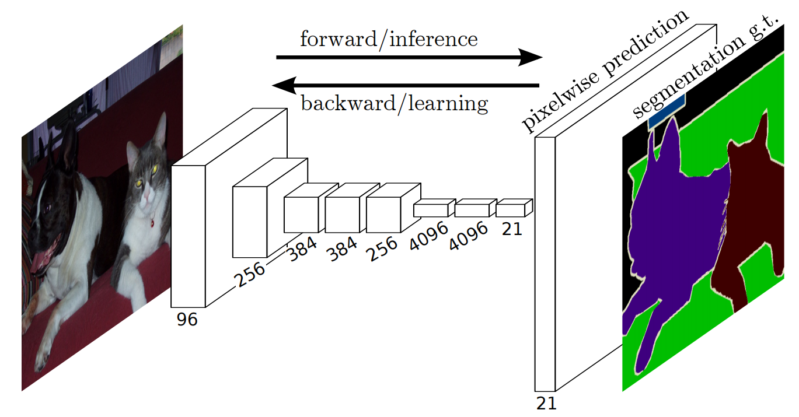
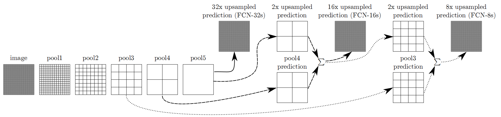
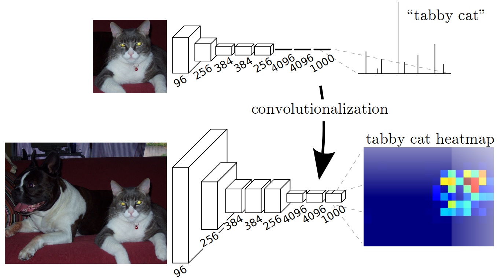
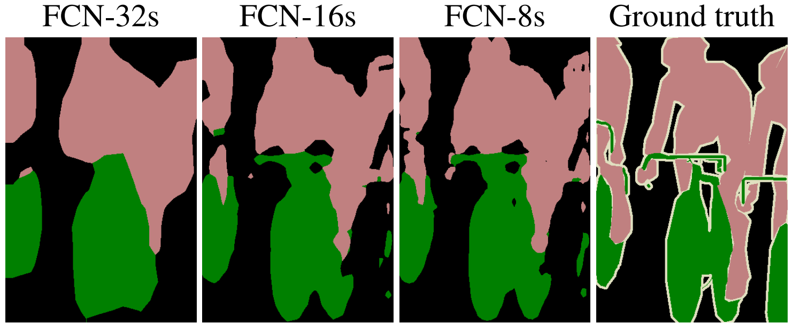
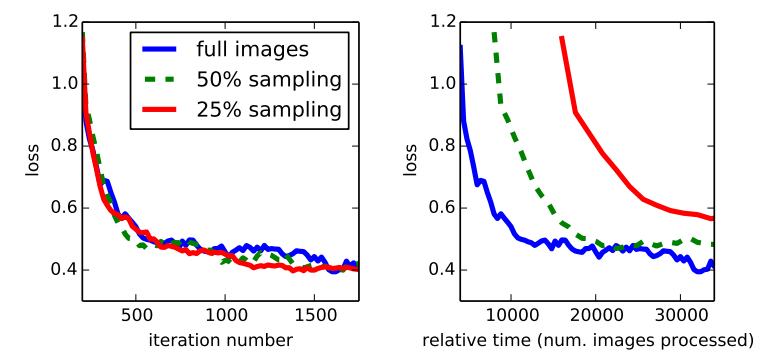
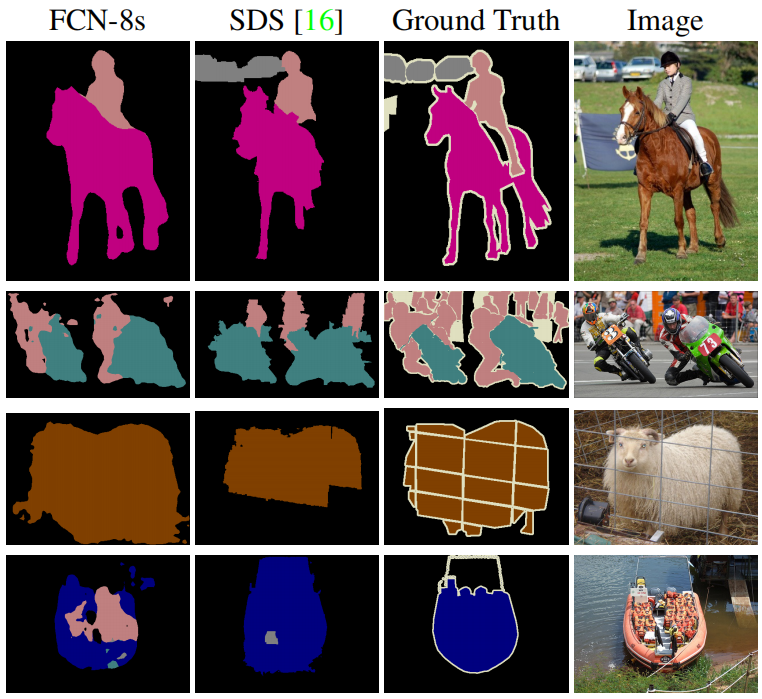

# Fully Convolutional Networks for Semantic Segmentation
用于语义分割的全卷积网络(FCN) 2014.11.14 https://arxiv.org/abs/1411.4038

## 阅读笔记
* https://github.com/pytorch/vision/blob/main/torchvision/models/segmentation/fcn.py
* 接受任意大小的输入，产生相应大小的输出;

## Abstract
Convolutional networks are powerful visual models that yield hierarchies of features. We show that convolutional networks by themselves, trained end-to-end, pixelsto-pixels, exceed the state-of-the-art in semantic segmentation. Our key insight is to build “fully convolutional” networks that take input of arbitrary size and produce correspondingly-sized output with efficient inference and learning. We define and detail the space of fully convolutional networks, explain their application to spatially dense prediction tasks, and draw connections to prior models. We adapt contemporary classification networks (AlexNet [19], the VGG net [31], and GoogLeNet [32]) into fully convolutional networks and transfer their learned representations by fine-tuning [4] to the segmentation task. We then define a novel architecture that combines semantic information from a deep, coarse layer with appearance information from a shallow, fine layer to produce accurate and detailed segmentations. Our fully convolutional network achieves state-of-the-art segmentation of PASCAL VOC (20% relative improvement to 62.2% mean IU on 2012), NYUDv2, and SIFT Flow, while inference takes less than one fifth of a second for a typical image.

卷积网络是产生特征层次结构的强大视觉模型。我们表明，卷积网络本身，经过端到端,像素到像素的训练，超过了语义分割的最先进水平。我们的关键见解是构建“全卷积”网络，该网络接受任意大小的输入，并通过有效的推理和学习产生相应大小的输出。我们定义并详细描述了全卷积网络的空间，解释了它们在空间密集预测任务中的应用，并将其与先前模型联系起来。我们将当代分类网络(AlexNet[19]、VGG网络[31]和GoogLeNet[32])改编为全卷积网络，并通过微调[4]将其学习的表示迁移到分割任务。然后，我们定义了一种新的架构，该架构将来自深层、粗糙层的语义信息与来自浅层、精细层的外观信息相结合，以产生准确和详细的分割。我们的全卷积网络实现了PASCAL VOC(2012年平均IU为62.2%，相对提高了20%)、NYUDv2和SIFT Flow的最先进分割，而典型图像的推理时间不到五分之一秒。

## 1. Introduction
Convolutional networks are driving advances in recognition. Convnets are not only improving for whole-image classification [19, 31, 32], but also making progress on local tasks with structured output. These include advances in bounding box object detection [29, 12, 17], part and keypoint prediction [39, 24], and local correspondence [24, 9].

卷积网络正在推动图像识别的进步。卷积网络不仅改进了整个图像分类[19，31，32]，而且在具有结构化输出的局部任务上也取得了进展。这些包括边框目标检测[29，12，17]、部分和关键点预测[39，24]以及局部对应[24，9]方面的进展。

The natural next step in the progression from coarse to fine inference is to make a prediction at every pixel. Prior approaches have used convnets for semantic segmentation [27, 2, 8, 28, 16, 14, 11], in which each pixel is labeled with the class of its enclosing object or region, but with shortcomings that this work addresses. 

从粗推理到细推理的自然下一步是对每个像素进行预测。先前的方法已经将卷积网络用于语义分割[27，2，8，28，16，14，11]，其中每个像素都用其封闭目标或区域的类别来标记，但这项工作解决了缺点。

 
Figure 1. Fully convolutional networks can efficiently learn to make dense predictions for per-pixel tasks like semantic segmentation.
图1.全卷积网络可以有效地学习对每像素任务(如语义分割)进行密集预测。

We show that a fully convolutional network (FCN), trained end-to-end, pixels-to-pixels on semantic segmentation exceeds the state-of-the-art without further machinery. To our knowledge, this is the first work to train FCNs end-to-end (1) for pixelwise prediction and (2) from supervised pre-training. Fully convolutional versions of existing networks predict dense outputs from arbitrary-sized inputs.Both learning and inference are performed whole-image-ata-time by dense feedforward computation and backpropagation. In-network upsampling layers enable pixelwise prediction and learning in nets with subsampled pooling.

我们表明，全卷积网络(FCN)、端到端训练、像素到像素的语义分割在没有进一步装置的情况下超过了最先进水平。据我们所知，这是第一项端到端训练FCN的工作(1)用于像素预测，(2)来自监督预训练。现有网络的全卷积版本预测任意大小输入的密集输出。学习和推理都是通过密集的前馈计算和反向传播来完成的。在网络中，上采样层通过子采样池在网络中实现逐像素预测和学习。

This method is efficient, both asymptotically and absolutely, and precludes the need for the complications in other works. Patchwise training is common [27, 2, 8, 28, 11], but lacks the efficiency of fully convolutional training. Our approach does not make use of preand post-processing complications, including superpixels [8, 16], proposals [16, 14], or post-hoc refinement by random fields or local classifiers [8, 16]. Our model transfers recent success in classification [19, 31, 32] to dense prediction by reinterpreting classification nets as fully convolutional and fine-tuning from their learned representations. In contrast, previous works have applied small convnets without supervised pre-training [8, 28, 27].

这种方法是有效的，无论是相对的还是绝对的，并且排除了其他工作中的复杂性。分块式训练很常见[27，2，8，28，11]，但缺乏全卷积训练的效率。我们的方法不使用预处理和后处理复杂度，包括超像素[8，16]、候选[16，14]，或通过随机场或局部分类器进行事后细化[8，16]。我们的模型通过将分类网络重新解释为全卷积和对其学习表示进行微调，将分类[19，31，32]中最近的成功迁移到密集预测。相比之下，先前的工作在没有监督的预训练的情况下应用了小型卷积网络[8，28，27]。

Semantic segmentation faces an inherent tension between semantics and location: global information resolves what while local information resolves where. Deep feature hierarchies jointly encode location and semantics in a localto-global pyramid. We define a novel “skip” architecture to combine deep, coarse, semantic information and shallow, fine, appearance information in Section 4.2 (see Figure 3).

语义分割面临着语义和位置之间的内在张力：全局信息解决了是什么，而局部信息解决了在哪里。深度特征层次结构在局部到全局金字塔中联合编码位置和语义。我们在第4.2节中定义了一种新颖的“跳跃”架构，以将深度、粗略的语义信息和浅层、精细的外观信息结合起来(见图3)。

 
Figure 3. Our DAG nets learn to combine coarse, high layer information with fine, low layer information. Layers are shown as grids that reveal relative spatial coarseness. Only pooling and prediction layers are shown; intermediate convolution layers (including our converted fully connected layers) are omitted. Solid line (FCN-32s): Our single-stream net, described in Section 4.1, upsamples stride 32 predictions back to pixels in a single step. Dashed line (FCN-16s): Combining predictions from both the final layer and the pool4 layer, at stride 16, lets our net predict finer details, while retaining high-level semantic information. Dotted line (FCN-8s): Additional predictions from pool3, at stride 8, provide further precision.
图3.我们的DAG网络学习如何将粗糙的高层信息与精细的低层信息相结合。层显示为显示相对空间粗糙度的网格。仅显示池和预测层; 省略了中间卷积层(包括我们转换的全连接层)。实线(FCN-32s)：我们的单流网络，如第4.1节所述，在一个步骤中将步幅32预测上采样回像素。虚线(FCN-16s)：将最后一层和池4层的预测结合起来，在步幅16处，可以让我们的网络预测更精细的细节，同时保留高级语义信息。虚线(FCN-8s)：来自池3的额外预测(步幅8)提供了更高的精度。

In the next section, we review related work on deep classification nets, FCNs, and recent approaches to semantic segmentation using convnets. The following sections explain FCN design and dense prediction tradeoffs, introduce our architecture with in-network upsampling and multilayer combinations, and describe our experimental framework. Finally, we demonstrate state-of-the-art results on PASCAL VOC 2011-2, NYUDv2, and SIFT Flow.

在下一节中，我们回顾了深度分类网络、FCNs以及最近使用卷积网络网络进行语义分割方法的相关工作。以下各节解释FCN设计和密集预测权衡，介绍我们的网络内上采样和多层组合架构，并描述我们的实验框架。最后，我们展示了PASCAL VOC 2011-2、NYUDv2和SIFT Flow的最新结果。

## 2. Related work
Our approach draws on recent successes of deep nets for image classification [19, 31, 32] and transfer learning [4, 38]. Transfer was first demonstrated on various visual recognition tasks [4, 38], then on detection, and on both instance and semantic segmentation in hybrid proposalclassifier models [12, 16, 14]. We now re-architect and finetune classification nets to direct, dense prediction of semantic segmentation. We chart the space of FCNs and situate prior models, both historical and recent, in this framework.

我们的方法借鉴了深度网络在图像分类[19，31，32]和迁移学习[4，38]中的最新成功。迁移首先在各种视觉识别任务上进行了演示[4，38]，然后在检测上进行了验证，并在混合命题分类器模型中进行了实例和语义分割[12，16，14]。我们现在重新构建并微调分类网络，以指导语义分割的密集预测。我们绘制了FCN的空间图，并在此框架中定位了历史模型和最近模型。

### Fully convolutional networks  全卷积网络
To our knowledge, the idea of extending a convnet to arbitrary-sized inputs first appeared in Matan et al. [25], which extended the classic LeNet [21] to recognize strings of digits. Because their net was limited to one-dimensional input strings, Matan et al. used Viterbi decoding to obtain their outputs. Wolf and Platt [37] expand convnet outputs to 2-dimensional maps of detection scores for the four corners of postal address blocks. Both of these historical works do inference and learning fully convolutionally for detection. Ning et al. [27] define a convnet for coarse multiclass segmentation of C. elegans tissues with fully convolutional inference. Fully convolutional computation has also been exploited in the present era of many-layered nets. Sliding window detection by Sermanet et al. [29], semantic segmentation by Pinheiro and Collobert [28], and image restoration by Eigen et al. [5] do fully convolutional inference. Fully convolutional training is rare, but used effectively by Tompson et al. [35] to learn an end-to-end part detector and spatial model for pose estimation, although they do not exposit on or analyze this method.

据我们所知，将卷积网络扩展到任意大小的输入的想法首次出现在Matanet al [25]中，他们将经典的LeNet[21]扩展到识别数字串。由于他们的网络仅限于一维输入字符串，Matanet al 使用Viterbi解码来获得他们的输出。Wolf和Platt[37]将卷积网络输出扩展为邮政地址块的四个角的检测分数的二维图。这两部历史著作都以卷积的方式进行推理和学习以进行检测。Ninget al [27]使用全卷积推理定义了C. elegans组织粗多类分割的卷积网络。在当前的多层网络时代，全卷积计算也得到了利用。Sermanetet al 的滑动窗口检测[29]、Pinheiro和Collbert的语义分割[28]和Eigenet al 的图像恢复[5]进行了全卷积推理。全卷积训练是罕见的，但Tompsonet al [35]有效地使用了卷积训练来学习端到端的部分检测器和用于姿态估计的空间模型，尽管他们没有阐述或分析这种方法。

Alternatively, He et al. [17] discard the nonconvolutional portion of classification nets to make a feature extractor. They combine proposals and spatial pyramid pooling to yield a localized, fixed-length feature for classification. While fast and effective, this hybrid model cannot be learned end-to-end.

或者，Heet al [17]丢弃分类网的非卷积部分，以制作特征提取器。他们结合了候选和空间金字塔池，以产生一个局部的、固定长度的分类特征。虽然快速有效，但这种混合模型无法端到端学习。

### Dense prediction with convnets 卷积网络密集预测
Several recent works have applied convnets to dense prediction problems, including semantic segmentation by Ning et al. [27], Farabet et al. [8], and Pinheiro and Collobert [28]; boundary prediction for electron microscopy by Ciresan et al. [2] and for natural images by a hybrid neural net/nearest neighbor model by Ganin and Lempitsky [11]; and image restoration and depth estimation by Eigen et al. [5, 6]. Common elements of these approaches include
* small models restricting capacity and receptive fields;
* patchwise training [27, 2, 8, 28, 11];
* post-processing by superpixel projection, random field regularization, filtering, or local classification [8, 2, 11];
* input shifting and output interlacing for dense output [28, 11] as introduced by OverFeat [29];
* multi-scale pyramid processing [8, 28, 11];
* saturating tanh nonlinearities [8, 5, 28]; and
* ensembles [2, 11], 
whereas our method does without this machinery. However, we do study patchwise training 3.4 and “shift-and-stitch” dense output 3.2 from the perspective of FCNs. We also discuss in-network upsampling 3.3, of which the fully connected prediction by Eigen et al. [6] is a special case.

最近的几项工作已将卷积网络应用于密集预测问题，包括Ninget al [27]、Farabetet al [8]以及Pinheiro和Collbert[28]的语义分割; Ciresanet al [2]的电子显微镜边界预测和Ganin和Lempitsky[11]的混合神经网络/最近邻模型的自然图像边界预测; 以及Eigenet al 的图像恢复和深度估计[5，6]。这些方法的共同要素包括:
* 限制容量和接受野的小模型; 
* 分块训练[27，2，8，28，11]; 
* 通过超像素投影、随机场正则化、滤波或局部分类进行后处理[8，2，11]; 
* OverFeat[29]引入的密集输出[28，11]的输入移位和输出交织; 
* 多尺度金字塔处理[8，28，11]; 
* 饱和tanh非线性[8，5，28]; 
* 集成[2，11]，

而我们的方法没有这种机制。然而，我们确实从FCN的角度研究了拼接训练3.4和“移位缝合”密集输出3.2。我们还讨论了网络上采样3.3，其中Eigenet al [6]的全连通预测是一个特例。

Unlike these existing methods, we adapt and extend deep classification architectures, using image classification as supervised pre-training, and fine-tune fully convolutionally to learn simply and efficiently from whole image inputs and whole image ground thruths.

与这些现有方法不同，我们使用图像分类作为有监督的预训练来适应和扩展深度分类架构，并对全卷积进行微调，以简单有效地从整个图像输入和整个图像背景中学习。

Hariharan et al. [16] and Gupta et al. [14] likewise adapt deep classification nets to semantic segmentation, but do so in hybrid proposal-classifier models. These approaches fine-tune an R-CNN system [12] by sampling bounding boxes and/or region proposals for detection, semantic segmentation, and instance segmentation. Neither method is learned end-to-end.

Hariharanet al [16]和Guptaet al [14]同样将深度分类网络应用于语义分割，但在混合建议分类器模型中如此。这些方法通过为检测、语义分割和实例分割采样边框和/或区域建议来微调R-CNN系统[12]。这两种方法都不是端到端学习的。

They achieve state-of-the-art results on PASCAL VOC segmentation and NYUDv2 segmentation respectively, so we directly compare our standalone, end-to-end FCN to their semantic segmentation results in Section 5.

它们分别在PASCAL VOC分割和NYUDv2分割上取得了最先进的结果，因此我们在第5节中直接将我们的独立端到端FCN与它们的语义分割结果进行了比较。

## 3. Fully convolutional networks
Each layer of data in a convnet is a three-dimensional array of size h × w × d, where h and w are spatial dimensions, and d is the feature or channel dimension. The first layer is the image, with pixel size h × w, and d color channels. Locations in higher layers correspond to the locations in the image they are path-connected to, which are called their receptive fields.

卷积网络网络中的每一层数据都是一个尺寸为h×w×d的三维阵列，其中h和w是空间维度，d是特征或通道维度。第一层是图像，像素大小为h×w，颜色通道为d。较高层的位置对应于图像中它们路径连接的位置，称为它们的感受野。

Convnets are built on translation invariance. Their basic components (convolution, pooling, and activation functions) operate on local input regions, and depend only on relative spatial coordinates. Writing $x_{ij}$ for the data vector at location (i, j) in a particular layer, and $y_{ij}$ for the following layer, these functions compute outputs $y_{ij}$ by 

卷积基于平移不变性。它们的基本组成部分(卷积、池化和激活函数)作用于局部输入区域，并且仅依赖于相对空间坐标。将$x_{ij}$写入特定层中位置(i，j)处的数据向量，将$y_{ij}$写入下一层，这些函数通过以下方式计算输出$y_{ij}$

$y_{ij} = f_{ks}(\{x_{si}+δi,sj+δj\}0≤δi,δj≤k)$ 

where k is called the kernel size, s is the stride or subsampling factor, and $f_{ks}$ determines the layer type: a matrix multiplication for convolution or average pooling, a spatial max for max pooling, or an elementwise nonlinearity for an activation function, and so on for other types of layers.

其中k被称为内核大小，s是步长或子采样因子，$f_{ks}$决定层类型：卷积或平均池的矩阵乘法，最大池的空间最大值，或激活函数的元素非线性，等等。

This functional form is maintained under composition, with kernel size and stride obeying the transformation rule 

这种函数形式是在复合条件下保持的，内核大小和步长符合变换规则

$f_{ks} ◦ g_{k's'} = (f ◦ g)k' +(k−1)s' ,ss' .$

While a general deep net computes a general nonlinear function, a net with only layers of this form computes a nonlinear filter, which we call a deep filter or fully convolutional network. An FCN naturally operates on an input of any size, and produces an output of corresponding (possibly resampled) spatial dimensions.

当一般的深度网络计算一般的非线性函数时，只有这种形式的层的网络计算非线性滤波器，我们称之为深度滤波器或全卷积网络。FCN自然地对任何大小的输入进行操作，并产生相应(可能重新采样)空间维度的输出。

A real-valued loss function composed with an FCN defines a task. If the loss function is a sum over the spatial dimensions of the final layer, $l(x; θ) = \sum_{ij} l'(x_{ij} ; θ)$, its gradient will be a sum over the gradients of each of its spatial components. Thus stochastic gradient descent on l' computed on whole images will be the same as stochastic gradient descent on ` 0 , taking all of the final layer receptive fields as a minibatch.

由FCN组成的实值损失函数定义任务。如果损失函数是最终层的空间维度的总和，$l(x; θ) = \sum_{ij} l'(x_{ij} ; θ)$，则其梯度将是其每个空间分量的梯度的总和。因此，在整个图像上计算的随机梯度下降将与在0上的随机梯度降低相同，将所有最后一层感受野作为一个小批次。

When these receptive fields overlap significantly, both feedforward computation and backpropagation are much more efficient when computed layer-by-layer over an entire image instead of independently patch-by-patch.

当这些感受野显著重叠时，当在整个图像上逐层计算而不是逐片独立地计算时，前馈计算和反向传播都更有效。

We next explain how to convert classification nets into fully convolutional nets that produce coarse output maps. For pixelwise prediction, we need to connect these coarse outputs back to the pixels. Section 3.2 describes a trick that OverFeat [29] introduced for this purpose. We gain insight into this trick by reinterpreting it as an equivalent network modification. As an efficient, effective alternative, we introduce deconvolution layers for upsampling in Section 3.3. In Section 3.4 we consider training by patchwise sampling, and give evidence in Section 4.3 that our whole image training is faster and equally effective.

接下来，我们将解释如何将分类网络转换为生成粗输出图的全卷积网络。对于逐像素预测，我们需要将这些粗略输出连接回像素。第3.2节描述了OverFeat[29]为此引入的技巧。我们通过将其重新解释为等效的网络修改来深入了解这一技巧。作为一种高效、有效的替代方案，我们在第3.3节中引入了用于上采样的反卷积层。在第3.4节中，我们考虑了拼接采样的训练，并在第4.3节中给出了证据，证明我们的整个图像训练更快且同样有效。

### 3.1. Adapting classifiers for dense prediction 适应密集预测的分类器
Typical recognition nets, including LeNet [21], AlexNet [19], and its deeper successors [31, 32], ostensibly take fixed-sized inputs and produce nonspatial outputs. The fully connected layers of these nets have fixed dimensions and throw away spatial coordinates. However, these fully connected layers can also be viewed as convolutions with kernels that cover their entire input regions. Doing so casts them into fully convolutional networks that take input of any size and output classification maps. This transformation is illustrated in Figure 2. (By contrast, nonconvolutional nets, such as the one by Le et al. [20], lack this capability.)

典型的识别网络，包括LeNet[21]、AlexNet[19]及其更深层的继任者[31，32]，表面上接受固定大小的输入并产生非空间输出。这些网络的全连接层具有固定的维度，并丢弃了空间坐标。然而，这些全连接的层也可以被视为具有覆盖其整个输入区域的内核的卷积。这样做会将它们投射到全卷积网络中，该网络接受任何大小的输入并输出分类图。这种转换如图2所示。(相比之下，非卷积网络，如Leet al [20]的网络，缺乏这种能力)

 
Figure 2. Transforming fully connected layers into convolution layers enables a classification net to output a heatmap. Adding layers and a spatial loss (as in Figure 1) produces an efficient machine for end-to-end dense learning. 
图2.将全连接层转换为卷积层使得分类网络能够输出热力图。添加层和空间损失(如图1所示)为端到端密集学习提供了一个有效的机制。

Furthermore, while the resulting maps are equivalent to the evaluation of the original net on particular input patches, the computation is highly amortized over the overlapping regions of those patches. For example, while AlexNet takes 1.2 ms (on a typical GPU) to produce the classification scores of a 227 × 227 image, the fully convolutional version takes 22 ms to produce a 10 × 10 grid of outputs from a 500 × 500 image, which is more than 5 times faster than the na¨ıve approach (1Assuming efficient batching of single image inputs. The classification scores for a single image by itself take 5.4 ms to produce, which is nearly 25 times slower than the fully convolutional version. ).

此外，虽然生成的图相当于对特定输入分块的原始网络的评估，但计算在这些分块的重叠区域上高度分摊。例如，AlexNet需要1.2毫秒(在典型的GPU上)才能生成227×227图像的分类分数，而全卷积版本需要22毫秒才能从500×500图像生成10×10网格的输出，这比传统方法快5倍多(1假设单个图像输入的有效批处理。单个图像的分类分数本身需要5.4毫秒才能产生，比全卷积版本慢近25倍)。

The spatial output maps of these convolutionalized models make them a natural choice for dense problems like semantic segmentation. With ground truth available at every output cell, both the forward and backward passes are straightforward, and both take advantage of the inherent computational efficiency (and aggressive optimization) of convolution.

这些卷积模型的空间输出图使它们成为语义分割等密集问题的自然选择。由于每个输出单元都有可用的真实值，正向和反向传递都是直接的，并且都利用了卷积的固有计算效率(和积极的优化)。

The corresponding backward times for the AlexNet example are 2.4 ms for a single image and 37 ms for a fully convolutional 10 × 10 output map, resulting in a speedup similar to that of the forward pass. This dense backpropagation is illustrated in Figure 1.

AlexNet样本的相应反向时间对于单个图像为2.4 ms，对于全卷积的10×10输出图为37 ms，导致与正向通过类似的加速。这种密集反向传播如图1所示。

While our reinterpretation of classification nets as fully convolutional yields output maps for inputs of any size, the output dimensions are typically reduced by subsampling. The classification nets subsample to keep filters small and computational requirements reasonable. This coarsens the output of a fully convolutional version of these nets, reducing it from the size of the input by a factor equal to the pixel stride of the receptive fields of the output units. 

虽然我们将分类网重新解释为全卷积产生了任何大小的输入的输出图，但输出维度通常通过二次采样来减少。分类网进行子采样，以保持滤波器较小，计算要求合理。这使这些网络的全卷积版本的输出变粗，将其从输入的大小减小一个等于输出单元的感受野的像素步长的因子。

### 3.2. Shift-and-stitch is filter rarefaction 移位和缝合是过滤稀疏
Input shifting and output interlacing is a trick that yields dense predictions from coarse outputs without interpolation, introduced by OverFeat [29]. If the outputs are downsampled by a factor of f, the input is shifted (by left and top padding) x pixels to the right and y pixels down, once for every value of (x, y) ∈ {0, . . . , f − 1} × {0, . . . , f − 1}. These $f^2$ inputs are each run through the convnet, and the outputs are interlaced so that the predictions correspond to the pixels at the centers of their receptive fields.

输入移位和输出交错是OverFeat[29]引入的一种技巧，它可以在没有插值的情况下从粗输出中产生密集预测。如果输出按因子$f^2$进行下采样，则输入(通过左和上填充)向右移动x个像素，向下移动y个像素，每值(x，y)一次∈ ｛0，…，f− 1} ×{0，…，f− 1}. 这些f2输入分别通过卷积网络网络，输出是交错的，以便预测与它们的感受野中心的像素相对应。

Changing only the filters and layer strides of a convnet can produce the same output as this shift-and-stitch trick. Consider a layer (convolution or pooling) with input stride s, and a following convolution layer with filter weights $f_{ij}$ (eliding the feature dimensions, irrelevant here). Setting the lower layer’s input stride to 1 upsamples its output by a factor of s, just like shift-and-stitch. However, convolving the original filter with the upsampled output does not produce the same result as the trick, because the original filter only sees a reduced portion of its (now upsampled) input. To reproduce the trick, rarefy the filter by enlarging it as 

仅更改卷积网络的滤波器和层步长可以产生与这种移位和缝合技巧相同的输出。考虑具有输入步长s的层(卷积或池)，以及具有滤波器权重$f_{ij}$的后续卷积层(消除特征维度，此处无关)。将较低层的输入步幅设置为1会将其输出上采样s倍，就像移位和缝合一样。然而，将原始滤波器与上采样输出卷积不会产生与技巧相同的结果，因为原始滤波器只看到其(现在的上采样)输入的减少部分。要复制此技巧，请将滤波器放大为

$f'_{ij} = f_{i/s,j/s} if s divides both i and j; 0 otherwise, 

(with i and j zero-based). Reproducing the full net output of the trick involves repeating this filter enlargement layerby-layer until all subsampling is removed.

(i和j为零)。再现该技巧的全部净输出包括逐层重复该滤波器放大，直到移除所有子采样。

Simply decreasing subsampling within a net is a tradeoff: the filters see finer information, but have smaller receptive fields and take longer to compute. We have seen that the shift-and-stitch trick is another kind of tradeoff: the output is made denser without decreasing the receptive field sizes of the filters, but the filters are prohibited from accessing information at a finer scale than their original design.

简单地减少网络内的子采样是一种折衷：滤波器可以看到更精细的信息，但接受域更小，计算时间更长。我们已经看到，移位和缝合技巧是另一种折衷：在不减小滤波器的接收场大小的情况下，输出变得更密集，但滤波器被禁止以比其原始设计更精细的尺度访问信息。

Although we have done preliminary experiments with shift-and-stitch, we do not use it in our model. We find learning through upsampling, as described in the next section, to be more effective and efficient, especially when combined with the skip layer fusion described later on.

虽然我们已经做了移位和缝合的初步实验，但我们没有在模型中使用它。我们发现，如下一节所述，通过上采样进行学习更有效，尤其是与稍后描述的跳过层融合相结合时。

### 3.3. Upsampling is backwards strided convolution 上采样是向后跨步卷积
Another way to connect coarse outputs to dense pixels is interpolation. For instance, simple bilinear interpolation computes each output $y_{ij}$ from the nearest four inputs by a linear map that depends only on the relative positions of the input and output cells.

将粗输出连接到密集像素的另一种方法是插值。例如，简单的双线性插值通过仅取决于输入和输出单元的相对位置的线性映射从最近的四个输入计算每个输出$y_{ij}$。

In a sense, upsampling with factor f is convolution with a fractional input stride of 1/f. So long as f is integral, a natural way to upsample is therefore backwards convolution (sometimes called deconvolution) with an output stride of f. Such an operation is trivial to implement, since it simply reverses the forward and backward passes of convolution. Thus upsampling is performed in-network for end-to-end learning by backpropagation from the pixelwise loss.

在某种意义上，用因子f进行上采样是分数输入步长1/f的卷积。只要f是积分，上采样的一种自然方式就是输出步长为f的反向卷积(有时称为反褶积)。这样的操作实现起来很简单，因为它只需反转卷积的正向和反向过程。因此，在网络中执行上采样，以通过从像素损失反向传播进行端到端学习。

Note that the deconvolution filter in such a layer need not be fixed (e.g., to bilinear upsampling), but can be learned. A stack of deconvolution layers and activation functions can even learn a nonlinear upsampling.

注意，这种层中的去卷积滤波器不需要固定(例如，双线性上采样)，而是可以学习。反褶积层和激活函数的堆栈甚至可以学习非线性上采样。

In our experiments, we find that in-network upsampling is fast and effective for learning dense prediction. Our best segmentation architecture uses these layers to learn to upsample for refined prediction in Section 4.2.

在我们的实验中，我们发现在网络中上采样对于学习密集预测是快速有效的。我们的最佳分割架构使用这些层来学习对第4.2节中的精确预测进行上采样。

### 3.4. Patchwise training is loss sampling 分块式训练是损失抽样
In stochastic optimization, gradient computation is driven by the training distribution. Both patchwise training and fully-convolutional training can be made to produce any distribution, although their relative computational efficiency depends on overlap and minibatch size. Whole image fully convolutional training is identical to patchwise training where each batch consists of all the receptive fields of the units below the loss for an image (or collection of images). While this is more efficient than uniform sampling of patches, it reduces the number of possible batches. However, random selection of patches within an image may be recovered simply. Restricting the loss to a randomly sampled subset of its spatial terms (or, equivalently applying a DropConnect mask [36] between the output and the loss) excludes patches from the gradient computation.

在随机优化中，梯度计算由训练分布驱动。拼接训练和全卷积训练都可以产生任何分布，尽管它们的相对计算效率取决于重叠和小批量大小。全图像全卷积训练与拼接训练相同，其中每个批次由图像(或图像集合)损失以下单元的所有感受野组成。虽然这比分块的均匀采样更有效，但它减少了可能的批次数量。然而，可以简单地恢复图像内的分块的随机选择。将损失限制在其空间项的随机采样子集(或等效地在输出和损失之间应用DropConnect掩码[36])，将从梯度计算中排除分块。

If the kept patches still have significant overlap, fully convolutional computation will still speed up training. If gradients are accumulated over multiple backward passes, batches can include patches from several images.(2 Note that not every possible patch is included this way, since the receptive fields of the final layer units lie on a fixed, strided grid. However, by shifting the image left and down by a random value up to the stride, random selection from all possible patches may be recovered. )

如果保持的分块仍然有显著的重叠，全卷积计算仍将加快训练速度。如果在多个反向过程中累积梯度，批次可以包括来自多个图像的分块。(2注意，并非所有可能的分块都以这种方式包含，因为最终层单元的感受野位于固定的跨步网格上。然而，通过将图像向左和向下移动一个随机值直到跨步，可以恢复所有可能分块的随机选择。)

Sampling in patchwise training can correct class imbalance [27, 8, 2] and mitigate the spatial correlation of dense patches [28, 16]. In fully convolutional training, class balance can also be achieved by weighting the loss, and loss sampling can be used to address spatial correlation.

分块训练中的采样可以纠正类别失衡[27，8，2]，并减轻密集分块的空间相关性[28，16]。在全卷积训练中，还可以通过加权损失来实现类平衡，并且可以使用损失采样来解决空间相关性。

We explore training with sampling in Section 4.3, and do not find that it yields faster or better convergence for dense prediction. Whole image training is effective and efficient.

我们在第4.3节中探索了采样训练，并没有发现它为密集预测带来更快或更好的收敛。整个图像训练是有效和高效的。

## 4. Segmentation Architecture
We cast ILSVRC classifiers into FCNs and augment them for dense prediction with in-network upsampling and a pixelwise loss. We train for segmentation by fine-tuning. Next, we build a novel skip architecture that combines coarse, semantic and local, appearance information to refine prediction.

我们将ILSVRC分类器投射到FCN中，并通过网络内上采样和像素损失来增强它们以进行密集预测。我们通过微调来训练分割。接下来，我们构建了一种新的跳跃架构，它将粗糙、语义和局部外观信息结合起来，以重新精细预测。

For this investigation, we train and validate on the PASCAL VOC 2011 segmentation challenge [7]. We train with a per-pixel multinomial logistic loss and validate with the standard metric of mean pixel intersection over union, with the mean taken over all classes, including background. The training ignores pixels that are masked out (as ambiguous or difficult) in the ground truth.

对于这项调查，我们对PASCAL VOC 2011细分挑战进行了训练和验证[7]。我们使用每个像素的多项逻辑损失进行训练，并使用平均像素相交于并集的标准度量进行验证，平均值取自所有类别，包括背景。训练忽略了在真实值中被掩盖的像素(模糊或困难)。

### 4.1. From classifier to dense FCN 从分类器到密集FCN
We begin by convolutionalizing proven classification architectures as in Section 3. We consider the AlexNet(3Using the publicly available CaffeNet reference model. ) architecture [19] that won ILSVRC12, as well as the VGG nets [31] and the GoogLeNet[32](4Since there is no publicly available version of GoogLeNet, we use our own reimplementation. Our version is trained with less extensive data augmentation, and gets 68.5% top-1 and 88.4% top-5 ILSVRC accuracy. ) which did exceptionally well in ILSVRC14. We pick the VGG 16-layer net(5Using the publicly available version from the Caffe model zoo.), which we found to be equivalent to the 19-layer net on this task. For GoogLeNet, we use only the final loss layer, and improve performance by discarding the final average pooling layer. We decapitate each net by discarding the final classifier layer, and convert all fully connected layers to convolutions. We append a 1 × 1 convolution with channel dimension 21 to predict scores for each of the PASCAL classes (including background) at each of the coarse output locations, followed by a deconvolution layer to bilinearly upsample the coarse outputs to pixel-dense outputs as described in Section 3.3. Table 1 compares the preliminary validation results along with the basic characteristics of each net. We report the best results achieved after convergence at a fixed learning rate (at least 175 epochs).

我们首先如第3节所述卷积已证明的分类架构。我们考虑AlexNet(3使用公开可用的CaffeNet参考模型)架构[19]，该架构赢得了ILSVRC12，以及VGG网络[31]和GoogLeNet[32](4因为没有公开可用的GoogLeNet版本，所以我们使用了自己的重新实现。我们的版本使用了不太广泛的数据增广进行训练，获得了68.5%的前1和88.4%的前5 ILSVRC精度。)，这在ILSVRC14中表现得非常出色。我们选择了VGG 16层网络(5使用Caffe模型动物园的公开可用版本)，我们发现这相当于该任务中的19层网络。对于GoogLeNet，我们只使用最终损失层，并通过丢弃最终平均池层来提高性能。我们通过丢弃最终的分类器层来斩首每个网络，并将所有全连接的层转换为卷积。我们附加了信道维度为21的1×1卷积，以预测每个PASCAL类(包括背景)在每个粗输出位置的分数，然后是一个去卷积层，以将粗输出两倍地上采样到像素密集输出，如第3.3节所述。表1将初步验证结果与每个网络的基本特性进行了比较。我们报告了在固定学习速率(至少175个时期)下收敛后获得的最佳结果。

Fine-tuning from classification to segmentation gave reasonable predictions for each net. Even the worst model achieved ∼ 75% of state-of-the-art performance. The segmentation-equippped VGG net (FCN-VGG16) already appears to be state-of-the-art at 56.0 mean IU on val, compared to 52.6 on test [16]. Training on extra data raises performance to 59.4 mean IU on a subset of val7 . Training details are given in Section 4.3.

从分类到分段的微调为每个网络提供了合理的预测。即使是最糟糕的模型∼ 75%的最先进性能。分段装备VGG网络(FCN-VGG16)的平均IU值为56.0，而测试结果为52.6[16]。对额外数据的训练将价值7子集的表现提高到59.4平均IU。训练详情见第4.3节。

Despite similar classification accuracy, our implementation of GoogLeNet did not match this segmentation result.

尽管分类精度相似，但我们对GoogLeNet的实现与此分割结果并不匹配。

### 4.2. Combining what and where 结合内容和地点
We define a new fully convolutional net (FCN) for segmentation that combines layers of the feature hierarchy and refines the spatial precision of the output. See Figure 3.

我们定义了一个新的用于分割的全卷积网络(FCN)，它结合了特征层次的各个层，并改进了输出的空间精度。见图3。

While fully convolutionalized classifiers can be finetuned to segmentation as shown in 4.1, and even score highly on the standard metric, their output is dissatisfyingly coarse (see Figure 4). The 32 pixel stride at the final prediction layer limits the scale of detail in the upsampled output.

虽然全卷积的分类器可以微调到4.1所示的分割，甚至在标准度量上得分很高，但它们的输出并不令人满意(见图4)。最终预测层的32像素步长限制了上采样输出中的细节比例。

We address this by adding links that combine the final prediction layer with lower layers with finer strides. This turns a line topology into a DAG, with edges that skip ahead from lower layers to higher ones (Figure 3). As they see fewer pixels, the finer scale predictions should need fewer layers, so it makes sense to make them from shallower net outputs. Combining fine layers and coarse layers lets the model make local predictions that respect global structure. By analogy to the multiscale local jet of Florack et al. [10], we call our nonlinear local feature hierarchy the deep jet.

我们通过添加链接来解决这一问题，这些链接将最终预测层与较低层结合起来，并具有更精细的步幅。这将线拓扑转换为DAG，边缘从较低的层向前跳到较高的层(图3)。因为他们看到的像素更少，所以更精细的尺度预测应该需要更少的层，所以从更浅的净输出进行预测是有意义的。结合精细层和粗糙层，模型可以做出符合全局结构的局部预测。与Floracket al [10]的多尺度局部射流相似，我们将我们的非线性局部特征层次称为深射流。

Table 1. We adapt and extend three classification convnets to segmentation. We compare performance by mean intersection over union on the validation set of PASCAL VOC 2011 and by inference time (averaged over 20 trials for a 500 × 500 input on an NVIDIA Tesla K40c). We detail the architecture of the adapted nets as regards dense prediction: number of parameter layers, receptive field size of output units, and the coarsest stride within the net. (These numbers give the best performance obtained at a fixed learning rate, not best performance possible.)

表1.我们对三个分类卷积网络进行了调整和扩展，以进行分割。我们通过PASCAL VOC 2011验证集上的平均交集与并集以及推理时间(NVIDIA Tesla K40c上500×500输入的平均20次试验)来比较性能。我们详细介绍了关于密集预测的自适应网络的结构：参数层的数量、输出单元的感受野大小以及网络中最粗的步长。(这些数字给出了在固定学习率下获得的最佳性能，而不是可能的最佳性能。)

We first divide the output stride in half by predicting from a 16 pixel stride layer. We add a 1 × 1 convolution layer on top of pool4 to produce additional class predictions. We fuse this output with the predictions computed on top of conv7 (convolutionalized fc7) at stride 32 by adding a 2× upsampling layer and summing(6Max fusion made learning difficult due to gradient switching.) both predictions. (See Figure 3). We initialize the 2× upsampling to bilinear interpolation, but allow the parameters to be learned as described in Section 3.3. Finally, the stride 16 predictions are upsampled back to the image. We call this net FCN-16s. FCN-16s is learned end-to-end, initialized with the parameters of the last, coarser net, which we now call FCN-32s. The new parameters acting on pool4 are zero-initialized so that the net starts with unmodified predictions. The learning rate is decreased by a factor of 100.

我们首先通过从16像素步幅层进行预测，将输出步幅一分为二。我们在pool4的顶部添加了一个1×1卷积层，以生成额外的类预测。我们通过添加2×上采样层和求和(6Max融合由于梯度切换导致学习困难)，将该输出与在步幅32处的conv7(卷积fc7)之上计算的预测融合。(见图3)。我们将2×上采样初始化为双线性插值，但允许如第3.3节所述学习参数。最后，将步幅16预测上采样回图像。我们称这个网络为FCN-16。FCN-16s是端到端学习的，用最后一个更粗的网络的参数初始化，我们现在称之为FCN-32s。作用于池4的新参数被初始化为零，以便网络从未修改的预测开始。学习率降低了100倍。

Learning this skip net improves performance on the validation set by 3.0 mean IU to 62.4. Figure 4 shows improvement in the fine structure of the output. We compared this fusion with learning only from the pool4 layer (which resulted in poor performance), and simply decreasing the learning rate without adding the extra link (which results in an insignificant performance improvement, without improving the quality of the output).

学习该跳过网络将验证集的性能提高3.0平均IU至62.4。图4显示了输出的精细结构的改进。我们将这种融合与仅从pool4层进行学习(这导致了较差的性能)，以及在不添加额外链接的情况下简单地降低学习率(这导致性能的显著提高，而不提高输出质量)进行了比较。

We continue in this fashion by fusing predictions from pool3 with a 2× upsampling of predictions fused from pool4 and conv7, building the net FCN-8s. We obtain a minor additional improvement to 62.7 mean IU, and find a slight improvement in the smoothness and detail of our output. At this point our fusion improvements have met diminishing returns, both with respect to the IU metric which emphasizes large-scale correctness, and also in terms of the improvement visible e.g. in Figure 4, so we do not continue fusing even lower layers.

我们以这种方式继续，将来自池3的预测与来自池4和conv7的预测的2倍上采样融合，构建网络FCN-8s。我们获得了62.7平均IU的微小额外改善，并发现输出的平滑度和细节略有改善。在这一点上，我们的融合改进遇到了回报递减的情况，无论是在强调大规模正确性的IU度量方面，还是在图4中可见的改进方面，因此我们不会继续融合更低的层。

 
Figure 4. Refining fully convolutional nets by fusing information from layers with different strides improves segmentation detail. The first three images show the output from our 32, 16, and 8 pixel stride nets (see Figure 3).
图4.通过融合来自具有不同步长的层的信息来细化全卷积网络，从而提高了分割细节。前三幅图像显示了32、16和8像素步幅网络的输出(见图3)。

Table 2. Comparison of skip FCNs on a subset of PASCAL VOC2011 validation7 . Learning is end-to-end, except for FCN32s-fixed, where only the last layer is fine-tuned. Note that FCN32s is FCN-VGG16, renamed to highlight stride. 
表2.PASCAL VOC2011验证子集上跳过FCN的比较7.学习是端到端的，除了固定的FCN32s，只有最后一层被微调。请注意，FCN32s是FCN-VGG16，重命名为突出显示步幅。

Refinement by other means Decreasing the stride of pooling layers is the most straightforward way to obtain finer predictions. However, doing so is problematic for our VGG16-based net. Setting the pool5 layer to have stride 1 requires our convolutionalized fc6 to have a kernel size of 14 × 14 in order to maintain its receptive field size. In addition to their computational cost, we had difficulty learning such large filters. We made an attempt to re-architect the layers above pool5 with smaller filters, but were not successful in achieving comparable performance; one possible explanation is that the initialization from ImageNet-trained weights in the upper layers is important.

通过其他方式进行优化减少池化层的步长是获得更精确预测的最直接方法。然而，这样做对我们基于VGG16的网络来说是有问题的。将池5层设置为步幅1需要卷积的fc6具有14×14的内核大小，以保持其接收野大小。除了它们的计算成本外，我们很难学习这样的大型滤波器。我们尝试用更小的滤波器重新构建池5之上的层，但未能成功实现可比的性能; 一种可能的解释是，来自上层ImageNet训练权重的初始化是重要的。

Another way to obtain finer predictions is to use the shiftand-stitch trick described in Section 3.2. In limited experiments, we found the cost to improvement ratio from this method to be worse than layer fusion.

获得更精确预测的另一种方法是使用第3.2节中描述的移位和缝合技巧。在有限的实验中，我们发现该方法的成本与改进比比层融合更差。

### 4.3. Experimental framework 实验框架
Optimization. We train by SGD with momentum. We use a minibatch size of 20 images and fixed learning rates of 10−3, 10−4 , and 5−5 for FCN-AlexNet, FCN-VGG16, and FCN-GoogLeNet, respectively, chosen by line search. We use momentum 0.9, weight decay of 5−4 or 2−4 , and doubled the learning rate for biases, although we found training to be insensitive to these parameters (but sensitive to the learning rate). We zero-initialize the class scoring convolution layer, finding random initialization to yield neither better performance nor faster convergence. Dropout was included where used in the original classifier nets.

优化. 我们通过SGD进行动量训练。我们使用20张图片的小批量，固定学习率为10−3, 10−4和5−FCN AlexNet、FCN-VGG16和FCN GoogLeNet分别为5，通过行搜索选择。我们使用动量0.9，重量衰减5−4或2−尽管我们发现训练对这些参数不敏感(但对学习率敏感)，但我们发现，训练对偏差的学习率提高了一倍。我们对类评分卷积层进行零初始化，发现随机初始化既不会产生更好的性能，也不会产生更快的收敛。在原始分类器网络中使用的地方包含了丢弃。

Fine-tuning. We fine-tune all layers by backpropagation through the whole net. Fine-tuning the output classifier alone yields only 70% of the full finetuning performance as compared in Table 2. Training from scratch is not feasible considering the time required to learn the base classification nets. (Note that the VGG net is trained in stages, while we initialize from the full 16-layer version.) Fine-tuning takes three days on a single GPU for the coarse FCN-32s version, and about one day each to upgrade to the FCN-16s and FCN-8s versions.

微调. 我们通过整个网络的反向传播来微调所有层。与表2所示相比，仅对输出分类器进行微调仅产生全部微调性能的70%。考虑到学习基本分类网所需的时间，从头开始训练是不可行的。(请注意，VGG网络是分阶段训练的，而我们从完整的16层版本进行初始化。)对于粗略的FCN-32s版本，在单个GPU上进行微调需要三天时间，而升级到FCN-16s和FCN-8s版本则需要一天时间。

Patch Sampling. As explained in Section 3.4, our full image training effectively batches each image into a regular grid of large, overlapping patches. By contrast, prior work randomly samples patches over a full dataset [27, 2, 8, 28, 11], potentially resulting in higher variance batches that may accelerate convergence [22]. We study this tradeoff by spatially sampling the loss in the manner described earlier, making an independent choice to ignore each final layer cell with some probability 1−p. To avoid changing the effective batch size, we simultaneously increase the number of images per batch by a factor 1/p. Note that due to the efficiency of convolution, this form of rejection sampling is still faster than patchwise training for large enough values of p (e.g., at least for p > 0.2 according to the numbers in Section 3.1). Figure 5 shows the effect of this form of sampling on convergence. We find that sampling does not have a significant effect on convergence rate compared to whole image training, but takes significantly more time due to the larger number of images that need to be considered per batch. We therefore choose unsampled, whole image training in our other experiments.

分块采样. 如第3.4节所述，我们的完整图像训练有效地将每个图像批处理成一个大型重叠分块的规则网格。相比之下，先前的工作在整个数据集上随机采样分块[27，2，8，28，11]，可能会导致更高的方差批次，从而加速收敛[22]。我们通过以前面描述的方式对损失进行空间采样来研究这一权衡，做出独立选择，以某种概率1忽略每个最终层单元−p、 为了避免改变有效的批量大小，我们同时将每批图像的数量增加1/p。注意，由于卷积的效率，对于足够大的p值(例如，根据第3.1节中的数字，至少对于p>0.2)，这种形式的拒绝采样仍然比拼接训练更快。图5显示了这种抽样形式对收敛的影响。我们发现，与整个图像训练相比，采样对收敛速度没有显著影响，但由于每批需要考虑的图像数量较多，采样所需的时间明显更长。因此，我们在其他实验中选择了未采样的全图像训练。

 
Figure 5. Training on whole images is just as effective as sampling patches, but results in faster (wall time) convergence by making more efficient use of data. Left shows the effect of sampling on convergence rate for a fixed expected batch size, while right plots the same by relative wall time. 
图5.对整个图像的训练与采样分块一样有效，但通过更有效地使用数据，可以更快地(壁时间)收敛。左边显示了固定预期批量大小的采样对收敛速度的影响，而右边通过相对壁时间绘制了相同的图。

Class Balancing. Fully convolutional training can balance classes by weighting or sampling the loss. Although our labels are mildly unbalanced (about 3/4 are background), we find class balancing unnecessary.

类平衡. 全卷积训练可以通过加权或采样损失来平衡类。虽然我们的标签有点不平衡(大约3/4是背景)，但我们发现类平衡是不必要的。

Dense Prediction. The scores are upsampled to the input dimensions by deconvolution layers within the net. Final layer deconvolutional filters are fixed to bilinear interpolation, while intermediate upsampling layers are initialized to bilinear upsampling, and then learned. Shift-andstitch (Section 3.2), or the filter rarefaction equivalent, are not used.

密集预测. 通过网络内的反褶积层将分数上采样到输入维度。最终层反卷积滤波器固定为双线性插值，而中间上采样层初始化为双线性上采样，然后学习。不使用移位和移位(第3.2节)或等效滤波器稀疏度。

Augmentation. We tried augmenting the training data by randomly mirroring and “jittering” the images by translating them up to 32 pixels (the coarsest scale of prediction) in each direction. This yielded no noticeable improvement.

增强. 我们尝试通过随机镜像和“抖动”图像来增强训练数据，方法是在每个方向上最多平移32个像素(预测的最粗略尺度)。这没有产生明显的改善。

More Training Data The PASCAL VOC 2011 segmentation challenge training set, which we used for Table 1, labels 1112 images. Hariharan et al. [15] have collected labels for a much larger set of 8498 PASCAL training images, which was used to train the previous state-of-the-art system, SDS [16]. This training data improves the FCNVGG16 validation score(7There are training images from [15] included in the PASCAL VOC 2011 val set, so we validate on the non-intersecting set of 736 images. An earlier version of this paper mistakenly evaluated on the entire val set. ) by 3.4 points to 59.4 mean IU.

更多训练数据. 我们用于表1的PASCAL VOC 2011分割挑战训练集标记了1112幅图像。Hariharanet al [15]收集了一组更大的8498张PASCAL训练图像的标签，用于训练先前最先进的系统SDS[16]。该训练数据将FCNVGG16验证分数(7这是来自[15]的训练图像，包含在PASCAL VOC 2011值集中，因此我们在736张图像的非相交集上进行了验证。本文的早期版本错误地对整个值集进行了评估。)提高了3.4分，达到59.4平均IU。

Implementation. All models are trained and tested with Caffe [18] on a single NVIDIA Tesla K40c. The models and code will be released open-source on publication.

实施. 所有模型均在单个NVIDIA Tesla K40c上使用Caffe[18]进行训练和测试。模型和代码将在发布时开源发布。

## 5. Results
We test our FCN on semantic segmentation and scene parsing, exploring PASCAL VOC, NYUDv2, and SIFT Flow. Although these tasks have historically distinguished between objects and regions, we treat both uniformly as pixel prediction. We evaluate our FCN skip architecture(8Our models and code are publicly available at https://github.com/BVLC/caffe/wiki/Model-Zoo#fcn. ) on each of these datasets, and then extend it to multi-modal input for NYUDv2 and multi-task prediction for the semantic and geometric labels of SIFT Flow.

我们在语义分割和场景解析方面测试了FCN，探索了PASCAL VOC、NYUDv2和SIFT流。尽管这些任务在历史上区分了目标和区域，但我们将两者统一视为像素预测。我们评估我们的FCN跳过架构(8我们的模型和代码在https://github.com/BVLC/caffe/wiki/Model-Zoo#fcn.)，然后将其扩展到NYUDv2的多模态输入和SIFT流的语义和几何标签的多任务预测。

Metrics We report four metrics from common semantic segmentation and scene parsing evaluations that are variations on pixel accuracy and region intersection over union (IU). Let nij be the number of pixels of class i predicted to belong to class j, where there are ncl different classes, and let ti = P j nij be the total number of pixels of class i. We compute:
* pixel accuracy: P i nii/P i ti 
* mean accuraccy: (1/ncl)P i nii/ti 
* mean IU: (1/ncl)P i nii/  ti + P j nji − nii
* frequency weighted IU: (P k tk)−1 P i tinii/  ti + P j nji − nii

度量. 我们报告了来自常见语义分割和场景分析评估的四个度量，这些度量是像素精度和联合上的区域交叉(IU)的变化。设nij为预测属于类j的类i的像素数，其中有ncl个不同的类，且设ti=P j nij为类i的总像素数。我们计算：
... 

PASCAL VOC Table 3 gives the performance of our FCN-8s on the test sets of PASCAL VOC 2011 and 2012, and compares it to the previous state-of-the-art, SDS [16], and the well-known R-CNN [12]. We achieve the best results on mean IU(9This is the only metric provided by the test server. ) by a relative margin of 20%. Inference time is reduced 114× (convnet only, ignoring proposals and refinement) or 286× (overall).

PASCAL VOC表3给出了我们的FCN-8s在PASCAL VOC 2011和2012测试集上的性能，并将其与之前最先进的SDS[16]和著名的R-CNN[12]进行了比较。我们在平均IU(9这是测试服务器提供的唯一指标)上以20%的相对优势获得了最佳结果。推理时间减少114×(仅卷积网络，忽略建议和改进)或286×(总体)。

Table 3. Our fully convolutional net gives a 20% relative improvement over the state-of-the-art on the PASCAL VOC 2011 and 2012 test sets, and reduces inference time. 
表3：我们的全卷积网络比PASCAL VOC 2011和2012测试集的最新技术有20%的相对改进，并减少了推理时间。

NYUDv2 [30] is an RGB-D dataset collected using the Microsoft Kinect. It has 1449 RGB-D images, with pixelwise labels that have been coalesced into a 40 class semantic segmentation task by Gupta et al. [13]. We report results on the standard split of 795 training images and 654 testing images. (Note: all model selection is performed on PASCAL 2011 val.) Table 4 gives the performance of our model in several variations. First we train our unmodified coarse model (FCN-32s) on RGB images. To add depth information, we train on a model upgraded to take four-channel RGB-D input (early fusion). This provides little benefit, perhaps due to the difficultly of propagating meaningful gradients all the way through the model. Following the success of Gupta et al. [14], we try the three-dimensional HHA encoding of depth, training nets on just this information, as well as a “late fusion” of RGB and HHA where the predictions from both nets are summed at the final layer, and the resulting two-stream net is learned end-to-end. Finally we upgrade this late fusion net to a 16-stride version.

NYUDv2[30]是使用Microsoft Kinect收集的RGB-D数据集。它有1449张RGB-D图像，其中像素标签已由Guptaet al 合成为40类语义分割任务[13]。我们报告了795张训练图像和654张测试图像的标准分割结果。(注：所有模型的选择都是在PASCAL 2011 val.上进行的。)表4给出了我们的模型在几个变化中的性能。首先，我们在RGB图像上训练未修改的粗糙模型(FCN-32s)。为了增加深度信息，我们在一个模型上进行训练，该模型升级为采用四通道RGB-D输入(早期融合)。这带来的好处很小，可能是因为很难在整个模型中传播有意义的梯度。在Guptaet al [14]的成功之后，我们尝试了深度的三维HHA编码、仅基于该信息的训练网络，以及RGB和HHA的“后期融合”，其中在最后一层对来自两个网络的预测进行求和，并端到端地学习产生的两个流网络。最后，我们将这个晚期融合网络升级为16步幅版本。

Table 4. Results on NYUDv2. RGBD is early-fusion of the RGB and depth channels at the input. HHA is the depth embedding of [14] as horizontal disparity, height above ground, and the angle of the local surface normal with the inferred gravity direction. RGB-HHA is the jointly trained late fusion model that sums RGB and HHA predictions. 
表4.NYUDv2.RGBD的结果是输入处RGB和深度通道的早期融合。HHA是[14]的深度嵌入，作为水平视差、离地高度和局部表面法线与推理重力方向的角度。RGB-HHA是联合训练的后期融合模型，它将RGB和HHA预测相加。

SIFT Flow is a dataset of 2,688 images with pixel labels for 33 semantic categories (“bridge”, “mountain”, “sun”), as well as three geometric categories (“horizontal”, “vertical”, and “sky”). An FCN can naturally learn a joint representation that simultaneously predicts both types of labels. We learn a two-headed version of FCN-16s with semantic and geometric prediction layers and losses. The learned model performs as well on both tasks as two independently trained models, while learning and inference are essentially as fast as each independent model by itself. The results in Table 5, computed on the standard split into 2,488 training and 200 test images(10Three of the SIFT Flow categories are not present in the test set. We made predictions across all 33 categories, but only included categories actually present in the test set in our evaluation. (An earlier version of this paper reported a lower mean IU, which included all categories either present or predicted in the evaluation.)), show state-of-the-art performance on both tasks. 

SIFT Flow是一个由2688幅图像组成的数据集，具有33个语义类别(“桥”、“山”、“太阳”)以及三个几何类别(“水平”、“垂直”和“天空”)的像素标签。FCN可以自然地学习同时预测两种类型标签的联合表示。我们学习了具有语义和几何预测层和损失的FCN-16的双头版本。学习模型在两个任务上的表现与两个独立训练的模型一样好，而学习和推理本质上与每个独立模型本身一样快。表5中的结果，根据标准划分为2488个训练图像和200个测试图像(10测试集中没有三个SIFT流类别。我们对所有33个类别进行了预测，但在评估中只包括测试集中实际存在的类别。(本文的早期版本报告了较低的平均IU，包括评估中存在或预测的所有类别)，显示了这两项任务的最先进性能。

Table 5. Results on SIFT Flow10 with class segmentation (center) and geometric segmentation (right). Tighe [33] is a non-parametric transfer method. Tighe 1 is an exemplar SVM while 2 is SVM + MRF. Farabet is a multi-scale convnet trained on class-balanced samples (1) or natural frequency samples (2). Pinheiro is a multi-scale, recurrent convnet, denoted RCNN3 (◦3). The metric for geometry is pixel accuracy. 
表5.SIFT流10的结果，包括类别分割(中心)和几何分割(右)。Tighe[33]是一种非参数传递方法。Tighe 1是样本SVM，而2是SVM+MRF。Farabet是在类平衡样本(1)或自然频率样本(2)上训练的多尺度卷积网络网络。Pinheiro是一个多尺度的循环卷积网络，表示为RCNN3(◦3). 几何的度量是像素精度。

 
Figure 6. Fully convolutional segmentation nets produce stateof-the-art performance on PASCAL. The left column shows the output of our highest performing net, FCN-8s. The second shows the segmentations produced by the previous state-of-the-art system by Hariharan et al. [16]. Notice the fine structures recovered (first row), ability to separate closely interacting objects (second row), and robustness to occluders (third row). The fourth row shows a failure case: the net sees lifejackets in a boat as people.
图6.全卷积分割网络在PASCAL上产生了最先进的性能。左列显示了性能最高的网络FCN-8s的输出。第二张图显示了Hariharanet al 先前最先进的系统产生的分段。[16]。注意恢复的精细结构(第一行)、分离紧密交互目标的能力(第二行)以及对封堵器的稳健性(第三行)。第四排显示了一个失败案例：网络将船上的救生衣视为人。

## 6. Conclusion
Fully convolutional networks are a rich class of models, of which modern classification convnets are a special case. Recognizing this, extending these classification nets to segmentation, and improving the architecture with multi-resolution layer combinations dramatically improves the state-of-the-art, while simultaneously simplifying and speeding up learning and inference.

全卷积网络是一类丰富的模型，现代分类卷积网络络是其中的一个特例。认识到这一点，将这些分类网络扩展到分割，并通过多分辨率层组合改进架构，极大地提高了最先进的技术，同时简化和加快了学习和推理。

## Acknowledgements 
This work was supported in part by DARPA’s MSEE and SMISC programs, NSF awards IIS1427425, IIS-1212798, IIS-1116411, and the NSF GRFP,Toyota, and the Berkeley Vision and Learning Center. We gratefully acknowledge NVIDIA for GPU donation. We thank Bharath Hariharan and Saurabh Gupta for their advice and dataset tools. We thank Sergio Guadarrama for reproducing GoogLeNet in Caffe. We thank Jitendra Malik for his helpful comments. Thanks to Wei Liu for pointing out an issue wth our SIFT Flow mean IU computation and an error in our frequency weighted mean IU formula.

## Appendix
### A. Upper Bounds on IU
In this paper, we have achieved good performance on the mean IU segmentation metric even with coarse semantic prediction. To better understand this metric and the limits of this approach with respect to it, we compute approximate upper bounds on performance with prediction at various scales. We do this by downsampling ground truth images and then upsampling them again to simulate the best results obtainable with a particular downsampling factor. The following table gives the mean IU on a subset of PASCAL 2011 val for various downsampling factors. ...

在本文中，即使使用粗语义预测，我们也在平均IU分割度量上取得了良好的性能。为了更好地理解该度量以及该方法相对于该度量的限制，我们计算了各种尺度下预测性能的近似上限。我们通过对真实图像进行下采样，然后再次对其进行上采样，以模拟特定下采样因子可获得的最佳结果。下表给出了各种下采样因子的PASCAL 2011值子集的平均IU。
...

Pixel-perfect prediction is clearly not necessary to achieve mean IU well above state-of-the-art, and, conversely, mean IU is a not a good measure of fine-scale accuracy.

像素完美预测显然不需要实现远高于最先进水平的平均IU，相反，平均IU不是精细尺度精度的良好度量。

### B. More Results
We further evaluate our FCN for semantic segmentation.

我们进一步评估了用于语义分割的FCN。

Table 6. Results on PASCAL-Context. CFM is the best result of [3] by convolutional feature masking and segment pursuit with the VGG net. O2P is the second order pooling method [1] as reported in the errata of [26]. The 59 class task includes the 59 most frequent classes while the 33 class task consists of an easier subset identified by [26]. 
表6.PASCAL上下文的结果。CFM是[3]通过卷积特征掩码和VGG网络的分段追踪得到的最佳结果。O2P是[26]勘误表中报告的第二级池方法[1]。59类任务包括59个最频繁的类，而33类任务由[26]确定的更容易的子集组成。

PASCAL-Context [26] provides whole scene annotations of PASCAL VOC 2010. While there are over 400 distinct classes, we follow the 59 class task defined by [26] that picks the most frequent classes. We train and evaluate on the training and val sets respectively. In Table 6, we compare to the joint object + stuff variation of Convolutional Feature Masking [3] which is the previous state-of-the-art on this task. FCN-8s scores 35.1 mean IU for an 11% relative improvement.

PASCAL上下文[26]提供了PASCAL VOC 2010的全场景注释。虽然有400多个不同的类，但我们遵循[26]定义的59类任务，该任务选择最频繁的类。我们分别对训练集和价值集进行训练和评估。在表6中，我们将卷积特征掩码[3]的联合目标+填充变化进行了比较，这是该任务的最新技术。FCN-8s得分35.1平均IU，相对改善11%。

### Changelog
The arXiv version of this paper is kept up-to-date with corrections and additional relevant material. The following gives a brief history of changes.

本文的arXiv版本保持最新的更正和其他相关材料。以下是变化的简要历史。

v2 Add Appendix A giving upper bounds on mean IU and  Appendix B with PASCAL-Context results. Correct PASCAL validation numbers (previously, some val images were included in train), SIFT Flow mean IU (which used an inappropriately strict metric), and an error in the frequency weighted mean IU formula. Add link to models and update timing numbers to reflect improved implementation (which is publicly available).

v2添加附录A，给出平均IU的上限，以及附录B和PASCAL上下文结果。正确的PASCAL验证编号(之前，列车中包括一些val图像)、SIFT流量平均IU(使用了不适当的严格度量)以及频率加权平均IU公式中的错误。添加到模型的链接并更新时间编号，以反映改进的实施(公开提供)。

## References
1. J. Carreira, R. Caseiro, J. Batista, and C. Sminchisescu. Semantic segmentation with second-order pooling. In ECCV,2012. 9
2. D. C. Ciresan, A. Giusti, L. M. Gambardella, and J. Schmidhuber. Deep neural networks segment neuronal membranes in electron microscopy images. In NIPS, pages 2852–2860,2012. 1, 2, 4, 7
3. J. Dai, K. He, and J. Sun. Convolutional feature masking for joint object and stuff segmentation. arXiv preprint arXiv:1412.1283, 2014. 9
4. J. Donahue, Y. Jia, O. Vinyals, J. Hoffman, N. Zhang, E. Tzeng, and T. Darrell. DeCAF: A deep convolutional activation feature for generic visual recognition. In ICML, 2014. 1, 2
5. D. Eigen, D. Krishnan, and R. Fergus. Restoring an image taken through a window covered with dirt or rain. In Computer Vision (ICCV), 2013 IEEE International Conference on, pages 633–640. IEEE, 2013. 2
6. D. Eigen, C. Puhrsch, and R. Fergus. Depth map prediction from a single image using a multi-scale deep network. arXiv preprint arXiv:1406.2283, 2014. 2
7. M. Everingham, L. Van Gool, C. K. I. Williams, J. Winn, and A. Zisserman. The PASCAL Visual Object Classes Challenge 2011 (VOC2011) Results. http://www.pascalnetwork.org/challenges/VOC/voc2011/workshop/index.html . 4
8. C. Farabet, C. Couprie, L. Najman, and Y. LeCun. Learning hierarchical features for scene labeling. Pattern Analysis and Machine Intelligence, IEEE Transactions on, 2013. 1, 2, 4, 7, 8
9. P. Fischer, A. Dosovitskiy, and T. Brox. Descriptor matching with convolutional neural networks: a comparison to SIFT. CoRR, abs/1405.5769, 2014. 1
10. L. Florack, B. T. H. Romeny, M. Viergever, and J. Koenderink. The gaussian scale-space paradigm and the multiscale local jet. International Journal of Computer Vision, 18(1):61–75, 1996. 5
11. Y. Ganin and V. Lempitsky. N4 -fields: Neural network nearest neighbor fields for image transforms. In ACCV, 2014. 1, 2, 7
12. R. Girshick, J. Donahue, T. Darrell, and J. Malik. Rich feature hierarchies for accurate object detection and semantic segmentation. In Computer Vision and Pattern Recognition,2014. 1, 2, 7
13. S. Gupta, P. Arbelaez, and J. Malik. Perceptual organization and recognition of indoor scenes from RGB-D images. In CVPR, 2013. 8
14. S. Gupta, R. Girshick, P. Arbelaez, and J. Malik. Learning rich features from RGB-D images for object detection and segmentation. In ECCV. Springer, 2014. 1, 2, 8
15. B. Hariharan, P. Arbelaez, L. Bourdev, S. Maji, and J. Malik. Semantic contours from inverse detectors. In International Conference on Computer Vision (ICCV), 2011. 7
16. B. Hariharan, P. Arbel´aez, R. Girshick, and J. Malik. Simultaneous detection and segmentation. In European Conference on Computer Vision (ECCV), 2014. 1, 2, 4, 5, 7, 8
17. K. He, X. Zhang, S. Ren, and J. Sun. Spatial pyramid pooling in deep convolutional networks for visual recognition. In ECCV, 2014. 1, 2
18. Y. Jia, E. Shelhamer, J. Donahue, S. Karayev, J. Long, R. Girshick, S. Guadarrama, and T. Darrell. Caffe: Convolutional architecture for fast feature embedding. arXiv preprint arXiv:1408.5093, 2014. 7
19. A. Krizhevsky, I. Sutskever, and G. E. Hinton. Imagenet classification with deep convolutional neural networks. In NIPS, 2012. 1, 2, 3, 5
20. Q. V. Le, R. Monga, M. Devin, K. Chen, G. S. Corrado, J. Dean, and A. Y. Ng. Building high-level features using large scale unsupervised learning. In ICML, 2012. 3
21. Y. LeCun, B. Boser, J. Denker, D. Henderson, R. E. Howard, W. Hubbard, and L. D. Jackel. Backpropagation applied to hand-written zip code recognition. In Neural Computation,1989. 2, 3
22. Y. A. LeCun, L. Bottou, G. B. Orr, and K.-R. M¨uller. Efficient backprop. In Neural networks: Tricks of the trade, pages 9–48. Springer, 1998. 7
23. C. Liu, J. Yuen, and A. Torralba. Sift flow: Dense correspondence across scenes and its applications. Pattern Analysis and Machine Intelligence, IEEE Transactions on, 33(5):978– 994, 2011. 8
24. J. Long, N. Zhang, and T. Darrell. Do convnets learn correspondence? In NIPS, 2014. 1
25. O. Matan, C. J. Burges, Y. LeCun, and J. S. Denker. Multidigit recognition using a space displacement neural network. In NIPS, pages 488–495. Citeseer, 1991. 2
26. R. Mottaghi, X. Chen, X. Liu, N.-G. Cho, S.-W. Lee, S. Fidler, R. Urtasun, and A. Yuille. The role of context for object detection and semantic segmentation in the wild. In Computer Vision and Pattern Recognition (CVPR), 2014 IEEE Conference on, pages 891–898. IEEE, 2014. 9
27. F. Ning, D. Delhomme, Y. LeCun, F. Piano, L. Bottou, and P. E. Barbano. Toward automatic phenotyping of developing embryos from videos. Image Processing, IEEE Transactions on, 14(9):1360–1371, 2005. 1, 2, 4, 7
28. P. H. Pinheiro and R. Collobert. Recurrent convolutional neural networks for scene labeling. In ICML, 2014. 1, 2, 4, 7, 8
29. P. Sermanet, D. Eigen, X. Zhang, M. Mathieu, R. Fergus, and Y. LeCun. Overfeat: Integrated recognition, localization and detection using convolutional networks. In ICLR, 2014. 1, 2, 3, 4
30. N. Silberman, D. Hoiem, P. Kohli, and R. Fergus. Indoor segmentation and support inference from rgbd images. In ECCV, 2012. 7
31. K. Simonyan and A. Zisserman. Very deep convolutional networks for large-scale image recognition. CoRR, abs/1409.1556, 2014. 1, 2, 3, 5
32. C. Szegedy, W. Liu, Y. Jia, P. Sermanet, S. Reed, D. Anguelov, D. Erhan, V. Vanhoucke, and A. Rabinovich. Going deeper with convolutions. CoRR, abs/1409.4842,2014. 1, 2, 3, 5
33. J. Tighe and S. Lazebnik. Superparsing: scalable nonparametric image parsing with superpixels. In ECCV, pages 352–365. Springer, 2010. 8
34. J. Tighe and S. Lazebnik. Finding things: Image parsing with regions and per-exemplar detectors. In CVPR, 2013. 8
35. J. Tompson, A. Jain, Y. LeCun, and C. Bregler. Joint training of a convolutional network and a graphical model for human pose estimation. CoRR, abs/1406.2984, 2014. 2
36. L. Wan, M. Zeiler, S. Zhang, Y. L. Cun, and R. Fergus. Regularization of neural networks using dropconnect. In Proceedings of the 30th International Conference on Machine Learning (ICML-13), pages 1058–1066, 2013. 4
37. R. Wolf and J. C. Platt. Postal address block location using a convolutional locator network. Advances in Neural Information Processing Systems, pages 745–745, 1994. 2
38. M. D. Zeiler and R. Fergus. Visualizing and understanding convolutional networks. In Computer Vision–ECCV 2014, pages 818–833. Springer, 2014. 2
39. N. Zhang, J. Donahue, R. Girshick, and T. Darrell. Partbased r-cnns for fine-grained category detection. In Computer Vision–ECCV 2014, pages 834–849. Springer, 2014. 1
