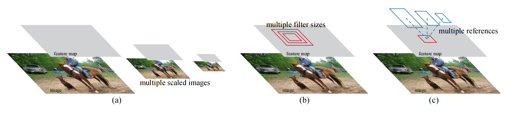
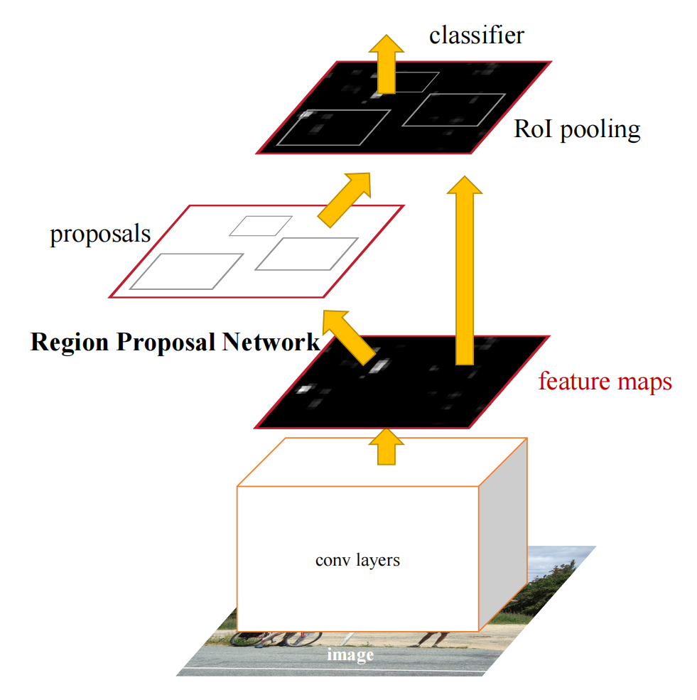
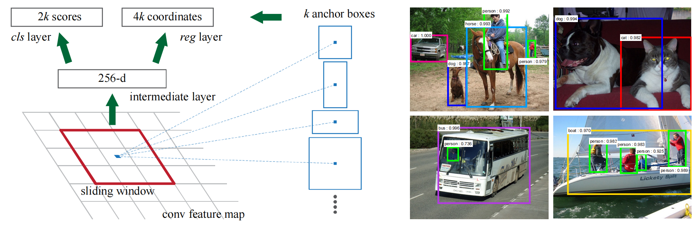
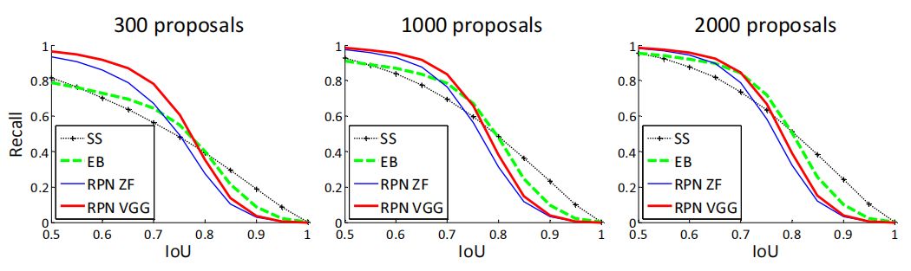

# Faster R-CNN: Towards Real-Time Object Detection with Region Proposal Networks
Faster R-CNN：利用区域候选网络实现实时目标检测 https://arxiv.org/abs/1506.01497

## 阅读笔记
* https://github.com/pytorch/vision/blob/main/torchvision/models/detection/faster_rcnn.py
* RPN, Region Proposal Networks, 区域候选网络 

## Abstract
State-of-the-art object detection networks depend on region proposal algorithms to hypothesize object locations. Advances like SPPnet and Fast R-CNN have reduced the running time of these detection networks, exposing region proposal computation as a bottleneck. In this work, we introduce a Region Proposal Network (RPN) that shares full-image convolutional features with the detection network, thus enabling nearly cost-free region proposals. An RPN is a fully convolutional network that simultaneously predicts object bounds and objectness scores at each position. The RPN is trained end-to-end to generate high-quality region proposals, which are used by Fast R-CNN for detection. We further merge RPN and Fast R-CNN into a single network by sharing their convolutional features---using the recently popular terminology of neural networks with 'attention' mechanisms, the RPN component tells the unified network where to look. For the very deep VGG-16 model, our detection system has a frame rate of 5fps (including all steps) on a GPU, while achieving state-of-the-art object detection accuracy on PASCAL VOC 2007, 2012, and MS COCO datasets with only 300 proposals per image. In ILSVRC and COCO 2015 competitions, Faster R-CNN and RPN are the foundations of the 1st-place winning entries in several tracks. Code has been made publicly available.

Index Terms: Object Detection, Region Proposal, Convolutional Neural Network. ✦ 

最先进的目标检测网络依赖于区域候选算法来假设物体位置。SPPnet和Fast R-CNN等进步减少了这些检测网络的运行时间，暴露了区域候选计算的瓶颈。在这项工作中，我们引入了区域候选网络(RPN)，该网络与检测网络共享全图像卷积特征，从而实现了几乎无成本的区域候选。RPN是一个完全卷积网络，它同时预测每个位置的目标边框和目标可能性得分。RPN经过端到端训练，生成高质量的候选区域，由Fast R-CNN用于检测。我们进一步将RPN和Fast R-CNN合并为一个网络，通过共享它们的卷积特征 —— 使用最近流行的神经网络术语“注意力”机制，RPN组件告诉统一网络去哪里看。对于非常深的VGG-16模型，我们的检测系统在GPU上的帧速度为5fps(包括所有步骤)，同时在PASCAL VOC 2007、2012和MS COCO数据集上实现最先进的目标检测精度，每个图像只有300个候选区。在ILSVRC和COCO 2015比赛中，Faster R-CNN和RPN是多个赛道中获得第一名的基础。代码已公开。

## 1 INTRODUCTION
Recent advances in object detection are driven by the success of region proposal methods (e.g., [4]) and region-based convolutional neural networks (RCNNs) [5]. Although region-based CNNs were computationally expensive as originally developed in [5], their cost has been drastically reduced thanks to sharing convolutions across proposals [1], [2]. The latest incarnation, Fast R-CNN [2], achieves near real-time rates using very deep networks [3], when ignoring the time spent on region proposals. Now, proposals are the test-time computational bottleneck in state-of-the-art detection systems.

目标检测的最新进展是由区域候选方法(例如[4])和基于区域的卷积神经网络(RCNNs)[5]的成功推动的。尽管基于区域的神经网络最初在[5]中开发时计算成本较高，但由于在候选区[1]、[2]之间共享卷积，其成本已大幅降低。最新版本Fast R-CNN[2]利用深度网络[3]实现了近乎实时的速度，而忽略了在区域候选上花费的时间。现在，区域候选是最先进的检测系统中测试时的计算瓶颈。

Region proposal methods typically rely on inexpensive features and economical inference schemes. Selective Search [4], one of the most popular methods, greedily merges superpixels based on engineered low-level features. Yet when compared to efficient detection networks [2], Selective Search is an order of magnitude slower, at 2 seconds per image in a CPU implementation. EdgeBoxes [6] currently provides the best tradeoff between proposal quality and speed, at 0.2 seconds per image. Nevertheless, the region proposal step still consumes as much running time as the detection network.

区域候选方法通常依赖于廉价的特征和经济的推理方案。选择性搜索[4]是最流行的方法之一，它贪婪地基于设计的低级特征合并超级像素。然而，与高效的检测网络[2]相比，选择性搜索慢了一个数量级，在CPU实现中，每幅图像2秒。EdgeBoxes[6]目前提供了提案质量和速度之间的最佳权衡，每幅图像0.2秒。然而，区域候选步骤仍然消耗与检测网络一样多的运行时间。

One may note that fast region-based CNNs take advantage of GPUs, while the region proposal methods used in research are implemented on the CPU, making such runtime comparisons inequitable. An obvious way to accelerate proposal computation is to reimplement it for the GPU. This may be an effective engineering solution, but re-implementation ignores the down-stream detection network and therefore misses important opportunities for sharing computation.

人们可能会注意到，基于快速区域的CNNs利用了GPU，而研究中使用的区域候选方法是在CPU上实现的，这使得这种运行时比较不公平。加速提案计算的一个明显方法是为GPU重新实现它。这可能是一个有效的工程解决方案，但重新实现忽略了下游检测网络，因此错过了共享计算的重要机会。

In this paper, we show that an algorithmic change— computing proposals with a deep convolutional neural network—leads to an elegant and effective solution where proposal computation is nearly cost-free given the detection network’s computation. To this end, we introduce novel Region Proposal Networks (RPNs) that share convolutional layers with state-of-the-art object detection networks [1], [2]. By sharing convolutions at test-time, the marginal cost for computing proposals is small (e.g., 10ms per image).

在本文中，我们证明了使用深度卷积神经网络的算法变化计算提案会导致一个优雅而有效的解决方案，其中，在给定检测网络的计算的情况下，提案计算几乎是无成本的。为此，我们引入了新的区域候选网络(RPN)，该网络与最先进的目标检测网络共享卷积层[1]，[2]。通过在测试时共享卷积，计算提案的边际成本很小(例如，每张图像10毫秒)。

Our observation is that the convolutional feature maps used by region-based detectors, like Fast RCNN, can also be used for generating region proposals. On top of these convolutional features, we construct an RPN by adding a few additional convolutional layers that simultaneously regress region bounds and objectness scores at each location on a regular grid. The RPN is thus a kind of fully convolutional network (FCN) [7] and can be trained end-toend specifically for the task for generating detection proposals.

我们的观察结果是，基于区域的检测器(如Fast RCNN)使用的卷积特征图也可以用于生成区域候选。在这些卷积特征的基础上，我们通过添加几个额外的卷积层来构建RPN，这些卷积层同时回归规则网格上每个位置的区域边框和是目标的可能性得分。因此，RPN是一种完全卷积网络(FCN)[7]，可以针对生成检测建议的任务进行端到端训练。

 
Figure 1: Different schemes for addressing multiple scales and sizes. (a) Pyramids of images and feature maps are built, and the classifier is run at all scales. (b) Pyramids of filters with multiple scales/sizes are run on the feature map. (c) We use pyramids of reference boxes in the regression functions. 
图1：解决多个规模和大小的不同方案。(a) 构建了图像和特征图的金字塔，并在所有尺度上运行分类器。(b) 具有多个比例/大小的过滤器金字塔在要素地图上运行。(c) 我们在回归函数中使用参考框的金字塔。

RPNs are designed to efficiently predict region proposals with a wide range of scales and aspect ratios. In contrast to prevalent methods [8], [9], [1], [2] that use pyramids of images (Figure 1, a) or pyramids of filters (Figure 1, b), we introduce novel “anchor” boxes that serve as references at multiple scales and aspect ratios. Our scheme can be thought of as a pyramid of regression references (Figure 1, c), which avoids enumerating images or filters of multiple scales or aspect ratios. This model performs well when trained and tested using single-scale images and thus benefits running speed.

RPN旨在有效预测具有广泛规模和纵横比的区域方案。与使用图像金字塔(图1，a)或滤波器金字塔(图2，b)的流行方法[8]，[9]，[1]，[2]相比，我们引入了新的“锚”框，这些框在多个尺度和纵横比下用作参考。我们的方案可以被认为是回归参考的金字塔(图1，c)，它避免了枚举多个尺度或纵横比的图像或过滤器。当使用单尺度图像进行训练和测试时，该模型表现良好，从而提高了运行速度。

To unify RPNs with Fast R-CNN [2] object detection networks, we propose a training scheme that alternates between fine-tuning for the region proposal task and then fine-tuning for object detection, while keeping the proposals fixed. This scheme converges quickly and produces a unified network with convolutional features that are shared between both tasks.(1. Since the publication of the conference version of this paper [10], we have also found that RPNs can be trained jointly with Fast R-CNN networks leading to less training time. )

为了将RPN与Fast R-CNN[2]目标检测网络统一起来，我们提出了一种训练方案，该方案在区域候选任务的微调和目标检测的微调之间交替进行，同时保持候选区固定不变。该方案快速收敛，产生了一个具有卷积特征的统一网络，在两个任务之间共享。(1.自本文会议版发表以来[10]，我们还发现RPN可以与Fast R-CNN网络联合训练，从而缩短训练时间。)

We comprehensively evaluate our method on the PASCAL VOC detection benchmarks [11] where RPNs with Fast R-CNNs produce detection accuracy better than the strong baseline of Selective Search with Fast R-CNNs. Meanwhile, our method waives nearly all computational burdens of Selective Search at test-time—the effective running time for proposals is just 10 milliseconds. Using the expensive very deep models of [3], our detection method still has a frame rate of 5fps (including all steps) on a GPU, and thus is a practical object detection system in terms of both speed and accuracy. We also report results on the MS COCO dataset [12] and investigate the improvements on PASCAL VOC using the COCO data. Code has been made publicly available at https://github.com/shaoqingren/faster_rcnn (in MATLAB) and https://github.com/rbgirshick/py-faster-rcnn (in Python).

我们在PASCAL VOC检测基准[11]上全面评估了我们的方法，其中使用Fast R-CNN的RPN比使用快速R-CN的选择性搜索的强大基线产生更好的检测精度。同时，我们的方法在测试时几乎免除了选择性搜索的所有计算负担，提案的有效运行时间仅为10毫秒。使用昂贵的非常深的模型[3]，我们的检测方法在GPU上的帧速度仍然为5fps(包括所有步骤)，因此在速度和精度方面都是一个实用的目标检测系统。我们还报告了MS COCO数据集的结果[12]，并使用COCO数据研究了PASCAL VOC的改进。代码已在https://github.com/shaoqingren/faster_rcnn(在MATLAB中)和 https://github.com/rbgirshick/py-faster-rcnn(在Python中)。

A preliminary version of this manuscript was published previously [10]. Since then, the frameworks of RPN and Faster R-CNN have been adopted and generalized to other methods, such as 3D object detection [13], part-based detection [14], instance segmentation [15], and image captioning [16]. Our fast and effective object detection system has also been built in commercial systems such as at Pinterests [17], with user engagement improvements reported.

该手稿的初步版本先前已出版[10]。此后，RPN和Faster R-CNN的框架被采用并推广到其他方法，如3D目标检测[13]、基于部分的检测[14]、实例分割[15]和图像字幕[16]。我们的快速有效的目标检测系统也已在Pinterest[17]等商业系统中构建，用户参与度有所提高。

In ILSVRC and COCO 2015 competitions, Faster R-CNN and RPN are the basis of several 1st-place entries [18] in the tracks of ImageNet detection, ImageNet localization, COCO detection, and COCO segmentation. RPNs completely learn to propose regions from data, and thus can easily benefit from deeper and more expressive features (such as the 101-layer residual nets adopted in [18]). Faster R-CNN and RPN are also used by several other leading entries in these competitions(2. http://image-net.org/challenges/LSVRC/2015/results ) . These results suggest that our method is not only a cost-efficient solution for practical usage, but also an effective way of improving object detection accuracy. 

在ILSVRC和COCO 2015比赛中，Faster R-CNN和RPN是ImageNet检测、ImageNet定位、COCO检测和COCO分割领域的几个第一名[18]的基础。RPN完全学会从数据中提出区域，因此可以很容易地从更深和更具表现力的特征中受益(如[18]中采用的101层残差网络)。更快的R-CNN和RPN也被这些比赛中的其他几个领先参赛者使用(2。http://image-net.org/challenges/LSVRC/2015/results ) . 这些结果表明，我们的方法不仅是一种经济高效的解决方案，而且是提高目标检测精度的有效方法。

## 2 RELATED WORK
Object Proposals. There is a large literature on object proposal methods. Comprehensive surveys and comparisons of object proposal methods can be found in [19], [20], [21]. Widely used object proposal methods include those based on grouping super-pixels (e.g., Selective Search [4], CPMC [22], MCG [23]) and those based on sliding windows (e.g., objectness in windows [24], EdgeBoxes [6]). Object proposal methods were adopted as external modules independent of the detectors (e.g., Selective Search [4] object detectors, RCNN [5], and Fast R-CNN [2]).

目标建议。有大量关于目标建议方法的文献。[19]、[20]、[21]中对目标提案方法进行了全面调查和比较。广泛使用的目标建议方法包括基于分组超像素的方法(例如，选择性搜索[4]、CPMC[22]、MCG[23])和基于滑动窗口的方法(如，窗口中的是目标的可能性[24]、EdgeBoxes[6])。目标建议方法被用作独立于检测器的外部模块(例如，选择性搜索[4]目标检测器、RCNN[5]和快速R-CNN[2])。

Deep Networks for Object Detection. The R-CNN method [5] trains CNNs end-to-end to classify the proposal regions into object categories or background. R-CNN mainly plays as a classifier, and it does not predict object bounds (except for refining by bounding box regression). Its accuracy depends on the performance of the region proposal module (see comparisons in [20]). Several papers have proposed ways of using deep networks for predicting object bounding boxes [25], [9], [26], [27]. In the OverFeat method [9], a fully-connected layer is trained to predict the box coordinates for the localization task that assumes a single object. The fully-connected layer is then turned into a convolutional layer for detecting multiple classspecific objects. The MultiBox methods [26], [27] generate region proposals from a network whose last fully-connected layer simultaneously predicts multiple class-agnostic boxes, generalizing the “singlebox” fashion of OverFeat. These class-agnostic boxes are used as proposals for R-CNN [5]. The MultiBox proposal network is applied on a single image crop or multiple large image crops (e.g., 224×224), in contrast to our fully convolutional scheme. MultiBox does not share features between the proposal and detection networks. We discuss OverFeat and MultiBox in more depth later in context with our method. Concurrent with our work, the DeepMask method [28] is developed for learning segmentation proposals.

用于目标检测的深度网络。R-CNN方法[5]对CNN进行端到端训练，将提案区域分类为目标类别或背景。R-CNN主要用作分类器，它不预测目标边框(通过边框框回归进行细化除外)。其准确性取决于区域提案模块的性能(参见[20]中的比较)。几篇论文提出了使用深度网络预测目标边框框的方法[25]，[9]，[26]，[27]。在OverFeat方法[9]中，训练完全连接的层，以预测假设单个目标的定位任务的框坐标。然后，将完全连接的层转换为用于检测多个类特定目标的卷积层。MultiBox方法[26]，[27]从网络生成区域候选，该网络的最后一个完全连接的层同时预测多个类未知的框，概括了OverFeat的“单框”方式。这些类别未知的边框子被用作R-CNN的提案[5]。与我们的完全卷积方案相反，MultiBox建议网络应用于单个图像裁剪或多个大型图像裁剪(例如，224×224)。MultiBox不在提案和检测网络之间共享功能。稍后，我们将使用我们的方法在上下文中更深入地讨论OverFeat和MultiBox。与我们的工作同时，DeepMask方法[28]被开发用于学习分割建议。

 
Figure 2: Faster R-CNN is a single, unified network for object detection. The RPN module serves as the ‘attention’ of this unified network. 
图2:Faster R-CNN是一个用于目标检测的单一统一网络。RPN模块是这个统一网络的“关注点”。

Shared computation of convolutions [9], [1], [29], [7], [2] has been attracting increasing attention for ef- ficient, yet accurate, visual recognition. The OverFeat paper [9] computes convolutional features from an image pyramid for classification, localization, and detection. Adaptively-sized pooling (SPP) [1] on shared convolutional feature maps is developed for efficient region-based object detection [1], [30] and semantic segmentation [29]. Fast R-CNN [2] enables end-to-end detector training on shared convolutional features and shows compelling accuracy and speed. 

卷积的共享计算[9]，[1]，[29]，[7]，[2]由于有效但准确的视觉识别而受到越来越多的关注。OverFeat论文[9]从图像金字塔中计算卷积特征，用于分类、定位和检测。基于共享卷积特征图的自适应大小池(SPP)[1]被开发用于高效的基于区域的目标检测[1]、[30]和语义分割[29]。Fast R-CNN[2]支持共享卷积特征的端到端检测器训练，并显示出令人信服的准确性和速度。

## 3 FASTER R-CNN
Our object detection system, called Faster R-CNN, is composed of two modules. The first module is a deep fully convolutional network that proposes regions, and the second module is the Fast R-CNN detector [2] that uses the proposed regions. The entire system is a single, unified network for object detection (Figure 2). Using the recently popular terminology of neural networks with ‘attention’ [31] mechanisms, the RPN module tells the Fast R-CNN module where to look. In Section 3.1 we introduce the designs and properties of the network for region proposal. In Section 3.2 we develop algorithms for training both modules with features shared.

我们的目标检测系统称为Faster R-CNN，由两个模块组成。第一个模块是提出区域的深度全卷积网络，第二个模块是使用提出的区域的快速R-CNN检测器[2]。整个系统是用于目标检测的单一统一网络(图2)。使用最近流行的带有“注意力”机制的神经网络术语[31]，RPN模块告诉快速R-CNN模块要看哪里。在第3.1节中，我们介绍了区域提案网络的设计和特性。在第3.2节中，我们开发了用于训练具有共享特征的两个模块的算法。

### 3.1 Region Proposal Networks
A Region Proposal Network (RPN) takes an image (of any size) as input and outputs a set of rectangular object proposals, each with an objectness score.(3. “Region” is a generic term and in this paper we only consider rectangular regions, as is common for many methods (e.g., [27], [4], [6]). “Objectness” measures membership to a set of object classes vs. background.) We model this process with a fully convolutional network [7], which we describe in this section. Because our ultimate goal is to share computation with a Fast R-CNN object detection network [2], we assume that both nets share a common set of convolutional layers. In our experiments, we investigate the Zeiler and Fergus model [32] (ZF), which has 5 shareable convolutional layers and the Simonyan and Zisserman model [3] (VGG-16), which has 13 shareable convolutional layers.

区域候选网络(RPN)将图像(任何大小)作为输入，并输出一组矩形目标建议，每个建议都有一个目标得分。(3“区域”是一个通用术语，在本文中，我们只考虑矩形区域，这在许多方法中是常见的(例如[27]，[4]，[6])。“是目标的可能性”衡量一组目标类与背景的成员关系。)我们使用完全卷积网络[7]对这一过程进行建模，我们将在本节中对此进行描述。因为我们的最终目标是与快速R-CNN目标检测网络共享计算[2]，我们假设两个网络共享一组共同的卷积层。在我们的实验中，我们研究了Zeiler和Fergus模型[32](ZF)和Simonyan和Zisserman模型[3](VGG-16)，该模型具有5个可共享的卷积层。

To generate region proposals, we slide a small network over the convolutional feature map output by the last shared convolutional layer. This small network takes as input an n × n spatial window of the input convolutional feature map. Each sliding window is mapped to a lower-dimensional feature (256-d for ZF and 512-d for VGG, with ReLU [33] following). This feature is fed into two sibling fullyconnected layers—a box-regression layer (reg) and a box-classification layer (cls). We use n = 3 in this paper, noting that the effective receptive field on the input image is large (171 and 228 pixels for ZF and VGG, respectively). This mini-network is illustrated at a single position in Figure 3 (left). Note that because the mini-network operates in a sliding-window fashion, the fully-connected layers are shared across all spatial locations. This architecture is naturally implemented with an n×n convolutional layer followed by two sibling 1 × 1 convolutional layers (for reg and cls, respectively).

为了生成区域候选，我们在最后一个共享卷积层输出的卷积特征图上滑动一个小网络。这个小网络将输入卷积特征图的n×n空间窗口作为输入。每个滑动窗口都映射到一个较低维度的特征(ZF为256-d，VGG为512-d，ReLU[33]紧随其后)。这个特性被输入到两个兄弟完全连接的层中——一个边框回归层(reg)和一个边框分类层(cls)。我们在本文中使用n＝3，注意到输入图像上的有效感受野很大(ZF和VGG分别为171和228像素)。图3(左侧)中的单个位置显示了这个小型网络。请注意，因为迷你网络以滑动窗口方式运行，所以在所有空间位置共享完全连接的层。该架构自然采用n×n卷积层和两个兄弟1×1卷积层(分别用于reg和cls)来实现。

#### 3.1.1 Anchors
At each sliding-window location, we simultaneously predict multiple region proposals, where the number of maximum possible proposals for each location is denoted as k. So the reg layer has 4k outputs encoding the coordinates of k boxes, and the cls layer outputs 2k scores that estimate probability of object or not object for each proposal(4. For simplicity we implement the cls layer as a two-class softmax layer. Alternatively, one may use logistic regression to produce k scores. ). The k proposals are parameterized relative to k reference boxes, which we call anchors. An anchor is centered at the sliding window in question, and is associated with a scale and aspect ratio (Figure 3, left). By default we use 3 scales and 3 aspect ratios, yielding k = 9 anchors at each sliding position. For a convolutional feature map of a size W × H (typically ∼2,400), there are W Hk anchors in total.

在每个滑动窗口位置，我们同时预测多个区域候选，其中每个位置的最大可能建议数表示为k。因此，reg层有4k个输出，编码k个框的坐标，cls层输出2k个分数，估计每个建议的目标或非目标概率(4)。为了简单起见，我们将cls层实现为两类softmax层。或者，可以使用逻辑回归来产生k分。)。k个建议相对于k个参考框(我们称之为锚点)进行参数化。锚定位于所讨论的滑动窗口的中心，并与比例和纵横比相关联(图3，左侧)。默认情况下，我们使用3个比例和3个纵横比，在每个滑动位置产生k=9个锚点。对于尺寸为W×H的卷积特征图(通常∼2400)，总共有W Hk锚。

 
Figure 3: Left: Region Proposal Network (RPN). Right: Example detections using RPN proposals on PASCAL VOC 2007 test. Our method detects objects in a wide range of scales and aspect ratios. 
图3：左图：区域提案网络(RPN)。右图：PASCAL VOC 2007测试中使用RPN建议的样本检测。我们的方法检测范围广泛的尺度和纵横比的目标。

##### Translation-Invariant Anchors 平移不变锚点
An important property of our approach is that it is translation invariant, both in terms of the anchors and the functions that compute proposals relative to the anchors. If one translates an object in an image, the proposal should translate and the same function should be able to predict the proposal in either location. This translation-invariant property is guaranteed by our method(5. As is the case of FCNs [7], our network is translation invariant up to the network’s total stride.) . As a comparison, the MultiBox method [27] uses k-means to generate 800 anchors, which are not translation invariant. So MultiBox does not guarantee that the same proposal is generated if an object is translated.

我们的方法的一个重要特性是它是平移不变的，无论是在锚点还是计算相对于锚点的建议的函数方面。如果一个人翻译图像中的一个目标，建议应该翻译，并且同一个函数应该能够预测任何位置的建议。我们的方法保证了这种平移不变性(5.与FCNs[7]的情况一样，我们的网络在网络的总步长范围内是平移不变性的)。作为比较，MultiBox方法[27]使用k均值生成800个锚，这些锚不是平移不变性的。因此，MultiBox不能保证在翻译目标时生成相同的建议。

The translation-invariant property also reduces the model size. MultiBox has a (4 + 1) × 800-dimensional fully-connected output layer, whereas our method has a (4 + 2) × 9-dimensional convolutional output layer in the case of k = 9 anchors. As a result, our output layer has 2.8 × 104 parameters (512 × (4 + 2) × 9 for VGG-16), two orders of magnitude fewer than MultiBox’s output layer that has 6.1 × 106 parameters (1536 × (4 + 1) × 800 for GoogleNet [34] in MultiBox [27]). If considering the feature projection layers, our proposal layers still have an order of magnitude fewer parameters than MultiBox(6. Considering the feature projection layers, our proposal layers’ parameter count is 3 × 3 × 512 × 512 + 512 × 6 × 9 = 2.4 × 106;MultiBox’s proposal layers’ parameter count is 7 × 7 × (64 + 96 + 64 + 64) × 1536 + 1536 × 5 × 800 = 27 × 106.) . We expect our method to have less risk of overfitting on small datasets, like PASCAL VOC.

平移不变属性也会减小模型大小。MultiBox具有(4+1)×800维全连接输出层，而我们的方法在k＝9个锚的情况下具有(4+2)×9维卷积输出层。因此，我们的输出层具有2.8×104个参数(VGG-16为512×(4+2)×9)，比MultiBox的输出层6.1×106个参数(MultiBox[27]中GoogleNet[34]为1536×(4+1)×800)少两个数量级。如果考虑到特征投影层，我们的建议层的参数仍然比MultiBox(6。考虑到特征投影层，我们的建议层的参数计数为3×3×512×512+512×6×9=2.4×106; MultiBox的提议层的参数计数为7×7×(64+96+64+64)×1536+1536×5×800=27×106。)。我们预计我们的方法在小数据集(如PASCAL VOC)上过度拟合的风险较小。

##### Multi-Scale Anchors as Regression References 多尺度锚点作为回归参考
Our design of anchors presents a novel scheme for addressing multiple scales (and aspect ratios). As shown in Figure 1, there have been two popular ways for multi-scale predictions. The first way is based on image/feature pyramids, e.g., in DPM [8] and CNNbased methods [9], [1], [2]. The images are resized at multiple scales, and feature maps (HOG [8] or deep convolutional features [9], [1], [2]) are computed for each scale (Figure 1(a)). This way is often useful but is time-consuming. The second way is to use sliding windows of multiple scales (and/or aspect ratios) on the feature maps. For example, in DPM [8], models of different aspect ratios are trained separately using different filter sizes (such as 5×7 and 7×5). If this way is used to address multiple scales, it can be thought of as a “pyramid of filters” (Figure 1(b)). The second way is usually adopted jointly with the first way [8].

我们的锚固件设计提出了一种解决多尺度(和纵横比)问题的新方案。如图1所示，有两种流行的多尺度预测方法。第一种方法基于图像/特征金字塔，例如，在DPM[8]和基于CNN的方法[9]、[1]、[2]中。在多个尺度上调整图像的大小，并为每个尺度计算特征图(HOG[8]或深度卷积特征[9]、[1]、[2])(图1(a))。这种方法通常很有用，但很耗时。第二种方法是在特征地图上使用多个比例(和/或纵横比)的滑动窗口。例如，在DPM[8]中，使用不同的滤波器大小(例如5×7和7×5)分别训练不同纵横比的模型。如果这种方法用于处理多个尺度，则可以将其视为“过滤器金字塔”(图1(b))。第二种方式通常与第一种方式一起采用[8]。

As a comparison, our anchor-based method is built on a pyramid of anchors, which is more cost-efficient. Our method classifies and regresses bounding boxes with reference to anchor boxes of multiple scales and aspect ratios. It only relies on images and feature maps of a single scale, and uses filters (sliding windows on the feature map) of a single size. We show by experiments the effects of this scheme for addressing multiple scales and sizes (Table 8).

作为比较，我们的基于锚的方法建立在锚的金字塔上，这更具成本效益。我们的方法根据多个比例和纵横比的锚框对边框框进行分类和回归。它只依赖于单一比例的图像和特征地图，并使用单一大小的过滤器(特征地图上的滑动窗口)。我们通过实验显示了该方案对解决多个尺度和大小的影响(表8)。

Because of this multi-scale design based on anchors, we can simply use the convolutional features computed on a single-scale image, as is also done by the Fast R-CNN detector [2]. The design of multiscale anchors is a key component for sharing features without extra cost for addressing scales.

由于这种基于锚的多尺度设计，我们可以简单地使用在单尺度图像上计算的卷积特征，正如Fast R-CNN检测器[2]所做的那样。多尺度锚的设计是共享特征的关键组成部分，而无需额外的尺度寻址成本。

#### 3.1.2 Loss Function
For training RPNs, we assign a binary class label (of being an object or not) to each anchor. We assign a positive label to two kinds of anchors: (i) the anchor/anchors with the highest Intersection-overUnion (IoU) overlap with a ground-truth box, or (ii) an anchor that has an IoU overlap higher than 0.7 with 5 any ground-truth box. Note that a single ground-truth box may assign positive labels to multiple anchors. Usually the second condition is sufficient to determine the positive samples; but we still adopt the first condition for the reason that in some rare cases the second condition may find no positive sample. We assign a negative label to a non-positive anchor if its IoU ratio is lower than 0.3 for all ground-truth boxes. Anchors that are neither positive nor negative do not contribute to the training objective.

对于训练RPN，我们为每个锚点分配一个二进制类标签(是否为目标)。我们为两种锚点分配了一个正标签：(i)具有最高交集的锚点/锚点(IoU)与地面真值框重叠，或(ii)具有高于0.7的IoU重叠的锚点与5个任意地面真值边框重叠。请注意，单个地面真相框可能会为多个锚点指定正标签。通常，第二个条件足以确定阳性样本; 但我们仍然采用第一种条件，因为在一些罕见的情况下，第二种条件可能找不到阳性样本。如果所有地面真值框的IoU比率低于0.3，我们将负标签分配给非正锚。既不积极也不消极的锚定对训练目标没有帮助。

With these definitions, we minimize an objective function following the multi-task loss in Fast R-CNN [2]. Our loss function for an image is defined as:

通过这些定义，我们在Fast R-CNN[2]中最小化了多任务损失后的目标函数。图像的损失函数定义为：

L({pi}, {ti}) = 1 Ncls X i Lcls (pi , p∗i ) +λ 1 Nreg X i p∗i Lreg (ti , t∗i ). (1)

Here, i is the index of an anchor in a mini-batch and pi is the predicted probability of anchor i being an object. The ground-truth label p∗i is 1 if the anchor is positive, and is 0 if the anchor is negative. ti is a vector representing the 4 parameterized coordinates of the predicted bounding box, and t∗i is that of the ground-truth box associated with a positive anchor. The classification loss Lcls is log loss over two classes (object vs. not object). For the regression loss, we use Lreg (ti , t∗i ) = R(ti − t∗i ) where R is the robust loss function (smooth L1) defined in [2]. The term p∗i Lreg means the regression loss is activated only for positive anchors (p∗i = 1) and is disabled otherwise (p∗i = 0). The outputs of the cls and reg layers consist of {pi} and {ti} respectively.

这里，i是小批量中锚点的索引，pi是锚点i作为目标的预测概率。地面真相标签p∗如果锚点为正，i为1; 如果锚点为负，i为0。ti是表示预测边框框的4个参数化坐标的矢量，t∗i是与正锚相关联的地面真相框的值。分类损失Lcls是两类(目标与非目标)的日志损失。对于回归损失，我们使用Lreg(ti，t∗i)=R(ti)− 吨∗i)其中R是[2]中定义的稳健损失函数(平滑L1)。术语p∗i Lreg表示回归损失仅针对正锚(p∗i=1)，否则禁用(p∗i＝0)。cls和reg层的输出分别由{pi}和{ti}组成。

The two terms are normalized by Ncls and Nreg and weighted by a balancing parameter λ. In our current implementation (as in the released code), the cls term in Eqn.(1) is normalized by the mini-batch size (i.e., Ncls = 256) and the reg term is normalized by the number of anchor locations (i.e., Nreg ∼ 2, 400). By default we set λ = 10, and thus both cls and reg terms are roughly equally weighted. We show by experiments that the results are insensitive to the values of λ in a wide range (Table 9). We also note that the normalization as above is not required and could be simplified.

这两项由Ncls和Nreg归一化，并由平衡参数λ加权。在我们当前的实现中(如在发布的代码中)。(1) 通过小批量大小(即Ncls＝256)归一化，并且通过锚位置的数量(即Nreg)归一化reg项∼ 2, 400). 默认情况下，我们将λ设置为10，因此cls和reg项的权重大致相等。我们通过实验表明，结果在宽范围内对λ值不敏感(表9)。我们还注意到，上述规范化不是必需的，可以简化。

For bounding box regression, we adopt the parameterizations of the 4 coordinates following [5]: 

对于边框框回归，我们采用以下4个坐标的参数化[5]：

tx = (x − xa)/wa, ty = (y − ya)/ha, 
tw = log(w/wa), th = log(h/ha), 
t∗x = (x∗ − xa)/wa, t∗y = (y∗ − ya)/ha, 
t∗w = log(w∗ /wa), t∗h = log(h∗ /ha), (2) 

where x, y, w, and h denote the box’s center coordinates and its width and height. Variables x, xa, and x∗ are for the predicted box, anchor box, and groundtruth box respectively (likewise for y, w, h). This can be thought of as bounding-box regression from an anchor box to a nearby ground-truth box.

其中x、y、w和h表示长方体的中心坐标及其宽度和高度。变量x、xa和x∗ 分别用于预测框、锚框和地面实况框(同样用于y、w、h)。这可以被认为是从锚框到附近地面真相框的边框框回归。

Nevertheless, our method achieves bounding-box regression by a different manner from previous RoIbased (Region of Interest) methods [1], [2]. In [1], [2], bounding-box regression is performed on features pooled from arbitrarily sized RoIs, and the regression weights are shared by all region sizes. In our formulation, the features used for regression are of the same spatial size (3 × 3) on the feature maps. To account for varying sizes, a set of k bounding-box regressors are learned. Each regressor is responsible for one scale and one aspect ratio, and the k regressors do not share weights. As such, it is still possible to predict boxes of various sizes even though the features are of a fixed size/scale, thanks to the design of anchors.

然而，我们的方法通过与先前基于RoIbased(Region of Interest)方法不同的方式实现了边框框回归[1]，[2]。在[1]，[2]中，对任意大小RoI汇集的特征进行边框边框回归，回归权重由所有区域大小共享。在我们的公式中，用于回归的特征在特征图上具有相同的空间大小(3×3)。为了说明不同的大小，我们学习了一组k个边框框回归。每个回归器负责一个尺度和一个纵横比，k个回归器不共享权重。因此，由于锚的设计，即使特征具有固定的大小/比例，仍然可以预测各种大小的框。

#### 3.1.3 Training RPNs
The RPN can be trained end-to-end by backpropagation and stochastic gradient descent (SGD) [35]. We follow the “image-centric” sampling strategy from [2] to train this network. Each mini-batch arises from a single image that contains many positive and negative example anchors. It is possible to optimize for the loss functions of all anchors, but this will bias towards negative samples as they are dominate. Instead, we randomly sample 256 anchors in an image to compute the loss function of a mini-batch, where the sampled positive and negative anchors have a ratio of up to 1:1. If there are fewer than 128 positive samples in an image, we pad the mini-batch with negative ones.

RPN可以通过反向传播和随机梯度下降(SGD)进行端到端训练[35]。我们遵循[2]中的“以图像为中心”的采样策略来训练这个网络。每个小批量都来自一个包含许多正面和负面样本锚定的图像。可以优化所有锚的损失函数，但这将偏向于负样本，因为它们占主导地位。相反，我们在图像中随机采样256个锚来计算小批量的损失函数，其中采样的正锚和负锚的比率高达1:1。如果图像中的正样本少于128个，我们将用负样本填充小批量。

We randomly initialize all new layers by drawing weights from a zero-mean Gaussian distribution with standard deviation 0.01. All other layers (i.e., the shared convolutional layers) are initialized by pretraining a model for ImageNet classification [36], as is standard practice [5]. We tune all layers of the ZF net, and conv3 1 and up for the VGG net to conserve memory [2]. We use a learning rate of 0.001 for 60k mini-batches, and 0.0001 for the next 20k mini-batches on the PASCAL VOC dataset. We use a momentum of 0.9 and a weight decay of 0.0005 [37]. Our implementation uses Caffe [38].

我们通过从标准偏差为0.01的零均值高斯分布中提取权重来随机初始化所有新层。所有其他层(即，共享卷积层)通过预训练ImageNet分类模型[36]来初始化，这是标准实践[5]。我们调整ZF网络的所有层，并为VGG网络调整conv31和conv3，以节省内存[2]。在PASCAL VOC数据集上，我们对60k小批量使用0.001的学习率，对接下来的20k小批量则使用0.0001的学习率。我们使用0.9的动量和0.0005[37]的重量衰减。我们的实现使用Caffe[38]。

### 3.2 Sharing Features for RPN and Fast R-CNN
Thus far we have described how to train a network for region proposal generation, without considering the region-based object detection CNN that will utilize these proposals. For the detection network, we adopt Fast R-CNN [2]. Next we describe algorithms that learn a unified network composed of RPN and Fast R-CNN with shared convolutional layers (Figure 2).

到目前为止，我们已经描述了如何训练用于区域候选生成的网络，而不考虑将使用这些建议的基于区域的目标检测CNN。对于检测网络，我们采用Fast R-CNN[2]。接下来，我们将描述学习由RPN和Fast R-CNN组成的具有共享卷积层的统一网络的算法(图2)。

Table 1: the learned average proposal size for each anchor using the ZF net (numbers for s = 600). 
表1：使用ZF网络(s=600的数字)的每个锚的学习平均提案大小。

Both RPN and Fast R-CNN, trained independently, will modify their convolutional layers in different ways. We therefore need to develop a technique that allows for sharing convolutional layers between the two networks, rather than learning two separate networks. We discuss three ways for training networks with features shared: 

独立训练的RPN和Fast R-CNN都将以不同的方式修改其卷积层。因此，我们需要开发一种技术，允许在两个网络之间共享卷积层，而不是学习两个独立的网络。我们讨论了三种具有共享功能的培训网络方式：

(i) Alternating training. In this solution, we first train RPN, and use the proposals to train Fast R-CNN. The network tuned by Fast R-CNN is then used to initialize RPN, and this process is iterated. This is the solution that is used in all experiments in this paper. 

(i) 交替训练。在这个解决方案中，我们首先训练RPN，并使用这些建议来训练Fast R-CNN。然后使用Fast R-CNN调谐的网络来初始化RPN，并重复该过程。这是本文所有实验中使用的解决方案。

(ii) Approximate joint training. In this solution, the RPN and Fast R-CNN networks are merged into one network during training as in Figure 2. In each SGD iteration, the forward pass generates region proposals which are treated just like fixed, pre-computed proposals when training a Fast R-CNN detector. The backward propagation takes place as usual, where for the shared layers the backward propagated signals from both the RPN loss and the Fast R-CNN loss are combined. This solution is easy to implement. But this solution ignores the derivative w.r.t. the proposal boxes’ coordinates that are also network responses, so is approximate. In our experiments, we have empirically found this solver produces close results, yet reduces the training time by about 25-50% comparing with alternating training. This solver is included in our released Python code. 

(ii)近似联合训练。在该解决方案中，RPN和Fast R-CNN网络在训练期间合并为一个网络，如图2所示。在每个SGD迭代中，前向传递生成区域候选，当训练Fast R-CNN检测器时，这些建议与固定的、预先计算的建议一样。反向传播照常进行，其中对于共享层，来自RPN损耗和快速R-CNN损耗的反向传播信号被组合。此解决方案易于实施。但该解决方案忽略了提案框坐标的导数，该坐标也是网络响应，因此是近似的。在我们的实验中，我们根据经验发现，该求解器产生了接近的结果，但与交替训练相比，训练时间减少了约25-50%。这个解算器包含在我们发布的Python代码中。

(iii) Non-approximate joint training. As discussed above, the bounding boxes predicted by RPN are also functions of the input. The RoI pooling layer [2] in Fast R-CNN accepts the convolutional features and also the predicted bounding boxes as input, so a theoretically valid backpropagation solver should also involve gradients w.r.t. the box coordinates. These gradients are ignored in the above approximate joint training. In a non-approximate joint training solution, we need an RoI pooling layer that is differentiable w.r.t. the box coordinates. This is a nontrivial problem and a solution can be given by an “RoI warping” layer as developed in [15], which is beyond the scope of this paper. 

(iii)非近似联合训练。如上所述，RPN预测的边框框也是输入的函数。Fast R-CNN中的RoI池化层[2]接受卷积特征以及预测的边框框作为输入，因此理论上有效的反向传播解算器还应包括相对于框坐标的梯度。在上述近似关节训练中，忽略了这些梯度。在一个非近似联合训练解决方案中，我们需要一个RoI池层，该层相对于框坐标是可微的。这是一个非平凡的问题，可以通过[15]中开发的“RoI翘曲”层给出解决方案，这超出了本文的范围。

4-Step Alternating Training. In this paper, we adopt a pragmatic 4-step training algorithm to learn shared features via alternating optimization. In the first step, we train the RPN as described in Section 3.1.3. This network is initialized with an ImageNet-pre-trained model and fine-tuned end-to-end for the region proposal task. In the second step, we train a separate detection network by Fast R-CNN using the proposals generated by the step-1 RPN. This detection network is also initialized by the ImageNet-pre-trained model. At this point the two networks do not share convolutional layers. In the third step, we use the detector network to initialize RPN training, but we fix the shared convolutional layers and only fine-tune the layers unique to RPN. Now the two networks share convolutional layers. Finally, keeping the shared convolutional layers fixed, we fine-tune the unique layers of Fast R-CNN. As such, both networks share the same convolutional layers and form a unified network. A similar alternating training can be run for more iterations, but we have observed negligible improvements.

四步交替训练。在本文中，我们采用一种实用的4步训练算法，通过交替优化来学习共享特征。在第一步中，我们按照第3.1.3节所述对RPN进行训练。该网络使用ImageNet预训练模型进行初始化，并针对区域提案任务进行端到端微调。在第二步中，我们使用Step1 RPN生成的建议，通过Fast R-CNN训练单独的检测网络。该检测网络也由ImageNet预训练模型初始化。此时，两个网络不共享卷积层。在第三步中，我们使用检测器网络初始化RPN训练，但我们固定共享卷积层，仅微调RPN特有的层。现在这两个网络共享卷积层。最后，保持共享卷积层固定不变，我们微调Fast R-CNN的独特层。因此，两个网络共享相同的卷积层并形成统一的网络。类似的交替训练可以进行更多的迭代，但我们观察到了微不足道的改进。

### 3.3 Implementation Details
We train and test both region proposal and object detection networks on images of a single scale [1], [2].

We re-scale the images such that their shorter side is s = 600 pixels [2]. Multi-scale feature extraction (using an image pyramid) may improve accuracy but does not exhibit a good speed-accuracy trade-off [2].

On the re-scaled images, the total stride for both ZF and VGG nets on the last convolutional layer is 16 pixels, and thus is ∼10 pixels on a typical PASCAL image before resizing (∼500×375). Even such a large stride provides good results, though accuracy may be further improved with a smaller stride.

For anchors, we use 3 scales with box areas of 1282, 2562 , and 5122 pixels, and 3 aspect ratios of 1:1, 1:2, and 2:1. These hyper-parameters are not carefully chosen for a particular dataset, and we provide ablation experiments on their effects in the next section. As discussed, our solution does not need an image pyramid or filter pyramid to predict regions of multiple scales, saving considerable running time. Figure 3 (right) shows the capability of our method for a wide range of scales and aspect ratios. Table 1 shows the learned average proposal size for each anchor using the ZF net. We note that our algorithm allows predictions that are larger than the underlying receptive field.

Such predictions are not impossible—one may still roughly infer the extent of an object if only the middle of the object is visible.

The anchor boxes that cross image boundaries need to be handled with care. During training, we ignore all cross-boundary anchors so they do not contribute to the loss. For a typical 1000 × 600 image, there will be roughly 20000 (≈ 60 × 40 × 9) anchors in total. With the cross-boundary anchors ignored, there are about 6000 anchors per image for training. If the boundary-crossing outliers are not ignored in training, they introduce large, difficult to correct error terms in the objective, and training does not converge. During testing, however, we still apply the fully convolutional

RPN to the entire image. This may generate crossboundary proposal boxes, which we clip to the image boundary. 7

Table 2: Detection results on PASCAL VOC 2007 test set (trained on VOC 2007 trainval). The detectors are Fast R-CNN with ZF, but using various proposal methods for training and testing. 

Some RPN proposals highly overlap with each other. To reduce redundancy, we adopt non-maximum suppression (NMS) on the proposal regions based on their cls scores. We fix the IoU threshold for NMS at 0.7, which leaves us about 2000 proposal regions per image. As we will show, NMS does not harm the ultimate detection accuracy, but substantially reduces the number of proposals. After NMS, we use the top-N ranked proposal regions for detection. In the following, we train Fast R-CNN using 2000 RPN proposals, but evaluate different numbers of proposals at test-time. 

## 4 EXPERIMENTS
### 4.1 Experiments on PASCAL VOC
We comprehensively evaluate our method on the

PASCAL VOC 2007 detection benchmark [11]. This dataset consists of about 5k trainval images and 5k test images over 20 object categories. We also provide results on the PASCAL VOC 2012 benchmark for a few models. For the ImageNet pre-trained network, we use the “fast” version of ZF net [32] that has 5 convolutional layers and 3 fully-connected layers, and the public VGG-16 model7 [3] that has 13 convolutional layers and 3 fully-connected layers. We primarily evaluate detection mean Average Precision (mAP), because this is the actual metric for object detection (rather than focusing on object proposal proxy metrics).

Table 2 (top) shows Fast R-CNN results when trained and tested using various region proposal methods. These results use the ZF net. For Selective

Search (SS) [4], we generate about 2000 proposals by the “fast” mode. For EdgeBoxes (EB) [6], we generate the proposals by the default EB setting tuned for 0.7 7. www.robots.ox.ac.uk/∼vgg/research/very deep/
IoU. SS has an mAP of 58.7% and EB has an mAP of 58.6% under the Fast R-CNN framework. RPN with Fast R-CNN achieves competitive results, with an mAP of 59.9% while using up to 300 proposals8.

Using RPN yields a much faster detection system than using either SS or EB because of shared convolutional computations; the fewer proposals also reduce the region-wise fully-connected layers’ cost (Table 5).

Ablation Experiments on RPN. To investigate the behavior of RPNs as a proposal method, we conducted several ablation studies. First, we show the effect of sharing convolutional layers between the RPN and

Fast R-CNN detection network. To do this, we stop after the second step in the 4-step training process.

Using separate networks reduces the result slightly to

 58.7% (RPN+ZF, unshared, Table 2). We observe that
 this is because in the third step when the detectortuned features are used to fine-tune the RPN, the proposal quality is improved.

Next, we disentangle the RPN’s influence on training the Fast R-CNN detection network. For this purpose, we train a Fast R-CNN model by using the 2000 SS proposals and ZF net. We fix this detector and evaluate the detection mAP by changing the proposal regions used at test-time. In these ablation experiments, the RPN does not share features with the detector.

Replacing SS with 300 RPN proposals at test-time leads to an mAP of 56.8%. The loss in mAP is because of the inconsistency between the training/testing proposals. This result serves as the baseline for the following comparisons.

Somewhat surprisingly, the RPN still leads to a competitive result (55.1%) when using the top-ranked 8. For RPN, the number of proposals (e.g., 300) is the maximum
 number for an image. RPN may produce fewer proposals after

NMS, and thus the average number of proposals is smaller. 8

Table 3: Detection results on PASCAL VOC 2007 test set. The detector is Fast R-CNN and VGG-16. Training data: “07”: VOC 2007 trainval, “07+12”: union set of VOC 2007 trainval and VOC 2012 trainval. For RPN, the train-time proposals for Fast R-CNN are 2000. † : this number was reported in [2]; using the repository provided by this paper, this result is higher (68.1). method # proposals data mAP (%)

Table 4: Detection results on PASCAL VOC 2012 test set. The detector is Fast R-CNN and VGG-16. Training data: “07”: VOC 2007 trainval, “07++12”: union set of VOC 2007 trainval+test and VOC 2012 trainval. For

RPN, the train-time proposals for Fast R-CNN are 2000. †: http://host.robots.ox.ac.uk:8080/anonymous/HZJTQA.html. ‡: http://host.robots.ox.ac.uk:8080/anonymous/YNPLXB.html. §: http://host.robots.ox.ac.uk:8080/anonymous/XEDH10.html. method # proposals data mAP (%)

Table 5: Timing (ms) on a K40 GPU, except SS proposal is evaluated in a CPU. “Region-wise” includes NMS, pooling, fully-connected, and softmax layers. See our released code for the profiling of running time. model system conv proposal region-wise total rate

ZF RPN + Fast R-CNN 31 3 25 59 17 fps 100 proposals at test-time, indicating that the topranked RPN proposals are accurate. On the other extreme, using the top-ranked 6000 RPN proposals (without NMS) has a comparable mAP (55.2%), suggesting NMS does not harm the detection mAP and may reduce false alarms.

Next, we separately investigate the roles of RPN’s cls and reg outputs by turning off either of them at test-time. When the cls layer is removed at testtime (thus no NMS/ranking is used), we randomly sample N proposals from the unscored regions. The mAP is nearly unchanged with N = 1000 (55.8%), but degrades considerably to 44.6% when N = 100. This shows that the cls scores account for the accuracy of the highest ranked proposals.

On the other hand, when the reg layer is removed at test-time (so the proposals become anchor boxes), the mAP drops to 52.1%. This suggests that the highquality proposals are mainly due to the regressed box bounds. The anchor boxes, though having multiple scales and aspect ratios, are not sufficient for accurate detection.

We also evaluate the effects of more powerful networks on the proposal quality of RPN alone. We use

VGG-16 to train the RPN, and still use the above detector of SS+ZF. The mAP improves from 56.8% (using RPN+ZF) to 59.2% (using RPN+VGG). This is a promising result, because it suggests that the proposal quality of RPN+VGG is better than that of RPN+ZF.

Because proposals of RPN+ZF are competitive with

SS (both are 58.7% when consistently used for training and testing), we may expect RPN+VGG to be better than SS. The following experiments justify this hypothesis.

Performance of VGG-16. Table 3 shows the results of VGG-16 for both proposal and detection. Using

RPN+VGG, the result is 68.5% for unshared features, slightly higher than the SS baseline. As shown above, this is because the proposals generated by RPN+VGG are more accurate than SS. Unlike SS that is predefined, the RPN is actively trained and benefits from better networks. For the feature-shared variant, the result is 69.9%—better than the strong SS baseline, yet with nearly cost-free proposals. We further train the

RPN and detection network on the union set of PASCAL VOC 2007 trainval and 2012 trainval. The mAP is 73.2%. Figure 5 shows some results on the PASCAL

VOC 2007 test set. On the PASCAL VOC 2012 test set (Table 4), our method has an mAP of 70.4% trained on the union set of VOC 2007 trainval+test and VOC 2012 trainval. Table 6 and Table 7 show the detailed numbers. 9

Table 6: Results on PASCAL VOC 2007 test set with Fast R-CNN detectors and VGG-16. For RPN, the train-time proposals for Fast R-CNN are 2000. RPN∗ denotes the unsharing feature version. method 

Table 7: Results on PASCAL VOC 2012 test set with Fast R-CNN detectors and VGG-16. For RPN, the train-time proposals for Fast R-CNN are 2000. method 

Table 8: Detection results of Faster R-CNN on PASCAL VOC 2007 test set using different settings of anchors. The network is VGG-16. The training data is VOC 2007 trainval. The default setting of using 3 scales and 3 aspect ratios (69.9%) is the same as that in Table 3. settings anchor scales aspect ratios mAP (%) 1 scale, 1 ratio 1282 1:1 65.8 2562 1:1 66.7 1 scale, 3 ratios 1282 {2:1, 1:1, 1:2} 68.8 2562 {2:1, 1:1, 1:2} 67.9 3 scales, 1 ratio {1282, 2562, 5122} 1:1 69.8 3 scales, 3 ratios {1282, 2562, 5122} {2:1, 1:1, 1:2} 69.9

Table 9: Detection results of Faster R-CNN on PASCAL VOC 2007 test set using different values of λ in Equation (1). The network is VGG-16. The training data is VOC 2007 trainval. The default setting of using λ = 10 (69.9%) is the same as that in Table 3. λ 0.1 1 10 100 mAP (%) 67.2 68.9 69.9 69.1

In Table 5 we summarize the running time of the entire object detection system. SS takes 1-2 seconds depending on content (on average about 1.5s), and

Fast R-CNN with VGG-16 takes 320ms on 2000 SS proposals (or 223ms if using SVD on fully-connected layers [2]). Our system with VGG-16 takes in total 198ms for both proposal and detection. With the convolutional features shared, the RPN alone only takes 10ms computing the additional layers. Our regionwise computation is also lower, thanks to fewer proposals (300 per image). Our system has a frame-rate of 17 fps with the ZF net.

Sensitivities to Hyper-parameters. In Table 8 we investigate the settings of anchors. By default we use 3 scales and 3 aspect ratios (69.9% mAP in Table 8).

If using just one anchor at each position, the mAP drops by a considerable margin of 3-4%. The mAP is higher if using 3 scales (with 1 aspect ratio) or 3 aspect ratios (with 1 scale), demonstrating that using anchors of multiple sizes as the regression references is an effective solution. Using just 3 scales with 1 aspect ratio (69.8%) is as good as using 3 scales with 3 aspect ratios on this dataset, suggesting that scales and aspect ratios are not disentangled dimensions for the detection accuracy. But we still adopt these two dimensions in our designs to keep our system flexible.

In Table 9 we compare different values of λ in Equation (1). By default we use λ = 10 which makes the two terms in Equation (1) roughly equally weighted after normalization. Table 9 shows that our result is impacted just marginally (by ∼ 1%) when λ is within a scale of about two orders of magnitude (1 to 100).

This demonstrates that the result is insensitive to λ in a wide range.

Analysis of Recall-to-IoU. Next we compute the recall of proposals at different IoU ratios with groundtruth boxes. It is noteworthy that the Recall-to-IoU metric is just loosely [19], [20], [21] related to the ultimate detection accuracy. It is more appropriate to use this metric to diagnose the proposal method than to evaluate it.

In Figure 4, we show the results of using 300, 1000, and 2000 proposals. We compare with SS and EB, and the N proposals are the top-N ranked ones based on the confidence generated by these methods. The plots show that the RPN method behaves gracefully when the number of proposals drops from 2000 to 300. This explains why the RPN has a good ultimate detection mAP when using as few as 300 proposals. As we analyzed before, this property is mainly attributed to the cls term of the RPN. The recall of SS and EB drops more quickly than RPN when the proposals are fewer. 

 
Figure 4: Recall vs. IoU overlap ratio on the PASCAL VOC 2007 test set.

Table 10: One-Stage Detection vs. Two-Stage Proposal + Detection. Detection results are on the PASCAL

VOC 2007 test set using the ZF model and Fast R-CNN. RPN uses unshared features. proposals detector mAP (%)

Two-Stage RPN + ZF, unshared 300 Fast R-CNN + ZF, 1 scale 58.7

One-Stage dense, 3 scales, 3 aspect ratios 20000 Fast R-CNN + ZF, 1 scale 53.8

One-Stage dense, 3 scales, 3 aspect ratios 20000 Fast R-CNN + ZF, 5 scales 53.9

One-Stage Detection vs. Two-Stage Proposal + Detection. The OverFeat paper [9] proposes a detection method that uses regressors and classifiers on sliding windows over convolutional feature maps. OverFeat is a one-stage, class-specific detection pipeline, and ours is a two-stage cascade consisting of class-agnostic proposals and class-specific detections. In OverFeat, the region-wise features come from a sliding window of one aspect ratio over a scale pyramid. These features are used to simultaneously determine the location and category of objects. In RPN, the features are from square (3×3) sliding windows and predict proposals relative to anchors with different scales and aspect ratios. Though both methods use sliding windows, the region proposal task is only the first stage of Faster RCNN—the downstream Fast R-CNN detector attends to the proposals to refine them. In the second stage of our cascade, the region-wise features are adaptively pooled [1], [2] from proposal boxes that more faithfully cover the features of the regions. We believe these features lead to more accurate detections.

To compare the one-stage and two-stage systems, we emulate the OverFeat system (and thus also circumvent other differences of implementation details) by one-stage Fast R-CNN. In this system, the “proposals” are dense sliding windows of 3 scales (128, 256, 512) and 3 aspect ratios (1:1, 1:2, 2:1). Fast R-CNN is trained to predict class-specific scores and regress box locations from these sliding windows. Because the

OverFeat system adopts an image pyramid, we also evaluate using convolutional features extracted from 5 scales. We use those 5 scales as in [1], [2].

Table 10 compares the two-stage system and two variants of the one-stage system. Using the ZF model, the one-stage system has an mAP of 53.9%. This is lower than the two-stage system (58.7%) by 4.8%.

This experiment justifies the effectiveness of cascaded region proposals and object detection. Similar observations are reported in [2], [39], where replacing SS region proposals with sliding windows leads to ∼6% degradation in both papers. We also note that the onestage system is slower as it has considerably more proposals to process.

### 4.2 Experiments on MS COCO
We present more results on the Microsoft COCO object detection dataset [12]. This dataset involves 80 object categories. We experiment with the 80k images on the training set, 40k images on the validation set, and 20k images on the test-dev set. We evaluate the mAP averaged for IoU ∈ [0.5 : 0.05 : 0.95] (COCO’s standard metric, simply denoted as mAP@[.5, .95]) and mAP@0.5 (PASCAL VOC’s metric).

There are a few minor changes of our system made for this dataset. We train our models on an 8-GPU implementation, and the effective mini-batch size becomes 8 for RPN (1 per GPU) and 16 for Fast R-CNN (2 per GPU). The RPN step and Fast R-CNN step are both trained for 240k iterations with a learning rate of 0.003 and then for 80k iterations with 0.0003. We modify the learning rates (starting with 0.003 instead of 0.001) because the mini-batch size is changed. For the anchors, we use 3 aspect ratios and 4 scales (adding 642 ), mainly motivated by handling small objects on this dataset. In addition, in our Fast R-CNN step, the negative samples are defined as those with a maximum IoU with ground truth in the interval of [0, 0.5), instead of [0.1, 0.5) used in [1], [2]. We note that in the SPPnet system [1], the negative samples in [0.1, 0.5) are used for network fine-tuning, but the negative samples in [0, 0.5) are still visited in the SVM step with hard-negative mining. But the Fast R-CNN system [2] abandons the SVM step, so the negative samples in [0, 0.1) are never visited. Including these [0, 0.1) samples improves mAP@0.5 on the COCO dataset for both Fast R-CNN and Faster R-CNN systems (but the impact is negligible on PASCAL VOC).  11

Table 11: Object detection results (%) on the MS COCO dataset. The model is VGG-16.

COCO val COCO test-dev method proposals training data mAP@.5 mAP@[.5, .95] mAP@.5 mAP@[.5, .95]

Fast R-CNN [2] SS, 2000 COCO train - - 35.9 19.7

Fast R-CNN [impl. in this paper] SS, 2000 COCO train 38.6 18.9 39.3 19.3

Faster R-CNN RPN, 300 COCO train 41.5 21.2 42.1 21.5

Faster R-CNN RPN, 300 COCO trainval - - 42.7 21.9

The rest of the implementation details are the same as on PASCAL VOC. In particular, we keep using 300 proposals and single-scale (s = 600) testing. The testing time is still about 200ms per image on the

COCO dataset.

In Table 11 we first report the results of the Fast

R-CNN system [2] using the implementation in this paper. Our Fast R-CNN baseline has 39.3% mAP@0.5 on the test-dev set, higher than that reported in [2].

We conjecture that the reason for this gap is mainly due to the definition of the negative samples and also the changes of the mini-batch sizes. We also note that the mAP@[.5, .95] is just comparable.

Next we evaluate our Faster R-CNN system. Using the COCO training set to train, Faster R-CNN has

 42.1% mAP@0.5 and 21.5% mAP@[.5, .95] on the
COCO test-dev set. This is 2.8% higher for mAP@0.5 and 2.2% higher for mAP@[.5, .95] than the Fast RCNN counterpart under the same protocol (Table 11).

This indicates that RPN performs excellent for improving the localization accuracy at higher IoU thresholds. Using the COCO trainval set to train, Faster RCNN has 42.7% mAP@0.5 and 21.9% mAP@[.5, .95] on the COCO test-dev set. Figure 6 shows some results on the MS COCO test-dev set.

Faster R-CNN in ILSVRC & COCO 2015 competitions We have demonstrated that Faster R-CNN benefits more from better features, thanks to the fact that the RPN completely learns to propose regions by neural networks. This observation is still valid even when one increases the depth substantially to over 100 layers [18]. Only by replacing VGG-16 with a 101- layer residual net (ResNet-101) [18], the Faster R-CNN system increases the mAP from 41.5%/21.2% (VGG- 16) to 48.4%/27.2% (ResNet-101) on the COCO val set. With other improvements orthogonal to Faster RCNN, He et al. [18] obtained a single-model result of

55.7%/34.9% and an ensemble result of 59.0%/37.4%
 on the COCO test-dev set, which won the 1st place in the COCO 2015 object detection competition. The same system [18] also won the 1st place in the ILSVRC 2015 object detection competition, surpassing the second place by absolute 8.5%. RPN is also a building block of the 1st-place winning entries in ILSVRC 2015 localization and COCO 2015 segmentation competitions, for which the details are available in [18] and [15] respectively.

Table 12: Detection mAP (%) of Faster R-CNN on

PASCAL VOC 2007 test set and 2012 test set using different training data. The model is VGG-16. “COCO” denotes that the COCO trainval set is used for training. See also Table 6 and Table 7. training data 2007 test 2012 test

VOC07 69.9 67.0

VOC07+12 73.2 -

VOC07++12 - 70.4

COCO (no VOC) 76.1 73.0

COCO+VOC07+12 78.8 -

COCO+VOC07++12 - 75.9

### 4.3 From MS COCO to PASCAL VOC
Large-scale data is of crucial importance for improving deep neural networks. Next, we investigate how the MS COCO dataset can help with the detection performance on PASCAL VOC.

As a simple baseline, we directly evaluate the

COCO detection model on the PASCAL VOC dataset, without fine-tuning on any PASCAL VOC data. This evaluation is possible because the categories on

COCO are a superset of those on PASCAL VOC. The categories that are exclusive on COCO are ignored in this experiment, and the softmax layer is performed only on the 20 categories plus background. The mAP under this setting is 76.1% on the PASCAL VOC 2007 test set (Table 12). This result is better than that trained on VOC07+12 (73.2%) by a good margin, even though the PASCAL VOC data are not exploited.

Then we fine-tune the COCO detection model on the VOC dataset. In this experiment, the COCO model is in place of the ImageNet-pre-trained model (that is used to initialize the network weights), and the

Faster R-CNN system is fine-tuned as described in

Section 3.2. Doing so leads to 78.8% mAP on the

PASCAL VOC 2007 test set. The extra data from the COCO set increases the mAP by 5.6%. Table 6 shows that the model trained on COCO+VOC has the best AP for every individual category on PASCAL

VOC 2007. Similar improvements are observed on the

PASCAL VOC 2012 test set (Table 12 and Table 7). We note that the test-time speed of obtaining these strong results is still about 200ms per image. 

## 5 CONCLUSION
We have presented RPNs for efficient and accurate region proposal generation. By sharing convolutional features with the down-stream detection network, the region proposal step is nearly cost-free. Our method enables a unified, deep-learning-based object detection system to run at near real-time frame rates. The learned RPN also improves region proposal quality and thus the overall object detection accuracy.

 
Figure 5: Selected examples of object detection results on the PASCAL VOC 2007 test set using the Faster R-CNN system. The model is VGG-16 and the training data is 07+12 trainval (73.2% mAP on the 2007 test set). Our method detects objects of a wide range of scales and aspect ratios. Each output box is associated with a category label and a softmax score in [0, 1]. A score threshold of 0.6 is used to display these images. The running time for obtaining these results is 198ms per image, including all steps. 

 
Figure 6: Selected examples of object detection results on the MS COCO test-dev set using the Faster R-CNN system. The model is VGG-16 and the training data is COCO trainval (42.7% mAP@0.5 on the test-dev set). Each output box is associated with a category label and a softmax score in [0, 1]. A score threshold of 0.6 is used to display these images. For each image, one color represents one object category in that image.

## References
1. K. He, X. Zhang, S. Ren, and J. Sun, “Spatial pyramid pooling in deep convolutional networks for visual recognition,” in European Conference on Computer Vision (ECCV), 2014.
2. R. Girshick, “Fast R-CNN,” in IEEE International Conference on Computer Vision (ICCV), 2015.
3. K. Simonyan and A. Zisserman, “Very deep convolutional networks for large-scale image recognition,” in International Conference on Learning Representations (ICLR), 2015.
4. J. R. Uijlings, K. E. van de Sande, T. Gevers, and A. W. Smeulders, “Selective search for object recognition,” International Journal of Computer Vision (IJCV), 2013.
5. R. Girshick, J. Donahue, T. Darrell, and J. Malik, “Rich feature hierarchies for accurate object detection and semantic segmentation,” in IEEE Conference on Computer Vision and Pattern Recognition (CVPR), 2014.
6. C. L. Zitnick and P. Doll´ar, “Edge boxes: Locating object proposals from edges,” in European Conference on Computer Vision (ECCV), 2014.
7. J. Long, E. Shelhamer, and T. Darrell, “Fully convolutional networks for semantic segmentation,” in IEEE Conference on Computer Vision and Pattern Recognition (CVPR), 2015.
8. P. F. Felzenszwalb, R. B. Girshick, D. McAllester, and D. Ramanan, “Object detection with discriminatively trained partbased models,” IEEE Transactions on Pattern Analysis and Machine Intelligence (TPAMI), 2010.
9. P. Sermanet, D. Eigen, X. Zhang, M. Mathieu, R. Fergus, and Y. LeCun, “Overfeat: Integrated recognition, localization and detection using convolutional networks,” in International Conference on Learning Representations (ICLR), 2014.
10. S. Ren, K. He, R. Girshick, and J. Sun, “Faster R-CNN: Towards 14 real-time object detection with region proposal networks,” in Neural Information Processing Systems (NIPS), 2015.
11. M. Everingham, L. Van Gool, C. K. I. Williams, J. Winn, and A. Zisserman, “The PASCAL Visual Object Classes Challenge 2007 (VOC2007) Results,” 2007.
12. T.-Y. Lin, M. Maire, S. Belongie, J. Hays, P. Perona, D. Ramanan, P. Doll´ar, and C. L. Zitnick, “Microsoft COCO: Common Objects in Context,” in European Conference on Computer Vision (ECCV), 2014.
13. S. Song and J. Xiao, “Deep sliding shapes for amodal 3d object detection in rgb-d images,” arXiv:1511.02300, 2015.
14. J. Zhu, X. Chen, and A. L. Yuille, “DeePM: A deep part-based model for object detection and semantic part localization,” arXiv:1511.07131, 2015.
15. J. Dai, K. He, and J. Sun, “Instance-aware semantic segmentation via multi-task network cascades,” arXiv:1512.04412, 2015.
16. J. Johnson, A. Karpathy, and L. Fei-Fei, “Densecap: Fully convolutional localization networks for dense captioning,” arXiv:1511.07571, 2015.
17. D. Kislyuk, Y. Liu, D. Liu, E. Tzeng, and Y. Jing, “Human curation and convnets: Powering item-to-item recommendations on pinterest,” arXiv:1511.04003, 2015.
18. K. He, X. Zhang, S. Ren, and J. Sun, “Deep residual learning for image recognition,” arXiv:1512.03385, 2015.
19. J. Hosang, R. Benenson, and B. Schiele, “How good are detection proposals, really?” in British Machine Vision Conference (BMVC), 2014.
20. J. Hosang, R. Benenson, P. Doll´ar, and B. Schiele, “What makes for effective detection proposals?” IEEE Transactions on Pattern Analysis and Machine Intelligence (TPAMI), 2015.
21. N. Chavali, H. Agrawal, A. Mahendru, and D. Batra, “Object-Proposal Evaluation Protocol is ’Gameable’,” arXiv: 1505.05836, 2015.
22. J. Carreira and C. Sminchisescu, “CPMC: Automatic object segmentation using constrained parametric min-cuts,” IEEE Transactions on Pattern Analysis and Machine Intelligence (TPAMI), 2012.
23. P. Arbel´aez, J. Pont-Tuset, J. T. Barron, F. Marques, and J. Malik, “Multiscale combinatorial grouping,” in IEEE Conference on Computer Vision and Pattern Recognition (CVPR), 2014.
24. B. Alexe, T. Deselaers, and V. Ferrari, “Measuring the objectness of image windows,” IEEE Transactions on Pattern Analysis and Machine Intelligence (TPAMI), 2012.
25. C. Szegedy, A. Toshev, and D. Erhan, “Deep neural networks for object detection,” in Neural Information Processing Systems (NIPS), 2013.
26. D. Erhan, C. Szegedy, A. Toshev, and D. Anguelov, “Scalable object detection using deep neural networks,” in IEEE Conference on Computer Vision and Pattern Recognition (CVPR), 2014.
27. C. Szegedy, S. Reed, D. Erhan, and D. Anguelov, “Scalable, high-quality object detection,” arXiv:1412.1441 (v1), 2015.
28. P. O. Pinheiro, R. Collobert, and P. Dollar, “Learning to segment object candidates,” in Neural Information Processing Systems (NIPS), 2015.
29. J. Dai, K. He, and J. Sun, “Convolutional feature masking for joint object and stuff segmentation,” in IEEE Conference on Computer Vision and Pattern Recognition (CVPR), 2015.
30. S. Ren, K. He, R. Girshick, X. Zhang, and J. Sun, “Object detection networks on convolutional feature maps,” arXiv:1504.06066, 2015.
31. J. K. Chorowski, D. Bahdanau, D. Serdyuk, K. Cho, and Y. Bengio, “Attention-based models for speech recognition,” in Neural Information Processing Systems (NIPS), 2015.
32. M. D. Zeiler and R. Fergus, “Visualizing and understanding convolutional neural networks,” in European Conference on Computer Vision (ECCV), 2014.
33. V. Nair and G. E. Hinton, “Rectified linear units improve restricted boltzmann machines,” in International Conference on Machine Learning (ICML), 2010.
34. C. Szegedy, W. Liu, Y. Jia, P. Sermanet, S. Reed, D. Anguelov, D. Erhan, and A. Rabinovich, “Going deeper with convolutions,” in IEEE Conference on Computer Vision and Pattern Recognition (CVPR), 2015.
35. Y. LeCun, B. Boser, J. S. Denker, D. Henderson, R. E. Howard, W. Hubbard, and L. D. Jackel, “Backpropagation applied to handwritten zip code recognition,” Neural computation, 1989.
36. O. Russakovsky, J. Deng, H. Su, J. Krause, S. Satheesh, S. Ma, Z. Huang, A. Karpathy, A. Khosla, M. Bernstein, A. C. Berg, and L. Fei-Fei, “ImageNet Large Scale Visual Recognition Challenge,” in International Journal of Computer Vision (IJCV), 2015.
37. A. Krizhevsky, I. Sutskever, and G. Hinton, “Imagenet classi- fication with deep convolutional neural networks,” in Neural Information Processing Systems (NIPS), 2012.
38. Y. Jia, E. Shelhamer, J. Donahue, S. Karayev, J. Long, R. Girshick, S. Guadarrama, and T. Darrell, “Caffe: Convolutional architecture for fast feature embedding,” arXiv:1408.5093, 2014.
39. K. Lenc and A. Vedaldi, “R-CNN minus R,” in British Machine Vision Conference (BMVC), 2015.