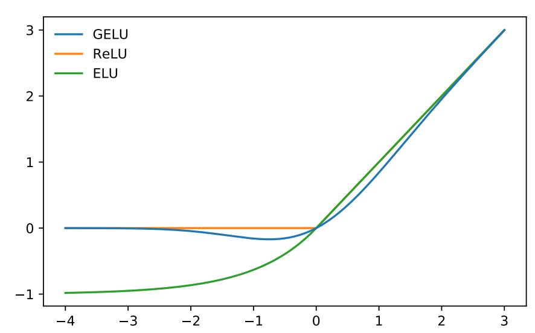
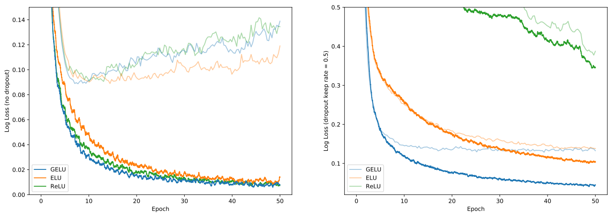
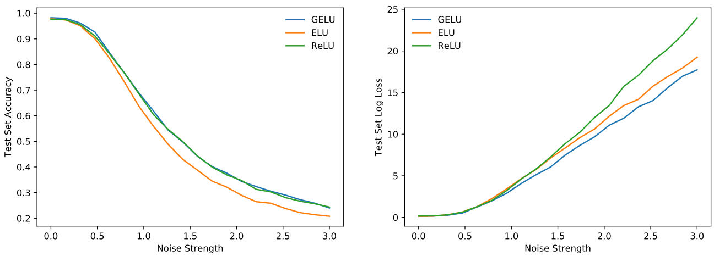
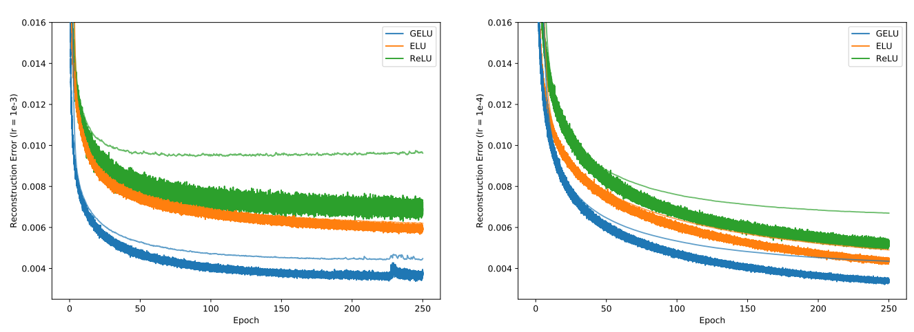
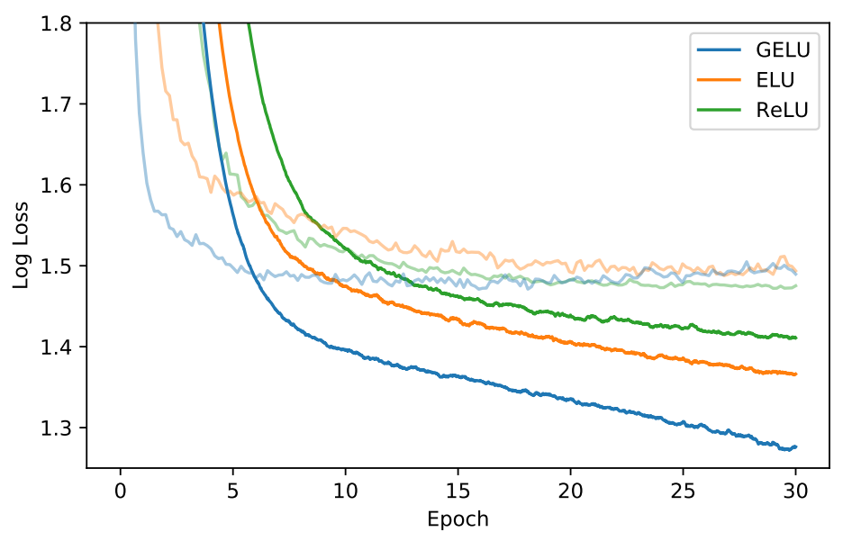
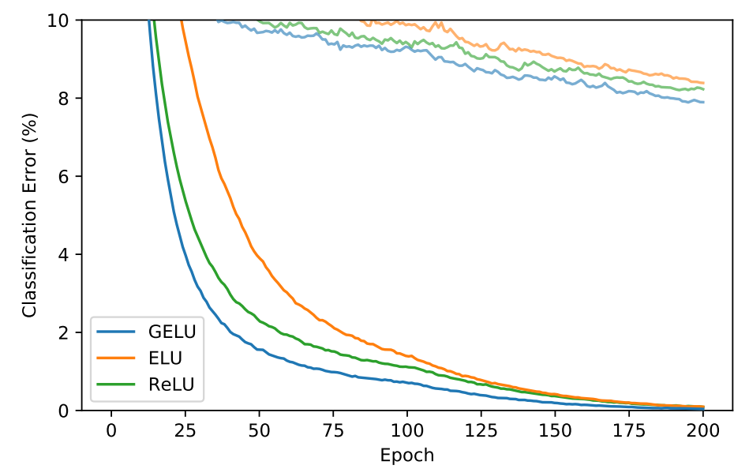
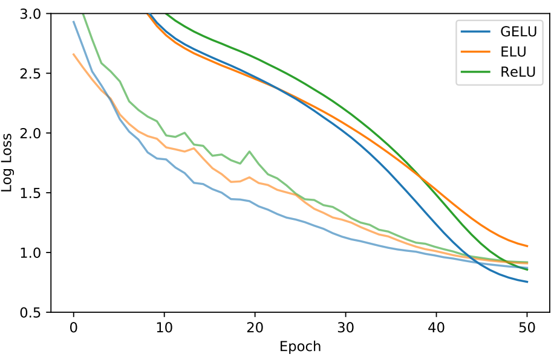

# GAUSSIAN ERROR LINEAR UNITS (GELUS)
高斯误差线性单元 2016.6.27 https://arxiv.org/abs/1606.08415

## Abstract
We propose the Gaussian Error Linear Unit (GELU), a high-performing neural network activation function. The GELU activation function is xΦ(x), where Φ(x) the standard Gaussian cumulative distribution function. The GELU nonlinearity weights inputs by their value, rather than gates inputs by their sign as in ReLUs ($x1_x>0$). We perform an empirical evaluation of the GELU nonlinearity against the ReLU and ELU activations and find performance improvements across all considered computer vision, natural language processing, and speech tasks. 

我们提出了高斯误差线性单元(GELU)，一种高性能的神经网络激活函数。GELU激活函数为xΦ(x)，其中Φ(x)是标准高斯累积分布函数。GELU非线性按其值对输入进行加权，而不是如ReLU($x1_x>0$)中那样按其符号对输入进行门控。我们针对ReLU和ELU激活对GELU非线性进行了实证评估，并在所有考虑的计算机视觉、自然语言处理和语音任务中发现了性能改进。

## 1 INTRODUCTION
Early artificial neurons utilized binary threshold units (Hopfield, 1982; McCulloch & Pitts, 1943). These hard binary decisions are smoothed with sigmoid activations, enabling a neuron to have a “firing rate” interpretation and to train with backpropagation. But as networks became deeper, training with sigmoid activations proved less effective than the non-smooth, less-probabilistic ReLU (Nair & Hinton, 2010) which makes hard gating decisions based upon an input’s sign. Despite having less of a statistical motivation, the ReLU remains a competitive engineering solution which often enables faster and better convergence than sigmoids. Building on the successes of ReLUs, a recent modifi- cation called ELUs (Clevert et al., 2016) allows a ReLU-like nonlinearity to output negative values which sometimes increases training speed. In all, the activation choice has remained a necessary architecture decision for neural networks lest the network be a deep linear classifier.

早期的人工神经元使用二制阈值单位(Hopfield，1982; McCulloch&Pitts，1943)。这些艰难的二元决策通过sigmoid激活来平滑，使神经元具有“发射率”解释，并通过反向传播进行训练。但随着网络的深入，使用s形激活的训练被证明不如非平滑、概率较小的ReLU(Nair&Hinton，2010)有效，后者根据输入的符号做出艰难的门控决策。尽管ReLU的统计动机较少，但它仍然是一种具有竞争性的工程解决方案，通常比s形激活更快、更好地实现收敛。在ReLU成功的基础上，最近的一种称为ELU的修改(Clevertet al., 2016)允许ReLU类非线性输出负值，有时会提高训练速度。总之，激活选择仍然是神经网络的必要架构决策，以免网络成为深度线性分类器。

Deep nonlinear classifiers can fit their data so well that network designers are often faced with the choice of including stochastic regularizer like adding noise to hidden layers or applying dropout (Srivastava et al., 2014), and this choice remains separate from the activation function. Some stochastic regularizers can make the network behave like an ensemble of networks, a pseudoensemble (Bachman et al., 2014), and can lead to marked accuracy increases. For example, the stochastic regularizer dropout creates a pseudoensemble by randomly altering some activation decisions through zero multiplication. Nonlinearities and dropout thus determine a neuron’s output together, yet the two innovations have remained distinct. More, neither subsumed the other because popular stochastic regularizers act irrespectively of the input and nonlinearities are aided by such regularizers.

深度非线性分类器可以很好地拟合它们的数据，以至于网络设计者经常面临包括随机正则化器的选择，如向隐藏层添加噪声或应用丢弃(Srivastavaet al., 2014)，而这种选择与激活函数保持分离。一些随机正则化器可以使网络表现得像一个网络集合，一个伪集合(Bachmanet al., 2014)，并可以导致显著的准确性提高。例如，随机正则化器丢弃通过零乘法随机改变一些激活决策来创建伪系综。因此，非线性和脱落共同决定了神经元的输出，但这两个创新仍然是不同的。更重要的是，两者都不包含另一个，因为流行的随机正则化器的行为与输入无关，而非线性是由这种正则化器辅助的。

In this work, we introduce a new nonlinearity, the Gaussian Error Linear Unit (GELU). It relates to stochastic regularizers in that it is the expectation of a modification to Adaptive Dropout (Ba & Frey, 2013). This suggests a more probabilistic view of a neuron’s output. We find that this novel nonlinearity matches or exceeds models with ReLUs or ELUs across tasks from computer vision, natural language processing, and automatic speech recognition. 

在这项工作中，我们引入了一种新的非线性，高斯误差线性单元(GELU)。它与随机正则化相关，因为它是对自适应丢弃的修改的预期(Ba&Frey，2013)。这表明神经元的输出具有更高的概率性。我们发现，这种新颖的非线性在计算机视觉、自然语言处理和自动语音识别等任务中与ReLU或ELU匹配或超过模型。

## 2 GELU FORMULATION
We motivate our activation function by combining properties from dropout, zoneout, and ReLUs. First note that a ReLU and dropout both yield a neuron’s output with the ReLU deterministically multiplying the input by zero or one and dropout stochastically multiplying by zero. Also, a new RNN regularizer called zoneout stochastically multiplies inputs by one (Krueger et al., 2016). We merge this functionality by multiplying the input by zero or one, but the values of this zero-one mask are stochastically determined while also dependent upon the input. Specifically, we can multiply the neuron input x by m ∼ Bernoulli(Φ(x)), where Φ(x) = P(X ≤ ∗Work done while the author was at TTIC. Code available at github.com/hendrycks/GELUs 1 arXiv:1606.08415v4 [cs.LG] 8 Jul 2020 x), X ∼ N (0, 1) is the cumulative distribution function of the standard normal distribution.

We choose this distribution since neuron inputs tend to follow a normal distribution, especially with Batch Normalization. In this setting, inputs have a higher probability of being “dropped” as x decreases, so the transformation applied to x is stochastic yet depends upon the input. 

 
Figure 1: The GELU (µ = 0, σ = 1), ReLU, and ELU (α = 1).

Masking inputs in this fashion retains non-determinism but maintains dependency upon the input value. A stochastically chosen mask amounts to a stochastic zero or identity transformation of the input. This is much like

Adaptive Dropout (Ba & Frey, 2013), but adaptive dropout is used in tandem with nonlinearities and uses a logistic not standard normal distribution. We found that it is possible to train competitive MNIST and TIMIT networks solely with this stochastic regularizer, all without using any nonlinearity.

We often want a deterministic decision from a neural network, and this gives rise to our new nonlinearity. The nonlinearity is the expected transformation of the stochastic regularizer on an input x, which is Φ(x) × Ix + (1 − Φ(x)) × 0x = xΦ(x).

Loosely, this expression states that we scale x by how much greater it is than other inputs. Since the cumulative distribution function of a Gaussian is often computed with the error function, we define the Gaussian Error Linear Unit (GELU) as

GELU(x) = xP(X ≤ x) = xΦ(x) = x · 12 h 1 + erf(x/√ 2)i .

We can approximate the GELU with

 0.5x(1 + tanh[p 2/π(x + 0.044715x3
 )]) or xσ(1.702x), if greater feedforward speed is worth the cost of exactness.

We could use different CDFs. For example we could use Logistic Distribution CDF σ(x) to get what we call the Sigmoid Linear Unit (SiLU) xσ(x). We could use the CDF of N (µ, σ2) and have µ and σ be learnable hyperparameters, but throughout this work we simply let µ = 0 and σ = 1.

Consequently, we do not introduce any new hyperparameters in the following experiments. In the next section, we show that the GELU exceeds ReLUs and ELUs across numerous tasks. 

## 3 GELU EXPERIMENTS
We evaluate the GELU, ELU, and ReLU on MNIST classification (grayscale images with 10 classes, 60k training examples and 10k test examples), MNIST autoencoding, Tweet part-of-speech tagging (1000 training, 327 validation, and 500 testing tweets), TIMIT frame recognition (3696 training, 1152 validation, and 192 test audio sentences), and CIFAR-10/100 classification (color images with 10/100 classes, 50k training and 10k test examples). We do not evaluate nonlinearities like the

LReLU because of its similarity to ReLUs (see Maas et al. (2013) for a description of LReLUs).

### 3.1 MNIST CLASSIFICATION
Let us verify that this nonlinearity competes with previous activation functions by replicating an experiment from Clevert et al. (2016). To this end, we train a fully connected neural network with

GELUs (µ = 0, σ = 1), ReLUs, and ELUs (α = 1). Each 8-layer, 128 neuron wide neural network is trained for 50 epochs with a batch size of 128. This experiment differs from those of 2 0 10 20 30 40 50

 
Figure 2: MNIST Classification Results. Left are the loss curves without dropout, and right are curves with a dropout rate of 0.5. Each curve is the the median of five runs. Training set log losses are the darker, lower curves, and the fainter, upper curves are the validation set log loss curves.

######## 0.0 0.5 1.0 1.5 2.0 2.5 3.0
Noise Strength

######## 0.0 0.5 1.0 1.5 2.0 2.5 3.0
Noise Strength 05 10 15 20 25

GELU

ELU

ReLU

 
Figure 3: MNIST Robustness Results. Using different nonlinearities, we record the test set accuracy decline and log loss increase as inputs are noised. The MNIST classifier trained without dropout received inputs with uniform noise Unif[−a, a] added to each example at different levels a, where a = 3 is the greatest noise strength. Here GELUs display robustness matching or exceeding ELUs and ReLUs.

Clevert et al. in that we use the Adam optimizer (Kingma & Ba, 2015) rather than stochastic gradient descent without momentum, and we also show how well nonlinearities cope with dropout.

Weights are initialized with unit norm rows, as this has positive impact on each nonlinearity’s performance (Hendrycks & Gimpel, 2016; Mishkin & Matas, 2016; Saxe et al., 2014). Note that we tune over the learning rates {10−3, 10−4, 10−5} with 5k validation examples from the training set and take the median results for five runs. Using these classifiers, we demonstrate in Figure 3 that classifiers using a GELU can be more robust to noised inputs. Figure 2 shows that the GELU tends to have the lowest median training log loss with and without dropout. Consequently, although the

GELU is inspired by a different stochastic process, it comports well with dropout.

### 3.2 MNIST AUTOENCODER
We now consider a self-supervised setting and train a deep autoencoder on MNIST (Desjardins et al., 2015). To accomplish this, we use a network with layers of width 1000, 500, 250, 30, 250, 500, 1000, in that order. We again use the Adam optimizer and a batch size of 64. Our loss is the mean squared loss. We vary the learning rate from 10−3 to 10−4 . We also tried a learning rate of 0.01 but ELUs diverged, and GELUs and RELUs converged poorly. The results in Figure 4 indicate the GELU accommodates different learning rates and significantly outperforms the other nonlinearities. 3

Log Loss (no dropout)

Log Loss (dropout keep rate = 0.5)

Test Set Accuracy

Test Set Log Loss 0 50 100 150 200 250

 
Figure 4: MNIST Autoencoding Results. Each curve is the median of three runs. Left are loss curves for a learning rate of 10−3 , and the right figure is for a 10−4 learning rate. Light, thin curves correspond to test set log losses. 0 5 10 15 20 25 30

 
Figure 5: TIMIT Frame Classification. Learning curves show training set convergence, and the lighter curves show the validation set convergence.

### 3.3 TWITTER POS TAGGING
Many datasets in natural language processing are relatively small, so it is important that an activation generalize well from few examples. To meet this challenge we compare the nonlinearities on POSannotated tweets (Gimpel et al., 2011; Owoputi et al., 2013) which contain 25 tags. The tweet tagger is simply a two-layer network with pretrained word vectors trained on a corpus of 56 million tweets (Owoputi et al., 2013). The input is the concatenation of the vector of the word to be tagged and those of its left and right neighboring words. Each layer has 256 neurons, a dropout keep probability of 0.8, and the network is optimized with Adam while tuning over the learning rates {10−3, 10−4, 10−5}. We train each network five times per learning rate, and the median test set error is 12.57% for the GELU, 12.67% for the ReLU, and 12.91% for the ELU.

### 3.4 TIMIT FRAME CLASSIFICATION
Our next challenge is phone recognition with the TIMIT dataset which has recordings of 680 speakers in a noiseless environment. The system is a five-layer, 2048-neuron wide classifier as in (Mohamed et al., 2012) with 39 output phone labels and a dropout rate of 0.5 as in (Srivastava, 2013). This network takes as input 11 frames and must predict the phone of the center 4

 
Figure 6: CIFAR-10 Results. Each curve is the median of three runs. Learning curves show training set error rates, and the lighter curves show the test set error rates. frame using 26 MFCC, energy, and derivative features per frame. We tune over the learning rates {10−3, 10−4, 10−5} and optimize with Adam. After five runs per setting, we obtain the median curves in Figure 5, and median test error chosen at the lowest validation error is 29.3% for the

GELU, 29.5% for the ReLU, and 29.6% for the ELU.

### 3.5 CIFAR-10/100 CLASSIFICATION
Next, we demonstrate that for more intricate architectures the GELU nonlinearity again outperforms other nonlinearities. We evaluate this activation function using CIFAR-10 and CIFAR-100 datasets (Krizhevsky, 2009) on shallow and deep convolutional neural networks, respectively.

Our shallower convolutional neural network is a 9-layer network with the architecture and training procedure from Salimans & Kingma (2016) while using batch normalization to speed up training.

The architecture is described in appendix A and recently obtained state of the art on CIFAR-10 without data augmentation. No data augmentation was used to train this network. We tune over the learning initial rates {10−3, 10−4, 10−5} with 5k validation examples then train on the whole training set again based upon the learning rate from cross validation. The network is optimized with

Adam for 200 epochs, and at the 100th epoch the learning rate linearly decays to zero. Results are shown in Figure 6, and each curve is a median of three runs. Ultimately, the GELU obtains a median error rate of 7.89%, the ReLU obtains 8.16%, and the ELU obtains 8.41%.

Next we consider a wide residual network on CIFAR-100 with 40 layers and a widening factor of 4 (Zagoruyko & Komodakis, 2016). We train for 50 epochs with the learning rate schedule described in (Loshchilov & Hutter, 2016) (T0 = 50, η = 0.1) with Nesterov momentum, and with a dropout keep probability of 0.7. Some have noted that ELUs have an exploding gradient with residual networks (Shah et al., 2016), and this is alleviated with batch normalization at the end of a residual block. Consequently, we use a Conv-Activation-Conv-Activation-BatchNorm block architecture to be charitable to ELUs. Over three runs we obtain the median convergence curves in Figure 7.

Meanwhile, the GELU achieves a median error of 20.74%, the ReLU obtains 21.77% (without our changes described above, the original 40-4 WideResNet with a ReLU obtains 22.89% (Zagoruyko & Komodakis, 2016)), and the ELU obtains 22.98%. 

## 4 DISCUSSION

Across several experiments, the GELU outperformed previous nonlinearities, but it bears semblance to the ReLU and ELU in other respects. For example, as σ → 0 and if µ = 0, the GELU becomes a ReLU. More, the ReLU and GELU are equal asymptotically. In fact, the GELU can be viewed as a way to smooth a ReLU. To see this, recall that ReLU = max(x, 0) = x1(x > 0) (where 5

Classification Error (%) 0 10 20 30 40 50

Epoch

ReLU

 
Figure 7: CIFAR-100 Wide Residual Network Results. Learning curves show training set convergence with dropout on, and the lighter curves show the test set convergence with dropout off. 1 is the indicator function), while the GELU is xΦ(x) if µ = 0, σ = 1. Then the CDF is a smooth approximation to the binary function the ReLU uses, like how the sigmoid smoothed binary threshold activations. Unlike the ReLU, the GELU and ELU can be both negative and positive. In fact, if we used the cumulative distribution function of the standard Cauchy distribution, then the

ELU (when α = 1/π) is asymptotically equal to xP(C ≤ x), C ∼ Cauchy(0, 1) for negative values and for positive values is xP(C ≤ x) if we shift the line down by 1/π. These are some fundamental relations to previous nonlinearities.

However, the GELU has several notable differences. This non-convex, non-monotonic function is not linear in the positive domain and exhibits curvature at all points. Meanwhile ReLUs and ELUs, which are convex and monotonic activations, are linear in the positive domain and thereby can lack curvature. As such, increased curvature and non-monotonicity may allow GELUs to more easily approximate complicated functions than can ReLUs or ELUs. Also, since ReLU(x) = x1(x > 0) and GELU(x) = xΦ(x) if µ = 0, σ = 1, we can see that the ReLU gates the input depending upon its sign, while the GELU weights its input depending upon how much greater it is than other inputs. In addition and significantly, the GELU has a probabilistic interpretation given that it is the expectation of a stochastic regularizer.

We also have two practical tips for using the GELU. First we advise using an optimizer with momentum when training with a GELU, as is standard for deep neural networks. Second, using a close approximation to the cumulative distribution function of a Gaussian distribution is important. A sigmoid function σ(x) = 1/(1 + e−x) is an approximation of a cumulative distribution function of a normal distribution. However, we found that a Sigmoid Linear Unit (SiLU) xσ(x) performs worse than GELUs but usually better than ReLUs and ELUs, so our SiLU is also a reasonable nonlinearity choice. Instead of using a xσ(x) to approximate Φ(x), we used

 0.5x(1 + tanh[p 2/π(x + 0.044715x3
 )]) (Choudhury, 2014)1 or xσ(1.702x). Both are sufficiently fast, easy-to-implement approximations, and we used the former in every experiment in this paper. 5 CONCLUSION

For the numerous datasets evaluated in this paper, the GELU exceeded the accuracy of the ELU and

ReLU consistently, making it a viable alternative to previous nonlinearities. 1Thank you to Dmytro Mishkin for bringing an approximation like this to our attention. 6

Log Loss

## ACKNOWLEDGMENT
We would like to thank NVIDIA Corporation for donating several TITAN X GPUs used in this research.

## References
* Jimmy Ba and Brendan Frey. Adaptive dropout for training deep neural networks. In Neural Information Processing Systems, 2013.
* Philip Bachman, Ouais Alsharif, and Doina Precup. Learning with pseudo-ensembles. In Neural
Information Processing Systems, 2014.
* Amit Choudhury. A simple approximation to the area under standard normal curve. In Mathematics
and Statistics, 2014.
* Djork-Arn´e Clevert, Thomas Unterthiner, and Sepp Hochreiter. Fast and accurate deep network
learning by exponential linear units (ELUs). In International Conference on Learning Representations, 2016.
* Guillaume Desjardins, Karen Simonyan, Razvan Pascanu, and Koray Kavukcuoglu. Natural neural
networks. In arXiv, 2015.
* Kevin Gimpel, Nathan Schneider, Brendan O0 Connor, Dipanjan Das, Daniel Mills, Jacob Eisenstein,
Michael Heilman, Dani Yogatama, Jeffrey Flanigan, and Noah A. Smith. Part-of-Speech Tagging
for Twitter: Annotation, Features, and Experiments. Association for Computational Linguistics
(ACL), 2011.
* Dan Hendrycks and Kevin Gimpel. Adjusting for dropout variance in batch normalization and
weight initialization. In arXiv, 2016.
* John Hopfield. Neural networks and physical systems with emergent collective computational abilities. In Proceedings of the National Academy of Sciences of the USA, 1982.
* Diederik Kingma and Jimmy Ba. Adam: A Method for Stochastic Optimization. International
Conference for Learning Representations, 2015.
* Alex Krizhevsky. Learning Multiple Layers of Features from Tiny Images, 2009.
* David Krueger, Tegan Maharaj, Jnos Kram´ar, Mohammad Pezeshki, Nicolas Ballas, Nan Rosemary
Ke1, Anirudh Goyal, Yoshua Bengio, Hugo Larochelle, Aaron Courville, and Chris Pal. Zoneout:
Regularizing RNNs by randomly preserving hidden activations. In Neural Information Processing
Systems, 2016.
* Ilya Loshchilov and Frank Hutter. SGDR: Stochastic gradient descent with restarts. arXiv, 2016.
* Andrew L. Maas, Awni Y. Hannun, , and Andrew Y. Ng. Rectifier nonlinearities improve neural
network acoustic models. In International Conference on Machine Learning, 2013.
* Warren S. McCulloch and Walter Pitts. A logical calculus of the ideas immanent in nervous activity.
* In Bulletin of Mathematical Biophysics, 1943.
* Dmytro Mishkin and Jiri Matas. All you need is a good init. In International Conference on Learning
Representations, 2016.
* Abdelrahman Mohamed, George E. Dahl, and Geoffrey E. Hinton. Acoustic modeling using deep
belief networks. In IEEE Transactions on Audio, Speech, and Language Processing, 2012.
* Vinod Nair and Geoffrey E. Hinton. Rectified linear units improve restricted boltzmann machines.
* In International Conference on Machine Learning, 2010.
* Olutobi Owoputi, Brendan O’Connor, Chris Dyer, Kevin Gimpel, Nathan Schneider, and Noah A.
* Smith. Improved part-of-speech tagging for online conversational text with word clusters. In
North American Chapter of the Association for Computational Linguistics (NAACL), 2013.
* Tim Salimans and Diederik P. Kingma. Weight normalization: A simple reparameterization to
accelerate training of deep neural networks. In Neural Information Processing Systems, 2016.
* Andrew M. Saxe, James L. McClelland, and Surya Ganguli. Exact solutions to the nonlinear dynamics of learning in deep linear neural networks. In International Conference on Learning
Representations, 2014.
* Anish Shah, Sameer Shinde, Eashan Kadam, Hena Shah, and Sandip Shingade. Deep residual
networks with exponential linear unit. In Vision Net, 2016.
* Nitish Srivastava. Improving neural networks with dropout. In University of Toronto, 2013.
* Nitish Srivastava, Geoffrey E. Hinton, Alex Krizhevsky, Ilya Sutskever, and Ruslan Salakhutdinov.
* Dropout: A simple way to prevent neural networks from overfitting. In Journal of Machine
Learning Research, 2014.
* Sergey Zagoruyko and Nikos Komodakis. Wide residual networks. British Machine Vision Conference, 2016.

