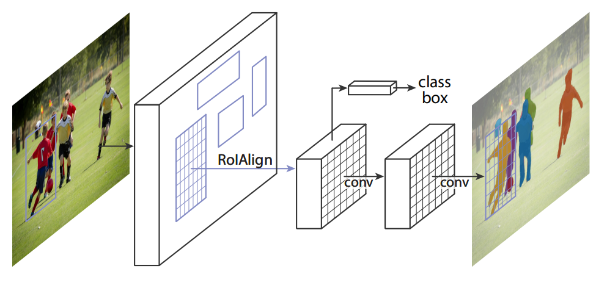
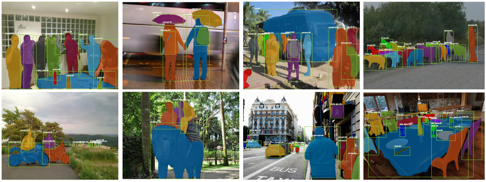
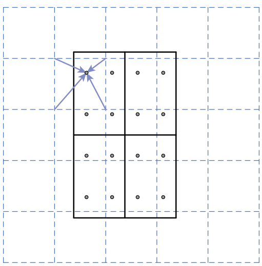
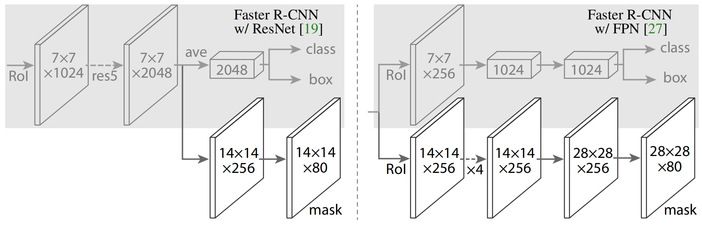

# Mask R-CNN
2017.3.20 https://arxiv.org/abs/1703.06870

## 阅读笔记
* https://github.com/pytorch/vision/blob/main/torchvision/models/detection/mask_rcnn.py
* 掩码分支是应用于每个RoI的小FCN
* RoIAlign, 双线性插值
* 掩码和类预测解耦

## Abstract
We present a conceptually simple, flexible, and general framework for object instance segmentation. Our approach efficiently detects objects in an image while simultaneously generating a high-quality segmentation mask for each instance. The method, called Mask R-CNN, extends Faster R-CNN by adding a branch for predicting an object mask in parallel with the existing branch for bounding box recognition. Mask R-CNN is simple to train and adds only a small overhead to Faster R-CNN, running at 5 fps. Moreover, Mask R-CNN is easy to generalize to other tasks, e.g., allowing us to estimate human poses in the same framework. We show top results in all three tracks of the COCO suite of challenges, including instance segmentation, boundingbox object detection, and person keypoint detection. Without bells and whistles, Mask R-CNN outperforms all existing, single-model entries on every task, including the COCO 2016 challenge winners. We hope our simple and effective approach will serve as a solid baseline and help ease future research in instance-level recognition. Code has been made available at: https://github.com/facebookresearch/Detectron.

我们提出了一个概念简单、灵活、通用的目标实例分割框架。该方法有效地检测图像中的目标，同时为每个实例生成高质量的分割掩码。该方法被称为Mask R-CNN，通过添加用于预测目标掩码的分支和用于边框识别的现有分支来扩展Faster R-CNN。Mask R-CNN的训练很简单，仅为Faster R-CNN增加了一小部分开销，运行速度为每秒5帧。此外，Mask R-CNN很容易推广到其他任务，例如，允许我们在同一框架中估计人体姿态。我们展示了COCO挑战套件的所有三个方面的最佳结果，包括实例分割、边框目标检测和人物关键点检测。无需花哨技巧，Mask R-CNN在每项任务中都优于目前所有的单一模型参赛作品，包括COCO 2016挑战赛的获奖者。我们希望将该简单有效的方法作为一个坚实的基线，有助于简化实例级识别的未来研究。代码在：https://github.com/facebookresearch/Detectron.

## 1. Introduction
The vision community has rapidly improved object detection and semantic segmentation results over a short period of time. In large part, these advances have been driven by powerful baseline systems, such as the Fast/Faster RCNN [12, 36] and Fully Convolutional Network (FCN) [30] frameworks for object detection and semantic segmentation, respectively. These methods are conceptually intuitive and offer flexibility and robustness, together with fast training and inference time. Our goal in this work is to develop a comparably enabling framework for instance segmentation.

视觉社区在短时间内迅速改进了目标检测和语义分割的结果。很大程度上，这些进步是由强大的基线系统推动的，例如分别用于目标检测和语义分割的Fast/Faster RCNN[12，36]和全卷积网络(FCN)[30]框架。这些方法在概念上是直观的，提供了灵活性和稳健性，以及快速的训练和推理时间。我们在这项工作中的目标是为实例分割开发一个相对有利的框架。

Instance segmentation is challenging because it requires the correct detection of all objects in an image while also precisely segmenting each instance. It therefore combines elements from the classical computer vision tasks of object detection, where the goal is to classify individual objects and localize each using a bounding box, and semantic segmentation, where the goal is to classify each pixel into a fixed set of categories without differentiating object instances(1 Following common terminology, we use object detection to denote detection via bounding boxes, not masks, and semantic segmentation to denote per-pixel classification without differentiating instances. Yet we note that instance segmentation is both semantic and a form of detection. ). Given this, one might expect a complex method is required to achieve good results. However, we show that a surprisingly simple, flexible, and fast system can surpass prior state-of-the-art instance segmentation results.

实例分割具有挑战性，因为它需要正确检测图像中的所有目标，同时还要精确分割每个实例。因此，它结合了目标检测的经典计算机视觉任务中的元素，其中的目标是对单个目标进行分类并使用边框对每个目标进行定位，其中的目标是将每个像素分类为固定的类别集，而不区分目标实例(1 遵循常用术语，我们使用目标检测来表示通过边框而不是掩码的检测，使用语义分割来表示每个像素的分类而不区分实例。然而，我们注意到实例分割既是语义的，也是检测的一种形式). 鉴于此，可能需要一种复杂的方法才能获得良好的结果。然而，我们表明，一个出乎意料的简单、灵活和快速的系统可以超越现有最先进的实例分割结果。

 
Figure 1. The Mask R-CNN framework for instance segmentation. 
图1.用于实例分割的Mask R-CNN框架。

Our method, called Mask R-CNN, extends Faster R-CNN [36] by adding a branch for predicting segmentation masks on each Region of Interest (RoI), in parallel with the existing branch for classification and bounding box regression (Figure 1). The mask branch is a small FCN applied to each RoI, predicting a segmentation mask in a pixel-topixel manner. Mask R-CNN is simple to implement and train given the Faster R-CNN framework, which facilitates a wide range of flexible architecture designs. Additionally, the mask branch only adds a small computational overhead, enabling a fast system and rapid experimentation.

我们的方法称为Mask R-CNN，通过在每个感兴趣区域(RoI)上添加一个预测分割掩码的分支，与现有的分类和边框回归分支并行，扩展了Faster R-CNN[36](图1)。掩码分支是应用于每个RoI的小FCN，以像素对像素的方式预测分割掩码。考虑到Faster R-CNN框架，Mask R-CNN易于实现和训练，这有助于广泛的灵活架构设计。此外，掩码分支只增加了少量的计算开销，从而实现了快速系统和快速实验。

In principle Mask R-CNN is an intuitive extension of Faster R-CNN, yet constructing the mask branch properly is critical for good results. Most importantly, Faster RCNN was not designed for pixel-to-pixel alignment between network inputs and outputs. This is most evident in how RoIPool [18, 12], the de facto core operation for attending to instances, performs coarse spatial quantization for feature extraction. To fix the misalignment, we propose a simple, quantization-free layer, called RoIAlign, that faithfully preserves exact spatial locations. Despite being a seemingly minor change, RoIAlign has a large impact: it improves mask accuracy by relative 10% to 50%, showing bigger gains under stricter localization metrics. Second, we found it essential to decouple mask and class prediction: we predict a binary mask for each class independently, without competition among classes, and rely on the network’s RoI classification branch to predict the category. In contrast, FCNs usually perform per-pixel multi-class categorization, which couples segmentation and classification, and based on our experiments works poorly for instance segmentation.

原则上，Mask R-CNN是Faster R-CNN的直观扩展，但正确构建掩码分支对于良好结果至关重要。最重要的是，Faster RCNN不是为网络输入和输出之间的像素对齐而设计的。这一点在RoIPool[18，12]中最为明显，RoIPool实际上是处理实例的核心操作，它为特征提取执行粗空间量化。为了修复未对准，我们提出了一个简单的无量化层，称为RoIAlign，它忠实地保留了精确的空间位置。尽管RoIAlign看起来是一个很小的变化，但它有很大的影响：它将掩码精度提高了10%到50%，在更严格的局部化标准下表现出更大的收益。其次，我们发现将掩码和类预测解耦是至关重要的：我们独立预测每个类的二值掩码，而不存在类之间的竞争，并依靠网络的RoI分类分支来预测类别。相比之下，FCN通常执行每像素多类分类，这将分割和分类结合起来，并且基于我们的实验，在实例分割中效果不佳。

 
Figure 2. Mask R-CNN results on the COCO test set. These results are based on ResNet-101 [19], achieving a mask AP of 35.7 and running at 5 fps. Masks are shown in color, and bounding box, category, and confidences are also shown. 
图2.在COCO测试集上Mask R-CNN结果。这些结果基于ResNet-101[19]，实现了35.7的掩码AP，运行速度为5fps。掩码以颜色显示，边框、类别和置信度也会显示。

Without bells and whistles, Mask R-CNN surpasses all previous state-of-the-art single-model results on the COCO instance segmentation task [28], including the heavilyengineered entries from the 2016 competition winner. As a by-product, our method also excels on the COCO object detection task. In ablation experiments, we evaluate multiple basic instantiations, which allows us to demonstrate its robustness and analyze the effects of core factors.

在COCO实例分割任务[28]中，Mask R-CNN在没花哨技巧的情况下，超越了以往所有最先进的单模型结果，包括2016年比赛冠军的精心设计参赛作品。作为副产品，我们的方法在COCO目标检测任务中也表现出色。在消融实验中，我们评估了多个基本实例，这使我们能够证明其稳健性并分析核心因素的影响。

Our models can run at about 200ms per frame on a GPU, and training on COCO takes one to two days on a single 8-GPU machine. We believe the fast train and test speeds, together with the framework’s flexibility and accuracy, will benefit and ease future research on instance segmentation.

我们的模型可以在GPU上以每帧大约200ms的速度运行，在一台8-GPU机器上进行COCO训练需要一到两天的时间。我们相信，快速的训练和测试速度，加上框架的灵活性和准确性，将有利于简化实例分割的未来研究。

Finally, we showcase the generality of our framework via the task of human pose estimation on the COCO keypoint dataset [28]. By viewing each keypoint as a one-hot binary mask, with minimal modification Mask R-CNN can be applied to detect instance-specific poses. Mask R-CNN surpasses the winner of the 2016 COCO keypoint competition, and at the same time runs at 5 fps. Mask R-CNN, therefore, can be seen more broadly as a flexible framework for instance-level recognition and can be readily extended to more complex tasks.

最后，我们通过COCO关键点数据集上的人体姿态估计任务展示了我们框架的通用性[28]。通过将每个关键点视为one-hot的二值掩码，只需最小的修改，就可以应用Mask R-CNN来检测特定于实例的姿态。Mask R-CNN超越了2016年COCO关键点比赛的冠军，同时以每秒5帧的速度运行。因此，Mask R-CNN可以被更广泛地视为实例级识别的灵活框架，并且可以很容易地扩展到更复杂的任务。

We have released code to facilitate future research.

我们已经发布了代码，以促进未来的研究。

## 2. Related Work
R-CNN: The Region-based CNN (R-CNN) approach [13] to bounding-box object detection is to attend to a manageable number of candidate object regions [42, 20] and evaluate convolutional networks [25, 24] independently on each RoI. R-CNN was extended [18, 12] to allow attending to RoIs on feature maps using RoIPool, leading to fast speed and better accuracy. Faster R-CNN [36] advanced this stream by learning the attention mechanism with a Region Proposal Network (RPN). Faster R-CNN is flexible and robust to many follow-up improvements (e.g., [38, 27, 21]), and is the current leading framework in several benchmarks.

R-CNN：边框目标检测的基于区域的CNN(R-CNN)方法[13]是关注可管理数量的候选目标区域[42，20]，并独立于每个RoI评估卷积网络[25，24]。R-CNN被扩展[18，12]，允许使用RoIPool关注特征图上的RoI，从而实现了更快的速度和更好的准确性。Faster R-CNN[36]通过使用区域候选网络(RPN)学习注意力机制来推进这一流。Faster R-CNN对于许多后续改进具有灵活性和稳健性(例如[38，27，21])，是目前几个基准中的领先框架。

Instance Segmentation: Driven by the effectiveness of RCNN, many approaches to instance segmentation are based on segment proposals. Earlier methods [13, 15, 16, 9] resorted to bottom-up segments [42, 2]. DeepMask [33] and following works [34, 8] learn to propose segment candidates, which are then classified by Fast R-CNN. In these methods, segmentation precedes recognition, which is slow and less accurate. Likewise, Dai et al. [10] proposed a complex multiple-stage cascade that predicts segment proposals from bounding-box proposals, followed by classification. Instead, our method is based on parallel prediction of masks and class labels, which is simpler and more flexible.

实例分割：在RCNN有效性的驱动下，许多实例分割方法都基于分割建议。早期的方法[13，15，16，9]采用自下而上的分段[42，2]。DeepMask[33]和随后的工作[34，8]学习提出片段候选，然后由Fast R-CNN进行分类。在这些方法中，分割先于识别，识别速度慢且精度低。同样，Daiet al [10]提出了一个复杂的多级级联，从边框方案预测分段方案，然后进行分类。相反，我们的方法基于掩码和类标签的并行预测，这更简单、更灵活。

Most recently, Li et al. [26] combined the segment proposal system in [8] and object detection system in [11] for “fully convolutional instance segmentation” (FCIS). The common idea in [8, 11, 26] is to predict a set of positionsensitive output channels fully convolutionally. These channels simultaneously address object classes, boxes, and masks, making the system fast. But FCIS exhibits systematic errors on overlapping instances and creates spurious edges (Figure 6), showing that it is challenged by the fundamental difficulties of segmenting instances. 

最近，Liet al [26]将[8]中的分段建议系统和[11]中的目标检测系统结合起来，用于“完全卷积实例分割”(FCIS)。[8，11，26]中的共同思想是用完全卷积预测一组位置敏感输出通道。这些通道同时寻址目标类、框和掩码，使系统快速运行。但FCIS在重叠实例上显示出系统错误，并产生伪边(图6)，表明它受到了分割实例的基本困难的挑战。

Another family of solutions [23, 4, 3, 29] to instance segmentation are driven by the success of semantic segmentation. Starting from per-pixel classification results (e.g.,FCN outputs), these methods attempt to cut the pixels of the same category into different instances. In contrast to the segmentation-first strategy of these methods, Mask R-CNN is based on an instance-first strategy. We expect a deeper incorporation of both strategies will be studied in the future.

实例分割的另一系列解决方案[23，4，3，29]是由语义分割的成功驱动的。从每像素分类结果(例如，FCN输出)开始，这些方法尝试将同一类别的像素切成不同的实例。与这些方法的分段优先策略相反，Mask R-CNN基于实例优先策略。我们预计未来将进一步研究这两种策略的结合。

## 3. Mask R-CNN
Mask R-CNN is conceptually simple: Faster R-CNN has two outputs for each candidate object, a class label and a bounding-box offset; to this we add a third branch that outputs the object mask. Mask R-CNN is thus a natural and intuitive idea. But the additional mask output is distinct from the class and box outputs, requiring extraction of much finer spatial layout of an object. Next, we introduce the key elements of Mask R-CNN, including pixel-to-pixel alignment, which is the main missing piece of Fast/Faster R-CNN.

Mask R-CNN在概念上很简单：Faster R-CNN为每个候选目标产生两个输出，一个类标签和一个边框偏移; 为此，我们添加了输出目标掩码的第三个分支。因此，Mask R-CNN是一个自然而直观的想法。但是附加的掩码输出与类别、边框输出不同，需要提取目标的更精细的空间布局。接下来，我们介绍了Mask R-CNN的关键元素，包括像素对齐，这是Fast/Faster R-CNN主要缺失的部分。

### Faster R-CNN: 
We begin by briefly reviewing the Faster R-CNN detector [36]. Faster R-CNN consists of two stages. The first stage, called a Region Proposal Network (RPN), proposes candidate object bounding boxes. The second stage, which is in essence Fast R-CNN [12], extracts features using RoIPool from each candidate box and performs classification and bounding-box regression. The features used by both stages can be shared for faster inference. We refer readers to [21] for latest, comprehensive comparisons between Faster R-CNN and other frameworks.

Faster R-CNN：我们首先简要回顾Faster R-CNN检测器[36]。Faster R-CNN由两个阶段组成。第一阶段称为区域候选网络(RPN)，提出候选目标边框。第二阶段，本质上是Fast R-CNN[12]，使用RoIPool从每个候选框中提取特征，并执行分类和边框回归。两个阶段使用的特征可以共享，以便更快地推理。我们请读者参考[21]，了解Faster R-CNN和其他框架之间的最新综合比较。

### Mask R-CNN: 
Mask R-CNN adopts the same two-stage procedure, with an identical first stage (which is RPN). In the second stage, in parallel to predicting the class and box offset, Mask R-CNN also outputs a binary mask for each RoI. This is in contrast to most recent systems, where classification depends on mask predictions (e.g. [33, 10, 26]). Our approach follows the spirit of Fast R-CNN [12] that applies bounding-box classification and regression in parallel (which turned out to largely simplify the multi-stage pipeline of original R-CNN [13]).

Mask R-CNN采用相同的两阶段程序，第一阶段相同(即RPN)。在第二阶段，与预测类别和边框偏移量并行，Mask R-CNN还为每个RoI输出二值掩码。这与最新的系统形成对比，其中分类取决于掩码预测(例如[33，10，26])。我们的方法遵循了Fast R-CNN[12]的精神，它并行应用了分类和边框回归(结果证明，这在很大程度上简化了原始R-CNN[13]的多阶段流水线)。

Formally, during training, we define a multi-task loss on each sampled RoI as $L = L_{cls} + L_{box} + L_{mask}$. The classification loss $L_{cls}$ and bounding-box loss $L_{box}$ are identical as those defined in [12]. The mask branch has a $Km^2$- dimensional output for each RoI, which encodes K binary masks of resolution m × m, one for each of the K classes. To this we apply a per-pixel sigmoid, and define $L_{mask}$ as the average binary cross-entropy loss. For an RoI associated with ground-truth class k, $L_{mask}$ is only defined on the k-th mask (other mask outputs do not contribute to the loss).

正式地，在训练期间，我们将每个采样RoI上的多任务损失定义为$L = L_{cls} + L_{box} + L_{mask}$。分类损失$L_{cls}$和边框损失$L_{box}$与[12]中定义的相同。掩码分支对每个RoI都有一个$Km^2$维输出，它对K个分辨率为m×m的二值掩码进行编码，每个K类一个掩码。为此，我们为每像素应用sigmoid，并将$L_{mask}$定义为平均二值交叉熵损失。对于与真值等级k相关的RoI，$L_{mask}$仅在第k个掩码上定义(其他掩码输出不会导致损失)。

Our definition of $L_{mask}$ allows the network to generate masks for every class without competition among classes; we rely on the dedicated classification branch to predict the class label used to select the output mask. This decouples mask and class prediction. This is different from common practice when applying FCNs [30] to semantic segmentation, which typically uses a per-pixel softmax and a multinomial cross-entropy loss. In that case, masks across classes compete; in our case, with a per-pixel sigmoid and a binary loss, they do not. We show by experiments that this formulation is key for good instance segmentation results.

我们对$L_{mask}$的定义允许网络为每个类生成掩码，而不存在类之间的竞争; 我们依靠专用分类分支来预测用于选择输出掩码的类标签。这将掩码和类预测解耦。这与将FCN[30]应用于语义分割时的常见做法不同，语义分割通常使用每像素softmax和多项式交叉熵损失。在这种情况下，跨班级的口罩竞争; 在我们的例子中，对于每像素的sigmoid和二值损失，它们没有。我们通过实验表明，该公式是获得良好实例分割结果的关键。

### Mask Representation: 
A mask encodes an input object’s spatial layout. Thus, unlike class labels or box offsets that are inevitably collapsed into short output vectors by fully-connected (fc) layers, extracting the spatial structure of masks can be addressed naturally by the pixel-to-pixel correspondence provided by convolutions.

掩码表示：掩码对输入目标的空间布局进行编码。因此，与类标签或边框偏移不可避免地被全连接(fc)层折叠成短输出向量不同，提取掩模的空间结构可以通过卷积提供的像素到像素的对应关系自然地解决。

Specifically, we predict an m × m mask from each RoI using an FCN [30]. This allows each layer in the mask branch to maintain the explicit m × m object spatial layout without collapsing it into a vector representation that lacks spatial dimensions. Unlike previous methods that resort to fc layers for mask prediction [33, 34, 10], our fully convolutional representation requires fewer parameters, and is more accurate as demonstrated by experiments.

具体而言，我们使用FCN预测每个RoI的m×m掩码[30]。这允许掩码分支中的每个层保持显式的m×m目标空间布局，而不会将其折叠为缺少空间维度的向量表示。与之前使用fc层进行掩模预测的方法不同[33，34，10]，我们的完全卷积表示需要更少的参数，并且通过实验证明更准确。

This pixel-to-pixel behavior requires our RoI features, which themselves are small feature maps, to be well aligned to faithfully preserve the explicit per-pixel spatial correspondence. This motivated us to develop the following RoIAlign layer that plays a key role in mask prediction.

这种像素到像素的行为要求我们的RoI特征(它们本身是小的特征图)很好地对齐，以忠实地保持每像素的空间对应关系。这促使我们开发了下面的RoIAlign层，它在掩模预测中起着关键作用。

### RoIAlign: 
RoIPool [12] is a standard operation for extracting a small feature map (e.g., 7×7) from each RoI. RoIPool first quantizes a floating-number RoI to the discrete granularity of the feature map, this quantized RoI is then subdivided into spatial bins which are themselves quantized, and finally feature values covered by each bin are aggregated (usually by max pooling). Quantization is performed, e.g., on a continuous coordinate x by computing [x/16], where 16 is a feature map stride and [·] is rounding; likewise, quantization is performed when dividing into bins (e.g., 7×7). These quantizations introduce misalignments between the RoI and the extracted features. While this may not impact classification, which is robust to small translations, it has a large negative effect on predicting pixel-accurate masks.

RoIAlign：RoIPool[12]是用于从每个RoI中提取小特征图(例如，7×7)的标准操作。RoIPool首先将一个浮点数RoI量化为特征图的离散粒度，然后将这个量化的RoI细分为本身被量化的空间仓，最后将每个仓所覆盖的特征值进行聚合(通常通过最大池)。例如，通过计算[x/16]在连续坐标x上执行量化，其中16是特征图步幅，[·]是四舍五入; 同样地，当划分为仓(例如，7×7)时执行量化。这些量化在RoI和提取的特征之间引入了不对准。虽然这可能不会影响分类，因为分类对于小的转换来说是稳健的，但它对预测像素精确的掩模有很大的负面影响。

To address this, we propose an RoIAlign layer that removes the harsh quantization of RoIPool, properly aligning the extracted features with the input. Our proposed change is simple: we avoid any quantization of the RoI boundaries or bins (i.e., we use x/16 instead of [x/16]). We use bilinear interpolation [22] to compute the exact values of the input features at four regularly sampled locations in each RoI bin, and aggregate the result (using max or average), see Figure 3 for details. We note that the results are not sensitive to the exact sampling locations, or how many points are sampled, as long as no quantization is performed.

为了解决这个问题，我们提出了一个RoIAlign层，它去除了RoIPool的苛刻量化，将提取的特征与输入正确对齐。我们提出的改变很简单：我们避免了RoI边界或二值的任何量化(即，我们使用x/16而不是[x/16])。我们使用双线性插值[22]计算每个RoI仓中四个规则采样位置的输入特征的精确值，并聚合结果(使用最大值或平均值)，详见图3。我们注意到，只要不执行量化，结果对精确的采样位置或采样的点数量不敏感。

 
Figure 3. RoIAlign: The dashed grid represents a feature map, the solid lines an RoI (with 2×2 bins in this example), and the dots the 4 sampling points in each bin. RoIAlign computes the value of each sampling point by bilinear interpolation from the nearby grid points on the feature map. No quantization is performed on any coordinates involved in the RoI, its bins, or the sampling points. 
图3.RoIAlign：虚线网格表示特征图，实线表示RoI(在本例中为2×2个箱)，点表示每个箱中的4个采样点。RoIAlign通过双线性插值从特征图上的附近网格点计算每个采样点的值。不对RoI、其仓或采样点中涉及的任何坐标执行量化。

RoIAlign leads to large improvements as we show in §4.2. We also compare to the RoIWarp operation proposed in [10]. Unlike RoIAlign, RoIWarp overlooked the alignment issue and was implemented in [10] as quantizing RoI just like RoIPool. So even though RoIWarp also adopts bilinear resampling motivated by [22], it performs on par with RoIPool as shown by experiments (more details in Table 2c), demonstrating the crucial role of alignment.

如§4.2所示，RoIAlign带来了很大的改进。我们还将其与[10]中提出的RoIWarp操作进行了比较。与RoIAlign不同，RoIWarp忽略了对齐问题，并在[10]中实现为像RoIPool一样量化RoI。因此，尽管RoIWarp也采用了由[22]激励的双线性重采样，但如实验所示，它的性能与RoIPool不相上下(更多细节见表2c)，证明了对齐的关键作用。

### Network Architecture: 
To demonstrate the generality of our approach, we instantiate Mask R-CNN with multiple architectures. For clarity, we differentiate between: (i) the convolutional backbone architecture used for feature extraction over an entire image, and (ii) the network head for bounding-box recognition (classification and regression) and mask prediction that is applied separately to each RoI.

网络架构：为了证明我们方法的通用性，我们使用多个架构实例化了Mask R-CNN。为了清楚起见，我们区分了：(i)用于整个图像特征提取的卷积主干架构，以及(ii)用于边框识别(分类和回归)和掩码预测的网络头，分别应用于每个RoI。

We denote the backbone architecture using the nomenclature network-depth-features. We evaluate ResNet [19] and ResNeXt [45] networks of depth 50 or 101 layers. The original implementation of Faster R-CNN with ResNets [19] extracted features from the final convolutional layer of the 4-th stage, which we call C4. This backbone with ResNet-50, for example, is denoted by ResNet-50-C4. This is a common choice used in [19, 10, 21, 39].

我们使用术语网络深度特征来表示主干架构。我们评估了深度为50或101层的ResNet[19]和ResNeXt[45]网络。使用ResNets的Faster R-CNN的最初实现[19]从第4阶段的最终卷积层提取了特征，我们称其为C4。例如，使用ResNet-50的主干由ResNet-50-C4表示。这是[19，10，21，39]中使用的常见选择。

We also explore another more effective backbone recently proposed by Lin et al. [27], called a Feature Pyramid Network (FPN). FPN uses a top-down architecture with lateral connections to build an in-network feature pyramid from a single-scale input. Faster R-CNN with an FPN backbone extracts RoI features from different levels of the feature pyramid according to their scale, but otherwise the rest of the approach is similar to vanilla ResNet. Using a ResNet-FPN backbone for feature extraction with Mask RCNN gives excellent gains in both accuracy and speed. For further details on FPN, we refer readers to [27].

我们还探索了Linet al 最近提出的另一种更有效的主干网。[27]，称为特征金字塔网络(FPN)。FPN使用具有横向连接的自上而下架构，从单尺度输入构建网络内特征金字塔。具有FPN主干的Faster R-CNN根据其规模从特征金字塔的不同级别提取RoI特征，但其他方法类似于普通ResNet。使用ResNet FPN主干与Mask RCNN进行特征提取，在准确性和速度方面都有优异的提高。有关FPN的更多详情，请参阅[27]。

For the network head we closely follow architectures presented in previous work to which we add a fully convolutional mask prediction branch. Specifically, we extend the Faster R-CNN box heads from the ResNet [19] and FPN [27] papers. Details are shown in Figure 4. The head on the ResNet-C4 backbone includes the 5-th stage of ResNet (namely, the 9-layer ‘res5’ [19]), which is computeintensive. For FPN, the backbone already includes res5 and thus allows for a more efficient head that uses fewer filters.

对于网络头，我们严格遵循先前工作中提出的架构，我们在其中添加了一个完全卷积掩码预测分支。具体而言，我们扩展了ResNet[19]和FPN[27]论文中的Faster R-CNN边框头。详情如图4所示。ResNet-C4主干上的头部包括ResNet的第5级(即9层“res5”[19])，这是计算密集型的。对于FPN，主干已经包括res5，因此允许使用更少滤波器的更高效的磁头。

 
Figure 4. Head Architecture: We extend two existing Faster RCNN heads [19, 27]. Left/Right panels show the heads for the ResNet C4 and FPN backbones, from [19] and [27], respectively, to which a mask branch is added. Numbers denote spatial resolution and channels. Arrows denote either conv, deconv, or fc layers as can be inferred from context (conv preserves spatial dimension while deconv increases it). All convs are 3×3, except the output conv which is 1×1, deconvs are 2×2 with stride 2, and we use ReLU [31] in hidden layers. Left: ‘res5’ denotes ResNet’s fifth stage, which for simplicity we altered so that the first conv operates on a 7×7 RoI with stride 1 (instead of 14×14 / stride 2 as in [19]). Right: ‘×4’ denotes a stack of four consecutive convs.
图4.头部结构：我们扩展了两个现有的Faster RCNN头部[19，27]。左/右面板显示了分别来自[19]和[27]的ResNet C4和FPN主干的头部，其中添加了掩模分支。数字表示空间分辨率和通道。箭头表示可以从上下文推理的conv、deconv或fc层(conv保留空间维度，而deconv增加空间维度)。除输出conv为1×1外，所有conv均为3×3，deconv为2×2，步长为2，我们在隐藏层中使用ReLU[31]。左图：“res5”表示ResNet的第五阶段，为了简单起见，我们对其进行了修改，以便第一次转换在7×7 RoI上运行，步幅为1(而不是[19]中的14×14/步幅2)。右：“×4”表示四个连续转换的堆栈。

We note that our mask branches have a straightforward structure. More complex designs have the potential to improve performance but are not the focus of this work. 

我们注意到我们的掩码分支有一个简单的结构。更复杂的设计有可能提高性能，但不是本工作的重点。

### 3.1. Implementation Details
We set hyper-parameters following existing Fast/Faster R-CNN work [12, 36, 27]. Although these decisions were made for object detection in original papers [12, 36, 27], we found our instance segmentation system is robust to them.

我们根据现有的Fast/Faster R-CNN工作设置了超参数[12，36，27]。尽管这些决定是在原始论文[12，36，27]中针对目标检测做出的，但我们发现我们的实例分割系统对它们是稳健的。

#### Training: 
As in Fast R-CNN, an RoI is considered positive if it has IoU with a ground-truth box of at least 0.5 and negative otherwise. The mask loss $L_{mask}$ is defined only on positive RoIs. The mask target is the intersection between an RoI and its associated ground-truth mask.

训练： 与Fast R-CNN一样，如果RoI的IoU至少为0.5，则RoI被认为是正的，否则RoI被视为负的。掩码损失$L_{mask}$仅在正RoI上定义。掩码目标是RoI与其相关地面真相掩码之间的交叉点。

We adopt image-centric training [12]. Images are resized such that their scale (shorter edge) is 800 pixels [27]. Each mini-batch has 2 images per GPU and each image has N sampled RoIs, with a ratio of 1:3 of positive to negatives [12]. N is 64 for the C4 backbone (as in [12, 36]) and 512 for FPN (as in [27]). We train on 8 GPUs (so effective minibatch size is 16) for 160k iterations, with a learning rate of 0.02 which is decreased by 10 at the 120k iteration. We use a weight decay of 0.0001 and momentum of 0.9. With ResNeXt [45], we train with 1 image per GPU and the same number of iterations, with a starting learning rate of 0.01.

我们采用以中心图像的训练[12]。调整图像的大小，使其比例(较短的边缘)为800像素[27]。每个迷你批处理每个GPU有2个图像，每个图像有N个采样RoI，正负比为1:3[12]。对于C4主干，N为64(如[12,36]所示)，对于FPN，N为512(如[27]所示)。我们在8个GPU(因此有效的小批量大小为16)上训练160k次迭代，学习率为0.02，在120k次迭代时降低了10。我们使用0.0001的权重衰减和0.9的动量。使用ResNeXt[45]，我们使用每个GPU 1个图像和相同的迭代次数进行训练，初始学习率为0.01。

The RPN anchors span 5 scales and 3 aspect ratios, following [27]. For convenient ablation, RPN is trained separately and does not share features with Mask R-CNN, unless specified. For every entry in this paper, RPN and Mask R-CNN have the same backbones and so they are shareable.

RPN锚横跨5个比例和3个纵横比，遵循[27]。为了方便消融，RPN单独训练，除非另有规定，否则不会与Mask R-CNN共享功能。对于本文中的每个条目，RPN和Mask R-CNN具有相同的主干，因此它们是可共享的。

#### Inference: 
At test time, the proposal number is 300 for the C4 backbone (as in [36]) and 1000 for FPN (as in [27]). We run the box prediction branch on these proposals, followed by non-maximum suppression [14]. The mask branch is then applied to the highest scoring 100 detection boxes. Although this differs from the parallel computation used in training, it speeds up inference and improves accuracy (due to the use of fewer, more accurate RoIs). The mask branch can predict K masks per RoI, but we only use the k-th mask, where k is the predicted class by the classification branch. The m×m floating-number mask output is then resized to the RoI size, and binarized at a threshold of 0.5.

推理：在测试时，C4主干的建议编号为300(如[36]所示)，FPN的建议编号是1000(如[27]所示)。我们对这些建议运行盒预测分支，然后是非最大抑制[14]。然后将掩码分支应用于最高得分的100个检测框。尽管这与训练中使用的并行计算不同，但它加快了推理速度并提高了准确性(由于使用了更少、更准确的RoI)。掩码分支可以预测每个RoI的K个掩码，但我们只使用第K个掩码，其中K是分类分支预测的类。然后将m×m浮点数掩码输出调整为RoI大小，并在阈值0.5处进行二值化。

Note that since we only compute masks on the top 100 detection boxes, Mask R-CNN adds a small overhead to its Faster R-CNN counterpart (e.g., ∼20% on typical models).

注意，由于我们仅在前100个检测框上计算掩码。，∼典型模型为20%)。

## 4. Experiments: Instance Segmentation
We perform a thorough comparison of Mask R-CNN to the state of the art along with comprehensive ablations on the COCO dataset [28]. We report the standard COCO metrics including AP (averaged over IoU thresholds), AP50, AP75, and APS, APM, APL (AP at different scales). Unless noted, AP is evaluating using mask IoU. As in previous work [5, 27], we train using the union of 80k train images and a 35k subset of val images (trainval35k), and report ablations on the remaining 5k val images (minival). We also report results on test-dev [28].

我们在COCO数据集上对Mask R-CNN与现有技术进行了彻底比较，并进行了全面消融[28]。我们报告了标准COCO指标，包括AP(在IoU阈值上的平均值)、AP50、AP75和APS、APM、APL(不同尺度的AP)。除非另有说明，AP正在使用掩码IoU进行评估。与之前的工作[5，27]一样，我们使用80k训练图像和35k val图像子集(trainval35k)的联合进行训练，并报告剩余5k val图像(minival)的消融情况。我们还报告了测试开发的结果[28]。

### 4.1. Main Results
 
Figure 5. More results of Mask R-CNN on COCO test images, using ResNet-101-FPN and running at 5 fps, with 35.7 mask AP (Table 1). 
图5.使用ResNet-101-FPN，以每秒5帧的速度运行，使用35.7个掩码AP，对COCO测试图像进行Mask R-CNN的更多结果(表1)。

Table 1. Instance segmentation mask AP on COCO test-dev. MNC [10] and FCIS [26] are the winners of the COCO 2015 and 2016 segmentation challenges, respectively. Without bells and whistles, Mask R-CNN outperforms the more complex FCIS+++, which includes multi-scale train/test, horizontal flip test, and OHEM [38]. All entries are single-model results. 
表1.COCO测试开发上的实例分段掩码AP。MNC[10]和FCIS[26]分别是2015年和2016年COCO细分挑战的赢家。无需花哨技巧，Mask R-CNN优于更复杂的FCIS+++，后者包括多尺度训练/测试、水平翻转测试和OHEM[38]。所有条目均为单一模型结果。

We compare Mask R-CNN to the state-of-the-art methods in instance segmentation in Table 1. All instantiations of our model outperform baseline variants of previous state-of-the-art models. This includes MNC [10] and FCIS [26], the winners of the COCO 2015 and 2016 segmentation challenges, respectively. Without bells and whistles, Mask R-CNN with ResNet-101-FPN backbone outperforms FCIS+++ [26], which includes multi-scale train/test, horizontal flip test, and online hard example mining (OHEM) [38]. While outside the scope of this work, we expect many such improvements to be applicable to ours.

我们将Mask R-CNN与表1中最先进的实例分割方法进行了比较。我们模型的所有实例都优于先前最先进模型的基线变体。这包括分别在2015年和2016年COCO细分挑战中获胜的MNC[10]和FCIS[26]。在没有花哨技巧的情况下，具有ResNet-101-FPN主干的Mask R-CNN优于FCIS++[26]，后者包括多尺度训练/测试、水平翻转测试和在线硬样本挖掘(OHEM)[38]。虽然不在这项工作的范围内，但我们预计许多此类改进将适用于我们的工作。

Mask R-CNN outputs are visualized in Figures 2 and 5. Mask R-CNN achieves good results even under challenging conditions. In Figure 6 we compare our Mask R-CNN baseline and FCIS+++ [26]. FCIS+++ exhibits systematic artifacts on overlapping instances, suggesting that it is challenged by the fundamental difficulty of instance segmentation. Mask R-CNN shows no such artifacts.

Mask R-CNN输出如图2和图5所示。Mask R-CNN即使在具有挑战性的条件下也能获得良好的结果。在图6中，我们比较了Mask R-CNN基线和FCIS++[26]。FCIS+++在重叠实例上表现出系统性的伪影，这表明它受到实例分割的基本困难的挑战。掩模R-CNN没有显示此类伪影。

 
Figure 6. FCIS+++ [26] (top) vs. Mask R-CNN (bottom, ResNet-101-FPN). FCIS exhibits systematic artifacts on overlapping objects. 
图6 FCIS++[26](顶部)与Mask R-CNN(底部，ResNet-101-FPN)。FCIS在重叠目标上表现出系统性伪影。

Table 2. Ablations. We train on trainval35k, test on minival, and report mask AP unless otherwise noted.
表2.消融。除非另有说明，否则我们在35k训练，在minival测试，并报告面罩AP。

### 4.2. Ablation Experiments
We run a number of ablations to analyze Mask R-CNN. Results are shown in Table 2 and discussed in detail next.

我们进行了多次消融来分析Mask R-CNN。结果如表2所示，接下来将详细讨论。

#### Architecture: 
Table 2a shows Mask R-CNN with various backbones. It benefits from deeper networks (50 vs. 101) and advanced designs including FPN and ResNeXt. We note that not all frameworks automatically benefit from deeper or advanced networks (see benchmarking in [21]).

架构：表2a显示了具有各种主干的Mask R-CNN。它得益于更深的网络(50对101)和先进的设计，包括FPN和ResNeXt。我们注意到，并非所有框架都自动受益于更深或更高级的网络(参见[21]中的基准测试)。

#### Multinomial vs. Independent Masks: 
Mask R-CNN decouples mask and class prediction: as the existing box branch predicts the class label, we generate a mask for each class without competition among classes (by a per-pixel sigmoid and a binary loss). In Table 2b, we compare this to using a per-pixel softmax and a multinomial loss (as commonly used in FCN [30]). This alternative couples the tasks of mask and class prediction, and results in a severe loss in mask AP (5.5 points). This suggests that once the instance has been classified as a whole (by the box branch), it is sufficient to predict a binary mask without concern for the categories, which makes the model easier to train.

多项式与独立掩码：MaskR-CNN将掩码和分类预测解耦：当现有的边框分支预测类标签时，我们为每个类生成一个掩码，而类之间没有竞争(通过每个像素的sigmoid和二值损失)。在表2b中，我们将其与使用每像素softmax和多项式损失(如FCN[30]中常用的)进行了比较。这种替代方案将掩码和类预测的任务相结合，并导致掩码AP的严重损失(5.5分)。这表明，一旦实例被分类为一个整体(通过边框分支)，就足以预测二元掩码，而不必考虑类别，这使得模型更容易训练。

#### Class-Specific vs. Class-Agnostic Masks: 
Our default instantiation predicts class-specific masks, i.e., one m×m mask per class. Interestingly, Mask R-CNN with classagnostic masks (i.e., predicting a single m×m output regardless of class) is nearly as effective: it has 29.7 mask AP vs. 30.3 for the class-specific counterpart on ResNet-50-C4. This further highlights the division of labor in our approach which largely decouples classification and segmentation.

类别特定与类别未知掩码：我们的默认实例化预测类特定掩码，即每个类一个m×m掩码。有趣的是，具有类未知掩码的Mask R-CNN(即，无论类别如何预测单个m×m输出)几乎同样有效：它具有29.7个掩码AP，而ResNet-50-C4上的类特定对应的掩码AP为30.3。这进一步突出了我们的方法中的分工，该方法在很大程度上解耦了分类和分割。

#### RoIAlign: 
An evaluation of our proposed RoIAlign layer is shown in Table 2c. For this experiment we use the ResNet- 50-C4 backbone, which has stride 16. RoIAlign improves AP by about 3 points over RoIPool, with much of the gain coming at high IoU (AP75). RoIAlign is insensitive to max/average pool; we use average in the rest of the paper.

RoIAlign：我们建议的RoIAlign层的评估如表2c所示。在这个实验中，我们使用ResNet-50-C4主干，它的步幅为16。RoIAlign比RoIPool提高了AP约3个点，大部分增益来自高IoU(AP75)。RoIAlign对最大/平均池不敏感; 我们在论文的其余部分使用平均值。

Additionally, we compare with RoIWarp proposed in MNC [10] that also adopt bilinear sampling. As discussed in §3, RoIWarp still quantizes the RoI, losing alignment with the input. As can be seen in Table 2c, RoIWarp performs on par with RoIPool and much worse than RoIAlign. This highlights that proper alignment is key.

此外，我们与MNC[10]中提出的同样采用双线性抽样的RoIWarp进行了比较。如§3所述，RoIWarp仍然对RoI进行量化，失去了与输入的一致性。如表2c所示，RoIWarp的性能与RoIPool相当，但比RoIAlign差得多。这突出了正确对齐是关键。

We also evaluate RoIAlign with a ResNet-50-C5 backbone, which has an even larger stride of 32 pixels. We use the same head as in Figure 4 (right), as the res5 head is not applicable. Table 2d shows that RoIAlign improves mask AP by a massive 7.3 points, and mask AP75 by 10.5 points (50% relative improvement). Moreover, we note that with RoIAlign, using stride-32 C5 features (30.9 AP) is more accurate than using stride-16 C4 features (30.3 AP, Table 2c). RoIAlign largely resolves the long-standing challenge of using large-stride features for detection and segmentation.

我们还评估了具有ResNet-50-C5主干的RoIAlign，该主干具有更大的32像素步幅。我们使用与图4(右)相同的头部，因为res5头部不适用。表2d显示，RoIAlign将掩模AP提高了7.3点，掩模AP75提高了10.5点(相对提高了50%)。此外，我们注意到，使用RoIAlign，使用跨32 C5特征(30.9 AP)比使用跨16 C4特征(30.3 AP，表2c)更准确。RoIAlign在很大程度上解决了使用大步长特征进行检测和分割的长期挑战。

Table 3. Object detection single-model results (bounding box AP), vs. state-of-the-art on test-dev. Mask R-CNN using ResNet-101-FPN outperforms the base variants of all previous state-of-the-art models (the mask output is ignored in these experiments). The gains of Mask R-CNN over [27] come from using RoIAlign (+1.1 APbb), multitask training (+0.9 APbb), and ResNeXt-101 (+1.6 APbb). 

表3.目标检测单模型结果(边框AP)与测试开发的最新技术。使用ResNet-101-FPN的Mask R-CNN优于所有先前最先进模型的基础变体(在这些实验中忽略了掩码输出)。Mask R-CNN比[27]的优势来自于使用RoIAlign(+1.1 APbb)、多任务训练(+0.9 APbb)和ResNeXt-101(+1.6 APbb)。

Finally, RoIAlign shows a gain of 1.5 mask AP and 0.5 box AP when used with FPN, which has finer multi-level strides. For keypoint detection that requires finer alignment, RoIAlign shows large gains even with FPN (Table 6).

最后，当与FPN一起使用时，RoIAlign显示出1.5掩模AP和0.5盒AP的增益，其具有更精细的多级跨步。对于需要更精细对齐的关键点检测，即使使用FPN，RoIAlign也显示出较大的增益(表6)。

#### Mask Branch: 
Segmentation is a pixel-to-pixel task and we exploit the spatial layout of masks by using an FCN. In Table 2e, we compare multi-layer perceptrons (MLP) and FCNs, using a ResNet-50-FPN backbone. Using FCNs gives a 2.1 mask AP gain over MLPs. We note that we choose this backbone so that the conv layers of the FCN head are not pre-trained, for a fair comparison with MLP.

掩码分支：分割是一个像素到像素的任务，我们通过使用FCN来利用掩模的空间布局。在表2e中，我们使用ResNet-50-FPN主干比较了多层感知器(MLP)和FCN。使用FCN比MLP提供2.1掩码AP增益。我们注意到，为了与MLP进行公平比较，我们选择了该主干，以使FCN头部的卷积层没有经过预训练。

### 4.3. Bounding Box Detection Results 边框检测结果
We compare Mask R-CNN to the state-of-the-art COCO bounding-box object detection in Table 3. For this result, even though the full Mask R-CNN model is trained, only the classification and box outputs are used at inference (the mask output is ignored). Mask R-CNN using ResNet-101-FPN outperforms the base variants of all previous state-ofthe-art models, including the single-model variant of GRMI [21], the winner of the COCO 2016 Detection Challenge. Using ResNeXt-101-FPN, Mask R-CNN further improves results, with a margin of 3.0 points box AP over the best previous single model entry from [39] (which used Inception-ResNet-v2-TDM).

我们将Mask R-CNN与表3中最先进的COCO边框目标检测进行了比较。对于这个结果，即使训练了完整的Mask R-CNN模型，在推理时只使用分类和框输出(掩码输出被忽略)。使用ResNet-101-FPN的Mask R-CNN优于所有先前最先进模型的基础变体，包括GRMI的单模型变体[21]，COCO 2016检测挑战赛的获胜者。使用ResNeXt-101-FPN，Mask R-CNN进一步改进了结果，与[39](使用Inception-ResNet-v2-TDM)中的最佳先前单一模型条目相比，框AP的裕度为3.0点。

As a further comparison, we trained a version of Mask R-CNN but without the mask branch, denoted by “Faster R-CNN, RoIAlign” in Table 3. This model performs better than the model presented in [27] due to RoIAlign. On the other hand, it is 0.9 points box AP lower than Mask R-CNN. This gap of Mask R-CNN on box detection is therefore due solely to the benefits of multi-task training.

作为进一步的比较，我们训练了一个版本的Mask R-CNN，但没有掩码分支，在表3中用“Faster R-CNN，RoIAlign”表示。由于RoIAligin，该模型比[27]中给出的模型表现更好。另一方面，它比Mask R-CNN低0.9分。因此，Mask R-CNN在边框检测方面的差距仅是由于多任务训练的好处。

Lastly, we note that Mask R-CNN attains a small gap between its mask and box AP: e.g., 2.7 points between 37.1 (mask, Table 1) and 39.8 (box, Table 3). This indicates that our approach largely closes the gap between object detection and the more challenging instance segmentation task.

最后，我们注意到Mask R-CNN在其掩码和框AP之间获得了一个小的差距：例如，在37.1(掩码，表1)和39.8(框，表3)之间的2.7点。这表明我们的方法在很大程度上缩小了目标检测和更具挑战性的实例分割任务之间的差距。

### 4.4. Timing
#### Inference: 
We train a ResNet-101-FPN model that shares features between the RPN and Mask R-CNN stages, following the 4-step training of Faster R-CNN [36]. This model runs at 195ms per image on an Nvidia Tesla M40 GPU (plus 15ms CPU time resizing the outputs to the original resolution), and achieves statistically the same mask AP as the unshared one. We also report that the ResNet-101-C4 variant takes ∼400ms as it has a heavier box head (Figure 4), so we do not recommend using the C4 variant in practice.

推理：我们训练了一个ResNet-101-FPN模型，该模型在RPN和Mask R-CNN阶段之间共享特征，随后对Faster R-CNN进行了4步训练[36]。该模型在Nvidia Tesla M40 GPU上以每幅图像195毫秒的速度运行(外加15毫秒的CPU时间将输出调整为原始分辨率)，并在统计上实现了与非共享图像相同的掩模AP。我们还报告，ResNet-101-C4变体需要∼400ms，因为它具有更重的箱头(图4)，因此我们不建议在实践中使用C4变体。

Although Mask R-CNN is fast, we note that our design is not optimized for speed, and better speed/accuracy tradeoffs could be achieved [21], e.g., by varying image sizes and proposal numbers, which is beyond the scope of this paper.

尽管Mask R-CNN速度很快，但我们注意到，我们的设计并未针对速度进行优化，可以通过改变图像大小和提案数量等方式实现更好的速度/精度权衡[21]，这超出了本文的范围。

#### Training: 
Mask R-CNN is also fast to train. Training with ResNet-50-FPN on COCO trainval35k takes 32 hours in our synchronized 8-GPU implementation (0.72s per 16- image mini-batch), and 44 hours with ResNet-101-FPN. In fact, fast prototyping can be completed in less than one day when training on the train set. We hope such rapid training will remove a major hurdle in this area and encourage more people to perform research on this challenging topic.

训练：Mask R-CNN训练速度也很快。在COCO train val35k上使用ResNet-50-FPN进行训练，在我们的同步8-GPU实施中需要32小时(每16个图像小批量0.72s)，使用ResNet-101-FPN需要44小时。事实上，在train上训练时，快速原型制作可以在不到一天的时间内完成。我们希望这样的快速训练将消除这一领域的一个主要障碍，并鼓励更多的人对这一具有挑战性的课题进行研究。

## 5. Mask R-CNN for Human Pose Estimation Mask R-CNN用于人体姿势估计
Our framework can easily be extended to human pose estimation. We model a keypoint’s location as a one-hot mask, and adopt Mask R-CNN to predict K masks, one for each of K keypoint types (e.g., left shoulder, right elbow). This task helps demonstrate the flexibility of Mask R-CNN.

我们的框架可以很容易地扩展到人体姿态估计。我们将关键点的位置建模为one-hot掩模，并采用Mask R-CNN预测K个掩码，每个掩模对应K个关键点类型(例如，左肩、右肘)。该任务有助于展示Mask R-CNN的灵活性。

We note that minimal domain knowledge for human pose is exploited by our system, as the experiments are mainly to demonstrate the generality of the Mask R-CNN framework. We expect that domain knowledge (e.g., modeling structures [6]) will be complementary to our simple approach.

我们注意到，我们的系统利用了人体姿势的最小领域知识，因为实验主要是为了证明Mask R-CNN框架的通用性。我们期望领域知识(例如建模结构[6])将对我们的简单方法起到补充作用。

### Implementation Details: 
We make minor modifications to the segmentation system when adapting it for keypoints. For each of the K keypoints of an instance, the training target is a one-hot m × m binary mask where only a single pixel is labeled as foreground. During training, for each visible ground-truth keypoint, we minimize the cross-entropy loss over an $m^2$ -way softmax output (which encourages a single point to be detected). We note that as in instance segmentation, the K keypoints are still treated independently.

实施细节：我们对分割系统进行了小修改，以适应关键点。对于实例的K个关键点中的每一个，训练目标是一个one-hot m×m 二值掩码，其中只有一个像素被标记为前景。在训练期间，对于每个可见的地面真相关键点，我们将$m^2$路 softmax 输出(这鼓励检测单个点)上的交叉熵损失最小化。我们注意到，与实例分割一样，K个关键点仍然是独立处理的。

 
Figure 7. Keypoint detection results on COCO test using Mask R-CNN (ResNet-50-FPN), with person segmentation masks predicted from the same model. This model has a keypoint AP of 63.1 and runs at 5 fps.
图7.使用Mask R-CNN(ResNet-50-FPN)进行COCO测试的关键点检测结果，使用相同模型预测的人物分割掩码。该模型的关键点AP为63.1，运行速度为5 fps。

Table 4. Keypoint detection AP on COCO test-dev. Ours is a single model (ResNet-50-FPN) that runs at 5 fps. CMU-Pose+++ [6] is the 2016 competition winner that uses multi-scale testing, post-processing with CPM [44], and filtering with an object detector, adding a cumulative ∼5 points (clarified in personal communication). † : G-RMI was trained on COCO plus MPII [1] (25k images), using two models (Inception-ResNet-v2 for bounding box detection and ResNet-101 for keypoints). 
表4.COCO测试开发的关键点检测AP。我们的是以5 fps运行的单一模型(ResNet-50-FPN)。CMU Pose++[6]是2016年比赛的获胜者，它使用多尺度测试、使用CPM进行后处理[44]，并使用目标检测器进行过滤，增加了累积∼5分(在个人沟通中澄清)†：G-RMI使用两个模型(Inception-ResNet-v2用于边框检测，ResNet-101用于关键点)在COCO和MPII[1](25k张图像)上进行训练。

We adopt the ResNet-FPN variant, and the keypoint head architecture is similar to that in Figure 4 (right). The keypoint head consists of a stack of eight 3×3 512-d conv layers, followed by a deconv layer and 2× bilinear upscaling, producing an output resolution of 56×56. We found that a relatively high resolution output (compared to masks) is required for keypoint-level localization accuracy.

我们采用ResNet FPN变体，关键点头部架构与图4(右)中的相似。关键点头部由八个3×3 512-d卷积层组成，然后是反卷积层和2×双线性上尺度，产生56×56的输出分辨率。我们发现，关键点级定位精度需要相对较高的分辨率输出(与掩模相比)。

Models are trained on all COCO trainval35k images that contain annotated keypoints. To reduce overfitting, as this training set is smaller, we train using image scales randomly sampled from [640, 800] pixels; inference is on a single scale of 800 pixels. We train for 90k iterations, starting from a learning rate of 0.02 and reducing it by 10 at 60k and 80k iterations. We use bounding-box NMS with a threshold of 0.5. Other details are identical as in §3.1.

模型在包含注释关键点的所有COCO训练35k图像上进行训练。为了减少过度拟合，由于该训练集较小，我们使用从[6400,800]像素随机采样的图像尺度进行训练; 推理是在800像素的单一尺度上。我们训练90k次迭代，从0.02的学习率开始，在60k和80k次迭代时减少10次。我们使用阈值为0.5的边框NMS。其他细节与§3.1相同。

### Main Results and Ablations: 
We evaluate the person keypoint AP (APkp) and experiment with a ResNet-50-FPN backbone; more backbones will be studied in the appendix.Table 4 shows that our result (62.7 APkp) is 0.9 points higher than the COCO 2016 keypoint detection winner [6] that uses a multi-stage processing pipeline (see caption of Table 4). Our method is considerably simpler and faster.

主要结果和消融：我们评估了个人关键点AP(APkp)，并使用ResNet-50-FPN骨干进行了实验; 更多骨干将在附录中进行研究。表4显示，我们的结果(62.7 APkp)比使用多级处理管道的COCO 2016关键点检测获胜者[6]高0.9点(见表4的标题)。我们的方法相当简单和快速。

More importantly, we have a unified model that can simultaneously predict boxes, segments, and keypoints while running at 5 fps. Adding a segment branch (for the person category) improves the APkp to 63.1 (Table 4) on test-dev. More ablations of multi-task learning on minival are in Table 5. Adding the mask branch to the box-only (i.e., Faster R-CNN) or keypoint-only versions consistently improves these tasks. However, adding the keypoint branch reduces the box/mask AP slightly, suggesting that while keypoint detection benefits from multitask training, it does not in turn help the other tasks. Nevertheless, learning all three tasks jointly enables a unified system to efficiently predict all outputs simultaneously (Figure 7).

更重要的是，我们有一个统一的模型，可以在以每秒5帧的速度运行时同时预测框、段和关键点。添加一个段分支(针对人员类别)将测试开发的APkp提高到63.1(表4)。表5中列出了对minival多任务学习的更多消融。仅将掩码分支添加到框中(即，Faster R-CNN)或仅关键点版本始终可以改善这些任务。然而，添加关键点分支稍微减少了框/掩码AP，这表明，虽然关键点检测从多任务训练中受益，但它对其他任务没有帮助。然而，学习所有三项任务可以使统一的系统同时有效地预测所有输出(图7)。

Table 5. Multi-task learning of box, mask, and keypoint about the person category, evaluated on minival. All entries are trained on the same data for fair comparisons. The backbone is ResNet- 50-FPN. The entries with 64.2 and 64.7 AP on minival have test-dev AP of 62.7 and 63.1, respectively (see Table 4).
表5.在minival上评估的关于人物类别的框、面具和关键点的多任务学习。所有条目都基于相同的数据进行训练，以进行公平比较。主干是ResNet-50-FPN。minival上具有64.2和64.7 AP的条目的测试开发AP分别为62.7和63.1(见表4)。

Table 6. RoIAlign vs. RoIPool for keypoint detection on minival. The backbone is ResNet-50-FPN. 
表6.RoIAlign与RoIPool在minival上的关键点检测。主干是ResNet-50-FPN。

We also investigate the effect of RoIAlign on keypoint detection (Table 6). Though this ResNet-50-FPN backbone has finer strides (e.g., 4 pixels on the finest level), RoIAlign still shows significant improvement over RoIPool and increases APkp by 4.4 points. This is because keypoint detections are more sensitive to localization accuracy. This again indicates that alignment is essential for pixel-level localization, including masks and keypoints.

我们还研究了RoIAlign对关键点检测的影响(表6)。尽管此ResNet-50-FPN主干具有更精细的步幅(例如，最精细级别上的4个像素)，但RoIAlign仍显示出比RoIPool显著的改进，并将APkp提高4.4点。这是因为关键点检测对定位精度更敏感。这再次表明对齐对于像素级定位至关重要，包括掩模和关键点。

Given the effectiveness of Mask R-CNN for extracting object bounding boxes, masks, and keypoints, we expect it be an effective framework for other instance-level tasks. 

考虑到Mask R-CNN在提取目标边框、遮罩和关键点方面的有效性，我们希望它是其他实例级任务的有效框架。

## Appendix
### Appendix A: Experiments on Cityscapes 城市景观实验
We further report instance segmentation results on the Cityscapes [7] dataset. This dataset has fine annotations for 2975 train, 500 val, and 1525 test images. It has 20k coarse training images without instance annotations, which we do not use. All images are 2048×1024 pixels.

我们进一步报告了Cityscapes[7]数据集上的实例分割结果。该数据集对2975张train、500张val和1525张test图像进行了精细标注。它有20k张没有实例注释的粗略训练图像，我们不使用这些图像。所有图像均为2048×1024像素。

The instance segmentation task involves 8 object categories, whose numbers of instances on the fine training set are: 

实例分割任务涉及8个目标类别，其在精细训练集上的实例数为：

person rider car truck bus train mcycle bicycle
17.9k 1.8k 26.9k 0.5k 0.4k 0.2k 0.7k 3.7k

Instance segmentation performance on this task is measured by the COCO-style mask AP (averaged over IoU thresholds); AP50 (i.e., mask AP at an IoU of 0.5) is also reported.

该任务的实例分割性能由COCO样式的掩码AP(在IoU阈值上的平均值)来衡量; AP50(即IoU为0.5的掩码AP)也被报告。

Implementation: We apply our Mask R-CNN models with the ResNet-FPN-50 backbone; we found the 101-layer counterpart performs similarly due to the small dataset size. We train with image scale (shorter side) randomly sampled from [800, 1024], which reduces overfitting; inference is on a single scale of 1024 pixels. We use a mini-batch size of 1 image per GPU (so 8 on 8 GPUs) and train the model for 24k iterations, starting from a learning rate of 0.01 and reducing it to 0.001 at 18k iterations. It takes ∼4 hours of training on a single 8-GPU machine under this setting.

实施：我们将Mask R-CNN模型应用于ResNet-FPN-50主干; 我们发现，由于数据集大小较小，101层的对应项表现类似。我们使用从[800124]随机采样的图像尺度(较短边)进行训练，这减少了过度拟合; 推理是在1024个像素的单一尺度上。我们使用每GPU 1个图像的小批量大小(因此8个GPU上有8个)，并将模型训练24k次迭代，从0.01的学习率开始，在18k次迭代时将其降低到0.001。这需要∼在此设置下，在单个8 GPU机器上进行4小时的训练。

Table 7. Results on Cityscapes val (‘AP [val]’ column) and test (remaining columns) sets. Our method uses ResNet-50-FPN.
表7.Cityscapes val('AP[val]列)和测试(剩余列)集的结果。我们的方法使用ResNet-50-FPN。

Results: Table 7 compares our results to the state of the art on the val and test sets. Without using the coarse training set, our method achieves 26.2 AP on test, which is over 30% relative improvement over the previous best entry (DIN [3]), and is also better than the concurrent work of SGN’s 25.0 [29]. Both DIN and SGN use fine + coarse data. Compared to the best entry using fine data only (17.4 AP), we achieve a ∼50% improvement.

结果：表7将我们的结果与val和测试集的最新技术进行了比较。在不使用粗训练集的情况下，我们的方法在测试时达到26.2 AP，比之前的最佳条目(DIN[3])相对提高了30%以上，也优于SGN的25.0[29]的并行工作。DIN和SGN都使用精细+粗略数据。与仅使用精细数据的最佳条目(17.4 AP)相比，我们实现了∼50%的改善。

For the person and car categories, the Cityscapes dataset exhibits a large number of within-category overlapping instances (on average 6 people and 9 cars per image). We argue that within-category overlap is a core difficulty of instance segmentation. Our method shows massive improvement on these two categories over the other best entries (relative ∼40% improvement on person from 21.8 to 30.5 and ∼20% improvement on car from 39.4 to 46.9), even though our method does not exploit the coarse data.

对于人和车类别，Cityscapes数据集显示了大量类别内的重叠实例(平均每张图像有6人和9辆车)。我们认为，类别内重叠是实例分割的核心难点。我们的方法显示这两个类别比其他最佳条目(相对∼从21.8人提高到30.5人，提高40%∼尽管我们的方法没有利用粗略的数据，但汽车从39.4提高到46.9，提高了20%)。

A main challenge of the Cityscapes dataset is training models in a low-data regime, particularly for the categories of truck, bus, and train, which have about 200-500 train ing samples each. To partially remedy this issue, we further report a result using COCO pre-training. To do this, we initialize the corresponding 7 categories in Cityscapes from a pre-trained COCO Mask R-CNN model (rider being randomly initialized). We fine-tune this model for 4k iterations in which the learning rate is reduced at 3k iterations, which takes ∼1 hour for training given the COCO model.

Cityscapes数据集的一个主要挑战是在低数据状态下训练模型，特别是卡车、公共汽车和训练类别，每个类别大约有200-500个训练样本。为了部分解决这个问题，我们进一步报告了使用COCO预训练的结果。为此，我们从预先训练的COCO Mask R-CNN模型中初始化Cityscapes中对应的7个类别(骑手被随机初始化)。我们针对4k迭代对该模型进行了微调，其中学习率在3k迭代时降低，这需要∼COCO模型训练1小时。

 
Figure 8. Mask R-CNN results on Cityscapes test (32.0 AP). The bottom-right image shows a failure prediction. 
图8. Mask R-CNN在Cityscapes测试的结果(32.0 AP)。右下角的图像显示了故障预测。

The COCO pre-trained Mask R-CNN model achieves 32.0 AP on test, almost a 6 point improvement over the fine-only counterpart. This indicates the important role the amount of training data plays. It also suggests that methods on Cityscapes might be influenced by their lowshot learning performance. We show that using COCO pretraining is an effective strategy on this dataset.

COCO预训练的Mask R-CNN模型在测试中达到32.0 AP，比仅优秀的模型几乎提高了6分。这表明了训练数据量所起的重要作用。这也表明，城市景观的方法可能会受到他们低水平学习成绩的影响。我们表明，在该数据集上使用COCO预训练是一种有效的策略。

Finally, we observed a bias between the val and test AP, as is also observed from the results of [23, 4, 29]. We found that this bias is mainly caused by the truck, bus, and train categories, with the fine-only model having val/test AP of 28.8/22.8, 53.5/32.2, and 33.0/18.6, respectively. This suggests that there is a domain shift on these categories, which also have little training data. COCO pre-training helps to improve results the most on these categories; however, the domain shift persists with 38.0/30.1,57.5/40.9, and 41.2/30.9 val/test AP, respectively. Note that for the person and car categories we do not see any such bias (val/test AP are within ±1 point).

最后，我们观察到了val和测试AP之间的偏差，这也是从[23，4，29]的结果中观察到的。我们发现，这种偏差主要是由卡车、公共汽车和训练类别造成的，只有精细模型的值/测试AP分别为28.8/22.8、53.5/32.2和33.0/18.6。这表明，这些类别的领域发生了变化，也几乎没有训练数据。COCO预训练有助于最大程度地提高这些类别的结果; 然而，域移位分别持续38.0/30.1、57.5/40.9和41.2/30.9 val/测试AP。注意，对于个人和汽车类别，我们没有看到任何此类偏差(值/测试AP在±1分以内)。

Example results on Cityscapes are shown in Figure 8. 

Cityscapes的样本结果如图8所示。

### Appendix B: Enhanced Results on COCO 结果增强
As a general framework, Mask R-CNN is compatible with complementary techniques developed for detection/segmentation, including improvements made to Fast/Faster R-CNN and FCNs. In this appendix we describe some techniques that improve over our original results. Thanks to its generality and flexibility, Mask R-CNN was used as the framework by the three winning teams in the COCO 2017 instance segmentation competition, which all significantly outperformed the previous state of the art.

作为一个通用框架，Mask R-CNN与为检测/分割开发的补充技术兼容，包括对Fast/Faster R-CNN和FCN的改进。在本附录中，我们描述了一些改进原始结果的技术。由于其通用性和灵活性，Mask R-CNN被COCO 2017实例分割比赛中的三个获胜团队用作框架，这三个团队都大大超过了之前的技术水平。

Table 8. Enhanced detection results of Mask R-CNN on COCO minival. Each row adds an extra component to the above row. We denote ResNeXt model by ‘X’ for notational brevity.
表8.Mask R-CNN在COCO minival上的增强检测结果。每一行都向上一行添加一个额外的组件。为了符号简洁，我们用“X”表示ResNeXt模型。

#### Instance Segmentation and Object Detection
We report some enhanced results of Mask R-CNN in Table 8. Overall, the improvements increase mask AP 5.1 points (from 36.7 to 41.8) and box AP 7.7 points (from 39.6 to 47.3). Each model improvement increases both mask AP and box AP consistently, showing good generalization of the Mask R-CNN framework. We detail the improvements next. These results, along with future updates, can be reproduced by our released code at https://github.com/facebookresearch/Detectron, and can serve as higher baselines for future research.

我们在表8中报告了Mask R-CNN的一些增强结果。总体而言，这些改进提高了掩码AP 5.1分(从36.7到41.8)和方框AP 7.7分(从39.6到47.3)。每一个模型的改进都一致地增加了掩码AP和框AP，显示了Mask R-CNN框架的良好泛化。接下来我们将详细介绍改进。这些结果以及未来的更新可以通过我们发布的代码在 https://github.com/facebookresearch/Detectron，可以作为未来研究的更高基线。

Updated baseline: We start with an updated baseline with a different set of hyper-parameters. We lengthen the training to 180k iterations, in which the learning rate is reduced by 10 at 120k and 160k iterations. We also change the NMS threshold to 0.5 (from a default value of 0.3). The updated baseline has 37.0 mask AP and 40.5 box AP.

更新的基线：我们从一组不同的超参数更新的基线开始。我们将训练延长到180k次迭代，其中在120k次和160k次迭代时，学习率降低了10。我们还将NMS阈值更改为0.5(默认值为0.3)。更新的基线具有37.0掩码AP和40.5盒AP。

End-to-end training: All previous results used stagewise training, i.e., training RPN as the first stage and Mask R-CNN as the second. Following [37], we evaluate endto-end (‘e2e’) training that jointly trains RPN and Mask RCNN. We adopt the ‘approximate’ version in [37] that only computes partial gradients in the RoIAlign layer by ignoring the gradient w.r.t. RoI coordinates. Table 8 shows that e2e training improves mask AP by 0.6 and box AP by 1.2.

端到端训练：之前的所有结果都使用分段训练，即训练RPN作为第一阶段，Mask R-CNN作为第二阶段。在[37]之后，我们评估了联合训练RPN和Mask RCNN的端到端('2e')训练。我们采用[37]中的“近似”版本，该版本仅通过忽略梯度w.r.t.RoI坐标来计算RoIAlign层中的部分梯度。表8显示，e2e训练将掩码AP提高0.6，盒AP提高1.2。

ImageNet-5k pre-training: Following [45], we experiment with models pre-trained on a 5k-class subset of ImageNet (in contrast to the standard 1k-class subset). This 5× increase in pre-training data improves both mask and box 1 AP. As a reference, [40] used ∼250× more images (300M) and reported a 2-3 box AP improvement on their baselines. 

ImageNet-5k预训练：在[45]之后，我们使用在ImageNet的5k类子集上预训练的模型进行实验(与标准的1k类子集相反)。训练前数据的5倍增加提高了掩码和框1 AP。参考文献[40]∼250倍以上的图像(300M)，并报告其基线上的2-3盒AP改善。

Train-time augmentation: Scale augmentation at train time further improves results. During training, we randomly sample a scale from [640, 800] pixels and we increase the number of iterations to 260k (with the learning rate reduced by 10 at 200k and 240k iterations). Train-time augmentation improves mask AP by 0.6 and box AP by 0.8.

训练时间增加：训练时间的规模增加进一步提高了结果。在训练期间，我们从[640，800]个像素随机抽样，并将迭代次数增加到260k(在200k和240k次迭代时，学习率降低了10)。训练时间增加使掩码AP提高0.6，方框AP提高0.8。

Model architecture: By upgrading the 101-layer ResNeXt to its 152-layer counterpart [19], we observe an increase of 0.5 mask AP and 0.6 box AP. This shows a deeper model can still improve results on COCO.

模型架构：通过将101层ResNeXt升级到其152层对应物[19]，我们观察到0.5掩模AP和0.6盒AP的增加。这表明，更深层次的模型仍然可以改善COCO的结果。

Using the recently proposed non-local (NL) model [43], we achieve 40.3 mask AP and 45.0 box AP. This result is without test-time augmentation, and the method runs at 3fps on an Nvidia Tesla P100 GPU at test time.

使用最近提出的非局部(NL)模型[43]，我们实现了40.3掩模AP和45.0盒AP。该结果没有增加测试时间，测试时该方法在英伟达Tesla P100 GPU上以3fps的速度运行。

Test-time augmentation: We combine the model results evaluated using scales of [400, 1200] pixels with a step of 100 and on their horizontal flips. This gives us a singlemodel result of 41.8 mask AP and 47.3 box AP.

测试时间增加：我们将使用[4001200]像素的比例(步长为100)和水平翻转来评估模型结果。这为我们提供了41.8掩模AP和47.3盒AP的单一模型结果。

The above result is the foundation of our submission to the COCO 2017 competition (which also used an ensemble, not discussed here). The first three winning teams for the instance segmentation task were all reportedly based on an extension of the Mask R-CNN framework.

上述结果是我们提交2017年COCO比赛的基础(该比赛也使用了合奏，此处未讨论)。据报道，实例分割任务的前三个获胜团队都基于Mask R-CNN框架的扩展。

#### Keypoint Detection 关键点检测
We report enhanced results of keypoint detection in Table 9. As an updated baseline, we extend the training schedule to 130k iterations in which the learning rate is reduced by 10 at 100k and 120k iterations. This improves APkp by about 1 point. Replacing ResNet-50 with ResNet-101 and ResNeXt-101 increases APkp to 66.1 and 67.3, respectively.

我们在表9中报告了关键点检测的增强结果。作为更新的基线，我们将训练计划扩展到130k次迭代，其中在100k和120k次迭代时，学习率降低了10。这将APkp提高约1点。用ResNet-101和ResNeXt-101替换ResNet-50将APkp分别增加到66.1和67.3。

Table 9. Enhanced keypoint results of Mask R-CNN on COCO minival. Each row adds an extra component to the above row. Here we use only keypoint annotations but no mask annotations. We denote ResNet by ‘R’ and ResNeXt by ‘X’ for brevity.
表9.COCO minival上Mask R-CNN的增强关键点结果。每一行都向上一行添加一个额外的组件。这里我们只使用关键点注释，而不使用掩码注释。为了简洁起见，我们用“R”表示ResNet，用“X”表示ResNeXt。

With a recent method called data distillation [35], we are able to exploit the additional 120k unlabeled images provided by COCO. In brief, data distillation is a self-training strategy that uses a model trained on labeled data to predict annotations on unlabeled images, and in turn updates the model with these new annotations. Mask R-CNN provides an effective framework for such a self-training strategy. With data distillation, Mask R-CNN APkp improve by 1.8 points to 69.1. We observe that Mask R-CNN can benefit from extra data, even if that data is unlabeled.

通过最近的一种称为数据蒸馏的方法[35]，我们能够利用COCO提供的额外120k个未标记图像。简而言之，数据提取是一种自我训练策略，它使用在标注数据上训练的模型来预测未标记图像上的注释，然后用这些新注释更新模型。Mask R-CNN为这种自我训练策略提供了一个有效的框架。通过数据蒸馏，Mask R-CNN APkp提高了1.8个百分点，达到69.1。我们观察到，即使数据未标记，Mask R-CNN也可以从额外数据中受益。

By using the same test-time augmentation as used for instance segmentation, we further boost APkp to 70.4. 

通过使用与实例分割相同的测试时间增强，我们进一步将APkp提高到70.4.

## Acknowledgements: 
We would like to acknowledge Ilija Radosavovic for contributions to code release and enhanced results, and the Caffe2 team for engineering support.

## References
1. M. Andriluka, L. Pishchulin, P. Gehler, and B. Schiele. 2D human pose estimation: New benchmark and state of the art analysis. In CVPR, 2014. 8
2. P. Arbel´aez, J. Pont-Tuset, J. T. Barron, F. Marques, and J. Malik. Multiscale combinatorial grouping. In CVPR, 2014. 2
3. A. Arnab and P. H. Torr. Pixelwise instance segmentation with a dynamically instantiated network. In CVPR, 2017. 3, 9
4. M. Bai and R. Urtasun. Deep watershed transform for instance segmentation. In CVPR, 2017. 3, 9
5. S. Bell, C. L. Zitnick, K. Bala, and R. Girshick. Insideoutside net: Detecting objects in context with skip pooling and recurrent neural networks. In CVPR, 2016. 5
6. Z. Cao, T. Simon, S.-E. Wei, and Y. Sheikh. Realtime multiperson 2d pose estimation using part affinity fields. In CVPR, 2017. 7, 8
7. M. Cordts, M. Omran, S. Ramos, T. Rehfeld, M. Enzweiler, R. Benenson, U. Franke, S. Roth, and B. Schiele. The Cityscapes dataset for semantic urban scene understanding. In CVPR, 2016. 9
8. J. Dai, K. He, Y. Li, S. Ren, and J. Sun. Instance-sensitive fully convolutional networks. In ECCV, 2016. 2
9. J. Dai, K. He, and J. Sun. Convolutional feature masking for joint object and stuff segmentation. In CVPR, 2015. 2
10. J. Dai, K. He, and J. Sun. Instance-aware semantic segmentation via multi-task network cascades. In CVPR, 2016. 2, 3, 4, 5, 6
11. J. Dai, Y. Li, K. He, and J. Sun. R-FCN: Object detection via region-based fully convolutional networks. In NIPS, 2016. 2
12. R. Girshick. Fast R-CNN. In ICCV, 2015. 1, 2, 3, 4, 6
13. R. Girshick, J. Donahue, T. Darrell, and J. Malik. Rich feature hierarchies for accurate object detection and semantic segmentation. In CVPR, 2014. 2, 3
14. R. Girshick, F. Iandola, T. Darrell, and J. Malik. Deformable part models are convolutional neural networks. In CVPR, 2015. 4
15. B. Hariharan, P. Arbel´aez, R. Girshick, and J. Malik. Simultaneous detection and segmentation. In ECCV. 2014. 2
16. B. Hariharan, P. Arbel´aez, R. Girshick, and J. Malik. Hypercolumns for object segmentation and fine-grained localization. In CVPR, 2015. 2
17. Z. Hayder, X. He, and M. Salzmann. Shape-aware instance segmentation. In CVPR, 2017. 9
18. K. He, X. Zhang, S. Ren, and J. Sun. Spatial pyramid pooling in deep convolutional networks for visual recognition. In ECCV. 2014. 1, 2
19. K. He, X. Zhang, S. Ren, and J. Sun. Deep residual learning for image recognition. In CVPR, 2016. 2, 4, 7, 10
20. J. Hosang, R. Benenson, P. Doll´ar, and B. Schiele. What makes for effective detection proposals? PAMI, 2015. 2
21. J. Huang, V. Rathod, C. Sun, M. Zhu, A. Korattikara, A. Fathi, I. Fischer, Z. Wojna, Y. Song, S. Guadarrama, et al. Speed/accuracy trade-offs for modern convolutional object detectors. In CVPR, 2017. 2, 3, 4, 6, 7
22. M. Jaderberg, K. Simonyan, A. Zisserman, and K. Kavukcuoglu. Spatial transformer networks. In NIPS, 2015. 4
23. A. Kirillov, E. Levinkov, B. Andres, B. Savchynskyy, and C. Rother. Instancecut: from edges to instances with multicut. In CVPR, 2017. 3, 9
24. A. Krizhevsky, I. Sutskever, and G. Hinton. ImageNet classification with deep convolutional neural networks. In NIPS, 2012. 2
25. Y. LeCun, B. Boser, J. S. Denker, D. Henderson, R. E. Howard, W. Hubbard, and L. D. Jackel. Backpropagation applied to handwritten zip code recognition. Neural computation, 1989. 2
26. Y. Li, H. Qi, J. Dai, X. Ji, and Y. Wei. Fully convolutional instance-aware semantic segmentation. In CVPR, 2017. 2, 3, 5, 6
27. T.-Y. Lin, P. Doll´ar, R. Girshick, K. He, B. Hariharan, and S. Belongie. Feature pyramid networks for object detection. In CVPR, 2017. 2, 4, 5, 7
28. T.-Y. Lin, M. Maire, S. Belongie, J. Hays, P. Perona, D. Ramanan, P. Doll´ar, and C. L. Zitnick. Microsoft COCO: Common objects in context. In ECCV, 2014. 2, 5
29. S. Liu, J. Jia, S. Fidler, and R. Urtasun. SGN: Sequential grouping networks for instance segmentation. In ICCV, 2017. 3, 9
30. J. Long, E. Shelhamer, and T. Darrell. Fully convolutional networks for semantic segmentation. In CVPR, 2015. 1, 3, 6
31. V. Nair and G. E. Hinton. Rectified linear units improve restricted boltzmann machines. In ICML, 2010. 4
32. G. Papandreou, T. Zhu, N. Kanazawa, A. Toshev, J. Tompson, C. Bregler, and K. Murphy. Towards accurate multiperson pose estimation in the wild. In CVPR, 2017. 8
33. P. O. Pinheiro, R. Collobert, and P. Dollar. Learning to segment object candidates. In NIPS, 2015. 2, 3
34. P. O. Pinheiro, T.-Y. Lin, R. Collobert, and P. Doll´ar. Learning to refine object segments. In ECCV, 2016. 2, 3
35. I. Radosavovic, P. Doll´ar, R. Girshick, G. Gkioxari, and K. He. Data distillation: Towards omni-supervised learning. arXiv:1712.04440, 2017. 10
36. S. Ren, K. He, R. Girshick, and J. Sun. Faster R-CNN: Towards real-time object detection with region proposal networks. In NIPS, 2015. 1, 2, 3, 4, 7
37. S. Ren, K. He, R. Girshick, and J. Sun. Faster R-CNN: Towards real-time object detection with region proposal networks. In TPAMI, 2017. 10
38. A. Shrivastava, A. Gupta, and R. Girshick. Training regionbased object detectors with online hard example mining. In CVPR, 2016. 2, 5
39. A. Shrivastava, R. Sukthankar, J. Malik, and A. Gupta. Beyond skip connections: Top-down modulation for object detection. arXiv:1612.06851, 2016. 4, 7
40. C. Sun, A. Shrivastava, S. Singh, and A. Gupta. Revisiting unreasonable effectiveness of data in deep learning era. In ICCV, 2017. 10 11
41. C. Szegedy, S. Ioffe, and V. Vanhoucke. Inception-v4, inception-resnet and the impact of residual connections on learning. In ICLR Workshop, 2016. 7
42. J. R. Uijlings, K. E. van de Sande, T. Gevers, and A. W. Smeulders. Selective search for object recognition. IJCV, 2013. 2
43. X. Wang, R. Girshick, A. Gupta, and K. He. Non-local neural networks. arXiv:1711.07971, 2017. 10
44. S.-E. Wei, V. Ramakrishna, T. Kanade, and Y. Sheikh. Convolutional pose machines. In CVPR, 2016. 8
45. S. Xie, R. Girshick, P. Doll´ar, Z. Tu, and K. He. Aggregated residual transformations for deep neural networks. In CVPR, 2017. 4, 10