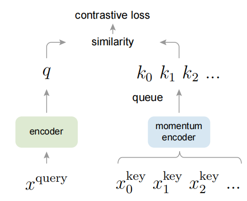
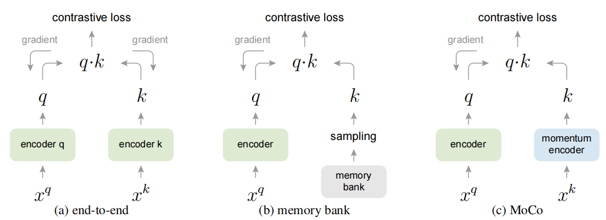
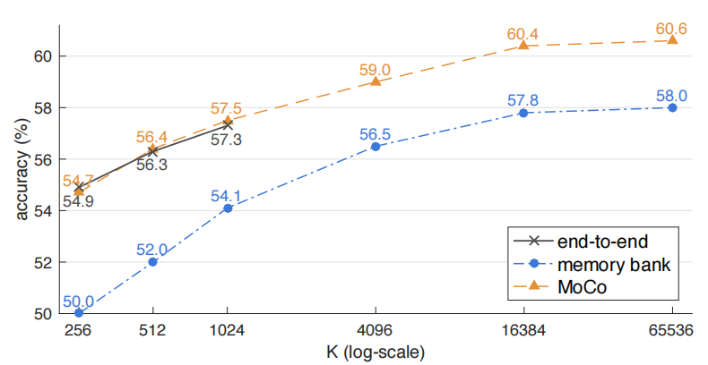

# Momentum Contrast for Unsupervised Visual Representation Learning
无监督视觉表示学习的动量对比 2019.11.13 https://arxiv.org/abs/1911.05722

## Abstract
We present Momentum Contrast (MoCo) for unsupervised visual representation learning. From a perspective on contrastive learning [29] as dictionary look-up, we build a dynamic dictionary with a queue and a moving-averaged encoder. This enables building a large and consistent dictionary on-the-fly that facilitates contrastive unsupervised learning. MoCo provides competitive results under the common linear protocol on ImageNet classification. More importantly, the representations learned by MoCo transfer well to downstream tasks. MoCo can outperform its supervised pre-training counterpart in 7 detection/segmentation tasks on PASCAL VOC, COCO, and other datasets, sometimes surpassing it by large margins. This suggests that the gap between unsupervised and supervised representation learning has been largely closed in many vision tasks.

我们提出了用于无监督视觉表示学习的 动量对比 (MoCo)。 从对比学习 [29] 作为字典查找的角度来看，我们构建了一个带有队列和移动平均编码器的动态字典。 这使得能够即时构建一个大型且一致的字典，从而促进对比无监督学习。 MoCo 在 ImageNet 分类的通用线性协议下提供了有竞争力的结果。 更重要的是，MoCo 学到的表征可以很好地迁移到下游任务。 在 PASCAL VOC、COCO 和其他数据集上的 7 个检测/分割任务中，MoCo 可以胜过其受监督的预训练对手，有时甚至大幅超越它。 这表明在许多视觉任务中，无监督和监督表示学习之间的差距已基本缩小。
<!-- 通用线性协议 the common linear protocol  -->
Code: https://github.com/facebookresearch/moco

## 1. Introduction
Unsupervised representation learning is highly successful in natural language processing, e.g., as shown by GPT [50, 51] and BERT [12]. But supervised pre-training is still dominant in computer vision, where unsupervised methods generally lag behind. The reason may stem from differences in their respective signal spaces. Language tasks have discrete signal spaces (words, sub-word units, etc.) for building tokenized dictionaries, on which unsupervised learning can be based. Computer vision, in contrast, further concerns dictionary building [54, 9, 5], as the raw signal is in a continuous, high-dimensional space and is not structured for human communication (e.g., unlike words).

无监督表示学习在自然语言处理中非常成功，例如 GPT [50、51] 和 BERT [12] 所示。 但是有监督的预训练在计算机视觉领域仍然占主导地位，而无监督的方法通常落后于此。 原因可能源于它们各自信号空间的差异。 语言任务具有用于构建令牌化词典的离散信号空间(单词、子词单元等)，无监督学习可以以此为基础。 相比之下，计算机视觉进一步关注字典构建 [54、9、5]，因为原始信号处于连续的高维空间中，并且不是为人类交流而构建的(例如，与单词不同)。

Several recent studies [61, 46, 36, 66, 35, 56, 2] present promising results on unsupervised visual representation learning using approaches related to the contrastive loss [29]. Though driven by various motivations, these methods can be thought of as building dynamic dictionaries. The “keys” (tokens) in the dictionary are sampled from data (e.g., images or patches) and are represented by an encoder network. Unsupervised learning trains encoders to perform dictionary look-up: an encoded “query” should be similar to its matching key and dissimilar to others. Learning is formulated as minimizing a contrastive loss [29]. 

最近的几项研究 [61, 46, 36, 66, 35, 56, 2] 使用与对比损失[29]相关的方法在无监督视觉表示学习方面取得了可喜的结果。 尽管受到各种动机的驱动，这些方法可以被认为是构建动态字典。 字典中的“键”(令牌)是从数据(例如图像或分块)中采样的，并由编码器网络表示。 无监督学习训练编码器执行字典查找：编码的“查询”应该与其匹配键相似，而与其他键不同。 学习被表述为最小化对比损失[29]。

From this perspective, we hypothesize that it is desirable to build dictionaries that are: (i) large and (ii) consistent as they evolve during training. Intuitively, a larger dictionary may better sample the underlying continuous, highdimensional visual space, while the keys in the dictionary should be represented by the same or similar encoder so that their comparisons to the query are consistent. However, existing methods that use contrastive losses can be limited in one of these two aspects (discussed later in context).

从这个角度来看，我们假设构建(i)大和(ii)在训练过程中保持演变一致的字典是可取的。 直观上，更大的字典可能更好地采样底层连续的高维视觉空间，而字典中的键应该由相同或相似的编码器表示，以便它们与查询的比较是一致的。 然而，使用对比损失的现有方法可能在这两个方面之一受到限制(稍后在上下文中讨论)。
<!-- 更大的字典可能更好地采样底层连续的高维视觉空间,
向量表征需要缓存下来，每次比较时都计算，浪费 -->

We present Momentum Contrast (MoCo) as a way of building large and consistent dictionaries for unsupervised learning with a contrastive loss (Figure 1). We maintain the dictionary as a queue of data samples: the encoded representations of the current mini-batch are enqueued, and the oldest are dequeued. The queue decouples the dictionary size from the mini-batch size, allowing it to be large. Moreover, as the dictionary keys come from the preceding several mini-batches, a slowly progressing key encoder, implemented as a momentum-based moving average of the query encoder, is proposed to maintain consistency. 

我们提出 动量对比(MoCo) 作为一种为具有对比损失的无监督学习构建大型且一致的词典的方法(图1)。 我们将字典维护为数据样本队列：当前小批量的编码表示入队，最旧的出队。 队列将字典大小与小批量大小分离，使其可以很大。 此外，由于字典键来自前面的几个小批量，因此提出了一种缓慢更新的键编码器，实现为查询编码器的基于动量的移动平均值，以保持一致性。

<br/>
Figure 1. Momentum Contrast (MoCo) trains a visual representation encoder by matching an encoded query q to a dictionary of encoded keys using a contrastive loss. The dictionary keys {$k_0, k_1, k_2$, ...} are defined on-the-fly by a set of data samples. The dictionary is built as a queue, with the current mini-batch enqueued and the oldest mini-batch dequeued, decoupling it from the mini-batch size. The keys are encoded by a slowly progressing encoder, driven by a momentum update with the query encoder. This method enables a large and consistent dictionary for learning visual representations.
图1.  动量对比(MoCo) 通过使用对比损失将编码 查询q 与编码键字典匹配来训练视觉表示编码器。 字典键 {$k_0, k_1, k_2$, ...} 由一组数据样本即时定义。 字典被构建为一个队列，当前的小批量入队，最旧的小批量出队，将其与小批量大小解耦。 keys由缓慢进行的编码器编码，由查询编码器的动量更新驱动。 这种方法可以为学习视觉表示提供一个大而一致的字典。

MoCo is a mechanism for building dynamic dictionaries for contrastive learning, and can be used with various pretext tasks. In this paper, we follow a simple instance discrimination task [61, 63, 2]: a query matches a key if they are encoded views (e.g., different crops) of the same image. Using this pretext task, MoCo shows competitive results under the common protocol of linear classification in the ImageNet dataset [11].

MoCo 是一种为对比学习构建动态词典的机制，可用于各种前置任务。 在本文中，我们遵循一个简单的实例辨别任务 [61、63、2]：如果查询是同一图像的编码视图(例如，不同的裁剪)，则查询匹配一个键。 使用这个前置任务，MoCo 在 ImageNet 数据集 [11] 的线性分类通用协议下显示了竞争结果。

A main purpose of unsupervised learning is to pre-train representations (i.e., features) that can be transferred to downstream tasks by fine-tuning. We show that in 7 downstream tasks related to detection or segmentation, MoCo unsupervised pre-training can surpass its ImageNet supervised counterpart, in some cases by nontrivial margins. In these experiments, we explore MoCo pre-trained on ImageNet or on a one-billion Instagram image set, demonstrating that MoCo can work well in a more real-world, billionimage scale, and relatively uncurated scenario. These results show that MoCo largely closes the gap between unsupervised and supervised representation learning in many computer vision tasks, and can serve as an alternative to ImageNet supervised pre-training in several applications.

无监督学习的一个主要目的是预训练表示(即特征)，这些表示可以通过微调迁移到下游任务。 我们表明，在与检测或分割相关的 7 个下游任务中，MoCo 无监督预训练可以超越其 ImageNet 监督预训练，在某些情况下，差别很大。 在这些实验中，我们探索了在 ImageNet 或 10 亿张 Instagram 图像集上预训练的 MoCo，证明了 MoCo 可以在更真实的、十亿张图像规模和相对未经整理的场景中正常工作。 这些结果表明，MoCo 在很大程度上缩小了许多计算机视觉任务中无监督和监督表示学习之间的差距，并且可以在多种应用中替代 ImageNet 监督预训练。

## 2. Related Work
Unsupervised/self-supervised (1Self-supervised learning is a form of unsupervised learning. Their distinction is informal in the existing literature. In this paper, we use the more classical term of “unsupervised learning”, in the sense of “not supervised by human-annotated labels”. ) learning methods generally involve two aspects: pretext tasks and loss functions. The term “pretext” implies that the task being solved is not of genuine interest, but is solved only for the true purpose of learning a good data representation. Loss functions can often be investigated independently of pretext tasks. MoCo focuses on the loss function aspect. Next we discuss related studies with respect to these two aspects.

无监督/自监督 学习方法一般涉及 前置任务 和 loss函数 两个方面(1自监督学习是无监督学习的一种形式,它们的区别在现有文献中是非正式的。 在本文中，我们使用更经典的术语“无监督学习”，意思是“不受人工标注标签的监督”)。 术语“前置”意味着正在解决的任务并不是真正感兴趣的，而只是为了学习良好的数据表示的真正目的而解决的。 损失函数通常可以独立于前置任务进行研究。 MoCo 专注于损失函数方面。 下面就这两个方面讨论相关研究。

### Loss functions. 损失函数
A common way of defining a loss function is to measure the difference between a model’s prediction and a fixed target, such as reconstructing the input pixels (e.g., auto-encoders) by L1 or L2 losses, or classifying the input into pre-defined categories (e.g., eight positions [13], color bins [64]) by cross-entropy or margin-based losses. Other alternatives, as described next, are also possible.

定义损失函数的一种常见方法是衡量模型预测与固定目标之间的差异，例如通过 L1 或 L2 损失重建输入像素(例如，自动编码器)，或将输入通过交叉熵或边际损失分类为预定义的类别 (例如，八个位置 [13]，颜色bins [64])。 如下所述的其他替代方案也是可能的。 
<!-- margin-based 基于边际?-->

Contrastive losses [29] measure the similarities of sample pairs in a representation space. Instead of matching an input to a fixed target, in contrastive loss formulations the target can vary on-the-fly during training and can be defined in terms of the data representation computed by a network [29]. Contrastive learning is at the core of several recent works on unsupervised learning [61, 46, 36, 66, 35, 56, 2], which we elaborate on later in context (Sec. 3.1).

对比损失 [29] 衡量表示空间中样本对的相似性。 在对比损失公式中，目标可以在训练期间动态变化，而不是将输入与固定目标匹配，并且可以根据网络 [29] 计算的数据表示来定义。 对比学习是最近几部无监督学习作品的核心 [61, 46, 36, 66, 35, 56, 2]，我们稍后将在上下文中详细说明(第 3.1 节)。

Adversarial losses [24] measure the difference between probability distributions. It is a widely successful technique for unsupervised data generation. Adversarial methods for representation learning are explored in [15, 16]. There are relations (see [24]) between generative adversarial networks and noise-contrastive estimation (NCE) [28].

对抗性损失 [24] 衡量概率分布之间的差异。 它是一种广泛成功的无监督数据生成技术。 在 [15, 16] 中探索了用于表示学习的对抗性方法。 生成对抗网络和噪声对比估计 (NCE) [28] 之间存在关系(参见 [24])。

### Pretext tasks. 前置任务
A wide range of pretext tasks have been proposed. Examples include recovering the input under some corruption, e.g., denoising auto-encoders [58], context autoencoders [48], or cross-channel auto-encoders (colorization) [64, 65]. Some pretext tasks form pseudo-labels by, e.g., transformations of a single (“exemplar”) image [17], patch orderings [13, 45], tracking [59] or segmenting objects [47] in videos, or clustering features [3, 4].

已经提出了广泛的前置任务。 样本包括在某些损坏下恢复输入，例如去噪自动编码器 [58]、上下文自动编码器 [48] 或跨通道自动编码器(着色)[64、65]。 一些前置任务通过例如单个(“样本”)图像的转换 [17]、分块排序 [13、45]、跟踪 [59] 或分割视频中的对象 [47]，或聚类特征 [ 3, 4]。

### Contrastive learning vs. pretext tasks.  对比学习与前置任务
Various pretext tasks can be based on some form of contrastive loss functions. The instance discrimination method [61] is related to the exemplar-based task [17] and NCE [28]. The pretext task in contrastive predictive coding (CPC) [46] is a form of context auto-encoding [48], and in contrastive multiview coding (CMC) [56] it is related to colorization [64].

各种前置任务可以基于某种形式的对比损失函数。 实例辨别方法[61]与基于样本的任务[17]和NCE[28]有关。 对比预测编码 (CPC) [46] 中的前置任务是上下文自动编码 [48] 的一种形式，而在对比多视图编码 (CMC) [56] 中，它与着色相关 [64]。

## 3. Method
### 3.1. Contrastive Learning as Dictionary Look-up 对比学习作为字典查找
Contrastive learning [29], and its recent developments, can be thought of as training an encoder for a dictionary look-up task, as described next.

对比学习 [29] 及其最近的发展，可以被认为是为字典查找任务训练编码器，如下所述。

Consider an encoded query q and a set of encoded samples {$k_0, k_1, k_2$, ...} that are the keys of a dictionary. Assume that there is a single key (denoted as $k_+$) in the dictionary that q matches. A contrastive loss [29] is a function whose value is low when q is similar to its positive key $k_+$ and dissimilar to all other keys (considered negative keys for q). With similarity measured by dot product, a form of a contrastive loss function, called InfoNCE [46], is considered in this paper:

考虑一个编码查询 q 和一组编码样本 {$k_0, k_1, k_2$, ...} 它们是字典里的键。 假设字典中只有一个键(表示为$k_+$)与q匹配。 对比损失 [29] 是一个函数，当 q 与其正键 $k_+$ 相似并且与所有其他键(被认为是 q 的负键)不同时，其值较低。 通过点积计算相似性，本文考虑了一种称为 InfoNCE [46] 的对比损失函数形式：
<!--点积越大，越相似-->

$L_q = − log \frac{exp(q·k_+/τ ) }{\sum^K_{i=0} exp(q·k_i/τ )}$ (1) 

where τ is a temperature hyper-parameter per [61]. The sum is over one positive and K negative samples. Intuitively, this loss is the log loss of a (K+1)-way softmax-based classifier that tries to classify q as $k_+$. Contrastive loss functions can also be based on other forms [29, 59, 61, 36], such as margin-based losses and variants of NCE losses.

其中 τ 是根据 [61] 的温度超参数。 总和超过一个正样本和 K 个负样本。 直观上，这种损失是试图将 q 分类为 $k_+$ 的 (K+1)-way softmax-based 分类器的对数损失。 对比损失函数也可以基于其他形式 [29、59、61、36]，例如 边界(margin-based)损失和 NCE 损失的变体。

The contrastive loss serves as an unsupervised objective function for training the encoder networks that represent the queries and keys [29]. In general, the query representation is $q = f_q(x^q)$ where $f_q$ is an encoder network and $x^q$ is a query sample (likewise, $k = f_k(x^k)$). Their instantiations depend on the specific pretext task. The input $x^q$ and $x^k$ can be images [29, 61, 63], patches [46], or context consisting a set of patches [46]. The networks $f_q$ and $f_k$ can be identical [29, 59, 63], partially shared [46, 36, 2], or different [56]. 

对比损失作为无监督目标函数，用于训练表示查询和键的编码器网络 [29]。 通常，查询表示是 $q = f_q(x^q)$，其中 $f_q$ 是编码器网络，$x^q$是查询样本(同样，$k = f_k(x^k)$)。 它们的实例化取决于特定的前置任务。 输入 $x^q$ 和 $x^k$ 可以是图像 [29、61、63]、分块 [46] 或包含一组分块 [46] 的上下文。 网络 $f_q$ 和 $f_k$ 可以相同 [29、59、63]、部分共享 [46、36、2] 或不同 [56]。

<br/>
Figure 2. Conceptual comparison of three contrastive loss mechanisms (empirical comparisons are in Figure 3 and Table 3). Here we illustrate one pair of query and key. The three mechanisms differ in how the keys are maintained and how the key encoder is updated. (a): The encoders for computing the query and key representations are updated end-to-end by back-propagation (the two encoders can be different). (b): The key representations are sampled from a memory bank [61]. (c): MoCo encodes the new keys on-the-fly by a momentum-updated encoder, and maintains a queue (not illustrated in this figure) of keys.
图2. 三种对比损失机制的概念比较(经验比较在图3和表3中)。 这里我们举例说明一对查询和键。 这三种机制的不同之处在于keys的维护方式和keys编码器的更新方式。 
(a)：用于计算查询和keys表示的编码器通过反向传播进行端到端更新(两个编码器可以不同)。 
(b)：key表示是从记忆库中采样的[61]。 
(c)：MoCo 通过动量更新编码器对新keys进行动态编码，并维护一个keys队列(图中未显示)。
<!--b,c有啥优势？-->

### 3.2. Momentum Contrast 动量对比
From the above perspective, contrastive learning is a way of building a discrete dictionary on high-dimensional continuous inputs such as images. The dictionary is dynamic in the sense that the keys are randomly sampled, and that the key encoder evolves during training. Our hypothesis is that good features can be learned by a large dictionary that covers a rich set of negative samples, while the encoder for the dictionary keys is kept as consistent as possible despite its evolution. Based on this motivation, we present Momentum Contrast as described next.

从上面的角度来看，对比学习是一种在图像等高维连续输入上构建离散字典的方法。 字典是动态的，因为keys是随机采样的，并且keys编码器在训练过程中不断演变。 我们的假设是，好的特征可以通过包含大量负样本的大型字典来学习，而字典键的编码器尽管在进化，但仍尽可能保持一致。 基于这种动机，我们提出了 Momentum Contrast，如下所述。

#### Dictionary as a queue. 字典作为队列
At the core of our approach is maintaining the dictionary as a queue of data samples. This allows us to reuse the encoded keys from the immediate preceding mini-batches. The introduction of a queue decouples the dictionary size from the mini-batch size. Our dictionary size can be much larger than a typical mini-batch size, and can be flexibly and independently set as a hyper-parameter.

我们方法的核心是将字典维护为数据样本队列。 这使我们能够重用紧接在前面的小批量中的编码keys。 队列的引入将字典大小与批量的大小分离开来。 我们的字典大小可以比典型的小批量大得多，并且可以灵活独立地设置为超参数。

The samples in the dictionary are progressively replaced. The current mini-batch is enqueued to the dictionary, and the oldest mini-batch in the queue is removed. The dictionary always represents a sampled subset of all data, while the extra computation of maintaining this dictionary is manageable. Moreover, removing the oldest mini-batch can be beneficial, because its encoded keys are the most outdated and thus the least consistent with the newest ones.

字典中的样本被逐步替换。 当前的批次被推入字典，队列中最早的批次被移除。 字典始终表示所有数据的采样子集，而维护该字典的额外计算是可管理的。 此外，删除最旧的小批量可能是有益的，因为它的编码keys是最过时的，因此与最新的最小一致。

<!--GPU下，这种操作是否划算？-->

#### Momentum update.  动量更新
Using a queue can make the dictionary large, but it also makes it intractable to update the key encoder by back-propagation (the gradient should propagate to all samples in the queue). A na¨ıve solution is to copy the key encoder $f_k$ from the query encoder $f_q$, ignoring this gradient. But this solution yields poor results in experiments (Sec. 4.1). We hypothesize that such failure is caused by the rapidly changing encoder that reduces the key representations’ consistency. We propose a momentum update to address this issue.

使用队列会使字典变大，但也使得通过反向传播更新keys编码器变得棘手(梯度应该传播到队列中的所有样本)。 一个朴素的解决方案是从查询编码器 $f_q$ 复制keys编码器 $f_k$，忽略这个梯度。 但是这个解决方案在实验中产生了很差的结果(第 4.1 节)。 我们假设这种失败是由快速变化的编码器引起的，它降低了keys表示的一致性。 我们建议进行动量更新以解决此问题。

Formally, denoting the parameters of $f_k$ as $θ_k$ and those of $f_q$ as $θ_q$, we update $θ_k$ by: 

形式上，将 $f_k$ 的参数表示为 $θ_k$，将 $f_q$ 的参数表示为 $θ_q$，我们通过以下方式更新 $θ_k$：

$θ_k ← mθ_k + (1 − m)θ_q$ . (2)

Here m ∈ [0, 1) is a momentum coefficient. Only the parameters $θ_q$ are updated by back-propagation. The momentum update in Eqn.(2) makes $θ_k$ evolve more smoothly than $θ_q$ . As a result, though the keys in the queue are encoded by different encoders (in different mini-batches), the difference among these encoders can be made small. In experiments, a relatively large momentum (e.g., m = 0.999, our default) works much better than a smaller value (e.g., m = 0.9), suggesting that a slowly evolving key encoder is a core to making use of a queue.

这里 m ∈ [0, 1) 是动量系数。 只有参数 $θ_q$ 通过反向传播更新。 Eqn.(2) 中的动量更新使得 $θ_k$ 的演化比 $θ_q$ 更平滑。 结果，尽管队列中的键由不同的编码器(在不同的小批量中)编码，但这些编码器之间的差异可以变小。 在实验中，相对较大的动量(例如，m = 0.999，我们的默认值)比较小的值(例如，m = 0.9)效果更好，这表明缓慢进化的keys编码器是使用队列的核心。

#### Relations to previous mechanisms.  与以前机制的关系
MoCo is a general mechanism for using contrastive losses. We compare it with two existing general mechanisms in Figure 2. They exhibit different properties on the dictionary size and consistency.

MoCo 是一种使用对比损失的通用机制。 我们将其与图2 中的两种现有通用机制进行比较。它们在字典大小和一致性方面表现出不同的属性。

The end-to-end update by back-propagation is a natural mechanism (e.g., [29, 46, 36, 63, 2, 35], Figure 2a). It uses samples in the current mini-batch as the dictionary, so the keys are consistently encoded (by the same set of encoder parameters). But the dictionary size is coupled with the mini-batch size, limited by the GPU memory size. It is also challenged by large mini-batch optimization [25]. Some recent methods [46, 36, 2] are based on pretext tasks driven by local positions, where the dictionary size can be made larger by multiple positions. But these pretext tasks may require special network designs such as patchifying the input [46] or customizing the receptive field size [2], which may complicate the transfer of these networks to downstream tasks.

通过反向传播进行的端到端更新是一种自然机制(例如，[29、46、36、63、2、35]，图2a)。 它使用当前 mini-batch 中的样本作为字典，因此keys被一致地编码(通过同一组编码器参数)。 但是字典大小与 mini-batch 大小相结合，受 GPU 内存大小的限制。 它还受到大型小批量优化 [25] 的挑战。 最近的一些方法 [46, 36, 2] 基于由局部位置驱动的前置任务，其中字典大小可以通过多个位置变大。 但是这些前置任务可能需要特殊的网络设计，例如分块输入 [46] 或自定义感受野大小 [2]，这可能会使这些网络向下游任务的迁移变得复杂。

Another mechanism is the memory bank approach proposed by [61] (Figure 2b). A memory bank consists of the representations of all samples in the dataset. The dictionary for each mini-batch is randomly sampled from the memory bank with no back-propagation, so it can support a large dictionary size. However, the representation of a sample in the memory bank was updated when it was last seen, so the sampled keys are essentially about the encoders at multiple different steps all over the past epoch and thus are less consistent. A momentum update is adopted on the memory bank in [61]. Its momentum update is on the representations of the same sample, not the encoder. This momentum update is irrelevant to our method, because MoCo does not keep track of every sample. Moreover, our method is more memory-efficient and can be trained on billion-scale data, which can be intractable for a memory bank. Sec. 4 empirically compares these three mechanisms.

另一种机制是 [61] 提出的内存库方法(图2b)。 内存库由数据集中所有样本的表示组成。 每个 mini-batch 的字典是从 memory bank 中随机抽取的，没有反向传播，所以它可以支持很大的字典大小。 然而，样本在内存库中的表示在最后一次看到时已更新，因此采样的keys本质上是关于过去多个时期的多个不同步骤的编码器，因此不太一致。 [61] 中的记忆库采用动量更新。 它的动量更新是在同一样本的表示上，而不是编码器。 这种动量更新与我们的方法无关，因为 MoCo 不会跟踪每个样本。 此外，我们的方法具有更高的内存效率，可以在十亿规模的数据上进行训练，这对于内存库来说可能很棘手。 第四节 根据经验比较这三种机制。

### 3.3. Pretext Task
Contrastive learning can drive a variety of pretext tasks. As the focus of this paper is not on designing a new pretext task, we use a simple one mainly following the instance discrimination task in [61], to which some recent works [63, 2] are related.

对比学习可以驱动各种前置任务。 由于本文的重点不是设计新的前置任务，我们使用一个简单的任务，主要遵循 [61] 中的实例辨别任务，最近的一些工作 [63, 2] 与之相关。

Following [61], we consider a query and a key as a positive pair if they originate from the same image, and otherwise as a negative sample pair. Following [63, 2], we take two random “views” of the same image under random data augmentation to form a positive pair. The queries and keys are respectively encoded by their encoders, $f_q$ and $f_k$. The encoder can be any convolutional neural network [39].

按照[61]，如果查询和键来自同一图像，我们将它们视为正样本对，否则视为负样本对。 在 [63, 2] 之后，我们在随机数据增广下获取同一图像的两个随机“视图”以形成正对。 查询和keys分别由它们的编码器 $f_q$ 和 $f_k$ 编码。 编码器可以是任何卷积神经网络[39]。

Algorithm 1 provides the pseudo-code of MoCo for this pretext task. For the current mini-batch, we encode the queries and their corresponding keys, which form the positive sample pairs. The negative samples are from the queue. 

算法 1 为这个前置任务提供了 MoCo 的伪代码。 对于当前的小批量，我们对查询及其对应的键进行编码，形成正样本对。 负样本来自队列。

``` python
# Algorithm 1 Pseudocode of MoCo in a PyTorch-like style.
# 算法 1  类似 PyTorch 风格的 MoCo 伪代码。

# f_q, f_k: encoder networks for query and key
# queue: dictionary as a queue of K keys (CxK) 
# m: momentum
# t: temperature

f_k.params = f_q.params # initialize 
for x in loader: # load a minibatch x with N samples 
    x_q = aug(x) # a randomly augmented version 
    x_k = aug(x) # another randomly augmented version 
    
    q = f_q.forward(x_q) # queries: NxC 
    k = f_k.forward(x_k) # keys: NxC 
    k = k.detach() # no gradient to keys

    # positive logits: Nx1
    l_pos = bmm(q.view(N,1,C), k.view(N,C,1))

    # negative logits: NxK
    l_neg = mm(q.view(N,C), queue.view(C,K))

    # logits: Nx(1+K)
    logits = cat([l_pos, l_neg], dim=1)

    # contrastive loss, Eqn.(1)
    labels = zeros(N) # positives are the 0-th 
    loss = CrossEntropyLoss(logits/t, labels)

    # SGD update: query network
    loss.backward() 
    update(f_q.params)

    # momentum update: key network
    f_k.params = m*f_k.params+(1-m)*f_q.params

    # update dictionary
    enqueue(queue, k) # enqueue the current minibatch 
    dequeue(queue) # dequeue the earliest minibatch 
 
```
bmm: batch matrix multiplication; mm: matrix multiplication; cat: concatenation. 


#### Technical details. 技术细节
We adopt a ResNet [33] as the encoder, whose last fully-connected layer (after global average pooling) has a fixed-dimensional output (128-D [61]). This output vector is normalized by its L2-norm [61]. This is the representation of the query or key. The temperature τ in Eqn.(1) is set as 0.07 [61]. The data augmentation setting follows [61]: a 224×224-pixel crop is taken from a randomly resized image, and then undergoes random color jittering, random horizontal flip, and random grayscale conversion, all available in PyTorch’s torchvision package.

我们采用 ResNet [33] 作为编码器，其最后一个全连接层(在全局平均池化之后)具有固定维度的输出(128-D [61])。 该输出向量由其 L2 范数 [61] 归一化。 这是查询或键的表示。 方程(1)中的温度 τ 设置为 0.07 [61]。 数据增广设置如下 [61]：从随机调整大小的图像中截取 224×224 像素裁剪，然后进行随机颜色抖动、随机水平翻转和随机灰度转换，所有这些都在 PyTorch 的 torchvision 包中可用。

#### Shuffling BN. 
Our encoders $f_q$ and $f_k$ both have Batch Normalization (BN) [37] as in the standard ResNet [33]. In experiments, we found that using BN prevents the model from learning good representations, as similarly reported in [35] (which avoids using BN). The model appears to “cheat” the pretext task and easily finds a low-loss solution. This is possibly because the intra-batch communication among samples (caused by BN) leaks information.

洗牌 BN。 我们的编码器 $f_q$ 和 $f_k$ 都具有标准 ResNet [33] 中的批量归一化 (BN) [37]。 在实验中，我们发现使用 BN 会阻止模型学习良好的表示，如 [35] 中的类似报道(避免使用 BN)。 该模型似乎“欺骗”了前置任务，并轻松找到了低损失的解决方案。 这可能是因为样本之间的批内通信(由 BN 引起)泄漏了信息。

We resolve this problem by shuffling BN. We train with multiple GPUs and perform BN on the samples independently for each GPU (as done in common practice). For the key encoder $f_k$, we shuffle the sample order in the current mini-batch before distributing it among GPUs (and shuffle back after encoding); the sample order of the mini-batch for the query encoder $f_q$ is not altered. This ensures the batch statistics used to compute a query and its positive key come from two different subsets. This effectively tackles the cheating issue and allows training to benefit from BN.

我们通过改组 BN 来解决这个问题。 我们使用多个 GPU 进行训练，并为每个 GPU 独立地对样本执行 BN(按照惯例)。 对于关键编码器 $f_k$，我们在将其分配给 GPU 之前打乱当前 mini-batch 中的样本顺序(并在编码后重新打乱);  查询编码器 $f_q$ 的小批量样本顺序没有改变。 这确保了用于计算查询的批处理统计信息及其肯定键来自两个不同的子集。 这有效地解决了作弊问题，并让训练受益于 BN。

We use shuffled BN in both our method and its end-toend ablation counterpart (Figure 2a). It is irrelevant to the memory bank counterpart (Figure 2b), which does not suffer from this issue because the positive keys are from different mini-batches in the past.

我们在我们的方法及其端到端消融对应物(图2a)中都使用了混洗 BN。 它与存储库对应物(图2b)无关，后者不会遇到此问题，因为正键来自过去不同的小批量。

## 4. Experiments
We study unsupervised training performed in:

我们研究在以下方面进行的无监督训练：

ImageNet-1M (IN-1M): This is the ImageNet [11] training set that has ∼1.28 million images in 1000 classes (often called ImageNet-1K; we count the image number instead, as classes are not exploited by unsupervised learning). This dataset is well-balanced in its class distribution, and its images generally contain iconic view of objects.

ImageNet-1M (IN-1M)：这是 ImageNet [11] 训练集，在 1000 个类别中有大约 128 万张图像(通常称为 ImageNet-1K; 我们计算图像数量，因为类别没有被无监督学习利用) . 该数据集的类分布非常均衡，其图像通常包含对象的标志性视图。

Instagram-1B (IG-1B): Following [44], this is a dataset of ∼1 billion (940M) public images from Instagram. The images are from ∼1500 hashtags [44] that are related to the ImageNet categories. This dataset is relatively uncurated comparing to IN-1M, and has a long-tailed, unbalanced distribution of real-world data. This dataset contains both iconic objects and scene-level images.

Instagram-1B (IG-1B)：继 [44] 之后，这是来自 Instagram 的约 10 亿 (940M) 公共图像的数据集。 这些图像来自与 ImageNet 类别相关的约 1500 个主题标签 [44]。 与 IN-1M 相比，该数据集相对未经整理，并且具有长尾、不平衡的真实世界数据分布。 该数据集包含标志性对象和场景级图像。

Training. We use SGD as our optimizer. The SGD weight decay is 0.0001 and the SGD momentum is 0.9. For IN-1M, we use a mini-batch size of 256 (N in Algorithm 1) in 8 GPUs, and an initial learning rate of 0.03. We train for 200 epochs with the learning rate multiplied by 0.1 at 120 and 160 epochs [61], taking ∼53 hours training ResNet-50. For IG-1B, we use a mini-batch size of 1024 in 64 GPUs, and a learning rate of 0.12 which is exponentially decayed by 0.9× after every 62.5k iterations (64M images). We train for 1.25M iterations (∼1.4 epochs of IG-1B), taking ∼6 days for ResNet-50.

训练。 我们使用 SGD 作为我们的优化器。 SGD 权重衰减为 0.0001，SGD 动量为 0.9。 对于 IN-1M，我们在 8 个 GPU 中使用 256(算法 1 中的 N)的小批量大小，以及 0.03 的初始学习率。 我们训练了 200 个时期，学习率在 120 和 160 个时期乘以 0.1 [61]，训练 ResNet-50 约 53 小时。 对于 IG-1B，我们在 64 个 GPU 中使用 1024 的小批量大小，以及 0.12 的学习率，在每 62.5k 次迭代(64M 图像)后呈指数衰减 0.9×。 我们训练 125 万次迭代(IG-1B 的～1.4 个时期)，ResNet-50 需要～6 天。

### 4.1. Linear Classification Protocol 线性分类协议
We first verify our method by linear classification on frozen features, following a common protocol. In this subsection we perform unsupervised pre-training on IN-1M. Then we freeze the features and train a supervised linear classifier (a fully-connected layer followed by softmax). We train this classifier on the global average pooling features of a ResNet, for 100 epochs. We report 1-crop, top-1 classifi- cation accuracy on the ImageNet validation set.

我们首先按照通用协议通过对冻结特征进行线性分类来验证我们的方法。 在本小节中，我们对 IN-1M 执行无监督预训练。 然后我们冻结特征并训练一个监督线性分类器(一个全连接层，然后是 softmax)。 我们在 ResNet 的全局平均池化特征上训练这个分类器 100 个时期。 我们报告了 ImageNet 验证集上的 1-crop、top-1 分类准确度。

For this classifier, we perform a grid search and find the optimal initial learning rate is 30 and weight decay is 0 (similarly reported in [56]). These hyper-parameters perform consistently well for all ablation entries presented in this subsection. These hyper-parameter values imply that the feature distributions (e.g., magnitudes) can be substantially different from those of ImageNet supervised training, an issue we will revisit in Sec. 4.2.

对于这个分类器，我们执行网格搜索并发现最佳初始学习率为 30，权重衰减为 0(与 [56] 中的类似报道)。 对于本小节中介绍的所有消融条目，这些超参数始终表现良好。 这些超参数值意味着特征分布(例如，幅度)可能与 ImageNet 监督训练的特征分布有很大不同，我们将在第4.2.节中重新讨论这个问题。

#### Ablation: contrastive loss mechanisms. 
We compare the three mechanisms that are illustrated in Figure 2. To focus on the effect of contrastive loss mechanisms, we implement all of them in the same pretext task as described in Sec. 3.3. We also use the same form of InfoNCE as the contrastive loss function, Eqn.(1). As such, the comparison is solely on the three mechanisms.

消融：对比损失机制。 我们比较了图2 中所示的三种机制。为了关注对比损失机制的影响，我们在第 1 节中描述的相同前置任务中实现了所有这些机制。 3.3. 我们还使用与对比损失函数 Eqn.(1) 相同形式的 InfoNCE。 因此，比较仅针对三种机制。

The results are in Figure 3. Overall, all three mechanisms benefit from a larger K. A similar trend has been observed in [61, 56] under the memory bank mechanism, while here we show that this trend is more general and can be seen in all mechanisms. These results support our motivation of building a large dictionary.

结果在图3 中。总体而言，所有三种机制都受益于更大的 K。在内存库机制下 [61, 56] 中观察到类似的趋势，而在这里我们表明这种趋势更普遍并且可以看出 在所有机制中。 这些结果支持我们构建大型词典的动机。

<br/>
Figure 3. Comparison of three contrastive loss mechanisms under the ImageNet linear classification protocol. We adopt the same pretext task (Sec. 3.3) and only vary the contrastive loss mechanism (Figure 2). The number of negatives is K in memory bank and MoCo, and is K−1 in end-to-end (offset by one because the positive key is in the same mini-batch). The network is ResNet-50.
图3. ImageNet 线性分类协议下三种对比损失机制的比较。 我们采用相同的前置任务(第 3.3 节)并且仅改变对比损失机制(图2)。 negatives 的数量在 memory bank 和 MoCo 中是 K，在 end-to-end 中是 K−1(偏移 1，因为 positive key 在同一个 mini-batch 中)。 网络是 ResNet-50。

The end-to-end mechanism performs similarly to MoCo when K is small. However, the dictionary size is limited by the mini-batch size due to the end-to-end requirement. Here the largest mini-batch a high-end machine (8 Volta 32GB GPUs) can afford is 1024. More essentially, large mini-batch training is an open problem [25]: we found it necessary to use the linear learning rate scaling rule [25] here, without which the accuracy drops (by ∼2% with a 1024 mini-batch). But optimizing with a larger mini-batch is harder [25], and it is questionable whether the trend can be extrapolated into a larger K even if memory is sufficient. 

当 K 较小时，端到端机制的性能类似于 MoCo。 但是，由于端到端的要求，字典大小受小批量大小的限制。 这里高端机器(8 Volta 32GB GPU)可以承受的最大 mini-batch 是 1024。更重要的是，大型 mini-batch 训练是一个悬而未决的问题 [25]：我们发现有必要使用线性学习率缩放规则 [25] 这里，如果没有它，准确度会下降(1024 小批量下降约 2%)。 但是用更大的 mini-batch 进行优化更难 [25]，而且即使内存足够，趋势是否可以外推到更大的 K 也是值得怀疑的。

The memory bank [61] mechanism can support a larger dictionary size. But it is 2.6% worse than MoCo. This is inline with our hypothesis: the keys in the memory bank are from very different encoders all over the past epoch and they are not consistent. Note the memory bank result of 58.0% reflects our improved implementation of [61].(2Here 58.0% is with InfoNCE and K=65536. We reproduce 54.3% when using NCE and K=4096 (the same as [61]), close to 54.0% in [61]. )

memory bank [61] 机制可以支持更大的字典大小。 但比 MoCo 差 2.6%。 这与我们的假设一致：记忆库中的keys在过去的所有时期都来自非常不同的编码器，并且它们不一致。 请注意，58.0% 的记忆库结果反映了我们改进了 [61] 的实施。(2这里 58.0% 与 InfoNCE 和 K=65536。 当使用 NCE 和 K=4096(与 [61] 相同)时，我们重现了 54.3%，接近 [61] 中的 54.0%)

#### Ablation: momentum. 
The table below shows ResNet-50 accuracy with different MoCo momentum values (m in Eqn.(2)) used in pre-training (K = 4096 here) :

消融：动量。 下表显示了预训练中使用的不同 MoCo 动量值(等式 (2) 中的 m)的 ResNet-50 精度(此处 K = 4096)：

momentum  m | 0 | 0.9 | 0.99 | 0.999 | 0.9999 
--- | --- | --- | --- | --- | --- 
accuracy (%) | fail | 55.2 | 57.8 | 59.0 | 58.9

It performs reasonably well when m is in 0.99 ∼ 0.9999, showing that a slowly progressing (i.e., relatively large momentum) key encoder is beneficial. When m is too small (e.g., 0.9), the accuracy drops considerably; at the extreme of no momentum (m is 0), the training loss oscillates and fails to converge. These results support our motivation of building a consistent dictionary.

当 m 在 0.99 ∼ 0.9999 之间时，它表现得相当好，表明缓慢进展(即相对较大的动量)keys编码器是有益的。 当 m 太小时(例如 0.9)，精度会大幅下降;  在没有动量的极端情况下(m 为 0)，训练损失会振荡并且无法收敛。 这些结果支持我们构建一致字典的动机。

#### Comparison with previous results. 
Previous unsupervised learning methods can differ substantially in model sizes. For a fair and comprehensive comparison, we report accuracy vs. #parameters(3Parameters are of the feature extractor: e.g., we do not count the parameters of convx if convx is not included in linear classification) trade-offs. Besides ResNet-50 (R50) [33], we also report its variants that are 2× and 4× wider (more channels), following [38](4Our w2× and w4× models correspond to the “×8” and “×16” cases in [38], because the standard-sized ResNet is referred to as “×4” in [38]). We set K = 65536 and m = 0.999. Table 1 is the comparison.

与以前的结果比较。 以前的无监督学习方法在模型大小上可能存在很大差异。 为了公平和全面的比较，我们报告了准确性与#parameters(3 参数是特征提取器的：例如，如果convx不包含在线性分类中，我们不计算convx的参数) 的权衡。 除了 ResNet-50 (R50) [33]，我们还报告了它的变体，它的宽度增加了 2 倍和 4 倍(更多通道)，遵循 [38](4我们的 w2× 和 w4× 模型对应于 [38] 中的“×8”和“×16”情况，因为标准尺寸的 ResNet 在 [38] 中被称为“×4”。)。 我们设置 K = 65536 和 m = 0.999。 表 1 是比较。

MoCo with R50 performs competitively and achieves  60.6% accuracy, better than all competitors of similar model sizes (∼24M). MoCo benefits from larger models and achieves 68.6% accuracy with R50w4×.

具有 R50 的 MoCo 具有竞争力，达到 60.6% 的精度，优于所有具有相似模型尺寸 (∼24M) 的竞争对手。 MoCo 受益于更大的模型，并通过 R50w4× 实现了 68.6% 的精度。

Notably, we achieve competitive results using a standard ResNet-50 and require no specific architecture designs, e.g., patchified inputs [46, 35], carefully tailored receptive fields [2], or combining two networks [56]. By using an architecture that is not customized for the pretext task, it is easier to transfer features to a variety of visual tasks and make comparisons, studied in the next subsection.

值得注意的是，我们使用标准的 ResNet-50 取得了有竞争力的结果，并且不需要特定的架构设计，例如，分块输入 [46、35]、精心定制的感受野 [2] 或组合两个网络 [56]。 通过使用未为前置任务定制的架构，可以更轻松地将特征迁移到各种视觉任务并进行比较，这将在下一小节中进行研究。

<br/>
Table 1. Comparison under the linear classification protocol on ImageNet. The figure visualizes the table. All are reported as unsupervised pre-training on the ImageNet-1M training set, followed by supervised linear classification trained on frozen features, evaluated on the validation set. The parameter counts are those of the feature extractors. We compare with improved reimplementations if available (referenced after the numbers). Notations: R101∗/R170∗ is ResNet-101/170 with the last residual stage removed [14, 46, 35], and R170 is made wider [35]; Rv50 is a reversible net [23], RX50 is ResNeXt-50-32×8d [62]. †: Pre-training uses FastAutoAugment [40] that is supervised by ImageNet labels. 
表 1. ImageNet 上线性分类协议下的比较。 该图可视化了表格。 所有这些都被报告为在 ImageNet-1M 训练集上进行无监督预训练，然后是在冻结特征上训练的监督线性分类，在验证集上进行评估。 参数计数是特征提取器的参数计数。 如果可用(在数字后引用)，我们将与改进的重新实现进行比较。 符号：R101*/R170* 是移除了最后一个残差阶段的 ResNet-101/170 [14、46、35]，并且 R170 变宽了 [35];  Rv50 是可逆网络 [23]，RX50 是 ResNeXt-50-32×8d [62]。 †：预训练使用由 ImageNet 标签监督的 FastAutoAugment [40]。

This paper’s focus is on a mechanism for general contrastive learning; we do not explore orthogonal factors (such as specific pretext tasks) that may further improve accuracy. As an example, “MoCo v2” [8], an extension of a preliminary version of this manuscript, achieves 71.1% accuracy with R50 (up from 60.6%), given small changes on the data augmentation and output projection head [7]. We believe that this additional result shows the generality and robustness of the MoCo framework. 
本文的重点是一般对比学习的机制;  我们不探索可能进一步提高准确性的正交因素(例如特定的前置任务)。 例如，“MoCo v2”[8] 是该手稿初步版本的扩展，在数据增广和输出投影头 [7] 发生微小变化的情况下，R50 的精度达到 71.1%(高于 60.6%)。 我们相信这个额外的结果显示了 MoCo 框架的普遍性和稳健性。

<br/>
Table 2. Object detection fine-tuned on PASCAL VOC trainval07+12. Evaluation is on test2007: AP50 (default VOC metric), AP (COCO-style), and AP75, averaged over 5 trials. All are fine-tuned for 24k iterations (∼23 epochs). In the brackets are the gaps to the ImageNet supervised pre-training counterpart. In green are the gaps of at least +0.5 point.
表 2. 在 PASCAL VOC trainval07+12 上微调的对象检测。 评估在 test2007 上进行：AP50（默认 VOC 指标）、AP（COCO 风格）和 AP75，5 次试验的平均值。 所有这些都针对 24k 次迭代（~23 个 epochs）进行了微调。 括号中是与 ImageNet 监督预训练对应物的差距。 绿色是至少 +0.5 点的差距。


<br/>
Table 3. Comparison of three contrastive loss mechanisms on PASCAL VOC object detection, fine-tuned on trainval07+12 and evaluated on test2007 (averages over 5 trials). All models are implemented by us (Figure 3), pre-trained on IN-1M, and finetuned using the same settings as in Table 2.
表 3. PASCAL VOC 对象检测的三种对比损失机制的比较，在 trainval07+12 上微调并在 test2007 上评估(5 次试验的平均值)。 所有模型均由我们实现(图3)，在 IN-1M 上进行预训练，并使用与表 2 中相同的设置进行微调。

### 4.2. Transferring Features
A main goal of unsupervised learning is to learn features that are transferrable. ImageNet supervised pre-training is most influential when serving as the initialization for finetuning in downstream tasks (e.g., [21, 20, 43, 52]). Next we compare MoCo with ImageNet supervised pre-training, transferred to various tasks including PASCAL VOC [18], COCO [42], etc. As prerequisites, we discuss two important issues involved [31]: normalization and schedules.

无监督学习的一个主要目标是学习可迁移的特征。 ImageNet 监督预训练在下游任务中用作微调的初始化时影响最大(例如，[21、20、43、52])。 接下来我们将 MoCo 与 ImageNet 监督预训练进行比较，迁移到各种任务，包括 PASCAL VOC [18]、COCO [42] 等。作为先决条件，我们讨论涉及的两个重要问题 [31]：归一化和调度。

#### Normalization. 
As noted in Sec. 4.1, features produced by unsupervised pre-training can have different distributions compared with ImageNet supervised pre-training. But a system for a downstream task often has hyper-parameters (e.g., learning rates) selected for supervised pre-training. To relieve this problem, we adopt feature normalization during fine-tuning: we fine-tune with BN that is trained (and synchronized across GPUs [49]), instead of freezing it by an affine layer [33]. We also use BN in the newly initialized layers (e.g., FPN [41]), which helps calibrate magnitudes.

归一化。 如第二节所述 4.1，与ImageNet监督预训练相比，无监督预训练产生的特征可以有不同的分布。 但是用于下游任务的系统通常会选择用于监督预训练的超参数(例如，学习率)。 为了缓解这个问题，我们在微调期间采用特征归一化：我们用经过训练的 BN 进行微调(并在 GPU 之间同步 [49])，而不是通过仿射层 [33] 冻结它。 我们还在新初始化的层中使用 BN(例如 FPN [41])，这有助于校准幅度。

We perform normalization when fine-tuning supervised and unsupervised pre-training models. MoCo uses the same hyper-parameters as the ImageNet supervised counterpart.

我们在微调有监督和无监督的预训练模型时执行归一化。 MoCo 使用与 ImageNet 监督对应项相同的超参数。

#### Schedules. 
If the fine-tuning schedule is long enough, training detectors from random initialization can be strong baselines, and can match the ImageNet supervised counterpart on COCO [31]. Our goal is to investigate transferability of features, so our experiments are on controlled schedules, e.g., the 1× (∼12 epochs) or 2× schedules [22] for COCO, in contrast to 6×∼9× in [31]. On smaller datasets like VOC, training longer may not catch up [31].

时间表。 如果微调时间表足够长，则来自随机初始化的训练检测器可以是强基线，并且可以与 COCO [31] 上的 ImageNet 监督对应物相匹配。 我们的目标是研究特征的可迁移性，因此我们的实验是在受控的时间表上进行的，例如，COCO 的 1×(∼12 个时期)或 2× 时间表 [22]，与 [31] 中的 6×∼9× 形成对比。 在像 VOC 这样的较小数据集上，更长的训练可能无法赶上 [31]。

<br/>
Table 4. Comparison with previous methods on object detection fine-tuned on PASCAL VOC trainval2007. Evaluation is on test2007. The ImageNet supervised counterparts are from the respective papers, and are reported as having the same structure as the respective unsupervised pre-training counterparts. All entries are based on the C4 backbone. The models in [14] are R101 v2 [34], and others are R50. The RelPos (relative position) [13] result is the best single-task case in the Multi-task paper [14]. The Jigsaw [45] result is from the ResNet-based implementation in [26]. Our results are with 9k-iteration fine-tuning, averaged over 5 trials. In the brackets are the gaps to the ImageNet supervised pre-training counterpart. In green are the gaps of at least +0.5 point. 
表 4. 与之前在 PASCAL VOC trainval2007 上微调的对象检测方法的比较。 评估是在test2007上。 ImageNet 监督的对应物来自各自的论文，据报道与各自的无监督预训练对应物具有相同的结构。 所有条目都基于 C4 主干。 [14]中的模型是R101 v2 [34]，其他是R50。 RelPos(相对位置)[13] 结果是多任务论文 [14] 中最好的单任务情况。 Jigsaw [45] 结果来自 [26] 中基于 ResNet 的实现。 我们的结果是经过 9k 次迭代微调，平均超过 5 次试验。 括号中是与 ImageNet 监督预训练对应物的差距。 绿色是至少 +0.5 点的差距。

Nonetheless, in our fine-tuning, MoCo uses the same schedule as the ImageNet supervised counterpart, and random initialization results are provided as references.

尽管如此，在我们的微调中，MoCo 使用与 ImageNet 监督对手相同的时间表，并提供随机初始化结果作为参考。

Put together, our fine-tuning uses the same setting as the supervised pre-training counterpart. This may place MoCo at a disadvantage. Even so, MoCo is competitive. Doing so also makes it feasible to present comparisons on multiple datasets/tasks, without extra hyper-parameter search.

放在一起，我们的微调使用与受监督的预训练对手相同的设置。 这可能会使 MoCo 处于劣势。 即便如此，MoCo 还是具有竞争力的。 这样做还可以在多个数据集/任务上进行比较，而无需额外的超参数搜索。

### 4.2.1 PASCAL VOC Object Detection
Setup. The detector is Faster R-CNN [52] with a backbone of R50-dilated-C5 or R50-C4 [32] (details in appendix), with BN tuned, implemented in [60]. We fine-tune all layers end-to-end. The image scale is [480, 800] pixels during training and 800 at inference. The same setup is used for all entries, including the supervised pre-training baseline. We evaluate the default VOC metric of AP50 (i.e., IoU threshold is 50%) and the more stringent metrics of COCO-style AP and AP75. Evaluation is on the VOC test2007 set.

设置。 检测器是 Faster R-CNN [52]，具有 R50-dilated-C5 或 R50-C4 [32] 的主干(详见附录)，BN 已调整，在 [60] 中实现。 我们端到端地微调所有层。 图像比例在训练期间为 [480, 800] 像素，在推理时为 800。 所有条目都使用相同的设置，包括有监督的预训练基线。 我们评估了 AP50 的默认 VOC 指标(即 IoU 阈值为 50%)和更严格的 COCO 风格 AP 和 AP75 指标。 评估是在VOC test2007集上进行的。

Ablation: backbones. Table 2 shows the results fine-tuned on trainval07+12 (∼16.5k images). For R50-dilatedC5 (Table 2a), MoCo pre-trained on IN-1M is comparable to the supervised pre-training counterpart, and MoCo pretrained on IG-1B surpasses it. For R50-C4 (Table 2b), MoCo with IN-1M or IG-1B is better than the supervised counterpart: up to +0.9 AP50, +3.7 AP, and +4.9 AP75.

消融：骨干。 表 2 显示了在 trainval07+12(~16.5k 图像)上微调的结果。 对于 R50-dilatedC5(表 2a)，在 IN-1M 上预训练的 MoCo 与有监督的预训练对应物相当，而在 IG-1B 上预训练的 MoCo 超过它。 对于 R50-C4(表 2b)，具有 IN-1M 或 IG-1B 的 MoCo 优于受监督的对应物：高达 +0.9 AP50、+3.7 AP 和 +4.9 AP75。

Interestingly, the transferring accuracy depends on the detector structure. For the C4 backbone, by default used in existing ResNet-based results [14, 61, 26, 66], the advantage of unsupervised pre-training is larger. The relation between pre-training vs. detector structures has been veiled in the past, and should be a factor under consideration.

有趣的是，迁移精度取决于检测器结构。 对于 C4 主干，默认情况下用于现有的基于 ResNet 的结果 [14、61、26、66]，无监督预训练的优势更大。 预训练与检测器结构之间的关系在过去一直被掩盖，应该是一个正在考虑的因素。

Ablation: contrastive loss mechanisms. We point out that these results are partially because we establish solid detection baselines for contrastive learning. To pin-point the gain that is solely contributed by using the MoCo mechanism in contrastive learning, we fine-tune the models pre-trained with the end-to-end or memory bank mechanism, both implemented by us (i.e., the best ones in Figure 3), using the same fine-tuning setting as MoCo.

消融：对比损失机制。 我们指出，这些结果部分是因为我们为对比学习建立了坚实的检测基线。 为了确定在对比学习中使用 MoCo 机制单独贡献的增益，我们微调了使用端到端或内存库机制预训练的模型，这两种机制都是由我们实现的(即最好的模型) 在图3 中)，使用与 MoCo 相同的微调设置。

These competitors perform decently (Table 3). Their AP and AP75 with the C4 backbone are also higher than the ImageNet supervised counterpart’s, c.f . Table 2b, but other metrics are lower. They are worse than MoCo in all metrics. This shows the benefits of MoCo. In addition, how to train these competitors in larger-scale data is an open question, and they may not benefit from IG-1B.

这些竞争对手表现不错(表 3)。 他们的 AP 和具有 C4 骨干的 AP75 也高于 ImageNet 监督对应物，c.f。 表 2b，但其他指标较低。 它们在所有指标上都比 MoCo 差。 这显示了 MoCo 的好处。 此外，如何在更大规模的数据中训练这些竞争对手是一个悬而未决的问题，他们可能不会从 IG-1B 中受益。

Comparison with previous results. Following the competitors, we fine-tune on trainval2007 (∼5k images) using the C4 backbone. The comparison is in Table 4.

与以前的结果比较。 跟随竞争对手，我们使用 C4 主干对 trainval2007(~5k 图像)进行微调。 比较见表 4。

For the AP50 metric, no previous method can catch up with its respective supervised pre-training counterpart. MoCo pre-trained on any of IN-1M, IN-14M (full ImageNet), YFCC-100M [55], and IG-1B can outperform the supervised baseline. Large gains are seen in the more stringent metrics: up to +5.2 AP and +9.0 AP75. These gains are larger than the gains seen in trainval07+12 (Table 2b).

对于 AP50 指标，以前的方法都无法赶上其各自的监督预训练方法。 在 IN-1M、IN-14M(完整 ImageNet)、YFCC-100M [55] 和 IG-1B 中的任何一个上预训练的 MoCo 都可以优于监督基线。 在更严格的指标中可以看到巨大的收益：高达 +5.2 AP 和 +9.0 AP75。 这些收益大于 trainval07+12 中看到的收益(表 2b)。

### 4.2.2 COCO Object Detection and Segmentation
Setup. The model is Mask R-CNN [32] with the FPN [41] or C4 backbone, with BN tuned, implemented in [60]. The image scale is in [640, 800] pixels during training and is 800 at inference. We fine-tune all layers end-to-end. We finetune on the train2017 set (∼118k images) and evaluate on val2017. The schedule is the default 1× or 2× in [22].

设置。 该模型是带有 FPN [41] 或 C4 主干的 Mask R-CNN [32]，BN 已调整，在 [60] 中实现。 图像比例在训练期间为 [640, 800] 像素，在推理时为 800。 我们端到端地微调所有层。 我们在 train2017 集(~118k 图像)上进行微调并在 val2017 上进行评估。 调度是 [22] 中的默认 1× 或 2×。

Results. Table 5 shows the results on COCO with the FPN (Table 5a, b) and C4 (Table 5c, d) backbones. With the 1× schedule, all models (including the ImageNet supervised counterparts) are heavily under-trained, as indicated by the ∼2 points gaps to the 2× schedule cases. With the 2× schedule, MoCo is better than its ImageNet supervised counterpart in all metrics in both backbones.

结果。 表 5 显示了具有 FPN(表 5a、b)和 C4(表 5c、d)骨架的 COCO 的结果。 使用 1× schedule，所有模型(包括 ImageNet 监督的对应模型)都严重训练不足，如与 2× schedule 案例的~2 点差距所示。 使用 2× 时间表，MoCo 在两个骨干网的所有指标上都优于其 ImageNet 监督对手。

<br/>
Table 5. Object detection and instance segmentation fine-tuned on COCO: bounding-box AP (APbb) and mask AP (APmk) evaluated on val2017. In the brackets are the gaps to the ImageNet supervised pre-training counterpart. In green are the gaps of at least +0.5 point.
表 5. 在 COCO 上微调的对象检测和实例分割：在 val2017 上评估的边界框 AP (APbb) 和掩码 AP (APmk)。 括号中是与 ImageNet 监督预训练对应物的差距。 绿色是至少 +0.5 点的差距。

### 4.2.3 More Downstream Tasks
Table 6 shows more downstream tasks (implementation details in appendix). Overall, MoCo performs competitively with ImageNet supervised pre-training:

表 6 显示了更多的下游任务(附录中的实现细节)。 总体而言，MoCo 的表现与 ImageNet 监督预训练相比具有竞争力：

<br/>
Table 6. MoCo vs. ImageNet supervised pre-training, finetuned on various tasks. For each task, the same architecture and schedule are used for all entries (see appendix). In the brackets are the gaps to the ImageNet supervised pre-training counterpart. In green are the gaps of at least +0.5 point. † : this entry is with BN frozen, which improves results; see main text. 
表 6. MoCo 与 ImageNet 监督预训练，针对各种任务进行微调。 对于每项任务，所有条目都使用相同的架构和时间表(见附录)。 括号中是与 ImageNet 监督预训练对应物的差距。 绿色是至少 +0.5 点的差距。 † : 此条目是用 BN 冻结的，这提高了结果;  见正文。

COCO keypoint detection: supervised pre-training has no clear advantage over random initialization, whereas MoCo outperforms in all metrics.

COCO 关键点检测：有监督的预训练与随机初始化相比没有明显优势，而 MoCo 在所有指标上都表现出色。

COCO dense pose estimation [1]: MoCo substantially outperforms supervised pre-training, e.g., by 3.7 points in APdp 75, in this highly localization-sensitive task.

COCO dense pose estimation [1]：MoCo 在这个高度定位敏感的任务中显著优于监督预训练，例如，在 APdp 75 中高出 3.7 分。

LVIS v0.5 instance segmentation [27]: this task has ∼1000 long-tailed distributed categories. Specifically in LVIS for the ImageNet supervised baseline, we find finetuning with frozen BN (24.4 APmk) is better than tunable BN (details in appendix). So we compare MoCo with the better supervised pre-training variant in this task. MoCo with IG-1B surpasses it in all metrics.

LVIS v0.5 实例分割[27]：这个任务有～1000 个长尾分布式类别。 特别是在 ImageNet 监督基线的 LVIS 中，我们发现冻结 BN (24.4 APmk) 的微调优于可调 BN(详见附录)。 因此，我们在此任务中将 MoCo 与更好的监督预训练变体进行比较。 带有 IG-1B 的 MoCo 在所有指标上都超过了它。

Cityscapes instance segmentation [10]: MoCo with IG-1B is on par with its supervised pre-training counterpart in APmk, and is higher in APmk 50 .

Cityscapes 实例分割 [10]：带有 IG-1B 的 MoCo 与其在 APmk 中的监督预训练对应物相当，并且在 APmk 50 中更高。

Semantic segmentation: On Cityscapes [10], MoCo outperforms its supervised pre-training counterpart by up to 0.9 point. But on VOC semantic segmentation, MoCo is worse by at least 0.8 point, a negative case we have observed.

语义分割：在 Cityscapes [10] 上，MoCo 优于其受监督的预训练对手高达 0.9 个百分点。 但是在 VOC 语义分割上，MoCo 至少差了 0.8 个百分点，这是我们观察到的一个负面案例。

Summary. In sum, MoCo can outperform its ImageNet supervised pre-training counterpart in 7 detection or segmentation tasks5Namely, object detection on VOC/COCO, instance segmentation on COCO/LVIS, keypoint detection on COCO, dense pose on COCO, and semantic segmentation on Cityscapes). Besides, MoCo is on par on Cityscapes instance segmentation, and lags behind on VOC semantic segmentation; we show another comparable case on iNaturalist [57] in appendix. Overall, MoCo has largely closed the gap between unsupervised and supervised representation learning in multiple vision tasks.

总结。 总而言之，MoCo 在 7 项检测或分割任务中的表现优于其 ImageNet 监督预训练对手(5 即，VOC/COCO 上的对象检测、COCO/LVIS 上的实例分割、COCO 上的关键点检测、COCO 上的密集姿态和 Cityscapes 上的语义分割。)。 此外，MoCo 在 Cityscapes 实例分割方面不相上下，但在 VOC 语义分割方面落后;  我们在附录中展示了另一个关于 iNaturalist [57] 的可比案例。 总的来说，MoCo 在很大程度上缩小了多视觉任务中无监督和监督表示学习之间的差距。

Remarkably, in all these tasks, MoCo pre-trained on IG-1B is consistently better than MoCo pre-trained on IN-1M. This shows that MoCo can perform well on this large-scale, relatively uncurated dataset. This represents a scenario towards real-world unsupervised learning.

值得注意的是，在所有这些任务中，在 IG-1B 上预训练的 MoCo 始终优于在 IN-1M 上预训练的 MoCo。 这表明 MoCo 可以在这种大规模、相对未经整理的数据集上表现良好。 这代表了现实世界无监督学习的场景。

## 5. Discussion and Conclusion
Our method has shown positive results of unsupervised learning in a variety of computer vision tasks and datasets. A few open questions are worth discussing. MoCo’s improvement from IN-1M to IG-1B is consistently noticeable but relatively small, suggesting that the larger-scale data may not be fully exploited. We hope an advanced pretext task will improve this. Beyond the simple instance discrimination task [61], it is possible to adopt MoCo for pretext tasks like masked auto-encoding, e.g., in language [12] and in vision [46]. We hope MoCo will be useful with other pretext tasks that involve contrastive learning. 

我们的方法在各种计算机视觉任务和数据集中显示了无监督学习的积极结果。 有几个悬而未决的问题值得讨论。 MoCo 从 IN-1M 到 IG-1B 的改进一直很明显，但相对较小，这表明更大规模的数据可能没有得到充分利用。 我们希望高级前置任务可以改善这一点。 除了简单的实例辨别任务 [61] 之外，还可以将 MoCo 用于掩码自动编码等前置任务，例如，在语言 [12] 和视觉 [46] 中。 我们希望 MoCo 对涉及对比学习的其他前置任务有用。


## A. Appendix
### A.1. Implementation: Object detection backbones
The R50-dilated-C5 and R50-C4 backbones are similar to those available in Detectron2 [60]: (i) R50-dilatedC5: the backbone includes the ResNet conv5 stage with a dilation of 2 and stride 1, followed by a 3×3 convolution (with BN) that reduces dimension to 512. The box prediction head consists of two hidden fully-connected layers. (ii) R50-C4: the backbone ends with the conv4 stage, and the box prediction head consists of the conv5 stage (including global pooling) followed by a BN layer.

R50-dilated-C5 和 R50-C4 主干类似于 Detectron2 [60] 中可用的主干：(i) R50-dilated-C5：主干包括 ResNet conv5 阶段，扩张为 2，步幅为 1，然后是 3× 3个卷积(带BN)，将维度降低到512。框预测头由两个隐藏的全连接层组成。 (二) R50-C4：backbone 以 conv4 阶段结束，box prediction head 由 conv5 阶段(包括全局池化)和 BN 层组成。

### A.2. Implementation: COCO keypoint detection
We use Mask R-CNN (keypoint version) with R50-FPN, implemented in [60], fine-tuned on COCO train2017 and evaluated on val2017. The schedule is 2×.

我们使用 Mask R-CNN(关键点版本)和 R50-FPN，在 [60] 中实现，在 COCO train2017 上微调并在 val2017 上评估。 时间表是2×。

### A.3. Implementation: COCO dense pose estimation
We use DensePose R-CNN [1] with R50-FPN, implemented in [60], fine-tuned on COCO train2017 and evaluated on val2017. The schedule is “s1×”.

我们使用 DensePose R-CNN [1] 和 R50-FPN，在 [60] 中实现，在 COCO train2017 上微调并在 val2017 上评估。 时间表是“s1×”。

### A.4. Implementation: LVIS instance segmentation
We use Mask R-CNN with R50-FPN, fine-tuned in LVIS [27] train v0.5 and evaluated in val v0.5. We follow the baseline in [27] (arXiv v3 Appendix B).

我们使用带有 R50-FPN 的 Mask R-CNN，在 LVIS [27] train v0.5 中进行微调，并在 val v0.5 中进行评估。 我们遵循 [27](arXiv v3 附录 B)中的基线。

LVIS is a new dataset and model designs on it are to be explored. The following table includes the relevant ablations (all are averages of 5 trials): 

LVIS 是一个新的数据集，其上的模型设计有待探索。 下表包括相关消融(均为 5 次试验的平均值)：

A supervised pre-training baseline, end-to-end tuned but with BN frozen, has 24.4 APmk. But tuning BN in this baseline leads to worse results and overfitting (this is unlike on COCO/VOC where tuning BN gives better or comparable accuracy). MoCo has 24.1 APmk with IN-1M and 24.9 APmk with IG-1B, both outperforming the supervised pretraining counterpart under the same tunable BN setting. Under the best individual settings, MoCo can still outperform the supervised pre-training case (24.9 vs. 24.4, as reported in Table 6 in Sec 4.2).

有监督的预训练基线，端到端调整但 BN 冻结，具有 24.4 APmk。 但是在此基线中调整 BN 会导致更差的结果和过度拟合(这与 COCO/VOC 不同，在 COCO/VOC 中调整 BN 会提供更好或相当的精度)。 MoCo 在 IN-1M 上的 APmk 为 24.1，在 IG-1B 上的 APmk 为 24.9，在相同的可调 BN 设置下均优于有监督的预训练对应物。 在最佳个人设置下，MoCo 仍然可以胜过监督预训练案例(24.9 对 24.4，如第 4.2 节表 6 中报告的那样)。

### A.5. Implementation: Semantic segmentation
We use an FCN-based [43] structure. The backbone consists of the convolutional layers in R50, and the 3×3 convolutions in conv5 blocks have dilation 2 and stride 1. This is followed by two extra 3×3 convolutions of 256 channels, with BN and ReLU, and then a 1×1 convolution for perpixel classification. The total stride is 16 (FCN-16s [43]). We set dilation = 6 in the two extra 3×3 convolutions, following the large field-of-view design in [6].

我们使用基于 FCN 的 [43] 结构。 主干由 R50 中的卷积层组成，conv5 块中的 3×3 卷积具有扩张 2 和步长 1。接下来是两个额外的 256 通道的 3×3 卷积，具有 BN 和 ReLU，然后是 1× 1 个卷积用于逐像素分类。 总步幅为 16(FCN-16s [43])。 我们在两个额外的 3×3 卷积中设置 dilation = 6，遵循 [6] 中的大视野设计。

Training is with random scaling (by a ratio in [0.5, 2.0]), cropping, and horizontal flipping. The crop size is 513 on VOC and 769 on Cityscapes [6]. Inference is performed on the original image size. We train with mini-batch size 16 and weight decay 0.0001. Learning rate is 0.003 on VOC and is 0.01 on Cityscapes (multiplied by 0.1 at 70- th and 90-th percentile of training). For VOC, we train on the train aug2012 set (augmented by [30], 10582 images) for 30k iterations, and evaluate on val2012. For Cityscapes, we train on the train fine set (2975 images) for 90k iterations, and evaluate on the val set. Results are reported as averages over 5 trials.

训练是随机缩放(按 [0.5, 2.0] 中的比率)、裁剪和水平翻转。 VOC 上的裁剪尺寸为 513，Cityscapes 上的裁剪尺寸为 769 [6]。 对原始图像大小进行推理。 我们使用 mini-batch 大小 16 和权重衰减 0.0001 进行训练。 VOC 的学习率为 0.003，Cityscapes 的学习率为 0.01(在训练的第 70 个和第 90 个百分位数处乘以 0.1)。 对于 VOC，我们在 aug2012 训练集(由 [30]、10582 张图像增强)上进行 30k 次迭代训练，并在 val2012 上进行评估。 对于 Cityscapes，我们在训练精细集(2975 张图像)上进行 90k 次迭代训练，并在验证集上进行评估。 结果报告为 5 次试验的平均值。

### A.6. iNaturalist fine-grained classification
In addition to the detection/segmentation experiments in the main paper, we study fine-grained classification on the iNaturalist 2018 dataset [57]. We fine-tune the pretrained models end-to-end on the train set (∼437k images, 8142 classes) and evaluate on the val set. Training follows the typical ResNet implementation in PyTorch with 100 epochs. Fine-tuning has a learning rate of 0.025 (vs. 0.1 from scratch) decreased by 10 at the 70-th and 90-th percentile of training. The following is the R50 result: 

除了主要论文中的检测/分割实验外，我们还研究了 iNaturalist 2018 数据集 [57] 上的细粒度分类。 我们在训练集(~437k 图像，8142 个类)上端到端地微调预训练模型，并在验证集上进行评估。 训练遵循 PyTorch 中典型的 ResNet 实现，具有 100 个时期。 微调的学习率为 0.025(相对于从头开始为 0.1)，在训练的第 70 个和第 90 个百分位数处降低了 10。 以下是 R50 结果： 

 pre-train rand init. super.IN-1M MoCoIN-1M MoCoIG-1B accuracy (%) 61.8 66.1 65.6 65.8

MoCo is ∼4% better than training from random initialization, and is closely comparable with its ImageNet supervised counterpart. This again shows that MoCo unsupervised pre-training is competitive.

MoCo 比随机初始化训练好大约 4%，并且与它的 ImageNet 监督对应物非常接近。 这再次说明MoCo无监督预训练是有竞争力的。

### A.7. Fine-tuning in ImageNet
Linear classification on frozen features (Sec. 4.1) is a common protocol of evaluating unsupervised pre-training methods. However, in practice, it is more common to finetune the features end-to-end in a downstream task. For completeness, the following table reports end-to-end finetuning results for the 1000-class ImageNet classification, compared with training from scratch (fine-tuning uses an initial learning rate of 0.03, vs. 0.1 from scratch): 

冻结特征的线性分类(第 4.1 节)是评估无监督预训练方法的常用协议。 然而，在实践中，更常见的是在下游任务中端到端地微调特征。 为了完整起见，下表报告了 1000 类 ImageNet 分类的端到端微调结果，与从头开始训练相比(微调使用初始学习率为 0.03，而从头开始为 0.1)：

pre-train random init. MoCoIG-1B accuracy (%) 76.5 77.3

As here ImageNet is the downstream task, the case of MoCo pre-trained on IN-1M does not represent a real scenario (for reference, we report that its accuracy is 77.0% after fine-tuning). But unsupervised pre-training in the separate, unlabeled dataset of IG-1B represents a typical scenario: in this case, MoCo improves by 0.8%. 

由于此处 ImageNet 是下游任务，因此在 IN-1M 上预训练的 MoCo 的情况并不代表真实场景(供参考，我们报告其微调后的精度为 77.0%)。 但在 IG-1B 的独立、未标注数据集中进行的无监督预训练代表了一个典型场景：在这种情况下，MoCo 提高了 0.8%。

Table A.1. Object detection and instance segmentation fine-tuned on COCO: 2× vs. 6× schedule. In the brackets are the gaps to the ImageNet supervised pre-training counterpart. In green are the gaps of at least +0.5 point.

表 A.1。 在 COCO 上微调的对象检测和实例分割：2× vs. 6× 时间表。 括号中是与 ImageNet 监督预训练对应物的差距。 绿色是至少 +0.5 点的差距。

### A.8. COCO longer fine-tuning
In Table 5 we reported results of the 1× (∼12 epochs) and 2× schedules on COCO. These schedules were inherited from the original Mask R-CNN paper [32], which could be suboptimal given later advance in the field. In Table A.1, we supplement the results of a 6× schedule (∼72 epochs) [31] and compare with those of the 2× schedule.

在表 5 中，我们报告了 COCO 上 1×(~12 个时期)和 2× 时间表的结果。 这些时间表继承自原始的 Mask R-CNN 论文 [32]，考虑到该领域后来的进展，这可能不是最优的。 在表 A.1 中，我们补充了 6× schedule(~72 epochs)[31] 的结果，并与 2× schedule 的结果进行了比较。

We observe: (i) fine-tuning with ImageNet-supervised pre-training still has improvements (41.9 APbb); (ii) training from scratch largely catches up (41.4 APbb); (iii) the MoCo counterparts improve further (e.g., to 42.8 APbb) and have larger gaps (e.g., +0.9 APbb with 6×, vs. +0.5 APbb with 2×). Table A.1 and Table 5 suggest that the MoCo pre-trained features can have larger advantages than the ImageNet-supervised features when fine-tuning longer.

我们观察到：(i)使用 ImageNet 监督的预训练进行微调仍然有改进(41.9 APbb);  (ii) 从零开始的训练基本上赶上了 (41.4 APbb);  (iii) MoCo 对应物进一步改善(例如，达到 42.8 APbb)并具有更大的差距(例如，+0.9 APbb 与 6×，+0.5 APbb 与 2×)。 表 A.1 和表 5 表明，MoCo 预训练的特征在微调时间更长时可以比 ImageNet 监督的特征具有更大的优势。

### A.9. Ablation on Shuffling BN
Figure A.1 provides the training curves of MoCo with or without shuffling BN: removing shuffling BN shows obvious overfitting to the pretext task: training accuracy of the pretext task (dash curve) quickly increases to >99.9%, and the kNN-based validation classification accuracy (solid curve) drops soon. This is observed for both the MoCo and end-to-end variants; the memory bank variant implicitly has different statistics for q and k, so avoids this issue.

图A.1 提供了有或没有混洗 BN 的 MoCo 的训练曲线：去除混洗 BN 对前置任务有明显的过度拟合：前置任务(虚线曲线)的训练精度迅速提高到 >99.9%，基于 kNN 的验证 分类精度(实线)很快下降。 对于 MoCo 和端到端变体都观察到了这一点;  memory bank 变体隐式地对 q 和 k 具有不同的统计信息，因此避免了这个问题。

These experiments suggest that without shuffling BN, the sub-batch statistics can serve as a “signature” to tell which sub-batch the positive key is in. Shuffling BN can remove this signature and avoid such cheating. 

这些实验表明，在不对 BN 进行改组的情况下，子批次统计信息可以作为“签名”来判断正keys在哪个子批次中。改组 BN 可以删除此签名并避免此类作弊。

Figure A.1. Ablation of Shuffling BN. Dash: training curve of the pretext task, plotted as the accuracy of (K+1)-way dictionary lookup. Solid: validation curve of a kNN-based monitor [61] (not a linear classifier) on ImageNet classification accuracy. This plot shows the first 80 epochs of training: training longer without shuf- fling BN overfits more.

图A.1。 改组 BN 的消融。 破折号：前置任务的训练曲线，绘制为 (K+1)-way 字典查找的准确性。 实线：基于 kNN 的监视器 [61](不是线性分类器)对 ImageNet 分类精度的验证曲线。 该图显示了训练的前 80 个时期：训练时间更长，但 BN 过拟合更多。

## References
1. Rıza Alp G¨uler, Natalia Neverova, and Iasonas Kokkinos. DensePose: Dense human pose estimation in the wild. In CVPR, 2018.
2. Philip Bachman, R Devon Hjelm, and William Buchwalter. Learning representations by maximizing mutual information across views. arXiv:1906.00910, 2019.
3. Mathilde Caron, Piotr Bojanowski, Armand Joulin, and Matthijs Douze. Deep clustering for unsupervised learning of visual features. In ECCV, 2018.
4. Mathilde Caron, Piotr Bojanowski, Julien Mairal, and Armand Joulin. Unsupervised pre-training of image features on non-curated data. In ICCV, 2019.
5. Ken Chatfield, Victor Lempitsky, Andrea Vedaldi, and Andrew Zisserman. The devil is in the details: an evaluation of recent feature encoding methods. In BMVC, 2011.
6. Liang-Chieh Chen, George Papandreou, Iasonas Kokkinos, Kevin Murphy, and Alan L Yuille. DeepLab: Semantic image segmentation with deep convolutional nets, atrous convolution, and fully connected CRFs. TPAMI, 2017.
7. Ting Chen, Simon Kornblith, Mohammad Norouzi, and Geoffrey Hinton. A simple framework for contrastive learning of visual representations. arXiv:2002.05709, 2020.
8. Xinlei Chen, Haoqi Fan, Ross Girshick, and Kaiming He. Improved baselines with momentum contrastive learning. arXiv:2003.04297, 2020.
9. Adam Coates and Andrew Ng. The importance of encoding versus training with sparse coding and vector quantization. In ICML, 2011.
10. Marius Cordts, Mohamed Omran, Sebastian Ramos, Timo Rehfeld, Markus Enzweiler, Rodrigo Benenson, Uwe Franke, Stefan Roth, and Bernt Schiele. The Cityscapes dataset for semantic urban scene understanding. In CVPR, 2016.
11. Jia Deng, Wei Dong, Richard Socher, Li-Jia Li, Kai Li, and Li Fei-Fei. ImageNet: A large-scale hierarchical image database. In CVPR, 2009.
12. Jacob Devlin, Ming-Wei Chang, Kenton Lee, and Kristina Toutanova. BERT: Pre-training of deep bidirectional transformers for language understanding. In NAACL, 2019.
13. Carl Doersch, Abhinav Gupta, and Alexei A Efros. Unsupervised visual representation learning by context prediction. In ICCV, 2015.
14. Carl Doersch and Andrew Zisserman. Multi-task selfsupervised visual learning. In ICCV, 2017.
15. Jeff Donahue, Philipp Kr¨ahenb¨uhl, and Trevor Darrell. Adversarial feature learning. In ICLR, 2017. accuracy (%)
16. Jeff Donahue and Karen Simonyan. Large scale adversarial representation learning. arXiv:1907.02544, 2019.
17. Alexey Dosovitskiy, Jost Tobias Springenberg, Martin Riedmiller, and Thomas Brox. Discriminative unsupervised feature learning with convolutional neural networks. In NeurIPS, 2014.
18. Mark Everingham, Luc Van Gool, Christopher KI Williams, John Winn, and Andrew Zisserman. The Pascal Visual Object Classes (VOC) Challenge. IJCV, 2010.
19. Spyros Gidaris, Praveer Singh, and Nikos Komodakis. Unsupervised representation learning by predicting image rotations. In ICLR, 2018.
20. Ross Girshick. Fast R-CNN. In ICCV, 2015.
21. Ross Girshick, Jeff Donahue, Trevor Darrell, and Jitendra Malik. Rich feature hierarchies for accurate object detection and semantic segmentation. In CVPR, 2014.
22. Ross Girshick, Ilija Radosavovic, Georgia Gkioxari, Piotr Doll´ar, and Kaiming He. Detectron, 2018.
23. Aidan N Gomez, Mengye Ren, Raquel Urtasun, and Roger B Grosse. The reversible residual network: Backpropagation without storing activations. In NeurIPS, 2017.
24. Ian Goodfellow, Jean Pouget-Abadie, Mehdi Mirza, Bing Xu, David Warde-Farley, Sherjil Ozair, Aaron Courville, and Yoshua Bengio. Generative adversarial nets. In NeurIPS, 2014.
25. Priya Goyal, Piotr Doll´ar, Ross Girshick, Pieter Noordhuis, Lukasz Wesolowski, Aapo Kyrola, Andrew Tulloch, Yangqing Jia, and Kaiming He. Accurate, large minibatch SGD: Training ImageNet in 1 hour. arXiv:1706.02677, 2017.
26. Priya Goyal, Dhruv Mahajan, Abhinav Gupta, and Ishan Misra. Scaling and benchmarking self-supervised visual representation learning. In ICCV, 2019.
27. Agrim Gupta, Piotr Dollar, and Ross Girshick. LVIS: A dataset for large vocabulary instance segmentation. In CVPR, 2019.
28. Michael Gutmann and Aapo Hyv¨arinen. Noise-contrastive estimation: A new estimation principle for unnormalized statistical models. In AISTATS, 2010.
29. Raia Hadsell, Sumit Chopra, and Yann LeCun. Dimensionality reduction by learning an invariant mapping. In CVPR, 2006.
30. Bharath Hariharan, Pablo Arbel´aez, Lubomir Bourdev, Subhransu Maji, and Jitendra Malik. Semantic contours from inverse detectors. In ICCV, 2011.
31. Kaiming He, Ross Girshick, and Piotr Doll´ar. Rethinking ImageNet pre-training. In ICCV, 2019.
32. Kaiming He, Georgia Gkioxari, Piotr Doll´ar, and Ross Girshick. Mask R-CNN. In ICCV, 2017.
33. Kaiming He, Xiangyu Zhang, Shaoqing Ren, and Jian Sun. Deep residual learning for image recognition. In CVPR, 2016.
34. Kaiming He, Xiangyu Zhang, Shaoqing Ren, and Jian Sun. Identity mappings in deep residual networks. In ECCV, 2016.
35. Olivier J H´enaff, Ali Razavi, Carl Doersch, SM Eslami, and Aaron van den Oord. Data-efficient image recognition with contrastive predictive coding. arXiv:1905.09272, 2019. Updated version accessed at https://openreview.net/pdf?id=rJerHlrYwH.
36. R Devon Hjelm, Alex Fedorov, Samuel Lavoie-Marchildon, Karan Grewal, Adam Trischler, and Yoshua Bengio. Learning deep representations by mutual information estimation and maximization. In ICLR, 2019.
37. Sergey Ioffe and Christian Szegedy. Batch normalization: Accelerating deep network training by reducing internal covariate shift. In ICML, 2015.
38. Alexander Kolesnikov, Xiaohua Zhai, and Lucas Beyer. Revisiting self-supervised visual representation learning. In CVPR, 2019.
39. Yann LeCun, Bernhard Boser, John S Denker, Donnie Henderson, Richard E Howard, Wayne Hubbard, and Lawrence D Jackel. Backpropagation applied to handwritten zip code recognition. Neural computation, 1989.
40. Sungbin Lim, Ildoo Kim, Taesup Kim, Chiheon Kim, and Sungwoong Kim. Fast AutoAugment. arXiv:1905.00397, 2019.
41. Tsung-Yi Lin, Piotr Doll´ar, Ross Girshick, Kaiming He, Bharath Hariharan, and Serge Belongie. Feature pyramid networks for object detection. In CVPR, 2017.
42. Tsung-Yi Lin, Michael Maire, Serge Belongie, James Hays, Pietro Perona, Deva Ramanan, Piotr Doll´ar, and C Lawrence Zitnick. Microsoft COCO: Common objects in context. In ECCV, 2014.
43. Jonathan Long, Evan Shelhamer, and Trevor Darrell. Fully convolutional networks for semantic segmentation. In CVPR, 2015.
44. Dhruv Mahajan, Ross Girshick, Vignesh Ramanathan, Kaiming He, Manohar Paluri, Yixuan Li, Ashwin Bharambe, and Laurens van der Maaten. Exploring the limits of weakly supervised pretraining. In ECCV, 2018.
45. Mehdi Noroozi and Paolo Favaro. Unsupervised learning of visual representations by solving jigsaw puzzles. In ECCV, 2016.
46. Aaron van den Oord, Yazhe Li, and Oriol Vinyals. Representation learning with contrastive predictive coding. arXiv:1807.03748, 2018.
47. Deepak Pathak, Ross Girshick, Piotr Doll´ar, Trevor Darrell, and Bharath Hariharan. Learning features by watching objects move. In CVPR, 2017.
48. Deepak Pathak, Philipp Krahenbuhl, Jeff Donahue, Trevor Darrell, and Alexei A Efros. Context encoders: Feature learning by inpainting. In CVPR, 2016.
49. Chao Peng, Tete Xiao, Zeming Li, Yuning Jiang, Xiangyu Zhang, Kai Jia, Gang Yu, and Jian Sun. MegDet: A large mini-batch object detector. In CVPR, 2018.
50. Alec Radford, Karthik Narasimhan, Tim Salimans, and Ilya Sutskever. Improving language understanding by generative pre-training. 2018.
51. Alec Radford, Jeffrey Wu, Rewon Child, David Luan, Dario Amodei, and Ilya Sutskever. Language models are unsupervised multitask learners. 2019.
52. Shaoqing Ren, Kaiming He, Ross Girshick, and Jian Sun. Faster R-CNN: Towards real-time object detection with region proposal networks. In NeurIPS, 2015.
53. Karen Simonyan and Andrew Zisserman. Very deep convolutional networks for large-scale image recognition. In ICLR, 2015.
54. Josef Sivic and Andrew Zisserman. Video Google: a text retrieval approach to object matching in videos. In ICCV, 2003.
55. Bart Thomee, David A Shamma, Gerald Friedland, Benjamin Elizalde, Karl Ni, Douglas Poland, Damian Borth, and Li-Jia Li. YFCC100M: The new data in multimedia research. Communications of the ACM, 2016.
56. Yonglong Tian, Dilip Krishnan, and Phillip Isola. Contrastive multiview coding. arXiv:1906.05849, 2019. Updated version accessed at https://openreview.net/pdf?id=BkgStySKPB.
57. Grant Van Horn, Oisin Mac Aodha, Yang Song, Yin Cui, Chen Sun, Alex Shepard, Hartwig Adam, Pietro Perona, and Serge Belongie. The iNaturalist species classification and detection dataset. In CVPR, 2018.
58. Pascal Vincent, Hugo Larochelle, Yoshua Bengio, and Pierre-Antoine Manzagol. Extracting and composing robust features with denoising autoencoders. In ICML, 2008.
59. Xiaolong Wang and Abhinav Gupta. Unsupervised learning of visual representations using videos. In ICCV, 2015.
60. Yuxin Wu, Alexander Kirillov, Francisco Massa, Wan-Yen Lo, and Ross Girshick. Detectron2. https://github. com/facebookresearch/detectron2, 2019.
61. Zhirong Wu, Yuanjun Xiong, Stella Yu, and Dahua Lin. Unsupervised feature learning via non-parametric instance discrimination. In CVPR, 2018. Updated version accessed at: https://arxiv.org/abs/1805.01978v1.
62. Saining Xie, Ross Girshick, Piotr Doll´ar, Zhuowen Tu, and Kaiming He. Aggregated residual transformations for deep neural networks. In CVPR, 2017.
63. Mang Ye, Xu Zhang, Pong C Yuen, and Shih-Fu Chang. Unsupervised embedding learning via invariant and spreading instance feature. In CVPR, 2019.
64. Richard Zhang, Phillip Isola, and Alexei A Efros. Colorful image colorization. In ECCV, 2016.
65. Richard Zhang, Phillip Isola, and Alexei A Efros. Split-brain autoencoders: Unsupervised learning by cross-channel prediction. In CVPR, 2017.
66. Chengxu Zhuang, Alex Lin Zhai, and Daniel Yamins. Local aggregation for unsupervised learning of visual embeddings. In ICCV, 2019. Additional results accessed from supplementary materials.
