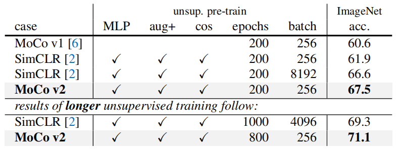

# Improved Baselines with Momentum Contrastive Learning
MoCo_v2: 通过动量对比学习改进基线 2020.3.9 https://arxiv.org/abs/2003.04297

## 阅读笔记
* MoCo + SimCLR : MLP head, 更多的数据增广

## Abstract
Contrastive unsupervised learning has recently shown encouraging progress, e.g., in Momentum Contrast (MoCo) and SimCLR. In this note, we verify the effectiveness of two of SimCLR’s design improvements by implementing them in the MoCo framework. With simple modifications to MoCo— namely, using an MLP projection head and more data augmentation—we establish stronger baselines that outperform SimCLR and do not require large training batches. We hope this will make state-of-the-art unsupervised learning research more accessible. Code will be made public.

对比无监督学习最近显示出令人鼓舞的进展，例如在 Momentum Contrast (MoCo) 和 SimCLR 中。 在本说明中，我们通过在 MoCo 框架中实施 SimCLR 的两项设计改进来验证它们的有效性。 通过对 MoCo 进行简单修改 —— 即使用 MLP 投影头和更多数据增广 —— 我们建立了比 SimCLR 更强大的基线，并且不需要大批量训练。 我们希望这将使最先进的无监督学习研究更容易获得。 代码将公开。

## 1. Introduction
Recent studies on unsupervised representation learning from images [16, 13, 8, 17, 1, 9, 15, 6, 12, 2] are converging on a central concept known as contrastive learning [5]. The results are promising: e.g., Momentum Contrast (MoCo) [6] shows that unsupervised pre-training can surpass its ImageNet-supervised counterpart in multiple detection and segmentation tasks, and SimCLR [2] further reduces the gap in linear classifier performance between unsupervised and supervised pre-training representations.

最近关于 从图像中进行无监督表示学习的研究 [16, 13, 8, 17, 1, 9, 15, 6, 12, 2] 都集中在一个称为对比学习的中心概念上 [5]。 结果很有希望：例如，Momentum Contrast (MoCo) [6] 表明无监督预训练可以在多个检测和分割任务中超越其 ImageNet 监督的对应项，而 SimCLR [2] 进一步缩小了无监督和有监督之间预训练表示在线性分类器上的性能差距。

This note establishes stronger and more feasible baselines built in the MoCo framework. We report that two design improvements used in SimCLR, namely, an MLP projection head and stronger data augmentation, are orthogonal to the frameworks of MoCo and SimCLR, and when used with MoCo they lead to better image classification and object detection transfer learning results. Moreover, the MoCo framework can process a large set of negative samples without requiring large training batches (Fig. 1). In contrast to SimCLR’s large 4k∼8k batches, which require TPU support, our “MoCo v2” baselines can run on a typical 8-GPU machine and achieve better results than SimCLR. We hope these improved baselines will provide a reference for future research in unsupervised learning.

本说明在 MoCo 框架中建立了更强大、更可行的基线。 我们报告说，SimCLR 中使用的两项设计改进，即 MLP 投影头和更强的数据增广，与 MoCo 和 SimCLR 的框架正交，当与 MoCo 一起使用时，它们会带来更好的图像分类和目标检测迁移学习结果。 此外，MoCo 框架可以处理大量负样本而不需要大量训练（图1）。 与需要 TPU 支持的 SimCLR 大型 4k∼8k 批次相比，我们的“MoCo v2”基线可以在典型的 8-GPU 机器上运行，并取得比 SimCLR 更好的结果。 我们希望这些改进的基线能够为未来无监督学习的研究提供参考。

 
Figure 1. A batching perspective of two optimization mechanisms for contrastive learning. Images are encoded into a representation space, in which pairwise affinities are computed. 
图 1. 对比学习的两种优化机制的批处理视角。 图像被编码到表示空间中，在其中计算成对的亲和力。

## 2. Background
### Contrastive learning. 
Contrastive learning [5] is a framework that learns similar/dissimilar representations from data that are organized into similar/dissimilar pairs. This can be formulated as a dictionary look-up problem. An effective contrastive loss function, called InfoNCE [13], is:

对比学习 [5] 是一个框架，它从组织成相似/不相似对的数据中学习相似/不同的表示。 这可以表述为字典查找问题。 一个有效的对比损失函数，称为 InfoNCE [13]，是：

$L_{q,k^+,\{k^−\}} = − log \frac{exp(q·k^+/τ )}{exp(q·k^+/τ ) + \sum_{k−} exp(q·k^−/τ )}$. (1) 

Here q is a query representation, $k^+$ is a representation of the positive (similar) key sample, and {$k^−$} are representations of the negative (dissimilar) key samples. τ is a temperature hyper-parameter. In the instance discrimination pretext task [16] (used by MoCo and SimCLR), a query and a key form a positive pair if they are data-augmented versions of the same image, and otherwise form a negative pair.

这里q是查询表示，$k^+$是正（相似）关键样本的表示，{$k^−$}是负（不相似）关键样本的表示。 τ 是温度超参数。 在实例分割前置任务 [16]（由 MoCo 和 SimCLR 使用）中，如果查询和键是同一图像的数据增广版本，则它们形成正对，否则形成负对。

The contrastive loss (1) can be minimized by various mechanisms that differ in how the keys are maintained [6]. In an end-to-end mechanism (Fig. 1a) [13, 8, 17, 1, 9, 2], the negative keys are from the same batch and updated end-to-end by back-propagation. SimCLR [2] is based on this mechanism and requires a large batch to provide a large set of negatives. In the MoCo mechanism (Fig. 1b) [6], the negative keys are maintained in a queue, and only the queries and positive keys are encoded in each training batch. A momentum encoder is adopted to improve the representation consistency between the current and earlier keys. MoCo decouples the batch size from the number of negatives.

对比损失 (1) 可以通过各种不同的机制来最小化，这些机制在键的维护方式上有所不同 [6]。 在端到端机制（图 1a）[13、8、17、1、9、2] 中，负键来自同一批次，并通过反向传播进行端到端更新。 SimCLR [2] 基于这种机制，需要大量批处理才能提供大量否样本。 在 MoCo 机制中（图 1b）[6]，负键在队列中维护，每个训练批次中仅对查询和正键进行编码。 采用动量编码器来提高当前键和较早键之间的表示一致性。 MoCo 将批量大小与负样本数量分离。

### Improved designs. 
SimCLR [2] improves the end-to-end variant of instance discrimination in three aspects: (i) a substantially larger batch (4k or 8k) that can provide more negative samples; (ii) replacing the output fc projection head [16] with an MLP head; (iii) stronger data augmentation.

改进的设计。 SimCLR [2] 在三个方面改进了实例识别的端到端变体：(i) 更大的批次（4k 或 8k），可以提供更多的负样本;  (ii) 用 MLP 头替换输出 fc 投影头 [16];  (iii) 更强的数据增广。

In the MoCo framework, a large number of negative samples are readily available; the MLP head and data augmentation are orthogonal to how contrastive learning is instantiated. Next we study these improvements in MoCo.

在MoCo框架中，大量负样本已经用上了;  MLP 头和数据增广与对比学习的实例化方式正交。 接下来我们研究 MoCo 中的这些改进。

## 3. Experiments
### Settings. 
Unsupervised learning is conducted on the 1.28M ImageNet [3] training set. We follow two common protocols for evaluation.
(i) ImageNet linear classification: features are frozen and a supervised linear classifier is trained; we report 1-crop (224×224), top-1 validation accuracy.  (ii) Transferring to VOC object detection [4]: a Faster R-CNN detector [14] (C4-backbone) is fine-tuned end-to-end on the VOC 07+12 trainval set(1For all entries -including the supervised and MoCo v1 baselines-, we fine-tune for 24k iterations on VOC, up from 18k in [6]) and evaluated on the VOC 07 test set using the COCO suite of metrics [10]. We use the same hyper-parameters (except when noted) and codebase as MoCo [6]. All results use a standard-size ResNet-50 [7].

设置。 在 1.28M ImageNet [3] 训练集上进行无监督学习。 我们遵循两种常见的评估协议。
1. ImageNet 线性分类：冻结特征并训练有监督的线性分类器;  我们报告 1-crop (224×224)，top-1 验证准确度。
2. 转移到 VOC 对象检测 [4]：Faster R-CNN 检测器 [14]（C4 主干）在 VOC 07+12 trainval 集（1对于所有条目 - 包括 监督和 MoCo v1 基线-，我们微调 VOC 的 24k 迭代，高于 [6] 中的 18k），并使用 COCO 指标套件 [10] 在 VOC 07 测试集上进行评估。 
我们使用与 MoCo [6] 相同的超参数（除非另有说明）和代码库。 所有结果都使用标准尺寸的 ResNet-50 [7]。

### MLP head. 
Following [2], we replace the fc head in MoCo with a 2-layer MLP head (hidden layer 2048-d, with ReLU). Note this only influences the unsupervised training stage; the linear classification or transferring stage does not use this MLP head. Also, following [2], we search for an optimal τ w.r.t. ImageNet linear classification accuracy: 

MLP 头。 按照 [2]，我们将 MoCo 中的 fc 头替换为 2 层 MLP 头（隐藏层 2048-d，带有 ReLU）。 请注意，这只会影响无监督训练阶段;  线性分类或转移阶段不使用此 MLP 头。 此外，在 [2] 之后，我们搜索最佳 τ w.r.t。 ImageNet 线性分类精度：

τ|0.07|0.1|0.2|0.3|0.4|0.5
---|---|---|---|---|---|---
w/o MLP|60.6|60.7|59.0|58.2|57.2|56.4
w/ MLP|62.9|64.9|66.2|65.7|65.0|64.3

Using the default τ = 0.07 [16, 6], pre-training with the MLP head improves from 60.6% to 62.9%; switching to the optimal value for MLP (0.2), the accuracy increases to 66.2%. Table 1(a) shows its detection results: in contrast to the big leap on ImageNet, the detection gains are smaller.

使用默认的 τ = 0.07 [16, 6]，MLP head 的预训练从 60.6% 提高到 62.9%;  切换到 MLP 的最佳值 (0.2)，准确率提高到 66.2%。 表1(a)显示了它的检测结果：对比ImageNet上的大飞跃，检测增益较小。

 
Table 1. Ablation of MoCo baselines, evaluated by ResNet-50 for (i) ImageNet linear classification, and (ii) fine-tuning VOC object detection (mean of 5 trials). “MLP”: with an MLP head; “aug+”: with extra blur augmentation; “cos”: cosine learning rate schedule.
表 1. MoCo 基线的消融，由 ResNet-50 评估 (i) ImageNet 线性分类，和 (ii) 微调 VOC 对象检测（5 次试验的平均值）。 “MLP”：带有MLP头;  “aug+”：带有额外的模糊增广;  “cos”：余弦学习率表。

### Augmentation. 增广
We extend the original augmentation in [6] by including the blur augmentation in [2] (we find the stronger color distortion in [2] has diminishing gains in our higher baselines). The extra augmentation alone (i.e., no MLP) improves the MoCo baseline on ImageNet by 2.8% to 63.4%, Table 1(b). Interestingly, its detection accuracy is higher than that of using the MLP alone, Table 1(b) vs. (a), despite much lower linear classification accuracy (63.4% vs. 66.2%). This indicates that linear classification accuracy is not monotonically related to transfer performance in detection. With the MLP, the extra augmentation boosts ImageNet accuracy to 67.3%, Table 1(c).

我们通过在 [2] 中包含模糊增广来扩展 [6] 中的原始增广（我们发现 [2] 中更强的颜色失真在我们更高的基线中减少了增益）。 单独的额外增广（即没有 MLP）将 ImageNet 上的 MoCo 基线提高了 2.8% 至 63.4%，表 1(b)。 有趣的是，它的检测精度高于单独使用 MLP，表 1(b) 与 (a)，尽管线性分类精度低得多（63.4% 对 66.2%）。 这表明线性分类精度与检测中的传输性能不是单调相关的。 使用 MLP，额外的增广将 ImageNet 精度提高到 67.3%，表 1(c)。

 
Table 2. MoCo vs. SimCLR: ImageNet linear classifier accuracy (ResNet-50, 1-crop 224×224), trained on features from unsupervised pre-training. “aug+” in SimCLR includes blur and stronger color distortion. SimCLR ablations are from Fig. 9 in [2] (we thank the authors for providing the numerical results).  
表 2. MoCo 与 SimCLR：ImageNet 线性分类器精度（ResNet-50，1-crop 224×224），使用无监督预训练的特征进行训练。 SimCLR 中的“aug+”包括模糊和更强的颜色失真。 SimCLR 消融来自 [2] 中的图 9（感谢作者提供数值结果）。

mechanism|batch|memory/GPU|time/200-ep.
---|---|---|---|
MoCo|256|5.0G|53 hrs
end-to-end|256|7.4G|65 hrs
end-to-end|4096|93.0G†|n/a

Table 3. Memory and time cost in 8 V100 16G GPUs, implemented in PyTorch. † : based on our estimation. 
表 3. 8 个 V100 16G GPU 的内存和时间成本，在 PyTorch 中实现。 † ：基于我们的估计。

### Comparison with SimCLR.  与 SimCLR 的比较
Table 2 compares SimCLR [2] with our results, referred to as MoCo v2. For fair comparisons, we also study a cosine (half-period) learning rate schedule [11] which SimCLR adopts. See Table 1(d, e). Using pre-training with 200 epochs and a batch size of 256,MoCo v2 achieves 67.5% accuracy on ImageNet: this is 5.6% higher than SimCLR under the same epochs and batch size, and better than SimCLR’s large-batch result 66.6%. With 800-epoch pre-training, MoCo v2 achieves 71.1%, outperforming SimCLR’s 69.3% with 1000 epochs.

表 2 将 SimCLR [2] 与我们的结果进行了比较，称为 MoCo v2。 为了公平比较，我们还研究了 SimCLR 采用的余弦（半周期）学习率计划 [11]。 见表 1(d, e)。 使用 200 个 epochs 和 256 batch size 的预训练，MoCo v2 在 ImageNet 上达到了 67.5% 的准确率：在相同的 epochs 和 batch size 下比 SimCLR 高 5.6%，优于 SimCLR 的 large-batch 结果 66.6%。 通过 800 个 epoch 的预训练，MoCo v2 达到 71.1%，优于 SimCLR 在 1000 个 epoch 时的 69.3%。

### Computational cost. 计算成本
In Table 3 we report the memory and time cost of our implementation. The end-to-end case re- flects the SimCLR cost in GPUs (instead of TPUs in [2]). The 4k batch size is intractable even in a high-end 8-GPU machine. Also, under the same batch size of 256, the endto-end variant is still more costly in memory and time, because it back-propagates to both q and k encoders, while MoCo back-propagates to the q encoder only.

在表 3 中，我们报告了实施的内存和时间成本。 端到端案例反映了 GPU 中的 SimCLR 成本（而不是 [2] 中的 TPU）。 即使在高端 8-GPU 机器中，4k 批量大小也是难以处理的。 此外，在 256 的相同批大小下，端到端变体在内存和时间上的成本仍然更高，因为它反向传播到 q 和 k 编码器，而 MoCo 仅反向传播到 q 编码器。

Table 2 and 3 suggest that large batches are not necessary for good accuracy, and state-of-the-art results can be made more accessible. The improvements we investigate require only a few lines of code changes to MoCo v1, and we will make the code public to facilitate future research. 

表 2 和表 3 表明，大批量并不是获得良好准确性所必需的，并且可以使最先进的结果更容易获得。 我们调查的改进只需要对 MoCo v1 进行几行代码更改，我们将公开代码以促进未来的研究。

## References
1. Philip Bachman, R Devon Hjelm, and William Buchwalter. Learning representations by maximizing mutual information across views. arXiv:1906.00910, 2019.
2. Ting Chen, Simon Kornblith, Mohammad Norouzi, and Geoffrey Hinton. A simple framework for contrastive learning of visual representations. arXiv:2002.05709, 2020.
3. Jia Deng, Wei Dong, Richard Socher, Li-Jia Li, Kai Li, and Li Fei-Fei. ImageNet: A large-scale hierarchical image database. In CVPR, 2009.
4. Mark Everingham, Luc Van Gool, Christopher KI Williams, John Winn, and Andrew Zisserman. The PASCAL Visual Object Classes (VOC) Challenge. IJCV, 2010.
5. Raia Hadsell, Sumit Chopra, and Yann LeCun. Dimensionality reduction by learning an invariant mapping. In CVPR, 2006.
6. Kaiming He, Haoqi Fan, Yuxin Wu, Saining Xie, and Ross Girshick. Momentum contrast for unsupervised visual representation learning. arXiv:1911.05722, 2019.
7. Kaiming He, Xiangyu Zhang, Shaoqing Ren, and Jian Sun. Deep residual learning for image recognition. In CVPR, 2016.
8. R Devon Hjelm, Alex Fedorov, Samuel Lavoie-Marchildon, Karan Grewal, Adam Trischler, and Yoshua Bengio. Learning deep representations by mutual information estimation and maximization. In ICLR, 2019.
9. Olivier J. Hnaff, Aravind Srinivas, Jeffrey De Fauw, Ali Razavi, Carl Doersch, S. M. Ali Eslami, and Aaron van den Oord. Data-efficient image recognition with contrastive predictive coding. arXiv:1905.09272v2, 2019.
10. Tsung-Yi Lin, Michael Maire, Serge Belongie, James Hays, Pietro Perona, Deva Ramanan, Piotr Doll´ar, and C Lawrence Zitnick. Microsoft COCO: Common objects in context. In ECCV. 2014.
11. Ilya Loshchilov and Frank Hutter. SGDR: Stochastic gradient descent with warm restarts. In ICLR, 2017.
12. Ishan Misra and Laurens van der Maaten. Selfsupervised learning of pretext-invariant representations. arXiv:1912.01991, 2019.
13. Aaron van den Oord, Yazhe Li, and Oriol Vinyals. Representation learning with contrastive predictive coding. arXiv:1807.03748, 2018.
14. Shaoqing Ren, Kaiming He, Ross Girshick, and Jian Sun. Faster R-CNN: Towards real-time object detection with region proposal networks. In NeurIPS, 2015.
15. Yonglong Tian, Dilip Krishnan, and Phillip Isola. Contrastive multiview coding. arXiv:1906.05849, 2019.
16. Zhirong Wu, Yuanjun Xiong, Stella Yu, and Dahua Lin. Unsupervised feature learning via non-parametric instance discrimination. In CVPR, 2018.
17. Mang Ye, Xu Zhang, Pong C Yuen, and Shih-Fu Chang. Unsupervised embedding learning via invariant and spreading instance feature. In CVPR, 2019. 3
