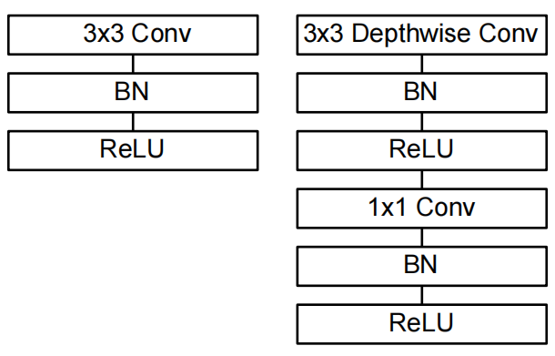

# MobileNets: Efficient Convolutional Neural Networks for Mobile Vision Applications
MobileNets：用于移动视觉应用的高效卷积神经网络 2017-4-17 https://arxiv.org/abs/1704.04861

## 阅读笔记
* https://github.com/pytorch/vision/blob/main/torchvision/models/mobilenet.py
* 深度可分离卷积, depthwise separable convolutions， 先depth，再point，减少计算量
* 2个全局超参数，模型缩放
* depthwise convolution，不同通道采用不同的卷积核
* pointwise convolution， 1*1的普通卷积
* 疑问：普通卷积只需要一步，深度可分类需要串行的2步骤，实际推理过程中，是否会增加耗时？
* 乘积量化[36]、散列[2]和剪枝、矢量量化和霍夫曼编码[5]的压缩
* 因子分解来加速预训练网络[14，20]
* 蒸馏[9]，它使用较大的网络来教导较小的网络
* 低比特网络[4，22，11]

## Abstract
We present a class of efficient models called MobileNets for mobile and embedded vision applications. MobileNets are based on a streamlined architecture that uses depthwise separable convolutions to build light weight deep neural networks. We introduce two simple global hyperparameters that efficiently trade off between latency and accuracy. These hyper-parameters allow the model builder to choose the right sized model for their application based on the constraints of the problem. We present extensive experiments on resource and accuracy tradeoffs and show strong performance compared to other popular models on ImageNet classification. We then demonstrate the effectiveness of MobileNets across a wide range of applications and use cases including object detection, finegrain classification, face attributes and large scale geo-localization.

我们为移动和嵌入式视觉应用提供了一类称为MobileNets的高效模型。MobileNets基于一种流线型架构，使用深度可分离卷积构建轻量级深度神经网络。我们介绍了两个简单的全局超参数，可以有效地在延迟和精度之间进行权衡。这些超参数允许模型构建者基于问题的约束为其应用选择合适大小的模型。我们在资源和精度权衡方面进行了广泛的实验，并与ImageNet分类的其他流行模型相比显示了强大的性能。然后，我们展示了MobileNets在广泛应用程序和用例中的有效性，包括目标检测、细粒度分类、人脸属性和大规模地理定位。

## 1. Introduction
Convolutional neural networks have become ubiquitous in computer vision ever since AlexNet [19] popularized deep convolutional neural networks by winning the ImageNet Challenge: ILSVRC 2012 [24]. The general trend has been to make deeper and more complicated networks in order to achieve higher accuracy [27, 31, 29, 8]. However, these advances to improve accuracy are not necessarily making networks more efficient with respect to size and speed. In many real world applications such as robotics, self-driving car and augmented reality, the recognition tasks need to be carried out in a timely fashion on a computationally limited platform.

自从AlexNet[19]通过赢得ImageNet挑战赛：ILSVRC 2012[24] 推广深度卷积神经网络以来，卷积神经网在计算机视觉中变得无处不在。总的趋势是制作更深、更复杂的网络，以实现更高的精度[27，31，29，8]。然而，这些提高精度的进步并不一定会使网络在大小和速度方面更高效。在机器人、自动驾驶汽车和增强现实等许多现实世界应用中，识别任务需要在有限算力的平台上实际时执行。

This paper describes an efficient network architecture and a set of two hyper-parameters in order to build very small, low latency models that can be easily matched to the design requirements for mobile and embedded vision applications. Section 2 reviews prior work in building small models. Section 3 describes the MobileNet architecture and two hyper-parameters width multiplier and resolution multiplier to define smaller and more efficient MobileNets. Section 4 describes experiments on ImageNet as well a variety of different applications and use cases. Section 5 closes with a summary and conclusion.

本文描述了一种高效的网络架构和一组两个超参数，以构建非常小、低延迟的模型，该模型可以很容易地与移动和嵌入式视觉应用的设计要求相匹配。第2节回顾了构建小模型的前期工作。第3节描述了MobileNet架构和两个超参数宽度乘数和分辨率乘数，以定义更小、更高效的MobileNets。第4节描述了ImageNet上的实验以及各种不同的应用程序和用例。第5节以总结和结论结束。

## 2. Prior Work
There has been rising interest in building small and efficient neural networks in the recent literature, e.g. [16, 34, 12, 36, 22]. Many different approaches can be generally categorized into either compressing pretrained networks or training small networks directly. This paper proposes a class of network architectures that allows a model developer to specifically choose a small network that matches the resource restrictions (latency, size) for their application. MobileNets primarily focus on optimizing for latency but also yield small networks. Many papers on small networks focus only on size but do not consider speed.

在最近的文献中，人们对构建小型高效的神经网络越来越感兴趣，例如[16，34，12，36，22]。许多不同的方法通常可以分为压缩预训练网络或直接训练小网络。本文提出了一类网络架构，允许模型开发人员专门为其应用程序选择符合资源限制(延迟、大小)的小型网络。MobileNets主要关注延迟优化，但也会产生小型网络。许多关于小型网络的论文只关注规模，而不考虑速度。

MobileNets are built primarily from depthwise separable convolutions initially introduced in [26] and subsequently used in Inception models [13] to reduce the computation in the first few layers. Flattened networks [16] build a network out of fully factorized convolutions and showed the potential of extremely factorized networks. Independent of this current paper, Factorized Networks[34] introduces a similar factorized convolution as well as the use of topological connections. Subsequently, the Xception network [3] demonstrated how to scale up depthwise separable filters to out perform Inception V3 networks. Another small network is Squeezenet [12] which uses a bottleneck approach to design a very small network. Other reduced computation networks include structured transform networks [28] and deep fried convnets [37].

MobileNets主要由[26]中最初引入的深度可分离卷积构建，随后在Inception模型[13]中使用，以减少前几层的计算。扁平化网络[16]由完全分解的卷积构建网络，并显示了极端分解网络的潜力。独立于本文，因子网络[34]引入了类似的因子卷积以及拓扑连接的使用。随后，Xception网络[3]演示了如何扩展深度可分离滤波器以超越Inception V3网络。另一个小型网络是Squeezenet[12]，它使用瓶颈方法来设计一个非常小的网络。其他简化计算网络包括结构化变换网络[28]和深度融合变换网络[37]。

A different approach for obtaining small networks is shrinking, factorizing or compressing pretrained networks. Compression based on product quantization [36], hashing [2], and pruning, vector quantization and Huffman coding [5] have been proposed in the literature. Additionally various factorizations have been proposed to speed up pretrained networks [14, 20]. Another method for training small networks is distillation [9] which uses a larger network to teach a smaller network. It is complementary to our approach and is covered in some of our use cases in section 4. Another emerging approach is low bit networks [4, 22, 11].

获得小网络的另一种方法是收缩、分解或压缩预训练网络。文献中已经提出了基于乘积量化[36]、散列[2]和剪枝、矢量量化和霍夫曼编码[5]的压缩。此外，已经提出了各种因子分解来加速预训练网络[14，20]。另一种训练小网络的方法是蒸馏[9]，它使用较大的网络来教导较小的网络。它是对我们方法的补充，并在第4节中的一些用例中进行了介绍。另一种新兴方法是低比特网络[4，22，11]。

 
Figure 1. MobileNet models can be applied to various recognition tasks for efficient on device intelligence. 
图1.MobileNet模型可以应用于各种识别任务，以实现高效的设备智能。

## 3. MobileNet Architecture
In this section we first describe the core layers that MobileNet is built on which are depthwise separable filters. We then describe the MobileNet network structure and conclude with descriptions of the two model shrinking hyperparameters width multiplier and resolution multiplier.

在本节中，我们首先描述MobileNet构建的核心层，这些核心层是深度可分离的过滤器。然后，我们描述了MobileNet网络结构，并以两个模型收缩超参数宽度乘数和分辨率乘数的描述作为结论。

### 3.1. Depthwise Separable Convolution  深度可分离卷积
The MobileNet model is based on depthwise separable convolutions which is a form of factorized convolutions which factorize a standard convolution into a depthwise convolution and a 1×1 convolution called a pointwise convolution. For MobileNets the depthwise convolution applies a single filter to each input channel. The pointwise convolution then applies a 1×1 convolution to combine the outputs the depthwise convolution. A standard convolution both filters and combines inputs into a new set of outputs in one step. The depthwise separable convolution splits this into two layers, a separate layer for filtering and a separate layer for combining. This factorization has the effect of drastically reducing computation and model size. Figure 2 shows how a standard convolution 2(a) is factorized into a depthwise convolution 2(b) and a 1 × 1 pointwise convolution 2(c).

MobileNet模型基于深度可分离卷积，这是一种分解卷积形式，将标准卷积分解为深度卷积和称为点卷积的1×1卷积。对于MobileNets，深度卷积将单个滤波器应用于每个输入信道。然后，逐点卷积应用1×1卷积来组合深度卷积的输出。标准卷积在一个步骤中将输入滤波并组合成一组新的输出。深度可分离卷积将其分为两层，一层用于滤波，另一层用于组合。这种分解具有显著减少计算和模型大小的效果。图2显示了如何将标准卷积2(a)分解为深度卷积2(b)和1×1 点卷积2(c)。

 
Figure 2. The standard convolutional filters in (a) are replaced by two layers: depthwise convolution in (b) and pointwise convolution in (c) to build a depthwise separable filter.
图2.(a)中的标准卷积滤波器被两层替换：(b)中的深度卷积和(c)中的点卷积，以构建深度可分离滤波器。

A standard convolutional layer takes as input a $D_F × D_F × M$ feature map F and produces a $D_F × D_F × N$ feature map G where $D_F$ is the spatial width and height of a square input feature map(1 We assume that the output feature map has the same spatial dimensions as the input and both feature maps are square. Our model shrinking results generalize to feature maps with arbitrary sizes and aspect ratios. ), M is the number of input channels (input depth), DG is the spatial width and height of a square output feature map and N is the number of output channel (output depth).

标准卷积层将$D_F × D_F × M$特征图F作为输入，并生成$D_F × D_F × N$特征图G，其中$D_F$是正方形输入特征图的空间宽度和高度(1 我们假设输出特征图具有与输入相同的空间维度，并且两个特征图都是正方形的。我们的模型收缩结果推广到具有任意大小和纵横比的特征图)，M是输入通道的数量(输入深度)，$D_G$是正方形输出特征图的空间宽度和高度，N是输出通道的数量。

The standard convolutional layer is parameterized by convolution kernel K of size $D_K × D_K × M × N$ where DK is the spatial dimension of the kernel assumed to be square and M is number of input channels and N is the number of output channels as defined previously.
The output feature map for standard convolution assuming stride one and padding is computed as:

标准卷积层由大小为$D_K × D_K × M × N$的卷积核K参数化，其中$D_K$是假定为平方的核的空间维度，M是输入信道的数量，N是先前定义的输出信道的数量。
假设步长为1和填充的标准卷积的输出特征图计算如下：

$G_{k,l,n} = \sum_{i,j,m} K_{i,j,m,n} · F_{k+i−1,l+j−1,m}$ (1)

Standard convolutions have the computational cost of:

标准卷积的计算成本为：

$D_K · D_K · M · N · D_F · D_F $(2) 

where the computational cost depends multiplicatively on the number of input channels M, the number of output channels N the kernel size $D_k × D_k$ and the feature map size $D_F × D_F$ . MobileNet models address each of these terms and their interactions. First it uses depthwise separable convolutions to break the interaction between the number of output channels and the size of the kerne.

其中计算成本乘法地取决于输入通道的数量M、输出通道的数量N、内核大小$D_k×D_k$和特征图大小$D_F×D_F$。首先，它使用深度可分离卷积来打破输出通道数和内核大小之间的相互作用。

The standard convolution operation has the effect of filtering features based on the convolutional kernels and combining features in order to produce a new representation. The filtering and combination steps can be split into two steps via the use of factorized convolutions called depthwise separable convolutions for substantial reduction in computational cost.

标准卷积运算具有基于卷积核过滤特征和组合特征以产生新表示的效果。通过使用被称为深度可分离卷积的分解卷积，可以将滤波和组合步骤分为两个步骤，以大幅降低计算成本。

Depthwise separable convolution are made up of two layers: depthwise convolutions and pointwise convolutions. We use depthwise convolutions to apply a single filter per each input channel (input depth). Pointwise convolution, a simple 1×1 convolution, is then used to create a linear combination of the output of the depthwise layer. MobileNets use both batchnorm and ReLU nonlinearities for both layers.

深度可分离卷积由两层组成：深度卷积和点卷积。我们使用深度卷积对每个输入通道(输入深度)应用单个滤波器。然后使用逐点卷积，即简单的1×1卷积，创建深度层输出的线性组合。MobileNets对两个层都使用了批归一化和ReLU非线性。

Depthwise convolution with one filter per input channel (input depth) can be written as: 

每个输入通道(输入深度)有一个滤波器的深度卷积可以写为：

$ˆG_{k,l,m} = \sum_{i,j}ˆK_{i,j,m} · F_{k+i−1,l+j−1,m} $(3) 

where ˆK is the depthwise convolutional kernel of size $D_K × D_K × M$ where the mth filter in ˆK is applied to the mth channel in F to produce the mth channel of the filtered output feature map ˆG.
其中，ˆK是大小为$D_K×D_K x M$的深度卷积核，其中,ˆK中的第M个滤波器应用于F中的第n个信道，以生成滤波后的输出特征图G的第M信道。

Depthwise convolution has a computational cost of:
深度卷积的计算成本为：

$D_K · D_K · M · D_F · D_F$ (4)

Depthwise convolution is extremely efficient relative to standard convolution. However it only filters input channels, it does not combine them to create new features. So an additional layer that computes a linear combination of the output of depthwise convolution via 1 × 1 convolution is needed in order to generate these new features.

相对于标准卷积，深度卷积非常有效。然而，它只过滤输入通道，不会将它们组合以创建新功能。因此，需要一个额外的层来计算通过1×1卷积的深度卷积输出的线性组合，以生成这些新特征。

The combination of depthwise convolution and 1 × 1 (pointwise) convolution is called depthwise separable convolution which was originally introduced in [26].
Depthwise separable convolutions cost:

深度卷积和1×1(逐点)卷积的组合称为深度可分离卷积，最初在[26]中介绍。
深度可分离卷积成本：

$D_K · D_K · M · D_F · D_F + M · N · D_F · D_F$ (5) 

which is the sum of the depthwise and 1 × 1 pointwise convolutions.
By expressing convolution as a two step process of filtering and combining we get a reduction in computation of:

它是深度卷积和1×1。
通过将卷积表示为滤波和组合的两步过程，我们可以减少以下计算：

$\frac{DK · DK · M · DF · DF + M · N · DF · DF}{DK · DK · M · N · DF · DF }$

$ = \frac{1}{N} + \frac{1}{D^2_K}$

MobileNet uses 3 × 3 depthwise separable convolutions which uses between 8 to 9 times less computation than standard convolutions at only a small reduction in accuracy as seen in Section 4.

MobileNet使用3×3深度可分离卷积，其计算量比标准卷积少8到9倍，精度仅略有下降，如第4节所示。

Additional factorization in spatial dimension such as in [16, 31] does not save much additional computation as very little computation is spent in depthwise convolutions. 

空间维度中的额外因式分解(如[16，31]中所述)不会节省太多额外的计算，因为深度卷积中花费的计算很少。

### 3.2. Network Structure and Training
The MobileNet structure is built on depthwise separable convolutions as mentioned in the previous section except for the first layer which is a full convolution. By defining the network in such simple terms we are able to easily explore network topologies to find a good network. The MobileNet architecture is defined in Table 1. All layers are followed by a batchnorm [13] and ReLU nonlinearity with the exception of the final fully connected layer which has no nonlinearity and feeds into a softmax layer for classification. Figure 3 contrasts a layer with regular convolutions, batchnorm and ReLU nonlinearity to the factorized layer with depthwise convolution, 1 × 1 pointwise convolution as well as batchnorm and ReLU after each convolutional layer. Down sampling is handled with strided convolution in the depthwise convolutions as well as in the first layer. A final average pooling reduces the spatial resolution to 1 before the fully connected layer. Counting depthwise and pointwise convolutions as separate layers, MobileNet has 28 layers.

MobileNet结构构建在深度可分离的卷积上，如前一节所述，除了第一层是全卷积。通过用如此简单的术语定义网络，我们能够轻松地探索网络拓扑，以找到一个好的网络。MobileNet架构如表1所示。所有层后面都是批归一化[13]和ReLU非线性，但最终完全连接的层除外，该层没有非线性，并馈入softmax层进行分类。图3将具有规则卷积、批归一化和ReLU非线性的层与具有深度卷积、1×1点卷积以及每个卷积层之后的批归一化与ReLU的分解层进行了对比。下采样在深度卷积和第一层中使用跨步卷积处理。最终平均池化在完全连接层之前将空间分辨率降低到1。将深度卷积和点卷积计算为单独的层，MobileNet有28层。

 
Figure 3. Left: Standard convolutional layer with batchnorm and ReLU. Right: Depthwise Separable convolutions with Depthwise and Pointwise layers followed by batchnorm and ReLU. 
图3：左：具有批归一化和ReLU的标准卷积层。右：深度可分离卷积，带Depthwire和Pointwise层，后跟batchnorm和ReLU。

It is not enough to simply define networks in terms of a small number of Mult-Adds. It is also important to make sure these operations can be efficiently implementable. For instance unstructured sparse matrix operations are not typically faster than dense matrix operations until a very high level of sparsity. Our model structure puts nearly all of the computation into dense 1 × 1 convolutions. This can be implemented with highly optimized general matrix multiply (GEMM) functions. Often convolutions are implemented by a GEMM but require an initial reordering in memory called im2col in order to map it to a GEMM. For instance, this approach is used in the popular Caffe package [15]. 1×1 convolutions do not require this reordering in memory and can be implemented directly with GEMM which is one of the most optimized numerical linear algebra algorithms. MobileNet spends 95% of it’s computation time in 1 × 1 convolutions which also has 75% of the parameters as can be seen in Table 2. Nearly all of the additional parameters are in the fully connected layer.

仅仅用少量的Mult-Adds(乘-加操作)来定义网络是不够的。同样重要的是，确保这些操作能够有效实施。例如，非结构化稀疏矩阵运算通常不比密集矩阵运算快，直到达到非常高的稀疏度。我们的模型结构将几乎所有的计算都放入密集的1×1卷积中。这可以通过高度优化的通用矩阵乘法(GEMM)函数来实现。卷积通常由GEMM实现，但需要在称为im2col的内存中进行初始重新排序，以便将其映射到GEMM。例如，在流行的Caffe包中使用了这种方法[15]。1×1卷积不需要在存储器中重新排序，可以直接用GEMM实现，GEMM是最优化的数值线性代数算法之一。MobileNet在1×1卷积中花费了95%的计算时间，如表2所示，该卷积也有75%的参数。几乎所有附加参数都在完全连接层中。

MobileNet models were trained in TensorFlow [1] using RMSprop [33] with asynchronous gradient descent similar to Inception V3 [31]. However, contrary to training large models we use less regularization and data augmentation techniques because small models have less trouble with overfitting. When training MobileNets we do not use side heads or label smoothing and additionally reduce the amount image of distortions by limiting the size of small crops that are used in large Inception training [31]. Additionally, we found that it was important to put very little or no weight decay (l2 regularization) on the depthwise filters since their are so few parameters in them. For the ImageNet benchmarks in the next section all models were trained with same training parameters regardless of the size of the model.

MobileNet模型在TensorFlow[1]中使用RMSprop[33]进行训练，具有类似于Inception V3[31]的异步梯度下降。然而，与训练大模型相反，我们使用较少的正则化和数据增广技术，因为小模型的过拟合问题较少。在训练MobileNets时，我们不使用侧头或标签平滑，并通过限制大型Inception训练中使用的小剪裁的大小来减少图像失真量[31]。此外，我们发现在深度方向滤波器上放置很少或没有权重衰减(l2正则化)非常重要，因为它们的参数非常少。对于下一节中的ImageNet基准测试，所有模型都使用相同的训练参数进行训练，而不管模型的大小。

### 3.3. Width Multiplier: Thinner Models 宽度倍增器：轻量模型
Although the base MobileNet architecture is already small and low latency, many times a specific use case or application may require the model to be smaller and faster. In order to construct these smaller and less computationally expensive models we introduce a very simple parameter α called width multiplier. The role of the width multiplier α is to thin a network uniformly at each layer. For a given layer and width multiplier α, the number of input channels M becomes αM and the number of output channels N becomes αN.

尽管基本的MobileNet架构已经很小，而且延迟很低，但很多时候，特定的用例或应用程序可能需要更小更快的模型。为了构建这些更小且计算成本更低的模型，我们引入了一个非常简单的参数α，称为宽度乘数。宽度乘数α的作用是在每一层均匀地细化网络。对于给定的层和宽度乘数α，输入通道的数量M变为αM，输出通道的数量N变为αN。

 
Table 1. MobileNet Body Architecture
表1。MobileNet身体结构

 
Table 2. Resource Per Layer Type 
表2。每层资源类型

The computational cost of a depthwise separable convolution with width multiplier α is:
具有宽度乘数α的深度可分离卷积的计算成本为：

$D_K · D_K · αM · D_F · D_F + αM · αN · D_F · D_F$ (6) 

where α ∈ (0, 1] with typical settings of 1, 0.75, 0.5 and 0.25. α = 1 is the baseline MobileNet and α < 1 are reduced MobileNets. Width multiplier has the effect of reducing computational cost and the number of parameters quadratically by roughly $α^2$ . Width multiplier can be applied to any model structure to define a new smaller model with a reasonable accuracy, latency and size trade off. It is used to define a new reduced structure that needs to be trained from scratch.

其中α∈(0，1]，典型设置为1，0.75，0.5和0.25。α=1是基线MobileNet，α<1是简化的MobileNet。宽度乘数的作用是将计算成本和参数数量按二次方减少大约$α^2$。宽度乘数可以应用于任何模型结构，以定义具有合理精度、延迟和大小权衡的新的较小模型。它用于定义需要从头开始训练的新的简化结构。

### 3.4. Resolution Multiplier: Reduced Representation 分辨率乘数：简化表示
The second hyper-parameter to reduce the computational cost of a neural network is a resolution multiplier ρ. We apply this to the input image and the internal representation of every layer is subsequently reduced by the same multiplier. In practice we implicitly set ρ by setting the input resolution.

降低神经网络计算成本的第二个超参数是分辨率乘数ρ。我们将此应用于输入图像，然后通过相同的乘数减少每个层的内部表示。实际上，我们通过设置输入分辨率隐式地设置ρ。

We can now express the computational cost for the core layers of our network as depthwise separable convolutions with width multiplier α and resolution multiplier ρ:

我们现在可以将网络核心层的计算成本表示为具有宽度乘数α和分辨率乘数ρ的深度可分离卷积：

$D_K · D_K · αM · ρD_F · ρD_F + αM · αN · ρD_F · ρD_F $(7) 

where ρ ∈ (0, 1] which is typically set implicitly so that the input resolution of the network is 224, 192, 160 or 128. ρ = 1 is the baseline MobileNet and ρ < 1 are reduced computation MobileNets. Resolution multiplier has the effect of reducing computational cost by $ρ^2$ .

其中ρ∈(0，1])通常隐式设置，使得网络的输入分辨率为224、192、160或128。ρ=1是基线MobileNet，ρ<1是简化计算MobileNet。分辨率乘数具有将计算成本降低$ρ^2$的效果。

As an example we can look at a typical layer in MobileNet and see how depthwise separable convolutions, width multiplier and resolution multiplier reduce the cost and parameters. Table 3 shows the computation and number of parameters for a layer as architecture shrinking methods are sequentially applied to the layer. The first row shows the Mult-Adds and parameters for a full convolutional layer with an input feature map of size 14 × 14 × 512 with a kernel K of size 3 × 3 × 512 × 512. We will look in detail in the next section at the trade offs between resources and accuracy.

作为一个例子，我们可以看看MobileNet中的一个典型层，看看深度可分离卷积、宽度乘数和分辨率乘数如何降低成本和参数。表3显示了当架构收缩方法顺序应用于层时，层的计算和参数数量。第一行显示了全卷积层的Mult Adds和参数，输入特征图大小为14×14×512，内核K大小为3×3×512×512。我们将在下一节中详细讨论资源和精度之间的权衡。

Table 3. Resource usage for modifications to standard convolution. Note that each row is a cumulative effect adding on top of the previous row. This example is for an internal MobileNet layer with DK = 3, M = 512, N = 512, DF = 14.
表3。标准卷积修改的资源使用。请注意，每一行都是在前一行之上添加的累积效果。此样本适用于DK=3、M=512、N=512、DF=14的内部MobileNet层。

## 4. Experiments
In this section we first investigate the effects of depthwise convolutions as well as the choice of shrinking by reducing the width of the network rather than the number of layers. We then show the trade offs of reducing the network based on the two hyper-parameters: width multiplier and resolution multiplier and compare results to a number of popular models. We then investigate MobileNets applied to a number of different applications.

在本节中，我们首先研究深度卷积的影响，以及通过减少网络宽度而不是层数来缩小的选择。然后，我们展示了基于两个超参数(宽度乘数和分辨率乘数)减少网络的权衡，并将结果与一些流行模型进行了比较。然后，我们研究了应用于许多不同应用程序的MobileNets。

### 4.1. Model Choices
First we show results for MobileNet with depthwise separable convolutions compared to a model built with full convolutions. In Table 4 we see that using depthwise separable convolutions compared to full convolutions only reduces accuracy by 1% on ImageNet was saving tremendously on mult-adds and parameters.

首先，我们展示了与使用全卷积构建的模型相比，具有深度可分离卷积的MobileNet的结果。在表4中，我们看到，与全卷积相比，使用深度可分离卷积仅将ImageNet上的精度降低1%。这大大节省了多次加法和参数。

 
Table 4. Depthwise Separable vs Full Convolution MobileNet
表4。深度可分离与全卷积MobileNet

We next show results comparing thinner models with width multiplier to shallower models using less layers. To make MobileNet shallower, the 5 layers of separable filters with feature size 14 × 14 × 512 in Table 1 are removed. Table 5 shows that at similar computation and number of parameters, that making MobileNets thinner is 3% better than making them shallower.

接下来，我们将显示使用宽度乘数的较薄模型与使用较少层的较浅模型的比较结果。为了使MobileNet更浅，删除了表1中特征尺寸为14×14×512的5层可分离滤波器。表5显示，在类似的计算和参数数量下，使MobileNets更薄比使其更浅要好3%。

 
Table 5. Narrow vs Shallow MobileNet
表5。窄与浅MobileNet

### 4.2. Model Shrinking Hyperparameters 模型收缩超参数
Table 6 shows the accuracy, computation and size trade offs of shrinking the MobileNet architecture with the width multiplier α. Accuracy drops off smoothly until the architecture is made too small at α = 0.25.

表6显示了使用宽度乘数α缩小MobileNet架构的精度、计算和大小权衡。精度平稳下降，直到架构在α=0.25时变得太小。

 
Table 6. MobileNet Width Multiplier
表6。MobileNet宽度乘数

Table 7 shows the accuracy, computation and size trade offs for different resolution multipliers by training MobileNets with reduced input resolutions. Accuracy drops off smoothly across resolution.
表7显示了通过训练具有降低的输入分辨率的MobileNets，不同分辨率乘数的精度、计算和大小权衡。精度在分辨率上平稳下降。

 
Table 7. MobileNet Resolution
表7。MobileNet分辨率

Figure 4 shows the trade off between ImageNet Accuracy and computation for the 16 models made from the cross product of width multiplier α ∈ {1, 0.75, 0.5, 0.25} and resolutions {224, 192, 160, 128}. Results are log linear with a jump when models get very small at α = 0.25.

图4显示了由宽度乘数α∈｛1，0.75，0.5，0.25｝和分辨率｛224，192，160，128｝的叉积制成的16个模型的ImageNet精度和计算之间的权衡。当模型在α=0.25时变得非常小时，结果是具有跳跃的对数线性。

Figure 4. This figure shows the trade off between computation (Mult-Adds) and accuracy on the ImageNet benchmark. Note the log linear dependence between accuracy and computation.
图4。该图显示了ImageNet基准的计算(Mult Adds)和精度之间的权衡。注意精度和计算之间的对数线性关系。

Figure 5. This figure shows the trade off between the number of parameters and accuracy on the ImageNet benchmark. The colors encode input resolutions. The number of parameters do not vary based on the input resolution.
图5。该图显示了ImageNet基准测试中参数数量和精度之间的权衡。颜色编码输入分辨率。参数的数量不会根据输入分辨率而变化。

Figure 5 shows the trade off between ImageNet Accuracy and number of parameters for the 16 models made from the cross product of width multiplier α ∈ {1, 0.75, 0.5, 0.25} and resolutions {224, 192, 160, 128}.
图5显示了由宽度乘数α∈｛1，0.75，0.5，0.25｝和分辨率｛224，192，160，128｝的叉积制成的16个模型的ImageNet精度和参数数量之间的权衡。

Table 8 compares full MobileNet to the original GoogleNet [30] and VGG16 [27]. MobileNet is nearly as accurate as VGG16 while being 32 times smaller and 27 times less compute intensive. It is more accurate than GoogleNet while being smaller and more than 2.5 times less computation.
表8将完整的MobileNet与原始GoogleNet[30]和VGG16[27]进行了比较。MobileNet几乎与VGG16一样精确，同时其体积小32倍，计算密集度低27倍。它比GoogleNet更精确，同时体积更小，计算量少2.5倍以上。

Table 9 compares a reduced MobileNet with width multiplier α = 0.5 and reduced resolution 160 × 160. Reduced MobileNet is 4% better than AlexNet [19] while being 45× smaller and 9.4× less compute than AlexNet. It is also 4% better than Squeezenet [12] at about the same size and 22× less computation.
表9比较了宽度乘数α=0.5和分辨率160×160的简化MobileNet。简化的MobileNet比AlexNet好4%[19]，同时比AlexNet小45倍，计算量少9.4倍。在大约相同的大小和22倍的计算量下，它也比Squeezenet[12]好4%。

 
Table 8. MobileNet Comparison to Popular Models
表8。MobileNet与流行模型的比较

 
Table 9. Smaller MobileNet Comparison to Popular Models
表9。与流行模型相比，更小的MobileNet

 
Table 10. MobileNet for Stanford Dogs
表10。斯坦福狗的MobileNet

 
Table 11. Performance of PlaNet using the MobileNet architecture. Percentages are the fraction of the Im2GPS test dataset that were localized within a certain distance from the ground truth. The numbers for the original PlaNet model are based on an updated version that has an improved architecture and training dataset.
表11。使用MobileNet架构的PlaNet性能。百分比是Im2GPS测试数据集的一部分，这些数据集位于距离地面真相一定距离内。原始PlaNet模型的数字基于具有改进的架构和训练数据集的更新版本。

### 4.3. Fine Grained Recognition 细粒度识别
We train MobileNet for fine grained recognition on the Stanford Dogs dataset [17]. We extend the approach of [18] and collect an even larger but noisy training set than [18] from the web. We use the noisy web data to pretrain a fine grained dog recognition model and then fine tune the model on the Stanford Dogs training set. Results on Stanford Dogs test set are in Table 10. MobileNet can almost achieve the state of the art results from [18] at greatly reduced computation and size.

我们在斯坦福狗数据集上训练MobileNet进行细粒度识别[17]。我们扩展了[18]的方法，并从网络上收集了比[18]更大但噪声更大的训练集。我们使用有噪声的网络数据来预处理细粒度的狗识别模型，然后在斯坦福狗训练集上对该模型进行微调。斯坦福犬测试集的结果见表10。MobileNet几乎可以在大大减少计算量和大小的情况下实现[18]中的最新结果。

### 4.4. Large Scale Geolocalizaton
PlaNet [35] casts the task of determining where on earth a photo was taken as a classification problem. The approach divides the earth into a grid of geographic cells that serve as the target classes and trains a convolutional neural network on millions of geo-tagged photos. PlaNet has been shown to successfully localize a large variety of photos and to outperform Im2GPS [6, 7] that addresses the same task.

PlaNet[35]将确定照片样本地点的任务作为分类问题。该方法将地球划分为一个作为目标类别的地理单元网格，并在数百万张带有地理标记的照片上训练卷积神经网络。PlaNet已被证明成功地定位了大量照片，并优于Im2GPS[6，7]，其解决了相同的任务。

We re-train PlaNet using the MobileNet architecture on the same data. While the full PlaNet model based on the Inception V3 architecture [31] has 52 million parameters and 5.74 billion mult-adds. The MobileNet model has only 13 million parameters with the usual 3 million for the body and 10 million for the final layer and 0.58 Million mult-adds. As shown in Tab. 11, the MobileNet version delivers only slightly decreased performance compared to PlaNet despite being much more compact. Moreover, it still outperforms Im2GPS by a large margin.

我们在相同的数据上使用MobileNet架构重新训练PlaNet。而基于Inception V3架构[31]的完整PlaNet模型有5200万个参数和57.4亿个增量。MobileNet模型只有1300万个参数，通常身体为300万个，最后一层为1000万个，增加了58万个。如表11所示，与PlaNet相比，MobileNet版本的性能仅略有下降，尽管它更加紧凑。此外，它仍以较大幅度超过Im2GPS。

### 4.5. Face Attributes
Another use-case for MobileNet is compressing large systems with unknown or esoteric training procedures. In a face attribute classification task, we demonstrate a synergistic relationship between MobileNet and distillation [9], a knowledge transfer technique for deep networks. We seek to reduce a large face attribute classifier with 75 million parameters and 1600 million Mult-Adds. The classifier is trained on a multi-attribute dataset similar to YFCC100M [32].

MobileNet的另一个用例是使用未知或深奥的训练过程压缩大型系统。在面部属性分类任务中，我们展示了MobileNet和深度网络的知识迁移技术蒸馏[9]之间的协同关系。我们试图减少具有7500万个参数和1600万个Mult Adds的大型面部属性分类器。分类器在类似于YFCC100M[32]的多属性数据集上训练。

We distill a face attribute classifier using the MobileNet architecture. Distillation [9] works by training the classifier to emulate the outputs of a larger model(2 The emulation quality is measured by averaging the per-attribute cross-entropy over all attributes.) instead of the ground-truth labels, hence enabling training from large (and potentially infinite) unlabeled datasets. Marrying the scalability of distillation training and the parsimonious parameterization of MobileNet, the end system not only requires no regularization (e.g. weight-decay and early-stopping), but also demonstrates enhanced performances. It is evident from Tab. 12 that the MobileNet-based classifier is resilient to aggressive model shrinking: it achieves a similar mean average precision across attributes (mean AP) as the in-house while consuming only 1% the Multi-Adds.

我们使用MobileNet架构提取人脸属性分类器。蒸馏[9]通过训练分类器来模拟更大模型的输出(2通过对所有属性的每个属性交叉熵进行平均来测量模拟质量)，而不是地面真值标签，因此能够从大型(可能无限)未标注数据集进行训练。结合蒸馏训练的可扩展性和MobileNet的简约参数化，最终系统不仅不需要正则化(例如重量衰减和提前停止)，而且表现出增强的性能。从表12中可以明显看出，基于MobileNet的分类器对激进的模型收缩具有弹性：它实现了与内部相似的属性平均精度(平均AP)，同时只消耗1%的Multi-Adds。

 
Table 12. Face attribute classification using the MobileNet architecture. Each row corresponds to a different hyper-parameter setting (width multiplier α and image resolution).
表12。使用MobileNet架构的面部属性分类。每行对应不同的超参数设置(宽度乘数α和图像分辨率)。

### 4.6. Object Detection
MobileNet can also be deployed as an effective base network in modern object detection systems. We report results for MobileNet trained for object detection on COCO data based on the recent work that won the 2016 COCO challenge [10]. In table 13, MobileNet is compared to VGG and Inception V2 [13] under both Faster-RCNN [23] and SSD [21] framework. In our experiments, SSD is evaluated with 300 input resolution (SSD 300) and Faster-RCNN is compared with both 300 and 600 input resolution (FasterRCNN 300, Faster-RCNN 600). The Faster-RCNN model evaluates 300 RPN proposal boxes per image. The models are trained on COCO train+val excluding 8k minival images and evaluated on minival. For both frameworks, MobileNet achieves comparable results to other networks with only a fraction of computational complexity and model size.

MobileNet也可以作为现代目标检测系统中的有效基础网络部署。我们根据最近赢得2016年COCO挑战的工作，报告了针对COCO数据进行对象检测训练的MobileNet的结果[10]。在表13中，在Faster RCNN[23]和SSD[21]框架下，MobileNet与VGG和Inception V2[13]进行了比较。在我们的实验中，SSD以300输入分辨率(SSD 300)进行评估，更快的RCNN与300和600输入分辨率(FasterRCNN 300、更快的RCNN600)进行比较。更快的RCNN模型评估每个图像的300个RPN提案框。模型在COCO train+val上进行训练，不包括8k的minival图像，并在minival上进行评估。对于这两种框架，MobileNet只需很少的计算复杂度和模型大小就可以获得与其他网络相当的结果。

 
Table 13. COCO object detection results comparison using different frameworks and network architectures. mAP is reported with COCO primary challenge metric (AP at IoU=0.50:0.05:0.95)
表13。使用不同的框架和网络架构比较COCO对象检测结果。mAP与COCO主要攻击指标一起报告(IoU时的AP=0.50:0.05:0.95) 
Figure 6. Example objection detection results using MobileNet SSD. 
图6。使用MobileNet SSD的异议检测结果样本。

### 4.7. Face Embeddings
The FaceNet model is a state of the art face recognition model [25]. It builds face embeddings based on the triplet loss. To build a mobile FaceNet model we use distillation to train by minimizing the squared differences of the output of FaceNet and MobileNet on the training data. Results for very small MobileNet models can be found in table 14.

FaceNet模型是最先进的人脸识别模型[25]。它基于三元组loss构建人脸嵌入。为了建立一个移动FaceNet模型，我们通过最小化训练数据上FaceNet和MobileNet输出的平方差，使用蒸馏来训练。非常小的MobileNet模型的结果见表14。

 
Table 14. MobileNet Distilled from FaceNet
表14。从FaceNet提取的MobileNet

## 5. Conclusion
We proposed a new model architecture called MobileNets based on depthwise separable convolutions. We investigated some of the important design decisions leading to an efficient model. We then demonstrated how to build smaller and faster MobileNets using width multiplier and resolution multiplier by trading off a reasonable amount of accuracy to reduce size and latency. We then compared different MobileNets to popular models demonstrating superior size, speed and accuracy characteristics. We concluded by demonstrating MobileNet’s effectiveness when applied to a wide variety of tasks. As a next step to help adoption and exploration of MobileNets, we plan on releasing models in Tensor Flow.

我们提出了一种新的基于深度可分离卷积的移动网络模型架构。我们研究了一些重要的设计决策，得出了一个有效的模型。然后，我们演示了如何使用宽度乘数和分辨率乘数构建更小、更快的移动网络，通过权衡合理的精度来减少大小和延迟。然后，我们将不同的MobileNet与流行的模型进行了比较，证明了其尺寸、速度和精度的优越性。最后，我们展示了MobileNet在应用于各种任务时的有效性。作为帮助采用和探索MobileNets的下一步，我们计划在TensorFlow中发布模型。

## References
1. M. Abadi, A. Agarwal, P. Barham, E. Brevdo, Z. Chen, C. Citro, G. S. Corrado, A. Davis, J. Dean, M. Devin, et al. Tensorflow: Large-scale machine learning on heterogeneous systems, 2015. Software available from tensorflow. org, 1, 2015. 4
2. W. Chen, J. T. Wilson, S. Tyree, K. Q. Weinberger, and Y. Chen. Compressing neural networks with the hashing trick. CoRR, abs/1504.04788, 2015. 2
3. F. Chollet. Xception: Deep learning with depthwise separable convolutions. arXiv preprint arXiv:1610.02357v2, 2016. 1
4. M. Courbariaux, J.-P. David, and Y. Bengio. Training deep neural networks with low precision multiplications. arXiv preprint arXiv:1412.7024, 2014. 2
5. S. Han, H. Mao, and W. J. Dally. Deep compression: Compressing deep neural network with pruning, trained quantization and huffman coding. CoRR, abs/1510.00149, 2, 2015. 2
6. J. Hays and A. Efros. IM2GPS: estimating geographic information from a single image. In Proceedings of the IEEE International Conference on Computer Vision and Pattern Recognition, 2008. 7
7. J. Hays and A. Efros. Large-Scale Image Geolocalization. In J. Choi and G. Friedland, editors, Multimodal Location Estimation of Videos and Images. Springer, 2014. 6, 7
8. K. He, X. Zhang, S. Ren, and J. Sun. Deep residual learning for image recognition. arXiv preprint arXiv:1512.03385,2015. 1
9. G. Hinton, O. Vinyals, and J. Dean. Distilling the knowledge in a neural network. arXiv preprint arXiv:1503.02531, 2015. 2, 7
10. J. Huang, V. Rathod, C. Sun, M. Zhu, A. Korattikara, A. Fathi, I. Fischer, Z. Wojna, Y. Song, S. Guadarrama, et al. Speed/accuracy trade-offs for modern convolutional object detectors. arXiv preprint arXiv:1611.10012, 2016. 7
11. I. Hubara, M. Courbariaux, D. Soudry, R. El-Yaniv, and Y. Bengio. Quantized neural networks: Training neural networks with low precision weights and activations. arXiv preprint arXiv:1609.07061, 2016. 2
12. F. N. Iandola, M. W. Moskewicz, K. Ashraf, S. Han, W. J. Dally, and K. Keutzer. Squeezenet: Alexnet-level accuracy with 50x fewer parameters and¡ 1mb model size. arXiv preprint arXiv:1602.07360, 2016. 1, 6
13. S. Ioffe and C. Szegedy. Batch normalization: Accelerating deep network training by reducing internal covariate shift. arXiv preprint arXiv:1502.03167, 2015. 1, 3, 7
14. M. Jaderberg, A. Vedaldi, and A. Zisserman. Speeding up convolutional neural networks with low rank expansions. arXiv preprint arXiv:1405.3866, 2014. 2
15. Y. Jia, E. Shelhamer, J. Donahue, S. Karayev, J. Long, R. Girshick, S. Guadarrama, and T. Darrell. Caffe: Convolutional architecture for fast feature embedding. arXiv preprint arXiv:1408.5093, 2014. 4
16. J. Jin, A. Dundar, and E. Culurciello. Flattened convolutional neural networks for feedforward acceleration. arXiv preprint arXiv:1412.5474, 2014. 1, 3
17. A. Khosla, N. Jayadevaprakash, B. Yao, and L. Fei-Fei. Novel dataset for fine-grained image categorization. In First Workshop on Fine-Grained Visual Categorization, IEEE Conference on Computer Vision and Pattern Recognition, Colorado Springs, CO, June 2011. 6
18. J. Krause, B. Sapp, A. Howard, H. Zhou, A. Toshev, T. Duerig, J. Philbin, and L. Fei-Fei. The unreasonable effectiveness of noisy data for fine-grained recognition. arXiv preprint arXiv:1511.06789, 2015. 6
19. A. Krizhevsky, I. Sutskever, and G. E. Hinton. Imagenet classification with deep convolutional neural networks. In Advances in neural information processing systems, pages 1097–1105, 2012. 1, 6
20. V. Lebedev, Y. Ganin, M. Rakhuba, I. Oseledets, and V. Lempitsky. Speeding-up convolutional neural networks using fine-tuned cp-decomposition. arXiv preprint arXiv:1412.6553, 2014. 2
21. W. Liu, D. Anguelov, D. Erhan, C. Szegedy, and S. Reed. Ssd: Single shot multibox detector. arXiv preprint arXiv:1512.02325, 2015. 7
22. M. Rastegari, V. Ordonez, J. Redmon, and A. Farhadi. Xnornet: Imagenet classification using binary convolutional neural networks. arXiv preprint arXiv:1603.05279, 2016. 1, 2
23. S. Ren, K. He, R. Girshick, and J. Sun. Faster r-cnn: Towards real-time object detection with region proposal networks. In Advances in neural information processing systems, pages 91–99, 2015. 7
24. O. Russakovsky, J. Deng, H. Su, J. Krause, S. Satheesh, S. Ma, Z. Huang, A. Karpathy, A. Khosla, M. Bernstein, et al. Imagenet large scale visual recognition challenge. International Journal of Computer Vision, 115(3):211–252,2015. 1
25. F. Schroff, D. Kalenichenko, and J. Philbin. Facenet: A unified embedding for face recognition and clustering. In Proceedings of the IEEE Conference on Computer Vision and Pattern Recognition, pages 815–823, 2015. 8
26. L. Sifre. Rigid-motion scattering for image classification. PhD thesis, Ph. D. thesis, 2014. 1, 3
27. K. Simonyan and A. Zisserman. Very deep convolutional networks for large-scale image recognition. arXiv preprint arXiv:1409.1556, 2014. 1, 6
28. V. Sindhwani, T. Sainath, and S. Kumar. Structured transforms for small-footprint deep learning. In Advances in Neural Information Processing Systems, pages 3088–3096,2015. 1
29. C. Szegedy, S. Ioffe, and V. Vanhoucke. Inception-v4, inception-resnet and the impact of residual connections on learning. arXiv preprint arXiv:1602.07261, 2016. 1
30. C. Szegedy, W. Liu, Y. Jia, P. Sermanet, S. Reed, D. Anguelov, D. Erhan, V. Vanhoucke, and A. Rabinovich. Going deeper with convolutions. In Proceedings of the IEEE Conference on Computer Vision and Pattern Recognition, pages 1–9, 2015. 6
31. C. Szegedy, V. Vanhoucke, S. Ioffe, J. Shlens, and Z. Wojna. Rethinking the inception architecture for computer vision. arXiv preprint arXiv:1512.00567, 2015. 1, 3, 4, 7
32. B. Thomee, D. A. Shamma, G. Friedland, B. Elizalde, K. Ni, D. Poland, D. Borth, and L.-J. Li. Yfcc100m: The new data in multimedia research. Communications of the ACM, 59(2):64–73, 2016. 7
33. T. Tieleman and G. Hinton. Lecture 6.5-rmsprop: Divide the gradient by a running average of its recent magnitude. COURSERA: Neural Networks for Machine Learning, 4(2), 2012. 4
34. M. Wang, B. Liu, and H. Foroosh. Factorized convolutional neural networks. arXiv preprint arXiv:1608.04337, 2016. 1
35. T. Weyand, I. Kostrikov, and J. Philbin. PlaNet Photo Geolocation with Convolutional Neural Networks. In European Conference on Computer Vision (ECCV), 2016. 6, 7
36. J. Wu, C. Leng, Y. Wang, Q. Hu, and J. Cheng. Quantized convolutional neural networks for mobile devices. arXiv preprint arXiv:1512.06473, 2015. 1
37. Z. Yang, M. Moczulski, M. Denil, N. de Freitas, A. Smola, L. Song, and Z. Wang. Deep fried convnets. In Proceedings of the IEEE International Conference on Computer Vision, pages 1476–1483, 2015. 1
