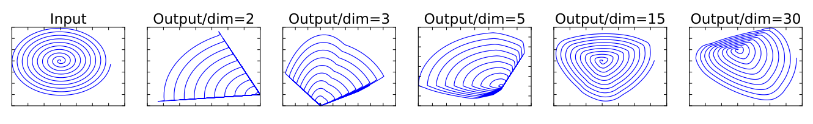
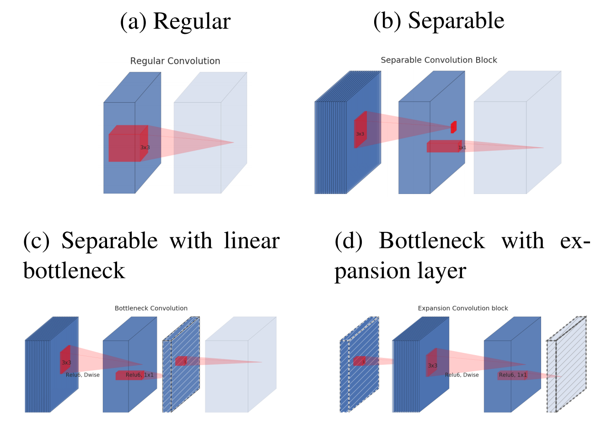
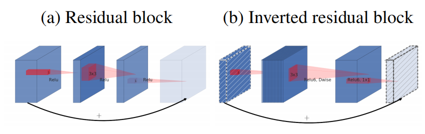
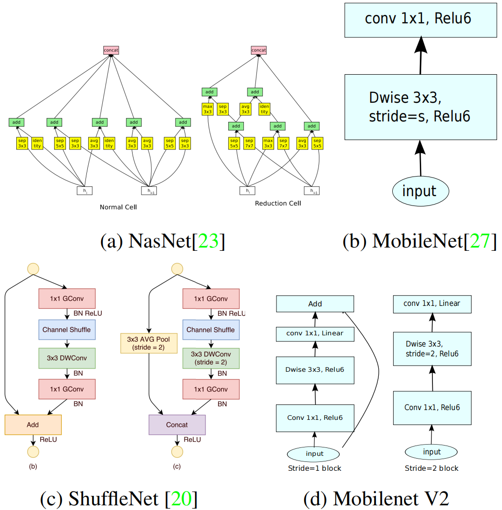

# MobileNetV2: Inverted Residuals and Linear Bottlenecks
反向残差和线性瓶颈 2018-1-13 https://arxiv.org/abs/1801.04381

## 阅读笔记
https://github.com/pytorch/vision/blob/main/torchvision/models/mobilenetv2.py

## Abstract
In this paper we describe a new mobile architecture, MobileNetV2, that improves the state of the art performance of mobile models on multiple tasks and benchmarks as well as across a spectrum of different model sizes. We also describe efficient ways of applying these mobile models to object detection in a novel framework we call SSDLite. Additionally, we demonstrate how to build mobile semantic segmentation models through a reduced form of DeepLabv3 which we call Mobile DeepLabv3. is based on an inverted residual structure where the shortcut connections are between the thin bottleneck layers. The intermediate expansion layer uses lightweight depthwise convolutions to filter features as a source of non-linearity. Additionally, we find that it is important to remove non-linearities in the narrow layers in order to maintain representational power. We demonstrate that this improves performance and provide an intuition that led to this design.

在本文中，我们描述了一种新的移动架构MobileNetV2，它改进了移动模型在多个任务和基准以及不同模型大小范围内的最新性能。我们还描述了在我们称为SSDLite的新框架中将这些移动模型应用于对象检测的有效方法。此外，我们演示了如何通过DeepLabv3的简化形式来构建移动语义分割模型，我们称之为Mobile DeepLabv3。它基于一个倒置的残差结构，其中快捷连接位于薄瓶颈层之间。中间扩展层使用轻量级深度卷积来过滤作为非线性源的特征。此外，我们发现，为了保持表示能力，去除窄层中的非线性是很重要的。我们证明这提高了性能，并提供了导致此设计的直觉。

Finally, our approach allows decoupling of the input/output domains from the expressiveness of the transformation, which provides a convenient framework for further analysis. We measure our performance on ImageNet [1] classification, COCO object detection [2], VOC image segmentation [3]. We evaluate the trade-offs between accuracy, and number of operations measured by multiply-adds (MAdd), as well as actual latency, and the number of parameters.

最后，我们的方法允许将输入/输出域与转换的表现力分离，这为进一步分析提供了方便的框架。我们测量了我们在ImageNet[1]分类、COCO对象检测[2]和VOC图像分割[3]方面的性能。我们评估了精度和乘法相加(MAdd)测量的操作数之间的权衡，以及实际延迟和参数数。

## 1. Introduction
Neural networks have revolutionized many areas of machine intelligence, enabling superhuman accuracy for challenging image recognition tasks. However, the drive to improve accuracy often comes at a cost: modern state of the art networks require high computational resources beyond the capabilities of many mobile and embedded applications.

神经网络已经彻底改变了机器智能的许多领域，为具有挑战性的图像识别任务提供了超人的准确性。然而，提高准确性的努力往往是有代价的：现代最先进的网络需要比许多移动和嵌入式应用程序更高的计算资源。

This paper introduces a new neural network architecture that is specifically tailored for mobile and resource constrained environments. Our network pushes the state of the art for mobile tailored computer vision models, by significantly decreasing the number of operations and memory needed while retaining the same accuracy.

本文介绍了一种专门为移动和资源受限环境量身定制的新神经网络架构。我们的网络通过显著减少所需的操作和内存数量，同时保持相同的准确性，推动了移动定制计算机视觉模型的发展。

Our main contribution is a novel layer module: the inverted residual with linear bottleneck. This module takes as an input a low-dimensional compressed representation which is first expanded to high dimension and filtered with a lightweight depthwise convolution. Features are subsequently projected back to a low-dimensional representation with a linear convolution. The official implementation is available as part of TensorFlow-Slim model library in [4].

我们的主要贡献是一个新的层模块：具有线性瓶颈的反向残差。该模块将低维压缩表示作为输入，首先将其扩展到高维，并使用轻量级深度卷积进行滤波。特征随后被投影回具有线性卷积的低维表示。官方实现可作为[4]中TensorFlow Slim模型库的一部分提供。

This module can be efficiently implemented using standard operations in any modern framework and allows our models to beat state of the art along multiple performance points using standard benchmarks. Furthermore, this convolutional module is particularly suitable for mobile designs, because it allows to signifi- cantly reduce the memory footprint needed during inference by never fully materializing large intermediate tensors. This reduces the need for main memory access in many embedded hardware designs, that provide small amounts of very fast software controlled cache memory.

该模块可以在任何现代框架中使用标准操作高效地实现，并允许我们的模型在使用标准基准测试的多个性能点上击败最新技术。此外，该卷积模块特别适用于移动设计，因为它可以通过从不完全实现大的中间张量来显著减少推理过程中所需的内存占用。这减少了在许多嵌入式硬件设计中对主存储器访问的需求，这些硬件设计提供了少量非常快速的软件控制高速缓存。

## 2. Related Work
Tuning deep neural architectures to strike an optimal balance between accuracy and performance has been an area of active research for the last several years.Both manual architecture search and improvements in training algorithms, carried out by numerous teams has lead to dramatic improvements over early designs such as AlexNet [5], VGGNet [6], GoogLeNet [7]. , and ResNet [8]. Recently there has been lots of progress in algorithmic architecture exploration included hyperparameter optimization [9, 10, 11] as well as various methods of network pruning [12, 13, 14, 15, 16, 17] and connectivity learning [18, 19]. A substantial amount of work has also been dedicated to changing the connectivity structure of the internal convolutional blocks such as in ShuffleNet [20] or introducing sparsity [21] and others [22].

近几年来，调整深度神经架构以在准确性和性能之间取得最佳平衡一直是一个活跃的研究领域。许多团队进行的人工架构搜索和训练算法的改进都导致了早期设计的显著改进，如AlexNet[5]、VGGNet[6]、GoogleLeNet[7]，和ResNet[8]。最近，在算法架构探索方面取得了很多进展，包括超参数优化[9，10，11]以及各种网络修剪方法[12，13，14，15，16，17]和连通性学习[18，19]。大量的工作也致力于改变内部卷积块的连接性结构，如ShuffleNet[20]或引入稀疏性[21]等[22]。

Recently, [23, 24, 25, 26], opened up a new direction of bringing optimization methods including genetic algorithms and reinforcement learning to architectural search. However one drawback is that the resulting networks end up very complex. In this paper, we pursue the goal of developing better intuition about how neural networks operate and use that to guide the simplest possible network design. Our approach should be seen as complimentary to the one described in [23] and related work. In this vein our approach is similar to those taken by [20, 22] and allows to further improve the performance, while providing a glimpse on its internal operation. Our network design is based on MobileNetV1 [27]. It retains its simplicity and does not require any special operators while significantly improves its accuracy, achieving state of the art on multiple image classification and detection tasks for mobile applications.

最近，[23，24，25，26]开辟了一个新的方向，将包括遗传算法和强化学习在内的优化方法引入架构搜索。然而，一个缺点是最终产生的网络非常复杂。在本文中，我们追求的目标是开发关于神经网络如何操作的更好的直觉，并使用它来指导最简单的网络设计。我们的方法应被视为对[23]和相关工作中描述的方法的补充。在这种情况下，我们的方法类似于[20，22]所采取的方法，允许进一步提高性能，同时提供其内部操作的一瞥。我们的网络设计基于MobileNetV1[27]。它保持了其简单性，不需要任何特殊的操作员，同时显著提高了其准确性，在移动应用程序的多个图像分类和检测任务上达到了最先进水平。

## 3. Preliminaries, discussion and intuition  准备、讨论和直觉
### 3.1. Depthwise Separable Convolutions
Depthwise Separable Convolutions are a key building block for many efficient neural network architectures [27, 28, 20] and we use them in the present work as well. The basic idea is to replace a full convolutional operator with a factorized version that splits convolution into two separate layers. The first layer is called a depthwise convolution, it performs lightweight filtering by applying a single convolutional filter per input channel. The second layer is a 1 × 1 convolution, called a pointwise convolution, which is responsible for building new features through computing linear combinations of the input channels.

深度可分离卷积是许多高效神经网络架构的关键构建块[27，28，20]，我们也在当前工作中使用它们。其基本思想是用一个因子化的版本替换一个完整的卷积算子，该版本将卷积分解为两个独立的层。第一层被称为深度卷积，它通过对每个输入信道应用单个卷积滤波器来执行轻量化滤波。第二层是1×1卷积，称为逐点卷积，它负责通过计算输入通道的线性组合来构建新的特征。

Standard convolution takes an $h_i × w_i × d_i$ input tensor $L_i$ , and applies convolutional kernel $K ∈ R^{k×k×d_i×d_j}$ to produce an $h_i × w_i × d_j$ output tensor $L_j$ . Standard convolutional layers have the computational cost of $h_i · w_i · d_i · d_j · k · k$.

标准卷积采用$h_i×w_i×d_i$输入张量$L_i$，并应用卷积核$K∈R^{K×K×d_i×d_j}$来产生$h_ix w_i x d_j$输出张量$L_j$。标准卷积层的计算成本为$h_i·w_i·d_i·d_j·k·k$。

Depthwise separable convolutions are a drop-in replacement for standard convolutional layers. Empirically they work almost as well as regular convolutions but only cost: 

深度可分离卷积是标准卷积层的替代品。根据经验，它们几乎与常规卷积一样有效，但只需成本：

$h_i · w_i · d_i(k^2 + d_j )$ (1) 

which is the sum of the depthwise and 1 × 1 pointwise convolutions. Effectively depthwise separable convolution reduces computation compared to traditional layers by almost a factor of $k^2$(1 more precisely, by a factor $k^2d_j/(k^2 + d_j )$) . MobileNetV2 uses k = 3 (3 × 3 depthwise separable convolutions) so the computational cost is 8 to 9 times smaller than that of standard convolutions at only a small reduction in accuracy [27].

它是深度和1×1逐点卷积的和。与传统层相比，深度可分离卷积有效地将计算减少了几乎$k^2$的因子(更准确地说，减少了因子$k^2d_j/(k^2+d_j)$)。MobileNetV2使用k＝3(3×3深度可分离卷积)。 因此，计算成本是标准卷积的8至9倍，精度仅略有降低[27]。

### 3.2. Linear Bottlenecks
Consider a deep neural network consisting of n layers $L_i$ each of which has an activation tensor of dimensions $h_i × w_i × d_i$ . Throughout this section we will be discussing the basic properties of these activation tensors, which we will treat as containers of $h_i × w_i$ “pixels” with $d_i$ dimensions. Informally, for an input set of real images, we say that the set of layer activations (for any layer $L_i$) forms a “manifold of interest”. It has been long assumed that manifolds of interest in neural networks could be embedded in low-dimensional subspaces. In other words, when we look at all individual d-channel pixels of a deep convolutional layer, the information encoded in those values actually lie in some manifold, which in turn is embeddable into a low-dimensional subspace(2 Note that dimensionality of the manifold differs from the dimensionality of a subspace that could be embedded via a linear transformation) .

考虑由n个层$L_i$组成的深度神经网络，每个层具有维度为$h_i×w_i×d_i$的激活张量。在本节中，我们将讨论这些激活张量的基本属性，我们将其视为具有$d_i$维的$h_i×w_i$“像素”的容器。非正式地，对于真实图像的输入集，我们说层激活集(对于任何层$L_i$)形成了“感兴趣的流形”。长期以来，人们一直认为神经网络中感兴趣的流形可以嵌入在低维子空间中。换句话说，当我们观察深度卷积层的所有单个d通道像素时，这些值中编码的信息实际上位于某个流形中，而该流形又可嵌入到低维子空间中(2注意，流形的维数不同于可通过线性变换嵌入的子空间的维数)。

At a first glance, such a fact could then be captured and exploited by simply reducing the dimensionality of a layer thus reducing the dimensionality of the operating space. This has been successfully exploited by MobileNetV1 [27] to effectively trade off between computation and accuracy via a width multiplier parameter, and has been incorporated into efficient model designs of other networks as well [20]. Following that intuition, the width multiplier approach allows one to reduce the dimensionality of the activation space until the manifold of interest spans this entire space. However, this intuition breaks down when we recall that deep convolutional neural networks actually have non-linear per coordinate transformations, such as ReLU. For example, ReLU applied to a line in 1D space produces a ’ray’, where as in $R^n$ space, it generally results in a piece-wise linear curve with n-joints.

乍一看，这样的事实可以通过简单地降低层的维度从而降低操作空间的维度来捕获和利用。MobileNetV1[27]已成功利用这一点，通过宽度乘数参数在计算和精度之间进行有效权衡，并已纳入其他网络的有效模型设计[20]。根据这一直觉，宽度乘数方法允许减少激活空间的维度，直到感兴趣的流形跨越整个空间。然而，当我们回忆起深度卷积神经网络实际上具有非线性每坐标变换(如ReLU)时，这种直觉就崩溃了。例如，应用于1D空间中的线的ReLU会产生“射线”，其中与$R^n$空间中一样，它通常会产生具有n个关节的分段线性曲线。

It is easy to see that in general if a result of a layer transformation ReLU(Bx) has a non-zero volume S, the points mapped to interior S are obtained via a linear transformation B of the input, thus indicating that the part of the input space corresponding to the full dimensional output, is limited to a linear transformation. In other words, deep networks only have the power of a linear classifier on the non-zero volume part of the output domain. We refer to supplemental material for a more formal statement.

很容易看出，通常，如果层变换ReLU(Bx)的结果具有非零体积S，则通过输入的线性变换B获得映射到内部S的点，从而指示对应于全维输出的输入空间的部分被限制为线性变换。换句话说，深度网络仅在输出域的非零体积部分具有线性分类器的能力。我们参考补充材料以获得更正式的声明。

 
Figure 1: Examples of ReLU transformations of low-dimensional manifolds embedded in higher-dimensional spaces. In these examples the initial spiral is embedded into an n-dimensional space using random matrix T followed by ReLU, and then projected back to the 2D space using T −1 .In examples above n = 2, 3 result in information loss where certain points of the manifold collapse into each other, while for n = 15 to 30 the transformation is highly non-convex. 
图1：嵌入高维空间的低维流形的ReLU变换样本。在这些样本中，使用随机矩阵T和ReLU将初始螺旋嵌入到n维空间中，然后使用T−1将其投影回2D空间。在上面的样本中，n=2，3导致信息丢失，其中流形的某些点彼此塌陷，而对于n=15到30，变换是高度非凸的。

 
Figure 2: Evolution of separable convolution blocks. The diagonally hatched texture indicates layers that do not contain non-linearities. The last (lightly colored) layer indicates the beginning of the next block. Note: 2d and 2c are equivalent blocks when stacked. Best viewed in color. 
图2：可分离卷积块的演变。对角阴影纹理表示不包含非线性的层。最后一层(浅色)表示下一个块的开始。注：2d和2c是堆叠时的等效块。最佳颜色。

On the other hand, when ReLU collapses the channel, it inevitably loses information in that channel. However if we have lots of channels, and there is a a structure in the activation manifold that information might still be preserved in the other channels. In supplemental materials, we show that if the input manifold can be embedded into a significantly lower-dimensional subspace of the activation space then the ReLU transformation preserves the information while introducing the needed complexity into the set of expressible functions.

另一方面，当ReLU折叠通道时，它不可避免地会丢失该通道中的信息。然而，如果我们有很多通道，并且激活歧管中有一个结构，那么信息可能仍然保留在其他通道中。在补充材料中，我们表明，如果输入流形可以嵌入到激活空间的显著低维子空间中，则ReLU变换保留了信息，同时将所需的复杂性引入到可表达函数集合中。

To summarize, we have highlighted two properties that are indicative of the requirement that the manifold of interest should lie in a low-dimensional subspace of the higher-dimensional activation space:
1. If the manifold of interest remains non-zero volume after ReLU transformation, it corresponds to a linear transformation. (a) Residual block (b) Inverted residual block
2. ReLU is capable of preserving complete information about the input manifold, but only if the input manifold lies in a low-dimensional subspace of the input space.

总之，我们强调了两个属性，它们表明需要关注的流形位于高维激活空间的低维子空间中：
1. 如果感兴趣的流形在ReLU变换之后保持非零体积，则其对应于线性变换。(a) 残差块(b)倒转残差块
2. ReLU能够保存关于输入流形的完整信息，但仅当输入流形位于输入空间的低维子空间中时。

These two insights provide us with an empirical hint for optimizing existing neural architectures: assuming the manifold of interest is low-dimensional we can capture this by inserting linear bottleneck layers into the convolutional blocks. Experimental evidence suggests that using linear layers is crucial as it prevents nonlinearities from destroying too much information. In Section 6, we show empirically that using non-linear layers in bottlenecks indeed hurts the performance by several percent, further validating our hypothesis(3We note that in the presence of shortcuts the information loss is actually less strong.) . We note that similar reports where non-linearity was helped were reported in [29] where non-linearity was removed from the input of the traditional residual block and that lead to improved performance on CIFAR dataset.

这两个见解为我们提供了优化现有神经架构的经验提示：假设感兴趣的流形是低维的，我们可以通过在卷积块中插入线性瓶颈层来捕捉这一点。实验证据表明，使用线性层至关重要，因为它可以防止非线性破坏太多信息。在第6节中，我们根据经验证明，在瓶颈中使用非线性层确实会影响性能百分之几，进一步验证了我们的假设(3我们注意到，在存在快捷方式的情况下，信息丢失实际上不那么严重)。我们注意到，[29]中报告了类似的非线性帮助报告，其中从传统残差块的输入中去除了非线性，从而提高了CIFAR数据集的性能。

For the remainder of this paper we will be utilizing bottleneck convolutions. We will refer to the ratio between the size of the input bottleneck and the inner size as the expansion ratio.

在本文的剩余部分，我们将利用瓶颈卷积。我们将输入瓶颈的大小与内部大小之间的比率称为扩展比率。

### 3.3. Inverted residuals 反转残差
The bottleneck blocks appear similar to residual block where each block contains an input followed by several bottlenecks then followed by expansion [8]. However, inspired by the intuition that the bottlenecks actually contain all the necessary information, while an expansion layer acts merely as an implementation detail that accompanies a non-linear transformation of the tensor, we use shortcuts directly between the bottlenecks. Figure 3 provides a schematic visualization of the difference in the designs. The motivation for inserting shortcuts is similar to that of classical residual connections: we want to improve the ability of a gradient to propagate across multiplier layers. However, the inverted design is considerably more memory efficient (see Section 5 for details), as well as works slightly better in our experiments.

瓶颈块看起来类似于残差块，其中每个块包含一个输入，然后是几个瓶颈，然后是扩展[8]。然而，受瓶颈实际上包含所有必要信息的直觉启发，而扩展层仅作为伴随张量非线性变换的实现细节，我们直接在瓶颈之间使用快捷方式。图3提供了设计差异的示意图。插入快捷方式的动机与经典残差连接的动机相似：我们希望提高梯度在倍增层之间传播的能力。然而，倒置的设计大大提高了内存效率(详见第5节)，并且在我们的实验中效果稍好。

 
Figure 3: The difference between residual block [8, 30] and inverted residual. Diagonally hatched layers do not use non-linearities. We use thickness of each block to indicate its relative number of channels. Note how classical residuals connects the layers with high number of channels, whereas the inverted residuals connect the bottlenecks. Best viewed in color.
图3：残差块[8，30]和反向残差之间的差异。对角阴影线图层不使用非线性。我们使用每个块的厚度来指示其通道的相对数量。请注意，经典残差如何连接具有大量通道的层，而反向残差如何连接瓶颈。最佳颜色。

Running time and parameter count for bottleneck convolution. The basic implementation structure is illustrated in Table 1. For a block of size h × w, expansion factor t and kernel size k with $d'$ input channels and $d''$ output channels, the total number of multiply add required is $h · w · d' · t(d' + k^2 + d'')$. Compared with (1) this expression has an extra term, as indeed we have an extra 1 × 1 convolution, however the nature of our networks allows us to utilize much smaller input and output dimensions. In Table 3 we compare the needed sizes for each resolution between MobileNetV1,MobileNetV2 and ShuffleNet.

瓶颈卷积的运行时间和参数计数。基本实现结构如表1所示。对于具有$d‘$输入通道和$d‘‘$输出通道的大小为h×w、扩展因子t和内核大小k的块，所需的乘加总数为$h·w·d‘·t(d‘+k ^2+d‘)$。与(1)相比，这个表达式有一个额外的项，因为我们确实有一个1×1的卷积，但是我们网络的性质允许我们使用更小的输入和输出维度。在表3中，我们比较了MobileNetV1、MobileNetV2和ShuffleNet之间每个分辨率所需的大小。

### 3.4. Information flow interpretation 信息流解释
One interesting property of our architecture is that it provides a natural separation between the input/output domains of the building blocks (bottleneck layers), and the layer transformation – that is a non-linear function that converts input to the output. The former can be seen as the capacity of the network at each layer, whereas the latter as the expressiveness. This is in contrast with traditional convolutional blocks, both regular and separable, where both expressiveness and capacity are tangled together and are functions of the output layer depth.

我们架构的一个有趣的特性是，它提供了构建块(瓶颈层)的输入/输出域与层转换之间的自然分离 —— 这是一个将输入转换为输出的非线性函数。前者可以看作是网络在每一层的容量，而后者则是表现力。这与常规和可分离的传统卷积块形成对比，在传统卷积块中，表现力和容量都是纠缠在一起的，并且是输出层深度的函数。

In particular, in our case, when inner layer depth is 0 the underlying convolution is the identity function thanks to the shortcut connection. When the expansion ratio is smaller than 1, this is a classical residual convolutional block [8, 30]. However, for our purposes we show that expansion ratio greater than 1 is the most useful.

特别是，在我们的例子中，当内层深度为0时，由于快捷连接，底层卷积是单位函数。当扩展比小于1时，这是经典的残差卷积块[8，30]。然而，为了我们的目的，我们表明膨胀比大于1是最有用的。

This interpretation allows us to study the expressiveness of the network separately from its capacity and we believe that further exploration of this separation is warranted to provide a better understanding of the network properties.

这种解释使我们能够从网络的容量中独立地研究网络的表达能力，我们认为有必要进一步探索这种分离，以更好地理解网络的属性。

## 4. Model Architecture
Now we describe our architecture in detail. As discussed in the previous section the basic building block is a bottleneck depth-separable convolution with residuals. The detailed structure of this block is shown in Table 1. The architecture of MobileNetV2 contains the initial fully convolution layer with 32 filters, followed by 19 residual bottleneck layers described in the Table 2. We use ReLU6 as the non-linearity because of its robustness when used with low-precision computation [27]. We always use kernel size 3 × 3 as is standard for modern networks, and utilize dropout and batch normalization during training.

现在我们详细描述我们的架构。如前一节所述，基本构建块是具有残差的瓶颈深度可分离卷积。该模块的详细结构如表1所示。MobileNetV2的架构包含具有32个滤波器的初始完全卷积层，然后是表2中描述的19个剩余瓶颈层。我们使用ReLU6作为非线性，因为它在用于低精度计算时具有稳健性[27]。我们总是使用核大小3×3作为现代网络的标准，并在训练过程中使用丢弃和批量归一化。

Table 1: Bottleneck residual block transforming from k to k' channels, with stride s, and expansion factor t.
表1：从k到k'通道的瓶颈残差块转换，步长s和扩展因子t。

With the exception of the first layer, we use constant expansion rate throughout the network. In our experiments we find that expansion rates between 5 and 10 result in nearly identical performance curves, with smaller networks being better off with slightly smaller expansion rates and larger networks having slightly better performance with larger expansion rates.

除了第一层，我们在整个网络中使用恒定的扩展速率。在我们的实验中，我们发现，在5和10之间的扩展速率导致了几乎相同的性能曲线，较小的网络在稍小的扩展速率下表现更好，而较大的网络在较大的扩展速率时表现更好。

For all our main experiments we use expansion factor of 6 applied to the size of the input tensor. For example, for a bottleneck layer that takes 64-channel input tensor and produces a tensor with 128 channels, the intermediate expansion layer is then 64 · 6 = 384 channels.

对于我们的所有主要实验，我们使用了应用于输入张量大小的扩展因子6。例如，对于采用64通道输入张量并产生128通道张量的瓶颈层，则中间扩展层为64·6=384通道。

Trade-off hyper parameters. As in [27] we tailor our architecture to different performance points, by using the input image resolution and width multiplier as tunable hyper parameters, that can be adjusted depending on desired accuracy/performance trade-offs. Our primary network (width multiplier 1, 224 × 224), has a computational cost of 300 million multiply-adds and uses 3.4 million parameters. We explore the performance trade offs, for input resolutions from 96 to 224, and width multipliers of 0.35 to 1.4. The network computational cost ranges from 7 multiply adds to 585M MAdds, while the model size vary between 1.7M and 6.9M parameters.

权衡超参数。如[27]所示，我们通过使用输入图像分辨率和宽度乘数作为可调超参数，根据不同的性能点调整我们的架构，这些参数可以根据期望的精度/性能权衡进行调整。我们的主网络(宽度乘数1，224×224)的计算成本为3亿乘加，使用340万个参数。我们探讨了输入分辨率从96到224，宽度乘数从0.35到1.4的性能权衡。网络计算成本范围从7乘加至585M MAdds，而模型大小在1.7M和6.9M参数之间变化。

One minor implementation difference, with [27] is that for multipliers less than one, we apply width multiplier to all layers except the very last convolutional layer. This improves performance for smaller models.

[27]的一个较小的实现差异是，对于小于1的乘法器，我们将宽度乘法器应用于除最后一个卷积层之外的所有层。这提高了较小模型的性能。

Table 2: MobileNetV2 : Each line describes a sequence of 1 or more identical (modulo stride) layers, repeated n times. All layers in the same sequence have the same number c of output channels. The first layer of each sequence has a stride s and all others use stride 1. All spatial convolutions use 3 × 3 kernels. The expansion factor t is always applied to the input size as described in Table 1.
表2:MobileNetV2：每行描述一个或多个相同(模步)层的序列，重复n次。同一序列中的所有层具有相同数量的输出通道。每个序列的第一层有一个步幅s，所有其他层都使用步幅1。所有空间卷积都使用3×3核。如表1所示，膨胀系数t始终应用于输入大小。

Table 3: The max number of channels/memory (in Kb) that needs to be materialized at each spatial resolution for different architectures. We assume 16-bit floats for activations. For ShuffleNet, we use 2x, g = 3 that matches the performance of MobileNetV1 and MobileNetV2. For the first layer of MobileNetV2 and ShuffleNet we can employ the trick described in Section 5 to reduce memory requirement. Even though ShuffleNet employs bottlenecks elsewhere, the nonbottleneck tensors still need to be materialized due to the presence of shortcuts between the non-bottleneck tensors.
表3：不同架构在每个空间分辨率下需要具体化的通道/内存的最大数量(以Kb为单位)。我们假设16位浮点用于激活。对于ShuffleNet，我们使用与MobileNetV1和MobileNetV2的性能相匹配的2x，g=3。对于MobileNetV2和ShuffleNet的第一层，我们可以使用第5节中描述的技巧来减少内存需求。尽管ShuffleNet在其他地方使用了瓶颈，但由于非瓶颈张量之间存在捷径，非瓶颈张量仍然需要具体化。

## 5. Implementation Notes
### 5.1. Memory efficient inference
The inverted residual bottleneck layers allow a particularly memory efficient implementation which is very important for mobile applications. A standard efficient implementation of inference that uses for instance TensorFlow[31] or Caffe [32], builds a directed acyclic compute hypergraph G, consisting of edges representing the operations and nodes representing tensors of intermediate computation. The computation is scheduled in order to minimize the total number of tensors that needs to be stored in memory. In the most general case, it searches over all plausible computation orders Σ(G) and picks the one that minimizes

倒置的残差瓶颈层允许特别有效的存储器实现，这对于移动应用非常重要。使用TensorFlow[31]或Caffe[32]的标准高效推理实现构建了一个有向非循环计算超图G，由表示操作的边和表示中间计算张量的节点组成。安排计算是为了最小化需要存储在内存中的张量的总数。在最一般的情况下，它搜索所有可能的计算阶∑(G)，并选择最小化的一个

M(G) = min π∈Σ(G) max i∈1..n   X A∈R(i,π,G) |A|   + size(πi). 

where R(i, π, G) is the list of intermediate tensors that are connected to any of $π_i . . . π_n$ nodes, |A| represents the size of the tensor A and size(i) is the total amount of memory needed for internal storage during operation i.

其中R(i，π，G)是连接到$π_i。π_n$节点，|A|表示张量A的大小，size(i)是操作i期间内部存储所需的内存总量。

 
Figure 4: Comparison of convolutional blocks for different architectures. ShuffleNet uses Group Convolutions [20] and shuffling, it also uses conventional residual approach where inner blocks are narrower than output. ShuffleNet and NasNet illustrations are from respective papers. 
图4：不同架构的卷积块的比较。ShuffleNet使用组卷积[20]和混洗，它还使用传统的残差方法，其中内部块比输出块窄。ShuffleNet和NasNet的插图来自各自的论文。

For graphs that have only trivial parallel structure (such as residual connection), there is only one nontrivial feasible computation order, and thus the total amount and a bound on the memory needed for inference on compute graph G can be simplified:

对于仅具有平凡并行结构(如剩余连接)的图，只有一个非平凡可行的计算顺序，因此可以简化计算图G上推断所需的总数量和内存上的界限：

M(G) = max op∈G   X A∈opinp |A| + B∈ Xopout |B| + |op|   (2)

Or to restate, the amount of memory is simply the maximum total size of combined inputs and outputs across all operations. In what follows we show that if we treat a bottleneck residual block as a single operation (and treat inner convolution as a disposable tensor), the total amount of memory would be dominated by the size of bottleneck tensors, rather than the size of tensors that are internal to bottleneck (and much larger).

或者重申一下，内存量只是所有操作中组合输入和输出的最大总大小。在接下来的内容中，我们表明，如果我们将瓶颈残差块视为单个操作(并将内部卷积视为可丢弃的张量)，则内存总量将由瓶颈张量的大小控制，而不是瓶颈内部的张量的大小(并且更大)。

Bottleneck Residual. Block A bottleneck block operator F(x) shown in Figure 3b can be expressed as a composition of three operators F(x) = [A ◦ N ◦ B]x, where A is a linear transformation A : Rs×s×k → Rs×s×n, N is a non-linear per-channel transformation: N : Rs×s×n → Rs 0 ×s 0 ×n, and B is again a linear transformation to the output domain: B : Rs 0 ×s 0 ×n → Rs 0 ×s 0 ×k 0 .

For our networks N = ReLU6 ◦ dwise ◦ ReLU6 , but the results apply to any per-channel transformation. Suppose the size of the input domain is |x| and the size of the output domain is |y|, then the memory required to compute F(X) can be as low as |s 2k| + |s 0 2k 0 | + O(max(s 2 , s0 2 )).

The algorithm is based on the fact that the inner tensor I can be represented as concatenation of t tensors, of size n/t each and our function can then be represented as

F(x) = t X i=1 (Ai ◦ N ◦ Bi)(x) 

by accumulating the sum, we only require one intermediate block of size n/t to be kept in memory at all times. Using n = t we end up having to keep only a single channel of the intermediate representation at all times. The two constraints that enabled us to use this trick is (a) the fact that the inner transformation (which includes non-linearity and depthwise) is per-channel, and (b) the consecutive non-per-channel operators have significant ratio of the input size to the output. For most of the traditional neural networks, such trick would not produce a significant improvement.

通过累加和，我们只需要一个大小为n/t的中间块始终保持在内存中。使用n＝t，我们最终只能始终保持中间表示的单个通道。使我们能够使用此技巧的两个约束是(a)内部变换(包括非线性和深度)是每个通道的事实，以及(b)连续的非每个通道运算符具有输入大小与输出的显著比率。对于大多数传统的神经网络来说，这种技巧不会产生显著的改进。

We note that, the number of multiply-adds operators needed to compute F(X) using t-way split is independent of t, however in existing implementations we find that replacing one matrix multiplication with several smaller ones hurts runtime performance due to increased cache misses. We find that this approach is the most helpful to be used with t being a small constant between 2 and 5. It significantly reduces the memory requirement, but still allows one to utilize most of the ef- ficiencies gained by using highly optimized matrix multiplication and convolution operators provided by deep learning frameworks. It remains to be seen if special framework level optimization may lead to further runtime improvements.

我们注意到，使用t向拆分计算F(X)所需的乘加运算符的数量与t无关，但是在现有实现中，我们发现用几个较小的矩阵乘法替换一个矩阵乘法会由于缓存未命中而损害运行时性能。我们发现，当t是一个介于2和5之间的小常数时，这种方法最有用。它显著降低了内存需求，但仍允许利用深度学习框架提供的高度优化的矩阵乘法和卷积算子获得的大部分效率。特殊的框架级优化是否会导致运行时的进一步改进，还有待观察。

 
Figure 5: Performance curve of MobileNetV2 vs MobileNetV1, ShuffleNet, NAS. For our networks we use multipliers 0.35, 0.5, 0.75, 1.0 for all resolutions, and additional 1.4 for for 224. Best viewed in color.
图5：MobileNetV2与MobileNetV1、ShuffleNet、NAS的性能曲线。对于我们的网络，我们对所有分辨率使用0.35、0.5、0.75、1.0的乘数，对224使用额外的1.4。最佳颜色。

 
Figure 6: The impact of non-linearities and various types of shortcut (residual) connections. 
图6：非线性和各种类型的快捷(残差)连接的影响。

## 6. Experiments
### 6.1. ImageNet Classification
Training setup. We train our models using TensorFlow[31]. We use the standard RMSPropOptimizer with both decay and momentum set to 0.9. We use batch normalization after every layer, and the standard weight decay is set to 0.00004. Following MobileNetV1[27] setup we use initial learning rate of  0.045, and learning rate decay rate of 0.98 per epoch. We use 16 GPU asynchronous workers, and a batch size of 96.

训练设置。我们使用TensorFlow训练我们的模型[31]。我们使用标准的RMSPropOptimizer，衰减和动量都设置为0.9。我们在每一层之后使用批次归一化，标准重量衰减设置为0.00004。在MobileNetV1[27]设置之后，我们使用0.045的初始学习率，每个周期的学习率衰减率为0.98。我们使用16个GPU异步工作程序，批处理大小为96。

Results. We compare our networks against MobileNetV1, ShuffleNet and NASNet-A models. The statistics of a few selected models is shown in Table 4 with the full performance graph shown in Figure 5.

结果。我们将我们的网络与MobileNetV1、ShuffleNet和NASNet-A模型进行比较。表4显示了一些选定模型的统计信息，图5显示了完整的性能图。

Table 4: Performance on ImageNet, comparison for different networks. As is common practice for ops, we count the total number of Multiply-Adds. In the last column we report running time in milliseconds (ms) for a single large core of the Google Pixel 1 phone (using TF-Lite). We do not report ShuffleNet numbers as effi- cient group convolutions and shuffling are not yet supported.
表4:ImageNet上的性能，不同网络的比较。作为操作的常见做法，我们计算乘法加法的总数。在最后一列中，我们报告了Google Pixel 1手机(使用TFLite)单个大内核的运行时间(毫秒)。我们没有报告ShuffleNet数字，因为还不支持有效的组卷积和混洗。

### 6.2. Object Detection
We evaluate and compare the performance of MobileNetV2 and MobileNetV1 as feature extractors [33] for object detection with a modified version of the Single Shot Detector (SSD) [34] on COCO dataset [2]. We also compare to YOLOv2 [35] and original SSD (with VGG-16 [6] as base network) as baselines. We do not compare performance with other architectures such as Faster-RCNN [36] and RFCN [37] since our focus is on mobile/real-time models.

我们评估并比较了MobileNetV2和MobileNetV1作为用于对象检测的特征提取器[33]的性能，以及COCO数据集[2]上单样本检测器(SSD)[34]的修改版本。我们还将YOLOv2[35]和原始SSD(VGG-16[6]作为基础网络)作为基线进行了比较。我们没有将性能与其他架构(如Faster-RCNN[36]和RFCN[37])进行比较，因为我们的重点是移动/实时模型。

SSDLite: In this paper, we introduce a mobile friendly variant of regular SSD. We replace all the regular convolutions with separable convolutions (depthwise followed by 1 × 1 projection) in SSD prediction layers. This design is in line with the overall design of MobileNets and is seen to be much more computationally efficient. We call this modified version SSDLite. Compared to regular SSD, SSDLite dramatically reduces both parameter count and computational cost as shown in Table 5.

SSDLite：在本文中，我们介绍了一种常规SSD的移动友好变体。我们用SSD预测层中的可分离卷积(深度后接1×1投影)替换所有规则卷积。这种设计符合MobileNets的总体设计，并且被认为计算效率更高。我们将此修改版本称为SSDLite。与常规SSD相比，SSDLite显著减少了参数计数和计算成本，如表5所示。

Table 5: Comparison of the size and the computational cost between SSD and SSDLite configured with MobileNetV2 and making predictions for 80 classes.
表5：使用MobileNetV2配置的SSD和SSDLite之间的大小和计算成本的比较，并对80个类别进行预测。

For MobileNetV1, we follow the setup in [33]. For MobileNetV2, the first layer of SSDLite is attached to the expansion of layer 15 (with output stride of 16). The second and the rest of SSDLite layers are attached on top of the last layer (with output stride of 32). This setup is consistent with MobileNetV1 as all layers are attached to the feature map of the same output strides.

对于MobileNetV1，我们遵循[33]中的设置。对于MobileNetV2，SSDLite的第一层连接到第15层的扩展(输出步长为16)。第二层和其余SSDLite层附着在最后一层的顶部(输出步长为32)。此设置与MobileNetV1一致，因为所有层都附着到具有相同输出步幅的特征图上。

Both MobileNet models are trained and evaluated with Open Source TensorFlow Object Detection API [38]. The input resolution of both models is 320 × 320. We benchmark and compare both mAP (COCO challenge metrics), number of parameters and number of Multiply-Adds. The results are shown in Table 6. MobileNetV2 SSDLite is not only the most efficient model, but also the most accurate of the three. Notably, MobileNetV2 SSDLite is 20× more efficient and 10× smaller while still outperforms YOLOv2 on COCO dataset.

使用开源TensorFlow对象检测API对两个MobileNet模型进行训练和评估[38]。两种模型的输入分辨率均为320×320。我们对mAP(COCO挑战度量)、参数数量和乘法加法的数量进行基准测试和比较。结果如表6所示。MobileNetV2 SSDLite不仅是最有效的模型，也是三种模型中最精确的。值得注意的是，MobileNetV2 SSDLite的效率高20倍，体积小10倍，但在COCO数据集上仍优于YOLOv2。

Table 6: Performance comparison of MobileNetV2 + SSDLite and other realtime detectors on the COCO dataset object detection task. MobileNetV2 + SSDLite achieves competitive accuracy with significantly fewer parameters and smaller computational complexity. All models are trained on trainval35k and evaluated on test-dev. SSD/YOLOv2 numbers are from [35]. The running time is reported for the large core of the Google Pixel 1 phone, using an internal version of the TF-Lite engine.
表6:MobileNetV2+SSDSite和其他实时检测器在COCO数据集对象检测任务上的性能比较。MobileNetV2+SSDLite以显著更少的参数和更小的计算复杂性实现了具有竞争力的精度。所有模型均在trainval35k上进行训练，并在测试中进行评估。SSD/YOLOv2编号来自[35]。谷歌Pixel 1手机的大型核心使用TF-Lite引擎的内部版本报告了运行时间。

### 6.3. Semantic Segmentation
In this section, we compare MobileNetV1 and MobileNetV2 models used as feature extractors with DeepLabv3 [39] for the task of mobile semantic segmentation. DeepLabv3 adopts atrous convolution [40, 41, 42], a powerful tool to explicitly control the resolution of computed feature maps, and builds five parallel heads including (a) Atrous Spatial Pyramid Pooling module (ASPP) [43] containing three 3 × 3 convolutions with different atrous rates, (b) 1 × 1 convolution head, and (c) Image-level features [44]. We denote by output stride the ratio of input image spatial resolution to final output resolution, which is controlled by applying the atrous convolution properly. For semantic segmentation, we usually employ output stride = 16 or 8 for denser feature maps. We conduct the experiments on the PASCAL VOC 2012 dataset [3], with extra annotated images from [45] and evaluation metric mIOU.

在本节中，我们将用作特征提取器的MobileNetV1和MobileNetV2模型与用于移动语义分割任务的DeepLabv3[39]进行了比较。DeepLabv3采用了萎缩卷积[40，41，42]，这是一种显式控制计算特征图分辨率的强大工具，并构建了五个并行头部，包括(a)萎缩空间金字塔池模块(ASPP)[43]，包含三个具有不同萎缩率的3×3卷积，(b)1×1卷积头部，以及(c)图像级特征[44]。我们用输出步长表示输入图像空间分辨率与最终输出分辨率的比率，这是通过适当地应用萎缩卷积来控制的。对于语义分割，我们通常对更密集的特征图使用输出步长=16或8。我们在PASCAL VOC 2012数据集[3]上进行了实验，使用来自[45]的额外注释图像和评估度量mIOU。

To build a mobile model, we experimented with three design variations: (1) different feature extractors, (2) simplifying the DeepLabv3 heads for faster computation, and (3) different inference strategies for boosting the performance. Our results are summarized in Table 7. We have observed that: (a) the inference strategies, including multi-scale inputs and adding leftright flipped images, significantly increase the MAdds and thus are not suitable for on-device applications, (b) using output stride = 16 is more efficient than output stride = 8, (c) MobileNetV1 is already a powerful feature extractor and only requires about 4.9 − 5.7 times fewer MAdds than ResNet-101 [8] (e.g., mIOU: 78.56 vs 82.70, and MAdds: 941.9B vs 4870.6B), (d) it is more efficient to build DeepLabv3 heads on top of the second last feature map of MobileNetV2 than on the original last-layer feature map, since the second to last feature map contains 320 channels instead of 1280, and by doing so, we attain similar performance, but require about 2.5 times fewer operations than the MobileNetV1 counterparts, and (e) DeepLabv3 heads are computationally expensive and removing the ASPP module significantly reduces the MAdds with only a slight performance degradation. In the end of the Table 7, we identify a potential candidate for on-device applications (in bold face), which attains 75.32% mIOU and only requires 2.75B MAdds.

为了构建移动模型，我们尝试了三种设计变化：(1)不同的特征提取器，(2)简化DeepLabv3头部以加快计算速度，(3)不同的推理策略以提高性能。我们的结果汇总在表7中。我们已经观察到：(a)包括多尺度输入和添加左右翻转图像在内的推理策略显著增加了MAdds，因此不适用于设备上应用，(b)使用输出步长=16比输出步长=8更有效，(c)MobileNetV1已经是一个强大的特征提取器，只需要比ResNet-101[8]少4.9−5.7倍的MAdds(例如，mIOU:78.56对82.70，MAdds:941.9B对4870.6B)，(d)在MobileNetV2的第二个最后一个特征图上构建DeepLabv3头部比在原始的最后一层特征图上更有效，由于倒数第二个特征图包含320个信道而不是1280个信道，通过这样做，我们获得了类似的性能，但所需的操作比MobileNetV1对应的少2.5倍，并且(e)DeepLabv3头在计算上很昂贵，移除ASPP模块显著降低了MAdds，仅略微降低了性能。在表7的末尾，我们确定了一个设备上应用的潜在候选(粗体)，其达到75.32%mIOU，仅需要2.75B MAdds。

Table 7: MobileNet + DeepLabv3 inference strategy on the PASCAL VOC 2012 validation set. MNetV2*: Second last feature map is used for DeepLabv3 heads, which includes (1) Atrous Spatial Pyramid Pooling (ASPP) module, and (2) 1 × 1 convolution as well as image-pooling feature. OS: output stride that controls the output resolution of the segmentation map. MF:Multi-scale and left-right flipped inputs during test. All of the models have been pretrained on COCO. The potential candidate for on-device applications is shown in bold face. PASCAL images have dimension 512 × 512 and atrous convolution allows us to control output feature resolution without increasing the number of parameters.
表7:PASCAL VOC 2012验证集上的MobileNet+DeepLabv3推断策略。MNetV2*：第二个最后的特征图用于DeepLabv3头部，它包括(1)Atrous Spatial Pyramid Pooling(ASPP)模块，以及(2)1×1卷积和图像池功能。OS：控制分割贴图输出分辨率的输出步长。MF：测试期间多尺度和左右翻转输入。所有模型都在COCO上进行了预训练。设备上应用程序的潜在候选项以粗体显示。PASCAL图像的尺寸为512×512，atrous卷积允许我们在不增加参数数量的情况下控制输出特征分辨率。

### 6.4. Ablation study
Inverted residual connections. The importance of residual connection has been studied extensively [8, 30, 46]. The new result reported in this paper is that the shortcut connecting bottleneck perform better than shortcuts connecting the expanded layers (see Figure 6b for comparison).
反向残差连接。残差连接的重要性已被广泛研究[8，30，46]。本文报告的新结果是，连接瓶颈的快捷方式比连接扩展层的快捷方式性能更好(参见图6b进行比较)。

Importance of linear bottlenecks. The linear bottleneck models are strictly less powerful than models with non-linearities, because the activations can always operate in linear regime with appropriate changes to biases and scaling. However our experiments shown in Figure 6a indicate that linear bottlenecks improve performance, providing support that non-linearity destroys information in low-dimensional space.

线性瓶颈的重要性。线性瓶颈模型比具有非线性的模型强得多，因为激活总是可以在线性状态下运行，并适当改变偏差和缩放。然而，图6a所示的实验表明，线性瓶颈改善了性能，为非线性破坏低维空间中的信息提供了支持。

## 7. Conclusions and future work
We described a very simple network architecture that allowed us to build a family of highly efficient mobile models. Our basic building unit, has several properties that make it particularly suitable for mobile applications. It allows very memory-efficient inference and relies utilize standard operations present in all neural frameworks.

我们描述了一个非常简单的网络架构，它允许我们构建一系列高效的移动模型。我们的基本构建单元具有多个属性，特别适合移动应用程序。它允许非常高效的记忆推理，并依赖于所有神经框架中存在的标准操作。

For the ImageNet dataset, our architecture improves the state of the art for wide range of performance points.

对于ImageNet数据集，我们的架构提高了广泛性能点的最新水平。

For object detection task, our network outperforms state-of-art realtime detectors on COCO dataset both in terms of accuracy and model complexity. Notably, our architecture combined with the SSDLite detection module is 20× less computation and 10× less parameters than YOLOv2.

对于对象检测任务，我们的网络在准确性和模型复杂性方面都优于COCO数据集上的最先进实时检测器。值得注意的是，我们与SSDLite检测模块相结合的架构比YOLOv2少20倍的计算量和10倍的参数。

On the theoretical side: the proposed convolutional block has a unique property that allows to separate the network expressiveness (encoded by expansion layers) from its capacity (encoded by bottleneck inputs). Exploring this is an important direction for future research.

在理论方面：所提出的卷积块具有独特的特性，允许将网络表现力(由扩展层编码)与其容量(由瓶颈输入编码)分开。探索这一点是未来研究的一个重要方向。

## Acknowledgments 
We would like to thank Matt Streeter and Sergey Ioffe for their helpful feedback and discussion.

我们要感谢Matt Streeter和Sergey Ioffe提供的有益反馈和讨论。

## References
1. Olga Russakovsky, Jia Deng, Hao Su, Jonathan Krause, Sanjeev Satheesh, Sean Ma, Zhiheng Huang, Andrej Karpathy, Aditya Khosla, Michael Bernstein, Alexander C. Berg, and Li Fei-Fei. Imagenet large scale visual recognition challenge. Int. J. Comput. Vision, 115(3):211–252, December2015. 1
2. Tsung-Yi Lin, Michael Maire, Serge Belongie, James Hays, Pietro Perona, Deva Ramanan, Piotr Doll´ar, and C Lawrence Zitnick. Microsoft COCO: Common objects in context. In ECCV, 2014. 1, 7
3. Mark Everingham, S. M. Ali Eslami, Luc Van Gool, Christopher K. I. Williams, John Winn, and Andrew Zisserma. The pascal visual object classes challenge a retrospective. IJCV, 2014. 1, 8
4. Mobilenetv2 source code. Available from https://github.com/tensorflow/models/tree/master/research/slim/nets/mobilenet. 1
5. Alex Krizhevsky, Ilya Sutskever, and Geoffrey E. Hinton. Imagenet classification with deep convolutional neural networks. In Bartlett et al. 48., pages 1106–1114. 1
6. Karen Simonyan and Andrew Zisserman. Very deep convolutional networks for large-scale image recognition. CoRR, abs/1409.1556, 2014. 1, 7
7. Christian Szegedy, Wei Liu, Yangqing Jia, Pierre Sermanet, Scott E. Reed, Dragomir Anguelov, Dumitru Erhan, Vincent Vanhoucke, and Andrew Rabinovich. Going deeper with convolutions. In IEEE Conference on Computer Vision and Pattern Recognition, CVPR 2015, Boston, MA, USA, June 7-12, 2015, pages 1–9. IEEE Computer Society,2015. 1
8. Kaiming He, Xiangyu Zhang, Shaoqing Ren, and Jian Sun. Deep residual learning for image recognition. CoRR, abs/1512.03385, 2015. 1, 3, 4, 8
9. James Bergstra and Yoshua Bengio. Random search for hyper-parameter optimization. Journal of Machine Learning Research, 13:281–305, 2012. 1
10. Jasper Snoek, Hugo Larochelle, and Ryan P. Adams. Practical bayesian optimization of machine learning algorithms. In Bartlett et al. 48., pages 2960–2968. 1
11. Jasper Snoek, Oren Rippel, Kevin Swersky, Ryan Kiros, Nadathur Satish, Narayanan Sundaram, Md. Mostofa Ali Patwary, Prabhat, and Ryan P. Adams. Scalable bayesian optimization using deep neural networks. In Francis R. Bach and David M. Blei, editors, Proceedings of the 32nd International Conference on Machine Learning, ICML 2015, Lille, France, 6-11 July 2015, volume 37 of JMLR Workshop and Conference Proceedings, pages 2171–2180. JMLR.org, 2015. 1
12. Babak Hassibi and David G. Stork. Second order derivatives for network pruning: Optimal brain surgeon. In Stephen Jose Hanson, Jack D. Cowan, and C. Lee Giles, editors, Advances in Neural Information Processing Systems 5, NIPS Conference, Denver, Colorado, USA, November 30 - December 3, 1992., pages 164–171. Morgan Kaufmann, 1992. 2
13. Yann LeCun, John S. Denker, and Sara A. Solla. Optimal brain damage. In David S. Touretzky, editor, Advances in Neural Information Processing Systems 2, NIPS Conference, Denver, Colorado, USA, November 27-30, 1989., pages 598–605. Morgan Kaufmann, 1989. 2
14. Song Han, Jeff Pool, John Tran, and William J. Dally. Learning both weights and connections for efficient neural network. In Corinna Cortes, Neil D. Lawrence, Daniel D. Lee, Masashi Sugiyama, and Roman Garnett, editors, Advances in Neural Information Processing Systems 28: Annual Conference on Neural Information Processing Systems 2015, December 7-12, 2015, Montreal, Quebec, Canada, pages 1135–1143, 2015. 2
15. Song Han, Jeff Pool, Sharan Narang, Huizi Mao, Shijian Tang, Erich Elsen, Bryan Catanzaro, John Tran, and William J. Dally. DSD: regularizing deep neural networks with dense-sparse-dense training flow. CoRR, abs/1607.04381, 2016. 2
16. Yiwen Guo, Anbang Yao, and Yurong Chen. Dynamic network surgery for efficient dnns. In Daniel D. Lee, Masashi Sugiyama, Ulrike von Luxburg, Isabelle Guyon, and Roman Garnett, editors, Advances in Neural Information Processing Systems 29: Annual Conference on Neural Information Processing Systems 2016, December 5-10, 2016, Barcelona, Spain, pages 1379–1387, 2016. 2
17. Hao Li, Asim Kadav, Igor Durdanovic, Hanan Samet, and Hans Peter Graf. Pruning filters for efficient convnets. CoRR, abs/1608.08710, 2016. 2
18. Karim Ahmed and Lorenzo Torresani. Connectivity learning in multi-branch networks. CoRR, abs/1709.09582, 2017. 2
19. Tom Veniat and Ludovic Denoyer. Learning timeefficient deep architectures with budgeted super networks. CoRR, abs/1706.00046, 2017. 2
20. Xiangyu Zhang, Xinyu Zhou, Mengxiao Lin, and Jian Sun. Shufflenet: An extremely efficient convolutional neural network for mobile devices. CoRR, abs/1707.01083, 2017. 2, 5
21. Soravit Changpinyo, Mark Sandler, and Andrey Zhmoginov. The power of sparsity in convolutional neural networks. CoRR, abs/1702.06257,2017. 2
22. Min Wang, Baoyuan Liu, and Hassan Foroosh. Design of efficient convolutional layers using single intra-channel convolution, topological subdivisioning and spatial ”bottleneck” structure. CoRR, abs/1608.04337, 2016. 2
23. Barret Zoph, Vijay Vasudevan, Jonathon Shlens, and Quoc V. Le. Learning transferable architectures for scalable image recognition. CoRR, abs/1707.07012, 2017. 2, 5
24. Lingxi Xie and Alan L. Yuille. Genetic CNN. CoRR, abs/1703.01513, 2017. 2
25. Esteban Real, Sherry Moore, Andrew Selle, Saurabh Saxena, Yutaka Leon Suematsu, Jie Tan, Quoc V. Le, and Alexey Kurakin. Large-scale evolution of image classifiers. In Doina Precup and Yee Whye Teh, editors, Proceedings of the 34th International Conference on Machine Learning, ICML 2017, Sydney, NSW, Australia, 6-11 August 2017, volume 70 of Proceedings of Machine Learning Research, pages 2902–2911. PMLR, 2017. 2
26. Barret Zoph and Quoc V. Le. Neural architecture search with reinforcement learning. CoRR, abs/1611.01578, 2016. 2
27. Andrew G. Howard, Menglong Zhu, Bo Chen, Dmitry Kalenichenko, Weijun Wang, Tobias Weyand, Marco Andreetto, and Hartwig Adam. Mobilenets: Efficient convolutional neural networks for mobile vision applications. CoRR, abs/1704.04861, 2017. 2, 4, 5, 6
28. Francois Chollet. Xception: Deep learning with depthwise separable convolutions. In The IEEE Conference on Computer Vision and Pattern Recognition (CVPR), July 2017. 2
29. Dongyoon Han, Jiwhan Kim, and Junmo Kim. Deep pyramidal residual networks. CoRR, abs/1610.02915, 2016. 3
30. Saining Xie, Ross B. Girshick, Piotr Doll´ar, Zhuowen Tu, and Kaiming He. Aggregated residual transformations for deep neural networks. CoRR, abs/1611.05431, 2016. 3, 4, 8
31. Mart´ın Abadi, Ashish Agarwal, Paul Barham, Eugene Brevdo, Zhifeng Chen, Craig Citro, Greg S. Corrado, Andy Davis, Jeffrey Dean, Matthieu Devin, Sanjay Ghemawat, Ian Goodfellow, Andrew Harp, Geoffrey Irving, Michael Isard, Yangqing Jia, Rafal Jozefowicz, Lukasz Kaiser, Manjunath Kudlur, Josh Levenberg, Dan Man´e, Rajat Monga, Sherry Moore, Derek Murray, Chris Olah, Mike Schuster, Jonathon Shlens, Benoit Steiner, Ilya Sutskever, Kunal Talwar, Paul Tucker, Vincent Vanhoucke, Vijay Vasudevan, Fernanda Vi´egas, Oriol Vinyals, Pete Warden, Martin Wattenberg, Martin Wicke, Yuan Yu, and Xiaoqiang Zheng. TensorFlow: Large-scale machine learning on heterogeneous systems, 2015. Software available from tensorflow.org. 5, 6
32. Yangqing Jia, Evan Shelhamer, Jeff Donahue, Sergey Karayev, Jonathan Long, Ross Girshick, Sergio Guadarrama, and Trevor Darrell. Caffe: Convolutional architecture for fast feature embedding. arXiv preprint arXiv:1408.5093, 2014. 5
33. Jonathan Huang, Vivek Rathod, Chen Sun, Menglong Zhu, Anoop Korattikara, Alireza Fathi, Ian Fischer, Zbigniew Wojna, Yang Song, Sergio Guadarrama, et al. Speed/accuracy trade-offs for modern convolutional object detectors. In CVPR,2017. 7
34. Wei Liu, Dragomir Anguelov, Dumitru Erhan, Christian Szegedy, Scott Reed, Cheng-Yang Fu, and Alexander C Berg. Ssd: Single shot multibox detector. In ECCV, 2016. 7
35. Joseph Redmon and Ali Farhadi. Yolo9000: Better, faster, stronger. arXiv preprint arXiv:1612.08242, 2016. 7
36. Shaoqing Ren, Kaiming He, Ross Girshick, and Jian Sun. Faster r-cnn: Towards real-time object detection with region proposal networks. In Advances in neural information processing systems, pages 91–99, 2015. 7
37. Jifeng Dai, Yi Li, Kaiming He, and Jian Sun. Rfcn: Object detection via region-based fully convolutional networks. In Advances in neural information processing systems, pages 379–387, 2016. 7
38. Jonathan Huang, Vivek Rathod, Derek Chow, Chen Sun, and Menglong Zhu. Tensorflow object detection api, 2017. 7
39. Liang-Chieh Chen, George Papandreou, Florian Schroff, and Hartwig Adam. Rethinking atrous convolution for semantic image segmentation. CoRR, abs/1706.05587, 2017. 7
40. Matthias Holschneider, Richard KronlandMartinet, Jean Morlet, and Ph Tchamitchian. A real-time algorithm for signal analysis with the help of the wavelet transform. In Wavelets: Time-Frequency Methods and Phase Space, pages 289–297. 1989. 7
41. Pierre Sermanet, David Eigen, Xiang Zhang, Micha¨el Mathieu, Rob Fergus, and Yann LeCun. Overfeat: Integrated recognition, localization and detection using convolutional networks. arXiv:1312.6229, 2013. 7
42. George Papandreou, Iasonas Kokkinos, and PierreAndre Savalle. Modeling local and global deformations in deep learning: Epitomic convolution, multiple instance learning, and sliding window detection. In CVPR, 2015. 7
43. Liang-Chieh Chen, George Papandreou, Iasonas Kokkinos, Kevin Murphy, and Alan L Yuille. Deeplab: Semantic image segmentation with deep convolutional nets, atrous convolution, and fully connected crfs. TPAMI, 2017. 7
44. Wei Liu, Andrew Rabinovich, and Alexander C. Berg. Parsenet: Looking wider to see better. CoRR, abs/1506.04579, 2015. 7
45. Bharath Hariharan, Pablo Arbel´aez, Lubomir Bourdev, Subhransu Maji, and Jitendra Malik. Semantic contours from inverse detectors. In ICCV,2011. 8
46. Christian Szegedy, Sergey Ioffe, and Vincent Vanhoucke. Inception-v4, inception-resnet and the impact of residual connections on learning. CoRR, abs/1602.07261, 2016. 8
47. Guido Mont´ufar, Razvan Pascanu, Kyunghyun Cho, and Yoshua Bengio. On the number of linear regions of deep neural networks. In Proceedings of the 27th International Conference on Neural Information Processing Systems, NIPS’14, pages 2924– 2932, Cambridge, MA, USA, 2014. MIT Press. 13
48. Peter L. Bartlett, Fernando C. N. Pereira, Christopher J. C. Burges, L´eon Bottou, and Kilian Q. Weinberger, editors. Advances in Neural Information Processing Systems 25: 26th Annual Conference on Neural Information Processing Systems2012. Proceedings of a meeting held December 3-
 6, 2012, Lake Tahoe, Nevada, United States, 2012. 9 

## A 
### A. Bottleneck transformation
In this section we study the properties of an operator A ReLU(Bx), where $x ∈ R^n$ represents an n-channel pixel, B is an m × n matrix and A is an n × m matrix. We argue that if m ≤ n, transformations of this form can only exploit non-linearity at the cost of losing information. In contrast, if n << m, such transforms can be highly non-linear but still invertible with high probability (for the initial random weights).

在本节中，我们研究了算子A ReLU(Bx)的属性，其中$x∈R^n$表示n通道像素，B是m×n矩阵，A是n×m矩阵。我们认为，如果m≤n，这种形式的变换只能以丢失信息为代价利用非线性。相反，如果n << m，则这种变换可以是高度非线性的，但仍然可以以高概率可逆(对于初始随机权重)。

First we show that ReLU is an identity transformation for any point that lies in the interior of its image.

首先，我们证明ReLU是位于其图像内部的任何点的身份转换。

#### Lemma 1.  引理1
Let S(X) = {ReLU(x)|x ∈ X}. If a volume of S(X) is non-zero, then interior S(X) ⊆ X.

设S(X)={ReLU(X)|X∈X}。如果S(X)的体积是非零的，则内部S(X)⊆X。

Proof: Let S' = interior ReLU(S). First we note that if x ∈ S' , then $x_i$ > 0 for all i. Indeed, image of ReLU does not contain points with negative coordinates, and points with zero-valued coordinates can not be interior points. Therefore for each x ∈ S' , x = ReLU(x) as desired.

证明：设S’=内部ReLU(S)。首先我们注意到，如果x∈S'，那么对于所有i，$x_i$>0。事实上，ReLU的图像不包含具有负坐标的点，并且具有零值坐标的点不能是内部点。因此，对于每个x∈S’，x=ReLU(x)。

It follows that for an arbitrary composition of interleaved linear transformation and ReLU operators, if it preserves non-zero volume, that part of the input space X that is preserved over such a composition is a linear transformation, and thus is likely to be a minor contributor to the power of deep networks. However, this is a fairly weak statement. Indeed, if the input manifold can be embedded into (n − 1)-dimensional manifold (out of n dimensions total), the lemma is trivially true, since the starting volume is 0. In what follows we show that when the dimensionality of input manifold is significantly lower we can ensure that there will be no information loss.

因此，对于交织线性变换和ReLU算子的任意组合，如果它保持非零体积，则在这种组合上保留的输入空间X的那部分是线性变换，因此可能是深度网络能力的次要贡献者。然而，这是一个相当薄弱的说法。事实上，如果输入流形可以嵌入(n−1)维流形(总共n维)，则引理是平凡的，因为起始体积是0。在下文中，我们表明，当输入流形的维数显著降低时，我们可以确保不会有信息丢失。

Since the ReLU(x) nonlinearity is a surjective function mapping the entire ray x ≤ 0 to 0, using this nonlinearity in a neural network can result in information loss. Once ReLU collapses a subset of the input manifold to a smaller-dimensional output, the following network layers can no longer distinguish between collapsed input samples. In the following, we show that bottlenecks with sufficiently large expansion layers are resistant to information loss caused by the presence of ReLU activation functions.

由于ReLU(x)非线性是将整个射线x≤0映射到0的满射函数，因此在神经网络中使用这种非线性会导致信息丢失。一旦ReLU将输入流形的子集折叠为更小维度的输出，以下网络层就不再能够区分折叠的输入样本。在下文中，我们表明，具有足够大扩展层的瓶颈能够抵抗由ReLU激活函数的存在引起的信息丢失。

#### Lemma 2. 
(Invertibility of ReLU) Consider an operator ReLU(Bx), where B is an m × n matrix and x ∈ Rn. Let $y_0 = ReLU(Bx_0)$ for some $x_0 ∈ R^n$, then equation $y_0$ = ReLU(Bx) has a unique solution with respect to x if and only if $y_0$ has at least n non-zero values and there are n linearly independent rows of B that correspond to non-zero coordinates of y0.

(ReLU的可逆性)考虑算子ReLU(Bx)，其中B是m×n矩阵，x∈Rn。对于某些$x_0∈R^n$，设$y_0=ReLU(Bx_0)$，则方程$y_0$=ReLU(Bx)具有关于x的唯一解，当且仅当$y_0$具有至少n个非零值，并且有n个线性独立的B行对应于y0的非零坐标。

Proof: Denote the set of non-zero coordinates of y0 as T and let yT and BT be restrictions of y and B to the subspace defined by T. If |T| < n, we have $y_T = B_T x0$ where $B_T$ is under-determined with at least one solution $x_0$, thus there are infinitely many solutions. Now consider the case of |T| ≥ n and let the rank of $B_T$ be n. Suppose there is an additional solution $x_1 \neq x_0$ such that $y_0 = ReLU(Bx_1)$, then we have $y_T = B_T x_0 = B_T x_1$, which cannot be satisfied unless $x_0 = x_1$. 

证明：将y0的一组非零坐标表示为T，并设yT和BT是y和B对T定义的子空间的限制。如果|T| < n，我们有$y_T=B_Tx0$，其中$B_T$被至少一个解$x_0$欠确定，因此存在无限多个解。现在考虑|T|≥n的情况，让$B_T$的秩为n。假设有一个额外的解$x_1！=x_0$使得$y_0=ReLU(Bx_1)$，则我们有$y_T=B_T x_0=B_T x_1$，这不能满足，除非$x_0=x_1$。

One of the corollaries of this lemma says that if m n, we only need a small fraction of values of Bx to be positive for ReLU(Bx) to be invertible.

这个引理的一个推论说，如果m n，我们只需要Bx的一小部分值是正的，ReLU(Bx)是可逆的。

The constraints of the lemma 2 can be empirically validated for real networks and real inputs and hence we can be assured that information is indeed preserved. We further show that with respect to initialization, we can be sure that these constraints are satisfied with high probability. Note that for random initialization the conditions of lemma 2 are satisfied due to initialization symmetries. However even for trained graphs these constraints can be empirically validated by running the network over valid inputs and verifying that all or most inputs are above the threshold. On Figure 7 we show how this distribution looks for different MobileNetV2 layers. At step 0 the activation patterns concentrate around having half of the positive channel (as predicted by initialization symmetries). For fully trained network, while the standard deviation grew significantly, all but the two layers are still above the invertibility thresholds. We believe further study of this is warranted and might lead to helpful insights on network design.

引理2的约束可以对真实网络和真实输入进行经验验证，因此我们可以保证信息确实被保存。我们进一步证明，关于初始化，我们可以确保这些约束以高概率满足。注意，对于随机初始化，由于初始化对称性，满足引理2的条件。然而，即使对于经过训练的图，这些约束也可以通过在有效输入上运行网络并验证所有或大多数输入都高于阈值来进行经验验证。在图7中，我们展示了该分布如何查找不同的MobileNetV2层。在步骤0，激活模式集中于具有一半正通道(如初始化对称性所预测的)。对于完全训练的网络，尽管标准差显著增加，但除两层外，所有层仍高于可逆阈值。我们认为，对这一点的进一步研究是有必要的，可能会对网络设计产生有益的见解。

#### Theorem 1. 
Let S be a compact n-dimensional submanifold of Rn. Consider a family of functions fB(x) = ReLU(Bx) from Rn to Rm parameterized by m × n matrices B ∈ B. Let p(B) be a probability density on the space of all matrices B that satisfies:
• P(Z) = 0 for any measure-zero subset Z ⊂ B;
• (a symmetry condition) p(DB) = p(B) for any B ∈ B and any m × m diagonal matrix D with all diagonal elements being either +1 or −1.

Then, the average n-volume of the subset of S that is collapsed by fB to a lower-dimensional manifold is

V − Nm,nV 2m , 

where V = vol S and Nm,n ≡ m−n X k=0  m k  .

Proof: For any σ = (s1, . . . , sm) with sk ∈ {−1, +1}, let Qσ = {x ∈ Rm|xisi > 0} be a corresponding quadrant in Rm. For any n-dimensional submanifold Γ ⊂ Rm, ReLU acts as a bijection on Γ ∩ Qσ if σ has at least n positive values4 and contracts Γ ∩ Qσ otherwise. Also notice that the intersection of BS with Rm\(∪σQσ) is almost surely (n−1)-dimensional. The average n-volume of S that is not collapsed by applying ReLU to BS is therefore given by: 

σX∈Σn EB[Vσ(B)], (3) 

where Σn = {(s1, . . . , sm)| P k θ(sk) ≥ n}, θ is a step function and Vσ(B) is a volume of the largest subset of S that is mapped by B to Qσ. Now let us calculate EB[Vσ(B)]. Recalling that p(DB) = p(B) for any D = diag(s1, . . . , sm) with sk ∈ {−1, +1}, this average can be rewritten as EBED[Vσ(DB)]. Noticing that the subset of S mapped by DB to Qσ is also mapped by B to D−1Qσ, we immediately obtain 4unless at least one of the positive coordinates for all x ∈ Γ ∩ Qσ is fixed, which would not be the case for almost all B and Γ = BS P σ0 Vσ[diag(σ 0 )B] = P σ0 Vσ0 [B] = vol S and therefore EB[Vσ(B)] = 2−m vol S. Substituting this and |Σn| = P m−n k=0  m k  into Eq. 3 concludes the proof.

 
 
Figure 7: Distribution of activation patterns. The x-axis is the layer index, and we show minimum/maximum/average number of positive channels after each convolution with ReLU. y-axis is either absolute or relative number of channels. The “threshold” line indicates the ReLU invertibility threshold - that is the number of positive dimensions is higher than the input space. In our case this is 1/6 fraction of the channels. Note how at the beginning of the training on Figure 7a the distribution is much more tightly concentrated around the mean. After the training has finished (Figure 7b), the average hasn’t changed but the standard deviation grew dramatically. Best viewed in color.

图7：激活模式的分布。x轴是层索引，我们显示了每次与ReLU卷积后正通道的最小/最大/平均数量。y轴是通道的绝对数量或相对数量。“阈值”行表示ReLU可逆性阈值，即正维度的数量高于输入空间。在我们的例子中，这是通道的1/6。请注意，在图7a的培训开始时，分布更紧密地集中在平均值周围。训练结束后(图7b)，平均值没有变化，但标准差显著增加。最佳颜色。

Notice that for sufficiently large expansion layers with m>>n, the fraction of collapsed space Nm,n/2 m can be bounded by:
注意，对于m>>n的足够大的膨胀层，塌陷空间Nm，n/2m的分数可以由以下公式限定：

Nm,n 2m ≥ 1− mn+1 2mn! ≥ 1−2 (n+1) log m−m ≥ 1−2 −m/2 

and therefore ReLU(Bx) performs a nonlinear transformation while preserving information with high probability.

因此ReLU(Bx)执行非线性变换，同时以高概率保存信息。

We discussed how bottlenecks can prevent manifold collapse, but increasing the size of the bottleneck expansion may also make it possible for the network to represent more complex functions. Following the main results of [47], one can show, for example, that for any integer L ≥ 1 and p > 1 there exist a network of L ReLU layers, each containing n neurons and a bottleneck expansion of size pn such that it maps p nL input volumes (linearly isomorphic to [0, 1]n) to the same output region [0, 1]n. Any complex possibly nonlinear function attached to the network output would thus effectively compute function values for p nL input linear regions.

我们讨论了瓶颈如何防止流形崩溃，但增加瓶颈扩展的大小也可能使网络表示更复杂的函数。根据[47]的主要结果，我们可以证明，例如，对于任何整数L≥1且p＞1，存在L个ReLU层的网络，每个ReLU层包含n个神经元和大小为pn的瓶颈扩展，使得其将pnL个输入体积(线性同构于[0，1]n)映射到相同的输出区域[0，1]n。因此，附加到网络输出的任何复杂的可能非线性函数将有效地计算pnL输入线性区域的函数值。

### B. Semantic segmentation visualization results
 
Figure 8: MobileNetv2 semantic segmentation visualization results on PASCAL VOC 2012 val set. OS: output stride. S: single scale input. MS+F: Multi-scale inputs with scales = {0.5, 0.75, 1, 1.25, 1.5, 1.75} and left-right flipped inputs. Employing output stride = 16 and single input scale = 1 attains a good trade-off between FLOPS and accuracy.

图8:PASCAL VOC 2012值集上的MobileNetv2语义分割可视化结果。OS：输出步幅。S： 单刻度输入。MS+F：多尺度输入，尺度＝{0.5，0.75，1，1.25，1.5，1.75}，左右翻转输入。采用输出步幅=16和单输入比例=1在FLOPS和精度之间实现了良好的权衡。
