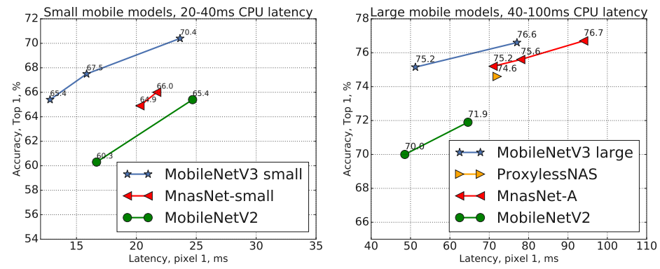

# Searching for MobileNetV3
2019-5-6 https://arxiv.org/abs/1905.02244

## 阅读笔记
* https://github.com/pytorch/vision/blob/main/torchvision/models/mobilenetv3.py
* 自动搜索算法和网络设计如何协同工作？MnasNet和NetAdapt算法
* 分割解码器:Lite Reduced Atrous Spatial Pyramid Pooling(LR-ASPP)
* 减少参数，减少实际操作数，真实硬件平台上的延迟测试; 

## Abstract
We present the next generation of MobileNets based on a combination of complementary search techniques as well as a novel architecture design. MobileNetV3 is tuned to mobile phone CPUs through a combination of hardwareaware network architecture search (NAS) complemented by the NetAdapt algorithm and then subsequently improved through novel architecture advances. This paper starts the exploration of how automated search algorithms and network design can work together to harness complementary approaches improving the overall state of the art. Through this process we create two new MobileNet models for release: MobileNetV3-Large and MobileNetV3-Small which are targeted for high and low resource use cases. These models are then adapted and applied to the tasks of object detection and semantic segmentation. For the task of semantic segmentation (or any dense pixel prediction), we propose a new efficient segmentation decoder Lite Reduced Atrous Spatial Pyramid Pooling (LR-ASPP). We achieve new state of the art results for mobile classification, detection and segmentation. MobileNetV3-Large is 3.2% more accurate on ImageNet classification while reducing latency by 20% compared to MobileNetV2. MobileNetV3-Small is  6.6% more accurate compared to a MobileNetV2 model with comparable latency. MobileNetV3-Large detection is over 25% faster at roughly the same accuracy as MobileNetV2 on COCO detection. MobileNetV3-Large LRASPP is 34% faster than MobileNetV2 R-ASPP at similar accuracy for Cityscapes segmentation.

我们提出了基于互补搜索技术和新颖架构设计的下一代MobileNets。MobileNetV3通过硬件感知网络架构搜索(NAS)与NetAdapt算法的结合，调整为手机CPU，然后通过新的架构进行改进。本文开始探索自动搜索算法和网络设计如何协同工作，利用互补的方法提高整体技术水平。通过这一过程，我们创建了两个新的MobileNet模型以供发布：MobileNetV3 Large和MobileNetV3 Small，这两个模型针对高资源和低资源使用情况。然后，这些模型被调整并应用于对象检测和语义分割任务。对于语义分割(或任何密集像素预测)的任务，我们提出了一种新的高效分割解码器Lite Reduced Atrous Spatial Pyramid Pooling(LR-ASPP)。我们实现了移动分类、检测和分割的最新技术成果。与MobileNetV2相比，MobileNetV3 Large在ImageNet分类方面的准确率提高了3.2%，而延迟降低了20%。与具有同等延迟的MobileNetV1模型相比，Mobile NetV3 Small的准确率高6.6%。MobileNetV3大型检测速度快25%以上，与MobileNetV2在COCO检测方面的精度大致相同。MobileNetV3大型LRASPP比MobileNetV2 R-ASPP快34%，在城市景观分割方面的精度相似。

## 1. Introduction
Efficient neural networks are becoming ubiquitous in mobile applications enabling entirely new on-device experiences. They are also a key enabler of personal privacy allowing a user to gain the benefits of neural networks without needing to send their data to the server to be evaluated. Advances in neural network efficiency not only improve user experience via higher accuracy and lower latency, but also help preserve battery life through reduced power consumption.

高效的神经网络在移动应用中变得无处不在，实现了全新设备上体验。它们也是个人隐私的关键推动者，允许用户获得神经网络的好处，而无需将其数据发送到服务器进行评估。神经网络效率的进步不仅通过更高的准确性和更低的延迟改善了用户体验，而且通过降低功耗有助于延长电池寿命。

 
Figure 1. The trade-off between Pixel 1 latency and top-1 ImageNet accuracy. All models use the input resolution 224. V3 large and V3 small use multipliers 0.75, 1 and 1.25 to show optimal frontier. All latencies were measured on a single large core of the same device using TFLite[1]. MobileNetV3-Small and Large are our proposed next-generation mobile models. 
图1.像素1延迟和顶级ImageNet准确性之间的权衡。所有模型都使用输入分辨率224。V3大和V3小使用乘数0.75、1和1.25来显示最佳边界。使用TFLite[1]在同一设备的单个大核上测量所有等待时间。MobileNetV3小型和大型是我们建议的下一代移动机型。

 
Figure 2. The trade-off between MAdds and top-1 accuracy. This allows to compare models that were targeted different hardware or software frameworks. All MobileNetV3 are for input resolution 224 and use multipliers 0.35, 0.5, 0.75, 1 and 1.25. See section 6 for other resolutions. Best viewed in color. 
图2.MAdds和顶级精度之间的权衡。这允许比较针对不同硬件或软件框架的模型。所有MobileNetV3都支持输入分辨率224，并使用乘数0.35、0.5、0.75、1和1.25。其他分辨率请参见第6节。最佳观看颜色。

This paper describes the approach we took to develop MobileNetV3 Large and Small models in order to deliver the next generation of high accuracy efficient neural network models to power on-device computer vision. The new networks push the state of the art forward and demonstrate how to blend automated search with novel architecture advances to build effective models.

本文描述了我们开发MobileNetV3大型和小型模型的方法，以提供下一代高精度高效神经网络模型，为设备计算机视觉提供动力。新的网络推动了最先进的技术，并演示了如何将自动搜索与新的架构进步相结合，以构建有效的模型。

The goal of this paper is to develop the best possible mobile computer vision architectures optimizing the accuracylatency trade off on mobile devices. To accomplish this we introduce (1) complementary search techniques, (2) new efficient versions of nonlinearities practical for the mobile setting, (3) new efficient network design, (4) a new efficient segmentation decoder. We present thorough experiments demonstrating the efficacy and value of each technique evaluated on a wide range of use cases and mobile phones.

本文的目标是开发尽可能最佳的移动计算机视觉架构，优化移动设备上的准确性权衡。为了实现这一点，我们引入了(1)互补搜索技术，(2)适用于移动环境的非线性的新高效版本，(3)新的高效网络设计，(4)新的有效分段解码器。我们进行了彻底的实验，证明了在各种用例和手机上评估的每种技术的功效和价值。

The paper is organized as follows. We start with a discussion of related work in Section 2. Section 3 reviews the efficient building blocks used for mobile models. Section 4 reviews architecture search and the complementary nature of MnasNet and NetAdapt algorithms. Section 5 describes novel architecture design improving on the efficiency of the models found through the joint search. Section 6 presents extensive experiments for classification, detection and segmentation in order do demonstrate efficacy and understand the contributions of different elements. Section 7 contains conclusions and future work.

论文组织如下。我们从第2节中开始相关工作讨论。第3节回顾了用于移动模型的高效构建块。第4节回顾了架构搜索以及MnasNet和NetAdapt算法的互补性。第5节描述了改进通过联合搜索找到的模型效率的新架构设计。第6节介绍了分类、检测和分割的广泛实验，以证明有效性并理解不同元素的贡献。第7节载有结论和今后的工作。

## 2. Related Work
Designing deep neural network architecture for the optimal trade-off between accuracy and efficiency has been an active research area in recent years. Both novel handcrafted structures and algorithmic neural architecture search have played important roles in advancing this field.

近年来，设计深度神经网络架构以在准确性和效率之间进行最佳权衡一直是一个活跃的研究领域。新颖的手工结构和算法神经架构搜索在推进这一领域中发挥了重要作用。

SqueezeNet[22] extensively uses 1x1 convolutions with squeeze and expand modules primarily focusing on reducing the number of parameters. More recent works shifts the focus from reducing parameters to reducing the number of operations (MAdds) and the actual measured latency. MobileNetV1[19] employs depthwise separable convolution to substantially improve computation ef- ficiency. MobileNetV2[39] expands on this by introducing a resource-efficient block with inverted residuals and linear bottlenecks. ShuffleNet[49] utilizes group convolution and channel shuffle operations to further reduce the MAdds. CondenseNet[21] learns group convolutions at the training stage to keep useful dense connections between layers for feature re-use. ShiftNet[46] proposes the shift operation interleaved with point-wise convolutions to replace expensive spatial convolutions.

SqueezeNet[22]广泛使用1x1卷积和压缩和扩展模块，主要集中于减少参数的数量。最近的工作将重点从减少参数迁移到减少操作数(MAdd)和实际测量的延迟。MobileNetV1[19]采用深度可分离卷积来显著提高计算效率。MobileNetV2[39]对此进行了扩展，引入了一个具有反向残差和线性瓶颈的资源高效块。ShuffleNet[49]利用组卷积和信道混洗操作来进一步减少MAdd。CondenseNet[21]在训练阶段学习组卷积，以保持层之间的有用密集连接，以便特征重用。ShiftNet[46]提出了与逐点卷积交织的移位操作，以取代昂贵的空间卷积。

To automate the architecture design process, reinforcement learning (RL) was first introduced to search efficient architectures with competitive accuracy [53, 54, 3, 27, 35]. A fully configurable search space can grow exponentially large and intractable. So early works of architecture search focus on the cell level structure search, and the same cell is reused in all layers. Recently, [43] explored a block-level hierarchical search space allowing different layer structures at different resolution blocks of a network. To reduce the computational cost of search, differentiable architecture search framework is used in [28, 5, 45] with gradient-based optimization. Focusing on adapting existing networks to constrained mobile platforms, [48, 15, 12] proposed more efficient automated network simplification algorithms.

为了实现架构设计过程的自动化，首先引入了强化学习(RL)来以竞争性的准确性搜索高效架构[53，54，3，27，35]。一个完全可配置的搜索空间可能会以指数级增长，而且难以处理。因此，早期的架构搜索工作侧重于单元级结构搜索，并且相同的单元在所有层中都被重用。最近，[43]探索了一种块级分层搜索空间，允许网络中不同分辨率块的不同层结构。为了降低搜索的计算成本，[28，5，45]中使用了基于梯度的优化的可微分架构搜索框架。着眼于使现有网络适应受限的移动平台，[48，15，12]提出了更高效的自动化网络简化算法。

Quantization [23, 25, 47, 41, 51, 52, 37] is another important complementary effort to improve the network efficiency through reduced precision arithmetic. Finally, knowledge distillation [4, 17] offers an additional complementary method to generate small accurate ”student” networks with the guidance of a large ”teacher” network.

量化[23，25，47，41，51，52，37]是通过降低精度算法提高网络效率的另一项重要补充努力。最后，知识蒸馏[4，17]提供了一种额外的补充方法，以在大型“教师”网络的指导下生成精确的小“学生”网络。

## 3. Efficient Mobile Building Blocks 高效的移动构建块
Mobile models have been built on increasingly more effi- cient building blocks. MobileNetV1 [19] introduced depthwise separable convolutions as an efficient replacement for traditional convolution layers. Depthwise separable convolutions effectively factorize traditional convolution by separating spatial filtering from the feature generation mechanism. Depthwise separable convolutions are defined by two separate layers: light weight depthwise convolution for spatial filtering and heavier 1x1 pointwise convolutions for feature generation.

移动模型建立在越来越高效的基础上。MobileNetV1[19]引入深度可分离卷积作为传统卷积层的有效替代。通过将空间滤波与特征生成机制分离，深度可分离卷积有效地分解了传统卷积。深度可分离卷积由两个独立的层定义：用于空间滤波的轻型深度卷积和用于特征生成的重型1x1逐点卷积。

MobileNetV2 [39] introduced the linear bottleneck and inverted residual structure in order to make even more effi- cient layer structures by leveraging the low rank nature of the problem. This structure is shown on Figure 3 and is defined by a 1x1 expansion convolution followed by depthwise convolutions and a 1x1 projection layer. The input and output are connected with a residual connection if and only if they have the same number of channels. This structure maintains a compact representation at the input and the output while expanding to a higher-dimensional feature space internally to increase the expressiveness of nonlinear perchannel transformations.

MobileNetV2[39]引入了线性瓶颈和反向残差结构，以便通过利用问题的低秩性质来制造更有效的层结构。该结构如图3所示，由1x1扩展卷积、深度卷积和1x1投影层定义。当且仅当它们具有相同数量的通道时，输入和输出通过残差连接连接。该结构在输入和输出处保持紧凑的表示，同时在内部扩展到更高维度的特征空间。

 
Figure 3. MobileNetV2 [39] layer (Inverted Residual and Linear Bottleneck). Each block consists of narrow input and output (bottleneck), which don’t have nonlinearity, followed by expansion to a much higher-dimensional space and projection to the output. The residual connects bottleneck (rather than expansion). 
图3。MobileNetV2[39]层(反向残差和线性瓶颈)。每个块由不具有非线性的窄输入和输出(瓶颈)组成，然后扩展到更高维度的空间并投影到输出。残差连接瓶颈(而不是扩展)。

MnasNet [43] built upon the MobileNetV2 structure by introducing lightweight attention modules based on squeeze and excitation into the bottleneck structure. Note that the squeeze and excitation module are integrated in a different location than ResNet based modules proposed in [20]. The module is placed after the depthwise filters in the expansion in order for attention to be applied on the largest representation as shown on Figure 4.

MnasNet[43]基于MobileNetV2结构，将基于挤压和激励的轻量级注意力模块引入瓶颈结构。注意，挤压和激励模块集成在与[20]中提出的基于ResNet的模块不同的位置。该模块被放置在扩展中的深度过滤器之后，以便将注意力应用于最大的表示，如图4所示。

For MobileNetV3, we use a combination of these layers as building blocks in order to build the most effective models. Layers are also upgraded with modified swish nonlinearities [36, 13, 16]. Both squeeze and excitation as well as the swish nonlinearity use the sigmoid which can be ineffi- cient to compute as well challenging to maintain accuracy in fixed point arithmetic so we replace this with the hard sigmoid [2, 11] as discussed in section 5.2. 

对于MobileNetV3，我们使用这些层的组合作为构建块，以构建最有效的模型。层也通过修改的swish非线性进行升级[36，13，16]。挤压和激励以及快速非线性都使用sigmoid曲线，该曲线计算效率低，并且难以保持定点算法的精度，因此我们将其替换为第5.2节中讨论的硬sigmoid[2，11]。

 
Figure 4. MobileNetV2 + Squeeze-and-Excite [20]. In contrast with [20] we apply the squeeze and excite in the residual layer. We use different nonlinearity depending on the layer, see section 5.2 for details.
图4。MobileNetV2+挤压和激发[20]。与[20]相反，我们在残差层中施加挤压和激发。我们根据层使用不同的非线性，详见第5.2节。

## 4. Network Search
Network search has shown itself to be a very powerful tool for discovering and optimizing network architectures [53, 43, 5, 48]. For MobileNetV3 we use platform-aware NAS to search for the global network structures by optimizing each network block. We then use the NetAdapt algorithm to search per layer for the number of filters. These techniques are complementary and can be combined to effectively find optimized models for a given hardware platform.

网络搜索已证明是发现和优化网络架构的非常强大的工具[53，43，5，48]。对于MobileNetV3，我们使用平台感知NAS通过优化每个网络块来搜索全局网络结构。然后，我们使用NetAdapt算法按层搜索过滤器的数量。这些技术是互补的，可以结合起来有效地找到给定硬件平台的优化模型。

### 4.1. Platform-Aware NAS for Block-wise Search 用于逐块搜索的平台感知NAS
Similar to [43], we employ a platform-aware neural architecture approach to find the global network structures. Since we use the same RNN-based controller and the same factorized hierarchical search space, we find similar results as [43] for Large mobile models with target latency around 80ms. Therefore, we simply reuse the same MnasNet-A1 [43] as our initial Large mobile model, and then apply NetAdapt [48] and other optimizations on top of it.

与[43]类似，我们采用平台感知神经架构方法来寻找全局网络结构。由于我们使用相同的基于RNN的控制器和相同的因子化分层搜索空间，我们发现目标延迟约为80ms的大型移动模型的结果与[43]相似。因此，我们只需将相同的MnasNet-A1[43]重新用作初始大型移动模型，然后在其上应用NetAdapt[48]和其他优化。

However, we observe the original reward design is not optimized for small mobile models. Specifically, it uses a multi-objective reward ACC(m) × [LAT(m)/T AR] w to approximate Pareto-optimal solutions, by balancing model accuracy ACC(m) and latency LAT(m) for each model m based on the target latency T AR. We observe that accuracy changes much more dramatically with latency for small models; therefore, we need a smaller weight factor w = −0.15 (vs the original w = −0.07 in [43]) to compensate for the larger accuracy change for different latencies.Enhanced with this new weight factor w, we start a new architecture search from scratch to find the initial seed model and then apply NetAdapt and other optimizations to obtain the final MobileNetV3-Small model.

然而，我们观察到，最初的奖励设计并未针对小型移动机型进行优化。具体而言，它使用多目标回报ACC(m)×[LAT(m)/T AR]w来近似帕累托最优解，通过基于目标延迟T AR平衡每个模型m的模型精度ACC(m)和延迟LAT(m); 因此，我们需要一个更小的权重因子w=−0.15(与[43]中的原始w=−0.07相比)来补偿不同延迟的更大精度变化。通过此新权重因子w的增强，我们从头开始新的架构搜索以找到初始种子模型，然后应用NetAdapt和其他优化以获得最终的MobileNetV3小型模型。

### 4.2. NetAdapt for Layer-wise Search 用于分层搜索的NetAdapt
The second technique that we employ in our architecture search is NetAdapt [48]. This approach is complimentary to platform-aware NAS: it allows fine-tuning of individual layers in a sequential manner, rather than trying to infer coarse but global architecture. We refer to the original paper for the full details. In short the technique proceeds as follows:
1. Starts with a seed network architecture found by platform-aware NAS.
2. For each step: (a) Generate a set of new proposals. Each proposal represents a modification of an architecture that generates at least δ reduction in latency compared to the previous step. (b) For each proposal we use the pre-trained model from the previous step and populate the new proposed architecture, truncating and randomly initializing missing weights as appropriate. Finetune each proposal for T steps to get a coarse estimate of the accuracy. (c) Selected best proposal according to some metric.
3. Iterate previous step until target latency is reached.

我们在架构搜索中使用的第二种技术是NetAdapt[48]。这种方法是对平台感知NAS的补充：它允许以顺序方式微调各个层，而不是试图推断粗略但全局的架构。我们参考原始文件了解详情。简而言之，该技术的进展如下：
1. 从支持平台的NAS发现的种子网络架构开始。
2. 对于每个步骤：(a)生成一组新提案。每个建议都代表了对架构的修改，与前一步相比，该架构至少减少了δ延迟。(b) 对于每个提案，我们使用上一步中的预训练模型，并填充新的提案架构，适当地截断和随机初始化缺失的权重。对T步的每个建议进行微调，以获得准确度的粗略估计。(c) 根据某些指标选择最佳方案。
3. 重复上一步骤，直到达到目标延迟。

In [48] the metric was to minimize the accuracy change. We modify this algorithm and minimize the ratio between latency change and accuracy change. That is for all proposals generated during each NetAdapt step, we pick one that maximizes: ∆Acc |∆latency| , with ∆latency satisfying the constraint in 2(a). The intuition is that because our proposals are discrete, we prefer proposals that maximize the slope of the trade-off curve.

在[48]中，度量是为了最小化精度变化。我们修改了该算法，并最小化了延迟变化和准确性变化之间的比率。即,对于每个NetAdapt步骤中生成的所有提案，我们选择一个最大化的提案：∆Acc |∆latency |，∆latech满足2(a)中的约束。直觉是，因为我们的建议是离散的，所以我们更喜欢使权衡曲线斜率最大化的建议。

This process is repeated until the latency reaches its target, and then we re-train the new architecture from scratch. We use the same proposal generator as was used in [48] for MobilenetV2. Specifically, we allow the following two types of proposals:
1. Reduce the size of any expansion layer;
2. Reduce bottleneck in all blocks that share the same bottleneck size - to maintain residual connections.

重复这个过程直到延迟达到目标，然后我们从头开始重新训练新的架构。我们使用与[48]中使用的MobilenetV2相同的建议生成器。具体而言，我们允许以下两种类型的提案：
1. 减小任何膨胀层的尺寸; 
2. 减少共享相同瓶颈大小的所有块中的瓶颈-以保持剩余连接。

For our experiments we used T = 10000 and find that while it increases the accuracy of the initial fine-tuning of the proposals, it does not however, change the final accuracy when trained from scratch. We set δ = 0.01|L|, where L is the latency of the seed model.

在我们的实验中，我们使用了T=10000，并发现虽然它提高了提案初始微调的准确性，但当从头开始训练时，它不会改变最终的准确性。我们设置δ=0.01|L|，其中L是种子模型的延迟。

## 5. Network Improvements
In addition to network search, we also introduce several new components to the model to further improve the final model. We redesign the computionally-expensive layers at the beginning and the end of the network. We also introduce a new nonlinearity, h-swish, a modified version of the recent swish nonlinearity, which is faster to compute and more quantization-friendly.

除了网络搜索，我们还为模型引入了几个新组件，以进一步改进最终模型。我们在网络的开始和结束时重新设计了计算昂贵的层。我们还引入了一种新的非线性，h-swish，它是最近swish非线性的修改版本，计算速度更快，量化更友好。

### 5.1. Redesigning Expensive Layers 重新设计昂贵的图层
Once models are found through architecture search, we observe that some of the last layers as well as some of the earlier layers are more expensive than others. We propose some modifications to the architecture to reduce the latency of these slow layers while maintaining the accuracy. These modifications are outside of the scope of the current search space.

一旦通过架构搜索找到了模型，我们就会发现最后的一些层以及早期的一些层比其他层更昂贵。我们建议对架构进行一些修改，以减少这些慢层的延迟，同时保持准确性。这些修改超出了当前搜索空间的范围。

The first modification reworks how the last few layers of the network interact in order to produce the final features more efficiently. Current models based on MobileNetV2’s inverted bottleneck structure and variants use 1x1 convolution as a final layer in order to expand to a higher-dimensional feature space. This layer is critically important in order to have rich features for prediction. However, this comes at a cost of extra latency.

第一个修改重新设计了网络的最后几层如何交互，以便更有效地生成最终特征。基于MobileNetV2的反向瓶颈结构和变体的当前模型使用1x1卷积作为最终层，以便扩展到更高维度的特征空间。为了具有丰富的预测特征，该层非常重要。然而，这是以额外的延迟为代价的。

To reduce latency and preserve the high dimensional features, we move this layer past the final average pooling. This final set of features is now computed at 1x1 spatial resolution instead of 7x7 spatial resolution. The outcome of this design choice is that the computation of the features becomes nearly free in terms of computation and latency.

为了减少延迟并保留高维特性，我们将此层移过最终平均池。这最后一组特征现在以1x1空间分辨率而不是7x7空间分辨率计算。这种设计选择的结果是，在计算和延迟方面，特征的计算变得几乎免费。

Once the cost of this feature generation layer has been mitigated, the previous bottleneck projection layer is no longer needed to reduce computation. This observation allows us to remove the projection and filtering layers in the previous bottleneck layer, further reducing computational complexity. The original and optimized last stages can be seen in figure 5. The efficient last stage reduces the latency by 7 milliseconds which is 11% of the running time and reduces the number of operations by 30 millions MAdds with almost no loss of accuracy. Section 6 contains detailed results.

一旦降低了该特征生成层的成本，就不再需要先前的瓶颈投影层来减少计算。这一观察结果使我们能够去除先前瓶颈层中的投影和过滤层，从而进一步降低计算复杂性。原始和优化的最后阶段如图5所示。高效的最后一级将延迟减少了7毫秒，这是运行时间的11%，并将操作次数减少了3000万MAdds，几乎没有精度损失。第6节包含详细结果。

Another expensive layer is the initial set of filters. Current mobile models tend to use 32 filters in a full 3x3 convolution to build initial filter banks for edge detection. Often these filters are mirror images of each other. We experimented with reducing the number of filters and using different nonlinearities to try and reduce redundancy. We settled on using the hard swish nonlinearity for this layer as it performed as well as other nonlinearities tested. We were able to reduce the number of filters to 16 while maintaining the same accuracy as 32 filters using either ReLU or swish. This saves an additional 2 milliseconds and 10 million MAdds.
 
另一个昂贵的层是初始过滤器集。当前的移动模型倾向于在全3x3卷积中使用32个滤波器来构建用于边缘检测的初始滤波器组。这些过滤器通常是彼此的镜像。我们尝试减少滤波器的数量，并使用不同的非线性来尝试减少冗余。我们决定在这一层的表现以及其他非线性测试中使用硬嗖嗖非线性。我们能够将滤波器的数量减少到16个，同时使用ReLU或swish保持与32个滤波器相同的精度。这节省了额外的2毫秒和1000万MAdds。

 
Figure 5. Comparison of original last stage and efficient last stage. This more efficient last stage is able to drop three expensive layers at the end of the network at no loss of accuracy. 
图5。原始最后阶段和有效最后阶段的比较。这个更有效的最后阶段能够在不损失精度的情况下在网络末端丢弃三个昂贵的层。

### 5.2. Nonlinearities
In [36, 13, 16] a nonlinearity called swish was introduced that when used as a drop-in replacement for ReLU, that significantly improves the accuracy of neural networks. The nonlinearity is defined as 

在[36，13，16]中，引入了一种称为swish的非线性，当其用作ReLU的替代品时，这显著提高了神经网络的准确性。非线性定义为

swish x = x · σ(x)

While this nonlinearity improves accuracy, it comes with non-zero cost in embedded environments as the sigmoid function is much more expensive to compute on mobile devices. We deal with this problem in two ways.

虽然这种非线性提高了准确性，但在嵌入式环境中，它带来了非零成本，因为在移动设备上计算sigmoid函数要昂贵得多。我们用两种方式处理这个问题。

1. We replace sigmoid function with its piece-wise linear hard analog: ReLU6(x+3)/6 similar to [11, 44]. The minor difference is we use ReLU6 rather than a custom clipping constant. Similarly, the hard version of swish becomes 

1.我们将sigmoid函数替换为其分段线性硬模拟：ReLU6(x+3)/6，类似于[11，44]。较小的区别是我们使用ReLU6而不是自定义剪裁常量。类似地，swish的硬版本变成

h-swish[x] = x * ReLU6(x + 3) / 6

A similar version of hard-swish was also recently proposed in [2]. The comparison of the soft and hard version of sigmoid and swish nonlinearities is shown in figure 6. Our choice of constants was motivated by simplicity and being a good match to the original smooth version. In our experiments, we found hard-version of all these functions to have no discernible difference in accuracy, but multiple advantages from a deployment perspective. First, optimized implementations of ReLU6 are available on virtually all software and hardware frameworks. Second, in quantized mode, it eliminates potential numerical precision loss caused by different implementations of the approximate sigmoid. Finally, in practice, h-swish can be implemented as a piece-wise function to reduce the number of memory accesses driving the latency cost down substantially.

最近[2]中也提出了类似的hard-swish版本。图6显示了sigmoid和swish非线性的软版本和硬版本的比较。我们选择常数的动机是简单，并且与最初的平滑版本非常匹配。在我们的实验中，我们发现所有这些函数的硬版本在精度上没有明显的差异，但从部署角度来看有多种优势。首先，ReLU6的优化实现在几乎所有软件和硬件框架上都可用。第二，在量化模式下，它消除了由近似sigmoid的不同实现方式引起的潜在的数值精度损失。最后，在实践中，h-swish可以作为分段函数来实现，以减少内存访问的次数，从而显著降低延迟成本。

 
Figure 6. Sigmoid and swish nonlinearities and ther “hard” counterparts. 
图6。Sigmoid和swish非线性以及其他“硬”对应项。

2. The cost of applying nonlinearity decreases as we go deeper into the network, since each layer activation memory typically halves every time the resolution drops. Incidentally, we find that most of the benefits swish are realized by using them only in the deeper layers. Thus in our architectures we only use h-swish at the second half of the model. We refer to the tables 1 and 2 for the precise layout.

2.随着我们深入网络，应用非线性的成本降低，因为每一层激活存储器通常在分辨率下降时减半。顺便说一下，我们发现swish的大部分好处都是通过仅在深层次使用它们来实现的。因此，在我们的架构中，我们只在模型的后半部分使用h-swish。我们参考表1和表2了解精确布局。

Even with these optimizations, h-swish still introduces some latency cost. However as we demonstrate in section 6 the net effect on accuracy and latency is positive with no optimizations and substantial when using an optimized implementation based on a piece-wise function.

即使进行了这些优化，h-swish仍会带来一些延迟成本。然而，正如我们在第6节中所展示的，在没有优化的情况下，对准确性和延迟的净影响是积极的，并且当使用基于分段函数的优化实现时，效果是显著的。

### 5.3. Large squeeze-and-excite 大挤压和激发
In [43], the size of the squeeze-and-excite bottleneck was relative the size of the convolutional bottleneck. Instead, we replace them all to fixed to be 1/4 of the number of channels in expansion layer. We find that doing so increases the accuracy, at the modest increase of number of parameters, and no discernible latency cost.

在[43]中，挤压和激发瓶颈的大小与卷积瓶颈的大小相关。相反，我们将它们全部替换为固定为扩展层中通道数量的1/4。我们发现，这样做在参数数量适度增加的情况下提高了准确性，并且没有明显的延迟成本。

### 5.4. MobileNetV3 Definitions
MobileNetV3 is defined as two models: MobileNetV3-Large and MobileNetV3-Small. These models are targeted at high and low resource use cases respectively. The models are created through applying platform-aware NAS and NetAdapt for network search and incorporating the network improvements defined in this section. See table 1 and 2 for full specification of our networks.

MobileNetV3定义为两种模型：MobileNetV3Large和MobileNetV4Small。这些模型分别针对高资源使用情况和低资源使用情况。这些模型是通过将平台感知NAS和NetAdapt应用于网络搜索并结合本节中定义的网络改进而创建的。有关我们网络的完整规格，请参见表1和表2。

## 6. Experiments
We present experimental results to demonstrate the effectiveness of the new MobileNetV3 models. We report results on classification, detection and segmentation. We also report various ablation studies to shed light on the effects of various design decisions.

我们给出了实验结果，以证明新MobileNetV3模型的有效性。我们报告了分类、检测和分割的结果。我们还报告了各种消融研究，以阐明各种设计决策的影响。

### 6.1. Classification
As has become standard, we use ImageNet[38] for all our classification experiments and compare accuracy versus various measures of resource usage such as latency and multiply adds (MAdds).

作为标准，我们使用ImageNet[38]进行所有分类实验，并将准确性与各种资源使用度量(如延迟和乘法加法(MAdds))进行比较。

Table 1. Specification for MobileNetV3-Large. SE denotes whether there is a Squeeze-And-Excite in that block. NL denotes the type of nonlinearity used. Here, HS denotes h-swish and RE denotes ReLU. NBN denotes no batch normalization. s denotes stride.
表1。MobileNetV3大型规范。SE表示该区块中是否存在挤压和兴奋。NL表示使用的非线性类型。这里，HS表示h-swish，RE表示ReLU。NBN表示无批次规范化。s表示步幅。

Table 2. Specification for MobileNetV3-Small. See table 1 for notation. 
表2。MobileNetV3小型规范。符号见表1。

### 6.1.1 Training setup
We train our models using synchronous training setup on 4x4 TPU Pod [24] using standard tensorflow RMSPropOptimizer with 0.9 momentum. We use the initial learning rate of 0.1, with batch size 4096 (128 images per chip), and learning rate decay rate of 0.01 every 3 epochs. We use dropout of 0.8, and l2 weight decay 1e-5 and the same image preprocessing as Inception [42]. Finally we use exponential moving average with decay 0.9999. All our convolutional layers use batch-normalization layers with average decay of 0.99.

我们使用0.9动量的标准tensorflow RMSPropOptimizer，在4x4 TPU吊舱[24]上使用同步训练设置训练我们的模型。我们使用的初始学习率为0.1，批量大小为4096(每个芯片128个图像)，学习率衰减率为每3个时期0.01。我们使用了0.8的丢弃和l2权重衰减1e-5以及与Inception相同的图像预处理[42]。最后，我们使用衰减为0.9999的指数移动平均值。我们所有的卷积层都使用平均衰减为0.99的批归一化层。

Table 3. Floating point performance on the Pixel family of phones (P-n denotes a Pixel-n phone). All latencies are in ms and are measured using a single large core with a batch size of one. Top-1 accuracy is on ImageNet. 
表3。Pixel系列手机的浮点性能(P-n表示Pixel-n手机)。所有延迟均以毫秒为单位，并使用批处理大小为1的单个大型内核进行测量。ImageNet上的精度排名第一。

### 6.1.2 Measurement setup 测量设置
To measure latencies we use standard Google Pixel phones and run all networks through the standard TFLite Benchmark Tool. We use single-threaded large core in all our measurements. We don’t report multi-core inference time, since we find this setup not very practical for mobile applications. We contributed an atomic h-swish operator to tensorflow lite, and it is now default in the latest version. We show the impact of optimized h-swish on figure 9.

为了测量延迟，我们使用标准的Google Pixel手机，并通过标准的TFLite基准工具运行所有网络。我们在所有测量中使用单螺纹大芯。我们没有报告多核推理时间，因为我们发现这种设置对于移动应用程序来说不太实用。我们为tensorflow lite提供了一个原子h-swish操作符，现在它在最新版本中是默认的。我们展示了优化的h-swish对图9的影响。

### 6.2. Results
As can be seen on figure 1 our models outperform the current state of the art such as MnasNet [43], ProxylessNas [5] and MobileNetV2 [39]. We report the floating point performance on different Pixel phones in the table 3. We include quantization results in table 4.

如图1所示，我们的模型优于当前的技术水平，如MnasNet[43]、ProxylessNas[5]和MobileNetV2[39]。我们在表3中报告了不同Pixel手机上的浮点性能。我们将量化结果包括在表4中。

In figure 7 we show the MobileNetV3 performance trade-offs as a function of multiplier and resolution. Note how MobileNetV3-Small outperforms the MobileNetV3-Large with multiplier scaled to match the performance by nearly 3%. On the other hand, resolution provides an even better trade-offs than multiplier. However, it should be noted that resolution is often determined by the problem (e.g. segmentation and detection problem generally require higher resolution), and thus can’t always be used as a tunable parameter.

在图7中，我们展示了MobileNetV3作为乘数和分辨率函数的性能权衡。请注意，MobileNetV3 Small的性能优于MobileNetV3Large，其乘数可与性能匹配近3%。另一方面，分辨率提供了比乘数更好的权衡。然而，应该注意，分辨率通常由问题决定(例如，分割和检测问题通常需要更高的分辨率)，因此不能总是用作可调参数。

### 6.2.1 Ablation study
Impact of non-linearities. In table 5 we study the choice of where to insert h-swish nonlinearities as well as the improvements of using an optimized implementation over a naive implementation. It can be seen that using an optimized implementation of h-swish saves 6ms (more than 10% of the runtime). Optimized h-swish only adds an additional 1ms compared to traditional ReLU.

非线性的影响。在表5中，我们研究了在何处插入h-swish非线性的选择，以及使用优化实现对原始实现的改进。可以看出，使用h-swish的优化实现节省了6ms(超过运行时间的10%)。与传统的ReLU相比，优化的h-swish只增加了1ms。

Table 4. Quantized performance. All latencies are in ms. The inference latency is measured using a single large core on the respective Pixel 1/2/3 device. 
表4。量化性能。所有延迟均以毫秒为单位。使用相应Pixel 1/2/3设备上的单个大内核测量推断延迟。

 
Figure 7. Performance of MobileNetV3 as a function of different multipliers and resolutions. In our experiments we have used multipliers 0.35, 0.5, 0.75, 1.0 and 1.25, with a fixed resolution of 224, and resolutions 96, 128, 160, 192, 224 and 256 with a fixed depth multiplier of 1.0. Best viewed in color. Top-1 accuracy is on ImageNet and latency is in ms.
图7。MobileNetV3的性能是不同乘数和分辨率的函数。在我们的实验中，我们使用了系数0.35、0.5、0.75、1.0和1.25，固定分辨率为224，分辨率为96、128、160、192、224和256，固定深度系数为1.0。最佳颜色。ImageNet上的精度最高，延迟以毫秒为单位。

Table 5. Effect of non-linearities on MobileNetV3-Large. In h-swish @N, N denotes the number of channels, in the first layer that has h-swish enabled. The third column shows the runtime without optimized h-swish. Top-1 accuracy is on ImageNet and latency is in ms. 
表5。非线性对MobileNetV3 Large的影响。在h-swish@N中，N表示启用h-swish的第一层中的通道数。第三列显示了没有优化h-swish的运行时。ImageNet上的精度最高，延迟以毫秒为单位。

Figure 8 shows the efficient frontier based on nonlinearity choices and network width. MobileNetV3 uses h-swish in the middle of the network and clearly dominates ReLU. It is interesting to note that adding h-swish to the entire network is slightly better than the interpolated frontier of widening the network.
图8显示了基于非线性选择和网络宽度的有效边界。MobileNetV3在网络中间使用h-swish，显然在ReLU中占据主导地位。值得注意的是，将h-swish添加到整个网络中略好于加宽网络的插值边界。

Impact of other components. In figure 9 we show how introduction of different components moved along the latency/accuracy curve.
其他组件的影响。在图9中，我们展示了不同组件的引入是如何沿着延迟/准确性曲线移动的。
 
 
Figure 8. Impact of h-swish vs ReLU on latency for optimized and non-optimized h-swish. The curve shows a frontier of using depth multiplier. Note that placing h-swish at all layers with 80 channels or more (V3) provides the best trade-offs for both optimized hswish and non-optimized h-swish. Top-1 accuracy is on ImageNet and latency is in ms.
图8。h-swish与ReLU对优化和非优化h-swish延迟的影响。该曲线显示了使用深度乘数的前沿。请注意，将h-swish放置在具有80个或更多通道(V3)的所有层上，为优化的hswish和非优化的h-swish提供了最佳权衡。ImageNet上的精度最高，延迟以毫秒为单位。
 
 
Figure 9. Impact of individual components in the development of MobileNetV3. Progress is measured by moving up and to the left.
图9。MobileNetV3开发中各个组件的影响。进度通过向上和向左移动来衡量。

### 6.3. Detection
We use MobileNetV3 as a drop-in replacement for the backbone feature extractor in SSDLite [39] and compare with other backbone networks on COCO dataset [26].

我们使用MobileNetV3作为SSDLite中主干特征提取器的替代品[39]，并与COCO数据集上的其他主干网络进行比较[26]。

Following MobileNetV2 [39], we attach the first layer of SSDLite to the last feature extractor layer that has an output stride of 16, and attach the second layer of SSDLite to the last feature extractor layer that has an output stride of  32. Following the detection literature, we refer to these two feature extractor layers as C4 and C5, respectively. For MobileNetV3-Large, C4 is the expansion layer of the 13-th bottleneck block. For MobileNetV3-Small, C4 is the expansion layer of the 9-th bottleneck block. For both networks, C5 is the layer immediately before pooling.

根据MobileNetV2[39]，我们将SSDLite的第一层附着到输出步长为16的最后一个特征提取器层，并将SSDLte的第二层附着到具有32的输出步长的最后一特征提取器。根据检测文献，我们将这两个特征提取器层分别称为C4和C5。对于MobileNetV3Large，C4是第13个瓶颈块的扩展层。对于MobileNetV3 Small，C4是第9个瓶颈块的扩展层。对于这两个网络，C5是池之前的层。

We additionally reduce the channel counts of all feature layers between C4 and C5 by 2. This is because the last few layers of MobileNetV3 are tuned to output 1000 classes, which may be redundant when transferred to COCO with 90 classes.

我们还将C4和C5之间的所有特征层的信道计数减少2。这是因为MobileNetV3的最后几层被调整为输出1000个类，当传输到具有90个类的COCO时，这可能是多余的。

The results on COCO test set are given in Tab. 6. With the channel reduction, MobileNetV3-Large is 27% faster than MobileNetV2 with near identical mAP. MobileNetV3-Small with channel reduction is also 2.4 and 0.5 mAP higher than MobileNetV2 and MnasNet while being 35% faster. For both MobileNetV3 models the channel reduction trick contributes to approximately 15% latency reduction with no mAP loss, suggesting that Imagenet classification and COCO object detection may prefer different feature extractor shapes.

COCO测试集的结果见表6。随着信道的减少，MobileNetV3 Large比具有几乎相同mAP的MobileNetV2快27%。与MobileNetV2和MnasNet相比，具有信道缩减功能的MobileNetV3 Small还高出2.4和0.5 mAP，同时速度提高了35%。对于两种MobileNetV3模型，信道减少技巧有助于大约15%的延迟减少，而没有mAP损失，这表明Imagenet分类和COCO对象检测可能更喜欢不同的特征提取器形状。

Table 6. Object detection results of SSDLite with different backbones on COCO test set. † : Channels in the blocks between C4 and C5 are reduced by a factor of 2.
表6。COCO测试集上具有不同主链的SSDLite的目标检测结果†：C4和C5之间的块中的信道减少了2倍。
 
 
Figure 10. Building on MobileNetV3, the proposed segmentation head, Lite R-ASPP, delivers fast semantic segmentation results while mixing features from multiple resolutions. 
图10。基于MobileNetV3，提出的分割头Lite R-ASPP提供了快速的语义分割结果，同时混合了多种分辨率的特征。

### 6.4. Semantic Segmentation
In this subsection, we employ MobileNetV2 [39] and the proposed MobileNetV3 as network backbones for the task of mobile semantic segmentation. Additionally, we compare two segmentation heads. The first one, referred to as R-ASPP, was proposed in [39]. R-ASPP is a reduced design of the Atrous Spatial Pyramid Pooling module [7, 8, 9], which adopts only two branches consisting of a 1 × 1 convolution and a global-average pooling operation [29, 50]. In this work, we propose another light-weight segmentation head, referred to as Lite R-ASPP (or LR-ASPP), as shown in Fig. 10. Lite R-ASPP, improving over R-ASPP, deploys the global-average pooling in a fashion similar to the Squeeze-and-Excitation module [20], in which we employ a large pooling kernel with a large stride (to save some computation) and only one 1×1 convolution in the module. We apply atrous convolution [18, 40, 33, 6] to the last block of MobileNetV3 to extract denser features, and further add a skip connection [30] from low-level features to capture Accuracy, Top-1 Imagenet Accuracy more detailed information.

在本小节中，我们使用MobileNetV2[39]和提出的MobileNetV3作为移动语义分割任务的网络主干。此外，我们还比较了两个分割头。[39]中提出了第一种，称为R-ASPP。R-ASPP是Atrous空间金字塔池模块[7，8，9]的简化设计，其仅采用由1×1卷积和全局平均池运算组成的两个分支[29，50]。在这项工作中，我们提出了另一种轻量级分割头，称为Lite R-ASPP(或LR-ASPP)，如图10所示。Lite R-ASPP比R-ASPP有所改进，以类似于挤压和激励模块[20]的方式部署了全局平均池，其中我们使用了一个大跨度(以节省一些计算)的大型池内核，模块中只有一个1×1卷积。我们对MobileNetV3的最后一个块应用atrous卷积[18，40，33，6]，以提取更密集的特征，并进一步从低级特征添加跳过连接[30]，以捕获精度，Top-1 Imagenet精度更详细的信息。

We conduct the experiments on the Cityscapes dataset [10] with metric mIOU [14], and only exploit the ‘fine’ annotations. We employ the same training protocol as [8, 39]. All our models are trained from scratch without pretraining on ImageNet [38], and are evaluated with a single-scale input. Similar to object detection, we observe that we could reduce the channels in the last block of network backbone by a factor of 2 without degrading the performance significantly. We think it is because the backbone is designed for 1000 classes ImageNet image classification [38] while there are only 19 classes on Cityscapes, implying there is some channel redundancy in the backbone.

我们使用度量mIOU[14]在Cityscapes数据集[10]上进行实验，并且仅利用“精细”注释。我们采用与[8，39]相同的训练方案。我们的所有模型都是从头开始训练的，没有在ImageNet上进行预训练[38]，并使用单尺度输入进行评估。与对象检测类似，我们观察到，我们可以将网络主干的最后一块中的信道减少2倍，而不会显著降低性能。我们认为这是因为主干网设计用于1000个类ImageNet图像分类[38]，而Cityscapes上只有19个类，这意味着主干网中存在一些信道冗余。

We report our Cityscapes validation set results in Tab. 7. As shown in the table, we observe that (1) reducing the channels in the last block of network backbone by a factor of 2 significantly improves the speed while maintaining similar performances (row 1 vs. row 2, and row 5 vs. row 6), (2) the proposed segmentation head LR-ASPP is slightly faster than R-ASPP [39] while performance is improved (row 2 vs. row 3, and row 6 vs. row 7), (3) reducing the filters in the segmentation head from 256 to 128 improves the speed at the cost of slightly worse performance (row 3 vs. row 4, and row 7 vs. row 8), (4) when employing the same setting, MobileNetV3 model variants attain similar performance while being slightly faster than MobileNetV2 counterparts (row 1 vs. row 5, row 2 vs. row 6, row 3 vs. row 7, and row 4 vs. row 8), (5) MobileNetV3-Small attains similar performance as MobileNetV2-0.5 while being faster, and (6) MobileNetV3-Small is significantly better than MobileNetV2-0.35 while yielding similar speed.

我们在表7中报告了Cityscapes验证集的结果。如表所示，我们观察到(1)将网络主干的最后一个块中的信道减少2倍显著提高了速度，同时保持了类似的性能(第1行对第2行，第5行对第6行)，(3)将分割头中的滤波器从256个减少到128个，以稍差的性能为代价提高了速度(第3行对第4行，第7行对第8行)，(5)MobileNetV3 Small与MobileNetV2-0.5性能相似，但速度更快; (6)MobileNotV3 Small明显优于MobileNetV2.35，但速度相似。

Tab. 8 shows our Cityscapes test set results. Our segmentation models with MobileNetV3 as network backbone outperforms ESPNetv2 [32], CCC2 [34], and ESPNetv1 [32] by 6.4%, 10.6%, 12.3%, respectively while being faster in terms of MAdds. The performance drops slightly by 0.6% when not employing the atrous convolution to extract dense feature maps in the last block of MobileNetV3, but the speed is improved to 1.98B (for half-resolution inputs), which is 1.36, 1.59, and 2.27 times faster than ESPNetv2, CCC2, and ESPNetv1, respectively. Furthermore, our models with MobileNetV3-Small as network backbone still outperforms all of them by at least a healthy margin of 2.1%.

表8显示了Cityscapes测试集的结果。我们使用MobileNetV3作为网络主干的细分模型分别比ESPNetv2[32]、CCC2[34]和ESPNetv1[32]高6.4%、10.6%和12.3%，同时在MAdds方面更快。当不使用atrous卷积提取MobileNetV3最后一块中的密集特征图时，性能略有下降0.6%，但速度提高到1.98B(对于半分辨率输入)，分别比ESPNetv2、CCC2和ESPNetv1快1.36、1.59和2.27倍。此外，我们使用MobileNetV3 Small作为网络主干的模型仍以2.1%的健康优势优于所有模型。

## 7. Conclusions and future work
In this paper we introduced MobileNetV3 Large and Small models demonstrating new state of the art in mobile classification, detection and segmentation. We have described our efforts to harness multiple network architecture search algorithms as well as advances in network design to deliver the next generation of mobile models. We have also shown how to adapt nonlinearities like swish and apply squeeze and excite in a quantization friendly and efficient manner introducing them into the mobile model domain as effective tools. We also introduced a new form of lightweight segmentation decoders called LR-ASPP. While it remains an open question of how best to blend automatic search techniques with human intuition, we are pleased to present these first positive results and will continue to refine methods as future work.

在本文中，我们介绍了MobileNetV3大型和小型模型，展示了移动分类、检测和分割方面的最新技术。我们已经描述了我们如何利用多种网络架构搜索算法以及网络设计的进步来提供下一代移动模型。我们还展示了如何适应swish等非线性，并以量化友好和高效的方式应用挤压和激励，将其作为有效工具引入移动模型领域。我们还引入了一种新形式的轻量级分段解码器，称为LR-ASPP。尽管如何最好地将自动搜索技术与人类直觉相结合仍然是一个悬而未决的问题，但我们很高兴地展示这些第一个积极的结果，并将在未来的工作中继续改进方法。

Table 7. Semantic segmentation results on Cityscapes val set. RF2: Reduce the Filters in the last block by a factor of 2. V2 0.5 and V2 0.35 are MobileNetV2 with depth multiplier = 0.5 and 0.35, respectively. SH: Segmentation Head, where × employs the R-ASPP while X employs the proposed LR-ASPP. F: Number of Filters used in the Segmentation Head. CPU (f): CPU time measured on a single large core of Pixel 3 (floating point) w.r.t. a full-resolution input (i.e., 1024 × 2048). CPU (h): CPU time measured w.r.t. a half-resolution input (i.e., 512 × 1024). Row 8, and 11 are our MobileNetV3 segmentation candidates.
表7。Cityscapes值集上的语义分割结果。RF2：将最后一个块中的过滤器减少2倍。V2 0.5和V2 0.35分别是深度乘数为0.5和0.35的MobileNetV2。SH：分段头，其中×采用R-ASPP，而X采用建议的LR-ASPP。F： 分割头中使用的过滤器数量。CPU(f)：在像素3(浮点)的单个大内核上测量的CPU时间，相对于全分辨率输入(即1024×2048)。CPU(h)：使用半分辨率输入(即512×1024)测量的CPU时间。第8行和第11行是我们的MobileNetV3细分候选项。

Table 8. Semantic segmentation results on Cityscapes test set. OS: Output Stride, the ratio of input image spatial resolution to backbone output resolution. When OS = 16, atrous convolution is applied in the last block of backbone. When OS = 32, no atrous convolution is used. MAdds (f): Multiply-Adds measured w.r.t. a full-resolution input (i.e., 1024 × 2048). MAdds (h): MultiplyAdds measured w.r.t. a half-resolution input (i.e., 512 × 1024). CPU (f): CPU time measured on a single large core of Pixel 3 (floating point) w.r.t. a full-resolution input (i.e., 1024 × 2048). CPU (h): CPU time measured w.r.t. a half-resolution input (i.e., 512×1024). ESPNet [31, 32] and CCC2 [34] take half resolution inputs, while our models directly take full-resolution inputs. 
表8。Cityscapes测试集上的语义分割结果。OS:Output Stride，输入图像空间分辨率与主干输出分辨率的比率。当OS=16时，在主干的最后一块应用萎缩卷积。当OS=32时，不使用萎缩卷积。MAdds(f)：对全分辨率输入(即1024×2048)进行乘法相加。MAdds(h)：将测量值乘以半分辨率输入(即512×1024)。CPU(f)：在像素3(浮点)的单个大内核上测量的CPU时间，相对于全分辨率输入(即1024×2048)。CPU(h)：使用半分辨率输入(即512×1024)测量的CPU时间。ESPNet[31，32]和CCC2[34]采用半分辨率输入，而我们的模型直接采用全分辨率输入。

## Acknowledgements: We would like to thank Andrey
Zhmoginov, Dmitry Kalenichenko, Menglong Zhu, Jon Shlens, Xiao Zhang, Benoit Jacob, Alex Stark, Achille Brighton and Sergey Ioffe for helpful feedback and discussion.

## References
1. Mart´ın Abadi, Ashish Agarwal, Paul Barham, Eugene Brevdo, Zhifeng Chen, Craig Citro, Greg S. Corrado, Andy Davis, Jeffrey Dean, Matthieu Devin, Sanjay Ghemawat, Ian Goodfellow, Andrew Harp, Geoffrey Irving, Michael Isard, Yangqing Jia, Rafal Jozefowicz, Lukasz Kaiser, Manjunath Kudlur, Josh Levenberg, Dan Man´e, Rajat Monga, Sherry Moore, Derek Murray, Chris Olah, Mike Schuster, Jonathon Shlens, Benoit Steiner, Ilya Sutskever, Kunal Talwar, Paul Tucker, Vincent Vanhoucke, Vijay Vasudevan, Fernanda Vi´egas, Oriol Vinyals, Pete Warden, Martin Wattenberg, Martin Wicke, Yuan Yu, and Xiaoqiang Zheng. TensorFlow: Large-scale machine learning on heterogeneous systems, 2015. Software available from tensorflow.org. 1
2. R. Avenash and P. Vishawanth. Semantic segmentation of satellite images using a modified cnn with hard-swish activation function. In VISIGRAPP, 2019. 2, 4
3. Bowen Baker, Otkrist Gupta, Nikhil Naik, and Ramesh Raskar. Designing neural network architectures using reinforcement learning. CoRR, abs/1611.02167, 2016. 2
4. Cristian Buciluˇa, Rich Caruana, and Alexandru NiculescuMizil. Model compression. In Proceedings of the 12th ACM SIGKDD International Conference on Knowledge Discovery and Data Mining, KDD ’06, pages 535–541, New York, NY, USA, 2006. ACM. 2
5. Han Cai, Ligeng Zhu, and Song Han. Proxylessnas: Direct neural architecture search on target task and hardware. CoRR, abs/1812.00332, 2018. 2, 3, 6
6. Liang-Chieh Chen, George Papandreou, Iasonas Kokkinos, Kevin Murphy, and Alan L Yuille. Semantic image segmentation with deep convolutional nets and fully connected crfs. In ICLR, 2015. 7
7. Liang-Chieh Chen, George Papandreou, Iasonas Kokkinos, Kevin Murphy, and Alan L Yuille. Deeplab: Semantic image segmentation with deep convolutional nets, atrous convolution, and fully connected crfs. TPAMI, 2017. 7
8. Liang-Chieh Chen, George Papandreou, Florian Schroff, and Hartwig Adam. Rethinking atrous convolution for semantic image segmentation. CoRR, abs/1706.05587, 2017. 7, 8
9. Liang-Chieh Chen, Yukun Zhu, George Papandreou, Florian Schroff, and Hartwig Adam. Encoder-decoder with atrous separable convolution for semantic image segmentation. In ECCV, 2018. 7
10. Marius Cordts, Mohamed Omran, Sebastian Ramos, Timo Rehfeld, Markus Enzweiler, Rodrigo Benenson, Uwe Franke, Stefan Roth, and Bernt Schiele. The cityscapes dataset for semantic urban scene understanding. In CVPR,2016. 7
11. Matthieu Courbariaux, Yoshua Bengio, and Jean-Pierre David. Binaryconnect: Training deep neural networks with binary weights during propagations. CoRR, abs/1511.00363,2015. 2, 4
12. Xiaoliang Dai, Peizhao Zhang, Bichen Wu, Hongxu Yin, Fei Sun, Yanghan Wang, Marat Dukhan, Yunqing Hu, Yiming Wu, Yangqing Jia, Peter Vajda, Matt Uyttendaele, and Niraj K. Jha. Chamnet: Towards efficient network design through platform-aware model adaptation. CoRR, abs/1812.08934, 2018. 2
13. Stefan Elfwing, Eiji Uchibe, and Kenji Doya. Sigmoidweighted linear units for neural network function approximation in reinforcement learning. CoRR, abs/1702.03118,2017. 2, 4
14. Mark Everingham, S. M. Ali Eslami, Luc Van Gool, Christopher K. I. Williams, John Winn, and Andrew Zisserma. The pascal visual object classes challenge a retrospective. IJCV,2014. 7
15. Yihui He and Song Han. AMC: automated deep compression and acceleration with reinforcement learning. In ECCV,2018. 2
16. Dan Hendrycks and Kevin Gimpel. Bridging nonlinearities and stochastic regularizers with gaussian error linear units. CoRR, abs/1606.08415, 2016. 2, 4
17. Geoffrey Hinton, Oriol Vinyals, and Jeffrey Dean. Distilling the knowledge in a neural network. In NIPS Deep Learning and Representation Learning Workshop, 2015. 2
18. Matthias Holschneider, Richard Kronland-Martinet, Jean Morlet, and Ph Tchamitchian. A real-time algorithm for signal analysis with the help of the wavelet transform. In Wavelets: Time-Frequency Methods and Phase Space, pages 289–297. Springer Berlin Heidelberg, 1989. 7
19. Andrew G. Howard, Menglong Zhu, Bo Chen, Dmitry Kalenichenko, Weijun Wang, Tobias Weyand, Marco Andreetto, and Hartwig Adam. Mobilenets: Efficient convolutional neural networks for mobile vision applications. CoRR, abs/1704.04861, 2017. 2
20. J. Hu, L. Shen, and G. Sun. Squeeze-and-Excitation Networks. ArXiv e-prints, Sept. 2017. 2, 3, 7
21. Gao Huang, Shichen Liu, Laurens van der Maaten, and Kilian Q. Weinberger. Condensenet: An efficient densenet using learned group convolutions. CoRR, abs/1711.09224, 2017. 2
22. Forrest N. Iandola, Matthew W. Moskewicz, Khalid Ashraf, Song Han, William J. Dally, and Kurt Keutzer. Squeezenet: Alexnet-level accuracy with 50x fewer parameters and <1mb model size. CoRR, abs/1602.07360, 2016. 2
23. Benoit Jacob, Skirmantas Kligys, Bo Chen, Menglong Zhu, Matthew Tang, Andrew Howard, Hartwig Adam, and Dmitry Kalenichenko. Quantization and training of neural networks for efficient integer-arithmetic-only inference. In The IEEE Conference on Computer Vision and Pattern Recognition (CVPR), June 2018. 2
24. Norman P. Jouppi, Cliff Young, Nishant Patil, David A. Patterson, Gaurav Agrawal, Raminder Bajwa, Sarah Bates, Suresh Bhatia, Nan Boden, Al Borchers, Rick Boyle, Pierreluc Cantin, Clifford Chao, Chris Clark, Jeremy Coriell, Mike Daley, Matt Dau, Jeffrey Dean, Ben Gelb, Tara Vazir Ghaemmaghami, Rajendra Gottipati, William Gulland, Robert Hagmann, Richard C. Ho, Doug Hogberg, John Hu, Robert Hundt, Dan Hurt, Julian Ibarz, Aaron Jaffey, Alek Jaworski, Alexander Kaplan, Harshit Khaitan, Andy Koch, Naveen Kumar, Steve Lacy, James Laudon, James Law, Diemthu Le, Chris Leary, Zhuyuan Liu, Kyle Lucke, Alan Lundin, Gordon MacKean, Adriana Maggiore, Maire Mahony, Kieran Miller, Rahul Nagarajan, Ravi Narayanaswami, Ray Ni, Kathy Nix, Thomas Norrie, Mark Omernick, Narayana Penukonda, Andy Phelps, Jonathan Ross, Amir Salek, Emad Samadiani, Chris Severn, Gregory Sizikov, Matthew Snelham, Jed Souter, Dan Steinberg, Andy Swing, Mercedes Tan, Gregory Thorson, Bo Tian, Horia Toma, Erick Tuttle, Vijay Vasudevan, Richard Walter, Walter Wang, Eric Wilcox, and Doe Hyun Yoon. In-datacenter performance analysis of a tensor processing unit. CoRR, abs/1704.04760, 2017. 5
25. Raghuraman Krishnamoorthi. Quantizing deep convolutional networks for efficient inference: A whitepaper. CoRR, abs/1806.08342, 2018. 2
26. Tsung-Yi Lin, Michael Maire, Serge Belongie, James Hays, Pietro Perona, Deva Ramanan, Piotr Doll´ar, and C Lawrence Zitnick. Microsoft COCO: Common objects in context. In ECCV, 2014. 7
27. Chenxi Liu, Barret Zoph, Jonathon Shlens, Wei Hua, Li-Jia Li, Li Fei-Fei, Alan L. Yuille, Jonathan Huang, and Kevin Murphy. Progressive neural architecture search. CoRR, abs/1712.00559, 2017. 2
28. Hanxiao Liu, Karen Simonyan, and Yiming Yang. DARTS: differentiable architecture search. CoRR, abs/1806.09055,2018. 2
29. Wei Liu, Andrew Rabinovich, and Alexander C. Berg. Parsenet: Looking wider to see better. CoRR, abs/1506.04579, 2015. 7
30. Jonathan Long, Evan Shelhamer, and Trevor Darrell. Fully convolutional networks for semantic segmentation. In CVPR, 2015. 7
31. Sachin Mehta, Mohammad Rastegari, Anat Caspi, Linda G. Shapiro, and Hannaneh Hajishirzi. Espnet: Efficient spatial pyramid of dilated convolutions for semantic segmentation. In Computer Vision - ECCV 2018 - 15th European Conference, Munich, Germany, September 8-14, 2018, Proceedings, Part X, pages 561–580, 2018. 8
32. Sachin Mehta, Mohammad Rastegari, Linda G. Shapiro, and Hannaneh Hajishirzi. Espnetv2: A light-weight, power ef- ficient, and general purpose convolutional neural network. CoRR, abs/1811.11431, 2018. 8
33. George Papandreou, Iasonas Kokkinos, and Pierre-Andre Savalle. Modeling local and global deformations in deep learning: Epitomic convolution, multiple instance learning, and sliding window detection. In CVPR, 2015. 7
34. Hyojin Park, Youngjoon Yoo, Geonseok Seo, Dongyoon Han, Sangdoo Yun, and Nojun Kwak. Concentratedcomprehensive convolutions for lightweight semantic segmentation. CoRR, abs/1812.04920, 2018. 8
35. Hieu Pham, Melody Y. Guan, Barret Zoph, Quoc V. Le, and Jeff Dean. Efficient neural architecture search via parameter sharing. CoRR, abs/1802.03268, 2018. 2
36. Prajit Ramachandran, Barret Zoph, and Quoc V. Le. Searching for activation functions. CoRR, abs/1710.05941, 2017. 2, 4
37. Mohammad Rastegari, Vicente Ordonez, Joseph Redmon, and Ali Farhadi. Xnor-net: Imagenet classification using binary convolutional neural networks. CoRR, abs/1603.05279,2016. 2
38. Olga Russakovsky, Jia Deng, Hao Su, Jonathan Krause, Sanjeev Satheesh, Sean Ma, Zhiheng Huang, Andrej Karpathy, Aditya Khosla, Michael Bernstein, Alexander C. Berg, and Li Fei-Fei. Imagenet large scale visual recognition challenge. Int. J. Comput. Vision, 115(3):211–252, Dec. 2015. 5, 8
39. Mark Sandler, Andrew G. Howard, Menglong Zhu, Andrey Zhmoginov, and Liang-Chieh Chen. Mobilenetv2: Inverted residuals and linear bottlenecks. mobile networks for classifi- cation, detection and segmentation. CoRR, abs/1801.04381,2018. 2, 3, 6, 7, 8
40. Pierre Sermanet, David Eigen, Xiang Zhang, Micha¨el Mathieu, Rob Fergus, and Yann LeCun. Overfeat: Integrated recognition, localization and detection using convolutional networks. arXiv:1312.6229, 2013. 7
41. Daniel Soudry, Itay Hubara, and Ron Meir. Expectation backpropagation: Parameter-free training of multilayer neural networks with continuous or discrete weights. In Zoubin Ghahramani, Max Welling, Corinna Cortes, Neil D. Lawrence, and Kilian Q. Weinberger, editors, NIPS, pages 963–971, 2014. 2
42. Christian Szegedy, Sergey Ioffe, and Vincent Vanhoucke. Inception-v4, inception-resnet and the impact of residual connections on learning. CoRR, abs/1602.07261, 2016. 5
43. Mingxing Tan, Bo Chen, Ruoming Pang, Vijay Vasudevan, and Quoc V. Le. Mnasnet: Platform-aware neural architecture search for mobile. CoRR, abs/1807.11626, 2018. 2, 3, 5, 6
44. SPSE the Society for Imaging Science, Technology, Society of Photo-optical Instrumentation Engineers, and Technical Association of the Graphic Arts. Curves and Surfaces in Computer Vision and Graphics. Number v. 1610 in Proceedings of SPIE–the International Society for Optical Engineering. SPIE, 1992. 4
45. Bichen Wu, Xiaoliang Dai, Peizhao Zhang, Yanghan Wang, Fei Sun, Yiming Wu, Yuandong Tian, Peter Vajda, Yangqing Jia, and Kurt Keutzer. Fbnet: Hardware-aware efficient convnet design via differentiable neural architecture search. CoRR, abs/1812.03443, 2018. 2
46. Bichen Wu, Alvin Wan, Xiangyu Yue, Peter H. Jin, Sicheng Zhao, Noah Golmant, Amir Gholaminejad, Joseph Gonzalez, and Kurt Keutzer. Shift: A zero flop, zero parameter alternative to spatial convolutions. CoRR, abs/1711.08141,2017. 2
47. Jiaxiang Wu, Cong Leng, Yuhang Wang, Qinghao Hu, and Jian Cheng. Quantized convolutional neural networks for mobile devices. CoRR, abs/1512.06473, 2015. 2
48. Tien-Ju Yang, Andrew G. Howard, Bo Chen, Xiao Zhang, Alec Go, Mark Sandler, Vivienne Sze, and Hartwig Adam. Netadapt: Platform-aware neural network adaptation for mobile applications. In ECCV, 2018. 2, 3
49. Xiangyu Zhang, Xinyu Zhou, Mengxiao Lin, and Jian Sun. Shufflenet: An extremely efficient convolutional neural network for mobile devices. CoRR, abs/1707.01083, 2017. 2
50. Hengshuang Zhao, Jianping Shi, Xiaojuan Qi, Xiaogang Wang, and Jiaya Jia. Pyramid scene parsing network. In CVPR, 2017. 7
51. Aojun Zhou, Anbang Yao, Yiwen Guo, Lin Xu, and Yurong Chen. Incremental network quantization: Towards lossless cnns with low-precision weights. CoRR, abs/1702.03044,2017. 2
52. Shuchang Zhou, Zekun Ni, Xinyu Zhou, He Wen, Yuxin Wu, and Yuheng Zou. Dorefa-net: Training low bitwidth convolutional neural networks with low bitwidth gradients. CoRR, abs/1606.06160, 2016. 2
53. Barret Zoph and Quoc V. Le. Neural architecture search with reinforcement learning. CoRR, abs/1611.01578, 2016. 2, 3
54. Barret Zoph, Vijay Vasudevan, Jonathon Shlens, and Quoc V. Le. Learning transferable architectures for scalable image recognition. CoRR, abs/1707.07012, 2017. 2 A. Performance table for different resolutions and multipliers We give detailed table containing multiply-adds, accuracy, parameter count and latency in Table 9.
